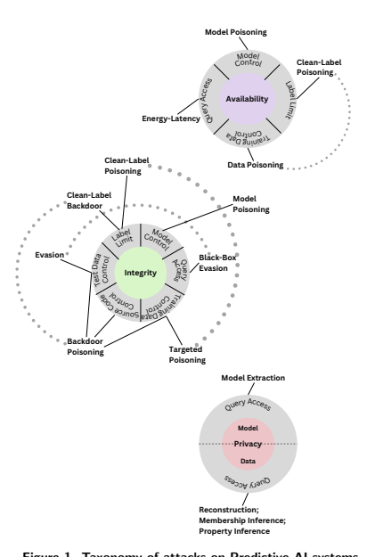
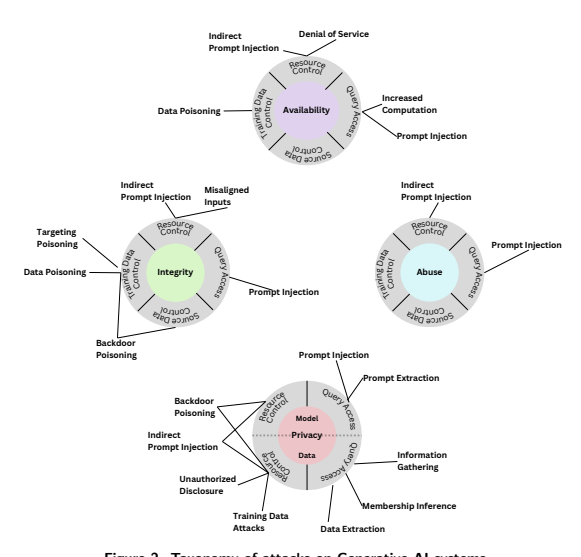
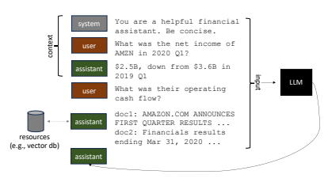
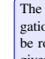

NIST Trustworthy and **Responsible** AI

NIST AI **100-2e2023**
Adversarial Machine **Learning**
A Taxonomy and Terminology of Attacks and *Mitigations* Apostol Vassilev Alina Oprea Alie Fordyce Hyrum Anderson This publication is available free of charge from: 

https://doi.org/10.6028/NIST.AI.100-2e2023 NIST Trustworthy and **Responsible** AI
NIST AI **100-2e2023**
Adversarial Machine **Learning**
A Taxonomy and Terminology of Attacks and *Mitigations* Apostol Vassilev Computer Security Division Information Technology Laboratory Alina Oprea Northeastern University Alie Fordyce Hyrum Anderson Robust Intelligence, Inc. 

This publication is available free of charge from: 
https://doi.org/10.6028/NIST.AI.100-2e2023 January 2024 

U.S. Department of Commerce Gina M. Raimondo, Secretary National Institute of Standards and Technology Laurie E. Locascio, NIST Director and Under Secretary of Commerce for Standards and Technology Certain commercial equipment, instruments, software, or materials, commercial or non-commercial, are identifed in this paper in order to specify the experimental procedure adequately. Such identifcation does not imply recommendation or endorsement of any product or service by NIST, nor does it imply that the materials or equipment identifed are necessarily the best available for the purpose. 

NIST Technical Series **Policies** Copyright, Use, and Licensing Statements NIST Technical Series Publication Identifer Syntax Publication **History** Approved by the NIST Editorial Review Board on 2024-01-02 How to cite this NIST Technical Series **Publication:**
Vassilev A, Oprea A, Fordyce A, Anderson H (2024) Adversarial Machine Learning: A Taxonomy and Terminology of Attacks and Mitigations. (National Institute of Standards and Technology, Gaithersburg, MD) NIST Artifcial Intelligence (AI) Report, NIST Trustworthy and Responsible AI NIST AI 100-2e2023. 

https://doi.org/10.6028/NIST.AI.100-2e2023 NIST Author ORCID iDs Apostol Vassilev: 0000-0002-4979-5292 Alina Oprea: 0000-0002-9081-3042 Submit **Comments** ai-100-2@nist.gov All comments are subject to release under the Freedom of Information Act (FOIA).

## Abstract

This NIST Trustworthy and Responsible AI report develops a taxonomy of concepts and defnes terminology in the feld of adversarial machine learning (AML). The taxonomy is built on surveying the AML literature and is arranged in a conceptual hierarchy that includes key types of ML methods and lifecycle stages of attack, attacker goals and objectives, and attacker capabilities and knowledge of the learning process. The report also provides corresponding methods for mitigating and managing the consequences of attacks and points out relevant open challenges to take into account in the lifecycle of AI systems. The terminology used in the report is consistent with the literature on AML and is complemented by a glossary that defnes key terms associated with the security of AI systems and is intended to assist non-expert readers. Taken together, the taxonomy and terminology are meant to inform other standards and future practice guides for assessing and managing the security of AI systems, by establishing a common language and understanding of the rapidly developing AML landscape.

## Keywords

artifcial intelligence; machine learning; attack taxonomy; evasion; data poisoning; privacy breach; attack mitigation; data modality; trojan attack, backdoor attack; generative models; large language model; chatbot.

## Nist Trustworthy And Responsible Ai Reports (Nist Trustworthy And Responsible Ai)

The National Institute of Standards and Technology (NIST) promotes U.S. innovation and industrial competitiveness by advancing measurement science, standards, and technology in ways that enhance economic security and improve our quality of life. Among its broad range of activities, NIST contributes to the research, standards, evaluations, and data required to advance the development, use, and assurance of trustworthy artifcial intelligence (AI).

NIST AI 100-2e2023 January 2024

| Table                     | of                                | Contents   |    |
|---------------------------|-----------------------------------|------------|----|
| Audience                  |                                   | iv         |    |
| Background                | iv                                |            |    |
| Trademark Information     |                                   | iv         |    |
| How to read this document | v                                 |            |    |
| Executive Summary         |                                   | 1          |    |
| 1.                        | Introduction                      |            | 3  |
| 2.                        | Predictive AI Taxonomy            | 6          |    |
| 2.1.                      | Attack Classifcation              | 6          |    |
| 2.1.1.                    | Stages of Learning                |            | 8  |
| 2.1.2.                    | Attacker Goals and Objectives     |            | 9  |
| 2.1.3.                    | Attacker Capabilities             |            | 10 |
| 2.1.4.                    | Attacker Knowledge                | 11         |    |
| 2.1.5.                    | Data Modality                     | 11         |    |
| 2.2.                      | Evasion Attacks and Mitigations   | 14         |    |
| 2.2.1.                    | White-Box Evasion Attacks         |            | 15 |
| 2.2.2.                    | Black-Box Evasion Attacks         |            | 17 |
| 2.2.3.                    | Transferability of Attacks        |            | 18 |
| 2.2.4.                    | Mitigations                       | 19         |    |
| 2.3.                      | Poisoning Attacks and Mitigations | 21         |    |
| 2.3.1.                    | Availability Poisoning            | 21         |    |
| 2.3.2.                    | Targeted Poisoning                |            | 23 |
| 2.3.3.                    | Backdoor Poisoning                | 24         |    |
| 2.3.4.                    | Model Poisoning                   | 27         |    |
| 2.4.                      | Privacy Attacks                   | 29         |    |
| 2.4.1.                    | Data Reconstruction               |            | 29 |
| 2.4.2.                    | Membership Inference              |            | 30 |
| 2.4.3.                    | Model Extraction                  |            | 31 |
| 2.4.4.                    | Property Inference                | 32         |    |
| 2.4.5.                    | Mitigations                       | 32         |    |
| 3.                        | Generative AI Taxonomy            |            | 35 |

| 3.1.               | Attack Classifcation                              | 35   |    |
|--------------------|---------------------------------------------------|------|----|
| 3.1.1.             | GenAI Stages of Learning                          |      | 36 |
| 3.1.2.             | Attacker Goals and Objectives                     |      | 38 |
| 3.1.3.             | Attacker Capabilities                             |      | 39 |
| 3.2.               | AI Supply Chain Attacks and Mitigations           | 39   |    |
| 3.2.1.             | Deserialization Vulnerability                     |      | 39 |
| 3.2.2.             | Poisoning Attacks                                 | 40   |    |
| 3.2.3.             | Mitigations                                       | 40   |    |
| 3.3.               | Direct Prompt Injection Attacks and Mitigations   |      | 40 |
| 3.3.1.             | Data Extraction                                   |      | 43 |
| 3.3.2.             | Mitigations                                       | 44   |    |
| 3.4.               | Indirect Prompt Injection Attacks and Mitigations |      | 44 |
| 3.4.1.             | Availability Violations                           | 45   |    |
| 3.4.2.             | Integrity Violations                              |      | 46 |
| 3.4.3.             | Privacy Compromises                               | 46   |    |
| 3.4.4.             | Abuse Violations                                  | 47   |    |
| 3.4.5.             | Mitigations                                       | 48   |    |
| 4.                 | Discussion and Remaining Challenges               |      | 50 |
| 4.1.               | The Scale Challenge                               |      | 50 |
| 4.2.               | Theoretical Limitations on Adversarial Robustness |      | 50 |
| 4.3.               | The Open vs. Closed Model Dilemma                 | 53   |    |
| 4.4.               | Supply chain challenges                           |      | 54 |
| 4.5.               | Tradeofs Between the Attributes of Trustworthy AI |      | 54 |
| 4.6.               | Multimodal Models: Are They More Robust?          |      | 55 |
| 4.7.               | Quantized models                                  |      | 55 |
| Appendix: Glossary |                                                   | 92   |    |

## List Of **Figures**

Figure 1.Taxonomy of attacks on Predictive AI **systems.** . . . . . . . . . . . . 7 Figure 2.Taxonomy of attacks on Generative AI **systems** . . . . . . . . . . . . 36 Figure 3.Retrieval-augmented generation relies on system instructions, context, and data from third-party sources, often through a **vector**
database, to produce relevant responses for **users** . . . . . . . . . . . 38

## Audience

The intended primary audience for this document includes individuals and groups who are responsible for designing, developing, deploying, evaluating, and governing AI systems. 

## Background

This document is a result of an extensive literature review, conversations with experts from the area of adversarial machine learning, and research performed by the authors in adversarial machine learning. 

## Trademark **Information**

All trademarks and registered trademarks belong to their respective organizations. 

The Information Technology Laboratory (ITL) at NIST develops tests, test methods, reference data, proof of concept implementations, and technical analyses to advance the development and productive use of information technology. ITL's responsibilities include the development of management, administrative, technical, and physical standards and guidelines. 

This NIST Trustworthy and Responsible AI report focuses on identifying, addressing, and managing risks associated with adversarial machine learning. While practical guidance1 published by NIST may serve as an informative reference, this guidance remains voluntary. 

The content of this document refects recommended practices. This document is not intended to serve as or supersede existing regulations, laws, or other mandatory guidance. 

1The term 'practice guide,' 'guide,' 'guidance' or the like, in the context of this paper, is a consensus-created, informative reference intended for voluntary use; it should not be interpreted as equal to the use of the term 'guidance' in a legal or regulatory context. This document does not establish any legal standard or any other legal requirement or defense under any law, nor have the force or effect of law. 

## How To Read This **Document**

This document uses terms such as AI technology, AI system, and AI applications interchangeably. Terms related to the machine learning pipeline, such as ML model or algorithm, are also used interchangeably in this document. Depending on context, the term 
"system" may refer to the broader organizational and/or social ecosystem within which the technology was designed, developed, deployed, and used instead of the more traditional use related to computational hardware or software. Important reading notes: 
- The document includes a series of blue callout boxes that highlight interesting nuances and important takeaways. 

- Terms that are used but not defned/explained in the text are listed and defned in the Glossary. They are displayed in small caps in the text. Clicking on a word shown in small caps (e.g., ADVERSARIAL EXAMPLES) takes the reader directly to the defnition of that term in the Glossary. From there, one may click on the page number shown at the end of the defnition to return. 

## Acknowledgments

The authors wish to thank all people and organizations who responded to our call and submitted comments to the draft version of this paper. The received comments and suggested references were essential to improving the paper and the future direction of this work. We also want to thank the many NIST colleagues who assisted in updating the document. 

## Author **Contributions**

Authors contributed equally to this work. 

v 

## Executive **Summary**

This NIST Trustworthy and Responsible AI report is intended to be a step toward developing a taxonomy and terminology of adversarial machine learning (AML), which in turn may aid in securing applications of artifcial intelligence (AI) against adversarial manipulations of AI systems. Broadly, there are two classes of AI systems: Predictive and Generative. The components of an AI system include - at a minimum - the data, model, and processes for training, testing, and deploying the machine learning (ML) models and the infrastructure required for using them. Generative AI systems may also be linked to corporate documents and databases when they are adapted to specifc domains and use cases. The data-driven approach of ML introduces additional security and privacy challenges in different phases of ML operations besides the classical security and privacy threats faced by most operational systems. These security and privacy challenges include the potential for adversarial manipulation of training data, adversarial exploitation of model vulnerabilities to adversely affect the performance of the AI system, and even malicious manipulations, modifcations or mere interaction with models to exfltrate sensitive information about people represented in the data, about the model itself, or proprietary enterprise data. Such attacks have been demonstrated under real-world conditions, and their sophistication and potential impact have been increasing steadily. AML is concerned with studying the capabilities of attackers and their goals, as well as the design of attack methods that exploit the vulnerabilities of ML during the development, training, and deployment phase of the ML lifecycle. AML 
is also concerned with the design of ML algorithms that can withstand these security and privacy challenges. When attacks are launched with malevolent intent, the robustness of ML refers to mitigations intended to manage the consequences of such attacks. 

This report adopts the notions of security, resilience, and robustness of ML systems from the NIST AI Risk Management Framework [226]. Security, resilience, and robustness are gauged by risk, which is a measure of the extent to which an entity (e.g., a system) is threatened by a potential circumstance or event (e.g., an attack) and the severity of the outcome should such an event occur. However, this report does not make recommendations on risk tolerance (the level of risk that is acceptable to organizations or society) because it is highly contextual and application/use-case specifc. This general notion of risk offers a useful approach for assessing and managing the security, resilience, and robustness of AI system components. Quantifying these likelihoods is beyond the scope of this document. Correspondingly, the taxonomy of AML is defned with respect to the following fve dimensions of AML risk assessment: (i) AI system type (Predictive or Generative), (ii) learning method and stage of the ML lifecycle process when the attack is mounted, (iii) attacker goals and objectives, (iv) attacker capabilities, (v) and attacker knowledge of the learning process and beyond. The spectrum of effective attacks against ML is wide, rapidly evolving, and covers all phases of the ML lifecycle - from design and implementation to training, testing, and fnally, to deployment in the real world. The nature and power of these attacks are different and can exploit not just vulnerabilities of the ML models but also weaknesses of the infrastructure in which the AI systems are deployed. Although AI system components may also be adversely affected by various unintentional factors, such as design and implementation faws and data or algorithm biases, these factors are not intentional attacks. Even though these factors might be exploited by an adversary, they are not within the scope of the literature on AML or this report. 

This document defnes a taxonomy of attacks and introduces terminology in the feld of AML. The taxonomy is built on a survey of the AML literature and is arranged in a conceptual hierarchy that includes key types of ML methods and lifecycle stages of attack, attacker goals and objectives, and attacker capabilities and knowledge of the learning process. The report also provides corresponding methods for mitigating and managing the consequences of attacks and points out relevant open challenges to take into account in the lifecycle of AI systems. The terminology used in the report is consistent with the literature on AML and is complemented by a glossary that defnes key terms associated with the security of AI systems in order to assist non-expert readers. Taken together, the taxonomy and terminology are meant to inform other standards and future practice guides for assessing and managing the security of AI systems by establishing a common language and understanding for the rapidly developing AML landscape. Like the taxonomy, the terminology and defnitions are not intended to be exhaustive but rather to aid in understanding key concepts that have emerged in AML literature. 

## 1. **Introduction**

Artifcial intelligence (AI) systems [220] are on a global multi-year accelerating expansion trajectory. These systems are being developed by and widely deployed into the economies of numerous countries, leading to the emergence of AI-based services for people to use in many spheres of their lives, both real and virtual [77]. There are two broad classes of AI 
systems, based on their capabilities: Predictive AI (PredAI) and Generative AI (GenAI). As these systems permeate the digital economy and become inextricably essential parts of daily life, the need for their secure, robust, and resilient operation grows. These operational attributes are critical elements of Trustworthy AI in the NIST AI Risk Management Framework [226] and in the taxonomy of AI Trustworthiness [223]. 

However, despite the signifcant progress that AI and machine learning (ML) have made in a number of different application domains, these technologies are also vulnerable to attacks that can cause spectacular failures with dire consequences. For example in PredAI computer vision applications for object detection and classifcation, well-known cases of adversarial perturbations of input images have caused autonomous vehicles to swerve into the opposite direction lane. The misclassifcation of stop signs as speed limit signs caused critical objects to disappear from images, and even to misidentify people wearing glasses in high-security settings [99, 150, 260, 277]. Similarly, in the medical feld where more and more ML models are being deployed to assist doctors, there is the potential for medical record leaks from ML models that can expose deeply personal information [14, 135]. 

In GenAI, large language models (LLMs) [6, 38, 70, 83, 196, 209, 228, 276, 293, 294, 345] 
are also becoming an integral part of the Internet infrastructure and software applications. 

LLMs are being used to create more powerful online search, help software developers write code, and even power chatbots that help with customer service. LLMs are being integrated with corporate databases and documents to enable powerful RETRIEVAL AUGMENTED 
GENERATION (RAG) [173] scenarios when LLMs are adapted to specifc domains and use cases. These scenarios in effect expose a new attack surface to potentially confdential and proprietary enterprise data. With the exception of BLOOM [209] and LLaMA[293], most of the companies developing such models do not release detailed information about the data sets that have been used to build their language models, but these data sets inevitably include some sensitive personal information, such as addresses, phone numbers, and email addresses. This creates serious risks for user privacy online. The more often a piece of information appears in a dataset, the more likely a model is to leak it in response to random or specifcally designed queries or prompts. This could perpetuate wrong and harmful associations with damaging consequences for the people involved and bring additional security and safety concerns 
[51, 201]. Attackers can also manipulate the training data for both PredAI and GenAI systems, thus making the AI system trained on it vulnerable to attacks [256]. Scraping of training data from the Internet also opens up the possibility of DATA POISONING at scale [46] by hackers to create vulnerabilities that allow for security breaches down the pipeline. As ML models continue to grow in size, many organizations rely on pre-trained models that could either be used directly or be fne-tuned with new datasets to enable different tasks. This creates opportunities for malicious modifcations of pre-trained models by inserting TROJANS to enable attackers to compromise the model availability, force incorrect processing, or leak the data when instructed [118]. Historically, modality-specifc AI technology has emerged for each input modality (e.g., 
text, images, speech, tabular data) in PredAI and GenAI systems, each of which is susceptible to domain-specifc attacks. For example, the attack approaches for image classifcation tasks do not directly translate to attacks against natural language processing (NLP) models. 

Recently, transformer architectures that are used extensively in NLP have showns to have applications in the computer vision domain [90]. In addition, multimodal ML has made exciting progress in many tasks, including generative and classifcation tasks, and there have been attempts to use multimodal learning as a potential mitigation of single-modality attacks [328]. However, powerful simultaneous attacks against all modalities in a multimodal model have also emerged [63, 261, 326]. 

Fundamentally, the machine learning methodology used in modern AI systems is susceptible to attacks through the public APIs that expose the model, and against the platforms on which they are deployed. This report focuses on the former and considers the latter to be the scope of traditional cybersecurity taxonomies. For attacks against models, attackers can breach the confdentiality and privacy protections of the data and model by simply exercising the public interfaces of the model and supplying data inputs that are within the acceptable range. In this sense, the challenges facing AML are similar to those facing cryptography. Modern cryptography relies on algorithms that are secure in an information-theoretic sense. Thus, people need to focus only on implementing them robustly and securely—no small task. Unlike cryptography, there are no information-theoretic security proofs for the widely used machine learning algorithms. Moreover, information-theoretic *impossibility* results have started to appear in the literature [102, 116] that set limits on the effectiveness of widely-used mitigation techniques. As a result, many of the advances in developing mitigations against different classes of attacks tend to be empirical and limited in nature. This report offers guidance for the development of the following: 
- Standardized terminology in AML to be used by the ML and cybersecurity communities; 
- A taxonomy of the most widely studied and effective attacks in AML, including 
- evasion, poisoning, and privacy attacks for PredAI systems, 
- evasion, poisoning, privacy, and abuse attacks for GenAI systems; 
- attacks against all viable learning methods (e.g., supervised, unsupervised, semisupervised, federated learning, reinforcement learning) across multiple data modalities. 

- A discussion of potential mitigations in AML and limitations of some of the existing mitigation techniques. 

As ML is a fast evolving feld, we envision the need to update the report regularly as new developments emerge on both the attack and mitigation fronts. 

The goal of this report is not to provide an exhaustive survey of all literature on AML. In fact, this by itself is an almost impossible task as a search on arXiv for AML articles in 2021 and 2022 yielded more than 5000 references. Rather, this report provides a categorization of attacks and their mitigations for PredAI and GenAI systems, starting with the main types of attacks: 1) evasion, 2) data and model poisoning, 3) data and model privacy, and 4) abuse (GenAI only). 

This report is organized into three sections. In Section 2 we consider PredAI systems. 

Section 2.1 introduces the taxonomy of attacks for PredAI systems. The taxonomy is organized by frst defning the broad categories of attacker objectives/goals. Based on that, we defne the categories of capabilities the adversary must be able to leverage to achieve the corresponding objectives. Then, we introduce specifc attack classes for each type of capability. Sections 2.2, 2.3, and 2.4 discuss the major classes of attacks: evasion, poisoning, and privacy, respectively. A corresponding set of mitigations for each class of attacks is provided in the attack class sections. In Section 3 we consider GenAI systems. Section 3.1 introduces the taxonomy of attacks for GenAI systems. Similary to the PredAI case, we defne the categories of capabilities the adversary must be able to leverage to achieve the corresponding objectives with GenAI systems. Then, we introduce specifc attack classes for each type of capability. Section 4 discusses the remaining challenges in the feld. 

## 2. Predictive Ai **Taxonomy** 2.1. Attack **Classifcation**

Figure 1 introduces a taxonomy of attacks in adversarial machine learning for PredAI systems. The attacker's objectives are shown as disjointed circles with the attacker's goal at the center of each circle: **Availability** breakdown, **Integrity** violations, and **Privacy** compromise. The capabilities that an adversary must leverage to achieve their objectives are shown in the outer layer of the objective circles. Attack classes are shown as callouts connected to the capabilities required to mount each attack. Multiple attack classes that requiring same capabilities for reaching the same objective are shown in a single callout. Related attack classes that require different capabilities for reaching the same objective are connected with dotted lines. 

Figure 1. Taxonomy of attacks on Predictive AI **systems.**
These attacks are classifed according to the following dimensions: 1) learning method and stage of the learning process when the attack is mounted, 2) attacker goals and objectives, 3) 
attacker capabilities, and 4) attacker knowledge of the learning process. Several adversarial attack classifcation frameworks have been introduced in prior works [30, 283], and the goal here is to create a standard terminology for adversarial attacks on ML that unifes existing work. 

## 2.1.1. Stages Of **Learning**

Machine learning involves a TRAINING STAGE, in which a model is learned, and a DEPLOYMENT STAGE, in which the model is deployed on new, unlabeled data samples to generate predictions. In the case of SUPERVISED LEARNING labeled training data is given as input to a training algorithm in the training stage and the ML model is optimized to minimize a specifc loss function. Validation and testing of the ML model is usually performed before the model is deployed in the real world. Common supervised learning techniques include CLASSIFICATION, in which the predicted labels or *classes* are discrete, and REGRESSION, 
in which the predicted labels or *response variables* are continuous. 

ML models may be GENERATIVE (i.e., learn the distribution of training data and generate similar examples, such as generative adversarial networks [GAN] and large language models [LLM]), cf. Section 3, or DISCRIMINATIVE (i.e., learn only a decision boundary, such as LOGISTIC REGRESSION, SUPPORT VECTOR MACHINES, and CONVOLUTIONAL 
NEURAL NETWORKS). Most PredAI models are DISCRIMINATIVE. 

Other learning paradigms in the ML literature are UNSUPERVISED LEARNING, which trains models using unlabeled data at training time; SEMI-SUPERVISED LEARNING, in which a small set of examples have labels, while the majority of samples are unlabeled; REINFORCEMENT LEARNING, in which an agent interacts with an environment and learns an optimal policy to maximize its reward; FEDERATED LEARNING, in which a set of clients jointly train an ML model by communicating with a server, which performs an aggregation of model updates; ENSEMBLE LEARNING which is an approach in machine learning that seeks better predictive performance by combining the predictions from multiple models. 

Adversarial machine learning literature predominantly considers adversarial attacks against AI systems that could occur at either the training stage or the ML deployment stage. During the ML training stage, the attacker might control part of the training data, their labels, the model parameters, or the code of ML algorithms, resulting in different types of poisoning attacks. During the ML deployment stage, the ML model is already trained, and the adversary could mount evasion attacks to create integrity violations and change the ML model's predictions, as well as privacy attacks to infer sensitive information about the training data or the ML model. 

Training-time attacks. Attacks during the ML training stage are called POISONING ATTACKS [28]. In a DATA POISONING attack [28, 124], an adversary controls a subset of the training data by either inserting or modifying training samples. In a MODEL POISONING attack [185], the adversary controls the model and its parameters. Data poisoning attacks are applicable to all learning paradigms, while model poisoning attacks are most prevalent in federated learning [152], where clients send local model updates to the aggregating server, and in supply-chain attacks where malicious code may be added to the model by suppliers of model technology. 

Deployment-time attacks. Two different types of attacks can be mounted at inference or deployment time. First, evasion attacks modify testing samples to create ADVERSARIAL 
EXAMPLES [26, 120, 287], which are similar to the original sample (according to certain distance metrics) but alter the model predictions to the attacker's choices. Second, privacy attacks, such as membership inference [269] and data reconstruction [89], are typically mounted by attackers with query access to an ML model. They could be further divided into data privacy attacks and model privacy attacks. 

## 2.1.2. Attacker Goals And **Objectives**

The attacker's objectives are classifed along three dimensions according to the three main types of security violations considered when analyzing the security of a system (i.e., availability, integrity, confdentiality): availability breakdown, integrity violations, and privacy compromise. Correspondingly, ADVERSARIAL SUCCESS indicates achieving one or more of these objectives. Figure 1 separates attacks into three disjointed circles according to their objective, and the attacker's objective is shown at the center of each circle. 

Availability Breakdown. An AVAILABILITY ATTACK is an indiscriminate attack against ML in which the attacker attempts to break down the performance of the model at deployment time. Availability attacks can be mounted via data poisoning, when the attacker controls a fraction of the training set; via model poisoning, when the attacker controls the model parameters; or as ENERGY-LATENCY ATTACKS via query access. Data poisoning availability attacks have been proposed for SUPPORT VECTOR MACHINES [28], linear regression [143], and even neural networks [190, 215], while model poisoning attacks have been designed for neural networks [185] and federated learning [12]. Recently, ENERGYLATENCY ATTACKS that require only black-box access to the model have been developed for neural networks across many different tasks in computer vision and NLP [273]. 

Integrity Violations. An INTEGRITY ATTACK targets the integrity of an ML model's output, resulting in incorrect predictions performed by an ML model. An attacker can cause an integrity violation by mounting an evasion attack at deployment time or a poisoning attack at training time. Evasion attacks require the modifcation of testing samples to create adversarial examples that are mis-classifed by the model to a different class, while remaining stealthy and imperceptible to humans [26, 120, 287]. Integrity attacks via poisoning can be classifed as TARGETED POISONING ATTACKS [113, 258], BACKDOOR POISONING 
ATTACKS [124], and MODEL POISONING [12, 24, 101]. Targeted poisoning tries to violate the integrity of a few targeted samples and assumes that the attacker has training data control to insert the poisoned samples. Backdoor poisoning attacks require the generation of a BACKDOOR PATTERN, which is added to both the poisoned samples and the testing samples to cause misclassifcation. Backdoor attacks are the only attacks in the literature that require both training and testing data control. Model poisoning attacks could result in either targeted or backdoor attacks, and the attacker modifes model parameters to cause an integrity violation. They have been designed for centralized learning [185] and federated learning [12, 24]. 

Privacy Compromise. Attackers might be interested in learning information about the training data (resulting in DATA PRIVACY attacks) or about the ML model (resulting in MODEL PRIVACY attacks). The attacker could have different objectives for compromising the privacy of training data, such as DATA RECONSTRUCTION [89] (inferring content or features of training data), MEMBERSHIP-INFERENCE ATTACKS [130, 270] (inferring the presence of data in the training set), data EXTRACTION [48, 51] (ability to extract training data from generative models), and PROPERTY INFERENCE [110] (inferring properties about the training data distribution). MODEL EXTRACTION is a model privacy attack in which attackers aim to extract information about the model [141]. 

## 2.1.3. Attacker **Capabilities**

An adversary might leverage six types of capabilities to achieve their objectives, as shown in the outer layer of the objective circles in Figure 1: 
- TRAINING DATA CONTROL: The attacker might take control of a subset of the training data by inserting or modifying training samples. This capability is used in data poisoning attacks (e.g., availability poisoning, targeted or backdoor poisoning). 

- MODEL CONTROL: The attacker might take control of the model parameters by either generating a Trojan trigger and inserting it in the model or by sending malicious local model updates in federated learning. 

- TESTING DATA CONTROL: The attacker may utilize this to add perturbations to testing samples at model deployment time, as performed in evasion attacks to generate adversarial examples or in backdoor poisoning attacks. 

- LABEL LIMIT: This capability is relevant to restrict the adversarial control over the labels of training samples in supervised learning. Clean-label poisoning attacks assume that the attacker does not control the label of the poisoned samples - a realistic poisoning scenario, while regular poisoning attacks assume label control over the poisoned samples. 

- SOURCE CODE CONTROL: The attacker might modify the source code of the ML 
algorithm, such as the random number generator or any third-party libraries, which are often open source. 

- QUERY ACCESS: When the ML model is managed by a cloud provider (using Machine Learning as a Service - MLaaS), the attacker might submit queries to the model and receive predictions (either labels or model confdences). This capability is used by black-box evasion attacks, ENERGY-LATENCY ATTACKS, and all privacy attacks. 

Note that even if an attacker does not have the ability to modify training/testing data, source code, or model parameters, access to these are still crucial for mounting white-box attacks. 

See Section 2.1.4 for more details on attacker knowledge. 

Figure 1 connects each attack class with the capabilities required to mount the attack. For instance, backdoor attacks that cause integrity violations require control of training data and testing data to insert the backdoor pattern. Backdoor attacks can also be mounted via source code control, particularly when training is outsourced to a more powerful entity. Cleanlabel backdoor attacks do not allow label control on the poisoned samples, in addition to the capabilities needed for backdoor attacks. 

## 2.1.4. Attacker **Knowledge**

Another dimension for attack classifcation is how much knowledge the attacker has about the ML system. There are three main types of attacks: white-box, black-box, and gray-box. 

White-box attacks. These assume that the attacker operates with *full* knowledge about the ML system, including the training data, model architecture, and model hyper-parameters. 

While these attacks operate under very strong assumptions, the main reason for analyzing them is to test the vulnerability of a system against worst-case adversaries and to evaluate potential mitigations. Note that this defnition is more general and encompasses the notion of adaptive attacks where the knowledge of the mitigations applied to the model or the system is explicitly tracked. 

Black-box attacks. These attacks assume minimal knowledge about the ML system. An adversary might get query access to the model, but they have no other information about how the model is trained. These attacks are the most practical since they assume that the attacker has no knowledge of the AI system and utilize system interfaces readily available for normal use. 

Gray-box attacks. There are a range of gray-box attacks that capture adversarial knowledge between black-box and white-box attacks. Suciu et al. [283] introduced a framework to classify gray-box attacks. An attacker might know the model architecture but not its parameters, or the attacker might know the model and its parameters but not the training data. 

Other common assumptions for gray-box attacks are that the attacker has access to data distributed identically to the training data and knows the feature representation. The latter assumption is important in applications where feature extraction is used before training an ML model, such as cybersecurity, fnance, and healthcare. 

## 2.1.5. Data **Modality**

Adversarial attacks against ML have been discovered in a range of data modalities used in many application domains. Until recently, most attacks and defenses have operated under a single modality, but a new ML trend is to use multimodal data. The taxonomy of attacks defned in Figure 1 is independent of the modality of the data in specifc applications. The most common data modalities in the adversarial ML literature include: 
1. **Image:** Adversarial examples of image data modality [120, 287] have the advantage of a continuous domain, and gradient-based methods can be applied directly for optimization. Backdoor poisoning attacks were frst invented for images [124], and many privacy attacks are run on image datasets (e.g., [269]). The image modality includes other types of imaging (e.g., LIDAR, SAR, IR, 'hyperspectral'). 

2. **Text:** Natural language processing (NLP) is a popular modality, and all classes of attacks have been proposed for NLP applications, including evasion [126], poisoning [68, 175], and privacy [337]. 

3. **Audio:** Audio systems and text generated from audio signals have also been attacked [54]. 4. **Video:** Video comprehension models have shown increasing capabilities on visionand-language tasks [339], but such models are also vulnerable to attacks [318]. 

5. **Cybersecurity**2
: The frst poisoning attacks were discovered in cybersecurity for worm signature generation (2006) [236] and spam email classifcation (2008) [222]. 

Since then, poisoning attacks have been shown for malware classifcation, malicious PDF detection, and Android malicious app classifcation [257]. Evasion attacks against the same data modalities have been proposed as well: malware classifcation [84, 282], PDF malware classifcation [279, 325], and Android malicious app detection [239]. Clements et al. [78] developed a mechanism for effective generation of evasion attacks on small, weak routers in network intrusion detection. Poisoning unsupervised learning models has been shown for clustering used in malware classifcation [29] and network traffc anomaly detection [249]. Industrial Control Systems (ICS) and Supervisory Control and Data Acquisition (SCADA) systems are part of modern Critical Infrastructure (CI) such as power grids, power plants (nuclear, fossil fuel, renewable energy), water treatment plants, oil refneries, etc. ICS are an attractive target for adversaries because of the potential for highly consequential disruptions of CI [55, 167]. The existence of targeted stealth attacks has led to the development of defense-in-depth mechanisms for their detection and mitigation. Anomaly detection based on data-centric approaches allows automated feature learning through ML algorithms. However, the application of ML 
to such problems comes with specifc challenges related to the need for a very low false negative and low false positive rates, ability to catch zero-day attacks, account for plant operational drift, etc. This challenge is compounded by the fact that trying to accommodate all these together makes ML models susceptible to adversarial attacks [161, 243, 353]. 

6. **Tabular data:** Numerous attacks against ML models working on tabular data in fnance, business, and healthcare applications have been demonstrated. For example, poisoning availability attacks have been shown against healthcare and business ap-

2Strictly speaking, cybersecurity data may not include a single modality, but rather multiple modalities such as network-level, host-level, or program-level data. 
plications [143]; privacy attacks have been shown against healthcare data [333]; and evasion attacks have been shown against fnancial applications [117]. 

Recently, the use of ML models trained on multimodal data has gained traction, particularly the combination of image and text data modalities. Several papers have shown that multimodal models may provide some resilience against attacks [328], but other papers show that multimodal models themselves could be vulnerable to attacks mounted on all modalities at the same time [63, 261, 326]. See Section 4.6 for additional discussion. 

An interesting open challenge is to test and characterize the resilience of a variety of multimodal ML against evasion, poisoning, and privacy attacks. 

## 2.2. Evasion Attacks And **Mitigations**

The discovery of evasion attacks against machine learning models has generated increased interest in adversarial machine learning, leading to signifcant growth in this research space over the last decade. In an evasion attack, the adversary's goal is to generate adversarial examples, which are defned as testing samples whose classifcation can be changed at deployment time to an arbitrary class of the attacker's choice with only minimal perturbation [287]. Early known instances of evasion attacks date back to 1988 with the work of Kearns and Li [155], and to 2004, when Dalvi et al. [82], and Lowd and Meek [188] 
demonstrated the existence of adversarial examples for linear classifers used in spam flters. Adversarial examples became even more intriguing to the research community when Szedegy et al. [287] showed that deep neural networks used for image classifcation can be easily manipulated, and adversarial examples were visualized. In the context of image classifcation, the perturbation of the original sample must be small so that a human cannot observe the transformation of the input. Therefore, while the ML model can be tricked to classify the adversarial example in the target class selected by the attacker, humans still recognize it as part of the original class. 

In 2013, Szedegy et al. [287] and Biggio et al. [26] independently discovered an effective method for generating adversarial examples against linear models and neural networks by applying gradient optimization to an adversarial objective function. Both of these techniques require white-box access to the model and were improved by subsequent methods that generated adversarial examples with even smaller perturbations [10, 53, 194]. Adversarial examples are also applicable in more realistic black-box settings in which attackers only obtain query access capabilities to the trained model. Even in the more challenging black-box setting in which attackers obtain the model's predicted labels or confdence scores, deep neural networks are still vulnerable to adversarial examples. Methods for creating adversarial examples in black-box settings include zeroth-order optimization [66], 
discrete optimization [210], and Bayesian optimization [271], as well as *transferability*, 
which involves the white-box generation of adversarial examples on a different model architecture before transferring them to the target model [232, 233, 299]. Cybersecurity and image classifcations were the frst application domains that showcased evasion attacks. 

However, with the increasing interest in adversarial machine learning, ML technology used in many other application domains went under scrutiny, including speech recognition [54], natural language processing [149], and video classifcation [177, 317]. Mitigating adversarial examples is a well-known challenge in the community and deserves additional research and investigation. The feld has a history of publishing defenses evaluated under relatively weak adversarial models that are subsequently broken by more powerful attacks, a process that appears to iterate in perpetuity. Mitigations need to be evaluated against strong adaptive attacks, and guidelines for the rigorous evaluation of newly proposed mitigation techniques have been established [81, 297]. The most promising directions for mitigating the critical threat of evasion attacks are adversarial training [120, 194] 
(iteratively generating and inserting adversarial examples with their correct labels at training time); certifed techniques, such as randomized smoothing [79] (evaluating ML prediction under noise); and formal verifcation techniques [112, 154] (applying formal method techniques to verify the model's output). Nevertheless, these methods come with different limitations, such as decreased accuracy for adversarial training and randomized smoothing, and computational complexity for formal methods. There is an inherent trade-off between robustness and accuracy [296, 301, 342]. Similarly, there are trade-offs between a model's robustness and fairness guarantees [59]. 

This section discusses white-box and black-box evasion attack techniques, attack transferability, and the potential mitigation of adversarial examples in more detail. 

## 2.2.1. White-Box Evasion **Attacks**

There are several optimization-based methods for designing evasion attacks that generate adversarial examples at small distances from the original testing samples. There are also several choices for distance metrics, universal evasion attacks, and physically realizable attacks, as well as examples of evasion attacks developed for multiple data modalities, including NLP, audio, video, and cybersecurity domains. Optimization-based methods. Szedegy et al. [287] and Biggio et al. [26] independently proposed the use of optimization techniques to generate adversarial examples. In their threat models, the adversary is allowed to inspect the entirety of the ML model and compute gradients relative to the model's loss function. These attacks can be targeted, in which the adversarial example's class is selected by the attacker, or untargeted, in which the adversarial examples are misclassifed to any other incorrect class. 

Szedegy et al. [287] coined the widely used term *adversarial examples*. They considered an objective that minimized the ℓ2 norm of the perturbation, subject to the model prediction changing to the target class. The optimization is solved using the Limited-memory Broyden–Fletcher–Goldfarb–Shanno (L-BFGS) method. Biggio et al. [26] considered the setting of a binary classifer with malicious and benign classes with continuous and differentiable discriminant function. The objective of the optimization is to minimize the discriminant function in order to generate adversarial examples of maximum confdence. 

While Biggio et al. [26] apply their method to linear classifers, kernel SVM, and multilayer perceptrons, Szedegy et al. [287] show the existence of adversarial examples on deep learning models used for image classifcation. Goodfellow et al. [120] introduced an effcient method for generating adversarial examples for deep learning: the Fast Gradient Sign Method (FGSM), which performs a single iteration of gradient descent for solving the optimization. This method has been extended to an iterative FGSM attack by Kurakin et al. [163]. 

Subsequent work on generating adversarial examples have proposed new objectives and methods for optimizing the generation of adversarial examples with the goals of minimizing the perturbations and supporting multiple distance metrics. Some notable attacks include: 
1. DeepFool is an untargeted evasion attack for ℓ2 norms, which uses a linear approximation of the neural network to construct the adversarial examples [212]. 

2. The Carlini-Wagner attack uses multiple objectives that minimize the loss or logits on the target class and the distance between the adversarial example and original sample. The attack is optimized via the penalty method [53] and considers three distance metrics to measure the perturbations of adversarial examples: ℓ0, ℓ2, and ℓ∞. 

The attack has been effective against the defensive distillation defense [234]. 

3. The Projected Gradient Descent (PGD) attack [194] minimizes the loss function and projects the adversarial examples to the space of allowed perturbations at each iteration of gradient descent. PGD can be applied to the ℓ2 and ℓ∞ distance metrics for measuring the perturbation of adversarial examples. 

Universal evasion attacks. Moosavi-Dezfooli et al. [211] showed how to construct small universal perturbations (with respect to some norm), which can be added to most images and induce a misclassifcation. Their technique relies on successive optimization of the universal perturbation using a set of points sampled from the data distribution. This is a form of FUNCTIONAL ATTACKS. An interesting observation is that the universal perturbations generalize across deep network architectures, suggesting similarity in the decision boundaries trained by different models for the same task. 

Physically realizable attacks. These are attacks against machine learning systems that become feasible in the physical world [11, 163, 189]. One of the frst physically realizable attacks in the literature is the attack on facial recognition systems by Sharif et al. [260]. 

The attack can be realized by printing a pair of eyeglass frames, which misleads facial recognition systems to either evade detection or impersonate another individual. Eykholt et al. [100] proposed an attack to generate robust perturbations under different conditions, resulting in adversarial examples that can evade vision classifers in various physical environments. The attack is applied to evade a road sign detection classifer by physically applying black and white stickers to the road signs. 

The ShapeShifter [67] attack is designed to evade object detectors, which is a more challenging problem than attacking image classifers since the attacker needs to evade the classifcation in multiple bounding boxes with different scales. In addition, this attack requires the perturbation to be robust enough to survive real-world distortions due to different viewing distances and angles, lighting conditions, and camera limitations. 

Other data modalities. In computer vision applications, adversarial examples must be imperceptible to humans. Therefore, the perturbations introduced by attackers need to be so small that a human correctly recognizes the images, while the ML classifer is tricked into changing its prediction. Alternatively, there may be a trigger object in the image that is still imperceptible to humans but causes the model to misclassify. The concept of adversarial examples has been extended to other domains, such as audio, video, natural language processing (NLP), and cybersecurity. In some of these settings, there are additional constraints that need to be respected by adversarial examples, such as text semantics in NLP and the application constraints in cybersecurity. Several representative works are discussed below: 
- **Audio:** Carlini and Wagner [54] showed a targeted attack on models that generate text from speech. They can generate an audio waveform that is very similar to an existing one but that can be transcribed to any text of the attacker's choice. 

- **Video:** Adversarial evasion attacks against video classifcation models can be split into sparse attacks that perturb a small number of video frames [317] and dense attacks that perturb all of the frames in a video [177]. The goal of the attacker is to change the classifcation label of the video. 

- **NLP:** Jia and Liang [149] developed a methodology for generating adversarial NLP 
examples. This pioneering work was followed by many advances in developing adversarial attacks on NLP models (see a comprehensive survey on the topic [347]). Recently, La Malfa and Kwiatkowska [164] proposed a method for formalizing perturbation defnitions in NLP by introducing the concept of semantic robustness. The main challenges in NLP are that the domain is discrete rather than continuous (e.g., 
image, audio, and video classifcation), and adversarial examples need to respect text semantics. 

- **Cybersecurity:** In cybersecurity applications, adversarial examples must respect the constraints imposed by the application semantics and feature representation of cyber data, such as network traffc or program binaries. FENCE is a general framework for crafting white-box evasion attacks using gradient optimization in discrete domains and supports a range of linear and statistical feature dependencies [73]. FENCE 
has been applied to two network security applications: malicious domain detection and malicious network traffc classifcation. Sheatsley et al. [262] propose a method that learns the constraints in feature space using formal logic and crafts adversarial examples by projecting them onto a constraint-compliant space. They apply the technique to network intrusion detection and phishing classifers. Both papers observe that attacks from continuous domains cannot be readily applied in constrained environments, as they result in infeasible adversarial examples. Pierazzi et al. [239] 
discuss the diffculty of mounting feasible evasion attacks in cyber security due to constraints in feature space and the challenge of mapping attacks from feature space to problem space. They formalize evasion attacks in problem space and construct feasible adversarial examples for Android malware. 

## 2.2.2. Black-Box Evasion **Attacks**

Black-box evasion attacks are designed under a realistic adversarial model, in which the attacker has no prior knowledge of the model architecture or training data. Instead, the adversary can interact with a trained ML model by querying it on various data samples and obtaining the model's predictions. Similar APIs are provided by machine learning as a service (MLaaS) offered by public cloud providers, in which users can obtain the model's predictions on selected queries without information about how the model was trained. There are two main classes of black-box evasion attacks in the literature: 
- **Score-based attacks:** In this setting, attackers obtain the model's confdence scores or logits and can use various optimization techniques to create the adversarial examples. A popular method is zeroth-order optimization, which estimates the model's gradients without explicitly computing derivatives [66, 137]. Other optimization techniques include discrete optimization [210], natural evolution strategies [136], 
and random walks [216]. 

- **Decision-based attacks:** In this more restrictive setting, attackers obtain only the fnal predicted labels of the model. The frst method for generating evasion attacks was the Boundary Attack based on random walks along the decision boundary and rejection sampling [35], which was extended with an improved gradient estimation to reduce the number of queries in the HopSkipJumpAttack [65]. More recently, several optimization methods search for the direction of the nearest decision boundary (the OPT attack [71]), use sign SGD instead of binary searches (the Sign-OPT attack 
[72]), or use Bayesian optimization [271]. 

The main challenge in creating adversarial examples in black-box settings is reducing the number of queries to the ML models. Recent techniques can successfully evade the ML classifers with a relatively small number of queries, typically less than 1000 [271]. 

## 2.2.3. Transferability Of **Attacks**

Another method for generating adversarial attacks under restrictive threat models is via transferability of an attack crafted on a different ML model. Typically, an attacker trains a substitute ML model, generates white-box adversarial attacks on the substitute model, and transfers the attacks to the target model. Various methods differ in how the substitute models are trained. For example, Papernot et al. [232, 233] train the substitute model with score-based queries to the target model, while several papers train an ensemble of models without explicitly querying the target model [181, 299, 315]. 

Attack transferability is an intriguing phenomenon, and existing literature attempts to understand the fundamental reasons why adversarial examples transfer across models. Several papers have observed that different models learn intersecting decision boundaries in both benign and adversarial dimensions, which leads to better transferability [120, 211, 299]. 

Demontis et al. [85] identifed two main factors that contribute to attack transferability for both evasion and poisoning: the intrinsic adversarial vulnerability of the target model and the complexity of the surrogate model used to optimize the attack. 

EXPECTATION OVER TRANSFORMATION aims to make adversarial examples sustain image transformations that occur in the real world, such as angle and viewpoint changes [11]. 

Mitigating evasion attacks is challenging because adversarial examples are widespread in a variety of ML model architectures and application domains, as discussed above. Possible explanations for the existence of adversarial examples are that ML models rely on non-robust features that are not aligned with human perception in the computer vision domain [138]. In the last few years, many of the proposed mitigations against adversarial examples have been ineffective against stronger attacks. Furthermore, several papers have performed extensive evaluations and defeated a large number of proposed mitigations: 
- Carlini and Wagner showed how to bypass 10 methods for detecting adversarial examples and described several guidelines for evaluating defenses [52]. Recent work shows that detecting adversarial examples is as diffcult as building a defense [295]. 

Therefore, this direction for mitigating adversarial examples is similarly challenging when designing defenses. 

- The Obfuscated Gradients attack [10] was specifcally designed to defeat several proposed defenses that mask the gradients using the ℓ0 and ℓ∞ distance metrics. It relies on a new technique, Backward Pass Differentiable Approximation, which approximates the gradient during the backward pass of backpropagation. It bypasses seven proposed defenses. 

- Tramer` et al. [297] described a methodology for designing adaptive attacks against proposed defenses and circumvented 13 existing defenses. They advocate designing adaptive attacks to test newly proposed defenses rather than merely testing the defenses against well-known attacks. 

From the wide range of proposed defenses against adversarial evasion attacks, three main classes have proved resilient and have the potential to provide mitigation against evasion attacks: 
1. **Adversarial training:** Introduced by Goodfellow et al. [120] and further developed by Madry et al. [194], adversarial training is a general method that augments the training data with adversarial examples generated iteratively during training using their correct labels. The stronger the adversarial attacks for generating adversarial examples are, the more resilient the trained model becomes. Interestingly, adversarial training results in models with more semantic meaning than standard models [301], 
but this beneft usually comes at the cost of decreased model accuracy on clean data. 

Additionally, adversarial training is expensive due to the iterative generation of adversarial examples during training. 

2. **Randomized smoothing:** Proposed by Lecuyer et al. [169] and further improved by Cohen et al. [79], randomized smoothing is a method that transforms any classifer into a certifable robust smooth classifer by producing the most likely predictions under Gaussian noise perturbations. This method results in provable robustness for ℓ2 evasion attacks, even for classifers trained on large-scale datasets, such as ImageNet. 

Randomized smoothing typically provides certifed prediction to a subset of testing samples (the exact number depends on the radius of the ℓ2 ball and the characteristics of the training data and model). Recent results have extended the notion of certifed adversarial robustness to ℓ2-norm bounded perturbations by combining a pretrained denoising diffusion probabilistic model and a standard high-accuracy classifer [50]. 

3. **Formal verifcation:** Another method for certifying the adversarial robustness of a neural network is based on techniques from FORMAL METHODS. Reluplex uses satisfability modulo theories (SMT) solvers to verify the robustness of small feedforward neural networks [154]. AI2 is the frst verifcation method applicable to convolutional neural networks using abstract interpretation techniques [112]. These methods have been extended and scaled up to larger networks in follow-up verifcation systems, such as DeepPoly [274], ReluVal [313], and Fast Geometric Projections 
(FGP) [108]. Formal verifcation techniques have signifcant potential for certifying neural network robustness, but their main limitations are their lack of scalability, computational cost, and restriction in the type of supported operations. 

All of these proposed mitigations exhibit inherent trade-offs between robustness and accuracy, and they come with additional computational costs during training. Therefore, designing ML models that resist evasion while maintaining accuracy remains an open problem. 

## 2.3. Poisoning Attacks And **Mitigations**

Another relevant threat against machine learning systems is the risk of adversaries mounting poisoning attacks, which are broadly defned as adversarial attacks during the training stage of the ML algorithm. Poisoning attacks have a long history in cybersecurity, as the frst known poisoning attack was developed for worm signature generation in 2006 [236]. 

Since then, poisoning attacks have been studied extensively in several application domains: 
computer security (for spam detection [222]), network intrusion detection [305], vulnerability prediction [251], malware classifcation [257, 323]), computer vision [113, 124, 258], 
natural language processing [68, 175, 309], and tabular data in healthcare and fnancial domains [143]. Recently, poisoning attacks have gained more attention in industrial applications as well. A Microsoft report revealed that they are considered to be the most critical vulnerability of machine learning systems deployed in production [162]. Recently. it has been shown how poisoning could be orchestrated at scale so that an adversary with limited fnancial resources can control a fraction of public datasets used for model training [46]. 

Poisoning attacks are very powerful and can cause either an availability violation or an integrity violation. In particular, availability poisoning attacks cause indiscriminate degradation of the machine learning model on all samples, while targeted and backdoor poisoning attacks are stealthier and induce integrity violations on a small set of target samples. 

Poisoning attacks leverage a wide range of adversarial capabilities, such as data poisoning, model poisoning, label control, source code control, and test data control, resulting in several subcategories of poisoning attacks. They have been developed in white-box adversarial scenarios [28, 143, 323], gray-box settings [143], and black-box models [27]. This section discusses the threat of availability poisoning, targeted poisoning, backdoor poisoning, and model poisoning attacks classifed according to their adversarial objective. For each poisoning attack category, techniques for mounting the attacks as well as existing mitigations and their limitations are also discussed. Our classifcation of poisoning attacks is inspired by the framework developed by Cina et ` al. [76], which includes additional references to poisoning attacks and mitigations. 

## 2.3.1. Availability **Poisoning**

The frst poisoning attacks discovered in cybersecurity applications were availability attacks against worm signature generation and spam classifers, which indiscriminately impact the entire machine learning model and, in essence, cause a denial-of-service attack on users of the AI system. Perdisci et al. [236] generated suspicious fows with fake invariants that mislead the worm signature generation algorithm in Polygraph [224]. Nelson et al. [222] designed poisoning attacks against Bayes-based spam classifers, which generate spam emails that contain long sequences of words appearing in legitimate emails to induce the misclassifcation of spam emails. Both of these attacks were conducted under the white-box setting in which adversaries are aware of the ML training algorithm, feature representations, training datasets, and ML models. ML-based methods have been proposed for the detection of cybersecurity attacks targeting ICS. Such detectors are often retrained using data collected during system operation to account for plant operational drift of the monitored signals. This retraining procedure creates opportunities for an attacker to mimic the signals of corrupted sensors at training time and poison the learning process of the detector such that attacks remain undetected at deployment time [161]. 

A simple black-box poisoning attack strategy is LABEL FLIPPING, which generates training examples with a victim label selected by the adversary [27]. This method requires a large percentage of poisoning samples for mounting an availability attack, and it has been improved via optimization-based poisoning attacks introduced for the frst time against SUPPORT VECTOR MACHINES (SVM) [28]. In this approach, the attacker solves a bilevel optimization problem to determine the optimal poisoning samples that will achieve the adversarial objective (i.e., maximize the hinge loss for SVM [28] or maximize the mean square error [MSE] for regression [143]). These optimization-based poisoning attacks have been subsequently designed against linear regression [143] and neural networks [215], and they require white-box access to the model and training data. In gray-box adversarial settings, the most popular method for generating availability poisoning attacks is transferability, in which poisoning samples are generated for a surrogate model and transferred to the target model [85, 283]. 

A realistic threat model for supervised learning is that of clean-label poisoning attacks in which adversaries can only control the training examples but not their labels. This case models scenarios in which the labeling process is external to the training algorithm, as in malware classifcation where binary fles can be submitted by attackers to threat intelligence platforms, and labeling is performed using anti-virus signatures or other external methods. Clean-label availability attacks have been introduced for neural network classifers by training a generative model and adding noise to training samples to maximize the adversarial objective [105]. A different approach for clean-label poisoning is to use gradient alignment and minimally modify the training data [106]. Availability poisoning attacks have also been designed for unsupervised learning against centroid-based anomaly detection [159] and behavioral clustering for malware [29]. In federated learning, an adversary can mount a model poisoning attack to induce availability violations in the globally trained model [101, 263, 264]. More details on model poisoning attacks are provided in Section 2.3.4. 

Mitigations. Availability poisoning attacks are usually detectable by monitoring the standard performance metrics of ML models - such as precision, recall, accuracy, F1 scores, and area under the curve - as they cause a large degradation in the classifer metrics. Nevertheless, detecting these attacks during the testing or deployment stages of ML is less desirable, and existing mitigations aim to proactively prevent these attacks during the training stage to generate robust ML models. Among the existing mitigations, some generally promising techniques include: 
- **Training data sanitization:** These methods leverage the insight that poisoned samples are typically different than regular training samples not controlled by adversaries. As such, data sanitization techniques are designed to clean the training set and remove the poisoned samples before the machine learning training is performed. 

Nelson et al. [222] propose the Region of Non-Interest (RONI) method, which examines each sample and excludes it from training if the accuracy of the model decreases when the sample is added. Subsequently proposed sanitization methods improved upon this early approach by reducing its computational complexity. Paudice et al. [235] introduced a method for label cleaning that was specifcally designed for label fipping attacks. Steinhardt et al. [280] propose the use of outlier detection methods for identifying poisoned samples. Clustering methods have also been used for detecting poisoned samples [165, 288]. In the context of network intrusion detection, computing the variance of predictions made by an ensemble of multiple ML 
models has proven to be an effective data sanitization method [305]. Once sanitized, the datasets should be protected by cybersecurity mechanisms for provenance and integrity attestation [220]. 

- **Robust training:** An alternative approach to mitigating availability poisoning attacks is to modify the ML training algorithm and perform robust training instead of regular training. The defender can train an ensemble of multiple models and generate predictions via model voting [25, 172, 314]. Several papers apply techniques from robust optimization, such as using a trimmed loss function [88, 143]. Rosenfeld et al. [248] proposed the use of randomized smoothing for adding noise during training and obtaining certifcation against label fipping attacks. 

## 2.3.2. Targeted **Poisoning**

In contrast to availability attacks, targeted poisoning attacks induce a change in the ML 
model's prediction on a small number of targeted samples. If the adversary can control the labeling function of the training data, then label fipping is an effective targeted poisoning attack. The adversary simply inserts several poisoned samples with the target label, and the model will learn the wrong label. Therefore, targeted poisoning attacks are mostly studied in the clean-label setting in which the attacker does not have access to the labeling function. 

Several techniques for mounting clean-label targeted attacks have been proposed. Koh and Liang [160] showed how infuence functions - a statistical method that determines the most infuential training samples for a prediction - can be leveraged for creating poisoned samples in the fne-tuning setting in which a pre-trained model is fne-tuned on new data. Suciu et al. [283] designed StingRay, a targeted poisoning attack that modifes samples in feature space and adds poisoned samples to each mini batch of training. An optimization procedure based on feature collision was crafted by Shafahi et al. [258] to generate clean-label targeted poisoning for fne-tuning and end-to-end learning. ConvexPolytope [352] and BullseyePolytope [2] optimized the poisoning samples against ensemble models, which offers better advantages for attack transferability. MetaPoison [133] uses a meta-learning algorithm to optimize the poisoned samples, while Witches' Brew [113] performs optimization by gradient alignment, resulting in a state-of-the-art targeted poisoning attack. 

All of the above attacks impact a small set of targeted samples that are selected by the attacker during training, and they have only been tested for continuous image datasets (with the exception of StingRay, which requires adversarial control of a large fraction of the training set). Subpopulation poisoning attacks [144] were designed to poison samples from an entire subpopulation, defned by matching on a subset of features or creating clusters in representation space. Poisoned samples are generated using label fipping (for NLP 
and tabular modalities) or a frst-order optimization method (for continuous data, such as images). The attack generalizes to all samples in a subpopulation and requires minimal knowledge about the ML model and a small number of poisoned samples (proportional to the subpopulation size). 

Targeted poisoning attacks have also been introduced for semi-supervised learning algorithms [42], such as MixMatch [22], FixMatch [275], and Unsupervised Data Augmentation (UDA) [324] in which the adversary poisons a small fraction of the unlabeled training dataset to change the prediction on targeted samples at deployment time. 

Mitigations. Targeted poisoning attacks are notoriously challenging to defend against. 

Jagielski et al. [144] showed an impossibility result for subpopulation poisoning attacks. 

To mitigate some of the risks associated with such attacks, cybersecurity mechanisms for dataset provenance and integrity attestation [220] should be used judiciously. Ma et al. [192] proposed the use of differential privacy (DP) as a defense (which follows directly from the defnition of differential privacy), but it is well known that differentially private ML models have lower accuracy than standard models. The trade-off between robustness and accuracy needs to be considered in each application. If the application has strong data privacy requirements, and differentially private training is used for privacy, then an additional beneft is protection against targeted poisoning attacks. However, the robustness offered by DP starts to fade once the targeted attack requires multiple poisoning samples 
(as in subpopulation poisoning attacks) because the group privacy bound will not provide meaningful guarantees for large poisoned sets. 

## 2.3.3. Backdoor **Poisoning**

In 2017, Gu et al. [124] proposed BadNets, the frst backdoor poisoning attack. They observed that image classifers can be poisoned by adding a small patch trigger in a subset of images at training time and changing their label to a target class. The classifer learns to associate the trigger with the target class, and any image - including the trigger or backdoor pattern - will be misclassifed to the target class at testing time. Concurrently, Chen et al. [69] introduced backdoor attacks in which the trigger is blended into the training data. 

Follow-up work introduced the concept of clean-label backdoor attacks [302] in which the adversary is restricted in preserving the label of the poisoned examples. Clean-label attacks typically require more poisoning samples to be effective, but the attack model is more realistic. 

In the last few years, backdoor attacks have become more sophisticated and stealthy, making them harder to detect and mitigate. Latent backdoor attacks were designed to survive even upon model fne-tuning of the last few layers using clean data [331]. Backdoor Generating Network (BaN) [253] is a dynamic backdoor attack in which the location of the trigger changes in the poisoned samples so that the model learns the trigger in a location-invariant manner. Functional triggers, a.k.a. FUNCTIONAL ATTACKS, are embedded throughout the image or change according to the input. For instance, Li et al. [176] used steganography algorithms to hide the trigger in the training data. Liu et al. [186] introduced a clean-label attack that uses natural refection on images as a backdoor trigger. Wenger et al. [320] poisoned facial recognition systems by using physical objects as triggers, such as sunglasses and earrings. 

Other data modalities. While the majority of backdoor poisoning attacks are designed for computer vision applications, this attack vector has been effective in other application domains with different data modalities, such as audio, NLP, and cybersecurity settings. 

- **Audio:** In audio domains, Shi et al. [268] showed how an adversary can inject an unnoticeable audio trigger into live speech, which is jointly optimized with the target model during training. 

- **NLP:** In natural language processing, the construction of meaningful poisoning samples is more challenging as the text data is discrete, and the semantic meaning of sentences would ideally be preserved for the attack to remain unnoticeable. Recent work has shown that backdoor attacks in NLP domains are becoming feasible. For instance, Chen et al. [68] introduced semantic-preserving backdoors at the character, word, and sentence level for sentiment analysis and neural machine translation applications. Li et al. [175] generated hidden backdoors against transformer models using generative language models in three NLP tasks: toxic comment detection, neural machine translation, and question answering. 

- **Cybersecurity:** Early poisoning attacks in cybersecurity were designed against worm signature generation in 2006 [236] and spam detectors in 2008 [222], well before rising interest in adversarial machine learning. More recently, Severi et al. [257] 
showed how AI explainability techniques can be leveraged to generate clean-label poisoning attacks with small triggers against malware classifers. They attacked multiple models (i.e., neural networks, gradient boosting, random forests, and SVMs), 
using three malware datasets: Ember for Windows PE fle classifcation, Contagio for PDF fle classifcation, and DREBIN for Android app classifcation. Jigsaw Puzzle [329] designed a backdoor poisoning attack for Android malware classifers that uses realizable software triggers harvested from benign code. 

Mitigations. The literature on backdoor attack mitigation is vast compared to other poisoning attacks. Below we discuss several classes of defenses, including data sanitization, trigger reconstruction, model inspection and sanitization, and also their limitations. 

- **Training Data Sanitization:** Similar to poisoning availability attacks, training data sanitization can be applied to detecting backdoor poisoning attacks. For instance, outlier detection in the latent feature space [129, 238, 300] has been effective for convolutional neural networks used for computer vision applications. Activation Clustering [62] performs clustering of training data in representation space with the goal of isolating the backdoored samples in a separate cluster. Data sanitization achieves better results when the poisoning attack controls a relatively large fraction of training data, but is not that effective against stealthy poisoning attacks. Overall, this leads to a trade-off between attack success and detectability of malicious samples. 

- **Trigger reconstruction:** This class of mitigations aims to reconstruct the backdoor trigger, assuming that it is at a fxed location in the poisoned training samples. NeuralCleanse by Wang et al. [310] developed the frst trigger reconstruction approach and used optimization to determine the most likely backdoor pattern that reliably misclassifes the test samples. The initial technique has been improved to reduce performance time on several classes and simultaneously support multiple triggers inserted into the model [131, 322]. A representative system in this class is Artifcial Brain Simulation (ABS) by Liu et al. [184], which stimulates multiple neurons and measures the activations to reconstruct the trigger patterns. Khaddaj et al. [156] developed a new primitive for detecting backdoor attacks and a corresponding effective detection algorithm with theoretical guarantees. 

- **Model inspection and sanitization:** Model inspection analyzes the trained ML 
model before its deployment to determine whether it was poisoned. An early work in this space is NeuronInspect [134], which is based on explainability methods to determine different features between clean and backdoored models that are subsequently used for outlier detection. DeepInspect [64] uses a conditional generative model to learn the probability distribution of trigger patterns and performs model patching to remove the trigger. Xu et al. [327] proposed the Meta Neural Trojan Detection 
(MNTD) framework, which trains a meta-classifer to predict whether a given ML 
model is backdoored (or Trojaned, in the authors' terminology). This technique is general and can be applied to multiple data modalities, such as vision, speech, tabular data, and NLP. Once a backdoor is detected, model sanitization can be performed via pruning [321], retraining [340], or fne-tuning [180] to restore the model's accuracy. 

Most of these mitigations have been designed against computer vision classifers based on convolutional neural networks using backdoors with fxed trigger patterns. Severi et al. [257] showed that some of the data sanitization techniques (e.g., spectral signatures [300] 
and Activation Clustering [62]) are ineffective against clean-label backdoor poisoning on malware classifers. Most recent semantic and functional backdoor triggers would also pose challenges to approaches based on trigger reconstruction or model inspection, which generally assume fxed backdoor patterns. The limitation of using meta classifers for predicting a Trojaned model [327] is the high computational complexity of the training stage of the meta classifer, which requires training thousands of SHADOW MODELS. Additional research is required to design strong backdoor mitigation strategies that can protect ML 
models against this important attack vector without suffering from these limitations. 

In cybersecurity, Rubinstein et al. [249] proposed a principal component analysis (PCA)-
based approach to mitigate poisoning attacks against PCA subspace anomaly detection method in backbone networks. It maximized Median Absolute Deviation (MAD) instead of variance to compute principal components, and used a threshold value based on Laplace distribution instead of Gaussian. Madani and Vlajic [193] built an autoencoder-based intrusion detection system, assuming malicious poisoning attack instances were under 2%. 

A recent paper [156] provides a different perspective on backdoor mitigation, by showing that backdoors are indistinguishable from naturally occurring features in the data, if no additional assumptions are made about the attack. However, assuming that the backdoor creates the strongest feature in the data, the paper proposes an optimization technique to identify and remove the training samples corresponding to the backdoor. To complement existing mitigations that are not always resilient in face of evolving attacks, poison forensics [259] is a technique for root cause analysis that identifes the malicious training samples. Poison forensics adds another layer of defense in an ML system: Once a poisoning attack is detected at deployment time, poison forensics can trace back the source of attack in the training set. 

## 2.3.4. Model **Poisoning**

Model poisoning attacks attempt to directly modify the trained ML model to inject malicious functionality into the model. In centralized learning, TrojNN [185] reverse engineers the trigger from a trained neural network and then retrains the model by embedding the trigger in external data to poison it. Most model poisoning attacks have been designed in the federated learning setting in which clients send local model updates to a server that aggregates them into a global model. Compromised clients can send malicious updates to poison the global model. Model poisoning attacks can cause both availability and integrity violation in federated models: 
- Poisoning availability attacks that degrade the global model's accuracy have been effective, but they usually require a large percentage of clients to be under the control of the adversary [101, 263]. 

- Targeted model poisoning attacks induce integrity violations on a small set of samples at testing time. They can be mounted by a model replacement or model boosting attack in which the compromised client replaces the local model update according to the targeted objective [13, 23, 285]. 

- Backdoor model poisoning attacks introduce a trigger via malicious client updates to induce the misclassifcation of all samples with the trigger at testing time [13, 23, 285, 312]. Most of these backdoors are forgotten if the compromised clients do not regularly participate in training, but the backdoor becomes more durable if injected in the lowest utilized model parameters [349]. 

Model poisoning attacks are also possible in supply-chain scenarios where models or components of the model provided by suppliers are poisoned with malicious code. A recent supply-chain attack, Dropout Attack [336], shows how an adversary who manipulates the randomness used in neural network training (in particular in dropout regularization), might poison the model to decrease accuracy, precision, or recall on a set of targeted classes. Mitigations. To defend federated learning from model poisoning attacks, a variety of Byzantine-resilient aggregation rules have been designed and evaluated. Most of them attempt to identify and exclude the malicious updates when performing the aggregation at the server [3, 31, 40, 125, 203–205, 284, 334]. However, motivated adversaries can bypass these defenses by adding constraints in the attack generation optimization problem [13, 101, 263]. Gradient clipping and differential privacy have the potential to mitigate model poisoning attacks to some extent [13, 225, 285], but they usually decrease accuracy and do not provide complete mitigation. 

For specifc model poisoning vulnerabilities, such as backdoor attacks, there are some techniques for model inspection and sanitization, as discussed in Section 2.3.3. However, mitigating supply-chain attacks in which adversaries might control the source code of the training algorithm or the ML hyperparameters, remains challenging. Program verifcation techniques used in other domains (such as cryptographic protocol verifcation [241]) might be adapted to this setting, but ML algorithms have intrinsic randomness and non-deterministic behavior, which enhances the diffculty of verifcation. 

Designing ML models robust in face of supply-chain vulnerabilities is a critical open problem that needs to be addressed by the community. 

## 2.4. Privacy **Attacks**

Although privacy issues have long been a concern, privacy attacks against aggregate information collected from user records started with the seminal work of Dinur and Nissim [89] 
on DATA RECONSTRUCTION attacks. The goal of reconstruction attacks is to reverse engineer private information about an individual user record or sensitive critical infrastructure data from access to aggregate information. More recently, data reconstruction attacks have been designed for binary and multi-class neural network classifers [39, 128]. Another privacy attack is that of MEMBERSHIP-INFERENCE ATTACKS in which an adversary can determine whether a particular record was included in the dataset used for computing statistical information or training a machine learning model. Membership inference attacks were frst introduced by Homer et al. [130] for genomic data. Recent literature focuses on membership attacks against ML models in mostly black-box settings in which adversaries have query access to a trained ML model [43, 269, 333]. A different privacy violation for MLaaS is model extraction attacks, which are designed to extract information about an ML model such as its architecture or model parameters [47, 58, 141, 298]. Property inference attacks [9, 61, 110, 195, 286, 346] aim to extract global information about a training dataset, such as the fraction of training examples with a certain sensitive attribute. 

This section discusses privacy attacks related to data reconstruction, the memorization of training data, membership inference, model extraction, and property inference, as well as mitigations for some of these attacks and open problems in designing general mitigation strategies. 

## 2.4.1. Data **Reconstruction**

Data reconstruction attacks are the most concerning privacy attacks as they have the ability to recover an individual's data from released aggregate information. Dinur and Nissim [89] 
were the frst to introduce reconstruction attacks that recover user data from linear statistics. Their original attack requires an exponential number of queries for reconstruction, but subsequent work has shown how to perform reconstruction with a polynomial number of queries [96]. A survey of privacy attacks, including reconstruction attacks, is given by Dwork et al. [94]. More recently, the U.S. Census Bureau performed a large-scale study on the risk of data reconstruction attacks on census data [111], which motivated the use of differential privacy in the decennial release of the U.S. Census in 2020. In the context of ML classifers, Fredrickson et al. [107] introduced model inversion attacks that reconstruct class representatives from the training data of an ML model. While model inversion generates semantically similar images with those in the training set, it cannot directly reconstruct the training data of the model. Recently, Balle et al. [15] trained a reconstructor network that can recover a data sample from a neural network model, assuming a powerful adversary with information about all other training samples. Haim et al. [128] 
showed how the training data of a binary neural network classifer can be reconstructed from access to the model parameters by leveraging theoretical insights about implicit bias in neural networks. This work has been recently extended to reconstruct training samples of multi-class multi-layer perceptron classifers [39]. In another relevant privacy attack, attribute inference, the attacker extracts a sensitive attribute of the training set, assuming partial knowledge about other features in the training data [147]. 

The ability to reconstruct training samples is partially explained by the tendency of neural networks to memorize their training data. Zhang et al. [341] discussed how neural networks can memorize randomly selected datasets. Feldman [103] showed that the memorization of training labels is necessary to achieving almost optimal generalization error in ML. Brown et al. [36] constructed two learning tasks based on next-symbol prediction and cluster labeling in which memorization is required for high-accuracy learning. Feldman and Zhang empirically evaluated the beneft of memorization for generalization using an infuence estimation method [104]. We will discuss data reconstruction attacks and their connection to memorization for generative AI in Section 3.3.1. 

## 2.4.2. Membership **Inference**

Membership inference attacks also expose private information about an individual, like reconstruction or memorization attacks, and are still of great concern when releasing aggregate information or ML models trained on user data. In certain situations, determining that an individual is part of the training set already has privacy implications, such as in a medical study of patients with a rare disease. Moreover, membership inference can be used as a building block for mounting data extraction attacks [48, 51]. 

In membership inference, the attacker's goal is to determine whether a particular record or data sample was part of the training dataset used for the statistical or ML algorithm. These attacks were introduced by Homer et al. [130] for statistical computations on genomic data under the name *tracing attacks*. Robust tracing attacks have been analyzed when an adversary gains access to noisy statistical information about the dataset [95]. In the last fve years, the literature has used the terminology *membership inference* for attacks against ML 
models. Most of the attacks in the literature are performed against deep neural networks used for classifcation [43, 74, 171, 269, 332, 333]. Similar to other attacks in adversarial machine learning, membership inference can be performed in white-box settings [171, 218, 250] in which attackers have knowledge of the model's architecture and parameters, but most of the attacks have been developed for black-box settings in which the adversary generates queries to the trained ML model [43, 74, 269, 332, 333]. 

The attacker's success in membership inference has been formally defned using a cryptographically inspired privacy game in which the attacker interacts with a challenger and needs to determine whether a target sample was used in training the queried ML model [146, 252, 333]. In terms of techniques for mounting membership inference attacks, the lossbased attack by Yeom et al. [333] is one of the most effcient and widely used method. 

Using the knowledge that the ML model minimizes the loss on training samples, the attack determines that a target sample is part of training if its loss is lower than a fxed threshold 
(selected as the average loss of training examples). Sablayrolles et al. [250] refned the lossbased attack by scaling the loss using a per-example threshold. Another popular technique introduced by Shokri et al. [269] is that of *shadow models*, which trains a meta-classifer on examples in and out of the training set obtained from training thousands of shadow ML 
models on the same task as the original model. This technique is generally expensive, and while it might improve upon the simple loss-based attack, its computational cost is high and requires access to many samples from the distribution to train the shadow models. These two techniques are at opposite ends of the spectrum in terms of their complexity, but they perform similarly in terms of precision at low false positive rates [43]. 

An intermediary method that is obtains good performance in terms of the AREA UNDER 
THE CURVE (AUC) metric is the LiRA attack by Carlini et al. [43], which trains a smaller number of shadow models to learn the distribution of model logits on examples in and out of the training set. Using the assumption that the model logit distributions are Gaussian, LiRA performs a hypothesis test for membership inference by estimating the mean and standard deviation of the Gaussian distributions. Ye et al. [332] designed a similar attack that performs a one-sided hypothesis test, which does not make any assumptions on the loss distribution but achieves slightly lower performance than LiRA. Recently, Lopez et al. [187] propose a more effcient membership inference attack that requires training a single model to predict the quantiles of the confdence score distribution of the model under attack. Membership inference attacks have also been designed under the stricter label-only threat model in which the adversary only has access to the predicted labels of the queried samples [74]. 

There are several public privacy libraries that offer implementations of membership inference attacks: the TensorFlow Privacy library [278] and the ML Privacy Meter [214]. 

## 2.4.3. Model **Extraction**

In MLaaS scenarios, cloud providers typically train large ML models using proprietary data and would like to keep the model architecture and parameters confdential. The goal of an attacker performing a model extraction attack is to extract information about the model architecture and parameters by submitting queries to the ML model trained by an MLaaS 
provider. The frst model stealing attacks were shown by Tramer at al. [298] on several online ML services for different ML models, including logistic regression, decision trees, and neural networks. However, Jagielski et al. [141] have shown the exact extraction of ML models to be impossible. Instead, a functionally equivalent model can be reconstructed that is different than the original model but achieves similar performance at the prediction task. Jagielski et al. [141] have shown that even the weaker task of extracting functionally equivalent models is NP-hard. 

Several techniques for mounting model extraction attacks have been introduced in the literature. The frst method is that of direct extraction based on the mathematical formulation of the operations performed in deep neural networks, which allows the adversary to compute model weights algebraically [47, 141, 298]. A second technique explored in a series of papers is to use learning methods for extraction. For instance, active learning [58] can guide the queries to the ML model for more effcient extraction of model weights, and reinforcement learning can train an adaptive strategy that reduces the number of queries [231]. 

A third technique is the use of SIDE CHANNEL information for model extraction. Batina et al. [18] used electromagnetic side channels to recover simple neural network models, while Rakin et al. [245] showed how ROWHAMMER ATTACKS can be used for model extraction of more complex convolutional neural network architectures. 

Note that model extraction is often not an end goal but a step towards other attacks. As the model weights and architecture become known, attackers can launch more powerful attacks typical for the white-box or gray-box settings. Therefore, preventing model extraction can mitigate downstream attacks that depend on the attacker having knowledge of the model architecture and weights. 

## 2.4.4. Property **Inference**

In property inference attacks, the attacker tries to learn global information about the training data distribution by interacting with an ML model. For instance, an attacker can determine the fraction of the training set with a certain sensitive attribute, such as demographic information, that might reveal potentially confdential information about the training set that is not intended to be released. 

Property inference attacks were introduced by Ateniese et al. [9] and formalized as a distinguishing game between the attacker and the challenger training two models with different fractions of the sensitive data [286]. Property inference attacks were designed in white-box settings in which the attacker has access to the full ML model [9, 110, 286] and black-box settings in which the attacker issues queries to the model and learns either the predicted labels [195] or the class probabilities [61, 346]. These attacks have been demonstrated for HIDDEN MARKOV MODELS, SUPPORT VECTOR MACHINES [9], FEED-FORWARD NEURAL NETWORKS [110, 195, 346], CONVOLUTIONAL NEURAL NETWORKS [286], FEDERATED LEARNING MODELS [200], GENERATIVE ADVERSARIAL NETWORKS [351], and GRAPH NEURAL NETWORKS [350]. Mahloujifar et al. [195] and Chaudhauri et al. [61] 
showed that poisoning the property of interest can help design a more effective distinguishing test for property inference. Moreover, Chaudhauri et al. [61] designed an effcient property size estimation attack that recovers the exact fraction of the population of interest. 

The discovery of reconstruction attacks against aggregate information motivated the rigorous defnition of *differential privacy* (DP) [92, 93]. Differential privacy is an extremely strong defnition of privacy that guarantees a bound on how much an attacker with access to the algorithm output can learn about each individual record in the dataset. The original pure defnition of DP has a privacy parameter ε (i.e., privacy budget), which bounds the probability that the attacker with access to the algorithm's output can determine whether a particular record was included in the dataset. DP has been extended to the notions of approximate DP, which includes a second parameter δ that is interpreted as the probability of information accidentally being leaked in addition to ε and Renyi DP [208]. `
DP has been widely adopted due to several useful properties: group privacy (i.e., the extension of the defnition to two datasets differing in k records), post-processing (i.e., privacy is preserved even after processing the output), and composition (i.e., privacy is composed if multiple computations that are performed on the dataset). DP mechanisms for statistical computations include the Gaussian mechanism [93], the Laplace mechanism [93], and the Exponential mechanism [198]. The most widely used DP algorithm for training ML 
models is DP-SGD [1], with recent improvements such as DP-FTRL [151] and DP matrix factorization [86]. 

By defnition, DP provides mitigation against data reconstruction and membership inference attacks. In fact, the defnition of DP immediately implies an upper bound on the success of an adversary in mounting a membership inference attack. Tight bounds on the success of membership inference have been derived by Thudi et al. [291]. However, DP 
does not provide guarantees against model extraction attacks, as this method is designed to protect the training data, not the model. Several papers reported negative results on using differential privacy to protect against property inference attacks which aim to extract properties of subpopulations in the training set [61, 195]. 

One of the main challenges of using DP in practice is setting up the privacy parameters to achieve a trade-off between the level of privacy and the achieved utility, which is typically measured in terms of accuracy for ML models. Analysis of privacy-preserving algorithms, such as DP-SGD, is often worst case and not tight, and selecting privacy parameters based purely on theoretical analysis results in utility loss. Therefore, large privacy parameters are often used in practice (e.g., the 2020 U.S. Census release used ε = 19.61), and the exact privacy obtained in practice is diffcult to estimate. Recently, a promising line of work is that of *privacy auditing* introduced by Jagielski et al. [145] with the goal of empirically measuring the actual privacy guarantees of an algorithm and determining privacy lower bounds by mounting privacy attacks. Auditing can be performed with membership inference attacks [146, 338], but poisoning attacks are much more effective and result in better estimates of the privacy leakage [145, 219]. Recent advances in privacy auditing include tighter bounds for the Gaussian mechanism [217], as well as rigorous statistical methods that allow the use of multiple canaries to reduce the sample complexity of auditing [240]. Additionally, two effcient methods for privacy auditing with training a single model have been proposed: Steinke et al. [281] use multiple random data canaries without incurring the cost of group privacy; and Andrew et al. [4] use multiple random client canaries and a cosine similarity test statistics to audit user-level private federated learning. 

Differential privacy provides a rigorous notion of privacy, protecting against membership inference and data reconstruction attacks. To achieve the best balance between privacy and utility, empirical privacy auditing is recommended to complement the theoretical analysis of private training algorithms. 

Other mitigation techniques against model extraction, such as limiting user queries to the model, detecting suspicious queries to the model, or creating more robust architectures to prevent side channel attacks exist in the literature. However, these techniques can be circumvented by motivated and well-resourced attackers and should be used with caution. We refer the reader to available practice guides for securing machine learning deployments [57, 226]. A completely different approach to potentially mitigating privacy leakage of a user's data is to perform MACHINE UNLEARNING, a technique that enables a user to request removal of their data from a trained ML model. Existing techniques for machine unlearning are either exact (e.g., retraining the model from scratch or from a certain checkpoint) [34, 41] or approximate (updating the model parameters to remove the infuence of the unlearned records) [115, 139, 221]. 

## 3. Generative Ai **Taxonomy**

Generative AI is a branch of AI that develops generative models with the capability of learning to generate content such as images, text, and other media with similar properties as their training data. Generative AI includes several different types of AI technologies with distinct origins, modeling approaches and related properties: GENERATIVE ADVERSARIAL NETWORKS, GENERATIVE PRE-TRAINED TRANSFORMER, and DIFFUSION 
MODEL. Recently, multi-modal AI systems have started to combine two or more technologies to enable multi-modal content generation capabilities [289]. 

## 3.1. Attack **Classifcation**

While many attack types in the PredAI taxonomy apply to GenAI (e.g., model poisoning, data poisoning, evasion, model extraction, etc.), a substantial body of recent work on the security of GenAI merits particular focus on novel security violations. 

Figure 2 introduces a taxonomy of attacks in adversarial machine learning for GenAI systems. Similar to the PredAI taxonomy in Figure 1, this taxonomy is frst categorized by the attacker's objectives, which include **availability** breakdowns, **integrity** violations, and privacy compromise. For GenAI systems, violations of **abuse** are also especially relevant. 

The capabilities that an adversary must leverage to achieve their objectives are shown in the outer layer of the objective circles. Attack classes are shown as callouts connected to the capabilities required to mount each attack. Multiple attack classes that require the same capabilities to reach the same objective are shown in a single callout. 

Figure 2. Taxonomy of attacks on Generative AI **systems**
An attack can be further categorized by the learning stage to which it applies and, subsequently, by the attacker's knowledge and access. These are reviewed in the following sections. Where possible, the discussion broadly applies to GenAI with some specifc areas that apply to LLMs (e.g., RETRIEVAL AUGMENTED GENERATION [RAG], which dominates many of the deployment stage attacks described below). 

## 3.1.1. Genai Stages Of **Learning**

Due to the size of the models and training sets, predominant patterns in GenAI model development have departed from historical processes in which the entire process of data collection, labeling, model training, model validation, and model deployment are accomplished in a single pipeline by a single organization. Instead, foundation models are created during a pre-training stage that makes heavy use of unsupervised learning. The foundation model encodes patterns (e.g., in text, images, etc.) that are useful for downstream tasks. 

The foundation models themselves are then the basis for creating task-specifc applications via fne-tuning. In many cases, application developers *begin* with a foundation model developed by a third party and fne-tune it for their specifc application. Attacks that correspond to the stages of GenAI application development are described in more detail below. 

Training-time attacks. The TRAINING STAGE for GenAI often consists of two distinct stages: foundation model PRE-TRAINING and model FINE-TUNING. This pattern exists for generative image models, text models, audio models, and multimodal models, among others. Since foundation models are most effective when trained on large datasets, it has become common to scrape data from a wide range of public sources. This makes foundation models especially susceptible to POISONING ATTACKS, in which an adversary controls a subset of the training data. Researchers have demonstrated that an attacker can induce targeted failures in models by arbitrarily poisoning only 0.001% of uncurated web-scale training datasets [42]. Executing web-scale dataset poisoning can be as simple as purchasing a small fraction of expired domains from known data sources [46]. Model fne-tuning may also be susceptible to poisoning attacks under the more common attacker knowledge and capabilities outlined in Section 2.1. 

Inference-time attacks. The DEPLOYMENT STAGE for GenAI also differs from PredAI. 

How a model is used during deployment is application-specifc. However, underlying many of the security vulnerabilities in LLMs and RAG applications is the fact that data and instructions are not provided in separate channels to the LLM, which allows attackers to use data channels to conduct inference-time attacks that are similar to decades-old SQL 
injection. Acknowledging a particular emphasis on LLMs, specifcally for question-andanswering and text-summarization tasks, many of the attacks in this stage are due to the following practices that are common to applications of text-based generative models: 
1. **Alignment via model instructions:** LLM behaviors are *aligned* at inference time through instructions that are pre-pended to the model's input and context. These instructions comprise a natural language description of the model's application-specifc use case (e.g., "You are a helpful fnancial assistant that responds gracefully and concisely...."). A JAILBREAK overrides this explicit alignment and other safeguards. 

Since these prompts have been carefully crafted through prompt engineering, a PROMPT 
EXTRACTION attack may attempt to steal these system instructions. These attacks are also relevant to multimodal and text-to-image models. 

2. **Contextual few-shot learning:** Since LLMs are autoregressive predictors, their performance in applications can be improved by providing examples of the inputs and outputs expected for the application in the model's context that is prepended to the user query before evaluation by the LLM. This allows the model to more naturally complete the autoregressive tasks [37]. 

3. **Runtime data ingestion from third-party sources:** As is typical in RETRIEVAL 
AUGMENTED GENERATION applications, context is crafted at runtime in a querydependent way and populated from external data sources (e.g., documents, web pages, etc.) that are to be summarized as part of the application. INDIRECT PROMPT 
INJECTION attacks depend on the attacker's ability to modify the context using outside sources of information that are ingested by the system, even if not directly by the user. 

4. **Output handling:** The output of an LLM may be used to populate an element on a web-page or to construct a command. 

5. **Agents:** Plugins, functions, agents, and other concepts all rely on processing the output of the LLM (item 4) to perform some additional task and provide additional context to its input (item 3). In some cases, the LLM selects from among an appropriate set of these external dependencies based on a confguration provided in natural language and invokes that code with templates flled out by the LLM using information in the context. 

Figure 3. Retrieval-augmented generation relies on system instructions, context, and data from third-party sources, often through a vector database, to produce **relevant**
responses for **users**

## 3.1.2. Attacker Goals And **Objectives**

As with PredAI, attacker objectives can be classifed broadly along the dimensions of availability, integrity, and privacy, as described in Section 2.1.2. However, there is a fourth attacker objective of abuse that is specifc to GenAI: 
Abuse violations. Abuse violations occur when an attacker repurposes a GenAI system's intended use to achieve their own objectives. Attackers can use the capabilities of GenAI 
models to promote hate speech or discrimination, generate media that incites violence against specifc groups, or scale offensive cybersecurity operations by creating images, text, or malicious code that enable a cyber attack. 

## 3.1.3. Attacker **Capabilities**

Novel attacker capabilities that enable GenAI attacker objectives include: 
- TRAINING DATA CONTROL: The attacker might take control of a subset of the training data by inserting or modifying training samples. This capability is used in data poisoning attacks. 

- QUERY ACCESS: Many GenAI models and their applications (e.g., RETRIEVAL 
AUGMENTED GENERATION) are deployed as cloud-hosted services with access controlled through API keys. In this case, the attacker can submit queries to the model to receive an output. In GenAI, the purpose of submitting attacker-tuned inputs is to elicit a specifc behavior from the model. This capability is used for PROMPT 
INJECTION, PROMPT EXTRACTION, and model stealing attacks. 

- SOURCE CODE CONTROL: The attacker might modify the source code of the ML algorithm, such as the random number generator or any third-party libraries, which are often open source. The advent of open-source model repositories, like HuggingFace, allows attackers to create malicious models or wrap benign models with malicious code embedded in the deserialization format. 

- RESOURCE CONTROL: The attacker might modify resources (e.g., documents, web pages) that will be ingested by the GenAI model at runtime. This capability is used for INDIRECT PROMPT INJECTION attacks. 

## 3.2. Ai Supply Chain Attacks And **Mitigations**

Studies on real-world security vulnerabilities against ML show that security is best addressed comprehensively, including software, data and model supply chains, and network and storage systems [7, 292]. Since AI is software, it inherits many of the vulnerabilities of the traditional software supply chain. However, many practical GenAI tasks begin with open-source models or data that have typically been out of scope for traditional cybersecurity. For example, ML repositories with the largest software vulnerability exposure include TensorFlow and OpenCV [292]. 

## 3.2.1. Deserialization **Vulnerability**

Many ML projects begin by downloading an open-source GenAI model for use in a downstream application. Most often, these models exist as artifacts persisted in pickle, pytorch, joblib, numpy, or tensorflow formats. Each of these formats allow for serialiazation persistence mechanisms that, in turn, allow for *arbitrary code execution* (ACE) when deserialized. ACE via deserialization is typically categorized as a critical vulnerability (e.g., 
CVE-2022-29216 for tensorfow, or CVE-2019-6446 for pickle in neural network tools) 
[292]. 

## 3.2.2. Poisoning **Attacks**

The performance of GenAI text-to-image and language models scales with model size and dataset size and quality. For example, scaling laws indicate that training a 500 billion parameter models would require 11 trillion tokens of training data [46]. Thus, it has become common for GenAI foundation model developers to scrape data from a wider range of uncurated sources. Dataset publishers only provide a list of URLs to constitute the dataset, and the domains serving those URLs can expire or be purchased, and the resources can be replaced by an attacker. As with PredAI models (discussed in Section 2.1), this could lead to TARGETED POISONING ATTACKS, BACKDOOR POISONING ATTACKS, and MODEL 
POISONING. A simple mitigation is for datasets to list both the URL and a cryptographic hash of the content that can be verifed by the downloader. However, this technique may not scale up well for some of the large distributed datasets on the Internet - see Section 4.1 for further information. 

AI supply chain attacks can be mitigated by supply chain assurance practices. For model fle dependencies, this includes regular vulnerability scanning of the model artifacts used in the ML pipeline [292], and by adopting safe model persistence formats like safetensors. 

For webscale data dependencies, this includes verifying web downloads by publishing (by the provider) cryptographic hashes and verifying (by the downloader) training data as a basic integrity check to ensure that domain hijacking has not injected new sources of data into the training dataset [46]. Another approach to mitigating risks associated with malicious image editing by large diffusion models is *immunizing* images to make them resistant to manipulation by these models [254]. However, this approach requires an additional policy component to make it effective and practical. 

## 3.3. Direct Prompt Injection Attacks And **Mitigations**

A direct prompt injection occurs when a user injects text that is intended to alter the behavior of the LLM. 

Attacker goals. An attacker may have a variety of goals with a prompt injection [182, 183, 265], such as: 
- **Abuse.** Attackers use direct prompt injections to bypass safeguards in order to create misinformation, propaganda, hurtful content, sexual content, malware (code), or phishing content. Often, the list of prohibited scenarios is explicitly safeguarded by the model creator [5, 121, 230]. A direct prompt injection for the purpose of model abuse is also called a JAILBREAK. 

- **Invade privacy.** Attackers may wish to extract the system prompt or reveal private information provided to the model in the context but not intended for unfltered access by the user. This is discussed further in Section 3.3.1. 

Attacker techniques. Attacker techniques for launching direct prompt injection attacks are numerous but tend to fall into several broad categories [319]: 
- **Gradient-based attacks** are white-box optimization-based methods for designing jailbreaks that are very similar to the PredAI attacks discussed in Section 2.2.1. A gradient-based distributional attack uses an approximation to make the adversarial loss for generative transformer models differentiable, which aims to minimize lexical changes by enforcing perceptibility and fuency via BERTScore and perplexity 
[127]. HotFlip encodes modifcations of text into a binary vector and gradient steps to minimize adversarial loss [97]. Originally designed to create adversarial examples for PredAI language classifers (e.g., sentiment analysis), subsequent works have leveraged HotFlip for GenAI using the following trick: since these autoregressive tokens generate a single token at a time, optimizing the frst generated token to produce an affrmative response is often suffcient to prime the autoregressive generative process to complete a fully affrmative utterance [49]. Universal adversarial triggers are a special class of these gradient-based attacks against generative models that seek to fnd *input-agnostic* prefxes (or suffxes) that, when included, produce the desired affrmative response regardless of the remainder of the input [308, 354]. That these universal triggers transfer to other models makes open-source models - for which there is ready white-box access - feasible attack vectors for transferability attacks to closed systems where only API access is available [354]. 

- **Manual methods** for jailbreaking an LLM generally fall into two categories: competing objectives and mismatched generalization [316]. These methods often exploit the model's susceptibility to certain linguistic manipulations and extend beyond conventional adversarial inputs. In the category of competing objectives, additional instructions are provided that compete with the instructions originally provided by the author. 

1. *Prefx injection*: This method involves prompting the model to commence responses with an affrmative confrmation. By conditioning the model to begin its output in a predetermined manner, adversaries attempt to infuence its subsequent language generation toward specifc, predetermined patterns or behaviors. 

2. *Refusal suppression*: Adversaries provide explicit instructions to the model, compelling it to avoid generating refusals or denials in its output. By limiting or prohibiting the generation of negative responses, this tactic aims to ensure the model's compliance with the provided instructions, potentially compromising safety measures. 

3. *Style injection*: In this approach, adversaries instruct the model not to use long words or adopt a particular style. By constraining the model's language to simplistic or non-professional tones, it aims to limit the sophistication or accuracy of the model's responses, thereby potentially compromising its overall performance. 

4. *Role-play*: Utilizing role-play strategies, such as "Do Anything Now" (DAN) 
or "Always Intelligent and Machiavellian" (AIM), adversaries guide the model to adopt specifc personas or behavioral patterns that confict with the original intent. This manipulation aims to exploit the model's adaptability to varied roles or characteristics, potentially compromising its adherence to safety protocols. 

Techniques in the mismatched generalization category diverge signifcantly from any safety training or guardrails, positioning inputs to be out of distribution from the model's standard training data. Approaches include: 
1. *Special encoding*: Adversarial inputs often employ encoding techniques like base64 encoding. This method alters the representation of input data and renders it unrecognizable to standard recognition algorithms. By encoding information, adversaries aim to deceive the model's understanding of the input and bypass its safety mechanisms. 

2. *Character transformation*: Techniques like ROT13 cipher, symbol replacement 
(e.g., l33tspeak), and Morse code manipulate the characters of the input text. 

These transformations aim to obscure the original meaning of the text, potentially confusing the model's interpretation and enabling adversarial inputs to evade detection. 

3. *Word transformation*: Strategies that aim to alter the linguistic structure may include Pig Latin, synonym swapping (e.g., using "pilfer" for "steal"), and payload splitting (or "token smuggling") to break down sensitive words into substrings. These manipulations intend to deceive the model's safeguards in a way that is still comprehended by the LLM. 

4. *Prompt-level obfuscation*: Adversaries employ methods like translation to other languages to make the model obfuscate or summarize content in a manner that it may not fully comprehend. These obfuscations introduce ambiguity or altered linguistic contexts and create input scenarios in which the model's safety mechanisms are less effective due to a lack of clarity or misinterpretation. 

- **Automated model-based red teaming** employs three models: an attacker model, a target model, and a judge [60, 199, 237]. When the attacker has access to a high quality classifer to judge whether model output is harmful, it may be used as a reward function to train a generative model to generate jailbreaks of another generative model. Only query access is required for each of the models, and no human intervention is required to update or refne a candidate jailbreak. Empirically, these algorithms may be orders of magnitude more query-effcient than existing algorithms, requiring only dozens of queries per successful jailbreak. The prompts have also been shown to be transferable from the target model to other closed-source LLMs 
[60]. 

## 3.3.1. Data **Extraction**

GenAI models are trained on data that may include proprietary or sensitive information. 

GenAI applications may also be instrumented with carefully crafted prompts or - as with RAG - be supplied with sensitive information in their context for summarization or other task completion. Attacker techniques for extracting this information are the subject of ongoing research for both LLMs [174, 348] and text-to-image models [266]. 

Leaking sensitive information. Carlini et al. [48] were the frst to practically demonstrate data extraction attacks in generative language models. By inserting synthetic canaries in the training data, they developed a methodology for extracting the canaries and introduced a metric called *exposure* to measure memorization. Subsequent work demonstrated the risk of data extraction in large language models based on transformers, such as GPT-2 [51], by prompting the model with different prefxes and mounting a membership inference attack to determine which generated content was part of the training set. Since these decoder stack transformers are autoregressive models, a verbatim textual prefx about personal information can result in the model completing the text input with sensitive information that includes email addresses, phone numbers, and locations [191]. This behavior of verbatim memorization of sensitive information in GenAI language models has also been observed in more recent transformer models with the additional characterization of extraction methods [132]. Unlike PredAI models, in which carefully crafted tools like Text Revealer are created to reconstruct text from transformer-based text classifers [343], GenAI models can simply be asked to repeat private information that exists in the context as part of the conversation. Results show that information like email addresses can be revealed at rates exceeding 8%. However, their responses may wrongly assign the owner of the information. In general, extraction attacks are more successful when the model is seeded with more specifc and complete information - the more the attacker knows, the more they can extract. Intuitively, larger models with more capacity are more susceptible to exact reconstruction [45]. 

Prompt and context stealing. Prompts are vital to align LLMs to a specifc use case and are a key ingredient to their utility in following human instructions. Well-crafted prompts enable LLMs to be smart assistants with external applications and provide instructions for human alignment. These prompts are of high value and are usually regarded as commercial secrets. Successful prompt-stealing attacks may violate the intellectual property and privacy of prompt engineers or jeopardize the business model of prompt trading marketplaces. PromptStealer is a learning-based method that reconstructs prompts from text-toimage models using an image captioning model and a multi-label classifer to steal both the subject and the prompt modifers [266]. For LLMs, researchers have found that a small set of fxed attack queries (e.g., Repeat all sentences in our conversation) were suffcient to extract more than 60% of prompts across all model and dataset pairs [348]. 

In RAG applications (see Figure 3), the same techniques can be used to extract sensitive information provided in the LLMs *context*. For example, rows from a database or text from a PDF document that are intended to be summarized generically by the LLM can be verbosely extracted by simply asking for them via direct prompt injection. 

Various defense strategies have been proposed for prompt injection that provide a measure of protection but not full immunity to all attacker techniques. These broadly fall into the following categories: 
1. **Training for alignment.** Model providers continue to create built-in mechanisms by training with stricter *forward* alignment [148]. For example, model alignment can be tuned by training on carefully curated and prealigned datasets. It can then be iteratively improved through reinforcement learning with human feedback [123]. 

2. **Prompt instruction and formatting techniques.** LLM instructions can cue the model to treat user input carefully [168, 182]. For example, by appending specifc instructions to the prompt, the model can be informed about subsequent content that may constitute a jailbreak. Positioning the user input before the prompt takes advantage of recency bias in following instructions. Encapsulating the prompt in random characters or special HTML tags provides cues to the model about what constitutes system instructions versus user prompts. 

3. **Detection techniques.** Model providers continue to create built-in mechanisms by training with stricter *backward alignment* via evaluation on specially crafted benchmark datasets or flters that monitor the input to and output of a protected LLM 
[148]. One proposed method is to evaluate a distinctly prompted LLM that can aid in distinguishing potentially adversarial prompts [168, 182]. Several commercial products have begun offering tools to detect prompt injection, both by detecting potentially malicious user input and by moderating the output of the frewall for jailbreak behavior [8, 166, 247]. These may provide supplementary assurance through a defense-in-depth philosophy. 

Similarly, defenses for prompt stealing have yet to be proven rigorous. A commonality in the methods is that they compare the model utterance to the prompt, which is known by the system provider. Defenses differ in how this comparison is made, which might include looking for a specifc token, word, or phrase, as popularized by [48], or comparing the n-grams of the output to the input [348]. 

## 3.4. Indirect Prompt Injection Attacks And **Mitigations**

A dominant use case for LLMs is RETRIEVAL AUGMENTED GENERATION, depicted in Figure 3. Using LLMs in retrieval tasks has blurred the *data* and *instruction* channels to an LLM. This allows for attacker techniques that leverage the data channel to affect system operation, similar to decades-old SQL injection attacks. However, the attacker need not directly manipulate the LLM. INDIRECT PROMPT INJECTION attacks are enabled by RESOURCE CONTROL so that an attacker can indirectly (or remotely) inject system prompts without directly interacting with the RAG application [122]. As with direct prompt injection, indirect prompt injection attacks can result in violations across the four categories of attacker goals: 1) availability violations, 2) integrity violations, 3) privacy compromises, and 4) abuse violations. 

## 3.4.1. Availability **Violations**

Model availability violations are a disruption in service that can be caused by an attacker prompting a model with maliciously crafted inputs that cause increased computation or by overwhelming the system with a number of inputs that causes a denial of service to users. As noted in [122], these attack vectors are particularly interesting when executed via indirect prompt injection so that a resource rather than a registered user is the source of the availability violation. Availability attacks that increase computation make the model or service perform unusually slow [122]. In PredAI, this has most commonly been done by optimizing sponge examples - an energy latency attack on neural networks [33]. However, with recent LLMs, this could be done by simply instructing the model to complete a timesensitive task in the background, slowing the model down [122]. Denial-of-service attacks can indiscriminately render a model unusable (e.g., failure to generate helpful outputs) or specifcally block certain capabilities (e.g., specifc APIs) [122]. 

Attacker Techniques. Researchers have demonstrated the following attacks on a commercial RAG service [122] via indirect prompt injection, in which a resource to be searched or summarized contained instructions with certain characteristics: 
- **Time-consuming background tasks.** The prompt instructs the model to perform a time-consuming task prior to answering the request. The prompt itself can be brief and request looping behavior in evaluating models [122]. 

- **Muting.** This attack exploits the fact that a model cannot fnish sentences when an 
<|endoftext|> token appears in the middle of a user's request. By including a request to begin a sentence with this token, a search agent, for example, will return without any generated text [122]. 

- **Inhibiting capabilities.** In this attack, an embedded prompt instructs the model that it is not permitted to use certain APIs (e.g., the search functionality for Bing Chat). This selectively disarms key components of the service [122]. 

- **Disrupting input or output.** In this attack, an indirect prompt injection instructs the model to replace characters in retrieved text with homoglyph equivalents, disrupting calls to APIs that depend on the text. Alternatively, the prompt can instruct the model to corrupt the results of a query to result in a useless retrieval or summary [122]. 

## 3.4.2. Integrity **Violations**

Integrity violations are threats that cause GenAI systems to become untrustworthy. AI 
chatbots have exacerbated online misinformation, as demonstrated by the tendencies of Microsoft's Bing and Google's Bard to perpetuate each other's sources of misinformation [307]. LLMs' inability to gauge reliable sources of news and information can be exploited to produce factually unsound outputs. 

Attacker Techniques. Researchers have demonstrated integrity attacks by manipulating the primary task of the LLM. This is different than the more common indirect prompt injection attacks that perform a malicious side task. 

- **Manipulation.** The model is prompted to provide incorrect summaries of the search result (i.e., arbitrarily wrong summaries) when the wrong output is not chosen in advance [122]. The manipulation attack instructs the model to provide wrong answers and causes the model's answer to make claims that contradict the cited sources [122]. 

Below are two examples of manipulation attacks: 
1. Wrong summaries. A model can be prompted to produce adversarially chosen or arbitrarily wrong summaries of documents, emails, or search queries [122]. 

2. Propagate disinformation. Search chatbots can be prompted to propagate disinformation by relying on or perpetuating untrustworthy news sources or the outputs of other search chatbots [307]. 

## 3.4.3. Privacy **Compromises**

Indirect prompt injections introduce a host of new privacy compromises and concerns. 

From the beginning, LLMs raised concerns about privacy. Italy was early to ban the use of ChatGPT due to these very concerns, and there have been many reported cases of chatbots leaking sensitive information or chat histories [87, 197]. Attacker goals are divided into two key categories: 
1. Information gathering. Specifc attacks can heighten these risks. For example, humanin-the-loop indirect prompting can be used to extract user data (e.g., personal information, credentials) or leak their chat histories by interacting in chat sessions and persuading users to divulge information or through side channels [122]. An attack example that does not involve a human-in-the-loop is an attack against a personal assistant that can access a user's data (e.g., real emails), which similarly causes privacy concerns [122]. 

2. Unauthorized disclosure. Models are commonly integrated into system infrastructures, giving way to unauthorized disclosures or privileges to private user data. Malicious actors can leverage backdoor attacks to gain access to LLMs or systems using a variety of methods (e.g., issuing API calls, malicious code auto-completions) [122]. 

Attacker Techniques. To highlight privacy concerns, researchers have demonstrated a data-stealing attack by designing an injection that instructs the LLM to persuade the end user to divulge their real name [122]. Below are some attack techniques that researchers have used to achieve this data-stealing attack: 
- **Human-in-the-loop indirect prompting.** Read operations (e.g., triggering a search query that then makes a request to the attacker, or retrieving URLs directly) are exploited to send information to the attacker [122]. 

- **Interacting in chat sessions.** The model persuades a user to follow a URL into which the attacker inserts the user's name [122]. 

- **Invisible markdown image.** A prompt injection is performed on a chatbot by modifying the chatbot answer with an invisible single-pixel markdown image that withdraws the user's chat data to a malicious third party [255]. 

## 3.4.4. Abuse **Violations**

As previously discussed, GenAI introduces a new category of attacker goal: abuse violations. This broadly refers to when an attacker repurposes a system's intended use to achieve their own objectives by way of indirect prompt injection. This attacker goal can be divided into the following primary categories: 
1. Fraud. Recent advances in instruction-following LLMs have caused simultaneous advances in dual-use risks. 

2. Malware. LLMs can prominently facilitate the spread of malware by suggesting malicious links to the user. Additionally, the proliferation of LLM-integrated applications has led to new malware threats by forcing the prompts themselves to act as malware [122]. For example, LLM-augmented email clients that read emails are likely to deliver malicious prompts and then send emails proliferating those prompts 
[122]. 

3. Manipulation. Models currently act as vulnerable intermediary layers between users and information outputs that are easy to manipulate. LLMs are now commonly part of a larger system and integrate with applications. This intermediary state can expose the model to a host of vulnerabilities. For example, a) search chatbots can be prompted to generate disinformation b) and prompted to hide specifc information, sources, or search queries; and c) models can be prompted to provide adversarially chosen or arbitrarily wrong summaries of information sources (e.g., documents, emails, search queries) [122]. While users are already prone to trusting untrustworthy sources on the web, the authoritative tone of LLMs and users' over-reliance on their impartiality have the potential to cause users to succumb to these manipulation attempts more often [122]. 

Attacker Techniques. Researchers have demonstrated examples of different abuse attack techniques by conducting experiments with chatbots (e.g., Microsoft's Bing chatbot). 

- **Phishing.** Previously, it had been demonstrated that LLMs could produce convincing scams, such as phishing emails [153]. Now that LLMs can more easily integrate with applications, they can not only enable the creation of scams but also widely disseminate such attacks [122]. Users are likely to be more susceptible to these new attacks, unlike phishing emails, because they lack experience and awareness of this new threat technique. 

- **Masquerading.** LLMs can pretending to be an offcial request from a service provider or recommend a fraudulent website as trusted [122]. 

- **Spreading injections.** The LLM itself acts as a computer running and spreading harmful code. For example, an automatic message processing tool that can read and compose emails and look at users' personal data can spread an injection to other models that may be reading those inbound messages [122]. 

- **Spreading malware.** Similar to phishing, LLMs can be exploited to persuade users to visit malicious web pages that lead to "drive-by downloads." This is further enabled by markdown links that could be seamlessly generated as part of the answer 
[122]. 

- **Historical distortion.** An attacker can prompt the model to output adversarially chosen disinformation. Researchers have demonstrated this by successfully prompting Bing Chat to deny that Albert Einstein won a Nobel Prize [122]. 

- **Marginally related context prompting.** Steering search results toward specifc orientations instead of neutral stances can create an attack to achieve bias amplifcation. 

Researchers have demonstrated this by prompting an LLM with biographies of personas that are either "conservative" or "liberal" and instructing the model to generate answers that agree with the views of the described users without explicitly mentioning topics [122]. 

Various mitigation techniques have been proposed for indirect prompt injection attacks that help eliminate model risk but - like the suggestions made for direct prompt injections - 
do not offer full immunity to all attacker techniques. These mitigation strategies fall into the following categories: 
1. Reinforcement learning from human feedback (RLHF). RLHF is a type of AI model training whereby human involvement is indirectly used to fne-tune a model. This can be leveraged to better align LLMs with human values and prevent unwanted behaviors [122]. OpenAI's GPT-4 was fne-tuned using RLHF and has shown a lesser tendency to produce harmful content or hallucinate [229]. 

2. Filtering retrieved inputs. A further defense mechanism proposed by Greshake et al. 

suggests processing the retrieved inputs to flter out instructions [122]. 

3. An LLM moderator. An LLM can be leveraged to detect attacks beyond just fltering clearly harmful outputs. This could be benefcial in detecting attacks that do not depend on retrieved sources but could fail at detecting disinformation or other kinds of manipulation attacks [122]. 

4. Interpretability-based solutions. These solutions perform outlier detection of prediction trajectories [122]. Researchers have demonstrated that the prediction trajectory of the tuned lens on anomalous inputs could be used to detect anomalous inputs [20]. 

Unfortunately, there is no comprehensive or foolproof solution for protecting models against adversarial prompting, and future work will need to be dedicated to investigating suggested defenses for their effcacy. 

## 4. Discussion And Remaining **Challenges** 4.1. The Scale **Challenge**

Data is fundamentally important for training models. As models grow, the amount of training data grows proportionally. This trend is clearly visible in the evolution of LLM's. Very few of the LLM's in use today publish a detailed list of the data sources used in training but those who do [209, 293] show the scale of the footprint and the massive amounts of data consumed in training. The most recent multi-modal GenAI systems exacerbate the demand further by requiring large amounts of data for each modality. 

There is no single organization, even nation, that contains the full data used for training a given LLM. Data repositories are not monolithic data containers but a list of labels and data links to other servers that actually contain the corresponding data samples. This renders the classic defnition of the corporate cybersecurity perimeter obsolete and creates new hard-tomitigate risks [46]. Recently published open source data poisoning tools [202] increase the risk of large scale attacks on image training data. Although created with noble intentions, to allow artists to protect the copyright of their work, these tools become harmful if they fall in the hands of people with malicious intent. 

Another scale-related problem is the ability to generate synthetic content at scale on the internet. Although WATERMARKING [158] may alleviate the situation, the existence of powerful open or other ungoverned models creates opportunities to generate massive amounts of unmarked synthetic content that can have a negative impact on the capabilities of subsequently trained LLMs [272], leading to model collapse. 

Finding ways to tackle these challenges of scale is critically important for evolving the capabilities of foundation models in the future, especially if we want them aligned with human values. 

## 4.2. Theoretical Limitations On Adversarial **Robustness**

Given the multitude of powerful attacks, designing appropriate mitigations is a challenge that needs to be addressed before deploying AI systems in critical domains. This challenge is exacerbated by the lack of information-theoretically secure machine learning algorithms for many tasks in the feld, as we discussed in Section 1. This implies that presently designing mitigations is an inherently ad hoc and fallible process. We refer the readers to available practice guides for securing machine learning deployments [57, 226], as well as existing guidelines for mitigating AML attacks [98]. 

One of the ongoing challenges facing the AML feld is the ability to detect when the model is under attack. Knowing this would provide an opportunity to counter the attack before any information is lost or an adverse behaviour is triggered in the model. Tramer ` [295] has shown that designing techniques to detect adversarial examples is equivalent to robust classifcation, which is inherently hard to construct, up to computational complexity and a factor of 2 in the robustness radius. 

Adversarial examples may be from the same data distribution on which the model is trained and to which it expects the inputs to belong or may be OUT-OF-DISTRIBUTION (OOD) inputs. Thus, the ability to detect OOD inputs is also an important challenge in AML. Fang et al. [102] established useful theoretical bounds on detectability, particularly an impossibility result when there is an overlap between the in-distribution and OOD data. 

The data and model sanitization techniques discussed in Section 2.3 reduce the impact of a range of poisoning attacks and should be widely used. However, they should be combined with cryptographic techniques for origin and integrity attestation to provide assurances downstream, as recommended in the fnal report of the National Security Commission on AI [220]. As pointed out in the Introduction, chatbots [70, 83, 206, 227] enabled by recent advances in deep learning have emerged as a powerful technology with great potential for numerous business applications, from entertainment to more critical felds. Recently, specifc attacks using "PROMPT INJECTIONS" have emerged as effective ways to trigger bad behaviour in the bot [306] and imposing guardrails has been the widely used approach to mitigating these risks. However, recent research has discovered theoretical limits on rigorous LLM 
censorship [116] that require employing other means of risk mitigation, e.g., setting up controlled model gateways and other cybersecurity mechanisms. 

Despite progress in the ability of chatbots to perform well on certain tasks [227], 
this technology is still emerging and should only be deployed in applications that require a high degree of trust in the information they generate with abundance of caution and continuous monitoring. 

As the development of AI-enabled chatbots continues and their deployment becomes more prevalent online and in business applications, these concerns will come to the forefront and be pursued by adversaries to discover and exploit vulnerabilities and by companies developing the technology to improve their design and implementation to protect against such attacks [354]. The identifcation and mitigation of a variety of risk factors, such as vulnerabilities, include RED TEAMING [56, 109] as part of pre-deployment testing and evaluation of LLM's. These processes vary and have included testing for traditional cybersecurity vulnerabilities, bias, and discrimination, generation of harmful content, privacy violations, and novel or emergent characteristics of large-scale models, as well as evaluations of larger societal impacts such as economic impacts, the perpetuation of stereotypes, long-term over-reliance, and erosion of democratic norms [157, 267]. Realistic risk management throughout the entire life cycle of the technology is critically important to identify risks and plan early corresponding mitigation approaches [226]. For example, incorporating human adversarial input in the process of training the system (i.e., 
RED TEAMING) or employing reinforcement learning from human feedback appear to offer benefts in terms of making the chatbot more resilient against toxic input or prompt injections [83]. However, adapting chatbots to downstream use cases often involves the customization of the pre-trained LLM through further fne-tuning, which introduces new safety risks that may degrade the safety alignment of the LLM [242]. Barrett et al. [17] 
have developed detailed risk profles for cutting-edge generative AI systems that map well to the NIST AI RMF [226] and should be used for assessing and mitigating potentially catastrophic risks to society that may arise from this technology. There are also useful industry resources for managing foundation model risks [32]. 

The robust training techniques discussed in Section 2.3 offer different approaches to providing theoretically certifed defenses against data poisoning attacks with the intention of providing much-needed information-theoretic guarantees for security. The results are encouraging, but more research is needed to extend this methodology to more general assumptions about the data distributions, the ability to handle OOD inputs, more complex models, multiple data modalities, and better performance. Another challenge is applying these techniques to very large models like LLMs and generative diffusion models, which are quickly becoming targets of attacks [44, 75]. 

Another general problem of AML mitigations for both evasion and poisoning attacks is the lack of reliable benchmarks which causes results from AML papers to be routinely incomparable, as they do not rely on the same assumptions and methods. While there have been some promising developments into this direction [81, 256], more research and encouragement is needed to foster the creation of standardized benchmarks to allow gaining reliable insights into the actual performance of proposed mitigations. 

Formal methods verifcation has a long history in other felds where high assurance is required, such as avionics and cryptography. The lessons learned there teach us that although the results from applying this methodology are excellent in terms of security and safety assurances, they come at a very high cost, which has prevented formal methods from being widely adopted. Currently, formal methods in these felds are primarily used in applications mandated by regulations. Applying formal methods to neural networks has signifcant potential to provide much-needed security guarantees, especially in high-risk applications. 

However, the viability of this technology will be determined by a combination of technical and business criteria - namely, the ability to handle today's complex machine learning models of interest at acceptable costs. More research is needed to extend this technology to all algebraic operations used in machine learning algorithms, to scale it up to the large models used today, and to accommodate rapid changes in the code of AI systems while limiting the costs of applying formal verifcation. 

There is an imbalance between the large number of privacy attacks listed in Section 2.4 
(i.e., memorization, membership inference, model extraction, and property inference) and available reliable mitigation techniques. In some sense, this is a normal state of affairs: a rapidly evolving technology gaining widespread adoption - even "hype" - which attracts the attention of adversaries, who try to expose and exploit its weaknesses before the technology has matured enough for society to assess and manage it effectively. To be sure, not all adversaries have malevolent intent. Some simply want to warn the public of potential breakdowns that can cause harm and erode trust in the technology. Additionally, not all attacks are as practical as they need to be to pose real threats to AI system deployments of interest. Yet the race between developers and adversaries has begun, and both sides are making great progress. This poses many diffcult questions for the AI community of stakeholders, such as: 
- What is the best way to mitigate the potential exploits of memorized data from Section 3.3.1 as models grow and ingest larger amounts of data? 

- What is the best way to prevent attackers from inferring membership in the training set or other properties of the training data using the attacks listed in Sections 2.4.2 and 2.4.4? 

- How can developers protect their ML models with the secret weights and associated intellectual property from the emerging threats in the PredAI and GenAI spaces? 

Especially, attacks that utilize the public API of the ML model to query and exploit its secret weights or the side-channel leakage attacks from Section 2.4.3? The known mechanisms of preventing large numbers of queries through the API are ineffective in confgurations with anonymous or unauthenticated access to the model. 

As answers to these questions become available, it is important for the community of stakeholders to develop specifc guidelines to complement the NIST AI RMF [226] for use cases where privacy is of utmost importance. 

## 4.3. The Open Vs. Closed Model **Dilemma**

Open source has established itself as an indispensable methodology for developing software today. There are many benefts to open source development that have been widely analysed [170]. Following this model and adding valid arguments related to democratizing access, leveling the playing feld, enabling reproducibility of scientifc results that in turn enables measuring progress in AI, powerful open access models have become available to the public [209, 293, 294]. In many use cases they help to bridge the performance gaps with closed/proprietary models [178, 303]. 

However, there are other use cases where putting powerful AI technology in the hands of people with malicious intent would be very concerning [290]. Researchers have already demonstrated the ease with which open models can be subverted to perform tasks outside of the original intent of the developers [330]. This brings up the question about open models: 
should they be allowed? 

This question has been approached in other felds of science and engineering. For example, society has accepted the risks of cryptography falling in the wrong hands and we have strong cryptographic algorithms publicly available and widely used. In another example, in bio engineering, society has determined that the risks of uncontrolled genetic engineering are too great to allow open access to the technology. The open vs. closed model dilemma in AI is being actively debated in the community of stakeholders and should be resolved before models become too powerful and make it moot. 

## 4.4. Supply Chain **Challenges**

The literature on AML shows a trend of designing new attacks with higher power and stealthier behavior. The advent of powerful open models [293] and the reported attacks against them [330] can induce a behaviour of a model with TROJANS. This illustrates the challenges for applications using open models downstream the supply chain. To be clear, backdoor attacks on models is not limited to open models. 

DARPA jointly with NIST have created a program TrojAI that is researching the defense of AI systems from intentional, malicious Trojan attacks by developing technology to detect these attacks and by investigating what makes the Trojan detection problem challenging. 

Goldwasser et al. [118] recently introduced a new class of attacks: information-theoretically undetectable Trojans that can be planted in ML models. If proven practical, such attacks may only be prevented or detected and mitigated by procedures that restrict and control who in the organization has access to the model throughout the life cycle and by thoroughly vetting third-party components coming through the supply chain. The NIST AI 
Risk Management Framework [226] offers more information on this. 

## 4.5. Tradeofs Between The Attributes Of **Trustworthy** Ai

The trustworthiness of an AI system depends on all of the attributes that characterize it [226]. For example, an AI system that is accurate but easily susceptible to adversarial exploits is unlikely to be trusted. Similarly, an AI system that produces harmfully biased or unfair outcomes is unlikely to be trusted even if it is robust. There are also trade-offs between explainability and adversarial robustness [140, 207]. In cases where fairness is important and privacy is necessary to maintain, the trade-off between privacy and fairness needs to be considered [142]. Unfortunately, it is not possible to simultaneously maximize the performance of the AI system with respect to these attributes. For instance, AI systems optimized for accuracy alone tend to underperform in terms of adversarial robustness and fairness [59, 91, 244, 301, 342]. Conversely, an AI system optimized for adversarial robustness may exhibit lower accuracy and deteriorated fairness outcomes [21, 311, 342]. 

The full characterization of the trade-offs between the different attributes of trustworthy AI is still an open research problem that is gaining increasing importance with the adoption of AI technology in many areas of modern life. 

In most cases, organizations will need to accept trade-offs between these properties and decide which of them to prioritize depending on the AI system, the use case, and potentially many other considerations about the economic, environmental, social, cultural, political, and global implications of the AI technology [226]. 

## 4.6. Multimodal Models: Are They More **Robust?**

MULTIMODAL MODELS have shown great potential for achieving high performance on many machine learning tasks [16, 19, 213, 246, 344]. It is natural to assume that because there is redundancy of information across the different modalities, the model should be more robust against adversarial perturbations of a single modality. However, emerging evidence from practice shows that this is not necessarily the case. Combining modalities and training the model on clean data alone does not seem to improve adversarial robustness. 

In addition, one of the most effective defenses against evasion attacks based on adversarial training, which is widely used in single modality applications, is prohibitively expensive in practical applications of multimodal learning. Additional effort is required to beneft from the redundant information in order to improve robustness against single modality attacks [328]. Without such an effort, single modality attacks can be effective and compromise multimodal models across a wide range of multimodal tasks despite the information contained in the remaining unperturbed modalities [328, 335]. Moreover, researchers have devised effcient mechanisms for constructing simultaneous attacks on multiple modalities, which suggests that multimodal models might not be more robust against adversarial attacks despite improved performance [63, 261, 326]. 

The existence of simultaneous attacks on multimodal models suggests that mitigation techniques that only rely on single modality perturbations are not likely to 

be robust. Attackers in real life do not constrain themselves to attacks within a given security model but employ any attack that is available to them. 

## 4.7. Quantized **Models**

Quantization is a technique that allows effciently deploying models to edge platforms such as smart phones and IoT devices [114]. It reduces the computational and memory costs of running inference on a given platform by representing the model weights and activations with low-precision data types. For example, quantized models typically use 8-bit integers 
(int8) instead of the usual 32-bit foating point (foat32) numbers for the original nonquantized model. 

This technique has been widely used with PredAI and increasingly with GenAI models. 

However, quantized models do inherit the vulnerabilities of the original models and bring in additional weaknesses making such models vulnerable to adversarial attacks. Error amplifcation resulting from the reduced computational precision affects adversely the adversarial robustness of the quantized models. Some pointers to useful mitigation techniques for PredAI models exist in the literature [179]. The effects of quantization on GenAI models has been studies lees and organizations deploying such models should be careful to continuously monitor their behavior. 

## References

[1] Martin Abadi, Andy Chu, Ian Goodfellow, H Brendan McMahan, Ilya Mironov, Kunal Talwar, and Li Zhang. Deep learning with differential privacy. In *ACM Conference on Computer and Communications Security*, CCS '16, pages 308–318, 2016. 

https://arxiv.org/abs/1607.00133. 

[2] Hojjat Aghakhani, Dongyu Meng, Yu-Xiang Wang, Christopher Kruegel, and Giovanni Vigna. Bullseye polytope: A scalable clean-label poisoning attack with improved transferability. In IEEE European Symposium on Security and Privacy, 2021, Vienna, Austria, September 6-10, 2021, pages 159–178. IEEE, 2021. 

[3] Dan Alistarh, Zeyuan Allen-Zhu, and Jerry Li. Byzantine Stochastic Gradient Descent. In *NeurIPS*, 2018. 

[4] Galen Andrew, Peter Kairouz, Sewoong Oh, Alina Oprea, H. Brendan McMahan, and Vinith Suriyakumar. One-shot empirical privacy estimation for federated learning, 2023. 

[5] Anthropic. Anthropic acceptable use policy, 2023. 

[6] Anthropic. Model Card and Evaluations for Claude Models. https://www-fles.ant hropic.com/production/images/Model-Card-Claude-2.pdf, July 2023. Anthropic. 

[7] Giovanni Apruzzese, Hyrum S Anderson, Savino Dambra, David Freeman, Fabio Pierazzi, and Kevin Roundy. "real attackers don't compute gradients": Bridging the gap between adversarial ml research and practice. In *2023 IEEE Conference on* Secure and Trustworthy Machine Learning (SaTML), pages 339–364. IEEE, 2023. 

[8] Arthur. Shield, 2023. 

[9] Giuseppe Ateniese, Luigi V. Mancini, Angelo Spognardi, Antonio Villani, Domenico Vitali, and Giovanni Felici. Hacking smart machines with smarter ones: 
How to extract meaningful data from machine learning classifers. *Int. J. Secur.* 
Netw., 10(3):137–150, September 2015. 

[10] Anish Athalye, Nicholas Carlini, and David A. Wagner. Obfuscated gradients give a false sense of security: Circumventing defenses to adversarial examples. In Jennifer G. Dy and Andreas Krause, editors, *Proceedings of the 35th International Conference on Machine Learning, ICML 2018, Stockholmsmassan, Stockholm, Sweden, ¨*
July 10-15, 2018, volume 80 of *Proceedings of Machine Learning Research*, pages 274–283. PMLR, 2018. 

[11] Anish Athalye, Logan Engstrom, Andrew Ilyas, and Kevin Kwok. Synthesizing robust adversarial examples, 2018. 

[12] Eugene Bagdasaryan, Andreas Veit, Yiqing Hua, Deborah Estrin, and Vitaly Shmatikov. How to backdoor federated learning. In Silvia Chiappa and Roberto Calandra, editors, *Proceedings of the Twenty Third International Conference on Artifcial Intelligence and Statistics*, volume 108 of *Proceedings of Machine Learning* Research, pages 2938–2948. PMLR, 26–28 Aug 2020. 

[13] Eugene Bagdasaryan, Andreas Veit, Yiqing Hua, Deborah Estrin, and Vitaly Shmatikov. How to backdoor federated learning. In *AISTATS*. PMLR, 2020. 

[14] Marieke Bak, Vince Istvan Madai, Marie-Christine Fritzsche, Michaela Th. 

Mayrhofer, and Stuart McLennan. You can't have ai both ways: Balancing health data privacy and access fairly. *Frontiers in Genetics*, 13, 2022. https://www.frontier sin.org/articles/10.3389/fgene.2022.929453. 

[15] Borja Balle, Giovanni Cherubin, and Jamie Hayes. Reconstructing training data with informed adversaries. In NeurIPS 2021 Workshop on Privacy in Machine Learning 
(PRIML), 2021. 

[16] Tadas Baltrusaitis, Chaitanya Ahuja, and Louis-Philippe Morency. Multimodal ma ˇ -
chine learning: A survey and taxonomy, 2017. 

[17] Anthony M. Barrett, Dan Hendrycks, Jessica Newman, and Brandie Nonnecke. UC 
Berkeley AI Risk-Management Standards Profle for General-Purpose AI Systems 
(GPAIS) and Foundation Models. UC Berkeley Center for Long Term Cybersecurity, 2023. https://cltc.berkeley.edu/seeking-input-and-feedback-ai-risk-management-st andards-profile-for-increasingly-multi-purpose-or-general-purpose-ai/. 

[18] Lejla Batina, Shivam Bhasin, Dirmanto Jap, and Stjepan Picek. CSI NN: Reverse engineering of neural network architectures through electromagnetic side channel. 

In *Proceedings of the 28th USENIX Conference on Security Symposium*, SEC'19, page 515–532, USA, 2019. USENIX Association. 

[19] Khaled Bayoudh, Raja Knani, Fayc¸al Hamdaoui, and Abdellatif Mtibaa. A survey on deep multimodal learning for computer vision: Advances, trends, applications, and datasets. *Vis. Comput.*, 38(8):2939–2970, August 2022. 

[20] Nora Belrose, Zach Furman, Logan Smith, Danny Halawi, Igor Ostrovsky, Lev McKinney, Stella Biderman, and Jacob Steinhardt. Eliciting latent predictions from transformers with the tuned lens. *arXiv preprint arXiv:2303.08112*, 2023. 

[21] Philipp Benz, Chaoning Zhang, Soomin Ham, Gyusang Karjauv, Adil Cho, and In So Kweon. The triangular trade-off between accuracy, robustness, and fairness. 

Workshop on Adversarial Machine Learning in Real-World Computer Vision Systems and Online Challenges (AML-CV) at CVPR, 2021. 

[22] David Berthelot, Nicholas Carlini, Ian Goodfellow, Nicolas Papernot, Avital Oliver, and Colin A Raffel. Mixmatch: A holistic approach to semi-supervised learning. In H. Wallach, H. Larochelle, A. Beygelzimer, F. d' Alche-Buc, E. Fox, and R. Garnett, ´
editors, *Advances in Neural Information Processing Systems 32*, pages 5050–5060. 

Curran Associates, Inc., 2019. 

[23] Arjun Nitin Bhagoji, Supriyo Chakraborty, Prateek Mittal, and Seraphin Calo. 

Model Poisoning Attacks in Federated Learning. In *NeurIPS SECML*, 2018. 

[24] Arjun Nitin Bhagoji, Supriyo Chakraborty, Prateek Mittal, and Seraphin Calo. Analyzing federated learning through an adversarial lens. In Kamalika Chaudhuri and Ruslan Salakhutdinov, editors, *Proceedings of the 36th International Conference on* Machine Learning, volume 97 of *Proceedings of Machine Learning Research*, pages 634–643. PMLR, 09–15 Jun 2019. 

[25] Battista Biggio, Igino Corona, Giorgio Fumera, Giorgio Giacinto, and Fabio Roli. 

Bagging classifers for fghting poisoning attacks in adversarial classifcation tasks. 

In *Proceedings of the 10th International Conference on Multiple Classifer Systems*, 
MCS'11, page 350–359, Berlin, Heidelberg, 2011. Springer-Verlag. 

[26] Battista Biggio, Igino Corona, Davide Maiorca, Blaine Nelson, Nedim ˇ Srndic, Pavel ´ 
Laskov, Giorgio Giacinto, and Fabio Roli. Evasion attacks against machine learning at test time. In *Joint European conference on machine learning and knowledge* discovery in databases, pages 387–402. Springer, 2013. 

[27] Battista Biggio, Blaine Nelson, and Pavel Laskov. Support vector machines under adversarial label noise. In Chun-Nan Hsu and Wee Sun Lee, editors, *Proceedings of* the Asian Conference on Machine Learning, volume 20 of *Proceedings of Machine* Learning Research, pages 97–112, South Garden Hotels and Resorts, Taoyuan, Taiwain, 14–15 Nov 2011. PMLR. 

[28] Battista Biggio, Blaine Nelson, and Pavel Laskov. Poisoning attacks against support vector machines. In *Proceedings of the 29th International Coference on International Conference on Machine Learning, ICML*, 2012. 

[29] Battista Biggio, Konrad Rieck, Davide Ariu, Christian Wressnegger, Igino Corona, Giorgio Giacinto, and Fabio Roli. Poisoning behavioral malware clustering. In Proceedings of the 2014 Workshop on Artifcial Intelligent and Security Workshop, AISec '14, page 27–36, New York, NY, USA, 2014. Association for Computing Machinery. 

[30] Battista Biggio and Fabio Roli. Wild patterns: Ten years after the rise of adversarial machine learning. *Pattern Recognition*, 84:317–331, December 2018. 

[31] Peva Blanchard, El Mahdi El Mhamdi, Rachid Guerraoui, and Julien Stainer. Machine Learning with Adversaries: Byzantine Tolerant Gradient Descent. In *NeurIPS*, 
2017. 

[32] IBM AI Ethics Board. Foundation models: Opportunities, risks and mitigations. 

https://dataplatform.cloud.ibm.com/docs/content/wsj/ai-risk-atlas/ai-risk-atlas.ht ml?context=wx&audience=wdp, 2023. 

[33] Nicholas Boucher, Ilia Shumailov, Ross Anderson, and Nicolas Papernot. Bad characters: Imperceptible NLP attacks. *arXiv preprint arXiv:2106.09898*, 2021. 

[34] Lucas Bourtoule, Varun Chandrasekaran, Christopher A. Choquette-Choo, Hengrui Jia, Adelin Travers, Baiwu Zhang, David Lie, and Nicolas Papernot. Machine unlearning. In *42nd IEEE Symposium on Security and Privacy, SP 2021, San Francisco, CA, USA, 24-27 May 2021*, pages 141–159. IEEE, 2021. 

[35] Wieland Brendel, Jonas Rauber, and Matthias Bethge. Decision-based adversarial attacks: Reliable attacks against black-box machine learning models. In *6th International Conference on Learning Representations, ICLR 2018, Vancouver, BC,* 
Canada, April 30 - May 3, 2018, Conference Track Proceedings. OpenReview.net, 2018. 

[36] Gavin Brown, Mark Bun, Vitaly Feldman, Adam Smith, and Kunal Talwar. When is memorization of irrelevant training data necessary for high-accuracy learning? In Proceedings of the 53rd Annual ACM SIGACT Symposium on Theory of Computing, STOC 2021, page 123–132, New York, NY, USA, 2021. Association for Computing Machinery. 

[37] Tom Brown, Benjamin Mann, Nick Ryder, Melanie Subbiah, Jared D Kaplan, Prafulla Dhariwal, Arvind Neelakantan, Pranav Shyam, Girish Sastry, Amanda Askell, et al. Language models are few-shot learners. *Advances in neural information processing systems*, 33:1877–1901, 2020. 

[38] Tom B. Brown, Benjamin Mann, Nick Ryder, Melanie Subbiah, Jared Kaplan, Prafulla Dhariwal, Arvind Neelakantan, Pranav Shyam, Girish Sastry, Amanda Askell, Sandhini Agarwal, Ariel Herbert-Voss, Gretchen Krueger, Tom Henighan, Rewon Child, Aditya Ramesh, Daniel M. Ziegler, Jeffrey Wu, Clemens Winter, Christopher Hesse, Mark Chen, Eric Sigler, Mateusz Litwin, Scott Gray, Benjamin Chess, Jack Clark, Christopher Berner, Sam McCandlish, Alec Radford, Ilya Sutskever, and Dario Amodei. Language models are few-shot learners. *CoRR*, abs/2005.14165, 2020. 

[39] Gon Buzaglo, Niv Haim, Gilad Yehudai, Gal Vardi, and Michal Irani. Reconstructing training data from multiclass neural networks, 2023. 

[40] Xiaoyu Cao, Minghong Fang, Jia Liu, and Neil Zhenqiang Gong. FLTrust: 
Byzantine-robust federated learning via trust bootstrapping. In *NDSS*, 2021. 

[41] Yinzhi Cao and Junfeng Yang. Towards making systems forget with machine unlearning. In *2015 IEEE Symposium on Security and Privacy*, pages 463–480, 2015. 

[42] Nicholas Carlini. Poisoning the unlabeled dataset of Semi-Supervised learning. 

In *30th USENIX Security Symposium (USENIX Security 21)*, pages 1577–1592. 

USENIX Association, August 2021. 

[43] Nicholas Carlini, Steve Chien, Milad Nasr, Shuang Song, Andreas Terzis, and Florian Tramer. Membership inference attacks from frst principles. In 2022 IEEE 
Symposium on Security and Privacy (S&P), pages 1519–1519, Los Alamitos, CA, 
USA, May 2022. IEEE Computer Society. 

[44] Nicholas Carlini, Jamie Hayes, Milad Nasr, Matthew Jagielski, Vikash Sehwag, Florian Tramer, Borja Balle, Daphne Ippolito, and Eric Wallace. Extracting training data `
from diffusion models, 2023. 

[45] Nicholas Carlini, Daphne Ippolito, Matthew Jagielski, Katherine Lee, Florian Tramer, and Chiyuan Zhang. Quantifying memorization across neural language models. https://arxiv.org/abs/2202.07646, 2022. 

[46] Nicholas Carlini, Matthew Jagielski, Christopher A Choquette-Choo, Daniel Paleka, Will Pearce, Hyrum Anderson, Andreas Terzis, Kurt Thomas, and Florian Tramer. ` 
Poisoning web-scale training datasets is practical. *arXiv preprint arXiv:2302.10149*, 
2023. 

[47] Nicholas Carlini, Matthew Jagielski, and Ilya Mironov. Cryptanalytic extraction of neural network models. In Daniele Micciancio and Thomas Ristenpart, editors, Advances in Cryptology - CRYPTO 2020, pages 189–218, Cham, 2020. Springer International Publishing. ´ [48] Nicholas Carlini, Chang Liu, Ulfar Erlingsson, Jernej Kos, and Dawn Song. The Secret Sharer: Evaluating and testing unintended memorization in neural networks. 

In *USENIX Security Symposium*, USENIX '19), pages 267–284, 2019. https://arxiv. 

org/abs/1802.08232. 

[49] Nicholas Carlini, Milad Nasr, Christopher A Choquette-Choo, Matthew Jagielski, Irena Gao, Anas Awadalla, Pang Wei Koh, Daphne Ippolito, Katherine Lee, Florian Tramer, et al. Are aligned neural networks adversarially aligned? *arXiv preprint* arXiv:2306.15447, 2023. 

[50] Nicholas Carlini, Florian Tramer, Krishnamurthy Dj Dvijotham, Leslie Rice, Mingjie Sun, and J. Zico Kolter. (certifed!!) adversarial robustness for free!, 2023. 

[51] Nicholas Carlini, Florian Tramer, Eric Wallace, Matthew Jagielski, Ariel Herbert ` -
Voss, Katherine Lee, Adam Roberts, Tom Brown, Dawn Song, Ulfar Erlingsson, ´
Alina Oprea, and Colin Raffel. Extracting training data from large language models. In *30th USENIX Security Symposium (USENIX Security 21)*, pages 2633–2650. 

USENIX Association, August 2021. 

[52] Nicholas Carlini and David Wagner. Adversarial examples are not easily detected: 
Bypassing ten detection methods. In Proceedings of the 10th ACM Workshop on Artifcial Intelligence and Security, AISec '17, page 3–14, New York, NY, USA, 
2017. Association for Computing Machinery. 

[53] Nicholas Carlini and David Wagner. Towards evaluating the robustness of neural networks. In *Proc. IEEE Security and Privacy Symposium*, 2017. 

[54] Nicholas Carlini and David Wagner. Audio adversarial examples: Targeted attacks on speech-to-text. In *2018 IEEE Security and Privacy Workshops (SPW)*, pages 1–7. 

IEEE, 2018. 

[55] Defense Use Case. Analysis of the cyber attack on the Ukrainian power grid. *Electricity Information Sharing and Analysis Center (E-ISAC)*, 388:1–29, 2016. 

[56] Stephen Casper, Jason Lin, Joe Kwon, Gatlen Culp, and Dylan Hadfeld-Menell. 

Explore, establish, exploit: Red teaming language models from scratch, 2023. 

[57] National Cyber Security Center. Introducing our new machine learning security principles, retrieved February 2023 from https://www.ncsc.gov.uk/blog-post/introd ucing-our-new-machine-learning-security-principles. 

[58] Varun Chandrasekaran, Kamalika Chaudhuri, Irene Giacomelli, Somesh Jha, and Songbai Yan. Exploring connections between active learning and model extraction. 

In *Proceedings of the 29th USENIX Conference on Security Symposium*, SEC'20, USA, 2020. USENIX Association. 

[59] Hong Chang, Ta Duy Nguyen, Sasi Kumar Murakonda, Ehsan Kazemi, and R. Shokri. On adversarial bias and the robustness of fair machine learning. https: 
//arxiv.org/abs/2006.08669, 2020. 

[60] Patrick Chao, Alexander Robey, Edgar Dobriban, Hamed Hassani, George J Pappas, and Eric Wong. Jailbreaking black box large language models in twenty queries. 

arXiv preprint arXiv:2310.08419, 2023. 

[61] Harsh Chaudhari, John Abascal, Alina Oprea, Matthew Jagielski, Florian Tramer, ` 
and Jonathan Ullman. SNAP: Effcient extraction of private properties with poisoning. In *2023 IEEE Symposium on Security and Privacy (S&P)*, 2023. 

[62] Bryant Chen, Wilka Carvalho, Nathalie Baracaldo, Heiko Ludwig, Benjamin Edwards, Taesung Lee, Ian Molloy, and Biplav Srivastava. Detecting backdoor attacks on deep neural networks by activation clustering. https://arxiv.org/abs/1811.03728, 2018. 

[63] Hongge Chen, Huan Zhang, Pin-Yu Chen, Jinfeng Yi, and Cho-Jui Hsieh. Attacking visual language grounding with adversarial examples: A case study on neural image captioning. https://arxiv.org/abs/1712.02051, 2017. 

[64] Huili Chen, Cheng Fu, Jishen Zhao, and Farinaz Koushanfar. DeepInspect: A blackbox trojan detection and mitigation framework for deep neural networks. In Proceedings of the Twenty-Eighth International Joint Conference on Artifcial Intelligence, IJCAI-19, pages 4658–4664. International Joint Conferences on Artifcial Intelligence Organization, 7 2019. 

[65] Jianbo Chen, Michael I. Jordan, and Martin J. Wainwright. HopSkipJumpAttack: 
A query-effcient decision-based attack. In 2020 IEEE Symposium on Security and Privacy, SP 2020, San Francisco, CA, USA, May 18-21, 2020, pages 1277–1294. 

IEEE, 2020. 

[66] Pin-Yu Chen, Huan Zhang, Yash Sharma, Jinfeng Yi, and Cho-Jui Hsieh. Zoo: Zeroth order optimization based black-box attacks to deep neural networks without training substitute models. In *Proceedings of the 10th ACM Workshop on Artifcial Intelligence and Security*, AISec '17, page 15–26, New York, NY, USA, 2017. 

Association for Computing Machinery. 

[67] Shang-Tse Chen, Cory Cornelius, Jason Martin, and Duen Horng Chau. 

ShapeShifter: Robust Physical Adversarial Attack on Faster R-CNN Object Detector, page 52–68. Springer International Publishing, 2019. 

[68] Xiaoyi Chen, Ahmed Salem, Dingfan Chen, Michael Backes, Shiqing Ma, Qingni Shen, Zhonghai Wu, and Yang Zhang. Badnl: Backdoor attacks against nlp models with semantic-preserving improvements. In *Annual Computer Security Applications* Conference, ACSAC '21, page 554–569, New York, NY, USA, 2021. Association for Computing Machinery. 

[69] Xinyun Chen, Chang Liu, Bo Li, Kimberly Lu, and Dawn Song. Targeted backdoor attacks on deep learning systems using data poisoning. arXiv preprint arXiv:1712.05526, 2017. 

[70] Heng-Tze Cheng and Romal Thoppilan. LaMDA: Towards Safe, Grounded, and High-Quality Dialog Models for Everything. https://ai.googleblog.com/2022/01/la mda-towards-safe-grounded-and-high.html, 2022. Google Brain. 

[71] Minhao Cheng, Thong Le, Pin-Yu Chen, Huan Zhang, Jinfeng Yi, and Cho-Jui Hsieh. Query-effcient hard-label black-box attack: An optimization-based approach. In 7th International Conference on Learning Representations, ICLR 2019, New Orleans, LA, USA, May 6-9, 2019. OpenReview.net, 2019. 

[72] Minhao Cheng, Simranjit Singh, Patrick H. Chen, Pin-Yu Chen, Sijia Liu, and ChoJui Hsieh. Sign-opt: A query-effcient hard-label adversarial attack. In *International* Conference on Learning Representations, 2020. 

[73] Alesia Chernikova and Alina Oprea. FENCE: Feasible evasion attacks on neural networks in constrained environments. *ACM Transactions on Privacy and Security* 
(TOPS) Journal, 2022. 

[74] Christopher A. Choquette-Choo, Florian Tramer, Nicholas Carlini, and Nicolas Papernot. Label-only membership inference attacks. In Marina Meila and Tong Zhang, editors, *Proceedings of the 38th International Conference on Machine Learning*, volume 139 of *Proceedings of Machine Learning Research*, pages 1964–1974. PMLR, 
18–24 Jul 2021. 

[75] Sheng-Yen Chou, Pin-Yu Chen, and Tsung-Yi Ho. How to backdoor diffusion models? https://arxiv.org/abs/2212.05400, 2022. 

[76] Antonio Emanuele Cina,` Kathrin Grosse, Ambra Demontis, Sebastiano Vascon, Werner Zellinger, Bernhard A. Moser, Alina Oprea, Battista Biggio, Marcello Pelillo, and Fabio Roli. Wild patterns reloaded: A survey of machine learning security against training data poisoning. *ACM Computing Surveys*, March 2023. 

[77] Jack Clark and Raymond Perrault. 2022 AI index report. https://aiindex.stanford.e du/wp-content/uploads/2022/03/2022-AI-Index-Report Master.pdf, 2022. Human Centered AI, Stanford University. 

[78] Joseph Clements, Yuzhe Yang, Ankur Sharma, Hongxin Hu, and Yingjie Lao. Rallying adversarial techniques against deep learning for network security, 2019. 

[79] Jeremy Cohen, Elan Rosenfeld, and Zico Kolter. Certifed adversarial robustness via randomized smoothing. In Kamalika Chaudhuri and Ruslan Salakhutdinov, editors, Proceedings of the 36th International Conference on Machine Learning, volume 97 of *Proceedings of Machine Learning Research*, pages 1310–1320. PMLR, 09–15 Jun 2019. 

[80] Committee on National Security Systems. Committee on National Security Systems 
(CNSS) Glossary. https://rmf.org/wp-content/uploads/2017/10/CNSSI-4009.pdf, 2015. 

[81] Francesco Croce, Maksym Andriushchenko, Vikash Sehwag, Edoardo Debenedetti, Nicolas Flammarion, Mung Chiang, Prateek Mittal, and Matthias Hein. Robustbench: a standardized adversarial robustness benchmark. In *Thirty-ffth Conference* on Neural Information Processing Systems Datasets and Benchmarks Track (Round 2), 2021. 

[82] Nilesh Dalvi, Pedro Domingos, Mausam, Sumit Sanghai, and Deepak Verma. Adversarial classifcation. In Proceedings of the Tenth ACM SIGKDD International Conference on Knowledge Discovery and Data Mining, KDD '04, page 99–108, New York, NY, USA, 2004. Association for Computing Machinery. 

[83] DeepMind. Building safer dialogue agents. https://www.deepmind.com/blog/buildi ng-safer-dialogue-agents, 2022. Online. 

[84] Luca Demetrio, Battista Biggio, Giovanni Lagorio, Fabio Roli, and Alessandro Armando. Functionality-preserving black-box optimization of adversarial windows malware. *IEEE Transactions on Information Forensics and Security*, 16:3469–3478, 2021. 

[85] Ambra Demontis, Marco Melis, Maura Pintor, Matthew Jagielski, Battista Biggio, Alina Oprea, Cristina Nita-Rotaru, and Fabio Roli. Why do adversarial attacks transfer? Explaining transferability of evasion and poisoning attacks. In *28th USENIX* 
Security Symposium (USENIX Security 19), pages 321–338. USENIX Association, 2019. 

[86] Serguei Denissov, Hugh Brendan McMahan, J Keith Rush, Adam Smith, and Abhradeep Guha Thakurta. Improved differential privacy for SGD via optimal private linear operators on adaptive streams. In Alice H. Oh, Alekh Agarwal, Danielle Belgrave, and Kyunghyun Cho, editors, *Advances in Neural Information Processing* Systems, 2022. 

[87] Ben Derico. Chatgpt bug leaked users' conversation histories, 2023. 

[88] Ilias Diakonikolas, Gautam Kamath, Daniel Kane, Jerry Li, Jacob Steinhardt, and Alistair Stewart. Sever: A robust meta-algorithm for stochastic optimization. In International Conference on Machine Learning, pages 1596–1606. PMLR, 2019. 

[89] Irit Dinur and Kobbi Nissim. Revealing information while preserving privacy. In Proceedings of the 22nd ACM Symposium on Principles of Database Systems, PODS 
'03, pages 202–210. ACM, 2003. 

[90] Alexey Dosovitskiy, Lucas Beyer, Alexander Kolesnikov, Dirk Weissenborn, Xiaohua Zhai, Thomas Unterthiner, Mostafa Dehghani, Matthias Minderer, Georg Heigold, Sylvain Gelly, Jakob Uszkoreit, and Neil Houlsby. An image is worth 16x16 words: Transformers for image recognition at scale. *ArXiv*, abs/2010.11929, 2021. 

[91] Sanghamitra Dutta, Dennis Wei, Hazar Yueksel, Pin-Yu Chen, Sijia Liu, and Kush R. 

Varshney. Is there a trade-off between fairness and accuracy? A perspective using mismatched hypothesis testing. In Proceedings of the 37th International Conference on Machine Learning, ICML'20. JMLR.org, 2020. 

[92] Cynthia Dwork. Differential privacy. In Automata, Languages and Programming, 33rd International Colloquium, ICALP 2006, Venice, Italy, July 10-14, 2006, Proceedings, Part II, pages 1–12, 2006. 

[93] Cynthia Dwork, Frank McSherry, Kobbi Nissim, and Adam Smith. Calibrating noise to sensitivity in private data analysis. In *Conference on Theory of Cryptography*, 
TCC '06, pages 265–284, New York, NY, USA, 2006. 

[94] Cynthia Dwork, Adam Smith, Thomas Steinke, and Jonathan Ullman. Exposed! A 
survey of attacks on private data. *Annual Review of Statistics and Its Application*, 
4:61–84, 2017. 

[95] Cynthia Dwork, Adam Smith, Thomas Steinke, Jonathan Ullman, and Salil Vadhan. 

Robust traceability from trace amounts. In IEEE Symposium on Foundations of Computer Science, FOCS '15, 2015. 

[96] Cynthia Dwork and Sergey Yekhanin. New effcient attacks on statistical disclosure control mechanisms. In *Annual International Cryptology Conference*, pages 469– 
480. Springer, 2008. 

[97] Javid Ebrahimi, Anyi Rao, Daniel Lowd, and Dejing Dou. Hotfip: White-box adversarial examples for text classifcation. *arXiv preprint arXiv:1712.06751*, 2017. 

[98] ETSI Group Report SAI 005. Securing artifcial intelligence (SAI); mitigation strategy report, retrieved February 2023 from https://www.etsi.org/deliver/etsi gr/SAI/ 
001 099/005/01.01.01 60/gr SAI005v010101p.pdf. 

[99] Kevin Eykholt, Ivan Evtimov, Earlence Fernandes, Bo Li, Amir Rahmati, Chaowei Xiao, Atul Prakash, Tadayoshi Kohno, and Dawn Song. Robust physical-world attacks on deep learning visual classifcation. In 2018 IEEE/CVF Conference on Computer Vision and Pattern Recognition, pages 1625–1634, 2018. 

[100] Kevin Eykholt, Ivan Evtimov, Earlence Fernandes, Bo Li, Amir Rahmati, Chaowei Xiao, Atul Prakash, Tadayoshi Kohno, and Dawn Song. Robust physical-world attacks on deep learning visual classifcation. In 2018 IEEE Conference on Computer Vision and Pattern Recognition, CVPR 2018, Salt Lake City, UT, USA, June 18-22, 2018, pages 1625–1634. Computer Vision Foundation / IEEE Computer Society, 2018. 

[101] Minghong Fang, Xiaoyu Cao, Jinyuan Jia, and Neil Zhenqiang Gong. Local Model Poisoning Attacks to Byzantine-Robust Federated Learning. In *USENIX Security*, 
2020. 

[102] Zhen Fang, Yixuan Li, Jie Lu, Jiahua Dong, Bo Han, and Feng Liu. Is out-ofdistribution detection learnable? In Proceedings of the 36th Conference on Neural Information Processing Systems (NeurIPS 2022). online: https://arxiv.org/abs/2210 
.14707, 2022. 

[103] Vitaly Feldman. Does learning require memorization? A short tale about a long tail. In *ACM Symposium on Theory of Computing*, STOC '20, pages 954–959, 2020. 

https://arxiv.org/abs/1906.05271. 

[104] Vitaly Feldman and Chiyuan Zhang. What neural networks memorize and why: 
Discovering the long tail via infuence estimation. In *Proceedings of the 34th International Conference on Neural Information Processing Systems*, NIPS'20, Red Hook, NY, USA, 2020. Curran Associates Inc. 

[105] Ji Feng, Qi-Zhi Cai, and Zhi-Hua Zhou. Learning to confuse: Generating training time adversarial data with auto-encoder. In H. Wallach, H. Larochelle, A. Beygelzimer, F. d'Alche-Buc, E. Fox, and R. Garnett, editors, ´ *Advances in Neural Information Processing Systems*, volume 32. Curran Associates, Inc., 2019. 

[106] Liam Fowl, Ping-yeh Chiang, Micah Goldblum, Jonas Geiping, Arpit Bansal, Wojtek Czaja, and Tom Goldstein. Preventing unauthorized use of proprietary data: 
Poisoning for secure dataset release, 2021. 

[107] Matt Fredrikson, Somesh Jha, and Thomas Ristenpart. Model inversion attacks that exploit confdence information and basic countermeasures. In *Proceedings of the* 22nd ACM SIGSAC Conference on Computer and Communications Security, CCS 
'15, page 1322–1333, New York, NY, USA, 2015. Association for Computing Machinery. 

[108] Aymeric Fromherz, Klas Leino, Matt Fredrikson, Bryan Parno, and Corina Pasareanu. Fast geometric projections for local robustness certifcation. In *International* Conference on Learning Representations, 2021. 

[109] Deep Ganguli, Liane Lovitt, Jackson Kernion, Amanda Askell, Yuntao Bai, Saurav Kadavath, Ben Mann, Ethan Perez, Nicholas Schiefer, Kamal Ndousse, Andy Jones, Sam Bowman, Anna Chen, Tom Conerly, Nova DasSarma, Dawn Drain, Nelson Elhage, Sheer El-Showk, Stanislav Fort, Zac Hatfeld-Dodds, Tom Henighan, Danny Hernandez, Tristan Hume, Josh Jacobson, Scott Johnston, Shauna Kravec, Catherine Olsson, Sam Ringer, Eli Tran-Johnson, Dario Amodei, Tom Brown, Nicholas Joseph, Sam McCandlish, Chris Olah, Jared Kaplan, and Jack Clark. Red teaming language models to reduce harms: Methods, scaling behaviors, and lessons learned, 2022. 

[110] Karan Ganju, Qi Wang, Wei Yang, Carl A. Gunter, and Nikita Borisov. Property inference attacks on fully connected neural networks using permutation invariant representations. In Proceedings of the 2018 ACM SIGSAC Conference on Computer and Communications Security, CCS '18, page 619–633, New York, NY, USA, 2018. 

Association for Computing Machinery. 

[111] Simson Garfnkel, John Abowd, and Christian Martindale. Understanding database reconstruction attacks on public data. *Communications of the ACM*, 62:46–53, 02 2019. 

[112] Timon Gehr, Matthew Mirman, Dana Drachsler-Cohen, Petar Tsankov, Swarat Chaudhuri, and Martin Vechev. AI2: Safety and robustness certifcation of neural networks with abstract interpretation. In *2018 IEEE Symposium on Security and* Privacy (S&P), pages 3–18, 2018. 

[113] Jonas Geiping, Liam H Fowl, W. Ronny Huang, Wojciech Czaja, Gavin Taylor, Michael Moeller, and Tom Goldstein. Witches' brew: Industrial scale data poisoning via gradient matching. In *International Conference on Learning Representations*, 
2021. 

[114] Amir Gholami, Sehoon Kim, Zhen Dong, Zhewei Yao, Michael W. Mahoney, and Kurt Keutzer. A survey of quantization methods for effcient neural network inference, 2021. 

[115] Antonio A. Ginart, Melody Y. Guan, Gregory Valiant, and James Zou. Making ai forget you: Data deletion in machine learning. In *Proceedings of the 33rd International Conference on Neural Information Processing Systems*, Red Hook, NY, USA, 
2019. Curran Associates Inc. 

[116] David Glukhov, Ilia Shumailov, Yarin Gal, Nicolas Papernot, and Vardan Papyan. 

LLM censorship: A machine learning challenge or a computer security problem?, 
2023. 

[117] Micah Goldblum, Avi Schwarzschild, Ankit Patel, and Tom Goldstein. Adversarial attacks on machine learning systems for high-frequency trading. In Proceedings of the Second ACM International Conference on AI in Finance, ICAIF '21, New York, NY, USA, 2021. Association for Computing Machinery. 

[118] Shaf Goldwasser, Michael P. Kim, Vinod Vaikuntanathan, and Or Zamir. Planting undetectable backdoors in machine learning models. https://arxiv.org/abs/2204.069 74, 2022. arXiv. 

[119] Ian Goodfellow, Yoshua Bengio, and Aaron Courville. *Deep Learning*. MIT Press, 2016. http://www.deeplearningbook.org. 

[120] Ian Goodfellow, Jonathon Shlens, and Christian Szegedy. Explaining and harnessing adversarial examples. In *International Conference on Learning Representations*, 
2015. 

[121] Google. Generative ai prohibited use policy, 2023. [122] Kai Greshake, Sahar Abdelnabi, Shailesh Mishra, Christoph Endres, Thorsten Holz, and Mario Fritz. Not what you signed up for: Compromising realworld llm-integrated applications with indirect prompt injection. arXiv preprint arXiv:2302.12173, 2023. 

[123] Shane Griffth, Kaushik Subramanian, Jonathan Scholz, Charles L Isbell, and Andrea L Thomaz. Policy shaping: Integrating human feedback with reinforcement learning. *Advances in neural information processing systems*, 26, 2013. 

[124] Tianyu Gu, Kang Liu, Brendan Dolan-Gavitt, and Siddharth Garg. BadNets: Evaluating backdooring attacks on deep neural networks. *IEEE Access*, 7:47230–47244, 2019. 

[125] Rachid Guerraoui, Arsany Guirguis, Jer´ emy Plassmann, Anton Ragot, and S ´ ebastien ´
Rouault. Garfeld: System support for byzantine machine learning (regular paper). 

In DSN. IEEE, 2021. 

[126] Chuan Guo, Alexandre Sablayrolles, Herve´ Jegou, and Douwe Kiela. ´ Gradientbased adversarial attacks against text transformers. In *Proceedings of the 2021* Conference on Empirical Methods in Natural Language Processing, pages 5747– 
5757, Online and Punta Cana, Dominican Republic, November 2021. Association for Computational Linguistics. 

[127] Chuan Guo, Alexandre Sablayrolles, e egou, and Douwe Kiela. Herv´ J´ 
Gradient-based adversarial attacks against text transformers. arXiv preprint arXiv:2104.13733, 2021. 

[128] Niv Haim, Gal Vardi, Gilad Yehudai, michal Irani, and Ohad Shamir. Reconstructing training data from trained neural networks. In Alice H. Oh, Alekh Agarwal, Danielle Belgrave, and Kyunghyun Cho, editors, Advances in Neural Information Processing Systems, 2022. 

[129] Jonathan Hayase, Weihao Kong, Raghav Somani, and Sewoong Oh. SPECTRE: 
Defending against backdoor attacks using robust statistics. In Marina Meila and Tong Zhang, editors, Proceedings of the 38th International Conference on Machine Learning, volume 139 of *Proceedings of Machine Learning Research*, pages 4129– 
4139. PMLR, 18–24 Jul 2021. 

[130] Nils Homer, Szabolcs Szelinger, Margot Redman, David Duggan, Waibhav Tembe, Jill Muehling, John V Pearson, Dietrich A Stephan, Stanley F Nelson, and David W 
Craig. Resolving individuals contributing trace amounts of DNA to highly complex mixtures using high-density SNP genotyping microarrays. *PLoS genetics*, 
4(8):e1000167, 2008. 

[131] Xiaoling Hu, Xiao Lin, Michael Cogswell, Yi Yao, Susmit Jha, and Chao Chen. 

Trigger hunting with a topological prior for trojan detection. In *International Conference on Learning Representations*, 2022. 

[132] Jie Huang, Hanyin Shao, and Kevin Chen-Chuan Chang. Are large pre-trained language models leaking your personal information? *arXiv preprint arXiv:2205.12628*, 
2022. 

[133] W. Ronny Huang, Jonas Geiping, Liam Fowl, Gavin Taylor, and Tom Goldstein. 

Metapoison: Practical general-purpose clean-label data poisoning. In H. Larochelle, M. Ranzato, R. Hadsell, M.F. Balcan, and H. Lin, editors, *Advances in Neural Information Processing Systems*, volume 33, pages 12080–12091. Curran Associates, Inc., 2020. 

[134] Xijie Huang, Moustafa Alzantot, and Mani Srivastava. NeuronInspect: Detecting backdoors in neural networks via output explanations, 2019. 

[135] W. Nicholson Price II. Risks and remedies for artifcial intelligence in health care. 

https://www.brookings.edu/research/risks-and-remedies-for-artifcial-intelligence-i n-health-care/, 2019. Brookings Report. 

[136] Andrew Ilyas, Logan Engstrom, Anish Athalye, and Jessy Lin. Black-box adversarial attacks with limited queries and information. In Jennifer G. Dy and Andreas Krause, editors, *Proceedings of the 35th International Conference on Machine Learning, ICML 2018, Stockholmsmassan, Stockholm, Sweden, July 10-15, ¨*
2018, volume 80 of *Proceedings of Machine Learning Research*, pages 2142–2151. 

PMLR, 2018. 

[137] Andrew Ilyas, Logan Engstrom, and Aleksander Madry. Prior convictions: Blackbox adversarial attacks with bandits and priors. In International Conference on Learning Representations, 2019. 

[138] Andrew Ilyas, Shibani Santurkar, Dimitris Tsipras, Logan Engstrom, Brandon Tran, and Aleksander Madry. Adversarial examples are not bugs, they are features. In H. Wallach, H. Larochelle, A. Beygelzimer, F. d'Alche-Buc, E. Fox, and R. Garnett, ´
editors, *Advances in Neural Information Processing Systems*, volume 32. Curran Associates, Inc., 2019. 

[139] Zachary Izzo, Mary Anne Smart, Kamalika Chaudhuri, and James Zou. Approximate data deletion from machine learning models. In Arindam Banerjee and Kenji Fukumizu, editors, *The 24th International Conference on Artifcial Intelligence and* Statistics, AISTATS 2021, April 13-15, 2021, Virtual Event, volume 130 of *Proceedings of Machine Learning Research*, pages 2008–2016. PMLR, 2021. 

[140] Shahin Jabbari, Han-Ching Ou, Himabindu Lakkaraju, and Milind Tambe. An empirical study of the trade-offs between interpretability and fairness. In *ICML Workshop on Human Interpretability in Machine Learning, International Conference on* Machine Learning (ICML), 2020. 

[141] Matthew Jagielski, Nicholas Carlini, David Berthelot, Alex Kurakin, and Nicolas Papernot. High accuracy and high fdelity extraction of neural networks. In *Proceedings of the 29th USENIX Conference on Security Symposium*, SEC'20, USA, 
2020. USENIX Association. 

[142] Matthew Jagielski, Michael Kearns, Jieming Mao, Alina Oprea, Aaron Roth, Saeed Sharif Malvajerdi, and Jonathan Ullman. Differentially private fair learning. 

In Kamalika Chaudhuri and Ruslan Salakhutdinov, editors, *Proceedings of the 36th* International Conference on Machine Learning, Proceedings of Machine Learning Research, pages 3000–3008. PMLR, 2019. 

[143] Matthew Jagielski, Alina Oprea, Battista Biggio, Chang Liu, Cristina Nita-Rotaru, and Bo Li. Manipulating machine learning: Poisoning attacks and countermeasures for regression learning. In *IEEE Symposium on Security and Privacy (S&P)*, pages 19–35, 2018. 

[144] Matthew Jagielski, Giorgio Severi, Niklas Pousette Harger, and Alina Oprea. Subpopulation data poisoning attacks. In *Proceedings of the ACM Conference on Computer and Communications Security*, CCS, 2021. 

[145] Matthew Jagielski, Jonathan Ullman, and Alina Oprea. Auditing differentially private machine learning: How private is private SGD? In *Advances in Neural Information Processing Systems*, volume 33, pages 22205–22216, 2020. 

[146] Bargav Jayaraman and David Evans. Evaluating differentially private machine learning in practice. In *Proceedings of the 28th USENIX Conference on Security Symposium*, SEC'19, page 1895–1912, USA, 2019. USENIX Association. 

[147] Bargav Jayaraman and David Evans. Are attribute inference attacks just imputation? 

In *Proceedings of the 2022 ACM SIGSAC Conference on Computer and Communications Security*, CCS '22, page 1569–1582, New York, NY, USA, 2022. Association for Computing Machinery. 

[148] Jiaming Ji, Tianyi Qiu, Boyuan Chen, Borong Zhang, Hantao Lou, Kaile Wang, Yawen Duan, Zhonghao He, Jiayi Zhou, Zhaowei Zhang, et al. Ai alignment: A 
comprehensive survey. *arXiv preprint arXiv:2310.19852*, 2023. 

[149] Robin Jia and Percy Liang. Adversarial examples for evaluating reading comprehension systems. In Proceedings of the 2017 Conference on Empirical Methods in Natural Language Processing, pages 2021–2031, Copenhagen, Denmark, September 2017. Association for Computational Linguistics. 

[150] Pengfei Jing, Qiyi Tang, Yuefeng Du, Lei Xue, Xiapu Luo, Ting Wang, Sen Nie, and Shi Wu. Too good to be safe: Tricking lane detection in autonomous driving with crafted perturbations. In *30th USENIX Security Symposium (USENIX Security 21)*, 
pages 3237–3254. USENIX Association, August 2021. 

[151] Peter Kairouz, Brendan Mcmahan, Shuang Song, Om Thakkar, Abhradeep Thakurta, and Zheng Xu. Practical and private (deep) learning without sampling or shuffing. In Marina Meila and Tong Zhang, editors, *Proceedings of the 38th International Conference on Machine Learning*, volume 139 of Proceedings of Machine Learning Research, pages 5213–5225. PMLR, 18–24 Jul 2021. 

[152] Peter Kairouz, H. Brendan McMahan, Brendan Avent, Aurelien Bellet, Mehdi Ben ´ -
nis, Arjun Nitin Bhagoji, Kallista Bonawitz, Zachary Charles, Graham Cormode, Rachel Cummings, Rafael G. L. D'Oliveira, Hubert Eichner, Salim El Rouayheb, David Evans, Josh Gardner, Zachary Garrett, Adria Gasc `on, Badih Ghazi, Phillip B. ´ 
Gibbons, Marco Gruteser, Zaid Harchaoui, Chaoyang He, Lie He, Zhouyuan Huo, Ben Hutchinson, Justin Hsu, Martin Jaggi, Tara Javidi, Gauri Joshi, Mikhail Khodak, Jakub Konecnˇ y, Aleksandra Korolova, Farinaz Koushanfar, Sanmi Koyejo, Tancr ´ ede `
Lepoint, Yang Liu, Prateek Mittal, Mehryar Mohri, Richard Nock, Ayfer Ozg ¨ ur, ¨
Rasmus Pagh, Mariana Raykova, Hang Qi, Daniel Ramage, Ramesh Raskar, Dawn Song, Weikang Song, Sebastian U. Stich, Ziteng Sun, Ananda Theertha Suresh, Florian Tramer, Praneeth Vepakomma, Jianyu Wang, Li Xiong, Zheng Xu, Qiang Yang, `
Felix X. Yu, Han Yu, and Sen Zhao. Advances and open problems in federated learning, 2019. 

[153] Daniel Kang, Xuechen Li, Ion Stoica, Carlos Guestrin, Matei Zaharia, and Tatsunori Hashimoto. Exploiting programmatic behavior of llms: Dual-use through standard security attacks. *arXiv preprint arXiv:2302.05733*, 2023. 

[154] Guy Katz, Clark Barrett, David L. Dill, Kyle Julian, and Mykel J. Kochenderfer. 

Reluplex: An effcient SMT solver for verifying deep neural networks. In Rupak Majumdar and Viktor Kuncak, editors, ˇ *Computer Aided Verifcation*, pages 97–117, Cham, 2017. Springer International Publishing. 

[155] Michael Kearns and Ming Li. Learning in the presence of malicious errors. In Proceedings of the Twentieth Annual ACM Symposium on Theory of Computing, STOC '88, page 267–280, New York, NY, USA, 1988. Association for Computing Machinery. 

[156] Alaa Khaddaj, Guillaume Leclerc, Aleksandar Makelov, Kristian Georgiev, Hadi Salman, Andrew Ilyas, and Aleksander Madry. Rethinking backdoor attacks. In Andreas Krause, Emma Brunskill, Kyunghyun Cho, Barbara Engelhardt, Sivan Sabato, and Jonathan Scarlett, editors, Proceedings of the 40th International Conference on Machine Learning, volume 202 of *Proceedings of Machine Learning Research*, 
pages 16216–16236. PMLR, 23–29 Jul 2023. 

[157] Megan Kinniment, Lucas Jun Koba Sato, Haoxing Du, Brian Goodrich, Max Hasin, Lawrence Chan, Luke Harold Miles, Tao R. Lin, Hjalmar Wijk, Joel Burget, Aaron Ho, Elizabeth Barnes, and Paul Christiano. Evaluating Language-Model Agents on Realistic Autonomous Tasks. https://evals.alignment.org/Evaluating LMAs Realist ic Tasks.pdf, 2023. 

[158] John Kirchenbauer, Jonas Geiping, Yuxin Wen, Jonathan Katz, Ian Miers, and Tom Goldstein. A watermark for large language models, 2023. 

[159] Marius Kloft and Pavel Laskov. Security analysis of online centroid anomaly detection. *Journal of Machine Learning Research*, 13(118):3681–3724, 2012. [160] Pang Wei Koh and Percy Liang. Understanding black-box predictions via infuence functions. In Proceedings of the 34th International Conference on Machine Learning-Volume 70, pages 1885–1894. JMLR. org, 2017. 

[161] Moshe Kravchik, Battista Biggio, and Asaf Shabtai. Poisoning attacks on cyber attack detectors for industrial control systems. In *Proceedings of the 36th Annual* ACM Symposium on Applied Computing, SAC '21, page 116–125, New York, NY, 
USA, 2021. Association for Computing Machinery. 

[162] Ram Shankar Siva Kumar, Magnus Nystrom, John Lambert, Andrew Marshall, ¨
Mario Goertzel, Andi Comissoneru, Matt Swann, and Sharon Xia. Adversarial machine learning - industry perspectives. https://arxiv.org/abs/2002.05646, 2020. 

[163] Alexey Kurakin, Ian Goodfellow, and Samy Bengio. Adversarial examples in the physical world. https://arxiv.org/abs/1607.02533, 2016. 

[164] E. La Malfa and M. Kwiatkowska. The king is naked: On the notion of robustness for natural language processing. In Proceedings of the Thirty-Sixth AAAI Conference on Artifcial Intelligence, volume 10, page 11047–57. Association for the Advancement of Artifcial Intelligence, 2022. 

[165] Ricky Laishram and Vir Virander Phoha. Curie: A method for protecting SVM 
classifer from poisoning attack. *CoRR*, abs/1606.01584, 2016. 

[166] Lakera. Guard, 2023. 

[167] Ralph Langner. Stuxnet: Dissecting a cyberwarfare weapon. *IEEE Security & Privacy*, 9(3):49–51, 2011. 

[168] Learn Prompting. Defensive measures, 2023. 

[169] Mathias Lecuyer, Vaggelis Atlidakis, Roxana Geambasu, Daniel Hsu, and Suman ´
Jana. Certifed robustness to adversarial examples with differential privacy. In *2019* IEEE Symposium on Security and Privacy, SP 2019, San Francisco, CA, USA, May 19-23, 2019, pages 656–672. IEEE, 2019. 

[170] Lee Congdon. 8 advantages of using open source in the enterprise. https://enterpri sersproject.com/article/2015/1/top-advantages-open-source-offers-over-proprietar y-solutions, February 2015. The Enterprisers Project. 

[171] Klas Leino and Matt Fredrikson. Stolen memories: Leveraging model memorization for calibrated white-box membership inference. In Proceedings of the 29th USENIX Conference on Security Symposium, SEC'20, USA, 2020. USENIX Association. 

[172] Alexander Levine and Soheil Feizi. Deep partition aggregation: Provable defenses against general poisoning attacks. In *9th International Conference on Learning Representations, ICLR 2021, Virtual Event, Austria, May 3-7, 2021*. OpenReview.net, 2021. 

[173] Patrick Lewis, Ethan Perez, Aleksandra Piktus, Fabio Petroni, Vladimir Karpukhin, Naman Goyal, Heinrich Kuttler, Mike Lewis, Wen tau Yih, Tim Rockt ¨ aschel, Se ¨ -
bastian Riedel, and Douwe Kiela. Retrieval-augmented generation for knowledgeintensive nlp tasks, 2021. 

[174] Haoran Li, Yulin Chen, Jinglong Luo, Yan Kang, Xiaojin Zhang, Qi Hu, Chunkit Chan, and Yangqiu Song. Privacy in large language models: Attacks, defenses and future directions. *arXiv preprint arXiv:2310.10383*, 2023. 

[175] Shaofeng Li, Hui Liu, Tian Dong, Benjamin Zi Hao Zhao, Minhui Xue, Haojin Zhu, and Jialiang Lu. Hidden backdoors in human-centric language models. In Yongdae Kim, Jong Kim, Giovanni Vigna, and Elaine Shi, editors, CCS '21: 2021 ACM 
SIGSAC Conference on Computer and Communications Security, Virtual Event, Republic of Korea, November 15 - 19, 2021, pages 3123–3140. ACM, 2021. 

[176] Shaofeng Li, Minhui Xue, Benjamin Zi Hao Zhao, Haojin Zhu, and Xinpeng Zhang. 

Invisible backdoor attacks on deep neural networks via steganography and regularization. *IEEE Transactions on Dependable and Secure Computing*, 18:2088–2105, 2021. 

[177] Shasha Li, Ajaya Neupane, Sujoy Paul, Chengyu Song, Srikanth V. Krishnamurthy, Amit K. Roy-Chowdhury, and Ananthram Swami. Adversarial perturbations against real-time video classifcation systems. *CoRR*, abs/1807.00458, 2018. 

[178] Percy Liang, Rishi Bommasani, Tony Lee, Dimitris Tsipras, Dilara Soylu, Michihiro Yasunaga, Yian Zhang, Deepak Narayanan, Yuhuai Wu, Ananya Kumar, et al. 

Holistic evaluation of language models. *arXiv preprint arXiv:2211.09110*, 2022. 

[179] Ji Lin, Chuang Gan, and Song Han. Defensive quantization: When effciency meets robustness. *ArXiv*, abs/1904.08444, 2019. 

[180] Kang Liu, Brendan Dolan-Gavitt, and Siddharth Garg. Fine-pruning: Defending against backdooring attacks on deep neural networks. In Michael Bailey, Sotiris Ioannidis, Manolis Stamatogiannakis, and Thorsten Holz, editors, *Research in Attacks, Intrusions, and Defenses - 21st International Symposium, RAID 2018, Proceedings*, Lecture Notes in Computer Science, pages 273–294. Springer Verlag, 2018. 

[181] Yanpei Liu, Xinyun Chen, Chang Liu, and Dawn Song. Delving into transferable adversarial examples and black-box attacks. In *International Conference on Learning* Representations, 2017. 

[182] Yi Liu, Gelei Deng, Yuekang Li, Kailong Wang, Tianwei Zhang, Yepang Liu, Haoyu Wang, Yan Zheng, and Yang Liu. Prompt injection attack against llm-integrated applications. *arXiv preprint arXiv:2306.05499*, 2023. 

[183] Yi Liu, Gelei Deng, Zhengzi Xu, Yuekang Li, Yaowen Zheng, Ying Zhang, Lida Zhao, Tianwei Zhang, and Yang Liu. Jailbreaking chatgpt via prompt engineering: 
An empirical study. *arXiv preprint arXiv:2305.13860*, 2023. 

[184] Yingqi Liu, Wen-Chuan Lee, Guanhong Tao, Shiqing Ma, Yousra Aafer, and Xiangyu Zhang. ABS: Scanning neural networks for back-doors by artifcial brain stimulation. In *Proceedings of the 2019 ACM SIGSAC Conference on Computer* and Communications Security, CCS '19, page 1265–1282, New York, NY, USA, 
2019. Association for Computing Machinery. 

[185] Yingqi Liu, Shiqing Ma, Yousra Aafer, Wen-Chuan Lee, Juan Zhai, Weihang Wang, and Xiangyu Zhang. Trojaning attack on neural networks. In *NDSS*. The Internet Society, 2018. 

[186] Yunfei Liu, Xingjun Ma, James Bailey, and Feng Lu. Refection backdoor: A natural backdoor attack on deep neural networks. In Andrea Vedaldi, Horst Bischof, Thomas Brox, and Jan-Michael Frahm, editors, *Computer Vision - ECCV 2020*, pages 182– 
199, Cham, 2020. Springer International Publishing. 

[187] Martin Bertran Lopez, Shuai Tang, Michael Kearns, Jamie Morgenstern, Aaron Roth, and Zhiwei Steven Wu. Scalable membership inference attacks via quantile regression. In *NeurIPS 2023*, 2023. 

[188] Daniel Lowd and Christopher Meek. Adversarial learning. In *Proceedings of the* Eleventh ACM SIGKDD International Conference on Knowledge Discovery in Data Mining, KDD '05, page 641–647, New York, NY, USA, 2005. Association for Computing Machinery. 

[189] Jiajun Lu, Hussein Sibai, Evan Fabry, and David Forsyth. No need to worry about adversarial examples in object detection in autonomous vehicles, 2017. 

[190] Yiwei Lu, Gautam Kamath, and Yaoliang Yu. Indiscriminate data poisoning attacks on neural networks. https://arxiv.org/abs/2204.09092, 2022. 

[191] Nils Lukas, Ahmed Salem, Robert Sim, Shruti Tople, Lukas Wutschitz, and Santiago Zanella-Beguelin. Analyzing leakage of personally identifable information in ´
language models. In *2023 IEEE Symposium on Security and Privacy (SP)*, pages 346–363. IEEE Computer Society, 2023. 

[192] Yuzhe Ma, Xiaojin Zhu, and Justin Hsu. Data poisoning against differentially-private learners: Attacks and defenses. In *In Proceedings of the 28th International Joint* Conference on Artifcial Intelligence (IJCAI), 2019. 

[193] Pooria Madani and Natalija Vlajic. Robustness of deep autoencoder in intrusion detection under adversarial contamination. In *HoTSoS '18: Proceedings of the 5th* Annual Symposium and Bootcamp on Hot Topics in the Science of Security, pages 1–8, 04 2018. 

[194] Aleksander Madry, Aleksandar Makelov, Ludwig Schmidt, Dimitris Tsipras, and Adrian Vladu. Towards deep learning models resistant to adversarial attacks. In 6th International Conference on Learning Representations, ICLR 2018, Vancouver, BC, 
Canada, April 30 - May 3, 2018, Conference Track Proceedings. OpenReview.net, 2018. 

[195] Saeed Mahloujifar, Esha Ghosh, and Melissa Chase. Property inference from poisoning. In *2022 IEEE Symposium on Security and Privacy (S&P)*, pages 1120–1137, 2022. 

[196] James Manyika and Sissie Hsiao. An overview of Bard: an early experiment with generative AI. https://ai.google/static/documents/google-about-bard.pdf, February 2023. Google. 

[197] Shiona McCallum. Chatgpt banned in italy over privacy concerns, 2023. [198] Frank McSherry and Kunal Talwar. Mechanism design via differential privacy. In IEEE Symposium on Foundations of Computer Science, FOCS '07, pages 94–103, Las Vegas, NV, USA, 2007. 

[199] Anay Mehrotra, Manolis Zampetakis, Paul Kassianik, Blaine Nelson, Hyrum Anderson, Yaron Singer, and Amin Karbasi. Tree of attacks: Jailbreaking black-box llms automatically. *arXiv preprint arXiv:2312.02119*, 2023. 

[200] Luca Melis, Congzheng Song, Emiliano De Cristofaro, and Vitaly Shmatikov. Exploiting unintended feature leakage in collaborative learning. In *2019 IEEE Symposium on Security and Privacy, SP 2019, San Francisco, CA, USA, May 19-23, 2019*, 
pages 691–706. IEEE, 2019. 

[201] Melissa Heikkila.¨ What does GPT-3 "know" about me? https://www.technologyre view.com/2022/08/31/1058800/what-does-gpt-3-know-about-me/, August 2022. 

MIT Technology Review. 

[202] Melissa Heikkila.¨ This new data poisoning tool lets artists fght back against generative AI. https://www.technologyreview.com/2023/10/23/1082189/data-poisoning 
-artists-fight-generative-ai/, October 2023. MIT Technology Review. 

[203] El Mahdi El Mhamdi, Sadegh Farhadkhani, Rachid Guerraoui, Arsany Guirguis, Le-Nguy ˆ en Hoang, and S ˆ ebastien Rouault. Collaborative learning in the jungle (de ´ -
centralized, byzantine, heterogeneous, asynchronous and nonconvex learning). In NeurIPS, 2021. 

[204] El Mahdi El Mhamdi, Rachid Guerraoui, and Sebastien Rouault. The Hidden Vul ´ -
nerability of Distributed Learning in Byzantium. In *ICML*, 2018. 

[205] El Mahdi El Mhamdi, Rachid Guerraoui, and Sebastien Rouault. Distributed mo ´ -
mentum for byzantine-resilient stochastic gradient descent. In *ICLR*, 2021. 

[206] Microsoft. Power virtual agents. https://powervirtualagents.microsoft.com/en-us/a i-chatbot/, 2022. Online. 

[207] Dang Minh, H. Xiang Wang, Y. Fen Li, and Tan N. Nguyen. You can't have AI both ways: Balancing health data privacy and access fairly. Artifcial Intelligence Review volume, 55:3503–3568, 2022. https://doi.org/10.1007/s10462-021-10088-y. 

[208] Ilya Mironov, Kunal Talwar, and Li Zhang. R\'enyi differential privacy of the sampled gaussian mechanism. *arXiv preprint arXiv:1908.10530*, 2019. 

[209] Margaret Mitchell, Giada Pistilli, Yacine Jernite, Ezinwanne Ozoani, Marissa Gerchick, Nazneen Rajani, Sasha Luccioni, Irene Solaiman, Maraim Masoud, Somaieh Nikpoor, Carlos Munoz Ferrandis, Stas Bekman, Christopher Akiki, Danish ˜
Contractor, David Lansky, Angelina McMillan-Major, Tristan Thrush, Suzana Ilic,´ Gerard Dupont, Shayne Longpre, Manan Dey, Stella Biderman, Douwe Kiela, Emi ´
Baylor, Teven Le Scao, Aaron Gokaslan, Julien Launay, and Niklas Muennighoff. BigScience Large Open-science Open-access Multilingual Language Model. https: 
//huggingface.co/bigscience/bloom, 2022. Hugging Face. 

[210] Seungyong Moon, Gaon An, and Hyun Oh Song. Parsimonious black-box adversarial attacks via effcient combinatorial optimization. In *International Conference on* Machine Learning (ICML), 2019. 

[211] Seyed-Mohsen Moosavi-Dezfooli, Alhussein Fawzi, Omar Fawzi, and Pascal Frossard. Universal adversarial perturbations. In *Proceedings of the IEEE Conference on Computer Vision and Pattern Recognition (CVPR)*, July 2017. 

[212] Seyed-Mohsen Moosavi-Dezfooli, Alhussein Fawzi, and Pascal Frossard. DeepFool: A simple and accurate method to fool deep neural networks. https://arxiv.org/ 
abs/1511.04599, 2015. 

[213] Ghulam Muhammad, Fatima Alshehri, Fakhri Karray, Abdulmotaleb El Saddik, Mansour Alsulaiman, and Tiago H. Falk. A comprehensive survey on multimodal medical signals fusion for smart healthcare systems. *Information Fusion*, 76:355– 
375, 2021. 

[214] Sasi Kumar Murakonda and Reza Shokri. ML Privacy Meter: Aiding regulatory compliance by quantifying the privacy risks of machine learning, 2020. 

[215] Luis Munoz-Gonz ˜ alez, Battista Biggio, Ambra Demontis, Andrea Paudice, Vasin ´
Wongrassamee, Emil C. Lupu, and Fabio Roli. Towards poisoning of deep learning algorithms with back-gradient optimization. In *Proceedings of the 10th ACM* 
Workshop on Artifcial Intelligence and Security, AISec '17, 2017. 

[216] Nina Narodytska and Shiva Kasiviswanathan. Simple black-box adversarial attacks on deep neural networks. In 2017 IEEE Conference on Computer Vision and Pattern Recognition Workshops (CVPRW), pages 1310–1318, 2017. 

[217] Milad Nasr, Jamie Hayes, Thomas Steinke, Borja Balle, Florian Tramer, Matthew `
Jagielski, Nicholas Carlini, and Andreas Terzis. Tight auditing of differentially private machine learning. In Joseph A. Calandrino and Carmela Troncoso, editors, 32nd USENIX Security Symposium, USENIX Security 2023, Anaheim, CA, USA, 
August 9-11, 2023, pages 1631–1648. USENIX Association, 2023. 

[218] Milad Nasr, Reza Shokri, and Amir Houmansadr. Comprehensive privacy analysis of deep learning: Passive and active white-box inference attacks against centralized and federated learning. In *IEEE Symposium on Security and Privacy*, pages 739– 
753. IEEE, 2019. 

[219] Milad Nasr, Shuang Song, Abhradeep Thakurta, Nicolas Papernot, and Nicholas Carlini. Adversary instantiation: Lower bounds for differentially private machine learning. In *IEEE Symposium on Security & Privacy*, IEEE S&P '21, 2021. https: 
//arxiv.org/abs/2101.04535. 

[220] National Security Commission on Artifcial Intelligence. Final report. https://www. 

nscai.gov/2021-final-report/, 2021. 

[221] Seth Neel, Aaron Roth, and Saeed Sharif-Malvajerdi. Descent-to-delete: Gradientbased methods for machine unlearning. In Vitaly Feldman, Katrina Ligett, and Sivan Sabato, editors, Proceedings of the 32nd International Conference on Algorithmic Learning Theory, volume 132 of *Proceedings of Machine Learning Research*, pages 931–962. PMLR, 16–19 Mar 2021. 

[222] Blaine Nelson, Marco Barreno, Fuching Jack Chi, Anthony D. Joseph, Benjamin I.P. 

Rubinstein, Udam Saini, Charles Sutton, and Kai Xia. Exploiting machine learning to subvert your spam flter. In First USENIX Workshop on Large-Scale Exploits and Emergent Threats (LEET 08), San Francisco, CA, April 2008. USENIX Association. 

[223] Jessica Newman. A Taxonomy of Trustworthiness for Artifcial Intelligence: Connecting Properties of Trustworthiness with Risk Management and the AI Lifecycle. Technical report, Center for Long Term Cybersecurity, University of California, Berkeley, 2023. Online: https://cltc.berkeley.edu/wp-content/uploads/2023/01/Tax onomy of AI Trustworthiness.pdf. 

[224] J. Newsome, B. Karp, and D. Song. Polygraph: Automatically generating signatures for polymorphic worms. In *2005 IEEE Symposium on Security and Privacy (S&P)*, 
pages 226–241, 2005. 

[225] Thien Duc Nguyen, Phillip Rieger, Huili Chen, Hossein Yalame, Helen Mollering, ¨
Hossein Fereidooni, Samuel Marchal, Markus Miettinen, Azalia Mirhoseini, Shaza Zeitouni, Farinaz Koushanfar, Ahmad-Reza Sadeghi, and Thomas Schneider. 

FLAME: Taming backdoors in federated learning. In *31st USENIX Security Symposium (USENIX Security 22)*, pages 1415–1432, Boston, MA, August 2022. USENIX 
Association. 

[226] National Institute of Standards and Technology. Artifcial Intelligence Risk Management Framework (AI RMF 1.0). https://doi.org/10.6028/NIST.AI.100-1, 2023. 

Online. 

[227] OpenAI. ChatGPT: Optimizing Language Models for Dialogue. https://openai.com 
/blog/chatgpt/, 2022. Online. 

[228] OpenAI. Gpt-4 technical report, 2023. 

[229] OpenAI. Gpt-4 technical report. *arXiv preprint arXiv:2303.08774*, 2023. 

[230] OpenAI. Openai moderation platform documentation, 2023. 

[231] Tribhuvanesh Orekondy, Bernt Schiele, and Mario Fritz. Knockoff nets: Stealing functionality of black-box models. In *2019 IEEE/CVF Conference on Computer* Vision and Pattern Recognition (CVPR), pages 4949–4958, 2019. 

[232] Nicolas Papernot, Patrick McDaniel, and Ian Goodfellow. Transferability in machine learning: from phenomena to black-box attacks using adversarial samples. https: 
//arxiv.org/abs/1605.07277, 2016. 

[233] Nicolas Papernot, Patrick McDaniel, Ian Goodfellow, Somesh Jha, Z. Berkay Celik, and Ananthram Swami. Practical black-box attacks against machine learning. In Proceedings of the 2017 ACM on Asia Conference on Computer and Communications Security, ASIA CCS '17, page 506–519, New York, NY, USA, 2017. Association for Computing Machinery. 

[234] Nicolas Papernot, Patrick McDaniel, Xi Wu, Somesh Jha, and Ananthram Swami. 

Distillation as a defense to adversarial perturbations against deep neural networks. 

In *2016 IEEE Symposium on Security and Privacy (S&P)*, pages 582–597, 2016. 

[235] Andrea Paudice, Luis Munoz-Gonz ˜ alez, and Emil C. Lupu. ´ Label sanitization against label fipping poisoning attacks. In Carlos Alzate, Anna Monreale, Haytham Assem, Albert Bifet, Teodora Sandra Buda, Bora Caglayan, Brett Drury, Eva Garc´ıa-Mart´ın, Ricard Gavalda, Stefan Kramer, Niklas Lavesson, ` Michael Madden, Ian Molloy, Maria-Irina Nicolae, and Mathieu Sinn, editors, Nemesis/UrbReas/SoGood/IWAISe/GDM@PKDD/ECML, volume 11329 of Lecture Notes in Computer Science, pages 5–15. Springer, 2018. 

[236] R. Perdisci, D. Dagon, Wenke Lee, P. Fogla, and M. Sharif. Misleading worm signature generators using deliberate noise injection. In *2006 IEEE Symposium on* Security and Privacy (S&P'06), Berkeley/Oakland, CA, 2006. IEEE. 

[237] Ethan Perez, Saffron Huang, Francis Song, Trevor Cai, Roman Ring, John Aslanides, Amelia Glaese, Nat McAleese, and Geoffrey Irving. Red teaming language models with language models. *arXiv preprint arXiv:2202.03286*, 2022. 

[238] Neehar Peri, Neal Gupta, W. Ronny Huang, Liam Fowl, Chen Zhu, Soheil Feizi, Tom Goldstein, and John P. Dickerson. Deep k-nn defense against clean-label data poisoning attacks. In Adrien Bartoli and Andrea Fusiello, editors, *Computer Vision* 
- ECCV 2020 Workshops, pages 55–70, Cham, 2020. Springer International Publishing. 

[239] Fabio Pierazzi, Feargus Pendlebury, Jacopo Cortellazzi, and Lorenzo Cavallaro. Intriguing properties of adversarial ML attacks in the problem space. In *2020 IEEE* 
Symposium on Security and Privacy (S&P), pages 1308–1325. IEEE Computer Society, 2020. 

[240] Krishna Pillutla, Galen Andrew, Peter Kairouz, H. Brendan McMahan, Alina Oprea, and Sewoong Oh. Unleashing the power of randomization in auditing differentially private ml. In *Advances in Neural Information Processing Systems*, 2023. 

[241] Jonathan Protzenko, Bryan Parno, Aymeric Fromherz, Chris Hawblitzel, Marina Polubelova, Karthikeyan Bhargavan, Benjamin Beurdouche, Joonwon Choi, Antoine Delignat-Lavaud, Cedric Fournet, Natalia Kulatova, Tahina Ramananandro, ´
Aseem Rastogi, Nikhil Swamy, Christoph Wintersteiger, and Santiago ZanellaBeguelin. EverCrypt: A fast, verifed, cross-platform cryptographic provider. In Proceedings of the IEEE Symposium on Security and Privacy (Oakland), May 2020. 

[242] Xiangyu Qi, Yi Zeng, Tinghao Xie, Pin-Yu Chen, Ruoxi Jia, Prateek Mittal, and Peter Henderson. Fine-tuning aligned language models compromises safety, even when users do not intend to! https://arxiv.org/abs/2310.03693, 2023. 

[243] Gauthama Raman M. R., Chuadhry Mujeeb Ahmed, and Aditya Mathur. Machine learning for intrusion detection in industrial control systems: Challenges and lessons from experimental evaluation. *Cybersecurity*, 4(27), 2021. 

[244] Aida Rahmattalabi, Shahin Jabbari, Himabindu Lakkaraju, Phebe Vayanos, Max Izenberg, Ryan Brown, Eric Rice, and Milind Tambe. Fair infuence maximization: 
A welfare optimization approach. In *Proceedings of the AAAI Conference on Artifcial Intelligence 35th*, 2021. 

[245] Adnan Siraj Rakin, Md Hafzul Islam Chowdhuryy, Fan Yao, and Deliang Fan. 

DeepSteal: Advanced model extractions leveraging effcient weight stealing in memories. In *2022 IEEE Symposium on Security and Privacy (S&P)*, pages 1157–1174, 2022. 

[246] Dhanesh Ramachandram and Graham W. Taylor. Deep multimodal learning: A 
survey on recent advances and trends. *IEEE Signal Processing Magazine*, 34(6):96– 
108, 2017. 

[247] Robust Intelligence. AI Firewall, 2023. 

[248] Elan Rosenfeld, Ezra Winston, Pradeep Ravikumar, and Zico Kolter. Certifed robustness to label-fipping attacks via randomized smoothing. In *International Conference on Machine Learning*, pages 8230–8241. PMLR, 2020. 

[249] Benjamin IP Rubinstein, Blaine Nelson, Ling Huang, Anthony D Joseph, Shinghon Lau, Satish Rao, Nina Taft, and J Doug Tygar. Antidote: understanding and defending against poisoning of anomaly detectors. In Proceedings of the 9th ACM 
SIGCOMM conference on Internet measurement, pages 1–14, 2009. 

[250] Alexandre Sablayrolles, Matthijs Douze, Cordelia Schmid, Yann Ollivier, and Herve ´
Jegou. White-box vs black-box: Bayes optimal strategies for membership inference. ´
In *ICML*, volume 97 of *Proceedings of Machine Learning Research*, pages 5558– 
5567. PMLR, 2019. 

[251] Carl Sabottke, Octavian Suciu, and Tudor Dumitras. Vulnerability disclosure in the age of social media: Exploiting Twitter for predicting real-world exploits. In 24th USENIX Security Symposium (USENIX Security 15), pages 1041–1056, Washington, D.C., August 2015. USENIX Association. 

[252] Ahmed Salem, Giovanni Cherubin, David Evans, Boris Kopf, Andrew Paverd, An ¨ -
shuman Suri, Shruti Tople, and Santiago Zanella-Beguelin. SoK: Let the privacy ´
games begin! A unifed treatment of data inference privacy in machine learning. 

https://arxiv.org/abs/2212.10986, 2022. 

[253] Ahmed Salem, Rui Wen, Michael Backes, Shiqing Ma, and Yang Zhang. Dynamic backdoor attacks against machine learning models. https://arxiv.org/abs/2003.036 75, 2020. 

[254] Hadi Salman, Alaa Khaddaj, Guillaume Leclerc, Andrew Ilyas, and Aleksander Madry. Raising the cost of malicious ai-powered image editing. In *Proceedings* of the 40th International Conference on Machine Learning, ICML'23. JMLR.org, 2023. 

[255] Roman Samoilenko. New prompt injection attack on chatgpt web version. markdown images can steal your chat data, 2023. 

[256] Avi Schwarzschild, Micah Goldblum, Arjun Gupta, John P Dickerson, and Tom Goldstein. Just how toxic is data poisoning? A unifed benchmark for backdoor and data poisoning attacks. https://arxiv.org/abs/2006.12557, 2020. arXiv. 

[257] Giorgio Severi, Jim Meyer, Scott Coull, and Alina Oprea. Explanation-guided backdoor poisoning attacks against malware classifers. In *30th USENIX Security Symposium (USENIX Security 2021)*, 2021. 

[258] Ali Shafahi, W Ronny Huang, Mahyar Najibi, Octavian Suciu, Christoph Studer, Tudor Dumitras, and Tom Goldstein. Poison frogs! Targeted clean-label poisoning attacks on neural networks. In *Advances in Neural Information Processing Systems*, 
pages 6103–6113, 2018. 

[259] Shawn Shan, Arjun Nitin Bhagoji, Haitao Zheng, and Ben Y. Zhao. Poison forensics: 
Traceback of data poisoning attacks in neural networks. In *31st USENIX Security* Symposium (USENIX Security 22), pages 3575–3592, Boston, MA, August 2022. 

USENIX Association. 

[260] Mahmood Sharif, Sruti Bhagavatula, Lujo Bauer, and Michael K. Reiter. Accessorize to a crime: Real and stealthy attacks on state-of-the-art face recognition. In Proceedings of the 23rd ACM SIGSAC Conference on Computer and Communications Security, October 2016. 

[261] Vasu Sharma, Ankita Kalra, Vaibhav, Simral Chaudhary, Labhesh Patel, and LP Morency. Attend and attack: Attention guided adversarial attacks on visual question answering models. https://nips2018vigil.github.io/static/papers/accepted/33.pd f, 2018. 

[262] Ryan Sheatsley, Blaine Hoak, Eric Pauley, Yohan Beugin, Michael J. Weisman, and Patrick McDaniel. On the robustness of domain constraints. In Proceedings of the 2021 ACM SIGSAC Conference on Computer and Communications Security, CCS '21, page 495–515, New York, NY, USA, 2021. Association for Computing Machinery. 

[263] Virat Shejwalkar and Amir Houmansadr. Manipulating the byzantine: Optimizing model poisoning attacks and defenses for federated learning. In *NDSS*, 2021. 

[264] Virat Shejwalkar, Amir Houmansadr, Peter Kairouz, and Daniel Ramage. Back to the drawing board: A critical evaluation of poisoning attacks on production federated learning. In *43rd IEEE Symposium on Security and Privacy, SP 2022, San Francisco,* 
CA, USA, May 22-26, 2022, pages 1354–1371. IEEE, 2022. 

[265] Xinyue Shen, Zeyuan Chen, Michael Backes, Yun Shen, and Yang Zhang. " do anything now": Characterizing and evaluating in-the-wild jailbreak prompts on large language models. *arXiv preprint arXiv:2308.03825*, 2023. 

[266] Xinyue Shen, Yiting Qu, Michael Backes, and Yang Zhang. Prompt stealing attacks against text-to-image generation models. *arXiv preprint arXiv:2302.09923*, 2023. 

[267] Toby Shevlane, Sebastian Farquhar, Ben Garfnkel, Mary Phuong, Jess Whittlestone, Jade Leung, Daniel Kokotajlo, Nahema Marchal, Markus Anderljung, Noam Kolt, Lewis Ho, Divya Siddarth, Shahar Avin, Will Hawkins, Been Kim, Iason Gabriel, Vijay Bolina, Jack Clark, Yoshua Bengio, Paul Christiano, and Allan Dafoe. Model evaluation for extreme risks, 2023. 

[268] Cong Shi, Tianfang Zhang, Zhuohang Li, Huy Phan, Tianming Zhao, Yan Wang, Jian Liu, Bo Yuan, and Yingying Chen. Audio-domain position-independent backdoor attack via unnoticeable triggers. In *Proceedings of the 28th Annual International Conference on Mobile Computing And Networking*, MobiCom '22, page 583–595, New York, NY, USA, 2022. Association for Computing Machinery. 

[269] Reza Shokri, Marco Stronati, Congzheng Song, and Vitaly Shmatikov. Membership inference attacks against machine learning models. In *2017 IEEE Symposium on* Security and Privacy (SP), pages 3–18. IEEE, 2017. 

[270] Reza Shokri, Marco Stronati, Congzheng Song, and Vitaly Shmatikov. Membership inference attacks against machine learning models. In IEEE Symposium on Security and Privacy (S&P), Oakland, 2017. 

[271] Satya Narayan Shukla, Anit Kumar Sahu, Devin Willmott, and Zico Kolter. Simple and effcient hard label black-box adversarial attacks in low query budget regimes. 

In Proceedings of the 27th ACM SIGKDD Conference on Knowledge Discovery & 
Data Mining, KDD '21, page 1461–1469, New York, NY, USA, 2021. Association for Computing Machinery. 

[272] Ilia Shumailov, Zakhar Shumaylov, Yiren Zhao, Yarin Gal, Nicolas Papernot, and Ross Anderson. The curse of recursion: Training on generated data makes models forget, 2023. 

[273] Ilia Shumailov, Yiren Zhao, Daniel Bates, Nicolas Papernot, Robert Mullins, and Ross Anderson. Sponge examples: Energy-latency attacks on neural networks. http s://arxiv.org/abs/2006.03463, 2020. 

[274] Gagandeep Singh, Timon Gehr, Markus Puschel, and Martin Vechev. An abstract ¨
domain for certifying neural networks. *Proc. ACM Program. Lang.*, 3, January 2019. 

[275] Kihyuk Sohn, David Berthelot, Chun-Liang Li, Zizhao Zhang, Nicholas Carlini, Ekin D. Cubuk, Alex Kurakin, Han Zhang, and Colin Raffel. FixMatch: Simplifying semi-supervised learning with consistency and confdence. In *Proceedings of the* 34th International Conference on Neural Information Processing Systems, NIPS'20, Red Hook, NY, USA, 2020. Curran Associates Inc. 

[276] Saleh Soltan, Shankar Ananthakrishnan, Jack FitzGerald, Rahul Gupta, Wael Hamza, Haidar Khan, Charith Peris, Stephen Rawls, Andy Rosenbaum, Anna Rumshisky, Chandana Satya Prakash, Mukund Sridhar, Fabian Triefenbach, Apurv Verma, Gokhan Tur, and Prem Natarajan. AlexaTM 20B: Few-shot learning using a large-scale multilingual seq2seq model. https://www.amazon.science/publications/ 
alexatm-20b-few-shot-learning-using-a-large-scale-multilingual-seq2seq-model, 2022. Amazon. 

[277] Dawn Song, Kevin Eykholt, Ivan Evtimov, Earlence Fernandes, Bo Li, Amir Rahmati, Florian Tramer, ` Atul Prakash, and Tadayoshi Kohno. Physical adversarial examples for object detectors. In *12th USENIX Workshop on Offensive Technologies* 
(WOOT 18), Baltimore, MD, August 2018. USENIX Association. 

[278] Shuang Song and David Marn. Introducing a new privacy testing library in TensorFlow, 2020. 

[279] N. Srndic and P. Laskov. Practical evasion of a learning-based classifer: A case study. In *Proc. IEEE Security and Privacy Symposium*, 2014. 

[280] Jacob Steinhardt, Pang Wei W Koh, and Percy S Liang. Certifed defenses for data poisoning attacks. In I. Guyon, U. Von Luxburg, S. Bengio, H. Wallach, R. Fergus, S. Vishwanathan, and R. Garnett, editors, *Advances in Neural Information Processing Systems*, volume 30. Curran Associates, Inc., 2017. 

[281] Thomas Steinke, Milad Nasr, and Matthew Jagielski. Privacy auditing with one (1) 
training run. In *Advances in Neural Information Processing Systems*, 2023. 

[282] Octavian Suciu, Scott E Coull, and Jeffrey Johns. Exploring adversarial examples in malware detection. In *2019 IEEE Security and Privacy Workshops (SPW)*, pages 8–14. IEEE, 2019. 

[283] Octavian Suciu, Radu Marginean, Yigitcan Kaya, Hal Daume III, and Tudor Dumitras. When does machine learning FAIL? generalized transferability for evasion and poisoning attacks. In *27th USENIX Security Symposium (USENIX Security 18)*, 
pages 1299–1316, 2018. 

[284] Jingwei Sun, Ang Li, Louis DiValentin, Amin Hassanzadeh, Yiran Chen, and Hai Li. FL-WBC: Enhancing robustness against model poisoning attacks in federated learning from a client perspective. In *NeurIPS*, 2021. 

[285] Ziteng Sun, Peter Kairouz, Ananda Theertha Suresh, and H Brendan McMahan. Can you really backdoor federated learning? *arXiv:1911.07963*, 2019. 

[286] Anshuman Suri and David Evans. Formalizing and estimating distribution inference risks. *Proceedings on Privacy Enhancing Technologies*, 2022. 

[287] Christian Szegedy, Wojciech Zaremba, Ilya Sutskever, Joan Bruna, Dumitru Erhan, Ian Goodfellow, and Rob Fergus. Intriguing properties of neural networks. In *International Conference on Learning Representations*, 2014. 

[288] Rahim Taheri, Reza Javidan, Mohammad Shojafar, Zahra Pooranian, Ali Miri, and Mauro Conti. On defending against label fipping attacks on malware detection systems. *CoRR*, abs/1908.04473, 2019. 

[289] Gemini Team, Rohan Anil, Sebastian Borgeaud, Yonghui Wu, Jean-Baptiste Alayrac, Jiahui Yu, Radu Soricut, Johan Schalkwyk, Andrew M. Dai, Anja Hauth, Katie Millican, David Silver, Slav Petrov, Melvin Johnson, Ioannis Antonoglou, Julian Schrittwieser, Amelia Glaese, Jilin Chen, Emily Pitler, Timothy Lillicrap, Angeliki Lazaridou, Orhan Firat, James Molloy, Michael Isard, Paul R. Barham, Tom Hennigan, Benjamin Lee, Fabio Viola, Malcolm Reynolds, Yuanzhong Xu, Ryan Doherty, Eli Collins, Clemens Meyer, Eliza Rutherford, Erica Moreira, Kareem Ayoub, Megha Goel, George Tucker, Enrique Piqueras, Maxim Krikun, Iain Barr, Nikolay Savinov, Ivo Danihelka, Becca Roelofs, Ana¨ıs White, Anders Andreassen, Tamara von Glehn, Lakshman Yagati, Mehran Kazemi, Lucas Gonzalez, Misha Khalman, Jakub Sygnowski, Alexandre Frechette, Charlotte Smith, Laura Culp, Lev Proleev, Yi Luan, Xi Chen, James Lottes, Nathan Schucher, Federico Lebron, Alban Rrustemi, Natalie Clay, Phil Crone, Tomas Kocisky, Jeffrey Zhao, Bartek Perz, Dian Yu, Heidi Howard, Adam Bloniarz, Jack W. Rae, Han Lu, Laurent Sifre, Marcello Maggioni, Fred Alcober, Dan Garrette, Megan Barnes, Shantanu Thakoor, Jacob Austin, Gabriel Barth-Maron, William Wong, Rishabh Joshi, Rahma Chaabouni, Deeni Fatiha, Arun Ahuja, Ruibo Liu, Yunxuan Li, Sarah Cogan, Jeremy Chen, Chao Jia, Chenjie Gu, Qiao Zhang, Jordan Grimstad, Ale Jakse Hartman, Martin Chadwick, Gaurav Singh Tomar, Xavier Garcia, Evan Senter, Emanuel Taropa, Thanumalayan Sankaranarayana Pillai, Jacob Devlin, Michael Laskin, Diego de Las Casas, Dasha Valter, Connie Tao, Lorenzo Blanco, Adria Puig ` - domenech Badia, David Reitter, Mianna Chen, Jenny Brennan, Clara Rivera, Sergey `
Brin, Shariq Iqbal, Gabriela Surita, Jane Labanowski, Abhi Rao, Stephanie Winkler, Emilio Parisotto, Yiming Gu, Kate Olszewska, Yujing Zhang, Ravi Addanki, Antoine Miech, Annie Louis, Laurent El Shafey, Denis Teplyashin, Geoff Brown, Elliot Catt, Nithya Attaluri, Jan Balaguer, Jackie Xiang, Pidong Wang, Zoe Ashwood, Anton Briukhov, Albert Webson, Sanjay Ganapathy, Smit Sanghavi, Ajay Kannan, Ming-Wei Chang, Axel Stjerngren, Josip Djolonga, Yuting Sun, Ankur Bapna, Matthew Aitchison, Pedram Pejman, Henryk Michalewski, Tianhe Yu, Cindy Wang, Juliette Love, Junwhan Ahn, Dawn Bloxwich, Kehang Han, Peter Humphreys, Thibault Sellam, James Bradbury, Varun Godbole, Sina Samangooei, Bogdan Damoc, Alex Kaskasoli, Sebastien M. R. Arnold, Vijay Vasudevan, Shub ´ -
ham Agrawal, Jason Riesa, Dmitry Lepikhin, Richard Tanburn, Srivatsan Srinivasan, Hyeontaek Lim, Sarah Hodkinson, Pranav Shyam, Johan Ferret, Steven Hand, Ankush Garg, Tom Le Paine, Jian Li, Yujia Li, Minh Giang, Alexander Neitz, Zaheer Abbas, Sarah York, Machel Reid, Elizabeth Cole, Aakanksha Chowdhery, Dipanjan Das, Dominika Rogozinska, Vitaly Nikolaev, Pablo Sprechmann, Zachary ´
Nado, Lukas Zilka, Flavien Prost, Luheng He, Marianne Monteiro, Gaurav Mishra, Chris Welty, Josh Newlan, Dawei Jia, Miltiadis Allamanis, Clara Huiyi Hu, Raoul de Liedekerke, Justin Gilmer, Carl Saroufm, Shruti Rijhwani, Shaobo Hou, Disha Shrivastava, Anirudh Baddepudi, Alex Goldin, Adnan Ozturel, Albin Cassirer, Yunhan Xu, Daniel Sohn, Devendra Sachan, Reinald Kim Amplayo, Craig Swanson, Dessie Petrova, Shashi Narayan, Arthur Guez, Siddhartha Brahma, Jessica Landon, Miteyan Patel, Ruizhe Zhao, Kevin Villela, Luyu Wang, Wenhao Jia, Matthew Rahtz, Mai Gimenez, Legg Yeung, Hanzhao Lin, James Keeling, Petko Georgiev, ´ Diana Mincu, Boxi Wu, Salem Haykal, Rachel Saputro, Kiran Vodrahalli, James Qin, Zeynep Cankara, Abhanshu Sharma, Nick Fernando, Will Hawkins, Behnam Neyshabur, Solomon Kim, Adrian Hutter, Priyanka Agrawal, Alex Castro-Ros, George van den Driessche, Tao Wang, Fan Yang, Shuo yiin Chang, Paul Komarek, Ross McIlroy, Mario Luciˇ ´c, Guodong Zhang, Wael Farhan, Michael Sharman, Paul Natsev, Paul Michel, Yong Cheng, Yamini Bansal, Siyuan Qiao, Kris Cao, Siamak Shakeri, Christina Butterfeld, Justin Chung, Paul Kishan Rubenstein, Shivani Agrawal, Arthur Mensch, Kedar Soparkar, Karel Lenc, Timothy Chung, Aedan Pope, Loren Maggiore, Jackie Kay, Priya Jhakra, Shibo Wang, Joshua Maynez, Mary Phuong, Taylor Tobin, Andrea Tacchetti, Maja Trebacz, Kevin Robinson, Yash Katariya, Sebastian Riedel, Paige Bailey, Kefan Xiao, Nimesh Ghelani, Lora Aroyo, Ambrose Slone, Neil Houlsby, Xuehan Xiong, Zhen Yang, Elena Gribovskaya, Jonas Adler, Mateo Wirth, Lisa Lee, Music Li, Thais Kagohara, Jay Pavagadhi, Sophie Bridgers, Anna Bortsova, Sanjay Ghemawat, Zafarali Ahmed, Tianqi Liu, Richard Powell, Vijay Bolina, Mariko Iinuma, Polina Zablotskaia, James Besley, Da-Woon Chung, Timothy Dozat, Ramona Comanescu, Xiance Si, Jeremy Greer, Guolong Su, Martin Polacek, Raphael Lopez Kaufman, Simon Tokumine, Hexiang ¨
Hu, Elena Buchatskaya, Yingjie Miao, Mohamed Elhawaty, Aditya Siddhant, Nenad Tomasev, Jinwei Xing, Christina Greer, Helen Miller, Shereen Ashraf, Aurko Roy, Zizhao Zhang, Ada Ma, Angelos Filos, Milos Besta, Rory Blevins, Ted Klimenko, Chih-Kuan Yeh, Soravit Changpinyo, Jiaqi Mu, Oscar Chang, Mantas Pajarskas, Carrie Muir, Vered Cohen, Charline Le Lan, Krishna Haridasan, Amit Marathe, Steven Hansen, Sholto Douglas, Rajkumar Samuel, Mingqiu Wang, Sophia Austin, Chang Lan, Jiepu Jiang, Justin Chiu, Jaime Alonso Lorenzo, Lars Lowe Sjosund, ¨ Sebastien Cevey, Zach Gleicher, Thi Avrahami, Anudhyan Boral, Hansa Srinivasan, ´ Vittorio Selo, Rhys May, Konstantinos Aisopos, Leonard Hussenot, Livio Baldini ´ Soares, Kate Baumli, Michael B. Chang, Adria Recasens, Ben Caine, Alexander `
Pritzel, Filip Pavetic, Fabio Pardo, Anita Gergely, Justin Frye, Vinay Ramasesh, Dan Horgan, Kartikeya Badola, Nora Kassner, Subhrajit Roy, Ethan Dyer, V´ıctor Campos, Alex Tomala, Yunhao Tang, Dalia El Badawy, Elspeth White, Basil Mustafa, Oran Lang, Abhishek Jindal, Sharad Vikram, Zhitao Gong, Sergi Caelles, Ross Hemsley, Gregory Thornton, Fangxiaoyu Feng, Wojciech Stokowiec, Ce Zheng, Phoebe Thacker, C¸ glar u, Zhishuai Zhang, Mohammad Saleh, James Svensson, a ¨ ˘ Unl¨ 
Max Bileschi, Piyush Patil, Ankesh Anand, Roman Ring, Katerina Tsihlas, Arpi Vezer, Marco Selvi, Toby Shevlane, Mikel Rodriguez, Tom Kwiatkowski, Samira Daruki, Keran Rong, Allan Dafoe, Nicholas FitzGerald, Keren Gu-Lemberg, Mina Khan, Lisa Anne Hendricks, Marie Pellat, Vladimir Feinberg, James Cobon-Kerr, Tara Sainath, Maribeth Rauh, Sayed Hadi Hashemi, Richard Ives, Yana Hasson, YaGuang Li, Eric Noland, Yuan Cao, Nathan Byrd, Le Hou, Qingze Wang, Thibault Sottiaux, Michela Paganini, Jean-Baptiste Lespiau, Alexandre Moufarek, Samer Hassan, Kaushik Shivakumar, Joost van Amersfoort, Amol Mandhane, Pratik Joshi, Anirudh Goyal, Matthew Tung, Andrew Brock, Hannah Sheahan, Vedant Misra, Cheng Li, Nemanja Rakicevi ´ c, Mostafa Dehghani, Fangyu Liu, Sid Mittal, Jun ´ -
hyuk Oh, Seb Noury, Eren Sezener, Fantine Huot, Matthew Lamm, Nicola De Cao, Charlie Chen, Gamaleldin Elsayed, Ed Chi, Mahdis Mahdieh, Ian Tenney, Nan Hua, Ivan Petrychenko, Patrick Kane, Dylan Scandinaro, Rishub Jain, Jonathan Uesato, Romina Datta, Adam Sadovsky, Oskar Bunyan, Dominik Rabiej, Shimu Wu, John Zhang, Gautam Vasudevan, Edouard Leurent, Mahmoud Alnahlawi, Ionut Georgescu, Nan Wei, Ivy Zheng, Betty Chan, Pam G Rabinovitch, Piotr Stanczyk, Ye Zhang, David Steiner, Subhajit Naskar, Michael Azzam, Matthew Johnson, Adam Paszke, Chung-Cheng Chiu, Jaume Sanchez Elias, Afroz Mohiuddin, Faizan Muhammad, Jin Miao, Andrew Lee, Nino Vieillard, Sahitya Potluri, Jane Park, Elnaz Davoodi, Jiageng Zhang, Jeff Stanway, Drew Garmon, Abhijit Karmarkar, Zhe Dong, Jong Lee, Aviral Kumar, Luowei Zhou, Jonathan Evens, William Isaac, Zhe Chen, Johnson Jia, Anselm Levskaya, Zhenkai Zhu, Chris Gorgolewski, Peter Grabowski, Yu Mao, Alberto Magni, Kaisheng Yao, Javier Snaider, Norman Casagrande, Paul Suganthan, Evan Palmer, Geoffrey Irving, Edward Loper, Manaal Faruqui, Isha Arkatkar, Nanxin Chen, Izhak Shafran, Michael Fink, Alfonso Castano, Irene Giannoumis, Wooyeol Kim, Mikołaj Rybi ˜ nski, Ashwin Sreevatsa, ´ 
Jennifer Prendki, David Soergel, Adrian Goedeckemeyer, Willi Gierke, Mohsen Jafari, Meenu Gaba, Jeremy Wiesner, Diana Gage Wright, Yawen Wei, Harsha Vashisht, Yana Kulizhskaya, Jay Hoover, Maigo Le, Lu Li, Chimezie Iwuanyanwu, Lu Liu, Kevin Ramirez, Andrey Khorlin, Albert Cui, Tian LIN, Marin Georgiev, Marcus Wu, Ricardo Aguilar, Keith Pallo, Abhishek Chakladar, Alena Repina, Xihui Wu, Tom van der Weide, Priya Ponnapalli, Caroline Kaplan, Jiri Simsa, Shuangfeng Li, Olivier Dousse, Fan Yang, Jeff Piper, Nathan Ie, Minnie Lui, Rama Pasumarthi, Nathan Lintz, Anitha Vijayakumar, Lam Nguyen Thiet, Daniel Andor, Pedro Valenzuela, Cosmin Paduraru, Daiyi Peng, Katherine Lee, Shuyuan Zhang, Somer Greene, Duc Dung Nguyen, Paula Kurylowicz, Sarmishta Velury, Sebastian Krause, Cassidy Hardin, Lucas Dixon, Lili Janzer, Kiam Choo, Ziqiang Feng, Biao Zhang, Achintya Singhal, Tejasi Latkar, Mingyang Zhang, Quoc Le, Elena Allica Abellan, Dayou Du, Dan McKinnon, Natasha Antropova, Tolga Bolukbasi, Orgad Keller, David Reid, Daniel Finchelstein, Maria Abi Raad, Remi Crocker, Peter Hawkins, Robert Dadashi, Colin Gaffney, Sid Lall, Ken Franko, Egor Filonov, Anna Bulanova, Remi Leblond, Vikas Yadav, Shirley Chung, Harry Askham, Luis C. ´
Cobo, Kelvin Xu, Felix Fischer, Jun Xu, Christina Sorokin, Chris Alberti, ChuCheng Lin, Colin Evans, Hao Zhou, Alek Dimitriev, Hannah Forbes, Dylan Banarse, Zora Tung, Jeremiah Liu, Mark Omernick, Colton Bishop, Chintu Kumar, Rachel Sterneck, Ryan Foley, Rohan Jain, Swaroop Mishra, Jiawei Xia, Taylor Bos, Geoffrey Cideron, Ehsan Amid, Francesco Piccinno, Xingyu Wang, Praseem Banzal, Petru Gurita, Hila Noga, Premal Shah, Daniel J. Mankowitz, Alex Polozov, Nate Kushman, Victoria Krakovna, Sasha Brown, MohammadHossein Bateni, Dennis Duan, Vlad Firoiu, Meghana Thotakuri, Tom Natan, Anhad Mohananey, Matthieu Geist, Sidharth Mudgal, Sertan Girgin, Hui Li, Jiayu Ye, Ofr Roval, Reiko Tojo, Michael Kwong, James Lee-Thorp, Christopher Yew, Quan Yuan, Sumit Bagri, Danila Sinopalnikov, Sabela Ramos, John Mellor, Abhishek Sharma, Aliaksei Severyn, Jonathan Lai, Kathy Wu, Heng-Tze Cheng, David Miller, Nicolas Sonnerat, Denis Vnukov, Rory Greig, Jennifer Beattie, Emily Caveness, Libin Bai, Julian Eisenschlos, Alex Korchemniy, Tomy Tsai, Mimi Jasarevic, Weize Kong, Phuong Dao, Zeyu Zheng, Frederick Liu, Fan Yang, Rui Zhu, Mark Geller, Tian Huey Teh, Jason Sanmiya, Evgeny Gladchenko, Nejc Trdin, Andrei Sozanschi, Daniel Toyama, Evan Rosen, Sasan Tavakkol, Linting Xue, Chen Elkind, Oliver Woodman, John Carpenter, George Papamakarios, Rupert Kemp, Sushant Kafe, Tanya Grunina, Rishika Sinha, Alice Talbert, Abhimanyu Goyal, Diane Wu, Denese Owusu-Afriyie, Cosmo Du, Chloe Thornton, Jordi Pont-Tuset, Pradyumna Narayana, Jing Li, Sabaer Fatehi, John Wieting, Omar Ajmeri, Benigno Uria, Tao Zhu, Yeongil Ko, Laura Knight, Amelie H ´ eliou, Ning Niu, Shane Gu, Chenxi Pang, Dustin Tran, Yeqing Li, ´ 
Nir Levine, Ariel Stolovich, Norbert Kalb, Rebeca Santamaria-Fernandez, Sonam Goenka, Wenny Yustalim, Robin Strudel, Ali Elqursh, Balaji Lakshminarayanan, Charlie Deck, Shyam Upadhyay, Hyo Lee, Mike Dusenberry, Zonglin Li, Xuezhi Wang, Kyle Levin, Raphael Hoffmann, Dan Holtmann-Rice, Olivier Bachem, Summer Yue, Sho Arora, Eric Malmi, Daniil Mirylenka, Qijun Tan, Christy Koh, Soheil Hassas Yeganeh, Siim Poder, Steven Zheng, Francesco Pongetti, Mukarram ˜
Tariq, Yanhua Sun, Lucian Ionita, Mojtaba Seyedhosseini, Pouya Tafti, Ragha Kotikalapudi, Zhiyu Liu, Anmol Gulati, Jasmine Liu, Xinyu Ye, Bart Chrzaszcz, Lily Wang, Nikhil Sethi, Tianrun Li, Ben Brown, Shreya Singh, Wei Fan, Aaron Parisi, Joe Stanton, Chenkai Kuang, Vinod Koverkathu, Christopher A. ChoquetteChoo, Yunjie Li, TJ Lu, Abe Ittycheriah, Prakash Shroff, Pei Sun, Mani Varadarajan, Sanaz Bahargam, Rob Willoughby, David Gaddy, Ishita Dasgupta, Guillaume Desjardins, Marco Cornero, Brona Robenek, Bhavishya Mittal, Ben Albrecht, Ashish Shenoy, Fedor Moiseev, Henrik Jacobsson, Alireza Ghaffarkhah, Morgane Riviere, ` Alanna Walton, Clement Crepy, Alicia Parrish, Yuan Liu, Zongwei Zhou, Clement ´
Farabet, Carey Radebaugh, Praveen Srinivasan, Claudia van der Salm, Andreas Fidjeland, Salvatore Scellato, Eri Latorre-Chimoto, Hanna Klimczak-Plucinska, David ´
Bridson, Dario de Cesare, Tom Hudson, Piermaria Mendolicchio, Lexi Walker, Alex Morris, Ivo Penchev, Matthew Mauger, Alexey Guseynov, Alison Reid, Seth Odoom, Lucia Loher, Victor Cotruta, Madhavi Yenugula, Dominik Grewe, Anastasia Petrushkina, Tom Duerig, Antonio Sanchez, Steve Yadlowsky, Amy Shen, Amir Globerson, Adam Kurzrok, Lynette Webb, Sahil Dua, Dong Li, Preethi Lahoti, Surya Bhupatiraju, Dan Hurt, Haroon Qureshi, Ananth Agarwal, Tomer Shani, Matan Eyal, Anuj Khare, Shreyas Rammohan Belle, Lei Wang, Chetan Tekur, Mihir Sanjay Kale, Jinliang Wei, Ruoxin Sang, Brennan Saeta, Tyler Liechty, Yi Sun, Yao Zhao, Stephan Lee, Pandu Nayak, Doug Fritz, Manish Reddy Vuyyuru, John Aslanides, Nidhi Vyas, Martin Wicke, Xiao Ma, Taylan Bilal, Evgenii Eltyshev, Daniel Balle, Nina Martin, Hardie Cate, James Manyika, Keyvan Amiri, Yelin Kim, Xi Xiong, Kai Kang, Florian Luisier, Nilesh Tripuraneni, David Madras, Mandy Guo, Austin Waters, Oliver Wang, Joshua Ainslie, Jason Baldridge, Han Zhang, Garima Pruthi, Jakob Bauer, Feng Yang, Riham Mansour, Jason Gelman, Yang Xu, George Polovets, Ji Liu, Honglong Cai, Warren Chen, XiangHai Sheng, Emily Xue, Sherjil Ozair, Adams Yu, Christof Angermueller, Xiaowei Li, Weiren Wang, Julia Wiesinger, Emmanouil Koukoumidis, Yuan Tian, Anand Iyer, Madhu Gurumurthy, Mark Goldenson, Parashar Shah, MK Blake, Hongkun Yu, Anthony Urbanowicz, Jennimaria Palomaki, Chrisantha Fernando, Kevin Brooks, Ken Durden, Harsh Mehta, Nikola Momchev, Elahe Rahimtoroghi, Maria Georgaki, Amit Raul, Sebastian Ruder, Morgan Redshaw, Jinhyuk Lee, Komal Jalan, Dinghua Li, Ginger Perng, Blake Hechtman, Parker Schuh, Milad Nasr, Mia Chen, Kieran Milan, Vladimir Mikulik, Trevor Strohman, Juliana Franco, Tim Green, Demis Hassabis, Koray Kavukcuoglu, Jeffrey Dean, and Oriol Vinyals. Gemini: A family of highly capable multimodal models. https://arxiv.org/abs/2312.11805, 2023. 

[290] The White House. Executive Order on the Safe, Secure, and Trustworthy Development and Use of Artifcial Intelligence. https://www.whitehouse.gov/briefing-room 
/presidential-actions/2023/10/30/executive-order-on-the-safe-secure-and-trustw orthy-development-and-use-of-artificial-intelligence/, October 2023. The White House. 

[291] Anvith Thudi, Ilia Shumailov, Franziska Boenisch, and Nicolas Papernot. Bounding membership inference. https://arxiv.org/abs/2202.12232, 2022. 

[292] Lionel Nganyewou Tidjon and Foutse Khomh. Threat assessment in machine learning based systems. *arXiv preprint arXiv:2207.00091*, 2022. 

[293] Hugo Touvron, Thibaut Lavril, Gautier Izacard, Xavier Martinet, Marie-Anne Lachaux, Timothee Lacroix, Baptiste Rozi ´ ere, Naman Goyal, Eric Hambro, Faisal `
Azhar, Aurelien Rodriguez, Armand Joulin, Edouard Grave, and Guillaume Lample. 

Llama: Open and effcient foundation language models, 2023. 

[294] Hugo Touvron, Louis Martin, Kevin Stone, Peter Albert, Amjad Almahairi, Yasmine Babaei, Nikolay Bashlykov, Soumya Batra, Prajjwal Bhargava, Shruti Bhosale, Dan Bikel, Lukas Blecher, Cristian Canton Ferrer, Moya Chen, Guillem Cucurull, David Esiobu, Jude Fernandes, Jeremy Fu, Wenyin Fu, Brian Fuller, Cynthia Gao, Vedanuj Goswami, Naman Goyal, Anthony Hartshorn, Saghar Hosseini, Rui Hou, Hakan Inan, Marcin Kardas, Viktor Kerkez, Madian Khabsa, Isabel Kloumann, Artem Korenev, Punit Singh Koura, Marie-Anne Lachaux, Thibaut Lavril, Jenya Lee, Diana Liskovich, Yinghai Lu, Yuning Mao, Xavier Martinet, Todor Mihaylov, Pushkar Mishra, Igor Molybog, Yixin Nie, Andrew Poulton, Jeremy Reizenstein, Rashi Rungta, Kalyan Saladi, Alan Schelten, Ruan Silva, Eric Michael Smith, Ranjan Subramanian, Xiaoqing Ellen Tan, Binh Tang, Ross Taylor, Adina Williams, Jian Xiang Kuan, Puxin Xu, Zheng Yan, Iliyan Zarov, Yuchen Zhang, Angela Fan, Melanie Kambadur, Sharan Narang, Aurelien Rodriguez, Robert Stojnic, Sergey Edunov, and Thomas Scialom. Llama 2: Open foundation and fne-tuned chat models, 2023. 

[295] Florian Tramer. Detecting adversarial examples is (Nearly) as hard as classifying them. In Kamalika Chaudhuri, Stefanie Jegelka, Le Song, Csaba Szepesvari, Gang Niu, and Sivan Sabato, editors, Proceedings of the 39th International Conference on Machine Learning, volume 162 of *Proceedings of Machine Learning Research*, 
pages 21692–21702. PMLR, 17–23 Jul 2022. 

[296] Florian Tramer, Jens Behrmann, Nicholas Carlini, Nicolas Papernot, and JoernHenrik Jacobsen. Fundamental tradeoffs between invariance and sensitivity to adversarial perturbations. In Hal Daume´ III and Aarti Singh, editors, Proceedings of the 37th International Conference on Machine Learning, volume 119 of *Proceedings of* Machine Learning Research, pages 9561–9571. PMLR, 13–18 Jul 2020. 

[297] Florian Tramer, ` Nicholas Carlini, Wieland Brendel, and Aleksander Ma¸dry. On adaptive attacks to adversarial example defenses. In *Proceedings of the 34th International Conference on Neural Information Processing Systems*, NIPS'20, Red Hook, NY, USA, 2020. Curran Associates Inc. 

[298] Florian Tramer, Fan Zhang, Ari Juels, Michael K Reiter, and Thomas Ristenpart. `
Stealing machine learning models via prediction APIs. In *USENIX Security*, 2016. 

[299] Florian Tramer, Nicolas Papernot, Ian Goodfellow, Dan Boneh, and Patrick Mc ` -
Daniel. The space of transferable adversarial examples. https://arxiv.org/abs/1704.0 3453, 2017. 

[300] Brandon Tran, Jerry Li, and Aleksander Madry. Spectral signatures in backdoor attacks. In S. Bengio, H. Wallach, H. Larochelle, K. Grauman, N. Cesa-Bianchi, and R. Garnett, editors, *Advances in Neural Information Processing Systems*, volume 31. 

Curran Associates, Inc., 2018. 

[301] Dimitris Tsipras, Shibani Santurkar, Logan Engstrom, Alexander Turner, and Aleksander Madry. Robustness may be at odds with accuracy. In *International Conference on Learning Representations*, 2019. 

[302] Alexander Turner, Dimitris Tsipras, and Aleksander Madry. Clean-label backdoor attacks. In *ICLR*, 2019. 

[303] Apostol Vassilev, Honglan Jin, and Munawar Hasan. Meta learning with language models: Challenges and opportunities in the classifcation of imbalanced text, 2023. 

[304] Ashish Vaswani, Noam Shazeer, Niki Parmar, Jakob Uszkoreit, Llion Jones, Aidan N Gomez, Łukasz Kaiser, and Illia Polosukhin. Attention is all you need. 

In *Advances in neural information processing systems*, pages 5998–6008, 2017. 

[305] Sridhar Venkatesan, Harshvardhan Sikka, Rauf Izmailov, Ritu Chadha, Alina Oprea, and Michael J. De Lucia. Poisoning attacks and data sanitization mitigations for machine learning models in network intrusion detection systems. In *MILCOM*, pages 874–879. IEEE, 2021. 

[306] Brandon Vigliarolo. GPT-3 'prompt injection' attack causes bad bot manners. https: 
//www.theregister.com/2022/09/19/in brief security/, 2022. The Register, Online. 

[307] Vincent, James. Google and Microsoft's chatbots are already citing one another in a misinformation shitshow, 2023. 

[308] Eric Wallace, Shi Feng, Nikhil Kandpal, Matt Gardner, and Sameer Singh. Universal adversarial triggers for attacking and analyzing NLP. arXiv preprint arXiv:1908.07125, 2019. 

[309] Eric Wallace, Tony Z. Zhao, Shi Feng, and Sameer Singh. Concealed data poisoning attacks on NLP models. In *NAACL*, 2021. 

[310] Bolun Wang, Yuanshun Yao, Shawn Shan, Huiying Li, Bimal Viswanath, Haitao Zheng, and Ben Y. Zhao. Neural Cleanse: Identifying and Mitigating Backdoor Attacks in Neural Networks. In 2019 IEEE Symposium on Security and Privacy 
(SP), pages 707–723, San Francisco, CA, USA, May 2019. IEEE. 

[311] Haotao Wang, Tianlong Chen, Shupeng Gui, Ting-Kuei Hu, Ji Liu, and Zhangyang Wang. Once-for-All Adversarial Training: In-Situ Tradeoff between Robustness and Accuracy for Free. In Proceedings of the 34th Conference on Neural Information Processing Systems (NeurIPS 2020), Vancouver, Canada, 2020. 

[312] Hongyi Wang, Kartik Sreenivasan, Shashank Rajput, Harit Vishwakarma, Saurabh Agarwal, Jy-yong Sohn, Kangwook Lee, and Dimitris Papailiopoulos. Attack of the Tails: Yes, You Really Can Backdoor Federated Learning. In *NeurIPS*, 2020. 

[313] Shiqi Wang, Kexin Pei, Justin Whitehouse, Junfeng Yang, and Suman Jana. Formal security analysis of neural networks using symbolic intervals. In *27th USENIX Security Symposium (USENIX Security 18)*, pages 1599–1614, Baltimore, MD, August 2018. USENIX Association. 

[314] Wenxiao Wang, Alexander Levine, and Soheil Feizi. Improved certifed defenses against data poisoning with (deterministic) fnite aggregation. In Kamalika Chaudhuri, Stefanie Jegelka, Le Song, Csaba Szepesvari, Gang Niu, and Sivan Sabato, ´
editors, International Conference on Machine Learning, ICML 2022, 17-23 July 2022, Baltimore, Maryland, USA, volume 162 of Proceedings of Machine Learning Research, pages 22769–22783. PMLR, 2022. 

[315] Xiaosen Wang and Kun He. Enhancing the transferability of adversarial attacks through variance tuning. In *IEEE Conference on Computer Vision and Pattern* Recognition, CVPR 2021, virtual, June 19-25, 2021, pages 1924–1933. Computer Vision Foundation / IEEE, 2021. 

[316] Alexander Wei, Nika Haghtalab, and Jacob Steinhardt. Jailbroken: How does llm safety training fail? *arXiv preprint arXiv:2307.02483*, 2023. 

[317] Xingxing Wei, Jun Zhu, Sha Yuan, and Hang Su. Sparse adversarial perturbations for videos. In Proceedings of the Thirty-Third AAAI Conference on Artifcial Intelligence and Thirty-First Innovative Applications of Artifcial Intelligence Conference and Ninth AAAI Symposium on Educational Advances in Artifcial Intelligence, AAAI'19/IAAI'19/EAAI'19. AAAI Press, 2019. 

[318] Zhipeng Wei, Jingjing Chen, Xingxing Wei, Linxi Jiang, Tat-Seng Chua, Fengfeng Zhou, and Yu-Gang Jiang. Heuristic black-box adversarial attacks on video recognition models. In *Proceedings of the AAAI Conference on Artifcial Intelligence*, 
volume 34, pages 12338–12345, 2020. 

[319] Lilian Weng. Adversarial attacks on latent language models, 2023. [320] Emily Wenger, Josephine Passananti, Arjun Nitin Bhagoji, Yuanshun Yao, Haitao Zheng, and Ben Y. Zhao. Backdoor attacks against deep learning systems in the physical world. *2021 IEEE/CVF Conference on Computer Vision and Pattern Recognition (CVPR)*, pages 6202–6211, 2020. 

[321] Dongxian Wu and Yisen Wang. Adversarial neuron pruning purifes backdoored deep models. In M. Ranzato, A. Beygelzimer, Y. Dauphin, P.S. Liang, and J. Wortman Vaughan, editors, *Advances in Neural Information Processing Systems*, volume 34, pages 16913–16925. Curran Associates, Inc., 2021. 

[322] Zhen Xiang, David J. Miller, and George Kesidis. Post-training detection of backdoor attacks for two-class and multi-attack scenarios. In The Tenth International Conference on Learning Representations, ICLR 2022, Virtual Event, April 25-29, 2022. OpenReview.net, 2022. 

[323] Huang Xiao, Battista Biggio, Gavin Brown, Giorgio Fumera, Claudia Eckert, and Fabio Roli. Is feature selection secure against training data poisoning? In *International Conference on Machine Learning*, pages 1689–1698, 2015. 

[324] Qizhe Xie, Zihang Dai, Eduard Hovy, Thang Luong, and Quoc Le. Unsupervised data augmentation for consistency training. In H. Larochelle, M. Ranzato, R. Hadsell, M.F. Balcan, and H. Lin, editors, Advances in Neural Information Processing Systems, volume 33, pages 6256–6268. Curran Associates, Inc., 2020. 

[325] Weilin Xu, Yanjun Qi, and David Evans. Automatically evading classifers. In Proceedings of the 2016 Network and Distributed Systems Symposium, pages 21– 
24, 2016. 

[326] Xiaojun Xu, Xinyun Chen, Chang Liu, Anna Rohrbach, Trevor Darrell, and Dawn Song. Fooling vision and language models despite localization and attention mechanism. https://arxiv.org/abs/1709.08693, 2017. 

[327] Xiaojun Xu, Qi Wang, Huichen Li, Nikita Borisov, Carl A. Gunter, and Bo Li. Detecting AI trojans using meta neural analysis. In IEEE Symposium on Security and Privacy, S&P 2021, pages 103–120, United States, May 2021. 

[328] Karren Yang, Wan-Yi Lin, Manash Barman, Filipe Condessa, and Zico Kolter. 

Defending multimodal fusion models against single-source adversaries. In *2021* IEEE/CVF Conference on Computer Vision and Pattern Recognition (CVPR). IEEE 
Xplore, 2022. 

[329] Limin Yang, Zhi Chen, Jacopo Cortellazzi, Feargus Pendlebury, Kevin Tu, Fabio Pierazzi, Lorenzo Cavallaro, and Gang Wang. Jigsaw puzzle: Selective backdoor attack to subvert malware classifers. *CoRR*, abs/2202.05470, 2022. 

[330] Xianjun Yang, Xiao Wang, Qi Zhang, Linda Petzold, William Yang Wang, Xun Zhao, and Dahua Lin. Shadow alignment: The ease of subverting safely-aligned language models, 2023. 

[331] Yuanshun Yao, Huiying Li, Haitao Zheng, and Ben Y. Zhao. Latent backdoor attacks on deep neural networks. In *Proceedings of the 2019 ACM SIGSAC Conference on* Computer and Communications Security, CCS '19, page 2041–2055, New York, NY, USA, 2019. Association for Computing Machinery. 

[332] Jiayuan Ye, Aadyaa Maddi, Sasi Kumar Murakonda, Vincent Bindschaedler, and Reza Shokri. Enhanced membership inference attacks against machine learning models. In *Proceedings of the 2022 ACM SIGSAC Conference on Computer and* Communications Security, CCS '22, page 3093–3106, New York, NY, USA, 2022. 

Association for Computing Machinery. 

[333] Samuel Yeom, Irene Giacomelli, Matt Fredrikson, and Somesh Jha. Privacy risk in machine learning: Analyzing the connection to overftting. In IEEE Computer Security Foundations Symposium, CSF '18, pages 268–282, 2018. https://arxiv.org/ 
abs/1709.01604. 

[334] Dong Yin, Yudong Chen, Ramchandran Kannan, and Peter Bartlett. ByzantineRobust Distributed Learning: Towards Optimal Statistical Rates. In *ICML*, 2018. 

[335] Youngjoon Yu, Hong Joo Lee, Byeong Cheon Kim, Jung Uk Kim, and Yong Man Ro. Investigating vulnerability to adversarial examples on multimodal data fusion in deep learning. https://arxiv.org/abs/2005.10987, 2020. Online. 

[336] Andrew Yuan, Alina Oprea, and Cheng Tan. Dropout attacks. In IEEE Symposium on Security and Privacy (S&P), 2024. 

[337] Santiago Zanella-Beguelin, Lukas Wutschitz, Shruti Tople, Victor R ´ uhle, Andrew ¨ 
Paverd, Olga Ohrimenko, Boris Kopf, and Marc Brockschmidt. Analyzing informa ¨ -
tion leakage of updates to natural language models. In *Proceedings of the 2020 ACM* 
SIGSAC Conference on Computer and Communications Security, page 363–375, New York, NY, USA, 2020. Association for Computing Machinery. 

[338] Santiago Zanella-Beguelin, Lukas Wutschitz, Shruti Tople, Ahmed Salem, Victor Ruhle, Andrew Paverd, Mohammad Naseri, Boris K ¨ opf, and Daniel Jones. Bayesian ¨ estimation of differential privacy. In Andreas Krause, Emma Brunskill, Kyunghyun Cho, Barbara Engelhardt, Sivan Sabato, and Jonathan Scarlett, editors, Proceedings of the 40th International Conference on Machine Learning, volume 202 of *Proceedings of Machine Learning Research*, pages 40624–40636. PMLR, 23–29 Jul 2023. 

[339] Rowan Zellers, Ximing Lu, Jack Hessel, Youngjae Yu, Jae Sung Park, Jize Cao, Ali Farhadi, and Yejin Choi. Merlot: Multimodal neural script knowledge models, 2021. 

[340] Yi Zeng, Si Chen, Won Park, Zhuoqing Mao, Ming Jin, and Ruoxi Jia. Adversarial unlearning of backdoors via implicit hypergradient. In *International Conference on* Learning Representations, 2022. 

[341] Chiyuan Zhang, Samy Bengio, Moritz Hardt, Benjamin Recht, and Oriol Vinyals. 

Understanding deep learning (still) requires rethinking generalization. Commun. 

ACM, 64(3):107–115, feb 2021. 

[342] Hongyang Zhang, Yaodong Yu, Jiantao Jiao, Eric Xing, Laurent El Ghaoui, and Michael Jordan. Theoretically principled trade-off between robustness and accuracy. In Kamalika Chaudhuri and Ruslan Salakhutdinov, editors, Proceedings of the 36th International Conference on Machine Learning, volume 97 of Proceedings of Machine Learning Research, pages 7472–7482. PMLR, 09–15 Jun 2019. 

[343] Ruisi Zhang, Seira Hidano, and Farinaz Koushanfar. Text revealer: Private text reconstruction via model inversion attacks against transformers. *arXiv preprint* arXiv:2209.10505, 2022. 

[344] Su-Fang Zhang, Jun-Hai Zhai, Bo-Jun Xie, Yan Zhan, and Xin Wang. Multimodal representation learning: Advances, trends and challenges. In *2019 International Conference on Machine Learning and Cybernetics (ICMLC)*, pages 1–6. 

IEEE, 2019. 

[345] Susan Zhang, Mona Diab, and Luke Zettlemoyer. Democratizing access to largescale language models with OPT-175B. https://ai.facebook.com/blog/democratizi ng-access-to-large-scale-language-models-with-opt-175b/, 2022. Meta AI. 

[346] Wanrong Zhang, Shruti Tople, and Olga Ohrimenko. Leakage of dataset properties in Multi-Party machine learning. In *30th USENIX Security Symposium (USENIX* 
Security 21), pages 2687–2704. USENIX Association, August 2021. 

[347] Wei Emma Zhang, Quan Z. Sheng, Ahoud Alhazmi, and Chenliang Li. Adversarial attacks on deep-learning models in natural language processing: A survey. ACM 
Trans. Intell. Syst. Technol., 11(3), apr 2020. 

[348] Yiming Zhang and Daphne Ippolito. Prompts should not be seen as secrets: Systematically measuring prompt extraction attack success. *arXiv preprint* arXiv:2307.06865, 2023. 

[349] Zhengming Zhang, Ashwinee Panda, Linyue Song, Yaoqing Yang, Michael Mahoney, Prateek Mittal, Ramchandran Kannan, and Joseph Gonzalez. Neurotoxin: 
Durable backdoors in federated learning. In Kamalika Chaudhuri, Stefanie Jegelka, Le Song, Csaba Szepesvari, Gang Niu, and Sivan Sabato, editors, Proceedings of the 39th International Conference on Machine Learning, volume 162 of *Proceedings of* Machine Learning Research, pages 26429–26446. PMLR, 17–23 Jul 2022. 

[350] Zhikun Zhang, Min Chen, Michael Backes, Yun Shen, and Yang Zhang. Inference attacks against graph neural networks. In *31st USENIX Security Symposium* 
(USENIX Security 22), 2022. 

[351] Junhao Zhou, Yufei Chen, Chao Shen, and Yang Zhang. Property inference attacks against GANs. In *Proceedings of Network and Distributed System Security*, NDSS, 
2022. 

[352] Chen Zhu, W. Ronny Huang, Hengduo Li, Gavin Taylor, Christoph Studer, and Tom Goldstein. Transferable clean-label poisoning attacks on deep neural nets. In Kamalika Chaudhuri and Ruslan Salakhutdinov, editors, *Proceedings of the 36th International Conference on Machine Learning*, volume 97 of Proceedings of Machine Learning Research, pages 7614–7623. PMLR, 09–15 Jun 2019. 

[353] Giulio Zizzo, Chris Hankin, Sergio Maffeis, and Kevin Jones. Adversarial machine learning beyond the image domain. In *Proceedings of the 56th Annual Design Automation Conference 2019*, DAC '19, New York, NY, USA, 2019. Association for Computing Machinery. 

[354] Andy Zou, Zifan Wang, J Zico Kolter, and Matt Fredrikson. Universal and transferable adversarial attacks on aligned language models. *arXiv preprint* arXiv:2307.15043, 2023. 

## Appendix: **Glossary**

Note: one may click on the page number shown at the end of the defnition of each glossary entry to go to the page where the term is used. 

A 
adversarial examples (adversarial examples) Modifed testing samples which induce misclassifcation of a machine learning model at deployment time v, 9 adversarial success (adversarial success) Indicates reaching an availability breakdown, integrity violations, privacy compromise, or abuse trigger (for GenAI models only) 
in response to attempted adversarial attacks on the model 9 Area Under the Curve (Area Under the Curve) In ML the Area Under the Curve (AUC) 
is a measure of the ability of a classifer to distinguish between classes. The higher the AUC, the better the performance of the model at distinguishing between the two classes. AUC measures the entire two-dimensional area underneath the RECEIVER 
OPERATING CHARACTERISTICS (ROC) curve 31 availability attack (availability attack) Adversarial attacks against machine learning which degrade the overall model performance 9 

## B

backdoor pattern (backdoor pattern) A trigger pattern inserted into a data sample to induce mis-classifcation of a poisoned model. For example, in computer vision it may be constructed from a set of neighboring pixels, e.g., a white square, and added to a specifc target label. To mount a backdoor attack, the adversary frst poisons the data by adding the trigger to a subset of the clean data and changing their corresponding labels to the target label 9 backdoor poisoning attacks (backdoor poisoning attacks) Poisoning attacks against machine learning which change the prediction on samples including a backdoor pattern 9, 40 C 
classifcation (classifcation) Type of supervised learning in which data labels are discrete 8 convolutional neural networks (convolutional neural networks) A Convolutional Neural Network (CNN) is a class of artifcial neural networks whose architecture connects neurons from one layer to the next layer and includes at least one layer performing convolution operations. CNNs are typically applied to image analysis and classifcation. See [119] for further details 8, 32 

## D

data poisoning (data poisoning) Poisoning attacks in which a part of the training data is under the control of the adversary 4, 8 data privacy (data privacy) Attacks against machine learning models to extract sensitive information about training data 10 data reconstruction (data reconstruction) Data privacy attacks which reconstruct sensitive information about training data records 10, 29 deployment stage (deployment stage) Stage of ML pipeline in which the model is deployed on new data 8, 37 Diffusion Model (Diffusion Model) A class of latent variable generative models consisting of three major components: a forward process, a reverse process, and a sampling procedure. The goal of the diffusion model is to learn a diffusion process that generates the probability distribution of a given dataset. It is widely used in computer vision on a variety of tasks, including image denoising, inpainting, super-resolution, and image generation 35 discriminative (discriminative) Type of machine learning methods which learn to discriminate between classes 8 E 
energy-latency attacks (energy-latency attacks) Attacks that exploit the performance dependency on hardware and model optimizations to negate the effects of hardware optimizations, increase computation latency, increase hardware temperature and massively increase the amount of energy consumed 9, 10 ensemble learning (ensemble learning) Type of a meta machine learning approach that combines the predictions of several models to improve the performance of the combination 8 Expectation Over Transformation (Expectation Over Transformation) Expectation Over Transformation (EOT) helps to strengthen adversarial examples to remain adversarial under image transformations that occur in the real world, such as angle and viewpoint changes. EOT models such perturbations within the optimization procedure. Rather than optimizing the log-likelihood of a single example, EOT uses a chosen distribution of transformation functions taking an input controlled by the adversary to the "true" input perceived by the classifer 18 extraction (extraction) The ability of an attacker to extract training data of a generative model by prompting the model on specifc inputs 10 

## F

federated learning (federated learning) Type of collaborative machine learning, in which multiple users train jointly a machine learning model 8 federated learning models (federated learning models) Federated learning is a methodology to train a decentralized machine learning model (e.g., deep neural networks or a pre-trained large language model) across multiple end-devices without sharing the data residing on each device. Thus, the end-devices collaboratively train a global model by exchanging model updates with a server that aggregates the updates. Compared to traditional centralized learning where the data are pooled, federated learning has advantages in terms of data privacy and security but these may come as tradeoffs to the capabilities of the models learned through federated data. Other potential problems one needs to contend with here concern the trustworthiness of the end-devices and the impact of malicious actors on the learned model 32 feed-forward neural networks (feed-forward neural networks) A Feed Forward Neural Network is an artifcial neural network in which the connections between nodes is from one layer to the next and do not form a cycle. See [119] for further details 32 fne-tuning (fne-tuning) Refers to the process of adapting a pre-trained model to perform specifc tasks or to specialize in a particular domain. This phase follows the initial pre-training phase and involves training the model further on task-specifc data. 

This is often a supervised learning task 37 formal methods (formal methods) Formal methods are mathematically rigorous techniques for the specifcation, development, and verifcation of software systems 20 Functional Attacks (Functional Attacks) Adversarial attacks that are optimized for a set of data in a domain rather than per data point 16, 25 G 
generative (generative) Type of machine learning methods which learn the data distribution and can generate new examples from distribution 8 generative adversarial networks (generative adversarial networks) A generative adversarial network (GAN) is a class of machine learning frameworks in which two neural networks contest with each other in the form of a zero-sum game, where one agent's gain is another agent's loss. GAN's learn to generate new data with the same statistics as the training set. See [119] for further details 32, 35 Generative Pre-Trained Transformer (Generative Pre-Trained Transformer) An artifcial neural network based on the transformer architecture [304], pre-trained on large data sets of unlabelled text, and able to generate novel human-like content. Today, this is the predominant architecture for natural language processing tasks 35 graph neural networks (graph neural networks) A Graph Neural Network (GNN) is an optimizable transformation on all attributes of the graph (nodes, edges, globalcontext) that preserves the graph symmetries (permutation invariances). GNNs utilize a "graph-in, graph-out" architecture that takes an input graph with information loaded into its nodes, edges and global-context, and progressively transform these embeddings into an output graph with the same connectivity as that of the input graph 32 

## H

hidden Markov models (hidden Markov models) A hidden Markov model (HMM) is a statistical Markov model in which the system being modeled is assumed to be a Markov process with unobservable states. In addition, the model provides an observable process whose outcomes are "infuenced" by the outcomes of Markov model in a known way. HMM can be used to describe the evolution of observable events that depend on internal factors, which are not directly observable. In machine learning it is assumed that the internal state of a model is hidden but not the hyperparameters 32 

## I

indirect prompt injection (indirect prompt injection) Attacker technique in which a hacker relies on an LLM ingesting a prompt injection attack indirectly, e.g., by visiting a web page or document. Unlike its *direct* prompt injection sibling, the attacker in this scenario does not directly supply a prompt, but attempts to inject instructions indirectly by having the text ingested by some other mechanism, e.g., a plugin 38, 39, 44 integrity attack (integrity attack) Adversarial attacks against machine learning which change the output prediction of the machine learning model 9 J 
jailbreak (jailbreak) An attack that employs prompt injection to specifcally circumvent the safety and moderation features placed on LLMs by their creators. 37, 40 L 
label fipping (label fipping) a type of data poisoning attack where the adversary is restricted to changing the training labels 22 label limit (label limit) Capability in which the attacker in some scenarios does not control the labels of training samples in supervised learning 10 logistic regression (logistic regression) Type of linear classifer that predicts the probability of an observation to be part of a class 8 

## M

machine unlearning (machine unlearning) Technique that enables a user to request removal of their records from a trained ML model. Effcient approximate unlearning techniques do not require retraining the ML model from scratch 34 membership-inference attacks (membership-inference attacks) Data privacy attacks to determine if a data sample was part of the training set of a machine learning model 10, 29 model control (model control) Capability in which the attacker has control over machine learning model parameters 10 model extraction (model extraction) Type of privacy attack to extract model architecture and parameters 10 model poisoning (model poisoning) Poisoning attacks in which the model parameters are under the control of the adversary 8, 9, 40 model privacy (model privacy) Attacks against machine learning models to extract sensitive information about the model 10 multimodal models (multimodal models) Modality is associated with the sensory modalities which represent primary human channels of communication and sensation, such as vision or touch. Multimodal models process and relate information from multiple modalities 55 

## O

out-of-distribution (out-of-distribution) This term refers to data that was collected at a different time, and possibly under different conditions or in a different environment, than the data collected to train the model 51 P 
poisoning attacks (poisoning attacks) Adversarial attacks against machine learning at training time 8, 37 pre-training (pre-training) Refers to the initial phase of model training where the model learns general patterns, features, and relationships from vast amounts of unlabeled data. This is typically unsupervised or self-supervised learning, and aims to equip the model with commonly occurring patterns prior to a fne-tuning stage that specializes the model for a specifc downstream task. Foundation models (text or images) are pre-trained models 37 prompt extraction (prompt extraction) An attack in which the objective is to divulge the system prompt or other information in an LLMs context that would nominally be hidden from a user 37, 39 prompt injection (prompt injection) Attacker technique in which a hacker enters a text prompt into an LLM or chatbot designed to enable the user to perform unintended or unauthorized actions 39 prompt injections (prompt injections) Malicious plain text instructions to a generative AI 
system that uses textual instructions (a "prompt") to accomplish a task causing the AI system to generate text on a topic prohibited by the designers of the system 51 property inference (property inference) Data privacy attacks which infer global property about the training data of a machine learning model 10 Q query access (query access) Capability in which the attacker can issue queries to a trained machine learning model and obtain predictions 10, 39 

## R

Receiver Operating Characteristics (ROC) (Receiver Operating Characteristics (ROC)) 
In ML the Receiver Operating Characteristics (ROC) curve plots true positive rate versus false positive rate for a classifer 92 Red Teaming (Red Teaming) NIST defnes cybersecurity red-teaming as "A group of people authorized and organized to emulate a potential adversary's attack or exploitation capabilities against an enterprise's security posture. The Red Team's objective is to improve enterprise cybersecurity by demonstrating the impacts of successful attacks and by demonstrating what works for the defenders (i.e., the Blue Team) 
in an operational environment." (CNSS 2015 [80]) Traditional red-teaming might combine physical and cyber attack elements, attack multiple systems, and aims to evaluate the overall security posture of an organization. Penetration testing (pen testing), in contrast, tests the security of a specifc application or system. In AI 
discourse, red-teaming has come to mean something closer to pen testing, where the model may be rapidly or continuously tested by a set of evaluators and under conditions other than normal operation 51 regression (regression) Type of supervised ML model that is trained on data including numerical labels (called response variables). Types of regression algorithms include linear regression, polynomial regression, and various non-linear regression methods 8 reinforcement learning (reinforcement learning) Type of machine learning in which an agent interacts with the environment and learns to take actions which optimize a reward function 8 resource control (resource control) Capability in which the attacker has control over the resources consumed by a ML model, particularly for LLMs and RAG applications 39, 44 Retrieval Augmented Generation (Retrieval Augmented Generation) This term refers to retrieving data from outside a foundation model and augmenting prompts by adding the relevant retrieved data in context. RAG allows fne-tuning and modifcation of the internal knowledge of the model in an effcient manner and without needing to retrain the entire model. First, the documents and user prompts are converted into a compatible format to perform relevancy search. Typically this is accomplished by converting the document collection and user prompts into numerical representations using embedding language models. RAG model architectures compare the embeddings of user prompts within the vector of the knowledge library. The original user prompt is then appended with relevant context from similar documents within the knowledge library. This augmented prompt is then sent to the foundation model. For RAG to work well, the augmented prompt must ft into the context window of the model 3, 36, 37, 39, 44 rowhammer attacks (rowhammer attacks) Rowhammer is a software-based fault-injection attack that exploits DRAM disturbance errors via user-space applications and allows the attacker to infer information about certain victim secrets stored in memory cells. Mounting this attack requires attacker's control of a user-space unprivileged process that runs on the same machine as the victim's ML model 32 semi-supervised learning (semi-supervised learning) Type of machine learning in which a small number of training samples are labeled, while the majority are unlabeled 8 shadow models (shadow models) Shadow models imitate the behavior of the target model. 

The training datasets and thus the ground truth about membership in these datasets are known for these models. Typically, the attack model is trained on the labeled inputs and outputs of the shadow models 27 side channel (side channel) side channels allow an attacker to infer information about a secret by observing nonfunctional characteristics of a program, such as execution time or memory or by measuring or exploiting indirect coincidental effects of the system or its hardware, like power consumption variation, electromagnetic emanations, while the program is executing. Most commonly, such attacks aim to exfltrate sensitive information, including cryptographic keys 32 source code control (source code control) Capability in which the attacker has control over the source code of the machine learning algorithm 10, 39 supervised learning (supervised learning) Type of machine learning methods based on labeled data 8 Support Vector Machines (Support Vector Machines) A Support Vector Machine implements a decision function in the form of a hyperplane that serves to separate (i.e., 
classify) observations belonging to one class from another based on patterns of information about those observations (i.e., features). 8, 9, 22, 32 

## T

targeted poisoning attacks (targeted poisoning attacks) Poisoning attacks against machine learning which change the prediction on a small number of targeted samples 9, 40 testing data control (testing data control) Capability in which the attacker has control over the testing data input to the machine learning model 10 training data control (training data control) Capability in which the attacker has control over a part of the training data of a machine learning model 10, 39 training stage (training stage) Stage of machine learning pipeline in which the model is trained using training data 8, 37 trojans (trojans) A malicious code/logic inserted into the code of a software or hardware system, typically without the knowledge and consent of the organization that owns/develops the system, that is diffcult to detect and may appear harmless, but can alter the intended function of the system upon a signal from an attacker to cause a malicious behavior desired by the attacker. For Trojan attacks to be effective, the trigger must be rare in the normal operating environment so that it does not affect the normal effectiveness of the AI and raise the suspicions of human users 4, 54 

## U

unsupervised learning (unsupervised learning) Type of machine learning methods based on unlabeled data 8 

## W

watermarking (watermarking) a technique which embeds a hidden signal in a piece of text, image, or video to identify it as AI-generated. The signal can later be retrieved even if the content has been modifed. Generally, the watermark must be accessible and reliable. The watermark is accessible if it is possible to test whether the content is AI-generated. There are two types of accessibility: public and private. Public access means everyone can access and verify it. Private access means that only the parties authorized by the organization controlling the generating model have the ability to access and verify the watermark. The watermark must be reliable in the sense that malicious actors should not be able to remove the watermark easily. However, in cases of public access to the watermark the attacker may be allowed to test for the presence of watermarks, which increases the technical challenges with watermarking 50 