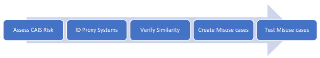
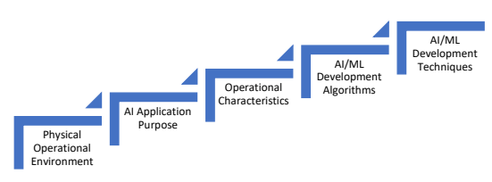
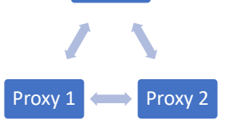

NIST Cybersecurity White Paper

NIST CSWP 31 Proxy Validation and Verification for Critical AI Systems A Proxy Design Process Phillip Laplante Joanna DeFranco Rick Kuhn Jeff Voas Computer Security Division Information Technology Laboratory Mohamad Kassab Engineering Division Penn State *University* This publication is available free of charge from: https://doi.org/10.6028/NIST.CSWP.31 September 26, 2024

Certain commercial entities, equipment, or materials may be identified in this document in order to describe an experimental procedure or concept adequately. Such identification is not intended to imply recommendation or endorsement by the National Institute of Standards and Technology (NIST), nor is it intended to imply that the entities, materials, or equipment are necessarily the best available for the purpose.

NIST Technical Series Policies Copyright, Use, and Licensing Statements NIST Technical Series Publication Identifier Syntax Publication History Approved by the NIST Editorial Review Board on 2024-09-03 How to Cite this NIST Technical Series Publication: Laplante P, DeFranco J, Kuhn R, Voas J, Kassab M (2023) Proxy Validation and Verification for Critical AI Systems: A Proxy Design Process. (National Institute of Standards and Technology, Gaithersburg, MD), NIST Cybersecurity White Paper (CSWP) NIST CSWP 31. https://doi.org/10.6028/NIST.CSWP.31 Author ORCID iDs Phillip Laplante: 0000-0002-0415-271X 
Joanna DeFranco: 0000-0001-8966-5532 Rick Kuhn: 0000-0003-0050-1596 Jeff Voas: 0000-0003-1139-3690 Mohamad Kassab: 0000-0002-3647-8511 Contact Information cswp-31-comments@nist.gov National Institute of Standards and Technology Attn: Computer Security Division, Information Technology Laboratory 100 Bureau Drive (Mail Stop 8930) Gaithersburg, MD 20899-8930 Additional Information Additional information about this publication is available at https://csrc.nist.gov/publications/cswp, including related content, potential updates, and document history.

All comments are subject to release under the Freedom of Information Act (FOIA).

## Abstract

This white paper describes a five-phase process that includes identifying or building proxy systems that have high similarity to a critical AI system (CAIS), representing a kind of validation, and verifying the proxy by creating and testing both use and misuse cases of each proxy against its CAIS.

## Keywords

artificial intelligence; critical systems; critical AI system; validation and verification testing.

September 26, 2024

| Table of Contents                                          |                                          |
|------------------------------------------------------------|------------------------------------------|
| Executive Summary.                                         |                                          |
| 1. Introduction.                                           |                                          |
| 1.1. Background                                            |                                          |
| 2. CAIS Validation and Verification Process - 5 phases     |                                          |
| 2.1. Phase 1: Assess CAIS Risk Level                       |                                          |
| 2.2. Phase 2: System Evaluation to Find Proxy Equivalents. |                                          |
|                                                            | 2.2.1. Physical Operational Environment  |
|                                                            | 2.2.2. Application Purpose .             |
|                                                            | 2.2.3. Operational Characteristics .     |
|                                                            | 2.2.4. AI/ML Development Algorithms.     |
|                                                            | 2.2.5. Al/ML Development Techniques      |
|                                                            | 2.2.6. CAIS and Proxy Taxonomy Template… |
| 2.3. Phase 3: CAIS/Proxy Similarity Testing.               |                                          |
| 2.4. Phase 4: Misuse Cases for Further Testing .           |                                          |
| 2.5. Phase 5: Proxy Misuse Case Testing                    |                                          |
| References                                                 |                                          |
| Appendix A. Glossary .                                     |                                          |

| Table 1. Example CAIS template use .                                 |
|----------------------------------------------------------------------|
| Table 2. Example matching proxies.                                   |
| Table 3. Misuse case and criticality level for the robot weed killer | | Fig. 1. The 5 phases of the CAIS validation and verification process .   |
|--------------------------------------------------------------------------|
| Fig. 2. CAIS taxonomy proposed in [1]…                                   |
| Fig. 3. CAIS/Proxy similarity testing                                    |

## List Of Tables List Of Figures Executive Summary

This white paper suggests that prior testing artifacts from similar artificial intelligence (AI) systems can be reused for new AI software. Testing AI and machine learning software is difficult, and applying prior testing results from similar systems as a proxy would be a significant research advance. 

## 1. **Introduction**

The goal of this work is to increase trust in critical AI systems (CAISs) through proxy verification and validation. In a CAIS, executing certain test cases is not always possible, such as when a test case could expose testers and the public to significant harm, when an operational profile is extremely difficult or impossible to arrange, or when the costs of such testing are prohibitively high for an extremely low likelihood scenario. In these situations, it may be appropriate to use a non-critical equivalent or proxy system to model the extreme cases in a way that imbues confidence in the scenarios [1]. To address this need, this work describes a five-phase process that includes identifying or building proxy systems that have high similarity to a CAIS, representing a kind of validation and verification (V&V) of the proxy by creating and testing both use and misuse cases of each proxy against its CAIS. This notion of V&V results from "similar" systems to a different system is novel. The key to success is the ability to demonstrate and measure "similarity." In some respects, this framework is similar to the problem of transfer learning, where a model trained on one data set for a particular environment is used in a different environment or when its use environment changes. A notable difference between proxy V&V and transfer learning is that both the model and the environment may differ in the proxy V&V case. Both frameworks share the need for measures of similarity, and such measures have been the subject of research in transfer learning [2]. Statistical and other measures from transfer learning can be used to quantify similarities and differences between data sets that contain *examples* of elements in the environment with *values* assigned to *attributes*. Measures can be used to quantify the degree to which examples in one class or category differ from examples in another class, such as the presence or absence of values and the magnitude of attribute value differences between two or more classes. Such measures could be adapted to the proxy V&V problem to compute similarities between different models and their use environments. 

## 1.1. **Background**

NIST Special Publication (SP) 800-37r2 (Revision 2), Risk Management Framework for Information Systems and Organizations: A System Life Cycle Approach for Security and Privacy [3], describes a process that integrates trustworthiness characteristics (e.g., security, privacy); emphasizes continual test, evaluation, verification, and validation (TEVV); and promotes cyber supply chain risk management across the life cycles of AI systems. System requirements validation and testing are important aspects of any development life cycle model, particularly for critical infrastructure systems. The processes described herein are intended to support and augment other validation and testing processes that align with the Risk Management Framework.

## 2. **Cais Validation And Verification Process - 5 Phases**

The five-phase process in Fig. 1 shows the validation process [4] to determine risk (Phase 1) and identify a proxy (Phase 2), verify the proxy by analyzing similarities in the proxy system (Phase 3), create misuse cases and categorize risk (Phase 4), and test the misuse cases (Phase 5). 

Phases 1 and 2 are adapted from [4]. 

Fig. 1. The 5 phases of the CAIS validation and verification process

## 2.1. **Phase 1: Assess Cais Risk Level**

The U.S. Cybersecurity Infrastructure and Security Agency (CISA) defines 16 critical infrastructure sectors in which destruction would have a "debilitating effect on security, national economic security, national public health or safety, or any combination thereof" [5]. Thus, systems that fall under the 16 sectors could be considered critical systems. 

## Critical Infrastructure Sectors

1. Chemical: *Basic chemicals, specialty chemicals, agricultural chemicals, and consumer* products 2. Commercial facilities: *Entertainment/media, gaming, lodging, outdoor events, public* assembly, real estate, retail, and sports leagues 3. Communications: *Providers of voice services using interconnected terrestrial, satellite,* 
and wireless transmission systems 4. Critical manufacturing: Metals; machinery; electrical equipment, appliances, and components; and transportation equipment 5. Dams: *Critical water retention and control services* 6. Defense industrial base: *Research, development, production, delivery, and maintenance* of military weapons systems, subsystems, and components or parts to meet U.S. military requirements 7. Emergency services: Highly skilled and trained personnel and *physical and cyber* resources that provide prevention, preparedness, response, and recovery services during day-to-day operations and incident response 8. Energy: *Electricity, oil, and natural gas* 9. Financial services: Depository institutions, providers of investment products, insurance companies, other credit and financial organizations, and providers of critical financial utilities and services that support these functions 10. Food and agriculture: Farms, restaurants, registered food manufacturing, processing, and storage facilities 11. Government facilities: *Office buildings, military installations, national laboratories,* 
courthouses 12. Healthcare and public health: Protection from terrorism, infectious disease outbreaks, and natural disasters 13. Information technology: Providers of computing services, network, and data storage facilities 14. Nuclear reactors, materials, waste: Active power reactors, research and test reactors, nuclear fuel cycle facilities, and other radioactive sources used for medical diagnostics and treatment 15. Transportation systems: Aviation, highway and motor carriers, maritime transportation, mass transit/passenger rail, pipeline systems, freight rail, postal, and shipping 16. Water and wastewater: Wells, reservoirs, water treatment facilities, and water distribution infrastructure Each of these sectors may further classify systems under their domain to create risk categories that reflect the level of AI integration. For example, levels of AI integration in a healthcare system could be considered assistive, augmentative, or autonomous.

1 An autonomous healthcare system would be considered a CAIS. Once a system is classified as a CAIS, a metaphorically equivalent system (or proxy) must be identified. The goal of the proxy is to have the functional equivalence of the CAIS to enable safe testing. For example, an autonomous vehicle may have a robot vacuum as a testing proxy if it has significant operational and implementation similarities. It is unlikely that the proxy coverage of the CAIS will be complete, but this does not negate the value of proxy testing. The goal of the proxy is to cover those features that cannot be directly tested in the CAIS. Whether something is a good proxy may also be highly dependent on implementation.

A proxy system may have domain equivalence (e.g., both the CAIS and proxy system may be space systems), but domain equivalence is not a prerequisite for proxy validation and verification. The imputation of the proxy test results to the CAIS substantially depends on selecting the appropriate set of system features. The functional equivalence is determined by a feature extraction process using the taxonomy described in Phase 2. 

## 2.2. Phase 2: **System Evaluation To Find Proxy Equivalents**

An example taxonomy for CAISs is proposed in [1]. The taxonomy is used to match the CAIS's characteristics to a testing proxy (i.e., non-critical prototype or digital twin). This taxonomy assesses the functional equivalence of the testing proxy. As Fig. 2 illustrates, the proposed CAIS 

1 For more information, see www.ama-assn.org. 
taxonomy includes the following five dimensions: physical operational environment, AI application purpose, operational characteristics, artificial intelligence/machine learning (AI/ML) technologies, and AI/ML techniques. 

Fig. 2. CAIS taxonomy **proposed in [1]**

## 2.2.1. **Physical Operational Environment**

Physical environments refer to both natural environments (e.g., lakes, oceans, forests) and human-created environments (e.g., offices, factories, schools), which can affect the quality of life for both people and systems. Operational environments (OEs) generally include air, space, and subsurface terrains (e.g., maritime, oceanography, hydrology). Cyberspace should also be considered an OE given how data can travel through the physical world. 

## 2.2.2. **Application Purpose**

Determining an application's purpose helps to identify proxy characteristics. In general, an AI application is designed and built based on certain characteristics, sometimes referred to as "design for X" or DfX, where X stands for excellence or for a quality requirement (e.g., testability, reliability, etc.). Designing this way ensures that the most important characteristics of a CAIS are reflected in the final design of the proxy. System characteristics can be analyzed by reviewing its domain and goals, such as determining whether a system domain is in the area of communication, learning, planning, reasoning, or providing a service. Overall AI goals can then be identified, such as language processing, computer vision, deep learning, data science, or machine learning. This analysis informs the next phase of determining operational characteristics. For example, if a goal of a CAIS is to operate autonomously, the proxy must also be the same type of autonomous system. Definitions for the characteristics should be consistent. For example, in NIST Special Publication (SP) 1011-I-2-0, the DoD defined an autonomous vehicle to have levels with "no human operator aboard the principal components, which acts in the physical world to accomplish assigned tasks. It may be mobile or stationary. It can include any and all associated supporting components such as operated control units (OCU)s" [6]. They also offered examples, such as unmanned ground vehicles (UGV), unmanned aerial vehicles/systems (UAV/UAS), unmanned maritime vehicles (UMV) (e.g., unmanned underwater vehicles [UUV] or unmanned water service borne vehicles [USV]), unattended munitions (UM), and unattended ground sensors 
(UGS). Missiles, rockets, submunitions, and artillery are not considered the principal components of unmanned systems [6]. As another example, SAE J3016, "Taxonomy and Definitions for Terms Related to Driving Automation Systems for On-Road Motor Vehicles" [7], describes five different levels of autonomy for autonomous vehicles. After defining the type of autonomous vehicle, it should be determined whether the system is fully or semi-autonomous. Semi-autonomous is defined as an unmanned system that is capable of autonomous operation between human interactions [8]. 

## 2.2.3. **Operational Characteristics**

Operational characteristics represent potential behaviors and effects on the system, and matching them is vital for proxy accuracy. There are many possible ways to organize and standardize these characteristics, such as: 
1. O1. Moving/stationary [no=0/yes=1] 2. O2. Mission: Navigation, target acquisition, target attack, gathering something, delivering something/payload (e.g., gas, water, packages) [can be >1 of these; b1b2b3b4b5, where bi=1 if the domain applies]
3. O3. Financial consequences [on a scale of 0-9, where 0 represents no financial consequences and 9 represents catastrophic financial consequences]
4. O4. Social consequences [on a scale of 0-9, where 0 represents no social consequences and 9 represents catastrophic social consequences (e.g., privacy, elections, compliance/law)] 
5. O5. Human risk [on a scale of 0-9, where 0 represents no human risk and 9 represents catastrophic human risk (e.g., to the operator, user, passenger)] 

## 2.2.4. **Ai/Ml Development Algorithms**

The NIST AI Glossary [9] defines AI as: 
…an interdisciplinary field, usually regarded as a branch of computer science, dealing with models and systems for the performance of functions generally associated with human intelligence, such as reasoning and learning.

That same glossary defines ML as "a general approach for determining models from data" [9]. CAIS algorithms - whether AI, ML, or deep learning - depend on the application, and proxy AI/ML algorithms should match the algorithms of a CAIS and the learning type (i.e., supervised versus unsupervised). Example algorithms include Naïve Bayes estimation, linear regression, principal component analysis, and decision trees. An important consideration when selecting a proxy is the availability and equivalency of the training data sets for ML algorithms. Confidence in the results of any ML algorithm testing of the proxy system depends on the equivalency of that data set to the CAIS. In some cases, this equivalency may be impossible to achieve. 

## 2.2.5. **Ai/Ml Development Techniques**

The techniques used to develop matching proxies for a CAIS should also be considered since testing could capture side effects and unintended behaviors induced by these techniques. Development considerations include the programming languages used (e.g., C++, Python, etc.), development environments, and software development processes. 

## 2.2.5.1. **Flexibility Of The Proposed Taxonomy**

Sections 2.2.1 through 2.2.5 represent a generic structure for a proposed CAIS taxonomy. It is a starting point to identify and use proxy systems for testing, and long-term use and negotiation will refine and improve the taxonomy. Different domains (e.g., aerospace, medical, power generation and distribution) may further refine and evolve specific taxonomies and dimensions of evaluation. Furthermore, the granularity of the Likert scales is arbitrary. For example, a scale of 0-99 or another could be used for any of the factors.

## 2.2.6. Cais **And Proxy Taxonomy Template**

The template shown in Table 1 can be used to determine the distinguishing features of a CAIS and its proxies. Table 1 demonstratesthe CAIS taxonomy with an autonomous vehicle that is given the consequences of the risks of operational failure. The goal is to test the navigation system's obstacle avoidance algorithm.

| Phy. Op.   | AI App.                              | Operational   | Dev.          | Dev. Tech.   |
|------------|--------------------------------------|---------------|---------------|--------------|
| Envmt.     | Purpose                              | Charac.       | Algorithm KMP | Java         |
|            |                                      | Algorithm     |               |              |
|            | O1:1; 02: 11111; O3: 0; O4: 9; 05: 9 |               |               |              |
| Autonomous | Land                                 | Reasoning,    |               |              |
| Vehicle    | learning,  planning,  services       |               |               |              |

Table 1. Example CAIS template use
Table 2 shows two proxy systems analyzed using the CAIS taxonomy: a robot weed killer and a robot vacuum. The validation of similarity of the CAIS and proxy match will occur in Phase 3.

| Phy. Op.     | AI App.                        | Operational                                | Dev.          | Dev. Tech.   |
|--------------|--------------------------------|--------------------------------------------|---------------|--------------|
| Envmt.       | Purpose                        | Charac.                                    | Algorithm KMP | Java         |
|              |                                |                                            | Algorithm     |              |
|              |                                | O1:1; 02: 11111; O3: 0; O4: 0; 05: 9       |               |              |
| Robot Weed   | Land                           | Reasoning,                                 |               |              |
| Killer       | learning,  planning,  services |                                            | KMP           | Java         |
|              |                                |                                            | Algorithm     |              |
|              |                                | O1:1; 02: 11111; O3: 0; O4: 0; 05: 9       |               |              |
| Robot Vacuum | Land                           | Reasoning,  learning,  planning,  services |               |              |

Table 2. **Example matching proxies**

## 2.3. **Phase 3: Cais/Proxy Similarity Testing**

Testing occurs in both Phase 3 and Phase 5 of the CAIS Proxy Validation process, where Phase 3 focuses on similarity testing and Phase 5 focuses on misuse case testing. This process is described in detail in [1]. If the similarity testing is successful in Phase 3, misuse cases are created in Phase 4 to ultimately be tested in Phase 5. For example, multiple proxies for the autonomous vehicle were created in Phase 2. Each proxy has increasing levels of criticality and functionality for an autonomous vehicle - *robot vacuum*
(level 1)  *robot weed killer* (level 2)  *robot lawn mower* (level 3)  autonomous vehicle
(level 4) - in that,
- They all use similar navigation system algorithms.

- They all use similar obstacle avoidance algorithms.

- Each proxy can have multiple failure use cases at various levels of criticality. 

Therefore, in Phase 3, appropriate use case scenarios of each proxy are tested against each other and against the CAIS to validate the matching process (Fig. 3). In other words, using these proxy examples from Phase 2, the robot vacuum would be tested against the robot weed killer and then against the autonomous vehicle to validate the dimensions claimed in Phase 2. 

# Fig. 3. **Cais/Proxy Similarity Testing**

## 2.4. **Phase 4: Misuse Cases For Further Testing**

Write misuse cases for each proxy using criticality analysis. The process is based on Interagency Report (IR) 8179, *Criticality Analysis Process Model: Prioritizing Systems and Components* [8].

Although CAP is intended for information asset risk analysis and management, the model provides an approach to analyzing and understanding essential systems, subsystems, components, subcomponents, and their operating environments. Specifically, this approach will be used by following two steps:
1. *Determine the misuse cases of a proxy*: Use the CAP process to determine what can go wrong during a proxy's operation. In this step, analyze workflows, dependencies, boundaries, interactions, intersections, connections, constraints, and triggers of the system and its components.

2. *Categorize the misuse cases with increasing levels of risk:*
CAIS 1  proxy 1  misuse case 1-N, where each use case has an increasing level of risk CAIS 1  proxy 2  misuse case 1-N, where each use case has an increasing level of risk Example (results shown in Table 3): 
Robot weed killer - *a proxy for an autonomous vehicle:*
1. *Determine the misuse cases*:
a. Define the workflow paths, dependences, and boundaries. Identify the interactions, intersections, connections, dependencies, constraints, and triggers of the system and its components (e.g., GPS, ML, other sensors that could fail, weather, etc.). Example: 
Dependencies: Sensors, GPS, ML data set Constraints: Weather Trigger: Identify and avoid obstacles, and spray weeds.

b. Determine dysfunctional states (misuse cases), such as broken sensors, malicious entities, downtime, slow operating speeds, or misidentified obstacles. Questions to ask (results shown in Table 3):
i. What will happen to the functions/capabilities delivered by the subsystem when components or subcomponents fail and result in an adverse operating state? 

ii. What will the impact on subsystem operations be? 

iii. Which of the components are most important for the subsystem to continue operating?

2. *Categorize the misuse cases with increasing levels of risk.*

| Example Misuse       |                                                                                                                                                              | Misuse Case Steps                                                                              | Criticality Level (Low, Moderate,   |
|----------------------|--------------------------------------------------------------------------------------------------------------------------------------------------------------|------------------------------------------------------------------------------------------------|-------------------------------------|
| Case Name            |                                                                                                                                                              | High)                                                                                          |                                     |
| Failed camera sensor | GPS follows the learned path to the garden. The sensor misidentifies or avoids a weed. An actuator sprays poison on an object, vegetable,  human, or animal. | Low  High, depending on what is  damaged or sprayed Low  High, depending on what is  sprayed |                                     |
| Failed ML            | The algorithm has been hacked. The actuator intentionally avoids weeds or  intentionally runs into objects.                                                  | Low  High, depending on what is  broken or sprayed                                            |                                     |
| Failed GPS           | The GPS fails, and the robot weed killer sprays a  neighbor or breaks/runs into a garden ornament or  a fence.                                               |                                                                                                |                                     |

Table 3. **Misuse case and criticality level for the robot weed killer**

## 2.5. **Phase 5: Proxy Misuse Case Testing**

Test the misuse case scenarios determined in Phase 5 for each similar proxy tested in Phase 3.

## References

[1] DeFranco JF, Kassab M, Laplante P (2022) A Taxonomy of Critical AI System Characteristics for Use in Proxy System Testing. IEEE International Symposium on Software Reliability Engineering Workshops (ISSREW), (IEEE Charlotte, NC) pp. 342-346. 

https://doi.org/10.1109/ISSREW55968.2022.00090
[2] Weiss K, Khoshgoftaar TM, Wang D (2016) A survey of transfer learning. Journal of Big Data 3, Article 9, pp 1-40. https://doi.org/10.1186/s40537-016-0043-6 
[3] Ross R (2018) Risk Management Framework for Information Systems and Organizations: 
A System Life Cycle Approach for Security and Privacy. NIST Special Publication (SP) NIST SP 800-37r2. https://doi.org/10.6028/NIST.SP.800-37r2
[4] Laplante P, Kassab M, DeFranco J (2022) Proxy Verification and Validation for Critical Autonomous and AI Systems. *IEEE 29th Annual Software Technology Conference (STC),*
(IEEE, Virtual) pp 37-40. https://doi.org/10.1109/STC55697.2022.00014 
[5] Critical Infrastructure Sectors, Cybersecurity & Infrastructure Security Agency, CISA, 
Arlington, VA. Available at https://www.cisa.gov/critical-infrastructure-sectors
[6] Huang H (ed.) (2008) Autonomy Levels for Unmanned Systems (ALFUS) Framework. 

(National Institute of Standards and Technology, Gaithersburg, MD), NIST Special Publication (SP) NIST SP 011-I-2.0. https://doi.org/10.6028/NIST.SP.1011-I-2.0 
[7] Society of Automotive Engineers (2014) Taxonomy and Definitions for Terms Related to Driving Automation Systems for On-Road Motor Vehicles. SAE J3106. Available at www.sae.org 
[8] Paulsen C, Boyens J, Bartol N, Winkler K (2018) Criticality Analysis Process Model: 
Prioritizing Systems and Components. (National Institute of Standards and Technology, Gaithersburg, MD), NIST Interagency or Internal Report (IR) NIST IR 8179. https://doi.org/10.6028/NIST.IR.8179 
[9] National Institute of Standards and Technology (2023) The Language of Trustworthy AI: 
An In-Depth Glossary of Terms. Available at https://airc.nist.gov/AI_RMF_Knowledge_Base/Glossary 

## Appendix A. **Glossary**

critical AI system (CAIS)
Any system incorporating critical software and in which failure can cause substantial harm to the public. [1] validation The process of evaluating a system or component during or at the end of the development process to determine whether it satisfies specified requirements (INCOSE).

verification The process of evaluating a system or component to determine whether the products of a given development phase satisfy the conditions imposed at the start of that phase (INCOSE).

V&V
Validation and verification (also verification and validation). proxy V&V 
Using a non-critical system with comparable properties to a critical one as a testing substitute. [1]