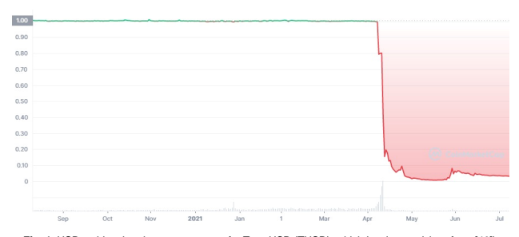
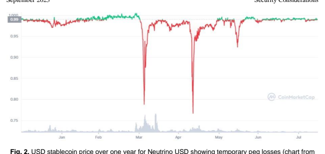
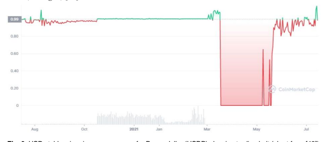
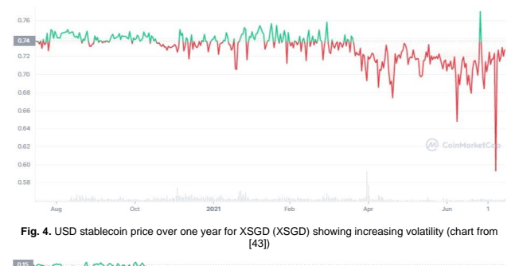
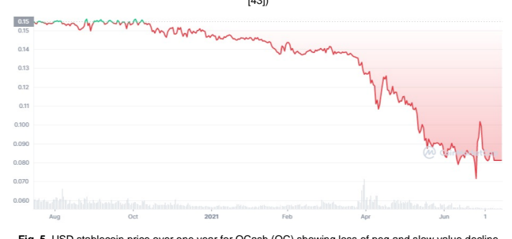
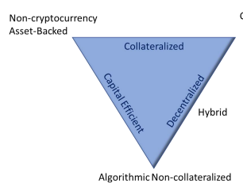
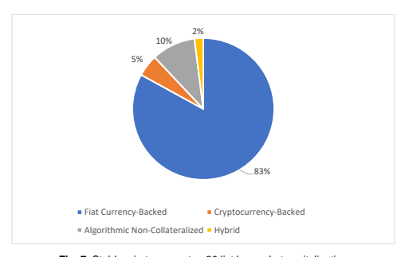

NIST Internal Report

# Understanding Stablecoin 

 Technology And Related Security Considerations

Peter Mell Dylan Yaga This publication is available free of charge from:

https://doi.org/10.6028/NIST.IR.8408 NIST Internal Report

# Understanding Stablecoin Technology And Related Security Considerations

Peter Mell Dylan Yaga Computer Security Division Information Technology Laboratory This publication is available free of charge from:
https://doi.org/10.6028/NIST.IR.8408 September 2023

U.S. Department of Commerce Gina M. Raimondo, Secretary National Institute of Standards and Technology Laurie E. Locascio, NIST Director and Under Secretary of Commerce for Standards and Technology Certain commercial equipment, instruments, software, or materials, commercial or non-commercial, are identified in this paper in order to specify the experimental procedure adequately. Such identification does not imply recommendation or endorsement of any product or service by NIST, nor does it imply that the materials or equipment identified are necessarily the best available for the purpose. There may be references in this publication to other publications currently under development by NIST in accordance with its assigned statutory responsibilities. The information in this publication, including concepts and methodologies, may be used by federal agencies even before the completion of such companion publications. Thus, until each publication is completed, current requirements, guidelines, and procedures, where they exist, remain operative. For planning and transition purposes, federal agencies may wish to closely follow the development of these new publications by NIST. Organizations are encouraged to review all draft publications during public comment periods and provide feedback to NIST. Many NIST cybersecurity publications, other than the ones noted above, are available at https://csrc.nist.gov/publications. NIST Technical Series Policies Copyright, Use, and Licensing Statements NIST Technical Series Publication Identifier Syntax Publication History Approved by the NIST Editorial Review Board on 2023-07-11 How to Cite this NIST Technical Series Publication: 
Mell P, Yaga D (2023) Understanding Stablecoin Technology and Related Security Considerations. (National Institute of Standards and Technology, Gaithersburg, MD), NIST Interagency or Internal Report (IR) NIST IR 8408. https://doi.org/10.6028/NIST.IR.8408 Author ORCID iDs Peter Mell: 0000-0003-2938-897X Dylan Yaga: 0000-0003-4058-3645 Contact Information NISTIR8408@nist.gov National Institute of Standards and Technology Attn: Computer Security Division, Information Technology Laboratory 100 Bureau Drive (Mail Stop 8930) Gaithersburg, MD 20899-8930 All comments are subject to release under the Freedom of Information Act (FOIA).

## Abstract

Stablecoins are cryptocurrencies whose price is pegged to that of another asset (typically one with low price volatility). The market for stablecoins has grown tremendously - up to almost $200 billion USD in 2022. These coins are being used extensively in newly developing paradigms for digital money and commerce as well as for decentralized finance technology. This work provides a technical description of stablecoin technology to enable reader understanding of the variety of ways in which stablecoins are architected and implemented. This includes a descriptive definition, commonly found properties, and distinguishing characteristics, as well as an exploration of stablecoin taxonomies, descriptions of the most common types, and examples from a list of top stablecoins by market capitalization. This document also explores related security, stability, and trust issues with an analysis conducted from a computer science and information technology security perspective as opposed to the financial analysis and economics focus of much of the stablecoin literature.

## Keywords

blockchain; cryptocurrency; decentralized finance; security; smart contract; stablecoin.

## Reports On Computer Systems Technology

The Information Technology Laboratory (ITL) at the National Institute of Standards and Technology (NIST) promotes the U.S. economy and public welfare by providing technical leadership for the Nation's measurement and standards infrastructure. ITL develops tests, test methods, reference data, proof of concept implementations, and technical analyses to advance the development and productive use of information technology. ITL's responsibilities include the development of management, administrative, technical, and physical standards and guidelines for the cost-effective security and privacy of other than national security-related information in federal information systems.

## Patent Disclosure Notice

ITL has requested that holders of patent claims whose use *may be required for compliance with the* guidance or requirements of this publication disclose such patent claims to ITL. However, *holders of* patents are not obligated to respond to ITL calls for patents and ITL *has not undertaken a patent* search in order to identify which, if any, patents may apply to this publication. As of the date of publication and following call(s) for the identification of patent claims whose use may be required for compliance with the guidance or requirements of this publication, no such patent claims have been identified to ITL. 

No representation is made or implied by ITL that licenses are not required to avoid patent infringement in the use of this publication.

i September 2023

| Table of Contents   |                                                                         |
|---------------------|-------------------------------------------------------------------------|
| Executive Summary.  |                                                                         |
| 1.                  | Introduction                                                            |
| 1.1.                | One Year Stability Analysis of Top Stablecoins by Market Capitalization |
| 1.2.                | Note on Regulations                                                     |
| 2.                  | Background Technology .                                                 |
|                     | Blockchain .                                                            |
| 2.1.                |                                                                         |
| 2.2.                | Cryptocurrencies .                                                      |
| 2.3.                | Smart Contracts                                                         |
|                     | Cryptocurrency Tokens                                                   |
| 2.4.                |                                                                         |
| 2.5.                | Centralized Finance (CeFi) .                                            |
| 2.6.                | Decentralized Finance (DeFi)                                            |
| 3.                  | Stablecoin Definition, Properties, and Characteristics .                |
| 3.1.                | Stablecoin Definition.                                                  |
| 3.2.                | Stablecoin Properties                                                   |
| 3.3.                | Stablecoin Characteristics                                              |
| Stablecoin Taxonomy |                                                                         |
| 4.                  |                                                                         |
| 4.1.                | Fiat Currency-Backed                                                    |
| 4.2.                | Cryptocurrency-Backed.                                                  |
| 4.2.1.              | Overcollateralized Debt Position .                                      |
| 4.2.2.              | Wrapped Fully Collateralized .                                          |
| 4.3.                | Non-Currency Asset-Backed.                                              |
| 4.4.                | Algorithmic Non-Collateralized .                                        |
| 4.4.1.              | Rebasing Coins                                                          |
| 4.4.2.              | Seigniorage Stablecoins                                                 |
| 4.5.                | Hybrid .                                                                |
| 4.6.                | Private Institutional                                                   |
| 5.                  | Security Issues .                                                       |
| 5.1.                | Unauthorized or Arbitrary Minting of Stablecoins .                      |
| 5.2.                | Collateral Theft .                                                      |
|                     | Malicious Smart Contract Update and Hijack                              |
| 5.3.                |                                                                         |
| 5.4.                | Data Oracles .                                                          |
| 5.5.                | Exploiting the Underlying Blockchain .                                  |
|                     | Writing Secure Software and Vulnerabilities                             |
| 5.6.                |                                                                         |
| 6. Stability Issues |                                                                         |
| 6.1.                | Dynamic Interest Rates .                                                |

| NIST IR 8408   | Stablecoin Technology and                          |
|----------------|----------------------------------------------------|
| September 2023 | Security Considerations                            |
| 6.2.           | Floating Collateral Requirements .                 |
|                | Oracle Responsiveness to Rapid Price Fluctuation . |
| 6.3.           |                                                    |
| 6.4.           | Governance Token Devaluation                       |
| 6.5.           | Share and Reward Token Devaluation .               |
| 6.6.           | Native Cryptocurrency Devaluation                  |
| 6.7.           | Transaction Price Increase                         |
| 6.8.           | Trading Curb/Circuit Breaker                       |
| 7.             | Trust Issues                                       |
|                | Stablecoin Manager Deception .                     |
| 7.1.           |                                                    |
| 7.1.1.         | Insufficient Reserves.                             |
| 7.1.2.         | Reserve Type Mismatch                              |
| 7.2.           | Stablecoin Manager Actions                         |
| 7.2.1.         | Account Denylisting                                |
| 7.2.2.         | Managing Organization Dissolution                  |
| 7.2.3.         | Mass User Departure                                |
|                | Rug Pulls.                                         |
| 7.2.4.         |                                                    |
| 8.             | Exchanges and Fund Movement .                      |
| 8.1.           | Centralized Exchanges                              |
|                | Decentralized Exchanges.                           |
| 8.2.           |                                                    |
| 8.2.1.         | Liquidity Pools and Yield Farming.                 |
| 8.2.2.         | Automated Market Maker Equations                   |
| 8.2.3.         | Liquidity Pool Security Concerns .                 |
| 8.3.           | Cross Chain Bridges                                |
| 9.             | Conclusion                                         |
| References     |                                                    |

| Fig. 1. USD stablecoin price over one year for TerraUSD (TUSD), which lost its peg (chart from   |                           |
|--------------------------------------------------------------------------------------------------|---------------------------|
|                                                                                                  | [40])                     |
| Fig. 2. USD stablecoin price over one year for Neutrino USD showing temporary peg losses         |                           |
|                                                                                                  | (chart from [41]).        |
| Fig. 3. USD stablecoin price over one year for Paxos dollar (USDP) showing trading halt (chart   |                           |
|                                                                                                  | from [42]) .              |
| Fig. 4. USD stablecoin price over one year for XSGD (XSGD) showing increasing volatility         |                           |
|                                                                                                  | (chart from [43]).        |
| Fig. 5. USD stablecoin price over one year for QCash (QC) showing loss of peg and slow value     |                           |
|                                                                                                  | decline (chart from [44]) |
| Fig. 6. Cryptocurrency type triangle comparison trade-offs .                                     |                           |
| Fig. 7. Stablecoin types on top 20 list by market capitalization .                               |                           |

## List Of Figures Executive Summary

This publication provides a technical description of stablecoin technology to enable reader understanding of the variety of ways in which stablecoins are architected and implemented. It then uses that technical foundation to explore related security, stability, and trust issues. The following descriptive definition is intended to help readers understand stablecoin technology:
A stablecoin is a cryptocurrency token that is a fungible unit of financial value pegged to a currency, some other asset, or index. It can be traded directly between parties and converted to other currencies or the pegged asset.

Stablecoins can be further understood by an evaluation of their properties and characteristics. 

Properties highlight areas of commonality among most stablecoins, while characteristics highlight distinctions between the various architectures. The stablecoins all behave similarly from the perspective of the user who possesses and trades them Stablecoins typically include the following four properties.

1. **Property 1 (Tokenized):** A s*tablecoin is a cryptocurrency token managed by a smart* contract.

2. **Property 2 (Fungible):** *Stablecoins are fungible units of financial value with little to no* pricing volatility *relative to their pegged asset or index.*
3. **Property 3 (Tradable):** *Stablecoins can be traded directly between parties.* 4. **Property 4 (Convertible):** Stablecoins can be converted to other currencies or the pegged asset.

Many of the differences between stablecoin implementations and approaches can be understood by considering the following stablecoin characteristics:
- Characteristic 1 **(Number of Coins):** A s*tablecoin architecture may use multiple* mutually supportive coins to maintain the peg for its stablecoin.

- **Characteristic 2 (Custodial Type):** Stablecoins may use a centralized custodial finance model (CeFi) or a decentralized non-custodial finance model (DeFi).

- Characteristic 3 **(Management Type):** Stablecoins may have different management types: no management, a company, a known individual, an anonymous individual, or anonymous group owners who hold governance tokens.

- Characteristic 4 **(Blockchain Automation):** Stablecoins may operate fully on-chain and autonomously, on-chain and autonomously but with control *hooks, or mostly off-chain* and manually with a smart contract interface.

- Characteristic 5 **(Coin Minting and Burning):** *Stablecoins have different policies for* minting (coin creation) and burning (coin deletion).

- Characteristic 6 (Collateral **Type):** *Stablecoins may be collateralized using different* types of reserves.

1
- **Characteristic 7 (Collateralization Level):** Stablecoins may be collateralized at different levels.

- Characteristic 8 **(Stabilization Mechanism):** Stablecoins may use different mechanisms to promote price stability.

- **Characteristic 9 (Oracle Dependence):** *Stablecoins may depend on "oracles"* to provide on-blockchain data feeds for off-blockchain asset prices.

- Characteristic 10 **(Blockchain Independence):** *Stablecoins may be blockchainindependent and simultaneously instantiated on multiple blockchains.*
This publication also provides a taxonomy of stablecoin types, which describe commonly used approaches. The taxonomy can be used to understand how groups of settings of characteristics work together to form different architectures. The taxonomy is as follows: 
1. **Fiat Currency-Backed:** A stablecoin whose value is backed through cash-equivalent reserves of a particular fiat currency or index of currencies.

2. **Cryptocurrency-Backed:** A stablecoin whose value is backed through reserves of volatile cryptocurrencies (i.e., not other stablecoins).

3. **Non-Currency Asset-Backed:** *A stablecoin whose value is backed through reserves that* are non-currency assets or financial vehicles tracking the price of such assets.

4. Algorithmic **Non-Collateralized:** A stablecoin whose value is stabilized through an algorithm that shrinks and expands the supply of non-collateralized coins to adjust price.

5. **Hybrid:** *A stablecoin whose value is stabilized through a combination of methods drawn* from fiat, cryptocurrency, non-currency asset, and algorithmic-backed stablecoins (usually a partially cryptocurrency collateralized algorithmic approach).

6. **Private Institutional:** *A stablecoin that is issued for use on a private blockchain for the* internal account transactions of the stablecoin issuer's customers.

The descriptive stablecoin definition, properties, characteristics, and taxonomy are used to evaluate how computer security issues could affect the proper functioning of stablecoins or result in a loss of value to stablecoin users. The three areas investigated are security, stability, and trust.

Security issues include the following:
1. **Unauthorized or Arbitrary Minting of Stablecoins**: there may arise a situation or combination of situations that may allow for the creation of stablecoins outside of the intended process.

2. **Collateral Theft**: the stablecoin's on blockchain collateral (or reserves) may be subject to theft should an attacker discover and leverage a vulnerability in the smart contract code.

3. **Malicious Smart Contract Update and Hijack**: it may be possible for malicious users to engineer a scenario in which they obtain the ability to deploy updated versions of the stablecoin's smart contract.

4. **Data Oracles**: oracles provide stablecoin smart contracts off-blockchain information 
(e.g., the price of a currency). An attacker could disrupt the data used as input to the oracle, compromise the oracle itself with a denial-of-service attack, or take advantage of a vulnerability to learn what data the oracle is about to submit.

5. **Exploiting the Underlying Blockchain**: it is possible for well-resourced attackers to take over the blockchain underlying a stablecoin implementation. Attackers might do this by controlling a majority of the mining hardware used in a proof-of-work consensus algorithm or stake a majority of funds in a proof-of-stake system. This is unlikely for large blockchain systems given the size of the community that maintains them.

Stability issues include the following:
1. **Dynamic Interest Rates**: some stable coins are created through the issuance of loans. 

The loan interest rates adjust dynamically to stabilize the stable coin price.

2. **Floating Collateral Requirements**: the collateral requirements for loan issued stable coins can change rapidly.

3. **Oracle Responsiveness to Rapid Price Fluctuation**: oracles may not provide data to a stable coin contract fast enough to address a rapidly changing market (potentially causing stable coin failure).

4. **Governance Token Devaluation**: many stablecoins offer governance tokens that enable the token holders to manage the cryptocurrency. A devaluation of the governance tokens could spark a lack of confidence in the stablecoin.

5. **Share and Reward Token Devaluation**: some stablecoins use share coins as volatile cryptocurrency collateral. A drop in price of the share coin represents a decrease in collateral in the system.

6. **Native Cryptocurrency Devaluation**: if the native cryptocurrency on a blockchain devalued to the point where it failed, users would migrate en masse off that blockchain. Since the stablecoin token lives on the blockchain, this could precipitate users to sell all their stablecoins.

7. **Transaction Price Increase**: smart contract pricing is dynamic and subject to the changing transaction costs of the underlying blockchain's native digital asset (cryptocurrency). This can affect stablecoin usage (making transactions for amounts of certain sizes may become prohibitively expensive).

Trust issues include the following:
1. **Insufficient Reserves**: trust may be lost if the stablecoin manager does not maintain the promised level of off-chain reserves and only provides partial collateral.

2. **Reserve Type Mismatch**: trust may be lost if the stablecoin manager does not hold the reserves in the specified financial vehicles.

3. **Account Denylisting**: a smart contract may maintain a denylist to prevent accounts from sending or receiving coins.

4. **Managing Organization Dissolution**: the managing organization may dissolve but the project itself may live on without them, albeit in an unmanaged state.

5. **Mass User Departure**: typically, in response to some incident, users of a stablecoin may decide to leave en masse. Like a traditional bank run, users will attempt to withdraw whatever money they are able to from the system, thus weakening the system even further.

6. **Rug Pulls**: a rug pull is when a cryptocurrency project manager hypes up their project via social media and marketing, obtains many new users, and then absconds with the deposited funds and abandons the project, leaving the users with nothing While most stablecoins function almost identically in third-party markets and enable the buying and selling of goods with coins at a pegged price, they can have vastly different risk profiles. Security, stability, and trust issues vary between architectures, although there are common concerns with all of them. Centralized architectures can be more vulnerable to trust issues due to a greater reliance on human trustworthiness, while decentralized architectures can be more vulnerable to security issues due to increasing smart contract code complexity and critical functionality. When all is well, they all function almost identically from the point of view of a consumer trading with them. When there are security, trust, or stability issues, stablecoins may be stolen, lose value, or completely fail.

## Introduction

The Board of Governors of the U.S. Federal Reserve System has defined stablecoins as "digital currencies that peg their value to an external reference" [1]. They then go on to say that stablecoins represent "a possible breakthrough innovation in the future of payments" and cite the tremendous growth of the stablecoin market starting in 2021. Possible benefits include more rapid and cost-effective payments, especially global remittances, and financial services for the unbanked and those with compromised credit [2]. As of May 2022, there were 75 publicly listed stablecoins with a total market capitalization of $186 billion USD (U.S. dollars) [3]. These stablecoins use widely varying management, implementation, and reserve models to attempt to hold their peg (i.e., maintain their value). For example, the International Organization of Securities Commissions (IOSCO) evaluates four different types of stablecoins: fiat currency, other real-world assets, other crypto assets, and algorithmic controlled assets. These types are delineated by the form of reserve funds held and the method for maintaining price stability. The IOSCO claims that stablecoins should be considered crypto-assets as opposed to cryptocurrency "since these assets do not in general fulfil the core economic criteria of money - as a unit of account, a stable store of value and efficient means of exchange" [4]. When functioning properly, stablecoins do typically intend to satisfy this definition of money, but there are security, trust, and stability issues that can limit their ability to fulfill this role. The growth of the stablecoin market and its associated identified risks have centered much research on stablecoins, usually with a focus on economic aspects. For example, the U.S. Treasury evaluates stablecoin risks in [5]. These risks include concerns about investor protection and market integrity, encompassing "possible fraud and misconduct in digital asset trading, including market manipulation, insider trading, and front running, as well as a lack of trading or price transparency". As stablecoins are increasingly used for complex financial arrangements and massive leveraging, the U.S. Treasury envisions possible risks to the broader financial system. In addition, it explores how stablecoin use could challenge efforts to govern "anti-money laundering (AML), countering the financing of terrorism (CFT), and proliferation". Lastly, it explores prudential risks for stablecoins, where stablecoin issuers may not maintain sufficient reserves or an effective method to support redemptions in times of stress. 

A complementary evaluation of the economic aspects of stablecoins is [1], which explores the possible impacts of stablecoins on the banking system and credit intermediation. IOSCO [4] presents another risk analysis (with a regulatory focus) and enumerates stablecoin risks related to "consumer protection, market integrity, transparency, conflicts of interest, financial crime, systemic implications and economic impacts". A deep analysis of how fiat-based stablecoins maintain their stability is found in [6], which evaluates how the price stabilization of stablecoins differs from national currencies pegged to one another. Finally, the specific risks of uncollateralized algorithmic stablecoins are highlighted in [2]. That work asserts that algorithmic stablecoin value can only be maintained through 1) a continuous support level of demand, 2) the actions of "independent actors with market incentives to perform price-stabilizing arbitrage", and 3) the accurate and rapid pricing of pegged assets in times of financial crisis. This publication approaches the same topic but from a computer science perspective with a technology and computer security focus. It offers a technical description of stablecoin technology to enable reader understanding of the variety of ways in which stablecoins are architected and implemented. It then uses that technical foundation to explore related security, stability, and trust issues. While some discussion of economic aspects is unavoidable (given that stablecoins are used as a form of currency), this work focuses on the technology issues. For an understanding of the economic risks, the reader should consult the previously cited references. The source materials used for this computer science-based exploration of stablecoins include published design papers for the top 20 stablecoins by market capitalization as of April 2022 [3]. The specific coins studied are listed in Section 4 and organized by type. Each of these 20 studied stablecoins had over $75 million USD of market capitalization at that time. The third largest plunged to zero value within three months and led to tens of billions of dollars in investor losses. Fifteen of the 20 mostly held their peg, enabling cryptocurrency investors to retain the value of their holdings while the broader cryptocurrency market plunged by over 50 % in this same time period. The remainder of this document is organized as follows. Section 1 discusses the historic stability of stablecoins and provides a note on stablecoin regulations. Section 2 provides necessary background technical terminology. Section 3 provides a descriptive stablecoin definition, an enumeration of its properties, and a discussion of different characteristics that stablecoins may possess. Section 4 provides a simple taxonomy of the primary stablecoin types along with an evaluation of their characteristics and a mapping to the top 20 investigated stablecoins. The following sections focus on potential stablecoin technology risks and associated safeguards. Section 5 discusses potential security issues. Section 6 discusses trust issues. Section 7 discusses stability issues. Section 8 discusses types of cryptocurrency exchanges and methods for fund movement (including cross-chain coin movement). Section 9 is the conclusion.

## One Year Stability Analysis Of Top Stablecoins By Market Capitalization

An evaluation of the daily prices from CoinMarketCap.com of the top 20 stablecoins for the year ending on August 15, 2022, indicates that the majority of the stablecoins keep their advertised peg to a non-cryptocurrency asset and achieve low volatility in doing so. For the top 20 cryptocurrencies studied, the top five coins that retained their peg represented 87 % of the total top 20 market capitalization (using published market capitalizations when the top 20 list was determined in April 2022). The top five market capitalization stablecoins that did not lose their peg during the one year study were:
1. Tether (USDT) 2. USD Coin (USDC) 3. Binance USD (BUSD) 4. Dai (DAI) 5. Frax (FRAX)
All five were pegged to the U.S. dollar and - as a group - had a mean minimum value of $0.9934 (-0.66 %) and a maximum minimum value of $0.9871 (-1.29 %). Fig. 1 shows the stablecoin prices for TerraUSD (TUSD), which was the third-largest stablecoin by market capitalization in this study. It lost its peg in May 2022 and is not expected to recover; it has been rebranded USTC.

Fig. 1. USD stablecoin price over one year for TerraUSD (TUSD), which lost its peg (chart from [40])
Section 4 discusses a taxonomy of stablecoin types and describes architectural details. The technical implementations vary widely even though the usages of the coins are similar. This study did not discover a significant difference in the stability of different stablecoin types with one exception. The study of 20 stablecoins contained two purely algorithmic coins. One of these coins lost its peg (UST, shown in **Fig.** 2) and has not recovered. The other - Neutrino USD (NUSD) - had a one-year low of $0.7831 (-21.69 %), much lower than the top five coins above. NUSD, which was number 8 by market capitalization, has had three temporary peg losses in the last year, but it has regained its value and has returned to holding its peg (shown in **Fig.** 2). These empirical observations of purely algorithmic stablecoin performance match concerns in the literature about these types of stablecoins retaining long-term value [2]. However, the instability of one particular type of stablecoin does not imply instability for other types in this taxonomy because they utilize different technical architectures/designs and different mechanisms to maintain their pegs. However, stablecoins that are not algorithmic still have risk factors that can cause them to temporarily lose value or permanently lose their peg.

[41])
For example, three of the other non-algorithmic top 20 stablecoins had issues during the studied 

 1-year period: Paxos Dollar (USDP), XSGD (XSGD), and Qcash (QC). The first two are fiat currency-backed, and the third is cryptocurrency-backed (see Section 4 on cryptocurrency types). USDP (number 9 by market capitalization) ceased trading for over two months starting in April 2022 (see **Fig.** 3) [45]. XSGD, which is a stablecoin based on the Singapore dollar (number 15 by market capitalization), experienced continuously increasing volatility (see **Fig.** 4) throughout 2022 [43]. Note that XSGD is pegged to the Chinese Yuan, but the chart is denominated in USD due to charting limitations. During the latter chart period showing the increased volatility, USD changed less than 3 % relative to the Yuan. Qcash (QC), which is pegged to the Chinese Yuan (number 20 by market capitalization), lost its peg and had a slow price decline from $0.15 to $0.08 (see **Fig.** 5) [44].

Fig. 3. USD stablecoin price over one year for Paxos dollar (USDP) showing trading halt (chart from [42])

Fig. 5. USD stablecoin price over one year for QCash (QC) showing loss of peg and slow value decline 
(chart from [44])

## Note On Regulations

As with most new technologies, regulations have not caught up with the development of cryptocurrencies or stablecoins. Proponents of regulations state that they will bring legitimacy to the technology and provide consumer protections. Opponents to regulations state that they will stifle innovation and drive new ideas out of the U.S. NIST is a non-regulatory government agency, and discussions of what - if any - regulations should be set are out of scope for this document. For more information on the topic, see Report on Stablecoins published in November 2021 by the President's Working Group on Financial Markets, the Federal Deposit Insurance Corporation, and the office of the Comptroller of the Currency [5].

## Background Technology

The following terminology is necessary for understanding stablecoin technology and related security concerns.

## Blockchain

According to NIST IR 8202, *Blockchain Technology Overview* [7], blockchains are "tamper evident and tamper resistant digital ledgers implemented in a distributed fashion (i.e., without a central repository) and usually without a central authority (i.e., a bank, company, or government)". NIST IR 8202 then provides an informal definition:
Blockchains are distributed digital ledgers of cryptographically signed transactions that are grouped into blocks. Each block is cryptographically linked to the previous one (making it tamper evident) after validation and undergoing a consensus decision. As new blocks are added, older blocks become more difficult to modify (creating tamper resistance). New blocks are replicated across copies of the ledger within the network, and any conflicts are resolved automatically using established rules.

Each block contains a set of transactions that is published on the digital ledger. Different blockchains publish blocks at different rates [8]. For example, Bitcoin publishes blocks approximately every 10 minutes, while Ethereum publishes blocks about every 12 seconds. This block production rate dictates the latency with which transactions can be validated. The block production rate along with the block size (i.e., number of transactions that can be in each block) dictate the transaction throughput. Blockchains are the foundational technology for cryptocurrencies.

## Cryptocurrencies

A cryptocurrency can be defined as a "form of currency that only exists digitally, that usually has no central issuing or regulating authority but instead uses a decentralized system to record transactions and manage the issuance of new units, and that relies on cryptography to prevent counterfeiting and fraudulent transactions" [9]. A more technically focused definition follows:
A digital asset/credit/unit within the system, which is cryptographically sent from one blockchain network user to another. In the case of cryptocurrency creation (such as the reward for mining), the publishing node includes a transaction sending the newly created cryptocurrency to one or more blockchain network users. These assets are transferred from one user to another by using digital signatures with asymmetric-key pairs. [7]
The blockchain is usually public (available to anyone on the internet) and replicated many times so that the cryptocurrency ledger is distributed worldwide. There are two primary accounting models: unspent transaction output (UTXO) and account balance. In the UTXO model, individual coins (or fractions thereof) exist in unspent transactions. A user can spend these unspent coins by possessing the correct cryptographic key. In the account balance model, the blockchain keeps track of how many coins individual accounts possess. The coins do not digitally exist as unique entities; they are just counters associated with accounts. For example, Bitcoin uses the UTXO model, while Ethereum uses the account model. In both models, a user can spend coins by using the cryptographic key associated with their user account. Smart contract-capable cryptocurrencies (discussed in Section 2.3) usually use the account model. Regardless of the model used, funds must be provided to process transactions. This cost is called "gas", and it is the transaction fee for a worldwide set of "miners" to simultaneously process a transaction (one of whom gets the fee for publishing the block that contains the transaction).

## Smart Contracts

A smart contract is:
…a collection of code and data (sometimes referred to as functions and state) that is deployed using cryptographically signed transactions on the blockchain network. The smart contract is executed by nodes within the blockchain network; all nodes must derive the same results for the execution, and the results of execution are recorded on the blockchain. [7]
A subset of cryptocurrencies and their blockchains provides smart contract capabilities. The Bitcoin blockchain does not (except in a very limited form), which scopes its functionality to commerce using Bitcoins. The Ethereum blockchain does, which enables developers to add functionality to Ethereum. One major enhancement provided by smart contracts is that of cryptocurrency tokens.

## Cryptocurrency Tokens

Cryptocurrency tokens are units of cryptocurrency that are created and managed by smart contracts. They are not the native cryptocurrency of the underlying blockchain. The term "coin" is sometimes used to distinguish units of native cryptocurrency from the term "token", which represents non-native smart contract cryptocurrencies [10]. Using this distinction, one can see that all currently deployed stablecoins are tokens, not coins (but theoretically, they do not have to be). However, making this distinction can be confusing because both function identically from the perspective of a user buying and selling them (even though their supporting technical architectures are very different). For the purposes of this publication, the term "coin" is used broadly to refer to both tokens and native cryptocurrencies. A smart contract can create tokens, distribute tokens to users, transfer tokens between users, and burn tokens (i.e., delete them). All accounting is done by the smart contract with the state stored on the blockchain. This capability is used to create cryptocurrencies that are not native to the blockchain on which the smart contract executes. Such cryptocurrencies usually use the account model. One of the most popular cryptocurrency token standards is Ethereum Improvement Proposal 20 (EIP-20), also referred to as Ethereum Request for Comment 20 (ERC-20) [11]. This standard is applicable only to the Ethereum blockchain, but its functionality has been ported to and 1 standardized on most other smart contract-capable blockchains. It enables the easy creation of new tokens for stablecoins in such a way that they will be interoperable with user wallet software. Since cryptocurrency tokens reside on top of a blockchain that has its own native coin, any transactions performed on the tokens will require transaction fees (i.e., gas) in the native coin. For example, any transactions with the cryptocurrency token Tether on the Ethereum blockchain will require gas payments in the form of Ether (the native cryptocurrency of Ethereum).

## Centralized Finance (Cefi)

Centralized finance (CeFi) refers to when customer funds are held and managed by a third-party entity [12] [13]. CeFi is most often used to refer to exchanges that enable users to invest in and trade between cryptocurrencies. A CeFi exchange provides accounts for users into which funds are deposited (both fiat currency and cryptocurrency). The exchange then acts as a custodian for the user by taking possession of the funds (i.e., becoming the legal owner while the users become unsecured creditors). With CeFi exchanges, users do not hold the cryptographic keys for their funds; the exchange holds all cryptographic keys. User transactions on CeFi exchanges and the funds in user accounts are stored off of the blockchain. Since this accounting occurs off-chain, there are no gas fees for transactions (although this does not imply the absence of other transaction fees). The CeFi exchange uses an order book (like traditional stock exchanges) to connect buyers and sellers to make transactions. The term CeFi can also be used to refer to stablecoin cryptocurrencies (where a reserve pool is maintained to promote value in the cryptocurrency; stablecoins are introduced in Section 3). A CeFi stablecoin is one in which the manager of the stablecoin is the custodian of the reserve pool, which is usually managed off-chain. Typically, users can obtain the CeFi stablecoins by depositing funds with a smart contract, but the funds may not stay with the smart contract. The CeFi manager usually moves the funds off-chain and invests them in the financial vehicles that make up the stablecoin's reserve pool. Making this more complicated, with some stablecoins, the stablecoin owner licenses entities to independently accept deposits and mint coins [6]. Each licensed entity then acts in a CeFi mode of operation, although the architecture is decentralized. Note that this is different from "decentralized finance", which is discussed in the next subsection.

## Decentralized Finance (Defi)

Decentralized finance (DeFi) refers to the lack of a non-blockchain third-party custodian for a provided financial service. Instead, all transaction processing and accounting are done publicly on a blockchain. Note that this does not necessarily compromise user privacy because account ownership is pseudonymous [7]. Since public blockchains are replicated and distributed worldwide, this makes the financial vehicles "decentralized". DeFi exchanges exist as smart contracts on a blockchain that enable users to trade between cryptocurrencies. A DeFi exchange is commonly referred to as DEX (decentralized exchange). They typically do not use an order book to connect buyers with sellers but instead use algorithms to determine the exchange rate to use between cryptocurrencies. To use a DeFi exchange, one must already own cryptocurrency, and, thus, one cannot interact with it using fiat currency (because there is no entity to accept the fiat currency deposit). With DeFi exchanges, users maintain their cryptocurrency in the account for which they hold the cryptographic keys. There is no third-party custodian of their funds. During a transaction, the user deposits cryptocurrency into a smart contract to receive a different cryptocurrency in return. The term DeFi can also be used to refer to stablecoin cryptocurrencies where a reserve pool is maintained to promote value in the cryptocurrency. However, unlike with a CeFi stablecoin, the DeFi stablecoin reserve pool is held by the smart contract and never withdrawn and invested offchain. This means that the reserve pool must be denominated in a cryptocurrency or basket of cryptocurrencies. That said, it could use stablecoins in its reserve pool whose value is linked to some arbitrary asset's price. The value of the reserve pool is publicly verified on the blockchain, and the smart contract prevents any unauthorized withdrawal (if coded correctly). This could mean that even the owner or maintainer of the stablecoin might not be able to access the reserve pool.

## Stablecoin Definition, Properties, And Characteristics

This section defines stablecoins and provides a list of common properties that most stablecoins possess and a list of characteristics that help distinguish between different stablecoin architectures. This is leveraged in later sections to present stablecoin security, trust, and stability concerns from a technology perspective. The provision of this definition is not intended to limit how one might create a stablecoin and should not be used as a test of whether or not something is a stablecoin. The material provided here is meant to help frame a technical explanation of current stablecoin technology and capabilities with the intent of being inclusive of all stablecoins currently in circulation. This definition is also focused on stablecoins as implemented in the field of cryptocurrencies. Non-cryptocurrency digital coins are out of scope for this work, although such coins could certainly be made to share many properties with stablecoins. Despite their importance, this focus also puts many central bank digital currency (CBDC) efforts out of scope for this paper (unless they are implemented as cryptocurrency tokens on a blockchain). The definition and properties below are not new. Rather, they unify concepts repeatedly presented and discussed in many stablecoin-related articles, posts, blogs, and forums. They are also based on an examination of the top 20 stablecoins by market capitalization. This paper seeks to identify, organize, and structure community-discussed functional and technical aspects of stablecoins to promote reader understanding of this emergent area.

## Stablecoin Definition

The following descriptive definition is intended to help readers understand stablecoin technology:
A stablecoin is a cryptocurrency token that is a fungible unit of financial value pegged to a currency, some other asset, or index. It can be traded directly between parties and converted to other currencies or the pegged asset.

Stablecoins, as described, typically include the following four properties. These are discussed in detail in Section 2.2.

1. **Property 1 (Tokenized):** A stablecoin is a cryptocurrency token managed by a smart contract.

2. **Property 2 (Fungible):** Stablecoins are fungible units of financial value with little to no pricing volatility *relative to their pegged asset or index.*
3. **Property 3 (Tradable):** *Stablecoins can be traded directly between parties.* 4. **Property 4 (Convertible):** Stablecoins can be *converted to other currencies or the* pegged asset.

Many of the differences between stablecoin implementations and approaches can be understood by considering the following stablecoin characteristics. These are discussed in detail in Section 2.3.

- Characteristic 1 **(Number of Coins):** A stablecoin architecture may use multiple mutually supportive coins to maintain the peg for its stablecoin.

- **Characteristic 2 (Custodial Type):** *Stablecoins may use a centralized custodial finance* model (CeFi) or a decentralized non-custodial finance model (DeFi).

- Characteristic 3 **(Management Type):** *Stablecoins may have different management* types: no management, a company, a known individual, an anonymous individual, or anonymous group owners who hold governance tokens.

- Characteristic 4 **(Blockchain Automation):** *Stablecoins may operate fully on-chain and* autonomously, on-chain and autonomously but with control hooks, or mostly off-chain and manually with *a smart contract interface.*
- Characteristic 5 **(Coin Minting and Burning):** Stablecoins have different policies for minting (coin creation) and burning (coin deletion).

- Characteristic 6 (Collateral **Type):** Stablecoins may be collateralized using different types of reserves.

- **Characteristic 7 (Collateralization Level):** Stablecoins may be collateralized at different levels.

- Characteristic 8 **(Stabilization Mechanism):** Stablecoins may use different mechanisms to promote price stability.

- **Characteristic 9 (Oracle Dependence):** *Stablecoins may depend on "oracles"* to provide on-blockchain data feeds for off-blockchain asset prices.

- **Characteristic 10 (Blockchain Independence):** *Stablecoins may be blockchainindependent and simultaneously instantiated on multiple blockchains.*

## Stablecoin Properties

This subsection describes the four properties associated with the descriptive stablecoin definition. They apply to the majority of stablecoin implementations, but it is possible that a stablecoin could be developed with different properties.

1. **Property 1 (Tokenized):** A stablecoin is a cryptocurrency token managed by a smart contract.

A stablecoin is a digital currency secured through cryptographic mechanisms whose state is stored on a distributed append-only ledger (i.e., a blockchain). It is, thus, a cryptocurrency. However, unlike many cryptocurrencies, stablecoins are typically not native to a particular blockchain (examples of native cryptocurrencies include Bitcoin and Ethereum). Rather, they are an optional component. In other words, they are not the cryptocurrency managed directly by a blockchain and used to pay for transaction processing. Instead, stablecoins exist in the form of tokens that are instantiated within a blockchain architecture and processed by a set of smart contracts. A smart contract is code stored on a blockchain that is usually relied on to be immutable (although there are methods to update them if written with that capability). A smart contract is a program that a user accesses by sending transactions to the blockchain. The smart contract keeps track of the funds in user accounts and processes instructions to move funds between accounts. The smart contracts often follow industry standards such that many stablecoins have compatible interfaces, allowing for easy incorporation into user wallet software.

2. **Property 2 (Fungible):** Stablecoins are fungible units of financial value with little to no pricing volatility relative to their pegged asset or index. This property reveals three necessary sub-properties for stablecoins: fungible, financial value, and non-volatile.

a. Fungible: Stablecoins are fungible in that they are completely interchangeable and identical. They are usually implemented within a smart contract using an accountbased model. The stablecoin smart contract maintains its own ledger associating coins to user accounts. Thus, the only distinction between the coins is likely the currently designated owner (they do not typically exist as independent entities like a physical coin or a bill that has a unique serial number). This is in contrast with Bitcoin's unspent transaction output (UTXO) scheme where each coin or fraction of a coin exists digitally as its own entity (i.e., unspent transaction).

b. Financial Value: Stablecoins are units of financial value on blockchains. They are a medium for exchange (e.g., may be used for commerce, the buying and selling goods) as well as a store of value (e.g., may be used for preserving value for future purchases).

c. Non-volatile: Stablecoin values are normally stable with little to no volatility relative to their pegged asset, currency, or index. This is in great contrast to most cryptocurrencies (e.g., Bitcoin) whose value experiences significant volatility and whose price is dictated by supply and demand. Unlike other cryptocurrencies, there is no expectation of earnings through holding stablecoins (unless the pegged asset is expected to rise in value over time). However, even stablecoins with no expectation of earnings can themselves be invested in decentralized finance products that do promise to yield returns.

These last two sub-properties of having financial value and being non-volatile are achieved differently, depending on the type of stablecoin. The different types of stablecoins and their stabilization methods are presented in Section 4.

3. **Property 3 (Tradable):** Stablecoins can be traded directly between parties.

Since stablecoins are cryptocurrency tokens, they can be transferred between two parties that both have addresses on a blockchain. As discussed under the "fungible" sub-property in Property 1, stablecoins are normally implemented through a smart contract that keeps a ledger of the number of coins owned by a set of accounts where each account is owned by a blockchain address. The smart contract shifts funds between accounts as requested by the owner of the sending funds, and the transfer is recorded on the blockchain. Such trading only requires the instruction of a single party to the blockchain infrastructure. It does not require any third-party involvement (similar to a transfer of cash). Cryptocurrency exchanges offer another method by which stablecoins are directly traded between parties. One can view a cryptocurrency exchange as a third party that connects buyers and sellers. While that is true, exchanges may trade directly with buyers and sellers using their own pool of funds, thereby making any transaction a direct transfer between two parties. Decentralized cryptocurrency exchanges eliminate any third party in currency trades by replacing the exchange with a smart contract. Decentralized exchanges typically trade directly with a buyer or seller (they do not connect buyers and sellers like a traditional exchange). The functionality of DeFi exchanges is explained in Section 8.

4. **Property 4 (Convertible):** Stablecoins can be converted to other currencies or the pegged asset. A stablecoin must be either convertible to other currencies or redeemable for a pegged hard asset (e.g., gold bars or diamonds). Without this, it would be difficult to verify the stablecoin's value relative to its pegged currency, asset, or index. A common method to provide for conversion and the verification of value is for stablecoins to be listed on cryptocurrency exchanges. Cryptocurrency exchanges enable users to convert between currencies. This enables both liquidity of the token as well as the ability of the participants to monitor the price of the token relative to other assets and currencies (both fiat and crypto). Combined with Properties 2 and 3, this gives stablecoins the potential to be a medium of exchange (i.e., act like money). However, the stablecoin is likely not backed by any government. Some stablecoins offer redemption of the coins for hard assets. For example, a user's redemption request to a stablecoin smart contract can authorize the user to pick up physical assets at a designated pick-up location.

## Stablecoin Characteristics

While most stablecoins fit into this descriptive definition and properties, the presentation of the properties hides the significant heterogeneity of stablecoin implementation and management approaches. A list of characteristics that help describe different stablecoin approaches further explores this. This list of characteristics was created by analyzing different stablecoins and taxonomies of stablecoin types and identifying low-level distinguishing features. Each characteristic can be implemented in different ways, called "settings". This distinguishes the characteristics from the properties (that each describe a single concept applicable to nearly all stablecoins). Some settings may be highly correlated and always appear together. Others may never appear together. Some of these relationships are identified in this section. However, Section 4 will more fully explore the settings that typically coexist within certain types of stablecoin. Characteristic 1 **(Number of Coins):** A stablecoin architecture may use multiple mutually supportive coins to maintain the peg for its stablecoin. All stablecoin architectures manage just a single stablecoin. However, the architectures may include additional volatile companion coins that are intertwined with the stablecoin (usually one or two additional coins). A volatile companion coin may be used as a source of funds for maintaining the stablecoin price, since it can be arbitrarily printed as needed. The use of such volatile coins is often required to pay transaction fees or make interest payments on loans. This creates demand for the coin, thereby pushing up the price. Alternately, companion coins may provide governance privileges (i.e., voting rights) or the right to reap fees. Usually, stablecoin architectures have between one to three coins (none of the stablecoins in this sample study set of 20 have more than three). Characteristic 2 (Custodial Type): *Stablecoins may use a centralized custodial finance model* (CeFi) or a decentralized non-custodial finance model (DeFi).

The CeFi and DeFi custodial models were presented in Section 2. With CeFi stablecoins, a thirdparty entity acts as a custodian that manages the stablecoin reserve pool off of the blockchain. 

These funds are typically invested in non-cryptocurrency financial markets, although this does not preclude cryptocurrency investments. If cryptocurrency investments are involved, they are owned by the third-party custodian rather than by the smart contract managing the stablecoin. With DeFi stablecoins, the reserve funds (if any) are held directly by the stablecoin smart contract (they stay on the decentralized blockchain). The advantage of this is that anyone on public blockchains can verify the value of the reserve pool. Some stablecoins have no reserve funds and rely on minting funds on demand (i.e., creating them out of nothing). Such stablecoins are considered DeFi because the smart contract is the custodian of the fund generator. Characteristic 3 **(Management Type):** Stablecoins may have different management types: no management, a company, a known individual, an anonymous individual, or an anonymous group of owners holding governance tokens. A stablecoin smart contract could be deployed without human management. Realistically, some form of management usually exists. The owner could be a company or known individual. It could be an anonymous individual or a group of anonymous individuals. The group of anonymous individuals could possess tradeable governance tokens, giving them management rights over the stablecoin smart contract in proportion to the number of governance tokens held. Such tokens can be purchased on cryptocurrency exchanges or "earned" through the stablecoin smart contract (e.g., by depositing or "staking" funds). CeFi stablecoins have corresponding off-blockchain businesses that are usually accessible (e.g., to regulator and auditors) like any other business. DeFi stablecoins may or may not have an associated off-blockchain business or owner. Characteristic 4 **(Blockchain Automation):** Stablecoins may operate fully on-chain and autonomously, on-chain and autonomously but with control *hooks, or mostly off-chain and* manually with *a smart contract interface.*
The technology exists for a stablecoin to operate completely autonomously and exist immutably on a blockchain with no human management. In practice, stablecoin smart contracts are not autonomous. They may operate mostly autonomously but with management hooks that enable a human to modify behavior. This might be, for example, to change operating parameters, trigger emergency actions (such as freezing redemptions), or update the smart contract. Other stablecoin smart contracts are simpler interfaces that accept and provision funds. There is little automation as most stablecoin operations are usually handled off of the blockchain. Characteristic 5 **(Coin Minting and Burning):** *Stablecoins have different policies for minting* (coin creation) and burning (coin deletion). Most stablecoin architectures create coins only upon the receipt of collateral. For redemption, they return the provided collateral funds in exchange for receipt of the minted coins (burning them to remove them from circulation). Other stablecoins allow for arbitrary printing of coins without the need to receive collateral. A few even allow for arbitrary burning (and minting) of coins while coins are in the users' possession (apart from any actions by the users) in order to stabilize the coin value. Characteristic 6 (Collateral **Type):** Stablecoins may be collateralized using different *types of* reserves. Stablecoins are often collateralized with fiat currency, really "cash-equivalent reserves (deposits, T-bills, commercial paper)" [1]. Cryptocurrencies (both stable and volatile) may also be used for collateral. Some have reserves held in physical commodities, such as gold or diamonds, where a large degree of value can be stored in a small form factor. Others have reserve funds that represent asset values but are invested in mutual funds or exchange traded funds (ETFs). Others may hold their reserve in an investment account that trades in futures and options to keep a reserve pool that tracks a particular asset value. Some stablecoins have no reserve pool and, thus, no collateral type. Such stablecoins rely on the ability to arbitrarily print volatile companion coins to generate reserve funds on demand. Characteristic 7 (Collateralization Level): Stablecoins may be collateralized at different levels. Cryptocurrency-backed stablecoins are often "over-collateralized", having more cryptocurrency value in reserve than the total value of all issued stablecoin tokens. They do this when the value of their reserves may have high volatility. Fiat currency and non-currency asset collateralized stablecoins are often "fully collateralized", having a reserve pool of equal value to all issued stablecoin tokens. However, some are only "partially collateralized", keeping in reserve only a fraction of the value of the issued tokens. Others are "non-collateralized", keeping no reserves. Instead, they leverage their ability to mint a volatile companion coin on demand to raise reserves. Partially collateralized stablecoins may also use this print-on-demand approach. Characteristic 8 **(Stabilization Mechanism):** Stablecoins may use different mechanisms in order to promote price stability. Stablecoins attempt to maintain parity with their chosen pegged asset. To do so, stablecoins must have mechanisms to either inflate or deflate the price of the stablecoin on third-party markets to maintain that parity. Five common methods for doing this are as follows: full off-chain collateralization, over-collateralized margin purchasing, stability fees, seigniorage, and rebasing.

## 1. Full Off-Chain Collateralization

The full off-chain collateralization method is where the stablecoin owner maintains funds equal to the value of the issued coins on off-chain reserves. This leads to price stabilization because the coins can usually be redeemed with the stablecoin smart contact for their target pegged value (using the off-chain collateral as backing to do so) regardless of the stablecoin price on third-party markets. This is discussed in Section 4.1.

## 2. Over-Collateralized Margin Purchasing

The over-collateralization margin purchasing stabilization mechanism incentivizes users to provide over-collateralization in exchange for the right to borrow stablecoins. This normally results in the stablecoins being backed by more collateral than necessary to cover their issued value. This is discussed in Section 4.2.

## 3. Stability Fees

The stability fee stabilization mechanism is used for stablecoins that are generated as debt positions by users providing over-collateralization. The fee is essentially an interest rate that the user pays for borrowing stablecoins [6]. In some systems, this is a one-time fee as opposed to an ongoing interest rate. This fee can be raised or lowered to incentivize or disincentivize the borrowing that results in the creation of the stablecoin. This then changes stablecoin supply, which affects its price in third-party markets. Stability fees are discussed more in Section 4.2.

## 4. Seigniorage

The seigniorage mechanism is where the stablecoin smart contract will periodically mint one or more coins associated with the stablecoin architecture (without having collateral to support the new coins). This minting is associated with buy and sell actions that often include burning coins. The end result is to adjust the supply of the stablecoin to influence its price toward the target peg value. The other coin minted or burned is a volatile cryptocurrency paired with the stablecoin. This volatile coin acts as a store of value to prop up the price of the stablecoin when necessary, but it is not collateral as it is a nonbacked volatile coin that is part of the stablecoin architecture. This is discussed in Section 4.4.2.

## 5. Rebasing

The rebasing stabilization mechanism is one where the stablecoin smart contract regularly adjusts the total supply of the stablecoin in response to its price. It generates more coins when the price is above the peg and burns coins when the price is below its peg. Unique to rebasing, the coins are automatically put into and taken out of existing user accounts, making the number of user-owned coins and the associated account balances variable. This is discussed in Section 4.4.1.

Characteristic 9 (Oracle Dependence): Stablecoins may depend on "oracles" *to provide onblockchain data feeds for off-blockchain asset prices.*
In the context of this paper, oracles are off-blockchain entities that monitor asset pricing and periodically post those prices on a blockchain. For oracles to be effectively used, they must be trustworthy and consistently post the data at regular intervals. Some stablecoin architectures require oracle input in order to maintain proper exchange rates and/or to maintain the stablecoin price peg to a specific asset. Others have coin holders vote to provide needed data, rewarding those who vote near the median and punishing those who vote far from the median. Other stablecoin architectures have no need of oracles. Characteristic 10 (Blockchain Independence): Stablecoins may be blockchain-independent and simultaneously instantiated on multiple blockchains. Stablecoins may exist on a single blockchain and be supported by a single instance of a set of contracts. However, many stablecoins exist on multiple blockchains, becoming independent of any particular blockchain and its underlying native cryptocurrency. Such multi-chain stablecoins have smart contracts instantiated on each participant blockchain (possibly but not necessarily using different code as different smart contract systems on different chains may use distinct programming languages). Each smart contract then manages a subset of stablecoin tokens in which each token is associated with a particular blockchain. This presents a challenge for users who move stablecoins between blockchains in order to access different services provided on different blockchains. There is also a danger that a stablecoin on one blockchain might end up with a different value than the same coin instantiated on another chain. "Cross-chain bridges" mitigate this problem by enabling the movement of stablecoins between blockchains. Crosschain bridges are discussed in Section 8.

## Stablecoin Taxonomy

The cryptocurrency community, with minor variations, largely supports the simple stablecoin taxonomy from [4] presented in Section 1: fiat currency, other real-world assets, other crypto assets, and algorithmic controlled. Other real-world asset stablecoins are usually referred to as "commodity-based" stablecoins, but the use of the word commodity is overly restrictive (e.g., stablecoins could track stocks and real estate, neither of which are commodities). This document leverages the IOSCO list but removes the word "other" from two of the titles to enable the names to be understandable as stand-alone entities. In addition, the list is expanded to include the private institutional coins described in [1], as well as hybrid coins, which combine aspects of multiple coin types (commonly done by many stablecoin taxonomies). The resulting simple taxonomy focuses on the mechanism used to maintain stability in the coin price. The following is a list of descriptive definitions for each of the six types to assist the reader in understanding the differences:
1. **Fiat Currency-Backed:** *A stablecoin whose value is backed through cash-equivalent* reserves of a particular fiat currency or index of currencies.

2. **Cryptocurrency-Backed:** *A stablecoin whose value is backed through reserves of* volatile cryptocurrencies (i.e., not other stablecoins).

3. **Non-Currency Asset-Backed:** A stablecoin whose value is backed through reserves that are non-currency assets or financial vehicles tracking the price of *such assets.*
4. Algorithmic **Non-Collateralized:** *A stablecoin whose value is stabilized through an* algorithm that shrinks and expands the supply of non-collateralized coins to adjust price.

5. **Hybrid:** A stablecoin whose value is stabilized through a combination of methods drawn from fiat, cryptocurrency, non-currency asset, and algorithmic-backed stablecoins (usually a partially cryptocurrency collateralized algorithmic approach).

6. **Private Institutional:** A stablecoin that is issued for use on a private blockchain for the internal account transactions of the stablecoin issuer's customers.

Fiat currency-backed and non-currency asset-backed stablecoins are very similar and are collectively referred to as **non-cryptocurrency asset-backed** stablecoins. Non-cryptocurrency asset-backed stablecoins are sometimes compared in the literature with cryptocurrency-backed and algorithmic-backed stablecoins using a triangle diagram similar to that shown in **Fig. 6** (e.g., [14]). The nodes of the triangle (the tips) represent the three mentioned types. The edges represent characteristics that are common for the two adjacent nodes. The "decentralized" edge relates to characteristic 2: custodial type. Interestingly, both the "capital efficiency" and the "collateralized" edges relate to characteristic 7: collateralization level. The diagram shows that non-cryptocurrency asset-backed and algorithmic-backed stablecoins are "capital efficient" in that they are not over-collateralized, while cryptocurrency-backed stablecoins are over-collateralized. It shows that non-cryptocurrency asset-backed and cryptocurrency-backed stablecoins are collateralized, while algorithmic stablecoins are not collateralized. It shows that cryptocurrency-backed and algorithmic coins are decentralized (DeFi), while non-cryptocurrency asset-backed coins are centralized (CeFi). Lastly, hybrid coins are shown as decentralized combinations of algorithmic- and cryptocurrency-backed approaches. This configuration is the most common (and is exclusively the case in the top 20 studied 

 stablecoins).

Fig. 6. Cryptocurrency type triangle comparison trade-offs Often, this type of diagram is used to show that it is possible to get just two of three possible characteristics but not all three. While such a tension appears to exist here, note that hybrid stablecoins can achieve different combinations of all three characteristics to differing degrees (not shown in the diagram). The rest of this section explores each type in greater detail. The prose descriptions of fiat currency, cryptocurrency, and algorithmic-backed stablecoins follow the ordering of the characteristics list from Section 3.3. The description of the non-currency asset-backed stablecoins does not since its characteristics are almost identical to the fiat currency-backed. Example cryptocurrencies for each type are also provided. This is not intended to imply recommendation or endorsement by NIST nor is it intended to imply that the cryptocurrencies identified are necessarily the best available. The example cryptocurrencies are taken from the aforementioned studied top 20 stablecoins by market capitalization (as of April 2022) [3]. Four non-currency asset-backed example stablecoins (excluded from the top 20 list) were also added as was the only private institutional coins identified. Of the four types covered by the top 20 list, there were nine fiat currency-backed (45 %), five cryptocurrency-backed (25 %), two algorithmic (10 %), and four hybrid stablecoins (20 %). The total market capitalization was approximately $186 billion USD. By market capitalization, there were $154 billion fiat currencybacked (82 %), $10 billion cryptocurrency-backed (5 %), $19 billion algorithmic (10 %), and $3 billion hybrid (2 %). These data are shown in Fig. 7.

Fig. 7. Stablecoin types on top 20 list by market capitalization

## Fiat Currency-Backed

A fiat currency-backed stablecoin is one whose value is backed through the cash-equivalent reserves of a particular fiat currency or index of currencies. They are almost identical to noncurrency asset-backed stablecoins except for the type of reserve. Non-currency asset-backed stablecoins are discussed in Section 4.2. Fiat currency-backed stablecoins use a simple one-coin ecosystem where the managed coin is the stablecoin. In contrast, cryptocurrency-backed stablecoins (Section 4.3) and algorithmic stablecoins (Section 4.4) may have two- or three-coin ecosystems. Another difference is in the management approach. Fiat currency-backed stablecoins use a CeFi approach, where customer funds are held off-chain by a third party. This then necessitates a centralized off-chain management entity (e.g., a company) to manage the off-chain investment of customer funds. Ordinarily, a single company owns the stablecoin and moves deposited customer funds off-chain and invests them. However, the description used here allows for the possibility of a fiat-backed stablecoin manager investing customer funds in other fiat-backed stablecoins. The managing company uses a relatively simple smart contract (compared to the DeFi approaches) as a gateway to receive and return customer funds. Since the collateral is invested off-blockchain, there is very little smart contract automation with this type of stablecoin. The associated smart contract is mostly an interface to connect users to the off-chain reserve pool. The smart contract will accept deposits and mint tokens of equal value. It will also accept tokens for redemption. Coins are minted by the smart contract upon receipt of collateral from the purchaser (usually representing the same value as the collateral). Coins are burned (i.e., destroyed) by the smart contract during the redemption process. A coin holder provides the coins to be burned, and the smart contract provides an equivalent amount of reserve funds in exchange, often denominated in some volatile cryptocurrency (e.g., Bitcoin or Ethereum).

The collateral deposited by a purchaser into the smart contract is withdrawn by the manager offblockchain (e.g., by selling a deposited volatile cryptocurrency on an exchange to obtain fiat cash). This collateral is invested in "cash-equivalent reserves (deposits, T-bills, commercial paper)" [1]. Typically, but not necessarily, the invested collateral has the equivalent value of all issued stablecoins. Normally, one unit of currency value is kept in reserve for every token issued. Thus, fiat-backed stablecoins are usually fully collateralized, though it is possible that they might be only partially collateralized. Price stability is maintained by this full collateralization along with a smart contract purchase and redemption mechanism. Customers have confidence in the pegged price of the stablecoin because they can always redeem their coins for the fixed price using the smart contract since the manager holds enough reserves to cover all issued coins. This makes these stablecoins more like digital representations of their pegged assets than a digital coin whose price is pegged to the value of the associated asset. That said, the stablecoin price will vary somewhat on third-party exchanges. However, arbitragers will mint and burn coins with the smart contract to make a profit and stabilize the price on third-party exchanges. To understand this, consider a stablecoin pegged to the U.S. dollar (USD). In this case, the stablecoin should be worth $1 USD. In the open market, however, the price will fluctuate due to supply and demand. Stability is achieved because if the stablecoin drops in price (say to $0.98), investors can buy the stablecoin at $0.98 on the open market and then immediately redeem it with the stablecoin issuer at the price of $1 (thereby earning $0.02 per coin bought). This purchasing of the stablecoin by investors will create demand, which will increase the price back to near $1. If the price increases from $1 (say to $1.02), then investors that already own the stablecoin can sell on the open market (making a profit of $0.02 per coin sold). These sales will increase supply, thus lowering the price. Nothing in this stability mechanism requires on-blockchain smart contract knowledge of pricing. Thus, fiat currency-backed stablecoins do not require interactions with oracles (entities that post trusted prices on blockchains) or need coin holders to vote on pricing information. An interesting feature of many fiat-backed stablecoins is that they may exist simultaneously on multiple blockchains. This is possible because the primary functionality of the stablecoin is not implemented on a blockchain. The reserve pool is kept off-blockchain and, thus, can support redemptions on all blockchains on which the coin is instantiated. Lastly, fiat-backed stablecoins are more amenable to being regulated by countries than their DeFi counterparts. This is because an off-blockchain managing company registered in a particular country typically exists. This company may be subject to financial regulation, thereby subjecting the stablecoin to regulation. Table 1 summarizes the typical characteristic settings for fiat-backed stablecoins.

| Number of Coins          | One                                                           |
|--------------------------|---------------------------------------------------------------|
| Custodial Type           | CeFi                                                          |
| Management Type          | Any                                                           |
| Blockchain Automation    | Little                                                        |
| Coin Minting and Burning | Mint upon receipt of collateral, burn upon redemption of coin |

Table 1. Common characteristics of fiat currency-backed stablecoins

| Collateral Type         | Cash equivalent reserves                 |
|-------------------------|------------------------------------------|
| Collateralization Level | Full                                     |
| Stabilization Mechanism | Full reserve level and redemption system |
| Oracle Dependance       | None                                     |
| Blockchain Independence | Can be multi-blockchain                  |

Below are fiat currency-backed stablecoins in the top 20 stablecoins by market capitalization list:
1. Tether (USDT) 2. USD Coin (USDC) 3. Binance USD (BUSD)
4. TrueUSD (TUSD)
5. Pax Dollar (USDP) 6. HUSD (HUSD) 7. Gemini Dollar (GUSD) 8. StraitsX Singapore Dollar (XSGD) 9. STASIS EURO (EURS)

## Cryptocurrency-Backed

A cryptocurrency-backed stablecoin is one whose value is backed through cryptocurrency reserves held on a blockchain. The coins themselves function identically to coins from fiatbacked stablecoins, but the architecture supporting coin issuance and redemption may be very different. There are two types of cryptocurrency-backed stablecoin: overcollateralized debt positions and wrapped fully collateralized. The latter is designed to make native cryptocurrencies token standards-based and interoperable. The former has a unique architecture to handle debt issuance, repayment, and margin calls. 

## 4.2.1. Overcollateralized Debt Position

With overcollateralized debt position stablecoins, all stablecoins issued are the result of loans taken out by borrowers. The borrowers provide collateral in the form of volatile cryptocurrency. Due to the volatile nature of the collateral, they provide more collateral than the borrowed funds (making the loan over-collateralized). They then pay a "stability fee" or interest rate for the borrowed funds (or, with some architectures, an initiation and termination fee). Borrowers are motivated to accept this arrangement so that they can keep their collateral "invested" in a volatile cryptocurrency (e.g., Ethereum) while generating additional funds to use for whatever purpose (often to purchase additional volatile cryptocurrency in a leveraged investment strategy).

Theoretically, one could design an overcollateralized debt position stablecoin as a single standalone coin (as with fiat currency-backed stablecoins). In practice, they are implemented as dual coin ecosystems. One of the coins is the stablecoin. A paired coin may be a governance coin, a reward coin, or a combination of the two. Governance coins allow coin holders to vote on proposals to modify the stablecoin parameters or to implement upgrades to the architecture. Reward coins give holders the ability to receive a share of the fees collected by the stablecoin. Both types of coins hold value and can be traded on third-party marketplaces. These stablecoins use a DeFi approach, in which customer funds are held on-chain by a third party. This has the advantage of making the reserves publicly visible and verifiable. This architecture supports (but does not necessitate) decentralized governance. The governance coins (if any) can be used to vote on proposals (i.e., Ethereum contracts) that modify the system. Often, stablecoins that implement decentralized governance using governance coins also have an off-chain manager to handle business functions that cannot be handled on-chain. Some such stablecoins promise to eventually eliminate the off-chain managing entity, making the stablecoin self-sufficient and managed solely by holders of the governance coins. Apart from decentralized governance (the most common approach), the stablecoin could also be managed by an individual or company (that may be anonymous). Overcollateralized debt position stablecoin architectures can be very complex. The smart contracts must do more than simply receive collateral and provide stablecoins (as in fiat-backed stablecoin architectures). A smart contract deposits received collateral from a borrower into one or more accounts set up for the borrower. The deposited funds are said to be "locked" because they cannot be withdrawn until any outstanding loan is repaid. With the collateral deposited, the account holder can request that the smart contract give them newly minted coins. The number of coins that can be minted is based on the amount of collateral deposited. A smart contact will also receive stablecoins and return collateral, eliminating debt positions. The received stablecoins are burned (i.e., destroyed) because they are no longer collateralized. Most cryptocurrency-backed stablecoins require the borrower to repay their own debt positions, receiving their initial collateral in return. However, some architectures allow anyone to return stablecoins to the smart contract. This automatically wipes out other borrowers' debt positions (eliminating debt equal to the received stablecoins). The positions with the lowest collateral percentage are eliminated, promoting a maximal level of over-collateralization for the system as a whole. The deposited collateral is typically a volatile cryptocurrency that the borrower expects to gain in value over time. Thus, the borrower stays invested in the volatile cryptocurrency while generating stablecoins (possibly to be used for additional investments). All minted coins must be over-collateralized with the locked funds. For example, the stablecoin architecture may require at least 150 % over-collateralization. In this case, minting $100 of the stablecoin would require at least $150 in locked collateral. If the value of the collateral falls due to volatility in the deposited cryptocurrency, then the minimum amount of over-collateralization may not be maintained. In such cases, a smart contract uses the remaining collateral to cover the debt position (liquidating the debt). This is very similar to margin investing in the stock market; a borrower having a debt position liquidated due to insufficient collateral is identical to a stock investor being subject to a margin call. The difference here is that the cryptocurrency borrower may use the borrowed stablecoins for any purpose, while the stock investor uses the borrowed funds for additional stock purchases. If a borrower's debt position is involuntarily liquidated, any extra collateral may be returned to the borrower minus any fees and penalties. To liquidate a debt position in this way, the smart contracts may hold an auction for the collateral (to be paid in the stablecoin) or offer the collateral at a fixed discounted price. All such issued stablecoins are over-collateralized, which promotes the maintenance of the stablecoin peg since stablecoins can always be redeemed from the issuer at their pegged price. The price is further stabilized through arbitrage. If the price of the stablecoin on third-party markets falls below its peg, then borrowers of the stablecoin can purchase the stablecoin at a discount price and use it to pay off their debt positions (making a profit). When debt positions are paid off, the provided stablecoins are burned. This reduces the overall supply, which puts an upward pressure on the price. If the price of the stablecoin on third-party markets rises above its peg, then borrowers will take on additional debt positions, which results in the minting of additional stablecoins. The borrowers can then immediately sell the newly minted stablecoins on third-party markets for a profit. This increases the overall supply, which puts a downward pressure on the price. Another method to maintain stability is the use of the stability fee. As previously discussed, this is a fee levied for borrowing, paying off a loan, or holding a loan. It is a kind of interest rate that can be implemented as a one-time fee or an ongoing interest rate. The rate can be changed to either encourage or discourage borrowing, thus indirectly affecting stablecoin supply and the stablecoin price. It is possible that a volatile cryptocurrency used for collateral might quickly lose enough value that some debt positions become under-collateralized. In such cases, it is necessary for the stablecoin architecture to obtain additional funds to cover the losses. To cover this eventuality, such stablecoins may maintain a separate reserve pool of assets. This reserve pool is not normally used as collateral for issued stablecoins and can, therefore, be tapped to cover losses. Users of the system may be incentivized to provide funds to this reserve pool in exchange for receiving reward coins or directly receiving a portion of the fees collected by the stablecoin architecture. Alternatively, a portion of the collected fees may go to fund this reserve pool. If the reserve pool empties during the process of eliminating under-collateralized debt positions, some stablecoins will mint and sell governance or reward tokens to cover the losses. This extraordinary action of minting additional coins with no collateral backing them devalues the minted coins (i.e., reduces their price relative to other coins) and is the daily operational mode for algorithmic stablecoins (discussed in Section 4.4). Some overcollateralized debt position stablecoins may require data from one or more oracles. The oracles provide exchange rate data so that the smart contracts can regularly update the collateralization level of each borrower account (since the value of the collateral relative to the pegged asset will change). Some stablecoin architectures will rely on a set of trusted oracles that are hard coded by the stablecoin manager. Others determine the set of oracles through a voting mechanism using governance tokens. Others do not use oracles but have a group of users (e.g., those that stake tokens to receive a portion of the collected fees) periodically submit their votes on the correct exchange rate [15]. The exchange rate used is an average of the voted rates. Submitters of outlier votes may be penalized with fewer rewards from the system (or even lose coins), while those with more accurate votes are rewarded. Overcollateralized debt position stablecoins typically exist on just one blockchain due to their DeFi nature (e.g., the holding of reserve funds on the blockchain). Such a stablecoin could be implemented on multiple blockchains. However, each implementation would have its own reserve fund and its own set of governance tokens (when using decentralized governance). Such stablecoins might then have the same name and use the same code but would be unique and independent (just as human twins are unique individuals). Lastly, some such stablecoins focus on having "censorship resistance" (e.g., Liquity [46]). This means that no administrator account can control the smart contracts, and the front-end off-chain user-facing services are implemented by third parties. Such cryptocurrencies seek to be fully DeFi with no off-chain governance body or owner. This architecture may pose challenges for regulators from different countries because there would not be any legal entity to enforce compliance. The governance of the cryptocurrency would be a set of anonymous and everchanging holders of the governance tokens. This said, the third-party companies that provide the user-facing services on behalf of the cryptocurrency might be regulatable legal entities. Table 2 summarizes the typical characteristic settings for overcollateralized debt position stablecoins:

| Number of Coins          | Usually two                                                                                                 |
|--------------------------|-------------------------------------------------------------------------------------------------------------|
| Custodial Type           | DeFi, reserves held on blockchain                                                                           |
| Management Type          | Primarily uses decentralized governance but could be owned by  a company or individual (possibly anonymous) |
| Blockchain Automation    | Complex smart contract infrastructure                                                                       |
| Coin Minting and Burning | Mint upon receipt of collateral, burn upon redemption of coin                                               |
| Collateral Type          | Volatile cryptocurrency                                                                                     |
| Collateralization Level  | Over-collateralized (minimum percent maintained or loan  position liquidated)                               |
| Stabilization Mechanism  | Over-collateralization, arbitrage through loan repayment                                                    |
| Oracle Dependance        | Yes                                                                                                         |
| Blockchain Independence  | Single blockchain                                                                                           |

Table 2. Common characteristics of overcollateralized debt position stablecoins Below are cryptocurrency-backed stablecoins in the top 20 stablecoins by market capitalization list:
1. Dai (DAI) & Maker (MKR) 2. Liquity USD (LUSD)
3. USDX Stablecoin & LHT Coin 4. sUSD (SUSD) & Synthetix SNX 5. Qcash (QC) QuickCash

## 4.2.2. Wrapped Fully Collateralized

The purpose of wrapped fully-collateralized stablecoins is to convert native cryptocurrencies into token-based cryptocurrencies. Native cryptocurrencies are normally only available on their associated blockchain, and they are not interoperable with cryptocurrency tokens on that blockchain. By converting them to token-based cryptocurrencies, the native cryptocurrency can conform to token standards (e.g., ERC-20) and gain interoperability with services that support the adopted standard. For example, the Ether cryptocurrency is tokenized on the Ethereum blockchain to make it interoperable with token-based cryptocurrency on that blockchain. The wrapped Ether tokens are stablecoins as they are pegged to Ether, while the actual Ether is stored as collateral by a managing smart contract. Interestingly, Bitcoin is also tokenized on the Ethereum blockchain. This required scripts on the Bitcoin blockchain that accept deposited collateral in exchange for permission to mint wrapped Bitcoin on Ethereum (using a smart contract on the Ethereum blockchain). Such minted wrapped Bitcoin can then be burned by sending it back to the Ethereum smart contract to receive back the deposited collateral on the Bitcoin blockchain. Such capabilities may require coordinating off-chain infrastructure. The architectural features are a mix of those used by fiat currency-backed and overcollateralized debt position stablecoins. Wrapped fully collateralized stablecoins are almost always implemented with just one coin. The architecture is DeFi since the reserves are held on-chain. Typically, the stablecoins are issued by a known company and, thus, can fall under government regulation. The architecture is primarily based on smart contracts but may include off-chain services. Coins are minted upon receipt of collateral and burned for redemption. The collateral type used is the native cryptocurrency to which the stable coin is pegged. The collateralization level is full, and there is one stablecoin for every native cryptocurrency in the reserve. The stablecoins maintain their peg because the full collateralization can be publicly verified through blockchain inspection. Note that there is no concern about cryptocurrency volatility (unlike with overcollateralized debt position stablecoins) because the stable coin is pegged to the same type of cryptocurrency that is used for the full collateralization. This also means that there are no margin calls and no need for an oracle since the smart contract does not need to be updated on the price of any coin. Lastly, this architecture is amenable to multi-blockchain implementation. Table 3 summarizes the typical characteristic settings for wrapped fully collateralized stablecoins:

| Number of Coins          | One                                                                         |
|--------------------------|-----------------------------------------------------------------------------|
| Custodial Type           | DeFi, reserves held on blockchain                                           |
| Management Type          | Usually owned by a company or individual (possibly  anonymous)              |
| Blockchain Automation    | Smart contract infrastructure with possible linkages to off-chain  services |
| Coin Minting and Burning | Mint upon receipt of collateral, burn upon redemption of coin               |
| Collateral Type          | Native cryptocurrency                                                       |
| Collateralization Level  | Fully collateralized (one to one relationship maintained)                   |
| Stabilization Mechanism  | Full collateralization with on-chain verification                           |
| Oracle Dependance        | No                                                                          |
| Blockchain Independence  | Multi-blockchain implementation possible                                    |

Table 3. Common characteristics of wrapped fully collateralized stablecoins
Below are examples of wrapped fully collateralized stablecoins (none of these are on the top 20 list due to a lack of inclusion of this type of stablecoin). The ones listed are those with the top market capitalization as of January 12, 2023 (per coingecko.com).

1. Wrapped Bitcoin (WBTC) 2. Wrapped NXM (WNXM) 3. renBTC (RENBTC) 4. THORChain (ERC20) 5. renDOGE (RENDOGE)

## Non-Currency Asset-Backed

A non-currency asset-backed stablecoin is one whose value is backed through reserves that are non-currency assets or financial vehicles that track the price of such assets. They are essentially identical to fiat currency-backed stablecoin except for differences in the type of reserves held. Like fiat-backed stablecoins, the reserve is usually held in the form of the targeted pegged asset. The asset itself might be physically held in a reserve pool. Alternatively, a financial vehicle might be used for the reserve pool that is designed to closely mimic the asset price. The stablecoin managers might use an asset-tracking mutual fund or ETF or directly trade in futures and options. For example, non-currency asset-backed stablecoins that peg to the value of gold typically hold gold as reserves. While gold is common, the reserves could be anything that investors may want to track. A stablecoin could peg to a stock, index of stocks, commodity, or real estate. Remember that stablecoins are only stable relative to their pegged asset. They typically achieve this peg by holding enough assets in reserve to cover the issued coins or even just a significant fraction of the value of the coins. The asset itself may vary in value relative to other assets, and the liquidity may be less than with currency. A challenge with non-currency asset-backed stablecoins is that it can be difficult for the stablecoin issuer to provide a redemption method whereby stablecoin holders can redeem coins for the reserve asset. This is important because non-currency asset-backed stablecoins rely on the ability of investors performing arbitrage to burn tokens to reclaim the funds represented by the assets. It would require having a physical presence to distribute the asset. Though rare, this capability is provided for by some stablecoins. Ideally, but unlikely in practice, there would be physical presences worldwide since anyone on the internet can purchase the stablecoins, and it would be burdensome to require stablecoin holders to travel internationally in order to perform redemptions. Complicating matters further, some stablecoins may be pegged to assets that are less redeemable in physical form, such as barrels of oil. Thus, such stablecoin providers may process redemptions by selling the asset for fiat currency and then performing the redemption in fiat currency. The stablecoin issuer may not even directly hold the physical asset but instead use a financial market vehicle that represents the asset and can be readily traded for fiat currency. If the currency maintainer redeems in currency equivalency, then they must keep a small currency reserve for redemptions while simultaneously managing the buying and selling of the asset to maintain their stated level of collateral (partial or full). Table 4 summarizes the typical characteristics found in non-currency asset-backed stablecoins (these characteristics are identical to fiat-backed stablecoins except for the collateral type).

| Number of Coins   | One     |
|-------------------|---------|
| Custodial Type    | CeFi    |
| Management Type   | Company |

Table 4. Common characteristics of non-currency asset-backed stablecoins

| Blockchain Automation    | Little                                                        |
|--------------------------|---------------------------------------------------------------|
| Coin Minting and Burning | Mint upon receipt of collateral, burn upon redemption of coin |
| Collateral Type          | Non-currency asset                                            |
| Collateralization Level  | Full                                                          |
| Stabilization Mechanism  | Full reserve level and redemption system                      |
| Blockchain Independence  | Can be multi-blockchain                                       |

Below are examples of non-currency asset-backed stablecoins (none of these are on the top 20 list due to a lack of inclusion of this type of stablecoin):
1. Digix Gold (DGX) 2. Tether Gold (XAUT)
3. Paxos Gold (PAXG)
4. Gold Coin (GLC)

## Algorithmic Non-Collateralized

An algorithmic stablecoin is one that maintains its price peg by independently shrinking or expanding the supply of the coin. The algorithm is encoded within the stablecoin smart contract and automatically acts without human intervention. The "pure" algorithmic stablecoins discussed in this section maintain no collateral to back their currency. This means that the coins cannot be directly redeemed for coinage not involved in the stablecoin architecture. In practice, the majority are hybrid coins that mix the algorithmic approach with a partial collateralization. Since there is no collateral, the coin price depends on a consistent demand for the coin. Its price is maintained with the continued confidence that the "system will survive [and] that belief can lead to a virtuous cycle that ensures its survival" [14]. There are potential pitfalls with using this stability mechanism [2], which may be why many of them are hybrid coins that include some level of collateralization. There are two main types of algorithmic coins: seigniorage and rebasing. Other types exist in the 20 studied stablecoins, but they are categorized as hybrid coins because they rely on collateral and are not discussed here (e.g., Fei coin and "direct incentives").

## 4.4.1. Rebasing Coins

Rebasing involves shrinking and expanding the coin supply by periodically modifying the balance of coins in user accounts. In rebasing systems, there is typically just one coin. They use a DeFi approach as customer funds are held in accounts on a smart contract. There may be an owning or managing entity, but the smart contracts autonomously make decisions to influence the stablecoin price by minting and burning coins based on an input feed from an oracle without maintaining any sort of collateral. Coins are minted to increase supply if the coin price is too high, and coins are burned to reduce supply if the coin price is too low. In this way, the coin price trends toward its peg, but atypically to most stablecoins, the user balances vary. Any created coins are added to user accounts, and any burned coins are removed from user accounts (relative to the number of coins each user holds). The price of the coin ends up being more or less stable, but the instability of the coin price is shifted to the instability of the value of the user wallets that hold the coin. For this reason, some of the literature and some issuers do not consider rebasing coins to be stablecoins. Readers are urged not to use the definition provided in this paper to delineate between what is and is not a stablecoin. Rather, the definition here discusses a stablecoin as a unit of financial value. This is true for rebasing coins at a specific moment in time. However, over time, that single unit value may, for example, turn into 1.1 units of value (if the stablecoin price is above its peg) or 0.9 units of value (if the stablecoin price is below its peg). Rebasing coins, unlike fiat currency stablecoins, may be available on just a single blockchain. This is because the user account information is tied to that blockchain and rebases occur relative to the account balances of the users on that blockchain. A rebasing stablecoin could be instantiated on multiple blockchains, but they might behave as independent coins with each instantiation having a different third-party market price. Lastly, the management accessibility of rebasing stablecoins may be low. This is because they can be instantiated as automated algorithms that do not necessarily need human intervention (except for possible dependence on an oracle feed). As with all smart contracts, they cannot be terminated or modified except by authorized users. Such a system may not need authorized users or could rely on a voting scheme of anonymous account holders.

| Number of Coins          | One                                          |
|--------------------------|----------------------------------------------|
| Custodial Type           | DeFi                                         |
| Management Type          | Any                                          |
| Blockchain Automation    | Full                                         |
| Coin Minting and Burning | Mint or burn periodically during each rebase |
| Collateral Type          | None                                         |
| Collateralization Level  | 0                                            |
| Stabilization Mechanism  | Rebasing approach                            |
| Oracle Dependance        | Yes                                          |
| Blockchain Independence  | Single blockchain                            |

Table 5 summarizes the typical characteristics of rebasing stablecoins.

Table 5. Common characteristics of rebasing stablecoins None of the top 20 stablecoins by market capitalization were rebasing coins. An example rebasing coin is Ampleforth.

## 4.4.2. Seigniorage Stablecoins

Seigniorage involves the arbitrary printing and burning of coins. The word "seigniorage" refers to the profit made from printing currency and originates in the physical world with the printing of fiat bills by governments. There is a great variety of seigniorage architectures. This section discusses how these architectures work in general. Seigniorage stablecoin architectures typically use a two- or three-coin system. In a two-coin system, one coin is the stablecoin and the other is a paired volatile token. The volatile token often represents ownership in the stablecoin architecture and may provide governance/voting rights or a portion of stablecoin proceeds (especially when staked for such purposes). These tokens may be referred to as "share" or "balancer" tokens [16]. They hold value that may appreciate like a non-stablecoin cryptocurrency (e.g., Bitcoin). Thus, the share token may also be referred to as a "value-accruing" token that is traded on third-party exchanges like the stablecoin. If the value of the share token drops too much, the stablecoin will lose value and potentially become worthless. In a three-coin system, the additional coin (compared to the two-coin system) might be a governance coin or a "bond/coupon" coin. This latter type is bought by users when the stablecoin price is below its peg and redeemed with a bonus once the stablecoin retains its price peg. Seigniorage stablecoin are DeFi as there is no third-party off-blockchain custodian of collateral, and all stablecoin functionality is handled on-blockchain by smart contracts. They can be managed using many different models. One approach is to enact on-chain management by the anonymous holders of the stablecoin architecture's governance token, which may serve multiple purposes depending on the architecture. The governance token holders might then periodically vote to update the smart contracts as a vehicle by which to manage the stablecoin development. This functions because the smart contracts are the foundational structure, working autonomously and using their algorithms to manage the stablecoin. Stability is achieved by the stablecoin through algorithmic minting and burning and the purchasing and selling of coins. In a pure algorithmic stablecoin (as opposed to a hybrid), there is no collateral held by the smart contracts. The smart contract will mint stablecoins when the stablecoin price is too high, selling those stablecoins in exchange for the share coin. This will lower the price of the stablecoin by increasing supply while adding value to the share coins by reducing supply. Bought share coins are often burned, but a portion might be stored in a fund for a special purpose (e.g., funding stablecoin-related projects). If the price is too low, the smart contract may buy stablecoins at the pegged price in exchange for newly minted share coins. This creates an arbitrage opportunity for investors to make a quick profit on the price differential of the stablecoin in third-party markets and the pegged price offered by the smart contract. The smart contract may also attempt to raise the stablecoin price by selling the bond or coupon tokens. This performs a similar function of taking stablecoins out of circulation to raise the price. However, the user receives bond/coupon tokens that are only of value if and when the stablecoin regains its peg. In contrast, there are no restrictions on buying or selling them with the share coin approach. Like with the rebasing coins, oracles are often needed so that the algorithms know where the stablecoin is trading relative to its pegged price on third-party markets. An alternative is to use a voting mechanism among the governance coin holders to regularly inform the smart contracts of third-party market exchange rates. Given the smart contract automation of the stablecoin, algorithmic stablecoins are generally implemented on a single blockchain. In other words, the same stablecoin is not usually instantiated simultaneously on multiple blockchains (as is often the case with fiat currencybacked coins). Lastly, their management accessibility may be low for the same reasons as described for the rebasing coins. Table 6 summarizes the typical characteristics for seigniorage stablecoins.

| Number of Coins          | Two or three                                                                                                   |
|--------------------------|----------------------------------------------------------------------------------------------------------------|
| Custodial Type           | DeFi                                                                                                           |
| Management Type          | Any                                                                                                            |
| Blockchain Automation    | High                                                                                                           |
| Coin Minting and Burning | Mint and burn stablecoins and paired volatile coins at will  based on the stablecoin price relative to the peg |
| Collateral Type          | None                                                                                                           |
| Collateralization Level  | 0                                                                                                              |
| Stabilization Mechanism  | Minting/burning and buying/selling coins that are part of the  stablecoin architecture                         |
| Oracle Dependance        | Yes                                                                                                            |
| Blockchain Independence  | Single blockchain                                                                                              |

Table 6. Common characteristics of seigniorage stablecoins
Below are the algorithmic stablecoins in the top 20 stablecoins by market capitalization list. The first coin, TerraUSD, lost its peg in 2022, and its value went down to almost zero along with its paired volatile coin Luna [20].

1. TerraUSD (UST) 2. Neutrino USD (USDN)

## Hybrid

Hybrid stablecoins are stablecoins whose value is stabilized through a combination of methods drawn from fiat, cryptocurrency, non-currency asset, and algorithmic-backed stablecoins. All hybrid stablecoins in the top 20 list use a combination of algorithmic and cryptocurrency-backed methods. The typical hybrid stablecoin is an algorithmic-backed stablecoin that keeps cryptocurrency reserves. One could also consider a cryptocurrency-backed stablecoin that mints volatile cryptocurrency during emergencies (e.g., governance or reward tokens) as a hybrid system. An example is the now-failed IRON coin. It was managed algorithmically but kept a partial reserve of $0.75 per $1.00 value in stablecoin USDC [18] [19]. When the price peg failed, the coin price rationally dropped to approximately $0.075 to match the reserve level. Below are the hybrid stablecoins in the top 20 stablecoins by market capitalization list, all of which are algorithmic coins that keep cryptocurrency reserves:
1. Frax (FRAX) 2. Fei USD (FEI), Tribe (TRIBE) 3. Origin Dollar (OUSD) 4. Celo Dollar (CUSD)

## Private Institutional

Private institutional stablecoins are issued for the execution of "internal account transactions, liquidity management, and transactions between user accounts" between the financial customers of the issuer [1]. Such a stablecoin is implemented on a private blockchain (i.e., the public does not have access). The issuer thus knows all network participants and acts as the custodian of the participants' financial accounts. Stability is achieved by the issuer guaranteeing a specific redemption price for the coins backed by the deposits of the customers and issuer. Only the issuer has visibility into the customer accounts that act together as a reserve for the coin (although periodic attestations or audits could confirm this). A simple one-coin architecture is used with CeFi custodial management of all customer deposits by a single company. The blockchain serves as a secure append-only financial ledger with little need for smart contract automation. Coins are minted as desired with customer deposits of fiat currency collateral and burnt upon withdrawal. Full collateral is required in order to guarantee confidence in the fixed price. The implementation is done on a single blockchain because the customers of the issuing institution will have access to that private blockchain. Lastly, this stablecoin architecture does not present any unique management accessibility issues because there is a clear ownership of the stablecoin by a single institution that can be under the purview of a regulator.

| Number of Coins          | One                                                                             |
|--------------------------|---------------------------------------------------------------------------------|
| Custodial Type           | CeFi                                                                            |
| Management Type          | Company                                                                         |
| Blockchain Automation    | Little                                                                          |
| Coin Minting and Burning | Mint upon account deposit, burn upon account withdrawal                         |
| Collateral Type          | Customer fiat currency deposits                                                 |
| Collateralization Level  | Full                                                                            |
| Stabilization Mechanism  | Full reserve level with custodial control of all accounts by  stablecoin issuer |
| Blockchain Independence  | Single private blockchain                                                       |

Table 7 summarizes the characteristics of private institutional stablecoins.

Table 7. Common characteristics of private institutional stablecoins
An example private institution stablecoin (not included in the top 20 stablecoin list) is the J.P. Morgan (JPM) Coin.

## Security Issues

This section discusses computer security issues (usually caused by vulnerabilities) that could affect the proper functioning of stablecoins or result in a loss of value to stablecoin users. It is important to note that these are hypothetical security issues, not necessarily currently existing security issues. The goal of this section is not to spread "fear, uncertainty, and doubt". Rather, it is to look at potential scenarios where things could be problematic and examine how they may affect the system. End user security is not covered here because those security concerns are identical between stablecoins and traditional volatile cryptocurrencies. This includes the end user storage of stablecoins with CeFi exchanges that might get hacked. Instead, this section focuses on security issues that can arise with the stablecoin architecture itself and their possible consequences. This chapter on security is followed by chapters on stability and trust. These three are related and are necessary for the correct functioning of a stable coin.

## Unauthorized Or Arbitrary Minting Of Stablecoins

Given that no software is without defects, there may arise a situation or combination of situations that may allow for the creation of stablecoins outside of the intended process. The improperly minted stablecoins, if sold by the acquirer, will increase the overall supply and put a downward pressure on the stablecoin price. Quickly selling the coins is likely since the created coins would still be managed by the accounting code within the stablecoin smart contract and, thus, be subject to freezing, confiscation, or destruction. Once the exploit has been detected and the unauthorized coins identified, the stablecoin system has several options for mitigation:
- Denylist: The accounts receiving the improperly minted coins can be added to a denylist, which will prevent them from receiving, exchanging, or sending any stablecoin (isolating the malicious accounts). 

- Confiscation: The unauthorized coins can be unilaterally transferred by the stablecoin smart contract to another account owned by the stablecoin system (isolating the coins so that they cannot be spent).

- Burning: The unauthorized coins could simply be destroyed (removing the coins that should exist from circulation). 

This is very different from how traditional cryptocurrency systems must handle similar issues. Traditional cryptocurrency systems lack the built-in capability to freeze accounts, confiscate coins, or burn coins owned by others. Typically, a traditional cryptocurrency system would need to perform a roll-back and/or hard fork with surgical manipulation of transactions to achieve the same results. In traditional cryptocurrencies, such actions are rare, controversial, require the agreeance of the majority of miners, and are difficult to enact. If the exploit is not discovered and addressed quickly, then innocent bystanders may be hurt. Should the malicious user transfer coins to other accounts or utilize them in a service, the unaware accounts may be unintentionally hurt by being added to the denylist or having the funds confiscated/burned after rendering a service once the exploit was discovered.

## Collateral Theft

Stablecoin systems that use collateral store a portion of it within the smart contract. At a minimum, this includes newly deposited collateral and a reserve sufficient to fulfill short-term stablecoin redemption requests. Since it is held within the smart contract and not in a separate account or out of the system entirely, the collateral may be subject to theft should an attacker discover and leverage a vulnerability in the smart contract code. For fiat and non-currency asset-backed stablecoin systems, only the collateral still held by the smart contract on-chain would be accessible; anything moved off-chain should not be. Stablecoin managers only keeping the minimum amount available to run the stablecoin system would prevent the bulk of the collateral from being stolen. Stablecoin managers can add and remove to the on-chain collateral as necessary.

For cryptocurrency-backed stablecoin systems, the entire reserve is likely held by the smart contract. The reserve value is also likely greater than that of the value of all issued stablecoins, making this reserve pool a significant target for attackers. If an attacker successfully manages to exploit the smart contract, there is likely no means to recover the stolen cryptocurrency once it has been transferred to another account. For algorithmic stablecoins, the smart contract may hold an amount of the stablecoin and the paired companion tokens even though they may not possess collateral. The theft of such reserves can be managed using the approaches discussed in Section 5.1 (i.e., denylist, confiscation, and burning) provided that the stolen coins have not yet been sold.

## Malicious Smart Contract Update And Hijack

It may be possible for malicious users to engineer a scenario (e.g., via social engineering to obtain credentials or exploiting a weakness in the software development environment or deployment software) in which they obtain the ability to deploy updated versions of the stablecoin's smart contract. In such a scenario, as the attacker gains full control, they remove the ability for the original smart contract managers to further modify the smart contract - essentially hijacking the stablecoin system.

During the interim between the hijacking and user's reaction to it (especially as there may be no good method of alerting every user, thus increasing the time of attack), the attacker can perform any number of malicious actions that a smart contract can allow, such as increasing current fees or adding additional fees to be paid directly to the attacker and arbitrarily minting coins. They may even shut the system down entirely.

## Data Oracles

Data oracles often play a significant role in blockchain applications and smart contracts, and some stablecoins utilize them as well. Stablecoin smart contracts typically use oracles to keep updated on the exchange rates between the coins it manages and other cryptocurrencies. Data oracles allow for data to be submitted to a blockchain application or smart contract in an automated fashion. Data oracles do not have the same decentralized nature that blockchains do and are often single entities that can be more easily compromised. Data oracle attacks can take several forms, which are discussed below. All of these potential vulnerabilities might be mitigated by having a system of redundant data oracles providing the same information. An attacker could disrupt the data used as input to the oracle, thereby disrupting all services down the line that rely on the oracle data. The attacker could also compromise the oracle itself with a denial-of-service attack or penetration to shut it down to achieve the same purpose. An attacker could also take advantage of a vulnerability in an oracle to learn what data it is about to submit. The attacker could use that knowledge to buy or sell the stablecoin to their advantage, knowing in advance how the oracle's data will affect the exchange rates used by the stablecoin smart contract. A more significant vulnerability might allow the attacker to alter the data provided by the oracle or impersonate the oracle. Alternatively, the attacker may intercept the data before it reaches the oracle and substitute legitimate data with malicious data. This would enable the attacker to profit from manipulating the exchange rates used by the smart contract through orchestrated buy and sell orders. The attacker may provide data that would cause a stablecoin to drop in value, allowing them to purchase it at a cheaper price, or they may provide data that would cause a stablecoin to rise in value, allowing them to sell it at a higher price. In an effort to maximize their profit, the attacker may also perform a combination of lowering then raising a stablecoin's price. Such manipulation would likely be quickly noticed, so the attacker would only have a short window of time in which to carry out such an attack. That said, such types of events could cause user panic and result in the failure of the stablecoin.

## Exploiting The Underlying Blockchain

It is possible for well-resourced attackers to take over the blockchain underlying a stablecoin implementation, as described in [7]. Attackers might do this by controlling a majority of the mining hardware used in a proof-of-work consensus algorithm or stake a majority of funds in a proof-of-stake system. This is unlikely for large blockchain systems given the size of the community that maintains them. Part of the security of Bitcoin and Ethereum is that an attacker would need a sustained rate of computation that is greater than those of legitimate miners in order to complete a successful attack. However, some blockchains with this "large community" security may have increased transaction fees and a higher cost of execution for the stablecoin smart contracts. To mitigate this, some stablecoin developers may utilize smaller blockchains that have lower costs of execution. Less popular blockchains may have lower fees, but it may also be more tractable for attackers to maliciously control the blockchain. If the attacker targets a blockchain that utilizes the same hashing algorithms for consensus and that has only a fraction of the users that Bitcoin or Ethereum does, it may be possible to exploit the smaller blockchain. Because of this, smaller blockchain systems may become attractive targets, especially if those blockchains host high market capitalization stablecoins from which large reserves can be stolen. Should a smaller blockchain be attacked by a large, coordinated force, the ramifications would affect all users of that blockchain. Having majority control of the mining power could enable attackers to deny specific transactions, add accounts to denylists, or control the order of transactions. An attacker could also rewrite already published blocks and re-spend coins they have already spent (a double-spending attack). It is also possible (but unlikely) that this could enable the attacker to defraud a stablecoin contract. If the attacker used massively disproportionate computing power, the blockchain difficulty adjustment algorithm would work as intended and make each block puzzle harder to solve. Afterward, the attacker could then leave the smaller blockchain in a state that could take days to create a new block. Transaction processing could temporarily stop, existing smart contract systems would stall, and users may lose confidence in the system and abandon it. The loss of users might also affect stablecoins on that blockchain. Users on their way out will likely attempt to redeem any stablecoin they can, creating another bank run scenario and negatively affecting the system and users who react more slowly. Users of the same stablecoin that is implemented on other blockchains may lose faith in that stablecoin and attempt to leave. This would create instability for the stablecoin platform overall.

## Writing Secure Software And Vulnerabilities

Several of the possible security issues discussed relate to an attacker finding a vulnerability in smart contract code. Writing secure software is difficult; it requires planning security features and diligent testing throughout the entire process. Unfortunately, many developers are focused on providing the core functionality of their software and view security measures as a feature that can be added on later. Many developers strive to be first to market, and in their haste, developers deliver software that provides the core features necessary to accomplish the software's intended goals but may be not fully tested. In his book, *Code Complete* [20], Steve McConnell estimated an industry average of about 15-50 errors per 1000 lines of delivered code. Not every bug will result in a catastrophic failure or allow for exploitation, and bugs often go unnoticed for years. No software is immune to defects in code, regardless of whether it is open or closed source or used by one person or millions of companies worldwide. One method of reducing software defects is to use a third-party auditor. When developing software, developers will often fall into a set routine (whether intentional or not) that may preclude them from triggering a fault in the software. Developers may also only test a small range of possible inputs (or combination of inputs) and exclude edge cases that may trigger a fault. Third-party auditors have the benefit of a fresh viewpoint devoid of any prior experience with the software under audit and the sole goal of discovering defects. Even if software compiles, runs, and acts as intended, there may still be undetected defects. An example of software that suffered from a lack of third-party auditing was OpenSSL, which was used by millions of people worldwide for years. However, it contained a flaw that would later be exploited in what would be known as Heartbleed. Once the flaw was fixed, the entire OpenSSL codebase underwent an audit. The results of the audit found several additional flaws [21] that could have been exploited.

## Stability Issues

Stability for stablecoins usually refers to the ability of stablecoin prices to have accuracy, predictability, and low volatility. Most important for this is the success of the mechanism used to peg its price to the price of the target asset. However, such a discussion is primarily in the realm of economics and out of scope for this paper [6]. This section focuses on other stability issues that may occur with stablecoins. 

## Dynamic Interest Rates

Some cryptocurrency-backed stablecoins are issued through loan issuance (Section 4.2). The interest rate used for these loans is generally not fixed but varies in an attempt to maintain overall price stability for the stablecoin. These rates are different for each stablecoin, may be significantly different between apparently similar stablecoins, and may be volatile as they respond to changes in stablecoin price. Typically, a borrower will lock in a rate when they take out a loan and is not subject to changing interest rates for the duration of their loan. This technical mechanism of automatically varying interest rates based on coin price fluctuations can result in a stablecoin ecosystem in which users who attempt to mint coins find significantly different interest rates between lenders or rapid interest rate fluctuations. This instability in interest rates is built into the stablecoin lending architecture in order to promote stability in the coin value and is, thus, unavoidable. The rate volatility will not normally be noticed by most users as they do not mint stablecoins through borrowing but simply buy and sell the stablecoin on exchanges. However, too much volatility or an exorbitant interest rate could potentially cause users to lose confidence in the system overall and lead to rapid fund withdrawals and a potential break from the pegged price.

## Floating Collateral Requirements

The cryptocurrency-backed stablecoins minted through loan issuance (Section 4.2) require users to post cryptocurrency as collateral when borrowing. This mitigates the cryptocurrency losing its price peg since enough collateral should be maintained to cover all issued stablecoins. However, since the posted collateral is in the form of cryptocurrency, it may be extremely volatile. Thus, borrowers are required to over-collateralize. When borrowing, the stablecoin system will specify a minimum required collateral ratio. That is, the user must maintain a certain value of cryptocurrency collateral to cover the price of the borrowed stablecoins. If the user falls below that ratio (through the posted cryptocurrency losing value), then the user is required to post more collateral, or their collateral may be subject to liquidation. This is very similar to the maintenance of margin loans in the stock market. Margin investors in the stock market may be required to post additional collateral to cover stock market loses. However, some cryptocurrency-backed stablecoins will change the thresholds at which customer-posted collateral is dynamically liquidated in order to promote stability in the stablecoin price. Even customers who post more than the minimum required collateral may see their collateral liquidated without warning or an opportunity to post additional collateral. This is another example of instability being deliberately created in one part of the system to promote stability in maintaining the stablecoin price peg. An example system where this can occur is Liquity (LUSD) [46], which describes itself as:
Liquity is a decentralized borrowing protocol that allows you to draw 0 *% interest loans* against Ether used as collateral. Loans are paid out in LUSD - a USD pegged stablecoin, and need to maintain a minimum collateral ratio of only 110 %.

Liquity allows borrowers to exchange Ether (the volatile cryptocurrency) for LUSD (the stablecoin) at an over-collateralization of at least 110 % but recommends collateralizing over 150 %. Liquity has an additional mechanism for creating stability: the "Stability Pool", which is funded by users (known as Stability Providers) transferring their LUSD to it.

In addition to the collateral, the loans are secured by a Stability Pool containing LUSD and by fellow borrowers collectively acting as *guarantors of last resort.*
When Liquity users borrow LUSD, they create a Trove, which is linked to an Ethereum address and contains a balance of the collateral (in Ether) as well as the debt borrowed (in LUSD). Users can adjust their collateralization percentage by adding more collateral to the Trove or reducing the amount of debt. If their collateral to debt ratio falls below the minimum 110 %, the Trove can be liquidated. Liquidating the trove will burn the corresponding amount of debt out of the stability pool (e.g., destroy the LUSD) and transfer the entire collateral from the Trove to the Stability Pool to be divided amongst the Stability Providers. The owner of the liquidated trove keeps the amount of LUSD they borrowed, but since they provided an over-collateralization of at least 110 % and their collateral was liquidated, they will have lost 10 % (or whatever percentage over 100 % that was provided) when they ultimately repay their LUSD debt. Liquity also has a Recovery Mode, which occurs when the system's Total Collateral Ratio falls below 150 %. During Recovery Mode, Troves under 150 % collateral to debt ratio can be liquidated. The closer a Trove is to 150 %, the lower the likelihood that it will be liquidated. Liquity also caps the liquidation at 110 % of the collateral. Liquity mentions:
The best way to avoid being redeemed against is by maintaining a high collateral ratio relative to the rest of the Trove's in the system. Remember: The riskiest Troves (i.e., lowest collateralized Troves) are first in line when a redemption takes place.

## Oracle Responsiveness To Rapid Price Fluctuation

Many stablecoins use data oracles to determine the price of their stablecoins and pegged assets. This information is then used to adjust stablecoin parameters in order to minimize volatility and peg the stablecoin price to the target asset.

Data Oracles often operate under either a pull- or a push-based data gathering scheme. In a pullbased scheme, a smart contract can request that a data oracle obtain and provide fresh data from its sources. In a push-based scheme, the data oracle proactively obtains data from sources and makes them available to the smart contract. These data-gathering schemes can either run on a time-based schedule (e.g., happening every X number of seconds) or on an event-based schedule (e.g., when Y event occurs, obtain new data). Regardless of what methods are used - push or pull, time-based or event-based - any system latency in relaying information back to the smart contract can potentially result in price mismatching. For stablecoin systems that utilize data oracles to maintain a parity with their chosen assets, finding the optimal method and frequency for updating the price is critical. If the stablecoin falls out of sync for too long of a period, the system may - in its attempt to correct - overcompensate and cause large price swings. For example, the failure of the IRON stablecoin and its associated $2.2 billion investor loss was that the oracle only updated every 10 minutes, which was insufficient during a period of rapid volatility [36]. Additionally, users may profit by leveraging the latency in the system and knowing how the stablecoin system will react to price updates.

## Governance Token Devaluation

Many stablecoins offer governance tokens that enable the token holders to manage the cryptocurrency. The governance tokens grant privileges for voting on changes to the stablecoin (e.g., updating a smart contract to instantiate new features). Often, the governance tokens are also the volatile cryptocurrency tokens used to provide reserve funds for the associated stablecoin. A devaluation of the governance tokens due to lack of demand could spark a lack of confidence in the stablecoin, resulting in mass user withdrawals. It could also enable anonymous entities to cheaply buy control of the stablecoin, and the change of ownership could cause stability concerns. In the worst case, the new owner might abscond with reserves and run the stablecoin to ruin if a profitable path can be found in doing so. Another issue is with stablecoin deployers maintaining control while giving the appearance of decentralized management. Often, when new stablecoins that are planning to utilize a governance token are deployed, the stablecoin manager creates and allocates a significant amount of the governance token for themselves so that they can retain as much power as possible. Occasionally, the system will be deployed as a "fair launch", where no governance coins are allotted to the stablecoin system manager. In the fair launch scenario, it is possible that many users purchase a small amount of governance tokens, resulting in a wide distribution. It may also be possible that only a few users purchase a large amount of governance tokens, resulting in an uneven distribution. If a few users purchase a large amount of governance tokens in the fair launch scenario (so-called "whales", or people who own large amounts of cryptocurrency), they will have a large control of the system. In addition to the technical control that the large amount of governance tokens grants them, these whales will also hold a significant influence over the entire stablecoin system's userbase and the general opinion people hold about the stablecoin system. If the whales continue to invest in the system by purchasing additional governance tokens, other users will see the system as stable and thriving. Should the whales decide to sell off governance tokens, they may generate user concern about the system's stability. If a whale decides to liquidate their governance tokens completely, users may assume that the stablecoin is failing and panic sell their tokens. With the resulting sudden influx of governance coins, the governance coin price will plummet, and the stablecoin itself might lose its peg as users sell their stablecoins en masse.

## Share And Reward Token Devaluation

Some stablecoins use share coins as volatile cryptocurrency collateral. Users are often required to buy share coins in order to interact with the system. Users who sell their stablecoins back to the smart contract are typically paid in share coins. A drop in price of the share coin represents a decrease in collateral in the system. Hypothetically, as long as the share coin has some value, then an algorithmic stablecoin can always mint and sell more share coins to cover stablecoin withdrawals. In practice, large sales of share coins can cause the price to plummet, resulting in people panicking to sell back their stablecoins to the smart contract at the pegged price. They are paid in the share coin, which increases the supply and further plummets the price. This is one scenario for the failure of algorithmic and hybrid coins (e.g., Luna and TerraUSD [37]). Reward tokens are often used to incentivize users to act in a certain manner or to perform specific activities, typically positive and productive behaviors and activities for the system. Some reasons to earn a reward token may be active participation in the system's functions (as opposed to passively allowing the system to work), providing key assets for proper functionality (e.g., liquidity or acting as a data oracle), or simply maintaining a long-term investment in the system. Regardless of the earning mechanism, reward tokens typically have some value to the holder. This value may be for utilizing functionality within the system or simply monetary. Should the value decrease and users exchange their reward tokens for less, they may begin to reconsider the amount of effort or quality of work that they put into the system. This could result in less liquidity for users in the system, poorer quality (perhaps even incorrect) of data being submitted into the system (e.g., pricing estimates), or less use overall. Any of these could then negatively affect the stablecoin architecture as a whole.

## Native Cryptocurrency Devaluation

Stablecoins are tokens that reside on a blockchain with its own native cryptocurrency (discussed in Section 2). The native cryptocurrencies usually have great volatility due to a lack of reserve funds to back them. As discussed previously, stablecoins are an answer to this volatility as they normally provide price stability. As a token running on a blockchain, they should not be affected by the price swings of the underlying blockchain's cryptocurrency. However, there may be scenarios in which a devaluation of the underlying native cryptocurrency may affect the stablecoin system. While it might seem unlikely that a smart contract-based cryptocurrency would completely fail (i.e., its price go to zero), such systems have no monetary backing. If the native cryptocurrency devalued to the point where it failed, users would migrate en masse off of that blockchain. Since the stablecoin token lives on the blockchain, this could precipitate users to sell all of their stablecoins (not because of a loss of confidence in the stablecoin but because of the impending failure of the underlying blockchain). Stablecoins instantiated on multiple blockchains with full reserves would likely survive with a possible temporary loss of their price peg on the failing blockchain (due to panic selling and the inability of the stablecoin to quickly provide enough reserves for the redemption requests). Other types of stablecoins would fail in this scenario and quickly become insolvent. Algorithmic stablecoins, in particular, usually depend on steady, continuous growth and can break down if there are sudden massive withdrawals. Stablecoins may also use the native cryptocurrency as a reserve asset. If the price of the native cryptocurrency plummets, this would significantly reduce the stablecoin reserves. For cryptocurrency-backed stablecoins, this would trigger the liquidation of loan positions, resulting in investor loss. Users who bought their stablecoins on third-party exchanges would not be affected or even notice that anything was wrong. Lastly, a large price drop in the native cryptocurrency (without a complete failure) is likely to result in a smaller user base on the blockchain and fewer possible investors to contribute to stablecoin reserves. If the stablecoin is present on multiple blockchains, then users leaving one blockchain should not have much effect. For algorithmic coins, a diminished user base on the blockchain could trigger instability as the usual constant stablecoin demand might be interrupted.

## Transaction Price Increase

Smart contract pricing is dynamic and subject to the changing transaction costs of the underlying blockchain's native digital asset (cryptocurrency). The transaction costs are generally correlated to the demand for computing resources. As the price of the cryptocurrency rises, the fiat cost of executing a transaction also rises, though gas prices should lower to compensate for this. More significantly, as computational resources are used, demand and transaction costs increase. Users who seek shorter wait times will offer more money to process their transactions sooner. This can lead to a scenario of one-upmanship, where users continuously pay more than others to be processed faster. Such price increases affect the entire blockchain's ecosystem of smart contracts. As the price per transaction increases, the number of smaller value transactions decreases. This should reduce the demand for computing resources and the cost of execution. These systems also see a pattern of high usage with an increased cost and low usage with a decreased cost that users should take advantage of. By using smart contracts, stablecoins are subject to this variable pricing. Generally, however, they also have higher transaction fees than a typical cryptocurrency transfer because of their additional complexity. For example, with Ethereum, any computation done by a smart contract on top of the general minimum gas charged for any transaction (21,000 gas) will cost more. The following are two randomly chosen examples: 
1. A purchase of the Tether stablecoin on Uniswap [22]
- A Uniswap purchase of Tether (USDT) - 1.960518020960446923 Ether 
($2,093.17) was used to buy 2100 USDT. 

- The Gwei amount offered to the miner was 44.814490035 per gas used 
(0.000000044814490035 Ether). 

- The amount of Gas used was 201 759. 

- The transaction fee for this was 0.009041726694971565 Ether ($9.66). 

2. A general transfer of Ether [23]
- A general Ether transfer of 2.2 Ether ($2,345.22)
- The Gwei amount offered to the miner was 52.128800586 per gas used 
(0.000000052128800586 Ether). 

- The amount of gas used was 21 000.

- The transaction fee for this was 0.001094704812306 Ether ($1.17).

Even though the amount transferred via a general Ether transaction has more value and the price per gas offered was higher than the Uniswap purchase of Tether, the transaction fee was higher because of the increased complexity, causing more gas to be used to execute the transaction.

## Trading Curb/Circuit Breaker

To help bolster the stability of a stablecoin price, it has been proposed that stablecoin smart contracts implement logic to discourage bank runs [24]. Such mechanisms could take the form of traditional stock market circuit breakers [25]. In the traditional financial system, when a circuit breaker is triggered, there is either a short-term stop on trading or an early closing of the market for the day. This period allows for an assessment of the market and for people to make more financially responsible decisions. Smart contracts could implement a similar behavior to prevent the panic selling of stablecoins (i.e., creating a bank run) and allow the system to return to normal operations. The stablecoin circuit breaker could be manually triggered by the stablecoin manager or be automatically triggered under certain conditions (e.g., massive spike in stablecoin redemptions, external data fed by oracle, losing its peg). An automatic mechanism has the advantage of being hard-coded, and everyone would know the conditions for it to be triggered. A manual mechanism could be useful, but users might assume that the stablecoin has failed or been drained of funds through an attack if the manager triggers the circuit breaker. This is not an unreasonable assumption as many DeFi failures begin with the manager "temporarily" halting withdrawals.

## Trust Issues

Trust, as defined by International Organization for Standardization/International Electrotechnical Commission (ISO/IEC), is the "degree to which a user or other stakeholder has confidence that a product or system will behave as intended" [39]. Trust plays a large role in any currency - fiat, digital, or crypto. This section focuses on possible trust issues with the creators, maintainers, and managers of stablecoin systems and how they could use their privileged status to be deceptive or malicious. Issues related to stablecoin users' need to trust other users are also included.

## Stablecoin Manager Deception

Stablecoin managers may deceive the users of the stablecoin by not maintaining the stated level of reserves or not holding those reserves in the stated financial vehicles.

## 7.1.1. Insufficient Reserves

Trust may be lost if the stablecoin manager does not maintain the promised level of off-chain reserves and only provides partial collateral. In this scenario, the stablecoin users trust that there is a certain level of fiat, or non-currency assets, backing the stablecoin as specified by the stablecoin manager. That trust is broken when the actual level of reserves does not meet the specified level. This breach of trust can be difficult to determine [26]. Third-party audits of reserves are typically used to provide user confidence that the reserves exist. Sometimes, a lighter form of audit called an attestation is used. With an attestation, an auditor confirms that a certain quantity of funds exists in a particular account at a given point in time. Both may be subject to deceptive tactics by a stablecoin manager attempting to hide that they have not maintained a fully collateralized position. One tactic of a stablecoin manager may be to refuse to fully cooperate with the auditors and not provide the information necessary for them to understand the full financial picture. There have been instances of auditors quitting stablecoin audits out of frustration with a lack of cooperation by the stablecoin management. Another tactic is for the stablecoin manager to leverage assets from other reserves to temporarily boost the reserve pool during the audit and return them after the audit has completed. This type of deception is especially vulnerable to the attestation approach, which only evaluates the stablecoin reserves at a single point in time. The stablecoin manager might borrow the funds needed to appear fully collateralized on a short-term basis. Alternatively, the stablecoin management might be part of a larger company (e.g., a cryptocurrency exchange) whose funds could be used to temporarily bolster the balance sheet of the stablecoin. Since the reserves are often held in accounts that are not publicly visible and audits are typically scheduled well in advance, the stablecoin manager may be able to continue this deceptive practice for some time. Large asset transfers comprising a large percentage of the reserve assets could be a sign that this kind of deception is taking place.

## 7.1.2. Reserve Type Mismatch

Trust may be lost if the stablecoin manager does not hold the reserves in the specified financial vehicles. In this scenario, the stablecoin users trust that the reserves are in specific assets. That trust is broken when the stablecoin manager has the reserves in assets outside of the specified ones for whatever reason, such as an attempt to boost profits. Such alternative financial vehicles may be more volatile and less liquid. This can expose the stablecoin's reserves to undocumented risk and the potential loss of value. The stablecoin company may lose money and be unable to recover, leading to the loss of the stablecoin peg and resulting in users unexpectedly losing money. As with the *Insufficient Funds* breach of trust, this can be difficult to determine since reserve asset accounts are not publicly visible.

## Stablecoin Manager Actions 7.2.1. Account Denylisting

Since stablecoins are often built on top of an underlying blockchain system with smart contracts, they can offer features that are not present or even possible within the underlying blockchain. These additional features may be implemented to allow the stablecoin system to respond to law enforcement requests. CeFi organizations that maintain stablecoin smart contracts are more likely to implement these features than DeFi organizations because the managers are known. However, there is nothing to prevent a third party from developing similar systems for DeFi to offer as an add-on service to end user application developers [27]. Upon request by law enforcement, a smart contract may maintain a denylist to prevent accounts from sending or receiving coins. One such example of this can be found in the Centre Consortium, which issues the USDC stablecoin [28]. Another example would be Tether [29]. A stablecoin denylist can both increase and decrease users' trust in the system, depending on how the individual user views the denylist. Some users may view it as a benefit that keeps malicious actors from interacting with law-abiding users. Other users may view the denylist as a potential for exploitation and overreach by the stablecoin managers.

## 7.2.2. Managing Organization Dissolution

There are many reasons why an organization may stop supporting a project, including financial, legal, or ethical concerns. The reason is typically not as important as the repercussions. With systems such as stablecoins, the managing organization may dissolve and step away from the project, but the project itself may live on without them, albeit in an unmanaged state. While in an unmanaged state, the system may slowly destabilize, and users may lose trust in the unmanaged system. Users who exit quickly would be the most likely to suffer minimal losses. Users who delay in exiting might have heavy losses. The stablecoin will not be able to handle defects or upgrade itself. It may be more likely that vulnerabilities will be discovered and exploited. Even though the smart contract systems may still be running and semi-functional, the system eventually stagnates, and users leave. If the smart contracts were designed to be fully autonomous, it is theoretically possible that the stablecoin could maintain its peg without human management. However, such systems are usually algorithmic-based and keep their value through continued user confidence. Without a managing entity, user confidence would likely be lost, the companion volatile coin would lose value, and the stablecoin would subsequently fail.

## 7.2.3. Mass User Departure

Typically, in response to some incident, users of a stablecoin may decide to leave en masse. Like a traditional bank run, users will attempt to withdraw whatever money they are able to from the system, thus weakening the system even further. Stablecoins that maintain full reserves may see their price peg fail as they may not be able to quickly produce enough reserve funds to cover withdrawals. However, this would be a temporary problem if they have maintained full collateralization.

With coins that do maintain partial collateral, a mass user departure can lower the pegged price down to the level of partial reserves. For example, a stablecoin pegged to the dollar with 75 % collateralization might see its value drop to $0.75. For algorithmic coins, a mass user departure can be devastating as these coins do not maintain collateral (in the normal form) and rely on continuous investor interest in the system to raise collateral as needed. Such coins can collapse as the value of the volatile companion coin (used as collateral) drops to zero. Without the companion coin as collateral, the algorithmic stablecoin loses value, possible zeroing out. This results in a complete collapse of the stablecoin system and an absolute loss of trust by the users. This was recently seen in the 2022 collapse of TerraUSD after it lost its peg [30]. This event was significant beyond the $60 billion investor loses [17] as trust in the overall ecosystem of algorithmic stablecoins was severely damaged.

## 7.2.4. Rug Pulls

A rug pull is when a cryptocurrency project manager hypes up their project via social media and marketing, obtains many new users, and then absconds with the deposited funds and abandons the project, leaving the users with nothing. Rug pulls can occur with stablecoins, resulting in a total loss of trust for the stablecoin and impacting overall trust in crypto systems. There are two methods with which a rug pull can be achieved:
- If the reserve assets for the stablecoin are outside of any blockchain system, the stablecoin manager could potentially withdraw them and leave, preventing users from redeeming their stablecoin.

- If the reserve assets for the stablecoin are held within a smart contract, the stablecoin manager may have obscure or obfuscated functions that allow them to withdraw the reserve.

For completely smart contract-based stablecoins in which the reserves are held by the contract, there are mitigations that can help prevent rug pulls. The smart contract should be written to explicitly prevent the manager from withdrawing the reserves, and there should be a process in place to evaluate smart contract code updates to ensure that this functionality is not added later. There should not be an arbitrary code update mechanism that can update the functionality of the smart contract. Additionally, independent third-party audits should be used to evaluate the smart contracts updates prior to deployment to help mitigate the introduction of exploits and unintended functionality.

## Exchanges And Fund Movement

This section discusses how centralized and decentralized cryptocurrency exchanges work from a technical perspective and how stablecoins can be transferred between different non-interoperable blockchains.

## Centralized Exchanges

CeFi exchanges resemble a combination of a brokerage firm and a stock market exchange that deals only in cryptocurrencies. Users can create custodial accounts on CeFi exchanges just like they can with brokerage firms (often only after providing identity-proofing information). Each account may have two sub accounts that operate differently: one for fiat currency and one for cryptocurrency. Each fiat currency account acts like a typical cash account with a brokerage firm. The exchange is the custodian (i.e., they possess the currency) and uses an internal database to record the level of currency in each user account. Each cryptocurrency account has a private/public keypair like a typical account created with a cryptocurrency wallet. However, in this case, the exchange holds the private key and only provides the users with their public key/account number. Using this information, a user can transfer cryptocurrency into their account but not out of it. To transfer funds out of it (e.g., to a wallet account that the user controls, to an account on another exchange, or to make a direct payment), the user authenticates to the exchange (e.g., using a multi-factor authentication approach) and requests that the exchange initiate the transfer with the user's private key. Users can trade the fiat currency and cryptocurrency in their accounts on the exchange for other cryptocurrencies (similar to using a stock market exchange). The exchange keeps an "order book" [31] that shows the active buy and sell orders of the users on the exchange. These orders contain the price at which the buyers and sellers are willing to trade and the quantity of coin to be traded. This constantly changing information feed dynamically sets the price. The market is run continuously as, unlike many traditional exchanges, the exchanges are usually always operational and never close. On the back end, an exchange usually centralizes all user cryptocurrencies into a single custodial account and utilizes an internal database to track how many coins are virtually in each user account. This eliminates the need for blockchain transactions and associated gas fees for transactions between customers of the exchange. 

## Decentralized Exchanges

A DeFi exchange (commonly referred to as a DEX) is a set of contracts that implement a cryptocurrency exchange that enables the conversion of assets between cryptocurrencies. Since it is smart contract-based, it does not handle fiat currencies. Users must already own cryptocurrency in order to use a decentralized exchange, which they can obtain from a CeFi exchange. The DeFi exchange does not act as a custodian of user assets. The cryptocurrency owned by users stays within the user accounts, and the users - not the exchange - hold the private key. The advantage of this architecture is that users of DeFi exchanges do not need to trust a third party to act as a custodian of their funds. However, this does not make DeFi exchanges immune from security issues (see Section 5). Some DeFi exchanges use order books, like centralized exchanges and non-blockchain stock exchanges. However, some decentralized exchanges do not connect buyers and sellers through the maintenance of an order book. Instead, users make all trades directly with the exchange's smart contracts. More specifically, a user makes a trade with something called a liquidity pool.

## 8.2.1. Liquidity Pools And Yield Farming

A liquidity pool is a smart contract that maintains a pool of two or more cryptocurrencies and enables users to trade between them. The user provides one of the supported coins, and the smart contract returns some amount of the other coin, minus a transaction fee. The liquidity pool will likely not run out of one of the coins because the exchange rate will change dynamically so that the scarcer coins are always more expensive (and become increasingly more expensive as the coin stock is depleted). This capability is only possible if the liquidity pool always maintains stores of both cryptocurrencies. To accomplish this, the liquidity pool needs investments by users in order to function; this type of user investment is referred to as "yield farming". Users stake both coins at the same time (in proportions dictated by the exchange rate) with the smart contract. This staking is especially important when a liquidity pool is being stood up in order for it to have sufficient funds to provide its service. Users can usually withdraw their staked funds at any time. Excessive yield farmer withdrawals could inhibit the liquidity pool's ability to perform exchanges. Users are motivated to leave their funds invested with the liquidity pool since they receive a portion of the transaction fees. The amount they receive is proportional to the percentage of funds that they have invested. This means that as more people invest over time, each investor receives a lower percentage of the transaction fees for their staked funds. As investors withdraw staked funds, each remaining investor receives a greater percentage of the transaction fees.

## 8.2.2. Automated Market Maker Equations

An automated market maker (AMM) equation determines the current exchange rate given the changing demand for different coins [38]. The constant product AMM is often used for DeFi exchanges (e.g., Uniswap [47]). Assume that a liquidity pool offers to exchange cryptocurrency A and B. Let N(x) be a function that indicates the number of coins of type x held by the smart contract. The constant product AMM equation simply enforces that N(A)*N(B)=k, where k is a constant. If a user deposits n coins of cryptocurrency A, the liquidity pool will provide the user m coins of cryptocurrency B in exchange. m is calculated with the equation (N(A)+n)*(N(B)-m)=k. All terms are known except for m. This simplifies to m=N(B)-k/(N(A)+n). As N(B) becomes smaller through users trading A for B, the user will receive fewer B coins for the same number of A coins. This function is not linear with the exchange rate increasing rapidly at both extremes (the liquidity pool store of A being low and the store of B being low). This property helps to ensure that the liquidity pool always has some of both coins and is available to make exchanges.

## 8.2.3. Liquidity Pool Security Concerns - Rug Pulls

Liquidity pools may be subject to a "rug pull" attack, in which the owner of the liquidity pool simply transfers all of the user-invested staked coins to a personally owned account. This shuts down the liquidity pool, and the funds are irrecoverably transferred to a pseudonymous account. The smart contract might allow the owner such permissions, enabling an overt rug pull. This could be an obvious transfer feature or some more subtle permission for the smart contract owner that might not be noticed. For example, the ability for the owner to upgrade the smart contract could enable the owner to grant themselves this permission in a future version of the smart contract. Alternatively, the owner may have embedded a vulnerability into the smart contract code to enable a rug pull that appears like a hack (with the risk, of course, that someone else discovers the vulnerability prior to the rug pull being executed).

## - Transfer Vulnerabilities

A liquidity pool smart contract may also simply have a vulnerability that exists by accident. A hacker can then inspect the publicly posted smart contract code on the blockchain, find the vulnerability, and utilize it to drain the staked funds. In such cases, it may not be clear whether or not the owner was involved in the attack.

## - Flash Loan Attacks

Flash loans are loans where the customer withdraws borrowed funds and repays them within the same blockchain block (plus a transaction fee) [32]. If the funds are not repaid, the transactions are reverted (not executed) because the repayment condition has not been met. They are, thus, risk-free for the borrower but of zero duration. The lender does not suffer from any default risk (e.g., borrower does not repay) or liquidity risk (e.g., running out of funds to borrow). The loans can be used for arbitrage trading where the customer attempts to profit from price inconsistencies in multiple DeFi exchanges. They can also be misused to execute flash loan attacks. In a flash loan attack, the attacker borrows a large amount and uses it to manipulate prices in order to make a gain at the expense of other users (essentially stealing coins) [33] [34]. For example, an attacker could flash loan borrow a large amount of coin A and then swap it for coin B on a DeFi exchange. This would activate the AMM equation (discussed in Section 8.2.2), lower the price of coin A, and raise the price of coin B. Given that flash loan borrowers can borrow very large amounts, the exchange rates can be significantly manipulated. Then the attacker deposits coin B as collateral with a DeFi lender and borrows coin A. Since the lender uses the exchange rate of the DeFi exchange to determine how much of coin B can be borrowed (enforcing over-collateralization; see section 4.2), the attacker is able to borrow much more of coin A than they provided as collateral with coin B (using the actual non-manipulated exchange rate). The attacker uses the borrowed coin A to pay off the flash loan and pockets the rest of the borrowed coins. The lender is never repaid, does not have enough collateral from the attacker to cover the loan (once the exchange rates readjust to the true rate through arbitrage), and loses funds. Note that this attack worked because the DeFi lender used the DeFi exchange as its sole price oracle. Other more complicated types of flash loan attacks that take advantage of vulnerabilities in smart contracts (e.g., re-entrance attacks) exist.

## - Automated Money Market Attacks

The miners of blockchain blocks can take advantage of liquidity pools using an AMM 
equation. The transaction pool of transactions waiting to be placed on the blockchain is public. Traders can attempt to place buy and sell orders before and after a large DeFi transaction to take advantage of the AMM changing the exchange rate. Blockchain miners can order the transactions in a block that they are publishing to benefit from this pre-knowledge of the exchange rate price movement. This is called "miner extractable value" [42].

## Cross Chain Bridges

Since many stablecoins are simultaneously instantiated on multiple blockchains, it is important for users be able to transfer coins between blockchains. This is accomplished through cross-chain bridges [35]. These bridges are implemented by CeFi exchanges and by swapping services. The concept is very simple. A service buys a quantity of stablecoins on two blockchains. When a user wants to transfer coins from one blockchain to another, the user sends coins to the service on one blockchain, and the service sends the user's account an equal number of coins on the other blockchain (likely minus a transaction fee). If the service is a CeFi exchange, the exchange may be able to handle the transaction within their internal database (with no actual blockchain transactions happening). The CeFi exchange already owns the stablecoins on both blockchains and might just record which coins from each blockchain are allocated to which users. Alternatively, the exchange could initiate actual blockchain transfers and keep the coins in the user accounts. With a swapping service, the user transfers coins to the service's account on one blockchain (using a normal blockchain transaction). Then, the service's account on the other blockchain transfers coins to the user's account on the other blockchain. A single cross-chain transfer then takes two blockchain transactions - one on each of the two blockchains. Both types of services can potentially become imbalanced and own too many of a stablecoin on one blockchain and too little on another. This can be remediated by selling stablecoins on one blockchain for fiat currency and then using that fiat currency to purchase the same stablecoin on the other blockchain. This process can take time and involve additional expense, which is why cross-chain bridges are offered to users. An alternative for very large transfers is for the service to work with the stablecoin owner. Using this approach, the service sends a large quantity of stablecoins to the stablecoin smart contract on one blockchain. These stablecoins are burned (i.e., destroyed). The stablecoin owner then has the stablecoin smart contract on the other blockchain mint the same number of stablecoins and send them to the service's account on the other blockchain. While not available at the time of the writing of this publication, research is being performed to perform these transfers without needing to trust a third-party swapping service or exchange [35]. This would move stablecoin inter-blockchain swaps into the decentralized finance (DeFi) space from the current centralized finance (CeFi) space. In addition to possibly removing third-party involvement, such a move might limit the ability of regulators to regulate such transfers (depending on the implementation).

## Conclusion

Stablecoin architectures can be understood and explained using the descriptive definition in this document. The provided "properties" highlight areas of commonality among most stablecoins, while the provided "characteristics" highlight distinctions between the various architectures. The stablecoins all behave similarly from the perspective of the user who possesses and trades them. However, they are very different when evaluating the differing architectures. This publication also provided a taxonomy of stablecoin types, which describe commonly used approaches. This taxonomic discussion demonstrates how settings for the defined ten characteristics can work together to form different architectures. This security analysis found that two stablecoins that function almost identically in third-party markets and enable the buying and selling of goods with coins at a pegged price can have vastly different risk profiles. Security, stability, and trust issues vary between architectures, although there are common concerns with all of them. CeFi architectures can be more vulnerable to trust issues due to a greater reliance on human trustworthiness, while DeFi can be more vulnerable to security issues due to increasing smart contract code complexity and critical functionality. When all is well, they all function almost identically from the point of view of a consumer trading with them. When there are security, trust, or stability issues, stablecoins may be stolen, lose value, or completely fail. Lastly, this paper focused on technical analyses of the architectures rather than financial modeling analyses. That said, referenced financial analyses show that the algorithmic noncollateralized coins and partially collateralized coins have increased challenges in maintaining their price peg.

## References

[1] Liao GY, Carmichael J (2022). *Stablecoins: Growth Potential and Impact on Banking*, 
International Finance Discussion Papers 1334. Washington: Board of Governors of the Federal Reserve System. https://doi.org/10.17016/IFDP.2022.1334. 

[2] Clements R (2021) *Built to Fail: The Inherent Fragility of Algorithmic Stablecoins*.

Available at http://www.wakeforestlawreview.com/2021/10/built-to-fail-the-inherentfragility-of-algorithmic-stablecoins
[3] CoinMarketCap (2022) *Top Stablecoin Tokens by Market Capitalization*. Available at https://coinmarketcap.com/view/stablecoin 
[4] The Board of the International Organization of Security Commissions (2020) *Global* Stablecoin Initiatives. https://www.iosco.org/library/pubdocs/pdf/IOSCOPD650.pdf
[5] U.S. Department of the Treasury (2021) *Report on Stablecoins*. Available at https://home.treasury.gov/system/files/136/StableCoinReport_Nov1_508.pdf?msclkid=eb8c db3aac2511ecad5564b005023c9e
[6] Lyons RK, Viswanath-Natraj G (2020) *What Keeps Stablecoins Stable?* Available at https://www.nber.org/system/files/working_papers/w27136/w27136.pdf
[7] Yaga D, Mell P, Roby N, Scarfone K (2018), Blockchain Technology Overview. (National Institute of Standards and Technology, Gaithersburg, MD), NIST Interagency or Internal Report (IR) NIST IR 8202. https://doi.org/10.6028/NIST.IR.8202
[8] Catt M (2018) *Blockchain Fundamentals: Latency & Capacity*. Available at https://medium.com/ku-blockchain-institute/blockchain-fundamentals-featuring-the-arkecosystem-part-1-af1f9052e579
[9] Merriam-Webster (2022) *Cryptocurrency Definition & Meaning*. Available at https://www.merriam-webster.com/dictionary/cryptocurrency
[10] Cryptimi (2022) *Crypto Coin vs Tokens*. Available at https://www.cryptimi.com/guides/crypto-coin-vs-token
[11] Vogelsteller F, Buterin V (2015) *EIP-20: Token Standard*. Available at https://eips.ethereum.org/EIPS/eip-20 and https://ethereum.org/en/developers/docs/standards/tokens/erc-20/
[12] Dutta B (2021) *Introduction to Centralized Finance.* Available at https://www.analyticssteps.com/blogs/introduction-centralized-finance-cefi
[13] Zare M (2021) CeFi (Centralized Finance) *What Are They and How do They Work?* 
Available at https://crypto-economy.com/cefi-centralized-finance
[14] Qureshi H (2018) *Stablecoins: designing a price-stable cryptocurrency*. Available at https://haseebq.com/stablecoins-designing-a-price-stable-cryptocurrency
[15] Buterin V (2014) *SchellingCoin: A Minimal-Trust Universal Data Feed*. Available at https://blog.ethereum.org/2014/03/28/schellingcoin-a-minimal-trust-universal-data-feed
[16] Simon B (2020) Stability, Elasticity, and Reflexivity: A Deep Dive into Algorithmic Stablecoins. Available at https://insights.deribit.com/market-research/stability-elasticityand-reflexivity-a-deep-dive-into-algorithmic-stablecoins
[17] Shen M (2022) *How $60 Billion in Terra Coins Went Up in Algorithmic Smoke*. Available at https://www.bloomberg.com/graphics/2022-crypto-luna-terra-stablecoin-explainer 
[18] Kuznetsov I (2021) *Analysis of the TITAN fall*. Available at https://jeiwan.net/posts/analysis-titan-fall 
[19] presstab (2021) *Looking at Iron Finance's Failure*.

https://stablerates.substack.com/p/looking-at-iron-finances-failure?s=r
[20] McConnell S (2004) *Code Complete* (Microsoft Press, Redmond, WA), 2nd Ed. [21] Walden J (2020) *The Impact of a Major Security Event on an Open Source Project: The* Case of OpenSSL. Available at https://arxiv.org/pdf/2005.14242.pdf
[22] Etherscan (2022) Transaction details block 14979652. Available at https://etherscan.io/tx/0xd10b2e296f2d2f3d07971f67710aabee43ed21659b249f5c625dcda5 aea8e3d1
[23] Etherscan (2022) Transaction details block 14979656. Available at https://etherscan.io/tx/0x49043882c73fa3a2a14fb4a0271276d097087d331f92ccfc5d92a339 586b1f15
[24] Andofatto D (2021) *Run-Proof Stablecoins*. Available at https://andolfatto.blogspot.com/2021/11/run-proof-stablecoins.html
[25] U.S. Securities and Exchange Commission. *Stock Market Circuit Breakers*. Available at https://www.investor.gov/introduction-investing/investing-basics/glossary/stock-marketcircuit-breakers
[26] Volkov Law Group (2022) The New York Attorney General's Office Reaches Settlement with Bitfinex and Tether. Available at https://www.jdsupra.com/legalnews/the-new-yorkattorney-general-s-office-9385268
[27] Crypto Defenders Alliance. Available at https://cryptodefendersalliance.com [28] De N (2020) *Circle Confirms Freezing $100K in USDC at Law Enforcement's Request*. 

Available at https://www.coindesk.com/markets/2020/07/08/circle-confirms-freezing-100kin-usdc-at-law-enforcements-request 
[29] Yue F (2022) *Stablecoin issuer Tether freezes three addresses holding $160 million of* assets upon law enforcement request. Available at https://www.marketwatch.com/story/stablecoin-issuer-tether-freezes-three-addressesholding-160-million-of-assets-upon-law-enforcement-request-11642114717 
[30] Quiroz-Gutierrez M (2022) *TerraUSD's collapse will take down every other algorithmic* stablecoin, crypto analysts say. Available at https://fortune.com/2022/05/19/luna-terrausdust-algorithmic-stablecoins-doomed 
[31] Kenton W (2021) *Order Book*. Available at https://www.investopedia.com/terms/o/orderbook.asp
[32] Aramonte S, Huang W, Schrimpf A (2021) *DeFi risks and the decentralisation illusion*.

Available at https://www.bis.org/publ/qtrpdf/r_qt2112b.pdf
[33] Vermaak W (2021) *What Are Flash Loan Attacks?* Available at https://coinmarketcap.com/alexandria/article/what-are-flash-loan-attacks 
[34] PeckShield (2020) *Cheese Bank Incident: Root Cause Analysis.* Available at https://peckshield.medium.com/cheese-bank-incident-root-cause-analysis-d076bf87a1e7
[35] Pandhi RB (2020) *Blockchain Interoperability with Cross-chain Stablecoin Payments.* M.S. 

Thesis. (Florida Institute of Technology, Melbourne). Available at https://repository.lib.fit.edu/bitstream/handle/11141/3124/PANDHI-THESIS2020.pdf?sequence=1&isAllowed=y
[36] CipherTrace (2022) *Analysis of the TITAN Token Collapse: Iron.Finance Rugpull or DeFi* Bank Run? Available at https://ciphertrace.com/analysis-of-the-titan-token-collapse-ironfinance-rugpull-or-defi-bank-run
[37] Shen M (2022) *How $60 Billion in Terra Coins Went Up in Algorithmic Smoke*. Available at: https://www.bloomberg.com/graphics/2022-crypto-luna-terra-stablecoin-explainer
[38] Wang Y (2020). *Automated market makers for decentralized finance*. Available at https://arxiv.org/abs/2009.01676
[39] ISO/IEC 25010:2011 (en) Systems and software engineering - Systems and software Quality Requirements and Evaluation (SQuaRE) - System and software quality models, 4.1.3.2
[40] Terra USD (TUSD) currency value, https://coinmarketcap.com/currencies/terrausd/ [41] Neutrino USD currency value, https://coinmarketcap.com/currencies/neutrino-usd [42] Paxos dollar currency value, https://coinmarketcap.com/currencies/paxos-standard [43] XSGD currency value, https://coinmarketcap.com/currencies/xsgd [44] Qcash currency value, https://coinmarketcap.com/currencies/qcash [45] USDP currency value, https://coinmarketcap.com/currencies/usdp [46] Liquity documentation, https://docs.liquity.org [47] Uniswap whitepaper, https://uniswap.org/whitepaper.pdf