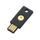
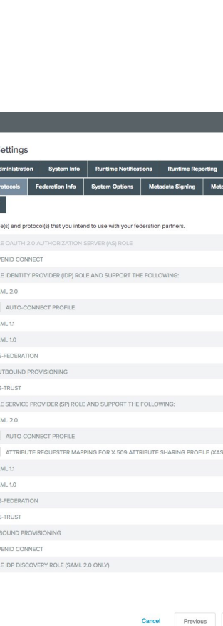
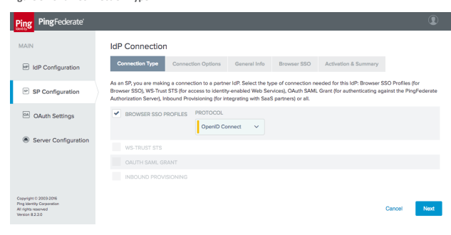
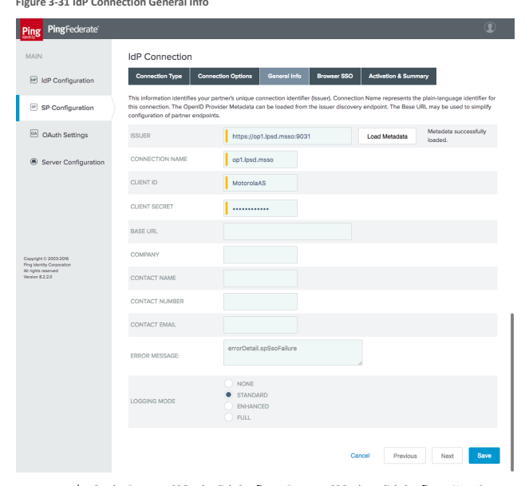
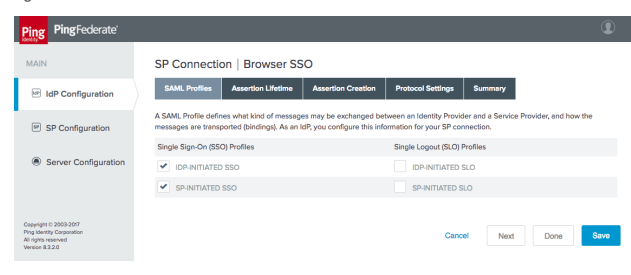

# Nist Special Publication 1800-13

Mobile Application Single Sign-On:
Improving Authentication for Public Safety First Responders Includes Executive Summary (A); Approach, Architecture, and Security Characteristics (B); 
and **How-To Guides (C)**
William Fisher Paul Grassi* William C. Barker Spike E. Dog Santos Jha William Kim Taylor McCorkill* Joseph Portner* Mark Russell* Sudhi Umarji
*Former employee; all work for this publication was done while at employer. FINAL The first and second drafts of this publication are available free of charge from

 https://www.nccoe.nist.gov/library/mobile-application-single-sign-nist-sp-1800-13-practice-guide

# Nist Special Publication 1800-13 Mobile Application Single Sign-On: Improving Authentication For Public Safety First Responders

Includes Executive Summary (A); Approach, Architecture, and Security Characteristics (B); 
and How-To Guides (C)
William Fisher Paul Grassi* Applied Cybersecurity Division Information Technology Laboratory Spike E. Dog Santos Jha William Kim* Taylor McCorkill* Joseph Portner* Mark Russell* Sudhi Umarji The MITRE Corporation McLean, Virginia William C. Barker Dakota Consulting Silver Spring, Maryland
*Former employee; all work for this publication was done while at employer.

FINAL
August 2021

U.S. Department of Commerce Gina M. Raimondo, Secretary National Institute of Standards and Technology James K. Olthoff, Performing the Non-Exclusive Functions and Duties of the Under *Secretary of Commerce* for Standards and Technology & Director, National Institute of Standards and Technology NIST SPECIAL PUBLICATION 1800-13A 

# Mobile Application Single

Sign-On:
Improving Authentication for Public Safety First Responders Volume A: 
Executive Summary William Fisher Paul Grassi* Applied Cybersecurity Division Information Technology Laboratory Spike E. Dog Santos Jha William Kim* Taylor McCorkill* Joseph Portner* Mark Russell* Sudhi Umarji The MITRE Corporation McLean, Virginia William C. Barker Dakota Consulting Silver Spring, Maryland
*Former employee; all work for this publication was done while at employer.

August 2021 FINAL
The first and second drafts of this publication are available free of charge from

 https://www.nccoe.nist.gov/library/mobile-application-single-sign-nist-sp-1800-13-practice-guide

# Executive Summary

 On-demand access to public safety data is critical to ensuring that public safety and first responders (PSFRs) can protect life and property during an emergency.

 This public safety information, often needing to be accessed via mobile or portable devices, routinely includes sensitive information, such as personally identifiable information, law enforcement sensitive information, and protected health information.

 Because the communications are critical to public safety and may include sensitive information, robust and reliable authentication mechanisms that do not hinder delivery of emergency services are required.

 In collaboration with the National Institute of Standards and Technology (NIST) Public Safety Communications Research laboratory and industry stakeholders, the National Cybersecurity Center of Excellence (NCCoE) at NIST built a laboratory environment to demonstrate standardsbased technologies that can enable PSFRs to gain access to public safety information efficiently and securely by using mobile devices.

 The technologies demonstrated are currently available and include (1) single sign-on (SSO)
capabilities that reduce the number of credentials that need to be managed by public safety personnel, and reduce the time and effort that individuals spend authenticating themselves;
(2) identity federation that can improve the ability to authenticate personnel across public safety organization (PSO) boundaries; and (3) multifactor authentication (MFA) that enables authentication with a high level of assurance.

 This NIST Cybersecurity Practice Guide describes how organizations can implement these technologies to enhance public safety mission capabilities by using standards-based commercially available or open-source products. The technologies described facilitate interoperability among diverse mobile platforms, applications, relying parties, identity providers
(IdPs), and public-sector and private-sector participants, regardless of the application development platform used in their construction.

## Challenge

Recent natural and human-made disasters and crises have highlighted the importance of efficient and secure access to critical information by PSFRs. For decades, much of this information was broadcast to PSFRs by voice over radio. More recently, many PSOs have transitioned to a hybrid model that includes automated access to much of this information via ruggedized mobile laptops and tablets. Further advances in technology have resulted in increasing reliance on smartphones or similar portable devices for field access to public safety information. The increasing reliance on these devices has driven the use of "native app"-based interfaces to access information, in addition to more conventional browser-based methods.

Many PSOs are in the process of transitioning from conventional land-based mobile communications to high-speed, regional or nationwide wireless broadband networks (e.g., FirstNet). These networks employ Internet Protocol-based communications to provide secure and interoperable public safety communications to support initiatives such as Criminal Justice Information Services, Regional Information Sharing Systems, and international justice and public safety services such as those provided 
  https://doi.org/10.6028/NIST.SP.1800-13.

by Nlets. This transition will foster critically needed interoperability within and among jurisdictions, but it will create a significant increase in the number of mobile devices that PSOs will need to manage. 

Current PSO authentication services may not be sustainable in the face of this growth. There are needs to improve security assurance, limit authentication requirements that are imposed on users (e.g., reduce the number of passwords that are required), improve the usability and efficiency of user account management, and share identities across jurisdictional boundaries. There is no single management or administrative hierarchy spanning the PSFR population. PSFR organizations operate in a variety of environments with different authentication requirements. Standards-based solutions are needed to support technical interoperability and a diverse set of PSO environments. 

## Solution

To address these challenges, the NCCoE brought together common identity and software application providers to demonstrate how a PSO can implement mobile native and web application SSO, access federated identity sources, and implement MFA. SSO limits the time and effort that PSFR personnel spend authenticating, while MFA provides PSOs with adequate confidence that users who are accessing their information are who they say they are. The architecture supports identity federation that allows PSOs to share identity assertions between applications and across PSO jurisdictions. A combination of all of these capabilities can allow PSFR personnel to authenticate—say, at the beginning of their shift—and leverage that high-assurance authentication to gain cross-jurisdictional access to many other mobile native and web applications while on duty. 

The guide provides a detailed example solution and capabilities that address risk and security controls a demonstration of the approach using commercially available products
 "how to" instructions for implementers and security engineers on integrating and configuring the example solution into their organization's enterprise in a manner that achieves security goals with minimal impact on operational efficiency and expense The NCCoE assembled existing technologies that support the following standards: 
 Internet Engineering Task Force Request for Comments 8252, OAuth 2.0 for Native *Apps* Fast Identity Online (FIDO) Universal Second Factor and Universal Authentication Framework Security Assertion Markup Language 2.0 OpenID Connect 1.0 Commercial, standards-based products, such as the ones that we used, are readily available and interoperable with existing information technology (IT) infrastructures. While the NCCoE used a suite of commercial products to address this challenge, this guide does not endorse these particular products, nor does it guarantee compliance with any regulatory initiatives. Your organization's information security experts should identify the products that will best integrate with your existing tools and IT system infrastructure. Your organization can adopt this solution or one that adheres to these guidelines in whole, or you can use this guide as a starting point for tailoring and implementing parts of a solution.

  https://doi.org/10.6028/NIST.SP.1800-13.

## Benefits

The NCCoE's practice guide to *Mobile Application Single Sign-On* can help PSOs:
 define requirements for mobile application SSO and MFA implementation improve interoperability among mobile platforms, applications, and IdPs, regardless of the application development platform used in their construction enhance the efficiency of PSFRs by reducing the number of authentication steps, the time needed to access critical data, and the number of credentials that need to be managed support a diverse set of credentials, enabling a PSO to choose an authentication solution that best meets its individual needs

## Share Your Feedback

You can view or download the guide at https://www.nccoe.nist.gov/projects/use-cases/mobile-sso. Help the NCCoE make this guide better by sharing your thoughts with us as you read the guide. If you adopt this solution for your own organization, please share your experience and advice with us. We recognize that technical solutions alone will not fully enable the benefits of our solution, so we encourage organizations to share lessons learned and best practices for transforming the processes associated with implementing this guide. 

To provide comments or to learn more by arranging a demonstration of this example implementation, contact the NCCoE at psfr-nccoe@nist.gov. 

## Collaborators

Collaborators participating in this project submitted their capabilities in response to an open call in the Federal Register for all sources of relevant security capabilities from academia and industry (vendors and integrators). The following respondents with relevant capabilities or product components signed a Cooperative Research and Development Agreement (CRADA) to collaborate with NIST in a consortium to build this example solution. 

Certain commercial entities, equipment, products, or materials may be identified by name or company 

 logo or other insignia in order to acknowledge their participation in this collaboration or to describe an experimental procedure or concept adequately. Such identification is not intended to imply special status or relationship with NIST or recommendation or endorsement by NIST or NCCoE; neither is it intended to imply that the entities, equipment, products, or materials are necessarily the best available for the purpose.

  https://doi.org/10.6028/NIST.SP.1800-13.

# Nist Special Publication 1800-13B Mobile Application Single

Sign-On:
Improving Authentication for Public Safety First Responders Volume B:
Approach, Architecture, and Security Characteristics William Fisher Paul Grassi* Applied Cybersecurity Division Information Technology Laboratory Spike E. Dog Santos Jha William Kim* Taylor McCorkill* Joseph Portner* Mark Russell* Sudhi Umarji The MITRE Corporation McLean, Virginia William C. Barker Dakota Consulting Silver Spring, Maryland
*Former employee; all work for this publication was done while at employer.

August 2021 FINAL
The first and second drafts of this publication are available free of charge from

 https://www.nccoe.nist.gov/library/mobile-application-single-sign-nist-sp-1800-13-practice-guide

## Disclaimer

Certain commercial entities, equipment, products, or materials may be identified by name or company logo or other insignia in order to acknowledge their participation in this collaboration or to describe an experimental procedure or concept adequately. Such identification is not intended to imply special status or relationship with NIST or recommendation or endorsement by NIST or NCCoE; neither is it intended to imply that the entities, equipment, products, or materials are necessarily the best available for the purpose.

National Institute of Standards and Technology Special Publication 1800-13B, Natl. Inst. Stand. Technol. 

Spec. Publ. 1800-13B, 64 pages (August 2021), CODEN: NSPUE2

## Feedback

As a private-public partnership, we are always seeking feedback on our practice guides. We are particularly interested in seeing how businesses apply NCCoE reference designs in the real world. If you have implemented the reference design, or have questions about applying it in your environment, please email us at psfr-nccoe@nist.gov. 

All comments are subject to release under the Freedom of Information Act.

National Cybersecurity Center of Excellence National Institute of Standards and Technology 100 Bureau Drive Mailstop 2002 Gaithersburg, Maryland 20899 Email: nccoe@nist.gov
  https://doi.org/10.6028/NIST.SP.1800-13.

## National Cybersecurity Center Of Excellence

The National Cybersecurity Center of Excellence (NCCoE), a part of the National Institute of Standards and Technology (NIST), is a collaborative hub where industry organizations, government agencies, and academic institutions work together to address businesses' most pressing cybersecurity issues. This public-private partnership enables the creation of practical cybersecurity solutions for specific industries, as well as for broad, cross-sector technology challenges. Through consortia under Cooperative Research and Development Agreements (CRADAs), including technology partners—from Fortune 50 market leaders to smaller companies specializing in information technology security—the NCCoE applies standards and best practices to develop modular, adaptable example cybersecurity solutions using commercially available technology. The NCCoE documents these example solutions in the NIST Special Publication 1800 series, which maps capabilities to the NIST Cybersecurity Framework and details the steps needed for another entity to re-create the example solution. The NCCoE was established in 2012 by NIST in partnership with the State of Maryland and Montgomery County, Maryland. To learn more about the NCCoE, visit https://www.nccoe.nist.gov. To learn more about NIST, visit https://www.nist.gov. 

## Nist Cybersecurity Practice Guides

NIST Cybersecurity Practice Guides (Special Publication 1800 series) target specific cybersecurity challenges in the public and private sectors. They are practical, user-friendly guides that facilitate the adoption of standards-based approaches to cybersecurity. They show members of the information security community how to implement example solutions that help them align with relevant standards and best practices, and provide users with the materials lists, configuration files, and other information they need to implement a similar approach.

The documents in this series describe example implementations of cybersecurity practices that businesses and other organizations may voluntarily adopt. These documents do not describe regulations or mandatory practices, nor do they carry statutory authority. 

## Abstract

On-demand access to public safety data is critical to ensuring that public safety and first responder 
(PSFR) personnel can deliver the proper care and support during an emergency. This necessitates heavy reliance on mobile platforms while in the field, which may be used to access sensitive information. 

However, complex authentication requirements can hinder the process of providing emergency services, and any delay—even seconds—can become a matter of life or death. In collaboration with NIST'S Public Safety Communications Research (PSCR) Division and industry stakeholders, the NCCoE aims to help PSFR personnel efficiently and securely gain access to mission data via mobile devices and applications. This practice guide describes a reference design for multifactor authentication (MFA) and mobile single sign-on (MSSO) for native and web applications while improving interoperability among mobile platforms, applications, and identity providers, regardless of the application development platform used in their construction. This guide discusses major architecture design considerations, explains security characteristics achieved by the reference design, and maps the security characteristics to applicable standards and security control families. For parties interested in adopting all or part of the reference architecture, this guide includes a detailed description of the installation, configuration, and integration of all components.

## Keywords

access control; authentication; authorization; identity; identity management; identity provider; relying party; single sign-on

## Acknowledgments

We are grateful to the following individuals for their generous contributions of expertise and time.

| We are grateful to the following individuals for their generous contributions of expertise and time. Name Organization Donna Dodson* NIST NCCoE Tim McBride NIST NCCoE Jeff Vettraino FirstNet FNU Rajan FirstNet John Beltz NIST Public Safety Communications Research Lab Chris Leggett Ping Identity Paul Madsen Ping Identity John Bradley Yubico Adam Migus Yubico Derek Hanson Yubico Adam Lewis Motorola Solutions Mike Korus Motorola Solutions Dan Griesmann Motorola Solutions Arshad Noor StrongKey Pushkar Marathe StrongKey Max Smyth StrongKey Scott Wong StrongKey   |
|-------------------------------------------------------------------------------------------------------------------------------------------------------------------------------------------------------------------------------------------------------------------------------------------------------------------------------------------------------------------------------------------------------------------------------------------------------------------------------------------------------------------------------------------------------------------------------------|

| Name         | Organization   |
|--------------|----------------|
| Akhilesh Sah | Nok Nok Labs   |
| Avinash Umap | Nok Nok Labs   |

*Former employee; all work for this publication was done while at employer.

| Technology Partner/Collaborator   | Build Involvement                                                            |
|-----------------------------------|------------------------------------------------------------------------------|
| Ping Identity                     | Federation Server                                                            |
| Motorola Solutions                | Mobile Applications                                                          |
| Yubico                            | External Authenticators                                                      |
| Nok Nok Labs                      | Fast Identity Online (FIDO) Universal Authentication  Framework (UAF) Server |
| StrongKey                         | FIDO Universal Second Factor (U2F) Server                                    |

The Technology Partners/Collaborators who participated in this build submitted their capabilities in response to a notice in the Federal Register. Respondents with relevant capabilities or product components were invited to sign a Cooperative Research and Development Agreement (CRADA) with NIST, allowing them to participate in a consortium to build this example solution. We worked with:

## Patent Disclosure Notice

NOTICE: The Information Technology Laboratory (ITL) has requested that holders of patent claims whose use may be required for compliance with the guidance or requirements of this publication disclose such patent claims to ITL. However, holders of patents are not obligated to respond to ITL calls for patents and ITL has not undertaken a patent search in order to identify which, if any, patents may apply to this publication.

As of the date of publication and following call(s) for the identification of patent claims whose use may be required for compliance with the guidance or requirements of this publication, no such patent claims have been identified to ITL. No representation is made or implied by ITL that licenses are not required to avoid patent infringement in the use of this publication.

## Contents

| 1.1.1   | Easing User Authentication Requirements 2                               |
|---------|-------------------------------------------------------------------------|
| 1.1.2   | Improving Authentication Assurance 2                                    |
| 1.1.3   | Federating Identities and User Account Management 2                     |
| 3.5.1   | PSFR Risks 10                                                           |
| 3.5.2   | Mobile Ecosystem Threats 11                                             |
| 3.5.3   | Authentication and Federation Threats 13                                |
| 4.1.1   | SSO with OAuth 2.0, IETF RFC 8252, and AppAuth Open-Source Libraries 18 |
| 4.1.2   | Identity Federation 18                                                  |
| 4.1.3   | FIDO and Authenticator Types 19                                         |

|                                                                            | 4.3.1                                                     | SAML and U2F Authentication Flow .         |
|----------------------------------------------------------------------------|-----------------------------------------------------------|--------------------------------------------|
|                                                                            | 4.3.2                                                     | OpenID Connect and UAF Authentication Flow |
| 4.4                                                                        | Single Sign-On with the OAuth Authorization Flow .        |                                            |
| 4.5                                                                        | Application Developer Perspective of the Build .          |                                            |
| 4.6                                                                        | Identity Provider Perspective of the Build .              |                                            |
| 4.7                                                                        | Token and Session Management .                            |                                            |
| 5 Security Characteristic Analysis .                                       |                                                           |                                            |
| 5.1   Assumptions and Limitations                                          |                                                           |                                            |
| 5.2 Threat Analysis                                                        |                                                           |                                            |
|                                                                            | 5.2.1                                                     | Mobile Ecosystem Threat Analysis .         |
|                                                                            | 5.2.2     Authentication and Federation Threat Analysis . |                                            |
| 5.3   Scenarios and Findings .                                             |                                                           |                                            |
| Appendix A  Mapping to Cybersecurity Framework Core                        |                                                           |                                            |
| Appendix B  Assumptions Underlying the Build .                             |                                                           |                                            |
| B.1 Identity Proofing.                                                     |                                                           |                                            |
| B.2 Mobile Device Security                                                 |                                                           |                                            |
| B.3 Mobile Application Security                                            |                                                           |                                            |
| B.4 Enterprise Mobility Management .                                       |                                                           |                                            |
| B.5 FIDO Enrollment Process.                                               |                                                           |                                            |
| Appendix C   Architectural Considerations for the Mobile Application       |                                                           |                                            |
| Single Sign-On Build .                                                     |                                                           |                                            |
| C.1 SSO with OAuth 2.0, IETF RFC 8252, and AppAuth Open-Source Libraries . |                                                           |                                            |
|                                                                            | C.1.1 Attributes and Authorization .                      |                                            |
| C.2 Federation .                                                           |                                                           |                                            |
| C.3 Authenticator Types                                                    |                                                           |                                            |
|                                                                            | C.3.1 UAF Protocol .                                      |                                            |
|                                                                            | C.3.2 U2F Protocol .                                      |                                            |
|                                                                            | C.3.3 FIDO 2                                              |                                            |
|                                                                            | C.3.4 FIDO Key Registration                               |                                            |

| C.3.5 FIDO Authenticator Attestation   |
|----------------------------------------|
| C.3.6 FIDO Deployment Considerations . |
| Appendix D Acronyms                    |
| Appendix E References.                 |

| Figure 3-1 The Mobile Ecosystem            |
|--------------------------------------------|
| Figure 4-1 High-Level U2F Architecture .   |
| Figure 4-2 High-Level UAF Architecture     |
| Figure 4-3 SAML and U2F Sequence Diagram . |
| Figure 4-4 OIDC and UAF Sequence Diagram . |
| Figure 5-1 Mobile Device Technology Stack. |

| Table 3-1 Threat Classes and Categories        |
|------------------------------------------------|
| Table 3-2 Products and Technologies            |
| Table A-1 Cybersecurity Framework Categories . |
| Table C-1 FAL Requirements .                   |
| Table C-2 AAL Summary of Requirements          |

## List Of Figures List Of Tables 1 **Summary**

The National Cybersecurity Center of Excellence (NCCoE), with the National Institute of Standards and Technology's (NIST's) Public Safety Communications Research lab, is helping the public safety and first responder (PSFR) community address the challenge of securing sensitive information accessed on mobile applications. The Mobile Application Single Sign-On (SSO) Project is a collaborative effort with industry and the information technology (IT) community, including vendors of cybersecurity solutions. 

This project aims to help PSFR personnel efficiently and securely gain access to mission-critical data via mobile devices and applications through mobile SSO, identity federation, and multifactor authentication 
(MFA) solutions for native and web applications by using standards-based commercially available and open-source products.

The reference design herein provides a detailed example solution and capabilities that address risk and security controls demonstrates standards-based MFA, identity federation, and mobile SSO for native and web applications supports multiple authentication methods, considering unique environmental constraints faced by first responders in emergency medical services, law enforcement, and fire services

## 1.1 **Challenge**

On-demand access to public safety data is critical to ensuring that PSFR personnel can protect life and property during an emergency. Mobile platforms offer a significant operational advantage to public safety stakeholders by providing access to mission-critical information and services while deployed in the field, during training and exercises, or when participating in day-to-day business and preparing for emergencies during nonemergency periods. These advantages can be limited if complex authentication requirements hinder PSFR personnel, especially when a delay—even seconds—is a matter of containing or exacerbating an emergency. PSFR communities are challenged with implementing efficient and secure authentication mechanisms to protect access to this sensitive information while meeting the demands of their operational environment. 

Many public safety organizations (PSOs) are in the process of transitioning from conventional land-based mobile communications to high-speed, regional or nationwide wireless broadband networks (e.g., First Responder Network Authority [FirstNet]). These emerging 5G systems employ internet protocol-based communications to provide secure and interoperable public safety communications to support initiatives such as Criminal Justice Information Services; Regional Information Sharing Systems; and international justice and public safety services, such as those provided by Nlets. This transition will foster critically needed interoperability within and among jurisdictions but will create a significant 
  https://doi.org/10.6028/NIST.SP.1800-13.

increase in the number of mobile Android and iPhone operating system (iOS) devices that PSOs will need to manage. 

Current PSO authentication services may not be sustainable in the face of this growth. There are needs to improve security assurance, limit authentication requirements that are imposed on users (e.g., avoid the number of passwords that are required), improve the usability and efficiency of user account management, and share identities across jurisdictional boundaries. There is no single management or administrative hierarchy spanning the PSFR population. PSFR organizations operate in a variety of environments with different authentication requirements. Standards-based solutions are needed to support technical interoperability and this diverse set of PSO environments. 

## 1.1.1 Easing User Authentication Requirements

Many devices that digitally access public safety information employ different software applications to access different information sources. Single-factor authentication processes, usually passwords, are most commonly required to access each of these applications. Users often need different passwords or personal identification numbers (PINs) for each application used to access critical information. Authentication prompts, such as entering complex passwords on a small touchscreen for each application, can hinder PSFRs. There is an operational need for the mobile systems on which they rely to support a single authentication process that can be used to access multiple applications. This is referred to as single sign-on, or SSO. 

## 1.1.2 Improving Authentication Assurance

Single-factor password authentication mechanisms for mobile native and web applications may not provide sufficient protection for control of access to law enforcement-sensitive information, protected health information, and personally identifiable information (PII). Replacement of passwords by multifactor technology (e.g., a PIN plus some physical token or biometric) is widely recognized as necessary for access to sensitive information. Technology for these capabilities exists, but budgetary, contractual, and operational considerations have impeded implementation and use of these technologies. PSOs need a solution that supports differing authenticator requirements across the community (e.g., law enforcement, fire response, emergency medical services) and a "future-proof" solution allowing for adoption of evolving technologies that may better support PSFRs in the line of duty. 

## 1.1.3 Federating Identities And User Account Management

PSFRs need access to a variety of applications and databases to support routine activities and emergency situations. These resources may be accessed by portable mobile devices or mobile data terminals in vehicles. It is not uncommon for these resources to reside within neighboring jurisdictions at the federal, state, county, or local level. Even when the information is within the same jurisdiction, it may reside in a third-party vendor's cloud service. This environment results in issuance of many user 
  https://doi.org/10.6028/NIST.SP.1800-13.

accounts to each PSFR that are managed and updated by those neighboring jurisdictions or cloud service providers. When a PSFR leaves or changes job functions, the home organization must ensure that accounts are deactivated, avoiding any orphaned accounts managed by third parties. PSOs need a solution that reduces the number of accounts managed and allows user accounts and credentials issued by a PSFR's home organization to access information across jurisdictions and with cloud services. The ability of one organization to accept the identity and credentials from another organization in the form of an identity assertion is called *identity federation*. Current commercially available standards support this functionality. 

## 1.2 **Solution**

This NIST Cybersecurity Practice Guide demonstrates how commercially available technologies, standards, and best practices implementing SSO, identity federation, and MFA can meet the needs of PSFR communities when accessing services from mobile devices.

In our lab at the NCCoE, we built an environment that simulates common identity providers (IdPs) and software applications found in PSFR infrastructure. In this guide, we show how a PSFR entity can leverage this infrastructure to implement SSO, identity federation, and MFA for native and web applications on mobile platforms. SSO, federation, and MFA capabilities can be implemented independently, but implementing them together would achieve maximum improvement with respect to usability, interoperability, and security. 

At its core, the architecture described in Section 4 implements the Internet Engineering Task Force's 
(IETF's) Best Current Practice (BCP) guidance found in Request for Comments (RFC) 8252, *OAuth 2.0 for* Native Apps [1]. Leveraging technology newly available in modern mobile operating systems (OSes), RFC 
8252 defines a specific flow allowing for authentication to mobile native applications without exposing user credentials to the client application. This authentication can be leveraged by additional mobile native and web applications to provide an SSO experience, avoiding the need for the user to manage credentials independently for each application. Using the Fast Identity Online (FIDO) Universal Authentication Framework (UAF) [2] and Universal Second Factor (U2F) [3] protocols, this solution supports MFA on mobile platforms that use a diverse set of authenticators. The use of Security Assertion Markup Language (SAML) 2.0 [4] and OpenID Connect (OIDC) 1.0 [5] federation protocols allows PSOs to share identity assertions between applications and across PSO jurisdictions. Using this architecture allows PSFR personnel to authenticate once—say, at the beginning of their shift—and then leverage that single authentication to gain access to many other mobile native and web applications while on duty, reducing the time needed for authentication.

The PSFR community comprises tens of thousands of different organizations across the United States, many of which may operate their own IdPs. Today, most IdPs use SAML 2.0, but OIDC is rapidly gaining market share as an alternative for identity federation. As this build architecture demonstrates, an OAuth authorization server (AS) can integrate with both OIDC and SAML IdPs.

  https://doi.org/10.6028/NIST.SP.1800-13.

The guide provides:
 a detailed example solution and capabilities that may be implemented independently or in combination to address risk and security controls a demonstration of the approach, which uses commercially available products how-to instructions for implementers and security engineers on integrating and configuring the example solution into their organization's enterprise in a manner that achieves security goals with minimal impact on operational efficiency and expense Organizations can adopt this solution or a different one that adheres to these guidelines in whole, or an organization can use this guide as a starting point for tailoring and implementing parts of a solution.

Note that since May 2018, when this project build was initially completed at the NCCoE laboratory, some of the products used in the build have migrated to new platforms. In addition, new specifications and standards used by the products have been published and revised. While the general integration concepts demonstrated in this guide still apply, implementers using newer or different products will have to tailor their implementation to meet the specific requirements of those products and specifications. Thus, the implementation details will be different.

## 1.3 **Benefits**

The NCCoE, in collaboration with our stakeholders in the PSFR community, identified the need for a mobile SSO and MFA solution for native and web applications. This NCCoE practice guide, *Mobile* Application Single Sign-On, can help PSOs:
 define requirements for mobile application SSO and MFA implementation improve interoperability among mobile platforms, applications, and IdPs, regardless of the application development platform used in their construction enhance the efficiency of PSFRs by reducing the number of authentication steps, the time needed to access critical data, and the number of credentials that need to be managed support a diverse set of credentials, enabling a PSO to choose an authentication solution that best meets its individual needs enable cross-jurisdictional information sharing by identity federation
  https://doi.org/10.6028/NIST.SP.1800-13.

## 2 **How To Use This Guide**

This NIST Cybersecurity Practice Guide demonstrates a standards-based reference design and provides users with the information they need to replicate an MFA and mobile SSO solution for mobile native and web applications. This reference design is modular and can be deployed in whole or in part.

This guide contains three volumes:
 NIST Special Publication (SP) 1800-13A: *Executive Summary* NIST SP 1800-13B: *Approach, Architecture, and Security Characteristics*—what we built and why 
(you are here)
 NIST SP 1800-13C: *How-To Guides*—instructions for building the example solution Depending on your role in your organization, you might use this guide in different ways:
Business decision makers, including chief security and technology officers, will be interested in the Executive Summary (NIST SP 1800-13A), which describes the following topics: 
 challenges that enterprises face in MFA and mobile SSO for native and web applications example solution built at the NCCoE benefits of adopting the example solution Technology or security program managers who are concerned with how to identify, understand, assess, and mitigate risk will be interested in this part of the guide, NIST SP 1800-13B, which describes what we did and why. The following sections will be of particular interest:
 Section 3.5, Risk Assessment, provides a description of the risk analysis we performed. 

 Appendix A, Mapping to Cybersecurity Framework Core, maps the security characteristics of this example solution to cybersecurity standards and best practices. 

You might share the *Executive Summary,* NIST SP 1800-13A, with your leadership team members to help them understand the importance of adopting a standards-based MFA and mobile SSO solution for native and web applications. 

Information technology (IT) **professionals** who want to implement an approach like this will find the whole practice guide useful. You can use the how-to portion of the guide, NIST SP 1800-13C, to replicate all or parts of the build created in our lab. The how-to portion of the guide provides specific product installation, configuration, and integration instructions for implementing the example solution. We do not re-create the product manufacturer's documentation, which is generally widely available. Rather, we show how we incorporated the products together in our environment to create an example solution.

This guide assumes that IT professionals have experience implementing security products within the enterprise. While we have used a suite of commercial products to address this challenge, this guide does 
  https://doi.org/10.6028/NIST.SP.1800-13.

not endorse these particular products. Your organization can adopt this solution or one that adheres to these guidelines in whole, or you can use this guide as a starting point for tailoring and implementing SSO or MFA separately. Your organization's security experts should identify the products that will best integrate with your existing tools and IT system infrastructure. We hope you will seek products that are congruent with applicable standards and best practices. Section 3.7, Technologies, lists the products we used and maps them to the cybersecurity controls provided by this reference solution. A NIST Cybersecurity Practice Guide does not describe "the" solution, but a possible solution.

Comments, suggestions, and success stories will improve subsequent versions of this guide. Please contribute your thoughts to psfr-nccoe@nist.gov.

## 2.1 **Typographic Conventions**

| The following table presents typographic conventions used in this volume. Typeface/Symbol Meaning Example For detailed definitions of terms, see  the NCCoE Glossary. Italics file names and pathnames, references to documents that  are not hyperlinks, new terms,  and placeholders Bold names of menus, options,  Choose File > Edit. command buttons, and fields mkdir Monospace command-line input, onscreen computer output, sample code  examples, and status codes service sshd start Monospace Bold command-line user input  contrasted with computer  output blue text link to other parts of the  document, a web URL, or an  email address All publications from NIST's NCCoE  are available at https://www.nccoe.nist.gov.   |
|--------------------------------------------------------------------------------------------------------------------------------------------------------------------------------------------------------------------------------------------------------------------------------------------------------------------------------------------------------------------------------------------------------------------------------------------------------------------------------------------------------------------------------------------------------------------------------------------------------------------------------------------------------------------------------------------------------------------------------------------|

  https://doi.org/10.6028/NIST.SP.1800-13.

## 3 **Approach**

In conjunction with the PSFR community, the NCCoE developed a project description identifying MFA 
and SSO for mobile native and web applications as a critical need for PSFR organizations. The NCCoE then engaged subject matter experts from industry organizations, technology vendors, and standards bodies to develop an architecture and reference design leveraging new capabilities in modern mobile OSes and best current practices in SSO and MFA. 

## 3.1 **Audience**

This guide is intended for individuals or entities that are interested in understanding the mobile native and web application SSO and MFA reference designs that the NCCoE has implemented to allow PSFR personnel to securely and efficiently gain access to mission-critical data by using mobile devices. Though the NCCoE developed this reference design with the PSFR community, any party interested in SSO and MFA for native mobile and web applications can leverage the architecture and design principles implemented in this guide.

The overall build architecture addresses three different audiences with somewhat separate concerns:
 IdPs—PSFR organizations that issue and maintain user accounts for their users. Larger PSFR 
organizations may operate their own IdP infrastructures and may federate by using SAML or OIDC services, while others may seek to use an IdP service provider. IdPs are responsible for identity proofing, account creation, account and attribute management, and credential management.

 Relying parties (RPs)—organizations providing application services to multiple PSFR 
organizations. RPs may be software-as-a-service (SaaS) providers or PSFR organizations providing shared services consumed by other organizations. The RP operates an OAuth 2.0 AS, which integrates with users' IdPs and issues access tokens to enable mobile applications to make requests to the back-end application servers.

 Application developers—mobile application developers. Today, mobile client applications are typically developed by the same software provider as the back-end RP applications. However, the OAuth framework enables interoperability between RP applications and third-party client applications. In any case, mobile application development is a specialized skill with unique considerations and requirements. Mobile application developers should consider implementing the AppAuth library for IETF RFC 8252 to enable standards-based SSO.

## 3.2 **Scope**

The focus of this project is to address the need for secure and efficient mobile native and web application SSO. The NCCoE drafted a use case that identified numerous desired solution characteristics. After an open call in the Federal Register for vendors to help develop a solution, we chose participating 
  https://doi.org/10.6028/NIST.SP.1800-13.

technology collaborators on a first-come, first-served basis. We scoped the project to produce the following high-level desired outcomes:
 Provide a standards-based solution architecture that selects an effective and secure approach to implementing mobile SSO, leveraging native capabilities of the mobile OS. 

 Ensure that mobile applications do not have access to user credentials. 

 Support MFA and multiple authentication protocols. Support multiple authenticators, considering unique environmental constraints faced by first responders in emergency medical services, law enforcement, and fire services. 

 Support cross-jurisdictional information sharing through identity federation. 

To maintain the project's focus on core SSO and MFA requirements, the following subjects are out of scope. These technologies and practices are critical to a successful implementation, but they do not directly affect the core design decisions.

 Identity proofing—The solution creates synthetic digital identities that represent the identities and attributes of public safety personnel to test authentication assertions. This includes the usage of a lab-configured identity repository—not a genuine repository and schema provided by any PSO. This guide will not demonstrate an identity proofing process. 

 Access control—This solution supports the creation and federation of attributes but will not discuss or demonstrate access control policies that an RP might implement to govern access to specific resources. 

 Credential storage—This solution is agnostic to where credentials are stored on the mobile device. For example, this use case is not affected by storing a certificate in software versus hardware, such as a trusted platform module. 

 Enterprise Mobility Management (EMM)—The solution assumes that all applications involved in the SSO experience are allowable via an EMM. This implementation may be supported by using an EMM (for example, to automatically provision required mobile applications to the device), 
but it does not strictly depend on using an EMM.

 Fallback authentication mechanisms—This solution involves the use of multifactor authenticators, which may consist of physical authentication devices or cryptographic keys stored directly on mobile devices. Situations may arise where a user's authenticator or device has been lost or stolen. This practice guide recommends registering multiple authenticators for each user as a partial mitigation, but in some cases, it may be necessary to either enable users to fall back to single-factor authentication or provide other alternatives. Such fallback mechanisms must be evaluated considering the organization's security and availability requirements. 

  https://doi.org/10.6028/NIST.SP.1800-13.

## 3.3 **Assumptions**

Before implementing the capabilities described in this practice guide, organizations should review the assumptions underlying the NCCoE build. These assumptions are detailed in Appendix B. Though not in scope for this effort, implementers should consider whether the same assumptions can be made based on current policy, process, and IT infrastructure. As detailed in Appendix B, applicable and appropriate guidance is provided to assist this process for the following functions: 
 identity proofing mobile device security mobile application security EMM FIDO enrollment process

## 3.4 **Business Case**

Any decision to implement IT systems within an organization must begin with a solid business case. This business case could be an independent initiative or a component of the organization's strategic planning cycle. Individual business units or functional areas typically derive functional or business unit strategies from the overall organization's strategic plan. The business drivers for any IT project must originate in these strategic plans, and the decision to determine if an organization will invest in mobile SSO, identity federation, or MFA by implementing the solution in this practice guide will be based on the organization's decision-making process for initiating new projects. Important inputs to the business case are the risks to the organization from mobile authentication and identity management, as outlined in Section 3.5. Apart from addressing cybersecurity risks, SSO also improves the user experience and alleviates the overhead associated with maintaining and using passwords for multiple applications. This provides a degree of convenience to all types of users, but reducing the authentication overhead for PSFR users and reducing barriers to getting the information and applications that they need could have a tremendous effect. First responder organizations and application providers also benefit by using interoperable standards that provide easy integration across disparate technology platforms. In addition, the burden of account management is reduced by using a single user account managed by the organization to access multiple applications and services.

## 3.5 **Risk Assessment**

NIST SP 800-30 Revision 1 [6], *Guide for Conducting Risk Assessments,* states that risk is "a measure of the extent to which an entity is threatened by a potential circumstance or event, and typically a function of (i) the adverse impacts that would arise if the circumstance or even occurs; and (ii) the likelihood of occurrence." The guide further defines risk assessment as "the process of identifying, estimating, and 
  https://doi.org/10.6028/NIST.SP.1800-13.

prioritizing risks to organizational operations (including mission, functions, image, reputation), organizational assets, individuals, other organizations, and the Nation, resulting from the operation of an information system. Part of risk management incorporates threat and vulnerability analyses, and considers mitigations provided by security controls planned or in place." The NCCoE recommends that any discussion of risk management, particularly at the enterprise level, begins with a comprehensive review of NIST SP 800-37 Revision 2, *Guide for Applying the Risk* Management Framework to Federal Information Systems [7]—material that is available to the public. 

The risk management framework guidance, as a whole, proved invaluable in giving us a baseline to assess risks, from which we developed the project, the security characteristics of the build, and this guide.

## 3.5.1 Psfr Risks

As PSFR communities adopt mobile platforms and applications, organizations should consider potential risks that these new devices and ecosystems introduce that may negatively affect PSFR organizations and the ability of PSFR personnel to operate. These are some of the risks:
 The reliance on passwords alone by many PSFR entities effectively expands the scope of a single application/database compromise when users fall back to reusing a small set of easily remembered passwords across multiple applications. 

 Complex passwords are harder to remember and input to IT systems. Mobile devices exacerbate this issue with small touchscreens that may not work with gloves or other PSFR equipment, and with three separate keyboards among which the user must switch. In an emergency response, any delay in accessing information may prove critical to containing a situation. 

 Social engineering, machine-in-the-middle attacks, replay attacks, and phishing all present real threats to password-based authentication systems. 

 Deterministic, cryptographic authentication mechanisms have security benefits, yet come with the challenge of cryptographic key management. Loss or misuse of cryptographic keys could undermine an authentication system, leading to unauthorized access or data leakage. 

 Biometric authentication mechanisms may be optimal for some PSFR personnel, yet organizations need to ensure that PII, such as fingerprint templates, is protected. 

 Credentials exposed to mobile applications could be stolen by malicious applications or misused by nonmalicious applications. Previously, it was common for native applications to use embedded user-agents (commonly implemented with web views) for OAuth requests. That approach has many drawbacks, including the host application being able to copy user credentials and cookies, as well as the user needing to authenticate again in each application. 

  https://doi.org/10.6028/NIST.SP.1800-13.

## 3.5.2 Mobile Ecosystem Threats

Any discussion of risks and vulnerabilities is incomplete without considering the threats that are involved. NIST SP 800-150, *Guide to Cyber Threat Information Sharing* [8], states that a cyber threat is
"any circumstance or event with the potential to adversely impact organizational operations (including mission, functions, image, or reputation), organizational assets, individuals, other organizations, or the Nation through an information system via unauthorized access, destruction, disclosure, or modification of information, and/or denial of service."
To simplify this concept, a *threat* is anything that can exploit a *vulnerability* to damage an *asset*. Finding the intersection of these three will yield a *risk*. Understanding the applicable threats to a system is the first step in determining its risks. However, identifying and delving into mobile threats is not the primary goal of this practice guide. 

Instead, we rely on prior work from NIST's Mobile Threat Catalogue (MTC), along with its associated NIST Interagency Report (IR) 8144, *Assessing Threats to Mobile Devices & Infrastructure* [9]. Each entry in the MTC contains several pieces of information: an identifier, a category, a high-level description, details on its origin, exploit examples, examples of common vulnerabilities and exposures, possible countermeasures, and academic references. For the purposes of this practice guide, we are primarily interested in threat identifiers, categories, descriptions, and countermeasures. In broad strokes, the MTC covers 32 threat categories that are grouped into 12 distinct classes, as shown in Table 3-1. Of these categories, three in particular, highlighted in green in the table, are covered by the guidance in this practice guide. If implemented correctly, this guidance will help mitigate those threats.

| Threat Class                               | Threat Category                             | Threat Class                                   | Threat Category Network Threats: Bluetooth   |
|--------------------------------------------|---------------------------------------------|------------------------------------------------|----------------------------------------------|
| Application                                | Malicious or Privacy-Invasive  Applications | Local Area  Network and Personal Area  Network | Network Threats: Near                        |
| Vulnerable Applications                    | Field Communication  (NFC)                  |                                                |                                              |
| Authentication: User or Device to  Network | Network Threats: Wi-Fi                      |                                                |                                              |
| Authentication                             | Authentication: User or Device to           | Application-Based                              |                                              |
| Remote Service                             | Payment                                     |                                                |                                              |
| Authentication: User to Device             | In-Application Purchases                    |                                                |                                              |

Table 3-1 Threat Classes and Categories
  https://doi.org/10.6028/NIST.SP.1800-13.

| Threat Class                                                                 | Threat Category                    | Threat Class                                                                                                                        | Threat Category   |
|------------------------------------------------------------------------------|------------------------------------|-------------------------------------------------------------------------------------------------------------------------------------|-------------------|
| Carrier Infrastructure                                                       |                                    | NFC-Based                                                                                                                           |                   |
| Carrier Interoperability                                                     | Physical Access                    | Physical Access                                                                                                                     |                   |
| Cellular Air Interface                                                       | Privacy                            | Behavior Tracking                                                                                                                   |                   |
| Consumer-Grade Femtocell                                                     | Supply Chain                       | Supply Chain                                                                                                                        |                   |
| Cellular                                                                     | Short Message Service              |                                                                                                                                     |                   |
| (SMS)/Multimedia Messaging  Service (MMS)/Rich  Communication Services (RCS) |                                    | Baseband Subsystem                                                                                                                  |                   |
| Unstructured Supplementary  Service Data (USSD)                              |                                    | Boot Firmware                                                                                                                       |                   |
| Voice over Long-Term Evolution  (VoLTE)                                      |                                    | Device Drivers                                                                                                                      |                   |
| Mobile Application Store                                                     |                                    | Isolated Execution  Environments                                                                                                    |                   |
|                                                                              | Stack                              |                                                                                                                                     |                   |
| Ecosystem                                                                    | Mobile OS & Vendor  Infrastructure | Mobile Operating System                                                                                                             |                   |
| EMM                                                                          | EMM                                | Secure Digital (SD) Card                                                                                                            |                   |
| Global                                                                       |                                    |                                                                                                                                     |                   |
| Positioning                                                                  | GPS                                |                                                                                                                                     |                   |
| System (GPS)                                                                 |                                    | Universal Subscriber  Identity Module  (USIM)/Subscriber  Identity Module  (SIM)/Universal Integrated Circuit Card  (UICC) Security |                   |

The other categories, while still important elements of the mobile ecosystem and critical to the health of an overall mobility architecture, are out of scope for this document. The entire mobile ecosystem should be considered when analyzing threats to the architecture; this ecosystem is depicted in Figure 3-1, taken from NIST IR 8144. Each player in the ecosystem—the mobile device user, the enterprise, the network 
  https://doi.org/10.6028/NIST.SP.1800-13.

operator, the application developer, and the original equipment manufacturer (OEM)—can find suggestions to deter other threats by reviewing the MTC and NIST IR 8144. Many of these share common solutions, such as using EMM software to monitor device health, and installing applications from only authorized sources. Figure 3-1 The Mobile Ecosystem

## 3.5.3 Authentication And Federation Threats

The MTC is a useful reference from the perspective of mobile devices, applications, and networks. In the context of mobile SSO, specific threats to authentication and federation systems must also be considered. Table 8-1 in NIST SP 800-63B [10] lists several categories of threats against authenticators:
 theft—stealing a physical authenticator, such as a smart card or U2F device duplication—unauthorized copying of an authenticator, such as a password or private key eavesdropping—interception of an authenticator secret when in use offline cracking—attacks on authenticators that do not require interactive authentication attempts, such as brute-force attacks on passwords used to protect cryptographic keys side-channel attack—exposure of an authentication secret through observation of the authenticator's physical characteristics
  https://doi.org/10.6028/NIST.SP.1800-13.

 phishing or pharming—capturing authenticator output through impersonation of the RP or IdP
 social engineering—using a pretext to convince the user to subvert the authentication process online guessing—attempting to guess passwords through repeated online authentication attempts with the RP or IdP
 end point compromise—malicious code on the user's device, which is stealing authenticator secrets, redirecting authentication attempts to unintended RPs, or otherwise subverting the authentication process unauthorized binding—binding an attacker-controlled authenticator with the user's account by intercepting the authenticator during provisioning or impersonating the user in the enrollment process These threats undermine the basic assumption that use of an authenticator in an authentication protocol demonstrates that the user initiating the protocol is the individual referenced by the claimed user identifier. Mitigating these threats is the primary design goal of MFA, and the FIDO specifications address many of these threats.

An additional set of threats concerns federation protocols. Authentication threats affect the process of direct authentication of the user to the RP or IdP, whereas federation threats affect the assurance that the IdP can deliver assertions that are genuine and unaltered, only to the intended RP. Table 8-1 in NIST 
SP 800-63C [11] lists the following federation threats:
 assertion manufacture or modification—generation of a false assertion or unauthorized modification of a valid assertion assertion disclosure—disclosure of sensitive information contained in an assertion to an unauthorized third party assertion repudiation by the IdP—IdP denies having authenticated a user after the fact assertion repudiation by the subscriber—subscriber denies having authenticated and performed actions on the system assertion redirect—subversion of the federation protocol flow to enable an attacker to obtain the assertion or to redirect it to an unintended RP
 assertion reuse—attacker obtains a previously used assertion to establish his own session with the RP 
 assertion substitution—attacker substitutes an assertion for a different user in the federation flow, leading to session hijacking or fixation Federation protocols are complex and require interaction among multiple systems, typically under different management. Implementers should carefully apply best security practices relevant to the federation protocols in use. Most federation protocols can incorporate security measures to address these threats, but this may require specific configuration and enabling optional features. 

  https://doi.org/10.6028/NIST.SP.1800-13.

## 3.6 **Systems Engineering**

Some organizations use a systems engineering-based approach to plan and implement their IT projects. 

Organizations wishing to implement IT systems should develop robust requirements, taking into consideration the operational needs of each system stakeholder. Standards such as International Organization for Standardization (ISO)/International Electrotechnical Commission (IEC) ISO/IEC/IEEE 
15288:2015, *Systems and software engineering—System life cycle processes* [12] and NIST SP 800-160, Systems Security Engineering: Considerations for a Multidisciplinary Approach in the Engineering of Trustworthy Secure Systems [13] provide guidance for applying security in systems development. With both standards, organizations can choose to adopt only those sections of the standard that are relevant to their development approach, environment, and business context. NIST SP 800-160 recommends a thorough analysis of alternative solution classes accounting for security objectives, considerations, concerns, limitations, and constraints. This advice applies to both new system developments and integration of components into existing systems, the focus of this practice guide. Section 4.1, General Architecture Considerations, may assist organizations with this analysis. 

## 3.7 **Technologies**

Table 3-2 lists all of the technologies used in this project and provides a mapping among the generic application term, the specific product used, and the NIST Cybersecurity Framework Subcategory that the product provides. For a mapping of Cybersecurity Framework Subcategories to security controls, please refer to Appendix A, Mapping to Cybersecurity Framework Core. Refer to Table A-1 for an explanation of the Cybersecurity Framework Category and Subcategory codes.

| Component         | Specific Product Used   | How the Component                     | Applicable                                                                |
|-------------------|-------------------------|---------------------------------------|---------------------------------------------------------------------------|
|                   |                         | Functions in the Build                | Cybersecurity  Framework Subcategories PR.AC-3: Remote access is managed. |
| Federation Server | Ping Federate 8.2       | OAuth 2.0 AS OIDC provider SAML 2 IdP |                                                                           |
| FIDO U2F Server   | StrongKey Crypto Engine (SKCE) 2.0                         | FIDO U2F server                       | PR.AC-1: Identities and  credentials are managed for authorized devices and users.                                                                           |

Table 3-2 Products and Technologies
  https://doi.org/10.6028/NIST.SP.1800-13. https://doi.org/10.6028/NIST.SP.1800-13.

| Component                              | Specific Product Used                                       | How the Component      | Applicable                             |
|----------------------------------------|-------------------------------------------------------------|------------------------|----------------------------------------|
|                                        |                                                             | Functions in the Build | Cybersecurity  Framework Subcategories |
| External Authenticator                 | YubiKey Neo                                                 | FIDO U2F token supporting authentication  over NFC                        | PR-AC-1: Identities and  credentials are managed for authorized devices and users.                                        |
| FIDO UAF Server                        | Nok Nok Labs FIDO  UAF Server                               | UAF authenticator enrollment, authentication, and transaction  confirmation                        | PR.AC-1: Identities and  credentials are managed for authorized devices and users.  PR.AC-3: Remote access is managed.                                        |
| Mobile Applications  (including SaaS backend)                                        | Custom demo applications developed by the  build team; Motorola  Solutions Public Safety  Experience (PSX) Cockpit, PSX Messenger,  and PSX Mapping 5.2                                                             | Provide application  programming interfaces (APIs) for mobile  client applications to  access cloud-hosted  services and data; consume OAuth tokens                        | PR.AC-3: Remote access is managed.     |
| SSO Implementing Best Current Practice | AppAuth Software Development Kit (SDK)  for iOS and Android | Library used by mobile  applications, providing  an IETF RFC 8252-compliant OAuth 2.0 client  implementation; implements authorization  requests, Proof Key for  Code Exchange (PKCE),  and token refresh                        |                                        |

## 4 **Architecture**

The NCCoE worked with industry subject matter experts to develop an open, standards-based, commercially available architecture demonstrating three main capabilities:
 SSO to RP applications using OAuth 2.0 implemented in accordance with RFC 8252 (the OAuth 2.0 for Native Apps BCP) 
 identity federation to RP applications using both SAML 2.0 and OIDC 1.0 MFA to mobile native and web applications using FIDO UAF and U2F
Though these capabilities are implemented as an integrated solution in this guide, organizational requirements may dictate that only a subset of these capabilities be implemented. The modular approach of this architecture is designed to support such use cases. Additionally, the authors of this document recognize that PSFR organizations will have diverse IT infrastructures, which may include previously purchased authentication, federation, or SSO capabilities, and legacy technology. For this reason, Section 4.1 and Appendix C outline general considerations that any organization may apply when designing an architecture tailored to organizational needs. Section 4.2 follows with considerations for implementing the architecture specifically developed by the NCCoE for this project.

Organizations are encouraged to read Section 3.2, Section 3.3, Section 3.5, and Appendix B to understand context for this architecture design. 

## 4.1 General Architectural **Considerations**

The PSFR community is large and diverse, comprising numerous state, local, tribal, and federal organizations with individual missions and jurisdictions. PSFR personnel include police, firefighters, emergency medical technicians, public health officials, and other skilled support personnel. There is no single management or administrative hierarchy spanning the PSFR population. PSFR organizations operate in a variety of environments with different technology requirements and wide variations in IT 
staffing and budgets.

Cooperation and communication among PSFR organizations at multiple levels is crucial to addressing emergencies that span organizational boundaries. Examples include coordination among multiple services within a city (e.g., fire and police services), among different state law enforcement agencies to address interstate crime, and among federal agencies like the Department of Homeland Security and its state and local counterparts. This coordination is generally achieved through peer-to-peer interaction and agreement or through federation structures, such as the National Identity Exchange Federation. Where interoperability is achieved, it is the result of the cooperation of willing partners rather than adherence to central mandates.

Enabling interoperability across the heterogeneous, decentralized PSFR user base requires a standardsbased solution; a proprietary solution might not be uniformly adopted and could not be mandated. The solution must also support identity federation and federated authentication, as user accounts and authenticators are managed by several different organizations. The solution must also accommodate organizations of different sizes, levels of technical capabilities, and budgets. Compatibility with the existing capabilities of fielded identity systems can reduce the barrier to entry for smaller organizations.

Emergency response and other specialized work performed by PSFR personnel often require that they wear personal protective equipment, such as gloves, masks, respirators, and helmets. This equipment renders some authentication methods impractical or unusable. Fingerprint scanners cannot be used 
  https://doi.org/10.6028/NIST.SP.1800-13.

with gloves, authentication using a mobile device camera to analyze the user's face or iris may be hampered by masks or goggles, and entering complex passwords on small virtual keyboards is also impractical for gloved users. In addition, PSFR work often involves urgent and hazardous situations requiring the ability to quickly perform mission activities like driving, firefighting, and administering urgent medical aid. Therefore, the solution must support a variety of authenticators in an interoperable way so that individual user groups can select authenticators suited to their operational constraints. 

In considering these requirements, the NCCoE implemented a standards-based architecture and reference design. Section 4.1.1 through Section 4.1.3 detail the primary standards used, while Appendix C goes into great depth on architectural consideration when implementing these standards. 

## 4.1.1 Sso With Oauth 2.0, Ietf Rfc 8252, And Appauth Open-Source Libraries

SSO enables a user to authenticate once and subsequently access different applications without having to authenticate again. SSO on mobile devices is complicated by the sandboxed architecture, which makes it difficult to share the session state with back-end systems between individual applications. 

EMM vendors have provided solutions through proprietary SDKs, but this approach requires integrating the SDK with each individual application and does not scale to a large and diverse population, such as the PSFR user community. OAuth 2.0 is an IETF standard that has been widely adopted to provide delegated authorization of clients accessing representational state transfer interfaces, including mobile applications. OAuth 2.0, when implemented in accordance with RFC 8252 (the *OAuth 2.0 for Native Apps* BCP), provides a standards-based SSO pattern for mobile applications. The OpenID Foundation's AppAuth libraries [14]
can facilitate building mobile applications in full compliance with IETF RFC 8252, but any mobile application that follows RFC 8252's core recommendation of using a shared external user-agent for the OAuth authorization flow will have the benefit of SSO. OAuth considerations and recommendations are detailed in Section C.1 of Appendix C. 

## 4.1.2 Identity Federation

SAML 2.0 [4] and OIDC 1.0 [5] are two standards that enable an application to redirect users to an IdP for authentication and to receive an assertion of the user's identity and other optional attributes. 

Federation is important in a distributed environment like the PSFR community, where user management occurs in numerous local organizations. Federated authentication relieves users of having to create accounts in each application that they need to access, and it frees application owners from managing user accounts and credentials. OIDC is a more recent protocol, but many organizations have existing SAML deployments. The architecture supports both standards to facilitate adoption without requiring upgrades or modifications to existing SAML IdPs. Federation considerations and recommendations are detailed in Section C.2 of Appendix C. 

  https://doi.org/10.6028/NIST.SP.1800-13.

## 4.1.3 Fido And Authenticator Types

When considering MFA implementations, PSFR organizations should carefully consider organizationally defined authenticator requirements. These requirements are detailed in Section C.3 of Appendix C. 

FIDO provides a standard framework within which vendors have produced a wide range of interoperable biometric, hardware, and software authenticators. This will enable PSFR organizations to choose authenticators suitable to their operational constraints. The FIDO Alliance has published specifications for two types of authenticators based on UAF and U2F. These protocols operate agnostic of the FIDO 
authenticator, allowing PSOs to choose any FIDO-certified authenticator that meets operational requirements and to implement it with this solution. The protocols, FIDO key registration, FIDO 
authenticator attestation, and FIDO deployment considerations are also detailed in Section C.3 of Appendix C. 

## 4.2 **High-Level Architecture**

The NCCoE implemented both FIDO UAF and U2F for this project. The high-level architecture varies somewhat between the two implementations. Figure 4-1 depicts the interactions between the key elements of the build architecture with the U2F implementation.

  https://doi.org/10.6028/NIST.SP.1800-13.

Figure 4-1 High-Level U2F Architecture

On the mobile device, the mobile application includes the OpenID Foundation's AppAuth library, which 
streamlines implementation of the OAuth client functionality in accordance with the IETF RFC 8252, OAuth 2.0 for Native Apps, guidance. AppAuth orchestrates the authorization request flow by using the device's native browser capabilities, including in-application browser tabs on devices that support them.

The mobile device also supports the two FIDO authentication schemes, UAF and U2F. UAF typically involves an internal (on-device) authenticator that authenticates the user directly to the device by using biometrics, other hardware capabilities, or a software client. U2F typically involves an external hardware authenticator token, which communicates with the device over NFC or Bluetooth.

Figure 4-2 shows the corresponding architecture view with the FIDO UAF components.

מות המועד המועד המוזיקה במקום המועד המועד המועד המוזיקה המועד המו Figure 4-2 High-Level UAF Architecture

The SaaS provider hosts application servers that provide APIs consumed by mobile applications, as well as an OAuth AS. The browser on the mobile device connects to the AS to initiate the OAuth authorization code flow. The AS redirects the browser to the IdP of the user's organization to authenticate the user. Once the user has authenticated, the AS will issue an access token, which is
.92.T2IV18200.0L\g10.iob\\:2qttrl:mo17 ອງກາດ13 10 ອອກີ ອາdຣlisv6 2i noitsoildu returned to the mobile application through a browser redirect and can be used to authorize requests to the application servers.

The user's IdP includes a federation server that implements SAML or OIDC, directory services containing user accounts and attributes, and a FIDO authentication service that can issue authentication challenges and validate the responses that are returned from FIDO authenticators. The FIDO authentication service may be built into the IdP but is more commonly provided by a separate server.

A SaaS provider may provide multiple applications, which may be protected by the same AS. For example, for our build Motorola Solutions provided both the PSX Mapping and PSX Messaging applications, which were protected by a shared AS. Users may also use services from different SaaS 
providers, which would have separate ASes. This build architecture can provide SSO between applications hosted by a single SaaS provider as well as across applications provided by multiple SaaS vendors.

Support for these two scenarios differs between the Android and iOS platforms. When the build team implemented this project, U2F was not supported on iOS devices, while UAF was supported on both Android and iOS. The build team has only built and tested the U2F implementation on Android devices.

## 4.3 **Detailed Architecture Flow**

The mobile SSO lab implementation demonstrates two authentication flows: one in which the user authenticates to a SAML IdP with a YubiKey Neo U2F token and a PIN, and one in which the user authenticates to an OIDC IdP by using UAF with a fingerprint. These pairings of federation and authentication protocols are purely arbitrary; U2F could just as easily be used with OIDC, for example. 

## 4.3.1 Saml And U2F Authentication Flow

The authentication flow using SAML and U2F is depicted in Figure 4-3. As explained in Section 4.2, at the time of publication this implementation is not supported on iOS devices. This figure depicts the message flows among different components on the mobile device or hosted by the SaaS provider or user organization. In the figure, colored backgrounds differentiate the SAML, OAuth, and FIDO U2F protocol flows. Prior to this authentication flow, the user must have registered a FIDO U2F token with the IdP, 
and the AS and IdP must have exchanged metadata and established an RP trust.

  https://doi.org/10.6028/NIST.SP.1800-13.

The detailed steps are as follows:
1. The user unlocks the mobile device. Any form of lock-screen authentication can be used; it is not directly tied to the subsequent authentication or authorization.

2. The user opens a mobile application that connects to the SaaS provider's back-end services. The mobile application determines that an OAuth token is needed. This may occur because the application has no access or refresh tokens cached or it has an existing token known to be expired based on token metadata, or it may submit a request to the API server with a cached bearer token and receive an HTTP 401 status code in the response.

3. The mobile application initiates an OAuth authorization request using the authorization code flow by invoking the system browser (or an in-application browser tab) with the uniform resource locator (URL) of the SaaS provider AS's authorization end point.

4. The browser submits the request to the AS over a Hypertext Transfer Protocol Secure (HTTPS) 
connection. This begins the OAuth 2 authorization flow.

5. The AS returns a page that prompts for the user's email address. 6. The user submits the email address. The AS uses the domain of the email address for IdP 
discovery. The user needs to specify the email address only one time; the address is stored in a cookie in the device browser and will be used to automatically determine the user's IdP on subsequent visits to the AS.

7. The AS redirects the device browser to the user's IdP with a SAML authentication request. This begins the SAML authentication flow.

8. The IdP returns a login page. The user submits a username and PIN. The IdP validates these credentials against the directory service. If the credentials are invalid, the IdP redirects back to the login page with an error message and prompts the user to authenticate again. If the credentials are valid, the IdP continues to step 9.

9. The IdP submits a "preauth" API request to the StrongKey SKCE server. The preauth request includes the authenticated username obtained in step 8. This begins the FIDO U2F authentication process.

10. The SKCE responds with a U2F challenge that must be signed by the user's registered key in the U2F token to complete authentication. If the user has multiple keys registered, the SKCE returns a challenge for each key so that the user can authenticate with any registered authenticator.

11. The IdP returns a page to the user's browser that includes Google's JavaScript U2F API and the challenge obtained from the SKCE in step 10. The user taps a button on the page to initiate U2F 
authentication, which triggers a call to the u2f.sign JavaScript function.

12. The u2f.sign function invokes the Google Authenticator application, passing it the challenge, the appId (typically the domain name of the IdP), and an array of the user's registered key. 

13. Google Authenticator prompts the user to hold the U2F token against the NFC radio of the mobile device, which the user does.

  https://doi.org/10.6028/NIST.SP.1800-13.

14. Google Authenticator connects to the U2F token over the NFC channel and sends an applet selection command to activate the U2F applet on the token. Google Authenticator then submits a U2F_AUTHENTICATE message to the token.

15. Provided that the token has one of the keys registered at the IdP, it signs the challenge and returns the signature in an authentication success response over the NFC channel.

16. Google Authenticator returns the signature to the browser in a SignResponse object.

17. The callback script on the authentication web page returns the SignResponse object to the IdP.

18. The IdP calls the "authenticate" API on the SKCE, passing the SignResponse as a parameter.

19. The SKCE validates the signature of the challenge by using the registered public key and verifies that the appId matches the IdP's and that the response was received within the configured timeout. The API returns a response to the IdP, indicating success or failure and any error messages. 

This concludes the U2F authentication process; the user has now authenticated to the IdP, which sets a session cookie.

20. The IdP returns a SAML response indicating the authentication success or failure to the AS 
through a browser redirect. If authentication has succeeded, the response will include the user's identifier and, optionally, additional attribute assertions. This concludes the SAML 
authentication flow. The user is now authenticated to the AS, which sets a session cookie. 

Optionally, the AS could prompt the user to approve the authorization request, displaying the scopes of access being requested at this step.

21. The AS sends a redirect to the browser with the authorization code. The target of the redirect is the mobile application's redirect_uri, a link that opens in the mobile application through a mechanism provided by the mobile OS (e.g., custom request scheme or Android AppLink).

22. The mobile application extracts the authorization code from the URL and submits it to the AS's token end point.

23. The AS responds with an access token and, optionally, a refresh token that can be used to obtain an additional access token when the original token expires. This concludes the OAuth authorization flow.

24. The mobile application can now submit API requests to the SaaS provider's back-end services by using the access token in accordance with the bearer token authorization scheme defined in RFC 6750, *The OAuth 2.0 Authorization Framework: Bearer Token Usage* [15]. 

น. 92.T2IM\8209.01\g10.iob\\:zqttrl:mo17 9816db to 9911 9ldblibv6 2i noits3ildud

## 4.3.2  Openid Connect And Uaf Authentication Flow

The authentication flow involving OIDC and UAF is depicted in Figure 4-4.

Figure 4-4 uses the same conventions and color coding as the earlier SAML/U2F diagram (Figure 4-3) to depict components on the device, at the SaaS provider, and at the user's organization. Prior to this authentication flow, the user must have registered a FIDO UAF authenticator with the IdP, and the AS 
must be registered as an OIDC client at the IdP. The detailed steps are listed below. For ease of comparison, steps that are identical to the corresponding step in Figure 4-3 are shown in italics.

1. *The user unlocks the mobile device. Any form of lock-screen authentication can be used; it is not* directly tied to the subsequent authentication or authorization.

2. The user opens a mobile application *that connects to the SaaS provider's back-end services. The* mobile application determines that an OAuth token is needed. This may occur because the application has no access or refresh tokens cached or it has an existing token known to be expired based on token metadata, or it may submit a request to the API server with a cached bearer token and receive an HTTP 401 status code in the response.

3. The mobile application initiates an OAuth authorization request by using *the authorization code* flow by invoking the system browser (or an in-application browser tab) with the URL of the SaaS provider AS's authorization end *point.*
4. The in-application browser tab submits the request to the AS over an HTTPS connection. *This* begins the OAuth 2 authorization flow.

5. *The AS returns a page that prompts for the user's email address.* 
6. The user submits the email address. The AS uses the domain of the email address for IdP 
discovery. The user needs to specify the email address only one time; the address is stored in a cookie in the device browser and will be used to automatically determine the user's IdP on subsequent visits to the AS.

7. The AS redirects the device browser to the user's IdP with an OIDC authentication request. This begins the OIDC authentication flow.

8. The IdP submits a START_OOB_AUTH request to the UAF authentication server. The server responds with a data structure containing the necessary information for a UAF client to initiate an Out-of-Band (OOB) authentication, including a transaction identifier linked to the user's session at the IdP.

9. The IdP returns an HTTP redirect to the browser. The redirect target URL is an application link that will pass the OOB data to the Nok Nok Labs Passport application on the device.

10. The Nok Nok Passport application opens and extracts the OOB data from the application link URL. 

  https://doi.org/10.6028/NIST.SP.1800-13.

11. Passport sends an INIT_OOB_AUTH request to the UAF authentication server, including the OOB 
data and a list of authenticators available on the device that the user has registered for use at the IdP. The server responds with a set of UAF challenges for the registered authenticators.

12. If the user has multiple registered authenticators (e.g., fingerprint and voice authentication), 
Passport prompts the user to select which authenticator to use.

13. Passport activates the authenticator, which prompts the user to perform the required steps for verification. For example, if the selected authenticator is the Android Fingerprint authenticator, the standard Android fingerprint user interface (UI) overlay will pop over the browser and prompt the user to scan an enrolled fingerprint. The authenticator UI may be presented by Passport (for example, the PIN authenticator), or it may be provided by an OS component such as Apple Touch ID or Face ID. 

14. The user completes the biometric scan or other user verification activity. Verification occurs locally on the device; biometrics and secrets are not transmitted to the server.

15. The authenticator signs the UAF challenge by using the private key that was created during initial UAF enrollment with the IdP. The authenticator returns control to the Passport application through an application link with the signed UAF challenge.

16. The Passport application sends a FINISH_OOB_AUTH API request to the UAF authentication server. The server extracts the username and registered public key and validates the signed response. The server can also validate the authenticator's attestation signature and check that the security properties of the authenticator satisfy the IdP's security policy. The server caches the authentication result.

17. The Passport application closes, returning control to the browser, which is redirected to the 
"resume SSO" URL at the IdP. This URL is defined on the Ping server to enable multistep authentication flows and allow the browser to be redirected back to the IdP after completing required authentication steps with another application.

18. The browser requests the Resume SSO URL at the IdP. 19. The IdP sends a STATUS_OOB_AUTH API request to the UAF authentication server. The UAF 
server responds with the success/failure status of the out-of-band authentication and any associated error messages. (Note: The IdP begins sending STATUS_OOB_AUTH requests periodically, following step 9 in the flow, and continues to do so until a final status is returned or the transaction times out.) This concludes the UAF authentication process; the user has now authenticated to the IdP, which sets a session cookie.

20. The IdP returns an authorization code to the AS through a browser redirect.

  https://doi.org/10.6028/NIST.SP.1800-13.

21. The AS submits a token request to the IdP's token end point, authenticating with its credentials and including the authorization code.

22. The IdP responds with an identification (ID) token and an access token. The ID token includes the user's identifier and, optionally, additional attribute assertions. The access token can optionally be used to request additional user claims at the IdP's user information end point. This concludes the OIDC authentication flow. The user is now authenticated to the AS, which sets a session cookie. Optionally, the AS could prompt for the user to approve the authorization request, displaying the scopes of access being requested at this step.

23. The AS sends a redirect to the browser with the authorization code. The target of the redirect is the mobile application's redirect_uri, a link that opens in the mobile application *through a* mechanism provided by the mobile OS (e.g., custom request scheme or Android AppLink).

24. The mobile application extracts the authorization code from the URL and submits it *to the AS's* token end *point.*
25. The AS responds with an access token and, optionally, a refresh token that can be used to obtain an additional access token when the original token expires. This concludes the OAuth authorization flow.

26. The mobile application can now submit API requests to the SaaS provider's back-end services by using the access token in accordance with the bearer token authorization scheme.

Both authentication flows end with a single application obtaining an access token to access back-end resources. At this point, conventional OAuth token life-cycle management would begin. Access tokens have an expiration time. Depending on the application's security policy, refresh tokens may be issued along with the access token and used to obtain a new access token when the initial token expires. Refresh tokens and access tokens can continue to be issued in this manner for as long as the security policy allows. When the current access token has expired and no additional refresh tokens are available, the mobile application would submit a new authorization request to the AS.

Apart from obtaining an access token, the user has established sessions with the AS and IdP that can be used for SSO. Implementation details for this scenario were slightly different on iOS and Android devices. On Android devices, a Chrome Custom Tab was used as the user-agent. On iOS, however, the team encountered issues using the custom tabs implementation in iOS 12 (provided by the ASWebAuthenticationSession API) in conjunction with Passport. At step 17 in the above sequence, where the Passport application should close and control should return to the in-application browser tab, instead a second Safari window opened, and the user was prompted again to authenticate using Passport. The team determined that ASWebAuthenticationSession did not seem to support opening a different application like Passport and then returning to the same ASWebAuthenticationSession instance once the other 
  https://doi.org/10.6028/NIST.SP.1800-13.

application closes. This issue was resolved by configuring AppAuth to use Safari instead of ASWebAuthenticationSession.

## 4.4 Single Sign-On With The Oauth Authorization **Flow**

When multiple applications invoke a common user-agent to perform the OAuth authorization flow, the user-agent maintains the session state with the AS and IdP. In the build architecture, this can enable SSO in two scenarios.

In the first case, assume that a user has launched a mobile application, been redirected to an IdP to authenticate, and completed the OAuth flow to obtain an access token. Later, the user launches a second application that connects to the same AS used by the first application. The application will initiate an authorization request using the same user-agent as the first application. Provided that the user has not logged out at the AS, this request will be sent with the session cookie that was established when the user authenticated in the previous authorization flow. The AS will recognize the user's active session and issue an access token to the second application without requiring the user to authenticate again.

In the second case, again assume that the user has completed an OAuth flow, including authentication to an IdP, while launching the first application. Later, the user launches a second application that connects to an AS that is different from the first application. Again, the second application initiates an authorization request using the same user-agent as the first application. The user has no active session with the second AS, so the user-agent is redirected to the IdP to obtain an authentication assertion. Provided that the user has not logged out at the IdP, the authentication request will include the previously established session cookie, and the user will not be required to authenticate again at the IdP. The IdP will return an assertion to the AS, which will then issue an access token to the second application. 

This architecture can also provide SSO across native and web applications. If the web application is an RP to the same SAML or OIDC IdP used in the authentication flow described above, the application will redirect the browser to the IdP and resume the user's existing session without the need to reauthenticate, provided that the browser used to access the web application is the same one used in the authorization flow described above. For example, if a Google Chrome Custom Tab is used in the native-application OAuth flow, accessing the web application in Chrome will provide a shared cookie store and SSO. If the web application uses the OAuth 2.0 implicit grant, SSO could follow either of the above workflows, depending on whether the user is already authenticated at the AS used by the application. When applications use embedded web views instead of the system browser or in-application tabs for the OAuth authorization flow, each individual application's web view has its own cookie store, so there is no continuity of the session state as the user transitions from one application to another, and the user must authenticate each time.

  https://doi.org/10.6028/NIST.SP.1800-13.

## 4.5 Application **Developer Perspective Of The Build**

The following paragraphs provide takeaways from an application developer's perspective regarding the experience of the build team, inclusive of FIDO, the AppAuth library, PKCE, and Chrome Custom Tabs.

AppAuth was integrated as described in Section C.1 of Appendix C. From an application developer perspective, the primary emphasis in the build was integrating AppAuth. The authentication technology was basically transparent to the developer. In fact, the native application developers for this project had no visibility to the FIDO U2F or UAF integration. This transparency was achieved through the AppAuth pattern of delegating the authentication process to the in-application browser tab capability of the OS. 

Other application developer effects are listed below: 
 Several pieces of information must be supplied by an application in the OAuth authorization request, such as the scope and the client ID, which an OAuth AS might use to apply appropriate authentication policy. These details are obtained during the OAuth client registration process with the AS.

 The ability to support multiple IdPs without requiring any hard-coding of IdP URLs in the application itself was achieved by using Hypertext Markup Language (HTML) forms hosted by the IdP to collect information from end users (e.g., domain) during login, which was used to perform IdP discovery. 

## 4.6 **Identity Provider Perspective Of The Build**

The IdP is responsible for account and attribute creation and maintenance, as well as credential provisioning, management, and deprovisioning. Some IdP concerns for this architecture are listed below: 
 Enrollment/registration of authenticators: IdPs should consider the enrollment process and lifecycle management for MFA. For this NCCoE project, FIDO UAF enrollment was launched by the user via tapping a native enrollment application (Nok Nok Labs' Passport application). During user authentication, the same application (Passport) was invoked programmatically (via AppLink) to perform FIDO authentication. In a production implementation, the IdP would need to put processes in place to enroll, retire, or replace authenticators when needed. A process for responding when authenticators are lost or stolen is particularly important to prevent unauthorized access.

 For UAF, a FIDO UAF client must be installed (e.g., we installed Nok Nok Labs' NNL Passport). 

 For U2F, download and install Google Authenticator (or equivalent) because mobile browsers do not support FIDO U2F 1.1 natively (as do some desktop browsers). This situation is evolving with ratification of the World Wide Web Consortium's Web Authentication (WebAuthn) standard 
[16] and mobile browser support for it. For implementations supporting U2F integration in the browser, such as the one described in this practice guide, Google Authenticator is still required 
  https://doi.org/10.6028/NIST.SP.1800-13.

on Android devices. For implementations using WebAuthn, native browser support may eliminate the need for Google Authenticator.

## 4.7 **Token And Session Management**

RP application owners have two separate areas of concern when it comes to token and session management. They have authorization tokens to manage on the client side and identity tokens/sessions to receive and manage from the IdP side. Each of these functions has its own separate concerns and requirements.

When dealing with the native application's access to RP application data, RP operators need to make sure that appropriate authorization is in place. The architecture in Section 4.2 uses OAuth 2.0 and authorization tokens for this purpose, following the guidance from IETF RFC 8252. Native-application clients present a special challenge, as mentioned earlier, especially when it comes to protecting the authorization code being returned to the client. To mitigate a code interception threat, RFC 8252 requires that both clients and servers use PKCE for public native-application clients. ASes should reject authorization requests from native applications that do not use PKCE. The lifetime of the authorization tokens depends on the use case, but the general recommendation from the OAuth working group is to use short-lived access tokens and long-lived refresh tokens. The reauthentication requirements in NIST 
SP 800-63B [10] can be used as guidance for maximum refresh token lifetimes at each authenticator assurance level. All security considerations from RFC 8252 apply here as well, such as making sure that attackers cannot easily guess any of the token values or credentials.

The RP may directly authenticate the user, in which case all of the current best practices for web session security and protecting the channel with Transport Layer Security (TLS) apply. However, if there is delegated or federated authentication via a third-party IdP, then the RP must also consider the implications for managing the identity claims received from the IdP, whether it be an ID token from an OIDC provider or a SAML assertion from a SAML IdP. This channel is used for authentication of the user, which means that potential PII may be obtained. Care must be taken to obtain user consent prior to authorization for release and use of this information in accordance with relevant regulations. If OIDC is used for authentication to the RP, then all of the OAuth 2.0 security applies again here. In all cases, all channels between parties must be protected with TLS encryption.

## 5 Security Characteristic **Analysis**

The purpose of the security characteristic analysis is to understand the extent to which the project meets its objective of demonstrating MFA and mobile SSO for native and web applications. In addition, it seeks to document the security benefits and drawbacks of the example solution.

  https://doi.org/10.6028/NIST.SP.1800-13.

## 5.1 **Assumptions And Limitations**

This security characteristics analysis is focused on the specific design elements of the build, consisting of MFA, SSO, and federation implementation. It discusses some elements of application development, but only the aspects that directly interact with the SSO implementation. It does not focus on potential underlying vulnerabilities in OSes, application run times, hardware, or general secure coding practices. It is assumed that risks to these foundational components are managed separately (e.g., through asset and patch management). As with any implementation, all layers of the architecture must be appropriately secured, and it is assumed that implementers will adopt standard security and maintenance practices to the elements not specifically addressed here. 

This project did not include a comprehensive test of all security components or "red team" penetration testing or adversarial emulation. Cybersecurity is a rapidly evolving field where new threats and vulnerabilities are continually discovered. Therefore, this security guidance cannot be guaranteed to identify every potential weakness of the build architecture. It is assumed that implementers will follow risk management procedures as outlined in the NIST Risk Management Framework.

## 5.2 **Threat Analysis**

The following subsections describe how the build architecture addresses the threats discussed in Section 3.5. 

## 5.2.1 Mobile Ecosystem Threat Analysis

In Section 3.5.2, we introduced the MTC, described the 32 categories of mobile threats that it covers, and highlighted the three categories that this practice guide addresses: Vulnerable Applications, Authentication: User or Device to Network, and Authentication: User or Device to Remote Service. 

At the time of this writing, these categories encompass 18 entries in the MTC. However, the MTC is a living catalog, which is continually being updated. Instead of addressing each threat, we describe in general how these types of threats are mitigated by the architecture laid out in this practice guide:
 Use encryption for data in transit: The IdP and AS enforce HTTPS encryption by default, which the application is required to use during SSO authentication. 

 Use newer mobile platforms: Volume C of this guide (NIST SP 1800-13C) calls for using at least Android 5.0 or iOS 8.0 or newer, which mitigates weaknesses of older versions (e.g., applications can access the system log in Android 4.0 and older). 

 Use built-in browser features: The AppAuth for Android library utilizes the Chrome Custom Tabs feature, which activates the device's native browser. This allows the application to leverage built-in browser features, such as identifying and avoiding known malicious web pages. AppAuth for iOS supports using the SFSafariViewController and SFAuthenticationSession APIs or the Safari browser.

  https://doi.org/10.6028/NIST.SP.1800-13.

 Avoid hard-coded secrets: The AppAuth guidance recommends and supports the use of PKCE. 

This allows developers to avoid using a hard-coded OAuth client secret. 

 Avoid logging sensitive data: The AppAuth library, which handles the OAuth 2 flow, does not log any sensitive data. 

 Use sound authentication practices: By using SSO, the procedures outlined in this guide allow application developers to rely on the IdP's implementation of authentication practices, such as minimum length and complexity requirements for passwords, maximum authentication attempts, and periodic reset requirements. In addition, the IdP can introduce new authenticators without any downstream effect to applications. 

 Use sound token management practices: Again, this guide allows application developers to rely on the IdP's implementation of authorization tokens and good management practices, such as replay-resistance mechanisms and token expirations.

 Use two-factor authentication: Both FIDO U2F and UAF, as deployed in this build architecture, provide multifactor cryptographic user authentication. The U2F implementation requires the user to authenticate with a password or PIN and with a single-factor cryptographic token. However, the UAF implementation utilizes a key pair stored in the device's hardware-backed key store that is unlocked through user verification consisting of a biometric (e.g., fingerprint or voice match) or a password or PIN. 

 Protect cryptographic keys: FIDO U2F and UAF authentication leverage public key cryptography. 

In this architecture, U2F private keys are stored external to the mobile device in a hardwaresecure element on a YubiKey Neo. UAF private keys are stored on the mobile device's hardwarebacked key store. These private keys are never sent to external servers.

 Protect biometric templates: When using biometric authentication mechanisms, organizations should consider storage and use of user biometric templates. This architecture relies on the native biometric mechanisms implemented by modern mobile devices and OSes, which verify biometric templates locally and store them in protected storage. 

To fully address these threats and threats in other MTC categories, additional measures should be taken by all parties involved in the mobile ecosystem: the mobile device user, the enterprise, the network operator, the application developer, and the OEM. A figure depicting this ecosystem in total is shown in Section 3.5.2. In addition, the mobile platform stack should be understood in great detail to fully assess the threats that may be applicable. An illustration of this stack, taken from NISTIR 8144 [9], is shown in Figure 5-1. 

  https://doi.org/10.6028/NIST.SP.1800-13. https://doi.org/10.6028/NIST.SP.1800-13.

Figure 5-1 Mobile Device Technology Stack

 Several tools, techniques, and best practices are available to mitigate these other threats. EMM software can allow enterprises to manage devices more fully and to gain a better understanding of device health; one example of this is detecting whether a device has been rooted or *jailbroken*, which compromises the security architecture of the entire platform. Application security-vetting software (commonly known as app-vetting software) can be utilized to detect vulnerabilities in first-party applications and to discover potentially malicious behavior in third-party applications. Using app-vetting software in conjunction with EMM software prevents the installation of unauthorized applications and reduces the attack surface of the platform. For more guidance on these threats and mitigations, refer to the MTC and NISTIR 8144 [9]. 

## 5.2.2 Authentication And Federation Threat Analysis

Section 3.5.3 discussed threats specific to authentication and federation systems, which are cataloged in NIST SP 800-63-3 [17]. MFA, provided in the build architecture by FIDO U2F and UAF, is designed to mitigate several authentication risks:
 Theft of physical authenticator: Possessing an authenticator, which could be a YubiKey (in the case of U2F) or the mobile device itself (in the case of UAF), does not in itself enable an attacker to impersonate the user to an RP or IdP. Additional knowledge or a biometric factor is needed to authenticate.

 Eavesdropping: Some MFA solutions, including many one-time password (OTP)
implementations, are vulnerable to eavesdropping attacks. FIDO implements cryptographic authentication, which does not involve transmission of secrets over the network.

 Social engineering: A typical social engineering exploit involves impersonating a system administrator or other authority figure under some pretext to convince users to disclose their passwords over the phone, but this comprises only a single authentication factor.

 Online guessing: Typical password authentication schemes may be vulnerable to online guessing attacks, although lockout and throttling policies can reduce the risk. Cryptographic authentication schemes are not vulnerable to online guessing.

FIDO also incorporates protections against phishing and pharming attacks. When a FIDO authenticator is registered with an RP, a new key pair is created and associated with the RP's application ID, which is derived from the domain name in the URL where the registration transaction was initiated. During authentication, the application ID is again derived from the URL of the page that is requesting authentication, and the authenticator will sign the authentication challenge only if a key pair has been registered with the matching application ID. The FIDO Facet specification enables sites to define a list of domain names that should be treated as a single application ID to accommodate service providers that span multiple domain names, such as google.com and gmail.com.

The application ID verification effectively prevents the most common type of phishing attack, in which the attacker creates a new domain and tricks users into visiting that domain instead of an intended RP 
where the user has an account. For example, an attacker might register a domain called "googleaccts.com" and send emails with a pretext to get users to visit the site, such as a warning that the user's account will be disabled unless some action is taken. The attacker's site would present a login screen identical to Google's login screen to obtain the user's password (and OTP, if enabled) credentials and to use them to impersonate the user to the real Google services. With FIDO, the authenticator would not have an existing key pair registered under the attacker's domain, so the user would be unable to return a signed FIDO challenge to the attacker's site. If the attacker could convince the user to register the FIDO 
authenticator with the malicious site and then sign an authentication challenge, the signed FIDO 
assertion could not be used to authenticate to Google because the RP can also verify the application ID 
associated with the signed challenge, and it would not be the expected ID.

A more advanced credential theft attack involves an active machine-in-the-middle that can intercept the user's requests to the legitimate RP and act as a proxy between the two. To avoid TLS server certificate validation errors, in this case, the attacker must obtain a TLS certificate for the legitimate RP site that is trusted by the user's device. This could be accomplished by exploiting a vulnerability in a commercial certificate authority; it presents a high bar for the attacker but is not unprecedented. Application ID validation is not sufficient to prevent this attacker from obtaining an authentication challenge from the RP, proxying it to the user, and using the signed assertion that they get back from the user to authenticate to the RP. To prevent this type of attack, the FIDO specifications permit token binding to protect the signed assertion that is returned to the RP by including information in the assertion about 
  https://doi.org/10.6028/NIST.SP.1800-13.

the TLS channel over which it is being delivered. If there is a machine in the middle (or a proxy of any kind) between the user and the RP, the RP can detect it by examining the token-binding message included in the assertion and comparing it with the TLS channel over which it was received. Token binding is not widely implemented today, but with finalization of the token-binding specification in RFC 
8471 [18] and related RFCs, adoption is expected to increase.

Many of the federation threats discussed in Section 3.5.3 can be addressed by signing assertions, ensuring their integrity and authenticity. An encrypted assertion can also provide multiple protections, preventing disclosure of sensitive information contained in the assertion and providing strong protection against assertion redirection because only the intended RP will have the key required to decrypt the assertion. Most mitigations to federation threats require application of protocol-specific guidance for SAML and OIDC. These considerations are not specific to the mobile SSO use case; application of a security-focused profile of these protocols can mitigate many potential issues.

In addition to RFC 8252, application developers and RP service providers should consult the OAuth 2.0 Threat Model and Security Considerations documented in RFC 6819 [19] for best practices for implementing OAuth 2.0. The AppAuth library supports a secure OAuth client implementation by automatically handling details like PKCE. Key protections for OAuth and OIDC include those listed below: 
 Requiring HTTPS for protocol requests and responses protects access tokens and authorization codes and authenticates the server to the client. 

 Using the mobile operating system browser or in-application browser tabs for the authentication flow, in conformance with RFC 8252, protects user credentials from exposure to the mobile client application or the application service provider. 

 OAuth tokens are associated with access scopes, which can be used to limit the authorizations granted to any given client application, which somewhat mitigates the potential for misuse of compromised access tokens. 

 PKCE, as explained previously, prevents interception of the authorization code by malicious applications on the mobile device. 

## 5.3 **Scenarios And Findings**

The overall test scenario on Android devices involved launching the Motorola Solutions PSX Cockpit mobile application, authenticating, and then subsequently launching additional PSX applications and validating that the applications could access the back-end APIs and reflected the identity of the authenticated user. To enable testing of the two authentication scenarios, two separate "user organization" infrastructures were created in the NCCoE lab, and both were registered as IdPs to the test PingFederate instance acting as the PSX AS. A "domain selector" was created in PingFederate to perform IdP discovery based on the domain of the user's email address, enabling the user to trigger authentication at one of the IdPs.

  https://doi.org/10.6028/NIST.SP.1800-13.

On iOS devices, two demonstration applications—a chat application and a mapping application, with corresponding back-end APIs—were developed to demonstrate SSO. The iOS demo used the same authentication infrastructure in the NCCoE lab as the Android demo. The demo consisted of launching either application and authenticating to the IdP that supported OpenID Connect and FIDO UAF, then launching the additional demo application to demonstrate SSO and access to the back-end APIs with the identity of the authenticated user. 

Prior to testing the authentication infrastructure, users had to register U2F and UAF authenticators at the respective IdPs. FIDO authenticator registration requires a process that provides high assurance that the authenticator is in possession of the claimed account holder. In practice, this typically requires a strongly authenticated session or an in-person registration process overseen by an administrator. In the lab, a notional enrollment process was implemented with the understanding that real-world processes would be different and subject to agency security policies. Organizations should refer to NIST SP 80063B [10] for specific considerations regarding credential enrollment. From a FIDO perspective, however, the registration data used would be the same. Lab testing showed that the build architecture consistently provided SSO between applications. Two operational findings were uncovered during testing:
 Knowing the location of the NFC radio on the mobile device greatly improves the user experience when authenticating with an NFC token, such as the YubiKey Neo. The team found that NFC radios are in different locations on different devices; on the Nexus 6P, for example, the NFC radio is near the top of the device, near the camera, whereas on the Galaxy S6 Edge, the NFC radio is slightly below the vertical midpoint of the device. After initial experimentation to locate the radio, team members could quickly and reliably make a good NFC connection with the YubiKey by holding it in the correct location. Device manufacturers provide NFC radio location information via device technical specifications.

 Time synchronization between servers is critical. In lab testing, intermittent authentication errors were found to be caused by clock drift between the IdP and the AS. This manifested as the AS reporting JavaScript Object Notation Web Token validation errors when attempting to validate ID tokens received from the IdP. All participants in the federation scheme should synchronize their clocks to a reliable Network Time Protocol (NTP) source, such as the NIST NTP pools [20]. Implementations should allow for a small amount of clock skew—on the order of a few seconds—to account for the unpredictable latency of network traffic. 

  https://doi.org/10.6028/NIST.SP.1800-13.

# Appendix A Mapping To Cybersecurity Framework Core

Table A-1 maps informative National Institute of Standards and Technology (NIST) and consensus security references to the Cybersecurity Framework core Subcategories that are addressed by this practice guide. The references do not include protocol specifications that are implemented by the individual products that compose the demonstrated security platforms. While some of the references provide general guidance that informs implementation of referenced Cybersecurity Framework core Functions, the references also provide specific recommendations that should be considered when composing and configuring security platforms and technologies described in this practice guide.

Table A-1 Cybersecurity Framework Categories

| Category                                                                                                                                                                                                                                                                            | Subcategory                                                                                                                                                                                                                                                                                | Informative References                                                                                                                                     |
|-------------------------------------------------------------------------------------------------------------------------------------------------------------------------------------------------------------------------------------------------------------------------------------|--------------------------------------------------------------------------------------------------------------------------------------------------------------------------------------------------------------------------------------------------------------------------------------------|------------------------------------------------------------------------------------------------------------------------------------------------------------|
|                                                                                                                                                                                                                                                                                     | ID.AM-1: Physical devices and  systems within the organization  are inventoried.                                                                                                                                                                                                           | CCS CSC 1  COBIT 5 BAI09.01, BAI09.02 ISA 62443-2-1:2009 4.2.3.4 ISA 62443-3-3:2013 SR 7.8 ISO/IEC 27001:2013 A.8.1.1,  A.8.1.2 NIST SP 800-53 Rev. 4 CM-8 |
| Asset Management (ID.AM): The data, personnel,  devices, systems, and facilities  that enable the organization to  achieve business purposes are  identified and managed  consistent with their relative  importance to business  objectives and the  organization's risk strategy. | PR.AC-1: Identities and  credentials are managed for  authorized devices and users.                                                                                                                                                                                                        |                                                                                                                                                            |
| Access Control (PR.AC): Access to assets and associated  facilities is limited to authorized  users, processes, or devices,  and to authorized activities and  transactions.                                                                                                        | CCS CSC 16 COBIT 5 DSS05.04, DSS06.03 ISA 62443-2-1:2009 4.3.3.5.1 ISA 62443-3-3:2013 SR 1.1,  SR 1.2, SR 1.3, SR 1.4, SR 1.5,  SR 1.7, SR 1.8, SR 1.9 ISO/IEC 27001:2013 A.9.2.1,  A.9.2.2, A.9.2.4, A.9.3.1, A.9.4.2,  A.9.4.3 NIST SP 800-53 Rev. 4 AC-2,  Information Assurance Family |                                                                                                                                                            |

  https://doi.org/10.6028/NIST.SP.1800-13. https://doi.org/10.6028/NIST.SP.1800-13.

| Category                                                                                                                                                                                             | Subcategory                                                                                                           | Informative References                                                                                                                                                                                                                                                                                                                |
|------------------------------------------------------------------------------------------------------------------------------------------------------------------------------------------------------|-----------------------------------------------------------------------------------------------------------------------|---------------------------------------------------------------------------------------------------------------------------------------------------------------------------------------------------------------------------------------------------------------------------------------------------------------------------------------|
|                                                                                                                                                                                                      | PR.AC-3: Remote access is                                                                                             | COBIT 5 APO13.01, DSS01.04,                                                                                                                                                                                                                                                                                                           |
|                                                                                                                                                                                                      | managed.                                                                                                              | DSS05.03 ISA 62443-2-1:2009 4.3.3.6.6 ISA 62443-3-3:2013 SR 1.13,  SR 2.6 ISO/IEC 27001:2013 A.6.2.2,  A.13.1.1, A.13.2.1 NIST SP 800-53 Rev. 4 AC‑17,  AC-19, AC-20                                                                                                                                                                  |
|                                                                                                                                                                                                      | PR.AC-4: Access permissions are  managed, incorporating the  principles of least privilege and  separation of duties. | CCS CSC 12, 15 ISA 62443-2-1:2009 4.3.3.7.3 ISA 62443-3-3:2013 SR 2.1 ISO/IEC 27001:2013 A.6.1.2,  A.9.1.2, A.9.2.3, A.9.4.1, A.9.4.4 NIST SP 800-53 Rev. 4 AC-2,  AC-3, AC-5, AC-6, AC-16                                                                                                                                            |
| Data Security (PR.DS):  Information and records (data)  are managed consistent with  the organization's risk strategy  to protect the confidentiality,  integrity, and availability of  information. | PR.DS-5: Protections against                                                                                          | CCS CSC 17                                                                                                                                                                                                                                                                                                                            |
|                                                                                                                                                                                                      | data leaks are implemented.                                                                                           | COBIT 5 APO01.06 ISA 62443-3-3:2013 SR 5.2 ISO/IEC 27001:2013 A.6.1.2,  A.7.1.1, A.7.1.2, A.7.3.1, A.8.2.2,  A.8.2.3, A.9.1.1, A.9.1.2, A.9.2.3,  A.9.4.1, A.9.4.4, A.9.4.5,  A.13.1.3, A.13.2.1, A.13.2.3,  A.13.2.4, A.14.1.2, A.14.1.3 NIST SP 800-53 Rev. 4 AC-4,  AC-5, AC-6, PE-19, PS-3, PS-6,  SC-7, SC-8, SC-13, SC-31, SI-4 |

| Category                                                                                                                                                                                                 | Subcategory                                                                                                                                                                                                                                                                                            | Informative References                                                                                                                                                                                                                                                                                                                                                                                                                                                                                                                   |
|----------------------------------------------------------------------------------------------------------------------------------------------------------------------------------------------------------|--------------------------------------------------------------------------------------------------------------------------------------------------------------------------------------------------------------------------------------------------------------------------------------------------------|------------------------------------------------------------------------------------------------------------------------------------------------------------------------------------------------------------------------------------------------------------------------------------------------------------------------------------------------------------------------------------------------------------------------------------------------------------------------------------------------------------------------------------------|
|                                                                                                                                                                                                          | PR.PT-1: Audit/log records are  determined, documented,  implemented, and reviewed in  accordance with policy.                                                                                                                                                                                         |                                                                                                                                                                                                                                                                                                                                                                                                                                                                                                                                          |
| Protective Technology (PR.PT):  Technical security solutions are  managed to ensure the security  and resilience of systems and  assets, consistent with related  policies, procedures, and  agreements. | CCS CSC 14 COBIT 5 APO11.04 ISA 62443-2-1:2009 4.3.3.3.9,  4.3.3.5.8, 4.3.4.4.7, 4.4.2.1,  4.4.2.2, 4.4.2.4 ISA 62443-3-3:2013 SR 2.8,  SR 2.9, SR 2.10, SR 2.11, SR 2.12 ISO/IEC 27001:2013 A.12.4.1,  A.12.4.2, A.12.4.3, A.12.4.4,  A.12.7.1 NIST SP 800-53 Rev. 4 Audit and  Accountability Family |                                                                                                                                                                                                                                                                                                                                                                                                                                                                                                                                          |
|                                                                                                                                                                                                          | PR.PT-2: Removable media is  protected and its use restricted  according to policy.                                                                                                                                                                                                                    | COBIT 5 DSS05.02, APO13.01 ISA 62443-3-3:2013 SR 2.3 ISO/IEC 27001:2013 A.8.2.2,  A.8.2.3, A.8.3.1, A.8.3.3,  A.11.2.9 NIST SP 800-53 Rev. 4 MP-2,  MP-4, MP-5, MP-7                                                                                                                                                                                                                                                                                                                                                                     |
|                                                                                                                                                                                                          | PR.PT-3: Access to systems and  assets is controlled,  incorporating the principle of  least functionality.                                                                                                                                                                                            | COBIT 5 DSS05.02 ISA 62443-2-1:2009 4.3.3.5.1,  4.3.3.5.2, 4.3.3.5.3, 4.3.3.5.4,  4.3.3.5.5, 4.3.3.5.6, 4.3.3.5.7,  4.3.3.5.8, 4.3.3.6.1, 4.3.3.6.2,  4.3.3.6.3, 4.3.3.6.4, 4.3.3.6.5,  4.3.3.6.6, 4.3.3.6.7, 4.3.3.6.8,  4.3.3.6.9, 4.3.3.7.1, 4.3.3.7.2,  4.3.3.7.3, 4.3.3.7.4 ISA 62443-3-3:2013 SR 1.1,  SR 1.2, SR 1.3, SR 1.4, SR 1.5,  SR 1.6, SR 1.7, SR 1.8, SR 1.9,  SR 1.10, SR 1.11, SR 1.12,  SR 1.13, SR 2.1, SR 2.2, SR 2.3,  SR 2.4, SR 2.5, SR 2.6, SR 2.7 ISO/IEC 27001:2013 A.9.1.2 NIST SP 800-53 Rev. 4 AC-3,  CM-7 |

  https://doi.org/10.6028/NIST.SP.1800-13. https://doi.org/10.6028/NIST.SP.1800-13.

| Category                        | Subcategory                                                                                                                                                                                                                  | Informative References   |
|---------------------------------|------------------------------------------------------------------------------------------------------------------------------------------------------------------------------------------------------------------------------|--------------------------|
| PR.PT-4: Communications and     | CCS CSC 7                                                                                                                                                                                                                    |                          |
| control networks are protected. | COBIT 5 DSS05.02, APO13.01 ISA 62443-3-3:2013 SR 3.1,  SR 3.5, SR 3.8, SR 4.1, SR 4.3,  SR 5.1, SR 5.2, SR 5.3, SR 7.1,  SR 7.6 ISO/IEC 27001:2013 A.13.1.1,  A.13.2.1 NIST SP 800-53 Rev. 4 AC-4,  AC-17, AC-18, CP-8, SC-7 |                          |

# Appendix B **Assumptions Underlying The Build**

This project is guided by the following assumptions. Implementers are advised to consider whether the same assumptions can be made based on current policy, process, and IT infrastructure. Where applicable, appropriate guidance is provided to assist this process as described in the following subsections.

## B.1 Identity Proofing

NIST SP 800-63A, *Enrollment and Identity Proofing* [21] addresses how applicants can prove their identities and become enrolled as valid subjects within an identity system. It provides requirements for processes by which applicants can both proof and enroll at one of three different levels of risk mitigation, in both remote and physically present scenarios. NIST SP 800-63A contains both normative and informative material. An organization should use NIST SP 800-63A to develop and implement an identity proofing plan within its enterprise.

## B.2 **Mobile Device Security**

Mobile devices can add to an organization's productivity by providing employees with access to business resources at any time. Not only has this reshaped how typical tasks are accomplished, but organizations are also devising entirely new ways to work. However, mobile devices may be lost or stolen. A compromised mobile device may allow remote access to sensitive on-premises organizational data or any other data that the user has entrusted to the device. Several methods exist to address these concerns (e.g., using a device lock screen, setting shorter screen timeouts, forcing a device wipe in case of too many failed authentication attempts). It is up to the organization to implement these types of security controls, which can be enforced with EMM software (see Section B.4). 

NIST SP 1800-4, Mobile Device Security: Cloud and *Hybrid Builds* [22] demonstrates how to secure sensitive enterprise data that is accessed by and/or stored on employees' mobile devices. The NIST 
Mobile Threat Catalogue [23] identifies threats to mobile devices and associated mobile infrastructure to support development and implementation of mobile security capabilities, best practices, and security solutions to better protect enterprise IT. We strongly encourage organizations implementing this practice guide in whole or in part to consult these resources when developing and implementing a mobile device security plan for their organizations.

## B.3 Mobile Application Security

The security qualities of an entire platform can be compromised if an application exhibits vulnerable or malicious behavior. Application security is paramount in ensuring that the security controls implemented in other architecture components can effectively mitigate threats. The practice of making sure that an application is secure is known as software assurance (SwA). This is defined as "the level of 
  https://doi.org/10.6028/NIST.SP.1800-13.

confidence that software is free from vulnerabilities, either intentionally designed into the software or accidentally inserted at any time during its lifecycle, and that the software functions in the intended manner" [24]. 

In an architecture that largely relies on third-party—usually closed-source—applications to handle daily user functions, good SwA hygiene can be difficult to implement. To address this problem, NIST has released guidance on how to structure and implement an application-vetting process (also known as *app* vetting) [25]. This takes an organization through the following steps:
1. understanding the process for vetting the security of mobile applications 2. planning for implementation of an app-vetting process 3. developing application security requirements 4. understanding types of application vulnerabilities and testing methods used to detect those vulnerabilities 5. determining whether an application is acceptable for deployment on the organization's mobile devices PSOs should carefully consider their application-vetting needs. Though major mobile-application stores, such as Apple's iTunes Store and Google's Play Store, have vetting mechanisms to find vulnerable and malicious applications, organizations may have needs beyond these proprietary tools. Per NIST SP 800163, *Vetting the Security of Mobile Applications* [25]: 
App stores may perform app vetting processes to verify compliance with their own requirements. However, because each app store has its own unique, and not always transparent, requirements and vetting processes, it is necessary to consult current agreements and documentation for a particular app store to assess its practices. Organizations should not assume that an app has been fully vetted and conforms to their security requirements simply because it is available through an official app store. Third party assessments that carry a moniker of "approved by" or "certified by" without providing details of which tests are performed, what the findings were, or how apps are scored or rated, do not provide a reliable indication of software assurance. These assessments are also unlikely to take organization specific requirements and recommendations into account, such as federal-specific cryptography requirements. 

FirstNet provides an application store specifically geared toward first responder applications. Through the FirstNet Developer Portal [26], application developers can submit mobile applications for evaluation against its published development guidelines. The guidelines include security, scalability, and availability. 

Compliant applications can be selected for inclusion in the FirstNet App Store. This provides first responder agencies with a repository of applications that have been tested to a known set of standards. 

  https://doi.org/10.6028/NIST.SP.1800-13.

PSOs should avoid the unauthorized "side loading" of mobile applications that are not subject to organizational vetting requirements.

## B.4 Enterprise Mobility Management

The rapid evolution of mobile devices has introduced new paradigms for work environments, along with new challenges for enterprise IT to address. EMM solutions, as part of an EMM program, provide a variety of ways to view, organize, secure, and maintain a fleet of mobile devices. EMM solutions can vary greatly in form and function, but in general, they use platform-provided application programming interfaces. Sections 3 and 4 of NIST SP 800-124 [27] describe the two basic approaches of EMM, along with components, capabilities, and their uses. One approach, commonly known as *fully managed*, 
controls the entire device. Another approach, usually used for bring-your-own-device situations, wraps or "containerizes" applications inside a secure sandbox so that they can be managed without affecting the rest of the device.

EMM capabilities can be grouped into four general categories:
1. General policy—centralized technology to enforce security policies of particular interest for mobile device security, such as accessing hardware sensors like GPS, accessing native OS 
services like a web browser or email client, managing wireless networks, monitoring when policy violations occur, and limiting access to enterprise services if the device is vulnerable or compromised 2. Data communication and storage—automatically encrypting data in transit between the device and the organization (e.g., through a virtual private network); strongly encrypting data at rest on internal and removable media storage; and wiping the device if it is being reissued to another user, has been lost, or has surpassed a certain number of incorrect unlock attempts 3. User and device authentication—requiring a device password/passcode and parameters for password strength, remotely restoring access to a locked device, automatically locking the device after an idle period, and remotely locking the device if needed 4. Applications—restricting which application stores may be used, restricting which applications can be installed, requiring specific application permissions (such as using the camera or GPS), restricting use of OS synchronization services, verifying digital signatures to ensure that applications are unmodified and sourced from trusted entities, and automatically installing/updating/removing applications according to administrative policies PSFR organizations will have different requirements for EMM. This document does not prescribe any specific processes or procedures but assumes that they have been established in accordance with agency requirements. However, sections of this document refer to the NIST Mobile Threat Catalogue 
[23], which does list the use of EMM solutions as mitigations for certain types of threats.

  https://doi.org/10.6028/NIST.SP.1800-13.

## B.5 Fido Enrollment Process

FIDO provides a framework for users to register a variety of different multifactor authenticators and use them to authenticate to applications and identity providers. Before an authenticator can be used in an online transaction, it must be associated with the user's identity. This process is described in NIST SP 
800-63B [10] as *authenticator binding*. NIST SP 800-63B specifies requirements for binding authenticators to a user's account both during initial enrollment and after enrollment, and recommends that relying parties support binding multiple authenticators to each user's account to enable alternative strong authenticators in case the primary authenticator is lost, stolen, or damaged. Authenticator binding may be an in-person or remote process, but in both cases, the user's identity and control over the authenticator being bound to the account must be established. This is related to identity proofing, discussed in Section B.1, but requires that credentials be issued in a manner that maintains a tight binding with the user identity that has been established through proofing. PSFR organizations will have different requirements for identity and credential management; this document does not prescribe any specific processes or procedures but assumes that they have been established in accordance with agency requirements.

As an example, in-person authenticator binding could be implemented by having administrators authenticate with their own credentials and authorize the association of an authenticator with an enrolling user's account. Once a user has one enrolled authenticator, it can be used for online enrollment of other authenticators at the same assurance level or lower. Allowing users to enroll strong multifactor authenticators based on authentication with weaker credentials, such as username and password or knowledge-based questions, can undermine the security of the overall authentication scheme and should be avoided.

  https://doi.org/10.6028/NIST.SP.1800-13.

# Appendix C Architectural Considerations For The Mobile Application Single Sign-On Build

This appendix details architectural considerations relating to SSO with OAuth 2.0; IETF RFC 8252; and AppAuth open-source libraries, federation, and types of MFA. 

## C.1 Sso **With Oauth 2.0, Ietf Rfc 8252, And Appauth Open-Source** Libraries

As stated above, SSO streamlines the user experience by enabling a user to authenticate once and to subsequently access different applications without having to authenticate again. SSO on mobile devices is complicated by the sandboxed architecture, which makes it difficult to share the session state with back-end systems between individual applications. EMM vendors have provided solutions through proprietary SDKs, but this approach requires integrating the SDK with each individual application and does not scale to a large and diverse population, such as the PSFR user community.

OAuth 2.0, when implemented in accordance with RFC 8252 (the *OAuth 2.0 for Native Apps* Best Current Practice), provides a standards-based SSO pattern for mobile applications. The OpenID Foundation's AppAuth libraries [14] can facilitate building mobile applications in full compliance with IETF RFC 8252, but any mobile application that follows RFC 8252's core recommendation of using a shared external user-agent for the OAuth authorization flow will have the benefit of SSO. To implement SSO with OAuth 2.0, this practice guide recommends that application developers choose one of the following options:
 Implement IETF RFC 8252 themselves. This RFC specifies that OAuth 2.0 authorization requests from native applications should be made only through external user-agents, primarily the user's browser. This specification details the security and usability reasons for why this is the case and how native applications and authorization servers can implement this best practice. RFC 8252 also recommends the use of PKCE, as detailed in RFC 7636 [28], which protects against authorization code interception attacks.

 Integrate the AppAuth open-source libraries (that implement RFC 8252 and RFC 7636) for mobile SSO. The AppAuth libraries make it easy for application developers to enable standardsbased authentication, SSO, and authorization to application programming interfaces. This was the option chosen by the implementers of this build.

When OAuth is implemented in a native application, it operates as a *public client;* this presents security concerns with aspects like client secrets and redirected uniform resource identifiers (URIs). The AppAuth pattern mitigates these concerns and provides several security advantages for developers. The primary benefit of RFC 8252 is that native applications use an external user-agent (e.g., the Chrome for Android 
  https://doi.org/10.6028/NIST.SP.1800-13.

web browser) instead of an embedded user-agent (e.g., an Android WebView) for their OAuth authorization requests.

An embedded user-agent is demonstrably less secure and user-friendly than an external user-agent. 

Embedded user-agents potentially allow the client to log keystrokes, capture user credentials, copy session cookies, and automatically submit forms to bypass user consent. In addition, session information for embedded user-agents is stored on a per-application basis. This does not allow for SSO functionality, which users generally prefer and which this practice guide sets out to implement. Recent versions of Android and iPhone operating systems (iOS) both provide implementations of "in-application browser tabs" that retain the security benefits of using an external user-agent while avoiding visible contextswitching between the application and the browser; RFC 8252 recommends their use where available. 

In-application browser tabs are supported in Android 4.1 and higher and in iOS 9 and higher.

AppAuth also requires that public client applications eschew client secrets in favor of PKCE, which is a standard extension to the OAuth 2.0 framework. When using the AppAuth pattern, the following steps are performed: 
1. The user opens the client application and initiates a sign-in. 2. The client uses a browser to initiate an authorization request to the AS.

3. The user authenticates to the IdP.

4. The OIDC/SAML flow takes place, and the user authenticates to the AS.

5. The browser requests an authorization code from the AS.

6. The browser returns the authorization code to the client.

7. The client uses its authorization code to request and obtain an access token.

There is a possible attack vector at the end user's device in this workflow if PKCE is not enabled. During step 6, so that the client application can receive the authorization code, the AS redirects the browser to a URI on which the client application is listening. However, a malicious application could register for this URI and attempt to intercept the code so that it may obtain an access token. PKCE-enabled clients use a dynamically generated random *code verifier* to ensure proof of possession for the authorization code. If the grant is intercepted by a malicious application before being returned to the client, the malicious application will be unable to use the grant without the client's secret verifier. 

AppAuth also outlines several other actions to consider, such as three types of redirect URIs, nativeapplication client registration guidance, and reverse domain-name-based schemes. These are supported and/or enforced with secure defaults in the AppAuth libraries. The libraries are open-source and include sample code for implementation. In addition, if U2F or UAF is desired, that flow is handled entirely by the external user-agent, so client applications do not need to implement any of that functionality.

  https://doi.org/10.6028/NIST.SP.1800-13. https://doi.org/10.6028/NIST.SP.1800-13.

The AppAuth library takes care of several boilerplate tasks for developers, such as caching access tokens and refresh tokens, checking access-token expiration, and automatically refreshing access tokens. To implement the AppAuth pattern in an Android application by using the provided library, a developer needs to perform the following actions: 
 Add the Android AppAuth library as a Gradle dependency. Add a redirect URI to the Android manifest. 

 Add the Java code to initiate the AppAuth flow and to use the access token afterward. 

 Register the application's redirect URI with the AS. 

Using the AppAuth library in an iOS application is a similar process:
 Add the AppAuth library by using either Pods or Carthage. Configure a custom URL scheme in the info.plist file. 

 Update the view controllers and application delegate to initiate the AppAuth flow and to use the access token afterward. 

 Register the application's redirect URI with the AS. 

To implement the AppAuth pattern *without* using a library, the user will need to follow the general guidance laid out in RFC 8252, review and follow the operating system-specific guidance in the AppAuth documentation [14], and adhere to the requirements of both the OAuth 2.0 framework documented in RFC 6749 [29] and the PKCE. 

## C.1.1 Attributes And Authorization

Authorization, in the sense of applying a policy to determine the rights and privileges that apply to application requests, is beyond the scope of this practice guide. OAuth 2.0 provides delegation of user authorizations to mobile applications acting on their behalf, but this is distinct from the authorization policy enforced by the application. This guide is agnostic to the specific authorization model (e.g., rolebased access control [RBAC], attribute-based access control [ABAC], capability lists) that applications will use, and the SSO mechanism documented here is compatible with virtually any back-end authorization policy.

While applications could potentially manage user roles and privileges internally, federated authentication provides the capability for the IdP to provide user attributes to RPs. These attributes might be used to map users to defined application roles or used directly in an ABAC policy (e.g., to restrict access to sworn law enforcement officers). Apart from authorization, attributes may provide identifying information useful for audit functions, contact information, or other user data.

In the build architecture, the AS is an RP to the user's IdP, which is either a SAML IdP or an OIDC provider. SAML IdPs can return attribute elements in the SAML response. OIDC providers can return attributes as claims in the ID token, or the AS can request them from the user information end point. In both cases, the AS can validate the IdP's signature of the asserted attributes to ensure their validity and integrity. Assertions can also optionally be encrypted, which both protects their confidentiality in transit and enforces audience restrictions because only the intended RP will be able to decrypt them. Once the AS has received and validated the asserted user attributes, it could use them as issuance criteria to determine whether an access token should be issued for the client to access the requested scopes. In the OAuth 2.0 framework, *scopes* are individual access entitlements that can be granted to a client application. In addition, the attributes could be provided to the protected resource server to enable the application to enforce its own authorization policies. Communications between the AS and protected resource are internal design concerns for the SaaS provider. One method of providing attributes to the protected resource is for the AS to issue the access token as a JavaScript Object Notation (JSON) Web Token (JWT) containing the user's attributes. The protected resource could also obtain attributes by querying the AS's token introspection end point, where they could be provided as part of the token metadata in the introspection response.

## C.2 Federation

The preceding section discussed the communication of attributes from the IdP to the AS for use in authorization decisions. In the build architecture, it is assumed that the SaaS provider may be an RP of many IdPs supporting different user organizations. Several first responder organizations have their own IdPs, each managing its own users' attributes. This presents a challenge if the RP needs to use those attributes for authorization. Local variations in attribute names, values, and encodings would make it difficult to apply a uniform authorization policy across the user base. If the SaaS platform enables sharing of sensitive data between organizations, participants would need some assurance that their partners were establishing and managing user accounts and attributes appropriately—promptly removing access for terminated employees and performing appropriate validation before assigning attributes that enable privileged access. Federations attempt to address this issue by creating common profiles and policies governing use and management of attributes and authentication mechanisms, which members are expected to follow. This facilitates interoperability, and members are also typically audited for compliance with the federation's policies and practices, enabling mutual trust in attributes and authentication.

As an example, the National Identity Exchange Federation (NIEF) is a federation serving law enforcement organizations and networks, including the Federal Bureau of Investigation, the Department of Homeland Security, the Regional Information Sharing System, and the Texas Department of Public Safety. NIEF has established SAML profiles for both web-browser and system-to-system use cases, and a registry of common attributes for users, resources, and other entities. NIEF attributes are grouped into attribute bundles, with some designated as mandatory, meaning that all participating IdPs must provide those attributes, and participating RPs can depend on their presence in the SAML response.

  https://doi.org/10.6028/NIST.SP.1800-13.

The architecture documented in this build guide is fully compatible with NIEF and other federations, though this would require configuring IdPs and RPs in compliance with the federation's policies. The use of SAML IdPs is fully supported by this architecture, as is the coexistence of SAML IdPs and OIDC providers. NIST SP 800-63-3 [17] defines Federation Assurance Levels (FALs) and their implementation requirements. FALs are a measure of the assurance that assertions presented to an RP are genuine and unaltered, pertain to the individual presenting them, are not subject to replay at other RPs, and are protected from many additional potential attacks on federated authentication schemes. A high-level summary of the requirements for FALs 1-3 is provided in Table C-1. 

Table C-1 FAL Requirements

| FAL   | Requirement                                                 |
|-------|-------------------------------------------------------------|
| 1     | Bearer assertion, signed by IdP                             |
| 2     | Bearer assertion, signed by IdP, and encrypted to RP        |
| 3     | Holder of key assertion, signed by IdP, and encrypted to RP |

IdPs typically sign assertions, and this functionality is broadly supported in available software. For SAML, the IdP's public key is provided in the SAML metadata. For OIDC, the public key can be provided through the discovery end point, if supported; otherwise, the key would be provided to the RP out of band. Encrypting assertions is also relatively trivial and requires providing the RP's public key to the IdP. The build architecture in this guide can support FAL-1 and FAL-2 with relative ease.

The requirement for holder of key assertions makes FAL-3 more difficult to implement. A SAML holder of key profile exists but has never been widely implemented in a web-browser SSO context. The OIDC core specification does not include a mechanism for a holder of key assertions; however, the forthcoming token binding over the Hypertext Transfer Protocol (HTTP) specification [30] and related RFCs may provide a pathway to supporting FAL-3 in an OIDC implementation.

## C.3 Authenticator Types

When considering MFA implementations, PSFR organizations should carefully consider organizationally defined authenticator requirements. These requirements may include:
 the sensitivity of data being accessed and the commensurate level of authentication assurance needed environmental constraints, such as gloves or masks, that may limit the usability and effectiveness of certain authentication modalities
  https://doi.org/10.6028/NIST.SP.1800-13.

 costs throughout the authenticator life cycle, such as authenticator binding, loss, theft, unauthorized duplication, expiration, and revocation policy and compliance requirements, such as the Health Insurance Portability and Accountability Act (HIPAA) [31], the Criminal Justice Information System Security Policy [32], or other organizationally defined requirements support of current IT infrastructure, including mobile devices, for various authenticator types The new, third revision of NIST SP 800-63, *Digital Identity Guidelines* [17] is a suite of documents that provide technical requirements and guidance for federal agencies implementing digital identity services, and it may assist PSFR organizations when selecting authenticators. The most significant difference from previous versions of NIST SP 800-63 is the retirement of the previous assurance rating system, known as the Levels of Assurance (LOA), established by Office of Management and Budget (OMB) Memorandum M-04-04, *E-Authentication Guidance for Federal Agencies*. In the new NIST SP 800-63-3 guidance, digital identity assurance is split into three ordinals as opposed to the single ordinal in LOA. The three ordinals are listed below: 
 identity assurance level (IAL) authenticator assurance level (AAL) FAL
This practice guide is primarily concerned with AALs and how they apply to the reference architecture outlined in Table 3-2. 

The strength of an authentication transaction is measured by the AAL. A higher AAL means stronger authentication and requires more resources and capabilities by attackers to subvert the authentication process. We discuss a variety of multifactor implementations in this practice guide. NIST SP 800-63-3 gives us a reference to map the risk reduction of the various implementations recommended in this practice guide.

The AAL is determined by authenticator type and combination, verifier requirements, reauthentication policies, and security control baselines, as defined in NIST SP 800-53, Security and Privacy Controls for Federal Information Systems and Organizations [33]. A summary of requirements at each of the levels is provided in Table C-2. 

A memorized secret (most commonly implemented as a password) satisfies AAL1, but this alone is not enough to reach the higher levels shown in Table C-2. For AAL2 and AAL3, some form of MFA is required. MFA comes in many forms. The architecture in this practice guide describes two examples. One example is a multifactor software cryptographic authenticator, where a biometric authenticator application is installed on the mobile device—the two factors being possession of the private key and the biometric. The other example is a combination of a memorized secret and a single-factor 
  https://doi.org/10.6028/NIST.SP.1800-13.

cryptographic device, which performs cryptographic operations via a direct connection to the user end point.

Reauthentication requirements also become more stringent for higher levels. AAL1 requires reauthentication only every 30 days, but AAL2 and AAL3 require reauthentication every 12 hours. At AAL2, users may reauthenticate by using a single authentication factor, but at AAL3, users must reauthenticate by using both of their authentication factors. At AAL2, 30 minutes of idle time is allowed, but only 15 minutes is allowed at AAL3. 

For a full description of the different types of multifactor authenticators and AAL requirements, please refer to NIST SP 800-63B [10]. 

Table C-2 AAL Summary of Requirements

| Table C-2 AAL Summary of Requirements Requirement AAL1               | AAL2                                  | AAL3 MF Crypto Device; SF Crypto Device plus  Memorized Secret; SF OTP Device plus MF  Crypto Device or Software; SF OTP Device plus SF  Crypto Software plus  Memorized Secret   |    |
|----------------------------------------------------------------------|---------------------------------------|-----------------------------------------------------------------------------------------------------------------------------------------------------------------------------------|----|
| Permitted                                                            | Memorized Secret;                     |                                                                                                                                                                                   |    |
| authenticator types                                                  | Lookup Secret; Out of Band;  Single Factor (SF) OneTime Password (OTP)  Device; Multifactor (MF) OTP  Device; SF Crypto Software; SF Crypto Device; MF Crypto Software; MF Crypto Device                                       | MF OTP Device; MF Crypto Software; MF Crypto Device; or Memorized Secret  plus:  Lookup Secret  Out of Band  SF OTP Device  SF Crypto  Software  SF Crypto Device            |    |
| Level 1 (government                                                  | Level 1 (government                   |                                                                                                                                                                                   |    |
| agency verifiers)                                                    | agency authenticators  and verifiers) |                                                                                                                                                                                   |    |
| Federal Information  Processing Standard  (FIPS) 140-2  verification |                                       | Level 2 overall (MF authenticators) Level 1 overall (verifiers  and SF Crypto Devices) Level 3 physical security (all authenticators)                                                                                                                                                                                   |    |
| Reauthentication                                                     | 30 days                               | 12 hours, or after  30 minutes of inactivity; MAY use one authentication factor                                                                                                                                                                                   | 12 hours, or after  15 minutes of inactivity; SHALL use both authentication factors    |

  https://doi.org/10.6028/NIST.SP.1800-13.

| Requirement                       | AAL1                                        | AAL2                                             | AAL3                                         |
|-----------------------------------|---------------------------------------------|--------------------------------------------------|----------------------------------------------|
| Security controls                 | NIST SP 800-53 Low Baseline (or equivalent) | NIST SP 800-53 Moderate Baseline (or equivalent) | NIST SP 800-53 High Baseline (or equivalent) |
| Machine-in-the-middle             | Required                                    | Required                                         | Required                                     |
| resistance Verifier-impersonation | Not required                                | Not required                                     | Required                                     |
| resistance Verifier-compromise    | Not required                                | Not required                                     | Required                                     |
| resistance Replay resistance      | Not required                                | Required                                         | Required                                     |
| Authentication intent             | Not required                                | Recommended                                      | Required                                     |
| Records retention                 | Required                                    | Required                                         | Required                                     |
| policy Privacy controls           | Required                                    | Required                                         | Required                                     |

The FIDO Alliance has published specifications for two types of authenticators based on UAF and U2F. These protocols operate agnostic of the FIDO authenticator, allowing PSOs to choose any FIDO-certified authenticator that meets operational requirements and to implement it with this solution. As new FIDOcertified authenticators become available in the marketplace, PSOs may choose to migrate to these new authenticators if they better meet PSFR needs in their variety of duties.

## C.3.1 Uaf Protocol

The UAF protocol [2] allows users to register their device to the online service by selecting a local authentication mechanism, such as swiping a finger, looking at the camera, speaking into the microphone, or entering a PIN. The UAF protocol allows the service to select which mechanisms are presented to the user. Once registered, the user simply repeats the local authentication action whenever they need to authenticate to the service. The user no longer needs to enter their password when authenticating from that device. UAF also allows experiences that combine multiple authentication mechanisms, such as fingerprint plus PIN. Data used for local user verification, such as biometric templates, passwords, or PINs, is validated locally on the device and is not transmitted to the server. Authentication to the server is performed with a cryptographic key pair, which is unlocked after local user verification.

  https://doi.org/10.6028/NIST.SP.1800-13.

## C.3.2 U2F Protocol

The U2F protocol [3] allows online services to augment the security of their existing password infrastructure by adding a strong second factor to user login, typically an external hardware-backed cryptographic device. The user logs in with a username and password as before and is then prompted to present the external second factor. The service can prompt the user to present a second-factor device at any time that it chooses. The strong second factor allows the service to simplify its passwords (e.g., fourdigit PIN) without compromising security. During registration and authentication, the user presents the second factor by simply pressing a button on a universal serial bus (USB) device or tapping over NFC. The user can use their FIDO U2F device across all online services that support the protocol. On desktop operating systems, the Google Chrome and Opera browsers currently support U2F. U2F is also supported on Android through the Google Authenticator application, which must be installed from the Play Store.

## C.3.3 Fido 2

The FIDO 2 project comprises a set of related standardization efforts undertaken by the FIDO Alliance and the World Wide Web Consortium (W3C). The second iteration of the FIDO standards will support the W3C's Web Authentication standard [16]. As a W3C recommendation, Web Authentication is expected to be widely adopted by web browser developers and to provide out-of-the-box FIDO support without the need to install additional client applications or extensions.

In addition, the proposed FIDO Client-to-Authenticator Protocol (CTAP) standard will support new authenticator functions, including the ability to set a PIN on authenticators such as YubiKeys. By requiring a PIN at authentication time, a CTAP-compliant authenticator can provide MFA in a manner similar to a smart card. This would eliminate the need to pair an external authenticator with an existing knowledge factor such as username/password authentication against an LDAP database, as was used in the U2F implementation of this build. 

## C.3.4 Fido Key Registration

From the perspective of an IdP, enabling users to authenticate themselves with FIDO-based credentials requires that users register a cryptographic key with the IdP and associate the registered key with the username or distinguished name known to the IdP. FIDO registration must be repeated for each authenticator that the user chooses to associate with their account. FIDO protocols are different from most authentication protocols in that they permit registering multiple cryptographic keys (from different authenticators) to use with a single account. This is convenient for end users as it provides a natural backup solution to lost, misplaced, or forgotten authenticators—users may use any one of their registered authenticators to access their applications.

  https://doi.org/10.6028/NIST.SP.1800-13. https://doi.org/10.6028/NIST.SP.1800-13.

The process of a first-time FIDO key registration is fairly simple:
1. A user creates an account for themselves at an application site, or one is created for them as part of a business process.

2. The user registers a FIDO key with the application through one of the following processes:
a. as part of the account self-creation process b. upon receiving an email with an invitation to register c. as part of a registration process, after an authentication process within an organization application d. A FIDO authenticator with a temporary, preregistered key is provided so that the user can strongly authenticate to register a new key with the application, at which point the temporary key is deleted permanently. Authenticators with preregistered keys may be combined with shared secrets given/sent to the user out of band to verify their identity before enabling them to register a new FIDO key with the organization's application.

e. as part of a custom process local to the IdP
Policy at the organization dictates what might be considered most appropriate for a registration process. 

## C.3.5 Fido Authenticator Attestation

To meet AAL requirements, RPs may need to restrict the types of FIDO authenticators that can be registered and used to authenticate. They may also require assurances that the authenticators in use are not counterfeit or vulnerable to known attacks. The FIDO specifications include mechanisms that enable the RP to validate the identity and security properties of authenticators, which are provided in a standard metadata format.

Each FIDO authenticator has an attestation key pair and certificate. To maintain FIDO's privacy guarantees, these attestation keys are not unique for each device but are typically assigned on a manufacturing batch basis. During authenticator registration, the RP can check the validity of the attestation certificate and validate the signed registration data to verify that the authenticator possesses the private attestation key.

For software authenticators, which cannot provide protection for a private attestation key, the UAF protocol allows for surrogate basic attestation. In this mode, the key pair generated to authenticate the user to the RP is used to sign the registration data object, including the attestation data. This is analogous to the use of self-signed certificates for HTTPS in that it does not actually provide cryptographic proof of the security properties of the authenticator. A potential concern is that the RP could not distinguish between a genuine software authenticator and a malicious look-alike authenticator that could provide registered credentials to an attacker. In an enterprise setting, this concern could be mitigated by delivering the valid authenticator application using EMM or another controlled distribution mechanism. Authenticator metadata would be most important in scenarios where an RP accepts multiple authenticators with different assurance levels and applies authorization policies based on the security properties of the authenticators (e.g., whether they provide FIPS 140-2-validated key storage [34]). In practice, most existing enterprise implementations use a single type of authenticator.

## C.3.6 Fido Deployment Considerations

To support any of the FIDO standards for authentication, some integration needs to happen on the server side. Depending on how the federated architecture is set up—whether with OIDC or SAML—this integration may look different. In general, there are two servers where a FIDO server can be integrated: the AS (also known as the RP) and the IdP.

## Fido Integration At The Idp

Primary authentication already happens at the IdP, so logic follows that FIDO authentication (e.g., U2F, 
UAF) would as well. This is the most common and well-understood model for using a FIDO authentication server and, consequently, there is solid guidance for setting up such an architecture. The IdP already has detailed knowledge of the user and directly interacts with the user (e.g., during registration), so it is not difficult to insert the FIDO server into the registration and authentication flows. In addition, this gives PSOs the most control over the security controls that are used to authenticate their users. However, there are a few downsides to this approach: 
 The PSO must now budget, host, manage, and/or pay for the cost of the FIDO server. 

 The only authentication of the user at the AS is the bearer assertion from the IdP, so an assertion intercepted by an attacker could be used to impersonate the legitimate user at the AS.

## Fido Integration At The As

Another option is to integrate FIDO authentication at the AS. One benefit of this is that PSOs will not be responsible for the expenses of maintaining a FIDO server. In addition, an attacker who intercepted a valid user's SAML assertion or ID token could not easily impersonate the user because of the requirement to authenticate to the AS as well. This approach assumes that some mechanism is in place for tightly binding the FIDO authenticator with the user's identity, which is a nontrivial task. In addition, this approach has several downsides:
 Splitting authentication into a two-stage process that spans the IdP and AS is a less well understood model for authentication, which may lead to subtle issues. 

 The AS does not have detailed knowledge of—or direct action with—users, so enrollment is more difficult.

  https://doi.org/10.6028/NIST.SP.1800-13.

 Users would have to register their FIDO authenticators at every AS that is federated to their IdP, 
which adds complexity and frustration to the process. 

 PSOs would lose the ability to enforce which kinds of FIDO token(s) their users utilize.

  https://doi.org/10.6028/NIST.SP.1800-13.

## Appendix D Acronyms

| AAL      | Authenticator Assurance Level                       |
|----------|-----------------------------------------------------|
| ABAC     | Attribute-Based Access Control                      |
| API      | Application Programming Interface                   |
| AS       | Authorization Server                                |
| BCP      | Best Current Practice                               |
| CJIS     | Criminal Justice Information Services               |
| CNSS     | Committee on National Security Systems              |
| CRADA    | Cooperative Research and Development Agreement      |
| CTAP     | Client-to-Authenticator Protocol                    |
| EMM      | Enterprise Mobility Management                      |
| FAL      | Federation Assurance Level                          |
| FIDO     | Fast Identity Online                                |
| FIPS     | Federal Information Processing Standard             |
| FirstNet | First Responder Network Authority                   |
| GPS      | Global Positioning System                           |
| HIPAA    | Health Insurance Portability and Accountability Act |
| HTML     | Hypertext Markup Language                           |
| HTTP     | Hypertext Transfer Protocol                         |
| HTTPS    | Hypertext Transfer Protocol Secure                  |
| IA       | Information Assurance                               |
| IAL      | Identity Assurance Level                            |
| ID       | Identification                                      |
| IdP      | Identity Provider                                   |
| IEC      | International Electrotechnical Commission           |
| IETF     | Internet Engineering Task Force                     |
| iOS      | iPhone Operating System                             |
| ISO      | International Organization for Standardization      |
| IT       | Information Technology                              |
| JSON     | JavaScript Object Notation                          |
| JWT      | JSON Web Token                                      |
| LOA      | Level of Assurance                                  |
| MF       | Multifactor                                         |
| MFA      | Multifactor Authentication                          |
| MMS      | Multimedia Messaging Service                        |
| MSSO     | Mobile Single Sign-On                               |

  https://doi.org/10.6028/NIST.SP.1800-13.

| MTC   | Mobile Threat Catalogue                        |
|-------|------------------------------------------------|
| NCCoE | National Cybersecurity Center of Excellence    |
| NFC   | Near Field Communication                       |
| NIEF  | National Identity Exchange Federation          |
| NIST  | National Institute of Standards and Technology |
| NTP   | Network Time Protocol                          |
| OEM   | Original Equipment Manufacturer                |
| OIDC  | OpenID Connect                                 |
| OMB   | Office of Management and Budget                |
| OOB   | Out of Band                                    |
| OS    | Operating System                               |
| OTP   | One-Time Password                              |
| PII   | Personally Identifiable Information            |
| PIN   | Personal Identification Number                 |
| PKCE  | Proof Key for Code Exchange                    |
| PSCR  | Public Safety Communications Research Division |
| PSFR  | Public Safety and First Responder              |
| PSO   | Public Safety Organization                     |
| PSX   | Public Safety Experience                       |
| RBAC  | Role-Based Access Control                      |
| RCS   | Rich Communication Services                    |
| RFC   | Request for Comments                           |
| RP    | Relying Party                                  |
| SaaS  | Software as a Service                          |
| SAML  | Security Assertion Markup Language             |
| SD    | Secure Digital                                 |
| SDK   | Software Development Kit                       |
| SF    | Single Factor                                  |
| SIM   | Subscriber Identity Module                     |
| SKCE  | StrongKey Crypto Engine                        |
| SMS   | Short Message Service                          |
| SP    | Special Publication                            |
| SSO   | Single Sign-On                                 |
| SwA   | Software Assurance                             |
| TLS   | Transport Layer Security                       |
| U2F   | Universal Second Factor                        |
| UAF   | Universal Authentication Framework             |

  https://doi.org/10.6028/NIST.SP.1800-13.

UI User Interface

UICC Universal Integrated Circuit Card

URI Uniform Resource Identifier URL Uniform Resource Locator

USB Universal Serial Bus USIM Universal Subscriber Identity Module

USSD Unstructured Supplementary Service Data VoLTE Voice over Long-Term Evolution

W3C World Wide Web Consortium

  https://doi.org/10.6028/NIST.SP.1800-13.

# Appendix E References

[1] W. Denniss and J. Bradley, *OAuth 2.0 for Native Apps*, Best Current Practice 212, Internet Engineering Task Force (IETF) Network Working Group Request for Comments (RFC) 8252, Oct. 2017. Available: https://www.rfc-editor.org/info/rfc8252. 

[2] S. Machani et al., *FIDO UAF Architectural Overview: FIDO Alliance Implementation Draft*, FIDO 
Alliance, Wakefield, Mass., 2017. Available: https://fidoalliance.org/specs/fido-uaf-v1.1-id20170202/fido-uaf-overview-v1.1-id-20170202.html. 

[3] S. Srinivas et al., *Universal 2nd Factor (U2F) Overview: FIDO Alliance Proposed Standard*, FIDO 
Alliance, Wakefield, Mass., 2017. Available: https://fidoalliance.org/specs/fido-u2f-v1.2-ps20170411/fido-u2f-overview-v1.2-ps-20170411.html. 

[4] S. Cantor et al., Assertions and Protocols for the OASIS Security Assertion Markup Language 
(SAML) V2.0, OASIS Standard, Mar. 2005. Available: https://docs.oasisopen.org/security/saml/v2.0/saml-core-2.0-os.pdf. 

[5] N. Sakimura et al., *OpenID Connect Core 1.0 incorporating errata set 1*, Nov. 2014. Available: 
https://openid.net/specs/openid-connect-core-1_0.html. 

[6] Joint Task Force, *Guide for Conducting Risk Assessments*, National Institute of Standards and Technology (NIST) Special Publication (SP) 800-30 Revision 1, Gaithersburg, Md., Sept. 2012. 

Available: https://doi.org/10.6028/NIST.SP.800-30r1. 

[7] Joint Task Force, Risk Management Framework for Information Systems and Organizations: A 
System Life Cycle Approach *for Security and Privacy*, NIST SP 800-37 Revision 2, Gaithersburg, Md., Feb. 2010. Available: https://doi.org/10.6028/NIST.SP.800-37r2. 

[8] C. Johnson et al., *Guide to Cyber Threat Information Sharing*, NIST SP 800-150, Gaithersburg, Md., Oct. 2016. Available: https://doi.org/10.6028/NIST.SP.800-150. 

[9] C. Brown et al., *Assessing Threats to Mobile Devices & Infrastructure: The Mobile Threat* Catalogue, Draft NIST Interagency Report 8144, Gaithersburg, Md., Sept. 2016. Available:
https://nccoe.nist.gov/sites/default/files/library/mtc-nistir-8144-draft.pdf. 

[10] P. Grassi et al., *Digital Identity Guidelines: Authentication and Lifecycle Management*, NIST SP 
800-63B, Gaithersburg, Md., June 2017. Available: https://doi.org/10.6028/NIST.SP.800-63b. 

[11] P. Grassi et al., *Digital Identity Guidelines: Federation and Assertions*, NIST SP 800-63C,
Gaithersburg, Md., June 2017. Available: https://doi.org/10.6028/NIST.SP.800-63c. 

  https://doi.org/10.6028/NIST.SP.1800-13.

[12] International Organization for Standardization/International Electrotechnical Commission/Institute of Electrical and Electronics Engineers, Systems and software engineering—System life cycle processes, ISO/IEC/IEEE 15288:2015, 2015. Available: 
https://www.iso.org/standard/63711.html. 

[13] R. Ross et al., Systems Security Engineering: Considerations for a Multidisciplinary Approach in the Engineering of Trustworthy Secure Systems, NIST SP 800-160, Gaithersburg, Md., Nov. 2016. 

Available: https://nvlpubs.nist.gov/nistpubs/SpecialPublications/NIST.SP.800-160v1.pdf 
[14] AppAuth. *AppAuth*. Available: https://appauth.io/.

[15] M. Jones and D. Hardt, *The OAuth 2.0 Authorization Framework: Bearer Token Usage*, IETF 
Network Working Group RFC 6750, Oct. 2012. Available: https://www.rfceditor.org/info/rfc6750. 

[16] D. Balfanz et al., *Web Authentication: An API for accessing Public Key Credentials Level 1*, W3C 
Recommendation, Mar. 2019. Available: https://www.w3.org/TR/webauthn/. 

[17] P. Grassi et al., *Digital Identity Guidelines*, NIST SP 800-63-3, Gaithersburg, Md., June 2017.

Available: https://pages.nist.gov/800-63-3/.

[18] A. Popov et al., *The Token Binding Protocol Version 1.0*, IETF Network Working Group RFC 8471, Oct. 2018. Available: https://www.rfc-editor.org/info/rfc8471. 

[19] T. Lodderstedt, Ed., et al., *OAuth 2.0 Threat Model and Security Considerations*, IETF Network Working Group RFC 6819, Jan. 2013. Available: https://www.rfc-editor.org/info/rfc6819. 

[20] NIST. *NIST Internet Time Servers*. Available: https://tf.nist.gov/tf-cgi/servers.cgi.

[21] P. Grassi et al., *Digital Identity Guidelines: Enrollment and Identity Proofing*, NIST SP 800-63A, 
Gaithersburg, Md., June 2017. Available: https://doi.org/10.6028/NIST.SP.800-63a. 

[22] J. Franklin et al., *Mobile Device Security: Cloud and Hybrid Builds*, NIST SP 1800-4, Gaithersburg, Md., Nov. 2015. Available: https://www.nccoe.nist.gov/sites/default/files/library/sp1800/mdsnist-sp1800-4-draft.pdf. 

[23] C. Brown et al., *Mobile Threat Catalogue*, NIST, 2016. Available: https://pages.nist.gov/mobilethreat-catalogue/. 

  https://doi.org/10.6028/NIST.SP.1800-13.

[24] Committee on National Security Systems (CNSS), *National Information Assurance (IA) Glossary*, 
CNSS Instruction Number 4009, Apr. 2015. Available: https://rmf.org/wpcontent/uploads/2017/10/CNSSI-4009.pdf.

[25] M. Ogata et al., *Vetting the Security of Mobile Applications*, NIST SP 800-163 Revision 1, Gaithersburg, Md., Apr. 2019. Available: https://doi.org/10.6028/NIST.SP.800-163r1 
[26] First Responder Network Authority. *FirstNet Developer Portal.* Available: 
https://developer.firstnet.com/firstnet. 

[27] M. Souppaya and K. Scarfone, Guidelines for Managing the Security of Mobile Devices in the Enterprise, NIST SP 800-124 Revision 1, Gaithersburg, Md., June 2013. Available: 
https://doi.org/10.6028/NIST.SP.800-124r1. 

[28] N. Sakimura et al., *Proof Key for Code Exchange by OAuth Public Clients*, IETF Network Working Group RFC 7636, Sept. 2015. Available: https://www.rfc-editor.org/info/rfc7636. 

[29] D. Hardt, Ed., *The OAuth 2.0 Authorization Framework*, IETF Network Working Group RFC 6749, Oct. 2012. Available: https://www.rfc-editor.org/info/rfc6749. 

[30] A. Popov et al., *Token Binding over HTTP*, IETF Network Working Group RFC 8473, Oct. 2018.

Available: https://www.rfc-editor.org/info/rfc8473. 

[31] U.S. Department of Labor, Employee Benefits Security Administration. Fact Sheet: The Health Insurance Portability and Accountability Act (HIPAA). Available: 
https://permanent.access.gpo.gov/gpo10291/fshipaa.html. 

[32] *Criminal Justice Information Services (CJIS) Security Policy*, Version 5.6, U.S. Department of Justice, Federal Bureau of Investigation, Criminal Justice Information Services Division, June 2017. Available: https://www.fbi.gov/services/cjis/cjis-security-policy-resource-center. 

[33] Joint Task Force, Security and Privacy Controls for Federal Information Systems and Organizations, NIST SP 800-53 Revision 4, Gaithersburg, Md., Jan. 2015. Available: 
https://dx.doi.org/10.6028/NIST.SP.800-53r4. 

[34] U.S. Department of Commerce. *Security Requirements for Cryptographic Modules*, Federal Information Processing Standards (FIPS) Publication 140-2, May 2001. Available: https://doi.org/10.6028/NIST.FIPS.140-2. 

  https://doi.org/10.6028/NIST.SP.1800-13.

NIST SPECIAL PUBLICATION 1800-13C 

# Mobile Application Single

Sign-On:
Improving Authentication for Public Safety First Responders Volume C: 
How-To Guides William Fisher Paul Grassi* Applied Cybersecurity Division Information Technology Laboratory Spike E. Dog Santos Jha William Kim* Taylor McCorkill* Joseph Portner* Mark Russell* Sudhi Umarji The MITRE Corporation McLean, Virginia William C. Barker Dakota Consulting Silver Spring, Maryland
*Former employee; all work for this publication was done while at employer.

August 2021 FINAL
The first and second drafts of this publication are available free of charge from

 https://www.nccoe.nist.gov/library/mobile-application-single-sign-nist-sp-1800-13-practice-guide

## Disclaimer

Certain commercial entities, equipment, products, or materials may be identified by name or company logo or other insignia in order to acknowledge their participation in this collaboration or to describe an experimental procedure or concept adequately. Such identification is not intended to imply special status or relationship with NIST or recommendation or endorsement by NIST or NCCoE; neither is it intended to imply that the entities, equipment, products, or materials are necessarily the best available for the purpose. While NIST and the NCCoE address goals of improving management of cybersecurity and privacy risk through outreach and application of standards and best practices, it is the stakeholder's responsibility to fully perform a risk assessment to include the current threat, vulnerabilities, likelihood of a compromise, and the impact should the threat be realized before adopting cybersecurity measures such as this recommendation. National Institute of Standards and Technology Special Publication 1800-13C, Natl. Inst. Stand. Technol. Spec. Publ. 1800-13C, 159 pages (August 2021), CODEN: NSPUE2

## Feedback

As a private-public partnership, we are always seeking feedback on our practice guides. We are particularly interested in seeing how businesses apply NCCoE reference designs in the real world. If you have implemented the reference design, or have questions about applying it in your environment, please email us at psfr-nccoe@nist.gov. All comments are subject to release under the Freedom of Information Act.

National Cybersecurity Center of Excellence National Institute of Standards and Technology 100 Bureau Drive Mailstop 2002 Gaithersburg, Maryland 20899 Email: nccoe@nist.gov
  https://doi.org/10.6028/NIST.SP.1800-13.

## National Cybersecurity Center Of Excellence

The National Cybersecurity Center of Excellence (NCCoE), a part of the National Institute of Standards and Technology (NIST), is a collaborative hub where industry organizations, government agencies, and academic institutions work together to address businesses' most pressing cybersecurity issues. This public-private partnership enables the creation of practical cybersecurity solutions for specific industries, as well as for broad, cross-sector technology challenges. Through consortia under Cooperative Research and Development Agreements (CRADAs), including technology partners—from Fortune 50 market leaders to smaller companies specializing in information technology security—the NCCoE applies standards and best practices to develop modular, adaptable example cybersecurity solutions using commercially available technology. The NCCoE documents these example solutions in the NIST Special Publication 1800 series, which maps capabilities to the NIST Cybersecurity Framework and details the steps needed for another entity to re-create the example solution. The NCCoE was established in 2012 by NIST in partnership with the State of Maryland and Montgomery County, Maryland. To learn more about the NCCoE, visit https://nccoe.nist.gov. To learn more about NIST, visit https://www.nist.gov. 

## Nist Cybersecurity Practice Guides

NIST Cybersecurity Practice Guides (Special Publication 1800 series) target specific cybersecurity challenges in the public and private sectors. They are practical, user-friendly guides that facilitate the adoption of standards-based approaches to cybersecurity. They show members of the information security community how to implement example solutions that help them align with relevant standards and best practices and provide users with the materials lists, configuration files, and other information they need to implement a similar approach.

The documents in this series describe example implementations of cybersecurity practices that businesses and other organizations may voluntarily adopt. These documents do not describe regulations or mandatory practices, nor do they carry statutory authority. 

## Abstract

On-demand access to public safety data is critical to ensuring that public safety and first responder 
(PSFR) personnel can deliver the proper care and support during an emergency. This necessitates heavy reliance on mobile platforms while in the field, which may be used to access sensitive information. 

However, complex authentication requirements can hinder the process of providing emergency services, and any delay—even seconds—can become a matter of life or death. In collaboration with NIST's Public Safety Communications Research (PSCR) Division and industry stakeholders, the NCCoE aims to help PSFR personnel efficiently and securely gain access to mission data via mobile devices and applications. 

NIST SP 1800-13C: Mobile Application Single Sign-On ii
  https://doi.org/10.6028/NIST.SP.1800-13.

This practice guide describes a reference design for multifactor authentication (MFA) and mobile single sign-on (MSSO) for native and web applications, while improving interoperability among mobile platforms, applications, and identity providers, regardless of the application development platform used in their construction. This guide discusses major architecture design considerations, explains security characteristics achieved by the reference design, and maps the security characteristics to applicable standards and security control families. For parties interested in adopting all or part of the reference architecture, this guide includes a detailed description of the installation, configuration, and integration of all components.

## Keywords

access control; authentication; authorization; identity; identity management; identity provider; relying party; single sign-on

## Acknowledgments

We are grateful to the following individuals for their generous contributions of expertise and time.

| Name           | Organization                                   |
|----------------|------------------------------------------------|
| Donna Dodson*  | NIST NCCoE                                     |
| Tim McBride    | NIST NCCoE                                     |
| Jeff Vettraino | FirstNet                                       |
| FNU Rajan      | FirstNet                                       |
| John Beltz     | NIST Public Safety Communications Research Lab |
| Chris Leggett  | Ping Identity                                  |
| Paul Madsen    | Ping Identity                                  |
| John Bradley   | Yubico                                         |
| Adam Migus     | Yubico                                         |
| Derek Hanson   | Yubico                                         |

  https://doi.org/10.6028/NIST.SP.1800-13.

| Name            | Organization       |
|-----------------|--------------------|
| Adam Lewis      | Motorola Solutions |
| Mike Korus      | Motorola Solutions |
| Dan Griesmann   | Motorola Solutions |
| Arshad Noor     | StrongKey          |
| Pushkar Marathe | StrongKey          |
| Max Smyth       | StrongKey          |
| Scott Wong      | StrongKey          |
| Akhilesh Sah    | Nok Nok Labs       |
| Avinash Umap    | Nok Nok Labs       |

*Former employee; all work for this publication was done while at employer.

| Technology Partner/Collaborator   | Build Involvement       |
|-----------------------------------|-------------------------|
| Ping Identity                     | Federation Server       |
| Motorola Solutions                | Mobile Applications     |
| Yubico                            | External Authenticators |

The Technology Partners/Collaborators who participated in this build submitted their capabilities in response to a notice in the Federal Register. Respondents with relevant capabilities or product components were invited to sign a Cooperative Research and Development Agreement (CRADA) with NIST, allowing them to participate in a consortium to build this example solution. We worked with:
  https://doi.org/10.6028/NIST.SP.1800-13.

| Technology Partner/Collaborator   | Build Involvement                         |
|-----------------------------------|-------------------------------------------|
| Nok Nok Labs                      | Fast Identity Online (FIDO) Universal Authentication Framework (UAF) Server                                           |
| StrongKey                         | FIDO Universal Second Factor (U2F) Server |

## Patent Disclosure Notice

NOTICE: The Information Technology Laboratory (ITL) has requested that holders of patent claims whose use may be required for compliance with the guidance or requirements of this publication disclose such patent claims to ITL. However, holders of patents are not obligated to respond to ITL calls for patents and ITL has not undertaken a patent search in order to identify which, if any, patents may apply to this publication. As of the date of publication and following call(s) for the identification of patent claims whose use may be required for compliance with the guidance or requirements of this publication, no such patent claims have been identified to ITL. 

No representation is made or implied by ITL that licenses are not required to avoid patent infringement in the use of this publication.

  https://doi.org/10.6028/NIST.SP.1800-13.

## Contents

| 1.2.1   | Usage Scenarios 2                                        |
|---------|----------------------------------------------------------|
| 1.2.2   | Architectural Overview 3                                 |
| 1.2.3   | General Infrastructure Requirements 5                    |
| 2.1.1   | Supporting SSO on Android Devices 7                      |
| 2.1.2   | Supporting SSO on iOS Devices 8                          |
| 2.1.3   | Supporting FIDO U2F on Android Devices 10                |
| 2.1.4   | Supporting FIDO U2F on iOS Devices 10                    |
| 2.1.5   | Supporting FIDO UAF 10                                   |
| 2.2.1   | How to Install and Configure SSO-Enabled Applications 11 |
| 2.2.2   | How to Install and Configure a FIDO U2F Authenticator 22 |
| 2.2.3   | How to Install and Configure a FIDO UAF Client 24        |
| 2.3.1   | AppAuth Integration for Android 34                       |
| 2.3.2   | AppAuth Integration for iOS 40                           |
| 3.1.1   | Software Requirements 48                                 |
| 3.1.2   | Hardware Requirements 48                                 |
| 3.1.3   | Network Requirements 48                                  |
| 3.2.1   | Java Installation 49                                     |

  https://doi.org/10.6028/NIST.SP.1800-13.

| 3.2.2   | Java Post Installation 50                      |
|---------|------------------------------------------------|
| 3.2.3   | PingFederate Installation 51                   |
| 3.2.4   | Certificate Installation 52                    |
| 3.4.1   | How to Configure Direct Authentication 66      |
| 3.4.2   | How to Configure SAML Authentication 75        |
| 3.4.3   | How to Configure OIDC Authentication 82        |
| 3.4.4   | How to Configure the Authentication Policy 89  |
| 4.2.1   | Configuring Authentication to the IdP 101      |
| 4.2.2   | Configure the SP Connection 111                |
| 4.3.1   | Configuring Authentication to the OIDC IdP 119 |
| 4.3.2   | Configuring the OIDC Client Connection 131     |
| 5.1.1   | Hardware Requirements 134                      |
| 5.1.2   | Software Requirements 134                      |
| 6.1.1   | Software Requirements 137                      |
| 6.1.2   | Hardware Requirements 138                      |
| 6.1.3   | Network Requirements 138                       |

  https://doi.org/10.6028/NIST.SP.1800-13.

| 6.3.1   | FIDO U2F Registration in Production 144   |
|---------|-------------------------------------------|

| List of Figures Figure 1-1 Lab Build Architecture 3 Figure 2-1 Comparison of UAF and U2F Standards 7 Figure 2-2 SFAuthenticationSession Consent Prompt 8 Figure 2-3 Safari Transition Prompt 9 Figure 2-4 FIDO UAF Architectural Overview 11 Figure 2-5 PSX Cockpit Setup 12 Figure 2-6 PSX Cockpit Setup, Continued 13 Figure 2-7 PSX Cockpit Group List Selection 14 Figure 2-8 PSX Cockpit Groups 15 Figure 2-9 PSX Cockpit Group List Setup Complete 16 Figure 2-10 PSX Cockpit User Interface 17 Figure 2-11 PSX Mapping User Interface 18 Figure 2-12 PSX Mapping Group Member Information 19 Figure 2-13 PSX Messenger User Interface 20   |
|---------------------------------------------------------------------------------------------------------------------------------------------------------------------------------------------------------------------------------------------------------------------------------------------------------------------------------------------------------------------------------------------------------------------------------------------------------------------------------------------------------------------------------------------------------------------------------------------------------------------------------------------------|

## List Of Figures

  https://doi.org/10.6028/NIST.SP.1800-13.

| Figure 2-14 PSX Messenger Messages 21 Figure 2-15 FIDO U2F Registration 23 Figure 2-16 FIDO U2F Authentication 24 Figure 2-17 Nok Nok Labs Tutorial Application Authentication 26 Figure 2-18 Nok Nok Labs Tutorial Application Login 27 Figure 2-19 FIDO UAF Registration Interface 28 Figure 2-20 FIDO UAF Registration QR Code 29 Figure 2-21 FIDO UAF Registration Device Flow, Android Device 30 Figure 2-22 FIDO UAF Registration Device Flow, iPhone X 31 Figure 2-23 FIDO UAF Fingerprint Authenticator, Android Device 32 Figure 2-24 FIDO UAF Registration Success 33 Figure 2-25 Linked Frameworks and Libraries 41 Figure 2-26 Creating a New Run Script Phase 42 Figure 2-27 Carthage Run Script 42 Figure 2-28 Custom URL Scheme 44 Figure 3-1 Access Token Attribute Mapping Framework 53 Figure 3-2 Server Roles for AS 55 Figure 3-3 Federation Info 56 Figure 3-4 AS Settings 57 Figure 3-5 Scopes 59 Figure 3-6 Access Token Management Instance 60 Figure 3-7 Access Token Manager Instance Configuration 61 Figure 3-8 Access Token Manager Attribute Contract 62 Figure 3-9 OAuth Client Registration, Part 1 63 Figure 3-10 OAuth Client Registration, Part 2 64 Figure 3-11 Create Adapter Instance 67 Figure 3-12 FIDO Adapter Settings 68 Figure 3-13 FIDO Adapter Contract 69   |
|------------------------------------------------------------------------------------------------------------------------------------------------------------------------------------------------------------------------------------------------------------------------------------------------------------------------------------------------------------------------------------------------------------------------------------------------------------------------------------------------------------------------------------------------------------------------------------------------------------------------------------------------------------------------------------------------------------------------------------------------------------------------------------------------------------------------------------------------------------------------------------------------------------------------------------------------------------------------------------------------------------------------------------------------------------------------------------------------------------------------------------------------------------------------------------------------------------------------------------------------------------------------------------------------------------|

NIST SP 1800-13C: Mobile Application Single Sign-On ix
  https://doi.org/10.6028/NIST.SP.1800-13.

| Figure 3-14 FIDO Adapter Instance Summary 70 Figure 3-15 Policy Contract Information 71 Figure 3-16 Policy Contract Attributes 71 Figure 3-17 Create Authentication Policy Contract Mapping 72 Figure 3-18 Authentication Policy Contract Fulfillment 73 Figure 3-19 Create Access Token Attribute Mapping 74 Figure 3-20 Access Token Mapping Contract Fulfillment 74 Figure 3-21 Create IdP Connection 76 Figure 3-22 IdP Connection Options 76 Figure 3-23 IdP Connection General Info 77 Figure 3-24 IdP Connection–User-Session Creation 78 Figure 3-25 IdP Connection OAuth Attribute Mapping 79 Figure 3-26 IdP Connection—Protocol Settings 80 Figure 3-27 Policy Contract for SAML RP 81 Figure 3-28 Contract Mapping for SAML RP 82 Figure 3-29 IdP Connection Type 83 Figure 3-30 IdP Connection Options 83 Figure 3-31 IdP Connection General Info 84 Figure 3-32 IdP Connection Authentication Policy Contract 85 Figure 3-33 IdP Connection Policy Contract Mapping 86 Figure 3-34 IdP Connection OAuth Attribute Mapping 87 Figure 3-35 IdP Connection Protocol Settings 88 Figure 3-36 IdP Connection Activation and Summary 89 Figure 3-37 Authentication Selector Instance 90 Figure 3-38 Authentication Selector Details 91 Figure 3-39 Selector Result Values 92 Figure 3-40 Policy Settings 92 Figure 3-41 Authentication Policy 93   |
|------------------------------------------------------------------------------------------------------------------------------------------------------------------------------------------------------------------------------------------------------------------------------------------------------------------------------------------------------------------------------------------------------------------------------------------------------------------------------------------------------------------------------------------------------------------------------------------------------------------------------------------------------------------------------------------------------------------------------------------------------------------------------------------------------------------------------------------------------------------------------------------------------------------------------------------------------------------------------------------------------------------------------------------------------------------------------------------------------------------------------------------------------------------------------------------------------------------------------------------------------------------------------------------------------------------------------------------------------------|

NIST SP 1800-13C: Mobile Application Single Sign-On x 
  https://doi.org/10.6028/NIST.SP.1800-13.

| Figure 3-42 Policy Contract Mapping for IdP Connections 94 Figure 3-43 Policy Contract Mapping for Local Authentication 95 Figure 4-1 Active Directory Users and Computers 96 Figure 4-2 Server Configuration 97 Figure 4-3 Data Store Type 98 Figure 4-4 LDAP Data Store Configuration 99 Figure 4-5 Server Roles for SAML IdP 100 Figure 4-6 SAML IdP Federation Info 101 Figure 4-7 Create Password Credential Validator 102 Figure 4-8 Credential Validator Configuration 103 Figure 4-9 Password Credential Validator Extended Contract 104 Figure 4-10 Password Validator Summary 105 Figure 4-11 HTML Form Adapter Instance 106 Figure 4-12 Form Adapter Settings 107 Figure 4-13 Form Adapter Extended Contract 108 Figure 4-14 Create U2F Adapter Instance 109 Figure 4-15 U2F Adapter Settings 110 Figure 4-16 IdP Authentication Policy 111 Figure 4-17 SP Connection Type 112 Figure 4-18 SP Connection General Info 113 Figure 4-19 SP Browser SSO Profiles 114 Figure 4-20 Assertion Identity Mapping 115 Figure 4-21 Assertion Attribute Contract 115 Figure 4-22 Assertion Attribute Contract Fulfillment 116 Figure 4-23 Browser SSO Protocol Settings 117 Figure 4-24 OIDC IdP Roles 118 Figure 4-25 Create Access Token Manager 120 Figure 4-26 Access Token Manager Configuration 121   |
|-------------------------------------------------------------------------------------------------------------------------------------------------------------------------------------------------------------------------------------------------------------------------------------------------------------------------------------------------------------------------------------------------------------------------------------------------------------------------------------------------------------------------------------------------------------------------------------------------------------------------------------------------------------------------------------------------------------------------------------------------------------------------------------------------------------------------------------------------------------------------------------------------------------------------------------------------------------------------------------------------------------------------------------------------------------------------------------------------------------------------------------------------------------------------------------------------------------------------------------------------------------------------------------------------------------|

NIST SP 1800-13C: Mobile Application Single Sign-On xi
  https://doi.org/10.6028/NIST.SP.1800-13.

| Figure 4-27 Access Token Attribute Contract 122 Figure 4-28 Access Token Contract Fulfillment 123 Figure 4-29 Data Store for User Lookup 124 Figure 4-30 Attribute Directory Search 125 Figure 4-31 Access Token Contract Fulfillment 126 Figure 4-32 Access Token Issuance Criteria 127 Figure 4-33 OIDC Policy Creation 128 Figure 4-34 OIDC Policy Attribute Contract 129 Figure 4-35 OIDC Policy Contract Fulfillment 130 Figure 4-36 OIDC Client Configuration 132 Figure 6-1 Glassfish SSL Settings 142 Figure 7-1 Using Postman to Obtain the ID Token 150 Figure 7-2 Authorization Prompt 152 Figure 7-3 Token Introspection Request and Response 153   |
|-----------------------------------------------------------------------------------------------------------------------------------------------------------------------------------------------------------------------------------------------------------------------------------------------------------------------------------------------------------------------------------------------------------------------------------------------------------------------------------------------------------------------------------------------------------------------------------------------------------------------------------------------------------------|

  https://doi.org/10.6028/NIST.SP.1800-13.

## 1 **Introduction**

The following guide demonstrates a standards-based example solution for efficiently and securely gaining access to mission-critical data via mobile devices and applications. This guide demonstrates multifactor authentication (MFA) and mobile single sign-on (MSSO) solutions for native and web applications using standards-based commercially available and open-source products. We cover all of the products that we employed in our solution set. We do not re-create the product manufacturer's documentation. Instead, we provide pointers to where this documentation is available from the manufacturers. This guide shows how we incorporated the products together in our environment as a reference implementation of the proposed build architecture for doing MSSO. 

Since May 2018, when this project build was initially completed at the NCCoE laboratory, some of the products used in the build have migrated to new platforms. In addition, new specifications and standards used by the products have been published and revised. While the general integration concepts demonstrated in this guide still apply, implementers using newer or different products will have to tailor their implementation to meet the specific requirements of those products and specifications. Thus, the implementation details will be different.

Note: This is not a comprehensive tutorial. There are many possible service and security configurations for these products that are out of scope for this reference solution set.

## 1.1 **Practice Guide Structure**

This National Institute of Standards and Technology (NIST) Cybersecurity Practice Guide demonstrates a standards-based example solution and provides users with the information they need to replicate this approach to implementing our MSSO build. The example solution is modular and can be deployed in whole or in part. This guide contains three volumes:
 NIST Special Publication (SP) 1800-13A: *Executive Summary* NIST SP 1800-13B: *Approach, Architecture, and Security Characteristics*—what we built and why NIST SP 1800-13C: *How-To Guides*—instructions for building the example solution **(you are here)**
See Section 2 in Volume B of this guide for a more detailed overview of the different volumes and sections, and the audiences that may be interested in each.

## 1.2 **Build Overview**

The National Cybersecurity Center of Excellence (NCCoE) worked with its build team partners to create a lab demonstration environment that includes all of the architectural components and functionality described in Section 4 of Volume B of this build guide. This includes mobile devices with sample 
  https://doi.org/10.6028/NIST.SP.1800-13.

applications, hardware and software-based authenticators to demonstrate the Fast Identity Online (FIDO) standards for MFA, and the authentication server and authorization server (AS) components required to demonstrate the AppAuth authorization flows (detailed in Internet Engineering Task Force 
[IETF] Request for Comments [RFC] 8252 [1]) with federated authentication to a Security Assertion Markup Language (SAML) Identity Provider (IdP) and an OpenID Connect (OIDC) provider. The complete build includes several systems deployed in the NCCoE lab by StrongKey, Yubico, and Ping Identity as well as cloud-hosted resources made available by Motorola Solutions and by Nok Nok Labs.

This section of the build guide documents the build process and specific configurations that were used in the lab.

## 1.2.1 Usage Scenarios

The build architecture supports three usage scenarios. The scenarios all demonstrate single sign-on 
(SSO) among Motorola Solutions Public Safety Experience (PSX) applications and custom-built Apple iPhone operating system (iOS) demo applications using the AppAuth pattern, but differ in the details of the authentication process. The three authentication mechanisms are as follows: 
 The OAuth AS directly authenticates the user with FIDO Universal Authentication Framework 
(UAF); user accounts are managed directly by the service provider. 

 The OAuth AS redirects the user to a SAML IdP, which authenticates the user with a password and FIDO Universal Second Factor (U2F). 

 The OAuth AS redirects the user to an OIDC IdP, which authenticates the user with FIDO UAF. 

In all three scenarios, once the authentication flow is completed, the user can launch multiple mobile applications without additional authentication, demonstrating SSO. These three scenarios were chosen to reflect different real-world implementation options that public safety and first responder (PSFR) organizations might choose. Larger PSFR organizations may host (or obtain from a service provider) their own IdPs, enabling them to locally manage user accounts, group memberships, and other user attributes, and to provide them to multiple relying parties (RPs) through federation. SAML is currently the most commonly used federation protocol, but OIDC might be preferred for new implementations. As demonstrated in this build, RPs can support both protocols more or less interchangeably. For smaller organizations, a service provider might also act in the role of "identity provider of last resort," maintaining user accounts and attributes on behalf of organizations. 

  https://doi.org/10.6028/NIST.SP.1800-13.

## 1.2.2  Architectural Overview

Figure 1-1 shows the lab build architecture.

Figure 1-1 Lab Build Architecture

Figure 1-1 depicts the four environments that interact in the usage scenarios:
=
Motorola Solutions cloud-a cloud-hosted environment providing the back-end application servers for the Motorola Solutions PSX Mapping and Messaging applications, as well as an OAuth AS that the application servers use to authorize requests from mobile devices
■
Nok Nok Labs cloud-a cloud-hosted server running both the Nok Nok Authentication Server
(NNAS) and the Nok Nok Labs Gateway
■
NCCoE—the NCCoE lab, including several servers hosted in a vSphere environment running the IdPs and directory services that would correspond to PSFR organizations' infrastructure to support federated authentication to a service provider, like Motorola Solutions. An additional AS and some demonstration application back ends are also hosted in the NCCoE lab for internal testing.

NIST SP 1800-13C: Mobile Application Single Sign-On
יין בין בין האיר האייני (1988) אין 1997 מילי 1997 מילי 1997 מיל 3 mobile devices connected to public cellular networks with the required client software to authenticate to, and access, Motorola Solutions back-end applications and the NCCoE lab systems The names of the virtual local area networks (VLANs) in the NCCoE lab are meant to depict different organizations participating in an MSSO scheme:
 SPSD—State Public Safety Department, a PSFR organization with a SAML IdP LPSD—Local Public Safety Department, a PSFR organization with an OIDC IdP 
 CPSSP—Central Public Safety Service Provider, a software-as-a-service (SaaS) provider serving the PSFR organizations, analogous to Motorola Solutions The fictitious *.msso* top-level domain is simply a reference to the MSSO project. The demonstration applications hosted in the CPSSP VLAN were used to initially test and validate the federation setups in the user organization and were later expanded to support the iOS demonstration build. 

The arrows in Figure 1-1 depict traffic flows between the three different environments to illustrate the networking requirements for cross-organizational MSSO flows. This diagram does not depict traffic flows within environments (e.g., between the IdPs and the Domain Controllers providing directory services). The depicted traffic flows are described below:
 Mobile device traffic—The PSX client applications on the device connect to the publicly routable PSX application servers in the Motorola Solutions cloud. The mobile browser also connects to the Motorola Solutions AS and, in the federated authentication scenarios, the browser is redirected to the IdPs in the NCCoE lab. The mobile devices use the Pulse Secure Virtual Private Network (VPN) client to access internal lab services through Network Address Translation (NAT) 
addresses established on the pfSense firewall. This enables the use of the internal lab Domain Name System (DNS) server to resolve the host names under the *.msso* top-level domain, which is not actually registered in a public DNS. To support UAF authentication at the lab-hosted OIDC 
IdP, the Nok Nok Passport application on the devices also connects to the publicly routable NNAS instance hosted in the Nok Nok Labs cloud environment.

 Connection to Token Endpoint—The usage scenario where the Motorola Solutions AS redirects the user to the OIDC IdP in the lab requires the AS to initiate an inbound connection to the IdP's Token Endpoint. To enable this, the PingFederate run-time port, 9031, is exposed via NAT 
through the NIST firewall. Note that no inbound connection is required in the SAML IdP integration, as the SAML web browser SSO does not require direct back-channel communication between the AS and the IdP. SAML authentication requests and responses are transmitted through browser redirects. 

 PingFederate plug-in connection to Nok Nok Application Programming Interfaces (APIs)—To support UAF authentication, the OIDC IdP includes a PingFederate adapter developed by Nok Nok Labs that needs to connect to the APIs on the NNAS.

  https://doi.org/10.6028/NIST.SP.1800-13.

In a typical production deployment, the NNAS would not be directly exposed to the internet; instead, mobile client interactions with the Authentication Server APIs would traverse a reverse proxy server. Nok Nok Labs provided a cloud instance of its software as a matter of expedience in completing the lab build. Additionally, the use of a VPN client on mobile devices is optional. Many organizations directly expose their IdPs to the public internet, though some organizations prefer to keep those services internal and use a VPN to access them. Organizations can decide this based on their risk tolerance, but this build architecture can function with or without a VPN client on the mobile devices.

## 1.2.3 General Infrastructure Requirements

Some general infrastructure elements must be in place to support the components of this build guide. These are assumed to exist in the environment prior to the installation of the architecture components in this guide. The details of how these services are implemented are not directly relevant to the build.

 DNS—All server names are expected to be resolvable in DNS. This is especially important for FIDO functionality, as the application identification (App ID) associated with cryptographic keys is derived from the host name used in application uniform resource locators (URLs). 

 Network Time Protocol (NTP)—Time synchronization among servers is important. A clock difference of five minutes or more is sufficient to cause JavaScript Object Notation (JSON) Web Token (JWT) validation to fail, for example. All servers should be configured to synchronize time with a reliable NTP source.

 Certificate Authority (CA)—Hypertext Transfer Protocol Secure (HTTPS) connections should be used throughout the architecture. Transport Layer Security (TLS) certificates are required for all servers in the build. If an in-house CA is used to issue certificates, the root and any intermediate certificates must be provisioned to the trust stores in client mobile devices and servers.

## 1.3 **Typographic Conventions**

| Typeface/ Symbol   | Meaning                                                                                                    | Example For detailed definitions of terms, see  the NCCoE Glossary.   |
|--------------------|------------------------------------------------------------------------------------------------------------|-----------------------------------------------------------------------|
| Italics            | file names and path names,  references to documents  that are not hyperlinks, new  terms, and placeholders |                                                                       |

The following table presents typographic conventions used in this volume.

  https://doi.org/10.6028/NIST.SP.1800-13. https://doi.org/10.6028/NIST.SP.1800-13.

| Typeface/ Symbol   | Meaning                                                               | Example Choose File > Edit.                                                     |
|--------------------|-----------------------------------------------------------------------|---------------------------------------------------------------------------------|
| Bold               | names of menus, options,  command buttons, and  fields                | mkdir                                                                           |
| Monospace          | command-line input, onscreen computer output,  sample code examples, and  status codes                                                                       | service sshd start                                                              |
| Monospace Bold     | command-line user input  contrasted with computer  output             |                                                                                 |
| blue text          | link to other parts of the  document, a web URL, or an  email address | All publications from NIST's NCCoE are available at https://www.nccoe.nist.gov. |

## 2 **How To Install And Configure The Mobile Device**

This section covers all of the different aspects of installing and configuring the mobile device. There are several prerequisites and different components that need to work in tandem for the entire SSO architecture to work.

## 2.1 Platform And **System Requirements**

This section covers requirements for mobile devices—both hardware and software—for the SSO and FIDO authentication components of the architecture to work properly. The two dominant mobile platforms are Google's Android and Apple's iOS. The NCCoE reference architecture incorporates both iOS and Android devices and applications. 

First, for SSO support, the NCCoE reference architecture follows the guidance of the OAuth 2.0 for Native Apps Best Current Practice (BCP) [1]. That guidance, also known as *AppAuth*, requires that developers use an *external user-agent* (e.g., Google's Chrome for Android web browser) instead of an embedded user-agent (e.g., an Android WebView) for their OAuth authorization requests. Because of this, the mobile platform must support the use of external user-agents. Second, for FIDO support, this architecture optionally includes two different types of authenticators: 
UAF and U2F. The *FIDO Specifications Overview* presentation [2] explains the difference, as shown in Figure 2-1. 

Figure 2-1 Comparison of UAF and U2F Standards

 The following subsections address mobile device requirements to support SSO and FIDO authentication. 

## 2.1.1 Supporting Sso On Android Devices

While it is not strictly required, the BCP recommends that the device provide an external user-agent that supports "in-application browser tabs," which Google describes as the *Android Custom Tab* feature. The following excerpt is from the AppAuth Android-specific guidance in Appendix B.2 of RFC 8252: 
Apps can initiate an authorization request in the browser without the user leaving the app, through the Android Custom Tab feature which implements the in-app browser tab pattern. The user's default browser can be used to handle requests when no browser supports Custom Tabs.

Android browser vendors should support the Custom Tabs protocol (by providing an implementation of the "CustomTabsService" class), to provide the in-app browser tab user experience optimization to their users. Chrome is one such browser that implements Custom Tabs.

Any device manufacturer can support Custom Tabs in its Android browser. However, Google implemented this in its Chrome for Android web browser in September 2015 [3]. Because Chrome is not part of the operating system (OS) itself but is downloaded from the Google Play Store, recent versions of Chrome can be used on older versions of Android. In fact, the Chrome Developer website's page on 
  https://doi.org/10.6028/NIST.SP.1800-13.

Chrome Custom Tabs [4] states that it can be used on Android Jelly Bean (4.1), which was released in 2012, and up. 

To demonstrate SSO, the NCCoE reference architecture utilized the Motorola Solutions PSX App Suite, which requires Android Lollipop (5.0) or newer.

## 2.1.2 Supporting Sso On Ios Devices

Apple's Safari browser is the default external user-agent provided on iOS devices, and iOS has also supported in-application browser tabs with the SFSafariViewController API [5] since iOS 9. Like Chrome Custom Tabs, SFSafariViewController provides the functionality of the OS browser without exiting from the mobile application. 

Apple made changes to its in-application browser tab implementation in iOS 11 [6] that impacted SSO functionality. SFSafariViewController instances created by different applications are now effectively sandboxed from each other, with no shared cookie store between them. As described in Section 4.4 of Volume B of this practice guide, the AppAuth pattern depends on shared cookie storage to provide SSO 
between applications. Apple introduced a new API called SFAuthenticationSession to provide an inapplication browser tab implementation specifically for authentication with SSO capabilities with access to the shared Safari cookie store. iOS also prompts for the user's consent when SFAuthenticationSession is used. An example of the consent prompt is shown in Figure 2-2. Figure 2-2 SFAuthenticationSession Consent Prompt

 In iOS 12, Apple replaced the SFAuthenticationSession API with ASWebAuthenticationSession [7], which performs the same functions as SFAuthenticationSession and presents an identical consent prompt. In lab testing, the build team frequently encountered issues with SFAuthenticationSession where cookies created in an SFAuthenticationSession spawned by one application were not available in an SFAuthenticationSession spawned by another application. When this issue occurred, users would be prompted to authenticate in each application that was launched and SSO did not function properly. The team has not encountered these issues with ASWebAuthenticationSession, and the SSO capabilities of in-application browser tabs are much improved in iOS 12.

  https://doi.org/10.6028/NIST.SP.1800-13.

By default, the AppAuth library for iOS [8] automatically selects an appropriate user-agent based on the version of iOS installed on the mobile device as shown in Table 2-1. 

| iOS Version   | User-Agent                 |
|---------------|----------------------------|
| 12 and higher | ASWebAuthenticationSession |
| 11            | SFAuthenticationSession    |
| 9 or 10       | SFSafariViewController     |
| 8 and lower   | Safari                     |

Table 2-1 AppAuth User-Agent by iOS Version The build team encountered issues with the FIDO UAF login flow demonstrated in this practice guide and the iOS in-application browser tab APIs (SFAuthenticationSession and ASWebAuthenticationSession). In the demo scenario, the login flow begins in the browser, which then launches the Passport application for user verification and FIDO authentication, and then control is returned to the browser to complete the authentication flow and return the user to the application. With ASWebAuthenticationSession, the authentication flow begins successfully in an in-application browser tab, and the user is redirected to the Passport application to authenticate, but control is not properly returned to the in-application browser tab when the Passport application closes. See Section 4.3.2 of Volume B of this practice guide for additional details about this issue. The build team speculates that this issue would generally apply to any login flow that entails launching an external application and then returning control to an in-application browser tab. This issue was resolved by overriding the default user-agent selection in the AppAuth library. AppAuth provides the OIDExternalUserAgentIOSCustomBrowser interface to enable an application to specify the user-agent that should be used for the login flow. The iOS demo applications were configured to use the Safari browser instead of an in-application browser tab, which enabled the UAF login flow to succeed. The user experience with Safari is very similar to that with ASWebAuthenticationSession. The animation shown when transitioning to the web session is slightly different, and the consent dialogue shown in Figure 2-2 is not shown. After authentication is completed, however, a different dialogue is displayed, prompting the user to open the mobile application as shown in Figure 2-3. 

Figure 2-3 Safari Transition Prompt

  https://doi.org/10.6028/NIST.SP.1800-13.

## 2.1.3 Supporting Fido U2F On Android Devices The Device Will Need The Following Components For Fido U2F:

 a web browser compatible with FIDO U2F
 a FIDO U2F client application capable of handling the challenge Near Field Communication (NFC) hardware support Chrome for Android [9] is a U2F-compatible browser. Google has added U2F functionality to the Google Play Services component of Android [10], so devices running Android 5 and later can natively support U2F authentication over NFC, Universal Serial Bus (USB), and Bluetooth Low Energy (BLE) with an overthe-air update to Play Services. To support U2F in the browser, the Google Authenticator application
[11] (available on Android Gingerbread [2.3.3] and up) must also be installed. 

## 2.1.4 Supporting Fido U2F On Ios Devices

At the time of writing, the U2F login flow demonstrated in this practice guide could not be implemented on iOS devices. Apple's Core NFC APIs do not expose required functionality to implement U2F over NFC. Yubico has published an API enabling the YubiKey Neo to be used for authentication over NFC with an iOS device, but this implementation uses the one-time password authentication mechanism of the YubiKey, not the U2F protocol [12]. BLE U2F authenticators can be paired and used with iOS devices, but their use has been limited. The Google Smart Lock application, which protects Google accounts with U2F authentication on iOS devices, is the only notable U2F implementation on iOS of which the build team is aware. Yubico has announced development of an authenticator with a Lightning adapter, specifically targeting iOS and Mac devices; and a corresponding mobile software development kit (SDK) for iOS that could enable U2F authentication in native iOS applications [13]. To enable the AppAuth login flow used in this practice guide, a U2F-capable browser is also needed. If Apple adds W3C Web Authentication support to the Safari browser, it may support U2F authentication over Lightning and BLE in the future. Apple has already added experimental support to the Safari Technology Preview release for Mac OS [14]. 

## 2.1.5 Supporting Fido Uaf

Supporting FIDO UAF is fairly similar on Android and iOS devices. The device will need the following components for FIDO UAF: 
 a web browser a FIDO UAF client application capable of handling the challenge a FIDO UAF authenticator These components are pictured in Figure 2-4, which is from the *FIDO UAF Architectural Overview* [15]. 

  https://doi.org/10.6028/NIST.SP.1800-13.

Figure 2-4 FIDO UAF Architectural Overview

  https://doi.org/10.6028/NIST.SP.1800-13.

While the overview refers to the last two components (client and authenticator) as separate components, these components can—and often do—come packaged in a single application. The NCCoE reference architecture utilizes the Nok Nok Passport application for Android [16] and iOS [17] to provide these two components. In addition to the applications, the device will need to provide some hardware component to support the FIDO UAF authenticator. For example, for biometric-based FIDO UAF authenticators, a camera would be needed to support face or iris scanning, a microphone would be needed to support voice prints, and a fingerprint sensor would be needed to support fingerprint biometrics. Of course, if a personal identification number (PIN) authenticator is used, a specific hardware sensor is not required. Beyond the actual input method of the FIDO UAF factor, additional 
(optional) hardware considerations for a UAF authenticator include secure key storage for registered FIDO key pairs, storage of biometric templates, and execution of matching functions (e.g., within dedicated hardware or on processor trusted execution environments).

## 2.2 **How To Install And Configure The Mobile Applications**

This section covers the installation and configuration of the mobile applications needed for various components of the reference architecture: SSO, FIDO U2F, and FIDO UAF.

## 2.2.1 How To Install And Configure Sso-Enabled Applications

For SSO-enabled applications, there is no universal set of installation and configuration procedures; these will vary depending on the design choices of the application manufacturer. For the Android demo, the NCCoE reference architecture uses the *Motorola Solutions PSX App Suite* Version 5.4 [18]. 

This PSX platform included several applications for the public safety community. Our setup consisted of three applications: *PSX Messenger* for text, photo, and video communication; *PSX Mapping* for shared location awareness; and *PSX Cockpit* to centralize authentication and identity information across the other applications. These applications cannot be obtained from a public venue (e.g., the Google Play Store); rather, the binaries must be obtained from Motorola Solutions and installed via other means, such as a Mobile Device Management (MDM) solution or private application store.

For the iOS demo, the team built two iOS demonstration applications—a mapping application called map-demo and a chat application called *chat-demo*. These applications were built by using Apple's XCode integrated development environment and installed on lab devices using developer certificates.

## 2.2.1.1 Configuring The Psx Cockpit Application

Open the Cockpit application. Your screen should look like Figure 2-5. 

Figure 2-5 PSX Cockpit Setup

  https://doi.org/10.6028/NIST.SP.1800-13.

For **DEVICE SERVICE ID,** select a Device Service ID in the range given to you by your administrator. Note that these details will be provided by Motorola Solutions if you are using their service offering, or by your administrator if you are hosting the PSX application servers in your own environment. Each device should be configured with a unique Device Service ID 
corresponding to the username from the username range. For example, the NCCoE lab used a Device Service ID of 22400 to correspond to a username of 2400.

For **SERVER ADDRESS,** use the Server Address given to you by your administrator. For example, the NCCoE lab used a Server Address of uns5455.imw.motorolasolutions.com.

If a **Use SUPL APN** checkbox appears, leave it unchecked.

Tap **NEXT.** Your screen should look like Figure 2-6. 

Tap **SIGN IN.**
  https://doi.org/10.6028/NIST.SP.1800-13.

Log in with the authentication procedure determined by the AS and IdP policies. Note that if UAF is used, a FIDO UAF authenticator must be enrolled before this step can be completed. See Section 2.2.3 for details on FIDO UAF enrollment. After you log in, your screen should look like Figure 2-7. 

Tap **Create new list of groups.** This is used to select which organizationally defined groups of users you can receive data updates for in the other PSX applications. 

Tap **OKAY.** Your screen should look like Figure 2-8. 

NIST SP 1800-13C: Mobile Application Single Sign-On 14 
  https://doi.org/10.6028/NIST.SP.1800-13.

Figure 2-8 PSX Cockpit Groups Check the checkboxes for the groups that you wish to use. Note that it may take a short time for the groups to appear. Tap on the upper-right check mark. Your screen should look like Figure 2-9. 

  https://doi.org/10.6028/NIST.SP.1800-13.

ر ال 12.TCIV/8209.01\g10.iob\\\:2qttrl :mo11 جواليد 10 جونا والطقانيري 2017

Figure 2-9 PSX Cockpit Group List Setup Complete

12. Enter a group list name (e.g., "mylist"), and tap SAVE.
13. Tap the upper-right check mark to select the list. Your screen should look like Figure 2-10.

Figure 2-10 PSX Cockpit User Interface

14. On the Cockpit screen, you can trigger an emergency (triangle icon in the upper right). Set your
status (drop-down menu under your name); or reselect roles and groups, see configuration, and sign off (hamburger menu to the left of your name, and then tap username).

15. If you pull down your notifications, you should see icons and text indicating Reporting interval:
120 seconds, Signed In: <date> <time>, Connected, and Registered.

. ૧૮. ୮૮/૮/૮/૨૦. ૦૮/૩૧૦.iob\\\:≥qttrl :ጠ០ተ

## 2.2.1.2 Configuring The Psx Mapping Application

Open the Mapping application. You should see the screen shown in Figure 2-11. 

Figure 2-11 **PSX Mapping User Interface**

Select the Layers icon in the lower-right corner. Group names should appear under **Layers.**
Select a group. Your screen should look like Figure 2-12. 

  https://doi.org/10.6028/NIST.SP.1800-13.

NIST SP 1800-13C: Mobile Application Single Sign-On 18 
Figure 2-12 **PSX Mapping Group Member Information**

The locations of the devices that are members of that group should appear as dots on the map.

Select a device. A pop-up will show the user of the device and icons for phoning and messaging that user. Selecting the Messenger icon for the selected user will take you to the Messenger application, where you can send a message to the user.

  https://doi.org/10.6028/NIST.SP.1800-13.

## 2.2.1.3 Configuring The Psx Messenger Application

Open the Messenger application. Your screen should look like Figure 2-13. 

Your screen should show **People** and **Groups.** Select one of them.
A list of people or groups to which you can send a message should appear. Select one of them. 

Your screen should look like Figure 2-14. 

NIST SP 1800-13C: Mobile Application Single Sign-On 20 
  https://doi.org/10.6028/NIST.SP.1800-13.

Figure 2-14 PSX Messenger Messages

| ype message   |             |    |    |    |    |    |    |    |    |
|---------------|-------------|----|----|----|----|----|----|----|----|
| BREG          | FO          |    |    |    |    |    |    |    |    |
| 1             | 2           | 3  | 4  | 5  | б  | 7  | 8  | 9  | 0  |
| W             | R           | T  | Y  | l  | 0  | P  |    |    |    |
| Q             | E           | U  |    |    |    |    |    |    |    |
| A             | S           | D  | F  | G  | H  | J  | K  | L  |    |
| X             | C           | V  | ×  |    |    |    |    |    |    |
| Z             | B           | N  | M  |    |    |    |    |    |    |
|               | English(US) |    |    |    |    |    |    |    |    |
| Sym           |             |    |    |    |    |    |    |    |    |

4. 

 You are now viewing the messaging window. You can type text for a message and attach a picture, video, voice recording, or map.

5.   Tap the Send icon. The message should appear on your screen. 6.   Tap the Pivot icon in the upper-right corner of the message window. Select Locate, and you will be taken to the Mapping application with the location of the people or group you selected.

.92.TZIM\8209.01\g10.iob\\;zqt才d :mo11 ອຽງເຢເວ 10 ອອາໄ ອldblibv6 21 noitsai

## 2.2.2 How To Install And Configure A Fido U2F Authenticator

This section covers the installation and usage of a FIDO U2F authenticator on an Android mobile device. As explained in Section 2.1.4, the U2F login flow is not supported on iOS devices. The NCCoE reference architecture utilizes the Google Authenticator application on the mobile device and a Yubico YubiKey NEO as a hardware token. The application provides an interface between the Chrome browser and the U2F capabilities built into Play Services and is available on Google's Play Store [11]. 

## 2.2.2.1 Installing Google Authenticator

On your Android device, open the Play Store application. 

Search for Google Authenticator, and install the application. There is no configuration needed until you are ready to register a FIDO U2F token with a StrongKey server.

## 2.2.2.2 Registering The Token

In the architecture that is laid out in this practice guide, there is no out-of-band process to register the user's U2F token. This takes place the first time the user tries to log in with whatever SSO-enabled application they are using. For instance, when using the PSX Cockpit application, once the user tries to sign into an IdP that has U2F enabled and has successfully authenticated with a username and password, they will be presented with the screen shown in Figure 2-15. 

  https://doi.org/10.6028/NIST.SP.1800-13.

Figure 2-15 **FIDO U2F Registration**

Because the user has never registered a U2F token, that is the only option the user sees. 

Click **Register,** and the web page will activate the Google Authenticator application, which asks 

you to use a U2F token to continue (Figure 2-15 above). Hold the U2F token to your device, and the token will be registered to your account and you will be redirected to the U2F login screen again.

2.2.2.3 Authenticating with the Token Now, because the system has a U2F token on file for the user, the user has the option to authenticate. 

Click **Authenticate** (Figure 2-16), and the Google Authenticator application will be activated once more.

  https://doi.org/10.6028/NIST.SP.1800-13.

Hold the U2F token to your device, and then the authentication will be successful and the SSO flow will continue.

Figure 2-16 **FIDO U2F Authentication**
2.2.3 How to Install and Configure a FIDO UAF Client 

This section covers the installation and usage of a FIDO UAF client on the mobile device. Any FIDO UAF client can be used, but the NCCoE reference architecture utilizes the Nok Nok Passport application (hereafter referred to as "Passport"). The Passport application functions as the client-side UAF 
application and is available on Google's Play Store [16] and Apple's App Store [17]. The following excerpt is from the Play Store page:
Passport from Nok Nok Labs is an authentication app that supports the Universal Authentication Framework (UAF) protocol from the FIDO Alliance (www.fidoalliance.org).

  https://doi.org/10.6028/NIST.SP.1800-13.

Passport allows you to use out-of-band authentication to authenticate to selected websites on a laptop or desktop computer. You can use the fingerprint sensor on FIDO UAF-enabled devices 
(such as the Samsung Galaxy S® 6, Fujitsu Arrows NX, or Sharp Aquos Zeta) or enter a simple PIN on non-FIDO enabled devices. You can enroll your Android device by using Passport to scan a QR code displayed by the website, then touch the fingerprint sensor or enter a PIN. Once enrolled, you can authenticate using a similar method. Alternatively, the website can send a push notification to your Android device and trigger the authentication.

This solution lets you use your Android device to better protect your online account, without requiring passwords or additional hardware tokens.

In our reference architecture, we used a Quick Response (QR) code to enroll the device onto Nok Nok Labs' test server.

2.2.3.1 Installing Passport on Android On your Android device, open the Play Store application. 

Search for Nok Nok Passport, and install the application. There is no configuration needed until you are ready to enroll the device with a Nok Nok Labs server. 

Normally, the user will never need to open the Passport application during authentication; it will automatically be invoked by the SSO-enabled application (e.g., PSX Cockpit). Instead of entering a username and password into a Chrome Custom Tab, the user will be presented with the Passport screen to use the user's UAF credential. 

## 2.2.3.2 Installing Passport On Ios

On your iOS device, open the App Store application. Search for Nok Nok Passport, and install the application. There is no configuration needed until you are ready to enroll the device with a Nok Nok Labs server. 

As with the Android application, the Passport application for iOS is invoked automatically during login with a UAF-enabled server.

## 2.2.3.3 Enrolling The Device

This section details the steps to enroll a device to an NNAS. First, you need a device that has Passport installed. Second, you need to use another computer (preferably a desktop or laptop) to interact with your NNAS web interface. Note: Users are not authenticated during registration. We are using the "tutorial" application provided with the NNAS. This sample implementation does not meet the FIDO requirement of authentication prior 
  https://doi.org/10.6028/NIST.SP.1800-13.

to registration. The production version of the NNAS may require additional steps and may have a different interface.

Screenshots that demonstrate the enrollment process are shown in Figure 2-17 through Figure 2-24. 

First, use your computer to navigate to the NNAS web interface. You will be prompted for a username and password; enter your administrator credentials and click **Log In** (Figure 2-17). 

Figure 2-17 Nok Nok Labs Tutorial Application **Authentication**

Once you have logged in to the NNAS as an administrator, you need to identify which user you want to manage. Enter the username and click **Login** (Figure 2-18). 

Note: As stated above, this is the tutorial application, so it prompts for only a username, not a password. A production environment would require user authentication.

  https://doi.org/10.6028/NIST.SP.1800-13.

Figure 2-18 Nok Nok Labs Tutorial Application Login
-

0
×

Tutorial App

UserName: null FIDO Protocol: ම UAF - U2F

□ Remember the device

© 2012 - 2017 Nok Nok Labs, Inc. All rights reserved. Build Number: ( 5.1.0.184 )

==
3.   Once you have selected the user, you will need to start the FIDO UAF registration process. To begin, click Register (Figure 2-19).

1.92.T2IM\8200.01\g10.iob\\\:2qttrl :mo11 ອງກາດປ່ວ 10 ອອກີ ອາໄປຣlievs гі поіґຣзildu

## Figure 2-19 Fido Uaf Registration **Interface**

You will see a window with a QR code and a countdown (Figure 2-20). You have three minutes to finish the registration process with your device. 

Once the QR image appears, launch the Passport application on the phone. The Passport application activates the device camera to enable capturing the QR code by centering the code in the square frame in the middle of the screen (Figure 2-21). 

Once the QR code is scanned, the application prompts the user to select the type of verification (fingerprint, PIN, etc.) to use (Figure 2-21). The selections may vary based on the authenticator modules installed on the device. Figure 2-21 shows the Passport application on an Android device. Figure 2-22 shows the same flow on an iOS device. On iOS devices that support Face ID, such as the iPhone X, Face ID is available as a user verification option.

  https://doi.org/10.6028/NIST.SP.1800-13.

Figure 2-20 FIDO UAF Registration QR Code

-
	
×
×

All rights reserved. Build Number: ( 5.1.0.184 11.92.T2IV\8209.01\g10.iob\\;zqttrl :mo11 ອງການໄວ 10 ອອກີ ອາdຣໄທຣັກໄປພ

Figure 2-21 FIDO UAF Registration Device Flow, Android Device น้ำ 92.T2IV\8200.01.\g10.iob\\\:2qttr\:mo11 อยู่าคม 10 คราว คราว ค.ศ. 16.15.21ld แต

NIST SP 1800-13C: Mobile Application Single Sign-On

## Figure 2-22 **Fido Uaf Registration Device Flow, Iphone X**

The user is then prompted to perform user verification with the selected method. In the example shown in Figure 2-23, a fingerprint authenticator is registered. The user is prompted for a fingerprint scan to complete registration. The fingerprint authenticator uses a fingerprint previously registered in the Android screen-lock settings. If a PIN authenticator were registered, the user would be prompted to set a PIN instead. 

  https://doi.org/10.6028/NIST.SP.1800-13.

Figure 2-23 **FIDO UAF Fingerprint Authenticator, Android Device**

If user verification is successful, then a new UAF key pair is generated, the public key is sent to the server, and registration is completed (Figure 2-24). 

  https://doi.org/10.6028/NIST.SP.1800-13.

Figure 2-24 FIDO UAF Registration Success

## 2.3   How Application Developers Must Integrate Appauth For Sso

Application developers can easily integrate AppAuth to add SSO capabilities to their applications. The first step to doing this is reading through the documentation on GitHub for AppAuth for Android [19] or iOS [8]. After doing so, an application developer can begin the integration of AppAuth. The degree of this integration can vary—for instance, you may choose to utilize user attributes to personalize the מות המועד המוזיקה במקום המועד המוזיקה במקום להיית המועד המוזיקה בין המו user's application experience. The following sections describe AppAuth integration for Android and iOS applications. 

For either platform, the mobile application must be registered with the OAuth AS and given a client ID as described in Section 3.3. The client ID will be needed when building the mobile application. 

## 2.3.1 Appauth Integration For Android

In this example, we use Android Studio 3.0, Android Software Development Kit 25, and Gradle 2.14.1.

## 2.3.1.1 Adding The Library Dependency

Edit your application's *build.gradle* file, and add this line to its dependencies (note that the AppAuth library will most likely be updated in the future, so you should use the most recent version for your dependency, not necessarily the one in this document):
=============================================================================== dependencies { ... compile 'net.openid:appauth:0.7.0' } =============================================================================== 

## 2.3.1.2 Adding Activities To The Manifest

First, you need to identify your AS's host name, OAuth redirect path, and what scheme was set when you registered your application. The scheme here is contrived, but it is common practice to use reverse DNS style names; you should choose whatever aligns with your organization's common practices. Another alternative to custom schemes is to use App Links.

Edit your *AndroidManifest.xml* file, and add these lines:
=============================================================================== 
<manifest xmlns:android="http://schemas.android.com/apk/res/android" xmlns:tools="http://schemas.android.com/tools" package="com.example.app"> ... <activity android:name="net.openid.appauth.RedirectUriReceiverActivity" tools:node="replace"> <intent-filter> <action android:name="android.intent.action.VIEW" /> <category android:name="android.intent.category.DEFAULT" /> <category android:name="android.intent.category.BROWSABLE" /> <data android:host="as.example.com" android:path="/oauth2redirect" android:scheme="myappscheme" /> </intent-filter> 
  https://doi.org/10.6028/NIST.SP.1800-13.

 </activity> <activity android:name=".activity.AuthResultHandlerActivity" /> <activity android:name=".activity.AuthCanceledHandlerActivity" /> </application> </manifest> =============================================================================== 

## 2.3.1.3 Creating Activities To Handle Authorization Responses

Create a utility class for reusable code (**Utility**), and create activities to handle successful authorizations (**AuthResultHandlerActivity**) and canceled authorizations 
(**AuthCanceledHandlerActivity**):
=============================================================================== public class Utility { public static AuthorizationService getAuthorizationService(Context context) { AppAuthConfiguration appAuthConfig = new AppAuthConfiguration.Builder() .setBrowserMatcher(new BrowserWhitelist( VersionedBrowserMatcher.CHROME_CUSTOM_TAB, 
VersionedBrowserMatcher.SAMSUNG_CUSTOM_TAB)) 
 // the browser matcher above allows you to choose which in-app browser // tab providers will be supported by your app in its OAuth2 flow .setConnectionBuilder(new ConnectionBuilder() { @NonNull public HttpURLConnection openConnection(@NonNull Uri uri) throws IOException { URL url = new URL(uri.toString()); 
HttpURLConnection connection = 
 (HttpURLConnection) url.openConnection(); if (connection instanceof HttpsURLConnection) { // optional: use your own trust manager to set a custom 
// SSLSocketFactory on the HttpsURLConnection 
 } 
return connection; 
 } }).build(); return new AuthorizationService(context, appAuthConfig); } public static AuthState restoreAuthState(Context context) { // we use SharedPreferences to store a String version of the JSON // Auth State, and here we retrieve it to convert it back to a POJO SharedPreferences sharedPreferences = PreferenceManager.getDefaultSharedPreferences(context); String jsonString = sharedPreferences.getString("AUTHSTATE", null); if (!TextUtils.isEmpty(jsonString)) { try { 
  https://doi.org/10.6028/NIST.SP.1800-13.

 return AuthState.jsonDeserialize(jsonString); } catch (JSONException jsonException) { // handle this appropriately } } return null; } } =============================================================================== public class AuthResultHandlerActivity extends Activity { 
 private static final String TAG = AuthResultHandlerActivity.class.getName(); 
 private AuthState mAuthState; private AuthorizationService mAuthService; @Override protected void onCreate(Bundle savedInstanceState) { super.onCreate(savedInstanceState); AuthorizationResponse res = AuthorizationResponse.fromIntent(getIntent()); AuthorizationException ex = AuthorizationException.fromIntent(getIntent()); mAuthState = new AuthState(res, ex); mAuthService = Utility.getAuthorizationService(this); if (res != null) { Log.d(TAG, "Received AuthorizationResponse"); performTokenRequest(res.createTokenExchangeRequest()); } else { Log.d(TAG, "Authorization failed: " + ex); } } @Override protected void onDestroy() { super.onDestroy(); mAuthService.dispose(); } private void performTokenRequest(TokenRequest request) { TokenResponseCallback callback = new TokenResponseCallback() { @Override public void onTokenRequestCompleted( TokenResponse tokenResponse, AuthorizationException authException) { receivedTokenResponse(tokenResponse, authException); 
  https://doi.org/10.6028/NIST.SP.1800-13.

 } 
 }; mAuthService.performTokenRequest(request, callback); } private void receivedTokenResponse(TokenResponse tokenResponse, AuthorizationException authException) { Log.d(TAG, "Token request complete"); if (tokenResponse != null) { mAuthState.update(tokenResponse, authException); // persist auth state to SharedPreferences PreferenceManager.getDefaultSharedPreferences(this) 
 .edit() 
 .putString("AUTHSTATE", mAuthState.jsonSerializeString()) .commit(); String accessToken = mAuthState.getAccessToken(); if (accessToken != null) { // optional: pull claims out of JWT (name, etc.) } } else { Log.d(TAG, " ", authException); } } } =============================================================================== public class AuthCanceledHandlerActivity extends Activity { private static final String TAG = AuthCanceledHandlerActivity.class.getName(); @Override protected void onCreate(Bundle savedInstanceState) { super.onCreate(savedInstanceState); Log.d(TAG, "OpenID Connect authorization flow canceled"); // go back to MainActivity finish(); } } =============================================================================== 

## 2.3.1.4 Executing The Oauth 2 Authorization Flow

In whatever activity you are using to initiate authentication, add the necessary code to use the AppAuth SDK to execute the OAuth 2 authorization flow:

NIST SP 1800-13C: Mobile Application Single Sign-On 37 
  https://doi.org/10.6028/NIST.SP.1800-13.

=============================================================================== ... // some method, usually a "login" button, activates the OAuth2 flow String OAUTH_AUTH_ENDPOINT = "https://as.example.com:9031/as/authorization.oauth2"; String OAUTH_TOKEN_ENDPOINT = "https://as.example.com:9031/as/token.oauth2"; String OAUTH_REDIRECT_URI = "myappscheme://app.example.com/oauth2redirect"; String OAUTH_CLIENT_ID = "myapp"; String OAUTH_PKCE_CHALLENGE_METHOD = "S256"; // options are "S256" and "plain" 
// CREATE THE SERVICE CONFIGURATION 
AuthorizationServiceConfiguration config = new AuthorizationServiceConfiguration( Uri.parse(OAUTH_AUTH_ENDPOINT), // auth endpoint Uri.parse(OAUTH_TOKEN_ENDPOINT), // token endpoint null // registration endpoint ); // OPTIONAL: Add any additional parameters to the authorization request HashMap<String, String> additionalParams = new HashMap<>(); additionalParams.put("acr_values", "urn:acr:form"); // BUILD THE AUTHORIZATION REQUEST AuthorizationRequest.Builder builder = new AuthorizationRequest.Builder( config, OAUTH_CLIENT_ID, ResponseTypeValues.CODE, Uri.parse(OAUTH_REDIRECT_URI)) .setScopes("profile") // scope is optional, set whatever is needed by your app .setAdditionalParameters(additionalParams); // SET UP PKCE CODE VERIFIER 
String codeVerifier = CodeVerifierUtil.generateRandomCodeVerifier(); 
String codeVerifierChallenge = CodeVerifierUtil.deriveCodeVerifierChallenge(codeVerifier); builder.setCodeVerifier(codeVerifier, codeVerifierChallenge, OAUTH_PKCE_CHALLENGE_METHOD); AuthorizationRequest request = builder.build(); // PERFORM THE AUTHORIZATION REQUEST // this pauses and leaves the current activity Intent postAuthIntent = new Intent(this, AuthResultHandlerActivity.class); Intent authCanceledIntent = new Intent(this, AuthCanceledHandlerActivity.class); mAuthService.performAuthorizationRequest( request, 
  https://doi.org/10.6028/NIST.SP.1800-13.

 PendingIntent.getActivity(this, request.hashCode(), postAuthIntent, 0), PendingIntent.getActivity(this, request.hashCode(), authCanceledIntent, 0)); ... // when the activity resumes, check if the OAuth2 flow was successful @Override protected void onResume() { super.onResume(); AuthState authState = Utility.restoreAuthState(this); 
 if (authState != null) { 
 // we are authorized! // proceed to the next activity that requires an access token } } ... =============================================================================== 

## 2.3.1.5 Fetching And Using The Access Token

After you have proceeded from the prior activity, you can fetch your access token. If some time has passed since you obtained the access token, you may need to use your refresh token to get a new access token. AppAuth handles both cases the same way. Implement the following code wherever you need to use the access token:
// assuming we have an instance of a Context as mContext... // ensure we have a fresh access token to perform any future actions final AuthorizationService authService = Utility.getAuthorizationService(mContext); AuthState authState = Utility.restoreAuthState(mContext); authState.performActionWithFreshTokens(authService, new AuthState.AuthStateAction() { @Override public void execute(String accessToken, String idToken, AuthorizationException ex) { JWT jwt = null; if (ex != null) { // negotiation for fresh tokens failed, check ex for more details 
  https://doi.org/10.6028/NIST.SP.1800-13.

 } else { // we can now use accessToken to access remote services // this is typically done by including the token in an HTTP header, // or in a handshake transaction if another transport protocol is used } authService.dispose(); } }); 
... 

=============================================================================== 
2.3.2 AppAuth Integration for iOS 
The iOS demo applications were built with XCode 10.1 for iOS deployment target 11.0. using the Swift programming language.

## 2.3.2.1 Adding The Library Dependency

The AppAuth library can be added to an XCode project by using either the CocoaPods or Carthage dependency manager. The CocoaPods method automatically uses the official released version of the library. To use a particular code branch or to get recent updates not available in the release version, Carthage must be used. The official release should be suitable for the majority of applications. 

To add the AppAuth library by using CocoaPods:
1. Create a Podfile in the root directory of the project. The following is a sample Podfile from the maps-demo application that adds AppAuth and two other libraries.

=============================================================================== source 'https://github.com/CocoaPods/Specs.git' target 'map-demo-app-ios' do pod 'GoogleMaps' pod 'GooglePlaces' pod 'AppAuth' end =============================================================================== 
2. Open a terminal, navigate to the root directory of the project, and run the command: 
pod install 3. In XCode, close any open projects. Click **File-Open**, navigate to the root of the project, and open the file <project-name>.xcworkspace. 

To add the AppAuth library by using Carthage:
  https://doi.org/10.6028/NIST.SP.1800-13.

1. Create a Cartfile with the following contents in the root directory of the project:
=============================================================================== github "openid/AppAuth-iOS" "master" =============================================================================== 
2. Open a terminal, navigate to the root directory of the project, and run the command: 
carthage bootstrap 3. In XCode, click on the project in the project navigator and select the **General** tab. Under **Linked** 
Frameworks and Libraries, click the plus icon to add a framework.

4. Click **Add Other…**. A file selection dialogue should open and display the root folder of the project. Navigate to the Carthage/Build/iOS subfolder, select **AppAuth.framework**, and click Open. The Frameworks and Libraries interface is shown in Figure 2-25. 

Figure 2-25 **Linked Frameworks and Libraries**

5. On the **Build Phases** tab, click the plus icon in the top left corner of the editor and select New Run Script Phase as shown in Figure 2-26. 

  https://doi.org/10.6028/NIST.SP.1800-13.

Figure 2-26 Creating a New Run Script Phase 6. 

 Add the following command to the Run Script:
/usr/local/bin/carthage copy-frameworks 7.    Click the plus icon under Input Files and add the following entry:
$(SRCROOT)/Carthage/Build/iOS/AppAuth.framework Figure 2-27 shows a completed Run Script.

Figure 2-27 Carthage Run Script

×
1. 92.T2IM\8200.01\g10.iob\\\:2qttrl :mort 9816db 10 ອອກີ 9ldslieve zi noi1sold Once either of the above procedures is completed, you should be able to import AppAuth into your project without compiler errors.

## 2.3.2.2 Registering A Custom Url Scheme

To enable the AS to send a redirect through the browser back to your mobile application, you must either register a custom URL scheme or use Universal Links. This example shows the use of a custom URL scheme. This scheme must be included in the redirect_uri registered with the AS; see Section 3.3 for details on OAuth client registration. To configure the custom URL scheme:
1. In the XCode Project Navigator, select the **Info.plist** file. 

2. Select **URL Types** and click the Plus icon to add a type. 

3. Under the created item, click on the selector icon and choose **URL Schemes**. 

4. Edit the item value to match the URL scheme. Figure 2-28 shows a custom URL scheme of 
"org.mitre.chatdemo."

| chat-demo-app-ios > chat-demo-app-ios > Info.plist > No Selection   |            |                              |                     |
|---------------------------------------------------------------------|------------|------------------------------|---------------------|
| Key                                                                 | Type       | Value                        |                     |
| ▼ Information Property List                                         | Dictionary | (18 items)                   |                     |
| Localization native development re...  ن                            | String     | $(DEVELOPMENT_LANGUAGE)      |                     |
| Bundle display name                                                 | String     | chat-demo                    |                     |
|                                                                     | <>         |                              |                     |
| Executable file                                                     | く>        | String                       | $(EXECUTABLE_NAME)  |
| Bundle identifier                                                   | String     | $(PRODUCT_BUNDLE_IDENTIFIER) |                     |
|                                                                     | <>         |                              |                     |
| InfoDictionary version                                              | String     | 6.0                          |                     |
|                                                                     | <>         |                              |                     |
| Bundle name                                                         | く>        | String                       | $(PRODUCT_NAME)     |
| Bundle OS Type code                                                 | String     | APPL                         |                     |
|                                                                     | < >        |                              |                     |
| Bundle versions string, short                                       | String     | 1.0                          |                     |
|                                                                     | <>         |                              |                     |
| ▼ URL types                                                         | <>         | Array                        | (1 item)            |
| ▼ Item 0 (Editor)                                                   | Dictionary | (2 items)                    |                     |
| Document Role                                                       | String     | Editor                       |                     |
|                                                                     | <>         |                              |                     |
| ▼ URL Schemes                                                       | く>        | Array                        | (1 item)            |
| Item O                                                              | 00         | String                       | Corg.mitre.chatdemo |
| Bundle version                                                      | String     | 1                            |                     |
|                                                                     | <>         |                              |                     |
| ► LSApplicationQueriesSchemes                                       | く>        | Array                        | (3 items)           |
| Application requires iPhone enviro...                               | Boolean    | YES                          |                     |
|                                                                     | < >        |                              |                     |
| ► App Transport Security Settings                                   | Dictionary | (1 item)                     |                     |
|                                                                     | <>         |                              |                     |
| Launch screen interface file base ...                               | <>         | String                       | LaunchScreen        |
| Main storyboard file base name                                      | String     | Main                         |                     |
| ► Required device capabilities                                      | (1 item)   |                              |                     |
|                                                                     | Array      |                              |                     |
| ► Supported interface orientations                                  | Array      | (3 items)                    |                     |
| ► Supported interface orientations (i...                            | Array      | (4 items)                    |                     |

## 2.3.2.3  Handling Authorization Responses

Add the following lines to AppDelegate.swift to handle authorization responses submitted to your application's redirect_uri:
==
var currentAuthorizationFlow:OIDAuthorizationFlowSession? func application (_ app: UIApplication, open url: URL, options:
[UIApplicationOpenURLOptionsKey : Any] = [ : ] ) -> Bool {
if let authorizationFlow = self.currentAuthorizationFlow, authorizationFlow.resumeAuthorizationFlow(with: url) {
self.currentAuthorizationFlow = nil return true
}
return false
}

## Figure 2-28 Custom Url Scheme

מות המועד המונח של המועד המונים של המונח במשלו המועד המונח של המועד המונים של המו

## 2.3.2.4 Executing The Oauth 2 Authorization Flow

In the View Controller that handles authentication events, add the necessary code to use AppAuth to submit authorization requests to the AS. The configuration parameters for the AS, such as the URLs for the authorization and token endpoints, can be automatically discovered if the AS supports OpenID 
Connect Discovery; otherwise, these parameters must be provided either in settings or in the code. In this example, they are specified in the code. This example also demonstrates how to specify the useragent for the authorization flow; in this case, Safari will be used.

=============================================================================== class LogInViewController: UIViewController, OIDAuthStateChangeDelegate, OIDAuthStateErrorDelegate { 
 let kAppAuthExampleAuthStateKey = authState"; ... func authenticateUsingLab() { var configuration: OIDServiceConfiguration = OIDServiceConfiguration(authorizationEndpoint: URL(string: "https://as1.cpssp.msso:9031/as/authorization.oauth2")!, tokenEndpoint: URL(string: "https://as1.cpssp.msso:9031/as/token.oauth2")!) guard let redirectURI = URL(string: "org.mitre.chatdemo:/msso.nccoe.nist/oauth2redirect") else { print("Error creating URL for : org.mitre.chatdemo:/msso.nccoe.nist/oauth2redirect") return } guard let appDelegate = UIApplication.shared.delegate as? AppDelegate else { print("Error accessing AppDelegate") return } // builds authentication request let request = OIDAuthorizationRequest(configuration: configuration, clientId: "chatdemo", clientSecret: nil, scopes: ["testScope"], redirectURL: redirectURI, responseType: OIDResponseTypeCode, additionalParameters: nil) print("Initiating authorization request with scope: \(request.scope ?? "DEFAULT_SCOPE")") doAuthWithAutoCodeExchange(configuration: configuration, request: request, appDelegate: appDelegate) } 
  https://doi.org/10.6028/NIST.SP.1800-13.

 func doAuthWithAutoCodeExchange(configuration: OIDServiceConfiguration, request: OIDAuthorizationRequest, appDelegate: AppDelegate) { let coordinator: OIDAuthorizationUICoordinatorCustomBrowser = OIDAuthorizationUICoordinatorCustomBrowser.customBrowserSafari() appDelegate.currentAuthorizationFlow = OIDAuthState.authState(byPresenting: request, uiCoordinator: coordinator) { authState, error in if let authState = authState { self.assignAuthState(authState: authState) self.segueToChat() } else { print("Authorization error: \(error?.localizedDescription ?? 

"DEFAULT_ERROR")") 
 self.assignAuthState(authState: nil) } } func saveState(){ // for production usage consider using the OS Keychain instead if authState != nil{ let archivedAuthState = NSKeyedArchiver.archivedData(withRootObject: authState!) UserDefaults.standard.set(archivedAuthState, forKey: kAppAuthExampleAuthStateKey) } else{ UserDefaults.standard.set(nil, forKey: kAppAuthExampleAuthStateKey) } UserDefaults.standard.synchronize() } func loadState(){ // loads OIDAuthState from NSUSerDefaults guard let archivedAuthState = UserDefaults.standard.object(forKey: kAppAuthExampleAuthStateKey) as? NSData else{ return 
 } 
 guard let authState = NSKeyedUnarchiver.unarchiveObject(with: archivedAuthState as Data) as? OIDAuthState else{ return } assignAuthState(authState: authState) } func assignAuthState(authState:OIDAuthState?){ if (self.authState == authState) { return; } self.authState = authState self.authState?.stateChangeDelegate = self self.saveState() } 
  https://doi.org/10.6028/NIST.SP.1800-13. func didChange(_ state: OIDAuthState) { authState = state authState?.stateChangeDelegate = self self.saveState() } func authState(_ state: OIDAuthState, didEncounterAuthorizationError error: Error) { print("Received authorization error: \(error)") } } =============================================================================== 

## 2.3.2.5 Fetching And Using The Access Token

The access token can be retrieved from the authState object. If the access token has expired, the application may need to use a refresh token to obtain a new access token or initiate a new authorization request if it does not have an active refresh token. Access tokens are typically used in accordance with RFC 6750 [20], most commonly in the Authorization header of a Hypertext Transfer Protocol (HTTP) request to an API server. The following example shows a simple usage of an access token to call an API:
=============================================================================== public func requestChatRooms() { let urlString = "\(protocolIdentifier)://\(ipAddress):\(port)/getChatRooms" print("URLString \(urlString)") guard let url = URL(string: urlString) else { return } let token: String? = self.authState?.lastTokenResponse?.accessToken var request = URLRequest(url: url) request.httpMethod = "GET" request.setValue("Bearer \(token)", forHTTPHeaderField: "Authorization") URLSession.shared.dataTask(with: request) { (data, response, error) in if error != nil { print(error!.localizedDescription) } else { guard let data = data else { return } let json = try? JSONSerialization.jsonObject(with: data, options: []) if let array = json as? [Any] { if let firstObject = array.first { if let dictionary = firstObject as? [String: String] { self.chatRooms = dictionary self.loadRooms() 
 } } } } }.resume() } =============================================================================== 
  https://doi.org/10.6028/NIST.SP.1800-13.

AppAuth also provides a convenience function, performActionWithFreshTokens, which will automatically handle token refresh if the current access token has expired.

## 3 **How To Install And Configure The Oauth 2 As** 3.1 **Platform And System Requirements**

Ping Identity is used as the AS for this build. The AS issues access tokens to the client after successfully authenticating the resource owner and obtaining authorization as specified in RFC 6749, The OAuth Authorization Framework [21]. 

The requirements for Ping Identity can be categorized into three groups: software, hardware, and network.

## 3.1.1 Software Requirements

The software requirements are as follows: 
 OS: Microsoft Windows Server, Oracle Enterprise Linux, Oracle Solaris, Red Hat Enterprise, SUSE
Linux Enterprise Virtual systems: VMware, Xen, Windows Hyper-V Java environment: Oracle Java Standard Edition Data integration: Ping Directory, Microsoft Active Directory (AD), Oracle Directory Server, Microsoft Structured Query Language (SQL) Server, Oracle Database, Oracle MySQL 5.7, PostgreSQL

## 3.1.2 Hardware Requirements

The minimum hardware requirements are as follows: 
 Intel Pentium 4, 1.8-gigahertz (GHz) processor 1 gigabyte (GB) of Random Access Memory (RAM) 
 1 GB of available hard drive space A detailed discussion on this topic and additional information can be found at https://documentation.pingidentity.com/pingfederate/pf82/index.shtml\#gettingStartedGuide/concept/
systemRequirements.html.

## 3.1.3 Network Requirements

Ping Identity identifies several ports to be open for different purposes. These purposes can include communication with the administrative console, runtime engine, cluster engine, and Kerberos engine. A detailed discussion on each port can be found at
  https://doi.org/10.6028/NIST.SP.1800-13.

https://documentation.pingidentity.com/pingfederate/pf84/index.shtml\#gettingStartedGuide/pf_t_inst allPingFederateRedHatEnterpriseLinux.html.

In this implementation, we needed ports to be opened to communicate with the administrative console and the runtime engine. 

For this experimentation, we have used the configuration identified in the following subsections.

3.1.3.1 Software Configuration The software configuration is as follows:
 OS: CentOS Linux Release 7.3.1611 (Core)
 Virtual systems: Vmware ESXI 6.5 Java environment: OpenJDK Version 1.8.0_131 Data integration: AD 

## 3.1.3.2 Hardware Configuration

The hardware configuration is as follows:
 Processor: Intel(R) Xeon(R) central processing unit (CPU) E5-2420 0 at 1.90 GHz Memory: 2 GB Hard drive: 25 GB

## 3.1.3.3 Network Configuration

The network configuration is as follows:
 9031: This port allows access to the runtime engine; this port must be accessible to client devices and federation partners. 

 9999: This port allows the traffic to the administrative console; only PingFederate administrators need access. 

## 3.2 **How To Install The Oauth 2 As**

Before the installation of Ping Identity AS, the prerequisites identified in the following subsections need to be fulfilled. 

## 3.2.1 Java Installation

Java 8 can be installed in several ways on CentOS 7 using yum. Yum is a package manager on the CentOS 7 platform that automates software processes, such as installation, upgrade, and removal, in a consistent way.

  https://doi.org/10.6028/NIST.SP.1800-13.

Download the Java Development Kit (JDK) in the appropriate format for your environment, from Oracle's website; for CentOS, the Red Hat Package Manager (RPM) download can be used:
https://www.oracle.com/technetwork/java/javase/downloads/jdk8-downloads-2133151.html.

As root, install the RPM by using the following command, substituting the actual version of the downloaded file: 
rpm -ivh jdk-8u151-linux-x64.rpm Alternatively, the JDK can be downloaded in *.tar.gz* format and unzipped in the appropriate location (i.e., */usr/share* on CentOS 7).

## 3.2.2 Java Post Installation

The alternatives command maintains symbolic links determining default commands. This command can be used to select the default Java command. This is helpful even in cases where there are multiple installations of Java on the system. 

Use the following command to select the default Java command: 
alternatives --config java There are three programs that provide "java." 
 Selection Command ----------------------------------------------- 1 /usr/java/jre1.8.0_111/bin/java
*+ 2 java-1.8.0-openjdk.x86_64 (/usr/lib/jvm/java-1.8.0-openjdk1.8.0.131-3.b12.el7_3.x86_64/jre/bin/java) 
 3 /usr/java/jdk1.8.0_131/jre/bin/java Enter to keep the current selection[+], or type selection number: 
This presents the user with a configuration menu for choosing a Java instance. Once a selection is made, the link becomes the default command systemwide.

To make Java available to all users, the JAVA_HOME environment variable is set by using the following command:
echo export JAVA_HOME="/usr/java/latest" > /etc/profile.d/javaenv.sh For cryptographic functions, download the *Java Cryptography Extension (JCE) Unlimited Strength* Jurisdiction Policy Files 8 from https://www.oracle.com/technetwork/java/javase/downloads/jce8-download-2133166.html. 

  https://doi.org/10.6028/NIST.SP.1800-13.

Decompress and extract the downloaded file. The installation procedure is described in the Readme document. In the lab, *local_policy.jar* was extracted to the default location, *<javahome>/lib/security.Network Configuration*. 

Check if the firewall is running or not by using the command below. If it is up, it will return a status that shows it is running: 
firewall-cmd --state If it is not running, activate the firewall by using the following command:
sudo systemctl start firewalld.service Check if the required ports, 9031 and 9999, are open by using the following command:
firewall-cmd --list-ports This command will return the following values:
6031/tcp 9999/udp 9031/tcp 6031/udp 9998/udp 9031/udp 9999/tcp 9998/tcp 8080/tcp From the returned ports, we can determine which ports and protocols are open.

In case the required ports are not open, issue the command below. It should return success. 

firewall-cmd --zone=public --permanent --add-port=9031/tcp success Reload the firewall by using the following command to make the rule change take effect:
firewall-cmd --reload Success Now, when the open ports are listed, the required ports should show up: 
firewall-cmd --zone=public --list-ports 6031/tcp 9999/udp 9031/tcp 6031/udp 9998/udp 9031/udp 9999/tcp 9998/tcp 8080/tcp 5000/tcp 

## 3.2.3 Pingfederate Installation

Ping installation documentation is available at https://documentation.pingidentity.com/pingfederate/pf82/index.shtml - 
gettingStartedGuide/pf_t_installPingFederateRedHatEnterpriseLinux.html. 

  https://doi.org/10.6028/NIST.SP.1800-13.

Some important points are listed below: 
 Obtain a Ping Identity license. It can be acquired from https://www.pingidentity.com/en/account/sign-on.html.

 For this experiment, installation was done using the zip file. Installation was done at */usr/share*. The license was updated. The PingFederate service can be configured as a service that automatically starts at system boot. 

PingFederate provides instructions for doing this on different OSs. In the lab, the Linux instructions at the link provided below were used. Note that while the instructions were written for an *init.d*-based system, these instructions will also work on a systemd-based system.

https://documentation.pingidentity.com/pingfederate/pf82/index.shtml - 
gettingStartedGuide/pf_t_installPingFederateServiceLinuxManually.html The following configuration procedures are completed in the PingFederate administrative console, which is available at *https://<ping-server-hostname>:9999/pingfederate/app.*

## 3.2.4 Certificate Installation

During installation, PingFederate generates a self-signed TLS certificate, which is not trusted by desktop or mobile device browsers. A certificate should be obtained from a trusted internal or external CA and should be installed on the PingFederate server. The private key and signed certificate can be uploaded and activated for use on the run-time server port and the admin port by navigating to **Server Settings** in the console and clicking on **SSL Server Certificates**. 

In addition, most server roles described in this guide will require the creation of a signing certificate. This is required for a SAML or OIDC IdP, and for an OAuth AS if access tokens will be issued as JWTs. To create or import a signing certificate, under **Server Configuration–Certificate Management,** click Signing & Decryption Keys & Certificates. A self-signed certificate can be created, or a trusted certificate can be obtained and uploaded there.

## 3.3 **How To Configure The Oauth 2 As**

Configuration of a Ping OAuth 2 AS is described at https://documentation.pingidentity.com/pingfederate/pf82/index.shtml\#concept_usingOauthMenuSele ctions.html. 

This guide documents the configuration for an AS serving the role of the *idm.sandbox* server hosted in the Motorola Solutions cloud instance, as depicted in Figure 1-1. This AS is configured to support the three usage scenarios—local user authentication at the AS, redirection to a SAML IdP, and redirection to an OIDC IdP—and to initiate the correct login flow based on an IdP discovery mechanism.

  https://doi.org/10.6028/NIST.SP.1800-13.

An understanding of the PingFederate OAuth implementation helps provide context for the configurations documented in this guide. PingFederate supports several different authentication flows and mechanisms, but there is a common framework for how user attributes are mapped into OAuth tokens. This framework is depicted in Figure 3-1, which is taken from PingFederate's documentation at https://documentation.pingidentity.com/pingfederate/of83/index.shtml\#concept_mappingOauthAttrib utes.html. Figure 3-1 Access Token Attribute Mapping Framework

The overall OAuth processing flow at the AS is as follows:
1.   The AS receives an OAuth authorization request from an unauthenticated user.

2. 

The AS authenticates the user through the configured authentication adapters, IdP connections, and/or authentication policies.

3.    Information from adapters or policy contracts, optionally combined with user information retrieved from data stores such as Lightweight Directory Access Protocol (LDAP), is used to build a persistent grant context. The two mandatory attributes in the persistent grant context are:

NIST SP 1800-13C: Mobile Application Single Sign-On
מות המועד המונח של המונח המוזי המוזי המוזי המוזי המועד המוזיקה למוזיקה במקום ה
 **USER_KEY**—This is a globally unique user identifier. For ASs that interact with multiple IdPs, this name should be resistant to naming collisions across user organizations (e.g., email address or distinguished name). 

 **USER_NAME**—If the user is prompted to authorize the request, this name will be displayed on the page, so a user-friendly name, such as [givenName lastName], could be used here; the name does not need to be unique. 

4. If authorization prompts are enabled, the user is prompted to approve the authorization request; for this lab build, these prompts were disabled on the assumption that fast access to applications is a high priority for the PSFR community. 

5. If the request is authorized, a second mapping process takes place to populate the access token with information from the persistent grant and, optionally, from adapters, policy contracts, or data stores. 

Note that persistent grant attributes are stored and can be retrieved and reused when the client uses a refresh token to obtain a new access token, whereas attributes that are looked up in the second stage would be looked up again during the token refresh request. Storing attributes in the persistent grant can therefore reduce the need for repeated directory queries; however, it may be preferable to always query some attributes that are subject to change (like account status) again when a new access token is requested. In addition, it is important to note that storing persistent grant attributes requires a supported relational database or LDAP data store.

The following steps go through the configuration of the AS.

Enable the PingFederate installation to work as an AS. This can be done in the following steps:
Under **Main**, click the **Server Configuration** section tab, and then click **Server Settings.**
In **Server Settings,** click the **Roles & Protocols** tab. The Roles & Protocols screen will appear as shown in Figure 3-2. 

i. Click ENABLE OAUTH 2.0 AUTHORIZATION SERVER **(AS) ROLE.**
ii. Click ENABLE IDENTITY PROVIDER (IDP) ROLE **AND SUPPORT THE FOLLOWING,**
and then under it, click **SAML 2.0.** Although this server does not act as a SAML 
IdP, it is necessary to enable the IdP role and at least one protocol to configure the local user authentication use case.

iii. Click ENABLE SERVICE PROVIDER (SP) ROLE **AND SUPPORT THE FOLLOWING,**
and then under it, click **SAML 2.0** and **OPENID CONNECT;** this enables integration with both types of IdPs.

  https://doi.org/10.6028/NIST.SP.1800-13.

## Figure 3-2 Server Roles For As

Ping PingFederate' MAIN
ဖြ IdP Configuration ම SP Configuration

@ Server Configuration Copyright © 2003-2016 Ping Identity Corporation All rights reserved
Version 8.2.2.0

Server Settings System Administration

SAML 2.0 SAML 1.1 SAML 1.0 WS-TRUST
SAML 2.0 SAML 1.1 SAML 1.0 WS-TRUST
V OPENID CONNECT

9 Account Management Roles & Protocols Metadata Lifetime Summary น้ำ 92.T2IV\8200.01\g10.iob\\\:2qttr\:mo11 ครูาคที่ว 10 คราว 10 กรุงเทพที่
Also under **Server Settings**, on the **Federation Info** tab, enter the BASE URL and SAML 
2.0 ENTITY ID (Figure 3-3). The BASE URL should use a public DNS name that is resolvable by any federation partners. The **SAML 2.0 ENTITY** ID is simply an identifier string that must be unique among federation partners; it is recommended to be a Uniform Resource Identifier (URI), per the SAML 2.0 Core specification [22]. 

Figure 3-3 Federation Info

The next step is to configure the OAuth AS. Click the **OAuth Settings** section tab under **Main**. 

Click **Authorization Server Settings** under the **Authorization Server** header. This displays the **Authorization Server Settings** (Figure 3-4).

  https://doi.org/10.6028/NIST.SP.1800-13.

## Figure 3-4 As Settings

|                                                                                     | 1                                                |                    |    |
|-------------------------------------------------------------------------------------|--------------------------------------------------|--------------------|----|
| Ping                                                                                | PingFederate'                                    |                    |    |
| MAIN                                                                                | Authorization Server Settings                    |                    |    |
| Provide general configuration and policy for the PingFederate Authorization Server. |                                                  |                    |    |
| @ IdP Configuration                                                                 | AUTHORIZATION CODE TIMEOUT (SECONDS)             | 60                 |    |
| ෂ SP Configuration                                                                  | AUTHORIZATION CODE ENTROPY (BYTES)               | 30                 |    |
| @ OAuth Settings                                                                    | Refresh Token and Persistent Grant Settings      |                    |    |
| @ Server Configuration                                                              | PERSISTENT GRANT LIFETIME (BLANK FOR INDEFINITE) | Days               | >  |
| REFRESH TOKEN LENGTH (CHARACTERS)                                                   | 42                                               |                    |    |
| roll refresh token values (default policy)                                          | >                                                |                    |    |
| MINIMUM INTERVAL TO ROLL REFRESH TOKENS                                             |                                                  |                    |    |
| (HOURS)                                                                             | 0                                                |                    |    |
| reuse existing persistent access grants for                                         | V IMPLICIT                                       |                    |    |
| grant types                                                                         | >                                                | AUTHORIZATION CODE |    |
|                                                                                     | resource owner password credentials              |                    |    |
| Copyright © 2003-2016                                                               |                                                  |                    |    |
| Ping Identity Corporation
 All rights reserved
 Version 8.2.2.0                                                                                     | BYPASS AUTHORIZATION FOR PREVIOUSLY              | _                  |    |
| approved persistent grants                                                          |                                                  |                    |    |
| allow unidentified clients to make resource                                         |                                                  |                    |    |
| owner password credentials grants                                                   |                                                  |                    |    |
| ALLOW UNIDENTIFIED CLIENTS TO REQUEST                                               |                                                  |                    |    |
| EXTENSION GRANTS                                                                    |                                                  |                    |    |
| Persistent Grant Extended Attributes                                                |                                                  |                    |    |
| Attribute                                                                           | Action                                           |                    |    |
|                                                                                     | Add                                              |                    |    |
| OAuth Administrative Web Services Settings                                          |                                                  |                    |    |
| PASSWORD CREDENTIAL VALIDATOR                                                       | - SELECT -                                       | >                  |    |

Cancel

11.92.T2IM\8200.01\g10.iob\\\;zqttrl :mo11 ອງກາd3 fo ອອກາ ອldblisv6 2i noits3ildu The default settings are suitable for the lab build architecture; organizations may wish to customize these default settings in accordance with organizational security policy or usage requirements. Some notes on individual settings are provided below: 
 **AUTHORIZATION CODE TIMEOUT (SECONDS)**: Once an authorization code has been returned to a client, it must be exchanged for an access token within this interval. This reduces the risk of an unauthorized client obtaining an access token through brute-force guessing or intercepting a valid client's code. Proof Key for Code Exchange (PKCE) [23], as implemented by the AppAuth library, is another useful mechanism to protect the authorization code.

 **AUTHORIZATION CODE ENTROPY (BYTES)**: length of the authorization code returned by the AS to the client, in bytes
 **REFRESH TOKEN LENGTH (CHARACTERS)**: length of the refresh token, in characters
 **ROLL REFRESH TOKEN VALUES (DEFAULT POLICY)**: When selected, the OAuth AS generates a new refresh token value when a new access token is obtained.

 **MINIMUM INTERVAL TO ROLL REFRESH TOKENS (HOURS)**: the minimum number of hours that must pass before a new refresh token value can be issued
 **REUSE EXISTING PERSISTENT ACCESS GRANTS FOR GRANT TYPES**: 
- **IMPLICIT**: Consent from the user is requested only for the first OAuth resource request associated with the grant.

- **AUTHORIZATION CODE**: Same as above if the BYPASS AUTHORIZATION 
FOR PREVIOUSLY APPROVED PERSISTENT GRANTS is selected; this can be used to prompt the user for authorization only once to avoid repeated prompts for the same client.

 **PASSWORD CREDENTIAL VALIDATOR**: Required for HTTP Basic authentication if the OAuth Representational State Transfer Web Service is used for managing client applications; this functionality was not used for this build.

Next, configure scopes, as required, for the application. Click the **OAuth Settings** section tab, and then click **Scope Management**. The specific scope values will be determined by the client application developer. Generally speaking, scopes refer to different authorizations that can be requested by the client and granted by the user. Access tokens are associated with the scopes for which they are authorized, which can limit the authorities granted to clients. Figure 3-5 shows several scopes that were added to the AS for this lab build that have specific meanings in the PSX applications suite.

  https://doi.org/10.6028/NIST.SP.1800-13.

Define an Access Token Management Profile. This profile determines whether access tokens are issued as simple reference token strings or as JWTs. For this lab build, JWTs were used. JWTs are signed and optionally encrypted, so resource servers can validate them locally and they can contain user attributes and other information. Reference tokens are also a viable option, but resource servers must contact the AS's introspection endpoint to determine whether they are valid and must obtain the granted scopes and any other information associated with them. The Access Token Management Profile also defines any additional attributes that will be associated with the token. 

Create an Access Token Manager by following these steps:
i. Click the **OAuth Settings** section tab, click **Access Token Management**, and then click **Create New Instance**. 

ii. On the **Type** tab, give the instance a meaningful name and ID, and select the token type (Figure 3-6). 

  https://doi.org/10.6028/NIST.SP.1800-13.

NIST SP 1800-13C: Mobile Application Single Sign-On 59 

## Figure 3-6 Access Token Management Instance

On the next tab, **Instance Configuration**, select a symmetric key or certificate to use for JWT 
signing (Figure 3-7). In this instance, a signing certificate was created as described in Section 3.2.4. Tokens can also optionally be encrypted using JSON Web Encryption (JWE) [24]; in this case, the client developer would provide a certificate in order to receive encrypted messages. JWE was not used in the lab build.

  https://doi.org/10.6028/NIST.SP.1800-13.

## Figure 3-7 Access Token Manager Instance Configuration

31.42.TSIM\8209.01.\g10.iob\/;zqttrl :mo17 ອອກສາວ 10 ອອກີ ອldblieve 21 ແດ່ງຂວາປຸ່ມ NIST SP 1800-13C: Mobile Application Single Sign-On On the **Access Token Attribute Contract** tab, add the two values **realm** and sub to the attribute contract (Figure 3-8). 

Figure 3-8 Access Token Manager Attribute Contract

The **Resource URIs** and **Access Control** tabs were not used for this build. Click **Save** to complete the Access Token Manager.

Next, one or more OAuth clients need to be registered with the AS. In the Motorola Solutions use case, the PSX Cockpit application is registered as a client. OAuth Client registration is described for PingFederate at:
https://documentation.pingidentity.com/pingfederate/pf82/index.shtml\#concept_configuringCl ient.html. 

To create a new client, click the **OAuth Settings** section tab, click **Clients**, and then click **Create** New. Clients are displayed on the rightmost side of the screen in the **OAuth Settings** window. 

Once **Create New** is clicked, the screen shown in Figure 3-9 and Figure 3-10 will appear. Due to the vertical size of the pages of this document, the screenshot is divided into two parts for legibility.

  https://doi.org/10.6028/NIST.SP.1800-13.

## Figure 3-9 Oauth Client Registration, Part 1

1

31.92.T2IM\8209.01.'05/11/2017 11:11:11 คราม อยาก NIST SP 1800-13C: Mobile Application Single Sign-On

## Figure 3-10 Oauth Client Registration, Part 2

รี 12. TSIV/8209. 01\g10.iob\\\:2qttr\:mo11 อยากที่ว 10 คราว 10 คราว 10 ประวัติ 10 ม

NIST SP 1800-13C: Mobile Application Single Sign-On
The following are notes on the parameters on this screen:
 **CLIENT** ID: This is a required parameter. This is the unique identifier accompanied with each request that is presented to the AS's token and authorization endpoints. For this lab build, Motorola Solutions assigned a client ID of "ssoclient_nist" for the instances of their applications on the test devices.

 **CLIENT AUTHENTICATION**: This may be set to NONE, **CLIENT SECRET** (for HTTP basic authentication), or CLIENT **TLS CERTIFICATE**. For native mobile application clients, there is no way to protect a client secret or private key and provide it to all instances of the application with any guarantee of confidentiality, as a user might be able to reverse-engineer the application to obtain any secrets delivered with it, or to debug the application to capture any secrets delivered at runtime. Therefore, a value of **NONE** is acceptable for native mobile applications, when mitigated with the use of PKCE. For web clients, servers are capable of protecting secrets; therefore, some form of client authentication should be required.

 REDIRECT **URIS**: Redirect URIs are the URIs to which the OAuth AS may redirect the resource owner's user-agent after authorization is obtained. A redirect URI is used with the **Authorization Code** and **Implicit** grant types. This value is typically provided by the application developer to the AS administrator.

 **ALLOWED GRANT TYPES**: These are the allowed grant types for the client. For this lab build, the **Authorization Code** grant type was used exclusively.

 **DEFAULT ACCESS TOKEN MANAGER**: This is the Access Token Manager profile to be used for this client.

 PERSISTENT GRANTS **EXPIRATION**: This setting offers the option to override the global AS persistent grants settings for this client.

 REFRESH TOKEN ROLLING **POLICY**: This setting offers the option to override the global AS token rolling policy settings for this client.

Once these values are set, click **Save** to store the client.

This completes the required configuration for the AS's interactions with OAuth clients. The following section outlines the steps to set up the AS to authenticate users.

## 3.4 **How To Configure The Oauth 2 As For Authentication**

In this section, the AS is configured to authenticate users locally or through federation with a SAML or OIDC IdP. These settings depend on the selection of roles and protocols, as shown in Figure 3-2; therefore, ensure that has been completed before proceeding.

  https://doi.org/10.6028/NIST.SP.1800-13.

## 3.4.1 How To Configure Direct Authentication

The AS was configured to authenticate users with FIDO UAF authentication. This depends on the NNAS, Nok Nok Labs Gateway, and Nok Nok Labs UAF Plugin for PingFederate. See Section 5 for the installation and configuration instructions for those components. This section assumes that those components have already been installed and configured.

## 3.4.1.1 Configure Adapter Instance

First, an instance of the FIDO UAF adapter must be configured. Click the **IdP Configuration**
section tab, and then click **Adapters** under **Application Integration**. 

Click **Create New Instance** to create an IdP adapter instance. This will bring up the new tabbed screen shown in Figure 3-11. 

On the **Type** tab, the **INSTANCE NAME** and **INSTANCE** ID are internal identifiers and can be set to any meaningful values. The **TYPE** selection, "FIDO Adapter," will not appear until the Nok Nok Labs UAF plugin has been successfully installed on the PingFederate server as described in Section 5. 

  https://doi.org/10.6028/NIST.SP.1800-13.

## Figure 3-11 Create Adapter Instance

9

b.   On the IdP Adapter tab, specify the URLs for the Nok Nok Labs API and Gateway endpoints (Figure 3-12).

i.    The NNL SERVER POLICY NAME field can be used to select a custom policy, if one has been defined on the Nok Nok Labs server; for this build, the default policy was used.

1.92.T2IM\8200.01\g10.iob\\\:2qttrl :mo11 ອງກາດປ່ວ 10 ອອກາ ອາdຄlievs 2i noitsoildu

## Figure 3-12 Fido Adapter Settings

PingFederate®
9

The Extended Contract tab also stayed as the default for the adapter, which provides C.

the riskscore, transactionid, transactiontext, and username values (Figure 3-13). If desired, additional attributes could be added to the contract and looked up in a user directory, based on the username returned from the adapter.

מור מוזיק (820) 01) מיי (1988) 11) מיליון (1997) 1991) 1991 (1991) 1991) 1

9

## Figure 3-13 Fido Adapter Contract

d.

On the Adapter Attributes tab, select the Pseudonym checkbox for username. Pseudonyms were not used in the lab build, but a selection is required on this tab.

e.   There is no need to configure an adapter contract, unless attributes have been added on the Extended Contract tab. Clicking Done and then Save completes the configuration of the adapter. Clicking the adapter name in the list of adapters brings up the Adapter Instance Summary tab, which lists all of the configured settings (Figure 3-14).

ي الاستقل المستقل المستقل المستقل المستقل المستقل المستقل المستقل المستقل المنتدى القرار المنتدى القرار المنتدى القرار المنتدى المنتدى المنتدى ال Figure 3-14 **FIDO Adapter Instance Summary**

Some additional configurations are needed to tie this authentication adapter to the issuance of an OAuth token. It is possible to directly map the adapter to the access token context, but because the adapter will be incorporated into an authentication policy in this case, an Authentication Policy Contract Mapping is used instead. 

## 3.4.1.2 Create Policy Contract

To create a Policy Contract, navigate to the **IdP Configuration** section tab, and select **Policy** Contracts under **Authentication Policies**. A policy contract defines the set of attributes that will be provided by an authentication policy. 

Click **Create New Contract**. 

On the **Contract Info** tab, give the contract a meaningful name (Figure 3-15). 

  https://doi.org/10.6028/NIST.SP.1800-13.

## Figure 3-15 Policy Contract Information

b.   On the Contract Attributes tab, add a value called username (Figure 3-16).
Figure 3-16 Policy Contract Attributes

C.

Click Done, and then click Save to save the new contract.

1.92.T2IV1\8200.01\g10.iob\\\:2qttrl :mo11 ອງການປ່ວ 10 ອອກາ ອldຣlisv6 ຂ່າ ດວ່າໄຣວildu

## 3.4.1.3 Create Policy Contract Mapping

Create a mapping from the policy contract to the OAuth persistent grant. Click the **OAuth** Settings section tab, and then click **Authentication Policy Contract Mapping** under **Token &** Attribute Mapping. 

Select the newly created policy contract, and then click **Add Mapping** (Figure 3-17). 

Figure 3-17 **Create Authentication Policy Contract Mapping**

An attribute source could be added at this point to look up additional user attributes, but this is not necessary. Click **Save**. 

Skip the **Attribute Sources & User Lookup** tab. 

On the **Contract Fulfillment** tab, map both **USER_KEY** and **USER_NAME** to the **subject** value returned from the policy contract (Figure 3-18). 

  https://doi.org/10.6028/NIST.SP.1800-13.

Figure 3-18 Authentication Policy Contract Fulfillment

No issuance criteria were specified. Click **Next**, and then click **Save** to complete the mapping. 

## 3.4.1.4 Create Access Token Mapping

Finally, an access token mapping needs to be created. In this simple case, the adapter only provides a single attribute (username) and it is stored in the persistent grant, so a default attribute mapping can be used. 

On the **OAuth Settings** section tab, under **Token & Attribute Mapping**, click Access Token Mapping. 

Select **Default** for the **CONTEXT** (Figure 3-19). 

Select the **ACCESS TOKEN MANAGER** created previously (Figure 3-19). 

  https://doi.org/10.6028/NIST.SP.1800-13.

## Figure 3-19 Create Access Token Attribute Mapping

C.

## Click Add Mapping.

Click Next to skip the Attribute Sources & User Lookup tab.

d.

e.   On the Contract Fulfillment tab, configure sources and values for the realm and sub contracts (Figure 3-20). In this case, realm is set to the text string motorolasolutions.com. Click Next.

Figure 3-20 Access Token Mapping Contract Fulfillment

NIST SP 1800-13C: Mobile Application Single Sign-On ו מתוך המועד המילה המוזיקה לוויי המילון המועד המילה להיירון המועד המוזיקה לא הייתר המועד המו Click **Next** through the **Issuance Criteria** tab, and then click **Save**. 

To complete the setup for direct authentication, the FIDO UAF adapter needs to be included in an authentication policy as described in Section 3.4.4.2. 

## 3.4.2 How To Configure Saml Authentication

This section explains how to configure the AS to accept SAML authentication assertions from a SAML 2.0 IdP. This configuration is for RP-initiated SAML web browser SSO, where the authentication flow begins at the AS and the user is redirected to the IdP. Here, it is assumed that all of the steps outlined in Section 3.4 have been completed, particularly enabling the SP role and protocols.

## 3.4.2.1 Create Idp Connection

Establishing the relationship between the AS and IdP requires coordination between the administrators of the two servers, which will typically belong to two separate organizations. The administrators of the SAML IdP and RP will need to exchange their BASE URL and **SAML 2.0 ENTITY** ID values (available on the Federation Info tab under **Server Settings**) to complete the configuration. The IdP administrator must also provide the signing certificate of the IdP. If assertions will be encrypted, the AS administrator will need to provide the IdP administrator with the certificate to be used for the public key. Alternatively, administrators can export their SAML metadata and provide it to the other party to automate parts of the setup.

On the SP **Configuration** section tab, click **Create New** under **IdP Connections**. 

On the **Connection Type** tab, select BROWSER **SSO PROFILES**, and choose **SAML 2.0** for the **PROTOCOL** (Figure 3-21). If these options are not present, ensure that the roles are selected correctly in **Server Settings**. 

  https://doi.org/10.6028/NIST.SP.1800-13.

## Figure 3-21 Create Idp Connection

b.   On the Connection Options tab, select BROWSER SSO, and then under it, OAUTH AT-
TRIBUTE MAPPING (Figure 3-22).

Figure 3-22 IdP Connection Options

Metadata import was not configured for the lab build; therefore, skip the Import C.

Metadata tab.

NIST SP 1800-13C: Mobile Application Single Sign-On 1.92.T2IM\8200.01\g10.iob\\\:2qttrl :mo11 ອງງາໄປວ 10 ອອກີ ອາdຣlisv6 21 noi163ildu On the **General Info** tab, enter the PARTNER'S ENTITY ID **(CONNECTION ID)** and **BASE**
URL of the IdP, and provide a **CONNECTION NAME** (Figure 3-23). 

Figure 3-23 **IdP Connection General Info**

On the **Browser SSO** tab, click **Configure Browser SSO**. The Browser SSO setup has multiple sub-pages. 

i. On the **SAML Profiles** tab, select **SP-Initiated SSO**. The **User-Session Creation** 
settings are summarized on the **Summary** tab; they extract the user ID and email address from the SAML assertion (Figure 3-24). 

  https://doi.org/10.6028/NIST.SP.1800-13.

NIST SP 1800-13C: Mobile Application Single Sign-On 77 

## Figure 3-24 Idp Connection–User-Session Creation

Ping PingFederate' MAIN
 | IdP Configuration ဖြ  SP Configuration
@ OAuth Settings
- Server Configuration Capyright © 2003-2016 Ong Idensity Corpor
 All rights reserved
 Version R.2 M

|                                                                                                               | 1                                                      |                        |          |
|---------------------------------------------------------------------------------------------------------------|--------------------------------------------------------|------------------------|----------|
| IdP Connection | Browser SSO | User-Session Creation                                                          |                                                        |                        |          |
| Identity Mapping                                                                                              | Attribute Contract                                     | Target Session Mapping | Summery  |
| Summary information for Session Creation configuration. Click a heading link to edit a configuration setting. |                                                        |                        |          |
| User-Session Creation                                                                                         |                                                        |                        |          |
| Identity Mapping                                                                                              |                                                        |                        |          |
| Enable Account Mapping                                                                                        | true                                                   |                        |          |
| Attribute Contract                                                                                            |                                                        |                        |          |
| Altribute                                                                                                     | SAML_SUBJECT                                           |                        |          |
| Attribute                                                                                                     | msi                                                    |                        |          |
| Attribute                                                                                                     | uid                                                    |                        |          |
| Target Session Mapping                                                                                        |                                                        |                        |          |
| Adapter instance name                                                                                         | instanceAdapterName                                    |                        |          |
| Authentication policy contract name                                                                           | myContractName                                         |                        |          |
| Adapter Instance                                                                                              |                                                        |                        |          |
| Selected adapter                                                                                              | instance Adapter Name                                  |                        |          |
| Adapter Data Store                                                                                            |                                                        |                        |          |
| Attribute location                                                                                            | Use only the attributes available in the SSO Assertion |                        |          |
| Adapter Contract Fulfillment                                                                                  |                                                        |                        |          |
| uíd                                                                                                           | uid (Assertion)                                        |                        |          |
| mail                                                                                                          | mail (Assertion)                                       |                        |          |
| subject                                                                                                       | SAML_SUBJECT (Assertion)                               |                        |          |
| Issuance Criteria                                                                                             |                                                        |                        |          |
| Criterion                                                                                                     | (None)                                                 |                        |          |
| Authentication Policy Contract                                                                                |                                                        |                        |          |
| Selected contract                                                                                             | myContractName                                         |                        |          |
| Attribute Retrieval                                                                                           |                                                        |                        |          |
| Attribute location                                                                                            | Use only the attributes available in the SSO Assertion |                        |          |
| Contract Fulfillment                                                                                          |                                                        |                        |          |
| uid                                                                                                           | uid (Assertion)                                        |                        |          |
| mail                                                                                                          | mail (Assertion)                                       |                        |          |
| subject                                                                                                       | SAML_SUBJECT (Assertion)                               |                        |          |
| Issuance Criteria                                                                                             |                                                        |                        |          |
| Criterion                                                                                                     | (None)                                                 | Cancel                 | Previous |

. 12. TSIM (8209. 01/2010. 10/2/2017 : 10011 9976 9/db/lievs 21 noites ildud ii. On the OAuth Attribute Mapping **Configuration** tab, select **MAP DIRECTLY INTO** 
PERSISTENT GRANT. Configure the OAuth attribute mapping as shown in Figure 3-25. This maps both required values in the persistent grant context to the SAML subject. Click **Next**, then **Next** again to skip the **Issuance Criteria** tab. Click Save.

Figure 3-25 **IdP Connection OAuth Attribute Mapping**

iii. Click **Next** to proceed to the **Protocol Settings** tab. The **Protocol Settings** configure specifics of the SAML protocol, such as the allowed bindings. Configure these as shown in Figure 3-26. When finished, click **Save**, which will return you to the **Browser SSO** tab of the **IdP Connection** settings.

  https://doi.org/10.6028/NIST.SP.1800-13.

## Figure 3-26 Idp Connection—Protocol Settings

PingFederate®

|                                                                                                                     | 1                              |                  |                   |         |
|---------------------------------------------------------------------------------------------------------------------|--------------------------------|------------------|-------------------|---------|
| IdP Connection | Browser SSO | Protocol Settings                                                                    |                                |                  |                   |         |
| SSO Service URLs                                                                                                    | Overrides                      | Signature Policy | Encryption Polloy | Summary |
| Summary information for your Protocol Settings configuration. Click a heading link to edit a configuration setting. |                                |                  |                   |         |
| Protocol Settings                                                                                                   |                                |                  |                   |         |
| SSO Service URLs                                                                                                    |                                |                  |                   |         |
| Endpoint                                                                                                            | URL: /idp/SSO.saml2 (POST)     |                  |                   |         |
| Endpoint                                                                                                            | URL: //dp/SSO.saml2 (Redirect) |                  |                   |         |
| Allowable SAML Bindings                                                                                             | false                          |                  |                   |         |
| POST                                                                                                                | true                           |                  |                   |         |
| Redirect                                                                                                            | true                           |                  |                   |         |
| SOAP                                                                                                                | false                          |                  |                   |         |
| Overrides                                                                                                           |                                |                  |                   |         |
| Signature Policy                                                                                                    |                                |                  |                   |         |
| Sign AuthN requests over POST and Redirect                                                                          | false                          |                  |                   |         |
| Require digitally signed SAML Assertion                                                                             | false                          |                  |                   |         |
| Encryption Policy                                                                                                   |                                |                  |                   |         |
| Status                                                                                                              | Inactive                       |                  |                   |         |

f.

Click Next. On the Credentials tab, the IdP's signing certificate can be uploaded. This is not necessary if the certificate is signed by a trusted CA.

## 3.4.2.2 Create Policy Contract

Create a policy contract as described in Section 3.4.1.2, with the attributes subject, **mail**, and uid
(Figure 3-27). 

Figure 3-27 **Policy Contract for SAML RP**

## 3.4.2.3 Create Policy Contract Mapping

Create an OAuth policy contract mapping for the newly created policy as described in Section 3.4.1.3, mapping **USER_NAME** and USER_KEY to **subject** (Figure 3-28). 

  https://doi.org/10.6028/NIST.SP.1800-13.

Figure 3-28 **Contract Mapping for SAML RP**

To complete the setup for SAML authentication, kspd.msso adapter needs to be included in an authentication policy as described in Section 3.4.4.2. 

## 3.4.3 How To Configure Oidc Authentication

As with the configuration of a SAML IdP connection, integrating the AS with an OIDC IdP requires coordination between the administrators of the two systems. The administrator of the IdP must create an OIDC client registration before the connection can be configured on the AS side. The AS administrator must provide the redirect URI and, if encryption of the ID Token is desired, a public key. Unlike with SAML, there is no metadata file to exchange; however, if the IdP supports the OIDC discovery endpoint, the client can automatically obtain many of the required configuration settings from the discovery URL.

This section assumes that the AS role and OIDC SP support have been enabled via **Server Settings**, as described in Section 3.4. This section also uses the same authentication policy contract as the SAML authentication implementation. Create the policy contract as described in Section 3.4.2.2, if it does not already exist.

## 3.4.3.1 Create Idp Connection

On the **SP Configuration** section tab, click **Create New** under **IdP Connections**. 

On the **Connection Type** tab, select BROWSER **SSO PROFILES**, and then under it, select OpenID Connect for the **PROTOCOL** (Figure 3-29). 

  https://doi.org/10.6028/NIST.SP.1800-13.

## Figure 3-29 Idp Connection Type

b.   On the Connection Options tab, select BROWSER SSO, and then under it, select OAUTH
ATTRIBUTE MAPPING (Figure 3-30).

Figure 3-30 IdP Connection Options

C.

On the General Info tab, enter the ISSUER value for the IdP (Figure 3-31). This is the BASE URL setting available on the Federation Info tab, under the Server Configuration section tab on the IdP. Then click Load Metadata, which causes the AS to query the IdP's 

NIST SP 1800-13C: Mobile Application Single Sign-On
1.92.TCIM\8200.01\g10.iob\\\:2qttrl :mo11 פּאָרומער פֿון פֿון פֿון פֿון פֿון אַ פֿאַר פֿון אַ פֿאַר discovery endpoint. The message "Metadata successfully loaded" should appear. Provide a **CONNECTION NAME,** and enter the **CLIENT** ID and **CLIENT SECRET** provided by the IdP administrator. 

Figure 3-31 **IdP Connection General Info**

On the **Browser SSO** tab, click **Configure Browser SSO**, then click **Configure User-Session Creation**. The **User-Session Creation** page will appear.

i. On the **Target Session Mapping** tab, click **Map New Authentication Policy**. 

  https://doi.org/10.6028/NIST.SP.1800-13.

NIST SP 1800-13C: Mobile Application Single Sign-On 84 
ii. On the **Authentication Policy Contract** tab, select the AUTHENTICATION POLICY 
CONTRACT created in Section 3.4.2.2 (in the example shown in Figure 3-32, it is called **myContractName**). If the policy contract has not been created, click **Manage Authentication Policy Contracts**, and create it now.

Figure 3-32 **IdP Connection Authentication Policy Contract**

iii. On the **Attribute Retrieval** tab, leave the default setting (use only the attributes available in the provider claims). 

iv. On the **Contract Fulfillment** tab, map the mail, **subject**, and uid attributes to the email, sub, and sub provider claims (Figure 3-33). 

  https://doi.org/10.6028/NIST.SP.1800-13.

## Figure 3-33 **Idp Connection Policy Contract Mapping**

v. No **Issuance Criteria** were configured; therefore, skip the **Issuance Criteria** tab. 

vi. Click **Next**, then **Done**, and then click **Done** again to exit the **User-Session Creation** tab. 

vii. On the OAuth Attribute Mapping **Configuration** tab, select Map Directly into Persistent Grant, and then click **Configure OAuth Attribute Mapping**. 

viii. Click **Next** to skip the Data Store tab. On the **Contract Fulfillment** tab, map both USER_NAME and **USER_KEY** to the sub provider claim (Figure 3-34). 

  https://doi.org/10.6028/NIST.SP.1800-13.

## Figure 3-34 Idp Connection Oauth Attribute Mapping

İX. 

 Click Done to exit the OAuth Attribute Mapping Configuration setup. The Protocol Settings should be automatically populated through the information gathered from the discovery endpoint (Figure 3-35). If necessary, the scopes to be requested can be customized on the Protocol Settings tab; in the lab, these settings remained at the default.

ي جي الان الاقتصادي المواقع المواقع الم

## Figure 3-35 **Idp Connection Protocol Settings**

x. Click **Done** to exit the **Browser SSO** configuration setup. 

On the **Activation & Summary** tab, a **Redirect URI** will be generated (Figure 3-36). Provide this information to the IdP administrator, as it needs to be configured in the OpenID Client settings on the IdP side. 

i. The **Connection Status** can also be configured to ACTIVE or **INACTIVE** on this tab.

  https://doi.org/10.6028/NIST.SP.1800-13.

Figure 3-36 IdP Connection Activation and **Summary**

Click **Save** to complete the **IdP Connection** setup.

## 3.4.3.2 Create The Policy Contract Mapping

The same policy contract mapping created earlier for the SAML integration can also be used for OIDC integration, as the attribute names are identical. If this policy contract mapping has not already been created, refer to Section 3.4.2.3 to create it.

## 3.4.4 How To Configure The Authentication Policy 3.4.4.1 Install The Domain Selector Plugin

When a single AS is integrated with multiple IdPs, it needs a means of determining which IdP can authenticate each user. In the lab build, a domain selector is used to determine whether the AS should authenticate the user locally, redirect to the SAML IdP, or redirect to the OIDC IdP. The domain selector prompts the user to enter the user's email address or domain. The specified domain is used to select which branch of the authentication policy should be applied. Upon successful authentication, the domain selector sets a cookie in the browser to record the domain selection to avoid prompting the user each time that the user authenticates. 

  https://doi.org/10.6028/NIST.SP.1800-13.

PingFederate includes sample code for a Domain Selector plugin. Before the Domain Selector can be used in an authentication policy, it must be built. The source code for the selector is located under the PingFederate directory, in the directory sdk/plugin-src/authentication-selector-example. 

Complete the following steps to build the selector:
Edit the build.local.properties file in the PingFederate SDK directory to set the target plugin as follows:
target-plugin.name=authentication-selector-example Run the following commands to build and install the plugin:
$ ant clean-plugin $ ant jar-plugin $ ant deploy-plugin $ sudo service pingfederate restart Once installed, the Domain Selector can be configured with the required values. On the **IdP** Configuration section tab, click **Selectors** under **Authentication Policies**. 

Click **Create New Instance**. 

On the **Type** tab, provide a meaningful name and ID for the selector instance (Figure 3-37). For the **TYPE**, select **Domain Authentication Selector**. 

Figure 3-37 **Authentication Selector Instance**

  https://doi.org/10.6028/NIST.SP.1800-13.

The next tab, **Authentication Selector**, prompts for the HyperText Markup Language
(HTML) template for the page that will prompt the user to enter the domain or email address (Figure 3-38). The default value will use the template delivered with the adapter; if desired, a custom template can be used instead to modify the appearance of the page. Provide a cookie name, which will be used to persist the domain selection. Finally, the age of the cookie can be modified. By default, users will be prompted again to enter their domain after 30 days.

Figure 3-38 **Authentication Selector Details**

On the Selector **Result Values** tab, specify the expected domain values (Figure 3-39). 

When the domain selector is used in an access policy, different policy branches will be created for each of these values. In this case, if the domain is *motorolasolutions.com*, 
the user will be authenticated locally; if it is lpsd.msso or *spsd.msso*, the user will be redirected to the corresponding IdP to authenticate.

NIST SP 1800-13C: Mobile Application Single Sign-On 91 
  https://doi.org/10.6028/NIST.SP.1800-13.

Figure 3-39 **Selector Result Values**

Click **Done**, and then click **Save** to complete the selector configuration.

3.4.4.2 Define the Authentication Policy On the IdP Configuration page, click **Policies** under **Authentication Policies**. 

Select the three checkboxes at the top of the **Manage Authentication Policies** page, which are shown in Figure 3-40. 

Figure 3-40 **Policy Settings**
Select the **Domain Selector** as the first element in the policy (Figure 3-41). This will create policy branches for the three values defined for the policy selector. 

i. Select the corresponding authentication mechanism for each domain. The example shown in Figure 3-41 uses the IdP connections for the **lpsd.msso** and spsd.msso, as well as the "fidoonly" adapter for local authentication of users in the **motorolasolutions.com** domain.

  https://doi.org/10.6028/NIST.SP.1800-13.

Figure 3-41 Authentication Policy へ

ii.   There is no need to specify Options or Success Rules. For the two IdP connections, apply the myContractName policy contract upon success, with the contract mapping configured as shown in Figure 3-42.

1.92.T2IM\8200.01\g10.iob\\\:2qttrl :mo11 ອງງາໄປວ 10 ອອກີ ອາໄດ້ຮັ່ງເຮັດ ເ

## Figure 3-42 Policy Contract Mapping For Idp Connections

 For the "fidoonly" adapter, apply the fidoAuthContract with the contract mapping ﻥ shown in Figure 3-43.

NIST SP 1800-13C: Mobile Application Single Sign-On
Figure 3-43 **Policy Contract Mapping for Local Authentication**

This completes the configuration of the AS.

## 4 **How To Install And Configure The Identity Providers**

PingFederate 8.3.2.0 was used for the SAML and OIDC IdP installs. The system requirements and installation process for PingFederate are identical to the OAuth AS installation documentation in Section 3.1 and Section 3.2. The IdP configuration sections pick up the installation process after the software has been installed, at the selection of roles and protocols.

## 4.1 **How To Configure The User Store**

Each IdP uses its own AD forest as a user store. AD was chosen due to its widespread use across many organizations. For the purposes of this project, any LDAP directory could have served the same purpose, but in a typical organization, AD would be used for other functions, such as workstation login and authorization to applications, shared drives, printers, and other services. The Active Directory Users and Computers console (Figure 4-1) was used to create user accounts and set attributes.

  https://doi.org/10.6028/NIST.SP.1800-13.

Figure 4-1 Active Directory Users and Computers

 In addition to the user accounts that log in to the lab applications, a service account must be created to enable the IdP to access and query the AD. This user's LDAP Distinguished Name (DN) and password (in the example shown in Figure 4-1) are used in the PingFederate directory integration described below. The procedure for connecting a PingFederate IdP to an LDAP directory is the same for a SAML or OIDC IdP. Documentation is provided at https://documentation.pingidentity.com/pingfederate/pf82/index.shtml\#concept_configuringLdapConn ection.html. 

To start the process, click the **Server Configuration** section tab on the left side of the PingFederate administrative console. The screen shown in Figure 4-2 will appear. 

  https://doi.org/10.6028/NIST.SP.1800-13.

Figure 4-2 Server Configuration

Click **Data Stores** under **SYSTEM SETTINGS**. 

On the next screen, click **Add New Data Store**. 

The screen shown in Figure 4-3 will appear. On the **Data Store Type** tab, select **LDAP** for the data store type. 

i. Click **Next**. 

  https://doi.org/10.6028/NIST.SP.1800-13.

## Figure 4-3 Data Store Type

On the **LDAP Configuration** tab, enter the connection parameters for your AD or LDAP 
environment (Figure 4-4). Some notes on the fields on this tab are provided below. Click Save to exit the LDAP configuration screen once the required settings have been entered. 

 HOST **NAME(S)**: Enter the Fully Qualified Domain Name (FQDN) or the complete Internet Protocol (IP) address of an AD domain controller. A port number can be specified if AD is running on non-standard ports.

 **LDAP TYPE**: This is the LDAP server in use—AD in this case.

 **BIND ANONYMOUSLY**: For AD environments, allowing anonymous BIND
(Berkeley Internet Name Domain) is not recommended.

 **USER** DN: This is the Distinguished Name of the PingFederate user account created in AD; in this build architecture, this account is used only for querying AD, so it does not require any special privileges. 

 **PASSWORD**: This is the password for the PingFederate AD user.

 USE **LDAPS**: This can be enabled if AD is configured to serve LDAP over TLS. **MASK VALUES IN LOG**: This prevents attributes returned from this data source from being exposed in server logs.

  https://doi.org/10.6028/NIST.SP.1800-13.

Figure 4-4 LDAP Data Store Configuration 4.2   How to Install and Configure the SAML Identity Provider 1.   On the Server Configuration screen, click Server Settings.

a.   On the Roles & Protocols tab, enable roles and protocols to configure the server as a SAML IdP (Figure 4-5).

1.92.T2IV1\8209.01\g10.iob\\\:2qttrl :mo11 ອງການ13 10 ອອກໍ ອາໄປຣlisv6 2i noits3ildu

## Figure 4-5 Server Roles For Saml Idp

b.    On the Federation Info tab, specify the BASE URL and SAML 2.0 ENTITY ID of the IdP
(Figure 4-6). The BASE URL should be a URL resolvable by your mobile clients. The EN-
TITY ID should be a meaningful name that is unique among federation partners; in this case, the FQDN of the server is used.

NIST SP 1800-13C: Mobile Application Single Sign-On
1.92.T2IM\8200.01\g10.iob\\\:2qttrl :mo11 ອງງາໄປວ 10 ອອກີ ອາໄດ້ຮັ່ງເຮັດ ເ Figure 4-6 SAML IdP Federation Info

4.2.1 Configuring Authentication to the IdP 
This example configures an authentication policy that requires the user to authenticate with username and password and then with a FIDO U2F token.

4.2.1.1 Configure the Password Validator On the **Server Configuration** section tab, click **Password Credential Validators** under Authentication. 

Click **Create New Instance**. 

On the **Type** tab, for the **TYPE**, choose **LDAP Username Password Credential Validator**
(Figure 4-7). This example will authenticate AD usernames and passwords by using the AD data store defined in Section 4.1. 

  https://doi.org/10.6028/NIST.SP.1800-13.

## Figure 4-7 Create Password Credential Validator

b.   On the Instance Configuration tab, specify the parameters for searching the LDAP directory for user accounts (Figure 4-8). Select the data store created in Section 4.1, and enter the appropriate search base and filter. This example will search for a sAMAccount-
Name matching the username entered on the login form.

1. 92.T2IV\8209.01\g10.iob\\\:2qttr\:11017 ອງການປ່ວ 10 ອອກີ ອາໄປຣໄທຣາຣ ບໍ ກວ່າງຣວildu

NIST SP 1800-13C: Mobile Application Single Sign-On

## Figure 4-8 Credential Validator Configuration

1

c.    The Extended Contract tab enables the retrieval of additional attributes from the LDAP
server, which can be used in assertions to RPs (Figure 4-9). The example shown in Figure 4-9 adds several AD attributes to the contract.

1.92.TCIM\8200.01\g10.iob\\\:2qttrl :mo11 פּאָרומער פֿון פֿון פֿון פֿון פֿון אַ פֿאַר פֿון אַ פֿאַר

## Figure 4-9 Password Credential Validator Extended Contract

d.   Finally, the Summary tab shows all of the values for the configured validator
(Figure 4-10).

NIST SP 1800-13C: Mobile Application Single Sign-On
Figure 4-10 **Password Validator Summary**

Click **Done**, and then click **Save** to complete the setup of the password validator.

4.2.1.2 Configure the HTML Form Adapter On the **IdP Configuration** section tab, click **Adapters**. 

Click **Create New Instance**. 

On the **Type** tab, create the name and ID of the adapter, and select the **HTML Form IdP** Adapter for the **TYPE** (Figure 4-11). 

  https://doi.org/10.6028/NIST.SP.1800-13.

b.   On the IdP Adapter tab, add the Password Validator instance created in the previous section (Figure 4-12). This tab provides several options for customizing the login page and supporting password resets and password recovery that would be relevant to a Production deployment. In the lab, password resets were not supported, and these fields stayed at their default values.

## Figure 4-11 Html Form Adapter Instance

น. 92.T2IV\8200.01\g10.iob\\\:2qttrl :mo1f 9g16d3 ใ0 9911 9ldbli6v6 2i noi163ildr

NIST SP 1800-13C: Mobile Application Single Sign-On

รา ความกุธรรมศาสตร์ (1) ค.ศ. 1987) ราคาที่ 1991 ครั้ง 10 คราว ค.ศ. 1991 ค.ศ. 1997 (1998) (199

NIST SP 1800-13C: Mobile Application Single Sign-On
On the **Extended Contract** tab, the same attributes returned from AD by the Password Validator are added to the adapter contract to make them available for further use by the IdP (Figure 4-13). 

Figure 4-13 **Form Adapter Extended Contract**

On the **Adapter Attributes** tab, select the **Pseudonym** checkbox for the **username** attribute. 

There is no need to configure anything on the **Adapter Contract Mapping** tab, as all attributes are provided by the adapter. Click **Done**, and then click **Save** to complete the Form Adapter configuration.

## 4.2.1.3 Configure The Fido U2F Adapter

Before this step can be completed, the FIDO U2F server, StrongKey CryptoEngine (SKCE), must be installed and configured, and the StrongKey U2F adapter for PingFederate must be installed on the IdP. 

See Section 6 for details on completing these tasks.

On the **IdP Configuration** section tab, click **Adapters**. 

Click **Create New Instance**. 

NIST SP 1800-13C: Mobile Application Single Sign-On 108 
  https://doi.org/10.6028/NIST.SP.1800-13.

Enter meaningful values for **INSTANCE NAME** and **INSTANCE ID**. For the **TYPE,** select 
"StrongAuth FIDO Adapter." Click **Next**. 

Figure 4-14 **Create U2F Adapter Instance**

On the **IdP Adapter** tab, keep the default value of the **HTML FORM TEMPLATE NAME** to use the template that is provided with the StrongKey U2F plugin, or specify a custom template if desired to change the design of the user interface (Figure 4-15). The **FIDO** 
SERVER URL, DOMAIN ID, SKCE SERVICE **USER**, and **SKCE SERVICE USER PASSWORD** are determined in the setup of the SKCE; refer to Section 6 for details.

  https://doi.org/10.6028/NIST.SP.1800-13.

## Figure 4-15 **U2F Adapter Settings**

There is no need to extend the contract for the U2F adapter; therefore, skip the **Extended Contract** tab. 

On the **Adapter Attributes** tab, select the **Pseudonym** checkbox for the **username** attribute. 

There is also no need for an **Adapter Contract Mapping**; therefore, skip the Adapter Contract Mapping tab. 

Click **Done**, and then click **Save**. 

4.2.1.4 Configure the Authentication Policies On the **IdP Configuration** page, click **Policies**. 

Under **Manage Authentication Policies**, click the **ENABLE IDP AUTHENTICATION POLICIES** checkbox, and create a policy that starts with the **HTML Form Adapter** action 
(Figure 4-16). 

  https://doi.org/10.6028/NIST.SP.1800-13.

## I.    On The Success Branch, Add The Fido U2F Adapter (Fidoadpt) For The Action.

ii.    Click Save.

Figure 4-16 IdP Authentication Policy

## 4.2.2  Configure The Sp Connection

Each RP that will receive authentication assertions from the IdP must be configured as an SP connection.

As explained in Section 3.4.2.1, this activity requires coordination between the administrators of the IdP and the RP to provide the necessary details to configure the connection. Exchanging metadata files can help automate some of the configuration process. This section documents the configuration for the SP connection between the SAML IdP in the NCCoE lab and the OAuth AS in the Motorola Solutions cloud instance.

NIST SP 1800-13C: Mobile Application Single Sign-On
.92.TCIVI\8200.0L\g10.iob\\;2qttrl :mo11 ອອກໄທໄວ້ 10 ອອກີ ອໄປຣໄທຣ ຂ່າ noitຣວild To create a new SP connection, click the **IdP Configuration** section tab, and then click **Create** 
New under **SP Connections**. 

On the **Connection Type** tab, select BROWSER **SSO PROFILES**, and select the **SAML 2.0** 
protocol (Figure 4-17). In this case, SAML 2.0 is pre-selected because no other protocols are enabled on this IdP.

Figure 4-17 **SP Connection Type**

On the **Connection Options** tab, only **BROWSER SSO** needs to be selected. 

If metadata for the SP is available, it can be imported on the **Import Metadata** tab. This metadata can be specified in the form of a file upload or URL.

On the **General Info** tab, enter the PARTNER'S ENTITY ID **(CONNECTION ID)**
(Figure 4-18); this must match the **ENTITY** ID configured on the **Federation Info** tab in the **Server Configuration** of the SP. The SP's BASE **URL** should also be added on this General Info tab.

  https://doi.org/10.6028/NIST.SP.1800-13.

Figure 4-18 SP Connection General Info

e.    On the Browser SSO tab, click Configure Browser SSO. This opens another multi-tabbed configuration screen.

i.   On the SAML Profiles tab, different SSO and Single Log-Out (SLO) profiles can be enabled (Figure 4-19). Only SP-INITIATED SSO is demonstrated in this lab build.

1.92.T2IM\8209.01\g10.iob\\\:2qttr\:mo11 ອງງາໄປວ 10 ອອກີ ອາໄດ້ຮັບການປະກວດນາງງາມ ແລະ ເ

NIST SP 1800-13C: Mobile Application Single Sign-On
Figure 4-19 **SP Browser SSO Profiles**

ii. On the **Assertion Lifetime** tab, time intervals during which SPs should consider assertions valid can be configured in minutes before and after assertion creation. In the lab, these were both set to the default of five minutes. 

iii. On the **Assertion Creation** tab, click **Configure Assertion Creation**. This opens a new multi-tabbed configuration screen. 

1) On the **Identity Mapping** tab, select the **STANDARD** mapping (Figure 4-20). 

The other options are more suitable for situations where identifiers are sensitive or where there are privacy concerns over the tracking of users.

  https://doi.org/10.6028/NIST.SP.1800-13.

## Figure 4-20 Assertion Identity Mapping

2)  On the Attribute Contract tab, extend the contract to include the mail and uid attributes with the basic name format (Figure 4-21). Other attributes can be added here as needed.

Figure 4-21 Assertion Attribute Contract NIST SP 1800-13C: Mobile Application Single Sign-On 1.92.T2IV\8200.01\g10.iob\\;zqttrl:mo11 פּאָרפּונים זיך אַנגערונג פּאַר פּו 3) On the **Authentication Source Mapping** tab, attributes provided by authentication adapters and policy contracts can be mapped to the assertion attribute contract, identifying which data will be used to populate the assertions. The FIDO U2F adapter and the HTML Form Adapter should appear under Adapter Instance **Name**. Select the HTML Form Adapter, as it can provide the needed attributes from LDAP via the Password Validator and the AD data store connection. This brings up another multi-tabbed configuration screen.

The **Adapter Instance** tab shows the attributes that are returned by the selected adapter. Click **Next**. 

The **Mapping Method** tab provides options to query additional data stores to build the assertions, but in this case, all of the required attributes are provided by the HTML Form Adapter. Select **USE ONLY** 
THE ADAPTER CONTRACT VALUES IN THE SAML ASSERTION. 

On the **Attribute Contract Fulfillment** tab, map the **SAML_SUBJECT**, 
mail, and **uid** attributes to the username, **mail**, and **userPrincipalName** adapter values (Figure 4-22). 

Figure 4-22 **Assertion Attribute Contract Fulfillment**

  https://doi.org/10.6028/NIST.SP.1800-13.

No **Issuance Criteria** are required; therefore, skip the **Issuance Criteria**
tab.

Click **Done** to exit the IdP Adapter Mapping. 

4) Click **Done** to exit the Assertion Creation.

iv. On the **Protocol Settings** tab, options such as additional SAML bindings, signature policy details, and assertion encryption policies can be specified
(Figure 4-23). For the lab build, these values stayed at their default settings.

Figure 4-23 **Browser SSO Protocol Settings**

v. Click **Done** to exit Browser SSO. 

On the **Credentials** tab, the certificate to use for signing assertions can be specified. A 
self-signed certificate can be generated by PingFederate, or a trusted certificate can be obtained and uploaded. Click **Configure Credentials** to create or manage signing credentials.

On the **Activation & Summary** tab, the connection status can be set to **ACTIVE**. All configured settings for the SP connection are also displayed for verification. 

Click **Save** to complete the SP connection configuration.

This completes the configuration of the SAML IdP.

  https://doi.org/10.6028/NIST.SP.1800-13.

# 4.3 **How To Install And Configure The Oidc Identity Provider**

On the **Server Configuration** section tab, click **Server Settings**. 

On the **Roles & Protocols** tab, enable the roles and protocols as shown in Figure 4-24. 

Although the OIDC IdP does not actually use the SAML protocol, some required configuration settings are unavailable if the IdP role is not enabled.

Figure 4-24 **OIDC IdP Roles**

On the **Federation Info** tab, specify the BASE **URL** and **SAML 2.0 ENTITY** ID. The **BASE** URL must be a URL that is exposed to clients.

On the **OAuth Settings** section tab, click **Authorization Server Settings** to configure general OAuth and OIDC parameters. The OIDC IdP's settings on this page are identical to those for the OAuth AS; refer to Section 3.3 for notes on these settings.

NIST SP 1800-13C: Mobile Application Single Sign-On 118 
  https://doi.org/10.6028/NIST.SP.1800-13.

On the **OAuth Settings** section tab, click **Scope Management**. Add the scopes defined in the OpenID Connect Core specification [25]: 
 openid profile email address phone 4.3.1 Configuring Authentication to the OIDC IdP 
In the lab architecture, the OIDC IdP supports FIDO UAF authentication through integration with the NNAS and the Nok Nok Labs Gateway, using the Nok Nok FIDO UAF adapter for PingFederate. Configuring UAF authentication to the OIDC IdP cannot be completed until the Nok Nok Labs servers are available and the UAF plugin has been installed on the IdP server as specified in Section 5. 

## 4.3.1.1 Configure The Fido Uaf Plugin

The steps to configure the FIDO UAF plugin for the OIDC IdP are identical to those documented in Section 3.4.1.1 for direct authentication using UAF at the AS. The only difference in the lab build was the URLs for the NNAS and the Nok Nok Labs Gateway, as the AS and the OIDC IdP used two different instances of the Nok Nok Labs server.

4.3.1.2 Configure an Access Token Management Instance On the **OAuth Settings** section tab, click **Access Token Management**. 

Click **Create New Instance**. 

On the **Type** tab, provide an **INSTANCE NAME** and **INSTANCE ID** (Figure 4-25). 

i. Select **Internally Managed Reference Tokens** for the **TYPE**. 

  https://doi.org/10.6028/NIST.SP.1800-13.

## Figure 4-25 **Create Access Token Manager**

Although we have selected reference tokens, the ID Token is always issued in the form of a JWT. The token that is being configured here is not the ID Token, but rather the access token that will be issued to authorize the RP to call the userinfo endpoint at the IdP to request additional claims about the user. Because this access token only needs to be validated by the OIDC IdP itself, reference tokens are sufficient. In the Authorization Code flow, the RP obtains both the ID Token and the access token in exchange for the authorization code at the IdP's token endpoint.

Click the **Instance Configuration** tab to configure some security properties of the access token, such as its length and lifetime (Figure 4-26). For the lab build, the default values were accepted.

  https://doi.org/10.6028/NIST.SP.1800-13.

## Figure 4-26 Access Token Manager Configuration

On the Access Token Attribute Contract tab, extend the contract with any attributes C.

that will be included in the ID Token (Figure 4-27). In the example shown in Figure 4-27, several attributes that will be queried from AD have been added.

1.92.T2IM\8209.01\g10.iob\\\:2qttr\:mo11 ອງງາໄປວ 10 ອອກີ ອາໄດ້ຮັບການປະກວດນາງງາມ ແລະ ເ

NIST SP 1800-13C: Mobile Application Single Sign-On
There is no need to configure the Resource URIs or **Access Control** tabs; these tabs can be skipped.

Click **Done**, and then click **Save**. 

## 4.3.1.3 Configure An Idp Adapter Mapping

The IdP Adapter Mapping determines how the persistent grant attributes are populated using information from authentication adapters. 

Click the **OAuth Settings** section tab, and then click **IdP Adapter Mapping**. 

Select the UAF adapter instance created in Section 4.3.1.1, and then click **Add Mapping**. 

## Figure 4-27 **Access Token Attribute Contract**

NIST SP 1800-13C: Mobile Application Single Sign-On 122 
  https://doi.org/10.6028/NIST.SP.1800-13.

On the **Contract Fulfillment** tab, map both **USER_KEY** and **USER_NAME** to the username value returned from the adapter (Figure 4-28). 

Figure 4-28 **Access Token Contract Fulfillment**

## 4.3.1.4 Configure An Access Token Mapping

The Access Token Mapping determines how the access token attribute contract is populated. In this example, the values returned from the adapter are supplemented with attributes retrieved from AD, and issuance criteria are used to require the user to be actually found in AD for a token to be issued. 

Depending on the credential and access life-cycle processes used in a given organization, there may be a lag in deactivating the authenticator or the AD account when a user's access is terminated. Organizations' authentication policies should account for these conditions and should allow or deny access appropriately.

On the **OAuth Settings** section tab, click **Access Token Mapping**. 

Under **CONTEXT** and **ACCESS TOKEN MANAGER**, select the IdP Adapter and Access Token Manager created in the preceding steps, and click **Add Mapping**. 

On the **Attribute Sources & User Lookup** tab, click **Add Attribute Source**. This brings up another multi-tabbed configuration.

i. On the **Data Store** tab, give the attribute source an ID and description
(Figure 4-29). For **ACTIVE DATA STORE**, select the user store created in Section 4.1. 

  https://doi.org/10.6028/NIST.SP.1800-13.

## Figure 4-29 **Data Store For User Lookup**

ii. On the **LDAP Directory Search** tab, specify the **BASE DN** and **SEARCH SCOPE**, 
and add the AD attributes to be retrieved (Figure 4-30). When specifying attributes, it is necessary to first select the root object class that contains the attribute. Common attributes associated with user accounts may be derived from the User or **OrganizationalPerson** class, for example. Refer to Microsoft's AD 
Schema documentation [26] to identify the class from which a given attribute is derived.

  https://doi.org/10.6028/NIST.SP.1800-13.

## Figure 4-30 Attribute Directory Search

iii.    On the LDAP Filter tab, create the filter to select the relevant user account. In this example, the username from the adapter is matched against the AD SAM
account name:
sAMAccountName=${adapter.username}
iv.    Click Done to exit the attribute source configuration.

NIST SP 1800-13C: Mobile Application Single Sign-On
1.92.T2IM\8209.01.\g10.iob\\\:2qttr\:mo11 ອງງາຝາວ 10 ອອກີ ອາdຄlisve 2i noitsalldu b.   On the Contract Fulfillment tab, specify the source and value to use for each attribute in the access token attribute contract (Figure 4-31).

Figure 4-31 Access Token Contract Fulfillment

| PingFederate®                   | 1                                                                     |                |                 |                |                |                |
|---------------------------------|-----------------------------------------------------------------------|----------------|-----------------|----------------|----------------|----------------|
| MAIN                            | Access Token Attribute Mapping | Access Token Mapping                 |                |                 |                |                |                |
| Attribute Sources & User Lookup |                                                                       |                |                 |                |                |                |
| @ IdP Configuration             | Select a Source and Value to map into each item in the Contract list. |                |                 |                |                |                |
| @A OAuth Settings               | Contract                                                              | Source         | Value           | Actions        |                |                |
| @ Server Configuration          | department                                                            | LDAP (UPSD AD) | >               | department     | <              | None available |
| email                           | LDAP (LPSD AD)                                                        | >              | mail            | く             | None available |                |
| family_name                     | LDAP (UPSD AD)                                                        | く             | នក              | く             | None available |                |
| given_name                      | LDAP (LPSD AD)                                                        | <              | givenName       | <              | None available |                |
| LDAP (LPSD AD)                  | >                                                                     | -              | く              | None available |                |                |
| Capyright © 2003-2016           |                                                                       |                |                 |                |                |                |
| Ping Identity Corporation       |                                                                       |                |                 |                |                |                |
| All rights reserved             |                                                                       |                |                 |                |                |                |
| Version 8.2.2.0                 | name                                                                  | LDAP (UPSD AD) | >               | displayName    | >              | None available |
| phone_number                    | LDAP (LPSD AD)                                                        | v              | telephoneNumber | V              | None available |                |
| LDAP (LPSD AD)                  |                                                                       |                |                 |                |                |                |
| postal_code                     | >                                                                     | postalCode     | )               | None available |                |                |
| preferred_usemame               | Adapter                                                               | <              | username        | None available |                |                |
| state                           | LDAP (LPSD AD)                                                        | く             | ま              | V              | None available |                |
| street_address                  | LDAP (UPSD AD)                                                        | く             | streetAddress   | None available |                |                |
| sub                             | Adapter                                                               | <              | username        | None available |                |                |
| title                           | LDAP (LPSD AD)                                                        | >              | title           | None available |                |                |
| updated_et                      | LDAP (UPSD AD)                                                        | >              | whenChanged     | V              | None available |                |
|                                 | Cancel                                                                | Previous       | Next            | Done           | Save           |                |

1.92.T2IM\8209.01\g10.iob\\;zqttr\:mo17 ອງກຸດຕ່ວ 10 ອອກີ ອາdຣໄທຣັກສະໄໝ NIST SP 1800-13C: Mobile Application Single Sign-On On the **Issuance Criteria** tab, define a rule that will prevent token issuance if the user account doesn't exist in AD (Figure 4-32). In this case, the **objectClass** attribute, which all AD objects have, is checked for the **Value** called **user**. If no user account is found in AD, this attribute will have no **Value**, the **Condition** will be false, and the specified Error Result will appear in the PingFederate server log. 

Figure 4-32 **Access Token Issuance Criteria**

Click **Done**, and then click **Save** to finish the Access Token Attribute Mapping configuration.

## 4.3.1.5 Configure An Oidc Policy

On the **OAuth Settings** tab, click **OpenID Connect Policy Management**. 

Click **Add Policy**. 

On the **Manage Policy** tab, create a **POLICY** ID and **NAME**, and select the **INCLUDE USER**
INFO IN **ID TOKEN** checkbox (Figure 4-33). This selection means that the user's attributes will be included as claims in the ID Token JWT. The advantage of this approach is that the RP can directly obtain user attributes from the ID Token without making additional requests to the IdP. The alternative is to include only a subject claim in the ID Token, and to have the RP call the IdP's userinfo endpoint to obtain additional user attributes.

  https://doi.org/10.6028/NIST.SP.1800-13.

## Figure 4-33 Oidc **Policy Creation**

On the **Attribute Contract** tab, the set of attributes in the contract can be edited
(Figure 4-34). The contract is automatically populated with the standard claims defined in the OIDC Core specification. In the example shown in Figure 4-34, some claims have been removed and others have been added to accommodate the attribute available from AD.

  https://doi.org/10.6028/NIST.SP.1800-13.

## Figure 4-34 **Oidc Policy Attribute Contract**

Skip the **Attribute Sources & User Lookup** tab; there is no need to retrieve additional attributes. 

On the **Contract Fulfillment** tab, populate the OIDC attributes with the corresponding values from the Access Token context (Figure 4-35). 

  https://doi.org/10.6028/NIST.SP.1800-13.

NIST SP 1800-13C: Mobile Application Single Sign-On 129 

## Figure 4-35 Oidc Policy Contract Fulfillment

1

| Policy Management | Policy                                                             |                                 |                      |                   |                |                |
|----------------------------------------------------------------------------------------|---------------------------------|----------------------|-------------------|----------------|----------------|
| Attribute Ca                                                                           | Attribute Sources & User Lookup | Contract Fulfillment | Issuance Criteria | Summ           |                |
| Fulfill the Attribute Contract with values from the Access Token or from other sources |                                 |                      |                   |                |                |
| Attribute Contract                                                                     | Source                          | Value                | Actions           |                |                |
| Access Toker                                                                           | く                              | None mailable        |                   |                |                |
| Access Toke                                                                            | postal_code                     | v                    |                   |                |                |
| Access Toke                                                                            | street_address                  | く                   |                   |                |                |
| Access Toker                                                                           | V                               | department           | >                 |                |                |
| Access Toke                                                                            | く                              |                      |                   |                |                |
| Access Toke                                                                            | family_name                     | <                    |                   |                |                |
| given_name                                                                             | Access Taker                    | given_name           | く                |                |                |
| Access Toker                                                                           | V                               | name                 | >                 |                |                |
|                                                                                        | լ_ոսուbe                        | く                   |                   |                |                |
| preferred uses                                                                         | V                               | <                    |                   |                |                |
| Access Tokes                                                                           | preferred_usemam                |                      |                   |                |                |
| state                                                                                  | Access Toker                    | V                    | state             | >              | None available |
|                                                                                        | sub                             | く                   |                   |                |                |
| title                                                                                  | Access Toke                     | ticle                | <                 |                |                |
| V                                                                                      |                                 |                      |                   |                |                |
| updated_at                                                                             | Access Toker                    | updated_at           | <                 | None available |                |

e.   There is no need for additional issuance criteria; therefore, skip the Issuance Criteria tab.

f.

Click Save to complete the OIDC Policy configuration.

น้ำ 92.T2IM\8200.01\g10.iob\\:2qttrl :mo11 อยู่าธที่ 1 ใบ 991 9 ปี ประเทศ เป

NIST SP 1800-13C: Mobile Application Single Sign-On

## 4.3.2 Configuring The Oidc Client Connection

Registering a client at an OIDC IdP is analogous to creating an SP connection at a SAML IdP. Some coordination is required between the administrators of the two systems. The client ID and client secret must be provided to the RP, and the RP must provide the redirect URI to the IdP. 

To add a client, click the **OAuth Settings** section tab, and then click **Create New** under **Clients**. 

Create a **CLIENT ID** and **CLIENT SECRET** (Figure 4-36). If mutual TLS authentication is being used instead, the RP must provide its certificate, which can be uploaded to the client creation page. Only the **Authorization Code** grant type is needed for this integration. In the example shown in Figure 4-36, user prompts to authorize the sharing of the user's attributes with the RP have been disabled in favor of streamlining access to applications. 

Figure 4-36 **OIDC Client Configuration**

This completes configuration of the OIDC IdP.

NIST SP 1800-13C: Mobile Application Single Sign-On 132 
  https://doi.org/10.6028/NIST.SP.1800-13.

## 5 **How To Install And Configure The Fido Uaf** Authentication Server

For the lab build environment, the Nok Nok Labs S3 Authentication Suite provides FIDO UAF integration. 

The S3 Authentication Suite can support a variety of different deployments and architectures, as described in the Solution Guide [27]. This section briefly describes the overall deployment architecture used for this build.

The Nok Nok Labs SDKs can be directly integrated into mobile applications, providing UAF client functionality directly within the application. This deployment would be more suitable to use cases that do not involve federation, where the requirement is to authenticate users directly at the application back end. Nok Nok Labs also provides "Out-of-Band" (OOB) integration. OOB can support workflows where a mobile device is used for true OOB authentication of logins or transactions initiated on another device, such as a laptop or workstation. OOB also can be used for authentication flows in a mobile web browser, including OAuth authorization flows or IdP authentication, as implemented in this build by using the AppAuth pattern.

When OOB is used in a cross-device scenario, the user must first register the mobile device by scanning a QR code displayed in the browser. Subsequent authentication requests can be sent by push notification to the registered device. When the OOB flow is initiated in a mobile browser, however, the authentication request can be sent directly to the application running the Nok Nok Labs SDK by using mobile platform technologies to open links directly in mobile applications (*App Links* for Android, or Universal Links for iOS). The FIDO client that processes the OOB authentication request can be either a custom application incorporating the Nok Nok Labs SDK, or the Nok Nok Labs Passport application, which provides a ready-made implementation. The components of the Nok Nok Labs deployment for this build architecture are as follows: 
 Nok Nok Labs Passport—provides UAF client functionality as well as Authenticator-Specific Modules (ASMs) and authenticators on the mobile device Nok Nok Labs PingFederate UAF Adapter—a PingFederate plugin providing integration between a PingFederate AS or IdP and the NNAS, enabling UAF authentication or transaction verification to be integrated into PingFederate authentication policies NNAS—provides core UAF server functionality, including the generation and verification of challenges, as well as APIs for interactions with UAF clients and the PingFederate Adapter Nok Nok Labs Gateway—provides a simplified interface to request FIDO operations from the Authentication Server, as well as integration with the existing application session management infrastructure Nok Nok Labs Gateway Tutorial Application—a demonstration web application implementation that provides simple U2F and UAF authentication and registration workflows
  https://doi.org/10.6028/NIST.SP.1800-13.

In a typical production implementation, the gateway functions for authenticator management (registration and de-registration) would require strong authentication implemented through the Gateway's session management integration. Nok Nok Labs' documentation for the PingFederate plugin provides examples for defining a "reg" OAuth scope to request authenticator registration. An OAuth Scope Authentication Selector could be used in a PingFederate authentication policy to trigger the required strong authentication process.

## 5.1 **Platform And System Requirements**

The following subsections list the hardware, software, and network requirements for the various Nok Nok Labs components.

## 5.1.1 Hardware Requirements

Nok Nok Labs specifies the following minimum hardware requirements for the NNAS and Nok Nok Labs Gateway components. The requirements for acceptable performance will depend on the anticipated user population and server load. See the *Enabling Scalability & Availability* section of the *Solution Guide* for architecture guidance on deploying the NNAS in a clustered configuration.

 Processor: 1 CPU
 Memory: 4 GB RAM
 Hard disk drive size: 10 GB 

## 5.1.2 Software Requirements

Complete software requirements for the NNAS are provided in the *Nok Nok Labs Authentication Server* Administration Guide [28]. The major requirements are summarized below: 
 OS: Red Hat Enterprise Linux 7 or CentOS 7 Relational database system: MySQL 5.7.10 or later versions, Oracle Database 12c, or PostgreSQL 
9.2 or 9.4 Application server: Apache Tomcat 8.0.x or 8.5.x Java: Oracle JDK Version 8 Build tool: Apache Ant 1.7 or later versions For clustered deployments: Redis 2.8 or later versions Google Cloud Messenger (GCM) or Apple Push Notification System (APNS), if using push messages The Nok Nok Labs PingFederate Adapter is compatible with PingFederate 8.1.3 or later versions. The Nok Nok Labs Gateway is also deployed in Tomcat.

  https://doi.org/10.6028/NIST.SP.1800-13.

## 5.2 **How To Install And Configure The Fido Uaf Authentication Server**

The installation process for the Authentication Server is documented in the *Administration Guide*. A 
high-level summary is provided below, with notes relevant to the lab build: 
 Install the OS and dependent software, including Java and Tomcat. The database can be installed on the same host as Tomcat, or remotely. Provision a TLS certificate for the server and configure Tomcat to use TLS.

 The configuration for push notifications to support OOB authentication is not required for this build; push notifications would be used when the mobile device is used to authenticate logins or transactions initiated on a separate device.

 Follow the instructions to generate an encryption key and encrypt database credentials in the installation script. Encrypting the push notification credentials is not required, unless that functionality will be used.

 For this lab build, the standalone installation was used. The standalone option uses the PostgreSQL database on the same host as the Authentication Server and also installs the Tutorial application. 

 After running the installation script, delete the encryption key (NNL_ENCRYPTION_KEY_BASE64) 
from *nnl-install-conf.sh*. 

 For this lab build, the default policies and authenticators were used. In a production deployment, policies could be defined to control the authenticator types that could be registered and used to authenticate. 

 Provisioning a Facet ID is not necessary for the OOB integration with Nok Nok Labs Passport, as used in the lab. If the Nok Nok Labs SDK were integrated with a custom mobile application, then the Facet ID would need to be configured, and the *facets.uaf* file would need to be published at a URL where it is accessible to clients.

 Application link/universal link integration (optional)—In the lab, the default setting using an application link under https://app.noknok.com was used. This is acceptable for testing, but in a production deployment, an application link pointing to the IdP's actual domain name would typically be used. It should be noted that the FQDN for the application link must be different from the authentication endpoint (i.e., the IdP's URL) at least by sub-domain.

 Configure tenant-specific and global parameters. For the lab build, a single tenant was used. 

Many parameters can stay at the default settings. Some notes on specific parameters are provided below: 
- uaf.application.id—This should be a URL that is accessible to clients. In a production deployment, the AS may not be accessible, so this may need to be hosted on a different server.

  https://doi.org/10.6028/NIST.SP.1800-13.

- uaf.facet.id—There is no need to modify the Facet ID setting to enable the use of the Passport application for OOB authentication; however, if other custom applications were directly integrating the Nok Nok Labs SDK, they would need to be added here.

 For a production deployment, client certificate authentication to the Authentication Server should be enabled. This is done by configuring the Tomcat HTTP connector to require client certificates. This requires provisioning a client certificate for the gateway (and any other servers that need to call the Nok Nok Labs APIs). See the notes in Section 5.3 of the Administration Guide about configuring the Gateway to use client certificate authentication. A general reference on configuring TLS in Tomcat 8 can be found at https://tomcat.apache.org/tomcat8.0-doc/ssl-howto.html. 

## 5.3 **How To Install And Configure The Fido Uaf Gateway Server**

The Nok Nok Labs Gateway application is delivered as a Web Archive (WAR) file that can be deployed to a Tomcat server. For the lab build, it was deployed on the same server as the NNAS.

Configure the required settings in the nnlgateway.properties file, including the settings listed below: 
 mfas_location—NNAS URL 
 server.auth.enabled—should be set to true; also requires configuring the trust-store settings client.auth.enabled—see notes in Section 5.2 above; should be enabled for strong client authentication in production deployments; also requires configuring the keystore settings In addition, the Gateway Tutorial application was installed by deploying the gwtutorial.war file and configuring the required URLs in gwtutorial.properties. 

## 5.4 How To Install And Configure The Fido Uaf Adapter For The Oauth **2 As**

Nok Nok Labs provided a tar file containing a set of software tools for integration and testing with PingFederate. Version 5.1.0.501 of the Ping Integration library was used for the lab build. The installation process is summarized below; refer to the *Nok Nok PingFederate Adapter Integration Guide*
[29] for full details: 
1. Extract the *adapter* folder from the *nnl-ping-integration-5.1.0.501.tar* file onto the PingFederate server where the adapter will be installed.

2. Stop PingFederate if it is running, and run the installation script. The path to the PingFederate installation is passed as an argument; run the script by using an account with write access to the PingFederate installation:
$ ./adapter-deploy.sh /usr/share/pingfederate-8.2.2/pingfederate 3. Configure the *adapter.properties* file (located in the PingFederate directory under server/default/conf) as required for the server and client TLS authentication settings specified 
  https://doi.org/10.6028/NIST.SP.1800-13.

earlier in the Authentication Server configuration. If push notifications are enabled, configure the relevant settings.

4. The *Configure Session Manager* and *Deploy Nok Nok Gateway OOB* sections of the Integration Guide provide settings to use PingFederate to protect the Registration endpoint on the Nok Nok Labs Gateway. This could be used in conjunction with the custom "reg" scope and a PingFederate authentication policy to require strong authentication prior to UAF authenticator registration. This configuration was not tested in the lab.

The *Configure PingFederate Console* section of the *Integration Guide* walks through the complete configuration of a PingFederate OIDC provider. See Section 4.3 of this guide for the procedure to configure the OpenID Provider.

## 6 **How To Install And Configure The Fido U2F** Authentication Server

The SKCE from StrongKey performs the FIDO U2F server functionality in the build architecture. StrongKey's main product is the StrongKey Tellaro Appliance, but the company also distributes much of its software under the *Lesser General Public License (LGPL)*, published by the Free Software Foundation. SKCE 2.0 Build 163 was downloaded from its repository on *Sourceforge* and was used for this build. For more information, documentation, and download links, visit the vendor's site at https://sourceforge.net/projects/skce/. 

## 6.1 **Platform And System Requirements**

The following subsections document the software, hardware, and network requirements for SKCE 2.0.

6.1.1 Software Requirements StrongKey's website lists the OSs on which SKCE has been tested:
 CentOS 6.X or 7.X, 64-bit Windows 7 Professional, 64-bit Since SKCE is a Java application, in theory it should be able to run on any OS that supports a compatible version of Java and the other required software. The application was built with the Oracle JDK Version 8, Update 72. For this build, SKCE was installed on a CentOS 7.4 server; therefore, these steps assume a Linux installation.

SKCE can be installed manually or with an installation script included in the download. SKCE depends on other software components, including an SQL database, an LDAP directory server, and the Glassfish Java application server. By default, the script will install MariaDB, OpenDJ, and Glassfish all on a single server. SKCE can also utilize AD for LDAP.

  https://doi.org/10.6028/NIST.SP.1800-13.

For this build, the scripted installation was used with the default software components. The required software components, which are listed below, must be downloaded prior to running the installation script:
 Glassfish 4.1 Java Cryptography Extension (JCE) Unlimited Strength Jurisdiction Policy Files 8 JDK 8, Update 121 OpenDJ 3.0.0 MariaDB 10.1.22 MariaDB Java Client See StrongKey's scripted installation instructions for details and download links: https://sourceforge.net/p/skce/wiki/Install%20StrongKey%20CryptoEngine%202.0%20%28Build%20163
%29%20Scripted/. 

To download OpenDJ, you must register for a free account for *ForgeRock BackStage*. 

SKCE can also utilize an AD LDAP service. The LDAP directory contains system user accounts for managing the SKCE (generating cryptographic keys, etc.). Data pertaining to registered users and authenticators is stored in the SQL database, not in LDAP.

## 6.1.2 Hardware Requirements

StrongKey recommends installing SKCE on a server with at least 10 GB of available disk space and 4 GB 
of RAM.

## 6.1.3 Network Requirements

The SKCE API is hosted on Transmission Control Protocol (TCP) port 8181. Any applications that request U2F registration, authentication, or deregistration actions from the SKCE need to be able to connect on this port. Glassfish runs an HTTPS service on this port. Use firewall-cmd, iptables, or any other system utility for manipulating the firewall to open this port.

Other network services listen on the ports listed below. For the scripted installation, where all these services are installed on a single server, there is no need to adjust firewall rules for these services because they are only accessed from localhost.

 3306—MariaDB listener 4848—Glassfish administrative console 1389—OpenDJ LDAP service
  https://doi.org/10.6028/NIST.SP.1800-13.

## 6.2 **How To Install And Configure The Fido U2F Authentication Server**

StrongKey's scripted installation process is documented at https://sourceforge.net/p/skce/wiki/Install%20StrongKey%20CryptoEngine%202.0%20%28Build%20163
%29%20Scripted/. 

The installation procedure consists of the following steps: 
 Downloading the software dependencies to the server where SKCE will be installed Making any required changes to the installation script Running the script as root/administrator Performing post-installation configuration The installation script creates a "strongauth" Linux user and installs all software under 
/usr/local/strongauth. Rather than reproduce the installation steps, this section provides some notes on the installation procedure:
Download the software: Download and unzip the SKCE build to a directory on the server where SKCE is being installed. Download all installers as directed in the SKCE instructions to the same directory. Change software versions as required in the install script: If different versions of any of the software dependencies were downloaded, update the file names in the install script (*installskce.sh*). Using different versions of the dependencies, apart from minor point-release versions, is not recommended. For the lab build, JDK Version 8u151 was used instead of the version referenced in the instructions. This required updating the JDK and JDKVER settings in the file.

Change passwords in the install script: Changing the default passwords in the delivered script is strongly recommended. The defaults are readily discoverable, as they are distributed with the software. Passwords should be stored in a password vault or other agency-approved secure storage. Once the installation script has been run successfully, the script should be deleted or sanitized to remove passwords. The following lines in the install script contain passwords:
LINUX_PASSWORD=ShaZam123 \# For 'strongauth' account GLASSFISH_PASSWORD=adminadmin \# Glassfish Admin password MYSQL_ROOT_PASSWORD=BigKahuna \# MySQL 'root' password MYSQL_PASSWORD=AbracaDabra \# MySQL 'skles' password SAKA_PASS=Abcd1234! SKCE_SERVICE_PASS=Abcd1234! \# Webservice user 'service-cc-ce' password SERVICE_LDAP_BIND_PASS=Abcd1234! 

  https://doi.org/10.6028/NIST.SP.1800-13.

SEARCH_LDAP_BIND_PASS=Abcd1234! 

Set the Application ID URL: The Application ID setting in *install-skce.sh* should point to a URL that will be accessible to clients where the *app.json* file can be downloaded. The default location is a URL on the SKCE server, but the SKCE would not be exposed to mobile clients in a typical production deployment. In the lab, *app.json* was hosted on the PingFederate server hosting the IdP in the following location: /usr/share/pingfederate-8.3.2/pingfederate/server/default/conf/template/assets/scripts which enables the file to be accessed by clients at the following URL:
https://idp1.spsd.msso:9031/assets/scripts/app.json.

Run the script: *install-skce.sh* must be run as the root user. If the install script terminates with an error, troubleshoot and correct any problems before continuing.

(For CentOS 7) Create firewall rule: The install script attempts to open the required port using iptables, which does not work on CentOS 7. In that case, the following commands will open the port:
\# firewall-cmd --permanent --add-port 8181/tcp success \# firewall-cmd --reload success Install additional libraries: Depending on how CentOS was installed, some additional libraries may be required to run the graphical key custodian setup tool. In the lab, the SKCE server did not include X11 or a graphical desktop, so the key custodian setup was run over Secure Shell (SSH) with X11 forwarding. To install additional libraries needed for this setup, run the following commands: 
\# yum install libXrender \# yum install libXtst Note that running the graphical configuration tool over SSH also requires configuring X11 forwarding in the SSH daemon (**sshd**) on the server and using the -X command line option when connecting from an SSH client. Run the key custodian setup tool: In production deployments, the use of a Hardware Security Module (HSM) and USB drive for the security officer and key custodian credentials is strongly recommended. In the lab, the software security module was used. Also, the lab setup utilized a single SKCE server; in this case, all instructions pertaining to copying keys to a secondary appliance can be ignored.

  https://doi.org/10.6028/NIST.SP.1800-13.

Restart Glassfish: On CentOS 7, run the following command:
$ sudo systemctl restart glassfishd Complete Steps 5.1 and 5.2 in the SKCE installation instructions to activate the cryptographic module.

Complete Step 5.3 in the SKCE installation instructions to create the domain signing key. When prompted for the Application ID, use the URL referenced above in the Application ID setting of the *install-skce.sh* script.

Complete Step 6 if you are installing secondary SKCE instances; this was not done for this build but is recommended for a production installation.

Install a TLS certificate (optional): The SKCE installation script creates a self-signed certificate for the SKCE. It is possible to use the self-signed certificate, though PingFederate and any other servers that integrate with the SKCE would need to be configured to trust it. However, many organizations will have their own CAs, and will want to generate a trusted certificate for the SKCE for production use. To generate and install the certificate, follow the steps listed below: 
The keystore used by the SKCE Glassfish server is listed below: 
/usr/local/strongauth/glassfish4/glassfish/domains/domain1/config/keystor e.jks The default password for the keystore is "changeit".

Use keytool to generate a keypair and certificate signing request. For example, the following commands generate a 2048-bit key pair with the alias "msso" and export a Certificate Signing Request (CSR): 
$ keytool -genkeypair -keyalg RSA -keysize 2048 -alias msso -keystore keystore.jks $ keytool -certreq -alias msso -file strongauth.req -keystore keystore.jks Submit the CSR to your organization's CA, and import the signed certificate along with the root and any intermediates:
$ keytool -import -trustcacerts -alias msso-root -file lab-certs/root.pem -keystore keystore.jks $ keytool -import -alias msso -file lab-certs/strongauth.lpsd.msso.cer - keystore keystore.jks To configure the SKCE to use the new certificate, log in to the Glassfish administrative console on the SKCE server. The console runs on Port 4848; the username is "admin," 
and the password will be whatever was configured for GLASSFISH_PASSWORD in the install-skce.sh script. 

  https://doi.org/10.6028/NIST.SP.1800-13.

i. Navigate to Configurations, server-config, HTTP Service, Http Listeners, *httplistener-2*, as shown in Figure 6-1. On the SSL tab, set the **Certificate NickName**
to the alias that was created with the "keytool -genkeypair" command above.

Figure 6-1 Glassfish SSL Settings

Click **Save**, and then restart glassfish. If logged on as the glassfish user, run the following command: 
$ sudo service glassfishd restart In a browser, access the SKCE web service on Port 8181, and ensure that it is using the newly created certificate.

For the FIDO Engine tests below to complete successfully, the main CA trust store for the JDK will need to be updated with your organization's CA certificate. This can also be done with keytool:
$ keytool -import -trustcacerts -file lab-certs/root.pem -keystore $JAVA_HOME/jre/lib/security/cacerts Test the FIDO Engine: Follow the testing instructions under Step 4 at the following URL:
https://sourceforge.net/p/skce/wiki/Test%20SKCE%202.0%20Using%20a%20Client%20Program %20%28Build%20163%29/\#4test-skcefido-engine. 

  https://doi.org/10.6028/NIST.SP.1800-13.

There are additional tests on that web page to test the other cryptographic functions of the SKCE; however, only the FIDO Engine tests are critical for this build.

If the FIDO Engine tests are completed without errors, proceed to Section 6.3 to integrate the SKCE with the IdP. If any errors are encountered, the Glassfish log file (located at 
/usr/local/strongauth/glassfish4/glassfish/domains/domain1/logs/server.log) should contain messages to aid in troubleshooting.

## 6.3 **How To Install And Configure The Fido U2F Adapter For The Idp**

To incorporate FIDO U2F authentication into a login flow at the IdP, some integration is needed to enable the IdP to call the SKCE APIs. In the lab build architecture, FIDO U2F authentication was integrated into a SAML IdP. PingFederate has a plugin architecture that enables the use of custom and third-party adapters in the authentication flow. StrongKey provides a PingFederate plugin to enable PingFederate IdPs (or AS) to support U2F authentication. This section describes the installation of the plugin on a PingFederate server. For details on how to integrate U2F authentication to a login flow, see Section 4.2.1.3. The StrongKey plugin for PingFederate is delivered in a zip file containing documentation and all of the required program files. 

To begin the installation process, upload the zip file to the PingFederate server where the StrongKey plugin will be installed, and unzip the files. If Apache Ant is not already installed on the server, install it now by using the server's package manager. For CentOS, this can be done by running the following command: 
\# yum install ant Once Apache Ant is installed, follow the "Installation" instructions in the *StrongKey - Ping* Federate FIDO IdP Adapter Installation Guide [30], which consist of copying the plugin files to the required directories in the PingFederate installation, and running *build.sh*. If the script runs successfully, it will build the plugin using Ant and restart PingFederate.

Follow the steps in "Table 2: Configure the SKCE" in the *Installation Guide*. For this build, the app.json file needs to be copied to a browser-accessible location on the PingFederate server where the plugin is being installed. In the lab, we placed it under the following location: 
/usr/share/pingfederate-8.3.2/pingfederate/server/default/conf/template/assets/scripts This enables the *app.json* to be accessed at the URL https://idp1.spsd.msso:9031/assets/scripts/app.json. Note that Steps 4 and 5 in Table 2 of the Installation Guide are required only if the SKCE is using the default self-signed certificate; if a trusted certificate was installed as described in Section 6.2, then those steps can be skipped.

  https://doi.org/10.6028/NIST.SP.1800-13.

Download the JQuery 2.2.0 library at the URL below, and save it to the scripts folder referenced above: https://code.jquery.com/jquery-2.2.0.min.js. 

Follow the steps in "Table 3: Configure the Ping Federate Instance" in the *Installation Guide*. 

Importing the SKCE self-signed certificate is not required if a trusted certificate was created. Installation of the JCE unlimited policy was described in the PingFederate installation instructions in Section 3, so that too can be skipped at this point, if it has already been done. Steps 7-9 should be completed in any case.

Follow the steps in "Table 4: Configuring the FIDO Adapter" in the *Installation Guide*. In Step 5, the Domain ID typically should be set to "1," unless you have defined multiple domains in the SKCE. For the username and password, use the values configured earlier in *install-skce.sh*. 

"Table 5: Ping Federate OAuth Configuration Steps" in the *Installation Guide* provides an example of how to incorporate U2F into a login flow, along with username/password form login, by creating a composite adapter that includes the login form and U2F adapters, and using a selector to activate the composite adapter whenever an OAuth authorization request includes the scope value "ldap." Alternatively, the individual adapters can be called directly in an authentication policy. See Chapter 4 of the *Installation Guide* for additional examples of using U2F in authentication policies.

## 6.3.1 Fido U2F Registration In Production

By default, the StrongKey Ping plugin enables the registration of U2F authenticators. In production, an authorized registration process should be established to provide adequate assurance in the binding of the authenticator to a claimed identity. If the FIDO adapter is accessible after single-factor password authentication, organizations may want to disable the registration functionality. See Section B.5 in Volume B of this guide for a discussion of FIDO enrollment.

## 7 **Functional Tests**

The MSSO architecture has a number of interoperating components, which can make troubleshooting difficult. This section describes tests than can be performed to validate that individual components are working as expected. If issues are encountered with the overall SSO flow, these tests may help identify the problem area.

## 7.1 **Testing Fido Authenticators**

The FIDO Alliance implements a Functional Certification Program, in which products are evaluated for conformance to the UAF and U2F specifications. Purchasing FIDO-certified authenticators can help avoid potential authenticator implementation issues. Information on the certification program is available at https://fidoalliance.org/certification/, and the FIDO Alliance website also lists certified products.

  https://doi.org/10.6028/NIST.SP.1800-13.

Some resources are available to help troubleshoot individual authenticators:
 The Yubico demonstration site provides an interface for testing registration and authentication with U2F authenticators: https://demo.yubico.com/u2f. 

 The Nok Nok Labs Gateway Tutorial Application supports testing of the registration, authentication, and transaction verification functions of FIDO UAF authenticators. 

## 7.2 **Testing Fido Servers**

The StrongKey SKCE documentation includes instructions on testing U2F authenticator registration, authentication, de-registration, and other functions. See Step 14 in Section 6.2. 

To test the NNAS, Nok Nok Labs provides the OnRamp mobile application in the Google Play Store and the Apple App Store to test the server APIs with UAF authenticators.

## 7.3 **Testing Idps**

If federated authentication is failing, the issue may lie at the IdP or the AS. The PingFederate server log 
(located by default under *<pingfederate-directory>/log/server.log*), on both ends, should provide relevant messages.

In some cases, it may be beneficial to look at the assertions being issued by the IdP and to check for the expected attributes. This could be done by integrating a demonstration application as a federation client and debugging the data returned in the assertion. For SAML, projects like SimpleSAMLphp 
(https://simplesamlphp.org/) provide an implementation that is easy to deploy. It is also possible to perform this testing without installing additional tools.

One method for SAML is to use Chrome Remote Debugging for Android devices:
https://developers.google.com/web/tools/chrome-devtools/remote-debugging/. 

By logging the authentication flow in the Network pane of Chrome's developer tools, the SAML response can be extracted and viewed. The authentication flow with the SAML IdP configured in this practice guide consists of a series of calls to the *SSO.ping* URL at the IdP. Because the SAML POST binding is used, the final *SSO.ping* response includes an HTML form that submits the SAML response back to the AS. The SAML response can be found in an input element in the page content:
<input type="hidden" name="SAMLResponse" value="PHNhbWxwOlJlc3BvbnNlIFZlcnNpb249IjIuMCIgSUQ9Iko1T2xNNlZxZW5lVnpBU2doSHlsakFLYlI uOCIgSXNzdWVJbnN0YW50PSIyMDE3LTExLTEzVDEzOjQ5OjE3LjEwMFoiIEluUmVzcG9uc2VUbz0iS2RwMXVfZ HFPMHlNX2Z0YWVldWJnRjlvMFBYIiBEZXN0aW5hdGlvbj0iaHR0cHM6Ly9pZG0uc2FuZGJveC5tb3Rvcm9sYXN vbHV0aW9ucy5jb20vc3AvQUNTLnNhbWwyIiB4bWxuczpzYW1scD0idXJuOm9hc2lzOm5hbWVzOnRjOlNBTUw6M i4wOnByb3RvY29sIj48c2FtbDpJc3N1ZXIgeG1sbnM6c2FtbD0idXJuOm9hc2lzOm5hbWVzOnRjOlNBTUw6Mi4 wOmFzc2VydGlvbiI+aWRwMS5zcHNkLm1zc288L3NhbWw6SXNzdWVyPjxkczpTaWduYXR1cmUgeG1sbnM6ZHM9I mh0dHA6Ly93d3cudzMub3JnLzIwMDAvMDkveG1sZHNpZyMiPgo8ZHM6U2lnbmVkSW5mbz4KPGRzOkNhbm9uaWN hbGl6YXRpb25NZXRob2QgQWxnb3JpdGhtPSJodHRwOi8vd3d3LnczLm9yZy8yMDAxLzEwL3htbC1leGMtYzE0b
  https://doi.org/10.6028/NIST.SP.1800-13.

iMiLz4KPGRzOlNpZ25hdHVyZU1ldGhvZCBBbGdvcml0aG09Imh0dHA6Ly93d3cudzMub3JnLzIwMDEvMDQveG1 sZHNpZy1tb3JlI3JzYS1zaGEyNTYiLz4KPGRzOlJlZmVyZW5jZSBVUkk9IiNKNU9sTTZWcWVuZVZ6QVNnaEh5b GpBS2JSLjgiPgo8ZHM6VHJhbnNmb3Jtcz4KPGRzOlRyYW5zZm9ybSBBbGdvcml0aG09Imh0dHA6Ly93d3cudzM ub3JnLzIwMDAvMDkveG1sZHNpZyNlbnZlbG9wZWQtc2lnbmF0dXJlIi8+CjxkczpUcmFuc2Zvcm0gQWxnb3Jpd GhtPSJodHRwOi8vd3d3LnczLm9yZy8yMDAxLzEwL3htbC1leGMtYzE0biMiLz4KPC9kczpUcmFuc2Zvcm1zPgo 8ZHM6RGlnZXN0TWV0aG9kIEFsZ29yaXRobT0iaHR0cDovL3d3dy53My5vcmcvMjAwMS8wNC94bWxlbmMjc2hhM jU2Ii8+CjxkczpEaWdlc3RWYWx1ZT4xdlFpcUNVNmlZYTMzdlFtKzcxbEVsVm1pUUh6T2U5cytBTTdQYTk4Vlp BPTwvZHM6RGlnZXN0VmFsdWU+CjwvZHM6UmVmZXJlbmNlPgo8L2RzOlNpZ25lZEluZm8+CjxkczpTaWduYXR1c mVWYWx1ZT4KTHpSbUJhclk2bndGS3ZydjdTL29WYWNJSWRJRUY4eUloV0JXT0NHZ3pyMWtONGVzVi9CU3lLQ1N XYjhKU1h3QzhWRHNNUnRXOENMNQpVRFV0NTV1OXRCa05Wanh2NWR0NStOYXQ5eWtmdnhXbU9kcGVJVTBzMXNuM UJHdytkOTRoZUlCYVdJWE1ZOVlRaDlnV3Q2Sll0OVFhCmRGdDZrRUY1S1NDS1FBQVNlbTEyT2xLV29GK2JSbG1 HNGVsbTVMTTh1N0E3Wi9hRnZ1cDNDNmV5ZEpwK1IxaStaK0F6NHlXdmMvNmEKYnlLMTBPZ05pLzBibnprazd3L 0psdHk0ZlVEcVd6bXJyRFpwSEJ4ZkFMVW5UV2RPVDVJeko3bmpMQWtBYVN0NDYwWjUyblpBOGFBYgpVbzA4T0t EYnZVaS9UZ2xTcUZjcDJSYStCaE9DbUR3OWJvTG9udz09CjwvZHM6U2lnbmF0dXJlVmFsdWU+CjwvZHM6U2lnb mF0dXJlPjxzYW1scDpTdGF0dXM+PHNhbWxwOlN0YXR1c0NvZGUgVmFsdWU9InVybjpvYXNpczpuYW1lczp0Yzp TQU1MOjIuMDpzdGF0dXM6U3VjY2VzcyIvPjwvc2FtbHA6U3RhdHVzPjxzYW1sOkFzc2VydGlvbiBJRD0iSF9tL ldIR29VUVBELjNjVlA0MVhDVVh4YkdLIiBJc3N1ZUluc3RhbnQ9IjIwMTctMTEtMTNUMTM6NDk6MTcuMTU1WiI gVmVyc2lvbj0iMi4wIiB4bWxuczpzYW1sPSJ1cm46b2FzaXM6bmFtZXM6dGM6U0FNTDoyLjA6YXNzZXJ0aW9uI j48c2FtbDpJc3N1ZXI+aWRwMS5zcHNkLm1zc288L3NhbWw6SXNzdWVyPjxzYW1sOlN1YmplY3Q+PHNhbWw6TmF tZUlEIEZvcm1hdD0idXJuOm9hc2lzOm5hbWVzOnRjOlNBTUw6MS4xOm5hbWVpZC1mb3JtYXQ6dW5zcGVjaWZpZ WQiPnVuY2NvZXRlc3Q0PC9zYW1sOk5hbWVJRD48c2FtbDpTdWJqZWN0Q29uZmlybWF0aW9uIE1ldGhvZD0idXJ uOm9hc2lzOm5hbWVzOnRjOlNBTUw6Mi4wOmNtOmJlYXJlciI+PHNhbWw6U3ViamVjdENvbmZpcm1hdGlvbkRhd GEgUmVjaXBpZW50PSJodHRwczovL2lkbS5zYW5kYm94Lm1vdG9yb2xhc29sdXRpb25zLmNvbS9zcC9BQ1Muc2F tbDIiIE5vdE9uT3JBZnRlcj0iMjAxNy0xMS0xM1QxMzo1NDoxNy4xNTVaIiBJblJlc3BvbnNlVG89IktkcDF1X 2RxTzB5TV9mdGFlZXViZ0Y5bzBQWCIvPjwvc2FtbDpTdWJqZWN0Q29uZmlybWF0aW9uPjwvc2FtbDpTdWJqZWN 0PjxzYW1sOkNvbmRpdGlvbnMgTm90QmVmb3JlPSIyMDE3LTExLTEzVDEzOjQ0OjE3LjE1NVoiIE5vdE9uT3JBZ nRlcj0iMjAxNy0xMS0xM1QxMzo1NDoxNy4xNTVaIj48c2FtbDpBdWRpZW5jZVJlc3RyaWN0aW9uPjxzYW1sOkF 1ZGllbmNlPmN0b1BpbmdGZWRfZW50aXR5SUQ8L3NhbWw6QXVkaWVuY2U+PC9zYW1sOkF1ZGllbmNlUmVzdHJpY 3Rpb24+PC9zYW1sOkNvbmRpdGlvbnM+PHNhbWw6QXV0aG5TdGF0ZW1lbnQgU2Vzc2lvbkluZGV4PSJIX20uV0h Hb1VRUEQuM2NWUDQxWENVWHhiR0siIEF1dGhuSW5zdGFudD0iMjAxNy0xMS0xM1QxMzo0OToxNy4xNTNaIj48c 2FtbDpBdXRobkNvbnRleHQ+PHNhbWw6QXV0aG5Db250ZXh0Q2xhc3NSZWY+dXJuOm9hc2lzOm5hbWVzOnRjOlN BTUw6Mi4wOmFjOmNsYXNzZXM6dW5zcGVjaWZpZWQ8L3NhbWw6QXV0aG5Db250ZXh0Q2xhc3NSZWY+PC9zYW1sO kF1dGhuQ29udGV4dD48L3NhbWw6QXV0aG5TdGF0ZW1lbnQ+PHNhbWw6QXR0cmlidXRlU3RhdGVtZW50PjxzYW1 sOkF0dHJpYnV0ZSBOYW1lPSJ1aWQiIE5hbWVGb3JtYXQ9InVybjpvYXNpczpuYW1lczp0YzpTQU1MOjIuMDphd HRybmFtZS1mb3JtYXQ6YmFzaWMiPjxzYW1sOkF0dHJpYnV0ZVZhbHVlIHhzaTp0eXBlPSJ4czpzdHJpbmciIHh tbG5zOnhzPSJodHRwOi8vd3d3LnczLm9yZy8yMDAxL1hNTFNjaGVtYSIgeG1sbnM6eHNpPSJodHRwOi8vd3d3L
nczLm9yZy8yMDAxL1hNTFNjaGVtYS1pbnN0YW5jZSI+dW5jY29ldGVzdDQ8L3NhbWw6QXR0cmlidXRlVmFsdWU
+PC9zYW1sOkF0dHJpYnV0ZT48c2FtbDpBdHRyaWJ1dGUgTmFtZT0ibWFpbCIgTmFtZUZvcm1hdD0idXJuOm9hc 2lzOm5hbWVzOnRjOlNBTUw6Mi4wOmF0dHJuYW1lLWZvcm1hdDpiYXNpYyI+PHNhbWw6QXR0cmlidXRlVmFsdWU geHNpOnR5cGU9InhzOnN0cmluZyIgeG1sbnM6eHM9Imh0dHA6Ly93d3cudzMub3JnLzIwMDEvWE1MU2NoZW1hI iB4bWxuczp4c2k9Imh0dHA6Ly93d3cudzMub3JnLzIwMDEvWE1MU2NoZW1hLWluc3RhbmNlIj51bmNjb2V0ZXN 0NDwvc2FtbDpBdHRyaWJ1dGVWYWx1ZT48L3NhbWw6QXR0cmlidXRlPjwvc2FtbDpBdHRyaWJ1dGVTdGF0ZW1lb nQ+PC9zYW1sOkFzc2VydGlvbj48L3NhbWxwOlJlc3BvbnNlPg=="/> 
The "value" string is the base64-encoded SAML response. A few lines of Python can get the SAML 
response into a readable format. In this example, the value above has been saved to a file called samlresp.txt:
$ python Python 2.7.10 (default, Feb 7 2017, 00:08:15) [GCC 4.2.1 Compatible Apple LLVM 8.0.0 (clang-800.0.34)] on darwin 

NIST SP 1800-13C: Mobile Application Single Sign-On 146 
  https://doi.org/10.6028/NIST.SP.1800-13.

Type "help", "copyright", "credits" or "license" for more information. 

>>> import base64 
>>> import xml.dom.minidom >>> respFile = open("samlresp.txt", "r") >>> respStr = base64.b64decode(respFile.read()) >>> respXml = xml.dom.minidom.parseString(respStr) >>> print(respXml.toprettyxml()) <?xml version="1.0" ?> <samlp:Response Destination="https://idm.sandbox.motorolasolutions.com/sp/ACS.saml2" ID="J5OlM6VqeneVzASghHyljAKbR.8" InResponseTo="Kdp1u_dqO0yM_ftaeeubgF9o0PX" IssueInstant="2017-11-13T13:49:17.100Z" Version="2.0" xmlns:samlp="urn:oasis:names:tc:SAML:2.0:protocol"> <saml:Issuer xmlns:saml="urn:oasis:names:tc:SAML:2.0:assertion">idp1.spsd.msso</saml:Issuer> 
 <ds:Signature xmlns:ds="http://www.w3.org/2000/09/xmldsig\#"> <ds:SignedInfo> <ds:CanonicalizationMethod Algorithm="http://www.w3.org/2001/10/xml-exc-c14n\#"/> 
 <ds:SignatureMethod Algorithm="http://www.w3.org/2001/04/xmldsigmore\#rsa-sha256"/> 
 <ds:Reference URI="\#J5OlM6VqeneVzASghHyljAKbR.8"> <ds:Transforms> <ds:Transform Algorithm="http://www.w3.org/2000/09/xmldsig\#enveloped-signature"/> <ds:Transform Algorithm="http://www.w3.org/2001/10/xml-exc-c14n\#"/> </ds:Transforms> <ds:DigestMethod Algorithm="http://www.w3.org/2001/04/xmlenc\#sha256"/> <ds:DigestValue>1vQiqCU6iYa33vQm+71lElVmiQHzOe9s+AM7Pa98VZA=</ds:DigestValue> </ds:Reference> </ds:SignedInfo> <ds:SignatureValue> LzRmBarY6nwFKvrv7S/oVacIIdIEF8yIhWBWOCGgzr1kN4esV/BSyKCSWb8JSXwC8VDsMRtW8CL5 UDUt55u9tBkNVjxv5dt5+Nat9ykfvxWmOdpeIU0s1sn1BGw+d94heIBaWIXMY9YQh9gWt6JYt9Qa dFt6kEF5KSCKQAASem12OlKWoF+bRlmG4elm5LM8u7A7Z/aFvup3C6eydJp+R1i+Z+Az4yWvc/6a byK10OgNi/0bnzkk7w/Jlty4fUDqWzmrrDZpHBxfALUnTWdOT5IzJ7njLAkAaSt460Z52nZA8aAb Uo08OKDbvUi/TglSqFcp2Ra+BhOCmDw9boLonw== </ds:SignatureValue> </ds:Signature> <samlp:Status> <samlp:StatusCode Value="urn:oasis:names:tc:SAML:2.0:status:Success"/> </samlp:Status> <saml:Assertion ID="H_m.WHGoUQPD.3cVP41XCUXxbGK" IssueInstant="2017-1113T13:49:17.155Z" Version="2.0" xmlns:saml="urn:oasis:names:tc:SAML:2.0:assertion"> <saml:Issuer>idp1.spsd.msso</saml:Issuer> <saml:Subject> 
 <saml:NameID Format="urn:oasis:names:tc:SAML:1.1:nameidformat:unspecified">unccoetest4</saml:NameID> 
 <saml:SubjectConfirmation 
  https://doi.org/10.6028/NIST.SP.1800-13.

Method="urn:oasis:names:tc:SAML:2.0:cm:bearer"> <saml:SubjectConfirmationData InResponseTo="Kdp1u_dqO0yM_ftaeeubgF9o0PX" NotOnOrAfter="2017-11-13T13:54:17.155Z" Recipient="https://idm.sandbox.motorolasolutions.com/sp/ACS.saml2"/> </saml:SubjectConfirmation> </saml:Subject> <saml:Conditions NotBefore="2017-11-13T13:44:17.155Z" NotOnOrAfter="201711-13T13:54:17.155Z"> <saml:AudienceRestriction> <saml:Audience>ctoPingFed_entityID</saml:Audience> </saml:AudienceRestriction> </saml:Conditions> <saml:AuthnStatement AuthnInstant="2017-11-13T13:49:17.153Z" 
SessionIndex="H_m.WHGoUQPD.3cVP41XCUXxbGK"> 
 <saml:AuthnContext> <saml:AuthnContextClassRef>urn:oasis:names:tc:SAML:2.0:ac:classes:unspecified</saml:Au thnContextClassRef> </saml:AuthnContext> </saml:AuthnStatement> <saml:AttributeStatement> <saml:Attribute Name="uid" NameFormat="urn:oasis:names:tc:SAML:2.0:attrname-format:basic"> <saml:AttributeValue xmlns:xs="http://www.w3.org/2001/XMLSchema" xmlns:xsi="http://www.w3.org/2001/XMLSchema-instance" xsi:type="xs:string">unccoetest4</saml:AttributeValue> </saml:Attribute> <saml:Attribute Name="mail" NameFormat="urn:oasis:names:tc:SAML:2.0:attrname-format:basic"> <saml:AttributeValue xmlns:xs="http://www.w3.org/2001/XMLSchema" xmlns:xsi="http://www.w3.org/2001/XMLSchema-instance" xsi:type="xs:string">unccoetest4</saml:AttributeValue> </saml:Attribute> </saml:AttributeStatement> </saml:Assertion> 
</samlp:Response> 
>>> 
In the above example, two attributes, uid and mail, are asserted, but the mail attribute does not contain a valid email address.

  https://doi.org/10.6028/NIST.SP.1800-13.

For OIDC, because the ID Token is retrieved over a back-channel connection between the RP and the IdP, it cannot be observed in browser traffic. As with SAML, creating a test application is one method of testing, but manual testing is also possible by using a few software tools: 
Register an OIDC client with a client secret and a redirect URI that points to a nonexistent server. A redirect URI value like https://127.0.0.1/test-url will work, assuming that you do not have a web server running on your machine. In a desktop browser, submit an authentication request with a URL like the one listed below: 
https://op1.lpsd.msso:9031/as/authorization.oauth2?client_id=marktest&response_type=code&
scope=openid%20address%20test%20phone%20openid%20profile%20name%20email Replace the server name and client ID with the correct values for your environment; also make sure that the scope parameter includes openid and any other expected scopes. Authenticate to the IdP. In this case, because the FIDO UAF adapter is in use but is being accessed through a desktop browser, it initiates an OOB authentication, which can be completed on the mobile device. Once authentication is completed, the browser will attempt to access the redirect URL, which will result in a connection error because no web server is running on localhost. However, the authorization code can be extracted from the URL:
https://127.0.0.1/test-url?code=Iv-pND_3o7_aJ5nFMcD-WbrVENrW7w5V75Cupx9G 
The authorization code can be submitted to the IdP's token endpoint in a POST to obtain the ID Token. There are numerous ways to do this. Postman is a simple graphical-user-interface tool for testing APIs and can be used to submit the request: https://www.getpostman.com.

Figure 7-1 shows Postman being used to retrieve an ID Token. A POST request is submitted to the OIDC
IdP's token endpoint; by default, the token endpoint URL is the base URL, followed by */as/token.oauth2*. 

The authorization code is included as a query parameter. The client ID and client secret are used as the HTTP basic authorization username and password.

  https://doi.org/10.6028/NIST.SP.1800-13.

Figure 7-1 Using Postman to Obtain the ID Token

The response body is a JSON object, including the ID Token as well as an access token that can be used to access the userinfo endpoint. As with the SAML assertion, a few lines of Python can render the ID Token (which is a JWT) into a readable format:
$ python Python 2.7.10 (default, Feb 7 2017, 00:08:15) [GCC 4.2.1 Compatible Apple LLVM 8.0.0 (clang-800.0.34)] on darwin Type "help", "copyright", "credits" or "license" for more information. >>> import jwt >>> import json >>> idTokenStr = "eyJhbGciOiJSUzI1NiIsImtpZCI6Ikl3ZUVzcExQTUR5STVIME1xUnVRY18ifQ.eyJzdWIiOiJ1bmN jb2V0ZXN0NCIsInVwZGF0ZWRfYXQiOjE0OTk5ODM5NzgsIm5hbWUiOiJUZXN0IDQgVU5DQ29FIiwicH JlZmVycmVkX3VzZXJuYW1lIjoidW5jY29ldGVzdDQiLCJnaXZlbl9uYW1lIjoiVGVzdCA0IiwiZmFta Wx5X25hbWUiOiJVTkNDb0UiLCJlbWFpbCI6InVuY2NvZXRlc3Q0QGxwc2QubXNzbyIsImF1ZCI6Im1h cmt0ZXN0IiwianRpIjoiMmwya1FpTlVsNW9VaG5MeUEwVUxTZiIsImlzcyI6Imh0dHBzOlwvXC9vcDE ubHBzZC5tc3NvOjkwMzEiLCJpYXQiOjE1MTA1ODU4MzUsImV4cCI6MTUxMDU4NjEzNX0.G0EzK7jxXz sHHMpPbCk_e_rUF3MEW9JxMxvzlWWwu0i2gQHRPZUytR2RxfghfJaCilb9LNv_HT7Jfa8LAHjkII7AmHa4QDqL0ne2UMbJlchraBKuoZt3zl KhfTMxl0gJPVAMp9L6DwXYmG1D2zMl92s7dvkB7su6A2xAxyCynH7mIFwpCaJ3Nswk0TiXNCR0Ry6j_eJ9dFd9hFYCRw0LTvzGig073h058pIexE47r_XhjDD5GiFGuoQhmPfCKxImibUmL3H4fhx9LMel_oG7DF4divsfo6H5TC_9UBccKf0AUdQoT2K

NIST SP 1800-13C: Mobile Application Single Sign-On 150 
  https://doi.org/10.6028/NIST.SP.1800-13.

x3PyTSYAdouYwfo6klUYxoF-bjjfGpOg" 
>>> idToken = jwt.decode(idTokenStr, verify=False) 
>>> print json.dumps(idToken, indent=4) { "family_name": "UNCCoE", "aud": "marktest", "sub": "unccoetest4", "iss": "https://op1.lpsd.msso:9031", "preferred_username": "unccoetest4", "updated_at": 1499983978, "jti": "2l2kQiNUl5oUhnLyA0ULSf", "given_name": "Test 4", "exp": 1510586135, 
 "iat": 1510585835, 
 "email": "unccoetest4@lpsd.msso", "name": "Test 4 UNCCoE" } >>> 
This merely decodes the claims in the JWT without verifying the signature. If there is an issue with signature validation or trust in the signing key, these errors will be reported in the PingFederate server log.

## 7.4 **Testing The As**

One simple step that can help identify problems at the AS is turning on the authorization prompts. This can be done on a per-client basis by deselecting the **BYPASS AUTHORIZATION APPROVAL** setting on the client configuration page in the **OAuth Settings** section in the AS console. If the authorization prompt is displayed (Figure 7-2), this demonstrates that authentication has succeeded, and the list of scopes being requested by the client is displayed and can be verified.

  https://doi.org/10.6028/NIST.SP.1800-13.

Figure 7-2 Authorization Prompt

It is also possible to manually obtain an access token by using the same procedure that was used in the previous section to obtain an ID Token; the only difference is that an OAuth request typically would not include the openid scope. If the issued access token is a JWT, it can be analyzed using Python as described above.

If the token is not a JWT (i.e., a Reference Token management scheme is in use), the access token can be submitted to the AS's introspection endpoint as specified in RFC 7662 [31]. The default location of the introspection endpoint for PingFederate is the base URL, followed by */as/introspect.oauth2*. The request is submitted as a POST, with the access token in a query parameter called **token**. Basic authentication can be used with the client ID and secret as a username and password. The client must be authorized to call the introspection endpoint by selecting **Access Token Validation (Client is a Resource Server)** under Allowed Grant Types in the client configuration on the AS.

  https://doi.org/10.6028/NIST.SP.1800-13.

Figure 7-3 shows a token introspection request and response in Postman.

Figure 7-3 Token Introspection Request and Response

## 7.5 **Testing The Application**

One last potential problem area in this SSO architecture is the back-end application, which must accept and validate access tokens. Troubleshooting methods there will depend on the design of the application. 

Building robust instrumentation and error reporting into RP applications will help identify problems. If the application validates JWT access tokens, then establishing and maintaining trust in the AS's signing certificate, including maintenance when the certificate is replaced, is essential to avoid validation problems. Clock synchronization between the AS and the RP is also important; a time difference of five minutes or more can cause validation errors as well.

  https://doi.org/10.6028/NIST.SP.1800-13.

# Appendix A **Abbreviations And Acronyms**

| AD      | Active Directory                               |
|---------|------------------------------------------------|
| API     | Application Programming Interface              |
| APNS    | Apple Push Notification System                 |
| App ID  | Application Identification                     |
| AppAuth | Application Authentication System              |
| AS      | Authorization Server                           |
| ASM     | Authenticator-Specific Module                  |
| BCP     | Best Current Practice                          |
| BIND    | Berkeley Internet Name Domain                  |
| BLE     | Bluetooth Low Energy                           |
| CA      | Certificate Authority                          |
| CPSSP   | Central Public Safety Service Provider         |
| CPU     | Central Processing Unit                        |
| CRADA   | Cooperative Research and Development Agreement |
| CSR     | Certificate Signing Request                    |
| DN      | Distinguished Name                             |
| DNS     | Domain Name System                             |
| FIDO    | Fast Identity Online                           |
| FQDN    | Fully Qualified Domain Name                    |
| GB      | Gigabyte                                       |
| GCM     | Google Cloud Messenger                         |
| GHz     | Gigahertz                                      |
| HSM     | Hardware Security Module                       |
| HTML    | Hypertext Markup Language                      |
| HTTP    | Hypertext Transfer Protocol                    |
| HTTPS   | Hypertext Transfer Protocol Secure             |
| ID      | Identification                                 |
| IdP     | Identity Provider                              |
| IETF    | Internet Engineering Task Force                |
| iOS     | iPhone Operating System                        |
| IP      | Internet Protocol                              |
| IT      | Information Technology                         |
| JCE     | Java Cryptography Extension                    |

NIST SP 1800-13C: Mobile Application Single Sign-On 154 
  https://doi.org/10.6028/NIST.SP.1800-13.

| JDK   | Java Development Kit                           |
|-------|------------------------------------------------|
| JSON  | JavaScript Object Notation                     |
| JWE   | JSON Web Encryption                            |
| JWT   | JSON Web Token                                 |
| LDAP  | Lightweight Directory Access Protocol          |
| LGPL  | Lesser General Public License                  |
| LPSD  | Local Public Safety Department                 |
| MDM   | Mobile Device Management                       |
| MFA   | Multifactor Authentication                     |
| MSSO  | Mobile Single Sign-On                          |
| NAT   | Network Address Translation                    |
| NCCoE | National Cybersecurity Center of Excellence    |
| NFC   | Near Field Communication                       |
| NIST  | National Institute of Standards and Technology |
| NNAS  | Nok Nok Authentication Server                  |
| NTP   | Network Time Protocol                          |
| OIDC  | OpenID Connect                                 |
| OOB   | Out-of-Band                                    |
| OS    | Operating System                               |
| PIN   | Personal Identification Number                 |
| PKCE  | Proof Key for Code Exchange                    |
| PSFR  | Public Safety and First Responder              |
| PSX   | Public Safety Experience                       |
| PTT   | Push to Talk                                   |
| QR    | Quick Response                                 |
| RAM   | Random Access Memory                           |
| RFC   | Request for Comments                           |
| RP    | Relying Party                                  |
| RPM   | Red Hat Package Manager                        |
| SaaS  | Software as a Service                          |
| SAML  | Security Assertion Markup Language             |
| SDK   | Software Development Kit                       |
| SKCE  | StrongKey CryptoEngine                         |
| SLO   | Single Log-Out                                 |
| SP    | Service Provider, Special Publication          |

NIST SP 1800-13C: Mobile Application Single Sign-On 155 
  https://doi.org/10.6028/NIST.SP.1800-13.

| SPSD   | State Public Safety Department     |
|--------|------------------------------------|
| SQL    | Structured Query Language          |
| SSH    | Secure Shell                       |
| SSO    | Single Sign-On                     |
| TCP    | Transmission Control Protocol      |
| TLS    | Transport Layer Security           |
| U2F    | Universal Second Factor            |
| UAF    | Universal Authentication Framework |
| URI    | Uniform Resource Identifier        |
| URL    | Uniform Resource Locator           |
| USB    | Universal Serial Bus               |
| VLAN   | Virtual Local Area Network         |
| VPN    | Virtual Private Network            |
| W3C    | World Wide Web Consortium          |
| WAR    | Web Archive                        |

  https://doi.org/10.6028/NIST.SP.1800-13.

## Appendix B **References**

[1] W. Denniss and J. Bradley, "OAuth 2.0 for Native Apps," BCP 212, RFC 8252, DOI 
10.17487/RFC8252, October 2017. Available: https://www.rfc-editor.org/info/rfc8252. 

[2] FIDO Alliance, "FIDO Specifications Overview: UAF & U2F," 20 May 2016. Available: 
https://www.slideshare.net/FIDOAlliance/fido-specifications-overview-uaf-u2f. 

[3] Google, "Chrome custom tabs smooth the transition between apps and the web," Android Developers Blog, 2 September 2015. Available: https://androiddevelopers.googleblog.com/2015/09/chrome-custom-tabs-smooth-transition.html. 

[4] Google, "Chrome Custom Tabs," 6 May 2016. Available: 
https://developer.chrome.com/multidevice/android/customtabs. 

[5] Apple, "SFSafariViewController," 2019. Available: 
https://developer.apple.com/documentation/safariservices/sfsafariviewcontroller. 

[6] D. Waite, "Single Sign-on and iOS 11," Ping Identity, 8 August 2017. Available: 
https://www.pingidentity.com/en/company/blog/2017/08/08/single_signon_and_ios_11.html. 

[7] Apple, "ASWebAuthenticationSession," 2019. Available: 
https://developer.apple.com/documentation/authenticationservices/aswebauthentication session. 

[8] OpenID Foundation, "openid/AppAuth-iOS," GitHub, 2019. Available: 
https://github.com/openid/AppAuth-iOS. 

[9] Google, "Google Chrome: Fast & Secure," Google Play, 2018. Available: 
https://play.google.com/store/apps/details?id=com.android.chrome. 

[10] Google, "FIDO2 API for Android," 24 February 2020. Available:
https://developers.google.com/identity/fido/android/native-apps. 

[11] Google, "Google Authenticator," Google Play, Available: 
https://play.google.com/store/apps/details?id=com.google.android.apps.authenticator2. 

[12] J. Chong, "iPhone Support for YubiKey OTP via NFC," Yubico, 25 October 2017. Available: 
https://www.yubico.com/blog/iphone-support-yubikey-otp-via-nfc/. 

[13] J. Chong, "Yubico Extends Mobile SDK for iOS to Lightning," Yubico, 30 August 2018.

Available: https://www.yubico.com/blog/yubico-extends-mobile-sdk-for-ios-to-lightning/. 

  https://doi.org/10.6028/NIST.SP.1800-13.

[14] J. Davis, "Release Notes for Safari Technology Preview 71," 5 December 2018. Available: 
https://webkit.org/blog/8517/release-notes-for-safari-technology-preview-71/. 

[15] S. Machani, R. Philpott, S. Srinivas, J. Kemp and J. Hodges, "FIDO UAF Architectural Overview, FIDO Alliance Implementation Draft," 2 February 2017. Available: 
https://fidoalliance.org/specs/fido-uaf-v1.1-id-20170202/fido-uaf-overview-v1.1-id20170202.html. 

[16] Nok Nok Labs Inc., "Nok Nok™ Passport," Google Play, Available: 
https://play.google.com/store/apps/details?id=com.noknok.android.passport2. 

[17] Nok Nok Labs Inc., "Nok Nok™ Passport," Apple App Store, Available: 
https://itunes.apple.com/us/app/nok-nok-passport/id1050437340. 

[18] Motorola Solutions, "Broadband Push to Talk (PTT) Services" Available: 
https://www.motorolasolutions.com/en_us/products/broadband-push-to-talk.html. 

[19] OpenID Foundation, "openid/AppAuth-Android," GitHub, Available: 
https://github.com/openid/AppAuth-Android. 

[20] Jones, M. and D. Hardt, "The OAuth 2.0 Authorization Framework: Bearer Token Usage," 
RFC 6750, DOI 10.17487/RFC6750, October 2012. Available: https://www.rfceditor.org/info/rfc6750. 

[21] D., Hardt, Ed., "The OAuth 2.0 Authorization Framework," RFC 6749, DOI 
10.17487/RFC6749," October 2012. Available: https://www.rfc-editor.org/info/rfc6749. 

[22] S. Cantor, J. Kemp, R. Philpott and E. Maler, "Assertions and Protocols for the OASIS 
Security Assertion Markup Language (SAML) V2.0," 15 March 2005. Available: 
http://docs.oasis-open.org/security/saml/v2.0/saml-core-2.0-os.pdf. 

[23] N. E. Sakimura, J. Bradley and N. Agarwal, "Proof Key for Code Exchange by OAuth Public Clients," RFC 7636, DOI 10.17487/RFC7636, September 2015. Available: https://www.rfceditor.org/info/rfc7636. 

[24] M. Jones and J. Hildebrand, "JSON Web Encryption (JWE)," RFC 7516, May 2015. Available: 
https://tools.ietf.org/html/rfc7516. 

[25] N. Sakimura, J. Bradley, M. Jones, B. de Medeiros and C. Mortimore, "OpenID Connect Core 1.0 incorporating errata set 1," 8 November 2014. Available: http://openid.net/specs/openid-connect-core-1_0.html. 

[26] Microsoft Corporation, "Active Directory Schema," Available: 
https://msdn.microsoft.com/en-us/library/ms675085(v=vs.85).aspx. 

  https://doi.org/10.6028/NIST.SP.1800-13.

[31] J. Richer, Ed., "OAuth 2.0 Token Introspection," RFC 7662, October 2015. Available: 
https://tools.ietf.org/html/rfc7662. 

  https://doi.org/10.6028/NIST.SP.1800-13.

[27] Nok Nok Labs, Inc., "Nok Nok Labs S3 Authentication Suite Solution Guide," v5.1.1, 2017. 

[28] Nok Nok Labs, Inc., "Nok Nok Authentication Server Administration Guide," v5.1.1, 2017. 

[29] Nok Nok Labs, Inc., "Nok Nok PingFederate Adapter Integration Guide," v1.0.1, 2017.

[30] StrongKey, Inc., "PingFederate FIDO IdP Adapter Installation Guide," Revision 2, 2017. 