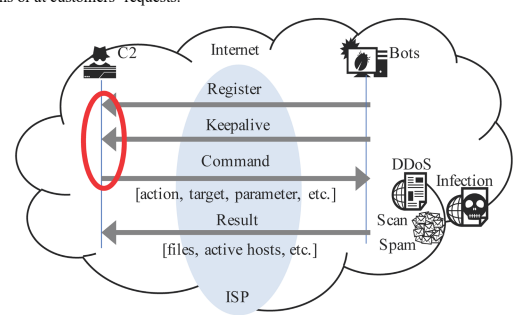
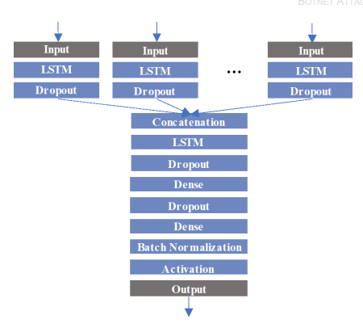
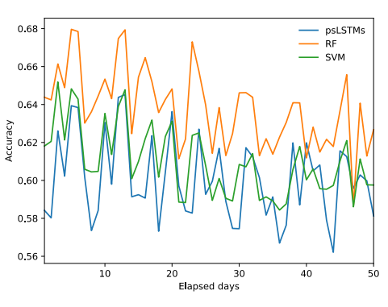
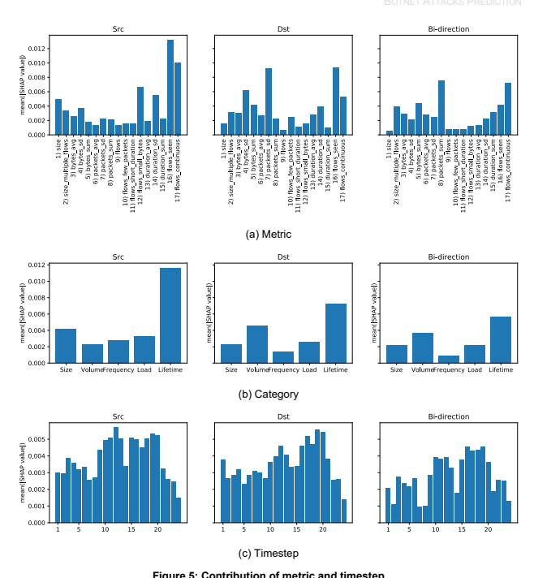

NIST Technical Note 2111

# An Empirical Study On Flow-Based Botnet Attacks Prediction

Mitsuhiro Hatada Matthew Scholl This publication is available free of charge from:

https://doi.org/10.6028/NIST.TN.2111 NIST Technical Note 2111

# An Empirical Study On Flow-Based Botnet Attacks Prediction

Mitsuhiro Hatada Matthew Scholl Computer Security Division Information Technology Laboratory This publication is available free of charge from:
https://doi.org/10.6028/NIST.TN.2111 October 2020

U.S. Department of Commerce Wilbur L. Ross, Jr., Secretary National Institute of Standards and Technology Walter Copan, NIST Director and Undersecretary of Commerce for Standards and Technology Certain commercial entities, equipment, or materials may be identified in this document in order to describe an experimental procedure or concept adequately.

Such identification is not intended to imply recommendation or endorsement by the National Institute of Standards and Technology, nor is it intended to imply that the entities, materials, or equipment are necessarily the best available for the purpose. 

National Institute of Standards and Technology Technical Note 2111 Natl. Inst. Stand. Technol. Tech. Note 2111, 18 pages (October 2020) 
CODEN: NTNOEF 
This publication is available free of charge from: 
https://doi.org/10.6028/NIST.TN.2111 

## Abstract

In the era of the Internet of Things, botnet threats are rising, which has prompted many studies on botnet detection and measurement. In contrast, this study aims to predict botnet attacks, such as massive spam emails and distributed denial-of-service attacks. To that end, this empirical study presents a prediction method for botnet attacks. The method leverages measurement of command and control (C2) activities and automated labeling by associating C2 with attacks. The method was evaluated using a large-scale, real-world, and long-term dataset. The result shows that the proposed method can predict an increase in attacks with an accuracy of 0.767. The contribution to prediction was further analyzed in terms of features and time.

## Keywords

Attack prediction; botnet; command and control; LSTM.

## Table Of Contents

| 1.                 |  Introduction                   |
|--------------------|---------------------------------|
| 2. Methodology     |                                 |
| 2.1. Measurement . |                                 |
| 2.2. Labeling.     |                                 |
| 2.3. Prediction.   |                                 |
| 3.                 | Experimental Evaluation .       |
| 3.1. Dataset .     |                                 |
| 3.2.               | Results and Analysis .          |
|                    | Related Work .                  |
| 4.                 |                                 |
| 5.                 | Conclusion and Future Direction |
| References         |                                 |

| Figure 1: Key idea in typical bot communication pattern.   |
|------------------------------------------------------------|
| Figure 2: Example of labeling                              |
| Figure 3: Model.                                           |
| Figure 4: Accuracy transition                              |
| Figure 5: Contribution of metric and timestep              |

| Table 1: C2 metrics.             |
|----------------------------------|
| Table 2: Dataset .               |
| Table 3: Results of prediction . |

## List Of Figures List Of Tables

12/1/18209.01 \g10.iob\\:aqtrf :mort ອກຼາດຕ່ວ 10 ອອາໄ ອໄປສໄທຣາຣ  ຊ່ поitas

## Introduction

A botnet is a serious threat to cybersecurity as it controls a massive number of compromised hosts to conduct various attacks, such as sending email spam or launching a distributed denialof-service (DDoS) attack. A command and control (C2) server plays a significant role in a botnet: it sends commands to bots and receives outputs of bots while hiding a botmaster behind it. Despite many previous attempts at botnet measurement [13, 10] and botnet detection [8, 12, 16, 7], there is little research on predicting botnet attacks [4, 5]. According to botnet communication patterns [20], once a bot infection occurs, the bot registers itself to C2, and the keep-alive communication between the bot and C2 starts periodically. A botmaster issues a command to bots for launching an attack through C2, and then an attack is launched. The key idea in this study is that traffic patterns with a large number of bots from or to C2 will be remarkably changed before the attack illustrated in Figure 1. For example, a botmaster would prefer more bots to launch an attack effectively, and the bot register and keepalive communication may increase before the attack. A command contains some data, such as the target and parameter, that is sent to many bots in parallel. The size of the packet would then be increased before the attack. Such predictive threat intelligence is crucial for an internet service provider (ISP) to prioritize C2s and cut off communication between C2s and bots in crisis situations or at customers' requests.

Figure 1: Key idea in typical bot communication pattern
This paper presents an empirical study on a botnet attack prediction method by measuring C2 traffic and automated labeling using a large-scale, real-world, and long-term dataset. Comprehensive metrics that characterize C2 traffic are computed with flow data collected with a certain sampling rate by a large ISP for network management. Since the flow data is information that summarizes communication, it has a lower load than processing raw data and is less susceptible to encryption. A set of C2 metrics is labeled for a certain period based on 1) the gradient of spam volume and 2) the result of the correlation analysis between each C2 metric and the volume of spam email associated with C2 as attack data. Since the cost of labeling data 

1 whose botnet behavior changes over time is a major problem for machine learning and deep learning, it would be useful to demonstrate the feasibility of this approach. Then, a special type of recurrent neural network (i.e., long short-term memory [LSTM]) is applied to train and test the labeled multivariate time series data. The key contributions of this work are as follows:
- A compilation of comprehensive metrics and the categories that characterize C2 activities as well as an evaluation of each contribution to the prediction
- The proposal of a novel method, including measurement and automated labeling, that can predict an increase in spam email by a botnet with an accuracy of 0.767
- The finding that C2 metrics in the 30 to 60 hours before the attack increases contribute more to a prediction than the metrics just before an attack occurs The rest of the paper is organized as follows: 
- Section 2 describes each phase of the method in detail. 

- Section 3 evaluates the performance of the proposed method and discusses the result. 

- Section 4 reviews related work. 

- Section 5 presents conclusions.

## Methodology 2.1. **Measurement**

The 17 metrics listed in Table 1 are defined for measuring C2 activity, which is a compilation of various metrics studied in previous works [16, 7]. These metrics are grouped into five categories that characterize C2's behavior: size, volume, frequency, load, and lifetime. Size is the amount of bot controlled by C2 and can be measured by the botmaster's behavior of increasing the number of bots with various infection vectors before effectively launching a large-scale attack. Volume measures the amount of traffic going in and out of C2, and the volume of traffic will likely increase when it sends an attack command to the bots and receives the results from the bots. Frequency is measured in terms of the amount of flow to capture changes, such as increasing the number of bots or sending attack commands to a large number of bots at the same time. Load may be able to capture the high resource load on the C2 host due to the increase in C2 communication. Lifetime measures the number of short-term active days of C2 that began or resumed work for an attack.

Table 1: C2 metrics

| Category   | Metric                                                                                                                                                                     |
|------------|----------------------------------------------------------------------------------------------------------------------------------------------------------------------------|
| Size       | 1) Number of bots 2) Number of bots observed multiple flows                                                                                                                |
| Volume     | 3) Average, 4) Standard deviation, and 5) Sum of bytes 6) Average, 7) Standard deviation, and 8) Sum of packets                                                            |
| Frequency  | 9) Number of flows 10) Number of flows with few packets (< 3 packets) 11) Number of flows with short duration (< 1.0 s) 12) Number of flows with small bytes (< 500 bytes) |
| Load       | 13) Average, 14) Standard deviation, and 15) Sum of duration                                                                                                               |
| Lifetime   | 16) Number of days flow was observed in the last 7 days 17) Number of days flow was continuously observed in the last 7 days                                               |

All metrics are computed with flow data associated with the list of C2s every three hours. Because the used flow data has a unidirectional format, Internet Protocol (IP) addresses of C2 will be observed in the source or destination fields. The metrics can be computed using three patterns: C2 in the source field (Src), C2 in the destination field (Dst), and C2 in either the source or destination field (Bi-direction). Finally, because the 17 metrics are multiplied by the three patterns, it is possible to use 51 metrics. The lists of C2s are retrieved from public websites [3, 1] and provided by a reliable research institution once daily. These lists include "known C2s" (i.e., it is known which botnet family it belongs to) and "unknown C2s" (i.e., it is unknown which botnet family it is used in, but it is estimated by various analyses).

## 2.2. **Labeling**

Data labeling is an essential step in machine learning or deep learning tasks. Since manual labeling of vast amounts of data can be quite burdensome, two criteria were set up to automate this labeling step: 
1) There are at least 10 metrics that have a high correlation greater than or equal to 0.5 with attack data in three days.

2) *There is a positive gradient between the last day and the next day's attack data.* 
As attack data, spam reputation data [2] is retrieved once daily. It includes information such as the IP address of the spam sender and spam volume in the last day. The volume represents a log scale value with a base of 10. A volume of 10 means 100 % of the email volume in the world. The total spam volume associated with C2 can be determined by associating an IP address of C2 with the IP address of the spam sender in the flow data. At that time, the moving average of each C2 metric is taken with a time window of one day. This time window represents the range of future time to be predicted and is based on the second criteria of the labeling. With these criteria, C2 metrics with the increasing spam in the next day can be set as a *True* label as shown in Figure 2. These steps are repeated for the entire period while sliding the starting point by three hours.

Figure 2: Example of labeling

## 2.3. **Prediction**

As explained in 2.2, attack prediction can be regarded as a binary classification (True or *False*). 

Long short-term memory (LSTM)[14], a recurrent neural network capable of learning long-term dependencies at a given time from many timesteps before, was applied. As described in 2.1 and 2.2, the metrics are computed every three hours and labeled in a period of three days. The dataset is therefore a multivariate time series data with 51 metrics, and each metric consists of 24 timesteps. Various models and parameters have been tried in preliminary experiments, but a model of parallel and stacked LSTMs (psLSTMs) was selected because of its high accuracy. The model has a layered structure, shown in Figure 3, that is comprised of LSTM and dropout for each metric, concatenation, LSTM, dropout, dense, dropout, dense, batch normalization, and activation. The first LSTM layer for each metric has 16 units, and the second LSTM layer after concatenation has 128 units. The dense layer has 32 units in the first and two units in the second. A dropout layer at a rate of 0.5 is used for the regularization that randomly sets some of the dimensions of the input vector to zero at each update during training time, which helps prevent overfitting. A concatenation layer merges the output of the layers for each metric. A dense layer represents matrix vector multiplication. The values in the matrix are the trainable parameters that get updated during backpropagation. A batch normalization normalizes each batch by the mean and standard deviation of the activation in order to accelerate the learning process. The model is compiled with the binary cross-entropy for the loss function, Adam as the optimization algorithm, and Sigmoid as the activation function. Then the model is fit for 200 epochs with a batch size of 256.

Figure 3: Model

## Experimental Evaluation 3.1. **Dataset**

Table 2 describes the dataset used in the evaluation. The overall dataset had 324 693 data points for approximately 10 months. The number of true and false data was unbalanced, so false data was randomly sampled to align with the number of true data for experiments. There were 774 unique IP addresses for C2 and 154 unique IP addresses for spammers that could be associated with each other. From this overall data, specific data was selected for evaluation. First, there were 14 309 data points to be cross-validated with 16 weeks of data to evaluate the performance of the proposed method. This data was also used to analyze how much each metric contributed to the prediction decision. Next, as an evaluation of the applicability domain, 20 sets of data were prepared to evaluate the predictive performance with the testing data later than the training data. Each set shifts its period for one week and consists of 16 weeks of the training data followed by 50 days of the testing data. By averaging the results of 20 sets, a generalized result that is independent of the timing of the training data is available.

|                                                                                                                                                                                                                                                                                   | Table 2: Dataset                                                                                                                                                                                                                                                          |
|-----------------------------------------------------------------------------------------------------------------------------------------------------------------------------------------------------------------------------------------------------------------------------------|---------------------------------------------------------------------------------------------------------------------------------------------------------------------------------------------------------------------------------------------------------------------------|
| Overall Collection period Number of data points Number of C2s Number of spam senders                                                                                                                                                                                              | 8/3/2019 to 5/23/2020                                                                                                                                                                                                                                                     |
|                                                                                                                                                                                                                                                                                   | 324 693 (True: 24 486, False: 300 207) 774 154                                                                                                                                                                                                                            |
| 1) Cross-Validation Collection period Number of data points Number of C2s Number of spam senders                                                                                                                                                                                  | 8/3/2019 to 11/22/2019 (16 weeks) 14 309 (True: 6955, False: 7354) 323 154                                                                                                                                                                                                |
| 2) Applicability to future data                                                                                                                                                                                                                                                   | 8/3/2019 to 11/22/2019 (16 weeks) 14 309 (True: 6955, False: 7354) 11/23/2019 to 1/11/2020 (50 days) 6450 (True: 3310, False: 3140)                                                                                                                                       |
| Collection period 1  for training Number of data points  for testing Number of data points Collection period 2  for training Number of data points  for testing Number of data points Collection period 20  for training Number of data points  for testing Number of data points | 8/10/2019 to 11/29/2019 (16 weeks) 13 930 (True: 6744, False: 7186) 11/30/2019 to1/18/2020 (50 days) 6611 (True: 3335, False: 3276) 12/14/2019 to 4/3/2020 (16 weeks) 22 655 (True: 11 572, False: 11 083) 4/4/2020 to 5/23/2020 (50 days) 9688 (True: 4968, False: 4720) |

## 3.2. **Results And Analysis**

Prediction **Accuracy.** The proposed method was evaluated with respect to accuracy as well as computational time for training and testing. Since the dataset is balanced, accuracy is an appropriate criteria. However, recall, precision, and F1 were also provided and represented by the following formula to give more insight into the accuracy:

$$A c c u r a c y={\frac{T P\ +\ T N}{T P+T N+F P+F N}}$$
$$R e c a l l={\frac{T P}{T P+F N}}$$ $$P r e c i s i o n={\frac{T P}{T P+F P}}$$

This publication is available free of charge from: https://doi.org/10.6028/NIST.TN.2111

# 1 = 2 ×   × + Tp: True Positive, Tn: True Negative, Fp: False Positive, Fn: False Negative

Using Python 3.6.9 with Scikit-learn 0.22.1 and Keras 2.2.4 on top of Tensor- Flow 1.14.0, experiments were performed for training and testing with 10-fold cross-validation on the *Enki*, which is the high-performance computing cluster (HPCC) at the National Institute of Standards and Technology (NIST). For comparison, experiments were also conducted using random forests (RF) and support vector machines (SVM), which are widely used machine learning methods. The 51 metrics and 24 timesteps multivariate time series data is flattened to 1224 dimensions for the input. As a result of the grid search, the parameters of RF were set to 300 for *n estimators*, 20 for *max features*, 10 for *min samples split*, and 20 for *max depth*. The parameters *gamma* and C of the radial basis function (RBF) kernel SVM were 1 and 0.001, respectively. Table 3 demonstrates the average results of the 10-fold cross-validation. The proposed method achieved the highest accuracy of 0.767 (0.736 recall, 0.833 precision, and 0.781 F1-score). It is 5.3 % higher than SVM and 2.2 % higher than RF. The FP is greater than the FN, so the recall is greater than the precision. In order to prioritize a large number of C2s, this result is beneficial to pay attention to the C2s that lead to attacks. The training time of the proposed method requires approximately eight hours for 16 weeks of data.

| Method   | Train (s)   | Test (s)   | Accuracy   | Recall   | Precision   | F1-score   |
|----------|-------------|------------|------------|----------|-------------|------------|
| psLSTMs  | 29 413.89   | 113.40     | 0.767      | 0.833    | 0.736       | 0.781      |
| RF       | 63.23       | 0.13       | 0.745      | 0.830    | 0.710       | 0.765      |
| SVM      | 274.46      | 28.27      | 0.714      | 0.769    | 0.692       | 0.728      |

Table 3: Results of prediction
Next, the applicability of trained model to future data was evaluated. The accuracy of every trained model gradually decays with respect to future data, as shown in Figure 4. Even the maximum accuracy is 12.1 % lower for psLSTMs, 6.5 % lower for RF, and 6.2 % lower for SVM compared to the accuracy presented in Table 3. While the model could be overfitting the training data, the day-to-day changes in accuracy tend to be similar across the three methods. This is largely due to variations over time in the statistical nature of the data itself, known as concept drift. Even if C2 is operated with the same IP address, communication characteristics may change due to updates to C2 or the bot program. It is therefore necessary to consider an adaptive solution.

Figure 4: Accuracy transition
Contribution of each **metric.** SHapley Additive exPlanations(SHAP) [17] is a method to explain the prediction of an instance by computing the contribution of each feature to the prediction based on coalitional game theory. The contribution is measured asthemean absolute Shapley value; the higherthe value, the more important it isfor a prediction decision. Unlike other feature importance explainers in Python, SHAP can take 3D data as an input containing data points, timesteps, and metrics that is evaluated for the proposed method. Here, the model and data from a trial with the highest accuracy of the 10-fold cross-validation conducted in 3.2 was used. Figure 5 shows the mean of the contributions for each C2 metric, category of C2 metrics, and timestep. According to Figure 5a, the top five metrics with high contribution are 16) Number of days flow was observed in the last seven days (Src), 17) Number of days flow was continuously observed in the last seven days (Src), 16) Number of days flow was observed in the last seven days (Dst), 7) Standard deviation of packets (Dst), and 8) Sum of packets (Bi-direction). The majority of 16) is seven days in both true and false, but the number of zero and six days in the false is larger than in the true, suggesting that C2 activity was stopped for a day or just started. Figure 5b shows that the contribution of the lifetime category is high in any direction. The next highest contributions are the size category in Src and the volume category in both Dst and Bidirection. Figure 5c shows that the behavior of C2 at a time step between 10 and 20 (i.e., 30 to 60 hours before) is highly essential.

This publication is available free of charge from: https://doi.org/10.6028/NIST.TN.2111 8

Figure 5: Contribution of metric and timestep

## 4.  Related Work

Despite many previous attempts at botnet measurement [13, 10, 22, 15, 6] and botnet detection
[8, 12, 16, 7, 18, 9, 23], little attention has been paid to attack prediction. There are many different motivations for attack prediction, such as predicting the DDoS start time of the next expected attack from a particular botnet family [21], blocking hostile traffic in the future by measuring an indicator of how likely it is that the network will contain compromised hosts [1],
or determining the probability that different attack types might occur at a particular time of day [19]. Similar studies were considered for comparison. One approach [4] was based on monitoring multiple hosts for synchronization in action stages, such as incoming exploit, binary download, C2 communication, and outgoing attack. It detected 77 % of attacks just before they were launched but only achieved a 20 % predictive capability to predict an attack before it occurred. Another approach [5] applied a Markov model to train potential transitions between the states of bot-infected hosts and proposed a method for predicting future states based on currently observed behavior. It could predict attacks with 98 % accuracy. However, the applicability to other datasets was questionable, as the dataset used in this study originally had a very high state transition probability from C2 communication to attack. These two studies used detection logs at the application layer for packet traces, and the processing load is likely too high to apply the proposed method to each host. In contrast, this study's proposed method is a novel attack prediction method that focuses on various metrics that characterize C2 traffic, automatically labels the time series data of the metrics in association to the attack data, and predicts botnet attacks. Evaluating the proposed method using a large-scale, real-world, and long-term dataset, this study achieved 0.767 accuracy of prediction. Although the results cannot simply be compared to those of the previous studies, this result could serve as a benchmark for future research. Furthermore, it is easy to retrain the model in a real network because the flow data collected by the ISPs in their normal network operations are used.

## Conclusion And Future Direction

This study has presented an empirical and novel analysis of botnet attack prediction by measuring comprehensive metrics of C2 traffic and automatically labeling the time series data of the metrics in association with the attack data. The proposed method managed to predict an increase in spam email by a botnet with an accuracy of 0.767. The study also revealed that metrics and their categories and timesteps are useful for prediction. Although the model and parameters can be further improved to adapt to the concept drift problem, the proposed method would also be applicable to the prediction of various attacks, such as DDoS, if the data that associates bots with C2 is available. The main limitation of this method relies on the quality of data. It is crucial to accurately identify and track C2 by solving network resource and technical challenges beyond the scope of this study, such as by sampling the rate of flow of data collection and the separation of C2 traffic and legitimate traffic. As a proof of concept, this study used spam reputation data for attack data. However, the monitoring points of spam were considered to be different from the network flow data collected, which means that the number of spam senders associated with C2 would be insufficient. As with other limitations, this method would inevitably be affected in the case of Peer-to-Peer botnet and botnet using multistage C2s. Different traffic patterns require a more complex model or models for each botnet and its network configuration. In addition, all of the limitations discussed here remain as future work, including collaboration by multiple ISPs and security vendors, to take a holistic approach in the same manner.

## References

[1] abuse.ch (2020) *SSLBL Snort / Suricata Botnet C2 IP Ruleset*. Available at https://sslbl.abuse.ch/blacklist/sslipblacklist.rules
[2] Cisco Talos Intelligence Group (2020) *Email & Spam Data*. Available at https://talosintelligence.com/reputation_center/email_rep\#spam-ip-senders
[3] Bambenek Consulting (2020) Master Feed of known, active and non-sinkholed C&Cs IP 
addresses. Available at https://osint.bambenekconsulting.com/feeds/c2-ipmasterlisthigh.txt
[4] Abaid Z, Kaafar MA, Jha S (2017) Early detection of in-the-wild botnet attacks by exploiting network communication uniformity: An empirical study. *2017 IFIP* 
Networking Conference (IFIP Networking) and Workshops (IEEE, Stockholm, Sweden),
pp 1-9. https://doi.org/10.23919/IFIPNetworking.2017.8264866
[5] Abaid Z, Sarkar D, Kaafar MA, Jha S (2016) The early bird gets the botnet: A Markov chain based early warning system for botnet attacks. 2016 IEEE 41st Conference on Local Computer Networks (LCN) (IEEE, Dubai, United Arab Emirates), pp 61-68. 

https://doi.org/10.1109/LCN.2016.17
[6] Antonakakis M, April T, Bailey M, Bernhard M, Bursztein E, Cochran J, Durumeric Z, 
Halderman JA, Invernizzi L, Kallitsis M, Kumar D, Lever C, Ma Z, Mason J, Menscher D, Seaman C, Sullivan N, Thomas K, Zhou Y (2017) Understanding the Mirai botnet. 

26th USENIX Security Symposium (USENIX Security 17) (USENIX Association, Vancouver, Canada), pp 1093-1110. Available at https://www.usenix.org/system/files/conference/usenixsecurity17/sec17-antonakakis.pdf
[7] Biglar Beigi E, Hadian Jazi H, Stakhanova N, Ghorbani AA (2014) Towards effective feature selection in machine learning-based botnet detection approaches. *Proceedings of* the 2014 IEEE Conference on Communications and Network Security (IEEE, San Francisco, California), pp 247-255. https://doi.org/10.1109/CNS.2014.6997492
[8] Bilge L, Balzarotti D, Robertson W, Kirda E, Kruegel C (2012) Disclosure: Detecting Botnet Command and Control Servers Through Large-scale NetFlow Analysis. Proceedings of the 28th Annual Computer Security Applications Conference *(ASAC '12)* (ACM, Orlando, Florida), pp 129-138. https://doi.org/10.1145/2420950.2420969
[9] Álvarez Cid-Fuentes J, Szabo C, Falkner K (2018) An adaptive framework for the detection of novel botnets. *Computers & Security* 79(November):148-161. 

https://doi.org/10.1016/j.cose.2018.07.019
[10] Chang W, Mohaisen A, Wang A, Chen S (2015) Measuring Botnets in the Wild: Some New Trends. Proceedings of the 10th ACM Symposium on Information, Computer and Communications Security *(ASIA CCS '15)* (ACM, Singapore), pp 645-650. 

https://doi.org/10.1145/2714576.2714637 This publication is available free of charge from: https://doi.org/10.6028/NIST.TN.2111
[11] Collins MP, Shimeall TJ, Faber S, Janies J, Weaver R, Markus DS, Kadane J (2007)
Using uncleanliness to predict future botnet addresses. Proceedings of the 7th ACM 
SIGCOMM Conference on Internet measurement (IMC '07), (ACM, San Diego, California), pp 93-104. https://dl.acm.org/doi/10.1145/1298306.1298319
[12] Gu G, Zhang J, Lee W (2008) BotSniffer: Detecting Botnet Command and Control Channels in Network Traffic. 15th Annual Network and Distributed System Security Symposium *(NDSS '08)*, (ISOC, San Diego, California), pp 1-18. Available at https://www.ndss-symposium.org/ndss2008/botsniffer-detecting-botnet-command-andcontrol-channels-in-network-traffic/
[13] Herwig S, Harvey K, Hughey G, Roberts R, Levin D (2019) Measurement and Analysis of Hajime, a Peer-to-peer IoT Botnet. *26th Annual Network and Distributed System* Security Symposium *(NDSS '19)*, (ISOC, San Diego, California), pp 1-15. Available at https://www.ndss-symposium.org/ndss-paper/measurement-and-analysis-of-hajime-apeer-to-peer-iot-botnet/
[14] Hochreiter S, Schmidhuber J (1997) Long short-term memory. *Neural Computation* 9(8):1735-1780. https://doi.org/10.1162/neco.1997.9.8.1735
[15] Holz T, Steiner M, Dahl F, Biersack E, Freiling F (2008) Measurements and mitigation of peer-to-peer-based botnets: A case study on storm worm. 1st USENIX Workshop on Large-Scale Exploits and Emergent Threats *(LEET '08)*, (USENIX Association, San Francisco, California), pp 1-9. Available at https://www.usenix.org/legacy/event/leet08/tech/full_papers/holz/holz.pdf
[16] Kirubavathi G, Anitha R (2016) Botnet detection via mining of traffic flow characteristics. *Computers & Electrical Engineering* 50(February):91-101. 

https://doi.org/10.1016/j.compeleceng.2016.01.012
[17] Lundberg SM, Lee SI (2017) A unified approach to interpreting model predictions.

Proceedings of the 31st International Conference on Neural Information Processing Systems *(NIPS '17)*, (Curran Associates Inc., Long Beach, California), pp 4768-4777.

Available at http://papers.nips.cc/paper/7062-a-unified-approach-to-interpreting-modelpredictions.pdf
[18] Tsai M, Chang K, Lin C, Mao C, Lee H (2011) C&C tracer: Botnet command and control behavior tracing. Proceedings of the 2011 IEEE International Conference on Systems, Man, and Cybernetics, (IEEE, Anchorage, Alaska), pp 1859-1864.

https://doi.org/10.1109/ICSMC.2011.6083942
[19] Umarani S, Sharmila D (2014) Predicting application layer DDoS attacks using machine learning algorithms. *International Journal of Computer and Systems Engineering* 8(10):1912-1917. Available at https://publications.waset.org/10000388/pdf This publication is available free of charge from: https://doi.org/10.6028/NIST.TN.2111
[20] Vormayr G, Zseby T, Fabini J (2017) Botnet Communication Patterns. *IEEE* 
Communications Surveys Tutorials 19(4):2768-2796, https://doi.org/10.1109/COMST.2017.2749442
[21] Wang A, Chang W, Chen S, Mohaisen A (2018) Delving Into Internet DDoS Attacks by Botnets: Characterization and Analysis. *IEEE/ACM Transactions on Networking* 26(6):2843-2855. https://doi.org/10.1109/TNET.2018.2874896
[22] Welzel A, Rossow C, Bos H (2014) On measuring the impact of DDoS botnets.

Proceedings of the Seventh European Workshop on System Security *(EuroSec '14)*, 
(ACM, Amsterdam, The Netherlands), pp 1-6. https://doi.org/10.1145/2592791.2592794
[23] Zhao D, Traore I, Sayed B, Lu W, Saad S, Ghorbani A, Garant D (2013) Botnet detection based on traffic behavior analysis and flow intervals. *Computers & Security* 39(November):2-16. https://doi.org/10.1016/j.cose.2013.04.007