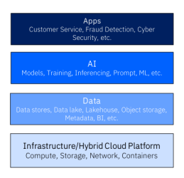
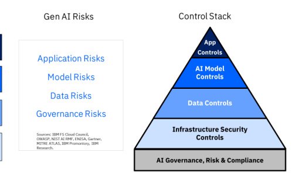
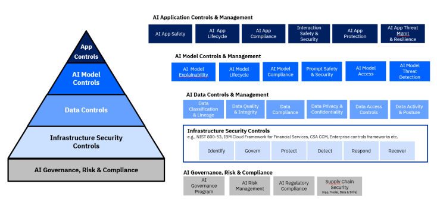

Generative AI Controls Framework

Safe, Secure, and Compliant AI Adoption Approach Whitepaper An initiative of the IBM Financial Services Cloud Council & Community

According to the IBM Institute for Business value (IBV), 75% of CEOs believe competitive advantage will depend on who has the most advanced gen AI² and 43% of CEOs say their enterprises are already using gen AI to inform strategic decisions, 36% for operational decisions.¹ However, across organizations, more than 60% are not yet developing a consistent, enterprise-wide approach to gen AI²---but executives now expect their 2023 gen AI budgets to be  3.4x greater than they had anticipated as recently as this past May. ³ For business leaders, 80% report explainability, ethics, bias, or trust as a major concern on the road to gen AI adoption 4, but half say their organization currently lacks the governance and structures needed to manage gen AI's ethical challenges.4 Top priority gen AI use cases in financial services have been identified as customer engagement, extreme process digitization, risk management, and technology modernization. However, a strategic, actionable approach is needed to guide financial institutions in developing and managing the risks and concerns that come with gen AI systems. Based on AI use cases, there is a common deployment pattern of gen AI applications and systems that cut across a technology stack AI applications (e.g. customer facing chatbot infused with gen AI),
-
-
AI platform (e.g., rendering gen AI large language models, machine learning modules, providing prompt studio etc.),
-
Associated data architecture (e.g., contextual data provided through Vector databases, Cloud Object Storage or other relational database, tec), and
-
Using a secure hybrid cloud infrastructure (e.g., cloud infrastructure that meets the financial services controls expectations).

Associated within each of that tech stack layers are a series of risks associated specifically with gen AI.

This Trusted and Secure Generative AI (gen AI) Framework, co-developed with the members of the IBM Financial Services Cloud Council represents a comprehensive approach to identifying gen AI specific risks at each layer of the tech stack and building, deploying, and managing AI systems that are trustworthy and transparent.5 The Framework is designed to address key challenges in gen AI and is structured around the gen AI technology stack to help financial services firms, as well as those in other regulated industries.

Key components of the Trustworthy Gen AI Framework include:
.

AI Application Controls
•
AI Model Controls
•
Data Controls
●
Infrastructure Security Controls In addition, this whitepaper lists common taxonomy used in gen AI to provide consistency across the industry.  By using this Trusted and Secure Gen AI Framework, organizations can start to implement gen AI systems that inspire trust among users, stakeholders, and society at large. This whitepaper provides a detailed overview of the framework and offers practical guidance for implementing it in various gen AI applications.

4 CEO decision-making in the age of AI: Act with intention, https://ibm.co/c-suite-study-ceo ² CEO decision-making in the age of AI: Act with intention, https://ibm.co/c-suite-study-ceo 2 Enterprise generative AI: State of the market, https://ibm.co/c-suite-study-ceo. https://ibm.co/enterprise-generative-ai
³ The CEO's guide to generative AI: Tech Spend, https://www.ibm.com/thought-leadership/institute-business-value/en-us/report/ceo-generative-a/techspend 4 The CEO's guide to generative AI: customer and employee experience, https://www.ibm.com/thought-leadership/institute-business-value/enus/report/ceo-generative-ai/employee-customer-experience 4 The CEO's guide to generative AI: customer and employee experience, https://www.ibm.com/thought-leadership/institute-business-value/enus/report/ceo-generative-ai/employee-customer-experience 5 AI Ethics, https://www.ibm.com/impact/ai-ethics 5 IBM Artificial Intelligence Pillars, https://www.ibm.com/policy/ibm-artificial-intelligence-pillars/
# Our Approach With The Ibm Financial Services Cloud Council

Part of the IBM Financial Services Cloud Council's (the Council) charter is to help solve challenges that the financial sector faces to leverage cutting-edge technologies, such as cloud and gen AI, in secure, risk managed, and compliant ways to solve business problems and innovate. The Council brings together CIOs, CTOs, CISOs and Risk Officers to drive cloud adoption for mission-critical workloads in financial services. Unsurprisingly, gen AI is a disruptive innovation that technology, cybersecurity, and risk leaders need to determine how to implement in a secure and trustworthy manner in their organizations.

As such, the Council desired a working group, led by the IBM Financial Services Cloud Risk office in late 2023 to identify and propose a framework of controls that can help organizations implement gen AI. Following the Council's working group sessions, IBM enlisted the support of Financial Services Coud Council Members, IBM subject matter experts, including IBM Security, Consulting, Promontory, Infrastructure, Research, Watsonx, and the IBM Privacy Office to build out the Trusted and Secure Gen AI Framework. The resulting framework and whitepaper are the result of this collaborative effort between IBM and the Council.

## Generative Ai Risks

The risks that the financial sector and other regulated industries need to deal with in regard to IT systems and data still exist and must be addressed when considering AI systems. Additionally, there are specific risks that organizations must consider that are AI specific6.

## Key Risks To Gen Ai Systems

| Gen AI Governance Risks        | Gen AI Application Risks       | Gen AI Model Risks             | Gen AI Data Risks            |                         |
|--------------------------------|--------------------------------|--------------------------------|------------------------------|-------------------------|
| · Uncertainty around           | · Input manipulation & toxic   | · Lack of explainaibility &    | ·                            | Data lineage/provenance |
| regulatory requirements        | output concerns                | transparency                   | concerns                     |                         |
| pertaining to GenAI            | -    Inference attacks         | · Data residency concerns      |                              |                         |
| systems (including             | · Lack of accuracy &           |                                |                              |                         |
| privacy/ethics)                | factuality (model              |                                |                              |                         |
| · Cost Harvesting risk         | hallucination and bias)        | · Lack of consent to rights of |                              |                         |
| · Inadequate                   | content                        |                                |                              |                         |
| understanding of specific      | ·   Exposing GenAI Model       | -    Lack of accountability    |                              |                         |
| risks pertaining to GenAI      | Ontology                       | · Lack of source attribution   |                              |                         |
| systems                        | -   Model drift concerns       |                                |                              |                         |
| -    Lack of ability to detect | · Exposure of sensitive data   |                                |                              |                         |
| · Unclear roles &              | misuse and novel attacks to    | ·   Model theft & extraction   |                              |                         |
| responsibilities               | GenAI system                   | concerns                       | · Data quality/bias concerns |                         |
| · Insufficient reporting &     | ·   Model code maintainability |                                |                              |                         |
| metrics                        | concerns                       |                                |                              |                         |
| · Supply chain concerns        |                                |                                |                              |                         |

6 Mapping attacks on generative AI to business impact, https://securityintelligence.com/posts/mapping-attacks-generative-ai-business-impact/
With the field rapidly evolving, this list provides a starting point of listing the challenges that organizations must address when they design and implement AI programs. Additional resources can be viewed at the NIST AI Risk Management Framework? and the IBM AI Ethics Board: Foundation Models Opportunities, Risks, and Mitigations °.

## The Trusted And Secure Gen Ai Framework

IBM has taken a fundamental approach to securing AI systems. This approach looks at risks in the context of':
.

Securing the Data
.

Securing the Model
.

Securing the Usage Securing the Applications
- .

Securing the Infrastructure Taking those risks into account, the IBM Financial Services Cloud Council's approach to developing this framework of controls is organized around the risks associated with each layer of the AI tech stack.

## Gen Ai Technology Stack And Controls Approach

Technology Stack

Within each layer, sub-categories were identified that address risks. Building off existing cybersecurity frameworks, such as the NIST Cybersecurity Framework (NIST CSF)¹º, these sub-categories are organized around identifying, protecting, detecting, and responding to risks within each associated layer.

7 NIST AI risk management framework, https://www.nist.gov/itl/ai-risk-management-framework 8 IBM AI Ethics Board: Foundation Models Opportunities, Risks, and Mitigations, https://www.ibm.com/downloads/cas/E5KE5KRZ
° Introducing the IBM Framework for Securing Generative AI, https://www.ibm.com/blog/announcement/ibm-framework-for-securing-generative-ai/ 10 NIST Cybersecurity Framework, https://www.nist.gov/cyberframework
# Security & Compliance For Gen Ai - Layered Policies & Controls

For the framework of controls, the following Domains were created to align with the technology stack and risks associated with gen AI.

AI Application Controls: Controls that "secure the usage" of AI through the application stack and "secure the applications" themselves. Adhering to ethical standards and guidelines to ensure that AI systems respect human values and rights.

AI Model Controls: Controls that "secure the model" and "secure the usage" (of models through applications or other interactions with the model". Implementing best practices for model training, validation, and evaluation to enhance performance and reliability.

Data Controls: Controls that "secure the data" layer. Establishing clear guidelines for data collection, storage, and usage to ensure data quality and mitigate bias.

Infrastructure Security Controls: Implementing robust IT and cybersecurity measures to protect AI systems from cyber threats and unauthorized access. These are controls that organizations already need to enable across their technology landscape to meet security and privacy requirements but implemented for AI systems, and help
"secure the infrastructure".

AI Governance, Risk & Compliance: The foundation of a trustworthy AI program. Ensuring that the organization has the proper management of its AI program in order to ensure security, effective risk management and compliance with relevant laws and regulations governing AI development and deployment.

# Framework Domains And Category Definitions

Within each of the domains, a number of categories were identified to build controls that align with the risks associated at that layer of the stack. Note for the purposes of this framework, the Infrastructure Security Layer does not have specific controls. This is due to the fact that organizations should be layering gen AI IT/cybersecurity controls on top of their existing enterprise security framework.

Organizations typically leverage industry frameworks (i.e. NIST 800-53, ISO 27xxx) or custom frameworks (i.e. IBM Cloud Framework for Financial Services) for to protect their entire technology and hybrid cloud stack.

| Domain                                                                                 | Category                                                                                  | Definition   |
|----------------------------------------------------------------------------------------|-------------------------------------------------------------------------------------------|--------------|
| AI Governance, Risk, &                                                                 | The foundation of a trustworthy AI program. Ensuring that the organization has the proper |              |
| Compliance                                                                             | management of its AI program in order to ensure security, effective risk management and   |              |
| compliance with relevant laws and regulations governing AI development and deployment. |                                                                                           |              |
| AI Governance Program                                                                  | The oversight mechanisms that address risks like bias, privacy                            |              |
|                                                                                        | infringement and misuse while fostering innovation and trust.                             |              |
| AI Risk Management                                                                     | Program driving responsible uses and practices by prompting                               |              |
|                                                                                        | organizations and their internal teams to think more critically                           |              |
|                                                                                        | about context and potential or unexpected negative and                                    |              |
|                                                                                        | positive impacts.                                                                         |              |
| AI Regulatory                                                                          | Ensuring an organization stays current with the regulatory                                |              |
| Compliance                                                                             | landscape (regulatory watch) and adheres to legal                                         |              |
|                                                                                        | requirements, rules, and standards governing the                                          |              |
|                                                                                        | development, deployment, monitoring, and use of AI.                                       |              |
| Supply Chain Security                                                                  | Addressing risks related to data sourcing, model development,                             |              |
|                                                                                        | deployment, and ongoing maintenance that leverage third-                                  |              |
|                                                                                        | party libraries, APIs, and pre-trained models.                                            |              |

| Domain                       | Category                                                                              | Definition   |
|------------------------------|---------------------------------------------------------------------------------------|--------------|
| AI Model Controls &          | Controls that "secure the model" layer as well as securing the usage of models.       |              |
| Management                   | Implementing best practices for model training, validation, and evaluation to enhance |              |
| performance and reliability. |                                                                                       |              |
| AI Model Explainability      | Understanding and interpreting the decisions made by                                  |              |
|                              | machine learning models. It provides visibility on how the                            |              |
|                              | model arrives at its predictions or results.                                          |              |
| AI Model Lifecycle           | Implementing the various stages involved in creating,                                 |              |
|                              | deploying, and maintaining AI models.                                                 |              |
| AI Model Compliance          | Adherence of AI models to established guidelines, regulations,                        |              |
|                              | and standards.                                                                        |              |
| Prompt Safety &              | Controls that ensure the input prompts provided to AI models                          |              |
| Security                     | are safe, non-malicious, and aligned with the intended                                |              |
|                              | behavior of the model and protect the model from                                      |              |
|                              | unauthorized access, tampering, or attacks. Equally checking                          |              |
|                              | that response prompts are safe and secure in terms of content                         |              |
|                              | it may inadvertently reveal (i.e. PII).                                               |              |
| AI Model Access              | Restricting access to gen AI models, model parameters,                                |              |
|                              | training data, and APIs to prevent potential misuse and attack                        |              |
|                              | vectors.                                                                              |              |
| AI Model Threat              | Identifying and mitigating potential risks or vulnerabilities that                    |              |
| Detection                    | could compromise the integrity, security, or performance of                           |              |
|                              | the AI models and the interaction with those models.                                  |              |

|  Domain                  | Category                                                                                  | Definition   |
|--------------------------|-------------------------------------------------------------------------------------------|--------------|
| AI App Controls &        | Controls that "secure the usage" of AI through the application stack. Adhering to ethical |              |
| Management               | standards and guidelines to ensure that AI systems respect human values and rights.       |              |
| AI App Safety            | Practices to ensure the safe and reliable operation of AI                                 |              |
|                          | systems. It encompasses strategies to prevent unintended                                  |              |
|                          | consequences, errors, and harm caused by AI applications.                                 |              |
| AI App Lifecycle         | Controls to ensure stages involved in the development,                                    |              |
|                          | deployment, and maintenance of AI systems drive trustworthy                               |              |
|                          | AI                                                                                        |              |
| AI App Compliance        | Adherence of AI applications to established guidelines,                                   |              |
|                          | regulations, and standards.                                                               |              |
| App Interaction Safety & | Mechanisms to ensure that interactions between AI systems                                 |              |
| Security                 | and their users, other systems, and the environment occur in a                            |              |
|                          | safe and secure manner.                                                                   |              |
| AI App Protection        | Techniques to safeguard AI applications from various risks,                               |              |
|                          | vulnerabilities, and threats. These protective measures aim to                            |              |
|                          | ensure the robustness, security, and reliability of AI systems                            |              |
|                          | throughout their lifecycle.                                                               |              |
| AI App Threat            | Identifying, assessing, and mitigating potential risks and                                |              |
| Management &             | vulnerabilities that could impact the security, functionality, or                         |              |
| Resilience               | reliability of an AI application and ensuring its ability to adapt,                       |              |
|                          | recover, and continue functioning effectively even in the face                            |              |
|                          | of unexpected events, failures, or disruptions.                                           |              |

| Domain                                                                                      | Category                                                                               | Definition   |
|---------------------------------------------------------------------------------------------|----------------------------------------------------------------------------------------|--------------|
| Infrastructure Security                                                                     | Implementing robust IT and cybersecurity measures to protect AI systems from cyber     |              |
| Controls                                                                                    | threats and unauthorized access. These are controls that organizations already need to |              |
| enable across their technology landscape to meet security and privacy requirements but      |                                                                                        |              |
| implemented for AI systems.  Note: This whitepaper does not include infrastructure or cloud |                                                                                        |              |
| specific controls                                                                           |                                                                                        |              |
| Infrastructure Security                                                                     | Organizations typically leverage industry frameworks (i.e. NIST                        |              |
| Controls                                                                                    | 800-53, ISO 27xxx) or custom frameworks (i.e. IBM Cloud                                |              |
|                                                                                             | Framework for Financial Services) to protect their entire                              |              |
|                                                                                             | technology and hybrid cloud stack.                                                     |              |

|  Domain                  | Category                                                                                   |  Definition   |
|--------------------------|--------------------------------------------------------------------------------------------|---------------|
| AI Data Controls &       | Controls that "secure the data" layer.  Establishing clear guidelines for data collection, |               |
| Management               | storage, and usage to ensure data quality and mitigate bias                                |               |
| Data Classification and  | Provide a common foundation for assessing data leveraged by                                |               |
| Lineage                  | AI systems; including data classifications, assigning predefined                           |               |
|                          | labels to each characteristic and historical context of the data                           |               |
| Data Quality & Integrity | Maintaining the reliability, accuracy, and consistency of data                             |               |
|                          | used by AI systems; ensuring that the data remains unaltered                               |               |
|                          | and is trustworthy.                                                                        |               |
| Data Compliance          | Adherence of the data used in AI systems to established                                    |               |
|                          | guidelines, regulations, and standards including data residency                            |               |
|                          | and sovereignty.                                                                           |               |
| Data Privacy &           | Safeguarding sensitive information, ensuring it is handled                                 |               |
| Confidentiality          | appropriately and remains private & accessible only to                                     |               |
|                          | authorized systems & users                                                                 |               |
| Data Access Controls     | Restricting access to data leveraged by AI systems to prevent                              |               |
|                          | potential misuse and attack vectors.                                                       |               |
| Data Activity and        | Tracking the usage and performance of data leveraged by AI                                 |               |
| Posture Monitoring       | systems to enable detecting and responding to misuse or                                    |               |
|                          | malicious activity                                                                         |               |

# Trusted And Secure Gen Ai Framework Controls

Within each category, one or more controls were identified to address the risks associated at that layer of the stack. Note for the purposes of this framework, the Infrastructure Security Layer does not have specific controls.  Organizations should leverage the industry/custom framework that they use for the rest of their technology landscape.

| Control        |                                                 |                                                |                                                |                                                |
|----------------|-------------------------------------------------|------------------------------------------------|------------------------------------------------|------------------------------------------------|
| Domain         | Category                                        | Control Name                                   | Control Requirements                           |                                                |
| ID             |                                                 |                                                |                                                |                                                |
| AI Governance, | AI Governance                                   | Gov 1.1                                        | Policies, Processes,                           | Establish an internal AI governance structure, |
| Risk, &        | Program                                         | & Procedures                                   | policies and mechanism to direct, monitor and  |                                                |
| Compliance     | Established                                     | control AI systems development and             |                                                |                                                |
|                | deployment.                                     |                                                |                                                |                                                |
| Gov 1.2        | AI Roles &                                      | Senior management assigns authority and        |                                                |                                                |
|                | Responsibilities                                | holds people accountable for adhering to an    |                                                |                                                |
|                | Structure                                       | organization's AI policies, processes and      |                                                |                                                |
|                | objectives.                                     |                                                |                                                |                                                |
| Gov 1.3        | AI Program                                      | Ongoing monitoring and periodic review of the  |                                                |                                                |
|                | Effectiveness and                               | risk management process and its outcomes are   |                                                |                                                |
|                | Risk Monitored                                  | planned including determining the frequency of |                                                |                                                |
|                | periodic review.                                |                                                |                                                |                                                |
| Gov 1.4        | AI Training                                     | The organization's personnel and partners      |                                                |                                                |
|                | Program                                         | receive AI risk management training to enable  |                                                |                                                |
|                | them to perform their duties and                |                                                |                                                |                                                |
|                | responsibilities consistent with related        |                                                |                                                |                                                |
|                | policies, procedures, and agreements.           |                                                |                                                |                                                |
| AI Risk        | Gov 2.1                                         | Risk Management                                | Risk management process and its outcomes       |                                                |
| Management     | Processes                                       | are established through transparent policies,  |                                                |                                                |
|                | procedures, and other controls based on         |                                                |                                                |                                                |
|                | organizational risk priorities.                 |                                                |                                                |                                                |
| Gov 2.2        | Risk Assessment                                 | Senior management identifies the AI system     |                                                |                                                |
|                | and Tolerances                                  | needs and uses the collected information to    |                                                |                                                |
|                | establish risk thresholds, provide resources to |                                                |                                                |                                                |
|                | ensure that staff are familiar with AI policies |                                                |                                                |                                                |
|                | and procedures.                                 |                                                |                                                |                                                |
| Gov 2.3        | Gen AI Program                                  | Mechanisms are in place to inventory AI        |                                                |                                                |
|                | Inventory                                       | systems and are resourced according to         |                                                |                                                |
|                | organizational risk priorities.                 |                                                |                                                |                                                |
| AI Regulatory  | Gov 3.1                                         | Ongoing                                        | Legal and regulatory requirements involving AI |                                                |
| Compliance     | Compliance &                                    | are understood, managed, and documented.       |                                                |                                                |
|                | Regulatory Watch                                |                                                |                                                |                                                |
| Gov 3.2        | Report Identified                               | Document and report incidents and related      |                                                |                                                |
|                | Incidents                                       | information on incident control actions with   |                                                |                                                |
|                | designated authorities.                         |                                                |                                                |                                                |
| Supply Chain   | Gov 4.1                                         | Supplier Risk                                  | AI risks and benefits from third-party         |                                                |
| Security       | Management                                      | resources are regularly monitored, and risk    |                                                |                                                |
|                | controls are applied and documented.            |                                                |                                                |                                                |

| Domain          | Category                                        | Control ID                                       | Control Name                                    | Control Requirements                         |
|-----------------|-------------------------------------------------|--------------------------------------------------|-------------------------------------------------|----------------------------------------------|
| AI App Controls | AI App Safety                                   | App 1.1                                          | Document AI                                     | Document and report AI systems capabilities, |
| & Management    | System                                          | limitations, acceptable and unacceptable         |                                                 |                                              |
|                 | Capabilities,                                   | usage. Include technical documentation and       |                                                 |                                              |
|                 | Limitations, and                                | instructions for usage of AI models, as          |                                                 |                                              |
|                 | Acceptable Usages                               | applicable.                                      |                                                 |                                              |
| App 1.2         | Document                                        | Document and report evaluations conducted        |                                                 |                                              |
|                 | Trustworthy AI                                  | for safety, security, bias, explainability of AI |                                                 |                                              |
|                 | Efforts                                         | applications                                     |                                                 |                                              |
| AI App          | App 2.1                                         | App Lifecycle                                    | Define and deploy secure development            |                                              |
| Lifecycle       | Completeness                                    | practices for generative AI applications,        |                                                 |                                              |
|                 | throughout the AI lifecycle, for cybersecurity, |                                                  |                                                 |                                              |
|                 | physical security, and insider threats.         |                                                  |                                                 |                                              |
| App 2.2         | App Code                                        | Mechanisms are established to enable AI          |                                                 |                                              |
|                 | Maintainability                                 | stakeholders to regularly incorporate            |                                                 |                                              |
|                 | adjudicated feedback from relevant AI actors    |                                                  |                                                 |                                              |
|                 | into AI Application design and implementation.  |                                                  |                                                 |                                              |
| AI App          | App 3.1                                         | AI App Posture                                   | Implement monitoring and logging                |                                              |
| Compliance      | Management &                                    | mechanisms to track AI application               |                                                 |                                              |
|                 | Compliance                                      | performance, usage, and compliance with          |                                                 |                                              |
|                 | relevant regulations and ethical guidelines.    |                                                  |                                                 |                                              |
| App 3.2         | Conduct                                         | Deploy testing measures, including testing,      |                                                 |                                              |
|                 | Trustworthy AI                                  | throughout the AI application life cycle.        |                                                 |                                              |
|                 | System Testing                                  |                                                  |                                                 |                                              |
| App Interaction | App 4.1                                         | Input                                            | Detect and block adversarial inputs or atypical |                                              |
| Safety &        | manipulation &                                  | queries to AI applications that deviate from     |                                                 |                                              |
| Security        | prompt injection                                | known benign behavior, exhibit behavior          |                                                 |                                              |
|                 | Protection                                      | patterns observed in previous attacks (e.g.      |                                                 |                                              |
|                 | similar to SQL Injection attacks in Web Apps,   |                                                  |                                                 |                                              |
|                 | prompt injection attacks can exploit AI app     |                                                  |                                                 |                                              |
|                 | capabilities)                                   |                                                  |                                                 |                                              |
| App 4.2         | Prevent inference                               | Regulate the amount and fidelity of potentially  |                                                 |                                              |
|                 | attacks / Minimize                              | sensitive information in, prompts and API        |                                                 |                                              |
|                 | Query Response                                  | queries to limit the amount of information an    |                                                 |                                              |
|                 | attacker can learn.                             |                                                  |                                                 |                                              |
| App 4.3         | Denial of gen AI                                | Detect and block adversarial inputs or atypical  |                                                 |                                              |
|                 | service Prevention                              | queries that deviate from known benign           |                                                 |                                              |
|                 | / Restrict                                      | behavior, exhibit behavior patterns observed in  |                                                 |                                              |
|                 | Excessive Queries                               | previous attacks.                                |                                                 |                                              |
| App 4.4         | Prevent Toxic                                   | Detect and block outputs with hateful, abusive,  |                                                 |                                              |
|                 | Results                                         | or toxic content; hallucinations; malicious      |                                                 |                                              |
|                 | outputs (i.e. generating harmful code);         |                                                  |                                                 |                                              |
|                 | sensitive model or data information leakage     |                                                  |                                                 |                                              |
| AI App          | App 5.1                                         | AI App Access                                    | Establish access controls AI applications       |                                              |
| Protection      | Controls                                        | through UI (including chat interface), and APIs  |                                                 |                                              |
|                 | which in turn leverage AI systems and data as   |                                                  |                                                 |                                              |
|                 | backend systems.                                |                                                  |                                                 |                                              |
| App 5.2         | Assess Security of                              | Identify security measures to protect against    |                                                 |                                              |
|                 | AI Application                                  | data breaches, and malicious attacks  (security  |                                                 |                                              |
|                 | & risk assessments, attack surface              |                                                  |                                                 |                                              |
|                 | assessments, threat assessments, etc.)          |                                                  |                                                 |                                              |

| Domain     | Category                                          | Control ID                                    | Control Name                               | Control Requirements                    |
|------------|---------------------------------------------------|-----------------------------------------------|--------------------------------------------|-----------------------------------------|
| AI Model   | AI Model                                          | Mod 1.1                                       | Document Model                             | Document and report model capabilities, |
| Controls & | Explainability                                    | Capabilities,                                 | limitations, acceptable and unacceptable   |                                         |
| Management | Limitations, and                                  | usage. Include technical documentation and    |                                            |                                         |
|            | Usages                                            | instructions for usage of AI models, as       |                                            |                                         |
|            | applicable.                                       |                                               |                                            |                                         |
| Mod 1.2    | Bias Detection and                                | Implement algorithms and tools designed to    |                                            |                                         |
|            | Evaluation                                        | detect and evaluate potential biases in the   |                                            |                                         |
|            | training data, algorithms, or outputs of the AI   |                                               |                                            |                                         |
|            | system.                                           |                                               |                                            |                                         |
|            | Diversity in                                      | Ensure that the training data used for the AI |                                            |                                         |
| Mod 1.3    | Training Data                                     | system is diverse, representative, and free   |                                            |                                         |
|            | from discriminatory patterns.                     |                                               |                                            |                                         |
| AI Model   | Mod 2.1                                           | Model Lifecycle                               | Define and deploy secure development       |                                         |
|            | practices for generative AI models, throughout    |                                               |                                            |                                         |
| Lifecycle  | Completeness                                      | the AI lifecycle, for cybersecurity, physical |                                            |                                         |
|            | security and insider threats.                     |                                               |                                            |                                         |
| Mod 2.2    | Model Lifecycle                                   | Document AI model details including model     |                                            |                                         |
|            | Documented                                        | type (e.g., convolutional neural network,     |                                            |                                         |
|            | reinforcement learning, decision tree, random     |                                               |                                            |                                         |
|            | forest, etc.) data features, training algorithms, |                                               |                                            |                                         |
|            | proposed uses, decision thresholds, training      |                                               |                                            |                                         |
|            | data, evaluation data, and ethical                |                                               |                                            |                                         |
|            | considerations.                                   |                                               |                                            |                                         |
| Mod 2.3    | Model Code                                        | Mechanisms are established to enable AI       |                                            |                                         |
|            | Maintainability                                   | actors to regularly incorporate adjudicated   |                                            |                                         |
|            | feedback from relevant sources into system        |                                               |                                            |                                         |
|            | design and implementation.                        |                                               |                                            |                                         |
| Mod 2.4    | Assess Model                                      | Identify security measures to protect against |                                            |                                         |
|            | Security                                          | unauthorized access, data breaches, and       |                                            |                                         |
|            | malicious attacks (security & risk assessments,   |                                               |                                            |                                         |
|            | attack surface assessments, threat                |                                               |                                            |                                         |
|            | assessments, etc.) to AI models.                  |                                               |                                            |                                         |
| AI Model   | Mod 3.1                                           | Model Drift                                   | Regularly monitor AI Model performance and |                                         |
| Compliance | Tracking                                          | trustworthiness to enhance ability to detect  |                                            |                                         |

| AI App Threat   | App 6.1                                      | AI App Security                                  | Deploy testing measures, including red   |
|-----------------|----------------------------------------------|--------------------------------------------------|------------------------------------------|
| Management &    | Testing                                      | teaming for adversarial testing, throughout the  |                                          |
| Resilience      | AI Application life cycle.                   |                                                  |                                          |
| App 6.2         | AI App                                       | Identify and mitigate vulnerabilities, incidents |                                          |
|                 | Vulnerability                                | and patterns of misuse, including third party    |                                          |
|                 | Mitigation                                   | vulnerabilities.                                 |                                          |
| App 6.3         | AI App Threat                                | Implement comprehensive monitoring and           |                                          |
|                 | Detection &                                  | logging mechanisms to track AI application       |                                          |
|                 | Response                                     | performance, usage, and compliance with          |                                          |
|                 | relevant regulations and ethical guidelines. |                                                  |                                          |
| App 6.4         | Establish Resilient                          | Design and implement AI applications and         |                                          |
|                 | Gen AI                                       | systems with robustness, ensuring they can       |                                          |
|                 | Applications &                               | withstand various types of failures, attacks,    |                                          |
|                 | Systems                                      | and unexpected inputs.                           |                                          |

|                    | and respond to drift.  Processes and            |                                                  |                                               |
|--------------------|-------------------------------------------------|--------------------------------------------------|-----------------------------------------------|
|                    | mechanisms for regular monitoring model         |                                                  |                                               |
|                    | functionality and behavior - as well as impacts |                                                  |                                               |
|                    | and alignment with the values and norms         |                                                  |                                               |
|                    | within the specific context of use.             |                                                  |                                               |
| Mod 3.2            | Model Posture                                   | Implement monitoring and logging                 |                                               |
| Management &       | mechanisms to track AI models' secure           |                                                  |                                               |
| Compliance         | configurations, performance, usage, and         |                                                  |                                               |
|                    | compliance with relevant regulations and        |                                                  |                                               |
|                    | ethical guidelines.                             |                                                  |                                               |
| Mod 3.3            | Model Monitoring                                | Regularly track the AI model(s) to ensure that   |                                               |
| and Tracking       | they do not lead to inaccurate / harmful        |                                                  |                                               |
|                    | results.                                        |                                                  |                                               |
| Prompt Safety      | Mod 4.1                                         | Input manipulation                               | Detect and block adversarial inputs, prompts, |
| & Security         | & prompt injection                              | or atypical queries that deviate from known      |                                               |
| Protection         | benign behavior, exhibit behavior patterns      |                                                  |                                               |
|                    | observed in previous attacks.                   |                                                  |                                               |
| Mod 4.2            | Prevent inference                               | Regulate the amount and fidelity of potentially  |                                               |
| attacks / Minimize | sensitive information in, prompts and API       |                                                  |                                               |
| Query Response     | queries to limit the amount of information an   |                                                  |                                               |
|                    | attacker can learn.                             |                                                  |                                               |
| Mod 4.3            | Prevent Toxic                                   | Prevent models from responding with hateful,     |                                               |
| Results            | abusive, or toxic content; hallucinations;      |                                                  |                                               |
|                    | malicious outputs (i.e. generating harmful      |                                                  |                                               |
|                    | code); sensitive model or data information      |                                                  |                                               |
|                    | leakage.                                        |                                                  |                                               |
| AI Model           | Mod 5.1                                         | Model Access                                     | Establish access controls around models that  |
| Access             | Controls                                        | are exposed for enterprise usage, including for  |                                               |
|                    | AI applications; secure internal model          |                                                  |                                               |
|                    | registries and limit internal access to         |                                                  |                                               |
|                    | production models. Such access controls         |                                                  |                                               |
|                    | should include contextual policies that factor  |                                                  |                                               |
|                    | in who, what, when, and from where.             |                                                  |                                               |
| AI System and      | Mod 6.1                                         | Model Security                                   | Deploy testing measures, including red        |
| Model Threat       | Testing                                         | teaming for adversarial testing, throughout the  |                                               |
| Detection          | AI lifecycle.                                   |                                                  |                                               |
| Mod 6.2            | Model                                           | Identify and mitigate vulnerabilities, incidents |                                               |
| Vulnerability      | and patterns of misuse, including third party   |                                                  |                                               |
| Mitigation         | vulnerabilities.                                |                                                  |                                               |
| Mod 6.3            | Establish Resilient                             | Design and implement AI models with              |                                               |
| AI Models          | robustness, ensuring they can withstand         |                                                  |                                               |
|                    | various types of failures, attacks, and         |                                                  |                                               |
|                    | unexpected inputs.                              |                                                  |                                               |

12

| Domain           | Category                                       | Control ID                                      | Control Name                                  | Control Requirements                     |
|------------------|------------------------------------------------|-------------------------------------------------|-----------------------------------------------|------------------------------------------|
| AI Data Controls | Data                                           | Dat 1.1                                         | Data Source                                   | Document assumptions made and techniques |
| & Management     | Classification                                 | Determination                                   | used in data selection, curation, preparation |                                          |
| and Lineage      | and analysis, including: identification of     |                                                 |                                               |                                          |
|                  | constructs and development of indices -        |                                                 |                                               |                                          |
|                  | especially those operationalizing concepts     |                                                 |                                               |                                          |
|                  | that are inherently unobservable (e.g.         |                                                 |                                               |                                          |
|                  | "hireability," "criminality." "lendability")   |                                                 |                                               |                                          |
| Dat 1.2          | Implement Data                                 | Implement robust data classification            |                                               |                                          |
|                  | Classification                                 | mechanisms to accurately categorize and         |                                               |                                          |
|                  | Schema                                         | label data according to its sensitivity,        |                                               |                                          |
|                  | ensuring appropriate handling and protection   |                                                 |                                               |                                          |
|                  | based on the classification.                   |                                                 |                                               |                                          |
| Dat 1.3          | Data Bias Mitigation                           | Map adherence to policies that address data     |                                               |                                          |
|                  | / Transparency                                 | and construct validity, fairness, bias, and     |                                               |                                          |
|                  | Enablement                                     | explainability for AI systems and verify        |                                               |                                          |
|                  | documentation, oversight, and processes.       |                                                 |                                               |                                          |
| Dat 1.4          | Data                                           | Enforce data transformation activities risk     |                                               |                                          |
|                  | mitigation identified in risk assessment.      |                                                 |                                               |                                          |
|                  | Transformation                                 |                                                 |                                               |                                          |
| Dat 1.5          | Data Labeling /                                | Develop and deploy mechanism to                 |                                               |                                          |
|                  | Attribution                                    | authenticate and label AI generated content     |                                               |                                          |
|                  | for users' awareness.                          |                                                 |                                               |                                          |
| Dat 1.6          | Data Usage                                     | Ensure legal right to leverage data for         |                                               |                                          |
|                  | Permission / Data                              | training, inference, and usage                  |                                               |                                          |
|                  | Owner Consent                                  |                                                 |                                               |                                          |
| Data Quality &   | Dat 2.1                                        | Sanitize Input Data                             | Implement safeguards for protecting input     |                                          |
| Integrity        | data to train AI systems, including protection |                                                 |                                               |                                          |
|                  | of personal data and intellectual property.    |                                                 |                                               |                                          |
| Dat 2.2          | Verify Data Integrity                          | Verify that all machine learning data artifacts |                                               |                                          |
|                  | and files have not been modified by            |                                                 |                                               |                                          |
|                  | unauthorized individuals.                      |                                                 |                                               |                                          |
| Data             | Dat 3.1                                        | Data residency and                              | Ensure enterprise requirements based on risk  |                                          |
| Compliance       | location                                       | and compliance around data residency and        |                                               |                                          |
|                  | location are met. Based on data residency      |                                                 |                                               |                                          |
|                  | and sovereignty requirements, there is         |                                                 |                                               |                                          |
|                  | increased need to restrict where data is       |                                                 |                                               |                                          |
|                  | stored.                                        |                                                 |                                               |                                          |
| Data Privacy &   | Dat 4.1                                        | Privacy Protections                             | Implement safeguards for protecting input     |                                          |
| Confidentiality  | data, including protection of personal data    |                                                 |                                               |                                          |
|                  | and intellectual property.                     |                                                 |                                               |                                          |
|                  | Sensitive Data                                 | Develop and implement data confidentiality      |                                               |                                          |
| Dat 4.2          | Security /Data                                 | mechanisms to ensure that data architecture     |                                               |                                          |
|                  | Confidentiality                                | has factored in security practices, so that AI  |                                               |                                          |
|                  | systems or data layers do not divulge          |                                                 |                                               |                                          |
|                  | sensitive or confidential information to       |                                                 |                                               |                                          |
|                  | unauthorized access. Also protect contextual   |                                                 |                                               |                                          |
|                  | data that is used with AI systems in           |                                                 |                                               |                                          |
|                  | inferencing and other use cases.               |                                                 |                                               |                                          |
| Data Access      | Dat 5.1                                        | Detect & respond to                             | Monitor data activity and access. Detect      |                                          |
| Controls         | unauthorized and                               | malicious and/or unauthorized access.           |                                               |                                          |
|                  | malicious access                               |                                                 |                                               |                                          |

13 Dat 6.1 Data Activity and Posture Monitoring Detect & respond to unauthorized and malicious access Monitor data activity and access. Detect malicious and/or unauthorized access and respond.

## Taxonomy

As has been noted in previous IBM Financial Services Cloud Council work, a constant challenge is the intermixing of terminology within a technology or cybersecurity field. To help, this section notes some key terms used within the AI field to help align a common taxonomy.

| Term               | Definition                                                                                         |
|--------------------|----------------------------------------------------------------------------------------------------|
| Accountability     | This term refers to the idea that one is responsible for their action - and as a corollary their   |
|                    | consequence - and must be able to explain their aims, motivations, and reasons.                    |
| Accuracy           | The concept of accuracy of AI systems generally refers to the capability of the AI system to       |
|                    | perform the task for which it has been designed. This includes, inter alia, making correct         |
|                    | predictions about future outcomes, correctly classifying inputs, regrouping profiles into relevant |
|                    | categories, or generating faithful examples from abstract descriptions.                            |
| AI Lifecycle       | The iterative process of moving a business problem to an AI solution that solves the problem.      |
|                    | It encompasses Designing a solution based on the problem to be solved, Developing and              |
|                    | evaluating the AI solution that solves the problem, and Deploying and monitoring the AI            |
|                    | solution to ensure it achieves the business objectives in a trustworthy, secure manner.            |
| AI Model           | An algorithm built with AI techniques, typically machine learning, to perform tasks.               |
| AI System          | "A machine-based system that can, for a given set of human-defined objectives, make                |
|                    | predictions, recommendations, or decisions influencing real or virtual environments," as           |
|                    | defined by the Organization for Economic Co-operation and Development. An AI system is a           |
|                    | complete application deployed to accomplish a specific function. AI systems are made up of a       |
|                    | variety of components, including an AI model, additional training and data, tooling, and other     |
|                    | modification and customization.                                                                    |
| Artificial         | AI is a field of computer science focused on leveraging computers and machines to solve            |
| Intelligence (AI)  | problems commonly understood to require human intelligence                                         |
| Bias               | Bias (in AI) is an anomaly in the output of AI systems, due to the prejudices and/or erroneous     |
|                    | assumptions made during the system development process or prejudices in the training data,         |
|                    | so the results from the AI system cannot be generalized widely.                                    |
| Ethical AI         | Term used to indicate the development, deployment and use of AI that ensures compliance            |
|                    | with ethical norms, including fundamental rights as special moral entitlements, ethical            |
|                    | principles, and related core values.                                                               |
| Explainability     | Feature of an AI system that is intelligible to non-experts. An AI system is intelligible if its   |
|                    | functionality and operations can be explained non technically to a person not skilled in the art.  |
| Foundational       | An AI model that can be adapted to a wide range of downstream tasks. Foundation models are         |
| Model              | typically large-scale (e.g., billions of parameters) models trained on unlabeled data using self-  |
|                    | supervision. While all foundation models are built using generative AI, and therefore have the     |
|                    | capability to generate content, they can be used in ways that do not use this capability.          |
|                    | Foundation models are sometimes called "general-purpose AI."                                       |
| Generative AI (Gen | AI techniques capable of generating content or data of various kinds, including audio, code,       |
| AI)                | images, text, simulations, 3D objects, videos, or other artifacts.                                 |
| Hallucination      | Generated content that is nonsensical or unfaithful to the provided source content. There are      |
|                    | two main types of hallucinations, namely intrinsic hallucination and extrinsic hallucination. An   |
|                    | intrinsic hallucination is a generated output that contradicts the source content; an extrinsic    |

14

|                  | hallucination is a generated output that cannot be verified from the source content (i.e., output   |
|------------------|-----------------------------------------------------------------------------------------------------|
|                  | can neither be supported nor contradicted by the source).                                           |
| Inferencing      | Inferencing is the process of running data through a trained AI model to make a prediction or       |
|                  | solve a task.                                                                                       |
| LLM App / FM App | A special type of AI System which makes use of Large Language Models (LLMs), or Foundation          |
|                  | models in general, to solve a business problem.  These systems typically use some common            |
|                  | components such as vector databases, embedding models, data chunking strategies, etc.               |
| Model Drift      | The change in model input data that leads to model accuracy or performance degradation.             |
| Model Poisoning  | Model poisoning occurs when an adversarial actor attacks an AI system and is able to inject bad     |
|                  | data into the AI model's training set, thus making the AI system learn something that it should     |
|                  | not learn.                                                                                          |
| Model Training   | The phase in the data science development lifecycle where practitioners try to fit the best         |
|                  | combination of weights and bias to a machine learning algorithm to minimize a loss function         |
|                  | over the prediction range.                                                                          |
| Prompt           | Prompt engineering is the process of crafting prompt text to best effect for a given model and      |
| Engineering      | parameters.                                                                                         |
| RAG              | RAG stands for Retrieval Augmented Generation and is a common type of LLM based                     |
|                  | application.  This allows clients to use Foundation Models to answer user questions using client    |
|                  | specific data.                                                                                      |
| RAG Metrics      | Metrics used to compute the quality of a RAG application. This include 3 types of metrics:          |
|                  | Faithfulness, Context Relevance and Answer Relevance which measure different aspects of the         |
|                  | RAG application quality.                                                                            |
| Responsible AI   | An AI system that aligns development and behavior to goals and values. This includes                |
|                  | developing and fielding AI technology in a manner that is consistent with democratic values.        |
| Transparency     | Transparency reflects the extent to which information about an AI system and its outputs is         |
|                  | available to individuals interacting with such a system - regardless of whether they are even       |
|                  | aware that they are doing so.                                                                       |

# Call To Action / Summary

Operationalizing gen AI unlocks deep value for financial institutions, with risk, compliance reporting and client engagement leading the way in AI potential14, according to IBM Institute of Business Value studies. Scaling AI across business has become a high priority for organizations to maintain competitive edge. However, as outlined in the U.S. Treasury Department Report²2, the adoption of gen AI also generates new risks, and financial institutions need prescriptive guidelines and a clear approach in order to develop and manage responsible AI systems. The Trusted and Secure Gen AI Framework outlined in this whitepaper represents a significant step in creating a holistic approach that the financial sector and other regulated industries can use to ensure responsible development and deployment of AI systems. As organizations increasingly look towards AI to drive innovation and decision-making, it is crucial to promote trust, transparency, and ethical use of AI technologies.

We urge organizations to integrate the principles of this Trusted and Secure Gen AI Framework into their AI development and deployment practices. By doing so, they can not only enhance the reliability and performance of their AI systems but also contribute to building a more trustworthy and sustainable AI ecosystem for the future. To learn more about how you can implement the Trusted and Secure Gen AI Framework in your organization and learn more at the IBM Financial Services Cloud Forum and join us in our commitment to responsible AI innovation. Together, we can shape a future where AI benefits society while upholding the highest standards of trust, transparency, and ethical conduct.

To learn more about how IBM is creating a new standard for secure and risk-centric cloud computing, please visit IBM Cloud for Financial Services.

## Suggested Additional Sources

U.S. Department of the Treasury Managing Artificial Intelligence-Specific Cybersecurity Risks in the Financial Services Sector https://home.treasury.gov/news/press-releases/jy2212 G7 Code of Conduct https://dd80b675424c132b90b3e48385e382d2e5d17821a5e1d8e4c86b.ssl.cf1.rackcdn.com/
external/hiroshimaprocessinternationalcodeofconductm8ctfcuo b4umdz3uob5zquct6fe99641.pdf White House Executive Order: Safe, Secure, and Trustworthy Development and Use of Artificial Intelligence (Oct 2023)
https://insidecybersecurity.com/sites/insidecybersecurity.com/ files/documents/2023/oct/cs2023 0236.pdf EU Artificial Intelligence (AI) Act https://eur-lex.europa.eu/legalcontent/EN/TXT/?uri=CELEX:52021PC0206 FS-ISAC Adversarial AI Framework https://www.fsisac.com/newsroom/pr-ai-risk-papers NIST AI Risk Management Framework RMF v1.0 https://airc.nist.gov/AI RMF Knowledge Base/Playbook MITRE ATLAS (Adversarial Threat Landscape for Artificial- Intelligence Systems)
https://atlas.mitre.org/matrices/ATLAS/
IBM Artificial Intelligence Pillars https://www.ibm.com/policy/ibm-artificial-intelligence-pillars/
IBM's Principles for Trust and Transparency in Artificial Intelligence https://www.ibm.com/policy/trust-transparency-new/

11 Enterprise generative AI: State of the market, https://ibm.co/enterprise-generative-ai 12 U.S. Department of the Treasury: Managing Artificial Intelligence-Specific Cybersecurity Risks in the Financial Sector https://home.treasury.gov/news/press-releases/jy2212

## Authors

David Kliemann Cloud Risk & Controls Leader IBM david.kliemann@ibm.com Asif Riaz Cloud Technology Risk & Controls Program Director IBM
Asif.Riaz@ibm.com

 Aly Farooqui Chief Risk Officer, Financial Services Cloud IBM
Aly.Farooqui@ibm.com Nataraj Nagaratnam IBM Fellow, CTO, Cloud Security IBM
natarajn@us.ibm.com

## Contributing Members Bnpp

CIBC
Commonwealth Bank of Australia Lloyds Banking Group Nationwide Building Society PNC Bank Protego Bank & Trust RBC
Truist Financial Institution Wells Fargo

 © Copyright IBM Corporation 2024 IBM Cloud New Orchard Road Armonk, NY10504 Produced in the United States of America March 2024 IBM, the IBM logo, ibm.com, IBM Cloud, IBM Security and Promontory are trademarks of International Business Machines Corp. registered in many jurisdictions worldwide. Other product and service names might be trademarks of IBM or other companies. A current list of IBM trademarks is available on the Web at"Copyright and trademark information" at www.ibm.com/legal/copytrade.shtml.

Red Hat® and OpenShift® are trademarks or registered trademarks of Red Hat, Inc.or its subsidiaries in the United States and other countries. VMware is a registeredtrademark or trademark of VMware, Inc. Or its subsidiaries in the United States and/or other jurisdictions.

This document is current as of the initial date of publication and may be changedby IBM
 at any time. Not all offerings are available in every country in which IBM operates.

It is the user's responsibility to evaluate and verify the operation of any other products or programs with IBM products and programs. THE INFORMATION IN THIS DOCUMENT
IS PROVIDED "AS IS" WITHOUT ANY WARRANTY, EXPRESS OR IMPLIED, INCLUDING
WITHOUT ANY WARRANTIES OF MERCHANTABILITY,
fitness for a particular purpose and any warranty or condition of NON-INFRINGEMENT. IBM products are warranted according to the terms \ and conditions of the agreements under which they are provided.

The client is responsible for ensuring compliance with laws and regulations applicable to it. IBM does not provide legal advice or represent or warrant that itsservices or products will ensure that the client is in compliance with any law or regulation.

Statement of Good Security Practices: IT system security involves protecting systems and information through prevention, detection and response to improper access from within and outside your enterprise. Improper access can result in information being altered, destroyed, misappropriated or misused or can result in damage to or misuse of your systems, including for use in attacks on others. No ITsystem or product should be considered completely secure and no single product,service or security measure can be completely effective in preventing improper use or access. IBM systems, products and services are designed to be part of a lawful, comprehensive security approach, which will necessarily involve additionaloperational procedures, and may require other systems, products or services to be most effective. IBM DOES NOT WARRANT THAT ANY SYSTEMS,
PRODUCTS OR SERVICES ARE IMMUNE FROM, OR WILL MAKE YOUR ENTERPRISE IMMUNE
FROM, THE MALICIOUS OR ILLEGAL CONDUCT OF ANY PARTY.