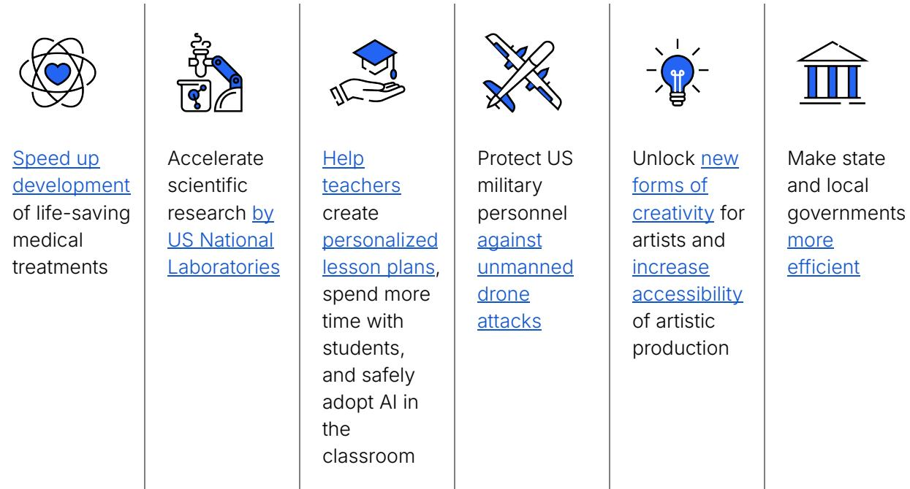
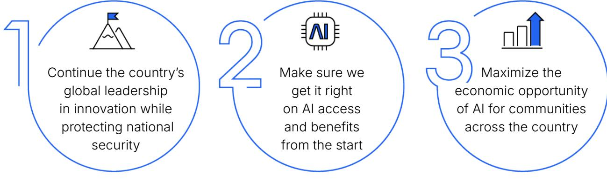
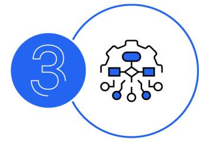

# **AI in America** OpenAI's Economic Blueprint

### Foreword

OpenAI's mission is to ensure that artificial intelligence benefits everyone. To us, that means building AI that helps people solve hard problems because by helping with the hard problems, AI can benefit the most people possible – through better healthcare and education, more scientific discoveries, better public policies and services, and improved productivity. We're off to a strong start, creating freely available intelligence being used by more than 300 million people around the world, including 3 million developers, to ideate, discover, and innovate beyond what we're currently capable of doing on our own. Already, our tools are being used to:

We believe America needs to act now to maximize AI's possibilities while minimizing its harms. AI is too powerful a technology to be led and shaped by autocrats, but that is the growing risk we face, while the economic opportunity AI presents is too compelling to forfeit. Shared prosperity is as near and measurable as the new jobs and growth to come from building the needed infrastructure. Soon, as our CEO Sam Altman has written, AI will help our children do things we can't. Not far off is a future in which everyone's lives can be better than anyone's life is now.

With such prosperity in sight, we want to work with policymakers to ensure that AI's benefits are shared responsibly and equitably. The enclosed framework champions the entrepreneurship and individual freedoms at the heart of the American innovation ecosystem.

If done right, the developers who are AI's Main Street will thrive along with companies of all sizes, and the broad economic benefits of the technology will catalyze a reindustrialization across the country.

America has faced such moments before, and we know how to think big, build big and act big.

Automobiles weren't invented here—they were invented in Europe. Early proponents envisioned the car transforming how people lived and worked. Supply chains and customer bases could be expanded and diversified.

But in the United Kingdom, where some of the earliest cars were introduced, the new industry's growth was stunted by regulation. The 1865 Red Flag Act required a flag bearer to walk ahead of any car to warn others on the road and wave the car aside *in favor of horse-drawn transport.* How could a person walk in front of a car without getting run over? Because of another requirement: that cars move *no faster than 4 miles per hour*.

America, meanwhile, took a very different approach to the car, merging private-sector vision and innovation with public-sector enlightenment to unlock the new technology and its economic—and ultimately, with World War I looming—national security benefits.

The country became the heart of the world's auto industry, mass-producing affordable cars with the help of local, state and federal officials who saw the industry's potential. Public safety concerns over horse-drawn vehicles on crowded city streets prompted local officials to support the switch to cars—not make cars yield to horses. The country's size prompted states to invest in better roads. And the federal government cleared the way to scale transport by car with a national—rather than state-by-state—highway system.

Today, while some countries sideline AI and its economic potential, the US government can pave the road for its AI industry to:

And just as drivers are expected to stick to clear, common-sense standards that help keep the actual roads safe, developers and users have a responsibility to follow clear, common-sense standards that keep the AI roads safe. Straightforward, predictable rules that safeguard the public while helping innovators thrive can encourage investment, competition, and greater freedom for everyone.

For our part, OpenAI is committed to working with US policymakers on how AI can best serve both the national interest and the public good, stewarding our own technology along those lines, and globally championing AI that is built on a foundation of the democratic values the US has always stood for.

We believe in America because America believes in innovation. This is why our CEO will be kicking off this work with a gathering in Washington, DC on January 30 to preview the state of AI advancement and how it can drive economic growth. And this is why that event will kick off our Innovating for America initiative to engage states across the country to help ensure that we're bringing AI's economic benefits to Americans from all walks of life.

This country always succeeds when it bets on its ecosystem of builders and entrepreneurs. This Blueprint, a living document we'll update as we learn from our work to help solve people's hard problems, lays out a relationship we believe we can build on with government here at home and as a place to begin with allies around the world.

### **Chris Lehane**

Vice President, Global Affairs

# Where We Stand

The enclosed policy proposals reflect OpenAI's position that:

- We believe in America because America believes in innovation.
- Chips, data, energy and talent are the keys to winning on AI—and this is a race America can and must win.
- With an estimated $175 billion sitting in global funds awaiting investment in AI projects, if the US doesn't attract those funds, they will flow to China-backed projects—strengthening the Chinese Communist Party's global influence.
- Rules and regulations for the development and use of AI should be based on the democratic values the country has always stood for—what we think of as "democratic AI."
- As for any industry, we need common-sense rules of the road that safeguard the public while helping innovators thrive by encouraging investment, competition, and greater freedom for everyone—and to best achieve this, these rules should apply nationwide.

# Competitiveness and Security

*We believe* that making sure AI benefits the most people possible means enabling AI through common-sense rules aimed at protecting people from actual harms, and building democratic AI shaped by the values the US has always stood for, including:

- A free market promoting free and fair competition that drives innovation
- Freedomfor developers and users to work with and direct our tools as they see fit, in exchange for following clear, common-sense standards that help keep AI safe for everyone, and being held accountable when they don't
- Preventing government use of AI tools to amass power and control their citizens, or to threaten or coerce other states

*To us, this means* that in the same way the federal government helped clear the way for the nascent automobile industry to grow, including by preempting a state-by-state tangle of roads and rules, it should clear the way for the AI industry's development of frontier models to best ensure that they promote US economic and national security.

To be clear, by "frontier models," we are referring to the most state-of-the-art large language models that lead on capability benchmarks. Responsibly exporting these models to our allies and partners will help them stand up their own AI ecosystems, including their own developer communities innovating with AI and distributing its benefits, while also building AI on US technology, not technology funded by the Chinese Communist Party (CCP).

The US strategy for frontier model security should prioritize national competitiveness, model safeguards and national security. Led by the federal government in consultation with industry, this strategy should:

Develop best practices for deployment to better protect against the risks of criminal, terrorist, and state-sponsored misuse and industrial espionage; and streamline industry engagement with national security departments and agencies

Develop export policies that let the industry securely share frontier models with US allies and partner nations to strengthen their economies and especially their developer communities, and preserve a vibrant and innovative open-source community. At the same time, limit the export of frontier models to adversary nations that may be more likely to misuse the technology or co-opt the IP

Develop alternatives to the growing patchwork of state and international regulations that risk hindering American competitiveness, such as by having the federal government leading the development of national security evaluations at home, and establishing a US-led international coalition that works toward shared safety standards abroad

At OpenAI, we've already taken steps toward such a strategy, including by developing our own sector-leading Preparedness Framework; having red team experts pressure-test our frontier models for national security risks (for example, by evaluating a model's capability to create novel cyber threats); using tailored safeguards to mitigate risks; stewarding adoption of our models by US-allied and partner countries; partnering with leading names in defense such as Los Alamos National Laboratory, the Air Force Research Laboratory, and Anduril; and being transparent with the public about our safeguards and deployment practices.

#### *Solutions:*

The US always succeeds when it bets on its ecosystem of innovators and entrepreneurs. To help US AI companies develop and deploy frontier models securely and with the needed safeguards, the federal government should:

*As appropriate, share national security-related information and resources that it alone maintains*—such as briefings on security threats to the industry and high-level results of testing US and non-US AI models—with US AI companies pursuing advanced research.

Then, *incentivize AI companies to deploy their products widely, including to allied and partner nations and to support US government agencies.*

The federal government's approach to frontier model safety and security should streamline requirements, reduce bureaucratic obstacles to government-industry collaboration, and incentivize companies to support US competitiveness. For instance, the government could:

*Support the development of standards and safeguards, ensure that such standards are recognized and respected by other nations and international bodies* on behalf of the US private sector, *and support direct work with US government agencies and offices.*

*Share its unique expertise with AI companies*, including information about how to secure their IP against industrial security threats and mitigate potential cyber, chemical, biological, radiological and nuclear (CBRN) and other risks that are heightened by increasingly powerful models.

*Help companies access secure infrastructure*, such as classified computing clusters, to evaluate model security risks and safeguards.

*Promote transparency consistent with competitiveness* by the US and like-minded nations through protecting trade secrets, promoting market competition, and ensuring broad and affordable AI access by carefully choosing disclosure requirements across the AI life cycle.

Streamline its support for the industry by *creating a defined, voluntary pathway for companies that develop large language models* to work with government to define model evaluations, test models, and exchange information to support the companies' safeguards. The US government can uniquely mobilize and coordinate experts, especially those with access to classified threat intelligence, to work directly with frontier labs on national security-related evaluations and mitigations. In return, these companies would receive preemption from state-by-state regulations on the types of risks that the same national security agencies would handle.

*Empower the public sector to quickly and securely adopt AI tools* to ensure pathways to adoption for start-ups and smaller firms, save taxpayers money, improve the efficiency of operations, and deliver better public services.

And to further coordinate and collaborate with the federal government, AI builders could:

*Form a consortium that identifies best practices for working with the national security community, including to prioritize security-based requests of the government (such as access to compute) and to streamline efforts to responsibly integrate AI in ways consistent with US and company policies.* As AI systems become increasingly more capable, deeper partnership between government and industry will both improve the security of those systems and enhance the US government's access to cutting-edge talent and capabilities.

Help develop training programs to *cultivate the next generation of AI talent in the US, especially in areas of the country that have not benefited from previous waves of innovation*, to establish pools of skilled talent for both the public and private sectors.

### Rules of the Road

*We believe* that the more US-led development of AI becomes, the more widely it will be deployed, the more trusted it will become, and the more people will benefit—in turn creating a flywheel of growing prosperity and appreciation for democratic values like the freedom to responsibly direct and work with AI tools, and a free market, with the appropriate safeguards, in which all manner of AI companies and entrepreneurs can compete.

*To us, this means* getting AI access and benefits right from the start—what we think of as getting the rules of the road right so the benefits can be fully realized. AI is not social media—it's an infrastructure technology that is leading us into what our CEO Sam Altman has called the Intelligence Age. With AI, our children will be able to do things we can't, and eventually everyone's lives can be better than anyone's life is now. But we have work to do to get there. Government and the AI industry need to learn from the past and lay the proper rules so that when accessing AI tools and products, users can feel confident that:

Their children will be protected from potential harms

They will know where content comes from

They will be able to personalize the AI tools they use

While the federal government should lead on AI-related matters of national security, the states have a vital role to play when it comes to maximizing AI's benefits from the start. They can fill their historical role as laboratories for democracy by supporting experimentation with AI, including by start-ups and smaller AI firms, to identify ways to solve people's daily hard problems in areas like education and healthcare. They can support their government workers and developer communities experimenting with AI to identify ways to improve the lives of their

taxpayers. At the same time, this work would boost states' own local AI ecosystems—especially new generations of AI-enabled developers who are the next Main Street—and competitiveness.

And for the users of AI, from developers to the private sector and the public, access comes with responsibility for following the rules so that everyone can proceed with certainty on the AI roads. The industry is building and deploying AI, but developers and users are the ones behind the wheel.

### *Solutions:*

We know that for AI to benefit everyone, even as we're building AI to help people solve hard problems, we have to build understanding of the technology and confidence in the safeguards around how it intersects with their daily lives.

*On child safety,* AI companies and developers should:

- Encourage policy solutions that prevent the creation and distribution of AI-generated child sexual abuse material/child sexual exploitation material (CSAM/CSEM)
- Incorporate CSAM/CSEM protections throughout the AI development life cycle
- Take steps to prevent downstream developers from using their models to generate CSAM/CSEM
- Promote conditions that support robust and lasting partnerships among AI companies and law enforcement

*On knowing where content comes from, which is important for* building trust and empowering users, those building with AI, from large companies to start-ups to developers and entrepreneurs, should:

- Apply provenance data to all AI-generated audio-visual content
- Use common provenance standards such as those developed by the Coalition for Content Provenance and Authenticity (C2PA)
- For large companies, given their broader reach, develop and report publicly on progress toward more advanced provenance methods

### *On preferences:*

- People should be empowered to personalize their AI tools, including through controls on how their personal data is used
- Government and industry should work together to scale AI literacy through robust funding for pilot programs, school district technology budgets and professional development trainings that help people understand how to choose their own preferences to personalize their tools
- In exchange for having so much freedom, users should be responsible for impacts of how they work and create with AI. Common-sense rules for AI that are aimed at protecting from actual harms can only provide that protection if they apply to those using the technology as well as those building it

At OpenAI, we've already taken steps to adopt emerging rules of the road, including by establishing robust child safety measures, and engaging with the National Center for Missing and Exploited Children, law enforcement, and other government stakeholders on child protection issues and enhancements to reporting mechanisms. We're also developing and deploying ways to help users know where AI-generated audio or visual content comes from, including robust provenance methods, and we provide tools that help people personalize their ChatGPT experience within broad, reasonable limits, and control how their data is used.

## Infrastructure as Destiny

*We believe* that building enough infrastructure is not just vital for ensuring that AI around the world is based on US rather than China-based technology—it's an unmissable opportunity to catalyze a reindustrialization of the US. Successful nations turn resources into competitive advantages. In the AI era, chips, data, energy and talent are the resources that will underpin continued US leadership, and as with the mass production of the automobile, marshalling these resources will create widespread economic opportunity and reinforce our global competitiveness.

*To us, this means* seizing the moment and building the infrastructure needed to produce enough energy and chips to drive down the cost of compute and make it abundant. In turn, this will create tens of thousands of skilled-trade jobs, boost local economies through spending and indirect job creation, and modernize our energy grid in the near term— ultimately supporting the kind of breakthroughs and innovations that drive lasting economic growth.

It also means assuring AI developers that AI models will have the ability to learn from publicly available information, and making more such information available through competition policy and public sector investment.

Today, demand for compute and energy far outstrips the available supply, while an estimated $175 billion in global funds is waiting to be invested in AI infrastructure. If the US doesn't move fast to channel these resources into projects that support democratic AI ecosystems around the world, the funds will flow to projects backed and shaped by the CCP.

Likewise, other actors, including developers in other countries, make no effort to respect or engage with the owners of IP rights. If the US and like-minded nations don't address this imbalance through sensible measures that help advance AI for the long-term, the same content will still be used for AI training elsewhere, but for the benefit of other economies.

### *Solutions:*

We need a foundational strategy to ensure that investment in infrastructure benefits the most people possible and maximizes access to AI. This includes policies and initiatives that encourage rather than stifle developers; support thriving AI ecosystems of labs, start-ups and larger companies; and secure America's leadership on AI into the future, such as:

*Ensuring that AI has the ability to learn* from universal, publicly available information, just like humans do, while also protecting creators from unauthorized digital replicas*.*

*Digitizing government data currently in analog form.* A lot of government data is in the public domain. Making it more accessible or machine-readable could help US AI developers of all sizes, especially those working in fields where vital data is disproportionately government-held. In exchange, developers using this data could work with government to unlock new insights that help it develop better public policies.

*A Compact for AI* among US allies and partner nations that streamlines access to capital and supply chains in ways that support AI infrastructure and a robust AI ecosystem. Participating countries would also agree to some common security standards. Over time, this collaboration could expand to a global network of US allies and partners that would compete with the People's Republic of China's AI infrastructure alliances while also strengthening security through shared standards.

*AI Economic Zones,* created by local, state and the federal government together with industry, that significantly speed up the permitting processes for building AI infrastructure like new solar arrays, wind farms and nuclear reactors.

*Creation of AI research labs and workforces aligned with key local industries* by requiring AI companies to provide meaningful amounts of compute to public universities to equitably scale the training of a homegrown AI-skilled workforce. For example, Kansas could establish a hub dedicated to applying AI in agriculture; Texas or Pennsylvania could develop centers focused on integrating AI into power production and grid resilience.

*A nationwide AI education strategy*—rooted in local communities in partnership with American companies—to help our current workforce and students become AI-ready, bolster the economy, and secure America's continued leadership on innovation.

*Investment in national research infrastructure that would give scientists, innovators, and educators access to the compute and data necessary to accelerate and democratize scientific progress*, such as through funding a National AI Research Resource.

*Leading on the next generation of energy technology*, including sustainable sources such as fission, fusion, and other promising technologies to support our existing energy capacity. A sufficient energy supply is critical to sustaining American leadership on AI.

*Dramatically increased federal spending on power and data transmission and streamlined approval for new lines.* That would be accompanied by the creation of a National AI Infrastructure Highway to connect those regional power and communication grids in the interest of national economic competitiveness and security.

*Federal backstops for high-value AI public works* that illustrate the model of federal spending in support of industry growth and both industry and users adhering to its rules. Since private markets alone may not be enough to pay for the massive amount of needed AI infrastructure, the US government can provide offtake purchase commitments and credit enhancements to encourage infrastructure investment. The resulting infrastructure, such as the new energy sources needed to power AI data centers, would be considered strategic national assets.

*OpenAI's Economic Blueprint is a living document which we'll update as we learn from our work with the US government to be thoughtful stewards of our technology and ensure that our tools help people solve hard problems to benefit the most people possible.*

*Cover image created with DALL.E*

