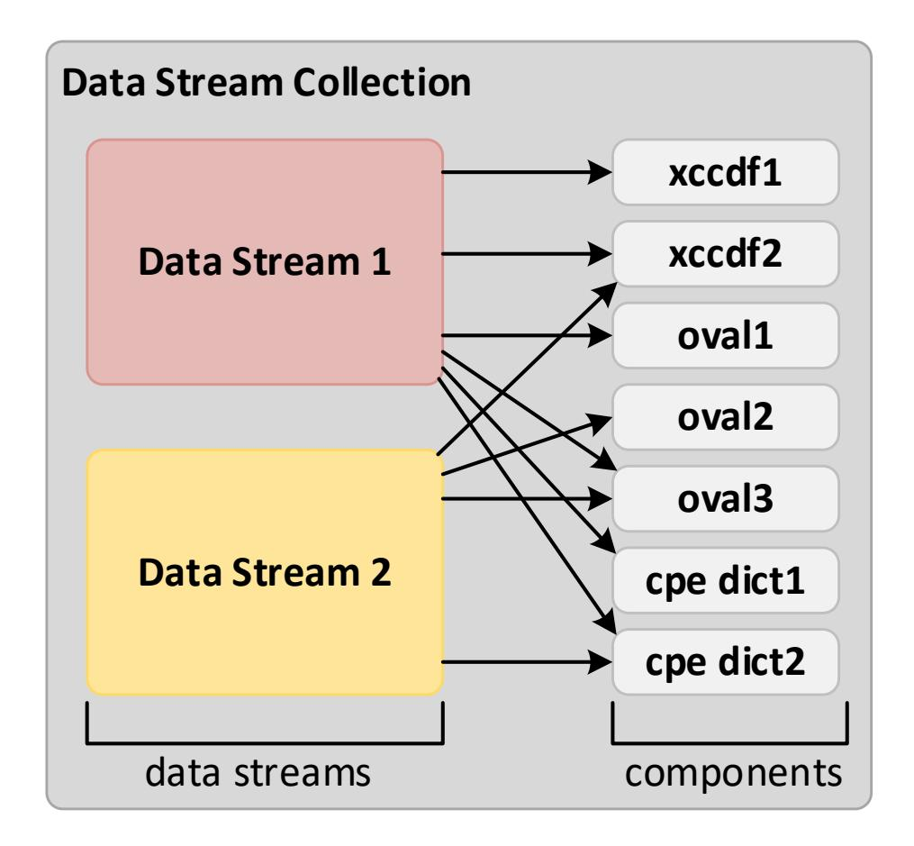
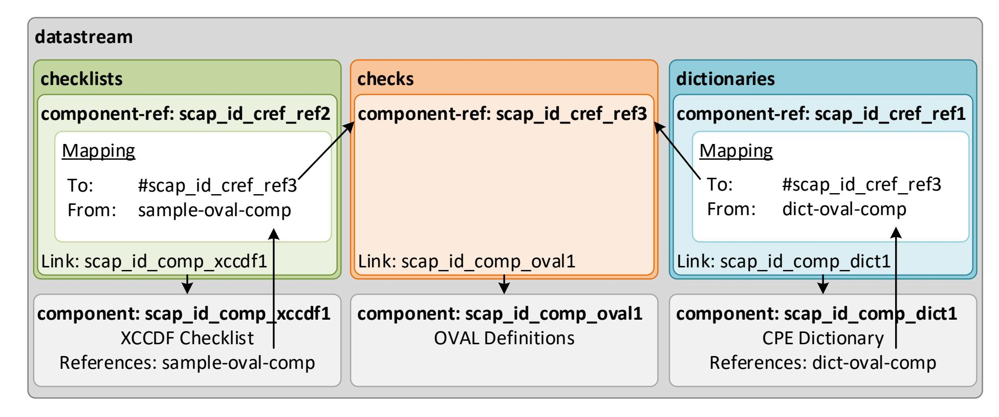
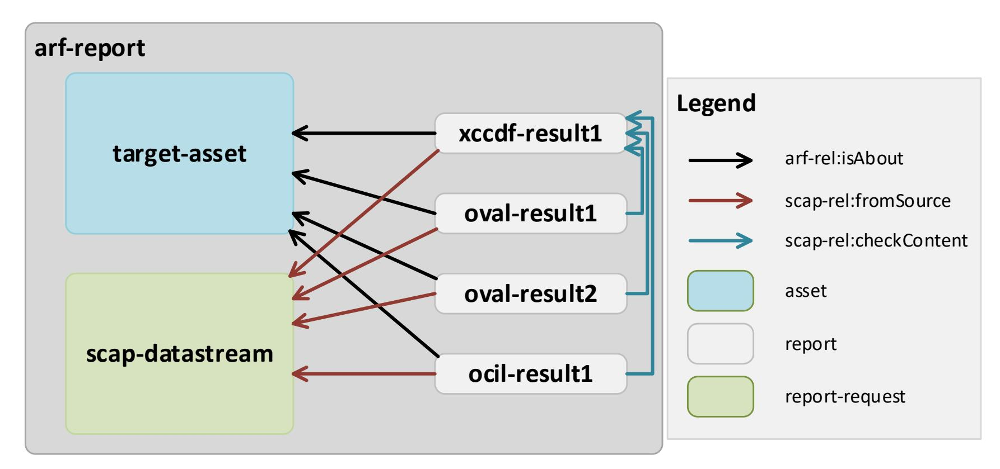

{0}------------------------------------------------

# **NIST Special Publication 800-126 Revision 3**

# **The Technical Specification for the Security Content Automation Protocol (SCAP)**

*SCAP Version 1.3*

David Waltermire Stephen Quinn Harold Booth Karen Scarfone Dragos Prisaca

This publication is available free of charge from: https://doi.org/10.6028/NIST.SP.800-126r3

C O M P U T E R S E C U R I T Y


{1}------------------------------------------------

# **NIST Special Publication 800-126 Revision 3**

# **The Technical Specification for the Security Content Automation Protocol (SCAP)**

*SCAP Version 1.3*

David Waltermire Stephen Quinn Harold Booth *Computer Security Division Information Technology Laboratory*

Karen Scarfone *Scarfone Cybersecurity Clifton, VA*

Dragos Prisaca *G2, Inc. Annapolis Junction, MD*

This publication is available free of charge from: https://doi.org/10.6028/NIST.SP.800-126r3

February 2018


U.S. Department of Commerce *Wilbur L. Ross, Jr., Secretary*

{2}------------------------------------------------

## **Authority**

This publication has been developed by NIST in accordance with its statutory responsibilities under the Federal Information Security Modernization Act (FISMA) of 2014, 44 U.S.C. § 3551 *et seq.*, Public Law (P.L.) 113-283. NIST is responsible for developing information security standards and guidelines, including minimum requirements for federal information systems, but such standards and guidelines shall not apply to national security systems without the express approval of appropriate federal officials exercising policy authority over such systems. This guideline is consistent with the requirements of the Office of Management and Budget (OMB) Circular A-130.

Nothing in this publication should be taken to contradict the standards and guidelines made mandatory and binding on federal agencies by the Secretary of Commerce under statutory authority. Nor should these guidelines be interpreted as altering or superseding the existing authorities of the Secretary of Commerce, Director of the OMB, or any other federal official. This publication may be used by nongovernmental organizations on a voluntary basis and is not subject to copyright in the United States. Attribution would, however, be appreciated by NIST.

National Institute of Standards and Technology Special Publication 800-126 Revision 3 Natl. Inst. Stand. Technol. Spec. Publ. 800-126 Rev. 3, 64 pages (February 2018) CODEN: NSPUE2

> This publication is available free of charge from: https://doi.org/10.6028/NIST.SP.800-126r3

Certain commercial entities, equipment, or materials may be identified in this document in order to describe an experimental procedure or concept adequately. Such identification is not intended to imply recommendation or endorsement by NIST, nor is it intended to imply that the entities, materials, or equipment are necessarily the best available for the purpose.

There may be references in this publication to other publications currently under development by NIST in accordance with its assigned statutory responsibilities. The information in this publication, including concepts and methodologies, may be used by federal agencies even before the completion of such companion publications. Thus, until each publication is completed, current requirements, guidelines, and procedures, where they exist, remain operative. For planning and transition purposes, federal agencies may wish to closely follow the development of these new publications by NIST.

Organizations are encouraged to review all draft publications during public comment periods and provide feedback to NIST. Many NIST cybersecurity publications, other than the ones noted above, are available at [https://csrc.nist.gov/publications.](https://csrc.nist.gov/publications)

#### **Comments on this publication may be submitted to:**

National Institute of Standards and Technology Attn: Computer Security Division, Information Technology Laboratory 100 Bureau Drive (Mail Stop 8930) Gaithersburg, MD 20899-8930 Email: [800-126comments@nist.gov](mailto:800-126comments@nist.gov)

All comments are subject to release under the Freedom of Information Act (FOIA).

{3}------------------------------------------------

# **Reports on Computer Systems Technology**

The Information Technology Laboratory (ITL) at the National Institute of Standards and Technology (NIST) promotes the U.S. economy and public welfare by providing technical leadership for the Nation's measurement and standards infrastructure. ITL develops tests, test methods, reference data, proof of concept implementations, and technical analyses to advance the development and productive use of information technology. ITL's responsibilities include the development of management, administrative, technical, and physical standards and guidelines for the cost-effective security and privacy of other than national security-related information in federal information systems. The Special Publication 800-series reports on ITL's research, guidelines, and outreach efforts in information system security, and its collaborative activities with industry, government, and academic organizations.

# **Abstract**

The Security Content Automation Protocol (SCAP) is a suite of specifications that standardize the format and nomenclature by which software flaw and security configuration information is communicated, both to machines and humans. This publication, along with its annex (NIST Special Publication 800-126A) and a set of schemas, collectively define the technical composition of SCAP version 1.3 in terms of its component specifications, their interrelationships and interoperation, and the requirements for SCAP content.

# **Keywords**

checklists; patch verification; security automation; security checklists; security configuration; Security Content Automation Protocol (SCAP); software flaws; vulnerabilities

{4}------------------------------------------------

# Acknowledgments

The authors, David Waltermire, Stephen Quinn, and Harold Booth of the National Institute of Standards and Technology (NIST); Karen Scarfone of Scarfone Cybersecurity; and Dragos Prisaca of G2, Inc., wish to thank all contributors to this revision of the publication, particularly Melanie Cook, Lee Badger, Jim Foti, Stephen Banghart, and Joshua Lubell of NIST; Steve Grubb of Red Hat; Roger Johnson of the Centers for Disease Control and Prevention; Kent Landfield of Intel Corporation; Adam W. Montville and William K. Munyan of the Center for Internet Security; and David A. Solin of Joval Continuous Monitoring. The authors also recognize the contributions of Adam Halbardier of Booz Allen Hamilton, who co-authored Revision 1 of this publication.

The authors would like to acknowledge the following contributors to previous versions of this specification for their keen and insightful assistance: John Banghart, Paul Cichonski, and Blair Heiserman of NIST; Christopher Johnson of HP Enterprise Services; Paul Bartock of the National Security Agency (NSA); Jeff Ito, Matt Kerr, Shane Shaffer, and Greg Witte of G2, Inc.; Andy Bove of SecureAcuity; Jim Ronayne of Varen Technologies; Kent Landfield of McAfee, Inc.; Christopher McCormick, Rhonda Farrell, Angela Orebaugh, and Victoria Thompson of Booz Allen Hamilton; Alan Peltzman of the Defense Information Systems Agency (DISA); and Jon Baker, Drew Buttner, Maria Casipe, and Charles Schmidt of the MITRE Corporation.

# Trademark Information

OVAL is a trademark of the US Department of Homeland Security (DHS).

CVE is a registered trademark of The MITRE Corporation.

Windows 7 is a registered trademark of Microsoft Corporation.

All other registered trademarks or trademarks belong to their respective organizations.

{5}------------------------------------------------

# Errata

This table will contain changes that have been incorporated into NIST Special Publication 800-126 Revision 3 after the publication is finalized. Errata updates can include corrections, clarifications, or other minor changes in the publication that are either *editorial* or *substantive* in nature.

| Date | Type | Change | Pages |
|------|------|--------|-------|
|      |      |        |       |
|      |      |        |       |
|      |      |        |       |
|      |      |        |       |
|      |      |        |       |
|      |      |        |       |
|      |      |        |       |
|      |      |        |       |
|      |      |        |       |
|      |      |        |       |

{6}------------------------------------------------

# **Table of Contents**

| Exe | cutive                   | Summary                                                                                          | VIII           |
|-----|--------------------------|--------------------------------------------------------------------------------------------------|----------------|
| 1.  | Introd                   | duction                                                                                          | 1              |
|     | 1.1<br>1.2<br>1.3<br>1.4 | Purpose and Scope Audience Document Structure Document Conventions                               | 1<br>1         |
| 2.  | SCAF                     | P 1.3 Conformance                                                                                | 4              |
|     | 2.1<br>2.2               | Product Conformance                                                                              |                |
| 3.  | SCAF                     | P Content Requirements and Recommendations                                                       | 7              |
|     | 3.1                      | SCAP Source Data Stream                                                                          | 10<br>15<br>16 |
|     | 3.2                      | Extensible Configuration Checklist Description Format (XCCDF)                                    |                |
|     |                          | 3.2.2 The <xccdf:benchmark> Element</xccdf:benchmark>                                            |                |
|     |                          | 3.2.3 The <xccdf:profile> Element</xccdf:profile>                                                |                |
|     |                          | 3.2.4 The <xccdf:rule> Element</xccdf:rule>                                                      |                |
|     |                          | 3.2.5 The <xccdf:value> Element</xccdf:value>                                                    |                |
|     | 3.3                      | 3.2.6 The <xccdf:group> Element  Open Vulnerability and Assessment Language (OVAL)</xccdf:group> |                |
|     | 3.4                      | Open Checklist Interactive Language (OCIL)                                                       |                |
|     | 3.5                      | Common Platform Enumeration (CPE)                                                                |                |
|     | 3.6                      | Software Identification (SWID) Tags                                                              |                |
|     | 3.7                      | Common Configuration Enumeration (CCE)                                                           |                |
|     | 3.8                      | Common Vulnerabilities and Exposures (CVE)                                                       |                |
|     | 3.9                      | Common Vulnerability Scoring System (CVSS)                                                       |                |
|     |                          | Common Configuration Scoring System (CCSS)                                                       |                |
| _   |                          | XML Digital Signature                                                                            |                |
| 4.  | SCA                      | P Content Processing Requirements and Recommendations                                            | 30             |
|     | 4.1                      | Legacy Support                                                                                   |                |
|     | 4.2                      | Source Data Streams                                                                              |                |
|     | 4.3                      | XCCDF Processing                                                                                 |                |
|     |                          | 4.3.1 CPE Applicability Processing                                                               |                |
|     | 4.4                      | SCAP Result Data Streams                                                                         |                |
|     | 7.7                      | 4.4.1 The Component Reports                                                                      |                |
|     |                          | 4.4.2 The Target Identification                                                                  |                |
|     |                          | 4.4.3 The Source Data Stream                                                                     |                |
|     |                          | 4.4.4 The Relationships                                                                          |                |
|     | 4.5                      | XCCDF Results                                                                                    |                |
|     |                          | 4.5.1 Assigning Identifiers to Rule Results                                                      |                |
|     |                          | 4.5.2 Mapping OVAL Results to XCCDF Results                                                      |                |
|     | 4.6                      | OVAL Results                                                                                     | 39             |

{7}------------------------------------------------

| 4.7 OCIL Results                                              |    |
|---------------------------------------------------------------|----|
| 5. Source Data Stream Content Requirements for Use Cases      |    |
| 5.1 Compliance Checking                                       |    |
| 5.2 Vulnerability Scanning                                    | 43 |
| 5.3 Inventory Scanning                                        |    |
| Appendix A— Security Considerations                           |    |
| Appendix B— Acronyms and Abbreviations                        |    |
| Appendix C— Glossary                                          |    |
| Appendix D— Normative References                              |    |
| Appendix E— Change Log                                        | 50 |
|                                                               |    |
|                                                               |    |
| List of Figures                                               |    |
| Figure 1: Notional SCAP Data Stream Collection                | 8  |
| Figure 2: SCAP Data Stream                                    | 8  |
| Figure 3: Sample ARF Report Structure                         | 35 |
|                                                               |    |
| List of Tables                                                |    |
|                                                               |    |
| Table 1: Conventional XML Mappings                            |    |
| Table 2: ds:data-stream-collection                            |    |
| Table 3: ds:data-stream                                       |    |
| Table 4: ds:dictionaries                                      |    |
| Table 5: ds:checklists                                        | 12 |
| Table 6: ds:checks                                            | 12 |
| Table 7: ds:extended-components                               |    |
| Table 8: ds:component-ref                                     | 13 |
| Table 9: cat:catalog                                          | 13 |
| Table 10: cat:uri                                             | 14 |
| Table 11: cat:rewriteURI                                      | 14 |
| Table 12: ds:component                                        | 14 |
| Table 13: ds:extended-component                               | 15 |
| Table 14: SCAP Source Data Stream Component Document Elements | 15 |

{8}------------------------------------------------

| Table 15: Element Identifier Format Convention<br>16                                      |  |
|-------------------------------------------------------------------------------------------|--|
| Table 16: Use of Dublin Core Terms in <xccdf:metadata><br/>18</xccdf:metadata>            |  |
| Table 17: <xccdf:rule> and <xccdf:ident> Element Values<br/>19</xccdf:ident></xccdf:rule> |  |
| Table 18: XCCDF-OVAL Data Export Matching Constraints<br>23                               |  |
| Table 19: SCAP Result Data Stream Component Document Elements33                           |  |
| Table 20: Asset Identification Fields to Populate<br>33                                   |  |
| Table 21: ARF Relationships<br>34                                                         |  |
| Table 22: XCCDF Fact Descriptions36                                                       |  |
| Table 23: Deriving XCCDF Check Results from OVAL Definition Results39                     |  |
| Table 24: Specification Locations<br>49                                                   |  |

{9}------------------------------------------------

# <span id="page-9-0"></span>**Executive Summary**

The Security Content Automation Protocol (SCAP) is a suite of specifications that standardize the format and nomenclature by which software flaw and security configuration information is communicated, both to machines and humans. [1](#page-9-1) SCAP is a multi-purpose framework of specifications that support automated configuration, vulnerability and patch checking, technical control compliance activities, and security measurement. Goals for the development of SCAP include standardizing system security management, promoting interoperability of security products, and fostering the use of standard expressions of security content.

SCAP version 1.3 is comprised of twelve component specifications in five categories:

- **Languages.** The SCAP languages provide standard vocabularies and conventions for expressing security policy, technical check mechanisms, and assessment results. The SCAP language specifications are Extensible Configuration Checklist Description Format (XCCDF), Open Vulnerability and Assessment Language (OVAL), and Open Checklist Interactive Language (OCIL).
- **Reporting formats.** The SCAP reporting formats provide the necessary constructs to express collected information in standardized formats. The SCAP reporting format specifications are Asset Reporting Format (ARF) and Asset Identification. Although Asset Identification is not explicitly a reporting format, SCAP uses it as a key component in identifying the assets that reports relate to.
- **Identification schemes.** The SCAP identification schemes provide a means to identify key concepts such as software products, vulnerabilities, and configuration items using standardized identifier formats. They also provide a means to associate individual identifiers with additional data pertaining to the subject of the identifier. The SCAP identification scheme specifications are Common Platform Enumeration (CPE), Software Identification (SWID) Tags, Common Configuration Enumeration (CCE), and Common Vulnerabilities and Exposures (CVE).
- **Measurement and scoring systems.** In SCAP this refers to evaluating specific characteristics of a security weakness (for example, software vulnerabilities and security configuration issues) and, based on those characteristics, generating a score that reflects their relative severity. The SCAP measurement and scoring system specifications are Common Vulnerability Scoring System (CVSS) and Common Configuration Scoring System (CCSS).
- **Integrity.** An SCAP integrity specification helps to preserve the integrity of SCAP content and results. Trust Model for Security Automation Data (TMSAD) is the SCAP integrity specification.

SCAP utilizes software flaw and security configuration standard reference data. This reference data is provided by the National Vulnerability Database (NVD),[2](#page-9-2) which is managed by NIST and sponsored by the Department of Homeland Security (DHS).

This publication, along with its annex (NIST SP 800-126A [\[SP800-126A\]](#page-59-2)) and a set of schemas, collectively define the technical composition of SCAP version 1.3 in terms of its component specifications, their interrelationships and interoperation, and the requirements for SCAP content. The technical specification for SCAP in these publications and schemas describes the requirements and conventions that are to be employed to ensure the consistent and accurate exchange of SCAP-conformant content and the ability to reliably use the content with SCAP-conformant products.

The U.S. Federal Government, in cooperation with academia and private industry, has adopted SCAP and encourages its use in support of security automation activities and initiatives.[3](#page-9-3) SCAP has achieved

<span id="page-9-1"></span> <sup>1</sup> Products implementing SCAP can also be used to support non-security use cases such as configuration management and software inventory.

<span id="page-9-2"></span><sup>2</sup> <https://nvd.nist.gov/>

<span id="page-9-3"></span><sup>3</sup> Refer t[o https://www.gsa.gov/portal/getMediaData?mediaId=213119.](https://www.gsa.gov/portal/getMediaData?mediaId=213119) 

{10}------------------------------------------------

widespread adoption by major software manufacturers and has become a significant component of large information security management and governance programs. The specification is expected to evolve and expand in support of the growing needs to define and measure effective security controls, assess and monitor ongoing aspects of that information security, and successfully manage systems in accordance with risk management frameworks such as NIST Special Publication 800-53[4](#page-10-0) , Department of Defense (DoD) Instruction 8500.01, and the Payment Card Industry (PCI) framework.

By detailing the specific and appropriate usage of the SCAP 1.3 components and their interoperability, NIST encourages the creation of reliable and pervasive SCAP content and the development of a wide array of products that leverage SCAP.

Organizations that develop SCAP 1.3-based content or products should comply with the following recommendations:

# **Follow the requirements listed in this document, its annex, and the associated component specifications and set of schemas.**

Organizations should ensure that their implementation and use of SCAP 1.3 is compliant with the requirements detailed in each component specification, this document and its annex, and the set of schemas.

If requirements are in conflict between component specifications, this document will provide clarification. If a component specification is in conflict with this document, the requirements in this document take precedence. If a component specification or this document is in conflict with the annex, the requirements in the annex take precedence. If a specification and a schema are in conflict, the requirements in the specification take precedence.

#### **When creating SCAP content, adhere to the conventions specified in this document and its annex.**

Security products and checklist authors assemble content from SCAP data repositories to create SCAPconformant security guidance. For example, a security configuration checklist can document desired security configuration settings, installed patches, and other system security elements using a standardized SCAP format. Such a checklist would use XCCDF to describe the checklist, CCE to identify security configuration settings to be addressed or assessed, and CPE and SWID tags to identify platforms for which the checklist is valid. In this example, the use of CCE and CPE entries within XCCDF checklists is an example of an SCAP convention—examples of the requirements for valid SCAP 1.3 usage defined in this specification. Organizations producing SCAP content to be shared between tools should adhere to these conventions to ensure the highest degree of interoperability.

NIST provides an SCAP Content Validation Tool that organizations can use to help validate the correctness of their SCAP content. The tool checks that SCAP source and result content is well-formed, all cross references are valid, and required values are appropriately set.[5](#page-10-1) Additionally, NIST provides a set of SCAP style guidelines in NISTIR 8058[6](#page-10-2) , which can be helpful in creating SCAP 1.2 and later content. While these guidelines are not required to be followed for content to be considered valid SCAP content, these guidelines can improve the accuracy and consistency of SCAP results, avoid performance problems, reduce user effort, lower content maintenance burdens, and enable greater content reuse.

<span id="page-10-0"></span> <sup>4</sup> The Risk Management Framework is described in Section 3.0 of NIST Special Publication 800-53, available at

<span id="page-10-1"></span>[https://doi.org/10.6028/NIST.SP.800-53r4.](https://doi.org/10.6028/NIST.SP.800-53r4) 5 <https://scap.nist.gov/revision/1.3/#tools>

<span id="page-10-2"></span><sup>6</sup> Draft NISTIR 8058, *Security Content Automation Protocol (SCAP) Version 1.2 Content Style Guide*, is available at [https://csrc.nist.gov/publications/detail/nistir/8058/draft.](https://csrc.nist.gov/publications/detail/nistir/8058/draft) 

{11}------------------------------------------------

# <span id="page-11-0"></span>**1. Introduction**

# <span id="page-11-1"></span>**1.1 Purpose and Scope**

This document, NIST Special Publication (SP) 800-126 Revision 3, along with its annex (NIST SP 800- 126A [\[SP800-126A\]](#page-59-2)) and a set of schemas, collectively provide the definitive technical specification for version 1.3 of the Security Content Automation Protocol (SCAP). *SCAP* (pronounced ess-cap) consists of a suite of specifications for standardizing the format and nomenclature by which software flaw and security configuration information is communicated, both to machines and humans. This document defines requirements for creating and processing SCAP source content. These requirements build on the requirements defined within the individual SCAP component specifications. Each new requirement pertains either to using multiple component specifications together or to further constraining one of the individual component specifications. The requirements within the individual component specifications are not repeated in this document; see those specifications to view their requirements.

To extend the contents of this document, an annex has been created. The annex document specifies additional entities that may be used in SCAP 1.3 conformant content creation and processing:

- Particular minor version updates to SCAP 1.3 component specifications
- Particular Open Vulnerability and Assessment Language (OVAL) platform schema versions

The scope of this document and its annex is limited to SCAP version 1.3. Other versions of SCAP and its component specifications are not addressed in these documents.

Future versions of SCAP will be defined in distinct revisions of this document and its annex, each clearly labeled with a document revision number and the appropriate SCAP version number.

#### <span id="page-11-2"></span>**1.2 Audience**

This document is intended for three primary audiences:

- Content authors and editors seeking to ensure that the SCAP source content they produce operates correctly, consistently, and reliably in SCAP products.
- Software developers and system integrators seeking to create, use, or exchange SCAP content in their products or service offerings.
- Product developers preparing for SCAP validation at an accredited independent testing laboratory.

This document assumes that readers already have general knowledge of SCAP and reasonable familiarity with the SCAP component specifications that their content, products, or services use. Individuals without this level of knowledge who would like to learn more about SCAP should consult NIST SP 800-117, *Guide to Adopting and Using the Security Content Automation Protocol.[7](#page-11-4)*

# <span id="page-11-3"></span>**1.3 Document Structure**

The remainder of this document is organized into the following major sections and appendices:

- Section [2](#page-14-0) provides the high-level requirements for claiming conformance with the SCAP 1.3 specification.
- Section [3](#page-17-0) details the requirements and recommendations for SCAP content syntax, structure, and development.

<span id="page-11-4"></span> <sup>7</sup> <https://csrc.nist.gov/publications/detail/sp/800-117/rev-1/draft>

{12}------------------------------------------------

- Section [4](#page-40-0) defines SCAP content processing requirements and recommendations.
- Section [5](#page-53-0) provides additional content requirements and recommendations for particular use cases.
- [Appendix A](#page-56-0) gives an overview of major security considerations for SCAP implementation.
- [Appendix B](#page-57-0) contains an acronym and abbreviation list.
- [Appendix C](#page-58-0) contains a glossary of selected terms used in the document.
- [Appendix D](#page-59-0) lists references and other resources related to SCAP 1.3.
- [Appendix E](#page-60-0) provides a change log that documents significant changes to major drafts of this specification.

# <span id="page-12-0"></span>**1.4 Document Conventions**

The key words "MUST", "MUST NOT", "REQUIRED", "SHALL", "SHALL NOT", "SHOULD", "SHOULD NOT", "RECOMMENDED", "MAY", and "OPTIONAL" in this document are to be interpreted as described in Request for Comment (RFC) 2119 [\[RFC2119\]](#page-59-3). When these words appear in regular case, such as "should" or "may", they are not intended to be interpreted as RFC 2119 key words.

When a single term within a sentence is italicized, this indicates that the term is being defined. These terms and their definitions also appear in Appendix C.

Some of the requirements and conventions used in this document reference Extensible Markup Language (XML) content [\[XMLS\]](#page-59-4). These references come in two forms, inline and indented. An example of an inline reference is: a *<cpe2\_dict:cpe-item>* may contain *<cpe2\_dict:check*> elements that reference OVAL Definitions.

In this example the notation *<cpe2\_dict:cpe-item>* can be replaced by the more verbose equivalent "the XML element whose qualified name is *cpe2\_dict:cpe-item*".

An example of an indented reference is:

References to OVAL Definitions are expressed using the following format:

```
<cpe2_dict:check system=
"http://oval.mitre.org/XMLSchema/oval-definitions-5"
href="Oval_URL">[Oval_inventory_definition_id]
</cpe2_dict:check>.
```

The general convention used when describing XML attributes within this document is to reference the attribute as well as its associated element including the namespace alias, employing the general form "*@attributeName* for the *<prefix:localName>*".

Indented references are intended to represent the form of actual XML content. Indented references represent literal content by the use of a fixed-length font, and parametric (freely replaceable) content by the use of an *italic font*. Square brackets '[]' are used to designate optional content. Thus "[*Oval\_inventory\_definition\_id*]" designates optional parametric content.

Both inline and indented forms use qualified names to refer to specific XML elements. A qualified name associates a named element with a namespace. The namespace identifies the XML model, and the XML schema is a definition and implementation of that model. A qualified name declares this schema-toelement association using the format '*prefix*:*element-name*'. The association of prefix to namespace is defined in the metadata of an XML document and varies from document to document. In this specification, the conventional mappings listed in [Table 1](#page-13-0) are used.

{13}------------------------------------------------

**Table 1: Conventional XML Mappings**

<span id="page-13-0"></span>

| Prefix               | Namespace                                                                                        | Schema                                                                                                                                                                                                                                        |
|----------------------|--------------------------------------------------------------------------------------------------|-----------------------------------------------------------------------------------------------------------------------------------------------------------------------------------------------------------------------------------------------|
| ai                   | http://scap.nist.gov/schema/asset-identification/1.1                                             | Asset Identification                                                                                                                                                                                                                          |
| arf                  | http://scap.nist.gov/schema/asset-reporting-format/1.1                                           | ARF                                                                                                                                                                                                                                           |
| arf-rel              | http://scap.nist.gov/specifications/arf/vocabulary/relationships/1.0#                            | ARF relationships                                                                                                                                                                                                                             |
| cat                  | urn:oasis:names:tc:entity:xmlns:xml:catalog                                                      | XML Catalog                                                                                                                                                                                                                                   |
| con                  | http://scap.nist.gov/schema/scap/constructs/1.3                                                  | SCAP Constructs                                                                                                                                                                                                                               |
| cpe-dict-ext         | http://scap.nist.gov/schema/cpe-extension/2.3                                                    | CPE Dictionary 2.3 schema<br>extension                                                                                                                                                                                                        |
| cpe2                 | http://cpe.mitre.org/language/2.0                                                                | Embedded CPE references                                                                                                                                                                                                                       |
| cpe2-dict            | http://cpe.mitre.org/dictionary/2.0                                                              | CPE dictionaries                                                                                                                                                                                                                              |
| cve                  | http://scap.nist.gov/schema/vulnerability/0.4                                                    | NVD/CVE data feed elements<br>and attributes                                                                                                                                                                                                  |
| dc                   | http://purl.org/dc/elements/1.1/                                                                 | Simple Dublin Core elements                                                                                                                                                                                                                   |
| ds                   | http://scap.nist.gov/schema/scap/source/1.2                                                      | SCAP source data stream<br>collection                                                                                                                                                                                                         |
| dt                   | http://scap.nist.gov/schema/xml-dsig/1.0                                                         | Security automation digital<br>signature extensions                                                                                                                                                                                           |
| nvd                  | http://scap.nist.gov/schema/feed/vulnerability/2.0                                               | Base schema for NVD data feeds                                                                                                                                                                                                                |
| ocil                 | http://scap.nist.gov/schema/ocil/2.0                                                             | OCIL elements and attributes                                                                                                                                                                                                                  |
| oval                 | http://oval.mitre.org/XMLSchema/oval-common-5                                                    | Common OVAL elements and<br>attributes                                                                                                                                                                                                        |
| oval-def             | http://oval.mitre.org/XMLSchema/oval-definitions-5                                               | OVAL Definitions                                                                                                                                                                                                                              |
| oval-res             | http://oval.mitre.org/XMLSchema/oval-results-5                                                   | OVAL results                                                                                                                                                                                                                                  |
| oval-sc              | http://oval.mitre.org/XMLSchema/oval-system-characteristics-5                                    | OVAL system characteristics                                                                                                                                                                                                                   |
| oval-var             | http://oval.mitre.org/XMLSchema/oval-variables-5                                                 | The elements, types, and<br>attributes that compose the core<br>schema for encoding OVAL<br>Variables. This schema is<br>provided to give structure to any<br>external variables and their<br>values that an OVAL Definition is<br>expecting. |
| scap-rel             | http://scap.nist.gov/vocabulary/scap/relationships/1.0#                                          | SCAP relationships                                                                                                                                                                                                                            |
| sch                  | http://purl.oclc.org/dsdl/schematron                                                             | Schematron schema used for<br>validation                                                                                                                                                                                                      |
| swid                 | http://standards.iso.org/iso/19770/-2/2015/schema.xsd                                            | SWID tag documents                                                                                                                                                                                                                            |
| xccdf                | http://checklists.nist.gov/xccdf/1.2                                                             | XCCDF policy documents                                                                                                                                                                                                                        |
| xlink                | http://www.w3.org/1999/xlink                                                                     | XML Linking Language                                                                                                                                                                                                                          |
| xml                  | http://www.w3.org/XML/1998/namespace                                                             | Common XML attributes                                                                                                                                                                                                                         |
| xs                   | http://www.w3.org/2001/XMLSchema                                                                 | XML schema                                                                                                                                                                                                                                    |
| xxxx-def,<br>xxxx-sc | See the annex document for the mappings for OVAL definition<br>and system characteristic schemas | OVAL elements and attributes<br>specific to an OS, Hardware, or<br>Application type xxxx                                                                                                                                                      |

{14}------------------------------------------------

## <span id="page-14-0"></span>2. SCAP 1.3 Conformance

The major versions of the *component specifications* included in SCAP 1.3 are as follows:

#### • Languages

- o Extensible Configuration Checklist Description Format (XCCDF) 1.2, a language for authoring security checklists/benchmarks and for reporting results of evaluating them [XCCDF]
- Open Vulnerability and Assessment Language (OVAL) 5.11, a language for representing system configuration information, assessing machine state, and reporting assessment results [OVAL]<sup>8</sup>
- Open Checklist Interactive Language (OCIL) 2.0, a language for representing checks that collect information from people or from existing data stores made by other data collection efforts [OCIL]

#### • Reporting formats

- O Asset Reporting Format (ARF) 1.1, a format for expressing the transport format of information about assets and the relationships between assets and reports [ARF]
- O Asset Identification 1.1, a format for uniquely identifying assets based on known identifiers and/or known information about the assets [AI]

#### • Identification schemes

- o Common Platform Enumeration (CPE) 2.3, a nomenclature and dictionary of hardware, operating systems, and applications [CPE]
- o Software Identification (SWID) Tags 2015 revision, a format for representing software identifiers and associated metadata [SWID]
- o Common Configuration Enumeration (CCE) 5, a nomenclature and dictionary of software security configurations [CCE]
- O Common Vulnerabilities and Exposures (CVE), a nomenclature and dictionary of security-related software flaws <sup>10</sup> [CVE]

#### • Measurement and scoring systems

- o Common Vulnerability Scoring System (CVSS) 3, a system for measuring the relative severity of software flaw vulnerabilities [CVSS]
- o Common Configuration Scoring System (CCSS) 1.0, a system for measuring the relative severity of system security configuration issues [CCSS]

#### • Integrity

o Trust Model for Security Automation Data (TMSAD) 1.0, a specification for using digital signatures in a common trust model applied to other security automation specifications [TMSAD].

All references to these specifications within this document are to the minor version numbers listed in the annex. <sup>11</sup> These versions represent the baseline of interoperability for all SCAP products supporting SCAP 1.3. Support for older versions of these specifications may be included in an SCAP 1.3 product. When

<span id="page-14-1"></span>See the SCAP 1.3 annex document, NIST SP 800-126A [SP800-126A], for the OVAL component specification (core schema) versions and platform schema versions that are supported by SCAP 1.3.

<span id="page-14-3"></span><span id="page-14-2"></span>The "2015 revision" refers to ISO/IEC 19770-2:2015, which is the specification for SWID tags.

<sup>10</sup> CVE does not have a version number.

<span id="page-14-4"></span>See Section 1 of the SCAP 1.3 annex document, NIST SP 800-126A [SP800-126A], for definitions of the terms "major version" and "minor version."

{15}------------------------------------------------

doing so, it is important that legacy SCAP version support does not interfere with the product's ability to address the requirements in this specification and the annex. In some cases, support for specific legacy versions of these specifications is required by this specification, such as the requirements discussed in Section [4.1.](#page-40-1)

Combinations of these specifications can be used together for particular functions, such as security configuration checking. These functions, known as *SCAP use cases*, are ways in which a product can use SCAP. The collective XML content used for a use case is called an *SCAP data stream*, which is a specific instantiation of SCAP content. There are two types of SCAP data streams: an *SCAP source data stream* holds the input content, and an *SCAP result data stream* holds the output content. The major elements of a data stream, such as an XCCDF benchmark or a set of OVAL Definitions, are referred to as *stream components*.

Products and source content may want to claim conformance to one or more of the SCAP use cases, which are defined in Section [5](#page-53-0) of this document, for a variety of reasons. For example, a product may want to assert that it uses SCAP content properly and can interoperate with other products using valid SCAP content. Another example is a policy mandating that an organization use SCAP source content for performing vulnerability assessments and other security operations.

This section provides the high-level requirements that a product or source content must meet for conformance with the SCAP 1.3 specification. Such products and source content are referred to as *SCAP conformant.* Most of the requirements listed in this section reference other sections in the document that fully define the requirements.

If requirements are in conflict between component specifications, this document will provide clarification. If a component specification is in conflict with this document, the requirements in this document SHALL take precedence. This document will be republished with errata as needed, and in such cases the errata SHALL take precedence over the original document content.

The requirements in NIST SP 800-126A [\[SP800-126A\]](#page-59-2) SHALL take precedence over conflicting requirements in this document or the component specifications. If an SCAP specification or component specification and a schema are in conflict, the requirements in the specification SHALL take precedence over all conflicting requirements in the schema.

#### <span id="page-15-0"></span>**2.1 Product Conformance**

There are two types of SCAP-conformant products: content producers and content consumers. *Content producers* are products that generate SCAP source data stream content, while *content consumers* are products that accept existing SCAP source data stream content, process it, and produce SCAP result data streams. Products claiming conformance with the SCAP 1.3 specification SHALL comply with the following requirements:

- 1. Adhere to the requirements detailed in each applicable component specification (for each selected SCAP component specification, and for each SCAP component specification required to implement the selected SCAP use cases). The authoritative references for each specification are listed in the annex, NIST SP 800-126A [\[SP800-126A\]](#page-59-2).
- 2. Adhere to the requirements detailed in the errata for this document and for NIST SP 800-126A.
- 3. For content producers, generate well-formed SCAP source data streams. This includes following the source content conformance requirements specified in Section [2.2,](#page-16-1) and following the requirements in Section 5 for the use cases that the content producer supports.
- 4. For content consumers, consume and process well-formed SCAP source data streams, and generate well-formed SCAP result data streams. This includes following all of the processing

{16}------------------------------------------------

- requirements defined in Section 4 for each selected SCAP component specification and each SCAP component specification required to implement the selected SCAP use cases.
- <span id="page-16-1"></span>5. Make an explicit claim of conformance to this specification in any documentation provided to end users.

#### <span id="page-16-0"></span>**2.2 Source Content Conformance**

Source content (i.e., source data streams) claiming conformance with the SCAP 1.3 specification SHALL comply with the following requirements:

- 1. Adhere to the requirements detailed in each applicable component specification (for each selected SCAP component specification, and each SCAP component specification required to implement the selected SCAP use cases). The authoritative references for each specification are listed in the annex, NIST SP 800-126A [\[SP800-126A\]](#page-59-2).
- 2. Adhere to the requirements detailed in the errata for this document and for NIST SP 800-126A.
- 3. Follow all of the syntax, structural, and other source content design requirements defined in Section 3 for each selected SCAP component specification and for each SCAP component specification required to implement the selected SCAP use cases. Also, follow all of the requirements specified for the content's use cases as defined in Section 5.

{17}------------------------------------------------

# <span id="page-17-0"></span>**3. SCAP Content Requirements and Recommendations**

This section defines the SCAP 1.3 content syntax, structure, and development requirements and recommendations for SCAP-conformant content and products. Organizations are encouraged to adopt the optional recommendations to promote stronger interoperability and greater content consistency. The first part of the section discusses SCAP source data streams. The middle of the section groups requirements and recommendations by specification: XCCDF, OVAL, OCIL, CPE, SWID, CCE, CVE, CVSS, and CCSS, in that order. Finally, the last part of the section discusses applying XML digital signatures to source data streams.

# <span id="page-17-1"></span>**3.1 SCAP Source Data Stream**

This section discusses SCAP source data streams only; SCAP result data streams are discussed in Section [4.4](#page-42-0) as part of the requirements for SCAP processing.

An *SCAP source data stream collection* is composed of SCAP data streams and SCAP source components. See<https://scap.nist.gov/revision/1.3/#example> for a sample of an SCAP source data stream collection and its sections. The components section contains an unbounded number of *SCAP source components*, each consisting of data expressed using one or more of the SCAP specifications. The data streams section contains one or more source data streams, each of which references the source components in the components section that compose the data stream. This model allows source components to be reused across multiple data streams. Many data streams are allowed in a data stream collection to allow grouping of related or similar source data streams. For example, NIST currently distributes the United States Government Configuration Baseline (USGCB)[12](#page-17-2) as a series of SCAP bundles. Source data streams that are similar or related (e.g., Microsoft Windows 7 content and Microsoft Windows 7 Firewall content) may be bundled into the same source data stream collection.

[Figure 1](#page-18-0) shows a possible relationship between data stream collections, data streams, and components. In [Figure 1,](#page-18-0) data stream 1 points to xccdf1, xccdf2, oval1, oval3, cpe dict1, and cpe dict2. Data stream 2 points to xccdf2, oval2, oval3, and cpe dict2. Each data stream is a collection of links to the components it references, represented as a <ds:component-ref>. Each component-ref encapsulates the information required to allow the content consumer to connect the components that are embedded in content together with the data stream component that should be used. Content authors MAY place components in any order. For example, some authors might choose to place dictionary components first to help optimize data stream parsing.

<span id="page-17-2"></span> <sup>12</sup> <https://usgcb.nist.gov/>

{18}------------------------------------------------



**Figure 1: Notional SCAP Data Stream Collection**

<span id="page-18-0"></span>Links in a <ds:component-ref> element serve two purposes: to indicate which component is being referred to, and to provide a map to associate references within a component to other links within the data stream. The latter allows a data stream to define context for each component's references within the bounds of the data stream's own set of links. [Figure 2](#page-18-1) provides a conceptual example that illustrates how a data stream is constructed.



**Figure 2: SCAP Data Stream**

<span id="page-18-1"></span>The following XML is a stripped-down example of the source data stream depicted in [Figure 2.](#page-18-1)

```
1 <ds:data-stream-collection id="scap_datastream_collection_1" schematron-
version="1.3">
2 <ds:data-stream id="scap_id_datastream_ds1" scap-version="1.3" use-
case="CONFIGURATION">
3 <ds:dictionaries>
4 <ds:component-ref id="scap_id_cref_ref1" xlink:href="#scap_id_comp_dict1">
5 <cat:catalog>
```

{19}------------------------------------------------

```
6 <cat:uri name="dict-oval-comp" uri="#scap_id_cref_ref3"/>
7 </cat:catalog>
8 </ds:component-ref>
9 </ds:dictionaries>
10 <ds:checklists>
11 <ds:component-ref id="scap_id_cref_ref2" xlink:href="#scap_id_comp_xccdf1">
12 <cat:catalog>
13 <cat:uri name="sample-oval-comp" uri="#scap_id_cref_ref3"/>
14 </cat:catalog>
15 </ds:component-ref>
16 </ds:checklists>
17 <ds:checks>
18 <ds:component-ref id="scap_id_cref_ref3" xlink:href="#scap_id_comp_oval1"/>
19 </ds:checks>
20 </ds:data-stream>
21 <ds:component id="scap_id_comp_xccdf1" timestamp="2016-01-22T14:00:00">
22 <xccdf:Benchmark id="xccdf_gov.nist_benchmark_SCAP13" style=" SCAP_1.3">
23 …
24 <xccdf:Rule id="xccdf_gov.nist_rule_id-001">
25 <xccdf:check system="http://oval.mitre.org/XMLSchema/oval-definitions-5">
26 <xccdf:check-content-ref href="sample-oval-comp" 
name="oval:gov.nist:def:1"/>
27 </xccdf:check>
28 </xccdf:Rule>
29 </xccdf:Benchmark>
30 </ds:component>
31 <ds:component id="scap_id_comp_oval1" timestamp="2016-01-22T14:00:00">
32 <oval-def:oval_definitions>...</oval-def:oval_definitions>
33 </ds:component>
34 <ds:component id="scap_id_comp_dict1" timestamp="2016-01-22T14:00:00">
35 <cpe2-dict:cpe-list>
36 <cpe2-dict:cpe-item 
name="cpe:/a:oracle:database_server:11.1.0.6.0::enterprise">
37 <cpe2-dict:check href="dict-oval-comp" 
38 system="http://oval.mitre.org/XMLSchema/oval-definitions-5"> 
39 oval:gov.nist:def:2</cpe2-dict:check>
40 <cpe-dict-ext:cpe23-item 
41 name="cpe:2.3:a:oracle:database_server:11.1.0.6.0:-:-:-:enterprise:-:-:-
"/>
42 </cpe2-dict:cpe-item>
43 </cpe2-dict:cpe-list>
44 </ds:component>
45 </ds:data-stream-collection>
```

In [Figure 2,](#page-18-1) the data stream links to three components. The OVAL component scap\_id\_comp\_oval1 [see XML lines 31-33 above] does not reference external content, so there are no mappings captured for the OVAL component. The XCCDF component (scap\_id\_comp\_xccdf1) [see XML lines 21-30] and the CPE Dictionary component (scap\_id\_comp\_dict1) [see XML lines 34-44] reference other components (e.g., scap\_id\_cref\_ref3).

When referencing components within the example data stream, a mapping indicates that when scap\_id\_comp\_xccdf1 references "sample-oval-comp", the content is found through the link to the component identified as "scap\_id\_comp\_oval1" [see XML lines 26, 13, and 18]. Similarly, when the scap\_id\_comp\_dict1 component references "dict-oval-comp", the component reference is resolved through the link to the component identified as "scap\_id\_comp\_oval1" [see XML lines 37, 6, and 18]. This approach associates SCAP components within a data stream at the SCAP logical level, allowing components to be reused across data streams within the same data stream collection. This reuse can be accomplished irrespective of how references are made within a given component.

{20}------------------------------------------------

The design of the SCAP source data stream is important for the following reasons:

- 1. Individual components may be developed outside of an SCAP data stream where the linking to other components is not necessarily known at the time the component is created.
- 2. The SCAP source data stream creates links between different components that were not necessarily designed to reference each other. For example, XCCDF was not designed to reference a particular checking system; it can reference OVAL, OCIL, and other checking systems.
- 3. The logical link mapping in the data stream places a layer of capability within the data stream to control the dereferencing of URIs within components, creating a complete solution related to bundling components.
- 4. The SCAP source data stream format is intended to be easily adaptable for use in future communication models such as web services, transport protocols, tasking mechanisms, etc.
- 5. The SCAP source data stream format supports more comprehensive validation of component content, including interrelationships between components.

## <span id="page-20-0"></span>**3.1.1 Source Data Stream Data Model**

The tables in this section formalize the SCAP source data stream data model. The tables contain requirements and SHALL be interpreted as follows:

- The "Element Name" field indicates the name for the XML element being described. Each element name has a namespace prefix indicating the namespace to which the element belongs. See [Table 1](#page-13-0) for a mapping of namespace prefixes to namespaces.
- The "Element Definition" field indicates the prose description of the element. The definition field MAY contain key words as indicated in [\[RFC2119\]](#page-59-3).
- The "Properties" field is broken into four subfields:
  - o The "Name" column indicates the name of a property that MAY, SHOULD, or SHALL be included in the described element, in accordance with the cardinality indicated in the "Count" column and any [\[RFC2119\]](#page-59-3) requirement words in the "Property Definition" column.
  - o The "Type" column indicates the REQUIRED data type for the value of the property. There are two categories of types: literal and element. A literal type indicates the type of literal as defined in [\[XMLS\]](#page-59-4). An element type references the name of another element that ultimately defines that property.
  - o The "Count" column indicates the cardinality of the property within the element. The property SHALL be included in the element in accordance with the cardinality. If a range is given, and "n" is the upper bound of the range, then the upper limit SHALL be unbounded.
  - o The "Property Definition" column defines the property in the context of the element. The definition MAY contain key words as indicated in [\[RFC2119\]](#page-59-3).

{21}------------------------------------------------

**Table 2: ds:data-stream-collection**

<span id="page-21-0"></span>

|                       | Element Name: ds:data-stream-collection                                                                                                                                                   |       |                                                                                                                 |  |  |
|-----------------------|-------------------------------------------------------------------------------------------------------------------------------------------------------------------------------------------|-------|-----------------------------------------------------------------------------------------------------------------|--|--|
| Element<br>Definition | The top-level element for a SCAP data stream collection. It contains the data streams and<br>components that comprise this data stream collection, along with any data stream signatures. |       |                                                                                                                 |  |  |
| Properties:           |                                                                                                                                                                                           |       |                                                                                                                 |  |  |
| Name                  | Type                                                                                                                                                                                      | Count | Property Definition                                                                                             |  |  |
| id                    | literal – ID                                                                                                                                                                              | 1     | The identifier for the data stream collection. This identifier SHALL be<br>globally unique (see Section 3.1.3). |  |  |
| schematron<br>version | literal – token                                                                                                                                                                           | 1     | The version of the SCAP Requirements Schematron schema to which<br>the data stream collection conforms.         |  |  |
| data-stream           | element –<br>ds:data-stream                                                                                                                                                               | 1-n   | An element that represents a single data stream (see Table 3).                                                  |  |  |
| component             | element –<br>ds:component                                                                                                                                                                 | 1-n   | An element that represents content expressed using an SCAP<br>component specification (see Table 12).           |  |  |
| extended<br>component | element –<br>ds:extended<br>component                                                                                                                                                     | 0-n   | An element that holds non-SCAP components to enable extension (see<br>Table 13).                                |  |  |
| Signature             | element –<br>dsig:Signature                                                                                                                                                               | 0-n   | An XML digital signature element. Sections 3.11 and 4.8 define the<br>requirements for this element.            |  |  |

**Table 3: ds:data-stream**

<span id="page-21-1"></span>

| Element                | A data stream. This element contains the links to all of the components that comprise this data |       |                                                                                                                                                                                                                                                                                                                                                                                                                                           |  |  |
|------------------------|-------------------------------------------------------------------------------------------------|-------|-------------------------------------------------------------------------------------------------------------------------------------------------------------------------------------------------------------------------------------------------------------------------------------------------------------------------------------------------------------------------------------------------------------------------------------------|--|--|
| Definition             | stream.                                                                                         |       |                                                                                                                                                                                                                                                                                                                                                                                                                                           |  |  |
| Properties             |                                                                                                 |       |                                                                                                                                                                                                                                                                                                                                                                                                                                           |  |  |
| Name                   | Type                                                                                            | Count | Property Definition                                                                                                                                                                                                                                                                                                                                                                                                                       |  |  |
| id                     | literal – ID                                                                                    | 1     | The identifier for the data stream. This identifier SHALL be globally<br>unique (see Section 3.1.3).                                                                                                                                                                                                                                                                                                                                      |  |  |
| use-case               | literal – token                                                                                 | 1     | The use case represented by the data stream. The value SHALL be one<br>of the following: CONFIGURATION, VULNERABILITY, INVENTORY, or<br>OTHER. The value selected SHALL indicate which type of content is<br>being represented as defined in Section 5. The value "OTHER" is for<br>content that does not correspond to a specific use case; this content<br>SHALL be valid according to the requirements defined in Sections 3 and<br>4. |  |  |
| scap-version           | literal – token                                                                                 | 1     | The targeted SCAP version. The value SHALL be 1.3, 1.2, 1.1, or 1.0.<br>The value SHALL indicate which version of SCAP the content is<br>conformant with. 1.3 SHALL be specified to be conformant with this<br>version of SCAP.                                                                                                                                                                                                           |  |  |
| timestamp              | literal –<br>dateTime                                                                           | 0-1   | The date and time when this data stream was created.                                                                                                                                                                                                                                                                                                                                                                                      |  |  |
| dictionaries           | element –<br>ds:dictionaries                                                                    | 0-1   | Links to dictionary components (see Table 4).                                                                                                                                                                                                                                                                                                                                                                                             |  |  |
| checklists             | element –<br>ds:checklists                                                                      | 0-1   | Links to checklist components (see Table 5).                                                                                                                                                                                                                                                                                                                                                                                              |  |  |
| checks                 | element –<br>ds:checks                                                                          | 1     | Links to check components (see Table 6).                                                                                                                                                                                                                                                                                                                                                                                                  |  |  |
| extended<br>components | element –<br>ds:extended<br>components                                                          | 0-1   | Links to non-standard components (see Table 7). See Section 4.2 for<br>information on processing this element.                                                                                                                                                                                                                                                                                                                            |  |  |

{22}------------------------------------------------

#### **Table 4: ds:dictionaries**

<span id="page-22-0"></span>

|                       | Element Name: ds:dictionaries                                                   |       |                                                                                                         |  |  |  |
|-----------------------|---------------------------------------------------------------------------------|-------|---------------------------------------------------------------------------------------------------------|--|--|--|
| Element<br>Definition | A container element that holds references to one or more dictionary components. |       |                                                                                                         |  |  |  |
| Properties            |                                                                                 |       |                                                                                                         |  |  |  |
| Name                  | Type                                                                            | Count | Property Definition                                                                                     |  |  |  |
| component-ref         | element –<br>component-ref                                                      | 1-n   | SHALL contain a reference to a dictionary component (a component<br>containing CPE dictionary content). |  |  |  |

#### **Table 5: ds:checklists**

<span id="page-22-1"></span>

|                       | Element Name: ds:checklists                                          |       |                                                                                                                                                                              |  |  |  |
|-----------------------|----------------------------------------------------------------------|-------|------------------------------------------------------------------------------------------------------------------------------------------------------------------------------|--|--|--|
| Element<br>Definition | A container element that holds references to one or more checklists. |       |                                                                                                                                                                              |  |  |  |
| Properties            |                                                                      |       |                                                                                                                                                                              |  |  |  |
| Name                  | Type                                                                 | Count | Property Definition                                                                                                                                                          |  |  |  |
| component-ref         | element –<br>component-ref                                           | 1-n   | SHALL contain a reference to a checklist component (a component<br>containing an <xccdf:benchmark> or an <xccdf:tailoring><br/>element).</xccdf:tailoring></xccdf:benchmark> |  |  |  |

#### **Table 6: ds:checks**

<span id="page-22-2"></span>

| Element Name: ds:checks |                                                                            |       |                                                                                                                                                                                    |  |  |  |
|-------------------------|----------------------------------------------------------------------------|-------|------------------------------------------------------------------------------------------------------------------------------------------------------------------------------------|--|--|--|
| Element<br>Definition   | A container element that holds references to one or more check components. |       |                                                                                                                                                                                    |  |  |  |
| Properties              |                                                                            |       |                                                                                                                                                                                    |  |  |  |
| Name                    | Type                                                                       | Count | Property Definition                                                                                                                                                                |  |  |  |
| component-ref           | element –<br>component-ref                                                 | 1-n   | SHALL contain a reference to a check component (a component<br>containing check content). See Section 3.2.4.2 for information on<br>SCAP checking system support and requirements. |  |  |  |

#### **Table 7: ds:extended-components**

<span id="page-22-3"></span>

|                       | Element Name: ds:extended-components                                                                                                         |       |                                                                                                                                      |  |  |  |
|-----------------------|----------------------------------------------------------------------------------------------------------------------------------------------|-------|--------------------------------------------------------------------------------------------------------------------------------------|--|--|--|
| Element<br>Definition | A container element that holds references to one or more extended components for the SCAP data<br>stream, including non-standard components. |       |                                                                                                                                      |  |  |  |
| Properties            |                                                                                                                                              |       |                                                                                                                                      |  |  |  |
| Name                  | Type                                                                                                                                         | Count | Property Definition                                                                                                                  |  |  |  |
| component-ref         | element –<br>component-ref                                                                                                                   | 1-n   | SHALL contain a reference to a non-standard component (a<br><ds:extended-component> element ). See Table 13.</ds:extended-component> |  |  |  |

{23}------------------------------------------------

#### **Table 8: ds:component-ref**

<span id="page-23-0"></span>

|                                      |                                                                                                                                                                                                                                 | Element Name: ds:component-ref |                                                                                                                                                                                                                                                                                                                                                                                                                                                                                                                                                                        |  |  |  |
|--------------------------------------|---------------------------------------------------------------------------------------------------------------------------------------------------------------------------------------------------------------------------------|--------------------------------|------------------------------------------------------------------------------------------------------------------------------------------------------------------------------------------------------------------------------------------------------------------------------------------------------------------------------------------------------------------------------------------------------------------------------------------------------------------------------------------------------------------------------------------------------------------------|--|--|--|
| Element                              | An element that encapsulates the information necessary to link to a component within the data stream<br>Definition<br>collection, or to external content, which gives context to the reference. This is a simple XLink [XLINK]. |                                |                                                                                                                                                                                                                                                                                                                                                                                                                                                                                                                                                                        |  |  |  |
| Properties                           |                                                                                                                                                                                                                                 |                                |                                                                                                                                                                                                                                                                                                                                                                                                                                                                                                                                                                        |  |  |  |
| Name                                 | Type                                                                                                                                                                                                                            | Count                          | Property Definition                                                                                                                                                                                                                                                                                                                                                                                                                                                                                                                                                    |  |  |  |
| id                                   | literal - ID                                                                                                                                                                                                                    | 1                              | The identifier for the reference. This identifier SHALL be globally unique (see<br>Section 3.1.3).                                                                                                                                                                                                                                                                                                                                                                                                                                                                     |  |  |  |
| type                                 | literal –<br>xlink:type                                                                                                                                                                                                         | 0-1                            | The type of XLink represented. The <ds:component-ref> is constrained to a<br/>simple XLink, so the value of this field SHALL be 'simple' if specified.</ds:component-ref>                                                                                                                                                                                                                                                                                                                                                                                              |  |  |  |
| href<br>literal –<br>1<br>xlink:href |                                                                                                                                                                                                                                 |                                | A URI to the target component (either local to the data stream collection or<br>remote). When referencing a local component, the URI SHALL be in the form '#' +<br>componentId (e.g. "#component1"). When referencing external content, the URI<br>SHALL be in the form of<br>scheme:[//[user:password@]host[:port]][/]path[?query][#fragment] as specified in<br>[RFC3986] and SHALL dereference to an XML stream that includes the SCAP<br>source data stream collection and the target component (e.g.,<br>"file:Data_Stream_Collection.xml#scap_gov.nist_comp_1"). |  |  |  |
| catalog                              | element –<br>cat:catalog                                                                                                                                                                                                        | 0-1                            | An XML Catalog that defines the mapping between external URI links in the<br>component being referenced by this <ds:component-ref>, and where those<br/>URIs should map to within the context of this data stream. See Table 9.</ds:component-ref>                                                                                                                                                                                                                                                                                                                     |  |  |  |

#### **Table 9: cat:catalog**

<span id="page-23-1"></span>

|                       | Element Name: cat:catalog                                                                                                                                                                                                                                                                                                                                                                    |                                                                         |                                                                                                                                                                                                                                                                                                                                                                                                     |  |  |  |
|-----------------------|----------------------------------------------------------------------------------------------------------------------------------------------------------------------------------------------------------------------------------------------------------------------------------------------------------------------------------------------------------------------------------------------|-------------------------------------------------------------------------|-----------------------------------------------------------------------------------------------------------------------------------------------------------------------------------------------------------------------------------------------------------------------------------------------------------------------------------------------------------------------------------------------------|--|--|--|
| Element<br>Definition | A catalog element defined by the OASIS XML Catalog specification [XMLCAT]. Within an SCAP source<br>data stream this element SHALL contain one or more <cat:uri> and/or <cat:rewriteuri><br/>elements, and it SHALL NOT contain any other elements or attributes. Refer to Section 7 of [XMLCAT]<br/>for information on determining which catalog entry to apply.</cat:rewriteuri></cat:uri> |                                                                         |                                                                                                                                                                                                                                                                                                                                                                                                     |  |  |  |
| Properties            |                                                                                                                                                                                                                                                                                                                                                                                              |                                                                         |                                                                                                                                                                                                                                                                                                                                                                                                     |  |  |  |
| Name                  | Type                                                                                                                                                                                                                                                                                                                                                                                         | Count                                                                   | Property Definition                                                                                                                                                                                                                                                                                                                                                                                 |  |  |  |
| uri                   | element –<br>cat:uri                                                                                                                                                                                                                                                                                                                                                                         | 0-n (at<br>least 1 of<br>this or<br>rewriteURI<br>SHALL be<br>provided) | Maps a reference in the enclosing <ds:component-ref> element's<br/>component to some other <ds:component-ref> element that SHALL<br/>be used to resolve the reference. See Table 10.</ds:component-ref></ds:component-ref>                                                                                                                                                                          |  |  |  |
| rewriteURI            | element –<br>cat:rewriteURI                                                                                                                                                                                                                                                                                                                                                                  | 0-n (at<br>least 1 of<br>this or uri<br>SHALL be<br>provided)           | A rewriteURI element defined by the OASIS XML Catalog specification<br>[XMLCAT]. Within an SCAP source data stream this element can be<br>used to rewrite the beginning of a reference in the enclosing<br><ds:component-ref> element's component to some other<br/><ds:component-ref> element that SHALL be used to resolve the<br/>reference. See Table 11.</ds:component-ref></ds:component-ref> |  |  |  |

{24}------------------------------------------------

**Table 10: cat:uri**

<span id="page-24-0"></span>

|                       | Element Name: cat:uri                                                                                                                                                                                                                                                                                                                                                                                                  |       |                                                                                                                                                                                                                                                                                                                                          |  |  |
|-----------------------|------------------------------------------------------------------------------------------------------------------------------------------------------------------------------------------------------------------------------------------------------------------------------------------------------------------------------------------------------------------------------------------------------------------------|-------|------------------------------------------------------------------------------------------------------------------------------------------------------------------------------------------------------------------------------------------------------------------------------------------------------------------------------------------|--|--|
| Element<br>Definition | A uri element defined by the OASIS XML Catalog specification [XMLCAT]. Within an SCAP source data<br>stream this element maps a reference in the enclosing <ds:component-ref> element's component<br/>to some other <ds:component-ref> element that SHALL be used to resolve the reference. A<br/><cat:uri> element SHALL have a @name attribute and a @uri attribute.</cat:uri></ds:component-ref></ds:component-ref> |       |                                                                                                                                                                                                                                                                                                                                          |  |  |
| Properties            |                                                                                                                                                                                                                                                                                                                                                                                                                        |       |                                                                                                                                                                                                                                                                                                                                          |  |  |
| Name                  | Type                                                                                                                                                                                                                                                                                                                                                                                                                   | Count | Property Definition                                                                                                                                                                                                                                                                                                                      |  |  |
| name                  | literal –<br>xs:anyURI                                                                                                                                                                                                                                                                                                                                                                                                 | 1     | The @name attribute is the source of the mapping and SHALL contain a<br>URI that matches a "referenced URI" in the data stream component<br>referenced by the <ds:component-ref> that holds this element. The<br/>"referenced URI" is a URI entry defined within the model used within the<br/>data stream component.</ds:component-ref> |  |  |
| uri                   | literal –<br>xs:anyURI                                                                                                                                                                                                                                                                                                                                                                                                 | 1     | The @uri attribute is the destination of the mapping and SHALL be<br>populated with the value "#" + @id of a <ds:component-ref>. When<br/>resolving the URI in the @name attribute, the <ds:component-ref><br/>pointed to by the @uri attribute SHALL be used.</ds:component-ref></ds:component-ref>                                     |  |  |

#### **Table 11: cat:rewriteURI**

<span id="page-24-1"></span>

|                       | Element Name: cat: rewriteURI                                                                                                                                                                                                                                                                                                                                                                                                                                                                                                                |       |                                                                                                                                                                                                                                                    |  |  |
|-----------------------|----------------------------------------------------------------------------------------------------------------------------------------------------------------------------------------------------------------------------------------------------------------------------------------------------------------------------------------------------------------------------------------------------------------------------------------------------------------------------------------------------------------------------------------------|-------|----------------------------------------------------------------------------------------------------------------------------------------------------------------------------------------------------------------------------------------------------|--|--|
| Element<br>Definition | A rewriteURI element defined by the OASIS XML Catalog specification [XMLCAT]. Within an SCAP<br>source data stream this element can be used to rewrite the beginning of a reference in the enclosing<br><ds:component-ref> element's component to some other <ds:component-ref> element that<br/>SHALL be used to resolve the reference. A <cat: rewriteuri=""> element SHALL have a<br/>@uriStartString attribute and a @rewritePrefix attribute specified. See [XMLCAT] for more<br/>details.</cat:></ds:component-ref></ds:component-ref> |       |                                                                                                                                                                                                                                                    |  |  |
| Properties            |                                                                                                                                                                                                                                                                                                                                                                                                                                                                                                                                              |       |                                                                                                                                                                                                                                                    |  |  |
| Name<br>Type          |                                                                                                                                                                                                                                                                                                                                                                                                                                                                                                                                              | Count | Property Definition                                                                                                                                                                                                                                |  |  |
| uriStartString        | literal –<br>xs:anyURI                                                                                                                                                                                                                                                                                                                                                                                                                                                                                                                       | 1     | The @uriStartString attribute SHALL be populated with the start of<br>a URI of an external link specified within the component referenced by<br>this element's enclosing <ds:component-ref> element that is to be<br/>replaced.</ds:component-ref> |  |  |
| rewritePrefix         | literal –<br>xs:anyURI                                                                                                                                                                                                                                                                                                                                                                                                                                                                                                                       | 1     | The @rewritePrefix attribute SHALL be populated with a string that<br>will replace the matched @uriStartString value. The resulting URI<br>SHALL be used to resolve the link.                                                                      |  |  |

#### **Table 12: ds:component**

<span id="page-24-2"></span>

| Element Name: ds:component |                                                                                           |       |                                                                                                    |  |
|----------------------------|-------------------------------------------------------------------------------------------|-------|----------------------------------------------------------------------------------------------------|--|
| Element<br>Definition      | A container for a single component. The types of components are defined in Section 3.1.2. |       |                                                                                                    |  |
| Properties                 |                                                                                           |       |                                                                                                    |  |
| Name                       | Type                                                                                      | Count | Property Definition                                                                                |  |
| id                         | literal – ID                                                                              | 1     | The identifier for the component. This identifier<br>SHALL be globally unique (see Section 3.1.3). |  |
| timestamp                  | literal – dateTime                                                                        | 1     | Indicates when the <ds:component> was<br/>created or last updated.</ds:component>                  |  |

{25}------------------------------------------------

| Benchmark        | element – xccdf:Benchmark           |                  | XCCDF benchmark    |
|------------------|-------------------------------------|------------------|--------------------|
| oval_definitions | element – oval-def:oval_definitions | 1, and           | OVAL Definitions   |
| ocil             | element – ocil:ocil                 | only 1, of these | OCIL questionnaire |
| cpe-list         | element – cpe2-dict:cpe-list        | elements         | CPE dictionary     |
| Tailoring        | element – xccdf:Tailoring           |                  | XCCDF tailoring    |

Table 13: ds:extended-component

<span id="page-25-1"></span>

| Element Na            | Element Name: ds:extended-component                                                                                                                                                                                                                                                                                                                                                                                                                                                    |   |                                                                                                 |  |  |
|-----------------------|----------------------------------------------------------------------------------------------------------------------------------------------------------------------------------------------------------------------------------------------------------------------------------------------------------------------------------------------------------------------------------------------------------------------------------------------------------------------------------------|---|-------------------------------------------------------------------------------------------------|--|--|
| Element<br>Definition | This element holds content that does not fit within the other defined component types described in Table 12. Authors SHOULD use this element as an extension point to capture content that is not captured in a regular component. The content of this element SHALL be an XML element in a namespace other than the SCAP source data stream namespace. Linking through a <ds:extended-component> element SHALL make the data stream non-conformant with SCAP.</ds:extended-component> |   |                                                                                                 |  |  |
| Properties            |                                                                                                                                                                                                                                                                                                                                                                                                                                                                                        |   |                                                                                                 |  |  |
| Name                  | Type Count Property Definition                                                                                                                                                                                                                                                                                                                                                                                                                                                         |   |                                                                                                 |  |  |
| id                    | literal – ID                                                                                                                                                                                                                                                                                                                                                                                                                                                                           | 1 | The identifier for the component. This identifier SHALL be globally unique (see Section 3.1.3). |  |  |
| timestamp             | literal – dateTime                                                                                                                                                                                                                                                                                                                                                                                                                                                                     | 1 | Indicates when the <ds:extended-component> was created or last updated.</ds:extended-component> |  |  |

#### <span id="page-25-0"></span>3.1.2 Source Data Stream Collection Validation

The SCAP source data stream collection SHALL validate against the XML schema representation for the source data stream, as well as all associated Schematron schemas. The SCAP components referenced by each <ds:component> and <ds:extended-component> element SHALL validate against the corresponding component schema and its embedded Schematron rules. All of the SCAP-related schemas are referenced at <a href="https://scap.nist.gov/revision/1.3/#schema">https://scap.nist.gov/revision/1.3/#schema</a>. See Section 2 in NIST SP 800-126A [SP800-126A] for a list of SCAP component schema and Schematron schema locations. These XML and Schematron schemas will be updated if any errors are found. If the old schema links change, updated links will be provided in the annex as errors are corrected.

<span id="page-25-2"></span>Each SCAP source data stream component SHALL use one of the elements specified in Table 14 as its document element. Each SCAP source data stream component SHOULD NOT use any constructs that are deprecated in its associated specification. While Section 4.1 requires that products support deprecated constructs, these constructs should be avoided to minimize the impact to content use when these constructs are removed from future revisions of the associated specifications. Any single data stream in a data stream collection SHALL NOT reference any component in the collection more than once.

**Table 14: SCAP Source Data Stream Component Document Elements** 

| Component       | <b>Document Element</b>                                            |  |
|-----------------|--------------------------------------------------------------------|--|
| XCCDF Benchmark | <pre><xccdf:benchmark></xccdf:benchmark></pre>                     |  |
| XCCDF Tailoring | <xccdf:tailoring></xccdf:tailoring>                                |  |
| OVAL            | <pre><oval-def:oval_definitions></oval-def:oval_definitions></pre> |  |
| OCIL            | <ocil:ocil></ocil:ocil>                                            |  |
| CPE Dictionary  | <cpe2-dict:cpe-list></cpe2-dict:cpe-list>                          |  |

NIST provides an SCAP Content Validation Tool, which is designed to help validate the correctness of SCAP data streams. <sup>13</sup> The SCAP Content Validation Tool is a command-line tool that will check that

<span id="page-25-3"></span>The tool can be downloaded from <a href="https://scap.nist.gov/revision/1.3/#tools">https://scap.nist.gov/revision/1.3/#tools</a>.

{26}------------------------------------------------

SCAP source and result content is well-formed, cross references are valid, and required values are appropriately set. Errors and warnings are returned in both XML and Hypertext Markup Language (HTML) formats. Validation of each SCAP source data stream component SHALL be done in accordance with the portions of this document that define requirements for the associated component specification.

If applicable, each component SHALL validate against its associated Schematron schema. For the SCAP source data stream collection, it SHALL validate against the version of the SCAP Schematron rules as specified on the *<ds:data-stream-collection>* element's *@schematron-version* attribute, and it SHOULD also validate against the latest Schematron rules. NIST provides and maintains a set of Schematron rules to check well-formed SCAP content. The Schematron schemas for the SCAP specification and its applicable component specifications are located at [https://scap.nist.gov/revision/1.3/#schematron.](https://scap.nist.gov/revision/1.3/#schematron) Source content SHOULD pass all Schematron assertions in the Schematron rule files. When creating source content, failed assertions with a "WARNING" or "INFO" flag MAY be disregarded if the assertion discovers an issue in the content that is justifiable and expected based on the needs of the content author. When executing source content, all failed assertions with a "WARNING" or "INFO" flag SHALL be disregarded.

The Schematron schemas are interpretations of the specifications, and the implementations of their rules are subject to change. Whenever a change is made to a Schematron schema used for this SCAP version, the SCAP Schematron change log document will be updated and the new Schematron schema will be posted. The latest Schematron schema SHOULD be used in place of any earlier versions. If the latest file is unavailable, the version specified on the *<ds:data-stream-collection>* element's *@schematron-version* attribute SHALL be used instead. Also, for the component specifications, the Schematron schema on the SCAP website SHALL be used in place of any corresponding Schematron schema available elsewhere. For example, a particular specification may have an official Schematron schema available on a different website. In most cases, the copy on the SCAP website will be the same, but if issues in a Schematron schema are discovered, revised files may be posted to the SCAP website to address issues before the individual specification's maintainers provide official Schematron fixes. In such a case, these fixes will be shared with the specification maintainers.

#### <span id="page-26-0"></span>**3.1.3 Globally Unique Identifiers**

The elements listed in [Table 15](#page-26-1) have special conventions around the format of their identifiers (@id attribute). Authors SHALL follow these conventions because they preserve the global uniqueness of the resulting identifiers. In [Table 15,](#page-26-1) *namespace* contains a valid reverse-DNS style string (limited to letters, numbers, periods, and the hyphen character) that is associated with the content author. Examples include "com.acme.finance" and "gov.tla". These namespace strings MAY have any number of parts, and SCAP content consumers processing them SHALL treat them as case-insensitive (e.g., com.ABC is considered identical to com.abc). The *name* in the format conventions SHALL be an NCName-compliant string [XMLS].

<span id="page-26-1"></span>**Element Identifier Format Convention** <ds:data-stream-collection> scap\_*namespace*\_collection\_*name* <ds:data-stream> scap\_*namespace*\_datastream\_*name* <ds:component-ref> scap\_*namespace*\_cref\_*name* <ds:component> scap\_*namespace*\_comp\_*name* <ds:extended-component> scap\_*namespace*\_ecomp\_*name*

**Table 15: Element Identifier Format Convention**

{27}------------------------------------------------

## <span id="page-27-0"></span>**3.2 Extensible Configuration Checklist Description Format (XCCDF)**

This section lists requirements and recommendations for using the Extensible Configuration Checklist Description Format (XCCDF) to express an XCCDF benchmark or tailoring component of an SCAP source data stream (see [Table 14\)](#page-25-2). They are organized by the following categories: general*, <xccdf:Benchmark>, <xccdf:Profile>, <xccdf:Rule>, <xccdf:Value>*, and *<xccdf:Group>.*

# <span id="page-27-1"></span>**3.2.1 General**

The *@xml:base* attribute SHALL NOT be allowed in XCCDF content. This attribute is not compatible with the SCAP data stream model.

Descriptive information within XCCDF MAY be used by SCAP products to assist in the selection of the appropriate SCAP data stream, ensure that the most recent or correct version of an XCCDF document is used, and provide additional information about the document. The following requirements and conventions apply to the *<xccdf:Benchmark>*, *<xccdf:Profile>*, *<xccdf:Value>*, *<xccdf:Group>*, and *<xccdf:Rule>* elements:

- 1. One or more instances of the *<xccdf:title>* element SHALL be provided. Each instance SHALL contain a text value that briefly indicates the purpose of the containing element.
- 2. One or more instances of the *<xccdf:description>* element SHALL be provided. Each instance SHALL contain a text value that describes the purpose of the containing element.

XInclude elements SHALL NOT be included in XCCDF content [\[XINCLUDE\]](#page-59-19).

All remaining OPTIONAL elements in the XCCDF schema MAY be included at the author's discretion unless otherwise noted in this document.

# <span id="page-27-2"></span>**3.2.2 The <xccdf:Benchmark> Element**

The following requirements and recommendations apply to the *<xccdf:Benchmark>* element:

- 1. The *<xccdf:version>* element and the *@id* attribute SHALL be used together to uniquely identify all revisions of a benchmark.
  - a. Multiple revisions of a single benchmark SHOULD have the same *@id* attribute value and different *<xccdf:version>* element values, so that someone who reviews the revisions can readily identify them as multiple versions of a single benchmark.
  - b. Multiple revisions of a single benchmark SHOULD have *<xccdf:version>* element values that indicate the revision sequence, so that the history of changes from the original benchmark can be determined.
  - c. The *@time* attribute of the *<xccdf:version>* element SHOULD be used for a timestamp of when the benchmark was defined.
- 2. The *@update* attribute of the *<xccdf:version>* element SHOULD be used for a URI that specifies where updates to the benchmark can be obtained.
- 3. The *<xccdf:Benchmark>* element SHALL have an *@xml:lang* attribute.
- 4. The *@style* attribute SHOULD have the value "SCAP\_1.3".
- 5. The *<xccdf:status>* element SHALL indicate the current status of the benchmark document. The associated text value SHALL be "draft" for documents released in public draft state and "accepted" for documents that have been officially released by an organization. The

{28}------------------------------------------------

- *@date* attribute SHALL be populated with the date of the status change. Additional *<xccdf:status>* elements MAY be included to indicate historic status transitions.
- 6. The *<xccdf:metadata>* element SHALL be provided and SHALL, at minimum, contain the Dublin Core [DCES] terms from [Table 16.](#page-28-2) If provided, additional Dublin Core terms SHALL follow the required terms within the element sequence.

**Table 16: Use of Dublin Core Terms in <xccdf:metadata>**

<span id="page-28-2"></span>

| Dublin Core Term                  | Description of Use                                                                           |
|-----------------------------------|----------------------------------------------------------------------------------------------|
| <dc:creator></dc:creator>         | The person, organization, and/or service that created the benchmark                          |
| <dc:publisher></dc:publisher>     | The person, organization, and/or service that published the benchmark                        |
| <dc:contributor></dc:contributor> | The person, organization, and/or service that contributed to the creation of the benchmark   |
| <dc:source></dc:source>           | An identifier that indicates the organizational context of the benchmark's @id attribute. An |
|                                   | organizationally specific URI SHOULD be used.                                                |

# <span id="page-28-0"></span>**3.2.3 The <xccdf:Profile> Element**

As stated in the XCCDF specification, the use of an *<xccdf:Profile>* element is not required. SCAP content commonly includes *<xccdf:Profile>* elements, so people tend to assume that they are required, but they are optional.

Use of the *<xccdf:set-complex-value>* element within the *<xccdf:Profile>* element SHALL NOT be allowed. Use of complex values is disallowed because the behavior for mapping XCCDF complex values to OVAL variables is not defined.

### <span id="page-28-1"></span>**3.2.4 The <xccdf:Rule> Element**

The following requirements and recommendations apply to the *<xccdf:Rule>* element. The topics they address are *<xccdf:ident>* elements, *<xccdf:check>* elements, patches up-to-date rules, and CVSS and CCSS scores.

#### <span id="page-28-3"></span>**3.2.4.1 The <xccdf:ident> Element**

Each *<xccdf:Rule>* element SHALL include an *<xccdf:ident>* element containing a CVE, CCE, or CPE identifier reference if an appropriate identifier exists. The meaning of the identifier SHALL be consistent with the recommendation implemented by the *<xccdf:Rule>* element. If the rule references an OVAL Definition, then *<xccdf:ident>* element content SHALL match the corresponding CVE, CCE, or CPE identifier found in the associated OVAL Definition(s) if an appropriate identifier exists and if that OVAL Definition is the only input to the rule's final result.

 When referencing a CVE, CCE, or CPE identifier, an *<xccdf:Rule>* element SHALL have a purpose consistent with one of the rows in

{29}------------------------------------------------

[Table 17.](#page-29-2) Based on the purpose of the *<xccdf:Rule>* element, the *<xccdf:Rule>* SHALL define its *<xccdf:ident>* element's *@system* attribute using the corresponding value from [Table 17.](#page-29-0) Also, if the *<xccdf:Rule>* element references an OVAL Definition, it SHALL reference an OVAL Definition of the specified class.

**Table 17: <xccdf:Rule> and <xccdf:ident> Element Values**

<span id="page-29-2"></span><span id="page-29-0"></span>

| Purpose of the <xccdf:rule></xccdf:rule>      | OVAL Definition<br>Class | Identifier<br>Type | Value for <xccdf:ident><br/>@system attribute14</xccdf:ident> |
|-----------------------------------------------|--------------------------|--------------------|---------------------------------------------------------------|
| Check compliance with a configuration setting | compliance               | CCE                | http://cce.mitre.org                                          |
| Perform a software inventory check            | inventory                | CPE                | http://cpe.mitre.org                                          |
| Check for a software flaw vulnerability       | vulnerability            | CVE                | http://cve.mitre.org                                          |

Here is a partial example of a rule intended to check compliance with a configuration setting:

```
<xccdf:Rule id="xccdf_gov.nist.fdcc.xp_value_AuditAccountLogonEvents">
 …
 <xccdf:ident system="http://cce.mitre.org">CCE-3867-0</xccdf:ident>
 …
</xccdf:Rule>
```

See Section [4.5.1](#page-47-0) for information on the meaning of a "pass/fail" rule result relating to each of the identifier types in [Table 17.](#page-29-0) All rules that contain CCE, CPE, or CVE entries in their *<xccdf:ident>* elements SHALL obey these meanings. As a result, such *<xccdf:ident>* elements SHALL only be included either if the recommendation is identical to these associated meanings or if they have a *@con:negate* attribute (as described in Section [4.5.1\)](#page-47-0) set to comply with the intended meaning (by default, *@con:negate* is set to false). In SCAP, an *<xccdf:ident>* element is not simply a reference to related material – it is a declaration of exact alignment with the described meanings.

An *<xccdf:ident>* element referencing a CVE, CCE, or CPE identifier SHALL be ordered before other *<xccdf:ident>* elements referencing non-SCAP identifiers. Identifiers from previous revisions of CCE or CPE MAY also be specified following the SCAP identifiers.

#### <span id="page-29-1"></span>**3.2.4.2 The <xccdf:check> Element**

The following requirements and recommendations apply to the *<xccdf:check>* element:

- 1. The *<xccdf:check-content>* element SHALL NOT be used to embed check content directly into XCCDF content.
- 2. At least one <*xccdf:check-content-ref*> element SHALL be provided for each *<xccdf:check>* element.
- 3. When evaluating an <*xccdf:check-content-ref*> element within an *<xccdf:check>* element, its @href attribute either SHALL contain a "#" + @id of a *<ds:component-ref>* element or SHALL be resolved in the context of the XML Catalog specified as part of the *<ds:component-ref>* element that is referencing this benchmark. In either case, the *@href* attribute SHALL ultimately resolve to a *<ds:component-ref>* element in the data stream referencing the benchmark containing this *<xccdf:check-content-ref>* element. See Section [3.1.1](#page-20-0) for additional information on *<ds:component-ref>* resolution.

<span id="page-29-3"></span> <sup>14</sup> The URI values in this column are used to identify the naming system being used and have a MITRE designation due to historic naming conventions.

{30}------------------------------------------------

This version of SCAP supports the use of only OVAL and/or OCIL checking systems in SCAPconformant content. Use of these checking systems SHALL be restricted as follows:

#### 1. OVAL checking system

- i. Use of the OVAL checking system SHALL be indicated by setting the *<xccdf:check>* element's *@system* attribute to "*[http://oval.mitre.org/XMLSchema/oval](http://oval.mitre.org/XMLSchema/oval-definitions-5)[definitions-5](http://oval.mitre.org/XMLSchema/oval-definitions-5)* ".
- ii. The *@href* attribute in the <*xccdf:check-content-ref*> element SHALL reference an OVAL source data stream component using the *<ds:component-ref>* approach defined above.
- iii. Use of the *@name* attribute in the <*xccdf:check-content-ref*> element is OPTIONAL. If present, it SHALL reference an OVAL Definition in the designated OVAL source data stream component, otherwise see Section [4.5.2](#page-48-0) for information on use of the *@multi-check* attribute.

#### 2. OCIL checking system

- i. OCIL questionnaires SHOULD NOT be used if OVAL can perform the same check correctly.
- ii. Use of the OCIL checking system SHALL be indicated by setting the *<xccdf:check>* element's *@system* attribute to "*[http://scap.nist.gov/schema/ocil/2](http://www.mitre.org/ocil/2)*".
- iii. The *@href* attribute in the <*xccdf:check-content-ref*> element SHALL reference an OCIL source data stream component using the *<ds:component-ref>* approach defined above.
- iv. Use of the *@name* attribute in the <*xccdf:check-content-ref*> element is OPTIONAL. If present, it SHALL reference an OCIL questionnaire in the designated OCIL source data stream component, otherwise see Sectio[n 4.5.2](#page-48-0) for information on use of the *@multi-check* attribute.
- v. All requirements in Appendix B of NIST IR 7692, *Specifications for the Open Checklist Interactive Language (OCIL)* [\[OCIL\]](#page-59-7) SHALL be followed.

A checking system that is not supported by SCAP MAY be used in XCCDF content. There is no guarantee that an SCAP implementation will be capable of processing any additional checking system data used in this content. To ensure interoperability, SCAP has standardized on the use of the OVAL and OCIL checking systems. Content containing the use of checking systems other than the OVAL and OCIL checking systems SHALL NOT be considered well-formed with regards to SCAP.

# <span id="page-30-0"></span>**3.2.4.3 Use of a Patches Up-To-Date Rule**

An OVAL source data stream component MAY be used to represent a series of checks to verify that patches have been installed. Historically, an XCCDF convention has been used to identify such a reference. An XCCDF benchmark MAY include a patches up-to-date rule that SHALL reference an OVAL source data stream component.

When implementing a patches up-to-date XCCDF rule that checks for patches via numerous OVAL patch class definitions, the following approach SHALL be used:

- 1. The source data stream SHALL include the OVAL source data stream component referenced by the patches up-to-date rule, which contains one or more OVAL patch class definitions, and MAY contain other class definitions.
- 2. The *<xccdf:Rule>* element that references an OVAL source data stream component SHALL have the *@id* attribute value of "*xccdf\_NAMESPACE\_rule\_security\_patches\_up\_to\_date*", where *NAMESPACE* is the reverse DNS format namespace associated with the content maintainer.

{31}------------------------------------------------

- 3. Each *<xccdf:check-content-ref>* element SHALL omit the *@name* attribute.
- 4. The *@multi-check* attribute of the *<xccdf:check>* element SHALL be set to "true". This causes a separate *<xccdf:rule-result>* to be generated for each OVAL Patch Definition. See Section [4.5.2](#page-48-0) for more information.

Use of this approach allows for the individual OVAL Patch definitions to be easily identified along with the XCCDF Rule checking if patches are up-to-date.

Here is a patches up-to-date rule example that references numerous OVAL patch class definitions:

```
<xccdf:Rule
 id="xccdf_gov.nist.usgcb.win_rule_security_patches_up_to_date"
 selected="true">
 <xccdf:title>Security Patches Up-To-Date</xccdf:title>
 <xccdf:description>Keep systems up to current patch 
levels</xccdf:description>
 <xccdf:check system=http://oval.mitre.org/XMLSchema/oval-definitions-5
 multi-check="true">
 <xccdf:check-content-ref href="scap-windows-patches"/>
 </xccdf:check>
</xccdf:Rule>
```

When implementing a patches up-to-date XCCDF rule that checks for patches via a single OVAL patch class definition, the following approach SHALL be used:

- 1. The source data stream SHALL include the OVAL source data stream component referenced by the patches up-to-date rule, which contains one or more OVAL patch class definitions, and MAY contain other class definitions.
- 2. The *<xccdf:Rule>* element that references an OVAL source data stream component SHALL have the *@id* attribute value of "*xccdf\_NAMESPACE\_rule\_security\_patches\_up\_to\_date*", where *NAMESPACE* is the reverse DNS format namespace associated with the content maintainer.
- 3. Each *<xccdf:check-content-ref>* element SHALL refer to the single OVAL definition performing the patches up-to-date check.
- 4. The *@multi-check* attribute of the *<xccdf:check>* element SHALL be set to "false", which is the default value.

Use of a single OVAL Patch definition provides for easier content maintenance, while making it easy to identify both the XCCDF Rule and patch class definition used for checking if patches are up-to-date.

Here is a patches up-to-date rule example that references a single OVAL patch class definition:

```
<xccdf:Rule 
 id="xccdf_gov.nist.usgcb.win_rule_security_patches_up_to_date" 
 selected="true">
 <xccdf:title>Security Patches Up-To-Date</xccdf:title>
 <xccdf:description>Keep systems up to current patch 
levels</xccdf:description>
 <xccdf:check system="http://oval.mitre.org/XMLSchema/oval-definitions-5"
 multi-check="false">
 <xccdf:check-content-ref href="scap-windows-patches"
       name="oval:gov.nist.usgcb.win.patch:def:10101"/>
 </xccdf:check>
</xccdf:Rule>
```

{32}------------------------------------------------

# **3.2.4.4 CVSS and CCSS Scores**

SCAP 1.0 required the inclusion of static CVSS scores in XCCDF vulnerability-related rules. However, CVSS base scores sometimes change over time, such as when more information is available about a particular vulnerability, and CVSS temporal and environmental scores are intended to change to reflect current threats, security controls, and other factors. As a result, the practice of embedding CVSS scores in XCCDF content was no longer required starting with SCAP 1.1.

During scoring, current CVSS scores acquired dynamically, such as from a data feed, SHOULD be used in place of the @weight attribute within XCCDF vulnerability-related rules. Section [3.9](#page-38-1) contains additional requirements for CVSS usage.

CCSS scores are more stable than CVSS scores, but they still may change over time. Accordingly, during scoring, current CCSS scores acquired dynamically, such as from a data feed, MAY be used in place of the @weight attribute within XCCDF configuration setting-related rules. Section [3.10](#page-38-2) contains additional requirements for CCSS usage.

For both the CVSS and CCSS cases, this specification encourages the use of data feeds that can be updated over time. The specifics around scoring provided in this and referenced sections are intended to prevent potential misuse of the XCCDF @weight attribute within an SCAP data stream.

Since the required CVSS version has been updated in SCAP 1.3 to CVSS v3, CVSS v3 scores SHOULD be used instead of CVSS v2 scores when a v3 score is available. This further supports the use of updatable data feeds to provide updated CVSS information. Unfortunately, XCCDF does not provide a means to indicate which CVSS version is used when calculating an XCCDF score. This is a recognized weakness in the XCCDF specification. As a result, tool developers are encouraged not to rely on the scoring information provided within an SCAP checklist.

# <span id="page-32-0"></span>**3.2.5 The <xccdf:Value> Element**

Use of the *<xccdf:source>*, *<xccdf:complex-value>*, and *<xccdf:complex-default>* elements within the *<xccdf:Value>* element SHALL NOT be allowed. Within the *<xccdf:choices>* element of the *<xccdf:Value>* element, use of the *<xccdf:complexchoice>* element SHALL NOT be allowed. Use of complex values is disallowed because the behavior for mapping XCCDF complex values to OVAL variables is not defined.

One or more *<xccdf:check-export>* elements MAY be used to define the binding of *<xccdf:Value>* elements to OVAL variables. The format of the *<xccdf:check-export>* element is:

```
<xccdf:check-export value-id="XCCDF_Value_id"
 export-name="OVAL_External_Variable_id"/>
```

The following <xccdf:check> element example demonstrates the use of this convention:

```
<xccdf:check system="http://oval.mitre.org/XMLSchema/oval-definitions-5">
   <xccdf:check-export value-id="xccdf_gov.nist.fdcc.xp_value_NoSlowLink" 
   export-name="oval:gov.nist.fdcc.xp:var:66711"/>
   <xccdf:check-export value-id="xccdf_gov.nist.fdcc.xp_value_NoBackgroundPolicy"
   export-name="oval:gov.nist.fdcc.xp:var:66712"/>
   <xccdf:check-export value-id="xccdf_gov.nist.fdcc.xp_value_NoGPOListChanges" 
   export-name="oval:gov.nist.fdcc.xp:var:66713"/>
   <xccdf:check-content-ref href="fdcc-winxp-oval.xml" 
   name="oval:gov.nist.fdcc.xp:def:6671"/>
</xccdf:check>
```

{33}------------------------------------------------

The type and value binding of the specified *<xccdf:Value>* is constrained to match that lexical representation of the indicated OVAL Variable data type. [Table 18](#page-33-2) summarizes the constraints regarding data type usage. Additional information regarding OVAL data types can be found in the OVAL Language documentation[15](#page-33-3) and the XCCDF specification [XCCDF]. Additional information on OVAL data types may also be added to Section 4 of the SCAP 1.3 annex document, NIST SP 800-126A [\[SP800-126A\]](#page-59-2).

**Table 18: XCCDF-OVAL Data Export Matching Constraints**

<span id="page-33-2"></span>

| OVAL Variable Data Type                                            | Matching XCCDF Data Type |
|--------------------------------------------------------------------|--------------------------|
| int                                                                | number                   |
| float                                                              | number                   |
| boolean                                                            | boolean                  |
| string, evr_string, version, ios_version, fileset_revision, binary | string                   |

# <span id="page-33-0"></span>**3.2.6 The <xccdf:Group> Element**

XCCDF group extension SHALL NOT be allowed.

#### <span id="page-33-1"></span>**3.3 Open Vulnerability and Assessment Language (OVAL)**

This section lists requirements and recommendations for using the Open Vulnerability and Assessment Language (OVAL) to express an OVAL component of an SCAP source data stream (see [Table 14\)](#page-25-2).

See the SCAP 1.3 annex document, NIST SP 800-126A [\[SP800-126A\]](#page-59-2), for requirements regarding which OVAL component specification (core schema) versions and platform schema versions shall or may be used in SCAP 1.3 content.

Because SCAP 1.3 supports the use of multiple OVAL source data stream components, an SCAP content creator could choose to divide the OVAL definitions into multiple components. For example, a content creator could create one OVAL source data stream component containing a set of OVAL definitions for one OVAL core version (e.g., 5.10.1) and another set of OVAL definitions for a newer OVAL core version (e.g., 5.11.2) if both versions are valid according to SCAP 1.3 requirements. SCAP 1.3 also supports multiple types of OVAL definitions within a single OVAL source data stream component; for example, a benchmark could reference OVAL compliance and vulnerability definitions contained in a single data stream component.

The version of any particular OVAL document instance SHALL be specified using the *<oval:schema\_version>* content element of the *<oval:generator>* element, as in this example:

```
 <oval:generator>
 <oval:product_name>The OVAL Repository</oval:product_name>
 <oval:schema_version>5.11</oval:schema_version>
 </oval:generator>
```

The version(s) that is specified using the *<oval:schema\_version>* content element SHALL correspond to the version(s) specified by the *@xsi:schemaLocation* attribute value for the OVAL schema, if an *@xsi:schemaLocation* attribute is specified*.*

Some OVAL interpreters make use of the OVAL variable format to allow variable values to be passed to the OVAL interpreter. While the OVAL variable format is not part of an SCAP data stream, this format can be used to carry variable information as part of an SCAP product for non-SCAP-related purposes.

<span id="page-33-3"></span> <sup>15</sup> <https://github.com/OVALProject/Language/tree/master/specifications>

{34}------------------------------------------------

If an *<oval-var:oval\_variables>* element is used to carry variable values between an XCCDF processor and an OVAL processor, the *<oval:schema\_version>* of the *<ovalvar:oval\_variables>* element SHALL be the same as that of the *<ovaldef:oval\_definitions>* element whose external variables are bound by the *<ovalvar:oval\_variables>* element.

Required values for the *@class* attribute of an OVAL Definition are as follows:

- 1. "compliance" if it represents a check for the system's configuration complying with policy requirements (for example, having the required value for a specific configuration setting).
- 2. "vulnerability" if it represents a check for the presence of a particular software flaw vulnerability on a system.
- 3. "patch" if it represents a check for whether a discrete patch needs to be installed on the system.
- 4. "inventory" if it represents a check for the presence of a product of interest on the system.

The following requirements apply to particular classes of OVAL Definitions:

- 1. For compliance class definitions:
  - a. If an OVAL compliance class definition maps to one or more CCE identifiers, the definition SHOULD include *<oval-def:reference>* elements that reference those identifiers using the following format:

```
<oval-def:reference source="http://cce.mitre.org"
ref_id="CCE_identifier"/>
```

The source attribute SHALL be defined using either "*http://cce.mitre.org"* (preferred method) or "CCE".

- b. Definitions that are directly or indirectly extended SHALL be limited to inventory and compliance classes.
- 2. For inventory class definitions:
  - a. If an OVAL inventory class definition maps to one or more CPE identifiers, the definition SHOULD include *<oval-def:reference>* elements that reference those identifiers using the following format:

```
<oval-def:reference source="http://cpe.mitre.org"
ref_id="CPE_identifier"/>
```

The source attribute SHALL be defined using either "*http://cpe.mitre.org"* (preferred method) or "CPE".

- b. Definitions that are directly or indirectly extended SHALL be limited to the inventory class.
- 3. For patch class definitions:
  - a. If an OVAL patch class definition is associated with a source specific identifier (for example, Knowledge Base numbers for Microsoft patches), these identifiers SHOULD be included in *<oval-def:reference>* elements contained by the definition. For example:

```
<oval-def:reference source="www.microsoft.com/Patch" 
ref_id="KB912919"/>
```

{35}------------------------------------------------

b. If an OVAL patch class definition maps to one or more CVE identifiers, the definition MAY include *<oval-def:reference>* elements that reference those identifiers using the following format:

```
<oval-def:reference source="http://cve.mitre.org"
ref_id="CVE_identifier"/>
```

This recommendation is weaker than its counterparts for the other class definition types because a CVE identifier is not an identifier for a patch; it is more of an association. For example, one patch could fix multiple vulnerabilities, so it would map to multiple CVE identifiers.

The source attribute SHALL be defined using either "*http://cve.mitre.org"* (preferred method) or "CVE".

- c. Definitions that are directly or indirectly extended SHALL be limited to inventory and patch classes.
- 4. For vulnerability class definitions:
  - a. If an OVAL vulnerability class definition maps to one or more CVE identifiers, the definition SHOULD include *<oval-def:reference>* elements that reference those identifiers using the following format:

```
<oval-def:reference source="http://cve.mitre.org"
ref_id="CVE_identifier"/>
```

The source attribute SHALL be defined using either "*http://cve.mitre.org"* (preferred method) or "CVE".

- b. Definitions that are directly or indirectly extended SHALL be limited to inventory and vulnerability classes.
- 5. For miscellaneous class definitions, no additional requirements apply.

#### <span id="page-35-0"></span>**3.4 Open Checklist Interactive Language (OCIL)**

This section lists recommendations for using the Open Checklist Interactive Language (OCIL) to express an OCIL component of an SCAP source data stream (see [Table 14\)](#page-25-2).

OCIL content SHOULD be used for checking rules that cannot be fully automated with OVAL. For example, a particular software product may not have an application programming interface (API) that supports OVAL use. Another example is performing a check that requires user interaction, such as asking the user to look up information within a management console or to report a serial number affixed to a computing device. OCIL can also be used to collect a user's own information, such as whether the user participated in a recent security training session.

If an *<ocil:questionnaire>* element maps to one or more CCE, CVE, and/or CPE identifiers, it SHOULD include *<ocil:reference>* elements that reference those identifiers using the corresponding following format:

```
<ocil:reference href="http://cce.mitre.org">CCE_identifier</ocil:reference>
<ocil:reference href="http://cve.mitre.org">CVE_identifier</ocil:reference>
<ocil:reference href="http://cpe.mitre.org">CPE_identifier</ocil:reference>
```

{36}------------------------------------------------

## <span id="page-36-0"></span>**3.5 Common Platform Enumeration (CPE)**

This section lists requirements and recommendations for using Common Platform Enumeration (CPE) to express a CPE component of an SCAP source data stream (see [Table 14\)](#page-25-2).

The Official CPE Dictionary data feed[16](#page-36-1) MAY be used by SCAP components to reference CPE names. If use of the Official CPE Dictionary is impractical, a subset of the dictionary MAY be used instead. Creating the reduced official dictionary involves first identifying every CPE in *<xccdf:platform>* and *<cpe2:fact-ref>* elements contained within referenced *<cpe2:platformspecification>* elements in every benchmark in the data stream. Then these CPEs SHALL be matched against every entry in the Official CPE Dictionary using the CPE name matching algorithm [\[CPE-M\]](#page-59-20). All CPEs matched in the official dictionary with a result of EQUAL or SUPERSET SHALL be included in the reduced official dictionary.

One or more third-party dictionaries MAY be included in a data stream as well. All such third-party dictionaries SHOULD follow the requirements of the CPE Dictionary specification [\[CPE-D\]](#page-59-21). If including an entire third-party dictionary is impractical, a subset of the dictionary MAY be used instead. The reduced dictionary SHALL be created using the same procedure outlined for creating a subset of the official dictionary.

In all cases, a dictionary component MAY be remote to the data stream collection.

Each CPE name [\[CPE-N\]](#page-59-22) in an *<xccdf:platform>* or *<cpe2:fact-ref>* element within an XCCDF document SHALL match at least one CPE entry in a dictionary referenced by the data stream. A match is considered an EQUAL or SUPERSET result when matching the CPE name to a dictionary entry, as defined in the CPE Name Matching specification [\[CPE-M\]](#page-59-20). Only non-deprecated names SHOULD be used.

Checklist authors SHOULD ensure that each CPE name [\[CPE-N\]](#page-59-22) they specify in an *<xccdf:platform>* or *<cpe2:fact-ref>* element within an XCCDF document has a check associated with its CPE name. If a corresponding check does not exist, then it will not be possible to fully detect the presence of the product and determine platform applicability. Because there may be a lag between the time that a new product is available and the Official CPE Dictionary is updated to include a CPE name for that product, third-party dictionaries would need to be used to compensate for the lag.

[\[CPE-D\]](#page-59-21) provides the defining structure of a CPE dictionary. A *<cpe2\_dict:cpe-item>* element MAY contain one or more *<cpe2-dict:check>* elements that reference OVAL inventory class definitions using the following format:

```
<cpe2_dict:check system="http://oval.mitre.org/XMLSchema/oval-definitions-5"
      [href="oval_URL"]>oval_inventory_definition_id</cpe2_dict:check>
```

#### For example:

```
<cpe2_dict:cpe-list xmlns="http://cpe.mitre.org/dictionary/2.0"
 xmlns:cpe2_dict="http://cpe.mitre.org/dictionary/2.0">
 <cpe2_dict:cpe-item 
 name="cpe:/a:sun:java_system_messaging_server:6.2:-:sparc">
 <cpe2_dict:title>Sun Java System Messaging Server 6.2 sparc</title>
 <cpe2_dict:check 
 system=http://oval.mitre.org/XMLSchema/oval-definitions-5
 href="example-sunjavamsg62-oval.xml">oval:org.mitre.oval:def:128
 </cpe2_dict:check>
 <cpe-dict-ext:cpe23-item 
 name="cpe:2.3:a:sun:java_system_messaging_server:6.2:-:-:-:-:-:sparc:-"/>
```

<span id="page-36-1"></span> <sup>16</sup> The Official CPE Dictionary is located at [https://nvd.nist.gov/products/cpe.](https://nvd.nist.gov/products/cpe)

{37}------------------------------------------------

```
 </cpe2_dict:cpe-item>
</cpe2_dict:cpe-list>
```

The referenced OVAL inventory class definition SHALL specify the technical procedure for determining whether or not a specific target asset is an instance of the CPE name specified by the *<cpe2\_dict:cpe-item>* element. This usage is encouraged for CPE components.

When creating a subset of the Official CPE Dictionary or a third-party dictionary, a *<cpe2\_dict:check>* element on an entry MAY be added or modified if the existing check does not provide satisfactory content to test the presence of the CPE name.

If a *<cpe2\_dict:cpe-item>* element contained in a CPE component references an OVAL inventory class definition, then that definition SHALL be resolved by an *@href* attribute referencing an OVAL source data stream component in the same data stream.

# <span id="page-37-0"></span>**3.6 Software Identification (SWID) Tags**

The syntax and construction of a SWID tag is defined in ISO/IEC 19770-2:2015 [\[SWID\]](#page-59-11) and is further refined in NISTIR 8060 [\[SWID-CYBER\]](#page-59-23). For a software product that has an associated SWID tag, this tag should have been installed along with the software product. SWID tags can also exist for software patches. For software patches that have an associated SWID tag, this tag is expected to be installed along with the patch. When made available in these ways, a SWID tag provides evidence of the installation of a software product or patch.

A SWID tag installed on a target asset SHALL be identified by an OVAL inventory class definition. The definition SHOULD use the *<independent-def:xmlfilecontent\_object>* to search the file system for one or more SWID tags expressed in XML that match a desired XPath expression.

If a SWID tag has been installed on the target endpoint for a software product or patch, then one of the following methods SHALL be used to detect the SWID tag on the target asset:

- 1. One or more *<cpe2-dict:check>* elements that reference an OVAL inventory class definition that searches for the presence of a matching SWID tag.
- 2. A *<cpe:check-fact-ref>* element that references an OVAL inventory class definition that searches for the presence of a matching SWID tag.
- 3. An OVAL definition that references another OVAL inventory class definition using the *<ovaldef:extend\_definition>* element where the extended definition searches for the presence of a matching SWID tag.

#### <span id="page-37-1"></span>**3.7 Common Configuration Enumeration (CCE)**

To maintain consistency and accuracy, SCAP content referencing a configuration setting SHALL use the official CCE identifier if a CCE entry for a particular configuration setting exists in the official CCE list. If no CCE entry exists for the configuration setting of interest, the content author SHOULD seek to have a CCE identifier issued for the configuration setting. See the OVAL compliance class definition requirements in Section [3.3](#page-33-1) and the *<xccdf:ident>* requirements in Section [3.2.4.1](#page-28-3) for additional requirements involving CCE identifier references.

The current official CCE list is available at [https://nvd.nist.gov/config/cce/index,](https://nvd.nist.gov/config/cce/index) and new CCEs can be requested from NIST via email [\(cce@nist.gov\)](mailto:cce@nist.gov).

{38}------------------------------------------------

Use of an official, dynamic data feed is preferred to static coding of CCE-related supporting information in SCAP data sources. For example, NVD provides a data feed[17](#page-38-4) that is the authoritative mapping between CCE identifiers and the control identifiers defined in NIST SP 800-53. Embedding control identifiers within SCAP content is strongly discouraged due to the maintenance burden that it imposes on content maintainers when the control identifiers are revised. A preferred technique is to embed only the CCE identifiers within SCAP content; when mappings to NIST SP 800-53 control identifiers are needed, dynamically acquire them from the official data feed and associate them to the SCAP content based on its embedded CCE identifiers.

## <span id="page-38-0"></span>**3.8 Common Vulnerabilities and Exposures (CVE)**

CVE references in SCAP content MAY include both "candidate" and "entry" status identifiers. Deprecated CVE identifiers SHALL NOT be used.

If a CVE identifier exists for a particular vulnerability, the official CVE identifier SHALL be used. If no CVE exists for the software flaw, an alternate identifier MAY be used, but the user SHOULD seek to have a CVE identifier issued for the vulnerability. Information on submitting unpublished vulnerabilities and obtaining CVE identifiers is available at [https://cve.mitre.org/cve/request\\_id.html.](https://cve.mitre.org/cve/request_id.html)

NIST provides a CVE data feed to support dynamic and current vulnerability information and associated metadata (e.g., CVSS values). The current schema is available at [https://nvd.nist.gov/vuln/data](https://nvd.nist.gov/vuln/data-feeds#CVE_FEED)[feeds#CVE\\_FEED.](https://nvd.nist.gov/vuln/data-feeds#CVE_FEED)

#### <span id="page-38-1"></span>**3.9 Common Vulnerability Scoring System (CVSS)**

The NIST CVE data feed, discussed in Section [3.8,](#page-38-0) is one source of CVSS base score and vector data that MAY be used by products to support additional use cases built on SCAP usage. In support of these additional use cases, CVSS base scores and vectors from this data feed MAY be used by products along with temporal and environmental scores and vectors from other sources.

#### <span id="page-38-2"></span>**3.10 Common Configuration Scoring System (CCSS)**

CCSS base, temporal, and environmental scores and vectors MAY be used by products. Adopters of CCSS should be aware that it has significant differences from CVSS. Unlike CVSS data, which can be used by itself to aid in prioritizing vulnerability remediation efforts, CCSS data is not directly useful in the same way. Instead, CCSS data needs to be considered in the context of each organization's security policies and in the context of dependencies among vulnerabilities. See [\[CCSS\]](#page-59-15) for additional information.

#### <span id="page-38-3"></span>**3.11 XML Digital Signature**

Digitally signing source data streams is important to ensuring the integrity and trustworthiness of legitimate content, while preventing rogue content from being executed. Leveraging the Trust Model for Security Automation Data (TMSAD) specification [\[TMSAD\]](#page-59-16) for SCAP can improve the legitimacy of authoritative content and create a more secure environment. As such, content authors MAY digitally sign source content following the guidelines in [\[TMSAD\]](#page-59-16), along with the following requirements.

One or more XML digital signatures MAY be included as the last elements in the SCAP source data stream collection root element. Each signature SHALL be represented as a *<dsig:Signature>* element and follow the W3C recommendation [\[DSIG\]](#page-59-24). Each *<dsig:Signature>* element SHALL sign only one data stream.

The *<dsig:Signature>* element SHALL follow the recommendations in [\[TMSAD\]](#page-59-16) and these

<span id="page-38-4"></span> <sup>17</sup> <https://nvd.nist.gov/config/cce>

{39}------------------------------------------------

#### additional requirements:

- 1. A *<dsig:Manifest>* element SHALL be included within the *<dsig:Signature>* element as a *<dsig:Object>* element. The *<dsig:Manifest>* element SHALL have a *<dsig:Reference>* element for each local component referenced by the data stream being signed. External components MAY be omitted from the *<dsig:Manifest>* element. Each *<dsig:Reference>* element referencing a *<ds:component>* or *<ds:extendedcomponent>* element SHALL point to the component being signed by identifying the component in the *@URI* attribute using "#" + *@Id* of the component.
- 2. A *<dsig:SignatureProperties>* element SHALL be included within the *<dsig:Signature>* element as a *<dsig:Object>* element. At least one *<dsig:SignatureProperty>* element SHALL be populated with *<dt:signatureinfo>* as specified in [\[TMSAD\]](#page-59-16).
- 3. The first *<dsig:Reference>* element in a *<dsig:Signature>* element SHALL be to the *<ds:data-stream>* element being signed. The *<ds:data-stream>* element SHALL be referenced in the *@URI* attribute using "#" + *@Id* of the *<ds:data-stream>* element.
- 4. The second *<dsig:Reference>* element in a *<dsig:Signature>* element SHALL be to the *<dsig:SignatureProperties>* element captured in a *<dsig:Object>* element within the *<dsig:Signature>* element. The *<dsig:SignatureProperties>* element SHALL be referenced in the *@URI* attribute using "#" + *@Id* of the*<dsig:SignatureProperties>* element.
- 5. The third *<dsig:Reference>* element SHALL be to the *<dsig:Manifest>* element captured in a *<dsig:Object>* element with the *<dsig:Signature>* element. The *<dsig:Manifest>* element SHALL be referenced in the *@URI* attribute using "#" + *@Id* attribute of the *<dsig:Manifest>* element.
- 6. *<dsig:Reference>* elements on the *<dsig:Manifest>* element SHOULD be in the same order as the *<ds:component-ref>* elements on the data stream being signed.
- 7. Cryptographic key information SHOULD be provided in the *<dsig:Signature>* element through use of the *<dsig:KeyInfo>* subelement..

{40}------------------------------------------------

# <span id="page-40-0"></span>**4. SCAP Content Processing Requirements and Recommendations**

This section defines the processing requirements that SCAP content consumers SHALL follow to correctly process SCAP 1.3 content. This section also provides recommendations that are not mandatory; organizations are encouraged to adopt them to promote stronger interoperability and greater consistency. The topics covered in the first part of this section are legacy support, source data streams, and XCCDF processing. The end of the section covers result-related topics: SCAP result data streams, XCCDF results, OVAL results, OCIL results, and result data stream signing.

# <span id="page-40-1"></span>**4.1 Legacy Support**

Content consumers supporting SCAP 1.3 SHALL be capable of processing SCAP 1.3 content and the legacy SCAP 1.2 and 1.1 content versions. Content consumers SHALL process SCAP content as defined under the corresponding version of NIST SP 800-126 (for SCAP 1.3, this revision; for SCAP 1.2, revision 2; for SCAP 1.1, revision 1). [18](#page-40-3) Content consumers that process legacy SCAP content SHALL be capable of outputting results in the current SCAP revision. Additionally, content consumers MAY output results in the same SCAP version as the source content. For producers of results in legacy formats, legacy results MAY also be converted into results based on the current SCAP revision.

Within the SCAP component specifications, certain constructs can be deprecated.[19](#page-40-4) SCAP content consumers SHALL support all deprecated constructs, unless specifically noted in the annex, because they are still valid within SCAP 1.3 and supported legacy SCAP versions. This requirement ensures that legacy SCAP content making use of these deprecated constructs continues to be supported.

Content consumers supporting OVAL SHALL support OVAL Definition documents written against all versions of OVAL component specifications listed in the annex.

# <span id="page-40-2"></span>**4.2 Source Data Streams**

Content consumers SHALL be capable of validating SCAP content against the appropriate schemas and Schematron stylesheets, detecting and reporting errors, and failing gracefully if there are errors. The relevant XML schemas are located at [https://scap.nist.gov/revision/1.3/#schema,](https://scap.nist.gov/revision/1.3/#schema) and the relevant Schematron rule sets at [https://scap.nist.gov/revision/1.3/#schematron.](https://scap.nist.gov/revision/1.3/#schematron) See Section [3.1](#page-17-1) for additional information on the Schematron rule sets.

Content consumers SHOULD validate XML digital signatures if they exist in the content. Validating a signature includes confirming that the signature value is valid, all of the reference hashes in the signature and manifest are correct, and the public key used to verify the signature is from a trusted source. A data stream with a signature that does not validate SHOULD NOT be evaluated by a content consumer.

Whenever a *<ds:extended-component>* that is not recognized by the tool is referenced from a *<ds:data-stream>*, *<ds:component>*, or *<ds:extended-component>* element, the tool SHALL issue a warning.

If more than one *<ds:data-stream>* element is specified on the *<ds:data-streamcollection>*, the ID of the *<ds:data-stream>* to execute SHALL be indicated to the content consumer, and the content consumer SHALL use the specified *<ds:data-stream>*. If more than one *<xccdf:Benchmark>* is referenced by a *<ds:data-stream>*, the ID of the *<xccdf:Benchmark>* to execute SHALL be indicated to the content consumer, and the content consumer SHALL process the indicated *<xccdf:Benchmark>*. Because SCAP and its component

<span id="page-40-3"></span> <sup>18</sup> <https://csrc.nist.gov/publications/detail/sp/800-126/rev-1/final> (SCAP 1.1); [https://csrc.nist.gov/publications/detail/sp/800-](https://csrc.nist.gov/publications/detail/sp/800-126/rev-2/final) [126/rev-2/final](https://csrc.nist.gov/publications/detail/sp/800-126/rev-2/final) (SCAP 1.2)

<span id="page-40-4"></span><sup>19</sup> The OVAL Language Deprecation policy is available here: <https://oval.mitre.org/language/about/deprecation.html>

{41}------------------------------------------------

specifications do not formally define how to designate a particular data stream, benchmark, etc. in these cases, it is expected that products will implement these capabilities in a proprietary way.

#### <span id="page-41-0"></span>**4.3 XCCDF Processing**

The following requirements and recommendations pertain to content consumers processing XCCDF benchmark and tailoring components from an SCAP source data stream.

# <span id="page-41-1"></span>**4.3.1 CPE Applicability Processing**

CPEs referenced in an *<xccdf:platform>* element directly or by a *<cpe2:fact-ref>* contained within a referenced *<cpe2:platform-specification>* element SHALL be evaluated as follows to determine their presence on a machine:

- 1. The CPE SHALL be matched against all CPEs in all of the dictionaries referenced by the *<ds:data-stream>* element. All CPEs that return an EQUAL or SUPERSET result as defined in CPE Name Matching [\[CPE-M\]](#page-59-20) SHALL be used in evaluating the *<xccdf:platform>* or *<cpe2:fact-ref>*.
- 2. Either a list of CPEs found on the target asset SHALL be known before the scan, or a list SHALL be generated. If a previously known list is used, it SHALL be equivalent to a newly generated list. To generate the list, the *<cpe2\_dict:check>* element data associated with the found *<cpe2\_dict:cpe-item>* elements SHALL be evaluated against the target using the referenced OVAL inventory class definition. If a *<cpe2\_dict:check>* returns "pass", then the corresponding CPE SHALL be added to the list of CPEs found on the target.
- 3. The list of CPEs found on the target asset, along with the *<xccdf:platform>* or *<cpe2:platform-specification>* SHALL be used as input to the CPE Applicability Language [\[CPE-L\]](#page-59-25) algorithm to determine the XCCDF Benchmark applicability to the target asset.

#### <span id="page-41-2"></span>**4.3.2 Checking System Usage**

If an XCCDF component has multiple *<xccdf:check-content-ref>* elements, then check processing SHALL be performed according to [\[XCCDF:](#page-59-5)7.2.3.5.1] with the following changes:

- 1. For each *<xccdf:check-content-ref>* element, a content consumer either SHALL attempt to retrieve the document referenced by the *<ds:component-ref>* element that is referenced directly by the *<xccdf:check-content-ref>* element's *@href* attribute, or it SHALL resolve the *@href* attribute within the context of the XML Catalog specified as part of the *<ds:component-ref>* element used to reference this benchmark. If not resolvable, the next available *<xccdf:check-content-ref>* element SHALL be evaluated. If none of the *<xccdf:check-content-ref>* elements are resolvable, then the result of the rule evaluation SHALL be the XCCDF "notchecked" status and processing of the check SHALL end.
- 2. Once a resolvable *<xccdf:check-content-ref>* element is found, then checking system processing SHALL proceed. When evaluating a rule, an <*xccdf:ruleresult/xccdf:message*> with the *@severity* attribute value of "info" SHALL be generated, indicating the <*xccdf:check-content-ref*> *@href* attribute and *@name* attribute, if provided.

Content consumers SHALL implement checking systems supported by SCAP as defined in Section [3.2.4.2.](#page-29-1) Content consumers MAY implement checking systems that are not supported by SCAP. If a tool 

{42}------------------------------------------------

encounters a checking system it does not support, it SHALL issue a warning and it SHALL continue processing according to the [\[XCCDF\]](#page-59-5) specification.

When processing a patches up-to-date rule, only OVAL patch class definitions SHALL be evaluated; all other classes of definitions (e.g., inventory class definitions) SHALL NOT be evaluated except when they serve, directly or indirectly, as criteria (extended definitions) of patch definitions. Results of evaluating all definitions will be included as indicated in Section [4.6.](#page-49-0) For more information on the patches up-to-date rule, see Section [3.2.4.3.](#page-30-0)

# <span id="page-42-0"></span>**4.4 SCAP Result Data Streams**

An SCAP result data stream contains the results of the evaluation of one or more SCAP source data streams by an SCAP content consumer. The following requirements and recommendations pertain to content consumers generating SCAP result data streams.

An SCAP result data stream SHALL conform to the [\[ARF\]](#page-59-8) specification. The following sections outline the details of the ARF report. In all situations, one or more component results (e.g., XCCDF, check results), the target asset, and/or the SCAP source data stream collection represented as a report request in ARF MAY be represented either as a local component in the ARF or as a remote resource, leveraging the remote resource capability built into ARF. This is a stripped down ARF example:

```
<arf:asset-report-collection>
 <rc:relationships>
 <rc:relationship type="arf-rel:isAbout" subject="xccdf1">
 <rc:ref>asset1</rc:ref>
 </rc:relationship>
 <rc:relationship type="arf-rel:isAbout" subject="oval1">
 <rc:ref>asset1</rc:ref>
 </rc:relationship>
 <rc:relationship type="scap-rel:checkContext" subject="oval1">
 <rc:ref>xccdf1</rc:ref>
 </rc:relationship>
 <rc:relationship type="scap-rel:fromSource" subject="xccdf1">
 <rc:ref>collection1</rc:ref>
 </rc:relationship>
 <rc:relationship type="scap-rel:fromSource" subject="oval1">
 <rc:ref>collection1</rc:ref>
 </rc:relationship>
 </rc:relationships>
 <arf:report-requests>
 <arf:report-request id="collection1">
 <arf:content>
 <ds:data-stream-collection>…</ds:data-stream-collection>
 </arf:content>
 </arf:report-request>
 </arf:report-requests>
 <arf:assets>
 <arf:asset id="asset1">
 <ai:computing-device>…</ai:computing-device>
 </arf:asset>
 </arf:assets>
 <arf:reports>
 <arf:report id="xccdf1">
 <arf:content>
 <xccdf:TestResult>…</xccdf:TestResult>
 </arf:content>
 </arf:report>
 <arf:report id="oval1">
 <arf:content>
 <oval-res:oval_results>…</oval-res:oval_results>
```

{43}------------------------------------------------

 </arf:content> </arf:report> </arf:reports> </arf:asset-report-collection>

#### <span id="page-43-0"></span>**4.4.1 The Component Reports**

<span id="page-43-2"></span>The ARF report SHALL contain a report object for each XCCDF, OVAL, and OCIL component executed when a source data stream is evaluated against a target. It MAY contain additional report objects for other results, such as *<oval-var:oval\_variables>* or extended component results. Each component result SHALL be captured as a separate *<arf:report>* element in the *<arf:asset-reportcollection>* element,[20](#page-43-4) and when reporting on XCCDF, OVAL, or OCIL, each component report SHALL use the element specified in [Table 19](#page-43-2) as its root element.

**Table 19: SCAP Result Data Stream Component Document Elements**

| Component | Document Element                                |
|-----------|-------------------------------------------------|
| XCCDF     | <xccdf:testresult></xccdf:testresult>           |
| OVAL      | <oval-res:oval_results></oval-res:oval_results> |
| OCIL      | <ocil:ocil></ocil:ocil>                         |

Each SCAP result data stream component SHOULD NOT use any deprecated constructs in its associated specification. Validation of each component SHALL be done in accordance with the portions of this document that define requirements for the component. See Section [3.1.2](#page-25-0) for more information on the SCAP Content Validation Tool, which can help validate the correctness of SCAP result data streams.

# <span id="page-43-1"></span>**4.4.2 The Target Identification**

The target asset SHALL be represented in the ARF report using the *<ai:assets>* part of ARF. The *<ai:asset>* element populated about a target asset SHOULD include the fields specified in [Table 20,](#page-43-3) where applicable.

**Table 20: Asset Identification Fields to Populate**

<span id="page-43-3"></span>

| Field                                 | Location within Asset Identification Computing Device |  |  |
|---------------------------------------|-------------------------------------------------------|--|--|
| Ethernet media access control address | connections/connection/mac-address                    |  |  |
| Internet Protocol version 4 address   | connections/connection/ip-address/ip-v4               |  |  |
| Internet Protocol version 6 address   | connections/connection/ip-address/ip-v6               |  |  |
| Host name                             | hostname                                              |  |  |
| Fully qualified domain name           | fqdn                                                  |  |  |

Additional identification information MAY be captured in the *<ai:asset>* element (asset tag, system GUID, etc.) The guidelines specified in [\[AI\]](#page-59-9) SHALL be followed when populating the asset identification information.

Currently, only the target asset of the SCAP evaluation is identified.

<span id="page-43-4"></span> <sup>20</sup> For example, if two check components were executed, one referenced by a <ds:component-ref> element of a <ds:dictionaries> element and another one referenced by a <ds:component-ref> element of a <ds:checklists> element, the ARF report will include two separate <arf:report> elements, one for each executed component.

{44}------------------------------------------------

# <span id="page-44-0"></span>**4.4.3 The Source Data Stream**

The source data stream collection that was used to generate the results against the target SHOULD be included in the ARF report as an *<arf:report-request>.* If the source data stream collection is included in the ARF report and an *<xccdf:Tailoring>* component was used during processing, the tailoring component SHALL be included as well. This is a stripped-down example:

```
<arf:asset-report-collection>
 <arf:report-requests>
 <arf:report-request id="request_0">
 <arf:content>
 <ds:data-stream-collection id="..."
 <!-- Source data stream collection which was tailored -->
 ...
 </ds:data-stream-collection>
 </arf:content>
 </arf:report-request>
 <arf:report-request id="request_1">
 <arf:content>
 <ds:data-stream-collection id="..."
 <!-- Source data stream collection with an <xccdf:Tailoring> 
component -->
 ...
 </ds:data-stream-collection>
 </arf:content>
 </arf:report-request>
 </arf:report-requests>
 <arf:assets>...</arf:assets>
 <arf:reports>...</arf:reports>
</arf:asset-report-collection>
```

#### <span id="page-44-1"></span>**4.4.4 The Relationships**

[Table 21](#page-44-2) outlines the relationships that SHALL be specified in the ARF report if the stated condition is satisfied.

<span id="page-44-2"></span>

| Relationship            | Condition                                  | Cardinality                                              | Definition                                                                     | Subject                                     | Object                                    |
|-------------------------|--------------------------------------------|----------------------------------------------------------|--------------------------------------------------------------------------------|---------------------------------------------|-------------------------------------------|
| arf-rel:isAbout         | None                                       | One for each<br>component report                         | Each report is<br>reporting about the<br>asset                                 | Component<br>report                         | Target asset                              |
| scap-rel:checkContext   | Benchmark<br>report<br>exists              | One for each check<br>component report<br>(OVAL or OCIL) | Each check report is<br>reporting in the<br>context of the<br>benchmark report | Check<br>component<br>report                | Benchmark<br>component<br>report          |
| scap-rel:fromSource     | Report<br>request<br>exists                | One for each<br>component report                         | Each component<br>report was<br>generated from the<br>SCAP source<br>content   | Component<br>report                         | Report<br>request                         |
| scap-rel:associatedWith | OVAL<br>variables<br>report is<br>provided | One for each OVAL<br>variables<br>component report       | Each OVAL<br>variables report is<br>associated with an<br>OVAL result          | Component<br>report of<br>OVAL<br>variables | Component<br>report of<br>OVAL<br>results |

**Table 21: ARF Relationships**

[Figure 3](#page-45-1) gives an example of how the resulting ARF report would look.

{45}------------------------------------------------



**Figure 3: Sample ARF Report Structure**

#### <span id="page-45-1"></span><span id="page-45-0"></span>**4.5 XCCDF Results**

The following requirements and recommendations pertain to content consumers generating XCCDF result data stream components.

Each XCCDF result data stream component SHALL comply with the XCCDF Results schema.

XCCDF test results SHALL be documented as the contents of an *<xccdf:TestResult>* element. To be considered valid SCAP result content, the *<xccdf:TestResult>* element SHALL meet the following conditions:

- 1. The *@start-time* and *@end-time* attributes SHALL be provided to indicate when the scan started and completed, respectively.
- 2. The *@test-system* attribute SHALL be provided, and it SHALL be a CPE name value indicating the product that was responsible for generating the results.
- 3. When the *<xccdf:TestResult>* is the root XCCDF element, then it will include an *<xccdf:benchmark>* element [\[XCCDF:](#page-59-5)6.6.2].
  - a. The *<xccdf:benchmark>* element SHALL have an *@id* attribute specified. The *@id* attribute SHALL match the value of the *<xccdf:Benchmark>* element's *@id* attribute that was processed.
  - b. The *<xccdf:benchmark>* element SHALL have an *@href* attribute specified. The *@href* attribute SHALL hold the URI referencing the XCCDF component (either local to the data stream collection or remote) that was processed. The URI SHALL be in the form specified for the *@href* attribute in [Table 8.](#page-23-0)
- 4. If a child profile of an *<xccdf:Tailoring>* element was applied during processing, then the *<xccdf:tailoring-file>* element SHALL be present and SHALL provide the following information about the <*xccdf:Tailoring>* element: *@href*, *@id, @version*, and *@time*. The *@href* attribute SHALL hold the URI to the XCCDF Tailoring component and SHALL comply with the format described above (item 3).
- 5. The *<xccdf:Profile>* element SHALL be included if a profile was applied during processing. This is also applicable to selected profiles part of *<xccdf:Tailoring>*.

{46}------------------------------------------------

- 6. Regarding the definition and use of *<xccdf:Profile>* elements, reported *<xccdf:setvalue>* elements SHALL include all those values that are exported by the reported rules. The specific settings are those determined by the reported *<xccdf:Profile>*.
- 7. The *<xccdf:identity>* element SHALL identify the security principal used to access rule evaluation on the target(s). This will include the identity name or username used to perform the evaluation.
- 8. Each IP address(es) associated with the *<xccdf:target>* SHALL be enumerated using the *<xccdf:target-address>* element.
- 9. An *<xccdf:target-id-ref>* SHALL be specified with a *@system* attribute of "http://scap.nist.gov/schema/asset-identification/1.1", an *@href* attribute value of "", and a *@name* attribute value of the ID of the *<ai:asset>* element in the ARF that this *<xccdf:TestResult>* is about.
- 10. The *<xccdf:rule-result>* elements report the result of the application of each selected rule [\[XCCDF:](#page-59-5)6.6.2]. The @role, @severity, and @weight attributes of the <xccdf:rule-result> element SHALL be provided to indicate their values used during assessment. The *<xccdf:check/xccdf:check-content-ref>* element SHALL record the reference to the checking system specific result component report ID and check name within the result file using the *@href* and *@name* attributes, respectively. The *@href* attribute SHALL contain "#" + the *@id* of the *<arf:report>* containing the check result. This approach provides traceability between XCCDF and check results. Note that if *@multi-check* is not set to "true" and the *<xccdf:rule-result>* represents a group of checks, then the *@name* attribute SHALL be omitted. See the example below the next requirement.
- 11. Where applicable to the target system, each of the *<xccdf:fact>* elements in [Table 22](#page-46-0) SHALL be provided. Previous versions of SCAP required additional facts; these have been incorporated into the use of the Asset Identification specification, as discussed in Section [4.4.2.](#page-43-1)

**Table 22: XCCDF Fact Descriptions**

<span id="page-46-0"></span>

| XCCDF Fact                                     | Description of Use                                               |
|------------------------------------------------|------------------------------------------------------------------|
| urn:scap:fact:asset:identifier:ein             | Equipment identification number or other<br>inventory tag number |
| urn:scap:fact:asset:identifier:guid            | Globally unique identifier for the asset, if<br>assigned         |
| urn:scap:fact:asset:environmental_information: | Organization that tracks the asset on its                        |
| owning_organization                            | inventory                                                        |
| urn:scap:fact:asset:environmental_information: | Geographic region where the asset is                             |
| current_region                                 | located                                                          |
| urn:scap:fact:asset:environmental_information: | Name of the organization that does                               |
| administration_unit                            | system administration for the asset                              |

Here is a stripped-down example illustrating the above requirements:

{47}------------------------------------------------

```
<arf:asset-report-collection>
 <rc:relationships>...</rc:relationships>
 <arf:report-requests>...</arf:report-requests>
 <arf:assets>...</arf:assets>
 <arf:reports>
 <arf:report id="scap_gov.nist_comp_r3005-xccdf_01">
 <arf:content>
 <xccdf:TestResult start-time="2016-03-10T10:07:11" version="1-2.1.0.0" 
test-system="cpe:/a:vendor:product_name:version" 
 end-time="2016-03-10T10:07:11" 
 id="xccdf_gov.nist_testresult_...">
                <xccdf:benchmark href="file:r3005-datastream-
01.xml#scap_gov.nist_comp_r3005-xccdf_01" id="xccdf_gov.nist_benchmark_r3005_id_01"/>
                <xccdf:tailoring-file href="#scap_gov.nist_comp_r3005-
xccdf_tailoring_03" id="xccdf_gov.nist_tailoring_r3005_03" time="2016-01-22T14:00:00" 
version="1-2.1.0.0"/>
 <xccdf:organization>...</xccdf:organization>
 <xccdf:identity privileged="true" 
authenticated="true">...</xccdf:identity>
 <xccdf:profile 
idref="xccdf_gov.nist.validation_profile_r3005_tailoring_03"/>
 <xccdf:target>...</xccdf:target>
 <xccdf:target-address>...</xccdf:target-address>
 <xccdf:target-facts>...</xccdf:target-facts>
 <xccdf:target-id-ref system="http://scap.nist.gov/schema/asset-
identification/1.1" href="" name="..."/>
 <xccdf:set-value 
idref="xccdf_gov.nist_value_validation.r3005_for_rule_6">test0</xccdf:set-value>
 ...
                <xccdf:rule-result time="2016-03-10T10:07:11" 
idref="xccdf_gov.nist_rule_validation.r3005_rule_1" weight="10" severity="medium"
role="full">
 <xccdf:result>pass</xccdf:result>
                   <xccdf:check system="http://oval.mitre.org/XMLSchema/oval-
definitions-5" selector="sel1">
 <xccdf:check-content-ref href="#scap_gov.nist_comp_r3005-
oval" name="oval:nist.validation.r3005:def:2"/>
 </xccdf:check>
 </xccdf:rule-result>
 </xccdf:TestResult>
 </arf:content>
 </arf:report>
 <arf:report id="scap_gov.nist_comp_r3005-oval">
 <arf:content>
 <arf:oval-res:oval_results>...</oval-res:oval_results>
 </arf:content>
 </arf:report>
 ...
 </arf:reports>
</arf:asset-report-collection>
```

#### <span id="page-47-0"></span>**4.5.1 Assigning Identifiers to Rule Results**

The *<xccdf:rule-result>* element provides data indicating the result of assessing a system using the identified *<xccdf:Rule>* element. If the target *<xccdf:Rule>* identified by the *<*xccdf:*rule-result>* element's *@idref* attribute has one or more *<xccdf:ident>* elements

{48}------------------------------------------------

with a *@system* attribute value listed in Section [3.2.4.1,](#page-28-3) then each *<xccdf:ident>* element SHALL also appear within the *<xccdf:rule-result>* element.

Here is an example for a CVE entry:

```
<xccdf:rule-result idref="java-upgrade-278" weight="10.0">
 <xccdf:result>pass</xccdf:result>
 …
 <xccdf:ident system="http://cve.mitre.org">CVE-2006-0614</xccdf:ident>
 …
</xccdf:rule-result>
```

If the *<xccdf:ident>* element is included, for tracking purposes it is important that produced XCCDF results have specific meanings. If an *<xccdf:ident>* element is present and it identifies a CVE, CCE, or CPE entry, then an *<xccdf:rule-result>* of "pass" SHALL indicate that the check content evaluated within the rule complied with one of the following:

- For a CVE entry, the target platform satisfies all the conditions of the XCCDF rule and is unaffected by the vulnerability or exposure referenced by the CVE.
- For a CCE entry, the target platform complies with the configuration setting guidance expressed in the XCCDF rule.
- For a CPE entry, the target platform was identified on the system.

It is important that these interpretations of *<xccdf:ident>* elements be preserved. For example, consider two policy recommendations. One is that a particular piece of software be installed, and the second that another piece of software not be installed. Both rules for these policy recommendations could use the same CPE entry in their *<xccdf:ident>* elements. However, because the interpretation of a CPE entry is that a "pass" result indicates software was installed, the second policy recommendation's rule would violate this. This can be corrected by using the *@con:negate* attribute, a Boolean attribute that inverts the rule result. The second rule could check for the software being installed and then negate that result, thus giving a result consistent in meaning with the first rule. For rules that cannot have their interpretations preserved through the use of the *@con:negate* attribute, an alternative is to have a CCE entry corresponding to the recommendation. Rules that do not use *<xccdf:ident>* elements have no such restrictions.

#### <span id="page-48-0"></span>**4.5.2 Mapping OVAL Results to XCCDF Results**

When evaluating an *<xccdf:Rule>* element that references an OVAL Definition, the *<xccdf:rule-result>* element SHALL be used to capture the result of this evaluation. This result SHALL be determined by evaluating the referenced OVAL Definition on a target host. The result value of an individual *<xccdf:check>* SHALL be mapped from the OVAL Definition result produced during evaluation. The corresponding *<xccdf:rule-result/xccdf:result>* value is then computed based on the result values of all relevant *<xccdf:check>* elements. (Normally only a single *<xccdf:check>* element is needed, but where an *<xccdf:complex-check>* element is used, there may be multiple results that must be combined, as outlined in the XCCDF specification.) While the OVAL specification permits limiting result status reporting, SCAP-conformant content SHALL include full status reporting, including Error, Unknown, Not Applicable, Not Evaluated, True, and False.

Content consumers SHALL apply the mapping illustrated in [Table 23](#page-49-1) when deriving *<xccdf:check>* results from OVAL Definition processing. The corresponding result value SHALL be recorded based on the *@class* attribute of the OVAL Definition and the *@negate* attribute of the *<xccdf:check>* element where applicable.

{49}------------------------------------------------

<span id="page-49-1"></span>**OVAL Definition Result XCCDF Check Result (@negate is set to "false") XCCDF Check Result (@negate is set to "true")** error error error unknown unknown unknown not applicable notapplicable notapplicable not evaluated notchecked notchecked **Definition Class Definition Result** compliance true vulnerability false inventory true patch false pass fail **Definition Class Definition Result** compliance False vulnerability true inventory false patch true fail pass

**Table 23: Deriving XCCDF Check Results from OVAL Definition Results**

The mappings in [Table 23](#page-49-1) are specific to each OVAL Definition class. For example, if an OVAL compliance class definition is processed and OVAL returns a result of "true", the content consumer is conveying the fact that the system was found to be compliant with that check and therefore returns a "pass" result for that check. A similar definition for a vulnerable condition will return results of "false" if that vulnerability was not found on the examined devices, resulting in a "pass" from the XCCDF check. Negations of check results or their combination in complex-checks may result in additional modification before the final corresponding *<xccdf:rule-result/xccdf:result>* value is known.

If the *<xccdf:Rule>* element under evaluation has an *<xccdf:check-content-ref>* element with the *@name* attribute omitted and an *<xccdf:check>* element with its *@multi-check* attribute set to "true", then the result of each evaluated OVAL Definition SHALL be recorded as a separate *<xccdf:rule-result>* element. In this case the *<xccdf:rule-result>/<xccdf:checkcontent-ref>* element SHALL identify the specific check result of each evaluated OVAL Definition using the *@href* and *@name* attributes as described in Section [4.5,](#page-45-0) item 8.

According to [\[XCCDF:](#page-59-5)Table 9;Table 35;Table 39], if the *<xccdf:Rule>* element under evaluation is selected and its *@role* attribute is set to "unchecked", then the rule result SHALL be set to "notchecked". If the *<xccdf:Rule>* element under evaluation is selected and its *@role* attribute is set to "unscored", then the rule result SHALL be set to "informational".

## <span id="page-49-0"></span>**4.6 OVAL Results**

The following requirements and recommendations pertain to content consumers generating OVAL result data stream components. See the annex for additional requirements and recommendations.

Each OVAL result data stream component SHALL validate against at least one version of the OVAL Results schema that corresponds to an OVAL component specification version specified in Section 2 of the annex, regardless of the version of the OVAL Definitions document that was evaluated.

An SCAP OVAL result data stream component SHALL include the results of every OVAL Definition used to generate the reported results.

In order to be SCAP conformant, an SCAP content consumer SHALL be able to produce all the types of OVAL Results output described below. The specific result output SHALL be configurable within the SCAP content consumer.

{50}------------------------------------------------

In order to support SCAP instances where OVAL thin content (only the ID of the definition and the results) is preferred, SCAP content consumers SHALL support all valid values for the *<ovalres:directives>* controlling the expected content of the results file.

To support the ability for results to be consumed by the appropriate product(s), data results SHALL be expressed as Single Machine Without System Characteristics, Single Machine With System Characteristics, or Single Machine With Thin Results as follows:

1. Single Machine Without System Characteristics – A single result file that includes the results of all OVAL Definitions evaluated and "full" results types as described in the *<ovalres:ContentEnumeration>* element, without system characteristics.

For this format, the values for the *<oval-res:directives>* element SHALL be:

```
<oval-res:directives include_source_definitions="false">
 <oval-res:definition_true content="full" reported="true"/>
 <oval-res:definition_false content="full" reported="true"/>
 <oval-res:definition_unknown content="full" reported="true"/>
 <oval-res:definition_error content="full" reported="true"/>
 <oval-res:definition_not_evaluated content="full" reported="true"/>
 <oval-res:definition_not_applicable content="full" reported="true"/>
</oval-res:directives>
```

When creating the OVAL System Characteristics as defined by the *<ovalsc:oval\_system\_characteristics>* element, the *<oval-sc:collected\_objects>* and *<oval-sc:system\_data>* elements SHALL NOT be provided.

2. Single Machine With System Characteristics – A single result file that includes the results of all OVAL Definitions evaluated and "full" results types as described in the *<ovalres:ContentEnumeration>* element and the System Characteristics of the target evaluated.

For this format, the values for the *<oval-res:directives>* element SHALL be:

```
<oval-res:directives include_source_definitions="false">
 <oval-res:definition_true content="full" reported="true"/>
 <oval-res:definition_false content="full" reported="true"/>
 <oval-res:definition_unknown content="full" reported="true"/>
 <oval-res:definition_error content="full" reported="true"/>
 <oval-res:definition_not_evaluated content="full" reported="true"/>
 <oval-res:definition_not_applicable content="full" reported="true"/>
</oval-res:directives>
```

When creating the OVAL System Characteristics as defined by the *<ovalsc:oval\_system\_characteristics>* element, the *<oval-sc:collected\_objects>* and *<oval-sc:system\_data>* elements SHALL be provided.

3. Single Machine With Thin Results – A single result file that includes the results of all OVAL Definitions evaluated and "thin" results types as described in the OVAL Results schema. A value of "thin" means only the minimal amount of information will be provided.

For this format, the values for the *<oval-res:directives>* element SHALL be:

```
<oval-res:directives include_source_definitions="false">
 <oval-res:definition_true content="thin" reported="true"/>
 <oval-res:definition_false content="thin" reported="true"/>
```

{51}------------------------------------------------

```
 <oval-res:definition_unknown content="thin" reported="true"/>
 <oval-res:definition_error content="thin" reported="true"/>
 <oval-res:definition_not_evaluated content="thin" reported="true"/>
 <oval-res:definition_not_applicable content="thin" reported="true"/>
</oval-res:directives>
```

When specifying OVAL system characteristics, a reference SHOULD be made to the target asset in the ARF report collection. Specifically, the *<oval-sc:oval\_system\_characteristics>/<ovalsc:system\_info>* SHOULD be populated with a *<con:asset-identification>* element. That element SHALL be populated with a single *<arf:object-ref>* element that points to the *<ai:asset>* element in the ARF report collection pertaining to the OVAL result. See [\[ARF\]](#page-59-8) for details on populating the <arf:object-ref> element.

# <span id="page-51-0"></span>**4.7 OCIL Results**

The following requirements and recommendations pertain to content consumers generating OCIL result data stream components.

An SCAP OCIL result data stream component SHALL include the results of every *<ocil:questionnaire>*, *<ocil:question\_test\_action>*, and *<ocil:question>* element used to generate the reported results.

# <span id="page-51-1"></span>**4.8 Result Data Stream Signing**

Digitally signing result data stream content is important to ensuring the integrity and trustworthiness of results. Leveraging [\[TMSAD\]](#page-59-16) for SCAP can improve the legitimacy of results of SCAP content and create a more secure environment. As such, content consumers MAY digitally sign result content following the guidelines in [\[TMSAD\]](#page-59-16), along with the following requirements.

One XML digital signature MAY be included in an *<arf:extended-info>* element in the ARF report. The signature SHALL be represented as a *<dsig:Signature>* element and SHALL follow the W3C recommendation [\[DSIG\]](#page-59-24). The *<dsig:Signature>* element SHALL sign the ARF report collection root element.

The *<dsig:Signature>* element SHALL follow the recommendations in [\[TMSAD\]](#page-59-16) and these additional requirements:

- 1. A *<dsig:SignatureProperties>* element SHALL be included in the *<dsig:Signature>* element. At least one *<dsig:SignatureProperty>* element SHALL be populated with *<dt:signature-info>* as specified in [\[TMSAD\]](#page-59-16).
- 2. The first *<dsig:Reference>* element in a *<dsig:Signature>* element SHALL be to the *<arf:asset-report-collection>* element. The element SHALL be referenced in the *@URI* attribute using the empty string convention "".
- 3. Two XPath Filter 2 transforms SHALL exist on the first *<dsig:Reference>* element in a *<dsig:Signature>* element. Both SHALL specify a filter type of "subtract". The first transform SHALL specify the XPath "/arf:asset-report-collection/arf:extendedinfos[count(arf:extended-info[dsig:Signature]) = count(\*)]". The second transform SHALL specify the XPath "/arf:asset-report-collection/arf:extended-infos/arf:extendedinfo[dsig:Signature]". In both cases, the namespace prefix "arf" SHALL map to the ARF namespace specified in this document.

{52}------------------------------------------------

- 4. The second *<dsig:Reference>* element SHALL be to the *<dsig:SignatureProperties>* element captured in a *<dsig:Object>* element with the *<dsig:Signature>* element. The *<dsig:SignatureProperties>* element SHALL be referenced in the *@URI* attribute using "#" + *@Id* of the *<dsig:SignatureProperties>* element.
- 5. Key information SHOULD be provided on the *<dsig:Signature>* element.

In situations where it is desirable to countersign a result data stream (e.g., when a content consumer automatically signs a result data stream and then a person also wants to sign the results), the following requirements apply.

- 1. The *<arf:extended-info>* element containing the original signature SHALL be removed from the resulting document.
- 2. The original signature SHALL be captured as a *<dsig:Object>* element on the new *<dsig:Signature>* element.
- 3. The first *<dsig:Reference>* element on the new *<dsig:Signature>* element SHALL reference the *<dsig:Object>* element containing the original signature. The *<dsig:Object>* element SHALL be referenced in the *@URI* attribute using "#" + *@Id* of the *<dsig:Object>* element.
- 4. The second *<dsig:Reference>* element SHALL be to the *<dsig:SignatureProperties>* element captured in a *<dsig:Object>* element with the *<dsig:Signature>* element. The *<dsig:SignatureProperties>* element SHALL be referenced in the *@URI* attribute using "#" + *@Id* of the *<dsig:SignatureProperties>* element.
- 5. A *<dsig:SignatureProperties>* element SHALL be included in the *<dsig:Signature>* element. At least one *<dsig:SignatureProperty>* element SHALL be populated with *<dt:signature-info>* as specified in [\[TMSAD\]](#page-59-16).
- 6. Key information SHOULD be provided on the *<dsig:Signature>* element in accordance with [\[TMSAD\]](#page-59-16).
- 7. The new *<dsig:Signature>* element SHALL be placed in a new *<arf:extendedinfo>* element in the ARF report collection.

A signature that has countersigned another signature (also known as an enveloping signature) MAY be countersigned. When doing so, the requirements above SHALL apply to the new signature creation.

When signing a result data stream, the source data stream collection SHOULD be captured in the ARF report being signed.

{53}------------------------------------------------

# <span id="page-53-0"></span>**5. Source Data Stream Content Requirements for Use Cases**

This section discusses additional requirements for the following SCAP-conformant content use cases: compliance checking, vulnerability scanning, and inventory scanning. Note that as stated in Table 3 in Section [3.1,](#page-17-1) each data stream is required to have a *@use-case* attribute in its *<ds:data-stream>* element with a value corresponding either to one of the content types defined in this section or to "OTHER", for data streams not corresponding to a defined use case. The required value for each content type is specified below in the appropriate subsection.

Each use case is subject not only to the requirements presented in this section, but also to all applicable requirements in Sections 3 and 4.

#### <span id="page-53-1"></span>**5.1 Compliance Checking**

SCAP content can be used to compare system characteristics and settings against an SCAP-conformant checklist in an automated fashion. This can verify that operating systems and applications comply with security checklists and identify any deviations from those checklists.

The SCAP source data stream component that SHALL be included for compliance checking is the XCCDF benchmark, which expresses the checklist. Each rule in the XCCDF benchmark SHALL reference one of the following:

- An OVAL compliance definition. This definition SHALL be contained in an OVAL component, which holds definitions of compliance checks used by the checklist. An XCCDF benchmark's rules MAY reference one or more OVAL compliance class definitions in an OVAL component.
- An OCIL questionnaire. This questionnaire SHALL be contained in an OCIL component, which holds questionnaires that collect information that OVAL is not being used to collect, such as posing questions to users or harvesting configuration information from an existing database. An XCCDF benchmark's rules MAY reference one or more OCIL questionnaires in an OCIL component.
- An OVAL patch definition. This definition SHALL be contained in an OVAL component, which holds definitions for patch compliance checks. These checks may be needed if an organization includes patch verification in its compliance activities. An XCCDF benchmark MAY reference an OVAL patch definition through a patches up-to-date rule in a manner consistent with Section [3.2.4.3.](#page-30-0)

Each XCCDF benchmark SHALL have at least one rule that references either an OVAL compliance class definition in an OVAL component or an OCIL questionnaire in an OCIL component.

All OVAL components and OCIL components referenced by the XCCDF benchmark SHALL be included in the SCAP source data stream.

If the XCCDF benchmark component references any CPE names, then the SCAP source data stream SHALL include a CPE component, which specifies the products or platforms of interest, and SHALL include one or more OVAL inventory class definitions in an OVAL component that contain the technical procedures for determining whether or not a specific target asset has a product or platform of interest.

The *@use-case* attribute in the *<ds:data-stream>* element SHALL be set to "CONFIGURATION".

#### <span id="page-53-2"></span>**5.2 Vulnerability Scanning**

SCAP content can be used to scan operating systems and applications to look for known software flaws that introduce security exposures. The content enables consistent detection and reporting of these flaws.

{54}------------------------------------------------

The SCAP source data stream component that SHALL be included for vulnerability scanning is the XCCDF benchmark, which expresses the checklist of the flaws to be checked for. Each rule in the XCCDF benchmark SHALL reference one of the following:

- An OVAL vulnerability definition. This definition SHALL be contained in an OVAL component, which holds definitions of vulnerability checks used by the checklist. An XCCDF benchmark's rules MAY reference one or more OVAL vulnerability class definitions in an OVAL component.
- An OCIL questionnaire. This questionnaire SHALL be contained in an OCIL component, which holds questionnaires that collect information that OVAL is not being used to collect. An example of OCIL use is to give step-by-step directions for manually examining a system for a vulnerability that cannot be detected with OVAL. In such a case, OCIL is used for capturing information collected using manual examination. An XCCDF benchmark's rules MAY reference one or more OCIL questionnaires in an OCIL component.
- An OVAL patch definition. This definition SHALL be contained in an OVAL component, which holds definitions for patch compliance checks. These checks may be needed if an organization includes patch verification in its vulnerability scanning activities. An XCCDF benchmark MAY reference an OVAL patch definition through a patches up-to-date rule in a manner consistent with Section [3.2.4.3.](#page-30-0)

Each XCCDF benchmark SHALL have at least one rule that references either an OVAL vulnerability class definition in an OVAL component or an OCIL questionnaire in an OCIL component.

All OVAL components and OCIL components referenced by the XCCDF benchmark SHALL be included in the SCAP source data stream.

If the XCCDF benchmark component references any CPE names, then the SCAP source data stream SHALL include a CPE component, which specifies the products or platforms of interest, and SHALL include one or more OVAL inventory class definitions in an OVAL component that contain the technical procedures for determining whether or not a specific target asset has a product or platform of interest.

The *@use-case* attribute in the *<ds:data-stream>* element SHALL be set to "VULNERABILITY".

#### <span id="page-54-0"></span>**5.3 Inventory Scanning**

SCAP content can be used to collect information on the software installed on systems. One example of how this could be used is to verify that a group of systems all have required security software programs installed. This could help verify compliance with technical security control requirements. Another example is to collect software inventory data on devices that are not directly connected to the enterprise network, such as smart phones.

Inventory scanning can also be applied to collect information on the presence of software artifacts on systems, such as malware or characteristics of malware that indicate its presence. SCAP content authored for this purpose can be used to detect classes or categories of malware based on system state that may be common across multiple malware instances. For example, it is a common practice to reuse malware code, making modifications to address available detection methods, change propagation characteristics, etc. It is also possible to author content that detects a specific instantiation of malware. For example, hashing of files can be used to identify a malicious executable or library.

{55}------------------------------------------------

The SCAP source data stream component that SHALL be included for inventory scanning is the XCCDF benchmark, which references the inventory checks and captures the results. Each rule in the XCCDF benchmark SHALL reference one of the following:

- An OVAL inventory definition. This definition SHALL be contained in an OVAL component, which holds definitions of technical procedures for determining whether or not a specific target asset has software (product, platform, malware, etc.) of interest. An XCCDF benchmark's rules MAY reference one or more OVAL inventory class definitions in an OVAL component.
- An OCIL questionnaire. This questionnaire SHALL be contained in an OCIL component, which holds questionnaires that collect information that OVAL is not being used to collect, such as posing questions to users or harvesting inventory information from an existing database. An XCCDF benchmark's rules MAY reference one or more OCIL questionnaires in an OCIL component.

The *@use-case* attribute in the *<ds:data-stream>* element SHALL be set to "INVENTORY".

{56}------------------------------------------------

# <span id="page-56-0"></span>**Appendix A—Security Considerations**

Major security considerations for this version of SCAP include the following:

- **Confidentiality.** SCAP does not define any mechanisms for protecting the confidentiality of SCAP content or results. Organizations can add on such protections as they deem appropriate, such as encrypting results files that contain sensitive information regarding system vulnerabilities.
- **Malicious content.** While SCAP does provide mechanisms for ensuring integrity of SCAP content and verifying content signatures, SCAP does not have any features specifically for handling malicious SCAP content (benchmarks, tailoring files, etc.) At a minimum, organizations should generate signatures for their content and verify signatures on all content before using it to ensure that the content has not been maliciously altered. Also, organizations should not process content that fails validation, and for stronger assurance may choose not to use any content that has not been signed.
- **Security value of content.** It is outside the scope of SCAP's capabilities to make any assertions or assessments regarding the security value of SCAP checklists and other forms of SCAP content. People and organizations may determine security value through their own methods, such as applying checklists to test systems and evaluating the results of those tests, but SCAP itself does not have any way of ensuring the security value of its content.
- **Component security.** Be aware of security considerations of all of the component protocols, specifications, standards, etc. used by SCAP. SCAP does not impose any additional security requirements on these.

{57}------------------------------------------------

# <span id="page-57-0"></span>**Appendix B—Acronyms and Abbreviations**

Selected acronyms and abbreviations used in the guide are defined below.

**AI** Asset Identification

**API** Application Programming Interface

**ARF** Asset Reporting Format

**CCE** Common Configuration Enumeration **CCSS** Common Configuration Scoring System

**CPE** Common Platform Enumeration

**CVE** Common Vulnerabilities and Exposures **CVSS** Common Vulnerability Scoring System **DHS** Department of Homeland Security

**DoD** Department of Defense **DSIG** Digital Signature

**FISMA** Federal Information Security Modernization Act

**IR** Interagency Report **IT** Information Technology

**ITL** Information Technology Laboratory

**NIST** National Institute of Standards and Technology

**NVD** National Vulnerability Database

**OASIS** Organization for the Advancement of Structured Information Standards

**OCIL** Open Checklist Interactive Language **OMB** Office of Management and Budget

**OS** Operating System

**OVAL** Open Vulnerability and Assessment Language

**PCI** Payment Card Industry **RFC** Request for Comments

**SCAP** Security Content Automation Protocol

**SP** Service Pack **SP** Special Publication **SWID** Software Identification

**TMSAD** Trust Model for Security Automation Data

**URI** Uniform Resource Identifier **URL** Uniform Resource Locator

**XCCDF** Extensible Configuration Checklist Description Format

**XML** Extensible Markup Language

{58}------------------------------------------------

# <span id="page-58-0"></span>**Appendix C—Glossary**

This appendix contains definitions for selected terms used within the document.

**Component schema** The schema for an SCAP component specification (e.g. XCCDF, CPE,

CVSS). Within this document, this term is distinct from "OVAL component schema", which is defined by the OVAL specification.

**Component specification** One of the individual specifications that comprises SCAP.

**Content consumer** A product that accepts existing SCAP source data stream content,

processes it, and produces SCAP result data streams

**Content producer** A product that generates SCAP source data stream content.

**Globally unique identifier** An identifier formatted following special conventions to support

uniqueness within an organization and across all organizations creating

identifiers. See Section 3.1.3 for the conventions.

**Result content** Part or all of one or more SCAP result data streams.

**Security Content** 

**(SCAP)**

**Automation Protocol** 

A suite of specifications that standardize the format and nomenclature by which software flaw and security configuration information is

communicated, both to machines and humans.

**SCAP component** A logical unit of data expressed using one or more of the SCAP

component specifications.

**SCAP conformant** A product or SCAP data stream that meets the requirements of this

specification.

**SCAP content** Part or all of one or more SCAP data streams.

**SCAP data stream** A specific instantiation of SCAP content.

**SCAP data stream** 

**collection**

A container for SCAP data streams and components.

**SCAP result data stream** An SCAP data stream that holds output (result) content.

**SCAP source data stream** An SCAP data stream that holds input (source) content.

**SCAP source data stream** 

**collection**

A container for SCAP data streams and components.

**SCAP use case** A pre-defined way in which a product can use SCAP. See Section 5 for

the definitions of the SCAP use cases.

**Source content** Part or all of SCAP source data streams.

**Stream component** A major element of a data stream, such as an XCCDF benchmark or a set

of OVAL definitions.

**Well-formed** An SCAP-conformant data stream or stream component.

{59}------------------------------------------------

# <span id="page-59-0"></span>**Appendix D—Normative References**

This appendix provides normative references to the specifications that are required to implement the SCAP 1.3 components. See the annex for normative references to the XML and Schematron schema locations related to these specifications.

[Table 24](#page-59-1) lists the normative references to specifications. Please see the annex for additional normative references to specifications cited in the annex.

**Table 24: Specification Locations**

<span id="page-59-25"></span><span id="page-59-24"></span><span id="page-59-23"></span><span id="page-59-22"></span><span id="page-59-21"></span><span id="page-59-20"></span><span id="page-59-19"></span><span id="page-59-18"></span><span id="page-59-17"></span><span id="page-59-16"></span><span id="page-59-15"></span><span id="page-59-14"></span><span id="page-59-13"></span><span id="page-59-12"></span><span id="page-59-11"></span><span id="page-59-10"></span><span id="page-59-9"></span><span id="page-59-8"></span><span id="page-59-7"></span><span id="page-59-6"></span><span id="page-59-5"></span><span id="page-59-4"></span><span id="page-59-3"></span><span id="page-59-2"></span><span id="page-59-1"></span>

| Abbreviation | Name                                | URL                                                                                                                              |
|--------------|-------------------------------------|----------------------------------------------------------------------------------------------------------------------------------|
| [AI]         | Asset Identification                | https://doi.org/10.6028/NIST.IR.7693                                                                                             |
| [ARF]        | ARF                                 | https://doi.org/10.6028/NIST.IR.7694                                                                                             |
| [CCE]        | CCE                                 | https://nvd.nist.gov/config/cce/                                                                                                 |
| [CCSS]       | CCSS                                | https://doi.org/10.6028/NIST.IR.7502                                                                                             |
| [CPE]        | CPE                                 | See [CPE-D], [CPE-L], [CPE-M], and [CPE-N]                                                                                       |
| [CPE-D]      | CPE Dictionary                      | https://doi.org/10.6028/NIST.IR.7697                                                                                             |
| [CPE-L]      | CPE Applicability Language          | https://doi.org/10.6028/NIST.IR.7698                                                                                             |
| [CPE-M]      | CPE Name Matching                   | https://doi.org/10.6028/NIST.IR.7696                                                                                             |
| [CPE-N]      | CPE Naming                          | https://doi.org/10.6028/NIST.IR.7695                                                                                             |
| [CVE]        | CVE                                 | https://cve.mitre.org/                                                                                                           |
| [CVSS]       | CVSS                                | https://www.first.org/cvss/cvss-v30-specification-v1.7.pdf                                                                       |
| [DCES]       | Dublin Core metadata<br>version 1.1 | http://dublincore.org/documents/2012/06/14/dces/                                                                                 |
| [DSIG]       | DSIG                                | https://www.w3.org/TR/xmldsig-core/                                                                                              |
| [OCIL]       | OCIL                                | https://doi.org/10.6028/NIST.IR.7692                                                                                             |
| [OVAL]       | OVAL                                | https://oval.cisecurity.org                                                                                                      |
| [RFC2119]    | RFC 2119                            | https://doi.org/10.17487/RFC2119                                                                                                 |
| [RFC3986]    | RFC 3986                            | https://doi.org/10.17487/RFC3986                                                                                                 |
| [SCHEMATRON] | ISO/IEC 19757-3:2016                | http://schematron.com/2016/11/iso-schematron-2016-<br>released/                                                                  |
| [SP800-126A] | NIST SP 800-126A                    | https://doi.org/10.6028/NIST.SP.800-126A                                                                                         |
| [SWID]       | ISO/IEC 19770-2:2015                | http://www.iso.org/iso/catalogue_detail.htm?csnumber=65666                                                                       |
| [SWID-CYBER] | NISTIR 8060                         | https://doi.org/10.6028/NIST.IR.8060                                                                                             |
| [TMSAD]      | TMSAD                               | https://doi.org/10.6028/NIST.IR.7802                                                                                             |
| [XCCDF]      | XCCDF                               | https://csrc.nist.gov/CSRC/media/Publications/nistir/7275/rev<br>4/final/documents/nistir-7275r4_updated-march<br>2012_clean.pdf |
| [XINCLUDE]   | XInclude specification              | https://www.w3.org/TR/2006/REC-xinclude-20061115/                                                                                |
| [XLINK]      | XLink specification                 | https://www.w3.org/TR/2001/REC-xlink-20010627/                                                                                   |
| [XMLCAT]     | XML Catalog specification           | https://www.oasis<br>open.org/committees/download.php/14809/xml-catalogs.html                                                    |
| [XMLS]       | W3C XML Schema                      | https://www.w3.org/TR/2004/REC-xmlschema-1-20041028/,<br>https://www.w3.org/TR/2004/REC-xmlschema-2-20041028/                    |

{60}------------------------------------------------

# <span id="page-60-0"></span>**Appendix E—Change Log**

#### **Revision 3 Release 1 – 12 February 2018**

- Made minor editorial and formatting changes throughout document.
- Changed all use of "MUST" to "SHALL."
- Clarified that this document, its annex, and the set of schemas collectively define the SCAP version 1.3 specification, and explained how to reconcile any conflicts that may arise between this document, the annex, and the schemas.
- Added a reference to the SCAP style guidelines in NISTIR 8058.
- Expanded the explanations accompanying Figures 1 and 2.
- Section 3.1.2 (Source Data Stream Collection Validation):
  - o Clarified the number of times a single data stream can reference a component from its data stream collection.
  - o Revised material on Schematron schemas to be clearer and more precise.
- Section 3.2 (XCCDF):
  - o Revised portions of Section 3.2.4.3 to indicate that source data streams may contain other class definitions in addition to OVAL patch class definitions.
  - o Expanded Section 3.2.4.4 to provide more information about CVSS and CCSS usage.
  - o Added a statement to Section 3.2.4.5 on use of the *<xccdf:complex-choice>* element not being allowed.
- Section 3.3 (OVAL):
  - o Clarified the explanation of dividing OVAL definitions into multiple components.
  - o Revised the requirement involving the *<oval:schema\_version>* content element and the *@xsi:schemaLocation* attribute value for the OVAL schema.
  - o Added information on the use of the OVAL variable format.
- In Section 3.11 (XML Digital Signature), revised requirement 7 to clarify its applicability and explain how it must be achieved.
- Clarified language and revised requirements throughout Section 4.1 (Legacy Support).
- Added a footnote to Section 4.4.1 (The Component Reports) to provide an example of what an ARF report will include if multiple check components are executed.
- In Section 4.5 (XCCDF Results), added a requirement to item 10 for specifying the @role, @severity, and @weight attributes of the <xccdf:rule-result> element.
- Changed all instances of "check system" to "checking system" for consistency with other SCAP documents.

#### **Revision 3 Release 0 – 18 July 2016**

- Revised and reformatted front matter for the document.
- Added an errata table to the document for future use.
- Made minor editorial and formatting changes throughout document.
- Updated SCAP version from 1.2 to 1.3. Changes included the following:
  - o Added the Software Identification (SWID) Tags specification to SCAP and created a new Section 3.6 with related requirements.
  - o Updated the CVSS specification version from 2.0 to 3.0.
  - o Revised the property definition for the *<ds:data-stream>* element's *@scap-version* property in Table 3 to include "1.3" as a possible value.
  - o Revised Section 3.2.2, item 4 so that the *<xccdf:Benchmark>* element's *@style* attribute should have the value "SCAP\_1.3" instead of "SCAP\_1.2".
- Created the annex document (NIST SP 800-126A [\[SP800-126A\]](#page-59-2)) and moved all OVAL version information there. Additional changes related to OVAL include the following:

{61}------------------------------------------------

- o Eliminated the "least version principle" approach.
- O Added a requirement to Section 3.3 of this document regarding the consistency of the <oval:schema\_version> element and the <xsi:schemaLocation> value for the OVAL schema.
- O Changed the Section 4.6 (OVAL Results) requirement related to which version of the OVAL Results schema each OVAL result data stream must validate against.
- Section 2 (SCAP 1.3 Conformance):
  - o Changed the "Enumeration" component specification category to "Identification schemes."
- Section 3.1 (SCAP Source Data Stream):
  - o Revised Figure 2 and the example below it to illustrate the current conventions for SCAP data stream component references.
  - Expanded the property definition in Table 8 for the <ds:component-ref> element's
     @href property to more clearly define the required URI form for referencing external content
  - o Rewrote the property definition in Table 9 for the <cat:catalog> element's @rewriteURI property
  - o Moved the details of the *<cat:uri>* element and the *<cat:rewriteURI>* element from Table 9 (*<cat:catalog>*) to Table 10 and Table 11, respectively
- Section 3.2 (XCCDF):
  - o Modified wording in Section 3.2.4.2 on the <xccdf:check> element to clarify how the use of checking systems other than OVAL and OCIL affects SCAP content
  - o Revised Section 3.2.4.3 to distinguish checking for patches using a rule that references numerous patch class definitions versus a single OVAL definition
- Section 4.1 (Legacy Support):
  - o Revised requirements related to legacy SCAP content and OVAL content.
- Section 4.4 (SCAP Result Data Streams):
  - o Expanded Section 4.4.3 on the source data stream to provide an additional requirement for tailoring component usage and to include an example.
- Section 4.5 (XCCDF Results):
  - o Expanded requirement 3 on <xcdf:benchmark> element attributes.
  - o Created a new requirement 4 on the <xccdf:tailoring-file> element.
  - o Created a new requirement 5 on the <xcdf:Profile> element.
  - o Removed the example from requirement 10 (formerly requirement 8) and added a new example after requirement 11.
  - Revised the second paragraph of Section 4.5.2 and Table 23 on mapping OVAL results to XCCDF results to take into account the @negate attribute of the <xccdf:check> element. Also added a new paragraph at the end of Section 4.5.2 to clarify the application of the @role attribute's value to the rule result.
- Appendix D (Normative References):
  - o Changed URLs to point directly to specification locations.
  - o Moved the contents of the original Table 22 on schema and Schematron file locations to NIST SP 800-126A.

#### **Revision 2 Release 1 – 28 September 2011**

- Final version released.
- Made editorial changes throughout document, including extensive addition of cross references.
- Section 3.1 (SCAP Source Data Stream):
  - o Improved explanations of source data streams; added XML example and updated diagrams.
  - o Added @schematron-version attribute to <ds:data-stream-collection>.

{62}------------------------------------------------

- o Added <as:Tailoring> element to <as:component> (was previously being treated as an element of <as:extended-component>).
- o Expanded the discussion of Schematron files.
- o Added conventions for globally unique identifiers for <scap:data-streamcollection>, <scap:data-stream>, <scap:component-ref>,
- Section 3.2 (XCCDF):
  - o Prohibited use of XInclude elements in XCCDF content, use of the <xcdf:set-complex-value> element within the <xcdf:Profile> element, and use of XCCDF group extension.
  - o Clarified use of <xccdf:ident> elements and added the @con:negate attribute.
  - o Clarified use of <xccdf:check-content-ref> elements.
- Section 4.1 (Legacy Support):
  - Added explicit information and requirements regarding deprecated constructs in SCAP component specifications.
- Section 4.2 (Source Data Streams):
  - o Added a Schematron requirement.
  - o Clarified what warnings tools must issue for an unrecognized <ds:extended-component>.
- Section 4.3 (XCCDF Processing):
  - o Clarified the CPE applicability processing requirements.
  - o Clarified requirements regarding the use of checking systems not supported by SCAP.
- Section 4.4 (SCAP Result Data Streams):
  - o Added an ARF example.
  - o Added an scap-ref:associatedWith relationship requirement for ARF reports.
- Section 4.5 (XCCDF Results):
  - o Deleted several facts from the XCCDF Fact Descriptions table.
  - o Deleted redundant requirements (present in the latest XCCDF specification).
  - o Clarified processing of <xcdf:ident> elements and added the @con:negate attribute.
  - o Removed the requirements for the FDCC XCCDF results format.
- Section 5 (Source Data Stream Content Requirements for Use Cases):
  - o Removed the OVAL-only use case.
- Appendices:
  - o Added a new Appendix A containing security considerations for this version of SCAP.
  - o Added a new Appendix C containing a glossary with key terms.
  - o Added a list of SCAP schema and Schematron file locations to Appendix D.

#### Revision 2 Release 0 – 12 July 2011

- Complete draft specification for version 1.2 released for public comment.
- Made editorial changes throughout the document.
- Added the following component specifications to SCAP: ARF 1.1, Asset Identification 1.1, CCSS 1.0, and TMSAD 1.0. Updated the following component specifications from SCAP 1.1: XCCDF from 1.1.4 to 1.2; OVAL from 5.8 to 5.10; and CPE from 2.2 to 2.3. Added and revised requirements throughout the specification to use these component specification versions.
- In Section 2, rewrote the conformance requirements and defined "content producer" and "content consumer" terms.
- Section 3:

{63}------------------------------------------------

- O Added an SCAP source data stream subsection and a subsection on digitally signing source data stream content.
- o Added identifier use requirements for <xccdf:Rule> and <xccdf:ident> elements.
- o Added requirements for the <xccdf: Value> element.
- o Added requirements related to Schematron rules.
- Section 4:
  - o Revised legacy support requirements for SCAP content and OVAL definition documents.
  - O Added an SCAP result data stream subsection. Added source and result data stream requirements throughout the section. Also added a subsection on digitally signing result data stream content.
  - o Added a declaration of the FDCC Reporting Format.
- In Section 5, added malware detection material to the Inventory Scanning use case.
- Updated the normative references.
- Added Appendix C (change log).