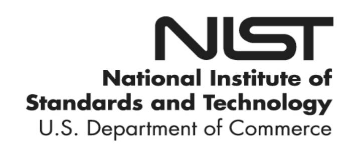

{0}------------------------------------------------

# **NIST Special Publication 800-131A Revision 2**

# **Transitioning the Use of Cryptographic Algorithms and Key Lengths**

Elaine Barker Allen Roginsky

This publication is available free of charge from: https://doi.org/10.6028/NIST.SP.800-131Ar2

C O M P U T E R S E C U R I T Y

{1}------------------------------------------------

# **NIST Special Publication 800-131A Revision 2**

# **Transitioning the Use of Cryptographic Algorithms and Key Lengths**

Elaine Barker Allen Roginsky *Computer Security Division Information Technology Laboratory*

This publication is available free of charge from: https://doi.org/10.6028/NIST.SP.800-131Ar2

March 2019

U.S. Department of Commerce *Wilbur L. Ross, Jr., Secretary*

{2}------------------------------------------------

#### **Authority**

This publication has been developed by NIST in accordance with its statutory responsibilities under the Federal Information Security Modernization Act (FISMA) of 2014, 44 U.S.C. § 3551 *et seq.*, Public Law (P.L.) 113-283. NIST is responsible for developing information security standards and guidelines, including minimum requirements for federal information systems, but such standards and guidelines shall not apply to national security systems without the express approval of appropriate federal officials exercising policy authority over such systems. This guideline is consistent with the requirements of the Office of Management and Budget (OMB) Circular A-130.

Nothing in this publication should be taken to contradict the standards and guidelines made mandatory and binding on federal agencies by the Secretary of Commerce under statutory authority. Nor should these guidelines be interpreted as altering or superseding the existing authorities of the Secretary of Commerce, Director of the OMB, or any other federal official. This publication may be used by nongovernmental organizations on a voluntary basis and is not subject to copyright in the United States. Attribution would, however, be appreciated by NIST.

National Institute of Standards and Technology Special Publication 800-131A Revision 2
Natl. Inst. Stand. Technol. Spec. Publ. 800-131A Rev. 2, 33 pages (March 2019)
CODEN: NSPUE2

This publication is available free of charge from: https://doi.org/10.6028/NIST.SP.800-131Ar2

Certain commercial entities, equipment, or materials may be identified in this document in order to describe an experimental procedure or concept adequately. Such identification is not intended to imply recommendation or endorsement by NIST, nor is it intended to imply that the entities, materials, or equipment are necessarily the best available for the purpose.

There may be references in this publication to other publications currently under development by NIST in accordance with its assigned statutory responsibilities. The information in this publication, including concepts and methodologies, may be used by federal agencies even before the completion of such companion publications. Thus, until each publication is completed, current requirements, guidelines, and procedures, where they exist, remain operative. For planning and transition purposes, federal agencies may wish to closely follow the development of these new publications by NIST.

Organizations are encouraged to review all draft publications during public comment periods and provide feedback to NIST. All NIST Computer Security Division publications, other than the ones noted above, are available at <a href="https://csrc.nist.gov/publications">https://csrc.nist.gov/publications</a>.

#### Comments on this publication may be submitted to:

National Institute of Standards and Technology
Attn: Computer Security Division, Information Technology Laboratory
100 Bureau Drive (Mail Stop 8930) Gaithersburg, MD 20899-8930
Email: <a href="mailto:cryptoTransitions@nist.gov">cryptoTransitions@nist.gov</a>

All comments are subject to release under the Freedom of Information Act (FOIA)

{3}------------------------------------------------

### **Reports on Computer Systems Technology**

The Information Technology Laboratory (ITL) at the National Institute of Standards and Technology (NIST) promotes the U.S. economy and public welfare by providing technical leadership for the Nation's measurement and standards infrastructure. ITL develops tests, test methods, reference data, proof of concept implementations, and technical analyses to advance the development and productive use of information technology. ITL's responsibilities include the development of management, administrative, technical, and physical standards and guidelines for the cost-effective security and privacy of other than national security-related information in federal information systems. The Special Publication 800-series reports on ITL's research, guidelines, and outreach efforts in information system security, and its collaborative activities with industry, government, and academic organizations.

### **Abstract**

The National Institute of Standards and Technology (NIST) provides cryptographic key management guidance for defining and implementing appropriate key management procedures, using algorithms that adequately protect sensitive information, and planning ahead for possible changes in the use of cryptography because of algorithm breaks or the availability of more powerful computing techniques. NIST Special Publication (SP) [800-](#page-29-0) [57, Part 1,](#page-29-0) Recommendation for Key Management: General, includes a general approach for transitioning from one algorithm or key length to another. This Recommendation (SP 800-131A) provides more specific guidance for transitions to the use of stronger cryptographic keys and more robust algorithms.

### **Keywords**

cryptographic algorithm; digital signatures; encryption; hash function; key agreement; key derivation functions; key management; key transport; key wrapping; message authentication codes; post-quantum algorithms; random number generation; security strength; transition.

{4}------------------------------------------------

## **Acknowledgments**

The authors would like to specifically acknowledge the assistance of the following NIST employees in developing this revision of SP 800-131A: Lily Chen, Morris Dworkin, Sharon Keller, Kerry McKay, Andrew Regenscheid and Apostol Vassilev.

{5}------------------------------------------------

### **Table of Contents**

| 1  | INTRODUCTION1                                                                                                                                                                                  |   |
|----|------------------------------------------------------------------------------------------------------------------------------------------------------------------------------------------------|---|
|    | 1.1 Background and Purpose1                                                                                                                                                                    |   |
|    | 1.2 Useful Terms for Understanding this Recommendation2 1.2.1 Security Strengths 2 1.2.2 General Definitions and Abbreviations 3 1.2.3 Definition of Status Approval Terms 5 |   |
| 2  | ENCRYPTION AND DECRYPTION USING BLOCK CIPHER ALGORITHMS                                                                                                                                        | 6 |
| 3  | DIGITAL SIGNATURES 8                                                                                                                                                                        |   |
| 4  | RANDOM BIT GENERATION 11                                                                                                                                                                    |   |
| 5  | KEY AGREEMENT USING DIFFIE-HELLMAN AND MQV12                                                                                                                                                   |   |
| 6  | KEY AGREEMENT AND KEY TRANSPORT USING RSA 14                                                                                                                                                |   |
| 7  | KEY WRAPPING 15                                                                                                                                                                             |   |
| 8  | DERIVING ADDITIONAL KEYS FROM A CRYPTOGRAPHIC KEY 16                                                                                                                                        |   |
| 9  | HASH FUNCTIONS17                                                                                                                                                                               |   |
| 10 | MESSAGE AUTHENTICATION CODES (MACS)19                                                                                                                                                          |   |
|    | APPENDIX A: REFERENCES22                                                                                                                                                                       |   |
|    | APPENDIX B: CHANGE HISTORY25                                                                                                                                                                   |   |

{6}------------------------------------------------

# **1 Introduction**

### **1.1 Background and Purpose**

At the beginning of the 21st century, the National Institute of Standards and Technology (NIST) began the task of providing cryptographic key management guidance. This guidance was based on the lessons learned over many years of dealing with key management issues and is intended to 1) encourage the specification and implementation of appropriate key management procedures, 2) use algorithms that adequately protect sensitive information, and 3) plan for possible changes in the use of cryptographic algorithms, including any migration to different algorithms. The third item addresses not only the possibility of new cryptanalysis, but also the increasing power of classical computing technology and the potential emergence of quantum computers.

General key-management guidance, including the general approach for transitioning from one algorithm or key length to another, is addressed in Part 1 of Special Publication [\(SP\)](#page-29-0)  [800-57](#page-29-0)[1](#page-6-0) .

This document (SP 800-131A) is intended to provide more detail about the transitions associated with the use of cryptography by Federal Government agencies for the protection of sensitive, but unclassified information. The document addresses the use of algorithms and key lengths specified in Federal Information Processing Standards (FIPS) and NIST Special Publications (SPs). Non-governmental organizations may voluntarily choose to comply with this Recommendation.

NIST recognizes that large-scale quantum computers, when available, will threaten the security of NIST-approved public key algorithms. In particular, NIST-approved digital signature schemes, key agreement using DH[2](#page-6-1) and MQV[3](#page-6-2), and key agreement and key transport using RSA[4](#page-6-3) may need to be replaced with secure quantum-resistant (or "postquantum") counterparts. At the time that this SP 800-131A revision was published, NIST was undergoing a process to select post-quantum cryptographic algorithms for standardization. This process is a multi-year project; when these new standards are available, this Recommendation will be updated with the guidance for the transition to post-quantum cryptographic standards. NIST encourages implementers to plan for cryptographic agility to facilitate transitions to quantum-resistant algorithms where needed in the future. Information on the post-quantum project is available at [https://csrc.nist.gov/projects/post-quantum-cryptography.](https://csrc.nist.gov/projects/post-quantum-cryptography)

SP 800-131A was originally published in January 2011 and revised in 2015. This revision updates the transition guidance provided in the 2015 version; these changes are listed in Appendix B. The most significant difference is the schedule for retiring the Triple Data Encryption Algorithm[5](#page-6-4) (TDEA), the inclusion of safe-prime groups for finite field Diffie-

 1 SP 800-57, Part 1: *Recommendation for Key Management: General*.

2 DH: Diffie-Hellman algorithm.

3 MQV: Menezes-Qu-Vanstone algorithm.

4 RSA: Rivest-Shamir-Adelman algorithm.

5 As announced in a NIST plan available at https://csrc.nist.gov/news/2017/update-to-current-use-anddeprecation-of-tdea.

{7}------------------------------------------------

Hellman and MQV, and the inclusion of KMAC[6](#page-7-0) for Message Authentication Code (MAC) generation.

[SP 800-57, Part 1](#page-29-0) includes a transition to a security strength of 128 bits in 2030; in some cases, the transition would be addressed by an increase in key sizes. However, this revision of SP 800-131A does not address this transition, but a future revision will include these considerations as well as transitions to post-quantum algorithms. NIST encourages implementers, protocol developers and organizations to prepare for these transitions by planning for cryptographic agility.

SP 800-57, Part 1 also provides guidance about protecting information past 2030. Section 5.6.4 of that document advises selecting algorithms and key sizes that are expected to be secure for the entire security life of the protected data. This is particularly important when nearing algorithm transition dates. For example, if the data to be encrypted has a security life of 15 years, then protection at a security strength of 112 bits will not be sufficient, since the 15-year period extends beyond 2030.

### **1.2 Useful Terms for Understanding this Recommendation**

### **1.2.1 Security Strengths**

Some of the guidance provided in [SP 800-57](#page-29-0) includes the definition of an estimated maximum security strength (hereafter shortened to just "security strength"), the association of the algorithms and key lengths with these security strengths, and a projection of the time frames during which the algorithms and key lengths could be expected to provide adequate security. Note that the length of the cryptographic keys is an integral part of these determinations.

In [SP 800-57,](#page-29-0) the security strength provided by an algorithm with a particular key length[7](#page-7-1) is measured in bits and is a measure of the difficulty of subverting the cryptographic protection that is provided by the algorithm and key. An estimated security strength for each algorithm is provided in SP 800-57. This is the security strength that an algorithm with a particular key length can provide, given that the key used with that algorithm has sufficient entropy[8](#page-7-2) .

Note: The term "security strength" refers to the classical security strength − a measure of the difficulty of subverting the cryptographic protection (e.g., discovering the key) using classical computers. When post-quantum cryptography is introduced in NIST standards, quantum security strength, i.e. the difficulty of subverting the protection using quantum computers, will be defined.

The appropriate (classical) security strength to be used to protect data depends on the sensitivity of the data being protected and needs to be determined by the owner of that data (e.g., a person or an organization). For the Federal Government, a security strength of at least 112 bits is required at this time for applying cryptographic protection (e.g., for encrypting or signing data). Note that prior to 2014, a security strength of at least 80 bits

 6 KMAC: KECCAK Message Authentication Code; an algorithm specified in SP 800-185, S*HA-3 Derived Functions: cSHAKE, KMAC, TupleHash and ParallelHash*.

7 The term "key size" is commonly used in other documents.

8 Entropy is a measure of the amount of disorder, randomness or variability in a closed system.

{8}------------------------------------------------

was required for applying these protections, and the transitions in this document reflect this change to a required security strength of at least 112 bits. However, a large quantity of data was protected at the 80-bit security strength and may need to be processed (e.g., decrypted). The processing of this already-protected data at the lower security strength is allowed, but a certain amount of risk must be accepted[9](#page-8-0) .

Specific key lengths are provided in [FIPS 186](#page-27-0)[10](#page-8-1) for digital signatures, in [SP 800-56A](#page-28-0)[11](#page-8-2) for finite field Diffie-Hellman (DH) and MQV key agreement, and in [SP 800-56B](#page-28-0)[12](#page-8-3) for RSA key agreement and key transport. [SP 800-186](#page-29-1)[13](#page-8-4) provides elliptic curves for elliptic curve digital signatures and elliptic curve DH and MQV key agreement; the elliptic curve specifications provide the key lengths associated with each curve. These key lengths are strongly recommended for interoperability, and their estimated security strengths are provided in [SP 800-57.](#page-29-0) However, other key lengths are commonly used. The security strengths associated with these key lengths may be determined using the formula provided in Section 7.5 of the [FIPS 140](#page-27-1)[14](#page-8-5) [Implementation Guideline.](#page-27-2) [15](#page-8-6)

### **1.2.2 General Definitions and Abbreviations**

| Apply cryptographic protection | Depending on the algorithm, to encrypt or sign data, generate a hash function or Message Authentication Code (MAC), or establish keys (including wrapping and deriving keys).                                                                                                                                                      |  |
|-----------------------------------|------------------------------------------------------------------------------------------------------------------------------------------------------------------------------------------------------------------------------------------------------------------------------------------------------------------------------------------------|--|
| Approval status                   | Used to designate usage by the U.S. Federal Government.                                                                                                                                                                                                                                                                                        |  |
| Approved                          | FIPS-approved or NIST-Recommended. An algorithm or technique that is either 1) specified in a FIPS or NIST Recommendation, or 2) adopted in a FIPS or NIST Recommendation and specified either (a) in an appendix to the FIPS or NIST Recommendation, or (b) in a document referenced by the FIPS or NIST Recommendation. |  |
| len(x)                            | The bit length of x.                                                                                                                                                                                                                                                                                                                           |  |
| Shall                             | A requirement for Federal Government use. Note that shall may be coupled with not to become shall not.                                                                                                                                                                                                                                |  |

 9 For example, if the data was encrypted and transmitted over public networks when the algorithm was still considered secure, it may have been captured (by an adversary) at that time and later decrypted by that adversary when the algorithm was no longer considered secure; thus, the confidentiality of the data would no longer be assured.

10 FIPS 186, *Digital Signature Standard (DSS)*.

11 SP 800-56A, *Recommendation for Pair-Wise Key Establishment Schemes Using Discrete Logarithm Cryptography*.

12 SP 800-56B, *Recommendation for Pair-Wise Key Establishment Using Integer Factorization*.

13 SP 800-186, *Recommendation for Discrete Logarithm-based Cryptography: Elliptic Curve Domain Parameters*. Until SP 800-186 is published, approved elliptic curves are specified in FIPS 186-4. 14 FIPS 140, *Security Requirements for Cryptographic Modules*.

15 FIPS 140 Implementation Guide, *Implementation Guidance for FIPS 140-2 and the Cryptographic Module Validation Program*.

{9}------------------------------------------------

| AES                                                                   | 16 Advanced Encryption Standard specified in FIPS 197.                                        |  |
|-----------------------------------------------------------------------|--------------------------------------------------------------------------------------------------|--|
| CCM                                                                   | Counter with Cipher-block-chaining Message_authentication code, specified in SP 800-38C.17 |  |
| CMAC                                                                  | 18 Message Authentication Code mode specified in SP 800-38B.                                  |  |
| CTR_DRBG                                                              | 19 based on a block cipher A DRBG specified in SP 800-90A algorithm.                       |  |
| DH                                                                    | Diffie-Hellman algorithm specified in SP 800-56A.                                                |  |
| DRBG                                                                  | Deterministic Random Bit Generator.                                                              |  |
| DSA                                                                   | Digital Signature Algorithm specified in FIPS 186.                                               |  |
| Dual_EC_DRBG                                                          | A DRBG originally specified in SP 800-90A that has been withdrawn.                            |  |
| ECDSA                                                                 | Elliptic Curve Digital Signature Algorithm specified in FIPS 186.                                |  |
| EdDSA                                                                 | Edwards Curve Digital Signature Algorithm specified in FIPS 186.                                 |  |
| FIPS                                                                  | Federal Information Processing Standard.                                                         |  |
| GCM                                                                   | Galois Counter Mode specified in SP 800-38D.20                                                   |  |
| GMAC                                                                  | Galois Message Authentication Mode specified in SP 800-38D.                                      |  |
| Hash_DRBG A DRBG specified in SP 800-90A based on a hash funcrion. |                                                                                                  |  |
| HMAC                                                                  | 21 Keyed Hash Message Authentication Code specified in FIPS 198.                              |  |
| HMAC_DRBG                                                             | A DRBG specified in SP 800-90A based on HMAC.                                                    |  |
| KMAC                                                                  | Keccak Message Authentication Code specified in SP 800-185.                                      |  |

 16 FIPS 197, *Advanced Encryption Standard*.

17 SP 800-38C, *Recommendation for Block Cipher Modes of Operation: the CCM Mode for Authentication and Confidentiality*.

18 SP 800-38B, Recommendation for Block Cipher Modes of Operation: The CMAC Mode for Authentication

19 SP 800-90A, *Recommendation for Random Number Generation Using Deterministic Random Bit Generators*.

20 SP 800-38D, *Recommendation for Block Cipher Modes of Operation: Galois/Counter Mode (GCM) and GMAC.*

21 FIPS 198, *Keyed-Hash Message Authentication Code (HMAC)*.

{10}------------------------------------------------

| KW    | Key Wrap mode specified in SP 800-38F.22                                     |  |
|-------|------------------------------------------------------------------------------|--|
| KWP   | Key Wrap with Padding mode specified in SP 800-38F.                          |  |
| MAC   | Message Authentication Code.                                                 |  |
| MQV   | Menezes-Qu-Vanstone algorithm.                                               |  |
| NIST  | National Institute of Standards and Technology.                              |  |
| PKCS1 | Public Key Cryptography Standard 1.                                          |  |
| RNG   | Random Number Generator.                                                     |  |
| RSA   | Rivest-Shamir-Adelman algorithm.                                             |  |
| SHA   | Secure Hash Algoriithm specified in FIPS 18023 and FIPS 202.24               |  |
| SP    | Special Publication.                                                         |  |
| TDEA  | 25 Triple Data Encryption Algorithm specified in SP 800-67.               |  |
| TKW   | Triple Data Encryption Algorithm Wrapping as specified in SP 800- 38F. |  |

### **1.2.3 Definition of Status Approval Terms**

The terms "**acceptable**", "**deprecated**", "**legacy use**" and **"disallowed"** are used throughout this Recommendation to indicate the approval status of an algorithm. The approval status for an algorithm often will also depend on the length of its key, any domain parameters and the mode or manner in which it is used.

- **Acceptable** is used to mean that the algorithm and key length in a FIPS or SP is safe to use; no security risk is currently known when used in accordance with any associated guidance. The [FIPS 140 Implementation Guideline](#page-27-2) may indicate additional algorithms that are acceptable for use, but not specified in a FIPS or SP.
- **Deprecated** means that the algorithm and key length may be used, but the user must accept some security risk. The term is used when discussing the key lengths or algorithms that may be used to apply cryptographic protection.
- **Disallowed** means that the algorithm or key length is no longer allowed for applying cryptographic protection.

 22 SP 800-38F, SP 800-38F, *Recommendation for Block Cipher Modes of Operation: Methods for Key Wrapping*..

23 FIPS 180, *Secure Hash Standard (SHS)*.

24 FIPS 202, *Permutation-Based Hash and Extendable-Output Functions*.

25 SP 800-67, *Recommendation for the Triple Data Encryption Algorithm (TDEA) Block Cipher*.

{11}------------------------------------------------

• **Legacy use** means that the algorithm or key length may be used only to process already protected information (e.g., to decrypt ciphertext data or to verify a digital signature).

The use of algorithms and key lengths for which the terms **deprecated** and **legacy use** are listed require that the user accept some risk[26](#page-11-0) that increases over time. If a user determines that the risk is unacceptable, then the algorithm or key length is considered disallowed from the perspective of that user. It is the responsibility of the user or the user's organization to determine the level of risk that can be tolerated for an application and its associated data and to define any methods for mitigating those risks.

Other cryptographic terms used in this document are defined in the documents listed in Appendix A.

# **2 Encryption and Decryption Using Block Cipher Algorithms**

Encryption is a cryptographic operation that is used to provide confidentiality for sensitive information, and decryption is the inverse operation. Over time, several block cipher algorithms have been specified for use by the Federal Government:

- The Triple Data Encryption Algorithm (TDEA) (often referred to as Triple DES) is specified in [SP 800-67,](#page-29-3) and has two variations, known as two-key TDEA and three-key TDEA. Three-key TDEA is the stronger of the two variations. The latest revision of SP 800-67 disallows the use of two-key TDEA for applying cryptographic protection and restricts the use of three-key TDEA for applying cryptographic protection to no more than 220 data blocks using a single key bundle[27](#page-11-1).
- SKIPJACK was approved in [FIPS 185.](#page-27-5) [28](#page-11-2) However, approval for the use of SKIPJACK is now disallowed for applying cryptographic protection, since its security strength of 80 bits is now considered inadequate; it may still be used for processing information previously protected using SKIPJACK (e.g., for decryption).
- AES is specified in [FIPS 197](#page-27-3) and has three key lengths: 128, 192 and 256 bits.

Note that encryption and decryption using these algorithms require the use of modes of operation (see the [SP 800-38](#page-28-2)[29](#page-11-3) series of publications). Some of these modes also provide authentication when performing encryption and provide verification when performing decryption on the encrypted and authenticated information (see [SP 800-38C](#page-28-3) and [SP 800-](#page-28-4) [38D\)](#page-28-4). Another authenticated encryption mode is specified for key wrapping, which is discussed in [Section 7.](#page-20-0)

 26 For example, if the data was encrypted and transmitted over public networks when the algorithm was still considered secure, it may have been captured (by an adversary) at that time and later decrypted by that adversary when the algorithm was no longer considered secure; thus, the confidentiality of the data would no longer be assured. Also see Appendix A.

27 A TDEA key bundle consists of three keys.

28 FIPS 185, *Escrowed Encryption Standard*.

29 SP 800-38 series: *Recommendation for Block Cipher Modes of Operation*.

{12}------------------------------------------------

The approval status of the block cipher encryption/decryption modes of operation are provided in [Table 1.](#page-12-0)

**Table 1: Approval Status of Symmetric Algorithms Used for Encryption and Decryption**

| Algorithm                         | Status                                              |
|-----------------------------------|-----------------------------------------------------|
| Two-key TDEA Encryption        | Disallowed                                          |
| Two-key TDEA Decryption        | Legacy use                                       |
| Three-key TDEA Encryption         | Deprecated through 2023 Disallowed after 2023 |
| Three-key TDEA Decryption         | Legacy use                                          |
| SKIPJACK Encryption               | Disallowed                                          |
| SKIPJACK Decryption               | Legacy use                                       |
| AES-128 Encryption and Decryption | Acceptable                                          |
| AES-192 Encryption and Decryption | Acceptable                                          |
| AES-256 Encryption and Decryption | Acceptable                                          |

Two-key TDEA encryption and decryption:

Encryption using two-key TDEA is **disallowed**.

Decryption using two-key TDEA is allowed for **legacy use** using the modes of operation specified in [SP 800-38A.](#page-28-2)

Three-key TDEA encryption and decryption:

*Effective as of the final publication of this revision of SP 800-131A*, encryption using three-key TDEA is **deprecated** through December 31, 2023 using the **approved** encryption modes. Note that [SP 800-67](#page-29-3) specifies a restriction on the protection of no more than 220 data blocks using the same single key bundle. Three-key TDEA may continue to be used for encryption in existing applications but **shall not** be used for encryption in new applications.

After December 31, 2023, three-key TDEA is **disallowed** for encryption unless specifically allowed by other NIST guidance.

Decryption using three-key TDEA is allowed for **legacy use**.

SKIPJACK encryption and decryption:

{13}------------------------------------------------

The use of SKIPJACK for encryption is **disallowed**.

The use of SKIPJACK for decryption is allowed for **legacy use**.

AES encryption and decryption:

The use of AES-128, AES-192, AES-256 is **acceptable** for encryption and decryption using the **approved** modes in the [SP 800-38](#page-28-2) series of publications.

## **3 Digital Signatures**

Digital signatures are used to provide assurance of origin authentication and data integrity. These assurances are sometimes extended to provide assurance that a party in a dispute (the signatory) cannot repudiate (i.e., refute) the validity of a signed document; this is commonly known as non-repudiation. The digital signature algorithms are specified in [FIPS 186.](#page-27-0)

- DSA: DSA keys are generated and used with domain parameters *p*, *q* and *g*, where prime *p* defines the finite field *GF*(*p*) and prime *q* is the order of a subgroup of *GF*(*p*)*\** generated by *g.* The security strength that can be provided by the algorithm depends on the length of *p* (*L*), the length of *q* (*N*), and the proper generation of the domain parameters used.
- Elliptic Curve-based Digital Signatures (ECDSA and EdDSA [30](#page-13-0) ): Keys are generated and used with respect to domain parameters that define elliptic curves. The length of *n* (the domain parameter that specifies the order of the base point *G*) is used to determine the security strength that can be provided by a properly generated curve. Elliptic curves used for the generation of digital signatures are provided in [SP 800-186.](#page-29-1) [31](#page-13-1)
- RSA: RSA keys are generated with respect to a modulus *n* that is the product of two primes *p* and *q*, which is used to determine the security strength that can be provided by a digital signature.

The security strength provided by a digital signature generation process is no greater than the minimum of 1) the security strength that the digital signature algorithm can support with a given key length and any domain parameters used, 2) the security strength (with respect to collision resistance) supported by the cryptographic hash function that is used to hash the data to be signed. The security strength also depends on the method used for key generation and any other parameters used during the process. The estimated security strength that can be provided by a given algorithm and key length is provided in [SP 800-](#page-29-0) [57.](#page-29-0)

Discussions of the hash functions used during the generation of digital signatures are provided in [Section 9.](#page-22-0)

[Table 2](#page-14-0) provides the approval status of the algorithms and key lengths used for the generation and verification of digital signatures in accordance with [FIPS 186.](#page-27-0)

 30 EdDSA will be specified in FIPS 186-5 for public comment.

31 Until SP 800-186 is completed, recommended elliptic curves are specified in FIPS 186-4.

{14}------------------------------------------------

**Table 2: Approval Status of Algorithms Used for Digital Signature Generation and Verification**

| Digital Signature Process | Domain Parameters                                                                                  | Status        |
|---------------------------|----------------------------------------------------------------------------------------------------|---------------|
|                           | < 112 bits of security strength:                                                                   |               |
|                           | DSA: (L, N) ≠ (2048, 224), (2048, 256) or (3072, 256)                                        | Disallowed    |
|                           | ECDSA: len(n) < 224                                                                             |               |
| Digital Signature         | RSA: len(n) < 2048                                                                                 |               |
| Generation                | ≥ 112 bits of security strength:                                                                   |               |
|                           | DSA: (L, N) = (2048, 224), (2048, 256) or (3072, 256)                                     | Acceptable    |
|                           | ECDSA or EdDSA: len(n) ≥ 224                                                                 |               |
|                           | RSA: len(n) ≥ 2048                                                                                 |               |
|                           | < 112 bits of security strength:                                                                |               |
|                           | DSA32: ((512 ≤ L < 2048) or                                                                  |               |
|                           | (160 ≤ N < 224))                                                                             | Legacy use |
|                           | ECDSA: 160 ≤ len(n) < 224                                                                          |               |
| Digital Signature         | RSA: 1024 ≤ len(n) < 2048                                                                    |               |
| Verification              | ≥ 112 bits of security strength: DSA: (L, N) = (2048, 224), (2048, 256) or (3072, 256) | Acceptable    |
|                           | ECDSA and EdDSA: len(n) ≥ 224                                                                   |               |
|                           | RSA: len(n) ≥ 2048                                                                              |               |

### Digital signature generation:

Private-key lengths providing less than 112 bits of security **shall not** be used to generate digital signatures.

Private-key lengths providing at least 112 bits of security are **acceptable** for the generation of digital signatures.

• DSA: The DSA domain parameter lengths **shall** be (2048, 224) or (2048, 256), which provide a security strength of 112 bits; or (3072, 256), which provides a security strength of 128 bits.

 32 The lower bounds for **len**(*p*) and **len**(*q*) are those that were specified in FIPS 186-2.

{15}------------------------------------------------

- ECDSA and EdDSA: The security strength provided by an elliptic-curve-based signature algorithm is no greater than 1/2 of the length of the domain parameter *n*. Therefore, the length of *n* **shall** be at least 224 bits to meet the minimum security-strength requirement of 112 bits for Federal Government use. Elliptic curves for digital signature generation are provided in [SP 800-186](#page-29-1)[33.](#page-15-0) Elliptic curves that meet the security strength requirements are also allowed when they satisfy the requirements of [IG A.2.](#page-28-5) [34](#page-15-1)
- RSA: The length of the modulus *n* **shall** be 2048 bits or more to meet the minimum security-strength requirement of 112 bits for Federal Government use. The security strength associated with a particular modulus length may be estimated using the formula in [IG 7.5.](#page-28-5) [35](#page-15-2)

### Digital signature verification:

Key lengths providing less than 112 bits of security that were previously specified in [FIPS 186](#page-27-0) are allowed for **legacy use** when verifying digital signatures. Note that the lower bounds are provided in [Table 2](#page-14-0) above to indicate the lowest acceptable key length that was ever approved by NIST (but is no longer acceptable); the verification of signatures that used key lengths less than these lower bounds **shall** be regarded as having unacceptable risks.

- DSA: See [FIPS 186-2](#page-27-6)[36](#page-15-3) and [FIPS 186-4,](#page-27-7) [37](#page-15-4) which include key lengths of 512 and 1024 bits, may continue to be used for signature verification but not for signature generation.
- ECDSA: See FIPS 186-2[38](#page-15-5) and FIPS 186-4, which include specifications of elliptic curves that may continue to be used for signature verification but not signature generation: B-163, K-163 and P-192. Note that EdDSA was not approved at the time of the publication of this Recommendation (SP 800-131A).
- RSA: See FIPS 186-2[39](#page-15-6) and FIPS 186-4, [40](#page-15-7) which include modulus lengths of 1024, 1280, 1536 and 1792 bits, may continue to be used for signature verification but not signature generation.

Key lengths providing at least 112 bits of security are **acceptable** for the verification of digital signatures.

• DSA: (*L*, *N*) = (2048, 224), (2048, 256) or (3072, 256).

 33 Until SP 800-186 is completed, the recommended elliptic curves are provided in [FIPS 186-4.](#page-27-7)

34 IG A.2, *Use of Non-NIST Recommended Asymmetric Key Sizes and Elliptic Curves*.

35 IG 7.5, *Strength of Key Establishment Methods*.

36 [FIPS 186-2](#page-27-6) includes the 512 and 1024-bit key lengths.

37 [FIPS 186-4](#page-27-7) includes the 1024-bit key length.

38 [FIPS 186-2](#page-27-6) approved the use of [ANS X9.62,](#page-30-1) *The Elliptic Curve Digital Signature Algorithm (ECDSA)*, which specified the ECDSA algorithm.

39 FIPS 186-2 approved the use of ANS X9.31-1998, *Digital Signatures Using Reversible Public Key Cryptography for the Financial Services Industry (rDSA).* ANS X9.31 included approval for modulus lengths of 1024, 1280, 1536 and 1732 bits.

40 FIPS 186-4 includes approval for the 1024-bit modulus length.

{16}------------------------------------------------

- ECDSA and EdDSA: The elliptic curves specified in [SP 800-186](#page-29-1) and additional elliptic curves that provide a security strength of at least 112 bits and satisfy the requirements of [IG A.2.](#page-28-5)
- RSA: The modulus *n* ≥ 2048 bits.[41](#page-16-1)

## **4 Random Bit Generation**

Random numbers are used for various purposes such as the generation of keys, nonces and authentication challenges. Several deterministic random bit generator (DRBG) algorithms have been specified for use by the Federal Government. [SP 800-90A](#page-29-4) includes three DRBG algorithms: Hash\_DRBG, HMAC\_DRBG and CTR\_DRBG.

A previous version of SP 800-90A included a fourth algorithm, the DUAL\_EC\_DRBG, whose use is now **disallowed** for Federal Government applications. In addition, several other algorithms that were previously approved for random number generation are now **disallowed**.

The approval status for DRBGs is provided in [Table 3.](#page-16-0)

**Table 3: Approval Status of Algorithms Used for Random Bit Generation**

| Algorithm                                               | Status                                              |
|---------------------------------------------------------|-----------------------------------------------------|
| Hash_DRBG and HMAC_DRBG                              | Acceptable                                          |
| CTR_DRBG with three-key TDEA                            | Deprecated through 2023 Disallowed after 2023 |
| CTR_DRBG with AES-128, AES-192 and AES-256AES-256 | Acceptable                                          |
| DUAL_EC_DRBG                                            | Disallowed                                          |
| RNGs in FIPS 186-242, ANS X9.3143 and ANS X9.62-1998 | Disallowed                                          |

Hash\_DRBG and HMAC\_DRBG:

The use of Hash\_DRBG and HMAC\_DRBG is **acceptable** with any hash function specified in [FIPS 180](#page-27-8) or [FIPS 202.](#page-28-6)

 41 Additional key lengths beyond those approved in [FIPS 186-4](#page-27-7) will be allowed in FIPS 186-5.

42 FIPS 186-2, *Digital Signature Standard (DSS).*

43 ANS X9.31, *Digital Signatures Using Reversible Public Key Cryptography for the Financial Services Industry (rDSA)*.

{17}------------------------------------------------

### CTR\_DRBG:

*Effective as of the final publication of this revision of SP 800-131A*, the use of CTR\_DRBG using three-key TDEA is **deprecated** through December 31, 2023.

After December 31, 2023, the use of the CTR\_DRBG using three-key TDEA is **disallowed**.

The use of CTR\_DRBG using AES-128, AES-192 or AES-256 is **acceptable**.

Dual\_EC\_DRBG:

The use of Dual\_EC\_DRBG is **disallowed**.

RNGs in other documents:

The use of the RNGs specified in [FIPS 186-2,](#page-27-6) American National Standard (ANS) [X9.31](#page-29-5) and the 1998 version of ANS [X9.62](#page-30-1) are **disallowed**.

### **5 Key Agreement Using Diffie-Hellman and MQV**

Key agreement is a technique that is used to establish keying material between two entities that intend to communicate, whereby both parties contribute information to the keyagreement process. Two families of key agreement schemes are specified in [SP 800-56A:](#page-28-0) Diffie-Hellman (DH) and Menezes-Qu-Vanstone (MQV). Each has been defined over two different mathematical structures: finite fields and elliptic curves.

Key agreement includes two steps: the use of an appropriate DH or MQV "primitive" to generate a shared secret, and the use of a key derivation method (KDM) to generate one or more keys from the shared secret. SP 800-56A contains the DH and MQV primitives and refers to [SP 800-56C](#page-29-6)[44](#page-17-0) for KDMs.

The security strength of a key-agreement scheme specified in SP 800-56A depends on the key-agreement algorithm, the parameters used with that algorithm (e.g., the keys) and its form (finite field or elliptic curve).

- Finite field DH and MQV: The keys for these algorithms are generated and used with domain parameters *p*, *q* and *g.* The security strength that can be provided by the algorithm depends on the length of *p*, the length of *q* and the proper generation of the domain parameters and the keys.
- Elliptic Curve DH and MQV: The keys for these algorithms are generated and used with respect to domain parameters that define elliptic curves. The length of *n* (the order of the base point *G*), is used to determine the security strength that can be provided by a properly generated curve.

[Table](#page-18-0) 4 contains the Federal Government approval status for the DH and MQV key agreement schemes.

 44 SP 800-56C, *Recommendation for Key-Derivation Methods in Key-Establishment Schemes.*

{18}------------------------------------------------

**Table 4: Approval Status for SP 800-56A Key Agreement (DH and MQV) Schemes**

| Scheme                                                        | Domain Parameters                                                                                                                                                                                                         | Status                |
|---------------------------------------------------------------|---------------------------------------------------------------------------------------------------------------------------------------------------------------------------------------------------------------------------|-----------------------|
|                                                               | < 112 bits of security strength: (len(p), len(q)) = (1024, 160)                                                                                                                                                  | Disallowed            |
| SP 800-56A DH and MQV schemes using finite fields | ≥ 112 bits of security strength: Using listed safe-prime groups OR FIPS 186-type domain parameters (112-bit security strength only): (len(p), len(q)) = (2048, 224) or (2048, 256) | Acceptable            |
| Non-compliant DH and MQV schemes using finite     | < 112 bits of security strength: len(p) < 2048 OR len(q) < 224                                                                                                                                                | Disallowed            |
| fields                                                        | Non-conformance to SP 800-56A                                                                                                                                                                                          | Disallowed after 2020 |
| SP 800-56A DH and MQV schemes using elliptic         | < 112 bits of security strength: len(n) < 224                                                                                                                                                                    | Disallowed            |
| curves                                                        | ≥ 112 bits of security strength: (Using specified curves)                                                                                                                                                           | Acceptable            |
| Non-compliant DH and                                       | < 112 bits of security strength: len(n) < 224                                                                                                                                                                       | Disallowed            |
| MQV schemes using elliptic curves                       | ≥ 112 bits of security strength: Non-conformance to SP 800-56A or IG A.2                                                                                                                                         | Disallowed after 2020 |

### SP 800-56A DH and MQV schemes using finite fields:

The use of finite field schemes that support a security strength less than 112 bits is **disallowed**, i.e., when using the FA domain parameter set specified in previous versions of SP 800-56A: ( (**len**(*p*), **len**(*q*)) = (1024, 160).

{19}------------------------------------------------

The use of the finite field schemes is **acceptable** when:

- 1. Using the safe-prime domain-parameter groups listed in Appendix D of [SP 800-](#page-28-0) [56A.](#page-28-0)
- 2. Using the FB and FC domain parametersetsspecified in SP 800-56A, i.e., (**len**(*p*), **len**(*q*)) = (2048, 224) or (2048, 256).

Non-compliant DH and MQV schemes using finite fields:

The use of schemes that support a security strength less than 112 bits is **disallowed**, i.e., when using FIPS 186-type domain parameters where **len**(*p*) < 2048 or **len**(*q*) < 224.

After December 31, 2020, the use of these schemes is **disallowed** (i.e., all finite field DH and MQV schemes must conform to [SP 800-56A\)](#page-28-0).

SP 800-56A DH and MQV schemes using elliptic curves:

The use of elliptic curve schemes that support a security strength less than 112 bits is **disallowed** , i.e., when l**en**(*n*) < 224.

The use of the elliptic curve schemes for key agreement that provide at least 112 bits of security strength is **acceptable** when using the elliptic curves listed in [SP 800-56A](#page-28-0) or when using curves that satisfy the requirements of [IG A.2.](#page-28-5)

Non-compliant DH and MQV schemes using elliptic curves:

The use of schemes that support a security strength less than 112 bits is **disallowed**, i.e., when **len**(*n*) < 224.

After December 31, 2020, all of these schemes are **disallowed**.

# **6 Key Agreement and Key Transport Using RSA**

[SP 800-56B](#page-28-0) specifies the use of RSA for both key agreement and key transport. Additional key-transport schemes may be allowed in other NIST guidance. Key agreement is a technique in which both parties contribute information to the generation of keying material. Key transport is a key-establishment technique in which only one party determines the key and sends it to the other party.

RSA keys are generated with respect to a modulus *n*. The length of *n* is used to determine the security strength of a key-establishment scheme that uses *n*, assuming that *n* and the RSA keys are generated as specified in [SP 800-56B.](#page-28-0) Note that SP 800-56B refers to [FIPS](#page-27-0)  [186](#page-27-0) for generation guidance.

Guidance on key lengths for RSA is provided in [SP 800-56B.](#page-28-0) SP 800-56B explicitly specifies several key lengths, along with their supported security strengths, beginning with *n* = 2048, which is estimated to support a security strength of 112 bits. Additional key lengths greater than 2048 and not explicitly listed in SP 800-56B may be used; the approximate security strength that is supported by a given key length may be estimated using a formula in [SP 800-56B](#page-28-0) and in [IG 7.5.](#page-28-5)

In the case of key-transport keys (i.e., the keys used to encrypt other keys for transport), this document (SP 800-131A) applies to both the encryption and decryption of the transported keys.

{20}------------------------------------------------

[Table 5](#page-20-1) (below) provides the approval status the choice of *n*.

**Table 5: Approval Status for the RSA-based Key Agreement and Key Transport Schemes**

| Scheme                                                                       | Implementation Details                  | Status                                           |
|------------------------------------------------------------------------------|-----------------------------------------|--------------------------------------------------|
| SP 800-56B Key                                                            | len(n) < 2048                        | Disallowed                                       |
| Agreement and Key Transport schemes                                    | len(n) ≥ 2048                     | Acceptable                                       |
|                                                                              | len(n) < 2048                     | Disallowed                                       |
| Non-SP 800-56B compliant Key Agreement and Key Transport schemes | PKCS1-v1_5 padding                   | Deprecated through 2023 Disallowed after 2023 |
|                                                                              | Other non-compliance with SP 800-56B | Deprecated through 2020 Disallowed after 2020 |

SP 800-56B RSA key-agreement and key transport schemes:

The use of these schemes is **disallowed** if **len**(*n*) < 2048.

The use of these schemes is **acceptable** if **len**(*n*) ≥ 2048.

Non-SP 800 56B-compliant RSA key-agreement and key-transport schemes:

The use of these schemes is **disallowed** if **len**(*n*) < 2048.

*Effective as of the final publication of this revision of SP 800-131A*, uses of PKCS 1, version 1.5 and other RSA key-agreement or key-transport schemes that are not compliant with SP 800-56B are **deprecated**.

After December 31, 2023, the use of PKCS1-v 1\_5 padding scheme is **disallowed**.

After December 31, 2020, the use of other RSA key-agreement or key-transport schemes that are not compliant with [SP 800-56B](#page-28-0) are **disallowed**.

# **7 Key Wrapping**

Key wrapping is the encryption and integrity protection of keying material using a keywrapping algorithm and a symmetric key. **Approved** methods for key wrapping are provided in [SP 800-38F.](#page-28-7)

SP 800-38F specifies three algorithms for key wrapping that use block ciphers: KW and KWP, which use AES; and TKW, which uses TDEA. SP 800-38F also approves the CCM and GCM authenticated-encryption modes specified in [SP 800-38C](#page-28-3) and [SP 800-38D](#page-28-4) for 

{21}------------------------------------------------

key wrapping, as well as combinations of an **approved** encryption mode with an **approved** authentication method.

[Table 6](#page-21-0) provides the approval status of the block cipher algorithms used for key wrapping.

**Table 6: Approval Status of Block Cipher Algorithms Used for Key Wrapping**

| Algorithm                                                                                                                                                             | Status                                           |
|-----------------------------------------------------------------------------------------------------------------------------------------------------------------------|--------------------------------------------------|
| Key wrapping using two-key TDEA                                                                                                                                    | Disallowed                                       |
| Key unwrapping using two-key TDEA                                                                                                                                  | Legacy use                                    |
| Key wrapping using three-key TDEA and any approved key-wrapping method                                                                                          | Deprecated through 2023 Disallowed after 2023 |
| Key unwrapping using three-key TDEA and any approved key-unwrapping method                                                                                   | Legacy use                                       |
| Key wrapping and unwrapping using AES-128, AES 192 or AES-256 and any method for key wrapping that is specified or otherwise approved in SP 800-38F | Acceptable                                       |

SP 800-38F wrapping and unwrapping using two-key TDEA:

The use of two-key TDEA for key wrapping is **disallowed**.

The use of two-key TDEA for unwrapping keying material is allowed for **legacy use**.

SP 800-38F wrapping and unwrapping using three-key TDEA:

Effective as of the final publication of this revision of SP 800-131A, key wrapping using three-key TDEA is **deprecated** through December 31, 2023.

After December 31, 2023, the use of three-key TDEA is **disallowed** for key wrapping unless specifically allowed by other NIST guidance.

Key unwrapping using three-key TDEA is allowed for **legacy use**.

SP 800-38F wrapping and unwrapping using AES:

The use of AES-128, AES-192 and AES-256 for both the wrapping and unwrapping of keying material is **acceptable**.

# **8 Deriving Additional Keys from a Cryptographic Key**

[SP 800-108](#page-29-7) specifies key derivation functions(KDFs) that use pseudorandom functions (PRFs) and a pre-shared cryptographic key (called a key-derivation key) to generate additional keys. The length of the key-derivation key **shall** be at least 112 bits. Two PRFs are used in the KDFs specified in SP 800-108:

• HMAC (as specified in [FIPS 198\)](#page-27-4) requires the use of a hash function (se[e Section 9\)](#page-22-0).

{22}------------------------------------------------

• CMAC (as specified in [SP 800-38B\)](#page-28-1) requires the use of a block cipher algorithm (e.g., AES-128, which is specified in [FIPS 197\)](#page-27-3).

HMAC and CMAC are also known as Message Authentication Code (MAC) algorithms that require the use of keys; these algorithms and the keys used with them are discussed in [Section](#page-24-0)  [10.](#page-24-0)

[Table 7](#page-22-1) provides the approval status of the PRFs for key derivation.

**Table 7: Approval Status of the Algorithms Used for a Key Derivation Function (KDF)**

| KDF Type       | Algorithm                                | Status                                              |
|----------------|------------------------------------------|-----------------------------------------------------|
| HMAC-based KDF | HMAC using any approved hash function | Acceptable                                          |
|                | CMAC using two-key TDEA            | Disallowed                                          |
| CMAC-based KDF | CMAC using three-key TDEA          | Deprecated through 2023 Disallowed after 2023 |
|                | CMAC using AES                        | Acceptable                                          |

### HMAC-based KDF:

The use of HMAC-based KDFs is **acceptable** using a hash function specified in [FIPS 180](#page-27-8) or [FIPS 202](#page-28-6) with a key whose length is at least 112 bits.

### CMAC-based KDF:

The use of two-key TDEA as the block cipher algorithm in a CMAC-based KDF is **disallowed**.

*Effective as of the final publication of this revision of SP 800-131A*, the use of threekey TDEA is **deprecated** through December 31, 2023. Note that [SP 800-67](#page-29-3) specifies a restriction on the use of three-key TDEA to no more than 220 data blocks using the same single key bundle.

After December 31, 2023, the use of three-key TDEA is **disallowed** unless specifically allowed by other NIST guidance.

The use of AES-128, AES-192, AES-256 is **acceptable**.

# **9 Hash Functions**

A hash function is used to produce a condensed representation of its input, taking an input of arbitrary length and outputting a value with a predetermined length. Hash functions are used in the generation and verification of digital signatures, for key derivation, for random number generation, in the computation of message authentication codes and for hash-only applications.

{23}------------------------------------------------

Several hash functions have been specified:

- [FIPS 180](#page-27-8) specifies SHA-1 and the SHA-2 family of hash functions (i.e., SHA-224, SHA-256, SHA-384, SHA-512, SHA-512/224 and SHA-512/256). Discussions about the different uses of SHA-1 and the SHA-2 hash functions are provided in [SP](#page-29-8)  [800-107.](#page-29-8) [45](#page-23-0) Information about the security strengths that can be provided by these hash functions is given in [SP 800-57.](#page-29-0)
- [FIPS 202](#page-28-6) specifies the SHA-3 family of hash functions (i.e., SHA3-224, SHA3-256, SHA3-384 and SHA3-512). Discussions about the SHA-3 hash functions specified in FIPS 202 are provided in that FIPS, and the security strengths that can be provided by these functions are given in [SP 800-57.](#page-29-0)
- Note that FIPS 202 also specifies extendable output functions (XOFs); however, these are not considered to be hash functions, and their use is not included in this document[46.](#page-23-1)
- [SP 800-185](#page-27-5)[47](#page-23-2) specifies two SHA-3-derived hash functions (i.e., TupleHash and ParallelHash) and discusses their use and the security strengths that they can support.

[Table 8](#page-22-1) provides the approval status of the hash functions.

**Table 8: Approval Status of Hash Functions**

| Hash Function                                                                              | Use                                              | Status                                                                                  |
|--------------------------------------------------------------------------------------------|--------------------------------------------------|-----------------------------------------------------------------------------------------|
|                                                                                            | Digital signature generation                     | Disallowed, except where specifically allowed by NIST protocol-specific guidance. |
| SHA-1                                                                                      | Digital signature verification                   | Legacy use                                                                           |
|                                                                                            | Non-digital-signature applications            | Acceptable                                                                              |
| SHA-2 family (SHA 224, SHA-256, SHA-384, SHA-512, SHA-512/224 and SHA-512/256) | Acceptable for all hash function applications |                                                                                         |
| SHA-3 family (SHA3-224, SHA3-                                                           | Acceptable for all hash function applications |                                                                                         |

 45 SP 800-107, *Recommendation for Applications Using Approved Hash Algorithms*.

46 The approved uses of XOFs may be addressed in future publications.

47 SP 800-185, *SHA-3 Derived Functions: cSHAKE, KMAC, TupleHash and ParallelHash*.

{24}------------------------------------------------

| 256, SHA3-384, and SHA3-512) |                                          |
|---------------------------------|------------------------------------------|
| TupleHash and                   | Acceptable                               |
| ParallelHash                    | for the purposes specified in SP 800-185 |

### SHA-1 for digital signature generation:

SHA-1 may only be used for digital signature generation where specifically allowed by NIST protocol-specific guidance. For all other applications, SHA-1 is **disallowed** for digital signature generation.

### SHA-1 for digital signature verification:

When used for digital signature verification, SHA-1 is allowed for **legacy use**.

### SHA-1 for non-digital signature applications:

For non-digital-signature applications, the use of SHA-1 is **acceptable** for applications that do not require collision resistance.

SHA-224, SHA-256, SHA-384, SHA-512, SHA-512/224, and SHA-512/256:

The use of these hash functions is **acceptable** for all hash function applications.

### SHA3-224, SHA3-256, SHA3-384, and SHA3-512:

The use of these hash functions is **acceptable** for all hash function applications.

### TupleHash and ParallelHash:

The use of TupleHash and ParallelHash is **acceptable** for the purposes specified in [SP](#page-29-2)  [800-185.](#page-29-2)

# **10 Message Authentication Codes (MACs)**

A Message Authentication Code (MAC) is used to provide assurance of data integrity and source authentication; it is generated using a MAC algorithm and a cryptographic key. A MAC is a cryptographic checksum on the data over which it is computed; it can provide assurance that the data has not been modified since the MAC was generated and that the MAC was computed by the party or parties sharing the key.

Three types of message authentication code mechanisms are specified for use:

- [FIPS 198](#page-27-4) specifies a keyed-hash message authentication code (HMAC) that uses a hash function; [SP 800-107](#page-29-8) provides additional guidance on the uses of HMAC, whether using SHA-1 or the SHA-2 or SHA-3 families of hash functions (see [Section 9\)](#page-22-0).
- [SP 800-38B](#page-28-1) and [SP 800-38D](#page-28-4) [48](#page-24-1) specify the CMAC and GMAC modes (respectively) for block ciphers. The CMAC mode defined in SP 800-38B is

 48 Note that the CCM authenticated encryption mode specified i[n SP 800-38C](#page-28-3) also generates a MAC. However, the CCM mode cannot be used to only generate a MAC without also performing encryption. The modes listed in this section are used only to generate a MAC.

{25}------------------------------------------------

specified for either AES or TDEA; the GMAC mode defined in SP 800-38D is specified only for AES.

• [SP 800-185](#page-29-2) defines the KMAC algorithm that is based on the SHA-3 functions specified in [FIPS 202.](#page-28-6)

The security strength that can be supported by a given MAC algorithm depends on the primitive algorithm used (e.g., the hash function or block cipher used) and on the length of the cryptographic key.

[Table\\_9](#page-25-0) provides the approval status and required key lengths for the MAC algorithms in order to provide a security strength of 112 bits or more.

**Table 9: Approval Status of MAC Algorithms**

| MAC Algorithm                       | Implementation Details | Status                                              |
|-------------------------------------|------------------------|-----------------------------------------------------|
|                                     | Key lengths < 112 bits | Disallowed                                          |
| HMAC Generation                  | Key lengths ≥ 112 bits | Acceptable                                          |
|                                     | Key lengths < 112 bits | Legacy use                                       |
| HMAC Verification                   | Key lengths ≥ 112 bits | Acceptable                                          |
|                                     | Two-key TDEA           | Disallowed                                          |
| CMAC Generation                  | Three-key TDEA         | Deprecated through 2023 Disallowed after 2023 |
|                                     | AES                    | Acceptable                                          |
|                                     | Two-key TDEA           | Legacy use                                       |
| CMAC Verification                   | Three-key TDEA         | Legacy use                                       |
|                                     | AES                    | Acceptable                                          |
| GMAC Generation and Verification | AES                    | Acceptable                                          |
| KMAC Generation                     | Key lengths < 112 bits | Disallowed                                          |
| and Verification                    | Key lengths ≥ 112 bits | Acceptable                                          |

{26}------------------------------------------------

### HMAC Generation:

Any **approved** hash function may be used.

Keys less than 112 bits in length are **disallowed** for HMAC generation.

The use of key lengths ≥ 112 bits is **acceptable** for HMAC generation.

### HMAC Verification:

The use of key lengths < 112 bits for HMAC verification is allowed for **legacy use**.

The use of key lengths ≥ 112 bits for HMAC verification is **acceptable.**

### CMAC Generation:

The use of two-key TDEA for CMAC generation is **disallowed**.

*Effective as of the final publication of this revision of SP 800-131A*, the use of threekey TDEA for CMAC generation is **deprecated** through December 31, 2023. Threekey TDEA may be used for CMAC generation in existing applications but **shall not** be used in new applications.

After December 31, 2023, three-key TDEA is **disallowed** for CMAC generation unless specifically allowed by other NIST guidance.

The use of AES-128, AES-192 and AES-256 for CMAC generation is **acceptable**.

### CMAC Verification:

The use of two-key TDEA and three-key TDEA for CMAC verification is allowed for **legacy use**.

The use of AES for CMAC verification is **acceptable**.

### GMAC Generation and Verification:

The use of GMAC for MAC generation and verification is **acceptable** when using AES-128, AES-192 or AES-256.

### KMAC Generation and Verification:

Keys less than 112 bits in length are **disallowed** for KMAC generation.

The use of key lengths ≥ 112 bits is **acceptable** for KMAC generation.

{27}------------------------------------------------

# **Appendix A: References**

- [FIPS 140] National Institute of Standards and Technology (2002) *Security Requirements for Cryptographic Modules*. (U.S. Department of Commerce, Washington, D.C.), Federal Information Processing Standards Publication (FIPS) 140-2, May 25, 2001 (Change Notice 2, 12/3/2002). <https://doi.org/10.6028/NIST.FIPS.140-2>
- [FIPS 140 IG] National Institute of Stanards and Technology, Canadian Centre for Cyber Security (2003) *Implementation Guidance for FIPS 140-2 and the Cryptographic Module Validation Program*, [Amended]. Available at [https://csrc.nist.gov/csrc/media/projects/cryptographic-module](https://csrc.nist.gov/csrc/media/projects/cryptographic-module-validation-program/documents/fips140-2/FIPS1402IG.pdf)[validation-program/documents/fips140-2/FIPS1402IG.pdf](https://csrc.nist.gov/csrc/media/projects/cryptographic-module-validation-program/documents/fips140-2/FIPS1402IG.pdf)
- [FIPS 180-4] National Institute of Standards and Technology (2015) *Secure Hash Standard (SHS)*. (U.S. Department of Commerce, Washington, D.C.), Federal Information Processing Standards Publication (FIPS) 180-4, August 2015.<https://doi.org/10.6028/NIST.FIPS.180-4>
- [FIPS 185] National Institute of Standards and Technology (1994) *Escrowed Encryption Standard*. (U.S. Department of Commerce, Washington, D.C.), Federal Information Processing Standards Publication (FIPS) 185, Withdrawn October 19, 2015. Available at [https://csrc.nist.gov/csrc/media/publications/fips/185/archive/1994-02-](https://csrc.nist.gov/csrc/media/publications/fips/185/archive/1994-02-09/documents/fips185.pdf) [09/documents/fips185.pdf](https://csrc.nist.gov/csrc/media/publications/fips/185/archive/1994-02-09/documents/fips185.pdf)
- [FIPS 186] National Institute of Standards and Technology (2013) *Digital Signature Standard (DSS)*. (U.S. Department of Commerce, Washington, D.C.), Federal Information Processing Standards Publication (FIPS) 186-4, July 2013.<https://doi.org/10.6028/NIST.FIPS.186-4>
- [FIPS 186-2] National Institute of Standards and Technology (2000) *Digital Signature Standard (DSS)*. (U.S. Department of Commerce, Washington, D.C.), Federal Information Processing Standards Publication (FIPS) 186-2, January 2000 (Change Notice 1 October 5, 2001), Withdrawn. [https://csrc.nist.gov/csrc/media/publications/fips/186/2/archive/2001-10-](https://csrc.nist.gov/csrc/media/publications/fips/186/2/archive/2001-10-05/documents/fips186-2-change1.pdf) [05/documents/fips186-2-change1.pdf](https://csrc.nist.gov/csrc/media/publications/fips/186/2/archive/2001-10-05/documents/fips186-2-change1.pdf)
- [FIPS 186-4] National Institute of Standards and Technology (2013) *Digital Signature Standard (DSS)*. (U.S. Department of Commerce, Washington, D.C.), Federal Information Processing Standards Publication (FIPS) 186-4, July 2013. <https://doi.org/10.6028/NIST.FIPS.186-4>
- [FIPS 197] National Institute of Standards and Technology (2001) *Advanced Encryption Standard (AES)*. (U.S. Department of Commerce, Washington, D.C.), Federal Information Processing Standards Publication (FIPS) 197, November 2001. <https://doi.org/10.6028/NIST.FIPS.197>
- [FIPS 198] National Institute of Standards and Technology (2008) *The Keyed-Hash Message Authentication Code (HMAC)*. (U.S. Department of Commerce,

{28}------------------------------------------------

Washington, D.C.), Federal Information Processing Standards Publication (FIPS) 198-1, July 2008. <https://doi.org/10.6028/NIST.FIPS.198-1>

- [FIPS 202] National Institute of Standards and Technology (2015) *SHA-3 Standard: Permutation-Based Hash and Extendable-Output Functions.* (U.S. Department of Commerce, Washington, D.C.), Federal Information Processing Standards Publication (FIPS) 202. <https://doi.org/10.6028/NIST.FIPS.202>
- [IG X.Y] Implementation Guidance for FIPS 140-2 and the Cryptographic Module Validation Program, where X.Y is the section number.
- [SP 800-38A] Dworkin MJ (2001) *Recommendation for Block Cipher Modes of Operation: Methods and Techniques*. (National Institute of Standards and Technology, Gaithersburg, Maryland), NIST Special Publication (SP) 800-38A, December 2001.<https://doi.org/10.6028/NIST.SP.800-38A>
- [SP 800-38B] Dworkin MJ (2016) *Recommendation for Block Cipher Modes of Operation: the CMAC Mode for Authentication*. (National Institute of Standards and Technology, Gaithersburg, Maryland), NIST Special Publication (SP) 800-38B, May 2005 (includes updates as of 10/06/2016). <https://doi.org/10.6028/NIST.SP.800-38B>
- [SP 800-38C] Dworkin MJ (2007) *Recommendation for Block Cipher Modes of Operation: the CCM Mode for Authentication and Confidentiality*. (National Institute of Standards and Technology, Gaithersburg, Maryland), NIST Special Publication (SP) 800-38C, May 2004 (includes updates as of 07/20/2007).<https://doi.org/10.6028/NIST.SP.800-38C>
- [SP 800-38D] Dworkin MJ (2007) *Recommendation for Block Cipher Modes of Operation: Galois/Counter Mode (GCM) and GMAC*. (National Institute of Standards and Technology, Gaithersburg, Maryland), NIST Special Publication (SP) 800-38D, November 2007. <https://doi.org/10.6028/NIST.SP.800-38D>
- [SP 800-38F] Dworkin MJ (2012) *Recommendation for Block Cipher Modes of Operation: Methods for Key Wrapping*. (National Institute of Standards and Technology, Gaithersburg, Maryland), NIST Special Publication (SP) 800-38F, December 2012.<https://doi.org/10.6028/NIST.SP.800-38F>
- [SP 800-56A] Barker EB, Chen L, Roginsky A, Vassilev A, Davis R (2018) *Recommendation for Pair-Wise Key-Establishment Schemes Using Discrete Logarithm Cryptography*. (National Institute of Standards and Technology, Gaithersburg, Maryland), NIST Special Publication (SP) 800-56A, Rev. 3, April 2018. [https://doi.org/10.6028/NIST.SP.800-](https://doi.org/10.6028/NIST.SP.800-56Ar3) [56Ar3](https://doi.org/10.6028/NIST.SP.800-56Ar3)
- [SP 800-56B] Barker EB, Chen L, Roginsky A, Vassilev A, Davis R, Simon S (2019) *Recommendation for Pair-Wise Key-Establishment Using Integer Factorization Cryptography*. (National Institute of Standards and Technology, Gaithersburg, Maryland), NIST Special Publication (SP)

{29}------------------------------------------------

800-56B, Rev. 2, March 2019. [https://doi.org/10.6028/NIST.SP.800-](https://doi.org/10.6028/NIST.SP.800-56Br2) [56Br2](https://doi.org/10.6028/NIST.SP.800-56Br2)

- [SP 800-56C] Barker EB, Chen L, Davis R (2018) *Recommendation for Key-Derivation Methods in Key-Establishment Schemes*. (National Institute of Standards and Technology, Gaithersburg, Maryland), NIST Special Publication (SP) 800-56C, Rev. 1, April 2018. [https://doi.org/10.6028/NIST.SP.800-](https://doi.org/10.6028/NIST.SP.800-56Cr1) [56Cr1](https://doi.org/10.6028/NIST.SP.800-56Cr1)
- [SP 800-57] Barker EB (2016) *Recommendation for Key Management, Part 1: General*. (National Institute of Standards and Technology, Gaithersburg, Maryland), NIST Special Publication (SP) 800-57 Part 1, Rev. 4, January 2016.<https://doi.org/10.6028/NIST.SP.800-57pt1r4>
- [SP 800-67] Barker EB, Mouha N (2017) *Recommendation for the Triple Data Encryption Algorithm (TDEA) Block Cipher*. (National Institute of Standards and Technology, Gaithersburg, Maryland), NIST Special Publication (SP) 800-67, Rev. 2, November 2017. <https://doi.org/10.6028/NIST.SP.800-67r2>
- [SP 800-90A] Barker EB, Kelsey JM (2015) *Recommendation for Random Number Generation Using Deterministic Random Bit Generators*. (National Institute of Standards and Technology, Gaithersburg, Maryland), NIST Special Publication (SP) 800-90A, Rev. 1, June 2015. <https://doi.org/10.6028/NIST.SP.800-90Ar1>
- [SP 800-107] Dang QH (2012) *Recommendation for Applications Using Approved Hash Algorithms*. (National Institute of Standards and Technology, Gaithersburg, Maryland), NIST Special Publication (SP) 800-107, Rev. 1, August 2012.<https://doi.org/10.6028/NIST.SP.800-107r1>
- [SP 800-108] Chen L (2008) *Recommendation for Key Derivation Using Pseudorandom Functions (Revised)*. (National Institute of Standards and Technology, Gaithersburg, Maryland), NIST Special Publication (SP) 800-108, October 2009.<https://doi.org/10.6028/NIST.SP.800-108>
- [SP 800-185] Kelsey JM, Chang S-jH, Perlner RA (2016) *SHA-3 Derived Functions: cSHAKE, KMAC, TupleHash, and ParallelHash*. (National Institute of Standards and Technology, Gaithersburg, Maryland), NIST Special Publication (SP) 800-185, December 2016. <https://doi.org/10.6028/NIST.SP.800-185>
- [SP 800-186] *Recommendation for Discrete Logarithm-based Cryptography: Elliptic Curve Domain Parameters*. (National Institute of Standards and Technology, Gaithersburg, Maryland), Draft NIST Special Publication (SP) 800-186, [Forthcoming].

### Non-NIST References:

[X9.31] Accredited Standards Committee X9 (1998) *Digital Signatures Using Reversible Public Key Cryptography for the Financial Services Industry*  

{30}------------------------------------------------

*(rDSA)*. (American National Standards Institute), American National Standard for Financial Services (ANS) X9.31-1998, Withdrawn.

[X9.62] Accredited Standards Committee X9 (2005) *Public Key Cryptography for the Financial Services Industry: The Elliptic Curve Digital Signature Algorithm (ECDSA)*. (American National Standards Institute), American National Standard for Financial Services (ANS) X9.62-2005, Withdrawn.

{31}------------------------------------------------

# **Appendix B: Change History**

The following is a list of non-editorial changes from the 2011 version of this document.

- 1. The use of two-key TDEA for applying cryptographic protection (e.g., encryption, key wrapping or CMAC generation in KDFs) is restricted through December 31, 2015. Its use for processing already-protected information (e.g., decryption, key unwrapping and MAC verification) is allowed for **legacy use**.
- 2. The use of SKIPJACK is **disallowed** for encryption, but allowed for **legacy use** (e.g., decryption of already encrypted information).
- 3. Section 1.2.3 was added to define the single symbol used in this Recommendation: **len**(*x*); this has been used to replace |*p*|, |*q*|, |*n*| and |*h*|, rather than defining them in footnotes.
- 4. The use of keys that provide less than 112 bits of security strength for digital signature generation are no longer allowed; however, their use for digital signature verification is allowed for **legacy use** (i.e., the verification of already-generated digital signatures). For digital signature verification using DSA, the **legacy-use** row has been specified to reflect the lower bound that was specified in FIPS 186-2 (i.e., 512 bits).
- 5. The use of the DUAL\_EC\_DRBG, formerly specified in [SP 800-90A], is no longer allowed.
- 6. The use of the RNGs specified in [\[FIPS 186-2\],](#page-27-6) [\[X9.31\]](#page-29-5) an[d \[X9.62\]](#page-30-1) is **deprecated** until December 31, 2015 and **disallowed** thereafter.
- 7. The use of keys that provide less than 112 bits of security strength for key agreement is now **disallowed**.
- 8. The use of non-approved key-agreement schemes is **deprecated** through December 31, 2017 and **disallowed** thereafter.
- 9. The use of non-approved key-transport schemes is **deprecated** through December 31, 2017 and is **disallowed** thereafter.
- 10. Non-approved key-wrapping methods are disallowed after December 31, 2017.
- 11. The use of SHA-1 for digital signature generation is **disallowed** (except where specifically allowed in NIST protocol-specific guidance); however, its use for digital signature verification is allowed for **legacy use** (i.e., the verification of already-generated digital signatures).
- 12. The SHA-3 family of hash functions specified in [\[FIPS 202\]](#page-28-6) has been included in [Section 9](#page-22-0) as **acceptable**.
- 13. The use of HMAC keys less than 112 bits in length is no longer allowed for the generation of a MAC; however, they may be used for **legacy use** (i.e., the verification of already-generated MACs).

The following changes have been made to the 2018 version:

{32}------------------------------------------------

- 1. Section 1: Revised to discuss coming availability of quantum computers and to identify the most significant differences between this version of SP 800-131A and the previous version.
- 2. Section 1.2.2: New section added to define terms.
- 3. Section 1.2.3 (old Section 1.2.2): The **restricted** approval status term was removed.
- 4. Section 2: Disallowed the use of two-key TDEA for encryption and provided a sunset schedule for three-key TDEA.
- 5. Section 3: Clarified the DSA disallowed and acceptable domain parameters, added EdDSA as an additional elliptic curve algorithm.
- 6. Section 4: Provided a sunset schedule for using the CTR\_DRBG with three-key TDEA.
- 7. Section 5: Clarified the DH parameters and elliptic curves that are now disallowed or acceptable, added the DH groups listed in SP 800-56A as acceptable, and provided a termination date for non-SP 800-56A-compliant key-agreement schemes.
- 8. Section 6: Added PKCS 1 v1.5 and included a sunset schedule.
- 9. Section 7: Provided a sunset schedule for the use of TDEA for key wrapping.
- 10. Section 8: Provided a sunset schedule for the use of CMAC-based KDF using TDEA.
- 11. Section 9: Added TupleHash and ParallelHash.
- 12. Section 10: Provided a sunset schedule for the use of CMAC using TDEA and added KMAC.
- 13. (Old) Appendix A (Mitigating Risk When Using Algorithms and Keys for legacy Use): Removed.
- 14. (New) Appendix A (old Appendix B): Updated the references.