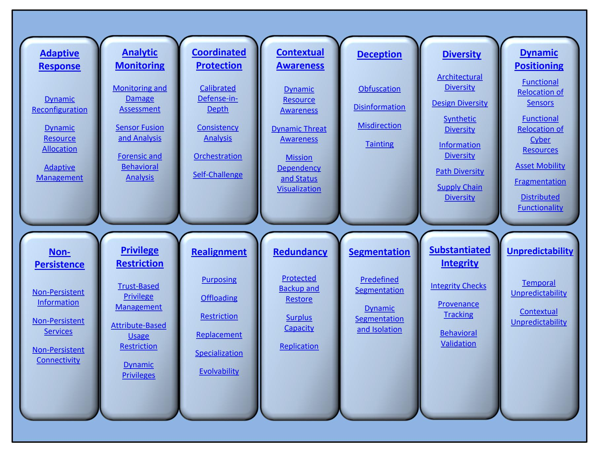
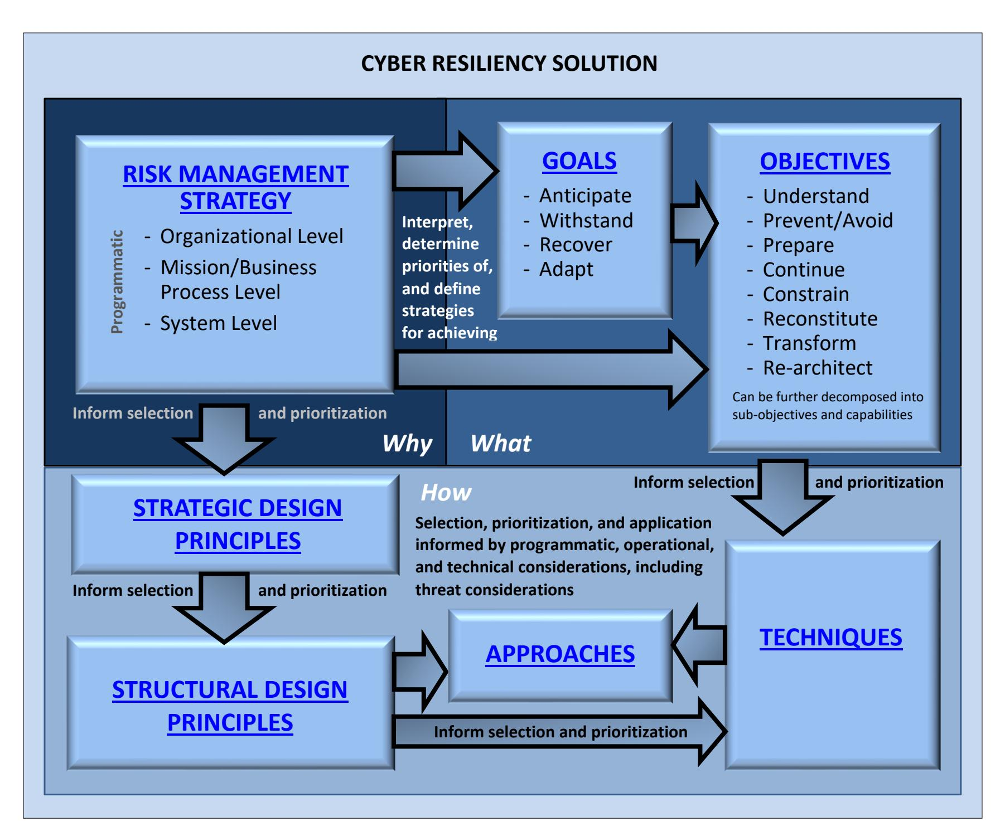
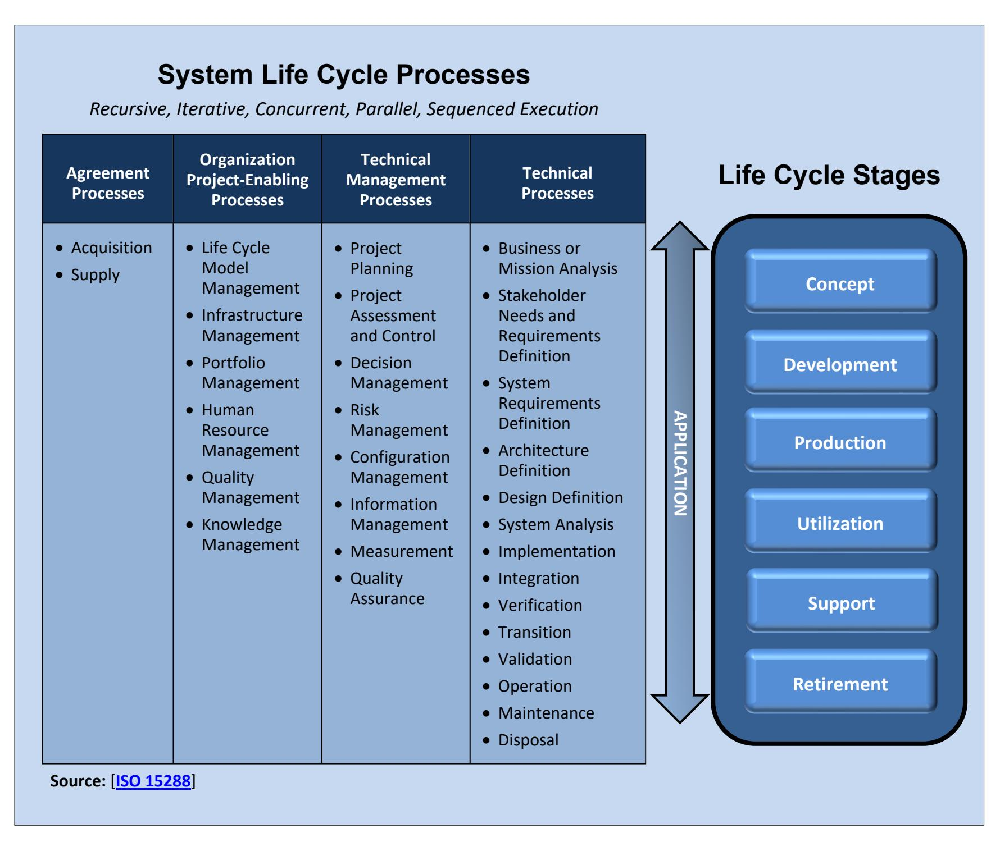
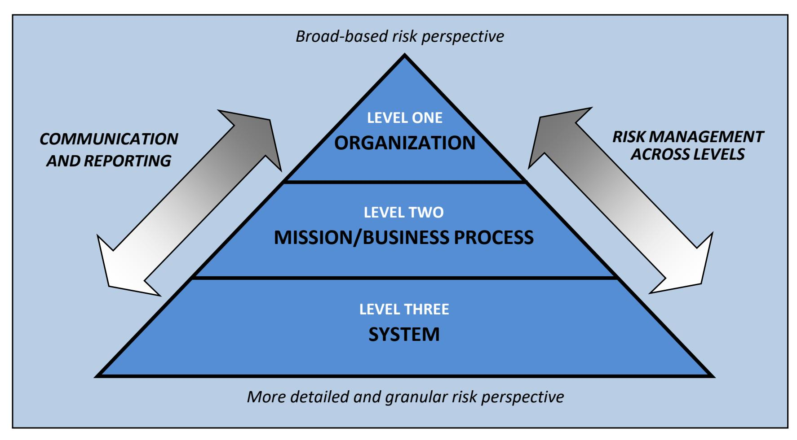

{0}------------------------------------------------

# **Developing Cyber-Resilient Systems:**

*A Systems Security Engineering Approach*

**RON ROSS VICTORIA PILLITTERI RICHARD GRAUBART DEBORAH BODEAU ROSALIE MCQUAID**

This publication is available free of charge from: <https://doi.org/10.6028/NIST.SP.800-160v2r1>


{1}------------------------------------------------

# **Developing Cyber-Resilient Systems:**

*A Systems Security Engineering Approach*

### **RON ROSS VICTORIA PILLITTERI**

*Computer Security Division National Institute of Standards and Technology*

### **RICHARD GRAUBART DEBORAH BODEAU ROSALIE MCQUAID**

*Cyber Resiliency and Innovative Mission Engineering Department The MITRE Corporation McLean, VA*

This publication is available free of charge from: <https://doi.org/10.6028/NIST.SP.800-160v2r1>

### **December 2021**


U.S. Department of Commerce *Gina M. Raimondo, Secretary*

National Institute of Standards and Technology

*James K. Olthoff, Performing the Non-Exclusive Functions and Duties of the Under Secretary of Commerce for Standards and Technology & Director, National Institute of Standards and Technology*

{2}------------------------------------------------

## **AUTHORITY**

This publication has been developed by NIST to further its statutory responsibilities under the Federal Information Security Modernization Act (FISMA), 44 U.S.C. § 3551 *et seq.*, Public Law (P.L.) 113-283. NIST is responsible for developing information security standards and guidelines, including minimum requirements for federal information systems, but such standards and guidelines shall not apply to national security systems without the express approval of the appropriate federal officials exercising policy authority over such systems. This guideline is consistent with requirements of the Office of Management and Budget (OMB) Circular A-130.

Nothing in this publication should be taken to contradict the standards and guidelines made mandatory and binding on federal agencies by the Secretary of Commerce under statutory authority. Nor should these guidelines be interpreted as altering or superseding the existing authorities of the Secretary of Commerce, OMB Director, or any other federal official. This publication may be used by nongovernmental organizations on a voluntary basis and is not subject to copyright in the United States. Attribution would, however, be appreciated by NIST.

National Institute of Standards and Technology Special Publication 800-160, Vol. 2, Rev. 1 Natl. Inst. Stand. Technol. Spec. Publ. 800-160, Vol. 2, Rev. 1, **310 pages** (December 2021)

CODEN: NSPUE2

This publication is available free of charge from: <https://doi.org/10.6028/NIST.SP.800-160v2r1>

Certain commercial entities, equipment, or materials may be identified in this document to describe an experimental procedure or concept adequately. Such identification is not intended to imply recommendation or endorsement by NIST, nor is it intended to imply that the entities, materials, or equipment are necessarily the best available for the purpose.

There may be references in this publication to other publications currently under development by NIST in accordance with its assigned statutory responsibilities. The information contained in this publication, including concepts, practices, and methodologies, may be used by federal agencies before the completion of such companion publications. Thus, until each publication is completed, current NIST requirements, guidelines, and procedures, where they exist, remain operative. For planning and transition purposes, federal agencies may wish to closely follow the development of these new publications by NIST.

Organizations are encouraged to review draft publications during the public comment periods and provide feedback to NIST. Many NIST publications, other than the ones noted above, are available a[t https://csrc.nist.gov/publications.](https://csrc.nist.gov/publications)

### **Comments on this publication may be submitted to:**

National Institute of Standards and Technology Attn: Computer Security Division, Information Technology Laboratory 100 Bureau Drive (Mail Stop 8930) Gaithersburg, MD 20899-8930 Email[: security-engineering@nist.gov](mailto:security-engineering@nist.gov)

All comments are subject to release under the Freedom of Information Act (FOIA) [\[FOIA96\]](#page-63-0).

{3}------------------------------------------------

## **REPORTS ON COMPUTER SYSTEMS TECHNOLOGY**

The National Institute of Standards and Technology (NIST) Information Technology Laboratory (ITL) promotes the U.S. economy and public welfare by providing technical leadership for the Nation's measurement and standards infrastructure. ITL develops tests, test methods, reference data, proof of concept implementations, and technical analyses to advance the development and productive use of information technology (IT). ITL's responsibilities include the development of management, administrative, technical, and physical standards and guidelines for the costeffective security of other than national security-related information in federal information systems. The Special Publication 800-series reports on ITL's research, guidelines, and outreach efforts in information systems security and privacy and its collaborative activities with industry, government, and academic organizations.

## **ABSTRACT**

NIST Special Publication (SP) 800-160, Volume 2, focuses on cyber resiliency engineering—an emerging specialty systems engineering discipline applied in conjunction with systems security engineering and resilience engineering to develop survivable, trustworthy secure systems. Cyber resiliency engineering intends to architect, design, develop, implement, maintain, and sustain the trustworthiness of systems with the capability to anticipate, withstand, recover from, and adapt to adverse conditions, stresses, attacks, or compromises that use or are enabled by cyber resources. From a risk management perspective, cyber resiliency is intended to help reduce the mission, business, organizational, enterprise, or sector risk of depending on cyber resources.

This publication can be used in conjunction with ISO/IEC/IEEE 15288:2015, *Systems and software engineering—Systems life cycle processes*; NIST Special Publication (SP) 800-160, Volume 1, *Systems Security Engineering—Considerations for a Multidisciplinary Approach in the Engineering of Trustworthy Secure Systems*; NIST SP 800-37, *Risk Management Framework for Information Systems and Organizations—A System Life Cycle Approach for Security and Privacy*; and NIST SP 800-53, *Security and Privacy Controls for Information Systems and Organizations*. It can be viewed as a handbook for achieving the identified cyber resiliency outcomes based on a systems engineering perspective on system life cycle and risk management processes, allowing the experience and expertise of the implementing organization to help determine how the content will be used for its purpose. Organizations can select, adapt, and use some or all of the cyber resiliency constructs (i.e., goals, objectives, techniques, approaches, and design principles) described in this publication and apply the constructs to the technical, operational, and threat environments for which systems need to be engineered.

## **KEYWORDS**

Advanced persistent threat; controls; cyber resiliency; cyber resiliency approaches; cyber resiliency design principles; cyber resiliency engineering framework; cyber resiliency goals; cyber resiliency objectives; cyber resiliency techniques; risk management strategy; system life cycle; systems security engineering; trustworthiness.

{4}------------------------------------------------

## **ACKNOWLEDGMENTS**

The authors gratefully acknowledge and appreciate the contributions from DJ Anand, Jon Boyens, Nicolas Chaillan, Ramaswamy Chandramouli, Ken Colerick, Ed Custeau, Holly Dunlap, David Ferraiolo, Avi Gopstein, Suzanne Hassell, Bill Heinbockel, Daryl Hild, Scott Jackson, Linda Jones, Lauren Knausenberger, Ellen Laderman, Logan Mailloux, Jeff Marron, Cory Ocker, Rebecca Onuskanich, James Reilly, Thom Schoeffling, Martin Stanley, Shane Steiger, Mike Thomas, Beth Wilson, and David Wollman whose thoughtful comments improved the overall quality, thoroughness, and usefulness of this publication. The authors would also like to acknowledge the INCOSE Systems Security Engineering and Resiliency Working Groups, the Air Force Research Laboratory (AFRL), and the National Defense Industrial Association (NDIA) Systems Security Engineering Committee for their feedback on the initial drafts of this publication.

In addition to the above acknowledgments, a special note of thanks goes to Jeff Brewer, Jim Foti, Jeff Marron, Isabel Van Wyk, Eduardo Takamura, and the NIST web services team for their outstanding administrative support. The authors also wish to recognize the professional staff from the NIST Computer Security Division and the Applied Cybersecurity Division for their contributions in helping to improve the technical content of the publication. Finally, the authors gratefully acknowledge the significant contributions from individuals and organizations in the public and private sectors, nationally and internationally, whose insightful, thoughtful, and constructive comments improved the quality, thoroughness, and usefulness of this publication.

{5}------------------------------------------------

## **Patent Disclosure Notice**

*NOTICE: The Information Technology Laboratory (ITL) has requested that holders of patent claims whose use may be required for compliance with the guidance or requirements of this publication disclose such patent claims to ITL. However, holders of patents are not obligated to respond to ITL calls for patents, and ITL has not undertaken a patent search in order to identify which, if any, patents may apply to this publication.*

*As of the date of publication and following call(s) for the identification of patent claims whose use may be required for compliance with the guidance or requirements of this publication, no such patent claims have been identified to ITL.*

*No representation is made or implied by ITL that licenses are not required to avoid patent infringement in the use of this publication.*

{6}------------------------------------------------

## **EXECUTIVE SUMMARY**

The goal of the NIST Systems Security Engineering initiative is to address security, safety, and resiliency issues from the perspective of stakeholder requirements and protection needs using established engineering processes to ensure that those requirements and needs are addressed across the entire system life cycle to develop more trustworthy systems.[1](#page-6-0) To that end, NIST Special Publication (SP) 800-160, Volume 2, focuses on cyber resiliency engineering—an emerging specialty systems engineering discipline applied in conjunction with resilience engineering and systems security engineering to develop more survivable, trustworthy systems. Cyber resiliency engineering intends to architect, design, develop, maintain, and sustain the trustworthiness of systems with the capability to anticipate, withstand, recover from, and adapt to adverse conditions, stresses, attacks, or compromises that use or are enabled by cyber resources. From a risk management perspective, cyber resiliency is intended to reduce the mission, business, organizational, or sector risk of depending on cyber resources.

This publication can be used in conjunction with [ISO/IEC/IEEE 15288:2015,](#page-64-0) *Systems and software engineering—Systems life cycle processes*; [NIST SP 800-160, Volume 1,](#page-65-0) *Systems Security Engineering—Considerations for a Multidisciplinary Approach in the Engineering of Trustworthy Secure Systems*; NIST SP [800-37,](#page-64-1) *Risk Management Framework for Information Systems and Organizations—A System Life Cycle Approach for Security and Privacy*; and [NIST SP](https://csrc.nist.gov/publications/detail/sp/800-53/rev-5/final)  [800-53,](https://csrc.nist.gov/publications/detail/sp/800-53/rev-5/final) *Security and Privacy Controls for Information Systems and Organizations*. The application of the concepts in this publication—in combination with the system life cycle processes in SP 800-160, Volume 1, and the risk management methodology in SP 800-37—can be viewed as a handbook for achieving cyber resiliency outcomes. Guided and informed by stakeholder protection needs, mission and business assurance needs, and stakeholder concerns with cost, schedule, and performance, the cyber resiliency constructs and analysis approach can be applied to critical systems to identify, prioritize, and implement solutions to meet the unique cyber resiliency needs of organizations.

NIST SP 800-160, Volume 2, presents a cyber resiliency engineering framework to aid in understanding and applying cyber resiliency, a concept of use for the framework, and the engineering considerations for implementing cyber resiliency in the system life cycle. The framework constructs include goals, objectives, techniques, implementation approaches, and design principles. Organizations can select, adapt, and use some or all of the cyber resiliency constructs in this publication and apply the constructs to the technical, operational, and threat environments for which systems need to be engineered.

Building from the cyber resiliency engineering framework, this publication also identifies considerations for determining which cyber resiliency constructs are most relevant to a system of interest and a tailorable cyber resiliency analysis approach to apply the cyber resiliency concepts, constructs, and practices to a system. The cyber resiliency analysis is intended to

<span id="page-6-0"></span><sup>1</sup> In the context of systems engineering, trustworthiness means being trusted to fulfill whatever critical requirements may be needed for a particular component, subsystem, system, network, application, mission, enterprise, or other entity. Trustworthiness requirements can include attributes of safety, security, reliability, dependability, performance, resilience, and survivability under a wide range of potential adversity in the form of disruptions, hazards, and threats [\[SP 800-160 v1\]](#page-65-0).

{7}------------------------------------------------

determine whether the cyber resiliency properties and behaviors of a system of interest, wherever it is in the life cycle, are sufficient for the organization using that system to meet its mission assurance, business continuity, or other security requirements in a threat environment that includes the advanced persistent threat (APT). A cyber resiliency analysis is performed with the expectation that such analysis will support engineering and risk management decisions about the system of interest.

The cyber resiliency engineering framework is supplemented by several technical appendices that provide additional information to support its application, including:

- Background and contextual information on cyber resiliency
- Detailed descriptions of the individual cyber resiliency constructs (i.e., goals, objectives, techniques, implementation approaches, design principles) that are part of the cyber resiliency engineering framework
- Controls in [\[SP 800-53\]](#page-65-1) that directly support cyber resiliency (including the questions used to determine if controls support cyber resiliency, the relevant controls, and cyber resiliency techniques and implementation approaches)
- An approach for adversary-oriented analysis of a system and applications of cyber resiliency, a vocabulary to describe the current or potential effects of a set of mitigations, and a representative analysis of how cyber resiliency approaches and controls could mitigate adversary tactics, techniques, and procedures
- An analysis of the potential effects of cyber resiliency on adversary tactics, techniques, and procedures used to attack operational technologies (e.g., Industrial Control Systems)

{8}------------------------------------------------

# TABLE OF CONTENTS

| CHAPTER ONE INTRODUCTION                                       | 1  |
|----------------------------------------------------------------|----|
| 1.1 PURPOSE AND APPLICABILITY                                  | 3  |
| 1.2 TARGET AUDIENCE                                            |    |
| 1.3 HOW TO USE THIS PUBLICATION                                | 5  |
| 1.4 PUBLICATION ORGANIZATION                                   | 5  |
| CHAPTER TWO THE FUNDAMENTALS                                   | 7  |
| 2.1 CYPED DECILIENCY ENGINEEDING EDAMENAGORY                   | 0  |
| 2.1 CYBER RESILIENCY ENGINEERING FRAMEWORK                     |    |
| 2.1.1 Cyber Resiliency Goals                                   |    |
| 2.1.3 Cyber Resiliency Techniques and Approaches               |    |
| 2.1.4 Cyber Resiliency Design Principles                       |    |
| 2.1.5 Relationship Among Cyber Resiliency Constructs           |    |
| 2.2 CYBER RESILIENCY IN THE SYSTEM LIFE CYCLE                  |    |
| 2.3 RISK MANAGEMENT AND CYBER RESILIENCY                       | 20 |
| CHAPTER THREE CYBER RESILIENCY IN PRACTICE                     | 23 |
|                                                                |    |
| 3.1 SELECTING AND PRIORITIZING CYBER RESILIENCY CONSTRUCTS     |    |
| 3.1.1 Achievement of Goals and Objectives                      |    |
| 3.1.3 System Type                                              |    |
| 3.1.4 Cyber Resiliency Conflicts and Synergies                 |    |
| 3.1.5 Other Disciplines and Existing Investments               |    |
| 3.1.6 Architectural Locations                                  |    |
| 3.1.7 Effects on Adversaries, Threats, and Risks               |    |
| 3.1.8 Maturity and Potential Adoption                          |    |
| 3.2 ANALYTIC PRACTICES AND PROCESSES                           |    |
| 3.2.1 Understand the Context                                   |    |
| 3.2.2 Develop the Cyber Resiliency Baseline                    | 38 |
| 3.2.3 Analyze the System                                       | 40 |
| 3.2.4 Define and Analyze Specific Alternatives                 |    |
| 3.2.5 Develop Recommendations                                  | 46 |
| REFERENCES                                                     | 48 |
| APPENDIX A GLOSSARY                                            | 58 |
| APPENDIX B ACRONYMS                                            | 71 |
| APPENDIX C BACKGROUND                                          | 75 |
| C.1 DEFINING CYBER RESILIENCY                                  | 75 |
| C.2 DISTINGUISHING CHARACTERISTICS OF CYBER RESILIENCY         |    |
| C.3 RELATIONSHIP WITH OTHER SPECIALITY ENGINEERING DISCIPLINES |    |
| C.4 RELATIONSHIP BETWEEN CYBER RESILIENCY AND RISK             |    |
| APPENDIX D CYBER RESILIENCY CONSTRUCTS                         | 85 |
|                                                                |    |
| D.1 CYBER RESILIENCY GOALS  D.2 CYBER RESILIENCY OBJECTIVES    |    |
| D.3 CYBER RESILIENCY OBJECTIVES                                |    |
| D.4 CYBER RESILIENCY IMPLEMENTATION APPROACHES                 |    |
| D.5 CYBER RESILIENCY DESIGN PRINCIPLES                         |    |

{9}------------------------------------------------

| D.5.1 Strategic Design Principles                     |     |
|-------------------------------------------------------|-----|
| D.5.2 Structural Design Principles                    | 118 |
| D.6 RELATIONSHIPS AMONG CYBER RESILIENCY CONSTRUCTS   | 132 |
| D.7 APPLICATION OF CYBER RESILIENCY CONSTRUCTS        | 136 |
| APPENDIX E CONTROLS SUPPORTING CYBER RESILIENCY       | 138 |
| APPENDIX F ADVERSARY-ORIENTED ANALYSIS                | 155 |
| F.1 POTENTIAL EFFECTS ON THREAT EVENTS                | 155 |
| F.2 ANALYSIS OF POTENTIAL EFFECTS OF CYBER RESILIENCY | 161 |
| F.2.1. Assumptions and Caveats                        | 162 |
| F.2.2 Potential Uses of Analysis                      | 163 |
| F.2.3 Results of Analysis                             | 164 |
| F.2.4 Candidate Mitigations                           | 237 |
| APPENDIX G OPERATIONAL TECHNOLOGIES                   | 251 |
| G.1 ANALYSIS APPROACH                                 | 251 |
| G.1.1 Assumptions and Caveats                         | 251 |
| G.1.2 Analysis Process                                | 252 |
| G.2 ANALYSIS RESULTS                                  | 254 |
|                                                       |     |

{10}------------------------------------------------

### **DISCLAIMER**

This publication is intended to be used in conjunction with and as a supplement to **International Standard [ISO/IEC/IEEE 15288](#page-64-0)**, *Systems and software engineering — System life cycle processes*. It is strongly recommended that organizations using this publication obtain the standard in order to fully understand the context of the security-related activities and tasks in each of the system life cycle processes. Content from the international standard that is referenced in this publication is used with permission from the Institute of Electrical and Electronics Engineers and is noted as follows:

[**[ISO 15288\]](#page-64-0)**. *Reprinted with permission from IEEE, Copyright IEEE 2015, All rights reserved.*

{11}------------------------------------------------

### **RELATIONSHIP BETWEEN ISO 15288 AND OPERATIONAL RESILIENCE**

Although the focus of [\[ISO 15288\]](#page-64-0) is systems and software engineering processes, operational resilience, which includes cyber resiliency for systems that include or depend on cyber resources, is addressed indirectly by requiring organization-wide commitment, resources, practices, and processes. The interacting elements in the definition of a *system* include layers of resilience in hardware, software, data, information, humans, processes, procedures, facilities, materials, and naturally occurring physical entities. This is important because if the organization's missions or business functions require sustainability during perturbations, disruptions, disturbances, or cyber-attacks, then operational resilience practices and procedures must be applied to all of the system's assets. It would be of limited value to have resilience measures implemented in the software architecture if there is no redundancy and survivability in the hardware, if the communications networks are fragile, if critical personnel are not available (e.g., in a natural disaster or inclement weather) to operate and maintain the system, or if there are no facilities available for producing the organization's products and/or services.

{12}------------------------------------------------

### **ADVERSARY PERSISTENCE AND LONG-TERM PRESENCE**

Numerous reports of cyber incidents and cyber breaches indicate that extended periods of time transpired between the time an adversary initially established a presence in an organizational system by exploiting a vulnerability and when that presence was revealed or detected. In certain instances, the time period before detection can be as long as months or years. In the worst case, the adversary's presence may never be detected.

The following examples illustrate the types of situations in which an adversary can maintain a long-term presence or persistence in a system without attacking the system via cyberspace:

- Compromising the *pre-execution environment* of a system through a hardware or software implant (e.g., compromise of the firmware or microcode of a system element, such as a network switch or a router, that activates before initialization in the system's environment of operation). This is extremely difficult to detect and can result in compromise of the entire environment.
- Compromising the *software development toolchain* (e.g., compilers, linkers, interpreters, continuous integration tools, code repositories). This allows malicious code to be inserted by the adversary without modifying the source code or without the knowledge of the software developers.
- Compromising a *semiconductor product or process* (e.g., maliciously altering the hardware description language [HDL] of a microprocessor, a field-programmable gate array [FPGA], a digital signal processor [DSP], or an application-specific integrated circuit [ASIC]).

{13}------------------------------------------------

### **THREAT DETECTION AND CYBER RESILIENCY**

Cyber resiliency is based on the recognition that adversaries can establish and maintain a covert presence in systems. Therefore, many cyber resiliency techniques and approaches are not predicated on the assumption of successfully detecting adversity, including cyber-attacks. These include the [Coordinated Protection,](#page-28-0) [Deception,](#page-28-1) [Diversity,](#page-28-2) [Non-Persistence,](#page-28-3) [Realignment,](#page-28-4)  [Redundancy,](#page-28-5) [Substantiated Integrity,](#page-28-6) an[d Unpredictability](#page-28-7) techniques, and the [Fragmentation,](#page-114-0)  [Distributed Functionality,](#page-115-0) [Predefined Segmentation,](#page-118-0) [Attribute-Based Usage Restriction,](#page-116-0) and [Trust-Based Privilege Management](#page-115-1) approaches.

Other techniques and approaches can provide automatic responses or support cyber defender responses to detected indicators of possible or suspected adversity or to warnings of potential forthcoming adverse conditions (including announcements of planned outages of supporting services or the predictions of increased system load). These include the [Adaptive Response](#page-28-8) technique and the [Functional Relocation of Sensors,](#page-114-1) [Functional Relocation of Cyber Resources,](#page-114-2)  [Asset Mobility,](#page-114-3) [Dynamic Privileges,](#page-116-1) and [Dynamic Segmentation and Isolation](#page-119-0) approaches.

Two cyber resiliency techniques directly involve the detection of adversity or its effects[: Analytic](#page-28-9)  [Monitoring](#page-28-9) and [Contextual Awareness.](#page-28-10) The [Substantiated Integrity](#page-28-6) technique and the [Consistency Analysis](#page-110-0) approach support detection of some effects of adversity.

{14}------------------------------------------------

## **ERRATA**

This table contains changes that have been incorporated into Special Publication 800-160, Volume 2, Revision 1. Errata updates can include corrections, clarifications, or other minor changes in the publication that are either *editorial* or *substantive*. Any potential updates for this document that are not yet published in a formal errata update or revision—including additional issues and potential corrections—will be posted as they are identified (se[e SP 800-160 Volume](https://csrc.nist.gov/publications/detail/sp/800-160/vol-2-rev-1/final)  [2, Revision 1 publication details\)](https://csrc.nist.gov/publications/detail/sp/800-160/vol-2-rev-1/final).

| DATE | TYPE | REVISION | PAGE |
|------|------|----------|------|
|      |      |          |      |
|      |      |          |      |
|      |      |          |      |
|      |      |          |      |
|      |      |          |      |
|      |      |          |      |
|      |      |          |      |
|      |      |          |      |
|      |      |          |      |
|      |      |          |      |
|      |      |          |      |
|      |      |          |      |
|      |      |          |      |
|      |      |          |      |
|      |      |          |      |
|      |      |          |      |
|      |      |          |      |
|      |      |          |      |
|      |      |          |      |
|      |      |          |      |
|      |      |          |      |
|      |      |          |      |
|      |      |          |      |
|      |      |          |      |
|      |      |          |      |
|      |      |          |      |
|      |      |          |      |
|      |      |          |      |
|      |      |          |      |
|      |      |          |      |
|      |      |          |      |
|      |      |          |      |
|      |      |          |      |
|      |      |          |      |

{15}------------------------------------------------

## **PROLOGUE**

*"Providing satisfactory security controls in a computer system is in itself a system design problem. A combination of hardware, software, communications, physical, personnel and administrativeprocedural safeguards is required for comprehensive security. In particular, software safeguards alone are not sufficient."*

**The Ware Report**

**Defense Science Board Task Force on Computer Security, 1970.**

*"Mission assurance requires systems that behave with predictability and proportionality."*

**General Michael Hayden**

**Former NSA and CIA Director, Syracuse University, October 2009**

*"In the past, it has been assumed that to show that a system is safe, it is sufficient to provide assurance that the process for identifying the hazards has been as comprehensive as possible, and that each identified hazard has one or more associated controls. While historically this approach has been used reasonably effectively to ensure that known risks are controlled, it has become increasingly apparent that evolution to a more holistic approach is needed as systems become more complex and the cost of designing, building, and operating them become more of an issue."*

**Preface, NASA System Safety Handbook, Volume 1, November 2011**

*"This whole economic boom in cybersecurity seems largely to be a consequence of poor engineering."*

**Carl Landwehr**

**Communications of the ACM, February 2015**

{16}------------------------------------------------

## **CHAPTER ONE**

## <span id="page-16-0"></span>**INTRODUCTION**

THE NEED FOR CYBER-RESILIENT SYSTEMS

he need for trustworthy secure *systems*[2](#page-16-1) stems from a variety of stakeholder needs that are driven by mission, business, and other objectives and concerns. The principles, concepts, and practices for engineering trustworthy secure systems can be expressed in various ways, depending on which aspect of trustworthiness is of concern to stakeholders. NIST Special Publication (SP) 800-160, Volume 1 [\[SP 800-160 v1\]](#page-65-0), provides guidance on systems security engineering with an emphasis on protection against *asset* loss.[3](#page-16-2) In addition to security, other aspects of trustworthiness include reliability, safety, and resilience. Specialty engineering disciplines address different aspects of trustworthiness. While each discipline frames the problem domain and the potential solution space for its aspect of trustworthiness somewhat differently, [\[SP 800-160 v1\]](#page-65-0) includes systems engineering processes to align the concepts, frameworks, and analytic processes from multiple disciplines to make trade-offs within and between the various aspects of trustworthiness applicable to a *system of interest*. [4](#page-16-3) T

NIST SP 800-160, Volume 2, focuses on the property of cyber resiliency, which has a strong relationship to security and resilience but provides a distinctive framework for its identified problem domain and solution space. Cyber resiliency is the ability to anticipate, withstand, recover from, and adapt to adverse conditions, stresses, attacks, or compromises on systems that use or are enabled by *cyber resources*. [5](#page-16-4)

Cyber resiliency can be sought at multiple levels, including for system elements, systems, missions or business functions and the system-of-systems that support those functions, organizations, sectors, regions, the Nation, or transnational missions/business functions. From an engineering perspective, cyber resiliency is an emergent quality property of an engineered system, where an "engineered system" can be a system element made up of constituent components, a system, or a system-of-systems. Cyber-resilient systems are systems that have security measures or safeguards "built in" as a foundational part of the architecture and design and that display a high level of resiliency. Thus, cyber-resilient systems can withstand cyberattacks, faults, and failures and continue to operate in a degraded or debilitated state to carry out the mission-essential functions of the organization. From an enterprise risk management perspective, cyber resiliency is intended to reduce the mission, business, organizational, or sector risk of potentially compromised cyber resources.

<span id="page-16-1"></span><sup>2</sup> A *system* is a combination of interacting elements organized to achieve one or more stated purpose. The interacting system elements that compose a system include hardware, software, data, humans, processes, procedures, facilities, materials, and naturally occurring entities [\[ISO 15288\]](#page-64-0).

<span id="page-16-2"></span><sup>3</sup> An *asset* refers to an item of value to stakeholders. Assets may be tangible (e.g., a physical item, such as hardware, firmware, computing platform, network device, or other technology component, or individuals in key or defined roles in organizations) or intangible (e.g., data, information, software, trademark, copyright, patent, intellectual property, image, or reputation). Refer to [\[SP 800-160 v1\]](#page-65-0) for the systems security engineering perspective on assets.

<span id="page-16-3"></span><sup>4</sup> A *system of interest* is a system whose life cycle is under consideration in the context of [\[ISO 15288\]](#page-64-0). A system of interest can also be viewed as the focus of the systems engineering effort. The system of interest contains system elements, system element interconnections, and the environment in which they are placed.

<span id="page-16-4"></span><sup>5</sup> A *cyber resource* is an information resource which creates, stores, processes, manages, transmits, or disposes of information in electronic form and that can be accessed via a network or using networking methods.

{17}------------------------------------------------

Cyber resiliency supports mission assurance in a contested environment for missions that depend on systems that include cyber resources. A *cyber resource* is an information resource that creates, stores, processes, manages, transmits, or disposes of information in electronic form and that can be accessed via a network or using networking methods. However, some information resources are specifically designed to be accessed using a networking method only intermittently (e.g., via a low-power connection to check the status of an insulin pump, via a wired connection to upgrade software in an embedded avionic device). These cyber resources are characterized as operating primarily in a disconnected or non-networked mode.[6](#page-17-0)

### **CYBER-RESILIENT SYSTEMS**

*Cyber-resilient systems* operate like the human body. The human body has an effective immune system that can readily absorb a continuous barrage of environmental hazards and provides the necessary defense mechanisms to maintain a healthy state. The body also has self-repair systems to recover from illnesses and injuries when defenses are breached. But cyber-resilient systems, like the human body, cannot defend against all hazards at all times. While the body cannot always recover to the same state of health as before an injury or illness, it can adapt. Similarly, cyber-resilient systems can recover minimal essential functionality (e.g., functionality to meet critical mission needs). Understanding the limitations of individuals, organizations, and systems is fundamental to managing risk.

Systems incorporate cyber resources as *system elements* and may be susceptible to *harm*[7](#page-17-1) resulting from the effects of *adversity*[8](#page-17-2) on those resources and particularly to harm resulting from cyber-attacks. In some cases, susceptibility to harm may exist even with the employment of traditional cybersecurity safeguards and countermeasures intended to protect systems from adversity. The cyber resiliency problem is defined as how to achieve adequate mission resilience by providing (1) adequate *system resilience*[9](#page-17-3) and (2) adequate mission/business function and operational/organizational resilience in the presence of possible adversities that affect cyber resources. The cyber resiliency problem domain overlaps with the security problem domain since a system should be *securely resilient*. [10](#page-17-4)

<span id="page-17-0"></span><sup>6</sup> Some information resources, which include computing hardware, software, and stored information, are designed to be inaccessible via networking methods but can be manipulated physically or electronically to yield information or to change behavior (e.g., side-channel attacks on embedded cryptographic hardware). Such system elements may also be considered cyber resources for the purposes of cyber resiliency engineering analysis.

<span id="page-17-1"></span><sup>7</sup> The term *harm* can refer to physical harm, damage, or adverse mission, business, or operational impact.

<span id="page-17-2"></span><sup>8</sup> The term *adversity* is used in this publication to mean adverse conditions, stresses, attacks, or compromises and is consistent with the use of the term in [\[SP 800-160 v1\]](#page-65-0) as disruptions, hazards, and threats. Adversity in the context of the definition of cyber resiliency specifically includes but is not limited to cyber-attacks. For example, cyber resiliency engineering analysis considers the potential consequences of physical destruction of a cyber resource to the system of interest of which that resource is a system element.

<span id="page-17-3"></span><sup>9</sup> *System resilience* is defined by the INCOSE Resilient Systems Working Group (RSWG) as "the capability of a system with specific characteristics before, during, and after a disruption to absorb the disruption, recover to an acceptable level of performance, and sustain that level for an acceptable period of time [\[INCOSE11\]](#page-69-0)."

<span id="page-17-4"></span><sup>10</sup> The term *securely resilient* refers to the system's ability to preserve a secure state despite disruption, including the system transitions between normal and degraded modes. A primary objective of systems security engineering [\[SP](#page-65-0)  [800-160 v1\]](#page-65-0) is ensuring that the system is securely resilient.

{18}------------------------------------------------

The cyber resiliency problem domain is informed by an understanding of the threat landscape and, in particular, the *advanced persistent threat* (APT). The APT stems from an adversary that possesses significant levels of expertise and resources that allow it to create opportunities to achieve its objectives by using multiple attack vectors, including cyber, physical, and deception. These objectives include establishing and extending footholds within the systems of targeted organizations for the express purposes of exfiltrating information; undermining or impeding critical aspects of a mission, program, or organization; or positioning itself to carry out these objectives in the future. The APT pursues its objectives repeatedly over an extended period, adapts to defenders' efforts to resist it, and is determined to maintain the level of interaction needed to execute its objectives [\[SP 800-39\]](#page-65-2) [\[CNSSI 4009\]](#page-63-2).[11](#page-18-1) In addition, the APT can take advantage of human errors (e.g., lapses in basic cybersecurity), exploit other stresses on systems (e.g., increased or unusual system use in response to a natural disaster or other event), and execute sophisticated supply chain attacks.

All discussions of cyber resiliency focus on assuring mission or business functions and are predicated on the assumption that the adversary will breach defenses and establish a long-term presence in organizational systems. A *cyber-resilient system* is a system that provides a degree of cyber resiliency commensurate with the system's criticality.

## <span id="page-18-0"></span>**1.1 PURPOSE AND APPLICABILITY**

The purpose of this publication is to provide guidance on how to apply cyber resiliency concepts, constructs, and engineering practices to systems security engineering and risk management for systems and organizations. [12](#page-18-2) This publication identifies considerations for the engineering of the following types of systems that depend on cyber resources:[13](#page-18-3)

- General-purpose or multi-use systems (e.g., enterprise information technology [EIT]), shared services, or common infrastructures
- Dedicated or special-purpose systems (e.g., security-dedicated/purposed systems)
- Large-scale processing environments
- Cyber-physical systems [CPS] [14](#page-18-4)
- Internet of Things [IoT] or Network of Things [NoT] [15](#page-18-5) devices
- Systems-of-systems (e.g., critical infrastructure systems [CIS])

<span id="page-18-1"></span><sup>11</sup> While some sources define the APT to be an adversary at Tier V or Tier VI in the threat model in [\[DSB13\]](#page-68-0), in particular, to be a state actor, the definition used in this publication includes any actors with the characteristics described above. The above definition also includes adversaries who subvert the supply chain to compromise cyber resources, which are subsequently made part of the system of interest. As discussed in [Chapter Two](#page-22-0) and [Section D.2,](#page-101-0) the APT is a crucial aspect of the threat landscape for cyber resiliency engineering.

<span id="page-18-2"></span><sup>12</sup> This guidance can be used to supplement [\[SP 800-160 v1\]](#page-65-0) and [\[SP 800-37\]](#page-64-1) or other risk management processes.

<span id="page-18-3"></span><sup>13</sup> This list is not intended to be exhaustive or mutually exclusive. Circumstances and types of systems are discussed in more detail i[n Section 2.2](#page-31-0) an[d Section 3.1.3.](#page-39-1)

<span id="page-18-4"></span><sup>14</sup> A cyber-physical system (CPS) includes engineered interacting networks of computational and physical components. CPSs range from simple devices to complex systems-of-systems. A CPS device has an element of computation and interacts with the physical world through sensing and actuation [\[SP 1500-201\]](#page-66-0).

<span id="page-18-5"></span><sup>15</sup> A Network of Things (NoT) is a system of devices that include a sensor and a communications capability, a network, software that aggregates sensor data, and an external utility (i.e., a software or hardware product or service that executes processes or feeds data into the system) [\[SP 800-183\]](#page-66-1).

{19}------------------------------------------------

The guidance in this publication can be applied to new systems, reactive modifications to fielded systems, planned upgrades to fielded systems while continuing to sustain day-to-day operations, evolving systems, and systems identified for retirement.

## <span id="page-19-0"></span>**1.2 TARGET AUDIENCE**

This publication is intended for systems security engineering and other professionals who are responsible for the activities and tasks related to the system life cycle processes in [\[SP 800-160](#page-65-0)  [v1\]](#page-65-0), the risk management processes in [\[SP 800-39\]](#page-65-2), or the Risk Management Framework (RMF) in [\[SP 800-37\]](#page-64-1). [16](#page-19-1) The term *systems security engineer* is used in this publication to include those security professionals who perform any of the activities and tasks in [\[SP 800-160 v1\]](#page-65-0). This publication can also be used by professionals who perform other system life cycle activities that impact trustworthiness or who perform activities related to the education or training of systems engineers and systems security engineers. These include but are not limited to:

- Individuals with systems engineering, architecture, design, development, and integration responsibilities
- Individuals with software engineering, architecture, design, development, integration, and software maintenance responsibilities
- Individuals with acquisition, budgeting, and project management responsibilities
- Individuals with security governance, risk management, and oversight responsibilities, particularly those defined in [\[SP 800-37\]](#page-64-1)
- Individuals with forensic and threat analysis responsibilities
- Individuals with independent security verification, validation, testing, evaluation, auditing, assessment, inspection, and monitoring responsibilities
- Individuals with system security administration, operations, maintenance, sustainment, logistics, and support responsibilities
- Providers of technology products, systems, or services
- Academic institutions offering systems security engineering and related programs

This publication assumes that the systems security engineering activities in [\[SP 800-160](#page-65-0) v1] and risk management processes in [\[SP 800-37\]](#page-64-1) are performed under the auspices of, or within, an organization (referred to as "the organization" in this document).[17](#page-19-2) The activities and processes take into consideration the concerns of a variety of stakeholders, within and external to the organization. The organization—through systems security engineering and risk management

<span id="page-19-1"></span><sup>16</sup> This includes security and risk management practitioners with significant responsibilities for the protection of existing systems, information, and the information technology infrastructure within enterprises (i.e., the installed base). Such practitioners may use the cyber resiliency content in this publication in other than engineering-based system life cycle processes. These application areas may include the use of the *Risk Management Framework* [\[SP 800-](#page-64-1) [37\],](#page-64-1) the controls in [\[SP 800-53\]](#page-65-1), or the *Framework for Improving Critical Infrastructure Cybersecurity* [\[NIST CSF\]](#page-71-0) where such applications have cyber resiliency-related concerns.

<span id="page-19-2"></span><sup>17</sup> Systems security engineering and risk management apply to systems-of-systems in which multiple organizations are responsible for constituent systems. In such situations, systems security engineering and risk management activities are performed within individual organizations (each an instance of "the organization") and supported by cooperation or coordination across those organizations.

{20}------------------------------------------------

activities—identifies stakeholders, elicits their concerns, and represents those concerns in the systems security engineering and risk management activities.

## <span id="page-20-0"></span>**1.3 HOW TO USE THIS PUBLICATION**

This publication is intended to be used in conjunction with [\[SP 800-160 v1\]](#page-65-0) and is designed to be flexible in its application to meet the diverse and changing needs of systems and organizations. It is not intended to provide a "recipe" for execution or a "cookbook" approach to developing cyber-resilient systems. Rather, the publication can be viewed as a tutorial for achieving the identified cyber resiliency outcomes from a systems engineering perspective, leveraging the experience and expertise of the individuals in the organization to determine what is correct for its purpose.

Stakeholders who choose to use this guidance can employ some or all of the cyber resiliency constructs (i.e., goals, objectives, techniques, approaches, and design principles) as well as the analytic and life cycle processes, tailoring them to the technical, operational, and threat environments for which systems need to be engineered. In addition, organizations that choose to use this guidance for their systems security engineering efforts can select and employ some or all of the 30 processes in [\[ISO 15288\]](#page-64-0) and some or all of the security-related activities and tasks defined for each process. Note that there are process dependencies in [\[ISO 15288\]](#page-64-0). The successful completion of some activities and tasks invokes other processes or leverages the results of other processes.

The system life cycle processes can be used for new systems, system upgrades, or systems that are being repurposed. The processes can be employed at any stage of the system life cycle and can take advantage of any system or software development methodology, including waterfall, spiral, or agile. The life cycle processes can also be applied recursively, iteratively, concurrently, sequentially, or in parallel and to any system regardless of its size, complexity, purpose, scope, environment of operation, or special nature.

The full extent of the application of the content in this publication is informed by stakeholder needs, organizational capabilities, cyber resiliency goals and objectives, cost, schedule, and performance. The tailorable nature of the engineering activities and tasks and the system life cycle processes help to ensure that the systems resulting from the application of the security design principles and concepts have a level of trustworthiness deemed sufficient to protect stakeholders from suffering unacceptable losses of assets and the associated consequences. Such trustworthiness is made possible by the rigorous application of these cyber resiliency constructs within a structured set of processes that provides the necessary evidence and transparency to support risk-informed decision making and trades.

## <span id="page-20-1"></span>**1.4 PUBLICATION ORGANIZATION**

The remainder of this special publication is organized as follows:

- **[Chapter Two](#page-22-0)** describes the framework for cyber resiliency engineering.
- **[Chapter Three](#page-38-0)** describes considerations for selecting and prioritizing cyber resiliency techniques and implementation approaches and presents a tailorable process for applying cyber resiliency concepts, constructs, and practices to a system.

{21}------------------------------------------------

The following sections provide additional cyber resiliency-related information, including:

• **[References](#page-63-1)**[18](#page-21-0)

• **[Appendix A](#page-73-1)**: Glossary

• **[Appendix](#page-86-1) B**: Acronyms

• **[Appendix](#page-90-2) C**: Background

• **[Appendix](#page-100-2) D**: Cyber Resiliency Constructs

• **[Appendix E](#page-153-1)**: Controls Supporting Cyber Resiliency

• **[Appendix F](#page-170-2)**: Adversary-Oriented Analysis

• **[Appendix G](#page-266-0)**: Operational Technologies

### **FLEXIBLE APPLICATION OF CYBER RESILIENCY GUIDANCE**

While this publication focuses on cyber resiliency engineering, the higher-level cyber resiliency constructs (i.e., cyber resiliency goals, objectives, and techniques) are defined to have broad applicability. The definitions of these constructs are written in a *technology-neutral* manner and are silent with regard to cyber resources. Thus, while these constructs can be applied to "cyber systems" (i.e., systems entirely constituted of cyber resources or for which cyber components are viewed as central), they can also be readily applied to "non-cyber systems"— that is, systems that include no cyber resources (e.g., water-powered sawmills). For the lower-level construct of cyber resiliency *implementation approaches*, the definitions become technology-specific and focus on cyber resources. Moreover, except for the [Deception](#page-28-1) and [Unpredictability](#page-28-7) techniques, the higher-level constructs are defined so that they can be applied to *adversarial* (e.g., cyberattacks) and *non-adversarial* (e.g., fires, floods) threat events.

The technology-neutral (and largely threat-neutral) nature of the higher-level cyber resiliency constructs reflects the fact that they are drawn from well-established, cross-cutting resilience concepts. In addition, it means that stakeholders and systems engineers for non-cyber systems (or systems for which cyber components are not viewed as central) can apply many of the constructs described in this publication, as can systems that are not concerned with adversarial threat events. This may prove beneficial given the rapid convergence of cyber and physical systems that reflects a movement of cyber into traditional non-cyber realms (e.g., vehicles, medical devices) and the growth of bio-integrated technology.

Finally, while much of the cyber resiliency analysis in this publication uses the MITRE Adversarial Tactics, Techniques, and Common Knowledge (ATT&CK™) framework [\[Strom17\]](#page-72-0), organizations can employ any framework that is suitable to their organizational needs.

<span id="page-21-0"></span><sup>18</sup>Unless otherwise stated, all references to NIST publications refer to the most recent version of those publications.

{22}------------------------------------------------

## **CHAPTER TWO**

## <span id="page-22-0"></span>**THE FUNDAMENTALS**

UNDERSTANDING THE CONCEPTS ASSOCIATED WITH CYBER RESILIENCY

his section presents an engineering framework for understanding and applying cyber resiliency, the cyber resiliency constructs that are part of the framework, a concept of use for the framework, and engineering considerations for implementing cyber resiliency in the system life cycle. The discussion relies on several terms including cyber resiliency concepts and constructs, engineering practices, and solutions. T

Cyber resiliency *concepts* are related to the problem domain and the solution set for cyber resiliency. The concepts are represented in cyber resiliency risk models and by cyber resiliency constructs.[19](#page-22-1) The *constructs* are the basic elements (i.e., building blocks) of the cyber resiliency engineering framework and include goals, objectives, techniques, implementation approaches, and design principles.[20](#page-22-2) The framework provides a way to understand the cyber resiliency problem and solution domain. Cyber resiliency goals and objectives identify the "what" of cyber resiliency—that is, what properties and behaviors are integral to cyber-resilient systems. Cyber resiliency techniques, implementation approaches, and design principles characterize the ways of achieving or improving resilience in the face of threats to systems and system components (i.e., the "how" of cyber resiliency). Cyber resiliency constructs address both adversarial and non-adversarial threats from cyber and non-cyber sources.

Cyber resiliency *engineering practices* are the methods, processes, modeling, and analytical techniques used to identify and analyze proposed solutions. The application of these practices in system life cycle processes ensures that cyber resiliency *solutions* are driven by stakeholder requirements and protection needs, which, in turn, guide and inform the development of system requirements for the system of interest [\[ISO 15288,](#page-64-0) [SP 800-160 v1\]](#page-65-0). Such solutions consist of combinations of technologies, architectural decisions, systems engineering processes, and operational policies, processes, procedures, or practices that solve problems in the cyber resiliency domain. They provide a sufficient level of cyber resiliency to meet stakeholder needs and reduce risks to organizational mission or business capabilities in the presence of a variety of threat sources, including the APT.

Cyber resiliency *solutions* use cyber resiliency techniques and approaches to implementing those techniques, as described in [Section 2.1.3.](#page-27-0) Cyber resiliency solutions apply the design principles described in [Section 2.1.4](#page-30-0) and implement mechanisms (e.g., controls and control enhancements defined in [\[SP 800-53\]](#page-65-1)) that apply one or more cyber resiliency techniques or implementation approaches or that are intended to achieve one or more cyber resiliency objectives. These mechanisms are selected in response to the security and cyber resiliency requirements defined as part of the system life cycle and requirements engineering process described in [\[SP 800-160 v1\]](#page-65-0) or to mitigate security and cyber resiliency risks that arise from architectural or design decisions.

<span id="page-22-1"></span><sup>19</sup> As discussed in [Section D.1,](#page-100-1) cyber resiliency concepts and constructs are informed by definitions and frameworks related to other forms of resilience as well as system survivability. A reader unfamiliar with the concept of resilience may benefit from reading that appendix before this section.

<span id="page-22-2"></span><sup>20</sup> Additional constructs (e.g., sub-objectives, capabilities) may be used in some modeling and analytic practices.

{23}------------------------------------------------

## <span id="page-23-0"></span>**2.1 CYBER RESILIENCY ENGINEERING FRAMEWORK**

The following sections provide a description of the framework for cyber resiliency engineering.[21](#page-23-2) The framework constructs include cyber resiliency goals, objectives, techniques, implementation approaches, and design principles. The relationship among constructs is also described. These constructs, like cyber resiliency, can be applied at levels beyond the system (e.g., mission or business function level, organizational level, or sector level). [Table 1](#page-23-1) summarizes the definition and purpose of each construct, and how each construct is applied at the system level.

**TABLE 1: CYBER RESILIENCY CONSTRUCTS**

<span id="page-23-1"></span>

| CONSTRUCT                     | DEFINITION, PURPOSE, AND APPLICATION AT THE SYSTEM LEVEL                                                                                                                                                                                                                                                                                                  |
|-------------------------------|-----------------------------------------------------------------------------------------------------------------------------------------------------------------------------------------------------------------------------------------------------------------------------------------------------------------------------------------------------------|
| GOAL                          | A high-level statement supporting (or focusing on) one aspect (i.e., anticipate, withstand,<br>recover, adapt) in the definition of cyber resiliency.                                                                                                                                                                                                     |
|                               | Purpose: Align the definition of cyber resiliency with definitions of other types of resilience.<br>Application: Can be used to express high-level stakeholder concerns, goals, or priorities.                                                                                                                                                            |
| OBJECTIVE                     | A high-level statement (designed to be restated in system-specific and stakeholder-specific<br>terms) of what a system must achieve in its operational environment and throughout its life<br>cycle to meet stakeholder needs for mission assurance and resilient security. The objectives<br>are more specific than goals and more relatable to threats. |
|                               | Purpose: Enable stakeholders and systems engineers to reach a common understanding of<br>cyber resiliency concerns and priorities; facilitate the definition of metrics or measures of<br>effectiveness (MOEs).                                                                                                                                           |
|                               | Application: Used in scoring methods or summaries of analyses (e.g., cyber resiliency<br>posture assessments).                                                                                                                                                                                                                                            |
| Sub-Objective                 | A statement, subsidiary to a cyber resiliency objective, that emphasizes different aspects of<br>that objective or identifies methods to achieve that objective.                                                                                                                                                                                          |
|                               | Purpose: Serve as a step in the hierarchical refinement of an objective into activities or<br>capabilities for which performance measures can be defined.                                                                                                                                                                                                 |
|                               | Application: Used in scoring methods or analyses; may be reflected in system functional<br>requirements.                                                                                                                                                                                                                                                  |
| Activity or Capability        | A statement of a capability or action that supports the achievement of a sub-objective and,<br>hence, an objective.                                                                                                                                                                                                                                       |
|                               | Purpose: Facilitate the definition of metrics or MOEs. While a representative set of activities<br>or capabilities have been identified in [Bodeau18b], these are intended solely as a starting<br>point for selection, tailoring, and prioritization.                                                                                                    |
|                               | Application: Used in scoring methods or analyses; reflected in system functional<br>requirements.                                                                                                                                                                                                                                                         |
| STRATEGIC<br>DESIGN PRINCIPLE | A high-level statement that reflects an aspect of the risk management strategy that informs<br>systems security engineering practices for an organization, mission, or system.                                                                                                                                                                            |
|                               | Purpose: Guide and inform engineering analyses and risk analyses throughout the system<br>life cycle. Highlight different structural design principles, cyber resiliency techniques, and<br>implementation approaches.                                                                                                                                    |
|                               | Application: Included, cited, or restated in system non-functional requirements (e.g.,<br>requirements in a Statement of Work [SOW] for analyses or documentation).                                                                                                                                                                                       |

<span id="page-23-2"></span><sup>21</sup> The cyber resiliency engineering framework described in this publication is based on and consistent with the *Cyber Resiliency Engineering Framework* developed by The MITRE Corporation [\[Bodeau11\]](#page-67-0).

{24}------------------------------------------------

| CONSTRUCT                      | DEFINITION, PURPOSE, AND APPLICATION AT THE SYSTEM LEVEL                                                                                                                                                                                                                                                                                                                                                                                                                      |
|--------------------------------|-------------------------------------------------------------------------------------------------------------------------------------------------------------------------------------------------------------------------------------------------------------------------------------------------------------------------------------------------------------------------------------------------------------------------------------------------------------------------------|
| STRUCTURAL<br>DESIGN PRINCIPLE | A statement that captures experience in defining system architectures and designs.                                                                                                                                                                                                                                                                                                                                                                                            |
|                                | Purpose: Guide and inform design and implementation decisions throughout the system life<br>cycle. Highlight different cyber resiliency techniques and implementation approaches.<br>Application: Included, cited, or restated in system non-functional requirements (e.g.,<br>Statement of Work [SOW] requirements for analyses or documentation); used in systems<br>engineering to guide the use of techniques, implementation approaches, technologies, and<br>practices. |
| TECHNIQUE                      | A set or class of technologies, processes, or practices providing capabilities to achieve one or<br>more cyber resiliency objectives.                                                                                                                                                                                                                                                                                                                                         |
|                                | Purpose: Characterize technologies, practices, products, controls, or requirements so that<br>their contribution to cyber resiliency can be understood.<br>Application: Used in engineering analysis to screen technologies, practices, products,<br>controls, solutions, or requirements; used in the system by implementing or integrating                                                                                                                                  |
| IMPLEMENTATION                 | technologies, practices, products, or solutions.<br>A subset of the technologies and processes of a cyber resiliency technique defined by how                                                                                                                                                                                                                                                                                                                                 |
| APPROACH                       | the capabilities are implemented.                                                                                                                                                                                                                                                                                                                                                                                                                                             |
|                                | Purpose: Characterize technologies, practices, products, controls, or requirements so that<br>their contribution to cyber resiliency and their potential effects on threat events can be<br>understood.                                                                                                                                                                                                                                                                       |
|                                | Application: Used in engineering analysis to screen technologies, practices, products,<br>controls, solutions, or requirements; used in the system by implementing or integrating<br>technologies, practices, products, or solutions.                                                                                                                                                                                                                                         |
| SOLUTION                       | A combination of technologies, architectural decisions, systems engineering processes, and<br>operational processes, procedures, or practices that solves a problem in the cyber resiliency<br>domain.                                                                                                                                                                                                                                                                        |
|                                | Purpose: Provide a sufficient level of cyber resiliency to meet stakeholder needs and reduce<br>risks to mission or business capabilities in the presence of advanced persistent threats.<br>Application: Integrated into the system or its operational environment.                                                                                                                                                                                                          |
| MITIGATION                     | An action or practice using a technology, control, solution, or a set of these that reduces the                                                                                                                                                                                                                                                                                                                                                                               |
|                                | level of risk associated with a threat event or threat scenario.<br>Purpose: Characterize actions, practices, approaches, controls, solutions, or combinations of                                                                                                                                                                                                                                                                                                             |
|                                | these in terms of their potential effects on threat events, threat scenarios, or risks.                                                                                                                                                                                                                                                                                                                                                                                       |
|                                | Application: Integrated into the system as it is used.                                                                                                                                                                                                                                                                                                                                                                                                                        |
|                                |                                                                                                                                                                                                                                                                                                                                                                                                                                                                               |

### <span id="page-24-0"></span>**2.1.1 Cyber Resiliency Goals**

Cyber resiliency, like security, is a concern at multiple levels in an organization. The four cyber resiliency goals, which are common to many resilience definitions, are included in the definition and the cyber resiliency engineering framework to provide linkage between risk management decisions at the system level, the mission and business process level, and the organizational level. Organizational risk management strategies can use cyber resiliency goals and associated strategies to incorporate cyber resiliency.[22](#page-24-1)

<span id="page-24-1"></span><sup>22</sup> Se[e Appendix](#page-90-2) C.

{25}------------------------------------------------

For cyber resiliency engineering analysis, cyber resiliency objectives rather than goals are the starting point. The term *adversity*, as used in the cyber resiliency goals in [Table 2,](#page-25-1) includes stealthy, persistent, sophisticated, and well-resourced adversaries (i.e., the APT) who may have compromised system components and established a foothold within an organization's systems.

<span id="page-25-1"></span>**TABLE 2: CYBER RESILIENCY GOALS**

<span id="page-25-6"></span><span id="page-25-5"></span><span id="page-25-4"></span>

| GOAL       | DESCRIPTION                                                                                                                                                                                                                                                                                                                                                                                                                                                                                                                                                                                                                                                                                                                                                           |
|------------|-----------------------------------------------------------------------------------------------------------------------------------------------------------------------------------------------------------------------------------------------------------------------------------------------------------------------------------------------------------------------------------------------------------------------------------------------------------------------------------------------------------------------------------------------------------------------------------------------------------------------------------------------------------------------------------------------------------------------------------------------------------------------|
| ANTICIPATE | Maintain a state of informed preparedness for adversity.                                                                                                                                                                                                                                                                                                                                                                                                                                                                                                                                                                                                                                                                                                              |
|            | Discussion: Adversity refers to adverse conditions, stresses, attacks, or compromises on cyber<br>resources. Adverse conditions can include natural disasters and structural failures (e.g., power<br>failures). Stresses can include unexpectedly high-performance loads. Adversity can be caused or<br>taken advantage of by an APT actor. Informed preparedness involves contingency planning,<br>including plans for mitigating and investigating threat events as well as for responding to<br>discoveries of vulnerabilities or supply chain compromises. Cyber threat intelligence (CTI)<br>provides vital information for informed preparedness.                                                                                                              |
| WITHSTAND  | Continue essential mission or business functions despite adversity.                                                                                                                                                                                                                                                                                                                                                                                                                                                                                                                                                                                                                                                                                                   |
|            | Discussion: Detection is not required for this goal to be meaningful and achievable. An APT<br>actor's activities may be undetected, or they may be detected but incorrectly attributed to user<br>error or other stresses. The identification of essential organizational missions or business<br>functions is necessary to achieve this goal. In addition, supporting processes, systems, services,<br>networks, and infrastructures must also be identified. The criticality of resources and capabilities<br>of essential functions can vary over time.                                                                                                                                                                                                           |
| RECOVER    | Restore mission or business functions during and after adversity.                                                                                                                                                                                                                                                                                                                                                                                                                                                                                                                                                                                                                                                                                                     |
|            | Discussion: The restoration of functions and data can be incremental. A key challenge is<br>determining how much trust can be placed in restored functions and data as restoration<br>progresses. Other threat events or conditions in the operational or technical environment can<br>interfere with recovery, and an APT actor may seek to take advantage of confusion about<br>recovery processes to establish a new foothold in the organization's systems.                                                                                                                                                                                                                                                                                                       |
| ADAPT      | Modify mission or business functions and/or supporting capabilities in response to predicted<br>changes in the technical, operational, or threat environments.                                                                                                                                                                                                                                                                                                                                                                                                                                                                                                                                                                                                        |
|            | Discussion: Change can occur at different scales and over different time frames, so tactical and<br>strategic adaption may be needed. Modification can be applied to processes and procedures as<br>well as technology. Changes in the technical environment can include emerging technologies<br>(e.g., artificial intelligence, 5th generation mobile network [5G], Internet of Things) and the<br>retirement of obsolete products. Changes in the operational environment of the organization<br>can result from regulatory or policy changes, as well as the introduction of new business<br>processes or workflows. Analyses of such changes and of interactions between changes can<br>reveal how these could modify the attack surface or introduce fragility. |

### <span id="page-25-3"></span><span id="page-25-0"></span>**2.1.2 Cyber Resiliency Objectives**

Cyber resiliency *objectives*[23](#page-25-2) are specific statements of what a system is intended to achieve in its operational environment and throughout its life cycle to meet stakeholder needs for mission assurance and resilient security. Cyber resiliency objectives, as described in [Table 3,](#page-26-0) support

<span id="page-25-2"></span><sup>23</sup> The term *objective* is defined and used in multiple ways. In this document, uses are qualified (e.g., cyber resiliency objectives, security objectives [\[FIPS 199\]](#page-64-2), adversary objectives [\[MITRE18\]](#page-70-0), engineering objectives or purposes [\[ISO](#page-64-3)  [24765\]](#page-64-3)) for clarity.

{26}------------------------------------------------

interpretation, [24](#page-26-1) facilitate prioritization and assessment, and enable development of questions such as:

- What does each cyber resiliency objective mean in the context of the organization and the mission or business process that the system is intended to support?
- Which cyber resiliency objectives are most important to a given stakeholder?
- To what degree can each cyber resiliency objective be achieved?
- How quickly and cost-effectively can each cyber resiliency objective be achieved?
- With what degree of confidence or trust can each cyber resiliency objective be achieved?

**TABLE 3: CYBER RESILIENCY OBJECTIVES**[25](#page-26-2)

<span id="page-26-8"></span><span id="page-26-5"></span><span id="page-26-4"></span><span id="page-26-0"></span>

| OBJECTIVE           | DESCRIPTION                                                                                                                                                                                                                                                                                                                                                                                                            |
|---------------------|------------------------------------------------------------------------------------------------------------------------------------------------------------------------------------------------------------------------------------------------------------------------------------------------------------------------------------------------------------------------------------------------------------------------|
| PREVENT OR<br>AVOID | Preclude the successful execution of an attack or the realization of adverse conditions.                                                                                                                                                                                                                                                                                                                               |
|                     | Discussion: This objective relates to an organization's preferences for different risk response<br>approaches. Risk avoidance or threat avoidance is one possible risk response approach and is<br>feasible under restricted circumstances. Preventing a threat event from occurring is another<br>possible risk response, similarly feasible under restricted circumstances.                                          |
| PREPARE             | Maintain a set of realistic courses of action that address predicted or anticipated adversity.                                                                                                                                                                                                                                                                                                                         |
|                     | Discussion: This objective is driven by the recognition that adversity will occur. It specifically<br>relates to an organization's contingency planning, continuity of operations plan (COOP), training,<br>exercises, and incident response and recovery plans for critical systems and infrastructures.                                                                                                              |
| CONTINUE            | Maximize the duration and viability of essential mission or business functions during adversity.                                                                                                                                                                                                                                                                                                                       |
|                     | Discussion: This objective specifically relates to essential functions. Its assessment is aligned<br>with the definition of performance parameters, analysis of functional dependencies, and<br>identification of critical assets. Note that shared services and common infrastructures, while not<br>identified as essential per se, may be necessary to essential functions and, thus, related to this<br>objective. |
| CONSTRAIN           | Limit damage26 from adversity.                                                                                                                                                                                                                                                                                                                                                                                         |
|                     | Discussion: This objective specifically applies to critical or high-value assets—those cyber assets<br>that contain or process sensitive information, are mission-essential, or provide infrastructure<br>services to mission-essential capabilities.                                                                                                                                                                  |
| RECONSTITUTE        | Restore as much mission or business functionality as possible after adversity.                                                                                                                                                                                                                                                                                                                                         |
|                     | Discussion: This objective relates to essential functions, critical assets, and the services and<br>infrastructures on which they depend. A key aspect of achieving this objective is ensuring that                                                                                                                                                                                                                    |

<span id="page-26-7"></span><span id="page-26-6"></span><span id="page-26-1"></span><sup>24</sup> Cyber resiliency goals and objectives can be viewed as two levels of fundamental objectives, as used in Decision Theory [\[Clemen13\]](#page-68-2). Alternately, cyber resiliency goals can be viewed as fundamental objectives and cyber resiliency objectives as enabling objective[s \[Brtis16\]](#page-68-3). By contrast, cyber resiliency techniques can be viewed as means objectives [\[Clemen13\]](#page-68-2).

<span id="page-26-2"></span><sup>25</sup> Se[e Appendix](#page-100-2) D for specific relationships between objectives and goals.

<span id="page-26-3"></span><sup>26</sup> From the perspective of cyber resiliency, *damage* can be to the organization (e.g., loss of reputation, increased existential risk), missions or business functions (e.g., decrease in the ability to complete the current mission and to accomplish future missions), security (e.g., decrease in the ability to achieve the security objectives of integrity, availability, and confidentiality or decrease in the ability to prevent, detect, and respond to cyber incidents), the system (e.g., decrease in the ability to meet system requirements or unauthorized use of system resources), or specific system elements (e.g., physical destruction; corruption, modification, or fabrication of information).

{27}------------------------------------------------

<span id="page-27-3"></span><span id="page-27-2"></span>

| OBJECTIVE    | DESCRIPTION                                                                                                                                                                                                                                                                                                                                                                                                                                                                                                                                                                                                                                                                 |
|--------------|-----------------------------------------------------------------------------------------------------------------------------------------------------------------------------------------------------------------------------------------------------------------------------------------------------------------------------------------------------------------------------------------------------------------------------------------------------------------------------------------------------------------------------------------------------------------------------------------------------------------------------------------------------------------------------|
|              | recovery, restoration, or reconstitution efforts result in trustworthy resources. This objective is<br>not predicated on analysis of the source of adversity (e.g., attribution) and can be achieved even<br>without detection of adversity via ongoing efforts to ensure the timely and correct availability of<br>resources.                                                                                                                                                                                                                                                                                                                                              |
| UNDERSTAND   | Maintain useful representations of mission and business dependencies and the status of<br>resources with respect to possible adversity.                                                                                                                                                                                                                                                                                                                                                                                                                                                                                                                                     |
|              | Discussion: This objective supports the achievement of all other objectives, most notably<br>Prepare, Reconstitute, Transform, and Re-Architect. An organization's plans for continuous<br>diagnostics and mitigation (CDM), infrastructure services, and other services support this<br>objective. The detection of anomalies, particularly suspicious or unexpected events or<br>conditions, also supports achieving this objective. However, this objective includes<br>understanding resource dependencies and status independent of detection. This objective also<br>relates to an organization's use of forensics and cyber threat intelligence information sharing. |
| TRANSFORM    | Modify mission or business functions and supporting processes to handle adversity and address<br>environmental changes more effectively.                                                                                                                                                                                                                                                                                                                                                                                                                                                                                                                                    |
|              | Discussion: This objective specifically applies to workflows for essential functions, supporting<br>processes, and incident response and recovery plans for critical assets and essential functions.<br>Tactical modifications are usually procedural or configuration-related; longer-term modifications<br>can involve restructuring operational processes or governance responsibilities while leaving the<br>underlying technical architecture unchanged.                                                                                                                                                                                                               |
| RE-ARCHITECT | Modify architectures to handle adversity and address environmental changes more effectively.                                                                                                                                                                                                                                                                                                                                                                                                                                                                                                                                                                                |
|              | Discussion: This objective specifically applies to system architectures and mission architectures,<br>which include the technical architecture of the system-of-systems supporting a mission or<br>business function. In addition, this objective applies to architectures for critical infrastructures<br>and services, which frequently support multiple essential functions.                                                                                                                                                                                                                                                                                             |
|              |                                                                                                                                                                                                                                                                                                                                                                                                                                                                                                                                                                                                                                                                             |

<span id="page-27-4"></span>Because stakeholders may find the cyber resiliency objectives difficult to relate to their specific concerns, the objectives can be tailored to reflect the organization's missions and business functions or operational concept for the system of interest. Tailoring the cyber resiliency objectives can also help stakeholders determine which objectives apply and the priority to assign to each objective. Cyber resiliency objectives can be hierarchically refined to emphasize the different aspects of an objective or the methods to achieve an objective, thus creating subobjectives.[27](#page-27-1) Cyber resiliency objectives (and sub-objectives as needed to help stakeholders interpret the objectives for their concerns) enable stakeholders to assert their different resiliency priorities based on organizational missions or business functions.

### <span id="page-27-0"></span>**2.1.3 Cyber Resiliency Techniques and Approaches**

Cyber resiliency goals and objectives provide a vocabulary for describing what properties and capabilities are needed. Cyber resiliency techniques, approaches, and design principles (discussed in [Section 2.1.4\)](#page-30-0) provide a vocabulary for discussing how a system can achieve its cyber resiliency goals and objectives. A cyber resiliency technique is a set or class of practices and technologies intended to achieve one or more goals or objectives by providing capabilities.

<span id="page-27-1"></span><sup>27</sup> [Table D-1](#page-102-0) in [Appendix D](#page-100-2) provides representative examples of sub-objectives.

{28}------------------------------------------------

<span id="page-28-8"></span>The following 14 techniques are part of the cyber resiliency engineering framework:

- 1. **[Adaptive Response:](#page-104-1)** Implement agile courses of action to manage risks.
- <span id="page-28-9"></span>2. **[Analytic Monitoring:](#page-104-2)** Monitor and analyze a wide range of properties and behaviors on an ongoing basis and in a coordinated way.
- <span id="page-28-10"></span>3. **[Contextual Awareness:](#page-105-0)** Construct and maintain current representations of the posture of missions or business functions while considering threat events and courses of action.
- <span id="page-28-0"></span>4. **[Coordinated Protection:](#page-105-1)** Ensure that protection mechanisms operate in a coordinated and effective manner.
- <span id="page-28-1"></span>5. **[Deception:](#page-105-2)** Mislead, confuse, hide critical assets from, or expose covertly tainted assets to the adversary.
- <span id="page-28-2"></span>6. **[Diversity:](#page-105-3)** Use heterogeneity to minimize common mode failures, particularly threat events exploiting common vulnerabilities.
- <span id="page-28-11"></span>7. **[Dynamic Positioning:](#page-105-4)** Distribute and dynamically relocate functionality or system resources.
- <span id="page-28-3"></span>8. **[Non-Persistence:](#page-105-5)** Generate and retain resources as needed or for a limited time.
- <span id="page-28-12"></span>9. **[Privilege Restriction:](#page-105-6)** Restrict privileges based on attributes of users and system elements, as well as on environmental factors.
- <span id="page-28-4"></span>10. **[Realignment:](#page-106-0)** Structure systems and resource uses to align with mission or business function needs, reduce current and anticipated risks, and accommodate the evolution of technical, operational, and threat environments.
- <span id="page-28-5"></span>11. **[Redundancy:](#page-106-1)** Provide multiple protected instances of critical resources.
- <span id="page-28-13"></span>12. **[Segmentation:](#page-106-2)** Define and separate system elements based on criticality and trustworthiness.
- <span id="page-28-6"></span>13. **[Substantiated Integrity:](#page-106-3)** Ascertain whether critical system elements have been corrupted.
- <span id="page-28-7"></span>14. **[Unpredictability:](#page-106-4)** Make changes randomly or unpredictably.

The cyber resiliency techniques are described i[n Appendix D.](#page-100-2) Each technique is characterized by both the capabilities it provides and the intended consequences of using the technologies or the processes it includes. The cyber resiliency techniques reflect an understanding of the threats as well as the technologies, processes, and concepts related to improving cyber resiliency to address the threats. The cyber resiliency engineering framework assumes the cyber resiliency techniques will be selectively applied to the architecture or design of organizational mission or business functions and their supporting system resources. Since natural synergies and conflicts exist among the cyber resiliency techniques, system engineering trade-offs must be made. Cyber resiliency techniques are expected to change over time as threats evolve, technology advances are made based on research, security practices evolve, and new ideas emerge.

Twelve of the 14 cyber resiliency techniques can be applied to adversarial or non-adversarial threats (including cyber-related and non-cyber-related threats). The cyber resiliency techniques specific to adversarial threats are [Deception](#page-28-1) and [Unpredictability.](#page-28-7) Cyber resiliency techniques are also interdependent. For example, the [Analytic Monitoring](#page-28-9) technique supports [Contextual](#page-28-10)

{29}------------------------------------------------

[Awareness.](#page-28-10) The [Unpredictability](#page-28-7) technique, however, is different from the other techniques in that it is always applied in conjunction with some other technique (e.g., working with the [Dynamic Positioning](#page-28-11) technique to establish unpredictable times for repositioning potential targets of interest). The definitions of cyber resiliency techniques are intentionally broad to insulate the definitions from changing technologies and threats, thus limiting the need for frequent changes to the set of techniques.

To support engineering analysis, multiple representative approaches to implementing each technique are identified. As illustrated in [Figure 1,](#page-29-0) an *implementation approach* (or, for brevity, an *approach*) is a subset of the technologies and processes included in a technique that are defined by how the capabilities are implemented or how the intended outcomes are achieved.

[Table D-4](#page-108-0) in [Appendix D](#page-100-2) defines representative approaches and gives representative examples of technologies and practices. The set of approaches for a specific technique is not exhaustive and represents relatively mature technologies and practices. Thus, technologies emerging from research can be characterized in terms of the techniques they apply while not being covered by any of the representative approaches.[28](#page-29-1)



**FIGURE 1: CYBER RESILIENCY TECHNIQUES AND IMPLEMENTATION APPROACHES**

<span id="page-29-1"></span><span id="page-29-0"></span><sup>28</sup> Decisions about whether and how to apply less mature technologies and practices are strongly influenced by the organization's risk management strategy. See [\[SP 800-39\]](#page-65-2).

{30}------------------------------------------------

### <span id="page-30-0"></span>**2.1.4 Cyber Resiliency Design Principles**

Systems engineers and architects use *design principles*[29](#page-30-2) as guidance in design decisions and analysis. A design principle takes the form of a terse statement or a phrase identifying a key concept accompanied by one or more statements that describe how that concept applies to system design (where "system" is broadly construed to include operational processes and procedures and may also include development and maintenance environments) [\[Bodeau17\]](#page-67-1). Design principles are defined for many specialty engineering disciplines using the terminology, experience, and research results that are specific to the specialty.

Cyber resiliency design principles, like those from other specialty disciplines, can be applied in different ways at multiple stages in the system life cycle, including the operations and maintenance stage. The design principles can also be used in a variety of system development models, including agile and spiral development. The cyber resiliency design principles identified in this publication can serve as a starting point for systems engineers and architects. For any given situation, only a subset of the design principles is selected, and those principles are tailored or "re-expressed" in terms more meaningful to the program, system, or system-ofsystems to which they apply.

The cyber resiliency design principles are strongly informed by and can be aligned with design principles from other specialty disciplines, such as the security design principles in [\[SP 800-160](#page-65-0)  [v1\]](#page-65-0). Many of the cyber resiliency design principles are based on design principles for security, resilience engineering, or both. Design principles can be characterized as *strategic* (i.e., applied throughout the systems engineering process, guiding the direction of engineering analyses) or *structural* (i.e., directly affecting the architecture and design of the system or system elements) [\[Ricci14\]](#page-71-1). Both strategic and structural cyber resiliency design principles can be reflected in security-related systems engineering artifacts. A complete list of strategic and structural cyber resiliency design principles is provided in [Appendix D.](#page-100-2)

### <span id="page-30-1"></span>**2.1.5 Relationship Among Cyber Resiliency Constructs**

Cyber resiliency constructs, including goals, objectives, techniques, implementation approaches, and design principles, enable systems engineers to express cyber resiliency concepts and the relationships among them. The cyber resiliency constructs also relate to risk management. That relationship leads systems engineers to analyze cyber resiliency solutions in terms of potential effects on risk and on specific threat events or types of malicious cyber activities. The selection and relative priority of these cyber resiliency constructs is determined by the organization's strategy for managing the risks of depending on systems, which include cyber resources—in particular, by the organization's *risk framing*. [30](#page-30-3) The relative priority of the cyber resiliency goals and objectives and relevance of the cyber resiliency design principles are determined by the risk

<span id="page-30-2"></span><sup>29</sup> As described in [\[Bodeau17\]](#page-67-1), a design principle refers to distillations of experience designing, implementing, integrating, and upgrading systems.

<span id="page-30-3"></span><sup>30</sup> The first component of risk management addresses how organizations *frame* risk or establish a risk context—that is, describing the environment in which risk-based decisions are made. The purpose of the risk-framing component is to produce a *risk management strategy* that addresses how organizations intend to assess risk, respond to risk, and monitor risk—making explicit and transparent the risk perceptions that organizations routinely use in making both investment and operational decisions [\[SP 800-39\]](#page-65-2). The risk management strategy addresses how the organization manages the risks of depending on systems that include cyber resources; is part of a comprehensive, enterprise-wide risk management strategy; and reflects stakeholder concerns and priorities.

{31}------------------------------------------------

management strategy of the organization, which takes into consideration the concerns of, constraints on, and equities of all stakeholders (including those who are not part of the organization). [Figure 2](#page-31-1) illustrates the relationships among the cyber resiliency constructs. These relationships are represented by mapping tables i[n Appendix D.](#page-100-2) As Figure 2 illustrates, a cyberresilient system is the result of the engineering selection, prioritization, and application of cyber resiliency design principles, techniques, and implementation approaches. The risk management strategy for the organization is translated into specific interpretations and prioritizations of cyber resiliency goals and objectives, which guide and inform trade-offs among different forms of risk mitigation.



**FIGURE 2: RELATIONSHIPS AMONG CYBER RESILIENCY CONSTRUCTS**

## <span id="page-31-1"></span><span id="page-31-0"></span>**2.2 CYBER RESILIENCY IN THE SYSTEM LIFE CYCLE**

The following section describes general considerations for applying cyber resiliency concepts and framework constructs to system life cycle stages and processes.[31](#page-31-2) Considerations include addressing the similarities and differences in security and cyber resiliency terminology and how the application of cyber resiliency goals, objectives, techniques, implementation approaches,

<span id="page-31-2"></span><sup>31</sup> The system development life cycle introduced in [NIST SP 800-64](https://nvlpubs.nist.gov/nistpubs/legacy/sp/nistspecialpublication800-64r2.pdf) was withdrawn on May 31, 2019. The current system life cycle is described in [\[SP 800-160 v1\]](#page-65-0) and is aligned with [\[ISO 15288\)](#page-64-0).

{32}------------------------------------------------

and design principles can impact systems at key stages in the life cycle. [Figure 3](#page-32-0) lists the system life cycle processes and illustrates their application across all stages of the system life cycle. It must be emphasized, however, that cyber resiliency engineering does not assume any specific life cycle or system development process, and cyber resiliency analysis can be performed at any point in and iteratively throughout the life cycle.[32](#page-32-1)

<span id="page-32-0"></span>

**FIGURE 3: SYSTEM LIFE CYCLE PROCESSES AND LIFE CYCLE STAGES**

Cyber resiliency constructs are interpreted and cyber resiliency engineering practices are applied in different ways depending on the system life cycle stages. During the [Concept](#page-34-0) stage, cyber resiliency goals and objectives are tailored in terms of the concept of use for the system of interest. Tailoring actions are used to elicit stakeholder priorities for the cyber resiliency goals and objectives. The organization's risk management strategy is used to help determine which strategic design principles are most relevant. The strategic design principles and corresponding structural design principles are aligned with design principles from other specialty engineering disciplines. Notional or candidate system architectures are analyzed with respect to how well the prioritized cyber resiliency goals and objectives can be achieved and how well the relevant strategic cyber resiliency design principles can be applied. The tailoring of objectives can also be

<span id="page-32-1"></span><sup>32</sup> Se[e Section 3.2.](#page-46-1)

{33}------------------------------------------------

used to identify or define potential metrics or measures of effectiveness for proposed cyber resiliency solutions. Once again, the risk management strategy that constrains risk response or risk treatment (e.g., commitment to specific technologies, requirements for interoperability with or dependence on other systems) is used to help determine which techniques and approaches can or cannot be used in cyber resiliency solutions. In addition, during the Concept stage, cyber resiliency concerns for enabling systems for production, integration, validation, and supply chain management are identified, and strategies for addressing those concerns are defined.

During the [Development](#page-34-1) stage, the relevant structural cyber resiliency design principles (i.e., those principles that can be applied to the selected system architecture and that support the strategic cyber resiliency design principles) are identified and prioritized based on how well the design principles enable the prioritized cyber resiliency objectives to be achieved. The cyber resiliency techniques and approaches indicated by the structural design principles are analyzed with respect to whether and where they can be used in the selected system architecture given the constraints identified earlier. Cyber resiliency solutions are defined and analyzed with respect to potential effectiveness and compatibility with other aspects of trustworthiness.

Analysis of potential effectiveness considers the relative effectiveness of the solution against potential threat events or scenarios [\[SP 800-30\]](#page-64-4) and the measures of effectiveness for cyber resiliency objectives. Analysis of compatibility with other aspects of trustworthiness considers potential synergies or conflicts associated with technologies, design principles, or practices specific to other specialty engineering disciplines, particularly security, reliability, survivability, and safety. In addition, specific measures for assessing whether or not the prerequisite requirements have been satisfied within the solution space are defined. This may include, for example, a determination of the baseline reliability of the technology components needed to deliver cyber-resilient capabilities within a system element.

In addition, during the [Development](#page-34-1) stage, the implementation of cyber resiliency solutions is analyzed and evaluated. The verification strategy for cyber resiliency solutions at this stage typically includes adversarial testing or demonstration of mission or business function measures of performance in a stressed environment with adversarial activities. The operational processes and procedures for using technical solutions are defined, refined, and validated with respect to the ability to meet mission and business objectives despite the adversity involving systems containing cyber resources. The cyber resiliency perspective calls for testing and other forms of validation or verification that include adversarial threats among (and in combination with) other stresses on the system. During this life cycle stage, resources (e.g., diverse implementations of critical system elements, alternative processing facilities) required to implement specific courses of action are also developed.

During the [Production](#page-35-1) stage, the verification strategy is applied to instances or versions of the system of interest and associated spare parts or components. The verification strategy for the cyber resiliency requirements as applied to such instances and system elements includes adversarial testing or demonstration in a stressed environment. In addition, during the [Production](#page-35-1) stage, cyber resiliency concerns for enabling systems for production, integration, validation, and supply chain management continue to be identified and addressed.

During the [Utilization](#page-35-2) stage, the effectiveness of cyber resiliency solutions in the operational environment is monitored. Effectiveness may decrease due to changes in the operational

{34}------------------------------------------------

environment (e.g., new mission or business processes, new stakeholders, increased user population, configuration drift, deployment in new locations, addition or removal of systems or system elements with which the system of interest interacts), the threat environment (e.g., new threat actors, new vulnerabilities in commonly used technologies), or the technical environment (e.g., the introduction of new technologies into other systems with which the system of interest interacts). Cyber resiliency solutions may need to be adapted to address such changes (e.g., defining new courses of action, reconfiguring system elements, changing mission or business processes and procedures). The relative priorities of cyber resiliency objectives may shift based on changes to stakeholders, stakeholder concerns, mission or business processes, or project funding. Finally, changes in the threat or technical environment may make some techniques or approaches less feasible, while changes in the technical or operational environment may make others more viable.

During the [Support](#page-35-3) stage, maintenance and upgrade of the system or system elements can include integration of new cyber resiliency solutions into the system of interest. This stage also provides opportunities to revisit the prioritization and tailoring of cyber resiliency objectives. Upgrades to or modifications of system capabilities can include significant architectural changes that address accumulated changes to the operational, threat, and technical environments. System modifications and upgrades can also introduce additional vulnerabilities, particularly with architectural changes.

During the [Retirement](#page-35-4) stage, system elements or the entire system of interest are removed from operations. The retirement process can affect other systems with which the system of interest interacts and can decrease the cyber resiliency of those systems and of the supported mission or business processes. Retirement strategies can include phased removal of system elements, turnkey removal of all system elements, phased replacement of system elements, and turnkey replacement of the entire system of interest. Cyber resiliency objectives and priorities are identified for the systems, missions, and business functions in the operational environment to inform analysis of the potential or expected effects of different retirement strategies on the ability to achieve those objectives. Like the support stage, the retirement stage can introduce significant vulnerabilities, particularly during disposal and unintended residue remaining from decommissioned assets. [33](#page-34-3)

[Table 4](#page-34-2) illustrates changes in emphasis for the different cyber resiliency constructs, particularly with respect to cyber resiliency objectives (**bolded**).

**TABLE 4: CYBER RESILIENCY IN LIFE CYCLE STAGES**

<span id="page-34-2"></span><span id="page-34-1"></span><span id="page-34-0"></span>

| LIFE CYCLE STAGES | ROLE OF CYBER RESILIENCY CONSTRUCTS                                                                                                                                                                                                                                  |
|-------------------|----------------------------------------------------------------------------------------------------------------------------------------------------------------------------------------------------------------------------------------------------------------------|
| CONCEPT           | - Prioritize and tailor objectives.<br>- Prioritize design principles and align with other disciplines.<br>- Limit the set of techniques and approaches to use in solutions.                                                                                         |
| DEVELOPMENT       | - Apply design principles to analyze and shape architecture and design.<br>- Use techniques and approaches to define alternative solutions.<br>- Develop capabilities to achieve the Prevent/Avoid, Continue, Constrain,<br>Reconstitute, and Understand objectives. |

<span id="page-34-3"></span><sup>33</sup> See [\[SP 800-88\]](#page-65-3).

{35}------------------------------------------------

<span id="page-35-3"></span><span id="page-35-2"></span><span id="page-35-1"></span>

| LIFE CYCLE STAGES | ROLE OF CYBER RESILIENCY CONSTRUCTS                                                                                                                                                                                                                                                                   |
|-------------------|-------------------------------------------------------------------------------------------------------------------------------------------------------------------------------------------------------------------------------------------------------------------------------------------------------|
| PRODUCTION        | - Implement and evaluate the effectiveness of cyber resiliency solutions.<br>- Provide resources (or ensure that resources will be provided) to achieve<br>the Prepare objective.                                                                                                                     |
| UTILIZATION       | - Monitor the effectiveness of cyber resiliency solutions using capabilities<br>to achieve Understand and Prepare objectives.<br>- Reprioritize and tailor objectives as needed, and adapt mission, business,<br>and/or security processes to address environmental changes (Transform<br>objective). |
| SUPPORT           | - Revisit the prioritization and tailoring of objectives; use the results of<br>monitoring to identify new or modified requirements.<br>- Revisit constraints on techniques and approaches.<br>- Modify or upgrade capabilities consistent with changes as noted (Re<br>Architect objective).         |
| RETIREMENT        | - Prioritize and tailor objectives for the environment of operation.<br>- Ensure that disposal processes enable those objectives to be achieved,<br>modifying or upgrading capabilities of other systems as necessary (Re<br>Architect objective).                                                    |
|                   |                                                                                                                                                                                                                                                                                                       |

## <span id="page-35-4"></span><span id="page-35-0"></span>**2.3 RISK MANAGEMENT AND CYBER RESILIENCY**

Organizations manage the missions, business functions, and operational risks related to dependencies on systems that include cyber resources as part of a larger portfolio of risks, [34](#page-35-5) including financial and reputational risks; programmatic or project-related risks associated with developing a system (e.g., cost, schedule, performance); security risks associated with the organization's mission or business activities, information the organization processes or handles, or requirements arising from legislation, regulations, policies, or standards; and cybersecurity risks. A proposed cyber resiliency solution, while intended primarily to reduce mission, business, or operational risk, can also reduce other types of risk (e.g., security risk, reputational risk, supply chain risk, performance risk). However, like any solution to a risk management problem, it can also increase other types of risk (e.g., financial, cost, or schedule risk). As part of a multidisciplinary systems engineering effort, systems security engineers and risk management professionals are responsible for articulating the potential adverse impacts of alternative solutions, determining whether those impacts fall within the organizational risk tolerance, deciding whether the adoption of a proposed solution is consistent with the organization's risk management strategy, and informing the organization's risk executive of risk trade-offs.[35](#page-35-6)

At the organizational level, a cyber resiliency perspective on risk management can lead to the analysis and management of risks associated with programs and initiatives at multiple levels, which involve investment in, transition to, use of, or transition away from different cyber technologies. The environment in which a system of interest is engineered is rarely static. Related programs, initiatives, or other efforts at federal agencies, driven by [\[EO 14028\]](#page-63-3), can include efforts to transition to a zero trust architecture, reduce software supply chain risks, and

<span id="page-35-5"></span><sup>34</sup> These risks are typically addressed by organizations as part of an Enterprise Risk Management (ERM) program. See [\[IR 8286\]](#page-66-2).

<span id="page-35-6"></span><sup>35</sup> Se[e Section 3.2.1](#page-48-1) an[d Section C.4.](#page-97-0)

{36}------------------------------------------------

transition from IPv4 to IPv6. Such organization-level programs and initiatives can affect the execution of efforts at lower levels (e.g., an acquisition program for a specific system or service, an initiative to redefine a mission or business process to better accommodate telework).

Motivated by the cyber resiliency [Adapt](#page-25-3) goal, an organization's risk management strategy can also consider the following questions:

- How does each step in a transition plan or an investment plan change the attack surface?
- Are new attack vectors enabled by a given step? How will they be mitigated? Will they be removed in a later step?
- Does this step increase fragility, complexity, or instability? If so, how will those risks be managed?
- On what other programs or initiatives does this step depend? If those efforts do not achieve the expected objectives, how will the risks be managed?
- What new or modified operational procedures and processes are assumed? How will they be resourced and staffed?
- What policy or governance changes are assumed? How will they be achieved? What risks would result if they are not achieved?
- How will the cyber resiliency objectives (as interpreted and prioritized by the organization) continue to be achieved in the face of changes resulting from different programs and initiatives?

## **GENERALIZED CYBER RESILIENCY CONSTRUCTS**

Cyber resiliency goals, objectives, and techniques are generally defined so they can be applied to all types of threats (not solely cyber threats) and all types of systems (not solely systems that include or are enabled by cyber resources). However, the motivation for these definitions and for the selection of objectives and techniques for inclusion in the cyber resiliency engineering framework is the recognition of dependence on systems involving cyber resources in a threat environment that includes the APT.

{37}------------------------------------------------

### **CYBER RESILIENCY IN THE SYSTEM LIFE CYCLE**

NIST is working with the United States Air Force and the Air Force Research Laboratory (AFRL) to explore ways to incorporate the cyber resiliency constructs in this publication into the system development life cycle through the use of automated support tools. The use of such tools can help ensure that cyber resiliency requirements are clearly defined and more easily integrated into the system development life cycle. Automated tools can provide an efficient and effective vehicle for incorporating cyber resiliency capabilities into a variety of systems (e.g., weapons systems, space systems, command and control systems, industrial control systems, enterprise IT systems) using any established life cycle development process or approach (e.g., agile, waterfall, spiral, DevOps). Automation can also support the rapid testing and evaluation of cyber resiliency capabilities in critical systems to reduce the time to operational deployment.

{38}------------------------------------------------

## **CHAPTER THREE**

## <span id="page-38-0"></span>**CYBER RESILIENCY IN PRACTICE**

APPLYING CYBER RESILIENCY CONCEPTS, CONSTRUCTS, PRACTICES

his chapter identifies considerations for determining which cyber resiliency constructs are most relevant to a system of interest and describes a tailorable process for applying cyber resiliency concepts, constructs, and practices to a system. It also includes guidance on the cyber resiliency analysis carried out during the system life cycle to determine whether the cyber resiliency properties and behaviors of a system of interest, regardless of its life cycle stage, are sufficient for the organization using that system to meet its mission assurance, business continuity, or other security requirements in a threat environment and contested cyberspace that includes the APT. T

## <span id="page-38-1"></span>**3.1 SELECTING AND PRIORITIZING CYBER RESILIENCY CONSTRUCTS**

The variety of concerns, technologies, and practices related to cyber resiliency results in an extensive framework for cyber resiliency engineering. For example, the engineering framework identifies 14 cyber resiliency techniques and 50 cyber resiliency implementation approaches. The engineering framework is also complex, with relationships among the constructs of goals, objectives, design principles, techniques, and approaches, as discussed i[n Appendix](#page-100-2) D. Cyber resiliency design principles, techniques, and approaches build on, complement, or function in synergy with mechanisms intended to ensure other quality properties (e.g., security, safety, and system resilience).

The variety of circumstances and types of systems for which cyber resiliency can be applied means that no single cyber resiliency technique, approach, or set of approaches is universally optimal or applicable. Systems security engineering seeks to manage risk rather than provide a universal solution. The choice of a risk-appropriate set of cyber resiliency techniques and approaches depends on various trade space considerations and risk factors that are assessed during the systems engineering processes. Employment of all cyber resiliency techniques and approaches is not needed to achieve the cyber resiliency objectives prioritized by stakeholders. In fact, it is not possible to employ all techniques and approaches simultaneously. The following subsections describe factors to consider when selecting a set of cyber resiliency techniques and implementation approaches that best fits the system of interest.

### <span id="page-38-2"></span>**3.1.1 Achievement of Goals and Objectives**

Cyber resiliency techniques and associated implementation approaches are employed to achieve mission or business objectives. The relative priorities of cyber resiliency goals and objectives are determined by the mission or business objectives. The selection of specific cyber resiliency techniques and approaches is, therefore, driven in part by the relative priorities of the objectives they support.[36](#page-38-3)

<span id="page-38-3"></span><sup>36</sup> Se[e Appendix D,](#page-100-2) [Table D-13.](#page-147-1)

{39}------------------------------------------------

### <span id="page-39-0"></span>**3.1.2 Cyber Risk Management Strategy**

An organization's cyber risk management strategy (i.e., its strategy for managing risks stemming from dependencies on systems that include cyber resources) is part of its risk management strategy and includes its risk framing for cyber risks.[37](#page-39-2) The organization's risk frame identifies which risks or risk factors (i.e., potential impacts or consequences) are unacceptable. For cyber resiliency, the risk frame assumes an adversary with a persistent presence in organizational systems. The risk response portion of the risk management strategy can include priorities or preferences for the types of effects on adversary activities[38](#page-39-3) to seek in cyber resiliency solutions.

An organization's risk management strategy is constrained by such factors as legal, regulatory, and contractual requirements as reflected in organizational policies and procedures, financial resources, legacy investments, and organizational culture. These constraints imply the need to consider the costs, ease of use, and operational impacts of security and cyber resiliency solutions. The constraints can be reflected in the selection and tailoring of cyber resiliency techniques, approaches, and design principles. For example, organizational policies and culture can influence whether and how the cyber resiliency technique of [Deception](#page-28-1) is used. The risk management strategy can define an order of precedence for responding to identified risks analogous to the safety order of precedence, such as "harden, sensor, isolate, obfuscate." Together with the strategic design principles selected and specifically tailored to a given program, mission, business function, or system, the order of precedence can guide the selection and application of structural design principles at different locations in an architecture.[39](#page-39-4)

### <span id="page-39-1"></span>**3.1.3 System Type**

The set of cyber resiliency techniques and approaches that are most relevant to and useful in a system depends on the type of system. The following present some general examples of system types and the techniques and approaches that might be appropriate for those types of systems. In addition to the techniques and approaches listed in the examples below, there may be other techniques and approaches that could be useful for a particular type of system. The specific aspects of the system in question will impact the selection as well.

### • **Enterprise IT Systems, Shared Services, and Common Infrastructures**

Enterprise IT (EIT) systems are typically general-purpose computing systems—very often with significant processing, storage, and bandwidth—capable of delivering information resources that can meet the business or other mission needs of an enterprise or a large stakeholder community. As such, all of the cyber resiliency techniques and associated approaches may potentially be viable, although their selection would depend on the other considerations noted in this section.

<span id="page-39-2"></span><sup>37</sup> Risk management consists of four major components: risk framing, risk assessment, risk response, and risk monitoring [\[SP 800-39\]](#page-65-2). Security risks are considered throughout an organization's enterprise risk management (ERM) process. This includes identifying the risk context; identifying, analyzing, and prioritizing risks; planning and executing risk response strategies; and monitoring, evaluating, and adjusting risk [\[IR 8286\]](#page-66-2). Risk response is also referred to as risk treatment [SP [800-160 v1\]](#page-65-0) [\[ISO 73\]](#page-64-5). Organizational risk tolerance is determined as part of the risk framing component and defined in the risk management strategy [\[SP 800-39\]](#page-65-2).

<span id="page-39-3"></span><sup>38</sup> Se[e Appendix F.](#page-170-3)

<span id="page-39-4"></span><sup>39</sup> Se[e Appendix D.](#page-100-2)

{40}------------------------------------------------

### • **Large-Scale Processing Environments**

Large-scale processing environments (LSPEs) handle large numbers of events and data (e.g., process transactions) with high confidence in service delivery. The scale of such systems makes them highly sensitive to disruptions to or degradation of service. Therefore, the selective use of th[e Offloading](#page-116-3) and [Restriction](#page-117-0) implementations approaches can make the scale of such systems more manageable. This, in turn, will support the application of [Analytic Monitoring](#page-28-9) and the [Mission Dependency and Status Visualization](#page-110-2) approach to [Contextual Awareness](#page-28-10) in a manner that does not significantly affect performance. LSPEs often implement [Dynamic Positioning](#page-28-11) functionality that can be repurposed to help improve cyber resiliency via the [Functional Relocation of Cyber Resources,](#page-114-2) [Fragmentation,](#page-114-0) and [Distributed Functionality](#page-115-0) approaches.

### • **System-of-Systems**

Many cyber resiliency techniques are likely to be applicable to a system-of-systems, but some techniques and approaches can offer greater benefits than others. For example, [Contextual Awareness](#page-28-10) implemented via [Mission Dependency and Status Visualization](#page-110-2) can be applied to predict the potential mission impacts of cyber effects of adversary activities on constituent systems or system elements. The [Calibrated Defense-in-Depth](#page-110-1) and [Consistency](#page-110-0)  [Analysis](#page-110-0) approaches to the technique of [Coordinated Protection](#page-28-0) can help ensure that the disparate protections of the constituent systems operate consistently and in a coordinated manner to prevent or delay the advance of an adversary across those systems. For a systemof-systems involving constituent systems that were not designed to work together and that were developed with different missions, functions, and risk frames, [Realignment](#page-28-4) could also be beneficial. In particular, the [Offloading](#page-116-3) and [Restriction](#page-117-0) approaches could be used to ensure that the core system elements are appropriately aligned to the overall system-ofsystem mission.

### • **Critical Infrastructure Systems**

Critical infrastructure systems are often specialized, high confidence, dedicated, purposebuilt systems that have highly deterministic properties. Therefore, the availability and integrity of the functionality of the systems are very important as the corruption or lack of availability of some of the key system elements could result in significant harm. For these reasons, techniques adapted from system resilience, such as [Redundancy](#page-28-5) (particularly the [Protected Backup and Restore](#page-118-1) and [Surplus Capacity](#page-118-2) approaches) coupled with aspects of [Diversity](#page-28-2) (e.g., [Architectural Diversity,](#page-113-0) [Supply Chain Diversity\)](#page-114-4), could prevent attacks from having mission or business consequences and also maximize the chance of continuation of the critical or essential mission or business operations. [Segmentation](#page-28-13) can isolate highly critical system elements to protect them from an adversary's activities. Approaches such as [Trust-Based Privilege Management](#page-115-1) and [Attribute-Based Usage Restriction](#page-116-0) could constrain the potential damage that an adversary could inflict on a system.

### • **Cyber-Physical Systems**

As with critical infrastructure systems, cyber-physical systems (CPS) may have limitations regarding storage capacity, processing capabilities, and bandwidth. In addition, many of these systems have a high degree of autonomy with limited human interaction. Some cyberphysical systems operate with no active network connection, although they may connect to a network under specific circumstances (e.g., scheduled maintenance). [Non-Persistent](#page-115-3) 

{41}------------------------------------------------

[Services](#page-115-3) support the periodic refreshing of software and firmware from a trusted source (e.g., an offline redundant component), in effect flushing out any malware. However, that approach applies only if the organization can allow for the periodic downtime that the refresh would entail. Similarly, the [Integrity Checks](#page-119-1) approach to [Substantiated Integrity](#page-28-6) implemented via cryptographic checksums on critical software could help enable embedded systems to detect corrupted software components.

### • **Internet of Things**

An Internet of Things (IoT) system consists of system elements with network connectivity and that communicate with an Internet-accessible software application. That software application, which is part of the IoT system, orchestrates the behavior of or aggregates the data provided by constituent system elements. The system elements have limitations in the areas of power consumption, processing, storage capacity, and bandwidth, which in turn may limit the potential for such processing-intensive cyber resiliency approaches such as [Obfuscation](#page-111-2) or [Adaptive Management](#page-108-3) at the device level. Because many "things" (e.g., light bulbs, door locks) are small and relatively simple, they often lack the capacity for basic protection. However, the [Integrity Checks](#page-119-1) approach to [Substantiated Integrity](#page-28-6) could still be viable when applied in conjunction with reliability mechanisms. An IoT system assumes Internet connectivity, although the set of "things" is usually capable of functioning independently if not connected. Because many IoT systems do not assume technical expertise on the part of users, cyber resiliency techniques and approaches that involve human interaction (e.g., [Disinformation,](#page-112-0) [Misdirection\)](#page-112-1) may not be appropriate. In addition, the design of IoT systems accommodates flexibility and repurposing of the capabilities of constituent "things." Thus, an application that orchestrated the behavior of one set of "things" may be upgraded to orchestrate additional sets, the members of which were not designed with that application in mind. Such changes to the IoT systems to which that application or the additional sets originally belong can benefit from the application of [Realignment.](#page-28-4) At the level of an IoT system (rather than at the level of individual system elements), [Segmentation](#page-28-13) and [Consistency Analysis](#page-110-0) can be applied.

### <span id="page-41-0"></span>**3.1.4 Cyber Resiliency Conflicts and Synergies**

Cyber resiliency techniques can interact in several ways. One technique can depend on another so that the first cannot be implemented without the second; for example, [Adaptive Response](#page-28-8) depends on [Analytic Monitoring](#page-28-9) or [Contextual Awareness](#page-28-10) since a response requires a stimulus. One technique can support another, making the second more effective; for example, [Diversity](#page-28-2) and [Redundancy](#page-28-5) are mutually supportive. One technique can use another so that more design options are available than if the techniques were applied independently; for example[, Analytic](#page-28-9)  [Monitoring](#page-28-9) can use [Diversity](#page-28-2) in a design, which includes a diverse set of monitoring tools.

However, one technique can also conflict with or complicate the use of another. For example, [Diversity](#page-28-2) and [Segmentation](#page-28-13) can each mak[e Analytic Monitoring](#page-28-9) and [Contextual Awareness](#page-28-10) more difficult. A design that incorporates [Diversity](#page-28-2) requires monitoring tools that can handle the diverse set of system elements, while implementation of [Segmentation](#page-28-13) can limit the visibility of such tools. By selecting techniques in accordance with the risk management strategy and design principles, synergies and conflicts between various techniques are taken into consideration. The text below offers three illustrative examples of the interplay, focusing on the techniques that increase an adversary's work factor.

{42}------------------------------------------------

As a first example, [Dynamic Positioning](#page-28-11) and [Non-Persistence](#page-28-3) enable operational agility by making it more difficult for an adversary to target critical resources. These techniques support the [Continue,](#page-26-5) [Constrain,](#page-26-6) an[d Reconstitute](#page-26-7) objectives and are part of applying the [Support agility](#page-126-0)  [and architect for adaptability](#page-126-0) strategic design principle and the [Change or disrupt the attack](#page-135-0)  [surface](#page-135-0) structural design principle. At the same time, these techniques (and the associated implementation approaches) also make it more difficult for an organization to maintain situational awareness of its security posture. That is[, Dynamic Positioning](#page-28-11) and [Non-Persistence](#page-28-3) complicate the use o[f Contextual Awareness](#page-28-10) and aspects of [Analytic Monitoring](#page-28-9) and, thus, can conflict with the [Maintain situational awareness](#page-134-0) structural design principle.

As a second example, [Redundancy](#page-28-5) and [Diversity](#page-28-2) together are effective at resisting adversary attacks. These techniques enhance the system's ability to achieve th[e Continue](#page-26-5) and [Reconstitute](#page-26-7) objectives and apply the [Plan and manage diversity](#page-134-1) and [Maintain redundancy](#page-134-2) structural design principles. However, the implementation of both [Redundancy](#page-28-5) and [Diversity](#page-28-2) will increase the system's attack surface.

As a final example, [Deception](#page-28-1) can lead the adversary to waste effort and reveal tactics, techniques, and procedures (TTP), but it can also complicate the use of aspects o[f Analytic](#page-28-9)  [Monitoring](#page-28-9) and [Contextual Awareness.](#page-28-10) In general, whil[e Redundancy,](#page-28-5) [Diversity,](#page-28-2) [Deception,](#page-28-1)  [Dynamic Positioning,](#page-28-11) and [Unpredictability](#page-28-7) will likely greatly increase the adversary work factor, they come at a cost to some other cyber resiliency objectives, techniques, and design principles.

No technique or set of techniques is optimal with respect to all decision factors. There are always ramifications for employing any given technique. The determination of the appropriate selection of techniques is a trade decision that systems engineers make considering all relevant factors. A more complete identification of potential interactions (e.g., synergies and conflicts) between cyber resiliency techniques is presented in [Table D-3.](#page-106-5)

### <span id="page-42-0"></span>**3.1.5 Other Disciplines and Existing Investments**

Many of the techniques and implementation approaches that support cyber resiliency are well established. Some technologies or processes are drawn from other disciplines (e.g., Continuity of Operations [COOP], cybersecurity) but are used or executed in a different manner to support cyber resiliency. These include [Adaptive Response,](#page-28-8) [Analytic Monitoring,](#page-28-9) [Coordinated Protection,](#page-28-0) [Privilege Restriction,](#page-28-12) [Redundancy,](#page-28-5) and [Segmentation.](#page-28-13) Others are drawn from disciplines that deal with non-adversarial threats (e.g., safety, reliability). These include [Contextual Awareness,](#page-28-10) [Diversity,](#page-28-2) [Non-Persistence,](#page-28-3) [Realignment,](#page-28-4) an[d Substantiated Integrity.](#page-28-6) Still others are cyber adaptations of non-cyber concepts drawn from disciplines that deal with adversarial threats (e.g., medicine, military/defense, sports). These include [Deception,](#page-28-1) [Dynamic Positioning,](#page-28-11) and [Unpredictability.](#page-28-7) Legacy investments made by an organization in these other disciplines can influence which cyber resiliency techniques and approaches are most appropriate to pursue.

### <span id="page-42-1"></span>*3.1.5.1 Investments from Cybersecurity, COOP, and Resilience Engineering*

Redundancy-supporting approaches—such as backup, surplus capacity, and replication—are well established in COOP programs. From a cyber resiliency perspective, however, these approaches are not sufficient to protect against the APT. A threat actor might choose to target backup servers as optimum locations to implant malware if those servers are not sufficiently protected. In addition, remote backup servers that employ the same architecture as the primary

{43}------------------------------------------------

server are vulnerable to malware that has compromised the primary server. However, if an organization has already invested in backup services (in support of COOP or cybersecurity), those services can be enhanced by requiring an adversary to navigate multiple distinct defenses, authentication challenges [\(Calibrated Defense-in-Depth](#page-110-1) approach t[o Coordinated Protection\)](#page-28-0), or some form of [Synthetic Diversity](#page-113-2) to compensate for known attack vectors.

[Contextual Awareness](#page-28-10) an[d Analytic Monitoring](#page-28-9) capabilities are often provided by performance management and cybersecurity functions, including cyber situational awareness, anomaly detection, and performance monitoring. However, the off-the-shelf implementations of these functions are generally insufficient to detect threats from advanced adversaries. Enhancing existing investments in both detection and monitoring by integrating data from sensor and monitor readings from disparate sources is a way to take these existing investments and make them an effective cyber resiliency tool. Another way to make existing technology more cyberresilient is to complement the existing monitoring services with information from threat intelligence sources, enabling these tools to be better tuned to look for known observables (e.g., indicators of adversary TTPs).

Some approaches to [Segmentation](#page-28-13) and [Coordinated Protection](#page-28-0) appear in information security or cybersecurity. [Predefined Segmentation,](#page-118-0) as reflected in boundary demilitarized zones (DMZs), is a well-established construct in cybersecurity. One important distinction of cyber resiliency is that the segmentation is applied throughout the system, not just at the system boundary. In addition, the [Dynamic Segmentation and Isolation](#page-119-0) approach allows for changing the placement and/or activation of the protected segments. For [Coordinated Protection,](#page-28-0) the defense-in-depth approach is often used for security or system resilience. Ensuring that those protections work in a coordinated fashion is one of the distinguishing aspects of cyber resiliency.

### *3.1.5.2 Investments from Non-Adversarial Disciplines*

Some cyber resiliency techniques and approaches come from disciplines such as safety or performance management. [Diversity](#page-28-2) and certain implementations of [Substantiated Integrity,](#page-28-6) such as Byzantine quorum systems[40](#page-43-0) or checksums on critical software, can be traced back to the safety discipline.[41](#page-43-1) Therefore, systems that have been designed with safety in mind may already have implemented some of these capabilities. However, the safety capabilities were designed with the assumption that they were countering non-adversarial threat events. To make these capabilities useful against the APT, certain changes are needed. From a safety perspective, it may be sufficient to only employ checksums that are polynomial hash-based (e.g., a cyclic redundancy check used to detect accidental changes) on critical software to ensure that the software has not been corrupted over time. However, such checksums are not sufficient when dealing with the APT, which is able to corrupt the software and data and then recalculate or even construct the modified data to duplicate the original checksum. Instead, what is needed in those instances are checksums generated by cryptographic-based secure hash functions that are also cryptographically signed so that they fulfill [Integrity Checks](#page-119-1) an[d Provenance Tracking](#page-120-0) to a specified cryptographic strength.

<span id="page-43-0"></span><sup>40</sup> The National Aeronautics and Space Administration (NASA) Space Shuttle Program applied this concept in multiple computers, which would vote on certain maneuvers.

<span id="page-43-1"></span><sup>41</sup> This is an example of *operational redundancy* where specific failure modes are managed as part of the nominal operation of the system. Redundant Array of Independent Disks (RAID) storage systems and "hyper-converged" computing architectures (i.e., those relying on erasure code for distributed data stores) also fall into this category.

{44}------------------------------------------------

Other capabilities such as [Non-Persistence](#page-28-3) and [Adaptive Response](#page-28-8) are very common in cloud and virtualization architectures. Again, these capabilities were not designed or employed to specifically counter the APT but to facilitate the rapid deployment of implementations. From a system design and implementation perspective, it is easier to employ existing virtualization technology and change the criteria of when and why to refresh critical services (e.g., periodically refresh the software and firmware with the goal of flushing out malware) than it is to deploy [Non-Persistence](#page-28-3) in a system that cannot implement the capability.

### *3.1.5.3 Investments from Adversarial Disciplines*

Several of the cyber resiliency techniques and approaches are cyber adaptions of non-cyber methods used in adversary-oriented disciplines (e.g., medicine, military, sports). These include the [Deception,](#page-28-1) [Unpredictability,](#page-28-7) and [Dynamic Positioning](#page-28-11) techniques and th[e Dynamic Threat](#page-109-3)  [Awareness](#page-109-3) and [Evolvability](#page-117-3) approaches. None of those techniques or approaches are used in non-adversarial disciplines. There is no reason in resilience engineering to attempt to "mislead" a hurricane, nor is there any benefit in safety engineering to include an element of purposeful unpredictability. The value of these constructs in non-cyber environments is well established. Because these adversarial-derived techniques and approaches are not typically found in disciplines such as safety, resilience engineering, or COOP, it is much more challenging to provide them by enhancing existing constructs. Therefore, they may be more challenging to integrate into an existing system.

### <span id="page-44-0"></span>**3.1.6 Architectural Locations**

The selection of cyber resiliency techniques or approaches depends, in part, on where (i.e., at what layers, to which components or system elements, at which interfaces between layers or system elements) in the system architecture cyber resiliency solutions can be applied. The set of layers, like the set of system components or system elements, in an architecture depends on the type of system. For example, an embedded system offers a different set of possible locations than an enterprise architecture that includes applications running in a cloud. The set of layers can include an operational (people-and-processes) layer, a support layer (e.g., programmatic, systems engineering, maintenance, and sustainment), and a layer to represent the physical environment.

Different cyber resiliency techniques or approaches lend themselves to implementation at different architectural layers. [42](#page-44-1) Some approaches can be implemented at multiple layers in different ways and with varying degrees of maturity. Other approaches are highly specific to a layer; for example, [Asset Mobility](#page-114-3) is implemented in the operations layer or in the physical environment. For some layers, many approaches may be applicable; for others, relatively few approaches may be available. For example, relatively few approaches can be implemented at the hardware layer. These include [Dynamic Reconfiguration,](#page-108-1) [Architectural Diversity,](#page-113-0) [Design](#page-113-1)  [Diversity,](#page-113-1) [Replication,](#page-118-3) [Predefined Segmentation,](#page-118-0) and [Integrity Checks.](#page-119-1)

Similarly, some cyber resiliency approaches lend themselves to specific types of components or system elements. For example, [Fragmentation](#page-114-0) applies to information stores. Some approaches assume that a system element or set of system elements has been included in the architecture specifically to support cyber defense. These include [Dynamic Threat Awareness,](#page-109-3) [Forensic and](#page-109-1) 

<span id="page-44-1"></span><sup>42</sup> Se[e Appendix D,](#page-100-2) [Table D-4.](#page-108-0)

{45}------------------------------------------------

[Behavioral Analysis,](#page-109-1) an[d Misdirection.](#page-112-1) Other cyber resiliency approaches assume that a system element has been included in the architecture, explicitly or virtually, to support the mission, security, or business operations. These includ[e Sensor Fusion and Analysis,](#page-109-0) [Consistency Analysis,](#page-110-0) [Orchestration,](#page-111-0) and all of the approaches t[o Privilege Restriction.](#page-28-12)

Finally, some techniques or approaches lend themselves to implementation at interfaces between layers or between system elements. These include [Segmentation,](#page-28-13) [Monitoring and](#page-108-4)  [Damage Assessment,](#page-108-4) an[d Behavior Validation.](#page-120-1)

### <span id="page-45-0"></span>**3.1.7 Effects on Adversaries, Threats, and Risks**

The selection of cyber resiliency techniques and approaches can be motivated by potential effects on adversary activities or on risk. Two resiliency techniques or approaches listed as both potentially having the same effect may differ in how strongly that effect applies to a given threat event, scope (i.e., the set of threat events for which the effect is or can be produced), and affected risk factors. For example, all approaches to [Non-Persistence](#page-28-3) can degrade an adversary's ability to maintain a covert presence via the malicious browser extension TTP; closing the browser session when it is no longer needed, a use of [Non-Persistent Services,](#page-115-3) degrades the adversary's activity more than other [Non-Persistence](#page-28-3) approaches do. Some techniques or approaches will affect more risk factors (e.g., reduce the likelihood of impact or reduce the level of impact) than others. The security mechanisms or processes used to implement a particular cyber resiliency approach will also vary with respect to their scope and strength. For example, a [Misdirection](#page-112-1) approach to the [Deception](#page-28-1) technique, implemented via a deception net, and the [Sensor Fusion and Analysis](#page-109-0) approach to [Analytic Monitoring,](#page-28-9) implemented via a holistic suite of intrusion detection systems, will both achieve the detect effect. However, the effectiveness and scope of the two vary widely. For this reason, engineering trade-offs among techniques, approaches, and implementations should consider the actual effects to be expected in the context of the system's architecture, design, and operational environment.

In general, systems security engineering decisions seek to provide as complete a set of effects as possible and to maximize those effects with the recognition that this optimization problem will not have a single solution. The rationale for selecting cyber resiliency techniques or approaches that have complete coverage of the potential effects relates to the long-term nature of the threat campaigns. Potentially, engagements with the APT may go on for months, if not years, possibly starting while a system is in development or even earlier in the life cycle. Given the nature of the threat, its attacks will likely evolve over time in response to a defender's actions. Having a selection of techniques and approaches—where each technique and approach supports (to different degrees and in different ways) multiple effects on the adversary, and the union of the techniques and approaches allows for all potential effects on an adversary provides the systems engineers with the flexibility to evolve and tailor the effects to the adversary's changing actions. This is analogous to team sports where a team will change its game plan in response to player injuries and the changing game plan of the other team. A team with players who can play multiple positions gives it the flexibility to respond to changes by the opposition and to potentially replace injured players.

Different cyber resiliency techniques and approaches can have different effects on threat events and risk. No single technique or approach can create all possible effects on a threat event, and no technique or approach or set of techniques or approaches can eliminate risk. However, by

{46}------------------------------------------------

considering the desired effects, systems engineers can select a set of techniques that will collectively achieve those effects.[43](#page-46-2)

### <span id="page-46-0"></span>**3.1.8 Maturity and Potential Adoption**

Approaches to applying cyber resiliency techniques vary in maturity and adoption. The decision to use less mature technologies depends on the organization's risk management strategy and its strategy for managing technical risks. Many highly mature and widely adopted technologies and processes that were developed to meet the general needs of performance, dependability, or security can be used or repurposed to address cyber resiliency concerns. These pose little, if any, technical risk. Changes in operational processes, procedures, and configuration changes may be needed to make these technologies and processes effective against the APT and, thus, part of cyber resiliency solutions.

A growing number of technologies are specifically oriented toward cyber resiliency, including moving target defenses and deception toolkits. These technologies are currently focused on enterprise IT environments. As these technologies become more widely adopted, the decision to include the technologies is influenced more by policy than by technical risk considerations. This is particularly the case for applications of the [Deception](#page-28-1) and [Unpredictability](#page-28-7) cyber resiliency techniques.

Cyber resiliency is an active research area. Technologies are being explored to improve the cyber resiliency of cyber-physical systems, high-confidence, dedicated-purpose systems, and large-scale processing environments. The integration of solutions involving new technologies to reduce risks due to the APT should be balanced against risks associated with perturbing such systems.

## <span id="page-46-1"></span>**3.2 ANALYTIC PRACTICES AND PROCESSES**

In the context of systems security engineering, cyber resiliency analysis is intended to determine whether the cyber resiliency properties and behaviors of a system of interest, regardless of its system life cycle stage, are sufficient for the organization using that system to meet its mission assurance, business continuity, or other security requirements in a threat environment that includes the APT. Cyber resiliency analysis is performed with the expectation that such analysis will support systems engineering and risk management decisions about the system of interest. Depending on the life cycle stage, programmatic considerations, and other factors discussed above, a cyber resiliency analysis could recommend architectural changes, the integration of new products or technologies into the system, changes in how existing products or technologies are used, or changes in operating procedures or environmental protections consistent with and designed to implement the organization's risk management strategy.

The following subsections describe a general, tailorable process for cyber resiliency analysis consisting of steps and tasks, as summarized in [Table 5.](#page-47-0) A variety of motivations for a cyber resiliency analysis are possible, including ensuring that cyber risks due to the APT are fully considered as part of the RMF process or other risk management process, supporting systems security engineering tasks, and recalibrating assessments of risk and risk responses based on information about new threats (e.g., information about a cyber incident or an APT actor), newly

<span id="page-46-2"></span><sup>43</sup> Se[e Appendix F.](#page-170-2)

{47}------------------------------------------------

discovered vulnerabilities (e.g., discovery of a common design flaw), and problematic dependencies (e.g., discovery of a supply chain issue). Although described in terms of a broad analytic scope, the process can be tailored to have a narrow scope, such as analyzing the potential cyber resiliency improvement that could be achieved by integrating a specific technology or identifying ways to ensure adequate cyber resiliency against a specific threat scenario.

The analytic processes and practices related to cyber resiliency are intended to be integrated with those for other specialty engineering disciplines, including security, systems engineering, resilience engineering, safety, cybersecurity, and mission assurance.[44](#page-47-1) In addition, analytic processes and practices related to cyber resiliency can leverage system representations offered by model-based systems engineering (MBSE) and analytic methods (including those involving artificial intelligence [AI] and machine learning [ML]) integrated into MBSE. Cyber resiliency analysis, like other types of engineering analysis (e.g., safety, security), should be performed repeatedly throughout the life cycle as changes arise in the operational, technical, and threat environments.

A variety of artifacts can provide information used in a cyber resiliency analysis depending on its scope, the life cycle stage of the system or systems within the scope of the analysis, the step in the RMF of the in-scope system or systems, the extent to which the organization relying on the system or systems has done contingency planning, and (for systems in the Utilization life cycle stage) reports on security posture and incident response. These artifacts can include engineering project plans, system security plans, supply chain risk management plans [\[SP 800-161\]](#page-65-4), reports on security posture [\[SP 800-37\]](#page-64-1), penetration test results, contingency plans [\[SP 800-34\]](#page-64-6), risk analyses [\[SP 800-30\]](#page-64-4), after-action reports from exercises, incident reports, and recovery plans.

Cyber resiliency analysis complements both system life cycle and RMF tasks. The life cycle and RMF tasks produce information that can be used in cyber resiliency analysis, and cyber resiliency analysis enables cyber risks to be considered more fully in life cycle and RMF tasks.

**TABLE 5: TAILORABLE PROCESS FOR CYBER RESILIENCY ANALYSIS** 

<span id="page-47-0"></span>

| ANALYSIS STEP                                         | MOTIVATING QUESTION                                                                                                                                                                                    | TASKS                                                                                                                                                                                                                |
|-------------------------------------------------------|--------------------------------------------------------------------------------------------------------------------------------------------------------------------------------------------------------|----------------------------------------------------------------------------------------------------------------------------------------------------------------------------------------------------------------------|
| Understand the<br>context                             | How do stakeholder concerns and<br>priorities translate into cyber resiliency<br>constructs and priorities?                                                                                            | • Identify the programmatic context.<br>• Identify the architectural context.<br>• Identify the operational context.<br>• Identify the threat context.<br>• Interpret and prioritize cyber resiliency<br>constructs. |
| Establish the initial<br>cyber resiliency<br>baseline | How well is the system doing (i.e., how<br>well does it meet stakeholder needs and<br>address stakeholder concerns) with<br>respect to the aspects of cyber resiliency<br>that matter to stakeholders? | • Identify existing capabilities.<br>• Identify gaps and issues.<br>• Define evaluation criteria and make an<br>initial assessment.                                                                                  |
| Analyze the system                                    | How do cyber risks affect mission,<br>business, or operational risks?                                                                                                                                  | • Identify critical resources, sources of<br>fragility, and attack surfaces.<br>• Represent the adversary perspective.                                                                                               |

<span id="page-47-1"></span><sup>44</sup> Se[e Section](#page-104-0) D.3.

{48}------------------------------------------------

| ANALYSIS STEP                               | MOTIVATING QUESTION                                                                        | TASKS                                                                                                                                                                                            |
|---------------------------------------------|--------------------------------------------------------------------------------------------|--------------------------------------------------------------------------------------------------------------------------------------------------------------------------------------------------|
|                                             |                                                                                            | • Identify and prioritize opportunities for<br>improvement.                                                                                                                                      |
| Define and analyze<br>specific alternatives | How can mission or operational<br>resilience be improved by improving<br>cyber resiliency? | • Define potential technical and procedural<br>solutions.<br>• Define potential solutions for supporting<br>systems and processes.<br>• Analyze potential solutions with respect<br>to criteria. |
| Develop<br>recommendations                  | What is the recommended plan of<br>action?                                                 | • Identify and analyze alternatives.<br>• Assess alternatives.<br>• Recommend a plan of action.                                                                                                  |

### <span id="page-48-1"></span><span id="page-48-0"></span>**3.2.1 Understand the Context**

The problem of providing sufficient cyber resiliency properties and behaviors is inherently situated in a programmatic, operational, architectural, and threat context. This step is intended to ensure that the context is sufficiently understood and that cyber resiliency constructs can be interpreted in that context, the relative priorities of cyber resiliency objectives can be assessed, and the applicability of cyber resiliency design principles, techniques, and approaches can be determined. The activities in this step can and should be integrated into activities under the Technical Management Processes in [\[SP 800-160 v1\]](#page-65-0) and the Prepare and Categorize steps of the RMF [\[SP 800-37\]](#page-64-1).

### <span id="page-48-3"></span>*3.2.1.1 Identify the Programmatic Context*

The programmatic context identifies how the system of interest is being acquired, developed, modified, or repurposed, including the life cycle stage, life cycle model, or system development approach (e.g., spiral, waterfall, agile, DevOps). Identification of the life cycle stage, life cycle model, and system development approach enables maturity as a consideration in defining cyber resiliency solutions. The programmatic context also identifies the stakeholders for the system of interest, roles and responsibilities related to the system of interest, and entities (organizations, organizational units, or individuals) in those roles.

In particular, the programmatic context identifies the entities responsible for directing, executing, and determining the acceptability of the results of engineering efforts related to the system (e.g., program office, systems engineer, systems integrator, authorizing official, and mission or business function owner). Each of these key stakeholders has a risk management strategy focused on different potential risks (e.g., cost, schedule, and technical or performance risks for a program office or systems engineer; security risks for an authorizing official; mission or business risks for a mission or business function owner). When these entities are part of the same organization, the risk management strategies for their respective areas of responsibility instantiate or are aligned with the organization's cyber risk management strategy.[45](#page-48-2)

Technical or performance risks can include risks that quality properties (e.g., security, safety, system resilience, cyber resiliency) are insufficiently provided, as evidenced by the absence or

<span id="page-48-2"></span><sup>45</sup> Se[e Section 3.1.2.](#page-39-0)

{49}------------------------------------------------

poor execution of behaviors that should demonstrate those properties. The programmatic risk management strategy can reflect the relative priorities that other stakeholders—in particular, the mission or business process owner and the authorizing official—assign to different quality properties. The programmatic risk management strategy can also include constraints on less mature technologies, less commonly used products, or less commonly applied operational practices as part of managing technical or performance risks. [46](#page-49-0)

In addition, other stakeholders may have their own risk management strategies or may be represented by an official within these entities (e.g., a system security officer to represent the security concerns of program managers whose proprietary information is handled by the system of interest) with a corresponding risk management strategy. An appreciation of the different risk management strategies (i.e., how the various stakeholders frame risk, including what threats and potential harms or adverse consequences are of concern to them, what their risk tolerances are, and what risk trade-offs they are willing to make) will enable the threat model to be defined and cyber resiliency constructs to be interpreted and prioritized in subsequent steps.

The programmatic context is not static. Technical, schedule, or security risks can include risks related to other programs or initiatives within the organization, its partners, or its suppliers. The design of the system of interest could assume successful completion of milestones by other programs or initiatives prior to a step in its development, contributing to technical or schedule risks. Schedule slips or failures to meet specific requirements by other programs or initiatives could also increase the attack surface of the system of interest or make it more fragile. Thus, understanding which other programs or initiatives could affect the system of interest is part of identifying the programmatic context.[47](#page-49-1)

Identification of the programmatic context highlights the aspects of the programmatic risk management strategy that constrain possible solutions. One aspect is the relative priority of such quality attributes as safety, security, reliability, maintainability, system resilience, and cyber resiliency. Another is the relative preference for operational changes versus technical changes. Depending on the life cycle stage and the programmatic risk management strategy, changes to operational processes and procedures may be preferred to technical changes to the system.

### *3.2.1.2 Identify the Architectural Context*

The architectural context identifies the type of system; its architecture or architectural patterns, if already defined; and its interfaces with or dependencies on other systems with consideration of whether it is (or is intended to be) part of a larger system-of-systems or a participant in a larger ecosystem. Key technologies, technical standards, or products included (or expected to be included) in the system are identified. Depending on the life cycle stage, identification of the architectural context can also include system locations, sub-systems or components, or layers in the architecture where cyber resiliency solutions could be applied. If this information is not yet available, it will be developed in a subsequent step. [48](#page-49-2)

<span id="page-49-1"></span><span id="page-49-0"></span><sup>46</sup> Se[e Section 3.1.8.](#page-46-0)

<sup>47</sup> Se[e Section 2.3.](#page-35-0)

<span id="page-49-2"></span><sup>48</sup> Se[e Section 3.2.3.3.](#page-57-0)

{50}------------------------------------------------

The identification of the type of system begins with the identification of its general type (e.g., CPS, [49](#page-50-0) application, enterprise service, common infrastructure as part of EIT or LSPE, EIT as a whole, or LSPE as a whole). The type of system determines which cyber resiliency techniques and approaches are most relevant.[50](#page-50-1) Each type of system has an associated set of architectural patterns. For example, a CPS device typically includes a sensor, a controller (which is present in cyberspace), an actuator, and a physical layer. EIT typically includes enterprise services (e.g., identity and access management, mirroring and backup, email), common infrastructures (e.g., an internal communications network, a storage area network, a virtualization, or a cloud infrastructure), a demilitarized zone (DMZ) for interfacing with the Internet, and a collection of enterprise applications.

Identification of other systems with which the system of interest interfaces or on which it depends includes consideration of federation, networking, and scope. Federation typically restricts the set of solutions that can be applied and the metrics that can be defined and used since different system owners may be unwilling or unable to use the same technologies or share certain types or forms of information. Some systems are designed to operate without a network connection, at least transiently and often normally. The cyber resiliency solutions and means of assessing system cyber resiliency or solution effectiveness will be limited by whether the system is operating in detached mode. Depending on the programmatic context, the scope of "other systems" can include those constituting the system's development, test, or maintenance environment.

### *3.2.1.3 Identify the Operational Context*

The operational context identifies how the system of interest is used or will be used (i.e., its usage context, which is closely related to the architectural context), how it will be administered and maintained (i.e., its support context, which is closely related to the programmatic and architectural contexts), how it interacts with or depends on other systems (i.e., its dependency context), and how usage and dependencies change depending on the time or circumstances (i.e., its temporal context).

The *usage context* identifies the primary mission or business functions that the system supports, any secondary or supporting missions or business functions, and the criticality and reliability with which the missions or business functions are to be achieved. Thus, the usage context can:

- Describe the system in terms of its intended uses, which include not only its primary mission or business function but also secondary or likely additional uses. The description includes the identification of external interfaces—to networks, other supporting infrastructures and services, and end users—in a functional sense, keeping in mind that these interfaces can vary.
- Describe the system's criticality to its missions, stakeholders, end users, or the general public. Criticality is "an attribute assigned to an asset that reflects its relative importance or necessity in achieving or contributing to the achievement of stated goals" [\[SP 800-160 v1\]](#page-65-0) and relates strongly to the potential impacts of system malfunction, degraded or denied

<span id="page-50-0"></span><sup>49</sup> Multiple levels of aggregation have been defined for CPS: a device, a system, or a system-of-systems [\[SP 1500-201\]](#page-66-0). For example, a smart meter is an example of a CPS device; a vehicle is an example of a CPS; and the Smart Grid is an example of a system-of-systems CPS.

<span id="page-50-1"></span><sup>50</sup> Se[e Section 3.1.3.](#page-39-1)

{51}------------------------------------------------

performance, or not performing to the missions it supports, human life or safety, national security, or economic security (e.g., as in the context of critical infrastructure [\[NIST CSF\]](#page-71-0)).

- Identify whether the system is or contains a high-value asset (HVA) (e.g., as defined in [\[OMB](#page-63-4)  [M-19-03\]](#page-63-4), repositories of large volumes of PII or financial assets) or plays a central role (even if non-critical) in a critical infrastructure sector (e.g., financial services, Defense Industrial Base [DIB]) since these characteristics could attract specific types of adversaries.
- If possible, identify measures of effectiveness (MOEs) and measures of performance (MOPs) for organizational missions or business functions. Cyber resiliency effectiveness metrics, which can be defined and used later in the analysis process, [51](#page-51-0) can sometimes repurpose mission MOEs, MOPs, or data collected to evaluate MOEs and MOPs and can often be related to MOEs and MOPs, particularly for cyber resiliency metrics related to Withstand or Recover.

The usage context also provides a general characterization of the system user population, including its size, scope, and assumed user awareness of and ability to respond to cyber threats. The usage context also indicates whether cyber defenders are actively involved in monitoring the system and responding to indications and warnings (I&W) of adverse conditions or behaviors.

The *support context* similarly provides a general characterization of the administrative and maintenance population, describes how system maintenance or updates are performed, and describes operational restrictions on maintenance activities or updates. For example, updates to embedded control units (ECUs) in a vehicle should be disallowed when driving. These aspects of the operational context determine the extent to which procedural solutions can be applied to the system of interest.

The *dependency context* identifies adjacent systems (i.e., systems with which the system of interest is connected, for example, through procedure calls or information sharing); describes the types of information received from, supplied to, or exchanged with those systems; and identifies the criticality of the information connection to the system of interest and to the mission or business functions it supports. The dependency context also identifies infrastructures on which the system of interest depends (e.g., networks, power suppliers, and environmental control systems). These aspects of the operational context are used to bound the scope of the analysis (e.g., whether and for which adjacent or infrastructure systems changes are in scope, whether characteristics and behavior of these systems can be investigated or must be assumed). If the system of interest is part of a system-of-systems or is a participant in a larger ecosystem, the dependency context identifies the implications of aggregation or federation for governance, system administration, and information sharing with other organizations or systems.

The *temporal context* identifies whether and how the usage and dependency contexts can change, depending on whether the system is operating under normal, stressed, or maintenance conditions; whether the system is being used for one of its secondary purposes; and how the system's usage and dependencies change over time during the course of executing mission or business functions.

<span id="page-51-0"></span><sup>51</sup> Se[e Section 3.2.2.3](#page-54-0) an[d Section 3.2.4.3.](#page-59-0)

{52}------------------------------------------------

Information about the support and dependency contexts can be used at this point in the analysis to characterize and subsequently identify the system's attack surfaces.[52](#page-52-0) The operational context can be communicated by defining a motivating operational scenario or a small set of operational scenarios.

### <span id="page-52-1"></span>*3.2.1.4 Identify the Threat Context*

The threat context identifies threat sources, threat events, and threat scenarios of concern for the system of interest. In particular, the threat context helps to identify the characteristics and behaviors of adversaries whose attacks would necessarily undermine the system's ability to execute or support its missions, as well as the characteristics of relevant non-adversarial threats. Adversaries can include insiders as well as individuals or groups located outside of the system's physical and logical security perimeter. Adversary goals are identified and translated into cyber and mission effects. Adversary behaviors (i.e., threat events, attack scenarios, or TTPs) are also identified.

### The threat context can:

- Identify the types of threats considered in programmatic or organizational risk framing. In addition to adversarial threats, these can include non-adversarial threats of human error, faults and failures, and natural disasters. A cyber resiliency analysis can identify scenarios in which adversaries can take advantage of the consequences of non-adversarial threat events.
- Identify the adversary's characteristics, to construct an adversary profile. Characteristics can include the adversary's ultimate goals and intended cyber effects, the specific time frame over which the adversary operates, the adversary's persistence (or, alternately, how easily the adversary can be deterred, discouraged, or redirected to a different target), the adversary's concern for stealth, and the adversary's targeting, which relates to the scope or scale of the effects that the adversary intends to achieve. Note that multiple adversaries can be profiled.
- Identify the types of threat events or adversarial behaviors of concern. Behaviors are described in terms of adversary TTPs and can be categorized using the categories of the Adversarial Tactics, Techniques, and Common Knowledge (ATT&CK™) framework [\[Strom17\]](#page-72-0) or .govCAR [\[DHSCDM\]](#page-68-4).
- Identify the potential attack scenarios of concern and describe each scenario with a phrase or a sentence. A set of attack scenarios (e.g., as identified in [\[Bodeau18a\]](#page-67-2) [\[Bodeau16\]](#page-67-3)) can serve as a starting point. The attack scenarios of concern in the cyber resiliency use case should be clearly related to the system's mission. Note that a cyber resiliency analysis can focus on a single attack scenario or consider a set of scenarios.

A threat model can also include potential threat scenarios related to non-adversarial threat sources. For these threat sources, the scope or scale of effects, duration or time frame, and types of assets affected are identified. If possible, provide a reference to a publicly available description of a similar scenario to serve as an anchoring example.

Depending on its scope and purpose, a cyber resiliency analysis can focus on a single threat scenario. For example, a cyber resiliency analysis can be motivated by a publicized incident with

<span id="page-52-0"></span><sup>52</sup> Se[e Section 3.2.3.1.](#page-56-0)

{53}------------------------------------------------

the purpose of the analysis being to determine the extent to which a particular system, mission or business function, or organization could be affected by a similar incident.

### <span id="page-53-4"></span>*3.2.1.5 Interpret and Prioritize Cyber Resiliency Constructs*

To ensure that cyber resiliency concepts and constructs are meaningful in the identified contexts, one or more of the following sub-tasks can be performed:

- Restate and prioritize cyber resiliency objectives[53](#page-53-1) and sub-objectives.[54](#page-53-2) Identify, restate, and prioritize capabilities or activities that are needed to achieve relevant sub-objectives based on the identified threat context. These constructs are restated in terms that are meaningful in the architectural and operational contexts and prioritized based on programmatic considerations and stakeholder concerns. Note that responsibility for some capabilities or activities may be allocated to system elements outside of the scope of the engineering or risk management decisions that the cyber resiliency analysis is intended to support.
- Determine the potential applicability of cyber resiliency design principles. This involves considering organizational and programmatic risk management strategies to determine which strategic design principles may apply. It also involves considering the architecture, operational context, and threat environment to identify the relevance of structural design principles to this situation. Relevant structural design principles are restated in situationspecific terms (e.g., in terms of the technologies that are part of the system).
- Determine the potential applicability of cyber resiliency techniques and (depending on the level of detail with which the architectural context is defined) implementation approaches. This involves considering the architecture, operational context, and threat context. The relevance of the techniques and of the approaches to this situation is described and assessed. Relevant techniques and approaches can be restated and described in terms of architectural elements (e.g., allocating an implementation approach to a specific system element or identifying an architectural layer at which a technique can be applied). However, detailed descriptions are generally deferred to a later stage in a cyber resiliency analysis. [55](#page-53-3)

The determination that some cyber resiliency constructs are not applicable, based on the considerations discussed in [Section 3.1,](#page-38-1) narrows the focus of subsequent steps in the cyber resiliency analysis, which saves work and increases the usefulness of the results.

### <span id="page-53-0"></span>**3.2.2 Develop the Cyber Resiliency Baseline**

In order to determine whether cyber resiliency improvement is needed, the baseline for the system (as it is understood at the stage in the life cycle when the cyber resiliency analysis is performed) must be established.

### *3.2.2.1 Establish the Initial Cyber Resiliency Baseline*

As discussed in [Section 3.1.5.1,](#page-42-1) a system reflects architectural and design decisions and investments in specific technologies and products motivated by other specialty engineering

<span id="page-53-1"></span><sup>53</sup> Se[e Section 3.1.1.](#page-38-2)

<span id="page-53-2"></span><sup>54</sup> Se[e Appendix D,](#page-100-2) [Table D-1.](#page-102-0)

<span id="page-53-3"></span><sup>55</sup> See [Section 3.2.3.3.](#page-57-0)

{54}------------------------------------------------

disciplines. Capabilities are identified from such functional areas as COOP and contingency planning; security, cybersecurity, and cyber defense; performance management; reliability, maintainability, and availability (RMA); safety; and survivability. Identification of capabilities can involve decomposition of the system of interest into constituent sub-systems, functional areas, and/or architectural locations.[56](#page-54-1)

Capabilities can be characterized in terms of the cyber resiliency techniques and approaches they can implement and/or the cyber resiliency design principles they can be used to apply. Capabilities can also be characterized in terms of how easily their configuration or operational use can be adapted to address specific cyber resiliency concerns, how dynamically they can be reconfigured or repurposed, and how compatible they are with other cyber resiliency techniques and approaches (e.g., deception, unpredictability).

### <span id="page-54-5"></span>*3.2.2.2 Identify Gaps and Issues*

Depending on the life cycle stage, issues may already be tracked, or it may be possible to identify gaps in required capabilities and issues with the system's design, implementation, or use. Such information can be found in after-action reports from exercises, penetration test reports, incident reports, and reporting related to ongoing assessments and ongoing risk response actions (RMF tasks M-2 and M-3) [\[SP 800-37\]](#page-64-1). Security gaps may also have been identified from a coverage analysis with respect to a taxonomy of attack events or TTPs [\[DHSCDM\]](#page-68-4).

Because senior leadership is often aware of issues and gaps, recommended cyber resiliency solutions will need to be characterized in terms of how and how well the solutions address the issues and gaps, as well as in terms of other benefits that the recommended solutions provide (e.g., improved stability, improved performance).

### <span id="page-54-0"></span>*3.2.2.3 Define Evaluation Criteria and Make Initial Assessment*

One or more evaluation criteria are established and used to make an initial assessment. Cyber resiliency can be evaluated in multiple ways, including:

• How well the system achieves (or, assuming it meets its requirements, will achieve) cyber resiliency objectives and sub-objectives (considering the priority weighting established earlier). [57](#page-54-2) An initial assessment can be expressed as high-level qualitative assessments (e.g., on a scale from Very Low to Very High) for the cyber resiliency objectives and subsequently refined based on analysis of the system. An initial assessment can also take the form of a cyber resiliency coverage map that indicates whether and how well the cyber resiliency constructs that were determined to be relevant have been applied.[58](#page-54-3) Alternately (if the information is available) or subsequently (based on the analysis described in [Section 3.2.3.1](#page-56-0) and [Section 3.2.3.3\)](#page-57-0),[59](#page-54-4) this assessment can be expressed as a cyber resiliency score.

<span id="page-54-1"></span><sup>56</sup> Se[e Section 3.1.6.](#page-44-0)

<span id="page-54-2"></span><sup>57</sup> Se[e Section 3.2.1.5.](#page-53-4)

<span id="page-54-3"></span><sup>58</sup> Se[e Section 3.2.1.5.](#page-53-4)

<span id="page-54-4"></span><sup>59</sup> Se[e Section 3.2.4.3.](#page-59-0)

{55}------------------------------------------------

• How well the system's capabilities cover (i.e., have at least one effect on) adversary activities as identified by the threat context.[60](#page-55-1) This can be expressed as a threat heat map [\[DHSCDM\]](#page-68-4) or a simple threat coverage score. For an initial assessment, coverage can be in terms of attack stages. [61](#page-55-2) Alternately or subsequently, a more nuanced threat coverage score based on the organization's risk management strategy can be computed using the relative priorities of the general types of effects (e.g., increase adversary cost, decrease adversary benefits, increase adversary risk) and of the specific effects (e.g., redirect, preclude, impede, detect, limit, expose) if the risk management strategy establishes such priorities.

- The level of cyber risk in terms of risk to missions, business functions, or other forms of risk (e.g., security, safety, reputation). An assessment of this form is possible if the organization has established a risk model, or at least a consequence model, for such forms of risk. An initial assessment will typically rely on an existing security risk assessment [\[SP 800-30\]](#page-64-4).
- The level of operational resilience (i.e., mission or business function resilience) in terms of functional performance measures under stress. An assessment of this form is possible if the organization has established such performance measures. An initial assessment will typically rely on an existing performance assessment, which describes operational resilience in the face of prior incidents and will be subject to uncertainty since prior incidents may be poor predictors of future ones.

Additional evaluation criteria can consider how well the system meets its security requirements or achieves its security objectives and how well the system satisfies its mission or business function requirements. While such evaluations are independent of cyber resiliency analysis, they can form part of the baseline against which potential solutions can be evaluated.

Stakeholder concerns and priorities are used to determine which (or which combination) of these will be used to evaluate alternative solutions. Approaches to assessment (e.g., scoring systems, qualitative assessment scales, metrics and measures of effectiveness) and candidate metrics can be identified for use in subsequent steps. In addition, evaluation criteria can involve assessments of potential costs in terms of financial investment over subsequent life cycle stages (e.g., acquiring, integrating, operating, and maintaining a cyber resiliency solution), opportunity costs (e.g., constraints on future engineering decisions or system uses), and increased programmatic risk (e.g., potential cost risk, schedule impacts, performance impacts).

### <span id="page-55-0"></span>**3.2.3 Analyze the System**

In this step, the system is analyzed in its operational context from two perspectives. First, a mission or business function perspective is applied to identify critical resources (i.e., those resources for which damage or destruction would severely impact operations) and sources of system fragility. Second, an adversarial perspective is applied to identify high-value primary and secondary targets of APT actors [\[OMB M-19-03\]](#page-63-4) and develop representative attack scenarios. Based on this analysis and the results of the previous baseline assessment, opportunities for improvement are identified.

<span id="page-55-1"></span><sup>60</sup> Se[e Appendix F.](#page-170-2)

<span id="page-55-2"></span><sup>61</sup> Se[e Section F.2.](#page-176-0)

{56}------------------------------------------------

### <span id="page-56-0"></span>*3.2.3.1 Identify Critical Resources, Sources of Fragility, and Attack Surfaces*

A critical resource can be a resource for which damage (e.g., corruption or reduced availability), denial of service, or destruction results in the inability to complete a critical task. In addition, if a resource is used in multiple tasks, it can be highly critical overall even if it is not critical to any of those functions individually if its damage, denial, or destruction results in a delay for a timecritical mission or business function. Critical resources can be identified using a variety of methods specific to contingency planning, resilience engineering, and mission assurance. These include Criticality Analysis [\[IR 8179\]](#page-66-3), Mission Impact Analysis (MIA), Business Impact Analysis (BIA) [\[SP 800-34\]](#page-64-6), Crown Jewels Analysis (CJA), and cyber mission impact analysis (CMIA).

For cyber resiliency analysis, the identification of critical resources is based on an understanding of functional flows or of mission or business function threads. A resource can be highly critical at one point in a functional flow or a mission thread and of very low criticality at other points. A functional flow analysis or a mission thread analysis can reveal such time dependencies.

Systems can also be analyzed to identify sources of fragility or brittleness. While identification of single points of failure is a result of the analysis methods mentioned above, network analysis or graph analysis (i.e., analysis of which system elements are connected, how and how tightly the system elements are connected, and whether some sets of system elements are more central) can determine whether the system is fragile (i.e., whether it will break if a stress beyond a welldefined set is applied). Similarly, graphical analysis of the distribution of different types of components can help determine how easily a given stress (e.g., exploitation of a zero-day vulnerability) could propagate.

Finally, the attack surfaces to which cyber resiliency solutions can be applied can be identified. Information about the programmatic, architectural, and operational context determines which attack surfaces are within the scope of potential cyber resiliency solutions. For example, if the programmatic context determines support systems to be in scope, those systems are an attack surface in addition to the interfaces and procedures by which updates are made to the system of interest; if the system of interest is an enterprise service (architectural context), its interfaces to other services on which it depends as well as to applications which use it are also attack surfaces; if the system has users (operational context), the user community is an attack surface.[62](#page-56-1)

### <span id="page-56-5"></span>*3.2.3.2 Represent the Adversary Perspective*

Cyber resiliency analysis assumes an architectural, operational, and threat context for the system being analyzed.[63](#page-56-2) These contextual assumptions provide the starting point for a detailed analysis of how an adversary could affect the system and thereby cause harm to the mission or business functions it supports, the organization, individuals for whom the system handles PII or whose safety depends on the system, or the operational environment. The attack scenarios of concern that were identified as part of the threat context serve as a starting point.[64](#page-56-3) Depending on the scope of the analysis, [65](#page-56-4) these attack scenarios can be complemented by scenarios driven

<sup>62</sup> Se[e Section D.5.1.3.](#page-130-0)

<span id="page-56-2"></span><span id="page-56-1"></span><sup>63</sup> Se[e Section 3.2.1.](#page-48-1)

<span id="page-56-4"></span><span id="page-56-3"></span><sup>64</sup> Se[e Section 3.2.1.4.](#page-52-1)

<sup>65</sup> As noted i[n Section 3.2.1.4,](#page-52-1) a cyber resiliency analysis can be focused on a single attack scenario.

{57}------------------------------------------------

by adversary goals, scenarios targeting critical assets or high-value assets, [66](#page-57-1) or scenarios that take advantage of sources of fragility.

The adversary perspective (i.e., what harm can be done, how easily, and at what cost to the attacker) can be represented in different ways, depending on the stage of the system life cycle and the corresponding level and amount of information about the system architecture, design, implementation, and operations. At a minimum, an attack scenario can identify stages in the attack (e.g., administer, engage, persist, cause effect, and maintain ongoing presence), the adversary objectives or categories of TTPs at each stage (e.g., reconnaissance, exploitation, lateral movement, denial), and the system elements compromised in each stage. Depending on the system life cycle stage, it may be possible to identify individual TTPs (e.g., pass the hash) or examples of specific malware.[67](#page-57-2) 

Attack scenarios can be represented as part of a model-based engineering effort; using attack tree or attack graph analysis; in terms of fault tree analysis or failure modes, effects, and criticality analysis (FMECA); or based on the identification of loss scenarios from System-Theoretic Process Analysis (STPA). Common elements across the attack scenarios (e.g., recurring adversary TTPs) can be starting points for identifying potential alternative solutions.

Depending on the scope of the cyber resiliency analysis, attack scenarios can be developed that target supporting systems. Such attack scenarios may be the result of a supply chain risk analysis or a cyber resiliency or cybersecurity analysis of systems or organizations responsible for development, integration, testing, or maintenance.

### <span id="page-57-0"></span>*3.2.3.3 Identify and Prioritize Opportunities for Improvement*

The identification of potential areas of improvement typically relies on the interpretation and prioritization of cyber resiliency constructs performed earlier.[68](#page-57-3) Potential cyber resiliency techniques or implementation approaches can be identified in system-specific terms, mapped to system elements or architectural layers, and stated as desired improvements to system elements or to the system as a whole. Desired improvements are prioritized based on how and how well they are expected to reduce risks as identified by stakeholders.[69](#page-57-4)

In more detail, this task in the analysis process can include the following sub-tasks:

• Identify potentially applicable techniques or approaches. If the set of potentially applicable techniques and approaches has already been identified,[70](#page-57-5) it can be narrowed by identifying the set of techniques and approaches related to prioritized objectives using [Appendix D,](#page-100-2) [Table D-13](#page-147-1) or to potentially applicable structural design principles using [Table D-15.](#page-150-0) (If only the applicable strategic design principles were identified, [Table D-14](#page-150-1) can be used to identify relevant objectives an[d Table D-10](#page-135-1) can be used to identify relevant structural design principles.) Otherwise, the set of techniques and approaches related to prioritized

<span id="page-57-2"></span><span id="page-57-1"></span><sup>66</sup> Se[e OMB M-19-03.](#page-63-4)

<sup>67</sup> However, specific malware should be treated as a motivating example only. Cyber resiliency engineering assumes that unforeseen malware can be used and seeks to mitigate types of adversary actions.

<span id="page-57-3"></span><sup>68</sup> Se[e Section 3.2.1.5.](#page-53-4)

<span id="page-57-4"></span><sup>69</sup> Se[e Section 3.2.1.1.](#page-48-3)

<span id="page-57-5"></span><sup>70</sup> Se[e Section 3.2.1.5.](#page-53-4)

{58}------------------------------------------------

objectives or structural design principles can be refined by taking the architectural and programmatic context into consideration. The potentially applicable techniques or approaches are described in system-specific terms.

- Identify locations where cyber resiliency solutions could be applied.[71](#page-58-1) The set of locations (i.e., sub-systems or components, layers in the architecture, or interfaces between subsystems or between layers) where cyber resiliency solutions could be applied is determined by the system architecture as constrained by context.[72](#page-58-2) For example, the programmatic context may prioritize cyber resiliency solutions that change how existing technologies are used over changes to the system architecture (e.g., replacing specific system elements); the architectural context may restrict locations to specific interfaces (e.g., if the system of interest is an enterprise service, solutions may be applied to its interfaces with sub-systems or applications that use it or with supporting services, particularly security services); or the operational context may constrain the extent to which new user procedures can be made part of the system (e.g., depending on the size of, cyber expertise of, or organizational control over the user population).
- Identify desired improvements to system elements or to the system of interest as a whole. Statements of desired improvements described in terms specific to the architectural and operational context can be more meaningful to stakeholders than general statements about improved use of a cyber resiliency technique or a more effective application of a cyber resiliency design principle. Potential improvements can be described in terms of improved protection for critical resources, reduced fragility, or the ability to address threats more effectively.
- Prioritize desired improvements using the identified evaluation criteria (e.g., improve the ability of a given system element to continue functioning by enabling that element to be dynamically isolated, decrease adversary benefits by reducing the concentration of highly sensitive information in a single asset, or reduce mission risks by providing extra resources for high-criticality tasks).

### <span id="page-58-0"></span>**3.2.4 Define and Analyze Specific Alternatives**

In this step, specific ways to make desired improvements (i.e., architectural changes, ways to implement cyber resiliency techniques in the context of the existing architecture, ways to use existing system capabilities more effectively to improve resilience) are identified and analyzed in terms of potential effectiveness. These specific alternatives form a solution set that will be used in the final step to construct potential courses of action.

### *3.2.4.1 Define Potential Technical and Procedural Solutions*

Potential applications of cyber resiliency techniques and implementation approaches to the system of interest in its environment of operations in order to provide one or more desired improvements are identified.[73](#page-58-3) These applications (i.e., potential solutions to the problem of improving mission or operational resilience by improving cyber resiliency) can be purely technical, purely procedural, or combinations of the two.

<span id="page-58-1"></span><sup>71</sup> Se[e Section 3.1.6.](#page-44-0)

<span id="page-58-2"></span><sup>72</sup> Se[e Section 3.2.1.](#page-48-1)

<span id="page-58-3"></span><sup>73</sup> Se[e Section 3.2.3.3.](#page-57-0)

{59}------------------------------------------------

Potential solutions can incorporate or build on investments from other disciplines.[74](#page-59-1) The set of technologies and products that is available at some level of maturity[75](#page-59-2) for incorporation into the system depends on the system type.[76](#page-59-3) The degree to which relatively immature technologies can be considered depends on the programmatic risk management strategy.[77](#page-59-4)

The level of detail with which a potential solution is described depends on how specifically the context was described in the first step.[78](#page-59-5) In particular, if the architectural and operational contexts were described in general terms, potential solutions will necessarily be described at a high level. Alternatively, if the cyber resiliency analysis is being performed for an existing system, a potential solution can be described in terms of specific technologies or products to be integrated into the system, where in the system those technologies will be used, how they will interface with other system elements, configuration settings or ranges of settings for products, and processes or procedures to make effective use of existing or newly acquired technologies.

The description of a potential solution can include identification of the gaps it is expected to address, [79](#page-59-6) the threats (e.g., attack scenarios, adversary objectives or categories of TTPs, or adversary actions) it is intended to address, [80](#page-59-7) or the reduced exposure of critical resources, sources of fragility, or attack surfaces to threats.[81](#page-59-8) These different elements of a potential solution's description can be used to evaluate the solution.[82](#page-59-9)

### *3.2.4.2 Define Potential Solutions for Supporting Systems and Processes*

If programmatic and operational contexts support improvements to supporting systems and processes, the potential applications of cyber resiliency techniques and approaches to these systems and processes are also identified. Such applications can include modifications to contracting to help ensure that controlled unclassified information (CUI) or other sensitive information is protected [\[SP 800-171\]](#page-66-4), improvements to supply chain risk management (SCRM) as determined by SCRM analysis [\[SP 800-161\]](#page-65-4), and restrictions on or re-architecting of system development, testing, or maintenance environments to improve the cyber resiliency of those environments.

### <span id="page-59-0"></span>*3.2.4.3 Analyze Potential Solutions with Respect to Criteria*

Potential solutions can be analyzed with respect to one or more criteria.[83](#page-59-10) Evaluation can employ qualitative or semi-quantitative assessments (using subject matter expert [SME] judgments) or quantitative metrics (evaluated in a model-based environment, laboratory, cyber range, or test environment; metrics to support analysis of alternatives are typically not

```
74 See Section 3.1.5.
```

<sup>75</sup> Se[e Section 3.1.8.](#page-46-0)

<span id="page-59-3"></span><sup>76</sup> Se[e Section 3.1.3.](#page-39-1)

<span id="page-59-4"></span><sup>77</sup> Se[e Section 2.3](#page-35-0) an[d Section 3.2.1.1.](#page-48-3)

<span id="page-59-5"></span><sup>78</sup> Se[e Section 3.2.1.](#page-48-1)

<span id="page-59-6"></span><sup>79</sup> Se[e Section 3.2.2.2.](#page-54-5)

<span id="page-59-8"></span><span id="page-59-7"></span><sup>80</sup> Se[e Section 3.2.3.2.](#page-56-5)

<sup>81</sup> Se[e Section 3.2.3.1.](#page-56-0)

<span id="page-59-9"></span><sup>82</sup> Se[e Section 3.2.4.3.](#page-59-0)

<span id="page-59-10"></span><sup>83</sup> Se[e Section 3.2.2.3.](#page-54-0)

CHAPTER THREE PAGE 44

{60}------------------------------------------------

evaluated in an operational environment). For example, potential solutions can be analyzed to determine:

- How much the solution could improve the ability of the system to achieve its (priorityweighted) cyber resiliency objectives or sub-objectives. This can be expressed as a change in a cyber resiliency score or as a coverage map for the relevant cyber resiliency constructs. Alternately or in support of scoring, performance metrics for activities or capabilities related to cyber resiliency sub-objectives can be evaluated.
- How well the system, with the solution applied, addresses adversary activities or attack scenarios as identified by the threat context. As noted in [Section 3.2.2.3,](#page-54-0) this can take the form of a threat heat map or a threat coverage score using a taxonomy of adversary activities (e.g., [\[MITRE18\]](#page-70-0)). It can also take the form of an adversary return on investment (ROI) score or a more nuanced threat coverage score.[84](#page-60-0) Alternately or in support of scoring, performance metrics for specific types of effects on adversary actions can be defined and evaluated before and after the solution is applied (e.g., length of time it takes an adversary to move laterally across a system or an enclave).
- How much the solution could improve the system's coverage of adversary TTPs using capabilities defined in [\[NIST CSF\]](#page-71-0). This can be expressed as a change in a score or using a threat heat map [\[DHSCDM\]](#page-68-4).
- How much the solution could decrease the level of cyber risk or a specific component of risk (e.g., level of consequence). As discussed i[n Appendix F,](#page-170-2) [85](#page-60-1) effects on adversary activities have associated effects on risk.
- How much the solution could improve the level of operational resilience in terms of functional performance measures under stress. As discussed in [Section D.5.1,](#page-124-1) some strategic design principles for cyber resiliency are closely related to design principles for Resilience Engineering. Thus, a solution that applies one or more of those design principles can be expected to improve resilience against non-adversarial as well as adversarial threats.
- Whether and how much the solution could improve the system's ability to meet its security requirements. Evaluation with respect to this criterion can involve qualitative assessments by subject matter experts (SME), an explanatory description, a list of previously unmet requirements that the solution can help meet, or specific security performance metrics that can be evaluated before and after the solution is applied.
- Whether and how much the solution could improve the system's ability to meet its mission or business function performance requirements. Similar to a security requirements criterion, evaluation with respect to this criterion can involve an explanatory description, qualitative assessments by SMEs, a list of previously unmet requirements that the solution can help meet, or specific functional performance metrics that can be evaluated before and after the solution is applied.

In addition, the potential costs of a solution can be identified or assessed. The product of this step is a list of alternative solutions, with each alternative characterized (e.g., using a coverage map or a description) or assessed with respect to the identified criteria.

<span id="page-60-0"></span><sup>84</sup> Se[e Appendix F.](#page-170-2)

<span id="page-60-1"></span><sup>85</sup> Se[e Table F-1.](#page-171-0)

{61}------------------------------------------------

### <span id="page-61-0"></span>**3.2.5 Develop Recommendations**

This step results in a plan of action to address recommended implementation approaches. Unless the scope of the cyber resiliency analysis is narrow, the number and variety of potential solutions may be large. Potential solutions that could be implemented at the same time can be constructed and analyzed to ensure compatibility, identify possible synergies, and determine whether specific solutions should be applied sequentially rather than simultaneously. In addition, programmatic and operational risks associated with alternative solutions can be identified.

### *3.2.5.1 Identify and Analyze Alternatives*

One or more alternatives (i.e., sets of potential solutions that could be implemented at the same time or sequentially such as in successive spirals) can be identified using either total cost or a requirement for a consistent level of maturity[86](#page-61-1) (e.g., requiring all technical solutions in the set to be available as commercial products by a specific milestone) to bound each set. Where possible, a set of potential solutions should be defined to take advantage of synergies (as discussed in [Section 3.1.4](#page-41-0) and identified in [Appendix D,](#page-100-2) [Table D-3](#page-106-5)). At a minimum, each set should be analyzed to ensure that there are no internal conflicts. If the solutions in a set are to be implemented sequentially, functional dependencies among those solutions should be identified. In addition, functional dependencies on other system elements (particularly those involving investments due to other disciplines) [87](#page-61-2) should be identified since changes in system elements can be made for a variety of reasons. Finally, functional dependencies on other organizational efforts (e.g., programs, initiatives) should be identified to ensure that changes to the attack surfaces of the system of interest, the organization's infrastructure and supporting services, and other systems or assets are understood and the associated risks managed.[88](#page-61-3)

### *3.2.5.2 Assess Alternatives*

Each alternative can be assessed or characterized in terms of the evaluation criteria.[89](#page-61-4) To support assessments, the adversarial analysis[90](#page-61-5) can be revisited for each alternative. Due to synergies or other interactions between cyber resiliency techniques, changes in scores, heat maps, or coverage maps must be determined by analysis rather than by simply combining previously determined values. In addition, each alternative should be analyzed to determine whether it makes new attack scenarios (or non-adversarial threat scenarios) possible. If it does, those scenarios should be analyzed to determine whether changes should be made to the alternative.

Each alternative can also be described in terms of the issues it resolves, the gaps it fills, [91](#page-61-6) or whether it provides improved protection for critical resources, reduced fragility, or the ability to address threats more effectively. Finally, each alternative can be assessed or described in terms of its effects on programmatic risk (e.g., total costs, changes to schedule risk, changes to

<span id="page-61-2"></span><span id="page-61-1"></span><sup>86</sup> Se[e Section 3.1.8.](#page-46-0)

<sup>87</sup> Se[e Section 3.1.5.](#page-42-0)

<span id="page-61-3"></span><sup>88</sup> Se[e Section 2.3.](#page-35-0)

<span id="page-61-4"></span><sup>89</sup> See [Section 3.2.4.3.](#page-59-0)

<span id="page-61-5"></span><sup>90</sup> Se[e Section 3.2.3.2.](#page-56-5)

<span id="page-61-6"></span><sup>91</sup> Se[e Section 3.2.2.2.](#page-54-5)

{62}------------------------------------------------

technical or performance risk) or other risks of concern to stakeholders. If an alternative diverges from the risk management strategies of one or more stakeholders, this divergence should be noted so that a compensating risk management approach can be made part of the recommendation if the alternative is in fact recommended.

### *3.2.5.3 Recommend a Plan of Action*

A recommended plan of action resulting from a cyber resiliency analysis can take the form of a set of selected alternatives to be implemented in successive phases. For each phase, the costs, benefits, and risk management approaches can be identified, accompanied by the identification of circumstances that could indicate the need to revisit the recommendations. However, as noted in [Section 3.1,](#page-38-1) a cyber resiliency analysis can be narrowly focused. If this is the case, the recommendations resulting from the analysis will take a form directed by the focus of the analysis.

{63}------------------------------------------------

## <span id="page-63-1"></span>**REFERENCES**

LAWS, POLICIES, DIRECTIVES, REGULATIONS, STANDARDS, AND GUIDELINES

<span id="page-63-11"></span><span id="page-63-10"></span><span id="page-63-9"></span><span id="page-63-8"></span><span id="page-63-7"></span><span id="page-63-6"></span><span id="page-63-5"></span><span id="page-63-4"></span><span id="page-63-3"></span><span id="page-63-2"></span><span id="page-63-0"></span>

|               | LAWS AND EXECUTIVE ORDERS                                                                                                                                                                                                                                                |
|---------------|--------------------------------------------------------------------------------------------------------------------------------------------------------------------------------------------------------------------------------------------------------------------------|
| [FISMA]       | Federal Information Security Modernization Act (P.L. 113-283), December<br>2014.                                                                                                                                                                                         |
|               | https://www.govinfo.gov/app/details/PLAW-113publ283                                                                                                                                                                                                                      |
| [FOIA96]      | Freedom of Information Act (FOIA), 5 U.S.C. § 552, As Amended By Public<br>Law No. 104-231, 110 Stat. 3048, Electronic Freedom of Information Act<br>Amendments of 1996.<br>https://www.govinfo.gov/app/details/PLAW-104publ231                                          |
| [EO 13800]    | Executive Order 13800 (2017), Strengthening the Cybersecurity of Federal<br>Networks and Critical Infrastructure. (The White House, Washington, DC),<br>DCPD-201700327, May 11, 2017.<br>https://www.govinfo.gov/app/details/DCPD-201700327                              |
| [EO 14028]    | Executive Order 14028 (2021), Improving the Nation's Cybersecurity. (The<br>White House, Washington, DC), May 12, 2021.<br>https://www.federalregister.gov/d/2021-10460                                                                                                  |
|               | REGULATIONS,<br>DIRECTIVES,<br>INSTRUCTIONS,<br>PLANS,<br>AND POLICIES                                                                                                                                                                                                   |
| [OMB A-130]   | Office of Management and Budget (2016) Managing Information as a<br>Strategic Resource (The White House, Washington, DC), OMB Circular A<br>130, July 2016.<br>https://www.whitehouse.gov/sites/whitehouse.gov/files/omb/circulars/A130/a13<br>0revised.pdf              |
| [CNSSI 1253]  | Committee on National Security Systems (2014) Security Categorization and<br>Control Selection for National Security Systems.<br>(National Security Agency,<br>Fort George G. Meade, MD), CNSS Instruction 1253.<br>https://www.cnss.gov/CNSS/issuances/Instructions.cfm |
| [CNSSI 4009]  | Committee on National Security Systems (2015) Committee on National<br>Security Systems (CNSS) Glossary.<br>(National Security Agency, Fort George G.<br>Meade, MD), CNSS Instruction 4009.<br>https://www.cnss.gov/CNSS/issuances/Instructions.cfm                      |
| [HSPD23]      | National Security Presidential Directive/NSPD-54 Homeland Security<br>Presidential Directive/HSPD-23, Cybersecurity Policy, January 2008.                                                                                                                                |
| [OMB M-19-03] | Office of Management and Budget (2018) Management of High Value<br>Assets. (The White House, Washington, DC), OMB Memorandum M-19-03,<br>December 2018.<br>https://www.whitehouse.gov/wp-content/uploads/2018/12/M-19-03.pdf                                             |
| [PPD8]        | Presidential Policy Directive (PPD) 8, National Preparedness, March 2011,<br>last published August 2018.<br>https://www.dhs.gov/presidential-policy-directive-8-national-preparedness                                                                                    |
| [FMRS20]      | Federal Mission Resilience Strategy 2020, December 2020.<br>https://www.hsdl.org/?view&did=848323                                                                                                                                                                        |

{64}------------------------------------------------

<span id="page-64-7"></span>[PPD21] Presidential Policy Directive (PPD) 21, *Critical Infrastructure Security and* 

*Resilience,* February 2013.

[https://obamawhitehouse.archives.gov/the-press-office/2013/02/12/presidential](https://obamawhitehouse.archives.gov/the-press-office/2013/02/12/presidential-policy-directive-critical-infrastructure-security-and-resil)[policy-directive-critical-infrastructure-security-and-resil](https://obamawhitehouse.archives.gov/the-press-office/2013/02/12/presidential-policy-directive-critical-infrastructure-security-and-resil)

### **STANDARDS, GUIDELINES, AND REPORTS**

<span id="page-64-8"></span>[IEC 62443-3-3] International Electrotechnical Commission (2013) *IEC 62443-3-3:2013,*

*Industrial communication networks – Network and system security – Part* 

*3-3: System security requirements and security levels*.

<https://webstore.iec.ch/publication/7033>

<span id="page-64-9"></span>[IEC 62443-4-2] International Electrotechnical Commission (2019) *IEC 62443-4-2:2019,*

*Security for industrial automation and control systems – Part 4-2: Technical* 

*security requirements for IACS components*.

<https://webstore.iec.ch/publication/34421>

<span id="page-64-5"></span>[ISO 73] International Organization for Standardization (2009) *ISO Guide 73:2009 –*

*Risk management – Vocabulary* (ISO, Geneva, Switzerland).

<https://www.iso.org/standard/44651.html>

<span id="page-64-0"></span>[ISO 15288] International Organization for Standardization/International

Electrotechnical Commission/Institute of Electrical and Electronics Engineers (2015) *ISO/IEC/IEEE 15288:2015 – Systems and software engineering — Systems life cycle processes* (ISO, Geneva, Switzerland).

<https://www.iso.org/standard/63711.html>

<span id="page-64-3"></span>[ISO 24765] International Organization for Standardization/International

Electrotechnical Commission/Institute of Electrical and Electronics Engineers (2017) *ISO/IEC/IEEE 24765-2017 – Systems and software* 

*engineering – Vocabulary* (ISO, Geneva, Switzerland).

<https://www.iso.org/standard/71952.html>

<span id="page-64-2"></span>[FIPS 199] National Institute of Standards and Technology (2004) Standards for

Security Categorization of Federal Information and Information Systems. (U.S. Department of Commerce, Washington, DC), Federal Information

Processing Standards Publication (FIPS) 199.

<https://doi.org/10.6028/NIST.FIPS.199>

<span id="page-64-4"></span>[SP 800-30] Joint Task Force Transformation Initiative (2012) Guide for Conducting Risk

Assessments. (National Institute of Standards and Technology, Gaithersburg, MD), NIST Special Publication (SP) 800-30, Rev. 1.

<https://doi.org/10.6028/NIST.SP.800-30r1>

<span id="page-64-6"></span>[SP 800-34] Swanson MA, Bowen P, Phillips AW, Gallup D, Lynes D (2010) Contingency

Planning Guide for Federal Information Systems. (National Institute of Standards and Technology, Gaithersburg, MD), NIST Special Publication

(SP) 800-34, Rev. 1, Includes updates as of November 11, 2010.

<https://doi.org/10.6028/NIST.SP.800-34r1>

<span id="page-64-1"></span>[SP 800-37] Joint Task Force (2018) Risk Management Framework for Information

Systems and Organizations: A System Life Cycle Approach for Security and Privacy. (National Institute of Standards and Technology, Gaithersburg,

MD), NIST Special Publication (SP) 800-37, Rev. 2.

<https://doi.org/10.6028/NIST.SP.800-37r2>

{65}------------------------------------------------

<span id="page-65-8"></span><span id="page-65-7"></span><span id="page-65-6"></span><span id="page-65-5"></span><span id="page-65-4"></span><span id="page-65-3"></span><span id="page-65-2"></span><span id="page-65-1"></span><span id="page-65-0"></span>

| [SP 800-39]     | Joint Task Force Transformation Initiative (2011) Managing Information<br>Security Risk: Organization, Mission, and Information System View.<br>(National Institute of Standards and Technology, Gaithersburg, MD), NIST<br>Special Publication (SP) 800-39.<br>https://doi.org/10.6028/NIST.SP.800-39                                                                                  |
|-----------------|-----------------------------------------------------------------------------------------------------------------------------------------------------------------------------------------------------------------------------------------------------------------------------------------------------------------------------------------------------------------------------------------|
| [SP 800-53]     | Joint Task Force Transformation Initiative (2020) Security and Privacy<br>Controls for Information Systems and Organizations. (National Institute of<br>Standards and Technology, Gaithersburg, MD), NIST Special Publication<br>(SP) 800-53, Rev. 5, Includes updates as of December 10, 2020.<br>https://doi.org/10.6028/NIST.SP.800-53r5                                             |
| [SP 800-53B]    | Joint Task Force Transformation Initiative (2019) Control Baselines for<br>Systems and Organizations. (National Institute of Standards and<br>Technology, Gaithersburg, MD), NIST Special Publication (SP) 800-53B,<br>Includes updates as of December 10, 2020.<br>https://doi.org/10.6028/NIST.SP.800-53B                                                                             |
| [SP 800-82]     | Stouffer KA, Lightman S, Pillitteri VY, Abrams M, Hahn A (2015) Guide to<br>Industrial Control Systems (ICS) Security. (National Institute of Standards<br>and Technology, Gaithersburg, MD), NIST Special Publication (SP) 800-82,<br>Rev. 2.<br>https://doi.org/10.6028/NIST.SP.800-82r2                                                                                              |
| [SP 800-88]     | Kissel<br>R,<br>Regenscheid<br>A, Scholl<br>M, Stine K (2014) Guidelines for Media<br>Sanitization. (National Institute of Standards and Technology,<br>Gaithersburg, MD), NIST Special Publication (SP) 800-88, Rev. 1.<br>https://doi.org/10.6028/NIST.SP.800-88r1                                                                                                                    |
| [SP 800-95]     | Singhal A, Winograd T, Scarfone KA (2007) Guide to Secure Web Services.<br>(National Institute of Standards and Technology, Gaithersburg, MD), NIST<br>Special Publication (SP) 800-95.<br>https://doi.org/10.6028/NIST.SP.800-95                                                                                                                                                       |
| [SP 800-125B]   | Chandramouli R (2016) Secure Virtual Network Configuration for Virtual<br>Machine (VM) Protection. (National Institute of Standards and Technology,<br>Gaithersburg, MD), NIST Special Publication (SP) 800-125B.<br>https://doi.org/10.6028/NIST.SP.800-125B                                                                                                                           |
| [SP 800-160 v1] | Ross RS, Oren JC, McEvilley M (2016) Systems Security Engineering:<br>Considerations for a Multidisciplinary Approach in the Engineering of<br>Trustworthy Secure Systems. (National Institute of Standards and<br>Technology, Gaithersburg, MD), NIST Special Publication (SP) 800-160, Vol.<br>1, Includes updates as of March 21, 2018.<br>https://doi.org/10.6028/NIST.SP.800-160v1 |
| [SP 800-161]    | Boyens JM, Paulsen C, Moorthy R, Bartol N (2015) Supply Chain Risk<br>Management Practices for Federal Information Systems and Organizations.<br>(National Institute of Standards and Technology, Gaithersburg, MD), NIST<br>Special Publication (SP) 800-161.<br>https://doi.org/10.6028/NIST.SP.800-161                                                                               |

{66}------------------------------------------------

<span id="page-66-8"></span><span id="page-66-7"></span><span id="page-66-6"></span><span id="page-66-5"></span><span id="page-66-4"></span><span id="page-66-3"></span><span id="page-66-2"></span><span id="page-66-1"></span><span id="page-66-0"></span>

| [SP 800-171]  | Ross RS, Dempsey KL, Viscuso P, Riddle M, Guissanie G (2016) Protecting<br>Controlled Unclassified Information in Nonfederal Systems and<br>Organizations. (National Institute of Standards and Technology,<br>Gaithersburg, MD), NIST Special Publication (SP) 800-171, Rev. 1, Includes<br>updates as of June 7, 2018.<br>https://doi.org/10.6028/NIST.SP.800-171r1 |
|---------------|-----------------------------------------------------------------------------------------------------------------------------------------------------------------------------------------------------------------------------------------------------------------------------------------------------------------------------------------------------------------------|
| [SP 800-183]  | Voas, J (2016) Networks of 'Things'. (National<br>Institute of Standards and<br>Technology, Gaithersburg, MD), NIST Special Publication (SP) 800-183.<br>https://doi.org/10.6028/NIST.SP.800-183                                                                                                                                                                      |
| [SP 800-207]  | Rose S, Borchert O, Mitchell S, Connelly S (2020) Zero Trust Architecture.<br>(National Institute of Standards and Technology, Gaithersburg, MD), NIST<br>Special Publication (SP) 800-207.<br>https://doi.org/10.6028/NIST.SP.800-207                                                                                                                                |
| [SP 1500-201] | Burns MJ, Greer C,<br>Griffor ER,<br>Wollman DA<br>(2017)<br>Framework for Cyber<br>Physical Systems: Volume 1, Overview, Version 1.0. (National Institute of<br>Standards and Technology, Gaithersburg, MD), NIST Special Publication<br>(SP) 1500-201.                                                                                                              |
| [SP 1190]     | https://doi.org/10.6028/NIST.SP.1500-201<br>Butry D, et al.<br>(2016) Community Resilience Planning Guide for Buildings<br>and Infrastructure Systems, Volume I.<br>(National Institute of Standards and<br>Technology, Gaithersburg, MD), NIST Special Publication (SP) 1190, Vol. 1.<br>https://doi.org/10.6028/NIST.SP.1190v1                                      |
| [IR 8179]     | Paulsen C, Boyens JM, Bartol N, Winkler K (2018) Criticality Analysis<br>Process Model: Prioritizing Systems and Components.<br>(National Institute of<br>Standards and Technology, Gaithersburg, MD), NIST Interagency or<br>Internal Report (IR) 8179.<br>https://doi.org/10.6028/NIST.IR.8179                                                                      |
| [IR 8202]     | Yaga DJ, Mell PM, Roby N, Scarfone KA (2018) Blockchain Technology<br>Overview. (National Institute of Standards and Technology, Gaithersburg,<br>MD), NIST Interagency or Internal Report (IR) 8202.<br>https://doi.org/10.6028/NIST.IR.8202                                                                                                                         |
| [IR 8259]     | Fagan M, Megas KN, Scarfone KA, Smith M (2019) Foundational<br>Cybersecurity Activities for IoT Device Manufacturers. (National Institute<br>of Standards and Technology, Gaithersburg, MD), NIST Interagency or<br>Internal Report (IR) 8259.<br>https://doi.org/10.6028/NIST.IR.8259                                                                                |
| [IR 8286]     | Stine K, Quinn S, Witte G, Gardner RK (2020) Integrating Cybersecurity and<br>Enterprise Risk Management (ERM). (National Institute of Standards and<br>Technology, Gaithersburg, MD), NIST Interagency or Internal Report (IR)<br>8286.<br>https://doi.org/10.6028/NIST.IR.8286                                                                                      |
| [IR 8301]     | Lesavre L, Varin P, Yaga D (2021) Blockchain Networks: Token Design and<br>Management Overview. National Institute of Standards and Technology,<br>Gaithersburg, MD), NIST Interagency or Internal Report (IR) 8301.<br>https://doi.org/10.6028/NIST.IR.8301                                                                                                          |

{67}------------------------------------------------

[IR 8360] Hu VC (2021) Machine Learning for Access Control Policy Verification.

(National Institute of Standards and Technology, Gaithersburg, MD), NIST

Interagency or Internal Report (IR) 8360.

<https://doi.org/10.6028/NIST.IR.8360>

<span id="page-67-4"></span>[MIL-STD-882E] Department of Defense (2012) *MIL-STD-882E – Standard Practice: System* 

*Safety* (U.S. Department of Defense, Washington, DC).

[https://www.dau.edu/cop/armyesoh/DAU%20Sponsored%20Documents/MIL-](https://www.dau.edu/cop/armyesoh/DAU%20Sponsored%20Documents/MIL-STD-882E.pdf)

[STD-882E.pdf](https://www.dau.edu/cop/armyesoh/DAU%20Sponsored%20Documents/MIL-STD-882E.pdf)

**MISCELLANEOUS PUBLICATIONS AND WEBSITES**

<span id="page-67-5"></span>[Avizienis04] Avižienis A, Laprie JC, Randell B (2004) Dependability and Its Threats: A

Taxonomy. *Building the Information Society*, *IFIP International Federation for Information Processing*, ed Jacquart R (Springer, Boston, MA), Vol. 156,

pp 91-120.

[https://doi.org/10.1007/978-1-4020-8157-6\\_13](https://doi.org/10.1007/978-1-4020-8157-6_13)

<span id="page-67-0"></span>[Bodeau11] Bodeau D, Graubart R (2011) Cyber Resiliency Engineering Framework,

Version 1.0.

[https://www.mitre.org/sites/default/files/pdf/11\\_4436.pdf](https://www.mitre.org/sites/default/files/pdf/11_4436.pdf)

<span id="page-67-6"></span>[Bodeau15] Bodeau D, Graubart R, Heinbockel W, Laderman E (2015) Cyber Resiliency

Engineering Aid – The Updated Cyber Resiliency Engineering Framework and Guidance on Applying Cyber Resiliency Techniques. (The MITRE Corporation, Bedford, MA), MITRE Technical Report MTR-140499R1. [http://www.mitre.org/sites/default/files/publications/pr-15-1334-cyber-](http://www.mitre.org/sites/default/files/publications/pr-15-1334-cyber-resiliency-engineering-aid-framework-update.pdf)

[resiliency-engineering-aid-framework-update.pdf](http://www.mitre.org/sites/default/files/publications/pr-15-1334-cyber-resiliency-engineering-aid-framework-update.pdf)

<span id="page-67-3"></span>[Bodeau16] Bodeau D, Graubart R (2016) Cyber Prep 2.0: Motivating Organizational

Cyber Strategies in Terms of Threat Preparedness. (The MITRE Corporation, Bedford, MA), MITRE Technical Report MTR-150264. [https://www.mitre.org/sites/default/files/publications/15-0797-cyber-prep-2-](https://www.mitre.org/sites/default/files/publications/15-0797-cyber-prep-2-motivating-organizational-cyber-strategies.pdf)

[motivating-organizational-cyber-strategies.pdf](https://www.mitre.org/sites/default/files/publications/15-0797-cyber-prep-2-motivating-organizational-cyber-strategies.pdf)

<span id="page-67-1"></span>[Bodeau17] Bodeau D, Graubart R (2017) Cyber Resiliency Design Principles: Selective

Use Throughout the Life Cycle and in Conjunction with Related Disciplines. (The MITRE Corporation, Bedford, MA), MITRE Technical Report MTR-

170001.

[https://www.mitre.org/sites/default/files/publications/PR%2017-](https://www.mitre.org/sites/default/files/publications/PR%2017-0103%20Cyber%20Resiliency%20Design%20Principles%20MTR17001.pdf)

[0103%20Cyber%20Resiliency%20Design%20Principles%20MTR17001.pdf](https://www.mitre.org/sites/default/files/publications/PR%2017-0103%20Cyber%20Resiliency%20Design%20Principles%20MTR17001.pdf)

<span id="page-67-2"></span>[Bodeau18a] Bodeau DJ, McCollum CD, Fox DB (2018) Cyber Threat Modeling: Survey,

Assessment, and Representative Framework. (The MITRE Corporation,

McLean, VA), PR 18-1174.

[https://www.mitre.org/sites/default/files/publications/pr\\_18-1174-ngci-cyber-](https://www.mitre.org/sites/default/files/publications/pr_18-1174-ngci-cyber-threat-modeling.pdf)

[threat-modeling.pdf](https://www.mitre.org/sites/default/files/publications/pr_18-1174-ngci-cyber-threat-modeling.pdf)

{68}------------------------------------------------

<span id="page-68-10"></span><span id="page-68-5"></span><span id="page-68-3"></span><span id="page-68-2"></span><span id="page-68-1"></span>[Bodeau18b] Bodeau D, Graubart R, McQuaid R, Woodill J (2018) Cyber Resiliency Metrics, Measures of Effectiveness, and Scoring: Enabling Systems Engineers and Program Managers to Select the Most Useful Assessment Methods. (The MITRE Corporation, Bedford, MA), MITRE Technical Report MTR-180314. [https://www.mitre.org/sites/default/files/publications/pr-18-2579-cyber](https://www.mitre.org/sites/default/files/publications/pr-18-2579-cyber-resiliency-metrics-measures-of-effectiveness-and-scoring.pdf)[resiliency-metrics-measures-of-effectiveness-and-scoring.pdf](https://www.mitre.org/sites/default/files/publications/pr-18-2579-cyber-resiliency-metrics-measures-of-effectiveness-and-scoring.pdf) [Bodeau21] Bodeau D, Graubart R, Jones LK, Laderman E (2021). Cyber Resiliency Approaches and Controls to Mitigate Adversary Tactics, Techniques, and Procedures (TTPs): Mapping Cyber Resiliency to the ATT&CK® Framework – Revision 2. (The MITRE Corporation, Bedford, MA), MITRE Technical Report MTR-200286R2. [Brtis16] Brtis J (2016) How to Think about Resilience in a DoD Context. (The MITRE Corporation, Colorado Springs, CO), MITRE Technical Report MTR-160138. [CISA HVA] Cybersecurity and Infrastructure Security Agency, *Secure High Value Assets*. <https://www.cisa.gov/publication/secure-high-value-assets> [Clemen13] Clemen RT, Reilly T (2013) *Making Hard Decisions with the Decision Tools Suite* (South-Western Cengage Learning, Mason, OH), 3rd Ed., pp 848. [DHS10] Department of Homeland Security Risk Steering Committee (2010) DHS Risk Lexicon. (U.S. Department of Homeland Security, Washington, DC), 2010 Edition. <https://www.dhs.gov/xlibrary/assets/dhs-risk-lexicon-2010.pdf> [DHSCDM] Department of Homeland Security, "CDM Program What is .govCAR?" [https://www.cisa.gov/sites/default/files/publications/2020%2009%2003\\_%20CD](https://www.cisa.gov/sites/default/files/publications/2020%2009%2003_%20CDM%20Program%20govCAR_Fact%20Sheet_2.pdf) [M%20Program%20govCAR\\_Fact%20Sheet\\_2.pdf](https://www.cisa.gov/sites/default/files/publications/2020%2009%2003_%20CDM%20Program%20govCAR_Fact%20Sheet_2.pdf) [DOD20] Department of Defense, "Department of Defense Cybersecurity Test and Evaluation Guidebook," Version 2.0, Change 1, February 2020. [https://www.dau.edu/cop/test/DAU%20Sponsored%20Documents/Cybersecurity](https://www.dau.edu/cop/test/DAU%20Sponsored%20Documents/Cybersecurity-Test-and-Evaluation-Guidebook-Version2-change-1.pdf) [-Test-and-Evaluation-Guidebook-Version2-change-1.pdf](https://www.dau.edu/cop/test/DAU%20Sponsored%20Documents/Cybersecurity-Test-and-Evaluation-Guidebook-Version2-change-1.pdf) [DOD16] Department of Defense (2016) Mission Assurance (U.S. Department of Defense, Washington, DC), DoD Directive (DODD) 3020.40. [https://www.esd.whs.mil/Portals/54/Documents/DD/issuances/dodd/302040p.p](https://www.esd.whs.mil/Portals/54/Documents/DD/issuances/dodd/302040p.pdf?ver=2018-09-11-131221-983) [df?ver=2018-09-11-131221-983](https://www.esd.whs.mil/Portals/54/Documents/DD/issuances/dodd/302040p.pdf?ver=2018-09-11-131221-983) [DSB13] Defense Science Board (2013) Resilient Military Systems and the Advanced Cyber Threat. (U.S. Department of Defense, Washington, DC). <https://dsb.cto.mil/reports/2010s/ResilientMilitarySystemsCyberThreat.pdf> [Folk15] Folk C, Hurley DC, Kaplow WK, Payne JF (2015) The Security Implications of

REFERENCES PAGE 53

<span id="page-68-9"></span><span id="page-68-8"></span><span id="page-68-7"></span><span id="page-68-6"></span><span id="page-68-4"></span><span id="page-68-0"></span>the Internet of Things. (AFCEA International Cyber Committee).

[t.pdf](https://www.afcea.org/site/sites/default/files/files/AFC_WhitePaper_Revised_Out.pdf)

[https://www.afcea.org/site/sites/default/files/files/AFC\\_WhitePaper\\_Revised\\_Ou](https://www.afcea.org/site/sites/default/files/files/AFC_WhitePaper_Revised_Out.pdf)

{69}------------------------------------------------

[GAO18] Government Accountability Office (2018) Weapon Systems Cybersecurity.

(Government Accountability Office, Washington, DC), GAO-19-128,

October 2018.

<https://www.gao.gov/assets/700/694913.pdf>

<span id="page-69-5"></span>[Heckman15] Heckman KE, Stech FJ, Thomas RK, Schmoder B, Tsow AW (2015) Cyber

Denial, Deception and Counter Deception: A Framework for Supporting Active Cyber Defense, *Advances in Information Security* (Springer, Cham,

Switzerland), Vol. 63.

<span id="page-69-9"></span>[Höller15] Höller A, Rauter T, Iber J, Kreiner C (2015) Towards Dynamic Software

Diversity for Resilient Redundant Embedded Systems. *Proceedings of Software Engineering for Resilient Systems: 7th International Workshop,* 

*SERENE 2015* (Springer, Paris, France), pp 16-30. [https://doi.org/10.1007/978-3-319-23129-7\\_2](https://doi.org/10.1007/978-3-319-23129-7_2)

<span id="page-69-8"></span>[Hutchins11] Hutchins EM, Cloppert MJ, Amin RM (2011) Intelligence-driven computer

network defense informed by analysis of adversary campaigns and intrusion kill chains. *Leading Issues in Information Warfare & Security Research*, ed Ryan J (Academic Publishing International, Reading, UK), Vol.

1, pp 78-104.

<span id="page-69-3"></span>[IEEE90] Institute of Electrical and Electronics Engineers (1990) *IEEE Standard* 

*Computer Dictionary: A Compilation of IEEE Standard Computer Glossaries*,

(IEEE, New York, NY).

<span id="page-69-2"></span>[IEEE17] Institute of Electrical and Electronics Engineers, Association for Computing

Machinery (2017) *Enterprise IT Body of Knowledge – Glossary. Enterprise IT* 

*Body of Knowledge*.

<http://eitbokwiki.org/Glossary#eit>

<span id="page-69-0"></span>[INCOSE11] International Council for Systems Engineering (2011) *Resilient Systems* 

*Working Group Charter*. (INCOSE, San Diego, CA).

<span id="page-69-4"></span>[INCOSE14] International Council on Systems Engineering (2015) *System Engineering* 

*Handbook—A Guide for System Engineering Life Cycle Processes and* 

*Activities*. (John Wiley & Sons, Hoboken, NJ), 4th Ed.

<span id="page-69-1"></span>[ISACA] ISACA (2019) *ISACA Glossary of Terms*.

<https://www.isaca.org/pages/glossary.aspx>

<span id="page-69-7"></span>[Jackson07] Jackson S (2007) A Multidisciplinary Framework for Resilience to Disasters

and Disruptions. *Transactions of the Society for Design and Process Science* 

11(2):91-108.

<span id="page-69-6"></span>[Jackson13] Jackson S, Ferris T (2013) Resilience Principles for Engineered Systems.

*Systems Engineering* 16(2): 152-164.

<span id="page-69-10"></span>[Jajodia11] Jajodia S, Ghosh AK, Swarup V, Wang C, Wang XS (eds.) (2011) *Moving* 

*Target Defense: Creating Asymmetric Uncertainty for Cyber Threats*

(Springer-Verlag, New York, NY), Advances in Information Security, Vol. 54,

pp 184.

<https://doi.org/10.1007/978-1-4614-0977-9>

{70}------------------------------------------------

<span id="page-70-12"></span>[Jajodia12] Jajodia S, Ghosh AK, Subrahmanian VS, Swarup V, Wang C, Wang XS (eds.)

(2013) *Moving Target Defense II: Application of Game Theory and Adversarial Modeling* (Springer-Verlag, New York, NY), Advances in

Information Security, Vol. 100, pp 204.

<span id="page-70-5"></span>[JCS17] Joint Chiefs of Staff (2017) Cyber Survivability Endorsement

Implementation Guide (CSEIG). (U.S. Department of Defense, Washington,

DC), v1.01.

<span id="page-70-9"></span>[King12] King S (2012) *National and Defense S&T Strategies & Initiatives*.

<span id="page-70-7"></span>[Leveson12] Leveson NG (2012) *Engineering a Safer World: Systems Thinking Applied to* 

*Safety* (MIT Press, Cambridge, MA), pp 560.

<span id="page-70-4"></span>[Madni07] Madni AM (2007) Designing for Resilience. *ISTI Lecture Notes on Advanced* 

*Topics in Systems Engineering* (University of California at Los Angeles

(UCLA), Los Angeles, CA).

<span id="page-70-3"></span>[Madni09] Madni AM, Jackson S (2009) Towards a Conceptual Framework for

Resilience Engineering, *IEEE Systems Journal* 3(2):181-191.

<span id="page-70-10"></span>[MITRE07] The MITRE Corporation (2019) *Common Attack Pattern Enumeration and* 

*Classification (CAPEC)*.

<https://capec.mitre.org/index.html>

<span id="page-70-0"></span>[MITRE18] The MITRE Corporation (2018) *Adversarial Tactics, Techniques & Common* 

*Knowledge (ATT&CK™)*. [https://attack.mitre.org](https://attack.mitre.org/)

[MITRE21] The MITRE Corporation (2021) CALDERA™: A Scalable, Automated

Adversary Emulation Platform.

<span id="page-70-6"></span>[https://caldera.mitre.org](https://caldera.mitre.org/)

<span id="page-70-8"></span>[Musman18] Musman S, Agbolosu-Amison S, Crowther K (2019) Metrics Based on the

Mission Risk Perspective. *Cyber Resilience of Systems and Networks*, eds Kott A, Linkov I (Springer International Publishing, Cham, Switzerland)

Chapter 3, pp 41-65.

<https://doi.org/10.1007/978-3-319-77492-3>

<span id="page-70-1"></span>[NASA19] National Aeronautics and Space Administration (2019) Systems

Engineering Handbook, Section 6.4: Technical Risk Management.

<https://www.nasa.gov/seh/6-4-technical-risk-management>

<span id="page-70-11"></span>[Neumann04] Neumann P (2004) Principled Assuredly Trustworthy Composable

Architectures. (SRI International, Menlo Park, CA), CDRL A001 Final Report.

<http://www.csl.sri.com/users/neumann/chats4.pdf>

<span id="page-70-2"></span>[NIAC10] National Infrastructure Advisory Council (NIAC) (2010) A Framework for

Establishing Critical Infrastructure Resilience Goals: Final Report and Recommendations by the Council. (U.S. Department of Homeland Security,

Washington, DC).

[https://www.dhs.gov/xlibrary/assets/niac/niac-a-framework-for-establishing-](https://www.dhs.gov/xlibrary/assets/niac/niac-a-framework-for-establishing-critical-infrastructure-resilience-goals-2010-10-19.pdf)

[critical-infrastructure-resilience-goals-2010-10-19.pdf](https://www.dhs.gov/xlibrary/assets/niac/niac-a-framework-for-establishing-critical-infrastructure-resilience-goals-2010-10-19.pdf)

{71}------------------------------------------------

<span id="page-71-8"></span>[NIST16] National Institute of Standards and Technology Workshop (2016) *Exploring* 

*the Dimensions of Trustworthiness: Challenges and Opportunities*. [https://www.nist.gov/news-events/events/2016/08/exploring-dimensions-](https://www.nist.gov/news-events/events/2016/08/exploring-dimensions-trustworthiness-challenges-and-opportunities)

<span id="page-71-0"></span>[trustworthiness-challenges-and-opportunities](https://www.nist.gov/news-events/events/2016/08/exploring-dimensions-trustworthiness-challenges-and-opportunities)

[NIST CSF] National Institute of Standards and Technology (2018) Framework for

Improving Critical Infrastructure Cybersecurity, Version 1.1. (National

Institute of Standard, Gaithersburg, MD). <https://doi.org/10.6028/NIST.CSWP.04162018>

<span id="page-71-6"></span>[ODNI17] Office of the Director of National Intelligence (2017) *Cyber Threat* 

*Framework*.

<https://www.dni.gov/index.php/cyber-threat-framework>

<span id="page-71-9"></span>[Okhravi13] Okhravi H, Rabe MA, Mayberry TJ, Leonard WG, Hobson TR, Bigelow D,

Streilein WW (2013) Survey of Cyber Moving Targets. (Lincoln Laboratory,

Lexington, MA), Technical Report 1166.

<http://web.mit.edu/ha22286/www/papers/LLTechRep.pdf>

<span id="page-71-4"></span>[Pitcher19] Pitcher S (2019) New DoD Approaches on the Cyber Survivability of

Weapon Systems [presentation].

<https://www.itea.org/wp-content/uploads/2019/03/Pitcher-Steve.pdf>

<span id="page-71-2"></span>[Pitcher21] Pitcher S, Andress T (2021) Cyber Survivability for Future and Legacy DoD

Weapon Systems [presentation].

[https://www.ndia.org/-/media/sites/ndia/divisions/systems-engineering/se--](https://www.ndia.org/-/media/sites/ndia/divisions/systems-engineering/se---june-2021-meeting/cse-support-to-future-and-legacy-dod-systems-10-jun-2021-for-ndia.ashx) [june-2021-meeting/cse-support-to-future-and-legacy-dod-systems-10-jun-2021-](https://www.ndia.org/-/media/sites/ndia/divisions/systems-engineering/se---june-2021-meeting/cse-support-to-future-and-legacy-dod-systems-10-jun-2021-for-ndia.ashx)

[for-ndia.ashx](https://www.ndia.org/-/media/sites/ndia/divisions/systems-engineering/se---june-2021-meeting/cse-support-to-future-and-legacy-dod-systems-10-jun-2021-for-ndia.ashx)

<span id="page-71-5"></span>[Reilly19] Reilly J (2019) *Cyber Survivability Attributes: CSA Tool (8ABW-2019-2267)*

(Air Force Research Laboratory, Rome, NY).

<span id="page-71-1"></span>[Ricci14] Ricci N, Rhodes DH, Ross AM (2014) Evolvability-Related Options in

Military Systems of Systems. *Procedia Computer Science* 28:314-321.

<https://doi.org/10.1016/j.procs.2014.03.039>

<span id="page-71-7"></span>[Richards08] Richards MG, Ross AM, Hastings DE, Rhodes DH (2008) Empirical

Validation of Design Principles for Survivable System Architecture.

*Proceedings of the 2nd Annual IEEE Systems Conference*, (IEEE, Montreal,

Quebec, Canada), pp 1-8.

<https://doi.org/10.1109/SYSTEMS.2008.4518999>

<span id="page-71-3"></span>[Richards09] Richards MG, Hastings DE, Rhodes DH, Ross AM, Weigel AL (2009) Design

for Survivability: Concept Generation and Evaluation in Dynamic

Tradespace Exploration. *Second International Symposium on Engineering* 

*Systems* (Massachusetts Institute of Technology, Cambridge, MA).

[https://pdfs.semanticscholar.org/3734/7b58123c16e84e2f51a4e172ddee0a8755c](https://pdfs.semanticscholar.org/3734/7b58123c16e84e2f51a4e172ddee0a8755c0.pdf)

[0.pdf](https://pdfs.semanticscholar.org/3734/7b58123c16e84e2f51a4e172ddee0a8755c0.pdf)

{72}------------------------------------------------

<span id="page-72-2"></span>[SEBoK] BKCASE Editorial Board (2019) The Guide to the Systems Engineering Body

of Knowledge (SEBoK), v. 2.0, ed Cloutier RJ (The Trustees of the Stevens Institute of Technology, Hoboken, NJ). BKCASE is managed and maintained by the Stevens Institute of Technology Systems Engineering Research Center, the International Council on Systems Engineering, and the Institute

of Electrical and Electronics Engineers Computer Society.

[https://www.sebokwiki.org/wiki/Guide\\_to\\_the\\_Systems\\_Engineering\\_Body\\_of\\_K](https://www.sebokwiki.org/wiki/Guide_to_the_Systems_Engineering_Body_of_Knowledge_(SEBoK))

[nowledge\\_\(SEBoK\)](https://www.sebokwiki.org/wiki/Guide_to_the_Systems_Engineering_Body_of_Knowledge_(SEBoK))

<span id="page-72-3"></span>[Sheard08] Sheard S (2008) A Framework for System Resilience Discussions. *INCOSE* 

*International Symposium 18* (Wiley, Utrecht, The Netherlands), pp 1243–

1257.

<https://doi.org/10.1002/j.2334-5837.2008.tb00875.x>

<span id="page-72-8"></span>[Shetty16] Shetty S, Yuchi X, Song M (2016) *Moving Target Defense for Distributed* 

*Systems* (Springer International, Switzerland), pp 76.

<https://doi.org/10.1007/978-3-319-31032-9>

<span id="page-72-1"></span>[Sterbenz06] Sterbenz J, Hutchinson D (2006) ResiliNets: Multilevel Resilient and

Survivable Networking Initiative.

<span id="page-72-6"></span>[Sterbenz10] Sterbenz JPG, Hutchison D, Çetinkaya EK, Jabbar A, Rohrer JP, Schöller M,

Smith P (2010) Resilience and survivability in communication networks: Strategies, principles, and survey of disciplines. *Computer Networks*

54:1245-1265.

[http://www.ittc.ku.edu/resilinets/papers/Sterbenz-Hutchison-Cetinkaya-Jabbar-](http://www.ittc.ku.edu/resilinets/papers/Sterbenz-Hutchison-Cetinkaya-Jabbar-Rohrer-Scholler-Smith-2010.pdf)

[Rohrer-Scholler-Smith-2010.pdf](http://www.ittc.ku.edu/resilinets/papers/Sterbenz-Hutchison-Cetinkaya-Jabbar-Rohrer-Scholler-Smith-2010.pdf)

<span id="page-72-5"></span>[Sterbenz14] Sterbenz JP, Hutchison D, Çetinkaya EK, Jabbar A, Rohrer JP, Schöller M,

Smith P (2014) Redundancy, diversity, and connectivity to achieve multilevel network resilience, survivability, and disruption tolerance.

*Journal of Telecommunications Systems* 56(1):17-31.

<https://doi.org/10.1007/s11235-013-9816-9>

<span id="page-72-0"></span>[Strom17] Strom BE, Battaglia JA, Kemmerer MS, Kupersanin W, Miller DP, Wampler

C, Whitley SM, Wolf RD (2017) Finding Cyber Threats with ATT&CK-Based Analytics. (The MITRE Corporation, Annapolis Junction, MD), MITRE

Technical Report MTR-170202.

[https://www.mitre.org/sites/default/files/publications/16-3713-finding-cyber-](https://www.mitre.org/sites/default/files/publications/16-3713-finding-cyber-threats%20with%20att%26ck-based-analytics.pdf)

[threats%20with%20att%26ck-based-analytics.pdf](https://www.mitre.org/sites/default/files/publications/16-3713-finding-cyber-threats%20with%20att%26ck-based-analytics.pdf)

<span id="page-72-4"></span>[Temin10] Temin A, Musman S (2010) A Language for Capturing Cyber Impact Effects.

(The MITRE Corporation, Bedford, MA), MITRE Technical Report MTR-

100344.

<span id="page-72-7"></span>[Zimmerman14] Zimmerman C (2014) Ten Strategies of a World-Class Cybersecurity

Operations Center. (The MITRE Corporation, Bedford, MA).

[http://www.mitre.org/sites/default/files/publications/pr-13-1028-mitre-10-](http://www.mitre.org/sites/default/files/publications/pr-13-1028-mitre-10-strategies-cyber-ops-center.pdf)

[strategies-cyber-ops-center.pdf](http://www.mitre.org/sites/default/files/publications/pr-13-1028-mitre-10-strategies-cyber-ops-center.pdf)

{73}------------------------------------------------

## <span id="page-73-1"></span>**APPENDIX A**

## <span id="page-73-0"></span>**GLOSSARY**

COMMON TERMS AND DEFINITIONS

ppendix A provides definitions for terminology used in NIST SP 800-160, Volume 2. Sources for terms used in this publication are cited as applicable. Where no citation is noted, the source of the definition is SP 800-160, Volume 2. A

**adaptability** The property of an architecture, design, and implementation that can accommodate changes to the threat model, mission or business functions, systems, and technologies without major programmatic impacts.

**advanced cyber threat** See *advanced persistent threat*.

*Note 1:* The phrase "advanced cyber threat" implies either that an adversary executes a cyber-attack or that an adversary subverts the supply chain in order to compromise cyber resources.

## **advanced persistent threat**

[\[SP 800-39\]](#page-65-2)

An adversary that possesses sophisticated levels of expertise and significant resources that allow it to create opportunities to achieve its objectives by using multiple attack vectors including, for example, cyber, physical, and deception. These objectives typically include establishing and extending footholds within the IT infrastructure of the targeted organizations for purposes of exfiltrating information, undermining or impeding critical aspects of a mission, program, or organization, or positioning itself to carry out these objectives in the future. The advanced persistent threat pursues its objectives repeatedly over an extended period; adapts to defenders' efforts to resist it; and is determined to maintain the level of interaction needed to execute its objectives.

*Note 1:* While some sources define APT (or advanced cyber threat) as an adversary at Tier V or Tier VI in the threat model in [\[DSB13\]](#page-68-0)—in particular, to be a state actor—the definition used here includes criminal actors.

*Note 2:* For brevity, "the APT" refers to any adversary with the characteristics described above or to the set of all such adversaries; "an APT actor" refers to a representative member of that set.

*Note 3:* The APT may establish its foothold by subverting the supply chain in order to compromise cyber resources. Thus, the APT may be able to achieve its objectives without executing a cyber-attack against the organization's systems (e.g., by inserting a logic bomb or time).

*Note 4:* The term "APT" does not include the insider threat. However, if an APT actor establishes and extends its foothold by masquerading as a legitimate system user and taking advantage of that user's authorized access privileges, it may be indistinguishable from an insider threat.

{74}------------------------------------------------

**adversity** Adverse conditions, stresses, attacks, or compromises.

*Note 1:* The definition of adversity is consistent with the use of the term in [\[SP 800-160 v1\]](#page-65-0) as disruptions, hazards, and threats.

*Note 2:* Adversity in the context of the definition of cyber resiliency specifically includes but is not limited to cyber-attacks.

**agility** The property of a system or an infrastructure that can be reconfigured, in which resources can be reallocated, and in which components can be reused or repurposed so that cyber defenders can define, select, and tailor cyber courses of action for a broad range of disruptions or malicious cyber activities.

**approach** See *cyber resiliency implementation approach*.

**asset**

[\[SP 800-160 v1\]](#page-65-0)

An item of value to stakeholders. An asset may be tangible (e.g., a physical item such as hardware, firmware, computing platform, network device, or other technology component) or intangible (e.g., humans, data, information, software, capability, function, service, trademark, copyright, patent, intellectual property, image, or reputation). The value of an asset is determined by stakeholders in consideration of loss concerns across the entire system life cycle. Such concerns include but are not limited to business or mission concerns.

### **attack surface** [\[SP 800-53,](#page-65-1) adapted]

The set of points on the boundary of a system, a system element, or an environment where an attacker can try to enter, cause an effect on, or extract data from.

*Note*: An attack surface can be *reduced* by removing points on the boundary (reducing the *extent* of the attack surface, such as by reducing the amount of code running) or reducing the *exposure* of some points to an attacker (e.g., by placing inessential functions on a different system element than essential functions, by layering defenses, by reducing the period of exposure); *changed* by changing the set of points on the boundary (e.g., by moving some points), by changing the exposure of some points to an attacker (e.g., by adding logic to check data or commands), or by changing the properties of some points (e.g., by applying principles of least privilege and least functionality); or *disrupted* by making changes unpredictably or by reducing its extent or exposure for limited time periods (e.g., by temporarily isolating components).

## **authorization**

[\[CNSSI 4009\]](#page-63-2)

**blockchain**

[\[IR 8202\]](#page-66-5) [\[IR 8301\]](#page-66-6) Access privileges granted to a user, program, or process or the act of granting those privileges.

A distributed digital ledger of cryptographically-signed transactions that are grouped into blocks. Each block is cryptographically linked to the previous one (making it tamper evident) after validation and undergoing a consensus decision. As new blocks are added, older blocks become more difficult to modify (creating tamper resistance). New blocks are replicated across copies of the ledger within the network, and any conflicts are resolved automatically using established rules.

{75}------------------------------------------------

**boundary**

[\[CNSSI 4009\]](#page-63-2)

A physical or logical perimeter of a system.

**contested cyber environment**

An environment in which APT actors, competing entities, and entities with similar resource needs contend for control or use of

cyber resources.

**control** [\[ISACA\]](#page-69-1)

The means of managing risk, including policies, procedures, guidelines, practices, or organizational structures, which can be of an administrative, technical, management, or legal nature.

*Note:* See *security control*.

**criticality** [\[SP 800-160 v1\]](#page-65-0) An attribute assigned to an asset that reflects its relative importance or necessity in achieving or contributing to the

achievement of stated goals.

**cyber incident**  [\[CNSSI 4009\]](#page-63-2)

Actions taken through the use of an information system or network that result in an actual or potentially adverse effect on an information system, network, and/or the information residing therein.

**cyber resiliency** The ability to anticipate, withstand, recover from, and adapt to adverse conditions, stresses, attacks, or compromises on systems that use or are enabled by cyber resources. Cyber resiliency is intended to enable mission or business objectives that depend on cyber resources to be achieved in a contested cyber environment.

> *Note:* Cyber resiliency can be a property of a system, network, service, system-of-systems, mission or business function, organization, critical infrastructure sector or sub-sector, region, or nation.

**cyber resiliency concept** A concept related to the problem domain and/or solution set for cyber resiliency. Cyber resiliency concepts are represented in cyber resiliency risk models as well as by cyber resiliency constructs.

**cyber resiliency construct** Element of the cyber resiliency engineering framework (i.e., a goal, objective, technique, implementation approach, or design principle). Additional constructs (e.g., sub-objectives or methods, capabilities or activities) may be used in some modeling and analytic practices.

**cyber resiliency control** A control (i.e., a base control or a control enhancement), as defined in [\[SP 800-53\]](#page-65-1), that applies one or more cyber resiliency techniques or approaches or that is intended to achieve one or more cyber resiliency objectives.

**cyber resiliency design principle**

A guideline for how to select and apply cyber resiliency analysis methods, techniques, approaches, and solutions when making architectural or design decisions.

**cyber resiliency engineering practice** A method, process, modeling technique, or analytical technique used to identify and analyze cyber resiliency solutions.

{76}------------------------------------------------

**cyber resiliency goal** A high-level statement supporting (or focusing on) one aspect (i.e., anticipate, withstand, recover, adapt) in the definition of cyber resiliency.

**cyber resiliency implementation approach** A subset of the technologies and processes of a cyber resiliency technique defined by how the capabilities are implemented or how the intended consequences are achieved.

**cyber resiliency objective** A statement of what must be performed (e.g., what a system must achieve in its operational environment and throughout its life cycle) to meet stakeholder needs for mission assurance and resilient security.

**cyber resiliency risk model**

A risk model that explicitly represents the threats and classes of harm considered by those concerned with cyber resiliency. (This accommodates other stakeholders in addition to systems security engineers.)

*Note:* A cyber resiliency risk model emphasizes (but is not limited to) the APT as a threat source and emphasizes the effects of malicious cyber activities on missions, organizations, and systems that include cyber resources.

**cyber resiliency solution** A combination of technologies, architectural decisions, systems engineering processes, and operational processes, procedures, or practices that solves a problem in the cyber resiliency domain. A cyber resiliency solution provides enough cyber resiliency to meet stakeholder needs and to reduce risks to mission or business capabilities in the presence of advanced persistent threats.

**cyber resiliency subobjective**

A statement, subsidiary to a cyber resiliency objective, that emphasizes different aspects of that objective or identifies methods to achieve that objective.

**cyber resiliency technique** A set or class of technologies and processes intended to achieve one or more objectives by providing capabilities to anticipate, withstand, recover from, and adapt to adverse conditions, stresses, attacks, or compromises on systems that include cyber resources. The definition or statement of a technique describes the capabilities it provides and/or the intended consequences of using the technologies or processes it includes.

**cyber resource** An information resource that creates, stores, processes, manages, transmits, or disposes of information in electronic form, and that can be accessed via a network or using networking methods.

> *Note:* A cyber resource is an element of a system that exists in or intermittently includes a presence in cyberspace.

{77}------------------------------------------------

**cyber risk** The risk of depending on cyber resources (i.e., the risk of depending on a system or system elements that exist in or intermittently have a presence in cyberspace).

> *Note:* Cyber risk overlaps with security risk [\[SP 800-160 v1\]](#page-65-0), information security risk [\[SP 800-30\]](#page-64-4) [\[CNSSI 4009\]](#page-63-2), and cybersecurity risk [\[IR 8286\]](#page-66-2), and includes risks due to cyber incidents, cybersecurity events, and cyberspace attacks.

### **cybersecurity**

[\[NIST CSF\]](#page-71-0) [\[CNSSI 4009\]](#page-63-2) The process of protecting information by preventing, detecting, and responding to attacks.

Prevention of damage to, protection of, and restoration of computers, electronic communications systems, electronic communications services, wire communication, and electronic communication, including information contained therein, to ensure its availability, integrity, authentication, confidentiality, and nonrepudiation.

### **cybersecurity event**

[\[NIST CSF\]](#page-71-0)

A cybersecurity change that may have an impact on organizational operations (including mission, capabilities, or reputation).

### **cyberspace**

[\[CNSSI 4009\]](#page-63-2) [[HSPD23\]](#page-63-5)

The interdependent network of information technology infrastructures that includes the Internet, telecommunications networks, computer systems, and embedded processors and controllers in critical industries.

## **cyberspace attack**

[\[CNSSI 4009\]](#page-63-2)

Cyberspace actions that create various direct denial effects (i.e., degradation, disruption, or destruction) and manipulation that leads to denial and that is hidden or that manifests in the physical domains.

## **cyber survivability**

[\[Pitcher21\]](#page-71-2)

The ability of warfighter systems to prevent, mitigate, recover from and adapt to adverse cyber-events that could impact mission-related functions by applying a risk-managed approach to achieve and maintain an operationally relevant risk posture throughout its life cycle.

**damage** Harm caused to something in such a way as to reduce or destroy its value, usefulness, or normal function.

> *Note 1:* From the perspective of cyber resiliency, damage can be to the organization (e.g., loss of reputation, increased existential risk), organizational missions or business functions (e.g., decrease in the ability to complete the current mission and to accomplish future missions), security (e.g., decrease in the ability to achieve the security objectives of confidentiality, integrity, and availability or to prevent, detect, and respond to cyber incidents), the system (e.g., decrease in the ability to meet system requirements, unauthorized use of system resources); or specific system elements (e.g., physical destruction; corruption, modification, or fabrication of information).

> *Note 2*: Damage includes, and in some circumstances can be identified with, asset loss as discussed in [\[SP 800-160 v1\]](#page-65-0).

{78}------------------------------------------------

**design principle** A distillation of experience designing, implementing, integrating, and upgrading systems that systems engineers and architects can use to guide design decisions and analysis. A design principle typically takes the form of a terse statement or a phrase identifying a key concept, accompanied by one or more statements that describe how that concept applies to system design (where "system" is construed broadly to include operational processes and procedures, and may also include development and maintenance environments).

### **enabling system**

[\[ISO 15288\]](#page-64-0)

A system that provides support to the life cycle activities associated with the system of interest. Enabling systems are not necessarily delivered with the system of interest and do not necessarily exist in the operational environment of the system of interest.

### **enterprise information technology**

[\[IEEE17\]](#page-69-2)

The application of computers and telecommunications equipment to store, retrieve, transmit, and manipulate data, in the context of a business or other enterprise.

### **fault tolerant**

[\[SP 800-82\]](#page-65-5)

Of a system, having the built-in capability to provide continued, correct execution of its assigned function in the presence of a hardware and/or software fault.

### **federation**

[\[SP 800-95\]](#page-65-6)

A collection of realms (domains) that have established trust among themselves. The level of trust may vary but typically includes authentication and may include authorization.

## **high-value asset**

[\[CISA HVA\]](#page-68-5)

Information or an information system that is so critical to an organization that the loss or corruption of this information or loss of access to the system would have serious impacts on the organization's ability to perform its mission or conduct business.

### **information resources**

[\[OMB A-130\]](#page-63-6)

Information and related resources, such as personnel, equipment, funds, and information technology.

## **information security**

[\[OMB A-130\]](#page-63-6)

The protection of information and information systems from unauthorized access, use, disclosure, disruption, modification, or destruction in order to provide confidentiality, integrity, and availability.

## **information system**

[\[OMB A-130\]](#page-63-6)

A discrete set of information resources organized for the collection, processing, maintenance, use, sharing, dissemination, or disposition of information.

*Note:* Information systems also include specialized systems such as industrial/process controls systems, telephone switching and private branch exchange (PBX) systems, and environmental control systems.

{79}------------------------------------------------

### **information technology** [\[OMB A-130\]](#page-63-6)

Any services, equipment, or interconnected system(s) or subsystem(s) of equipment, that are used in the automatic acquisition, storage, analysis, evaluation, manipulation, management, movement, control, display, switching, interchange, transmission, or reception of data or information by the agency. For purposes of this definition, such services or equipment if used by the agency directly or is used by a contractor under a contract with the agency that requires its use; or to a significant extent, its use in the performance of a service or the furnishing of a product. Information technology includes computers, ancillary equipment (including imaging peripherals, input, output, and storage devices necessary for security and surveillance), peripheral equipment designed to be controlled by the central processing unit of a computer, software, firmware and similar procedures, services (including cloud computing and help-desk services or other professional services which support any point of the life cycle of the equipment or service), and related resources. Information technology does not include any equipment that is acquired by a

### **mission assurance** [\[DOD16,](#page-68-6) adapted]

A process to protect or ensure the continued function and resilience of capabilities and assets—including personnel, equipment, facilities, networks, information and information systems, infrastructure, and supply chains—critical to the execution of organizational mission-essential functions in any operating environment or condition.

contractor incidental to a contract which does not require its

*Note:* This definition differs from the DoD definition by replacing "DoD" with "organizational."

### **mission resilience** [\[FMRS20,](#page-63-7) adapted]

The ability to continuously maintain the capability and capacity to perform essential functions and services, without time delay, regardless of threats or conditions, and with the understanding that adequate warning of a threat may not be available.

*Note:* This definition differs from the source definition by omitting "of the Federal executive branch" after "the ability." Because essential functions and services are performed using systems, mission resilience can often be identified with operational resilience; usage depends on the intended emphasis.

**mitigation** A decision, action, or practice intended to reduce the level of risk associated with one or more threat events, threat scenarios, or vulnerabilities.

**non-adversarial threat** A threat associated with accident or human error, structural failure, or environmental causes.

*Note:* See [\[SP 800-30\]](#page-64-4).

use.

{80}------------------------------------------------

### **operational resilience**

[\[CNSSI 4009\]](#page-63-2)

The ability of systems to resist, absorb, and recover from, or adapt to an adverse occurrence during operation that may cause harm, destruction, or loss of the ability to perform missionrelated functions.

**operational technology** Programmable systems or devices that interact with the physical environment (or manage devices that interact with the physical environment). These systems or devices detect or cause a direct change through the monitoring or control of devices, processes, and events. Examples include industrial control systems, building management systems, fire control systems, and physical access control mechanisms.

### **other system**

[\[ISO 15288\]](#page-64-0)

A system that the system of interest interacts with in the operational environment. These systems may provide services to the system of interest (i.e., the system of interest is dependent on the other systems) or be the beneficiaries of services provided by the system of interest (i.e., other systems are dependent on the system of interest).

### **protection**

[\[SP 800-160 v1\]](#page-65-0)

In the context of systems security engineering, a control objective that applies across all types of asset types and the corresponding consequences of loss. A system protection capability is a system control objective and a system design problem. The solution to the problem is optimized through a balanced proactive strategy and a reactive strategy that is not limited to *prevention*. The strategy also encompasses avoiding asset loss and consequences; detecting asset loss and consequences; minimizing (i.e., limiting, containing, restricting) asset loss and consequences; responding to asset loss and consequences; recovering from asset loss and consequences; and forecasting or predicting asset loss and consequences.

### **quality property**

[\[SP 800-160 v1\]](#page-65-0)

An emergent property of a system that includes, for example: safety, security, maintainability, resilience, reliability, availability, agility, and survivability. This property is also referred to as a *systemic property* across many engineering domains.

### **reliability**

[\[IEEE90\]](#page-69-3)

The ability of a system or component to function under stated conditions for a specified period of time.

### **resilience**

[\[OMB A-130\]](#page-63-6)

The ability to prepare for and adapt to changing conditions and withstand and recover rapidly from disruption. Resilience includes the ability to withstand and recover from deliberate attacks, accidents, or naturally occurring threats or incidents.

[\[INCOSE14\]](#page-69-4) The ability to maintain required capability in the face of

adversity.

{81}------------------------------------------------

### **resilient otherwise**

[\[SP 800-160 v1\]](#page-65-0)

Security considerations applied to enable system operation despite disruption while not maintaining a secure mode, state, or transition; or only being able to provide for partial security within a given system mode, state, or transition.

See *securely resilient*.

**risk**

[\[CNSSI 4009\]](#page-63-2) [\[OMB A-130\]](#page-63-6) A measure of the extent to which an entity is threatened by a potential circumstance or event, and typically a function of the adverse impacts that would arise if the circumstance or event occurs; and the likelihood of occurrence.

**risk analysis** [\[ISO 73\]](#page-64-5)

Process to comprehend the nature of risk and to determine the level of risk.

**risk assessment** 

[\[ISO 73\]](#page-64-5)

[\[SP 800-39,](#page-65-2) adapted]

The process of identifying risks to organizational operations (including mission, functions, image, reputation), organizational assets, individuals, other organizations, and the Nation, resulting from the operation of an information system. A part of risk management incorporates threat and vulnerability analyses, and considers mitigations provided by security controls planned or in place.

Overall process of risk identification, risk analysis, and risk evaluation.

**risk-adaptive access control**

[\[SP 800-95\]](#page-65-6)

Access privileges are granted based on a combination of a user's identity, mission need, and the level of security risk that exists between the system being accessed and a user. RAdAC will use security metrics, such as the strength of the authentication method, the level of assurance of the session connection between the system and a user, and the physical location of a user, to make its risk determination.

**risk factor** [\[SP 800-30\]](#page-64-4) A characteristic used in a risk model as an input for determining the level of risk in a risk assessment.

**risk framing** [\[SP 800-39\]](#page-65-2)

Risk framing is the set of assumptions, constraints, risk tolerances, and priorities/trade-offs that shape an organization's approach for managing risk.

**risk management strategy**

[\[SP 800-39\]](#page-65-2)

Strategy that addresses how organizations intend to assess risk, respond to risk, and monitor risk—making explicit and transparent the risk perceptions that organizations routinely use in making both investment and operational decisions.

**risk model** [\[SP 800-30\]](#page-64-4)

A key component of a risk assessment methodology (in addition to assessment approach and analysis approach) that defines key terms and assessable risk factors.

**risk response** [\[SP 800-39\]](#page-65-2)

Accepting, avoiding, mitigating, sharing, or transferring risk to organizational operations (i.e., mission, functions, image, or reputation), organizational assets, individuals, other organizations, or the Nation.

{82}------------------------------------------------

**safety** [\[SP 800-82\]](#page-65-5)

[\[MIL-STD-882E\]](#page-67-4)

**securely resilient** [\[SP 800-160 v1\]](#page-65-0)

**security** [\[SP 800-160 v1\]](#page-65-0)

[\[CNSSI 4009\]](#page-63-2) [\[SP 800-37\]](#page-64-1)

**security control** [\[SP 800-160 v1\]](#page-65-0)

**security controls** [\[OMB A-130\]](#page-63-6)

**security function** [\[SP 800-160 v1\]](#page-65-0)

Freedom from conditions that can cause death, injury, occupational illness, damage to or loss of equipment or property, or damage to the environment.

The ability of a system to preserve a secure state despite disruption, to include the system transitions between normal and degraded modes. Securely resilient is a primary objective of systems security engineering.

Freedom from those conditions that can cause loss of assets with unacceptable consequences.

[\[ISO 15288\]](#page-64-0) Protection against intentional subversion or forced failure. A composite of four attributes – confidentiality, integrity, availability, and accountability – plus aspects of a fifth, usability, all of which have the related issue of their assurance.

> A condition that results from the establishment and maintenance of protective measures that enable an enterprise to perform its mission or critical functions despite risks posed by threats to its use of information systems. Protective measures may involve a combination of deterrence, avoidance, prevention, detection, recovery, and correction that should form part of the enterprise's risk management approach.

*Note:* See also information security and cybersecurity.

A mechanism designed to address needs as specified by a set of security requirements.

The safeguards or countermeasures prescribed for an information system or an organization to protect the confidentiality, integrity, and availability of the system and its information.

**security criteria** Criteria related to a supplier's ability to conform to securityrelevant laws, directives, regulations, policies, or business processes; a supplier's ability to deliver the requested product or service in satisfaction of the stated security requirements and in conformance with secure business practices; the ability of a mechanism, system element, or system to meet its security requirements; whether movement from one life cycle stage or process to another (e.g., to accept a baseline into configuration management, to accept delivery of a product or service) is acceptable in terms of security policy; how a delivered product or service is handled, distributed, and accepted; how to perform security verification and validation; or how to store system elements securely in disposal.

> The capability provided by the system or a system element. The capability may be expressed generally as a concept or specified precisely in requirements.

{83}------------------------------------------------

### **security relevance**

[\[SP 800-160 v1\]](#page-65-0)

The term used to describe those functions or mechanisms that are relied upon, directly or indirectly, to enforce a security policy that governs confidentiality, integrity, and availability protections.

### **security requirement**

[\[SP 800-160 v1\]](#page-65-0)

A requirement that specifies the functional, assurance, and strength characteristics for a mechanism, system, or system element.

### **survivability**

[\[Richards09\]](#page-71-3)

The ability of a system to minimize the impact of a finiteduration disturbance on value delivery (i.e., stakeholder benefit at cost), achieved through the reduction of the likelihood or magnitude of a disturbance; the satisfaction of a minimally acceptable level of value delivery during and after a disturbance; and/or a timely recovery.

### **system**

[\[ISO 15288\]](#page-64-0) [\[SP 800-160 v1\]](#page-65-0) Combination of interacting elements organized to achieve one or more stated purposes.

*Note 1:* There are many types of systems. Examples include: general and special-purpose information systems; command, control, and communication systems; crypto modules; central processing unit and graphics processor boards; industrial/process control systems; flight control systems; weapons, targeting, and fire control systems; medical devices and treatment systems; financial, banking, and merchandising transaction systems; and social networking systems.

*Note 2:* The interacting elements in the definition of system include hardware, software, data, humans, processes, facilities, materials, and naturally occurring physical entities.

*Note 3:* System-of-systems is included in the definition of system.

### **system component**

[\[SP 800-53\]](#page-65-1)

Discrete identifiable information technology assets that represent a building block of a system and include hardware, software, firmware, and virtual machines.

### **system element**

[\[ISO 15288\]](#page-64-0) [\[SP 800-160 v1\]](#page-65-0) Member of a set of elements that constitute a system.

*Note 1:* A system element can be a discrete component, product, service, subsystem, system, infrastructure, or enterprise.

*Note 2:* Each element of the system is implemented to fulfill specified requirements.

*Note 3:* The recursive nature of the term allows the term *system* to apply equally when referring to a discrete component or to a large, complex, geographically distributed system-of-systems.

*Note 4:* System elements are implemented by: hardware, software, and firmware that perform operations on data / information; physical structures, devices, and components in the environment of operation; and the people, processes, and procedures for operating, sustaining, and supporting the system elements*.*

{84}------------------------------------------------

### **system of interest**

[\[ISO 15288\]](#page-64-0) [\[SP 800-160 v1\]](#page-65-0) A system whose life cycle is under consideration in the context of [\[ISO/IEC/IEEE 15288:](#page-64-0)2015].

*Note:* A system of interest can be viewed as the system that is the focus of the systems engineering effort. The system of interest contains system elements, system element interconnections, and the environment in which they are placed.

### **system-of-systems**

[\[SP 800-160 v1\]](#page-65-0) [\[INCOSE14\]](#page-69-4)

System of interest whose system elements are themselves systems; typically, these entail large-scale interdisciplinary problems with multiple heterogeneous distributed systems.

*Note:* In the system-of-systems environment, constituent systems may not have a single owner, may not be under a single authority, or may not operate within a single set of priorities*.*

## **technical risk**

[\[NASA19\]](#page-70-1)

The risk associated with the evolution of the design and the production of the system of interest affecting the level of performance necessary to meet the stakeholder expectations and technical requirements.

*Note*: Technical risk is often associated with novel technologies being proposed for integration into the system of interest or being used in systems that interact with the system of interest. It can also be associated with new discoveries of inherent vulnerabilities in technologies, or with products being withdrawn from use or losing support.

**threat event** [\[SP 800-30\]](#page-64-4)

**threat scenario** [\[SP 800-30\]](#page-64-4)

**threat source** [\[CNSSI 4009\]](#page-63-2)

**trustworthiness** [\[SP 800-160 v1\]](#page-65-0)

**technique** See *cyber resiliency technique*.

An event or situation that has the potential for causing undesirable consequences or impact.

A set of discrete threat events, associated with a specific threat source or multiple threat sources, partially ordered in time.

Any circumstance or event with the potential to adversely impact organizational operations (including mission, functions, image, or reputation), organizational assets, individuals, other organizations, or the Nation through an information system via unauthorized access, destruction, disclosure, or modification of information, and/or denial of service.

Worthy of being trusted to fulfill whatever critical requirements may be needed for a particular component, subsystem, system, network, application, mission, business function, enterprise, or

other entity.

{85}------------------------------------------------

**zero trust architecture** [\[EO 14028\]](#page-63-3)

A security model, a set of system design principles, and a coordinated cybersecurity and system management strategy based on an acknowledgement that threats exist both inside and outside traditional network boundaries. The zero trust security model eliminates implicit trust in any one element, component, node, or service and instead requires continuous verification of the operational picture via real-time information from multiple sources to determine access and other system responses.

{86}------------------------------------------------

## <span id="page-86-1"></span>**APPENDIX B**

## <span id="page-86-0"></span>**ACRONYMS**

COMMON ABBREVIATIONS

**ABAC** Attribute-Based Access Control **AFRL** Air Force Research Laboratory

**AI** Artificial Intelligence

**API** Application Programming Interface

**APT** Advanced Persistent Threat **ARP** Address Resolution Protocol

**ASIC** Application-Specific Integrated Circuit

**ATT&CK** Adversarial Tactics, Techniques & Common Knowledge

**BIA** Business Impact Analysis

**BMS** Building Management Systems (BMS)

**C3** Command, Control, and Communications

**CAN** Controller Area Network

**CAPEC** Common Attack Pattern Enumeration and Classification

**CCoA** Cyber Courses of Action

**CDM** Continuous Diagnostics and Mitigation

**CERT** Computer Emergency Response Team

**CIS** Critical Infrastructure System

**CJA** Crown Jewels Analysis

**CLI** Command Line Interface

**CMIA** Cyber Mission Impact Analysis

**CNSS** Committee on National Security Systems

**CNSSI** Committee on National Security Systems Instruction

**COOP** Continuity of Operations *or* Continuity of Operations Plan

**COTS** Commercial Off-The-Shelf

**CPS** Cyber-Physical System or Systems

**CRR** Cyber Resilience Review

**CSA** Cyber Survivability Attributes

**CSRC** Computer Security Resource Center

**CTI** Cyber Threat Intelligence

{87}------------------------------------------------

**CUI** Controlled Unclassified Information **DHS** Department of Homeland Security

**DIB** Defense Industrial Base

**DMZ** Demilitarized Zone

**DNS** Domain Name System **DoD** Department of Defense **DSB** Defense Science Board **DSP** Digital Signal Processor **ECU** Embedded Control Unit

**E-ISAC** Electricity ISAC

**EIT** Enterprise Information Technology

**EMS** Energy Management System **ERM** Enterprise Risk Management

**FDNA** Functional Dependency Network Analysis

**FPGA** Field-Programmable Gate Array

**FMECA** Failure Modes, Effects, and Criticality Analysis **FIPS** Federal Information Processing Standard(s)

**FISMA** Federal Information Security Modernization Act

**FOIA** Freedom of Information Act

**FOSS** Free and Open-Source Software

**GPS** Global Positioning System

**HACS** Highly Adaptive Cybersecurity Services

**HDL** Hardware Description Language

**HMI** Human-Machine Interface

**HVA** High-Value Asset

**HVAC** Heating, Ventilation, and Air Conditioning

**I/O** Input/Output

**I&W** Indications and Warnings

**IdAM** Identity and Access Management **IACD** Integrated Adaptive Cyber Defense

**ICAM** Identity, Credential, and Access Management

**ICS** Industrial Control System

**ICT** Information and Communications Technology

{88}------------------------------------------------

**IDS** Intrusion Detection System

**IEC** International Electrotechnical Commission

**IED** Intelligent Electronic Device

**IEEE** Institute of Electrical and Electronics Engineers

**INCOSE** International Council on Systems Engineering

**IoT** Internet of Things

**ISO** International Organization for Standardization

**IT** Information Technology

**ITL** Information Technology Laboratory **LSPE** Large-Scale Processing Environment

**MCU** Master Control Unit

**MFA** Multi-Factor Authentication

**MIA** Mission Impact Analysis

**MIL-STD** Military Standard

**M&S** Modeling and Simulation

**MBSE** Model-Based Systems Engineering

**ML** Machine Learning

**MOE** Measure of Effectiveness **MOP** Measure of Performance

**MTD** Moving Target Defense

**NASA** National Aeronautics and Space Administration

**NDIA** National Defense Industrial Association

**NIAC** National Infrastructure Advisory Council

**NIST** National Institute of Standards and Technology

**NoT** Network of Things

**OEM** Original Equipment Manufacturer

**OMB** Office of Management and Budget

**OPSEC** Operations Security

**OT** Operational Technology **PBX** Private Branch Exchange

**PETE** Potential Efforts on Threat Events **PII** Personally Identifiable Information

**PLC** Programmable Logic Controller

{89}------------------------------------------------

**PPD** Presidential Policy Directive **RAdAC** Risk-Adaptive Access Control

**RAID** Redundant Array of Independent Disks

**RBAC** Role-Based Access Control

**RMA** Reliability, Maintainability, Availability

**RMF** Risk Management Framework **RMM** Resilience Management Model

**ROI** Return on Investment **RTU** Remote Terminal Unit

**RSWG** (INCOSE) Resilient Systems Working Group

**SAE** Society of Automotive Engineers

**SCADA** Supervisory Control and Data Acquisition

**SCRM** Supply Chain Risk Management **SDN** Software Defined Networking **SEI** Software Engineering Institute

**SME** Subject Matter Expert

**SOC** Security Operations Center

**SIS** Safety Instrumented System

**SOW** Statement of Work **SP** Special Publication

**SSE** Systems Security Engineering

**STAMP** Systems-Theoretic Accident Model and Processes

**STPA** System-Theoretic Process Analysis

**TTP** Tactics, Techniques, and Procedures

**TTX** Table Top Exercise

**UPS** Uninterruptible Power Supply

**VCU** Vehicle Control Unit

**VOA** Voice of the Adversary

**VOIP** Voice over Internet Protocol

**VPN** Virtual Private Network

**ZT** Zero Trust

**ZTA** Zero Trust Architecture

{90}------------------------------------------------

## <span id="page-90-2"></span>**APPENDIX C**

## <span id="page-90-0"></span>**BACKGROUND**

CYBER RESILIENCY IN CONTEXT

his appendix provides background and contextual information on cyber resiliency. It describes how the definition of cyber resiliency relates to other forms of resilience; the distinguishing characteristics of cyber resiliency, including the assumptions that underpin this specialty engineering discipline; the relationship between cyber resiliency engineering and other specialty engineering disciplines; and the relationship between cyber resiliency and risk. T

## <span id="page-90-1"></span>**C.1 DEFINING CYBER RESILIENCY**

Cyber resiliency[92](#page-90-3) is defined as "the ability to anticipate, withstand, recover from, and adapt to adverse conditions, stresses, attacks, or compromises on systems that include cyber resources." This definition can be applied to a variety of entities, including:

- A system
- A mechanism, component, or system element
- A shared service, common infrastructure, or system-of-systems identified with a mission or business function
- An organization[93](#page-90-4)
- A critical infrastructure sector or a region
- A system-of-systems in a critical infrastructure sector or sub-sector
- The Nation

Cyber resiliency is emerging as a key element in any effective strategy for mission assurance, business assurance, or operational resilience. The definition of cyber resiliency is informed by the definitions of the terms *resilience* and *resiliency* across various communities of interest, as illustrated in the following examples (*italics* added to highlight common goals):

<span id="page-90-3"></span><sup>92</sup> "Resilience" and "resiliency" are alternative spellings with resilience being more common. The term *cyber resiliency* is used in the cyber resiliency engineering framework described in this publication to avoid creating the impression that cyber resiliency engineering is a sub-discipline of resilience engineering. See [Section C.2](#page-91-0) for a discussion of the relationship. The term *cyber resilience* is used by many organizations to refer to organizational resilience against cyber threats with a strong emphasis on effective implementation of good cybersecurity practices and COOP. For example, the DHS Cyber Resilience Review (CRR), which is based on the Software Engineering Institute (SEI) CERT Resilience Management Model (RMM), focuses on good practices against conventional adversaries. Discussions of cyber resilience focus on improved risk governance (e.g., making cyber risk part of enterprise risk), improved cybersecurity to include incident response procedures and ongoing monitoring, and threat information sharing. These aspects of governance and operations are all important to an organization's cyber preparedness strategy [\[Bodeau16\]](#page-67-3). However, discussions of cyber resilience, in the sense of operational resilience against cyber threats, generally omit the aspects of architecture and engineering, which are the focus of the cyber resiliency engineering framework and the design principles discussed in this publication.

<span id="page-90-4"></span><sup>93</sup> See [\[SP 800-39\]](#page-65-2) for a discussion of the system, mission/business function, and organization levels. See [\[NIST CSF\]](#page-71-0) for a discussion of critical infrastructure levels. See [\[SP 800-37,](#page-64-1) [SP 800-160 v1\]](#page-65-0) for a discussion of system-of-systems.

{91}------------------------------------------------

• **Resilience for the Nation:** The ability to *adapt* to changing conditions and *withstand* and rapidly *recover* from emergencies [\[PPD8\]](#page-63-8).

- **Critical Infrastructure Resilience:** The ability to reduce the magnitude or duration of disruptive events. The effectiveness of a resilient infrastructure or enterprise depends upon its ability to *anticipate, absorb, adapt* to, and/or rapidly *recover* from a potentially disruptive event [\[NIAC10\]](#page-70-2).
- **Resilience for National Security Systems:** The ability to *prepare* for and *adapt* to changing conditions and withstand and recover rapidly from disruptions. Resilience includes the ability to *withstand* and *recover* from deliberate attacks, accidents, or naturally occurring threats or incidents [\[CNSSI 1253\]](#page-63-9) [\[SP 800-37\]](#page-64-1).
- **Community Resilience:** The ability of a community to *prepare* for anticipated hazards, *adapt* to changing conditions, *withstand* and *recover* rapidly from disruptions [\[SP 1190\]](#page-66-7).
- **Critical Infrastructure Security and Resilience:** The ability to *prepare* for and *adapt* to changing conditions and *withstand* and *recover* rapidly from disruptions. Resilience includes the ability to withstand and recover from deliberate attacks, accidents, or naturally occurring threats or incidents [\[PPD21\]](#page-64-7).
- **Information System Resilience:** The ability of a system to *continue* to operate under adverse conditions or stress, even if in a degraded or debilitated state, while maintaining essential operational capabilities and *recover* to an effective operational posture in a time frame consistent with mission needs [\[SP 800-53\]](#page-65-1).
- **Resilience in Cyberspace:** The ability to *adapt* to changing conditions and *prepare* for, *withstand*, and rapidly *recover* from disruption [\[DHS10\]](#page-68-7).
- **Network Resilience:** The ability of the network to provide and *maintain* an acceptable level of service in the face of various faults and challenges to normal operation [\[Sterbenz06\]](#page-72-1).
- **Operational Resilience:** The ability of systems to *resist, absorb*, and *recover* from or *adapt* to an adverse occurrence during operation that may cause harm, destruction, or loss of ability to perform mission-related functions [\[CNSS](#page-63-2) 4009].
- **Resilience Engineering:** The ability to build systems that can *anticipate* and circumvent accidents, *survive* disruptions through appropriate learning and *adaptation*, and *recover* from disruptions by restoring the pre-disruption state as closely as possible [\[Madni09\]](#page-70-3).

Despite the different scope covered by each definition, there are some commonalities across the definitions. Each definition expresses a common theme of addressing those situations or conditions in which disruption, adversity, errors, faults, or failures occur. The definitions express consistent resiliency goals (shown in *italics* above) when encountering specific situations or conditions causing disruption, adversity, and faults. The definition of cyber resiliency adopted for use in this publication is consistent with the definitions cited above.

## <span id="page-91-0"></span>**C.2 DISTINGUISHING CHARACTERISTICS OF CYBER RESILIENCY**

Any discussion of cyber resiliency is distinguished by its focus and *a priori* threat assumptions. These are reflected in cyber resiliency constructs and engineering practices.

{92}------------------------------------------------

### • **Focus on the mission or business functions.**

Discussions of cyber resiliency focus on capabilities supporting organizational missions or business functions in order to maximize the ability of organizations to complete critical or essential missions or business functions despite an adversarial presence in their systems and infrastructure threatening mission-critical systems and system components. This is in contrast to focusing on the protection of information or on ensuring capabilities in a nonadversarial environment. It is also in contrast to focusing on ensuring the resilience of system elements or of constituent systems in a system-of-systems. From the perspective of cyber resiliency, system elements or constituent systems that are less critical to mission or business effectiveness can be sacrificed to contain a cyber-attack and maximize mission assurance.

### • **Assume a changing environment.**

Discussions related to cyber resiliency assume ongoing and episodic changes in the threat environment, the operational environment, and the technical environment. APT actors learn from experience. Their motives can change in response to economic and political factors, and their TTPs can become commodity tools for lower-level actors. The ways technology is used by individuals and organizations change due to events such as the COVID-19 pandemic, broader or more cost-effective availability of services such as cloud computing, and growing familiarity with and acceptance of newer technologies. The technical environment continues to evolve, such as with the rapid convergence of information technology and operational technology, the increasing maturity of artificial intelligence and machine learning, and the transition to zero trust architectures. These changes can interact in many ways, increasing the complexity and reducing the transparency of systems, services, infrastructures, and ecosystems. From the perspective of cyber resiliency, changes can simultaneously present risks and opportunities for risk reduction. Risk management needs to consider differences in scale and time frame.

### • **Focus on the effects of the advanced persistent threat.**

The definition of cyber resiliency encompasses all threats to systems containing cyber resources, whether such threats are cyber or non-cyber (e.g., kinetic) in nature. However, cyber resiliency analysis focuses on the effects that the APT can have on the system of interest and, thereby, on the missions or business functions, organization, or external stakeholders.

In addition to immediately detectable effects (e.g., destruction of data, malfunction of a CPS, denial of service), the APT can produce effects that are detectable only after extended observation or forensic analysis of the system of interest (e.g., escalation of privileges, modification or fabrication of data or services, exfiltration of data). Consideration of cyber resiliency in systems security engineering seeks to mitigate such effects, independent of when or whether they may be detected.

The resources associated with the APT, its stealthy nature, its persistent focus on the target of interest, and its ability to adapt in the face of defender actions make it a highly dangerous threat. Moreover, the APT can take advantage of or make its behavior appear to result from other forms of adversity, including human error, structural failure, or natural disaster. By focusing on APT activities and their potential effects, systems engineers produce systems that can anticipate, withstand, recover from, and adapt to a broad and diverse suite of adverse conditions and stresses on systems containing cyber resources.

{93}------------------------------------------------

### • **Assume the adversary will compromise or breach the system or organization.**

A fundamental assumption in any discussion of cyber resiliency is that a sophisticated adversary cannot always be kept out of a system or be quickly detected and removed from that system, despite the quality of the system design, the functional effectiveness of the security components, and the trustworthiness of the selected components. This assumption acknowledges that modern systems are large and complex entities, and adversaries will always be able to find and exploit weaknesses and flaws in the systems (e.g., unpatched vulnerabilities, misconfigurations), environments of operation (e.g., social engineering, user vulnerability), and supply chains. As a result, a sophisticated adversary can penetrate an organizational system and achieve a presence within the organization's infrastructure.

### • **Assume the adversary will maintain a presence in the system or organization.**

Any discussion of cyber resiliency assumes that the adversary presence may be a persistent and long-term issue and recognizes that the stealthy nature of the APT makes it difficult for an organization to be certain that the threat has been eradicated. It also recognizes that the ability of the APT to adapt implies that previously successful mitigations may no longer be effective. Finally, it recognizes that the persistent nature of the APT means that even if an organization has succeeded in eradicating its presence, it may return. In some situations, the best outcome that an organization can achieve is containing the adversary's malicious code or slowing its lateral movement across the system (or transitively across multiple systems) long enough that the organization is able to achieve its primary mission prior to losing its critical or essential mission capability.

## <span id="page-93-0"></span>**C.3 RELATIONSHIP WITH OTHER SPECIALITY ENGINEERING DISCIPLINES**

Cyber resiliency is an aspect of trustworthiness, as are safety, system resilience, survivability, reliability, and security.[94](#page-93-1) Cyber resiliency concepts and engineering practices assume a basic foundation of security and reliability. Many cyber resiliency techniques use or rely on security, reliability, resilience, and fault-tolerance mechanisms, and many cyber resiliency techniques and design principles are relevant to zero trust architectures. The concepts and engineering practices described in this publication build on work in the specialty engineering disciplines of resilience engineering and dependable computing, including survivability engineering and fault tolerance.

### • **Safety**

Safety is defined as "freedom from conditions that can cause death, injury, occupational illness, damage to or loss of equipment or property, or damage to the environment" [\[SP](#page-65-5)  [800-82\]](#page-65-5). Safety engineering focuses on identifying unacceptable system behaviors, outcomes, and interactions and helping to ensure that the system does not enter an unacceptable state (i.e., a state in which such behaviors, interactions, or outcomes are possible, thus creating or being an instance of a condition that can cause one of the harms identified above). System safety engineering is based on analytic processes rather than design principles or constructs.

<span id="page-93-1"></span><sup>94</sup> Trustworthiness requirements can include attributes of reliability, dependability, performance, resilience, safety, security, and survivability under a range of potential adversity in the form of disruptions, hazards, and threats [\[SP](#page-65-1)  [800-53\]](#page-65-1).

{94}------------------------------------------------

[\[SP 800-160 v1\]](#page-65-0) states that "the system aspects of secure operation may intersect, complement, or be in direct conflict or contradiction with those of safe operation of the system." A similar statement may be made with respect to cyber-resilient operations. The set of unacceptable states defined by safety engineering may constitute a constraint on cyber resiliency solutions or may be used in trade-off analyses. As part of achieving a specific cyber resiliency objective, such as [Continue](#page-26-5) or [Reconstitute,](#page-26-7) [95](#page-94-0) a system may need to operate transiently in an unsafe (or insecure) state, depending on how stakeholders prioritize and trade off required system properties and behaviors.

### • **Security**

The relationship between cyber resiliency and security depends on which definition of security is considered. [\[SP 800-37\]](#page-64-1) defines security as:

*"A condition that results from the establishment and maintenance of protective measures that enable an organization to perform its mission or critical functions despite risks posed by threats to its use of systems. Protective measures may involve a combination of deterrence, avoidance, prevention, detection, recovery, and correction that should form part of the organization's risk management approach."*

This definition of security overlaps with but does not subsume cyber resiliency since "protective measures," as listed in the definition, do not fully cover risk management strategies related to cyber resiliency.[96](#page-94-1)

Cyber resiliency engineering may be viewed as a specialty discipline of systems security engineering. [\[SP 800-160 v1\]](#page-65-0) defines security as the "freedom from those conditions that can cause loss of assets with unacceptable consequences."[97](#page-94-2) In that context, security is concerned with the protection of assets and is primarily oriented to the concept of asset loss.[98](#page-94-3) It includes but is not limited to cybersecurity.[99](#page-94-4) Cyber resiliency engineering is oriented toward capabilities and harms to systems containing cyber resources. This orientation is consistent with the concept of asset loss since a capability is a form of intangible asset. As noted above, cyber resiliency engineering focuses on capabilities that support missions or business functions and on the effects of adversarial actions on systems.

<span id="page-94-0"></span><sup>95</sup> Se[e Section 2.1.2.](#page-25-0)

<span id="page-94-1"></span><sup>96</sup> Se[e Section C.4.](#page-97-0)

<span id="page-94-2"></span><sup>97</sup> This is a broader construction than what appears in [\[FIPS 199\]](#page-64-2). In accordance with [\[FISMA\]](#page-63-10), FIPS 199 defines three security objectives for information and information systems: confidentiality, integrity, and availability. A loss of confidentiality is the unauthorized disclosure of information; a loss of integrity is the unauthorized modification or destruction of information; and a loss of availability is the disruption of access to or use of information or an information system.

<span id="page-94-3"></span><sup>98</sup> The term *protection*, in the context of systems security engineering, has a very broad scope and is primarily a control objective that applies across all asset types and corresponding consequences of loss. Therefore, the system protection capability is a system control objective and a system design problem. The solution to the problem is optimized through a balanced proactive and reactive strategy that is not limited to prevention. The strategy includes avoiding, detecting, minimizing (i.e., limiting, containing, restricting), responding to, recovering from, and forecasting or predicting asset loss and consequences [\[SP 800-160 v1\]](#page-65-0).

<span id="page-94-4"></span><sup>99</sup> Cybersecurity is defined as "the process of protecting information by preventing, detecting, and responding to attacks" [\[NIST CSF\]](#page-71-0) or as the "prevention of damage to, protection of, and restoration of computers, electronic communications systems, electronic communications services, wire communication, and electronic communication, including information contained therein, to ensure its availability, integrity, authentication, confidentiality, and nonrepudiation" [\[OMB A-130\]](#page-63-6).

{95}------------------------------------------------

While [\[SP 800-160 v1\]](#page-65-0) views security, asset loss, and protection broadly, much of the security literature and many security practitioners focus narrowly on the security objectives of confidentiality, integrity, and availability of information and information systems [\[FIPS](#page-64-2)  [199\]](#page-64-2).[100](#page-95-0) Cyber resiliency engineering considers a broader range of cyber effects (i.e., effects in cyberspace) than the loss of confidentiality, integrity, or availability of information or of system services. Cyber effects of concern to cyber resiliency engineering do include the effects of concern to security, including service degradation and denial or interruption of service; non-disruptive modification, fabrication, corruption, or destruction of information resources; and unauthorized disclosure of information. In addition, they include the usurpation or unauthorized use of resources, even when such use is non-disruptive to the system of interest; reduced confidence in system capabilities, which can alter system usage behavior; and alterations in behaviors that affect external systems, which can result in cascading failures beyond the system of interest.

As noted above, cyber resiliency concepts and engineering practices assume a foundation of security. Some cyber resiliency techniques[101](#page-95-1) rely on the correct and effective application of security controls. Some cyber resiliency design principles[102](#page-95-2) adapt to, or are strongly aligned with, the security design principles described in [\[SP 800-160 v1\]](#page-65-0).

### • **Zero Trust**

Zero trust is a security paradigm for enterprise computing with extensions to other computing environments (e.g., operational technology networks). A zero trust architecture (ZTA) can be characterized as a security model, a set of system design principles, and a coordinated cybersecurity and system management strategy based on an acknowledgement that threats exist both inside and outside of traditional network boundaries [\[EO 14028\]](#page-63-3). Thus, cyber resiliency and zero trust share assumptions about cyber threats. However, where cyber resiliency is motivated by mission assurance in a contested cyber environment, zero trust is focused on preventing unauthorized access to data and services [\[SP 800-207\]](#page-66-8).

Cyber resiliency includes a large number of constructs with the assumption that these will be interpreted, prioritized, and down selected for a given organization, mission or business function, or system of interest. Thus, two architectures can be equally cyber-resilient while providing radically different capabilities. In contrast, the expectation for a ZTA is that it will provide comprehensive security monitoring, granular risk-based access controls, and system security automation [\[EO 14028\]](#page-63-3). As noted in [Section D.4](#page-107-0) and [Section D.5,](#page-124-2) multiple cyber resiliency techniques, approaches, and design principles can be integrated into the design and deployment of a ZTA, and some cyber resiliency techniques (e.g., [Segmentation,](#page-28-13)  [Privilege Restriction\)](#page-28-12) are essential to ZT.

### • **Resilience Engineering and Survivability Engineering**

The specialty disciplines of resilience engineering and survivability engineering address system resilience whether or not the system of interest contains cyber resources. Cyber resiliency concepts and engineering practices assume that some of the system elements are cyber resources. Resilience engineering is "the ability to build systems that can anticipate and circumvent accidents, survive disruptions through appropriate learning and adaptation,

<span id="page-95-0"></span><sup>100</sup> Note that [\[SP 800-160 v1\]](#page-65-0) adapts these security objectives to be more broadly applicable.

<span id="page-95-1"></span><sup>101</sup> See [Section 2.1.3.](#page-27-0)

<span id="page-95-2"></span><sup>102</sup> See [Section 2.1.4.](#page-30-0)

{96}------------------------------------------------

and recover from disruptions by restoring the pre-disruption state as closely as possible" [\[Madni07,](#page-70-4) [Madni09\]](#page-70-3). Survivability engineering can be viewed as the subset of systems engineering concerned with minimizing the impact of environmental disturbances on system performance. Survivability is defined in [\[Richards09\]](#page-71-3) as:

*"…the ability of a system to minimize the impact of a finite-duration disturbance on value delivery (i.e., stakeholder benefit at cost), achieved through (1) the reduction of the likelihood or magnitude of a disturbance; (2) the satisfaction of a minimally acceptable level of value delivery during and after a disturbance; and/or (3) a timely recovery."*

Cyber resiliency engineering draws upon concepts and design principles from resilience engineering and survivability engineering. However, as discussed further in [Section D.4,](#page-107-0) the threat model for cyber resiliency differs from the model typically used in these specialty engineering disciplines, which assume detectable disruptions. The concepts and design principles for survivability and resilience are adapted or extended to reflect malicious cyber activities that can remain undetected for extended periods.

### • **Cyber Survivability**

Cyber survivability is defined in [\[Pitcher19\]](#page-71-4), [\[Pitcher21\]](#page-71-2), and [\[JCS17\]](#page-70-5) as:

*"…the ability of warfighter systems to prevent, mitigate, recover from and adapt to adverse cyber-events that could impact mission-related functions by applying a riskmanaged approach to achieve and maintain an operationally-relevant risk posture, throughout its life cycle."*

Cyber survivability is defined for warfighter systems (e.g., weapons systems, supporting critical infrastructures) and, in that context, is conceptually identical to cyber resiliency.

Engineering for cyber survivability focuses on defining and evaluating Cyber Survivability Attributes (CSAs), which are system capabilities that support and serve as indicators of cyber survivability. The CSAs align with the cyber resiliency goals: CSA01-06 wit[h Anticipate,](#page-25-4) CSA07-08 with [Withstand,](#page-25-5) CSA09 with [Recover,](#page-25-6) and CSA10 with [Adapt.](#page-25-3) Many CSAs depend on the same security measures and other functionality as cyber resiliency techniques and implementation approaches (e.g., performance monitoring; identity, credential, and access management; and logging and auditing). Systems engineers can employ cyber resiliency techniques in the design and implementation of a system to provide the CSA-required functionality or to make that functionality more effective against threat actions.[103](#page-96-0)

### • **Reliability**

Reliability is defined as "the ability of a system or component to function under stated conditions for a specified period of time" [\[IEEE90\]](#page-69-3). Reliability engineering shares many analytic techniques with safety engineering but focuses on failures of systems or system components rather than on potential harms. Cyber resiliency engineering assumes that reliability, including the consideration of degradation and failure, is addressed in the overall systems engineering process. The threat model, including the stated conditions for reliability, typically does not include deliberate adversarial behavior and necessarily excludes new and unanticipated attack methods developed by advanced adversaries.

<span id="page-96-0"></span><sup>103</sup> The CSA tool created by the Air Force Research Laboratory (AFRL) [\[Reilly19\]](#page-71-5) captures relationships between controls and control enhancements in [\[SP 800-53\]](#page-65-1), which support cyber resiliency (see [Table](#page-155-0) E.1) and the CSAs. The CSA tool also captures the mappings of cyber resiliency controls and implementation approaches to ATT&CK techniques (see [Appendix F\)](#page-170-3).

{97}------------------------------------------------

### • **Fault Tolerance**

A fault-tolerant system is one with "the built-in capability to provide continued, correct execution of its assigned function in the presence of a hardware and/or software fault" [\[SP](#page-65-5)  [800-82\]](#page-65-5). Classes of faults include development faults, physical faults, and interaction faults. Faults can be characterized by the phase of creation or occurrence whether they are internal or external to a system, natural or human-made, or in hardware, software, persistence, and properties related to human-made faults [\[Avizienis04\]](#page-67-5). An advanced adversary can cause, emulate, or take advantage of a fault. Cyber resiliency engineering draws some techniques or approaches[104](#page-97-1) from fault tolerance and leverages these capabilities while assuming that the actions of an advanced adversary may go undetected.

The analytic processes and practices related to cyber resiliency are intended to be integrated with those for other specialty engineering disciplines, including security, systems engineering, resilience engineering, safety, cybersecurity, and mission assurance. Examples of analytic practices from these disciplines include:

- **Security, Information Security, and Cybersecurity:** Operations security (OPSEC) analysis (see SC-38 in [\[SP 800-53\]](#page-65-1)), information security risk analysis [\[SP 800-30\]](#page-64-4), coverage analysis with respect to a taxonomy of attack events or TTPs [\[DHSCDM\]](#page-68-4), attack tree or attack graph analysis, attack surface analysis, adversary emulation [\[MITRE21\]](#page-70-6), and Red Team or penetration testing analysis
- **Resilience Engineering:** Criticality Analysis [\[IR 8179\]](#page-66-3), Mission Impact Analysis (MIA), Business Impact Analysis (BIA) [\[SP 800-34\]](#page-64-6), fault tree analysis, and Failure Modes, Effects, and Criticality Analysis (FMECA)
- **Systems Engineering:** Modeling and simulation (M&S), model-based systems engineering (MBSE), and Functional Dependency Network Analysis (FDNA)
- **Safety:** Fault tree analysis, FMECA, System-Theoretic Process Analysis (STPA), and Systems-Theoretic Accident Model and Processes (STAMP) [\[Leveson12\]](#page-70-7)
- **Mission Assurance:** Crown Jewels Analysis (CJA), mission thread analysis, cyber mission impact analysis (CMIA), and supply chain risk management (SCRM) analysis [\[SP 800-161\]](#page-65-4)

These existing analytic practices are extensible (and in practice have been extended) to include cyber resiliency concepts and concerns, particularly the growing concern that an advanced adversary can establish a covert and persistent presence on a specific system of interest, an enabling system, or another system in the environment of operation of the system of interest. Additional analytic practices include structured analysis of the system architecture and design with respect to cyber resiliency design principles, techniques, and approaches and adaptation of coverage analysis to include effects on adversary activities described in [Appendix F.](#page-170-2)

## <span id="page-97-0"></span>**C.4 RELATIONSHIP BETWEEN CYBER RESILIENCY AND RISK**

Cyber resiliency solutions are intended to reduce the risk to missions or business functions, organizations, and individuals that depend on systems containing cyber resources. This cyber risk arises in several ways. For example, cyber resources and the systems that incorporate those

<span id="page-97-1"></span><sup>104</sup> Se[e Section 2.1.3.](#page-27-0)

{98}------------------------------------------------

resources are increasingly complex, so their behavior and properties in the presence of adversity (or even under expected levels of stress) can be difficult to predict. Software generally includes vulnerabilities and weaknesses, which can make it fragile and subject to exploitation by an adversary. Additionally, the presence of resources in cyberspace exposes them to cyberattacks. [105](#page-98-0)

Cyber resiliency solutions are intended to reduce the risk of depending on systems that contain cyber resources by reducing the extent of the harm from threat events,[106](#page-98-1) the likelihood of the occurrence of threat events, and the likelihood that threat events will cause harm.[107](#page-98-2) The risk model for cyber resiliency identifies the types of threat events and the classes of harm of interest to systems security engineers concerned with cyber resiliency. The extent of potential risk mitigation due to a cyber resiliency solution can be analyzed and assessed in the context of that risk model.

The *risk model* for cyber resiliency builds on risk models for security, cybersecurity, resilience engineering, and survivability. However, the cyber resiliency risk model emphasizes the APT and the effects on missions and organizations of malicious cyber activities or of harm to systems that include cyber resources. Thus, the threat model and the consequence model components of the cyber resiliency threat model have distinctive characteristics.

The *threat model* for cyber resiliency encompasses conventional security threat models that consider threat sources, including accident and human error, structural failure of system elements or supporting infrastructures, natural disasters, and deliberate human actions (including those by malicious insiders). Similarly, the threat model for cyber resiliency encompasses typical cybersecurity risk models.[108](#page-98-3) However, the cyber resiliency threat model emphasizes the APT as a primary or secondary threat source. As a primary threat source, sophisticated adversaries execute cyber campaigns that can involve multiple systems and organizations and extend for periods of months or even years.[109](#page-98-4) In addition, these adversaries can use TTPs typical of less sophisticated cyber threat actors. As a secondary threat source, the APT can take advantage of threat events due to infrastructure failure or natural disasters and imitate or leverage human error or the loss of component reliability. Therefore, when cyber resiliency engineering analysis considers a potential disruption with a non-adversarial source, that analysis includes looking for ways in which the APT could take advantage of the disruption.

<span id="page-98-0"></span><sup>105</sup> The risk due to the potential for a cyber-attack (i.e., an attack via cyberspace that targets an organization's use of cyberspace for the purpose of disrupting, disabling, destroying, or maliciously controlling a computing environment or infrastructure; destroying the integrity of data; or stealing controlled information [\[SP 800-39\]](#page-65-2)) is also referred to as cybersecurity risk [\[NIST CSF\]](#page-71-0).

<span id="page-98-1"></span><sup>106</sup> The term *threat event* refers to an event or situation that has the potential for causing undesirable consequences or impacts. Threat events can be caused by either adversarial or non-adversarial threat sources [\[SP 800-30\]](#page-64-4).

<span id="page-98-2"></span><sup>107</sup> While many different risk models are potentially valid and useful, three elements are common across most models: the likelihood of occurrence, the likelihood of impact, and the level of the impact [\[SP 800-30\]](#page-64-4).

<span id="page-98-3"></span><sup>108</sup> [\[EO 13800\]](#page-63-11) states that "cybersecurity risk management comprises the full range of activities undertaken to protect IT and data from unauthorized access and other cyber threats, to maintain awareness of cyber threats, to detect anomalies and incidents adversely affecting IT and data, and to mitigate the impact of, respond to, and recover from incidents." While the term *cyber threat* is used without definition in such sources as [\[EO 13800\]](#page-63-11), [\[ODNI17\]](#page-71-6), [\[DSB13\]](#page-68-0), and [\[DHSCDM\]](#page-68-4), its use (without the qualification of "advanced") generally implies that the cyber threat actor attacks via cyberspace.

<span id="page-98-4"></span><sup>109</sup> Activities and threat events can be obtained from [\[MITRE18\]](#page-70-0) or [\[SP 800-30\]](#page-64-4) with augmentation or additional detail from other sources. The stages or phases of a cyber-attack can be obtained from [\[MITRE18\]](#page-70-0) or [\[ODNI17\]](#page-71-6).

{99}------------------------------------------------

The *consequence model* for cyber resiliency encompasses consequences to information and information systems (i.e., a loss of confidentiality, integrity, or availability, as defined in [\[FIPS](#page-64-2)  [199\]](#page-64-2)). These general consequences can be translated into more specific harms to information and systems that include or are enabled by cyber resources: degraded or disrupted functionality or performance; modified, corrupted, or fabricated information; usurped or misused system resources; or exfiltrated or exposed information. However, the consequence model for cyber resiliency also considers the potential consequences to the missions or business functions supported by the system, to the organization, and sometimes to other stakeholders (e.g., individuals whose personal information may be exfiltrated or exposed, members of the public affected by environmental harms resulting from the failure of a critical infrastructure system). In general, a cyber resiliency solution identified and implemented for a given scope is intended to reduce risks at the next level; for example, implementing a solution at the system level can mitigate risks to mission or business functions.

Consequences to a mission or business function or to an organization can be defined in terms of impacts on the performance of required functions or on preserving required properties. The risk model for cyber resiliency, therefore, aligns well with mission risk models [\[Musman18\]](#page-70-8). It can also be used in conjunction with risk models that represent quality properties, such as security, survivability, and resilience.[110](#page-99-0)

- **Security:** The threat model for cyber resiliency encompasses the security threat model but emphasizes the APT. Depending on how broadly (e.g., all stakeholder trustworthiness concerns) or narrowly (e.g., specific stakeholder concerns for confidentiality, integrity, or availability) security is construed, the cyber resiliency consequence model can coincide with or include the security consequence model. The consequence model requires the systems engineers analyzing risks to view the system of interest in terms of how its environment of operation[111](#page-99-1) imposes constraints and also how adversity involving cyber resources and, consequently, the system of interest affect that environment.
- **Resilience engineering and survivability:** The threat model for resilience engineering and survivability focuses on an event or a set of circumstances that disrupts performance. Survivability considers finite-duration events, while resilience engineering also considers multiple or repeated events and changes in the operational environment. In either case, the threat model implicitly assumes that the event or its immediate consequences can be detected. The threat model for cyber resiliency, by contrast, assumes that an advanced adversary can operate covertly in the system for an extended period before causing a detectable disruption. The consequence model is also different. Adversary-caused harms, such as the fabrication of user accounts or the exfiltration of sensitive information, may be non-disruptive. Disruption of normal system performance may, in fact, result from defensive actions taken after such harms are detected (e.g., removing compromised or suspect components from the system). Thus, the consequence model for cyber resiliency encompasses the consequence model for resilience and survivability.

<span id="page-99-0"></span><sup>110</sup> *Quality properties* are emergent properties of systems that may include safety, security, maintainability, resilience, reliability, availability, agility, and survivability [\[SP 800-160 v1\]](#page-65-0). These properties are also referred to as *systemic properties* across many engineering domains.

<span id="page-99-1"></span><sup>111</sup> See Figure 2 in [\[SP 800-160 v1\]](#page-65-0).

{100}------------------------------------------------

## <span id="page-100-2"></span>**APPENDIX D**

## <span id="page-100-0"></span>**CYBER RESILIENCY CONSTRUCTS**

ENGINEERING FRAMEWORK CONSTRUCTS AND RELATIONSHIPS

his appendix provides an in-depth description of the cyber resiliency constructs that are part of the cyber resiliency engineering framework. The constructs include cyber resiliency goals, objectives, techniques, implementation approaches, strategic design principles, and structural design principles. The appendix also describes the relationships among constructs to assist stakeholders in the application of the constructs. T

## <span id="page-100-1"></span>**D.1 CYBER RESILIENCY GOALS**

Cyber resiliency, similar to security, is a concern at multiple levels in an organization. The cyber resiliency goals (i.e., anticipate, withstand, recover, and adapt) support the linkage between the risk management decisions at the mission or business process and system levels and the organization's risk management strategy [\[SP 800-39\]](#page-65-2).



**FIGURE D-1: ORGANIZATION-WIDE RISK MANAGEMENT APPROACH**

To address cyber resiliency, an organization's risk management strategy needs to include its threat-framing with respect to cyber threats, its strategies for achieving cyber resiliency goals, and its choice of factors to use when prioritizing and interpreting cyber resiliency objectives at the mission or business process level and at the system level. Strategies for achieving cyber resiliency goals include:

• **Anticipate:** Deterrence, avoidance, and prevention are strategies for anticipating potential threats. Other strategies include planning (i.e., identifying available resources and creating plans for using those resources if a threat materializes), preparation (i.e., changing the set of available resources and exercising plans), and morphing (i.e., changing the system on an ongoing basis in order to change the attack surface).

{101}------------------------------------------------

• **Withstand:** Strategies for withstanding the realization of potential threats, even when those threats are not detected, include absorption (i.e., accepting some level of damage to a given set of system elements, taking actions to reduce the impacts to other system elements or to the system as a whole, and repairing damage automatically), deflection (i.e., transferring threat events or their effects to different system elements or to systems other than those that were targeted or initially affected), and discarding (i.e., removing system elements or even a system as a whole based on indications of damage and either replacing those elements or enabling the system or mission or business process to operate without them).

- **Recover:** Strategies for recovery include reversion (i.e., replicating a prior state that is known to be acceptable), reconstitution (i.e., replicating critical and supporting functions to an acceptable level or using existing system resources), and replacement (i.e., replacing damaged, suspect, or selected system elements with new ones or repurposing existing system elements to serve different functions in order to perform critical and supporting functions, possibly in different ways). Detection can support the selection of a recovery strategy. However, a system can apply these strategies independent of detection to change the attack surface.
- **Adapt:** Strategies for adaptation include correction (i.e., removing or applying new controls to compensate for identified vulnerabilities or weaknesses), hardening (i.e., reducing or manipulating attack surfaces), and reorientation (i.e., proactively orienting controls, practices, and capabilities to prospective, emerging, or potential threats). These strategies may result in redefinition (i.e., changing the system's requirements, architecture, design, configuration, acquisition processes, or operational processes).

The organizational risk management strategy includes aspects that can limit the set of cyber resiliency solutions it will consider. These aspects include: [112](#page-101-1)

- The organization's risk mitigation philosophy (e.g., following standards and guidelines, incorporating state-of-the-art technologies and making trade-offs between standards and leading-edge protection technologies, pushing the state-of-the-art through cyber defense DevOps)
- Dependencies and interactions among the organization's programs, initiatives, and other efforts at multiple levels that involve investment in, transition to, or use of cyber technologies (e.g., transition to a zero trust architecture)
- The types of external coordination in which the organization will participate (e.g., consumer of threat intelligence, bi-directional threat information-sharing, cooperation or coordination to counter threats, collaboration)
- Whether and how deception can be used

## <span id="page-101-0"></span>**D.2 CYBER RESILIENCY OBJECTIVES**

[Table D-1](#page-102-0) provides representative examples of sub-objectives for each cyber resiliency objective defined in [Table 3.](#page-26-0) A sub-objective motivates the definition of requirements and the selection and tailoring of controls. The representative sub-objectives can be used as a starting point for eliciting restatements of objectives and for defining metrics, as illustrated in the table. The

<span id="page-101-1"></span><sup>112</sup> See [\[Bodeau16\]](#page-67-3).

{102}------------------------------------------------

representative sub-objectives, suitably restated for the system of interest, can be further decomposed into capabilities of (or activities performed by) that system, and threshold and objective values can be stated.[113](#page-102-1)

**TABLE D-1: CYBER RESILIENCY SUB-OBJECTIVES**

<span id="page-102-0"></span>

| OBJECTIVE                                                                                                                                        | REPRESENTATIVE SUB-OBJECTIVES                                                                                                                                                                                                                                | REPRESENTATIVE EXAMPLES OF METRICS                                                                                                                                                                                                                                                                                                                                                                                                                                                                                                                                                         |
|--------------------------------------------------------------------------------------------------------------------------------------------------|--------------------------------------------------------------------------------------------------------------------------------------------------------------------------------------------------------------------------------------------------------------|--------------------------------------------------------------------------------------------------------------------------------------------------------------------------------------------------------------------------------------------------------------------------------------------------------------------------------------------------------------------------------------------------------------------------------------------------------------------------------------------------------------------------------------------------------------------------------------------|
| PREVENT OR<br>AVOID<br>Definition:<br>Preclude the<br>successful<br>execution of an<br>attack or the<br>realization of<br>adverse<br>conditions. | • Apply basic protection measures and<br>controls tailored to the risks of the<br>system of interest.<br>• Limit exposure to threat events.<br>• Decrease the adversary's perceived<br>benefits.<br>• Modify configurations based on threat<br>intelligence. | • Time to patch or to apply configuration<br>changes.<br>• Percentage of resources for which<br>configuration changes are randomly made.<br>Percentage of resources for which lifespan<br>limits are applied.<br>• Percentage of sensitive data assets that are<br>encrypted. Adversary dwell time in a<br>deception environment.<br>• Percentage of resources to which more<br>restrictive privileges are automatically<br>applied in response to threat indicators.                                                                                                                      |
| PREPARE<br>Definition:<br>Maintain a set of<br>realistic courses<br>of action that<br>address predicted<br>or anticipated<br>adversity.          | • Create and maintain cyber courses of<br>action.<br>• Maintain the resources needed to<br>execute cyber courses of action.<br>• Validate the realism of cyber courses of<br>action using testing or exercises.                                              | • Number of cyber courses of action (CCoAs) in<br>the cyber playbook. Percentage of identified<br>threat types, categories of threat actions, or<br>TTPs (with reference to an identified threat<br>model) addressed by at least one CCoA in the<br>cyber playbook.<br>• Percentage of cyber resources that are<br>backed up. Time since the last exercise of<br>alternative communications paths.<br>Percentage of administrative staff who have<br>been trained in their CCoA responsibilities.<br>• Time since last (random, scheduled) exercise<br>or simulation of one or more CCoAs. |
| CONTINUE<br>Definition:<br>Maximize the<br>duration and<br>viability of<br>essential mission<br>or business<br>functions during<br>adversity.    | • Minimize the degradation of service<br>delivery.<br>• Minimize interruptions in service<br>delivery.<br>• Ensure that ongoing functioning is<br>correct.                                                                                                   | • Time to perform mission or business function<br>damage assessment. Length of time<br>performance of specified mission or business<br>function remained below acceptable levels.<br>• Time from initial disruption to availability (at<br>minimum level of acceptability) of essential<br>functions.<br>• Percentage of essential data assets for which<br>data quality has been validated. Percentage<br>of essential processing services for which<br>correctness of functioning has been<br>validated.                                                                                 |
| CONSTRAIN<br>Definition: Limit<br>damage from<br>adversity.                                                                                      | • Identify potential damage.<br>• Isolate resources to limit future or<br>further damage.<br>• Move resources to limit future or further<br>damage.                                                                                                          | • Percentage of critical components that<br>employ anti-tamper, shielding, and power<br>line filtering. Time from initial indication or<br>warning to completion of scans for<br>potentially damaged resources.                                                                                                                                                                                                                                                                                                                                                                            |

<span id="page-102-1"></span><sup>113</sup> See [\[Bodeau18b\]](#page-68-1).

{103}------------------------------------------------

| OBJECTIVE                                                                                                                                                                                    | REPRESENTATIVE SUB-OBJECTIVES                                                                                                                                                                                                                                                               | REPRESENTATIVE EXAMPLES OF METRICS                                                                                                                                                                                                                                                                                                                                                                                                                                                                                                                                                                                                                                                                                                                                                                                                                                                                    |
|----------------------------------------------------------------------------------------------------------------------------------------------------------------------------------------------|---------------------------------------------------------------------------------------------------------------------------------------------------------------------------------------------------------------------------------------------------------------------------------------------|-------------------------------------------------------------------------------------------------------------------------------------------------------------------------------------------------------------------------------------------------------------------------------------------------------------------------------------------------------------------------------------------------------------------------------------------------------------------------------------------------------------------------------------------------------------------------------------------------------------------------------------------------------------------------------------------------------------------------------------------------------------------------------------------------------------------------------------------------------------------------------------------------------|
|                                                                                                                                                                                              | • Change or remove resources and how<br>they are used in order to limit future or<br>further damage.                                                                                                                                                                                        | • Time from initial indication or warning to the<br>completion of component isolation.<br>• Time from initial indication or warning to the<br>completion of resource relocation.<br>• Time from initial indication or warning to the<br>completion of switch to an alternative.                                                                                                                                                                                                                                                                                                                                                                                                                                                                                                                                                                                                                       |
| RECONSTITUTE<br>Definition:<br>Restore as much<br>mission or<br>business<br>functionality as<br>possible after<br>adversity.                                                                 | • Identify untrustworthy resources and<br>damage.114<br>• Restore functionality.<br>• Heighten protections during<br>reconstitution.<br>• Determine the trustworthiness of<br>restored or reconstructed resources.                                                                          | • Time to identify unavailable resources and<br>represent damage in status visualization.<br>• Time between the initiation of recovery<br>procedures and the completion of<br>documented milestones in the recovery,<br>contingency, or continuity of operations<br>plan. Percentage of cyber resources for<br>which access control is maintained<br>throughout the recovery process.<br>• Percentage of cyber resources for which<br>additional auditing or monitoring is applied<br>during and after the recovery process. Time<br>to bring a backup network intrusion<br>detection system online. Percentage of<br>reconstituted cyber resources that are<br>placed in a restricted enclave for a period<br>after reconstitution.<br>• Percentage of restored or reconstructed<br>(mission-critical, security-critical, supporting)<br>data assets for which data integrity/quality is<br>checked. |
| UNDERSTAND<br>Definition:<br>Maintain useful<br>representations<br>of mission and<br>business<br>dependencies<br>and the status of<br>resources with<br>respect to<br>possible<br>adversity. | • Understand adversaries.<br>• Understand dependencies on and among<br>systems containing cyber resources.<br>• Understand the status of resources with<br>respect to threat events.<br>• Understand the effectiveness of security<br>controls and controls supporting cyber<br>resiliency. | • Time between the receipt of threat<br>intelligence and the determination of its<br>relevance. Adversary dwell time in deception<br>environment.<br>• Time since the most recent refresh of<br>mission dependency or functional<br>dependency map. Time since the last cyber<br>table-top exercise, Red Team exercise, or<br>execution of controlled automated<br>disruption.<br>• Percentage of system elements for which<br>failure or the indication of potential faults<br>can be detected. Percentage of cyber<br>resources monitored.<br>• Number of attempted intrusions stopped at<br>a network perimeter. Average length of time<br>to recover from incidents.                                                                                                                                                                                                                              |
| TRANSFORM<br>Definition:<br>Modify mission or<br>business                                                                                                                                    | • Redefine mission or business process<br>threads for agility.<br>• Redefine mission or business functions to<br>mitigate risks.                                                                                                                                                            | • Percentage of mission or business process<br>threads that have been analyzed with<br>respect to common dependencies and<br>potential single points of failure. Percentage                                                                                                                                                                                                                                                                                                                                                                                                                                                                                                                                                                                                                                                                                                                           |

<span id="page-103-0"></span><sup>114</sup> Damage need not be identified with specific resources. For example, degraded service can be systemic. Resources (e.g., processes) can be untrustworthy even if they appear to be performing correctly.

{104}------------------------------------------------

| OBJECTIVE                                                                                    | REPRESENTATIVE SUB-OBJECTIVES                                                                                   | REPRESENTATIVE EXAMPLES OF METRICS                                                                                                                                                                                                                    |
|----------------------------------------------------------------------------------------------|-----------------------------------------------------------------------------------------------------------------|-------------------------------------------------------------------------------------------------------------------------------------------------------------------------------------------------------------------------------------------------------|
| functions and<br>supporting<br>processes to                                                  |                                                                                                                 | of mission or business process threads for<br>which alternative courses of action are<br>documented.                                                                                                                                                  |
| handle adversity<br>and address<br>environmental<br>changes more<br>effectively.             |                                                                                                                 | • Percentage of essential functions for which<br>no dependencies on resources shared with<br>nonessential functions can be identified.<br>Percentage of problematic data feeds to<br>which risk mitigations have been applied<br>since last analysis. |
| RE-ARCHITECT<br>Definition:<br>Modify<br>architectures to<br>handle adversity<br>and address | • Restructure systems or sub-systems to<br>reduce risks.<br>• Modify systems or sub-systems to reduce<br>risks. | • Size of the (hardware, software, supply<br>chain, user, privileged user) attack surface.<br>Percentage of system components for which<br>provenance can be determined. Percentage<br>of system components that can be<br>selectively isolated.      |
| environmental<br>changes more<br>effectively.                                                |                                                                                                                 | • Percentage of cyber resources for which<br>custom analytics have been developed.<br>Percentage of mission-critical components<br>for which one or more custom-built<br>alternatives are implemented.                                                |

## <span id="page-104-0"></span>**D.3 CYBER RESILIENCY TECHNIQUES**

This section provides definitions for cyber resiliency *techniques*, one of the fundamental cyber resiliency constructs, which also include goals, objectives, approaches, and design principles. The objectives support goals, the techniques support objectives, the approaches support techniques, and the design principles support the realization of the goals and objectives. The relationship among the cyber resiliency constructs, including specific mapping tables for the constructs, is provided in [Section D.6.](#page-147-0) [Table D-2](#page-104-3) lists each cyber resiliency technique and its purpose. [Table D-3](#page-106-5) identifies potential interactions (e.g., synergies, conflicts) between cyber resiliency techniques.

**TABLE D-2: CYBER RESILIENCY TECHNIQUES**

<span id="page-104-3"></span><span id="page-104-2"></span><span id="page-104-1"></span>

| TECHNIQUE                                                                                                                                           | PURPOSE                                                                                                                                                                                                                                                              |
|-----------------------------------------------------------------------------------------------------------------------------------------------------|----------------------------------------------------------------------------------------------------------------------------------------------------------------------------------------------------------------------------------------------------------------------|
| ADAPTIVE RESPONSE<br>Definition: Implement agile courses of<br>action to manage risks.                                                              | Optimize the ability to respond in a timely and appropriate manner<br>to adverse conditions, stresses, attacks, or indicators of these, thus<br>maximizing the ability to maintain mission or business operations,<br>limit consequences, and avoid destabilization. |
| ANALYTIC MONITORING<br>Definition: Monitor and analyze a wide<br>range of properties and behaviors on an<br>ongoing basis and in a coordinated way. | Maximize the ability to detect potential adverse conditions; reveal<br>the extent of adverse conditions, stresses, or attacks; identify<br>potential or actual damage, and investigate adversary TTPs. Provide<br>the data needed for situational awareness.         |

{105}------------------------------------------------

<span id="page-105-6"></span><span id="page-105-5"></span><span id="page-105-4"></span><span id="page-105-3"></span><span id="page-105-2"></span><span id="page-105-1"></span><span id="page-105-0"></span>

| TECHNIQUE                                                                                                                                                                                                             | PURPOSE                                                                                                                                                                                                                                                                                                                                                                                                                                                                                                                                                                                                  |
|-----------------------------------------------------------------------------------------------------------------------------------------------------------------------------------------------------------------------|----------------------------------------------------------------------------------------------------------------------------------------------------------------------------------------------------------------------------------------------------------------------------------------------------------------------------------------------------------------------------------------------------------------------------------------------------------------------------------------------------------------------------------------------------------------------------------------------------------|
| CONTEXTUAL AWARENESS<br>Definition: Construct and maintain<br>current representations of the posture of<br>organizational missions or business<br>functions while considering threat events<br>and courses of action. | Support situational awareness. Enhance understanding of<br>dependencies among cyber and non-cyber resources. Reveal<br>patterns or trends in adversary behavior.                                                                                                                                                                                                                                                                                                                                                                                                                                         |
| COORDINATED PROTECTION<br>Definition: Ensure that protection<br>mechanisms operate in a coordinated and<br>effective manner.                                                                                          | Require a threat event to overcome multiple safeguards (i.e., employ<br>a strategy of defense-in-depth). In the case of an adversarial threat<br>event, increase the difficulty for an adversary to successfully attack<br>critical resources by increasing the cost to the adversary and raising<br>the likelihood of adversary detection. Regardless of the type of<br>threat event, ensure that the use of any given protection mechanism<br>does not create adverse, unintended consequences by interfering<br>with other protection mechanisms. Validate the realism of cyber<br>courses of action. |
| DECEPTION<br>Definition: Mislead, confuse, hide critical<br>assets from, or expose covertly tainted<br>assets to the adversary.                                                                                       | Mislead, confuse, or hide critical assets from the adversary, thereby<br>making the adversary uncertain of how to proceed, delaying the<br>effect of the attack, increasing the risk of being discovered, causing<br>the adversary to misdirect or waste its resources, and exposing the<br>adversary tradecraft prematurely.                                                                                                                                                                                                                                                                            |
| DIVERSITY<br>Definition: Use heterogeneity to minimize<br>common mode failures, particularly threat<br>events exploiting common vulnerabilities.                                                                      | Limit the possibility of the loss of critical functions due to the failure<br>of replicated common critical components. In the case of an<br>adversarial threat event, cause an adversary to expend more effort<br>by developing malware or other TTPs that are appropriate for<br>multiple targets; increase the probability that the adversary will<br>waste or expose TTPs by applying them to targets for which they are<br>inappropriate; and maximize the probability that some of the<br>defending organization's systems will survive the adversary's attack.                                    |
| DYNAMIC POSITIONING<br>Definition: Distribute and dynamically<br>relocate functionality or system<br>resources.                                                                                                       | Increase the ability to rapidly recover from non-adversarial events<br>(e.g., fires, floods) as well as from adversarial threat events (e.g.,<br>cyber-attacks). Impede an adversary's ability to locate, eliminate, or<br>corrupt mission or business assets, and cause the adversary to spend<br>more time and effort finding the organization's critical assets,<br>thereby increasing the probability of the adversary revealing their<br>presence, actions, and tradecraft prematurely.                                                                                                             |
| NON-PERSISTENCE<br>Definition: Generate and retain resources<br>as needed or for a limited time.                                                                                                                      | Reduce exposure to corruption, modification, or compromise. In the<br>case of adversarial threat events, provide a means of curtailing an<br>adversary's intrusion and advance and potentially removing malware<br>or damaged resources from the system. Limit the availability of<br>resources the adversary could target.                                                                                                                                                                                                                                                                              |
| PRIVILEGE RESTRICTION<br>Definition: Restrict privileges based on<br>the attributes of users and system<br>elements as well as on environmental<br>factors.                                                           | Limit the impact and probability that unintended actions by<br>authorized individuals will compromise information or services.<br>Impede an adversary by requiring them to invest more time and<br>effort in obtaining credentials. Curtail the adversary's ability to take<br>full advantage of credentials that they have obtained.                                                                                                                                                                                                                                                                    |

{106}------------------------------------------------

<span id="page-106-2"></span><span id="page-106-1"></span><span id="page-106-0"></span>

| TECHNIQUE                                                                                                 | PURPOSE                                                                                                                                                                                                                                                  |
|-----------------------------------------------------------------------------------------------------------|----------------------------------------------------------------------------------------------------------------------------------------------------------------------------------------------------------------------------------------------------------|
| REALIGNMENT                                                                                               | Minimize the connections between mission-critical and non-critical                                                                                                                                                                                       |
| Definition: Structure systems and                                                                         | services, thus reducing the likelihood that a failure of non-critical                                                                                                                                                                                    |
| resource uses to meet mission or business                                                                 | services will impact mission-critical services. Reduce the attack                                                                                                                                                                                        |
| function needs, reduce current and                                                                        | surface of the defending organization by minimizing the probability                                                                                                                                                                                      |
| anticipated risks, and accommodate the                                                                    | that non-mission or business functions could be used as an attack                                                                                                                                                                                        |
| evolution of technical, operational, and                                                                  | vector. Accommodate changing mission or business function needs.                                                                                                                                                                                         |
| threat environments.                                                                                      | Accommodate changes in the technical environment.                                                                                                                                                                                                        |
| REDUNDANCY                                                                                                | Reduce the consequences of the loss of information or services.                                                                                                                                                                                          |
| Definition: Provide multiple protected                                                                    | Facilitate recovery from the effects of an adverse cyber event. Limit                                                                                                                                                                                    |
| instances of critical resources.                                                                          | the time during which critical services are denied or limited.                                                                                                                                                                                           |
| SEGMENTATION                                                                                              | Contain adversary activities and non-adversarial stresses (e.g., fires,                                                                                                                                                                                  |
| Definition: Define and separate system                                                                    | floods) to the enclave, system segment, or facility in which they have                                                                                                                                                                                   |
| elements based on criticality and                                                                         | established a presence. Limit the set of possible targets to which                                                                                                                                                                                       |
| trustworthiness.                                                                                          | malware can be easily propagated.                                                                                                                                                                                                                        |
| SUBSTANTIATED INTEGRITY<br>Definition: Ascertain whether critical<br>system elements have been corrupted. | Facilitate the determination of correct results in case of conflicts<br>between diverse services or inputs. Detect attempts by an adversary<br>to deliver compromised data, software, or hardware, as well as<br>successful modification or fabrication. |
| UNPREDICTABILITY<br>Definition: Make changes randomly or<br>unpredictably.                                | Increase an adversary's uncertainty regarding the system protections<br>that they may encounter, thus making it more difficult for them to<br>ascertain the appropriate course of action. Serve as a force multiplier<br>for other techniques.           |

<span id="page-106-4"></span><span id="page-106-3"></span>**TABLE D-3: POTENTIAL INTERACTIONS BETWEEN CYBER RESILIENCY TECHNIQUES**

<span id="page-106-5"></span>

|                           | Adaptive Response | Analytic Monitoring | Contextual Awareness | Coordinated Protection | Deception | Diversity | Dynamic Positioning | Non-Persistence | Privilege Restriction | Realignment | Redundancy | Segmentation | Substantiated Integrity | Unpredictability |
|---------------------------|-------------------|---------------------|----------------------|------------------------|-----------|-----------|---------------------|-----------------|-----------------------|-------------|------------|--------------|-------------------------|------------------|
| ADAPTIVE<br>RESPONSE      | -                 | D                   | U                    | S                      |           | U         | U/S                 | U/<br>S         | U/S                   |             | U          | U/S          | U                       | U                |
| ANALYTIC<br>MONITORING    | S                 | -                   | S                    | D                      | U         | U         | U                   |                 |                       |             |            |              | U/<br>S                 |                  |
| CONTEXTUAL<br>AWARENESS   | S                 | U                   | -                    |                        | S         |           |                     |                 |                       | S           |            |              | U                       |                  |
| COORDINATED<br>PROTECTION | U                 | S                   |                      | -                      |           | U         | U                   | U               | U/S                   | U           | U          | U            |                         |                  |
| DECEPTION                 | U/S               | U/C                 | C/S                  |                        | -         |           | U                   |                 |                       |             |            | U            | S                       | U                |
| DIVERSITY                 | S                 | C/S                 | C                    | C/S                    |           | -         | S                   |                 | U                     | U           | U/S        |              | U                       | S                |

{107}------------------------------------------------

|                            | Adaptive Response | Analytic Monitoring | Contextual Awareness | Coordinated Protection | Deception | Diversity | Dynamic Positioning | Non-Persistence | Privilege Restriction | Realignment | Redundancy | Segmentation | Substantiated Integrity | Unpredictability |
|----------------------------|-------------------|---------------------|----------------------|------------------------|-----------|-----------|---------------------|-----------------|-----------------------|-------------|------------|--------------|-------------------------|------------------|
| DYNAMIC<br>POSITIONING     | U/S               | C/S                 |                      |                        | S         | U         | -                   | U               |                       |             | U          |              |                         | U/S              |
| NON-PERSISTENCE            | U/S               | C                   | C                    |                        |           |           | S                   | -               |                       | S           |            |              | U                       | S                |
| PRIVILEGE<br>RESTRICTION   | S                 |                     |                      | U                      |           |           |                     |                 | -                     | S           |            |              | U                       |                  |
| REALIGNMENT                | C                 |                     | U                    | C/S                    |           | C/S       |                     |                 | S                     | -           | C          |              |                         |                  |
| REDUNDANCY                 | S                 |                     |                      |                        |           | U         | S                   |                 |                       |             | -          |              | U                       |                  |
| SEGMENTATION               | U/S               | C                   |                      | S                      | S         |           |                     |                 |                       |             |            | -            |                         | U                |
| SUBSTANTIATED<br>INTEGRITY | S                 | S/U                 | S                    |                        | U         | S         |                     | S               | S                     |             | S          |              | -                       |                  |
| UNPREDICTABILITY           | C/S               | C                   |                      | C                      | S         | U         | U/S                 | U               |                       |             |            |              |                         | -                |

### **Key:**

- **S** indicates that the technique in the row (Technique A) *supports* the one in the column (Technique B). Technique B is made more effective by Technique A.
- **D** indicates that Technique A *depends on* Technique or Enabler B. Technique A will be ineffective if not used in conjunction with Technique or Enabler B.
- **U** indicates that Technique A can *use* Technique or Enabler B. Technique A can be implemented effectively in the absence of Technique B. However, more options become available if Technique B is also used.
- **C** indicates that Technique A can *conflict with or complicate* Technique B. Some or all implementations of Technique A could undermine the effectiveness of Technique B.

## <span id="page-107-1"></span><span id="page-107-0"></span>**D.4 CYBER RESILIENCY IMPLEMENTATION APPROACHES**

This section identifies representative cyber resiliency *approaches* to implementing cyber resiliency techniques. A cyber resiliency approach is a subset of the technologies and processes included in a cyber resiliency technique and is defined by how the capabilities are implemented or how the intended consequences are achieved. [Table D-4](#page-108-0) lists each cyber resiliency technique, representative approaches that can be used to implement the technique, and representative examples. Where possible, examples are drawn from discussions associated with the controls and control enhancements in [\[SP 800-53\]](#page-65-1), even when these controls or enhancements do not directly support cyber resiliency as described in [Appendix E.](#page-153-0) However, [\[SP 800-53\]](#page-65-1) does not address all approaches or all aspects of any individual approach. Therefore, some examples are drawn from system reliability and system resilience practices and technologies and/or from emerging cyber resiliency technologies. The set of approaches for a specific technique is not exhaustive and represents relatively mature technologies and practices. Thus, technologies emerging from research can be characterized in terms of the techniques they apply while not being covered by any of the representative approaches.

{108}------------------------------------------------

<span id="page-108-4"></span><span id="page-108-3"></span><span id="page-108-2"></span><span id="page-108-1"></span>**TABLE D-4: CYBER RESILIENCY APPROACHES**

<span id="page-108-0"></span>

| TECHNIQUES                                                                                                                                                                                                                                                                                                   | APPROACHES                                                                                                                                                                                                                                                                                                                                                                                         | EXAMPLES                                                                                                                                                                                                                                                                                                                                                                                                                                                                                                                 |
|--------------------------------------------------------------------------------------------------------------------------------------------------------------------------------------------------------------------------------------------------------------------------------------------------------------|----------------------------------------------------------------------------------------------------------------------------------------------------------------------------------------------------------------------------------------------------------------------------------------------------------------------------------------------------------------------------------------------------|--------------------------------------------------------------------------------------------------------------------------------------------------------------------------------------------------------------------------------------------------------------------------------------------------------------------------------------------------------------------------------------------------------------------------------------------------------------------------------------------------------------------------|
| ADAPTIVE RESPONSE<br>Definition: Implement agile<br>courses of action to manage<br>risks.<br>Discussion: Inform courses of<br>action with situational<br>awareness and predictive<br>analytics for increased agility.<br>All approaches can leverage<br>virtualization and are<br>compatible with zero trust | DYNAMIC RECONFIGURATION<br>Definition: Make changes to<br>individual systems, system elements,<br>components, or sets of resources to<br>change functionality or behavior<br>without interrupting service.<br>Informal description: Change how<br>resources are or can be used.<br>Discussion: Reconfiguration needs to<br>be executed without significantly<br>degrading or interrupting service. | • Dynamically change router rules,<br>access control lists, intrusion<br>detection and prevention system<br>parameters, and filter rules for<br>firewalls and gateways.<br>• Reassign responsibilities among staff<br>within a security operations center<br>(SOC) based on expertise with a<br>technology for which new warnings<br>have been shared.                                                                                                                                                                   |
| architecture (ZTA) and cloud<br>computing strategies. All<br>approaches can also be<br>applied to the processes and<br>reporting within a Security<br>Operations Center (SOC), as<br>well as to the use of<br>deception.                                                                                     | DYNAMIC RESOURCE ALLOCATION<br>Definition: Change the allocation of<br>resources to tasks or functions<br>without terminating critical functions<br>or processes.<br>Informal description: Change how<br>much of a resource can be used.<br>Discussion: Reallocate resources to<br>tasks or functions without terminating<br>critical functions or processes.                                      | • Employ dynamic provisioning.<br>• Reprioritize messages or services.<br>• Implement load-balancing.<br>• Provide emergency shutoff<br>capabilities.<br>• Preempt communications.<br>• Instruct SOC staff to prioritize analysis<br>and response to one incident among<br>multiple suspected incidents.                                                                                                                                                                                                                 |
|                                                                                                                                                                                                                                                                                                              | ADAPTIVE MANAGEMENT<br>Definition: Change how mechanisms<br>are used based on changes in the<br>operational environment as well as<br>changes in the threat environment.<br>Informal description: Change in<br>response to change.<br>Discussion: Manage how mechanisms<br>can be used based on changes in the<br>operational environment as well as<br>changes in the threat environment.         | • Disable access dynamically.<br>• Implement adaptive authentication.<br>• Provide for the automatic disabling of<br>a system or service.<br>• Provide dynamic deployment of new<br>or replacement resources or<br>capabilities.<br>• Use automated decision-making<br>supported by artificial intelligence (AI)<br>or machine learning (ML) for rapid<br>response and dynamic changes when<br>human operators are not available.<br>• Create a temporary incident-focused<br>team reporting structure within an<br>SOC. |
| ANALYTIC MONITORING<br>Definition: Monitor and<br>analyze a wide range of<br>properties and behaviors on<br>an ongoing basis and in a<br>coordinated way.<br>Discussion: Systems can<br>accumulate vast amounts of<br>monitoring or logging data.<br>Use monitoring data                                     | MONITORING AND DAMAGE<br>ASSESSMENT<br>Definition: Monitor and analyze<br>behavior and characteristics of<br>components and resources to look for<br>indicators of adversary activity or<br>precursor conditions or indications of<br>other threat events and to detect and<br>assess damage from adversity.<br>Informal description: Look for<br>indications that something might be              | • Use hardware fault detection.<br>• Employ Continuous Diagnostics and<br>Mitigation (CDM) or other<br>vulnerability scanning tools.<br>• Deploy intrusion detection systems<br>(IDSs) and other monitoring tools.<br>• Use insider threat monitoring tools.<br>• Perform telemetry analysis.<br>• Detect malware beaconing.                                                                                                                                                                                             |

{109}------------------------------------------------

<span id="page-109-3"></span><span id="page-109-2"></span><span id="page-109-1"></span><span id="page-109-0"></span>

| TECHNIQUES                                                                                                                                                                                                                                                                                            | APPROACHES                                                                                                                                                                                                                                                                                                                                                                                                                                                                                 | EXAMPLES                                                                                                                                                                                                                        |
|-------------------------------------------------------------------------------------------------------------------------------------------------------------------------------------------------------------------------------------------------------------------------------------------------------|--------------------------------------------------------------------------------------------------------------------------------------------------------------------------------------------------------------------------------------------------------------------------------------------------------------------------------------------------------------------------------------------------------------------------------------------------------------------------------------------|---------------------------------------------------------------------------------------------------------------------------------------------------------------------------------------------------------------------------------|
| strategically to inform<br>defensive activities.                                                                                                                                                                                                                                                      | awry and what damage might have<br>occurred.<br>Discussion: Leverage Continuous<br>Diagnostics and Mitigation (CDM) and<br>other monitoring capabilities,<br>including those related to health and<br>status (H&S). Integrate with threat<br>hunting and insider threat monitoring.                                                                                                                                                                                                        | • Monitor open-source information for<br>indicators of disclosure or<br>compromise.                                                                                                                                             |
|                                                                                                                                                                                                                                                                                                       | SENSOR FUSION AND ANALYSIS<br>Definition: Fuse and analyze<br>monitoring data and analysis results<br>from different information sources or<br>at different times together with<br>externally provided threat<br>intelligence.<br>Informal description: Put the pieces<br>together from many different sources.<br>Discussion: Consider all possible<br>sources of monitoring information,<br>including CDM, H&S, physical access<br>logs, and insider threat monitoring.                  | • Enable organization-wide situational<br>awareness.<br>• Implement cross-organizational<br>auditing.<br>• Correlate data from different tools.<br>• Fuse data from physical access control<br>systems and information systems. |
|                                                                                                                                                                                                                                                                                                       | FORENSIC AND BEHAVIORAL<br>ANALYSIS<br>Definition: Analyze indicators and<br>adversary TTPs, including observed<br>behavior, malware, and other<br>artifacts left behind by adverse<br>events.<br>Informal description: Analyze<br>adversary activities and artifacts to<br>develop an understanding and<br>attribution of adversary goals,<br>capabilities, and practices.<br>Discussion: Ensure that policies and<br>practices are in place to capture<br>evidence and support analysis. | • Deploy an integrated team of forensic<br>and malware analysts, developers,<br>and operations personnel.<br>• Use reverse engineering and other<br>malware analysis tools.                                                     |
| CONTEXTUAL AWARENESS<br>Definition: Construct and<br>maintain current<br>representations of the<br>posture of missions or<br>business functions while<br>considering threat events and<br>courses of action.<br>Discussion: Maintain cyber<br>situational awareness to<br>support mission continuity. | DYNAMIC RESOURCE AWARENESS<br>Definition: Maintain current<br>information about resources, the<br>status of resources, and resource<br>connectivity.<br>Informal description: Maintain<br>awareness of systems' performance<br>and security posture.<br>Discussion: Integrate network<br>performance, system performance,<br>and continuous diagnostics as part of<br>situational awareness.                                                                                               | • Maintain a real-time network map.<br>• Integrate health and status (H&S) data<br>with outputs of CDM tools.                                                                                                                   |
|                                                                                                                                                                                                                                                                                                       | DYNAMIC THREAT AWARENESS<br>Definition: Maintain current<br>information about threat actors,                                                                                                                                                                                                                                                                                                                                                                                               | • Track predicted or impending natural<br>disasters.                                                                                                                                                                            |

{110}------------------------------------------------

<span id="page-110-2"></span><span id="page-110-1"></span><span id="page-110-0"></span>

| TECHNIQUES                                                                                                                                                                                                                          | APPROACHES                                                                                                                                                                                                                                                                                                                                                                                                                                                                                                                                                                                                                | EXAMPLES                                                                                                                                                                                                                                                                                                                                                                |
|-------------------------------------------------------------------------------------------------------------------------------------------------------------------------------------------------------------------------------------|---------------------------------------------------------------------------------------------------------------------------------------------------------------------------------------------------------------------------------------------------------------------------------------------------------------------------------------------------------------------------------------------------------------------------------------------------------------------------------------------------------------------------------------------------------------------------------------------------------------------------|-------------------------------------------------------------------------------------------------------------------------------------------------------------------------------------------------------------------------------------------------------------------------------------------------------------------------------------------------------------------------|
|                                                                                                                                                                                                                                     | indicators, and potential, predicted,<br>and observed adverse events.<br>Informal description: Maintain a<br>current awareness of threats that are<br>both observed and anticipated.<br>Discussion: Ensure that the<br>organization's security operations<br>center (SOC) ingests cyber threat<br>intelligence.                                                                                                                                                                                                                                                                                                           | • Dynamically ingest incident and threat<br>data.<br>• Track ownership changes of suppliers<br>and other depended-on parties.<br>• Facilitate integrated situational<br>awareness of threats.<br>• Track attribution of threat actions.                                                                                                                                 |
|                                                                                                                                                                                                                                     | MISSION DEPENDENCY AND STATUS<br>VISUALIZATION<br>Definition: Maintain current<br>information about the status of<br>missions or business functions,<br>dependencies on resources, and the<br>status of those resources with respect<br>to threats.<br>Informal description: Maintain an up<br>to-date cyber operational picture.<br>Discussion: Maintain an up-to-date<br>dependency map for mission<br>essential or business-essential<br>functions. Integrate resource and<br>threat awareness into situational<br>awareness and enable focused<br>visualization for high-value assets and<br>infrastructure services. | • Maintain a mission-wide or<br>organization-wide operational picture<br>or dashboard.<br>• Maintain a current security posture<br>assessment for critical resources or<br>high-value assets.                                                                                                                                                                           |
| COORDINATED PROTECTION<br>Definition: Ensure that<br>protection mechanisms<br>operate in a coordinated and<br>effective manner.<br>Discussion: Lack of<br>coordination introduces<br>fragility and creates<br>exposures to threats. | CALIBRATED DEFENSE-IN-DEPTH<br>Definition: Provide complementary<br>protective mechanisms at different<br>architectural layers or in different<br>locations, calibrating the strength and<br>number of mechanisms to resource<br>value.<br>Informal description: Do not expect<br>one defense to suffice. Apply layered<br>defenses based on risk.<br>Discussion: Avoid creating single<br>points of failure.                                                                                                                                                                                                             | • Design for defense-in-depth.<br>• Employ multiple, distinct<br>authentication challenges over the<br>course of a session to confirm<br>identity.<br>• Combine network and host-based<br>intrusion detection.<br>• Provide increasing levels of protection<br>to access more sensitive or critical<br>resources.<br>• Conduct sensitivity and criticality<br>analyses. |
|                                                                                                                                                                                                                                     | CONSISTENCY ANALYSIS<br>Definition: Determine whether and<br>how protections can be applied in a<br>coordinated, consistent way that<br>minimizes interference, potential<br>cascading failures, or coverage gaps.<br>Informal description: Minimize<br>opportunities for the system's<br>security capabilities to be used<br>incompletely or inconsistently.<br>Discussion: Over time, changing<br>access policies for information,                                                                                                                                                                                      | • Employ unified Identity, Credential,<br>and Access Management (ICAM)<br>administration tools.<br>• Analyze mission and business process<br>flows and threads.<br>• Employ privilege analysis tools to<br>support an ongoing review of whether<br>user privileges are assigned<br>consistently.<br>• Interpret attributes consistently.                                |

{111}------------------------------------------------

<span id="page-111-2"></span><span id="page-111-1"></span><span id="page-111-0"></span>

| TECHNIQUES                                                                  | APPROACHES                                                                                                                                                                                                                                                                                                                                                                                                                                                                                                                                                                                                                                                                                                                                                                                    | EXAMPLES                                                                                                                                                                                                                                                                                                                                                                                                                                                                                                                       |
|-----------------------------------------------------------------------------|-----------------------------------------------------------------------------------------------------------------------------------------------------------------------------------------------------------------------------------------------------------------------------------------------------------------------------------------------------------------------------------------------------------------------------------------------------------------------------------------------------------------------------------------------------------------------------------------------------------------------------------------------------------------------------------------------------------------------------------------------------------------------------------------------|--------------------------------------------------------------------------------------------------------------------------------------------------------------------------------------------------------------------------------------------------------------------------------------------------------------------------------------------------------------------------------------------------------------------------------------------------------------------------------------------------------------------------------|
|                                                                             | allowable uses of capabilities, and<br>dependencies among systems and<br>components can produce fragility and<br>provide adversaries with<br>opportunities.                                                                                                                                                                                                                                                                                                                                                                                                                                                                                                                                                                                                                                   | • Use machine learning for access<br>control policy verification [IR 8360].<br>• Design for facilitating coordination<br>and mutual support among<br>safeguards.                                                                                                                                                                                                                                                                                                                                                               |
|                                                                             | ORCHESTRATION<br>Definition: Coordinate modifications<br>to and the ongoing behavior of<br>mechanisms and processes at<br>different layers, in different locations,<br>or implemented for different aspects<br>of trustworthiness to avoid causing<br>cascading failures, interference, or<br>coverage gaps.<br>Informal description: Coordinate<br>security capabilities at different layers<br>and in different systems or system<br>components to avoid coverage gaps<br>or interference.<br>Discussion: Orchestrate updates of<br>capabilities and policies, particularly,<br>for identity, credentialing, and access<br>management (ICAM) across systems.<br>Orchestrate monitoring across<br>architectural layers. Use a cyber<br>playbook to orchestrate incident<br>response efforts. | • Coordinate incident handling with<br>mission and business process<br>continuity of operations and<br>organizational processes.<br>• Coordinate the planning, training, and<br>testing of incident response,<br>contingency planning, etc.<br>• Make software updates in a<br>consistent, coordinated way across<br>the organization.<br>• Deploy ICAM policy updates in a<br>consistent, coordinated way across<br>the organization.<br>• Conduct coverage planning and<br>management for sensors.<br>• Use cyber playbooks. |
|                                                                             | SELF-CHALLENGE<br>Definition: Affect mission or business<br>processes or system elements<br>adversely in a controlled manner to<br>validate the effectiveness of<br>protections and enable proactive<br>response and improvement.<br>Informal description: Validate the<br>effectiveness of capabilities and<br>processes in action.<br>Discussion: Use tabletop exercises<br>(TTXs), Red Teams, penetration<br>testing, or automated fault injection<br>throughout the system life cycle and<br>with different scopes.                                                                                                                                                                                                                                                                       | • Hardware power-on self-test.<br>• Conduct role-based training exercises.<br>• Conduct penetration testing and Red<br>Team exercises.<br>• Test automated incident response.<br>• Employ fault injection.<br>• Conduct tabletop exercises.                                                                                                                                                                                                                                                                                    |
| DECEPTION<br>Definition: Mislead, confuse,<br>hide critical assets from, or | OBFUSCATION<br>Definition: Hide, transform, or<br>otherwise obscure the contents,<br>properties, or presence of<br>information or other assets from the<br>adversary.                                                                                                                                                                                                                                                                                                                                                                                                                                                                                                                                                                                                                         | • Encrypt data at rest.<br>• Use steganographic encoding (e.g.,<br>digital watermarking).<br>• Encrypt transmitted data (e.g., using a<br>Virtual Private Network [VPN]).<br>• Encrypt authenticators.                                                                                                                                                                                                                                                                                                                         |

{112}------------------------------------------------

<span id="page-112-1"></span><span id="page-112-0"></span>

| TECHNIQUES                                                                                                                                                                                                                                                                                                                                   | APPROACHES                                                                                                                                                                                                                                                                                                                                                                                                                                | EXAMPLES                                                                                                                                                                                                                                                                                                                                                                        |  |  |
|----------------------------------------------------------------------------------------------------------------------------------------------------------------------------------------------------------------------------------------------------------------------------------------------------------------------------------------------|-------------------------------------------------------------------------------------------------------------------------------------------------------------------------------------------------------------------------------------------------------------------------------------------------------------------------------------------------------------------------------------------------------------------------------------------|---------------------------------------------------------------------------------------------------------------------------------------------------------------------------------------------------------------------------------------------------------------------------------------------------------------------------------------------------------------------------------|--|--|
| expose covertly tainted assets<br>to the adversary.115<br>Discussion: Apply deception<br>strategically, tactically, or<br>both. Ensure that cyber risk<br>governance and SOC<br>operations allow for<br>deception and maintain<br>deception resources.<br>Deception can support the<br>analysis and attribution of<br>adversary TTPs and the | Informal description: Make<br>information difficult for the adversary<br>to find and understand.<br>Discussion: Encryption is a key<br>method for obfuscation.                                                                                                                                                                                                                                                                            | • Randomize communications patterns.<br>• Conceal the presence of system<br>components on an internal network.<br>• Mask, encrypt, hash, or replace<br>identifiers.<br>• Obfuscate traffic via onion routing.<br>• Apply chaffing to communications<br>traffic.<br>• Add a large amount of valid but<br>useless information to a data store.<br>• Perform encrypted processing. |  |  |
| development of cyber threat<br>intelligence.                                                                                                                                                                                                                                                                                                 | DISINFORMATION<br>Definition: Provide deliberately<br>misleading information to<br>adversaries.<br>Informal description: Deceive<br>adversaries.<br>Discussion: Typical forms of<br>disinformation include decoy<br>accounts and decoy credentials.                                                                                                                                                                                       | • Post questions to a public forum<br>based on false information about the<br>system.<br>• Create false ("canary") credentials<br>and tokens (e.g., honeytokens).                                                                                                                                                                                                               |  |  |
|                                                                                                                                                                                                                                                                                                                                              | MISDIRECTION<br>Definition: Maintain deception<br>resources or environments, and direct<br>adversary activities there.<br>Informal description: Direct adversary<br>activities to deception environments<br>or resources.<br>Discussion: Commercial products can<br>be used to create and maintain a<br>deception network, but ongoing<br>effort is needed to keep it current,<br>engage with adversaries, and analyze<br>adversary TTPs. | • Establish and maintain honeypots,<br>honeynets, or decoy files.<br>• Maintain a full-scale, all<br>encompassing deception<br>environment.                                                                                                                                                                                                                                     |  |  |
|                                                                                                                                                                                                                                                                                                                                              | TAINTING<br>Definition: Embed covert capabilities<br>in resources.<br>Informal description: Make whatever<br>adversaries steal also identify those<br>adversaries or even harm them.<br>Discussion: Enable exfiltrated data to<br>"phone home."                                                                                                                                                                                           | • Use beacon traps.<br>• Employ internal network table cache<br>poisoning (e.g., Domain Name System<br>[DNS], Address Resolution Protocol<br>[ARP]).<br>• Include false entries or<br>steganographic data in files to enable<br>them to be found via open-source<br>analysis.                                                                                                   |  |  |

<span id="page-112-3"></span><span id="page-112-2"></span><sup>115</sup> The *Deception* technique could more properly be described as Deception and Denial (D&D). The implementation approaches for deception correspond to the D&D framework provided by [\[Heckman15\]](#page-69-5): Obfuscation – Conceal Facts; Disinformation – Reveal Fictions; Misdirection – Conceal Fictions; and Tainting – Reveal Facts. To avoid any possible confusion with denial of service (DoS), the technique is referred to simply as *Deception*.

{113}------------------------------------------------

<span id="page-113-4"></span><span id="page-113-3"></span><span id="page-113-2"></span><span id="page-113-1"></span><span id="page-113-0"></span>

| TECHNIQUES                                                                                                                                                                                                                                                                                                                                      | APPROACHES                                                                                                                                                                                                                                                                                                                                                                                                                 | EXAMPLES                                                                                                                                                                                                                                                                                                                                                                 |
|-------------------------------------------------------------------------------------------------------------------------------------------------------------------------------------------------------------------------------------------------------------------------------------------------------------------------------------------------|----------------------------------------------------------------------------------------------------------------------------------------------------------------------------------------------------------------------------------------------------------------------------------------------------------------------------------------------------------------------------------------------------------------------------|--------------------------------------------------------------------------------------------------------------------------------------------------------------------------------------------------------------------------------------------------------------------------------------------------------------------------------------------------------------------------|
| DIVERSITY<br>Definition: Use heterogeneity<br>to minimize common mode<br>failures, particularly threat<br>events that exploit common<br>vulnerabilities.<br>Discussion: Enterprise<br>systems often include some<br>incidental diversity as a result<br>of procurements by different<br>programs or at different<br>times. Poorly managed, this | ARCHITECTURAL DIVERSITY<br>Definition: Use multiple sets of<br>technical standards, different<br>technologies, and different<br>architectural patterns.<br>Informal description: Use different<br>technical architectures.<br>Discussion: An organization can use,<br>for example, both Windows and<br>Linux. An organization's cloud<br>strategy can involve multiple cloud<br>infrastructures.                           | • Use auditing/logging systems on<br>different OSs to acquire and store<br>audit/logging data.<br>• Apply different audit/logging regimes<br>at different architectural layers.<br>• Deploy diverse operating systems.<br>• Support multiple protocol standards.<br>• [Non-cyber example] Use both<br>airplanes and lighter-than-air aircraft<br>for air transportation. |
| can be costly and create<br>security risks; well managed,<br>it can make an adversary's job<br>harder. Due to reliance on<br>common libraries and<br>infrastructures, diversity can<br>be more apparent than real.<br>Therefore, analysis is needed<br>to verify the extent of<br>diversity.                                                    | DESIGN DIVERSITY<br>Definition: Use different designs<br>within a given architecture to meet<br>the same requirements or provide<br>equivalent functionality.<br>Informal description: Provide<br>multiple ways to meet requirements.<br>Discussion: Within the context of a<br>given architecture, parallel design<br>teams can solve the same problem in<br>different ways, thus producing<br>different attack surfaces. | • Employ N-version programming.<br>• Employ mixed-signal design diversity<br>(using both analog and digital signals).<br>• Employ mixed-level design diversity<br>(using both hardware and software<br>implementations).<br>• [Non-cyber example] Use both<br>helium-filled and hot air dirigibles.                                                                      |
|                                                                                                                                                                                                                                                                                                                                                 | SYNTHETIC DIVERSITY<br>Definition: Transform<br>implementations of software to<br>produce a variety of instances.<br>Informal description: Use automation<br>to tweak software implementations.<br>Discussion: Synthetic diversity can be<br>applied to IoT devices.                                                                                                                                                       | • Implement address space layout<br>randomization.<br>• Use randomizing compilers.                                                                                                                                                                                                                                                                                       |
|                                                                                                                                                                                                                                                                                                                                                 | INFORMATION DIVERSITY<br>Definition: Provide information from<br>different sources or transform<br>information in different ways.<br>Informal description: Use multiple<br>sources for the same information.<br>Discussion: Use of information from<br>different sources can reveal adversary<br>injection or modification.<br>PATH DIVERSITY<br>Definition: Provide multiple<br>independent paths for command,            | • Apply different analog-to-digital<br>conversion methods to non-digitally<br>obtained data.<br>• Use multiple data sources.<br>• Establish alternate<br>telecommunications services (e.g.,<br>ground-based circuits, satellite                                                                                                                                          |
|                                                                                                                                                                                                                                                                                                                                                 | control, and communications.<br>Informal description: Do not rely on a<br>single mode of communication.<br>Discussion: In particular, ensure<br>alternative lines of communications                                                                                                                                                                                                                                        | communications).<br>• Employ alternate communications<br>protocols.<br>• Use out-of-band channels.                                                                                                                                                                                                                                                                       |

{114}------------------------------------------------

<span id="page-114-4"></span><span id="page-114-3"></span><span id="page-114-2"></span><span id="page-114-1"></span><span id="page-114-0"></span>

| TECHNIQUES                                                                                                                                                                                            | APPROACHES                                                                                                                                                                                                                                                                                                                                                                                         | EXAMPLES                                                                                                                                                                                                                                                                                                                                                            |
|-------------------------------------------------------------------------------------------------------------------------------------------------------------------------------------------------------|----------------------------------------------------------------------------------------------------------------------------------------------------------------------------------------------------------------------------------------------------------------------------------------------------------------------------------------------------------------------------------------------------|---------------------------------------------------------------------------------------------------------------------------------------------------------------------------------------------------------------------------------------------------------------------------------------------------------------------------------------------------------------------|
|                                                                                                                                                                                                       | for incident response and continuity<br>of an organization's essential<br>functions.                                                                                                                                                                                                                                                                                                               |                                                                                                                                                                                                                                                                                                                                                                     |
|                                                                                                                                                                                                       | SUPPLY CHAIN DIVERSITY<br>Definition: Use multiple independent<br>supply chains for critical components.<br>Informal description: Look for ways<br>to avoid relying on a single supply<br>chain.<br>Discussion: Determine when and how<br>to use supply chain diversity as part of<br>the organization's SCRM strategy.                                                                            | • Use a diverse set of suppliers.<br>• Analyze components from different<br>suppliers to determine whether they<br>contain common elements (e.g.,<br>included software libraries).                                                                                                                                                                                  |
| DYNAMIC POSITIONING<br>Definition: Distribute and<br>dynamically relocate<br>functionality or system<br>resources.<br>Discussion: Use moving<br>target defenses to make an<br>adversary's job harder. | FUNCTIONAL RELOCATION OF<br>SENSORS<br>Definition: Relocate sensors or<br>reallocate responsibility for specific<br>sensing tasks to look for indicators of<br>adverse events.<br>Informal description: Keep your eyes<br>moving.<br>Discussion: Relocating sensors<br>compensates for blind spots and<br>makes it harder for an adversary to<br>hide.                                             | • Relocate (using virtualization) or<br>reconfigure IDSs or IDS sensors.                                                                                                                                                                                                                                                                                            |
|                                                                                                                                                                                                       | FUNCTIONAL RELOCATION OF CYBER<br>RESOURCES<br>Definition: Change the location of<br>cyber resources that provide<br>functionality or information, either by<br>moving the assets or by transferring<br>functional responsibility.<br>Informal description: Keep your cyber<br>resources moving.<br>Discussion: Make the adversary's<br>discovery and network mapping<br>efforts go stale quickly. | • Change processing locations (e.g.,<br>switch to a virtual machine on a<br>different physical component).<br>• Change storage sites (e.g., switch to<br>an alternate data store on a different<br>storage area network).                                                                                                                                           |
|                                                                                                                                                                                                       | ASSET MOBILITY<br>Definition: Securely move physical<br>resources.<br>Informal description: Do not confine<br>physical resources to one location.<br>Discussion: This approach is<br>applicable to cyber-physical and<br>tactical systems.                                                                                                                                                         | • Move a mobile device or system<br>component (e.g., a router) from one<br>room in a facility to another while<br>monitoring its movement.<br>• Move storage media securely from<br>one room or facility to another room<br>or facility.<br>• Move a platform or vehicle to avoid<br>collision or other physical harm while<br>retaining knowledge of its location. |
|                                                                                                                                                                                                       | FRAGMENTATION<br>Definition: Partition information and<br>distribute it across multiple<br>components.                                                                                                                                                                                                                                                                                             | • Strategically implement data<br>fragmentation and partitioning to<br>maintain performance while ensuring<br>quality.                                                                                                                                                                                                                                              |

{115}------------------------------------------------

<span id="page-115-4"></span><span id="page-115-3"></span><span id="page-115-2"></span><span id="page-115-1"></span><span id="page-115-0"></span>

| TECHNIQUES                                                                                                                                                                                                                        | APPROACHES                                                                                                                                                                                                                                                                                                                                                                                                                       | EXAMPLES                                                                                                                                                   |
|-----------------------------------------------------------------------------------------------------------------------------------------------------------------------------------------------------------------------------------|----------------------------------------------------------------------------------------------------------------------------------------------------------------------------------------------------------------------------------------------------------------------------------------------------------------------------------------------------------------------------------------------------------------------------------|------------------------------------------------------------------------------------------------------------------------------------------------------------|
|                                                                                                                                                                                                                                   | Informal description: Create an<br>information jigsaw puzzle.<br>Discussion: Manage fragmented data<br>to ensure its ongoing quality,<br>minimize its exposure, and minimize<br>performance inefficiencies.                                                                                                                                                                                                                      |                                                                                                                                                            |
|                                                                                                                                                                                                                                   | DISTRIBUTED FUNCTIONALITY<br>Definition: Decompose a function or<br>application into smaller functions, and<br>distribute those functions across<br>multiple components.<br>Informal description: Use fine<br>grained control of resource use.<br>Discussion: Distributed functionality<br>can be used with micro-segmentation<br>and ZTA.                                                                                       | • Architect applications so that<br>constituent functions can be located<br>on different system components.                                                |
| NON-PERSISTENCE<br>Definition: Generate and<br>retain resources as needed or<br>for a limited time.<br>Discussion: Reduce the attack<br>surface in the temporal<br>dimension, and reduce costs<br>with just-in-time provisioning. | NON-PERSISTENT INFORMATION<br>Definition: Refresh information<br>periodically, or generate information<br>on demand and delete it when no<br>longer needed.<br>Informal description: Limit how long<br>information is exposed.<br>Discussion: Determine how<br>temporary "temporary" files are.                                                                                                                                  | • Delete high-value mission information<br>after it is processed.<br>• Offload audit records to offline<br>storage.<br>• Use one-time passwords or nonces. |
|                                                                                                                                                                                                                                   | NON-PERSISTENT SERVICES<br>Definition: Refresh services<br>periodically, or generate services on<br>demand and terminate services when<br>no longer needed.<br>Informal description: Do not allow a<br>service to run indefinitely. It may have<br>been compromised while executing.<br>Discussion: Instantiating services on<br>demand and expunging them when<br>inactive can be a performance<br>management strategy as well. | • Employ time-based or inactivity-based<br>session termination.<br>• Reimage components.<br>• Refresh services using virtualization.                       |
|                                                                                                                                                                                                                                   | NON-PERSISTENT CONNECTIVITY<br>Definition: Establish connections on<br>demand, and terminate connections<br>when no longer needed.<br>Informal description: Do not leave a<br>communications line open.<br>Discussion: Leverage software<br>defined networking (SDN), particularly<br>in a ZTA.                                                                                                                                  | • Implement software-defined<br>networking.<br>• Employ time-based or inactivity-based<br>network disconnection.                                           |
| PRIVILEGE RESTRICTION<br>Definition: Restrict privileges<br>based on attributes of users                                                                                                                                          | TRUST-BASED PRIVILEGE<br>MANAGEMENT<br>Definition: Define, assign, and<br>maintain privileges based on                                                                                                                                                                                                                                                                                                                           | • Implement least privilege.<br>• Employ location-based account<br>restrictions.                                                                           |

{116}------------------------------------------------

<span id="page-116-3"></span><span id="page-116-2"></span><span id="page-116-1"></span><span id="page-116-0"></span>

| TECHNIQUES                                                                                                                                                                                                                                                                                                                                                                                                        | APPROACHES                                                                                                                                                                                                                                                                                                                                                                                                                                      | EXAMPLES                                                                                                                                                                                                                                                                                                                                                                                                                                     |
|-------------------------------------------------------------------------------------------------------------------------------------------------------------------------------------------------------------------------------------------------------------------------------------------------------------------------------------------------------------------------------------------------------------------|-------------------------------------------------------------------------------------------------------------------------------------------------------------------------------------------------------------------------------------------------------------------------------------------------------------------------------------------------------------------------------------------------------------------------------------------------|----------------------------------------------------------------------------------------------------------------------------------------------------------------------------------------------------------------------------------------------------------------------------------------------------------------------------------------------------------------------------------------------------------------------------------------------|
| and system elements as well<br>as on environmental factors.<br>Discussion: Apply existing<br>capabilities more stringently<br>and integrate ZT<br>technologies.                                                                                                                                                                                                                                                   | established trust criteria consistent<br>with the principles of least privilege.<br>Informal description: Trust no more<br>than necessary.<br>Discussion: Separate roles and<br>responsibilities and use dual<br>authorization.                                                                                                                                                                                                                 | • Employ time-based restrictions on<br>automated processes.<br>• Require dual authorization for critical<br>actions.                                                                                                                                                                                                                                                                                                                         |
|                                                                                                                                                                                                                                                                                                                                                                                                                   | ATTRIBUTE-BASED USAGE<br>RESTRICTION<br>Definition: Define, assign, maintain,<br>and apply usage restrictions on cyber<br>resources based on the criticality of<br>missions or business functions and<br>other attributes (e.g., data sensitivity).<br>Informal description: Restrict use<br>narrowly.<br>Discussion: Avoid treating a system or<br>an application as a Swiss Army knife.<br>DYNAMIC PRIVILEGES                                 | • Employ role-based access control<br>(RBAC).<br>• Employ attribute-based access control<br>(ABAC).<br>• Restrict the use of maintenance tools.<br>• Apply asset tag policy restrictions to<br>the use of cloud services.<br>• Use dynamic data masking.<br>• Implement time-based adjustments to                                                                                                                                            |
|                                                                                                                                                                                                                                                                                                                                                                                                                   | Definition: Elevate or decrease<br>privileges assigned to a user, process,<br>or service based on transient or<br>contextual factors.<br>Informal description: Make privileges<br>context sensitive.<br>Discussion: Make access and usage<br>decisions based on the current state<br>and recent history.                                                                                                                                        | privileges due to the status of mission<br>or business tasks.<br>• Employ dynamic account provisioning.<br>• Disable privileges based on a<br>determination that an individual or<br>process is high risk.<br>• Implement dynamic revocation of<br>access authorizations.<br>• Implement dynamic association of<br>attributes with cyber resources and<br>active entities.<br>• Implement dynamic credential<br>binding.                     |
| REALIGNMENT<br>Definition: Structure systems<br>and resource uses to meet<br>mission or business function<br>needs, reduce current and<br>anticipated risks, and<br>accommodate the evolution<br>of the technical, operational,<br>and threat environments.<br>Discussion: Look for<br>restructuring opportunities<br>related to new systems and<br>programs, as well as planned<br>upgrades to existing systems. | PURPOSING<br>Definition: Ensure that cyber<br>resources are used consistently with<br>mission or business function purposes<br>and approved uses, thereby avoiding<br>unnecessary sharing and complexity.<br>Informal description: Ensure that<br>resources are used consistently with<br>mission or business function purposes<br>and approved uses.<br>Discussion: Avoid "mission creep,"<br>which can increase a system's attack<br>surface. | • Use allow-listing to prevent the<br>installation of unapproved<br>applications, such as games or peer<br>to-peer music sharing.<br>• Use allow-listing to restrict<br>communications to a specified set of<br>addresses.<br>• Ensure that privileged accounts are<br>not used for non-privileged functions.<br>• Ensure that no resource is designated<br>as trusted unless a mission or<br>business reason justifies that<br>designation. |
|                                                                                                                                                                                                                                                                                                                                                                                                                   | OFFLOADING<br>Definition: Offload supportive but<br>nonessential functions to other<br>systems or to an external provider                                                                                                                                                                                                                                                                                                                       | • Outsource nonessential services to a<br>managed service provider.<br>• Impose requirements on and perform<br>oversight of external system services.                                                                                                                                                                                                                                                                                        |

{117}------------------------------------------------

<span id="page-117-3"></span><span id="page-117-2"></span><span id="page-117-1"></span><span id="page-117-0"></span>

| TECHNIQUES | APPROACHES                                                                                                                                                                                                                                                                                                                                                                                                                  | EXAMPLES                                                                                                                                                                      |
|------------|-----------------------------------------------------------------------------------------------------------------------------------------------------------------------------------------------------------------------------------------------------------------------------------------------------------------------------------------------------------------------------------------------------------------------------|-------------------------------------------------------------------------------------------------------------------------------------------------------------------------------|
|            | that is better able to perform the<br>functions securely.<br>Informal description: Offload<br>functions when an external provider<br>can do a better job.<br>Discussion: Offloading reduces the<br>attack surface and motivates ongoing<br>consideration of what is essential.                                                                                                                                              |                                                                                                                                                                               |
|            | RESTRICTION<br>Definition: Remove or disable<br>unneeded functionality or<br>connectivity, or add mechanisms to<br>reduce the chance of vulnerability or<br>failure.<br>Informal description: Lock capabilities<br>down.<br>Discussion: Lock capabilities down<br>even though that reduces agility and<br>leaves some capabilities unused.                                                                                  | • Configure the system to provide only<br>essential capabilities.<br>• Minimize non-security functionality.                                                                   |
|            | REPLACEMENT<br>Definition: Replace low-assurance or<br>poorly understood implementations<br>with trustworthy implementations.<br>Informal description: Replace those<br>components that cannot be trusted.<br>Discussion: In certain circumstances,<br>it is best to discard components,<br>particularly in light of supply chain<br>risks. However, the decommissioning<br>and replacement processes need to<br>be secure. | • Remove or replace unsupported<br>system components to reduce risk.                                                                                                          |
|            | SPECIALIZATION<br>Definition: Uniquely augment,<br>configure, or modify the design of<br>critical cyber resources for missions or<br>business functions to improve<br>trustworthiness.<br>Informal description: Build special<br>purpose components or develop non<br>standard implementations.<br>Discussion: Prevent the adversary<br>from being able to mirror your<br>system.                                           | • Reimplement or custom develop<br>critical components.<br>• Develop custom system elements<br>covertly.<br>• Define and apply customized<br>configurations.                  |
|            | EVOLVABILITY<br>Definition: Provide mechanisms and<br>structure resources to enable the<br>system to be maintained, modified,<br>extended, or used in new ways<br>without increasing security or mission<br>risk.                                                                                                                                                                                                           | • Use function, driver, and object<br>wrappers to facilitate the rapid<br>removal and replacement of<br>components.<br>• Use microservices to support<br>incremental changes. |

{118}------------------------------------------------

<span id="page-118-3"></span><span id="page-118-2"></span><span id="page-118-1"></span><span id="page-118-0"></span>

| TECHNIQUES                                                                                                                                                                                                                                                                  | APPROACHES                                                                                                                                                                                                                                                                                                                                                                                                                                                                                                                                             | EXAMPLES                                                                                                                                                                                                                                                                                                           |
|-----------------------------------------------------------------------------------------------------------------------------------------------------------------------------------------------------------------------------------------------------------------------------|--------------------------------------------------------------------------------------------------------------------------------------------------------------------------------------------------------------------------------------------------------------------------------------------------------------------------------------------------------------------------------------------------------------------------------------------------------------------------------------------------------------------------------------------------------|--------------------------------------------------------------------------------------------------------------------------------------------------------------------------------------------------------------------------------------------------------------------------------------------------------------------|
|                                                                                                                                                                                                                                                                             | Informal description: Do not commit<br>to a static architecture or an<br>architecture that is difficult to change.<br>Discussion: Expect a broader range of<br>"plug and play" capabilities over time.                                                                                                                                                                                                                                                                                                                                                 | • Use virtualization to enable new or<br>different applications and OSs to be<br>installed rapidly.<br>• Integrate ongoing training into<br>mission or business processes to<br>accommodate change.                                                                                                                |
| REDUNDANCY<br>Definition: Provide multiple<br>protected instances of critical<br>resources.<br>Discussion: Redundancy is<br>integral to system resilience,<br>but it must be carefully<br>managed to avoid redundant<br>vulnerabilities and an<br>increased attack surface. | PROTECTED BACKUP AND RESTORE<br>Definition: Back up information and<br>software (including configuration data<br>and virtualized resources) in a way<br>that protects its confidentiality,<br>integrity, and authenticity. Enable<br>safe and secure restoration in case of<br>disruption or corruption.<br>Informal description: Back up<br>resources securely and defend the<br>restore process from adversary<br>exploitation.<br>Discussion: Keep in mind that<br>transitions are often periods of<br>exposure, and backups can be<br>compromised. | • Retain previous baseline<br>configurations.<br>• Maintain and protect system-level<br>backup information (e.g., operating<br>system, application software, system<br>configuration data).<br>• Increase monitoring and analysis<br>during restore operations.                                                    |
|                                                                                                                                                                                                                                                                             | SURPLUS CAPACITY<br>Definition: Maintain extra capacity for<br>information storage, processing, or<br>communications.<br>Informal description: Do not<br>economize on resources; provide<br>surge capacity.<br>Discussion: Where possible, use<br>diverse resources to provide surplus<br>capacity.                                                                                                                                                                                                                                                    | • Maintain spare parts (i.e., system<br>components).<br>• Address surplus capacity in service<br>level agreements with external<br>systems.                                                                                                                                                                        |
|                                                                                                                                                                                                                                                                             | REPLICATION<br>Definition: Duplicate hardware,<br>information, backups, or functionality<br>in multiple locations, and keep them<br>synchronized.<br>Informal description: Replicate<br>capabilities in multiple locations and<br>keep them synchronized.<br>Discussion: Where possible, replicate<br>capabilities using diverse resources.                                                                                                                                                                                                            | • Provide an alternate audit capability.<br>• Create a shadow database.<br>• Maintain one or more alternate<br>processing and/or storage sites.<br>• Maintain a redundant secondary<br>system.<br>• Provide alternative security<br>mechanisms.<br>• Implement a redundant name and<br>address resolution service. |
| SEGMENTATION<br>Definition: Define and<br>separate system elements<br>based on criticality and<br>trustworthiness.<br>Discussion: Reduce the<br>adversary's scope for lateral                                                                                               | PREDEFINED SEGMENTATION<br>Definition: Define enclaves,<br>segments, micro-segments, or other<br>restricted types of resource sets<br>based on criticality and<br>trustworthiness so that they can be                                                                                                                                                                                                                                                                                                                                                  | • Use virtualization to maintain<br>separate processing domains based<br>on user privileges.<br>• Use cryptographic separation for<br>maintenance.<br>• Partition applications from system<br>functionality.                                                                                                       |

{119}------------------------------------------------

<span id="page-119-1"></span><span id="page-119-0"></span>

| TECHNIQUES                                                                                                                                                                                                                                                        | APPROACHES                                                                                                                                                                                                                                                                                                                                                                                                                 | EXAMPLES                                                                                                                                                                                                                                                                                                                                                                                                                                                                                                                                                                                                                                                                |
|-------------------------------------------------------------------------------------------------------------------------------------------------------------------------------------------------------------------------------------------------------------------|----------------------------------------------------------------------------------------------------------------------------------------------------------------------------------------------------------------------------------------------------------------------------------------------------------------------------------------------------------------------------------------------------------------------------|-------------------------------------------------------------------------------------------------------------------------------------------------------------------------------------------------------------------------------------------------------------------------------------------------------------------------------------------------------------------------------------------------------------------------------------------------------------------------------------------------------------------------------------------------------------------------------------------------------------------------------------------------------------------------|
| movement or command and<br>control (C2).                                                                                                                                                                                                                          | protected separately and, if<br>necessary, isolated.<br>Informal description: Define enclaves,<br>segments, or micro-segments to<br>protect them separately.<br>Discussion: Predefined enclaves and<br>micro-segmentation facilitate the risk<br>calibrated use of other security and<br>cyber resiliency techniques.                                                                                                      | • Isolate security functions from non<br>security functions.<br>• Use physical separation (air gap) to<br>isolate security tools and capabilities.<br>• Isolate components based on<br>organizational missions or business<br>functions.<br>• Separate subnets that connect to<br>different security domains. In<br>particular, provide a DMZ for Internet<br>connectivity.<br>• Use cross-domain solutions to<br>separate security domains.<br>• Employ system partitioning.<br>• Implement micro-segmentation using<br>software agents.<br>• Employ process isolation.<br>• Implement sandboxes and other<br>confined environments.<br>• Implement memory protection. |
|                                                                                                                                                                                                                                                                   | DYNAMIC SEGMENTATION AND<br>ISOLATION<br>Definition: Change the configuration<br>of enclaves or protected segments, or<br>isolate resources while minimizing<br>operational disruption.<br>Informal description: Isolate<br>resources dynamically to reduce<br>transient risks.<br>Discussion: The use of dynamic<br>segmentation and isolation,<br>consistent with ZT principles, can be<br>useful for high-value assets. | • Implement dynamic isolation of<br>components.<br>• Implement software-defined<br>networking (SDN), network function<br>virtualization (NFV), and VPNs to<br>define new enclaves.<br>• Create a virtualized sandbox or<br>detonation chamber for untrusted<br>attachments or URLs.                                                                                                                                                                                                                                                                                                                                                                                     |
| SUBSTANTIATED INTEGRITY<br>Definition: Ascertain whether<br>critical system elements have<br>been corrupted.<br>Discussion: Verify that critical<br>system elements can be<br>trusted and have not been<br>subjected to tampering or<br>other malicious activity. | INTEGRITY CHECKS<br>Definition: Apply and validate checks<br>of the integrity or quality of<br>information, components, or services<br>to guard against surreptitious<br>modification.<br>Informal description: Check for<br>modifications to data and software.<br>Discussion: Integrity checks can be<br>applied to information, metadata,<br>components, or services.                                                   | • Use tamper-evident seals and anti<br>tamper coatings.<br>• Use automated tools for data quality<br>checking.<br>• Use blockchain technology.<br>• Use non-modifiable executables.<br>• Use polling techniques to identify<br>potential damage.<br>• Implement cryptographic hashes to<br>address the modification of<br>checksums as well as data.<br>• Validate the trustworthiness of a<br>cloud server platform before<br>launching a container worker node<br>and periodically during container                                                                                                                                                                   |

{120}------------------------------------------------

<span id="page-120-3"></span><span id="page-120-2"></span><span id="page-120-1"></span><span id="page-120-0"></span>

| TECHNIQUES                                                                                                                                                                                | APPROACHES                                                                                                                                                                                                                                                                                                                                                                                                                                                                                      | EXAMPLES                                                                                                                                                                                                            |
|-------------------------------------------------------------------------------------------------------------------------------------------------------------------------------------------|-------------------------------------------------------------------------------------------------------------------------------------------------------------------------------------------------------------------------------------------------------------------------------------------------------------------------------------------------------------------------------------------------------------------------------------------------------------------------------------------------|---------------------------------------------------------------------------------------------------------------------------------------------------------------------------------------------------------------------|
|                                                                                                                                                                                           |                                                                                                                                                                                                                                                                                                                                                                                                                                                                                                 | • Employ information input validation.<br>• Validate components as part of SCRM.<br>• Employ integrity checking on external<br>systems.                                                                             |
|                                                                                                                                                                                           | PROVENANCE TRACKING<br>Definition: Identify and track the<br>provenance of data, software, or<br>hardware elements.<br>Informal description: Verify the<br>source of the system elements on<br>which the organization depends.<br>Discussion: Make provenance                                                                                                                                                                                                                                   | • Employ component traceability as<br>part of SCRM.<br>• Employ provenance tracking as part of<br>SCRM.<br>• Implement anti-counterfeit<br>protections.<br>• Implement a trusted path.<br>• Implement code signing. |
|                                                                                                                                                                                           | tracking part of SCRM.<br>BEHAVIOR VALIDATION<br>Definition: Validate the behavior of a<br>system, service, device, or individual<br>user against defined or emergent<br>criteria (e.g., requirements, patterns<br>of prior usage).<br>Informal description: Validate<br>behavior against defined or emergent<br>criteria.<br>Discussion: Learn what activities or<br>behaviors are normal and what<br>activities or behaviors are suspicious.<br>Coordinate with insider threat<br>mitigation. | • Employ detonation chambers.<br>• Implement function verification.<br>• Verify boot process integrity.<br>• Implement fault injection to observe<br>potential anomalies in error handling.                         |
| UNPREDICTABILITY<br>Definition: Make changes<br>randomly or unpredictably.<br>Discussion: Maintain an<br>environment of uncertainty<br>for the adversary. Keep the<br>adversary guessing. | TEMPORAL UNPREDICTABILITY<br>Definition: Change behavior or state<br>at times that are determined<br>randomly or by complex functions.<br>Informal description: Keep the<br>adversary from extrapolating from<br>past events.<br>Discussion: Do not let the present<br>conditions or circumstances duplicate<br>the past.                                                                                                                                                                       | • Require reauthentication at random<br>intervals.<br>• Perform routine actions at different<br>times of the day.                                                                                                   |
|                                                                                                                                                                                           | CONTEXTUAL UNPREDICTABILITY<br>Definition: Change behavior or state<br>in ways that are determined randomly<br>or by complex functions.<br>Informal description: Keep the<br>adversary from extrapolating from<br>similar events.<br>Discussion: Do not let the adversary<br>take advantage of consistency.                                                                                                                                                                                     | • Rotate roles and responsibilities.<br>• Implement random channel-hopping.<br>• Use random masking in dynamic data<br>masking.                                                                                     |

{121}------------------------------------------------

As the examples in [Table D-4](#page-108-0) illustrate, cyber resiliency techniques and approaches can be applied at a variety of architectural layers or system elements, including elements of the technical system (e.g., hardware, networking, software, and information stores) and system elements that are part of the larger socio-technical system: operations (e.g., people and processes supporting cyber defense, system administration, and mission or business function tasks), support (e.g., programmatic, systems engineering, maintenance, and sustainment), and environment of operation (e.g., physical access restrictions and physical location). For a representative set of architectural layers[, Table D-5](#page-121-0) indicates approaches that could be applied at those layers. I[n Table](#page-121-0) D-5, "other software" includes specialized software intended to implement cyber resiliency or cybersecurity capabilities. Some approaches (e.g., [Calibrated](#page-110-1) [Defense-in-Depth,](#page-110-1) [Consistency Analysis\)](#page-110-0) can involve working across multiple layers or at multiple locations.

**TABLE D-5: ARCHITECTURAL LAYERS AT WHICH CYBER RESILIENCY APPROACHES CAN BE USED**

<span id="page-121-0"></span>

|                           |                                        |                          |                                  |                |                  | SOCIO-TECHNICAL SYSTEM                              |             |                                |                             |            |         |                          |
|---------------------------|----------------------------------------|--------------------------|----------------------------------|----------------|------------------|-----------------------------------------------------|-------------|--------------------------------|-----------------------------|------------|---------|--------------------------|
|                           |                                        |                          | TECHNICAL SYSTEM                 |                |                  |                                                     |             |                                |                             |            |         |                          |
|                           |                                        |                          |                                  |                |                  | SOFTWARE                                            |             |                                |                             |            |         |                          |
| TECHNIQUES                | APPROACHES                             | HARDWARE AND<br>FIRMWARE | COMMUNICATIONS<br>NETWORKING AND | OTHER SOFTWARE | OPERATING SYSTEM | MIDDLEWARE, INFRASTRUCTURE<br>CLOUD, VIRTUALIZATION | APPLICATION | INFORMATION STORAGE MANAGEMENT | TECHNICAL SYSTEM AS A WHOLE | OPERATIONS | SUPPORT | ENVIRONMENT OF OPERATION |
| ADAPTIVE<br>RESPONSE      | Dynamic<br>Reconfiguration             | X                        | X                                |                | X                | X                                                   | X           |                                | X                           | X          |         |                          |
|                           | Dynamic<br>Resource<br>Allocation      |                          | X                                |                | X                | X                                                   | X           |                                | X                           | X          |         |                          |
|                           | Adaptive<br>Management                 |                          | X                                |                | X                |                                                     | X           |                                | X                           | X          |         |                          |
| ANALYTIC<br>MONITORING    | Monitoring and<br>Damage<br>Assessment |                          | X                                | X              |                  |                                                     |             |                                | X                           | X          |         |                          |
|                           | Sensor Fusion<br>and Analysis          |                          | X                                | X              | X                |                                                     |             |                                | X                           | X          |         |                          |
|                           | Forensic and<br>Behavioral<br>Analysis |                          |                                  | X              |                  |                                                     |             |                                | X                           | X          |         |                          |
| COORDINATED<br>PROTECTION | Calibrated<br>Defense-in<br>Depth      |                          |                                  |                |                  |                                                     |             |                                | X                           | X          | X       |                          |
|                           | Consistency<br>Analysis                |                          |                                  | X              |                  |                                                     |             |                                | X                           | X          | X       |                          |

{122}------------------------------------------------

|                        |                                                | SOCIO-TECHNICAL SYSTEM   |                                  |                  |                  |                                                     |             |                                |                             |            |         |                          |
|------------------------|------------------------------------------------|--------------------------|----------------------------------|------------------|------------------|-----------------------------------------------------|-------------|--------------------------------|-----------------------------|------------|---------|--------------------------|
|                        |                                                |                          |                                  | TECHNICAL SYSTEM |                  |                                                     |             |                                |                             |            |         |                          |
|                        |                                                |                          |                                  |                  | SC               | FTWARE                                              |             | Ę                              |                             |            |         |                          |
|                        |                                                |                          |                                  |                  |                  | ш                                                   |             | SEMER                          | OLE                         |            |         | ATION                    |
| TECHNIQUES             | APPROACHES                                     | HARDWARE AND<br>FIRMWARE | NETWORKING AND<br>COMMUNICATIONS | OTHER SOFTWARE   | OPERATING SYSTEM | CLOUD, VIRTUALIZATION<br>MIDDLEWARE, INFRASTRUCTURE | APPLICATION | INFORMATION STORAGE MANAGEMENT | TECHNICAL SYSTEM AS A WHOLE | OPERATIONS | SUPPORT | ENVIRONMENT OF OPERATION |
|                        | Orchestration                                  |                          |                                  |                  |                  | Х                                                   |             |                                | Х                           | Х          |         |                          |
|                        | Self-Challenge                                 | Х                        | Х                                | Х                | Х                |                                                     | Х           |                                |                             | Х          |         |                          |
| CONTEXTUAL AWARENESS   | Dynamic<br>Resource<br>Awareness               |                          | Х                                | Х                |                  |                                                     |             |                                | Х                           | Х          |         |                          |
|                        | Dynamic Threat<br>Awareness                    |                          |                                  | Х                |                  |                                                     |             |                                | Х                           | Х          |         |                          |
|                        | Mission Dependency and Status Visualization    |                          |                                  | Х                |                  |                                                     |             |                                | X                           | х          |         |                          |
| DECEPTION              | Obfuscation                                    | Х                        | Х                                | Х                | Х                |                                                     | Х           | Х                              |                             | Х          | Х       |                          |
|                        | Disinformation                                 |                          |                                  |                  |                  |                                                     | Х           | Х                              |                             | Х          | Х       |                          |
|                        | Misdirection                                   |                          | Х                                | Х                |                  |                                                     |             |                                | Х                           | Х          | Х       |                          |
|                        | Tainting                                       |                          | Х                                | Х                |                  |                                                     | Х           |                                |                             |            |         |                          |
| DIVERSITY              | Architectural Diversity                        | Х                        | Х                                | Х                | Х                | Х                                                   | Х           |                                |                             |            |         |                          |
|                        | Design Diversity                               | Х                        | Х                                | Х                | Х                | Х                                                   | Х           |                                |                             |            |         |                          |
|                        | Synthetic<br>Diversity                         |                          |                                  |                  | Х                | Х                                                   | Х           |                                |                             |            |         |                          |
|                        | Information<br>Diversity                       |                          |                                  |                  |                  |                                                     |             | Х                              |                             | Х          |         |                          |
|                        | Path Diversity                                 |                          | Х                                |                  |                  |                                                     |             |                                |                             | Х          |         |                          |
|                        | Supply Chain<br>Diversity                      | Х                        |                                  |                  |                  |                                                     |             |                                |                             |            | Х       |                          |
| DYNAMIC<br>POSITIONING | Functional<br>Relocation of<br>Sensors         |                          | X                                | Х                | Х                | Х                                                   |             |                                | X                           | Х          |         |                          |
|                        | Functional<br>Relocation of<br>Cyber Resources |                          | Х                                | Х                | Х                | Х                                                   | Х           |                                | X                           | Х          |         |                          |
|                        | Asset Mobility                                 |                          |                                  |                  |                  |                                                     |             |                                |                             | Х          |         | Х                        |

{123}------------------------------------------------

|                          |                                          | SOCIO-TECHNICAL SYSTEM |                                  |                  |                  |                                                     |             |                                |                             |            |         |                          |
|--------------------------|------------------------------------------|------------------------|----------------------------------|------------------|------------------|-----------------------------------------------------|-------------|--------------------------------|-----------------------------|------------|---------|--------------------------|
|                          |                                          |                        |                                  | TECHNICAL SYSTEM |                  |                                                     |             |                                |                             |            |         |                          |
|                          |                                          |                        | SOFTWARE                         |                  |                  |                                                     |             |                                |                             |            |         |                          |
|                          |                                          |                        |                                  |                  |                  |                                                     |             |                                |                             |            |         |                          |
| TECHNIQUES               | APPROACHES                               |                        | COMMUNICATIONS<br>NETWORKING AND | OTHER SOFTWARE   | OPERATING SYSTEM | MIDDLEWARE, INFRASTRUCTURE<br>CLOUD, VIRTUALIZATION | APPLICATION | INFORMATION STORAGE MANAGEMENT | TECHNICAL SYSTEM AS A WHOLE | OPERATIONS | SUPPORT | ENVIRONMENT OF OPERATION |
|                          | Fragmentation                            |                        |                                  |                  |                  |                                                     |             | X                              |                             |            |         |                          |
|                          | Distributed<br>Functionality             |                        |                                  | X                |                  | X                                                   | X           |                                | X                           | X          |         |                          |
| NON-PERSISTENCE          | Non-Persistent<br>Information            |                        |                                  |                  | X                | X                                                   | X           | X                              |                             | X          |         |                          |
|                          | Non-Persistent<br>Services               |                        |                                  |                  | X                | X                                                   |             |                                | X                           |            |         |                          |
|                          | Non-Persistent<br>Connectivity           |                        | X                                |                  |                  |                                                     |             |                                | X                           | X          |         | X                        |
| PRIVILEGE<br>RESTRICTION | Trust-Based<br>Privilege<br>Management   |                        |                                  | X                | X                |                                                     | X           |                                | X                           |            |         |                          |
|                          | Attribute-Based<br>Usage<br>Restriction  | X                      | X                                | X                | X                |                                                     | X           |                                | X                           |            |         |                          |
|                          | Dynamic<br>Privileges                    |                        |                                  | X                | X                |                                                     | X           |                                | X                           |            |         |                          |
| REALIGNMENT              | Purposing                                |                        | X                                | X                | X                |                                                     | X           |                                |                             | X          | X       |                          |
|                          | Offloading                               |                        |                                  | X                |                  |                                                     | X           |                                |                             | X          |         |                          |
|                          | Restriction                              |                        | X                                | X                | X                |                                                     | X           |                                |                             | X          | X       |                          |
|                          | Replacement                              | X                      |                                  | X                |                  |                                                     |             |                                |                             |            | X       |                          |
|                          | Specialization                           | X                      |                                  | X                |                  |                                                     | X           |                                |                             |            | X       |                          |
|                          | Evolvability                             |                        | X                                | X                |                  | X                                                   | X           |                                | X                           | X          | X       |                          |
| REDUNDANCY               | Protected<br>Backup and<br>Restore       |                        |                                  | X                | X                |                                                     | X           | X                              | X                           | X          |         |                          |
|                          | Surplus Capacity                         | X                      | X                                |                  |                  | X                                                   | X           | X                              |                             | X          |         |                          |
|                          | Replication                              | X                      | X                                |                  |                  | X                                                   | X           | X                              | X                           | X          |         |                          |
| SEGMENTATION             | Predefined<br>Segmentation               | X                      | X                                | X                | X                | X                                                   |             | X                              |                             | X          |         | X                        |
|                          | Dynamic<br>Segmentation<br>and Isolation | X                      | X                                | X                | X                | X                                                   |             |                                |                             | X          |         | X                        |

{124}------------------------------------------------

|                           |                                | SOCIO-TECHNICAL SYSTEM   |                                  |                |                  |                                                     |             |                                |                             |            |         |                          |
|---------------------------|--------------------------------|--------------------------|----------------------------------|----------------|------------------|-----------------------------------------------------|-------------|--------------------------------|-----------------------------|------------|---------|--------------------------|
|                           |                                |                          | TECHNICAL SYSTEM                 |                |                  |                                                     |             |                                |                             |            |         |                          |
|                           |                                |                          |                                  |                |                  | SOFTWARE                                            |             |                                |                             |            |         |                          |
| TECHNIQUES                | APPROACHES                     | HARDWARE AND<br>FIRMWARE | COMMUNICATIONS<br>NETWORKING AND | OTHER SOFTWARE | OPERATING SYSTEM | MIDDLEWARE, INFRASTRUCTURE<br>CLOUD, VIRTUALIZATION | APPLICATION | INFORMATION STORAGE MANAGEMENT | TECHNICAL SYSTEM AS A WHOLE | OPERATIONS | SUPPORT | ENVIRONMENT OF OPERATION |
| SUBSTANTIATED             | Integrity Checks               | X                        | X                                | X              | X                | X                                                   | X           | X                              |                             | X          |         |                          |
| INTEGRITY                 | Provenance<br>Tracking         | X                        | X                                |                | X                |                                                     | X           | X                              |                             |            | X       |                          |
|                           | Behavior<br>Validation         | X                        | X                                | X              | X                | X                                                   | X           |                                |                             | X          |         |                          |
| UNPREDICTABILITY Temporal | Unpredictability               |                          | X                                | X              | X                | X                                                   | X           |                                |                             | X          |         |                          |
|                           | Contextual<br>Unpredictability |                          | X                                | X              | X                | X                                                   | X           |                                |                             | X          |         |                          |

## <span id="page-124-2"></span><span id="page-124-0"></span>**D.5 CYBER RESILIENCY DESIGN PRINCIPLES**

This section provides a description of *strategic* and *structural* cyber resiliency design principles key constructs in the cyber resiliency engineering framework. It also describes relationships with the design principles from other disciplines, the analytic practices necessary to implement the principles, and how the application of the principles affects risk. In particular, relationships to security design principles as described in [\[SP 800-160 v1\]](#page-65-0) are identified.[116](#page-124-3) As noted in [Section](#page-30-0)  [2.1.4,](#page-30-0) strategic design principles express the organization's risk management strategy, and structural design principles support the strategic design principles.

### <span id="page-124-1"></span>**D.5.1 Strategic Design Principles**

Strategic cyber resiliency design principles guide and inform engineering analyses and risk analyses throughout the system life cycle and highlight different structural design principles, cyber resiliency techniques, and approaches to applying those techniques. [Table D-6](#page-125-0) describes

<span id="page-124-3"></span><sup>116</sup> [\[SP 800-160 v1\]](#page-65-0) defines security design principles in three broad categories: Security Architecture and Design, Security Capability and Intrinsic Behaviors, and Life Cycle Security. For a detailed discussion of relationships between security design principles and cyber resiliency techniques as well as cyber resiliency design principles, see [\[Bodeau17\]](#page-67-1).

{125}------------------------------------------------

five strategic cyber resiliency design principles and identifies the related design principles from other disciplines. 117 118

TABLE D-6: STRATEGIC CYBER RESILIENCY DESIGN PRINCIPLES

<span id="page-125-3"></span><span id="page-125-0"></span>

| STRATEGIC DESIGN<br>PRINCIPLES      | KEY IDEAS                                                                                                                                                                                                                                                                                                                                                                                                                                                                                                                                                                                                                                                                                                        | RELATED DESIGN PRINCIPLES FROM OTHER DISCIPLINES                                                                                                                                       |
|-------------------------------------|------------------------------------------------------------------------------------------------------------------------------------------------------------------------------------------------------------------------------------------------------------------------------------------------------------------------------------------------------------------------------------------------------------------------------------------------------------------------------------------------------------------------------------------------------------------------------------------------------------------------------------------------------------------------------------------------------------------|----------------------------------------------------------------------------------------------------------------------------------------------------------------------------------------|
| FOCUS ON COMMON<br>CRITICAL ASSETS. | Motivation: Limited organizational and programmatic resources need to be applied where they can provide the greatest benefit. This results in a strategy of focusing first on assets that are both critical and common followed by those that are either critical or common.  Guidance: Know which mission or business functions, tasks, capabilities, and assets are critical. Know which resources, assets, or services are essential to the successful performance of critical functions and tasks or to the protection of critical assets. Focus first on ensuring the security and cyber resiliency of those essential resources that are common across multiple functions as high-value adversary targets. | Security: Inverse Modification Threshold.  Resilience Engineering: Physical Redundancy, Layered Defense, Loose Coupling.  Survivability: Failure Mode Reduction, Fail-Safe, Evolution. |

<span id="page-125-1"></span><sup>&</sup>lt;sup>117</sup> Resilience Engineering design principles are described in the Systems Engineering Body of Knowledge [SEBoK] and [Jackson13]. Resilience Engineering design principles mapped to cyber resiliency design principles in this appendix are: Absorption (allow the system to withstand threats to a specified level), Human-in-the-Loop (allow the system to employ human elements when there is a need for human cognition), Internode Interaction (allow the nodes of the system to communicate, cooperate, and collaborate with other nodes when this interaction is essential), Modularity (construct the system of relatively independent but interlocking system components or system elements; also called Localized Capacity), Neutral State (allow the system to incorporate time delays that will allow human operators to consider actions to prevent further damage), Complexity Avoidance (incorporate features that enable the system to limit its own complexity to a level not more than necessary), Hidden Interactions Avoidance (incorporate features that assure that potentially harmful interactions between nodes are avoided), Redundancy [functional] (employ an architecture with two or more independent and identical branches), Redundancy [physical] (employ an architecture with two or more different branches; also called Diversity), Loose Coupling (construct the system of elements that depend on each other to the least extent practicable), Defense-in-Depth (provide multiple means to avoid failure; also called Layered Defense), Restructuring (incorporate features that allow the system to restructure itself; also known as Reorganization), and Reparability (incorporate features that allow the system to be brought up to partial or full functionality over a specified period of time and in a specified environment).

<span id="page-125-2"></span><sup>&</sup>lt;sup>118</sup> Survivability design principles are described in [Richards08]. The Survivability design principles mapped to cyber resiliency design principles in this appendix are: Prevention (suppress a future or potential future disturbance); Mobility (relocate to avoid detection by an external change agent), Concealment (reduce the visibility of a system from an external change agent), Deterrence (dissuade a rational external agent from committing a disturbance), Preemption (suppress an imminent disturbance), Avoidance (maneuver away from an ongoing disturbance), Hardness (resist deformation), Redundancy (duplicate critical system functions to increase reliability), Margin (allow extra capabilities to maintain value delivery despite losses), Heterogeneity (vary system elements to mitigate homogeneous disturbances), Distribution (separate critical system elements to mitigate local disturbances), Failure Mode Reduction (eliminate system hazards through intrinsic design: substitute, simplify, decouple, and reduce hazardous materials), Fail-Safe (prevent or delay degradation via physics of incipient failure), Evolution (alter system elements to reduce disturbance effectiveness), Containment (isolate or minimize the propagation of failure), Replacement (substitute system elements to improve value delivery), and Repair (restore the system to improve value delivery).

{126}------------------------------------------------

<span id="page-126-2"></span><span id="page-126-1"></span><span id="page-126-0"></span>

| STRATEGIC DESIGN PRINCIPLES                     | KEY IDEAS                                                                                                                                                                                                                                                                                                                                                                                                                                                                                                                                                                                                                                                                                                                                                                                           | RELATED DESIGN PRINCIPLES FROM OTHER DISCIPLINES                                                                                                                                                                                                                  |
|-------------------------------------------------|-----------------------------------------------------------------------------------------------------------------------------------------------------------------------------------------------------------------------------------------------------------------------------------------------------------------------------------------------------------------------------------------------------------------------------------------------------------------------------------------------------------------------------------------------------------------------------------------------------------------------------------------------------------------------------------------------------------------------------------------------------------------------------------------------------|-------------------------------------------------------------------------------------------------------------------------------------------------------------------------------------------------------------------------------------------------------------------|
| SUPPORT AGILITY AND ARCHITECT FOR ADAPTABILITY. | Motivation: Not only does the threat landscape change as adversaries evolve, so do technologies and the ways in which individuals and organizations use them. Both agility and adaptability are integral to the risk management strategy in response to the risk framing assumption that unforeseen changes will occur in the threat, technical, and operational environment through a system's lifespan.  Guidance: Prepare for changes in the technical, operational, and threat environments. Leverage existing and emerging standards to support interoperability. Recognizing that the organization could invest in capabilities or create programs for varying purposes and with different time frames, manage risks due to dependencies or other interactions among programs or initiatives. | Security: Secure Evolvability, Minimized Sharing, Reduced Complexity, Secure System Modification.  Resilience Engineering: Reorganization, Human Backup, Inter-Node Interaction.  Survivability: Mobility, Evolution.                                             |
| REDUCE ATTACK SURFACES.                         | Motivation: A large attack surface is difficult to defend and requires ongoing effort to monitor, analyze, and respond to anomalies. Reducing attack surfaces reduces ongoing protection scope costs and makes the adversary concentrate efforts on a small set of locations, resources, or environments that can be more effectively monitored and defended.  Guidance: Understand the organization's attack surfaces—not only the exposed elements of systems but also people and processes. Consider how an adversary could attack development, operational, and maintenance environments.  Consider attack surfaces in the cyber supply chain. Consider social media exposure and insider threats.                                                                                              | Security: Least Common Mechanism, Minimized Sharing, Reduced Complexity, Minimized Security Elements, Least Privilege, Predicate Permission.  Resilience Engineering: Complexity Avoidance, Drift Correction.  Survivability: Prevention, Failure Mode Reduction. |
| ASSUME COMPROMISED RESOURCES.                   | Motivation: Systems and system components, ranging from chips to software modules to running services, can be compromised for extended periods without detection. In fact, some compromises may never be detected. Nonetheless, systems must remain capable of meeting performance and quality requirements.  Guidance: Structure systems and mission or business processes to minimize the harm that could result from a specific                                                                                                                                                                                                                                                                                                                                                                  | Security: Trusted Components, Self-Reliant Trustworthiness, Trusted Communications Channels.  Incompatible with Security: Hierarchical Protection.  Resilience Engineering: Human Backup, Localized Capacity, Loose Coupling.                                     |

{127}------------------------------------------------

<span id="page-127-2"></span>

| STRATEGIC DESIGN<br>PRINCIPLES | KEY IDEAS                                                                                                                                                                                                                                                                                                                                                                                                                                                                                                                                                                                                                                                                                                                                                                                                                           | RELATED DESIGN PRINCIPLES FROM OTHER DISCIPLINES                                                                                 |
|--------------------------------|-------------------------------------------------------------------------------------------------------------------------------------------------------------------------------------------------------------------------------------------------------------------------------------------------------------------------------------------------------------------------------------------------------------------------------------------------------------------------------------------------------------------------------------------------------------------------------------------------------------------------------------------------------------------------------------------------------------------------------------------------------------------------------------------------------------------------------------|----------------------------------------------------------------------------------------------------------------------------------|
|                                | product or type of technology being compromised. Consider the potential for lateral movement by an adversary as well as for cascading failures. Analyze and prepare to manage the potential consequences of learning that a key component, service, or technology has been compromised or found vulnerable.                                                                                                                                                                                                                                                                                                                                                                                                                                                                                                                         |                                                                                                                                  |
| EXPECT ADVERSARIES TO EVOLVE.  | Motivation: Advanced cyber adversaries invest time, effort, and intelligence gathering to improve existing TTPs and develop new TTPs. Adversaries evolve in response to opportunities offered by new technologies or uses of technology, as well as to the knowledge they gain about defender TTPs. In time, the tools developed by advanced adversaries become available to less sophisticated adversaries. Therefore, systems and missions need to be resilient in the face of unexpected attacks.  Guidance: Incorporate an adversarial perspective when analyzing architectural changes, design modifications, and changes in operational procedures and governance structures. Use cyber threat intelligence (CTI) but do not be limited by it—take a longer-term view, and expect the threat landscape to continue to change. | Security: Trusted Communications Channels.  Resilience Engineering: Reorganization, Drift Correction.  Survivability: Evolution. |

Strategic design principles are driven by an organization's risk management strategy and, in particular, by its risk framing. Risk framing may include assumptions about the threats the organization should be prepared for, the constraints on risk management decision-making (including which risk response alternatives are irrelevant), and organizational priorities and trade-offs. From the standpoint of cyber resiliency, one way to express priorities is in terms of which cyber resiliency objectives are most important. Each strategic design principle supports the achievement of one or more cyber resiliency objectives and relates to the design principles, concerns, or analysis processes associated with other specialty engineering disciplines. The relationships between strategic cyber resiliency design principles, risk framing, and analytic practices are indicated in Table D-7. Relationships between design principles and other cyber resiliency constructs are identified in Section D.6.

<span id="page-127-1"></span><span id="page-127-0"></span><sup>&</sup>lt;sup>119</sup> See [SP 800-39].

{128}------------------------------------------------

**TABLE D-7: STRATEGIC DESIGN PRINCIPLES DRIVE ANALYSIS AND RELATE TO RISK MANAGEMENT**

| STRATEGIC DESIGN PRINCIPLES                      | RISK FRAMING ELEMENTS                                            |
|--------------------------------------------------|------------------------------------------------------------------|
| AND ANALYTIC PRACTICES                           | OF RISK MANAGEMENT STRATEGY                                      |
| FOCUS ON COMMON CRITICAL ASSETS.                 | Threat assumptions: Conventional adversary; advanced             |
| Practices: Criticality Analysis, Business Impact | adversary seeking path of least resistance                       |
| Analysis (BIA), Mission Impact Analysis (MIA),   | Risk response constraints: Limited programmatic resources        |
| Mission Thread Analysis                          | Risk response priorities: Anticipate, Withstand, Recover         |
| SUPPORT AGILITY AND ARCHITECT FOR                | Threat assumptions: Adaptive, agile adversary                    |
| ADAPTABILITY.                                    | Risk response constraints: Missions to be supported and          |
| Practices: Analysis of standards conformance,    | mission needs can change rapidly                                 |
| interoperability analysis, reusability analysis  | Risk response priorities: Recover, Adapt                         |
| REDUCE ATTACK SURFACES.                          | Threat assumptions: Conventional adversary; advanced             |
| Practices: Supply Chain Risk Management          | adversary seeking path of least resistance                       |
| (SCRM) analysis, vulnerability and exposure      | Risk response constraints: Limited operational resources to      |
| analysis, Operations Security (OPSEC) analysis,  | monitor and actively defend systems                              |
| Cyber-attack modeling and simulation             | Risk response priorities: Anticipate                             |
| ASSUME COMPROMISED RESOURCES.                    | Threat assumptions: Advanced adversary                           |
| Practices: Cascading failure analysis, Insider   | Risk response constraints: Ability to assure the trustworthiness |
| Threat analysis, Cyber-attack modeling and       | of system elements is limited                                    |
| simulation                                       | Risk response priorities: Anticipate, Withstand                  |
| EXPECT ADVERSARIES TO EVOLVE.                    | Threat assumptions: Advanced adversary; adversary can change     |
| Practices: Adversary-driven Cyber Resiliency     | TTPs and goals unpredictably                                     |
| (ACR) analysis, Red Teaming                      | Risk response priorities: Anticipate, Adapt                      |

Sections D.5.1.1 through D.5.1.5 provide descriptions of the *strategic* cyber resiliency principles.

### *D.5.1.1 Focus on Common Critical Assets*

A focus on critical assets (i.e., resources valued due to their importance to mission or business accomplishment)[120](#page-128-0) is central to contingency planning, continuity of operations planning, operational resilience, and safety analysis. Critical assets can be identified using a variety of mission-oriented analysis techniques, including Mission Impact Analysis (MIA), Business Impact Analysis (BIA), [121](#page-128-1) Functional Dependency Network Analysis (FDNA), Crown Jewels Analysis (CJA), and Mission Thread Analysis. In some instances, failure modes, effects, and criticality analysis (FMECA) can reflect a safety-oriented approach.

Assets that are common to multiple missions or business functions are potential high-value targets for adversaries either because those assets are critical or because their compromise increases the adversaries' options for lateral motion[122](#page-128-2) or persistence [\[OMB M-19-03\]](#page-63-4). Once an asset is identified as critical or common, further analysis involves:

<span id="page-128-0"></span><sup>120</sup> Critical assets may also be referred to as high-value assets (HVA) in accordance with [\[OMB M-19-03\]](#page-63-4).

<span id="page-128-1"></span><sup>121</sup> See [\[SP 800-34\]](#page-64-6).

<span id="page-128-2"></span><sup>122</sup> Lateral motion refers to an adversary's ability to move transitively from one system element to another system element or in a system-of-systems from one constituent system to another constituent system.

{129}------------------------------------------------

• Identifying how the asset is used in different operational contexts (e.g., normal operations, abnormal operations, crisis or emergency operations, failover). An asset that is common to multiple missions may be critical to one mission in one context but not in a second or critical to a second mission only in the second context.

- Determining which properties or attributes make the asset critical (e.g., correctness, nonobservability, availability) or high value (e.g., providing access to a set of critical system elements, providing information that could be used in further malicious cyber activities) and what would constitute an acceptable (e.g., safe, secure) failure mode. Again, properties that are critical to one mission may be nonessential to another, and a failure mode that is acceptable from the standpoint of security may be unacceptable from the standpoint of safety.
- Determining which strategies to use to ensure critical properties, taking into consideration the different usage contexts and potential malicious cyber activities. Strategies for ensuring the correctness and non-observability properties include disabling non-critical functionality, restoring to default or known-good settings, and selectively isolating or disabling data flows to or from system components. Articulating trade-offs among critical properties and acceptable failure modes is central to effective risk management.

Based on the strategy or strategies that best fit a given type of asset, the most appropriate or relevant structural design principles can be determined.

This strategic design principle makes common infrastructures (e.g., networks), shared services (e.g., identity and access management services), and shared data repositories high priorities for the application of selected cyber resiliency techniques. It recognizes that the resources for risk mitigation are limited and enables systems engineers to focus resources where they will have the greatest potential impact on risk mitigation.

### *D.5.1.2 Support Agility and Architect for Adaptability*

In Resilience Engineering, *agility* means "the effective response to opportunity and problem, within a mission" [\[Jackson07\]](#page-69-7) [\[Sheard08\]](#page-72-3). In that context, resilience supports agility and counters brittleness. In the context of cyber resiliency, agility is the property of an infrastructure or a system that can be reconfigured, in which components can be reused or repurposed, and in which resources can be reallocated so that cyber defenders can define, select, and tailor cyber courses of action (CCoA) for a broad range of disruptions or malicious cyber activities. This strategy is consistent with the vision that the "infrastructure allows systems and missions to be reshaped nimbly to meet tactical goals or environment changes" [\[King12\]](#page-70-9). Agility enables system and operational processes to incorporate new technologies and/or adapt to changing adversary capabilities.

*Adaptability* is the property of an architecture, a design, and/or an implementation that can accommodate changes to the threat model, mission or business functions, technologies, and systems without major programmatic impacts. A variety of strategies for agility and adaptability have been defined. These include modularity and controlled interfaces to support plug-and-play, the externalization of rules and configuration data, and the removal or disabling of unused components to reduce complexity. Application of this design principle early in the system life cycle can reduce sustainment costs and modernization efforts.

{130}------------------------------------------------

This design principle means that analyses of alternative architectures and designs need to search for sources of brittleness (e.g., reliance on a single operating system or communications channel, allowing single points of failure, reliance on proprietary interface standards, use of large and hard-to-analyze multi-function modules). Therefore, the analyses need to focus on [Realignment](#page-28-4) and consider [Redundancy,](#page-28-5) [Adaptive Response,](#page-28-8) [Diversity,](#page-28-2) and the [Coordinated](#page-28-0)  [Protection](#page-28-0) capabilities that enable cyber defenders to make effective use of these techniques. In addition, analyses need to consider where and how to use "cyber maneuver," or moving target defenses, and [Deception.](#page-28-1) Finally, analyses need to consider where and how an architecture, design, or as-deployed system is bound to designated assumptions about the threat, operational, and/or technical environments.

### <span id="page-130-0"></span>*D.5.1.3 Reduce Attack Surfaces*

The term *attack surface* refers to the set of points on the boundary of a system, a system element, or an environment where an attacker can try to enter, cause an effect on, or extract data from that system, system element, or environment. The system's attack surface can be characterized as the accessible areas where weaknesses or deficiencies (including in hardware, software, and firmware system components) provide opportunities for adversaries to exploit vulnerabilities [\[SP 800-53\]](#page-65-1) or as its exposure to reachable and exploitable vulnerabilities: any hardware, software, connection, data exchange, service, or removable media that might expose the system to potential threat access [\[DOD20\]](#page-68-8).

Some uses of the term focus on externally exposed vulnerabilities (i.e., the attack surface of a system that connects to a network includes access control points for remote access). However, the assumption that an adversary will penetrate an organization's systems means that internal exposures (i.e., vulnerabilities that can be reached by lateral movement within a system or infrastructure) are also part of the attack surface. Conceptually, the term *attack surface* can also cover aspects of the development, operational, and maintenance environments that an adversary can reach and that could contain vulnerabilities. The supply chain for a system can also present additional attack surfaces. More broadly, an organization can be said to have an attack surface that includes its personnel, external users of organizational systems (if any), and its supply chain both for mission or business operations and information and communications technology (ICT). To accommodate these broader interpretations of the term, the design principle refers to "attack surfaces."

This design principle is often used in conjunction with the [Focus on common critical assets](#page-125-3) principle. Analysis of internal attack surfaces can reveal unplanned and unexpected paths to critical assets. It makes the identification or discovery of attack surfaces a priority in system design analyses,[123](#page-130-1) as well as analyses of development, configuration, and maintenance environments (e.g., by considering how using free and open-source software [FOSS] or commercial off-the-shelf [COTS] products that cannot be tailored in those environments expands attack surfaces). It may be infeasible in some architectures (e.g., Internet of Things, bring-your-own-device) or procurement environments (e.g., limited supply chain) for which the [Assume compromised resources](#page-126-2) principle is highly relevant.

<span id="page-130-1"></span><sup>123</sup> For example, [\[SP 800-53\]](#page-65-1) control SA-11(6), Developer Security Testing | Attack Surface Reviews, calls for the analysis of design and implementation changes.

{131}------------------------------------------------

As indicated in [Table D-8,](#page-131-0) several alternative strategies for reducing an attack surface can be identified. These strategies are expressed by different controls in [\[SP 800-53\]](#page-65-1) and apply different cyber resiliency techniques. In [Table D-8,](#page-131-0) the **bolding** in the discussion of the control indicates how the control supports the strategy. These strategies can be reflected by different structural principles. For example, design decisions related to the [Maximize transience](#page-135-2) and [Change or](#page-135-0)  [disrupt the attack surface](#page-135-0) structural principles can reduce the duration of exposure; application of the [Limit the need for trust](#page-133-1) principle can reduce exposure. While the controls i[n Table D-8](#page-131-0) focus on attack surfaces within a system, the strategies apply more broadly to the attack surfaces of a mission or an organization. For example, Operations Security (OPSEC) can reduce exposure of the mission or organization to adversary reconnaissance. Supply chain protections can reduce the exposure of key components to tampering.

**TABLE D-8: STRATEGIES FOR REDUCING ATTACK SURFACES**[124](#page-131-1)

<span id="page-131-0"></span>

| STRATEGY                                                                                | SECURITY CONTROL SUPPORTING STRATEGY                                                                                                                                                                                                                                                                                                                                                                                                                                                                                                                                   | RELATED TECHNIQUES                                             |
|-----------------------------------------------------------------------------------------|------------------------------------------------------------------------------------------------------------------------------------------------------------------------------------------------------------------------------------------------------------------------------------------------------------------------------------------------------------------------------------------------------------------------------------------------------------------------------------------------------------------------------------------------------------------------|----------------------------------------------------------------|
| REDUCE THE<br>EXTENT OF THE<br>ATTACK SURFACE.                                          | Attack surface reduction includes implementing the<br>concept of layered defenses, applying the principles of<br>least privilege and least functionality, deprecating unsafe<br>functions, and applying secure software development<br>practices, including reducing entry points available to<br>unauthorized users, reducing the amount of code that<br>executes, and eliminating application programming<br>interfaces (APIs) that are vulnerable to cyber-attacks.<br>SA-15(5) DEVELOPMENT PROCESS, STANDARDS, AND<br>TOOLS   ATTACK SURFACE REDUCTION [SP 800-53] | Coordinated Protection<br>Privilege Restriction<br>Realignment |
| REDUCE THE<br>EXPOSURE<br>(STRUCTURAL<br>ACCESSIBILITY) OF<br>THE ATTACK                | Attack surface reduction includes implementing the<br>concept of layered defenses and applying the principles<br>of least privilege and least functionality.<br>SA-15(5) DEVELOPMENT PROCESS, STANDARDS, AND<br>TOOLS   ATTACK SURFACE REDUCTION [SP 800-53]                                                                                                                                                                                                                                                                                                           | Privilege Restriction<br>Coordinated Protection                |
| SURFACE.                                                                                | Component isolation reduces the attack surface of<br>organizational systems.<br>SC-7(20) BOUNDARY PROTECTION   DYNAMIC ISOLATION<br>AND SEGREGATION [SP 800-53]                                                                                                                                                                                                                                                                                                                                                                                                        | Adaptive Response<br>Segmentation                              |
| REDUCE THE<br>DURATION<br>(TEMPORAL<br>ACCESSIBILITY) OF<br>ATTACK SURFACE<br>EXPOSURE. | The implementation of non-persistent components and<br>services mitigates risk from advanced persistent threats<br>(APTs) by reducing the targeting capability of adversaries<br>(i.e., window of opportunity and available attack surface)<br>to initiate and complete attacks.<br>SI-14 NON-PERSISTENCE [SP 800-53]                                                                                                                                                                                                                                                  | Non-Persistence                                                |

This design principle in conjunction with the [Support agility and architect for adaptability](#page-126-0) principle motivates analyses of the effects on the attack surface of a system of interest due to changes in its overall environment. Analyses consider changes in the organizational, operational,

<span id="page-131-1"></span><sup>124</sup> The security control supporting strategy includes examples and excerpts from relevant [\[SP 800-53\]](#page-65-1) controls.

{132}------------------------------------------------

and programmatic environments, which can change physical, supply chain, personnel, technical, and procedural aspects of the attack surface, as well as technical aspects.

### *D.5.1.4 Assume Compromised Resources*

A significant number of system architectures treat many, if not all, resources as non-malicious. This assumption is particularly prevalent in cyber-physical systems (CPS) and Internet of Things (IoT) architectures [\[Folk15\]](#page-68-9). However, systems and their components, ranging from chips to software modules to running services, can be compromised for extended periods without detection [\[DSB13\]](#page-68-0). In fact, some compromises may never be detected. Thus, the assumption that some system resources have been compromised is prudent. While the assumption that some resources cannot be trusted is well established from the standpoint of security (i.e., the compromised resources cannot be trusted to follow established security policies), the concept of trustworthiness is broader. By compromising a resource, an adversary can affect its reliability, the ability to enforce other policies, or the safety of the larger system or environment of which the resource is a part or can use the resource in an attack on other systems [\[SP 1500-201\]](#page-66-0) [\[NIST16\]](#page-71-8).

This design principle implies the need for analysis of how the system architecture reduces the potential consequences of a successful compromise—in particular, the duration and degree of adversary-caused disruption and the speed and extent of malware propagation. An increasing number of modeling and simulation techniques support the analysis of the potential systemic consequences stemming from the compromise of a given resource or set of resources. Such analysis includes identifying different types or forms of systemic consequences (e.g., unreliable or unpredictable behavior of services, unreliable or unpredictable availability of capabilities, or data of indeterminate quality) and subsequently linking these systemic consequences to mission consequences (e.g., mission failure, safety failure) or organizational consequences (e.g., loss of trust or reputation).

### *D.5.1.5 Expect Adversaries to Evolve*

Advanced cyber adversaries invest time, effort, and intelligence gathering to improve existing TTPs and develop new TTPs. Adversaries evolve in response to opportunities offered by new technologies or uses of technology, as well as to the knowledge they gain about defender TTPs. In (increasingly short) time, the tools developed by advanced adversaries become available to less sophisticated adversaries. Therefore, systems and missions need to be resilient in the face of unexpected attacks. This design principle supports a risk management strategy that includes and goes beyond the common practice of searching for and seeking ways to remediate known vulnerabilities (or classes of vulnerabilities). A system that has been hardened in the sense of remediating known vulnerabilities will remain exposed to evolving adversaries.

This design principle implies the need for analyses in which the adversary perspective is explicitly represented by intelligent actors who can play the role of an adaptive or evolving adversary. For implemented systems, such analyses are typically part of *red teaming* or *war gaming*. Analyses can use threat intelligence or repositories of attack patterns (e.g., ATT&CK [\[MITRE18\]](#page-70-0), CAPEC [\[MITRE07\]](#page-70-10)) to provide concrete examples, but care should be taken not to be constrained by those examples. Voice of the Adversary (VoA) is a design analysis technique in which one or more team members play the role of an adversary to critique alternatives by taking into consideration possible goals, behaviors, and cyber effects assuming varying degrees

{133}------------------------------------------------

of system access or penetration. This type of design analysis can use models or taxonomies of adversary behaviors (e.g., the cyber-attack life cycle or cyber kill chain models [<u>Hutchins11</u>], CAPEC [<u>MITRE07</u>] or ATT&CK [<u>MITRE18</u>] classes) and languages or taxonomies of cyber effects (e.g., [<u>Temin10</u>]).

This design principle also highlights the value of the <u>Deception</u> and <u>Diversity</u> techniques. Deception can cause adversaries to reveal their TTPs prematurely from the perspective of their cyber campaign plans, enabling defenders to develop countermeasures or defensive TTPs. Diversity can force an adversary to develop a range of TTPs to achieve the same objectives.

### <span id="page-133-0"></span>**D.5.2 Structural Design Principles**

Structural cyber resiliency design principles guide and inform design and implementation decisions throughout the system life cycle. As indicated in Table D-9, many of the structural design principles are consistent with or leverage the design principles for security and/or resilience. The first four design principles are closely related to protection strategies and security design principles and can be applied in mutually supportive ways. The next three design principles are closely related to design principles for resilience engineering and survivability; are driven by the concern for an operational environment (including cyber threats), which changes on an ongoing basis; and are closely related to design principles for evolvability. The final four principles are strongly driven by the need to manage the effects of malicious cyber activities, even when those activities are not observed. Descriptions of how structural design principles are applied or could be applied to a system of interest can help stakeholders understand how their concerns are being addressed.

<span id="page-133-2"></span>TABLE D-9: STRUCTURAL CYBER RESILIENCY DESIGN PRINCIPLES

<span id="page-133-1"></span>

| STRUCTURAL DESIGN<br>PRINCIPLES | KEY IDEAS                                                                                                                                                                                                             | RELATED DESIGN PRINCIPLES FROM OTHER DISCIPLINES                                                                                                                                                                                                                                                                |
|---------------------------------|-----------------------------------------------------------------------------------------------------------------------------------------------------------------------------------------------------------------------|-----------------------------------------------------------------------------------------------------------------------------------------------------------------------------------------------------------------------------------------------------------------------------------------------------------------|
| LIMIT THE NEED FOR TRUST.       | Limiting the number of system elements that need to be trusted (or the length of time for which an element needs to be trusted) reduces the level of effort needed for assurance, ongoing protection, and monitoring. | Security: Least Common Mechanism, Trusted Components, Inverse Modification Threshold, Minimized Security Elements, Least Privilege, Predicate Permission, Self-Reliant Trustworthiness, Trusted Communications Channels. Resilience Engineering: Localized Capacity, Loose Coupling. Survivability: Prevention. |
| CONTROL VISIBILITY AND USE.     | Controlling what can be discovered, observed, and used increases the effort needed by an adversary seeking to expand its foothold in or increase its impacts on systems containing cyber resources.                   | Security: Clear Abstraction, Least Common Mechanism, Least Privilege, Predicate Permission.  Resilience Engineering: Localized Capacity, Loose Coupling.  Survivability: Concealment, Hardness.                                                                                                                 |
| CONTAIN AND EXCLUDE BEHAVIORS.  | Limiting what can be done and where actions can be taken reduces the possibility or extent of the spread of                                                                                                           | <b>Security:</b> Trusted Components, Least Privilege, Predicate Permission.                                                                                                                                                                                                                                     |

<span id="page-133-5"></span><span id="page-133-4"></span><span id="page-133-3"></span><sup>&</sup>lt;sup>125</sup> The relationship between strategic and structural cyber resiliency design principles is presented in <u>Table D-10</u>.

{134}------------------------------------------------

\_\_\_\_\_

<span id="page-134-6"></span><span id="page-134-5"></span><span id="page-134-4"></span><span id="page-134-3"></span><span id="page-134-2"></span><span id="page-134-1"></span><span id="page-134-0"></span>

| STRUCTURAL DESIGN<br>PRINCIPLES         | KEY IDEAS                                                                                                                                                                                                                      | RELATED DESIGN PRINCIPLES FROM OTHER DISCIPLINES                                                                                                                                                                                                                                                           |
|-----------------------------------------|--------------------------------------------------------------------------------------------------------------------------------------------------------------------------------------------------------------------------------|------------------------------------------------------------------------------------------------------------------------------------------------------------------------------------------------------------------------------------------------------------------------------------------------------------|
|                                         | compromises or disruptions across components or services.                                                                                                                                                                      | Resilience Engineering: Localized Capacity, Loose Coupling. Survivability: Preemption, Hardness, Distribution.                                                                                                                                                                                             |
| LAYER DEFENSES AND PARTITION RESOURCES. | The combination of defense-in-depth and partitioning increases the effort required by an adversary to overcome multiple defenses.                                                                                              | Security: Modularity and Layering, Partially Ordered Dependencies, Minimized Sharing, Self-Reliant Trustworthiness, Secure Distributed Composition. Resilience Engineering: Layered Defense. Survivability: Hardness, Fail-Safe                                                                            |
| PLAN AND MANAGE<br>DIVERSITY.           | Diversity is a well-established resilience technique that removes single points of attack or failure. However, architectures and designs should take cost and manageability into consideration to avoid introducing new risks. | Resilience Engineering: Absorption, Repairability. Survivability: Heterogeneity.                                                                                                                                                                                                                           |
| MAINTAIN REDUNDANCY.                    | Redundancy is key to many resilience strategies but can degrade over time as configurations are updated or connectivity changes.                                                                                               | Resilience Engineering: Absorption, Physical Redundancy, Functional Redundancy. Survivability: Redundancy, Margin.                                                                                                                                                                                         |
| MAKE RESOURCES LOCATION-VERSATILE.      | A resource bound to a single location (e.g., a service running only on a single hardware component, a database located in a single datacenter) can become a single point of failure and, thus, a high-value target.            | Resilience Engineering: Localized Capacity, Repairability.  Survivability: Mobility, Avoidance, Distribution.                                                                                                                                                                                              |
| LEVERAGE HEALTH AND STATUS DATA.        | Health and status data can be useful in supporting situational awareness, indicating potentially suspicious behaviors, and predicting the need for adaptation to changing operational demands.                                 | Resilience Engineering: Drift Correction, Inter-Node Interaction.                                                                                                                                                                                                                                          |
| MAINTAIN SITUATIONAL AWARENESS.         | Situational awareness, including the awareness of possible performance trends and the emergence of anomalies, informs decisions about cyber courses of action to ensure mission completion.                                    | Resilience Engineering: Drift Correction, Inter-Node Interaction.                                                                                                                                                                                                                                          |
| MANAGE RESOURCES (RISK-) ADAPTIVELY.    | Risk-adaptive management supports agility and provides supplemental risk mitigation throughout critical operations despite disruptions or outages of components.                                                               | Security: Trusted Components, Hierarchical Trust, Inverse Modification Threshold, Secure Distributed Composition, Trusted Communications Channels, Secure Defaults, Secure Failure and Recovery. Resilience Engineering: Reorganization, Repairability, Inter- Node Interaction. Survivability: Avoidance. |

{135}------------------------------------------------

<span id="page-135-3"></span><span id="page-135-2"></span>

| STRUCTURAL DESIGN<br>PRINCIPLES                                     | KEY IDEAS                                                                                                                                                                                                                                                                                                                                                                                                                                    | RELATED DESIGN PRINCIPLES FROM OTHER DISCIPLINES                                                                                                                                                            |
|---------------------------------------------------------------------|----------------------------------------------------------------------------------------------------------------------------------------------------------------------------------------------------------------------------------------------------------------------------------------------------------------------------------------------------------------------------------------------------------------------------------------------|-------------------------------------------------------------------------------------------------------------------------------------------------------------------------------------------------------------|
| MAXIMIZE TRANSIENCE.                                                | Use of transient system elements minimizes the duration of exposure to adversary activities, while periodically refreshing to a known (secure) state can expunge malware or corrupted data.                                                                                                                                                                                                                                                  | Resilience Engineering: Localized Capacity, Loose Coupling. Survivability: Avoidance.                                                                                                                       |
| DETERMINE ONGOING TRUSTWORTHINESS.                                  | Periodic or ongoing verification and/or validation of the integrity or correctness of data or software can increase the effort needed by an adversary seeking to modify or fabricate data or functionality. Similarly, periodic or ongoing analysis of the behavior of individual users, system components, and services can increase suspicion and trigger responses such as closer monitoring, more restrictive privileges, or quarantine. | Security: Self-Reliant Trustworthiness, Continuous Protection, Secure Metadata Management, Self-Analysis, Accountability and Traceability. Resilience Engineering: Neutral State. Survivability: Fail-Safe. |
| CHANGE OR DISRUPT THE ATTACK SURFACE.                               | Disruption of the attack surface can cause the adversary to waste resources, make incorrect assumptions about the system or the defender, or prematurely launch attacks or disclose information.                                                                                                                                                                                                                                             | Resilience Engineering: Drift Correction. Survivability: Mobility, Deterrence, Preemption, Avoidance.                                                                                                       |
| MAKE THE EFFECTS OF DECEPTION AND UNPREDICTABILITY USERTRANSPARENT. | Deception and unpredictability can be highly effective techniques against an adversary, leading the adversary to reveal its presence or TTPs or to waste effort. However, when improperly applied, these techniques can also confuse users.                                                                                                                                                                                                  | Security: Efficiently Mediated Access, Performance Security, Human Factored Security, Acceptable Security. Survivability: Concealment.                                                                      |

<span id="page-135-4"></span><span id="page-135-0"></span>The selection of structural design principles is driven by strategic design principles, as shown in <u>Table D-10</u>.

TABLE D-10: STRATEGIC DESIGN PRINCIPLES DRIVE STRUCTURAL DESIGN PRINCIPLES

<span id="page-135-1"></span>

|                                         |                                    | STRATEG                                              | IC DESIGN PR              | RINCIPLES                          |                                    |
|-----------------------------------------|------------------------------------|------------------------------------------------------|---------------------------|------------------------------------|------------------------------------|
| STRUCTURAL DESIGN<br>PRINCIPLES         | Focus on common<br>critical assets | Support agility and<br>architect for<br>adaptability | Reduce attack<br>surfaces | Assume<br>compromised<br>resources | Expect<br>adversaries to<br>evolve |
| LIMIT THE NEED FOR TRUST.               |                                    |                                                      | X                         | X                                  |                                    |
| CONTROL VISIBILITY AND USE.             | Х                                  |                                                      | X                         | Х                                  |                                    |
| CONTAIN AND EXCLUDE BEHAVIORS.          | Х                                  |                                                      |                           | Х                                  | Х                                  |
| LAYER DEFENSES AND PARTITION RESOURCES. | Х                                  |                                                      |                           | Х                                  |                                    |

{136}------------------------------------------------

| PLAN AND MANAGE DIVERSITY.                                                 | X | X |   | X |   |
|----------------------------------------------------------------------------|---|---|---|---|---|
| MAINTAIN REDUNDANCY.                                                       | X | X |   | X |   |
| MAKE RESOURCES LOCATION<br>VERSATILE.                                      | X | X |   |   | X |
| LEVERAGE HEALTH AND STATUS DATA.                                           | X | X |   | X | X |
| MAINTAIN SITUATIONAL AWARENESS.                                            | X |   |   |   | X |
| MANAGE RESOURCES (RISK-)<br>ADAPTIVELY.                                    | X | X |   |   | X |
| MAXIMIZE TRANSIENCE.                                                       |   |   | X | X | X |
| DETERMINE ONGOING<br>TRUSTWORTHINESS.                                      | X |   |   | X | X |
| CHANGE OR DISRUPT THE ATTACK<br>SURFACE.                                   |   |   | X | X | X |
| MAKE THE EFFECTS OF DECEPTION AND<br>UNPREDICTABILITY USER<br>TRANSPARENT. |   | X | X |   |   |
|                                                                            |   |   |   |   |   |

Structural design principles provide guidance for design decisions intended to reduce risk.[126](#page-136-1) This guidance affects the selection and the application of cyber resiliency techniques. [Table D-15](#page-150-0) describes the relationship between structural design principles and cyber resiliency techniques. [Table D-11](#page-136-0) briefly describes the structural design principles and identifies the intended effects of each structural design principle on risk.

**TABLE D-11: STRUCTURAL DESIGN PRINCIPLES AND EFFECTS ON RISK**

<span id="page-136-0"></span>

| STRUCTURAL DESIGN PRINCIPLES | INTENDED EFFECTS ON RISK                                                                                                                                                                                                                                                                                                                                  |
|------------------------------|-----------------------------------------------------------------------------------------------------------------------------------------------------------------------------------------------------------------------------------------------------------------------------------------------------------------------------------------------------------|
| LIMIT THE NEED FOR TRUST.    | Reduce the likelihood of harm due to malice, error, or failure.<br>Discussion: Limit the number of system elements that need to be<br>trusted (or the length of time an element needs to be trusted). This<br>reduces the level of effort needed for assurance, ongoing<br>protection, and monitoring. This principle is consistent with ZT<br>tenets.    |
| CONTROL VISIBILITY AND USE.  | Reduce the likelihood of occurrence of adversarial events; reduce<br>the likelihood of harm due to malice, error, or failure.<br>Discussion: Control what can be discovered, observed, and used.<br>This increases the effort needed by an adversary seeking to expand<br>a foothold or increase impacts. This principle is consistent with ZT<br>tenets. |

<span id="page-136-1"></span><sup>126</sup> Harm to a cyber resource can take the form of degradation or disruption of functionality or performance; exfiltration or exposure of information; modification, corruption, or fabrication of information (including software, mission or business information, and configuration data); or usurpation or misuse of system resources. Unless otherwise specified, all forms of harm to systems containing cyber resources are addressed.

{137}------------------------------------------------

| STRUCTURAL DESIGN PRINCIPLES               | INTENDED EFFECTS ON RISK                                                                                                                                                                                                                                                                                                                                                                                                                      |
|--------------------------------------------|-----------------------------------------------------------------------------------------------------------------------------------------------------------------------------------------------------------------------------------------------------------------------------------------------------------------------------------------------------------------------------------------------------------------------------------------------|
| CONTAIN AND EXCLUDE BEHAVIORS.             | Reduce the likelihood of occurrence of adversarial events; reduce<br>the likelihood of harm due to malice, error, or failure.<br>Discussion: Limit what and where actions can be taken. This<br>reduces the possibility or extent of the spread of compromises or<br>disruptions across components or services. This principle is<br>consistent with ZT tenets.                                                                               |
| LAYER DEFENSES AND PARTITION<br>RESOURCES. | Reduce the likelihood of harm due to malice, error, or failure;<br>reduce the extent of harm.<br>Discussion: The combination of defense-in-depth and partitioning<br>increases the effort required by an adversary to overcome multiple<br>defenses. This principle is consistent with ZT tenets.                                                                                                                                             |
| PLAN AND MANAGE DIVERSITY.                 | Reduce the likelihood of harm due to malice, error, or failure;<br>reduce the extent of disruption.<br>Discussion: Diversity is a well-established system resilience<br>technique that removes single points of attack or failure. However,<br>it can also increase attack surfaces. The development of<br>architectures and designs should take cost and complexity into<br>consideration to identify and manage new risks.                  |
| MAINTAIN REDUNDANCY.                       | Reduce the likelihood of harm due to malice, error, or failure;<br>reduce the extent of disruption or degradation.<br>Discussion: Redundancy is key to many system resilience strategies<br>but can degrade over time as configurations are updated or<br>connectivity changes.                                                                                                                                                               |
| MAKE RESOURCES LOCATION-VERSATILE.         | Reduce the likelihood of occurrence of adversarial events; reduce<br>the extent of disruption or degradation.<br>Discussion: A resource bound to a single location (e.g., a service<br>running only on a single hardware component, a database located<br>in a single datacenter) can become a single point of failure and,<br>thus, a high-value target.                                                                                     |
| LEVERAGE HEALTH AND STATUS DATA.           | Reduce the likelihood of harm due to malice, error, or failure by<br>enabling responses to changes in system state; reduce the extent of<br>harm by enabling the detection of and response to indicators of<br>damage.<br>Discussion: Health and status data can be useful in supporting<br>situational awareness, indicating potentially suspicious behaviors,<br>and predicting the need for adaptation to changing operational<br>demands. |
| MAINTAIN SITUATIONAL AWARENESS.            | Reduce the likelihood of harm due to malice, error, or failure by<br>enabling responses to indicators; reduce the extent of harm by<br>enabling the detection of and response to indicators of damage.<br>Discussion: Situational awareness, including awareness of possible<br>performance trends and the emergence of anomalies, informs<br>decisions about cyber courses of action to ensure mission<br>completion.                        |

{138}------------------------------------------------

| MANAGE RESOURCES (RISK-) ADAPTIVELY.<br>Reduce the likelihood of harm due to malice, error, or failure by<br>enabling responses to changes in the operational environment;<br>reduce the extent of harm.<br>Discussion: Risk-adaptive management supports agility and<br>despite disruptions or outages of components.<br>Reduce the likelihood of occurrence by reducing the time during<br>MAXIMIZE TRANSIENCE.<br>event could result in harm.<br>Discussion: The use of transient system elements (e.g., data,<br>services, connectivity) minimizes the duration of exposure to<br>adversary activities. Periodically refreshing to a known (secure)<br>state can expunge malware or corrupted data.<br>DETERMINE ONGOING<br>Reduce the likelihood of harm due to corrupted, modified, or<br>TRUSTWORTHINESS.<br>of untrustworthy information.<br>Discussion: Do not assume that the properties of a resource,<br>service, process, or connection are stable over time. Perform<br>periodic or ongoing verification and/or validation of properties<br>related to trustworthiness, and perform ongoing monitoring and<br>analysis of behavior. This principle is consistent with ZT tenets.<br>CHANGE OR DISRUPT THE ATTACK<br>SURFACE.<br>in which an adversarial event is feasible; reduce the likelihood of<br>or the defender, prematurely launch attacks, or disclose<br>information.<br>MAKE THE EFFECTS OF DECEPTION AND | STRUCTURAL DESIGN PRINCIPLES | INTENDED EFFECTS ON RISK                                                                                                                   |
|------------------------------------------------------------------------------------------------------------------------------------------------------------------------------------------------------------------------------------------------------------------------------------------------------------------------------------------------------------------------------------------------------------------------------------------------------------------------------------------------------------------------------------------------------------------------------------------------------------------------------------------------------------------------------------------------------------------------------------------------------------------------------------------------------------------------------------------------------------------------------------------------------------------------------------------------------------------------------------------------------------------------------------------------------------------------------------------------------------------------------------------------------------------------------------------------------------------------------------------------------------------------------------------------------------------------------------------------------------------------------------------------------------------------------------|------------------------------|--------------------------------------------------------------------------------------------------------------------------------------------|
|                                                                                                                                                                                                                                                                                                                                                                                                                                                                                                                                                                                                                                                                                                                                                                                                                                                                                                                                                                                                                                                                                                                                                                                                                                                                                                                                                                                                                                    |                              |                                                                                                                                            |
|                                                                                                                                                                                                                                                                                                                                                                                                                                                                                                                                                                                                                                                                                                                                                                                                                                                                                                                                                                                                                                                                                                                                                                                                                                                                                                                                                                                                                                    |                              | provides supplemental risk mitigation throughout critical operations                                                                       |
|                                                                                                                                                                                                                                                                                                                                                                                                                                                                                                                                                                                                                                                                                                                                                                                                                                                                                                                                                                                                                                                                                                                                                                                                                                                                                                                                                                                                                                    |                              | which an adverse event could occur; reduce the likelihood of harm<br>due to malice, error, or failure by reducing the time during which an |
|                                                                                                                                                                                                                                                                                                                                                                                                                                                                                                                                                                                                                                                                                                                                                                                                                                                                                                                                                                                                                                                                                                                                                                                                                                                                                                                                                                                                                                    |                              |                                                                                                                                            |
|                                                                                                                                                                                                                                                                                                                                                                                                                                                                                                                                                                                                                                                                                                                                                                                                                                                                                                                                                                                                                                                                                                                                                                                                                                                                                                                                                                                                                                    |                              | fabricated information by enabling untrustworthy information to be<br>identified; reduce the extent of harm by reducing the propagation    |
|                                                                                                                                                                                                                                                                                                                                                                                                                                                                                                                                                                                                                                                                                                                                                                                                                                                                                                                                                                                                                                                                                                                                                                                                                                                                                                                                                                                                                                    |                              |                                                                                                                                            |
|                                                                                                                                                                                                                                                                                                                                                                                                                                                                                                                                                                                                                                                                                                                                                                                                                                                                                                                                                                                                                                                                                                                                                                                                                                                                                                                                                                                                                                    |                              | Reduce the likelihood of occurrence by removing the circumstances<br>harm due to adversarial events by making such events ineffective.     |
|                                                                                                                                                                                                                                                                                                                                                                                                                                                                                                                                                                                                                                                                                                                                                                                                                                                                                                                                                                                                                                                                                                                                                                                                                                                                                                                                                                                                                                    |                              | Discussion: Disruption of the attack surface can cause the adversary<br>to waste resources, make incorrect assumptions about the system    |
| UNPREDICTABILITY USER-TRANSPARENT.<br>adversarial events.                                                                                                                                                                                                                                                                                                                                                                                                                                                                                                                                                                                                                                                                                                                                                                                                                                                                                                                                                                                                                                                                                                                                                                                                                                                                                                                                                                          |                              | Reduce the likelihood of the occurrence of errors; when Deception<br>techniques are applied, reduce the likelihood of the occurrence of    |
| presence or TTPs or to waste effort. However, when improperly<br>applied, these techniques can also confuse users.                                                                                                                                                                                                                                                                                                                                                                                                                                                                                                                                                                                                                                                                                                                                                                                                                                                                                                                                                                                                                                                                                                                                                                                                                                                                                                                 |                              | Discussion: Deception and unpredictability can be highly effective<br>techniques against an adversary, leading the adversary to reveal its |

Sections D.5.2.1 through D.5.2.14 provide more detailed descriptions of the 14 structural cyber resiliency principles.

### *D.5.2.1 Limit the Need for Trust*

Trustworthiness can be defined as a state in which an entity can be relied upon to fulfill whatever critical requirements may be needed for a component, subsystem, system, network, application, mission, enterprise, or other entity [\[Neumann04\]](#page-70-11). Trustworthiness has also been defined as the attribute of an entity that provides confidence to others of the qualifications, capabilities, and reliability of that entity to perform specific tasks and to fulfill assigned

{139}------------------------------------------------

responsibilities [\[CNSSI 4009\]](#page-63-2). Assertions of trustworthiness (e.g., "this software can be relied upon to enforce the following security policies with a high level of confidence") are meaningless without some form of verification, validation, or demonstration (e.g., design analysis, testing). In the absence of some credible form of assurance (which can be costly and invalidated by changes in the system or the environment), assertions of trustworthiness constitute assumptions. Reducing the size of the set of trusted entities (whether individuals, software components, or hardware components) by minimizing assumptions about what is or can be trusted reduces the attack surface and lowers assurance costs.

The application of this design principle is most effective early in the system life cycle when the motivation of the [Prevent/Avoid](#page-26-4) objective is clearest. When a system already exists, changes to the operational concept (consistent with th[e Transform](#page-27-3) objective) or the system architecture (applying the [Re-Architect](#page-27-4) objective and the [Realignment](#page-28-4) technique) can increase costs. One approach to applying this design principle (using the [Coordinated Protection](#page-28-0) and [Privilege](#page-28-12)  [Restriction](#page-28-12) techniques) is through limitations on inheritance so that privileges or access rights associated with one class of system component are not automatically propagated to classes or instances created from the original one. While limitations on inheritance can initially increase the burden on developers or administrators, they can also reduce the complexity associated with multiple inheritance.

This design principle supports the strategic design principles of [Reduce attack surfaces](#page-126-1) and [Assume compromised resources.](#page-126-2) However, its application increases the difficulty of applying the [Support agility and architect for adaptability](#page-126-0) strategic design principle. This design principle can also be used in conjunction with [Determine ongoing trustworthiness.](#page-135-3) If a system element is assumed or required to have a given level of trustworthiness, some attestation mechanism is needed to verify that it has and continues to retain that trustworthiness level. Minimizing the number of elements with trustworthiness requirements reduces the level of effort involved in determining ongoing trustworthiness. Finally, this design principle can be used in conjunction with [Plan and manage diversity.](#page-134-1) The managed use of multiple sources of system elements, services, or information can enable behavior or data quality to be validated by comparison.

### *D.5.2.2 Control Visibility and Use*

Controlling visibility counters adversary attempts at reconnaissance from outside or within the system. Thus, the adversary must exert greater effort to identify potential targets, whether for exfiltration, modification, or disruption. The visibility of data can be controlled by mechanisms such as encryption, data hiding, or data obfuscation. Visibility into how some resources are used can also be controlled directly, such as by adding chaff to network traffic. Visibility into the supply chain, development process, or system design can be limited via operations security (OPSEC), deception [\[Heckman15\]](#page-69-5), and split or distributed design and manufacturing. Process obfuscation is an area of active research. An increasing number and variety of deception technologies (e.g., deception nets) can be applied at the system level.

Controlling use counters adversary activities and actions in the *Control*, *Execute*, and *Maintain* phases of the cyber-attack life cycle [\[MITRE18\]](#page-70-0). To limit visibility or control use, access to system resources can be controlled from the perspectives of multiple security disciplines, including physical, logical (see the discussion of privileges below), and hybrid (e.g., physical locations in a geographically distributed system or in a complex, embedded system). Restrictions on access and use can be guided by information sensitivity, as in standard security practices. Restrictions

{140}------------------------------------------------

can also be based on criticality (i.e., the importance to achieving mission objectives). While some resources can be determined to be mission-critical or mission-essential *a priori*, the criticality of other resources can change dynamically. For example, a resource that is vital to one phase of mission processing can become unimportant after that phase is completed.

Many systems or system components provide the capability to define and manage privileges associated with software, services, processes, hardware, communications channels, and individual users. The assignment of privileges should ideally reflect judgments of operational need (e.g., need-to-know, need-to-use) as well as trustworthiness. The restriction of privileges is well established as a security design principle (i.e., least privilege). Privilege restrictions force adversaries to focus efforts on a restricted set of targets, which can be assured (in the case of software), validated (in the case of data), or monitored (in the case of individuals, processes, communications channels, and services). [Non-Persistence](#page-28-3) and [Segmentation](#page-28-13) can also limit visibility. Thus, this principle can be applied in conjunction with th[e Contain and exclude](#page-133-5)  [behaviors](#page-133-5) an[d Maximize transience](#page-135-2) principles.

### *D.5.2.3 Contain and Exclude Behaviors*

The behavior of a system or system element—including what resources it uses, which systems or system elements it interacts with, or when it takes a given action—can vary based on many legitimate circumstances. However, analysis of the organizational missions or business functions and the processes that carry out those missions and functions [\[SP 800-39\]](#page-65-2) can identify some behaviors that are always unacceptable and others that are acceptable only under specific circumstances. Therefore, excluding behaviors prevents them from having undesirable consequences. Behaviors can be excluded *a priori* with varying degrees of assurance, from removing functionality to restricting functionality or use, with trade-offs between assurance and flexibility. For example, user activity outside of specific time windows can be precluded. In addition, behaviors can be interrupted based on ongoing monitoring when that monitoring provides a basis for suspicion.

Containing behaviors involves restricting the set of resources or system elements that can be affected by the behavior of a given system element. Such restrictions can but do not necessarily involve a temporal aspect. Containment can be achieved *a priori*, via predefined privileges and segmentation. Alternately, or perhaps additionally, [Dynamic Segmentation and Isolation](#page-119-0) and [Adaptive Response](#page-28-8) and can be applied. For example, a sandbox or deception environment can be dynamically created in response to suspicious behavior, and subsequent activities can be diverted there.

### *D.5.2.4 Layer Defenses and Partition Resources*

*Defense-in-depth* is the integration of people, technology, and operations capabilities to establish variable barriers across multiple layers and missions [\[CNSSI 4009\]](#page-63-2) and is a wellestablished security strategy. It describes security architectures constructed through the application of multiple mechanisms to create a series of barriers to prevent, delay, or deter an attack by an adversary [\[SP 800-160 v1\]](#page-65-0). Multiple mechanisms to achieve the same objective or provide equivalent functionality can be used at a single layer (e.g., different COTS firewalls to separate zones in a DMZ) or at different layers (e.g., detection of suspicious behavior at the application, operating system, and network layers). To avoid inconsistencies that could result in errors or vulnerabilities, such (multiple) mechanisms should be managed consistently.

{141}------------------------------------------------

Layering defenses restricts the adversary's movement vertically in a layered security architecture (i.e., a defense at one layer prevents a compromise at an adjacent layer from propagating). Partitioning (i.e., separating sets of resources into effectively separate systems) with controlled interfaces (e.g., cross-domain solutions) between them restricts the lateral movement of the adversary. Partitioning can limit the adversary's visibility (see [Control visibility](#page-133-4)  [and use\)](#page-133-4) and serve to [Contain and exclude](#page-133-5) behaviors. Partitioning can be based on policy and administration, as in security domains [\[SP 800-160 v1\]](#page-65-0), or be informed by the organizational missions or business functions that the system elements in the partition support. Partitions can be implemented physically, logically, at the network layer, or within a platform (e.g., via hard or soft partitioning). Partitioning may involve limiting resource-sharing or making fewer resources common. If resources are replicated, the [Maintain redundancy](#page-134-2) principle should be applied.

### *D.5.2.5 Plan and Manage Diversity*

[Diversity](#page-28-2) (usually in conjunction with [Redundancy](#page-28-5) [\[Sterbenz14\]](#page-72-5)) is a well-established technique for improving system resilience [\[Sterbenz10,](#page-72-6) [Höller15\]](#page-69-9). For cyber resiliency, [Diversity](#page-28-2) avoids the risk of system homogeneity, in which the compromise of one component can propagate to all other similar components. [Diversity](#page-28-2) offers the benefit of providing alternative ways to deliver required functionality so that if a component is compromised, one or more alternative components that provide the same functionality can be used.

Multiple approaches to diversity can be identified. These include architectural diversity; design diversity; synthetic (or automated) diversity;[127](#page-141-0) information diversity; diversity of command, control, and communications (C3) paths (including out-of-band communications); geographic diversity;[128](#page-141-1) supply chain diversity [\[SP 800-160 v1\]](#page-65-0) [\[Bodeau15\]](#page-67-6); and diversity in operating procedures. In addition, some incidental architectural diversity often results from procurement over time and differing user preferences. Incidental diversity is often more apparent than real (i.e., different products can present significantly different interfaces to administrators or users while incorporating identical components).

However, diversity can be problematic in several ways. First, it can increase the attack surface of the system. Rather than trying to compromise a single component and propagate across all such components, an adversary can attack any component in the set of alternatives, looking for a path of least resistance to establish a foothold. Second, it can increase demands on developers, system administrators, maintenance staff, and users by forcing them to deal with multiple interfaces to equivalent components. This can result in increased system life cycle costs[129](#page-141-2) and increase the risk that inconsistencies will be introduced, particularly if the configuration alternatives for the equivalent components are organized differently. Third, diversity can be more apparent than real (e.g., different implementations of the same mission functionality all running on the same underlying operating system, applications that reuse selected software components). Thus, analysis of the architectural approach to using diversity is critical. For embedded systems, some approaches to diversity raise a variety of research challenges. Finally,

<span id="page-141-0"></span><sup>127</sup> Synthetic diversity in conjunction with randomization, a form o[f Unpredictability,](#page-28-7) is a form of Moving Target Defense (MTD).

<span id="page-141-1"></span><sup>128</sup> Geographic diversity can be used to support th[e Make resources location-versatile](#page-134-4) structural design principle.

<span id="page-141-2"></span><sup>129</sup> These costs have historically been acceptable in some safety-critical systems.

{142}------------------------------------------------

the effectiveness of diversity against adversaries is not an absolute, and an analysis of diversity strategies is needed to determine the best alternative in the context of adversary TTPs.

Given these considerations, this design principle calls for the use of [Diversity](#page-28-2) in system architecture and design to also take manageability into consideration. It also calls for the consideration of diversity in operational processes and practices, including non-cyber alternatives such as out-of-band measures [\[SP 800-53\]](#page-65-1) for critical capabilities. To reduce cost and other impacts, this design principle is most effective when used in conjunction with the [Focus on common critical assets](#page-125-3) strategic design principle and the [Maintain redundancy](#page-134-2) and [Layer and partition defenses](#page-134-3) structural principles. Measurements related to this design principle can focus on the degree of diversity, the degree of manageability, or both.

### *D.5.2.6 Maintain Redundancy*

[Redundancy](#page-28-5) is a well-established design principle in Resilience Engineering and Survivability [\[Sterbenz10\]](#page-72-6). Approaches to [Redundancy](#page-28-5) include surplus capacity and replication (e.g., cold spares, hot or inline spares) and can be implemented in conjunction with backup and failover procedures. It can enhance the availability of critical capabilities but requires that redundant resources be protected.

Because malware can propagate across homogeneous resources, [Redundancy](#page-28-5) for cyber resiliency should be applied in conjunction with [Diversity](#page-28-2) and considered at multiple levels or layers in a layered architecture [\[Sterbenz14\]](#page-72-5). However, [Redundancy](#page-28-5) can increase complexity and present scalability challenges when used in conjunction with [Diversity.](#page-28-2)

The extent of [Redundancy](#page-28-5) is established and maintained through analysis that looks for single points of failure and shared resources. Trends to convergence can undermin[e Redundancy.](#page-28-5) For example, an organization using Voice over Internet Protocol (VOIP) for its phone system cannot assert alternate communications paths for phone, email, and instant messaging.

Because maintaining surplus capacity or spare components increases system life cycle costs, this design principle is most effective when used in conjunction with the [Focus on common critical](#page-125-3)  [assets](#page-125-3) strategic principle, as well as the [Plan and manage diversity](#page-134-1) an[d Layer and partition](#page-134-3)  [defenses](#page-134-3) structural principles.

### *D.5.2.7 Make Resources Location-Versatile*

Location-versatile resources do not require a fixed location and can be relocated or reconstituted to maximize performance, avoid disruptions, and better avoid becoming a highvalue target for an adversary. Different approaches can be used to provide location-versatile resources, including virtualization, replication, distribution (of functionality or stored data), physical mobility, and functional relocation. Replication is a well-established approach for highavailability systems using multiple, parallel processes, and high-availability data (sometimes referred to as data resilience) with database sharding[130](#page-142-0) (although this can present security challenges).

<span id="page-142-0"></span><sup>130</sup> A database *shard* is a horizontal partition of data in a database. Each individual partition is referred to as a shard or database shard. Each shard is held on a separate database server instance to spread the load.

{143}------------------------------------------------

Replication and distribution can be across geographic locations, hardware platforms, or (in the case of services) virtual machines. While replication can take the form of redundancy, it can also involve providing ways to reconfigure system resources to provide equivalent functionality. Data virtualization (i.e., data management that enables applications to retrieve and use data without specific knowledge of the location or format) supports distribution and reduces the likelihood that local (persistent and unmaintained) data stores will proliferate. Composable services enable the alternative reconstitution of mission capabilities, and diverse information sources can be used for the alternative reconstitution of mission or business data.

Application of this principle involves the use of [Dynamic Positioning,](#page-28-11) often in conjunction with [Redundancy](#page-28-5) and/or [Diversity.](#page-28-2) This principle supports the [Support agility and architect for](#page-126-0)  [adaptability](#page-126-0) strategic principle and can be employed in conjunction with the [Maximize](#page-135-2)  [transience](#page-135-2) an[d Change or disrupt the attack surface](#page-135-0) structural principles. Some approaches to the reconstitution of mission capabilities can conflict with the [Control visibility and use](#page-133-4) structural principle.

### *D.5.2.8 Leverage Health and Status Data*

In some architectures, many system components are security-unaware, incapable of enforcing a security policy (e.g., an access control policy), and therefore incapable of monitoring policy compliance (e.g., auditing or alerting to unauthorized access attempts). However, most system components provide health and status data to indicate component availability or unavailability for use. These may include components of CPS (particularly components in space systems) and in the emerging IoT. In addition, system components present health and status data to providers (e.g., application or service on a virtual platform in a cloud to a cloud provider) or serviceproviding components (e.g., application to operating system, device to network) so that the components can allocate and scale resources effectively. Monitoring data, including health and status data, from multiple layers or types of components in the architecture can help identify potential problems early so they can be averted or contained.

As architectural convergence between information technology (IT) and operational technology (OT) or the IoT increases [\[SP 1500-201\]](#page-66-0), application of this structural principle will support the [Expect adversaries to evolve](#page-127-2) strategic principle. Given the increasing number and variety of "smart" components in the IoT, application of this principle may be driven by the [Focus on](#page-125-3)  [common critical assets](#page-125-3) principle. In addition, components can erroneously or maliciously report health and status data by design or due to compromise. Thus, application of this principle may be more effective in conjunction with the [Determine ongoing trustworthiness](#page-135-3) principle.

### *D.5.2.9 Maintain Situational Awareness*

For security and cyber resiliency, situational awareness encompasses awareness of *system elements*, *threats*, and *mission dependencies* on system elements.[131](#page-143-0) An awareness of system elements can rely on security status assessments, security monitoring, and performance monitoring and can be achieved in conjunction with th[e Leverage health and status data](#page-134-5) design

<span id="page-143-0"></span><sup>131</sup> As a foundational capability of a Security Operations Center (SOC), situational awareness provides "regular, repeatable repackaging and redistribution of the SOC's knowledge of constituency assets, networks, threats, incidents, and vulnerabilities to constituents. This capability goes beyond cyber intel distribution, enhancing constituents' understanding of the cybersecurity posture of the constituency and portions thereof, driving effective decision-making at all levels." [\[Zimmerman14\]](#page-72-7)

{144}------------------------------------------------

principle. Threat awareness involves ingesting and using threat intelligence and recognizing that adversaries evolve. An awareness of system elements and threats (via gathered data, correlated data, and processing capabilities) can be centralized or distributed and either enterprise-internal or cross-enterprise (e.g., via a managed security service provider).

An awareness of mission dependencies can be determined *a priori* as part of system design (e.g., using CJA, MIA, or BIA). Alternately or additionally, mission dependencies can be identified during mission operations by tracking and analyzing resource use. This more dynamic approach supports agility, adaptability, and capabilities to [Control visibility and use](#page-133-4) and [Contain and](#page-133-5)  [exclude behaviors.](#page-133-5) While cyber situational awareness remains an active area of research, analytic capabilities are increasingly being offered, and cyber situational awareness is maturing through tailored applications in specific environments.

### *D.5.2.10 Manage Resources (Risk-) Adaptively*

Risk-adaptive management has been developed in multiple contexts. Cybersecurity mechanisms include risk-adaptive access control (RAdAC) for systems—highly adaptive cybersecurity services (HACS) that provide such functionalities as penetration testing, incident response, cyber hunting, and risk and vulnerability assessment for programs—and integrated adaptive cyber defense (IACD) for the enterprise and beyond. Strategies for risk-adaptive management include:

- Changing the frequency of planned changes (e.g., resetting encryption keys, switching between operating systems or platforms, or changing the configuration of internal routers)
- Increasing security restrictions (e.g., requiring reauthentication periodically within a single session, two-factor authentication for requests from remote locations, or two-person control on specific actions, increasing privilege requirements based on changing criticality)
- Reallocating resources (e.g., reallocating processing, communications, or storage resources to enable graceful degradation and the repurposing of resources)
- Discarding or isolating suspected system elements (e.g., terminating a service or locking out a user account, diverting communications to a deception environment, or quarantining processing)

Strategies for implementing this design principle can be applied in conjunction with strategies for implementing [Control visibility and use](#page-133-4) (dynamically changing privileges), [Contain and](#page-133-5)  [exclude behaviors](#page-133-5) (disabling resources and dynamic isolation), [Layer defenses and partition](#page-134-3)  [resources](#page-134-3) (dynamic partitioning)[, Plan and manage diversity](#page-134-1) (switching from one resource to an equivalent resource), and [Make resources location-versatile](#page-134-4) (reconstituting resources).

To be *risk*-adaptive, the selection and application of a strategy should be based on situational awareness—that is, management decisions are based on indications of changes in adversary characteristics, characteristics of system elements, or patterns of operational use that change the risk posture of the system or the mission or business function it supports. Alternately, strategies can be applied unpredictably to address unknown risks.

### *D.5.2.11 Maximize Transience*

Non-persistence is a cyber resiliency strategy to [Reduce attack surfaces](#page-126-1) in the temporal dimension. Virtualization technologies, which simulate the hardware and/or software on which

{145}------------------------------------------------

other software executes [\[SP 800-125B\]](#page-65-7), enable processes, services, and applications to be transient. At the network layer, technologies for network virtualization, network functions virtualization, software-defined networking, and just-in-time connectivity can support nonpersistence. Data virtualization provides a strategy for reducing persistent local data stores. As noted above, this principle is synergistic with [Make resources location-versatile.](#page-134-4) Since transient resources can be virtually isolated, this principle can also be used in conjunction with [Contain](#page-133-5)  [and exclude behaviors.](#page-133-5)

Logical transient system elements (e.g., processes, files, connections) need to be expunged (i.e., removed in such a way that no data remains on the shared resources).[132](#page-145-0) If an executing process or service has been compromised by malicious software that changes its behavior or corrupts the data it offers to other system elements, expunging it—either by bringing it down or by moving it and deleting the prior instance—also mitigates the compromise. This can be done in response to suspicious behavior or be deliberately unpredictable.

In addition, system elements can be made attritable and expendable, such as in the case of unmanned air systems. These physically transient system elements also need mechanisms for ensuring that no data is left behind.

The instantiation of a transient resource depends on being able t[o Determine ongoing](#page-135-3)  [trustworthiness](#page-135-3) of the resources from which it is constructed. Support for such verification and/or validation can include gold copies of software and configuration data, policy data for network function virtualization, and data quality validation as part of data virtualization.

### *D.5.2.12 Determine Ongoing Trustworthiness*

In the *Command and Control* and *Defense Evasion* phases of the cyber-attack life cycle [\[MITRE18\]](#page-70-0), an adversary can modify system components (e.g., modify software, replace legitimate software with malware), system data (e.g., modify configuration files, fabricate entries in an authorization database, fabricate or delete audit data), or mission or business data (e.g., deleting, changing, or inserting entries in a mission or business database; replacing usercreated files with fabricated versions). These modifications enable the adversary to take actions in the *Impact* and *Persistence* phases of the cyber-attack life cycle. Periodic or ongoing validation can detect the effects of adversary activities before they become too significant or irremediable.

A variety o[f Substantiated Integrity](#page-28-6) mechanisms can be used to identify suspicious changes to properties or behavior. Some behaviors (e.g., the frequency with which a service makes requests, the latency between a request to it and its response, and the size of requests or responses it makes) can be verified or validated by other services. Other behaviors (e.g., processor, memory, disk, or network) can be verified or validated by other system components (e.g., the operating system's task manager). Note that making the behavior capable of being verified or validated can impede the use of unpredictability.

This principle is strongly synergistic with [Manage resources \(risk-\) adaptively.](#page-134-6) Some changes can trigger the use of [Privilege Restriction](#page-28-12) or [Analytic Monitoring](#page-28-9) mechanisms. Other changes can trigger quarantine via [Segmentation.](#page-28-13) However, such mechanisms can add storage, processing,

<span id="page-145-0"></span><sup>132</sup> See [\[SP 800-53\]](#page-65-1) controls SC-4 (Information in Shared System Resources) and MP-6 (Media Sanitization).

{146}------------------------------------------------

and transmission overhead. Therefore, this structural principle is most effective in support of the [Focus on common critical](#page-125-3) assets strategic principle.

Ideally, any system element that cannot be determined to be trustworthy—initially via hardware and software assurance processes and subsequently via [Substantiated Integrity](#page-28-6) should be assumed to be compromised. However, in practice, that assumption is difficult to apply. This principle is consistent with the weaker assumption that some resources will be compromised and calls for mechanisms to detect and respond to evidence of compromise.

Mechanisms to determine trustworthiness need to be applied in a coordinated manner, across architectural layers, among different types of system elements, and (if applicable) with insider threat controls.

### *D.5.2.13 Change or Disrupt the Attack Surface*

Disruption of the attack surface can also lead an adversary to reveal its presence. A growing set of moving target defenses is intended to change or disrupt the attack surface of a system. Moving Target Defense (MTD) is an active area of research and development. MTD can be categorized in terms of the *layer* or level at which the defenses are applied (e.g., software, runtime environment, data, platform, and network). However, MTD can be applied at other layers. For example, when this design principle is used in conjunction with the [Make resources](#page-134-4)  [location-versatile](#page-134-4) principle, MTD can also be applied at the physical or geographic levels. MTD is particularly well-suited to cloud architectures [\[Shetty16\]](#page-72-8) where implementation is at the middleware level.

MTD can also be categorized in terms of strategy: move, morph, or switch. Resources can be moved (e.g., execution of a service can be moved from one platform or virtual machine to another). This approach, which leverages the design principle of [Dynamic Positioning,](#page-28-11) can be used in conjunction with th[e Make resources location-versatile](#page-134-4) principle. The terms "cyber maneuver" and MTD are often reserved for morphing—that is, making specific changes to the properties of the data, runtime environment, software, platform, or network [\[Okhravi13\]](#page-71-9) or by using configuration changes in conjunction with the techniques o[f Diversity](#page-28-2) and [Unpredictability](#page-28-7) or randomization [\[Jajodia11,](#page-69-10) [Jajodia12\]](#page-70-12) rather than including relocation or distribution. Data or software can be morphed using synthetic diversity; the behavior of system elements can be morphed via configuration or resource allocation changes. Morphing can also be part of a [Deception](#page-28-1) strategy. Finally, switching can leverage diversity and distributed resources. Mission applications that rely on a supporting service can switch from one implementation of the service to another. Switching can also be used in conjunction with Deception, as when adversary interactions with the system are switched to a deception environment.

This structural design principle supports the [Expect adversaries to evolve](#page-127-2) strategic principle. It can also support the [Reduce attack surfaces](#page-126-1) strategic principle. Alternately, the principle can support the [Assume compromised resources](#page-126-2) principle. When [Unpredictability](#page-28-7) is part of the way this principle is applied, it should be used in conjunction with the [Make the effects of deception](#page-135-4)  [and unpredictability user-transparent](#page-135-4) structural principle.

### *D.5.2.14 Make Deception and Unpredictability Effects User-Transparent*

Deception and unpredictability are intended to increase an adversary's uncertainty about the system's structure and behavior, what effects an adversary might be able to achieve, and what

{147}------------------------------------------------

actions cyber defenders might take in response to suspected malicious cyber-related activities. [\[Heckman15\]](#page-69-5) provides a detailed discussion of deception and its role in active cyber defense. Deception includes obfuscation, which increases the effort needed by the adversary and can hide mission activities long enough for the mission to complete without adversary disruption. Active deception can divert adversary activities, causing the adversary to waste resources and reveal TTPs, intent, and targeting.

Unpredictability can apply to structure, characteristics, or behavior. Unpredictable structure (e.g., dynamically changing partitions or isolating components) undermines the adversary's reconnaissance efforts. Unpredictable characteristics (e.g., configurations, selection of an equivalent element from a diverse set) force the adversary to develop a broader range of TTPs. Unpredictable behavior (e.g., response latency) increases uncertainty about effects and whether system behavior indicates defender awareness of malicious cyber activities.

Unpredictability and deception can be applied separately and synergistically. These two techniques can be highly effective against advanced adversaries. However, if implemented poorly, deception and unpredictability can also increase the uncertainty of end-users and administrators about how the system will behave. Such user and administrator confusion can reduce overall resilience, reliability, and security. This uncertainty can, in turn, make the detection of unauthorized or suspicious behavior more difficult. This design principle calls for a sound implementation, which makes system behaviors directed at the adversary transparent to end-users and system administrators.

## <span id="page-147-2"></span><span id="page-147-0"></span>**D.6 RELATIONSHIPS AMONG CYBER RESILIENCY CONSTRUCTS**

Sections D.1 through D.5 presented and described the cyber resiliency constructs of goals, objectives, techniques, approaches, and design principles. [Table D-12](#page-147-3) and [Table D-13](#page-147-1) illustrate that the mapping between the goals and objectives is many-to-many, as are the mappings between techniques (including the approaches to implementing or applying techniques) and objectives.

**TABLE D-12: CYBER RESILIENCY OBJECTIVES SUPPORTING CYBER RESILIENCY GOALS**

<span id="page-147-3"></span><span id="page-147-1"></span>

| Goals<br>Objectives | ANTICIPATE | WITHSTAND | RECOVER | ADAPT |
|---------------------|------------|-----------|---------|-------|
| PREVENT/AVOID       | X          | X         |         |       |
| PREPARE             | X          | X         | X       | X     |
| CONTINUE            |            | X         | X       |       |
| CONSTRAIN           |            | X         | X       |       |
| RECONSTITUTE        |            |           | X       |       |
| UNDERSTAND          | X          | X         | X       | X     |
| TRANSFORM           |            |           | X       | X     |
| RE-ARCHITECT        |            |           | X       | X     |
|                     |            |           |         |       |

{148}------------------------------------------------

TABLE D-13: TECHNIQUES AND IMPLEMENTATION APPROACHES TO ACHIEVE OBJECTIVES

| Objectives Techniques/Approaches            | Prevent /<br>Avoid | Prepare | Continue | Constrain | Reconstitute | Understand | Transform | Re-Architect |
|---------------------------------------------|--------------------|---------|----------|-----------|--------------|------------|-----------|--------------|
| ADAPTIVE RESPONSE                           | Х                  | Х       | Х        | Х         | Х            | Х          |           |              |
| <u>Dynamic Reconfiguration</u>              | Х                  |         | Х        | Х         | Х            | Х          |           |              |
| Dynamic Resource Allocation                 | Х                  |         | Х        | Х         | Х            |            |           |              |
| Adaptive Management                         | Х                  | Х       | Х        | Х         | Х            | Х          |           |              |
| ANALYTIC MONITORING                         |                    |         | Х        | Х         | Х            | Х          |           |              |
| Monitoring and Damage Assessment            |                    |         | Х        | Х         | Х            | Х          |           |              |
| Sensor Fusion and Analysis                  |                    |         |          |           |              | Х          |           |              |
| Forensic and Behavioral Analysis            |                    |         |          |           |              | Х          |           |              |
| CONTEXTUAL AWARENESS                        |                    | Х       | Х        |           | Х            | Х          |           |              |
| Dynamic Resource Awareness                  |                    | Х       |          |           |              | Х          |           |              |
| <u>Dynamic Threat Awareness</u>             |                    |         |          |           |              | Х          |           |              |
| Mission Dependency and Status Visualization |                    | Х       | Х        |           | Х            | Х          |           |              |
| COORDINATED PROTECTION                      | X                  | X       | Х        |           | X            | X          | X         | X            |
| Calibrated Defense-in-Depth                 | X                  | X       |          |           | X            |            |           |              |
| Consistency Analysis                        | X                  | X       |          |           | X            | X          | X         | Х            |
| <u>Orchestration</u>                        | X                  | X       | X        |           | X            | X          | X         | Х            |
| <u>Self-Challenge</u>                       |                    | X       |          |           |              | X          |           |              |
| DECEPTION                                   | X                  |         |          |           |              | X          |           |              |
| <u>Obfuscation</u>                          | X                  |         |          |           |              |            |           |              |
| <u>Disinformation</u>                       | X                  |         |          |           |              |            |           |              |
| Misdirection                                | X                  |         |          |           |              | X          |           |              |
| Tainting                                    |                    |         |          |           |              | Х          |           |              |
| DIVERSITY                                   | Х                  | Х       | Х        | Х         |              |            |           | Х            |
| Architectural Diversity                     |                    | Х       | Х        |           |              |            |           | Х            |
| <u>Design Diversity</u>                     |                    | Х       | Х        |           |              |            |           | Х            |
| Synthetic Diversity                         | Х                  | Х       | Х        | Х         |              |            |           |              |
| Information Diversity                       |                    | Х       | Х        |           |              |            |           | Х            |
| Path Diversity                              |                    | Х       | Х        |           |              |            |           | Х            |
| Supply Chain Diversity                      |                    | Х       | Х        |           |              |            |           | Х            |
| DYNAMIC POSITIONING                         | X                  |         | X        | X         | X            | X          |           |              |

{149}------------------------------------------------

| Objectives<br>Techniques/Approaches         | Prevent /<br>Avoid | Prepare | Continue | Constrain | Reconstitute | Understand | Transform | Re-Architect |
|---------------------------------------------|--------------------|---------|----------|-----------|--------------|------------|-----------|--------------|
| Functional Relocation of Sensors            |                    |         |          |           | X            | X          |           |              |
| Functional Relocation of Cyber<br>Resources | X                  |         | X        | X         |              |            |           |              |
| Asset Mobility                              | X                  |         | X        | X         |              |            |           |              |
| Fragmentation                               | X                  |         |          |           | X            |            |           |              |
| Distributed Functionality                   | X                  |         |          |           | X            |            |           |              |
| NON<br>-PERSISTENCE                         | X                  |         |          | X         |              |            | X         | X            |
| Non<br>-Persistent Information              | X                  |         |          | X         |              |            | X         | X            |
| Non<br>-Persistent Services                 | X                  |         |          | X         |              |            | X         | X            |
| Non<br>-Persistent Connectivity             | X                  |         |          | X         |              |            | X         | X            |
| PRIVILEGE RESTRICTION                       | X                  |         |          | X         | X            |            |           |              |
| Trust<br>-Based Privilege<br>Management     | X                  |         |          | X         |              |            |           |              |
| Attribute<br>-Based Usage<br>Restriction    | X                  |         |          |           | X            |            |           |              |
| Dynamic Privileges                          | X                  |         |          | X         | X            |            |           |              |
| REALIGNMENT                                 | X                  |         |          |           |              |            | X         | X            |
| Purposing                                   | X                  |         |          |           |              |            |           | X            |
| Offloading                                  |                    |         |          |           |              |            | X         | X            |
| Restriction                                 |                    |         |          |           |              |            | X         | X            |
| Replacement                                 |                    |         |          |           |              |            | X         | X            |
| Specialization                              |                    |         |          |           |              |            | X         | X            |
| volvability<br>E                            |                    |         |          |           |              |            | X         | X            |
| REDUNDANCY                                  | X                  | X       | X        |           | X            |            | X         | X            |
| Protected Backup and Restore                |                    | X       | X        |           | X            |            |           |              |
| Surplus Capacity                            |                    | X       | X        |           |              |            |           |              |
| Replication                                 | X                  | X       | X        |           |              |            | X         | X            |
| SEGMENTATION                                | X                  |         |          | X         | X            |            |           | X            |
| Predefined Segmentation                     | X                  |         |          | X         | X            |            |           | X            |
| Dynamic Segmentation and<br>Isolation       | X                  |         |          | X         | X            |            |           |              |
| SUBSTANTIATED INTEGRITY                     |                    |         | X        | X         | X            | X          |           |              |
| Integrity Checks                            |                    |         | X        | X         | X            | X          |           |              |
| Provenance Tracking                         |                    |         | X        |           | X            | X          |           |              |

{150}------------------------------------------------

| Objectives<br>Techniques/Approaches | Prevent /<br>Avoid | Prepare | Continue | Constrain | Reconstitute | Understand | Transform | Re-Architect |
|-------------------------------------|--------------------|---------|----------|-----------|--------------|------------|-----------|--------------|
| Behavior Validation                 |                    |         | X        | X         | X            | X          |           |              |
| UNPREDICTABILITY                    | X                  |         |          | X         |              |            |           |              |
| Temporal Unpredictability           | X                  |         |          | X         |              |            |           |              |
| Contextual Unpredictability         | X                  |         |          | X         |              |            |           |              |
|                                     |                    |         |          |           |              |            |           |              |

[Section](#page-124-2) D.5 identifies cyber resiliency design principles. Strategic design principles support achieving cyber resiliency objectives as shown in [Table D-14,](#page-150-1) while structural design principles provide guidance on how to apply cyber resiliency techniques as shown i[n Table D-15.](#page-150-0) Some techniques are required by a design principle (shown in **bold** text). Other techniques (not bolded) are typically used in conjunction with required techniques to apply the design principle more effectively, depending on the type of system to which the principle is applied.

**TABLE D-14: STRATEGIC DESIGN PRINCIPLES AND CYBER RESILIENCY OBJECTIVES**

<span id="page-150-1"></span>

| Objectives<br>Strategic Design<br>Principles       | Prevent /<br>Avoid | Prepare | Continue | Constrain | Reconstitute | Understand | Transform | Re-Architect |
|----------------------------------------------------|--------------------|---------|----------|-----------|--------------|------------|-----------|--------------|
| FOCUS ON COMMON CRITICAL<br>ASSETS.                | X                  |         | X        |           | X            | X          |           | X            |
| SUPPORT AGILITY AND ARCHITECT<br>FOR ADAPTABILITY. |                    | X       | X        |           | X            |            | X         | X            |
| REDUCE ATTACK SURFACES.                            | X                  |         |          | X         |              | X          | X         | X            |
| ASSUME COMPROMISED<br>RESOURCES.                   |                    | X       | X        | X         | X            | X          | X         | X            |
| EXPECT ADVERSARIES TO EVOLVE.                      |                    | X       |          |           |              | X          | X         | X            |
|                                                    |                    |         |          |           |              |            |           |              |

**TABLE D-15: STRUCTURAL DESIGN PRINCIPLES AND CYBER RESILIENCY TECHNIQUES**

<span id="page-150-0"></span>

| STRUCTURAL DESIGN PRINCIPLE    | RELATED TECHNIQUE                                                                                                |
|--------------------------------|------------------------------------------------------------------------------------------------------------------|
| LIMIT THE NEED FOR TRUST.      | Coordinated Protection, Privilege Restriction, Realignment,<br>Substantiated Integrity                           |
| CONTROL VISIBILITY AND USE.    | Deception, Non-Persistence, Privilege Restriction, Segmentation                                                  |
| CONTAIN AND EXCLUDE BEHAVIORS. | Analytic Monitoring, Diversity, Non-Persistence, Privilege Restriction,<br>Segmentation, Substantiated Integrity |

{151}------------------------------------------------

| STRUCTURAL DESIGN PRINCIPLE                                                | RELATED TECHNIQUE                                                                                                                                                                |
|----------------------------------------------------------------------------|----------------------------------------------------------------------------------------------------------------------------------------------------------------------------------|
| LAYER DEFENSES AND PARTITION<br>RESOURCES.                                 | Analytic Monitoring, Coordinated Protection, Diversity, Dynamic<br>Positioning, Redundancy, Segmentation                                                                         |
| PLAN AND MANAGE DIVERSITY.                                                 | Coordinated Protection, Diversity, Redundancy                                                                                                                                    |
| MAINTAIN REDUNDANCY.                                                       | Coordinated Protection, Diversity, Realignment, Redundancy                                                                                                                       |
| MAKE RESOURCES LOCATION<br>VERSATILE.                                      | Adaptive Response, Diversity, Dynamic Positioning, Non-Persistence,<br>Redundancy, Unpredictability                                                                              |
| LEVERAGE HEALTH AND STATUS DATA.                                           | Analytic Monitoring, Contextual Awareness, Substantiated Integrity                                                                                                               |
| MAINTAIN SITUATIONAL AWARENESS.                                            | Analytic Monitoring, Contextual Awareness,                                                                                                                                       |
| MANAGE RESOURCES (RISK-)<br>ADAPTIVELY.                                    | Adaptive Response, Coordinated Protection, Deception, Dynamic<br>Positioning, Non-Persistence, Privilege Restriction, Realignment,<br>Redundancy, Segmentation, Unpredictability |
| MAXIMIZE TRANSIENCE.                                                       | Analytic Monitoring, Dynamic Positioning, Non-Persistence,<br>Substantiated Integrity, Unpredictability                                                                          |
| DETERMINE ONGOING<br>TRUSTWORTHINESS.                                      | Coordinated Protection, Substantiated Integrity                                                                                                                                  |
| CHANGE OR DISRUPT THE ATTACK<br>SURFACE.                                   | Adaptive Response, Deception, Diversity, Dynamic Positioning, Non<br>Persistence, Unpredictability                                                                               |
| MAKE THE EFFECTS OF DECEPTION<br>AND UNPREDICTABILITY USER<br>TRANSPARENT. | Adaptive Response, Coordinated Protection, Deception,<br>Unpredictability                                                                                                        |
|                                                                            |                                                                                                                                                                                  |

## <span id="page-151-0"></span>**D.7 APPLICATION OF CYBER RESILIENCY CONSTRUCTS**

Cyber resiliency is addressed in conjunction with the closely related concerns of system resilience and security. Engineering analysis for cyber resiliency emphasizes the need to meet system requirements and address stakeholder concerns in the face of the APT. Cyber resiliency focuses on the capabilities used to ensure the accomplishment of organizational missions or business functions, such as to continue minimum essential operations throughout an attack after the adversary has established a presence in the system as opposed to capabilities to harden the system and to keep the adversary out. The cyber resiliency goals of anticipate, withstand, recover, and adapt are oriented toward organizational missions or business functions and, thus, complement such security objectives as confidentiality, integrity, and availability that apply to information and information systems [\[SP 800-37\]](#page-64-1). Similarly, the cyber resiliency objectives complement the cybersecurity functions of identify, protect, detect, respond, and recover that an organization can use to achieve specific cybersecurity outcomes [\[NIST CSF\]](#page-71-0).

Due to this complementarity, cyber resiliency can also be incorporated into existing security activities and tasks described in the systems life cycle processes in [\[SP 800-160 v1\]](#page-65-0). No new processes are needed, nor are any new activities or tasks needed for the existing processes. Several phrases are integral to the statement and elaboration of the activities and tasks in the systems security engineering processes in [\[SP 800-160 v1\]](#page-65-0). These include security aspects, security objectives, security models, concept of security function, security criteria, securitydriven constraints, security requirements, and security relevance as applied to a variety of

{152}------------------------------------------------

terms. To overcome any potential confusion, the tailoring of statements and elaborations to address cyber resiliency will frequently replace the term *security* with *security and cyber resiliency*. Cyber resiliency offers new considerations for these existing processes, activities, and tasks. However, given that the language in the processes is not specific to cyber resiliency, it may not always be obvious how and where cyber resiliency might be injected into the engineering processes. The experience and expertise of systems security engineers can guide and inform the use of the cyber resiliency constructs described in this publication.

### **SECONDARY EFFECTS OF APPLYING CYBER RESILIENCY CONSTRUCTS**

In addition to the first-order effects realized by organizations due to the application of individual cyber resiliency techniques (or combination of techniques) defined in this publication, there may also be beneficial second-order effects. For example, the "noise" (i.e., distracting information) created by organizations that implement the cyber resiliency techniques of [Diversity,](#page-28-2) [Deception,](#page-28-1) and [Unpredictability](#page-28-7) can help improve their detection capabilities and potentially reveal the presence of adversaries. Second-order effects are beyond the scope of this publication.

{153}------------------------------------------------

## <span id="page-153-1"></span>**APPENDIX E**

## <span id="page-153-0"></span>**CONTROLS SUPPORTING CYBER RESILIENCY**

NIST SP 800-53 SECURITY CONTROLS RELATED TO CYBER RESILIENCY

his appendix identifies controls[133](#page-153-2) in [\[SP 800-53\]](#page-65-1) that directly support cyber resiliency. The methodology for determining whether a control directly supports cyber resiliency is outlined below. One of the challenges is that many controls can be considered to provide cybersecurity as well as cyber resiliency. In addition, many security practices that might, in principle, be considered good cybersecurity practices are not widely employed. Therefore, in these cases, if the control satisfies the other screening questions, the control is included in the listing. For each control in [\[SP 800-53\]](#page-65-1), the following questions were used to identify controls that support cyber resiliency. T

- Is the control *primarily* focused on helping the system achieve a level of confidentiality, integrity, or availability[134](#page-153-3) in situations where threats, excluding APT, are considered? If so, the control supports conventional information security. The control may provide functional, architectural, governance, or procedural capabilities that establish a necessary foundation for cyber resiliency. However, the control does not support cyber resiliency as a primary consideration.
- Is the control *primarily* focused on ensuring the continuity of operations against threats of natural disasters, infrastructure failures, or cascading failures in which software or human errors are implicated? If so, the control supports *organizational* or *operational resilience* in the face of conventional threats. The control may provide functional, architectural, governance, or procedural capabilities that establish a necessary foundation for cyber resiliency. However, it does not support cyber resiliency, per se.
- Does the control map to one or more of the 14 cyber resiliency techniques? The techniques characterize ways to achieve one or more cyber resiliency objectives. For some controls, mapping to a technique or an approach is trivial. For example, the control SI-14 (Non-Persistence) maps to the cyber resiliency technique of [Non-Persistence](#page-28-3) as the control and cyber resiliency technique share the same name and achieve the same outcome. In other instances, the mapping is relatively straightforward, although not quite as trivial. For example, SC-29 (Heterogeneity) is about the use of diverse information resources, so it supports the cyber resiliency [Diversity](#page-28-2) technique. In other instances, the mapping is not as straightforward, and the guidance listed below should be employed to help identify cyber resiliency controls.
- Does the control map to one of the cyber resiliency approaches that support the 14 cyber resiliency techniques? For example, SC-30(4) (Concealment and Misdirection | Misleading Information) maps to the [Disinformation](#page-112-0) approach of the [Deception](#page-28-1) technique. Since the approaches provide a finer granularity than the techniques, this question provides a more detailed analysis of the controls, and a control that maps to an approach is *likely* to be a resiliency control.

<span id="page-153-2"></span><sup>133</sup> For the remainder of this appendix, the term *control* includes both base controls (e.g., AC-6) and control enhancements (e.g., AC-6(1)).

<span id="page-153-3"></span><sup>134</sup> The control baselines in [\[SP 800-53B\]](#page-65-8) are defined for levels of concern for confidentiality, integrity, and availability with respect to threats other than the advanced persistent threat.

{154}------------------------------------------------

Many of the controls in [\[SP 800-53\]](#page-65-1) address other important types of safeguards that are not necessarily related to cyber resiliency. Controls of this type are generally *not* included in the set of controls that support cyber resiliency. These controls include:

### • **Policy controls (the -1 controls)**

The -1 controls (the policy and procedure controls) do not directly map to cyber resiliency techniques or approaches. Only a policy control that is specifically written to address the APT should be identified as a cyber resiliency control.

### • **Documentation controls**

Like the policy controls, documentation controls generally do not satisfy the conditions listed above. A documentation control would have to be narrowly focused (e.g., document how to respond to the presence of the advanced persistent threat) for it to be considered a cyber resiliency control.

### • **Environmental controls (e.g., A/C, heating, found in PE family)**

Environmental controls do not satisfy the conditions listed above unless they are narrowly focused (e.g., controls that address intentional power surges).

### • **Personnel security controls**

Personnel security controls do not satisfy the conditions listed above.

### • **Compliance controls (e.g., those checking to ensure that all patches are up to date)**

Cyber resiliency focuses primarily on evolving and adapting rather than on compliance. Thus, unless a control is explicitly focused on ensuring that some specific (already established) cyber resiliency capability is implemented correctly and operating as intended, compliance controls are generally not considered part of cyber resiliency.

### • **Vulnerability assessment controls**

While adversaries take advantage of vulnerabilities, identifying such vulnerabilities is not the focus of cyber resiliency.

Some control families are more likely to support cyber resiliency than others. The Contingency Planning (CP), Incident Response (IR), System and Communications Protection (SC), and System and Information Integrity (SI) families have a high percentage of controls that are cyber resiliency oriented. However, controls that support cyber resiliency are not confined to these families nor are all controls in these families automatically controls supporting cyber resiliency.

After the above criteria are applied, there may still be some ambiguity for some controls as to whether or not they are cyber resiliency in their focus. This is due in part to the overlap between aspects of cybersecurity and cyber resiliency. Delineation between the two is not easy to discern. To illustrate the distinction, it is useful to reference first principles.

*Cyber resiliency is essentially about ensuring continued mission operations despite the fact that an adversary has established a foothold in the organization's systems and cyber infrastructure.*

• Controls that are largely focused on keeping the adversary out of systems and infrastructure are generally not resiliency controls. For example, identification and authentication controls such as IA-4 (Identifier Management) are generally not focused on combating an adversary after they have achieved a foothold in an organizational system. Similarly, physical access

{155}------------------------------------------------

controls (e.g., PE-2, PE-4) are generally considered basic information security measures, not cyber resiliency measures.

- One area where there is likely to be some confusion is between Auditing and Analytic Monitoring. Controls that are focused on the correlation of collected information are more likely to be Analytic Monitoring-focused. Controls that are focused on storage capacity for audit trails, what information should be captured in an audit trail, or retention of the audit trail are more likely to fall into the Audit domain.
- In many instances, cyber resiliency capabilities are reflected in control enhancements instead of base controls. In those situations, [\[SP 800-53\]](#page-65-1) requires that a parent control be selected if one or more of its control enhancements are selected. This means that for any cyber resiliency control enhancement selected, the associated base control is also selected and included in the security plan for the system.

[Table E-1](#page-155-0) identifies the controls and control enhancements in [\[SP 800-53\]](#page-65-1) that support cyber resiliency using the criteria outlined above. For each of the selected cyber resiliency controls or control enhancements, the table specifies the corresponding cyber resiliency technique and approach. In many instances, more than one cyber resiliency technique or approach is provided because many of the controls and control enhancements support more than one technique or approach. If there are multiple corresponding cyber resiliency techniques, they are listed in a *prioritized* order where the technique with the strongest linkage is listed first.

<span id="page-155-0"></span>**TABLE E-1: CONTROLS SUPPORTING CYBER RESILIENCY TECHNIQUES**

| CONTROL<br>NO. | CONTROL NAME                                                          | RESILIENCY TECHNIQUE<br>[APPROACHES]                                                                                                              |
|----------------|-----------------------------------------------------------------------|---------------------------------------------------------------------------------------------------------------------------------------------------|
|                | ACCESS CONTROL                                                        |                                                                                                                                                   |
| AC-2(6)        | ACCOUNT MANAGEMENT   DYNAMIC PRIVILEGE<br>MANAGEMENT                  | Privilege Restriction [Dynamic Privileges]<br>Adaptive Response [Dynamic Reconfiguration]                                                         |
| AC-2(8)        | ACCOUNT MANAGEMENT   DYNAMIC ACCOUNT<br>MANAGEMENT                    | Adaptive Response [Dynamic Resource<br>Allocation, Dynamic Reconfiguration, Adaptive<br>Management]<br>Privilege Restriction [Dynamic Privileges] |
| AC-2(12)       | ACCOUNT MANAGEMENT   ACCOUNT<br>MONITORING FOR ATYPICAL USAGE         | Analytic Monitoring [Monitoring and Damage<br>Assessment]<br>Substantiated Integrity [Behavior Validation]                                        |
| AC-3(2)        | ACCESS ENFORCEMENT   DUAL AUTHORIZATION                               | Privilege Restriction [Trust-Based Privilege<br>Management]                                                                                       |
| AC-3(7)        | ACCESS ENFORCEMENT   ROLE-BASED ACCESS<br>CONTROL                     | Privilege Restriction [Attribute-Based Usage<br>Restriction]                                                                                      |
| AC-3(11)       | ACCESS ENFORCEMENT   RESTRICT ACCESS TO<br>SPECIFIC INFORMATION TYPES | Privilege Restriction [Attribute-Based Usage<br>Restriction]                                                                                      |
| AC-3(12)       | ACCESS ENFORCEMENT   ASSERT AND ENFORCE<br>APPLICATION ACCESS         | Privilege Restriction [Attribute-Based Usage<br>Restriction]                                                                                      |
| AC-3(13)       | ACCESS ENFORCEMENT   ATTRIBUTE-BASED<br>ACCESS CONTROL                | Privilege Restriction [Attribute-Based Usage<br>Restriction]                                                                                      |
| AC-4(2)        | INFORMATION FLOW ENFORCEMENT  <br>PROCESSING DOMAINS                  | Segmentation [Predefined Segmentation]                                                                                                            |

{156}------------------------------------------------

| CONTROL<br>NO. | CONTROL NAME                                                                             | RESILIENCY TECHNIQUE<br>[APPROACHES]                                                                         |
|----------------|------------------------------------------------------------------------------------------|--------------------------------------------------------------------------------------------------------------|
| AC-4(3)        | INFORMATION FLOW ENFORCEMENT   DYNAMIC<br>INFORMATION FLOW CONTROL                       | Adaptive Response [Dynamic Reconfiguration,<br>Adaptive Management]                                          |
| AC-4(8)        | INFORMATION FLOW ENFORCEMENT   SECURITY<br>AND PRIVACY POLICY FILTERS                    | Substantiated Integrity [Integrity Checks]                                                                   |
| AC-4(12)       | INFORMATION FLOW ENFORCEMENT   DATA TYPE<br>IDENTIFIERS                                  | Substantiated Integrity [Integrity Checks]                                                                   |
| AC-4(17)       | INFORMATION FLOW ENFORCEMENT   DOMAIN<br>AUTHENTICATION                                  | Substantiated Integrity [Provenance Tracking]                                                                |
| AC-4(21)       | INFORMATION FLOW ENFORCEMENT   PHYSICAL<br>OR LOGICAL SEPARATION OF INFORMATION<br>FLOWS | Segmentation [Predefined Segmentation]                                                                       |
| AC-4(27)       | INFORMATION FLOW ENFORCEMENT  <br>REDUNDANT/INDEPENDENT FILTERING<br>MECHANISMS          | Diversity [Design Diversity]<br>Redundancy [Replication]                                                     |
| AC-4(29)       | INFORMATION FLOW ENFORCEMENT   FILTER<br>ORCHESTRATION ENGINES                           | Coordinated Protection [Orchestration]                                                                       |
| AC-4(30)       | INFORMATION FLOW ENFORCEMENT   FILTER<br>MECHANISMS USING MULTIPLE PROCESSES             | Diversity [Design Diversity]<br>Redundancy [Replication]                                                     |
| AC-6           | LEAST PRIVILEGE                                                                          | Privilege Restriction [Trust-Based Privilege<br>Management, Attribute-Based Usage<br>Restriction]            |
| AC-6(1)        | LEAST PRIVILEGE   AUTHORIZE ACCESS TO<br>SECURITY FUNCTIONS                              | Privilege Restriction [Attribute-Based Usage<br>Restriction]                                                 |
| AC-6(2)        | LEAST PRIVILEGE   NON-PRIVILEGED ACCESS FOR<br>NONSECURITY FUNCTIONS                     | Privilege Restriction [Trust-Based Privilege<br>Management]<br>Realignment [Purposing]                       |
| AC-6(3)        | LEAST PRIVILEGE   NETWORK ACCESS TO<br>PRIVILEGED COMMANDS                               | Privilege Restriction [Trust-Based Privilege<br>Management]                                                  |
| AC-6(4)        | LEAST PRIVILEGE   SEPARATE PROCESSING<br>DOMAINS                                         | Privilege Restriction [Trust-Based Privilege<br>Management, Attribute-Based Usage<br>Restriction]            |
|                |                                                                                          | Segmentation [Predefined Segmentation]                                                                       |
| AC-6(5)        | LEAST PRIVILEGE   PRIVILEGED ACCOUNTS                                                    | Privilege Restriction [Trust-Based Privilege<br>Management]                                                  |
| AC-6(6)        | LEAST PRIVILEGE   PRIVILEGED ACCESS BY NON<br>ORGANIZATIONAL USERS                       | Privilege Restriction [Trust-Based Privilege<br>Management]                                                  |
| AC-6(7)        | LEAST PRIVILEGE   REVIEW OF USER PRIVILEGES                                              | Coordinated Protection [Consistency Analysis]<br>Privilege Restriction [Trust-Based Privilege<br>Management] |
| AC-6(8)        | LEAST PRIVILEGE   PRIVILEGE LEVELS FOR CODE<br>EXECUTION                                 | Privilege Restriction [Attribute-Based Usage<br>Restriction, Dynamic Privileges]                             |
| AC-6(10)       | LEAST PRIVILEGE   PROHIBIT NON-PRIVILEGED<br>USERS FROM EXECUTING PRIVILEGED FUNCTIONS   | Privilege Restriction [Attribute-Based Usage<br>Restriction, Trust-Based Privilege<br>Management]            |
| AC-7(4)        | UNSUCCESSFUL LOGON ATTEMPTS   USE OF<br>ALTERNATE AUTHENTICATION FACTOR                  | Diversity [Path Diversity]                                                                                   |

{157}------------------------------------------------

| CONTROL<br>NO. | CONTROL NAME                                                                                                | RESILIENCY TECHNIQUE<br>[APPROACHES]                                                                                                                                               |
|----------------|-------------------------------------------------------------------------------------------------------------|------------------------------------------------------------------------------------------------------------------------------------------------------------------------------------|
| AC-12          | SESSION TERMINATION                                                                                         | Non-Persistence [Non-Persistent Services]                                                                                                                                          |
| AC-23          | DATA MINING PROTECTION                                                                                      | Analytic Monitoring [Monitoring and Damage<br>Assessment]<br>Privilege Restriction [Trust-Based Privilege<br>Management, Attribute-Based Usage<br>Restriction, Dynamic Privileges] |
|                | AWARENESS AND TRAINING                                                                                      |                                                                                                                                                                                    |
| AT-2(1)        | AWARENESS TRAINING   PRACTICAL EXERCISES                                                                    | Contextual Awareness [Dynamic Threat<br>Awareness]<br>Coordinated Protection [Self-Challenge]                                                                                      |
| AT-2(3)        | AWARENESS TRAINING   SOCIAL ENGINEERING<br>AND MINING                                                       | Contextual Awareness [Dynamic Threat<br>Awareness]                                                                                                                                 |
| AT-2(5)        | AWARENESS TRAINING   ADVANCED PERSISTENT<br>THREAT                                                          | Contextual Awareness [Dynamic Threat<br>Awareness]                                                                                                                                 |
| AT-3(3)        | ROLE-BASED TRAINING   PRACTICAL EXERCISES                                                                   | Contextual Awareness [Dynamic Threat<br>Awareness]<br>Coordinated Protection [Self-Challenge]                                                                                      |
|                | AUDIT AND ACCOUNTABILITY                                                                                    |                                                                                                                                                                                    |
| AU-5(3)        | RESPONSE TO AUDIT PROCESSING FAILURES  <br>CONFIGURABLE TRAFFIC VOLUME THRESHOLDS                           | Adaptive Response [Dynamic Resource<br>Allocation, Adaptive Management]                                                                                                            |
| AU-6           | AUDIT RECORD REVIEW, ANALYSIS, AND<br>REPORTING                                                             | Adaptive Response [Adaptive Management]<br>Analytic Monitoring [Monitoring and Damage<br>Assessment]<br>Substantiated Integrity [Behavior Validation]                              |
| AU-6(3)        | AUDIT RECORD REVIEW, ANALYSIS, AND<br>REPORTING   CORRELATE AUDIT REPOSITORIES                              | Analytic Monitoring [Sensor Fusion and<br>Analysis]                                                                                                                                |
| AU-6(5)        | AUDIT RECORD REVIEW, ANALYSIS, AND<br>REPORTING   INTEGRATED ANALYSIS OF AUDIT<br>RECORDS                   | Analytic Monitoring [Sensor Fusion and<br>Analysis]                                                                                                                                |
| AU-6(6)        | AUDIT RECORD REVIEW, ANALYSIS, AND<br>REPORTING   CORRELATION WITH PHYSICAL<br>MONITORING                   | Analytic Monitoring [Sensor Fusion and<br>Analysis]                                                                                                                                |
| AU-6(8)        | AUDIT RECORD REVIEW, ANALYSIS, AND<br>REPORTING   FULL TEXT ANALYSIS OF PRIVILEGED<br>COMMANDS              | Analytic Monitoring [Monitoring and Damage<br>Assessment]<br>Segmentation [Predefined Segmentation]                                                                                |
| AU-6(9)        | AUDIT RECORD REVIEW, ANALYSIS, AND<br>REPORTING   CORRELATION WITH INFORMATION<br>FROM NONTECHNICAL SOURCES | Analytic Monitoring [Sensor Fusion and<br>Analysis]                                                                                                                                |
| AU-9(1)        | PROTECTION OF AUDIT INFORMATION  <br>HARDWARE WRITE-ONCE MEDIA                                              | Substantiated Integrity [Integrity Checks]                                                                                                                                         |
| AU-9(2)        | PROTECTION OF AUDIT INFORMATION   STORE ON<br>SEPARATE PHYSICAL SYSTEMS AND COMPONENTS                      | Segmentation [Predefined Segmentation]                                                                                                                                             |
| AU-9(3)        | PROTECTION OF AUDIT INFORMATION  <br>CRYPTOGRAPHIC PROTECTION                                               | Substantiated Integrity [Integrity Checks]                                                                                                                                         |

{158}------------------------------------------------

| CONTROL<br>NO. | CONTROL NAME                                                                               | RESILIENCY TECHNIQUE<br>[APPROACHES]                                                                                                            |
|----------------|--------------------------------------------------------------------------------------------|-------------------------------------------------------------------------------------------------------------------------------------------------|
| AU-9(5)        | PROTECTION OF AUDIT INFORMATION   DUAL<br>AUTHORIZATION                                    | Privilege Restriction [Trust-Based Privilege<br>Management]                                                                                     |
| AU-9(6)        | PROTECTION OF AUDIT INFORMATION   READ<br>ONLY ACCESS                                      | Privilege Restriction [Trust-Based Privilege<br>Management, Attribute-Based Usage<br>Restriction]<br>Substantiated Integrity [Integrity Checks] |
| AU-9(7)        | PROTECTION OF AUDIT INFORMATION   STORE ON<br>COMPONENT WITH DIFFERENT OPERATING<br>SYSTEM | Diversity [Architectural Diversity]                                                                                                             |
| AU-10(2)       | NON-REPUDIATION   VALIDATE BINDING OF<br>INFORMATION PRODUCER IDENTITY                     | Substantiated Integrity [Provenance Tracking]                                                                                                   |
| AU-13          | MONITORING FOR INFORMATION DISCLOSURE                                                      | Adaptive Response [Adaptive Management]<br>Analytic Monitoring [Monitoring and Damage<br>Assessment]                                            |
| AU-13(3)       | MONITORING FOR INFORMATION DISCLOSURE  <br>UNAUTHORIZED REPLICATION OF INFORMATION         | Analytic Monitoring [Monitoring and Damage<br>Assessment]                                                                                       |
|                | ASSESSMENT, AUTHORIZATION, AND MONITORING                                                  |                                                                                                                                                 |
| CA-7(3)        | CONTINUOUS MONITORING   TREND ANALYSES                                                     | Contextual Awareness [Dynamic Resource<br>Awareness, Dynamic Threat Awareness]                                                                  |
| CA-7(5)        | CONTINUOUS MONITORING   CONSISTENCY<br>ANALYSIS                                            | Coordinated Protection [Consistency Analysis]                                                                                                   |
| CA-7(6)        | CONTINUOUS MONITORING   AUTOMATION<br>SUPPORT FOR MONITORING                               | Analytic Monitoring [Monitoring and Damage<br>Assessment]                                                                                       |
| CA-8           | PENETRATION TESTING                                                                        | Coordinated Protection [Self-Challenge]                                                                                                         |
| CA-8(1)        | PENETRATION TESTING   INDEPENDENT<br>PENETRATION TESTING AGENT OR TEAM                     | Coordinated Protection [Self-Challenge]                                                                                                         |
| CA-8(2)        | PENETRATION TESTING   RED TEAM EXERCISES                                                   | Coordinated Protection [Self-Challenge]                                                                                                         |
| CA-8(3)        | PENETRATION TESTING   FACILITY PENETRATION<br>TESTING                                      | Coordinated Protection [Self-Challenge]                                                                                                         |
|                | CONFIGURATION MANAGEMENT                                                                   |                                                                                                                                                 |
| CM-2(7)        | BASELINE CONFIGURATION   CONFIGURE SYSTEMS<br>AND COMPONENTS FOR HIGH-RISK AREAS           | Analytic Monitoring [Monitoring and Damage<br>Assessment, Forensic and Behavioral Analysis]<br>Realignment [Restriction]                        |
| CM-4(1)        | IMPACT ANALYSES   SEPARATE TEST<br>ENVIRONMENTS                                            | Segmentation [Predefined Segmentation]                                                                                                          |
| CM-5(4)        | ACCESS RESTRICTIONS FOR CHANGE   DUAL<br>AUTHORIZATION                                     | Privilege Restriction [Trust-Based Privilege<br>Management]                                                                                     |
| CM-5(5)        | ACCESS RESTRICTIONS FOR CHANGE   PRIVILEGE<br>LIMITATION FOR PRODUCTION AND OPERATION      | Privilege Restriction [Trust-Based Privilege<br>Management]                                                                                     |
| CM-5(6)        | ACCESS RESTRICTIONS FOR CHANGE   LIMIT<br>LIBRARY PRIVILEGES                               | Privilege Restriction Trust-Based Privilege<br>Management]                                                                                      |
| CM-7(2)        | LEAST FUNCTIONALITY   PREVENT PROGRAM<br>EXECUTION                                         | Realignment [Restriction]                                                                                                                       |
| CM-7(4)        | LEAST FUNCTIONALITY   UNAUTHORIZED<br>SOFTWARE                                             | Realignment [Purposing]                                                                                                                         |

{159}------------------------------------------------

| CONTROL<br>NO. | CONTROL NAME                                                                   | RESILIENCY TECHNIQUE<br>[APPROACHES]                                                                                                         |
|----------------|--------------------------------------------------------------------------------|----------------------------------------------------------------------------------------------------------------------------------------------|
| CM-7(5)        | LEAST FUNCTIONALITY   AUTHORIZED SOFTWARE                                      | Privilege Restriction [Trust-Based Privilege<br>Management]<br>Realignment [Purposing]                                                       |
| CM-7(6)        | LEAST FUNCTIONALITY   CONFINED<br>ENVIRONMENTS WITH LIMITED PRIVILEGES         | Privilege Restriction [Trust-Based Privilege<br>Management]<br>Segmentation [Predefined Segmentation,<br>Dynamic Segmentation and Isolation] |
| CM-7(7)        | LEAST FUNCTIONALITY   CODE EXECUTION IN<br>PROTECTED ENVIRONMENTS              | Segmentation [Predefined Segmentation]                                                                                                       |
| CM-8(3)        | SYSTEM COMPONENT INVENTORY   AUTOMATED<br>UNAUTHORIZED COMPONENT DETECTION     | Analytic Monitoring [Monitoring and Damage<br>Assessment]                                                                                    |
| CM-14          | SIGNED COMPONENTS                                                              | Substantiated Integrity [Integrity Checks,<br>Provenance Tracking]                                                                           |
|                | CONTINGENCY PLANNING                                                           |                                                                                                                                              |
| CP-2(1)        | CONTINGENCY PLAN   COORDINATE WITH<br>RELATED PLANS                            | Coordinated Protection [Consistency Analysis]                                                                                                |
| CP-2(5)        | CONTINGENCY PLAN   CONTINUE MISSIONS AND<br>BUSINESS FUNCTIONS                 | Coordinated Protection [Orchestration]<br>Adaptive Response [Dynamic Reconfiguration,<br>Adaptive Management]                                |
| CP-2(8)        | CONTINGENCY PLAN   IDENTIFY CRITICAL ASSETS                                    | Contextual Awareness [Mission Dependency<br>and Status Visualization]                                                                        |
| CP-4(5)        | SELF-CHALLENGE                                                                 | Coordinated Protection [Self-Challenge]                                                                                                      |
| CP-8(3)        | TELECOMMUNICATIONS SERVICES   SEPARATION<br>OF PRIMARY AND ALTERNATE PROVIDERS | Diversity [Architectural Diversity]                                                                                                          |
| CP-9           | SYSTEM BACKUP                                                                  | Redundancy [Protected Backup and Restore]                                                                                                    |
| CP-9(1)        | SYSTEM BACKUP   TESTING FOR RELIABILITY AND<br>INTEGRITY                       | Coordinated Protection [Self-Challenge]<br>Redundancy [Protected Backup and Restore]<br>Substantiated Integrity [Integrity Checks]           |
| CP-9(6)        | SYSTEM BACKUP   REDUNDANT SECONDARY<br>SYSTEM                                  | Redundancy [Replication]                                                                                                                     |
| CP-9(7)        | SYSTEM BACKUP   DUAL AUTHORIZATION                                             | Privilege Restriction [Trust-Based Privilege<br>Management]                                                                                  |
| CP-9(8)        | SYSTEM BACKUP   CRYPTOGRAPHIC PROTECTION                                       | Deception [ Obfuscation]<br>Redundancy [Protected Backup and Restore]<br>Substantiated Integrity [Integrity Checks]                          |
| CP-11          | ALTERNATE COMMUNICATIONS PROTOCOLS                                             | Diversity [Architectural Diversity, Design<br>Diversity]                                                                                     |
| CP-12          | SAFE MODE                                                                      | Adaptive Response [Adaptive Management]<br>Realignment [Restriction]                                                                         |
| CP-13          | ALTERNATIVE SECURITY MECHANISMS                                                | Diversity [Architectural Diversity, Design<br>Diversity]<br>Adaptive Response [Adaptive Management]                                          |

{160}------------------------------------------------

| CONTROL<br>NO. | CONTROL NAME                                                                                | RESILIENCY TECHNIQUE<br>[APPROACHES]                                                                                                                                       |  |  |  |  |
|----------------|---------------------------------------------------------------------------------------------|----------------------------------------------------------------------------------------------------------------------------------------------------------------------------|--|--|--|--|
|                | IDENTIFICATION AND AUTHENTICATION                                                           |                                                                                                                                                                            |  |  |  |  |
| IA-2(6)        | IDENTIFICATION AND AUTHENTICATION   ACCESS<br>TO ACCOUNTS – SEPARATE DEVICE                 | Diversity [Path Diversity]<br>Coordinated Protection [Calibrated Defense-in<br>Depth, Orchestration]                                                                       |  |  |  |  |
| IA-2(13)       | IDENTIFICATION AND AUTHENTICATION   OUT-OF<br>BAND AUTHENTICATION                           | Diversity [Path Diversity]<br>Coordinated Protection [Calibrated Defense-in<br>Depth, Orchestration]<br>Segmentation [Predefined Segmentation]                             |  |  |  |  |
| IA-3(1)        | DEVICE IDENTIFICATION AND AUTHENTICATION  <br>CRYPTOGRAPHIC BIDIRECTIONAL<br>AUTHENTICATION | Deception [Obfuscation]<br>Substantiated Integrity [Integrity Checks]                                                                                                      |  |  |  |  |
| IA-10          | ADAPTIVE AUTHENTICATION                                                                     | Adaptive Response [Adaptive Management]<br>Privilege Restriction [Dynamic Privileges]<br>Coordinated Protection [Calibrated Defense-in<br>Depth]                           |  |  |  |  |
|                | INCIDENT RESPONSE                                                                           |                                                                                                                                                                            |  |  |  |  |
| IR-4(2)        | INCIDENT HANDLING   DYNAMIC<br>RECONFIGURATION                                              | Adaptive Response [Dynamic Reconfiguration]<br>Dynamic Positioning [Functional Relocation of<br>Sensors]                                                                   |  |  |  |  |
| IR-4(3)        | INCIDENT HANDLING   CONTINUITY OF<br>OPERATIONS                                             | Adaptive Response [Dynamic Reconfiguration,<br>Adaptive Management]<br>Coordinated Protection [Orchestration]                                                              |  |  |  |  |
| IR-4(4)        | INCIDENT HANDLING   INFORMATION<br>CORRELATION                                              | Coordinated Protection [Orchestration]<br>Analytic Monitoring [Sensor Fusion and<br>Analysis]<br>Contextual Awareness [Dynamic Threat<br>Awareness]                        |  |  |  |  |
| IR-4(9)        | INCIDENT HANDLING   DYNAMIC RESPONSE<br>CAPABILITY                                          | Adaptive Response [Dynamic Reconfiguration]                                                                                                                                |  |  |  |  |
| IR-4(10)       | INCIDENT HANDLING   SUPPLY CHAIN<br>COORDINATION                                            | Coordinated Protection [Orchestration]                                                                                                                                     |  |  |  |  |
| IR-4(11)       | INCIDENT HANDLING   INTEGRATED INCIDENT<br>RESPONSE TEAM                                    | Adaptive Response [Dynamic Reconfiguration,<br>Adaptive Management]<br>Analytic Monitoring [Forensic and Behavioral<br>Analysis]<br>Coordinated Protection [Orchestration] |  |  |  |  |
| IR-4(12)       | INCIDENT HANDLING   MALICIOUS CODE AND<br>FORENSIC ANALYSIS                                 | Analytic Monitoring [Forensic and Behavioral<br>Analysis]<br>Segmentation [Predefined Segmentation]                                                                        |  |  |  |  |
| IR-4(13)       | INCIDENT HANDLING   BEHAVIOR ANALYSIS                                                       | Analytic Monitoring [Monitoring and Damage<br>Assessment]<br>Substantiated Integrity [Behavior Validation]                                                                 |  |  |  |  |
| IR-5           | INCIDENT MONITORING                                                                         | Analytic Monitoring [Monitoring and Damage<br>Assessment, Forensic and Behavioral Analysis]                                                                                |  |  |  |  |

{161}------------------------------------------------

| CONTROL<br>NO. | CONTROL NAME                                                                       | RESILIENCY TECHNIQUE<br>[APPROACHES]                                                  |  |  |  |  |
|----------------|------------------------------------------------------------------------------------|---------------------------------------------------------------------------------------|--|--|--|--|
|                | MAINTENANCE                                                                        |                                                                                       |  |  |  |  |
| MA-4(4)        | NONLOCAL MAINTENANCE   AUTHENTICATION<br>AND SEPARATION OF MAINTENANCE SESSIONS    | Segmentation [Predefined Segmentation]                                                |  |  |  |  |
|                | PHYSICAL AND ENVIRONMENTAL PROTECTION                                              |                                                                                       |  |  |  |  |
| PE-3(5)        | PHYSICAL ACCESS CONTROL   TAMPER<br>PROTECTION                                     | Substantiated Integrity [Integrity Checks]                                            |  |  |  |  |
| PE-6           | MONITORING PHYSICAL ACCESS                                                         | Analytic Monitoring [Monitoring and Damage<br>Assessment]                             |  |  |  |  |
| PE-6(2)        | MONITORING PHYSICAL ACCESS   AUTOMATED<br>INTRUSION RECOGNITION AND RESPONSES      | Analytic Monitoring [Monitoring and Damage<br>Assessment]                             |  |  |  |  |
|                |                                                                                    | Adaptive Response [Adaptive Management]<br>Coordinated Protection [Orchestration]     |  |  |  |  |
| PE-6(4)        | MONITORING PHYSICAL ACCESS   MONITORING<br>PHYSICAL ACCESS TO SYSTEMS              | Analytic Monitoring [Monitoring and Damage<br>Assessment]                             |  |  |  |  |
|                |                                                                                    | Coordinated Protection [Calibrated Defense-in<br>Depth]                               |  |  |  |  |
| PE-9(1)        | POWER EQUIPMENT AND CABLING   REDUNDANT<br>CABLING                                 | Redundancy [Replication]                                                              |  |  |  |  |
| PE-11(1)       | EMERGENCY POWER   ALTERNATE POWER SUPPLY<br>– MINIMAL OPERATIONAL CAPABILITY       | Redundancy [Replication]                                                              |  |  |  |  |
| PE-11(2)       | EMERGENCY POWER   ALTERNATE POWER SUPPLY<br>– SELF-CONTAINED                       | Redundancy [Replication]                                                              |  |  |  |  |
| PE-17          | ALTERNATE WORK SITE                                                                | Redundancy [Replication]                                                              |  |  |  |  |
|                | PLANNING                                                                           |                                                                                       |  |  |  |  |
| PL-8(1)        | SECURITY AND PRIVACY ARCHITECTURE   DEFENSE<br>IN DEPTH                            | Coordinated Protection [Calibrated Defense<br>in-Depth]                               |  |  |  |  |
| PL-8(2)        | SECURITY AND PRIVACY ARCHITECTURE  <br>SUPPLIER DIVERSITY                          | Diversity [Supply Chain Diversity]                                                    |  |  |  |  |
|                | PROGRAM MANAGEMENT                                                                 |                                                                                       |  |  |  |  |
| PM-7(1)        | ENTERPRISE ARCHITECTURE   OFFLOADING                                               | Realignment [Offloading]                                                              |  |  |  |  |
| PM-16          | THREAT AWARENESS PROGRAM                                                           | Contextual Awareness [Dynamic Threat<br>Awareness]                                    |  |  |  |  |
| PM-16(1)       | THREAT AWARENESS PROGRAM   AUTOMATED<br>MEANS FOR SHARING THREAT INTELLIGENCE      | Contextual Awareness [Dynamic Threat<br>Awareness]                                    |  |  |  |  |
| PM-30(1)       | SUPPLY CHAIN RISK MANAGEMENT   SUPPLIERS<br>OF CRITICAL OR MISSION-ESSENTIAL ITEMS | Substantiated Integrity [Provenance Tracking]                                         |  |  |  |  |
| PM-31          | CONTINUOUS MONITORING STRATEGY                                                     | Analytic Monitoring [Monitoring and Damage<br>Assessment, Sensor Fusion and Analysis] |  |  |  |  |
| PM-32          | PURPOSING                                                                          | Realignment [Purposing]                                                               |  |  |  |  |
|                | RISK ASSESSMENT                                                                    |                                                                                       |  |  |  |  |
| RA-3(2)        | RISK ASSESSMENT   USE OF ALL-SOURCE<br>INTELLIGENCE                                | Contextual Awareness [Dynamic Threat<br>Awareness]                                    |  |  |  |  |

{162}------------------------------------------------

| CONTROL<br>NO. | CONTROL NAME                                                                    | RESILIENCY TECHNIQUE<br>[APPROACHES]                                                                                                            |
|----------------|---------------------------------------------------------------------------------|-------------------------------------------------------------------------------------------------------------------------------------------------|
| RA-3(3)        | RISK ASSESSMENT   DYNAMIC THREAT<br>AWARENESS                                   | Contextual Awareness [Dynamic Threat<br>Awareness]<br>Adaptive Response [Adaptive Management]                                                   |
| RA-3(4)        | RISK ASSESSMENT   PREDICTIVE CYBER ANALYTICS                                    | Contextual Awareness [ Dynamic Threat<br>Awareness]                                                                                             |
| RA-5(4)        | VULNERABILITY MONITORING AND SCANNING  <br>DISCOVERABLE INFORMATION             | Analytic Monitoring [Monitoring and Damage<br>Assessment]                                                                                       |
| RA-5(5)        | VULNERABILITY MONITORING AND SCANNING  <br>PRIVILEGED ACCESS                    | Analytic Monitoring [Monitoring and Damage<br>Assessment]<br>Privilege Restriction [Attribute-Based Usage<br>Restriction]                       |
| RA-5(6)        | VULNERABILITY MONITORING AND SCANNING  <br>AUTOMATED TREND ANALYSES             | Analytic Monitoring [Sensor Fusion and<br>Analysis]                                                                                             |
| RA-5(8)        | VULNERABILITY MONITORING AND SCANNING  <br>REVIEW HISTORIC AUDIT LOGS           | Analytic Monitoring [Sensor Fusion and<br>Analysis]                                                                                             |
| RA-5(10)       | VULNERABILITY MONITORING AND SCANNING  <br>CORRELATE SCANNING INFORMATION       | Analytic Monitoring [Sensor Fusion and<br>Analysis]                                                                                             |
| RA-9           | CRITICALITY ANALYSIS                                                            | Contextual Awareness [Mission Dependency<br>and Status Visualization]<br>Realignment [Offloading]                                               |
| RA-10          | THREAT HUNTING                                                                  | Analytic Monitoring [Monitoring and Damage<br>Assessment]<br>Contextual Awareness [Dynamic Threat<br>Awareness]                                 |
|                | SYSTEM AND SERVICES ACQUISITION                                                 |                                                                                                                                                 |
| SA-3(2)        | SYSTEM DEVELOPMENT LIFECYCLE   USE OF LIVE<br>OR OPERATIONAL DATA               | Segmentation [Predefined Segmentation]                                                                                                          |
| SA-8(2)        | SECURITY AND PRIVACY ENGINEERING PRINCIPLES<br>  LEAST COMMON MECHANISM         | Realignment [Offloading, Restriction]                                                                                                           |
| SA-8(3)        | SECURITY AND PRIVACY ENGINEERING PRINCIPLES<br>  MODULARITY AND LAYERING        | Coordinated Protection [Calibrated Defense-in<br>Depth]<br>Realignment [Evolvability, Specialization]<br>Segmentation [Predefined Segmentation] |
| SA-8(4)        | SECURITY AND PRIVACY ENGINEERING PRINCIPLES<br>  PARTIALLY ORDERED DEPENDENCIES | Coordinated Protection [Consistency Analysis]                                                                                                   |
| SA-8(6)        | SECURITY AND PRIVACY ENGINEERING PRINCIPLES<br>  MINIMIZED SHARING              | Realignment [Purposing, Restriction]<br>Segmentation [Predefined Segmentation]                                                                  |
| SA-8(7)        | SECURITY AND PRIVACY ENGINEERING PRINCIPLES<br>  REDUCED COMPLEXITY             | Realignment [Purposing, Specialization]                                                                                                         |
| SA-8(8)        | SECURITY AND PRIVACY ENGINEERING PRINCIPLES<br>  SECURE EVOLVABILITY            | Coordinated Protection [Orchestration]<br>Realignment [Evolvability]                                                                            |
| SA-8(13)       | SECURITY AND PRIVACY ENGINEERING PRINCIPLES<br>  MINIMIZED SECURITY ELEMENTS    | Realignment [Purposing, Restriction]                                                                                                            |
| SA-8(15)       | SECURITY AND PRIVACY ENGINEERING PRINCIPLES<br>  PREDICATE PERMISSION           | Privilege Restriction [Trust-Based Privilege<br>Management, Attribute-Based Usage<br>Restriction]                                               |

{163}------------------------------------------------

| CONTROL<br>NO. | CONTROL NAME                                                                            | RESILIENCY TECHNIQUE<br>[APPROACHES]                                                                                                          |
|----------------|-----------------------------------------------------------------------------------------|-----------------------------------------------------------------------------------------------------------------------------------------------|
| SA-8(16)       | SECURITY AND PRIVACY ENGINEERING PRINCIPLES<br>  SELF-RELIANT TRUSTWORTHINESS           | Adaptive Response [Adaptive Management]<br>Segmentation [Dynamic Segmentation and<br>Isolation]<br>Substantiated Integrity [Integrity Checks] |
| SA-8(17)       | SECURITY AND PRIVACY ENGINEERING PRINCIPLES<br>  SECURE DISTRIBUTED COMPOSITION         | Dynamic Positioning [Distributed Functionality]                                                                                               |
| SA-8(18)       | SECURITY AND PRIVACY ENGINEERING PRINCIPLES<br>  TRUSTED COMMUNICATIONS CHANNELS        | Privilege Restriction [Attribute-Based Usage<br>Restriction]                                                                                  |
| SA-8(19)       | SECURITY AND PRIVACY ENGINEERING PRINCIPLES<br>  CONTINUOUS PROTECTION                  | Redundancy [Protected Backup and Restore]<br>Substantiated Integrity [Integrity Checks]                                                       |
| SA-8(31)       | SECURITY AND PRIVACY ENGINEERING PRINCIPLES<br>  SECURE SYSTEM MODIFICATION             | Realignment [Evolvability]                                                                                                                    |
| SA-9(7)        | EXTERNAL SYSTEM SERVICES   ORGANIZATION<br>CONTROLLED INTEGRITY CHECKING                | Substantiated Integrity [Integrity Checks]                                                                                                    |
| SA-11(2)       | DEVELOPER TESTING AND EVALUATION   THREAT<br>MODELING AND VULNERABILITY ANALYSIS        | Contextual Awareness [Dynamic Threat<br>Awareness]                                                                                            |
| SA-11(5)       | DEVELOPER TESTING AND EVALUATION  <br>PENETRATION TESTING                               | Coordinated Protection [Self-Challenge]                                                                                                       |
| SA-11(6)       | DEVELOPER TESTING AND EVALUATION   ATTACK<br>SURFACE REVIEWS                            | Realignment [Replacement]                                                                                                                     |
| SA-15(5)       | DEVELOPMENT PROCESS, STANDARDS, AND<br>TOOLS   ATTACK SURFACE REDUCTION                 | Realignment [Replacement]                                                                                                                     |
| SA-17(6)       | DEVELOPER SECURITY ARCHITECTURE AND DESIGN<br>  STRUCTURE FOR TESTING                   | Realignment [Evolvability]                                                                                                                    |
| SA-17(8)       | DEVELOPER SECURITY ARCHITECTURE AND DESIGN<br>  ORCHESTRATION                           | Coordinated Protection [Orchestration]                                                                                                        |
| SA-17(9)       | DEVELOPER SECURITY ARCHITECTURE AND DESIGN<br>  DESIGN DIVERSITY                        | Diversity [Design Diversity]                                                                                                                  |
| SA-20          | CUSTOMIZED DEVELOPMENT OF CRITICAL<br>COMPONENTS                                        | Realignment [Specialization]                                                                                                                  |
| SA-23          | SPECIALIZATION                                                                          | Realignment [Specialization]                                                                                                                  |
|                | SYSTEM AND COMMUNICATIONS PROTECTION                                                    |                                                                                                                                               |
| SC-2           | SEPARATION OF SYSTEM AND USER<br>FUNCTIONALITY                                          | Segmentation [Predefined Segmentation]                                                                                                        |
| SC-2(1)        | SEPARATION OF SYSTEM AND USER<br>FUNCTIONALITY   INTERFACES FOR NON<br>PRIVILEGED USERS | Segmentation [Predefined Segmentation]                                                                                                        |
| SC-3           | SECURITY FUNCTION ISOLATION                                                             | Segmentation [Predefined Segmentation]                                                                                                        |
| SC-3(1)        | SECURITY FUNCTION ISOLATION   HARDWARE<br>SEPARATION                                    | Segmentation [Predefined Segmentation]                                                                                                        |
| SC-3(2)        | SECURITY FUNCTION ISOLATION   ACCESS AND<br>FLOW CONTROL FUNCTIONS                      | Segmentation [Predefined Segmentation]                                                                                                        |
| SC-3(3)        | SECURITY FUNCTION ISOLATION   MINIMIZE<br>NONSECURITY FUNCTIONALITY                     | Realignment [Restriction]                                                                                                                     |

{164}------------------------------------------------

| CONTROL<br>NO. | CONTROL NAME                                                                                | RESILIENCY TECHNIQUE<br>[APPROACHES]                                                                                               |
|----------------|---------------------------------------------------------------------------------------------|------------------------------------------------------------------------------------------------------------------------------------|
| SC-3(5)        | SECURITY FUNCTION ISOLATION   LAYERED<br>STRUCTURES                                         | Coordinated Protection [Orchestration]<br>Segmentation [Predefined Segmentation]<br>Realignment [Offloading]                       |
| SC-5(2)        | DENIAL OF SERVICE PROTECTION   CAPACITY,<br>BANDWIDTH, AND REDUNDANCY                       | Adaptive Response [Dynamic Resource<br>Allocation]<br>Redundancy [Surplus Capacity]                                                |
| SC-5(3)        | DENIAL OF SERVICE PROTECTION   DETECTION<br>AND MONITORING                                  | Analytic Monitoring [Monitoring and Damage<br>Assessment]                                                                          |
| SC-7           | BOUNDARY PROTECTION                                                                         | Segmentation [Predefined Segmentation]                                                                                             |
| SC-7(10)       | BOUNDARY PROTECTION   PREVENT<br>EXFILTRATION                                               | Analytic Monitoring [Monitoring and Damage<br>Assessment]<br>Non-Persistence [Non-Persistent Information,                          |
|                |                                                                                             | Non-Persistent Connectivity]<br>Coordinated Protection [Self-Challenge]                                                            |
| SC-7(11)       | BOUNDARY PROTECTION   RESTRICT INCOMING<br>COMMUNICATIONS TRAFFIC                           | Substantiated Integrity [Provenance Tracking]                                                                                      |
| SC-7(13)       | BOUNDARY PROTECTION   ISOLATION OF<br>SECURITY TOOLS, MECHANISMS, AND SUPPORT<br>COMPONENTS | Segmentation [Predefined Segmentation]                                                                                             |
| SC-7(15)       | BOUNDARY PROTECTION   NETWORK PRIVILEGE<br>ACCESSES                                         | Realignment [Offloading]<br>Segmentation [Predefined Segmentation]<br>Privilege Restriction [Trust-Based Privileged<br>Management] |
| SC-7(16)       | BOUNDARY PROTECTION   PREVENT DISCOVERY<br>OF SYSTEM COMPONENTS                             | Deception [Obfuscation]<br>Dynamic Positioning [Functional Relocation of<br>Cyber Resources]                                       |
| SC-7(20)       | BOUNDARY PROTECTION   DYNAMIC ISOLATION<br>AND SEGREGATION                                  | Segmentation [Dynamic Segmentation and<br>Isolation]                                                                               |
|                |                                                                                             | Adaptive Response [Dynamic Reconfiguration]                                                                                        |
| SC-7(21)       | BOUNDARY PROTECTION   ISOLATION OF SYSTEM<br>COMPONENTS                                     | Segmentation [Predefined Segmentation]                                                                                             |
| SC-7(22)       | BOUNDARY PROTECTION   SEPARATE SUBNETS<br>FOR CONNECTING TO DIFFERENT SECURITY<br>DOMAINS   | Segmentation [Predefined Segmentation]                                                                                             |
| SC-7(29)       | BOUNDARY PROTECTION   SEPARATE SUBNETS TO<br>ISOLATE FUNCTIONS                              | Segmentation [Predefined Segmentation]                                                                                             |
| SC-8(1)        | TRANSMISSION CONFIDENTIALITY AND INTEGRITY<br>  CRYPTOGRAPHIC PROTECTION                    | Deception [Obfuscation]<br>Substantiated Integrity [Integrity Checks]                                                              |
| SC-8(4)        | TRANSMISSION CONFIDENTIALITY AND INTEGRITY<br>  CONCEAL OR RANDOMIZE COMMUNICATIONS         | Deception [Obfuscation]<br>Unpredictability [Contextual Unpredictability]                                                          |
| SC-8(5)        | TRANSMISSION CONFIDENTIALITY AND INTEGRITY<br>  PROTECTED DISTRIBUTION SYSTEM               | Substantiated Integrity [Integrity Checks]<br>Segmentation [Predefined Segmentation]                                               |
| SC-10          | NETWORK DISCONNECT                                                                          | Non-Persistence [Non-Persistent Connectivity]                                                                                      |
| SC-11          | TRUSTED PATH                                                                                | Segmentation [Predefined Segmentation]<br>Substantiated Integrity [Provenance Tracking]                                            |

{165}------------------------------------------------

| CONTROL<br>NO. | CONTROL NAME                                                                    | RESILIENCY TECHNIQUE<br>[APPROACHES]                                                                                              |
|----------------|---------------------------------------------------------------------------------|-----------------------------------------------------------------------------------------------------------------------------------|
| SC-15(1)       | COLLABORATIVE COMPUTING DEVICES   PHYSICAL<br>OR LOGICAL DISCONNECT             | Non-Persistence [Non-Persistent Connectivity]                                                                                     |
| SC-16(1)       | TRANSMISSION OF SECURITY AND PRIVACY<br>ATTRIBUTES   INTEGRITY VERIFICATION     | Substantiated Integrity [Integrity Checks]                                                                                        |
| SC-16(3)       | TRANSMISSION OF SECURITY AND PRIVACY<br>ATTRIBUTES   CRYPTOGRAPHIC BINDING      | Substantiated Integrity [Integrity Checks]                                                                                        |
| SC-18(5)       | MOBILE CODE   ALLOW EXECUTION ONLY IN<br>CONFINED ENVIRONMENTS                  | Segmentation [Dynamic Segmentation and<br>Isolation]                                                                              |
| SC-22          | ARCHITECTURE AND PROVISIONING FOR<br>NAME/ADDRESS RESOLUTION SERVICE            | Redundancy [Replication]                                                                                                          |
| SC-23(3)       | SESSION AUTHENTICITY   UNIQUE SYSTEM<br>GENERATED SESSION IDENTIFIERS           | Non-Persistence [Non-Persistent Information]<br>Unpredictability [Temporal Unpredictability]                                      |
| SC-25          | THIN NODES                                                                      | Realignment [Offloading, Restriction]<br>Non-Persistence [Non-Persistent Services, Non<br>Persistent Information]                 |
| SC-26          | DECOYS                                                                          | Deception [Misdirection]<br>Analytic Monitoring [Monitoring and Damage<br>Assessment, Forensic and Behavioral Analysis]           |
| SC-27          | PLATFORM-INDEPENDENT APPLICATIONS                                               | Diversity [Architectural Diversity]<br>Realignment [Evolvability]                                                                 |
| SC-28(1)       | PROTECTION OF INFORMATION AT REST  <br>CRYPTOGRAPHIC PROTECTION                 | Deception [Obfuscation]<br>Substantiated Integrity [Integrity Checks]                                                             |
| SC-29          | HETEROGENEITY                                                                   | Diversity [Architectural Diversity]                                                                                               |
| SC-29(1)       | HETEROGENEITY   VIRTUALIZATION TECHNIQUES                                       | Diversity [Architectural Diversity]<br>Non-Persistence [Non-Persistent Services]                                                  |
| SC-30          | CONCEALMENT AND MISDIRECTION                                                    | Deception [Obfuscation, Misdirection]                                                                                             |
| SC-30(2)       | CONCEALMENT AND MISDIRECTION  <br>RANDOMNESS                                    | Unpredictability [Temporal Unpredictability,<br>Contextual Unpredictability]                                                      |
| SC-30(3)       | CONCEALMENT AND MISDIRECTION   CHANGE<br>PROCESSING AND STORAGE LOCATIONS       | Dynamic Positioning [Asset Mobility,<br>Functional Relocation of Cyber Resources]<br>Unpredictability [Temporal Unpredictability] |
| SC-30(4)       | CONCEALMENT AND MISDIRECTION   MISLEADING<br>INFORMATION                        | Deception [Disinformation]                                                                                                        |
| SC-30(5)       | CONCEALMENT AND MISDIRECTION  <br>CONCEALMENT OF SYSTEM COMPONENTS              | Deception [Obfuscation]                                                                                                           |
| SC-32          | SYSTEM PARTITIONING                                                             | Segmentation [Predefined Segmentation]                                                                                            |
| SC-32(1)       | SYSTEM PARTITIONING   SEPARATE PHYSICAL<br>DOMAINS FOR PRIVILEGED FUNCTIONS     | Segmentation [Predefined Segmentation,<br>Dynamic Segmentation and Isolation]                                                     |
| SC-34          | NON-MODIFIABLE EXECUTABLE PROGRAMS                                              | Substantiated Integrity [Integrity Checks]                                                                                        |
| SC-34(1)       | NON-MODIFIABLE EXECUTABLE PROGRAMS   NO<br>WRITABLE STORAGE                     | Non-Persistence [Non-Persistent Information]                                                                                      |
| SC-34(2)       | NON-MODIFIABLE EXECUTABLE PROGRAMS  <br>INTEGRITY PROTECTION ON READ-ONLY MEDIA | Substantiated Integrity [Integrity Checks]                                                                                        |

{166}------------------------------------------------

| CONTROL<br>NO. | CONTROL NAME                                                                     | RESILIENCY TECHNIQUE<br>[APPROACHES]                                                                                                                                            |
|----------------|----------------------------------------------------------------------------------|---------------------------------------------------------------------------------------------------------------------------------------------------------------------------------|
| SC-35          | EXTERNAL MALICIOUS CODE IDENTIFICATION                                           | Analytic Monitoring [Monitoring and Damage<br>Assessment, Forensic and Behavioral Analysis]<br>Deception [Misdirection]<br>Segmentation [Dynamic Segmentation and<br>Isolation] |
| SC-36          | DISTRIBUTED PROCESSING AND STORAGE                                               | Dynamic Positioning [Distributed Functionality,<br>Functional Relocation of Cyber Resources]<br>Redundancy [Replication]                                                        |
| SC-36(1)       | DISTRIBUTED PROCESSING AND STORAGE  <br>POLLING TECHNIQUES                       | Adaptive Response [Adaptive Management]<br>Substantiated Integrity [Behavior Validation]                                                                                        |
| SC-36(2)       | DISTRIBUTED PROCESSING AND STORAGE  <br>SYNCHRONIZATION                          | Redundancy [Replication]<br>Coordinated Protection [Orchestration]                                                                                                              |
| SC-37          | OUT-OF-BAND CHANNELS                                                             | Diversity [Path Diversity]                                                                                                                                                      |
| SC-39          | PROCESS ISOLATION                                                                | Segmentation [Predefined Segmentation,<br>Dynamic Segmentation and Isolation]                                                                                                   |
| SC-39(1)       | PROCESS ISOLATION   HARDWARE SEPARATION                                          | Segmentation [Predefined Segmentation,<br>Dynamic Segmentation and Isolation]                                                                                                   |
| SC-39(2)       | PROCESS ISOLATION   SEPARATION EXECUTION<br>DOMAINS PER THREAD                   | Segmentation [Predefined Segmentation,<br>Dynamic Segmentation and Isolation]                                                                                                   |
| SC-40(2)       | WIRELESS LINK PROTECTION   REDUCE DETECTION<br>POTENTIAL                         | Deception [Obfuscation]                                                                                                                                                         |
| SC-40(3)       | WIRELESS LINK PROTECTION   IMITATIVE OR<br>MANIPULATIVE COMMUNICATIONS DECEPTION | Deception [Obfuscation]<br>Unpredictability [Temporal Unpredictability,<br>Contextual Unpredictability]                                                                         |
| SC-44          | DETONATION CHAMBERS                                                              | Segmentation [Predefined Segmentation]<br>Analytic Monitoring [Forensic and Behavioral<br>Analysis]                                                                             |
|                |                                                                                  | Deception [Misdirection]                                                                                                                                                        |
| SC-46          | CROSS-DOMAIN POLICY ENFORCEMENT                                                  | Segmentation [Predefined Segmentation]                                                                                                                                          |
| SC-47          | ALTERNATE COMMUNICATION PATHS                                                    | Diversity [Path Diversity]                                                                                                                                                      |
| SC-48          | SENSOR RELOCATION                                                                | Dynamic Positioning [Functional Relocation of<br>Sensors]                                                                                                                       |
| SC-48(1)       | SENSOR RELOCATION   DYNAMIC RELOCATION OF<br>SENSORS OR MONITORING CAPABILITIES  | Dynamic Positioning [Functional Relocation of<br>Sensors]                                                                                                                       |
| SC-49          | HARDWARE-ENFORCED SEPARATION AND POLICY<br>ENFORCEMENT                           | Segmentation [Predefined Segmentation]                                                                                                                                          |
| SC-50          | SOFTWARE-ENFORCED SEPARATION AND POLICY<br>ENFORCEMENT                           | Segmentation [Predefined Segmentation]                                                                                                                                          |
| SC-51          | NON-MODIFIABLE EXECUTABLE PROGRAMS  <br>HARDWARE-BASED PROTECTION                | Substantiated Integrity [Integrity Checks]                                                                                                                                      |
|                | SYSTEM AND INFORMATION INTEGRITY                                                 |                                                                                                                                                                                 |
| SI-3(10)       | MALICIOUS CODE PROTECTION   MALICIOUS CODE<br>ANALYSIS                           | Analytic Monitoring [Forensic and Behavioral<br>Analysis]                                                                                                                       |

{167}------------------------------------------------

| CONTROL<br>NO. | CONTROL NAME                                                                 | RESILIENCY TECHNIQUE<br>[APPROACHES]                                                  |
|----------------|------------------------------------------------------------------------------|---------------------------------------------------------------------------------------|
| SI-4(1)        | SYSTEM MONITORING   SYSTEM-WIDE INTRUSION<br>DETECTION SYSTEM                | Analytic Monitoring [Sensor Fusion and<br>Analysis]                                   |
|                |                                                                              | Contextual Awareness [Mission Dependency<br>and Status Visualization]                 |
| SI-4(2)        | SYSTEM MONITORING   AUTOMATED TOOLS AND<br>MECHANISMS FOR REAL-TIME ANALYSIS | Analytic Monitoring [Monitoring and Damage<br>Assessment]                             |
|                |                                                                              | Contextual Awareness [Mission Dependency<br>and Status Visualization]                 |
|                |                                                                              | Substantiated Integrity [Behavior Validation]                                         |
| SI-4(3)        | SYSTEM MONITORING   AUTOMATED TOOL AND<br>MECHANISM INTEGRATION              | Analytic Monitoring [Sensor Fusion and<br>Analysis]                                   |
|                |                                                                              | Adaptive Response [Adaptive Management]                                               |
| SI-4(4)        | SYSTEM MONITORING   INBOUND AND<br>OUTBOUND COMMUNICATIONS TRAFFIC           | Analytic Monitoring [Monitoring and Damage<br>Assessment]                             |
|                |                                                                              | Substantiated Integrity [Behavior Validation]                                         |
| SI-4(7)        | SYSTEM MONITORING   AUTOMATED RESPONSE<br>TO SUSPICIOUS EVENTS               | Analytic Monitoring [Monitoring and Damage<br>Assessment]                             |
|                |                                                                              | Adaptive Response [Adaptive Management]                                               |
| SI-4(10)       | SYSTEM MONITORING   VISIBILITY OF ENCRYPTED<br>COMMUNICATIONS                | Analytic Monitoring [Monitoring and Damage<br>Assessment]                             |
| SI-4(11)       | SYSTEM MONITORING   ANALYZE<br>COMMUNICATIONS TRAFFIC ANOMALIES              | Analytic Monitoring [Monitoring and Damage<br>Assessment]                             |
| SI-4(13)       | SYSTEM MONITORING   ANALYZE TRAFFIC AND<br>EVENT PATTERNS                    | Analytic Monitoring [Monitoring and Damage<br>Assessment]                             |
|                |                                                                              | Substantiated Integrity [Behavior Validation]                                         |
| SI-4(16)       | SYSTEM MONITORING   CORRELATE MONITORING<br>INFORMATION                      | Analytic Monitoring [Sensor Fusion and<br>Analysis]                                   |
|                |                                                                              | Contextual Awareness [Dynamic Resource<br>Awareness]                                  |
| SI-4(17)       | SYSTEM MONITORING   INTEGRATED<br>SITUATIONAL AWARENESS                      | Analytic Monitoring [Sensor Fusion and<br>Analysis]                                   |
|                |                                                                              | Contextual Awareness [Dynamic Resource<br>Awareness]                                  |
| SI-4(18)       | SYSTEM MONITORING   ANALYZE TRAFFIC AND<br>COVERT EXFILTRATION               | Analytic Monitoring [Monitoring and Damage<br>Assessment]                             |
| SI-4(24)       | SYSTEM MONITORING   INDICATORS OF<br>COMPROMISE                              | Analytic Monitoring [Monitoring and Damage<br>Assessment, Sensor Fusion and Analysis] |
| SI-4(25)       | SYSTEM MONITORING   OPTIMIZE NETWORK<br>TRAFFIC ANALYSIS                     | Analytic Monitoring [Monitoring and Damage<br>Assessment, Sensor Fusion and Analysis] |
| SI-6           | SECURITY AND PRIVACY FUNCTION VERIFICATION                                   | Substantiated Integrity [Integrity Checks]                                            |
| SI-7           | SOFTWARE, FIRMWARE, AND INFORMATION<br>INTEGRITY                             | Substantiated Integrity [Integrity Checks]                                            |
| SI-7(1)        | SOFTWARE, FIRMWARE, AND INFORMATION<br>INTEGRITY   INTEGRITY CHECKS          | Substantiated Integrity [Integrity Checks]                                            |

{168}------------------------------------------------

| CONTROL<br>NO. | CONTROL NAME                                                                                          | RESILIENCY TECHNIQUE<br>[APPROACHES]                                                                         |
|----------------|-------------------------------------------------------------------------------------------------------|--------------------------------------------------------------------------------------------------------------|
| SI-7(5)        | SOFTWARE, FIRMWARE, AND INFORMATION<br>INTEGRITY   AUTOMATED RESPONSE TO<br>INTEGRITY VIOLATIONS      | Substantiated Integrity [Integrity Checks]<br>Adaptive Response [Adaptive Management]                        |
| SI-7(6)        | SOFTWARE, FIRMWARE, AND INFORMATION<br>INTEGRITY   CRYPTOGRAPHIC PROTECTION                           | Substantiated Integrity [Integrity Checks]                                                                   |
| SI-7(7)        | SOFTWARE, FIRMWARE, AND INFORMATION<br>INTEGRITY   INTEGRATION OF DETECTION AND<br>RESPONSE           | Substantiated Integrity [Integrity Checks]<br>Analytic Monitoring [Monitoring and Damage<br>Assessment]      |
| SI-7(9)        | SOFTWARE, FIRMWARE, AND INFORMATION<br>INTEGRITY   VERIFY BOOT PROCESS                                | Substantiated Integrity [Integrity Checks]                                                                   |
| SI-7(10)       | SOFTWARE, FIRMWARE, AND INFORMATION<br>INTEGRITY   PROTECTION OF BOOT FIRMWARE                        | Substantiated Integrity [Integrity Checks]                                                                   |
| SI-7(12)       | SOFTWARE, FIRMWARE, AND INFORMATION<br>INTEGRITY   INTEGRITY VERIFICATION                             | Substantiated Integrity [Integrity Checks]                                                                   |
| SI-7(15)       | SOFTWARE, FIRMWARE, AND INFORMATION<br>INTEGRITY   CODE AUTHENTICATION                                | Substantiated Integrity [Provenance Tracking]                                                                |
| SI-10(3)       | INFORMATION INPUT VALIDATION  PREDICTABLE<br>BEHAVIOR                                                 | Substantiated Integrity [Behavior Validation]                                                                |
| SI-10(5)       | INFORMATION INPUT VALIDATION   RESTRICT<br>INPUTS TO TRUSTED SOURCES AND APPROVED<br>FORMATS          | Substantiated Integrity [Provenance Tracking]                                                                |
| SI-14          | NON-PERSISTENCE                                                                                       | Non-Persistence [Non-Persistent Services]                                                                    |
| SI-14(1)       | NON-PERSISTENCE   REFRESH FROM TRUSTED<br>SOURCES                                                     | Non-Persistence [Non-Persistent Services, Non<br>Persistent Information]                                     |
|                |                                                                                                       | Substantiated Integrity [Provenance Tracking]                                                                |
| SI-14(2)       | NON-PERSISTENCE   NON-PERSISTENT<br>INFORMATION                                                       | Non-Persistence [Non-Persistent Information]                                                                 |
| SI-14(3)       | NON-PERSISTENCE   NON-PERSISTENT<br>CONNECTIVITY                                                      | Non-Persistence [Non-Persistent Connectivity]                                                                |
| SI-15          | INFORMATION OUTPUT FILTERING                                                                          | Substantiated Integrity [Integrity Checks]                                                                   |
| SI-16          | MEMORY PROTECTION                                                                                     | Diversity [Synthetic Diversity]<br>Realignment [Restriction]<br>Unpredictability [Temporal Unpredictability] |
| SI-19(4)       | DE-IDENTIFICATION   REMOVAL, MASKING,<br>ENCRYPTION, HASHING, OR REPLACEMENT OF<br>DIRECT IDENTIFIERS | Deception [Obfuscation]                                                                                      |
| SI-19(6)       | DE-IDENTIFICATION   DIFFERENTIAL PRIVACY                                                              | Deception [Obfuscation]<br>Uncertainty [Contextual Uncertainty]                                              |
| SI-19(8)       | DE-IDENTIFICATION   MOTIVATED INTRUDER                                                                | Coordinated Protection [Self-Challenge]                                                                      |
| SI-20          | TAINTING                                                                                              | Deception [Tainting]                                                                                         |
| SI-21          | INFORMATION REFRESH                                                                                   | Non-Persistence [Non-Persistent Information]                                                                 |
| SI-22          | INFORMATION DIVERSITY                                                                                 | Diversity [Information Diversity]                                                                            |
| SI-23          | INFORMATION FRAGMENTATION                                                                             | Dynamic Positioning [Fragmentation]                                                                          |

{169}------------------------------------------------

| CONTROL<br>NO. | CONTROL NAME                                                                          | RESILIENCY TECHNIQUE<br>[APPROACHES]                                                                                                      |  |  |  |  |
|----------------|---------------------------------------------------------------------------------------|-------------------------------------------------------------------------------------------------------------------------------------------|--|--|--|--|
|                | SUPPLY CHAIN RISK MANAGEMENT                                                          |                                                                                                                                           |  |  |  |  |
| SR-3(1)        | SUPPLY CHAIN CONTROLS AND PROCESSES  <br>DIVERSE SUPPLY CHAIN                         | Diversity [Supply Chain Diversity]                                                                                                        |  |  |  |  |
| SR-3(2)        | SUPPLY CHAIN CONTROLS AND PROCESSES  <br>LIMITATION OF HARM                           | Diversity [Supply Chain Diversity]<br>Deception [Obfuscation]                                                                             |  |  |  |  |
| SR-4           | PROVENANCE                                                                            | Substantiated Integrity [Provenance Tracking]                                                                                             |  |  |  |  |
| SR-4(1)        | PROVENANCE   IDENTITY                                                                 | Substantiated Integrity [Provenance Tracking]                                                                                             |  |  |  |  |
| SR-4(2)        | PROVENANCE   TRACK AND TRACE                                                          | Substantiated Integrity [Provenance Tracking]                                                                                             |  |  |  |  |
| SR-4(3)        | PROVENANCE   VALIDATE AS GENUINE AND NOT<br>ALTERED                                   | Substantiated Integrity [Integrity Checks,<br>Provenance Tracking]                                                                        |  |  |  |  |
| SR-4(4)        | PROVENANCE   SUPPLY CHAIN INTEGRITY –<br>PEDIGREE                                     | Substantiated Integrity [Provenance Tracking]                                                                                             |  |  |  |  |
| SR-5           | ACQUISITION STRATEGIES, TOOLS, AND METHODS                                            | Substantiated Integrity [Integrity Checks,<br>Provenance Tracking]<br>Deception [Obfuscation]                                             |  |  |  |  |
| SR-5(1)        | ACQUISITION STRATEGIES, TOOLS, AND METHODS<br>  ADEQUATE SUPPLY                       | Redundancy [Replication]<br>Diversity [Supply Chain Diversity]                                                                            |  |  |  |  |
| SR-6(1)        | SUPPLIER ASSESSMENTS AND REVIEWS   TESTING<br>AND ANALYSIS                            | Coordinated Protection [Self-Challenge]<br>Analytic Monitoring [Monitoring and Damage<br>Assessment]                                      |  |  |  |  |
| SR-7           | SUPPLY CHAIN OPERATIONS SECURITY                                                      | Deception [Obfuscation, Disinformation, Self<br>Challenge]                                                                                |  |  |  |  |
| SR-9           | TAMPER RESISTANCE AND DETECTION                                                       | Substantiated Integrity [Integrity Checks]                                                                                                |  |  |  |  |
| SR-9(1)        | TAMPER RESISTANCE AND DETECTION   MULTIPLE<br>STAGES OF SYSTEM DEVELOPMENT LIFE CYCLE | Substantiated Integrity [Integrity Checks]<br>Deception [Obfuscation]                                                                     |  |  |  |  |
| SR-10          | INSPECTION OF SYSTEMS OR COMPONENTS                                                   | Substantiated Integrity [Integrity Checks]<br>Analytic Monitoring [Monitoring and Damage<br>Assessment, Forensic and Behavioral Analysis] |  |  |  |  |
| SR-11          | COMPONENT AUTHENTICITY                                                                | Substantiated Integrity [Integrity Checks,<br>Provenance Tracking]                                                                        |  |  |  |  |
| SR-11(3)       | COMPONENT AUTHENTICITY   ANTI-COUNTERFEIT<br>SCANNING                                 | Substantiated Integrity [Integrity Checks]                                                                                                |  |  |  |  |

{170}------------------------------------------------

## <span id="page-170-2"></span>**APPENDIX F**

## <span id="page-170-3"></span><span id="page-170-0"></span>**ADVERSARY-ORIENTED ANALYSIS**

APPROACHES FOR TAKING ADVERSARIAL ACTIVITIES INTO CONSIDERATION

his appendix supports an adversary-oriented analysis of a system and applications of cyber resiliency, as discussed in [Section 3.1.7,](#page-45-0) [Section 3.2.3.2,](#page-56-5) and [Section 3.2.4.3.](#page-59-0) [Section F.1](#page-170-1) provides a vocabulary to describe the current or potential effects that a set of mitigations (i.e., risk-reducing actions or decisions, such as the application of cyber resiliency design principles, techniques, implementation approaches, requirements, controls, technologies, or solutions) could have on threat events, classes of threat events, or threat scenarios. [135](#page-170-4) Each intended effect is characterized in terms of its potential impact on risk and the expected changes in adversary behavior[. Section F.2](#page-176-0) presents the results of an analysis of the potential effects of mitigations that apply cyber resiliency approaches and controls on adversary TTPs using ATT&CK™ for Enterprise. T

## <span id="page-170-1"></span>**F.1 POTENTIAL EFFECTS ON THREAT EVENTS**

Cyber resiliency solutions are relevant only if they have some effect on risk, specifically by reducing the likelihood of the occurrence of *threat events*, [136](#page-170-5) the ability of threat events to cause harm, and the extent of that harm.[137](#page-170-6) The types of analysis of system architectures, designs, implementations, and operations that are indicated for cyber resiliency can include consideration of what effects alternatives could have on the threat events that are part of threat scenarios of concern to stakeholders.

From the perspective of protecting a system against adversarial threats, five high-level, desired effects on the adversary can be identified: *redirect*, *preclude*, *impede*, *limit*, and *expose*. These effects are useful for discussion but are often too general to facilitate the definition of specific measures of effectiveness. Therefore, more specific classes of effects are defined:

- Deter, divert, and deceive in support of **redirect**
- Expunge, preempt, and negate in support of **preclude**
- Contain, degrade, delay, and exert in support of **impede**
- Shorten and reduce in support of **limit**
- Detect, reveal, and scrutinize in support of **expose**

<span id="page-170-4"></span><sup>135</sup> While this appendix focuses on potential effects on adversary actions, most of the vocabulary applies to threat events caused by the full range of possible threat sources identified in [\[SP 800-30\]](#page-64-4).

<span id="page-170-5"></span><sup>136</sup> The term *threat event* refers to an event or situation that has the potential to cause undesirable consequences or impacts. Threat events can be caused by either adversarial or non-adversarial threat sources. However, the emphasis in this section is on the effect on adversarial threats and, specifically, on the APT for which threat events can be identified with adversary activities.

<span id="page-170-6"></span><sup>137</sup> While many risk models are potentially valid and useful, three elements (or risk factors) are common across most models: (1) the *likelihood of occurrence* (i.e., the likelihood that a threat event or a threat scenario consisting of a set of interdependent events will occur or be initiated by an adversary), (2) the *likelihood of impact* (i.e., the likelihood that a threat event or scenario will result in an impact given vulnerabilities, weaknesses, and predisposing conditions), and (3) the *level of the impact* [\[SP 800-30\]](#page-64-4). In general use, "mitigation" relates to impact reduction. However, when applied to a threat event, mitigation can relate to the reduction of any of these risk factors.

{171}------------------------------------------------

These effects are tactical (i.e., local to a specific threat event or scenario), although it is possible that their repeated achievement could have strategic effects as well. All effects except deter, deceive, and exert apply to non-adversarial and adversarial threat events; deter, deceive, and exert are applicable only to adversarial threat events.

[Table](#page-171-0) F-1 defines the effects and provides informal notes in *italics*. It also indicates how each effect could reduce risk and illustrates how the use of certain approaches to implementing cyber resiliency techniques for protection against attack could have the identified effect. The term *defender* refers to the organization or organizational personnel responsible for providing or applying protections. It should be noted that likelihoods and impact can be reduced, but risk cannot be eliminated. Thus, no effect can be assumed to be complete, even those with names that suggest completeness, such as negate, detect, or expunge. [Table F-2](#page-176-1) shows the potential effects of cyber resiliency techniques on risk factors.

**TABLE F-1: EFFECTS OF CYBER RESILIENCY TECHNIQUES ON ADVERSARIAL THREAT EVENTS**

<span id="page-171-0"></span>

| INTENDED EFFECT                                                                                                                                                                                                                                                                                                                                                   | IMPACT ON RISK                                                                                             | EXPECTED RESULTS                                                                                                                                                                                                                                                                                                                                                                                                                                                                                                                                                                                                                                                                                                                                                                   |
|-------------------------------------------------------------------------------------------------------------------------------------------------------------------------------------------------------------------------------------------------------------------------------------------------------------------------------------------------------------------|------------------------------------------------------------------------------------------------------------|------------------------------------------------------------------------------------------------------------------------------------------------------------------------------------------------------------------------------------------------------------------------------------------------------------------------------------------------------------------------------------------------------------------------------------------------------------------------------------------------------------------------------------------------------------------------------------------------------------------------------------------------------------------------------------------------------------------------------------------------------------------------------------|
| REDIRECT (includes deter,<br>divert, and deceive)<br>Direct the threat event away<br>from defender-chosen<br>resources.                                                                                                                                                                                                                                           | Reduce the likelihood<br>of occurrence, and (to<br>a lesser extent) reduce<br>the likelihood of<br>impact. | • The adversary's efforts cease.<br>• The adversary actions are mistargeted or misinformed.                                                                                                                                                                                                                                                                                                                                                                                                                                                                                                                                                                                                                                                                                        |
| DETER<br>Discourage the adversary<br>from taking an action by<br>instilling fear (e.g., of<br>attribution or retribution) or<br>doubt that the action would<br>achieve intended effects<br>(e.g., that targets exist).<br>This effect is relevant only to<br>adversarial threat events<br>and involves influencing the<br>adversary's decision-making<br>process. | Reduce the likelihood<br>of occurrence.                                                                    | • The adversary ceases or suspends activities.<br>Example: The defender uses disinformation to make it<br>appear that the organization is better able to detect<br>attacks than it is, and that it is willing to launch major<br>counter-strikes. Therefore, the adversary chooses to not<br>launch an attack due to fear of detection and reprisal.                                                                                                                                                                                                                                                                                                                                                                                                                               |
| DIVERT<br>Direct the threat event<br>toward or away from<br>defender-chosen resources.<br>The event affects resources<br>that the defender does not<br>care about or for which the<br>defender can manage<br>consequences.                                                                                                                                        | Reduce the likelihood<br>of occurrence.                                                                    | • The adversary refocuses activities on defender-chosen<br>resources.<br>• The adversary directs activities toward targets beyond<br>the defender's purview (e.g., other organizations).<br>• The adversary does not affect resources that the<br>defender has not selected to be targets.<br>Example: The defender maintains an Internet-visible<br>enclave with which untrusted external entities can<br>interact and a private enclave accessible only via a VPN<br>for trusted suppliers, partners, or customers (predefined<br>segmentation).<br>Example: The defender uses non-persistent information<br>and obfuscation to hide critical resources combined with<br>functional relocation of cyber resources and<br>disinformation to lure the adversary toward a sandboxed |

{172}------------------------------------------------

| INTENDED EFFECT                                                                                                                                                                                                                                                                        | IMPACT ON RISK                                                                                | EXPECTED RESULTS                                                                                                                                                                                                                                                                                                                                                                                                                                                                                                                                                                                                                                                                                                                                                                                           |  |
|----------------------------------------------------------------------------------------------------------------------------------------------------------------------------------------------------------------------------------------------------------------------------------------|-----------------------------------------------------------------------------------------------|------------------------------------------------------------------------------------------------------------------------------------------------------------------------------------------------------------------------------------------------------------------------------------------------------------------------------------------------------------------------------------------------------------------------------------------------------------------------------------------------------------------------------------------------------------------------------------------------------------------------------------------------------------------------------------------------------------------------------------------------------------------------------------------------------------|--|
|                                                                                                                                                                                                                                                                                        |                                                                                               | enclave where adversary actions cannot harm critical<br>resources.                                                                                                                                                                                                                                                                                                                                                                                                                                                                                                                                                                                                                                                                                                                                         |  |
| DECEIVE<br>Lead the adversary to<br>believe false information<br>about individuals, systems,<br>missions, organizations,<br>defender capabilities, or<br>TTPs.<br>This effect is relevant only to<br>adversarial threat events<br>and involves influencing the<br>adversary's actions. | Reduce the likelihood<br>of occurrence, and/or<br>reduce the likelihood<br>of impact.         | • The adversary's efforts are wasted as the assumptions<br>on which the adversary bases attacks are false.<br>• The adversary takes actions based on false<br>information, thus revealing that they have obtained<br>that information.<br>Example: The defender strategically places false<br>information (disinformation) about the cybersecurity<br>investments that it plans to make. As a result, the<br>adversary's malware development is wasted by being<br>focused on countering non-existent cybersecurity<br>protections.<br>Example: The defender uses selectively planted false<br>information (disinformation) and honeynets<br>(misdirection) to cause an adversary to focus its malware<br>on virtual sandboxes while simultaneously employing<br>obfuscation to hide the actual resources. |  |
| PRECLUDE (includes<br>expunge, preempt, and<br>negate)<br>Ensure that the threat event<br>does not have an impact.                                                                                                                                                                     | Reduce the likelihood<br>of occurrence, and/or<br>reduce the likelihood<br>of impact.         | • The adversary's efforts or resources cannot be applied<br>or are wasted.                                                                                                                                                                                                                                                                                                                                                                                                                                                                                                                                                                                                                                                                                                                                 |  |
| EXPUNGE<br>Remove resources that are<br>known to be or suspected of<br>being unsafe, incorrect, or<br>corrupted.                                                                                                                                                                       | Reduce the likelihood<br>of impact of<br>subsequent events in<br>the same threat<br>scenario. | • A malfunctioning, misbehaving, or suspect resource is<br>restored to normal operation.<br>• The adversary loses a capability for some period, as<br>adversary-directed threat mechanisms (e.g., malicious<br>code) are removed.<br>• Adversary-controlled resources are so badly damaged<br>that they cannot perform any function or be restored<br>to a usable condition without being entirely rebuilt.<br>Example: The defender uses virtualization to refresh<br>critical software (non-persistent services) from a known<br>good copy at random intervals (temporal<br>unpredictability). As a result, malware that was<br>implanted in the software is deleted.                                                                                                                                    |  |
| PREEMPT<br>Forestall or avoid conditions<br>under which the threat<br>event could occur.<br>The threat event cannot<br>have any consequences<br>because it cannot actually<br>occur.                                                                                                   | Reduce the likelihood<br>of occurrence.                                                       | • The adversary's resources cannot be applied, or the<br>adversary cannot perform activities (e.g., because<br>resources the adversary requires are destroyed or<br>made inaccessible).<br>Example: An unneeded network connection is disabled<br>(non-persistent connectivity) so that an attack via that<br>interface cannot be made.<br>Example: A resource is repositioned (asset mobility) so<br>that it cannot be affected by a threat event in its new<br>location.                                                                                                                                                                                                                                                                                                                                 |  |
| NEGATE<br>Create conditions under<br>which the threat event<br>cannot be expected to result<br>in an impact.                                                                                                                                                                           | Reduce the likelihood<br>of impact.                                                           | • The adversary can launch an attack, but it will not even<br>partially succeed. The adversary's efforts are wasted as<br>the assumptions on which the adversary based its<br>attack are no longer valid, and as a result, the intended<br>effects cannot be achieved.                                                                                                                                                                                                                                                                                                                                                                                                                                                                                                                                     |  |

{173}------------------------------------------------

| INTENDED EFFECT                                                                                                                                                                                                                                                                                  | IMPACT ON RISK                                                               | EXPECTED RESULTS                                                                                                                                                                                                                                                                                                                                                                                                                                                                                                                               |
|--------------------------------------------------------------------------------------------------------------------------------------------------------------------------------------------------------------------------------------------------------------------------------------------------|------------------------------------------------------------------------------|------------------------------------------------------------------------------------------------------------------------------------------------------------------------------------------------------------------------------------------------------------------------------------------------------------------------------------------------------------------------------------------------------------------------------------------------------------------------------------------------------------------------------------------------|
| The threat event may<br>produce consequences, but<br>those consequences cannot<br>produce an impact.                                                                                                                                                                                             |                                                                              | Example: Subtle variations in critical software are<br>implemented (synthetic diversity) and prevent the<br>adversary's malware from compromising the targeted<br>software.                                                                                                                                                                                                                                                                                                                                                                    |
| IMPEDE (includes contain,<br>degrade, delay, and exert)<br>Make it more difficult for<br>the threat event to cause<br>adverse impacts or<br>consequences.<br>For adversarial threats, this<br>involves decreasing the<br>adversary's return on<br>investment (ROI) for the<br>threat event.      | Reduce the likelihood<br>of impact and reduce<br>the level of impact.        | • Adversary activities are restricted in scope, fail to<br>achieve full effect, do not take place in accordance<br>with the adversary timeline, or require greater<br>resources than the adversary had planned.                                                                                                                                                                                                                                                                                                                                |
| CONTAIN<br>Restrict the effects of the<br>threat event to a limited set<br>of resources.<br>The consequences of the<br>threat event are less<br>extensive than they might<br>otherwise be.                                                                                                       | Reduce the level of<br>impact.                                               | • The adversary can affect fewer resources than<br>planned. The value of the activity to the adversary, in<br>terms of achieving the adversary's goals, is reduced.<br>Example: The defender organization makes changes to a<br>combination of internal firewalls and logically separated<br>networks (dynamic segmentation and isolation) to<br>isolate enclaves in response to the detection of malware,<br>limiting the effects of the malware to initially infected<br>enclaves.                                                           |
| DEGRADE<br>Decrease the expected<br>consequences of the threat<br>event.<br>Because the consequences of<br>the threat event are less<br>severe than they would be<br>without the mitigation, they<br>could fail to produce an<br>impact, or their impact could<br>be lessened.                   | Reduce the likelihood<br>of impact, and/or<br>reduce the level of<br>impact. | • Not all of the resources targeted by the adversary are<br>affected, or the targeted resources are affected to a<br>lesser degree than the adversary sought.<br>Example: The defender uses multiple browsers and<br>operating systems (architectural diversity) on both end<br>user systems and some critical servers. The result is that<br>malware targeted at specific software can only<br>compromise a subset of the targeted systems; a<br>sufficient number continue to operate to complete the<br>mission or business function.       |
| DELAY<br>Increase the amount of time<br>needed for the threat event<br>to result in adverse impacts.<br>Because the consequences of<br>the threat event occur later<br>than they would without the<br>mitigation, they could fail to<br>produce an impact, or their<br>impact could be lessened. | Reduce the likelihood<br>of impact, and/or<br>reduce the level of<br>impact. | • The adversary achieves the intended effects but not<br>within the intended period.<br>Example: The protection measures (e.g., access controls,<br>encryption) allocated to resources increase in number<br>and strength based on resource criticality (calibrated<br>defense-in-depth). The frequency of authentication<br>challenges varies randomly (temporal unpredictability)<br>and more often for more critical resources. The result is<br>that it takes the attacker more time to successfully<br>compromise the targeted resources. |
| EXERT<br>Increase the level of effort<br>or resources needed for an<br>adversary to achieve a given<br>result.                                                                                                                                                                                   | Reduce the likelihood<br>of impact.                                          | • The adversary gives up planned or partially completed<br>activities in response to finding that additional effort<br>or resources are needed.<br>• The adversary achieves the intended effects in their<br>desired time frame but only by applying more                                                                                                                                                                                                                                                                                      |

{174}------------------------------------------------

| INTENDED EFFECT                                                                                                                                                                                                                                                                                | IMPACT ON RISK                                                                                                                   | EXPECTED RESULTS                                                                                                                                                                                                                                                                                                                                                                                                                                                                                                                                                                                                                                                                                                                                                                                                                    |  |
|------------------------------------------------------------------------------------------------------------------------------------------------------------------------------------------------------------------------------------------------------------------------------------------------|----------------------------------------------------------------------------------------------------------------------------------|-------------------------------------------------------------------------------------------------------------------------------------------------------------------------------------------------------------------------------------------------------------------------------------------------------------------------------------------------------------------------------------------------------------------------------------------------------------------------------------------------------------------------------------------------------------------------------------------------------------------------------------------------------------------------------------------------------------------------------------------------------------------------------------------------------------------------------------|--|
| This effect is relevant only to<br>adversarial threat events<br>and involves increasing the<br>adversary's costs.                                                                                                                                                                              |                                                                                                                                  | resources. Thus, the adversary's return on investment<br>(ROI) is decreased.<br>• The adversary reveals TTPs they had planned to<br>reserve for future use.<br>Example: The defender enhances the defenses of<br>moderate-criticality components with additional<br>mitigations (calibrated defense-in-depth). To overcome<br>these, the adversary must tailor and deploy TTPs that<br>they were planning to reserve for use against higher<br>value defender targets.<br>Example: The defender adds a large amount of valid but<br>useless information to a data store (obfuscation),<br>requiring the adversary to exfiltrate and analyze more<br>data before taking further actions.                                                                                                                                             |  |
| LIMIT (includes shorten and<br>reduce)<br>Restrict the impacts of a<br>realized threat event by<br>limiting the damage or<br>effects it causes in terms of<br>time, system resources,<br>and/or mission or business<br>impacts.                                                                | Reduce the level of<br>impact, and reduce<br>the likelihood of<br>impact of subsequent<br>events in the same<br>threat scenario. | • The adversary's effectiveness is restricted.                                                                                                                                                                                                                                                                                                                                                                                                                                                                                                                                                                                                                                                                                                                                                                                      |  |
| SHORTEN<br>Limit the duration of<br>adverse consequences of a<br>threat event.<br>Because the consequences of<br>the threat event do not<br>persist as long as they would<br>without the mitigation, they<br>could fail to produce an<br>impact, or their impact could<br>be lessened.         | Reduce the level of<br>impact.                                                                                                   | • The time period during which the adversary's activities<br>affect defender resources is limited.<br>Example: The defender employs a diverse set of<br>suppliers (supply chain diversity) for time-critical<br>components. As a result, when an adversary's attack on<br>one supplier causes it to shut down, the defender can<br>increase its use of the other suppliers, thus shortening<br>the time during which it is without the critical<br>components.                                                                                                                                                                                                                                                                                                                                                                      |  |
| REDUCE<br>Decrease the degree of<br>damage from a threat event.<br>The degree of damage can<br>have two dimensions:<br>breadth (i.e., number of<br>affected resources) and<br>depth (i.e., level of harm to<br>a given resource).<br>A decrease in the degree of<br>damage lessens the impact. | Reduce the level of<br>impact.                                                                                                   | • The level of damage to organizational missions or<br>business operations from adversary activities is<br>reduced due to partial restoration or reconstitution of<br>all affected resources.<br>Example: Resources determined to be corrupted or<br>suspect (integrity checks, behavior validation) are<br>restored from older, uncorrupted resources (protected<br>backup and restore) with reduced functionality.<br>• The level of damage to organizational missions or<br>business operations from adversary activities is<br>reduced due to full restoration or reconstitution of<br>some of the affected resources.<br>Example: The organization removes one of three<br>compromised resources and provides a new resource<br>(replacement, specialization) for the same or equivalent<br>mission or business functionality. |  |

{175}------------------------------------------------

| INTENDED EFFECT                                                                                                                                                                                                                                                                                                                                                                                                                   | IMPACT ON RISK                                                                                        | EXPECTED RESULTS                                                                                                                                                                                                                                                                                                                                                                                                                                                                                                                                                                                                                                                                                                                                                                                                                   |
|-----------------------------------------------------------------------------------------------------------------------------------------------------------------------------------------------------------------------------------------------------------------------------------------------------------------------------------------------------------------------------------------------------------------------------------|-------------------------------------------------------------------------------------------------------|------------------------------------------------------------------------------------------------------------------------------------------------------------------------------------------------------------------------------------------------------------------------------------------------------------------------------------------------------------------------------------------------------------------------------------------------------------------------------------------------------------------------------------------------------------------------------------------------------------------------------------------------------------------------------------------------------------------------------------------------------------------------------------------------------------------------------------|
| EXPOSE (includes detect,<br>scrutinize, and reveal)<br>Reduce risk due to<br>ignorance of threat events<br>and possible replicated or<br>similar threat events in the<br>same or similar<br>environments.                                                                                                                                                                                                                         | Reduce the likelihood<br>of impact.                                                                   | • The adversary loses the advantage of stealth as<br>defenders are better prepared by developing and<br>sharing threat intelligence.                                                                                                                                                                                                                                                                                                                                                                                                                                                                                                                                                                                                                                                                                               |
| DETECT<br>Identify a threat event or its<br>effects by discovering or<br>discerning the fact that the<br>event is occurring, has<br>occurred, or (based on<br>indicators, warnings, and<br>precursor activities) is about<br>to occur.<br>Detection informs corrective<br>actions.                                                                                                                                                | Reduce the likelihood<br>of impact, and reduce<br>the level of impact<br>(depending on<br>responses). | • The adversary's activities become susceptible to<br>defensive responses.<br>Example: The defender continually moves its sensors<br>(functional relocation of sensors), often at random times<br>(temporal unpredictability), to common points of egress<br>from the organization. They combine this with the use of<br>beacon traps (tainting). The result is that the defender<br>can quickly detect efforts by the adversary to exfiltrate<br>sensitive information.                                                                                                                                                                                                                                                                                                                                                           |
| SCRUTINIZE<br>Analyze threat events and<br>artifacts associated with<br>threat events to develop<br>indicators, determine<br>sources of events, assess<br>damage, and identify<br>patterns of exploiting<br>vulnerabilities, predisposing<br>conditions, and weaknesses.<br>Scrutiny informs more<br>effective detection and risk<br>response.                                                                                    | Reduce the likelihood<br>of impact.                                                                   | • The adversary loses the advantages of uncertainty,<br>confusion, and doubt.<br>• The defender has a better understanding the<br>adversary, based on an analysis of the adversary's<br>activities, including the artifacts (e.g., malicious code)<br>and effects associated with those activities and the<br>correlation of activity-specific observations with other<br>activities (as feasible), and, thus, can recognize<br>adversary TTPs.<br>Example: The defender deploys honeynets<br>(misdirection), inviting attacks by the adversary and<br>allowing the adversary to apply its TTPs in a safe<br>environment. The defender then analyzes (forensic and<br>behavioral analysis) the malware captured in the<br>honeynet to determine the nature of the attacker's TTPs,<br>allowing it to develop appropriate defenses. |
| REVEAL<br>Share information about risk<br>factors and the relative<br>effectiveness of remediation<br>approaches with partners,<br>stakeholder community, or<br>the general public.<br>Threat information sharing<br>supports common, joint, or<br>coordinated risk responses.<br>Information about threat<br>events can be shared<br>broadly or with a limited set<br>of threat intelligence<br>information-sharing<br>partners. | Reduce the likelihood<br>of impact, particularly<br>in the future.                                    | • The adversary loses the advantage of surprise and<br>plausible deniability.<br>• The adversary's ability to compromise one<br>organization's systems to attack another organization<br>is impaired as awareness of adversary characteristics<br>and behavior across the stakeholder community (e.g.,<br>across all computer security incident response teams<br>that support a given sector that might be expected to<br>be attacked by the same actor or actors) is increased.<br>Example: The defender participates in threat<br>information sharing and uses dynamically updated threat<br>intelligence data feeds (dynamic threat awareness) to<br>inform actions (adaptive management).                                                                                                                                     |

{176}------------------------------------------------

**TABLE F-2: EFFECTS OF CYBER RESILIENCY TECHNIQUES ON RISK FACTORS**

<span id="page-176-1"></span>

| Risk Factors<br>Techniques | REDUCE<br>IMPACT | REDUCE LIKELIHOOD<br>OF IMPACT | REDUCE LIKELIHOOD<br>OF OCCURENCE |
|----------------------------|------------------|--------------------------------|-----------------------------------|
| ADAPTIVE RESPONSE          | X                | X                              |                                   |
| ANALYTIC MONITORING        |                  | X                              |                                   |
| CONTEXTUAL<br>AWARENESS    | X                | X                              |                                   |
| COORDINATED<br>PROTECTION  | X                | X                              |                                   |
| DECEPTION                  |                  | X                              | X                                 |
| DIVERSITY                  | X                | X                              |                                   |
| DYNAMIC POSITIONING        | X                | X                              | X                                 |
| NON-PERSISTENCE            | X                | X                              | X                                 |
| PRIVILEGE RESTRICTION      | X                | X                              |                                   |
| REALIGNMENT                | X                | X                              | X                                 |
| REDUNDANCY                 | X                | X                              |                                   |
| SEGMENTATION               | X                | X                              |                                   |
| SUBSTANTIATED<br>INTEGRITY | X                | X                              |                                   |
| UNPREDICTABILITY           | X                | X                              |                                   |

## <span id="page-176-0"></span>**F.2 ANALYSIS OF POTENTIAL EFFECTS OF CYBER RESILIENCY**

The focus of cyber resiliency is on mitigating attacks on systems and organizations from the APT. It is important to understand what effects these mitigations have on adversaries. Mapping the current or potential effects of mitigations to a threat taxonomy provides a structured way to facilitate this understanding. This appendix presents the results of such analysis using ATT&CK for Enterprise [\[MITRE18\]](#page-70-0).

ATT&CK provides a knowledge base of adversary tactics, techniques, and associated information based on curated data sets of real-world observations. ATT&CK reflects the phases of an adversary's attack life cycle and the platforms (e.g., Windows) adversaries are known to target, providing a taxonomy of adversarial TTPs with a focus on those used by external adversaries executing cyber-attacks against networked systems. For purposes of this analysis, the following components of ATT&CK are relevant:

- Tactics, denoting short-term, tactical adversary goals during an attack
- Techniques, describing the means by which adversaries achieve tactical goals, and given identifiers of the form T#### (where #### represents a numeric identifier)
- Detection methods for each technique, captured as descriptive text in ATT&CK™

{177}------------------------------------------------

• Mitigations, describing technologies and practices which have been observed (in one or more of the curated data sets) to mitigate the techniques with which they are associated, and given identifiers of the form M#### (where #### represents a numeric identifier)

ATT&CK also defines sub-techniques, describing more specific means by which adversaries achieve tactical goals at a lower level than techniques (typically related to specific technologies or platforms), and associates mitigations and detection methods with sub-techniques. ATT&CK provides information about APT groups and about malware used by one or more APT actors. However, the analysis presented below does not consider sub-techniques, groups, malware, or other information included in ATT&CK™.

### <span id="page-177-0"></span>**F.2.1. Assumptions and Caveats**

The analysis is restricted to mitigations that apply one or more cyber resiliency approaches and use one or more cyber resiliency controls, [138](#page-177-1) as identified in [Table E-1](#page-155-0) and in the ATT&CK knowledge base from curated datasets of real-world data and assigned identifiers of the form M10##. The analysis also uses candidate mitigations[139](#page-177-2) defined by engineering analysis but not part of the ATT&CK knowledge base. Candidate mitigations are discussed in [Section F.2.4,](#page-252-0) presented in Tables F-17 through F-19, and assigned identifiers of the form CM11##, CM13##, and CM20##. The analysis excludes from consideration those ATT&CK mitigations that do not apply a cyber resiliency approach but instead use conventional security methods to mitigate the ATT&CK technique. While such security methods can be effective, they are out of scope for this publication. The analysis is restricted to ATT&CK techniques and does not include ATT&CK subtechniques. Sub-techniques generally focus on specific platforms or technologies (e.g., SaaS, Windows), and controls are not platform- or technology-specific.

The analysis considers only the direct effects that a particular control could have when implemented and used as described in the context of the mitigation or candidate mitigation. Indirect effects are not identified. Therefore, this analysis does not consider related controls (i.e., base controls for identified cyber resiliency control enhancements, controls identified as related for cyber resiliency controls). Similarly, this analysis does not map controls that influence the system architecture (e.g., control enhancements to SA-8, Security and Privacy Engineering Principles).

Some cyber resiliency controls do not appear in Tables F-3 through F-16. There are two reasons for a control not being referenced in the ATT&CK mapping. First, a control could be intended to address threats not represented in ATT&CK for Enterprise (e.g., insider threats, threats against ICS, threats from maintenance staff, attacks on wireless communications). Second, a control could have no effect on any specific adversary TTP, either directly or by intensifying the effectiveness of an existing mitigation or candidate mitigation. This is particularly the case for design principles and requirements on system development. The effects of these controls are inherently indirect.

<span id="page-177-1"></span><sup>138</sup> For brevity, the term *control* will be used to include control enhancements (e.g., AC-6(1)) as well as base controls (e.g., AC-6).

<span id="page-177-2"></span><sup>139</sup> A candidate mitigation is a mitigation, defined in the context of ATT&CK™, that has not been derived from a curated data set. It is designated as a "candidate" to differentiate it from the mitigations in the ATT&CK knowledge base.

{178}------------------------------------------------

Note that this analysis simply *identifies* the potential effects of the implementation approaches. It does not and cannot assess how strongly any identified effect will be experienced by an APT actor.[140](#page-178-1) A more detailed analysis would require knowledge of the type of system (including the system architecture and the types of technologies used) and the organization to which the requirements are to be applied. In addition, more detailed analysis could go beyond mapping to adversary objectives and map to adversary actions or individual adversary TTPs (e.g., as defined by the ATT&CK framework). Finally, some effects are beyond what can be designed and implemented in a technical system or the system's supporting processes and practices. For example, the detection of adversary Resource Development actions requires cyber and other types of intelligence gathering and analyses, which are beyond the scope of cyber resiliency. Similarly, the Reveal effect involves the use of cyber threat intelligence by other organizations.

### <span id="page-178-0"></span>**F.2.2 Potential Uses of Analysis**

By observing which effects a given approach could potentially have on a threat event, the systems engineer can determine which approaches (and corresponding controls) could maximize the system's chances of mitigating the adversary's actions. Thus, using the tables of this appendix may reveal to a systems engineer that the approaches (and correspondingly, the controls) that they are planning to invest in are largely focused on detecting an adversary, containing an adversary's assault, shortening the duration of a successful adversary attack, and reducing the damage from such an attack. Correspondingly, such an assessment would reveal to the system engineer that the organization's planned investments may be lacking in controls that have other effects, such as diverting or deceiving the adversary or preempting or negating the adversary's attempted attack. Such information can help the engineer and other stakeholders reconsider their cyber security investments so that they might be more balanced.

The tables also reveal which approaches and correspondingly, which controls have multiple potential effects on the adversary and which have only a few potential effects on the adversary. Such information might help inform investment decisions by guiding stakeholders to controls that have multiple effects, including those in which the organization has not previously invested.

A control or a cyber resiliency approach per se will not have an effect on an adversary TTP effects are achieved by threat-aware implementation and use of controls and approaches. More specifically, the descriptions of mitigations and candidate mitigations provide guidance on how to tailor statements of controls (via selections and assignments) to achieve the intended effects. Note that if a control enhancement is tailored, its base control will typically also need to be tailored. The descriptions of the candidate mitigations in [Section F.2.4](#page-252-0) and [\[Bodeau21\]](#page-68-10) indicate how the implementation and use of controls could have the identified effects. The descriptions of candidate mitigations, which are at a higher level of abstraction than cyber resiliency controls and approaches and often involve multiple controls and approaches, could also serve as the starting points for system requirements.

Note that not all adversary tactics are affected by all approaches. Some tactics are affected only by one or two approaches. This is generally the case for adversary tactics in the early stages (e.g., Reconnaissance, Resource Development), which largely involve adversary actions done prior to accessing a defender's system.

<span id="page-178-1"></span><sup>140</sup> Any true measure of effectiveness will need to be defined and evaluated in a situated manner (i.e., by identifying assumptions about the architectural, technical, operational, and threat environments, as discussed in [Section 3.2.1\)](#page-48-1).

{179}------------------------------------------------

### <span id="page-179-0"></span>**F.2.3 Results of Analysis**

Tables F-3 through F-16 present the results of the analysis of potential effects of cyber resiliency on ATT&CK for Enterprise techniques. For each ATT&CK technique, the analysis includes all relevant mitigations or candidate mitigations,[141](#page-179-1) cyber resiliency implementation approaches, the potential effects on the adversary when the approaches are applied, and the controls[142](#page-179-2) that can be employed to achieve the intended effects.

**TABLE F-3: POTENTIAL EFFECTS OF CYBER RESILIENCY ON RECONNAISSANCE TECHNIQUES**

| ATT&CK<br>Technique                  | Mitigation or Candidate<br>Mitigation           | Cyber Resiliency<br>Implementation<br>Approaches            | Potential<br>Effects       | Cyber<br>Resiliency<br>Controls |
|--------------------------------------|-------------------------------------------------|-------------------------------------------------------------|----------------------------|---------------------------------|
| Active Scanning                      | Present Deceptive                               | Disinformation                                              | Deceive                    | SC-30(4)                        |
| (T1595)                              | Information (CM1101)                            | Tainting                                                    | Detect                     | SI-20                           |
|                                      | Passive Decoys (CM1104)                         | Misdirection                                                | Divert, Deceive            | SC-26                           |
|                                      |                                                 | Architectural Diversity                                     | Divert, Exert              | SC-29                           |
|                                      | Conceal Resources from<br>Discovery (CM1160)    | Obfuscation,<br>Functional Relocation<br>of Cyber Resources | Degrade, Exert,<br>Shorten | SC-7(16)                        |
|                                      |                                                 | Obfuscation                                                 | Degrade, Exert             | SC-28(1), SC-30,<br>SC-30(5)    |
|                                      | Inspect and Analyze Network<br>Traffic (CM2002) | Monitoring and<br>Damage Assessment                         | Detect                     | IR-4(13), SI-4(2),<br>SI-4(4)   |
| Gather Victim<br>Host<br>Information | Present Deceptive<br>Information (CM1101)       | Disinformation                                              | Deceive                    | SC-30(4)                        |
| (T1592)                              | Passive Decoys (CM1104)                         | Misdirection                                                | Divert, Deceive            | SC-26                           |
|                                      |                                                 | Architectural Diversity                                     | Divert, Exert              | SC-29                           |
|                                      | Present Decoy Data                              | Disinformation                                              | Deceive                    | SC-30(4)                        |
|                                      | (CM1113)                                        | Tainting                                                    | Detect                     | SI-20                           |
|                                      | Conceal Resources from<br>Discovery (CM1160)    | Obfuscation                                                 | Degrade, Exert             | SC-28(1), SC-30,<br>SC-30(5)    |
| Gather Victim                        | Present Deceptive                               | Disinformation                                              | Deceive                    | SC-30(4)                        |
| Identity<br>Information              | Information (CM1101)                            | Tainting                                                    | Detect                     | SI-20                           |
| (T1589)                              | Present Decoy Data                              | Disinformation                                              | Deceive                    | SC-30(4)                        |
|                                      | (CM1113)                                        | Tainting                                                    | Detect                     | SI-20                           |

<span id="page-179-1"></span><sup>141</sup> The purpose of defining *candidate mitigations* is to ensure that the analysis uses a consistent method to identify which cyber resiliency approaches and controls could affect a given ATT&CK technique and to capture the reasoning about how cyber resiliency effects could be achieved. In contrast to the mitigations of ATT&CK, which are derived from operational experience and curated data sets, candidate mitigations are based on engineering analysis.

<span id="page-179-2"></span><sup>142</sup> [\[SP 800-53\]](#page-65-1) requires that a parent control be selected if one or more of its control enhancements are selected. This means that for any cyber resiliency control enhancement selected, the associated base control is also selected and included in the security plan for the system.

{180}------------------------------------------------

| ATT&CK<br>Technique                                | Mitigation or Candidate<br>Mitigation           | Cyber Resiliency<br>Implementation<br>Approaches                            | Potential<br>Effects              | Cyber<br>Resiliency<br>Controls       |
|----------------------------------------------------|-------------------------------------------------|-----------------------------------------------------------------------------|-----------------------------------|---------------------------------------|
|                                                    | Enhance User Preparedness<br>(CM1159)           | Dynamic Threat<br>Awareness                                                 | Exert                             | AT-2(1), AT-2(5)                      |
|                                                    |                                                 | Self-Challenge                                                              | Exert                             | AT-2(1), AT-3(3)                      |
|                                                    | Inspect and Analyze Network<br>Traffic (CM2002) | Monitoring and<br>Damage Assessment                                         | Detect                            | IR-4(13), SI-4(2),<br>SI-4(4)         |
| Gather Victim<br>Network<br>Information<br>(T1590) | Maintain Deception<br>Environment (CM1102)      | Monitoring and<br>Damage Assessment,<br>Forensic and<br>Behavioral Analysis | Detect                            | SC-26                                 |
|                                                    |                                                 | Misdirection                                                                | Deceive, Divert                   | SC-26                                 |
|                                                    |                                                 | Predefined<br>Segmentation                                                  | Negate, Contain                   | SC-7(21)                              |
|                                                    |                                                 | Disinformation                                                              | Deceive                           | SC-30(4)                              |
|                                                    | Present Decoy Data                              | Disinformation                                                              | Deceive                           | SC-30(4)                              |
|                                                    | (CM1113)                                        | Tainting                                                                    | Detect                            | SI-20                                 |
|                                                    | Inspect and Analyze Network<br>Traffic (CM2002) | Monitoring and<br>Damage Assessment                                         | Detect                            | IR-4(13), SI-4(2),<br>SI-4(4)         |
| Gather Victim<br>Org Information                   | Present Deceptive<br>Information (CM1101)       | Disinformation                                                              | Deceive                           | SC-30(4)                              |
| (T1591)                                            |                                                 | Tainting                                                                    | Detect                            | SI-20                                 |
|                                                    | Present Decoy Data                              | Disinformation                                                              | Deceive                           | SC-30(4)                              |
|                                                    | (CM1113)                                        | Tainting                                                                    | Detect                            | SI-20                                 |
| Phishing for<br>Information                        | User Training (M1017)                           | Dynamic Threat<br>Awareness                                                 | Preempt, Exert,<br>Negate, Detect | AT-2(5)                               |
| (T1598)                                            | Adversarial Simulation<br>(CM1107)              | Dynamic Threat<br>Awareness, Self<br>Challenge                              | Preempt                           | AT-2(1), AT-3(3)                      |
|                                                    | Present Deceptive<br>Information (CM1101)       | Disinformation                                                              | Deceive                           | SC-30(4)                              |
|                                                    | Active Decoys (CM1123)                          | Misdirection, Forensic<br>and Behavioral<br>Analysis                        | Detect                            | SC-35                                 |
|                                                    | Enhance User Preparedness<br>(CM1159)           | Dynamic Threat<br>Awareness                                                 | Detect                            | AT-2(1), AT-2(3),<br>AT-2(5), AT-3(3) |
|                                                    | Analyze Network Traffic<br>Content (CM2041)     | Monitoring and<br>Damage Assessment,<br>Behavior Validation                 | Detect                            | IR-4(13)                              |
| Search Closed<br>Sources (T1597)                   | Adversarial Simulation<br>(CM1107)              | Self-Challenge                                                              | Detect                            | CA-8, CA-8(2)                         |
|                                                    | Collaborate to Counter<br>Adversaries (CM1161)  | Disinformation,<br>Tainting                                                 | Deceive, Detect                   | SC-30(4), SI-20                       |

{181}------------------------------------------------

| ATT&CK<br>Technique        | Mitigation or Candidate<br>Mitigation       | Cyber Resiliency<br>Implementation<br>Approaches | Potential<br>Effects | Cyber<br>Resiliency<br>Controls |
|----------------------------|---------------------------------------------|--------------------------------------------------|----------------------|---------------------------------|
|                            |                                             | Dynamic Threat<br>Awareness                      | Detect               | PM-16                           |
|                            | Restrict Supply Chain<br>Exposures (CM1162) | Obfuscation, Supply<br>Chain Diversity           | Exert                | SR-3(2)                         |
|                            |                                             | Disinformation                                   | Deceive              | SR-7                            |
|                            |                                             | Self-Challenge                                   | Detect               | SR-6(1), SR-7                   |
| Search Open<br>Technical   | Present Deceptive<br>Information (CM1101)   | Disinformation                                   | Deceive              | SC-30(4)                        |
| Databases                  |                                             | Tainting                                         | Detect               | SI-20                           |
| (T1596)                    | Adversarial Simulation<br>(CM1107)          | Self-Challenge                                   | Detect               | CA-8, CA-8(2)                   |
|                            | Restrict Supply Chain<br>Exposures (CM1162) | Obfuscation, Supply<br>Chain Diversity           | Exert                | SR-3(2)                         |
|                            |                                             | Disinformation                                   | Deceive              | SR-7                            |
|                            |                                             | Self-Challenge                                   | Detect               | SR-6(1), SR-7                   |
| Search Open<br>Websites or | Present Deceptive<br>Information (CM1101)   | Disinformation                                   | Deceive              | SC-30(4)                        |
| Domains<br>(T1593)         |                                             | Tainting                                         | Detect               | SI-20                           |
| Search Victim<br>Owned     | Present Deceptive<br>Information (CM1101)   | Disinformation                                   | Deceive              | SC-30(4)                        |
| Websites                   |                                             | Tainting                                         | Detect               | SI-20                           |
| (T1594)                    | Present Decoy Data<br>(CM1113)              | Disinformation                                   | Deceive              | SC-30(4)                        |

**TABLE F-4: POTENTIAL EFFECTS OF CYBER RESILIENCY ON RESOURCE DEVELOPMENT TECHNIQUES**

| ATT&CK<br>Technique       | Mitigation or Candidate<br>Mitigation          | Cyber Resiliency<br>Implementation<br>Approaches | Potential<br>Effects | Cyber<br>Resiliency<br>Controls |
|---------------------------|------------------------------------------------|--------------------------------------------------|----------------------|---------------------------------|
| Acquire<br>Infrastructure | Present Deceptive<br>Information (CM1101)      | Disinformation                                   | Preempt, Detect      | SC-30(4)                        |
| (T1583)                   | Adversarial Simulation<br>(CM1107)             | Self-Challenge                                   | Detect               | CA-8, CA-8(2)                   |
|                           | Collaborate to Counter<br>Adversaries (CM1161) | Dynamic Threat<br>Awareness                      | Detect               | PM-16                           |

{182}------------------------------------------------

| ATT&CK<br>Technique                     | Mitigation or Candidate<br>Mitigation       | Cyber Resiliency<br>Implementation<br>Approaches                    | Potential<br>Effects             | Cyber<br>Resiliency<br>Controls              |
|-----------------------------------------|---------------------------------------------|---------------------------------------------------------------------|----------------------------------|----------------------------------------------|
| Compromise<br>Accounts<br>(T1586)       | Enhance User Preparedness<br>(CM1159)       | Dynamic Threat<br>Awareness                                         | Detect                           | AT-2(1), AT-2(3),<br>AT-2(5), AT-3(3)        |
|                                         | Monitor External Sources<br>(CM2043)        | Monitoring and<br>Damage Assessment,<br>Dynamic Threat<br>Awareness | Detect                           | AU-13, AU<br>13(3), RA-5(4),<br>RA-10        |
| Compromise<br>Infrastructure<br>(T1584) | Monitor External Sources<br>(CM2043)        | Monitoring and<br>Damage Assessment,<br>Dynamic Threat<br>Awareness | Detect,<br>Scrutinize,<br>Reveal | AU-13, AU<br>13(3), PM-16,<br>RA-5(4), RA-10 |
| Develop<br>Capabilities<br>(T1587)      | Monitor External Sources<br>(CM2043)        | Monitoring and<br>Damage Assessment,<br>Dynamic Threat<br>Awareness | Detect                           | PM-16, RA-10                                 |
| Establish<br>Accounts                   | Enhance User Preparedness<br>(CM1159)       | Dynamic Threat<br>Awareness                                         | Detect                           | AT-2(1), AT-2(5),<br>AT-3(3)                 |
| (T1585)                                 | Monitor External Sources<br>(CM2043)        | Monitoring and<br>Damage Assessment,<br>Dynamic Threat<br>Awareness | Detect                           | AU-13, AU<br>13(3), RA-5(4),<br>RA-10        |
| Obtain<br>Capabilities                  | Enhance User Preparedness<br>(CM1159)       | Dynamic Threat<br>Awareness                                         | Detect                           | AT-2(1), AT-2(5),<br>AT-3(3)                 |
| (T1588)                                 | Monitor External Sources<br>(CM2043)        | Monitoring and<br>Damage Assessment,<br>Dynamic Threat<br>Awareness | Detect                           | PM-16, RA-10                                 |
| Stage<br>Capabilities                   | Restrict Supply Chain<br>Exposures (CM1162) | Integrity Checks,<br>Provenance Tracking                            | Detect                           | SR-5, SR-11                                  |
| (T1608)                                 |                                             | Monitoring and<br>Damage Assessment                                 | Detect                           | SR-6(1), SR-10                               |
|                                         |                                             | Forensic and<br>Behavioral Analysis                                 | Detect,<br>Scrutinize            | SR-10                                        |
|                                         |                                             | Predefined<br>Segmentation                                          | Contain                          | CM-7(7)                                      |
|                                         | Monitor External Sources<br>(CM2043)        | Monitoring and<br>Damage Assessment,<br>Dynamic Threat<br>Awareness | Detect                           | PM-16, RA-10                                 |

{183}------------------------------------------------

**TABLE F-5: POTENTIAL EFFECTS OF CYBER RESILIENCY ON INITIAL ACCESS**

| ATT&CK<br>Technique                     | Mitigation or Candidate<br>Mitigation           | Cyber Resiliency<br>Implementation<br>Approaches                            | Potential<br>Effects            | Cyber<br>Resiliency<br>Controls                   |
|-----------------------------------------|-------------------------------------------------|-----------------------------------------------------------------------------|---------------------------------|---------------------------------------------------|
| Drive-By<br>Compromise<br>(T1189)       | Application Isolation and<br>Sandboxing (M1048) | Predefined<br>Segmentation                                                  | Contain, Exert                  | AC-4(21), AC<br>6(4), SC-18(5),<br>SC-39, CM-7(6) |
|                                         | Exploit Protection (M1050)                      | Integrity Checks                                                            | Delay, Exert                    | AC-4(8)                                           |
|                                         |                                                 | Behavior Validation                                                         | Detect, Exert                   | IR-4(13)                                          |
|                                         | Active Decoys (CM1123)                          | Misdirection                                                                | Deceive,<br>Negate, Contain     | SC-26                                             |
|                                         |                                                 | Misdirection                                                                | Detect,<br>Scrutinize           | SC-35                                             |
|                                         |                                                 | Dynamic<br>Segmentation and<br>Isolation                                    | Contain                         | SC-35                                             |
|                                         | Inspect and Analyze Network<br>Traffic (CM2002) | Monitoring and<br>Damage Assessment                                         | Detect                          | IR-4(13), SI-4(2),<br>SI-4(4)                     |
|                                         | Endpoint Behavior Analysis<br>(CM2003)          | Monitoring and<br>Damage Assessment                                         | Detect                          | AC-2(12)                                          |
| Exploit Public<br>Facing<br>Application | Application Isolation and<br>Sandboxing (M1048) | Predefined<br>Segmentation                                                  | Contain, Exert                  | AC-4(21), AC<br>6(4), SC-18(5),<br>SC-39, CM-7(6) |
| (T1190)                                 | Privileged Account<br>Management (M1026)        | Trust-Based Privilege<br>Management                                         | Negate, Exert                   | AC-6(2)                                           |
|                                         | Monitor Logs (CM2004)                           | Behavior Validation                                                         | Detect                          | AU-6                                              |
|                                         | Present Deceptive<br>Information (CM1101)       | Disinformation                                                              | Delay, Deter,<br>Deceive, Exert | SC-30(4)                                          |
|                                         | Maintain Deception<br>Environment (CM1102)      | Monitoring and<br>Damage Assessment,<br>Forensic and<br>Behavioral Analysis | Detect                          | SC-26                                             |
|                                         |                                                 | Misdirection                                                                | Deceive, Divert                 | SC-26                                             |
|                                         |                                                 | Predefined<br>Segmentation                                                  | Negate, Contain                 | SC-7(21)                                          |
|                                         |                                                 | Disinformation                                                              | Deceive                         | SC-30(4)                                          |
|                                         | Adversarial Simulation<br>(CM1107)              | Self-Challenge                                                              | Preempt                         | CA-8, CA-8(2)                                     |
| External Remote<br>Services (T1133)     | Network Segmentation<br>(M1030)                 | Predefined<br>Segmentation                                                  | Preempt, Exert,<br>Contain      | AC-4(2), AC<br>4(21), SC-7, SC<br>7(21), SC-7(22) |
|                                         | Disable or Remove Feature<br>or Program (M1042) | Restriction                                                                 | Preempt,<br>Negate              | CM-7(2)                                           |

{184}------------------------------------------------

| ATT&CK<br>Technique   | Mitigation or Candidate<br>Mitigation                     | Cyber Resiliency<br>Implementation<br>Approaches            | Potential<br>Effects        | Cyber<br>Resiliency<br>Controls |
|-----------------------|-----------------------------------------------------------|-------------------------------------------------------------|-----------------------------|---------------------------------|
|                       | Enhanced Authentication<br>(CM1126)                       | Calibrated Defense-in<br>Depth, Path Diversity              | Delay, Exert                | IA-2(13)                        |
|                       | Minimize Duration of<br>Connection or Session<br>(CM1127) | Non-Persistent<br>Connectivity                              | Preempt,<br>Shorten         | SC-10, SI-14(3)                 |
|                       | Minimize Data Retention or<br>(CM1124)                    | Non-Persistent<br>Information                               | Degrade,<br>Preempt         | SC-23(3)                        |
|                       | Analyze Logs (CM2005)                                     | Monitoring and<br>Damage Assessment,<br>Behavior Validation | Detect                      | SI-4(13)                        |
|                       |                                                           | Sensor Fusion and<br>Analysis                               | Detect                      | SI-4(16)                        |
| Hardware<br>Additions | Limit Access to Resource<br>over Network (M1035)          | Trust-Based Privilege<br>Management                         | Preempt                     | AC-6(3), AC<br>6(10)            |
| (T1200)               | Limit Hardware Installation<br>(M1034)                    | Restriction                                                 | Preempt,<br>Negate          | CM-8(3)                         |
|                       | Authenticate Devices<br>(CM1125)                          | Obfuscation, Integrity<br>Checks                            | Preempt,<br>Negate          | IA-3(1)                         |
|                       | Host Event Detection<br>(CM2007)                          | Monitoring and<br>Damage Assessment                         | Detect                      | CM-8(3)                         |
|                       | Present Deceptive<br>Information (CM1101)                 | Disinformation                                              | Deceive,<br>Preempt         | SC-30(4)                        |
| Phishing (T1566)      | User Training (M1017)                                     | Dynamic Threat<br>Awareness                                 | Negate, Exert               | AT-2(1), AT-2(3),<br>AT-2(5)    |
|                       | Present Deceptive<br>Information (CM1101)                 | Disinformation                                              | Deceive,<br>Preempt         | SC-30(4)                        |
|                       | Detonation Chamber<br>(CM1103)                            | Forensic and<br>Behavioral Analysis                         | Detect,<br>Scrutinize       | SC-44                           |
|                       |                                                           | Misdirection                                                | Divert, Negate              | SC-44                           |
|                       |                                                           | Predefined<br>Segmentation                                  | Contain, Delay,<br>Exert    | SC-44                           |
|                       | Active Decoys (CM1123)                                    | Misdirection                                                | Deceive,<br>Negate, Contain | SC-26                           |
|                       |                                                           | Misdirection                                                | Detect,<br>Scrutinize       | SC-35, SC-44                    |
|                       |                                                           | Dynamic<br>Segmentation and<br>Isolation                    | Contain                     | SC-35, SC-44                    |
|                       |                                                           |                                                             |                             |                                 |

{185}------------------------------------------------

| Disable or Remove Feature<br>Restriction<br>Exert, Preempt<br>CM-7(2)<br>Replication<br>or Program (M1042)<br>Through<br>Removable<br>Virtual Sandbox (CM1109)<br>Non-Persistent<br>Preempt,<br>SC-7(20)<br>Media (T1091)<br>Services<br>Shorten<br>Dynamic<br>Delay, Contain<br>SC-7(20)<br>Segmentation and<br>Isolation<br>Removable Device Usage<br>Monitoring and<br>Detect<br>CM-8(3)<br>Detection (CM2008)<br>Damage Assessment<br>Vulnerability Scanning<br>Integrity Checks<br>Preempt, Detect<br>SA-9(7)<br>Supply Chain<br>(M1016)<br>Compromise<br>Provenance Tracking<br>Detect,<br>SR-4(3), SR-4(4)<br>(T1195)<br>Scrutinize<br>Software Integrity Check<br>Integrity Checks<br>Detect<br>SI-7, SI-7(1)<br>(CM2009)<br>Integrity Checks,<br>Detect<br>CM-14, SR-4(3)<br>Provenance Tracking<br>Software Stress Testing<br>Self-Challenge<br>Detect<br>SR-6(1)<br>(CM2010)<br>Physical Inspection (CM2011)<br>Integrity Checks<br>Detect<br>SR-9, SR-10<br>Component Provenance<br>Provenance Tracking<br>Detect, Delay,<br>SR-4, SR-4(1),<br>Validation (CM1105)<br>Exert<br>SR-4(4)<br>Supply Chain Diversity<br>Supply Chain Diversity<br>Exert<br>(CM1106)<br>SR-3(2)<br>Trusted<br>Network Segmentation<br>Predefined<br>Contain, Exert<br>SC-7, SC-7(21)<br>(M1030)<br>Segmentation<br>Relationship<br>(T1199)<br>Monitor Trusted Parties<br>Dynamic Threat<br>Detect<br>PM-16<br>(CM2012)<br>Awareness<br>Behavior Validation<br>Detect<br>SI-10(3)<br>Provenance Tracking<br>Detect<br>PM-30(1)<br>Privileged Account<br>Trust-Based Privilege<br>Preempt<br>AC-6(7)<br>Valid Accounts<br>Management (M1026)<br>Management,<br>(T1078)<br>Consistency Analysis | ATT&CK<br>Technique | Mitigation or Candidate<br>Mitigation | Cyber Resiliency<br>Implementation<br>Approaches | Potential<br>Effects | Cyber<br>Resiliency<br>Controls |
|-------------------------------------------------------------------------------------------------------------------------------------------------------------------------------------------------------------------------------------------------------------------------------------------------------------------------------------------------------------------------------------------------------------------------------------------------------------------------------------------------------------------------------------------------------------------------------------------------------------------------------------------------------------------------------------------------------------------------------------------------------------------------------------------------------------------------------------------------------------------------------------------------------------------------------------------------------------------------------------------------------------------------------------------------------------------------------------------------------------------------------------------------------------------------------------------------------------------------------------------------------------------------------------------------------------------------------------------------------------------------------------------------------------------------------------------------------------------------------------------------------------------------------------------------------------------------------------------------------------------------------------------------------------------------------------|---------------------|---------------------------------------|--------------------------------------------------|----------------------|---------------------------------|
|                                                                                                                                                                                                                                                                                                                                                                                                                                                                                                                                                                                                                                                                                                                                                                                                                                                                                                                                                                                                                                                                                                                                                                                                                                                                                                                                                                                                                                                                                                                                                                                                                                                                                     |                     |                                       |                                                  |                      |                                 |
|                                                                                                                                                                                                                                                                                                                                                                                                                                                                                                                                                                                                                                                                                                                                                                                                                                                                                                                                                                                                                                                                                                                                                                                                                                                                                                                                                                                                                                                                                                                                                                                                                                                                                     |                     |                                       |                                                  |                      |                                 |
|                                                                                                                                                                                                                                                                                                                                                                                                                                                                                                                                                                                                                                                                                                                                                                                                                                                                                                                                                                                                                                                                                                                                                                                                                                                                                                                                                                                                                                                                                                                                                                                                                                                                                     |                     |                                       |                                                  |                      |                                 |
|                                                                                                                                                                                                                                                                                                                                                                                                                                                                                                                                                                                                                                                                                                                                                                                                                                                                                                                                                                                                                                                                                                                                                                                                                                                                                                                                                                                                                                                                                                                                                                                                                                                                                     |                     |                                       |                                                  |                      |                                 |
|                                                                                                                                                                                                                                                                                                                                                                                                                                                                                                                                                                                                                                                                                                                                                                                                                                                                                                                                                                                                                                                                                                                                                                                                                                                                                                                                                                                                                                                                                                                                                                                                                                                                                     |                     |                                       |                                                  |                      |                                 |
|                                                                                                                                                                                                                                                                                                                                                                                                                                                                                                                                                                                                                                                                                                                                                                                                                                                                                                                                                                                                                                                                                                                                                                                                                                                                                                                                                                                                                                                                                                                                                                                                                                                                                     |                     |                                       |                                                  |                      |                                 |
|                                                                                                                                                                                                                                                                                                                                                                                                                                                                                                                                                                                                                                                                                                                                                                                                                                                                                                                                                                                                                                                                                                                                                                                                                                                                                                                                                                                                                                                                                                                                                                                                                                                                                     |                     |                                       |                                                  |                      |                                 |
|                                                                                                                                                                                                                                                                                                                                                                                                                                                                                                                                                                                                                                                                                                                                                                                                                                                                                                                                                                                                                                                                                                                                                                                                                                                                                                                                                                                                                                                                                                                                                                                                                                                                                     |                     |                                       |                                                  |                      |                                 |
|                                                                                                                                                                                                                                                                                                                                                                                                                                                                                                                                                                                                                                                                                                                                                                                                                                                                                                                                                                                                                                                                                                                                                                                                                                                                                                                                                                                                                                                                                                                                                                                                                                                                                     |                     |                                       |                                                  |                      |                                 |
|                                                                                                                                                                                                                                                                                                                                                                                                                                                                                                                                                                                                                                                                                                                                                                                                                                                                                                                                                                                                                                                                                                                                                                                                                                                                                                                                                                                                                                                                                                                                                                                                                                                                                     |                     |                                       |                                                  |                      |                                 |
|                                                                                                                                                                                                                                                                                                                                                                                                                                                                                                                                                                                                                                                                                                                                                                                                                                                                                                                                                                                                                                                                                                                                                                                                                                                                                                                                                                                                                                                                                                                                                                                                                                                                                     |                     |                                       |                                                  |                      | SR-4(2), SR-4(3),               |
|                                                                                                                                                                                                                                                                                                                                                                                                                                                                                                                                                                                                                                                                                                                                                                                                                                                                                                                                                                                                                                                                                                                                                                                                                                                                                                                                                                                                                                                                                                                                                                                                                                                                                     |                     |                                       |                                                  |                      | PL-8(2), SR-3(1),               |
|                                                                                                                                                                                                                                                                                                                                                                                                                                                                                                                                                                                                                                                                                                                                                                                                                                                                                                                                                                                                                                                                                                                                                                                                                                                                                                                                                                                                                                                                                                                                                                                                                                                                                     |                     |                                       |                                                  |                      |                                 |
|                                                                                                                                                                                                                                                                                                                                                                                                                                                                                                                                                                                                                                                                                                                                                                                                                                                                                                                                                                                                                                                                                                                                                                                                                                                                                                                                                                                                                                                                                                                                                                                                                                                                                     |                     |                                       |                                                  |                      |                                 |
|                                                                                                                                                                                                                                                                                                                                                                                                                                                                                                                                                                                                                                                                                                                                                                                                                                                                                                                                                                                                                                                                                                                                                                                                                                                                                                                                                                                                                                                                                                                                                                                                                                                                                     |                     |                                       |                                                  |                      |                                 |
|                                                                                                                                                                                                                                                                                                                                                                                                                                                                                                                                                                                                                                                                                                                                                                                                                                                                                                                                                                                                                                                                                                                                                                                                                                                                                                                                                                                                                                                                                                                                                                                                                                                                                     |                     |                                       |                                                  |                      |                                 |
|                                                                                                                                                                                                                                                                                                                                                                                                                                                                                                                                                                                                                                                                                                                                                                                                                                                                                                                                                                                                                                                                                                                                                                                                                                                                                                                                                                                                                                                                                                                                                                                                                                                                                     |                     |                                       |                                                  |                      |                                 |
| Present Deceptive<br>Disinformation<br>Exert<br>SC-30(4)                                                                                                                                                                                                                                                                                                                                                                                                                                                                                                                                                                                                                                                                                                                                                                                                                                                                                                                                                                                                                                                                                                                                                                                                                                                                                                                                                                                                                                                                                                                                                                                                                            |                     |                                       |                                                  |                      |                                 |
| Information (CM1101)<br>Tainting<br>Detect<br>SI-20                                                                                                                                                                                                                                                                                                                                                                                                                                                                                                                                                                                                                                                                                                                                                                                                                                                                                                                                                                                                                                                                                                                                                                                                                                                                                                                                                                                                                                                                                                                                                                                                                                 |                     |                                       |                                                  |                      |                                 |
| Cross-Enterprise Account<br>Sensor Fusion and<br>Detect<br>Usage Analysis (CM2013)<br>Analysis                                                                                                                                                                                                                                                                                                                                                                                                                                                                                                                                                                                                                                                                                                                                                                                                                                                                                                                                                                                                                                                                                                                                                                                                                                                                                                                                                                                                                                                                                                                                                                                      |                     |                                       |                                                  |                      | AU-6(3), SI-4(16)               |

{186}------------------------------------------------

**TABLE F-6: POTENTIAL EFFECTS OF CYBER RESILIENCY ON EXECUTION**

| ATT&CK<br>Technique                    | Mitigation or Candidate<br>Mitigation           | Cyber Resiliency<br>Implementation<br>Approaches            | Potential<br>Effects                         | Cyber<br>Resiliency<br>Controls |
|----------------------------------------|-------------------------------------------------|-------------------------------------------------------------|----------------------------------------------|---------------------------------|
| Command and                            | Code Signing (M1045)                            | Provenance Tracking                                         | Preempt                                      | SI-7(15)                        |
| Scripting<br>Interpreter<br>(T1059)    | Disable or Remove Feature<br>or Program (M1042) | Restriction                                                 | Exert, Preempt                               | CM-7(2), SC-3(3)                |
|                                        | Execution Prevention<br>(M1038)                 | Purposing                                                   | Negate, Delay,<br>Degrade, Exert             | CM-7(4), CM<br>7(5)             |
|                                        | Monitor Script Execution<br>(CM2029)            | Monitoring and<br>Damage Assessment                         | Detect                                       | IR-4(13), SI-4(2),<br>SI-4(13)  |
|                                        | Monitor Command Line Use<br>(CM2038)            | Monitoring and<br>Damage Assessment                         | Detect                                       | IR-4(13), SI<br>4(13)           |
|                                        | Minimize Local Functionality<br>(CM1119)        | Restriction                                                 | Preempt,<br>Contain                          | SC-25                           |
|                                        | Quarantine or Delete                            | Provenance Tracking                                         | Detect                                       | SR-4(3)                         |
|                                        | Suspicious Files (CM1132)                       | Dynamic<br>Segmentation and<br>Isolation                    | Contain, Delay,<br>Degrade, Exert            | CM-7(6)                         |
|                                        |                                                 | Non-Persistent<br>Information                               | Expunge                                      | SI-14, SI-14(2)                 |
|                                        | Active Deception (CM1131)                       | Dynamic<br>Reconfiguration                                  | Contain, Delay,<br>Degrade, Exert            | AC-4(3), IR-4(2)                |
|                                        |                                                 | Adaptive<br>Management                                      | Contain, Delay,<br>Degrade, Exert            | AC-4(3), IR-4(3)                |
|                                        |                                                 | Predefined<br>Segmentation                                  | Contain, Divert,<br>Delay, Degrade,<br>Exert | SC-7(21)                        |
|                                        |                                                 | Disinformation                                              | Delay, Degrade,<br>Exert                     | SC-30(4)                        |
|                                        |                                                 | Misdirection                                                | Contain, Divert,<br>Delay, Degrade,<br>Exert | SC-26                           |
|                                        |                                                 | Monitoring and<br>Damage Assessment                         | Detect                                       | SC-26                           |
|                                        |                                                 | Forensic and<br>Behavioral Analysis                         | Detect,<br>Scrutinize                        | SC-26, SI-3(10)                 |
| Container<br>Administration<br>Command | Execution Prevention<br>(M1038)                 | Non-Persistent<br>Services, Provenance<br>Tracking          | Negate, Exert                                | SI-14(1)                        |
| (T1609)                                | Execution Prevention<br>(CM1111)                | Attribute-Based Usage<br>Restriction                        | Degrade, Exert                               | AC-3(13)                        |
|                                        | Analyze Logs (CM2005)                           | Monitoring and<br>Damage Assessment,<br>Behavior Validation | Detect                                       | AC-2(12), SI<br>4(16)           |

{187}------------------------------------------------

| ATT&CK<br>Technique                             | Mitigation or Candidate<br>Mitigation           | Cyber Resiliency<br>Implementation<br>Approaches            | Potential<br>Effects                         | Cyber<br>Resiliency<br>Controls         |
|-------------------------------------------------|-------------------------------------------------|-------------------------------------------------------------|----------------------------------------------|-----------------------------------------|
| Deploy Container<br>(T1610)                     | User Account Management<br>(M1018)              | Trust-Based Privilege<br>Management                         | Degrade, Exert                               | AC-6(7)                                 |
|                                                 | Calibrate Administrative<br>Access (CM1164)     | Attribute-Based Usage<br>Restriction                        | Degrade, Exert                               | AC-6                                    |
|                                                 |                                                 | Trust-Based Privilege<br>Management                         | Degrade, Exert                               | AC-6(5)                                 |
|                                                 |                                                 | Restriction                                                 | Degrade, Exert                               | CM-7(2)                                 |
|                                                 | Analyze Logs (CM2005)                           | Sensor Fusion and<br>Analysis                               | Detect                                       | SI-4(16)                                |
|                                                 | Host Event Detection<br>(CM2007)                | Monitoring and<br>Damage Assessment,<br>Behavior Validation | Detect                                       | IR-4(13), SI-4(2)                       |
| Exploitation for<br>Client Execution<br>(T1203) | Application Isolation and<br>Sandboxing (M1048) | Predefined<br>Segmentation                                  | Negate, Delay,<br>Degrade, Exert             | AC-4(21), AC<br>6(4), SC-39, CM<br>7(6) |
|                                                 | Detonation Chamber<br>(CM1103)                  | Predefined<br>Segmentation                                  | Negate                                       | SC-44                                   |
|                                                 | Endpoint Behavior Analysis<br>(CM2003)          | Monitoring and<br>Damage Assessment                         | Detect                                       | AC-2(12)                                |
|                                                 | Endpoint Scrutiny (CM2019)                      | Forensic and<br>Behavioral Analysis                         | Scrutinize,<br>Detect                        | IR-4(12)                                |
|                                                 | Active Deception (CM1131)                       | Dynamic<br>Reconfiguration                                  | Contain, Delay,<br>Degrade, Exert            | IR-4(2)                                 |
|                                                 |                                                 | Adaptive<br>Management                                      | Contain, Delay,<br>Degrade, Exert            | AC-4(3), IR-4(3)                        |
|                                                 |                                                 | Predefined<br>Segmentation                                  | Contain, Divert,<br>Delay, Degrade,<br>Exert | SC-7(21)                                |
|                                                 |                                                 | Disinformation                                              | Delay, Degrade,<br>Exert                     | SC-30(4)                                |
|                                                 |                                                 | Misdirection                                                | Contain, Divert,<br>Delay, Degrade,<br>Exert | SC-26                                   |
|                                                 |                                                 | Monitoring and<br>Damage Assessment                         | Detect                                       | SC-26                                   |
|                                                 |                                                 | Forensic and<br>Behavioral Analysis                         | Detect,<br>Scrutinize                        | SC-26                                   |
| Inter-Process<br>Communication                  | Behavior Prevention on<br>Endpoint (M1040)      | Restriction                                                 | Exert, Preempt                               | CM-7(2)                                 |
| (T1559)                                         | Disable or Remove Feature<br>or Program (M1042) | Restriction                                                 | Exert, Preempt                               | CM-7(2)                                 |

{188}------------------------------------------------

| ATT&CK<br>Technique   | Mitigation or Candidate<br>Mitigation              | Cyber Resiliency<br>Implementation<br>Approaches            | Potential<br>Effects                         | Cyber<br>Resiliency<br>Controls         |
|-----------------------|----------------------------------------------------|-------------------------------------------------------------|----------------------------------------------|-----------------------------------------|
|                       | Monitor Use of Libraries and<br>Utilities (CM2040) | Monitoring and<br>Damage Assessment                         | Detect                                       | IR-4(13), SI-4(2),<br>SI-4(4), SI-4(13) |
|                       | Monitor Network Usage<br>(CM2047)                  | Monitoring and<br>Damage Assessment,<br>Behavior Validation | Detect                                       | IR-4(13)                                |
|                       |                                                    | Monitoring and<br>Damage Assessment                         | Detect                                       | SI-4(11), SI-4(13)                      |
|                       | Active Deception (CM1131)                          | Dynamic<br>Reconfiguration                                  | Contain, Delay,<br>Degrade, Exert            | IR-4(2)                                 |
|                       |                                                    | Adaptive<br>Management                                      | Contain, Delay,<br>Degrade, Exert            | AC-4(3), IR-4(3)                        |
|                       |                                                    | Predefined<br>Segmentation                                  | Contain, Divert,<br>Delay, Degrade,<br>Exert | SC-7(21)                                |
|                       |                                                    | Disinformation                                              | Delay, Degrade,<br>Exert                     | SC-30(4)                                |
|                       |                                                    | Misdirection                                                | Contain, Divert,<br>Delay, Degrade,<br>Exert | SC-26                                   |
|                       |                                                    | Monitoring and<br>Damage Assessment                         | Detect                                       | SC-26                                   |
|                       |                                                    | Forensic and<br>Behavioral Analysis                         | Detect,<br>Scrutinize                        | SC-26                                   |
| Native API<br>(T1106) | Execution Prevention<br>(M1038)                    | Purposing                                                   | Negate, Delay,<br>Degrade, Exert             | CM-7(5)                                 |
|                       | Host-Local Event Correlation<br>(CM2022)           | Sensor Fusion and<br>Analysis                               | Detect                                       | IR-4(13), SI<br>4(16)                   |
|                       | Active Deception (CM1131)                          | Dynamic<br>Reconfiguration                                  | Contain, Delay,<br>Degrade, Exert            | IR-4(2)                                 |
|                       |                                                    | Adaptive<br>Management                                      | Contain, Delay,<br>Degrade, Exert            | AC-4(3), IR-4(3)                        |
|                       | Predefined<br>Segmentation                         | Contain, Divert,<br>Delay, Degrade,<br>Exert                | SC-7(21)                                     |                                         |
|                       |                                                    | Disinformation                                              | Delay, Degrade,<br>Exert                     | SC-30(4)                                |
|                       |                                                    | Misdirection                                                | Contain, Divert,<br>Delay, Degrade,<br>Exert | SC-26                                   |
|                       |                                                    | Monitoring and<br>Damage Assessment                         | Detect                                       | SC-26                                   |

{189}------------------------------------------------

| ATT&CK<br>Technique                     | Mitigation or Candidate<br>Mitigation    | Cyber Resiliency<br>Implementation<br>Approaches                   | Potential<br>Effects                         | Cyber<br>Resiliency<br>Controls |
|-----------------------------------------|------------------------------------------|--------------------------------------------------------------------|----------------------------------------------|---------------------------------|
|                                         |                                          | Forensic and<br>Behavioral Analysis                                | Detect,<br>Scrutinize                        | SC-26                           |
| Scheduled<br>Task/Job (T1053)           | Audit (M1047)                            | Sensor Fusion and<br>Analysis                                      | Detect                                       | AU-6(5), RA<br>5(10)            |
|                                         | Passive Decoys (CM1104)                  | Misdirection                                                       | Deceive, Detect,<br>Scrutinize               | SC-26                           |
|                                         | Monitor Logs (CM2004)                    | Monitoring and<br>Damage Assessment,<br>Behavior Validation        | Detect                                       | AU-6                            |
|                                         | Monitor Specific Files<br>(CM2035)       | Monitoring and<br>Damage Assessment                                | Detect                                       | AU-6                            |
| Shared Modules<br>(T1129)               | Execution Prevention<br>(M1038)          | Purposing                                                          | Negate, Delay,<br>Degrade, Exert             | CM-7(5)                         |
|                                         | Execution Restriction<br>(CM1111)        | Attribute-Based Usage<br>Restriction                               | Negate, Delay,<br>Degrade, Exert             | AC-3(13)                        |
|                                         | Host-Local Event Correlation<br>(CM2022) | Sensor Fusion and<br>Analysis                                      | Detect                                       | IR-4(13), SI<br>4(16)           |
|                                         | Active Deception (CM1131)                | Dynamic<br>Reconfiguration                                         | Contain, Delay,<br>Degrade, Exert            | IR-4(2)                         |
|                                         |                                          | Adaptive<br>Management                                             | Contain, Delay,<br>Degrade, Exert            | AC-4(3), IR-4(3)                |
|                                         |                                          | Predefined<br>Segmentation                                         | Contain, Divert,<br>Delay, Degrade,<br>Exert | SC-7(21)                        |
|                                         |                                          | Disinformation                                                     | Delay, Degrade,<br>Exert                     | SC-30(4)                        |
|                                         |                                          | Misdirection                                                       | Contain, Divert,<br>Delay, Degrade,<br>Exert | SC-26                           |
|                                         |                                          | Monitoring and<br>Damage Assessment                                | Detect                                       | SC-26                           |
|                                         |                                          | Forensic and<br>Behavioral Analysis                                | Detect,<br>Scrutinize                        | SC-26                           |
| Software<br>Deployment<br>Tools (T1072) | Privileged Account<br>Management (M1026) | Trust-Based Privilege<br>Management                                | Exert                                        | AC-6(5)                         |
|                                         | Remote Data Storage<br>(M1029)           | Predefined<br>Segmentation, Trust<br>Based Privilege<br>Management | Exert                                        | AC-6(4)                         |
|                                         | User Account Management<br>(M1018)       | Trust-Based Privilege<br>Management                                | Degrade, Exert,<br>Shorten, Reduce           | AC-6(7)                         |
|                                         |                                          | Consistency Analysis                                               | Degrade, Exert,<br>Shorten, Reduce           | AC-6(7)                         |

{190}------------------------------------------------

| ATT&CK<br>Technique        | Mitigation or Candidate<br>Mitigation                      | Cyber Resiliency<br>Implementation<br>Approaches | Potential<br>Effects                         | Cyber<br>Resiliency<br>Controls |
|----------------------------|------------------------------------------------------------|--------------------------------------------------|----------------------------------------------|---------------------------------|
|                            | Isolate or Contain Selected<br>Applications or Components  | Trust-Based Privilege<br>Management              | Degrade, Exert,<br>Shorten, Reduce           | CM-7(6)                         |
|                            | (CM1133)                                                   | Predefined<br>Segmentation                       | Contain                                      | CM-7(6)                         |
|                            | Refresh Selected<br>Applications or Components<br>(CM1134) | Non-Persistent<br>Services                       | Expunge,<br>Shorten                          | SI-14(1)                        |
|                            | Monitor Trusted Parties<br>(CM2012)                        | Dynamic Threat<br>Awareness                      | Detect                                       | PM-16                           |
|                            |                                                            | Provenance Tracking                              | Detect                                       | PM-30(1)                        |
|                            |                                                            | Dynamic Resource<br>Awareness                    | Detect                                       | SI-4(17)                        |
|                            | Cross-Enterprise Behavior<br>Analysis (CM2018)             | Sensor Fusion and<br>Analysis                    | Detect                                       | AU-6(5), AU-6(3)                |
|                            | Active Deception (CM1131)                                  | Dynamic<br>Reconfiguration                       | Contain, Delay,<br>Degrade, Exert            | IR-4(2)                         |
|                            |                                                            | Adaptive<br>Management                           | Contain, Delay,<br>Degrade, Exert            | AC-4(3), IR-4(3)                |
|                            |                                                            | Predefined<br>Segmentation                       | Contain, Divert,<br>Delay, Degrade,<br>Exert | SC-7(21)                        |
|                            |                                                            | Disinformation                                   | Delay, Degrade,<br>Exert                     | SC-30(4)                        |
|                            |                                                            | Misdirection                                     | Contain, Divert,<br>Delay, Degrade,<br>Exert | SC-26                           |
|                            |                                                            | Monitoring and<br>Damage Assessment              | Detect                                       | SC-26                           |
|                            |                                                            | Forensic and<br>Behavioral Analysis              | Detect,<br>Scrutinize                        | SC-26                           |
| System Services<br>(T1569) | Privileged Account<br>Management (M1026)                   | Trust-Based Privilege<br>Management              | Negate, Exert                                | AC-6(8)                         |
|                            | User Account Management<br>(M1018)                         | Attribute-Based Usage<br>Restriction             | Negate, Exert                                | AC-3(13)                        |
|                            | Monitor Logs (CM2004)                                      | Monitoring and<br>Damage Assessment              | Detect                                       | AU-6                            |
|                            | Monitor Command Line Use<br>(CM2038)                       | Monitoring and<br>Damage Assessment              | Detect                                       | IR-4(13), SI-4(2)               |
|                            | Monitor Specific Files<br>(CM2035)                         | Monitoring and<br>Damage Assessment              | Detect                                       | AU-6                            |
|                            | Active Deception (CM1131)                                  | Dynamic<br>Reconfiguration                       | Contain, Delay,<br>Degrade, Exert            | IR-4(2)                         |

{191}------------------------------------------------

| ATT&CK<br>Technique                      | Mitigation or Candidate<br>Mitigation                      | Cyber Resiliency<br>Implementation<br>Approaches            | Potential<br>Effects                         | Cyber<br>Resiliency<br>Controls |
|------------------------------------------|------------------------------------------------------------|-------------------------------------------------------------|----------------------------------------------|---------------------------------|
|                                          |                                                            | Adaptive<br>Management                                      | Contain, Delay,<br>Degrade, Exert            | AC-4(3), IR-4(3)                |
|                                          |                                                            | Predefined<br>Segmentation                                  | Contain, Divert,<br>Delay, Degrade,<br>Exert | SC-7(21)                        |
|                                          |                                                            | Disinformation                                              | Delay, Degrade,<br>Exert                     | SC-30(4)                        |
|                                          |                                                            | Misdirection                                                | Contain, Divert,<br>Delay, Degrade,<br>Exert | SC-26                           |
|                                          |                                                            | Monitoring and<br>Damage Assessment                         | Detect                                       | SC-26                           |
|                                          |                                                            | Forensic and<br>Behavioral Analysis                         | Detect,<br>Scrutinize                        | SC-26                           |
| User Execution<br>(T1204)                | Restrict Web-Based Content<br>(M1021)                      | Integrity Checks                                            | Preempt, Exert                               | AC-4(8)                         |
|                                          | Minimize Local Functionality<br>(CM1119)                   | Restriction                                                 | Contain,<br>Preempt                          | CM-7(2), SC-25                  |
|                                          | Identify External Malware<br>(CM1136)                      | Monitoring and<br>Damage Assessment                         | Detect                                       | SC-35                           |
|                                          |                                                            | Forensic and<br>Behavioral Analysis                         | Scrutinize                                   | SC-35                           |
|                                          |                                                            | Misdirection                                                | Detect,<br>Scrutinize                        | SC-35                           |
|                                          |                                                            | Dynamic<br>Segmentation and<br>Isolation                    | Contain                                      | SC-35                           |
|                                          | Application- or Utility<br>Specific Monitoring<br>(CM2020) | Monitoring and<br>Damage Assessment,<br>Behavior Validation | Detect                                       | IR-4(13), SI-4(2)               |
| Windows<br>Management<br>Instrumentation | Privileged Account<br>Management (M1026)                   | Trust-Based Privilege<br>Management                         | Negate,<br>Degrade, Delay,<br>Exert          | AC-6(5)                         |
| (T1047)                                  |                                                            | Trust-Based Privilege<br>Management                         | Negate,<br>Degrade, Delay,<br>Exert          | AC-6(7)                         |
|                                          |                                                            | Consistency Analysis                                        | Degrade, Delay,<br>Exert                     | AC-6(7)                         |
|                                          | Calibrate Administrative<br>Access (CM1164)                | Attribute-Based Usage<br>Restriction                        | Exert                                        | AC-6                            |
|                                          |                                                            | Trust-Based Usage<br>Restriction                            | Exert                                        | AC-6(5)                         |
|                                          |                                                            | Restriction                                                 | Exert                                        | CM-7(2)                         |

{192}------------------------------------------------

| ATT&CK<br>Technique | Mitigation or Candidate<br>Mitigation           | Cyber Resiliency<br>Implementation<br>Approaches | Potential<br>Effects                         | Cyber<br>Resiliency<br>Controls |
|---------------------|-------------------------------------------------|--------------------------------------------------|----------------------------------------------|---------------------------------|
|                     | Inspect and Analyze<br>Network Traffic (CM2002) | Monitoring and<br>Damage Assessment              | Detect                                       | IR-4(13), SI-4(2),<br>SI-4(4)   |
|                     | Process Monitoring<br>(CM2015)                  | Monitoring and<br>Damage Assessment              | Detect                                       | IR-4(13), SI-4(2)               |
|                     | Active Deception (CM1131)                       | Dynamic<br>Reconfiguration                       | Contain, Delay,<br>Degrade, Exert            | IR-4(2)                         |
|                     |                                                 | Adaptive<br>Management                           | Contain, Delay,<br>Degrade, Exert            | AC-4(3), IR-4(3)                |
|                     |                                                 | Predefined<br>Segmentation                       | Contain, Divert,<br>Delay, Degrade,<br>Exert | SC-7(21)                        |
|                     |                                                 | Disinformation                                   | Delay, Degrade,<br>Exert                     | SC-30(4)                        |
|                     |                                                 | Misdirection                                     | Contain, Divert,<br>Delay, Degrade,<br>Exert | SC-26                           |
|                     |                                                 | Monitoring and<br>Damage Assessment              | Detect                                       | SC-26                           |
|                     |                                                 | Forensic and<br>Behavioral Analysis              | Detect,<br>Scrutinize                        | SC-26                           |

**TABLE F-7: POTENTIAL EFFECTS OF CYBER RESILIENCY ON PERSISTENCE**

| ATT&CK<br>Technique                | Mitigation or Candidate<br>Mitigation          | Cyber Resiliency<br>Implementation<br>Approaches | Potential<br>Effects              | Cyber<br>Resiliency<br>Controls          |
|------------------------------------|------------------------------------------------|--------------------------------------------------|-----------------------------------|------------------------------------------|
| Account<br>Manipulation<br>(T1098) | Network Segmentation<br>(M1030)                | Predefined<br>Segmentation                       | Contain, Delay,<br>Preempt        | AC-4(21), SC-7,<br>SC-7(20), SC<br>7(21) |
|                                    | Privileged Account<br>Management (M1026)       | Trust-Based Privilege<br>Management              | Negate, Delay,<br>Degrade, Exert  | AC-6(2)                                  |
|                                    | Present Deceptive<br>Information (CM1101)      | Disinformation                                   | Deceive, Delay,<br>Degrade, Exert | SC-30(4)                                 |
|                                    |                                                | Tainting                                         | Detect                            | SI-20                                    |
|                                    | Cross-Enterprise Behavior<br>Analysis (CM2018) | Sensor Fusion and<br>Analysis                    | Detect                            | AU-6(5)                                  |
|                                    | Enhanced Authentication<br>(CM1126)            | Calibrated Defense-in<br>Depth, Path Diversity   | Degrade, Exert                    | IA-2(13)                                 |

{193}------------------------------------------------

| ATT&CK<br>Technique                                | Mitigation or Candidate<br>Mitigation                      | Cyber Resiliency<br>Implementation<br>Approaches                            | Potential<br>Effects        | Cyber<br>Resiliency<br>Controls |
|----------------------------------------------------|------------------------------------------------------------|-----------------------------------------------------------------------------|-----------------------------|---------------------------------|
|                                                    | Account Monitoring<br>(CM2021)                             | Monitoring and<br>Damage Assessment,<br>Behavior Validation                 | Detect                      | AC-2(12)                        |
| BITS Jobs (T1197)                                  | Maintain Deception<br>Environment (CM1102)                 | Monitoring and<br>Damage Assessment,<br>Forensic and<br>Behavioral Analysis | Detect                      | SC-26                           |
|                                                    |                                                            | Misdirection                                                                | Deceive, Divert             | SC-26                           |
|                                                    |                                                            | Predefined<br>Segmentation                                                  | Negate, Contain             | SC-7(21)                        |
|                                                    |                                                            | Disinformation                                                              | Deceive                     | SC-30(4)                        |
|                                                    | Application- or Utility<br>Specific Monitoring<br>(CM2020) | Monitoring and<br>Damage Assessment                                         | Detect                      | IR-4(13), SI-4(2)               |
| Boot or Logon<br>Autostart<br>Execution<br>(T1547) | Maintain Deception<br>Environment (CM1102)                 | Monitoring and<br>Damage Assessment,<br>Forensic and<br>Behavioral Analysis | Detect                      | SC-26                           |
|                                                    |                                                            | Misdirection                                                                | Deceive, Divert             | SC-26                           |
|                                                    |                                                            | Predefined<br>Segmentation                                                  | Negate, Contain             | SC-7(21)                        |
|                                                    |                                                            | Disinformation                                                              | Deceive                     | SC-30(4)                        |
|                                                    | Passive Decoys (CM1104)                                    | Misdirection                                                                | Deceive,<br>Negate, Contain | SC-26                           |
|                                                    | Lock Down Thin Nodes<br>(CM1115)                           | Non-Persistent<br>Services                                                  | Preempt                     | SC-25                           |
|                                                    |                                                            | Non-Persistent<br>Information                                               | Preempt                     | SC-25, SC-34(1)                 |
|                                                    |                                                            | Restriction                                                                 | Preempt                     | SC-25                           |
|                                                    |                                                            | Integrity Checks                                                            | Preempt                     | SC-34                           |
|                                                    | Refresh Selected<br>Applications or Components<br>(CM1134) | Non-Persistent<br>Information                                               | Expunge,<br>Negate          | SI-14(2)                        |
|                                                    | Monitor Platform Status<br>(CM2044)                        | Monitoring and<br>Damage Assessment                                         | Detect                      | IR-4(13), SI-4(2)               |
| Boot or Logon<br>Initialization                    | Passive Decoys (CM1104)                                    | Misdirection                                                                | Deceive,<br>Negate, Contain | SC-26                           |
| Scripts (T1037)                                    | Lock Down Thin Nodes<br>(CM1115)                           | Non-Persistent<br>Services                                                  | Preempt                     | SC-25                           |
|                                                    |                                                            | Non-Persistent<br>Information                                               | Preempt                     | SC-25, SC-34(1)                 |
|                                                    |                                                            | Restriction                                                                 | Preempt                     | SC-25                           |

{194}------------------------------------------------

| ATT&CK<br>Technique               | Mitigation or Candidate<br>Mitigation                      | Cyber Resiliency<br>Implementation<br>Approaches            | Potential<br>Effects        | Cyber<br>Resiliency<br>Controls |
|-----------------------------------|------------------------------------------------------------|-------------------------------------------------------------|-----------------------------|---------------------------------|
|                                   |                                                            | Integrity Checks                                            | Preempt                     | SC-34                           |
|                                   | Refresh Selected<br>Applications or Components<br>(CM1134) | Non-Persistent<br>Services                                  | Expunge,<br>Negate          | SI-14(1)                        |
|                                   | Process Monitoring<br>(CM2015)                             | Monitoring and<br>Damage Assessment,<br>Behavior Validation | Detect                      | IR-4(13), SI-4(2)               |
|                                   | Monitor Script Execution<br>(CM2029)                       | Monitoring and<br>Damage Assessment                         | Detect                      | IR-4(13), SI-4(2),<br>SI-4(13)  |
|                                   | Monitor Platform Status<br>(CM2044)                        | Monitoring and<br>Damage Assessment                         | Detect                      | IR-4(13), SI-4(2)               |
| Browser                           | Audit (M1047)                                              | Provenance Tracking                                         | Detect, Negate              | AU-10(2)                        |
| Extensions<br>(T1176)             | Active Decoys (CM1123)                                     | Misdirection                                                | Deceive,<br>Negate, Contain | SC-26                           |
|                                   |                                                            | Misdirection                                                | Detect,<br>Scrutinize       | SC-35                           |
|                                   |                                                            | Dynamic<br>Segmentation and<br>Isolation                    | Contain                     | SC-35                           |
|                                   | Application- or Utility<br>Specific Monitoring<br>(CM2020) | Monitoring and<br>Damage Assessment                         | Detect                      | IR-4(13)                        |
|                                   | Process Monitoring<br>(CM2015)                             | Monitoring and<br>Damage Assessment                         | Detect                      | IR-4(13), SI-4(2)               |
| Compromise                        | Code Signing (M1045)                                       | Provenance Tracking                                         | Detect                      | SI-7(15)                        |
| Client Software<br>Binary (T1554) | Lock Down Thin Nodes<br>(CM1115)                           | Non-Persistent<br>Services                                  | Preempt                     | SC-25                           |
|                                   |                                                            | Non-Persistent<br>Information                               | Preempt                     | SC-25, SC-34(1)                 |
|                                   |                                                            | Restriction                                                 | Preempt                     | SC-25                           |
|                                   |                                                            | Integrity Checks                                            | Preempt                     | SC-34                           |
|                                   | Endpoint Scrutiny (CM2019)                                 | Forensic and<br>Behavioral Analysis                         | Detect,<br>Scrutinize       | IR-4(12)                        |
|                                   | Software Integrity Check<br>(CM2009)                       | Integrity Checks                                            | Detect,<br>Scrutinize       | SI-7(1), SI-7(6)                |
| Create Account<br>(T1136)         | Check Policy Consistency<br>(CM1129)                       | Consistency Analysis                                        | Degrade, Exert,<br>Detect   | CA-7(5)                         |
|                                   | Process Monitoring<br>(CM2015)                             | Monitoring and<br>Damage Assessment                         | Detect                      | IR-4(13), SI-4(2)               |

{195}------------------------------------------------

| ATT&CK<br>Technique                     | Mitigation or Candidate<br>Mitigation                      | Cyber Resiliency<br>Implementation<br>Approaches            | Potential<br>Effects             | Cyber<br>Resiliency<br>Controls                   |
|-----------------------------------------|------------------------------------------------------------|-------------------------------------------------------------|----------------------------------|---------------------------------------------------|
| Create or Modify<br>System Process      | Audit (M1047)                                              | Consistency Analysis                                        | Detect                           | CA-7(5)                                           |
| (T1543)                                 | Passive Decoys (CM1104)                                    | Misdirection                                                | Deceive,<br>Negate, Contain      | SC-26                                             |
|                                         | Refresh Selected<br>Applications or Components<br>(CM1134) | Non-Persistent<br>Services                                  | Expunge,<br>Shorten              | SI-14(1)                                          |
|                                         | Software Integrity Check<br>(CM2009)                       | Integrity Checks                                            | Detect                           | SI-7, SI-7(1)                                     |
| Event Triggered<br>Execution<br>(T1546) | Monitor Specific Files<br>(CM2035)                         | Monitoring and<br>Damage Assessment,<br>Behavior Validation | Detect                           | AU-6                                              |
|                                         | Process Monitoring<br>(CM2015)                             | Monitoring and<br>Damage Assessment                         | Detect                           | IR-4(13), SI-4(2)                                 |
|                                         | Passive Decoys (CM1104)                                    | Misdirection                                                | Deceive,<br>Negate, Contain      | SC-26                                             |
|                                         | Refresh Selected<br>Applications or Components<br>(CM1134) | Non-Persistent<br>Services                                  | Expunge,<br>Shorten              | SI-14(1)                                          |
|                                         | Software Integrity Check<br>(CM2009)                       | Integrity Checks                                            | Detect                           | SI-7, SI-7(1)                                     |
| External Remote<br>Services (T1133)     | Network Segmentation<br>(M1030)                            | Predefined<br>Segmentation                                  | Preempt, Exert,<br>Contain       | AC-4(2), AC<br>4(21), SC-7, SC<br>7(21), SC-7(22) |
|                                         | Disable or Remove Feature<br>or Program (M1042)            | Restriction                                                 | Preempt,<br>Negate               | CM-7(2)                                           |
|                                         | Enhanced Authentication<br>(CM1126)                        | Calibrated Defense-in<br>Depth, Path Diversity              | Delay, Exert                     | IA-2(13)                                          |
|                                         | Minimize Duration of<br>Connection or Session<br>(CM1127)  | Non-Persistent<br>Connectivity                              | Expunge,<br>Shorten              | SC-10, SI-14(3)                                   |
|                                         | Minimize Data Retention or<br>Lifespan (CM1124)            | Non-Persistent<br>Information                               | Exert, Preempt                   | SC-23(3)                                          |
|                                         | Analyze Logs (CM2005)                                      | Monitoring and<br>Damage Assessment,<br>Behavior Validation | Detect                           | SI-4(13)                                          |
|                                         |                                                            | Sensor Fusion and<br>Analysis                               | Detect                           | SI-4(16)                                          |
| Hijack Execution<br>Flow (T1574)        | Audit (M1047)                                              | Non-Persistent<br>Information                               | Preempt, Exert                   | SI-14(2)                                          |
|                                         | Execution Prevention<br>(M1038)                            | Purposing                                                   | Negate, Delay,<br>Degrade, Exert | CM-7(5)                                           |

{196}------------------------------------------------

| ATT&CK<br>Technique                      | Mitigation or Candidate<br>Mitigation                      | Cyber Resiliency<br>Implementation<br>Approaches            | Potential<br>Effects        | Cyber<br>Resiliency<br>Controls |
|------------------------------------------|------------------------------------------------------------|-------------------------------------------------------------|-----------------------------|---------------------------------|
|                                          | Restrict File and Directory<br>Permissions (M1022)         | Integrity Checks                                            | Preempt, Exert              | SC-34                           |
|                                          | Active Decoys (CM1123)                                     | Misdirection                                                | Deceive,<br>Negate, Contain | SC-26                           |
|                                          |                                                            | Misdirection                                                | Detect,<br>Scrutinize       | SC-35                           |
|                                          |                                                            | Dynamic<br>Segmentation and<br>Isolation                    | Contain                     | SC-35                           |
|                                          | Validate Data Properties<br>(CM1137)                       | Integrity Checks                                            | Detect                      | SI-7, SI-7(1)                   |
|                                          |                                                            | Calibrated Defense-in<br>Depth                              | Delay, Degrade              | PL-8(1)                         |
|                                          | Process Monitoring<br>(CM2015)                             | Monitoring and<br>Damage Assessment                         | Detect                      | IR-4(13), SI-4(2)               |
|                                          | Monitor the File System<br>(CM2033)                        | Monitoring and<br>Damage Assessment                         | Detect                      | IR-4(13), SI-4(2)               |
|                                          |                                                            | Sensor Fusion and<br>Analysis                               | Detect                      | SI-4(24)                        |
| Implant Internal                         | Audit (M1047)                                              | Integrity Checks                                            | Detect                      | SI-7, SI-7(1)                   |
| Image (T1525)                            | Code Signing (M1045)                                       | Provenance Tracking                                         | Preempt                     | SI-7(15)                        |
|                                          | Account Monitoring<br>(CM2021)                             | Monitoring and<br>Damage Assessment,<br>Behavior Validation | Detect                      | IR-4(13), SI-4(2)               |
|                                          | Refresh Selected<br>Applications or Components<br>(CM1134) | Non-Persistent<br>Services                                  | Expunge,<br>Shorten         | SI-14(1)                        |
|                                          | Monitor the File System<br>(CM2033)                        | Monitoring and<br>Damage Assessment                         | Detect                      | IR-4(13), SI-4(2)               |
| Office<br>Application<br>Startup (T1137) | Refresh Selected<br>Applications or Components<br>(CM1134) | Non-Persistent<br>Services                                  | Expunge,<br>Shorten         | SI-14(1)                        |
|                                          | Monitor Logs (CM2004)                                      | Monitoring and<br>Damage Assessment,<br>Behavior Validation | Detect                      | AU-6, SI-4(2)                   |
|                                          | Application- or Utility<br>Specific Monitoring<br>(CM2020) | Monitoring and<br>Damage Assessment                         | Detect                      | IR-4(13), SI-4(2)               |
|                                          | Monitor the File System<br>(CM2033)                        | Monitoring and<br>Damage Assessment                         | Detect                      | IR-4(13), SI-4(2)               |

{197}------------------------------------------------

| ATT&CK<br>Technique           | Mitigation or Candidate<br>Mitigation                      | Cyber Resiliency<br>Implementation<br>Approaches             | Potential<br>Effects                  | Cyber<br>Resiliency<br>Controls |
|-------------------------------|------------------------------------------------------------|--------------------------------------------------------------|---------------------------------------|---------------------------------|
| Pre-OS Boot<br>(T1542)        | Boot Integrity (M1046)                                     | Integrity Checks                                             | Detect                                | SI-6, SI-7, SI<br>7(1), SI-7(9) |
|                               | Refresh Selected<br>Applications or Components<br>(CM1134) | Non-Persistent<br>Information                                | Expunge,<br>Shorten                   | SI-14(1)                        |
|                               | Endpoint Scrutiny (CM2019)                                 | Forensic and<br>Behavioral Analysis                          | Detect                                | IR-4(12)                        |
|                               | Hardware-Based Protection<br>of Firmware (CM1154)          | Integrity Checks                                             | Negate,<br>Preempt                    | SC-51                           |
|                               | Host-Local Event Correlation<br>(CM2022)                   | Sensor Fusion and<br>Analysis                                | Detect                                | IR-4(13), SI<br>4(16)           |
| Scheduled<br>Task/Job (T1053) | Audit (M1047)                                              | Sensor Fusion and<br>Analysis                                | Detect                                | AU-6(5), RA<br>5(10)            |
|                               | Passive Decoys (CM1104)                                    | Misdirection                                                 | Deceive, Detect,<br>Scrutinize        | SC-26                           |
|                               | Monitor Logs (CM2004)                                      | Monitoring and<br>Damage Assessment,<br>Behavior Validation  | Detect                                | AU-6                            |
|                               | Monitor Specific Files<br>(CM2035)                         | Monitoring and<br>Damage Assessment                          | Detect                                | AU-6                            |
| Server Software               | Audit (M1047)                                              | Integrity Checks                                             | Detect                                | SI-7, SI-7(1)                   |
| Component<br>(T1505)          | Code Signing (M1045)                                       | Provenance Tracking                                          | Preempt                               | SI-7(15)                        |
|                               | Analyze Logs (CM2005)                                      | Monitoring and<br>Damage Assessment                          | Detect                                | AC-2(12)                        |
|                               |                                                            | Sensor Fusion and<br>Analysis                                | Detect                                | SI-4(16)                        |
|                               | Process Monitoring<br>(CM2015)                             | Monitoring and<br>Damage Assessment                          | Detect                                | IR-4(13), SI-4(2)               |
| Traffic Signaling<br>(T1205)  | Minimize Duration of<br>Connection or Session<br>(CM1127)  | Non-Persistent<br>Connectivity                               | Preempt, Exert                        | SC-10, SI-14(3)                 |
|                               | Inspect and Analyze Network<br>Traffic (CM2002)            | Monitoring and<br>Damage Assessment                          | Detect                                | IR-4(13), SI-4(2),<br>SI-4(4)   |
| Valid Accounts<br>(T1078)     | Privileged Account<br>Management (M1026)                   | Trust-Based Privilege<br>Management,<br>Consistency Analysis | Degrade, Exert,<br>Shorten,<br>Reduce | AC-6(7)                         |
|                               |                                                            | Consistency Analysis                                         | Degrade, Exert,<br>Shorten,<br>Reduce | AC-6(7)                         |
|                               | Present Deceptive<br>Information (CM1101)                  | Disinformation                                               | Deceive, Delay,<br>Degrade, Exert     | SC-30(4)                        |
|                               |                                                            | Tainting                                                     | Detect                                | SI-20                           |

{198}------------------------------------------------

| ATT&CK<br>Technique | Mitigation or Candidate<br>Mitigation               | Cyber Resiliency<br>Implementation<br>Approaches | Potential<br>Effects | Cyber<br>Resiliency<br>Controls |
|---------------------|-----------------------------------------------------|--------------------------------------------------|----------------------|---------------------------------|
|                     | Cross-Enterprise Account<br>Usage Analysis (CM2013) | Sensor Fusion and<br>Analysis                    | Detect               | AU-6(3), SI<br>4(16)            |

**TABLE F-8: POTENTIAL EFFECTS OF CYBER RESILIENCY ON PRIVILEGE ESCALATION**

| ATT&CK<br>Technique          | Mitigation or Candidate<br>Mitigation | Cyber Resiliency<br>Implementation<br>Approaches                                 | Potential<br>Effects      | Cyber<br>Resiliency<br>Controls   |
|------------------------------|---------------------------------------|----------------------------------------------------------------------------------|---------------------------|-----------------------------------|
| Abuse Elevation<br>Control   | Execution Prevention<br>(M1038)       | Purposing                                                                        | Negate                    | CM-7(5)                           |
| Mechanism<br>(T1548)         | Audit (M1047)                         | Sensor Fusion and<br>Analysis                                                    | Detect                    | AU-6(5), RA<br>5(10)              |
|                              | Partition Host (CM1118)               | Predefined<br>Segmentation                                                       | Delay, Negate,<br>Contain | SC-2, SC-2(1),<br>SC-32, SC-32(1) |
|                              | Analyze Logs (CM2005)                 | Monitoring and<br>Damage Assessment                                              | Detect                    | AC-2(12)                          |
|                              | Monitor the File System<br>(CM2033)   | Monitoring and<br>Damage Assessment                                              | Detect                    | IR-4(13), SI-4(2)                 |
| Access Token<br>Manipulation | Present Decoy Data (CM1113)           | Disinformation,<br>Misdirection                                                  | Deceive,<br>Degrade       | SC-26, SC-30(4)                   |
| (T1134)                      |                                       | Tainting                                                                         | Detect,<br>Scrutinize     | SI-20                             |
|                              | Partition Host (CM1118)               | Predefined<br>Segmentation                                                       | Delay, Negate,<br>Contain | SC-2, SC-2(1),<br>SC-32, SC-32(1) |
|                              | Enhanced Authentication<br>(CM1126)   | Adaptive<br>Management,<br>Calibrated Defense-in<br>Depth, Dynamic<br>Privileges | Delay, Exert              | IA-10                             |
|                              |                                       | Architectural<br>Diversity, Design<br>Diversity, Adaptive<br>Management          | Delay, Exert              | CP-13                             |
|                              |                                       | Path Diversity                                                                   | Delay, Exert              | SC-47                             |
|                              | Validate Data Properties<br>(CM1137)  | Integrity Checks                                                                 | Negate, Detect            | SC-16(1), SC<br>16(3)             |
|                              | Monitor Command Line Use<br>(CM2038)  | Monitoring and<br>Damage Assessment                                              | Detect                    | IR-4(13), SI-4(2)                 |
|                              | Process Analysis (CM2014)             | Monitoring and<br>Damage Assessment                                              | Detect                    | IR-4(13), SI-4(2)                 |

{199}------------------------------------------------

| ATT&CK<br>Technique                                | Mitigation or Candidate<br>Mitigation                               | Cyber Resiliency<br>Implementation<br>Approaches                            | Potential<br>Effects        | Cyber<br>Resiliency<br>Controls |
|----------------------------------------------------|---------------------------------------------------------------------|-----------------------------------------------------------------------------|-----------------------------|---------------------------------|
| Boot or Logon<br>Autostart<br>Execution<br>(T1547) | Maintain Deception<br>Environment (CM1102)                          | Monitoring and<br>Damage Assessment,<br>Forensic and<br>Behavioral Analysis | Detect                      | SC-26                           |
|                                                    |                                                                     | Misdirection                                                                | Deceive, Divert             | SC-26                           |
|                                                    |                                                                     | Predefined<br>Segmentation                                                  | Negate, Contain             | SC-7(21)                        |
|                                                    |                                                                     | Disinformation                                                              | Deceive                     | SC-30(4)                        |
|                                                    | Passive Decoys (CM1104)                                             | Misdirection                                                                | Deceive,<br>Negate, Contain | SC-26                           |
|                                                    | Lock Down Thin Nodes<br>(CM1115)                                    | Non-Persistent<br>Services                                                  | Preempt                     | SC-25                           |
|                                                    |                                                                     | Non-Persistent<br>Information                                               | Preempt                     | SC-25, SC-34(1)                 |
|                                                    |                                                                     | Restriction                                                                 | Preempt                     | SC-25                           |
|                                                    |                                                                     | Integrity Checks                                                            | Preempt                     | SC-34                           |
|                                                    | Refresh Selected Applications<br>or Components (CM1134)             | Non-Persistent<br>Information                                               | Expunge,<br>Negate          | SI-14(2)                        |
|                                                    | Monitor Platform Status<br>(CM2044)                                 | Monitoring and<br>Damage Assessment                                         | Detect                      | IR-4(13), SI-4(2)               |
| Boot or Logon<br>Initialization                    | Passive Decoys (CM1104)                                             | Misdirection                                                                | Deceive,<br>Negate, Contain | SC-26                           |
| Scripts (T1037)                                    | Lock Down Thin Nodes<br>(CM1115)                                    | Non-Persistent<br>Services                                                  | Preempt                     | SC-25                           |
|                                                    |                                                                     | Non-Persistent<br>Information                                               | Preempt                     | SC-25, SC-34(1)                 |
|                                                    |                                                                     | Restriction                                                                 | Preempt                     | SC-25                           |
|                                                    |                                                                     | Integrity Checks                                                            | Preempt                     | SC-34                           |
|                                                    | Refresh Selected Applications<br>or Components (CM1134)             | Non-Persistent<br>Services                                                  | Expunge,<br>Negate          | SI-14(1)                        |
|                                                    | Process Monitoring (CM2015)<br>Monitor Script Execution<br>(CM2029) | Monitoring and<br>Damage Assessment,<br>Behavior Validation                 | Detect                      | IR-4(13), SI-4(2)               |
|                                                    |                                                                     | Monitoring and<br>Damage Assessment                                         | Detect                      | IR-4(13), SI-4(2),<br>SI-4(13)  |
|                                                    | Monitor Platform Status<br>(CM2044)                                 | Monitoring and<br>Damage Assessment                                         | Detect                      | IR-4(13), SI-4(2)               |
| Create or                                          | Audit (M1047)                                                       | Consistency Analysis                                                        | Detect                      | CA-7(5)                         |
| Modify System<br>Process (T1543)                   | Passive Decoys (CM1104)                                             | Misdirection                                                                | Deceive,<br>Negate, Contain | SC-26                           |

{200}------------------------------------------------

| ATT&CK<br>Technique                         | Mitigation or Candidate<br>Mitigation                   | Cyber Resiliency<br>Implementation<br>Approaches            | Potential<br>Effects              | Cyber<br>Resiliency<br>Controls                   |
|---------------------------------------------|---------------------------------------------------------|-------------------------------------------------------------|-----------------------------------|---------------------------------------------------|
|                                             | Refresh Selected Applications<br>or Components (CM1134) | Non-Persistent<br>Services                                  | Expunge,<br>Shorten               | SI-14(1)                                          |
|                                             | Software Integrity Check<br>(CM2009)                    | Integrity Checks                                            | Detect                            | SI-7, SI-7(1)                                     |
| Escape to Host<br>(T1611)                   | Application Isolation and<br>Sandboxing (M1048)         | Restriction                                                 | Contain, Exert                    | CM-7(2)                                           |
|                                             | Execution Prevention<br>(M1038)                         | Non-Persistent<br>Services                                  | Negate, Exert                     | SC-34, SC-34(1)                                   |
|                                             | Privileged Account<br>Management (M1026)                | Attribute-Based Usage<br>Restriction                        | Exert                             | AC-6                                              |
|                                             | Analyze Logs (CM2005)                                   | Sensor Fusion and<br>Analysis                               | Detect                            | SI-4(16)                                          |
|                                             | Host Event Detection<br>(CM2007)                        | Monitoring and<br>Damage Assessment,<br>Behavior Validation | Detect                            | IR-4(13), SI-4(2)                                 |
| Event Triggered<br>Execution<br>(T1546)     | Monitor Specific Files<br>(CM2035)                      | Monitoring and<br>Damage Assessment,<br>Behavior Validation | Detect                            | AU-6                                              |
|                                             | Process Monitoring (CM2015)                             | Monitoring and<br>Damage Assessment                         | Detect                            | IR-4(13), SI-4(2)                                 |
|                                             | Passive Decoys (CM1104)                                 | Misdirection                                                | Deceive,<br>Negate, Contain       | SC-26                                             |
|                                             | Refresh Selected Applications<br>or Components (CM1134) | Non-Persistent<br>Services                                  | Expunge,<br>Shorten               | SI-14(1)                                          |
|                                             | Software Integrity Check<br>(CM2009)                    | Integrity Checks                                            | Detect                            | SI-7, SI-7(1)                                     |
| Exploitation for<br>Privilege<br>Escalation | Application Isolation and<br>Sandboxing (M1048)         | Predefined<br>Segmentation                                  | Contain, Exert                    | AC-4(21), AC<br>6(4), SC-18(5),<br>SC-39, CM-7(6) |
| (T1068)                                     | Exploit Protection (M1050)                              | Integrity Checks                                            | Delay, Exert                      | AC-4(8)                                           |
|                                             |                                                         | Behavior Validation                                         | Detect, Exert                     | IR-4(13)                                          |
|                                             |                                                         | Restriction, Synthetic<br>Diversity                         | Preempt, Exert                    | SI-16                                             |
|                                             | Threat Intelligence Program<br>(M1019)                  | Dynamic Threat<br>Awareness                                 | Negate, Exert                     | PM-16, RA-3(3)                                    |
|                                             | Present Deceptive<br>Information (CM1101)               | Disinformation                                              | Deceive, Delay,<br>Degrade, Exert | SC-30(4)                                          |

{201}------------------------------------------------

| ATT&CK<br>Technique           | Mitigation or Candidate<br>Mitigation                   | Cyber Resiliency<br>Implementation<br>Approaches            | Potential<br>Effects             | Cyber<br>Resiliency<br>Controls |
|-------------------------------|---------------------------------------------------------|-------------------------------------------------------------|----------------------------------|---------------------------------|
|                               |                                                         | Tainting                                                    | Exert, Scrutinize,<br>Reveal143  | SI-20                           |
|                               | Refresh Selected Applications<br>or Components (CM1134) | Non-Persistent<br>Information                               | Expunge,<br>Shorten              | SI-14(1)                        |
|                               | Endpoint Behavior Analysis<br>(CM2003)                  | Monitoring and<br>Damage Assessment,<br>Behavior Validation | Detect                           | AC-2(12)                        |
| Domain Policy<br>Modification | User Account Management<br>(M1018)                      | Attribute-Based Usage<br>Restriction                        | Negate, Exert                    | AC-3(13)                        |
| (T1484)                       | Audit (M1047)                                           | Sensor Fusion and<br>Analysis                               | Detect                           | AU-6(5), RA<br>5(10)            |
|                               | Passive Decoys (CM1104)                                 | Misdirection                                                | Deceive, Detect                  | SC-26                           |
|                               | Lock Down Visibility or Access<br>(CM1149)              | Attribute-Based Usage<br>Restriction                        | Negate, Exert                    | AC-3(11)                        |
|                               | Analyze Logs (CM2005)                                   | Monitoring and<br>Damage Assessment                         | Detect                           | AC-2(12)                        |
| Hijack<br>Execution Flow      | Audit (M1047)                                           | Non-Persistent<br>Information                               | Preempt, Exert                   | SI-14(2)                        |
| (T1574)                       | Execution Prevention<br>(M1038)                         | Purposing                                                   | Negate, Delay,<br>Degrade, Exert | CM-4(4), CM<br>7(5)             |
|                               | Restrict File and Directory<br>Permissions (M1022)      | Integrity Checks                                            | Preempt, Exert                   | SC-34                           |
|                               | Active Decoys (CM1123)                                  | Misdirection                                                | Deceive,<br>Negate, Contain      | SC-26                           |
|                               |                                                         | Misdirection                                                | Detect,<br>Scrutinize            | SC-35                           |
|                               |                                                         | Dynamic<br>Segmentation and<br>Isolation                    | Contain                          | SC-35                           |
|                               | Validate Data Properties                                | Integrity Checks                                            | Detect                           | SI-7, SI-7(1)                   |
|                               | (CM1137)                                                | Calibrated Defense-in<br>Depth                              | Delay, Degrade                   | PL-8(1)                         |
|                               | Process Monitoring (CM2015)                             | Monitoring and<br>Damage Assessment                         | Detect                           | IR-4(13), SI-4(2)               |
|                               | Monitor the File System<br>(CM2033)                     | Monitoring and<br>Damage Assessment                         | Detect                           | IR-4(13), SI-4(2)               |
|                               |                                                         | Sensor Fusion and<br>Analysis                               | Detect                           | SI-4(24)                        |

<span id="page-201-0"></span><sup>143</sup> The Reveal effect is identified only for some uses o[f CM1101.](#page-254-0) Reveal can be an effect if the organization uses the PM-16 control—which is cited by M1019[, CM2012,](#page-261-6) an[d CM1301—](#page-263-4)to share threat information that it develops with other organizations rather than simply being a consumer of threat information developed by other organizations.

{202}------------------------------------------------

| ATT&CK<br>Technique       | Mitigation or Candidate<br>Mitigation                   | Cyber Resiliency<br>Implementation<br>Approaches            | Potential<br>Effects               | Cyber<br>Resiliency<br>Controls |
|---------------------------|---------------------------------------------------------|-------------------------------------------------------------|------------------------------------|---------------------------------|
| Process<br>Injection      | Privileged Account<br>Management (M1026)                | Trust-Based Privilege<br>Management                         | Negate,<br>Degrade                 | AC-6(7)                         |
| (T1055)                   |                                                         | Attribute-Based Usage<br>Restriction                        | Negate,<br>Degrade                 | AC-6(8)                         |
|                           | Dynamically Relocate and<br>Refresh Processing (CM1150) | Functional Relocation<br>of Cyber Resources                 | Shorten                            | SC-30(3)                        |
|                           |                                                         | Non-Persistent<br>Services                                  | Shorten                            | SI-14(1)                        |
|                           | Host Event Detection<br>(CM2007)                        | Monitoring and<br>Damage Assessment,<br>Behavior Validation | Detect                             | IR-4(13), SI-4(2)               |
|                           | Process Analysis (CM2014)                               | Monitoring and<br>Damage Assessment                         | Detect                             | IR-4(13), SI-4(2)               |
| Scheduled<br>Task/Job     | Audit (M1047)                                           | Sensor Fusion and<br>Analysis                               | Detect                             | AU-6(5), RA<br>5(10)            |
| (T1053)                   | Passive Decoys (CM1104)                                 | Misdirection                                                | Deceive, Detect,<br>Scrutinize     | SC-26                           |
|                           | Monitor Logs (CM2004)                                   | Monitoring and<br>Damage Assessment,<br>Behavior Validation | Detect                             | AU-6                            |
|                           | Monitor Specific Files<br>(CM2035)                      | Monitoring and<br>Damage Assessment                         | Detect                             | AU-6                            |
| Valid Accounts<br>(T1078) | Privileged Account<br>Management (M1026)                | Trust-Based Privilege<br>Management                         | Degrade, Exert,<br>Shorten, Reduce | AC-6(7)                         |
|                           | Present Deceptive<br>Information (CM1101)               | Disinformation                                              | Deceive, Delay,<br>Degrade, Exert  | SC-30(4)                        |
|                           |                                                         | Tainting                                                    | Detect                             | SI-20                           |
|                           | Cross-Enterprise Account<br>Usage Analysis (CM2013)     | Sensor Fusion and<br>Analysis                               | Detect                             | AU-6(3)<br>SI-4(16)             |

**TABLE F-9: POTENTIAL EFFECTS OF CYBER RESILIENCY ON DEFENSE EVASION**

| ATT&CK<br>Technique        | Mitigation or Candidate<br>Mitigation | Cyber Resiliency<br>Implementation<br>Approaches | Potential<br>Effects | Cyber<br>Resiliency<br>Controls |
|----------------------------|---------------------------------------|--------------------------------------------------|----------------------|---------------------------------|
| Abuse Elevation<br>Control | Execution Prevention<br>(M1038)       | Purposing                                        | Negate               | CM-7(5)                         |
| Mechanism<br>(T1548)       | Audit (M1047)                         | Sensor Fusion and<br>Analysis                    | Detect               | AU-6(5), RA<br>5(10)            |

{203}------------------------------------------------

| ATT&CK<br>Technique          | Mitigation or Candidate<br>Mitigation                   | Cyber Resiliency<br>Implementation<br>Approaches                            | Potential<br>Effects      | Cyber<br>Resiliency<br>Controls   |
|------------------------------|---------------------------------------------------------|-----------------------------------------------------------------------------|---------------------------|-----------------------------------|
|                              | Partition Host (CM1118)                                 | Predefined<br>Segmentation                                                  | Delay, Negate,<br>Contain | SC-2, SC-2(1),<br>SC-32, SC-32(1) |
|                              | Analyze Logs (CM2005)                                   | Monitoring and<br>Damage Assessment                                         | Detect                    | AC-2(12)                          |
|                              | Monitor the File System<br>(CM2033)                     | Monitoring and<br>Damage Assessment                                         | Detect                    | IR-4(13), SI-4(2)                 |
| Access Token<br>Manipulation | Present Decoy Data (CM1113)                             | Disinformation,<br>Misdirection                                             | Deceive,<br>Degrade       | SC-26, SC-30(4)                   |
| (T1134)                      |                                                         | Tainting                                                                    | Detect,<br>Scrutinize     | SI-20                             |
|                              | Partition Host (CM1118)                                 | Predefined<br>Segmentation                                                  | Delay, Negate,<br>Contain | SC-2, SC-2(1),<br>SC-32, SC-32(1) |
|                              | Validate Data Properties<br>(CM1137)                    | Integrity Checks                                                            | Negate, Detect            | SC-16(1), SC<br>16(3)             |
|                              | Monitor Command Line Use<br>(CM2038)                    | Monitoring and<br>Damage Assessment                                         | Detect                    | IR-4(13), SI-4(2)                 |
|                              | Process Analysis (CM2014)                               | Monitoring and<br>Damage Assessment                                         | Detect                    | IR-4(13), SI-4(2)                 |
| BITS Jobs<br>(T1197)         | Maintain Deception<br>Environment (CM1102)              | Monitoring and<br>Damage Assessment,<br>Forensic and<br>Behavioral Analysis | Detect                    | SC-26                             |
|                              |                                                         | Misdirection                                                                | Deceive, Divert           | SC-26                             |
|                              |                                                         | Predefined<br>Segmentation                                                  | Negate, Contain           | SC-7(21)                          |
|                              |                                                         | Disinformation                                                              | Deceive                   | SC-30(4)                          |
|                              | Application- or Utility-Specific<br>Monitoring (CM2020) | Monitoring and<br>Damage Assessment                                         | Detect                    | IR-4(13), SI-4(2)                 |
| Build Image on               | Audit (M1047)                                           | Integrity Checks                                                            | Detect                    | SI-7, SI-7(1)                     |
| Host (T1612)                 | Network Segmentation<br>(M1030)                         | Predefined<br>Segmentation                                                  | Negate, Exert,<br>Degrade | SC-7, SC-7(22),<br>SC-7(29)       |
|                              | Execution Prevention<br>(CM1111)                        | Attribute-Based Usage<br>Restriction                                        | Degrade, Exert            | AC-3(12)                          |
|                              | Lock Down Visibility or Access<br>(CM1149)              | Attribute-Based Usage<br>Restriction                                        | Negate, Exert             | AC-3(11)                          |
|                              | Inspect and Analyze Network<br>Traffic (CM2002)         | Monitoring and<br>Damage Assessment                                         | Detect                    | IR-4(13), SI-4(2),<br>SI-4(4)     |
|                              | Process Monitoring (CM2015)                             | Monitoring and<br>Damage Assessment                                         | Detect                    | IR-4(13), SI-4(2)                 |

{204}------------------------------------------------

| ATT&CK<br>Technique             | Mitigation or Candidate<br>Mitigation                     | Cyber Resiliency<br>Implementation<br>Approaches            | Potential<br>Effects                         | Cyber<br>Resiliency<br>Controls |
|---------------------------------|-----------------------------------------------------------|-------------------------------------------------------------|----------------------------------------------|---------------------------------|
| Deobfuscate/<br>Decode Files or | Application- or Utility-Specific<br>Data Removal (CM1110) | Monitoring and<br>Damage Assessment                         | Detect                                       | IR-4(13), SI-4(2)               |
| Information<br>(T1140)          |                                                           | Integrity Checks                                            | Detect                                       | SI-7(1), SI-7(7)                |
|                                 |                                                           | Dynamic<br>Reconfiguration                                  | Expunge                                      | IR-4(2)                         |
|                                 | Host-Local Event Correlation<br>(CM2022)                  | Monitoring and<br>Damage Assessment                         | Detect                                       | IR-4(13), SI<br>4(16)           |
| Deploy<br>Container             | Network Segmentation<br>(M1030)                           | Predefined<br>Segmentation                                  | Contain, Exert                               | SC-7, SC-7(22),<br>SC-7(29)     |
| (T1610)                         | User Account Management<br>(M1018)                        | Trust-Based Privilege<br>Management                         | Degrade, Exert                               | AC-6(7)                         |
|                                 | Calibrate Administrative<br>Access (CM1164)               | Attribute-Based Usage<br>Restriction                        | Degrade, Exert                               | AC-6                            |
|                                 |                                                           | Trust-Based Privilege<br>Management                         | Degrade, Exert                               | AC-6(5)                         |
|                                 |                                                           | Restriction                                                 | Degrade, Exert                               | CM-7(2)                         |
|                                 | Analyze Logs (CM2005)                                     | Sensor Fusion and<br>Analysis                               | Detect                                       | SI-4(16)                        |
|                                 | Host Event Detection<br>(CM2007)                          | Monitoring and<br>Damage Assessment,<br>Behavior Validation | Detect                                       | IR-4(13), SI-4(2)               |
| Direct Volume                   | Present Decoy Data (CM1113)                               | Disinformation                                              | Deceive                                      | SC-30(4)                        |
| Access (T1006)                  |                                                           | Tainting                                                    | Detect,<br>Scrutinize                        | SI-20                           |
|                                 | Process Monitoring (CM2015)                               | Monitoring and<br>Damage Assessment                         | Detect                                       | IR-4(13), SI-4(2)               |
|                                 | Monitor Script Execution<br>(CM2029)                      | Monitoring and<br>Damage Assessment                         | Detect                                       | IR-4(13), SI-4(2),<br>SI-4(13)  |
| Execution<br>Guardrails         | Active Deception (CM1131)                                 | Dynamic<br>Reconfiguration                                  | Contain, Delay,<br>Degrade, Exert            | IR-4(2)                         |
| (T1480)                         |                                                           | Adaptive<br>Management                                      | Contain, Delay,<br>Degrade, Exert            | AC-4(3), IR-4(3)                |
|                                 |                                                           | Predefined<br>Segmentation                                  | Contain, Divert,<br>Delay, Degrade,<br>Exert | SC-7(21)                        |
|                                 |                                                           | Disinformation                                              | Delay, Degrade,<br>Exert                     | SC-30(4)                        |
|                                 |                                                           | Misdirection                                                | Contain, Divert,<br>Delay, Degrade,<br>Exert | SC-26                           |
|                                 |                                                           | Monitoring and<br>Damage Assessment                         | Detect                                       | SC-26                           |

{205}------------------------------------------------

| ATT&CK<br>Technique                            | Mitigation or Candidate<br>Mitigation           | Cyber Resiliency<br>Implementation<br>Approaches | Potential<br>Effects                         | Cyber<br>Resiliency<br>Controls         |
|------------------------------------------------|-------------------------------------------------|--------------------------------------------------|----------------------------------------------|-----------------------------------------|
|                                                |                                                 | Forensic and<br>Behavioral Analysis              | Detect,<br>Scrutinize                        | SC-26                                   |
| Exploitation for<br>Defense<br>Evasion (T1211) | Application Isolation and<br>Sandboxing (M1048) | Predefined<br>Segmentation                       | Contain, Exert                               | AC-4(21), AC<br>6(4), SC-39, CM<br>7(6) |
|                                                | Exploit Protection (M1050)                      | Integrity Checks                                 | Delay, Exert                                 | AC-4(8)                                 |
|                                                |                                                 | Restriction, Synthetic<br>Diversity              | Preempt, Exert                               | SI-16                                   |
|                                                | Threat Intelligence Program<br>(M1019)          | Dynamic Threat<br>Awareness                      | Negate, Exert                                | PM-16, RA-3(3)                          |
|                                                | Active Deception (CM1131)                       | Dynamic<br>Reconfiguration                       | Contain, Delay,<br>Degrade, Exert            | IR-4(2)                                 |
|                                                |                                                 | Adaptive<br>Management                           | Contain, Delay,<br>Degrade, Exert            | AC-4(3), IR-4(3)                        |
|                                                |                                                 | Predefined<br>Segmentation                       | Contain, Divert,<br>Delay, Degrade,<br>Exert | SC-7(21)                                |
|                                                |                                                 | Disinformation                                   | Delay, Degrade,<br>Exert                     | SC-30(4)                                |
|                                                |                                                 | Misdirection                                     | Contain, Divert,<br>Delay, Degrade,<br>Exert | SC-26                                   |
|                                                |                                                 | Monitoring and<br>Damage Assessment              | Detect                                       | SC-26                                   |
|                                                |                                                 | Forensic and<br>Behavioral Analysis              | Detect,<br>Scrutinize                        | SC-26                                   |
| File and<br>Directory                          | Privileged Account<br>Management (M1026)        | Trust-Based Privilege<br>Management              | Negate, Delay,<br>Degrade, Exert             | AC-6(7)                                 |
| Permissions<br>Modification<br>(T1222)         |                                                 | Attribute-Based Usage<br>Restriction             | Negate, Delay,<br>Degrade, Exert             | AC-6(8)                                 |
|                                                | Present Deceptive<br>Information (CM1101)       | Disinformation                                   | Deceive, Delay,<br>Degrade, Exert            | SC-30(4)                                |
|                                                |                                                 | Tainting                                         | Exert, Scrutinize,<br>Reveal                 | SI-20                                   |
|                                                | Analyze Logs (CM2005)                           | Monitoring and<br>Damage Assessment              | Detect                                       | AC-2(12)                                |
|                                                |                                                 | Sensor Fusion and<br>Analysis                    | Detect                                       | SI-4(16)                                |
| Domain Policy<br>Modification                  | User Account Management<br>(M1018)              | Attribute-Based Usage<br>Restriction             | Negate, Exert                                | AC-3(13)                                |
| (T1484)                                        | Audit (M1047)                                   | Sensor Fusion and<br>Analysis                    | Detect                                       | AU-6(5), RA<br>5(10)                    |

{206}------------------------------------------------

| ATT&CK<br>Technique        | Mitigation or Candidate<br>Mitigation              | Cyber Resiliency<br>Implementation<br>Approaches | Potential<br>Effects             | Cyber<br>Resiliency<br>Controls |
|----------------------------|----------------------------------------------------|--------------------------------------------------|----------------------------------|---------------------------------|
|                            | Passive Decoys (CM1104)                            | Misdirection                                     | Deceive, Detect                  | SC-26                           |
|                            | Lock Down Visibility or Access<br>(CM1149)         | Attribute-Based Usage<br>Restriction             | Negate, Exert                    | AC-3(11)                        |
|                            | Analyze Logs (CM2005)                              | Monitoring and<br>Damage Assessment              | Detect                           | AC-2(12)                        |
| Hide Artifacts<br>(T1564)  | Lock Down Thin Nodes<br>(CM1115)                   | Non-Persistent<br>Services                       | Preempt                          | SC-25                           |
|                            |                                                    | Non-Persistent<br>Information                    | Preempt                          | SC-25, SC-34(1)                 |
|                            |                                                    | Restriction                                      | Preempt                          | SC-25                           |
|                            |                                                    | Integrity Checks                                 | Preempt                          | SC-34                           |
|                            | Monitor Logs (CM2004)                              | Monitoring and<br>Damage Assessment              | Detect                           | IR-4(13), SI-4(2)               |
|                            | Monitor the File System<br>(CM2033)                | Monitoring and<br>Damage Assessment              | Detect                           | IR-4(13), SI-4(2)               |
|                            |                                                    | Sensor Fusion and<br>Analysis                    | Detect                           | SI-4(24)                        |
| Hijack<br>Execution Flow   | Audit (M1047)                                      | Non-Persistent<br>Information                    | Preempt, Exert                   | SI-14(2)                        |
| (T1574)                    | Execution Prevention<br>(M1038)                    | Purposing                                        | Negate, Delay,<br>Degrade, Exert | CM-7(5)                         |
|                            | Restrict File and Directory<br>Permissions (M1022) | Integrity Checks                                 | Preempt, Exert                   | SC-34                           |
|                            | Active Decoys (CM1123)                             | Misdirection                                     | Deceive,<br>Negate, Contain      | SC-26                           |
|                            |                                                    | Misdirection                                     | Detect,<br>Scrutinize            | SC-35                           |
|                            |                                                    | Dynamic<br>Segmentation and<br>Isolation         | Contain                          | SC-35                           |
|                            | Validate Data Properties                           | Integrity Checks                                 | Detect                           | SI-7, SI-7(1)                   |
|                            | (CM1137)                                           | Calibrated Defense-in<br>Depth                   | Delay, Degrade                   | PL-8(1)                         |
|                            | Process Monitoring (CM2015)                        | Monitoring and<br>Damage Assessment              | Detect                           | IR-4(13), SI-4(2)               |
|                            | Monitor the File System<br>(CM2033)                | Monitoring and<br>Damage Assessment              | Detect                           | IR-4(13), SI-4(2)               |
|                            |                                                    | Sensor Fusion and<br>Analysis                    | Detect                           | SI-4(24)                        |
| Impair Defenses<br>(T1562) | Restrict File and Directory<br>Permissions (M1022) | Attribute-Based Usage<br>Restriction             | Negate,<br>Degrade, Exert        | AC-6(1)                         |

{207}------------------------------------------------

| ATT&CK<br>Technique     | Mitigation or Candidate<br>Mitigation              | Cyber Resiliency<br>Implementation<br>Approaches | Potential<br>Effects      | Cyber<br>Resiliency<br>Controls |
|-------------------------|----------------------------------------------------|--------------------------------------------------|---------------------------|---------------------------------|
|                         | User Account Management<br>(M1018)                 | Attribute-Based Usage<br>Restriction             | Negate,<br>Degrade, Exert | AC-6(1)                         |
|                         | Maintain Deception<br>Environment (CM1102)         | Monitoring and<br>Damage Assessment              | Detect                    | SC-26                           |
|                         |                                                    | Predefined<br>Segmentation                       | Negate, Contain           | SC-7(21)                        |
|                         |                                                    | Disinformation                                   | Deceive                   | SC-30(4)                        |
|                         | Lock Down Thin Nodes<br>(CM1115)                   | Non-Persistent<br>Services                       | Preempt                   | SC-25                           |
|                         |                                                    | Non-Persistent<br>Information                    | Preempt                   | SC-25, SC-34(1)                 |
|                         |                                                    | Restriction                                      | Preempt                   | SC-25                           |
|                         |                                                    | Integrity Checks                                 | Preempt                   | SC-34                           |
|                         | Process Monitoring (CM2015)                        | Monitoring and<br>Damage Assessment              | Detect                    | IR-4(13), SI-4(2)               |
| Indicator<br>Removal on | Encrypt Sensitive Information<br>(M1041)           | Obfuscation                                      | Degrade, Exert            | AU-9(3), SC-8(4),<br>SC-28(1)   |
| Host (T1070)            | Remote Data Storage<br>(M1029)                     | Predefined<br>Segmentation                       | Degrade, Exert            | AU-9(2)                         |
|                         |                                                    | Non-Persistent<br>Information                    | Degrade, Exert            | SI-14(2)                        |
|                         |                                                    | Integrity Checks                                 | Degrade, Exert            | AU-9(6)                         |
|                         | Restrict File and Directory<br>Permissions (M1022) | Trust-Based Privilege<br>Management              | Degrade, Exert            | AU-9(6)                         |
|                         | Passive Decoys (CM1104)                            | Misdirection                                     | Deceive, Detect           | SC-26                           |
|                         | Defend Audit Data (CM1158)                         | Integrity Checks                                 | Negate                    | AU-9(1)                         |
|                         | Monitor the File System<br>(CM2033)                | Monitoring and<br>Damage Assessment              | Detect                    | IR-4(13), SI-4(2)               |
| Indirect<br>Command     | Maintain Deception<br>Environment (CM1102)         | Monitoring and<br>Damage Assessment              | Detect                    | SC-26                           |
| Execution<br>(T1202)    |                                                    | Predefined<br>Segmentation                       | Negate, Contain           | SC-7(21)                        |
|                         |                                                    | Disinformation                                   | Deceive                   | SC-30(4)                        |
|                         | Analyze Logs (CM2005)                              | Monitoring and<br>Damage Assessment              | Detect                    | AC-2(12)                        |
|                         |                                                    | Sensor Fusion and<br>Analysis                    | Detect                    | SI-4(16)                        |
| Masquerading<br>(T1036) | Execution Prevention<br>(M1038)                    | Restriction                                      | Preempt, Exert            | CM-7(4)                         |
|                         | Code Signing (M1045)                               | Provenance Tracking                              | Detect                    | SI-7(15)                        |

{208}------------------------------------------------

| ATT&CK<br>Technique                                  | Mitigation or Candidate<br>Mitigation               | Cyber Resiliency<br>Implementation<br>Approaches                                 | Potential<br>Effects       | Cyber<br>Resiliency<br>Controls |
|------------------------------------------------------|-----------------------------------------------------|----------------------------------------------------------------------------------|----------------------------|---------------------------------|
|                                                      | Maintain Deception<br>Environment (CM1102)          | Monitoring and<br>Damage Assessment,<br>Forensic and<br>Behavioral Analysis      | Detect                     | SC-26                           |
|                                                      |                                                     | Misdirection                                                                     | Deceive, Divert            | SC-26                           |
|                                                      |                                                     | Predefined<br>Segmentation                                                       | Negate, Contain            | SC-7(21)                        |
|                                                      |                                                     | Disinformation                                                                   | Deceive                    | SC-30(4)                        |
|                                                      | Monitor the File System<br>(CM2033)                 | Monitoring and<br>Damage Assessment                                              | Detect                     | IR-4(13), SI-4(2)               |
|                                                      |                                                     | Sensor Fusion and<br>Analysis                                                    | Detect                     | SI-4(24)                        |
| Modify<br>Authentication<br>Process (T1556)          | Privileged Account<br>Management (M1026)            | Consistency Analysis,<br>Trust-Based Privilege<br>Management                     | Degrade, Exert,<br>Shorten | AC-6(7)                         |
|                                                      | Enhanced Authentication<br>(CM1126)                 | Adaptive<br>Management,<br>Calibrated Defense-in<br>Depth, Dynamic<br>Privileges | Delay, Exert               | IA-10                           |
|                                                      |                                                     | Architectural<br>Diversity, Design<br>Diversity, Adaptive<br>Management          | Delay, Exert               | CP-13                           |
|                                                      |                                                     | Path Diversity                                                                   | Delay, Exert               | SC-47                           |
|                                                      | Cross-Enterprise Behavior<br>Analysis (CM2018)      | Sensor Fusion and<br>Analysis                                                    | Detect                     | AU-6(5)                         |
|                                                      | Account Monitoring<br>(CM2021)                      | Monitoring and<br>Damage Assessment,<br>Behavior Validation                      | Detect                     | AC-2(12)                        |
| Modify Cloud<br>Compute<br>Infrastructure<br>(T1578) | Centralize and Analyze<br>Instance Logging (CM2023) | Sensor Fusion and<br>Analysis                                                    | Detect                     | AU-6(5), IR-4(4)                |
| Modify Registry<br>(T1112)                           | Maintain Deception<br>Environment (CM1102)          | Monitoring and<br>Damage Assessment                                              | Detect                     | SC-26                           |
|                                                      |                                                     | Predefined<br>Segmentation                                                       | Negate, Contain            | SC-7(21)                        |
|                                                      |                                                     | Disinformation                                                                   | Deceive                    | SC-30(4)                        |
|                                                      | Monitor Platform Status<br>(CM2044)                 | Monitoring and<br>Damage Assessment                                              | Detect                     | IR-4(13), SI-4(2)               |
|                                                      | Process Monitoring (CM2015)                         | Monitoring and<br>Damage Assessment                                              | Detect                     | IR-4(13), SI-4(2)               |

{209}------------------------------------------------

| ATT&CK<br>Technique            | Mitigation or Candidate<br>Mitigation                     | Cyber Resiliency<br>Implementation<br>Approaches                                     | Potential<br>Effects             | Cyber<br>Resiliency<br>Controls    |
|--------------------------------|-----------------------------------------------------------|--------------------------------------------------------------------------------------|----------------------------------|------------------------------------|
| Modify System<br>Image (T1601) | Boot Integrity (M1046)                                    | Integrity Checks                                                                     | Detect                           | SI-7, SI-7(1), SI<br>7(6), SI-7(9) |
|                                | Code Signing (M1045)                                      | Provenance Tracking                                                                  | Preempt                          | SI-7(15), SR-4(3)                  |
|                                | Credential Access Protection<br>(M1043)                   | Standard practice                                                                    | Delay, Exert                     | IA-5(7), SC-28(1)                  |
|                                | Privileged Account<br>Management (M1026)                  | Consistency Analysis,<br>Trust-Based Privilege<br>Management                         | Negate, Delay,<br>Degrade, Exert | AC-6(5)                            |
|                                | Validate Data Properties<br>(CM1137)                      | Integrity Checks                                                                     | Negate, Detect                   | SC-16(1), SC<br>16(3)              |
|                                | Refresh Selected Applications<br>or Components (CM1134)   | Non-Persistent<br>Services, Non<br>Persistent<br>Information,<br>Provenance Tracking | Expunge, Exert,<br>Shorten       | SI-14(1)                           |
|                                | Software Integrity Check<br>(CM2009)                      | Integrity Checks                                                                     | Detect                           | SI-7(6)                            |
| Network<br>Boundary            | Filter Network Traffic<br>(M1037)                         | Adaptive<br>Management                                                               | Degrade,<br>Reduce               | AC-4(3)                            |
| Bridging<br>(T1599)            |                                                           | Dynamic<br>Reconfiguration                                                           | Degrade,<br>Reduce               | IR-4(2)                            |
|                                |                                                           | Monitoring and<br>Damage Assessment                                                  | Detect                           | SI-4(4)                            |
|                                | Privileged Account<br>Management (M1026)                  | Consistency Analysis,<br>Trust-Based Privilege<br>Management                         | Negate, Delay,<br>Degrade, Exert | AC-6(5                             |
|                                | Refresh Selected Applications<br>or Components (CM1134)   | Non-Persistent<br>Services, Non<br>Persistent Information                            | Expunge, Exert,<br>Shorten       | SI-14(1)                           |
|                                | Inspect and Analyze Network<br>Traffic (CM2002)           | Monitoring and<br>Damage Assessment                                                  | Detect                           | IR-4(13), SI-4(2),<br>SI-4(4)      |
|                                | Enhance via Heterogeneity<br>(CM1305)                     | Architectural Diversity                                                              | Exert                            | AU-9(7), SC-29,<br>SC-29(1)        |
|                                | Monitor Platform Status<br>(CM2044)                       | Monitoring and<br>Damage Assessment                                                  | Detect                           | IR-4(13), SI-4(2)                  |
| Obfuscated<br>Files or         | Detonation Chamber<br>(CM1103)                            | Forensic and<br>Behavioral Analysis                                                  | Detect,<br>Scrutinize            | SC-44                              |
| Information<br>(T1027)         | Application- or Utility-Specific<br>Data Removal (CM1110) | Monitoring and<br>Damage Assessment                                                  | Detect                           | IR-4(13), SI-4(2)                  |
|                                |                                                           | Integrity Checks                                                                     | Detect                           | SI-7(1), SI-7(7)                   |
|                                |                                                           | Dynamic<br>Reconfiguration                                                           | Expunge                          | IR-4(2)                            |

{210}------------------------------------------------

| ATT&CK<br>Technique        | Mitigation or Candidate<br>Mitigation                   | Cyber Resiliency<br>Implementation<br>Approaches                            | Potential<br>Effects | Cyber<br>Resiliency<br>Controls |
|----------------------------|---------------------------------------------------------|-----------------------------------------------------------------------------|----------------------|---------------------------------|
|                            | Monitor Command Line Use<br>(CM2038)                    | Monitoring and<br>Damage Assessment                                         | Detect               | IR-4(13), SI-4(2)               |
| Pre-OS Boot<br>(T1542)     | Boot Integrity (M1046)                                  | Integrity Checks                                                            | Detect               | SI-6, SI-7, SI<br>7(1), SI-7(9) |
|                            | Refresh Selected Applications<br>or Components (CM1134) | Non-Persistent<br>Information                                               | Expunge,<br>Shorten  | SI-14(1)                        |
|                            | Hardware-Based Protection<br>of Firmware (CM1154)       | Integrity Checks                                                            | Negate,<br>Preempt   | SC-51                           |
|                            | Endpoint Scrutiny (CM2019)                              | Forensic and<br>Behavioral Analysis                                         | Detect               | IR-4(12)                        |
| Process<br>Injection       | Privileged Account<br>Management (M1026)                | Trust-Based Privilege<br>Management                                         | Negate,<br>Degrade   | AC-6(7)                         |
| (T1055)                    |                                                         | Attribute-Based Usage<br>Restriction                                        | Negate,<br>Degrade   | AC-6(8)                         |
|                            | Dynamically Relocate and<br>Refresh Processing (CM1150) | Functional Relocation<br>of Cyber Resources                                 | Shorten              | SC-30(3)                        |
|                            |                                                         | Non-Persistent<br>Services                                                  | Shorten              | SI-14(1)                        |
|                            | Defend Against Memory<br>Attacks (CM1152)               | Synthetic Diversity,<br>Temporal<br>Unpredictability                        | Negate, Exert        | SI-16                           |
|                            | Host Event Detection<br>(CM2007)                        | Monitoring and<br>Damage Assessment,<br>Behavior Validation                 | Detect               | IR-4(13), SI-4(2)               |
|                            | Process Analysis (CM2014)                               | Monitoring and<br>Damage Assessment                                         | Detect               | IR-4(13), SI-4(2)               |
| Rogue Domain<br>Controller | Validate Data Quality<br>(CM1130)                       | Integrity Checks                                                            | Detect, Shorten      | SI-7(1)                         |
| (T1207)                    | Inspect and Analyze Network<br>Traffic (CM2002)         | Monitoring and<br>Damage Assessment                                         | Detect               | IR-4(13), SI-4(2)               |
| Rootkit (T1014)            | Maintain Deception<br>Environment (CM1102)              | Monitoring and<br>Damage Assessment,<br>Forensic and<br>Behavioral Analysis | Detect               | SC-26                           |
|                            |                                                         | Misdirection                                                                | Deceive, Divert      | SC-26                           |
|                            |                                                         | Predefined<br>Segmentation                                                  | Negate, Contain      | SC-7(21)                        |
|                            |                                                         | Disinformation                                                              | Deceive              | SC-30(4)                        |
|                            | Calibrate Administrative<br>Access (CM1164)             | Attribute-Based Usage<br>Restriction                                        | Exert                | AC-6                            |
|                            |                                                         | Trust-Based Usage<br>Restriction                                            | Exert                | AC-6(5)                         |

{211}------------------------------------------------

| ATT&CK<br>Technique              | Mitigation or Candidate<br>Mitigation                   | Cyber Resiliency<br>Implementation<br>Approaches            | Potential<br>Effects                         | Cyber<br>Resiliency<br>Controls |
|----------------------------------|---------------------------------------------------------|-------------------------------------------------------------|----------------------------------------------|---------------------------------|
|                                  |                                                         | Restriction                                                 | Exert                                        | CM-7(2)                         |
|                                  | Monitor Platform Status<br>(CM2044)                     | Monitoring and<br>Damage Assessment                         | Detect                                       | IR-4(13), SI-4(2)               |
| Signed Binary<br>Proxy Execution | Privileged Account<br>Management (M1026)                | Trust-Based Privilege<br>Management                         | Negate, Delay,<br>Degrade, Exert             | AC-6(7)                         |
| (T1218)                          |                                                         | Attribute-Based Usage<br>Restriction                        | Negate, Delay,<br>Degrade, Exert             | AC-6(8)                         |
|                                  | Disable or Remove Feature or<br>Program (M1042)         | Restriction                                                 | Exert, Preempt                               | CM-7(2), SC-3(3)                |
|                                  | Minimize Local Functionality<br>(CM1119)                | Restriction                                                 | Preempt,<br>Contain                          | SC-25                           |
|                                  | Quarantine or Delete                                    | Provenance Tracking                                         | Detect                                       | SR-4(3)                         |
|                                  | Suspicious Files (CM1132)                               | Dynamic<br>Segmentation and<br>Isolation                    | Contain, Delay,<br>Degrade, Exert            | CM-7(6)                         |
|                                  |                                                         | Non-Persistent<br>Information                               | Expunge                                      | SI-14, SI-14(2)                 |
|                                  | Active Deception (CM1131)                               | Dynamic<br>Reconfiguration                                  | Contain, Delay,<br>Degrade, Exert            | IR-4(2)                         |
|                                  |                                                         | Adaptive<br>Management                                      | Contain, Delay,<br>Degrade, Exert            | AC-4(3), IR-4(3)                |
|                                  |                                                         | Predefined<br>Segmentation                                  | Contain, Divert,<br>Delay, Degrade,<br>Exert | SC-7(21)                        |
|                                  |                                                         | Disinformation                                              | Delay, Degrade,<br>Exert                     | SC-30(4)                        |
|                                  |                                                         | Misdirection                                                | Contain, Divert,<br>Delay, Degrade,<br>Exert | SC-26                           |
|                                  |                                                         | Monitoring and<br>Damage Assessment                         | Detect                                       | SC-26                           |
|                                  |                                                         | Forensic and<br>Behavioral Analysis                         | Detect,<br>Scrutinize                        | SC-26                           |
|                                  | Process Monitoring (CM2015)                             | Monitoring and<br>Damage Assessment                         | Detect                                       | SI-4(2)                         |
|                                  | Application- or Utility-Specific<br>Monitoring (CM2020) | Monitoring and<br>Damage Assessment,<br>Behavior Validation | Detect                                       | IR-4(13), SI-4(2)               |

{212}------------------------------------------------

| ATT&CK<br>Technique              | Mitigation or Candidate<br>Mitigation           | Cyber Resiliency<br>Implementation<br>Approaches | Potential<br>Effects                         | Cyber<br>Resiliency<br>Controls |
|----------------------------------|-------------------------------------------------|--------------------------------------------------|----------------------------------------------|---------------------------------|
| Signed Script<br>Proxy Execution | Minimize Local Functionality<br>(CM1119)        | Restriction                                      | Preempt,<br>Contain                          | SC-25                           |
| (T1216)                          | Quarantine or Delete                            | Provenance Tracking                              | Detect                                       | SR-4(3)                         |
|                                  | Suspicious Files (CM1132)                       | Dynamic<br>Segmentation and<br>Isolation         | Contain, Delay,<br>Degrade, Exert            | CM-7(6)                         |
|                                  |                                                 | Non-Persistent<br>Information                    | Expunge                                      | SI-14, SI-14(2)                 |
|                                  | Process Monitoring (CM2015)                     | Monitoring and<br>Damage Assessment              | Detect                                       | SI-4(2)                         |
|                                  | Monitor Script Execution<br>(CM2029)            | Monitoring and<br>Damage Assessment              | Detect                                       | IR-4(13) , SI<br>4(2), SI-4(13) |
|                                  | Monitor Command Line Use<br>(CM2038)            | Monitoring and<br>Damage Assessment              | Detect                                       | IR-4(13), SI-4(2)               |
|                                  | Active Deception (CM1131)                       | Dynamic<br>Reconfiguration                       | Contain, Delay,<br>Degrade, Exert            | IR-4(2)                         |
|                                  |                                                 | Adaptive<br>Management                           | Contain, Delay,<br>Degrade, Exert            | AC-4(3), IR-4(3)                |
|                                  |                                                 | Predefined<br>Segmentation                       | Contain, Divert,<br>Delay, Degrade,<br>Exert | SC-7(21)                        |
|                                  |                                                 | Disinformation                                   | Delay, Degrade,<br>Exert                     | SC-30(4)                        |
|                                  |                                                 | Misdirection                                     | Contain, Divert,<br>Delay, Degrade,<br>Exert | SC-26                           |
|                                  |                                                 | Monitoring and<br>Damage Assessment              | Detect                                       | SC-26                           |
|                                  |                                                 | Forensic and<br>Behavioral Analysis              | Detect,<br>Scrutinize                        | SC-26                           |
| Subvert Trust<br>Controls        | Execution Prevention<br>(M1038)                 | Purposing                                        | Negate, Exert                                | CM-7(5)                         |
| (T1553)                          | Software Configuration<br>(M1054)               | Provenance Tracking                              | Negate, Exert                                | AC-4(17)                        |
|                                  | Minimize Local Functionality<br>(CM1119)        | Restriction                                      | Preempt,<br>Contain                          | SC-25                           |
|                                  | Minimize Data Retention or<br>Lifespan (CM1124) | Non-Persistent<br>Information                    | Expunge,<br>Shorten                          | SC-23(3), SI<br>14(2), SI-21    |
|                                  | Active Deception (CM1131)                       | Dynamic<br>Reconfiguration                       | Contain, Delay,<br>Degrade, Exert            | IR-4(2)                         |
|                                  |                                                 | Adaptive<br>Management                           | Contain, Delay,<br>Degrade, Exert            | AC-4(3), IR-4(3)                |

{213}------------------------------------------------

| ATT&CK<br>Technique                     | Mitigation or Candidate<br>Mitigation                     | Cyber Resiliency<br>Implementation<br>Approaches            | Potential<br>Effects                         | Cyber<br>Resiliency<br>Controls |
|-----------------------------------------|-----------------------------------------------------------|-------------------------------------------------------------|----------------------------------------------|---------------------------------|
|                                         |                                                           | Predefined<br>Segmentation                                  | Contain, Divert,<br>Delay, Degrade,<br>Exert | SC-7(21)                        |
|                                         |                                                           | Disinformation                                              | Delay, Degrade,<br>Exert                     | SC-30(4)                        |
|                                         |                                                           | Misdirection                                                | Contain, Divert,<br>Delay, Degrade,<br>Exert | SC-26                           |
|                                         |                                                           | Monitoring and<br>Damage Assessment                         | Detect                                       | SC-26                           |
|                                         |                                                           | Forensic and<br>Behavioral Analysis                         | Detect,<br>Scrutinize                        | SC-26                           |
|                                         | Analyze Logs (CM2005)                                     | Monitoring and<br>Damage Assessment,<br>Behavior Validation | Detect                                       | SI-4(13)                        |
|                                         | Software Integrity Check<br>(CM2009)                      | Integrity Checks                                            | Detect                                       | SI-7(6)                         |
| Template<br>Injection                   | Antivirus/Antimalware<br>(M1049)                          | Predefined<br>Segmentation                                  | Negate, Contain                              | SC-44                           |
| (T1221)                                 | Disable or Remove Feature or<br>Program (M1042)           | Restriction                                                 | Negate,<br>Degrade                           | CM-7(2)                         |
|                                         | Network Intrusion Prevention<br>(M1031)                   | Predefined<br>Segmentation                                  | Negate, Contain                              | SC-44                           |
|                                         | Passive Decoys (CM1104)                                   | Misdirection                                                | Deceive, Detect                              | SC-26                           |
|                                         | Application- or Utility-Specific<br>Monitoring (CM2020)   | Monitoring and<br>Damage Assessment,<br>Behavior Validation | Detect                                       | IR-4(13), SI-4(2)               |
| Traffic Signaling<br>(T1205)            | Passive Decoys (CM1104)                                   | Misdirection                                                | Deceive, Detect                              | SC-26                           |
|                                         | Minimize Duration of<br>Connection or Session<br>(CM1127) | Non-Persistent<br>Connectivity                              | Preempt, Exert                               | SC-10, SI-14(3)                 |
|                                         | Inspect and Analyze Network<br>Traffic (CM2002)           | Monitoring and<br>Damage Assessment                         | Detect                                       | IR-4(13), SI-4(2),<br>SI-4(4)   |
| Trusted<br>Developer                    | Disable or Remove Feature or<br>Program (M1042)           | Restriction                                                 | Exert, Preempt                               | CM-7(2), SC-3(3)                |
| Utilities Proxy<br>Execution<br>(T1127) | Execution Prevention<br>(M1038)                           | Purposing                                                   | Exert, Preempt                               | CM-7(5)                         |
|                                         | Process Monitoring (CM2015)                               | Monitoring and<br>Damage Assessment,<br>Behavior Validation | Detect                                       | IR-4(13), SI-4(2)               |
| Unused/<br>Unsupported                  | Software Configuration<br>(M1054)                         | Attribute-Based Usage<br>Restriction                        | Negate                                       | AC-3(13)                        |

{214}------------------------------------------------

| ATT&CK<br>Technique                           | Mitigation or Candidate<br>Mitigation                   | Cyber Resiliency<br>Implementation<br>Approaches                                     | Potential<br>Effects        | Cyber<br>Resiliency<br>Controls |
|-----------------------------------------------|---------------------------------------------------------|--------------------------------------------------------------------------------------|-----------------------------|---------------------------------|
| Cloud Regions<br>(T1535)                      | Monitor Logs (CM2004)                                   | Monitoring and<br>Damage Assessment                                                  | Detect                      | AU-6, SI-4(11)                  |
| Use Alternate<br>Authentication               | Minimize Data Retention or<br>Lifespan (CM1124)         | Non-Persistent<br>Information                                                        | Exert                       | SC-23(3), SI<br>14(2), SI-21    |
| Material<br>(T1550)                           |                                                         | Temporal<br>Unpredictability                                                         | Exert                       | SC-23(3)                        |
|                                               | Enhanced Authentication<br>(CM1126)                     | Calibrated Defense-in<br>Depth, Dynamic<br>Privileges                                | Delay, Exert                | IA-10                           |
|                                               | Cross-Enterprise Account<br>Usage Analysis (CM2013)     | Sensor Fusion and<br>Analysis                                                        | Detect                      | AU-6(3), SI-4(16)               |
| Valid Accounts<br>(T1078)                     | Privileged Account<br>Management (M1026)                | Consistency Analysis,<br>Trust-Based Privilege<br>Management                         | Preempt                     | AC-6(7)                         |
|                                               | Present Deceptive                                       | Disinformation                                                                       | Exert                       | SC-30(4)                        |
|                                               | Information (CM1101)                                    | Tainting                                                                             | Detect                      | SI-20                           |
|                                               | Cross-Enterprise Account<br>Usage Analysis (CM2013)     | Sensor Fusion and<br>Analysis                                                        | Detect                      | AU-6(3), SI-4(16)               |
| Virtualization/<br>Sandbox<br>Evasion (T1497) | Maintain Deception<br>Environment (CM1102)              | Monitoring and<br>Damage Assessment,<br>Forensic and<br>Behavioral Analysis          | Detect                      | SC-26                           |
|                                               |                                                         | Misdirection                                                                         | Deceive, Divert             | SC-26                           |
|                                               |                                                         | Predefined<br>Segmentation                                                           | Negate, Contain             | SC-7(21)                        |
|                                               |                                                         | Disinformation                                                                       | Deceive                     | SC-30(4)                        |
|                                               | Active Decoys (CM1123)                                  | Misdirection                                                                         | Deceive,<br>Negate, Contain | SC-26                           |
|                                               |                                                         | Misdirection                                                                         | Detect,<br>Scrutinize       | SC-35                           |
|                                               |                                                         | Dynamic<br>Segmentation and<br>Isolation                                             | Contain                     | SC-35                           |
| Weaken<br>Encryption                          | Execution Restriction<br>(CM1111)                       | Attribute-Based Usage<br>Restriction                                                 | Negate,<br>Degrade, Exert   | AC-3(13)                        |
| (T1600)                                       | Refresh Selected Applications<br>or Components (CM1134) | Non-Persistent<br>Services, Non<br>Persistent<br>Information,<br>Provenance Tracking | Expunge, Exert,<br>Shorten  | SI-14(1)                        |

{215}------------------------------------------------

| ATT&CK<br>Technique      | Mitigation or Candidate<br>Mitigation    | Cyber Resiliency<br>Implementation<br>Approaches | Potential<br>Effects              | Cyber<br>Resiliency<br>Controls |
|--------------------------|------------------------------------------|--------------------------------------------------|-----------------------------------|---------------------------------|
| XSL Script<br>Processing | Minimize Local Functionality<br>(CM1119) | Restriction                                      | Preempt,<br>Contain               | SC-25                           |
| (T1220)                  | Quarantine or Delete                     | Provenance Tracking                              | Detect                            | SR-4(3)                         |
|                          | Suspicious Files (CM1132)                | Dynamic<br>Segmentation and<br>Isolation         | Contain, Delay,<br>Degrade, Exert | CM-7(6)                         |
|                          |                                          | Non-Persistent<br>Information                    | Expunge                           | SI-14(2)                        |
|                          | Process Monitoring (CM2015)              | Monitoring and<br>Damage Assessment              | Detect                            | IR-4(13), SI-4(2)               |
|                          |                                          |                                                  |                                   |                                 |

**TABLE F-10: POTENTIAL EFFECTS OF CYBER RESILIENCY ON CREDENTIAL ACCESS**

| ATT&CK<br>Technique                              | Mitigation or Candidate<br>Mitigation           | Cyber Resiliency<br>Implementation<br>Approaches            | Potential<br>Effects            | Cyber<br>Resiliency<br>Controls         |
|--------------------------------------------------|-------------------------------------------------|-------------------------------------------------------------|---------------------------------|-----------------------------------------|
| Brute Force<br>(T1110)                           | Enhanced Authentication<br>(CM1126)             | Calibrated Defense-in<br>Depth, Path Diversity              | Degrade, Exert                  | IA-2(13)                                |
|                                                  | Design Diversity (CM1128)                       | Design Diversity                                            | Delay, Exert                    | SA-17(9)                                |
|                                                  | Present Deceptive<br>Information (CM1101)       | Disinformation                                              | Delay, Deter,<br>Deceive, Exert | SC-30(4)                                |
|                                                  |                                                 | Tainting                                                    | Detect,<br>Scrutinize           | SI-20                                   |
|                                                  | Monitor Logs (CM2004)                           | Monitoring and<br>Damage Assessment,<br>Behavior Validation | Detect                          | AU-6                                    |
|                                                  | Check Policy Consistency<br>(CM1129)            | Consistency Analysis                                        | Degrade, Exert                  | CA-7(5)                                 |
| Credentials<br>from Password                     | Present Deceptive<br>Information (CM1101)       | Disinformation                                              | Delay, Deter,<br>Deceive, Exert | SC-30(4)                                |
| Stores (T1555)                                   |                                                 | Tainting                                                    | Detect,<br>Scrutinize           | SI-20                                   |
|                                                  | Monitor the File System<br>(CM2033)             | Monitoring and<br>Damage Assessment                         | Detect                          | IR-4(13), SI-4(2)                       |
| Exploitation for<br>Credential<br>Access (T1212) | Application Isolation and<br>Sandboxing (M1048) | Predefined<br>Segmentation                                  | Contain, Delay,<br>Preempt      | AC-4(21), AC<br>6(4), SC-39, CM<br>7(6) |
|                                                  | Exploit Protection (M1050)                      | Integrity Checks                                            | Delay, Exert                    | AC-4(8)                                 |
|                                                  | Threat Intelligence Program<br>(M1019)          | Dynamic Threat<br>Awareness                                 | Negate, Exert                   | PM-16, RA-3(3)                          |

{216}------------------------------------------------

| ATT&CK<br>Technique          | Mitigation or Candidate<br>Mitigation            | Cyber Resiliency<br>Implementation<br>Approaches            | Potential<br>Effects                         | Cyber<br>Resiliency<br>Controls |
|------------------------------|--------------------------------------------------|-------------------------------------------------------------|----------------------------------------------|---------------------------------|
|                              | Endpoint Behavior Analysis<br>(CM2003)           | Monitoring and<br>Damage Assessment,<br>Behavior Validation | Detect                                       | AC-2(12)                        |
| Forced<br>Authentication     | Inspect and Analyze Network<br>Traffic (CM2002)  | Monitoring and<br>Damage Assessment                         | Detect                                       | AC-2(12)                        |
| (T1187)                      | Endpoint Behavior Analysis<br>(CM2003)           | Monitoring and<br>Damage Assessment                         | Detect                                       | AC-2(12)                        |
| Input Capture<br>(T1056)     | Trusted Path (CM1120)                            | Predefined<br>Segmentation                                  | Negate, Contain                              | SC-11                           |
|                              | Present Deceptive<br>Information (CM1101)        | Disinformation                                              | Deceive, Delay,<br>Degrade, Exert            | SC-30(4)                        |
|                              |                                                  | Tainting                                                    | Detect,<br>Scrutinize                        | SI-20                           |
|                              | Analyze Logs (CM2005)                            | Monitoring and<br>Damage Assessment                         | Detect                                       | AC-2(12), SI<br>4(16)           |
|                              |                                                  | Dynamic Resource<br>Awareness                               | Detect                                       | SI-4(16)                        |
|                              | Monitor the File System<br>(CM2033)              | Monitoring and<br>Damage Assessment,<br>Behavior Validation | Detect                                       | IR-4(13)                        |
| Man-in-the<br>Middle (T1557) | Disable or Remove Feature or<br>Program (M1042)  | Restriction                                                 | Negate, Exert                                | CM-7(2), SC-3(3)                |
|                              | Filter Network Traffic<br>(M1037)                | Provenance Tracking                                         | Negate, Exert                                | SC-7(11), SI<br>10(5)           |
|                              | Limit Access to Resource Over<br>Network (M1035) | Trust-Based Privilege<br>Management                         | Negate, Exert                                | AC-6(3)                         |
|                              | Network Intrusion Prevention<br>(M1031)          | Monitoring and<br>Damage Assessment,<br>Behavior Validation | Detect                                       | SI-4(4)                         |
|                              | Network Segmentation<br>(M1030)                  | Predefined<br>Segmentation                                  | Contain,<br>Degrade, Exert                   | SC-7, SC-7(21),<br>SC-7(22)     |
|                              | Inspect and Analyze Network<br>Traffic (CM2002)  | Monitoring and<br>Damage Assessment,<br>Behavior Validation | Detect                                       | IR-4(13)                        |
|                              | Active Deception (CM1131)                        | Dynamic<br>Reconfiguration                                  | Contain, Delay,<br>Degrade, Exert            | IR-4(2)                         |
|                              |                                                  | Adaptive<br>Management                                      | Contain, Delay,<br>Degrade, Exert            | AC-4(3), IR-4(3)                |
|                              |                                                  | Misdirection                                                | Contain, Divert,<br>Delay, Degrade,<br>Exert | SC-26                           |

{217}------------------------------------------------

| ATT&CK<br>Technique                         | Mitigation or Candidate<br>Mitigation          | Cyber Resiliency<br>Implementation<br>Approaches                                 | Potential<br>Effects              | Cyber<br>Resiliency<br>Controls |
|---------------------------------------------|------------------------------------------------|----------------------------------------------------------------------------------|-----------------------------------|---------------------------------|
|                                             |                                                | Monitoring and<br>Damage Assessment                                              | Detect                            | SC-26                           |
|                                             |                                                | Forensic and<br>Behavioral Analysis                                              | Detect,<br>Scrutinize             | SC-26                           |
| Modify<br>Authentication<br>Process (T1556) | Privileged Account<br>Management (M1026)       | Consistency Analysis,<br>Trust-Based Privilege<br>Management                     | Negate, Delay,<br>Degrade, Exert  | AC-6(7)                         |
|                                             | Enhanced Authentication<br>(CM1126)            | Adaptive<br>Management,<br>Calibrated Defense-in<br>Depth, Dynamic<br>Privileges | Delay, Exert                      | IA-10                           |
|                                             |                                                | Architectural<br>Diversity, Design<br>Diversity, Adaptive<br>Management          | Delay, Exert                      | CP-13                           |
|                                             |                                                | Path Diversity                                                                   | Delay, Exert                      | SC-47                           |
|                                             | Cross-Enterprise Behavior<br>Analysis (CM2018) | Sensor Fusion and<br>Analysis                                                    | Detect                            | AU-6(5)                         |
|                                             | Account Monitoring<br>(CM2021)                 | Monitoring and<br>Damage Assessment,<br>Behavior Validation                      | Detect                            | AC-2(12)                        |
| Network<br>Sniffing (T1040)                 | Present Deceptive<br>Information (CM1101)      | Disinformation                                                                   | Deceive, Delay,<br>Degrade, Exert | SC-30(4)                        |
|                                             |                                                | Tainting                                                                         | Detect,<br>Scrutinize             | SI-20                           |
|                                             | Enhanced Authentication<br>(CM1126)            | Calibrated Defense-in<br>Depth, Path Diversity                                   | Degrade, Exert                    | IA-2(13)                        |
|                                             | Privileged Account<br>Monitoring (CM2017)      | Monitoring and<br>Damage Assessment                                              | Detect                            | AU-6(8)144                      |
| OS Credential<br>Dumping                    | Credential Access Protection<br>(M1043)        | Standard practice                                                                | Preempt, Exert                    | IA-5, SC-29(1)                  |
| (T1003)                                     | Operating System<br>Configuration (M1028)      | Restriction                                                                      | Preempt                           | CM-7(2)                         |
|                                             | Privileged Process Integrity<br>(M1025)        | Restriction                                                                      | Preempt                           | CM-7(2)                         |
|                                             | Hide Sensitive Information<br>(CM1135)         | Obfuscation                                                                      | Delay, Exert                      | SC-28(1)                        |

<span id="page-217-0"></span><sup>144</sup> AU-6(8) also applies Predefined Segmentation. However, that aspect of the control is intended to address Defense Evasion.

{218}------------------------------------------------

| ATT&CK<br>Technique                                     | Mitigation or Candidate<br>Mitigation           | Cyber Resiliency<br>Implementation<br>Approaches            | Potential<br>Effects              | Cyber<br>Resiliency<br>Controls       |
|---------------------------------------------------------|-------------------------------------------------|-------------------------------------------------------------|-----------------------------------|---------------------------------------|
|                                                         | Monitor Logs (CM2004)                           | Monitoring and<br>Damage Assessment,<br>Behavior Validation | Detect                            | AU-6                                  |
|                                                         | Monitor Command Line Use<br>(CM2038)            | Monitoring and<br>Damage Assessment                         | Detect                            | IR-4(13)                              |
|                                                         | Adversarial Simulation<br>(CM1107)              | Self-Challenge                                              | Preempt                           | CA-8, CA-8(2)                         |
| Steal                                                   | Audit (M1047)                                   | Standard practice                                           |                                   |                                       |
| Application<br>Access Token<br>(T1528)                  | Restrict Web-Based Content<br>(M1021)           | Trust-Based Privilege<br>Management                         | Negate, Exert                     | AC-6(4)                               |
|                                                         | Enhance User Preparedness<br>(CM1159)           | Dynamic Threat<br>Awareness                                 | Detect                            | AT-2(1), AT-2(3),<br>AT-2(5), AT-3(3) |
|                                                         | Hunt for Malicious Processes<br>(CM2048)        | Forensic and<br>Behavioral Analysis                         | Detect                            | IR-5                                  |
| Steal or Forge<br>Kerberos                              | Encrypt Sensitive Information<br>(M1041)        | Obfuscation                                                 | Delay, Exert                      | SC-30                                 |
| Tickets (T1558)                                         | Present Decoy Data (CM1113)                     | Disinformation,<br>Misdirection                             | Deceive, Exert                    | SC-30(4)                              |
| Steal Web<br>Session Cookie                             | Software Configuration<br>(M1054)               | Non-Persistent<br>Information                               | Degrade, Exert                    | SI-14(2), SI-21                       |
| (T1539)                                                 | Minimize Data Retention or<br>Lifespan (CM1124) | Non-Persistent<br>Information                               | Expunge,<br>Shorten               | SI-14(2)                              |
| Two-Factor<br>Authentication<br>Interception<br>(T1111) | Monitor Logs (CM2004)                           | Monitoring and<br>Damage Assessment,<br>Behavior Validation | Detect                            | AU-6                                  |
| Unsecured<br>Credentials<br>(T1552)                     | Encrypt Sensitive Information<br>(M1041)        | Calibrated Defense-in<br>Depth, Obfuscation                 | Negate,<br>Degrade, Exert         | SC-28(1), IA-2(6)                     |
|                                                         | Filter Network Traffic<br>(M1037)               | Restriction                                                 | Negate,<br>Degrade, Exert         | SC-3(3)                               |
|                                                         | Present Deceptive<br>Information (CM1101)       | Disinformation                                              | Deceive, Delay,<br>Degrade, Exert | SC-30(4)                              |
|                                                         |                                                 | Tainting                                                    | Detect,<br>Scrutinize             | SI-20                                 |
|                                                         | Partition Host (CM1118)                         | Predefined<br>Segmentation                                  | Contain, Delay,<br>Exert          | SC-2, SC-2(1),<br>SC-32, SC-32(1)     |
|                                                         | Cross-Enterprise Behavior<br>Analysis (CM2018)  | Sensor Fusion and<br>Analysis                               | Detect                            | AU-6(3), AU-6(5)                      |

{219}------------------------------------------------

**TABLE F-11: POTENTIAL EFFECTS OF CYBER RESILIENCY ON DISCOVERY**

| ATT&CK<br>Technique                | Mitigation or Candidate<br>Mitigation                   | Cyber Resiliency<br>Implementation<br>Approaches            | Potential<br>Effects               | Cyber<br>Resiliency<br>Controls |
|------------------------------------|---------------------------------------------------------|-------------------------------------------------------------|------------------------------------|---------------------------------|
| Account<br>Discovery               | Present Deceptive<br>Information (CM1101)               | Disinformation                                              | Deceive, Delay,<br>Degrade, Exert  | SC-30(4)                        |
| (T1087)                            |                                                         | Tainting                                                    | Exert, Reveal,<br>Scrutinize       | SI-20                           |
|                                    | Process Monitoring (CM2015)                             | Monitoring and<br>Damage Assessment,<br>Behavior Validation | Detect                             | IR-4(13), SI-4(2)               |
|                                    | Application- or Utility-Specific<br>Monitoring (CM2020) | Monitoring and<br>Damage Assessment,<br>Behavior Validation | Detect                             | IR-4(13), SI-4(2)               |
| Application<br>Window<br>Discovery | Process Monitoring (CM2015)                             | Monitoring and<br>Damage Assessment,<br>Behavior Validation | Detect                             | IR-4(13), SI-4(2)               |
| (T1010)                            | Application- or Utility-Specific<br>Monitoring (CM2020) | Monitoring and<br>Damage Assessment,<br>Behavior Validation | Detect                             | IR-4(13), SI-4(2)               |
| Browser<br>Bookmark<br>Discovery   | Process Monitoring (CM2015)                             | Monitoring and<br>Damage Assessment,<br>Behavior Validation | Detect                             | IR-4(13), SI-4(2)               |
| (T1217)                            | Application- or Utility-Specific<br>Monitoring (CM2020) | Monitoring and<br>Damage Assessment,<br>Behavior Validation | Detect                             | IR-4(13), SI-4(2)               |
| Cloud<br>Infrastructure            | User Account Management<br>(M1018)                      | Trust-Based Privilege<br>Management                         | Degrade                            | AC-6                            |
| Discovery<br>(T1580)               |                                                         | Consistency Analysis                                        | Exert                              | AC-6(7)                         |
|                                    | Monitor Logs (CM2004)                                   | Monitoring and<br>Damage Assessment                         | Detect                             | AU-6                            |
| Cloud Service<br>Dashboard         | User Account Management<br>(M1018)                      | Trust-Based Privilege<br>Management                         | Degrade                            | AC-6                            |
| (T1538)                            |                                                         | Consistency Analysis                                        | Exert                              | AC-6(7)                         |
|                                    | Monitor Logs (CM2004)                                   | Monitoring and<br>Damage Assessment                         | Detect                             | AU-6                            |
| Cloud Service<br>Discovery         | Present Deceptive<br>Information (CM1101)               | Disinformation                                              | Deceive, Delay,<br>Degrade, Exert  | SC-30(4)                        |
| (T1526)                            | Passive Decoys (CM1104)                                 | Misdirection                                                | Divert, Deceive,<br>Degrade, Exert | SC-26                           |
|                                    |                                                         | Architectural Diversity                                     | Divert, Deceive,<br>Degrade, Exert | SC-29                           |
|                                    | Application- or Utility-Specific<br>Monitoring (CM2020  | Monitoring and<br>Damage Assessment,<br>Behavior Validation | Detect                             | IR-4(13), SI-4(2)               |

{220}------------------------------------------------

| ATT&CK<br>Technique       | Mitigation or Candidate<br>Mitigation                   | Cyber Resiliency<br>Implementation<br>Approaches            | Potential<br>Effects            | Cyber<br>Resiliency<br>Controls |
|---------------------------|---------------------------------------------------------|-------------------------------------------------------------|---------------------------------|---------------------------------|
| Container and<br>Resource | Network Segmentation<br>(M1030)                         | Predefined<br>Segmentation                                  | Negate,<br>Degrade, Exert       | SC-7, SC-7(21)                  |
| Discovery<br>(T1613)      | User Account Management<br>(M1018)                      | Attribute-Based Usage<br>Restriction                        | Degrade                         | AC-6                            |
|                           |                                                         | Consistency Analysis                                        | Exert                           | AC-6(7)                         |
|                           | Defend Audit Data (CM1158)                              | Predefined<br>Segmentation                                  | Negate, Exert                   | AU-9(2)                         |
|                           | Centralize and Analyze<br>Instance Logging (CM2023)     | Sensor Fusion and<br>Analysis                               | Detect                          | AU-6(5), IR-4(4)                |
| Domain Trust              | Audit (M1047)                                           | Consistency Analysis                                        | Exert                           | CA-7(5)                         |
| Discovery<br>(T1482)      | Network Segmentation<br>(M1030)                         | Predefined<br>Segmentation                                  | Contain, Exert                  | AC-4(2), AC<br>4(21), SC-7      |
|                           | Present Deceptive<br>Information (CM1101)               | Disinformation                                              | Delay, Deter,<br>Deceive, Exert | SC-30(4)                        |
|                           |                                                         | Tainting                                                    | Detect,<br>Scrutinize           | SI-20                           |
|                           | Process Monitoring (CM2015)                             | Monitoring and<br>Damage Assessment,<br>Behavior Validation | Detect                          | IR-4(13), SI-4(2)               |
|                           | Application- or Utility-Specific<br>Monitoring (CM2020) | Monitoring and<br>Damage Assessment,<br>Behavior Validation | Detect                          | IR-4(13), SI-4(2)               |
| File and<br>Directory     | Passive Decoys (CM1104)                                 | Misdirection                                                | Deceive, Divert,<br>Delay       | SC-26                           |
| Discovery<br>(T1083)      | Lock Down Thin Nodes<br>(CM1115)                        | Restriction                                                 | Preempt                         | SC-25                           |
|                           | Dynamic Data Location<br>(CM1116)                       | Functional Relocation<br>of Cyber Resources                 | Preempt                         | SC-30(3)                        |
|                           |                                                         | Temporal<br>Unpredictability                                | Preempt, Exert                  | SC-30(3)                        |
|                           | Process Monitoring (CM2015)                             | Monitoring and<br>Damage Assessment,<br>Behavior Validation | Detect                          | IR-4(13), SI-4(2)               |
|                           | Application- or Utility-Specific<br>Monitoring (CM2020) | Monitoring and<br>Damage Assessment,<br>Behavior Validation | Detect                          | IR-4(13), SI-4(2)               |
| Network<br>Service        | Network Segmentation<br>(M1030)                         | Predefined<br>Segmentation                                  | Contain, Exert                  | AC-4(2), AC<br>4(21), SC-7      |
| Scanning<br>(T1046)       | Passive Decoys (CM1104)                                 | Misdirection                                                | Deceive, Divert,<br>Delay       | SC-26                           |
|                           | Inspect and Analyze Network<br>Traffic (CM2002)         | Monitoring and<br>Damage Assessment                         | Detect                          | IR-4(13), SI-4(2),<br>SI-4(4)   |

{221}------------------------------------------------

| ATT&CK<br>Technique                     | Mitigation or Candidate<br>Mitigation                     | Cyber Resiliency<br>Implementation<br>Approaches            | Potential<br>Effects              | Cyber<br>Resiliency<br>Controls |
|-----------------------------------------|-----------------------------------------------------------|-------------------------------------------------------------|-----------------------------------|---------------------------------|
| Network Share<br>Discovery              | Passive Decoys (CM1104)                                   | Misdirection                                                | Deceive, Divert,<br>Delay         | SC-26                           |
| (T1135)                                 | Conceal Resources from<br>Discovery (CM1160)              | Obfuscation,<br>Functional Relocation<br>of Cyber Resources | Degrade, Exert,<br>Shorten        | SC-7(16), SC-30,<br>SC-30(5)    |
|                                         | Process Monitoring (CM2015)                               | Monitoring and<br>Damage Assessment,<br>Behavior Validation | Detect                            | IR-4(13), SI-4(2)               |
|                                         | Application- or Utility-Specific<br>Monitoring (CM2020)   | Monitoring and<br>Damage Assessment,<br>Behavior Validation | Detect                            | IR-4(13), SI-4(2)               |
| Network<br>Sniffing (T1040)             | Encrypt Sensitive Information<br>(M1041)                  | Obfuscation                                                 | Delay, Degrade,<br>Preempt        | SC-8(1)                         |
|                                         | Conceal or Randomize<br>Network Traffic (CM1148)          | Obfuscation,<br>Contextual<br>Unpredictability              | Delay, Exert                      | SC-8(5), SC-30                  |
|                                         | Enhanced Authentication<br>(CM1126)                       | Calibrated Defense-in<br>Depth, Path Diversity              | Degrade, Exert                    | IA-2(13)                        |
|                                         | Minimize Duration of<br>Connection or Session<br>(CM1127) | Non-Persistent<br>Connectivity                              | Delay, Preempt                    | SI-14(3)                        |
|                                         | Inspect and Analyze Network<br>Traffic (CM2002)           | Monitoring and<br>Damage Assessment                         | Detect                            | IR-4(13), SI-4(2),<br>SI-4(4)   |
| Password Policy<br>Discovery<br>(T1201) | Process Monitoring (CM2015)                               | Monitoring and<br>Damage Assessment,<br>Behavior Validation | Detect                            | IR-4(13), SI-4(2)               |
| Peripheral<br>Device                    | Lock Down Thin Nodes<br>(CM1115)                          | Restriction                                                 | Preempt                           | SC-25                           |
| Discovery<br>(T1120)                    | Conceal Resources from<br>Discovery (CM1160)              | Obfuscation,<br>Functional Relocation<br>of Cyber Resources | Degrade, Exert,<br>Shorten        | SC-7(16), SC-30,<br>SC-30(5)    |
|                                         | Process Monitoring (CM2015)                               | Monitoring and<br>Damage Assessment,<br>Behavior Validation | Detect                            | IR-4(13), SI-4(2)               |
| Permission<br>Groups                    | Present Deceptive<br>Information (CM1101)                 | Disinformation                                              | Deceive, Delay,<br>Degrade, Exert | SC-30(4)                        |
| Discovery<br>(T1069)                    |                                                           | Tainting                                                    | Scrutinize,<br>Reveal             | SI-20                           |
|                                         | Process Monitoring (CM2015)                               | Monitoring and<br>Damage Assessment,<br>Behavior Validation | Detect                            | IR-4(13), SI-4(2)               |
|                                         |                                                           |                                                             |                                   |                                 |

{222}------------------------------------------------

| ATT&CK<br>Technique        | Mitigation or Candidate<br>Mitigation        | Cyber Resiliency<br>Implementation<br>Approaches            | Potential<br>Effects              | Cyber<br>Resiliency<br>Controls |
|----------------------------|----------------------------------------------|-------------------------------------------------------------|-----------------------------------|---------------------------------|
| Process<br>Discovery       | Lock Down Thin Nodes<br>(CM1115)             | Restriction                                                 | Preempt                           | SC-25                           |
| (T1057)                    | Process Monitoring (CM2015)                  | Monitoring and<br>Damage Assessment,<br>Behavior Validation | Detect                            | IR-4(13), SI-4(2)               |
| Query Registry<br>(T1012)  | Present Deceptive<br>Information (CM1101)    | Disinformation                                              | Deceive, Delay,<br>Degrade, Exert | SC-30(4)                        |
|                            |                                              | Tainting                                                    | Exert, Scrutinize,<br>Reveal      | SI-20                           |
|                            | Lock Down Thin Nodes<br>(CM1115)             | Restriction                                                 | Preempt                           | SC-25                           |
|                            | Process Monitoring (CM2015)                  | Monitoring and<br>Damage Assessment,<br>Behavior Validation | Detect                            | IR-4(13), SI-4(2)               |
| Remote System<br>Discovery | Passive Decoys (CM1104)                      | Misdirection                                                | Deceive, Divert,<br>Delay         | SC-26                           |
| (T1018)                    | Conceal Resources from<br>Discovery (CM1160) | Obfuscation,<br>Functional Relocation<br>of Cyber Resources | Degrade, Exert,<br>Shorten        | SC-7(16), SC-30,<br>SC-30(5)    |
|                            | Process Monitoring (CM2015)                  | Monitoring and<br>Damage Assessment,<br>Behavior Validation | Detect                            | IR-4(13), SI-4(2)               |
| Software<br>Discovery      | Lock Down Thin Nodes<br>(CM1115)             | Restriction                                                 | Preempt                           | SC-25                           |
| (T1518)                    | Process Monitoring (CM2015)                  | Monitoring and<br>Damage Assessment,<br>Behavior Validation | Detect                            | IR-4(13), SI-4(2)               |
| System<br>Information      | Present Deceptive<br>Information (CM1101)    | Disinformation                                              | Deceive,<br>Degrade, Exert        | SC-30(4)                        |
| Discovery<br>(T1082)       | Process Monitoring (CM2015)                  | Monitoring and<br>Damage Assessment,<br>Behavior Validation | Detect                            | IR-4(13), SI-4(2)               |
| System                     | Present Deceptive                            | Disinformation                                              | Deceive                           | SC-30(4)                        |
| Location<br>Discovery      | Information (CM1101)                         | Tainting                                                    | Detect                            | SI-20                           |
| (T1614)                    | Physically Relocate Resources<br>(CM1156)    | Asset Mobility                                              | Expunge, Exert                    | SC-30(3)                        |
|                            | Process Monitoring (CM2015)                  | Monitoring and<br>Damage Assessment                         | Detect                            | IR-4(13)                        |
|                            | Monitor Command Line Use<br>(CM2038)         | Monitoring and<br>Damage Assessment                         | Detect                            | IR-4(13)                        |
| System<br>Network          | Present Deceptive<br>Information (CM1101)    | Disinformation                                              | Deceive,<br>Degrade, Exert        | SC-30(4)                        |

{223}------------------------------------------------

| ATT&CK<br>Technique                           | Mitigation or Candidate<br>Mitigation                     | Cyber Resiliency<br>Implementation<br>Approaches                            | Potential<br>Effects              | Cyber<br>Resiliency<br>Controls |
|-----------------------------------------------|-----------------------------------------------------------|-----------------------------------------------------------------------------|-----------------------------------|---------------------------------|
| Configuration<br>Discovery<br>(T1016)         | Process Monitoring (CM2015)                               | Monitoring and<br>Damage Assessment,<br>Behavior Validation                 | Detect                            | IR-4(13), SI-4(2)               |
| System<br>Network<br>Connections              | Conceal Resources from<br>Discovery (CM1160)              | Obfuscation,<br>Functional Relocation<br>of Cyber Resources                 | Degrade, Exert,<br>Shorten        | SC-7(16), SC-30,<br>SC-30(5)    |
| Discovery<br>(T1049)                          | Process Monitoring (CM2015)                               | Monitoring and<br>Damage Assessment,<br>Behavior Validation                 | Detect                            | IR-4(13), SI-4(2)               |
| System<br>Owner/User                          | Present Deceptive<br>Information (CM1101)                 | Disinformation                                                              | Deceive, Delay,<br>Degrade, Exert | SC-30(4)                        |
| Discovery<br>(T1033)                          |                                                           | Tainting                                                                    | Exert, Scrutinize,<br>Reveal      | SI-20                           |
|                                               | Lock Down Thin Nodes<br>(CM1115)                          | Restriction                                                                 | Preempt                           | SC-25                           |
|                                               | Minimize Duration of<br>Connection or Session<br>(CM1127) | Non-Persistent<br>Services                                                  | Shorten                           | AC-12                           |
|                                               | Process Monitoring (CM2015)                               | Monitoring and<br>Damage Assessment,<br>Behavior Validation                 | Detect                            | IR-4(13), SI-4(2)               |
| System Service<br>Discovery                   | Lock Down Thin Nodes<br>(CM1115)                          | Restriction                                                                 | Preempt                           | SC-25                           |
| (T1007)                                       | Process Monitoring (CM2015)                               | Monitoring and<br>Damage Assessment,<br>Behavior Validation                 | Detect                            | IR-4(13), SI-4(2)               |
| System Time<br>Discovery<br>(T1124)           | Monitor Command Line Use<br>(CM2038)                      | Monitoring and<br>Damage Assessment,<br>Behavior Validation                 | Detect                            | IR-4(13), SI-4(2),<br>SI-4(4)   |
| Virtualization/<br>Sandbox<br>Evasion (T1497) | Maintain Deception<br>Environment (CM1102)                | Monitoring and<br>Damage Assessment,<br>Forensic and<br>Behavioral Analysis | Detect                            | SC-26                           |
|                                               |                                                           | Misdirection                                                                | Deceive, Divert                   | SC-26                           |
|                                               |                                                           | Predefined<br>Segmentation                                                  | Negate, Contain                   | SC-7(21)                        |
|                                               |                                                           | Disinformation                                                              | Deceive                           | SC-30(4)                        |
|                                               | Active Decoys (CM1123)                                    | Misdirection                                                                | Deceive,<br>Negate, Contain       | SC-26                           |
|                                               |                                                           | Misdirection                                                                | Detect,<br>Scrutinize             | SC-35                           |

{224}------------------------------------------------

| ATT&CK<br>Technique | Mitigation or Candidate<br>Mitigation | Cyber Resiliency<br>Implementation<br>Approaches | Potential<br>Effects | Cyber<br>Resiliency<br>Controls |
|---------------------|---------------------------------------|--------------------------------------------------|----------------------|---------------------------------|
|                     |                                       | Dynamic<br>Segmentation and<br>Isolation         | Contain              | SC-35                           |

**TABLE F-12: POTENTIAL EFFECTS OF CYBER RESILIENCY ON LATERAL MOVEMENT**

| ATT&CK<br>Technique                           | Mitigation or Candidate<br>Mitigation           | Cyber Resiliency<br>Implementation<br>Approaches                            | Potential<br>Effects       | Cyber<br>Resiliency<br>Controls         |
|-----------------------------------------------|-------------------------------------------------|-----------------------------------------------------------------------------|----------------------------|-----------------------------------------|
| Exploitation of<br>Remote<br>Services (T1210) | Application Isolation and<br>Sandboxing (M1048) | Predefined<br>Segmentation                                                  | Contain, Delay,<br>Preempt | AC-4(21), AC<br>6(4), CM-7(6),<br>SC-39 |
|                                               | Disable or Remove Feature or<br>Program (M1042) | Restriction                                                                 | Exert, Preempt             | CM-7(2)                                 |
|                                               | Exploit Protection (M1050)                      | Integrity Checks                                                            | Delay, Exert,<br>Detect    | AC-4(8)                                 |
|                                               |                                                 | Behavior Validation                                                         | Detect                     | IR-4(13)                                |
|                                               |                                                 | Restriction, Synthetic<br>Diversity                                         | Preempt, Exert             | SI-16                                   |
|                                               | Network Segmentation<br>(M1030)                 | Predefined<br>Segmentation                                                  | Contain, Exert             | AC-4(2), SC-3,<br>SC-7, SC-7(29)        |
|                                               | Threat Intelligence Program<br>(M1019)          | Dynamic Threat<br>Awareness                                                 | Negate, Exert              | PM-16, RA-3(3)                          |
|                                               | Maintain Deception<br>Environment (CM1102)      | Monitoring and<br>Damage Assessment,<br>Forensic and<br>Behavioral Analysis | Detect                     | SC-26                                   |
|                                               |                                                 | Misdirection                                                                | Deceive, Divert            | SC-26                                   |
|                                               |                                                 | Predefined<br>Segmentation                                                  | Negate, Contain            | SC-7(21)                                |
|                                               |                                                 | Disinformation                                                              | Deceive                    | SC-30(4)                                |
|                                               | Endpoint Behavior Analysis<br>(CM2003)          | Monitoring and<br>Damage Assessment,<br>Behavior Validation                 | Detect                     | AC-2(12)                                |
|                                               | Monitor Network Usage<br>(CM2047)               | Monitoring and<br>Damage Assessment                                         | Detect                     | IR-4(13), SI<br>4(11), SI-4(13)         |
| Internal Spear                                | Present Deceptive                               | Disinformation                                                              | Deceive                    | SC-30(4)                                |
| Phishing<br>(T1534)                           | Information (CM1101)                            | Tainting                                                                    | Detect                     | SI-20                                   |
|                                               | Enhance User Preparedness<br>(CM1159)           | Dynamic Threat<br>Awareness                                                 | Detect                     | AT-2(1), AT-2(3),<br>AT-2(5), AT-3(3)   |

{225}------------------------------------------------

| ATT&CK<br>Technique                 | Mitigation or Candidate<br>Mitigation                         | Cyber Resiliency<br>Implementation<br>Approaches                            | Potential<br>Effects        | Cyber<br>Resiliency<br>Controls |
|-------------------------------------|---------------------------------------------------------------|-----------------------------------------------------------------------------|-----------------------------|---------------------------------|
|                                     | Application- or Utility-Specific<br>Monitoring (CM2020)       | Monitoring and<br>Damage Assessment,<br>Behavior Validation                 | Detect                      | IR-4(13), SI-4(2)               |
| Lateral Tool<br>Transfer<br>(T1570) | Maintain Deception<br>Environment (CM1102)                    | Monitoring and<br>Damage Assessment,<br>Forensic and<br>Behavioral Analysis | Detect                      | SC-26                           |
|                                     |                                                               | Misdirection                                                                | Deceive, Divert             | SC-26                           |
|                                     |                                                               | Predefined<br>Segmentation                                                  | Negate, Contain             | SC-7(21)                        |
|                                     |                                                               | Disinformation                                                              | Deceive                     | SC-30(4)                        |
|                                     | Dynamically Restrict Traffic or<br>Isolate Resources (CM1108) | Dynamic<br>Reconfiguration                                                  | Contain,<br>Shorten, Reduce | IR-4(2)                         |
|                                     |                                                               | Dynamic<br>Reconfiguration,<br>Dynamic<br>Segmentation and<br>Isolation     | Contain,<br>Shorten, Reduce | SC-7(20)                        |
|                                     | Modulate Information Flows<br>(CM1153)                        | Design Diversity,<br>Replication                                            | Negate, Exert               | AC-4(27), AC<br>4(30)           |
|                                     |                                                               | Orchestration                                                               | Exert                       | AC-4(29)                        |
|                                     | Lock Down Thin Nodes<br>(CM1115)                              | Non-Persistent<br>Services                                                  | Preempt                     | SC-25                           |
|                                     |                                                               | Non-Persistent<br>Information                                               | Preempt                     | SC-25                           |
|                                     |                                                               | Restriction                                                                 | Preempt                     | SC-25                           |
|                                     |                                                               | Integrity Checks                                                            | Preempt                     | SC-34                           |
|                                     | Monitor the File System<br>(CM2033)                           | Monitoring and<br>Damage Assessment                                         | Detect                      | IR-4(13), SI-4(2),<br>SI-4(24)  |
| Remote Service<br>Session           | Network Segmentation<br>(M1030)                               | Predefined<br>Segmentation                                                  | Contain, Exert              | AC-4(2), AC<br>4(21), SC-7      |
| Hijacking<br>(T1563)                | Minimize Duration of<br>Connection or Session<br>(CM1127)     | Non-Persistent<br>Services                                                  | Expunge,<br>Shorten         | AC-12                           |
|                                     | Refresh Sessions or<br>Connections (CM1146)                   | Non-Persistent<br>Connectivity                                              | Preempt,<br>Shorten         | SI-14(3)                        |
|                                     |                                                               | Temporal<br>Unpredictability                                                | Preempt,<br>Shorten         | SC-23(3), SC<br>30(2)           |
|                                     | Account Monitoring<br>(CM2021)                                | Monitoring and<br>Damage Assessment,<br>Behavior Validation                 | Detect                      | AC-2(12)                        |

{226}------------------------------------------------

| ATT&CK<br>Technique                     | Mitigation or Candidate<br>Mitigation                         | Cyber Resiliency<br>Implementation<br>Approaches                            | Potential<br>Effects               | Cyber<br>Resiliency<br>Controls |
|-----------------------------------------|---------------------------------------------------------------|-----------------------------------------------------------------------------|------------------------------------|---------------------------------|
| Remote<br>Services (T1021)              | User Account Management<br>(M1018)                            | Consistency Analysis,<br>Trust-Based Privilege<br>Management                | Delay, Exert                       | AC-6(7)                         |
|                                         | Maintain Deception<br>Environment (CM1102)                    | Monitoring and<br>Damage Assessment,<br>Forensic and<br>Behavioral Analysis | Detect                             | SC-26                           |
|                                         |                                                               | Misdirection                                                                | Deceive, Divert                    | SC-26                           |
|                                         |                                                               | Predefined<br>Segmentation                                                  | Negate, Contain                    | SC-7(21)                        |
|                                         |                                                               | Disinformation                                                              | Deceive                            | SC-30(4)                        |
|                                         | Dynamically Restrict Traffic or<br>Isolate Resources (CM1108) | Dynamic<br>Reconfiguration                                                  | Contain,<br>Shorten, Reduce        | IR-4(2)                         |
|                                         |                                                               | Dynamic<br>Reconfiguration,<br>Dynamic<br>Segmentation and<br>Isolation     | Contain,<br>Shorten, Reduce        | SC-7(20)                        |
|                                         | Controlled Interfaces<br>(CM1153)                             | Predefined<br>Segmentation, Trust<br>Based Privilege<br>Management          | Negate, Exert                      | SC-7(15)                        |
|                                         | Cross-Enterprise Behavior<br>Analysis (CM2018)                | Sensor Fusion and<br>Analysis                                               | Detect                             | AU-6(3), AU-6(5)                |
| Replication<br>Through                  | Disable or Remove Feature or<br>Program (M1042)               | Restriction                                                                 | Exert, Preempt                     | CM-7(2)                         |
| Removable<br>Media (T1091)              | Virtual Sandbox (CM1109)                                      | Non-Persistent<br>Services                                                  | Preempt<br>Shorten                 | SI-14                           |
|                                         |                                                               | Dynamic<br>Segmentation and<br>Isolation                                    | Delay, Contain                     | SC-7(20)                        |
|                                         | Removable Device Usage<br>Detection (CM2008)                  | Monitoring and<br>Damage Assessment                                         | Detect                             | CM-8(3)                         |
| Software<br>Deployment<br>Tools (T1072) | Remote Data Storage<br>(M1029)                                | Predefined<br>Segmentation, Trust<br>Based Privilege<br>Management          | Exert                              | AC-6(4)                         |
|                                         | User Account Management<br>(M1018)                            | Trust-Based Privilege<br>Management                                         | Degrade, Exert,<br>Shorten, Reduce | AC-6(7)                         |
|                                         |                                                               | Consistency Analysis                                                        | Degrade, Exert,<br>Shorten, Reduce | AC-6(7)                         |

{227}------------------------------------------------

| ATT&CK<br>Technique             | Mitigation or Candidate<br>Mitigation                                 | Cyber Resiliency<br>Implementation<br>Approaches | Potential<br>Effects                         | Cyber<br>Resiliency<br>Controls |
|---------------------------------|-----------------------------------------------------------------------|--------------------------------------------------|----------------------------------------------|---------------------------------|
|                                 | Isolate or Contain Selected<br>Applications or Components<br>(CM1133) | Trust-Based Privilege<br>Management              | Degrade, Exert,<br>Shorten, Reduce           | CM-7(6)                         |
|                                 |                                                                       | Predefined<br>Segmentation                       | Contain                                      | CM-7(6)                         |
|                                 | Refresh Selected Applications<br>or Components (CM1134)               | Non-Persistent<br>Services                       | Expunge,<br>Shorten                          | SI-14(1)                        |
|                                 | Monitor Trusted Parties<br>(CM2012)                                   | Dynamic Threat<br>Awareness                      | Detect                                       | PM-16                           |
|                                 |                                                                       | Dynamic Resource<br>Awareness                    | Detect                                       | SI-4(17)                        |
|                                 | Cross-Enterprise Behavior<br>Analysis (CM2018)                        | Sensor Fusion and<br>Analysis                    | Detect                                       | AU-6(5), AU-6(3)                |
|                                 | Active Deception (CM1131)                                             | Dynamic<br>Reconfiguration                       | Contain, Delay,<br>Degrade, Exert            | IR-4(2)                         |
|                                 |                                                                       | Adaptive<br>Management                           | Contain, Delay,<br>Degrade, Exert            | AC-4(3), IR-4(3)                |
|                                 |                                                                       | Predefined<br>Segmentation                       | Contain, Divert,<br>Delay, Degrade,<br>Exert | SC-7(21)                        |
|                                 |                                                                       | Disinformation                                   | Delay, Degrade,<br>Exert                     | SC-30(4)                        |
|                                 |                                                                       | Misdirection                                     | Contain, Divert,<br>Delay, Degrade,<br>Exert | SC-26                           |
|                                 |                                                                       | Monitoring and<br>Damage Assessment              | Detect                                       | SC-26                           |
|                                 |                                                                       | Forensic and<br>Behavioral Analysis              | Detect,<br>Scrutinize                        | SC-26                           |
| Taint Shared<br>Content (T1080) | Active Deception (CM1131)                                             | Dynamic<br>Reconfiguration                       | Contain, Delay,<br>Degrade, Exert            | AC-4(3), IR-4(2)                |
|                                 |                                                                       | Adaptive<br>Management                           | Contain, Delay,<br>Degrade, Exert            | AC-4(3), IR-4(3)                |
|                                 |                                                                       | Predefined<br>Segmentation                       | Contain, Divert,<br>Delay, Degrade,<br>Exert | SC-7(21)                        |
|                                 |                                                                       | Disinformation                                   | Delay, Degrade,<br>Exert                     | SC-30(4)                        |
|                                 |                                                                       | Misdirection                                     | Contain, Divert,<br>Delay, Degrade,<br>Exert | SC-26                           |

{228}------------------------------------------------

| ATT&CK<br>Technique             | Mitigation or Candidate<br>Mitigation               | Cyber Resiliency<br>Implementation<br>Approaches      | Potential<br>Effects  | Cyber<br>Resiliency<br>Controls |
|---------------------------------|-----------------------------------------------------|-------------------------------------------------------|-----------------------|---------------------------------|
|                                 |                                                     | Monitoring and<br>Damage Assessment                   | Detect                | SC-26                           |
|                                 |                                                     | Forensic and<br>Behavioral Analysis                   | Detect,<br>Scrutinize | SC-26, SI-3(10)                 |
|                                 | Validate Data Properties<br>(CM1137)                | Integrity Checks                                      | Negate, Detect        | SI-7                            |
|                                 | Process Monitoring (CM2015)                         | Monitoring and<br>Damage Assessment                   | Detect                | IR-4(13), SI-4(2)               |
|                                 |                                                     | Behavior Validation                                   | Detect                | IR-4(13), SI-4(2)               |
|                                 | Monitor Specific Files<br>(CM2035)                  | Monitoring and<br>Damage Assessment                   | Detect                | AU-6                            |
| Use Alternate<br>Authentication | Minimize Data Retention or<br>Lifespan (CM1124)     | Non-Persistent<br>Information                         | Exert                 | SC-23(3), SI<br>14(2), SI-21    |
| Material<br>(T1550)             |                                                     | Temporal<br>Unpredictability                          | Exert                 | SC-23(3)                        |
|                                 | Enhanced Authentication<br>(CM1126)                 | Calibrated Defense-in<br>Depth, Dynamic<br>Privileges | Delay, Exert          | IA-10                           |
|                                 | Cross-Enterprise Account<br>Usage Analysis (CM2013) | Sensor Fusion and<br>Analysis                         | Detect                | AU-6(3), SI-4(16)               |

**TABLE F-13: POTENTIAL EFFECTS OF CYBER RESILIENCY ON COLLECTION**

| ATT&CK<br>Technique       | Mitigation or Candidate<br>Mitigation      | Cyber Resiliency<br>Implementation<br>Approaches            | Potential<br>Effects | Cyber<br>Resiliency<br>Controls |
|---------------------------|--------------------------------------------|-------------------------------------------------------------|----------------------|---------------------------------|
| Archive<br>Collected Data | Audit (M1047)                              | Sensor Fusion and<br>Analysis                               | Detect               | AU-6(5)                         |
| (T1560)                   | Monitor the File System<br>(CM2033)        | Monitoring and<br>Damage Assessment,<br>Behavior Validation | Detect               | IR-4(13), SI-4(2)               |
| Audio Capture<br>(T1123)  | Process Monitoring (CM2015)                | Monitoring and<br>Damage Assessment,<br>Behavior Validation | Detect               | IR-4(13), SI-4(2)               |
|                           | Dynamically Disable or<br>Suspend (CM1121) | Non-Persistent<br>Connectivity                              | Preempt, Delay       | SC-15(1)                        |
|                           |                                            | Dynamic<br>Reconfiguration                                  | Preempt, Delay       | AC-2(8)                         |

{229}------------------------------------------------

| ATT&CK<br>Technique        | Mitigation or Candidate<br>Mitigation          | Cyber Resiliency<br>Implementation<br>Approaches                                                                                            | Potential<br>Effects              | Cyber<br>Resiliency<br>Controls |
|----------------------------|------------------------------------------------|---------------------------------------------------------------------------------------------------------------------------------------------|-----------------------------------|---------------------------------|
| Automated<br>Collection    | Encrypt Sensitive Information<br>(M1041)       | Obfuscation                                                                                                                                 | Delay, Degrade,<br>Preempt        | SC-28(1)                        |
| (T1119)                    | Remote Data Storage<br>(M1029)                 | Predefined<br>Segmentation                                                                                                                  | Delay                             | 145<br>AU-9(2),<br>SC-7(21)     |
|                            | Present Deceptive<br>Information (CM1101)      | Disinformation                                                                                                                              | Deceive, Delay,<br>Degrade, Exert | SC-30(4)                        |
|                            |                                                | Tainting                                                                                                                                    | Scrutinize,<br>Reveal             | SI-20                           |
|                            | Dynamic Data Location<br>(CM1116)              | Functional Relocation<br>of Cyber Resources,<br>Temporal<br>Unpredictability                                                                | Negate, Delay,<br>Degrade, Exert  | SC-30(3)                        |
|                            | Fragment Information<br>(CM1114)               | Fragmentation                                                                                                                               | Delay, Exert                      | SI-23                           |
|                            | Defend Against Data Mining<br>(CM1157)         | Monitoring and<br>Damage Assessment,<br>Trust-Based Privilege<br>Management,<br>Attribute-Based Usage<br>Restriction, Dynamic<br>Privileges | Delay, Degrade,<br>Exert, Detect  | AC-23                           |
|                            | Process Monitoring (CM2015)                    | Monitoring and<br>Damage Assessment,<br>Behavior Validation                                                                                 | Detect                            | IR-4(13), SI-4(2)               |
| Clipboard Data<br>(T1115)  | Cross-Enterprise Behavior<br>Analysis (CM2018) | Sensor Fusion and<br>Analysis                                                                                                               | Detect                            | AU-6(5)                         |
| Data from<br>Cloud Storage | Encrypt Sensitive Information<br>(M1041)       | Obfuscation                                                                                                                                 | Delay, Degrade,<br>Preempt        | SC-28(1)                        |
| Object (T1530)             | Enhanced Authentication<br>(CM1126)            | Calibrated Defense-in<br>Depth, Dynamic<br>Privileges                                                                                       | Delay, Exert                      | IA-2(13), IA-10                 |
|                            | Cloud Account Monitoring<br>(CM2016)           | Monitoring and<br>Damage Assessment,<br>Behavior Validation                                                                                 | Detect                            | AC-2(12)                        |
| Data from<br>Configuration | Encrypt Sensitive Information<br>(M1041)       | Obfuscation                                                                                                                                 | Delay, Degrade,<br>Preempt        | SC-28(1)                        |
| Repository<br>(T1602)      | Network Segmentation<br>(M1030)                | Predefined<br>Segmentation                                                                                                                  | Contain, Exert                    | SC-7, SC-7(21)                  |
|                            | Present Deceptive<br>Information (CM1101)      | Disinformation                                                                                                                              | Deceive, Detect                   | SC-30(4)                        |

<span id="page-229-0"></span><sup>145</sup> AU-9(2) applies only to audit information.

{230}------------------------------------------------

| ATT&CK<br>Technique               | Mitigation or Candidate<br>Mitigation                     | Cyber Resiliency<br>Implementation<br>Approaches            | Potential<br>Effects                 | Cyber<br>Resiliency<br>Controls   |
|-----------------------------------|-----------------------------------------------------------|-------------------------------------------------------------|--------------------------------------|-----------------------------------|
|                                   | Inspect and Analyze Network<br>Traffic (CM2002)           | Monitoring and<br>Damage Assessment                         | Detect                               | IR-4(13), SI-4(2),<br>SI-4(4)     |
| Data from<br>Information          | Audit (M1047)                                             | Sensor Fusion and<br>Analysis                               | Detect                               | AU-6(5), RA<br>5(10)              |
| Repositories<br>(T1213)           | Fragment Information<br>(CM1114)                          | Fragmentation                                               | Delay, Exert                         | SI-23                             |
|                                   | Present Deceptive<br>Information (CM1101)                 | Disinformation                                              | Deceive, Delay,<br>Degrade, Exert    | SC-30(4)                          |
|                                   |                                                           | Tainting                                                    | Scrutinize,<br>Reveal                | SI-20                             |
|                                   | Adversarial Simulation<br>(CM1107)                        | Self-Challenge                                              | Negate                               | SI-19(8)                          |
|                                   | Minimize Data Retention or<br>Lifespan (CM1124)           | Non-Persistent<br>Information                               | Delay, Exert,<br>Preempt             | SI-14(2), SI-21                   |
|                                   | Hide Sensitive Information<br>(CM1135)                    | Obfuscation                                                 | Preempt,<br>Negate, Exert            | SI-19(4)                          |
|                                   | Privileged Account<br>Monitoring (CM2017)                 | Monitoring and<br>Damage Assessment                         | Detect                               | AU-6(8)                           |
|                                   | Account Monitoring<br>(CM2021)                            | Monitoring and<br>Damage Assessment,<br>Behavior Validation | Detect                               | AC-2(12)                          |
|                                   | Dynamic Account<br>Management (CM1117)                    | Dynamic<br>Reconfiguration                                  | Contain,<br>Shorten, Reduce          | AC-2(6)                           |
|                                   |                                                           | Dynamic Privileges                                          | Exert, Delay                         | AC-2(6), AC-2(8)                  |
| Data from Local<br>System (T1005) | Partition Host (CM1118)                                   | Predefined<br>Segmentation                                  | Contain,<br>Degrade, Exert           | SC-2, SC-2(1),<br>SC-32, SC-32(1) |
|                                   | Process Monitoring (CM2015)                               | Monitoring and<br>Damage Assessment,<br>Behavior Validation | Detect                               | IR-4(13), SI-4(2)                 |
|                                   | Hide Sensitive Information<br>(CM1135)                    | Obfuscation                                                 | Delay, Degrade,<br>Preempt           | SC-28(1)                          |
| Data from<br>Network Shared       | Partition Host (CM1118)                                   | Predefined<br>Segmentation                                  | Contain,<br>Degrade, Exert           | SC-32                             |
| Drive (T1039)                     | Present Deceptive<br>Information (CM1101)                 | Disinformation                                              | Deceive,<br>Delay, Degrade,<br>Exert | SC-30(4)                          |
|                                   |                                                           | Tainting                                                    | Scrutinize,<br>Reveal                | SI-20                             |
|                                   | Minimize Duration of<br>Connection or Session<br>(CM1127) | Non-Persistent<br>Connectivity                              | Delay, Preempt                       | SI-14(3)                          |

{231}------------------------------------------------

| ATT&CK<br>Technique         | Mitigation or Candidate<br>Mitigation                   | Cyber Resiliency<br>Implementation<br>Approaches                             | Potential<br>Effects              | Cyber<br>Resiliency<br>Controls |
|-----------------------------|---------------------------------------------------------|------------------------------------------------------------------------------|-----------------------------------|---------------------------------|
|                             | Hide Sensitive Information<br>(CM1135)                  | Obfuscation                                                                  | Delay, Degrade,<br>Preempt        | SC-28(1)                        |
|                             | Process Monitoring (CM2015)                             | Monitoring and<br>Damage Assessment,<br>Behavior Validation                  | Detect                            | IR-4(13), SI-4(2)               |
|                             | Monitor the File System<br>(CM2033)                     | Monitoring and<br>Damage Assessment,<br>Behavior Validation                  | Detect                            | IR-4(13), SI-4(2)               |
| Data from<br>Removable      | Minimize Local Functionality<br>(CM1119)                | Restriction                                                                  | Preempt,<br>Contain               | SC-25                           |
| Media (T1025)               | Dynamically Disable or<br>Suspend (CM1121)              | Adaptive<br>Management,<br>Dynamic<br>Reconfiguration                        | Preempt, Delay                    | AC-2(8)                         |
|                             | Monitor Command Line Use<br>(CM2038)                    | Monitoring and<br>Damage Assessment                                          | Detect                            | IR-4(13), SI-4(2)               |
|                             | Application- or Utility-Specific<br>Monitoring (CM2020) | Monitoring and<br>Damage Assessment                                          | Detect                            | IR-4(13), SI-4(2)               |
| Data Staged<br>(T1074)      | Dynamic Data Location<br>(CM1116)                       | Functional Relocation<br>of Cyber Resources,<br>Temporal<br>Unpredictability | Preempt, Delay,<br>Degrade, Exert | SC-30(3)                        |
|                             | Process Monitoring (CM2015)                             | Monitoring and<br>Damage Assessment,<br>Behavior Validation                  | Detect                            | IR-4(13), SI-4(2)               |
|                             | Monitor the File System<br>(CM2033)                     | Monitoring and<br>Damage Assessment,<br>Behavior Validation                  | Detect                            | IR-4(13), SI-4(2)               |
|                             | Monitor Command Line Use<br>(CM2038)                    | Monitoring and<br>Damage Assessment                                          | Detect                            | IR-4(13), SI-4(2)               |
|                             | Application- or Utility-Specific<br>Monitoring (CM2020) | Monitoring and<br>Damage Assessment                                          | Detect                            | IR-4(13), SI-4(2)               |
|                             | Covert Signaling (CM1112)                               | Tainting                                                                     | Detect, Reveal                    | SI-20                           |
| Email Collection<br>(T1114) | Audit (M1047)                                           | Sensor Fusion and<br>Analysis                                                | Detect                            | AU-6(5), RA<br>5(10)            |
|                             | Encrypt Sensitive Information<br>(M1041)                | Obfuscation                                                                  | Degrade, Exert                    | SC-8(4)                         |
|                             | Present Deceptive<br>Information (CM1101)               | Disinformation                                                               | Deceive, Delay,<br>Degrade, Exert | SC-30(4)                        |
|                             |                                                         | Tainting                                                                     | Scrutinize,<br>Reveal             | SI-20                           |

{232}------------------------------------------------

| ATT&CK<br>Technique              | Mitigation or Candidate<br>Mitigation                   | Cyber Resiliency<br>Implementation<br>Approaches            | Potential<br>Effects              | Cyber<br>Resiliency<br>Controls |
|----------------------------------|---------------------------------------------------------|-------------------------------------------------------------|-----------------------------------|---------------------------------|
|                                  | Enhanced Authentication<br>(CM1126)                     | Calibrated Defense-in<br>Depth, Path Diversity              | Delay, Exert                      | IA-2(13)                        |
|                                  | Monitor Specific Servers<br>(CM2034)                    | Monitoring and<br>Damage Assessment                         | Detect                            | IR-4(13), SI-4(2)               |
|                                  | Process Monitoring (CM2015)                             | Monitoring and<br>Damage Assessment,<br>Behavior Validation | Detect                            | IR-4(13), SI-4(2)               |
|                                  | Monitor Command Line Use<br>(CM2038)                    | Monitoring and<br>Damage Assessment                         | Detect                            | IR-4(13), SI-4(2)               |
|                                  | Application- or Utility-Specific<br>Monitoring (CM2020) | Monitoring and<br>Damage Assessment                         | Detect                            | IR-4(13), SI-4(2)               |
|                                  | Inspect and Analyze Network<br>Traffic (CM2002)         | Monitoring and<br>Damage Assessment                         | Detect                            | IR-4(13), SI-4(2),<br>SI-4(4)   |
| Input Capture<br>(T1056)         | Trusted Path (CM1120)146                                | Predefined<br>Segmentation                                  | Contain                           | SC-11                           |
|                                  | Analyze Logs (CM2005)                                   | Monitoring and<br>Damage Assessment                         | Detect                            | AC-2(12)                        |
|                                  |                                                         | Dynamic Resource<br>Awareness                               | Detect                            | SI-4(16)                        |
|                                  | Present Deceptive<br>Information (CM1101)               | Disinformation                                              | Deceive, Delay,<br>Degrade, Exert | SC-30(4)                        |
|                                  | Monitor the File System<br>(CM2033)                     | Monitoring and<br>Damage Assessment,<br>Behavior Validation | Detect                            | IR-4(13), SI-4(2)               |
| Man-in-the<br>Browser<br>(T1185) | User Account Management<br>(M1018)                      | Attribute-Based Usage<br>Restriction                        | Negate, Exert                     | AC-3(13)                        |
|                                  | Application- or Utility-Specific<br>Monitoring (CM2020) | Monitoring and<br>Damage Assessment                         | Detect                            | IR-4(13), SI-4(2)               |
|                                  | Dynamically Disable or<br>Suspend (CM1121)              | Non-Persistent<br>Connectivity                              | Preempt, Delay                    | SC-15(1)                        |
|                                  |                                                         | Dynamic<br>Reconfiguration                                  | Preempt, Delay                    | AC-2(8)                         |
| Man-in-the<br>Middle (T1557)     | Disable or Remove Feature or<br>Program (M1042)         | Restriction                                                 | Negate, Exert                     | CM-7(2), SC-3(3)                |
|                                  | Filter Network Traffic<br>(M1037)                       | Restriction                                                 | Negate, Exert                     | SC-3(3)                         |
|                                  | Limit Access to Resource Over<br>Network (M1035)        | Trust-Based Privilege<br>Management                         | Negate, Exert                     | AC-6(3)                         |

<span id="page-232-0"></span><sup>146</sup> Note that this mitigation applies to the capture of credentials and not to keylogging or other input capture of more general data types. Thus, it mitigates only part of the *Input Capture* technique.

{233}------------------------------------------------

| ATT&CK<br>Technique       | Mitigation or Candidate<br>Mitigation                   | Cyber Resiliency<br>Implementation<br>Approaches            | Potential<br>Effects                         | Cyber<br>Resiliency<br>Controls |
|---------------------------|---------------------------------------------------------|-------------------------------------------------------------|----------------------------------------------|---------------------------------|
|                           | Network Intrusion Prevention<br>(M1031)                 | Monitoring and<br>Damage Assessment,<br>Behavior Validation | Detect                                       | SI-4(4)                         |
|                           | Network Segmentation<br>(M1030)                         | Predefined<br>Segmentation                                  | Contain,<br>Degrade, Exert                   | SC-7, SC-7(21),<br>SC-7(22)     |
|                           | Inspect and Analyze Network<br>Traffic (CM2002)         | Monitoring and<br>Damage Assessment,<br>Behavior Validation | Detect                                       | IR-4(13)                        |
|                           | Active Deception (CM1131)                               | Dynamic<br>Reconfiguration                                  | Contain, Delay,<br>Degrade, Exert            | IR-4(2)                         |
|                           |                                                         | Adaptive<br>Management                                      | Contain, Delay,<br>Degrade, Exert            | AC-4(3), IR-4(3)                |
|                           |                                                         | Misdirection                                                | Contain, Divert,<br>Delay, Degrade,<br>Exert | SC-26                           |
|                           |                                                         | Monitoring and<br>Damage Assessment                         | Detect                                       | SC-26                           |
|                           |                                                         | Forensic and<br>Behavioral Analysis                         | Detect,<br>Scrutinize                        | SC-26                           |
| Screen Capture<br>(T1113) | Application- or Utility-Specific<br>Monitoring (CM2020) | Monitoring and<br>Damage Assessment                         | Detect                                       | IR-4(13), SI-4(2)               |
|                           | Analyze Logs (CM2005)                                   | Monitoring and<br>Damage Assessment                         | Detect                                       | AC-2(12)                        |
|                           |                                                         | Dynamic Resource<br>Awareness                               | Detect                                       | SI-4(16)                        |
| Video Capture<br>(T1125)  | Dynamically Disable or<br>Suspend (CM1121)              | Adaptive<br>Management,<br>Dynamic<br>Reconfiguration       | Preempt, Delay                               | AC-2(8)                         |
|                           | Trusted Path (CM1120)                                   | Predefined<br>Segmentation                                  | Contain, Delay,<br>Exert                     | SC-11                           |
|                           | Application- or Utility-Specific<br>Monitoring (CM2020) | Monitoring and<br>Damage Assessment                         | Detect                                       | IR-4(13), SI-4(2)               |
|                           | Analyze Logs (CM2005)                                   | Monitoring and<br>Damage Assessment                         | Detect                                       | AC-2(12)                        |
|                           |                                                         | Dynamic Resource<br>Awareness                               | Detect                                       | SI-4(16)                        |

{234}------------------------------------------------

**TABLE F-14: POTENTIAL EFFECTS OF CYBER RESILIENCY ON COMMAND AND CONTROL**

| ATT&CK<br>Technique                      | Mitigation or Candidate<br>Mitigation                                 | Cyber Resiliency<br>Implementation<br>Approaches                        | Potential<br>Effects                  | Cyber<br>Resiliency<br>Controls |
|------------------------------------------|-----------------------------------------------------------------------|-------------------------------------------------------------------------|---------------------------------------|---------------------------------|
| Application<br>Layer Protocol<br>(T1071) | Isolate or Contain Selected<br>Applications or Components<br>(CM1133) | Predefined<br>Segmentation,<br>Dynamic<br>Segmentation and<br>Isolation | Preempt,<br>Negate,<br>Contain, Exert | CM-7(6)                         |
|                                          |                                                                       | Predefined<br>Segmentation                                              | Preempt, Exert,<br>Negate, Contain    | SC-7(21)                        |
|                                          | Defend Enclave Boundaries<br>(CM1151)                                 | Predefined<br>Segmentation                                              | Negate, Exert                         | AC-4(21), SC<br>7(21), SC-7(22) |
|                                          |                                                                       | Integrity Checks                                                        | Negate, Exert                         | AC-4(8), AC<br>4(12)            |
|                                          |                                                                       | Provenance Tracking                                                     | Negate, Exert                         | AC-4(17)                        |
|                                          | Modulate Information Flows<br>(CM1153)                                | Design Diversity,<br>Replication                                        | Negate, Exert                         | AC-4(27), AC<br>4(30)           |
|                                          |                                                                       | Orchestration                                                           | Exert                                 | AC-4(29)                        |
|                                          |                                                                       | Predefined<br>Segmentation                                              | Negate, Exert                         | SC-46                           |
|                                          | Inspect and Analyze Network<br>Traffic (CM2002)                       | Monitoring and<br>Damage Assessment                                     | Detect                                | IR-4(13), SI-4(4)               |
|                                          | Analyze Network Traffic<br>Content (CM2041)                           | Monitoring and<br>Damage Assessment,<br>Behavior Validation             | Detect                                | IR-4(13)                        |
| Communication<br>Through                 | Operating System<br>Configuration (M1028)                             | Restriction                                                             | Preempt                               | CM-7(2)                         |
| Removable<br>Media (T1092)               | Disable or Remove Feature or<br>Program (M1042)                       | Restriction                                                             | Exert, Preempt                        | CM-7(2)                         |
|                                          | Virtual Sandbox (CM1109)                                              | Non-Persistent<br>Services                                              | Preempt<br>Shorten                    | SI-14                           |
|                                          |                                                                       | Dynamic<br>Segmentation and<br>Isolation                                | Delay, Contain                        | SC-7(20)                        |
|                                          | Removable Device Usage<br>Detection (CM2008)                          | Monitoring and<br>Damage Assessment                                     | Detect                                | CM-8(3)                         |
| Data Encoding<br>(T1132)                 | Inspect and Analyze Network<br>Traffic (CM2002)                       | Monitoring and<br>Damage Assessment                                     | Detect                                | IR-4(13), SI-4(4),<br>SI-4(10)  |
|                                          | Analyze Network Traffic<br>Content (CM2041)                           | Monitoring and<br>Damage Assessment,<br>Behavior Validation             | Detect                                | IR-4(13)                        |
| Data<br>Obfuscation                      | Modulate Information Flows<br>(CM1153)                                | Design Diversity,<br>Replication                                        | Negate, Exert                         | AC-4(27), AC<br>4(30)           |
| (T1001)                                  |                                                                       | Orchestration                                                           | Exert                                 | AC-4(29)                        |

{235}------------------------------------------------

| ATT&CK<br>Technique             | Mitigation or Candidate<br>Mitigation           | Cyber Resiliency<br>Implementation<br>Approaches                            | Potential<br>Effects | Cyber<br>Resiliency<br>Controls |
|---------------------------------|-------------------------------------------------|-----------------------------------------------------------------------------|----------------------|---------------------------------|
|                                 |                                                 | Predefined<br>Segmentation                                                  | Negate, Exert        | SC-46                           |
|                                 | Inspect and Analyze Network<br>Traffic (CM2002) | Monitoring and<br>Damage Assessment                                         | Detect               | IR-4(13), SI-4(4),<br>SI-4(10)  |
|                                 | Analyze Network Traffic<br>Content (CM2041)     | Monitoring and<br>Damage Assessment,<br>Behavior Validation                 | Detect               | IR-4(13)                        |
| Dynamic<br>Resolution           | Restrict Web-Based Content<br>(M1021)           | Disinformation                                                              | Negate               | SC-30(4)                        |
| (T1568)                         | Maintain Deception<br>Environment (CM1102)      | Monitoring and<br>Damage Assessment,<br>Forensic and<br>Behavioral Analysis | Detect               | SC-26                           |
|                                 |                                                 | Misdirection                                                                | Deceive, Divert      | SC-26                           |
|                                 |                                                 | Predefined<br>Segmentation                                                  | Negate, Contain      | SC-7(21)                        |
|                                 |                                                 | Disinformation                                                              | Deceive              | SC-30(4)                        |
|                                 | Inspect and Analyze Network<br>Traffic (CM2002) | Monitoring and<br>Damage Assessment                                         | Detect               | IR-4(13), SI-4(4)               |
| Encrypted<br>Channel (T1573)    | SSL/TLS Inspection (M1020)                      | Monitoring and<br>Damage Assessment                                         | Detect               | IR-4(13), SI<br>4(10), SI-4(25) |
|                                 | Defend Enclave Boundaries<br>(CM1151)           | Predefined<br>Segmentation                                                  | Negate, Exert        | AC-4(21), SC<br>7(21), SC-7(22) |
|                                 |                                                 | Integrity Checks                                                            | Negate, Exert        | AC-4(8)                         |
|                                 |                                                 | Provenance Tracking                                                         | Negate, Exert        | AC-4(17)                        |
|                                 | Inspect and Analyze Network<br>Traffic (CM2002) | Monitoring and<br>Damage Assessment                                         | Detect               | IR-4(13), SI-4(4),<br>SI-4(10)  |
|                                 | Analyze Network Traffic<br>Content (CM2041)     | Monitoring and<br>Damage Assessment                                         | Detect               | IR-4(13), SI<br>4(10), SI-4(25) |
| Fallback<br>Channels<br>(T1008) | Maintain Deception<br>Environment (CM1102)      | Monitoring and<br>Damage Assessment,<br>Forensic and<br>Behavioral Analysis | Detect               | SC-26                           |
|                                 |                                                 | Misdirection                                                                | Deceive, Divert      | SC-26                           |
|                                 |                                                 | Predefined<br>Segmentation                                                  | Negate, Contain      | SC-7(21)                        |
|                                 |                                                 | Disinformation                                                              | Deceive              | SC-30(4)                        |
|                                 | Refresh Sessions or<br>Connections (CM1146)     | Non-Persistent<br>Connectivity                                              | Degrade, Exert       | SI-14(3)                        |
|                                 |                                                 | Temporal<br>Unpredictability                                                | Degrade, Exert       | SC-30(2)                        |

{236}------------------------------------------------

| ATT&CK<br>Technique                | Mitigation or Candidate<br>Mitigation           | Cyber Resiliency<br>Implementation<br>Approaches            | Potential<br>Effects | Cyber<br>Resiliency<br>Controls |
|------------------------------------|-------------------------------------------------|-------------------------------------------------------------|----------------------|---------------------------------|
|                                    | Defend Enclave Boundaries<br>(CM1151)           | Predefined<br>Segmentation                                  | Negate, Exert        | AC-4(21), SC<br>7(21), SC-7(22) |
|                                    |                                                 | Integrity Checks                                            | Negate, Exert        | AC-4(8)                         |
|                                    |                                                 | Provenance Tracking                                         | Negate, Exert        | AC-4(17)                        |
|                                    | Inspect and Analyze Network<br>Traffic (CM2002) | Monitoring and<br>Damage Assessment                         | Detect               | IR-4(13), SI-4(4)               |
|                                    | Analyze Network Traffic<br>Content (CM2041)     | Monitoring and<br>Damage Assessment,<br>Behavior Validation | Detect               | IR-4(13)                        |
| Ingress Tool<br>Transfer           | Defend Enclave Boundaries<br>(CM1151)           | Predefined<br>Segmentation                                  | Negate, Exert        | AC-4(21), SC<br>7(21), SC-7(22) |
| (T1105)                            |                                                 | Integrity Checks                                            | Negate, Exert        | AC-4(8), AC<br>4(12)            |
|                                    |                                                 | Provenance Tracking                                         | Negate, Exert        | AC-4(17)                        |
|                                    | Process Monitoring (CM2015)                     | Monitoring and<br>Damage Assessment                         | Detect               | IR-4(13), SI-4(2)               |
|                                    | Inspect and Analyze Network<br>Traffic (CM2002) | Monitoring and<br>Damage Assessment                         | Detect               | IR-4(13), SI-4(4)               |
|                                    | Monitor the File System<br>(CM2033)             | Monitoring and<br>Damage Assessment                         | Detect               | IR-4(13), SI-4(2)               |
|                                    | Analyze Network Traffic<br>Content (CM2041)     | Monitoring and<br>Damage Assessment,<br>Behavior Validation | Detect               | IR-4(13)                        |
| Multi-Stage<br>Channels<br>(T1104) | Refresh Sessions or<br>Connections (CM1146)     | Non-Persistent<br>Connectivity                              | Degrade, Exert       | SI-14(3)                        |
|                                    |                                                 | Temporal<br>Unpredictability                                | Degrade, Exert       | SC-30(2)                        |
|                                    | Defend Enclave Boundaries<br>(CM1151)           | Predefined<br>Segmentation                                  | Negate, Exert        | AC-4(21), SC<br>7(21), SC-7(22) |
|                                    |                                                 | Integrity Checks                                            | Negate, Exert        | AC-4(8), AC<br>4(12)            |
|                                    |                                                 | Provenance Tracking                                         | Negate, Exert        | AC-4(17)                        |
|                                    | Modulate Information Flows<br>(CM1153)          | Design Diversity,<br>Replication                            | Negate, Exert        | AC-4(27), AC<br>4(30)           |
|                                    |                                                 | Orchestration                                               | Exert                | AC-4(29)                        |
|                                    |                                                 | Predefined<br>Segmentation                                  | Negate, Exert        | SC-46                           |
|                                    | Cross-Enterprise Behavior<br>Analysis (CM2018)  | Sensor Fusion and<br>Analysis                               | Detect               | AU-6(3), AU-6(5)                |

{237}------------------------------------------------

| Network Segmentation<br>Predefined<br>Negate, Exert,<br>Non<br>Application<br>(M1030)<br>Segmentation<br>Degrade,<br>SI-4(4)<br>Layer Protocol<br>Preempt<br>(T1095)<br>Defend Enclave Boundaries<br>Predefined<br>Negate, Exert<br>AC-4(21), SC<br>(CM1151)<br>Segmentation<br>7(21), SC-7(22)<br>Integrity Checks<br>Negate, Exert<br>AC-4(8)<br>Provenance Tracking<br>Negate, Exert<br>AC-4(17)<br>Modulate Information Flows<br>Design Diversity,<br>Negate, Exert<br>AC-4(27), AC<br>(CM1153)<br>Replication<br>4(30)<br>Orchestration<br>Exert<br>AC-4(29)<br>Predefined<br>Negate, Exert<br>SC-46<br>Segmentation<br>Inspect and Analyze Network<br>Monitoring and<br>Detect<br>IR-4(13), SI-4(4)<br>Traffic (CM2002)<br>Damage Assessment<br>Analyze Network Traffic<br>Monitoring and<br>Detect<br>IR-4(13)<br>Content (CM2041)<br>Damage Assessment,<br>Behavior Validation<br>Network Segmentation<br>Predefined<br>Negate, Contain<br>AC-4(21), SC-7<br>Non-Standard<br>(M1030)<br>Segmentation<br>Port (T1571)<br>Inspect and Analyze Network<br>Monitoring and<br>Detect<br>IR-4(13), SI-4(4)<br>Traffic (CM2002)<br>Damage Assessment<br>Analyze Network Traffic<br>Monitoring and<br>Detect<br>IR-4(13)<br>Content (CM2041)<br>Damage Assessment,<br>Behavior Validation<br>Protocol<br>Defend Enclave Boundaries<br>Predefined<br>Negate, Exert<br>AC-4(21), SC<br>(CM1151)<br>Segmentation<br>7(21), SC-7(22)<br>Tunneling<br>(T1572)<br>Integrity Checks<br>Negate, Exert<br>AC-4(8)<br>Provenance Tracking<br>Negate, Exert<br>AC-4(17)<br>Inspect and Analyze Network<br>Monitoring and<br>Detect<br>IR-4(13), SI-4(4)<br>Traffic (CM2002)<br>Damage Assessment<br>Analyze Network Traffic<br>Monitoring and<br>Detect<br>IR-4(13)<br>Content (CM2041)<br>Damage Assessment,<br>Behavior Validation<br>Monitor Network Usage<br>Monitoring and<br>Detect<br>IR-4(13), SI<br>(CM2047)<br>Damage Assessment<br>4(11)<br>Behavior Validation<br>Detect<br>IR-4(13)<br>Monitoring and<br>Detect<br>SI-4(13) | ATT&CK<br>Technique | Mitigation or Candidate<br>Mitigation | Cyber Resiliency<br>Implementation<br>Approaches | Potential<br>Effects | Cyber<br>Resiliency<br>Controls |
|-------------------------------------------------------------------------------------------------------------------------------------------------------------------------------------------------------------------------------------------------------------------------------------------------------------------------------------------------------------------------------------------------------------------------------------------------------------------------------------------------------------------------------------------------------------------------------------------------------------------------------------------------------------------------------------------------------------------------------------------------------------------------------------------------------------------------------------------------------------------------------------------------------------------------------------------------------------------------------------------------------------------------------------------------------------------------------------------------------------------------------------------------------------------------------------------------------------------------------------------------------------------------------------------------------------------------------------------------------------------------------------------------------------------------------------------------------------------------------------------------------------------------------------------------------------------------------------------------------------------------------------------------------------------------------------------------------------------------------------------------------------------------------------------------------------------------------------------------------------------------------------------------------------------------------------------------------------------------------------------------------------------------------|---------------------|---------------------------------------|--------------------------------------------------|----------------------|---------------------------------|
|                                                                                                                                                                                                                                                                                                                                                                                                                                                                                                                                                                                                                                                                                                                                                                                                                                                                                                                                                                                                                                                                                                                                                                                                                                                                                                                                                                                                                                                                                                                                                                                                                                                                                                                                                                                                                                                                                                                                                                                                                               |                     |                                       |                                                  |                      | SC-7(3), SC-7(5),               |
|                                                                                                                                                                                                                                                                                                                                                                                                                                                                                                                                                                                                                                                                                                                                                                                                                                                                                                                                                                                                                                                                                                                                                                                                                                                                                                                                                                                                                                                                                                                                                                                                                                                                                                                                                                                                                                                                                                                                                                                                                               |                     |                                       |                                                  |                      |                                 |
|                                                                                                                                                                                                                                                                                                                                                                                                                                                                                                                                                                                                                                                                                                                                                                                                                                                                                                                                                                                                                                                                                                                                                                                                                                                                                                                                                                                                                                                                                                                                                                                                                                                                                                                                                                                                                                                                                                                                                                                                                               |                     |                                       |                                                  |                      |                                 |
|                                                                                                                                                                                                                                                                                                                                                                                                                                                                                                                                                                                                                                                                                                                                                                                                                                                                                                                                                                                                                                                                                                                                                                                                                                                                                                                                                                                                                                                                                                                                                                                                                                                                                                                                                                                                                                                                                                                                                                                                                               |                     |                                       |                                                  |                      |                                 |
|                                                                                                                                                                                                                                                                                                                                                                                                                                                                                                                                                                                                                                                                                                                                                                                                                                                                                                                                                                                                                                                                                                                                                                                                                                                                                                                                                                                                                                                                                                                                                                                                                                                                                                                                                                                                                                                                                                                                                                                                                               |                     |                                       |                                                  |                      |                                 |
|                                                                                                                                                                                                                                                                                                                                                                                                                                                                                                                                                                                                                                                                                                                                                                                                                                                                                                                                                                                                                                                                                                                                                                                                                                                                                                                                                                                                                                                                                                                                                                                                                                                                                                                                                                                                                                                                                                                                                                                                                               |                     |                                       |                                                  |                      |                                 |
|                                                                                                                                                                                                                                                                                                                                                                                                                                                                                                                                                                                                                                                                                                                                                                                                                                                                                                                                                                                                                                                                                                                                                                                                                                                                                                                                                                                                                                                                                                                                                                                                                                                                                                                                                                                                                                                                                                                                                                                                                               |                     |                                       |                                                  |                      |                                 |
|                                                                                                                                                                                                                                                                                                                                                                                                                                                                                                                                                                                                                                                                                                                                                                                                                                                                                                                                                                                                                                                                                                                                                                                                                                                                                                                                                                                                                                                                                                                                                                                                                                                                                                                                                                                                                                                                                                                                                                                                                               |                     |                                       |                                                  |                      |                                 |
|                                                                                                                                                                                                                                                                                                                                                                                                                                                                                                                                                                                                                                                                                                                                                                                                                                                                                                                                                                                                                                                                                                                                                                                                                                                                                                                                                                                                                                                                                                                                                                                                                                                                                                                                                                                                                                                                                                                                                                                                                               |                     |                                       |                                                  |                      |                                 |
|                                                                                                                                                                                                                                                                                                                                                                                                                                                                                                                                                                                                                                                                                                                                                                                                                                                                                                                                                                                                                                                                                                                                                                                                                                                                                                                                                                                                                                                                                                                                                                                                                                                                                                                                                                                                                                                                                                                                                                                                                               |                     |                                       |                                                  |                      |                                 |
|                                                                                                                                                                                                                                                                                                                                                                                                                                                                                                                                                                                                                                                                                                                                                                                                                                                                                                                                                                                                                                                                                                                                                                                                                                                                                                                                                                                                                                                                                                                                                                                                                                                                                                                                                                                                                                                                                                                                                                                                                               |                     |                                       |                                                  |                      |                                 |
|                                                                                                                                                                                                                                                                                                                                                                                                                                                                                                                                                                                                                                                                                                                                                                                                                                                                                                                                                                                                                                                                                                                                                                                                                                                                                                                                                                                                                                                                                                                                                                                                                                                                                                                                                                                                                                                                                                                                                                                                                               |                     |                                       |                                                  |                      |                                 |
|                                                                                                                                                                                                                                                                                                                                                                                                                                                                                                                                                                                                                                                                                                                                                                                                                                                                                                                                                                                                                                                                                                                                                                                                                                                                                                                                                                                                                                                                                                                                                                                                                                                                                                                                                                                                                                                                                                                                                                                                                               |                     |                                       |                                                  |                      |                                 |
|                                                                                                                                                                                                                                                                                                                                                                                                                                                                                                                                                                                                                                                                                                                                                                                                                                                                                                                                                                                                                                                                                                                                                                                                                                                                                                                                                                                                                                                                                                                                                                                                                                                                                                                                                                                                                                                                                                                                                                                                                               |                     |                                       |                                                  |                      |                                 |
|                                                                                                                                                                                                                                                                                                                                                                                                                                                                                                                                                                                                                                                                                                                                                                                                                                                                                                                                                                                                                                                                                                                                                                                                                                                                                                                                                                                                                                                                                                                                                                                                                                                                                                                                                                                                                                                                                                                                                                                                                               |                     |                                       |                                                  |                      |                                 |
|                                                                                                                                                                                                                                                                                                                                                                                                                                                                                                                                                                                                                                                                                                                                                                                                                                                                                                                                                                                                                                                                                                                                                                                                                                                                                                                                                                                                                                                                                                                                                                                                                                                                                                                                                                                                                                                                                                                                                                                                                               |                     |                                       |                                                  |                      |                                 |
|                                                                                                                                                                                                                                                                                                                                                                                                                                                                                                                                                                                                                                                                                                                                                                                                                                                                                                                                                                                                                                                                                                                                                                                                                                                                                                                                                                                                                                                                                                                                                                                                                                                                                                                                                                                                                                                                                                                                                                                                                               |                     |                                       |                                                  |                      |                                 |
|                                                                                                                                                                                                                                                                                                                                                                                                                                                                                                                                                                                                                                                                                                                                                                                                                                                                                                                                                                                                                                                                                                                                                                                                                                                                                                                                                                                                                                                                                                                                                                                                                                                                                                                                                                                                                                                                                                                                                                                                                               |                     |                                       |                                                  |                      |                                 |
|                                                                                                                                                                                                                                                                                                                                                                                                                                                                                                                                                                                                                                                                                                                                                                                                                                                                                                                                                                                                                                                                                                                                                                                                                                                                                                                                                                                                                                                                                                                                                                                                                                                                                                                                                                                                                                                                                                                                                                                                                               |                     |                                       |                                                  |                      |                                 |
| Behavior Validation                                                                                                                                                                                                                                                                                                                                                                                                                                                                                                                                                                                                                                                                                                                                                                                                                                                                                                                                                                                                                                                                                                                                                                                                                                                                                                                                                                                                                                                                                                                                                                                                                                                                                                                                                                                                                                                                                                                                                                                                           |                     |                                       | Damage Assessment,                               |                      |                                 |

{238}------------------------------------------------

| ATT&CK<br>Technique          | Mitigation or Candidate<br>Mitigation                     | Cyber Resiliency<br>Implementation<br>Approaches            | Potential<br>Effects       | Cyber<br>Resiliency<br>Controls |
|------------------------------|-----------------------------------------------------------|-------------------------------------------------------------|----------------------------|---------------------------------|
| Proxy (T1090)                | SSL/TLS Inspection (M1020)                                | Monitoring and<br>Damage Assessment                         | Detect                     | IR-4(13), SI<br>4(10), SI-4(25) |
|                              | Defend Enclave Boundaries<br>(CM1151)                     | Predefined<br>Segmentation                                  | Negate, Exert              | AC-4(21), SC<br>7(21), SC-7(22) |
|                              |                                                           | Integrity Checks                                            | Negate, Exert              | AC-4(8)                         |
|                              |                                                           | Provenance Tracking                                         | Negate, Exert              | AC-4(17)                        |
|                              | Modulate Information Flows<br>(CM1153)                    | Design Diversity,<br>Replication                            | Negate, Exert              | AC-4(27), AC<br>4(30)           |
|                              |                                                           | Orchestration                                               | Exert                      | AC-4(29)                        |
|                              |                                                           | Predefined<br>Segmentation                                  | Negate, Exert              | SC-46                           |
|                              | Inspect and Analyze Network<br>Traffic (CM2002)           | Monitoring and<br>Damage Assessment                         | Detect                     | IR-4(13), SI-4(4)               |
|                              | Analyze Network Traffic<br>Content (CM2041)               | Monitoring and<br>Damage Assessment,<br>Behavior Validation | Detect                     | IR-4(13)                        |
| Remote Access<br>Software    | Passive Decoys (CM1104)                                   | Misdirection                                                | Deceive, Detect,<br>Divert | SC-26                           |
| (T1219)                      | Lock Down Thin Nodes<br>(CM1115)                          | Non-Persistent<br>Services                                  | Preempt                    | SC-25                           |
|                              |                                                           | Non-Persistent<br>Information                               | Preempt                    | SC-25, SC-34(1)                 |
|                              |                                                           | Restriction                                                 | Preempt                    | SC-25                           |
|                              |                                                           | Integrity Checks                                            | Preempt                    | SC-34                           |
|                              | Inspect and Analyze Network<br>Traffic (CM2002)           | Monitoring and<br>Damage Assessment                         | Detect                     | IR-4(13), SI-4(4)               |
|                              | Analyze Network Traffic<br>Content (CM2041)               | Monitoring and<br>Damage Assessment,<br>Behavior Validation | Detect                     | IR-4(13)                        |
| Traffic Signaling<br>(T1205) | Passive Decoys (CM1104)                                   | Misdirection                                                | Deceive, Detect            | SC-26                           |
|                              | Minimize Duration of<br>Connection or Session<br>(CM1127) | Non-Persistent<br>Connectivity                              | Preempt, Exert             | SC-10, SI-14(3)                 |
|                              | Inspect and Analyze Network<br>Traffic (CM2002)           | Monitoring and<br>Damage Assessment                         | Detect                     | IR-4(13), SI-4(4)               |
| Web Service<br>(T1102)       | Passive Decoys (CM1104)                                   | Misdirection                                                | Deceive, Detect,<br>Divert | SC-26                           |
|                              | Cross-Enterprise Behavior<br>Analysis (CM2018)            | Sensor Fusion and<br>Analysis                               | Detect                     | AU-6(3), AU-6(5)                |

{239}------------------------------------------------

| Analyze Outgoing Traffic<br>Monitoring and<br>Detect<br>IR-4(13)<br>Patterns (CM2042)<br>Damage Assessment,<br>Behavior Validation | ATT&CK<br>Technique | Mitigation or Candidate<br>Mitigation | Cyber Resiliency<br>Implementation<br>Approaches | Potential<br>Effects | Cyber<br>Resiliency<br>Controls |
|------------------------------------------------------------------------------------------------------------------------------------|---------------------|---------------------------------------|--------------------------------------------------|----------------------|---------------------------------|
|                                                                                                                                    |                     |                                       |                                                  |                      |                                 |

### **TABLE F-15: POTENTIAL EFFECTS OF CYBER RESILIENCY ON EXFILTRATION**

| ATT&CK<br>Technique       | Mitigation or Candidate<br>Mitigation           | Cyber Resiliency<br>Implementation                          | Potential<br>Effects  | Cyber<br>Resiliency        |
|---------------------------|-------------------------------------------------|-------------------------------------------------------------|-----------------------|----------------------------|
|                           |                                                 | Approaches                                                  |                       | Controls                   |
| Automated<br>Exfiltration | Adversarial Simulation<br>(CM1107)              | Self-Challenge                                              | Detect                | CA-8, SC-7(10)             |
| (T1020)                   | Covert Signaling (CM1112)                       | Tainting                                                    | Detect,<br>Scrutinize | SI-20                      |
|                           | Present Decoy Data (CM1113)                     | Disinformation,<br>Misdirection                             | Deceive,<br>Degrade   | SC-30(4), SC-26            |
|                           |                                                 | Tainting                                                    | Detect,<br>Scrutinize | SI-20                      |
|                           | Fragment Information<br>(CM1114)                | Fragmentation                                               | Delay, Exert          | SI-23                      |
|                           | Modulate Information Flows<br>(CM1153)          | Design Diversity,<br>Replication                            | Negate, Exert         | AC-4(27), AC<br>4(30)      |
|                           |                                                 | Orchestration                                               | Exert                 | AC-4(29)                   |
|                           | Process Monitoring (CM2015)                     | Monitoring and<br>Damage Assessment,<br>Behavior Validation | Detect                | IR-4(13), SI-4(2)          |
|                           | Inspect and Analyze Network<br>Traffic (CM2002) | Monitoring and<br>Damage Assessment                         | Detect                | AU-6, SI-4(4), SI<br>4(18) |
| Data Transfer             | Covert Signaling (CM1112)                       | Tainting                                                    | Detect, Reveal        | SI-20                      |
| Size Limits<br>(T1030)    | Present Decoy Data (CM1113)                     | Disinformation,<br>Misdirection                             | Deceive,<br>Degrade   | SC-30(4), SC-26            |
|                           |                                                 | Tainting                                                    | Detect,<br>Scrutinize | SI-20                      |
|                           | Fragment Information<br>(CM1114)                | Fragmentation                                               | Delay, Exert          | SI-23                      |
|                           | Analyze Outgoing Traffic<br>Patterns (CM2042)   | Monitoring and<br>Damage Assessment,<br>Behavior Validation | Detect                | SI-4(18), IR<br>4(13)      |
|                           | Monitor Network Usage<br>(CM2047)               | Monitoring and<br>Damage Assessment,<br>Behavior Validation | Detect                | IR-4(13)                   |

{240}------------------------------------------------

| ATT&CK<br>Technique                        | Mitigation or Candidate<br>Mitigation                     | Cyber Resiliency<br>Implementation<br>Approaches            | Potential<br>Effects               | Cyber<br>Resiliency<br>Controls    |
|--------------------------------------------|-----------------------------------------------------------|-------------------------------------------------------------|------------------------------------|------------------------------------|
|                                            | Analyze Network Traffic<br>Content (CM2041)               | Monitoring and<br>Damage Assessment,<br>Behavior Validation | Detect                             | IR-4(13)                           |
| Exfiltration<br>Over                       | Network Segmentation<br>(M1030)                           | Predefined<br>Segmentation                                  | Degrade, Delay,<br>Exert           | SI-4(4), SC-7, SC<br>7(3), SC-7(5) |
| Alternative<br>Protocol<br>(T1048)         | Network Intrusion Prevention<br>(M1031)                   | Monitoring and<br>Damage Assessment,<br>Behavior Validation | Detect, Negate                     | SI-4(4)                            |
|                                            | Covert Signaling (CM1112)                                 | Tainting                                                    | Detect, Reveal                     | SI-20                              |
|                                            | Present Decoy Data (CM1113)                               | Disinformation,<br>Misdirection                             | Deceive,<br>Degrade                | SC-30(4), SC-26                    |
|                                            |                                                           | Tainting                                                    | Detect,<br>Scrutinize              | SI-20                              |
|                                            | Fragment Information<br>(CM1114)                          | Fragmentation                                               | Delay, Exert                       | SI-23                              |
|                                            | Analyze Network Traffic<br>Content (CM2041)               | Monitoring and<br>Damage Assessment,<br>Behavior Validation | Detect                             | IR-4(13)                           |
|                                            | Analyze Outgoing Traffic<br>Patterns (CM2042)             | Monitoring and<br>Damage Assessment,<br>Behavior Validation | Detect                             | SI-4(18), IR<br>4(13)              |
| Exfiltration<br>Over C2<br>Channel (T1041) | Network Intrusion Prevention<br>(M1031)                   | Monitoring and<br>Damage Assessment,<br>Behavior Validation | Detect, Negate                     | SI-4(4)                            |
|                                            | Covert Signaling (CM1112)                                 | Tainting                                                    | Detect, Reveal                     | SI-20                              |
|                                            | Present Decoy Data (CM1113)                               | Disinformation,<br>Misdirection                             | Deceive,<br>Degrade                | SC-30(4), SC-26                    |
|                                            |                                                           | Tainting                                                    | Detect,<br>Scrutinize              | SI-20                              |
|                                            | Fragment Information<br>(CM1114)                          | Fragmentation                                               | Delay, Exert                       | SI-23                              |
|                                            | Minimize Duration of<br>Connection or Session<br>(CM1127) | Non-Persistent<br>Connectivity                              | Delay, Preempt,<br>Shorten, Reduce | SC-7(10), SC-10,<br>SI-14(3)       |
|                                            | Analyze Outgoing Traffic<br>Patterns (CM2042)             | Monitoring and<br>Damage Assessment,<br>Behavior Validation | Detect                             | IR-4(13)                           |
|                                            | Monitor Network Usage<br>(CM2047)                         | Monitoring and<br>Damage Assessment,<br>Behavior Validation | Detect                             | IR-4(13)                           |
|                                            | Analyze Network Traffic<br>Content (CM2041)               | Monitoring and<br>Damage Assessment,<br>Behavior Validation | Detect                             | IR-4(13)                           |

{241}------------------------------------------------

| ATT&CK<br>Technique             | Mitigation or Candidate<br>Mitigation                     | Cyber Resiliency<br>Implementation<br>Approaches            | Potential<br>Effects               | Cyber<br>Resiliency<br>Controls |
|---------------------------------|-----------------------------------------------------------|-------------------------------------------------------------|------------------------------------|---------------------------------|
| Exfiltration                    | Covert Signaling (CM1112)                                 | Tainting                                                    | Detect, Reveal                     | SI-20                           |
| Over Other<br>Network<br>Medium | Present Decoy Data (CM1113)                               | Disinformation,<br>Misdirection                             | Deceive,<br>Degrade                | SC-30(4), SC-26                 |
| (T1011)                         |                                                           | Tainting                                                    | Detect,<br>Scrutinize              | SI-20                           |
|                                 | Fragment Information<br>(CM1114)                          | Fragmentation                                               | Delay, Exert                       | SI-23                           |
|                                 | Minimize Duration of<br>Connection or Session<br>(CM1127) | Non-Persistent<br>Connectivity                              | Delay, Preempt,<br>Shorten, Reduce | SC-7(10), SC-10,<br>SI-14(3)    |
|                                 | Process Monitoring (CM2015)                               | Monitoring and<br>Damage Assessment,<br>Behavior Validation | Detect                             | IR-4(13), SI-4(2)               |
|                                 | Monitor Specific Files<br>(CM2035)                        | Monitoring and<br>Damage Assessment                         | Detect                             | AU-6                            |
| Exfiltration<br>Over Physical   | Disable or Remove Feature or<br>Program (M1042)           | Restriction                                                 | Exert, Preempt                     | CM-7(2)                         |
| Medium<br>(T1052)               | Covert Signaling (CM1112)                                 | Tainting                                                    | Detect, Reveal                     | SI-20                           |
|                                 | Present Decoy Data (CM1113)                               | Disinformation,<br>Misdirection                             | Deceive,<br>Degrade                | SC-30(4), SC-26                 |
|                                 |                                                           | Tainting                                                    | Detect,<br>Scrutinize              | SI-20                           |
|                                 | Fragment Information<br>(CM1114)                          | Fragmentation                                               | Delay, Exert                       | SI-23                           |
|                                 | Host Event Detection<br>(CM2007)                          | Monitoring and<br>Damage Assessment                         | Detect                             | IR-4(13), SI-4(2)               |
|                                 | Removable Device Usage<br>Detection (CM2008)              | Monitoring and<br>Damage Assessment                         | Detect                             | CM-8(3)                         |
| Exfiltration                    | Covert Signaling (CM1112)                                 | Tainting                                                    | Detect, Reveal                     | SI-20                           |
| Over Web<br>Service (T1567)     | Present Decoy Data (CM1113)                               | Disinformation,<br>Misdirection                             | Deceive,<br>Degrade                | SC-30(4), SC-26                 |
|                                 |                                                           | Tainting                                                    | Detect,<br>Scrutinize              | SI-20                           |
|                                 | Fragment Information<br>(CM1114)                          | Fragmentation                                               | Delay, Exert                       | SI-23                           |
|                                 | Modulate Information Flows<br>(CM1153)                    | Design Diversity,<br>Replication                            | Negate, Exert                      | AC-4(27), AC<br>4(30)           |
|                                 |                                                           | Orchestration                                               | Exert                              | AC-4(29)                        |
|                                 | Analyze Outgoing Traffic<br>Patterns (CM2042)             | Monitoring and<br>Damage Assessment,<br>Behavior Validation | Detect                             | IR-4(13), SI<br>4(18)           |

{242}------------------------------------------------

| ATT&CK<br>Technique                          | Mitigation or Candidate<br>Mitigation         | Cyber Resiliency<br>Implementation<br>Approaches            | Potential<br>Effects  | Cyber<br>Resiliency<br>Controls |
|----------------------------------------------|-----------------------------------------------|-------------------------------------------------------------|-----------------------|---------------------------------|
| Scheduled<br>Transfer                        | Network Intrusion Prevention<br>(M1031)       | Monitoring and<br>Damage Assessment                         | Detect                | SI-4(4)                         |
| (T1029)                                      | Covert Signaling (CM1112)                     | Tainting                                                    | Detect, Reveal        | SI-20                           |
|                                              | Present Decoy Data (CM1113)                   | Disinformation,<br>Misdirection                             | Deceive,<br>Degrade   | SC-30(4), SC-26                 |
|                                              |                                               | Tainting                                                    | Detect,<br>Scrutinize | SI-20                           |
|                                              | Fragment Information<br>(CM1114)              | Fragmentation                                               | Delay, Exert          | SI-23                           |
|                                              | Modulate Information Flows<br>(CM1153)        | Design Diversity,<br>Replication                            | Negate, Exert         | AC-4(27), AC<br>4(30)           |
|                                              |                                               | Orchestration                                               | Exert                 | AC-4(29)                        |
|                                              | Process Monitoring (CM2015)                   | Monitoring and<br>Damage Assessment,<br>Behavior Validation | Detect                | AU-6, IR-4(13)                  |
|                                              | Analyze Outgoing Traffic<br>Patterns (CM2042) | Monitoring and<br>Damage Assessment,<br>Behavior Validation | Detect                | SI-4(18), IR<br>4(13)           |
| Transfer Data to<br>Cloud Account<br>(T1537) | Covert Signaling (CM1112)                     | Tainting                                                    | Detect, Reveal        | SI-20                           |
|                                              | Present Decoy Data (CM1113)                   | Disinformation,<br>Misdirection                             | Deceive,<br>Degrade   | SC-30(4), SC-26                 |
|                                              |                                               | Tainting                                                    | Detect,<br>Scrutinize | SI-20                           |
|                                              | Fragment Information<br>(CM1114)              | Fragmentation                                               | Delay, Exert          | SI-23                           |
|                                              | Cloud Account Monitoring<br>(CM2016)          | Monitoring and<br>Damage Assessment,<br>Behavior Validation | Detect                | AC-2(12)                        |

**TABLE F-16: POTENTIAL EFFECTS OF CYBER RESILIENCY ON IMPACT**

| ATT&CK<br>Technique       | Mitigation or Candidate<br>Mitigation    | Cyber Resiliency<br>Implementation<br>Approaches | Potential<br>Effects | Cyber<br>Resiliency<br>Controls |
|---------------------------|------------------------------------------|--------------------------------------------------|----------------------|---------------------------------|
| Account Access<br>Removal | Use Alternate<br>Communications (CM1140) | Path Diversity                                   | Shorten, Reduce      | AC-7(4), SC-47                  |
| (T1531)                   | Dynamic Account<br>Management (CM1117)   | Dynamic Privilege,<br>Dynamic<br>Reconfiguration | Shorten, Reduce      | AC-2(6)                         |
|                           |                                          | Dynamic<br>Reconfiguration                       | Shorten, Reduce      | AC-2(8)                         |

{243}------------------------------------------------

| ATT&CK<br>Technique | Mitigation or Candidate<br>Mitigation         | Cyber Resiliency<br>Implementation<br>Approaches                                 | Potential<br>Effects        | Cyber<br>Resiliency<br>Controls |
|---------------------|-----------------------------------------------|----------------------------------------------------------------------------------|-----------------------------|---------------------------------|
|                     | Process Monitoring (CM2015)                   | Monitoring and<br>Damage Assessment,<br>Behavior Validation                      | Detect                      | IR-4(13), SI-4(2)               |
| Data<br>Destruction | Data Backup (M1053)                           | Protected Backup and<br>Restore                                                  | Shorten, Reduce             | CP-9                            |
| (T1485)             |                                               | Replication                                                                      | Shorten, Reduce             | CP-9(6)                         |
|                     | Dynamic Data Location<br>(CM1116)             | Functional Relocation<br>of Cyber Resources                                      | Preempt                     | SC-30(3)                        |
|                     |                                               | Temporal<br>Unpredictability                                                     | Preempt, Exert              | SC-30(3)                        |
|                     | Validate Data Quality<br>(CM1130)             | Integrity Checks                                                                 | Detect                      | SA-9(7), SI-7(1)                |
|                     | Process Monitoring (CM2015)                   | Monitoring and<br>Damage Assessment,<br>Behavior Validation                      | Detect                      | IR-4(13), SI-4(2)               |
|                     | Perform Mission Damage<br>Assessment (CM1122) | Mission Dependency<br>and Status<br>Visualization                                | Detect,<br>Scrutinize       | CP-2(8), RA-9                   |
|                     |                                               | Sensor Fusion and<br>Analysis, Mission<br>Dependency and<br>Status Visualization | Detect,<br>Scrutinize       | SI-4(1)                         |
|                     |                                               | Integrity Checks                                                                 | Detect,<br>Scrutinize       | SI-7, SI-7(1)                   |
|                     | Switch to Alternative Data                    | Information Diversity                                                            | Reduce, Shorten             | SI-22                           |
|                     | Sources (CM1138)                              | Dynamic<br>Reconfiguration                                                       | Contain,<br>Reduce, Shorten | IR-4(2)                         |
|                     | Dynamically Reprovision<br>(CM1139)           | Adaptive<br>Management                                                           | Shorten, Reduce             | AC-4(3)                         |
|                     |                                               | Dynamic<br>Reconfiguration                                                       | Shorten, Reduce             | IR-4(2)                         |
|                     | Reconstruct Compromised                       | Information Diversity                                                            | Exert, Reduce               | SI-22                           |
|                     | Assets (CM1141)                               | Fragmentation                                                                    | Exert, Reduce               | SI-23                           |
|                     |                                               | Replication                                                                      | Exert, Reduce               | SC-36                           |
|                     |                                               | Dynamic<br>Reconfiguration                                                       | Reduce, Shorten             | IR-4(9)                         |
|                     | Switch to Protected Hot                       | Replication                                                                      | Shorten, Reduce             | CP-9(6)                         |
|                     | Shadow (CM1142)                               | Predefined<br>Segmentation                                                       | Contain, Exert              | AC-4(2)                         |
|                     |                                               | Integrity Checks                                                                 | Negate, Exert               | AC-4(8)                         |

{244}------------------------------------------------

| ATT&CK<br>Technique          | Mitigation or Candidate<br>Mitigation         | Cyber Resiliency<br>Implementation<br>Approaches                                 | Potential<br>Effects                | Cyber<br>Resiliency<br>Controls |
|------------------------------|-----------------------------------------------|----------------------------------------------------------------------------------|-------------------------------------|---------------------------------|
|                              |                                               | Dynamic<br>Reconfiguration                                                       | Shorten, Reduce                     | IR-4(2)                         |
|                              |                                               | Dynamic<br>Reconfiguration,<br>Adaptive<br>Management,<br>Orchestration          | Shorten, Reduce                     | CP-2(5)                         |
| Data Encrypted<br>for Impact | Data Backup (M1053)                           | Protected Backup and<br>Restore                                                  | Shorten, Reduce                     | CP-9, CP-9(8)                   |
| (T1486)                      |                                               | Replication                                                                      | Shorten, Reduce                     | CP-9(6)                         |
|                              | Passive Decoys (CM1104)                       | Misdirection                                                                     | Deceive, Divert,<br>Negate, Contain | SC-26                           |
|                              | Fragment Information<br>(CM1114)              | Fragmentation                                                                    | Delay, Exert                        | SI-23                           |
|                              | Dynamic Data Location<br>(CM1116)             | Functional Relocation<br>of Cyber Resources                                      | Preempt                             | SC-30(3)                        |
|                              |                                               | Temporal<br>Unpredictability                                                     | Preempt, Exert                      | SC-30(3)                        |
|                              | Process Monitoring (CM2015)                   | Monitoring and<br>Damage Assessment,<br>Behavior Validation                      | Detect                              | IR-4(13), SI-4(2)               |
|                              | Perform Mission Damage<br>Assessment (CM1122) | Mission Dependency<br>and Status<br>Visualization                                | Detect,<br>Scrutinize               | CP-2(8), RA-9                   |
|                              |                                               | Sensor Fusion and<br>Analysis, Mission<br>Dependency and<br>Status Visualization | Detect,<br>Scrutinize               | SI-4(1)                         |
|                              |                                               | Integrity Checks                                                                 | Detect,<br>Scrutinize               | SI-7, SI-7(1)                   |
|                              | Switch to Alternative Data                    | Information Diversity                                                            | Reduce, Shorten                     | SI-22                           |
|                              | Sources (CM1138)                              | Dynamic<br>Reconfiguration                                                       | Contain,<br>Reduce, Shorten         | IR-4(2)                         |
|                              | Dynamically Reprovision<br>(CM1139)           | Adaptive<br>Management                                                           | Shorten, Reduce                     | AC-4(3)                         |
|                              |                                               | Dynamic<br>Reconfiguration                                                       | Shorten, Reduce                     | IR-4(2)                         |
|                              | Reconstruct Compromised                       | Information Diversity                                                            | Exert, Reduce                       | SI-22                           |
|                              | Assets (CM1141)                               | Fragmentation                                                                    | Exert, Reduce                       | SI-23                           |
|                              |                                               | Replication                                                                      | Exert, Reduce                       | SC-36                           |
|                              |                                               | Dynamic<br>Reconfiguration                                                       | Reduce, Shorten                     | IR-4(9)                         |

{245}------------------------------------------------

| ATT&CK<br>Technique   | Mitigation or Candidate<br>Mitigation          | Cyber Resiliency<br>Implementation<br>Approaches                        | Potential<br>Effects                | Cyber<br>Resiliency<br>Controls |
|-----------------------|------------------------------------------------|-------------------------------------------------------------------------|-------------------------------------|---------------------------------|
|                       | Switch to Protected Hot                        | Replication                                                             | Shorten, Reduce                     | CP-9(6)                         |
|                       | Shadow (CM1142)                                | Predefined<br>Segmentation                                              | Contain, Exert                      | AC-4(2)                         |
|                       |                                                | Integrity Checks                                                        | Negate, Exert                       | AC-4(8)                         |
|                       |                                                | Dynamic<br>Reconfiguration,                                             | Shorten, Reduce                     | IR-4(2)                         |
|                       |                                                | Dynamic<br>Reconfiguration,<br>Adaptive<br>Management,<br>Orchestration | Shorten, Reduce                     | CP-2(5)                         |
| Data<br>Manipulation  | Network Segmentation<br>(M1030)                | Predefined<br>Segmentation                                              | Contain, Exert                      | AC-4(2), AC<br>4(21), SC-7(29)  |
| (T1565)               | Encrypt Sensitive Information<br>(M1041)       | Obfuscation                                                             | Degrade, Exert                      | SC-28(1)                        |
|                       | Passive Decoys (CM1104)                        | Misdirection                                                            | Deceive, Divert,<br>Negate, Contain | SC-26                           |
|                       | Trusted Path (CM1120)                          | Predefined<br>Segmentation                                              | Negate, Contain                     | SC-11                           |
|                       | Validate Data Properties<br>(CM1137)           | Integrity Checks                                                        | Delay, Degrade,<br>Exert            | SI-7, SI-7(1)                   |
|                       |                                                | Calibrated Defense-in<br>Depth                                          | Delay, Degrade                      | PL-8(1)                         |
|                       | Switch to Alternative Data<br>Sources (CM1138) | Information Diversity                                                   | Reduce, Shorten                     | SI-22                           |
|                       |                                                | Dynamic<br>Reconfiguration                                              | Contain,<br>Reduce, Shorten         | IR-4(2)                         |
|                       | Validate Output Data<br>(CM1155)               | Integrity Checks                                                        | Detect, Reduce                      | SI-15                           |
|                       | Analyze File Contents<br>(CM2006)              | Forensic and<br>Behavioral Analysis                                     | Detect                              | SR-10                           |
| Defacement<br>(T1491) | Data Backup (M1053)                            | Protected Backup and<br>Restore                                         | Shorten, Reduce                     | CP-9                            |
|                       |                                                | Replication                                                             | Shorten, Reduce                     | CP-9(6)                         |
|                       |                                                | Protected Backup and<br>Restore, Obfuscation,<br>Integrity Checks       | Exert                               | CP-9(8)                         |
|                       | Passive Decoys (CM1104)                        | Misdirection                                                            | Deceive, Divert,<br>Negate, Contain | SC-26                           |
|                       | Dynamic Data Location<br>(CM1116)              | Functional Relocation<br>of Cyber Resources                             | Preempt                             | SC-30(3)                        |

{246}------------------------------------------------

| ATT&CK<br>Technique  | Mitigation or Candidate<br>Mitigation          | Cyber Resiliency<br>Implementation<br>Approaches                                 | Potential<br>Effects                | Cyber<br>Resiliency<br>Controls |
|----------------------|------------------------------------------------|----------------------------------------------------------------------------------|-------------------------------------|---------------------------------|
|                      |                                                | Temporal<br>Unpredictability                                                     | Preempt, Exert                      | SC-30(3)                        |
|                      | Validate Data Quality<br>(CM1130)              | Integrity Checks                                                                 | Detect                              | SA-9(7), SI-7(1)                |
|                      | Process Monitoring (CM2015)                    | Monitoring and<br>Damage Assessment,<br>Behavior Validation                      | Detect                              | IR-4(13), SI-4(2)               |
| Disk Wipe<br>(T1561) | Data Backup (M1053)                            | Protected Backup and<br>Restore                                                  | Shorten, Reduce                     | CP-9                            |
|                      |                                                | Replication                                                                      | Shorten, Reduce                     | CP-9(6)                         |
|                      | Passive Decoys (CM1104)                        | Misdirection                                                                     | Deceive, Divert,<br>Negate, Contain | SC-26                           |
|                      | Dynamic Data Location<br>(CM1116)              | Functional Relocation<br>of Cyber Resources                                      | Preempt                             | SC-30(3)                        |
|                      |                                                | Temporal<br>Unpredictability                                                     | Preempt, Exert                      | SC-30(3)                        |
|                      | Host Event Detection<br>(CM2007)               | Monitoring and<br>Damage Assessment,<br>Behavior Validation                      | Detect                              | IR-4(13), SI-4(2)               |
|                      | Perform Mission Damage<br>Assessment (CM1122)  | Mission Dependency<br>and Status<br>Visualization                                | Detect,<br>Scrutinize               | CP-2(8), RA-9                   |
|                      |                                                | Sensor Fusion and<br>Analysis, Mission<br>Dependency and<br>Status Visualization | Detect,<br>Scrutinize               | SI-4(1)                         |
|                      |                                                | Integrity Checks                                                                 | Detect,<br>Scrutinize               | SI-7, SI-7(1)                   |
|                      | Switch to Alternative Data<br>Sources (CM1138) | Information Diversity                                                            | Reduce, Shorten                     | SI-22                           |
|                      |                                                | Dynamic<br>Reconfiguration                                                       | Contain,<br>Reduce, Shorten         | IR-4(2)                         |
|                      | Dynamically Reprovision<br>(CM1139)            | Adaptive<br>Management                                                           | Shorten, Reduce                     | AC-4(3)                         |
|                      |                                                | Dynamic<br>Reconfiguration                                                       | Shorten, Reduce                     | IR-4(2)                         |
|                      | Reconstruct Compromised<br>Assets (CM1141)     | Protected Backup and<br>Restore                                                  | Exert, Reduce                       | CP-9                            |
|                      |                                                | Information Diversity                                                            | Exert, Reduce                       | SI-22                           |
|                      |                                                | Fragmentation                                                                    | Exert, Reduce                       | SI-23                           |

{247}------------------------------------------------

| ATT&CK<br>Technique | Mitigation or Candidate<br>Mitigation      | Cyber Resiliency<br>Implementation<br>Approaches                        | Potential<br>Effects                  | Cyber<br>Resiliency<br>Controls |
|---------------------|--------------------------------------------|-------------------------------------------------------------------------|---------------------------------------|---------------------------------|
|                     |                                            | Replication,<br>Distributed<br>Functionality                            | Exert, Reduce                         | SC-36                           |
|                     |                                            | Dynamic<br>Reconfiguration                                              | Reduce, Shorten                       | IR-4(9)                         |
|                     | Switch to Protected Hot<br>Shadow (CM1142) | Replication                                                             | Shorten, Reduce                       | CP-9(6)                         |
|                     |                                            | Predefined<br>Segmentation                                              | Contain, Exert                        | AC-4(2)                         |
|                     |                                            | Integrity Checks                                                        | Negate, Exert                         | AC-4(8)                         |
|                     |                                            | Dynamic<br>Reconfiguration                                              | Shorten, Reduce                       | IR-4(2)                         |
|                     |                                            | Dynamic<br>Reconfiguration,<br>Adaptive<br>Management,<br>Orchestration | Shorten, Reduce                       | CP-2(5)                         |
|                     | Switch to Alternate System or              | Architectural Diversity                                                 | Shorten, Reduce                       | SC-29                           |
|                     | Component (CM1143)                         | Design Diversity                                                        | Shorten, Reduce                       | SA-17(9)                        |
|                     |                                            | Dynamic<br>Reconfiguration                                              | Shorten, Reduce                       | IR-4(2)                         |
|                     |                                            | Dynamic<br>Reconfiguration,<br>Adaptive<br>Management,<br>Orchestration | Shorten, Reduce                       | CP-2(5)                         |
|                     | Defend Failover and Recovery<br>(CM1145)   | Adaptive<br>Management,<br>Dynamic<br>Reconfiguration,<br>Orchestration | Shorten,<br>Reduce, Exert             | IR-4(3)                         |
|                     |                                            | Functional Relocation<br>of Sensors                                     | Detect                                | SC-48, SC-48(1)                 |
|                     |                                            | Dynamic<br>Reconfiguration,<br>Functional Relocation<br>of Sensors      | Detect                                | IR-4(2)                         |
|                     |                                            | Dynamic<br>Segmentation and<br>Isolation                                | Shorten,<br>Reduce,<br>Contain, Exert | SC-7(20)                        |
|                     |                                            | Mission Dependency<br>and Status<br>Visualization                       | Detect                                | SI-4(1)                         |

{248}------------------------------------------------

| ATT&CK<br>Technique           | Mitigation or Candidate<br>Mitigation                         | Cyber Resiliency<br>Implementation<br>Approaches                                 | Potential<br>Effects  | Cyber<br>Resiliency<br>Controls |
|-------------------------------|---------------------------------------------------------------|----------------------------------------------------------------------------------|-----------------------|---------------------------------|
|                               |                                                               | Dynamic Privileges                                                               | Contain, Exert        | AC-2(6)                         |
| Endpoint Denial<br>of Service | Filter Network Traffic<br>(M1037)                             | Adaptive<br>Management                                                           | Degrade,<br>Reduce    | AC-4(3), SC<br>7(11)            |
| (T1499)                       | Maintain Deception                                            | Misdirection                                                                     | Deceive, Divert       | SC-26                           |
|                               | Environment (CM1102)                                          | Monitoring and<br>Damage Assessment,<br>Forensic and<br>Behavioral Analysis      | Detect                | SC-26                           |
|                               |                                                               | Predefined<br>Segmentation                                                       | Negate, Contain       | SC-7(21)                        |
|                               |                                                               | Disinformation                                                                   | Deceive               | SC-30(4)                        |
|                               | Dynamically Restrict Traffic or<br>Isolate Resources (CM1108) | Dynamic Resource<br>Allocation, Adaptive<br>Management                           | Degrade,<br>Reduce    | AU-5(3), IR-4(2),<br>SC-7(20)   |
|                               | Partition Host (CM1118)                                       | Predefined<br>Segmentation                                                       | Degrade,<br>Reduce    | SC-2, SC-32                     |
|                               | Defend Against DoS (CM1147)                                   | Dynamic Resource<br>Allocation, Surplus<br>Capacity                              | Shorten, Reduce       | SC-5(2)                         |
|                               |                                                               | Monitoring and<br>Damage Assessment                                              | Detect                | SC-5(3)                         |
|                               | Monitor Network Usage<br>(CM2047)                             | Monitoring and<br>Damage Assessment,<br>Behavior Validation                      | Detect                | IR-4(13)                        |
|                               | Perform Mission Damage<br>Assessment (CM1122)                 | Mission Dependency<br>and Status<br>Visualization                                | Detect,<br>Scrutinize | CP-2(8), RA-9                   |
|                               |                                                               | Sensor Fusion and<br>Analysis, Mission<br>Dependency and<br>Status Visualization | Detect,<br>Scrutinize | SI-4(1)                         |
|                               |                                                               | Integrity Checks                                                                 | Detect,<br>Scrutinize | SI-7, SI-7(1)                   |
| Firmware<br>Corruption        | Boot Integrity (M1046)                                        | Integrity Checks                                                                 | Detect                | SI-7, SI-7(9), SI<br>7(10)      |
| (T1495)                       | Privileged Account<br>Management (M1026)                      | Trust-Based Privilege<br>Management                                              | Negate, Exert         | AC-6(5), CM<br>5(5)             |
|                               | Switch to Alternate System or<br>Component (CM1143)           | Architectural Diversity                                                          | Shorten, Reduce       | SC-29                           |
|                               |                                                               | Design Diversity                                                                 | Shorten, Reduce       | SA-17(9)                        |
|                               |                                                               | Dynamic<br>Reconfiguration                                                       | Shorten, Reduce       | IR-4(2)                         |

{249}------------------------------------------------

| ATT&CK<br>Technique        | Mitigation or Candidate<br>Mitigation             | Cyber Resiliency<br>Implementation<br>Approaches                        | Potential<br>Effects                  | Cyber<br>Resiliency<br>Controls |
|----------------------------|---------------------------------------------------|-------------------------------------------------------------------------|---------------------------------------|---------------------------------|
|                            |                                                   | Dynamic<br>Reconfiguration,<br>Adaptive<br>Management,<br>Orchestration | Shorten, Reduce                       | CP-2(5)                         |
|                            | Activate Alternate (CM1144)                       | Architectural Diversity                                                 | Shorten,<br>Reduce, Exert             | SC-29                           |
|                            |                                                   | Design Diversity                                                        | Shorten,<br>Reduce, Exert             | SA-17(9)                        |
|                            |                                                   | Specialization                                                          | Shorten,<br>Reduce, Exert             | SA-20, SA-23                    |
|                            |                                                   | Dynamic<br>Reconfiguration                                              | Shorten, Reduce                       | IR-4(2)                         |
|                            |                                                   | Dynamic<br>Reconfiguration,<br>Adaptive<br>Management,<br>Orchestration | Shorten, Reduce                       | CP-2(5)                         |
|                            | Defend Failover and Recovery<br>(CM1145)          | Adaptive<br>Management,<br>Dynamic<br>Reconfiguration,<br>Orchestration | Shorten,<br>Reduce, Exert             | IR-4(3)                         |
|                            |                                                   | Functional Relocation<br>of Sensors                                     | Detect                                | SC-48, SC-48(1)                 |
|                            |                                                   | Dynamic<br>Segmentation and<br>Isolation                                | Shorten,<br>Reduce,<br>Contain, Exert | SC-7(20)                        |
|                            |                                                   | Mission Dependency<br>and Status<br>Visualization                       | Detect                                | SI-4(1)                         |
|                            |                                                   | Dynamic Privileges                                                      | Contain, Exert                        | AC-2(6)                         |
|                            | Hardware-Based Protection<br>of Firmware (CM1154) | Integrity Checks                                                        | Negate,<br>Preempt                    | SC-51                           |
| Inhibit System<br>Recovery | Data Backup (M1053)                               | Protected Backup and<br>Restore                                         | Shorten, Reduce                       | CP-9                            |
| (T1490)                    |                                                   | Replication                                                             | Shorten, Reduce                       | CP-9(6)                         |
|                            |                                                   | Protected Backup and<br>Restore, Obfuscation,<br>Integrity Checks       | Exert                                 | CP-9(8)                         |
|                            | Process Monitoring (CM2015)                       | Monitoring and<br>Damage Assessment                                     | Detect                                | IR-4(13)                        |
|                            | Monitor the File System<br>(CM2033)               | Monitoring and<br>Damage Assessment                                     | Detect                                | IR-4(13), SI-4(2)               |

{250}------------------------------------------------

| ATT&CK<br>Technique | Mitigation or Candidate<br>Mitigation               | Cyber Resiliency<br>Implementation<br>Approaches                                 | Potential<br>Effects      | Cyber<br>Resiliency<br>Controls |
|---------------------|-----------------------------------------------------|----------------------------------------------------------------------------------|---------------------------|---------------------------------|
|                     |                                                     | Sensor Fusion and<br>Analysis                                                    | Detect                    | SI-4(24)                        |
|                     | Perform Mission Damage<br>Assessment (CM1122)       | Mission Dependency<br>and Status<br>Visualization                                | Detect,<br>Scrutinize     | CP-2(8), RA-9                   |
|                     |                                                     | Sensor Fusion and<br>Analysis, Mission<br>Dependency and<br>Status Visualization | Detect,<br>Scrutinize     | SI-4(1)                         |
|                     |                                                     | Integrity Checks                                                                 | Detect,<br>Scrutinize     | SI-7, SI-7(1)                   |
|                     | Switch to Alternate System or<br>Component (CM1143) | Architectural Diversity                                                          | Shorten,<br>Reduce, Exert | SC-29                           |
|                     |                                                     | Design Diversity                                                                 | Shorten,<br>Reduce, Exert | SA-17(9)                        |
|                     |                                                     | Dynamic<br>Reconfiguration                                                       | Shorten, Reduce           | IR-4(2)                         |
|                     |                                                     | Dynamic<br>Reconfiguration,<br>Adaptive<br>Management,<br>Orchestration          | Shorten, Reduce           | CP-2(5)                         |
|                     | Activate Alternate (CM1144)                         | Architectural Diversity                                                          | Shorten,<br>Reduce, Exert | SC-29                           |
|                     |                                                     | Design Diversity                                                                 | Shorten,<br>Reduce, Exert | SA-17(9)                        |
|                     |                                                     | Specialization                                                                   | Shorten,<br>Reduce, Exert | SA-20, SA-23                    |
|                     |                                                     | Dynamic<br>Reconfiguration                                                       | Shorten, Reduce           | IR-4(2)                         |
|                     |                                                     | Dynamic<br>Reconfiguration,<br>Adaptive<br>Management,<br>Orchestration          | Shorten, Reduce           | CP-2(5)                         |
|                     | Defend Failover and Recovery<br>(CM1145)            | Adaptive<br>Management,<br>Dynamic<br>Reconfiguration,<br>Orchestration          | Shorten,<br>Reduce, Exert | IR-4(3)                         |
|                     |                                                     | Functional Relocation<br>of Sensors                                              | Detect                    | SC-48, SC-48(1)                 |
|                     |                                                     | Dynamic<br>Reconfiguration,                                                      | Detect                    | IR-4(2)                         |

{251}------------------------------------------------

| ATT&CK<br>Technique          | Mitigation or Candidate<br>Mitigation                         | Cyber Resiliency<br>Implementation<br>Approaches            | Potential<br>Effects                  | Cyber<br>Resiliency<br>Controls |
|------------------------------|---------------------------------------------------------------|-------------------------------------------------------------|---------------------------------------|---------------------------------|
|                              |                                                               | Functional Relocation<br>of Sensors                         |                                       |                                 |
|                              |                                                               | Dynamic<br>Segmentation and<br>Isolation                    | Shorten,<br>Reduce,<br>Contain, Exert | SC-7(20)                        |
|                              |                                                               | Mission Dependency<br>and Status<br>Visualization           | Detect                                | SI-4(1)                         |
|                              |                                                               | Dynamic Privileges                                          | Contain, Exert                        | AC-2(6)                         |
| Network Denial<br>of Service | Filter Network Traffic<br>(M1037)                             | Adaptive<br>Management                                      | Degrade,<br>Reduce                    | AC-4(3)                         |
| (T1498)                      |                                                               | Provenance Tracking                                         | Degrade,<br>Reduce                    | SC-7(11)                        |
|                              | Dynamically Restrict Traffic or<br>Isolate Resources (CM1108) | Dynamic Resource<br>Allocation, Adaptive<br>Management      | Degrade,<br>Reduce                    | AU-5(3), IR-4(2),<br>SC-7(20)   |
|                              | Monitor Network Usage<br>(CM2047)                             | Monitoring and<br>Damage Assessment,<br>Behavior Validation | Detect                                | IR-4(13)                        |
|                              | Switch to Alternate System or<br>Component (CM1143)           | Replication                                                 | Degrade,<br>Reduce                    | SC-22                           |
|                              | Defend Against DoS (CM1147)                                   | Dynamic Resource<br>Allocation, Surplus<br>Capacity         | Shorten, Reduce                       | SC-5(2)                         |
|                              |                                                               | Monitoring and<br>Damage Assessment                         | Detect                                | SC-5(3)                         |
| Resource<br>Hijacking        | Monitor Platform Status<br>(CM2044)                           | Monitoring and<br>Damage Assessment                         | Detect                                | IR-4(13), SI-4(2)               |
| (T1496)                      | Monitor Network Usage<br>(CM2047)                             | Monitoring and<br>Damage Assessment                         | Detect                                | IR-4(13), SI<br>4(11), SI-4(13) |
|                              | Dynamically Reprovision<br>(CM1139)                           | Dynamic<br>Reconfiguration                                  | Shorten                               | IR-4(2)                         |
|                              |                                                               | Dynamic<br>Segmentation and<br>Isolation                    | Reduce                                | SC-7(20)                        |
|                              | Dynamically Disable or<br>Suspend (CM1121)                    | Adaptive<br>Management                                      | Preempt, Delay                        | SC-15(1)                        |
|                              |                                                               | Dynamic<br>Reconfiguration                                  | Preempt, Delay                        | AC-2(8)                         |
| Service Stop<br>(T1489)      | Network Segmentation<br>(M1030)                               | Predefined<br>Segmentation                                  | Contain,<br>Shorten, Reduce           | IR-4(14), SC-3,<br>SC-7(29)     |
|                              | Process Monitoring (CM2015)                                   | Monitoring and<br>Damage Assessment                         | Detect                                | IR-4(13)                        |

{252}------------------------------------------------

| ATT&CK<br>Technique | Mitigation or Candidate<br>Mitigation                                        | Cyber Resiliency<br>Implementation<br>Approaches                                 | Potential<br>Effects       | Cyber<br>Resiliency<br>Controls |
|---------------------|------------------------------------------------------------------------------|----------------------------------------------------------------------------------|----------------------------|---------------------------------|
|                     | Monitor Platform Status<br>(CM2044)                                          | Monitoring and<br>Damage Assessment                                              | Detect                     | IR-4(13), SI-4(2)               |
|                     | Perform Mission Damage<br>Assessment (CM1122)                                | Mission Dependency<br>and Status<br>Visualization                                | Detect,<br>Scrutinize      | CP-2(8), RA-9                   |
|                     |                                                                              | Sensor Fusion and<br>Analysis, Mission<br>Dependency and<br>Status Visualization | Detect,<br>Scrutinize      | SI-4(1)                         |
|                     |                                                                              | Integrity Checks                                                                 | Detect,<br>Scrutinize      | SI-7, SI-7(1)                   |
| System<br>Shutdown/ | Passive Decoys (CM1104)                                                      | Misdirection                                                                     | Deceive, Detect,<br>Divert | SC-26                           |
| Reboot (T1529)      | Process Monitoring (CM2015)<br>Perform Mission Damage<br>Assessment (CM1122) | Monitoring and<br>Damage Assessment                                              | Detect                     | IR-4(13), SI-4(2)               |
|                     |                                                                              | Mission Dependency<br>and Status<br>Visualization                                | Detect,<br>Scrutinize      | CP-2(8), RA-9                   |
|                     |                                                                              | Sensor Fusion and<br>Analysis, Mission<br>Dependency and<br>Status Visualization | Detect,<br>Scrutinize      | SI-4(1)                         |
|                     |                                                                              | Integrity Checks                                                                 | Detect,<br>Scrutinize      | SI-7, SI-7(1)                   |
|                     | Switch to Alternate System or<br>Component (CM1143)                          | Architectural Diversity                                                          | Shorten,<br>Reduce, Exert  | SC-29                           |
|                     |                                                                              | Design Diversity                                                                 | Shorten,<br>Reduce, Exert  | SA-17(9)                        |
|                     |                                                                              | Dynamic<br>Reconfiguration                                                       | Shorten, Reduce            | IR-4(2)                         |
|                     |                                                                              | Dynamic<br>Reconfiguration,<br>Adaptive<br>Management,<br>Orchestration          | Shorten, Reduce            | CP-2(5)                         |

### <span id="page-252-0"></span>**F.2.4 Candidate Mitigations**

Neither a cyber resiliency implementation approach nor a security control per se has a potential effect on an adversary TTP or other threat event. Rather, it is the way the cyber resiliency approaches and controls are implemented and used that can produce an effect. In the Potential Effects on Threat Events (PETE) analysis for ATT&CK™, descriptions of potential uses of cyber resiliency implementation approaches and controls are captured via ATT&CK mitigations or

{253}------------------------------------------------

candidate mitigations. A candidate mitigation is defined in the context of ATT&CK and given an identifier in the form CM####, which is derived from engineering analysis rather than from a curated data set. It is designated as a "candidate" to differentiate it from the mitigations in the ATT&CK knowledge base. A mitigation or candidate mitigation is given an identifier and a name (a short phrase). These identifiers and names appear in the mapping tables in [Section F.2.3.](#page-179-0)

Tables F-17 through F-19 define the candidate mitigations. [147](#page-253-0) The structure of a candidate mitigation is similar to that of mitigations described in the ATT&CK knowledge base (i.e., an identifier, a name, a brief general description). In addition, the cyber resiliency approaches and controls that implement the mitigation are identified. The description tailored to individual techniques serves to improve consistency in the analysis of how defender actions or decisions could affect adversary activities as described in ATT&CK™. However, because the candidate mitigations are not part of the ATT&CK knowledge base, the identification and numbering scheme is different—that is, candidate mitigation identifiers begin with "CM."

[Table F-17](#page-254-10) identifies candidate mitigations that are intended to have an effect other than Expose, with identifiers of the form CM11##. [Table F-18](#page-260-8) identifies candidate mitigations that are solely intended to have the Expose effect, with identifiers of the form CM20##. These candidate mitigations are derived from the Detection descriptions in ATT&CK. Many of the Detection mitigations use the same cyber resiliency controls, particularly IR-4(13) and SI-4(2). However, as indicated by the different names of the candidate mitigations, the implementation of those controls and the use of as-implemented capabilities can vary significantly[. Table F-19](#page-263-7) identifies candidate mitigations that could increase the effectiveness of other candidate mitigations or ATT&CK mitigations, with identifiers of the form CM13##.[148](#page-253-1) Since these candidate mitigations have no direct effect on threat events, they are not included in the PETE analysis for ATT&CK™. For each candidate mitigation, one or more cyber resiliency controls (i.e., base controls or control enhancements as listed in [Table E-1\)](#page-155-0) are identified, and the cyber resiliency approaches associated with the identified set of controls are also identified. A high-level description of the candidate mitigation is also given.

The controls (and associated cyber resiliency approaches) used by a candidate mitigation to mitigate different threat events can vary. Thus, for a given threat event, only a subset of the controls identified in Tables F-17 through F-19 could be used. The effects of a mitigation or candidate mitigation on different threat events can also vary, depending on the details of the threat events and how the mitigation or candidate mitigation is used.[149](#page-253-2) The list of candidate mitigations in Tables F-17, F-18, and F-19 is not exhaustive. Other candidate mitigations that employ conventional security measures (not cyber resiliency mitigations) to address ATT&CK techniques could be identified through engineering analysis.

<span id="page-253-0"></span><sup>147</sup> See [\[Bodeau21\]](#page-68-10) for definitions of ATT&CK mitigations.

<span id="page-253-1"></span><sup>148</sup> Gaps in numbering of candidate mitigations are artifacts of the analysis process and do not indicate that additional candidate mitigations are defined elsewhere.

<span id="page-253-2"></span><sup>149</sup> See [\[Bodeau21\]](#page-68-10) for descriptions specific to individual ATT&CK techniques.

{254}------------------------------------------------

**TABLE F-17: CANDIDATE MITIGATIONS TO REDIRECT, PRECLUDE, IMPEDE, OR LIMIT THREAT EVENTS**

<span id="page-254-10"></span><span id="page-254-9"></span><span id="page-254-8"></span><span id="page-254-7"></span><span id="page-254-6"></span><span id="page-254-5"></span><span id="page-254-4"></span><span id="page-254-3"></span><span id="page-254-2"></span><span id="page-254-1"></span><span id="page-254-0"></span>

| Identifier | Name                                                    | Description                                                                                                                                                                              | Cyber Resiliency<br>Approaches                                                                                                              | Controls                                                     |
|------------|---------------------------------------------------------|------------------------------------------------------------------------------------------------------------------------------------------------------------------------------------------|---------------------------------------------------------------------------------------------------------------------------------------------|--------------------------------------------------------------|
| CM1101     | Present Deceptive<br>Information                        | Present deceptive information<br>about systems, data, processes,<br>and users. Monitor uses or search<br>for presence of that information.                                               | Disinformation,<br>Tainting                                                                                                                 | SC-30(4), SI<br>20                                           |
| CM1102     | Maintain<br>Deception<br>Environment                    | Maintain a distinct subsystem or<br>a set of components specifically<br>designed to be the target of<br>malicious attacks for detecting,<br>deflecting, and analyzing such<br>attacks.   | Monitoring and<br>Damage Assessment,<br>Forensic and Behavioral<br>Analysis, Misdirection,<br>Disinformation,<br>Predefined<br>Segmentation | SC-7(21), SC<br>26, SC-30(4)                                 |
| CM1103     | Detonation<br>Chamber                                   | Use a dynamic execution<br>environment to handle<br>potentially harmful incoming<br>data.                                                                                                | Forensic and Behavioral<br>Analysis, Misdirection,<br>Predefined<br>Segmentation                                                            | SC-44                                                        |
| CM1104     | Passive Decoys                                          | Use a factitious system or<br>resource to decoy adversary<br>attacks away from operational<br>resources, to increase the<br>adversary's workload, or to<br>observe adversary activities. | Misdirection,<br>Architectural Diversity                                                                                                    | SC-26, SC-29                                                 |
| CM1105     | Component<br>Provenance<br>Validation                   | Validate the provenance of<br>system components.                                                                                                                                         | Integrity Checks,<br>Provenance Tracking                                                                                                    | SR-4, SR-4(1),<br>SR-4(2), SR<br>4(3), SR-4(4),<br>SR-11     |
| CM1106     | Supply Chain<br>Diversity                               | Provide multiple distinct supply<br>chains for system components.                                                                                                                        | Supply Chain Diversity                                                                                                                      | PL-8(2), SR<br>3(1), SR-3(2)                                 |
| CM1107     | Adversarial<br>Simulation                               | Simulate adversary activities to<br>test the effectiveness of system<br>protections and detection<br>mechanisms.                                                                         | Self-Challenge                                                                                                                              | AT-2(1), AT<br>3(3), CA-8,<br>CA-8(2), SC<br>7(10), SI-19(8) |
| CM1108     | Dynamically<br>Restrict Traffic or<br>Isolate Resources | Dynamically reconfigure<br>networks to restrict network<br>traffic or isolate resources.                                                                                                 | Dynamic Resource<br>Allocation, Adaptive<br>Management, Dynamic<br>Reconfiguration,<br>Dynamic Segmentation<br>and Isolation                | AU-5(3), IR<br>4(2), SC-7(20)                                |
| CM1109     | Virtual Sandbox                                         | Use virtualization to create a<br>controlled execution<br>environment, which is expunged<br>after execution terminates.                                                                  | Non-Persistent<br>Services, Dynamic<br>Segmentation and<br>Isolation                                                                        | SC-7(20), SI<br>14                                           |
| CM1110     | Application- or<br>Utility-Specific<br>Data Removal     | Analyze files and data structures<br>specific to an application or utility<br>for anomalies, and delete them.                                                                            | Monitoring and<br>Damage Assessment,<br>Integrity Checks,<br>Dynamic<br>Reconfiguration                                                     | IR-4(2), IR<br>4(13), SI-4(2),<br>SI-7(1), SI-7(7)           |

{255}------------------------------------------------

<span id="page-255-10"></span><span id="page-255-9"></span><span id="page-255-8"></span><span id="page-255-7"></span><span id="page-255-6"></span><span id="page-255-5"></span><span id="page-255-4"></span><span id="page-255-3"></span><span id="page-255-2"></span><span id="page-255-1"></span><span id="page-255-0"></span>

| Identifier | Name                              | Description                                                                                                                                                       | Cyber Resiliency<br>Approaches                                                                 | Controls                             |
|------------|-----------------------------------|-------------------------------------------------------------------------------------------------------------------------------------------------------------------|------------------------------------------------------------------------------------------------|--------------------------------------|
| CM1111     | Execution<br>Restriction          | Restrict the sources of<br>executables and the locations in<br>which execution can occur, or<br>implement other constraints on<br>execution access.               | Attribute-Based Usage<br>Restriction                                                           | AC-3(12), AC<br>3(13)                |
| CM1112     | Covert Signaling                  | Use hidden logic to enable<br>exfiltrated data to signal its<br>location or embed hidden data<br>that can be the subject of a<br>search.                          | Tainting                                                                                       | SI-20                                |
| CM1113     | Present Decoy<br>Data             | Present plausible but factitious<br>data assets to attract the<br>adversary. Monitor uses of those<br>assets, or search for the presence<br>of decoy information. | Disinformation,<br>Misdirection, Tainting                                                      | SC-26, SC<br>30(4), SI-20            |
| CM1114     | Fragment<br>Information           | Fragment information, and<br>distribute it across multiple<br>locations.                                                                                          | Fragmentation                                                                                  | SI-23                                |
| CM1115     | Lock Down Thin<br>Nodes           | Minimize local functionality, and<br>disallow writable storage.                                                                                                   | Non-Persistent<br>Services, Non<br>Persistent Information,<br>Restriction, Integrity<br>Checks | SC-25, SC-34,<br>SC-34(1)            |
| CM1116     | Dynamic Data<br>Location          | Dynamically move data<br>resources.                                                                                                                               | Functional Relocation<br>of Cyber Resources,<br>Temporal<br>Unpredictability                   | SC-30(3)                             |
| CM1117     | Dynamic Account<br>Management     | Dynamically update an account's<br>authorizations or privileges.                                                                                                  | Dynamic Privileges,<br>Dynamic<br>Reconfiguration                                              | AC-2(6), AC<br>2(8)                  |
| CM1118     | Partition Host                    | Partition a host (e.g., server,<br>endpoint system) into separate<br>logical domains.                                                                             | Predefined<br>Segmentation                                                                     | SC-2, SC-2(1),<br>SC-32, SC<br>32(1) |
| CM1119     | Minimize Local<br>Functionality   | Construct or configure systems or<br>applications to minimize their<br>inherent functionality.                                                                    | Restriction                                                                                    | CM-7(2), SC<br>25                    |
| CM1120     | Trusted Path                      | Provide an isolated<br>communications path between<br>the user and security functions.                                                                            | Predefined<br>Segmentation                                                                     | SC-11                                |
| CM1121     | Dynamically<br>Disable or Suspend | Terminate processes or disable<br>capabilities upon triggering<br>conditions.                                                                                     | Adaptive Management,<br>Dynamic<br>Reconfiguration                                             | AC-2(8), SC<br>15(1)                 |

{256}------------------------------------------------

<span id="page-256-8"></span><span id="page-256-7"></span><span id="page-256-6"></span><span id="page-256-5"></span><span id="page-256-4"></span><span id="page-256-3"></span><span id="page-256-2"></span><span id="page-256-1"></span><span id="page-256-0"></span>

| Identifier | Name                                             | Description                                                                                                                                                                                                                                                                                       | Cyber Resiliency<br>Approaches                                                                                                                    | Controls                                    |
|------------|--------------------------------------------------|---------------------------------------------------------------------------------------------------------------------------------------------------------------------------------------------------------------------------------------------------------------------------------------------------|---------------------------------------------------------------------------------------------------------------------------------------------------|---------------------------------------------|
| CM1122     | Perform Mission<br>Damage<br>Assessment          | Determine the mission<br>consequences of adversary<br>activities (e.g., which resources<br>can be relied on; how quickly,<br>how completely, and with what<br>confidence mission-essential<br>services, data, and<br>communications can be restored<br>from backups or alternative<br>resources). | Sensor Fusion and<br>Analysis, Mission<br>Dependency and Status<br>Visualization, Integrity<br>Checks                                             | CP-2(8), RA-9,<br>SI-4(1), SI-7,<br>SI-7(1) |
| CM1123     | Active Decoys                                    | Use one or more factitious<br>systems or other resources to<br>identify malicious sites, interact<br>with the adversary, actively probe<br>for malicious code, and observe<br>adversary TTPs.                                                                                                     | Forensic and Behavioral<br>Analysis, Misdirection,<br>Dynamic Segmentation<br>and Isolation                                                       | SC-26, SC-35,<br>SC-44                      |
| CM1124     | Minimize Data<br>Retention or<br>Lifespan        | Minimize the lifespan or<br>retention of data, and ensure<br>that deleted data cannot be<br>retrieved.                                                                                                                                                                                            | Non-Persistent<br>Information, Temporal<br>Unpredictability                                                                                       | SC-23(3), SI<br>14(2), SI-21                |
| CM1125     | Authenticate<br>Devices                          | Authenticate a device before<br>establishing a connection to it.                                                                                                                                                                                                                                  | Obfuscation, Integrity<br>Checks                                                                                                                  | IA-3(1)                                     |
| CM1126     | Enhanced<br>Authentication                       | Use situation-specific, risk<br>adaptive, or out-of-band<br>authentication.                                                                                                                                                                                                                       | Adaptive Management,<br>Calibrated Defense-in<br>Depth, Architectural<br>Diversity, Design<br>Diversity, Path<br>Diversity, Dynamic<br>Privileges | IA-2(13), IA<br>10, CP-13, SC<br>47         |
| CM1127     | Minimize Duration<br>of Connection or<br>Session | Minimize the time period for<br>which a connection remains open<br>or a session remains active,<br>requiring reauthorization to<br>reestablish connectivity.                                                                                                                                      | Non-Persistent<br>Services, Non<br>Persistent Connectivity                                                                                        | AC-12, SC<br>7(10), SC-10,<br>SI-14(3)      |
| CM1128     | Design Diversity                                 | Use multiple designs to<br>implement the same<br>functionality.                                                                                                                                                                                                                                   | Design Diversity                                                                                                                                  | SA-17(9)                                    |
| CM1129     | Check Policy<br>Consistency                      | Ensure that policies are applied<br>consistently across systems,<br>applications, and services.                                                                                                                                                                                                   | Consistency Analysis                                                                                                                              | CA-7(5)                                     |
| CM1130     | Validate Data<br>Quality                         | Validate data quality (e.g.,<br>integrity, consistency,<br>correctness).                                                                                                                                                                                                                          | Integrity Checks                                                                                                                                  | SA-9(7), SI<br>7(1)                         |

{257}------------------------------------------------

<span id="page-257-9"></span><span id="page-257-8"></span><span id="page-257-7"></span><span id="page-257-6"></span><span id="page-257-5"></span><span id="page-257-4"></span><span id="page-257-3"></span><span id="page-257-2"></span><span id="page-257-1"></span><span id="page-257-0"></span>

| Identifier | Name                                                            | Description                                                                                                                                                                                                                         | Cyber Resiliency<br>Approaches                                                                                                                      | Controls                                                                   |
|------------|-----------------------------------------------------------------|-------------------------------------------------------------------------------------------------------------------------------------------------------------------------------------------------------------------------------------|-----------------------------------------------------------------------------------------------------------------------------------------------------|----------------------------------------------------------------------------|
| CM1131     | Active Deception                                                | Maintain an internal deception<br>environment, divert suspicious<br>traffic to that environment, and<br>interact with and analyze<br>behavior to determine whether it<br>is malicious and whether to<br>investigate adversary TTPs. | Dynamic<br>Reconfiguration,<br>Adaptive Management,<br>Misdirection,<br>Monitoring and<br>Damage Assessment,<br>Forensic and Behavioral<br>Analysis | AC-4(3), IR<br>4(2), IR-4(3),<br>SC-7(21), SC<br>26, SC-30(4),<br>SI-3(10) |
| CM1132     | Quarantine or<br>Delete Suspicious<br>Files                     | Move and make inaccessible or<br>delete suspicious files.                                                                                                                                                                           | Provenance Tracking,<br>Dynamic Segmentation<br>and Isolation, Non<br>Persistent Information                                                        | SR-4(3), CM<br>7(6), SI-14, SI<br>14(2)                                    |
| CM1133     | Isolate or Contain<br>Selected<br>Applications or<br>Components | Isolate or contain (e.g., using<br>internal firewalls or virtual<br>environments) selected<br>applications or components<br>based on risk profiles.                                                                                 | Trust-Based Privilege<br>Management,<br>Predefined<br>Segmentation, Dynamic<br>Segmentation and<br>Isolation                                        | CM-7(6), SC<br>7(21)                                                       |
| CM1134     | Refresh Selected<br>Applications or<br>Components               | Refresh software, firmware, or<br>data from a trusted source.                                                                                                                                                                       | Non-Persistent<br>Services, Non<br>Persistent Information                                                                                           | SI-14(1), SI<br>14(2)                                                      |
| CM1135     | Hide Sensitive<br>Information                                   | Conceal (e.g., via encryption or<br>data hiding) or remove sensitive<br>information (including metadata).                                                                                                                           | Obfuscation                                                                                                                                         | SC-28(1), SI<br>19(4)                                                      |
| CM1136     | Identify External<br>Malware                                    | Identify and redirect malware<br>found on external systems.                                                                                                                                                                         | Monitoring and<br>Damage Assessment,<br>Forensic and Behavioral<br>Analysis, Misdirection,<br>Dynamic Segmentation<br>and Isolation                 | SC-35                                                                      |
| CM1137     | Validate Data<br>Properties                                     | Validate data properties<br>(including binaries, metadata,<br>and cryptographic bindings) to<br>defend against modification or<br>fabrication.                                                                                      | Integrity Checks,<br>Calibrated Defense-in<br>Depth                                                                                                 | PL-8(1), SC<br>16(1), SC<br>16(3), SI-7, SI<br>7(1)                        |
| CM1138     | Switch to<br>Alternative Data<br>Sources                        | Switch to one or more alternative<br>data sources to ensure adequate<br>data quality or rebuild destroyed<br>data.                                                                                                                  | Information Diversity,<br>Dynamic<br>Reconfiguration                                                                                                | SI-22, IR-4(2)                                                             |
| CM1139     | Dynamically<br>Reprovision                                      | Reconfigure or reallocate<br>resources to route around<br>damage.                                                                                                                                                                   | Adaptive Management,<br>Dynamic<br>Reconfiguration,<br>Dynamic Segmentation<br>and Isolation                                                        | AC-4(3), IR<br>4(2), SC-7(20)                                              |
| CM1140     | Use Alternate<br>Communications                                 | Use alternative communications<br>paths.                                                                                                                                                                                            | Path Diversity                                                                                                                                      | AC-7(4), SC<br>47                                                          |

{258}------------------------------------------------

<span id="page-258-6"></span><span id="page-258-5"></span><span id="page-258-4"></span><span id="page-258-3"></span><span id="page-258-2"></span><span id="page-258-1"></span><span id="page-258-0"></span>

| Identifier | Name                                          | Description                                                                                                                                                                                                                                                                                                                                                                          | Cyber Resiliency<br>Approaches                                                                                                                        | Controls                                                                  |
|------------|-----------------------------------------------|--------------------------------------------------------------------------------------------------------------------------------------------------------------------------------------------------------------------------------------------------------------------------------------------------------------------------------------------------------------------------------------|-------------------------------------------------------------------------------------------------------------------------------------------------------|---------------------------------------------------------------------------|
| CM1141     | Reconstruct<br>Compromised<br>Assets          | Reconstruct assets (e.g., files,<br>software components) that have<br>been damaged, destroyed, or<br>modified in a way that makes<br>them suspect.                                                                                                                                                                                                                                   | Information Diversity,<br>Fragmentation,<br>Distributed<br>Functionality, Protected<br>Backup and Restore,<br>Replication, Dynamic<br>Reconfiguration | SC-36, SI-22,<br>SI-23, IR-4(9),<br>CP-9                                  |
| CM1142     | Switch to<br>Protected Hot<br>Shadow          | Switch (failover) to a duplicate<br>system in a protected enclave<br>that, subject to additional quality<br>controls on data and software<br>updates, mirrors the system that<br>has been compromised.                                                                                                                                                                               | Dynamic<br>Reconfiguration,<br>Adaptive Management,<br>Orchestration,<br>Replication, Predefined<br>Segmentation, Integrity<br>Checks                 | AC-4(2), AC<br>4(8), CP-2(5),<br>CP-9(6), IR<br>4(2)                      |
| CM1143     | Switch to<br>Alternate System<br>or Component | Switch (failover) to another<br>system or system component<br>that provides approximately the<br>same functionality in a different<br>way.                                                                                                                                                                                                                                           | Architectural Diversity,<br>Design Diversity,<br>Dynamic<br>Reconfiguration,<br>Adaptive Management,<br>Orchestration,<br>Replication                 | CP-2(5), IR<br>4(2), SA<br>17(9), SC-22,<br>SC-29                         |
| CM1144     | Activate Alternate                            | Activate an alternate system or<br>system component (e.g., from a<br>war-time reserve) that provides<br>approximately the same function<br>in a novel or specialized way, and<br>failover.                                                                                                                                                                                           | Architectural Diversity,<br>Design Diversity,<br>Dynamic<br>Reconfiguration,<br>Adaptive Management,<br>Orchestration,<br>Specialization              | CP-2(5), IR<br>4(2), SA<br>17(9), SA-20,<br>SA-23, SC-29                  |
| CM1145     | Defend Failover<br>and Recovery               | Increase sensor activity and<br>Adaptive Management,<br>restrict privileges to defend<br>Dynamic<br>against an adversary taking<br>Reconfiguration,<br>advantage of failover or recovery<br>Orchestration,<br>activities.<br>Functional Relocation<br>of Sensors, Dynamic<br>Segmentation and<br>Isolation, Mission<br>Dependency and Status<br>Visualization, Dynamic<br>Privileges |                                                                                                                                                       | AC-2(6), IR<br>4(2), IR-4(3),<br>SC-7(20), SC<br>48, SC-48(1),<br>SI-4(1) |
| CM1146     | Refresh Sessions<br>or Connections            | Terminate and re-establish<br>sessions or network connections<br>unpredictably to disrupt<br>adversary use.                                                                                                                                                                                                                                                                          | Non-Persistent<br>Connectivity, Temporal<br>Unpredictability                                                                                          | SC-23(3), SC<br>30(2), SI-14(3)                                           |
| CM1147     | Defend Against<br>DoS                         | Adapt to reduce the impacts of<br>denial-of-service attacks.                                                                                                                                                                                                                                                                                                                         | Dynamic Resource<br>Allocation, Surplus<br>Capacity, Monitoring<br>and Damage<br>Assessment                                                           | SC-5(2), SC<br>5(3)                                                       |

{259}------------------------------------------------

<span id="page-259-10"></span><span id="page-259-9"></span><span id="page-259-8"></span><span id="page-259-7"></span><span id="page-259-6"></span><span id="page-259-5"></span><span id="page-259-4"></span><span id="page-259-3"></span><span id="page-259-2"></span><span id="page-259-1"></span><span id="page-259-0"></span>

| Identifier | Name                                              | Description                                                                                                                                                                                                                                                               | Cyber Resiliency<br>Approaches                                                                                                              | Controls                                                                        |
|------------|---------------------------------------------------|---------------------------------------------------------------------------------------------------------------------------------------------------------------------------------------------------------------------------------------------------------------------------|---------------------------------------------------------------------------------------------------------------------------------------------|---------------------------------------------------------------------------------|
| CM1148     | Conceal or<br>Randomize<br>Network Traffic        | Conceal (via encryption or<br>insertion of fabricated traffic) or<br>randomize network traffic<br>patterns.                                                                                                                                                               | Obfuscation,<br>Contextual<br>Unpredictability                                                                                              | SC-8(5), SC-30                                                                  |
| CM1149     | Lock Down<br>Visibility or Access                 | Restrict the visibility of or access<br>to data based on the nature or<br>attributes of that data.                                                                                                                                                                        | Attribute-Based Usage<br>Restriction                                                                                                        | AC-3(11)                                                                        |
| CM1150     | Dynamically<br>Relocate and<br>Refresh Processing | Suspend a process and re<br>instantiate it in a different<br>location.                                                                                                                                                                                                    | Functional Relocation<br>of Cyber Resources,<br>Non-Persistent Services                                                                     | SC-30(3), SI<br>14(1)                                                           |
| CM1151     | Defend Enclave<br>Boundaries                      | Maintain distinct enclaves based<br>on security characteristics, and<br>use stringent filtering to defend<br>the enclave boundary.                                                                                                                                        | Predefined<br>Segmentation, Integrity<br>Checks, Provenance<br>Tracking                                                                     | AC-4(8), AC<br>4(12), AC<br>4(17), AC<br>4(21), SC<br>7(21), SC<br>7(22), SC-46 |
| CM1152     | Defend Against<br>Memory Attacks                  | Provide defenses against attacks<br>against system memory.                                                                                                                                                                                                                | Synthetic Diversity,<br>Temporal<br>Unpredictability                                                                                        | SI-16                                                                           |
| CM1153     | Modulate<br>Information Flows                     | Use controlled interfaces and<br>Orchestration Design<br>communication paths to provide<br>Diversity, Replication,<br>access to risky capabilities or<br>Trust-Based Privilege<br>filter communications between<br>Management,<br>enclaves.<br>Predefined<br>Segmentation |                                                                                                                                             | AC-4(27), AC<br>4(29), AC<br>4(30), SC<br>7(15), SC-46                          |
| CM1154     | Hardware-Based<br>Protection of<br>Firmware       | Use hardware-based protections<br>for firmware.                                                                                                                                                                                                                           | Integrity Checks                                                                                                                            | SC-51                                                                           |
| CM1155     | Validate Output<br>Data                           | Validate information output from<br>processes or applications against<br>defined criteria.                                                                                                                                                                                | Integrity Checks                                                                                                                            | SI-15                                                                           |
| CM1156     | Physically Relocate<br>Resources                  | Physically move resources (e.g.,<br>Asset Mobility<br>storage devices, servers, end-user<br>devices) with concomitant<br>changes to network location.                                                                                                                     |                                                                                                                                             | SC-30(3)                                                                        |
| CM1157     | Defend Against<br>Data Mining                     | Enforce access restrictions, and<br>provide alerting to defend against<br>data mining.                                                                                                                                                                                    | Monitoring and<br>Damage Assessment,<br>Trust-Based Privilege<br>Management,<br>Attribute-Based Usage<br>Restriction, Dynamic<br>Privileges | AC-23                                                                           |
| CM1158     | Defend Audit Data                                 | Provide mechanisms to protect<br>audit data from modification or<br>observation.                                                                                                                                                                                          | Integrity Checks                                                                                                                            | AU-9(1), AU<br>9(2), AU-9(3),<br>AU-9(6)                                        |

{260}------------------------------------------------

<span id="page-260-4"></span><span id="page-260-3"></span><span id="page-260-2"></span><span id="page-260-0"></span>

| Identifier | Name                                     | Description                                                                                                                                                                             | Cyber Resiliency<br>Approaches                                                                                                              | Controls                                                                     |
|------------|------------------------------------------|-----------------------------------------------------------------------------------------------------------------------------------------------------------------------------------------|---------------------------------------------------------------------------------------------------------------------------------------------|------------------------------------------------------------------------------|
| CM1159     | Enhance User<br>Preparedness             | Keep users, administrators, and<br>operators aware of existing and<br>emerging threats and attack<br>techniques that they can counter<br>in practice.                                   | Dynamic Threat<br>Awareness, Self<br>Challenge                                                                                              |                                                                              |
| CM1160     | Conceal Resources<br>from Discovery      | Protect the network addresses of<br>system components that are part<br>of managed interfaces from<br>discovery through common tools<br>and techniques, such as hiding or<br>relocation. | Obfuscation, Functional<br>SC-7(16), SC<br>Relocation of Cyber<br>30, SC-30(5)<br>Resources                                                 |                                                                              |
| CM1161     | Collaborate to<br>Counter<br>Adversaries | Collaborate with other entities to<br>counter adversary activities.                                                                                                                     | Disinformation,<br>Tainting, Dynamic<br>Threat Awareness                                                                                    |                                                                              |
| CM1162     | Restrict Supply<br>Chain Exposures       | Limit an adversary's ability to<br>Obfuscation,<br>determine or manipulate the<br>Disinformation, Self<br>organization's cyber supply chain.<br>Challenge, Supply Chain<br>Diversity    |                                                                                                                                             | CM-7(7), PM<br>30(1), SI<br>4(10), SR-3(2),<br>SR-5, SR-6(1),<br>SR-7, SR-11 |
| CM1163     | Redefine System                          | Redefine the system in terms of<br>components, interfaces, and<br>dependencies.                                                                                                         | Orchestration,<br>IR-4(10), SC<br>Architectural Diversity,<br>27, SC-29, SR<br>Supply Chain Diversity,<br>5(1)<br>Evolvability, Replication |                                                                              |
| CM1164     | Calibrate<br>Administrative<br>Access    | Configure administrator access to<br>resources based on active<br>defense strategies.                                                                                                   | Attribute-Based Usage<br>Restriction, Trust-Based<br>Privilege Management,<br>Restriction                                                   | AC-6, AC-6(5),<br>CM-7(2)                                                    |

**TABLE F-18: CANDIDATE MITIGATIONS TO EXPOSE THREAT EVENTS**

<span id="page-260-8"></span><span id="page-260-7"></span><span id="page-260-6"></span><span id="page-260-5"></span><span id="page-260-1"></span>

| Identifier | Name                                      | Description                                                                                                                                                                                                                                     | Cyber Resiliency<br>Approaches                              | Controls                                                                               |
|------------|-------------------------------------------|-------------------------------------------------------------------------------------------------------------------------------------------------------------------------------------------------------------------------------------------------|-------------------------------------------------------------|----------------------------------------------------------------------------------------|
| CM2002     | Inspect and<br>Analyze Network<br>Traffic | Analyze network traffic for unusual<br>Monitoring and<br>data flows. Traffic inspection and<br>Damage Assessment<br>analysis can be performed at the<br>enterprise boundary, at internal<br>boundaries between enclaves, or<br>within enclaves. |                                                             | AC-2 (12), AU<br>6, IR-4(13), SI<br>4(2), SI-4(4),<br>SI-4(10), SI-4<br>(18), SI-4(25) |
| CM2003     | Endpoint Behavior<br>Analysis             | Analyze the behavior of endpoint<br>(i.e., end-user, client) systems for<br>anomalous behavior.                                                                                                                                                 | Monitoring and<br>Damage Assessment,<br>Behavior Validation | AC-2(12)                                                                               |
| CM2004     | Monitor Logs                              | Monitor system and application<br>logs for anomalous or suspicious<br>behavior.                                                                                                                                                                 | Monitoring and<br>Damage Assessment,<br>Behavior Validation | AU-6, IR<br>4(13), SI-4(2),<br>SI-4(11)                                                |

{261}------------------------------------------------

<span id="page-261-11"></span><span id="page-261-10"></span><span id="page-261-9"></span><span id="page-261-8"></span><span id="page-261-7"></span><span id="page-261-6"></span><span id="page-261-5"></span><span id="page-261-4"></span><span id="page-261-3"></span><span id="page-261-2"></span><span id="page-261-1"></span><span id="page-261-0"></span>

| Identifier | Name                                          | Cyber Resiliency<br>Description<br>Approaches                                                                                                                       |                                                                                                                             | Controls                                     |
|------------|-----------------------------------------------|---------------------------------------------------------------------------------------------------------------------------------------------------------------------|-----------------------------------------------------------------------------------------------------------------------------|----------------------------------------------|
| CM2005     | Analyze Logs                                  | Analyze logs (individually or with<br>some correlation across logs) for<br>anomalous or suspicious patterns<br>of behavior.                                         | Monitoring and<br>Damage Assessment,<br>Sensor Fusion and<br>Analysis, Dynamic<br>Resource Analysis,<br>Behavior Validation | AC-2(12), SI<br>4(13), SI-4(16)              |
| CM2006     | Analyze File<br>Contents                      | Analyze the contents of specific<br>files or types of files for suspicious<br>contents.                                                                             | Forensic and<br>Behavioral Analysis                                                                                         | SR-10                                        |
| CM2007     | Host Event<br>Detection                       | Detect anomalous or unauthorized<br>events on hosts (e.g., servers,<br>endpoint systems).                                                                           | Monitoring and<br>Damage Assessment,<br>Behavior Validation                                                                 | CM-8(3), IR<br>4(13), SI-4(2)                |
| CM2008     | Removable Device<br>Usage Detection           | Detect anomalous or unauthorized<br>events involving the use of<br>removable devices.                                                                               | Monitoring and<br>Damage Assessment                                                                                         | CM-8(3)                                      |
| CM2009     | Software Integrity<br>Check                   | Perform integrity checks (e.g.,<br>using checksums, hashes, or digital<br>signatures) on software, software<br>certificates, or metadata.                           | Integrity Checks,<br>Provenance Tracking                                                                                    | SI-7, SI-7(1),<br>SI-7(6), CM<br>14, SR-4(3) |
| CM2010     | Software Stress<br>Testing                    | Perform software stress testing<br>(e.g., using out-of-bounds input<br>values) prior to installation.                                                               | Self-Challenge                                                                                                              |                                              |
| CM2011     | Physical Inspection                           | Perform a physical inspection of<br>hardware components for<br>indicators of tampering.                                                                             | Integrity Checks                                                                                                            | SR-9, SR-10                                  |
| CM2012     | Monitor Trusted<br>Parties                    | Monitor the behavior and status<br>(e.g., change in ownership) of<br>second or third parties.                                                                       | Dynamic Resource<br>Awareness, Dynamic<br>Threat Awareness,<br>Behavior Validation,<br>Provenance Tracking                  | PM-16, PM<br>30(1), SI-4(17)                 |
| CM2013     | Cross-Enterprise<br>Account Usage<br>Analysis | Analyze user account usage across<br>the enterprise for anomalies or<br>suspicious behavior.                                                                        | Sensor Fusion and<br>Analysis                                                                                               | AU-6(3), SI<br>4(16)                         |
| CM2014     | Process Analysis                              | Analyze process attributes or<br>behavior for indications of<br>unusual, unauthorized, or<br>suspicious use.                                                        | Monitoring and<br>Damage Assessment                                                                                         | IR-4(13), SI<br>4(2)                         |
| CM2015     | Process<br>Monitoring                         | Monitor the behavior of processes<br>Monitoring and<br>for indications of unusual,<br>Damage Assessment,<br>unauthorized, or suspicious use.<br>Behavior Validation |                                                                                                                             | AU-6, IR<br>4(13), SI-4(2)                   |
| CM2016     | Cloud Account<br>Monitoring                   | Monitor activity associated with<br>cloud accounts for indications of<br>unusual, unauthorized, or<br>suspicious use.                                               | Monitoring and<br>Damage Assessment,<br>Behavior Validation                                                                 | AC-2(12)                                     |

{262}------------------------------------------------

<span id="page-262-12"></span><span id="page-262-11"></span><span id="page-262-10"></span><span id="page-262-9"></span><span id="page-262-8"></span><span id="page-262-7"></span><span id="page-262-6"></span><span id="page-262-5"></span><span id="page-262-4"></span><span id="page-262-3"></span><span id="page-262-2"></span><span id="page-262-1"></span><span id="page-262-0"></span>

| Identifier | Name                                              | Description                                                                                                                                                                                                   | Cyber Resiliency<br>Approaches                                                                |                                            |
|------------|---------------------------------------------------|---------------------------------------------------------------------------------------------------------------------------------------------------------------------------------------------------------------|-----------------------------------------------------------------------------------------------|--------------------------------------------|
| CM2017     | Privileged Account<br>Monitoring                  | Monitor and analyze activity<br>associated with privileged<br>accounts for indications of unusual<br>or suspicious use.                                                                                       | Monitoring and<br>Damage Assessment                                                           | AU-6(8)                                    |
| CM2018     | Cross-Enterprise<br>Behavior Analysis             | Correlate and analyze the behavior<br>of multiple systems.                                                                                                                                                    | Sensor Fusion and<br>Analysis                                                                 | AU-6(3), AU<br>6(5)                        |
| CM2019     | Endpoint Scrutiny                                 | Scrutinize the contents and<br>behavior patterns of an endpoint<br>system.                                                                                                                                    | Forensic and<br>Behavioral Analysis                                                           | IR-4(12)                                   |
| CM2020     | Application- or<br>Utility-Specific<br>Monitoring | Monitor and analyze events in the<br>context of a specific application or<br>utility.                                                                                                                         | Monitoring and<br>Damage Assessment,<br>Behavior Validation                                   | IR-4(13), SI<br>4(2)                       |
| CM2021     | Account<br>Monitoring                             | Monitor and analyze activity<br>associated with user accounts for<br>indications of unusual or<br>suspicious use.                                                                                             | Monitoring and<br>Damage Assessment,<br>Behavior Validation                                   | AC-2(12), IR<br>4(13), SI-4(2)             |
| CM2022     | Host-Local Event<br>Correlation                   | Correlate and analyze events<br>occurring on a single host.                                                                                                                                                   | Sensor Fusion and<br>Analysis, Monitoring<br>and Damage<br>Assessment                         |                                            |
| CM2023     | Centralize and<br>Analyze Instance<br>Logging     | Centralize instance logging in a<br>cloud or container environment<br>and analyze.                                                                                                                            | Sensor Fusion and<br>Analysis                                                                 |                                            |
| CM2029     | Monitor Script<br>Execution                       | Monitor for the execution of<br>scripts that are unknown or used<br>in suspicious ways.                                                                                                                       | Monitoring and<br>Damage Assessment                                                           | IR-4(13), SI<br>4(2), SI-4(13)             |
| CM2030     | Monitor and<br>Analyze API Use                    | Monitor and analyze uses of<br>application interfaces (APIs).                                                                                                                                                 | Monitoring and<br>Damage Assessment                                                           | IR-4(13), SI<br>4(2), SI-4(13)             |
| CM2033     | Monitor the File<br>System                        | Monitor the file system to identify<br>the unexpected presence and<br>atypical use of specific types of<br>files or atypical patterns of access.                                                              | Monitoring and<br>Damage Assessment,<br>Sensor Fusion and<br>Analysis, Behavior<br>Validation | IR-4(13), SI<br>4(2), SI-4(24)             |
| CM2034     | Monitor Specific<br>Servers                       | Monitor specific servers for<br>anomalous or suspicious uses or<br>access attempts.                                                                                                                           | Monitoring and<br>Damage Assessment                                                           | IR-4(13), SI<br>4(2)                       |
| CM2035     | Monitor Specific<br>Files                         | Monitor the use of specific files or<br>directories for anomalous or<br>suspicious uses or access attempts.                                                                                                   | Behavior Validation,<br>Monitoring and<br>Damage Assessment                                   | AU-6                                       |
| CM2038     | Monitor<br>Command Line<br>Use                    | Monitor command line interface<br>Monitoring and<br>use for common utilities (part of<br>Damage Assessment,<br>the system or installed by an<br>Behavior Validation<br>adversary) and suspicious<br>behavior. |                                                                                               | IR-4(13), SI<br>4(2), SI-4(4),<br>SI-4(13) |
| CM2040     | Monitor Use of<br>Libraries and<br>Utilities      | Monitor the use of libraries and<br>utilities that are commonly used to<br>support adversary actions.                                                                                                         | Monitoring and<br>Damage Assessment                                                           | IR-4(13), SI<br>4(2), SI-4(4),<br>SI-4(13) |

{263}------------------------------------------------

<span id="page-263-6"></span><span id="page-263-1"></span><span id="page-263-0"></span>

| Identifier | Name                                 | Description                                                                                                                                    | Cyber Resiliency<br>Approaches                                      | Controls                        |
|------------|--------------------------------------|------------------------------------------------------------------------------------------------------------------------------------------------|---------------------------------------------------------------------|---------------------------------|
| CM2041     | Analyze Network<br>Traffic Content   | Analyze the contents of network<br>Monitoring and<br>traffic.<br>Damage Assessment,<br>Behavior Validation                                     |                                                                     | IR-4(13), SI<br>4(10), SI-4(25) |
| CM2042     | Analyze Outgoing<br>Traffic Patterns | Analyze outgoing traffic for<br>patterns of behavior that indicate<br>adversary communications.                                                | Monitoring and<br>Damage Assessment,<br>Behavior Validation         |                                 |
| CM2043     | Monitor External<br>Sources          | Monitor and analyze external<br>information sources for indicators<br>of adversary activities, especially<br>those targeting the organization. | Monitoring and<br>Damage Assessment,<br>Dynamic Threat<br>Awareness |                                 |
| CM2044     | Monitor Platform<br>Status           | Monitor the status of platforms<br>(e.g., user endpoints, servers,<br>network devices).                                                        | Monitoring and<br>Damage Assessment                                 |                                 |
| CM2047     | Monitor Network<br>Usage             | Monitor network usage for<br>anomalous behavior.                                                                                               | Monitoring and<br>Damage Assessment,<br>Behavior Validation         |                                 |
| CM2048     | Hunt for Malicious<br>Processes      | Hunt for applications or processes<br>that display specific malicious or<br>suspect behaviors.                                                 | Forensic and<br>Behavioral Analysis                                 | IR-5                            |

<span id="page-263-7"></span><span id="page-263-5"></span><span id="page-263-3"></span><span id="page-263-2"></span>**TABLE F-19: CANDIDATE MITIGATIONS TO INCREASE THE EFFECTIVENESS OF OTHER MITIGATIONS**

<span id="page-263-4"></span>

| Identifier | Name                                               | Description                                                                                                                                                                                         | Cyber Resiliency<br>Approaches                                                        | Controls                                                                |
|------------|----------------------------------------------------|-----------------------------------------------------------------------------------------------------------------------------------------------------------------------------------------------------|---------------------------------------------------------------------------------------|-------------------------------------------------------------------------|
| CM1301     | Dynamic Threat<br>Awareness and<br>Response        | Use awareness of the current<br>threat landscape to inform threat<br>hunting and threat-adaptive<br>defenses.                                                                                       | Adaptive<br>Management, Sensor<br>Fusion and Analysis,<br>Dynamic Threat<br>Awareness | RA-3(2), RA<br>3(3), RA-3(4),<br>RA-5(10), RA<br>10, PM-16,<br>PM-16(1) |
| CM1302     | Mission-Oriented<br>Cyber Situational<br>Awareness | Maintain awareness of mission<br>dependencies and the current<br>status of mission-critical assets to<br>inform threat-adaptive responses.                                                          | Sensor Fusion and<br>Analysis, Mission<br>Dependency and<br>Status Visualization      | SI-4(1), SI-4(2)                                                        |
| CM1303     | Integrated Non<br>Disruptive<br>Response           | Integrate automated and human<br>Monitoring and<br>directed response to suspicious<br>Damage Assessment,<br>events to minimize disruption.<br>Sensor Fusion and<br>Analysis, Adaptive<br>Management |                                                                                       | SI-4(3), SI<br>4(7), SI-7(5)                                            |
| CM1304     | Enhance via<br>Unpredictability                    | Enhance the effectiveness of<br>defender actions by using<br>capabilities unpredictably or by<br>adding noise or false information<br>to query responses.                                           | Contextual<br>Unpredictability,<br>Temporal<br>Unpredictability                       | SC-30(2), SI<br>19(6)                                                   |

{264}------------------------------------------------

<span id="page-264-0"></span>

| Identifier | Name                                                          | Cyber Resiliency<br>Description<br>Approaches                                                                                                                                   |                                                                                                                                                                            | Controls                                                                                |
|------------|---------------------------------------------------------------|---------------------------------------------------------------------------------------------------------------------------------------------------------------------------------|----------------------------------------------------------------------------------------------------------------------------------------------------------------------------|-----------------------------------------------------------------------------------------|
| CM1305     | Enhance via<br>Heterogeneity                                  | Increase barriers to adversary<br>effectiveness by providing<br>architecturally diverse system<br>components.                                                                   | Architectural Diversity                                                                                                                                                    | AU-9(7), SC<br>29, SC-29(1)                                                             |
| CM1306     | Lock Down Usage                                               | Restrict access to applications and<br>configurations as part of the<br>installation process, and narrowly<br>restrict modifications or other uses<br>of privileged functions.  | Attribute-Based Usage<br>Restriction, Trust<br>Based Privilege<br>Management                                                                                               | AC-3(12), AC<br>6(10), CM<br>5(5), CM-5(6),<br>CM-7(4)                                  |
| CM1307     | Enhance via<br>Layered<br>Protections                         | Provide similar capabilities or<br>mechanisms at multiple<br>architectural layers.                                                                                              | Calibrated Defense-in<br>Depth                                                                                                                                             | PL-8(1), SC<br>3(5)                                                                     |
| CM1308     | Separate<br>Environments with<br>Specific Risks               | Provide environments separate<br>from the operational environment<br>for activities with specific risks.                                                                        | Monitoring and<br>Damage Assessment,<br>Predefined<br>Segmentation                                                                                                         | AU-6(8), CM<br>4(1), SC-7(13)                                                           |
| CM1309     | Vulnerability<br>Oriented Cyber<br>Situational<br>Awareness   | Maintain awareness of the<br>vulnerability posture over time to<br>inform the calibration of detection<br>and proactive responses.                                              | Sensor Fusion and<br>Analysis                                                                                                                                              |                                                                                         |
| CM1310     | Protect Distributed<br>Processing and<br>Storage              | Provide supporting protections for<br>Behavior Validation,<br>distributed processing and<br>Replication<br>distributed or replicated storage.                                   |                                                                                                                                                                            | SC-36(1), SC<br>36(2)                                                                   |
| CM1311     | Enhance via<br>Isolation                                      | Enhance the effectiveness of or<br>confidence in security functions via<br>system mechanisms for isolation.                                                                     | Predefined<br>Segmentation,<br>Dynamic<br>Segmentation and<br>Isolation                                                                                                    | SC-3(2), SC<br>39(2), SC-50                                                             |
| CM1312     | Enhance Isolation<br>via Hardware<br>Features                 | Enhance the effectiveness of or<br>Predefined<br>confidence in isolation by using<br>Segmentation,<br>underlying hardware features.<br>Dynamic<br>Segmentation and<br>Isolation |                                                                                                                                                                            | SC-3(1), SC<br>39(1), SC-49                                                             |
| CM1313     | Validate or Assess<br>Control<br>Effectiveness in<br>Practice | Validate or assess the<br>Self-Challenge,<br>effectiveness of controls as<br>Protected Backup and<br>implemented and used in practice.<br>Restore, Integrity<br>Checks          |                                                                                                                                                                            | CP-4(5), CP<br>9(1), SI-19(8)                                                           |
| CM1314     | Enhance via<br>Automation                                     | Use automation to increase the<br>effectiveness or quality of<br>capabilities or practices.                                                                                     | Adaptive<br>Management,<br>Monitoring and<br>Damage Assessment,<br>Sensor Fusion and<br>Analysis, Dynamic<br>Threat Awareness,<br>Integrity Checks,<br>Behavior Validation | CA-7(6) , PE<br>6(2), PM<br>16(1), RA<br>5(6), SI-4(2),<br>SI-4(3), SI<br>4(7), SI-7(5) |

{265}------------------------------------------------

| Identifier | Name                           | Description                                                                                                                                                         | Cyber Resiliency<br>Approaches                                                       | Controls                       |
|------------|--------------------------------|---------------------------------------------------------------------------------------------------------------------------------------------------------------------|--------------------------------------------------------------------------------------|--------------------------------|
| CM1315     | Maintain a War<br>Time Reserve | Maintain a reserve of critical<br>components, both special-purpose<br>and acquired, for use in a crisis<br>situation.                                               | Mission Dependency<br>and Status<br>Visualization,<br>Specialization,<br>Replication | RA-9, SA-20,<br>SA-23, SR-5(1) |
| CM1316     | Enhance via<br>Coordination    | Coordinate across the organization<br>and with external stakeholders to<br>increase the effectiveness or<br>timeliness of responsive<br>capabilities and practices. | Adaptive<br>Management,<br>Orchestration                                             | CP-2(1), IR<br>4(10), IR-4(11) |

{266}------------------------------------------------

## **APPENDIX G**

## <span id="page-266-0"></span>**OPERATIONAL TECHNOLOGIES**[150](#page-266-3)

AN ANALYSIS OF THE EFFECTS OF CYBER RESILIENCY ON ADVERSARY TTPs

his appendix provides an analysis of the potential effects of cyber resiliency on operational technologies—and in particular, on the adversary TTPs identified in the ATT&CK™ for Industrial Control Systems (ICS) knowledge base. [151](#page-266-4) This analysis is similar to the analysis presented in [Appendix F](#page-170-3) (ATT&CK for Enterprise).[152](#page-266-5) Section G.1 describes the analysis approach based on the general methodology and results of analysis of ATT&CK for Enterprise. Section G.2 presents the results of the analysis and the candidate mitigations used in the analysis. T

## <span id="page-266-1"></span>**G.1 ANALYSIS APPROACH**

ATT&CK for ICS closely parallels ATT&CK for Enterprise but differs in several ways. ATT&CK for ICS provides its own numbering scheme for Tactics, Techniques, and Mitigations. About half of the mitigations in ATT&CK for ICS (i.e., mitigations with identifiers of the form M09##) correspond to mitigations in ATT&CK for Enterprise (i.e., mitigations with identifiers of the form M10##). The remainder of the mitigations (i.e., mitigations with identifiers of the form M08##) are unique to ATT&CK for ICS. Many mitigations in ATT&CK for ICS have associated identified controls from one or more of [\[SP 800-53\]](#page-65-1), [\[IEC 62443-3-3\]](#page-64-8), and [\[IEC 62443-4-2\]](#page-64-9). Many of the techniques in ATT&CK for ICS share names with techniques in ATT&CK for Enterprise. However, the descriptions and identified mitigations are different. Therefore, the ATT&CK for ICS mappings are presented as separate tables.

### <span id="page-266-2"></span>**G.1.1 Assumptions and Caveats**

Industrial control systems can have significant architectural variations, depending on how the systems are used. To make the identification of techniques generally useful, ATT&CK for ICS makes as few architectural assumptions as possible. These assumptions include:

- The architecture includes an information technology (IT) network, a separate operational technology (OT) network, and a few systems (e.g., Data Historian, Engineering Workstation) or devices (e.g., firewalls) that bridge the IT and OT networks.
- The IT network has an interface to the Internet. A demilitarized zone (DMZ) between the IT network and the Internet is standard practice.
- Examples of devices or systems on the OT network include:
  - Base Process Control Systems, including input/output (I/O) servers; field controllers, remote terminal units (RTUs), programmable line controllers (PLCs), and intelligent

<span id="page-266-3"></span><sup>150</sup> The analysis in this appendix focuses *only* on Industrial Control Systems, a type of operational technology. However, the analysis can be applied to other types of operational technologies on a case-by-case basis.

<span id="page-266-4"></span><sup>151</sup> Operational technology (OT) encompasses a broad range of programmable systems or devices that interact with the physical environment (or manage devices that interact with the physical environment). These systems/devices detect or cause a direct change through the monitoring and/or control of devices, processes, and events. Examples include industrial control systems, building management systems, transportation systems, physical access control systems, physical environment monitoring systems, and physical environment measurement systems.

<span id="page-266-5"></span><sup>152</sup> Se[e Appendix F](#page-170-3) for definitions and a description of the general methodology.

{267}------------------------------------------------

electronic devices (IEDs); operator interfaces and monitoring; data collection (real-time and historical) and monitoring; and alarm systems

- Safety Instrumented Systems (SIS) and protection systems
- Engineering and maintenance systems

In general, the systems or devices on the OT network have limited storage capacity, and capabilities for monitoring and self-analysis are limited to providing basic health and status data. The OT network may also have limited bandwidth or may be functionally segmented into higher-bandwidth subnets within remote facilities with lower-bandwidth connectivity between facilities. Human-machine interfaces (HMIs) can be part of these types of devices or systems. While security products and training for the ICS domain are becoming more sophisticated, it should generally not be assumed that a well-resourced cadre of cyber defenders can operate on the OT network.

In addition to the assumptions described above, there are several caveats to the analysis presented in this appendix that must be understood for the results to be used correctly. These caveats include:

- **Mappings based on analysis rather than observation.** The mappings of cyber resiliency controls and approaches to ATT&CK techniques presented in this document are based on engineering analysis rather than on operational experience and curated data sets. The candidate mitigations defined i[n Table G-13](#page-304-0) are not part of the ATT&CK knowledge base. Rather, they are intended to facilitate understanding of how cyber resiliency approaches and controls can be used to mitigate different techniques.
- **Assumed use of controls.** The inclusion of a control in a system's requirements does not in itself guarantee any effect on adversary activities. The effects on threat events (whether adversarial or not) depend on (1) how the controls are specified (e.g., using assignment or selection operations), (2) how the control is implemented, and (3) how the implementation is used. The intended use of the control is indicated in the technique-specific description of the mitigation or candidate mitigation.
- **Direct effects only.** Only the direct effects that a given control could have (in the context of an ATT&CK mitigation or of a candidate mitigation) on an ATT&CK technique are identified. Indirect effects are not considered. Therefore, this analysis does not consider related controls.
- **Cyber resiliency focus.** The analysis does not include mitigations that apply fundamental cybersecurity or standard cybersecurity controls or practices. Therefore, the entry for an ATT&CK technique will typically include only a subset of the mitigations listed in ATT&CK for ICS (i.e., mitigations that apply one or more cyber resiliency implementation approaches).

### <span id="page-267-0"></span>**G.1.2 Analysis Process**

The following steps describe the process used to analyze the potential effects of cyber resiliency on adversary TTPs identified in ATT&CK for Industrial Control Systems (ICS):

• **Look for Parallels in ATT&CK for Enterprise.** Determine whether and how the ATT&CK for ICS technique relates to techniques in ATT&CK for Enterprise. Some of the ATT&CK for ICS techniques are executed on an organization's IT network rather than on its OT network. If

{268}------------------------------------------------

the ATT&CK for ICS technique resembles the techniques included under an ATT&CK for Enterprise tactic, the mapping of its mitigations and the identification of candidate mitigations are informed by the prior analysis of ATT&CK for Enterprise.

Many of the candidate mitigations in the ATT&CK for Enterprise mapping involve the [Deception](#page-28-1) cyber resiliency technique. Options for using [Deception](#page-28-1) in an ICS environment, particularly on the OT network, are more limited than in an EIT environment. However, commercial offerings do exist for ICS, including deceptive PLCs and HMI systems. Active engagement with an adversary—whether via a decoy system or a full-blown deception environment—is resource-intensive and potentially disruptive. In the ATT&CK for ICS mapping, preference has been given to deception candidate mitigations, which are less resource-intensive (e.g., passive decoys rather than active decoys; deception environment limited to the IT network).

• **Map Mitigations.** As in the ATT&CK for Enterprise mapping, the next step in analyzing an ATT&CK for ICS technique involves looking at the mitigations identified in the ATT&CK for ICS entry for that technique. Each mitigation, as used for the technique, is analyzed to determine whether it applies any cyber resiliency approaches. If so, the potential effects of the mitigation are then identified, together with the corresponding controls in [\[SP 800-53\]](#page-65-1). Otherwise, the mitigation is not considered further and is not listed in the mapping tables.

Control identification considers any controls from [\[SP 800-53\]](#page-65-1) identified in ATT&CK for ICS that correspond to a cyber resiliency control as identified i[n Appendix E.](#page-153-0) If the ATT&CK for ICS mitigation corresponds to an ATT&CK for Enterprise mitigation (indicated by its identifier having the form M09##), the uses of the ATT&CK for Enterprise mitigation are reviewed. In many cases, the ATT&CK for ICS mitigation includes actions and assumes capabilities beyond those associated with the corresponding ATT&CK for Enterprise mitigation. If one or more uses of the ATT&CK for ICS mitigation applies a different set of controls than those previously identified for ATT&CK for Enterprise, those controls are reviewed.

While in many cases the ATT&CK for ICS technique-specific description of an ATT&CK for ICS mitigation includes both basic (i.e., cyber hygiene or standard practice) aspects and cyber resiliency aspects, the controls identified for the ATT&CK for ICS mitigation focus solely on the basic aspect. If the controls from the ATT&CK for Enterprise mapping or the controls identified from the analysis of the ATT&CK for ICS-specific description of the mitigation appear to be a better match for the ATT&CK for ICS mitigation than the [\[SP 800-53\]](#page-65-1) controls identified in ATT&CK for ICS, they are presented in the mapping table in **bold** to indicate the divergence from the original ATT&CK for ICS mapping.

• **Identify and Map Candidate Mitigations.** As in the ATT&CK for Enterprise mapping in [Appendix F,](#page-170-3) the next step is to identify candidate mitigations. If ATT&CK for Enterprise parallels exist, they are reviewed to identify corresponding candidate mitigations. Additional candidate mitigations are identified by analysis of the technique description, its supporting literature, and review of information related to cyber resiliency techniques, approaches, technologies, and practices in the ICS domain. For each identified candidate mitigation, a technique-specific description is defined. Note, however, that ATT&CK for ICS does not include a section on Detection. Therefore, relatively few Detection candidate mitigations are identified using parallels with ATT&CK for Enterprise techniques. Potential effects are identified with corresponding controls in [\[SP 800-53\]](#page-65-1).

{269}------------------------------------------------

• **Cross-Check Consistency.** Analysis of mapping consistency for mitigations is captured in an annotation of the listing of ATT&CK for ICS mitigations, as presented in [\[Bodeau21\]](#page-68-10). The consistency of mappings for candidate mitigations was addressed through a review of the technique-specific descriptions. Uses of mitigations and candidate mitigations for ATT&CK for ICS with corresponding ATT&CK for Enterprise mitigations and candidate mitigations were analyzed for consistency. Note, however, that the general and technique-specific descriptions are often at different levels of detail, and consequently, different controls may be identified.

## <span id="page-269-0"></span>**G.2 ANALYSIS RESULTS**

Tables G-1 through G-12 present the results of the analysis of potential effects of cyber resiliency on ATT&CK for ICS techniques. For each ATT&CK technique, the analysis includes relevant mitigations or candidate mitigations, cyber resiliency implementation approaches, potential effects on the adversary when the approaches are applied, and controls[153](#page-269-1) that can be employed to achieve the intended effects. A *notes section* following each table describes the relationships among ATT&CK for ICS and ATT&CK for Enterprise TTPs.

**TABLE G-1: POTENTIAL EFFECTS OF CYBER RESILIENCY ON INITIAL ACCESS TECHNIQUES**

| ATT&CK<br>Technique                     | Mitigation or Candidate<br>Mitigation           | Cyber Resiliency<br>Implementation<br>Approaches            | Potential<br>Effects                  | Cyber<br>Resiliency<br>Controls                                |
|-----------------------------------------|-------------------------------------------------|-------------------------------------------------------------|---------------------------------------|----------------------------------------------------------------|
| Data Historian<br>Compromise<br>(T0810) | Disable or Remove Feature or<br>Program (M0942) | Restriction                                                 | Preempt,<br>Negate,<br>Degrade, Exert | CM-7(2)                                                        |
|                                         | Network Segmentation<br>(M0930)                 | Predefined<br>Segmentation                                  | Negate,<br>Contain,<br>Degrade, Exert | AC-4(2), AC<br>4(21), SC-7, SC<br>7(21), SC-7(22),<br>SC-7(29) |
|                                         | Adversarial Simulation<br>(CM1207)              | Self-Challenge                                              | Preempt                               | CA-8, CA-8(2)                                                  |
|                                         | Active Decoys (CM1223)                          | Misdirection                                                | Deceive,<br>Negate, Contain           | SC-26                                                          |
|                                         |                                                 | Misdirection                                                | Detect,<br>Scrutinize                 | SC-35                                                          |
|                                         | Inspect and Analyze Network<br>Traffic (CM2102) | Monitoring and<br>Damage Assessment                         | Detect                                | IR-4(13), SI-4(2),<br>SI-4(4)                                  |
|                                         | Monitor Logs (CM2104)                           | Monitoring and<br>Damage Assessment,<br>Behavior Validation | Detect                                | AU-6                                                           |
| Drive-by<br>Compromise<br>(T0817)       | Application Isolation and<br>Sandboxing (M0948) | Predefined<br>Segmentation                                  | Contain, Exert                        | AC-4(21), AC<br>6(4), SC-18 (5),<br>SC-39, CM-7(6),<br>SI-3    |

<span id="page-269-1"></span><sup>153</sup> [\[SP 800-53\]](#page-65-1) requires that a parent control be selected if one or more of its control enhancements are selected. This means that for any cyber resiliency control enhancement selected, the associated base control is also selected and included in the security plan for the system.

{270}------------------------------------------------

| ATT&CK<br>Technique                     | Mitigation or Candidate<br>Mitigation           | Cyber Resiliency<br>Implementation<br>Approaches            | Potential<br>Effects                    | Cyber<br>Resiliency<br>Controls                   |
|-----------------------------------------|-------------------------------------------------|-------------------------------------------------------------|-----------------------------------------|---------------------------------------------------|
|                                         | Exploit Protection (M0950)                      | Restriction                                                 | Delay, Exert                            | SI-16                                             |
|                                         |                                                 | Integrity Checks                                            | Delay, Exert                            | AC-4(8)                                           |
|                                         |                                                 | Behavior Validation                                         | Detect, Exert                           | IR-4(13)                                          |
|                                         | Active Decoys (CM1223)                          | Misdirection                                                | Deceive,<br>Negate, Contain             | SC-26                                             |
|                                         |                                                 | Misdirection                                                | Detect,<br>Scrutinize                   | SC-35                                             |
|                                         |                                                 | Dynamic<br>Segmentation and<br>Isolation                    | Contain                                 | SC-35                                             |
|                                         | Inspect and Analyze Network<br>Traffic (CM2102) | Monitoring and<br>Damage Assessment                         | Detect                                  | IR-4(13), SI-4(2),<br>SI-4(4)                     |
|                                         | Endpoint Behavior Analysis<br>(CM2103)          | Monitoring and<br>Damage Assessment                         | Detect                                  | AC-2(12)                                          |
| Engineering<br>Workstation              | Audit (M0947)                                   | Integrity Checks                                            | Detect                                  | SI-7, SI-7(1), SI<br>7(9), SI-7(10)               |
| Compromise<br>(T0818)                   | Encrypt Sensitive Information<br>(M0941)        | Obfuscation                                                 | Negate, Delay,<br>Exert                 | SC-28(1)                                          |
|                                         | Network Segmentation<br>(M0930)                 | Predefined<br>Segmentation                                  | Negate,<br>Contain,<br>Degrade, Exert   | AC-4(2), AC<br>4(21), SC-7, SC<br>7(22), SC-7(29) |
|                                         | Adversarial Simulation<br>(CM1207)              | Self-Challenge                                              | Preempt                                 | CA-8, CA-8(1),<br>CA-8(2)                         |
|                                         | Active Decoys (CM1223)                          | Misdirection                                                | Deceive,<br>Negate, Contain             | SC-26                                             |
|                                         |                                                 | Misdirection                                                | Detect,<br>Scrutinize                   | SC-35                                             |
|                                         | Inspect and Analyze Network<br>Traffic (CM2102) | Monitoring and<br>Damage Assessment                         | Detect                                  | IR-4(13), SI-4(2),<br>SI-4(4)                     |
|                                         | Monitor Logs (CM2104)                           | Monitoring and<br>Damage Assessment,<br>Behavior Validation | Detect                                  | AU-6                                              |
| Exploit Public<br>Facing<br>Application | Application Isolation and<br>Sandboxing (M0948) | Predefined<br>Segmentation                                  | Contain, Exert                          | AC-4(21), AC<br>6(4), SC-18(5),<br>SC-39, CM-7(6) |
| (T0819)                                 | Network Segmentation<br>(M0930)                 | Predefined<br>Segmentation                                  | Degrade,<br>Preempt,<br>Contain, Reduce | AC-4(2), SC<br>7(29), SC-7(22)                    |
|                                         | Privileged Account<br>Management (M0926)        | Trust-Based Privilege<br>Management                         | Negate, Exert                           | AC-6(5)                                           |
|                                         | Present Deceptive<br>Information                | Disinformation                                              | Delay, Deter,<br>Deceive, Exert         | SC-30(4)                                          |

{271}------------------------------------------------

| ATT&CK<br>Technique                   | Mitigation or Candidate<br>Mitigation           | Cyber Resiliency<br>Implementation<br>Approaches                            | Potential<br>Effects                  | Cyber<br>Resiliency<br>Controls               |
|---------------------------------------|-------------------------------------------------|-----------------------------------------------------------------------------|---------------------------------------|-----------------------------------------------|
|                                       | Maintain Deception<br>Environment (CM1202)      | Monitoring and<br>Damage Assessment,<br>Forensic and<br>Behavioral Analysis | Detect                                | SC-26                                         |
|                                       |                                                 | Misdirection                                                                | Deceive, Divert                       | SC-26                                         |
|                                       |                                                 | Predefined<br>Segmentation                                                  | Negate, Contain                       | SC-7(21)                                      |
|                                       |                                                 | Disinformation                                                              | Deceive                               | SC-30(4)                                      |
|                                       | Monitor Logs (CM2104)                           | Behavior Validation                                                         | Detect                                | AU-6                                          |
| Exploitation of<br>Remote<br>Services | Application Isolation and<br>Sandboxing (M0948) | Predefined<br>Segmentation                                                  | Contain, Delay,<br>Preempt            | AC-4(21), AC<br>6(4), SC-39, CM<br>7(6)       |
| (T0866)                               | Disable or Remove Feature or<br>Program (M0942) | Restriction                                                                 | Exert, Preempt                        | CM-7(2)                                       |
|                                       | Exploit Protection (M0950)                      | Integrity Checks                                                            | Delay, Exert,<br>Detect               | AC-4(8)                                       |
|                                       |                                                 | Behavior Validation                                                         | Detect                                | IR-4(13)                                      |
|                                       |                                                 | Synthetic Diversity,<br>Restriction                                         | Preempt, Exert                        | SI-16                                         |
|                                       | Network Segmentation<br>(M0930)                 | Predefined<br>Segmentation                                                  | Contain, Exert                        | AC-4(2), SC-3,<br>SC-7, SC-7(22),<br>SC-7(29) |
|                                       | Privileged Account<br>Management (M0926)        | Trust-Based Privilege<br>Management                                         | Degrade, Exert                        | AC-6(5)                                       |
|                                       | Threat Intelligence Program<br>(M0919)          | Dynamic Threat<br>Awareness                                                 | Exert, Preempt                        | PM-16, RA-3(3)                                |
|                                       | Maintain Deception<br>Environment (CM1202)      | Monitoring and<br>Damage Assessment,<br>Forensic and<br>Behavioral Analysis | Detect                                | SC-26                                         |
|                                       |                                                 | Misdirection                                                                | Deceive, Divert                       | SC-26                                         |
|                                       |                                                 | Predefined<br>Segmentation                                                  | Negate, Contain                       | SC-7(21)                                      |
|                                       |                                                 | Disinformation                                                              | Deceive                               | SC-30(4)                                      |
|                                       | Endpoint Behavior Analysis<br>(CM2103)          | Monitoring and<br>Damage Assessment,<br>Behavior Validation                 | Detect                                | AC-2(12)                                      |
|                                       | Monitor Network Usage<br>(CM2147)               | Monitoring and<br>Damage Assessment                                         | Detect                                | IR-4(13), SI<br>4(11), SI-4(13)               |
| External<br>Remote                    | Disable or Remove Feature or<br>Program (M0942) | Restriction                                                                 | Preempt,<br>Negate,<br>Degrade, Exert | CM-7(2)                                       |

{272}------------------------------------------------

| ATT&CK<br>Technique                      | Mitigation or Candidate<br>Mitigation                      | Cyber Resiliency<br>Implementation<br>Approaches                   | Potential<br>Effects                    | Cyber<br>Resiliency<br>Controls                     |
|------------------------------------------|------------------------------------------------------------|--------------------------------------------------------------------|-----------------------------------------|-----------------------------------------------------|
| Services<br>(T0822)                      | Network Segmentation<br>(M0930)                            | Predefined<br>Segmentation                                         | Preempt,<br>Contain, Exert              | AC-4(21), AC-<br>4(2), SC-7, SC-<br>7(21), SC-7(22) |
|                                          | Enhanced Authentication (CM1226)                           | Calibrated Defense-in-<br>Depth, Path Diversity                    | Delay, Exert                            | IA-2(13), IA-10                                     |
|                                          | Minimize Duration of Connection or Session (CM1227)        | Non-Persistent<br>Connectivity                                     | Preempt,<br>Shorten                     | SC-10, SI-14(3)                                     |
|                                          | Monitor Logs ( <u>CM2104</u> )                             | Monitoring and Damage Assessment, Behavior Validation              | Detect                                  | AU-6                                                |
| Internet<br>Accessible<br>Device (T0883) | Network Segmentation<br>(M0930)                            | Predefined<br>Segmentation                                         | Preempt,<br>Contain, Exert              | AC-4(21), AC-<br>4(2), SC-7, SC-<br>7(21), SC-7(22) |
|                                          | Maintain Deception Environment (CM1202)                    | Monitoring and Damage Assessment, Forensic and Behavioral Analysis | Detect                                  | SC-26                                               |
|                                          |                                                            | Misdirection                                                       | Deceive, Divert                         | SC-26                                               |
|                                          |                                                            | Predefined<br>Segmentation                                         | Negate, Contain                         | SC-7(21)                                            |
|                                          |                                                            | Disinformation                                                     | Deceive                                 | SC-30(4)                                            |
|                                          | Monitor Logs (CM2104)                                      | Behavior Validation                                                | Detect                                  | AU-6                                                |
| Remote<br>Services                       | Authorization Enforcement (M0800)                          | Attribute-Based Usage<br>Restriction                               | Negate,<br>Degrade, Exert               | AC-3(7), AC-<br>3(13)                               |
| (T0886)                                  | Access Management (M0801)                                  | Architectural Diversity                                            | Delay, Degrade,<br>Exert                | SC-29                                               |
|                                          | Network Segmentation<br>(M0930)                            | Predefined<br>Segmentation                                         | Preempt,<br>Contain, Exert              | AC-4(21), AC-<br>4(2), SC-7, SC-<br>7(21), SC-7(22) |
|                                          | Maintain Deception Environment ( <u>CM1202</u> )           | Monitoring and Damage Assessment, Forensic and Behavioral Analysis | Detect                                  | SC-26                                               |
|                                          |                                                            | Misdirection                                                       | Deceive, Divert                         | SC-26                                               |
|                                          |                                                            | Predefined<br>Segmentation                                         | Negate, Contain                         | SC-7(21)                                            |
|                                          |                                                            | Disinformation                                                     | Deceive                                 | SC-30(4)                                            |
|                                          | Dynamically Restrict Traffic or Isolate Resources (CM1208) | Dynamic<br>Reconfiguration                                         | Contain,<br>Shorten, Reduce             | IR-4(2)                                             |
|                                          |                                                            | Dynamic<br>Reconfiguration,<br>Dynamic                             | Preempt,<br>Contain,<br>Shorten, Reduce | SC-7(20)                                            |

{273}------------------------------------------------

| ATT&CK<br>Technique        | Mitigation or Candidate<br>Mitigation                   | Cyber Resiliency<br>Implementation<br>Approaches           | Potential<br>Effects                | Cyber<br>Resiliency<br>Controls                     |
|----------------------------|---------------------------------------------------------|------------------------------------------------------------|-------------------------------------|-----------------------------------------------------|
|                            |                                                         | Segmentation and Isolation                                 |                                     |                                                     |
|                            | Modulate Information Flows (CM1253)                     | Predefined Segmentation, Trust- Based Privilege Management | Negate, Exert                       | SC-7(15)                                            |
|                            | Cross-Enterprise Behavior<br>Analysis ( <u>CM2118</u> ) | Sensor Fusion and Analysis                                 | Detect                              | AU-6(3), AU-6(5)                                    |
| Replication<br>Through     | Disable or Remove Feature or Program (M0942)            | Restriction                                                | Exert, Preempt                      | CM-7(2)                                             |
| Removable<br>Media (T0847) | Operating System Configuration (M0928)                  | Restriction                                                | Exert, Preempt                      | CM-7(2)                                             |
|                            | Virtual Sandbox ( <u>CM1209</u> )                       | Non-Persistent<br>Services                                 | Preempt,<br>Shorten                 | SC-7(20)                                            |
|                            |                                                         | Dynamic Segmentation and Isolation                         | Delay, Contain                      | SC-7(20)                                            |
|                            | Removable Device Usage<br>Detection (CM2108)            | Monitoring and Damage Assessment                           | Detect                              | CM-8(3)                                             |
| Rogue Master<br>(T0848)    | Communication Authenticity (M0802)                      | Provenance Tracking                                        | Negate,<br>Degrade, Exert           | AU-10(2)                                            |
|                            |                                                         | Integrity Checks                                           | Negate,<br>Degrade, Exert           | SC-8(1)                                             |
|                            |                                                         | Architectural Diversity                                    | Negate,<br>Degrade, Exert           | SC-29                                               |
|                            | Network Allowlists (M0807)                              | Provenance Tracking                                        | Negate, Delay,<br>Degrade, Exert    | AC-4(17)                                            |
|                            | Network Segmentation<br>(M0930)                         | Predefined<br>Segmentation                                 | Preempt,<br>Contain, Exert          | AC-4(21), AC-<br>4(2), SC-7, SC-<br>7(21), SC-7(22) |
|                            | Filter Network Traffic (M0937)                          | Attribute-Based Usage<br>Restriction                       | Negate, Delay,<br>Degrade, Exert    | AC-3(13)                                            |
|                            |                                                         | Provenance Tracking                                        | Negate, Delay,<br>Degrade, Exert    | AC-4(17)                                            |
|                            | Adversarial Simulation (CM1207)                         | Self-Challenge                                             | Preempt                             | CA-8, CA-8(1),<br>CA-8(2)                           |
|                            | Active Decoys ( <u>CM1223</u> )                         | Misdirection                                               | Deceive, Divert,<br>Negate, Contain | SC-26                                               |
|                            |                                                         | Misdirection                                               | Detect,<br>Scrutinize               | SC-35                                               |
|                            | Inspect and Analyze Network Traffic (CM2102)            | Monitoring and Damage Assessment                           | Detect                              | IR-4(13), SI-4(2),<br>SI-4(4)                       |

{274}------------------------------------------------

| ATT&CK<br>Technique         | Mitigation or Candidate<br>Mitigation       | Cyber Resiliency<br>Implementation<br>Approaches            | Potential<br>Effects                 | Cyber<br>Resiliency<br>Controls                |
|-----------------------------|---------------------------------------------|-------------------------------------------------------------|--------------------------------------|------------------------------------------------|
| Spearphishing<br>Attachment | Present Deceptive<br>Information (CM1201)   | Disinformation                                              | Deceive, Detect                      | SC-30(4)                                       |
| (T0865)                     | Enhance User Preparedness<br>(CM1259)       | Dynamic Threat<br>Awareness                                 | Negate,<br>Degrade, Exert,<br>Detect | AT-2(1), AT-2(3),<br>AT-2(5)                   |
|                             | Analyze Network Traffic<br>Content (CM2141) | Monitoring and<br>Damage Assessment,<br>Behavior Validation | Detect                               | SI-4(13)                                       |
| Supply Chain                | Code Signing (M0945)                        | Integrity Checks                                            | Detect                               | SI-7, CM-14                                    |
| Compromise<br>(T0862)       |                                             | Provenance Tracking                                         | Detect                               | CM-14, SI-7(15),<br>SR-4, SR-4(1),<br>SR-4(2)  |
|                             | Audit (M0947)                               | Integrity Checks                                            | Shorten                              | CM-14, SI-7, SI<br>7(6), SI-7(12), SI<br>7(15) |
|                             | Vulnerability Scanning<br>(M0916)           | Integrity Checks                                            | Detect, Reveal,<br>Shorten           | SA-9(7), SA-11(4)                              |
|                             | Restrict Supply Chain<br>Exposures (CM1262) | Integrity Checks,<br>Provenance Tracking                    | Detect                               | SR-5, SR-11                                    |
|                             |                                             | Monitoring and<br>Damage Assessment                         | Detect                               | SR-6(1), SR-10                                 |
|                             |                                             | Forensic and<br>Behavioral Analysis                         | Detect                               | SR-10                                          |
|                             |                                             | Predefined<br>Segmentation                                  | Contain                              | CM-7(7)                                        |
|                             | Software Integrity Check                    | Integrity Checks                                            | Detect                               | SI-7, SI-7(1)                                  |
|                             | (CM2109)                                    | Integrity Checks,<br>Provenance Tracking                    | Detect                               | CM-14, SR-4(3)                                 |
|                             | Software Stress Testing<br>(CM2110)         | Self-Challenge                                              | Detect                               | SR-6(1)                                        |
|                             | Physical Inspection (CM2111)                | Integrity Checks                                            | Detect                               | SR-9, SR-10                                    |
|                             | Component Provenance<br>Validation (CM1205) | Provenance Tracking                                         | Detect, Delay,<br>Exert              | SR-4, SR-4(1), SR<br>4(2), SR-4(3), SR<br>4(4) |
|                             |                                             | Integrity Checks                                            | Detect, Exert                        | SR-11(3)                                       |
| Wireless<br>Compromise      | Communication Authenticity<br>(M0802)       | Provenance Tracking                                         | Negate,<br>Degrade, Exert            | AU-10(2)                                       |
| (T0860)                     |                                             | Integrity Checks                                            | Negate,<br>Degrade, Exert            | SC-8(1)                                        |
|                             | Encrypt Network Traffic<br>(M0808)          | Integrity Checks                                            | Negate,<br>Degrade, Exert            | SC-8(1)                                        |

{275}------------------------------------------------

| ATT&CK<br>Technique | Mitigation or Candidate<br>Mitigation                 | Cyber Resiliency<br>Implementation<br>Approaches | Potential<br>Effects      | Cyber<br>Resiliency<br>Controls |
|---------------------|-------------------------------------------------------|--------------------------------------------------|---------------------------|---------------------------------|
|                     | Software Process and Device<br>Authentication (M0813) | Calibrated Defense-in<br>Depth                   | Negate,<br>Degrade, Exert | PL-8(1)                         |
|                     |                                                       | Architectural Diversity                          | Negate,<br>Degrade, Exert | SC-29                           |
|                     |                                                       | Obfuscation, Integrity<br>Checks                 | Negate,<br>Degrade, Exert | IA-3(1)                         |
|                     | Minimize Wireless Signal<br>Propagation (M0806)       | Obfuscation                                      | Negate,<br>Degrade, Exert | SC-40(2)                        |
|                     |                                                       |                                                  |                           |                                 |

**Notes:** The *Initial Access* tactic in ATT&CK for ICS reflects elements of ATT&CK for Enterprise under multiple tactics. *Data Historian Compromise* (T0810) and *Engineering Workstation Compromise* (T0818) are examples of *Lateral Movement*. The adversary already has a presence in the IT environment and compromises a data historian or engineering workstation to gain a foothold in the control system environment. *Drive-by Compromise* (T0817) is similar to the corresponding ATT&CK for Enterprise technique since it involves an attack on the IT network. Other ATT&CK for ICS techniques with corresponding ATT&CK for Enterprise techniques of the same name include *Exploit Public-Facing Application* (T0819) with T1190, *Exploitation of Remote Services* (T0866) with T1210, *External Remote Services* (T0822) with T1133, *Remote Services* (T0886) with T1021, *Replication Through Removable Media* (T0847) with T1091, and *Supply Chain Compromise* (T0862) with T1195. *Spearphishing Attachment* (T0865) corresponds to a sub-technique under *Phishing for Information* (T1598) and *Phishing* (T1566). No ATT&CK for Enterprise technique corresponds to *Internet Accessible Device* (T0883), *Rogue Master* (T0848), or *Wireless Compromise* (T0860).

**TABLE G-2: POTENTIAL EFFECTS OF CYBER RESILIENCY ON EXECUTION TECHNIQUES**

| ATT&CK<br>Technique | Mitigation or Candidate<br>Mitigation | Cyber Resiliency<br>Implementation<br>Approaches | Potential<br>Effects       | Cyber<br>Resiliency<br>Controls         |
|---------------------|---------------------------------------|--------------------------------------------------|----------------------------|-----------------------------------------|
| Change<br>Operating | Authorization Enforcement<br>(M0800)  | Attribute-Based Usage<br>Restriction             | Negate,<br>Degrade, Exert  | AC-3(12), AC<br>3(13)                   |
| Mode (T0858)        | Access Management (M0801)             | Architectural Diversity                          | Delay, Degrade,<br>Exert   | SC-29                                   |
|                     | Network Segmentation<br>(M0930)       | Predefined<br>Segmentation                       | Contain, Exert             | AC-4(2), SC-7,<br>SC-7(22), SC<br>7(29) |
|                     | Passive Decoys (CM1204)               | Misdirection                                     | Deceive, Divert,<br>Detect | SC-26                                   |
|                     | Monitor Platform Status<br>(CM2144)   | Monitoring and<br>Damage Assessment              | Detect                     | IR-4(13)                                |

{276}------------------------------------------------

| ATT&CK<br>Technique                    | Mitigation or Candidate<br>Mitigation           | Cyber Resiliency<br>Implementation<br>Approaches | Potential<br>Effects       | Cyber<br>Resiliency<br>Controls                |
|----------------------------------------|-------------------------------------------------|--------------------------------------------------|----------------------------|------------------------------------------------|
| Command-Line<br>Interface              | Disable or Remove Feature or<br>Program (M0942) | Restriction                                      | Preempt                    | CM-7(2)                                        |
| (T0807)                                | Execution Prevention                            | Restriction                                      | Preempt                    | CM-7(2)                                        |
|                                        | (M0938)                                         | Purposing                                        | Preempt                    | CM-7(4)                                        |
|                                        | Passive Decoys (CM1204)                         | Misdirection                                     | Deceive, Divert,<br>Detect | SC-26                                          |
|                                        | Monitor Command Line Use<br>(CM2138)            | Monitoring and<br>Damage Assessment              | Detect                     | IR-4(13), SI<br>4(13)                          |
| Execution<br>through API               | Authorization Enforcement<br>(M0800)            | Attribute-Based Usage<br>Restriction             | Negate,<br>Degrade, Exert  | AC-3(12), AC<br>3(13)                          |
| (T0871)                                | Access Management (M0801)                       | Architectural Diversity                          | Delay, Degrade,<br>Exert   | SC-29                                          |
|                                        | Execution Prevention<br>(M0938)                 | Restriction                                      | Preempt                    | CM-7(2)                                        |
|                                        | Host-Local Event Correlation<br>(CM2122)        | Monitoring and<br>Damage Assessment              | Detect                     | IR-4(13)                                       |
| Graphical User<br>Interface<br>(T0823) | Passive Decoys (CM1204)                         | Misdirection                                     | Deceive, Divert,<br>Detect | SC-26                                          |
| Hooking<br>(T0874)                     | Restrict Library Loading<br>(M0944)             | Purposing                                        | Preempt, Exert             | CM-7, CM-7(4)                                  |
|                                        | Audit (M0947)                                   | Integrity Checks                                 | Detect, Shorten            | CM-14, SI-7, SI<br>7(6), SI-7(12),<br>SI-7(15) |
|                                        | Analyze Logs (CM2105)                           | Monitoring and<br>Damage Assessment              | Detect                     | AC-2(12), SI<br>4(16)                          |
|                                        |                                                 | Dynamic Resource<br>Awareness                    | Detect                     | SI-4(16)                                       |
| Modify<br>Controller                   | Audit (M0947)                                   | Integrity Checks                                 | Detect, Shorten            | CM-14, SI-7, SI<br>7(6), SI-7(12)              |
| Tasking (T0821)                        |                                                 | Provenance Tracking                              | Detect, Exert              | SI-7(15)                                       |
|                                        | Code Signing (M0945)                            | Integrity Checks                                 | Detect                     | SI-7, SI-7(1), SI<br>7(6)                      |
|                                        | Passive Decoys (CM1204)                         | Misdirection                                     | Deceive, Divert,<br>Detect | SC-26                                          |
| Native API<br>(T0834)                  | Execution Prevention<br>(M0938)                 | Restriction                                      | Preempt                    | CM-7(2)                                        |
|                                        | Host-Local Event Correlation<br>(CM2122)        | Monitoring and<br>Damage Assessment              | Detect                     | IR-4(13)                                       |

{277}------------------------------------------------

| ATT&CK<br>Technique  | Mitigation or Candidate<br>Mitigation                   | Cyber Resiliency<br>Implementation<br>Approaches            | Potential<br>Effects                 | Cyber<br>Resiliency<br>Controls         |
|----------------------|---------------------------------------------------------|-------------------------------------------------------------|--------------------------------------|-----------------------------------------|
| Scripting<br>(T0853) | Application Isolation and<br>Sandboxing (M0948)         | Predefined<br>Segmentation                                  | Contain, Delay,<br>Preempt           | AC-4(21), AC<br>6(4), SC-39, CM<br>7(6) |
|                      | Disable or Remove Feature or<br>Program (M0942)         | Restriction                                                 | Exert, Preempt                       | CM-7(2)                                 |
|                      | Execution Prevention                                    | Restriction                                                 | Preempt                              | CM-7(2)                                 |
|                      | (M0938)                                                 | Purposing                                                   | Preempt                              | CM-7(4)                                 |
|                      | Passive Decoys (CM1204)                                 | Misdirection                                                | Deceive, Divert,<br>Detect           | SC-26                                   |
|                      | Monitor Script Execution<br>(CM2129)                    | Monitoring and<br>Damage Assessment                         | Detect                               | IR-4(13), SI-4(2),<br>SI-4(13)          |
| User Execution       | Code Signing (M0945)                                    | Integrity Checks                                            | Detect                               | CM-14, SI-7                             |
| (T0863)              |                                                         | Provenance Tracking                                         | Negate, Exert                        | SI-7(15)                                |
|                      |                                                         | Trust-Based Privilege<br>Management                         | Negate, Exert                        | CM-7(5)                                 |
|                      | Execution Prevention                                    | Restriction                                                 | Preempt                              | CM-7(2)                                 |
|                      | (M0938)                                                 | Purposing                                                   | Preempt                              | CM-7(4)                                 |
|                      | Restrict Web-Based Content                              | Integrity Checks                                            | Preempt, Exert                       | AC-4(8)                                 |
|                      | (M0921)                                                 | Trust-Based Privilege<br>Management                         | Negate,<br>Degrade, Exert            | CM-7(5)                                 |
|                      | Enhance User Preparedness<br>(CM1259)                   | Dynamic Threat<br>Awareness                                 | Negate,<br>Degrade, Exert,<br>Detect | AT-2(1), AT-2(3),<br>AT-2(5)            |
|                      | Application- or Utility-Specific<br>Monitoring (CM2120) | Monitoring and<br>Damage Assessment,<br>Behavior Validation | Detect                               | IR-4(13), SI-4(2)                       |

**Notes:** Techniques with ATT&CK for Enterprise counterparts include *Command-Line Interface* (T0807), which has some similarities to *Command and Scripting Interpreter* (T1059); *Scripting* (T0853), which is related to *Command and Scripting Interpreter* (T1059) and *Command-Line Use* (T0807); *Execution through API* (T0871), which is related to *Native API* (T1106); *Hooking* (T0874), which corresponds to (T1056.004); *Credential API Hooking*, a sub-technique of *Input Capture*; *Native API* (T0834), which is related to *Native API* (T1106) and *Execution through API* (T0871); and *User Execution* (T0863), which corresponds to T1204. *Change Operating Mode* (T0858)[154](#page-277-0) has no ATT&CK for Enterprise counterparts.

<span id="page-277-0"></span><sup>154</sup> T0858 is related to *Activate Firmware Update Mode* (T0800) under the *Inhibit Response Function* tactic.

{278}------------------------------------------------

**TABLE G-3: POTENTIAL EFFECTS OF CYBER RESILIENCY ON PERSISTENCE**

| ATT&CK<br>Technique       | Mitigation or Candidate<br>Mitigation              | Cyber Resiliency<br>Implementation<br>Approaches | Potential<br>Effects                  | Cyber<br>Resiliency<br>Controls               |
|---------------------------|----------------------------------------------------|--------------------------------------------------|---------------------------------------|-----------------------------------------------|
| Modify Program            | Audit (M0947)                                      | Integrity Checks                                 | Detect                                | SI-7, SI-7(1)                                 |
| (T0889)                   | Code Signing (M0945)                               | Integrity Checks                                 | Detect                                | CM-14, SI-7                                   |
|                           |                                                    | Provenance Tracking                              | Detect                                | CM-14, SI-7(15)                               |
|                           | Passive Decoys (CM1204)                            | Misdirection                                     | Deceive, Divert,<br>Negate, Contain   | SC-26                                         |
| Module<br>Firmware        | Encrypt Network Traffic<br>(M0808)                 | Obfuscation, Integrity<br>Checks                 | Negate,<br>Degrade, Exert             | SC-8(1)                                       |
| (T0839)                   | Access Management<br>(M0801)                       | Architectural Diversity                          | Negate, Delay,<br>Degrade, Exert      | SC-29                                         |
|                           | Boot Integrity (M0946)                             | Integrity Checks                                 | Detect                                | SI-6, SI-7, SI<br>7(1), SI-7(9), SI<br>7(10)  |
|                           | Code Signing (M0945)                               | Integrity Checks                                 | Detect                                | SI-7, SI-7(1),<br>CM-14                       |
|                           |                                                    | Provenance Tracking                              | Detect                                | CM-14, SI-7(15),<br>SR-4, SR-4(1),<br>SR-4(3) |
|                           | Encrypt Sensitive Information<br>(M0941)           | Obfuscation                                      | Negate, Delay,<br>Exert               | SC-28(1)                                      |
|                           | Network Segmentation<br>(M0930)                    | Predefined<br>Segmentation                       | Negate,<br>Contain,<br>Degrade, Exert | AC-4(2), SC-3,<br>SC-7, SC-7(21),<br>SC-7(29) |
|                           | Audit (M0947)                                      | Integrity Checks                                 | Detect                                | SI-7, SI-7(1), SI<br>7(9), SI-7(10)           |
|                           | Hardware-Based Protection<br>of Firmware (CM1254)  | Integrity Checks                                 | Negate,<br>Preempt                    | SC-51                                         |
| Project File<br>Infection | Code Signing (M0945)                               | Integrity Checks                                 | Detect                                | SI-7, SI-7(1), SI<br>7(6)                     |
| (T0873)                   | Encrypt Sensitive Information<br>(M0941)           | Obfuscation, Integrity<br>Checks                 | Negate, Exert                         | SC-28(1)                                      |
|                           | Restrict File and Directory<br>Permissions (M0922) | Trust-Based Privilege<br>Management              | Negate, Delay,<br>Exert               | AC-6                                          |
|                           | Audit (M0947)                                      | Integrity Checks                                 | Detect                                | SI-7, SI-7(1)                                 |
|                           | Passive Decoys (CM1204)                            | Misdirection                                     | Deceive, Divert,<br>Negate, Contain   | SC-26                                         |
|                           | Validate Data Properties<br>(CM1237)               | Integrity Checks                                 | Delay, Degrade,<br>Exert, Detect      | SI-7, SI-7(1)                                 |

{279}------------------------------------------------

| ATT&CK<br>Technique       | Mitigation or Candidate<br>Mitigation               | Cyber Resiliency<br>Implementation<br>Approaches             | Potential<br>Effects                  | Cyber<br>Resiliency<br>Controls               |
|---------------------------|-----------------------------------------------------|--------------------------------------------------------------|---------------------------------------|-----------------------------------------------|
| System<br>Firmware        | Encrypt Network Traffic<br>(M0808)                  | Obfuscation, Integrity<br>Checks                             | Negate,<br>Degrade, Exert             | SC-8(1)                                       |
| (T0857)                   | Access Management<br>(M0801)                        | Architectural Diversity                                      | Negate, Delay,<br>Degrade, Exert      | SC-29                                         |
|                           | Boot Integrity (M0946)                              | Integrity Checks                                             | Detect                                | SI-6, SI-7, SI<br>7(1), SI-7(9), SI<br>7(10)  |
|                           | Code Signing (M0945)                                | Integrity Checks                                             | Detect                                | CM-14, SI-7, SI<br>7(1), SI-7(6)              |
|                           |                                                     | Provenance Tracking                                          | Detect                                | CM-14, SI-7(15),<br>SR-4, SR-4(1),<br>SR-4(2) |
|                           | Encrypt Sensitive Information<br>(M0941)            | Obfuscation                                                  | Negate, Delay,<br>Exert               | SC-28(1)                                      |
|                           | Network Segmentation<br>(M0930)                     | Predefined<br>Segmentation                                   | Negate,<br>Contain,<br>Degrade, Exert | AC-4(2), SC-3,<br>SC-7, SC-7(21),<br>SC-7(29) |
|                           | Filter Network Traffic<br>(M0937)                   | Integrity Checks                                             | Negate,<br>Contain,<br>Degrade, Exert | AC-4(8)                                       |
|                           | Audit (M0947)                                       | Integrity Checks                                             | Detect                                | SI-7, SI-7(1), SI<br>7(9), SI-7(10)           |
|                           | Hardware-Based Protection<br>of Firmware (CM1254)   | Integrity Checks                                             | Negate,<br>Preempt                    | SC-51                                         |
| Valid Accounts<br>(T0859) | Active Directory<br>Configuration (M0915)           | Consistency Analysis                                         | Negate, Delay,<br>Degrade, Exert      | AC-6(7)                                       |
|                           | Privileged Account<br>Management (M0926)            | Trust-Based Privilege<br>Management                          | Negate, Exert                         | AC-6(5)                                       |
|                           |                                                     | Trust-Based Privilege<br>Management,<br>Consistency Analysis | Negate, Exert                         | AC-6(7)                                       |
|                           | User Account Management<br>(M0918)                  | Trust-Based Privilege<br>Management,<br>Consistency Analysis | Negate, Exert                         | AC-6(7)                                       |
|                           | Audit (M0947)                                       | Consistency Analysis                                         | Detect                                | CA-7(5)                                       |
|                           | Present Deceptive                                   | Disinformation                                               | Exert                                 | SC-30(4)                                      |
|                           | Information (CM1201)                                | Tainting                                                     | Detect                                | SI-20                                         |
|                           | Cross Enterprise Account<br>Usage Analysis (CM2113) | Sensor Fusion and<br>Analysis                                | Detect                                | AU-6(3), SI-4(16)                             |

{280}------------------------------------------------

**Notes:** *Modify Program* (T0889) is somewhat related to *Modify System Process* (T1543). *Module Firmware* (T0839) and *System Firmware* (T0857) share some similarity with *Firmware Corruption* (T1495), though T1495 is more oriented to denial-of-service. *Project File Infection* (T0873) is similar to *Data Manipulation* (T1565) and *Modify Program* (T0889). *Valid Accounts* (T0859) corresponds to T1078.

**TABLE G-4: POTENTIAL EFFECTS OF CYBER RESILIENCY ON PRIVILEGE ESCALATION**

| ATT&CK<br>Technique                         | Mitigation or Candidate<br>Mitigation                      | Cyber Resiliency<br>Implementation<br>Approaches            | Potential<br>Effects              | Cyber<br>Resiliency<br>Controls                |
|---------------------------------------------|------------------------------------------------------------|-------------------------------------------------------------|-----------------------------------|------------------------------------------------|
| Exploitation for<br>Privilege<br>Escalation | Application Isolation and<br>Sandboxing (M0948)            | Predefined<br>Segmentation                                  | Contain, Delay,<br>Preempt        | AC-4(21), AC<br>6(4), SC-39, CM<br>7(6)        |
| (T0890)                                     | Exploit Protection (M0950)                                 | Integrity Checks                                            | Delay, Exert,<br>Detect           | AC-4(8)                                        |
|                                             |                                                            | Behavior Validation                                         | Detect                            | IR-4(13)                                       |
|                                             |                                                            | Synthetic Diversity,<br>Restriction                         | Preempt, Exert                    | SI-16                                          |
|                                             | Threat Intelligence Program<br>(M0919)                     | Dynamic Threat<br>Awareness                                 | Exert, Preempt                    | PM-16, RA-3(3)                                 |
|                                             | Present Deceptive<br>Information (CM1201)                  | Disinformation                                              | Deceive, Delay,<br>Degrade, Exert | SC-30(4)                                       |
|                                             |                                                            | Tainting                                                    | Exert, Scrutinize,<br>Reveal      | SI-20                                          |
|                                             | Refresh Selected<br>Applications or Components<br>(CM1234) | Non-Persistent<br>Information                               | Expunge,<br>Shorten               | SI-14(1)                                       |
|                                             | Endpoint Behavior Analysis<br>(CM2103)                     | Monitoring and<br>Damage Assessment,<br>Behavior Validation | Detect                            | AC-2(12)                                       |
| Hooking (T0874)                             | Restrict Library Loading<br>(M0944)                        | Purposing                                                   | Preempt, Exert                    | CM-7, CM-7(4)                                  |
|                                             | Audit (M0947)                                              | Integrity Checks                                            | Detect, Shorten                   | CM-14, SI-7, SI<br>7(6), SI-7(12),<br>SI-7(15) |
|                                             | Analyze Logs (CM2105)                                      | Monitoring and<br>Damage Assessment                         | Detect                            | AC-2(12), SI<br>4(16)                          |
|                                             |                                                            | Dynamic Resource<br>Awareness                               | Detect                            | SI-4(16)                                       |

**Notes:** *Exploitation for Privilege Escalation* (T0890) corresponds to T1068. *Hooking* (T0874) also appears under *Execution*.

{281}------------------------------------------------

**TABLE G-5: POTENTIAL EFFECTS OF CYBER RESILIENCY ON EVASION**

| ATT&CK<br>Technique                 | Mitigation or Candidate<br>Mitigation              | Cyber Resiliency<br>Implementation<br>Approaches | Potential<br>Effects                | Cyber<br>Resiliency<br>Controls         |
|-------------------------------------|----------------------------------------------------|--------------------------------------------------|-------------------------------------|-----------------------------------------|
| Change<br>Operating Mode            | Authorization Enforcement<br>(M0800)               | Attribute-Based Usage<br>Restriction             | Negate,<br>Degrade, Exert           | AC-3, AC-3(12),<br>AC-3(13)             |
| (T0858)                             | Access Management<br>(M0801)                       | Architectural Diversity                          | Delay, Degrade,<br>Exert            | SC-29                                   |
|                                     | Network Segmentation<br>(M0930)                    | Predefined<br>Segmentation                       | Contain, Exert                      | AC-4(2), SC-7,<br>SC-7(22), SC<br>7(29) |
|                                     | Passive Decoys (CM1204)                            | Misdirection                                     | Deceive, Divert,<br>Detect          | SC-26                                   |
|                                     | Monitor Platform Status<br>(CM2144)                | Monitoring and<br>Damage Assessment              | Detect                              | IR-4(13), SI-4(2)                       |
| Exploitation for<br>Evasion (T0820) | Application Isolation and<br>Sandboxing (M0948)    | Predefined<br>Segmentation                       | Contain, Exert                      | AC-4(21), AC<br>6(4), SC-39, CM<br>7(6) |
|                                     | Privileged Account<br>Management (M0926)           | Trust-Based Privilege<br>Management              | Negate, Exert                       | AC-6(5)                                 |
|                                     | Exploit Protection (M0950)                         | Synthetic Diversity,<br>Restriction              | Delay, Exert                        | SI-16                                   |
|                                     |                                                    | Integrity Checks                                 | Delay, Exert                        | AC-4(8)                                 |
|                                     |                                                    | Behavior Validation                              | Detect, Exert                       | IR-4(13)                                |
|                                     | Threat Intelligence Program<br>(M0919)             | Dynamic Threat<br>Awareness                      | Exert, Preempt                      | PM-16, RA-3(3)                          |
| Indicator<br>Removal on Host        | Restrict File and Directory<br>Permissions (M0922) | Trust-Based Privilege<br>Management              | Negate, Delay,<br>Exert             | AC-6                                    |
| (T0872)                             | Passive Decoys (CM1204)                            | Misdirection                                     | Deceive, Divert,<br>Detect          | SC-26                                   |
|                                     | Monitor the File System<br>(CM2133)                | Monitoring and<br>Damage Assessment              | Detect                              | IR-4(13), SI-4(2)                       |
| Masquerading<br>(T0849)             | Code Signing (M0945)                               | Integrity Checks                                 | Detect                              | SI-7, SI-7(1), SI<br>7(6)               |
|                                     |                                                    | Provenance Tracking                              | Detect                              | SI-7(15)                                |
|                                     | Execution Prevention<br>(M0938)                    | Restriction                                      | Preempt                             | CM-7(2)                                 |
|                                     |                                                    | Purposing                                        | Preempt                             | CM-7(4)                                 |
|                                     | Restrict File and Directory<br>Permissions (M0922) | Attribute-Based Usage<br>Restriction             | Negate, Delay,<br>Exert             | AC-6                                    |
|                                     | Passive Decoys (CM1204)                            | Misdirection                                     | Deceive, Divert,<br>Negate, Contain | SC-26                                   |

{282}------------------------------------------------

| ATT&CK<br>Technique                | Mitigation or Candidate<br>Mitigation           | Cyber Resiliency<br>Implementation<br>Approaches | Potential<br>Effects                | Cyber<br>Resiliency<br>Controls      |
|------------------------------------|-------------------------------------------------|--------------------------------------------------|-------------------------------------|--------------------------------------|
|                                    | Monitor the File System<br>(CM2133)             | Monitoring and<br>Damage Assessment              | Detect                              | IR-4(13), SI-4(2)                    |
|                                    |                                                 | Sensor Fusion and<br>Analysis                    | Detect                              | SI-4(24)                             |
| Rootkit (T0851)                    | Code Signing (M0945)                            | Integrity Checks                                 | Detect, Negate                      | SI-7, SI-7(1), SI<br>7(6)            |
|                                    | Audit (M0947)                                   | Integrity Checks                                 | Shorten                             | SI-7, SI-7(6), SI<br>7(12), SI-7(15) |
|                                    | Passive Decoys (CM1204)                         | Misdirection                                     | Deceive, Divert,<br>Negate, Contain | SC-26                                |
|                                    | Monitor Platform Status<br>(CM2144)             | Monitoring and<br>Damage Assessment              | Detect                              | IR-4(13), SI-4(2)                    |
| Spoof Reporting<br>Message (T0856) | Communication Authenticity<br>(M0802)           | Provenance Tracking                              | Negate,<br>Degrade, Exert           | AU-10(2)                             |
|                                    |                                                 | Integrity Checks                                 | Negate,<br>Degrade, Exert           | SC-8(1)                              |
|                                    |                                                 | Architectural Diversity                          | Negate,<br>Degrade, Exert           | SC-29                                |
|                                    | Network Allowlists (M0807)                      | Provenance Tracking                              | Negate, Delay,<br>Degrade, Exert    | AC-4(17)                             |
|                                    | Network Segmentation<br>(M0930)                 | Predefined<br>Segmentation                       | Contain, Exert                      | SC-7, SC-7(21),<br>SC-7(29)          |
|                                    | Filter Network Traffic<br>(M0937)               | Attribute-Based Usage<br>Restriction             | Negate, Delay,<br>Degrade, Exert    | AC-3(13)                             |
|                                    | Passive Decoys (CM1204)                         | Misdirection                                     | Deceive, Divert,<br>Negate, Contain | SC-26                                |
|                                    | Inspect and Analyze Network<br>Traffic (CM2102) | Monitoring and<br>Damage Assessment              | Detect                              | IR-4(13), SI-4(2),<br>SI-4(4)        |

**Notes:** *Change Operating Mode* (T0858) also appears under *Execution*. *Exploitation for Evasion* (T0820) is similar to *Exploitation for Defense Evasion* (T1211). However, the systems and devices affected by this technique do not accommodate the *Active Deception* candidate mitigation. *Indicator Removal on Host* (T0872) corresponds to T1070; *Masquerading* (T0849) corresponds to T1076; and *Rootkit* (T0851) corresponds to T1014. *Spoof Reporting Message* (T0856) has no corresponding ATT&CK for Enterprise technique.

{283}------------------------------------------------

**TABLE G-6: POTENTIAL EFFECTS OF CYBER RESILIENCY ON DISCOVERY**

| ATT&CK<br>Technique                   | Mitigation or Candidate<br>Mitigation            | Cyber Resiliency<br>Implementation<br>Approaches            | Potential<br>Effects              | Cyber<br>Resiliency<br>Controls         |
|---------------------------------------|--------------------------------------------------|-------------------------------------------------------------|-----------------------------------|-----------------------------------------|
| Network<br>Connection                 | Passive Decoys (CM1204)                          | Misdirection                                                | Divert, Deceive,<br>Delay         | SC-26                                   |
| Enumeration<br>(T0840)                | Conceal Resources from<br>Discovery (CM1260)     | Obfuscation,<br>Functional Relocation<br>of Cyber Resources | Degrade, Exert,<br>Shorten        | SC-7(16), SC-30,<br>SC-30(5)            |
|                                       | Process Monitoring (CM2115)                      | Monitoring and<br>Damage Assessment,<br>Behavior Validation | Detect                            | IR-4(13), SI-4(2)                       |
| Network<br>Sniffing (T0842)           | Encrypt Network Traffic<br>(M0808)               | Obfuscation                                                 | Negate,<br>Degrade, Exert         | SC-8(1)                                 |
|                                       | Multi-factor Authentication<br>(M0932)           | Calibrated Defense-in<br>Depth                              | Negate, Exert                     | IA-2(6)                                 |
|                                       | Network Segmentation<br>(M0930)                  | Predefined<br>Segmentation                                  | Preempt,<br>Contain, Exert        | SC-7, SC-7(21),<br>SC-7(22)             |
|                                       | Privileged Account<br>Management (M0926)         | Trust-Based Privilege<br>Management                         | Degrade, Exert                    | AC-6(5)                                 |
|                                       | Present Deceptive<br>Information (CM1201)        | Disinformation                                              | Deceive, Delay,<br>Degrade, Exert | SC-30(4)                                |
|                                       |                                                  | Tainting                                                    | Detect,<br>Scrutinize             | SI-20                                   |
|                                       | Enhanced Authentication<br>(CM1226)              | Calibrated Defense-in<br>Depth, Path Diversity              | Degrade, Exert                    | IA-2(13)                                |
|                                       | Conceal or Randomize<br>Network Traffic (CM1248) | Obfuscation,<br>Contextual<br>Unpredictability              | Delay, Exert                      | SC-8(5), SC-30                          |
|                                       | Privileged Account<br>Monitoring (CM2117)        | Monitoring and<br>Damage Assessment                         | Detect                            | AU-6(8)                                 |
| Remote System<br>Discovery<br>(T0846) | Network Segmentation<br>(M0930)                  | Predefined<br>Segmentation                                  | Contain, Exert                    | AC-4(2), AC<br>4(21), SC-7, SC<br>7(22) |
|                                       | Passive Decoys (CM1204)                          | Misdirection                                                | Divert, Deceive,<br>Delay         | SC-26                                   |
|                                       | Conceal Resources from<br>Discovery (CM1260)     | Obfuscation,<br>Functional Relocation<br>of Cyber Resources | Degrade, Exert,<br>Shorten        | SC-7(16), SC-30,<br>SC-30(5)            |
|                                       | Process Monitoring (CM2115)                      | Monitoring and<br>Damage Assessment,<br>Behavior Validation | Detect                            | IR-4(13), SI-4(2)                       |
| Remote System<br>Information          | Network Segmentation<br>(M0930)                  | Predefined<br>Segmentation                                  | Contain, Exert                    | AC-4(2), AC<br>4(21), SC-7, SC<br>7(22) |

{284}------------------------------------------------

| ATT&CK<br>Technique          | Mitigation or Candidate<br>Mitigation           | Cyber Resiliency<br>Implementation<br>Approaches            | Potential<br>Effects       | Cyber<br>Resiliency<br>Controls |
|------------------------------|-------------------------------------------------|-------------------------------------------------------------|----------------------------|---------------------------------|
| Discovery<br>(T0888)         | Conceal Resources from<br>Discovery (CM1260)    | Obfuscation,<br>Functional Relocation<br>of Cyber Resources | Degrade, Exert,<br>Shorten | SC-7(16), SC-30,<br>SC-30(5)    |
|                              | Process Monitoring (CM2115)                     | Monitoring and<br>Damage Assessment,<br>Behavior Validation | Detect                     | IR-4(13), SI-4(2)               |
| Wireless<br>Sniffing (T0887) | Encrypt Network Traffic<br>(M0808)              | Obfuscation                                                 | Negate,<br>Degrade, Exert  | SC-8(1)                         |
|                              | Minimize Wireless Signal<br>Propagation (M0806) | Obfuscation                                                 | Negate,<br>Degrade, Exert  | SC-40(2)                        |
|                              |                                                 |                                                             |                            |                                 |

**Notes:** *Network Connection Enumeration* (T0840) is similar to *Remote System Discovery* (T1018) and *System Network Connections Disco*very (T1016). *Remote System Information Discovery* (T0888) includes elements of *System Information Discovery* (T1082) and *Peripheral Device Discovery* (T1120). *Network Sniffing* (T0842) corresponds to T1040, and *Remote System Discovery* (T0846) corresponds to T1018.

**TABLE G-7: POTENTIAL EFFECTS OF CYBER RESILIENCY ON LATERAL MOVEMENT**

| ATT&CK<br>Technique                           | Mitigation or Candidate<br>Mitigation                          | Cyber Resiliency<br>Implementation<br>Approaches | Potential<br>Effects       | Cyber<br>Resiliency<br>Controls                            |
|-----------------------------------------------|----------------------------------------------------------------|--------------------------------------------------|----------------------------|------------------------------------------------------------|
| Default<br>Credentials<br>(T0812)             | No cyber resiliency<br>mitigations or candidate<br>mitigations |                                                  |                            |                                                            |
| Exploitation of<br>Remote<br>Services (T0866) | Application Isolation and<br>Sandboxing (M0948)                | Predefined<br>Segmentation                       | Contain, Delay,<br>Preempt | AC-4(21), AC<br>6(4), SC-39, CM<br>7(6)                    |
|                                               | Disable or Remove Feature or<br>Program (M0942)                | Restriction                                      | Exert, Preempt             | CM-7(2)                                                    |
|                                               | Exploit Protection (M0950)                                     | Integrity Checks                                 | Delay, Exert,<br>Detect    | AC-4(8)                                                    |
|                                               |                                                                | Behavior Validation                              | Detect                     | IR-4(13)                                                   |
|                                               |                                                                | Synthetic Diversity,<br>Restriction              | Preempt, Exert             | SI-16                                                      |
|                                               | Network Segmentation<br>(M0930)                                | Predefined<br>Segmentation                       | Contain, Exert             | AC-4(2), AC<br>4(21), SC-3, SC<br>7, SC-7(21), SC<br>7(22) |
|                                               | Privileged Account<br>Management (M0926)                       | Trust-Based Privilege<br>Management              | Degrade, Exert             | AC-6(5)                                                    |

{285}------------------------------------------------

| ATT&CK<br>Technique      | Mitigation or Candidate<br>Mitigation      | Cyber Resiliency<br>Implementation<br>Approaches                            | Potential<br>Effects                  | Cyber<br>Resiliency<br>Controls   |
|--------------------------|--------------------------------------------|-----------------------------------------------------------------------------|---------------------------------------|-----------------------------------|
|                          | Threat Intelligence Program<br>(M0919)     | Dynamic Threat<br>Awareness                                                 | Exert, Preempt                        | PM-16, RA-3(3)                    |
|                          | Maintain Deception<br>Environment (CM1202) | Monitoring and<br>Damage Assessment,<br>Forensic and<br>Behavioral Analysis | Detect                                | SC-26                             |
|                          |                                            | Misdirection                                                                | Deceive, Divert                       | SC-26                             |
|                          |                                            | Predefined<br>Segmentation                                                  | Negate, Contain                       | SC-7(21)                          |
|                          |                                            | Disinformation                                                              | Deceive                               | SC-30(4)                          |
|                          | Endpoint Behavior Analysis<br>(CM2103)     | Monitoring and<br>Damage Assessment,<br>Behavior Validation                 | Detect                                | AC-2(12)                          |
|                          | Monitor Network Usage<br>(CM2147)          | Monitoring and<br>Damage Assessment                                         | Detect                                | IR-4(13), SI<br>4(11), SI-4(13)   |
| Lateral Tool<br>Transfer | Network Intrusion Prevention<br>(M0931)    | Monitoring and<br>Damage Assessment                                         | Detect                                | SI-4(4)                           |
| (T0867)                  |                                            | Dynamic Threat<br>Awareness                                                 | Degrade, Exert,<br>Detect             | PM-16(1)                          |
|                          | Maintain Deception<br>Environment (CM1202) | Monitoring and<br>Damage Assessment,<br>Forensic and<br>Behavioral Analysis | Detect                                | SC-26                             |
|                          |                                            | Misdirection                                                                | Deceive, Divert                       | SC-26                             |
|                          |                                            | Predefined<br>Segmentation                                                  | Negate, Contain                       | SC-7(21)                          |
|                          |                                            | Disinformation                                                              | Deceive                               | SC-30(4)                          |
|                          | Monitor the File System<br>(CM2133)        | Monitoring and<br>Damage Assessment                                         | Detect                                | IR-4(13), SI<br>4(24)             |
| Program<br>Download      | Authorization Enforcement<br>(M0800)       | Attribute-Based Usage<br>Restriction                                        | Negate,<br>Degrade, Exert             | AC-3(12), AC<br>3(7)              |
| (T0843)                  | Code Signing (M0945)                       | Integrity Checks                                                            | Detect                                | SI-7, SI-7(1), SI<br>7(6)         |
|                          | Network Segmentation<br>(M0930)            | Predefined<br>Segmentation                                                  | Contain, Exert                        | AC-4(2), SC-3,<br>SC-7, SC-7(21)  |
|                          | Filter Network Traffic<br>(M0937)          | Integrity Checks                                                            | Negate,<br>Contain,<br>Degrade, Exert | AC-4(8)                           |
|                          | Audit (M0947)                              | Integrity Checks                                                            | Detect, Shorten                       | CM-14, SI-7, SI<br>7(6), SI-7(12) |
|                          |                                            | Provenance Tracking                                                         | Detect, Exert                         | SI-7(15)                          |

{286}------------------------------------------------

\_\_\_\_

| ATT&CK<br>Technique        | Mitigation or Candidate<br>Mitigation                      | Cyber Resiliency<br>Implementation<br>Approaches                   | Potential<br>Effects                    | Cyber<br>Resiliency<br>Controls                     |
|----------------------------|------------------------------------------------------------|--------------------------------------------------------------------|-----------------------------------------|-----------------------------------------------------|
|                            | Passive Decoys ( <u>CM1204</u> )                           | Misdirection                                                       | Deceive, Divert,<br>Detect              | SC-26                                               |
| Remote<br>Services (T0886) | Authorization Enforcement (M0800)                          | Attribute-Based Usage<br>Restriction                               | Negate,<br>Degrade, Exert               | AC-3(7), AC-<br>3(13)                               |
|                            | Access Management (M0801)                                  | Architectural Diversity                                            | Delay, Degrade,<br>Exert                | SC-29                                               |
|                            | Network Segmentation<br>(M0930)                            | Predefined<br>Segmentation                                         | Preempt,<br>Contain, Exert              | AC-4(21), AC-<br>4(2), SC-7, SC-<br>7(21), SC-7(22) |
|                            | Maintain Deception Environment (CM1202)                    | Monitoring and Damage Assessment, Forensic and Behavioral Analysis | Detect                                  | SC-26                                               |
|                            |                                                            | Misdirection                                                       | Deceive, Divert                         | SC-26                                               |
|                            |                                                            | Predefined<br>Segmentation                                         | Negate, Contain                         | SC-7(21)                                            |
|                            |                                                            | Disinformation                                                     | Deceive                                 | SC-30(4)                                            |
|                            | Dynamically Restrict Traffic or Isolate Resources (CM1208) | Dynamic<br>Reconfiguration                                         | Contain,<br>Shorten, Reduce             | IR-4(2)                                             |
|                            |                                                            | Dynamic Reconfiguration, Dynamic Segmentation and Isolation        | Preempt,<br>Contain,<br>Shorten, Reduce | SC-7(20)                                            |
|                            | Modulate Information Flows (CM1253)                        | Predefined Segmentation, Trust- Based Privilege Management         | Negate, Exert                           | SC-7(15)                                            |
|                            | Cross-Enterprise Behavior<br>Analysis (CM2118)             | Sensor Fusion and Analysis                                         | Detect                                  | AU-6(3), AU-6(5)                                    |
| Valid Accounts<br>(T0859)  | Active Directory Configuration (M0915)                     | Consistency Analysis                                               | Negate, Delay,<br>Degrade, Exert        | AC-6(7)                                             |
|                            | Privileged Account<br>Management (M0926)                   | Trust-Based Privilege<br>Management                                | Negate, Exert                           | AC-6(5)                                             |
|                            |                                                            | Trust-Based Privilege<br>Management,<br>Consistency Analysis       | Negate, Exert                           | AC-6(7)                                             |
|                            | User Account Management (M0918)                            | Trust-Based Privilege<br>Management,<br>Consistency Analysis       | Negate, Exert                           | AC-6(7)                                             |
|                            | Audit (M0947)                                              | Consistency Analysis                                               | Detect                                  | CA-7(5)                                             |
|                            | Present Deceptive                                          | Disinformation                                                     | Deceive, Exert                          | SC-30(4)                                            |
|                            | Information ( <u>CM1201</u> )                              | Tainting                                                           | Detect                                  | SI-20                                               |

{287}------------------------------------------------

| ATT&CK<br>Technique | Mitigation or Candidate<br>Mitigation               | Cyber Resiliency<br>Implementation<br>Approaches | Potential<br>Effects | Cyber<br>Resiliency<br>Controls |
|---------------------|-----------------------------------------------------|--------------------------------------------------|----------------------|---------------------------------|
|                     | Cross Enterprise Account<br>Usage Analysis (CM2113) | Sensor Fusion and<br>Analysis                    | Detect               | AU-6(3), SI-4(16)               |
|                     |                                                     |                                                  |                      |                                 |

**Notes:** *Default Credentials* (T0812) is similar to T1078.001, *Valid Accounts*: *Default Accounts*. Since T0812 involves vendor default passwords, *Present Deceptive Information* and *Cross Enterprise Usage Analysis* (used for T1078) are not relevant. *Exploitation of Remote Services*  (T0866) and *Remote Services* (T0886) have already appeared under *Initial Access*. *Lateral Tool Transfer* (T0867) is similar to the corresponding technique in ATT&CK for Enterprise (T1570). *Valid Accounts* (T0859) appears under *Persistence* and is similar to the corresponding technique in ATT&CK for Enterprise (T1078).

**TABLE G-8: POTENTIAL EFFECTS OF CYBER RESILIENCY ON COLLECTION**

| ATT&CK<br>Technique                | Mitigation or Candidate<br>Mitigation              | Cyber Resiliency<br>Implementation<br>Approaches             | Potential<br>Effects                  | Cyber<br>Resiliency<br>Controls                                |
|------------------------------------|----------------------------------------------------|--------------------------------------------------------------|---------------------------------------|----------------------------------------------------------------|
| Automated<br>Collection<br>(T0802) | Network Segmentation<br>(M0930)                    | Predefined<br>Segmentation                                   | Negate,<br>Contain,<br>Degrade, Exert | AC-4(2), AC<br>4(21), SC-7, SC<br>7(21), SC-7(22),<br>SC-7(29) |
|                                    | Present Deceptive<br>Information (CM1201)          | Disinformation                                               | Deceive, Delay,<br>Degrade, Exert     | SC-30(4)                                                       |
|                                    |                                                    | Tainting                                                     | Scrutinize,<br>Reveal                 | SI-20                                                          |
|                                    | Passive Decoys (CM1204)                            | Misdirection                                                 | Deceive, Detect                       | SC-26                                                          |
|                                    | Endpoint Behavior Analysis<br>(CM2103)             | Monitoring and<br>Damage Assessment,<br>Behavior Validation  | Detect                                | AC-2(12)                                                       |
| Data from<br>Information           | Encrypt Sensitive Information<br>(M0941)           | Obfuscation                                                  | Negate, Delay,<br>Exert               | SC-28(1)                                                       |
| Repositories<br>(T0811)            | Privileged Account<br>Management (M0926)           | Trust-Based Privilege<br>Management                          | Negate, Exert                         | AC-6(5)                                                        |
|                                    | Restrict File and Directory<br>Permissions (M0922) | Trust-Based Privilege<br>Management                          | Negate, Delay,<br>Exert               | AC-6                                                           |
|                                    | User Account Management<br>(M0918)                 | Trust-Based Privilege<br>Management,<br>Consistency Analysis | Negate, Exert                         | AC-6(7)                                                        |
|                                    | Audit (M0947)                                      | Consistency Analysis                                         | Negate, Exert                         | AC-6(7)                                                        |
|                                    | Present Deceptive<br>Information (CM1201)          | Disinformation                                               | Deceive, Delay,<br>Degrade, Exert     | SC-30(4)                                                       |

{288}------------------------------------------------

| ATT&CK<br>Technique                 | Mitigation or Candidate<br>Mitigation                 | Cyber Resiliency<br>Implementation<br>Approaches            | Potential<br>Effects                  | Cyber<br>Resiliency<br>Controls         |
|-------------------------------------|-------------------------------------------------------|-------------------------------------------------------------|---------------------------------------|-----------------------------------------|
|                                     |                                                       | Tainting                                                    | Scrutinize,<br>Reveal                 | SI-20                                   |
|                                     | Account Monitoring<br>(CM2121)                        | Monitoring and<br>Damage Assessment,<br>Behavior Validation | Detect                                | AC-2(12), IR<br>4(13)                   |
| Detect<br>Operating                 | Authorization Enforcement<br>(M0800)                  | Attribute-Based Usage<br>Restriction                        | Negate,<br>Degrade, Exert             | AC-3, AC-3(12),<br>AC-3(13)             |
| Mode (T0868)                        | Communication Authenticity<br>(M0802)                 | Provenance Tracking                                         | Negate,<br>Degrade, Exert             | AU-10(2)                                |
|                                     |                                                       | Integrity Checks                                            | Negate,<br>Degrade, Exert             | SC-8(1)                                 |
|                                     |                                                       | Architectural Diversity                                     | Negate,<br>Degrade, Exert             | SC-29                                   |
|                                     | Network Segmentation<br>(M0930)                       | Predefined<br>Segmentation                                  | Contain, Exert                        | AC-4(2), SC-7,<br>SC-7(21), SC<br>7(29) |
|                                     | Passive Decoys (CM1204)                               | Misdirection                                                | Deceive                               | SC-26                                   |
| I/O Image<br>(T0877)                | Inspect and Analyze Network<br>Traffic (CM2102)       | Monitoring and<br>Damage Assessment                         | Detect                                | IR-4(13), SI-4(2),<br>SI-4(4)           |
|                                     | Passive Decoys (CM1204)                               | Monitoring and<br>Damage Assessment                         | Detect                                | SC-26                                   |
|                                     |                                                       | Misdirection                                                | Deceive, Divert                       | SC-26                                   |
| Man in the                          | Out-of-Band Communications                            | Path Diversity                                              | Shorten, Detect                       | SC-37                                   |
| Middle (T0830)                      | Channel (M0810)                                       | Integrity Checks                                            | Shorten, Detect                       | SI-7                                    |
|                                     | Software Process and Device<br>Authentication (M0813) | Obfuscation, Integrity<br>Checks                            | Negate,<br>Degrade, Exert             | IA-3(1)                                 |
|                                     | Disable or Remove Feature or<br>Program (M0942)       | Restriction                                                 | Preempt,<br>Negate,<br>Degrade, Exert | CM-7(2)                                 |
|                                     | Network Segmentation<br>(M0930)                       | Predefined<br>Segmentation                                  | Negate,<br>Contain,<br>Degrade, Exert | SC-7, SC-7(21),<br>SC-7(22)             |
|                                     | Inspect and Analyze Network<br>Traffic (CM2102)       | Monitoring and<br>Damage Assessment,<br>Behavior Validation | Detect                                | IR-4(13), SI-4(4),<br>SI-4(25)          |
| Monitor<br>Process State<br>(T0801) | Inspect and Analyze Network<br>Traffic (CM2102)       | Monitoring and<br>Damage Assessment,<br>Behavior Validation | Detect                                | IR-4(13), SI-4(4),<br>SI-4(25)          |

{289}------------------------------------------------

| ATT&CK<br>Technique           | Mitigation or Candidate<br>Mitigation                   | Cyber Resiliency<br>Implementation<br>Approaches | Potential<br>Effects                  | Cyber<br>Resiliency<br>Controls               |
|-------------------------------|---------------------------------------------------------|--------------------------------------------------|---------------------------------------|-----------------------------------------------|
| Point & Tag<br>Identification | Communication Authenticity<br>(M0802)                   | Provenance Tracking                              | Negate,<br>Degrade, Exert             | AU-10(2)                                      |
| (T0861)                       |                                                         | Integrity Checks                                 | Negate,<br>Degrade, Exert             | SC-8(1)                                       |
|                               |                                                         | Architectural Diversity                          | Negate,<br>Degrade, Exert             | SC-29                                         |
|                               | Network Segmentation<br>(M0930)                         | Predefined<br>Segmentation                       | Contain, Exert                        | AC-4(2), SC-7,<br>SC-7(21), SC<br>7(29)       |
|                               | Present Deceptive                                       | Disinformation                                   | Exert                                 | SC-30(4)                                      |
|                               | Information (CM1201)                                    | Tainting                                         | Detect                                | SI-20                                         |
|                               | Passive Decoys (CM1204)                                 | Misdirection                                     | Deceive                               | SC-26                                         |
| Program<br>Upload (T0845)     | Authorization Enforcement<br>(M0800)                    | Attribute-Based Usage<br>Restriction             | Negate,<br>Degrade, Exert             | AC-3(12), AC<br>3(7)                          |
|                               | Network Segmentation<br>(M0930)                         | Predefined<br>Segmentation                       | Negate,<br>Contain,<br>Degrade, Exert | AC-4(2), SC-3,<br>SC-7, SC-7(21),<br>SC-7(29) |
|                               | Filter Network Traffic<br>(M0937)                       | Integrity Checks                                 | Negate,<br>Contain,<br>Degrade, Exert | AC-4(8)                                       |
|                               | Passive Decoys (CM1204)                                 | Misdirection                                     | Deceive, Detect                       | SC-26                                         |
|                               | Inspect and Analyze Network<br>Traffic (CM2102)         | Monitoring and<br>Damage Assessment              | Detect                                | IR-4(13), SI-4(4)                             |
| Screen Capture<br>(T0852)     | Application- or Utility-Specific<br>Monitoring (CM2120) | Monitoring and<br>Damage Assessment              | Detect                                | IR-4(13), SI-4(2)                             |
|                               | Analyze Logs (CM2105)                                   | Monitoring and<br>Damage Assessment              | Detect                                | AC-2(12)                                      |
|                               |                                                         | Dynamic Resource<br>Awareness                    | Detect                                | SI-4(16)                                      |
| Wireless<br>Sniffing (T0887)  | Encrypt Network Traffic<br>(M0808)                      | Obfuscation                                      | Negate,<br>Degrade, Exert             | SC-8(1)                                       |
|                               | Minimize Wireless Signal<br>Propagation (M0806)         | Obfuscation                                      | Negate,<br>Degrade, Exert             | SC-40(2)                                      |

**Notes:** A number of the ATT&CK for ICS techniques are similar to those of the same name in ATT&CK for Enterprise, including *Automated Collection* (T0802) and T1119; *Data from Information Repositories* (T0811) and T1213; *Man in the Middle* (T0830) and T1557; and *Screen Capture* (T0852) and T1113. However, differences can be noted. For *Automated Collection*, T1119 uses M1041, *Encrypt Sensitive Information*, and M1029, *Remote Data Storage*. Those mitigations are not used in ATT&CK for ICS since they are not applicable to operational data on

{290}------------------------------------------------

controllers and relays. Many of the candidate mitigations for T1119 are similarly inapplicable (e.g., *Dynamic Data Location*, *Fragment Information*). Active uses of *Deception* for T1557 are inapplicable in ATT&CK for ICS. No ATT&CK for Enterprise technique corresponds to *Detect Operating Mode* (T0868), *Monitor Process State* (T0801), *Point & Tag Identification* (T0861), *I/O Image* (T0877), and *Program Upload* (T0845). *Wireless Sniffing* (T0887) has been covered under *Discovery*.

**TABLE G-9: POTENTIAL EFFECTS OF CYBER RESILIENCY ON COMMAND AND CONTROL**

| ATT&CK<br>Technique                       | Mitigation or Candidate<br>Mitigation           | Cyber Resiliency<br>Implementation<br>Approaches | Potential<br>Effects                  | Cyber<br>Resiliency<br>Controls         |
|-------------------------------------------|-------------------------------------------------|--------------------------------------------------|---------------------------------------|-----------------------------------------|
| Commonly<br>Used Port                     | Disable or Remove Feature or<br>Program (M0942) | Restriction                                      | Exert, Preempt                        | CM-7(2)                                 |
| (T0885)                                   | Network Intrusion Prevention<br>(M0931)         | Monitoring and<br>Damage Assessment              | Detect                                | SI-4(4)                                 |
|                                           |                                                 | Dynamic Threat<br>Awareness                      | Degrade, Exert,<br>Detect             | PM-16(1)                                |
|                                           | Network Segmentation<br>(M0930)                 | Predefined<br>Segmentation                       | Preempt,<br>Negate,<br>Degrade, Exert | AC-4(2), AC<br>4(21), SC-7, SC<br>7(22) |
|                                           | Inspect and Analyze Network<br>Traffic (CM2102) | Monitoring and<br>Damage Assessment              | Detect                                | IR-4(13), SI-4(4)                       |
|                                           | Analyze Network Traffic<br>Content (CM2141)     | Monitoring and<br>Damage Assessment              | Detect                                | IR-4(13), SI<br>4(10), SI-4(25)         |
| Connection<br>Proxy (T0884)               | Network Intrusion Prevention<br>(M0931)         | Monitoring and<br>Damage Assessment              | Detect                                | SI-4(4)                                 |
|                                           |                                                 | Dynamic Threat<br>Awareness                      | Degrade, Exert,<br>Detect             | PM-16(1)                                |
|                                           | SSL/TLS Inspection (M0920)                      | Monitoring and<br>Damage Assessment              | Detect                                | IR-4(13), SI<br>4(10), SI-4(25)         |
| Standard<br>Application<br>Layer Protocol | Network Segmentation<br>(M0930)                 | Predefined<br>Segmentation                       | Negate,<br>Contain,<br>Degrade, Exert | AC-4(2), AC<br>4(21), SC-7, SC<br>7(22) |
| (T0869)                                   | Inspect and Analyze Network<br>Traffic (CM2102) | Monitoring and<br>Damage Assessment              | Detect                                | IR-4(13), SI-4(4),<br>SI-4(10)          |
|                                           | Analyze Network Traffic<br>Content (CM2141)     | Monitoring and<br>Damage Assessment              | Detect                                | IR-4(13), SI<br>4(10), SI-4(25)         |

**Notes:** *Commonly Used Port* (T0885) is similar to *Application Layer Protocol* (T1071) in ATT&CK for Enterprise. However, T0885 focuses on ports (and associated protocols) while T1071 focuses solely on protocols. *Standard Application Layer Protocol* (T0869) is similar to *Application Layer Protocol* (T1071). *Connection Proxy* (T0884) is similar to *Proxy* (T1090).

{291}------------------------------------------------

**TABLE G-10: POTENTIAL EFFECTS OF CYBER RESILIENCY ON INHIBIT RESPONSE FUNCTION**

| ATT&CK<br>Technique                | Mitigation or Candidate<br>Mitigation              | Cyber Resiliency<br>Implementation<br>Approaches | Potential<br>Effects       | Cyber<br>Resiliency<br>Controls               |
|------------------------------------|----------------------------------------------------|--------------------------------------------------|----------------------------|-----------------------------------------------|
| Activate Firmware<br>Update Mode   | Authorization Enforcement<br>(M0800)               | Attribute-Based<br>Usage Restriction             | Negate,<br>Degrade, Exert  | AC-3(12), AC<br>3(13)                         |
| (T0800)                            | Network Segmentation<br>(M0930)                    | Predefined<br>Segmentation                       | Contain, Exert             | AC-4(2), SC-7,<br>SC-7(21), SC<br>7(29)       |
|                                    | Monitor Platform Status<br>(CM2144)                | Monitoring and<br>Damage Assessment              | Detect                     | IR-4(13)                                      |
| Alarm Suppression<br>(T0878)       | Network Segmentation<br>(M0930)                    | Predefined<br>Segmentation                       | Contain, Exert             | AC-4(2), SC-3,<br>SC-7, SC-7(21),<br>SC-7(29) |
|                                    | Out-of-Band<br>Communications Channel<br>(M0810)   | Path Diversity                                   | Negate, Detect             | SC-37                                         |
|                                    | Monitor Platform Status<br>(CM2144)                | Monitoring and<br>Damage Assessment              | Detect                     | IR-4(13), SI-4(2)                             |
| Block Command<br>Message (T0803)   | Out-of-Band<br>Communications Channel<br>(M0810)   | Path Diversity                                   | Negate,<br>Shorten, Detect | SC-37                                         |
|                                    | Monitor Platform Status<br>(CM2144)                | Monitoring and<br>Damage Assessment              | Detect                     | IR-4(13), SI-4(2)                             |
| Block Reporting<br>Message (T0804) | Out-of-Band<br>Communications Channel<br>(M0810)   | Path Diversity                                   | Negate,<br>Shorten, Detect | SC-37                                         |
|                                    | Inspect and Analyze<br>Network Traffic (CM2102)    | Monitoring and<br>Damage Assessment              | Detect                     | IR-4(13), SI<br>4(2), SI-4(4)                 |
|                                    | Monitor Platform Status<br>(CM2144)                | Monitoring and<br>Damage Assessment              | Detect                     | IR-4(13), SI-4(2)                             |
| Block Serial COM<br>(T0805)        | Out-of-Band<br>Communications Channel<br>(M0810)   | Path Diversity                                   | Negate,<br>Shorten, Detect | SC-37                                         |
|                                    | Monitor Platform Status<br>(CM2144)                | Monitoring and<br>Damage Assessment              | Detect                     | IR-4(13), SI-4(2)                             |
| Data Destruction<br>(T0809)        | Privileged Account<br>Management (M0926)           | Trust-Based Privilege<br>Management              | Degrade, Exert             | AC-6(5)                                       |
|                                    | Restrict File and Directory<br>Permissions (M0922) | Trust-Based Privilege<br>Management              | Negate, Delay,<br>Exert    | AC-6                                          |
|                                    | Data Backup (M0953)                                | Protected Backup and<br>Restore                  | Shorten,<br>Reduce         | CP-9                                          |
|                                    |                                                    | Replication                                      | Shorten,<br>Reduce         | CP-9(6)                                       |
|                                    | Validate Data Quality<br>(CM1230)                  | Integrity Checks                                 | Detect                     | SA-9(7), SI-7(1)                              |

{292}------------------------------------------------

| ATT&CK<br>Technique          | Mitigation or Candidate<br>Mitigation           | Cyber Resiliency<br>Implementation<br>Approaches                                 | Potential<br>Effects       | Cyber<br>Resiliency<br>Controls |
|------------------------------|-------------------------------------------------|----------------------------------------------------------------------------------|----------------------------|---------------------------------|
|                              | Perform Mission Damage<br>Assessment (CM1222)   | Mission Dependency<br>and Status<br>Visualization                                | Detect,<br>Scrutinize      | CP-2(8), RA-9                   |
|                              |                                                 | Sensor Fusion and<br>Analysis, Mission<br>Dependency and<br>Status Visualization | Detect,<br>Scrutinize      | SI-4(1)                         |
|                              |                                                 | Integrity Checks                                                                 | Detect,<br>Scrutinize      | SI-7, SI-7(1)                   |
|                              | Switch to Protected Hot<br>Standby (CM1242)     | Replication                                                                      | Shorten,<br>Reduce         | CP-9(6)                         |
|                              |                                                 | Predefined<br>Segmentation                                                       | Contain, Exert             | AC-4(2)                         |
|                              |                                                 | Integrity Checks                                                                 | Negate, Exert              | AC-4(8)                         |
|                              |                                                 | Dynamic<br>Reconfiguration                                                       | Shorten,<br>Reduce         | IR-4(2)                         |
|                              |                                                 | Dynamic<br>Reconfiguration,<br>Adaptive<br>Management,<br>Orchestration          | Shorten,<br>Reduce         | CP-2(5)                         |
|                              | Process Monitoring<br>(CM2115)                  | Monitoring and<br>Damage Assessment,<br>Behavior Validation                      | Detect                     | IR-4(13), SI-4(2)               |
| Denial of Service<br>(T0814) | Watchdog Timers (M0815)                         | Behavior Validation,<br>Adaptive<br>Management                                   | Detect, Shorten            | SC-36(1)                        |
|                              | Passive Decoys (CM1204)                         | Misdirection                                                                     | Deceive, Divert,<br>Detect | SC-26                           |
|                              | Defend Against DoS<br>(CM1247)                  | Adaptive<br>Management                                                           | Shorten                    | AC-4(3)                         |
|                              |                                                 | Surplus Capacity,<br>Dynamic Resource<br>Allocation                              | Shorten                    | SC-5(2)                         |
|                              |                                                 | Monitoring and<br>Damage Assessment                                              | Detect                     | SC-5(3)                         |
| Device<br>Restart/Shutdown   | Disable or Remove Feature<br>or Program (M0942) | Restriction                                                                      | Preempt                    | CM-7(2)                         |
| (T0816)                      | Authorization Enforcement<br>(M0800)            | Attribute-Based<br>Usage Restriction                                             | Negate,<br>Degrade, Exert  | AC-3(12), AC<br>3(13)           |
|                              | Communication Authenticity<br>(M0802)           | Provenance Tracking                                                              | Negate,<br>Degrade, Exert  | AU-10(2)                        |

{293}------------------------------------------------

| ATT&CK<br>Technique              | Mitigation or Candidate<br>Mitigation              | Cyber Resiliency<br>Implementation<br>Approaches             | Potential<br>Effects                   | Cyber<br>Resiliency<br>Controls                |
|----------------------------------|----------------------------------------------------|--------------------------------------------------------------|----------------------------------------|------------------------------------------------|
|                                  |                                                    | Integrity Checks                                             | Negate,<br>Degrade, Exert              | SC-8(1)                                        |
|                                  |                                                    | Architectural Diversity                                      | Exert                                  | SC-29                                          |
|                                  | Access Management<br>(M0801)                       | Architectural Diversity                                      | Delay, Degrade,<br>Exert               | SC-29                                          |
|                                  | Network Segmentation<br>(M0930)                    | Predefined<br>Segmentation                                   | Contain, Exert                         | AC-4(2), SC-7,<br>SC-7(22), SC<br>7(29)        |
|                                  | Monitor Platform Status<br>(CM2144)                | Monitoring and<br>Damage Assessment                          | Detect                                 | IR-4(13), SI-4(2)                              |
| Manipulate I/O<br>Image (T0835)  | Passive Decoys (CM1204)                            | Misdirection                                                 | Divert, Deceive,<br>Delay              | SC-26                                          |
| Modify Alarm<br>Settings (T0838) | Authorization Enforcement<br>(M0800)               | Attribute-Based<br>Usage Restriction                         | Negate,<br>Degrade, Exert              | AC-3(12), AC<br>3(13)                          |
|                                  | Access Management<br>(M0801)                       | Architectural Diversity                                      | Delay, Degrade,<br>Exert               | SC-29                                          |
|                                  | Network Segmentation<br>(M0930)                    | Predefined<br>Segmentation                                   | Contain, Exert                         | AC-4(2), SC-7,<br>SC-7(22), SC<br>7(29)        |
|                                  | Monitor Platform Status<br>(CM2144)                | Monitoring and<br>Damage Assessment                          | Detect                                 | IR-4(13), SI-4(2)                              |
| Rootkit (T0851)                  | Code Signing (M0945)                               | Integrity Checks                                             | Detect, Negate                         | SI-7, SI-7(1), SI<br>7(6)                      |
|                                  | Audit (M0947)                                      | Integrity Checks                                             | Shorten, Detect                        | CM-14, SI-7, SI<br>7(6), SI-7(12),<br>SI-7(15) |
|                                  | Passive Decoys (CM1204)                            | Misdirection                                                 | Deceive, Divert,<br>Negate,<br>Contain | SC-26                                          |
|                                  | Monitor Platform Status<br>(CM2144)                | Monitoring and<br>Damage Assessment                          | Detect                                 | IR-4(13), SI-4(2)                              |
| Service Stop<br>(T0881)          | Network Segmentation<br>(M0930)                    | Predefined<br>Segmentation                                   | Contain, Exert                         | AC-4(2), SC-3,<br>SC-7, SC-7(22),<br>SC-7(29)  |
|                                  | Restrict File and Directory<br>Permissions (M0922) | Attribute-Based<br>Usage Restriction                         | Negate, Delay,<br>Exert                | AC-6                                           |
|                                  | Restrict Registry Permissions<br>(M0924)           | Attribute-Based<br>Usage Restriction                         | Negate, Delay,<br>Exert                | AC-6                                           |
|                                  | User Account Management<br>(M0918)                 | Trust-Based Privilege<br>Management,<br>Consistency Analysis | Negate, Exert                          | AC-6(7)                                        |
|                                  | Monitor Platform Status<br>(CM2144)                | Monitoring and<br>Damage Assessment                          | Detect                                 | IR-4(13), SI-4(2)                              |

{294}------------------------------------------------

| ATT&CK<br>Technique        | Mitigation or Candidate<br>Mitigation             | Cyber Resiliency<br>Implementation<br>Approaches | Potential<br>Effects                  | Cyber<br>Resiliency<br>Controls               |
|----------------------------|---------------------------------------------------|--------------------------------------------------|---------------------------------------|-----------------------------------------------|
| System Firmware<br>(T0857) | Encrypt Network Traffic<br>(M0808)                | Obfuscation                                      | Negate,<br>Degrade, Exert             | SC-8, SC-8(1)                                 |
|                            | Access Management<br>(M0801)                      | Architectural Diversity                          | Negate, Delay,<br>Degrade, Exert      | SC-29                                         |
|                            | Boot Integrity (M0946)                            | Integrity Checks                                 | Detect                                | SI-6, SI-7, SI<br>7(1), SI-7(9), SI<br>7(10)  |
|                            | Code Signing (M0945)                              | Integrity Checks                                 | Detect                                | CM-14, SI-7, SI<br>7(1), SI-7(6)              |
|                            |                                                   | Provenance Tracking                              | Detect                                | CM-14, SI<br>7(15), SR-4, SR<br>4(1), SR-4(2) |
|                            | Encrypt Sensitive<br>Information (M0941)          | Obfuscation                                      | Negate, Delay,<br>Exert               | SC-28, SC-28(1)                               |
|                            | Network Segmentation<br>(M0930)                   | Predefined<br>Segmentation                       | Negate,<br>Contain,<br>Degrade, Exert | AC-4(2), SC-3,<br>SC-7, SC-7(21),<br>SC-7(29) |
|                            | Filter Network Traffic<br>(M0937)                 | Integrity Checks                                 | Negate,<br>Contain,<br>Degrade, Exert | AC-4(8)                                       |
|                            | Audit (M0947)                                     | Integrity Checks                                 | Detect                                | SI-7, SI-7(1), SI<br>7(9), SI-7(10)           |
|                            | Hardware-Based Protection<br>of Firmware (CM1254) | Integrity Checks                                 | Negate,<br>Preempt                    | SC-51                                         |

**Notes:** Many of the ATT&CK for ICS techniques under this tactic have no corresponding ATT&CK for Enterprise technique. These include *Activate Firmware Update Mode* (T0800), *Alarm Suppression* (T0878), *Block Command Message* (T0803), *Block Reporting Message* (T0804), and *Block Serial COM* (T0805). Some correspond to techniques under the *Impact* tactic in ATT&CK for Enterprise: *Data Destruction* (T0809) corresponds to T1485, *Denial of Service* (T0814) corresponds to T1499 (and to a lesser extent T1498), and *Device Restart/Shutdown* (T0816) corresponds to *System Shutdown/Reboot* (T1529). *Rootkit* (T0851) has appeared under *Evasion*. *System Firmware* (T0857) has appeared under *Persistence*.

**TABLE G-11: POTENTIAL EFFECTS OF CYBER RESILIENCY ON IMPAIR PROCESS CONTROL**

| ATT&CK<br>Technique        | Mitigation or Candidate<br>Mitigation | Cyber Resiliency<br>Implementation<br>Approaches | Potential<br>Effects | Cyber<br>Resiliency<br>Controls         |
|----------------------------|---------------------------------------|--------------------------------------------------|----------------------|-----------------------------------------|
| Brute Force I/O<br>(T0806) | Network Segmentation<br>(M0930)       | Predefined<br>Segmentation                       | Contain, Exert       | AC-4(2), SC-7,<br>SC-7(21), SC<br>7(29) |

{295}------------------------------------------------

| ATT&CK<br>Technique | Mitigation or Candidate<br>Mitigation                         | Cyber Resiliency<br>Implementation<br>Approaches | Potential<br>Effects                  | Cyber<br>Resiliency<br>Controls               |
|---------------------|---------------------------------------------------------------|--------------------------------------------------|---------------------------------------|-----------------------------------------------|
|                     | Filter Network Traffic<br>(M0937)                             | Adaptive<br>Management                           | Shorten                               | AC-4(3), SI-4(7)                              |
|                     | Dynamically Restrict Traffic or<br>Isolate Resources (CM1208) | Dynamic<br>Reconfiguration                       | Degrade,<br>Reduce                    | IR-4(2), SC-7(20)                             |
|                     | Monitor Network Usage<br>(CM2147)                             | Monitoring and<br>Damage Assessment              | Detect                                | IR-4(13), SI<br>4(11), SI-4(13)               |
| Modify<br>Parameter | Authorization Enforcement<br>(M0800)                          | Attribute-Based Usage<br>Restriction             | Negate,<br>Degrade, Exert             | AC-3(12), AC<br>3(7)                          |
| (T0836)             | Audit (M0947)                                                 | Integrity Checks                                 | Negate, Detect                        | SI-7, SI-7(1), SI<br>7(6), SI-7(12)           |
|                     | Passive Decoys (CM1204)                                       | Misdirection                                     | Deceive, Divert,<br>Negate, Contain   | SC-26                                         |
|                     | Validate Data Properties<br>(CM1237)                          | Integrity Checks                                 | Delay, Degrade,<br>Exert              | SI-7, SI-7(1)                                 |
|                     |                                                               | Calibrated Defense-in<br>Depth                   | Delay, Degrade                        | PL-8(1)                                       |
|                     | Validate Output Data<br>(CM1255)                              | Integrity Checks                                 | Detect, Reduce                        | SI-15                                         |
|                     | Analyze File Contents<br>(CM2106)                             | Forensic and<br>Behavioral Analysis              | Detect                                | SR-10                                         |
| Module<br>Firmware  | Encrypt Network Traffic<br>(M0808)                            | Obfuscation, Integrity<br>Checks                 | Negate,<br>Degrade, Exert             | SC-8(1)                                       |
| (T0839)             | Access Management (M0801)                                     | Architectural Diversity                          | Negate, Delay,<br>Degrade, Exert      | SC-29                                         |
|                     | Boot Integrity (M0946)                                        | Integrity Checks                                 | Detect                                | SI-6, SI-7, SI<br>7(1), SI-7(9), SI<br>7(10)  |
|                     | Code Signing (M0945)                                          | Integrity Checks                                 | Detect                                | SI-7, SI-7(1), SI<br>7(6), CM-14              |
|                     |                                                               | Provenance Tracking                              | Detect                                | CM-14, SI-7(15),<br>SR-4, SR-4(1),<br>SR-4(3) |
|                     | Encrypt Sensitive Information<br>(M0941)                      | Obfuscation                                      | Negate, Delay,<br>Exert               | SC-28(1)                                      |
|                     | Network Segmentation<br>(M0930)                               | Predefined<br>Segmentation                       | Negate,<br>Contain,<br>Degrade, Exert | AC-4(2), SC-3,<br>SC-7, SC-7(21),<br>SC-7(29) |
|                     | Audit (M0947)                                                 | Integrity Checks                                 | Detect                                | SI-7, SI-7(1), SI<br>7(9), SI-7(10)           |
|                     | Hardware-Based Protection<br>of Firmware (CM1254)             | Integrity Checks                                 | Negate,<br>Preempt                    | SC-51                                         |

{296}------------------------------------------------

| ATT&CK<br>Technique        | Mitigation or Candidate<br>Mitigation           | Cyber Resiliency<br>Implementation<br>Approaches | Potential<br>Effects                | Cyber<br>Resiliency<br>Controls |
|----------------------------|-------------------------------------------------|--------------------------------------------------|-------------------------------------|---------------------------------|
| Spoof Reporting<br>Message | Communication Authenticity<br>(M0802)           | Provenance Tracking                              | Negate,<br>Degrade, Exert           | AU-10(2)                        |
| (T0856)                    |                                                 | Integrity Checks                                 | Negate,<br>Degrade, Exert           | SC-8(1)                         |
|                            |                                                 | Architectural Diversity                          | Exert                               | SC-29                           |
|                            | Network Allowlists (M0807)                      | Provenance Tracking                              | Negate, Delay,<br>Degrade, Exert    | AC-4(17)                        |
|                            | Network Segmentation<br>(M0930)                 | Predefined<br>Segmentation                       | Contain, Exert                      | SC-7, SC-7(21),<br>SC-7(29)     |
|                            | Filter Network Traffic<br>(M0937)               | Attribute-Based Usage<br>Restriction             | Negate, Delay,<br>Degrade, Exert    | AC-3(13)                        |
|                            | Passive Decoys (CM1204)                         | Misdirection                                     | Deceive, Divert,<br>Negate, Contain | SC-26                           |
|                            | Inspect and Analyze Network<br>Traffic (CM2102) | Monitoring and<br>Damage Assessment              | Detect                              | IR-4(13), SI-4(2),<br>SI-4(4)   |
| Unauthorized<br>Command    | Communication Authenticity<br>(M0802)           | Provenance Tracking                              | Negate,<br>Degrade, Exert           | AU-10(2)                        |
| Message<br>(T0855)         |                                                 | Integrity Checks                                 | Negate,<br>Degrade, Exert           | SC-8(1)                         |
|                            |                                                 | Architectural Diversity                          | Exert                               | SC-29                           |
|                            | Network Allowlists (M0807)                      | Provenance Tracking                              | Negate, Delay,<br>Degrade, Exert    | AC-4(17)                        |
|                            | Network Segmentation<br>(M0930)                 | Predefined<br>Segmentation                       | Contain, Exert                      | SC-7, SC-7(21),<br>SC-7(29)     |
|                            | Filter Network Traffic<br>(M0937)               | Attribute-Based Usage<br>Restriction             | Negate, Delay,<br>Degrade, Exert    | AC-3(13)                        |
|                            | Passive Decoys (CM1204)                         | Misdirection                                     | Deceive, Divert,<br>Negate, Contain | SC-26                           |
|                            | Inspect and Analyze Network<br>Traffic (CM2102) | Monitoring and<br>Damage Assessment              | Detect                              | IR-4(13), SI-4(2),<br>SI-4(4)   |

**Notes:** While *Brute Force I/O* (T0806) does not correspond directly to an ATT&CK for Enterprise technique, some overlap with *Endpoint Denial of Service* (T1499) can be found. Similarly, *Modify Parameter* (T0836) has some overlap with *Date Manipulation* (T1565). *Module Firmware* (T0839) has some similarity with *Firmware Corruption* (T1495), though T1495 is more oriented to denial of service. No ATT&CK for Enterprise techniques correspond to *Spoof Reporting Message* (T0856) or *Unauthorized Command Message* (T0855).

{297}------------------------------------------------

**TABLE G-12: POTENTIAL EFFECTS OF CYBER RESILIENCY ON IMPACT**

| ATT&CK<br>Technique           | Mitigation or<br>Candidate Mitigation            | Cyber Resiliency<br>Implementation<br>Approaches                                 | Potential Effects                  | Cyber<br>Resiliency<br>Controls |
|-------------------------------|--------------------------------------------------|----------------------------------------------------------------------------------|------------------------------------|---------------------------------|
| Damage to<br>Property (T0879) | Mechanical Protection<br>Layers (M0805)          | Calibrated Defense-in<br>Depth                                                   | Preempt, Negate,<br>Exert          | PL-8(1), SA<br>8(3)             |
|                               |                                                  | Restriction                                                                      | Preempt, Negate,<br>Exert          | SA-8(2)                         |
|                               |                                                  | Architectural Diversity                                                          | Preempt, Negate,<br>Exert          | CP-13                           |
|                               | Safety Instrumented<br>Systems (M0812)           | Predefined<br>Segmentation                                                       | Negate, Contain,<br>Degrade, Exert | SC-7                            |
|                               |                                                  | Architectural Diversity                                                          | Detect, Negate                     | SC-29                           |
|                               | Perform Mission Damage<br>Assessment (CM1222)    | Mission Dependency<br>and Status Visualization                                   | Detect, Scrutinize                 | CP-2(8), RA-9                   |
|                               |                                                  | Sensor Fusion and<br>Analysis, Mission<br>Dependency and Status<br>Visualization | Detect, Scrutinize                 | SI-4(1)                         |
|                               |                                                  | Integrity Checks                                                                 | Detect, Scrutinize                 | SI-7, SI-7(1)                   |
|                               | Emergency Shutdown<br>(CM1275)                   | Dynamic<br>Reconfiguration                                                       | Shorten, Reduce                    | IR-4(2), IR-4(3)                |
|                               |                                                  | Architectural Diversity                                                          | Exert                              | SC-29                           |
|                               | Safe Mode Restart<br>(CM1276)                    | Adaptive Management                                                              | Reduce                             | CP-12                           |
|                               | Coordinate Responses to<br>Adversity (CM1277)    | Consistency Analysis                                                             | Shorten, Reduce                    | CP-2(1)                         |
|                               |                                                  | Orchestration                                                                    | Shorten, Reduce                    | CP-2(5)                         |
|                               |                                                  | Self-Challenge                                                                   | Shorten, Reduce                    | CP-4(5)                         |
| Denial of Control<br>(T0813)  | Out-of-Band<br>Communications<br>Channel (M0810) | Path Diversity                                                                   | Negate, Shorten,<br>Reduce         | SC-37                           |
|                               | Redundancy of Service<br>(M0811)                 | Protected Backup and<br>Restore                                                  | Shorten, Reduce                    | CP-9                            |
|                               |                                                  | Design Diversity                                                                 | Exert                              | CP-11                           |
|                               |                                                  | Replication                                                                      | Shorten, Reduce                    | CP-9(6)                         |
|                               |                                                  | Predefined<br>Segmentation                                                       | Exert                              | AC-4(2)                         |
|                               |                                                  | Integrity Checks                                                                 | Exert                              | AC-4(8)                         |
|                               |                                                  | Dynamic<br>Reconfiguration                                                       | Shorten, Reduce                    | IR-4(2)                         |
|                               |                                                  | Dynamic<br>Reconfiguration,                                                      | Shorten, Reduce                    | CP-2(5)                         |

{298}------------------------------------------------

| ATT&CK<br>Technique       | Mitigation or<br>Candidate Mitigation            | Cyber Resiliency<br>Implementation<br>Approaches                     | Potential Effects                  | Cyber<br>Resiliency<br>Controls |
|---------------------------|--------------------------------------------------|----------------------------------------------------------------------|------------------------------------|---------------------------------|
|                           |                                                  | Adaptive Management,<br>Orchestration                                |                                    |                                 |
|                           | Data Backup (M0953)                              | Protected Backup and<br>Restore                                      | Shorten, Reduce                    | CP-9                            |
|                           |                                                  | Replication                                                          | Shorten, Reduce                    | CP-9(6)                         |
|                           |                                                  | Protected Backup and<br>Restore, Obfuscation,<br>Integrity Checks    | Exert                              | CP-9(8)                         |
|                           | Defend Failover and<br>Recovery (CM1245)         | Adaptive Management,<br>Dynamic<br>Reconfiguration,<br>Orchestration | Shorten, Reduce,<br>Exert          | IR-4(3)                         |
|                           |                                                  | Functional Relocation<br>of Sensors                                  | Detect                             | SC-48, SC<br>48(1)              |
|                           |                                                  | Dynamic<br>Reconfiguration,<br>Functional Relocation<br>of Sensors   | Detect                             | IR-4(2)                         |
|                           |                                                  | Dynamic Segmentation<br>and Isolation                                | Shorten, Reduce,<br>Contain, Exert | SC-7(20)                        |
|                           |                                                  | Mission Dependency<br>and Status Visualization                       | Detect                             | SI-4(1)                         |
|                           |                                                  | Dynamic Privileges                                                   | Contain, Exert                     | AC-2(6)                         |
|                           | Emergency Shutdown<br>(CM1275)                   | Dynamic<br>Reconfiguration                                           | Shorten, Reduce                    | IR-4(2), IR-4(3)                |
|                           |                                                  | Architectural Diversity                                              | Exert                              | SC-29                           |
|                           | Safe Mode Restart<br>(CM1276)                    | Adaptive Management                                                  | Reduce                             | CP-12                           |
|                           | Coordinate Responses to                          | Consistency Analysis                                                 | Shorten, Reduce                    | CP-2(1)                         |
|                           | Adversity (CM1277)                               | Orchestration                                                        | Shorten, Reduce                    | CP-2(5)                         |
| Denial of View<br>(T0815) | Out-of-Band<br>Communications<br>Channel (M0810) | Path Diversity                                                       | Negate, Shorten,<br>Reduce         | SC-37                           |
|                           | Redundancy of Service<br>(M0811)                 | Protected Backup and<br>Restore                                      | Shorten, Reduce                    | CP-9                            |
|                           |                                                  | Design Diversity                                                     | Negate, Exert                      | CP-11                           |
|                           |                                                  | Replication                                                          | Negate, Shorten,<br>Reduce         | CP-9(6)                         |
|                           |                                                  | Predefined<br>Segmentation                                           | Shorten, Reduce                    | AC-4(2)                         |
|                           |                                                  | Integrity Checks                                                     | Exert                              | AC-4(8)                         |

{299}------------------------------------------------

| ATT&CK<br>Technique             | Mitigation or<br>Candidate Mitigation            | Cyber Resiliency<br>Implementation<br>Approaches                     | Potential Effects                  | Cyber<br>Resiliency<br>Controls |
|---------------------------------|--------------------------------------------------|----------------------------------------------------------------------|------------------------------------|---------------------------------|
|                                 |                                                  | Dynamic<br>Reconfiguration                                           | Exert                              | IR-4(2)                         |
|                                 |                                                  | Dynamic<br>Reconfiguration,<br>Adaptive Management,<br>Orchestration | Shorten, Reduce                    | CP-2(5)                         |
|                                 | Data Backup (M0953)                              | Protected Backup and<br>Restore                                      | Shorten, Reduce                    | CP-9                            |
|                                 |                                                  | Replication                                                          | Shorten, Reduce                    | CP-9(6)                         |
|                                 |                                                  | Protected Backup and<br>Restore, Obfuscation,<br>Integrity Checks    | Exert                              | CP-9(8)                         |
|                                 | Defend Failover and<br>Recovery (CM1245)         | Adaptive Management,<br>Dynamic<br>Reconfiguration,<br>Orchestration | Shorten, Reduce,<br>Exert          | IR-4(3)                         |
|                                 |                                                  | Functional Relocation<br>of Sensors                                  | Detect                             | SC-48, SC<br>48(1)              |
|                                 |                                                  | Dynamic<br>Reconfiguration,<br>Functional Relocation<br>of Sensors   | Detect                             | IR-4(2)                         |
|                                 |                                                  | Dynamic Segmentation<br>and Isolation                                | Shorten, Reduce,<br>Contain, Exert | SC-7(20)                        |
|                                 |                                                  | Mission Dependency<br>and Status Visualization                       | Detect                             | SI-4(1)                         |
|                                 |                                                  | Dynamic Privileges                                                   | Contain, Exert                     | AC-2(6)                         |
| Loss of Availability<br>(T0826) | Out-of-Band<br>Communications<br>Channel (M0810) | Path Diversity                                                       | Negate, Shorten,<br>Reduce         | SC-37                           |
|                                 | Redundancy of Service<br>(M0811)                 | Protected Backup and<br>Restore                                      | Shorten, Reduce                    | CP-9                            |
|                                 |                                                  | Design Diversity                                                     | Shorten, Reduce                    | CP-11                           |
|                                 |                                                  | Replication                                                          | Negate, Shorten,<br>Reduce         | CP-9(6)                         |
|                                 |                                                  | Predefined<br>Segmentation                                           | Exert                              | AC-4(2)                         |
|                                 |                                                  | Integrity Checks                                                     | Exert                              | AC-4(8)                         |
|                                 |                                                  | Dynamic<br>Reconfiguration                                           | Shorten, Reduce                    | IR-4(2)                         |
|                                 |                                                  | Dynamic<br>Reconfiguration,                                          | Shorten, Reduce                    | CP-2(5)                         |

{300}------------------------------------------------

| ATT&CK<br>Technique        | Mitigation or<br>Candidate Mitigation            | Cyber Resiliency<br>Implementation<br>Approaches                     | Potential Effects                  | Cyber<br>Resiliency<br>Controls |
|----------------------------|--------------------------------------------------|----------------------------------------------------------------------|------------------------------------|---------------------------------|
|                            |                                                  | Adaptive Management,<br>Orchestration                                |                                    |                                 |
|                            | Data Backup (M0953)                              | Protected Backup and<br>Restore                                      | Shorten, Reduce                    | CP-9                            |
|                            |                                                  | Replication                                                          | Shorten, Reduce                    | CP-9(6)                         |
|                            |                                                  | Protected Backup and<br>Restore, Obfuscation,<br>Integrity Checks    | Exert                              | CP-9(8)                         |
|                            | Defend Failover and<br>Recovery (CM1245)         | Adaptive Management,<br>Dynamic<br>Reconfiguration,<br>Orchestration | Shorten, Reduce,<br>Exert          | IR-4(3)                         |
|                            |                                                  | Functional Relocation<br>of Sensors                                  | Detect                             | SC-48, SC<br>48(1)              |
|                            |                                                  | Dynamic<br>Reconfiguration,<br>Functional Relocation<br>of Sensors   | Detect                             | IR-4(2)                         |
|                            |                                                  | Dynamic Segmentation<br>and Isolation                                | Shorten, Reduce,<br>Contain, Exert | SC-7(20)                        |
|                            |                                                  | Mission Dependency<br>and Status Visualization                       | Detect                             | SI-4(1)                         |
|                            |                                                  | Dynamic Privileges                                                   | Contain, Exert                     | AC-2(6)                         |
|                            | Defend Against DoS<br>(CM1247)                   | Dynamic Resource<br>Allocation, Surplus<br>Capacity                  | Shorten, Reduce                    | SC-5(2)                         |
|                            |                                                  | Monitoring and<br>Damage Assessment                                  | Detect                             | SC-5(3)                         |
| Loss of Control<br>(T0827) | Out-of-Band<br>Communications<br>Channel (M0810) | Path Diversity                                                       | Negate, Shorten,<br>Reduce         | SC-37                           |
|                            | Redundancy of Service<br>(M0811)                 | Protected Backup and<br>Restore                                      | Shorten, Reduce                    | CP-9                            |
|                            |                                                  | Design Diversity                                                     | Negate, Shorten,<br>Reduce         | CP-11                           |
|                            |                                                  | Replication                                                          | Shorten, Reduce                    | CP-9(6)                         |
|                            |                                                  | Predefined<br>Segmentation                                           | Exert                              | AC-4(2)                         |
|                            |                                                  | Integrity Checks                                                     | Exert                              | AC-4(8)                         |
|                            |                                                  | Dynamic<br>Reconfiguration                                           | Shorten, Reduce                    | IR-4(2)                         |
|                            |                                                  | Dynamic<br>Reconfiguration,                                          | Shorten, Reduce                    | CP-2(5)                         |

{301}------------------------------------------------

| ATT&CK<br>Technique           | Mitigation or<br>Candidate Mitigation                          | Cyber Resiliency<br>Implementation<br>Approaches                                 | Potential Effects         | Cyber<br>Resiliency<br>Controls |
|-------------------------------|----------------------------------------------------------------|----------------------------------------------------------------------------------|---------------------------|---------------------------------|
|                               |                                                                | Adaptive Management,<br>Orchestration                                            |                           |                                 |
|                               | Data Backup (M0953)                                            | Protected Backup and<br>Restore                                                  | Shorten, Reduce           | CP-9                            |
|                               |                                                                | Replication                                                                      | Shorten, Reduce           | CP-9(6)                         |
|                               |                                                                | Protected Backup and<br>Restore, Obfuscation,<br>Integrity Checks                | Exert                     | CP-9(8)                         |
|                               | Emergency Shutdown<br>(CM1275)                                 | Dynamic<br>Reconfiguration                                                       | Shorten, Reduce           | IR-4(2), IR-4(3)                |
|                               |                                                                | Architectural Diversity                                                          | Degrade, Exert            | SC-29                           |
|                               | Safe Mode Restart<br>(CM1276)                                  | Adaptive Management                                                              | Reduce                    | CP-12                           |
|                               | Coordinate Responses to                                        | Consistency Analysis                                                             | Shorten, Reduce           | CP-2(1)                         |
|                               | Adversity (CM1277)                                             | Orchestration                                                                    | Shorten, Reduce           | CP-2(5)                         |
|                               |                                                                | Self-Challenge                                                                   | Shorten, Reduce           | CP-4(5)                         |
| Loss of<br>Productivity and   | Data Backup (M0953)                                            | Protected Backup and<br>Restore                                                  | Shorten, Reduce           | CP-9                            |
| Revenue (T0828)               |                                                                | Replication                                                                      | Shorten, Reduce           | CP-9(6)                         |
|                               |                                                                | Protected Backup and<br>Restore, Obfuscation,<br>Integrity Checks                | Exert                     | CP-9(8)                         |
|                               | Perform Mission Damage<br>Assessment (CM1222)                  | Mission Dependency<br>and Status Visualization                                   | Detect, Scrutinize        | CP-2(8), RA-9                   |
|                               |                                                                | Sensor Fusion and<br>Analysis, Mission<br>Dependency and Status<br>Visualization | Detect, Scrutinize        | SI-4(1)                         |
|                               |                                                                | Integrity Checks                                                                 | Detect, Scrutinize        | SI-7, SI-7(1)                   |
|                               | Coordinate Responses to                                        | Consistency Analysis                                                             | Shorten, Reduce           | CP-2(1)                         |
|                               | Adversity (CM1277)                                             | Orchestration                                                                    | Shorten, Reduce           | CP-2(5)                         |
|                               |                                                                | Self-Challenge                                                                   | Shorten, Reduce           | CP-4(5)                         |
| Loss of Protection<br>(T0837) | Monitor Health and<br>Status of Protective<br>Systems (CM2124) | Monitoring and<br>Damage Assessment,<br>Sensor Fusion and<br>Analysis            | Detect                    | PM-31                           |
| Loss of Safety<br>(T0880)     | Mechanical Protection<br>Layers (M0805)                        | Calibrated Defense-in<br>Depth                                                   | Preempt, Negate,<br>Exert | PL-8(1), SA<br>8(3)             |
|                               |                                                                | Monitoring and<br>Damage Assessment                                              | Detect                    | PE-14(2)                        |

{302}------------------------------------------------

| ATT&CK<br>Technique                | Mitigation or<br>Candidate Mitigation                          | Cyber Resiliency<br>Implementation<br>Approaches                      | Potential Effects                  | Cyber<br>Resiliency<br>Controls |
|------------------------------------|----------------------------------------------------------------|-----------------------------------------------------------------------|------------------------------------|---------------------------------|
|                                    |                                                                | Restriction                                                           | Preempt, Negate,<br>Exert          | SA-8(2)                         |
|                                    |                                                                | Architectural Diversity                                               | Preempt, Negate,<br>Exert          | CP-13                           |
|                                    | Safety Instrumented<br>Systems (M0812)                         | Predefined<br>Segmentation                                            | Negate, Contain,<br>Degrade, Exert | SC-7                            |
|                                    |                                                                | Architectural Diversity                                               | Detect, Negate                     | SC-29                           |
|                                    | Monitor Health and<br>Status of Protective<br>Systems (CM2124) | Monitoring and<br>Damage Assessment,<br>Sensor Fusion and<br>Analysis | Detect                             | PM-31                           |
| Loss of View<br>(T0829)            | Out-of-Band<br>Communications<br>Channel (M0810)               | Path Diversity                                                        | Negate, Shorten,<br>Reduce         | SC-37                           |
|                                    | Redundancy of Service<br>(M0811)                               | Protected Backup and<br>Restore                                       | Shorten, Reduce                    | CP-9                            |
|                                    |                                                                | Design Diversity                                                      | Negate, Shorten,<br>Reduce         | CP-11                           |
|                                    |                                                                | Replication                                                           | Shorten, Reduce                    | CP-9(6)                         |
|                                    |                                                                | Predefined<br>Segmentation                                            | Exert                              | AC-4(2)                         |
|                                    |                                                                | Integrity Checks                                                      | Exert                              | AC-4(8)                         |
|                                    |                                                                | Dynamic<br>Reconfiguration                                            | Shorten, Reduce                    | IR-4(2)                         |
|                                    |                                                                | Dynamic<br>Reconfiguration,<br>Adaptive Management,<br>Orchestration  | Shorten, Reduce                    | CP-2(5)                         |
|                                    | Data Backup (M0953)                                            | Protected Backup and<br>Restore                                       | Shorten, Reduce                    | CP-9                            |
|                                    |                                                                | Replication                                                           | Shorten, Reduce                    | CP-9(6)                         |
|                                    |                                                                | Protected Backup and<br>Restore, Obfuscation,<br>Integrity Checks     | Exert                              | CP-9(8)                         |
| Manipulation of<br>Control (T0831) | Communication<br>Authenticity (M0802)                          | Provenance Tracking                                                   | Negate, Degrade,<br>Exert          | AU-10(2)                        |
|                                    |                                                                | Integrity Checks                                                      | Negate, Degrade,<br>Exert          | SC-8(1)                         |
|                                    |                                                                | Architectural Diversity                                               | Exert                              | SC-29                           |
|                                    | Out-of-Band<br>Communications<br>Channel (M0810)               | Path Diversity                                                        | Negate, Shorten,<br>Reduce         | SC-37                           |

{303}------------------------------------------------

| ATT&CK<br>Technique             | Mitigation or<br>Candidate Mitigation            | Cyber Resiliency<br>Implementation<br>Approaches                     | Potential Effects                  | Cyber<br>Resiliency<br>Controls |
|---------------------------------|--------------------------------------------------|----------------------------------------------------------------------|------------------------------------|---------------------------------|
|                                 | Data Backup (M0953)                              | Protected Backup and<br>Restore                                      | Shorten, Reduce                    | CP-9                            |
|                                 |                                                  | Replication                                                          | Shorten, Reduce                    | CP-9(6)                         |
|                                 |                                                  | Protected Backup and<br>Restore, Obfuscation,<br>Integrity Checks    | Exert                              | CP-9(8)                         |
|                                 | Defend Failover and<br>Recovery (CM1245)         | Adaptive Management,<br>Dynamic<br>Reconfiguration,<br>Orchestration | Shorten, Reduce,<br>Exert          | IR-4(3)                         |
|                                 |                                                  | Functional Relocation<br>of Sensors                                  | Detect                             | SC-48, SC<br>48(1)              |
|                                 |                                                  | Dynamic<br>Reconfiguration,<br>Functional Relocation<br>of Sensors   | Detect                             | IR-4(2)                         |
|                                 |                                                  | Dynamic Segmentation<br>and Isolation                                | Shorten, Reduce,<br>Contain, Exert | SC-7(20)                        |
|                                 |                                                  | Mission Dependency<br>and Status Visualization                       | Detect                             | SI-4(1)                         |
|                                 |                                                  | Dynamic Privileges                                                   | Contain, Exert                     | AC-2(6)                         |
|                                 | Emergency Shutdown<br>(CM1275)                   | Dynamic<br>Reconfiguration                                           | Shorten, Reduce                    | IR-4(2), IR-4(3)                |
|                                 |                                                  | Architectural Diversity                                              | Exert                              | SC-29                           |
|                                 | Safe Mode Restart<br>(CM1276)                    | Adaptive Management                                                  | Reduce                             | CP-12                           |
|                                 | Coordinate Responses to                          | Consistency Analysis                                                 | Shorten, Reduce                    | CP-2(1)                         |
|                                 | Adversity (CM1277)                               | Orchestration                                                        | Shorten, Reduce                    | CP-2(5)                         |
| Manipulation of<br>View (T0832) | Communication<br>Authenticity (M0802)            | Provenance Tracking                                                  | Negate, Degrade,<br>Exert          | AU-10(2)                        |
|                                 |                                                  | Integrity Checks                                                     | Negate, Degrade,<br>Exert          | SC-8(1)                         |
|                                 |                                                  | Architectural Diversity                                              | Exert                              | SC-29                           |
|                                 | Out-of-Band<br>Communications<br>Channel (M0810) | Path Diversity                                                       | Negate, Shorten,<br>Reduce         | SC-37                           |
|                                 | Data Backup (M0953)                              | Protected Backup and<br>Restore                                      | Shorten, Reduce                    | CP-9                            |
|                                 |                                                  | Replication                                                          | Shorten, Reduce                    | CP-9(6)                         |
|                                 |                                                  | Protected Backup and<br>Restore, Obfuscation,<br>Integrity Checks    | Exert                              | CP-9(8)                         |

{304}------------------------------------------------

| ATT&CK<br>Technique     | Mitigation or<br>Candidate Mitigation                 | Cyber Resiliency<br>Implementation<br>Approaches | Potential Effects       | Cyber<br>Resiliency<br>Controls |
|-------------------------|-------------------------------------------------------|--------------------------------------------------|-------------------------|---------------------------------|
| Theft of<br>Operational | Operational Information<br>Confidentiality (M0809)    | Obfuscation                                      | Exert                   | SC-30                           |
| Information<br>(T0882)  | Data Loss Prevention<br>(M0803)                       | Integrity Checks                                 | Exert, Detect           | AC-4(8)                         |
|                         |                                                       | Monitoring and<br>Damage Assessment              | Detect                  | SC-7(10)                        |
|                         | Encrypt Sensitive<br>Information (M0941)              | Obfuscation                                      | Negate, Delay,<br>Exert | SC-28(1)                        |
|                         | Restrict File and<br>Directory Permissions<br>(M0922) | Trust-Based Privilege<br>Management              | Negate, Delay,<br>Exert | AC-6                            |
|                         | Present Deceptive<br>Information (CM1201)             | Disinformation                                   | Deceive                 | SC-30(4)                        |

**Notes:** Most of the ATT&CK for ICS techniques under this tactic have no counterpart in ATT&CK for Enterprise. These include *Damage to Property* (T0879), *Denial of Control* (T0813), *Denial of View* (T0815), *Loss of Control* (T0827), *Loss of Productivity and Revenue* (T0828), *Loss of Protection* (T0837), *Loss of Safety* (T0880), *Loss of View* (T0829), *Manipulation of Control*  (T0831), *Manipulation of View* (T0832), and *Theft of Operational Information* (T0882). *Loss of Availability* (T0826) has some similarities to *Endpoint Denial of Service* (T1499).

Table G-13 lists the candidate mitigations defined for ATT&CK for ICS.

**TABLE G-13: CANDIDATE MITIGATIONS FOR ATT&CK FOR ICS**

<span id="page-304-3"></span><span id="page-304-2"></span><span id="page-304-1"></span><span id="page-304-0"></span>

| Identifier | Name                                 | Description                                                                                                                                                                                 | Cyber Resiliency<br>Approaches                                                                                                           | Controls                     |
|------------|--------------------------------------|---------------------------------------------------------------------------------------------------------------------------------------------------------------------------------------------|------------------------------------------------------------------------------------------------------------------------------------------|------------------------------|
| CM1201     | Present Deceptive<br>Information     | Present deceptive<br>information about systems,<br>data, processes, and users.<br>Monitor uses or search for<br>presence of that information.                                               | Disinformation, Tainting                                                                                                                 | SC-30(4), SI<br>20           |
| CM1202     | Maintain<br>Deception<br>Environment | Maintain a distinct subsystem<br>or a set of components<br>specifically designed to be the<br>target of malicious attacks for<br>detecting, deflecting, and<br>analyzing such attacks.      | Monitoring and Damage<br>Assessment, Forensic and<br>Behavioral Analysis,<br>Misdirection,<br>Disinformation, Predefined<br>Segmentation | SC-7(21), SC<br>26, SC-30(4) |
| CM1204     | Passive Decoys                       | Use factitious systems or<br>resources to decoy adversary<br>attacks away from<br>operational resources, to<br>increase the adversary's<br>workload, or to observe<br>adversary activities. | Misdirection                                                                                                                             | SC-26, SC-29                 |

{305}------------------------------------------------

<span id="page-305-8"></span><span id="page-305-7"></span><span id="page-305-6"></span><span id="page-305-5"></span><span id="page-305-4"></span><span id="page-305-3"></span><span id="page-305-2"></span><span id="page-305-1"></span><span id="page-305-0"></span>

| Identifier | Name                                                    | Description                                                                                                                                                                                      | Cyber Resiliency<br>Approaches                                                                                                                 | Controls                                                    |
|------------|---------------------------------------------------------|--------------------------------------------------------------------------------------------------------------------------------------------------------------------------------------------------|------------------------------------------------------------------------------------------------------------------------------------------------|-------------------------------------------------------------|
| CM1205     | Component<br>Provenance<br>Validation                   | Validate the provenance of<br>system components.                                                                                                                                                 | Provenance Tracking                                                                                                                            | SR-4, SR-4(1),<br>SR-4(2), SR<br>4(3), SR-4(4),<br>SR-11(3) |
| CM1207     | Adversarial<br>Simulation                               | Simulate adversary activities<br>to test the effectiveness of<br>system protections and<br>detection mechanisms.                                                                                 | Self-Challenge                                                                                                                                 | CA-8, CA-8(1),<br>CA-8(2), SC<br>7(10)                      |
| CM1208     | Dynamically<br>Restrict Traffic or<br>Isolate Resources | Dynamically reconfigure<br>networking to restrict<br>network traffic or isolate<br>resources.                                                                                                    | Dynamic Resource<br>Allocation, Adaptive<br>Management, Dynamic<br>Reconfiguration, Dynamic<br>Segmentation and Isolation                      | AU-5(3), IR<br>4(2), SC-7(20)                               |
| CM1209     | Virtual Sandbox                                         | Use virtualization to create a<br>controlled execution<br>environment that is expunged<br>after execution terminates.                                                                            | Non-Persistent Services,<br>Dynamic Segmentation and<br>Isolation                                                                              | SC-7(20), SI<br>14                                          |
| CM1222     | Perform Mission<br>Damage<br>Assessment                 | Determine the mission<br>consequences of adversary<br>activities.                                                                                                                                | Sensor Fusion and Analysis,<br>Mission Dependency and<br>Status Visualization,<br>Integrity Checks                                             | CP-2(8), RA-9,<br>SI-4(1), SI-7,<br>SI-7(1)                 |
| CM1223     | Active Decoys                                           | Use one or more factitious<br>systems or other resources to<br>identify malicious sites,<br>interact with the adversary,<br>actively probe for malicious<br>code, and observe adversary<br>TTPs. | Forensic and Behavioral<br>Analysis, Misdirection,<br>Dynamic Segmentation and<br>Isolation, Specialization                                    | SC-26, SC-35,<br>SC-44, SA-23                               |
| CM1226     | Enhanced<br>Authentication                              | Use situation-specific, risk<br>adaptive, or out-of-band<br>authentication.                                                                                                                      | Adaptive Management,<br>Calibrated Defense-in<br>Depth, Architectural<br>Diversity, Design Diversity,<br>Path Diversity, Dynamic<br>Privileges | IA-2(13), IA<br>10, CP-13, SC<br>47                         |
| CM1227     | Minimize Duration<br>of Connection or<br>Session        | Minimize the time period for<br>which a connection remains<br>open or a session remains<br>active, requiring<br>reauthorization to reestablish<br>connectivity.                                  | Non-Persistent Services,<br>Non-Persistent<br>Connectivity                                                                                     | AC-12, SC<br>7(10), SC-10,<br>SI-14(3)                      |
| CM1230     | Validate Data<br>Quality                                | Validate data quality (e.g.,<br>integrity, consistency,<br>correctness).                                                                                                                         | Integrity Checks                                                                                                                               | SA-9(7), SI<br>7(1)                                         |
| CM1234     | Refresh Selected<br>Applications or<br>Components       | Refresh software, firmware,<br>or data from a trusted source.                                                                                                                                    | Non-Persistent Services,<br>Non-Persistent<br>Information, Provenance<br>Tracking                                                              | SI-14(1)                                                    |

{306}------------------------------------------------

<span id="page-306-6"></span><span id="page-306-5"></span><span id="page-306-4"></span><span id="page-306-3"></span><span id="page-306-2"></span><span id="page-306-1"></span><span id="page-306-0"></span>

| Identifier | Name                                        | Description                                                                                                                                                                                              | Cyber Resiliency<br>Approaches                                                                                                                                                                                             | Controls                                                                  |
|------------|---------------------------------------------|----------------------------------------------------------------------------------------------------------------------------------------------------------------------------------------------------------|----------------------------------------------------------------------------------------------------------------------------------------------------------------------------------------------------------------------------|---------------------------------------------------------------------------|
| CM1237     | Validate Data<br>Properties                 | Validate data properties<br>(including binaries, metadata,<br>and cryptographic bindings)<br>to defend against<br>modification or fabrication.                                                           | Integrity Checks, Calibrated<br>Defense-in-Depth                                                                                                                                                                           | PL-8(1), SC<br>16(1), SC<br>16(3), SI-7, SI<br>7(1)                       |
| CM1242     | Switch to<br>Protected Hot<br>Standby       | Switch (failover) to a<br>duplicate system in a<br>protected enclave that—<br>subject to additional quality<br>controls on data and software<br>updates—mirrors the system<br>that has been compromised. | Dynamic Reconfiguration,<br>Adaptive Management,<br>Orchestration, Replication,<br>Predefined Segmentation,<br>Integrity Checks                                                                                            | AC-4(2), AC<br>4(8), CP-2(5),<br>CP-9(6), IR<br>4(2)                      |
| CM1245     | Defend Failover<br>and Recovery             | Increase sensor activity and<br>restrict privileges to defend<br>against an adversary taking<br>advantage of failover or<br>recovery activities.                                                         | Adaptive Management,<br>Dynamic Reconfiguration,<br>Orchestration, Functional<br>Relocation of Sensors,<br>Dynamic Segmentation and<br>Isolation, Mission<br>Dependency and Status<br>Visualization, Dynamic<br>Privileges | AC-2(6), IR<br>4(2), IR-4(3),<br>SC-7(20), SC<br>48, SC-48(1),<br>SI-4(1) |
| CM1247     | Defend Against<br>DoS                       | Adapt to reduce the impacts<br>of denial-of-service attacks.                                                                                                                                             | Dynamic Resource<br>Allocation, Adaptive<br>Management, Surplus<br>Capacity, Monitoring and<br>Damage Assessment                                                                                                           | AC-4(3), SC<br>5(2), SC-5(3)                                              |
| CM1248     | Conceal or<br>Randomize<br>Network Traffic  | Conceal (via encryption or<br>insertion of fabricated traffic)<br>or randomize network traffic<br>patterns.                                                                                              | Obfuscation, Contextual<br>Unpredictability                                                                                                                                                                                | SC-8(5), SC-30                                                            |
| CM1253     | Modulate<br>Information Flows               | Use controlled interfaces and<br>communication paths to<br>provide access to risky<br>capabilities or to filter<br>communications between<br>enclaves.                                                   | Orchestration, Design<br>Diversity, Replication,<br>Predefined Segmentation,<br>Trust-Based Privilege<br>Management                                                                                                        | AC-4(27), AC<br>4(29), AC<br>4(30), SC<br>7(15), SC-46                    |
| CM1254     | Hardware-Based<br>Protection of<br>Firmware | Use hardware-based<br>protections for firmware.                                                                                                                                                          | Integrity Checks                                                                                                                                                                                                           | SC-51                                                                     |
| CM1255     | Validate Output<br>Data                     | Validate information output<br>from processes or<br>applications against defined<br>criteria.                                                                                                            | Integrity Checks                                                                                                                                                                                                           | SI-15                                                                     |
| CM1259     | Enhance User<br>Preparedness                | Keep users, administrators,<br>and operators aware of<br>existing and emerging threats<br>and attack techniques that<br>they can counter in practice.                                                    | Dynamic Threat<br>Awareness, Self-Challenge                                                                                                                                                                                | AT-2(1), AT<br>2(3), AT-2(5),<br>AT-3(3)                                  |

{307}------------------------------------------------

<span id="page-307-7"></span><span id="page-307-6"></span><span id="page-307-5"></span><span id="page-307-4"></span><span id="page-307-3"></span><span id="page-307-2"></span><span id="page-307-1"></span><span id="page-307-0"></span>

| Identifier | Name                                      | Description                                                                                                                                                                    | Cyber Resiliency<br>Approaches                                                                                                                                                    | Controls                                                     |
|------------|-------------------------------------------|--------------------------------------------------------------------------------------------------------------------------------------------------------------------------------|-----------------------------------------------------------------------------------------------------------------------------------------------------------------------------------|--------------------------------------------------------------|
| CM1260     | Conceal Resources<br>from Discovery       | Protect network addresses of<br>system components that are<br>part of managed interfaces<br>from discovery through<br>common tools and techniques<br>via hiding or relocation. | Obfuscation, Functional<br>Relocation of Cyber<br>Resources                                                                                                                       | SC-7(16), SC<br>28(1), SC-30,<br>SC-30(5)                    |
| CM1262     | Restrict Supply<br>Chain Exposures        | Restrict adversaries' ability to<br>determine or manipulate the<br>organization's cyber supply<br>chain.                                                                       | Orchestration, Obfuscation,<br>Disinformation, Self<br>Challenge, Supply Chain<br>Diversity, Replication,<br>Predefined Segmentation,<br>Integrity Checks,<br>Provenance Tracking | CM-7(7), SR<br>3(2), SR-5, SR<br>6(1), SR-7, SR<br>10, SR-11 |
| CM1275     | Emergency<br>Shutdown                     | Safely shut down physical<br>processes.                                                                                                                                        | Dynamic Reconfiguration,<br>Architectural Diversity                                                                                                                               | IR-4(2), IR<br>4(3), SC-29                                   |
| CM1276     | Safe Mode Restart                         | Safely reboot devices and<br>restart physical processes.                                                                                                                       | Adaptive Management,<br>Restriction                                                                                                                                               | CP-12                                                        |
| CM1277     | Coordinate<br>Responses to<br>Adversity   | Coordinate responses to<br>adversity to minimize impacts<br>on service delivery.                                                                                               | Consistency Analysis,<br>Orchestration, Self<br>Challenge                                                                                                                         | CP-2(1), CP<br>2(5), CP-4(5)                                 |
| CM2102     | Inspect and<br>Analyze Network<br>Traffic | Analyze network traffic for<br>unusual data flows.                                                                                                                             | Monitoring and Damage<br>Assessment, Behavior<br>Analysis                                                                                                                         | IR-4(13), SI<br>4(2), SI-4(4),<br>SI-4(10), SI<br>4(25)      |
| CM2103     | Endpoint Behavior<br>Analysis             | Analyze the behavior of<br>endpoint (i.e., end-user,<br>client) systems for anomalous<br>behavior.                                                                             | Monitoring and Damage<br>Assessment, Behavior<br>Validation                                                                                                                       | AC-2(12)                                                     |
| CM2104     | Monitor Logs                              | Monitor system and<br>application logs for<br>anomalous or suspicious<br>behavior.                                                                                             | Monitoring and Damage<br>Assessment, Behavior<br>Validation                                                                                                                       | AU-6, IR<br>4(13), SI-4(2),<br>SI-4(11)                      |
| CM2105     | Analyze Logs                              | Analyze logs (individually or<br>with some correlation across<br>logs) for anomalous or<br>suspicious patterns of<br>behavior.                                                 | Monitoring and Damage<br>Assessment, Dynamic<br>Resource Awareness,<br>Behavior Validation                                                                                        | AC-2(12), SI<br>4(13), SI-4(16)                              |
| CM2106     | Analyze File<br>Contents                  | Analyze specific files or types<br>of files for suspicious content.                                                                                                            | Forensic and Behavioral<br>Analysis                                                                                                                                               | SR-10                                                        |
| CM2108     | Removable Device<br>Usage Detection       | Detect anomalous or<br>unauthorized events involving<br>use of removable devices.                                                                                              | Monitoring and Damage<br>Assessment                                                                                                                                               | CM-8(3)                                                      |
| CM2109     | Software Integrity<br>Check               | Perform integrity checks (e.g.,<br>using checksums, hashes, or<br>digital signatures) on<br>software, software<br>certificates, or metadata.                                   | Integrity Checks,<br>Provenance Tracking                                                                                                                                          | SI-7, SI-7(1),<br>SI-7(6), CM<br>14, SR-4(3)                 |

{308}------------------------------------------------

<span id="page-308-10"></span><span id="page-308-9"></span><span id="page-308-8"></span><span id="page-308-7"></span><span id="page-308-6"></span><span id="page-308-5"></span><span id="page-308-4"></span><span id="page-308-3"></span><span id="page-308-2"></span><span id="page-308-1"></span><span id="page-308-0"></span>

| Identifier | Name                                                  | Description                                                                                                                                         | Cyber Resiliency<br>Approaches                                                             | Controls                       |
|------------|-------------------------------------------------------|-----------------------------------------------------------------------------------------------------------------------------------------------------|--------------------------------------------------------------------------------------------|--------------------------------|
| CM2110     | Software Stress<br>Testing                            | Perform software stress<br>testing (e.g., using out-of<br>bounds input values) prior to<br>installation.                                            | Self-Challenge                                                                             | SR-6(1)                        |
| CM2111     | Physical Inspection                                   | Physically inspect hardware<br>components for indications of<br>tampering.                                                                          | Integrity Checks                                                                           | SR-9, SR-10                    |
| CM2113     | Cross Enterprise<br>Account Usage<br>Analysis         | Analyze user account usage<br>across the enterprise for<br>anomalies or suspicious<br>behavior.                                                     | Sensor Fusion and Analysis                                                                 | AU-6(3), SI<br>4(16)           |
| CM2115     | Process<br>Monitoring                                 | Monitor the behavior of<br>processes for indications of<br>unusual, unauthorized, or<br>suspicious use.                                             | Monitoring and Damage<br>Assessment, Behavior<br>Validation                                | IR-4(13), SI<br>4(2)           |
| CM2117     | Privileged Account<br>Monitoring                      | Monitor and analyze activity<br>associated with privileged<br>accounts for indications of<br>unusual or suspicious use.                             | Monitoring and Damage<br>Assessment                                                        | AC-6(8)                        |
| CM2118     | Cross-Enterprise<br>Behavior Analysis                 | Correlate and analyze the<br>behavior of multiple systems.                                                                                          | Sensor Fusion and Analysis                                                                 | AU-6(3), AU<br>6(5)            |
| CM2120     | Application- or<br>Utility-Specific<br>Monitoring     | Monitor and analyze events in<br>the context of a specific<br>application or utility.                                                               | Monitoring and Damage<br>Assessment, Behavior<br>Validation                                | IR-4(13), SI<br>4(2)           |
| CM2121     | Account<br>Monitoring                                 | Monitor and analyze activity<br>associated with user accounts<br>for indications of unusual or<br>suspicious use.                                   | Monitoring and Damage<br>Assessment, Behavior<br>Validation                                | AC-2(12), IR<br>4(13), SI-4(2) |
| CM2122     | Host-Local Event<br>Correlation                       | Correlate and analyze events<br>that occur on a single host.                                                                                        | Sensor Fusion and Analysis,<br>Monitoring and Damage<br>Assessment                         | IR-4(13), SI<br>4(16)          |
| CM2124     | Monitor Health<br>and Status of<br>Protective Systems | Monitor the health and status<br>of protective systems.                                                                                             | Monitoring and Damage<br>Assessment, Sensor Fusion<br>and Analysis                         | PM-31                          |
| CM2129     | Monitor Script<br>Execution                           | Monitor for the execution of<br>scripts that are unknown or<br>used in suspicious ways.                                                             | Monitoring and Damage<br>Assessment                                                        | IR-4(13), SI<br>4(2), SI-4(13) |
| CM2133     | Monitor the File<br>System                            | Monitor the file system to<br>identify the unexpected<br>presence and atypical use of<br>files of specific types or<br>atypical patterns of access. | Monitoring and Damage<br>Assessment, Sensor Fusion<br>and Analysis, Behavior<br>Validation | IR-4(13), SI<br>4(2), SI-4(24) |

{309}------------------------------------------------

<span id="page-309-3"></span><span id="page-309-2"></span><span id="page-309-1"></span><span id="page-309-0"></span>

| Identifier | Name                               | Description                                                                                                                                                                    | Cyber Resiliency<br>Approaches                              | Controls                                   |
|------------|------------------------------------|--------------------------------------------------------------------------------------------------------------------------------------------------------------------------------|-------------------------------------------------------------|--------------------------------------------|
| CM2138     | Monitor<br>Command Line<br>Use     | Monitor use of the command<br>line interface for the use of<br>common utilities (part of the<br>system or installed by the<br>adversary), and look for<br>suspicious behavior. | Monitoring and Damage<br>Assessment, Behavior<br>Validation | IR-4(13), SI<br>4(2), SI-4(4),<br>SI-4(13) |
| CM2141     | Analyze Network<br>Traffic Content | Analyze the contents of<br>network traffic.                                                                                                                                    | Monitoring and Damage<br>Assessment, Behavior<br>Validation | IR-4(13), SI<br>4(25)                      |
| CM2144     | Monitor Platform<br>Status         | Poll platforms (e.g., user<br>endpoints, servers, network<br>devices) and other devices to<br>determine their status.                                                          | Monitoring and Damage<br>Assessment                         | IR-4(13), SI<br>4(2)                       |
| CM2147     | Monitor Network<br>Usage           | Monitor network usage for<br>anomalous behavior.                                                                                                                               | Monitoring and Damage<br>Assessment, Behavior<br>Validation | IR-4(13), SI<br>4(11), SI-4(13)            |