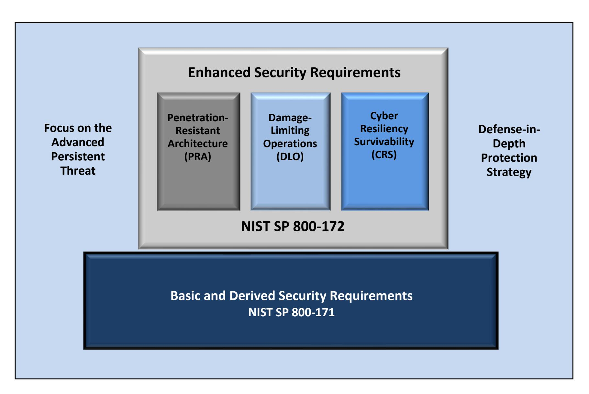
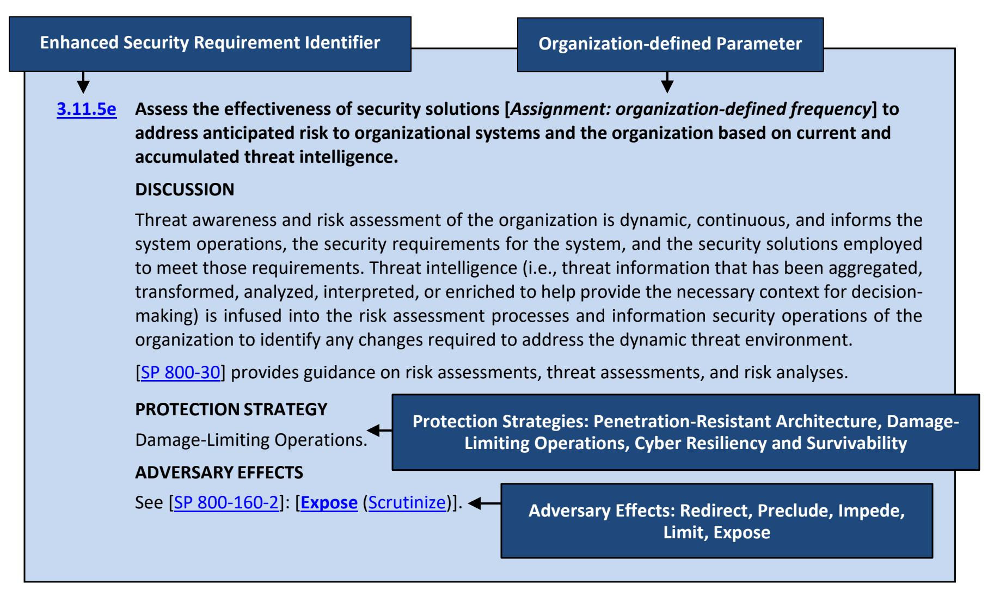

{0}------------------------------------------------

# **Enhanced Security Requirements for Protecting Controlled Unclassified Information**

A Supplement to NIST Special Publication 800-171

**RON ROSS VICTORIA PILLITTERI GARY GUISSANIE RYAN WAGNER RICHARD GRAUBART DEB BODEAU**

This publication is available free of charge from: <https://doi.org/10.6028/NIST.SP.800-172>

{1}------------------------------------------------

# **Enhanced Security Requirements for Protecting Controlled Unclassified Information**

A Supplement to NIST Special Publication 800-171

## **RON ROSS VICTORIA PILLITTERI**

*Computer Security Division National Institute of Standards and Technology*

> **GARY GUISSANIE RYAN WAGNER**

*Institute for Defense Analyses*

**RICHARD GRAUBART DEB BODEAU**

*The MITRE Corporation*

This publication is available free of charge from: <https://doi.org/10.6028/NIST.SP.800-172>

## **February 2021**

U.S. Department of Commerce *Wynn Coggins, Acting Secretary*

National Institute of Standards and Technology

*James K. Olthoff, Performing the Non-Exclusive Functions and Duties of the Under Secretary of Commerce for Standards and Technology & Director, National Institute of Standards and Technology*

{2}------------------------------------------------

## **Authority**

This publication has been developed by NIST to further its statutory responsibilities under the Federal Information Security Modernization Act (FISMA), 44 U.S.C. § 3551 *et seq.*, Public Law (P.L.) 113-283. NIST is responsible for developing information security standards and guidelines, including minimum requirements for federal information systems, but such standards and guidelines shall not apply to national security systems without the express approval of the appropriate federal officials exercising policy authority over such systems. This guideline is consistent with requirements of the Office of Management and Budget (OMB) Circular A-130.

Nothing in this publication should be taken to contradict the standards and guidelines made mandatory and binding on federal agencies by the Secretary of Commerce under statutory authority. Nor should these guidelines be interpreted as altering or superseding the existing authorities of the Secretary of Commerce, OMB Director, or any other federal official. This publication may be used by nongovernmental organizations on a voluntary basis and is not subject to copyright in the United States. Attribution would, however, be appreciated by NIST.

> National Institute of Standards and Technology Special Publication 800-172 Natl. Inst. Stand. Technol. Spec. Publ. 800-172, **84 pages** (February 2021)

> > CODEN: NSPUE2

This publication is available free of charge from: <https://doi.org/10.6028/NIST.SP.800-172>

Certain commercial entities, equipment, or materials may be identified in this document to describe an experimental procedure or concept adequately. Such identification is not intended to imply recommendation or endorsement by NIST, nor is it intended to imply that the entities, materials, or equipment are necessarily the best available for the purpose.

There may be references in this publication to other publications currently under development by NIST in accordance with its assigned statutory responsibilities. The information in this publication, including concepts, practices, and methodologies, may be used by federal agencies even before the completion of such companion publications. Thus, until each publication is completed, current requirements, guidelines, and procedures, where they exist, remain operative. For planning and transition purposes, federal agencies may wish to closely follow the development of these new publications by NIST.

Organizations are encouraged to review draft publications during the public comment periods and provide feedback to NIST. Many NIST publications, other than the ones noted above, are available at [https://csrc.nist.gov/publications.](https://csrc.nist.gov/publications)

## **Comments on this publication may be submitted to:**

National Institute of Standards and Technology Attn: Computer Security Division, Information Technology Laboratory 100 Bureau Drive (Mail Stop 8930) Gaithersburg, MD 20899-8930 Email: [sec-cert@nist.gov](mailto:sec-cert@nist.gov)

All comments are subject to release under the Freedom of Information Act (FOIA) [\[FOIA96\]](#page-42-0).

{3}------------------------------------------------

## **Reports on Computer Systems Technology**

The National Institute of Standards and Technology (NIST) Information Technology Laboratory (ITL) promotes the U.S. economy and public welfare by providing technical leadership for the Nation's measurement and standards infrastructure. ITL develops tests, test methods, reference data, proof of concept implementations, and technical analyses to advance the development and productive use of information technology (IT). ITL's responsibilities include the development of management, administrative, technical, and physical standards and guidelines for the costeffective security of other than national security-related information in federal information systems. The Special Publication 800-series reports on ITL's research, guidelines, and outreach efforts in information systems security and privacy and its collaborative activities with industry, government, and academic organizations.

## **Abstract**

The protection of Controlled Unclassified Information (CUI) resident in nonfederal systems and organizations is of paramount importance to federal agencies and can directly impact the ability of the Federal Government to successfully conduct its essential missions and functions. This publication provides federal agencies with recommended enhanced security requirements for protecting the confidentiality of CUI: (1) when the information is resident in nonfederal systems and organizations; (2) when the nonfederal organization is not collecting or maintaining information on behalf of a federal agency or using or operating a system on behalf of an agency; and (3) where there are no specific safeguarding requirements for protecting the confidentiality of CUI prescribed by the authorizing law, regulation, or government-wide policy for the CUI category listed in the CUI Registry. The enhanced requirements apply to components of nonfederal systems that process, store, or transmit CUI or that provide security protection for such components when the designated CUI is associated with a critical program or high value asset. The enhanced requirements supplement the basic and derived security requirements in NIST Special Publication 800-171 and are intended for use by federal agencies in contractual vehicles or other agreements established between those agencies and nonfederal organizations.

## **Keywords**

Advanced Persistent Threat; Basic Security Requirement; Contractor Systems; Controlled Unclassified Information; CUI Registry; Derived Security Requirement; Enhanced Security Requirement; Executive Order 13556; FIPS Publication 199; FIPS Publication 200; FISMA; NIST Special Publication 800-53; Nonfederal Organizations; Nonfederal Systems; Security Assessment; Security Control; Security Requirement.

{4}------------------------------------------------

## **Acknowledgements**

The authors also wish to recognize the scientists, engineers, and research staff from the NIST Computer Security and the Applied Cybersecurity Divisions for their exceptional contributions in helping to improve the content of the publication. A special note of thanks to Pat O'Reilly, Jim Foti, Jeff Brewer, Chris Enloe, Ned Goren, and the entire NIST web team for their outstanding administrative support. Finally, the authors also gratefully acknowledge the contributions from individuals and organizations in the public and private sectors, nationally and internationally, whose thoughtful and constructive comments improved the overall quality, thoroughness, and usefulness of this publication.

{5}------------------------------------------------

## **Patent Disclosure Notice**

*NOTICE: The Information Technology Laboratory (ITL) has requested that holders of patent claims whose use may be required for compliance with the guidance or requirements of this publication disclose such patent claims to ITL. However, holders of patents are not obligated to respond to ITL calls for patents and ITL has not undertaken a patent search in order to identify which, if any, patents may apply to this publication.*

*As of the date of publication and following call(s) for the identification of patent claims whose use may be required for compliance with the guidance or requirements of this publication, no such patent claims have been identified to ITL.*

*No representation is made or implied by ITL that licenses are not required to avoid patent infringement in the use of this publication.*

{6}------------------------------------------------

## **HOW TO USE THIS PUBLICATION**

This publication is a supplement to NIST Special Publication 800-171 [\[SP 800-171\]](#page-46-0). It contains recommendations for enhanced security requirements to provide additional protection for Controlled Unclassified Information (CUI) in nonfederal systems and organizations when such information is associated with critical programs or high value assets. The enhanced security requirements are designed to respond to the advanced persistent threat (APT) and supplement the basic and derived security requirements in [\[SP 800-171\]](#page-46-0). While the security requirements in [\[SP 800-171\]](#page-46-0) focus primarily on confidentiality protection, the enhanced security requirements in this publication address confidentiality, integrity, and availability protection. The enhanced security requirements are implemented in addition to the basic and derived requirements since those requirements are not designed to address the APT. The enhanced security requirements apply to those components of nonfederal systems that process, store, or transmit CUI or that provide protection for such components.

There is no expectation that *all* of the enhanced security requirements will be selected by federal agencies implementing this guidance. The decision to select a particular set of enhanced security requirements will be based on the mission and business needs of federal agencies and guided and informed by ongoing risk assessments. The enhanced security requirements for nonfederal systems processing, storing, or transmitting CUI associated with critical programs or high value assets will be conveyed to nonfederal organizations by federal agencies in a contract, grant, or other agreement. The application of the enhanced security requirements to *subcontractors* will also be addressed by federal agencies in consultation with nonfederal organizations.

{7}------------------------------------------------

## **THE APPLICABILITY OF ENHANCED SECURITY REQUIREMENTS**

The *enhanced* security requirements are only applicable to a nonfederal system or nonfederal organization as mandated by a federal agency in a contract, grant, or other agreement. The requirements apply to the components of nonfederal systems that process, store, or transmit CUI associated with a critical program or a high value asset or that provide protection for such components. The requirements also apply to services, including externally provided services, that process, store, or transmit CUI, or that provide security protections, for the system requiring enhanced protection. The protection of a specific service to include CUI that is processed, stored or transmitted during the provision of that service, is achieved by implementing the enhanced security requirements for the service, or the system or system components responsible for providing that service.

In addition to protecting CUI from unauthorized disclosure, the enhanced security requirements have been designed to protect the integrity and availability of CUI. This is achieved by promoting penetration-resistant architectures, damage-limiting operations, and designs to help achieve cyber resiliency and survivability.

The term *organizational system* is used in many of the enhanced security requirements. It has a specific meaning regarding the applicability of the enhanced requirements as described above. Appropriate scoping considerations for the requirements are important factors in determining protection-related investment decisions and managing security risk for nonfederal organizations that have the responsibility of protecting CUI associated with critical programs and high value assets.

{8}------------------------------------------------

## **FRAMEWORK FOR IMPROVING CRITICAL INFRASTRUCTURE CYBERSECURITY**

Organizations that have implemented or plan to implement the NIST *Framework for Improving Critical Infrastructure Cybersecurity* [\[NIST CSF\]](#page-47-0) can find i[n Appendix C](#page-60-0) a mapping of the enhanced security requirements in this publication to the security controls in [\[SP 800-53\]](#page-44-0). The security control mappings can be useful to organizations that wish to demonstrate compliance to the security requirements in the context of their established information security programs when such programs have been built using the NIST security controls.

{9}------------------------------------------------

#### . . . . . . . . . . . . . . . . . . . .

## **Table of Contents**

| CHAPTER ONE INTRODUCTION                     | 1  |
|----------------------------------------------|----|
| 1.1 PURPOSE AND APPLICABILITY                | 3  |
| 1.2 TARGET AUDIENCE                          | 4  |
| 1.3 ORGANIZATION OF THIS SPECIAL PUBLICATION | 4  |
| CHAPTER TWO THE FUNDAMENTALS                 | 5  |
| 2.1 DEVELOPMENT APPROACH                     | 5  |
| 2.2 ORGANIZATION AND STRUCTURE               | 7  |
| 2.3 FLEXIBLE APPLICATION                     | 9  |
| CHAPTER THREE THE REQUIREMENTS               | 11 |
| 3.1 ACCESS CONTROL                           | 12 |
| 3.2 AWARENESS AND TRAINING                   |    |
| 3.3 AUDIT AND ACCOUNTABILITY                 |    |
| 3.4 CONFIGURATION MANAGEMENT                 |    |
| 3.5 IDENTIFICATION AND AUTHENTICATION        |    |
| 3.6 INCIDENT RESPONSE                        |    |
| 3.7 MAINTENANCE                              |    |
| 3.8 MEDIA PROTECTION                         |    |
| 3.9 PERSONNEL SECURITY                       |    |
| 3.10 PHYSICAL PROTECTION                     |    |
| 3.11 RISK ASSESSMENT                         |    |
| 3.12 SECURITY ASSESSMENT                     |    |
| 3.14 SYSTEM AND INFORMATION INTEGRITY        |    |
|                                              |    |
| REFERENCES                                   |    |
| APPENDIX A GLOSSARY                          | 38 |
| APPENDIX B ACRONYMS                          | 48 |
| APPENDIX C MAPPING TABLES                    | 50 |
| APPENDIX D ADVERSARY EFFECTS                 | 68 |
|                                              |    |

{10}------------------------------------------------

## **Errata**

This table contains changes that have been incorporated into Special Publication 800-172. Errata updates can include corrections, clarifications, or other minor changes in the publication that are either *editorial* or *substantive* in nature. Any potential updates for this document that are not yet published in an errata update or revision—including additional issues and potential corrections—will be posted as they are identified; see the SP 800-172 [publication details.](https://csrc.nist.gov/publications/detail/sp/800-172/final)

| DATE | TYPE | CHANGE | PAGE |
|------|------|--------|------|
|      |      |        |      |
|      |      |        |      |
|      |      |        |      |
|      |      |        |      |
|      |      |        |      |
|      |      |        |      |
|      |      |        |      |
|      |      |        |      |
|      |      |        |      |
|      |      |        |      |
|      |      |        |      |
|      |      |        |      |
|      |      |        |      |
|      |      |        |      |
|      |      |        |      |
|      |      |        |      |
|      |      |        |      |
|      |      |        |      |
|      |      |        |      |
|      |      |        |      |
|      |      |        |      |
|      |      |        |      |
|      |      |        |      |
|      |      |        |      |
|      |      |        |      |
|      |      |        |      |
|      |      |        |      |
|      |      |        |      |

{11}------------------------------------------------

## **CHAPTER ONE**

## **INTRODUCTION**

THE NEED TO PROTECT CONTROLLED UNCLASSIFIED INFORMATION

oday, more than at any time in history, the Federal Government relies on external service providers to help carry out a wide range of federal missions and business functions using information systems.[1](#page-11-1) Many federal contractors, for example, routinely process, store, and transmit sensitive federal information in their systems to support the delivery of essential products and services to federal agencies (e.g., financial services, providing web and electronic mail services, processing security clearances or healthcare data, providing cloud services, and developing communications, satellite, and weapons systems). Federal information is frequently provided to or shared with entities such as state and local governments, colleges and universities, and independent research organizations. The protection of sensitive federal information while residing in *nonfederal systems*[2](#page-11-2) and organizations is of paramount importance to federal agencies and can directly impact the ability of the Federal Government to carry out its designated missions and business operations. T

The protection of unclassified federal information in nonfederal systems and organizations is dependent on the Federal Government providing a process for identifying the different types of information that are used by federal agencies. [\[EO 13556\]](#page-42-2) established a government-wide Controlled Unclassified Information (CUI)[3](#page-11-3) Program[4](#page-11-4) to standardize the way that the executive branch handles unclassified information that requires protection. [5](#page-11-5) Only information that requires safeguarding or dissemination controls pursuant to federal law, regulation, or government-wide policy may be designated as CUI. The CUI Program is designed to address several deficiencies in managing and protecting unclassified information, including inconsistent markings, inadequate safeguarding, and needless restrictions, both by standardizing procedures and by providing common definitions through a CUI Registry [\[NARA CUI\]](#page-47-1).

The CUI Registry is the online repository of information, guidance, policy, and requirements on handling CUI, including issuances by the National Archives and Records Administration (NARA) CUI Executive Agent. The CUI Registry identifies approved CUI categories, provides general

1 An *information system* is a discrete set of information resources organized expressly for the collection, processing, maintenance, use, sharing, dissemination, or disposition of information. Information systems also include specialized systems, such as industrial and process control systems, cyber-physical systems, IoT systems, embedded systems, and devices. The term *system* is used throughout this publication to represent all types of computing platforms that can process, store, or transmit CUI.

2 A *federal information system* is a system that is used or operated by an executive agency, a contractor of an executive agency, or another organization on behalf of an executive agency. A system that does not meet such criteria is a *nonfederal system*.

3 *Controlled Unclassified Information* is any information that law, regulation, or government-wide policy requires to have safeguarding or disseminating controls, excluding information that is classified under [\[EO 13526\]](#page-42-3) or any predecessor or successor order, or [\[ATOM54\]](#page-42-4), as amended.

4 Established by Executive Order 13556, the CUI Program standardizes the way that the Executive branch handles unclassified information that requires safeguarding or dissemination controls pursuant to and consistent with law, regulations, and government-wide policies.

5 [\[EO 13556\]](#page-42-2) designated the National Archives and Records Administration (NARA) as the Executive Agent to implement the CUI Program.

{12}------------------------------------------------

descriptions for each, identifies the basis for controls, and sets out procedures for the use of CUI, including but not limited to marking, safeguarding, transporting, disseminating, reusing, and disposing of the information.

[\[EO 13556\]](#page-42-2) also required that the CUI Program emphasize openness, transparency, and uniformity of government-wide practices, and that the implementation of the program take place in a manner consistent with applicable policies established by the Office of Management and Budget (OMB) and federal standards and guidelines issued by the National Institute of Standards and Technology (NIST). The federal CUI *regulation*, [6](#page-12-0) developed by the CUI Executive Agent, provides guidance to federal agencies on the designation, safeguarding, dissemination, marking, decontrolling, and disposition of CUI; establishes self-inspection and oversight requirements; and delineates other facets of the program.

In certain situations, CUI may be associated with a critical program[7](#page-12-1) or a high value asset.[8](#page-12-2) These critical programs and high value assets are potential targets for the advanced persistent threat (APT). An APT is an adversary or adversarial group that possesses the expertise and resources that allow it to create opportunities to achieve its objectives by using multiple attack vectors, including cyber, physical, and deception. The APT objectives include establishing a foothold within the infrastructure of targeted organizations for purposes of exfiltrating information; undermining or impeding critical aspects of a mission, function, program, or organization; or positioning itself to carry out these objectives in the future. The APT pursues its objectives repeatedly over an extended period, adapts to defenders' efforts to resist it, and is determined to maintain the level of interaction needed to execute its objectives. While the category of CUI itself does not require greater protection, CUI associated with critical programs or high value assets is at greater risk because the APT is more likely to target such information and therefore requires additional protection.

## **CUI ENHANCED SECURITY REQUIREMENTS**

Controlled Unclassified Information has the *same value*, whether such information is resident in a federal system that belongs to a federal agency or a nonfederal system that belongs to a nonfederal organization. Accordingly, the enhanced security requirements in this publication are consistent with and complementary to the guidelines used by federal agencies to protect CUI. The requirements are only *applicable* to a nonfederal system or nonfederal organization as *mandated* by a federal agency in a contract, grant, or other agreement.

The APT is extremely dangerous to the national and economic security interests of the United States since organizations are very dependent on systems of all types, including traditional [Information Technology](#page-52-0) (IT) systems, [Operational Technology](#page-54-0) (OT) systems, [Internet of Things](#page-53-0)

6 [\[32 CFR 2002\]](#page-42-5) was issued on September 14, 2016, and went into effect on November 14, 2016.

7 The definition of a *critical program* may vary from organization to organization. For example, the Department of Defense defines a critical program as a program which significantly increases capabilities and mission effectiveness or extends the expected effective life of an essential system/capability [\[DOD ACQ\]](#page-46-1).

8 See [\[OMB M-19-03\]](#page-43-0) and [\[OCIO HVA\]](#page-43-1).

{13}------------------------------------------------

(IoT) systems, and [Industrial IoT](#page-52-1) (IIoT) systems. The convergence of these types of systems has brought forth a new class of systems known as *[cyber-physical systems](#page-49-0)*, many of which are in sectors of U.S. critical infrastructure, including energy, transportation, defense, manufacturing, healthcare, finance, and information and communications. Therefore, CUI that is processed, stored, or transmitted by any of the above systems related to a critical program or high value asset requires additional protection from the APT.

## **1.1 PURPOSE AND APPLICABILITY**

The purpose of this publication is to provide federal agencies with a set of enhanced security requirements[9](#page-13-1) for protecting the *confidentiality*, *integrity*, and *availability* of CUI: (1) when the CUI is resident in a nonfederal system and organization, (2) when the nonfederal organization is *not* collecting or maintaining information on behalf of a federal agency or using or operating a system on behalf of an agency, [10](#page-13-2) and (3) where there are no specific safeguarding requirements for protecting the CUI prescribed by the authorizing law, regulation, or government-wide policy for the CUI category listed in the CUI Registry.[11](#page-13-3) The enhanced security requirements address the protection of CUI by promoting: (1) penetration-resistant architecture, (2) damage-limiting operations, and (3) designs to achieve cyber resiliency and survivability.[12](#page-13-4) The enhanced security requirements are intended to supplement the basic and derived security requirements in [\[SP](#page-46-0)  [800-171\]](#page-46-0) and are for use by federal agencies in contractual vehicles or other agreements established between those agencies and nonfederal organizations.

The enhanced security requirements apply to components[13](#page-13-5) of nonfederal systems that process, store, or transmit CUI associated with a critical program or a high value asset or that provide security protection for such components. If nonfederal organizations designate specific system components for the processing, storage, or transmission of CUI associated with a critical program or a high value asset, those organizations may limit the scope of the enhanced security requirements by isolating the designated system components in a separate CUI security domain. Isolation can be achieved by applying architectural and design concepts (e.g., implementing subnetworks with firewalls or other boundary protection devices and using information flow control mechanisms). Security domains may employ physical separation, logical separation, or a combination of both. This approach can provide adequate protection for the CUI and avoid

9 The term *requirements* is used in this guideline to refer to an expression of the set of stakeholder protection needs for a particular system or organization. Stakeholder protection needs and corresponding security requirements may be derived from many sources (e.g., laws, executive orders, directives, regulations, policies, standards, mission and business needs, or risk assessments). The term *requirements* includes both legal and policy requirements, as well as an expression of the broader set of stakeholder protection needs that may be derived from other sources. All of these requirements, when applied to a system, help determine the required characteristics of the system.

10 Nonfederal organizations that collect or maintain information *on behalf of* a federal agency or that use or operate a system *on behalf of* an agency must comply with the requirements in [\[FISMA\]](#page-42-6) and [\[FIPS 200\]](#page-43-2) as well as the security controls in [\[SP 800-53\]](#page-44-0) (See [\[44 USC 3554\]](#page-42-7) (a)(1)(A)).

11 The requirements in this publication can be used to comply with the FISMA requirement for senior agency officials to provide information security for the information that supports the operations and assets under their control, including CUI that is resident in nonfederal systems and organizations (see [\[44 USC 3554\]](#page-42-7) (a)(1)(A) and (a)(2)).

12 Protecting the integrity and availability of the means used to achieve confidentiality protection is within the scope of this publication. While outside of the explicit purpose of this publication, the APT may seek to harm organizations, individuals, or the Nation by compromising the integrity and availability of CUI upon which missions and business functions depend, such as mission or business software categorized as CUI.

13 System *components* include mainframes, workstations, servers, input and output devices, cyber-physical components, network components, mobile devices, operating systems, virtual machines, and applications.

{14}------------------------------------------------

increasing the organization's security posture to a level beyond that which it requires for protecting its missions, operations, and assets.

This publication does *not* provide guidance on which organizational programs or assets are determined to be *critical* or of *high value*. Those determinations are made by the organizations mandating the use of the enhanced security requirements for additional protection and can be informed and guided by laws, executive orders, directives, regulations, or policies. Additionally, this publication does not provide guidance on specific types of threats or attack scenarios that justify the use of the enhanced security requirements. Finally, there is no expectation that all of the enhanced security requirements will be needed in every situation. Rather, the selection decisions will be made by organizations based on mission and business needs and risk.

## **1.2 TARGET AUDIENCE**

This publication serves individuals and organizations in the public and private sectors with:

- System development life cycle responsibilities (e.g., program managers, mission or business owners, information owners or stewards, system designers and developers, system and security engineers, systems integrators);
- System, security, or risk management and oversight responsibilities (e.g., authorizing officials, chief information officers, chief information security officers, system owners, information security managers);
- Security assessment and monitoring responsibilities (e.g., auditors, system evaluators, assessors, independent verifiers or validators, analysts); and
- Acquisition or procurement responsibilities (e.g., contracting officers).

The above roles and responsibilities can be viewed from two distinct perspectives: the *federal perspective*, as the entity establishing and conveying the security requirements in contractual vehicles or other types of inter-organizational agreements, and the *nonfederal perspective*, as the entity responding to and complying with the security requirements set forth in contracts or agreements.

## **1.3 ORGANIZATION OF THIS SPECIAL PUBLICATION**

The remainder of this special publication is organized as follows:

- **[Chapter Two](#page-15-0)** describes the basic assumptions used to develop the enhanced security requirements for protecting CUI, the organization and structure of the requirements, and the flexibility in applying the requirements.
- **[Chapter Three](#page-21-0)** describes the 14 families of enhanced security requirements for protecting CUI in nonfederal systems and organizations.
- Supporting appendices provide additional information related to the protection of CUI. These include the **[References](#page-42-1)**, **[Glossary](#page-48-0)**, **[Acronyms](#page-58-0)**, and **[Mapping Tables](#page-60-0)** relating the enhanced security requirements to the security controls in [\[SP 800-53\]](#page-44-0) and whether the requirements promote penetration-resistant architecture, damage-limiting operations, and designing for cyber resiliency and survivability.

{15}------------------------------------------------

## **CHAPTER TWO**

## **THE FUNDAMENTALS**

ASSUMPTIONS FOR DEVELOPING ENHANCED SECURITY REQUIREMENTS

his chapter describes the approach used to develop the enhanced security requirements to protect CUI in nonfederal systems and organizations. It also covers the organization and structure of the enhanced security requirements and provides links to the security control mapping tables in Appendix C. T

## **2.1 DEVELOPMENT APPROACH**

The enhanced security requirements described in this publication have been developed based on four fundamental assumptions:

- Statutory and regulatory requirements for the protection of CUI are *consistent*, whether such information resides in federal or nonfederal systems and organizations.
- Safeguards implemented to protect CUI are *consistent* in federal and nonfederal systems and organizations.
- The impact value for CUI is no less than [\[FIPS 199\]](#page-43-3) *moderate*. [14](#page-15-2)
- Additional protections are necessary to protect CUI associated with critical programs or high value assets.[15](#page-15-3)

The assumptions reinforce the concept that CUI has the same *value* and potential *adverse impact* if compromised, whether such information is located in a federal or a nonfederal organization. Additional assumptions that also impact the development of the enhanced security requirements and the expectation of federal agencies in working with nonfederal organizations include:

- Nonfederal organizations have specific safeguarding measures in place to protect their information, which may also be sufficient to satisfy the enhanced security requirements.
- Nonfederal organizations can implement a variety of security solutions directly or using external service providers (e.g., managed services) to satisfy the enhanced security requirements.
- Nonfederal organizations may not have the necessary organizational structure or resources to satisfy a particular enhanced security requirement and may implement alternative but equally effective security measures to satisfy the intent of the requirement.
- Federal agencies define, in appropriate contracts or other agreements, the organizationdefined parameters for applicable enhanced security requirements.

14 In accordance with [\[32 CFR 2002\]](#page-42-5), CUI is categorized at no less than the moderate confidentiality impact value. However, when federal law, regulation, or government-wide policy establishing the control of the CUI specifies controls that differ from those of the moderate confidentiality baseline, then these will be followed.

15 Additional protections are required to protect CUI associated with critical programs and high value assets because such CUI is more likely to be targeted by the APT and is, therefore, at greater risk.

{16}------------------------------------------------

The enhanced security requirements provide the foundation for a multidimensional, defense-indepth protection strategy that includes three mutually supportive and reinforcing components: (1) *penetration-resistant architecture*, (2) *damage-limiting operations*, and (3) designing for *cyber resiliency and survivability* [\[SP 800-160-2\]](#page-46-2). This strategy recognizes that despite the best protection measures implemented by organizations, the APT may find ways to compromise or breach boundary defenses and deploy malicious code within a defender's system. When this situation occurs, organizations must have access to safeguards and countermeasures to detect, outmaneuver, confuse, deceive, mislead, and impede the adversary—that is, removing the adversary's tactical advantage and protecting the organization's critical programs and high value assets. Figure 1 shows the complementary nature of the enhanced security requirements when implemented as part of a multidimensional asset protection strategy.

**FIGURE 1: MULTIDIMENSIONAL (DEFENSE-IN-DEPTH) PROTECTION STRATEGY**

While the enhanced security requirements can be implemented comprehensively, organizations may—as part of their overarching risk management strategy—select a subset of the security requirements. However, there are dependencies among certain requirements which will affect the selection process. The enhanced security requirements are intended for use by federal agencies in the contractual vehicles or other agreements established between those agencies and nonfederal organizations. Specific implementation guidance for the selected requirements can be provided by federal agencies to nonfederal organizations in such contractual vehicles or agreements.

The enhanced security requirements are derived from the security controls in [\[SP 800-53\]](#page-44-0). The requirements represent methods for protecting information (and CUI, in particular) against cyber-attacks from advanced cyber threats and for ensuring the cyber resiliency of systems and

{17}------------------------------------------------

organizations while under attack. The enhanced security requirements focus on the following key elements, which are essential to addressing the APT:

- Applying a threat-centric approach to security requirements specification;
- Employing system and security architectures that support logical and physical isolation using system and network segmentation techniques, virtual machines, and containers;[16](#page-17-1)
- Implementing dual authorization controls for the most critical or sensitive operations;
- Limiting persistent storage to isolated enclaves or domains;
- Implementing a comply-to-connect approach for systems and networks;
- Extending configuration management requirements by establishing authoritative sources for addressing changes to systems and system components;
- Periodically refreshing or upgrading organizational systems and system components to a known state or developing new systems or components;
- Employing a security operations center with advanced analytics to support continuous monitoring and protection of organizational systems; and
- Using deception to confuse and mislead adversaries regarding the information they use for decision-making, the value and authenticity of the information they attempt to exfiltrate, or the environment in which they are operating.

## **2.2 ORGANIZATION AND STRUCTURE**

The enhanced security requirements are organized into 14 *families* consistent with the families for basic and derived requirements. Each family contains the requirements related to the general security topic of the family. The families are closely aligned with the minimum security requirements for federal information and information systems in [\[FIPS 200\]](#page-43-2). The security requirements for *contingency planning*, *system and services acquisition*, and *planning* are not included within the scope of this publication due to the tailoring criteria in [\[SP 800-171\]](#page-46-0). Table 1 lists the security requirement families addressed in this publication.[17](#page-17-2)

**TABLE 1: SECURITY REQUIREMENT FAMILIES**

| FAMILY                               |  |  |  |  |  |  |  |
|--------------------------------------|--|--|--|--|--|--|--|
| Media Protection                     |  |  |  |  |  |  |  |
| Personnel Security                   |  |  |  |  |  |  |  |
| Physical Protection                  |  |  |  |  |  |  |  |
| Risk Assessment                      |  |  |  |  |  |  |  |
| Security Assessment                  |  |  |  |  |  |  |  |
| System and Communications Protection |  |  |  |  |  |  |  |
| System and Information Integrity     |  |  |  |  |  |  |  |
|                                      |  |  |  |  |  |  |  |

16 [\[SP 800-160-1\]](#page-46-3) provides guidance on the development of system and security architectures.

17 The Audit and Accountability, Maintenance, Media Protection, and Physical Protection families do not contain enhanced security requirements at this time.

{18}------------------------------------------------

The structure of an enhanced security requirement is similar to the basic and derived security requirements in [\[SP 800-171\]](#page-46-0). For some requirements, additional flexibility is provided by allowing organizations to define specific values for the designated parameters. Flexibility is achieved using *assignment* and *selection* operations embedded within certain requirements. The assignment and selection operations provide the capability to customize the enhanced security requirements based on organizational protection needs. Determination of organization-defined parameter values can be guided and informed by laws, executive orders, directives, regulations, policies, standards, guidance, or mission or business needs. Risk assessments and risk tolerance are also important factors in defining the values for requirement parameters. Once specified, the values for the assignment and selection operations become part of the requirement.[18](#page-18-0)

Following each enhanced security requirement, a *discussion section* provides additional information to facilitate the implementation of the requirement. This information is primarily derived from the security controls discussion sections in [\[SP 800-53\]](#page-44-0) and is provided to give organizations a better understanding of the mechanisms and procedures that can be used to implement the controls used to protect CUI. The discussion section is informational only. It is **not** intended to extend the scope of the enhanced security requirements. The discussion section also includes *informative references*.

Finally, a *protection strategy* and *adversary effects* section describe the potential effects of implementing the enhanced security requirements on risk, specifically by reducing the likelihood of the occurrence of threat events, the ability of threat events to cause harm, and the extent of that harm. Five high-level, desired effects on the adversary can be identified: *[redirect](#page-79-0)*, *[preclude](#page-79-1)*, *[impede](#page-80-0)*, *[limit](#page-81-0)*, and *[expose](#page-82-0)*. Each adversary effect is further decomposed to include specific impacts on risk and expected results. These adversary effects are described in [\[SP 800-160-2\]](#page-46-2) and in [Appendix D.](#page-78-0)

## **ASSIGNMENT AND SELECTION OPERATIONS**

The parameter values for *assignment* and *selection* operations in designated enhanced security requirements are determined by the cognizant federal agency. However, the parameter values should be coordinated with the nonfederal organization. This reflects situations in which the parameter values are dependent on specific characteristics, attributes, or conditions within the nonfederal organization or system (e.g., system architecture, design, or implementation).

Similar to the basic and derived requirements, the enhanced security requirements are mapped to the security controls in [\[SP 800-53\]](#page-44-0), the source from which the requirements were derived. The mappings, which can be found in tables C-1 through C-14, are provided for informational purposes only, noting that the related controls do not provide additional requirements. [19](#page-18-1)

18 The requirements, including specific parameter values, are expressed by a federal agency in a contract, grant, or other agreement. The parameter values should be coordinated with nonfederal organizations to address potential system architecture, design, or implementation issues.

19 The security controls in Tables C-1 through C-14 are taken from [\[SP 800-53\]](#page-44-0).

{19}------------------------------------------------

Figure 2 illustrates an example of an enhanced security requirement.

**FIGURE 2: ENHANCED SECURITY REQUIREMENT EXAMPLE**

## **2.3 FLEXIBLE APPLICATION**

The enhanced security requirements are applied, as necessary, to protect CUI associated with a critical program or a high value asset. Federal agencies may limit application as long as the needed protection is achieved, such as by applying the enhanced security requirements to the components of nonfederal systems that process, store, or transmit CUI associated with a critical program or high value asset; provide protection for such components; or provide a direct attack path to such components (e.g., due to established trust relationships between system components).[20](#page-19-1)

There is no expectation that *all* of the enhanced security requirements will be selected by every federal agency. The decision to select enhanced security requirements will be based on the specific mission and business protection needs of the agency, group of agencies, or the federal government (i.e., federal entity) and will be guided and informed by ongoing assessments of risk. The selection of enhanced security requirements for a nonfederal system processing, storing, or transmitting CUI associated with a critical program or a high value asset will be conveyed to the nonfederal organization by the federal entity in a contract, grant, or other agreement. The application of the enhanced security requirements to *subcontractors* will also be addressed by the federal entity in consultation with the nonfederal organization.

20 System *components* include mainframes, workstations, servers, input and output devices, network components, operating systems, virtual machines, applications, cyber-physical components (e.g., programmable logic controllers [PLC] or medical devices), and mobile devices (e.g., smartphones and tablets).

{20}------------------------------------------------

Certain enhanced security requirements may be too difficult or cost prohibitive for organizations to meet internally. In these situations, the use of external service providers[21](#page-20-0) can be leveraged to satisfy the requirements. The services include but are not limited to:

- Threat intelligence[22](#page-20-1)
- Threat and adversary hunting
- System monitoring and security management[23](#page-20-2)
- IT infrastructure, platform, and software services
- Threat, vulnerability, and risk assessments
- Response and recovery[24](#page-20-3)
- Cyber resiliency[25](#page-20-4)

Finally, specific implementation guidance associated with the enhanced security requirements is beyond the scope of this publication. Organizations have maximum flexibility in the methods, techniques, technologies, and approaches used to satisfy the enhanced security requirements.[26](#page-20-5)

## **IMPLEMENTATION TIPS FOR FEDERAL AGENCIES**

- 1. **Select** the set of enhanced security requirements needed to protect CUI in the nonfederal system or organization.
- 2. **Complete** the assignment and selection operations (where applicable) in the set of enhanced security requirements selected by the agency.
- 3. **Develop** implementation guidance for nonfederal organizations if desired or needed.
- 4. **Include** the enhanced security requirements and implementation guidance in federal contracts or other agreements with nonfederal organizations.

21 These services can be provided by a parent or supervisory organization (e.g., a prime contractor providing services to a subcontractor) or a third party (e.g., a cloud service provider).

22 [\[SP 800-150\]](#page-45-0) makes a distinction between threat information and threat intelligence. Threat information is any information related to a threat that might help an organization protect itself against that threat or detect the activities of a threat actor. Threat intelligence is threat information that has been aggregated, transformed, analyzed, interpreted, or enriched to provide the necessary context for risk-based decision-making processes.

23 A managed security services provider (MSSP) can provide an off-site security operations center (SOC) in which analysts monitor security-relevant data flows on behalf of multiple customers or subordinate organizations. The best services go beyond monitoring perimeter defenses and additionally monitor system components, devices, and endpoint data from deep within organizational systems and networks.

24 In some cases, MSSP organizations provide integrated security-related management and incident response services, similar to a managed detection and response (MDR) services provider. Alternatively, response and recovery services may be obtained separately.

25 [\[SP 800-160-2\]](#page-46-2) provides guidance on cyber resilient systems.

26 Such guidance can be included in the contractual vehicles or other agreements established between federal agencies and nonfederal organizations.

{21}------------------------------------------------

## **CHAPTER THREE**

## **THE REQUIREMENTS**

ENHANCED SECURITY REQUIREMENTS FOR THE ADVANCED PERSISTENT THREAT

his chapter describes enhanced security requirements to protect the confidentiality, integrity, and availability of CUI in nonfederal systems and organizations from the APT. [27](#page-21-1) The enhanced security requirements are not required for any particular category or article of CUI. However, if a federal agency determines that CUI is associated with a critical program or a high value asset,[28](#page-21-2) the information and the system processing, storing, or transmitting such information are potential targets for the APT and, therefore, may require enhanced protection. Such protection, expressed through the enhanced security requirements, is mandated by a federal agency in a contract, grant, or other agreement. The enhanced security requirements are implemented in addition to the basic and derived requirements contained in [\[SP 800-171\]](#page-46-0) since the basic and derived requirements are not designed to address the APT.[29](#page-21-3) T

Associated with each enhanced security requirement is an identification of which of the three protection strategy areas (i.e., penetration-resistant architecture, damage-limiting operations, and designing for cyber resiliency and survivability) the requirement supports and what potential effects the requirement has on an adversary. This information is included to assist organizations in ascertaining whether the requirement is appropriate. Ideally, the requirements selected should be balanced across the three strategy areas. Selecting requirements that fall exclusively in one area could result in an unbalanced response strategy for dealing with the APT. Similarly, with regard to potential effects on adversaries, organizations should attempt to have as broad a set of effects on an adversary as possible, given their specific mission or business objectives.

27 [\[SP 800-39\]](#page-44-2) defines the APT as an adversary that possesses sophisticated levels of expertise and significant resources which allow it to create opportunities to achieve its objectives by using multiple attack vectors, including cyber, physical, and deception.

28 See [\[OMB M-19-03\]](#page-43-0).

29 The enhanced security requirements have been developed to help address the threats described in [\[NTCTF\]](#page-47-2).

{22}------------------------------------------------

## **3.1 ACCESS CONTROL**

*Enhanced Security Requirements*

**[3.1.1e](#page-61-0) Employ dual authorization to execute critical or sensitive system and organizational operations.**

## **DISCUSSION**

Dual authorization, also known as two-person control, reduces risk related to insider threats. Dual authorization requires the approval of two authorized individuals to execute certain commands, actions, or functions. For example, organizations employ dual authorization to help ensure that changes to selected system components (i.e., hardware, software, and firmware) or information cannot occur unless two qualified individuals approve and implement such changes. These individuals possess the skills and expertise to determine if the proposed changes are correct implementations of the approved changes, and they are also accountable for those changes. Another example is employing dual authorization for the execution of privileged commands. To reduce the risk of collusion, organizations consider rotating assigned dual authorization duties to reduce the risk of an insider threat. Dual authorization can be implemented via either technical or procedural measures and can be carried out sequentially or in parallel.

#### **PROTECTION STRATEGY**

Penetration-Resistant Architecture; Damage-Limiting Operations.

#### **ADVERSARY EFFECTS**

See [\[SP 800-160-2\]](#page-46-2): [**[Preclude](#page-79-1)** [\(Preempt\)](#page-80-1); **[Impede](#page-80-0)** [\(Exert\)](#page-81-1)].

**[3.1.2e](#page-61-1) Restrict access to systems and system components to only those information resources that are owned, provisioned, or issued by the organization.**

## **DISCUSSION**

Information resources that are not owned, provisioned, or issued by the organization include systems or system components owned by other organizations and personally owned devices. Nonorganizational information resources present significant risks to the organization and complicate the ability to employ a "comply-to-connect" policy or implement component or device attestation techniques to ensure the integrity of the organizational system.

### **PROTECTION STRATEGY**

Penetration-Resistant Architecture.

#### **ADVERSARY EFFECTS**

See [\[SP 800-160-2\]](#page-46-2): [**[Preclude](#page-79-1)** [\(Preempt\)](#page-80-1); **[Impede](#page-80-0)** [\(Contain,](#page-80-2) [Exert\)](#page-81-1)].

**[3.1.3e](#page-61-2) Employ [***Assignment: organization-defined secure information transfer solutions***] to control information flows between security domains on connected systems.**

## **DISCUSSION**

Organizations employ information flow control policies and enforcement mechanisms to control the flow of information between designated sources and destinations within systems and between connected systems. Flow control is based on the characteristics of the information and/or the information path. Enforcement occurs, for example, in boundary protection devices that employ rule sets or establish configuration settings that restrict system services, provide a packet-filtering capability based on header information, or provide a message-filtering capability based on message content. Organizations also consider the trustworthiness of filtering and inspection mechanisms (i.e., hardware, firmware, and software components) that are critical to information flow enforcement.

{23}------------------------------------------------

Transferring information between systems in different security domains with different security policies introduces the risk that the transfers violate one or more domain security policies. In such situations, information owners or information stewards provide guidance at designated policy enforcement points between connected systems. Organizations mandate specific architectural solutions when required to enforce logical or physical separation between systems in different security domains. Enforcement includes prohibiting information transfers between connected systems, employing hardware mechanisms to enforce one-way information flows, verifying write permissions before accepting information from another security domain or connected system, and implementing trustworthy regrading mechanisms to reassign security attributes and labels.

Secure information transfer solutions often include one or more of the following properties: use of cross-domain solutions when traversing security domains, mutual authentication of the sender and recipient (using hardware-based cryptography), encryption of data in transit and at rest, isolation from other domains, and logging of information transfers (e.g., title of file, file size, cryptographic hash of file, sender, recipient, transfer time and Internet Protocol [IP] address, receipt time, and IP address).

#### **PROTECTION STRATEGY**

Penetration-Resistant Architecture.

### **ADVERSARY EFFECTS**

See [\[SP 800-160-2\]](#page-46-2): [**[Preclude](#page-79-1)** [\(Preempt\)](#page-80-1); **[Impede](#page-80-0)** [\(Contain,](#page-80-2) [Exert\)](#page-81-1)].

## **3.2 AWARENESS AND TRAINING**

*Enhanced Security Requirements*

**[3.2.1e](#page-62-0) Provide awareness training [***Assignment: organization-defined frequency***] focused on recognizing and responding to threats from social engineering, advanced persistent threat actors, breaches, and suspicious behaviors; update the training [***Assignment: organizationdefined frequency***] or when there are significant changes to the threat.**

## **DISCUSSION**

An effective method to detect APT activities and reduce the effectiveness of those activities is to provide specific awareness training for individuals. A well-trained and security-aware workforce provides another organizational safeguard that can be employed as part of a defense-in-depth strategy to protect organizations against malicious code injections via email or web applications. Threat awareness training includes educating individuals on the various ways that APTs can infiltrate organizations, including through websites, emails, advertisement pop-ups, articles, and social engineering. Training can include techniques for recognizing suspicious emails, the use of removable systems in non-secure settings, and the potential targeting of individuals by adversaries outside the workplace. Awareness training is assessed and updated periodically to ensure that the training is relevant and effective, particularly with respect to the threat since it is constantly, and often rapidly, evolving.

[\[SP 800-50\]](#page-44-3) provides guidance on security awareness and training programs.

## **PROTECTION STRATEGY**

Damage-Limiting Operations.

## **ADVERSARY EFFECTS**

See [\[SP 800-160-2\]](#page-46-2): [**[Impede](#page-80-0)** [\(Exert\)](#page-81-1); **[Expose](#page-82-0)** [\(Detect\)](#page-82-1)].

{24}------------------------------------------------

**[3.2.2e](#page-62-1) Include practical exercises in awareness training for [***Assignment: organization-defined roles***] that are aligned with current threat scenarios and provide feedback to individuals involved in the training and their supervisors.**

## **DISCUSSION**

Awareness training is most effective when it is complemented by practical exercisestailored to the tactics, techniques, and procedures (TTP) of the threat. Examples of practical exercises include unannounced social engineering attempts to gain unauthorized access, collect information, or simulate the adverse impact of opening malicious email attachments or invoking, via spear phishing attacks, malicious web links. Rapid feedback is essential to reinforce desired user behavior. Training results, especially failures of personnel in critical roles, can be indicative of a potentially serious problem. It is important that senior management are made aware of such situations so that they can take appropriate remediating actions.

[\[SP 800-181\]](#page-46-4) provides guidance on role-based security training, including a lexicon and taxonomy that describes cybersecurity work via work roles.

## **PROTECTION STRATEGY**

Damage-Limiting Operations.

#### **ADVERSARY EFFECTS**

See [\[SP 800-160-2\]](#page-46-2): [**[Impede](#page-80-0)** [\(Exert\)](#page-81-1); **[Expose](#page-82-0)** [\(Detect\)](#page-82-1)].

## **3.3 AUDIT AND ACCOUNTABILITY**

*Enhanced Security Requirements*

**There are no enhanced security requirements for audit and accountability.**

## **3.4 CONFIGURATION MANAGEMENT**

*Enhanced Security Requirements*

**[3.4.1e](#page-64-0) Establish and maintain an authoritative source and repository to provide a trusted source and accountability for approved and implemented system components.** 

#### **DISCUSSION**

The establishment and maintenance of an authoritative source and repository includes a system component inventory of approved hardware, software, and firmware; approved system baseline configurations and configuration changes; and verified system software and firmware, as well as images and/or scripts. The authoritative source implements integrity controls to log changes or attempts to change software, configurations, or data in the repository. Additionally, changes to the repository are subject to change management procedures and require authentication of the user requesting the change. In certain situations, organizations may also require dual authorization for such changes. Software changes are routinely checked for integrity and authenticity to ensure that the changes are legitimate when updating the repository and when refreshing a system from the known, trusted source. The information in the repository is used to demonstrate adherence to or identify deviation from the established configuration baselines and to restore system components from a trusted source. From an automated assessment perspective, the system description provided by the authoritative source is referred to as the desired state. The desired state is compared to the actual state to check for compliance or deviations. [\[SP 800-128\]](#page-45-1) provides guidance on security configuration management, including security configuration settings and configuration change control.

[\[IR 8011-1\]](#page-46-5) provides guidance on automation support to assess system and system component configurations.

{25}------------------------------------------------

### **PROTECTION STRATEGY**

Penetration-Resistant Architecture; Designing for Cyber Resiliency and Survivability.

#### **ADVERSARY EFFECTS**

See [\[SP 800-160-2\]](#page-46-2): [**[Impede](#page-80-0)** [\(Exert\)](#page-81-1); **[Limit](#page-81-0)** [\(Shorten\)](#page-82-2); **[Expose](#page-82-0)** [\(Detect\)](#page-82-1)].

**[3.4.2e](#page-64-1) Employ automated mechanisms to detect misconfigured or unauthorized system components; after detection, [***Selection (one or more): remove the components; place the components in a quarantine or remediation network***] to facilitate patching, re-configuration, or other mitigations.**

## **DISCUSSION**

System components used to process, store, transmit, or protect CUI are monitored and checked against the authoritative source (i.e., hardware and software inventory and associated baseline configurations). From an automated assessment perspective, the system description provided by the authoritative source is referred to as the desired state. Using automated tools, the desired state is compared to the actual state to check for compliance or deviations. Security responses to system components that are unknown or that deviate from approved configurations can include removing the components; halting system functions or processing; placing the system components in a quarantine or remediation network that facilitates patching, re-configuration, or other mitigations; or issuing alerts and/or notifications to personnel when there is an unauthorized modification of an organization-defined configuration item. Responses can be automated, manual, or procedural. Components that are removed from the system are rebuilt from the trusted configuration baseline established by the authoritative source.

[\[IR 8011-1\]](#page-46-5) provides guidance on using automation support to assess system configurations.

## **PROTECTION STRATEGY**

Penetration-Resistant Architecture.

## **ADVERSARY EFFECTS**

See [\[SP 800-160-2\]](#page-46-2): [**[Preclude](#page-79-1)** [\(Expunge,](#page-80-3) [Preempt\)](#page-80-1); **[Impede](#page-80-0)** [\(Contain\)](#page-80-2); **[Expose](#page-82-0)** [\(Detect\)](#page-82-1)].

**[3.4.3e](#page-64-2) Employ automated discovery and management tools to maintain an up-to-date, complete, accurate, and readily available inventory of system components.** 

### **DISCUSSION**

The system component inventory includes system-specific information required for component accountability and to provide support to identify, control, monitor, and verify configuration items in accordance with the authoritative source. The information necessary for effective accountability of system components includes the system name, hardware and software component owners, hardware inventory specifications,software license information,software version numbers, and for networked components—the machine names and network addresses. Inventory specifications include the manufacturer, supplier information, component type, date of receipt, cost, model, serial number, and physical location. Organizations also use automated mechanisms to implement and maintain authoritative (i.e., up-to-date, complete, accurate, and available) baseline configurations for systems that include hardware and software inventory tools, configuration management tools, and network management tools. Tools can be used to track version numbers on operating systems, applications, types of software installed, and current patch levels.

## **PROTECTION STRATEGY**

Penetration-Resistant Architecture.

### **ADVERSARY EFFECTS**

See [\[SP 800-160-2\]](#page-46-2): [**[Expose](#page-82-0)** [\(Detect\)](#page-82-1)].

{26}------------------------------------------------

## **3.5 IDENTIFICATION AND AUTHENTICATION**

*Enhanced Security Requirements*

**[3.5.1e](#page-65-0) Identify and authenticate [***Assignment: organization-defined systems and system components***] before establishing a network connection using bidirectional authentication that is cryptographically based and replay resistant.**

## **DISCUSSION**

Cryptographically-based and replay-resistant authentication between systems, components, and devices addresses the risk of unauthorized access from spoofing (i.e., claiming a false identity). The requirement applies to client-server authentication, server-server authentication, and device authentication (including mobile devices). The cryptographic key for authentication transactions is stored in suitably secure storage available to the authenticator application (e.g., keychain storage, Trusted Platform Module [TPM], Trusted Execution Environment [TEE], or secure element). Mandating authentication requirements at every connection point may not be practical, and therefore, such requirements may only be applied periodically or at the initial point of network connection.

[\[SP 800-63-3\]](#page-44-4) provides guidance on identity and authenticator management.

#### **PROTECTION STRATEGY**

Penetration-Resistant Architecture.

## **ADVERSARY EFFECTS**

See [\[SP 800-160-2\]](#page-46-2): [**[Preclude](#page-79-1)** [\(Negate\)](#page-80-4); **[Expose](#page-82-0)** [\(Detect\)](#page-82-1)].

**[3.5.2e](#page-65-1) Employ automated mechanisms for the generation, protection, rotation, and management of passwords for systems and system components that do not support multifactor authentication or complex account management.**

## **DISCUSSION**

In situations where static passwords or personal identification numbers (PIN) are used (e.g., certain system components do not support multifactor authentication or complex account management, such as separate system accounts for each user and logging), automated mechanisms (e.g., password managers) can automatically generate, rotate, manage, and store strong and different passwords for users and device accounts. For example, a router might have one administrator account, but an organization typically has multiple network administrators. Therefore, access management and accountability are problematic. A password manager uses techniques such as automated password rotation (in this example, for the router password) to allow a specific user to temporarily gain access to a device by checking out a temporary password and then checking the password back in to end the access. The password manager simultaneously logs these actions. One of the risks in using password managers is that an adversary may target the collection of passwords that the device generates. Therefore, it is important that these passwords are secured. Methods for protecting passwords include the use of multi-factor authentication to the password manager, encryption, or secured hardware (e.g., a hardware security module).

[\[SP 800-63-3\]](#page-44-4) provides guidance on password generation and management.

## **PROTECTION STRATEGY**

Penetration-Resistant Architecture.

## **ADVERSARY EFFECTS**

See [\[SP 800-160-2\]](#page-46-2): [**[Impede](#page-80-0)** [\(Delay,](#page-81-2) [Exert\)](#page-81-1)].

{27}------------------------------------------------

**[3.5.3e](#page-65-2) Employ automated or manual/procedural mechanisms to prohibit system components from connecting to organizational systems unless the components are known, authenticated, in a properly configured state, or in a trust profile.**

## **DISCUSSION**

Identification and authentication of system components and component configurations can be determined, for example, via a cryptographic hash of the component. This is also known as device attestation and known operating state or trust profile. A trust profile based on factors such as the user, authentication method, device type, and physical location is used to make dynamic decisions on authorizations to data of varying types. If device attestation is the means of identification and authentication, then it is important that patches and updates to the device are handled via a configuration management process such that the patches and updates are done securely and do not disrupt the identification and authentication of other devices.

[\[IR 8011-1\]](#page-46-5) provides guidance on using automation support to assess system configurations.

## **PROTECTION STRATEGY**

Penetration-Resistant Architecture.

## **ADVERSARY EFFECTS**

See [\[SP 800-160-2\]](#page-46-2): [**[Preclude](#page-79-1)** [\(Preempt\)](#page-80-1); **[Expose](#page-82-0)** [\(Detect\)](#page-82-1)].

## **3.6 INCIDENT RESPONSE**

*Enhanced Security Requirements*

**[3.6.1e](#page-66-0) Establish and maintain a security operations center capability that operates [***Assignment: organization-defined time period***].**

## **DISCUSSION**

A security operations center (SOC) is the focal point for security operations and computer network defense for an organization. The purpose of the SOC is to defend and monitor an organization's systems and networks (i.e., cyber infrastructure) on an ongoing basis. The SOC is also responsible for detecting, analyzing, and responding to cybersecurity incidents in a timely manner. The SOC is staffed with skilled technical and operational personnel (e.g., security analysts, incident response personnel, systems security engineers); in some instances operates 24 hours per day, seven days per week; and implements technical, management, and operational controls (e.g., monitoring, scanning, and forensics tools) to monitor, fuse, correlate, analyze, and respond to security-relevant event data from multiple sources. Sources of event data include perimeter defenses, network devices (e.g., gateways, routers, and switches), and endpoint agent data feeds. The SOC provides a holistic situational awareness capability to help organizations determine the security posture of the system and organization. An SOC capability can be obtained in many ways. Larger organizations may implement a dedicated SOC while smaller organizations may employ third-party organizations to provide such a capability.

[\[SP 800-61\]](#page-44-5) provides guidance on incident handling. [\[SP 800-86\]](#page-45-2) and [\[SP 800-101\]](#page-45-3) provide guidance on integrating forensic techniques into incident response. [\[SP 800-150\]](#page-45-0) provides guidance on cyber threat information sharing. [\[SP 800-184\]](#page-46-6) provides guidance on cybersecurity event recovery.

## **PROTECTION STRATEGY**

Damage-Limiting Operations.

## **ADVERSARY EFFECTS**

See [\[SP 800-160-2\]](#page-46-2): [**[Limit](#page-81-0)** [\(Shorten,](#page-82-2) [Reduce\)](#page-82-3); **[Expose](#page-82-0)** [\(Detect\)](#page-82-1)].

{28}------------------------------------------------

## **[3.6.2e](#page-66-1) Establish and maintain a cyber incident response team that can be deployed by the organization within [***Assignment: organization-defined time period***].**

#### **DISCUSSION**

A cyber incident response team (CIRT) is a team of experts that assesses, documents, and responds to cyber incidents so that organizational systems can recover quickly and implement the necessary controls to avoid future incidents. CIRT personnel include, for example, forensic analysts, malicious code analysts, systems security engineers, and real-time operations personnel. The incident handling capability includes performing rapid forensic preservation of evidence and analysis of and response to intrusions. The team members may or may not be full-time but need to be available to respond in the time period required. The size and specialties of the team are based on known and anticipated threats. The team is typically pre-equipped with the software and hardware (e.g., forensic tools) necessary for rapid identification, quarantine, mitigation, and recovery and is familiar with how to preserve evidence and maintain chain of custody for law enforcement or counterintelligence uses. For some organizations, the CIRT can be implemented as a crossorganizational entity or as part of the Security Operations Center (SOC).

[\[SP 800-61\]](#page-44-5) provides guidance on incident handling. [\[SP 800-86\]](#page-45-2) and [\[SP 800-101\]](#page-45-3) provide guidance on integrating forensic techniques into incident response. [\[SP 800-150\]](#page-45-0) provides guidance on cyber threat information sharing. [\[SP 800-184\]](#page-46-6) provides guidance on cybersecurity event recovery.

#### **PROTECTION STRATEGY**

Damage-Limiting Operations.

## **ADVERSARY EFFECTS**

See [\[SP 800-160-2\]](#page-46-2): [**[Preclude](#page-79-1)** [\(Expunge\)](#page-80-3); **[Impede](#page-80-0)** [\(Contain,](#page-80-2) [Exert\)](#page-81-1); **[Limit](#page-81-0)** [\(Shorten,](#page-82-2) [Reduce\)](#page-82-3); **[Expose](#page-82-0)** [\(Scrutinize\)](#page-83-0)].

## **3.7 MAINTENANCE**

*Enhanced Security Requirements*

**There are no enhanced security requirements for maintenance.**

## **3.8 MEDIA PROTECTION**

*Enhanced Security Requirements*

**There are no enhanced security requirements for media protection.**

## **3.9 PERSONNEL SECURITY**

*Enhanced Security Requirements*

**[3.9.1e](#page-69-0) Conduct [***Assignment: organization-defined enhanced personnel screening***] for individuals and reassess individual positions and access to CUI [***Assignment: organization-defined frequency***].**

## **DISCUSSION**

Personnel security is the discipline that provides a trusted workforce based on an evaluation or assessment of conduct, integrity, judgment, loyalty, reliability, and stability. The extent of the vetting is commensurate with the level of risk that individuals could bring about by their position and accessto CUI. For individuals accessing Federal Government facilities and systems, the Federal Government employs resources, information, and technology in its vetting processes to ensure a trusted workforce. These screening processes may be extended all or in part to persons accessing federal information, including CUI that is resident in nonfederal systems and organizations through

{29}------------------------------------------------

contractual vehicles or other agreements established between federal agencies and nonfederal organizations.

Examples of enhanced personnel screening for security purposes include additional background checks. Personnel reassessment activities reflect applicable laws, executive orders, directives, policies, regulations, and specific criteria established for the level of access required for assigned positions.

## **PROTECTION STRATEGY**

Damage-Limiting Operations.

### **ADVERSARY EFFECTS**

See [\[SP 800-160-2\]](#page-46-2): [**[Preclude](#page-79-1)** [\(Expunge\)](#page-79-1); **[Impede](#page-80-0)** [\(Exert\)](#page-81-1)].

**[3.9.2e](#page-69-1) Ensure that organizational systems are protected if adverse information develops or is obtained about individuals with access to CUI.**

#### **DISCUSSION**

If adverse information develops or is obtained about an individual with access to CUI which calls into question whether the individual should have continued access to systems containing CUI, actions are taken (e.g., preclude or limit further access by the individual, audit actions taken by the individual) to protect the CUI while the adverse information is resolved.

## **PROTECTION STRATEGY**

Damage-Limiting Operations.

### **ADVERSARY EFFECTS**

See [\[SP 800-160-2\]](#page-46-2): [**[Limit](#page-81-0)** [\(Reduce\)](#page-82-3)].

## **3.10 PHYSICAL PROTECTION**

*Enhanced Security Requirements*

**There are no enhanced security requirements for physical protection.**

## **3.11 RISK ASSESSMENT**

*Enhanced Security Requirements*

**[3.11.1e](#page-71-1) Employ [***Assignment: organization-defined sources of threat intelligence***] as part of a risk assessment to guide and inform the development of organizational systems, security architectures, selection of security solutions, monitoring, threat hunting, and response and recovery activities.**

## **DISCUSSION**

The constant evolution and increased sophistication of adversaries, especially the APT, makes it more likely that adversaries can successfully compromise or breach organizational systems. Accordingly, threat intelligence can be integrated into each step of the risk management process throughout the system development life cycle. This risk management process includes defining system security requirements, developing system and security architectures, selecting security solutions, monitoring (including threat hunting), and remediation efforts.

[\[SP 800-30\]](#page-44-1) provides guidance on risk assessments. [\[SP 800-39\]](#page-44-2) provides guidance on the risk management process. [\[SP 800-160-1\]](#page-46-3) provides guidance on security architectures and systems security engineering. [\[SP 800-150\]](#page-45-0) provides guidance on cyber threat information sharing.

## **PROTECTION STRATEGY**

{30}------------------------------------------------

Damage-Limiting Operations.

#### **ADVERSARY EFFECTS**

See [\[SP 800-160-2\]](#page-46-2): [**[Preclude](#page-79-1)** [\(Negate\)](#page-80-4); **[Impede](#page-80-0)** [\(Exert\)](#page-81-1); **[Expose](#page-82-0)** [\(Detect\)](#page-82-1)].

**[3.11.2e](#page-71-2) Conduct cyber threat hunting activities [***Selection (one or more):* **[***Assignment: organizationdefined frequency***]; [***Assignment: organization-defined event***]] to search for indicators of compromise in [***Assignment: organization-defined systems***] and detect, track, and disrupt threats that evade existing controls.**

## **DISCUSSION**

Threat hunting is an active means of defense that contrasts with traditional protection measures, such as firewalls, intrusion detection and prevention systems, quarantining malicious code in sandboxes, and Security Information and Event Management (SIEM) technologies and systems. Cyber threat hunting involves proactively searching organizational systems, networks, and infrastructure for advanced threats. The objective is to track and disrupt cyber adversaries as early as possible in the attack sequence and to measurably improve the speed and accuracy of organizational responses. Indicators of compromise are forensic artifacts from intrusions that are identified on organizational systems at the host or network level and can include unusual network traffic, unusual file changes, and the presence of malicious code.

Threat hunting teams use existing threat intelligence and may create new threat information, which may be shared with peer organizations, Information Sharing and Analysis Organizations (ISAO), Information Sharing and Analysis Centers (ISAC), and relevant government departments and agencies. Threat indicators, signatures, tactics, techniques, procedures, and other indicators of compromise may be available via government and non-government cooperatives, including Forum of Incident Response and Security Teams, United States Computer Emergency Response Team, Defense Industrial Base Cybersecurity Information Sharing Program, and CERT Coordination Center.

[\[SP 800-30\]](#page-44-1) provides guidance on threat and risk assessments, risk analyses, and risk modeling. [\[SP](#page-46-2)  [800-160-2\]](#page-46-2) provides guidance on systems security engineering and cyber resiliency. [\[SP 800-150\]](#page-45-0) provides guidance on cyber threat information sharing.

## **PROTECTION STRATEGY**

Damage-Limiting Operations.

## **ADVERSARY EFFECTS**

See [\[SP 800-160-2\]](#page-46-2): [**[Preclude](#page-79-1)** [\(Expunge\)](#page-80-3); **[Limit](#page-81-0)** [\(Shorten,](#page-82-2) [Reduce\)](#page-82-3); **[Expose](#page-82-0)** [\(Detect,](#page-82-1) [Scrutinize\)](#page-83-0)].

**[3.11.3e](#page-71-3) Employ advanced automation and analytics capabilities in support of analysts to predict and identify risks to organizations, systems, and system components.**

## **DISCUSSION**

A properly resourced Security Operations Center (SOC) or Computer Incident Response Team (CIRT) may be overwhelmed by the volume of information generated by the proliferation of security tools and appliances unless it employs advanced automation and analytics to analyze the data. Advanced automation and predictive analytics capabilities are typically supported by artificial intelligence concepts and machine learning. Examples include Automated Workflow Operations, Automated Threat Discovery and Response (which includes broad-based collection, context-based analysis, and adaptive response capabilities), and machine-assisted decision tools.

[\[SP 800-30\]](#page-44-1) provides guidance on risk assessments and risk analyses.

### **PROTECTION STRATEGY**

Damage-Limiting Operations.

{31}------------------------------------------------

### **ADVERSARY EFFECTS**

See [\[SP 800-160-2\]](#page-46-2): No direct effects.

**[3.11.4e](#page-71-4) Document or reference in the system security plan the security solution selected, the rationale for the security solution, and the risk determination.**

## **DISCUSSION**

System security plans relate security requirements to a set of security controls and solutions. The plans describe how the controls and solutions meet the security requirements. For the enhanced security requirements selected when the APT is a concern, the security plan provides traceability between threat and risk assessments and the risk-based selection of a security solution, including discussion of relevant analyses of alternatives and rationale for key security-relevant architectural and design decisions. This level of detail is important as the threat changes, requiring reassessment of the risk and the basis for previous security decisions.

When incorporating external service providers into the system security plan, organizations state the type of service provided (e.g., software as a service, platform as a service), the point and type of connections(including ports and protocols), the nature and type of the information flows to and from the service provider, and the security controls implemented by the service provider. For safety critical systems, organizations document situations for which safety is the primary reason for not implementing a security solution (i.e., the solution is appropriate to address the threat but causes a safety concern).

[SP 800-18] provides guidance on the development of system security plans.

### **PROTECTION STRATEGY**

Penetration-Resistant Architecture.

## **ADVERSARY EFFECTS**

See [\[SP 800-160-2\]](#page-46-2): No direct effects.

**[3.11.5e](#page-71-0) Assess the effectiveness of security solutions [***Assignment: organization-defined frequency***] to address anticipated risk to organizational systems and the organization based on current and accumulated threat intelligence.**

## **DISCUSSION**

Threat awareness and risk assessment of the organization are dynamic, continuous, and inform system operations, security requirements for the system, and the security solutions employed to meet those requirements. Threat intelligence (i.e., threat information that has been aggregated, transformed, analyzed, interpreted, or enriched to help provide the necessary context for decisionmaking) is infused into the risk assessment processes and information security operations of the organization to identify any changes required to address the dynamic threat environment.

[\[SP 800-30\]](#page-44-1) provides guidance on risk assessments, threat assessments, and risk analyses.

## **PROTECTION STRATEGY**

Damage-Limiting Operations.

## **ADVERSARY EFFECTS**

See [\[SP 800-160-2\]](#page-46-2): [**[Expose](#page-82-0)** [\(Scrutinize\)](#page-83-0)].

**[3.11.6e](#page-72-0) Assess, respond to, and monitor supply chain risks associated with organizational systems and system components.**

**DISCUSSION**

{32}------------------------------------------------

Supply chain events include disruption, use of defective components, insertion of counterfeits, theft, malicious development practices, improper delivery practices, and insertion of malicious code. These events can have a significant impact on a system and its information and, therefore, can also adversely impact organizational operations (i.e., mission, functions, image, or reputation), organizational assets, individuals, other organizations, and the Nation. The supply chain-related events may be unintentional or malicious and can occur at any point during the system life cycle. An analysis of supply chain risk can help an organization identify systems or components for which additional supply chain risk mitigations are required.

[\[SP 800-30\]](#page-44-1) provides guidance on risk assessments, threat assessments, and risk analyses. [\[SP 800-](#page-46-7) [161\]](#page-46-7) provides guidance on supply chain risk management.

#### **PROTECTION STRATEGY**

Penetration-Resistant Architecture.

#### **ADVERSARY EFFECTS**

See [\[SP 800-160-2\]](#page-46-2): [**[Preclude](#page-79-1)** [\(Preempt\)](#page-80-1); **[Expose](#page-82-0)** [\(Detect\)](#page-82-1)].

**[3.11.7e](#page-72-1) Develop a plan for managing supply chain risks associated with organizational systems and system components; update the plan [***Assignment: organization-defined frequency***].**

#### **DISCUSSION**

The growing dependence on products, systems, and services from external providers, along with the nature of the relationships with those providers, present an increasing level of risk to an organization. Threat actions that may increase risk include the insertion or use of counterfeits, unauthorized production, tampering, theft, insertion of malicious software and hardware, and poor manufacturing and development practices in the supply chain. Supply chain risks can be endemic or systemic within a system element or component, a system, an organization, a sector, or the Nation. Managing supply chain risk is a multifaceted undertaking that requires a coordinated effort across an organization to build trust relationships and communicate with both internal and external stakeholders. Supply chain risk management (SCRM) activities involve identifying and assessing risks, determining appropriate mitigating actions, developing SCRM plans to document selected mitigating actions, and monitoring performance against plans. SCRM plans address requirements for developing trustworthy, secure, and resilient systems and system components, including the application of the security design principles implemented as part of life cycle-based systems security engineering processes.

[\[SP 800-161\]](#page-46-7) provides guidance on supply chain risk management.

#### **PROTECTION STRATEGY**

Penetration-Resistant Architecture.

## **ADVERSARY EFFECTS**

See [\[SP 800-160-2\]](#page-46-2): [**[Preclude](#page-79-1)** [\(Preempt\)](#page-80-1); **[Impede](#page-80-0)** [\(Exert\)](#page-81-1)].

## **3.12 SECURITY ASSESSMENT**

*Enhanced Security Requirements*

**[3.12.1e](#page-73-0) Conduct penetration testing [***Assignment: organization-defined frequency***], leveraging automated scanning tools and ad hoc tests using subject matter experts.**

## **DISCUSSION**

Penetration testing is a specialized type of assessment conducted on systems or individual system components to identify vulnerabilities that could be exploited by adversaries. Penetration testing goes beyond automated vulnerability scanning. It is conducted by penetration testing agents and

{33}------------------------------------------------

teams with particular skills and experience that include technical expertise in network, operating system, and application-level security. Penetration testing can be used to validate vulnerabilities or determine a system's penetration resistance to adversaries within specified constraints. Such constraints include time, resources, and skills. Organizations may also supplement penetration testing with red team exercises. Red teams attempt to duplicate the actions of adversaries in carrying out attacks against organizations and provide an in-depth analysis of security-related weaknesses or deficiencies.

Organizations can use the results of vulnerability analyses to support penetration testing activities. Penetration testing can be conducted internally or externally on the hardware, software, or firmware components of a system and can exercise both physical and technical controls. A standard method for penetration testing includes pretest analysis based on full knowledge of the system, pretest identification of potential vulnerabilities based on the pretest analysis, and testing designed to determine the exploitability of vulnerabilities. All parties agree to the specified rules of engagement before the commencement of penetration testing. Organizations correlate the rules of engagement for penetration tests and red teaming exercises (if used) with the tools, techniques, and procedures that they anticipate adversaries may employ. The penetration testing or red team exercises may be organization-based or external to the organization. In either case, it is important that the team possesses the necessary skills and resources to do the job and is objective in its assessment.

[\[SP 800-53A\]](#page-44-6) provides guidance on conducting security assessments.

#### **PROTECTION STRATEGY**

Penetration-Resistant Architecture; Damage-Limiting Operations.

## **ADVERSARY EFFECTS**

See [\[SP 800-160-2\]](#page-46-2): [**[Impede](#page-80-0)** [\(Exert\)](#page-81-1); **[Expose](#page-82-0)** [\(Detect\)](#page-82-1)].

## **3.13 SYSTEM AND COMMUNICATIONS PROTECTION**

*Enhanced Security Requirements*

**[3.13.1e](#page-74-0) Create diversity in [***Assignment: organization-defined system components***] to reduce the extent of malicious code propagation.**

## **DISCUSSION**

Organizations often use homogenous information technology environments to reduce costs and to simplify administration and use. However, a homogenous environment can also facilitate the work of the APT, as it allows for common mode failures and the propagation of malicious code across identical system components (i.e., hardware, software, and firmware). In these environments, adversary tactics, techniques, and procedures (TTP) that work on one instantiation of a system component will work equally well on other identical instantiations of the component regardless of how many times such components are replicated or how far away they may be placed in the architecture. Increasing diversity within organizational systems reduces the impact of potential exploitations or compromises of specific technologies. Such diversity protects against common mode failures, including those failures induced by supply chain attacks. Diversity also reduces the likelihood that the TTP adversaries use to compromise one system component will be effective against other system components, thus increasing the adversary's work factor to successfully complete the planned attacks. A heterogeneous or diverse information technology environment makes the task of propagating malicious code more difficult, as the adversary needs to develop and deploy different TTP for the diverse components.

Satisfying this requirement does not mean that organizations need to acquire and manage multiple versions of operating systems, applications, tools, and communication protocols. However, the use

{34}------------------------------------------------

of diversity in certain critical, organizationally determined system components can be an effective countermeasure against the APT. In addition, organizations may already be practicing diversity, although not to counter the APT. For example, it is common for organizations to employ diverse anti-virus products at different parts of their infrastructure simply because each vendor may issue updates to new malicious code patterns at different times and frequencies. Similarly, some organizations employ products from one vendor at the server level and products from another vendor at the end-user level. Another example of diversity occurs in products that provide address space layout randomization (ASLR). Such products introduce a form of synthetic diversity by transforming the implementations of common software to produce a variety of instances. Finally, organizations may choose to use multiple virtual private network (VPN) vendors, tunneling one vendor's VPN within another vendor's VPN. Smaller organizations may find that achieving diversity in system components is challenging and perhaps not practical. Organizations also consider the vulnerabilities that may be introduced into the system by the employment of diverse system components.

[\[SP 800-160-1\]](#page-46-3) provides guidance on security engineering practices and security design concepts. [\[SP 800-160-2\]](#page-46-2) provides guidance on developing cyber resilient systems and system components. [\[SP 800-161\]](#page-46-7) provides guidance on supply chain risk management.

#### **PROTECTION STRATEGY**

Designing for Cyber Resiliency and Survivability.

#### **ADVERSARY EFFECTS**

See [\[SP 800-160-2\]](#page-46-2): [**[Redirect](#page-79-0)** [\(Deter\)](#page-79-2); **[Preclude](#page-79-1)** [\(Preempt\)](#page-80-1); **[Impede](#page-80-0)** [\(Contain,](#page-80-2) [Degrade,](#page-81-3) [Delay,](#page-81-2)  [Exert\)](#page-81-1); **[Limit](#page-81-0)** [\(Shorten,](#page-82-2) [Reduce\)](#page-82-3)].

**[3.13.2e](#page-74-1) Implement the following changes to organizational systems and system components to introduce a degree of unpredictability into operations: [***Assignment: organization-defined changes and frequency of changes by system and system component***].**

## **DISCUSSION**

Cyber-attacks by adversaries are predicated on the assumption of a certain degree of predictability and consistency regarding the attack surface. The attack surface is the set of points on the boundary of a system, a system element, or an environment where an attacker can try to enter, cause an effect on, or extract data from the system, system element, or environment. Changes to the attack surface reduce the predictability of the environment, making it difficult for adversaries to plan and carry out attacks, and can cause the adversariesto make miscalculations that can either impact the overall effectiveness of the attacks or increase the observability of the attackers. Unpredictability can be achieved by making changes in seemingly random times or circumstances (e.g., by randomly shortening the time when the credentials are valid). Randomness introduces increased levels of uncertainty for adversaries regarding the actions that organizations take to defend their systems against attacks. Such actions may impede the ability of adversaries to correctly target system components that support critical or essential organizational missions or business functions. Uncertainty may also cause adversaries to hesitate before initiating attacks or continuing attacks. Techniques involving randomness include performing certain routine actions at different times of day, employing different information technologies, using different suppliers, and rotating the roles and responsibilities of organizational personnel.

## **PROTECTION STRATEGY**

Designing for Cyber Resiliency and Survivability.

## **ADVERSARY EFFECTS**

See [\[SP 800-160-2\]](#page-46-2): [**[Preclude](#page-79-1)** [\(Preempt,](#page-80-1) [Negate\)](#page-80-4); **[Impede](#page-80-0)** [\(Delay,](#page-81-2) [Exert\)](#page-81-1); **[Expose](#page-82-0)** [\(Detect\)](#page-82-1)].

{35}------------------------------------------------

## **[3.13.3e](#page-74-2) Employ [***Assignment: organization-defined technical and procedural means***] to confuse and mislead adversaries.**

## **DISCUSSION**

There are many techniques and approaches that can be used to confuse and mislead adversaries, including misdirection, tainting, disinformation, or a combination thereof. Deception is used to confuse and mislead adversaries regarding the information that the adversaries use for decisionmaking, the value and authenticity of the information that the adversaries attempt to exfiltrate, or the environment in which the adversaries desire or need to operate. Such actions can impede the adversary's ability to conduct meaningful reconnaissance of the targeted organization, delay or degrade an adversary's ability to move laterally through a system or from one system to another system, divert the adversary away from systems or system components containing CUI, and increase observability of the adversary to the defender—revealing the presence of the adversary along with its TTPs. Misdirection can be achieved through deception environments (e.g., deception nets), which provide virtual sandboxes into which malicious code can be diverted and adversary TTP can be safely examined. Tainting involves embedding data or information in an organizational system or system component which the organization desires adversaries to exfiltrate. Tainting allows organizations to determine that information has been exfiltrated or improperly removed from the organization and potentially provides the organization with information regarding the nature of exfiltration or adversary locations. Disinformation can be achieved by making false information intentionally available to adversaries regarding the state of the system or type of organizational defenses. Any disinformation activity is coordinated with the associated federal agency requiring such activity, and should include a plan to limit incidental exposure of the false CUI to authorized users. Disinformation can be employed both tactically (e.g., making available false credentials that the defender can use to track adversary actions) and strategically (e.g., interspersing false CUI with actual CUI, interfering with an adversary's re-use, reverse engineering and exploitation of legitimate CUI, thus undermining the adversary's confidence in the value of the exfiltrated information, and subsequently causing them to limit such exfiltration).

[\[SP 800-160-2\]](#page-46-2) provides guidance on developing cyber resilient systems and system components.

## **PROTECTION STRATEGY**

Designing for Cyber Resiliency and Survivability.

## **ADVERSARY EFFECTS**

See [\[SP 800-160-2\]](#page-46-2): [**[Redirect](#page-79-0)** [\(Deter,](#page-79-2) [Divert,](#page-79-3) [Deceive\)](#page-79-4); **[Preclude](#page-79-1)** [\(Preempt,](#page-80-1) [Negate\)](#page-80-4); **[Impede](#page-80-0)** [\(Delay,](#page-81-2) [Exert\)](#page-81-1); **[Expose](#page-82-0)** [\(Detect\)](#page-82-1)].

**[3.13.4e](#page-74-3) Employ [***Selection: (one or more):* **[***Assignment: organization-defined physical isolation techniques***]; [***Assignment: organization-defined logical isolation techniques***]] in organizational systems and system components.**

#### **DISCUSSION**

A mix of physical and logical isolation techniques (described below) implemented as part of the system architecture can limit the unauthorized flow of CUI, reduce the system attack surface, constrain the number of system components that must be secure, and impede the movement of an adversary. When implemented with a set of managed interfaces, physical and logical isolation techniques for organizational systems and components can isolate CUI into separate security domains where additional protections can be implemented. Any communications across the managed interfaces (i.e., across security domains), including for management or administrative purposes, constitutes remote access even if the communications remain within the organization. Separating system components with boundary protection mechanisms allows for the increased protection of individual components and more effective control of information flows between those components. This enhanced protection limits the potential harm from and susceptibility to

{36}------------------------------------------------

hostile cyber-attacks and errors. The degree of isolation can vary depending on the boundary protection mechanisms selected. Boundary protection mechanisms include routers, gateways, and firewalls separating system components into physically separate networks or subnetworks; virtualization and micro-virtualization techniques; encrypting information flows among system components using distinct encryption keys; cross-domain devices separating subnetworks; and complete physical separation (i.e., air gaps).

System architectures include logical isolation, partial physical and logical isolation, or complete physical isolation between subsystems and at system boundaries between resources that store, process, transmit, or protect CUI and other resources. Examples include:

- *Logical isolation*: Data tagging, digital rights management (DRM), and data loss prevention (DLP) that tags, monitors, and restricts the flow of CUI; virtual machines or containers that separate CUI and other information on hosts; and virtual local area networks (VLAN) that keep CUI and other information separate on networks.
- *Partial physical and logical isolation*: Physically or cryptographically isolated networks, dedicated hardware in data centers, and secure clients that (a) may not directly access resources outside of the domain (i.e., all applications with cross-enclave connectivity execute as remote virtual applications hosted in a demilitarized zone [DMZ] or internal and protected enclave), (b) access via remote virtualized applications or virtual desktop with no file transfer capability other than with dual authorization, or (c) employ dedicated client hardware (e.g., a zero or thin client) or hardware approved for multi-level secure (MLS) usage.
- *Complete physical isolation*: Dedicated (not shared) client and server hardware; physically isolated, stand-alone enclaves for clients and servers; and (a) logically separate network traffic (e.g., using a VLAN) with end-to-end encryption using Public Key Infrastructure (PKI)-based cryptography or (b) physical isolation from other networks.

Isolation techniques are selected based on a risk management perspective that balances the threat, the information being protected, and the cost of the options for protection. Architectural and design decisions are guided and informed by the security requirements and selected solutions. Organizations consider the trustworthiness of the isolation techniques employed (e.g., the logical isolation relies on information technology that could be considered a high value target because of the function being performed), introducing its own set of vulnerabilities.

[\[SP 800-160-1\]](#page-46-3) provides guidance on developing trustworthy, secure, and cyber resilient systems using systems security engineering practices and security design concepts.

#### **PROTECTION STRATEGY**

Penetration-Resistant Architecture; Designing for Cyber Resiliency and Survivability.

## **ADVERSARY EFFECTS**

See [\[SP 800-160-2\]](#page-46-2): [**[Preclude](#page-79-1)** [\(Preempt,](#page-80-1) [Negate\)](#page-80-4); **[Impede](#page-80-0)** [\(Contain,](#page-80-2) [Degrade,](#page-81-3) [Delay,](#page-81-2) [Exert\)](#page-81-1); **[Limit](#page-81-0)** [\(Reduce\)](#page-82-3)].

**[3.13.5e](#page-75-0) Distribute and relocate the following system functions or resources [***Assignment: organizationdefined frequency***]**: **[***Assignment: organization-defined system functions or resources***].**

## **DISCUSSION**

Changing processing and storage locations (also referred to as moving target defense) addresses the APT by using techniques such as virtualization, distributed processing, and replication. This enables organizations to relocate system components that support critical missions and business functions. Changing the locations of processing activities or storage sites introduces a degree of uncertainty into the targeting activities of adversaries. Targeting uncertainty increases the work factor of adversaries making compromises or breaches to organizational systems more difficult

{37}------------------------------------------------

and time-consuming. It also increases the chances that adversaries may inadvertently disclose aspects of their tradecraft while attempting to locate organizational resources. Other options for employing moving target defense include changing IP addresses, Domain Name System (DNS) names, or network topologies. Moving target defense can also increase the work factor for defenders who have a constantly changing system to defend. Accordingly, organizations update their management and security tools and train personnel to adapt to the additional work factor.

Another way of addressing this requirement is by fragmentation. This involves taking information and fragmenting/partitioning it across multiple components (e.g., across a distributed database). Such actions mean that the compromise (unauthorized exfiltration) of any single component of the information data set will not result in the compromise of the entire data. To fully compromise the entire data set, the adversary would have to work harder to try to locate all of the data sets.

#### **PROTECTION STRATEGY**

Designing for Cyber Resiliency and Survivability.

## **ADVERSARY EFFECTS**

See [\[SP 800-160-2\]](#page-46-2): [**[Preclude](#page-79-1)** [\(Preempt,](#page-80-1) [Negate\)](#page-80-4); **[Impede](#page-80-0)** [\(Delay,](#page-81-2) [Exert\)](#page-81-1); **[Expose](#page-82-0)** [\(Detect\)](#page-82-1)].

## **3.14 SYSTEM AND INFORMATION INTEGRITY**

*Enhanced Security Requirements*

**[3.14.1e](#page-76-0) Verify the integrity of [***Assignment: organization-defined security critical or essential software***] using root of trust mechanisms or cryptographic signatures.**

#### **DISCUSSION**

Verifying the integrity of the organization's security-critical or essential software is an important capability since corrupted software is the primary attack vector used by adversaries to undermine or disrupt the proper functioning of organizational systems. There are many ways to verify software integrity throughout the system development life cycle. Root of trust mechanisms (e.g., secure boot, trusted platform modules, Unified Extensible Firmware Interface [UEFI]), verify that only trusted code is executed during boot processes. This capability helps system components protect the integrity of boot firmware in organizational systems by verifying the integrity and authenticity of updates to the firmware prior to applying changes to the system component and preventing unauthorized processes from modifying the boot firmware. The employment of cryptographic signatures ensures the integrity and authenticity of critical and essential software that stores, processes, or transmits, CUI. Cryptographic signatures include digital signatures and the computation and application of signed hashes using asymmetric cryptography, protecting the confidentiality of the key used to generate the hash, and using the public key to verify the hash information. Hardware roots of trust are considered to be more secure. This requirement supports [3.4.1e](#page-24-4) and [3.4.3.e.](#page-25-0)

[\[FIPS 140-3\]](#page-43-4) provides security requirements for cryptographic modules. [\[FIPS 180-4\]](#page-43-5) and [\[FIPS 202\]](#page-44-7) provide secure hash standards. [\[FIPS 186-4\]](#page-43-6) provides a digital signature standard. [\[SP 800-147\]](#page-45-4) provides BIOS protection guidance. [\[NIST TRUST\]](#page-47-3) provides guidance on the roots of trust project.

## **PROTECTION STRATEGY**

Penetration-Resistant Architecture.

## **ADVERSARY EFFECTS**

See [\[SP 800-160-2\]](#page-46-2): [**[Preclude](#page-79-1)** [\(Negate\)](#page-80-4); **[Impede](#page-80-0)** [\(Exert\)](#page-81-1); **[Expose](#page-82-0)** [\(Detect\)](#page-82-1)].

**[3.14.2e](#page-76-1) Monitor organizational systems and system components on an ongoing basis for anomalous or suspicious behavior.**

{38}------------------------------------------------

#### **DISCUSSION**

Monitoring is used to identify unusual, suspicious, or unauthorized activities or conditions related to organizational systems and system components. Such activities or conditions can include unusual internal systems communications traffic, unauthorized exporting of information,signaling to external systems, large file transfers, long-time persistent connections, attempts to access information from unexpected locations, unusual protocols and ports in use, and attempted communications with suspected malicious external addresses.

The correlation of physical, time, or geolocation audit record information to the audit records from systems may assist organizations in identifying examples of anomalous behavior. For example, the correlation of an individual's identity for logical access to certain systems with the additional information that the individual was not present at the facility when the logical access occurred is indicative of anomalous behavior.

[\[SP 800-61\]](#page-44-5) provides guidance on incident handling. [\[SP 800-83\]](#page-44-8) provides guidance for malicious code incident prevention and handling. [\[SP 800-92\]](#page-45-5) provides guidance on computer security log management. [\[SP 800-94\]](#page-45-6) provides guidance on intrusion detection and prevention. [\[SP 800-137\]](#page-45-7) provides guidance on continuous monitoring of systems.

## **PROTECTION STRATEGY**

Designing for Cyber Resiliency and Survivability.

#### **ADVERSARY EFFECTS**

See [\[SP 800-160-2\]](#page-46-2): [**[Expose](#page-82-0)** [\(Detect\)](#page-82-1)].

**[3.14.3e](#page-76-2) Ensure that [***Assignment: organization-defined systems and system components***] are included in the scope of the specified enhanced security requirements or are segregated in purposespecific networks.**

## **DISCUSSION**

Organizations may have a variety of systems and system components in their inventory, including Information Technology (IT), Internet of Things (IoT), Operational Technology (OT), and Industrial Internet of Things (IIoT). The convergence of IT, OT, IoT, and IIoT significantly increases the attack surface of organizations and provides attack vectors that are challenging to address. Compromised IoT, OT, and IIoT system components can serve as launching points for attacks on organizational IT systems that handle CUI. Some IoT, OT, and IIoT system components can store, transmit, or process CUI (e.g., specifications or parameters for objects manufactured in support of critical programs). Most of the current generation of IoT, OT, and IIoT system components are not designed with security as a foundational property and may not be able to be configured to support security functionality. Connections to and from such system components are generally not encrypted, do not provide the necessary authentication, are not monitored, and are not logged. Therefore, these components pose a significant cyber threat. Gaps in IoT, OT, and IIoT security capabilities may be addressed by employing intermediary system components that can provide encryption, authentication, security scanning, and logging capabilities—thus, preventing the componentsfrom being accessible from the Internet. However, such mitigation options are not always available or practicable. The situation is further complicated because some of the IoT, OT, and IIoT devices may be needed for essential missions and business functions. In those instances, it is necessary for such devices to be isolated from the Internet to reduce the susceptibility to cyber-attacks.

[\[SP 800-160-1\]](#page-46-3) provides guidance on security engineering practices and security design concepts.

## **PROTECTION STRATEGY**

Penetration-Resistant Architecture.

## **ADVERSARY EFFECTS**

{39}------------------------------------------------

See [\[SP 800-160-2\]](#page-46-2): [**[Preclude](#page-79-1)** [\(Preempt,](#page-80-1) [Negate\)](#page-80-4); **[Impede](#page-80-0)** [\(Contain,](#page-80-2) [Degrade,](#page-81-3) [Delay,](#page-81-2) [Exert\)](#page-81-1); **[Limit](#page-81-0)** [\(Reduce\)](#page-82-3); **[Expose](#page-82-0)** [\(Detect\)](#page-82-1)].

**[3.14.4e](#page-76-3) Refresh [***Assignment: organization-defined systems and system components***] from a known, trusted state [***Assignment: organization-defined frequency***].**

## **DISCUSSION**

This requirement mitigates risk from the APT by reducing the targeting capability of adversaries (i.e., the window of opportunity for the attack). By implementing the concept of non-persistence for selected system components, organizations can provide a known state computing resource for a specific time period that does not give adversaries sufficient time to exploit vulnerabilities in organizational systems and the environments in which those systems operate. Since the APT is a high-end, sophisticated threat regarding capability, intent, and targeting, organizations assume that over an extended period, a percentage of attacks will be successful. Non-persistent system components and system services are activated as required using protected information and are terminated periodically or at the end of sessions. Non-persistence increases the work factor of adversaries attempting to compromise or breach systems.

Non-persistence can be achieved by refreshing system components (e.g., periodically reimaging components or using a variety of common virtualization techniques). Non-persistent services can be implemented using "Infrastructure as Code" to automatically build, configure, test, deploy, and manage containers, virtual machines, or new instances of processes on physical machines (both persistent or non-persistent). Periodic refreshes of system components and services do not require organizations to determine whether compromises of components or services have occurred (something that may often be difficult to determine). The refresh of selected system components and services occurs with sufficient frequency to prevent the spread or intended impact of attacks but not with such frequency that it makes the system unstable. Refreshes may be done periodically to hinder the ability of adversaries to exploit optimum windows of vulnerabilities.

The reimaging of system components includes the reinstallation of firmware, operating systems, and applications from a known, trusted source. Reimaging also includesthe installation of patches, reapplication of configuration settings, and refresh of system or application data from a known, trusted source.

## **PROTECTION STRATEGY**

Penetration-Resistant Architecture.

## **ADVERSARY EFFECTS**

See [\[SP 800-160-2\]](#page-46-2): [**[Preclude](#page-79-1)** [\(Expunge,](#page-80-3) [Preempt,](#page-80-1) [Negate\)](#page-80-4); **[Impede](#page-80-0)** [\(Degrade,](#page-81-3) [Delay,](#page-81-2) [Exert\)](#page-81-1); **[Limit](#page-81-0)** [\(Shorten,](#page-82-2) [Reduce\)](#page-82-3)].

**[3.14.5e](#page-77-0) Conduct reviews of persistent organizational storage locations [***Assignment: organizationdefined frequency***] and remove CUI that is no longer needed.**

## **DISCUSSION**

As programs, projects, and contracts evolve, some CUI may no longer be needed. Periodic and event-related (e.g., at project completion) reviews are conducted to ensure that CUI that is no longer required is securely removed from persistent storage. Removal is consistent with federal records retention policies and disposition schedules. Retaining information for longer than it is needed makes the information a potential target for adversaries searching for critical program or HVA information to exfiltrate. The unnecessary retention of system-related information provides adversaries information that can assist in their reconnaissance and lateral movement through organizational systems. Alternatively, information which must be retained but is not required for current activities is removed from online storage and stored offline in a secure location to eliminate the possibility of individuals gaining unauthorized access to the information through a

{40}------------------------------------------------

network. The purging of CUI renders the information unreadable, indecipherable, and unrecoverable.

[\[SP 800-88\]](#page-45-8) provides guidance on media sanitization.

#### **PROTECTION STRATEGY**

Penetration-Resistant Architecture.

## **ADVERSARY EFFECTS**

See [\[SP 800-160-2\]](#page-46-2): [**[Preclude](#page-79-1)** [\(Expunge,](#page-80-3) [Preempt,](#page-80-1) [Negate\)](#page-80-4); **[Impede](#page-80-0)** [\(Degrade,](#page-81-3) [Delay,](#page-81-2) [Exert\)](#page-81-1); **[Limit](#page-81-0)** [\(Shorten,](#page-82-2) [Reduce\)](#page-82-3)].

**[3.14.6e](#page-77-1) Use threat indicator information and effective mitigations obtained from [***Assignment: organization-defined external organizations***] to guide and inform intrusion detection and threat hunting.**

### **DISCUSSION**

Threat information related to specific threat events (e.g., TTPs, targets) that organizations have experienced, threat mitigations that organizations have found to be effective against certain types of threats, and threat intelligence (i.e., indications and warnings about threats that can occur) are sourced from and shared with trusted organizations. This threat information can be used by organizational Security Operations Centers (SOC) and incorporated into monitoring capabilities. Threat information sharing includes threat indicators, signatures, and adversary TTPs from organizations participating in threat-sharing consortia, government-commercial cooperatives, and government-government cooperatives (e.g., CERTCC, CISA/US-CERT, FIRST, ISAO, DIB CS Program). Unclassified indicators, based on classified information but which can be readily incorporated into organizational intrusion detection systems, are available to qualified nonfederal organizations from government sources.

## **PROTECTION STRATEGY**

Damage-Limiting Operations.

## **ADVERSARY EFFECTS**

See [\[SP 800-160-2\]](#page-46-2): [**[Expose](#page-82-0)** [\(Detect,](#page-82-1) [Scrutinize,](#page-83-0) [Reveal\)](#page-83-1)].

**[3.14.7e](#page-77-2) Verify the correctness of [***Assignment: organization-defined security critical or essential software, firmware, and hardware components***] using [***Assignment: organization-defined verification methods or techniques***].**

## **DISCUSSION**

Verification methods have varying degrees of rigor in determining the correctness of software, firmware, and hardware components. For example, formal verification involves proving that a software program satisfies some formal property or set of properties. The nature of formal verification is generally time-consuming and not employed for commercial operating systems and applications. Therefore, it would likely only be applied to some very limited uses, such as verifying cryptographic protocols. However, in cases where software, firmware, or hardware components exist with formal verification of the component's security properties, such components provide greater assurance and trustworthiness and are preferred over similar components that have not been formally verified.

[\[SP 800-160-1\]](#page-46-3) provides guidance on developing trustworthy, secure, and cyber resilient systems using systems security engineering practices and security design concepts.

### **PROTECTION STRATEGY**

Penetration-Resistant Architecture.

{41}------------------------------------------------

## **ADVERSARY EFFECTS**

See [\[SP 800-160-2\]](#page-46-2): [**[Preclude](#page-79-1)** [\(Negate\)](#page-80-4); **[Impede](#page-80-0)** [\(Exert\)](#page-81-1); **[Expose](#page-11-0)** [\(Detect\)](#page-82-1)].

{42}------------------------------------------------

## **REFERENCES**

LAWS, EXECUTIVE ORDERS, REGULATIONS, INSTRUCTIONS, STANDARDS, AND GUIDELINES[30](#page-42-8)

|                | LAWS AND EXECUTIVE ORDERS                                                                                                                                                                                                          |
|----------------|------------------------------------------------------------------------------------------------------------------------------------------------------------------------------------------------------------------------------------|
| [ATOM54]       | Atomic Energy Act (P.L. 83-703), August 1954. https://www.govinfo.gov/app/details/STATUTE-68/STATUTE-68-Pg919                                                                                                                   |
| [FOIA96]       | Freedom of Information Act (FOIA), 5 U.S.C. § 552, As Amended By Public Law No. 104-231, 110 Stat. 3048, Electronic Freedom of Information Act Amendments of 1996. https://www.govinfo.gov/app/details/PLAW-104publ231    |
| [FISMA]        | Federal Information Security Modernization Act (P.L. 113-283), December 2014. https://www.govinfo.gov/app/details/PLAW-113publ283                                                                                            |
| [40 USC 11331] | Title 40 U.S. Code, Sec. 11331, Responsibilities for Federal information systems standards. 2017 ed. https://www.govinfo.gov/app/details/USCODE-2017-title40/USCODE-2017-title40- subtitleIII-chap113-subchapIII-sec11331 |
| [44 USC 3502]  | Title 44 U.S. Code, Sec. 3502, Definitions. 2017 ed. https://www.govinfo.gov/app/details/USCODE-2017-title44/USCODE-2017-title44- chap35-subchapI-sec3502                                                                    |
| [44 USC 3552]  | Title 44 U.S. Code, Sec. 3552, Definitions. 2017 ed. https://www.govinfo.gov/app/details/USCODE-2017-title44/USCODE-2017-title44- chap35-subchapII-sec3552                                                                   |
| [44 USC 3554]  | Title 44 U.S. Code, Sec. 3554, Federal agency responsibilities. 2017 ed. https://www.govinfo.gov/app/details/USCODE-2017-title44/USCODE-2017-title44- chap35-subchapII-sec3554                                               |
| [EO 13526]     | Executive Order 13526 (2009) Classified National Security Information. (The White House, Washington, DC), DCPD-200901022, December 29, 2009. https://www.govinfo.gov/app/details/DCPD-200901022                              |
| [EO 13556]     | Executive Order 13556 (2010) Controlled Unclassified Information. (The White House, Washington, DC), DCPD-201000942, November 4, 2010. https://www.govinfo.gov/app/details/DCPD-201000942                                    |
|                | POLICIES, REGULATIONS, AND DIRECTIVES                                                                                                                                                                                              |
| [32 CFR 2002]  | 32 CFR Part 2002, Controlled Unclassified Information, September 2016. https://www.govinfo.gov/app/details/CFR-2017-title32-vol6/CFR-2017-title32- vol6-part2002/summary                                                     |

30 References in this section without specific publication dates or revision numbers are assumed to refer to the most recent updates to those publications.

{43}------------------------------------------------

[OMB A-130] Office of Management and Budget (2016) Managing Information as a

Strategic Resource. (The White House, Washington, DC), OMB Circular A-

130, July 2016.

[https://www.whitehouse.gov/sites/whitehouse.gov/files/omb/circulars/A130/a13](https://www.whitehouse.gov/sites/whitehouse.gov/files/omb/circulars/A130/a130revised.pdf)

[0revised.pdf](https://www.whitehouse.gov/sites/whitehouse.gov/files/omb/circulars/A130/a130revised.pdf)

[OMB M-19-03] Office of Management and Budget (2018) Strengthening the Cybersecurity

of Federal Agencies by enhancing the High Value Asset Program. (The White House, Washington, DC), OMB Memorandum M-19-03, December 10,

2018.

<https://www.whitehouse.gov/wp-content/uploads/2018/12/M-19-03.pdf>

[CNSSI 4009] Committee on National Security Systems (2015) Committee on National

Security Systems (CNSS) Glossary*.* (National Security Agency, Fort George G.

Meade, MD), CNSS Instruction 4009.

<https://www.cnss.gov/CNSS/issuances/Instructions.cfm>

[OCIO HVA] Office of the Federal Chief Information Officer (2019), The Agency HVA

Process.

<https://policy.cio.gov/hva/process>

#### **STANDARDS, GUIDELINES, AND REPORTS**

[FIPS 140-3] National Institute of Standards and Technology (2019) Security

Requirements for Cryptographic Modules. (U.S. Department of Commerce, Washington, DC), Federal Information Processing Standards Publication

(FIPS) 140-3.

<https://doi.org/10.6028/NIST.FIPS.140-3>

[FIPS 180-4] National Institute of Standards and Technology (2015) Secure Hash

Standard (SHS). (U.S. Department of Commerce, Washington, DC), Federal

Information Processing Standards Publication (FIPS) 180-4.

<https://doi.org/10.6028/NIST.FIPS.180-4>

[FIPS 186-4] National Institute of Standards and Technology (2013) Digital Signature

Standard (DSS). (U.S. Department of Commerce, Washington, DC), Federal

Information Processing Standards Publication (FIPS) 186-4.

<https://doi.org/10.6028/NIST.FIPS.186-4>

[FIPS 199] National Institute of Standards and Technology (2004) Standards for

Security Categorization of Federal Information and Information Systems. (U.S. Department of Commerce, Washington, DC), Federal Information

Processing Standards Publication (FIPS) 199.

<https://doi.org/10.6028/NIST.FIPS.199>

[FIPS 200] National Institute of Standards and Technology (2006) Minimum Security

Requirements for Federal Information and Information Systems. (U.S. Department of Commerce, Washington, DC), Federal Information

Processing Standards Publication (FIPS) 200.

<https://doi.org/10.6028/NIST.FIPS.200>

{44}------------------------------------------------

| [FIPS 202]    | National Institute of Standards and Technology (2015) SHA-3 Standard: Permutation-Based Hash and Extendable-Output Functions. (U.S. Department of Commerce, Washington, DC), Federal Information Processing Standards Publication (FIPS) 202. https://doi.org/10.6028/NIST.FIPS.202                                                                                                        |
|---------------|--------------------------------------------------------------------------------------------------------------------------------------------------------------------------------------------------------------------------------------------------------------------------------------------------------------------------------------------------------------------------------------------------------|
| [SP 800-30]   | Joint Task Force Transformation Initiative (2012) Guide for Conducting Risk Assessments. (National Institute of Standards and Technology, Gaithersburg, MD), NIST Special Publication (SP) 800-30, Rev. 1. https://doi.org/10.6028/NIST.SP.800-30r1                                                                                                                                           |
| [SP 800-39]   | Joint Task Force Transformation Initiative (2011) Managing Information Security Risk: Organization, Mission, and Information System View. (National Institute of Standards and Technology, Gaithersburg, MD), NIST Special Publication (SP) 800-39. https://doi.org/10.6028/NIST.SP.800-39                                                                                                 |
| [SP 800-50]   | Wilson M, Hash J (2003) Building an Information Technology Security Awareness and Training Program. (National Institute of Standards and Technology, Gaithersburg, MD), NIST Special Publication (SP) 800-50. https://doi.org/10.6028/NIST.SP.800-50                                                                                                                                          |
| [SP 800-53]   | Joint Task Force (2020) Security and Privacy Controls for Information Systems and Organizations. (National Institute of Standards and Technology, Gaithersburg, MD), NIST Special Publication (SP) 800-53, Rev. 5, Includes updates as of December 10, 2020. https://doi.org/10.6028/NIST.SP.800-53r5                                                                                      |
| [SP 800-53A]  | Joint Task Force Transformation Initiative (2014) Assessing Security and Privacy Controls in Federal Information Systems and Organizations: Building Effective Assessment Plans. (National Institute of Standards and Technology, Gaithersburg, MD), NIST Special Publication (SP) 800-53A, Rev. 4, Includes updates as of December 18, 2014. https://doi.org/10.6028/NIST.SP.800-53Ar4 |
| [SP 800-61]   | Cichonski PR, Millar T, Grance T, Scarfone KA (2012) Computer Security Incident Handling Guide. (National Institute of Standards and Technology, Gaithersburg, MD), NIST Special Publication (SP) 800-61, Rev. 2. https://doi.org/10.6028/NIST.SP.800-61r2                                                                                                                                    |
| [SP 800-63-3] | Grassi PA, Garcia ME, Fenton JL (2017) Digital Identity Guidelines. (National Institute of Standards and Technology, Gaithersburg, MD), NIST Special Publication (SP) 800-63-3, Includes updates as of March 2, 2020. https://doi.org/10.6028/NIST.SP.800-63-3                                                                                                                                |
| [SP 800-83]   | Souppaya MP, Scarfone KA (2013) Guide to Malware Incident Prevention and Handling for Desktops and Laptops. (National Institute of Standards and Technology, Gaithersburg, MD), NIST Special Publication (SP) 800-83, Rev. 1. https://doi.org/10.6028/NIST.SP.800-83r1                                                                                                                     |

{45}------------------------------------------------

| [SP 800-86]  | Kent K, Chevalier S, Grance T, Dang H (2006) Guide to Integrating Forensic Techniques into Incident Response. (National Institute of Standards and Technology, Gaithersburg, MD), NIST Special Publication (SP) 800-86. https://doi.org/10.6028/NIST.SP.800-86                                                                                                 |
|--------------|-------------------------------------------------------------------------------------------------------------------------------------------------------------------------------------------------------------------------------------------------------------------------------------------------------------------------------------------------------------------------|
| [SP 800-88]  | Kissel RL, Regenscheid AR, Scholl MA, Stine KM (2014) Guidelines for Media Sanitization. (National Institute of Standards and Technology, Gaithersburg, MD), NIST Special Publication (SP) 800-88, Rev. 1. https://doi.org/10.6028/NIST.SP.800-88r1                                                                                                            |
| [SP 800-92]  | Kent K, Souppaya MP (2006) Guide to Computer Security Log Management. (National Institute of Standards and Technology, Gaithersburg, MD), NIST Special Publication (SP) 800-92. https://doi.org/10.6028/NIST.SP.800-92                                                                                                                                         |
| [SP 800-94]  | Scarfone KA, Mell PM (2007) Guide to Intrusion Detection and Prevention Systems (IDPS). (National Institute of Standards and Technology, Gaithersburg, MD), NIST Special Publication (SP) 800-94. https://doi.org/10.6028/NIST.SP.800-94                                                                                                                       |
| [SP 800-101] | Ayers RP, Brothers S, Jansen W (2014) Guidelines on Mobile Device Forensics. (National Institute of Standards and Technology, Gaithersburg, MD), NIST Special Publication (SP) 800-101, Rev. 1. https://doi.org/10.6028/NIST.SP.800-101r1                                                                                                                      |
| [SP 800-128] | Johnson LA, Dempsey KL, Ross RS, Gupta S, Bailey D (2011) Guide for Security-Focused Configuration Management of Information Systems. (National Institute of Standards and Technology, Gaithersburg, MD), NIST Special Publication (SP) 800-128. https://doi.org/10.6028/NIST.SP.800-128                                                                    |
| [SP 800-137] | Dempsey KL, Chawla NS, Johnson LA, Johnston R, Jones AC, Orebaugh AD, Scholl MA, Stine KM (2011) Information Security Continuous Monitoring (ISCM) for Federal Information Systems and Organizations. (National Institute of Standards and Technology, Gaithersburg, MD), NIST Special Publication (SP) 800-137. https://doi.org/10.6028/NIST.SP.800-137 |
| [SP 800-147] | Cooper DA, Polk WT, Regenscheid AR, Souppaya MP (2011) BIOS Protection Guidelines. (National Institute of Standards and Technology, Gaithersburg, MD), NIST Special Publication (SP) 800-147. https://doi.org/10.6028/NIST.SP.800-147                                                                                                                          |
| [SP 800-150] | Johnson CS, Waltermire DA, Badger ML, Skorupka C, Snyder J (2016) Guide to Cyber Threat Information Sharing. (National Institute of Standards and Technology, Gaithersburg, MD), NIST Special Publication (SP) 800-150. https://doi.org/10.6028/NIST.SP.800-150                                                                                                |

{46}------------------------------------------------

[SP 800-160-1] Ross RS, Oren JC, McEvilley M (2016) Systems Security Engineering: Considerations for a Multidisciplinary Approach in the Engineering of Trustworthy Secure Systems. (National Institute of Standards and Technology, Gaithersburg, MD), NIST Special Publication (SP) 800-160, Vol. 1, Includes updates as of March 21, 2018. <https://doi.org/10.6028/NIST.SP.800-160v1> [SP 800-160-2] Ross RS, Graubart R, Bodeau D, McQuaid R (2019) Systems Security

Engineering: Cyber Resiliency Considerations for the Engineering of Trustworthy Secure Systems. (National Institute of Standards and Technology, Gaithersburg, MD), NIST Special Publication (SP) 800-160, Vol. 2.

<https://doi.org/10.6028/NIST.SP.800-160v2>

[SP 800-161] Boyens JM, Paulsen C, Moorthy R, Bartol N (2015) Supply Chain Risk Management Practices for Federal Information Systems and Organizations. (National Institute of Standards and Technology, Gaithersburg, MD), NIST Special Publication (SP) 800-161. <https://doi.org/10.6028/NIST.SP.800-161>

[SP 800-171] Ross RS, Pillitteri VY, Dempsey KL, Riddle M, Guissanie G (2020) Protecting Controlled Unclassified Information in Nonfederal Systems and Organizations. (National Institute of Standards and Technology, Gaithersburg, MD), NIST Special Publication (SP) 800-171, Rev. 2. <https://doi.org/10.6028/NIST.SP.800-171r2>

[SP 800-181] Newhouse WD, Witte GA, Scribner B, Keith S (2017) National Initiative for Cybersecurity Education (NICE) Cybersecurity Workforce Framework. (National Institute of Standards and Technology, Gaithersburg, MD), NIST Special Publication (SP) 800-181. <https://doi.org/10.6028/NIST.SP.800-181r1>

[SP 800-184] Bartock M, Scarfone KA, Smith MC, Witte GA, Cichonski JA, Souppaya MP (2016) Guide for Cybersecurity Event Recovery. (National Institute of Standards and Technology, Gaithersburg, MD), NIST Special Publication (SP) 800-184. <https://doi.org/10.6028/NIST.SP.800-184>

[IR 8011-1] Dempsey KL, Eavy P, Moore G (2017) Automation Support for Security Control Assessments: Volume 1: Overview. (National Institute of Standards and Technology, Gaithersburg, MD), NIST Interagency or Internal Report (NISTIR) 8011, Vol. 1. <https://doi.org/10.6028/NIST.IR.8011-1>

## **MISCELLANEOUS PUBLICATIONS AND WEBSITES**

[DOD ACQ] Department of Defense, Defense Acquisition University (2020), DAU Glossary of Defense Acquisition Acronyms and Terms. <https://www.dau.edu/glossary/Pages/Glossary.aspx>

{47}------------------------------------------------

[GAO 19-128] U.S. Government Accountability Office (2018) Weapons Systems

Cybersecurity: DOD Just Beginning to Grapple with Scale of Vulnerabilities. (GAO, Washington, DC), Report to the Committee on Armed Services, U.S.

Senate, GAO 19-128.

<https://www.gao.gov/assets/700/694913.pdf>

[NARA CUI] National Archives and Records Administration (2019) *Controlled* 

*Unclassified Information (CUI) Registry*.

<https://www.archives.gov/cui>

[NIST CSF] National Institute of Standards and Technology (2018) Framework for

Improving Critical Infrastructure Cybersecurity, Version 1.1. (National

Institute of Standards and Technology, Gaithersburg, MD).

<https://doi.org/10.6028/NIST.CSWP.04162018>

[NIST TRUST] National Institute of Standards and Technology (2019) *Roots of Trust* 

*Project*.

<https://csrc.nist.gov/projects/hardware-roots-of-trust>

[NTCTF] National Security Agency (2018) NSA/CSS Technical Cyber Threat

Framework, Version 2 (National Security Agency, Fort George G. Meade,

MD).

[https://www.nsa.gov/Portals/70/documents/what-we-](https://www.nsa.gov/Portals/70/documents/what-we-do/cybersecurity/professional-resources/ctr-nsa-css-technical-cyber-threat-framework.pdf)

[do/cybersecurity/professional-resources/ctr-nsa-css-technical-cyber-threat-](https://www.nsa.gov/Portals/70/documents/what-we-do/cybersecurity/professional-resources/ctr-nsa-css-technical-cyber-threat-framework.pdf)

[framework.pdf](https://www.nsa.gov/Portals/70/documents/what-we-do/cybersecurity/professional-resources/ctr-nsa-css-technical-cyber-threat-framework.pdf)

[Richards09] Richards MG, Hastings DE, Rhodes DH, Ross AM, Weigel AL (2009) Design

for Survivability: Concept Generation and Evaluation in Dynamic

Tradespace Exploration. *Second International Symposium on Engineering* 

*Systems* (Massachusetts Institute of Technology, Cambridge, MA).

[https://pdfs.semanticscholar.org/3734/7b58123c16e84e2f51a4e172ddee0a8755c](https://pdfs.semanticscholar.org/3734/7b58123c16e84e2f51a4e172ddee0a8755c0.pdf)

[0.pdf](https://pdfs.semanticscholar.org/3734/7b58123c16e84e2f51a4e172ddee0a8755c0.pdf)

{48}------------------------------------------------

## **APPENDIX A**

## **GLOSSARY**

#### COMMON TERMS AND DEFINITIONS

ppendix B provides definitions for security terminology used within Special Publication 800-172. Unless specifically defined in this glossary, all terms used in this publication are consistent with the definitions contained in [\[CNSSI 4009\]](#page-43-7) *National Information Assurance Glossary*. A

|        | advanced persistent |
|--------|---------------------|
| threat |                     |

[\[SP 800-39\]](#page-44-2)

An adversary that possesses sophisticated levels of expertise and significant resources which allow it to create opportunities to achieve its objectives by using multiple attack vectors including, for example, cyber, physical, and deception. These objectives typically include establishing and extending footholds within the IT infrastructure of the targeted organizations for purposes of exfiltrating information, undermining or impeding critical aspects of a mission, program, or organization; or positioning itself to carry out these objectives in the future. The advanced persistent threat pursues its objectives repeatedly over an extended period; adapts to defenders' efforts to resist it; and is determined to maintain the level of interaction needed to execute its objectives.

**agency** [\[OMB A-130\]](#page-43-8) Any executive agency or department, military department, Federal Government corporation, Federal Governmentcontrolled corporation, or other establishment in the Executive Branch of the Federal Government, or any independent regulatory agency.

**assessment** See *security control assessment*. **assessor** See *security control assessor*.

**attack surface** [\[GAO 19-128\]](#page-47-4)

The set of points on the boundary of a system, a system element, or an environment where an attacker can try to enter, cause an effect on, or extract data from, that system, system element, or environment.

**audit record** An individual entry in an audit log related to an audited event.

**authentication** [\[FIPS 200, Adapted\]](#page-43-2) Verifying the identity of a user, process, or device, often as a prerequisite to allowing access to resources in a system.

**availability** [\[44 USC 3552\]](#page-42-9) Ensuring timely and reliable access to and use of information.

**baseline configuration** A documented set of specifications for a system or a configuration item within a system that has been formally reviewed and agreed on at a given point in time and which can be changed only through change control procedures.

{49}------------------------------------------------

**bidirectional authentication** Two parties authenticating each other at the same time. Also known as mutual authentication or two-way authentication.

**boundary** Physical or logical perimeter of a system.

**component** See *system component.*

**confidentiality** [\[44 USC 3552\]](#page-42-9)

Preserving authorized restrictions on information access and disclosure, including means for protecting personal privacy and

proprietary information.

**configuration management**

A collection of activities focused on establishing and maintaining the integrity of information technology products and systems through the control of processes for initializing, changing, and monitoring the configurations of those products and systems throughout the system development life cycle.

**configuration settings** The set of parameters that can be changed in hardware, software, or firmware that affect the security posture or functionality of the system.

**controlled unclassified information** [\[EO 13556\]](#page-42-2)

Information that law, regulation, or governmentwide policy requires to have safeguarding or disseminating controls, excluding information that is classified under Executive Order 13526, *Classified National Security Information*, December 29, 2009, or any predecessor or successor order, or the Atomic Energy Act of 1954, as amended.

**critical program (or technology)** [\[DOD ACQ\]](#page-46-1)

A program which significantly increases capability, mission effectiveness or extends the expected effective life of an essential system/capability.

**CUI categories** [\[32 CFR 2002\]](#page-42-5)

Those types of information for which laws, regulations, or governmentwide policies require or permit agencies to exercise safeguarding or dissemination controls, and which the CUI Executive Agent has approved and listed in the CUI Registry.

**CUI Executive Agent** [\[32 CFR 2002\]](#page-42-5)

The National Archives and Records Administration (NARA), which implements the executive branch-wide CUI Program and oversees federal agency actions to comply with Executive Order 13556. NARA has delegated this authority to the Director of the Information Security Oversight Office (ISOO).

**CUI program** [\[32 CFR 2002\]](#page-42-5)

The executive branch-wide program to standardize CUI handling by all federal agencies. The program includes the rules, organization, and procedures for CUI, established by Executive Order 13556, 32 CFR Part 2002, and the CUI Registry.

**cyber-physical system** Interacting digital, analog, physical, and human components engineered for function through integrated physics and logic.

{50}------------------------------------------------

**cyber resiliency** [\[SP 800-160-2\]](#page-46-2)

The ability to anticipate, withstand, recover from, and adapt to adverse conditions, stresses, attacks, or compromises on systems that use or are enabled by cyber resources.

**damage-limiting operations**

Procedural and operational measures that use system capabilities to maximize the ability of an organization to detect successful system compromises by an adversary and to limit the effects of such compromises (both detected and undetected).

**defense-in-depth** Information security strategy integrating people, technology, and operations capabilities to establish variable barriers across multiple layers and missions of the organization.

**designing for cyber resiliency and survivability**

Designing systems, missions, and business functions to provide the capability to prepare for, withstand, recover from, and adapt to compromises of cyber resources in order to maximize mission or business operations.

**discussion** Statements used to provide additional explanatory information for security controls or security control enhancements.

**disinformation** The process of providing deliberately deceptive information to adversaries to mislead or confuse them regarding the security posture of the system or organization or the state of cyber preparedness.

**dual authorization** [\[CNSSI 4009, Adapted\]](#page-43-7) The system of storage and handling designed to prohibit individual access to certain resources by requiring the presence and actions of at least two authorized persons, each capable of detecting incorrect or unauthorized security procedures with respect to the task being performed.

**enhanced security requirements**

Security requirements that are to be implemented in addition to the basic and derived security requirements in NIST Special Publication 800-171. The additional security requirements provide the foundation for a defense-in-depth protection strategy that includes three mutually supportive and reinforcing components: (1) penetration-resistant architecture, (2) damagelimiting operations, and (3) designing for cyber resiliency and survivability.

**executive agency** [\[OMB A-130\]](#page-43-8)

An executive department specified in 5 U.S.C. Sec. 101; a military department specified in 5 U.S.C. Sec. 102; an independent establishment as defined in 5 U.S.C. Sec. 104(1); and a wholly owned Government corporation fully subject to the provisions of 31 U.S.C. Chapter 91.

**external system (or component)**

A system or component of a system that is outside of the authorization boundary established by the organization and for which the organization typically has no direct control over the application of required security controls or the assessment of security control effectiveness.

{51}------------------------------------------------

**external network** A network not controlled by the organization.

**federal agency** See *executive agency*.

**federal information system**

[\[40 USC 11331\]](#page-42-10)

An information system used or operated by an executive agency, by a contractor of an executive agency, or by another organization on behalf of an executive agency.

**firmware** Computer programs and data stored in hardware—typically in read-only memory (ROM) or programmable read-only memory (PROM)—such that programs and data cannot be dynamically written or modified during execution of the programs. See *hardware* and *software*.

**formal verification** A systematic process that uses mathematical reasoning and mathematical proofs (i.e., formal methods in mathematics) to verify that the system satisfies its desired properties, behavior, or specification (i.e., the system implementation is a faithful representation of the design).

**hardware** The material physical components of a system. See *software* and *firmware*.

**high value asset** [\[OMB M-19-03\]](#page-43-0)

A designation of Federal information or a Federal information system when it relates to one or more of the following categories:

- *Informational Value*  The information or information system that processes, stores, or transmits the information is of high value to the Government or its adversaries.
- *Mission Essential*  The agency that owns the information or information system cannot accomplish its Primary Mission Essential Functions (PMEF), as approved in accordance with Presidential Policy Directive 40 (PPD-40) National Continuity Policy, within expected timelines without the information or information system.
- *Federal Civilian Enterprise Essential (FCEE)*  The information or information system serves a critical function in maintaining the security and resilience of the Federal civilian enterprise.

**impact** With respect to security, the effect on organizational operations, organizational assets, individuals, other organizations, or the Nation (including the national security interests of the United States) of a loss of confidentiality, integrity, or availability of information or a system. With respect to privacy, the adverse effects that individuals could experience when an information system processes their PII.

**impact value** [\[FIPS 199\]](#page-43-3)

The assessed worst-case potential impact that could result from a compromise of the confidentiality, integrity, or availability of information expressed as a value of low, moderate or high.

{52}------------------------------------------------

## **incident**

[\[44 USC 3552\]](#page-42-9)

An occurrence that actually or imminently jeopardizes, without lawful authority, the confidentiality, integrity, or availability of information or an information system; or constitutes a violation or imminent threat of violation of law, security policies, security procedures, or acceptable use policies.

## **industrial internet of things**

The sensors, instruments, machines, and other devices that are networked together and use Internet connectivity to enhance industrial and manufacturing business processes and applications.

## **information** [\[OMB A-130\]](#page-43-8)

Any communication or representation of knowledge such as facts, data, or opinions in any medium or form, including textual, numerical, graphic, cartographic, narrative, electronic, or audiovisual forms.

**information flow control** Procedure to ensure that information transfers within a system are not made in violation of the security policy.

## **information resources** [\[44 USC 3502\]](#page-42-11)

Information and related resources, such as personnel, equipment, funds, and information technology.

## **information security** [\[44 USC 3552\]](#page-42-9)

The protection of information and systems from unauthorized access, use, disclosure, disruption, modification, or destruction in order to provide confidentiality, integrity, and availability.

## **information system** [\[44 USC 3502\]](#page-42-11)

A discrete set of information resources organized for the collection, processing, maintenance, use, sharing, dissemination, or disposition of information.

## **information technology** [\[OMB A-130\]](#page-43-8)

Any services, equipment, or interconnected system(s) or subsystem(s) of equipment, that are used in the automatic acquisition, storage, analysis, evaluation, manipulation, management, movement, control, display, switching, interchange, transmission, or reception of data or information by the agency. For purposes of this definition, such services or equipment if used by the agency directly or is used by a contractor under a contract with the agency that requires its use; or to a significant extent, its use in the performance of a service or the furnishing of a product. Information technology includes computers, ancillary equipment (including imaging peripherals, input, output, and storage devices necessary for security and surveillance), peripheral equipment designed to be controlled by the central processing unit of a computer, software, firmware and similar procedures, services (including cloud computing and help-desk services or other professional services which support any point of the life cycle of the equipment or service), and related resources. Information technology does not include any equipment that is acquired by a contractor incidental to a contract which does not require its use.

{53}------------------------------------------------

**infrastructure as code** The process of managing and provisioning an organization's IT infrastructure using machine-readable configuration files, rather than employing physical hardware configuration or interactive configuration tools.

**insider threat** The threat that an insider will use their authorized access, wittingly or unwittingly, to do harm to the security of the United States. This threat can include damage to the United States through espionage, terrorism, unauthorized disclosure, or through the loss or degradation of departmental resources or capabilities.

**integrity** [\[44 USC 3552\]](#page-42-9) Guarding against improper information modification or destruction, and includes ensuring information non-repudiation and authenticity.

**internal network** A network where the establishment, maintenance, and provisioning of security controls are under the direct control of organizational employees or contractors, or the cryptographic encapsulation or similar security technology implemented between organization-controlled endpoints provides the same effect (with regard to confidentiality and integrity). An internal network is typically organization-owned yet may be organization-controlled while not being organization-owned.

**internet of things** The network of devices that contain the hardware, software, firmware, and actuators which allow the devices to connect, interact, and freely exchange data and information.

**malicious code** Software or firmware intended to perform an unauthorized process that will have adverse impact on the confidentiality, integrity, or availability of a system. A virus, worm, Trojan horse, or other code-based entity that infects a host. Spyware and some forms of adware are also examples of malicious code.

**media** [\[FIPS 200\]](#page-43-2)

Physical devices or writing surfaces including, but not limited to, magnetic tapes, optical disks, magnetic disks, Large-Scale Integration (LSI) memory chips, and printouts (but not including display media) onto which information is recorded, stored, or printed within a system.

**misdirection** The process of maintaining and employing deception resources or environments and directing adversary activities to those resources or environments.

{54}------------------------------------------------

**mobile device** A portable computing device that has a small form factor such that it can easily be carried by a single individual, is designed to operate without a physical connection (e.g., wirelessly transmit or receive information), possesses local, non-removable or removable data storage, and includes a self-contained power source. Mobile devices may also include voice communication capabilities, on-board sensors that allow the devices to capture information, or built-in features that synchronize local data with remote locations. Examples include smartphones, tablets, and Ereaders.

**moving target defense** The concept of controlling change across multiple system dimensions in order to increase uncertainty and apparent complexity for attackers, reduce their window of opportunity, and increase the costs of their probing and attack efforts.

## **multi-factor authentication**

Authentication using two or more different factors to achieve authentication. Factors include something you know (e.g., PIN, password), something you have (e.g., cryptographic identification device, token), or something you are (e.g., biometric). See *authenticator*.

**mutual authentication** The process of both entities involved in a transaction verifying each other. See *bidirectional authentication*.

**nonfederal organization** An entity that owns, operates, or maintains a nonfederal system.

**nonfederal system** A system that does not meet the criteria for a federal system.

**network** A system implemented with a collection of interconnected components. Such components may include routers, hubs, cabling, telecommunications controllers, key distribution centers, and technical control devices.

**network access** Access to a system by a user (or a process acting on behalf of a user) communicating through a network (e.g., local area network, wide area network, Internet).

## **on behalf of (an agency)** [\[32 CFR 2002\]](#page-42-5)

A situation that occurs when: (i) a non-executive branch entity uses or operates an information system or maintains or collects information for the purpose of processing, storing, or

transmitting federal information; and (ii) those activities are not incidental to providing a service or product to the Government.

**operational technology** The hardware, software, and firmware components of a system used to detect or cause changes in physical processes through the direct control and monitoring of physical devices.

## **organization**

[\[FIPS 200, Adapted\]](#page-43-2)

An entity of any size, complexity, or positioning within an

organizational structure.

{55}------------------------------------------------

**penetration-resistant architecture**

An architecture that uses technology and procedures to limit the opportunities for an adversary to compromise an organizational system and to achieve a persistent presence in the system.

**personnel security** [\[SP 800-53\]](#page-44-0)

The discipline of assessing the conduct, integrity, judgment, loyalty, reliability, and stability of individuals for duties and responsibilities requiring trustworthiness.

**potential impact**

[\[FIPS 199\]](#page-43-3)

The loss of confidentiality, integrity, or availability could be expected to have: (i) a *limited* adverse effect (FIPS Publication 199 low); (ii) a *serious* adverse effect (FIPS Publication 199 moderate); or (iii) a *severe* or *catastrophic* adverse effect (FIPS Publication 199 high) on organizational operations, organizational assets, or individuals.

**privileged account** A system account with authorizations of a privileged user.

**privileged user** A user that is authorized (and therefore, trusted) to perform security-relevant functions that ordinary users are not authorized to perform.

**records** The recordings (automated and manual) of evidence of activities performed or results achieved (e.g., forms, reports, test results), which serve as a basis for verifying that the organization and the system are performing as intended. Also used to refer to units of related data fields (i.e., groups of data fields that can be accessed by a program and that contain the complete set of information on particular items).

**remote access** Access to an organizational system by a user (or a process acting on behalf of a user) communicating through an external network (e.g., the Internet).

**replay resistance** Protection against the capture of transmitted authentication or access control information and its subsequent retransmission with the intent of producing an unauthorized effect or gaining unauthorized access.

**risk**

[\[OMB A-130\]](#page-43-8)

A measure of the extent to which an entity is threatened by a potential circumstance or event, and typically is a function of: (i) the adverse impact, or magnitude of harm, that would arise if the circumstance or event occurs; and (ii) the likelihood of occurrence.

**risk assessment** [\[SP 800-30\]](#page-44-1)

The process of identifying risks to organizational operations (including mission, functions, image, reputation), organizational assets, individuals, other organizations, and the Nation, resulting from the operation of a system.

{56}------------------------------------------------

**roots of trust**

[\[NIST TRUST\]](#page-47-3)

Highly reliable hardware, firmware, and software components that perform specific, critical security functions. Because roots of trust are inherently trusted, they must be secure by design. Roots of trust provide a firm foundation from which to build security and trust.

**sanitization** Actions taken to render data written on media unrecoverable by both ordinary and, for some forms of sanitization, extraordinary means.

> Process to remove information from media such that data recovery is not possible.

**security** A condition that results from the establishment and maintenance of protective measures that enable an organization to perform its mission or critical functions despite risks posed by threats to its use of systems. Protective measures may involve a combination of deterrence, avoidance, prevention, detection, recovery, and correction that should form part of the organization's risk management approach.

**security assessment** See *security control assessment*.

**security control** [\[OMB A-130\]](#page-43-8)

The safeguards or countermeasures prescribed for an information system or an organization to protect the confidentiality, integrity, and availability of the system and its information.

**security control assessment** [\[OMB A-130\]](#page-43-8)

The testing or evaluation of security controls to determine the extent to which the controls are implemented correctly, operating as intended, and producing the desired outcome with respect to meeting the security requirements for an information system or organization.

**security domain** [\[CNSSI 4009, Adapted\]](#page-43-7) A domain that implements a security policy and is administered by a single authority.

**security functions** The hardware, software, or firmware of the system responsible for enforcing the system security policy and supporting the isolation of code and data on which the protection is based.

**security solution** The key design, architectural, and implementation choices made by organizations in satisfying specified security requirements for systems or system components.

**survivability** [\[Richards09\]](#page-47-5)

The ability of a system to minimize the impact of a finiteduration disturbance on value delivery (i.e., stakeholder benefit at cost), achieved through the reduction of the likelihood or magnitude of a disturbance; the satisfaction of a minimally acceptable level of value delivery during and after a disturbance; and/or a timely recovery.

**system** See *information system*.

{57}------------------------------------------------

**system component**

[\[SP 800-128\]](#page-45-1)

A discrete identifiable information technology asset that represents a building block of a system and may include

hardware, software, and firmware.

**system security plan** A document that describes how an organization meets the

security requirements for a system or how an organization plans to meet the requirements. In particular, the system security plan describes the system boundary, the environment in which the system operates, how security requirements are implemented, and the relationships with or connections to other systems.

**system service** A capability provided by a system that facilitates information

processing, storage, or transmission.

**tactics, techniques, and procedures (TTP)**

[\[SP 800-150\]](#page-45-0)

The behavior of an actor. A tactic is the highest-level description of the behavior; techniques provide a more detailed description of the behavior in the context of a tactic; and procedures provide a lower-level, highly detailed description of the behavior in the

context of a technique.

**tainting** The process of embedding covert capabilities in information,

systems, or system components to allow organizations to be

alerted to the exfiltration of information.

**threat** [\[SP 800-30\]](#page-44-1) Any circumstance or event with the potential to adversely

impact organizational operations, organizational assets, individuals, other organizations, or the Nation through a system via unauthorized access, destruction, disclosure, modification of

information, and/or denial of service.

**threat information**

[\[SP 800-150\]](#page-45-0)

Any information related to a threat that might help an organization protect itself against the threat or detect the activities of an actor. Major types of threat information include indicators, TTPs, security alerts, threat intelligence reports, and

tool configurations.

**threat intelligence**

[\[SP 800-150\]](#page-45-0)

Threat information that has been aggregated, transformed, analyzed, interpreted, or enriched to provide the necessary

context for decision-making processes.

{58}------------------------------------------------

## **APPENDIX B**

## **ACRONYMS**

#### COMMON ABBREVIATIONS

ASLR Address Space Layout Randomization

APT Advanced Persistent Threat

BIOS Basic Input/Output System

CERT Computer Emergency Response Team

CERTCC CERT Coordination Center

CFR Code of Federal Regulations

CIRT Cyber Incident Response Team

CISA Cybersecurity and Infrastructure Security Agency

CNSS Committee on National Security Systems

CRS Cyber Resiliency and Survivability

CSF Cyber Security Framework

CUI Controlled Unclassified Information

DIB Defense Industrial Base

DIB CS Defense Industrial Base Cybersecurity Sharing

DLO Damage-Limiting Operations

DMZ Demilitarized Zone

DNS Domain Name System

DRM Digital Rights Management

EO Executive Order

FIPS Federal Information Processing Standards

FIRST Forum of Incident Response and Security Teams

FISMA Federal Information Security Modernization Act

FOIA Freedom Of Information Act

GAO Government Accountability Office

HVA High Value Asset

IIoT Industrial Internet of Things

IoT Internet of Things IP Internet Protocol

ISAC Information Sharing and Analysis Centers

{59}------------------------------------------------

ISAO Information Sharing and Analysis Organizations

ISOO Information Security Oversight Office

IT Information Technology

ITL Information Technology Laboratory MDR Managed Detection and Response MSSP Managed Security Services Provider

MLS Multi-Level Secure

NARA National Archives and Records Administration NIST National Institute of Standards and Technology

NISTIR NIST Interagency or Internal Report OMB Office of Management and Budget

OT Operational Technology

PIN Personal Identification Number

PKI Public Key Infrastructure

PLC Programmable Logic Controller

PRA Penetration-Resistant Architecture

ROI Return On Investment

SCRM Supply Chain Risk Management

SIEM Security Information and Event Management

SOC Security Operations Center

SP Special Publication

TEE Trusted Execution Environment

TPM Trusted Platform Module

TTP Tactics, Techniques, and Procedures

USC United States Code

US-CERT United States Computer Emergency Response Team

VLAN Virtual Local Area Network

{60}------------------------------------------------

## **APPENDIX C**

## **MAPPING TABLES**

MAPPING ENHANCED SECURITY REQUIREMENTS TO CONTROLS AND PROTECTION STRATEGIES

ables C-1 through C-14 provide a mapping of the enhanced security requirements to the security controls in [\[SP 800-53\]](#page-44-0).[31](#page-60-1) In addition, the tables identify whether the enhanced security requirements promote penetration-resistant architecture (PRA), damage-limiting operations (DLO), designing for cyber resiliency and survivability (CRS), or some combination thereof. The mapping tables are included for informational purposes only and do not impart additional security requirements beyond those requirements defined i[n Chapter Three.](#page-21-0) In some cases, the security controls include additional expectations beyond those required to protect CUI. Only the portion of the security control relevant to the security requirement is applicable. Satisfaction of an enhanced requirement does *not* imply that the corresponding NIST security control or control enhancement has also been satisfied. T

Organizations that have implemented or plan to implement the [\[NIST CSF\]](#page-47-0) can use the mapping tables to locate the equivalent controls in the categories and subcategories associated with the core functions of the Cybersecurity Framework: Identify, Protect, Detect, Respond, and Recover. The mapping information can be useful to organizations that wish to demonstrate compliance to the security requirements as part of their established information security programs when such programs have been built around the NIST security controls.

31 The security controls in Tables C-1 through C-14 are taken from NIST Special Publication 800-53, Revision 5.

{61}------------------------------------------------

**TABLE C-1: ACCESS CONTROL REQUIREMENT MAPPINGS**

| SECURITY REQUIREMENTS                                                                                                                                               |     | Defense-in-Depth Protection Strategy |         |                                                          | NIST SP 800-53 Relevant Security Controls                                        |                                          |         |                                                                           |
|---------------------------------------------------------------------------------------------------------------------------------------------------------------------|-----|-----------------------------------------|---------|----------------------------------------------------------|-------------------------------------------------------------------------------------|------------------------------------------|---------|---------------------------------------------------------------------------|
|                                                                                                                                                                     | PRA | DLO                                     | CRS     |                                                          |                                                                                     |                                          |         |                                                                           |
| 3.1.1e Employ dual authorization to execute critical or sensitive                                                                                                | x   | x                                       |         | AC-3(2)                                                  | Access Enforcement Dual Authorization                                            |                                          |         |                                                                           |
| system and organizational operations.                                                                                                                            |     |                                         | AU-9(5) | Protection of Audit Information Dual Authorization |                                                                                     |                                          |         |                                                                           |
|                                                                                                                                                                     |     |                                         |         | CM-5(4)                                                  | Access Restrictions for Change Dual Authorization                                |                                          |         |                                                                           |
|                                                                                                                                                                     |     |                                         |         | CP-9(7)                                                  | System Backup Dual Authorization for Deletion or Destruction                  |                                          |         |                                                                           |
|                                                                                                                                                                     |     |                                         |         | MP-6(7)                                                  | Media Sanitization Dual Authorization                                            |                                          |         |                                                                           |
| 3.1.2e Restrict access to systems and system components to only those information resources that are owned, provisioned, or issued by the organization. | x   |                                         |         | AC-20(3)                                                 | Use of External Systems Non-Organizationally Owned Systems—Restricted Use     |                                          |         |                                                                           |
| 3.1.3e Employ [Assignment: organization-defined secure                                                                                                           | x   |                                         |         | AC-4                                                     | Information Flow Enforcement                                                        |                                          |         |                                                                           |
| information transfer solutions] to control information flows between security domains on                                                                      |     |                                         |         |                                                          |                                                                                     |                                          | AC-4(1) | Information Flow Enforcement Object Security and Privacy Attributes |
| connected systems.                                                                                                                                                  |     |                                         |         |                                                          | AC-4(6)                                                                             | Information Flow Enforcement Metadata |         |                                                                           |
|                                                                                                                                                                     |     |                                         |         | AC-4(8)                                                  | Information Flow Enforcement Security and Privacy Policy Filters                 |                                          |         |                                                                           |
|                                                                                                                                                                     |     |                                         |         | AC-4(12)                                                 | Information Flow Enforcement Data Type Identifiers                               |                                          |         |                                                                           |
|                                                                                                                                                                     |     |                                         |         | AC-4(13)                                                 | Information Flow Enforcement Decomposition into Policy Relevant Subcomponents |                                          |         |                                                                           |
|                                                                                                                                                                     |     |                                         |         | AC-4(15)                                                 | Information Flow Enforcement Detection of Unsanctioned Information            |                                          |         |                                                                           |

{62}------------------------------------------------

**TABLE C-2: AWARENESS AND TRAINING REQUIREMENT MAPPINGS**

| SECURITY REQUIREMENTS                                                                                                                                         | Defense-in-Depth Protection Strategy |     |     | NIST SP 800-53 Relevant Security Controls |                                                           |         |                                                                                                  |  |  |  |  |  |         |                                                                |         |                                                                     |  |         |                                                                  |
|---------------------------------------------------------------------------------------------------------------------------------------------------------------|-----------------------------------------|-----|-----|----------------------------------------------|-----------------------------------------------------------|---------|--------------------------------------------------------------------------------------------------|--|--|--|--|--|---------|----------------------------------------------------------------|---------|---------------------------------------------------------------------|--|---------|------------------------------------------------------------------|
|                                                                                                                                                               | PRA                                     | DLO | CRS |                                              |                                                           |         |                                                                                                  |  |  |  |  |  |         |                                                                |         |                                                                     |  |         |                                                                  |
| 3.2.1e Provide awareness training [Assignment: organization                                                                                                |                                         | x   |     | AT-2                                         | Literacy Training and Awareness                        |         |                                                                                                  |  |  |  |  |  |         |                                                                |         |                                                                     |  |         |                                                                  |
| defined frequency] focused on recognizing and responding to threats from social engineering,                                                            |                                         |     |     |                                              |                                                           |         |                                                                                                  |  |  |  |  |  |         |                                                                | AT-2(3) | Literacy Training and Awareness Social Engineering and Mining |  |         |                                                                  |
| advanced persistent threat actors, breaches, and suspicious behaviors; update the training [Assignment: organization                                 |                                         |     |     |                                              |                                                           | AT-2(4) | Literacy Training and Awareness Suspicious Communications and Anomalous System Behavior |  |  |  |  |  |         |                                                                |         |                                                                     |  |         |                                                                  |
| defined frequency] or when there are significant changes to the threat.                                                                                 |                                         |     |     |                                              |                                                           |         |                                                                                                  |  |  |  |  |  |         |                                                                |         |                                                                     |  | AT-2(5) | Literacy Training and Awareness Advanced Persistent Threat |
|                                                                                                                                                               |                                         |     |     |                                              |                                                           |         |                                                                                                  |  |  |  |  |  | AT-2(6) | Literacy Training and Awareness Cyber Threat Environment |         |                                                                     |  |         |                                                                  |
| 3.2.2e Include practical exercises in awareness training for [Assignment: organization                                                                  |                                         | x   |     | AT-2(1)                                      | Literacy Training and Awareness Practical Exercises |         |                                                                                                  |  |  |  |  |  |         |                                                                |         |                                                                     |  |         |                                                                  |
| defined roles] that are aligned with current threat scenarios and provide feedback to individuals involved in the training and their supervisors. |                                         |     |     |                                              |                                                           | AT-6    | Training Feedback                                                                                |  |  |  |  |  |         |                                                                |         |                                                                     |  |         |                                                                  |

{63}------------------------------------------------

**TABLE C-3: AUDIT AND ACCOUNTABILITY REQUIREMENT MAPPINGS**

| SECURITY REQUIREMENTS                                                     |     | Defense-in-Depth Protection Strategy |     | NIST SP 800-53 Relevant Security Controls |  |  |
|---------------------------------------------------------------------------|-----|-----------------------------------------|-----|----------------------------------------------|--|--|
|                                                                           | PRA | DLO                                     | CRS |                                              |  |  |
| There are no enhanced security requirements for audit and accountability. |     |                                         |     |                                              |  |  |

{64}------------------------------------------------

**TABLE C-4: CONFIGURATION MANAGEMENT REQUIREMENT MAPPINGS**

| SECURITY REQUIREMENTS                                                                                                                                                                           | Defense-in-Depth Protection Strategy |     | NIST SP 800-53 Relevant Security Controls |                              |                                                 |                                                                              |         |                                                                           |
|-------------------------------------------------------------------------------------------------------------------------------------------------------------------------------------------------|-----------------------------------------|-----|----------------------------------------------|------------------------------|-------------------------------------------------|------------------------------------------------------------------------------|---------|---------------------------------------------------------------------------|
|                                                                                                                                                                                                 | PRA                                     | DLO | CRS                                          |                              |                                                 |                                                                              |         |                                                                           |
| 3.4.1e Establish and maintain an                                                                                                                                                                | x                                       |     | x                                            | CM-2                         | Baseline Configuration                          |                                                                              |         |                                                                           |
| authoritative source and                                                                                                                                                                        |                                         |     | CM-3                                         | Configuration Change Control |                                                 |                                                                              |         |                                                                           |
| repository to provide a trusted source and accountability for                                                                                                                                |                                         |     | CM-8                                         | System Component Inventory   |                                                 |                                                                              |         |                                                                           |
| approved and implemented system components.                                                                                                                                                  |                                         |     |                                              | SI-14(1)                     | Non-Persistence Refresh from Trusted Sources |                                                                              |         |                                                                           |
| 3.4.2e Employ automated mechanisms                                                                                                                                                              | x                                       |     |                                              | CM-2                         | Baseline Configuration                          |                                                                              |         |                                                                           |
| to detect misconfigured or                                                                                                                                                                      |                                         |     |                                              |                              |                                                 |                                                                              | CM-3    | Configuration Change Control                                              |
| unauthorized system components; after detection,                                                                                                                                             |                                         |     |                                              |                              |                                                 |                                                                              |         |                                                                           |
| [Selection (one or more): remove the components; place the components in a quarantine or remediation network] to facilitate patching, re configuration, or other mitigations. |                                         |     |                                              |                              | CM-3(8)                                         | Configuration Change Control Prevent or Restrict Configuration Changes |         |                                                                           |
| 3.4.3e Employ automated discovery and management tools to maintain an up-to-date,                                                                                                         | x                                       |     |                                              |                              |                                                 |                                                                              | CM-2(2) | Baseline Configuration Automation Support for Accuracy and Currency |
| complete, accurate, and readily available inventory of system components.                                                                                                                 |                                         |     |                                              |                              | CM-8(2)                                         | System Component Inventory Automated Maintenance                          |         |                                                                           |

{65}------------------------------------------------

**TABLE C-5: IDENTIFICATION AND AUTHENTICATION REQUIREMENT MAPPINGS**

|          | SECURITY REQUIREMENTS                                                                                                                                                                                                                         | Defense-in-Depth Protection Strategy |     | NIST SP 800-53 Relevant Security Controls |          |                                                                                                          |
|----------|-----------------------------------------------------------------------------------------------------------------------------------------------------------------------------------------------------------------------------------------------|-----------------------------------------|-----|----------------------------------------------|----------|----------------------------------------------------------------------------------------------------------|
|          |                                                                                                                                                                                                                                               | PRA                                     | DLO | CRS                                          |          |                                                                                                          |
|          | 3.5.1e Identify and authenticate [Assignment: organization defined systems and system components] before establishing a network connection using                                                                                  | x                                       |     |                                              | IA-2(8)  | Identification and Authentication (Organizational Users) Access to Accounts—Replay Resistant |
|          | bidirectional authentication that is cryptographically based and                                                                                                                                                                           |                                         |     |                                              | IA-3     | Device Identification and Authentication                                                              |
|          | replay resistant.                                                                                                                                                                                                                             |                                         |     |                                              | IA-3(1)  | Device Identification and Authentication Cryptographic Bidirectional Authentication             |
|          | 3.5.2e Employ automated mechanisms for the generation, protection, rotation, and management of passwords for systems and system components that do not support multifactor authentication or complex account management. | x                                       |     |                                              | IA-5(18) | Authenticator Management Password Managers                                                            |
|          | 3.5.3e Employ automated or manual/procedural mechanisms to prohibit system components                                                                                                                                                   | x                                       |     |                                              | CM-8(3)  | System Component Inventory Automated Unauthorized Component Detection                              |
|          | from connecting to organizational systems unless the components are known,                                                                                                                                                              |                                         |     |                                              | IA-3(4)  | Device Identification and Authentication Device Attestation                                        |
| profile. | authenticated, in a properly configured state, or in a trust                                                                                                                                                                               |                                         |     |                                              | SI-4(22) | System Monitoring Unauthorized Network Services                                                       |

{66}------------------------------------------------

#### **TABLE C-6: INCIDENT RESPONSE REQUIREMENT MAPPINGS**

| SECURITY REQUIREMENTS                                                                                                                           | Defense-in-Depth Protection Strategy |     |     | NIST SP 800-53 Relevant Security Controls |                                                           |
|-------------------------------------------------------------------------------------------------------------------------------------------------|-----------------------------------------|-----|-----|----------------------------------------------|-----------------------------------------------------------|
|                                                                                                                                                 | PRA                                     | DLO | CRS |                                              |                                                           |
| 3.6.1e Establish and maintain a security operations center capability that operates [Assignment: organization defined time period]. |                                         | x   |     | IR-4(14)                                     | Incident Handling Security Operations Center           |
| 3.6.2e Establish and maintain a cyber incident response team that can be deployed by the                                                  |                                         | x   |     | IR-4(11)                                     | Incident Handling Integrated Incident Response Team |
| organization within [Assignment: organization defined time period].                                                                       |                                         |     |     | IR-7                                         | Incident Response Assistance                              |

{67}------------------------------------------------

**TABLE C-7: MAINTENANCE REQUIREMENT MAPPINGS**

| SECURITY REQUIREMENTS                                        |     | Defense-in-Depth Protection Strategy |     | NIST SP 800-53 Relevant Security Controls |  |  |  |
|--------------------------------------------------------------|-----|-----------------------------------------|-----|----------------------------------------------|--|--|--|
|                                                              | PRA | DLO                                     | CRS |                                              |  |  |  |
| There are no enhanced security requirements for maintenance. |     |                                         |     |                                              |  |  |  |

{68}------------------------------------------------

**TABLE C-8: MEDIA PROTECTION REQUIREMENT MAPPINGS**

| SECURITY REQUIREMENTS                                             |     | Defense-in-Depth Protection Strategy |     | NIST SP 800-53 Relevant Security Controls |
|-------------------------------------------------------------------|-----|-----------------------------------------|-----|----------------------------------------------|
|                                                                   | PRA | DLO                                     | CRS |                                              |
| There are no enhanced security requirements for media protection. |     |                                         |     |                                              |

{69}------------------------------------------------

**TABLE C-9: PERSONNEL SECURITY REQUIREMENT MAPPINGS**

| SECURITY REQUIREMENTS                                                                                                                                                                                                 |     | Defense-in-Depth Protection Strategy |     | NIST SP 800-53 Relevant Security Controls |                                            |
|-----------------------------------------------------------------------------------------------------------------------------------------------------------------------------------------------------------------------|-----|-----------------------------------------|-----|----------------------------------------------|--------------------------------------------|
|                                                                                                                                                                                                                       | PRA | DLO                                     | CRS |                                              |                                            |
| 3.9.1e Conduct [Assignment: organization-defined enhanced personnel screening] for individuals and reassess individual positions and access to CUI [Assignment: organization defined frequency]. |     | x                                       |     | PS-3 SA-21                                | Personnel Screening Developer Screening |
| 3.9.2e Ensure that organizational systems are protected if adverse information develops or is obtained about individuals with access to CUI.                                                           |     | x                                       |     | PS-3 SA-21                                | Personnel Screening Developer Screening |

{70}------------------------------------------------

**TABLE C-10: PHYSICAL PROTECTION REQUIREMENTS MAPPINGS**

| SECURITY REQUIREMENTS                                                |     | Defense-in-Depth Protection Strategy |     | NIST SP 800-53 Relevant Security Controls |
|----------------------------------------------------------------------|-----|-----------------------------------------|-----|----------------------------------------------|
|                                                                      | PRA | DLO                                     | CRS |                                              |
| There are no enhanced security requirements for physical protection. |     |                                         |     |                                              |

{71}------------------------------------------------

**TABLE C-11: RISK ASSESSMENT REQUIREMENT MAPPINGS**

|         | SECURITY REQUIREMENTS                                                                                                                                                                                                                                                                                                |                     | Defense-in-Depth |     |                            | NIST SP 800-53                                                                 |
|---------|----------------------------------------------------------------------------------------------------------------------------------------------------------------------------------------------------------------------------------------------------------------------------------------------------------------------|---------------------|------------------|-----|----------------------------|--------------------------------------------------------------------------------|
|         |                                                                                                                                                                                                                                                                                                                      | Protection Strategy |                  |     | Relevant Security Controls |                                                                                |
|         |                                                                                                                                                                                                                                                                                                                      | PRA                 | DLO              | CRS |                            |                                                                                |
| 3.11.1e | Employ [Assignment:                                                                                                                                                                                                                                                                                                  |                     | x                |     | PM-16                      | Threat Awareness Program                                                       |
|         | organization-defined sources of threat intelligence] as part of a risk assessment to guide                                                                                                                                                                                                                     |                     |                  |     | PM-16(1)                   | Threat Awareness Program Automated Means for Sharing Threat Intelligence |
|         | and inform the development of organizational systems, security architectures, selection of security controls, monitoring, threat hunting, and response and recovery activities.                                                                                                                    |                     |                  |     | RA-3(3)                    | Risk Assessment Dynamic Threat Awareness                                    |
| 3.11.2e | Conduct cyber threat hunting                                                                                                                                                                                                                                                                                         |                     | x                |     | RA-10                      | Threat Hunting                                                                 |
|         | activities [Selection (one or more): [Assignment: organization-defined frequency]; [Assignment: organization-defined event]] to search for indicators of compromise in [Assignment: organization-defined systems] and detect, track, and disrupt threats that evade existing controls. |                     |                  |     | SI-4(24)                   | System Monitoring Indicators of Compromise                                  |
| 3.11.3e | Employ advanced automation and analytics capabilities in                                                                                                                                                                                                                                                          |                     | x                |     | RA-3(4)                    | Risk Assessment Predictive Cyber Analytics                                  |
|         | support of analysts to predict and identify risks to organizations, systems, and system components.                                                                                                                                                                                                         |                     |                  |     | SI-4(24)                   | System Monitoring Indicators of Compromise                                  |
| 3.11.4e | Document or reference in the                                                                                                                                                                                                                                                                                         | x                   |                  |     | AC-4                       | Information Flow Control                                                       |
|         | system security plan the                                                                                                                                                                                                                                                                                             |                     |                  |     | CA-3                       | Information Exchange                                                           |
|         | security solution selected, the rationale for the security                                                                                                                                                                                                                                                        |                     |                  |     | CM-8                       | System Component Inventory                                                     |
|         | solution, and the risk determination.                                                                                                                                                                                                                                                                             |                     |                  |     | PL-2                       | System Security and Privacy Plans                                           |
|         |                                                                                                                                                                                                                                                                                                                      |                     |                  |     | PL-8                       | Security and Privacy Architectures                                          |
|         |                                                                                                                                                                                                                                                                                                                      |                     |                  |     | SC-7                       | Boundary Protection                                                            |
| 3.11.5e | Assess the effectiveness of                                                                                                                                                                                                                                                                                          |                     | x                |     | RA-3                       | Risk Assessment                                                                |
|         | security solutions [Assignment: organization defined frequency] to address anticipated risk to organizational systems and the organization based on current and accumulated threat intelligence.                                                                                                |                     |                  |     | RA-3(3)                    | Risk Assessment Dynamic Threat Awareness                                    |
|         |                                                                                                                                                                                                                                                                                                                      |                     |                  |     |                            |                                                                                |

{72}------------------------------------------------

|         | SECURITY REQUIREMENTS                                                                                                                                                                        |     | Defense-in-Depth Protection Strategy |     | NIST SP 800-53 Relevant Security Controls |                                                 |
|---------|----------------------------------------------------------------------------------------------------------------------------------------------------------------------------------------------|-----|-----------------------------------------|-----|----------------------------------------------|-------------------------------------------------|
|         |                                                                                                                                                                                              | PRA | DLO                                     | CRS |                                              |                                                 |
|         | 3.11.6e Assess, respond to, and                                                                                                                                                              | x   |                                         |     | RA-3                                         | Risk Assessment                                 |
|         | monitor supply chain risks associated with organizational systems and system components.                                                                                            |     |                                         |     | RA-3(1)                                      | Risk Assessment Supply Chain Risk Assessment |
| 3.11.7e | Develop a plan for managing supply chain risks associated with organizational systems and system components; update the plan [Assignment: organization-defined frequency]. | x   |                                         |     | SR-2                                         | Supply Chain Risk Management Plan            |

{73}------------------------------------------------

**TABLE C-12: SECURITY ASSESSMENT REQUIREMENT MAPPINGS**

| SECURITY REQUIREMENTS                                                                                                                                                               | Defense-in-Depth Protection Strategy |     |     | NIST SP 800-53 Relevant Security Controls |                                                                                    |
|-------------------------------------------------------------------------------------------------------------------------------------------------------------------------------------|-----------------------------------------|-----|-----|----------------------------------------------|------------------------------------------------------------------------------------|
|                                                                                                                                                                                     | PRA                                     | DLO | CRS |                                              |                                                                                    |
| 3.12.1e Conduct penetration testing [Assignment: organization defined frequency], leveraging automated scanning tools and ad hoc tests using subject matter experts. | x                                       | x   |     | CA-8 SR-6(1)                              | Penetration Testing Supplier Assessments and Reviews Testing and Analysis |

{74}------------------------------------------------

**TABLE C-13: SYSTEM AND COMMUNICATIONS PROTECTION REQUIREMENT MAPPINGS**

|         | SECURITY REQUIREMENTS                                                                                                                                                                                                                                                     |     | Defense-in-Depth Protection Strategy |     |          | NIST SP 800-53 Relevant Security Controls                                                 |
|---------|---------------------------------------------------------------------------------------------------------------------------------------------------------------------------------------------------------------------------------------------------------------------------|-----|-----------------------------------------|-----|----------|----------------------------------------------------------------------------------------------|
|         |                                                                                                                                                                                                                                                                           | PRA | DLO                                     | CRS |          |                                                                                              |
| 3.13.1e | Create diversity in [Assignment: organization                                                                                                                                                                                                                          |     |                                         | x   | PL-8     | Security and Privacy Architectures                                                        |
|         | defined system components] to reduce the extent of malicious code propagation.                                                                                                                                                                                      |     |                                         |     | SA-17(9) | Developer Security and Privacy Architecture and Design Design Diversity                |
|         |                                                                                                                                                                                                                                                                           |     |                                         |     | SC-27    | Platform-Independent Applications                                                         |
|         |                                                                                                                                                                                                                                                                           |     |                                         |     | SC-29    | Heterogeneity                                                                                |
|         |                                                                                                                                                                                                                                                                           |     |                                         |     | SC-29(1) | Heterogeneity Virtualization Techniques                                                   |
|         |                                                                                                                                                                                                                                                                           |     |                                         |     | SC-47    | Alternate Communications Paths                                                            |
| 3.13.2e | Implement the following changes to organizational systems and system components to introduce a degree of unpredictability into operations: [Assignment: organization-defined changes and frequency of changes by system and system component]. |     |                                         | x   | SC-30(2) | Concealment and Misdirection Randomness                                                   |
| 3.13.3e | Employ [Assignment: organization-defined technical and procedural means] to confuse and mislead                                                                                                                                                                  |     |                                         | x   | SC-8(4)  | Transmission Confidentiality and Integrity Conceal or Randomize Communications      |
|         | adversaries.                                                                                                                                                                                                                                                              |     |                                         |     | SC-26    | Decoys                                                                                       |
|         |                                                                                                                                                                                                                                                                           |     |                                         |     | SC-30    | Concealment and Misdirection                                                                 |
|         |                                                                                                                                                                                                                                                                           |     |                                         |     | SC-30(2) | Concealment and Misdirection Randomness                                                   |
|         |                                                                                                                                                                                                                                                                           |     |                                         |     | SI-20    | Tainting                                                                                     |
| 3.13.4e | Employ [Selection: (one or                                                                                                                                                                                                                                                | x   |                                         | x   | SC-7     | Boundary Protection                                                                          |
|         | more): [Assignment: organization-defined physical isolation techniques]; [Assignment: organization defined logical isolation techniques]] in organizational                                                                                                |     |                                         |     | SC-7(13) | Boundary Protection Isolation of Security Tools, Mechanisms, and Support Components |
|         |                                                                                                                                                                                                                                                                           |     |                                         |     | SC-7(21) | Boundary Protection Isolation of System Components                                        |
|         | systems and system components.                                                                                                                                                                                                                                         |     |                                         |     | SC-7(22) | Boundary Protection Separate Subnets for Connecting to Different Security Domains      |
|         |                                                                                                                                                                                                                                                                           |     |                                         |     | SC-25    | Thin Nodes                                                                                   |

{75}------------------------------------------------

| SECURITY REQUIREMENTS                                                                                                                                                                                            | Defense-in-Depth Protection Strategy |     |     | NIST SP 800-53 Relevant Security Controls |                                                                            |
|------------------------------------------------------------------------------------------------------------------------------------------------------------------------------------------------------------------|-----------------------------------------|-----|-----|----------------------------------------------|----------------------------------------------------------------------------|
|                                                                                                                                                                                                                  | PRA                                     | DLO | CRS |                                              |                                                                            |
| 3.13.5e Distribute and relocate the following system functions or resources [Assignment: organization-defined frequency]: [Assignment: organization-defined system functions or resources]. |                                         |     | x   | SC-30(3)                                     | Concealment and Misdirection Change Processing and Storage Locations |

{76}------------------------------------------------

**TABLE C-14: SYSTEM AND INFORMATION INTEGRITY REQUIREMENT MAPPINGS**

|         | SECURITY REQUIREMENTS                                                                 |     | Defense-in-Depth Protection Strategy |     |          | NIST SP 800-53 Relevant Security Controls                                            |
|---------|---------------------------------------------------------------------------------------|-----|-----------------------------------------|-----|----------|-----------------------------------------------------------------------------------------|
|         |                                                                                       | PRA | DLO                                     | CRS |          |                                                                                         |
| 3.14.1e | Verify the integrity of [Assignment: organization defined security critical or  | x   |                                         |     | SI-7(6)  | Software, Firmware, and Information Integrity Cryptographic Protection            |
|         | essential software] using root of trust mechanisms or cryptographic signatures. |     |                                         |     | SI-7(9)  | Software, Firmware, and Information Integrity Verify Boot Process                 |
|         |                                                                                       |     |                                         |     | SI-7(10) | Software, Firmware, and Information Integrity Protection of Boot Firmware         |
|         | 3.14.2e Monitor organizational systems and system components on an ongoing      |     |                                         | x   | AU-6(6)  | Audit Record Review, Analysis, and Reporting Correlation with Physical Monitoring |
|         | basis for anomalous or suspicious behavior.                                        |     |                                         |     | SI-4(4)  | System Monitoring Inbound and Outbound Communications Traffic                     |
|         |                                                                                       |     |                                         |     | SI-4(7)  | System Monitoring Automated Response to Suspicious Events                         |
|         |                                                                                       |     |                                         |     | SI-4(11) | System Monitoring Analyze Communications Traffic Anomalies                        |
|         |                                                                                       |     |                                         |     | SI-4(13) | System Monitoring Analyze Traffic and Event Patterns                                 |
|         |                                                                                       |     |                                         |     | SI-4(18) | System Monitoring Analyze Traffic and Covert Exfiltration                         |
|         |                                                                                       |     |                                         |     | SI-4(19) | System Monitoring Risk for individuals                                               |
|         |                                                                                       |     |                                         |     | SI-4(20) | System Monitoring Privileged Users                                                   |
| 3.14.3e | Ensure that [Assignment: organization-defined systems                              | x   |                                         |     | AC-3     | Access Enforcement                                                                      |
|         | and system components] are                                                            |     |                                         |     | AC-4     | Information Flow Enforcement                                                            |
|         | included in the scope of the specified enhanced security                           |     |                                         |     | SA-8     | Security and Privacy Engineering Principles                                          |
|         | requirements or are segregated in purpose specific networks.                    |     |                                         |     | SC-2     | Separation of System and User Functionality                                          |
|         |                                                                                       |     |                                         |     | SC-3     | Security Function Isolation                                                             |
|         |                                                                                       |     |                                         |     | SC-49    | Hardware-Enforced Separation and Policy Enforcement                                  |
|         | 3.14.4e Refresh [Assignment:                                                          | x   |                                         |     | SI-14    | Non-Persistence                                                                         |
|         | organization-defined systems and system components]                                |     |                                         |     | SI-14(1) | Non-Persistence Refresh from Trusted Sources                                         |
|         | from a known, trusted state [Assignment: organization defined frequency].       |     |                                         |     | SI-14(2) | Non-Persistence Non-Persistent Information                                           |
|         |                                                                                       |     |                                         |     | SI-14(3) | Non-Persistence Non-Persistent Connectivity                                          |

{77}------------------------------------------------

|         | Defense-in-Depth SECURITY REQUIREMENTS Protection Strategy                                                                                                                                                                             |     |     | NIST SP 800-53 Relevant Security Controls |          |                                                           |                                                                                |
|---------|----------------------------------------------------------------------------------------------------------------------------------------------------------------------------------------------------------------------------------------------|-----|-----|----------------------------------------------|----------|-----------------------------------------------------------|--------------------------------------------------------------------------------|
|         |                                                                                                                                                                                                                                              | PRA | DLO | CRS                                          |          |                                                           |                                                                                |
| 3.14.5e | Conduct reviews of persistent organizational storage locations                                                                                                                                                                         | x   |     |                                              | SC-28(2) | Protection of Information at Rest Offline Storage   |                                                                                |
|         | [Assignment: organization defined frequency] and remove CUI that is no longer needed.                                                                                                                                               |     |     |                                              | SI-14(2) | Non-Persistence Non-Persistent Information             |                                                                                |
| 3.14.6e | Use threat indicator information and effective mitigations obtained from                                                                                                                                                               |     | x   |                                              |          | PM-16(1)                                                  | Threat Awareness Program Automated Means for Sharing Threat Intelligence |
|         | [Assignment: organization defined external                                                                                                                                                                                                |     |     |                                              |          |                                                           |                                                                                |
|         | organizations] to guide and inform intrusion detection and threat hunting.                                                                                                                                                             |     |     |                                              | SI-5     | Security Alerts, Advisories, and Directives            |                                                                                |
| 3.14.7e | Verify the correctness of [Assignment: organization defined security critical or essential software, firmware, and hardware components] using [Assignment: organization-defined verification methods or techniques]. | x   |     |                                              | SA-17    | Developer Security and Privacy Architecture and Design |                                                                                |

{78}------------------------------------------------

## **APPENDIX D**

## **ADVERSARY EFFECTS**

## POTENTIAL EFFECTS ON THREAT EVENTS AND RISK

yber resiliency solutions are relevant only if they have some effect on risk, specifically by reducing the likelihood of the occurrence of threat events,[32](#page-78-1) the ability of threat events to cause harm, and the extent of that harm.[33](#page-78-2) The types of analysis of system architectures, designs, implementations, and operations that are indicated for cyber resiliency can include consideration of what effects alternatives could have on the threat events which are part of threat scenarios of concern to organizations. C

From the perspective of protecting a system against adversarial threats, five high-level, desired effects on the adversary can be identified: *redirect*, *preclude*, *impede*, *limit*, and *expose*. These effects are useful for discussion but are often too general to facilitate the definition of specific measures of effectiveness. Therefore, more specific classes of effects are defined:

- *Deter*, *divert*, and *deceive* in support of **redirect**
- *Negate*, *preempt*, and *expunge* in support of **preclude**
- *Contain*, *degrade*, *delay*, and *exert* in support of **impede**
- *Shorten* and *reduce* in support of **limit**
- *Detect*, *reveal*, and *scrutinize* in support of **expose**

These effects are tactical (i.e., local to a specific threat event or scenario), although it is possible that their repeated achievement could have strategic effects as well.

[Table D-1](#page-79-5) defines the effects, indicates how each effect could reduce risk, and illustrates how the use of certain approaches to implementing cyber resiliency techniques for protection against attack could have the identified effect.[34](#page-78-3) The term *defender* refers to the organization or organizational staff responsible for providing or applying protections. It should be noted that likelihoods and impact can be reduced, but risk cannot be eliminated. Thus, no effect can be assumed to be complete, even those with names that suggest completeness, such as negate, detect, or expunge.

32 The term *threat event* refers to an event or situation that has the potential to cause undesirable consequences or impacts. Threat events can be caused by either adversarial or non-adversarial threat sources. However, the emphasis in this section is on the effect on adversarial threats and specifically on the APT, for which threat events can be identified with adversary activities.

33 While different risk models are valid and useful, three elements are common across most models: (1) the *likelihood of occurrence* (i.e., the likelihood that a threat event or a threat scenario consisting of a set of interdependent events will occur or be initiated by an adversary), (2) the *likelihood of impact* (i.e., the likelihood that a threat event or threat scenario will result in an impact given vulnerabilities, weaknesses, and predisposing conditions), (3) and the *level of the impact* [\[SP 800-30\]](#page-44-1).

34 For additional information on cyber resiliency techniques and approaches, see [\[SP 800-160-2\]](#page-46-2), Appendix H.

{79}------------------------------------------------

**TABLE D-1: EFFECTS OF CYBER RESILIENCY TECHNIQUES ON ADVERSARIAL THREAT EVENTS**

| INTENDED EFFECT                                                                                                                                                                                                                               | IMPACT ON RISK                                                                                 | EXPECTED RESULTS                                                                                                                                                                                                                                                                                                                                                                                                                                                                                                                                                                                                                                                                                                                                                                                                                                         |
|-----------------------------------------------------------------------------------------------------------------------------------------------------------------------------------------------------------------------------------------------|------------------------------------------------------------------------------------------------|----------------------------------------------------------------------------------------------------------------------------------------------------------------------------------------------------------------------------------------------------------------------------------------------------------------------------------------------------------------------------------------------------------------------------------------------------------------------------------------------------------------------------------------------------------------------------------------------------------------------------------------------------------------------------------------------------------------------------------------------------------------------------------------------------------------------------------------------------------|
| Redirect (includes deter, divert, and deceive): Direct threat events away from defender-chosen resources.                                                                                                                         | Reduce likelihood of occurrence and (to a lesser extent) reduce likelihood of impact. | • The adversary's efforts cease. • The adversary actions are mistargeted or misinformed.                                                                                                                                                                                                                                                                                                                                                                                                                                                                                                                                                                                                                                                                                                                                                              |
| Deter Discourage the adversary from undertaking further activities by instilling fear (e.g., of attribution or retribution) or doubt that those activities would achieve intended effects (e.g., that targets exist). | Reduce likelihood of occurrence.                                                            | • The adversary ceases or suspends activities. Example: The defender uses disinformation to make it appear that the organization is better able to detect attacks than it is and is willing to launch major counterstrikes. Therefore, the adversary chooses to not launch an attack due to fear of detection and reprisal.                                                                                                                                                                                                                                                                                                                                                                                                                                                                                                               |
| Divert Direct the threat event toward defender-chosen resources.                                                                                                                                                                     | Reduce likelihood of occurrence.                                                            | • The adversary refocuses activities on defender-chosen resources. • The adversary directs activities toward targets beyond the defender's purview (e.g., other organizations). • The adversary does not affect resources that the defender has not selected to be targets. Example: The defender maintains an Internet-visible enclave with which untrusted external entities can interact and a private enclave accessible only via a VPN for trusted suppliers, partners, or customers (predefined segmentation). Example: The defender uses non-persistent information and obfuscation to hide critical resources combined with functional relocation of cyber resources and disinformation to lure the adversary toward a sandboxed enclave where adversary actions cannot harm critical resources. |
| Deceive Lead the adversary to believe false information about defended systems, missions, or organizations or about defender capabilities or TTPs.                                                                          | Reduce likelihood of occurrence and/or reduce likelihood of impact.                   | • The adversary's efforts are wasted as the assumptions on which the adversary bases attacks are false. • The adversary takes actions based on false information, thus revealing that they have obtained that information. Example: The defender strategically places false information (disinformation) about the cybersecurity investments that it plans to make. As a result, the adversary's malware development is wasted by being focused on countering non-existent cybersecurity protections. Example: The defender uses selectively planted false information (disinformation) and honeynets (misdirection) to cause an adversary to focus its malware at virtual sandboxes while at the same time employing obfuscation to hide the actual resources.                                             |
| Preclude (includes expunge, preempt, and negate) Ensure that the threat event does not have an impact.                                                                                                                               | Reduce likelihood of occurrence and/or reduce likelihood of impact.                   | • The adversary's efforts or resources cannot be applied or are wasted.                                                                                                                                                                                                                                                                                                                                                                                                                                                                                                                                                                                                                                                                                                                                                                               |

{80}------------------------------------------------

| INTENDED EFFECT                                                                                                                                        | IMPACT ON RISK                                                                         | EXPECTED RESULTS                                                                                                                                                                                                                                                                                                                                                                                                                                                                                                                                                                                                                                                        |
|--------------------------------------------------------------------------------------------------------------------------------------------------------|----------------------------------------------------------------------------------------|-------------------------------------------------------------------------------------------------------------------------------------------------------------------------------------------------------------------------------------------------------------------------------------------------------------------------------------------------------------------------------------------------------------------------------------------------------------------------------------------------------------------------------------------------------------------------------------------------------------------------------------------------------------------------|
| Expunge Remove resources that are known to be or are suspected of being unsafe, incorrect, or corrupted.                                   | Reduce likelihood of impact of subsequent events in the same threat scenario. | • A malfunctioning, misbehaving, or suspect resource is restored to normal operation. • The adversary loses a capability for some period, as adversary-directed threat mechanisms (e.g., malicious code) are removed. • Adversary-controlled resources are so badly damaged that they cannot perform any function or be restored to a usable condition without being entirely rebuilt. Example: The defender uses virtualization to refresh critical software (non-persistent services) from a known good copy at random intervals (temporal unpredictability). As a result, malware that was implanted in the software is deleted. |
| Preempt Forestall or avoid conditions under which the threat event could occur or on which an attack is predicated.                     | Reduce likelihood of occurrence.                                                    | • The adversary's resources cannot be applied, or the adversary cannot perform activities (e.g., because resources adversary requires are destroyed or made inaccessible). Example: An unneeded network connection is disabled (non-persistent connectivity) so that an attack via that interface cannot be made. Example: A resource is repositioned (asset mobility) so that, in its new location, it cannot be affected by a threat event.                                                                                                                                                                                                |
| Negate Create conditions under which the threat event cannot be expected to result in an impact.                                           | Reduce likelihood of impact.                                                        | • The adversary can launch an attack, but it will not even partially succeed. The adversary's efforts are wasted as the assumptions on which the adversary based its attack are no longer valid, and as a result, the intended effects cannot be achieved. Example: Subtle variations in critical software are implemented (synthetic diversity) with the result that the adversary's malware is no longer able to compromise the targeted software.                                                                                                                                                                                            |
| Impede (includes contain, degrade, delay, and exert) Make it more difficult for threat events to cause adverse impacts or consequences. | Reduce likelihood of impact and reduce level of impact.                          | • Adversary activities are restricted in scope, fail to achieve full effect, do not take place in accordance with adversary timeline, or require greater resources than adversary had planned.                                                                                                                                                                                                                                                                                                                                                                                                                                                                 |
| Contain Restrict the effects of the threat event to a limited set of resources.                                                               | Reduce level of impact.                                                             | • The adversary can affect fewer resources than planned. The value of the activity to the adversary, in terms of achieving the adversary's goals, is reduced. Example: The defender organization makes changes to a combination of internal firewalls and logically separated networks (dynamic segmentation) to isolate enclaves in response to the detection of malware with the result that the effects of the malware are limited to just initially infected enclaves.                                                                                                                                                                      |

{81}------------------------------------------------

| INTENDED EFFECT                                                                                                                                                                                                                      | IMPACT ON RISK                                                                                                          | EXPECTED RESULTS                                                                                                                                                                                                                                                                                                                                                                                                                                                                                                                                                                                                                                                                                                                                                                                                                                                                                                                                |
|--------------------------------------------------------------------------------------------------------------------------------------------------------------------------------------------------------------------------------------|-------------------------------------------------------------------------------------------------------------------------|-------------------------------------------------------------------------------------------------------------------------------------------------------------------------------------------------------------------------------------------------------------------------------------------------------------------------------------------------------------------------------------------------------------------------------------------------------------------------------------------------------------------------------------------------------------------------------------------------------------------------------------------------------------------------------------------------------------------------------------------------------------------------------------------------------------------------------------------------------------------------------------------------------------------------------------------------|
| Degrade Decrease the expected consequences of the threat event.                                                                                                                                                             | Reduce likelihood of impact and/or reduce level of impact.                                                        | • Not all of the resources targeted by the adversary are affected, or the targeted resources are affected to a lesser degree than the adversary sought. Example: The defender uses multiple browsers and operating systems (architectural diversity) on both end user systems and some critical servers. The result is that malware targeted at specific software can only compromise a subset of the targeted systems; a sufficient number continue to operate to complete the mission or business function.                                                                                                                                                                                                                                                                                                                                                                                                        |
| Delay Increase the amount of time needed for the threat event to result in adverse impacts.                                                                                                                                 | Reduce likelihood of impact and/or reduce level of impact.                                                        | • The adversary achieves the intended effects but not within the intended period. Example: The protection measures (e.g., access controls, encryption) allocated to resources increase in number and strength based on resource criticality (calibrated defense-in-depth). The frequency of authentication challenges varies randomly (temporal unpredictability) and with increased frequency for more critical resources. The result is that it takes the attacker more time to successfully compromise the targeted resources.                                                                                                                                                                                                                                                                                                                                                                                    |
| Exert Increase the level of effort or resources needed for an adversary to achieve a given result.                                                                                                                       | Reduce likelihood of impact.                                                                                         | • The adversary gives up planned or partially completed activities in response to finding that additional effort or resources are needed. • The adversary achieves the intended effects in their desired timeframe but only by applying more resources. Thus, the adversary's return on investment (ROI) is decreased. • The adversary reveals TTPs they had planned to reserve for future use. Example: The defender enhances defenses of moderate criticality components with additional mitigations (calibrated defense-in-depth). To overcome these, the adversary must tailor and deploy TTPs that they were planning to reserve for use against higher value defender targets. Example: The defender adds a large amount of valid but useless information to a data store (obfuscation), requiring the adversary to exfiltrate and analyze more data before taking further actions. |
| Limit (includes shorten and reduce) Restrict the consequences of realized threat events by limiting the damage or effects they cause in terms of time, system resources, and/or mission or business impacts. | Reduce level of impact and reduce likelihood of impact of subsequent events in the same threat scenario. | • The adversary's effectiveness is restricted.                                                                                                                                                                                                                                                                                                                                                                                                                                                                                                                                                                                                                                                                                                                                                                                                                                                                                                  |

{82}------------------------------------------------

| INTENDED EFFECT                                                                                                                                                                                                                        | IMPACT ON RISK                                                                               | EXPECTED RESULTS                                                                                                                                                                                                                                                                                                                                                                                                                                                                                                                                                                                                                                                                                                                                                                                   |
|----------------------------------------------------------------------------------------------------------------------------------------------------------------------------------------------------------------------------------------|----------------------------------------------------------------------------------------------|----------------------------------------------------------------------------------------------------------------------------------------------------------------------------------------------------------------------------------------------------------------------------------------------------------------------------------------------------------------------------------------------------------------------------------------------------------------------------------------------------------------------------------------------------------------------------------------------------------------------------------------------------------------------------------------------------------------------------------------------------------------------------------------------------|
| Shorten Limit the duration of adverse consequences of a threat event.                                                                                                                                                         | Reduce level of impact.                                                                   | • The time period during which the adversary's activities affect defender resources is limited. Example: The defender employs a diverse set of suppliers (supply chain diversity) for time-critical components. As a result, when an adversary's attack on one supplier causes it to shut down, the defender can increase its use of the other suppliers, thus shortening the time when it is without the critical components.                                                                                                                                                                                                                                                                                                                                                |
| Reduce Decrease the degree of damage from a threat event. Degree of damage can have two dimensions: breadth (i.e., number of affected resources) and depth (i.e., level of harm to a given resource).          | Reduce level of impact.                                                                   | • The level of damage to missions or business operations due to adversary activities is reduced with partial restoration or reconstitution of all affected resources. Example: Resources determined to be corrupted or suspect (integrity checks, behavior validation) are restored from older, uncorrupted resources (protected backup and restore) with reduced functionality. • The level of damage to missions or business operations due to adversary activities is reduced with full restoration or reconstitution of some of the affected resources. Example: The organization removes one of three compromised resources and provides a new resource (replacement, specialization) for the same or equivalent mission or business functionality. |
| Expose (includes detect, scrutinize, and reveal) Reduce risk due to ignorance of threat events and possible replicated or similar threat events in the same or similar environments.                              | Reduce likelihood of impact.                                                              | • The adversary loses the advantage of stealth as defenders are better prepared by developing and sharing threat intelligence.                                                                                                                                                                                                                                                                                                                                                                                                                                                                                                                                                                                                                                                               |
| Detect Identify threat events or their effects by discovering or discerning the fact that an event is occurring, has occurred, or (based on indicators, warnings, and precursor activities) is about to occur. | Reduce likelihood of impact and reduce level of impact (depending on responses). | • The adversary's activities become susceptible to defensive responses. Example: The defender continually moves its sensors (functional relocation of sensors), often at random times (temporal unpredictability), to common points of egress from the organization. They combine this with the use of beacon traps (tainting). The result is that the defender can quickly detect efforts by the adversary to exfiltrate sensitive information.                                                                                                                                                                                                                                                                                                                           |

{83}------------------------------------------------

| INTENDED EFFECT                                                                                                                                                                                                                                                            | IMPACT ON RISK                                                 | EXPECTED RESULTS                                                                                                                                                                                                                                                                                                                                                                                                                                                                                                                                                                                                                                                                                                                                                                                         |
|----------------------------------------------------------------------------------------------------------------------------------------------------------------------------------------------------------------------------------------------------------------------------|----------------------------------------------------------------|----------------------------------------------------------------------------------------------------------------------------------------------------------------------------------------------------------------------------------------------------------------------------------------------------------------------------------------------------------------------------------------------------------------------------------------------------------------------------------------------------------------------------------------------------------------------------------------------------------------------------------------------------------------------------------------------------------------------------------------------------------------------------------------------------------|
| Scrutinize Analyze threat events and artifacts associated with threat events—particularly with respect to patterns of exploiting vulnerabilities, predisposing conditions, and weaknesses—to inform more effective detection and risk response. | Reduce likelihood of impact.                                | • The adversary loses the advantages of uncertainty, confusion, and doubt. • The defender understands the adversary better, based on analysis of adversary activities, including the artifacts (e.g., malicious code) and effects associated with those activities and on correlation of activity specific observations with other activities (as feasible), and thus can recognize adversary TTPs. Example: The defender deploys honeynets (misdirection), inviting attacks by the defender and allowing the defender to apply their TTPs in a safe environment. The defender then analyzes (malware and forensic analysis) the malware captured in the honeynet to determine the nature of the attacker's TTPs, allowing it to develop appropriate defenses. |
| Reveal Increase awareness of risk factors and relative effectiveness of remediation approaches across the stakeholder community to support common, joint, or coordinated risk response.                                                               | Reduce likelihood of impact, particularly in the future. | • The adversary loses the advantage of surprise and possible deniability. • The adversary's ability to compromise one organization's systems to attack another organization is impaired as awareness of adversary characteristics and behavior across the stakeholder community (e.g., across all computer security incident response teams that support a given sector, which might be expected to be attacked by the same actor or actors) is increased. Example: The defender participates in threat information-sharing and uses dynamically updated threat intelligence data feeds (dynamic threat modeling) to inform actions (adaptive management).                                                                                                        |