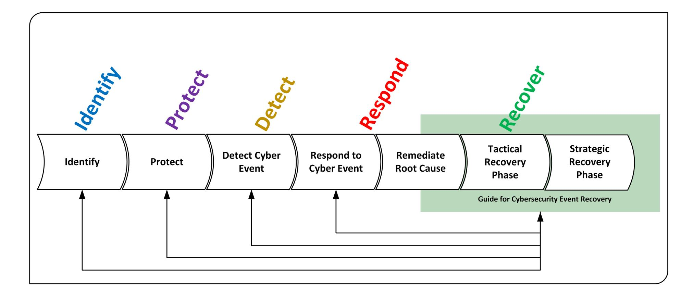

{0}------------------------------------------------

# **NIST Special Publication 800-184**

# **Guide for Cybersecurity Event Recovery**

Michael Bartock Jeffrey Cichonski Murugiah Souppaya Matthew Smith Greg Witte Karen Scarfone

This publication is available free of charge from: https://doi.org/10.6028/NIST.SP.800-184

C O M P U T E R S E C U R I T Y

{1}------------------------------------------------

# **NIST Special Publication 800-184**

# **Guide for Cybersecurity Event Recovery**

*Information Technology Laboratory*

Michael Bartock Jeffrey Cichonski Murugiah Souppaya *Applied Cybersecurity Division Computer Security Division Information Technology Laboratory*

*Annapolis Junction, MD*

Matthew Smith Karen Scarfone Greg Witte *Scarfone Cybersecurity G2, Inc. Clifton, VA*

> This publication is available free of charge from: https://doi.org/10.6028/NIST.SP.800-184

> > December 2016

U.S. Department of Commerce *Penny Pritzker, Secretary*

National Institute of Standards and Technology *Willie May, Under Secretary of Commerce for Standards and Technology and Director*

{2}------------------------------------------------

# **Authority**

This publication has been developed by NIST in accordance with its statutory responsibilities under the Federal Information Security Modernization Act (FISMA) of 2014, 44 U.S.C. § 3551 *et seq.*, Public Law (P.L.) 113-283. NIST is responsible for developing information security standards and guidelines, including minimum requirements for federal information systems, but such standards and guidelines shall not apply to national security systems without the express approval of appropriate federal officials exercising policy authority over such systems. This guideline is consistent with the requirements of the Office of Management and Budget (OMB) Circular A-130.

Nothing in this publication should be taken to contradict the standards and guidelines made mandatory and binding on federal agencies by the Secretary of Commerce under statutory authority. Nor should these guidelines be interpreted as altering or superseding the existing authorities of the Secretary of Commerce, Director of the OMB, or any other federal official. This publication may be used by nongovernmental organizations on a voluntary basis and is not subject to copyright in the United States. Attribution would, however, be appreciated by NIST.

National Institute of Standards and Technology Special Publication 800-184 Natl. Inst. Stand. Technol. Spec. Publ. 800-184, 53 pages (December 2016) CODEN: NSPUE2

> This publication is available free of charge from: https://doi.org/10.6028/NIST.SP.800-184

Certain commercial entities, equipment, or materials may be identified in this document in order to describe an experimental procedure or concept adequately. Such identification is not intended to imply recommendation or endorsement by NIST, nor is it intended to imply that the entities, materials, or equipment are necessarily the best available for the purpose.

There may be references in this publication to other publications currently under development by NIST in accordance with its assigned statutory responsibilities. The information in this publication, including concepts and methodologies, may be used by federal agencies even before the completion of such companion publications. Thus, until each publication is completed, current requirements, guidelines, and procedures, where they exist, remain operative. For planning and transition purposes, federal agencies may wish to closely follow the development of these new publications by NIST.

Organizations are encouraged to review all draft publications during public comment periods and provide feedback to NIST. Many NIST cybersecurity publications, other than the ones noted above, are available at [http://csrc.nist.gov/publications.](http://csrc.nist.gov/publications)

#### **Comments on this publication may be submitted to:**

National Institute of Standards and Technology Attn: Computer Security Division, Information Technology Laboratory 100 Bureau Drive (Mail Stop 8930) Gaithersburg, MD 20899-8930 Email: [csf-recover@nist.gov](mailto:csf-recover@nist.gov)

All comments are subject to release under the Freedom of Information Act (FOIA).

{3}------------------------------------------------

# **Reports on Computer Systems Technology**

The Information Technology Laboratory (ITL) at the National Institute of Standards and Technology (NIST) promotes the U.S. economy and public welfare by providing technical leadership for the Nation's measurement and standards infrastructure. ITL develops tests, test methods, reference data, proof of concept implementations, and technical analyses to advance the development and productive use of information technology. ITL's responsibilities include the development of management, administrative, technical, and physical standards and guidelines for the cost-effective security and privacy of other than national security-related information in federal information systems. The Special Publication 800-series reports on ITL's research, guidelines, and outreach efforts in information system security, and its collaborative activities with industry, government, and academic organizations.

#### **Abstract**

In light of an increasing number of cybersecurity events, organizations can improve resilience by ensuring that their risk management processes include comprehensive recovery planning. Identifying and prioritizing organization resources helps to guide effective plans and realistic test scenarios. This preparation enables rapid recovery from incidents when they occur and helps to minimize the impact on the organization and its constituents. Additionally, continually improving recovery planning by learning lessons from past events, including those of other organizations, helps to ensure the continuity of important mission functions. This publication provides tactical and strategic guidance regarding the planning, playbook developing, testing, and improvement of recovery planning. It also provides an example scenario that demonstrates guidance and informative metrics that may be helpful for improving resilience of information systems.

#### **Keywords**

cyber event; cybersecurity; Cybersecurity Framework (CSF); Cybersecurity National Action Plan (CNAP); Cybersecurity Strategy and Implementation Plan (CSIP); metrics; planning; recovery; resilience

{4}------------------------------------------------

#### **Acknowledgments**

The authors wish to thank their colleagues from NIST and organizations in the public and private sectors who contributed comments at the NIST workshops, reviewed drafts of this document, and contributed to its technical content. In particular, we wish to thank Andrew Harris and Mark Simos from Microsoft and Christopher Butera from US-CERT. The authors would also like to acknowledge Jon Boyens, Sean Brooks, Jim Foti, Naomi Lefkovitz, and Adam Sedgewick of NIST.

#### **Trademark Information**

All trademarks or registered trademarks belong to their respective organizations.

{5}------------------------------------------------

# **Table of Contents**

| Exe                             | cutive                                                     | Summary                                                                                                                                                                                                                                                                                                        | VI                                                                                             |
|---------------------------------|------------------------------------------------------------|----------------------------------------------------------------------------------------------------------------------------------------------------------------------------------------------------------------------------------------------------------------------------------------------------------------|------------------------------------------------------------------------------------------------|
| 1.                              | Intro                                                      | duction                                                                                                                                                                                                                                                                                                        | 1                                                                                              |
|                                 | 1.1 1.2 1.3 1.4                                   | Background Purpose and Scope Audience Document Structure                                                                                                                                                                                                                                                       | 2 2                                                                                         |
| 2.                              | Planr                                                      | ning for Cyber Event Recovery                                                                                                                                                                                                                                                                                  | 4                                                                                              |
|                                 | 2.1 2.2 2.3 2.4 2.5 2.6                     | Enterprise Resiliency Recovery Planning Prerequisites Recovery Plan                                                                                                                                                                                                                                            | 6 7 9 .10 .11 .12                                                               |
| 3.                              | Cont                                                       | inuous Improvement                                                                                                                                                                                                                                                                                             | .15                                                                                            |
|                                 | 3.1 3.2 3.3                                          | Validating Recovery Capabilities                                                                                                                                                                                                                                                                               | . 16                                                                                           |
| 4.                              | Dooo                                                       | wory Motrice                                                                                                                                                                                                                                                                                                   | 10                                                                                             |
| ₹.                              | Reco                                                       | very Metrics                                                                                                                                                                                                                                                                                                   | . 13                                                                                           |
| <b>5</b> .                      |                                                            | ling the Playbook                                                                                                                                                                                                                                                                                              |                                                                                                |
|                                 | Build                                                      |                                                                                                                                                                                                                                                                                                                | .21                                                                                            |
| 5.                              | Build                                                      | ling the Playbook                                                                                                                                                                                                                                                                                              | .24 .25 .25 .26 .28 .28                                                         |
| 5.                              | <b>An E</b> : 6.1 6.2                                      | Ing the Playbook  xample of a Data Breach Cyber Event Recovery Scenario  Pre-Conditions Required for Effective Recovery  Tactical Recovery Phase  6.2.1 Initiation  6.2.2 Execution  6.2.3 Termination  Strategic Recovery Phase  6.3.1 Planning and Execution  6.3.2 Metrics                                  | .24 .25 .25 .26 .28 .28 .28                                                  |
| <ul><li>5.</li><li>6.</li></ul> | 8uild An E: 6.1 6.2 6.3 An E: 7.1 7.2 | Ing the Playbook  xample of a Data Breach Cyber Event Recovery Scenario  Pre-Conditions Required for Effective Recovery  Tactical Recovery Phase  6.2.1 Initiation  6.2.2 Execution  6.2.3 Termination  Strategic Recovery Phase  6.3.1 Planning and Execution  6.3.2 Metrics  6.3.3 Recovery Plan Improvement | .24 .25 .25 .26 .28 .29 .29 .30 .31 .32 .32 .33 .34 .34 |

{6}------------------------------------------------

#### **List of Appendices**

| Appendix A— | 36                                                               |    |
|-------------|------------------------------------------------------------------|----|
| A.1         | Pre-Conditions Required for Effective Recovery                   | 36 |
| A.2         | Tactical Recovery Phase 36                                    |    |
|             | A.2.1 Initiation 36                                        |    |
|             | A.2.2 Execution36                                             |    |
|             | A.2.3 Termination37                                           |    |
| A.3         | Strategic Recovery Phase 37                                   |    |
|             | A.3.1 Planning and Execution37                                |    |
|             | A.3.2 Metrics 37                                           |    |
|             | A.3.3 Recovery Plan Improvement 38                         |    |
| Appendix B— | CSF Core Components and SP 800-53r4 Controls Supporting Recovery | 39 |
| Appendix C— | Acronyms and Other Abbreviations43                               |    |
| Appendix D— | References 44                                                 |    |

{7}------------------------------------------------

# **Executive Summary**

The number of major cyber events continues to increase sharply every year, taking advantage of weaknesses in processes and people as well as technologies.[1](#page-7-1) There has been widespread recognition that some of these cybersecurity (cyber) events cannot be stopped and solely focusing on preventing cyber events from occurring is a flawed approach. Organizations should improve their prevention capabilities with modern technology and tools while augmenting their cyber event detection and response capabilities.

In 2015, members of the Federal Government reviewed cybersecurity capabilities and, as documented in the Cybersecurity Strategy and Implementation Plan (CSIP) [\[2\],](#page-51-1) identified significant inconsistencies in cyber event response capabilities among federal agencies. The CSIP stated that agencies must improve their response capabilities. Although there are existing federal policies, standards, and guidelines on cyber event handling, none of them focuses solely on improving cybersecurity recovery capabilities, and the fundamental information is not captured in a single document. The previous recovery content tends to be spread out in documents such as security, contingency, disaster recovery, and business continuity plans.

Recovery is one part of the enterprise risk management process lifecycle; for example, the *Framework for Improving Critical Infrastructure Cybersecurity* [\[3\],](#page-51-2) better known as the Cybersecurity Framework (CSF), defines five functions: Identify, Protect, Detect, Respond, and Recover.[2](#page-7-2) These functions are all critical for a complete defense. At a more fundamental level, the capabilities in the Recover function have a significant effect across the organization by providing realistic data for improving other capabilities. Recovery can be described in two phases focused on separate tactical and strategic outcomes. The immediate tactical recovery phase is largely achieved through the execution of the recovery playbook planned prior to the incident (with input from Detect and other CSF functions as required). The second phase is more strategic, and it focuses on the continuous improvement of all the CSF functions to mitigate the likelihood and impact of future incidents (based on the lessons learned from the incident as well as from other organization and industry practices).

This document is not an operational playbook; it provides guidance to help organizations plan and prepare recovery from a cyber event and integrate the processes and procedures into their enterprise risk management plans. This document is not intended to be used by organizations responding to an active cyber event, but as a guide to develop recovery plans in the form of customized playbooks. As referred to in this document, a playbook is an action plan that documents an actionable set of steps an organization can follow to successfully recover from a cyber event. While many fundamental activities are similar for organizations of different sizes and from different industry sectors, each playbook can focus on a unique type of cyber event and can be organization-specific, tailored to fit the dependencies of its people, processes, and technologies. If an active cyber event is discovered, organizations - including those that do not have in-house expertise to execute a playbook - can seek assistance from a trustworthy external party with experience in incident response and recovery, such as through the Department of Homeland Security (DHS) or an Information Sharing and Analysis Organization (ISAO), or a commercial managed security services provider.

1 For more information on the number of cyber events occurring within federal agencies, see Government Accountability Office

(GAO) 15-714, September 201[5 \[1\].](#page-51-3) 2 Throughout this paper, there are references to the five CSF functions to help organize the material. CSF is one of many informative references that organizations might use to prepare for recovery.

{8}------------------------------------------------

# **1. Introduction**

#### **1.1 Background**

The Cybersecurity Strategy and Implementation Plan (CSIP) [\[2\]](#page-51-1) defines *recover* as "the development and implementation of plans, processes, and procedures for recovery and full restoration, in a timely manner, of any capabilities or services that are impaired due to a cyber event." NIST Special Publication (SP) 800- 61[5] defines an event as "any observable occurrence in a system or network", while an incident is defined as a violation of acceptable policies, or security policies and best practices. Examples of incidents that are provided in NIST SP 800-61 are akin to the cyber event scenarios defined in the CSIP with a nuance that a *cyber event* is a specific cybersecurity incident or set of related cybersecurity incidents that result in the successful compromise of one or more information systems. Therefore, this document treats the term "cyber event" the same as the term "incident" and uses them interchangeably.

In the simplest cases, recovering from a cyber event might involve a system administrator rebuilding a system or restoring data from a backup. But in most cases, recovery is far more complex, involving combinations of people, processes, and technologies. The status of recovery is usually better expressed as a gradient, with different degrees of progress toward recovery at any given time for different systems or system components, than a binary state of recovered or not recovered.

Recovery is one part of the enterprise risk management process lifecycle; for example, the *Framework for Improving Critical Infrastructure Cybersecurity* [\[3\],](#page-51-2) better known as the Cybersecurity Framework (CSF), defines five functions: Identify, Protect, Detect, Respond, and Recover.[3](#page-8-2) These functions are all critical for a complete defense. At a more fundamental level, the capabilities in the Recover function have a significant effect across the organization by providing realistic data for improving other capabilities . Recovery can be described in two phases focused on separate tactical and strategic outcomes. The immediate tactical recovery phase is largely achieved through the execution of the recovery playbook created prior to a cyber event (with input from Detect and other CSF functions as required). The second phase is more strategic, and it focuses on the continuous improvement of all the CSF functions to mitigate the likelihood and impact of future incidents (based on the lessons learned from the incident as well as from other organizations and industry practices).

In 2015, the Federal Government identified significant inconsistencies in cyber event response capabilities among federal agencies. The CSIP stated that agencies must improve their response capabilities. Although there are existing federal policies, standards, and guidelines on cyber event handling, none of them has focused solely on improving cybersecurity recovery capabilities, and the fundamental information is not captured in a single document. The previous recovery content tends to be spread out in documents such as security, contingency, disaster recovery, and business continuity plans.

Organizations used to focus their information security efforts on cyber event protection, but adversaries have modified their attack techniques to make protection much more difficult, including taking advantage of weaknesses in processes and people as well as technologies. The number of cyber events continues to increase sharply every year leading to a widespread recognition that some cyber events cannot be stopped. [4](#page-8-3) As a result of this risk recognition, organizations have started to improve their prevention capabilities with modern technology and tools while augmenting their cyber event detection and response capabilities.

3 Ibid. 4 For more information on the number of cyber events occurring within federal agencies, see Government Accountability Office (GAO) 15-714, September 201[5 \[1\].](#page-51-3)

{9}------------------------------------------------

The increased emphasis on detection and response leads to a greater awareness of and desire for cyber event recovery. If the assumption is that cyber events will happen, then recovery from those cyber events will also be needed. Recovery has also become more important to organizations because of the dependence on information technology (IT) for providing core business capabilities and meeting organizational missions. Organizations need to be prepared to resume normal operations in a secure and timely fashion when cyber events occur.

Every organization has experienced some instances of cyber events and performed corresponding recovery actions. Recovery brings together numerous processes and activities throughout the organization, such as business continuity and disaster recovery planning and plan execution. All planning and documents relating to cybersecurity event recovery can be included in the organization's existing overall disaster recovery or contingency plan as discussed in Section 2.2 of NIST SP 800-34 Revision 1.[5](#page-9-2)

#### **1.2 Purpose and Scope**

The purpose of this document is to support organizations in a technology-neutral way in improving their cyber event recovery plans, processes, and procedures, with the goal of resuming normal operations more quickly. This document extends, and does not replace, existing federal guidelines regarding incident response by providing actionable information specifically on preparing for cyber event recovery and achieving continuous improvement of recovery capabilities. It points readers to existing guidance for recovery of information technology.[6](#page-9-3)

While the scope of this document is US federal agencies, the information provided should be useful to any organization in any industry sector that wishes to have a more flexible and comprehensive approach to recovery.

This document is not an operational playbook, but provides guidance to help organizations plan and prepare to recover from a cyber event and integrate the processes and procedures into their enterprise risk management plan. It is not intended to be used by organizations responding to an active cyber event, but as a guide to develop their recovery plan in the form of customized playbooks prior to the active event. As referred to in this document, a playbook is a plan that documents an actionable set of steps an organization can follow to successfully recover from a cyber event. While many fundamental activities are similar for organizations of different size and industry sector, each playbook can focus on a unique type of cyber event and an organization's specific and tailored needs to fit the dependencies of its people, processes, and technology. If an active cyber event is discovered, organizations that do not have in-house expertise to execute a playbook can seek assistance from a trustworthy external party with experience in incident response and recovery, such as through the Department of Homeland Security (DHS) or an Information Sharing and Analysis Organization (ISAO), or a commercial security services provider.

# **1.3 Audience**

This document is intended for individuals with decision making responsibilities related to cyber event recovery. Examples include chief information officers (CIOs), chief information security officers (CISOs), ISAOs, commercial security services providers, and authorizing officials for systems.

5 NIST SP 800-34 Revision 1, *Contingency Planning Guide for Federal Information Systems* [6], describes a recovery phase as "action for recovery teams to restore system operations at an alternate site or using contingency capabilities."

6 Many organizations are also highly dependent upon Operational Technology (OT), including Industrial Control System (ICS) and other Cyber-Physical System (CPS) components, for delivery of services. This white paper is primarily focused upon IT, but the considerations provided may apply to OT and may be useful for planning and execution of OT recovery activities and also the future application of other types of technology, such as that described as the "Internet of Things".

{10}------------------------------------------------

#### **1.4 Document Structure**

The remainder of the document is structured as follows:

- Section [2](#page-11-0) describes the need for effective recovery planning in advance of a cyber event. The section provides information about improving enterprise resiliency, recovery processes and procedures, recovery communications, and insight sharing.
- Section [3](#page-22-0) provides guidance for achieving continuous improvement of the organization's recovery processes and security posture. It emphasizes the need to validate recovery capabilities using a variety of techniques, including asking personnel for feedback on recovery plans, policies, and procedures, and periodically conducting exercises and tests that address real-world recovery.
- Section [4](#page-26-0) gives examples of recovery metrics that may help organizations to measure and monitor their recovery performance over time.
- Section [5](#page-28-0) summarizes the recommendations introduced in earlier sections to develop a recovery playbook which is composed of tactical and strategic phases.
- Section [6](#page-31-0) provides an example of a data breach cyber event recovery scenario that demonstrates the application of guidance in earlier sections.
- Section [7](#page-37-0) presents a second example covering a ransomware event recovery scenario.
- [Appendix A—i](#page-43-0)ncludes a checklist of recovery actions.
- [Appendix B—p](#page-46-0)rovides mappings from the recovery processes and activities to the Cybersecurity Framework and related NIST SP 800-53 security controls.
- [Appendix C—p](#page-50-0)rovides a list of acronyms and abbreviations that appear in the document.
- [Appendix D—i](#page-51-0)ncludes a list of references that provide additional information for the reader.

{11}------------------------------------------------

# **2. Planning for Cyber Event Recovery**

Effective planning is a critical component of an organization's preparedness for cyber event recovery. As part of an ongoing organizational information security program, recovery planning enables participants to understand system dependencies; critical personnel identities such as crisis management and incident management roles; arrangements for alternate communication channels, services, and facilities; and many other elements of business continuity. Planning also enables the organization to explore "what if" scenarios, which might be largely based on recent cyber events that have negatively impacted other organizations, in order to develop customized playbooks. Thinking about each scenario helps the organization to evaluate the potential impact, planned response activities, and resulting recovery processes long before an actual cyber event takes place. These exercises help identify gaps that can be addressed before a crisis situation, reducing their business impact. Such scenarios also help to exercise both technical and non-technical aspects of recovery such as personnel considerations, legal concerns, and facility issues.

This section describes the importance of cyber event recovery planning, including its integration throughout security operations. This section also provides guidance for improving cyber event recovery planning. The primary purpose of this guidance is to help organizations be better prepared to develop a plan and playbooks to recover from cyber events and thus have greater resiliency. Section [5](#page-28-0) provides guidance on developing a playbook, while Section [6](#page-31-0) provides a playbook example.

#### **2.1 Enterprise Resiliency**

As IT has become increasingly pervasive, nearly every organization has become highly dependent upon it for delivery of services. Recovering normal operations for these services after a cyber event is often not a binary activity. Organizations must understand how to be resilient, planning how to operate in a diminished capacity or restore services over time based on services' relative priorities. The DHS Risk Lexicon [\[4\]](#page-51-4) defines resilience as the "ability to resist, absorb, recover from or successfully adapt to adversity or a change in conditions." Taking resiliency into consideration throughout the enterprise security lifecycle, everything from planning technology acquisitions based on standards-based systems engineering processes as described in the NIST SP 800-160 [\[18\]](#page-52-0) and developing procedures to executing recovery and restoration efforts, is critical to minimizing the impact of a cyber event upon an organization. This lifecycle is likely to contain similar elements across most organizations, although the scale and activities within each element may differ depending upon the size and resources of the enterprise.

While this document is primarily focused on recovering from a cybersecurity event, it is important to understand that a Cyber Incident Response Plan (CIRP)[7](#page-11-2) should be developed as part of a larger Business Continuity Plan (BCP). The BCP may include other plans and procedures for ensuring minimal impact to business functions, for example Disaster Recovery Plans and Crisis Communication plans. NIST SP 800- 61 Revision 2 defines CIRPs as the documents that "establish procedures to address cyber attacks against an organization's information system(s)." Many publications, including NIST SP 800-34 [\[6\]](#page-51-5), provide high-level requirements for recovering a single information system or set of systems from natural and manmade events and touch on Cyber Incident Response Plan. There is a clear need for organizations to be fully prepared to recover from significant cyber events that impact their core business functions and their ability to support their mission.

7 NIST SP 800-61 Revision 2, *Computer Security Incident Handling Guide* [\[5\],](#page-51-6) provides guidance on establishing a cyber incident response capability and plan.

{12}------------------------------------------------

The categories of the CSF Identify function are particularly useful for planning, testing, and implementing the organization's recovery strategy, including asset management, business environment, governance, risk assessment, and risk management strategy. Among the first steps in planning the recovery strategy is to identify and document the key personnel who will be responsible for defining the recovery criteria and associated plans, and to ensure that all these personnel understand their roles and responsibilities. Note that there may be multiple levels of stakeholders and roles—each organizational tier may need to identify key stakeholders. Responsibilities of these stakeholders may be quite different for a cyber event as compared to a physical event (e.g., a natural disaster).

Each organization has a broad array of assets (e.g., people, information, infrastructure, facilities, hosted services) that enable the governance, management, and use of IT to accomplish the enterprise mission. For recovery planning and execution, the organization needs a reliable source of information regarding its people, process, and technology assets, and the assets of external partners that are connected to or associated with enterprise resources. The organization should create and maintain a complete inventory as reflected in a configuration management database for large organizations or at a minimum a list of the assets that enable it to achieve its mission, along with all dependencies among these assets. The organization should also give consideration as to how the impacts of hosted services, such as cloud computing, may affect the organization's capabilities. This understanding may be informed by several existing planning documents, including Business Impact Analysis (BIA) assessments, Service/Operational Level Agreements (SLAs/OLAs), and Dependency Maps with a particular focus on security dependencies[8](#page-12-0) .

While all assets are valuable, they do not all have the same potential impact to the organization if they become unavailable or experience reduced capability. The organization should document and maintain the categorizations of its people, process, and technology assets based upon their relative importance. The prioritization of assets is critical, given that many agencies and organizations do not have sufficient resources to protect all assets to the same level of rigor and must prioritize the assets which must be recovered to support the mission.

Many federal information systems are already categorized based upon the criteria in Federal Information Processing Standard (FIPS) 199 [7] and FIPS 200 [17]; organizations can add to this by categorizing their other assets as well. Prioritizing resources by their relative importance to meeting the organization's mission objectives is an important driver for determining the sequence and timeline for restoration activities during or after a cyber event. This prioritization also helps the organization to consider categories of recovery events, including cyber events, and to plan appropriate mitigation steps for each category.

Understanding recovery objectives relies upon understanding the interdependencies among resources. For example, it is frequently necessary to recover an identity or authentication server before recovering files, messaging services, and data stored and processed on servers across the infrastructure. There may also be less obvious dependencies, such as a person taking the result of a computation from system A and mailing it to someone else, who then manually enters it into system B. These dependencies need to be considered when setting objectives for recovery time and establishing the sequence for recovering systems.

Furthermore, these dependencies should be categorized by organizational value. Other considerations include applicable regulatory, legal, environmental, and operational requirements. These relationships should be mapped to understand how the organization's critical services are dependent on a tiered

 8 From a privacy perspective, the organization may include an inventory of personally identifiable information leveraging NIST SP 800-53 Revision 4, *Security and Privacy Controls for Federal Information Systems and Organizations* [\[9\],](#page-51-7) Appendix J or a catalog of relevant privacy impact assessments to help organizations understand the scope of potential privacy risks during or after a cyber event.

{13}------------------------------------------------

structure of support. For example, an organization's electronic mail services may be dependent on Lightweight Directory Access Protocol (LDAP) services. If an event causes the LDAP services to be degraded, then mail services will likewise be degraded. Similarly, there may be acquisition dependency considerations (alternate facilities, backup communication lines, spare equipment, staffing surge support) that should be included in the planning. By understanding how each service affects the organization's mission or business, staff can prioritize recovery efforts to best optimize resilience.

# **2.2 Recovery Planning Prerequisites**

The Cybersecurity Framework (CSF) provides a high-level mechanism for an organization to understand and improve its security posture by building upon capabilities that have already been implemented. The framework functions Identify, Detect, Protect, and Respond all work together in a concurrent manner and directly inform the Recover function. Information gathered and understood in the Identify function can provide a substantial amount of understanding about the organization's systems and the dependencies they require in order to provide business functions to support the mission.

Much of the planning and documentation for recovering from a cybersecurity event needs to be in place before the event occurs. The Identify function of the CSF suggests the organization identify critical systems which are central to the organization's mission that must be recovered first as part of the Response activity. These assets should be identified and assessed prior to an incident in the Identify activity so that the assets and the security dependencies are well understood and correctly prioritized in the recovery guidance and playbook(s).

Planning may be informed by threat modeling, as described in draft NIST SP 800-154, *Guide to Data-Centric System Threat Modeling* [\[8\].](#page-51-8) This publication describes this activity as "a form of risk assessment that models aspects of the attack and defense sides of a particular logical entity, such as a piece of data, an application, a host, a system, or an environment. The fundamental principle underlying threat modeling is that there are always limited resources for security and it is necessary to determine how to use those limited resources effectively." The outcome of the threat model exercise helps the organization identify grouping of data, applications, and systems with various level of priorities and criticality. This results in a functional and security dependency map that can help the organization's risk management team prioritize the implementation of adequate security protection mechanism, the incident response team react efficiently during a cyber event and identify the root cause when possible, and the recovery team return the business capabilities in a prioritized and orderly manner.

Due to the sensitive information that may be included in a recovery plan, an organization should treat it and protect with the same due care as an information system security plan. Additionally, organizations should evaluate the use of containment principles to isolate access to business resources that do not need to be closely integrated with key resources. An example of this containment would be to restrict production workstations used to browse the internet and access email from accessing or managing key assets.

Other proactive recovery assessments should help identify and enable the understanding of security dependencies. These recovery assessments may also lead the organization to discover something in their systems that is new or was previously undocumented. This allows the response team to understand the key components that define the organization's root(s) of trust in any operational environment:

• Organizations should have a good understanding of the system boundaries, trust relationships, and identities that exist in their environment. Without clear definition and understanding of identities, it will be difficult to be confident in the effectiveness of a recovery. For example, if a directory is recovered but an adversary has access to an account to manage it, then the adversary 

{14}------------------------------------------------

can persist access despite the efforts expended during the recovery. The adversary can use any security dependency to persist, such as a service account with administrative privileges, a forgotten/undocumented administrative account, an authorized management tool with installed agents, or a public key infrastructure component used for authentication.

- Once an organization has a handle on the identities in its environment, it must ensure that it has the proper access controls applied to them, especially in regards to the management and control of the infrastructure. Without well-defined and maintained access control, an organization cannot have full confidence that its infrastructure is properly secured. For example, if after recovery an adversary can still access the infrastructure that manages an organization's environment, then the adversary can make changes and exploit the organization again. It is critical that proper access controls are in place for the management of an organization's infrastructure.
- Data integrity is the key driver and leads to confidence of the data. The organization has implemented sound processes and tools to protect the integrity of the mission-critical data and the control and management of the infrastructure data. This will include mechanisms to validate, backup, and replicate the data, and monitor and detect changes based on the organization-defined frequency. Once trust in the management and control data has been established, then the focus can shift to the integrity of the business, customer, employee, and partner data.

Without a good understanding of the functional and security dependencies, any tailored recovery plan is less likely to be effective at disrupting and eradicating the adversary.

# **2.3 Recovery Plan**

A critical component of cyber event recovery is having guidance and playbooks that support the asset prioritizations and recovery objectives identified in Section [2.1](#page-11-1) and [2.2.](#page-13-0) This aligns with the first category of the CSF's Recover function: Recovery Planning (RC.RP). Recovery planning includes the development of processes and procedures that are flexible enough to ensure timely restoration of systems and other assets affected by future cyber events, and also comprehensive enough to have modular components for frequently used procedures represented in a playbook, such as reestablishing control of accounts and systems from advanced adversaries. The recommendations presented in this section cover selected aspects of recovery process and procedures planning; the fictional scenarios in Section [6](#page-31-0) illustrate how those are helpful during actual recovery activity.

#### **2.3.1 Planning Document Development**

A recovery plan[9](#page-14-2) provides a method to document and maintain specific strategies and decisions regarding the approved means for implementing and conducting business recovery processes. NIST SP 800-53 Revision 4, *Security and Privacy Controls for Federal Information Systems and Organizations* [\[9\],](#page-51-7) includes recovery-relevant controls that apply to all federal systems.

While the details of a recovery plan need to be developed by each organization, a typical recovery plan includes the following topics:

• **Service level agreements** – Relevant service/operational/organization level agreement details – Information about existing written commitments to provide a particular level of service (e.g.,

 9 NIST SP 800-34 Revision 1, *Contingency Planning Guide for Federal Information Systems* [6], defines a Cyber Incident Response Plan as a set of "procedures to enable security personnel to identify, mitigate, and recover from cyber attacks against an organization's information system(s)." The recovery plan is part of a cyber incident response plan with a concentration on the recovery element.

{15}------------------------------------------------

availability percentage, maximum allowable downtime, guaranteed bandwidth provision). This may include pre-established external engagement contract support that can assist and augment the organization's recovery team in the event of a major cyber event.

- **Authority** Documented name and point of contact information for two or more management staff members who may activate the plan.
- **Recovery team membership** Point of contact information for designated members of the team who have reviewed, exercised, and are prepared to implement the plan.
- **Specific recovery details and procedures** Documented system details that apply to the given information system, with diagrams where applicable. These details may prescribe specific recovery activities to be performed by the recovery team, including application restoration details or methods to activate alternate means of processing (e.g., backup servers, failover site).
- **Out of band communications**  Ability to communicate with critical business, IT, and IT security stakeholders, including external parties like incident response and recovery teams, without using existing production systems, which are frequently monitored by advanced adversaries.
- **Communication plan** Any specific notification and/or escalation procedures that apply to this information system. As an example, some systems impact users outside of the organization, and legal, public relations, and human resources personnel may need to be engaged to manage expectations and information disclosure about the incident and recovery progress.
- **Off-site storage details** Details regarding any arrangement for storing specific records or media at an offline or offsite location. This is particularly critical given the credible threat of ransomware that encrypts data and holds the decryption key hostage for payment.
- **Operational workarounds** Approved workaround procedures if the information system is not able to be restored within the recovery time objective (RTO).
- **Facility recovery details** Information relevant to resilience of a physical facility such as an office location or a data center. Such details might include personnel notification processes, alternate location information, and communications circuit details.
- **Infrastructure, hardware, and software** Details regarding access to the infrastructure, hardware, and software to provide intermediary services used during the recovery process. Examples include an identity management system, a recovery network, a messaging system, and a staging system to validate the integrity of recovered data from backups and restore the system in order to instantiate trust in the infrastructure.

Cyber event recovery planning may be documented in a recovery plan and/or other organizational plans. For example, NIST SP 800-37 Revision 1, *Guide for Applying the Risk Management Framework to Federal Information Systems: A Security Life Cycle Approach* [\[10\],](#page-51-9) describes system security planning documents that may have useful information for recovery planning purposes. NIST SP 800-34 Revision 1, *Contingency Planning Guide for Federal Information Systems* [\[6\]](#page-51-5), details various types of contingency plans, pointing out that "information system contingency planning represents a broad scope of activities designed to sustain and recover critical system services following an emergency event." The intention of cyber event recovery planning is not to duplicate all of this information in another document, but to ensure that all necessary information is documented, readily accessible, and actionable.

{16}------------------------------------------------

# **2.3.2 Process and Procedure Development**

In accordance with the approved organization-wide information security program, the organization should develop and implement the actual recovery processes that will help ensure timely restoration of capabilities or services affected by cyber events.

An approach to this may incorporate:

- Recovery guidance and playbook with major phases to include procedures, stages, and welldefined exit criteria for each stage, such as notification of key stakeholders
- Specific technical processes and procedures that are expected to be used during a recovery

This allows for both a flexible approach that can adapt to different situations as well as the required technical specificity to ensure key actions are carried out in a high quality manner. Procedures should be automated[10](#page-16-1) as much as possible in order to reduce errors in a challenging operating environment, which is typical of recovery operations.

Based upon the catalog of services, infrastructures, and applications, and the recovery objectives defined, the recovery planning team should determine specific continuity requirements in order to identify the possible strategic business and technical options. The team may also be able to identify ways in which automation could aid in the recovery. Engaging stakeholders in this activity helps ensure that recovery participants understand their roles, and it also improves repeatability and consistency of recovery processes. In addition to building and improving rapport among the team members, involvement in this modeling will remind business system owners of the realistic threats and help integrate cybersecurity thinking.

Part of the recovery planning should include organizational trade-off discussions regarding resource requirements and costs for each strategic technical recovery option. The discussions provide an opportunity to consider how achieving resilience objectives (e.g., 99.99 % uptime) occurs at a resource cost (e.g., cost of available spare equipment and/or facilities.) Such discussions may be aided by the application of recovery metrics, described in Section 4 of this document. Additionally, the criticality of the asset to the organization should be included in the trade-off discussions.

Recovery plans should identify members of the organization's privacy team who will be responsible for identifying potential risks to individuals who may be affected by the cyber event[11.](#page-16-2) The identified privacy team members will be responsible for engaging with the security team to understand the full scope of the events' potential impact so individuals may be notified and remediated as required by statue, policy, or as would otherwise mitigate the negative impact of the event.

Recovery teams should integrate specific recovery procedures based upon the processes used within the organization. Such procedures may include technical actions such as restoring systems from clean backups, rebuilding systems from scratch, enhancing the identity management system and trust boundary, replacing compromised files with clean versions, installing patches, remediating software misconfigurations, securing applications and services, changing passwords, increasing the intensity of monitoring, and tightening network perimeter security (e.g., firewall rulesets, boundary router access control lists). Procedures may also include non-technical actions that involve changes to business

 10 NIST SP 800-40 Revision 3, *Guide to Enterprise Patch Management Technologies* [19] and NIST SP 800-70 Revision 3, *National Checklist Program for IT Products – Guidelines for Checklist Users and Developers* [20], provide guidance on automating the software and configuration management of systems.

11 Organizations as part of their privacy program may include a cross-reference to this function.

{17}------------------------------------------------

processes, human behavior and knowledge, and IT policies and procedures. It is important that the organization take these defined procedures seriously and not purposefully or unknowingly take shortcuts during their execution.

Effective recovery will include ongoing use and improvement of both technical and non-technical actions.

# **2.3.3 Determination of Recovery Initiation/Termination Criteria and Goals**

Depending on the severity and nature of the incident and recovery operations, the decision to initiate recovery processes may be made not by the recovery personnel, but by the organization's incident response team, CISO, business owners, and/or other personnel involved in decision making for addressing cyber events. Agreement and coordination of this criteria, especially involving timing, is critically important to achieving successful recovery. For example, starting recovery before the investigation response has achieved key understandings of the adversary's footprint and objectives may alert the adversary that an infiltration has been discovered, triggering a change in tactics that would defeat the recovery operation. Such a change could mean the loss of indicators and visibility of the adversary's activities, resulting in a reduced ability to discover impacted resources.

A coordinated response will help achieve a balance between effective forensic investigation and business service restoration. This balance is a unique decision based on the needs to identify the root cause analysis and to rapidly restore services and systems to operational status. To achieve that balance, the organization should formally define and document the conditions under which the recovery plan is to be invoked, who has the authority to invoke the plan, and how recovery personnel will be notified of the need for recovery activities to be performed.

As described above, full recovery or restoration may not be the immediate goal. Achieving resilience might mean that a given resource is able to continue operation in a diminished capacity, such as during a denial of service attack or a destructive attack on a group of systems. Resilience can also mean containing adversary access or damage to a contained set of resources or limiting reputational and brand damage of the organization. Organizational recovery teams may be able to learn from internal resources (or through external partners, such as the United States Computer Emergency Readiness Team (US-CERT) or Sector Coordinating Councils) specific methods for successfully absorbing or adapting to adverse conditions. Such a solution might include an alternative or a partial restoration as an interim measure. In complex situations, recovery may have many levels, and while operational status should be progressing back to normal, occasionally a step backward will be needed before achieving other steps forward, such as taking a key system offline to perform recovery measures before conducting recovery actions on other systems.

Organizations should define key milestones for meeting intermediate recovery goals and terminating active recovery efforts. Frequently, it is not possible or practical to achieve 100 % recovery in a timely fashion, such as determining which offline virtual machine images have been compromised and should be replaced with clean backups. It is recommended to put security controls in place to automatically identify affected systems in the future and alert personnel so that recovery and any other necessary actions can be initiated. An organization in such a situation might declare this recovery operation to be terminated when this automated system is in place, pending discovery of another active incident. Section [4](#page-26-0) provides a more detailed discussion of metrics related to recovery initiation, intermediate goals, and termination.

#### **2.3.4 Root Cause and Containment Strategy Determination**

Identifying the root cause(s) of a cyber event is important to planning the best response, containment, and recovery actions. While knowing the full root cause is always desirable, adversaries are incentivized to hide their methods, so discovering the full root cause is not always achievable.

Before execution of recovery efforts start in earnest, the investigation should achieve two key objectives

{18}------------------------------------------------

to be considered sufficient:

- Basic knowledge of the adversary's objective (e.g., gain access to intellectual property, financial data, customer and partner data, disrupt organization business functions for monetary gain, etc.) or incident response subject matter expert (SME) confirmation that the adversary's objective is not apparent.
- High confidence in either understanding the technical mechanisms the adversary is using to persist access to the environment or confirming non-persistent intent. It is imperative that the full extent of the cyber event is understood and strong containment mechanisms are in place to detect that the attackers are no longer present or in control of the IT resources. Most targeted attacks that are part of a large campaign involve multiple types of well-concealed persistence mechanisms.

Without these root cause determination objectives being met during the investigation, the recovery procedure has a high chance of being ineffective or inefficient and the organization will incur additional cost. The investigation for the final root cause may continue in parallel to the recovery after these objectives have been met, as the adversary may change or evolve tactics and persistence mechanisms. Note that some scenarios such as ransomware or extortion threats of system and information destruction may impose a deadline on achieving these objectives, forcing the organization to use incomplete information for the objectives in the recovery.

Organizations should adjust their incident detection and response policies, processes, and procedures to emphasize sufficient root cause determination. While the search for the root cause may continue separately, there are instances where recovery will be initiated before that cause is determined. Effective recovery depends on ensuring that all portions of a cyber event are addressed, so if one or more vulnerabilities or misconfigurations are overlooked (e.g., compromised account credentials used to restore critical services), the recovery personnel may inadvertently leave weaknesses in place that adversaries can immediately exploit again. Elimination and containment failures might permit portions of a compromise to remain on the organization's systems, causing further damage without the adversary even acting. The investigation of root cause can also be valuable in identifying previously unknown systemic weaknesses that should be addressed throughout the enterprise. An example of this is a previously unknown access path to an asset via a security dependency like a system management tool or security scanning service account.

Once a resource is targeted and attacked, it is often targeted again or other resources within the organization are attacked in a similar manner. Once organizations detect an attack, they should deploy protection, detection, and response processes to other interconnected systems in the organization, as well as the affected systems, to minimize the attack's propagation across the infrastructure. The speed with which this response needs to occur should be set through business risk-based decision making that takes into account the potential negative impact of disrupting operations versus the risk of the systems being compromised. Containment can help isolate the adversary from the untrusted assets and potentially isolate compromised assets from recovered or rebuilt assets.

#### **2.4 Recovery Communications**

Planning for and implementing effective recovery communications are critical success factors for achieving organization resilience. These are included in CSF category Recovery Communications (RC.CO), which has the following described outcome: "Restoration activities are coordinated with internal and external parties, such as coordinating centers, Internet Service Providers, owners of attacking systems, victims, other CSIRTs [computer security incident response teams], and vendors." Recovery communications includes non-technical aspects of resilience such as management of public relation issues 

{19}------------------------------------------------

and organizational reputation.

The recovery team should develop a comprehensive recovery communications plan. Effective communications planning is important for numerous reasons, including:

- Statements made in the heat of recovery may have significant legal and/or regulatory. Understanding, from a legal perspective, what may be said to whom and when will require extensive planning and advance discussion. There may be specific requirements regarding what may be released to outside organizations, including the media. Timing will also be an important factor as investigations are still ongoing.
- Key stakeholders need to know sufficient information so that they understand their responsibilities during the recovery stage and can maintain confidence in the recovery team's abilities. Planning, testing, and ongoing improvement will help define the appropriate messaging for each type of stakeholder (e.g., external partner, customer, manager).
- Individual members of the recovery team may not have sufficient information to provide accurate and timely reporting of recovery status and activities. For example, while the team may understand that a recovery time objective will be missed, members may not be aware of a manual workaround being implemented. Agreement in advance on who will report information to whom is a critical aspect of the communications plan.

For these reasons, teams need to plan in advance for recovery communications and ensure that lessons learned from internal and external events are integrated into the improvement processes. Communications considerations should be fully integrated into recovery policies, plans, processes, and procedures. The recovery team should consider establishing guidelines regarding what information may and/or should be shared with each type of constituent. For example, providing too much information or inaccurate information may do more harm than good, and insufficient information sharing could lead to further harm to the organization's reputation. When updates are being delivered to enable decision making, the updates should contain the necessary actionable information that will help the organization more effectively reach the ultimate goal of resuming normal operations and maintaining that state.

Recovery teams should consider specific types of stakeholders in regard to communications planning, including internal personnel (various IT teams, incident response personnel, senior management, business unit owners, legal, human resources, privacy representatives, board of directors, etc.) and external parties (CSIRTs, business partners, customers, regulators, credit reporting agencies, law enforcement, press/media, analysts, insurers, etc.) The organization should ensure that current points of contact for each type of stakeholder are established and maintained to minimize delays during the recovery process. The recovery team should interact professionally in activities such as developing the recovery plan and exercising the playbooks before a cyber event to break down the cultural, political, and technical barriers that may exist between the different team members. It is important to note that for effective recovery, communications should occur continuously across the tactical and strategic phases.

Some methods of communications may be unavailable (or undesirable) during recovery activities. For example, if the network has been compromised, email communications may be unwise. Recovery teams should be prepared for alternate means of secure and reliable communication, and should practice such scenarios as part of ongoing improvement.

#### **2.5 Sharing Recovery Insights**

As stated in NIST SP 800-150, *Guide to Cyber Threat Information Sharing* [\[11\],](#page-51-10) organizations are

{20}------------------------------------------------

encouraged to share actionable information about cyber threats with other organizations. For example, an organization that has just recovered from a major new threat could document its recovery steps and share them with others so that those organizations could recover from the same threat or similar threats much more quickly, or in some cases could detect cyber events more quickly and perhaps prevent them altogether. Sharing recovery insights has become necessary in response to adversaries sharing their methodologies, tools, and other information with each other for mutual benefit. Organizations can similarly benefit by sharing recovery information.

Organizations should not share recovery information until after they have performed the necessary planning and preparation activities, such as defining their information sharing goals, objectives, and scope, and establishing information sharing rules. See NIST SP 800-150 for more information on planning and preparatory activities.

# **2.6 Summary of Recommendations**

The following are the key recommendations presented throughout Section [2:](#page-11-0)

- Understand how to be prepared for resilience at all times, planning how to operate in a diminished capacity or restore services over time based on their relative priorities.
- Identify and document the key personnel who will be responsible for defining recovery criteria and associated plans, and ensure these personnel understand their roles and responsibilities.
- Create and maintain a list of people, process, and technology assets that enable the organization to achieve its mission (including external resources), along with all dependencies among these assets. Document and maintain categorizations for these assets based on their relative importance and interdependencies to enable prioritization of recovery efforts.
- Develop comprehensive plan(s) for recovery that support the prioritizations and recovery objectives, and use the plans as the basis of developing recovery processes and procedures that ensure timely restoration of systems and other assets affected by future cyber events. The plan(s) should ensure that underlying assumptions (e.g., availability of core services) will not undermine recovery, and that processes and procedures address both technical and non-technical activity affecting people, processes, and technologies.
- Develop, implement, and practice the defined recovery processes, based upon the organization's recovery requirements, to ensure timely recovery team coordination and restoration of capabilities or services affected by cyber events.
- Formally define and document the conditions under which the recovery plan is to be invoked, who has the authority to invoke the plan, and how recovery personnel will be notified of the need for recovery activities to be performed.
- Define key milestones for meeting intermediate recovery goals and terminating active recovery efforts.
- Adjust incident detection and response policies, processes, and procedures to ensure that recovery does not hinder effective response (e.g., by alerting an adversary or by erroneously destroying forensic evidence).
- Develop a comprehensive recovery communications plan, and fully integrate communications

{21}------------------------------------------------

considerations into recovery policies, plans, processes, and procedures.

• Clearly define recovery communication goals, objectives, and scope, including information sharing rules and methods. Based upon this communications plan, consider sharing actionable information about cyber threats with relevant organizations, such as those described in NIST SP 800-150.

{22}------------------------------------------------

# **3. Continuous Improvement**

Cyber event recovery planning is not a one-time activity. The plans, policies, and procedures created for recovery should be continually improved by addressing lessons learned during recovery efforts[12](#page-22-2) and by periodically validating the recovery capabilities themselves. This is reflected in CSF category Improvements (RC.IM), which states, **"**Recovery planning and processes are improved by incorporating lessons learned into future activities." Similarly, recovery should be utilized as a mechanism for identifying weaknesses in the organization's technologies, processes, and people that should be addressed to improve the organization's security posture and the ability to meet its mission. Since the outcome of these types of identifications will help define long-term goals for the organization, continuous improvement of the recovery plan is part of the strategic phase. This section provides insights into improving an organization's recovery capabilities and security posture.

#### **3.1 Validating Recovery Capabilities**

Validating recovery capabilities refers to ensuring that the technologies, processes, and people involved in recovery efforts are well prepared to work together to effectively and efficiently recover normal business operations from disruptive cyber events.

There are several ways to validate recovery capabilities. The simplest method is to ask all of the individuals who may be involved in response efforts to provide input on the recovery plans, policies, and procedures. Although these documents should have already taken into account pertinent information and insights provided by key business owners and IT staff members, many other individuals may have responsibilities involving response efforts that are affected by these documents. In particular, the individuals who will participate in hands-on recovery efforts should have the opportunity to review the recovery documents related to their areas of responsibility so that they can comment on how realistic the expectations are and what their primary concerns are. For example, an individual may lack the tools or training to restore a particular system within the expected time period. The appropriate personnel should then decide how to best address these concerns.

In some cases, recovery concerns can be addressed by conducting exercises or tests. Exercises and tests should be performed periodically to help the organization's real-world recovery capabilities, building organizational "muscle memory" and identifying areas for improvement. Although it is tempting to avoid tests in favor of exercises because of the possible disruption that tests can cause to operations, it is generally much better to identify an unexpected operational issue during testing than during an actual cyber event because more resources should be available to address the issue during testing. Some organizations have found it helpful to intentionally introduce system failures as part of daily operations to ensure that participants are always resilient and ready for a cyber event. An example of a potential test is disconnecting a critical system with high availability to ensure that failover occurs gracefully, with operations automatically switching to a hot spare which is an active failover system in standby mode. Organizations should use a combination of exercises and tests for recovery capability validation.

Recovery teams should practice a realistic scenario in a tabletop exercise where at least one member of each team is part of the adversary group that provides realistic obstacles and complexities for the defense and recovery team to navigate. Another practice is to use a newly discovered cyber event scenario described in the news to develop or customize a playbook exercising the recovery plan documentation. Adding realism like this will proactively increase the visibility of gaps in the organization that can be resolved as part of continuous improvement to increase effectiveness in a real incident recovery.

 12 For more information on this, see the CSF Recovery function named Improvements (RC.IM).

{23}------------------------------------------------

Exercises and tests which are executed at an organization-defined frequency can provide several benefits related to recovery, including the following:

- The exercise or test itself will remind participants of known risk scenarios and help them consider what actions they might take in a real cyber event.
- Exercise and test results will help confirm or refute assumptions that were made in planning, particularly regarding how realistic the recovery targets are.
- Exercises and tests will spotlight gaps and inefficiencies in the processes that should be addressed to ensure smooth responses in real-world cyber events.
- Personnel, especially those with new recovery-related responsibilities, will receive training through exercises and tests in recovery practices.

Recovery exercises and tests should be formally implemented at a frequency that makes sense for the organization, and the results should be recorded to help inform organizational cybersecurity activities. Organizations should set realistic objectives, with specific roles and responsibilities, for exercising and testing recovery capabilities to verify their ability to adequately manage cybersecurity risk. It may also be helpful to get assistance from a trustworthy external party with experience in such exercises, such as through DHS, a local Infragard chapter, or an Information Sharing and Analysis Organization (ISAO).

An important aspect of improving recovery processes and procedures is a realistic and comprehensive review of the results of the exercise or test. By understanding what worked and what did not, the recovery planners can identify areas for improvement, not only in the specific plan or playbook being tested but also in the planning processes themselves. A holistic post exercise review is important for validating, reviewing, and revising competencies related to the organization's recovery capability. Any concerns or deficiencies should be tracked and remediated to optimize the success of the plan.

The following resources may be useful for gaining a better understanding of exercises and tests:

- NIST SP 800-84, *Guide to Test, Training, and Exercise Programs for IT Plans and Capabilities* [\[13\];](#page-52-1)
- NIST SP 800-34 Revision 1, *Contingency Planning Guide for Federal Information Systems* [\[6\]](#page-51-5);
- NIST SP 800-115, *Technical Guide to Information Security Testing and Assessment* [\[14\];](#page-52-2)
- NIST SP 800-61 Revision 2, *Computer Security Incident Handling Guide* [\[5\].](#page-51-6)

### **3.2 Improving Recovery and Security Capabilities**

In addition to identifying potential improvements to recovery capabilities through reviews by personnel and periodic tests and exercises, organizations should also identify improvements from lessons learned during actual cyber event recovery actions. These lessons learned help drive improvements not only to recovery itself, but also to the organization's security operations, policies, etc. Figure 3-1 illustrates that the primary focus of the document is the Recover function with continuous feedback mechanisms into the other four functions of the Cybersecurity Framework. In addition, the Recover function depends on the information described in the other functions.

{24}------------------------------------------------

**Figure 3-1: NIST SP 800-184 Guide for Cybersecurity Event Recovery Relationship with the NIST CSF**

Improvements to the recovery capabilities themselves should be documented by measuring and analyzing current and past cyber event recovery efforts to identify the most important issues, such as major problems that caused significant delays in recovery or minor problems that occurred repeatedly. To gain the most benefit, analysis should consider events' impact on the enterprise rather than just on individual systems. The organization should then determine how available resources can best be spent to address these issues. In some cases, the organization can adapt approaches to these issues previously taken by other organizations.

Improving the organization's security posture by analyzing lessons learned from actual cyber event recovery actions takes two forms. Short-term improvements can be achieved through identification of low-level issues, such as a particular system not being patched often enough, which enabled it to be compromised while other similar systems stayed secure. Long-term improvements to the organization's security posture can be achieved through identification of high-level issues, such as providing inputs on commonly seen system security issues to organizational risk assessment and management activities, which in turn inform the enterprise information security program. This can lead to the acquisition of new security technologies, the redesign of operational processes, or the initiation of other major changes to how the organization conducts and secures its operations.

The individuals participating in recovery actions may find it challenging to balance the need to restore normal operations quickly with the need to immediately document issues they encounter instead of documenting such issues after recovery concludes. The former expedites the resolution of the current cyber event and could aid in future investigation, while the latter may help expedite the resolution of future cyber events and potentially prevent some cyber events from ever occurring in the first place. Individuals should strive to document issues to the extent necessary during recovery so that they have enough information to expand on their documentation later in the recovery process or immediately after recovery is achieved. The longer individuals wait to document lessons learned, the less likely it is that the lessons learned will be documented accurately and completely.

{25}------------------------------------------------

#### **3.3 Summary of Recommendations**

The following are the key recommendations presented throughout Section [3:](#page-22-0)

- Gather feedback for the recovery plans and capabilities from those stakeholders that will have a role in recovery activities.
- Formally implement cyber event recovery exercises and tests at a frequency that makes sense for the organization, recording the results to help inform organizational cybersecurity activities. These events should include realistic objectives, with specific roles and responsibilities, for exercising and testing recovery capabilities to verify the ability to adequately manage cybersecurity risk.
- Conduct comprehensive post exercise debriefs to ensure the organization analyzes and incorporates lessons learned into the related plans and processes. In addition, validating preexercise assumptions and improving employee competencies relating to the organization's recovery capability are important outcomes of these exercises.
- Continually improve cyber event recovery plans, policies, and procedures by addressing lessons learned during recovery efforts and by periodically validating the recovery capabilities themselves.
- Use recovery as a mechanism for identifying weaknesses in the organization's technologies, processes, and people that should be addressed to improve the organization's security posture and the ability to meet its mission.
- At a minimum, validate recovery capabilities by soliciting input from individuals with recovery responsibilities and conducting exercises and tests.
- Strive to have recovery personnel document issues to the extent necessary during recovery so that they have enough information to expand on their documentation later in the recovery process or immediately after recovery is achieved.

{26}------------------------------------------------

# **4. Recovery Metrics**

Throughout the process of planning, exercising, and executing recovery activities as described in earlier sections, the collection of specific metrics may help improve recovery and inform continuous improvement. It may be beneficial to determine these metrics in advance, both to understand what should be measured and to implement the processes to collect relevant data. This process also requires the ability to determine where the metrics that have been identified can be most beneficial to the recovery activity and identify which activities cannot be measured in an accurate and repeatable way. It is important that restoring business functions remains the primary task at hand, while the collection of recovery metrics is designed in a way such that the metric data is an automated output of the recovery activities. Metrics can be detrimental to recovery if they hinder the recovery process, cause a rushed/incomplete investigation, or create additional obstacles for recovery team efficiency. It is critical to ensure metrics provide useful information that supports actionable improvement without being detrimental to recovery.

The majority of recovery metrics will be used to improve the quality of recovery actions within the organization, such as to improve specific aspects or to perform a cost/benefit analysis of a particular approach. Other metrics might be used as part of compulsory reporting (such as in response to an inquiry from an external authority) or for information sharing (such as might be responsibly shared with US-CERT). In each case, determining in advance what will be measured and which measures may be shared will aid the organization's recovery efforts. As with the previously described communications plans, sharing of metrics must be done with caution and should occur only with the approval of appropriate organizational stakeholders, including senior managers, legal representatives, and regulatory compliance personnel.

Organizations should decide when and how to use metrics during recovery because they can be either a benefit or a hindrance. For well-defined and repeatable activities, metrics can help measure progress as well as provide valuable feedback to improve the activity. For example, the replacement of user laptops because of a malware infection may be commonplace and routine within a large organization. The organization will have a well-defined process for recovering from the malware infection on a single laptop, and metrics can be used to measure the time, cost, and other important information. On the other hand, for events that are anomalous there might not be well-defined recovery procedures, so there would not be predefined metrics to use. In this case, it could be unclear which metrics to gather, or metrics could be misused, leading to a false sense of recovery. Because of these different types of situations, organizations should give careful consideration as to when and how they will use recovery metrics.

Organizations also face major incidents where adversaries gain full administrative access to many IT assets in the enterprise during the course of the attack. The value of metrics in these cases may be diminished, as these types of events should be rare once effective defenses and responses are implemented. In the most extreme instances, a cyber event may be so severe that the issue is unrecoverable and results in the loss of the financial viability of the organization itself. While such occasions may be rare, it may be helpful for the organization to determine a "point of no return".

[Table 4-1](#page-27-0) provides some considerations regarding aspects of cyber event recovery, describing a general area to be measured and some example metrics (e.g., cost, time, damage assessment, number of incidents). It is important to note that resilience is a highly subjective area of cybersecurity, so comparing recovery metrics among organizations or even within a single entity may produce misleading results.

{27}------------------------------------------------

**Table 4-1: Example Recovery Metrics**

| Recovery Area                                                                                                                                                       | Example Metrics                                                                                                                                                                                                                                                                                                                                                                                                                                                                                                                                                                                                                           |
|---------------------------------------------------------------------------------------------------------------------------------------------------------------------|-------------------------------------------------------------------------------------------------------------------------------------------------------------------------------------------------------------------------------------------------------------------------------------------------------------------------------------------------------------------------------------------------------------------------------------------------------------------------------------------------------------------------------------------------------------------------------------------------------------------------------------------|
| Assessing Incident Damage and Cost Consider both direct and indirect costs; recovery damage and costs may be important evidence as part of a legal action. | • Costs due to the loss of competitive edge from the release of proprietary or sensitive information [dollar] • Legal costs [dollar] • Hardware, software, and labor costs to execute the recovery plan [dollar] • Costs relating to business disruption such as system downtime; for example, lost employee productivity, lost sales, etc. [time in hours, days, or weeks] • Other consequential damages such as loss of brand reputation or customer trust from the release of customer data [number of current or future business partner, advertiser, and customer losses in dollars] |
| Organizational Risk Assessment Improvement                                                                                                                          | • Frequency and/or scope of recovery exercises and tests [number of times per year] • Number of significant IT-related incidents that were not identified in risk assessment [number of incidents] • System dependencies accurately identified [number of assets not identified] • Identified gaps during the recovery exercises or tests that help inform and drive the improvement in the other functions of the CSF [number of gaps]                                                                                                                                                               |
| Quality of Recovery Activities                                                                                                                                      | • Number of business disruptions due to IT service incidents [number of business functions] • Percent of business stakeholders satisfied that IT service delivery meets agreed-upon service levels [customer satisfaction] • Percent of IT services meeting uptime requirements [service level agreement] • Percent of successful and timely restoration from backup or alternate media copies [number of systems and times] • Number of recovery events that have achieved recovery objectives [number of successful recovery events]                                                 |

{28}------------------------------------------------

# **5. Building the Playbook**

The information gathering and planning activities the organization has conducted provide a substantial understanding of the mission supporting information systems as well as any dependencies, and intricacies surrounding them (e.g., recovery prioritization documentation as defined in the system threat modeling). A foundational understanding of all of this information is critical for business functions to remain operational when operating under normal conditions. In the event of a cybersecurity event, this information becomes even more paramount, and these processes and procedures need to be presented in an actionable manner in order to effectively restore business functions quickly and holistically. The playbook is a way to express tasks and processes required to recover from an event in a way that provides actions and milestones specifically relevant for each organization's systems.

This section summarizes the recommendations described in the previous sections. The goal is to provide a consolidated list of items that can be included in a playbook. The recovery activities can be organized in two phases. The initial tactical recovery phase is largely achieved through the execution of the playbook developed as part of the planning efforts for cyber event recovery, which not only prepares the organization for the recovery actions themselves, but also depends on the activities performed during the protection, detection, and response functions of the enterprise risk management lifecycle process. The actions can be organized into initiation, execution, and termination stages. The second phase is more strategic; it focuses on the continuous improvement of the organization risk management process lifecycle driven by the recovery activities. The second phase focuses on reducing the organization's attack surface and minimizing cyber threats. The actions can be further organized into the planning and execution stage, metrics stage, and recovery improvement stage. The lessons learned identify the gaps and help inform the planning and execution of the other CSF functions.

The tactical recovery phase will depend on performing the following actions before and during the cyber event:

- Create and maintain a list of the people, process, and technology assets that enable the organization to achieve its mission (including external resources), along with all dependencies among these assets. The creation of a map or diagram of the dependencies will help in planning the order of restoration.
- Document and maintain categorizations for all assets based on their relative importance and interdependencies to confidently prioritize recovery efforts.
- Identify and document the key personnel who will be responsible for defining recovery criteria and associated plans, and ensure these personnel understand their roles and responsibilities.
- Ensure that the correct underlying assumptions (e.g., availability of core services, trustworthiness of directory services, adversary's motivation is well understood) are made during the initiation of the recovery in order to prevent an ineffective recovery.
- Define and document the conditions under which the recovery plan is to be invoked, who has the authority to invoke the plan, and how recovery personnel will be notified of the need for recovery activities to be performed. Additionally, define key milestones, intermediate recovery goals, and criteria for finalizing active recovery efforts.

{29}------------------------------------------------

- Ensure initial restoration planning addresses the need for the recovery efforts to be tactical in nature in order to prevent recovery from negatively affecting the incident response (e.g., by alerting an adversary or by erroneously destroying forensic evidence).
- Examine the cyber event to determine the extent that recovery must be carried out, and initiate the corresponding plan for recovery.
- Develop a comprehensive recovery communications plan while clearly defining recovery communication goals, objectives, and scope, including information sharing rules and methods. Based upon this communications plan, consider sharing actionable information about cyber threats with relevant organizations, such as those described in NIST SP 800-150.
- Gather feedback for the recovery plans and capabilities from those stakeholders that will have a role in recovery activities.
- Formally implement cyber event recovery exercises and tests at a frequency acceptable for the organization. These events should include realistic objectives, with specific roles and responsibilities, for exercising and testing recovery capabilities. Based on the results of these recovery activities the organizations should update cyber event recovery plans, policies, and procedures. They should also use the information learned from recovery activities to improve the organization's cybersecurity posture, ensuring the ability to meet its mission.
- Vet recovery capabilities by soliciting input from individuals with relevant responsibilities and conducting exercises and tests.
- Execute the tailored playbook that has been created during the cyber event.
- Continually document issues during recovery so that there is enough information to expand on documentation and improve capabilities later in the recovery process or immediately after recovery is achieved.
- Implement monitoring for events, signatures, etc. to alert the organization about known malicious behavior. Monitor the artifacts and evidence found during detection and response. This monitoring will extend into the strategic phase.

The strategic recovery phase will depend on performing the following actions before and during the cyber event:

- Develop and implement an improvement plan for the organization's overall security posture based on tactical phase results.
- Continually execute communications plans to inform appropriate internal and external stakeholders of the progress of the recovery effort. Internal stakeholders should be notified of any improvements that need to be made to people, processes, and procedures, while external stakeholders will need to be notified of any impact to them.
- Review defined milestones, goals, and metrics gathered throughout the tactical phase. This information can help quantify the effectiveness of the recovery effort, as well as identify areas that need improvement.

{30}------------------------------------------------

These actions are general recommendations that can be tailored in order to fit each organization's specific requirements. The next section applies these recommendations in a data breach cyber event recovery scenario.

{31}------------------------------------------------

# **6. An Example of a Data Breach Cyber Event Recovery Scenario**

This section presents a scenario that illustrates how, using the guidelines provided in earlier sections of this document, organizations can effectively recover from cyber events and subsequently use information gained during recovery to improve cybersecurity processes. The scenario is fictional and it is not meant to be all inclusive or exhaustive of cyber events, but to provide a means to demonstrate how to apply the document's recommendations and utilize the playbook to recover from a data breach.

This scenario describes an organization that has experienced a breach of its network. Anomalous activity was detected during recent log reviews, indicating that a malicious actor used stolen credentials to gain access to one or more critical business and IT infrastructure systems. While the method of entry and the specific type of attack are not directly relevant to the recovery team, it is important to note that such a breach jeopardizes the trustworthiness of the business unit and IT management systems.

For this scenario, network monitoring equipment confirms that a significant amount of personally identifiable information (PII) has been exfiltrated. Additionally, there is the possibility that customer financial data has been stolen.

#### **6.1 Pre-Conditions Required for Effective Recovery**

The organization understood the need to be prepared and conducted planning to operate in a diminished condition. The organization has developed a playbook to recover from a data breach and have followed a set of defined activities, which include:

- A description of a set of formal recovery processes to use if the organization experiences a data breach.
- A list of critical people, facilities, technical components, and external services that are required to achieve the organization's mission(s). The playbook enumerates the data breach recovery team personnel, including the incident response team, the IT operational team, which includes application owners, managers, and administrators, system and network administrators, security and privacy officers, general counsel, public relations, law enforcement organization, information sharing organization, and external service providers as required.
- A current set of functional and security dependency maps focused on systems that process and store organizational information, in particular the key assets. These maps identified in the playbook include context to help the recovery team select the order of restoration priority.
- Metrics and other factors used to effectively plan for restoration priority may include:
  - Legal costs;
  - Hardware, software, and labor costs;
  - Amount of lost revenue due to business downtime to include loss of existing and future business opportunities;
  - Instantiation of new services to restore customers' trust;
  - Accuracy of the dependencies maps;

{32}------------------------------------------------

- Gaps identified in the playbook;
- Internal users, external business partners, and customers satisfaction;
- Service level agreements with internal business teams;
- Confidence level around quality of the backups; and
- Quality of the overall recovery plan and process used to develop the data breach playbook.
- A set of authorized resources and tested tools that have been used in the exercises.
- A comprehensive recovery communications plan with fully integrated internal and external communications considerations, including information sharing criteria informed by recommendations in NIST SP 800-150 [\[11\].](#page-51-10) It includes specific elements that are included in the content to communicate with the management team including the board, the general counsel, public relations, law enforcement organization, the IT team, the employees, and external service providers.
- Periodic training and exercises were defined and have occurred to validate and restore the components identified in the dependencies maps, in particular key assets such as infrastructure components, critical data stores, and IT security functions from known good states, to ensure timely recovery team coordination and restoration of capabilities or services affected by a data breach event.

Because the organization has formally implemented cyber event recovery exercises and tests with a realistic data breach scenario and clear roles and responsibilities, the organization is prepared to tackle the recovery task with limited assistance from external entities.

#### **6.2 Tactical Recovery Phase**

The following steps summarize the activities of the recovery team in the tactical recovery phase. The data breach playbook is utilized to aid in effective recovery throughout this phase.

#### **6.2.1 Initiation**

- It was determined that network-based communications (e.g., email) may be insecure and cannot be trusted. The team agrees to use in-person meetings and telephone conversations as alternate means of communication.
- The incident response and recovery teams work collaboratively to confirm the adversary's motivation, which was to exfiltrate the organization's subscribers' personal and credit card information. They know what systems process and store this information based on what the organization has defined as high value assets. The collaborative team identifies the adversary's footprint in the infrastructure, command and control channels, and tools and techniques.
- As part of the discovery and investigation process, the impacted resources and the attackers' tactics, techniques, and tools are identified, and the level of confidence is determined that the adversary's activities within the environment are well understood. In this event, the components impacted by the data breach event include the database system, web application system, and

{33}------------------------------------------------

systems used by the application administrators. The original entry point has been identified and compromised users and administrative accounts are identified. This leads to the identification of infrastructure systems that need to be remediated in addition to the systems that are directly impacted.

- The Incident Reponse (IR) team has collected forensics data and works with the recovery team to modify the data breach playbook, leveraging the generic data breach playbook after they have provided a detailed timeline of events.
- The recovery team meets with business owners to discuss the criticality and impact of the data that has been breached during the event. With an understanding of the event, they start with the recovery data breach playbook and modify as necessary. The last known good state of the data is determined based on event date time metrics gathered by the IR team when investigating the cyber event. They work with the application administrators to enable additional security controls within the application to protect the confidentiality and integrity of the data. In this case, the builtin database encryption capability will be enabled and the performance of the application system will be monitored.
- Understanding that initiation of the recovery activities might alert the adversary if the IR team has not fully identified the adversaries' presence within the environment, the recovery team works with the IR team to increase the level of monitoring and strengthen the isolation capabilities. This is accomplished by heightening the network defenses to look for lateral movements based on a set of indicators of compromise that have been generated by the IR team. This helps validate the adversary's presence on impacted systems.
- Based on prioritization of high value assets and system dependencies, the recovery team determines the order in which systems will be restored. The team uses the dependency map and defined metrics, such as how much time each of these systems takes to be recovered, to inform the restoration plan.
- The defined personnel determine that the recovery process is ready to begin because everyone on the team has a good understanding of the situation. All people with responsibility for recovering from a data breach as defined in the pre conditions are informed that the recovery activities have been initiated.
- The identified metrics are recorded and tracked by the responsible parties.

# **6.2.2 Execution**

- The team executes the modified data breach recovery playbook for this particular event. Each system's restoration activity is tracked in order to understand the duration for the system to be fully recovered. Systems are closely tracked to ensure they are not brought online before any systems they are dependent upon. If the dependencies are supporting unimportant functions, then the organization can operate without them for an extended period of time. It's much more important to bring up the critical functions as soon as possible and worry about the unimportant functions later.
- The monitoring and strengthening of the isolation capabilities as part of their containment activities are implemented and are tracked continuously. Additional authorized tools and procedures are enabled to provide visibility and understanding of the attackers' activities based

{34}------------------------------------------------

on the identified set of indicators of compromise to confirm that the attackers are no longer present in the environment.

- The resources and functions are restored based in the identified order defined in the modified data breach recovery playbook. The goal is to re-instantiate trust in the environment in a logical order dictated by the dependency map starting at the infrastructure level and moving up to the application layers. Other actions that are taken include remediating the credential store, user accounts, and access tokens and tightening data flows between the components that were impacted by the breach without impacting the business function.
- Additional security controls defined in the initiation plan are implemented at all layers to strengthen the applications and infrastructure services. Restrict network access, turn on encryption, change application and system configurations, apply software patches, limit users' access rights, etc. are implemented and tested. The last known good state of the data is restored based on the determined timeline.
- The recovery team collaborates with the IR team and external subject matter experts to confirm that the newly rebuilt servers are not susceptible to the original system weaknesses and are ready to be restored to service. The personnel validate the restored assets are fully functional and meet the security posture required by the security team before receiving approval to restore network operations and make the services available. The business owners and analysts begin to conduct user acceptance testing to confirm the restored systems meet the service level agreements the organization has agreed upon before making the system publicly accessible.
- The organization continues to execute its recovery plan, restoring additional business services and communicating with both internal and external stakeholders, in accordance with the pre-existing communications criteria and in coordination with the legal and public affairs offices, regarding the restoration status.
- During restoration, members of the recovery team track the downtime that critical systems and services were unavailable or in a diminished state, comparing the actual outage times with agreed-upon service levels and recovery times. The team also tracks the recovery progress by comparing current metrics with metrics gathered in the criticality identification phase. An example of one of these metrics is what percentage of users were back online compared with the percentage of users that were online at the beginning of the event.
- Organizational managers are advised regarding objectives that may not or will not be accomplished, and the team considers the impact so that proactive actions may take place (e.g., routing traffic to a pre-arranged alternate service provider with pre-approved notification pages.)
- Designated staff document any issues that arise, such as newly identified dependencies, to help expand on documentation later in the recovery process or immediately after recovery is achieved. Indicators of compromise are continuously captured, updated, and documented. Restoration techniques, tools, and procedures are customized and refined for the current cyber event.
- While the services are being restored, other members of the recovery team work with business unit managers and senior leadership, in coordination with representatives from HR and legal, to discuss appropriate notification activities. Using the pre-agreed recovery communications plan, the team drafts notices for employees, for customers affected by financial and/or privacy information leaks, and for the public. As a critical component of this step, additional surge support has been added to the customer support center and customers are kept abreast of the

{35}------------------------------------------------

status of recovery, sharing status accurately while abiding by the pre-agreed decisions regarding what information may be shared with whom, and when. The pre-established secure communication channels with external law enforcement and information sharing organizations are used to share and discuss the detection, response, and recovery steps.

• Additional recovery steps are initialized, including external interactions and services such as prearranged credit monitoring services and additional customer support staff, to help restore confidence and to protect constituents.

#### **6.2.3 Termination**

- The personnel determine that data has been restored to a known good state, the vulnerabilities that were used to access the system have been remediated, and the adversary is no longer in the environment. The recovery team declares the end of the tactical recovery event and confirms, in consultation with business/system owners, that restoration has fully occurred.
- The team stands down and staff return to executing their normal job functions.
- The organization continues to monitor the infrastructure for potential persistency of malicious activities and continue to inform the incident response and recovery teams. The goal is to make sure the organization has fully eradicated the adversary from the infrastructure and has exclusive control of the operational environment.
- The recovery team finalizes the findings, metrics, and lessons learned collected during the event. This can be summarized as a list of items from the playbook that work, things that can be improved, and gaps that need remediated to make the playbook more effective.

# **6.3 Strategic Recovery Phase**

The following steps summarize the activities performed during the strategic recovery phase.

# **6.3.1 Planning and Execution**

- The recovery continues to support the various communication teams as they interact with internal users and public customers.
- The recovery teams close the loop with the external entities such as law enforcement and information sharing organizations who have been involved during the tactical phase.
- A plan is developed to include longer-term goals that have to be met to fully correct the root causes. Some of these improvements include implementing stronger authentication mechanisms, isolating administrative processes from general productivity activities, implementing least privilege principle, using encryption to protect customers' data, and deploying better monitoring capabilities. The team makes long-term recommendations which include first to fully discover and identify sensitive data, in particular personally identifiable data, intellectual property data, and financial data across the entire organization including external hosted services. Second, a data loss prevention technology can be implemented to prevent future leakage of sensitive data by providing visibility and control of the data across the IT infrastructure, in particular at the endpoints, data stores, and gateways of the organization. Finally, the organization needs to develop a policy and process to implement this strategy successfully. These actions will involve vetting and approval from the management, business units, and IT teams, as they will include

{36}------------------------------------------------

changes in the business workflows, IT architecture, and operation of the assets. This plan includes eliminating legacy technology that can no longer be protected adequately, and adopting enhanced and modern protection and detection mechanisms.

• The IT team, with assistance from the recovery team, will start the execution and implementation of the long-term improvement plan once the changes to the architecture and enhanced capabilities have been approved and funded by the organization.

# **6.3.2 Metrics**

- Upon formal completion of the event, the recovery team meets for an after-action review. During that meeting, members of the recovery team consider metrics that were gathered during the event (e.g., review of recovery objective assumptions, efficacy of training, additional plans required).
- The debriefing reviews the efficacy key milestones that were developed in planning activities, including those that identified interim recovery goals, to share with the team. The team reviewed other relevant metrics regarding assumptions made, recovery objective performance, and stakeholder communications achievement.

#### **6.3.3 Recovery Plan Improvement**

- Comparison of the performance of the team during the recovery against the estimated performance defined in the plans enables the organization planners to consider what adjustments should be made to the plans. The organization must continue to always be prepared if there is a recurrence of the issues.
- These post-recovery steps help to continually improve cyber event recovery plans, policies, and procedures by addressing lessons learned during recovery efforts and by periodically validating the recovery capabilities themselves.

{37}------------------------------------------------

# **7. An Example of a Destructive Malware Event Recovery Scenario**

This section presents a scenario that uses the guidelines provided in earlier sections of this document to effectively recover from a cyber event and subsequently use information gained during the recovery process to improve its cybersecurity processes. The scenario is fictional and not meant to be all inclusive or exhaustive of cyber events, but to provide a means to demonstrate how to apply the document's recommendations and utilize the ransomware playbook to recover from a destructive malware attack.

Cyber attacks have continued to evolve, with many now focused on monetary gain. One recent evolution has emerged in the form of ransomware [\[15\].](#page-52-3) Ransomware is a type of malicious attack where the attackers encrypt the organization's critical data, such as personal data or business data, after they have infiltrated the systems, then demand a monetary payment in digital cash formats, such as bitcoin [\[16\].](#page-52-4) The data is inaccessible by the organization, so it disrupts the business workflow and prevents the users and organization from performing their business functions. If the organization or individuals do not pay the attackers, then the data remains encrypted or is deleted. The malware may also discover other systems and data stores to spread to and take additional hostages to repeat the same process.

This scenario describes an organization that has experienced one of these ransomware attacks on its network. The event was discovered when users saw pop-up messages that their data had been encrypted and the only way to regain access is to pay a fee to the attacker. While the method of entry and the specific type of ransomware are not directly relevant to the recovery team, it is important to note that such a breach could compromise the availability of the business unit and IT management systems if the ransomware spreads. The organization has adopted the policy of not paying ransoms, due to concerns of proliferating the criminal business model and a concern that the attackers would not provide the decryption keys after payment.

For this scenario, system monitoring tools confirm that a significant percentage of end user systems have been encrypted by the ransomware. Additionally, there is the possibility that the ransomware could spread to other systems.

#### **7.1 Pre-Conditions Required for Effective Recovery**

The organization understood the need to be prepared and conducted planning to operate in a diminished condition. The ransomware playbook includes the following critical elements:

- A description of a set of formal recovery processes to use if the organization experiences a ransomware attack.
- A list of the critical people, facilities, technical components, and external services that are required to achieve the organization's mission(s). The playbook enumerates the ransomware recovery team personnel, including system administrators, desktop support, backup administrators, managers, general counsel, and public relations personnel as required.
- A current set of functional and security dependency maps that helps to explain the order of restoration priority. These maps should include control, business function, and user systems, with specific attention to systems that store data backups.
- Metrics and other factors used to effectively plan for restoration priority may include:
  - Legal costs;

{38}------------------------------------------------

- Hardware, software, and labor costs;
- Amount of lost revenue due to business downtime to include loss of existing and future business opportunities;
- Instantiation of new services to restore customers' trust;
- Accuracy of the dependencies maps;
- Gaps identified in the playbook;
- Internal users, external business partners, and customers satisfaction;
- Service level agreements with internal business teams;
- Confidence level around quality of the backups; and
- Quality of the overall recovery plan and process used to develop the ransonware attack playbook.
- Metrics needed to effectively plan for restoration priority include: legal, hardware, software, and labor costs; business downtime resulted in lost productivity; loss of existing business and future business opportunities; instantiation of new services to restore customers' trust; accuracy of the dependencies maps; gaps identified in the playbook; internal users and external business partners and customer satisfaction; service level agreement with internal business teams; quality of the backups; and quality of the overall recovery plan and process used to develop the data breach playbook.
- A list backup and restoration tools that have been authorized after being tested in the exercises.
- A comprehensive recovery communications plan with fully integrated internal and external communications considerations. Internal communications will be between members of the recovery team and management for recovery activity and status updates, while external communications will include information sharing criteria informed by recommendations in NIST SP 800-150 [\[11\].](#page-51-10) It includes specific elements that are included in the content to communicate with the management team including the board, the general counsel, public relations, law enforcement organizations, the IT team, the employees, and external service providers.
- Results and lessons learned from periodic trainings and exercises that have occurred to validate successful system restoration capabilities and to ensure timely recovery team coordination.

Because the organization has formally implemented cyber event recovery exercises and tests with realistic scenarios and clear roles and responsibilities, the organization is prepared to tackle the recovery task with limited assistance from external entities.

# **7.2 Tactical Recovery Phase**

The following steps summarize the activities of the recovery team in the tactical recovery phase. The ransomware playbook is utilized in order to aid in the effective recovery throughout this phase.

{39}------------------------------------------------

#### **7.2.1 Initiation**

- It was determined that only user systems were affected and that network-based communications are still trusted. The team agrees to communicate with a combination of in-person meetings, telephone conversations, and email.
- The incident response team works collaboratively with the recovery team to confirm that the adversary's motivation is monetary. The incident response team informs the recovery team that the ransomware attack has only affected a number of end user systems, shares indicators of compromise for the ransomware, and provides specific remediation steps that will be performed as part of the recovery playbook used in this cyber event. This will include procedures for identifying the malware, safely cleaning the system, and strengthening the system and user account posture. The collaborative teams determine that the ransomware attack has not yet affected key assets.
- Knowing that ransomware can spread through an organization and infect backup systems, the recovery team needs to verify their backups have not been encrypted. The team begins a comprehensive inventory and integrity check of all backups to include all backup systems and processes. They identify and map all backup storage devices and enumerate the backup points available for restoration.
- The recovery team has identified the systems that have been infected by the adversary's ransomware campaign and customize the ransomware playbook accordingly in order to isolate them from the rest of the organization's systems. The IR team has collected forensics data and artifacts.
- Based upon the criteria in the ransomware recovery playbook, the defined personnel determine that the recovery process is ready to begin because all members of the team have a good understanding of the situation. All people with responsibilities for recovering from a ransomware attack as defined in the pre-conditions are informed that the recovery activities have been initiated.
- The recovery team sets a goal for recovery measured by percentage of affected systems restored in time increments of 12 hours. These metrics are recorded and tracked by the responsible parties until the recovery is terminated.

# **7.2.2 Execution**

- The recovery team executes the modified ransomware recovery playbook for this particular event. System restoration is tracked to understand the time it takes for 100 percent of affected systems to be recovered.
- In coordination with the incident response team, the recovery playbook is updated to include the time of infection, so that the corresponding backups can be identified and checked for data integrity.
- In order to minimize the likelihood that the ransomware continues to spread throughout the organization, the infected machines are contained to a different network in a coordinated effort to not alarm the attackers during the eradication process and before the recovery process starts. The recovery team begins to restore user systems from the identified backups that have been checked and passed acceptance criteria identified in the playbook.

{40}------------------------------------------------

- The recovery team continues restoration by validating and implementing remediation countermeasures in coordination with the incident response team and other information security personnel to ensure that the underlying system weaknesses are not re-introduced.
- The organization continues to execute its recovery plan, preparing its communication strategy in accordance with the pre-existing communications criteria and in coordination with the legal and public affairs offices regarding the restoration status, as well as the appropriate law enforcement offices.
- During restoration, the recovery team tracks the user systems that were unusable compared with the agreed-upon service levels and recovery times. The team tracks the recovery progress by comparing current metrics with metrics gathered at the beginning of the event. As an example, the percentage of users or systems were back online within 24 hours. Based on the volume of impacted systems and resources available to return the systems and associated data to their original state, the recovery team may provide the impacted users access to alternate systems that have the minimum set of capabilities to allow them to perform their daily functions. This allows the organization to continue to operate with diminished capabilities while full restoration is being performed.
- Designated staff document any issues that arise, and newly identified dependencies, to help expand on documentation later in the recovery process or immediately after recovery is achieved. Indicators of compromise are continuously captured, updated, and documented. Restoration techniques, tools, and procedures are customized and refined for the current cyber event.
- While the user systems are being restored, other members of the recovery team work with business unit managers and senior leadership, in coordination with representatives from HR and legal, to discuss appropriate notification activities. Using the pre-agreed recovery communications plan, the team drafts notices for the appropriate parties. As a critical component of this step, additional surge support has been added to the organization's support center and employees are kept abreast of the status of recovery, sharing status accurately while abiding by the pre-agreed decisions regarding what information may be shared with whom, and when.
- The recovery team asks the organization's security personnel, the incident response team, and external subject matter experts to confirm that the newly restored systems are free from the indicators of compromise and are ready to be returned to service. The team validates the restored assets are fully functional and meet the security posture required by the security team before it receives approval to re-introduce the systems back to normal operation.

#### **7.2.3 Termination**

- The personnel determine that the ransomware no longer persists in the organization, the attack vector that the ransomware exploited has been remediated, and all of the affected user systems have been restored. The personnel declare the end of the tactical recovery event.
- The team stands down and staff returns to executing their normal job functions.
- The organization continues to monitor the infrastructure and user systems for potential persistency of ransomware indicators and continue to inform the incident response and recovery team. The goal is to make sure the organization has fully eradicated the ransomware from the infrastructure and has exclusive control of the operational environment.

{41}------------------------------------------------

• The recovery team finalizes the metrics collected and lessons learned during the event.

#### **7.3 Strategic Recovery Phase**

The following steps summarize the activities performed during the strategic recovery phase.

### **7.3.1 Planning and Execution**

- The recovery continues to support the internal communication teams as they interact within the internal users.
- The recovery teams close the loop with the external entities, such as law enforcement, who have been involved during the tactical phase.
- A plan is developed to include longer-term goals to fully remediate the ransomware and other classes of ransomware. These actions will involve vetting and approval from the management, business units, and IT teams, as they will include changes in the business workflows, personnel training, IT architecture, and operation of the backup systems. This plan includes improving the organization's backup policies and infrastructure by enforcing a regimented backup schedule for all users, including a comprehensive backup infrastructure that provides redundant copies of backups in different physical and offline locations. Deploying application whitelisting technology and implementing container or virtual isolated environment to execute Internet-exposed general purpose client applications such as web, email, and productivity applications will help protect the endpoints from software-based attacks in addition to the traditional countermeasures such as running anti-malware software and patching systems. Adding web and email filtering solutions and intrusion prevention systems help mitigate known common attacks across the organization network. IT security policies and processes will be modified to include regular awareness and training campaigns to ensure employees are aware of phishing attacks that may contain a ransomware payload.
- The IT team, with assistance from the recovery team, will start the execution and implementation of the long-term improvement plan once the changes to the architecture and enhanced capabilities have been approved and funded by the organization.

#### **7.3.2 Metrics**

- Upon formal completion of the event, the recovery team meets for an after-action review. During that meeting, members of the recovery team discuss the metric of percentage of systems restored over time.
- The debriefing reviews the efficacy key milestones that were developed in planning activities, including those that identified interim recovery goals, to share with the team. The team reviewed other relevant metrics regarding assumptions made, recovery objective performance, and stakeholder communications achievement.

#### **7.3.3 Recovery Plan Improvement**

• Comparison of the performance of the team during the recovery against the estimated performance defined in the plans enables the organization planners to consider what adjustments should be made to the plans. For example, adding additional staff to support restoring systems

{42}------------------------------------------------

from backups. The organization must continue to be prepared in case there is a recurrence of the issues.

• These post-recovery steps help to continually improve cyber event recovery plans, policies, and procedures by addressing lessons learned during recovery efforts and by periodically validating the recovery capabilities themselves.

{43}------------------------------------------------

# **Appendix A—Checklist of Elements Included in a Playbook**

This checklist is a set of steps that should be covered in the playbook for a particular cyber event.

# **A.1 Pre-Conditions Required for Effective Recovery**

The organization understood the need to be prepared and conducted planning to operate in a diminished condition. The playbook includes the following critical elements:

- A set of formal recovery processes.
- The criticality of organizational resources (e.g., people, facilities, technical components, external services) that are required to achieve the organization's mission(s).
- Functional and security dependency maps to understand the order of restoration priority.
- A list of technology and personnel who will be responsible for defining and implementing recovery criteria and associated plans.
- A comprehensive recovery communications plan with fully integrated internal and external communications considerations, including information sharing criteria informed by recommendations in NIST SP 800-150 [11].

# **A.2 Tactical Recovery Phase**

The following steps summarize the activities of the recovery team in the tactical recovery phase.

# **A.2.1 Initiation**

- Receive a briefing from the incident response team to understand the extent of the cyber event.
- Determine the criticality and impact of the cyber event.
- Formulate an approach and set of specific actions.
- Heighten monitoring and alerting of the network and systems.
- Understand the adversary's motivation.
- Identify the adversary's footprint on the infrastructure, command and control channels, and tools and techniques.
- Inform all parties that the recovery activities have been initiated.
- Utilize all available information gathered to create the restoration plan.

# **A.2.2 Execution**

• Begin to execute the restoration by validating and implementing remediation countermeasures in coordination with the incident response team and other information security personnel.

{44}------------------------------------------------

- Restore additional business services and communicate the restoration status with predefined parties.
- Track the actual time that critical services were unavailable or diminished, comparing the actual outage with agreed-upon service levels and recovery times.
- Document any issues that arise, any indicators of compromise, and newly identified dependencies.
- Coordinate with representatives from management, senior leadership, HR. and legal to discuss appropriate notification activities.
- Additional recovery steps are initialized, including external interactions and services to restore confidence and to protect constituents.
- Validate the restored assets are fully functional and meet the security posture required by the organization security team.

#### **A.2.3 Termination**

- Determine that termination criteria have been met and declare the end of the tactical recovery event.
- Stand down recovery team and have staff return to their normal job functions.
- Continue to monitor the infrastructure for potential persistency of malicious activities and inform the incident response and recovery team of any evidence.
- Finalize the metrics collected during the event.

#### **A.3 Strategic Recovery Phase**

The following steps summarize the activities performed during the strategic recovery phase.

#### **A.3.1 Planning and Execution**

- Support the various communication teams as they interact with internal users and public customers.
- Close the loop with external entities who have been involved during the tactical phase.
- Develop a plan to correct the root cause of the cyber event.
- Implement changes to strengthen the security posture of the organization.

#### **A.3.2 Metrics**

- After recovery is completed, review metrics that were collected.
- Review achievement of key milestones and assumptions that were made pre-recovery.

{45}------------------------------------------------

#### **A.3.3 Recovery Plan Improvement**

• Use lessons learned from the recovery process to enhance the recovery plan.

{46}------------------------------------------------

#### **Appendix B—CSF Core Components and SP 800-53r4 Controls Supporting Recovery**

This appendix provides mappings from the recovery processes and activities to the Cybersecurity Framework [\[3\]](#page-51-2) and related NIST Special Publication (SP) 800-53 Revision 4 [\[9\]](#page-51-7) security controls.

| Function         | Category                                                                                                                                                                                                                                                                                                  | Subcategory                                                                                                                                                       | SP 800-53r4 Controls                                                                                                                                    |
|------------------|-----------------------------------------------------------------------------------------------------------------------------------------------------------------------------------------------------------------------------------------------------------------------------------------------------------|-------------------------------------------------------------------------------------------------------------------------------------------------------------------|------------------------------------------------------------------------------------------------------------------------------------------------------------|
|                  | Asset Management (ID.AM): The data, personnel, devices, systems, and facilities that enable the organization to achieve business purposes are identified and managed consistent with their relative importance to business objectives and the organization's risk strategy. | ID.AM-3: Organizational communication and data flows are mapped                                                                                             | AC-4, CA-3, CA-9, PL-8                                                                                                                                  |
|                  |                                                                                                                                                                                                                                                                                                           | ID.AM-5: Resources (e.g., hardware, devices, data, and software) are prioritized based on their classification, criticality, and business value | CP-2, RA-2, SA-14, SC-6, PM-8                                                                                                                           |
|                  | Business Environment (ID.BE): The organization's mission, objectives, stakeholders, and activities are understood and prioritized; this information is used to inform cybersecurity roles, responsibilities, and risk management decisions.                                 | ID.BE-2: The organization's place in critical infrastructure and its industry sector is identified and communicated                                | PM-8                                                                                                                                                       |
| IDENTIFY (ID) |                                                                                                                                                                                                                                                                                                           | ID.BE-3: Priorities for organizational mission, objectives, and activities are established and communicated                                           | PM-11, SA-14                                                                                                                                               |
|                  |                                                                                                                                                                                                                                                                                                           | ID.BE-4: Dependencies and critical functions for delivery of critical services are established                                                           | CP-8, PE-9, PE-11, PM-8, SA-14                                                                                                                          |
|                  |                                                                                                                                                                                                                                                                                                           | ID.BE-5: Resilience requirements to support delivery of critical services are established                                                                | CP-2, CP-11, SA-14, SA-13                                                                                                                               |
|                  | Governance (ID.GV): The policies, procedures, and processes to manage and monitor the organization's regulatory, legal, risk, environmental, and operational requirements are understood and inform the management of cybersecurity risk.                                      | ID.GV-1: Organizational information security policy is established                                                                                          | AC-1, AT-1, AU-1, CA-1, CA-5, CA-6, CM-1, CP-1, IA-1, IR 1, MA-1, MP-1, PE-1, PL-1, PL-4, PL-7, PL 9, PM-4, PS-1, RA-1, SA-1, SC-1, SI-1 |

{47}------------------------------------------------

| Function | Category                                                                                                                                                                                                                                                                                             | Subcategory                                                                                                                                                                 | SP 800-53r4 Controls                                        |
|----------|------------------------------------------------------------------------------------------------------------------------------------------------------------------------------------------------------------------------------------------------------------------------------------------------------|-----------------------------------------------------------------------------------------------------------------------------------------------------------------------------|----------------------------------------------------------------|
|          | Risk Assessment (ID.RA): The organization understands the                                                                                                                                                                                                                                      | ID.RA-3: Threats, both internal and external, are identified and documented                                                                                           | RA-3, SI-5, PM-12, PM-16                                    |
|          | cybersecurity risk to organizational operations (including mission, functions, image, or                                                                                                                                                                                                    | ID.RA-4: Potential business impacts and likelihoods are identified                                                                                                    | RA-2, RA-3, PM-9, PM-11, SA-14                              |
|          | reputation), organizational assets, and individuals.                                                                                                                                                                                                                                              | ID.RA-6: Risk responses are identified and prioritized                                                                                                             | PM-4, PM-9                                                     |
|          | Risk Management Strategy (ID.RM): The organization's priorities, constraints, risk tolerances, and assumptions are established and used to support operational risk decisions.                                                                                                  | ID.RM-3: The organization's determination of risk tolerance is informed by its role in critical infrastructure and sector specific risk analysis          | PM-8, PM-9, PM-11, SA-14                                    |
|          | Information Protection Processes and Procedures                                                                                                                                                                                                                                                   | PR.IP-1: A baseline configuration of information technology/industrial control systems is created and maintained                                             | CM-2, CM-3, CM-4, CM-5, CM-6, CM-7, CM-9, SA-10          |
| PROTECT  | (PR.IP): Security policies (that address purpose, scope, roles, responsibilities, management commitment, and coordination among organizational entities), processes, and procedures are maintained and used to manage protection of information systems and assets. | PR.IP-4: Backups of information are conducted, maintained, and tested periodically                                                                                 | CP-4, CP-6, CP-9                                               |
| (PR)     |                                                                                                                                                                                                                                                                                                      | PR.IP-9: Response plans (Incident Response and Business Continuity) and recovery plans (Incident Recovery and Disaster Recovery) are in place and managed | CP-2, CP-7, CP-12, CP-13, IR-7, IR-8, IR 9, IR-10, PE-17 |
|          |                                                                                                                                                                                                                                                                                                      | PR.IP-10: Response and recovery plans are tested                                                                                                                         | CP-4, IR-3, IR-7, PM 14                                     |

{48}------------------------------------------------

| Function        | Category                                                                                                                                                                                             | Subcategory                                                                                                                    | SP 800-53r4 Controls      |
|-----------------|------------------------------------------------------------------------------------------------------------------------------------------------------------------------------------------------------|--------------------------------------------------------------------------------------------------------------------------------|------------------------------|
| DETECT (DE)     | Anomalies and Events (DE.AE): Anomalous activity is detected in a timely manner and the potential impact of events is understood.                                                     | DE.AE-1: A baseline of network operations and expected data flows for users and systems is established and managed | AC-4, CA-3, CM-2, SI-4 |
|                 | Response Planning (RS.RP): Response processes and procedures are executed and maintained, to ensure timely response to detected cybersecurity events.                           | RS.RP-1: Response plan is executed during or after an event                                                              | CP-2, CP-10, IR-4, IR-8   |
| RESPOND (RS) | Communications (RS.CO): Response activities are coordinated with internal and external stakeholders, as appropriate, to include external support from law enforcement agencies. | RS.CO-1: Personnel know their roles and order of operations when a response is needed                                 | CP-2, CP-3, IR-3, IR 8    |
|                 | Improvements (RS.IM): Organizational response activities are improved by incorporating lessons learned from current and previous detection/response activities.                    | RS.IM-1: Response plans incorporate lessons learned                                                                      | CP-2, IR-4, IR-8             |
|                 |                                                                                                                                                                                                      | RS.IM-2: Response strategies are updated                                                                                    | CP-2, IR-4, IR-8             |
| RECOVER (RC) | Recovery Planning (RC.RP): Recovery processes and procedures are executed and maintained to ensure timely restoration of systems or assets affected by cybersecurity events.    | RC.RP-1: Recovery plan is executed during or after an event                                                              | CP-10, IR-4, IR-8            |
|                 | Improvements (RC.IM): Recovery planning and processes are improved by                                                                                                                          | RC.IM-1: Recovery plans incorporate lessons learned                                                                      | CP-2, IR-4, IR-8             |
|                 | incorporating lessons learned into future activities.                                                                                                                                          | RC.IM-2: Recovery strategies are updated                                                                                    | CP-2, IR-4, IR-8             |

{49}------------------------------------------------

| Function                                                                          | Category                                                                                                                 | Subcategory                                       | SP 800-53r4 Controls                        |
|-----------------------------------------------------------------------------------|--------------------------------------------------------------------------------------------------------------------------|---------------------------------------------------|------------------------------------------------|
|                                                                                   | Communications (RC.CO): Restoration                                                                                   | RC.CO-1: Public relations are managed          | [Not currently included in SP 800-53 R4] |
|                                                                                   | activities are coordinated with internal and external parties, such as coordinating centers, Internet Service   | RC.CO-2: Reputation after an event is repaired | [Not currently included in SP 800-53 R4] |
| Providers, owners of attacking systems, victims, other CSIRTs, and vendors. | RC.CO-3: Recovery activities are communicated to internal stakeholders and executive and management teams | CP-2, IR-4                                        |                                                |

{50}------------------------------------------------

# **Appendix C—Acronyms and Other Abbreviations**

Selected acronyms and other abbreviations used in the guide are defined below.

**BIA** Business Impact Analysis **CIO** Chief Information Officer

**CISO** Chief Information Security Officer **CNAP** Cybersecurity National Action Plan

**COBIT** Control Objectives for Information and Related Technology

**CPS** Cyber-Physical System **CSF** Cybersecurity Framework

**CSIP** Cybersecurity Strategy and Implementation Plan **CSIRT** Computer Security Incident Response Team

**DHS** Department of Homeland Security **FBI** Federal Bureau of Investigation

**FIPS** Federal Information Processing Standard **GAO** Government Accountability Office

**HR** Human Resources

**ICS** Industrial Control System

**ISAO** Information Sharing and Analysis Organization

**IT** Information Technology

**ITL** Information Technology Laboratory **LDAP** Lightweight Directory Access Protocol

**NIST** National Institute of Standards and Technology

**OLA** Operations Level Agreement **OT** Operational Technology **PHI** Protected Health Information **PII** Personally Identifiable Information

**RTO** Recovery Time Objective **SLA** Service Level Agreement

**SP** Special Publication

**US-CERT** United States Computer Emergency Readiness Team

{51}------------------------------------------------

# **Appendix D—References**

This appendix lists the references for the document.

- [1] Government Accountability Office (GAO), GAO 15-714, *Federal Information Security: Agencies Need to Correct Weaknesses and Fully Implement Security Programs*, September 2015.<http://www.gao.gov/products/GAO-15-714> [accessed 12/12/16]
- [2] Office of Management and Budget (OMB), *Cybersecurity Strategy and Implementation Plan (CSIP) for the Federal Civilian Government*, OMB Memorandum 16-04, October 30, 2015.<https://www.whitehouse.gov/sites/default/files/omb/memoranda/2016/m-16-04.pdf> [accessed 12/12/16]
- [3] National Institute of Standards and Technology (NIST), *Framework for Improving Critical Infrastructure Cybersecurity,* Version 1.0, February 12, 2014. https://www.nist.gov/sites/default/files/documents/cyberframework/cybersecurityframework-021214.pdf [accessed 12/12/16]
- [4] Department of Homeland Security (DHS), *DHS Risk Lexicon, 2010 Edition*, September 2010. <https://www.dhs.gov/dhs-risk-lexicon> [accessed 12/12/16]
- [5] National Institute of Standards and Technology (NIST), NIST SP 800-61 Revision 2, *Computer Security Incident Handling Guide*, August 2012. <https://doi.org/10.6028/NIST.SP.800-61r2>
- [6] National Institute of Standards and Technology (NIST), NIST SP 800-34 Revision 1, *Contingency Planning Guide for Federal Information Systems*, May 2010. <https://doi.org/10.6028/NIST.SP.800-34r1>
- [7] Federal Information Processing Standards (FIPS) 199, *Standards for Security Categorization of Federal Information and Information Systems*. <http://csrc.nist.gov/publications/fips/fips199/FIPS-PUB-199-final.pdf> [accessed 12/12/16]
- [8] National Institute of Standards and Technology (NIST), Draft NIST SP 800-154, *Guide to Data-Centric System Threat Modeling*, March 2016. [http://csrc.nist.gov/publications/drafts/800-154/sp800\\_154\\_draft.pdf](http://csrc.nist.gov/publications/drafts/800-154/sp800_154_draft.pdf) [accessed 12/12/16]
- [9] National Institute of Standards and Technology (NIST), NIST SP 800-53 Revision 4, *Security and Privacy Controls for Federal Information Systems and Organizations*, April 2013 (including updates as of January 22, 2015). <https://doi.org/10.6028/NIST.SP.800-53r4>
- [10] National Institute of Standards and Technology (NIST), NIST SP 800-37 Revision 1, *Guide for Applying the Risk Management Framework to Federal Information Systems: A Security Life Cycle Approach*, February 2010 (including updates as of June 5, 2014). <https://doi.org/10.6028/NIST.SP.800-37r1>
- [11] National Institute of Standards and Technology, NIST SP 800-150, *Guide to Cyber Threat Information Sharing*, October 2016. <https://doi.org/10.6028/NIST.SP.800-150>

{52}------------------------------------------------

- [12] ISACA, COBIT version 5.<https://www.isaca.org/cobit> [accessed 12/12/16]
- [13] National Institute of Standards and Technology (NIST), NIST SP 800-84, *Guide to Test, Training, and Exercise Programs for IT Plans and Capabilities*, September 2006. <https://doi.org/10.6028/NIST.SP.800-84>
- [14] National Institute of Standards and Technology (NIST), NIST SP 800-115, *Technical Guide to Information Security Testing and Assessment*, September 2008. <https://doi.org/10.6028/NIST.SP.800-115>
- [15] Alert (TA16-091A) Ransomware and Recent Variants <https://www.us-cert.gov/ncas/alerts/TA16-091A> [accessed 12/12/16]
- [16] US-CERT, *Ransomware: What It Is and What to Do About It*, July 2016. [https://www.us-cert.gov/sites/default/files/publications/Ransomware\\_Executive\\_One-](https://www.us-cert.gov/sites/default/files/publications/Ransomware_Executive_One-Pager_and_Technical_Document-FINAL.pdf)[Pager\\_and\\_Technical\\_Document-FINAL.pdf](https://www.us-cert.gov/sites/default/files/publications/Ransomware_Executive_One-Pager_and_Technical_Document-FINAL.pdf) [accessed 12/12/16]
- [17] Federal Information Processing Standards (FIPS) 200, *Minimum Security Requirements for Federal Information and Information Systems*. <http://csrc.nist.gov/publications/fips/fips200/FIPS-200-final-march.pdf> [accessed 12/12/16]
- [18] National Institute of Standards and Technology (NIST), NIST SP 800-160, *Systems Security Engineering: Considerations for a Multidisciplinary Approach in the Engineering of Trustworthy Secure Systems*, September 2016. <https://doi.org/10.6028/NIST.SP.800-160>
- [19] National Institute of Standards and Technology (NIST), NIST SP 800-40 Revision 3, *Guide to Enterprise Patch Management Technologies*, July 2013. <https://doi.org/10.6028/NIST.SP.800-40r3>
- [20] National Institute of Standards and Technology (NIST), NIST SP 800-70 Revision 3, *National Checklist Program for IT Products – Guidelines for Checklist Users and Developers*, December 2015 (including updates as of December 8, 2016). <https://doi.org/10.6028/NIST.SP.800-70r3>