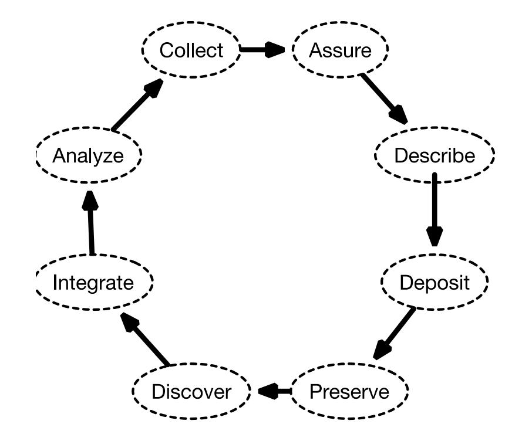
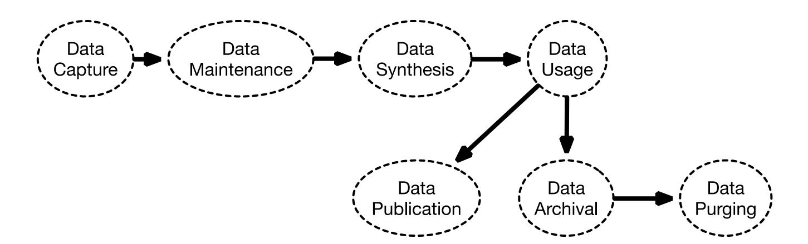
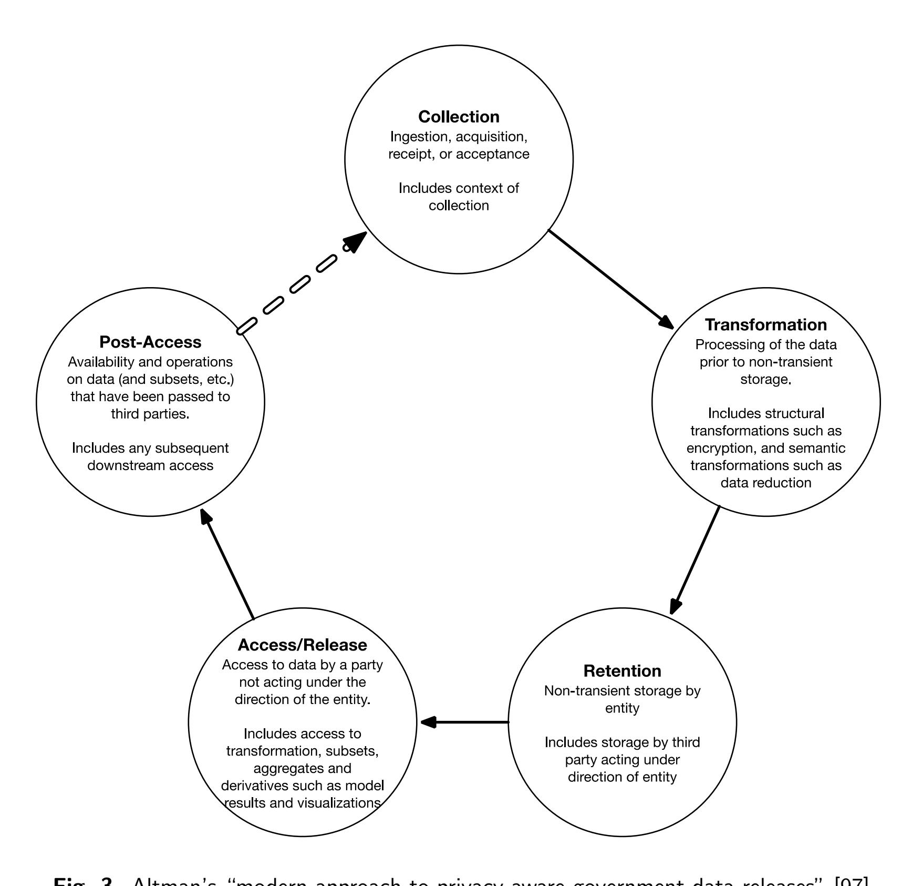
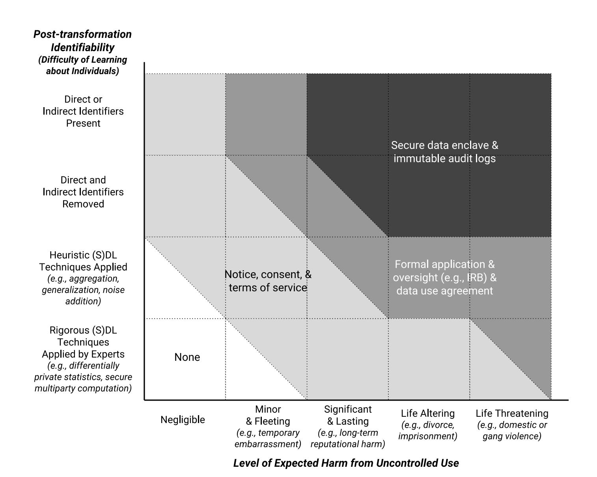

{0}------------------------------------------------

<span id="page-0-1"></span><span id="page-0-0"></span>

## NIST Special Publication NIST SP 800-188

# De-Identifying Government Datasets: Techniques and Governance

Simson Garfnkel Joseph Near Aref N. Dajani Phyllis Singer Barbara Guttman

This publication is available free of charge from: <https://doi.org/10.6028/NIST.SP.800-188>


{1}------------------------------------------------

## NIST Special Publication NIST SP 800-188

# De-Identifying Government Datasets: Techniques and Governance

Simson Garfnkel Barbara Guttman *Software Quality Group Software and Systems Division* 

Joseph Near *Department of Computer Science University of Vermont* 

Aref N. Dajani Phyllis Singer *Center for Enterprise Dissemination US Census Bureau* 

This publication is available free of charge from: <https://doi.org/10.6028/NIST.SP.800-188>

September 2023


U.S. Department of Commerce *Gina M. Raimondo, Secretary* 

National Institute of Standards and Technology *Laurie E. Locascio, NIST Director and Under Secretary of Commerce for Standards and Technology*  

{2}------------------------------------------------

Certain commercial equipment, instruments, software, or materials, commercial or non-commercial, are identifed in this paper in order to specify the experimental procedure adequately. Such identifcation does not imply recommendation or endorsement of any product or service by NIST, nor does it imply that the materials or equipment identifed are necessarily the best available for the purpose.

There may be references in this publication to other publications currently under development by NIST in accordance with its assigned statutory responsibilities. The information in this publication, including concepts and methodologies, may be used by federal agencies even before the completion of such companion publications. Thus, until each publication is completed, current requirements, guidelines, and procedures, where they exist, remain operative. For planning and transition purposes, federal agencies may wish to closely follow the development of these new publications by NIST.

Organizations are encouraged to review all draft publications during public comment periods and provide feedback to NIST. Many NIST cybersecurity publications, other than the ones noted above, are available at [https://csrc.nist.gov/publications.](#page-0-0)

This document is presented with the hope that its content may be of interest to the general privacy community. The views in this document are those of the authors, and do not represent those of the U.S. Census Bureau.

#### Authority

This publication has been developed by NIST in accordance with its statutory responsibilities under the Federal Information Security Modernization Act (FISMA) of 2014, 44 U.S.C. § 3551 et seq., Public Law (P.L.) 113-283. NIST is responsible for developing information security standards and guidelines, including minimum requirements for federal information systems, but such standards and guidelines shall not apply to national security systems without the express approval of appropriate federal offcials exercising policy authority over such systems. This guideline is consistent with the requirements of the Offce of Management and Budget (OMB) Circular A-130.

Nothing in this publication should be taken to contradict the standards and guidelines made mandatory and binding on federal agencies by the Secretary of Commerce under statutory authority. Nor should these guidelines be interpreted as altering or superseding the existing authorities of the Secretary of Commerce, Director of the OMB, or any other federal offcial. This publication may be used by nongovernmental organizations on a voluntary basis and is not subject to copyright in the United States. Attribution would, however, be appreciated by NIST.

#### NIST Technical Series Policies

[Copyright, Use, and Licensing Statements](#page-0-0)  [NIST Technical Series Publication Identifer Syntax](#page-0-0) 

#### Publication History

Approved by the NIST Editorial Review Board on 2023-09-07.

#### How to cite this NIST Technical Series Publication:

Garfnkel S, Guttman B, Near J, Dajani AN, Singer P (2023) De-Identifying Government Datasets: Techniques and Governance. (National Institute of Standards and Technology, Gaithersburg, MD), NIST Special Publication (SP) NIST SP 800-188. <https://doi.org/10.6028/NIST.SP.800-188>

#### Author ORCID iDs

Simson Garfnkel: 0000-0003-1294-2831 Joseph Near: 0000-0002-3203-3742 Aref N. Dajani: 0000-0003-0361-5409 Phyllis Singer: 0000-0002-8885-7273

{3}------------------------------------------------

#### Contact Information

[sp800-188@nist.gov](#page-0-0)

National Institute of Standards and Technology Attn: Software and Systems Division, Information Technology Laboratory 100 Bureau Drive (Mail Stop 8970) Gaithersburg, MD 20899-8970

All comments are subject to release under the Freedom of Information Act (FOIA).

{4}------------------------------------------------

#### Abstract

De-identifcation is a general term for any process of removing the association between a set of identifying data and the data subject. This document describes the use of deidentifcation with the goal of preventing or limiting disclosure risks to individuals and establishments while still allowing for the production of meaningful statistical analysis. Government agencies can use de-identifcation to reduce the privacy risk associated with collecting, processing, archiving, distributing, or publishing government data. Previously, NIST IR 8053, *De-Identifcation of Personal Information*, provided a detailed survey of deidentifcation and re-identifcation techniques. This document provides specifc guidance to government agencies that wish to use de-identifcation. Before using de-identifcation, agencies should evaluate their goals for using de-identifcation and the potential risks that releasing de-identifed data might create. Agencies should decide upon a data-sharing model, such as publishing de-identifed data, publishing synthetic data based on identifed data, providing a query interface that incorporates de-identifcation, or sharing data in non-public protected enclaves. Agencies can create a Disclosure Review Board to oversee the process of de-identifcation. They can also adopt a de-identifcation standard with measurable performance levels and perform re-identifcation studies to gauge the risk associated with de-identifcation. Several specifc techniques for de-identifcation are available, including de-identifcation by removing identifers, transforming quasi-identifers, and generating synthetic data using models. People who perform de-identifcation generally use special-purpose software tools to perform the data manipulation and calculate the likely risk of re-identifcation. However, not all tools that merely mask personal information provide suffcient functionality for performing de-identifcation. This document also includes an extensive list of references, a glossary, and a list of specifc de-identifcation tools, which is only included to convey the range of tools currently available and is not intended to imply a recommendation or endorsement by NIST.

{5}------------------------------------------------

#### Keywords

data life cycle; de-identifcation; differential privacy; direct identifers; Disclosure Review Board; k-anonymity; privacy; pseudonymization; quasi-identifers; re-identifcation; synthetic data; The Five Safes.

{6}------------------------------------------------

#### Reports on Computer Systems Technology

The Information Technology Laboratory (ITL) at the National Institute of Standards and Technology (NIST) promotes the U.S. economy and public welfare by providing technical leadership for the Nation's measurement and standards infrastructure. ITL develops tests, test methods, reference data, proof of concept implementations, and technical analyses to advance the development and productive use of information technology. ITL's responsibilities include the development of management, administrative, technical, and physical standards and guidelines for the cost-effective security and privacy of other than national security-related information in federal information systems. The Special Publication 800 series reports on ITL's research, guidelines, and outreach efforts in information system security, and its collaborative activities with industry, government, and academic organizations.

{7}------------------------------------------------

#### Patent Disclosure Notice

NOTICE: ITL has requested that holders of patent claims whose use may be required for compliance with the guidance or requirements of this publication disclose such patent claims to ITL. However, holders of patents are not obligated to respond to ITL calls for patents and ITL has not undertaken a patent search in order to identify which, if any, patents may apply to this publication.

As of the date of publication and following call(s) for the identifcation of patent claims whose use may be required for compliance with the guidance or requirements of this publication, no such patent claims have been identifed to ITL.

No representation is made or implied by ITL that licenses are not required to avoid patent infringement in the use of this publication.

{8}------------------------------------------------

## Table of Contents

|    | Executive                                                                   | Summary                            |                                                                                           | 1  |
|----|-----------------------------------------------------------------------------|------------------------------------|-------------------------------------------------------------------------------------------|----|
| 1. |                                                                             | Introduction                       |                                                                                           | 3  |
|    | 1.1.                                                                        | Document                           | Purpose<br>and<br>Scope<br>                                                               | 7  |
|    | 1.2.                                                                        | Intended                           | Audience<br>                                                                              | 7  |
|    | 1.3.                                                                        | Organization                       |                                                                                           | 8  |
| 2. |                                                                             | Introducing                        | De-Identifcation<br>                                                                      | 9  |
|    | 2.1.                                                                        | Historical                         | Context<br>                                                                               | 9  |
|    | 2.2.                                                                        | Terminology                        |                                                                                           | 12 |
| 3. | Governance<br>and<br>Management<br>of<br>Data<br>De-Identifcation<br>18<br> |                                    |                                                                                           |    |
|    | 3.1.                                                                        | Identifying                        | the<br>Goals<br>and<br>Intended<br>Uses<br>of<br>De-Identifcation<br>                     | 18 |
|    | 3.2.                                                                        | Evaluating<br>leases               | the<br>Risks<br>and<br>Benefts<br>That<br>Arise<br>from<br>De-Identifed<br>Data<br>Re<br> | 19 |
|    |                                                                             | 3.2.1.                             | Probability<br>of<br>Re-Identifcation<br>                                                 | 21 |
|    |                                                                             | 3.2.2.                             | Adverse<br>Impacts<br>of<br>Re-Identifcation<br>                                          | 24 |
|    |                                                                             | 3.2.3.                             | Impacts<br>Other<br>Than<br>Re-Identifcation<br>                                          | 26 |
|    |                                                                             | 3.2.4.                             | Remediation<br>                                                                           | 27 |
|    | 3.3.                                                                        | Data                               | Life<br>Cycle<br>                                                                         | 27 |
|    | 3.4.                                                                        |                                    | Data-Sharing<br>Models<br>                                                                | 32 |
|    | 3.5.                                                                        | The<br>Five<br>Safes<br>34<br>     |                                                                                           |    |
|    | 3.6.                                                                        | Disclosure<br>Review<br>Boards<br> |                                                                                           | 35 |
|    | 3.7.                                                                        |                                    | De-Identifcation<br>and<br>Standards<br>                                                  | 40 |
|    |                                                                             | 3.7.1.                             | Benefts<br>of<br>Standards<br>                                                            | 40 |
|    |                                                                             | 3.7.2.                             | Prescriptive<br>De-Identifcation<br>Standards<br>                                         | 40 |
|    |                                                                             | 3.7.3.                             | Risk-Based<br>De-Identifcation<br>Standards<br>                                           | 42 |
|    | 3.8.                                                                        | Education,                         | Training,<br>and<br>Research<br>                                                          | 42 |
|    | 3.9.                                                                        | Alternative                        | Approaches<br>for<br>Computing<br>Statistics<br>on<br>Confdential<br>Information          | 43 |
|    |                                                                             | 3.9.1.                             | Encryption<br>and<br>Access<br>Control<br>                                                | 43 |
|    |                                                                             | 3.9.2.                             | Secure<br>Computation<br>                                                                 | 43 |
|    |                                                                             | 3.9.3.                             | Trusted<br>Execution<br>Environments<br>                                                  | 44 |
|    |                                                                             | 3.9.4.                             | Physical<br>Enclaves<br>                                                                  | 45 |

{9}------------------------------------------------

| 4. |      | Technical                                                                                   | Steps<br>for<br>Data<br>De-Identifcation<br>                                                                         | 46 |
|----|------|---------------------------------------------------------------------------------------------|----------------------------------------------------------------------------------------------------------------------|----|
|    | 4.1. | Determine                                                                                   | the<br>Privacy,<br>Data<br>Usability,<br>and<br>Access<br>Objectives<br>                                             | 46 |
|    | 4.2. | Conducting                                                                                  | a<br>Data<br>Survey<br>                                                                                              | 47 |
|    | 4.3. | De-Identifcation<br>by<br>Removing<br>Identifers<br>and<br>Transforming<br>Quasi-Identifers |                                                                                                                      | 49 |
|    |      | 4.3.1.                                                                                      | Removing<br>or<br>Transforming<br>of<br>Direct<br>Identifers<br>                                                     | 51 |
|    |      | 4.3.2.                                                                                      | Special<br>Security<br>Note<br>Regarding<br>the<br>Encryption<br>or<br>Hashing<br>of<br>Di<br>rect<br>Identifers<br> | 52 |
|    |      | 4.3.3.                                                                                      | De-Identifying<br>Numeric<br>Quasi-Identifers<br>                                                                    | 53 |
|    |      | 4.3.4.                                                                                      | De-Identifying<br>Dates<br>                                                                                          | 54 |
|    |      | 4.3.5.                                                                                      | De-Identifying<br>Geographical<br>Locations<br>and<br>Geolocation<br>Data<br>                                        | 55 |
|    |      | 4.3.6.                                                                                      | De-Identifying<br>Genomic<br>Information<br>                                                                         | 56 |
|    |      | 4.3.7.                                                                                      | De-Identifying<br>Text<br>Narratives<br>and<br>Qualitative<br>Information<br>                                        | 57 |
|    |      | 4.3.8.                                                                                      | Challenges<br>Posed<br>by<br>Aggregation<br>Techniques<br>                                                           | 57 |
|    |      |                                                                                             | 4.3.8.1.<br>Example<br>                                                                                              | 57 |
|    |      | 4.3.9.                                                                                      | Challenges<br>Posed<br>by<br>High-Dimensional<br>Data<br>                                                            | 58 |
|    |      | 4.3.10.                                                                                     | Challenges<br>Posed<br>by<br>Linked<br>Data<br>                                                                      | 59 |
|    |      | 4.3.11.                                                                                     | Challenges<br>Posed<br>by<br>Composition<br>                                                                         | 59 |
|    |      | 4.3.12.                                                                                     | Potential<br>Failures<br>of<br>De-Identifcation<br>                                                                  | 60 |
|    |      | 4.3.13.                                                                                     | Post-Release<br>Monitoring<br>                                                                                       | 61 |
|    | 4.4. | Synthetic                                                                                   | Data<br>                                                                                                             | 61 |
|    |      | 4.4.1.                                                                                      | Partially<br>Synthetic<br>Data<br>                                                                                   | 62 |
|    |      | 4.4.2.                                                                                      | Test<br>Data<br>                                                                                                     | 63 |
|    |      | 4.4.3.                                                                                      | Realistic<br>Test<br>Data<br>                                                                                        | 63 |
|    |      | 4.4.4.                                                                                      | Fully<br>Synthetic<br>Data<br>                                                                                       | 63 |
|    |      | 4.4.5.                                                                                      | Synthetic<br>Data<br>with<br>Validation<br>                                                                          | 65 |
|    |      | 4.4.6.                                                                                      | Synthetic<br>Data<br>and<br>Open<br>Data<br>Policy<br>                                                               | 65 |
|    |      | 4.4.7.                                                                                      | Creating<br>a<br>Synthetic<br>Dataset<br>with<br>Diferential<br>Privacy<br>                                          | 66 |
|    | 4.5. |                                                                                             | De-Identifying<br>with<br>an<br>Interactive<br>Query<br>Interface<br>                                                | 67 |
|    | 4.6. | Validating                                                                                  | a<br>De-Identifed<br>Dataset<br>                                                                                     | 68 |
|    |      | 4.6.1.                                                                                      | Validating<br>Data<br>Usefulness<br>                                                                                 | 68 |
|    |      | 4.6.2.                                                                                      | Validating<br>Privacy<br>Protection<br>                                                                              | 68 |
|    |      | 4.6.3.                                                                                      | Re-Identifcation<br>Studies<br>                                                                                      | 69 |

{10}------------------------------------------------

| 5.    | Software   | Requirements,<br>Evaluation,<br>and<br>Validation<br>72<br>                                                                                                                                                                                                                                                                                    |
|-------|------------|------------------------------------------------------------------------------------------------------------------------------------------------------------------------------------------------------------------------------------------------------------------------------------------------------------------------------------------------|
|       | 5.1.       | Evaluate<br>the<br>Privacy-Preserving<br>Techniques<br>72<br>                                                                                                                                                                                                                                                                                  |
|       | 5.2.       | De-Identifcation<br>Tools<br>73<br>                                                                                                                                                                                                                                                                                                            |
|       |            | 5.2.1.<br>De-Identifcation<br>Tool<br>Features<br>73<br>                                                                                                                                                                                                                                                                                       |
|       |            | 5.2.2.<br>Data<br>Provenance<br>and<br>File<br>Formats<br>73<br>                                                                                                                                                                                                                                                                               |
|       |            | 5.2.3.<br>Data<br>Masking<br>Tools<br>73<br>                                                                                                                                                                                                                                                                                                   |
|       | 5.3.       | Evaluating<br>De-Identifcation<br>Software<br>74<br>                                                                                                                                                                                                                                                                                           |
|       | 5.4.       | Evaluating<br>Data<br>Accuracy<br>74<br>                                                                                                                                                                                                                                                                                                       |
| 6.    |            | Conclusion<br>76<br>                                                                                                                                                                                                                                                                                                                           |
|       | References | 92<br>                                                                                                                                                                                                                                                                                                                                         |
| A.    |            | Standards<br>93<br>                                                                                                                                                                                                                                                                                                                            |
|       | A.1.       | NIST<br>Publications<br>93<br>                                                                                                                                                                                                                                                                                                                 |
|       | A.2.       | Other<br>U.S.<br>Government<br>Publications<br>94<br>                                                                                                                                                                                                                                                                                          |
|       | Selected   | Publications<br>by<br>Other<br>Governments<br>95<br>                                                                                                                                                                                                                                                                                           |
|       | Reports    | and<br>Books<br>96<br>                                                                                                                                                                                                                                                                                                                         |
|       | How-To     | Articles<br>97<br>                                                                                                                                                                                                                                                                                                                             |
| B.    | List       | of<br>Symbols,<br>Abbreviations,<br>and<br>Acronyms<br>98<br>                                                                                                                                                                                                                                                                                  |
| C.    | Glossary   | 101                                                                                                                                                                                                                                                                                                                                            |
|       | List       | of<br>Tables                                                                                                                                                                                                                                                                                                                                   |
| Table | 1.         | Reading<br>levels<br>at<br>a<br>hypothetical<br>school,<br>as<br>measured<br>by<br>entrance<br>exami<br>nations<br>and<br>reported<br>at<br>the<br>start<br>of<br>the<br>school<br>year<br>on<br>October<br>1.<br>(See<br>example,<br>Sec.<br>4.3.8)<br>58<br>                                                                                 |
| Table | 2.         | Reading<br>levels<br>at<br>a<br>hypothetical<br>school,<br>as<br>measured<br>by<br>entrance<br>examina<br>tions<br>and<br>reported<br>one<br>month<br>into<br>the<br>school<br>year<br>on<br>November<br>1<br>after<br>a<br>single<br>new<br>student<br>has<br>transferred<br>to<br>the<br>school.<br>(See<br>example,<br>Sec.<br>4.3.8)<br>58 |
| Table | 3.         | Adjectives<br>used<br>for<br>describing<br>data<br>in<br>data<br>releases<br>(<br>Sec.<br>4.4.4).<br>62<br>                                                                                                                                                                                                                                    |
|       | List       | of<br>Figures                                                                                                                                                                                                                                                                                                                                  |
| Fig.  | 1.         | The<br>data<br>life<br>cycle<br>as<br>described<br>by<br>Michener<br>et<br>al.<br>[105]<br>28<br>                                                                                                                                                                                                                                              |
| Fig.  | 2.         | Chisholm's<br>view<br>of<br>the<br>data<br>life<br>cycle<br>is<br>a<br>linear<br>process<br>with<br>a<br>branching<br>point<br>after<br>data<br>usage<br>[30]<br>28<br>                                                                                                                                                                        |
| Fig.  | 3.         | Altman's<br>"modern<br>approach<br>to<br>privacy-aware<br>government<br>data<br>releases"<br>[97]<br>30                                                                                                                                                                                                                                        |

{11}------------------------------------------------

| Fig.<br>4. | Altman's<br>conceptual<br>diagram<br>of<br>the<br>relationship<br>between<br>post-transformation<br>identifability,<br>the<br>level<br>of<br>expected<br>harm,<br>and<br>the<br>suitability<br>of<br>selected<br>pri |    |  |
|------------|----------------------------------------------------------------------------------------------------------------------------------------------------------------------------------------------------------------------|----|--|
|            | vacy<br>controls<br>for<br>a<br>data<br>release<br>[97]<br>                                                                                                                                                          | 31 |  |
| Fig.<br>5. | Advice<br>for<br>Practitioners:<br>A<br>Summary<br>                                                                                                                                                                  | 77 |  |

{12}------------------------------------------------

#### Acknowledgments

The authors wish to thank the U.S. Census Bureau for its help in researching and preparing this publication, with specifc thanks to John Abowd, Ron Jarmin, Christa Jones, and Laura McKenna. The authors would also like to thank Luk Arbuckle, Andrew Baker, Paul Black, Daniel Barth-Jones, Christi Dant, Khaled El Emam, Robert Gellman, Tom Krenzke, Naomi Lefkovitz, Bradley Malin, Kevin Mangold, John Moehrke, Linda Sanchez, Denise Sturdy, and Chris Traver for providing comments on previous drafts and their valuable insights, all of which were helpful in creating this publication.

The authors also wish to thank several organizations that provided useful comments on previous drafts of this publication: Anonos (with comments from Odia Kagan Partner, Chair of GDPR Compliance and International Privacy, Fox Rothschild LLP); the Association for Computing Machinery's U.S. Technology Policy Committee; the Defense Contract Management Agency (DCMA) Information Assurance Directorate; the Electronic Privacy Information Center; the Interagency Council on Statistical Policy/Federal Committee on Statistical Methodology (FCSM) Disclosure Review Board Community of Practice; the Offce of the Chief Privacy Offcer within the U.S. Department of Education; the Offce of Planning, Research, and Evaluation (OPRE) within the Administration for Children and Families at the U.S. Department of Health and Human Services; the Millennium Challenge Corporation (MCC) Department of Policy and Evaluation; Integrating the Healthcare Enterprise (IHE), an ANSI-accredited standards organization focused on healthcare standards; the Privacy Tools Project at Harvard University (including Micah Altman, Stephen Chong, Kobbi Nissim, David O'Brien, Salil Vadhan, and Alexandra Wood); Tumult Labs (Gerome Miklau and David Pujol); the United Health Group (Peter Dumont and Ying Zhu); and the U.S. Agency for International Development Chief Data Offcer (Brandon Pustejovsky).

{13}------------------------------------------------

#### Author Contributions

Simson Garfnkel: Conceptualization, Supervision, Writing (original draft preparation); Joseph Near: Writing (original draft preparation); Aref N. Dajani: Writing (original draft preparation of the section on re-identifcation studies); Phyllis Singer: Writing (original draft preparation of the section on re-identifcation studies); Barbara Guttman: Conceptualization, Supervision, Writing.

{14}------------------------------------------------

#### Executive Summary

Every federal agency creates and maintains internal datasets that are vital for fulflling its mission. The Foundation for Evidence-based Policymaking Act of 2018 [\[2\]](#page-91-0) and its Phase 1 implementation memorandum M-19-23 [\[168\]](#page-105-1) mandate that agencies also collect and publish their government data in open, machine-readable formats when it is appropriate to do so. Agencies can use de-identifcation to make government datasets available while protecting the privacy of the individuals whose data are contained within those datasets.

The U.S. Government defnes *personally identifable information* (PII) as "information that can be used to distinguish or trace an individual's identity, either alone or when combined with other information that is linked or linkable to a specifc individual."[\[4\]](#page-91-1)

For decades, de-identifcation based on simply removing identifying information was thought to be suffcient to prevent the re-identifcation of individuals in large datasets. Since the mid 1990s, a growing body of research has demonstrated the reverse, resulting in new privacy attacks that are capable of re-identifying individuals in "de-identifed" data releases. For several years, the goals of such attacks appeared to be embarrassing the publishing agency and achieving academic distinction for the privacy researcher [\[65\]](#page-96-0). More recently, as high-resolution de-identifed geolocation data have become commercially available, reidentifcation techniques have been used by journalists, activists, and malicious actors [\[130,](#page-101-0) [90\]](#page-98-0) to learn information about individuals that was intended to be kept confdential. These attacks highlight the defciencies in traditional approaches to de-identifcation. [170,](#page-105-2)

Formal models of privacy, like k-anonymity [\[151\]](#page-103-0) and differential privacy [\[52\]](#page-95-0), use mathematically rigorous approaches that are designed to allow for the controlled use of confden-Because there is an inherent trade-off between the accuracy of published data and the amount of privacy protection afforded to data subjects, most formal methods have some kind of parameter that can be adjusted to control the "privacy cost" of a particular data release. Informally, a data release with a low privacy cost causes little additional privacy risk to the participants, while a higher privacy cost results in more privacy risk. When they are available and have suffcient functionality for the task at hand, formal privacy methods should be preferred over informal ad hoc methods. [1](#page-14-0)  tial data while minimizing the privacy loss suffered by the data subjects.

Decisions and practices regarding the de-identifcation and release of government data can be integral to the mission and proper functioning of a government agency. As such, an agency's leadership should manage these activities in a way that ensures performance and

<span id="page-14-0"></span><sup>1</sup>While k-anonymity and differential privacy are both mathematically rigorous formal models, k-anonymity is a privacy framework based on the content of the published data, while differential privacy places bounds on the amount of information that can be learned about the confdential data from the published data.

{15}------------------------------------------------

results in a manner that is consistent with the agency's mission and legal authority. One way that agencies can manage this risk is by creating a formal Disclosure Review Board (DRB) that consists of legal and technical privacy experts, stakeholders within the organization, and representatives of the organization's leadership. The DRB evaluates applications for data release that describe the confdential data, the techniques that will be used to minimize the risk of disclosure, the resulting protected data, and how the effectiveness of those techniques will be evaluated. The DRB's work complements other parts of the organization, such as the Chief Information Security Offcer (CISO), who is responsible for technical controls, as well as the parts of the organization responsible for adopting administrative or organizational controls and written data-sharing agreements.

Establishing a DRB may seem like an expensive and complicated administrative undertaking for some agencies. However, a properly constituted DRB and the development of consistent procedures regarding data release should enable agencies to lower the risks associated with each data release, which is likely to save agency resources in the long term. Agencies can create or adopt standards to guide those performing de-identifcation and regarding the accuracy of de-identifed data. If accuracy goals exist, then techniques such as differential privacy can be used to make the data suffciently accurate for the intended purpose but not unnecessarily more accurate, which can limit the amount of privacy loss. However, agencies must carefully choose and implement accuracy requirements. If data accuracy and privacy goals cannot be well-maintained, then releases of data that are not suffciently accurate can result in incorrect scientifc conclusions and policy decisions.

Agencies should consider performing de-identifcation with trained individuals using software specifcally designed for that purpose. While it is possible to perform de-identifcation with off-the-shelf software like a commercial spreadsheet or fnancial planning program, such programs typically lack the key functions required for sophisticated de-identifcation. As a result, they may encourage the use of simplistic de-identifcation methods, such as deleting columns that contain sensitive data categories and manually searching and remov-This may result in a dataset that appears de-identifed but still contains signifcant disclosure risks. [2](#page-15-1)  ing individual data cells that appear sensitive.

Finally, different countries have different standards and policies regarding the defnition and use of de-identifed data. Information that is regarded as de-identifed in one jurisdiction may be regarded as being identifable in another. This may be especially relevant in the case of international scientifc collaborations and illustrates the need for agencies that perform de-identifcation to create mechanisms for data scientists, attorneys, and policymakers to coordinate on these topics.

<span id="page-15-1"></span><span id="page-15-0"></span><sup>2</sup>For information on characterizing the sensitivity of information, see NIST SP 800-60 Volume I, Revision 1 [\[147\]](#page-103-1).

{16}------------------------------------------------

#### 1. Introduction

The U.S. Government collects, maintains, and uses many kinds of datasets. Every federal agency creates and maintains internal datasets that are vital for fulflling its mission, such as delivering services to citizens or ensuring regulatory compliance. There are also 13 principal federal statistical agencies, three recognized statistical units, and over 100 other federal statistical programs that collect, compile, process, analyze, and distribute information for statistical purposes [\[156,](#page-104-0) [121\]](#page-101-1).

Government programs collect information from individuals and organizations for taxation, public benefts, public health, licensing, employment, censuses, and the production of offcial statistics. While privacy is integral, many individuals and organizations that provide information to the Government do not typically have the right to opt out of such requests. For example, people and establishments in the United States must respond to mandatory U.S. Census Bureau surveys.

Agencies make many of their datasets available to the public. The U.S. Government publishes data to promote commerce, scientifc research, and public transparency. Many datasets contain some data elements that should not be made public, and it is necessary to remove such information before making the rest of the dataset available. Some datasets are so sensitive that they cannot be made publicly available at all but can be available on a limited basis to qualifed, vetted researchers in protected enclaves. In some cases, agencies may also elect to release summary statistics of sensitive data or create synthetic datasets that resemble the original data but that have a lower disclosure risk [\[9,](#page-91-2) [99\]](#page-99-2).

There is frequent tension between the goals of privacy protection and the release of useful data to the public. One way that the Government attempts to resolve this tension is with an offcial promise of confdentiality to individuals and organizations regarding the information that they provide [\[132\]](#page-102-0). Other information is created by the Government as a consequence of providing government services. This information – sometimes called *administrative data* – is also increasingly being used and made available for statistical purposes and must be protected.

A bedrock principle of offcial statistical programs is that data provided to the Government should generally remain confdential and not be used in a way that would pose a privacy or confdentiality risk to the individual or the organization providing the data. One justifcation for this principle is that it helps to ensure high data accuracy. If data providers believe that the information they provide will remain confdential, they may be willing to provide accurate information.

{17}------------------------------------------------

In 2018, the U.S. Congress passed three laws that signifcantly increased the need for expertise regarding privacy-preserving data analysis and data publishing techniques, such as de-identifcation:

1. The Foundations for Evidence-Based Policymaking Act of 2018 [\[2\]](#page-91-0), commonly called the Evidence Act, requires federal agencies to track all of their data in data inventories, report public datasets to [https://data.gov,](https://data.gov) perform systematic evidencemaking and evaluation activities, and engage in capacity-building so that the federal workforce can meet the requirements of data-centric, evidence-based operations. The Evidence Act is based on the fndings of the U.S. Commission on Evidence-Based Policymaking [\[34\]](#page-93-1) and is implemented in part by Offce of Management and Budget (OMB) Memorandum M-19-23 [\[168\]](#page-105-1).

The Evidence Act contains specifc guidance requiring that agencies publishing data take into account "(A) risks and restrictions related to the disclosure of personally identifable information, including the risk that an individual data asset in isolation does not pose a privacy or confdentiality risk but when combined with other available information may pose such a risk;" and "(B) security considerations, including the risk that information in an individual data asset in isolation does not pose a security risk but when combined with other available information may pose such a risk" [\[2\]](#page-91-0).

The Evidence Act incorporated and reauthorized The Confdential Information Protection and Statistical Effciency Act of 2002, now called the 2018 CIPSEA. Part B, "Confdential Information Protection," provides for the legal protection of "data or information acquired by an agency under a pledge of confdentiality for exclusively statistical purposes shall not be disclosed by an agency in identifable form for any use other than an exclusively statistical purpose, except with the informed consent of the respondent."

Finally, the 2018 CIPSEA promotes Offce of Management and Budget Statistical Policy Directive 1, "Fundamental Responsibilities of Federal Statistical Agencies and Recognized Statistical Units,"[\[100\]](#page-99-3) to statute as 44 U.S. Code §§ 3561-4."

- 2. The Open, Public, Electronic and Necessary (OPEN) Government Data Act, which was passed as part of the Evidence Act, requires that the U.S. Government publish data in machine-readable, open, non-proprietary formats when possible. This act largely codifed presidential Executive Order 13642 of May 9, 2013, "Making Open and Machine Readable the New Default for Government Information" [\[115\]](#page-100-0) and its implementation in OMB Memorandum M-13-13 [\[24\]](#page-92-0).
- <span id="page-17-0"></span>3. The Geospatial Data Act of 2018 requires that government agencies make inventories of their geospatial data and that public geospatial data be registered on the U.S. Government's public geospatial platform at [https://www.geoplatform.gov/.](https://www.geoplatform.gov/)

Other laws, regulations, and policies that govern the release of statistics and data to the public enshrine this principle of confdentiality. For example:

{18}------------------------------------------------

- US Code Title 13 §§ 8(b) and 9 governs the confdentiality of information provided to the Census Bureau and prohibits "any publication whereby the data furnished by any particular establishment or individual under this title can be identifed" [\[160\]](#page-104-1).
- US Code Title 26, Section 6103 governs the confdentiality of information provided to the U.S. Government on tax returns and other return information. These rules are now spelled out in IRS Publication 1075, "Tax Information Security Guidelines for Federal, State and Local Agencies," published by the Internal Revenue Service (IRS) Offce of Safeguards [\[122\]](#page-101-2).
- The Privacy Act of 1974 covers the release of personal information of U.S. citizens and lawful permanent residents by the Government. The Act recognizes that the disclosure of records for statistical purposes is acceptable if the data are not "individually identifable" [\[133,](#page-102-1) at a(b)(5)].

Federal laws and regulations recognize that it is not possible to eliminate all privacy risk when deidentifying data. Guidance from the U.S. Department of Health and Human Services (HHS) on the Health Insurance Portability and Accountability Act (HIPAA) deidentifcation standards notes that "[b]oth methods [the Safe Harbor and expert determination methods for de-identifcation], even when properly applied, yield de-identifed data that retains some risk of identifcation. Although the risk is very small, it is not zero, and there is a possibility that de-identifed data could be linked back to the identity of the patient to which it corresponds" [\[166\]](#page-104-2).

U.S. law also balances privacy risk with other factors, such as transparency, accountability, and the opportunity for public good. An example of this balance is the handling of personally identifable information collected by the Census Bureau as part of the decennial census. This information remains confdential for 72 years and is then transferred to the National Archives and Records Administration, where it is released to the public [\[161,](#page-104-3) [5\]](#page-91-3).

*De-identifcation* is "a general term for any process of removing the association between a set of identifying data and the data subject"[\[85\]](#page-98-1). This document describes the use of de-identifcation with the goal of preventing or limiting disclosure risks to individuals and establishments while still allowing for the production of aggregate statistics. Deidentifcation is not a single technique but a collection of approaches, algorithms, and tools that can be applied to different kinds of data with differing levels of effectiveness. In general, the potential risk to privacy posed by a dataset's release decreases as increasingly [3](#page-18-0)[4](#page-18-1) 

<span id="page-18-0"></span><sup>3</sup>This document uses a different defnition for *de-identifcation* than ISO/TS 25737:2008, which defnes deidentifcation as the "general term for any process of removing the association between a set of identifying data and the data subject" [\[85,](#page-98-1) p. 3]. This document intentionally adopts a broader defnition for deidentifcation that allows for noise-introducing techniques, such as differential privacy and the creation of synthetic datasets that are based on privacy-preserving models.

<span id="page-18-1"></span><sup>4</sup>In Europe, the term *data anonymization* is frequently used as a synonym for de-identifcation, but the terms may have subtly different defnitions in some contexts. For a more complete discussion of de-identifcation and data anonymization, see NIST IR 8053, *De-Identifcation of Personal Data* [\[66\]](#page-96-1).

{19}------------------------------------------------

manipulative de-identifcation techniques are employed, but data accuracy and – in some cases – the ultimate utility of the de-identifed dataset decreases as well.

*Accuracy* is traditionally defned as the "closeness of computations or estimates to the exact or true values that the statistics were intended to measure" [\[71\]](#page-96-2). The *data accuracy* of de-identifed data, therefore, refers to the degree to which inferences drawn on the deidentifed data will be consistent with inferences drawn on the original data. Data accuracy can be measured by the ratio of a value computed with de-identifed data to the same value computed using the underlying true confdential value. Because there are many potential computations that may be performed with de-identifed data, de-identifed data that are accurate for one purpose may not be accurate for another. As accuracy decreases, statistical power may be lost, rendering some inferences no longer possible. Alternatively, new biases and errors may be introduced, resulting in incorrect inferences. [5](#page-19-0) 

In economics, *utility* is traditionally defned as "the satisfaction derived from consumption of a good or service"[\[71\]](#page-96-2). *Data utility*, therefore, refers to the value that data users can derive from data in general. When speaking of de-identifed data, utility comes from two public goods: the uses of the data and the privacy protection afforded by the de-identifcation process.

In general, data accuracy decreases as more aggressive de-identifcation techniques are employed. Therefore, any effort that involves the release of data that contain personal information typically involves making a trade-off between identifability and data accuracy. However, increased privacy protections do not necessarily result in decreased data utility for certain specifed purposes.

Some users of de-identifed data may be able to use the data to make inferences regarding specifc individuals or establishments by virtue of their inclusion in the dataset rather than on the basis of a statistical model based on the sampled population. Such users may even be able to re-identify the data subjects. Both of these uses undo the privacy goals of deidentifcation.

#### In general:

- Agencies that release data should understand what data they are releasing, what other data may already be publicly or privately available, and the protection methods that they have employed to protect against the risk of re-identifcation.
- Agencies should be aware that it is diffcult if not impossible to recall a data release, so de-identifed data that are published will remain in the public domain indefnitely. Thus, it is insuffcient to only plan and implement a solution that works today but

<span id="page-19-0"></span><sup>5</sup>This report avoids the use of the term *precision*, which the Organization for Economic Cooperation and Development (OECD) glossary defnes as "The property of the set of measurements of being very reproducible or of an estimate of having small random error of estimation,"[\[71\]](#page-96-2) as the term is used to describe an aspect of measurement rather than the result of de-identifcation.

{20}------------------------------------------------

that does not take into account future data releases of a new related dataset by the agency or others.

- Agencies should clearly explain how they continue to monitor and improve to protect privacy.
- Agencies should aim to make an informed decision about the fdelity of the data that they release by systematically evaluating the risks and benefts and choosing deidentifcation techniques and data-sharing models that are tailored to their requirements.
- When telling individuals that their de-identifed information will be released, agencies should disclose that privacy risks may remain despite de-identifcation.

Planning is essential for successful de-identifcation and data release. In a research environment, this planning should include the research design, data collection, protection of identifers, disclosure analysis, and data-sharing strategy. In an operational environment, this planning includes a comprehensive analysis of the purpose of the data release, the expected use of the released data, the privacy-related risks, and the privacy-protecting controls. Both cases should review the appropriateness of various privacy controls given the risks, intended uses, and the ways that those controls could fail. See Sec. [3.6,](#page-48-0) ["Disclosure](#page-48-0)  [Review Boards"](#page-48-0) for a discussion of how a Disclosure Review Board (DRB) or an Institutional Review Board (IRB) can be used to make this process orderly, predictable, and repeatable.

De-identifcation can have signifcant time, labor, and data processing costs. However, when properly executed, this effort can result in data that have high value for a research community and the general public while still adequately protecting individual privacy.

#### <span id="page-20-0"></span>1.1. Document Purpose and Scope

This document provides guidance on the selection, use, and evaluation of de-identifcation techniques for U.S. Government datasets. It also provides a framework that can be adapted by federal agencies to shape the governance of de-identifcation processes. The ultimate goal of this document is to reduce disclosure risks that might result from an intentional data release. However, this document does not provide step-by-step guidance for de-identifying the vast range of possible datasets held by U.S. Government agencies. For each dataset that is to be de-identifed, agencies must rely on experts and have their proposed efforts reviewed by an appropriate governance procedure.

#### <span id="page-20-1"></span>1.2. Intended Audience

This document is intended for use by government system engineers, security offcers, data scientists, privacy offcers, disclosure review boards, and other offcials. It is also designed to be generally informative to researchers and academics involved in the technical aspects 

{21}------------------------------------------------

of de-identifying government data. While this document assumes a high-level understanding of information system security technologies, it is intended to be accessible to a wide audience.

#### <span id="page-21-0"></span>1.3. Organization

The remainder of this publication is organized as follows:

- Section [2,](#page-21-1) ["Organization,](#page-21-1)" presents a background on the science and terminology of de-identifcation.
- Section [3,](#page-30-0) ["Terminology,](#page-30-0)" provides guidance to agencies on the establishment of or improvement to a program that makes privacy-sensitive data available to researchers and the public.
- Section [4,](#page-58-1) ["Physical Enclaves,](#page-58-1)" provides specifc technical guidance for performing de-identifcation using a variety of mathematical approaches.
- Section [5,](#page-84-0) ["Re-Identifcation Studies,](#page-84-0)" provides a recommended set of features that should be in de-identifcation tools, which may be useful for potential purchasers or developers of such software. This section also provides information for evaluating both de-identifcation tools and de-identifed datasets.
- Section [6,](#page-88-0) ["Evaluating Data Accuracy,](#page-88-0)" presents the conclusion.

<span id="page-21-1"></span>Following the conclusion is a list of all publications referenced in this document, as well as an appendix that includes standards, related NIST publications, other selected publications by the U.S. and other governments, reports, books, and articles of interest. A second appendix provides a list of symbols, abbreviations, and acronyms. The third appendix contains a glossary.

{22}------------------------------------------------

#### 2. Introducing De-Identifcation

If the information derived from personal data remains in a de-identifed dataset, the dataset may inadvertently reveal attributes related to specifc individuals. When this happens, the privacy protection provided by de-identifcation is compromised. Even if a specifc individual cannot be matched to a specifc data record, de-identifed data can be used to improve the accuracy of inferences regarding individuals whose de-identifed data are in the dataset. This so-called *inference risk* cannot be eliminated if there is any information in the deidentifed data, but it can be managed or reduced to an acceptable level. Thus, the decision of how or whether to de-identify data should be made in conjunction with decisions over how the de-identifed data will be used, shared, or released.

De-identifcation is especially important for government agencies, businesses, and other organizations that seek to make data available to outsiders. For example, signifcant medical research is made possible through the sharing of de-identifed patient information under the framework established by the HIPAA Privacy Rule, which is the primary U.S. regulation that provides for the privacy of medical, billing, enrollment, payment, and claims records, as well as "other records that are used, in whole or in part, by or for the covered entity to make decisions about individuals" [\[119\]](#page-101-3). The HIPAA Privacy Rule de-identifcation framework applies to both government organizations charged with protecting government datasets and to private-sector organizations, such as health plans and health care providers.

Agencies may also be required to de-identify records when responding to a Freedom of Information Act (FOIA) [\[164,](#page-104-4) [163\]](#page-104-5) request in a manner that is consistent with Exemption 6, which protects information about individuals in "personnel and medical fles and similar fles" when the disclosure of such information "would constitute a clearly unwarranted invasion of personal privacy," and Exemption 7(C), which is limited to information compiled for law enforcement purposes and protects personal information when disclosure "could reasonably be expected to constitute an unwarranted invasion of personal privacy." The meaning of these exemptions has been clarifed by multiple cases before the U.S. Supreme Court [\[134,](#page-102-2) [145,](#page-103-2) [146\]](#page-103-3). However, agencies should consider the cumulative privacy impact of multiple FOIA requests and potential releases, as previous releases may be combined with future releases to learn information about individuals that the agency had previously attempted to protect from public release.

#### <span id="page-22-0"></span>2.1. Historical Context

The modern practice of de-identifcation can be broken down into three distinct phases:

1. For four decades, offcial statistical agencies have researched and investigated methods broadly termed *statistical disclosure limitation* (SDL) or *statistical disclosure*  

{23}------------------------------------------------

*control* (SDC) [\[61,](#page-96-3) [38,](#page-94-0) [47\]](#page-94-1). Statistical agencies created these methods so that they could release statistical tables and *public use fles* (PUF) to allow users to learn information and perform original research while protecting the privacy of the individuals in the dataset. SDL is widely used in contemporary statistical reporting. [6](#page-23-0) 

- 2. In the 1990s, there was a signifcant increase in the release of *microdata* fles for public use in the form of both individual responses from surveys and administrative records. Initially, these releases merely stripped obviously identifable information, such as names and Social Security numbers (what are now called *direct identifers).*  Following some releases, researchers discovered that it was possible to re-identify individuals' data by triangulating some of the remaining data (now called *quasiidentifers* or *indirect identifers* [\[37\]](#page-94-2)). The research resulted in the creation of the k-anonymity model for protecting privacy [\[153,](#page-103-4) [137,](#page-102-3) [138,](#page-102-4) [152\]](#page-103-5), [7](#page-23-1)  which is refected in the Offce of Civil Rights guidance on how to apply de-identifcation in a manner consistent with the HIPAA Privacy Rule [\[118\]](#page-100-1). Today, variants of k-anonymity are commonly used for sharing medical microdata, even though some mechanisms that implement k-anonymity have been demonstrated to be reversible [\[32\]](#page-93-2).
- 3. In the 2000s, research in theoretical computer science and cryptography developed the theory of *differential privacy* [\[53\]](#page-95-1), which is based on a mathematical defnition of the *privacy loss* to an individual that results from queries on a database containing that individual's personal information compared to the same queries on a database that does not.[8](#page-23-2)  Differential privacy is termed a *formal model for privacy protection* because its defnitions for privacy and privacy loss are based on mathematical proofs.[9](#page-23-3)

This does not mean that algorithms that implement differential privacy eliminate all privacy risk. Rather, it means that the amount of privacy risk that results from the use of these algorithms can be mathematically bounded. These mathematical limits on privacy risk have created considerable interest in differential privacy in academia, commerce, and business.

During the frst decade of the 21st century, there was a growing awareness within the U.S. Government about the risks that could result from the improper handling and inadvertent release of personal identifying and fnancial information. This realization, combined with

<span id="page-23-0"></span><sup>6</sup>A summary of the history of statistical disclosure limitation can be found in *Private Lives and Public Policies: Confdentiality and Accessibility of Government Statistics* [\[132\]](#page-102-0).

<span id="page-23-1"></span><sup>7</sup>k-anonymity is a refnement of the approach described by Dalenius in "Finding a needle in a haystack – or identifying anonymous census records" [\[36\]](#page-93-3).

<span id="page-23-2"></span>The term "privacy loss," as defned in the literature of differential privacy, is neither a loss function nor a risk metric but an unbounded measure of information gain between two randomized queries – the ratio of two probabilities. 8

<span id="page-23-3"></span><sup>9</sup>Other formal methods for privacy include cryptographic algorithms and techniques with provably secure properties, privacy-preserving data mining, Shamir's secret sharing, and advanced database techniques. A summary of such techniques appears in [\[158\]](#page-104-6).

{24}------------------------------------------------

a growing number of inadvertent data disclosures within the U.S. Government, resulted in President George W. Bush signing Executive Order 13402, which established an Identity Theft Task Force on May 10, 2006 [\[25\]](#page-93-4). One year later, the Offce of Management and Budget (OMB) issued Memorandum M-07-16 [\[80\]](#page-97-0), which required federal agencies to develop and implement breach notifcation policies. As part of this effort, NIST issued Special Publication (SP) 800-122, *Guide to Protecting the Confdentiality of Personally Identifable Information (PII)* [\[103\]](#page-99-4). These policies and documents had the specifc goal of limiting the accessibility of information that could be directly used for identity theft but did not create a framework for processing government datasets so that they could be released without impacting the privacy of the data subjects.

In 2015, NIST published NIST Interagency or Internal Report (IR) 8053, *De-Identifcation of Personal Information* [\[66\]](#page-96-1), which provided an overview of de-identifcation issues and terminology. It also summarized signifcant publications involving de-identifcation and re-identifcation. However, NIST IR 8053 did not make recommendations regarding the appropriateness of de-identifcation or specifc de-identifcation algorithms. The following year, NIST convened the Government Data De-Identifcation Stakeholder's Meeting [\[67\]](#page-96-4).

In 2016, OMB revised Circular A-130, "Managing Information as a Strategic Resource," refecting changes in law and advances in technology. The revision was also designed to ensure consistency between executive orders, presidential directives, NIST standards and guidelines, and other OMB policies. A-130 defnes *personally identifable information*  (PII) as "information that can be used to distinguish or trace an individual's identity, either alone or when combined with other information that is linked or linkable to a specifc individual."[\[4\]](#page-91-1)

De-identifcation is one of several models for allowing the controlled sharing of data derived from confdential data about individuals.[10](#page-24-0)  Other models include the use of data processing enclaves, where computations are performed with confdential data using computers that are physically isolated from the outside world. That isolation might be performed with locked doors and guards, or it might be performed using silicon and encryption, as is the case with enclaves implemented on some modern microprocessors. Another approach is to use mathematical techniques, such as secure multi-party computation, so that computations can be carried out on confdential data held by multiple parties without ever bringing all of the confdential data together in a single location. Researchers have introduced more than 80 different privacy metrics in an attempt to characterize privacy and privacy loss in different settings [\[169\]](#page-105-3).

Techniques for privacy-preserving data-sharing and analysis can be layered to provide stronger protection than any single technique would provide in isolation. Such complementary models are discussed in Sec. [3.4.](#page-45-0) For a more complete description of data-sharing

<span id="page-24-0"></span><sup>10</sup>For information on characterizing the sensitivity of information, see NIST SP 800-60 Volume I, Revision 1 [\[147\]](#page-103-1).

{25}------------------------------------------------

models, privacy-preserving data publishing, and privacy-preserving data mining, see NIST IR 8053.

Many of the techniques discussed in this publication (e.g., fully synthetic data and differential privacy) currently have limited use within the Federal Government due to cost, time constraints, and the sophistication required of practitioners. However, these techniques are likely to see increased use as agencies seek to make datasets that include identifying information available.

#### <span id="page-25-0"></span>2.2. Terminology

While each of the de-identifcation traditions has developed its own terminology and mathematical models, they share many underlying goals and concepts. Where terminology differs, this document relies on the terminology developed in previous documents by the U.S. Government and standards organizations. This document uses the terms *privacy risk*  and *informational risk* to refer in aggregate to various types of disclosure risk, as defned later in this section.

*De-identifcation* is a "general term for any process of removing the association between a set of identifying data and the data subject" [\[85\]](#page-98-1). This document is specifcally concerned with de-identifcation techniques that have the goal of preventing or limiting disclosure risks to individuals and establishments while still allowing for the production of aggregate statistics. As a result, this document devotes attention to noise-introducing techniques, such as differential privacy and the creation of synthetic datasets that are based on privacy-preserving models. De-identifcation takes an *original dataset* and produces *de-identifed data*. This document uses the term *dataset* to refer to the collected data and assumes that data collection is completed before de-identifcation begins. However, many of the processes and techniques described are also applicable in other collection models (e.g., streaming data).

*Re-identifcation* is the "process by which information is attributed to de-identifed data in order to identify the individual to whom the de-identifed data relate"[\[117\]](#page-100-2). This defnition is from the Organization for Economic Cooperation and Development (OECD) Legal Instruments Recommendation of the Council on Health Data Governance (2016).

*Re-identifcation risk* is the likelihood that a third party can re-identify data subjects in a de-identifed dataset. Re-identifcation risk is typically a function of the adverse impacts that would arise if re-identifcation were to occur and the likelihood of occurrence. Reidentifcation risk is a specifc form of privacy risk that can result from the release or use of de-identifed data.

*Redaction* is the removal of information from a document or dataset for legal or security purposes. Also known as *suppression*, redaction is a kind of de-identifying technique that relies on the removal of information. In general, redaction alone is insuffcient to provide formal privacy guarantees, such as differential privacy. Redaction may also reduce the 

{26}------------------------------------------------

accuracy of the dataset since the use of selective redaction may result in the introduction of non-ignorable bias.

*Anonymization* is a "process that removes the association between the identifying dataset and the data subject" [\[85\]](#page-98-1). This term is reserved for de-identifcaiton processes that cannot be reversed.

Some authors use the terms *de-identifcation* and *anonymization* interchangeably. In some contexts, the term *anonymization* is used to describe the destruction of a table that maps pseudonyms to real identifers.[11](#page-26-0)  Both of these uses are potentially misleading, as many de-identifcation procedures can be readily reversed if a dataset is discovered that maps a unique attribute or combination of attributes to identities. For example, a medical dataset may contain a list of names, medical identifers, the rooms where a patient was seen, the time that the patient was seen, and the results of a medical test. Such a dataset could be de-identifed by removing the name and medical identifcation numbers. However, the dataset of medical test results should not be considered anonymized because the tests can be re-identifed if the dataset is joined with a second dataset of room numbers, times, and names. Since it is not possible to know whether such an auxiliary dataset exists, this publication recommends avoiding the word *anonymization* and using the word *de-identifcation*  instead. Because of the inconsistencies in the use and defnitions of the word "anonymization," this document avoids the term except in this section and in the titles of some references.

*Pseudonymization* is a "particular type of [de-identifcation[\]12](#page-26-1)  that both removes the association with a data subject and adds an association between a particular set of characteristics relating to the data subject and one or more pseudonyms" [\[85\]](#page-98-1). The term *coded*  is frequently used in healthcare settings to describe data that have been pseudonymized. Pseudonymization is commonly used so that multiple observations of an individual over time can be matched and so that an individual can be re-identifed if there is a policy reason to do so. Although pseudonymous data are typically re-identifed by consulting a key that may be highly protected, the existence of the pseudonym identifers frequently increases the risk of re-identifcation through other means.

*Non-public personal information* is used to describe personal information that is in a dataset that is not publicly available. Non-public personal information is not necessarily identifying.

The defnition of identifying information above suggests that it is easy – or at least possible – to distinguish personal information from identifying information. However, many

<span id="page-26-0"></span><sup>11</sup>For example, "Anonymization is a step subsequent to de-identifcation that involves destroying all links between the de-identifed datasets and the original datasets. The key code that was used to generate the new identifcation code number from the original is irreversibly destroyed (i.e., destroying the link between the two code numbers)" [\[157\]](#page-104-7).

<span id="page-26-1"></span><sup>12</sup>Here, the word *anonymization* in the ISO 25237 defnition is replaced with the more accurate and descriptive term *de-identifcation*.

{27}------------------------------------------------

techniques for de-identifcation require an expert to make this distinction and protect only the identifying information. Indeed, as understanding of privacy risk develops, it is increasingly apparent that *all* information is potentially identifying information, and it is necessary to thoughtfully engage in prioritizing the concerns of balancing privacy threats with scientifc data accuracy.

This document envisions a *de-identifcation process* in which an *original dataset* that contains personal information is algorithmically processed to produce *de-identifed data*. The result may be a *de-identifed dataset*; *aggregate statistics*, such as summary tables; or a *synthetic dataset* in which the data are created by a model. This kind of de-identifcation is envisioned as a batch process. Alternatively, the de-identifcation process may be a system that accepts queries and returns responses that do not leak more identifying information than is allowable by policy. De-identifed results may be corrected or updated and re-released on a periodic basis. The accumulated leakage of information from multiple releases may be signifcant, even if the leakage from a single release is small. Issues that arise from multiple releases are discussed in Sec. [3.4,](#page-45-0) ["Data-Sharing Models.](#page-45-0)"

*Disclosure* is generally the exposure of data beyond the original collection use case. According to the traditional SDL literature,

"*Disclosure* relates to inappropriate attribution of information to a data subject, whether an individual or an organization. Disclosure occurs when a data subject is identifed from a released fle (*identity disclosure*), sensitive information about a data subject is revealed through the released fle (*attribute disclosure*), or the released data substantially make it possible to determine the value of some characteristic of an individual more accurately than otherwise would have been possible (*inferential disclosure*)." [\[132,](#page-102-0) p. 23–24, emphasis in original]

A similar defnition appears in the *Glossary of Statistical Terms*:

#### Disclosure

Disclosure relates to the inappropriate attribution of information to a data subject, whether an individual or an organisation. Disclosure has two components: identifcation and attribution. [\[71\]](#page-96-2)

This traditional defnition for disclosure can be ambiguous and can produce incorrect conclusions. An alternative formulation in plain language is that a confdentiality breach occurs when an inference about the attribute associated with a particular entity is improved through the use of that entity's data in producing the statistical output. Privacy-eroding inference in this manner is distinct from inferences that can be drawn independent of the entity's data and through generalizable inference from the larger population.

The defnitions from differential privacy are more nuanced than those from traditional SDL. They put a bound on the relative probability of disclosure by comparing when an individual is in the frame and out of the frame (either by removal or replacement from the frame) [\[49,](#page-95-2) 

{28}------------------------------------------------

[50\]](#page-95-3). Abowd and Hawes show how these privacy-preserving defnitions relate to identity and attribute disclosures [\[7,](#page-91-4) p. 12].

According to Kifer et al., the "confdentiality-breaching versions of identity, attribute and inferential disclosure all have the same mathematical formulation" [\[88,](#page-98-2) p. 4]. Careful definitions show that identity and attribute disclosure are merely high-confdence cases of inferential disclosure. Additional information about disclosure can be found in Sec. [3.1.](#page-31-0)

*Disclosure limitation* is a general term for the practice of allowing summary information or queries on data within a dataset to be released without revealing information about specifc individuals whose personal information is contained within the dataset. Thus, deidentifcation is a kind of disclosure limitation technique. Every disclosure limitation process introduces inaccuracy into the results [\[14,](#page-92-1) [11\]](#page-91-5).

A primary goal of disclosure limitation is to protect the privacy of individuals while avoiding the introduction of *non-ignorable biases* [\[8\]](#page-91-6) (e.g., bias that might lead a social scientist to come to the wrong conclusion) into the de-identifed dataset. One way to measure the amount of bias that has been introduced by the de-identifcation process is to compare statistics or models generated by analyzing the original dataset with those that are generated by analyzing the de-identifed datasets. Such biases introduced by the de-identifcation process are typically unrelated to any statistical biases that may also exist in the original data.

Formal models of privacy can quantify the privacy protection offered by a de-identifcation process. With methods based on differential privacy, this measurement takes the form of a number called privacy loss, which quantifes the additional risk that an adversary might learn something new about an individual as the result of a de-identifed data release. When a de-identifcation process is associated with low privacy loss, releasing the data it produces should result in only a small amount of additional risk for individuals in the input dataset. Some formal models, such as differential privacy, allow for *composing* the privacy losses of multiple data releases to quantify the increased privacy loss to individuals from each release, even if an attacker attempts to combine the releases in unanticipated ways. Other formal models, such as *k*-anonymity, do not have this capability.

An upper bound on the total acceptable privacy loss of many data releases is often called a *privacy loss budget* or simply a *privacy budget*. This number quantifes the *total* privacy loss to an individual who participates in all of the releases.

*Differential privacy* [\[53\]](#page-95-1) is a rigorous mathematical defnition of disclosure that considers the increase in accuracy with which an individual's confdential data may be estimated as a result of a mathematical analysis based on that data being made publicly available. Statisticians, mathematicians, and other kinds of privacy engineers then develop mathematical algorithms called *mechanisms*, which process data in a way that is consistent with the defnition. Differential privacy limits properly defne inferential disclosure by adding non-deterministic noise (random values) to the results of mathematical operations before 

{29}------------------------------------------------

the results are reported. Differential privacy is based on information theory and makes no distinction between which data are considered identifying and which are not. Nor does using differential privacy require classifying data as direct identifers, quasi-identifers, or non-identifying values. Instead, the most widely used variants of differential privacy – such as ε-DP, (ε,δ)-DP, and zero-Concentrated Differential Privacy [\[23\]](#page-92-2) – assume that *all values* in a confdential record must be protected.

Differential privacy's mathematical defnition is based on the intuition that the distinctive attributes that contribute to an individuals' data privacy cannot be violated by the analysis of a dataset that does not contain that individual's data. As a result, the mathematical defnition of differential privacy is based on the idea of bounding the ratio of information gain possible from an analysis of a dataset with and without the data of any possible single individual. The defnition is usually satisfed by adding random noise to the result of a query, ensuring that the added noise masks that hypothetical individual's contribution. The degree of sameness is defned by the parameter ε (epsilon) or ρ (rho). The smaller the parameter ε or ρ, the more noise is added, and the more diffcult it is to distinguish the contribution of a single individual. The result is increased privacy for all individuals – both those in the sample and those in the population from which the sample is drawn who are not present in the dataset. The research literature describes differential privacy being used to solve a variety of tasks, including statistical analysis, machine learning, and data sanitization [\[51\]](#page-95-4). However, the theory and practice of differential privacy is still in their infancy, and at present, they are not suffciently well-developed enough to produce privacy-protecting synthetic microdata that preserve interactions between more than a few independent variables[.13](#page-29-0) 

Differential privacy can be implemented in an online query system or in a batch mode in which an entire dataset is de-identifed at one time. In common usage, the phrase "differential privacy" is used to describe both the formal mathematical framework for evaluating privacy loss and for algorithms that provably provide those formal privacy guarantees. Because of the potential for ambiguity, users of differential privacy should clearly state what they mean by the term and what is actually differentially private in their system and data release.

Algorithms that implement differential privacy do not guarantee that privacy will be preserved. Instead, these algorithms place mathematical bounds on what an attacker can learn about the confdential information that was used to produce a specifc data publication. Additionally, the privacy guarantee is limited to the privacy loss that an individual experiences based on an analysis of their own data and not from the what the same individual might experience from a statistical analysis of a dataset drawn from a population that does not include the their personal data (see Sec. [3.2.1,](#page-34-0) ["Probability of Re-Identifcation"](#page-34-0)).

<span id="page-29-0"></span><sup>13</sup>For example, while the U.S. Census Bureau used differential privacy to produce the redistricting and demographic data for the 2020 Census, it announced in December, 2022, that it was delaying the implementation of differential privacy for the American Community Survey [\[35\]](#page-93-5).

{30}------------------------------------------------

*K-anonymity* [\[137,](#page-102-3) [152\]](#page-103-5) is a framework for quantifying the diffculty of singling out individual data records based on attributes termed *quasi-identifers*[14](#page-30-1)  that are potentially identifying. The technique is based on the concept of an *equivalence class* – the set of records that have the same values on the quasi-identifers. A dataset is said to be *k-anonymous*  if there are no fewer than *k* matching records for every specifc combination of quasiidentifers. For example, if a dataset that has the quasi-identifers (birth year) and (state) has *k* = 4 anonymity, then there must be at least four records for every combination of (birth year, state). Subsequent work has refned *k-anonymity* by adding requirements for the diversity of the sensitive attributes within each equivalence class (known as *l-diversity* [\[98\]](#page-99-5)) and requiring that the resulting data be statistically close to the original data (known as *t-closeness* [\[94\]](#page-98-3)).

Dozens of other privacy metrics beyond differential privacy and *k*-anonymity have been proposed. See "Technical Privacy Metrics: A Systematic Survey" for a more comprehensive listing [\[169\]](#page-105-3).

All privacy techniques require the use of subject-matter experts (SMEs) to design the specifc application of the technique and to validate that it has been implemented properly. For example, differential privacy requires experts to validate that all uses of confdential data go through the differential privacy mechanism, while k-anonymity requires the use of experts to determine the set of quasi-identifers by distinguishing between identifying and non-identifying information.

The k-anonymity technique and its subsequent refnements defne formal privacy models but come with an important drawback: k-anonymity and related techniques are not compositional. That is, they do not quantify the cumulative privacy loss of multiple data releases, and multiple releases can interact in unpredictable ways, resulting in a catastrophic loss of privacy.

Finally, confdentiality breaches are not the only kinds of risks that can result from the release of de-identifed data. Analysts working with de-identifed data often have no way of knowing if the de-identifcation process resulted in the addition of signifcant noise or bias in the resulting data. Thus, de-identifcation operations intended to protect the confdentiality of data could result in inaccurate research fndings. For agencies with research missions, this threatens the integrity and reputation of the agency and calls into question the ability of the agency to fulfll its mission objectives. Such research might also cause harm if it is used to support harmful policies. Thus, agencies that release de-identifed data should explore options for describing the statistical impact that the de-identifcation process has on the data.

<span id="page-30-1"></span><span id="page-30-0"></span><sup>14</sup>A quasi-identifer, also known as an indirect identifer, is a variable that can be used to identify an individual through association with other information. For other discussions regarding "singling out," see [\[33\]](#page-93-6).

{31}------------------------------------------------

#### 3. Governance and Management of Data De-Identifcation

The decisions and practices regarding the de-identifcation and release of government data can be integral to the mission and proper functioning of a government agency. As such, these activities should be managed by an agency's leadership in a way that ensures that performance and results are consistent with the agency's mission and legal authority. As discussed above, the need for attention arises from the conficting goals of data transparency and privacy protection. Although many agencies once assumed that it was relatively straightforward to remove privacy-sensitive data from a dataset so that the remainder could be released without restriction, history shows that this is not the case [\[66,](#page-96-1) §2.4, §3.6].

Given this history, there may be a tendency for government agencies to either over-protect data or to simply avoid their release. Limiting the release of data clearly limits the privacy risk that might result from a data release. However, it also creates costs and risks for other government agencies, external organizations, and society. For example, in the absence of a data release, external organizations may suffer the cost of recollecting the data (if it is even possible to do so) or the risk of making poor decisions with insuffcient information.

This section begins with a discussion of why agencies may wish to de-identify data and how they should balance the benefts of data release with risks to the data subjects. It then discusses where de-identifcation fts within the data life cycle. It concludes by discussing the options that agencies have for adopting de-identifcation standards[.15](#page-31-1) 

#### <span id="page-31-0"></span>3.1. Identifying the Goals and Intended Uses of De-Identifcation

Before engaging in de-identifcation, agencies should clearly articulate their goals regarding transparency and disclosure limitation in making a data release. They should then develop a written plan that explains how de-identifcation will be used to accomplish those goals.

#### For example:

• Federal statistical agencies collect, process, and publish data for use by researchers, business planners, and other purposes. These agencies are likely to have established standards and methodologies for de-identifcation. As these agencies evaluate new approaches for de-identifcation, they should document their rationale for adopting legacy versus new approaches, evaluate how successful their approaches have been over time, and address inconsistencies between data releases.

<span id="page-31-1"></span><sup>15</sup>Interested readers will fnd additional ideas regarding the governance of de-identifed data in ISO/IEC 27559:2022 [\[82\]](#page-97-1).

{32}------------------------------------------------

- Federal awarding agencies are allowed under OMB Circular A-110 to require that institutions of higher education, hospitals, and other non-proft organizations that receive federal grants provide the U.S. Government with "the right to (1) obtain, reproduce, publish or otherwise use the data frst produced under an award; and (2) authorize others to receive, reproduce, publish, or otherwise use such data for Federal Purposes" [\[120,](#page-101-4) see §36 (c) (1) and (2)]. To realize this policy, awarding agencies can require that awardees establish data management plans for making research data publicly available. Such data are used for a variety of purposes, including transparency and reproducibility. In general, research data that contain personal information should be de-identifed by the awardee prior to public release. Awarding agencies may establish de-identifcation standards to ensure the protection of personal information and may consider audits to ensure that awardees have performed de-identifcation in an appropriate manner.
- Federal research agencies may wish to make de-identifed data available to the public to further the objectives of research transparency and allow others to reproduce and build upon their results. These agencies are generally prohibited from publishing research data that contain personal information, thus requiring the use of deidentifcation.
- All federal agencies that wish to make administrative or operational data available for transparency, accountability, or program oversight or to enable academic research may wish to employ de-identifcation to avoid sharing the sensitive personally identifable information of employees, customers, or others. These agencies may wish to evaluate the effectiveness of simple feld suppression, de-identifcation that involves aggregation, and the creation and release of synthetic data as alternatives for realizing their commitment to open data.

Agencies may wish to seek legal guidance as to whether or not de-identifcation is permitted and what laws, regulations, and policies – if any – would cover de-identifed data.

## <span id="page-32-0"></span>3.2. Evaluating the Risks and Benefts That Arise from De-Identifed Data Releases

Once the purpose of the data release is understood, agencies should identify the risks that might result from the data release and weigh them against the possible benefts.

Risk assessments should be based on objective scientifc factors and consider the best interests of the individuals in the dataset, the responsibilities of the agency holding the data, and the anticipated benefts to society. The goal of a risk evaluation is not to eliminate risk but to identify risks that can be reduced while still meeting the objectives of the data release, and then deciding whether the residual risk is justifed by the data release goals. An agency decision-making process may choose to accept or reject the risk that might result from a release of de-identifed data, but participants in the risk assessment should not be 

{33}------------------------------------------------

empowered to prevent risk from being documented and discussed. Centralized processes also allow for the standardization of the risk assessment and the amount of "acceptable risk" across different programs' releases.

As part of their risk analysis, agencies should specifcally evaluate the anticipated negative actions that might result from re-identifcation, as well as strategies for remediation. It is diffcult to measure re-identifcation risk in ways that are both general and meaningful. Such calculations may result in different levels of risk for different groups. There may be some individuals in a dataset who would be signifcantly adversely impacted by reidentifcation and for whom the likelihood of re-identifcation might be quite high, but these individuals may represent a tiny fraction of the entire dataset. This represents an important area for research in the feld of risk communication.

NIST provides guidance for conducting privacy risk assessments in NIST Internal Report (NISTIR) 8062, "An Introduction to Privacy Engineering and Risk Management in Federal Systems" [\[22\]](#page-92-3), the NIST Privacy Framework: A Tool for Improving Privacy through Enterprise Risk Management, and the NIST Privacy Risk Assessment Methodology (PRAM) [\[20\]](#page-92-4), all of which can be downloaded from the NIST privacy engineering resources page located at [https://www.nist.gov/itl/applied-cybersecurity/privacy-engineering/resources.](https://www.nist.gov/itl/applied-cybersecurity/privacy-engineering/resources)

Less has been published regarding quantitative approaches for assessing the beneft of data releases. An Organization for Economic Cooperation and Development (OECD) report on the organization's Open, Useful, and Re-usable data (OURdata) Index states:

Open government data promotes transparency, accountability and value creation by making government data available to all with no restriction for its re-use. Public bodies produce and commission huge quantities of data and information. By making their datasets available, public institutions become more transparent and accountable to citizens. By encouraging the use, reuse and free distribution of datasets, governments promote business creation and innovative, citizen-centric services. [\[116\]](#page-100-3)

The OURdata index rates more than 30 countries according to their data availability and accessibility and government support for data reuse, but these metrics are relative because the report does not attempt to quantify the benefts of data release. At a 2018 conference, Ben Snaith, Peter Wells, and Anna Scott of the Open Data Institute wrote, "Is it possible to measure the value of data? Many now recognise how important data is [sic], but how it should be governed and regulated is often confused by a lack of consensus on how it can be valued" [\[142\]](#page-102-5).

When conducting a risk analysis, agencies should consider whether the de-identifed data will be made publicly available or only be distributed in a controlled manner with some sort of data-sharing agreement. Controlled distributions combined with data-sharing agreements that prohibit re-identifcation can signifcantly lower the risk of re-identifcation 

{34}------------------------------------------------

while still preserving many of the potential benefts, such as increased data-sharing and improved decision-making.

#### <span id="page-34-0"></span>3.2.1. Probability of Re-Identifcation

As discussed in Sec. [2.2,](#page-25-0) ["Terminology,](#page-25-0)" potential impacts on individuals include inferential disclosure. Dwork [\[49,](#page-95-2) p. 1] frst noted that "In 1977 Dalenius articulated a desideratum for statistical databases: nothing about an individual should be learnable from the database that cannot be learned without access to the database." She proved "a general impossibility showing that a formalization of Dalenius' goal along the lines of semantic security cannot be achieved." Dwork and Naor [\[50,](#page-95-3) p. 95] proved that for any useful output algorithm, "there exists auxiliary information that an adversary might possess in the context of which the output ... would be disclosive." Both papers refne the defnition of inferential disclosure to distinguish between a confdentiality or privacy breach and a scientifc or generalizable inference by "shift[ing] from absolute guarantees about disclosures to relative ones: any given disclosure – indeed, any output at all of the privacy mechanism – should be, within a small multiplicative factor, just as likely independent of whether any individual opts in to, or opts out of, the database" [\[50,](#page-95-3) p. 103].

It is necessary to "distinguish between identity and attribute inferences that depend upon the use of the protected entity's data and those that are possible without using the protected entity's information" [\[7,](#page-91-4) p. 12]. A confdentiality breach occurs when an inference about the attribute associated with a particular entity depends too much on the use of that entity's data in producing the statistical output. According to Kifer et al. [\[88,](#page-98-2) p. 4], "(t)he differential privacy framework for SDL methods is designed precisely for the purpose of distinguishing between confdentiality breaches and valid scientifc inferences."

*Re-identifcation probability*[16](#page-34-1)  is the probability that an individual's identity will be correctly inferred by an outside party using information contained in a de-identifed dataset. This outside party was originally termed a *data intruder*, although the terms *adversary* and *attacker* are also used in the literature, borrowing from the colorful language of information security.

Different kinds of re-identifcation probabilities for this data intruder can be calculated. Here are several kinds of probabilities, as well as proposals for new, declarative, selfdescribing names:

Known inclusion re-identifcation probability (KIRP) is the probability of fnding a record that matches a specifc individual known to be in the sample. KIRP can be expressed

<span id="page-34-1"></span><sup>16</sup>Previous publications described identifcation probability as "re-identifcation risk" and used scenarios such as a journalist seeking to discredit a national statistics agency or a prosecutor seeking to fnd information about a suspect as the bases for probability calculations. That terminology is not presented in this document because of the possible unwanted connotations of those terms and in the interest of bringing the terminology of de-identifcation into agreement with the terminology used in contemporary risk analysis processes [\[55\]](#page-95-5).

{35}------------------------------------------------

as the probability for a specifc individual or the probability averaged over the entire dataset (AKIRP)[.17](#page-35-0) 

Unknown inclusion re-identifcation probability (UIRP) is the probability of fnding the record that matches a specifc individual without frst knowing whether the individual is in the dataset. UIRP can be expressed as a probability for an individual record in the dataset averaged over the entire population (AUIRP)[.18](#page-35-1) 

Record-matching probability (RMP) is the probability of fnding the record that matches a specifc individual chosen from the population. Other useful metrics include the average record-matching probability (ARMP), which is the probability averaged over the entire dataset, and the maximum RMP for all of the individual records.

Inclusion probability (IP) is the probability that a specifc individual's presence in the dataset can be inferred.

Whether it is necessary to quantitatively estimate these probabilities depends on the specifcs of each intended data release. For example, many cities publicly disclose whether taxes have been paid on a property. Given that this information is already a matter of public record, it may not be necessary to consider inclusion probability when a dataset of property taxpayers for a specifc dataset is released. Likewise, there may be some attributes in a dataset that are already public and may not need to be protected with disclosure limitation techniques. However, the existence of such attributes may pose a re-identifcation risk for other information in the dataset or in other de-identifed datasets. The fact that information is public may not negate the responsibility of an agency to provide protection for that information, as the aggregation and distribution of information may cause privacy risks that were not otherwise present. Agencies may also be legally prohibited from releasing copies of information that are similar to information that is already in the public domain.

Although disclosures are commonly thought to be discrete events involving the release of specifc data, such as an individual's name matched to a record, disclosures can result from the release of data that merely changes a data intruder's probabilistic belief. For example, a disclosure might change an intruder's estimate that a specifc individual is present in a dataset from a 50 % probability to 90 %. The intruder still does not *know* if the individual is in the dataset or not (and the individual might not, in fact, be in the dataset), but a probabilistic disclosure has still occurred because the intruder's estimate of the individual has been changed by the data release. This is similar to the (p,q) rule (also known as the ambiguity rule) in the SDL literature (see [105\)](#page-113-0).

<span id="page-35-0"></span><sup>17</sup>Some texts refer to KIRP as "prosecutor risk." The scenario is that a prosecutor is looking for records that belong to a specifc named individual.

<span id="page-35-1"></span>Some texts refer to UIRP as "journalist risk." The scenario is that a journalist has obtained a de-identifed fle and is trying to identify one of the data subjects, but the journalist fundamentally does not care *who* is identifed. 18

{36}------------------------------------------------

It may be diffcult to estimate specifc re-identifcation probabilities, as the ability to reidentify depends on vulnerabilities such as the original dataset, the de-identifcation technique, and the availability of additional data (publicly available or privately held) that can be linked with the de-identifed data, as well as specifc threats, such as the technical skill of the data intruder and the intruder's available resources and motivation. It is likely that the true probability of re-identifcation increases over time as vulnerabilities are likely to increase, such as improvement in re-identifcation techniques and the availability of more contextual information.

Some researchers have claimed that computing these probabilities "is a fundamentally meaningless exercise" because the calculations are based on assumptions that cannot be validated (e.g., the lack of a database that could link specifc quasi-identifers or sensitive, non-identifying values to identities) [\[108\]](#page-100-4). To avoid such a "meaningless exercise," deidentifcation practitioners must become experts in the range of relevant data that is in both public and private datasets, especially those that are sold by data brokers. Such knowledge must include the quasi-identifers that the datasets contain, their accuracy, and the ability to generate nearly complete population registers. It is important to recognize practical limitations that apply to potential data intruders and not assume omniscient or omnipotent capabilities to the detriment of the practical data privacy or accuracy trade-offs. However, it is also important to account for unknown datasets that may become available in the future.

De-identifcation practitioners have traditionally quantifed re-identifcation probability based in part on the skills and abilities of a potential data intruder. In some cases, datasets that were thought to have little possibility for exploitation were deemed to have a lower reidentifcation probability than datasets that contained sensitive or otherwise valuable information. It is not appropriate to consider the degree of potential exploitation when attempting to evaluate the re-identifcation probability of government datasets that will be publicly released.

- Although a specifc de-identifed dataset may not be recognized as sensitive, reidentifying that dataset may be an important step in re-identifying another dataset that is sensitive. Alternatively, the data intruder may merely wish to embarrass the government agency. Thus, adversaries may have a strong incentive to re-identify datasets that are otherwise innocuous.
- Although the public may not generally be skilled in re-identifcation, many resources on the internet make it easy to acquire specialized datasets, tools, and experts for specifc re-identifcation challenges. Family members, friends, colleagues, and others may also possess substantial personal knowledge about individuals in the data that can be used for re-identifcation.

De-identifcation practitioners should assume that de-identifed government datasets could be subjected to sustained, worldwide re-identifcation attempts, and they should gauge their de-identifcation requirements accordingly. Of course, it is unrealistic to assume that all of the world's resources will be used to attempt to re-identify every publicly re

{37}------------------------------------------------

leased fle. Therefore, de-identifcation requirements should be gauged using a risk assessment [\[97\]](#page-99-1). More information on conducting risk assessments can be found in NIST SP 800-30, *Guide for Conducting Risk Assessments* [\[149\]](#page-103-6), in NISTIR 8062 [\[22\]](#page-92-3), and using the NIST PRAM [\[20\]](#page-92-4) discussed in Sec. [3.2.](#page-32-0)

Members of at-risk and vulnerable populations[19](#page-37-1) may be more susceptible to having their identities disclosed by de-identifed data than other populations because the characteristic that makes these individuals vulnerable may also make them stand out in the dataset. Likewise, residents of areas with small populations may be more susceptible to having their identities disclosed than residents of areas with large populations. Individuals with multiple traits will generally be more identifable if the individual's location is geographically restricted. For example, data belonging to a person who is labeled as a pregnant, unemployed veteran will be more identifable if restricted to Baltimore County, Maryland, than to all of North America.

If agencies determine that the potential for harm is large in a contemplated data release, one way to manage the risk is by increasing the level of de-identifcation and accepting a lower data accuracy level. This lower level should be communicated to users of the dataset. Other options include data controls, such as restricting the availability of data to qualifed researchers in a data enclave.

#### <span id="page-37-0"></span>3.2.2. Adverse Impacts of Re-Identifcation

As part of a risk analysis, agencies should attempt to enumerate the specifc kinds of adverse impacts that can result from the re-identifcation of de-identifed information. These can include potential impacts on individuals, the agency, and society.

Potential adverse impacts on individuals include:

- Increased availability of personal information that leads to an increased risk of fraud, identity theft, discrimination, or abuse
- Increased availability of an individual's location that puts that person at risk for burglary, property crime, assault, or other kinds of violence

<span id="page-37-1"></span><sup>19</sup>The Centers for Disease Control and Prevention describe six categories to consider when identifying atrisk groups that could be disproportionately affected by disasters: socioeconomic status, age, gender, race and ethnicity, English language profciency, and medical issues and disability [\[110\]](#page-100-5). Frohlich and Potvin note, "The notion of vulnerable populations differs from that of populations at risk. A population at risk is defned by a higher measured exposure to a specifc risk factor. All individuals in a population at risk show a higher risk exposure. A vulnerable population is a subgroup or subpopulation who, because of shared social characteristics, is at higher risk of risks. The notion of vulnerable populations refers to groups who, because of their position in the social strata, are commonly exposed to contextual conditions that distinguish them from the rest of the population. As a consequence, a vulnerable population's distribution of risk exposure has a higher mean than that of the rest of the population" [\[64\]](#page-96-5). The characteristics that distinguish at-risk and vulnerable populations may also place them at higher risk of having their data re-identifed.

{38}------------------------------------------------

• Increased availability of an individual's non-public personal information that causes psychological harm by exposing potentially embarrassing information or information that the individual may not otherwise choose to reveal to the public or to family members and that potential affects opportunities in the economic marketplace (e.g., employment, housing, college admission)

Potential adverse impacts on agencies include:

- Mandatory reporting under breach reporting laws, regulations, or policies
- Embarrassment or reputational damage
- Respondents who provide data may lose faith in the data, may hesitate to provide data, or may feel compelled to provide inaccurate information in future data collections
- Harm to agency operations if some aspect of those operations required that the deidentifed data remain confdential (e.g., an agency that is forced to discontinue a scientifc experiment because the data release may have biased the study participants)
- Financial impacts that result from the harm to individuals (e.g., lawsuits)
- Civil or criminal sanctions against employees or contractors that result from a data release contrary to U.S. law

The cascading impacts of re-identifcation and other breaches threaten all agencies, not just the agency that owns the re-identifed data. Potential adverse impacts include:

- Undermining the reputation of researchers in general and the willingness of the public to support or tolerate research and provide accurate information to government agencies and researchers
- Engendering a lack of trust in government individuals may stop consenting to the use of their data, may stop providing data, or may provide false data
- Damaging the practice of using de-identifed information de-identifcation is an important tool for promoting research and accountability, and poorly executed deidentifcation efforts may negatively impact the public's view of this technique and limit its use

#### Please see the NIST PRAM [\[20\]](#page-92-4)

One way to calculate the upper bound on an impact to an individual or agency is to estimate the impact that would result from the inadvertent release of the original dataset. This approach will not calculate the upper bound on the societal impact, however, since that impact includes reputational damage to the practice of de-identifcation itself. That is, every time data are compromised because of a poorly executed de-identifcation effort, it becomes harder to justify the use of de-identifcation in future data releases.

{39}------------------------------------------------

As part of a risk analysis process, organizations should enumerate the specifc measures that they will take to minimize the risk of successful re-identifcation. Organizations may wish to consider both the actual risk and the perceived risk to those in the dataset and in the broader community.

As part of the risk assessment, an organization may determine that there is no way to achieve the de-identifcation goal in terms of data accuracy and identifability. In these cases, the organization will need to decide whether it should adopt additional measures to protect privacy (e.g., administrative controls or data use agreements), accept a higher level of risk, or choose not to proceed with the project.

The "Privacy Risk Assessment" section of the NIST Privacy Engineering Program websit[e20](#page-39-2)  contains tools and use cases for agencies and others interested in conducting privacy risk assessments.

#### <span id="page-39-0"></span>3.2.3. Impacts Other Than Re-Identifcation

The use of de-identifed data can lead to adverse impacts other than re-identifcation, though risk assessments that evaluate the risks of re-identifcation can address these other risks as well. Such risks might include:

- The risk of excessive inferential disclosures
- The risk that the de-identifcation process may introduce bias or inaccuracies into the dataset that result in incorrect decision[s21](#page-39-3)
- The risk that releasing a de-identifed dataset may reveal non-public information about an agency's policies or practices
- The risk that data may be overly generic or imprecise and of very little use to the intended recipients

It preferable to use de-identifcation processes that include assessments of data accuracy, including bias and variability components (e.g., confdence intervals based on root mean squared error). When it does not provide information that may aid data intruders, it is also useful to reveal the de-identifcation process itself so that analysts can understand any potential inaccuracies that might be introduced by the de-identifcation. This is consistent with *Kerckhoffs's principle* [\[86\]](#page-98-4), a widely accepted system design principle that holds that the security of a system should not rely on the secrecy of the methods that it employs.

<span id="page-39-2"></span><span id="page-39-1"></span><sup>20</sup>The Privacy Risk Assessment is available at [https://www.nist.gov/itl/applied-cybersecurity/privacy](https://www.nist.gov/itl/applied-cybersecurity/privacy-engineering/collaboration-space/focus-areas/risk-assessment)[engineering/collaboration-space/focus-areas/risk-assessment.](https://www.nist.gov/itl/applied-cybersecurity/privacy-engineering/collaboration-space/focus-areas/risk-assessment)

<span id="page-39-3"></span><sup>21</sup>For example, a personalized Warfarin dosing model created with data that had been modifed in a manner consistent with the differential privacy de-identifcation model produced higher mortality rates in simulation than a model created from unaltered data [\[62\]](#page-96-6). Educational data de-identifed with the k-anonymity model can also result in the introduction of bias that leads to spurious results [\[14,](#page-92-1) [155\]](#page-104-8).

{40}------------------------------------------------

#### 3.2.4. Remediation

As part of a risk analysis process, agencies should attempt to enumerate the techniques that could be used to mitigate or remediate harm that would result from a successful reidentifcation of de-identifed information. Remediation could include victim education, the procurement of monitoring or security services, the issuance of new identifers, or other measures.

#### <span id="page-40-0"></span>3.3. Data Life Cycle

The *NIST Big Data Interoperability Framework* defnes the data life cycle as "the set of processes in an application that transform raw data into actionable knowledge" [\[112\]](#page-100-6). The data life cycle can be used in the de-identifcation process to help analyze the expected benefts, intended uses, privacy threats, and vulnerabilities of de-identifed data. As such, the data life cycle concept can be used to select appropriate privacy controls based on a reasoned analysis of the threats. For example, the NIST Privacy Framework [\[113\]](#page-100-7) and other privacyby-design concepts [\[28\]](#page-93-7) can be employed to decrease the number of identifers collected, thus minimizing the requirements for de-identifcation prior to data release. The data life cycle can also be used to design a tiered access mechanism based on this analysis [\[12\]](#page-92-5).

Several data life cycles have been proposed, but none are widely accepted as a standard.

Michener et al. [\[105\]](#page-99-0) (Figure [1\)](#page-41-0) describe the data life cycle as a true cycle:

```
→ Assure → Describe → Deposit → Preserve → Discover → Integrate → Analyze →
                            Collect
```

Stobierski [\[148\]](#page-103-7) also describes the data life cycle as a cycle with different steps:

```
Generation → Collection → Processing → Storage → Management → Analysis →
          Visualization → Interpretation → Generation
```

De-identifcation does not ft into a circular data life cycle model, as the data owner typically retains access to the identifed data. However, if the organization employs deidentifcation, it could be performed during Collect or between Collect and Assure if identifed data were collected but the identifying information was not actually needed. Alternatively, de-identifcation could be applied after Describe and prior to Deposit to avoid archiving identifying information.

Chisholm and others [\[30\]](#page-93-0) (Figure [2\)](#page-41-1) describe the data life cycle as a linear process with a fork for data publication:

```
Data Capture → Data Maintenance → Data Synthesis → Data Usage →
{Data Publication and Data Archival → Data Purging}
```

Using this formulation, de-identifcation can take place either during Data Capture or following Data Usage. However, agencies should consider data release requirements from

{41}------------------------------------------------

<span id="page-41-0"></span>

**Fig. 1.** The data life cycle as described by Michener et al. [105]

<span id="page-41-1"></span>

**Fig. 2.** Chisholm's view of the data life cycle is a linear process with a branching point after data usage [30]

{42}------------------------------------------------

the very beginning of the planning process for each new data collection. By knowing in advance how they intend to publish the data and for what purposes and by having a plan for how disclosure limitation will be applied, agencies can tailor information collection accordingly.

For example, if specifc identifers are not needed for maintenance, synthesis, and usage, then those identifers should not be collected. If fully identifed data are needed within the organization, the identifying information can be removed prior to the data being published, shared, or archived. Applying de-identifcation throughout the data life cycle minimizes privacy risk and signifcantly eases the process of public release. However, agencies should be cognizant of the potential loss of future utility if identifers are permanently removed. For this reason, agencies may wish to retain an identifed dataset or data-linking information, as it may be diffcult to predict future needs.

Altman et al. [\[97\]](#page-99-1) (Figures [3](#page-43-0) and [4\)](#page-44-0) propose a "modern approach to privacy-aware government data releases" that incorporates progressive levels of de-identifcation as well as different kinds of access and administrative controls in line with the sensitivity of the data.

Agencies that perform de-identifcation should document that:

- The techniques used to perform the de-identifcation are theoretically sound and generally accepted[.22](#page-42-0)
- The software used to perform the de-identifcation is reliable for the intended task.
- The individuals who performed the de-identifcation were suitably qualifed.
- The tests that were used to evaluate the effectiveness of the de-identifcation were validated for that purpose.
- Ongoing monitoring is in place to ensure the continued effectiveness of the deidentifcation strategy.

<span id="page-42-0"></span><sup>22</sup>To determine that a technique is theoretically sound and generally accepted, agencies should adopt guidance that mirrors the language that the HHS November 26, 2012, *Guidance Regarding Methods for Deidentifcation of Protected Health Information in Accordance with the Health Insurance Portability and Accountability Act (HIPAA) Privacy Rule* [\[166\]](#page-104-2) uses in its discussion of the Privacy Rule's "expert determination method," which states on page 7:

<sup>&</sup>quot;A covered entity may determine that health information is not individually identifable health information only if:

<sup>(1)</sup> A person with appropriate knowledge of and experience with generally accepted statistical and scientifc principles and methods for rendering information not individually identifable:

<sup>(</sup>i) Applying such principles and methods, determines that the risk is very small that the information could be used, alone or in combination with other reasonably available information, by an anticipated recipient to identify an individual who is a subject of the information; and

<sup>(</sup>ii) Documents the methods and results of the analysis that justify such determination;"

{43}------------------------------------------------

<span id="page-43-0"></span>

Fig. 3. Altman's "modern approach to privacy-aware government data releases" [\[97\]](#page-99-1)

{44}------------------------------------------------

<span id="page-44-0"></span>

**Fig. 4.** Altman's conceptual diagram of the relationship between post-transformation identifiability, the level of expected harm, and the suitability of selected privacy controls for a data release [97]

{45}------------------------------------------------

No matter where de-identifcation is applied in the data life cycle, agencies should document the answers to the following questions for each de-identifed dataset:

- Are direct identifers collected with the dataset?
- Even if direct identifers are not collected, is it still possible to identify the data subjects through the presence of quasi-identifers?
- Where in the data life cycle is de-identifcation performed? Is it performed in only one place or in multiple places?
- Is the original dataset retained after de-identifcation?
- Is there a key or map retained so that specifc data elements can be re-identifed later?
- How are decisions made regarding de-identifcation and re-identifcation?
- Are there specifc datasets that can be used to re-identify the de-identifed data? If so, what controls are in place to prevent intentional or unintentional re-identifcation?
- Is it a problem if some records in a dataset are re-identifed?
- Is there a mechanism that will inform the de-identifying agency if there is an attempt to re-identify the de-identifed dataset? Is there a mechanism that will inform the agency if the attempt is successful?

#### <span id="page-45-0"></span>3.4. Data-Sharing Models

Agencies should decide on the data-sharing model that will be used to make the data available outside of the agency after the data have been de-identifed [\[66,](#page-96-1) p. 14]. Specifc models combine *security*, *privacy* and *disassociability* techniques to reduce privacy risks to individuals.

Here we use the term *security* to refer to techniques that limit *who* can view the data, and *privacy* to refer to techniques that limit *what information* the data contains. Disassociability is the degree to which the information in the data can be used while limiting the association to individuals or devices beyond the operational requirements of the system. These concepts can be considered independently. In practice, however, *who* has access to the data and the degree to which the data are associated with individuals or devices makes a signifcant difference to the expected risk of disclosure and, therefore, infuences the extent to which privacy techniques must be used to limit the presence of sensitive personally identifable information in the data.

The Advanced Encryption Standard (AES) symmetric encryption algorithm, which is one of several traditional encryption algorithms, is an example of a security technique since it allows only the party holding the encryption key to view the data. However, advanced cryptographic techniques that combine secure multiparty cryptography with the application of 

{46}------------------------------------------------

differential privacy can provide both security, privacy and even disassociability capabilities (see Sec. [3.9.2\)](#page-56-2).

A number of possible models exist at different points in the spectrum of security and privacy protections. Figure 4 summarizes this spectrum: its x-axis describes various privacy techniques that can limit the informational content of the data; its y-axis describes how much harm would occur if the underlying information were disclosed; and the regions of the graph are labeled with suggested security techniques. Some common combinations of security and privacy techniques include:

The release-and-forget model [\[123\]](#page-101-5). The de-identifed data may be released to the public, typically by being published on the internet. It can be diffcult or impossible for an organization to recall the data once released in this fashion and may limit information for future releases.

The Data Use Agreement (DUA) model. The de-identifed data may be made available under a legally binding data use agreement that details what can and cannot be done with the data. Typically, DUAs include security provisions and may prohibit attempted re-identifcation, linking to other data, and redistribution of the data without a similarly binding DUA. A DUA will typically be negotiated between the data holder and qualifed researchers (the "qualifed investigator model" [\[58\]](#page-95-6)) or members of the general public (e.g., citizen scientists or the media), although they may be simply posted on the internet with a click-through license agreement that must be agreed to before the data can be downloaded (the "click-through model" [\[58\]](#page-95-6)).

The synthetic data with validation model. Statistical disclosure limitation techniques are applied to the original dataset and used to create a synthetic dataset that contains many of the aspects of the original dataset but does not contain disclosing information. The synthetic dataset is released, either publicly or to vetted researchers. The synthetic dataset can then be used as a proxy for the original dataset, and if constructed well, the results of statistical analyses should be similar. If used in conjunction with the enclave model, researchers may use the synthetic dataset to develop queries and/or analytic software. These queries and/or software can then be taken to the enclave or provided to the agency and applied on the original data. There are a growing number of techniques for using differential privacy to create synthetic data.

The enclave model [\[58,](#page-95-6) [114,](#page-100-8) [141\]](#page-102-6). The de-identifed data may be kept in a segregated enclave that restricts the export of the original data and instead accepts queries from qualifed researchers, runs the queries on the de-identifed data, and responds with results. Enclaves can be physical or virtual and can operate under a variety of different models. For example, vetted researchers may travel to the enclave to perform their research, as is done with the Federal Statistical Research Data Centers operated by the U.S. Census Bureau. Enclaves may be used to implement the verifcation step of the synthetic data with validation model. Queries made in the enclave model may be vetted automatically or manually (e.g., by the DRB). Vetting can try to screen for 

{47}------------------------------------------------

queries that might violate privacy or are inconsistent with the stated purpose of the research. However, even vetted queries may lead to unanticipated privacy risks when the results are released and combined with external data.

Sharing models should consider the possibility of multiple or periodic releases. Just as repeated queries to the same dataset may leak personal data from the dataset, repeated deidentifed releases (whether from the same dataset or from different datasets that contain some of the same individuals) by an agency may result in compromising the privacy of individuals unless each subsequent release is viewed in light of the previous release. Even if a contemplated release of a de-identifed dataset does not directly reveal identifying information, federal agencies should ensure that the release – combined with previous releases – will also not reveal identifying information [\[167\]](#page-104-9).

Instead of sharing an entire dataset, the data owner may choose to release a sample. If only a sample is released, the probability of re-identifcation decreases because a data intruder will not know whether a specifc individual from the data universe is present in the de-identifed dataset [\[57\]](#page-95-7). However, releasing only a sample may decrease the statistical power of tests on the data, may cause users to draw incorrect inferences if proper statistical sampling methods are not used, or may not align with agency goals regarding transparency and accountability.

#### <span id="page-47-0"></span>3.5. The Five Safes

Agencies should use a repeatable methodology for evaluating the terms under which data will be made available, such as The Five Safes [\[42,](#page-94-3) [16\]](#page-92-6). The Five Safes was created in the United Kingdom to assist a national statistical agency in evaluating proposed collaborative projects with a larger research community. The framework was developed to assist in "designing, describing and evaluating" data access systems. Here, the term "data access system" is viewed broadly as any mechanism that allows outsiders to gain access to the agency's confdential data. That is, a data access system might include setting up an enclave for academic researchers who undergo extensive background checks, but it also includes publishing data on the internet.

The Five Safes framework derives its name from the use of fve categories (called "risk" or "access" dimensions) that are used in the evaluation:

- 1. Safe projects. Is this use of the data appropriate?
- 2. Safe people. Can the researchers be trusted to use it in an appropriate manner?
- 3. Safe data. Is there a disclosure risk in the data itself?
- 4. Safe settings. Does the access facility limit unauthorized use?
- 5. Safe outputs. Are the statistical results non-disclosive?

{48}------------------------------------------------

The legal, moral, and ethical reviews of each of these dimensions are independent of the others. In practice, this might mean that the project is safe (the proposed use of the appropriate), the people are safe (e.g., the researchers are noted academics with respected histories of collaborative work), the data are safe (i.e., there is no disclosure risk in the data), and the output is safe (i.e., it will not disclose personal information). However, because the setting is not safe (perhaps the facility has poor internal security), the project should not go forward. In this example, the Five Safes framework would provide a decision-maker with the tools to separate each of these dimensions and resolve the problems so that the project can proceed.

One of the positive aspects of the Five Safes framework is that it forces data controllers to consider many different aspects of data release when evaluating data access proposals. It is common for data owners to "focus on one, and only one, particular issue (such as the legal framework surrounding access to their data or [Information Technology] (IT) solutions)." With the Five Safes, people who may be specialists in one area are forced to consider (or to explicitly not consider) aspects of privacy protection with which they may not be familiar and might otherwise overlook.

The so-called evidence-based, default-open, risk-managed, user-centered (EDRU) approach [\[73,](#page-97-2) [136\]](#page-102-7), which provides tools for putting these decisions into context and weighing potential risks against potential benefts.

Agencies should determine if a framework such as The Five Safes is appropriate for designing access systems, evaluating existing systems, communication, and training.

#### <span id="page-48-0"></span>3.6. Disclosure Review Boards

Disclosure Review Boards (DRBs), also known as Data Release Boards, are administrative bodies created within an organization that are charged with ensuring that intended disclosures meet the policy and procedural requirements of that organization. DRBs provide organizations with a structured approach for identifying, managing and documenting risks associated with data publishing in a systematic, consistent and accountable manner. DRBs can act as a center to keep records and release reports. DRBs also allow for the accumulation of disclosure avoidance expertise within an organization and can serve as centers of training and advocacy for proper disclosure handling practices. As such, DRBs can be a powerful tool to allow agencies and their Chief Data Offcers to comply with the legal requirements of the Evidence Act and with its implementation memorandum M-19- 23. [\[168\]](#page-105-1)[23](#page-48-1) 

<span id="page-48-1"></span><sup>23</sup>OMB Memorandum M-19-23, "Phase 1 Implementation of the Foundations for Evidence-Based Policymaking Act of 2018: Learning Agendas, Personnel, and Planning Guidance" [\[168\]](#page-105-1) requires that agencies undertake learning agenda activities that are "in accordance with applicable law governing the collection, use and disclosure of data and information." (p. 19) It also requires that Chief Data Offcers have "strong business acumen and familiarity with data science approaches, cloud computing, cyber security, privacy, confdentiality, data analytics, statistical methods, policy analysis, information quality standards set out in

{49}------------------------------------------------

DRBs should be governed by a written *mission statement* and *charter* (or equivalent document) that are ideally approved by the same mechanisms that the organization uses to approve other organization-wide policies.

The DRB should have a mission statement that guides its activities. For example, the U.S. Department of Education's DRB has the mission statement:

The Mission of the Department of Education Disclosure Review Board (ED-DRB) is to review proposed data releases by the Department's principal offces (POs) through a collaborate technical assistance, aiding the Department to release as much useful data as possible, while protecting the privacy of individuals and the confdentiality of their data, as required by law. [\[54\]](#page-95-8)

Most DRBs are established to weigh the interests of data release against those of individual privacy protection. However, a DRB may also be chartered to consider *group harms* [\[66,](#page-96-1) p. 13] that can result from the release of a dataset. Such harms go beyond the harm to the privacy interests of a specifc individual.

The DRB charter specifes the mechanics of how the mission is implemented. A formal, written charter promotes transparency in the decision-making process and ensures consistency in the application of its policies. The DRB charter should frame the DRB's responsibilities in reference to existing organizational policies and components, as well as applicable regulations and laws. Some agencies may balance these concerns by employing data use models other than de-identifcation (e.g., by establishing data enclaves where a limited number of vetted researchers can access sensitive datasets in a way that provides data value while minimizing the possibility for harm or by authorizing the use of secure multi-party computation, homomorphic encryption, or other privacy-preserving data analytics to compute various statistics). In those agencies, a DRB would be empowered to approve the use of such mechanisms.

Certain agencies may engage in data disclosure on a routine basis (e.g., research and evaluation agencies), in which case it may be benefcial for the DRB to establish policies and procedures for de-identifcation rather than being responsible for every review. The DRB charter should clearly specify how the group will provide oversight and ensure organizational accountability to the agreed-upon policies.

the Information Quality Act (IQA), record disclosure laws and policy, and the Paperwork Reduction Act (PRA)." (p. 23) The memo's further states that an agency's Annual Evaluation Plans will discuss how information will be disseminated and used while taking into account "applicable law and policies governing the collection, use, and disclosure of data and information." (p. 35) Footnote 34 on p. 22 cites section 202(e) of the evidence act noting that the Chief Data Offcer "shall be designated on the basis of demonstrated training and experience in data management, governance (including creation, application, and maintenance ofdata standards), collection, analysis, protection, use, and dissemination, including with respect to any statistical and related techniques to protect and de-identify confdential data."

{50}------------------------------------------------

The DRB charter should also specify the DRB's composition. To be effective, the DRB should include representatives from multiple groups and experts in both technology and privacy policy. Specifcally, DRBs may wish to have as members:

- Individuals who represent the interests of potential users (such individuals need not come from outside of the organization)
- Representation from among the public, specifcally from groups represented in the datasets if they have a limited scope
- Representation from the organization's leadership team, such as the Senior Agency Offcial for Privacy [\[4,](#page-91-1) Appendix II, section 4] (such representation helps to establish the DRB's credibility with the rest of the organization)
- A representative of the organization's senior privacy offcial
- Subject-matter experts
- Outside experts

The charter should establish rules for ensuring a quorum and specify whether members can designate alternates on a standing or meeting-by-meeting basis. The DRB should specify the mechanism by which members are nominated and approved, their tenure, conditions for removal, and removal procedures[.24](#page-50-0) 

The charter should set policy expectations for record keeping and reporting, including whether records and reports are considered public or restricted. For example, the charter could direct the DRB to issue an annual report with a list of every dataset that was approved for release. The charter should indicate whether it is possible to exclude sensitive decisions from these reporting requirements and the mechanism for doing so. Ideally, the charter should be a public document to promote transparency.

To meet its requirement of evaluating data releases, the DRB should require that written applications be submitted to the DRB that specify the nature of the dataset, the deidentifcation methodology, and the result. An application may require that the proposer present the re-identifcation risk, the risk to individuals if the dataset is re-identifed, and a proposed plan for detecting and mitigating successful re-identifcation. In addition, the DRB should require that when individuals are informed that their information will be deidentifed, they also be informed that privacy risks may remain despite de-identifcation.

The DRB should keep accurate records of its request memos, their associated documentation, the DRB decision, and the actual fles released. These records should be appropri-

<span id="page-50-0"></span><sup>24</sup>For example, in 2022, the Census Bureau's DRB had 12 voting members: two technical co-chairs, a representative from the Policy Coordination Offce, a representative from the Associate Director for Communications, two representatives from the Center for Enterprise Dissemination-Disclosure Avoidance (CED-DA), two representatives from the Economic Programs Directorate, two representatives from the Demographic Programs Directorate, and two representatives from the Decennial Programs Directorate [\[29\]](#page-93-8).

{51}------------------------------------------------

ately archived and curated so that they can be recovered. In the case of large data releases, the defnitive version of the released data should be curated using an externally validated procedure, such as a recorded cryptographic hash value or signature, and a digital object identifer (DOI) [\[83\]](#page-97-3).

DRBs may wish to institute a two-step process in which the applicant frst proposes and receives approval for a specifc de-identifcation process that will be applied to a specifc dataset and then submits and receives approval for the release of the dataset that has been de-identifed according to the proposal. However, because it is theoretically impossible to predict the results of applying an arbitrary process to an arbitrary dataset [\[31,](#page-93-9) [159\]](#page-104-10), the DRB should be empowered to reject a proposed release of a dataset even if it has been de-identifed in accordance with an approved procedure because performing the deidentifcation may demonstrate that the procedure was insuffcient to protect privacy. The DRB should be able to delegate the responsibility of reviewing the de-identifed dataset, but such responsibility should not be delegated to the individual or group that performed the de-identifcation.

The DRB charter should specify whether the DRB needs to approve each data release by the organization or if it may grant blanket approval for all data of a specifc type that are de-identifed according to a specifc methodology. The charter should specify the duration of the approval. Given advances in the science and technology of de-identifcation, a Board should not be empowered to grant release authority for an indefnite or unlimited amount of time.

In most cases, a single privacy protection methodology will be insuffcient to protect the varied datasets that an agency may wish to release. That is, different techniques might best optimize the trade-off between re-identifcation risk and data usability, depending on the specifcs of each kind of dataset. Nevertheless, the DRB may wish to develop guidance, recommendations, and training materials regarding specifc de-identifcation techniques that are to be used. Agencies that standardize on a small number of de-identifcation techniques will gain familiarity with these techniques and are likely to have results with a higher level of consistency and success than those that have no such guidance or standardization.

Although it is envisioned that DRBs will work in a cooperative, collaborative, and congenial manner with those inside an agency seeking to release de-identifed data, there will at times be a disagreement of opinion. For this reason, the DRB's charter should state whether the DRB has the fnal say over disclosure matters or if the DRB's decisions can be overruled, by whom, and by what procedure. For example, an agency might give the DRB fnal say over disclosure matters but allow the agency's leadership to replace members of the DRB as necessary. Alternatively, the DRB's rulings may merely be advisory, with all data releases being individually approved by agency leadership or its delegates[.25](#page-51-0) 

<span id="page-51-0"></span><sup>25</sup>At the Census Bureau, staff members who are not satisfed with the DRB's decision may appeal to the Data Stewardship Executive Policy Committee (DSEP), which has on several occasions instructed the DRB to revise the way that it handles a particular request.

{52}------------------------------------------------

Agencies should decide whether the DRB charter will include any kind of performance timetables or be bound by a service-level agreement (SLA) that defnes a level of service to which the DRB commits.

The key elements of a Disclosure Review Board include:

- A written mission statement and charter
- Members who represent different groups within the organization, including leadership
- The Board receives written applications to release de-identifed data
- The Board reviews *both* the proposed methodology *and* the results of applying the methodology
- Applications should identify the risks associated with data release, including reidentifcation probability, potentially adverse events that would result if individuals are re-identifed, and a mitigation strategy if re-identifcation takes place
- Approvals may be valid for multiple releases but should not be valid indefnitely
- Reliable records management for applications, approvals, and released data
- Mechanisms for dispute resolution
- Timetable or service-level agreement (SLA)
- Legal and technical understanding of privacy

Example outputs of a DRB include specifying access methods for different kinds of data releases, establishing acceptable levels of re-identifcation risk, and maintaining detailed records of previous data releases that ideally include the dataset that was released and the privacy-preserving methodology that was employed.

There is some similarity between DRBs as envisioned here and the Institutional Review Board (IRBs) system created by the Common Rule[26](#page-52-0)  for regulating human subject research in the United States. For example, both IRB and DRB members require an understanding of ethical principles, public policy and an understanding of how the collection and release of data can cause harms to individuals. However, there are also important differences:

• While the purpose of IRBs is to protect human subjects involved in human subject research, DRBs are charged with protecting data subjects, institutions, and – potentially – society as a whole.

<span id="page-52-0"></span><sup>26</sup>The Federal Policy for the Protection of Human Subjects or the "Common Rule" was published in 1991 and codifed in separate regulations by 15 federal departments and agencies. The Revised Common Rule was published in the Federal Register (FR) on January 19, 2017, and was amended to delay the effective and compliance dates on January 22, 2018, and June 19, 2018 [\[165\]](#page-104-11).

{53}------------------------------------------------

- Whereas IRBs are required to have "at least one member whose primary concerns are in nonscientifc areas" and "at least one member who is not otherwise affliated with the institution and who is not part of the immediate family of a person who is affliated with the institution," there are no such requirements for members on a DRB.
- Whereas IRBs give approval for research and then typically receive reports only during an annual review or when a research project terminates, DRBs may be involved at multiple points during the process.
- Whereas approval of an IRB is required before research with human subjects can commence, DRBs are typically involved after research has taken place and prior to the release of data or other research fndings.
- Whereas service on an IRB requires knowledge of the Common Rule [\[165\]](#page-104-11), service on a DRB requires knowledge of the Evidence Act [\[2\]](#page-91-0) and agency-specifc privacy rules, as well as a working knowledge of statistics and computation techniques.

#### <span id="page-53-0"></span>3.7. De-Identifcation and Standards

Agencies can rely on de-identifcation standards to provide standardized terminology, procedures, and performance criteria for de-identifcation efforts. Agencies can adopt existing de-identifcation standards or create their own. De-identifcation standards can be prescriptive or risk-based.

### <span id="page-53-1"></span>3.7.1. Benefts of Standards

De-identifcation standards assist agencies with the process of de-identifying data prior to public release. Without standards, data owners may be unwilling to share data, as they may be unable to assess whether a procedure for de-identifying is suffcient to minimize privacy risk.

Standards can increase the availability of individuals with appropriate training by identifying a specifc body of knowledge and practice that training should address. Absent standards, agencies may forego opportunities to share data. De-identifcation standards can help practitioners develop a community, as well as certifcation and accreditation processes.

Standards decrease uncertainty and provide data owners and custodians with best practices to follow. Courts can consider standards as acceptable practices that should generally be followed. In the event of litigation, an agency can point to the standard and say that it followed good data practice.

#### <span id="page-53-2"></span>3.7.2. Prescriptive De-Identifcation Standards

A prescriptive de-identifcation standard specifes an algorithmic procedure that – if followed – results in data that are de-identifed to a previously established benchmark. This 

{54}------------------------------------------------

approach focuses on the *process* of de-identifcation rather than on the specifc properties of the de-identifed data.

The Safe Harbor method of the HIPAA Privacy Rule [\[3\]](#page-91-7) is an example of a prescriptive deidentifcation standard. The intent of the Safe Harbor method is to "provide covered entities with a simple method to determine if the information is adequately de-identifed" [\[118\]](#page-100-1). It does this by specifying that health information is considered to be de-identifed through the removal of 18 kinds of identifers and the explicit assurance that the entity does not have *actual knowledge* that the remaining information can be used to identify an individual who is the subject of the information. Once de-identifed, the dataset is no longer subject to HIPAA privacy, security, and breach notifcation regulations. Nevertheless, "a covered entity may require the recipient of de-identifed information to enter into a data use agreement to access fles with known disclosure risk" [\[118\]](#page-100-1).

As noted on page [5,](#page-17-0) Guidance from the U.S. Department of Health and Human Services (HHS) on the Health Insurance Portability and Accountability Act (HIPAA) deidentifcation standards states that even when properly applied, both the Safe Harbor and expert determination methods for de-identifcation "yield de-identifed data that retains some risk of identifcation. Although the risk is very small, it is not zero, and there is a possibility that de-identifed data could be linked back to the identity of the patient to which it corresponds" [\[166\]](#page-104-2). Specifcally, the combination of quasi-identifers (indirect identifers) left in the de-identifed dataset (e.g., race, gender, income and education level) may raise re-identifcation issues.

The Privacy Rule states that a covered entity that employs the Safe Harbor method must have no "actual knowledge" that the information – once de-identifed – could still be used to re-identify individuals. However, covered entities are not obligated to employ experts or mount re-identifcation attacks against datasets to verify that the use of the Safe Harbor method has in fact resulted in data that cannot be re-identifed.

Prescriptive standards have the advantage of being relatively easy for users to follow, but developing, testing, and validating such standards can be burdensome. Because prescriptive de-identifcation standards do not depend on the particulars of a specifc case, there is a tendency for them to be more conservative than is necessary, resulting in a decrease in data for corresponding levels of risk. Even so, there is typically no mathematically provable assurance that following a procedure specifed by the standard actually produces the intended privacy-preserving outcome.

Agencies that create prescriptive de-identifcation standards should ensure that data deidentifed according to the standards have a suffciently small risk of being re-identifed consistent with the intended level of privacy protection. Such assurances frequently cannot be made unless formal privacy techniques (e.g., *differential privacy*) are employed, and the assurances made by differential privacy are unlike the simplistic absolute assurances made in the context of traditional SDL techniques. Agencies may nevertheless determine that public policy goals furthered by having an easy-to-use prescriptive standard outweighs the 

{55}------------------------------------------------

risk of a standard that does not have provable privacy guarantees.[27](#page-55-2)  If such determinations are made, they should be clearly documented.

Prescriptive de-identifcation standards carry the risk that the standard may not suffciently de-identify to avoid the risk of re-identifcation, especially as methodology advances and more data sources become available. A second risk is that different agencies (or governments) may adopt inconsistent rules. In such cases, information that is legally de-identifed for one purpose or in one jurisdiction may not be legally de-identifed in another.

#### <span id="page-55-0"></span>3.7.3. Risk-Based De-Identifcation Standards

Risk-based de-identifcation standards specify the properties that de-identifed data must have rather than the process that was used to create the de-identifed data. For example, under the "Expert Determination" method of the HIPAA Privacy Rule, a technique for deidentifying is suffcient if an appropriate expert applying generally accepted statistical and scientifc principles and methods "determines that the risk is very small that the information could be used, alone or in combination with other reasonably available information, by an anticipated recipient to identify an individual who is a subject of the information" [\[118\]](#page-100-1). The rule requires that experts document their methods and the results of their analyses.

Risk-based standards have the advantage of allowing users many different ways to solve a problem by leaving room for innovation. Another advantage is that they can require the desired outcome rather than specifying an aspirational mechanism.

There are two fundamental challenges with the risk-based approach:

- This approach depends on having experts with knowledge of all prior releases of related data.
- The assurance that the experts provide may not be valid if additional data are released or come to light.

Risk-based standards should be suffciently detailed to perform in a manner that is reliable and repeatable. For example, standards that call for the use of experts can specify how an expert's expertise should be determined. Standards that call for the reduction of risk to an acceptable level should provide a procedure for determining that level.

#### <span id="page-55-1"></span>3.8. Education, Training, and Research

De-identifying data in a manner that preserves privacy can be a complex mathematical, statistical, administrative, and data-driven process. Frequently, the opportunities for identity disclosure will vary from dataset to dataset. Privacy-protecting mechanisms developed for

<span id="page-55-2"></span><sup>27</sup>For example, while the HIPAA Safe Harbor method does not have provable privacy guarantees, it provides guidance that is fairly easy to follow. However, it also adds that "(ii) The covered entity does not have actual knowledge that the information could be used alone or in combination with other information to identify an individual who is a subject of the information" [\[119\]](#page-101-3).

{56}------------------------------------------------

one dataset may not be appropriate for others. For these reasons, agencies that engage in de-identifcation should ensure that their workers have adequate education and training in the subject domain. Agencies may wish to establish education or certifcation requirements for those who work directly with the datasets or to adopt industry standards, such as the HITRUST De-Identifcation Framework [\[101\]](#page-99-6). Because de-identifcation techniques are modality-dependent, agencies using de-identifcation may need to institute research efforts to develop and test appropriate data release methodologies.

Although some de-identifcation standards may call for training data recipients [\[82\]](#page-97-1), this is typically not an option for government datasets that are made freely available on the public internet.

## <span id="page-56-0"></span>3.9. Alternative Approaches for Computing Statistics on Confdential Information

In addition to de-identifcation, there are other technologies and methodologies that can secure sensitive data. Many of these approaches can complement de-identifcation and further reduce privacy risk to data subjects. Combining techniques is an example of *defense in depth* and should be considered whenever possible. The NIST Privacy Framework [\[113\]](#page-100-7) provides more information about additional measures for defense in depth.

#### <span id="page-56-1"></span>3.9.1. Encryption and Access Control

Encrypting sensitive data *at rest* can prevent attackers from obtaining the data directly (e.g., by compromising the server that stores it). Encryption can also serve as a form of *access control* (i.e., it can control *who* can access the data) because examining the data requires access to the encryption keys. If the original data (with identities) are retained, they should be stored encrypted, and access should be limited. Even after de-identifcation, more sensitive data not intended for public release can be provided to select individuals by limiting access via encryption.

#### <span id="page-56-2"></span>3.9.2. Secure Computation

Two technologies enable computing on encrypted data *without decrypting it*:

- 1. Fully-homomorphic encryption (FHE) [\[70\]](#page-96-7) allows a server to compute a function *f* (*x*) on an encrypted value *x* without decrypting it. The result is a new encrypted value that can only be decrypted by someone who holds the original encryption key.
- 2. Secure multi-party computation (MPC) [\[95\]](#page-98-5) allows multiple servers to *jointly*  compute a function *f* (*x*1,..., *xk*), where each server provides one of the inputs *xi*, and no server learns any of the others' inputs.

Both of these approaches are general-purpose in that they can be used to compute any function, and both are considerably slower than performing the equivalent computation 

{57}------------------------------------------------

with unencrypted data on a single computer. In addition, both approaches require all participants to agree in advance on the computation to be performed. Nevertheless, both approaches are now suffciently performant that they can be used for many practical kinds of privacy-preserving data analysis[.28](#page-57-1) 

Note that even when secure computing approaches are employed, the outputs of the computations can still compromise privacy if they are not protected with a formal privacy mechanism, such as differential privacy.

For more information on secure computation techniques and the efforts of the U.S. government to advance their use, see the *National Strategy to Advance Privacy-Preserving Data Sharing and Analytics* [\[41\]](#page-94-4).

#### <span id="page-57-0"></span>3.9.3. Trusted Execution Environments

*Trusted execution environments* (TEEs) (also called *trusted hardware enclaves* or *secure hardware enclaves*) are another approach for computing encrypted data. TEEs are implemented in computer hardware, typically within the silicon of a modern central processing unit (CPU), and protect programs that run on that CPU from the surrounding environment. For example, a TEE can cause data from a computer's CPU to be automatically encrypted when written to main memory and decrypted when read back to the CPU. In this way, data in memory are protected from other devices that can access memory, such as a network interface card. In addition to encryption, TEEs typically support attestation so that a program running on a TEE can attest to a remote system that the result is a true, legitimate, and faithful execution of the program.

Traditional cloud services require trusting the cloud provider, who may have a compromised environment (e.g., an operating system that records encryption keys). A TEE decreases the need for trust because it allows a user to validate that they are communicating with the remote program and offers assurance that no other program running on the cloud provider can access the program's data. Secure enclaves can thus allow untrusted infrastructure to operate on sensitive data in much the same way as technologies like FHE and MPC.

Intel's Software Guard Extensions (SGX) [\[140\]](#page-102-8), ARM's TrustZone [\[131\]](#page-102-9), and AMD's Secure Encrypted Virtualization (SEV) [\[13\]](#page-92-7) are all examples of secure hardware enclaves. All of these products are designed to provide similar security to cryptographic techniques while also providing performance similar to a single CPU operating on unencrypted data. These secure hardware products are necessarily complex, and various implementation errors have been discovered that can allow attackers to defeat their security protections. Secure hardware enclaves certainly offer increased security for data compared to plaintext

<span id="page-57-1"></span><sup>28</sup>More information about these and other kinds of secure computation can be found on the NIST Privacy-Enhancing Cryptography (PEC) project website at [https://csrc.nist.gov/projects/pec.](https://csrc.nist.gov/projects/pec)

{58}------------------------------------------------

computation, but agencies should carefully consider the trade-off between performance and security when choosing between secure hardware and cryptographic techniques.

#### <span id="page-58-0"></span>3.9.4. Physical Enclaves

<span id="page-58-1"></span>For extremely sensitive data, a *physical enclave* ( Sec. [3.4\)](#page-45-0) may provide additional security. In this model, data are stored on a computer that is not connected to any network and are accessible only via physical access to a particular room. Access to the data are then controlled by limiting access to the room. This approach can be quite cumbersome.

{59}------------------------------------------------

#### 4. Technical Steps for Data De-Identifcation

The goal of de-identifcation is to transform data in a way that protects privacy while preserving the validity of inferences drawn on that data within the context of a target use case. This section discusses technical options for performing de-identifcation and verifying the result of a de-identifcation procedure.

Agencies should adopt a detailed, written process for de-identifying data prior to commencing work on a de-identifcation project. The details of the process will depend on the particular de-identifcation approach that is pursued. In developing technical steps for data de-identifcation, agencies may wish to consider existing de-identifcation standards, such as the HIPAA Privacy Rule [\[166,](#page-104-2) [3\]](#page-91-7), ISO/IEC 27559:2022 ("Privacy enhancing data de-identifcation framework") [\[82\]](#page-97-1), the IHE De-Identifcation Handbook [\[79\]](#page-97-4), or the HITRUST De-Identifcation Framework [\[101\]](#page-99-6).

#### <span id="page-59-0"></span>4.1. Determine the Privacy, Data Usability, and Access Objectives

Agencies intent on de-identifying data for release should understand the nature of the data that they intend to de-identify and determine the policies and standards that will be used to determine acceptable levels of data accuracy, de-identifcation, and the risk of reidentifcation. For example:

- Where did the data come from?
- What promises were made when the data were collected?
- What are the legal and regulatory requirements regarding data privacy and release?
- What is the purpose of the data release?
- What is the intended use of the data?
- What data-sharing model ( Sec. [3.4\)](#page-45-0) will be used?
- Which standards for privacy protection or de-identifcation will be used?
- What is the level of risk that the project is willing to accept?
- What are the goals for limiting re-identifcation? For example:
  - No one can be re-identifed.
  - Only a few people can be re-identifed.
  - Only a few people can be re-identifed in theory, but no one will actually be re-identifed in practice.

{60}------------------------------------------------

- Only outliers can be re-identifed.
- Only people who are not outliers can be re-identifed.
- There is a small percentage chance of re-identifcation that is shared by everyone in the dataset.
- There is a small percentage chance of re-identifcation, but some people in the dataset are signifcantly more likely to be re-identifed, and the re-identifcation probability is somehow bounded.
- What harm might result from re-identifcation, and what techniques will be used to mitigate those harms?
- How should compliance with that level of risk be determined?

<span id="page-60-0"></span>Some goals and objectives are synergistic, while others are in opposition.

#### 4.2. Conducting a Data Survey

Different kinds of data require different kinds of de-identifcation techniques. As a result, an important early step in the de-identifcation of government data is to identify the data modalities that are present in the dataset and formulate a plan for de-identifcation that takes the goals for data release, data accuracy, privacy protection, and the best available science into account.

#### For example:

• Tabular containing numeric and categorical data is the subject of most de-identifcation research and practice. Such tabular data are most often de-identifed by using techniques based on the designation and removal of direct identifers and the manipulation of quasi-identifers. The chief criticism of de-identifcation based on direct and quasi-identifers is that administrative determinations of quasi-identifers may miss variables that can be uniquely identifying when combined and linked with external data, including data that are not available when the de-identifcation is performed but become available in the future.

The k-anonymity [\[151\]](#page-103-0) technique is commonly used for performing and evaluating the de-identifcation of tabular numeric and categorical data. However, *risk determinations based on this kind of de-identifcation will be incorrect if direct and quasiidentifers are not properly classifed*. For example, if there are quasi-identifers that are not identifed or subjected to *k-anonymity*, then it may be possible to re-identify records in the de-identifed dataset. Furthermore, because the mechanisms used to implement k-anonymity are data-dependent, it is possible to reverse-engineer the application of these mechanisms on the data and recover the data that were thought to be detected [\[32\]](#page-93-2).

{61}------------------------------------------------

Tabular data may also be used to create a synthetic dataset that preserves some inference validity but does not have a one-to-one correspondence to the original dataset.

- Dates and times require special attention when de-identifying because temporal information is inherently linked to an external dataset: the natural progression of time. Some dates and times (e.g., February 22, 1732) are highly identifying, while others are not. Dates that refer to matters of public record (e.g., date of birth, death, or home purchase) should be routinely taken as having high re-identifcation potential. Dates may also form the basis of linkages between dataset records or even within a record. For example, a record may contain the date of admission, the date of discharge, and the number of days in residence. Thus, care should be taken when de-identifying dates to locate and properly handle potential linkages and relationships. Applying different techniques to different felds may result in information being left in a dataset that can be used for re-identifcation. Specifc issues regarding date de-identifcation are discussed in Sec. [4.3.4,](#page-67-0) ["De-Identifying Dates"](#page-67-0)[.]
- Geographic and map data also require special attention when de-identifying, as some locations can be highly identifying, other locations are not identifying at all, and some locations are only identifying at specifc times. As with dates and times, deidentifying geographic locations is challenging because locations inherently link to an external reality, and some locations during specifc time periods are highly correlated with specifc individuals (e.g., 38.8977° N, 77.0365° W). Identifying locations can be de-identifed through the use of perturbation or generalization. The effectiveness of such de-identifcation techniques for protecting privacy in the presence of external information has not been well-characterized [\[66,](#page-96-1) p. 37][\[143\]](#page-103-8). Specifc issues regarding geographical de-identifcation are discussed in Sec. [4.3.5,](#page-68-0) ["De-Identifying](#page-68-0)  [Geographical Locations and Geolocation Data.](#page-68-0)"
- Unstructured text may contain direct identifers, such as a person's name, or may contain additional information that can serve as a quasi-identifer. Finding such identifers invariably requires domain-specifc knowledge [\[66,](#page-96-1) p. 30]. Note that unstructured text may be present in tabular datasets and require special attention[.29](#page-61-0)
- Photos and video may contain identifying information, such as printed names (e.g., name tags), as well as metadata in the fle format. A range of biometric techniques also exists for matching photos of individuals against a dataset of photos and identifers [\[66,](#page-96-1) p. 32].
- Medical imagery poses additional problems over photographs and video due to the presence of technical, medically-specifc information. For example, identifying information may be present in the image itself (e.g., a photo may show an identifying

<span id="page-61-0"></span><sup>29</sup>For an example of how unstructured text felds can damage the policy objectives and privacy assurances of a larger structured dataset, see Andrew Peterson's article, "Why the names of six people who complained of sexual assault were published online by Dallas police" [\[128\]](#page-101-6).

{62}------------------------------------------------

scar or tattoo), an identifer may be "burned in" to the image area (e.g., an identifcation plate with a patient name is included in an X-Ray), or an identifer may be present in the fle metadata. The body part in the image itself may also be recognized using a biometric algorithm and dataset [\[66,](#page-96-1) p. 35].

• Genetic sequences and other kinds of sequence information can be identifed by using existing databanks that match sequences and identities. There is also evidence that genetic sequences from individuals who are not in datasets can be matched through genealogical triangulation – a process that uses genetic information and other information as quasi-identifers to single out a specifc identity [\[66,](#page-96-1) p. 36]. At present, there is no known method to reliably de-identify genetic sequences. Specifc issues regarding the de-identifcation of genetic information is discussed in Sec. [4.3.6,](#page-69-0) ["De-Identifying Genomic Information.](#page-69-0)"

In many cases, data are complex and contain multiple modalities. Such mixtures may complicate risk determinations.

## <span id="page-62-0"></span>4.3. De-Identifcation by Removing Identifers and Transforming Quasi-Identifers

De-identifcation based on removing identifers and transforming quasi-identifers is one of the most common approaches currently in use. It has the advantage of being conceptually straightforward, and there is a long institutional history of using this approach within both federal statistical agencies and the healthcare industry. This approach has the disadvantage of not being based on formal methods for ensuring privacy protection.

Below is a sample process for de-identifying data by removing identifers and transforming quasi-identifers[:30](#page-62-1) 

- 1. Determine the re-identifcation risk threshold. The organization determines acceptable risk for working with the dataset and possibly mitigating controls based on strong precedents and standards[.31](#page-62-2)
- 2. Determine the information in the dataset that could be used to identify the data subjects. Identifying information can include:

Direct identifers, such as names, phone numbers, and other information that unambiguously identifes an individual.

Quasi-identifers that could be used in a linkage attack. Typically, quasi-identifers identify multiple individuals and can be used to triangulate a specifc individual.

<span id="page-62-1"></span><sup>30</sup>This protocol is based on a protocol developed by Professors Khaled El Emam and Bradley Malin [\[58\]](#page-95-6).

<span id="page-62-2"></span>See the Federal Committee on Statistical Methodology's Data Protection Toolkit at [https://nces.ed.gov/](https://nces.ed.gov/fcsm/dpt)  [fcsm/dpt.](https://nces.ed.gov/fcsm/dpt) 31

{63}------------------------------------------------

- High-dimensional data [\[10\]](#page-91-8) can be used to single out data records and, thus, constitute a unique pattern that could be identifying if the values exist in a secondary source to link against.[32](#page-63-0)
- 3. Determine the direct identifers in the dataset. An expert determines the elements in the dataset that only serve to identify the data subjects.
- 4. Mask (transform) direct identifers. The direct identifers are either removed or replaced with pseudonyms. Options for performing this operation are discussed in Sec. [4.3.1.](#page-64-0)
- 5. Perform threat modeling. The organization determines the additional information they might be able to use for re-identifcation, including both quasi-identifers and non-identifying values that a data intruder might use for re-identifcation.
- 6. Determine minimal acceptable data accuracy. The organization determines what uses can or will be made with the de-identifed data.
- 7. Determine the transformation process that will be used to manipulate the quasiidentifers. Pay special attention to the data felds that contain dates and geographical information, removing or recoding as necessary.
- 8. Import (sample) data from the source dataset. Because the effort to acquire data from the source (identifed) dataset may be substantial, some researchers recommend conducting a test data import run to assist in planning [\[58\]](#page-95-6).
- 9. Review the results of the trial de-identifcation. Correct any coding or algorithmic errors that are detected.
- 10. Transform the quasi-identifers for the entire dataset.
- 11. Evaluate the actual re-identifcation risk, which is calculated. As part of this evaluation, every aspect of the released dataset should be considered in light of the question, "Can *this* information be used to identify someone?"
- 12. Compare the actual re-identifcation risk with the threshold specifed by the policymakers.
- 13. If the data do not pass the actual risk threshold, adjust the procedure and repeat Steps 11 and 12. For example, additional transformations may be required. Alternatively, it may be necessary to remove outliers. Removing data will of course impact data quality, but it will also protect the privacy of the individuals whose data have been removed.

<span id="page-63-0"></span><sup>32</sup>For example, Narayanan and Shmatikov demonstrated that the set of movies that a person had watched could be used as an identifer given the existence of a second dataset of movies that had been publicly rated [\[109\]](#page-100-9).

{64}------------------------------------------------

As noted on [13,](#page-25-0) this document uses the phrase *de-identifcation* to describe this process and recommends avoiding the phrase *anonymization*, which is typically used to indicate that the de-identifcation process cannot be reversed, and there is no technical mechanism to ensure that de-identifed data cannot be re-identifed.

#### <span id="page-64-0"></span>4.3.1. Removing or Transforming of Direct Identifers

There are many possible processes for removing direct identifers from a dataset, including:

- Removal and replacement. Replace identifers with the value used by the database to indicate a missing value, such as NULL or NA.
- Masking. Replace identifers with a repeating character, such as XXXXXX or 999999.
- Encryption. Encrypt the identifers with a strong encryption algorithm. After encryption, the key can be discarded to prevent decryption. However, if there is a desire to employ the same transformation at a later point in time, the key should be stored in a secure location that is separate from the de-identifed dataset. Encryption used for this purpose carries special risks that need to be addressed with specifc controls (see Sec. [4.3.2](#page-65-0) for further information).
- Hashing with a keyed hash. A keyed hash is a special kind of hash function that produces different hash values for different keys. The hash key should have suffcient randomness to defeat a brute force attack aimed at recovering the hash key (e.g., SHA-256 HMAC [\[26\]](#page-93-10) with a 256-bit randomly generated key). As with encryption, the key should be secret and should be discarded unless there is a desire for repeatability. Hashing used for this purpose carries special risks that need to be addressed with specifc controls (see Sec. [4.3.2](#page-65-0) below for further information). Hashing without a key generally does not confer security because an attacker can *brute force* all possible values to be hashed.
- Replacement with keywords. This approach transforms identifers such as George Washington to PATIENT. Note that some keywords may be equally identifying, such as transforming George Washington to PRESIDENT.
- Replacement with realistic surrogate values. This approach transforms identifers, such as George Washington, to surrogates that blend in, such as Abraham [33](#page-64-1)  Polk.

Encryption, hashing with a keyed hash, and replacement with realistic surrogate values are pseudonymization techniques. The technique used to remove direct identifers should be clearly documented for users of the dataset – especially if the technique of replacement by

<span id="page-64-1"></span><sup>33</sup>A study by Carrell et al. found that using realistic surrogate names in de-identifed text like John Walker and 3900 Pennsylvania Ave instead of generic labels like PATIENT and ADDRESS could decrease or mitigate the risk of re-identifying the few names that remained in the text because "the reviewers were unable to distinguish the residual (leaked) identifers from the...surrogates" [\[27\]](#page-93-11).

{65}------------------------------------------------

realistic surrogate names is used – so that future data users have documentation that the dataset has been de-identifed.

Carefully consider the application of pseudonyms given the source of the direct identifer. Applying this method to certain values, like last name, can subject the de-identifed data to frequency distribution attacks for re-identifcation.

If the agency plans to make data available for longitudinal research and contemplates multiple data releases, then the transformation process should be repeatable, and the resulting transformed identities should be *pseudonyms*. The mapping between the direct identifer and the pseudonym is performed using a lookup table or a repeatable transformation. In either case, the release of the lookup table or the information used for the repeatable transformation will result in compromised identities. Thus, the lookup table or the information for the transformation must be highly protected. When using a lookup table, the pseudonym must be randomly assigned.

A signifcant risk of using a repeatable transformation is that a data intruder may be able to determine the transformation and, thus, gain the capability to re-identify all of the records in the dataset.

When multiple organizations use the same pseudonymization scheme, they can trade data and perform matching on the pseudonyms. This approach is sometimes called *privacypreserving record linkage* (PPRL). However, even when matching is probabilistic (as is the case with PPRL techniques that employ Bloom flters), this practice allows the organizations to re-identify each other's shared datasets. Some PPRL approaches perform record linkage within a secure data enclave to minimize the risk of unauthorized re-identifcation [\[111\]](#page-100-10). As an alternative, organizations can participate in a *private set intersection protocol*, of which there are many in the cryptographic literature [\[102,](#page-99-7) [45,](#page-94-5) [89\]](#page-98-6).

## <span id="page-65-0"></span>4.3.2. Special Security Note Regarding the Encryption or Hashing of Direct Identifers

The transformation of direct identifers through encryption or hashing carries special risks, as errors in procedure or the release of the key used in the encryption or hashing operation can compromise identities for the entire dataset. There is no way to verify that a key has not been released.

If a hashing key is not used or is discovered by an attacker, it is possible for an attacker to perform a brute force search and determine the original values of identifers that have been hashed.

When information is protected with encryption, the security of the encrypted data depends entirely on the security of the encryption key. If a key is improperly chosen, it may be possible for a data intruder to discover the key using a brute force search. Because there is no visual difference between data that are encrypted with a strong encryption key and 

{66}------------------------------------------------

data that are encrypted with a weak key, organizations must utilize administrative controls to ensure that keys are both unpredictable and suitably protected.

Because encryption may be reversed and both approaches may be the subject of a successful brute force attack, the use of encryption or hashing to protect direct identifers is *not recommended* [\[66,](#page-96-1) [154\]](#page-103-9).

## <span id="page-66-0"></span>4.3.3. De-Identifying Numeric Quasi-Identifers

Once a determination is made regarding quasi-identifers, they should be transformed. A variety of techniques are available to transform quasi-identifers:

- Top and bottom coding. Outlier values that are above or below certain values are coded appropriately. For example, the Safe Harbor method under the HIPAA Privacy Rule calls for ages over 89 to be "aggregated into a single category of age 90 or older" [\[162,](#page-104-12) § 164.514 (b)(2)].
- Micro aggregation. Individual microdata are combined into small groups that preserve data analysis capabilities while providing for some disclosure protection.
- Generalize categories with small counts. When preparing contingency tables, several categories with small values may be combined. For example, rather than reporting that there are two people with blue eyes, one person with green eyes, and one person with hazel eyes, it may be reported that there are four people with blue, green, or hazel eyes.
- Data suppression. Cells in contingency tables with counts lower than a predefned threshold can be suppressed to prevent the identifcation of attribute combinations with small numbers [\[171\]](#page-105-4).
- Blanking and imputing. Specifc values that are highly identifying can be removed and replaced with imputed values.
- Attribute or record swapping. Attributes or data values are swapped within a set of similar records. For example, data that represent families in two similar towns within a county might be swapped. "Swapping has the additional quality of removing any 100-percent assurance that a given record belongs to a given household" [\[160,](#page-104-1) p. 31] while preserving the accuracy of regional statistics, such as sums and averages. In this case, the average number of children per family in the county would be unaffected by data swapping. However, swapping may damage or destroy important relationships within the data and introduce systematic biases, depending on how the swapping candidates are selected, so it must be performed carefully to avoid these issues.
- Noise addition. Also called "noise infusion," and "noise injection" (and occasionally "partially synthetic data"), this approach adds small random values to attributes.

{67}------------------------------------------------

For example, instead of reporting that a person is 84 years old, the person may be reported as being 79 years old. Noise addition increases variance in reported statistics and leads to regression dilution, also known as attenuation bias, in estimated regression coeffcients and decreased correlations among attributes [\[47,](#page-94-1) [8\]](#page-91-6). When combined with a requirement for the non-negative reporting of attributes, such as age or population, noise addition may also introduce systematic bias since more values are increased in value than decreased.

These techniques (and others) are described in detail in several publications, including:

- The Data Protection Toolkit (BETA). A website maintained by the Federal Committee on Statistical Methodology for the purpose of promoting data access while protecting confdentiality throughout the federal statistical system [\[40\]](#page-94-6), which can be found at [https://nces.ed.gov/fcsm/dpt.](https://nces.ed.gov/fcsm/dpt)
- The Anonymisation Decision-Making Framework (2nd Edition). By Mark Elliot, Elaine MacKey and Kieron O'Hara, UKAN, University of Manchester, Manchester, UK, 2020. This 119-page book provides tutorials and worked examples for de-identifying data and calculating risk [\[56\]](#page-95-9).
- IHE IT Infrastructure Handbook: De-Identifcation. Integrating the Healthcare Enterprise, June 6, 2014. IHE offers a variety of guides, including one on deidentifcation at [http://www.ihe.net/User Handbooks](http://www.ihe.net/User_Handbooks) [\[78\]](#page-97-5).

Swapping and noise addition both introduce noise into the dataset, such that records literally contain incorrect data. Certain kinds of noise addition have been mathematically proven to provide formal privacy guarantees. Swapping has no such guarantees.

All of these techniques impact data accuracy, but whether they impact data *utility* depends on the downstream uses of the data. For example, top-coding household incomes will not impact a measurement of the 90-10 quantile ratio, but it will impact a measurement of the top 1 % of household incomes [\[129\]](#page-101-7).

Statistical agencies should document the specifc statistical disclosure techniques that they used when performing statistical disclosure limitation. Where possible, statistical agencies should document the specifc parameters used in data-protecting transformations [\[8\]](#page-91-6). This documentation should accompany the release of de-identifed data. Without such transparency, data users may reach erroneous conclusions regarding their working data [\[72,](#page-97-6) [150,](#page-103-10) [76,](#page-97-7) [6\]](#page-91-9).

#### <span id="page-67-0"></span>4.3.4. De-Identifying Dates

Dates can exist in many ways in a dataset. Dates may be in particular kinds of typed columns, such as a date of birth or the date of an encounter. Dates may be present as a number, such as the number of days since an epoch like January 1, 1900. Dates may be 

{68}------------------------------------------------

present in free text narratives or in photographs (e.g., a photograph that shows a calendar or a picture of a computer screen with date information).

Several strategies have been developed for de-identifying dates:

- Under the Safe Harbor method of the HIPAA Privacy Rule, dates must be generalized to no greater specifcity than the year (e.g., July 4, 1776, becomes 1776) [132, §164.514 (b)(2)].
- Dates within a single person's record can be systematically adjusted by a random amount. For example, the dates of a hospital admission and discharge might be systematically moved the same number of days – a date of admission and discharge of July 4, 1776, and July 9, 1776, become Sept. 10, 1777, and Sept. 15, 1777, respectively [\[118\]](#page-100-1). However, this does not eliminate the risk that a data intruder will make inferences based on the interval between dates.
- In addition to a systematic shift, the intervals between dates can be perturbed to protect against re-identifcation attacks that involve identifable intervals while still maintaining the order of events.
- Some dates cannot be arbitrarily changed without compromising data accuracy. For example, it may be necessary to preserve the day of the week, whether a day is a workday or a holiday, or a relationship to a holiday or event.
- Some ages can be randomly adjusted without impacting data accuracy while others cannot. For example, in many cases, the age of an individual can be randomly adjusted ±2 years if the person is over the age of 25 but not if their age is between one and three. However, individuals become eligible for specifc benefts at specifc ages, such as Social Security retirement at age 62, so changes to ages around these milestones may also result in data accuracy problems.

#### <span id="page-68-0"></span>4.3.5. De-Identifying Geographical Locations and Geolocation Data

Geographical data can exist in many ways in a dataset. Geographical locations may be indicated by map coordinates (e.g., 39.1351966, -77.2164013), a street address (e.g., 100 Bureau Drive), or a postal code (e.g., 20899). Geographical locations can also be embedded in textual narratives.

Some geographical locations are less likely to be identifying (e.g., a crowded train station), while others may be highly identifying (e.g., a house in which a single person lives). Other locations may be identifying at some times of day and not others or during some months or some years. The amount of noise required to de-identify geographical locations signifcantly depends on the availability of external data, including geographical surveys. Identity may be shielded in an urban environment by adding ±100 m, whereas a rural environment may require ±5 km or more to introduce suffcient ambiguity.

{69}------------------------------------------------

A prescriptive de-identifcation rule – even one that accounts for varying population densities – may still be insuffcient for de-identifcation if the rule fails to consider the interaction between geographic locations and other quasi-identifers in the dataset. Randomized transformations should be made with caution to avoid the creation of inconsistencies in underlying data (e.g., moving the location of a residence along a coast into a body of water or across geopolitical boundaries).

Single locations may become identifying if they represent locations linked to a single individual that are recorded over time (e.g., a work/home commuting pair). Such behavioral time-location patterns can be quite distinct and allow for re-identifcation even with a small number of recorded locations per individual [\[107,](#page-99-8) [106\]](#page-99-9). In 2021, one study concluded that "[t]he risk of re-identifcation remains high even in country-scale location datasets" [\[60\]](#page-96-8).

Data of higher resolution are typically more identifying. For example, in July 2021, the Catholic publication *The Pillar* published a report in which it had purchased the deidentifed geolocation information for users of a homosexual dating platform. With these data, the journalists identifed a prominent Catholic offcial as a user of the platform by simply matching the geolocation data to the offcial's residence. The offcial promptly resigned [\[130\]](#page-101-0).

#### <span id="page-69-0"></span>4.3.6. De-Identifying Genomic Information

Deoxyribonucleic acid (DNA) is the molecule inside human cells that carries the genetic instructions used for the proper functioning of living organisms. DNA present in the cell nucleus is inherited from both parents, while DNA present in the mitochondria is only inherited from an organism's mother. DNA is a repeating polymer that is made from four chemical bases: adenine (A), guanine (G), cytosine (C), and thymine (T). Human DNA consists of roughly 3 billion bases, of which 99 % are the same in all people [\[69\]](#page-96-9).

Modern technology allows for the complete specifc sequence of an individual's DNA to be determined within a certain accepted error threshold, and full-genome sequencing is increasingly common as costs have dropped signifcantly below \$1000 per genome in the United States. Even less expensive is the use of a DNA microarray to probe for the presence or absence of specifc DNA sequences at predetermined points in the genome. This approach is typically used to determine the presence or absence of specifc single nucleotide polymorphisms (SNPs) [\[68\]](#page-96-10). DNA sequences and SNPs are the same for monozygotic (identical) twins, individuals resulting from divided embryos, and clones. With these exceptions, it is believed that no two humans have the same complete DNA sequence. Individual SNPs may be shared by many individuals, but a suffciently large number of SNPs that show suffcient variability is generally believed to produce a combination that is unique to an individual.

Thus, there are some sections of the DNA sequence and some combinations of SNPs that have high variability within the human population and others that have signifcant con

{70}------------------------------------------------

servation between individuals within a specifc population or group. When there is high variability, DNA sequences and SNPs can be used to match an individual with a historical sample that has been analyzed and entered into a dataset. The inheritability of genetic information has also allowed researchers to determine the surnames and even the complete identities of some individuals [\[74\]](#page-97-8).

As the number of individuals who have their DNA and SNPs measured increases, scientists are realizing that the characteristics of DNA and SNPs in individuals may be more complicated than the preceding paragraphs imply. DNA changes as individuals age because of senescence, transcription errors, and mutation. DNA methylation, which can impact the functioning of DNA, also changes over time [\[19\]](#page-92-8). Individuals who are made up of DNA from multiple individuals – typically the result of the fusion of twins in early pregnancy – are known as *chimera* or *mosaic*. In 2015, a man in the United States failed a paternity test because the genes in his saliva were different from those in his sperm [\[87\]](#page-98-7). A human chimera was identifed in 1953 because the person's blood contained a mixture of two blood types: A and O [\[48\]](#page-94-7). The incidence of human chimeras is unknown.

Because of the high variability inherent in DNA, complete DNA sequences may be identifable by linking with an external dataset. Likewise, biological samples for which DNA can be extracted may be identifable. Subsections of an individual's DNA sequence and collections of highly variable SNPs may be identifable unless it is known that there are many individuals who share the region of DNA or those SNPs. Furthermore, genetic information may not only identify an individual but could also identify an individual's ancestors, siblings, and descendants. It is also possible to identify certain diseases and whether an individual is at risk for certain hereditary conditions. For example, the presence of the HER2 gene code is a marker for breast cancer risk.

#### <span id="page-70-0"></span>4.3.7. De-Identifying Text Narratives and Qualitative Information

Researchers must devote specifc attention when they de-identify text narratives and other kinds of qualitative information. Many approaches developed in the 1980s and 1990s that provided reasonable privacy assurances at the time may no longer provide adequate protection in an era with high-quality internet search and social media [\[126,](#page-101-8) [127,](#page-101-9) [125\]](#page-101-10). This is an area of active research.

#### <span id="page-70-1"></span>4.3.8. Challenges Posed by Aggregation Techniques

Aggregation does not necessarily provide privacy protection, especially when data are presented in multiple data releases.

#### <span id="page-70-2"></span>4.3.8.1. Example

Consider a hypothetical example of a school that reports on its website the number of students performing below, at, and above grade level at the start of the school year (Table [1\)](#page-71-2).

{71}------------------------------------------------

<span id="page-71-2"></span>

| Reading Level at Start of School Year | # of Students |
|---------------------------------------|---------------|
| Below grade level                     | 30-39         |
| At grade level                        | 50-59         |
| Above grade level                     | 20-29         |

Table 1. Reading levels at a hypothetical school, as measured by entrance examinations and reported at the start of the school year on October 1. (See example, Sec. [4.3.8\)](#page-70-1)

| Reading Level at Start of School Year | # of Students |
|---------------------------------------|---------------|
| Below grade level                     | 30-39         |
| At grade level                        | 50-59         |
| Above grade level                     | 30-39         |

Table 2. Reading levels at a hypothetical school, as measured by entrance examinations and reported one month into the school year on November 1 after a single new student has transferred to the school. (See example, Sec. [4.3.8\)](#page-70-1)

Then consider that a single new student enrolls at the school on October 15, and the school updates the table on its website (Table [2\)](#page-71-2). Since the examination is only taken once, it is possible to infer that the student who joined the school is likely performing above grade level by comparing the two tables. This reveals protected information. Moreover, if a person who views both tables knows the specifc student who enrolled in October, they have learned a private fact about that student.

Aggregation does not inherently protect privacy, and aggregation alone is not suffcient to provide formal privacy guarantees. Other ad hoc rules that have been proposed include the *threshold rule*, the *dominance rule*, and the *ambiguity rule*. However, as has been noted, "aggregated data provides a false sense of security" [\[15\]](#page-92-9). An alternative is to use aggregation primitives based on formal privacy, which can provide aggregations that have provable privacy guarantees while remaining highly accurate in many cases. Such methods work through the addition of carefully calibrated noise.

#### <span id="page-71-0"></span>4.3.9. Challenges Posed by High-Dimensional Data

<span id="page-71-1"></span>Even after removing all of the unique identifers and manipulating the quasi-identifers, data can still be identifying if they are of suffciently high dimensionality and if there is a way to link the supposedly non-identifying values to an identity[.34](#page-71-3) 

<span id="page-71-3"></span><sup>34</sup>For example, consider a dataset of an anonymous survey that links responses from parents and their children. In such a dataset, a child might be able to fnd their parents' confdential responses by searching for their own responses and then following the link [\[109\]](#page-100-9).

{72}------------------------------------------------

#### 4.3.10. Challenges Posed by Linked Data

Data can be linked in many ways. Pseudonyms allow data records from the same individual to be linked together over time. Family identifers, such as distinctive family names or some kinds of genetic information, may allow data from parents to be linked with their children. Device identifers allow data to be linked to physical devices and potentially link together all data coming from the same device. Data can also be linked to geographical locations.

Data linkage increases the risk of re-identifcation by providing more attributes that can be used to distinguish the true identity of a data record from others in the population. For example, survey responses that are linked together by household are more readily re-identifed than survey responses that are not linked. Heart rate measurements may not be considered identifying, but, given a long sequence of tests, each individual in a dataset would have a unique constellation of heart rate measurements, and the dataset could be susceptible to being linked with another dataset that contains the same values[.35](#page-72-1)  Geographical location data can – when linked over time – create individual behavioral time-location patterns that can be used to classify and single out an individual within unlabeled data, even with a small number of recorded locations per individual [\[107,](#page-99-8) [106\]](#page-99-9).

Dependencies between records may result in record linkages even when there is no explicit linkage identifer. For example, it may be that an organization has new employees take a profciency test within seven days of being hired. This information would allow links to be drawn between an employee dataset that accurately reported an employee's start date and a training dataset that accurately reported the date that the test was administered, even if the sponsoring organization did not intend for the two datasets to be linkable.

#### <span id="page-72-0"></span>4.3.11. Challenges Posed by Composition

In computer science, the term *composition* refers to combining multiple functions to create more complicated ones. One of the defning characteristics of complex systems is that they have unpredictable behavior, even when they are composed of very simple components. A challenge of composition is to develop approaches for limiting or eliminating such unpredictable behavior. Typically, this is done by proactively limiting the primitives that can be composed. De-identifcation is such a primitive that statisticians and data scientists must carefully control to ensure that the results of de-identifcation efforts can be composed. Without such controls, the results of composition can become unpredictable.

Specifcally, it is important to understand whether the techniques used for de-identifying will retain their privacy guarantees when they are subject to composition. For example, if the same dataset is made available through two different de-identifcation regimes, what will happen to the privacy guarantees if the two downstream datasets are recombined? One of the primary advantages of differential privacy is that its operators are composable: if two

<span id="page-72-1"></span><sup>35</sup>This is a different approach than characterizing an individual's heartbeat pattern so that it can be used as a biometric. In this case, it is a specifc sequence of heartbeats that is recognized.

{73}------------------------------------------------

datasets are released with a privacy loss of ε = 1 and ε = 1.5, then the releasing agency can compute that the total privacy loss that might be suffered by individuals in the dataset is no greater than ε = 2.5. This is not true of most other de-identifcation techniques, for which there is no straightforward approach to computing the maximum possible privacy loss that might result from a combination of two separate data releases.

Composition concerns can arise when:

- The same dataset is provided to multiple downstream users.
- Snapshots of a dataset are published on a periodic basis.
- Changes in computer technology result in new aspects of a dataset being made available.
- Legal proceedings require that aspects of the dataset (attributes or a subset of records) be made available without de-identifcation.

Privacy risk can result from unanticipated composition, which is one of the reasons that released datasets should be subjected to periodic review and reconsideration.

#### <span id="page-73-0"></span>4.3.12. Potential Failures of De-Identifcation

The de-identifcation process outlined in this section can fail to prevent a disclosure for a number of different reasons. In addition, failures of data *utility* can also occur, in which the de-identifcation process removes *too much* information, and the de-identifed dataset is not useful for its intended purpose.

- If an inappropriate risk threshold is selected, then the risk of re-identifcation may be higher than intended. Agencies should consider risk thresholds carefully and select the most conservative threshold possible that achieves the utility goals of the release.
- If direct or quasi-identifers are missed, then identifying information may remain in the de-identifed dataset, leading to increased re-identifcation risk. Agencies should be mindful of the ways in which personal information can be used to identify individuals and – in ambiguous situations – assume that such information can be identifying when combined with other datasets.
- If threats are missed during threat modeling, then the re-identifcation risk could be higher than intended. In particular, if other datasets that could be linked with the de-identifed dataset are not considered, then the risk could be much higher than anticipated. Agencies should carefully consider existing and future data releases during threat modeling.

{74}------------------------------------------------

- If the selected transformations fail to remove identifying information, then the risk of de-identifcation could be higher than intended. Agencies should select transformations with well-understood properties and a history of successful use.
- If the de-identifed dataset does not produce accurate results for its intended use, then it may not satisfy the goals of the data release. Future data custodians may be forced to oversee additional data releases, and those future releases might be combined with the already released datasets in unforeseen ways. Agencies should understand how the de-identifed data will be used and make sure to carefully evaluate its utility for those purposes before releasing it.

#### <span id="page-74-0"></span>4.3.13. Post-Release Monitoring

Following the release of a de-identifed dataset, the releasing agency should monitor it to ensure that the assumptions made during the de-identifcation remain valid. This is because – absent the destruction of historical data – the identifability of a dataset can increase over time. For example, the de-identifed dataset may contain information that can be linked to an internal dataset that is later the subject of a data breach. In such a situation, the data breach could also result in the re-identifcation of the de-identifed dataset. The de-identifed dataset might also be linked to an external dataset released by a completely separate organization. Agencies have no control over the release of such datasets, and even monitoring may be challenging in this situation. In some cases, the de-identifed dataset might be linked with privately held data, making monitoring impossible.

Agencies should develop an action plan that specifes what the agency should do if postrelease monitoring suggests the possibility of unwanted re-identifcation. For example, agencies may wish to use this information as grounds to determine the new probability of re-identifcation ( Sec. [3.2.1\)](#page-34-0) as a result of the new public information. Based on the results of such research, agencies may wish to revise their policies or even notify the public.

Agencies may wish to make releasing units responsible for post-release monitoring or to centralize the post-release monitoring in a single location. However, proper post-release monitoring requires knowledge of the datasets that have been released and the kinds of data that would allow for a re-identifcation attack. These requirements are likely to increase costs to organizations that wish to delegate post-release monitoring to other organizations or third parties. One way to decrease the requirement for post-release monitoring is to perform the de-identifcation using a privacy model that does not make assumptions about the background information available to the data intruder.

#### <span id="page-74-1"></span>4.4. Synthetic Data

An alternative to de-identifying using the technique presented in the previous section is to use the original dataset to create a synthetic dataset [\[46,](#page-94-8) p. 8].

Synthetic data can be created using two approaches:

{75}------------------------------------------------

<span id="page-75-1"></span>

| Data adjective                                                                                                        | Description                                                                                                                                                                                                                                                                                                                                                         |  |
|-----------------------------------------------------------------------------------------------------------------------|---------------------------------------------------------------------------------------------------------------------------------------------------------------------------------------------------------------------------------------------------------------------------------------------------------------------------------------------------------------------|--|
| Datasets without formal guarantees:                                                                                   |                                                                                                                                                                                                                                                                                                                                                                     |  |
| Partially synthetic                                                                                                   | Data produced by selectively replacing rows, columns, or cells in<br>an existing data set with values produced by a statistical model [96]<br>or by the addition of unrelated statistical noise. This approach is<br>sometimes called blank-and-impute ( Sec. 4.4.1).                                                                                               |  |
| Datasets with formal guarantees if<br>the<br>original<br>dataset<br>is<br>not<br>used<br>to<br>create<br>the<br>data: |                                                                                                                                                                                                                                                                                                                                                                     |  |
| Test                                                                                                                  | Data that resemble the original dataset in terms of structure and<br>the range of values but for which there is no attempt to ensure that<br>inferences drawn on the test data will be like those drawn on the<br>original data. Test data may also include extreme values that are not<br>in the original data but are present for testing software ( Sec. 4.4.2). |  |
| Realistic                                                                                                             | Better for clarity: Data that have a characteristic that is like the orig<br>inal data but (1) are not developed by modifying the original data<br>and (2) contain no information that is privacy-sensitive ( Sec. 4.4.3).                                                                                                                                          |  |
| Datasets with formal guarantees when<br>formal<br>techniques<br>are<br>used:                                          |                                                                                                                                                                                                                                                                                                                                                                     |  |
| Fully synthetic                                                                                                       | Data produced by applying the techniques of partial synthesis to ev<br>ery row, column, and cell such that there is no one-to-one mapping<br>between the records of the original and synthetic datasets.                                                                                                                                                            |  |

Table 3. Adjectives used for describing data in data releases ( Sec. [4.4.4\)](#page-76-2).

- 1. Sampling an existing dataset and either adding noise to specifc cells that are likely to have a high risk of disclosure or replacing those cells with imputed values. This is known as a "partially synthetic" dataset (see Table [3\)](#page-75-1).
- 2. Using the existing dataset to create a model and then using that model to create a synthetic dataset. This is known as a "fully synthetic" dataset (see Table [3\)](#page-75-1).

In both cases, formal privacy techniques can be used to quantify the privacy protection offered by the synthetic dataset.

#### <span id="page-75-0"></span>4.4.1. Partially Synthetic Data

A partially synthetic dataset is one in which an existing dataset is sampled, and either noise is added to specifc cells that are likely to have a high risk of disclosure, or else the contents of those cells are replaced with imputed values that are typically based on probabilistic 

{76}------------------------------------------------

models. For example, data that belong to two families in adjoining towns may be swapped to protect the identity of the families. Alternatively, the data for an outlier variable may be removed and replaced with a range value that is incorrect (e.g., replacing the value "60" with the range "30-35"). It is considered best practice for the data publisher to indicate that some values have been modifed or otherwise imputed but not to reveal the specifc values that have been modifed.

## <span id="page-76-0"></span>4.4.2. Test Data

It is also possible to create *test data* that are syntactically valid but do not convey accurate information when analyzed. Such data can be used for software development. When creating test data, it is useful for the names, addresses, and other information in the data to be conspicuously non-natural so that the test data are not inadvertently confused with true confdential data. For example, use the name "FIRSTNAME1 LASTNAME2" rather than "JOHN SMITH."

#### <span id="page-76-1"></span>4.4.3. Realistic Test Data

Test data that can be mistaken for real data are sometimes called *realistic test data*. Such data may be required for some kinds of software testing or validation—for example, software that applies a statistical model to names in an attempt to identify typos or inadvertent repetitions. Provided that the realistic test data are not developed using confdential data or a model based on the confdential data, realistic test data will not compromise the content of confdential data. However, it can be diffcult to develop such data, and it can be inadvertently confused with confdential data, potentially causing operational diffculties.

#### <span id="page-76-2"></span>4.4.4. Fully Synthetic Data

A fully synthetic dataset is a dataset for which there is no one-to-one mapping between data in the original dataset and data in the de-identifed dataset. One approach to creating a fully synthetic dataset is to use the original dataset to create a high-fdelity model – that is, a model with many parameters that is functionally close to the reality that it models – and then to use a simulation to produce individual data elements that are consistent with the model. Special efforts must be taken to maintain marginal and joint probabilities when creating partially or fully synthetic data.

Fully synthetic datasets cannot provide more information to the downstream user than was contained in the original model. Nevertheless, some users may prefer to work with the fully synthetic dataset instead of the model for a variety of reasons:

• Synthetic data provide users with the ability to develop queries and other techniques that can be applied to the real data without exposing real data to users during the development process. The queries and techniques can then be provided to the data owner, who can run them on the real data and provide the results to the users.

{77}------------------------------------------------

- Many hypotheses not represented exactly in the original model may be informed by the synthetic data because they are correlated with hypotheses (effects) that are in the model.
- Some users may place more trust in a synthetic dataset than in a model.
- When researchers form their hypotheses from synthetic data and then verify their fndings on actual data, they can be protected from pretest estimation and false discovery bias [\[8,](#page-91-6) p. 257].

Because of the possibility of false discovery, analysts should be able to validate their discoveries against the original data to ensure that the things they discover are in the original data and not artifacts of the data generation process.

Both high-fdelity models and synthetic data generated from models may leak personal information that is potentially re-identifable. The amount of leakage can be controlled using formal privacy models (e.g., differential privacy) that typically involve the introduction of noise. Section [4.4.7](#page-79-0) describes the construction of fully synthetic data with differential privacy.

There are several advantages for agencies that choose to release de-identifed data as a fully synthetic dataset:

- It can be very diffcult to map records to actual people if the synthetic dataset is suffciently large.
- The privacy guarantees can potentially be mathematically established and proven ( Sec. [4.4.7\)](#page-79-0).
- The privacy guarantees can remain in force even if there are future data releases.

Fully synthetic data also have these disadvantages and limitations:

- It is not possible to create pseudonyms that map back to actual people because the records are fully fabricated.
- The data release may be less useful for accountability or transparency. For example, investigators equipped with a synthetic data release would be unable to fnd the actual "people" who make up the release because they would not actually exist.
- For traditional models (such as Gaussian mixture models), it may be diffcult to fnd meaningful correlations or abnormalities in synthetic data that are not represented in the model. For example, if a model contains only main effects and frst-order interactions, then all second-order interactions can only be estimated from the synthetic data to the extent that their design is correlated with the main or frst-order interactions. For models based on modern deep learning techniques, it may be diffcult to quantify the extent to which the model is memorizing (and potentially re-generating) the training data.

{78}------------------------------------------------

- Users of the data may not realize that the data are synthetic. Simply providing documentation that the data are fully synthetic may not be suffcient public notifcation since the dataset may be separated from the documentation. Instead, it is best to indicate in the data themselves that the values are synthetic. For example, names like "SYNTHETIC PERSON" or "FIRSTNAME1 LASTNAME1" may be placed in the data.
- Releasing a synthetic dataset may not be regarded by the public as a legitimate act of transparency, or the public may question the validity of the synthetic dataset based on its perceived lack of relationship to the original dataset. These concerns can be addressed through public education and by documenting the accuracy of the synthetic dataset.

In addition, it can be extremely challenging to construct the high-fdelity models that enable good synthetic datasets. The best known techniques for constructing these models are designed around ensuring that specifc properties of the data (e.g., correlations between certain data attributes) are preserved. Models constructed this way may not necessarily refect *other* properties that were present in the original data.

It is often possible to construct very high-fdelity models when the desirable properties of the synthetic data are known in advance (e.g., when it is known what questions future analysts will want to answer using the synthetic data) or when using modern deep learning techniques. Constructing synthetic data that faithfully represent *all* properties of the original data while enforcing strong privacy guarantees is impossible.

#### <span id="page-78-0"></span>4.4.5. Synthetic Data with Validation

Agencies that share or publish synthetic data can optionally provide a verifcation service that takes queries or algorithms developed with synthetic data and applies them to actual data. The results of these queries or algorithms can then be compared with the results of running the same queries on the synthetic data, and the researchers can be warned if the results are signifcantly different. Alternatively, results can be provided to the researchers after the application of additional statistical disclosure limitation.

#### <span id="page-78-1"></span>4.4.6. Synthetic Data and Open Data Policy

Releases of synthetic data can be confusing to the lay public.

- It may not be clear to data users that the synthetic data release is actually synthetic. Members of the public may assume that the synthetic data are simply an operational dataset that has had identifying columns suppressed.
- Synthetic data may contain synthetic individuals who appear similar to actual individuals in the population.

{79}------------------------------------------------

• Fully synthetic datasets do not have a zero-disclosure risk because they still contain information derived from non-public information about individuals. The disclosure risk may be greater when synthetic data are created with traditional statistical modeling or data imputing techniques rather than formal privacy models, such as differential privacy, which have provisions for tracking the accumulated privacy loss that results from multiple data operations, as discussed in Sec. [4.4.7.](#page-79-0)

#### <span id="page-79-0"></span>4.4.7. Creating a Synthetic Dataset with Diferential Privacy

A growing number of mathematical algorithms have been developed for creating synthetic datasets that meet the mathematical defnition of privacy provided by differential privacy [\[53\]](#page-95-1). Most of these algorithms will transform a dataset that contains private data into a new dataset containing synthetic data that provides reasonably accurate results in response to a variety of queries. However, there is no algorithm or implementation currently in existence that can be used by a person who is unskilled in the area of differential privacy. This is an area of active research.

The idea of differential privacy is that the result of a data analysis function κ applied to a dataset should not change very much if an arbitrary person *p*'s data are added to or removed from a dataset *D*. That is, κ(*D*) ≈ κ(*D* − *p*). The degree to which the two values are approximately equal is determined by the privacy loss parameter ε.

In the mathematical formulation of pure differential privacy, ε can range from 0 to ∞. When ε = 0, the output of κ does not depend on the input dataset. When ε = ∞, the output of κ is entirely dependent upon the input dataset, such that changing a single record results in an unambiguous measurable change in κ's output. Thus, larger values of ε provide for more accuracy but result in increased privacy loss.

When ε is set appropriately, differential privacy limits the privacy loss that a data subject experiences from the use of their private data to the maximum privacy loss necessary for a given statistical purpose. Note that this particular notion of privacy does *not* protect all secrets about a person. It only protects the secrets that an observer would not have been able to learn if the person's data were not present in the dataset. Stated another way, differential privacy protects individuals from *additional harm that may result from their participation in the data analysis* but does not protect them from harm that would have occurred *even if their data were not present*. For example, if a study concludes that residents of Vermont overwhelmingly drive 4-wheel-drive vehicles, one might conclude that a *particular* Vermonter drives a 4-wheel-drive vehicle even if that individual did not participate in the study. Differential privacy does not attempt to prevent inferences of this type.

Many academic papers on differential privacy assume a value of 1.0 for ε but do not explain the rationale of the choice. Some researchers who work in the feld of differential privacy have tried mapping existing privacy regulations to the choice of ε, but these efforts 

{80}------------------------------------------------

invariably result in values of ε = 1. Principled approaches for setting ε are a subject of current academic research [\[93, 93,](#page-98-9) [92,](#page-98-10) [104\]](#page-99-10). ̸

There are relatively few scholarly publications regarding the deployment of differential privacy in real-world situations, and there are few papers that provide guidance on choosing appropriate values of ε. Thus, agencies that are interested in using differential privacy algorithms to allow for the querying of sensitive datasets or the creation of synthetic data should ensure that the techniques are appropriately implemented and that the privacy protections are appropriate for the desired application. Tools area now under development to help visualize and understand the error and risks associated with different privacy parameters.

Despite these diffculties, differential privacy has been successfully used in a growing number of real-world deployments, including the Census Bureau's OnTheMap interactive tool, the 2020 Census, and the College Scorecard website developed by the Internal Revenue Service and the U.S. Department of Education.

For additional information, please see the NIST Differential Privacy blog series at [https://](https://www.nist.gov/itl/applied-cybersecurity/privacy-engineering/collaboration-space/focus-areas/de-id/dp-blog)  [www.nist.gov/itl/applied-cybersecurity/privacy-engineering/collaboration-space/focus-area](https://www.nist.gov/itl/applied-cybersecurity/privacy-engineering/collaboration-space/focus-areas/de-id/dp-blog)s/ [de-id/dp-blog,](https://www.nist.gov/itl/applied-cybersecurity/privacy-engineering/collaboration-space/focus-areas/de-id/dp-blog) and the NIST de-identifcation tool location at [https://www.nist.gov/itl/applie](https://www.nist.gov/itl/applied-cybersecurity/privacy-engineering/collaboration-space/focus-areas/de-id/tools)d[cybersecurity/privacy-engineering/collaboration-space/focus-areas/de-id/tools.](https://www.nist.gov/itl/applied-cybersecurity/privacy-engineering/collaboration-space/focus-areas/de-id/tools)

#### <span id="page-80-0"></span>4.5. De-Identifying with an Interactive Query Interface

Another model for granting public access to de-identifed agency information is to construct an interactive query interface that allows members of the public or qualifed investigators to run queries over the agency's dataset. This option has been developed by several agencies, and there are many ways that it can be implemented. For example:

- If the queries are run on actual data, the results can be altered through the addition of noise to protect privacy, potentially satisfying a formal privacy model, such as differential privacy. Alternatively, individual queries can be reviewed by agency staff to verify that privacy thresholds are maintained.
- Queries can be run on synthetic data. In this case, the agency can also run queries on the actual data and warn the external researchers if the queries run on synthetic data deviate signifcantly from the queries run on the actual data (ensuring that the warning itself does not compromise the privacy of some individual).
- Query interfaces can be made freely available on the public internet, or they can be made available in a restricted manner to qualifed researchers operating in secure locations.

A signifcant privacy risk with interactive queries is that each query results in additional privacy loss [\[44\]](#page-94-9)[.36](#page-80-1)  That is, the query interface alone will not protect privacy but should

<span id="page-80-1"></span><sup>36</sup>If a fnite privacy loss budget is allocated, the data controller needs to respond by increasing the amount of noise added to each response, accepting a higher level of privacy risk, or ceasing to answer questions as the

{81}------------------------------------------------

be combined with additional privacy protections. For example, query interfaces should incorporate privacy mechanisms, such as adding noise to results with differential privacy, and log both queries and query results in order to deter and detect malicious use.

When formal privacy is desired, an advantage of synthetic data is that the privacy loss budget can be spent on creating the synthetic dataset rather than on responding to interactive queries. This approach can also result in consistent query results for all users of the query interface.

#### <span id="page-81-0"></span>4.6. Validating a De-Identifed Dataset

Agencies should validate datasets after they are de-identifed to ensure that the resulting dataset meets the agency's goals in terms of both data usefulness and privacy protection.

#### <span id="page-81-1"></span>4.6.1. Validating Data Usefulness

De-identifcation can decrease the usefulness of the resulting dataset. It is, therefore, important to ensure that the de-identifed dataset is still useful for the intended application. Otherwise, there is no reason to go through the expense of de-identifcation and added risk of releasing the de-identifed data.

There are several approaches to validating data usefulness. For example, insiders can perform statistical calculations on both the original dataset and the de-identifed dataset and compare the results to see if the de-identifcation resulted in unacceptable changes. Agencies can engage trusted outsiders to examine the de-identifed dataset and determine whether the data could be used for the intended purpose.

Recognizing that there is an inherent trade-off between data accuracy and privacy protection, agencies can adopt accuracy goals for the data that they make available to a broad audience. An accuracy goal specifes how accurate the data must be in order to be ft for an intended use. Limiting data accuracy to this goal is an important technique for protecting the privacy of data subjects.

#### <span id="page-81-2"></span>4.6.2. Validating Privacy Protection

There are several approaches to validating the privacy protection provided by de-identifcation, including:

- Examining the resulting data fles to make sure that no identifying information is unintentionally included in fle data or metadata.
- Examining the resulting data fles to make sure that the data satisfy k-anonymity, if such a standard is desired.

budget nears exhaustion. This can result in equity issues if the frst users to query the dataset obtain better answers than later users.

{82}------------------------------------------------

- Critically evaluating all default assumptions used by software that performs data modifcation or modeling.
- Conducting a *motivated intruder test* to see if reasonably competent outside individuals can perform re-identifcation using publicly available datasets, commercially available datasets, or even private datasets that might be available to certain data intruders. Motivations for an intruder can include prurient interest, causing embarrassment or harm, revealing private facts about public fgures, or engaging in a reputation attack. Details for how to conduct a motivated intruder test can be found in *Anonymisation: Managing data protection risk code of practice*, published by the United Kingdom's Information Commissioner's Offce [\[81\]](#page-97-9).
- Providing the team conducting the motivated intruder test with some confdential agency data to understand how a data intruder might be able to take advantage of data leaked as a result of a breach or a hostile insider.

Ideally, studies should report re-identifcation results for such motivated intruder tests for both vulnerable populations and the general population.

These approaches do not provide provable guarantees on the protection offered by formal privacy techniques, but they may be useful as part of an overall agency risk assessment[.37](#page-82-1) Applications that require provable privacy guarantees should rely on formal privacy methods, such as differential privacy, when planning their data releases.

Validating the privacy protection of de-identifed data is greatly simplifed by using validated de-identifcation software, as discussed in Sec. [5,](#page-84-0) ["Re-Identifcation Studies.](#page-84-0)"

#### <span id="page-82-0"></span>4.6.3. Re-Identifcation Studies

Re-identifcation studies are motivated intruder tests. These studies can identify issues that would allow external actors to successfully re-identify de-identifed data. Re-identifcation studies look for vulnerabilities in a dataset that could be used for re-identifying data subjects. They do not determine whether someone with intimate knowledge of a specifc respondent can fnd that respondent in the database. The only way to protect a single specifc individual perceived to be at high risk of re-identifcation is through data perturbation (e.g., noise addition) or information reduction (e.g., removing the observation altogether).

<span id="page-82-1"></span><sup>37</sup>Although other documents that discuss de-identifcation use the term *risk assessment* to refer to a specifc calculation of ambiguity using the k-anonymity de-identifcation model, this document uses the term *risk assessment* to refer to a much broader process. Specifcally, risk assessment is defned as, "The process of identifying, estimating, and prioritizing risks to organizational operations (including mission, functions, image, reputation), organizational assets, individuals, other organizations, and the Nation, resulting from the operation of an information system. Part of risk management incorporates threat and vulnerability analyses and considers mitigations provided by security controls planned or in place. Synonymous with risk analysis" [\[149\]](#page-103-6).

{83}------------------------------------------------

The key statistic calculated in re-identifcation studies is the *conditional re-identifcation rate*. This statistic is a proxy for disclosure risk. The rate is the number of confrmed links between the dataset and another dataset divided by the number of putative (suspected) links expressed as a percentage. If the conditional re-identifcation rate falls above an agreed upon threshold for any publication strata, it suggests that the data should not be released outside of a controlled environment.

Re-identifcation studies are often an iterative process. If a re-identifcation study uncovers problems with the de-identifed data, the data curator can engage with subject-matter experts, make changes to the dataset, and perform another re-identifcation study. Changes to the dataset might involve coarsening linking variables, eliminating highly disclosive linking variables from the microdata to be released, or coarsening strata. This continues until the study concludes that the de-identifed data can be disseminated.

There are broadly two types of re-identifcation studies:

- 1. Micro (or targeted) re-identifcation studies, where one looks for a specifc person. A well-known example is that of former Governor William Weld of Massachusetts, whose medical records in a hospital discharge summary record were linked to voter records [\[18\]](#page-92-10). As noted earlier, some individual targets are supremely hard to protect as there is often extensive publicly available information about them.
- 2. Macro (or wholesale) re-identifcation studies, where one seeks to re-identify a large number of individuals. Such studies can be used to understand the overall risk or identify specifc potential vulnerabilities, especially in datasets with structures on multiple scales or that are highly heterogeneous, such as the U.S. Census Bureau's simulated reconstruction-abetted re-identifcation attack on the 2010 Census [\[75\]](#page-97-10) and the study of re-identifcation risk of a clinical study report anonymized under European Medicines Agency (EMA) Policy 0070 and Health Canada Regulations [\[21\]](#page-92-11). Alternatively, such studies can be performed to embarrass or discredit the organization releasing the data. Such studies rely on linking easily procurable external data to the protected microdata that are being released. A variety of metrics can be calculated to uncover putative links, and several methods can be used to confrm putative links.

Formal privacy parameters often appear opaque and elusive to non-theoreticians. Subjectmatter experts and decision-makers more clearly understand disclosure risk after reviewing the results of re-identifcation studies.

External intruders may attempt to calculate for themselves re-identifcation rates as part of an academic review of the agency's work. They may even purport to have successfully linked their external data to a de-identifed dataset. However, external intruders do not have access to the confdential data on which the de-identifed data were based, so there is no way for the external intruders to validate their work: the calculations may be low or high, and the linkages may be correct or incorrect. By conducting a re-identifcation 

{84}------------------------------------------------

study a priori, those who seek to disseminate the de-identifed data know how successful the external intruder's re-identifcation attempt was if both parties have access to the same external internal data.

The conditional re-identifcation rate is identical to the metric of *precision* in the record linkage and health science literature. It represents the ratio of true positives to the sum of true positives and false positives. Data owners should not be alarmed if an external organization reports a relatively high suspected re-identifcation rate as long as they know that the conditional re-identifcation rate is low [\[59,](#page-95-10) [77,](#page-97-11) [139\]](#page-102-10).

Confrmed re-identifcation rates are defned in Sec. [3.2.1](#page-34-0) as *re-identifcation probabilities*. On its own, a low confrmed re-identifcation probability does not indicate that an organization should disseminate a de-identifed dataset. Even when a confrmed rate is low, a high *conditional* rate should direct an organization to not disseminate the de-identifed microdata.

<span id="page-84-0"></span>Re-identifcation studies may identify problems that can direct improvements to any organization's disclosure avoidance methods. Re-identifcation studies are not designed to replace legacy or modern provable privacy methods but to act as a quality control to validate that the methods – old and new – protect as they were designed.

{85}------------------------------------------------

#### 5. Software Requirements, Evaluation, and Validation

Agencies should clearly defne the requirements for de-identifcation algorithms and the software that implements those algorithms. They should be sure that the algorithms that they intend to use are validated, that the software implements the algorithms as expected, and that the data that result from the operation of the software are correct.

Today, there a growing number of algorithms and tools for performing de-identifcation, data masking, and other privacy-preserving operations. NIST maintains a list of some of these tool[s38](#page-85-1) . Such tools are also increasingly being evaluated in academic literature [\[144\]](#page-103-11) and by NIST [\[135,](#page-102-11) [1\]](#page-91-10). Although there are no widely accepted performance standards or certifcation procedures at present, NIST is conducting a series of Collaborative Challenges "designed to spur research, innovation, and understanding of data deidentifcation techniques." Details of the NIST Collaborative Challenges program can be found at [https://www.nist.gov/itl/applied-cybersecurity/privacy-engineering/collaboration](https://www.nist.gov/itl/applied-cybersecurity/privacy-engineering/collaboration-space/challenges/collaborative-0)[space/challenges/collaborative-0.](https://www.nist.gov/itl/applied-cybersecurity/privacy-engineering/collaboration-space/challenges/collaborative-0)

#### <span id="page-85-0"></span>5.1. Evaluate the Privacy-Preserving Techniques

Software evaluation should begin with a determination of the privacy preserving techniques used by the software. The agency should determine that the algorithm is appropriate for the task at hand and that it has not been superseded by a new algorithm or approach that provides a more appropriate risk/utility trade-off.

There have been decades of research in the feld of statistical disclosure limitation and de-identifcation, and understanding in the feld has evolved over time. Agencies should not base their technical evaluation of a technique solely on the fact that the technique has been published in peer-reviewed literature or that the agency has a long history of using the technique and has not experienced any problems. Instead, it is necessary to evaluate proposed techniques through the totality of scientifc experience and with regard to current threats.

Traditional statistical disclosure limitation and de-identifcation techniques base their risk assessments – in part – on an expectation of what kinds of data are available to a data intruder to conduct a linkage attack. Where possible, these assumptions should be documented and published along with a description of the privacy-preserving techniques that were used to transform the datasets prior to release so that they can be reviewed by external experts and the scientifc community.

<span id="page-85-1"></span><sup>3</sup>[8https://www.nist.gov/itl/applied-cybersecurity/privacy-engineering/collaboration-space/focus-areas/de](https://www.nist.gov/itl/applied-cybersecurity/privacy-engineering/collaboration-space/focus-areas/de-id/tools)[id/tools](https://www.nist.gov/itl/applied-cybersecurity/privacy-engineering/collaboration-space/focus-areas/de-id/tools) 

{86}------------------------------------------------

Because our understanding of privacy technology and the capabilities of privacy attacks are rapidly evolving, techniques that have been previously established should be periodically reviewed. New vulnerabilities may be discovered in techniques that have been previously accepted. Alternatively, new techniques may be developed that allow agencies to reevaluate the trade-offs they have made with respect to privacy risk and data usability.

#### <span id="page-86-0"></span>5.2. De-Identifcation Tools

<span id="page-86-1"></span>A de-identifcation tool is a program that is involved in the creation of de-identifed datasets.

#### 5.2.1. De-Identifcation Tool Features

De-identifcation tools may perform many functions, including:

- Detecting identifying information
- Calculating re-identifcation risk
- Performing de-identifcation
- Mapping identifers to pseudonyms
- Providing for the selective revelation of pseudonyms

De-identifcation tools may handle a variety of data modalities. For example, tools may be designed for tabular data or for multimedia. Tools may attempt to de-identify all data types or be developed for specifc modalities. A potential risk of using de-identifcation tools is that a tool could be equipped to handle some but not all of the different modalities in a dataset. For example, a tool could de-identify the categorical information in a table according to a de-identifcation standard but might not detect or attempt to address the presence of identifying information in a text feld. For this reason, de-identifcation tools should be validated for the specifc kinds of data that the agency intends to use.

#### <span id="page-86-2"></span>5.2.2. Data Provenance and File Formats

Output fles created by de-identifcation tools and data masking tools can record provenance information, such as metadata regarding input datasets, the de-identifcation methods used, and the resulting decrease in data accuracy. Output fles can also be explicitly marked to indicate that they have been de-identifed. For example, de-identifcation profles that are part of the Digital Imaging and Communications in Medicine (DICOM) specifcation indicate which elements are direct versus quasi-identifers and which de-identifcation algorithms have been employed [\[43,](#page-94-10) Appendix E, "Attribute Confdentiality Profles"].

#### <span id="page-86-3"></span>5.2.3. Data Masking Tools

Data masking tools are programs that can remove or replace designated felds in a dataset while maintaining relationships between tables. These tools can be used to remove direct 

{87}------------------------------------------------

identifers but generally cannot identify or modify quasi-identifers in a manner consistent with a privacy policy or risk analysis.

Data masking tools were developed to allow software developers and testers access to datasets that contain realistic test data while providing minimal privacy protection. Absent additional controls or data manipulations, data masking tools should not be used for the de-identifcation of datasets that are intended for public release nor as the sole mechanism to ensure confdentiality in non-public data sharing.

#### <span id="page-87-0"></span>5.3. Evaluating De-Identifcation Software

Once techniques are evaluated and approved, agencies should ensure that the techniques are faithfully executed by their chosen software. Privacy software evaluation should consider the trade-off between data usability and privacy protection. Privacy software evaluation should also seek to detect and minimize the chances of tool error and user error.

For example, agencies should verify:

- Correctness. The software properly implements the chosen algorithms.
- Containment. The software does not leak identifying information in expected or unexpected ways, such as through the inaccuracies of foating-point arithmetic or the differences in execution time (if observable to a data intruder).
- Usability. The software can be operated effciently and with minimal error, and users can detect and correct errors when they happen.

Agencies should also evaluate the performance of the de-identifcation software, such as:

- Effciency. How long does it take to run on a dataset of a typical size?
- Scalability. How much does it slow down when moving from a dataset of N to 100N?
- Repeatability. If the tool is run twice on the same dataset, are the results similar? If two different people run the tool, do they get similar results?
- Transparency. Is the tool's algorithm documented? Is the tool's source code available? Is it possible for interested researchers or members of the public to obtain the tool and test it for themselves? These characteristics are common for open-source software but may not be present in proprietary software.

Ideally, software should be able to track the accumulated privacy leakage from multiple data releases.

#### <span id="page-87-1"></span>5.4. Evaluating Data Accuracy

The feld of statistical disclosure limitation (SDL) has developed approaches for gauging the impact of SDL techniques on microdata [\[172\]](#page-105-5). The literature examines the mathe

{88}------------------------------------------------

matical impact of SDL procedures (e.g., sampling, recoding, suppression, rounding, and noise addition) and computes the possible impact on various statistical measurements. A growing body of evidence indicates the need for agencies to evaluate the accuracy of the de-identifed data to verify that the accuracy is suffcient for the intended use.

#### For example:

- Researchers at the Massachusetts Institute of Technology (MIT) and Harvard applied k-anonymity de-identifcation to educational data collected by a massive open online course operated by MITx and HarvardX on the edX platform and found that de-identifcation resulted in meaningful biases that changed the meaning of some statistics. In one case, de-identifcation decreased the reported number of enrolled female students from 29 % to 26 % because of the need to suppress attributes for specifc microdata [\[39\]](#page-94-11).
- Researchers at the University of Wisconsin and the Marshfeld Clinic Research Foundation performed an experiment in which they created a machine learning statistical model for Warfarin dosing based on clinical data. They showed that while differential privacy could prevent training data extraction (also known as "model inversion") from a trained model, levels of noise that offered suffcient privacy protection also resulted in decreased statistical performance in their simulated clinical trials. Using their vintage-2013 differential privacy models, they found that "for privacy budgets effective at preventing attacks, patients would be exposed to increased risk of stroke, bleeding events, and mortality" [\[63\]](#page-96-11).

Approaches for evaluating data accuracy include [\[91\]](#page-98-11):

- Demonstrating that machine learning algorithms trained on the de-identifed data can accurately predict the original data and vice versa
- Verifying that statistical distributions do not incur undue bias because of the deidentifcation procedure
- Publishing suffcient information about the statistical properties of the disclosure limitation methods to permit the correction of inferences using those properties

<span id="page-88-0"></span>Agencies can create or adopt standards regarding the accuracy of de-identifed data. If data accuracy cannot be well-maintained along with data privacy goals, then the release of data that are inaccurate for statistical analyses could potentially result in incorrect scientifc conclusions and incorrect policy decisions.

{89}------------------------------------------------

#### 6. Conclusion

Government agencies can use de-identifcation technology to make datasets available to researchers and the public while minimizing the compromise of privacy of the people contained within the data.

There are currently three primary models available for de-identifcation:

- 1. Agencies can make data available with traditional de-identifcation techniques that rely on the suppression of identifying information (direct identifers) and the manipulation of information that partially identifes (quasi-identifers).
- 2. Agencies can create synthetic datasets.
- 3. Agencies can make data available through a query interface.

These models can be mixed within a single dataset to provide different kinds of access for different users or intended uses.

Privacy protection can be strengthened when agencies employ formal models for privacy protection, such as differential privacy, because the mathematical models that these systems use are designed to ensure privacy protection irrespective of future data releases or developments in re-identifcation technology. However, the mathematics underlying these systems is very new, and there is little experience within the Government in using these systems. Thus, agencies should understand the implications of these systems before deploying them in place of traditional de-identifcation approaches that do not offer formal privacy guarantees.

Agencies that use de-identifcation should establish appropriate governance structures to support de-identifcation, data release, and post-release monitoring. Such structures will typically include a Disclosure Review Board as well as appropriate education, training, and research efforts.

A summary of this document's advice for practitioners appears in Figure [5.](#page-90-0)

In closing, it is important to remember that different jurisdictions may have different standards and policies regarding the defnition and use of de-identifed data. Information that is considered de-identifed in one jurisdiction may be regarded as being identifable in another.

{90}------------------------------------------------

<span id="page-90-0"></span>Governance and Management (Section [3\)](#page-30-0) Managing de-identifcation includes identifying the goals of the de-identifcation process and considering risks to participants in the data release. To guide this process, this document describes several tools:

- Consider all phases of the data life cycle ( Sec. [3.3\)](#page-40-0).
- Consider different data sharing models ( Sec. [3.4\)](#page-45-0), including complementary protections like data use agreements, synthetic data, and enclaves.
- Leverage the Five Safes ( Sec. [3.5\)](#page-47-0), a methodology for evaluating risk.
- Form a Disclosure Review Board ( Sec. [3.6\)](#page-48-0) to oversee the implementation of de-identifcation policies.
- Follow existing de-identifcation standards when possible ( Sec. [3.7\)](#page-53-0).

Technical Steps (Section [4\)](#page-58-1) The technical process of de-identifcation should leverage the best practices developed over the past several decades. In particular, NIST recommends that agencies:

- Conduct a data survey ( Sec. [4.2\)](#page-60-0) to identify de-identifcation requirements specifc to the data.
- Identify identifers and quasi-identifers in the data, and select a method for de-identifying each one ( Sec. [4.3\)](#page-62-0).
- Consider the existing auxiliary data ( Sec. [4.3\)](#page-62-0) that could be used to enable a re-identifcation attack.
- Practice defense in depth by combining security measures with deidentifcation when possible, and consider using synthetic data ( Sec. [4.4\)](#page-74-1) or an interactive query interface ( Sec. [4.5\)](#page-80-0).
- When possible, use formal privacy techniques to quantify privacy loss associated with the release of de-identifed data ( Sec. [4.4.7\)](#page-79-0).
- Validate the utility and privacy of the de-identifed data ( Sec. [4.6\)](#page-81-0). In particular, establish accuracy goals for de-identifcation so that the data are not more accurate than required for the intended purpose.

Software (Section [5\)](#page-84-0) In general, agencies should:

- Utilize automated, repeatable, software-based approaches for performing deidentifcation.
- Carefully consider the software used to implement de-identifcation to ensure that the algorithms used have been validated and that the software correctly implements those algorithms.
- Consider the effciency, scalability, and repeatability properties of software tools, and evaluate the accuracy of the tool's output.

Fig. 5. Advice for Practitioners: A Summary

{91}------------------------------------------------

#### References

- <span id="page-91-10"></span>[1] July 27, 2020. URL: [https://www.nist.gov/blogs/cybersecurity-insights/differential](https://www.nist.gov/blogs/cybersecurity-insights/differential-privacy-privacy-preserving-data-analysis-introduction-our)[privacy-privacy-preserving-data-analysis-introduction-our.](https://www.nist.gov/blogs/cybersecurity-insights/differential-privacy-privacy-preserving-data-analysis-introduction-our)
- <span id="page-91-0"></span>[2] 115th Congress (2017–2018). *Public Law 115-435: The Foundations for Evidence-Based Policymaking Act of 2018*. 2018. URL: [https://www.congress.gov/bill/115th](https://www.congress.gov/bill/115th-congress/house-bill/4174)[congress/house-bill/4174.](https://www.congress.gov/bill/115th-congress/house-bill/4174)
- <span id="page-91-7"></span>[3] *45 CFR 164 Health Insurance Portability and Accountability Act of 1996 (HIPAA) Privacy Rule Safe Harbor method Standard: De-identifcationof protected health information*.
- <span id="page-91-1"></span>[4] *81 FR 49689: Revision of OMB Circular No. A-130, "Managing Information as a Strategic Resource*. July 28, 2016. URL: [https://www.cio.gov/policies- and](https://www.cio.gov/policies-and-priorities/circular-a-130/)[priorities/circular-a-130/.](https://www.cio.gov/policies-and-priorities/circular-a-130/)
- <span id="page-91-3"></span>[5] 95th Congress. *Public Law 95-416*. Oct. 5, 1978. URL: [https://www.census.gov/](https://www.census.gov/history/pdf/NARA_Legislation.pdf)  [history/pdf/NARA Legislation.pdf.](https://www.census.gov/history/pdf/NARA_Legislation.pdf)
- <span id="page-91-9"></span>[6] John Abowd et al. "The 2020 Census Disclosure Avoidance System TopDown Algorithm". In: *Harvard Data Science Review* Special Issue 2 (June 24, 2022). URL: [https://hdsr.mitpress.mit.edu/pub/7evz361i.](https://hdsr.mitpress.mit.edu/pub/7evz361i)
- <span id="page-91-4"></span>[7] John M. Abowd and Michael B.Hawes. "Confdentiality Protection in the 2020 US Census of Population and Housing". In: *Annual Review of Statistics and Its Application* 10.1 (2023). DOI: [10.1146/annurev-statistics-010422-034226.](https://doi.org/10.1146/annurev-statistics-010422-034226) URL: [https://doi.org/10.1146/annurev-statistics-010422-034226.](https://doi.org/10.1146/annurev-statistics-010422-034226)
- <span id="page-91-6"></span>[8] John M. Abowd and Ian M. Schmutte. *Economic Analysis and Statistical Disclosure Limitation*. Mar. 19, 2015. URL: [https://www.brookings.edu/bpea-articles/](https://www.brookings.edu/bpea-articles/economic-analysis-and-statistical-disclosure-limitation/)  [economic-analysis-and-statistical-disclosure-limitation/.](https://www.brookings.edu/bpea-articles/economic-analysis-and-statistical-disclosure-limitation/)
- <span id="page-91-2"></span>[9] John M. Abowd and Lars Vilhuber. "How Protective are Synthetic Data?" In: *Lecture Notes in Computer Science: Privacy in Statistical Databases* 5262 (2008), pp. 239–246. URL: [https://link.springer.com/chapter/10.1007/978-3-540-87471-](https://link.springer.com/chapter/10.1007/978-3-540-87471-3_20) [3 20.](https://link.springer.com/chapter/10.1007/978-3-540-87471-3_20)
- <span id="page-91-8"></span>[10] Charu C. Aggarwal. "On K-Anonymity and the Curse of Dimensionality". In: *Proceedings of the 31st International Conference on Very Large Data Bases*. VLDB '05. Trondheim, Norway: VLDB Endowment, 2005, pp. 901–909. ISBN: 1595931546.
- <span id="page-91-5"></span>[11] J. Trent Alexander, Michael Davern, and Betsey Stevenson. "Inaccurate age and sex data in the census PUMS fles: Evidence and implications". In: *Public Opinion Quarterly* 74 (3 2010), pp. 551–569. URL: [https://doi.org/10.1093/poq/nfq033.](https://doi.org/10.1093/poq/nfq033)

{92}------------------------------------------------

- <span id="page-92-5"></span>[12] Micah Altman et al. "Towards a Modern Approach to Privacy-Aware Government Data Releases". In: *Berkeley Technology Law Journal* 30 (3), pp. 1967–2072. URL: [http://papers.ssrn.com/sol3/papers.cfm?abstract id=2779266.](http://papers.ssrn.com/sol3/papers.cfm?abstract_id=2779266)
- <span id="page-92-7"></span>[13] AMD. *AMD Secure Encrypted Virtualization (SEV)*. Last accessed July 13, 2022. 2022. URL: [https://developer.amd.com/sev/.](https://developer.amd.com/sev/)
- <span id="page-92-1"></span>[14] Olivia Angiuli, Joe Blitzstein, and Jim Waldo. "How to De-Identify Your Data". In: *Commun. ACM* 58.12 (Nov. 2015), pp. 48–55. ISSN: 0001-0782. DOI: [10.1145/](https://doi.org/10.1145/2814340)  [2814340.](https://doi.org/10.1145/2814340) URL: [https://doi.org/10.1145/2814340.](https://doi.org/10.1145/2814340)
- <span id="page-92-9"></span>[15] Luk Arbuckle. "Aggregated data provides a false sense of security". In: *Privacy Tech* (Apr. 27, 2020).
- <span id="page-92-6"></span>[16] Luk Arbuckle and Felix Ritchie. "The Five Safes of Risk-Based Anonymization". In: *IEEE Security & Privacy* 17.5 (2019), pp. 84–89. DOI: [10.1109/MSEC.2019.](https://doi.org/10.1109/MSEC.2019.2929282)  [2929282.](https://doi.org/10.1109/MSEC.2019.2929282)
- <span id="page-92-12"></span>[17] ASTM International. *ASTM E1869-04 (Reapproved 2014) Standard Guide for Confdentiality, Privacy, Access, and Data Security Principles for Health Information Including Electronic Health Records*. 2014.
- <span id="page-92-10"></span>[18] Daniel Barth-Jones. *The 'Re-Identifcation' of Governor William Weld's Medical Information: A Critical Re-Examination of Health Data Identifcation Risks and Privacy Protections, Then and Now*. July 2012. URL: [https://ssrn.com/abstract=](https://ssrn.com/abstract=2076397%20or%20http://dx.doi.org/10.2139/ssrn.2076397)  [2076397%20or%20http://dx.doi.org/10.2139/ssrn.2076397.](https://ssrn.com/abstract=2076397%20or%20http://dx.doi.org/10.2139/ssrn.2076397)
- <span id="page-92-8"></span>[19] Hans T Bjornsson et al. "Intra-individual Change Over Time in DNA Methylation with Familial Clustering". In: *JAMA* 299 (24 June 25, 2008), pp. 2877–2833. URL: [https://pubmed.ncbi.nlm.nih.gov/18577732/.](https://pubmed.ncbi.nlm.nih.gov/18577732/)
- <span id="page-92-4"></span>[20] Kaitlin Boeckl, ed. *NIST Privacy Risk Assessment Methodology (PRAM)*. Jan. 16, 2020. URL: [https://www.nist.gov/privacy-framework/nist-pram.](https://www.nist.gov/privacy-framework/nist-pram)
- <span id="page-92-11"></span>[21] Janice Branson et al. "Evaluating the re-identifcation risk of a clinical study report anonymized under EMA Policy 0070 and Health Canada Regulations". In: *Trials*  21.1 (Feb. 18, 2020), p. 200. DOI: [10 . 1186 / s13063 - 020 - 4120 - y.](https://doi.org/10.1186/s13063-020-4120-y) URL: [https :](https://doi.org/10.1186/s13063-020-4120-y)  [//doi.org/10.1186/s13063-020-4120-y.](https://doi.org/10.1186/s13063-020-4120-y)
- <span id="page-92-3"></span>[22] Sean Brooks et al. *An introduction to privacy engineering and risk management in federal systems*. Gaithersburg, MD, 2017. DOI: [10.6028/NIST.IR.8062.](https://doi.org/10.6028/NIST.IR.8062) URL: [https://nvlpubs.nist.gov/nistpubs/ir/2017/NIST.IR.8062.pdf.](https://nvlpubs.nist.gov/nistpubs/ir/2017/NIST.IR.8062.pdf)
- <span id="page-92-2"></span>[23] Mark Bun and Thomas Steinke. "Concentrated Differential Privacy: Simplifcations, Extensions, and Lower Bounds". In: *CoRR* abs/1605.02065 (2016). arXiv: [1605.02065.](https://arxiv.org/abs/1605.02065) URL: [http://arxiv.org/abs/1605.02065.](http://arxiv.org/abs/1605.02065)
- <span id="page-92-0"></span>[24] Sylvia M. Burwell. *Open Data Policy-Managing Information as an Asset*. May 9, 2013. URL: [https : / / obamawhitehouse . archives . gov / sites / default / fles / omb /](https://obamawhitehouse.archives.gov/sites/default/files/omb/memoranda/2013/m-13-13.pdf)  [memoranda/2013/m-13-13.pdf.](https://obamawhitehouse.archives.gov/sites/default/files/omb/memoranda/2013/m-13-13.pdf)

{93}------------------------------------------------

- <span id="page-93-4"></span>[25] George Bush. *Executive Order 13402:Strengthening Federal Efforts to Protect Against Identity Theft*. May 10, 2006. URL: [https://www.gpo.gov/fdsys/pkg/FR-2006-05-](https://www.gpo.gov/fdsys/pkg/FR-2006-05-15/pdf/06-4552.pdf) [15/pdf/06-4552.pdf.](https://www.gpo.gov/fdsys/pkg/FR-2006-05-15/pdf/06-4552.pdf)
- <span id="page-93-10"></span>[26] G. Camarillo, C. Holmberg, and Y. Gao. *Re-INVITE and Target-Refresh Request Handling in the Session Initiation Protocol (SIP)*. RFC 6141 (Proposed Standard). Internet Engineering Task Force, Mar. 2011. URL: [www.ietf.org/rfc/rfc6141.txt.](www.ietf.org/rfc/rfc6141.txt)
- <span id="page-93-11"></span>[27] David Carrell et al. "Hiding in plain sight: Use of realistic surrogates to reduce exposure of protected health information in clinical text". In: *Journal of the American Medical Informatics Association : JAMIA* 20 (2 July 2012), pp. 342–348. DOI: [10.1136/amiajnl-2012-001034.](https://doi.org/10.1136/amiajnl-2012-001034)
- <span id="page-93-7"></span>[28] Ann Cavoukian. *Privacy by Design: The 7 Foundational Principles*. Ontario, CA, Jan. 2011. URL: [https://www.ipc.on.ca/wp-content/uploads/Resources/7foundationa](https://www.ipc.on.ca/wp-content/uploads/Resources/7foundationalprinciples.pdf)lprinciples. [pdf.](https://www.ipc.on.ca/wp-content/uploads/Resources/7foundationalprinciples.pdf)
- <span id="page-93-8"></span>[29] Census Bureau Data Stewardship Program. *DS025: Organization of the Disclosure Review Board*. Dec. 19, 2019. URL: [https://www2.census.gov/foia/ds policies/](https://www2.census.gov/foia/ds_policies/ds025.pdf)  [ds025.pdf.](https://www2.census.gov/foia/ds_policies/ds025.pdf)
- <span id="page-93-0"></span>[30] Malcolm Chisholm. "7 Phases of a Data Life Cycle". In: *Information Management*  (July 9, 2015). URL: [http : / / www. information - management . com / news / data](http://www.information-management.com/news/data-management/Data-Life-Cycle-Defined-10027232-1.html)  [management/Data-Life-Cycle-Defned-10027232-1.html.](http://www.information-management.com/news/data-management/Data-Life-Cycle-Defined-10027232-1.html)
- <span id="page-93-9"></span>[31] A. Church. "A Note on the 'Entscheidungsproblem'". In: *Journal of Symbolic Logic* 1 (1936), pp. 40–41.
- <span id="page-93-2"></span>[32] Aloni Cohen. "Attacks on Deidentifcation's Defenses". In: *31st USENIX Security Symposium (USENIX Security 22)*. Boston, MA: USENIX Association, Aug. 2022, pp. 1469–1486. ISBN: 978-1-939133-31-1. URL: [https://www.usenix.org/](https://www.usenix.org/conference/usenixsecurity22/presentation/cohen)  [conference/usenixsecurity22/presentation/cohen.](https://www.usenix.org/conference/usenixsecurity22/presentation/cohen)
- <span id="page-93-6"></span>[33] Aloni Cohen and Kobbi Nissim. "Towards formalizing the GDPR's notion of singling out". In: *Proceedings of the National Academy of Sciences* 117.15 (2020), pp. 8344–8352. DOI: [10.1073/pnas.1914598117.](https://doi.org/10.1073/pnas.1914598117) eprint: [https://www.pnas.org/doi/](https://www.pnas.org/doi/pdf/10.1073/pnas.1914598117)  [pdf/10.1073/pnas.1914598117.](https://www.pnas.org/doi/pdf/10.1073/pnas.1914598117) URL: [https://www.pnas.org/doi/abs/10.1073/pnas.](https://www.pnas.org/doi/abs/10.1073/pnas.1914598117)  [1914598117.](https://www.pnas.org/doi/abs/10.1073/pnas.1914598117)
- <span id="page-93-1"></span>[34] Commission on Evidence-Based Policymaking. *The Promise of Evidence-Based Policymaking*. Sept. 2017. URL: [https://www.acf.hhs.gov/opre/project/commission](https://www.acf.hhs.gov/opre/project/commission-evidence-based-policymaking-cep)[evidence-based-policymaking-cep.](https://www.acf.hhs.gov/opre/project/commission-evidence-based-policymaking-cep)
- <span id="page-93-5"></span>[35] Donna Daily. "Disclosure Avoidance Protections for the American Community Survey". In: *Random Samplings* (Dec. 14, 2022). URL: [https://www.census.gov/](https://www.census.gov/newsroom/blogs/random-samplings/2022/12/disclosure-avoidance-protections-acs.html)  [newsroom/blogs/random-samplings/2022/12/disclosure-avoidance-protections](https://www.census.gov/newsroom/blogs/random-samplings/2022/12/disclosure-avoidance-protections-acs.html)[acs.html.](https://www.census.gov/newsroom/blogs/random-samplings/2022/12/disclosure-avoidance-protections-acs.html)
- <span id="page-93-3"></span>[36] Tore Dalenius. "Finding a needle in a haystack – or identifying anonymous census records". In: *Journal of Offcial Statistics* 2 (3 1986), pp. 329–336.

{94}------------------------------------------------

- <span id="page-94-2"></span>[37] Tore Dalenius. "Finding a Needle in a Haystack, or Identifying Anonymous Census Records". In: *Journal of Offcial Statistics* 2 (3 1986), pp. 329–336.
- <span id="page-94-0"></span>[38] Tore Dalenius. "Towards a methodology for statistical disclosure control". In: *Statistik Tidskrift* 15 (1977), pp. 429–444.
- <span id="page-94-11"></span>[39] Jon P. Daries et al. "Privacy, Anonymity, and Big Data in the Social Sciences". In: *Communications of the ACM* 57 (6 Sept. 2014), pp. 56–63.
- <span id="page-94-6"></span>[40] *Data Protection Toolkit: Report and Resources on Statistical Disclosure Limitation Methodology and Tiered Data Access (formerly "Statistical Policy Working Paper #22"), rev. 2022.01*. Nov. 28, 2022. URL: [https://nces.ed.gov/fcsm/dpt.](https://nces.ed.gov/fcsm/dpt)
- <span id="page-94-4"></span>[41] Tess DeBlanc-Knowles et al. *National Strategy to Advance Privacy-Preserving Data Sharing and Analytics*. Mar. 2023. URL: [https://www.whitehouse.gov/wp](https://www.whitehouse.gov/wp-content/uploads/2023/03/National-Strategy-to-Advance-Privacy-Preserving-Data-Sharing-and-Analytics.pdf)[content/uploads/2023/03/National- Strategy- to- Advance- Privacy- Preserving-](https://www.whitehouse.gov/wp-content/uploads/2023/03/National-Strategy-to-Advance-Privacy-Preserving-Data-Sharing-and-Analytics.pdf)[Data-Sharing-and-Analytics.pdf.](https://www.whitehouse.gov/wp-content/uploads/2023/03/National-Strategy-to-Advance-Privacy-Preserving-Data-Sharing-and-Analytics.pdf)
- <span id="page-94-3"></span>[42] Tanvi Desai, Felix Ritchie, and Richard Welpton. Economics Working Paper Series 1601. 2016. URL: [http://dx.doi.org/10.13140/RG.2.1.3661.1604.](http://dx.doi.org/10.13140/RG.2.1.3661.1604)
- <span id="page-94-10"></span>[43] DICOM Standards Committee. *DICOM PS3.15 2016e — Security and System Management Profles*. 2016. URL: [http : / / dicom . nema . org / medical / dicom / current /](http://dicom.nema.org/medical/dicom/current/output/html/part15.html#chapter_E)  [output/html/part15.html#chapter E.](http://dicom.nema.org/medical/dicom/current/output/html/part15.html#chapter_E)
- <span id="page-94-9"></span>[44] Irit Dinur and Kobbi Nissim. "Revealing Information While Preserving Privacy". In: *Proceedings of the Twenty-second ACM SIGMOD-SIGACT-SIGART Symposium on Principles of Database Systems*. PODS '03. San Diego, California: ACM, 2003, pp. 202–210. ISBN: 1-58113-670-6. DOI: [10 . 1145 / 773153 . 773173.](https://doi.org/10.1145/773153.773173) URL: [doi.acm.org/10.1145/773153.773173.](doi.acm.org/10.1145/773153.773173)
- <span id="page-94-5"></span>[45] Changyu Dong, Liqun Chen, and Zikai Wen. "When Private Set Intersection Meets Big Data: An Effcient and Scalable Protocol". In: *Proceedings of the 2013 ACM SIGSAC Conference on Computer and Communications Security*. CCS '13. Berlin, Germany: Association for Computing Machinery, 2013, pp. 789–800. ISBN: 9781450324779. DOI: [10.1145/2508859.2516701.](https://doi.org/10.1145/2508859.2516701) URL: [https://doi.org/10.1145/2508859.2516701.](https://doi.org/10.1145/2508859.2516701)
- <span id="page-94-8"></span>[46] Jor¨ g Drechsler, Stefan Bender, and Susanne Rassler. ¨ *Comparing fully and partially synthetic datasets for statistical disclosure control in the German IAB Establishment Panel (Working paper 11)*. New York, 2007. URL: [http://fdz.iab.de/342/](http://fdz.iab.de/342/section.aspx/Publikation/k080530j05)  [section.aspx/Publikation/k080530j05.](http://fdz.iab.de/342/section.aspx/Publikation/k080530j05)
- <span id="page-94-1"></span>[47] George T. Duncan, Mark Elliot, and Juan-Jose ´ Salazar-Gonzalez. *Statistical Confdentiality: Principles and Practice*. Springer, 2011, p. 113.
- <span id="page-94-7"></span>[48] I. Dunsford et al. "A human blood-group chimera". In: *British Medical Journal* 81 (July 11, 1953). URL: [https://www.ncbi.nlm.nih.gov/pmc/articles/PMC2028470/.](https://www.ncbi.nlm.nih.gov/pmc/articles/PMC2028470/)

{95}------------------------------------------------

- <span id="page-95-2"></span>[49] Cynthia Dwork. "Differential Privacy". In: *33rd International Colloquium on Automata, Languages and Programming, part II (ICALP 2006)*. Vol. 4052. Lecture Notes in Computer Science. Springer Verlag, July 2006, pp. 1–12. ISBN: 3-540- 35907-9. URL: [https://www.microsoft.com/en-us/research/publication/differential](https://www.microsoft.com/en-us/research/publication/differential-privacy/)[privacy/.](https://www.microsoft.com/en-us/research/publication/differential-privacy/)
- <span id="page-95-3"></span>[50] Cynthia Dwork and Moni Naor. "On the Diffculties of Disclosure Prevention in Statistical Databases or The Case for Differential Privacy". In: *Journal of Privacy and Confdentiality* 2.1 (Sept. 2010), pp. 93–107. DOI: [10.29012/jpc.v2i1.585.](https://doi.org/10.29012/jpc.v2i1.585) URL: [https://journalprivacyconfdentiality.org/index.php/jpc/article/view/585.](https://journalprivacyconfidentiality.org/index.php/jpc/article/view/585)
- <span id="page-95-4"></span>[51] Cynthia Dwork and Aaron Roth. "The Algorithmic Foundations of Differential Privacy". In: *Foundations and Trends in Theoretical Computer Science*. Vol. 9. 3–4. NOW, 2014, pp. 211–407.
- <span id="page-95-0"></span>[52] Cynthia Dwork et al. "Calibrating Noise to Sensitivity in Private Data Analysis". In: *Theory of Cryptography*. Ed. by Shai Halevi and Tal Rabin. Berlin, Heidelberg: Springer Berlin Heidelberg, 2006, pp. 265–284. ISBN: 978-3-540-32732-5.
- <span id="page-95-1"></span>[53] Cynthia Dwork et al. "Calibrating Noise to Sensitivity in Private Data Analysis". In: *Proceedings of the Third Conference on Theory of Cryptography*. TCC'06. New York, NY: Springer-Verlag, 2006, pp. 265–284. ISBN: 3540327312. DOI: [10.1007/](https://doi.org/10.1007/11681878_14)  [11681878 14.](https://doi.org/10.1007/11681878_14) URL: [doi.org/10.1007/11681878 14.](doi.org/10.1007/11681878_14)
- <span id="page-95-8"></span>[54] Department of Education (ED) Disclosure Review Board (DRB). *The Data Disclosure Decision*. Version 1.0. 2015. URL: [https://s3.amazonaws.com/sitesusa/wp](https://s3.amazonaws.com/sitesusa/wp-content/uploads/sites/1151/2016/10/The-Data-Disclosure-Decision-Department-of-Education-Case-Study_Mar-2015.pdf)[content/uploads/sites/1151/2016/10/The-Data-Disclosure-Decision-Department](https://s3.amazonaws.com/sitesusa/wp-content/uploads/sites/1151/2016/10/The-Data-Disclosure-Decision-Department-of-Education-Case-Study_Mar-2015.pdf)[of-Education-Case-Study Mar-2015.pdf.](https://s3.amazonaws.com/sitesusa/wp-content/uploads/sites/1151/2016/10/The-Data-Disclosure-Decision-Department-of-Education-Case-Study_Mar-2015.pdf)
- <span id="page-95-5"></span>[55] M J. Elliot and A. Dale. *Scenarios of attack: the data intruder's perspective on statistical disclosure risk*. English. 1999.
- <span id="page-95-9"></span>[56] Mark Elliot, Elaine Mackey, and Kieron O'Hara. *The Anonymisation Decision-Making Framework: European Practitioners' Guide*. Oxford Road, Manchester, UK: UKAN, University of Manchester, 2020. URL: [https://ukanon.net/framework/.](https://ukanon.net/framework/)
- <span id="page-95-7"></span>[57] El Emam. *Methods for the de-identifcation of electronic health records for genomic research*. 2011. URL: [https : / / genomemedicine . biomedcentral . com / articles / 10 .](https://genomemedicine.biomedcentral.com/articles/10.1186/gm239)  [1186/gm239.](https://genomemedicine.biomedcentral.com/articles/10.1186/gm239)
- <span id="page-95-6"></span>[58] K. El Emam and B. Malin. "Appendix B: Concepts and Methods for De-Identifying Clinical Trial Data". In: *Sharing Clinical Trial Data: Maximizing Benefts, Minimizing Risk*. Washington, DC: Institute of Medicine of the National Academies, The National Academies Press, 2015.
- <span id="page-95-10"></span>[59] Khaled El Emam and Luk Arbuckle. *Anonymizing Health Data: Case Studies and Methods to Get you Started*. Sebastopol, CA: O'Reilly Media, 2013.

{96}------------------------------------------------

- <span id="page-96-8"></span>[60] Ali Farzanehfar, Florimond Houssiau, and Yves-Alexandre de Montjoye. "The risk of re-identifcation remains high even in country-scale location datasets". In: *Patterns* 2.3 (2021), p. 100204. ISSN: 2666-3899. DOI: [https://doi.org/10.1016/j.](https://doi.org/https://doi.org/10.1016/j.patter.2021.100204)  [patter.2021.100204.](https://doi.org/https://doi.org/10.1016/j.patter.2021.100204) URL: [https://www.sciencedirect.com/science/article/pii/](https://www.sciencedirect.com/science/article/pii/S2666389921000143)  [S2666389921000143.](https://www.sciencedirect.com/science/article/pii/S2666389921000143)
- <span id="page-96-3"></span>[61] I. P. Fellegi. "On the Question of Statistical Confdentiality". In: *Journal of the American Statistical Association* 67.337 (1972), pp. 7–18. DOI: [10.1080/01621459.](https://doi.org/10.1080/01621459.1972.10481199)  [1972.10481199.](https://doi.org/10.1080/01621459.1972.10481199)
- <span id="page-96-6"></span>[62] Matthew Fredrikson et al. "Privacy in Pharmacogenetics: An End-to-End Case Study of Personalized Warfarin Dosing". In: *23rd USENIX Security Symposium*. San Diego, CA, Aug. 20, 2014. URL: [https : / / www. usenix . org / system / fles /](https://www.usenix.org/system/files/conference/usenixsecurity14/sec14-paper-fredrikson-privacy.pdf)  [conference/usenixsecurity14/sec14-paper-fredrikson-privacy.pdf.](https://www.usenix.org/system/files/conference/usenixsecurity14/sec14-paper-fredrikson-privacy.pdf)
- <span id="page-96-11"></span>[63] Matthew Fredrikson et al. "Privacy in Pharmacogenetics: An End-to-End Case Study of Personalized Warfarin Dosing". In: *Proceedings of the 23rd USENIX Conference on Security Symposium*. SEC'14. San Diego, CA: USENIX Association, 2014, pp. 17–32. ISBN: 9781931971157.
- <span id="page-96-5"></span>[64] Katherine L. Frohlich and Louise Potvin. "Transcending the known in public health practice: the inequality paradox: the population approach and vulnerable populations". In: *Am J Public Health* 98 (2 Feb. 2008), pp. 216–21. DOI: [10.2105/AJPH.](https://doi.org/10.2105/AJPH.2007.114777)  [2007.114777.](https://doi.org/10.2105/AJPH.2007.114777)
- <span id="page-96-0"></span>[65] Simson Garfnkel. *De-Identifcation of Personally Identifable Information*. Tech. rep. NIST IR 8053. National Institute of Science and Technology, Nov. 2015. URL: [http://nvlpubs.nist.gov/nistpubs/ir/2015/NIST.IR.8053.pdf.](http://nvlpubs.nist.gov/nistpubs/ir/2015/NIST.IR.8053.pdf)
- <span id="page-96-1"></span>[66] Simson L. Garfnkel. *De-identifcation of personal information*. 2015. DOI: [10 .](https://doi.org/10.6028/NIST.IR.8053)  [6028/NIST.IR.8053.](https://doi.org/10.6028/NIST.IR.8053) URL: [https://nvlpubs.nist.gov/nistpubs/ir/2015/NIST.IR.8053.](https://nvlpubs.nist.gov/nistpubs/ir/2015/NIST.IR.8053.pdf)  [pdf.](https://nvlpubs.nist.gov/nistpubs/ir/2015/NIST.IR.8053.pdf)
- <span id="page-96-4"></span>[67] Simson L. Garfnkel. *Government Data De-Identifcation Stakeholder's Meeting June 29, 2016 Meeting Report*. 2016. DOI: [10.6028/NIST.IR.8150.](https://doi.org/10.6028/NIST.IR.8150) URL: [https:](https://nvlpubs.nist.gov/nistpubs/ir/2016/NIST.IR.8150.pdf)  [//nvlpubs.nist.gov/nistpubs/ir/2016/NIST.IR.8150.pdf.](https://nvlpubs.nist.gov/nistpubs/ir/2016/NIST.IR.8150.pdf)
- <span id="page-96-10"></span>[68] Genetics Home Reference. *What are single nucleotide polymorphisms (SNPs)?*  Last access June 16, 2022. 2022. URL: [https://ghr.nlm.nih.gov/primer/genomicresear](https://ghr.nlm.nih.gov/primer/genomicresearch/snp)ch/ [snp.](https://ghr.nlm.nih.gov/primer/genomicresearch/snp)
- <span id="page-96-9"></span>[69] Genetics Home Reference. *What is DNA*. Last access June 16, 2022. 2022. URL: [https://ghr.nlm.nih.gov/primer/basics/dna.](https://ghr.nlm.nih.gov/primer/basics/dna)
- <span id="page-96-7"></span>[70] Craig Gentry. "A Fully Homomorphic Encryption Scheme". AAI3382729. PhD thesis. Stanford, CA, USA, 2009. ISBN: 9781109444506.
- <span id="page-96-2"></span>[71] *Glossary of Statistical Terms*. OECD, 2007. URL: [https://stats.oecd.org/glossary/](https://stats.oecd.org/glossary/detail.asp?ID=4884)  [detail.asp?ID=4884.](https://stats.oecd.org/glossary/detail.asp?ID=4884)

{97}------------------------------------------------

- <span id="page-97-6"></span>[72] Ruobin Gong, Erica L. Groshen, and Salil Vadhan. "Harnessing the Known Unknowns: Differential Privacy and the 2020 Census". In: *Harvard Data Science Review* Special Issue 2 (June 24, 2022). URL: [https://hdsr.mitpress.mit.edu/pub/](https://hdsr.mitpress.mit.edu/pub/fgyf5cne)  [fgyf5cne.](https://hdsr.mitpress.mit.edu/pub/fgyf5cne)
- <span id="page-97-2"></span>[73] E. Green and F. Richie. "Data Access Project: Final Report". In: (June 2016). URL: [https://eprints.uwe.ac.uk/31874.](https://eprints.uwe.ac.uk/31874)
- <span id="page-97-8"></span>[74] Melissa Gymrek et al. "Identifying Personal Genomes by Surname Inference". In: *Science* 339 (6117 Jan. 2013), pp. 321–329.
- <span id="page-97-10"></span>[75] Michael Hawes. *The Census Bureau's Simulated Reconstruction-Abetted Re-identifcation Attack on the 2010 Census*. May 7, 2021. URL: [https://www.census.gov/data/](https://www.census.gov/data/academy/webinars/2021/disclosure-avoidance-series/simulated-reconstruction-abetted-re-identification-attack-on-the-2010-census.html)  [academy/webinars/2021/disclosure- avoidance- series/simulated- reconstruction](https://www.census.gov/data/academy/webinars/2021/disclosure-avoidance-series/simulated-reconstruction-abetted-re-identification-attack-on-the-2010-census.html)[abetted-re-identifcation-attack-on-the-2010-census.html.](https://www.census.gov/data/academy/webinars/2021/disclosure-avoidance-series/simulated-reconstruction-abetted-re-identification-attack-on-the-2010-census.html)
- <span id="page-97-7"></span>[76] Michael B. Hawes. "Implementing Differential Privacy: Seven Lessons From the 2020 United States Census". In: *Harvard Data Science Review* 2.2 (Apr. 30, 2020). URL: [https://hdsr.mitpress.mit.edu/pub/dgg03vo6.](https://hdsr.mitpress.mit.edu/pub/dgg03vo6)
- <span id="page-97-11"></span>[77] TN Herzog, FJ Scheuren, and WE Winkler. *Data Quality and Record Linkage Techniques*. New York/London: Springer, 2007.
- <span id="page-97-5"></span>[78] IHE IT Infrastructure Technical Committee. *IHE IT Infrastructure Handbook*. June 6, 2014. URL: [https://www.ihe.net/wp-content/uploads/uploadedFiles/Documents/](https://www.ihe.net/wp-content/uploads/uploadedFiles/Documents/ITI/IHE_ITI_Handbook_De-Identification_Rev1.1_2014-06-06.pdf)  [ITI/IHE ITI Handbook De-Identifcation Rev1.1 2014-06-06.pdf.](https://www.ihe.net/wp-content/uploads/uploadedFiles/Documents/ITI/IHE_ITI_Handbook_De-Identification_Rev1.1_2014-06-06.pdf)
- <span id="page-97-4"></span>[79] IHE IT Infrastructure Technical Committee. *IHE IT Infrastructure Handbook: De-Identifcation*. Integrating the Healthcare Enterprise, Mar. 14, 2014. URL: [https :](https://ihe.net/uploadedFiles/Documents/ITI/IHE_ITI_Handbook_De-Identification_Rev1.0_2014-03-14.pdf)  [/ / ihe . net / uploadedFiles / Documents / ITI / IHE ITI Handbook De - Identifcation](https://ihe.net/uploadedFiles/Documents/ITI/IHE_ITI_Handbook_De-Identification_Rev1.0_2014-03-14.pdf)  [Rev1.0 2014-03-14.pdf.](https://ihe.net/uploadedFiles/Documents/ITI/IHE_ITI_Handbook_De-Identification_Rev1.0_2014-03-14.pdf)
- <span id="page-97-0"></span>[80] Clay Johnson III. *OMB Memorandum M-07-16: Safeguarding Against and Responding to the Breach of Personally Identifable Information*. Replaced by M-17-12. May 2007. URL: [https : / / georgewbush - whitehouse . archives . gov / omb /](https://georgewbush-whitehouse.archives.gov/omb/memoranda/fy2007/m07-16.pdf)  [memoranda/fy2007/m07-16.pdf.](https://georgewbush-whitehouse.archives.gov/omb/memoranda/fy2007/m07-16.pdf)
- <span id="page-97-9"></span>[81] Information Commissioner's Offce. *Anonymisation: code of practice, managing data protection risk.* 2012. URL: [https://ico.org.uk/media/1061/anonymisation](https://ico.org.uk/media/1061/anonymisation-code.pdf)[code.pdf.](https://ico.org.uk/media/1061/anonymisation-code.pdf)
- <span id="page-97-1"></span>[82] ISO. *ISO/IEC 27559:2022 — Information security, cybersecurity and privacy protection — Privacy enhancing data de-identifcation framework*. 2022. URL: [https:](https://www.iso.org/standard/71677.html)  [//www.iso.org/standard/71677.html.](https://www.iso.org/standard/71677.html)
- <span id="page-97-3"></span>[83] *ISO 26324:2012, Information and documentation – Digital object identifer system*. Geneva, Switzerland, 2012. URL: [https://www.iso.org/standard/43506.html.](https://www.iso.org/standard/43506.html)
- <span id="page-97-12"></span>[84] *ISO/IEC 24760-1:2011, Information technology – Security techniques – A framework for identity management – Part 1: Terminology and concepts.* 2011.

{98}------------------------------------------------

- <span id="page-98-1"></span>[85] *ISO/TS 25237:2008(E) Health Informatics — Pseudonymization.* Geneva, Switzerland, 2008.
- <span id="page-98-4"></span>[86] Auguste Kerckhoffs. "II. Desiderata De La Cryptographie Militaire". In: *Journal des sciences militaires* IX (Jan. 1883), pp. 5–38.
- <span id="page-98-7"></span>[87] Shehab Khan. ""Human chimera": Man fails paternity test because genes in his saliva are different to those in sperm". In: *The Independent* (Oct. 24, 2015).
- <span id="page-98-2"></span>[88] Daniel Kifer et al. "Bayesian and Frequentist Semantics for Common Variations of Differential Privacy: Applications to the 2020 Census". In: *arXiv preprint arXiv:2209.03310*  (2022).
- <span id="page-98-6"></span>[89] Vladimir Kolesnikov et al. "Effcient Batched Oblivious PRF with Applications to Private Set Intersection". In: *Proceedings of the 2016 ACM SIGSAC Conference on Computer and Communications Security*. CCS '16. Vienna, Austria: Association for Computing Machinery, 2016, pp. 818–829. ISBN: 9781450341394. DOI: [10.](https://doi.org/10.1145/2976749.2978381)  [1145/2976749.2978381.](https://doi.org/10.1145/2976749.2978381) URL: [https://doi.org/10.1145/2976749.2978381.](https://doi.org/10.1145/2976749.2978381)
- <span id="page-98-0"></span>[90] Leah Krehling. *De-Identifcation Guideline*. Tech. rep. WL-2020-01. Department of Electrical and Computer Engineering, Western University, 2020, p. 45.
- <span id="page-98-11"></span>[91] Sandra Lechner and Winfried Pohlmeier. "To Blank or Not to Blank? A Comparison of the Effects of Disclosure Limitation Methods on Nonlinear Regression Estimates". In: *Privacy in Statistical Databases, Lecture Notes in Computer Science*  3050 (2004), pp. 187–200.
- <span id="page-98-10"></span>[92] Jaewoo Lee and Chris Clifton. "Differential Identifability". In: *Proceedings of the 18th ACM SIGKDD International Conference on Knowledge Discovery and Data Mining*. KDD '12. Beijing, China: Association for Computing Machinery, 2012, pp. 1041–1049. ISBN: 9781450314626. DOI: [10 . 1145 / 2339530 . 2339695.](https://doi.org/10.1145/2339530.2339695) URL: [https://doi.org/10.1145/2339530.2339695.](https://doi.org/10.1145/2339530.2339695)
- <span id="page-98-9"></span>[93] Jaewoo Lee and Chris Clifton. "How Much Is Enough? Choosing ε for Differential Privacy". In: *Information Security*. Ed. by Xuejia Lai, Jianying Zhou, and Hui Li. Berlin, Heidelberg: Springer Berlin Heidelberg, 2011, pp. 325–340. ISBN: 978-3- 642-24861-0.
- <span id="page-98-3"></span>[94] Ninghui Li, Tiancheng Li, and Suresh Venkatasubramanian. "t-Closeness: Privacy Beyond k-Anonymity and l-Diversity". In: *2007 IEEE 23rd International Conference on Data Engineering*. 2007, pp. 106–115. DOI: [10.1109/ICDE.2007.367856.](https://doi.org/10.1109/ICDE.2007.367856)
- <span id="page-98-5"></span>[95] Yehuda Lindell. "Secure Multiparty Computation". In: *Commun. ACM* 64.1 (Dec. 2020), pp. 86–96. ISSN: 0001-0782. DOI: [10.1145/3387108.](https://doi.org/10.1145/3387108) URL: [https://doi.org/](https://doi.org/10.1145/3387108)  [10.1145/3387108.](https://doi.org/10.1145/3387108)
- <span id="page-98-8"></span>[96] Roderick JA Little. "Statistical analysis of masked data". In: *Journal of Offcial Statistics* 9 (2 1993), pp. 407–426.

{99}------------------------------------------------

- <span id="page-99-1"></span>[97] M. Altman M et al. "Towards a Modern Approach to Privacy-Aware Government Data Release". In: *Berkeley Journal of Technology Law Internet* (2016). URL: [https:](https://lawcat.berkeley.edu/record/1127405?ln=en)  [//lawcat.berkeley.edu/record/1127405?ln=en.](https://lawcat.berkeley.edu/record/1127405?ln=en)
- <span id="page-99-5"></span>[98] Ashwin Machanavajjhala et al. "l-diversity: Privacy beyond k-anonymity". In: *Proc. 22nd Intnl. Conf. Data Engg. (ICDE)*. 2006.
- <span id="page-99-2"></span>[99] Ashwin Machanavajjhala et al. "Privacy: Theory meets Practice on the Map". In: *2008 IEEE 24th International Conference on Data Engineering*. 2008, pp. 277– 286. DOI: [10.1109/ICDE.2008.4497436.](https://doi.org/10.1109/ICDE.2008.4497436)
- <span id="page-99-3"></span>[100] Management and Budget Offce. *Statistical Policy Directive No. 1: Fundamental Responsibilities of Federal Statistical Agencies and Recognized Statistical Units*. Dec. 2, 2014. URL: [https://www.federalregister.gov/documents/2014/12/02/2014-](https://www.federalregister.gov/documents/2014/12/02/2014-28326/statistical-policy-directive-no-1-fundamental-responsibilities-of-federal-statistical-agencies-and) [28326/statistical-policy-directive-no-1-fundamental-responsibilities-of-federal](https://www.federalregister.gov/documents/2014/12/02/2014-28326/statistical-policy-directive-no-1-fundamental-responsibilities-of-federal-statistical-agencies-and)[statistical-agencies-and.](https://www.federalregister.gov/documents/2014/12/02/2014-28326/statistical-policy-directive-no-1-fundamental-responsibilities-of-federal-statistical-agencies-and)
- <span id="page-99-6"></span>[101] Sean Martin. *When De-identifying Patient Information, Follow the HITRUST Framework*. Sept. 8, 2016. URL: [https : / / hitrustalliance . net / de - identifying - patient](https://hitrustalliance.net/de-identifying-patient-information-follow-hitrust-framework/)  [information-follow-hitrust-framework/.](https://hitrustalliance.net/de-identifying-patient-information-follow-hitrust-framework/)
- <span id="page-99-7"></span>[102] Daniel A. Mayer et al. "Implementation and Performance Evaluation of Privacy-Preserving Fair Reconciliation Protocols on Ordered Sets". In: *Proceedings of the First ACM Conference on Data and Application Security and Privacy*. CODASPY '11. San Antonio, TX, USA: Association for Computing Machinery, 2011, pp. 109– 120. ISBN: 9781450304665. DOI: [10.1145/1943513.1943529.](https://doi.org/10.1145/1943513.1943529) URL: [https://doi.org/](https://doi.org/10.1145/1943513.1943529)  [10.1145/1943513.1943529.](https://doi.org/10.1145/1943513.1943529)
- <span id="page-99-4"></span>[103] E McCallister, T Grance, and K A Scarfone. *Guide to protecting the confdentiality of Personally Identifable Information (PII)*. Gaithersburg, MD, 2010. DOI: [10.6028/NIST.SP.800-122.](https://doi.org/10.6028/NIST.SP.800-122) URL: [https://nvlpubs.nist.gov/nistpubs/Legacy/SP/](https://nvlpubs.nist.gov/nistpubs/Legacy/SP/nistspecialpublication800-122.pdf)  [nistspecialpublication800-122.pdf.](https://nvlpubs.nist.gov/nistpubs/Legacy/SP/nistspecialpublication800-122.pdf)
- <span id="page-99-10"></span>[104] Luise Mehner, Saskia Nunez ˜ von Voigt, and Florian Tschorsch. "Towards Explaining Epsilon: A Worst-Case Study of Differential Privacy Risks". In: *2021 IEEE European Symposium on Security and Privacy Workshops (EuroS&PW)*. 2021, pp. 328–331. DOI: [10.1109/EuroSPW54576.2021.00041.](https://doi.org/10.1109/EuroSPW54576.2021.00041)
- <span id="page-99-0"></span>[105] William K. Michener et al. "Participatory design of DataONE—Enabling cyberinfrastructure for the biological and environmental sciences". In: *Ecological Informatics* 11 (2012). Data platforms in integrative biodiversity research, pp. 5–15. ISSN: 1574-9541. DOI: [https : / / doi . org / 10 . 1016 / j . ecoinf . 2011 . 08 . 007.](https://doi.org/https://doi.org/10.1016/j.ecoinf.2011.08.007) URL: [https://www.sciencedirect.com/science/article/pii/S1574954111000768.](https://www.sciencedirect.com/science/article/pii/S1574954111000768)
- <span id="page-99-9"></span>[106] Yves-Alexandre de Montjoye et al. "Unique in the Crowd: The Privacy Bounds of Human Mobility". In: *Nature Scientifc Reports* 3 (1376 2013).
- <span id="page-99-8"></span>[107] Yves-Alexandre de Montjoye et al. "Unique in the Shopping Mall: On the Reidentifability of Credit Card Metadata". In: *Science* 347 (536 2015).

{100}------------------------------------------------

- <span id="page-100-4"></span>[108] Arvind Narayanan and Ed Felten. *No silver bullet: De-identifcation still doesn't work*. Working Paper. July 9, 2014. URL: [http://randomwalker.info/publications/](http://randomwalker.info/publications/no-silver-bullet-de-identification.pdf)  [no-silver-bullet-de-identifcation.pdf.](http://randomwalker.info/publications/no-silver-bullet-de-identification.pdf)
- <span id="page-100-9"></span>[109] Arvind Narayanan and Vitaly Shmatikov. "Robust De-anonymization of Large Sparse Datasets". In: *2008 IEEE Symposium on Security and Privacy (sp 2008)*. 2008, pp. 111–125. DOI: [10.1109/SP.2008.33.](https://doi.org/10.1109/SP.2008.33)
- <span id="page-100-5"></span>[110] National Center for Environmental Health. *Planning for an Emergency: Strategies for Identifying and Engaging At-Risk Groups*. Centers for Disease Control, 2015. URL: [https://www.cdc.gov/nceh/hsb/disaster/atriskguidance.pdf.](https://www.cdc.gov/nceh/hsb/disaster/atriskguidance.pdf)
- <span id="page-100-10"></span>[111] National COVID Cohort Collaborative. *N3C Privacy-Preserving Record Linkage*. Last accessed February 18, 2023. 2023. URL: [https://covid.cd2h.org/PPRL.](https://covid.cd2h.org/PPRL)
- <span id="page-100-6"></span>[112] *NIST Big Data Interoperability Framework: Volume 1, Defnitions*. 2015. DOI: [10.](https://doi.org/10.6028/NIST.SP.1500-1)  [6028/NIST.SP.1500-1.](https://doi.org/10.6028/NIST.SP.1500-1) URL: [https://nvlpubs.nist.gov/nistpubs/SpecialPublications/](https://nvlpubs.nist.gov/nistpubs/SpecialPublications/NIST.SP.1500-1.pdf)  [NIST.SP.1500-1.pdf.](https://nvlpubs.nist.gov/nistpubs/SpecialPublications/NIST.SP.1500-1.pdf)
- <span id="page-100-7"></span>[113] *NIST Privacy Framework: A Tool for Improving Privacy Through Enterprise Risk Management, Version 1.0*. Gaithersburg, MD, 2022. DOI: [10.6028/NIST.CSWP.10.](https://doi.org/10.6028/NIST.CSWP.10) URL: [https://nvlpubs.nist.gov/nistpubs/CSWP/NIST.CSWP.01162020.pdf.](https://nvlpubs.nist.gov/nistpubs/CSWP/NIST.CSWP.01162020.pdf)
- <span id="page-100-8"></span>[114] Christine M. O'Keefe and James O. Chipperfeld. "A Summary of Attack Methods and Confdentiality Protection Measures for Fully Automated Remote Analysis Systems". In: *International Statistical Review / Revue Internationale de Statistique*  81.3 (2013), pp. 426–455. ISSN: 03067734, 17515823. URL: [http://www.jstor.org/](http://www.jstor.org/stable/43299645)  [stable/43299645](http://www.jstor.org/stable/43299645) (visited on 06/28/2022).
- <span id="page-100-0"></span>[115] Barack Obama. *Executive Order 13642—Making Open and Machine Readable the New Default for Government Information*. May 9, 2013. URL: [https://obamawhiteho](https://obamawhitehouse.archives.gov/the-press-office/2013/05/09/executive-order-making-open-and-machine-readable-new-default-government-)use. [archives.gov/the- press- offce/2013/05/09/executive- order- making- open- and](https://obamawhitehouse.archives.gov/the-press-office/2013/05/09/executive-order-making-open-and-machine-readable-new-default-government-)[machine-readable-new-default-government-.](https://obamawhitehouse.archives.gov/the-press-office/2013/05/09/executive-order-making-open-and-machine-readable-new-default-government-)
- <span id="page-100-3"></span>[116] OECD Director of Public Governance. *OECD Open, Useful and Re-usable data (OURdata) Index: 2019*. 2020. URL: [https://www.oecd.org/gov/digital-government/](https://www.oecd.org/gov/digital-government/ourdata-index-policy-paper-2020.pdf) [ourdata-index-policy-paper-2020.pdf.](https://www.oecd.org/gov/digital-government/ourdata-index-policy-paper-2020.pdf)
- <span id="page-100-2"></span>[117] OECD Legal Instruments. *Recommendation of the Council on Health Data Governance*. Dec. 12, 2016. URL: [https://legalinstruments.oecd.org/en/instruments/](https://legalinstruments.oecd.org/en/instruments/OECD-LEGAL-0433)  [OECD-LEGAL-0433.](https://legalinstruments.oecd.org/en/instruments/OECD-LEGAL-0433)
- <span id="page-100-1"></span>[118] Offce of Civil Rights, US Department of Health and Human Services. *Guidance Regarding Methods for De-identifcation of Protected Health Information in Accordance with the Health Insurance Portability and Accountability Act (HIPAA) Privacy Rule*. Nov. 26, 2012. URL: [http://www.hhs.gov/hipaa/for-professionals/](http://www.hhs.gov/hipaa/for-professionals/privacy/special-topics/de-identification/)  [privacy/special-topics/de-identifcation/.](http://www.hhs.gov/hipaa/for-professionals/privacy/special-topics/de-identification/)

{101}------------------------------------------------

- <span id="page-101-3"></span>[119] Offce of Civil Rights, US Department of Health and Human Services. *Individuals' Right under HIPAA to Access their Health Information 45 CFR § 164.524*. Last accessed June 17, 2022. 2022. URL: [https://www.hhs.gov/hipaa/for-professionals/](https://www.hhs.gov/hipaa/for-professionals/privacy/guidance/access/index.html)  [privacy/guidance/access/index.html.](https://www.hhs.gov/hipaa/for-professionals/privacy/guidance/access/index.html)
- <span id="page-101-4"></span>[120] Offce of Management and Budget. *Circular A110 Revised 11/19/93, as further amended 9/30/99*. URL: [https : / / obamawhitehouse . archives . gov / omb / circulars](https://obamawhitehouse.archives.gov/omb/circulars_a110/)  [a110/.](https://obamawhitehouse.archives.gov/omb/circulars_a110/)
- <span id="page-101-1"></span>[121] Offce of Management and Budget. *Statistical Programs and Standards*. 2022. URL: [https : / / www. whitehouse . gov / omb / information - regulatory - affairs / statistical](https://www.whitehouse.gov/omb/information-regulatory-affairs/statistical-programs-standards/)  [programs-standards/.](https://www.whitehouse.gov/omb/information-regulatory-affairs/statistical-programs-standards/)
- <span id="page-101-2"></span>[122] Offce of Safeguards, US Internal Revenue Service. *Publication 1075: Tax Information Security Guidelines For Federal, State and Local Agencies*. 2021. URL: [https://www.irs.gov/pub/irs-pdf/p1075.pdf.](https://www.irs.gov/pub/irs-pdf/p1075.pdf)
- <span id="page-101-5"></span>[123] Paul Ohm. "Broken Promises of Privacy: Responding to the Surprising Failure of Anonymization". In: *UCLA Law Review* 57 (July 13, 2012), pp. 1701–1778.
- <span id="page-101-11"></span>[124] *OHRP-Guidance on Research Involving Private Information or Biological Specimens*. Aug. 16, 2008. URL: [http://www.hhs.gov/ohrp/policy/cdebiol.html.](http://www.hhs.gov/ohrp/policy/cdebiol.html)
- <span id="page-101-10"></span>[125] Joanne Pascale and Thomas Mayer. "Alternative Methods for Exploring Confdentiality Issues Related to Dependent Interviewing". In: (Dec. 11, 2002).
- <span id="page-101-8"></span>[126] Joanne Pascale et al. *Issue Paper on Disclosure Review for Information Products with Qualitative Research Findings*. Mar. 2, 2020. URL: [https://www.census.gov/](https://www.census.gov/library/working-papers/2020/adrm/rsm2020-01.html)  [library/working-papers/2020/adrm/rsm2020-01.html.](https://www.census.gov/library/working-papers/2020/adrm/rsm2020-01.html)
- <span id="page-101-9"></span>[127] Joanne Pascale et al. "Protecting the Identity of Participants in Qualitative Research". In: *Journal of Survey Statistics and Methodology* 10.3 (Jan. 2022), pp. 549– 567. ISSN: 2325-0984. DOI: [10.1093/jssam/smab048.](https://doi.org/10.1093/jssam/smab048) eprint: [https://academic.oup.](https://academic.oup.com/jssam/article-pdf/10/3/549/44275508/smab048.pdf)  [com/jssam/article-pdf/10/3/549/44275508/smab048.pdf.](https://academic.oup.com/jssam/article-pdf/10/3/549/44275508/smab048.pdf) URL: [https://doi.org/10.](https://doi.org/10.1093/jssam/smab048)  [1093/jssam/smab048.](https://doi.org/10.1093/jssam/smab048)
- <span id="page-101-6"></span>[128] Andrew Peterson. "Why the names of six people who complained of sexual assault were published online by Dallas police". In: *The Washington Post* (Apr. 29, 2016). URL: [https://www.washingtonpost.com/news/the-switch/wp/2016/04/29/why-the](https://www.washingtonpost.com/news/the-switch/wp/2016/04/29/why-the-names-of-six-people-who-complained-of-sexual-assault-were-published-online-by-dallas-police/)[names-of-six-people-who-complained-of-sexual-assault-were-published-online](https://www.washingtonpost.com/news/the-switch/wp/2016/04/29/why-the-names-of-six-people-who-complained-of-sexual-assault-were-published-online-by-dallas-police/)[by-dallas-police/.](https://www.washingtonpost.com/news/the-switch/wp/2016/04/29/why-the-names-of-six-people-who-complained-of-sexual-assault-were-published-online-by-dallas-police/)
- <span id="page-101-7"></span>[129] Thomas Piketty and Emmanuel Saez. "Income Inequality in the United States 1913- 1998". In: *Quarterly Journal of Economics* 118 (1 2003), pp. 1–41.
- <span id="page-101-0"></span>[130] "Pillar Investigates: USCCB gen sec Burrill resigns after sexual misconduct allegations". In: *The Pillar* (July 2021). URL: [https://www.pillarcatholic.com/p/pillar](https://www.pillarcatholic.com/p/pillar-investigates-usccb-gen-sec)[investigates-usccb-gen-sec.](https://www.pillarcatholic.com/p/pillar-investigates-usccb-gen-sec)

{102}------------------------------------------------

- <span id="page-102-9"></span>[131] Sandro Pinto and Nuno Santos. "Demystifying Arm TrustZone: A Comprehensive Survey". In: *ACM Comput. Surv.* 51.6 (Jan. 2019). ISSN: 0360-0300. DOI: [10.1145/](https://doi.org/10.1145/3291047)  [3291047.](https://doi.org/10.1145/3291047) URL: [https://doi.org/10.1145/3291047.](https://doi.org/10.1145/3291047)
- <span id="page-102-0"></span>[132] *Private Lives and Public Policies: Confdentiality and Accessibility of Government Statistics*. Panel on Confdentiality and Data Access, National Research Council, 1993, p. 288. URL: [http://www.nap.edu/catalog/2122/.](http://www.nap.edu/catalog/2122/)
- <span id="page-102-1"></span>[133] *Public Law 93-579: The Privacy Act of 1974*. 88 Stat. 1896, 5 U.S.C. § 552a. 1974.
- <span id="page-102-2"></span>[134] William H. Rehnquist. *Department of State v. Washington Post Co., 456 U.S. 595 (1982)*. 1982. URL: [https://www.loc.gov/item/usrep456595/.](https://www.loc.gov/item/usrep456595/)
- <span id="page-102-11"></span>[135] Diane Ridgeway et al. *Challenge Design and Lessons Learned from the 2018 Differential Privacy Challenges*. 2021. DOI: [10 . 6028 / NIST. TN . 2151.](https://doi.org/10.6028/NIST.TN.2151) URL: [https :](https://nvlpubs.nist.gov/nistpubs/TechnicalNotes/NIST.TN.2151.pdf)  [//nvlpubs.nist.gov/nistpubs/TechnicalNotes/NIST.TN.2151.pdf.](https://nvlpubs.nist.gov/nistpubs/TechnicalNotes/NIST.TN.2151.pdf)
- <span id="page-102-7"></span>[136] Felix Ritchie. "Microdata access and privacy: What have we learned over twenty years?" In: *Journal of Privacy and Confdentiality* 11.1 (Feb. 2021). DOI: [10.29012/](https://doi.org/10.29012/jpc.766)  [jpc.766.](https://doi.org/10.29012/jpc.766) URL: [https://journalprivacyconfdentiality.org/index.php/jpc/article/view/](https://journalprivacyconfidentiality.org/index.php/jpc/article/view/766)  [766.](https://journalprivacyconfidentiality.org/index.php/jpc/article/view/766)
- <span id="page-102-3"></span>[137] Pierangela Samarati and Latanya Sweeney. "Protecting privacy when disclosing information: k-anonymity and its enforcement through generalization and suppression". In: *Proceedings of the IEEE Symposium on Research in Security and Privacy*  (May 1998).
- <span id="page-102-4"></span>[138] Pierangela Samarti. "Protecting Respondents' Identities in Microdata Release". In: *IEEE Transactions on Knowledge and Data Engineering* 13 (6 Nov. 2001), pp. 1010–1027.
- <span id="page-102-10"></span>[139] M Scaiano et al. "unifed framework for evaluating the risk of re-identifcation of text de-identifcation tools". In: *Journal of Biomedical Informatics* 63 (Oct. 2016), pp. 174–183.
- <span id="page-102-8"></span>[140] Matthias Schunter. "Intel Software Guard Extensions: Introduction and Open Research Challenges". In: *Proceedings of the 2016 ACM Workshop on Software PROtection*. SPRO '16. Vienna, Austria: Association for Computing Machinery, 2016, p. 1. ISBN: 9781450345767. DOI: [10.1145/2995306.2995307.](https://doi.org/10.1145/2995306.2995307) URL: [https://doi.org/](https://doi.org/10.1145/2995306.2995307)  [10.1145/2995306.2995307.](https://doi.org/10.1145/2995306.2995307)
- <span id="page-102-6"></span>[141] M Seastrom. "Licensing". In: *Confdentiality, Disclosure and Data Access: Theory and Practical Application for Statistical Agencies*. Ed. by P. Doyle et al. Elsevier Science, 2001.
- <span id="page-102-5"></span>[142] Ben Snaith, Peter Wells, and Anna Scott. *Data's value: how and why should we measure it?* Aug. 9, 2018. URL: [https://www.theodi.org/article/datas-value-how](https://www.theodi.org/article/datas-value-how-and-why-should-we-measure-it/)[and-why-should-we-measure-it/.](https://www.theodi.org/article/datas-value-how-and-why-should-we-measure-it/)

{103}------------------------------------------------

- <span id="page-103-8"></span>[143] Philip Steel and Jon Sperling. *The Impact of Multiple Geographies and Geographic Detail on Disclosure Risk: Interactions between Census Tract and ZIP Code Tabulation Geography*. 2001. URL: [https://www.census.gov/content/dam/Census/](https://www.census.gov/content/dam/Census/library/working-papers/2001/adrm/steel-sperling-2001.pdf)  [library/working-papers/2001/adrm/steel-sperling-2001.pdf.](https://www.census.gov/content/dam/Census/library/working-papers/2001/adrm/steel-sperling-2001.pdf)
- <span id="page-103-11"></span>[144] Jackson M. Steinkamp et al. "Evaluation of Automated Public De-Identifcation Tools on a Corpus of Radiology Reports". In: *Radiol Artif Intell* 2 (6 Oct. 14, 2020). URL: [https://www.ncbi.nlm.nih.gov/pmc/articles/PMC8082401/.](https://www.ncbi.nlm.nih.gov/pmc/articles/PMC8082401/)
- <span id="page-103-2"></span>[145] John Paul Stevens. *U.S. Dept. of Justice v. Reporters Committee For Freedom of Press, 489 U.S. 749 (1989)*. 1988. URL: [https://www.loc.gov/item/usrep489749/.](https://www.loc.gov/item/usrep489749/)
- <span id="page-103-3"></span>[146] John Paul Stevens. *United States Department of State v. Ray et al., 502 U.S. 164 (1991)*. 1991. URL: [https://www.loc.gov/item/usrep502164/.](https://www.loc.gov/item/usrep502164/)
- <span id="page-103-1"></span>[147] Kevin Stine et al. *Volume I: guide for mapping types of information and information systems to security categories*. Gaithersburg, MD, 2008. DOI: [10 . 6028 /](https://doi.org/10.6028/NIST.SP.800-60v1r1)  [NIST. SP. 800 - 60v1r1.](https://doi.org/10.6028/NIST.SP.800-60v1r1) URL: [https : / / nvlpubs . nist . gov / nistpubs / Legacy / SP /](https://nvlpubs.nist.gov/nistpubs/Legacy/SP/nistspecialpublication800-60v1r1.pdf)  [nistspecialpublication800-60v1r1.pdf.](https://nvlpubs.nist.gov/nistpubs/Legacy/SP/nistspecialpublication800-60v1r1.pdf)
- <span id="page-103-7"></span>[148] Tim Stobierski. In: *Business Insights* (Feb. 2, 2021). URL: [https://online.hbs.edu/](https://online.hbs.edu/blog/post/data-life-cycle)  [blog/post/data-life-cycle.](https://online.hbs.edu/blog/post/data-life-cycle)
- <span id="page-103-6"></span>[149] Gary Stoneburner, Alice Goguen, and Alexis Feringa. *Risk management guide for information technology systems: recommendations of the National Institute of Standards and Technology*. Gaithersburg, MD, 2002. DOI: [10.6028/NIST.SP.800-30.](https://doi.org/10.6028/NIST.SP.800-30) URL: [https : / / nvlpubs . nist . gov / nistpubs / Legacy / SP / nistspecialpublication800 -](https://nvlpubs.nist.gov/nistpubs/Legacy/SP/nistspecialpublication800-30.pdf) [30.pdf.](https://nvlpubs.nist.gov/nistpubs/Legacy/SP/nistspecialpublication800-30.pdf)
- <span id="page-103-10"></span>[150] Teresa A. Sullivan. "Coming to Our Census: How Social Statistics Underpin Our Democracy (and Republic)". In: *Harvard Data Science Review* 2.1 (Jan. 31, 2020). URL: [https://hdsr.mitpress.mit.edu/pub/1g1cbvkv.](https://hdsr.mitpress.mit.edu/pub/1g1cbvkv)
- <span id="page-103-0"></span>[151] Latanya Sweeney. "k-anonymity: a model for protecting privacy". In: *International Journal on Uncertainty, Fuzziness and Knowledge-based Systems* 10 (5 2002), pp. 557–570.
- <span id="page-103-5"></span>[152] Latanya Sweeney. "*k*-anonymity: a model for protecting privacy". In: *Int. J. Uncertain. Fuzziness Knowl.-Based Syst.* 10 (5 Oct. 2002), pp. 557–570. URL: [http:](http://dx.doi.org/10.1142/S0218488502001648)  [//dx.doi.org/10.1142/S0218488502001648.](http://dx.doi.org/10.1142/S0218488502001648)
- <span id="page-103-4"></span>[153] Latanya Sweeney. "Weaving Technology and Policy Together to Maintain Confdentiality". In: *Journal of Law, Medicine and Ethics* 25 (1997), pp. 98–110.
- <span id="page-103-9"></span>[154] Vanessa Teague, Chris Culnane, and Dr Ben Rubinstein. "The Simple Process Of Re-Identifying Patients In Public Health Records". In: *Engineering & Technology*  (Dec. 18, 2017). URL: [https://pursuit.unimelb.edu.au/articles/the-simple-process](https://pursuit.unimelb.edu.au/articles/the-simple-process-of-re-identifying-patients-in-public-health-records)[of-re-identifying-patients-in-public-health-records.](https://pursuit.unimelb.edu.au/articles/the-simple-process-of-re-identifying-patients-in-public-health-records)

{104}------------------------------------------------

- <span id="page-104-8"></span>[155] "The Debate Over 'Re-Identifcation' Of Health Information: What Do We Risk?" In: *Health Affairs Blog* (Aug. 10, 2012). DOI: [10.1377/hblog20120810.021952.](https://doi.org/10.1377/hblog20120810.021952) URL: [https://www.healthaffairs.org/do/10.1377/forefront.20120810.021952.](https://www.healthaffairs.org/do/10.1377/forefront.20120810.021952)
- <span id="page-104-0"></span>[156] *Title V of the E-Government Act of 2002: Confdential Information Protection and Statistical Effciency Act (CIPSEA) PL 107–347,116 Stat. 2899, 44 USC § 101 Section 502(8)*.
- <span id="page-104-7"></span>[157] TransCelerate Biopharma, Inc. *Data De-identifcation and Anonymization of Individual Patient Data in Clinical Studies—A Model Approach*. 2013.
- <span id="page-104-6"></span>[158] Michael Carl Tschantz and Jeannette M. Wing. *Formal Methods for Privacy*. Tech. rep. CMU-CS-09-154. Pittsburg, PA: Carnegie Mellon University, Aug. 2009. URL: [http://reports-archive.adm.cs.cmu.edu/anon/2009/CMU-CS-09-154.pdf.](http://reports-archive.adm.cs.cmu.edu/anon/2009/CMU-CS-09-154.pdf)
- <span id="page-104-10"></span>[159] A. M. Turing. "On Computable Numbers, with an Application to the Entscheidungsproblem". In: *Proceedings of the London Mathematical Society, Series 2* (42 1936), pp. 230–265.
- <span id="page-104-1"></span>[160] US Census Bureau. *Census Confdentiality and Privacy: 1790-2002*. 2003. URL: [https://www.census.gov/prod/2003pubs/conmono2.pdf.](https://www.census.gov/prod/2003pubs/conmono2.pdf)
- <span id="page-104-3"></span>[161] US Census Bureau. *The "72-Year Rule"*. Jan. 26, 2022. URL: [https://www.census.](https://www.census.gov/history/www/genealogy/decennial_census_records/the_72_year_rule_1.html)  [gov/history/www/genealogy/decennial census records/the 72 year rule 1.html.](https://www.census.gov/history/www/genealogy/decennial_census_records/the_72_year_rule_1.html)
- <span id="page-104-12"></span>[162] US Congress. *Public Law 104-191: Health Insurance Portability and Accountability Act of 1996 (HIPAA)*. Aug. 1996. URL: [https://www.congress.gov/bill/104th](https://www.congress.gov/bill/104th-congress/house-bill/3103)[congress/house-bill/3103.](https://www.congress.gov/bill/104th-congress/house-bill/3103)
- <span id="page-104-5"></span>[163] US Congress. *Public Law 114-185: FOIA Improvement Act of 2016*. 2016. URL: [https://www.congress.gov/114/plaws/publ185/PLAW-114publ185.pdf.](https://www.congress.gov/114/plaws/publ185/PLAW-114publ185.pdf)
- <span id="page-104-4"></span>[164] US Congress. *The Freedom Of Information Act, 5 U.S.C. § 552*. 2022. URL: [https:](https://www.justice.gov/oip/freedom-information-act-5-usc-552)  [//www.justice.gov/oip/freedom-information-act-5-usc-552.](https://www.justice.gov/oip/freedom-information-act-5-usc-552)
- <span id="page-104-11"></span>[165] US Department of Health and Human Services. *45 CFR Part 46: Federal Policy for the Protection of Human Subjects*. Jan. 19, 2017. URL: [https://www.govinfo.gov/](https://www.govinfo.gov/content/pkg/FR-2017-01-19/pdf/2017-01058.pdf)  [content/pkg/FR-2017-01-19/pdf/2017-01058.pdf.](https://www.govinfo.gov/content/pkg/FR-2017-01-19/pdf/2017-01058.pdf)
- <span id="page-104-2"></span>[166] US Department of Health and Human Services. *Guidance Regarding Methods for De-identifcation of Protected Health Information in Accordance with the Health Insurance Portability and Accountability Act (HIPAA) Privacy Rule*. 2012. URL: [https : / / www . hhs . gov / hipaa / for - professionals / privacy / special - topics / de](https://www.hhs.gov/hipaa/for-professionals/privacy/special-topics/de-identification/index.html)  [identifcation/index.html.](https://www.hhs.gov/hipaa/for-professionals/privacy/special-topics/de-identification/index.html)
- <span id="page-104-9"></span>[167] *Joel Havermann, plaintiff—Appellant v. Carolyn W. Colvin, Acting Commissioner of the Social Security Administration, Defendant— Appellee, No. 12-2453, US Court of Appeals for the Fourth Circuit, 537 Fed. Appx. 142; 2013 US App. Aug 1, 2013. Joel Havemann v. Carolyn W. Colvin, Civil No. JFM-12-1325*. 2015 US Dist. LEXIS 27560. Mar. 6, 2015.

{105}------------------------------------------------

- <span id="page-105-1"></span>[168] Russell T. Vought. *Phase 1 Implementation of the Foundations for Evidence-Based Policymaking Act of 2018: Learning Agendas, Personnel, and Planning Guidance*. URL: [https://www.whitehouse.gov/wp-content/uploads/2019/07/M-19-23.pdf.](https://www.whitehouse.gov/wp-content/uploads/2019/07/M-19-23.pdf)
- <span id="page-105-3"></span>[169] Isabel Wagner and David Eckhoff. "Technical Privacy Metrics: A Systematic Survey". In: *ACM Comput. Surv.* 51.3 (June 2018). ISSN: 0360-0300. DOI: [10.1145/](https://doi.org/10.1145/3168389)  [3168389.](https://doi.org/10.1145/3168389) URL: [https://doi.org/10.1145/3168389.](https://doi.org/10.1145/3168389)
- <span id="page-105-2"></span>[170] Charlie Warzel and Stuart A. Thompson. "How Your Phone Betrays Democracy". In: *The New York Times* (Dec. 2019). URL: [https://www.nytimes.com/interactive/](https://www.nytimes.com/interactive/2019/12/21/opinion/location-data-democracy-protests.html)  [2019/12/21/opinion/location-data-democracy-protests.html.](https://www.nytimes.com/interactive/2019/12/21/opinion/location-data-democracy-protests.html)
- <span id="page-105-4"></span>[171] Cathy Wasserman and Eric Ossiander. *Department of Health Agency Standards for Reporting Data with Small Numbers*. May 2018. URL: [https://doh.wa.gov/sites/](https://doh.wa.gov/sites/default/files/legacy/Documents/1500//SmallNumbers.pdf)  [default/fles/legacy/Documents/1500//SmallNumbers.pdf.](https://doh.wa.gov/sites/default/files/legacy/Documents/1500//SmallNumbers.pdf)
- <span id="page-105-5"></span><span id="page-105-0"></span>[172] Leon Willenborg and Ton de Waal. "Chapter 3 Data Analytic Impact of SDC Techniques on Microdata". In: *Elements of Statistical Disclosure Control* (2012), pp. 72–92.

{106}------------------------------------------------

#### Appendix A. Standards

- ASTM E1869-04(2014) Standard Guide for Confdentiality, Privacy, Access, and Data Security Principles for Health Information Including Electronic Health Records
- DICOM PS3.15 2016d Security and System Management Profles Chapter E Attribute Confdentiality Profles, DICOM Standards Committee, NEMA 2016. [http:](http://dicom.nema.org/medical/dicom/current/output/html/part15.html#chapter_E)  [//dicom.nema.org/medical/dicom/current/output/html/part15.html#chapter E](http://dicom.nema.org/medical/dicom/current/output/html/part15.html#chapter_E)
- HITRUST De-Identifcation Working Group (2015, March). De-Identifcation Framework: A Consistent, Managed Methodology for the De-Identifcation of Personal Data and the Sharing of Compliance and Risk Information. Frisco, TX: HITRUST. Retrieved from [https://hitrustalliance.net/de-identifcation-license-agreement/](https://hitrustalliance.net/de-identification-license-agreement/)
- ISO 8000-2:2012(E) Data quality Part 2: Vocabulary, 2012. ISO, Geneva, Switzerland. 2012.
- ISO/IEC 27559:2022 Privacy enhancing data de-identifcation framework. ISO, Geneva, Switzerland. 2022.
- ISO/IEC 20889:2018, Information technology Security techniques Privacy enhancing data de-identifcation techniques. ISO, Geneva, Switzerland. 2018.
- ISO/IEC 27000:2014 Information technology Security techniques Information security management systems – Overview and vocabulary. ISO, Geneva, Switzerland. 2012.
- ISO/IEC 24760-1:2011 Information technology Security techniques A framework for identity management – Part 1: Terminology and concepts. ISO, Geneva, Switzerland. 2011.
- ISO/TS 25237:2008(E) Health Informatics Pseudonymization. ISO, Geneva, Switzerland. 2008.
- IHE IT Infrastructure Handbook, De-Identifcation, Integrating the Healthcare Enterprise, June 6, 2014. [http://www.ihe.net/User Handbooks/](http://www.ihe.net/User_Handbooks/)

#### <span id="page-106-0"></span>Appendix A.1. NIST Publications

• *NIST Privacy Framework: A Tool for Improving Privacy Through Enterprise Risk Management, Version 1.0*. Gaithersburg, MD, 2022. DOI: [10.6028/NIST.CSWP.10.](https://doi.org/10.6028/NIST.CSWP.10) URL:<https://nvlpubs.nist.gov/nistpubs/CSWP/NIST.CSWP.01162020.pdf>

{107}------------------------------------------------

- Kevin Stine et al. *Volume I: guide for mapping types of information and information systems to security categories*. Gaithersburg, MD, 2008. DOI: [10.6028/NIST.SP.800-](https://doi.org/10.6028/NIST.SP.800-60v1r1) [60v1r1.](https://doi.org/10.6028/NIST.SP.800-60v1r1) URL: [https://nvlpubs.nist.gov/nistpubs/Legacy/SP/nistspecialpublication800-](https://nvlpubs.nist.gov/nistpubs/Legacy/SP/nistspecialpublication800-60v1r1.pdf) [60v1r1.pdf](https://nvlpubs.nist.gov/nistpubs/Legacy/SP/nistspecialpublication800-60v1r1.pdf)
- Simson L. Garfnkel. *De-identifcation of personal information*. 2015. DOI: [10.6028/](https://doi.org/10.6028/NIST.IR.8053)  [NIST.IR.8053.](https://doi.org/10.6028/NIST.IR.8053) URL:<https://nvlpubs.nist.gov/nistpubs/ir/2015/NIST.IR.8053.pdf>
- Simson L. Garfnkel. *Government Data De-Identifcation Stakeholder's Meeting June 29, 2016 Meeting Report*. 2016. DOI: [10.6028/NIST.IR.8150.](https://doi.org/10.6028/NIST.IR.8150) URL: [https:](https://nvlpubs.nist.gov/nistpubs/ir/2016/NIST.IR.8150.pdf)  [//nvlpubs.nist.gov/nistpubs/ir/2016/NIST.IR.8150.pdf](https://nvlpubs.nist.gov/nistpubs/ir/2016/NIST.IR.8150.pdf)

#### <span id="page-107-0"></span>Appendix A.2. Other U.S. Government Publications

- *Census Confdentiality and Privacy: 1790-2002,* US Census Bureau, 2003. [https:](https://www.census.gov/prod/2003pubs/conmono2.pdf)  [//www.census.gov/prod/2003pubs/conmono2.pdf](https://www.census.gov/prod/2003pubs/conmono2.pdf)
- Coded Private Information or Specimens Use in Research (2008), Guidance, U.S. Department of Health & Human Services, Offce of Human Research Protections, October 16, 2008<http://www.hhs.gov/ohrp/policy/cdebiol.html>
- *Data De-identifcation: An Overview of Basic Terms,* Privacy Technical Assistance Center, US Department of Education. May 2013. [http://ptac.ed.gov/sites/default/](http://ptac.ed.gov/sites/default/files/data_deidentification_terms.pdf)  [fles/data deidentifcation terms.pdf](http://ptac.ed.gov/sites/default/files/data_deidentification_terms.pdf)
- *Data Disclosure Decision*, Department of Education (ED) Disclosure Review Board (DRB), A Product of the Federal CIO Council Innovation Committee. Version 1.0, 2015.
- *Data Protection Toolkit: Report and Resources on Statistical Disclosure Limitation*, Methodology and Tiered Data Access (formerly "Statistical Policy Working Paper #22"), rev. 2022.01 (11/28/2022)[.https://nces.ed.gov/fcsm/dpt](https://nces.ed.gov/fcsm/dpt)
- *Disclosure Avoidance Techniques at the US Census Bureau: Current Practices and Research*, Research Report Series (Disclosure Avoidance #2014-02), Amy Lauger, Billy Wisniewski, and Laura McKenna, Center for Disclosure Avoidance Research, US Census. Bureau, September 26, 2014. [https://www.census.gov/srd/CDAR/cdar201](https://www.census.gov/srd/CDAR/cdar2014-02_Discl_Avoid_Techniques.pdf)4- [02 Discl Avoid Techniques.pdf](https://www.census.gov/srd/CDAR/cdar2014-02_Discl_Avoid_Techniques.pdf)
- *Frequently Asked Questions Disclosure Avoidance, Privacy Technical Assistance Center*, U.S. Department of Education. October 2012 (revised July 2015). [http:](http://ptac.ed.gov/sites/default/files/FAQ_Disclosure_Avoidance.pdf)  [//ptac.ed.gov/sites/default/fles/FAQ Disclosure Avoidance.pdf](http://ptac.ed.gov/sites/default/files/FAQ_Disclosure_Avoidance.pdf)
- *Guidance Regarding Methods for De-identifcation of Protected Health Information in Accordance with the Health Insurance Portability and Accountability Act (HIPAA) Privacy Rule,* U.S. Department of Health & Human Services, Offce for Civil Rights,

{108}------------------------------------------------

November 26, 2012. [http://www.hhs.gov/ocr/privacy/hipaa/understanding/coveredent](http://www.hhs.gov/ocr/privacy/hipaa/understanding/coveredentities/De-identification/hhs_deid_guidance.pdf)ities/ [De-identifcation/hhs deid guidance.pdf](http://www.hhs.gov/ocr/privacy/hipaa/understanding/coveredentities/De-identification/hhs_deid_guidance.pdf) 

- *Data Release Policy for Vital Statistics Micro-data Files*, U.S. Centers for Disease Control and Prevention, April 1, 2019. [http://www.cdc.gov/nchs/nvss/dvs data releas](http://www.cdc.gov/nchs/nvss/dvs_data_release.htm)e. [htm](http://www.cdc.gov/nchs/nvss/dvs_data_release.htm)
- *Linking Data for Health Services Research: A Framework and Instructional Guide.*  Dusetzina SB, Tyree S, Meyer AM, Meyer A, Green L, Carpenter WR. (Prepared by the University of North Carolina at Chapel Hill under Contract No. 290-2010- 000141.) AHRQ Publication No. 14-EHC033-EF. Rockville, MD: Agency for Healthcare Research and Quality; September 2014.
- *National Center for Health Statistics Data Release and Access Policy for Micro-data and Compressed Vital Statistics File, Centers for Disease Control*, April 26, 2011. [http://www.cdc.gov/nchs/nvss/dvs data release.htm](http://www.cdc.gov/nchs/nvss/dvs_data_release.htm)
- *National Center for Health Statistics Policy on Micro-Data Dissemination*, Centers for Disease Control, July 2002. [https://www.cdc.gov/nchs/data/nchs microdata](https://www.cdc.gov/nchs/data/nchs_microdata_release_policy_4-02a.pdf)  [release policy 4-02a.pdf](https://www.cdc.gov/nchs/data/nchs_microdata_release_policy_4-02a.pdf)
- *National Strategy to Advance Privacy-Preserving Data Sharing and Analytics*, A report by the Fast-Track Action Committee on Advancing Privacy-Preserving Data Sharing and Analytics Networking and Information Technology Research and Development Subcommittee of the National Science and Technology Council, March 2023 [https://www.whitehouse.gov/wp-content/uploads/2023/03/National-Strategy-to-Adv](https://www.whitehouse.gov/wp-content/uploads/2023/03/National-Strategy-to-Advance-Privacy-Preserving-Data-Sharing-and-Analytics.pdf)ance-[Privacy-Preserving-Data-Sharing-and-Analytics.pdf](https://www.whitehouse.gov/wp-content/uploads/2023/03/National-Strategy-to-Advance-Privacy-Preserving-Data-Sharing-and-Analytics.pdf)
- *OHRP-Guidance on Research Involving Private Information or Biological Specimens (2008)*, Department of Health & Human Services, Offce of Human Research Protections (OHRP), August 16, 2008.<http://www.hhs.gov/ohrp/policy/cdebiol.html>
- OMB Circular A-130, *Managing Information as a Strategic Resource*, July 2016.
- *Privacy and Confdentiality Research and the U.S. Census Bureau, Recommendations Based on a Review of the Literature*, Thomas S. Mayer, Statistical Research Division, US Bureau of the Census. February 7, 2002. [https://www.census.gov/](https://www.census.gov/library/working-papers/2002/adrm/rsm2002-01.html)  [library/working-papers/2002/adrm/rsm2002-01.html](https://www.census.gov/library/working-papers/2002/adrm/rsm2002-01.html)

#### Selected Publications by Other Governments

- *Privacy business resource 4: De-identifcation of data and information*, Offce of the Australian Information Commissioner, Australian Government, April 2014. [http://ww](http://www.oaic.gov.au/images/documents/privacy/privacy-resources/privacy-business-resources/privacy_business_resource_4.pdf)w.oaic.gov.au/images/documen [resources/privacy-business-resources/privacy business resource 4.pdf](http://www.oaic.gov.au/images/documents/privacy/privacy-resources/privacy-business-resources/privacy_business_resource_4.pdf)
- *Opinion 05/2014 on Anonymisation Techniques,* Article 29 Data Protection Working Party, 0829/14/EN WP216, Adopted on 10 April 2014.

{109}------------------------------------------------

- *Anonymisation: Managing data protection risk, Code of Practice 2012,* Information Commissioner's Offce. [https://ico.org.uk/media/for-organisations/documents/1061/a](https://ico.org.uk/media/for-organisations/documents/1061/anonymisation-code.pdf)nonymisation[code.pdf.](https://ico.org.uk/media/for-organisations/documents/1061/anonymisation-code.pdf) 108 pages.
- *The Anonymisation Decision-Making Framework*, Mark Elliot, Elaine Mackey, Kieron O'Hara and Caroline Tudor, UKAN, University of Manchester, July 2016. [http:](http://ukanon.net/ukan-resources/ukan-decision-making-framework/)  [//ukanon.net/ukan-resources/ukan-decision-making-framework/](http://ukanon.net/ukan-resources/ukan-decision-making-framework/)

#### Reports and Books

- *The Algorithmic Foundations of Differential Privacy*, Cynthia Dwork and Aaron Roth, (Foundations and Trends in Theoretical Computer Science). Now Publishers, August 11, 2014. [https://www.cis.upenn.edu/](https://www.cis.upenn.edu/~aaroth/privacybook.html)∼aaroth/privacybook.html
- *Anonymizing Health Data*, Khaled El Emam and Luk Arbuckle, O'Reilly, 2013.
- *Building an Anonymization Pipeline*, Luk Arbuckle and Khaled El Emam, O'Reilly, 2020.
- *Confdentiality, Disclosure and Data Access: Theory and Practical Applications for Statistical Agencies*, P. Doyle and J. Lane, North-Holland Publishing, Dec 31, 2001.
- *Guide to the De-Identifcation of Personal Health Information*, Khaled El Emam, CRC Press, 2013.
- *Private Lives and Public Policies: Confdentiality and Accessibility of Government Statistics (1993)*, George T. Duncan, Thomas B. Jabine, and Virginia A. de Wolf, Editors; Panel on Confdentiality and Data Access; *[Commission on Behavioral and](http://www.nap.edu/author/CBASSE)  [Social Sciences and Education](http://www.nap.edu/author/CBASSE)*; *[Division of Behavioral and Social Sciences and Ed](http://www.nap.edu/author/DBASSE)[ucation](http://www.nap.edu/author/DBASSE)*; National Research Council, 1993.<https://dx.doi.org/10.17226/2122>
- *Sharing Clinical Trial Data: Maximizing Benefts, Minimizing Risk*, Committee on Strategies for Responsible Sharing of Clinical Trial Data, Board on Health Sciences Policy, Institute of Medicine of the National Academies, The National Academies Press, Washington, DC. 2015.
- *Statistical Confdentiality: Principles and Practice*, George T. Duncan, Mark Elliot, Juan-Jose´ Salazar-Gonzalez, Springer, 2011.
- *Statistical Disclosure Control*, Anco Hundepool, Josep Domingo-Ferrer, Luisa Franconi, Sarah Giessing, Eric Schulte Nordholt, Keith Spicer, Peter-Paul de Wolf, Wiley, September 2012.
- *Statistical Disclosure Control for Microdata: Methods and Applications in R*, Matthias Templ, Springer, 2017.
- *Statistical Disclosure Control for Microdata: A Practice Guide for sdcMicro*, Thijs Benschop and Matthew Welch, The World Bank, 2019.

{110}------------------------------------------------

#### How-To Articles

- Leah Krehling, De-Identifcation Guideline, WHISPERLAB, Technical Report WL-2020-01, Department of Electrical and Computer Engineering, Western University, 2020.
- Olivia Angiuli, Joe Blitstein, and Jim Waldo, How to De-Identify Your Data, Communications of the ACM, December 2015.
- Jor¨ g Drechsler, Stefan Bender, Susanne Rassler ¨ , Comparing fully and partially synthetic datasets for statistical disclosure control in the German IAB Establishment Panel. 2007, United Nations, Economic Commission for Europe. Working paper, 11, New York, 8 p.
- Ebaa Fayyoumi and B. John Oommen, A survey on statistical disclosure control and micro-aggregation techniques for secure statistical databases. 2010, *Software Practice and Experience.* 40, 12 (November 2010), 1161-1188. DOI=10.1002/spe.v40:12 <https://dx.doi.org/10.1002/spe.v40:12>
- Jingchen Hu, Jerome P. Reiter, and Quanli Wang, Disclosure Risk Evaluation for Fully Synthetic Categorical Data, Privacy in Statistical Databases, pp. 185-199, 2014. [https://link.springer.com/chapter/10.1007/978-3-319-11257-2 15](https://link.springer.com/chapter/10.1007/978-3-319-11257-2_15)
- Matthias Templ, Bernhard Meindl, Alexander Kowarik and Shuang Chen, Introduction to Statistical Disclosure Control (SDC), IHSN Working Paper No. 007, International Household Survey Network, August 2014. [http://www.ihsn.org/home/sites/](http://www.ihsn.org/home/sites/default/files/resources/ihsn-working-paper-007-Oct27.pdf)  [default/fles/resources/ihsn-working-paper-007-Oct27.pdf](http://www.ihsn.org/home/sites/default/files/resources/ihsn-working-paper-007-Oct27.pdf)
- <span id="page-110-0"></span>• Natalie Shlomo, Statistical Disclosure Control Methods for Census Frequency Tables, International Statistical Review (2007), 75, 2, 199-217. [https://www.jstor.org/](https://www.jstor.org/stable/41508461)  [stable/41508461](https://www.jstor.org/stable/41508461)

{111}------------------------------------------------

#### Appendix B. List of Symbols, Abbreviations, and Acronyms

Selected acronyms and abbreviations used in this paper are defned below.

ACM Association for Computing Machinery

AHRQ Agency for Healthcare Research and Quality

AMD Advanced Micro Devices

ARM Advanced RISC Machines (formerly Acron RISC Machine)

ARMP Average Record Matching Probability

ASTM ASTM (formerly the American Society for Testing and Materials)

CED-DA Center for Enterprise Dissemination-Disclosure Avoidance

CFR Code of Federal Regulations

CIO Chief Information Offcer

CIPSEA The Confdential Information Protection and Statistical Effciency Act of 2002

CNSS Committee on National Security Systems

CNSSI Committee on National Security Systems Instruction

CPU Central Processing Unit

CRC (formerly the Chemical Rubber Company)

DCMA Defense Contract Management Agency

DICOM Digital Imaging and Communications in Medicine

DOI Digital Object Identifer

DRB Disclosure Review Board

DUA Data Use Agreement

EDDRB Department of Education Disclosure Review Board

FCSM Federal Committee on Statistical Methodology

FHE Fully-Homomorphic Encryption

FISMA Federal Information Security Modernization Act

FOIA Freedom of Information Act

{112}------------------------------------------------

HHS Health and Human Services

HIPAA Health Insurance Portability and Accountability Act

HITRUST (formerly the Health Industry Trust Alliance)

IAB Institut fur¨ Arbeitsmarkt-und Berufsforschung (Germany's Institute for Employment and Research)

ICSP Interagency Council on Statistical Policy

IEC International Electrotechnical Commission

IHE Integrating the Healthcare Enterprise

IHSN International Household Survey Network

IRB Institutional Review Board

IRS Internal Revenue Service

ISO (formerly International Organization for Standardization)

ISO/TS ISO Technical Standard

ITL Information Technology Laboratory

KIRP Known Inclusion Re-Identifcation Probability

MCC Millennium Challenge Corporation

MIT Massachusetts Institute of Technology

MPC Multi-Party Computation

NEMA National Electrical Manufacturers Association

NIST National Institute of Standards and Technology

NIST IR National Institute of Standards and Technology Interagency or Internal Report

NIST SP National Institute of Standards and Technology Special Publication

OECD Organisation for Economic Cooperation and Development

OHRP Offce for Human Research Protections

OMB Offce of Management and Budget

OPRE Offce of Planning, Research and Evaluation

PEC Privacy-Enhancing Cryptography

PHI Protected Health Information

PII Personally Identifable Information

{113}------------------------------------------------

PUF Public Use File

RMP Record-Matching Probability

SDC Statistical Disclosure Control

SDL Statistical Disclosure Limitation

SHA Secure Hash Algorithm

SLA Service-Level Agreement

SME Subject-Matter Expert

TEE Trusted Execution Environments

UIRP Unknown Inclusion Re-Identifcation Probability

UKAN United Kingdom Advocacy Network

<span id="page-113-0"></span>WHISPERLAB Western Information Security and Privacy Research Laboratory

{114}------------------------------------------------

#### Appendix C. Glossary

Selected terms used in the publication are defned below. Where noted, the defnition is sourced from another publication.

accuracy Closeness of computations or estimates to the exact or true values that the statistics were intended to measure. (OECD Glossary)

ambiguity rule See *p,q rule*.

- anonymity Condition in identifcation whereby an entity can be recognized as distinct, without suffcient identity information to establish a link to a known identity. (ISO/IEC 24760-1:2011)
- anonymization A process that removes the association between the identifying dataset and the data subject. (ISO 25237-2008)
- anticipated re-identifcation rate When an organization contemplates performing re-identifcation, the re-identifcation rate that the resulting de-identifed data are likely to have.
- attacker A person who seeks to exploit potential vulnerabilities of a system.
- attribute Characteristic or property of an entity that can be used to describe its state, appearance, or other aspect. (ISO/IEC 24760-1:2011)[\[84\]](#page-97-12)
- attribute disclosure Re-identifcation event in which an entity learns confdential information about a data principal, without necessarily identifying the data principal. (ISO/IEC 20889:2018)
- brute force attack In cryptography, an attack that involves trying all possible combinations to fnd a match.
- characteristic Distinguishing feature. (ISO 8000-2:2012(E))
- coded 1. Identifying information (such as name or social security number) that would enable the investigator to readily ascertain the identity of the individual to whom the private information or specimens pertain has been replaced with a number, letter, symbol, or combination thereof (i.e., the code); 2. A key to decipher the code exists, enabling linkage of the identifying information to the private information or specimens. [\[124\]](#page-101-11)
- confdentiality Data confdentiality is a property of data, usually resulting from legislative measures, which prevents it from unauthorized disclosure. (OECD Glossary of Statistical Terms)

{115}------------------------------------------------

- control Measure that is modifying risk. Note: controls include any process, policy, device, practice, or other actions that modify risk. (ISO/IEC 27000:2014)
- correct re-identifcations Putative re-identifcations that correctly infer an individual's identity and associated data.
- covered entity Under HIPAA, a health plan, a health care clearinghouse, or a health care provider that conducts certain health care transactions electronically (e.g., billing). (HIPAA Privacy Rule)
- data Re-interpretable representation of information in a formalized manner suitable for communication, interpretation, or processing. (ISO 8000-2:2012(E))
- data accuracy Closeness of agreement between a property value and the true value. (ISO 8000-2:2012(E)
- data dictionary Collection of data dictionary entries that allows lookup by entity identifer. (ISO 8000-2:2012(E))
- data dictionary entry Description of an entity type containing, at a minimum, an unambiguous identifer, a term, and a defnition. (ISO 8000-2:2012(E))
- data intruder A data user who attempts to disclose information about a population through identifcation or attribution. (OECD Glossary of Statistical Terms)
- data life cycle The set of processes in an application that transform raw data into actionable knowledge. (NIST SP 1500-1)
- data subjects Persons to whom data refer. (ISO/TS 25237:2008)
- data use agreement Executed agreement between a data provider and a data recipient that specifes the terms under which the data can be used.
- data universe All possible data within a specifed domain.
- dataset A collection of data.
- dataset with identifers A dataset that contains information that directly identifes individuals.
- dataset without identifers A dataset that does not contain direct identifers.
- de-identifcation A general term for any process of removing the association between a set of identifying data and the data subject.[\[85\]](#page-98-1)
- de-identifcation model An approach to the application of data de-identifcation techniques that enables the calculation of re-identifcation risk. (ISO/IEC 20889:2018)
- de-identifcation process A general term for any process of removing the association between a set of identifying data and the data principal. (ISO/TS 25237:2008)

{116}------------------------------------------------

- de-identifed information Records that have had enough PII removed or obscured such that the remaining information does not identify an individual, and there is no reasonable basis to believe that the information can be used to identify an individual.
- differential privacy A rigorous mathematical defnition of disclosure that considers the risk that an individual's confdential data may be learned as a result of a mathematical analysis based on that data being made publicly available.
- direct identifer An attribute that alone enables unique identifcation of a data principal within a specifc operational context.[39](#page-116-0)  (ISO/IEC 20889:2018)
- direct identifying data Data that directly identify a single individual. (ISO/TS 25237:2008)
- disclosure Divulging of, or provision of access to, data. (ISO/TS 25237:2008)
- disclosure limitation Statistical methods used to hinder anyone from identifying an individual respondent or establishment by analyzing published data, especially by manipulating mathematical and arithmetical relationships among the data. p. 21][\[160\]](#page-104-1)
- disassociability Enabling the processing of PII or events without association to individuals or devices beyond the operational requirements of the system. (NISTIR 8062)
- dominance rule Synonym of the (n,k) rule. (OECD Glossary of Statistical Terms)
- effectiveness The extent to which planned activities are realized and planned results achieved. (ISO/IEC 27000:2014)
- entity An item inside or outside an information and communication technology system, such as a person, an organization, a device, a subsystem, or a group of such items that has recognizably distinct existence. (ISO/IEC 24760-1:2011)
- expert determination Within the context of de-identifcation, refers to the Expert Determination method for de-identifying protected health information in accordance with the HIPAA Privacy Rule de-identifcation standard.
- Federal Committee on Statistical Methodology (FCSM) An interagency committee dedicated to improving the quality of Federal statistics. The FCSM was created by the Offce of Management and Budget (OMB) to inform and advise OMB and the Interagency Council on Statistical Policy (ICSP) on methodological and statistical issues that affect the quality of Federal data. [\(fscm.sites.usa.gov](https://fscm.sites.usa.gov))
- genomic information Information based on an individual's genome, such as a sequence of DNA or the results of genetic testing.

<span id="page-116-0"></span><sup>39</sup>Here and throughout, the operational context includes the information that the entity processing (e.g., deidentifying) the data possesses, together with information that third parties and potential attackers can possess or that is in the public domain (ISO/IEC 20889:2018).

{117}------------------------------------------------

- harm Any adverse effects that would be experienced by an individual (i.e., that may be socially, physically, or fnancially damaging) or an organization if the confdentiality of PII were breached.
- Health Insurance Portability and Accountability Act of 1996 (HIPAA) A federal statute that called on the federal Department of Health and Human Services to establish regulatory standards to protect the privacy and security of individually identifable health information. See [https://www.hhs.gov/hipaa/for-professionals/index.html.](https://www.hhs.gov/hipaa/for-professionals/index.html)
- HIPAA Privacy Rule Establishes national standards to protect individuals' medical records and other personal health information and applies to health plans, health care clearinghouses, and those health care providers that conduct certain health care transactions electronically. (HIPAA Privacy Rule, 45 CFR 160, 162, 164). See [https:](https://www.hhs.gov/hipaa/for-professionals/privacy/index.html)  [//www.hhs.gov/hipaa/for-professionals/privacy/index.html.](https://www.hhs.gov/hipaa/for-professionals/privacy/index.html)
- identifcation The process of using claimed or observed attributes of an entity to single out the entity among other entities in a set of identities. (ISO/TS 25237:2008)
- identifer Set of attributes in a dataset that enables unique identifcation of a data principal within a specifc operational context. (ISO/TS 20889:2018)
- identifying information information that can be used to distinguish or trace an individual's identity, either alone or when combined with other information that is linked or linkable to a specifc individual. (OMB M-17-12)
- imputation A procedure for entering a value for a specifc data item where the response is missing or unusable. (OECD Glossary of Statistical Terms)
- inference Refers to the ability to deduce the identity of a person associated with a set of data through "clues" contained in that information. This analysis permits determination of the individual's identity based on a combination of facts associated with that person even though specifc identifers have been removed, like name and social security number. (ASTM E1869-04)[\[17\]](#page-92-12)
- information Knowledge concerning objects, such as facts, events, things, processes, or ideas, including concepts, that within a certain context has a particular meaning. (ISO 8000-2:2012(E))
- k-anonymity A technique "to release person-specifc data such that the ability to link to other information using the quasi-identifer is limited" [\[151\]](#page-103-0). The k-anonymity technique achieves this through suppression of identifers and output perturbation, although recent work has shown that the k-anonymity mechanism can be reversed in some instances [\[32\]](#page-93-2).
- l-diversity A refnement to the k-anonymity approach that assures that groups of records specifed by the same identifers have suffcient diversity to prevent inferential disclosure. [\[98\]](#page-99-5)

{118}------------------------------------------------

- masking The process of systematically removing a feld or replacing it with a value in a way that does not preserve the analytic utility of the value, such as replacing a phone number with asterisks or a randomly generated pseudonym. [\[59\]](#page-95-10)
- motivated intruder test The 'motivated intruder' is taken to be a person who starts without any prior knowledge but who wishes to identify the individual from whose personal data the anonymised data have been derived. This test is meant to assess whether the motivated intruder would be successful. [\[81\]](#page-97-9)
- (n,k) rule A cell is regarded as confdential, if the n largest units contribute more than k % to the cell total, e.g., n=2 and k=85 means that a cell is defned as risky if the two largest units contribute more than 85 % to the cell total. The n and k are given by the statistical authority. In some NSOs [national statistical offce] the values of n and k are confdential. (OECD Glossary of Statistical Terms)
- noise A convenient term for a series of random disturbances borrowed through communication engineering, from the theory of sound. In communication theory, noise results in the possibility of a signal sent, x, being different from the signal received, y, and the latter has a probability distribution conditional upon x. If the disturbances consist of impulses at random intervals, it is sometimes known as "shot noise." (OECD Glossary of Statistical Terms)

noise addition A de-identifcation technique that modifes a dataset by adding random values to the values of a selected attribute. (ISO/TS 20889:2018)

noise infusion See *noise addition*.

noise injection See *noise addition*.

non-deterministic noise A random value that cannot be predicted.

non-ignorable bias In the context of de-identifcation, a bias that results from the suppression or redaction of data based on the value of the suppressed data.

non-public personal information Information about a person that is not publicly known; called "private information" in some other publications.

p,q rule It is assumed that out of publicly available information the contribution of one individual to the cell total can be estimated to within q per cent (q=error before publication); after the publication of the statistic the value can be estimated to within p percent (p=error after publication). In the (p,q) rule the ratio p/q represents the information gain through publication. If the information gain is unacceptable, the cell is declared as confdential. The parameter values p and q are determined by the statistical authority and, thus, defne the acceptable level of information gain. In some [National Statistical Organizations] the values of p and q are confdential. (OECD Glossary of Statistical Terms)

{119}------------------------------------------------

- personal data Any information relating to an identifed or identifable natural person (*data subject*). (ISO/TS 25237:2008)
- personal identifer Information with the purpose of uniquely identifying a person within a given context. (ISO/TS 25237:2008)
- personal information See *personal data*.
- personally identifable information (PII) Information that can be used to distinguish or trace an individual's identity, either alone or when combined with other information that is linked or linkable to a specifc individual. (A-130)
- perturbation-based methods Perturbation-based methods falsify the data before publication by introducing an element of error purposely for confdentiality reasons. This error can be inserted in the cell values after the table is created, which means the error is introduced to the output of the data and will, therefore, be referred to as output perturbation, or the error can be inserted in the original data on the microdata level, which is the input of the tables one wants to create; the method with then be referred to as data perturbation – input perturbation being the better but uncommonly used expression. Possible methods are: rounding; random perturbation; [and] disclosure control methods for microstatistics applied to macrostatistics. (OECD Glossary of Statistical Terms)
- privacy Freedom from intrusion into the private life or affairs of an individual when that intrusion results from undue or illegal gathering and use of data about that individual. (ISO/IEC 2382-8:1998, defnition 08-01-23)
- privacy loss A measure of the extent to which a data release may reveal information that is specifc to an individual.
- privacy loss budget An upper bound on the cumulative total privacy loss for individuals.
- privacy risk The likelihood that individuals will experience problems resulting from data processing, and the impact should they occur. (NIST Privacy Framework Version 1.0)
- property value Instance of a specifc value together with an identifer for a data dictionary entry that defnes a property. (ISO 8000-2:2012(E))
- protected health information (PHI) Individually identifable health information: (1) Except as provided in paragraph (2) of this defnition, that is: (i) Transmitted by electronic media; (ii) Maintained in electronic media; or (iii) Transmitted or maintained in any other form or medium. (2) *Protected health information* excludes individually identifable health information in: (i) Education records covered by the Family Educational Rights and Privacy Act, as amended, [20 USC. 1232g;](https://www.law.cornell.edu/uscode/text/20/1232g) (ii) Records described at [20 USC. 1232g\(a\)\(4\)\(B\)\(iv\);](https://www.law.cornell.edu/uscode/text/20/1232g#a_4_B_iv) and (iii) Employment records held by a

{120}------------------------------------------------

- covered entity in its role as employer. (HIPAA Privacy Rule, 45 CFR 160.103). See [https://www.hhs.gov/hipaa/for-professionals/privacy/laws-regulations/index.html.](https://www.hhs.gov/hipaa/for-professionals/privacy/laws-regulations/index.html)
- pseudonym Personal identifer that is different from the normally used personal identifer. (ISO/TS 25237:2008)
- pseudonymization De-identifcation technique that replaces an identifer (or identifers) for a data principal with a pseudonym in order to hide the identity of that data principal. (ISO/TS 20889:2018)
- putative re-identifcations Apparent re-identifcations that may or may not be correct.
- quality Degree to which a set of inherent characteristics fulfls requirements. (ISO 8000- 2:2012(E))
- quasi-identifer A variable that can be used to identify an individual through association with another variable.
- re-identifcation A process by which information is attributed to de-identifed data in order to identify the individual to whom the de-identifed data relate. (OECD-LEGAL-0433)[\[117\]](#page-100-2)
- re-identifcation precision The ratio of correct re-identifcations to the sum of correct and incorrect apparent re-identifcations.
- re-identifcation probability The probability that an individual's identity will be correctly inferred by an outside party using information contained in a de-identifed dataset.
- re-identifcation rate The percentage of records in a dataset that can be re-identifed.
- re-identifcation risk The likelihood that a third party can re-identify data subjects in a de-identifed dataset.
- recipient Natural or legal person, public authority, agency, or any other body to whom data are disclosed. (ISO/TS 25237:2008)
- redaction The removal of information from a document or dataset for legal or security purposes.
- requirement A need or expectation that is stated, generally implied or obligatory. (ISO 8000-2:2012(E))
- risk A measure of the extent to which an entity is threatened by a potential circumstance or event, and typically a function of: (i) the adverse impacts that would arise if the circumstance or event occurs; and (ii) the likelihood of occurrence. (CNSSI No. 4009)
- risk assessment The process of identifying, estimating, and prioritizing risks to organizational operations (including mission, functions, image, reputation), organizational assets, individuals, other organizations, and the Nation, resulting from the operation

{121}------------------------------------------------

- of an information system. Part of risk management, incorporates threat and vulnerability analyses, and considers mitigations provided by security controls planned or in place. Synonymous with risk analysis. (NIST SP 800-39)
- Safe Harbor Within the context of de-identifcation, refers to the Safe Harbor method for de-identifying protected health information in accordance with the Health Insurance Portability and Accountability Act (HIPAA) Privacy Rule. See [https://www.hhs.gov/](https://www.hhs.gov/hipaa/for-professionals/privacy/special-topics/de-identification/index.html)  [hipaa/for-professionals/privacy/special-topics/de-identifcation/index.html.](https://www.hhs.gov/hipaa/for-professionals/privacy/special-topics/de-identification/index.html)
- statistical disclosure limitation (also statistical disclosure control) The set of methods to reduce the risk of disclosing information on individuals, businesses or other organizations. Such methods are only related to the dissemination step and are usually based on restricting the amount of or modifying the data released. (OECD Glossary of Statistical Terms)
- suppression One of the most commonly used ways of protecting sensitive cells in a table is via suppression. It is obvious that in a row or column with a suppressed sensitive cell, at least one additional cell must be suppressed, or the value in the sensitive cell could be calculated exactly by subtraction from the marginal total. For this reason, certain other cells must also be suppressed. These are referred to as secondary suppressions. (OECD Glossary of Statistical Terms)
- synthetic data generation A process in which seed data are used to create artifcial data that have some of the statistical characteristics of the seed data.
- threshold rule Usually, with the threshold rule, a cell in a table of frequencies is defned to be sensitive if the number of respondents is less than some specifed number. Some agencies require at least fve respondents in a cell, others require three. When thresholds are not respected, an agency may restructure tables and combine categories or use cell suppression, rounding or the confdentiality edit, or provide other additional protection in order to satisfy the rule. (OECD Glossary of Statistical Terms)
- validation model The synthetic data user is provided with some statistics computed directly on the confdential data using the same statistical formulas that were applied to the synthetic data.
- verifcation model The synthetic data user is provided with statistics that measure the similarity of the synthetic data result to the same output computed from the confdential data.