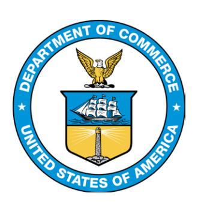
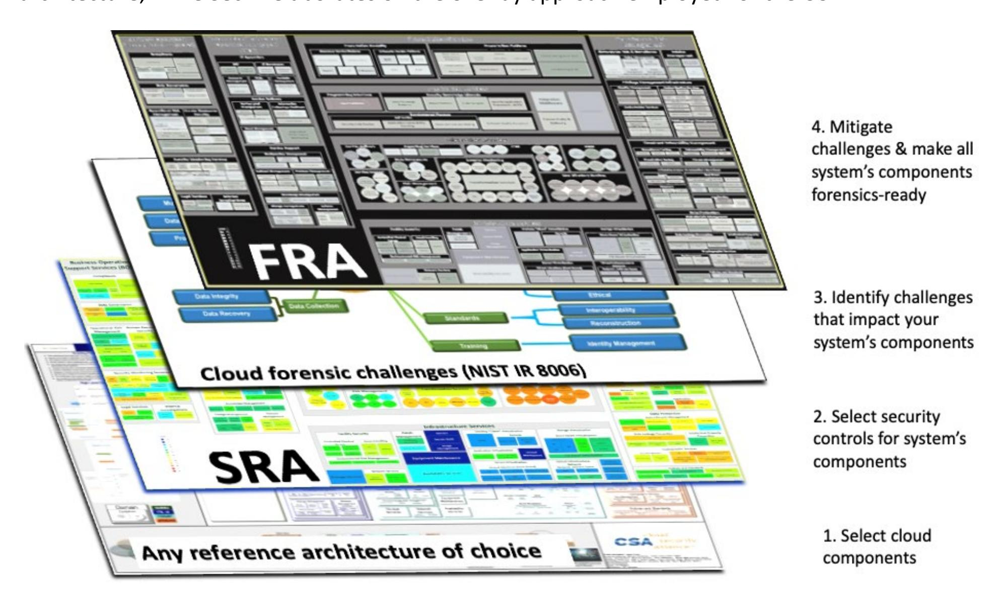
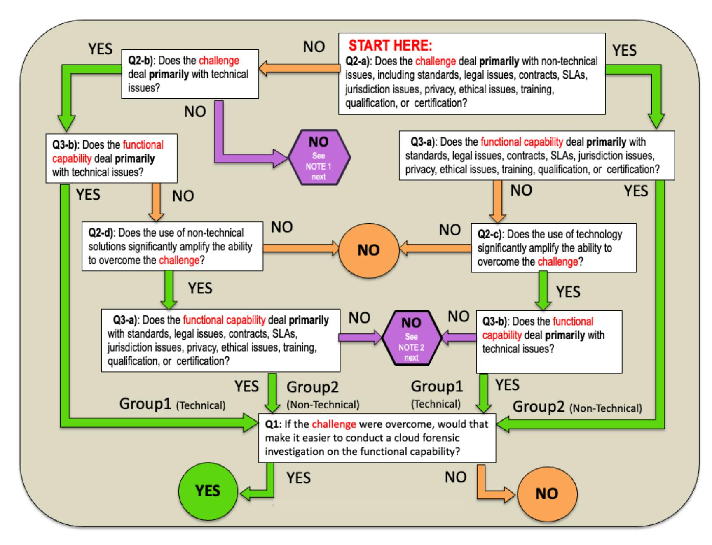
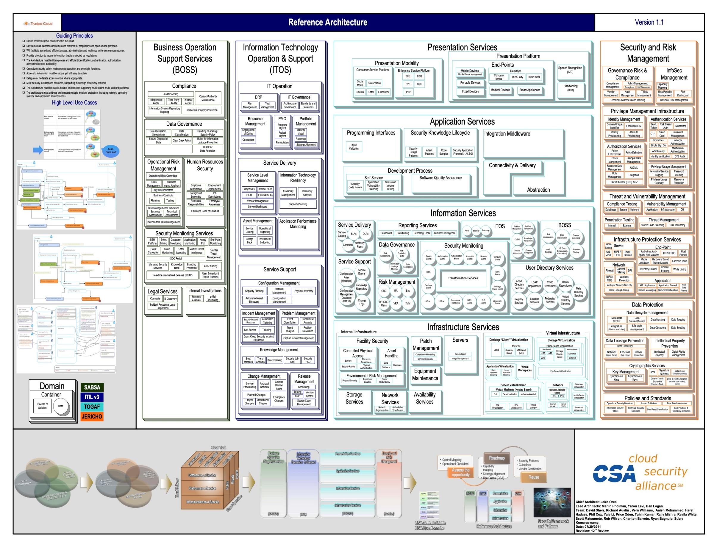
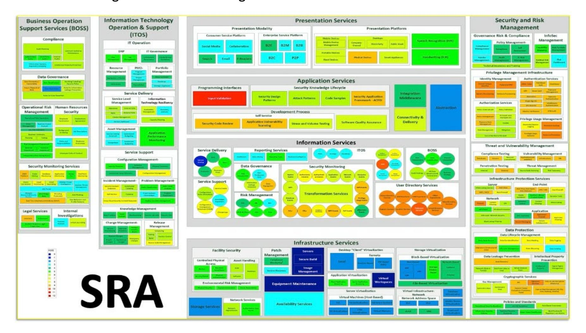
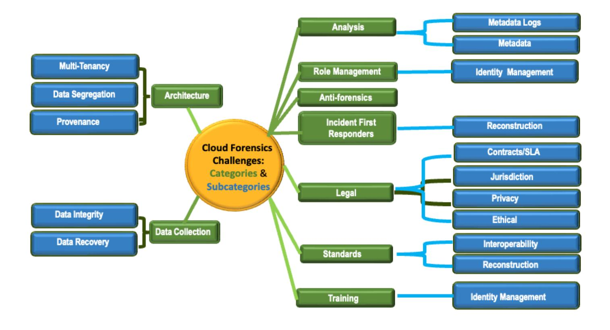
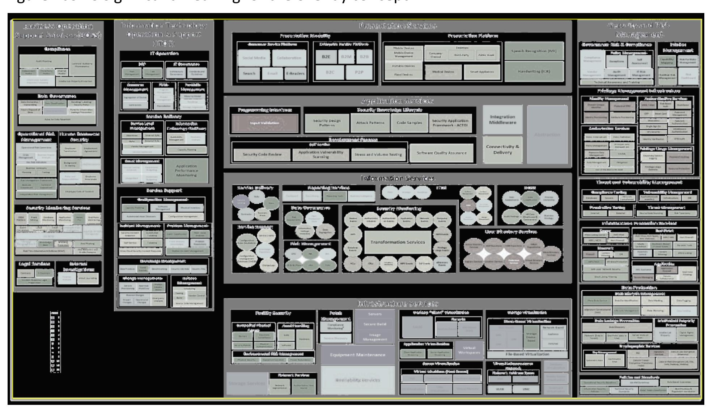
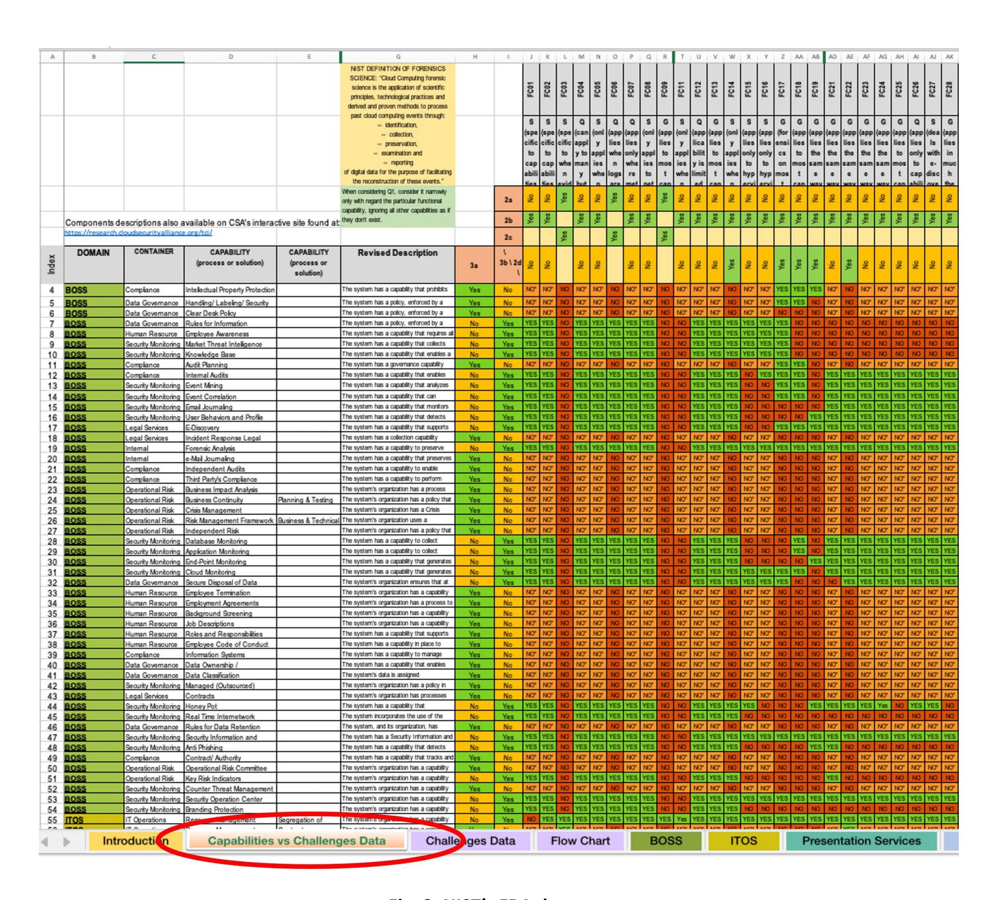

{0}------------------------------------------------

# **NIST Special Publication 800 NIST SP 800-201**

# **NIST Cloud Computing Forensic Reference Architecture**

Martin Herman Michaela Iorga Ahsen Michael Salim Robert H. Jackson Mark R. Hurst Ross A. Leo Anand Kumar Mishra Nancy M. Landreville Yien Wang

This publication is available free of charge from: https://doi.org/10.6028/NIST.SP.800-201

{1}------------------------------------------------

# **NIST Special Publication 800 NIST SP 800-201**

# **NIST Cloud Computing Forensic Reference Architecture**

Martin Herman\*

*Information Access Division Information Technology Laboratory*

Michaela Iorga

*Computer Security Division Information Technology Laboratory*

> Ahsen Michael Salim *American Data Technology, Inc.*

> > Robert H. Jackson Mark R. Hurst *SphereCom Enterprises, Inc.*

Ross A. Leo *University of Houston-Clear Lake The CyberSecurity Institute*

Anand Kumar Mishra *National Institute of Technology Sikkim India* 

> Nancy M. Landreville *Graduate School of Cybersecurity and Information Technology University of Maryland (GC)*

> > Yien Wang *Auburn University*

*\*Former NIST employee; all work for this publication was done while at NIST.*

This publication is available free of charge from: https://doi.org/10.6028/NIST.SP.800-201

July 2024

U.S. Department of Commerce *Gina M. Raimondo, Secretary*

National Institute of Standards and Technology *Laurie E. Locascio, NIST Director and Under Secretary of Commerce for Standards and Technology*  

{2}------------------------------------------------

Certain commercial entities, equipment, or materials may be identified in this document in order to describe an experimental procedure or concept adequately. Such identification is not intended to imply recommendation or endorsement by the National Institute of Standards and Technology, nor is it intended to imply that the entities, materials, or equipment are necessarily the best available for the purpose.

There may be references in this publication to other publications currently under development by NIST in accordance with its assigned statutory responsibilities. The information in this publication, including concepts and methodologies, may be used by federal agencies even before the completion of such companion publications. Thus, until each publication is completed, current requirements, guidelines, and procedures, where they exist, remain operative. For planning and transition purposes, federal agencies may wish to closely follow the development of these new publications by NIST.

Organizations are encouraged to review all draft publications during public comment periods and provide feedback to NIST. Many NIST cybersecurity publications, other than the ones noted above, are available at [https://csrc.nist.gov/publications.](https://csrc.nist.gov/publications)

#### **Authority**

This publication has been developed by NIST in accordance with its statutory responsibilities under the Federal Information Security Modernization Act (FISMA) of 2014, 44 U.S.C. § 3551 et seq., Public Law (P.L.) 113-283. NIST is responsible for developing information security standards and guidelines, including minimum requirements for federal information systems, but such standards and guidelines shall not apply to national security systems without the express approval of appropriate federal officials exercising policy authority over such systems. This guideline is consistent with the requirements of the Office of Management and Budget (OMB) Circular A-130.

Nothing in this publication should be taken to contradict the standards and guidelines made mandatory and binding on federal agencies by the Secretary of Commerce under statutory authority. Nor should these guidelines be interpreted as altering or superseding the existing authorities of the Secretary of Commerce, Director of the OMB, or any other federal official. This publication may be used by nongovernmental organizations on a voluntary basis and is not subject to copyright in the United States. Attribution would, however, be appreciated by NIST.

#### **NIST Technical Series Policies**

[Copyright, Use, and Licensing Statements](https://doi.org/10.6028/NIST-TECHPUBS.CROSSMARK-POLICY) [NIST Technical Series Publication Identifier Syntax](https://www.nist.gov/document/publication-identifier-syntax-nist-technical-series-publications)

#### **Publication History**

Approved by the NIST Editorial Review Board on 2024-07-01

# **How to Cite this NIST Technical Series Publication**

Herman M, Iorga M, Salim AM, Jackson RH, Hurst MR, Leo RA, Mishra AK, Landreville NM, Wang Y (2024) NIST Cloud Computing Forensic Reference Architecture. (National Institute of Standards and Technology, Gaithersburg, MD), NIST Special Publication (SP) 800-201. https://doi.org/10.6028/NIST.SP.800-201

# **Author ORCID iDs**

Martin Herman: 0000-0001-9315-6458 Michaela Iorga: 0000-0001-7880-6045

{3}------------------------------------------------

#### **Contact Information**

[sp800-201@nist.gov](mailto:sp800-201@nist.gov) 

National Institute of Standards and Technology Attn: Computer Security Division, Information Technology Laboratory 100 Bureau Drive (Mail Stop 8930) Gaithersburg, MD 20899-8930

#### **Additional Information**

Additional information about this publication is available at<https://csrc.nist.gov/pubs/sp/800/201/final> including related content, potential updates, and document history.

**All comments are subject to release under the Freedom of Information Act (FOIA).**

{4}------------------------------------------------

# **Abstract**

This document summarizes the research performed by the NIST Cloud Computing Forensic Science Working Group and presents the NIST Cloud Computing Forensic Reference Architecture (CC FRA or FRA), whose goal is to provide support for a cloud system's forensic readiness. The CC FRA helps users understand the cloud forensic challenges that might exist for an organization's cloud system. It identifies challenges that require at least partial mitigation strategies and how a forensic investigator would apply those strategies to a particular forensic investigation. The CC FRA presented here is both a methodology and an initial implementation. Users are encouraged to customize this initial implementation for their specific situations and needs.

# **Keywords**

civil litigation; criminal investigation; cybersecurity; digital forensics; enterprise architecture; enterprise operations; forensic readiness; incident response.

# **Reports on Computer Systems Technology**

The Information Technology Laboratory (ITL) at the National Institute of Standards and Technology (NIST) promotes the U.S. economy and public welfare by providing technical leadership for the Nation's measurement and standards infrastructure. ITL develops tests, test methods, reference data, proof of concept implementations, and technical analyses to advance the development and productive use of information technology. ITL's responsibilities include the development of management, administrative, technical, and physical standards and guidelines for the costeffective security and privacy of other than national security-related information in federal information systems. The Special Publication 800-series reports on ITL's research, guidelines, and outreach efforts in information system security, and its collaborative activities with industry, government, and academic organizations.

{5}------------------------------------------------

# **Patent Disclosure Notice**

NOTICE: ITL has requested that holders of patent claims whose use may be required for compliance with the guidance or requirements of this publication disclose such patent claims to ITL. However, holders of patents are not obligated to respond to ITL calls for patents and ITL has not undertaken a patent search in order to identify which, if any, patents may apply to this publication.

As of the date of publication and following call(s) for the identification of patent claims whose use may be required for compliance with the guidance or requirements of this publication, no such patent claims have been identified to ITL.

No representation is made or implied by ITL that licenses are not required to avoid patent infringement in the use of this publication.

{6}------------------------------------------------

# **Table of Contents**

| Executive Summary 1                                                                                 |        |
|-----------------------------------------------------------------------------------------------------|--------|
| 1. Introduction 2                                                                                   |        |
|                                                                                                     |        |
|                                                                                                     |        |
| 2. Overview of NIST Cloud Forensic Challenges 7                                                     |        |
| 3. CSA's Enterprise Architecture                                                                 | 10     |
| 4. Forensic Reference Architecture Methodology                                                      | 11     |
| 5. Forensic Reference Architecture Data                                                          | 17     |
| 6. Conclusion                                                                                    | 20     |
| References                                                                                          | 21     |
| Appendix A. Acronyms                                                                                | 23     |
| Appendix B. Glossary                                                                             | 25     |
| Appendix C. Overview of CSA's Enterprise Architecture                                            | 26     |
| Appendix D. The FRA Overlay Approach                                                             | 29     |
| Appendix E. NIST's Forensic Reference Architecture Dataset 31                                       |        |
| List of Figures                                                                                     |        |
| Fig. 1. Forensic Reference Architecture overlaying approach 5                                    |        |
| Fig. 2. Mapping flowchart                                                                           | 12     |
| Fig. 3. Excerpt of the Forensic Reference Architecture (challenges vs. capabilities Mapping Table). |  18 |
| Fig. 4. CSA's Enterprise Architecture (v1.1) [2]                                                    | 28     |
| Fig. 5. Graphical representation of NIST's Cloud Security Reference Architecture (SRA) [15]         | 29     |
| Fig. 6. Graphical representation of NIST's Cloud Forensic Challenges [1]                            | 29     |
| Fig. 7. Graphical representation of NIST's Cloud Forensic Reference Architecture                 | 30     |
| Fig. 8. NIST's FRA dataset                                                                       | 31     |

{7}------------------------------------------------

# **Acknowledgments**

*This report is dedicated to the memory of our colleague, collaborator, and friend, Ernesto F. Rojas of Forensic & Security Services Inc., who passed away unexpectedly.*

This publication was developed by the [NIST Cloud Computing Forensic Science Working Group](https://csrc.nist.gov/Projects/cloud-forensics) [\(NCC FSWG\)](https://csrc.nist.gov/Projects/cloud-forensics) co-chaired by Dr. Martin Herman and Dr. Michaela Iorga. NIST and the co-chairs wish to gratefully acknowledge and thank the members whose dedicated efforts contributed significantly to researching this topic and to generating the data included in this publication, which constitutes the foundation of NIST's Cloud Computing Forensic Reference Architecture. The authors thank Richard Lee of Citizens Financial Group, who served as a reviewer; Rodrigo Sardinas of Auburn University; Pw Carey of Grapevine Solutions; Richard Austin, formerly of Hewlett-Packard Enterprise; Dr. Ken Stavinoha, formerly with Cisco Systems; and Otto Scot Reemelin, who was with Ipro Tech during this work, for contributing to the data collection, analysis, and review. The authors would also like to thank Josiah Dykstra of the National Security Agency, Kenneth R. Zatyko of Buffalo Block Chain, and independent expert Keyun Ruan for their contributions during the early stages of this research. Finally, the authors wish to thank their peers who continuously provided feedback during the research and development stages of this document.

{8}------------------------------------------------

# **Executive Summary**

New methodologies are needed to identify, acquire, preserve, examine, and interpret digital evidence in multi-tenant cloud environments with rapid provisioning, global elasticity, and broad network accessibility. These methodologies will provide capabilities for incident response, secure internal enterprise operations, and support for the criminal justice and civil litigation systems.

This document presents the NIST Cloud Computing Forensic Reference Architecture (CC FRA or FRA), which provides support for a cloud system's forensic readiness. The CC FRA is meant to help users understand the cloud forensic challenges that might exist for an organization's cloud system. It enables cloud forensic stakeholders to analyze the impacts of cloud forensic challenges by considering each challenge in the context of the functional capabilities presented in the Cloud Security Alliance's Enterprise Architecture. It also identifies forensic challenges that require mitigation strategies and how a forensic investigator would apply those strategies to a particular forensic investigation.

While the CC FRA can be used by any cloud computing practitioner, it is specifically designed to allow cloud system architects, cloud engineers, forensic practitioners, and cloud consumers to ask questions related to their cloud computing architectures. The CC FRA is both a methodology and an initial implementation, and users are encouraged to customize this initial implementation for their specific situations and needs.

{9}------------------------------------------------

# **1. Introduction**

The [NIST Cloud Computing Forensic Science Working Group](https://csrc.nist.gov/Projects/cloud-forensics) (NCC FSWG) was established to research forensic science challenges and architectures related to the cloud environment. It previously published NIST Interagency Report (IR) 8006, *NIST Cloud Computing Forensic Science Challenges* [\[1\],](#page-28-1) which highlighted the unique digital forensic challenges of public cloud computing services under three aspects of operation: normal operations, adverse operations (i.e., when cloud computing resources are under attack), and operations during criminal exploitation. A description and discussion of digital forensics in cloud computing is provided in Section [1.1.](#page-9-1)

Close examination of these challenges involved analyzing a security reference architecture of choice. For convenience, an already developed security architecture was analyzed -- the Cloud Security Alliance's (CSA's) Enterprise Architecture (EA) [\[2\],](#page-28-2) along with its various functional capabilities and processes, and the potential impacts of each challenge on performing a forensic investigation if a specific functional capability or process were involved in an attack or breach or were used during criminal exploitation. The analysis spans hypothetical scenarios that would result in exploitation of potential weaknesses, vulnerabilities, exposures, or cloud technology for criminal activities. Such elements are of fundamental concern in forensic analysis as they present opportunities that adversaries may seek to exploit or characteristics that can be leveraged by criminals. In any case, there will be evidence of the attack or criminal exploitation for future forensic analysis. The EA is composed of a large set of specific functional capabilities that enable detailed consideration of the effects of each forensic challenge on each of the capabilities.

The nature of each challenge was also examined (i.e., whether the challenge istechnological or nontechnological) to determine its role and impact on the forensic examination process. As each challenge was analyzed, the applicability of techniques or technologies became clearer in terms of how they function and contribute to the identification, acquisition, preservation, examination, and interpretation of evidence.

This document describes how forensics in the cloud can achieve the same level of acceptance as forensics in traditional computing models. This document, the associated research, and IR 8006 [\[1\]](#page-28-1) proactively address Executive Order 14028, *Improving the Nation's Cybersecurity* [\[3\],](#page-28-3) which points out the importance of having forensic-ready information systems, including cloud systems.

# **1.1. The Need for a Cloud-Specific Forensic Reference Architecture**

Digital forensics is the application of science and technology to the discovery and examination of digital artifacts to establish facts and evidence concerning events and conditions that occur within information systems and networks. For decades, information processing systems have enabled the storage, processing, and transmission of information for public and private organizations and individuals. The maintenance, operation, and protection of these information systems have become paramount concerns since a disruption of sufficient magnitude or specific type could threaten business activities. In addition, the use of these systems in support of criminal activities has been of major concern. Digital forensics has traditionally been used for judicial proceedings and regulatory issues but may also be used for other purposes described below.

{10}------------------------------------------------

As computer and information science technologies, their implementations, and their operations have changed, digital forensics has adapted. The number of scenarios that may require the application of digital forensic techniques have increased along with the complexity of the underlying architectures.

One common scenario involves the detailed investigation of criminal activities, including "traditional" forms of crime (e.g., violent crime, property crime, drug trafficking, human trafficking, white-collar crime) and crimes that occur in cyberspace (e.g., ransomware attacks, phishing attacks, data breaches, identity theft, cyber-terrorism, distributed denial of service, illicit cryptocurrency mining, child pornography, and attacks against governments, key corporations, or power grids). Digital forensic procedures involve locating and analyzing digital traces that can help solve the crime and/or allow for incident response.

Forensic procedures are also used to investigate civil actions, such as divorce proceedings, asset discovery, insurance claims, lawsuits, and similar cases that often require forensic methods to determine the presence, absence, and movement of data and funds. In each of these cases, forensics plays an essential role in determining facts; assisting in the analysis, validation, and authentication of data; and enabling the documentation of findings.

The application of forensic methods may also be required for normal business operations, such as data recovery. During incident response, forensic methods may help mitigate future cyber-attacks, prevent system failure, or minimize data loss. Forensics can also help determine the root cause of an outage event, such as component failure, corrupted software, or intentional sabotage. Other scenarios may involve the close examination of system configurations, potentially questionable employee data storage and activities, and operational aspects related to compliance matters.

The frameworks listed below can provide core support for the design, implementation, assessment, monitoring, and operations of information systems:

- NIST Risk Management Framework (RMF) [\[4\]](#page-28-4) A focused guide to information system risk management
- ISO 27000 Series [\[5\]](#page-28-5) A series of standards on a wide range of information security topics, such as:
  - o ISO/IEC 27001 [\[6\]](#page-28-6) Information security management
  - o ISO/IEC 27002 [\[7\]](#page-28-7) Information security controls
  - o ISO/IEC 27017 [\[26\]](#page-29-0) Safeguarding cloud environments and minimizing risk of security incidents
  - o ISO/IEC 27018 [\[8\]](#page-28-8) Securing personally identifiable information (PII) in the cloud
  - o ISO/IEC 27035 [\[9\]](#page-28-9) Incident response
  - o ISO/IEC 27037 [\[10\]](#page-28-10) Digital evidence collection and preservation
- IT Infrastructure Library (ITIL) [\[11\]](#page-28-11) A service-oriented architecture (SOA)
- Sherwood Applied Business Security Architecture (SABSA) [\[12\]](#page-28-12)
- The Open Group Architecture Framework (TOGAF) [\[13\]](#page-28-13) A general security framework
- Cloud Security Alliance STAR program [\[14\]](#page-28-14)  A progressive security certification

{11}------------------------------------------------

The focus of each of these frameworks varies but generally facilitates architecting, implementing, and operating secure and resilient information systems. The RMF is focused on security from a risk identification and management perspective. As varied as the ISO 27000 series [\[5\]](#page-28-5) is, it contains standards that address digital evidence and incident response. However, there is not a readily apparent, in-depth exploration of cloud-system forensics.

The material presented here deals with the matter of forensics performed within a cloud computing environment. The advent of cloud computing has simplified business operations and introduced a level of business agility not previously experienced with traditional or on-premises computing. However, cloud computing has also introduced a range of security and forensics challenges. Enhanced capabilities enjoyed by legitimate businesses and friendly governments are often equally available to opposing nation-states, terrorist groups, and international criminal elements and assets. As a result, targets that were once unassailable by nefarious actors may now be vulnerable to attack or exploitation.

To a great extent, cloud computing runs on virtualization — that is, the creation of processing resources that have hardware as their basis but run as multiplexed programs and are thus functionally multiplied through it. Cloud forensics involves performing analysis on "virtual machines" using techniques that require "real machines." In addition, the information obtained from "machines" that are essentially "unreal" is different from traditional digital evidence.

Cloud computing has become increasingly pervasive as more entities discover its advantages. These entities include legitimate businesses, governments, and individuals who use software-as-aservice (SaaS) cloud platforms, as well as criminal and terrorist organizations and opposing nationstates. For legitimate consumers, cloud computing provides capabilities such as:

- More rapid business continuity and disaster recovery
- More effective incident response
- Improved information access, management, and archiving
- Easier and more immediate collaboration between widely separated individuals and groups

This research has adapted solutions that originated in the on-premises data center to the significant differences presented by the cloud.

As important as they are for addressing significant events related to business operations, forensic methods have at least equal importance when contributing to matters of compliance, legality, and criminal exploitation. Careful treatment has been given to these questions during this research to ensure that the findings do not merely consider technical aspects but also address the broader aspects of their material application. Unquestionably, close examination of these adverse events is required to understand their incipience and progression and — in particular — to ensure that remediation, event reconstruction, and attribution are effectively and credibly realized.

Thus, it has been the specific focus and goal of this effort to research these issues, examine and clarify the forensic challenges, and ultimately formulate and validate the capabilities required to apply accepted forensic techniques and technologies to this unique computing environment. The result is the Cloud Computing Forensic Reference Architecture.

{12}------------------------------------------------

In as much as a security reference architecture must incorporate standards and requirements that will inform system actualization and operation with respect to security, applying a forensic reference architecture will likewise inform that system actualization and operation with the capability to more effectively examine, understand, reconstruct, and remediate a variety of system events and disruptions.

The goal of the CC FRA is to support a cloud system's forensic readiness by helping users understand the forensic challenges that might exist for an organization's cloud system. It identifies which forensic challenges require mitigation strategies and how a forensic investigator would apply those strategies to a particular forensic investigation. The CC FRA will likely evolve over time with more use and research.

# **1.2. The Approach**

The CC FRA builds on several foundational layers, the first of which is the understanding that it addresses forensics in the context of a cloud computing environment. Building upon the fundamental relationship between security, incident response, and forensics, the CC FRA is designed to be an overlay to SP 800-200 ipd (initial public draft), *NIST Cloud Computing Security Reference Architecture (SRA)* [\[15\],](#page-28-15) which focuses on security risk management considerations and security controls selection for cloud ecosystems and leverages the CSA's Enterprise Architecture (EA). Section [3](#page-17-0) and [Appendix C](#page-33-0) describe the CSA's EA and its use in deriving the reference architecture, while Sec. 4 elaborates on the overlay approach employed for the CC FRA.

**Fig. 1. Forensic Reference Architecture overlaying approach**

{13}------------------------------------------------

The bottom layer in [Figure 1](#page-12-0) graphically represents the cloud reference architecture of choice for this document, which is the CSA EA [\[2\].](#page-28-2)

The layer above represents the NIST cloud SRA (see [Appendix D](#page-36-0) [– Figure 5\)](#page-36-1). The next layer represents the NIST cloud forensic challenges (see [Appendix D](#page-36-0) – [Figure 6\)](#page-36-2). The top layer graphically represents the NIST FRA (see [Appendix D](#page-36-0) – [Figure 7\)](#page-37-0) described in this document. This overlay approach (i.e., a superimposed, adapted set or subset) leverages components, concepts and attributes defined in the CSA EA [\[2\]](#page-28-2) — more precisely, the [CSA TCI v1.1](https://github.com/usnistgov/FRA/blob/main/docs/TCI-Reference-Architecture-v1.1.pdf) (the initial version of the CSA's EA - see [Appendix C\)](#page-33-0) and in the NIST cloud SRA, analyzed in the context of the NIST IR 8006 cloud forensic challenges.

More precisely, the FRA layer leverages the three layers graphically represented beneath it by analyzing each capability of the SRA (previously derived from the CSA's EA [\[2\]](#page-28-2) - see [Appendix D](#page-36-0) - [Figure 5\)](#page-36-1) in the context of the challenges documented in IR 8006 [\[1\]](#page-28-1) (se[e Appendix D](#page-36-0) - [Figure 6\)](#page-36-2). The analysis determines whether each challenge *affects* the capability if implemented in a cloud environment as part of a cloud service or solution. If the challenge does affect the capability, then the functional capability is considered to have forensic importance, and it is imported to or considered a capability of the FRA (see Appendix E - Figure 8 for a larger image).

{14}------------------------------------------------

# **2. Overview of NIST Cloud Forensic Challenges**

In IR 8006 [\[1\],](#page-28-1) the NCC FSWG identified 62 challenges related to cloud computing forensics along with the potential results of overcoming each challenge. That document provides a preliminary analysis of these challenges by including:

- the relationship between each challenge and the five essential characteristics of cloud computing, as defined in the NIST cloud computing model [\[16\];](#page-29-1)
- how the challenges correlate to cloud technology; and
- nine categories to which the challenges belong.

The analysis also considers logging data, data in media, and issues associated with time, location, and sensitive data. In addition, the relevance of topics such as rapid elasticity, multi-tenancy, and hypervisor/virtual machine layers is discussed. These 62 challenges support the criminal justice and civil litigation systems, security incident response, and internal enterprise operations.

The nine categories to which the challenges belong are reproduced below [\[1\]:](#page-28-1)

- 1. Architecture (e.g., diversity, complexity, provenance, multi-tenancy, data segregation). Architecture challenges in cloud forensics include:
  - o Dealing with variability in cloud architectures between providers
  - o Tenant data compartmentalization and isolation during resource provisioning
  - o Proliferation of systems, locations, and endpoints that can store data
  - o Accurate and secure provenance for maintaining and preserving chain of custody
- 2. Data collection (e.g., data integrity, data recovery, data location, imaging). Data collection challenges in cloud forensics include:
  - o Locating forensic artifacts in large, distributed, and dynamic systems
  - o Locating and collecting volatile data
  - o Data collection from virtual machines
  - o Data integrity in a multi-tenant environment where data is shared among multiple computers in multiple locations and accessible by multiple parties
  - o Inability to image all of the forensic artifacts in the cloud
  - o Accessing the data of one tenant without breaching the confidentiality of other tenants
  - o Recovery of deleted data in a shared and distributed virtual environment
- 3. Analysis (e.g., correlation, reconstruction, time synchronization, logs, metadata, timelines). Analysis challenges in cloud forensics include:
  - o Correlation of forensic artifacts across and within cloud providers
  - o Reconstruction of events from virtual images or storage
  - o Integrity of metadata

{15}------------------------------------------------

- o Timeline analysis of log data, including synchronization of timestamps
- 4. Anti-forensics (e.g., obfuscation, data hiding, malware). Anti-forensics is a set of techniques used specifically to prevent or mislead forensic analysis. Anti-forensic challenges in cloud forensics include:
  - o The use of obfuscation, malware, data hiding, or other techniques to compromise the integrity of evidence
  - o Malware may circumvent virtual machine isolation methods
- 5. Incident first responders (e.g., trustworthiness of cloud providers, response time, reconstruction). Incident first responder challenges in cloud forensics include:
  - o Confidence, competence, and trustworthiness of the cloud providers to act as first responders and perform data collection
  - o Difficulty in performing initial triage
  - o Processing a large volume of collected forensic artifacts
- 6. Role management (e.g., data owners, identity management, users, access control). Role management challenges in cloud forensics include:
  - o Uniquely identifying the owner of an account
  - o Decoupling between cloud user credentials and physical users
  - o Ease of anonymity and creating fictitious identities online
  - o Determining exact ownership of data
  - o Authentication and access control
- 7. Legal (e.g., jurisdictions, laws, service-level agreements, contracts, subpoenas, international cooperation, privacy, ethics). Legal challenges in cloud forensics include:
  - o Identifying and addressing issues of jurisdictions for legal access to data
  - o Lack of effective channels for international communication and cooperation during an investigation
  - o Data acquisition that relies on the cooperation, competence, and trustworthiness of cloud providers
  - o Missing terms in contracts and service-level agreements
  - o Issuing subpoenas without knowledge of the physical location of data
- 8. Standards (e.g., standard operating procedures, interoperability, testing, validation). Standards challenges in cloud forensics include:
  - o Lack of minimum/basic SOPs, practices, and tools
  - o Lack of interoperability among cloud providers
  - o Lack of test and validation procedures
- 9. Training (e.g., forensic investigators, cloud providers, qualification, certification). Training challenges in cloud forensics include:
  - o Misuse of digital forensic training materials that are not applicable to cloud forensics
  - o Lack of cloud forensic training and expertise for both investigators and instructors

{16}------------------------------------------------

o Limited knowledge about evidence by record-keeping personnel in cloud providers

{17}------------------------------------------------

# **3. CSA's Enterprise Architecture**

NIST does not prescribe the use of the CSA EA and only uses it for convenience and illustration. Another security architecture could have been used instead. The CSA EA was developed by a public working group and, therefore, represents the thinking of the community more broadly rather than just a single company. An overview of the CSA EA is provided in [Appendix C.](#page-33-0)

The CSA's EA is both a methodology and a set of tools that enable security architects, enterprise architects, and risk management professionals to leverage a common set of solutions and controls [\[2\].](#page-28-2) These solutions and controls fulfill common requirements that risk managers must assess regarding the operational status of internal IT security and cloud provider controls. These controls are expressed in terms of security capabilities and designed to create a common roadmap to meet the security needs of businesses.

With the CSA EA, a set of functional capabilities is defined within the following domains: Business Operation Support Services, Information Technology Operation and Support, Security and Risk Management, Presentation Services, Application Services, Information Services, and Infrastructure Services. Together, there are 347 functional capabilities within these domains.

The CSA's EA functional capabilities are leveraged by the NIST Cloud SRA [\[15\],](#page-28-15) which is comprised of a formal model designed as a security overlay to the NIST Cloud Computing Reference Architecture [\[22\]](#page-29-2) and a methodology for architecting and orchestrating a cloud-based solution. The methodology allows cloud architects to identify the system's functional capabilities. The orchestration employs a risk-based approach that follows the Risk Management Framework (RMF) [\[4\]](#page-28-4) applied to cloud-based systems.

The SRA's risk-based approach for determining a cloud actor's responsibilities for implementing specific system components supports a clear delineation between the security responsibilities of cloud providers and consumers and an understanding of the customer responsibility matrix. Specifically, for each cloud service model, system components are analyzed to identify the level of involvement of each cloud actor when implementing those components.

{18}------------------------------------------------

# **4. Forensic Reference Architecture Methodology**

The CC FRA aims to help users understand the cloud forensic challenges that might exist for an organization's cloud systems. When architecting or orchestrating a new cloud system, cloud architects and cloud security and forensic practitioners are encouraged to use the CC FRA to identify which challenges could impact the system and require at least partial mitigation strategies to minimize the risk incurred during operations (e.g., allowing real-time interventions based on the proactively generated forensic data to eliminate potential negative impacts on digital forensic investigations).

While the FRA can be used by any cloud computing practitioner, it is specifically designed to help the following target audiences find answers to specific questions related to their cloud computing architectures:

- **Target Audience #1: Cloud system architects and engineers.** This target audience might ask: "To what extent does the cloud system I'm designing facilitate the use of digital forensics?" The architectural methodology and initial architecture presented here can help this audience identify potential challenges to conducting forensics and focus on areas of concern. System trade-offs can be considered as well (e.g., the more that a system facilitates the use of forensics, the greater the negative operational or economic impacts might be, or the greater the chance that privacy might be impacted negatively).
- **Target Audience #2: Forensic investigators.** This target audience might ask: "What items do I need to be aware of to conduct digital forensics in the cloud environment versus a traditional or on-premises computing environment?" This audience will also benefit from identifying potential challenges to conducting forensics and which challenges may impact the system under investigation. To the extent that these challenges have been at least partially mitigated, the forensic investigator can determine whether and how appropriate forensic artifacts might be retrieved.
- **Target Audience #3: Consumers who want to procure cloud services from providers.** This target audience might ask: "What forensic questions and issues do I need to consider when discussing what a cloud provider has to offer?"

The CC FRA enables cloud security and forensic stakeholders to analyze the extent to which the cloud forensic challenges identified in IR 800[6 \[1\]](#page-28-1) are impacting their systems. Although the document provides a proof of concept using the CSA's EA, a different architecture of choice can be used.

The 62 forensic challenges and 347 functional capabilities described in Sec. [2](#page-14-0) and [Appendix C,](#page-33-0) respectively, provide the basis for determining which capabilities are affected by each of the challenges. All possible pairs of challenges and capabilities are considered. The capabilities help focus possible mitigation efforts. If a challenge affects a capability, there may be mitigation approaches to perform better forensics with regard to that capability. Such information could prove useful for forensic practitioners, developers, and researchers. For example, an attacker could maliciously delete log information that discloses the attacker's activities, preventing a forensic investigator from correlating events and potentially revealing meaningful information. 

{19}------------------------------------------------

When a cloud service customer is informed of such a challenge, the customer could mitigate the challenge by using or implementing a log file integrity validator which uses digitally signed digests.

The [NCC FSWG](https://csrc.nist.gov/Projects/cloud-forensics) has developed a mapping between functional capabilities and forensic challenges. For each functional capability, the mapping shows all of the forensic challenges that *affect* that capability. This has resulted in a Mapping Table of 347 rows (one for each capability) and 62 columns (one for each challenge). An entry in the table is YES if the associated challenge *affects* the associated capability; otherwise, the entry is NO. (See [Figure 3](#page-25-0) for an excerpt of this table.)

When the question is asked: *does a forensic challenge affect a functional capability,* it is defined to mean: *if the challenge were overcome, would that make it easier to conduct a cloud forensic investigation on the considered functional capability?* This is the relationship that the mapping between challenges and capabilities is capturing.

A summary developed for each of the 62 challenges (found in IR 8006 [\[1\],](#page-28-1) Annex A, Table 1) answers the following question: *What advantages would be provided to a forensic investigator if this challenge were overcome?* If these advantages imply that the quality of forensics that can be performed on the functional capability could be improved, then the answer to the question in the previous paragraph is *YES, overcoming the challenge could make it easier to perform a forensic investigation on the capability.*

[Fig. 2](#page-19-0) shows a flowchart for achieving a narrow, precise mapping between challenges and capabilities.

**Fig. 2. Mapping flowchart**

{20}------------------------------------------------

The flowchart provides users with a uniform method for determining the applicability of a challenge to a particular capability. In conducting the analysis, the [NCC FSWG](https://csrc.nist.gov/Projects/cloud-forensics) placed each cloud forensic challenge into one of two groups: 1) challenges that are primarily technical in nature (e.g., architecture) or 2) challenges that are primarily non-technical in nature (e.g., legal). This led to the creation of questions Q2-a, Q2-b, Q2-c, and Q2-d in the flowchart, which inform placement into the two groups. If a challenge deals primarily with standards, legal issues, contracts, service-level agreements, jurisdiction issues, privacy, ethical issues, training, qualifications, or certifications, then the challenge is considered non-technical. Otherwise, it is considered technical. This grouping provides a simple and straightforward method for analyzing the high-level characteristics of each challenge.

Similarly, the [NCC FSWG](https://csrc.nist.gov/Projects/cloud-forensics) placed each of the cloud functional capabilities into one of two groups: 1) primarily technical or 2) primarily non-technical. If a capability deals primarily with standards, legal issues, contracts, service-level agreements, jurisdiction issues, privacy, ethical issues, training, qualification, or certification, then the capability is considered non-technical. Otherwise, it is considered technical. This led to the creation of questions Q3-a and Q3-b.

To ensure a precise and limited mapping, the flowchart attempts to map challenges that are primarily technical only to capabilities that are primarily technical and challenges that are primarily non-technical only to capabilities that are primarily non-technical. If a challenge and a capability pair are assigned to the same group, the user considers whether overcoming the challenge makes it easier to conduct forensics on the capability. The answer determines whether the capability is affected by the challenge. In summary, if the appropriate grouping is done and overcoming the challenge makes it easier to conduct forensics, then the challenge is considered to affect the capability (i.e., the mapping is YES; otherwise, the mapping is NO). If there are challenges in one group that affect capabilities in another group, the mapping is considered to be NO because that does not provide the precise, limited mapping.

The following is an example of a precise, limited mapping. Suppose that the challenge deals with training (e.g., Challenge FC-65: *There is a lack of training materials that educate investigators on cloud computing technology and cloud forensic operating policies and procedures*; se[e \[1\],](#page-28-1) page 52). This is a non-technical challenge. In addition, suppose that the capability under consideration is technical. Enhanced training would clearly provide a significant benefit to forensic investigators and cloud providers because training is so broadly applicable. However, a cloud forensic architecture in which training affects almost every capability is undesirable because then the architecture applies too broadly; most of the capabilities are not *affected* by this challenge in an important way. This makes the architecture less useful because the architecture will have many challenges that *affect* too many capabilities. The architecture with a narrower mapping is also more practical because the fewer YESs in the mappings, the easier for an investigator to apply the mappings in real-world scenarios.

As described above and shown in Fig. 2, if both the challenge and the capability being evaluated deal with the same type of issue (i.e., *technical* or *non-technical*), then the following question is asked: *"If the challenge were overcome, would that make it easier to conduct a cloud forensic investigation on the functional capability?"* If the answer is "yes," then the mapping is YES.

{21}------------------------------------------------

However, if the challenge is primarily technical in nature and the capability is non-technical in nature (or vice versa), then an analysis is conducted to determine whether the use of technical or nontechnical solutions to implement the capability would significantly enhance the ability of a forensic investigator to overcome the challenge, as illustrated in questions Q2-c and Q2-d. If the answer to this question is "no," then no further analysis is required. If the answer to question Q2-c or Q2-d is "yes," then the analysis will continue to determine: "If the challenge were overcome, would that make it easier to conduct a cloud forensic investigation on the functional capability?"

This methodology provides a well-defined, structural approach for the analysis. As a result, the flowchart will help cloud designers, forensic investigators, and other interested parties focus specifically on functional capabilities that are affected by a specific cloud forensic challenge.

The process of traversing the flowchart involves asking questions about the particular challenge and capability pair being analyzed. Starting at the top right of the flowchart (labeled "Q2-a"), each box asks a question about the challenge or the capability. The answer to each question – YES or NO – then leads to either another box with a question or to one of the circles or the hexagon shown in **[Table 1](#page-21-0)**.

**Table 1. The meaning of the circles/hexagon within the flowchart o[f Fig. 2](#page-19-0)**

The challenge DOES affect the capability.

The challenge DOES NOT affect the capability.

The challenge DOES NOT affect the capability for reasons explained in [NOTE 1](#page-23-0) and [NOTE 2,](#page-23-1) below.

To determine whether the forensic challenge affects the functional capability, three fundamental types of questions are asked:

- 1. Question 1 (Q1) If the challenge were overcome, would that make it easier to conduct a cloud forensic investigation on the functional capability? Note that the term "cloud forensic investigation" means the identification, acquisition, preservation, examination, interpretation, and reporting of potential digital evidence in the cloud. When analyzing Question 1, it is narrowly considered only with regard to the particular functional capability, ignoring all other capabilities as if they do not exist. So, the question really asked is: *If the challenge were overcome, would that make it easier to conduct a cloud forensic investigation on this functional capability only while ignoring other capabilities?*
- 2. Question 2 (Q2-a, Q2-b, Q2-c, and Q2-d) These questions only relate to the challenges and not capabilities. The purpose of these questions is to determine whether the challenge deals with technical or non-technical issues and if either technical solutions or nontechnical solutions significantly amplify the ability to overcome the challenge.

{22}------------------------------------------------

3. Question 3 (Q3-a and Q3-b) — These questions only relate to the capabilities and not the challenges. The purpose of these questions is to determine whether the capability deals primarily with technical or non-technical issues.

Questions 2 and 3 ask about the issues that a challenge or capability deals with, which are determined as follows. As discussed in Sec. [2,](#page-14-0) the [NCC FSWG](https://csrc.nist.gov/Projects/cloud-forensics) labeled each of the 62 challenges according to the following nine categories: architecture, data collection, analysis, anti-forensics, incident first responders, role management, legal, standards, and training. The labels for each challenge may be found in [\[1\],](#page-28-1) Annex A, Table 2, in the columns labeled "Primary Category" and "Related Category." These categories and the challenge descriptions are used to determine the type of issue each challenge deals with. If the primary issues are standards, legal issues, contracts, service-level agreements, jurisdiction issues, privacy, ethical issues, training, qualification, or certification, then the challenge is considered non-technical. Otherwise, it is considered technical.

Similarly, if a capability deals primarily with standards, legal issues, contracts, service-level agreements, jurisdiction issues, privacy, ethical issues, training, qualification, or certification, then the capability is considered non-technical. Otherwise, it is considered technical.

The [NCC FSWG](https://csrc.nist.gov/Projects/cloud-forensics) developed consensus answers for all of the questions related to Question 2 and Question 3 in the flowchart. Therefore, when a particular challenge and capability pair was considered, all these questions were already answered. This resulted in much more consistent mappings across all challenges and capabilities.

When traversing the flowchart starting at the box labeled "Q2-a," if a NO node is *not* reached, then the box labeled "Q1" is eventually reached. For any challenge and capability pair, it may lie in one of two groups when Q1 is reached (see Fig. 2). As discussed above, Group 1 is the "Technical Group," and Group 2 is the "Non-Technical Group." They are defined as follows:

• **Group 1** (Technical Group)

[The *challenge* is technical, **OR** the *challenge* is non-technical but requires technology (at least partially) to overcome the *challenge*.]

# **AND**

[The *functional capability* is technical.]

• **Group 2** (Non-Technical Group) –

[The *challenge* is non-technical, **OR** the *challenge* is technical but requires non-technical solutions (at least partially) to overcome the *challenge*.]

# **AND**

[The *functional capability* is non-technical.]

Once a challenge and capability pair are assigned to the appropriate group, the question of whether overcoming the challenge makes it easier to conduct forensics on the capability is asked. This determines whether the capability is affected by the challenge. If the grouping is appropriate and overcoming the challenge makes it easier to conduct forensics, then the challenge is considered to affect the capability (i.e., the mapping is YES).

{23}------------------------------------------------

However, a challenge may be non-technical but requires technology to overcome it. Examples of non-technical challenges that have both non-technical and technical solutions include [\(\[1\],](#page-28-1) Annex A):

- FC-56 (confidentiality and PII) deals with legal and privacy issues (i.e., a non-technical challenge). Privacy issues can be resolved with a combination of legal steps (e.g., legislation) and technological steps (e.g., privacy-enhancing technologies).
- FC-64 and FC-65 deal with training (i.e., non-technical challenges). Training issues can be resolved with better and more widely available training classes, but they can also be resolved with better technology to perform the training.

There are non-technical challenges that require solutions that are non-technical, technical, or a combination of both. If the non-technical challenge requires only a non-technical solution (and the capability is non-technical), it is in Group 2. If it requires only a technical solution (and the capability is technical), it is in Group 1. If it requires both, then it is in Group 1 or Group 2, depending on whether the capability is technical or non-technical.

When a challenge is technical but requires a non-technical solution (and the capability is nontechnical), then it is in Group 2.

In [Fig. 2,](#page-19-0) the two purple hexagons refer to two notes, as follows:

- NOTE 1: When this circle is reached, the challenge is neither technical nor non-technical. Fortunately, none of the challenges reach this node as none have this property. This node is included simply for logical completeness of the flowchart, so that every node has both a YES exit path and a NO exit path.
- • NOTE 2: When this circle is reached, the capability is neither technical nor non-technical. There are a few capabilities that reach this node. However, these capabilities do not deal with issues directly related to digital forensics for cloud computing. Rather, they involve controlling physical access to facilities (e.g., using barriers, security patrols, checking physical ID cards.) and mitigating physical threats to facilities (e.g., installing fire suppression equipment).

This process for analyzing any pair that consists of a cloud functional capability and a cloud forensic challenge represents a core component of the CC FRA methodology. It can be applied to any set of capability-challenge pairs, either modified from the sets used in this document or adapted from a different architectural framework or empirical data.

{24}------------------------------------------------

# **5. Forensic Reference Architecture Data**

The data that supplements the CC FRA methodology described in Sec. 4 represents the result of an analysis performed by [NCC FSWG](https://csrc.nist.gov/Projects/cloud-forensics) members. The methodology was applied to all possible pairings of cloud forensic challenges with cloud functional capabilities. In total, 21,514 challenge-capability pairings were evaluated using the flowchart in [Fig. 1.](#page-12-0) The results of the NCC FSWG's analysis are summarized in a Mapping Table (MT). An entry in the MT is YES if the associated challenge was identified as *affecting* the paired capability. Otherwise, the entry is NO.

All users of CC FRA data are encouraged to use the data as an initial implementation of the methodology but use their own judgment when employing the CC FRA methodology in the context of their cloud systems and modify or customize NIST's initial dataset for their specific situations and needs. For example, if the existing capabilities are not appropriate for the user's situation, some or all can be removed. Similarly, new challenges that are appropriate for the user's situation can be added, or challenges that have been adequately mitigated can be removed. This architectural methodology can help users focus on how challenges can be mitigated because it considers each challenge specifically in the context of affected capabilities.

The CC FRA dataset provides responses for every challenge-capability pairing based on the analysis performed by the authors and collaborators of this document. A sample excerpt of the table is displayed i[n Fig. 3.](#page-25-0) The full CC FRA Mapping Table is available for download (see [Appendix E](#page-38-0) for a partial image and a link for downloading the data). A private entity may eventually develop a tool that allows users to input the forensic challenges in IR 8006 or other challenges and input the user's cloud security architecture of choice.

The CC FRA data has 62 cloud forensic challenges obtained from IR 8006 [\[1\].](#page-28-1) Originally, IR 8006 identified 65 challenges. However, three challenges were deleted from the final IR 8006 because the authors considered them to be obsolete challenges at the time of publication. Subsequent work derived from this document uses the initial challenge numbering system for compatibility and traceability. In the CC FRA Mapping Table, each cloud forensic challenge is shown across the top row (i.e., Forensic Challenge 1 [FC01], Forensic Challenge 2 [FC02], etc.). In [Fig. 3,](#page-25-0) only FC01- FC09 and FC58-FC65 are shown, and the rest of the challenges are hidden for the sake of readability in the figure. Additionally, the CC FRA data has 347 cloud functional capabilities. In the CC FRA Mapping Table, each cloud functional capability is listed on the left column labeled "CAPABILITY" (see [Fig. 3\)](#page-25-0). The CC FRA dataset preserves the grouping of the cloud functional capabilities provided by the CSA EA [\[2\]](#page-28-2) into "CONTAINERS" and "DOMAINS."

[Fig. 3](#page-25-0) shows the first nine and last nine capabilities; the rest are hidden. Each row, therefore, represents a separate capability and includes the following information: the domain of the capability (all of the domains are described in Sec. [3\)](#page-17-0), the container (the highest-level elements within the architectural diagram in [Appendix E](#page-38-0)[1](#page-24-1) ), the name of the capability, and a description of the capability (not shown in [Fig. 3](#page-25-0) but shown in [Appendix E\)](#page-38-0).

1 The container is a high-level collection of capabilities consisting of related processes and procedures within the domain.

{25}------------------------------------------------

|     | Components descriptions also available on CSA's int |                 |                        |     |     |     |     |     |     |     |     |     |     |    |     |     |     |     |           |     |           |     |
|-----|-----------------------------------------------------|-----------------|------------------------|-----|-----|-----|-----|-----|-----|-----|-----|-----|-----|----|-----|-----|-----|-----|-----------|-----|-----------|-----|
|     | https://research.cloudsecurityalliance.org/tci/     |                 |                        |     |     |     |     |     |     |     |     |     |     |    |     |     |     |     |           |     |           |     |
|     |                                                     |                 |                        |     |     |     |     |     |     |     |     |     |     |    |     |     |     |     |           |     |           |     |
|     |                                                     |                 |                        |     |     |     |     |     |     |     |     |     |     |    |     |     |     |     |           |     |           |     |
|     |                                                     |                 |                        |     |     |     |     |     |     |     |     |     |     |    |     |     |     |     |           |     |           |     |
|     |                                                     |                 |                        |     |     |     |     |     |     |     |     |     |     |    |     |     |     |     |           |     |           |     |
| 4   |                                                     | Compliance      | Intellectual Property  |     |     |     |     |     |     |     |     |     |     |    |     |     |     |     |           |     |           |     |
| 5   |                                                     | Data            | Handling/ Labeling/    |     |     |     |     |     |     |     |     |     |     |    |     |     |     |     |           |     |           |     |
| 6   |                                                     | Data            | Clear Desk Policy      |     |     |     |     |     |     |     |     |     |     |    |     |     |     |     |           |     |           |     |
| 7   |                                                     | Data            | Rules for Information  |     |     |     |     |     |     |     |     |     |     |    |     |     |     |     |           |     |           |     |
| 8   |                                                     | Human           | Employee Awareness     |     |     |     |     |     |     |     |     |     |     |    |     |     |     |     |           |     |           |     |
| 9   |                                                     | Security        | Market Threat          |     |     |     |     |     |     |     |     |     |     |    |     |     |     |     |           |     |           |     |
| 10  |                                                     | Security        | Knowledge Base         |     |     |     |     |     |     |     |     |     |     |    |     |     |     |     |           |     |           |     |
| 11  |                                                     | Compliance      | Audit Planning         |     |     |     |     |     |     |     |     |     |     |    |     |     |     |     |           |     |           |     |
| 12  |                                                     | Compliance      | Internal Audits        | No  | Yes | YES | YES | NO  | YES | YES | YES | YES | YES | NO | YES | YES | NO* | NO  | NO        | NO* | YES       | NO* |
|     | HIDDEN                                              |                 |                        |     |     |     |     |     |     |     |     |     |     |    |     |     |     |     |           |     |           |     |
|     | S & RM                                              | Infrastructure  | Network                | No  | Yes |     |     |     | YES |     |     |     |     |    | YES |     |     | YES |           |     | YES       |     |
|     | S & RM                                              | Data Protection | Data Lifecycle         | No  | Yes |     |     |     | YES |     |     |     |     | NO |     | YES |     | YES |           |     | YES       |     |
|     | S & RM                                              | Cryptographic   | Signature Services     | No  | Yes |     |     |     | YES |     |     |     |     | NO | YES |     |     | YES |           |     | YES       |     |
|     | S & RM                                              | Governance      | IT Risk Management     | Yes | No  |     | NO* |     | NO* |     | YES |     |     | NO | NO  | NO  | NO  | NO  | NO        | NO  | NO        | NO  |
|     | S & RM                                              | InfoSec         | Risk Portfolio         | Yes | No  |     | NO* | NO  |     |     | YES |     | NO* | NO | NO  | NO  | NO  | NO  | NO        | NO  | NO        | NO  |
|     | S & RM                                              | Privilege       | Authorization Services | No  | Yes |     |     |     | YES |     |     |     |     | NO | YES |     |     | YES |           |     | YES       |     |
|     | S & RM                                              | Privilege       | Authorization Services | No  | Yes |     |     |     | YES |     |     |     |     | NO |     | YES |     | YES |           |     | YES       |     |
|     | S & RM                                              | Policies and    | Information Security   | Yes | No  |     | NO* |     |     | NO* |     |     |     | NO | NO  | NO  | NO* | NO  | NO VEC | NO* | NO VEC | NO* |
| 350 | S & RM                                              | Privilege       | Privilege Usage        | No  | Yes | YES | YES | YES | YES | YES | YES | YES | NO  | NO | YES | YES | NO* | YES | YES       | NO* | YES       | NO* |

Fig. 3. Excerpt of the Forensic Reference Architecture (challenges vs. capabilities Mapping Table).

The entry in the table that corresponds to a specific column and row (i.e., a specific challenge-capability pair) is either YES or NO based on the result of traversing the mapping flowchart in Fig. 2. Traversing the flowchart requires answers to Questions 1 (Q1), 2 (Q2-a, Q2-b, Q2-c, Q2-d), and 3 (Q3-a, Q3-b). As described in Sec. 4, Q1 must be answered for each individual challenge-capability pair that reaches Q1 when the flowchart is traversed. However, Questions 2 and 3, which relate only to challenges and capabilities separately, can be answered ahead of time, and the NCC FSWG developed consensus answers for these. These answers are shown in the table in Fig. 3. The second row in the table has the answers for Q2-a, the third row for Q2-b, the fourth row for Q-2c, and the fifth row for Q2-d. The fifth column in the table has the answers for Q3-a and the sixth column for Q3-b.

Each entry in the table (i.e., YES, NO, NO\*) is color-coded as follows:

- Orange A NO is obtained (coded as NO\*) before reaching question Q1 in the flowchart. These entries can be filled in automatically once the answers to questions Q2-a, Q2-b, Q2-c, Q2-d, Q3-a, and Q3-b are entered.
- Red A NO is obtained as a result of answering Q1.
- Green A YES is obtained as a result of answering Q1.

{26}------------------------------------------------

Analysis of the correlation between the forensic science challenges and the functional capabilities constitutes the foundation for achieving consistent and repeatable answers to the questions identified in the CC FRA methodology. Each challenge is further categorized based on its overall impact on cloud functional capabilities. This categorization focuses on the overall number of affected capabilities and identifies whether only a limited set of capabilities is impacted versus most capabilities composing the cloud ecosystem being impacted. The term "impact" is used to indicate how broadly or narrowly a challenge affects the set of functional capabilities. Therefore, the impact of each challenge was categorized along a generic-to-specific scale as follows (see IR 8006 [\[1\],](#page-28-1) Annex A, Table 2, column 4):

- *Generic (G)* A challenge is labeled *generic* if it affects most of the capabilities.
- *Specific (S)* A challenge is labeled s*pecific* if it affects a limited set of capabilities.
- *Quasi (Q)*  A challenge is labeled *quasi* if it falls somewhere between generic and specific.

A specific challenge applies narrowly and affects only a limited number of capabilities, while a generic challenge affects a broad set of capabilities. The specific challenge affects a capability in a direct manner that is determined by the particular issues addressed by the capability. This results in the capability being affected in an important and profound way. However, because the generic challenge affects most of the capabilities, the affect is not tied closely to the issues addressed in each capability, and the capabilities are affected in a much less important and profound way[.2](#page-26-0) Thus, a specific challenge is more impactful overall than a generic one when it comes to conducting a cloud forensic investigation. The generic-to-specific label of each challenge is also part of the CC FRA, as shown in [Appendix E.](#page-38-0) The [NCC FSWG](https://csrc.nist.gov/Projects/cloud-forensics) developed consensus labels for all of the challenges [\[1\].](#page-28-1)

2 See Sec[. 4](#page-18-0) in which the "precise, limited mapping" is explained.

{27}------------------------------------------------

# **6. Conclusion**

This document presents the NIST Cloud Computing Forensic Reference Architecture (CC FRA), which is comprised of:

- a) A methodology for analyzing the functional capabilities of an existing architecture (e.g., a security architecture like the Cloud Security Alliance's [CSA's] Enterprise Architecture [EA] [\[2\]\)](#page-28-2) in the context of a set of cloud forensic challenges, such as the set identified in IR 8006 [\[1\]](#page-28-1)
- b) A dataset that aggregates the results of the above methodology applied to the CSA's EA [\[2\]](#page-28-2) and the IR 8006 [\[1\]](#page-28-1) set of cloud forensic challenges

The goal of the FRA is to enable the analysis of cloud systems to determine the extent to which a system proactively supports digital forensics. More precisely, the FRA is meant to help users understand how the previously identified cloud forensic challenges might impact an organization's cloud-based system. When developing a new system or analyzing an existing one, the FRA helps identify those cloud forensic challenges that could affect the system's capabilities and, therefore, require at least partial mitigation strategies to support a complete forensic investigation. The FRA also identifies how a forensic investigator would apply the mitigation strategies to a particular investigation. While the FRA can be used by any cloud computing practitioner, it is specifically designed to enable cloud system architects, cloud engineers, forensic practitioners, and cloud consumers to analyze and review their cloud computing architectures for forensic readiness.

The FRA data provided in this document offers an initial implementation of the FRA methodology and the ability for cloud forensic stakeholders to analyze how the NIST cloud forensic challenges presented in IR 8006 [\[1\]](#page-28-1) affect each functional capability present in the CSA's EA [\[2\].](#page-28-2) All users are encouraged to customize this initial implementation (shown in [Appendix E\)](#page-38-0) for their specific situations and needs. For example, if the existing functional capabilities are not appropriate for the user's situation, some or all can be removed, and new ones can be added, perhaps based on a different architecture than the CSA EA. Similarly, new forensic challenges that are appropriate for the user's situation can be added, and challenges that have been adequately mitigated can be removed. The FRA methodology promotes analysis of how cloud forensic challenges affect particular functional capabilities and helps determine whether mitigations are necessary to ensure forensic readiness related to the respective capability. This means that users can replace all cloud forensics challenges or functional capabilities used in the current FRA dataset with their own.

The FRA presented here will likely evolve over time, and methods for quantifying impact will be developed in the future to enhance FRA usability.

{28}------------------------------------------------

# **References**

- [1] Herman M, Iorga M, Salim AS, Jackson R, Hurst M, Leo R, Lee R, Landreville N, Mishra AK, Wang Y, Sardinas R (2020). NIST Cloud Computing Forensic Science Challenges. (National Institute of Standards and Technology, Gaithersburg, MD), NIST Interagency or Internal Report (IR) 8006[. https://doi.org/10.6028/NIST.IR.8006](https://doi.org/10.6028/NIST.IR.8006)
- [2] Cloud Security Alliance Enterprise Architecture. Available at <https://ea.cloudsecurityalliance.org/>
- [3] The White House, Executive Order on Improving the Nation's Cybersecurity, May 12, 2021. Available at [https://www.whitehouse.gov/briefing-room/presidential](https://www.whitehouse.gov/briefing-room/presidential-actions/2021/05/12/executive-order-on-improving-the-nations-cybersecurity/)[actions/2021/05/12/executive-order-on-improving-the-nations-cybersecurity/](https://www.whitehouse.gov/briefing-room/presidential-actions/2021/05/12/executive-order-on-improving-the-nations-cybersecurity/)
- [4] Joint Task Force (2018). Risk Management Framework for Information Systems and Organizations: A System Life Cycle Approach for Security and Privacy. (National Institute of Standards and Technology, Gaithersburg, MD), NIST Special Publication (SP) 800-37, Rev. 2. <https://doi.org/10.6028/NIST.SP.800-37r2>
- [5] International Organization for Standardization, ISO 2700 Standards. Available at <https://www.27000.org/index.htm>
- [6] ISO/IEC 27001, Information Technology — Security Techniques — Information Security Management Systems — Requirements, 2013. Available at <https://www.iso.org/standard/54534.html>
- [7] ISO/IEC 27002, Information Security, Cybersecurity and Privacy Protection — Information Security Controls, 2022. Available at<https://www.iso.org/standard/75652.html>
- [8] ISO/IEC 27018, Information Technology — Security Techniques — Code of Practice for Protection of Personally Identifiable Information (PII) in Public Clouds Acting as PII Processors, 2019. Available a[t https://www.iso.org/standard/76559.html](https://www.iso.org/standard/76559.html)
- [9] ISO/IEC 27035-2, Information Technology — Security Techniques — Information Security Incident Management — Part 2: Guidelines to Plan and Prepare for Incident Response, 2016. Available a[t https://www.iso.org/standard/62071.html](https://www.iso.org/standard/62071.html)
- [10] ISO/IEC 27037, Information Technology — Security Techniques — Guidelines for Identification, Collection, Acquisition and Preservation of Digital Evidence, 2012. Available at<https://www.iso.org/standard/44381.html>
- [11] IT Infrastructure Library (ITIL). Available at [https://www.ibm.com/cloud/learn/it](https://www.ibm.com/cloud/learn/it-infrastructure-library)[infrastructure-library](https://www.ibm.com/cloud/learn/it-infrastructure-library)
- [12] The SABSA Institute, SABSA Enterprise Security Architecture. Available at <https://sabsa.org/>
- [13] The Open Group, The TOGAF Standard, Version 9.2. Available at <https://www.opengroup.org/togaf>
- [14] Cloud Security Alliance – Security, Trust, Assurance and Risk (STAR). Available at <https://cloudsecurityalliance.org/star>
- [15] NIST Cloud Computing Security Reference Architecture (Draft). (National Institute of Standards and Technology, Gaithersburg, MD). NIST Special Publication (SP) 500-299/800- 200. Available at [https://github.com/usnistgov/CloudSecurityArchitectureTool-CSAT](https://github.com/usnistgov/CloudSecurityArchitectureTool-CSAT-v0.1/blob/master/Documents/NIST%20SP%20800-200-SRA_DRAFT_20180414.pdf)[v0.1/blob/master/Documents/NIST%20SP%20800-200-SRA\\_DRAFT\\_20180414.pdf](https://github.com/usnistgov/CloudSecurityArchitectureTool-CSAT-v0.1/blob/master/Documents/NIST%20SP%20800-200-SRA_DRAFT_20180414.pdf)

{29}------------------------------------------------

- [16] Mell PM, Grance T (2011) The NIST Definition of Cloud Computing. (National Institute of Standards and Technology, Gaithersburg, MD), NIST Special Publication (SP) 800-145. <https://doi.org/10.6028/NIST.SP.800-145>
- [17] United States Congress, Sarbanes-Oxley Act of 2002, Public Law 107–204, 107th Congress. Available at [https://www.govinfo.gov/content/pkg/PLAW-107publ204/pdf/PLAW-](https://www.govinfo.gov/content/pkg/PLAW-107publ204/pdf/PLAW-107publ204.pdf)[107publ204.pdf](https://www.govinfo.gov/content/pkg/PLAW-107publ204/pdf/PLAW-107publ204.pdf)
- [18] Federal Trade Commission, Gramm-Leach-Bliley Act (Financial Services Modernization Act of 1999). Available at [https://www.ftc.gov/tips-advice/business-center/privacy-and](https://www.ftc.gov/tips-advice/business-center/privacy-and-security/gramm-leach-bliley-act)[security/gramm-leach-bliley-act](https://www.ftc.gov/tips-advice/business-center/privacy-and-security/gramm-leach-bliley-act)
- [19] PCI Security Standards Council, Payment Card Industry (PCI) Security. Available at [https://www.pcisecuritystandards.org/pci\\_security/](https://www.pcisecuritystandards.org/pci_security/)
- [20] ISACA, COBIT – Control Objectives for Information Technologies. Available at <https://www.isaca.org/resources/cobit>
- [21] Jericho Forum. Available at [https://publications.opengroup.org/catalogsearch/result/?q=jericho+security+reference+a](https://publications.opengroup.org/catalogsearch/result/?q=jericho+security+reference+architecture) [rchitecture](https://publications.opengroup.org/catalogsearch/result/?q=jericho+security+reference+architecture)
- [22] Liu F, Tong J, Mao J, Bohn R, Messina J, Badger L, Leaf D (2011). NIST Cloud Computing Reference Architecture. (National Institute of Standards and Technology, Gaithersburg, MD), NIST Special Publication (SP) 500-292.<https://doi.org/10.6028/NIST.SP.500-292>
- [23] SWGDE Digital and Multimedia Evidence (Digital Forensics) as a Forensic Science Discipline, Version 2.0, September 5, 2014. Available at <https://drive.google.com/file/d/1OBux0n7VZQe7HSgObwAtmhz5LgwvX0oY/view>
- [24] ISO/IEC 2382, Information technology - Vocabulary, 2015. Available at <https://www.iso.org/standard/63598.html>
- [25] Scarfone K, Souppaya M, Hoffman P (2011). Guide to Security for Full Virtualization Technologies. (National Institute of Standards and Technology, Gaithersburg, MD), NIST Special Publication (SP) 800-125[. https://doi.org/10.6028/NIST.SP.800-125](https://doi.org/10.6028/NIST.SP.800-125)
- [26] REF: ISO/IEC 27017, Information technology — Security techniques — Code of practice for information security controls based on ISO/IEC 27002 for cloud services, 2015. Available at <https://www.iso.org/standard/75652.html>

{30}------------------------------------------------

# **Appendix A. Acronyms**

Selected acronyms and abbreviations used in this paper are defined below.

#### **BOSS**

Business Operation Support Services

#### **CC FRA**

Cloud Computing Forensic Reference Architecture

#### **COBIT**

Control Objectives for Information Technologies

#### **CSA**

Cloud Security Alliance

#### **EA**

Enterprise Architecture

#### **FC**

Forensic Challenge

#### **FISMA**

Federal Information Security Modernization Act

#### **FRA**

Forensic Reference Architecture

#### **GRC**

Governance, Risk management, and Compliance

#### **IaaS**

Infrastructure as a Service

#### **IEC**

International Electrotechnical Commission

#### **ISACA**

Information Systems Audit and Control Association

# **ISO**

International Organization for Standardization

#### **ITIL**

Information Technology Infrastructure Library

#### **ITOS**

Information Technology Operation and Support

#### **NCC FSWG**

NIST Cloud Computing Forensic Science Working Group

# **PaaS**

Platform as a Service

# **PCI**

Payment Card Industry

{31}------------------------------------------------

#### **PII**

Personally Identifiable Information

#### **RMF**

Risk Management Framework

#### **S&RM**

Security and Risk Management

# **SaaS**

Software as a Service

#### **SABSA**

Sherwood Applied Business Security Architecture

### **SLA**

Service-Level Agreement

#### **SOA**

Service-Oriented Architecture

# **SOP**

Standard Operating Procedure

#### **SRA**

Security Reference Architecture

#### **STAR**

Security, Trust, Assurance and Risk

# **SWGDE**

Scientific Working Group on Digital Evidence

## **TOGAF**

The Open Group Architecture Framework

{32}------------------------------------------------

# **Appendix B. Glossary**

#### **cloud computing**

A model for enabling ubiquitous, convenient, on-demand network access to a shared pool of configurable computing resources (e.g., networks, servers, storage, applications, and services) that can be rapidly provisioned and released with minimal management effort or service provider interaction. This cloud model is composed of five essential characteristics, three service models, and four deployment models. [\[16\]](#page-29-1)

#### **cloud consumer**

A person or organization that maintains a business relationship with and uses service from cloud providers. [\[22\]](#page-29-2)

# **cloud forensic challenge**

A currently difficult or impossible task that is either unique to cloud computing or exacerbated by it.

#### **cloud provider**

The entity (i.e., person or organization) responsible for making a service available to interested parties. [\[22, adapted\]](#page-29-2)

#### **digital forensic investigator**

A person who is an expert in acquiring, preserving, analyzing, and presenting digital evidence from computers and other digital media. This evidence may be related to both computer-based and non-cybercrimes, including security threats, cyber attacks, and other illegal activities.

#### **digital forensics**

The process used to acquire, preserve, analyze, and report on digital evidence using scientific methods that are demonstrably reliable, accurate, and repeatable such that the results may be used in judicial proceedings. [\[23,](#page-29-3)  [adapted\]](#page-29-3)

# **forensic readiness**

The ability to collect digital evidence quickly and effectively with minimal investigation costs. This involves being able to define the digital evidence required to reconstruct past computing events of interest.

## **functional capability**

Cloud processes or solutions in the Cloud Security Alliance's Enterprise Architecture that cover business operations, IT operations, security and risk management, presentation services, application services, information services, and infrastructure services. [\[2, adapted\]](#page-28-2)

#### **incident response**

The mitigation of violations of security policies and recommended practices. Addressing and managing the consequences of a security breach or cyber attack.

#### **security**

Measures and controls that ensure the confidentiality, integrity, and availability of the information processed and stored by a computer.

# **virtual machine**

A virtual data processing system that appears to be at the exclusive disposal of a particular user but whose functions are accomplished by sharing the resources of a real data processing system. [\[24\]](#page-29-4)

### **virtualization**

The simulation of the software and/or hardware upon which other software runs. This simulated environment is called a *virtual machine*. [\[25, adapted\]](#page-29-5)

{33}------------------------------------------------

# **Appendix C. Overview of CSA's Enterprise Architecture**

The Cloud Security Alliance's Enterprise Architecture (CSA's EA) [\[2\]](#page-28-2) is both a methodology and a set of tools that enable security architects, enterprise architects, and risk management professionals to leverage a common set of solutions and controls. These solutions and controls fulfill common requirements that risk managers must assess regarding the operational status of internal IT security and cloud provider controls. These controls are expressed in terms of security capabilities and designed to create a common roadmap to meet the security needs of businesses.

CSA designed the EA with the understanding that business requirements must guide the architecture. In the case of the EA, these requirements come from a controls matrix driven by regulations (e.g., Sarbanes-Oxley [\[17\]](#page-29-6) and Gramm-Leach-Bliley [\[18\]\)](#page-29-7), standards frameworks (e.g., ISO-27002 [\[7\],](#page-28-7) Payment Card Industry Data Security Standards [\[19\]\)](#page-29-8), and IT Audit Frameworks (e.g., COBIT [\[20\]\)](#page-29-9), all in the context of cloud service delivery models, such as SaaS, platform as a service (PaaS), and infrastructure as a service (IaaS). From these requirements, a set of security capabilities have been defined and organized according to the following best practice architecture frameworks:

- The Sherwood Applied Business Security Architecture (SABSA[\) \[12\]](#page-28-12) defines a security model from a business perspective.
- The Information Technology Infrastructure Library (ITIL) [\[11\]](#page-28-11) specifies the schema and security guidelines needed to securely manage a company's IT services.
- The Jericho Forum [\[21\]](#page-29-10) designates technical security specifications that arise from the reality of traditional technology environments in the data center and shift to one where solutions span the internet across multiple data centers, some owned by the business, and some purely used as outsourced services.
- The Open Group Architecture Framework (TOGAF) [\[13\]](#page-28-13) provides an enterprise architecture framework and methodology for planning, designing, and governing information architectures, concluding a common framework to integrate the work of the security architect with the enterprise architecture of an organization.

# The CSA EA domains include:

- 1. Business Operation Support Services (BOSS) These functional capabilities are associated with cloud IT services that support an organization's business needs. BOSS embodies the direction of the business and objectives of the cloud consumer. BOSS capabilities cover compliance, data governance, operational risk management, human resources security, security monitoring, internal investigations, and legal services.
- 2. Information Technology Operation and Support (ITOS) These functional capabilities are associated with managing the cloud IT services of an organization. ITOS capabilities cover IT operation, service delivery, and service support.
- 3. Security and Risk Management (S&RM) These functional capabilities are associated with safeguarding cloud IT assets and detecting, assessing, and monitoring cloud IT risks.

{34}------------------------------------------------

- S&RM capabilities cover identity and access management, GRC (i.e., governance, risk management, and compliance), policies and standards, threat and vulnerability management, and infrastructure and data protection.
- 4. Presentation Services These functional capabilities are associated with the end user interacting with a cloud IT solution. The capabilities cover presentation modalities and presentation platforms, including end points, handwriting, and speech recognition.
- 5. Application Services These functional capabilities are associated with the development and use of cloud applications provided by an organization. The capabilities cover programming interfaces, security knowledge life cycles, development processes, integration middleware, connectivity and delivery, and abstraction.
- 6. Information Services These functional capabilities are associated with the storage and use of cloud information and data. The capabilities cover service delivery, service support, reporting services, information technology operation and support, business operations and support, data governance, user directory services, risk management, and security monitoring.
- 7. Infrastructure Services These functional capabilities are associated with core functions that support the cloud IT infrastructure. The capabilities cover facilities, hardware, networks, and virtual environments.

Together, there are 347 functional capabilities within these domains.

The CSA's Enterprise Architecture v1.1 (provided as overview in [Fig. 4. CSA's Enterprise](#page-35-0)  [Architecture \(v1.1\) \[2\]\)](#page-35-0) and v2.0 are available for download as PDF files that can be easily enlarged for further review at NIST's FRA [GitHub repository](https://github.com/usnistgov/FRA/tree/main/docs) and the [NIST Cloud Computing](https://csrc.nist.gov/Projects/cloud-forensics)  [Forensic Science's website.](https://csrc.nist.gov/Projects/cloud-forensics)

{35}------------------------------------------------

**Fig. 4. CSA's Enterprise Architecture (v1.1) [\[2\]](#page-28-16)**

{36}------------------------------------------------

# **Appendix D. The FRA Overlay Approach**

Section 1.2 describes the overlaying approach used in this document to generate the FRA. The approach starts with the CSA's EA [\[2\]](#page-28-2) (see [Appendix C](#page-33-0) for additional details) and overlays the NIST SRA [\[15\],](#page-28-15) which is graphically represented in [Fig. 5](#page-36-1) below. See [15] for more details on the information in the figure and color coding.

**Fig. 5. Graphical representation of NIST's Cloud Security Reference Architecture (SRA) [\[15\]](#page-28-15)** 

Each capability of the SRA is analyzed then in the context of the challenges documented in IR 8006 [\[1\]](#page-28-1) (graphically depicted in [Fig. 6\)](#page-36-2).

**Fig. 6. Graphical representation of NIST's Cloud Forensic Challenges [\[1\]](#page-28-1)** 

{37}------------------------------------------------

The analysis determines whether each challenge *affects* the capability if implemented in a cloud environment as part of a cloud service or solution. If the challenge does affect the capability, then the functional capability is considered to have forensic importance, and it is imported to or considered to be a capability of the FRA.

The resulting FRA, graphically represented as the top layer in [Fig. 1,](#page-12-0) is also included below, i[n Fig.](#page-37-0)  [7.](#page-37-0) This figure demonstrates the overlay concept employed in the FRA methodology. The text in the figure has no significant meaning for the overlay concept.

**Fig. 7. Graphical representation of NIST's Cloud Forensic Reference Architecture**

{38}------------------------------------------------

# **Appendix E. NIST's Forensic Reference Architecture Dataset**

Section 5 describes how the FRA methodology can be applied to analyze and review the functional capabilities of a cloud system by using a known set of forensic challenges to determine forensic readiness with regard to these capabilities. To demonstrate its use, NIST provides an initial implementation of the FRA methodology by generating the FRA dataset captured in the [workbook](https://csrc.nist.gov/csrc/media/Projects/cloud-forensics/documents/FRA_data.xlsx) available for download at th[e FRA's GitHub repository](https://github.com/usnistgov/FRA/tree/main/data) or the [NIST Cloud Computing Forensic](https://csrc.nist.gov/Projects/cloud-forensics)  [Science's website.](https://csrc.nist.gov/Projects/cloud-forensics) The [workbook](https://csrc.nist.gov/csrc/media/Projects/cloud-forensics/documents/FRA_data.xlsx) contains the summary of data analyzed by the NIST CC FSWG using the FRA methodology that leverages IR 8006 [\[1\]](#page-28-1) applied to the CSA's EA. The FRA dataset can be found under the "Capabilities vs. Challenges Data" tab of the downloadable [workbook](https://csrc.nist.gov/csrc/media/Projects/cloud-forensics/documents/FRA_data.xlsx) (and an excerpt is shown in Fig. 8).

**Fig. 8. NIST's FRA dataset**