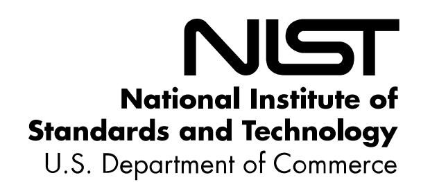

{0}------------------------------------------------

# **NIST Special Publication 800-218**

# **Secure Software Development Framework (SSDF) Version 1.1:**

*Recommendations for Mitigating the Risk of Software Vulnerabilities*

> Murugiah Souppaya Karen Scarfone Donna Dodson

This publication is available free of charge from: https://doi.org/10.6028/NIST.SP.800-218

{1}------------------------------------------------

# **NIST Special Publication 800-218**

# **Secure Software Development Framework (SSDF) Version 1.1:**

*Recommendations for Mitigating the Risk of Software Vulnerabilities*

> Murugiah Souppaya *Computer Security Division Information Technology Laboratory*

> > Karen Scarfone *Scarfone Cybersecurity Clifton, VA*

> > > Donna Dodson\*

*\* Former NIST employee; all work for this publication was done while at NIST.*

This publication is available free of charge from: https://doi.org/10.6028/NIST.SP.800-218

February 2022

U.S. Department of Commerce *Gina M. Raimondo, Secretary*

National Institute of Standards and Technology *James K. Olthoff, Performing the Non-Exclusive Functions and Duties of the Under Secretary of Commerce for Standards and Technology & Director, National Institute of Standards and Technology*

{2}------------------------------------------------

#### **Authority**

This publication has been developed by NIST in accordance with its statutory responsibilities under the Federal Information Security Modernization Act (FISMA) of 2014, 44 U.S.C. § 3551 *et seq.*, Public Law (P.L.) 113-283. NIST is responsible for developing information security standards and guidelines, including minimum requirements for federal information systems, but such standards and guidelines shall not apply to national security systems without the express approval of appropriate federal officials exercising policy authority over such systems. This guideline is consistent with the requirements of the Office of Management and Budget (OMB) Circular A-130.

Nothing in this publication should be taken to contradict the standards and guidelines made mandatory and binding on federal agencies by the Secretary of Commerce under statutory authority. Nor should these guidelines be interpreted as altering or superseding the existing authorities of the Secretary of Commerce, Director of the OMB, or any other federal official. This publication may be used by nongovernmental organizations on a voluntary basis and is not subject to copyright in the United States. Attribution would, however, be appreciated by NIST.

> National Institute of Standards and Technology Special Publication 800-218 Natl. Inst. Stand. Technol. Spec. Publ. 800-218, 36 pages (February 2022) CODEN: NSPUE2

> > This publication is available free of charge from: https://doi.org/10.6028/NIST.SP.800-218

Certain commercial entities, equipment, or materials may be identified in this document in order to describe an experimental procedure or concept adequately. Such identification is not intended to imply recommendation or endorsement by NIST, nor is it intended to imply that the entities, materials, or equipment are necessarily the best available for the purpose.

There may be references in this publication to other publications currently under development by NIST in accordance with its assigned statutory responsibilities. The information in this publication, including concepts and methodologies, may be used by federal agencies even before the completion of such companion publications. Thus, until each publication is completed, current requirements, guidelines, and procedures, where they exist, remain operative. For planning and transition purposes, federal agencies may wish to closely follow the development of these new publications by NIST.

Organizations are encouraged to review all draft publications during public comment periods and provide feedback to NIST. Many NIST cybersecurity publications, other than the ones noted above, are available at [https://csrc.nist.gov/publications.](https://csrc.nist.gov/publications)

**Submit comments on this publication to:** [ssdf@nist.gov](mailto:ssdf@nist.gov)

National Institute of Standards and Technology Attn: Computer Security Division, Information Technology Laboratory 100 Bureau Drive (Mail Stop 8930) Gaithersburg, MD 20899-8930

All comments are subject to release under the Freedom of Information Act (FOIA).

{3}------------------------------------------------

# **Reports on Computer Systems Technology**

The Information Technology Laboratory (ITL) at the National Institute of Standards and Technology (NIST) promotes the U.S. economy and public welfare by providing technical leadership for the Nation's measurement and standards infrastructure. ITL develops tests, test methods, reference data, proof of concept implementations, and technical analyses to advance the development and productive use of information technology. ITL's responsibilities include the development of management, administrative, technical, and physical standards and guidelines for the cost-effective security and privacy of other than national security-related information in federal information systems. The Special Publication 800-series reports on ITL's research, guidelines, and outreach efforts in information system security, and its collaborative activities with industry, government, and academic organizations.

#### **Abstract**

Few software development life cycle (SDLC) models explicitly address software security in detail, so secure software development practices usually need to be added to each SDLC model to ensure that the software being developed is well-secured. This document recommends the Secure Software Development Framework (SSDF) – a core set of high-level secure software development practices that can be integrated into each SDLC implementation. Following such practices should help software producers reduce the number of vulnerabilities in released software, reduce the potential impact of the exploitation of undetected or unaddressed vulnerabilities, and address the root causes of vulnerabilities to prevent future recurrences. Because the framework provides a common vocabulary for secure software development, software acquirers can also use it to foster communications with suppliers in acquisition processes and other management activities.

#### **Keywords**

secure software development; Secure Software Development Framework (SSDF); secure software development practices; software acquisition; software development; software development life cycle (SDLC); software security.

## **Trademark Information**

All registered trademarks or trademarks belong to their respective organizations.

{4}------------------------------------------------

## **Acknowledgments**

The authors thank all of the organizations and individuals who provided input for this update to the SSDF. In response to Section 4 of Executive Order (EO) 14028 on ["Improving the Nation's](https://www.federalregister.gov/d/2021-10460)  [Cybersecurity,](https://www.federalregister.gov/d/2021-10460)" NIST held a [June 2021 workshop](https://www.nist.gov/itl/executive-order-improving-nations-cybersecurity/workshop-and-call-position-papers) and received [over 150 position papers,](https://www.nist.gov/itl/executive-order-improving-nations-cybersecurity/enhancing-software-supply-chain-security) many of which suggested secure software development practices, tasks, examples of implementations, and references for consideration for this SSDF update. The authors appreciate all of those suggestions, as well as the input from those who spoke at or attended the workshop and shared their thoughts during or after the workshop.

Additionally, the authors appreciate the public comments submitted by dozens of organizations and individuals and wish to acknowledge the particularly helpful feedback from Amazon Web Services, Apiiro, Blackberry, BSA | The Software Alliance, the Enterprise Cloud Coalition, the General Services Administration (GSA), Google, IBM, Medical Imaging & Technology Alliance (MITA), Microsoft, Oracle, the Software Assurance Forum for Excellence in Code (SAFECode), Synopsis, the U.S. Navy, Xoomworks, and Robert Grupe. Representatives of Siemens Energy and Synopsis contributed mappings to new references.

The authors thank all of their NIST colleagues for their support throughout the SSDF update, especially Curt Barker, Paul Black, Jon Boyens, Jim Foti, Barbara Guttman, Mat Heyman, Nicole Keller, Matt Scholl, Adam Sedgewick, Kevin Stine, and Isabel Van Wyk.

The authors also wish to thank all of the individuals and organizations who provided comments on drafts of the original version of the SSDF, including the Administrative Offices of the U.S. Courts, The Aerospace Corporation, BSA | The Software Alliance, Capitis Solutions, the Consortium for Information & Software Quality (CISQ), HackerOne, Honeycomb Secure Systems, iNovex, Ishpi Information Technologies, the Information Security and Privacy Advisory Board (ISPAB), Juniper Networks, Microsoft, MITA, Naval Sea Systems Command (NAVSEA), NIST, Northrop Grumman, the Office of the Undersecretary of Defense for Research and Engineering, Red Hat, SAFECode, and the Software Engineering Institute (SEI).

#### **Audience**

There are two primary audiences for this document. The first is software producers (e.g., commercial-off-the-shelf [COTS] product vendors, government-off-the-shelf [GOTS] software developers, custom software developers, internal development teams) regardless of size, sector, or level of maturity. The second is software acquirers – both federal agencies and other organizations. Readers of this document are not expected to be experts in secure software development in order to understand it, but such expertise is required to implement its recommended practices.

Personnel within the following Workforce Categories and Specialty Areas from the National Initiative for Cybersecurity Education (NICE) Cybersecurity Workforce Framework [\[SP800181\]](#page-31-0) are most likely to find this publication of interest:

{5}------------------------------------------------

• Securely Provision (SP): Risk Management (RSK), Software Development (DEV), Systems Requirements Planning (SRP), Test and Evaluation (TST), Systems Development (SYS)

- Operate and Maintain (OM): Systems Analysis (ANA)
- Oversee and Govern (OV): Training, Education, and Awareness (TEA); Cybersecurity Management (MGT); Executive Cyber Leadership (EXL); Program/Project Management (PMA) and Acquisition
- Protect and Defend (PR): Incident Response (CIR), Vulnerability Assessment and Management (VAM)
- Analyze (AN): Threat Analysis (TWA), Exploitation Analysis (EXP)

#### **Note to Readers**

We encourage you to provide feedback on the SSDF at any time, especially as you implement the SSDF within your own organization and software development efforts. Having inputs from a variety of software producers will be particularly helpful to us in refining and revising the SSDF. The publication will be updated periodically to reflect your inputs and feedback.

If you are from a standards-developing organization or another organization that has produced a set of secure practices and you would like to map your secure software development standard or guidance to the SSDF, please contact us at [ssdf@nist.gov.](mailto:ssdf@nist.gov) We would like to introduce you to the [National Online Informative References Program](https://csrc.nist.gov/projects/olir) (OLIR) so that you can submit your mapping there to augment the existing set of informative references.

{6}------------------------------------------------

# **Patent Disclosure Notice**

*NOTICE: The Information Technology Laboratory (ITL) has requested that holders of patent claims whose use may be required for compliance with the guidance or requirements of this publication disclose such patent claims to ITL. However, holders of patents are not obligated to respond to ITL calls for patents and ITL has not undertaken a patent search in order to identify which, if any, patents may apply to this publication.*

*As of the date of publication and following call(s) for the identification of patent claims whose use may be required for compliance with the guidance or requirements of this publication, no such patent claims have been identified to ITL.* 

*No representation is made or implied by ITL that licenses are not required to avoid patent infringement in the use of this publication.*

{7}------------------------------------------------

#### **Executive Summary**

This document describes a set of fundamental, sound practices for secure software development called the Secure Software Development Framework (SSDF). Organizations should integrate the SSDF throughout their existing software development practices, express their secure software development requirements to third-party suppliers using SSDF conventions, and acquire software that meets the practices described in the SSDF. Using the SSDF helps organizations to meet the following secure software development recommendations:

- Organizations should ensure that their people, processes, and technology are prepared to perform secure software development.
- Organizations should protect all components of their software from tampering and unauthorized access.
- Organizations should produce well-secured software with minimal security vulnerabilities in its releases.
- Organizations should identify residual vulnerabilities in their software releases and respond appropriately to address those vulnerabilities and prevent similar ones from occurring in the future.

The SSDF does not prescribe how to implement each practice. The focus is on the outcomes of the practices rather than on the tools, techniques, and mechanisms to do so. This means that the SSDF can be used by organizations in any sector or community, regardless of size or cybersecurity sophistication. It can also be used for any type of software development, regardless of technology, platform, programming language, or operating environment.

The SSDF defines only a high-level subset of what organizations may need to do, so organizations should consult the references and other resources for additional information on implementing the practices. Not all practices are applicable to all use cases; organizations should adopt a risk-based approach to determine what practices are relevant, appropriate, and effective to mitigate the threats to their software development practices.

Organizations can communicate how they are addressing the clauses from Section 4 of the President's Executive Order (EO) on ["Improving the Nation's Cybersecurity \(14028\)"](https://www.federalregister.gov/d/2021-10460) by referencing the SSDF practices and tasks described in Appendix A.

{8}------------------------------------------------

### **Table of Contents**

| Executive Summary                                                  | vi |
|-----------------------------------------------------------------------|----|
| 1 Introduction                                                  | 1  |
| 2 The Secure Software Development Framework                     | 4  |
| References                                                            | 20 |
| The SSDF and Executive Order 14028                                 | 24 |
| Acronyms                                                           | 25 |
| Change Log                                                            | 27 |
| List of Tables                                                        |    |
| Table 1: The Secure Software Development Framework (SSDF) Version 1.1 | 5  |
| Table 2: SSDF Practices Corresponding to EO 14028 Clauses             | 24 |

{9}------------------------------------------------

#### **1 Introduction**

A *software development life cycle (SDLC)*[1](#page-9-1) is a formal or informal methodology for designing, creating, and maintaining software (including code built into hardware). There are many models for SDLCs, including waterfall, spiral, agile, and – in particular – agile combined with software development and IT operations (DevOps) practices. Few SDLC models explicitly address software security in detail, so secure software development practices usually need to be added to and integrated into each SDLC model. Regardless of which SDLC model is used, secure software development practices should be integrated throughout it for three reasons: to reduce the number of vulnerabilities in released software, to reduce the potential impact of the exploitation of undetected or unaddressed vulnerabilities, and to address the root causes of vulnerabilities to prevent recurrences. Vulnerabilities include not just bugs caused by coding flaws, but also weaknesses caused by security configuration settings, incorrect trust assumptions, and outdated risk analysis. [\[IR7864\]](#page-28-1)

Most aspects of security can be addressed multiple times within an SDLC, but in general, the earlier in the SDLC that security is addressed, the less effort and cost is ultimately required to achieve the same level of security. This principle, known as *shifting left*, is critically important regardless of the SDLC model. Shifting left minimizes any technical debt that would require remediating early security flaws late in development or after the software is in production. Shifting left can also result in software with stronger security and resiliency.

There are many existing documents on secure software development practices, including those listed in the [References](#page-28-0) section. This document does not introduce new practices or define new terminology. Instead, it describes a set of high-level practices based on established standards, guidance, and secure software development practice documents. These practices, collectively called the Secure Software Development Framework (SSDF), are intended to help the target audiences achieve secure software development objectives. Many of the practices directly involve the software itself, while others indirectly involve it (e.g., securing the development environment).

Future work may expand on this publication and potentially cover topics such as how the SSDF may apply to and vary for particular software development methodologies and associated practices like DevOps, how an organization can transition from their current software development practices to also incorporating the SSDF practices, and how the SSDF could be applied in the context of open-source software. Future work will likely take the form of use cases so that the insights will be more readily applicable to specific types of development environments, and it will likely include collaboration with the open-source community and other groups and organizations.

This document identifies secure software development practices but does not prescribe how to implement them. The focus is on the outcomes of the practices to be implemented rather than on

1 Note that SDLC is also widely used for "system development life cycle." All usage of "SDLC" in this document is referencing software, not systems.

{10}------------------------------------------------

the tools, techniques, and mechanisms used to do so. Advantages of specifying the practices at a high level include the following:

- Can be used by organizations in any sector or community, regardless of size or cybersecurity sophistication
- Can be applied to software developed to support information technology (IT), industrial control systems (ICS), cyber-physical systems (CPS), or the Internet of Things (IoT)
- Can be integrated into any existing software development workflow and automated toolchain; should not negatively affect organizations that already have robust secure software development practices in place
- Makes the practices broadly applicable, not specific to particular technologies, platforms, programming languages, SDLC models, development environments, operating environments, tools, etc.
- Can help an organization document its secure software development practices today and define its future target practices as part of its continuous improvement process
- Can assist an organization currently using a classic software development model in transitioning its secure software development practices for use with a modern software development model (e.g., agile, DevOps)
- Can assist organizations that are procuring and using software to understand secure software development practices employed by their suppliers

This document provides a common language to describe fundamental secure software development practices. This is similar to the approach taken by the *Framework for Improving Critical Infrastructure Cybersecurity*, also known as the NIST Cybersecurity Framework [\[NISTCSF\].](#page-29-0) [2](#page-10-0) Expertise in secure software development is not required to understand the practices. The common language helps facilitate communications about secure software practices among both internal and external organizational stakeholders, such as:

- Business owners, software developers, project managers and leads, cybersecurity professionals, and operations and platform engineers within an organization who need to clearly communicate with each other about secure software development
- Software acquirers, including federal agencies and other organizations, that want to define required or desired characteristics for software in their acquisition processes in order to have higher-quality software (particularly with fewer significant security vulnerabilities)[3](#page-10-1)

2 The SSDF practices may help support the NIST Cybersecurity Framework Functions, Categories, and Subcategories, but the SSDF practices do not map to them and are typically the responsibility of different parties. Developers can adopt SSDF practices, and the outcomes of their work could help organizations with their operational security in support of the Cybersecurity Framework.

3 Future work may provide more practical guidance for software acquirers on how they can leverage the SSDF in specific use cases.

{11}------------------------------------------------

• Software producers (e.g., commercial-off-the-shelf [COTS] product vendors, government-off-the-shelf [GOTS] software developers, software developers working within or on behalf of software acquirer organizations) that want to integrate secure software development practices throughout their SDLCs, express their secure software practices to their customers, or define requirements for their suppliers

This document's practices are not based on the assumption that all organizations have the same security objectives and priorities. Rather, the recommendations reflect that each software producer may have unique security assumptions, and each software acquirer may have unique security needs and requirements. While the aim is for each software producer to follow all applicable practices, the expectation is that the degree to which each practice is implemented and the formality of the implementation will vary based on the producer's security assumptions. The practices provide flexibility for implementers, but they are also clear to avoid leaving too much open to interpretation.

Although most of these practices are relevant to any software development effort, some are not. For example, if developing a particular piece of software does not involve using a compiler, there would be no need to follow a practice on configuring the compiler to improve executable security. Some practices are foundational, while others are more advanced and depend on certain foundational practices already being in place. Also, practices are not all equally important for all cases.

Factors such as risk, cost, feasibility, and applicability should be considered when deciding which practices to use and how much time and resources to devote to each practice.[4](#page-11-0) Automatability is also an important factor to consider, especially for implementing practices at scale. The practices, tasks, and implementation examples represent a starting point to consider; they are meant to be changed and customized, and they are not prioritized. Any stated frequency for performing practices is notional. The intention of the SSDF is not to create a checklist to follow, but to provide a basis for planning and implementing a risk-based approach to adopting secure software development practices.

The responsibility for implementing the practices may be distributed among different organizations based on the delivery of the software and services (e.g., infrastructure as a service, software as a service, platform as a service, container as a service, serverless). In these situations, it likely follows a shared responsibility model involving the platform/service providers and the tenant organization that is consuming those platforms/services. The tenant organization should establish an agreement with the providers that specifies which party is responsible for each practice and task and how each provider will attest to their conformance with the agreement.

4 Organizations seeking guidance on how to get started with secure software development can consult many publicly available references, such as "SDL That Won't Break the Bank" by Steve Lipner from SAFECode [\(https://i.blackhat.com/us-18/Thu-](https://i.blackhat.com/us-18/Thu-August-9/us-18-Lipner-SDL-For-The-Rest-Of-Us.pdf)[August-9/us-18-Lipner-SDL-For-The-Rest-Of-Us.pdf\)](https://i.blackhat.com/us-18/Thu-August-9/us-18-Lipner-SDL-For-The-Rest-Of-Us.pdf), "Application Software Security and the CIS Controls: A Reference Paper" by Steve Lipner and Stacy Simpson from SAFECode [\(https://safecode.org/resource-publications/cis-controls/\)](https://safecode.org/resource-publications/cis-controls/), and "Simplified Implementation of the Microsoft SDL" by Microsoft [\(https://www.microsoft.com/en](https://www.microsoft.com/en-us/download/details.aspx?id=12379)[us/download/details.aspx?id=12379\)](https://www.microsoft.com/en-us/download/details.aspx?id=12379).

{12}------------------------------------------------

# **2 The Secure Software Development Framework**

This document defines version 1.1 of the Secure Software Development Framework (SSDF) with fundamental, sound, and secure recommended practices based on established secure software development practice documents. The practices are organized into four groups:

- 1. **Prepare the Organization (PO):** Organizations should ensure that their people, processes, and technology are prepared to perform secure software development at the organization level. Many organizations will find some PO practices to also be applicable to subsets of their software development, like individual development groups or projects.
- 2. **Protect the Software (PS):** Organizations should protect all components of their software from tampering and unauthorized access.
- 3. **Produce Well-Secured Software (PW):** Organizations should produce well-secured software with minimal security vulnerabilities in its releases.
- 4. **Respond to Vulnerabilities (RV):** Organizations should identify residual vulnerabilities in their software releases and respond appropriately to address those vulnerabilities and prevent similar ones from occurring in the future.

Each practice definition includes the following elements:

- **Practice:** The name of the practice and a unique identifier, followed by a brief explanation of what the practice is and why it is beneficial
- **Tasks:** One or more actions that may be needed to perform a practice
- **Notional Implementation Examples:** One or more notional examples of types of tools, processes, or other methods that could be used to help implement a task. No examples or combination of examples are required, and the stated examples are not the only feasible options. Some examples may not be applicable to certain organizations and situations.
- **References:** Pointers to one or more established secure development practice documents and their mappings to a particular task. Not all references will apply to all instances of software development.

[Table 1](#page-13-0) defines the practices. They are only a **subset** of what an organization may need to do. The information in the table is space constrained; much more information on each practice can be found in the references. Note that the order of the practices, tasks, and notional implementation examples in the table is not intended to imply the sequence of implementation or the relative importance of any practice, task, or example.

The table uses terms like "sensitive data," "qualified person," and "well-secured," which are not defined in this publication. Organizations adopting the SSDF should define these terms in the context of their own environments and use cases. The same is true for the names of environments, like "development," "build," "staging," "integration," "test," "production," and "distribution," which vary widely among organizations and projects. Enumerating your environments is necessary in order to secure them properly, and especially to prevent lateral movement of attackers from environment to environment.

{13}------------------------------------------------

**Table 1: The Secure Software Development Framework (SSDF) Version 1.1**

| Practices                                                                                                                                                                                                                                                                                                                                                                                                                                                                                                                                                           | Tasks                                                                                                                                                                                              | Notional Implementation Examples                                                                                                                                                                                                                                                                                                                                                                                                                                                                                                                                                                                                                                                                                                                                                                                                                                                                                                                                                                                                                                                                                                                                                                                                                                                                                                                                                                                                                                                                                                                                                                                                                                                                                                                                                                                                                                                        | References                                                                                                                                                                                                                                                                                                                                                                                                                                                                                                                                                                                                                                                                                                                                                                |
|---------------------------------------------------------------------------------------------------------------------------------------------------------------------------------------------------------------------------------------------------------------------------------------------------------------------------------------------------------------------------------------------------------------------------------------------------------------------------------------------------------------------------------------------------------------------|----------------------------------------------------------------------------------------------------------------------------------------------------------------------------------------------------|-----------------------------------------------------------------------------------------------------------------------------------------------------------------------------------------------------------------------------------------------------------------------------------------------------------------------------------------------------------------------------------------------------------------------------------------------------------------------------------------------------------------------------------------------------------------------------------------------------------------------------------------------------------------------------------------------------------------------------------------------------------------------------------------------------------------------------------------------------------------------------------------------------------------------------------------------------------------------------------------------------------------------------------------------------------------------------------------------------------------------------------------------------------------------------------------------------------------------------------------------------------------------------------------------------------------------------------------------------------------------------------------------------------------------------------------------------------------------------------------------------------------------------------------------------------------------------------------------------------------------------------------------------------------------------------------------------------------------------------------------------------------------------------------------------------------------------------------------------------------------------------------|---------------------------------------------------------------------------------------------------------------------------------------------------------------------------------------------------------------------------------------------------------------------------------------------------------------------------------------------------------------------------------------------------------------------------------------------------------------------------------------------------------------------------------------------------------------------------------------------------------------------------------------------------------------------------------------------------------------------------------------------------------------------------|
| Prepare the Organization (PO)                                                                                                                                                                                                                                                                                                                                                                                                                                                                                                                                       |                                                                                                                                                                                                    |                                                                                                                                                                                                                                                                                                                                                                                                                                                                                                                                                                                                                                                                                                                                                                                                                                                                                                                                                                                                                                                                                                                                                                                                                                                                                                                                                                                                                                                                                                                                                                                                                                                                                                                                                                                                                                                                                         |                                                                                                                                                                                                                                                                                                                                                                                                                                                                                                                                                                                                                                                                                                                                                                           |
| Define Security Requirements for Software Development (PO.1): Ensure that security requirements for software development are known at all times so that they can be taken into account throughout the SDLC and duplication of effort can be minimized because the requirements information can be collected once and shared. This includes requirements from internal sources (e.g., the organization's policies, business objectives, and risk management strategy) and external sources (e.g., applicable laws and regulations). | PO.1.1: Identify and document all security requirements for the organization's software development infrastructures and processes, and maintain the requirements over time.               | Example 1: Define policies for securing software development infrastructures and their components, including development endpoints, throughout the SDLC and maintaining that security. Example 2: Define policies for securing software development processes throughout the SDLC and maintaining that security, including for open-source and other third-party software components utilized by software being developed. Example 3: Review and update security requirements at least annually, or sooner if there are new requirements from internal or external sources, or a major security incident targeting software development infrastructure has occurred. Example 4: Educate affected individuals on impending changes to requirements.                                                                                                                                                                                                                                                                                                                                                                                                                                                                                                                                                                                                                                                                                                                                                                                                                                                                                                                                                                                                                                                                                                           | BSAFSS: SM.3, DE.1, IA.1, IA.2 BSIMM: CP1.1, CP1.3, SR1.1, SR2.2, SE1.2, SE2.6 EO14028: 4e(ix) IEC62443: SM-7, SM-9 NISTCSF: ID.GV-3 OWASPASVS: 1.1.1 OWASPMASVS: 1.10 OWASPSAMM: PC1-A, PC1-B, PC2-A PCISSLC: 2.1, 2.2 SCFPSSD: Planning the Implementation and Deployment of Secure Development Practices SP80053: SA-1, SA-8, SA-15, SR-3 SP800160: 3.1.2, 3.2.1, 3.2.2, 3.3.1, 3.4.2, 3.4.3 SP800161: SA-1, SA-8, SA-15, SR-3 SP800181: T0414; K0003, K0039, K0044, K0157, K0168, K0177, K0211, K0260, K0261, K0262, K0524; S0010, S0357, S0368; A0033, A0123, A0151                                                                                                                                                        |
|                                                                                                                                                                                                                                                                                                                                                                                                                                                                                                                                                                     | PO.1.2: Identify and document all security requirements for organization-developed software to meet, and maintain the requirements over time.                                                | Example 1: Define policies that specify risk-based software architecture and design requirements, such as making code modular to facilitate code reuse and updates; isolating security components from other components during execution; avoiding undocumented commands and settings; and providing features that will aid software acquirers with the secure deployment, operation, and maintenance of the software. Example 2: Define policies that specify the security requirements for the organization's software, and verify compliance at key points in the SDLC (e.g., classes of software flaws verified by gates, responses to vulnerabilities discovered in released software). Example 3: Analyze the risk of applicable technology stacks (e.g., languages, environments, deployment models), and recommend or require the use of stacks that will reduce risk compared to others. Example 4: Define policies that specify what needs to be archived for each software release (e.g., code, package files, third-party libraries, documentation, data inventory) and how long it needs to be retained based on the SDLC model, software end-of-life, and other factors. Example 5: Ensure that policies cover the entire software life cycle, including notifying users of the impending end of software support and the date of software end-of-life. Example 6: Review all security requirements at least annually, or sooner if there are new requirements from internal or external sources, a major vulnerability is discovered in released software, or a major security incident targeting organization-developed software has occurred. Example 7: Establish and follow processes for handling requirement exception requests, including periodic reviews of all approved exceptions. | BSAFSS: SC.1-1, SC.2, PD.1-1, PD.1-2, PD.1-3, PD.2-2, SI, PA, CS, AA, LO, EE BSIMM: SM1.1, SM1.4, SM2.2, CP1.1, CP1.2, CP1.3, CP2.1, CP2.3, AM1.2, SFD1.1, SFD2.1, SFD3.2, SR1.1, SR1.3, SR2.2, SR3.3, SR3.4 EO14028: 4e(ix) IEC62443: SR-3, SR-4, SR-5, SD-4 ISO27034: 7.3.2 MSSDL: 2, 5 NISTCSF: ID.GV-3 OWASPMASVS: 1.12 OWASPSAMM: PC1-A, PC1-B, PC2-A, PC3-A, SR1-A, SR1-B, SR2-B, SA1-B, IR1-A PCISSLC: 2.1, 2.2, 2.3, 3.3 SCFPSSD: Establish Coding Standards and Conventions SP80053: SA-8, SA-8(3), SA-15, SR-3 SP800160: 3.1.2, 3.2.1, 3.3.1 SP800161: SA-8, SA-15, SR-3 SP800181: T0414; K0003, K0039, K0044, K0157, K0168, K0177, K0211, K0260, K0261, K0262, K0524; S0010, S0357, S0368; A0033, A0123, A0151 |
|                                                                                                                                                                                                                                                                                                                                                                                                                                                                                                                                                                     | PO.1.3: Communicate requirements to all third parties who will provide commercial software components to the organization for reuse by the organization's own software. [Formerly PW.3.1] | Example 1: Define a core set of security requirements for software components, and include it in acquisition documents, software contracts, and other agreements with third parties. Example 2: Define security-related criteria for selecting software; the criteria can include the third party's vulnerability disclosure program and product security incident response capabilities or the third party's adherence to organization defined practices. Example 3: Require third parties to attest that their software complies with the organization's security requirements.                                                                                                                                                                                                                                                                                                                                                                                                                                                                                                                                                                                                                                                                                                                                                                                                                                                                                                                                                                                                                                                                                                                                                                                                                                                                               | BSAFSS: SM.1, SM.2, SM.2-1, SM.2-4 BSIMM: CP2.4, CP3.2, SR2.5, SR3.2 EO14028: 4e(vi), 4e(ix) IDASOAR: 19, 21 IEC62443: SM-9, SM-10 MSSDL: 7 NISTCSF: ID.SC-3 OWASPSAMM: SR3-A                                                                                                                                                                                                                                                                                                                                                                                                                                                                                                                                                                        |

{14}------------------------------------------------

| Practices                                                                                                                                                                                                                           | Tasks                                                                                                                                                                                                                                | Notional Implementation Examples                                                                                                                                                                                                                                                                                                                                                                                                                                                                                                                                                                                                                                                                                                                                                                                                                                                                                                                                                                                                                                                                               | References                                                                                                                                                                                                                                                                                                                                                                                                                                                                                                                                                                                                                                         |
|-------------------------------------------------------------------------------------------------------------------------------------------------------------------------------------------------------------------------------------|--------------------------------------------------------------------------------------------------------------------------------------------------------------------------------------------------------------------------------------|----------------------------------------------------------------------------------------------------------------------------------------------------------------------------------------------------------------------------------------------------------------------------------------------------------------------------------------------------------------------------------------------------------------------------------------------------------------------------------------------------------------------------------------------------------------------------------------------------------------------------------------------------------------------------------------------------------------------------------------------------------------------------------------------------------------------------------------------------------------------------------------------------------------------------------------------------------------------------------------------------------------------------------------------------------------------------------------------------------------|----------------------------------------------------------------------------------------------------------------------------------------------------------------------------------------------------------------------------------------------------------------------------------------------------------------------------------------------------------------------------------------------------------------------------------------------------------------------------------------------------------------------------------------------------------------------------------------------------------------------------------------------------|
|                                                                                                                                                                                                                                     |                                                                                                                                                                                                                                      | Example 4: Require third parties to provide provenance5 data and integrity verification mechanisms for all components of their software. Example 5: Establish and follow processes to address risk when there are security requirements that third-party software components to be acquired do not meet; this should include periodic reviews of all approved exceptions to requirements.                                                                                                                                                                                                                                                                                                                                                                                                                                                                                                                                                                                                                                                                                                       | SCAGILE: Tasks Requiring the Help of Security Experts 8 SCFPSSD: Manage Security Risk Inherent in the Use of Third-Party Components SCSIC: Vendor Sourcing Integrity Controls SP80053: SA-4, SA-9, SA-10, SA-10(1), SA-15, SR-3, SR-4, SR-5 SP800160: 3.1.1, 3.1.2 SP800161: SA-4, SA-9, SA-9(1), SA-9(3), SA-10, SA-10(1), SA-15, SR-3, SR-4, SR-5 SP800181: T0203, T0415; K0039; S0374; A0056, A0161                                                                                                                                                                                                                           |
| Implement Roles and Responsibilities (PO.2): Ensure that everyone inside and outside of the organization involved in the SDLC is prepared to perform their SDLC-related roles and responsibilities throughout the SDLC. | PO.2.1: Create new roles and alter responsibilities for existing roles as needed to encompass all parts of the SDLC. Periodically review and maintain the defined roles and responsibilities, updating them as needed.      | Example 1: Define SDLC-related roles and responsibilities for all members of the software development team. Example 2: Integrate the security roles into the software development team. Example 3: Define roles and responsibilities for cybersecurity staff, security champions, project managers and leads, senior management, software developers, software testers, software assurance leads and staff, product owners, operations and platform engineers, and others involved in the SDLC. Example 4: Conduct an annual review of all roles and responsibilities. Example 5: Educate affected individuals on impending changes to roles and responsibilities, and confirm that the individuals understand the changes and agree to follow them. Example 6: Implement and use tools and processes to promote communication and engagement among individuals with SDLC-related roles and responsibilities, such as creating messaging channels for team discussions. Example 7: Designate a group of individuals or a team as the code owner for each project. | BSAFSS: PD.2-1, PD.2-2 BSIMM: SM1.1, SM2.3, SM2.7, CR1.7 EO14028: 4e(ix) IEC62443: SM-2, SM-13 NISTCSF: ID.AM-6, ID.GV-2 PCISSLC: 1.2 SCSIC: Vendor Software Development Integrity Controls SP80053: SA-3 SP800160: 3.2.1, 3.2.4, 3.3.1 SP800161: SA-3 SP800181: K0233                                                                                                                                                                                                                                                                                                                                               |
|                                                                                                                                                                                                                                     | PO.2.2: Provide role-based training for all personnel with responsibilities that contribute to secure development. Periodically review personnel proficiency and role-based training, and update the training as needed. | Example 1: Document the desired outcomes of training for each role. Example 2: Define the type of training or curriculum required to achieve the desired outcome for each role. Example 3: Create a training plan for each role. Example 4: Acquire or create training for each role; acquired training may need to be customized for the organization. Example 5: Measure outcome performance to identify areas where changes to training may be beneficial.                                                                                                                                                                                                                                                                                                                                                                                                                                                                                                                                                                                                                             | BSAFSS: PD.2-2 BSIMM: T1.1, T1.7, T1.8, T2.5, T2.8, T2.9, T3.1, T3.2, T3.4 EO14028: 4e(ix) IEC62443: SM-4 MSSDL: 1 NISTCSF: PR.AT OWASPSAMM: EG1-A, EG2-A PCISSLC: 1.3 SCAGILE: Operational Security Tasks 14, 15; Tasks Requiring the Help of Security Experts 1 SCFPSSD: Planning the Implementation and Deployment of Secure Development Practices SCSIC: Vendor Software Development Integrity Controls SP80053: SA-8 SP800160: 3.2.4, 3.2.6 SP800161: SA-8 SP800181: OV-TEA-001, OV-TEA-002; T0030, T0073, T0320; K0204, K0208, K0220, K0226, K0243, K0245, K0252; S0100, S0101; A0004, A0057 |

5 *Provenance* is "the chronology of the origin, development, ownership, location, and changes to a system or system component and associated data. It may also include personnel and processes used to interact with or make modifications to the system, component, or associated data[" \[SP80053\].](#page-30-2)

{15}------------------------------------------------

| Practices                                                                                                                                                                                                                                                                                                                                                                                                                                                                                                          | Tasks                                                                                                                                                                                                       | Notional Implementation Examples                                                                                                                                                                                                                                                                                                                                                                                                                                                                                                                                                                                                                                                                                                                                                                                                                                                                                                                                                         | References                                                                                                                                                                                                                                                                                                                                                                                                                                                                                                                                                                                                                                                                                                                                               |
|--------------------------------------------------------------------------------------------------------------------------------------------------------------------------------------------------------------------------------------------------------------------------------------------------------------------------------------------------------------------------------------------------------------------------------------------------------------------------------------------------------------------|-------------------------------------------------------------------------------------------------------------------------------------------------------------------------------------------------------------|------------------------------------------------------------------------------------------------------------------------------------------------------------------------------------------------------------------------------------------------------------------------------------------------------------------------------------------------------------------------------------------------------------------------------------------------------------------------------------------------------------------------------------------------------------------------------------------------------------------------------------------------------------------------------------------------------------------------------------------------------------------------------------------------------------------------------------------------------------------------------------------------------------------------------------------------------------------------------------------|----------------------------------------------------------------------------------------------------------------------------------------------------------------------------------------------------------------------------------------------------------------------------------------------------------------------------------------------------------------------------------------------------------------------------------------------------------------------------------------------------------------------------------------------------------------------------------------------------------------------------------------------------------------------------------------------------------------------------------------------------------|
|                                                                                                                                                                                                                                                                                                                                                                                                                                                                                                                    | PO.2.3: Obtain upper management or authorizing official commitment to secure development, and convey that commitment to all with development related roles and responsibilities.                   | Example 1: Appoint a single leader or leadership team to be responsible for the entire secure software development process, including being accountable for releasing software to production and delegating responsibilities as appropriate. Example 2: Increase authorizing officials' awareness of the risks of developing software without integrating security throughout the development life cycle and the risk mitigation provided by secure development practices. Example 3: Assist upper management in incorporating secure development support into their communications with personnel with development-related roles and responsibilities. Example 4: Educate all personnel with development-related roles and responsibilities on upper management's commitment to secure development and the importance of secure development to the organization.                                                                                       | BSIMM: SM1.3, SM2.7, CP2.5 EO14028: 4e(ix) NISTCSF: ID.RM-1, ID.SC-1 OWASPSAMM: SM1.A PCISSLC: 1.1 SP800181: T0001, T0004                                                                                                                                                                                                                                                                                                                                                                                                                                                                                                                                                                                                                 |
| Implement Supporting Toolchains (PO.3): Use automation to reduce human effort and improve the accuracy, reproducibility, usability, and comprehensiveness of security practices throughout the SDLC, as well as provide a way to document and demonstrate the use of these practices. Toolchains and tools may be used at different levels of the organization, such as organization-wide or project-specific, and may address a particular part of the SDLC, like a build pipeline. | PO.3.1: Specify which tools or tool types must or should be included in each toolchain to mitigate identified risks, as well as how the toolchain components are to be integrated with each other. | Example 1: Define categories of toolchains, and specify the mandatory tools or tool types to be used for each category. Example 2: Identify security tools to integrate into the developer toolchain. Example 3: Define what information is to be passed between tools and what data formats are to be used. Example 4: Evaluate tools' signing capabilities to create immutable records/logs for auditability within the toolchain. Example 5: Use automated technology for toolchain management and orchestration.                                                                                                                                                                                                                                                                                                                                                                                                                                             | BSIMM: CR1.4, ST1.4, ST2.5, SE2.7 CNCFSSCP: Securing Materials—Verification; Securing Build Pipelines—Verification, Automation, Secure Authentication/Access; Securing Artefacts—Verification; Securing Deployments—Verification EO14028: 4e(iii), 4e(ix) MSSDL: 8 OWASPSAMM: IR2-B, ST2-B SCAGILE: Tasks Requiring the Help of Security Experts 9 SCSIC: Vendor Software Delivery Integrity Controls SP80053: SA-15 SP800161: SA-15 SP800181: K0013, K0178                                                                                                                                                                                                                                                             |
|                                                                                                                                                                                                                                                                                                                                                                                                                                                                                                                    | PO.3.2: Follow recommended security practices to deploy, operate, and maintain tools and toolchains.                                                                                                     | Example 1: Evaluate, select, and acquire tools, and assess the security of each tool. Example 2: Integrate tools with other tools and existing software development processes and workflows. Example 3: Use code-based configuration for toolchains (e.g., pipelines-as-code, toolchains-as-code). Example 4: Implement the technologies and processes needed for reproducible builds. Example 5: Update, upgrade, or replace tools as needed to address tool vulnerabilities or add new tool capabilities. Example 6: Continuously monitor tools and tool logs for potential operational and security issues, including policy violations and anomalous behavior. Example 7: Regularly verify the integrity and check the provenance of each tool to identify potential problems. Example 8: See PW.6 regarding compiler, interpreter, and build tools. Example 9: See PO.5 regarding implementing and maintaining secure environments. | BSAFSS: DE.2 BSIMM: SR1.1, SR1.3, SR3.4 CNCFSSCP: Securing Build Pipelines—Verification, Automation, Controlled Environments, Secure Authentication/Access; Securing Artefacts—Verification, Automation, Controlled Environments, Encryption; Securing Deployments—Verification, Automation EO14028: 4e(i)(F), 4e(ii), 4e(iii), 4e(v), 4e(vi), 4e(ix) IEC62443: SM-7 IR8397: 2.2 OWASPASVS: 1.14.3, 1.14.4, 14.1, 14.2 OWASPMASVS: 7.9 OWASPSCVS: 3, 5 SCAGILE: Tasks Requiring the Help of Security Experts 9 SCFPSSD: Use Current Compiler and Toolchain Versions and Secure Compiler Options SCSIC: Vendor Software Delivery Integrity Controls SP80053: SA-15 SP800161: SA-15 SP800181: K0013, K0178 |
|                                                                                                                                                                                                                                                                                                                                                                                                                                                                                                                    | PO.3.3: Configure tools to generate artifacts6 of their support of secure software development practices as defined by the organization.                                                              | Example 1: Use existing tooling (e.g., workflow tracking, issue tracking, value stream mapping) to create an audit trail of the secure development-related actions that are performed for continuous improvement purposes. Example 2: Determine how often the collected information should be audited, and implement the necessary processes. Example 3: Establish and enforce security and retention policies for artifact data. Example 4: Assign responsibility for creating any needed artifacts that tools                                                                                                                                                                                                                                                                                                                                                                                                                                                        | BSAFSS: PD.1-5 BSIMM: SM1.4, SM3.4, SR1.3 CNCFSSCP: Securing Build Pipelines—Verification, Automation, Controlled Environments; Securing Artefacts—Verification EO14028: 4e(i)(F), 4e(ii), 4e(v), 4e(ix) IEC62443: SM-12, SI-2 MSSDL: 8                                                                                                                                                                                                                                                                                                                                                                                                                                                                                                |

6 An *artifact* is "a piece of evidence" [adapted fro[m IR7692\]](#page-28-9). *Evidence* is "grounds for belief or disbelief; data on which to base proof or to establish truth or falsehood" [\[SP800160\].](#page-30-3) Artifacts provide records of secure software development practices.

{16}------------------------------------------------

| Practices                                                                                                                                                                                                                                                                                                                                                                                                                                                            | Tasks                                                                                                                                                                                                                       | Notional Implementation Examples                                                                                                                                                                                                                                                                                                                                                                                                                                                                                                                                                                                                                                                                                                                                                                                                                                                                                                                                                                                                                                                                                                                                                                                                                                                                                        | References                                                                                                                                                                                                                                                                                                                                                                                                                                                                                                                                                                                                                                                   |
|----------------------------------------------------------------------------------------------------------------------------------------------------------------------------------------------------------------------------------------------------------------------------------------------------------------------------------------------------------------------------------------------------------------------------------------------------------------------|-----------------------------------------------------------------------------------------------------------------------------------------------------------------------------------------------------------------------------|-------------------------------------------------------------------------------------------------------------------------------------------------------------------------------------------------------------------------------------------------------------------------------------------------------------------------------------------------------------------------------------------------------------------------------------------------------------------------------------------------------------------------------------------------------------------------------------------------------------------------------------------------------------------------------------------------------------------------------------------------------------------------------------------------------------------------------------------------------------------------------------------------------------------------------------------------------------------------------------------------------------------------------------------------------------------------------------------------------------------------------------------------------------------------------------------------------------------------------------------------------------------------------------------------------------------------|--------------------------------------------------------------------------------------------------------------------------------------------------------------------------------------------------------------------------------------------------------------------------------------------------------------------------------------------------------------------------------------------------------------------------------------------------------------------------------------------------------------------------------------------------------------------------------------------------------------------------------------------------------------|
|                                                                                                                                                                                                                                                                                                                                                                                                                                                                      |                                                                                                                                                                                                                             | cannot generate.                                                                                                                                                                                                                                                                                                                                                                                                                                                                                                                                                                                                                                                                                                                                                                                                                                                                                                                                                                                                                                                                                                                                                                                                                                                                                                        | OWASPSAMM: PC3-B OWASPSCVS: 3.13, 3.14 PCISSLC: 2.5 SCAGILE: Tasks Requiring the Help of Security Experts 9 SCSIC: Vendor Software Delivery Integrity Controls SP80053: SA-15 SP800161: SA-15 SP800181: K0013; T0024                                                                                                                                                                                                                                                                                                                                                                                                                    |
| Define and Use Criteria for Software Security Checks (PO.4): Help ensure that the software resulting from the SDLC meets the organization's expectations by defining and using criteria for checking the software's security during development.                                                                                                                                                                                                      | PO.4.1: Define criteria for software security checks and track throughout the SDLC. PO.4.2: Implement processes, mechanisms, etc. to gather and safeguard the necessary information in support of the criteria. | Example 1: Ensure that the criteria adequately indicate how effectively security risk is being managed. Example 2: Define key performance indicators (KPIs), key risk indicators (KRIs), vulnerability severity scores, and other measures for software security. Example 3: Add software security criteria to existing checks (e.g., the Definition of Done in agile SDLC methodologies). Example 4: Review the artifacts generated as part of the software development workflow system to determine if they meet the criteria. Example 5: Record security check approvals, rejections, and exception requests as part of the workflow and tracking system. Example 6: Analyze collected data in the context of the security successes and failures of each development project, and use the results to improve the SDLC. Example 1: Use the toolchain to automatically gather information that informs security decision-making. Example 2: Deploy additional tools if needed to support the generation and                                                                                                                                                                                                                                                                 | BSAFSS: TV.2-1, TV.5-1 BSIMM: SM1.4, SM2.1, SM2.2, SM2.6, SM3.3, CP2.2 EO14028: 4e(iv), 4e(v), 4e(ix) IEC62443: SI-1, SI-2, SVV-3 ISO27034: 7.3.5 MSSDL: 3 OWASPSAMM: PC3-A, DR3-B, IR3-B, ST3-B PCISSLC: 3.3 SP80053: SA-15, SA-15(1) SP800160: 3.2.1, 3.2.5, 3.3.1 SP800161: SA-15, SA-15(1) SP800181: K0153, K0165 BSAFSS: PD.1-4, PD.1-5 BSIMM: SM1.4, SM2.1, SM2.2, SM3.4 EO14028: 4e(iv), 4e(v), 4e(ix)                                                                                                                                                                                                      |
|                                                                                                                                                                                                                                                                                                                                                                                                                                                                      |                                                                                                                                                                                                                             | collection of information supporting the criteria. Example 3: Automate decision-making processes utilizing the criteria, and periodically review these processes. Example 4: Only allow authorized personnel to access the gathered information, and prevent any alteration or deletion of the information.                                                                                                                                                                                                                                                                                                                                                                                                                                                                                                                                                                                                                                                                                                                                                                                                                                                                                                                                                                                                 | IEC62443: SI-1, SVV-1, SVV-2, SVV-3, SVV-4 OWASPSAMM: PC3-B PCISSLC: 2.5 SCSIC: Vendor Software Delivery Integrity Controls SP80053: SA-15, SA-15(1), SA-15(11) SP800160: 3.2.5, 3.3.7 SP800161: SA-15, SA-15(1), SA-15(11) SP800181: T0349; K0153                                                                                                                                                                                                                                                                                                                                                                                      |
| Implement and Maintain Secure Environments for Software Development (PO.5): Ensure that all components of the environments for software development are strongly protected from internal and external threats to prevent compromises of the environments or the software being developed or maintained within them. Examples of environments for software development include development, build, test, and distribution environments. | PO.5.1: Separate and protect each environment involved in software development.                                                                                                                                          | Example 1: Use multi-factor, risk-based authentication and conditional access for each environment. Example 2: Use network segmentation and access controls to separate the environments from each other and from production environments, and to separate components from each other within each non-production environment, in order to reduce attack surfaces and attackers' lateral movement and privilege/access escalation. Example 3: Enforce authentication and tightly restrict connections entering and exiting each software development environment, including minimizing access to the internet to only what is necessary. Example 4: Minimize direct human access to toolchain systems, such as build services. Continuously monitor and audit all access attempts and all use of privileged access. Example 5: Minimize the use of production-environment software and services from non-production environments. Example 6: Regularly log, monitor, and audit trust relationships for authorization and access between the environments and between the components within each environment. Example 7: Continuously log and monitor operations and alerts across all components of the development environment to detect, respond, and recover | BSAFSS: DE.1, IA.1, IA.2 CNCFSSCP: Securing Build Pipelines—Controlled Environments EO14028: 4e(i)(A), 4e(i)(B), 4e(i)(C), 4e(i)(D), 4e(i)(F), 4e(ii), 4e(iii), 4e(v), 4e(vi), 4e(ix) IEC62443: SM-7 NISTCSF: PR.AC-5, PR.DS-7 SCAGILE: Tasks Requiring the Help of Security Experts 11 SCSIC: Vendor Software Delivery Integrity Controls SP80053: SA-3(1), SA-8, SA-15 SP800161: SA-3, SA-8, SA-15 SP800181: OM-NET-001, SP-SYS-001; T0019, T0023, T0144, T0160, T0262, T0438, T0484, T0485, T0553; K0001, K0005, K0007, K0033, K0049, K0056, K0061, K0071, K0104, K0112, K0179, K0326, K0487; S0007, S0084, S0121; A0048 |

{17}------------------------------------------------

| Practices                                                                                                                                                                                                                                                                                                                                                                                                                                                                          | Tasks                                                                                                                                                                                                                             | Notional Implementation Examples                                                                                                                                                                                                                                                                                                                                                                                                                                                                                                                                                                                                                                                                                                                                                                                                                                                                                                                                                                                                                                                                                                                                       | References                                                                                                                                                                                                                                                                                                                                                                                                                                                                                                                                                                       |
|------------------------------------------------------------------------------------------------------------------------------------------------------------------------------------------------------------------------------------------------------------------------------------------------------------------------------------------------------------------------------------------------------------------------------------------------------------------------------------|-----------------------------------------------------------------------------------------------------------------------------------------------------------------------------------------------------------------------------------|------------------------------------------------------------------------------------------------------------------------------------------------------------------------------------------------------------------------------------------------------------------------------------------------------------------------------------------------------------------------------------------------------------------------------------------------------------------------------------------------------------------------------------------------------------------------------------------------------------------------------------------------------------------------------------------------------------------------------------------------------------------------------------------------------------------------------------------------------------------------------------------------------------------------------------------------------------------------------------------------------------------------------------------------------------------------------------------------------------------------------------------------------------------------|----------------------------------------------------------------------------------------------------------------------------------------------------------------------------------------------------------------------------------------------------------------------------------------------------------------------------------------------------------------------------------------------------------------------------------------------------------------------------------------------------------------------------------------------------------------------------------|
|                                                                                                                                                                                                                                                                                                                                                                                                                                                                                    |                                                                                                                                                                                                                                   | from attempted and actual cyber incidents. Example 8: Configure security controls and other tools involved in separating and protecting the environments to generate artifacts for their activities. Example 9: Continuously monitor all software deployed in each environment for new vulnerabilities, and respond to vulnerabilities appropriately following a risk based approach. Example 10: Configure and implement measures to secure the environments' hosting infrastructures following a zero trust architecture7.                                                                                                                                                                                                                                                                                                                                                                                                                                                                                                                                                                                                                      |                                                                                                                                                                                                                                                                                                                                                                                                                                                                                                                                                                                  |
|                                                                                                                                                                                                                                                                                                                                                                                                                                                                                    | PO.5.2: Secure and harden development endpoints (i.e., endpoints for software designers, developers, testers, builders, etc.) to perform development-related tasks using a risk-based approach.                          | Example 1: Configure each development endpoint based on approved hardening guides, checklists, etc.; for example, enable FIPS-compliant encryption of all sensitive data at rest and in transit. Example 2: Configure each development endpoint and the development resources to provide the least functionality needed by users and services and to enforce the principle of least privilege. Example 3: Continuously monitor the security posture of all development endpoints, including monitoring and auditing all use of privileged access. Example 4: Configure security controls and other tools involved in securing and hardening development endpoints to generate artifacts for their activities. Example 5: Require multi-factor authentication for all access to development endpoints and development resources. Example 6: Provide dedicated development endpoints on non-production networks for performing all development-related tasks. Provide separate endpoints on production networks for all other tasks. Example 7: Configure each development endpoint following a zero trust architecture. | BSAFSS: DE.1-1, IA.1, IA.2 EO14028: 4e(i)(C), 4e(i)(E), 4e(i)(F), 4e(ii), 4e(iii), 4e(v), 4e(vi), 4e(ix) IEC62443: SM-7 NISTCSF: PR.AC-4, PR.AC-7, PR.IP-1, PR.IP-3, PR.IP-12, PR.PT-1, PR.PT-3, DE.CM SCAGILE: Tasks Requiring the Help of Security Experts 11 SCSIC: Vendor Software Delivery Integrity Controls SP80053: SA-15 SP800161: SA-15 SP800181: OM-ADM-001, SP-SYS-001; T0484, T0485, T0489, T0553; K0005, K0007, K0077, K0088, K0130, K0167, K0205, K0275; S0076, S0097, S0121, S0158; A0155                                             |
| Protect Software (PS)                                                                                                                                                                                                                                                                                                                                                                                                                                                              |                                                                                                                                                                                                                                   |                                                                                                                                                                                                                                                                                                                                                                                                                                                                                                                                                                                                                                                                                                                                                                                                                                                                                                                                                                                                                                                                                                                                                                        |                                                                                                                                                                                                                                                                                                                                                                                                                                                                                                                                                                                  |
| Protect All Forms of Code from Unauthorized Access and Tampering (PS.1): Help prevent unauthorized changes to code, both inadvertent and intentional, which could circumvent or negate the intended security characteristics of the software. For code that is not intended to be publicly accessible, this helps prevent theft of the software and may make it more difficult or time-consuming for attackers to find vulnerabilities in the software. | PS.1.1: Store all forms of code – including source code, executable code, and configuration-as-code – based on the principle of least privilege so that only authorized personnel, tools, services, etc. have access. | Example 1: Store all source code and configuration-as-code in a code repository, and restrict access to it based on the nature of the code. For example, open source code intended for public access may need its integrity and availability protected; other code may also need its confidentiality protected. Example 2: Use version control features of the repository to track all changes made to the code with accountability to the individual account. Example 3: Use commit signing for code repositories. Example 4: Have the code owner review and approve all changes made to the code by others. Example 5: Use code signing8 to help protect the integrity of executables. Example 6: Use cryptography (e.g., cryptographic hashes) to help protect file integrity.                                                                                                                                                                                                                                                                                                                                                     | BSAFSS: IA.1, IA.2, SM.4-1, DE.1-2 BSIMM: SE2.4 CNCFSSCP: Securing the Source Code—Verification, Automation, Controlled Environments, Secure Authentication; Securing Materials—Automation EO14028: 4e(iii), 4e(iv), 4e(ix) IDASOAR: Fact Sheet 25 IEC62443: SM-6, SM-7, SM-8 NISTCSF: PR.AC-4, PR.DS-6, PR.IP-3 OWASPASVS: 1.10, 10.3.2 OWASPMASVS: 7.1 OWASPSAMM: OE3-B PCISSLC: 5.1, 6.1 SCSIC: Vendor Software Delivery Integrity Controls, Vendor Software Development Integrity Controls SP80053: SA-10 SP800161: SA-8, SA-10 |

7 See NIST SP 800-207, *Zero Trust Architecture*, for additional information [\(https://doi.org/10.6028/NIST.SP.800-207\)](https://doi.org/10.6028/NIST.SP.800-207).

8 For more information on code signing, see NIST Cybersecurity White Paper, *Security Considerations for Code Signing* [\(https://doi.org/10.6028/NIST.CSWP.01262018\)](https://doi.org/10.6028/NIST.CSWP.01262018).

{18}------------------------------------------------

| Practices                                                                                                                                                                                            | Tasks                                                                                                                                                                           | Notional Implementation Examples                                                                                                                                                                                                                                                                                                                                                                                                                                                                                                                                      | References                                                                                                                                                                                                                                                                                                                                                                                                                                                    |
|------------------------------------------------------------------------------------------------------------------------------------------------------------------------------------------------------|---------------------------------------------------------------------------------------------------------------------------------------------------------------------------------|-----------------------------------------------------------------------------------------------------------------------------------------------------------------------------------------------------------------------------------------------------------------------------------------------------------------------------------------------------------------------------------------------------------------------------------------------------------------------------------------------------------------------------------------------------------------------|---------------------------------------------------------------------------------------------------------------------------------------------------------------------------------------------------------------------------------------------------------------------------------------------------------------------------------------------------------------------------------------------------------------------------------------------------------------|
| Provide a Mechanism for Verifying Software Release Integrity (PS.2): Help software acquirers ensure that the software they acquire is legitimate and has not been tampered with.            | PS.2.1: Make software integrity verification information available to software acquirers.                                                                                    | Example 1: Post cryptographic hashes for release files on a well-secured website. Example 2: Use an established certificate authority for code signing so that consumers' operating systems or other tools and services can confirm the validity of signatures before use. Example 3: Periodically review the code signing processes, including certificate renewal, rotation, revocation, and protection.                                                                                                                                          | BSAFSS: SM.4, SM.5, SM.6 BSIMM: SE2.4 CNCFSSCP: Securing Deployments—Verification EO14028: 4e(iii), 4e(ix), 4e(x) IEC62443: SM-6, SM-8, SUM-4 NISTCSF: PR.DS-6 NISTLABEL: 2.2.2.4 OWASPSAMM: OE3-B OWASPSCVS: 4 PCISSLC: 6.1, 6.2 SCSIC: Vendor Software Delivery Integrity Controls SP80053: SA-8 SP800161: SA-8 SP800181: K0178                                                                                      |
| Archive and Protect Each Software Release (PS.3): Preserve software releases in order to help identify, analyze, and eliminate vulnerabilities discovered in the software after release. | PS.3.1: Securely archive the necessary files and supporting data (e.g., integrity verification information, provenance data) to be retained for each software release. | Example 1: Store the release files, associated images, etc. in repositories following the organization's established policy. Allow read-only access to them by necessary personnel and no access by anyone else. Example 2: Store and protect release integrity verification information and provenance data, such as by keeping it in a separate location from the release files or by signing the data.                                                                                                                                              | BSAFSS: PD.1-5, DE.1-2, IA.2 CNCFSSCP: Securing Artefacts—Automation, Controlled Environments, Encryption; Securing Deployments—Verification EO14028: 4e(iii), 4e(vi), 4e(ix), 4e(x) IDASOAR: 25 IEC62443: SM-6, SM-7 NISTCSF: PR.IP-4 OWASPSCVS: 1, 3.18, 3.19, 6.3 PCISSLC: 5.2, 6.1, 6.2 SCSIC: Vendor Software Delivery Integrity Controls SP80053: SA-10, SA-15, SA-15(11), SR-4 SP800161: SA-8, SA-10, SA-15(11), SR-4 |
|                                                                                                                                                                                                      | PS.3.2: Collect, safeguard, maintain, and share provenance data for all components of each software release (e.g., in a software bill of materials [SBOM]).               | Example 1: Make the provenance data available to software acquirers in accordance with the organization's policies, preferably using standards-based formats. Example 2: Make the provenance data available to the organization's operations and response teams to aid them in mitigating software vulnerabilities. Example 3: Protect the integrity of provenance data, and provide a way for recipients to verify provenance data integrity. Example 4: Update the provenance data every time any of the software's components are updated. | BSAFSS: SM.2 BSIMM: SE3.6 CNCFSSCP: Securing Materials—Verification, Automation EO14028: 4e(vi), 4e(vii), 4e(ix), 4e(x) NTIASBOM: All OWASPSCVS: 1.4, 2 SCSIC: Vendor Software Delivery Integrity Controls SCTPC: MAINTAIN3 SP80053: SA-8, SR-3, SR-4 SP800161: SA-8, SR-3, SR-4                                                                                                                                                   |

{19}------------------------------------------------

| Practices                                                                                                                                                                                                                                                                                                                                                                                                                                                                                                                                                                                                                                         | Tasks                                                                                                                                                                                                                                                                                                                                                                   | Notional Implementation Examples                                                                                                                                                                                                                                                                                                                                                                                                                                                                                                                                                                                                                                                                                                                                                | References                                                                                                                                                                                                                                                                                                                                                                                                                                                                                                                                                                                                                                                                                                                                                                                                                                                                                                                                         |
|---------------------------------------------------------------------------------------------------------------------------------------------------------------------------------------------------------------------------------------------------------------------------------------------------------------------------------------------------------------------------------------------------------------------------------------------------------------------------------------------------------------------------------------------------------------------------------------------------------------------------------------------------|-------------------------------------------------------------------------------------------------------------------------------------------------------------------------------------------------------------------------------------------------------------------------------------------------------------------------------------------------------------------------|---------------------------------------------------------------------------------------------------------------------------------------------------------------------------------------------------------------------------------------------------------------------------------------------------------------------------------------------------------------------------------------------------------------------------------------------------------------------------------------------------------------------------------------------------------------------------------------------------------------------------------------------------------------------------------------------------------------------------------------------------------------------------------|----------------------------------------------------------------------------------------------------------------------------------------------------------------------------------------------------------------------------------------------------------------------------------------------------------------------------------------------------------------------------------------------------------------------------------------------------------------------------------------------------------------------------------------------------------------------------------------------------------------------------------------------------------------------------------------------------------------------------------------------------------------------------------------------------------------------------------------------------------------------------------------------------------------------------------------------------|
| Produce Well-Secured Software (PW)                                                                                                                                                                                                                                                                                                                                                                                                                                                                                                                                                                                                                |                                                                                                                                                                                                                                                                                                                                                                         |                                                                                                                                                                                                                                                                                                                                                                                                                                                                                                                                                                                                                                                                                                                                                                                 |                                                                                                                                                                                                                                                                                                                                                                                                                                                                                                                                                                                                                                                                                                                                                                                                                                                                                                                                                    |
| Design Software to Meet Security Requirements and Mitigate Security Risks (PW.1): Identify and evaluate the security requirements for the software; determine what security risks the software is likely to face during operation and how the software's design and architecture should mitigate those risks; and justify any cases where risk-based analysis indicates that security requirements should be relaxed or waived. Addressing security requirements and risks during software design (secure by design) is key for improving software security and also helps improve development efficiency. | PW.1.1: Use forms of risk modeling – such as threat modeling, attack modeling, or attack surface mapping – to help assess the security risk for the software.                                                                                                                                                                                                     | Example 1: Train the development team (security champions, in particular) or collaborate with a risk modeling expert to create models and analyze how to use a risk-based approach to communicate the risks and determine how to address them, including implementing mitigations. Example 2: Perform more rigorous assessments for high-risk areas, such as protecting sensitive data and safeguarding identification, authentication, and access control, including credential management. Example 3: Review vulnerability reports and statistics for previous software to inform the security risk assessment. Example 4: Use data classification methods to identify and characterize each type of data that the software will interact with. | BSAFSS: SC.1 BSIMM: AM1.2, AM1.3, AM1.5, AM2.1, AM2.2, AM2.5, AM2.6, AM2.7, SFD2.2, AA1.1, AA1.2, AA1.3, AA2.1 EO14028: 4e(ix) IDASOAR: 1 IEC62443: SM-4, SR-1, SR-2, SD-1 IR8397: 2.1 ISO27034: 7.3.3 MSSDL: 4 NISTCSF: ID.RA OWASPASVS: 1.1.2, 1.2, 1.4, 1.6, 1.8, 1.9, 1.11, 2, 3, 4, 6, 8, 9, 11, 12, 13 OWASPMASVS: 1.6, 1.8, 2, 3, 4, 5, 6 OWASPSAMM: TA1-A, TA1-B, TA3-B, DR1-A PCISSLC: 3.2, 3.3 SCAGILE: Tasks Requiring the Help of Security Experts 3 SCFPSSD: Threat Modeling SCTTM: Entire guide SP80053: SA-8, SA-11(2), SA-11(6), SA-15(5) SP800160: 3.3.4, 3.4.5 SP800161: SA-8, SA-11(2), SA-11(6), SA-15(5) SP800181: T0038, T0062; K0005, K0009, K0038, K0039, K0070, K0080, K0119, K0147, K0149, K0151, K0152, K0160, K0161, K0162, K0165, K0297, K0310, K0344, K0362, K0487, K0624; S0006, S0009, S0022, S0078, S0171, S0229, S0248; A0092, A0093, A0107 |
|                                                                                                                                                                                                                                                                                                                                                                                                                                                                                                                                                                                                                                                   | PW.1.2: Track and maintain the software's security requirements, risks, and design decisions.                                                                                                                                                                                                                                                                        | Example 1: Record the response to each risk, including how mitigations are to be achieved and what the rationales are for any approved exceptions to the security requirements. Add any mitigations to the software's security requirements. Example 2: Maintain records of design decisions, risk responses, and approved exceptions that can be used for auditing and maintenance purposes throughout the rest of the software life cycle. Example 3: Periodically re-evaluate all approved exceptions to the security requirements, and implement changes as needed.                                                                                                                                                                                    | BSAFSS: SC.1-1, PD.1-1 BSIMM: SFD3.1, SFD3.3, AA2.2, AA3.2 EO14028: 4e(v), 4e(ix) IEC62443: SD-1 ISO27034: 7.3.3 MSSDL: 4 NISTLABEL: 2.2.2.2 OWASPASVS: 1.1.3, 1.1.4 OWASPMASVS: 1.3, 1.6 OWASPSAMM: DR1-B PCISSLC: 3.2, 3.3 SP80053: SA-8, SA-10, SA-17 SP800161: SA-8, SA-17 SP800181: T0256; K0005, K0038, K0039, K0147, K0149, K0160, K0161, K0162, K0165, K0344, K0362, K0487; S0006, S0009, S0078, S0171, S0229, S0248; A0092, A0107                                                                                                                                                                                                                                                                                                                                                                                                                                                               |
|                                                                                                                                                                                                                                                                                                                                                                                                                                                                                                                                                                                                                                                   | PW.1.3: Where appropriate, build in support for using standardized security features and services (e.g., enabling software to integrate with existing log management, identity management, access control, and vulnerability management systems) instead of creating proprietary implementations of security features and services. [Formerly PW.4.3] | Example 1: Maintain one or more software repositories of modules for supporting standardized security features and services. Example 2: Determine secure configurations for modules for supporting standardized security features and services, and make these configurations available (e.g., as configuration-as-code) so developers can readily use them. Example 3: Define criteria for which security features and services must be supported by software to be developed.                                                                                                                                                                                                                                                                               | BSAFSS: SI.2-1, SI.2-2, LO.1 BSIMM: SFD1.1, SFD2.1, SFD3.2, SR1.1, SR3.4 EO14028: 4e(ix) IEC62443: SD-1, SD-4 MSSDL: 5 OWASPASVS: 1.1.6 OWASPSAMM: SA2-A SCFPSSD: Standardize Identity and Access Management; Establish Log Requirements and Audit Practices                                                                                                                                                                                                                                                                                                                                                                                                                                                                                                                                                                                                                                                               |

{20}------------------------------------------------

| Practices                                                                                                                                                                                                                                                                                                                                                                                                                                                                                                                                  | Tasks                                                                                                                                                                                                                                                                                                                                                | Notional Implementation Examples                                                                                                                                                                                                                                                                                                                                                                                                                                                                                                                                                                                                                                                                                                                                                                                                                                                                                                                                                                                                                                                                                                                                                                                                                                                                                                                                                                                                                                                                                                                                                                                                                               | References                                                                                                                                                                                                                                                                                                                                                                                                                                                                                                                                    |
|--------------------------------------------------------------------------------------------------------------------------------------------------------------------------------------------------------------------------------------------------------------------------------------------------------------------------------------------------------------------------------------------------------------------------------------------------------------------------------------------------------------------------------------------|------------------------------------------------------------------------------------------------------------------------------------------------------------------------------------------------------------------------------------------------------------------------------------------------------------------------------------------------------|----------------------------------------------------------------------------------------------------------------------------------------------------------------------------------------------------------------------------------------------------------------------------------------------------------------------------------------------------------------------------------------------------------------------------------------------------------------------------------------------------------------------------------------------------------------------------------------------------------------------------------------------------------------------------------------------------------------------------------------------------------------------------------------------------------------------------------------------------------------------------------------------------------------------------------------------------------------------------------------------------------------------------------------------------------------------------------------------------------------------------------------------------------------------------------------------------------------------------------------------------------------------------------------------------------------------------------------------------------------------------------------------------------------------------------------------------------------------------------------------------------------------------------------------------------------------------------------------------------------------------------------------------------------|-----------------------------------------------------------------------------------------------------------------------------------------------------------------------------------------------------------------------------------------------------------------------------------------------------------------------------------------------------------------------------------------------------------------------------------------------------------------------------------------------------------------------------------------------|
| Review the Software Design to Verify Compliance with Security Requirements and Risk Information (PW.2): Help ensure that the software will meet the security requirements and satisfactorily address the identified risk information.                                                                                                                                                                                                                                                                                       | PW.2.1: Have 1) a qualified person (or people) who were not involved with the design and/or 2) automated processes instantiated in the toolchain review the software design to confirm and enforce that it meets all of the security requirements and satisfactorily addresses the identified risk information.                       | Example 1: Review the software design to confirm that it addresses applicable security requirements. Example 2: Review the risk models created during software design to determine if they appear to adequately identify the risks. Example 3: Review the software design to confirm that it satisfactorily addresses the risks identified by the risk models. Example 4: Have the software's designer correct failures to meet the requirements. Example 5: Change the design and/or the risk response strategy if the security requirements cannot be met. Example 6: Record the findings of design reviews to serve as artifacts (e.g., in the software specification, in the issue tracking system, in the threat model).                                                                                                                                                                                                                                                                                                                                                                                                                                                                                                                                                                                                                                                                                                                                                                                                                                                                                                 | BSAFSS: TV.3 BSIMM: AA1.1, AA1.2, AA1.3, AA2.1, AA3.1 EO14028: 4e(iv), 4e(v), 4e(ix) IEC62443: SM-2, SR-2, SR-5, SD-3, SD-4, SI-2 ISO27034: 7.3.3 OWASPASVS: 1.1.5 OWASPSAMM: DR1-A, DR1-B PCISSLC: 3.2 SP800181: T0328; K0038, K0039, K0070, K0080, K0119, K0152, K0153, K0161, K0165, K0172, K0297; S0006, S0009, S0022, S0036, S0141, S0171                                                                                                                                                                     |
| Verify Third-Party Software Complies with                                                                                                                                                                                                                                                                                                                                                                                                                                                                                                  | PW.3.1: Moved to PO.1.3                                                                                                                                                                                                                                                                                                                              |                                                                                                                                                                                                                                                                                                                                                                                                                                                                                                                                                                                                                                                                                                                                                                                                                                                                                                                                                                                                                                                                                                                                                                                                                                                                                                                                                                                                                                                                                                                                                                                                                                                                |                                                                                                                                                                                                                                                                                                                                                                                                                                                                                                                                               |
| Security Requirements (PW.3): Moved to PW.4                                                                                                                                                                                                                                                                                                                                                                                                                                                                                             | PW.3.2: Moved to PW.4.4                                                                                                                                                                                                                                                                                                                              |                                                                                                                                                                                                                                                                                                                                                                                                                                                                                                                                                                                                                                                                                                                                                                                                                                                                                                                                                                                                                                                                                                                                                                                                                                                                                                                                                                                                                                                                                                                                                                                                                                                                |                                                                                                                                                                                                                                                                                                                                                                                                                                                                                                                                               |
| Reuse Existing, Well-Secured Software When Feasible Instead of Duplicating Functionality (PW.4): Lower the costs of software development, expedite software development, and decrease the likelihood of introducing additional security vulnerabilities into the software by reusing software modules and services that have already had their security posture checked. This is particularly important for software that implements security functionality, such as cryptographic modules and protocols. | PW.4.1: Acquire and maintain well-secured software components (e.g., software libraries, modules, middleware, frameworks) from commercial, open source, and other third-party developers for use by the organization's software. PW.4.2: Create and maintain well-secured software components in-house following SDLC processes to | Example 1: Review and evaluate third-party software components in the context of their expected use. If a component is to be used in a substantially different way in the future, perform the review and evaluation again with that new context in mind. Example 2: Determine secure configurations for software components, and make these available (e.g., as configuration-as-code) so developers can readily use the configurations. Example 3: Obtain provenance information (e.g., SBOM, source composition analysis, binary software composition analysis) for each software component, and analyze that information to better assess the risk that the component may introduce. Example 4: Establish one or more software repositories to host sanctioned and vetted open-source components. Example 5: Maintain a list of organization-approved commercial software components and component versions along with their provenance data. Example 6: Designate which components must be included in software to be developed. Example 7: Implement processes to update deployed software components to newer versions, and retain older versions of software components until all transitions from those versions have been completed successfully. Example 8: If the integrity or provenance of acquired binaries cannot be confirmed, build binaries from source code after verifying the source code's integrity and provenance. Example 1: Follow organization-established security practices for secure software development when creating and maintaining the components. | BSAFSS: SM.2 BSIMM: SFD2.1, SFD3.2, SR2.4, SR3.1, SE3.6 CNCFSSCP: Securing Materials—Verification EO14028: 4e(iii), 4e(vi), 4e(ix), 4e(x) IDASOAR: 19 IEC62443: SM-9, SM-10 MSSDL: 6 NISTCSF: ID.SC-2 OWASPASVS: 1.1.6 OWASPSAMM: SA1-A OWASPSCVS: 4 SCSIC: Vendor Sourcing Integrity Controls SCTPC: MAINTAIN SP80053: SA-4, SA-5, SA-8(3), SA-10(6), SR-3, SR-4 SP800161: SA-4, SA-5, SA-8(3), SA-10(6), SR-3, SR-4 SP800181: K0039 BSIMM: SFD1.1, SFD2.1, SFD3.2, SR1.1 EO14028: 4e(ix) |
|                                                                                                                                                                                                                                                                                                                                                                                                                                                                                                                                            | meet common internal software development needs that cannot be better met by third-party software components.                                                                                                                                                                                                                                  | Example 2: Determine secure configurations for software components, and make these available (e.g., as configuration-as-code) so developers can readily use the configurations. Example 3: Maintain one or more software repositories for these components. Example 4: Designate which components must be included in software to be developed. Example 5: Implement processes to update deployed software components to newer versions, and maintain older versions of software components until all transitions from those versions have been completed successfully.                                                                                                                                                                                                                                                                                                                                                                                                                                                                                                                                                                                                                                                                                                                                                                                                                                                                                                                                                                                                                                                                | IDASOAR: 19 OWASPASVS: 1.1.6 SCTPC: MAINTAIN SP80053: SA-8(3) SP800161: SA-8(3) SP800181: SP-DEV-001                                                                                                                                                                                                                                                                                                                                                                                                                           |
|                                                                                                                                                                                                                                                                                                                                                                                                                                                                                                                                            | PW.4.3: Moved to PW.1.3                                                                                                                                                                                                                                                                                                                              |                                                                                                                                                                                                                                                                                                                                                                                                                                                                                                                                                                                                                                                                                                                                                                                                                                                                                                                                                                                                                                                                                                                                                                                                                                                                                                                                                                                                                                                                                                                                                                                                                                                                |                                                                                                                                                                                                                                                                                                                                                                                                                                                                                                                                               |

{21}------------------------------------------------

| Practices                                                                                                                                                                                                                                                                                                            | Tasks                                                                                                                                                                                                    | Notional Implementation Examples                                                                                                                                                                                                                                                                                                                                                                                                                                                                                                                                                                                                                                                                                                                                                                                                                                                                                                                                                             | References                                                                                                                                                                                                                                                                                                                                                                                                                                                                                                                                                                                                                                                                                                                                                                                                                                                                                                                |
|----------------------------------------------------------------------------------------------------------------------------------------------------------------------------------------------------------------------------------------------------------------------------------------------------------------------|----------------------------------------------------------------------------------------------------------------------------------------------------------------------------------------------------------|----------------------------------------------------------------------------------------------------------------------------------------------------------------------------------------------------------------------------------------------------------------------------------------------------------------------------------------------------------------------------------------------------------------------------------------------------------------------------------------------------------------------------------------------------------------------------------------------------------------------------------------------------------------------------------------------------------------------------------------------------------------------------------------------------------------------------------------------------------------------------------------------------------------------------------------------------------------------------------------------|---------------------------------------------------------------------------------------------------------------------------------------------------------------------------------------------------------------------------------------------------------------------------------------------------------------------------------------------------------------------------------------------------------------------------------------------------------------------------------------------------------------------------------------------------------------------------------------------------------------------------------------------------------------------------------------------------------------------------------------------------------------------------------------------------------------------------------------------------------------------------------------------------------------------------|
|                                                                                                                                                                                                                                                                                                                      | PW.4.4: Verify that acquired commercial, open-source, and all other third-party software components comply with the requirements, as defined by the organization, throughout their life cycles. | Example 1: Regularly check whether there are publicly known vulnerabilities in the software modules and services that vendors have not yet fixed. Example 2: Build into the toolchain automatic detection of known vulnerabilities in software components. Example 3: Use existing results from commercial services for vetting the software modules and services. Example 4: Ensure that each software component is still actively maintained and has not reached end of life; this should include new vulnerabilities found in the software being remediated. Example 5: Determine a plan of action for each software component that is no longer being maintained or will not be available in the near future. Example 6: Confirm the integrity of software components through digital signatures or other mechanisms. Example 7: Review, analyze, and/or test code. See PW.7 and PW.8.                                                            | BSAFSS: SC.3-1, SM.2-1, SM.2-2, SM.2-3, TV.2, TV.3 BSIMM: CP3.2, SR2.4, SR3.1, SR3.2, SE2.4, SE3.6 CNCFSSCP: Securing Materials—Verification, Automation EO14028: 4e(iii), 4e(iv), 4e(vi), 4e(ix), 4e(x) IDASOAR: 21 IEC62443: SI-1, SM-9, SM-10, DM-1 IR8397: 2.11 MSSDL: 7 NISTCSF: ID.SC-4, PR.DS-6 NISTLABEL: 2.2.2.2 OWASPASVS: 10, 14.2 OWASPMASVS: 7.5 OWASPSAMM: TA3-A, SR3-B OWASPSCVS: 4, 5, 6 PCISSLC: 3.2, 3.4, 4.1 SCAGILE: Tasks Requiring the Help of Security Experts 8 SCFPSSD: Manage Security Risk Inherent in the Use of Third-Party Components SCSIC: Vendor Sourcing Integrity Controls, Peer Reviews and Security Testing SCTPC: MAINTAIN, ASSESS SP80053: SA-9, SR-3, SR-4, SR-4(3), SR-4(4) SP800160: 3.1.2, 3.3.8 SP800161: SA-4, SA-8, SA-9, SA-9(3), SR-3, SR-4, SR-4(3), SR-4(4) SP800181: SP-DEV-002; K0153, K0266; S0298 |
|                                                                                                                                                                                                                                                                                                                      | PW.4.5: Moved to PW.4.1 and PW.4.4                                                                                                                                                                       |                                                                                                                                                                                                                                                                                                                                                                                                                                                                                                                                                                                                                                                                                                                                                                                                                                                                                                                                                                                              |                                                                                                                                                                                                                                                                                                                                                                                                                                                                                                                                                                                                                                                                                                                                                                                                                                                                                                                           |
| Create Source Code by Adhering to Secure Coding Practices (PW.5): Decrease the number of security vulnerabilities in the software, and reduce costs by minimizing vulnerabilities introduced during source code creation that meet or exceed organization-defined vulnerability severity criteria. | PW.5.1: Follow all secure coding practices that are appropriate to the development languages and environment to meet the organization's requirements.                                              | Example 1: Validate all inputs, and validate and properly encode all outputs. Example 2: Avoid using unsafe functions and calls. Example 3: Detect errors, and handle them gracefully. Example 4: Provide logging and tracing capabilities. Example 5: Use development environments with automated features that encourage or require the use of secure coding practices with just-in-time training in-place. Example 6: Follow procedures for manually ensuring compliance with secure coding practices when automated methods are insufficient or unavailable. Example 7: Use tools (e.g., linters, formatters) to standardize the style and formatting of the source code. Example 8: Check for other vulnerabilities that are common to the development languages and environment. Example 9: Have the developer review their own human-readable code to complement (not replace) code review performed by other people or tools. See PW.7. | BSAFSS: SC.2, SC.3, LO.1, EE.1 BSIMM: SR3.3, CR1.4, CR3.5 EO14028: 4e(iv), 4e(ix) IDASOAR: 2 IEC62443: SI-1, SI-2 ISO27034: 7.3.5 MSSDL: 9 OWASPASVS: 1.1.7, 1.5, 1.7, 5, 7 OWASPMASVS: 7.6 SCFPSSD: Establish Log Requirements and Audit Practices, Use Code Analysis Tools to Find Security Issues Early, Handle Data Safely, Handle Errors, Use Safe Functions Only SP800181: SP-DEV-001; T0013, T0077, T0176; K0009, K0016, K0039, K0070, K0140, K0624; S0019, S0060, S0149, S0172, S0266; A0036, A0047                                                                                                                                                                                                                                                                                                                                                                           |
|                                                                                                                                                                                                                                                                                                                      | PW.5.2: Moved to PW.5.1 as example                                                                                                                                                                       |                                                                                                                                                                                                                                                                                                                                                                                                                                                                                                                                                                                                                                                                                                                                                                                                                                                                                                                                                                                              |                                                                                                                                                                                                                                                                                                                                                                                                                                                                                                                                                                                                                                                                                                                                                                                                                                                                                                                           |

{22}------------------------------------------------

| Practices                                                                                                                                                                                                                                                                                                                                                                                                                              | Tasks                                                                                                                                                                                                                                                                                | Notional Implementation Examples                                                                                                                                                                                                                                                                                                                                                                                                                                                                                                                                                                                                                                                                                                                                                                                                                                                                                                                                                  | References                                                                                                                                                                                                                                                                                                                                                                                                                                                                                                                 |
|----------------------------------------------------------------------------------------------------------------------------------------------------------------------------------------------------------------------------------------------------------------------------------------------------------------------------------------------------------------------------------------------------------------------------------------|--------------------------------------------------------------------------------------------------------------------------------------------------------------------------------------------------------------------------------------------------------------------------------------|-----------------------------------------------------------------------------------------------------------------------------------------------------------------------------------------------------------------------------------------------------------------------------------------------------------------------------------------------------------------------------------------------------------------------------------------------------------------------------------------------------------------------------------------------------------------------------------------------------------------------------------------------------------------------------------------------------------------------------------------------------------------------------------------------------------------------------------------------------------------------------------------------------------------------------------------------------------------------------------|----------------------------------------------------------------------------------------------------------------------------------------------------------------------------------------------------------------------------------------------------------------------------------------------------------------------------------------------------------------------------------------------------------------------------------------------------------------------------------------------------------------------------|
| Configure the Compilation, Interpreter, and Build Processes to Improve Executable Security (PW.6): Decrease the number of security vulnerabilities in the software and reduce costs by eliminating vulnerabilities before testing occurs.                                                                                                                                                                               | PW.6.1: Use compiler, interpreter, and build tools that offer features to improve executable security.                                                                                                                                                                            | Example 1: Use up-to-date versions of compiler, interpreter, and build tools. Example 2: Follow change management processes when deploying or updating compiler, interpreter, and build tools, and audit all unexpected changes to tools. Example 3: Regularly validate the authenticity and integrity of compiler, interpreter, and build tools. See PO.3.                                                                                                                                                                                                                                                                                                                                                                                                                                                                                                                                                                                                           | BSAFSS: DE.2-1 BSIMM: SE2.4 CNCFSSCP: Securing Build Pipelines—Verification, Automation EO14028: 4e(iv), 4e(ix) IEC62443: SI-2 MSSDL: 8 SCAGILE: Operational Security Task 3 SCFPSSD: Use Current Compiler and Toolchain Versions and Secure Compiler Options SCSIC: Vendor Software Development Integrity Controls SP80053: SA-15 SP800161: SA-15                                                                                                                                           |
|                                                                                                                                                                                                                                                                                                                                                                                                                                        | PW.6.2: Determine which compiler, interpreter, and build tool features should be used and how each should be configured, then implement and use the approved configurations.                                                                                                | Example 1: Enable compiler features that produce warnings for poorly secured code during the compilation process. Example 2: Implement the "clean build" concept, where all compiler warnings are treated as errors and eliminated except those determined to be false positives or irrelevant. Example 3: Perform all builds in a dedicated, highly controlled build environment. Example 4: Enable compiler features that randomize or obfuscate execution characteristics, such as memory location usage, that would otherwise be predictable and thus potentially exploitable. Example 5: Test to ensure that the features are working as expected and are not inadvertently causing any operational issues or other problems. Example 6: Continuously verify that the approved configurations are being used. Example 7: Make the approved tool configurations available as configuration-as code so developers can readily use them. | BSAFSS: DE.2-3, DE.2-4, DE.2-5 BSIMM: SE2.4, SE3.2 CNCFSSCP: Securing Build Pipelines—Verification, Automation EO14028: 4e(iv), 4e(ix) IEC62443: SI-2 IR8397: 2.5 MSSDL: 8 OWASPASVS: 14.1, 14.2.1 OWASPMASVS: 7.2 PCISSLC: 3.2 SCAGILE: Operational Security Task 8 SCFPSSD: Use Current Compiler and Toolchain Versions and Secure Compiler Options SCSIC: Vendor Software Development Integrity Controls SP80053: SA-15, SR-9 SP800161: SA-15, SR-9 SP800181: K0039, K0070 |
| Review and/or Analyze Human-Readable Code to Identify Vulnerabilities and Verify Compliance with Security Requirements (PW.7): Help identify vulnerabilities so that they can be corrected before the software is released to prevent exploitation. Using automated methods lowers the effort and resources needed to detect vulnerabilities. Human-readable code includes source code, scripts, and any other | PW.7.1: Determine whether code review (a person looks directly at the code to find issues) and/or code analysis (tools are used to find issues in code, either in a fully automated way or in conjunction with a person) should be used, as defined by the organization. | Example 1: Follow the organization's policies or guidelines for when code review should be performed and how it should be conducted. This may include third party code and reusable code modules written in-house. Example 2: Follow the organization's policies or guidelines for when code analysis should be performed and how it should be conducted. Example 3: Choose code review and/or analysis methods based on the stage of the software.                                                                                                                                                                                                                                                                                                                                                                                                                                                                                                             | BSIMM: CR1.5 EO14028: 4e(iv), 4e(ix) IEC62443: SM-5, SI-1, SVV-1 NISTLABEL: 2.2.2.2 SCSIC: Peer Reviews and Security Testing SP80053: SA-11 SP800161: SA-11 SP800181: SP-DEV-002; K0013, K0039, K0070, K0153, K0165; S0174                                                                                                                                                                                                                                                                            |
| form of code that an organization deems human readable.                                                                                                                                                                                                                                                                                                                                                                             | PW.7.2: Perform the code review and/or code analysis based on the organization's secure coding standards, and record and triage all discovered issues and recommended remediations in the development team's workflow or issue tracking system.                          | Example 1: Perform peer review of code, and review any existing code review, analysis, or testing results as part of the peer review. Example 2: Use expert reviewers to check code for backdoors and other malicious content. Example 3: Use peer reviewing tools that facilitate the peer review process, and document all discussions and other feedback. Example 4: Use a static analysis tool to automatically check code for vulnerabilities and compliance with the organization's secure coding standards with a human reviewing the issues reported by the tool and remediating them as necessary. Example 5: Use review checklists to verify that the code complies with the requirements. Example 6: Use automated tools to identify and remediate documented and verified unsafe software practices on a continuous basis as human-readable code is checked into the code repository.                                       | BSAFSS: TV.2, PD.1-4 BSIMM: CR1.2, CR1.4, CR1.6, CR2.6, CR2.7, CR3.4, CR3.5 EO14028: 4e(iv), 4e(v), 4e(ix) IDASOAR: 3, 4, 5, 14, 15, 48 IEC62443: SI-1, SVV-1, SVV-2 IR8397: 2.3, 2.4 ISO27034: 7.3.6 MSSDL: 9, 10 NISTLABEL: 2.2.2.2 OWASPASVS: 1.1.7, 10 OWASPMASVS: 7.5 OWASPSAMM: IR1-B, IR2-A, IR2-B, IR3-A PCISSLC: 3.2, 4.1 SCAGILE: Operational Security Tasks 4, 7; Tasks Requiring the Help of Security Experts 10                                                        |

{23}------------------------------------------------

| Practices                                                                                                                                                                                                                                                                                                                                                                                                                                                                                                                                                       | Tasks                                                                                                                                                                                                                                                                                                                                                                                                                                                                          | Notional Implementation Examples                                                                                                                                                                                                                                                                                                                                                                                                                                                                                                                                                                                                                                                                                                                                                                                                                                                                                                                                                                                                                                                                                                                                                                                                                                                                                                                                                                   | References                                                                                                                                                                                                                                                                                                                                                                                                                                                                                                                                                                                                                                                                                                                                                                                                                                                                                                                                                                                                                                                                                                                             |
|-----------------------------------------------------------------------------------------------------------------------------------------------------------------------------------------------------------------------------------------------------------------------------------------------------------------------------------------------------------------------------------------------------------------------------------------------------------------------------------------------------------------------------------------------------------------|--------------------------------------------------------------------------------------------------------------------------------------------------------------------------------------------------------------------------------------------------------------------------------------------------------------------------------------------------------------------------------------------------------------------------------------------------------------------------------|----------------------------------------------------------------------------------------------------------------------------------------------------------------------------------------------------------------------------------------------------------------------------------------------------------------------------------------------------------------------------------------------------------------------------------------------------------------------------------------------------------------------------------------------------------------------------------------------------------------------------------------------------------------------------------------------------------------------------------------------------------------------------------------------------------------------------------------------------------------------------------------------------------------------------------------------------------------------------------------------------------------------------------------------------------------------------------------------------------------------------------------------------------------------------------------------------------------------------------------------------------------------------------------------------------------------------------------------------------------------------------------------------|----------------------------------------------------------------------------------------------------------------------------------------------------------------------------------------------------------------------------------------------------------------------------------------------------------------------------------------------------------------------------------------------------------------------------------------------------------------------------------------------------------------------------------------------------------------------------------------------------------------------------------------------------------------------------------------------------------------------------------------------------------------------------------------------------------------------------------------------------------------------------------------------------------------------------------------------------------------------------------------------------------------------------------------------------------------------------------------------------------------------------------------|
|                                                                                                                                                                                                                                                                                                                                                                                                                                                                                                                                                                 |                                                                                                                                                                                                                                                                                                                                                                                                                                                                                | Example 7: Identify and document the root causes of discovered issues. Example 8: Document lessons learned from code review and analysis in a wiki that developers can access and search.                                                                                                                                                                                                                                                                                                                                                                                                                                                                                                                                                                                                                                                                                                                                                                                                                                                                                                                                                                                                                                                                                                                                                                                                    | SCFPSSD: Use Code Analysis Tools to Find Security Issues Early, Use Static Analysis Security Testing Tools, Perform Manual Verification of Security Features/Mitigations SCSIC: Peer Reviews and Security Testing SP80053: SA-11, SA-11(1), SA-11(4), SA-15(7) SP800161: SA-11, SA-11(1), SA-11(4), SA-15(7) SP800181: SP-DEV-001, SP-DEV-002; T0013, T0111, T0176, T0267, T0516; K0009, K0039, K0070, K0140, K0624; S0019, S0060, S0078, S0137, S0149, S0167, S0174, S0242, S0266; A0007, A0015, A0036, A0044, A0047                                                                                                                                                                                                                                                                                                                                                                                                                                                                                                                                                                                             |
| Test Executable Code to Identify Vulnerabilities and Verify Compliance with Security Requirements (PW.8): Help identify vulnerabilities so that they can be corrected before the software is released in order to prevent exploitation. Using automated methods lowers the effort and resources needed to detect vulnerabilities and improves traceability and repeatability. Executable code includes binaries, directly executed bytecode and source code, and any other form of code that an organization deems executable. | PW.8.1: Determine whether executable code testing should be performed to find vulnerabilities not identified by previous reviews, analysis, or testing and, if so, which types of testing should be used. PW.8.2: Scope the testing, design the tests, perform the testing, and document the results, including recording and triaging all discovered issues and recommended remediations in the development team's workflow or issue tracking system. | Example 1: Follow the organization's policies or guidelines for when code testing should be performed and how it should be conducted (e.g., within a sandboxed environment). This may include third-party executable code and reusable executable code modules written in-house. Example 2: Choose testing methods based on the stage of the software. Example 1: Perform robust functional testing of security features. Example 2: Integrate dynamic vulnerability testing into the project's automated test suite. Example 3: Incorporate tests for previously reported vulnerabilities into the project's test suite to ensure that errors are not reintroduced. Example 4: Take into consideration the infrastructures and technology stacks that the software will be used with in production when developing test plans. Example 5: Use fuzz testing tools to find issues with input handling. Example 6: If resources are available, use penetration testing to simulate how an attacker might attempt to compromise the software in high-risk scenarios. Example 7: Identify and record the root causes of discovered issues. Example 8: Document lessons learned from code testing in a wiki that developers can access and search. Example 9: Use source code, design records, and other resources when developing test plans. | BSAFSS: TV.3 BSIMM: PT2.3 EO14028: 4e(ix) IEC62443: SVV-1, SVV-2, SVV-3, SVV-4, SVV-5 NISTLABEL: 2.2.2.2 SCSIC: Peer Reviews and Security Testing SP80053: SA-11 SP800161: SA-11 SP800181: SP-DEV-001, SP-DEV-002; T0456; K0013, K0039, K0070, K0153, K0165, K0342, K0367, K0536, K0624; S0001, S0015, S0026, S0061, S0083, S0112, S0135 BSAFSS: TV.3, TV.5, PD.1-4 BSIMM: ST1.1, ST1.3, ST1.4, ST2.4, ST2.5, ST2.6, ST3.3, ST3.4, ST3.5, ST3.6, PT1.1, PT1.2, PT1.3, PT3.1 EO14028: 4e(iv), 4e(v), 4e(ix) IDASOAR: 7, 8, 10, 11, 38, 39, 43, 44, 48, 55, 56, 57 IEC62443: SM-5, SM-13, SI-1, SVV-1, SVV-2, SVV-3, SVV-4, SVV-5 IR8397: 2.6, 2.7, 2.8, 2.9, 2.10, 2.11 ISO27034: 7.3.6 MSSDL: 10, 11 NISTLABEL: 2.2.2.2 OWASPMASVS: 7.5 OWASPSAMM: ST1-A, ST1-B, ST2-A, ST2-B, ST3-A PCISSLC: 4.1 SCAGILE: Operational Security Tasks 10, 11; Tasks Requiring the Help of Security Experts 4, 5, 6, 7 SCFPSSD: Perform Dynamic Analysis Security Testing, Fuzz Parsers, Network Vulnerability Scanning, Perform Automated Functional Testing of Security |
|                                                                                                                                                                                                                                                                                                                                                                                                                                                                                                                                                                 |                                                                                                                                                                                                                                                                                                                                                                                                                                                                                |                                                                                                                                                                                                                                                                                                                                                                                                                                                                                                                                                                                                                                                                                                                                                                                                                                                                                                                                                                                                                                                                                                                                                                                                                                                                                                                                                                                                    | Features/Mitigations, Perform Penetration Testing SCSIC: Peer Reviews and Security Testing SP80053: SA-11, SA-11(5), SA-11(8), SA-15(7) SP800161: SA-11, SA-11(5), SA-11(8), SA-15(7) SP800181: SP-DEV-001, SP-DEV-002; T0013, T0028, T0169, T0176, T0253, T0266, T0456, T0516; K0009, K0039, K0070, K0272, K0339, K0342, K0362, K0536, K0624; S0001, S0015, S0046, S0051, S0078, S0081, S0083, S0135, S0137, S0167, S0242; A0015                                                                                                                                                                                                                                                                                                                                                                                                                                                                                                                                                                                                                                                                                 |

{24}------------------------------------------------

| Practices                                                                                                                                                                                                                                                                         | Tasks                                                                                                                                                                                                                                                                                                     | Notional Implementation Examples                                                                                                                                                                                                                                                                                                                                                                                                                                                                                                                                       | References                                                                                                                                                                                                                                                                                                                                                                                                                                                                                                                                                                        |
|-----------------------------------------------------------------------------------------------------------------------------------------------------------------------------------------------------------------------------------------------------------------------------------|-----------------------------------------------------------------------------------------------------------------------------------------------------------------------------------------------------------------------------------------------------------------------------------------------------------|------------------------------------------------------------------------------------------------------------------------------------------------------------------------------------------------------------------------------------------------------------------------------------------------------------------------------------------------------------------------------------------------------------------------------------------------------------------------------------------------------------------------------------------------------------------------|-----------------------------------------------------------------------------------------------------------------------------------------------------------------------------------------------------------------------------------------------------------------------------------------------------------------------------------------------------------------------------------------------------------------------------------------------------------------------------------------------------------------------------------------------------------------------------------|
| Configure Software to Have Secure Settings by Default (PW.9): Help improve the security of the software at the time of installation to reduce the likelihood of the software being deployed with weak security settings, putting it at greater risk of compromise. | PW.9.1: Define a secure baseline by determining how to configure each setting that has an effect on security or a security-related setting so that the default settings are secure and do not weaken the security functions provided by the platform, network infrastructure, or services. | Example 1: Conduct testing to ensure that the settings, including the default settings, are working as expected and are not inadvertently causing any security weaknesses, operational issues, or other problems.                                                                                                                                                                                                                                                                                                                                                | BSAFSS: CF.1 BSIMM: SE2.2 EO14028: 4e(iv), 4e(ix) IDASOAR: 23 IEC62443: SD-4, SVV-1, SG-1 ISO27034: 7.3.5 SCAGILE: Tasks Requiring the Help of Security Experts 12 SCSIC: Vendor Software Delivery Integrity Controls, Vendor Software Development Integrity Controls SP800181: SP-DEV-002; K0009, K0039, K0073, K0153, K0165, K0275, K0531; S0167                                                                                                                                                                                                     |
|                                                                                                                                                                                                                                                                                   | PW.9.2: Implement the default settings (or groups of default settings, if applicable), and document each setting for software administrators.                                                                                                                                                       | Example 1: Verify that the approved configuration is in place for the software. Example 2: Document each setting's purpose, options, default value, security relevance, potential operational impact, and relationships with other settings. Example 3: Use authoritative programmatic technical mechanisms to record how each setting can be implemented and assessed by software administrators. Example 4: Store the default configuration in a usable format and follow change control practices for modifying it (e.g., configuration-as-code). | BSAFSS: CF.1 BSIMM: SE2.2 EO14028: 4e(iv), 4e(ix) IDASOAR: 23 IEC62443: SG-3 OWASPSAMM: OE1-A PCISSLC: 8.1, 8.2 SCAGILE: Tasks Requiring the Help of Security Experts 12 SCFPSSD: Verify Secure Configurations and Use of Platform Mitigation SCSIC: Vendor Software Delivery Integrity Controls, Vendor Software Development Integrity Controls SP80053: SA-5, SA-8(23) SP800161: SA-5, SA-8(23) SP800181: SP-DEV-001; K0009, K0039, K0073, K0153, K0165, K0275, K0531                                                                    |
| Respond to Vulnerabilities (RV)                                                                                                                                                                                                                                                   |                                                                                                                                                                                                                                                                                                           |                                                                                                                                                                                                                                                                                                                                                                                                                                                                                                                                                                        |                                                                                                                                                                                                                                                                                                                                                                                                                                                                                                                                                                                   |
| Identify and Confirm Vulnerabilities on an Ongoing Basis (RV.1): Help ensure that vulnerabilities are identified more quickly so that they can be remediated more quickly in accordance with risk, reducing the window of opportunity for attackers.               | RV.1.1: Gather information from software acquirers, users, and public sources on potential vulnerabilities in the software and third-party components that the software uses, and investigate all credible reports.                                                                              | Example 1: Monitor vulnerability databases9, security mailing lists, and other sources of vulnerability reports through manual or automated means. Example 2: Use threat intelligence sources to better understand how vulnerabilities in general are being exploited. Example 3: Automatically review provenance and software composition data for all software components to identify any new vulnerabilities they have.                                                                                                                              | BSAFSS: VM.1-3, VM.3 BSIMM: AM1.5, CMVM1.2, CMVM2.1, CMVM3.4, CMVM3.7 CNCFSSCP: Securing Materials—Verification EO14028: 4e(iv), 4e(vi), 4e(viii), 4e(ix) IEC62443: DM-1, DM-2, DM-3 ISO29147: 6.2.1, 6.2.2, 6.2.4, 6.3, 6.5 ISO30111: 7.1.3 OWASPSAMM: IM1-A, IM2-B, EH1-B OWASPSCVS: 4 PCISSLC: 3.4, 4.1, 9.1 SCAGILE: Operational Security Task 5 SCFPSSD: Vulnerability Response and Disclosure SCTPC: MONITOR1 SP80053: SA-10, SR-3, SR-4 SP800161: SA-10, SR-3, SR-4 SP800181: K0009, K0038, K0040, K0070, K0161, K0362; S0078 |
|                                                                                                                                                                                                                                                                                   | RV.1.2: Review, analyze, and/or test the software's code to identify or confirm the presence of previously undetected vulnerabilities.                                                                                                                                                              | Example 1: Configure the toolchain to perform automated code analysis and testing on a regular or continuous basis for all supported releases. Example 2: See PW.7 and PW.8.                                                                                                                                                                                                                                                                                                                                                                                     | BSAFSS: VM.1-2, VM.2-1 BSIMM: CMVM3.1 EO14028: 4e(iv), 4e(vi), 4e(viii), 4e(ix) IEC62443: SI-1, SVV-2, SVV-3, SVV-4, DM-1, DM-2 ISO27034: 7.3.6                                                                                                                                                                                                                                                                                                                                                                                                                       |

9 An example is the National Vulnerability Database (NVD) [\(https://nvd.nist.gov/\)](https://nvd.nist.gov/).

{25}------------------------------------------------

| Practices                                                                                                                                                                                        | Tasks                                                                                                                                                                           | Notional Implementation Examples                                                                                                                                                                                                                                                                                                                                                                                                                                                                                                                                                                                                                                                                                                                                            | References                                                                                                                                                                                                                                                                                                                                                                                                                                                                                                                                                                                                                                                                               |
|--------------------------------------------------------------------------------------------------------------------------------------------------------------------------------------------------|---------------------------------------------------------------------------------------------------------------------------------------------------------------------------------|-----------------------------------------------------------------------------------------------------------------------------------------------------------------------------------------------------------------------------------------------------------------------------------------------------------------------------------------------------------------------------------------------------------------------------------------------------------------------------------------------------------------------------------------------------------------------------------------------------------------------------------------------------------------------------------------------------------------------------------------------------------------------------|------------------------------------------------------------------------------------------------------------------------------------------------------------------------------------------------------------------------------------------------------------------------------------------------------------------------------------------------------------------------------------------------------------------------------------------------------------------------------------------------------------------------------------------------------------------------------------------------------------------------------------------------------------------------------------------|
|                                                                                                                                                                                                  | RV.1.3: Have a policy that addresses vulnerability disclosure and remediation, and implement the roles, responsibilities, and processes needed to support that policy. | Example 1: Establish a vulnerability disclosure program, and make it easy for security researchers to learn about your program and report possible vulnerabilities. Example 2: Have a Product Security Incident Response Team (PSIRT) and processes in place to handle the responses to vulnerability reports and incidents, including communications plans for all stakeholders. Example 3: Have a security response playbook to handle a generic reported vulnerability, a report of zero-days, a vulnerability being exploited in the wild, and a major ongoing incident involving multiple parties and open-source software components. Example 4: Periodically conduct exercises of the product security incident response processes. | ISO29147: 6.4 ISO30111: 7.1.4 PCISSLC: 3.4, 4.1 SCAGILE: Operational Security Tasks 10, 11 SP80053: SA-11 SP800161: SA-11 SP800181: SP-DEV-002; K0009, K0039, K0153 BSAFSS: VM.1-1, VM.2 BSIMM: CMVM1.1, CMVM2.1, CMVM3.3, CMVM3.7 EO14028: 4e(viii), 4e(ix) IEC62443: DM-1, DM-2, DM-3, DM-4, DM-5 ISO29147: All ISO30111: All MSSDL: 12 NISTLABEL: 2.2.2.3 OWASPMASVS: 1.11 OWASPSAMM: IM1-A, IM1-B, IM2-A, IM2-B PCISSLC: 9.2, 9.3 SCFPSSD: Vulnerability Response and Disclosure SP80053: SA-15(10) SP800160: 3.3.8 SP800161: SA-15(10) SP800181: K0041, K0042, K0151, K0292, K0317; S0054; A0025 SP800216: All |
| Assess, Prioritize, and Remediate Vulnerabilities (RV.2): Help ensure that vulnerabilities are remediated in accordance with risk to reduce the window of opportunity for attackers. | RV.2.1: Analyze each vulnerability to gather sufficient information about risk to plan its remediation or other risk response.                                            | Example 1: Use existing issue tracking software to record each vulnerability. Example 2: Perform risk calculations for each vulnerability based on estimates of its exploitability, the potential impact if exploited, and any other relevant characteristics.                                                                                                                                                                                                                                                                                                                                                                                                                                                                                                     | BSAFSS: VM.2 BSIMM: CMVM1.2, CMVM2.2 EO14028: 4e(iv), 4e(viii), 4e(ix) IEC62443: DM-2, DM-3 ISO30111: 7.1.4 NISTLABEL: 2.2.2.2 PCISSLC: 3.4, 4.2 SCAGILE: Operational Security Task 1, Tasks Requiring the Help of Security Experts 10 SP80053: SA-10, SA-15(7) SP800160: 3.3.8 SP800161: SA-15(7) SP800181: K0009, K0039, K0070, K0161, K0165; S0078                                                                                                                                                                                                                                                                                                   |

{26}------------------------------------------------

| Practices                                                                                                                       | Tasks                                                                                                                                                                                                   | Notional Implementation Examples                                                                                                                                                                                                                                                                                                                                                                                                                                                                                                                                                                                                                                                                                                                                                                                                                                                                                                                                                                                                                                                                                                                                                                                                 | References                                                                                                                                                                                                                                                                                                                                                                                                                                                                           |
|---------------------------------------------------------------------------------------------------------------------------------|---------------------------------------------------------------------------------------------------------------------------------------------------------------------------------------------------------|----------------------------------------------------------------------------------------------------------------------------------------------------------------------------------------------------------------------------------------------------------------------------------------------------------------------------------------------------------------------------------------------------------------------------------------------------------------------------------------------------------------------------------------------------------------------------------------------------------------------------------------------------------------------------------------------------------------------------------------------------------------------------------------------------------------------------------------------------------------------------------------------------------------------------------------------------------------------------------------------------------------------------------------------------------------------------------------------------------------------------------------------------------------------------------------------------------------------------------|--------------------------------------------------------------------------------------------------------------------------------------------------------------------------------------------------------------------------------------------------------------------------------------------------------------------------------------------------------------------------------------------------------------------------------------------------------------------------------------|
|                                                                                                                                 | RV.2.2: Plan and implement risk responses for vulnerabilities.                                                                                                                                       | Example 1: Make a risk-based decision as to whether each vulnerability will be remediated or if the risk will be addressed through other means (e.g., risk acceptance, risk transference), and prioritize any actions to be taken. Example 2: If a permanent mitigation for a vulnerability is not yet available, determine how the vulnerability can be temporarily mitigated until the permanent solution is available, and add that temporary remediation to the plan. Example 3: Develop and release security advisories that provide the necessary information to software acquirers, including descriptions of what the vulnerabilities are, how to find instances of the vulnerable software, and how to address them (e.g., where to get patches and what the patches change in the software; what configuration settings may need to be changed; how temporary workarounds could be implemented). Example 4: Deliver remediations to acquirers via an automated and trusted delivery mechanism. A single remediation could address multiple vulnerabilities. Example 5: Update records of design decisions, risk responses, and approved exceptions as needed. See PW.1.2. | BSAFSS: VM.1-1, VM-2 BSIMM: CMVM2.1 EO14028: 4e(iv), 4e(vi), 4e(viii), 4e(ix) IEC62443: DM-4 ISO30111: 7.1.4, 7.1.5 NISTLABEL: 2.2.2.2 PCISSLC: 4.1, 4.2, 10.1 SCAGILE: Operational Security Task 2 SCFPSSD: Fix the Vulnerability, Identify Mitigating Factors or Workarounds SCTPC: MITIGATE SP80053: SA-5, SA-10, SA-11, SA-15(7) SP800160: 3.3.8 SP800161: SA-5, SA-8, SA-10, SA-11, SA-15(7) SP800181: T0163, T0229, T0264; K0009, K0070 |
| Analyze Vulnerabilities to Identify Their Root Causes (RV.3): Help reduce the frequency of vulnerabilities in the future. | RV.3.1: Analyze identified vulnerabilities to determine their root causes.                                                                                                                           | Example 1: Record the root cause of discovered issues. Example 2: Record lessons learned through root cause analysis in a wiki that developers can access and search.                                                                                                                                                                                                                                                                                                                                                                                                                                                                                                                                                                                                                                                                                                                                                                                                                                                                                                                                                                                                                                                      | BSAFSS: VM.2-1 BSIMM: CMVM3.1, CMVM3.2 EO14028: 4e(ix) IEC62443: DM-3 ISO30111: 7.1.4 OWASPSAMM: IM3-A PCISSLC: 4.2 SCFPSSD: Secure Development Lifecycle Feedback SP800181: T0047, K0009, K0039, K0070, K0343                                                                                                                                                                                                                                               |
|                                                                                                                                 | RV.3.2: Analyze the root causes over time to identify patterns, such as a particular secure coding practice not being followed consistently.                                                      | Example 1: Record lessons learned through root cause analysis in a wiki that developers can access and search. Example 2: Add mechanisms to the toolchain to automatically detect future instances of the root cause. Example 3: Update manual processes to detect future instances of the root cause.                                                                                                                                                                                                                                                                                                                                                                                                                                                                                                                                                                                                                                                                                                                                                                                                                                                                                                            | BSAFSS: VM.2-1, PD.1-3 BSIMM: CP3.3, CMVM3.2 EO14028: 4e(ix) IEC62443: DM-4 ISO30111: 7.1.7 OWASPSAMM: IM3-B PCISSLC: 2.6, 4.2 SCFPSSD: Secure Development Lifecycle Feedback SP800160: 3.3.8 SP800181: T0111, K0009, K0039, K0070, K0343                                                                                                                                                                                                                 |
|                                                                                                                                 | RV.3.3: Review the software for similar vulnerabilities to eradicate a class of vulnerabilities, and proactively fix them rather than waiting for external reports.                               | Example 1: See PW.7 and PW.8.                                                                                                                                                                                                                                                                                                                                                                                                                                                                                                                                                                                                                                                                                                                                                                                                                                                                                                                                                                                                                                                                                                                                                                                                    | BSAFSS: VM.2 BSIMM: CR3.3, CMVM3.1 EO14028: 4e(iv), 4e(viii), 4e(ix) IEC62443: SI-1, DM-3, DM-4 ISO30111: 7.1.4 PCISSLC: 4.2 SP80053: SA-11 SP800161: SA-11 SP800181: SP-DEV-001, SP-DEV-002; K0009, K0039, K0070                                                                                                                                                                                                                                            |
|                                                                                                                                 | RV.3.4: Review the SDLC process, and update it if appropriate to prevent (or reduce the likelihood of) the root cause recurring in updates to the software or in new software that is created. | Example 1: Record lessons learned through root cause analysis in a wiki that developers can access and search. Example 2: Plan and implement changes to the appropriate SDLC practices.                                                                                                                                                                                                                                                                                                                                                                                                                                                                                                                                                                                                                                                                                                                                                                                                                                                                                                                                                                                                                                    | BSAFSS: PD.1-3 BSIMM: CP3.3, CMVM3.2 EO14028: 4e(ix) IEC62443: DM-6 ISO30111: 7.1.7 MSSDL: 2                                                                                                                                                                                                                                                                                                                                                                          |

{27}------------------------------------------------

| Practices | Tasks | Notional Implementation Examples | References                                     |
|-----------|-------|----------------------------------|------------------------------------------------|
|           |       |                                  | PCISSLC: 2.6, 4.2                              |
|           |       |                                  | SCFPSSD: Secure Development Lifecycle Feedback |
|           |       |                                  | SP80053: SA-15                                 |
|           |       |                                  | SP800161: SA-15                                |
|           |       |                                  | SP800181: K0009, K0039, K0070                  |

{28}------------------------------------------------

| References |                                                                                                                                                                                                                                                                                                                                                                                                                        |
|------------|------------------------------------------------------------------------------------------------------------------------------------------------------------------------------------------------------------------------------------------------------------------------------------------------------------------------------------------------------------------------------------------------------------------------|
| [BSAFSS]   | BSA (2020) The BSA Framework for Secure Software: A New Approach to Securing the Software Lifecycle, Version 1.1. Available at https://www.bsa.org/files/reports/bsa_framework_secure_software_update _2020.pdf                                                                                                                                                                                         |
| [BSIMM]    | Migues S, Erlikhman E, Ewers J, Nassery K (2021) BSIMM12 2021 Foundations Report. Available at https://www.bsimm.com/content/dam/bsimm/reports/bsimm12- foundations.pdf                                                                                                                                                                                                                                       |
| [CNCFSSCP] | Cloud Native Computing Foundation (2021) Software Supply Chain Best Practices. Available at https://github.com/cncf/tag security/tree/main/supply-chain-security/supply-chain-security-paper                                                                                                                                                                                                                  |
| [EO14028]  | Executive Order 14028 (2021) Improving the Nation's Cybersecurity. (The White House, Washington, DC), DCPD-202100401, May 12, 2021. https://www.govinfo.gov/app/details/DCPD-202100401                                                                                                                                                                                                                           |
| [IDASOAR]  | Hong Fong EK, Wheeler D, Henninger A (2016) State-of-the-Art Resources (SOAR) for Software Vulnerability Detection, Test, and Evaluation 2016. (Institute for Defense Analyses [IDA], Alexandria, VA), IDA Paper P-8005. Available at https://www.ida.org/research-and publications/publications/all/s/st/stateoftheart-resources-soar-for-software vulnerability-detection-test-and-evaluation-2016 |
| [IEC62443] | International Electrotechnical Commission (IEC), Security for industrial automation and control systems – Part 4-1: Secure product development lifecycle requirements, IEC 62443-4-1, 2018. Available at https://webstore.iec.ch/publication/33615                                                                                                                                                         |
| [IR7692]   | Waltermire DA, Scarfone KA, Casipe M (2011) Specification for the Open Checklist Interactive Language (OCIL) Version 2.0. (National Institute of Standards and Technology, Gaithersburg, MD), NIST Interagency or Internal Report (IR) 7692. https://doi.org/10.6028/NIST.IR.7692                                                                                                                             |
| [IR7864]   | LeMay E, Scarfone KA, Mell PM (2012) The Common Misuse Scoring System (CMSS): Metrics for Software Feature Misuse Vulnerabilities. (National Institute of Standards and Technology, Gaithersburg, MD), NIST Interagency or Internal Report (IR) 7864. https://doi.org/10.6028/NIST.IR.7864                                                                                                                 |
| [IR8397]   | Black P, Guttman B, Okun V (2021) Guidelines on Minimum Standards for Developer Verification of Software. (National Institute of Standards and Technology, Gaithersburg, MD), NIST Interagency or Internal Report (IR) 8397. https://doi.org/10.6028/NIST.IR.8397                                                                                                                                          |

{29}------------------------------------------------

NIST SP 800-218 SSDF VERSION 1.1 [ISO27034] International Organization for Standardization (ISO)/International

> ISO/IEC 27034-1:2011, 2011. Available at <https://www.iso.org/standard/44378.html>

[ISO29147] International Organization for Standardization (ISO)/International

Electrotechnical Commission (IEC), Information technology – Security techniques – Vulnerability disclosure, ISO/IEC 29147:2018, 2018.

Electrotechnical Commission (IEC), Information technology – Security techniques – Application security – Part 1: Overview and concepts,

Available at<https://www.iso.org/standard/72311.html>

[ISO30111] International Organization for Standardization (ISO)/International

Electrotechnical Commission (IEC), Information technology – Security techniques – Vulnerability handling processes, ISO/IEC 30111:2019, 2019.

Available at<https://www.iso.org/standard/69725.html>

[MSSDL] Microsoft (2021) *Security Development Lifecycle*. Available at

<https://www.microsoft.com/en-us/securityengineering/sdl/>

[NISTCSF] National Institute of Standards and Technology (2018) Framework for

Improving Critical Infrastructure Cybersecurity, Version 1.1. (National

Institute of Standards and Technology, Gaithersburg, MD).

<https://doi.org/10.6028/NIST.CSWP.04162018>

[NISTLABEL] Ogata M, Haney J, Merkel W, Phelps A (2022) Recommended Criteria for

Cybersecurity Labeling of Consumer Software. (National Institute of

Standards and Technology, Gaithersburg, MD). Available at

<https://www.nist.gov/itl/executive-order-improving-nations-cybersecurity>

[NTIASBOM] National Telecommunications and Information Administration (NTIA)

(2021) *The Minimum Elements For a Software Bill of Materials (SBOM)*. Available at [https://www.ntia.doc.gov/report/2021/minimum-elements-](https://www.ntia.doc.gov/report/2021/minimum-elements-software-bill-materials-sbom)

[software-bill-materials-sbom](https://www.ntia.doc.gov/report/2021/minimum-elements-software-bill-materials-sbom)

[OWASPASVS] Open Web Application Security Project (2021) *OWASP Application* 

*Security Verification Standard 4.0.3*. Available at

<https://github.com/OWASP/ASVS>

[OWASPMASVS] Open Web Application Security Project (2021) *OWASP Mobile* 

*Application Security Verification Standard, Version 1.4.2*. Available at

<https://github.com/OWASP/owasp-masvs/releases>

[OWASPSAMM] Open Web Application Security Project (2017) *Software Assurance* 

*Maturity Model Version 1.5*. Available at

[https://www.owasp.org/index.php/OWASP\\_SAMM\\_Project](https://www.owasp.org/index.php/OWASP_SAMM_Project)

[OWASPSCVS] Open Web Application Security Project (2020) *OWASP Software* 

*Component Verification Standard, Version 1.0*. Available at

<https://github.com/OWASP/Software-Component-Verification-Standard>

{30}------------------------------------------------

[PCISSLC] Payment Card Industry (PCI) Security Standards Council (2021) *Secure Software Lifecycle (Secure SLC) Requirements and Assessment Procedures Version 1.1*. Available at [https://www.pcisecuritystandards.org/document\\_library?category=sware\\_s](https://www.pcisecuritystandards.org/document_library?category=sware_sec#results) [ec#results](https://www.pcisecuritystandards.org/document_library?category=sware_sec#results) [SCAGILE] Software Assurance Forum for Excellence in Code (2012) *Practical Security Stories and Security Tasks for Agile Development Environments*. Available at [http://www.safecode.org/publication/SAFECode\\_Agile\\_Dev\\_Security0712](http://www.safecode.org/publication/SAFECode_Agile_Dev_Security0712.pdf) [.pdf](http://www.safecode.org/publication/SAFECode_Agile_Dev_Security0712.pdf) [SCFPSSD] Software Assurance Forum for Excellence in Code (2018) *Fundamental Practices for Secure Software Development: Essential Elements of a Secure Development Lifecycle Program, Third Edition*. Available at [https://safecode.org/wp](https://safecode.org/wp-content/uploads/2018/03/SAFECode_Fundamental_Practices_for_Secure_Software_Development_March_2018.pdf)[content/uploads/2018/03/SAFECode\\_Fundamental\\_Practices\\_for\\_Secure\\_](https://safecode.org/wp-content/uploads/2018/03/SAFECode_Fundamental_Practices_for_Secure_Software_Development_March_2018.pdf) [Software\\_Development\\_March\\_2018.pdf](https://safecode.org/wp-content/uploads/2018/03/SAFECode_Fundamental_Practices_for_Secure_Software_Development_March_2018.pdf) [SCSIC] Software Assurance Forum for Excellence in Code (2010) *Software Integrity Controls: An Assurance-Based Approach to Minimizing Risks in the Software Supply Chain*. Available at [http://www.safecode.org/publication/SAFECode\\_Software\\_Integrity\\_Cont](http://www.safecode.org/publication/SAFECode_Software_Integrity_Controls0610.pdf) [rols0610.pdf](http://www.safecode.org/publication/SAFECode_Software_Integrity_Controls0610.pdf) [SCTPC] Software Assurance Forum for Excellence in Code (2017) *Managing Security Risks Inherent in the Use of Third-Party Components*. Available at [https://www.safecode.org/wp](https://www.safecode.org/wp-content/uploads/2017/05/SAFECode_TPC_Whitepaper.pdf)[content/uploads/2017/05/SAFECode\\_TPC\\_Whitepaper.pdf](https://www.safecode.org/wp-content/uploads/2017/05/SAFECode_TPC_Whitepaper.pdf) [SCTTM] Software Assurance Forum for Excellence in Code (2017) *Tactical Threat Modeling*. Available at [https://www.safecode.org/wp](https://www.safecode.org/wp-content/uploads/2017/05/SAFECode_TM_Whitepaper.pdf)[content/uploads/2017/05/SAFECode\\_TM\\_Whitepaper.pdf](https://www.safecode.org/wp-content/uploads/2017/05/SAFECode_TM_Whitepaper.pdf) [SP80053] Joint Task Force (2020) Security and Privacy Controls for Information Systems and Organizations. (National Institute of Standards and Technology, Gaithersburg, MD), NIST Special Publication (SP) 800-53, Rev. 5. Includes updates as of December 10, 2020. <https://doi.org/10.6028/NIST.SP.800-53r5> [SP800160] Ross R, McEvilley M, Oren J (2016) Systems Security Engineering: Considerations for a Multidisciplinary Approach in the Engineering of Trustworthy Secure Systems. (National Institute of Standards and Technology, Gaithersburg, MD), NIST Special Publication (SP) 800-160,

NIST SP 800-218 SSDF VERSION 1.1

Volume 1. Includes updates as of March 21, 2018.

<https://doi.org/10.6028/NIST.SP.800-160v1>

{31}------------------------------------------------

NIST SP 800-218 SSDF VERSION 1.1 [SP800161] Boyens J, Smith A, Bartol N, Winkler K, Holbrook A, Fallon M (2021)

> Cybersecurity Supply Chain Risk Management Practices for Systems and Organizations. (National Institute of Standards and Technology,

> Gaithersburg, MD), Second Draft NIST Special Publication (SP) 800-161,

Rev. 1. <https://doi.org/10.6028/NIST.SP.800-161r1-draft2>

[SP800181] Newhouse W, Keith S, Scribner B, Witte G (2017) National Initiative for Cybersecurity Education (NICE) Cybersecurity Workforce Framework.

(National Institute of Standards and Technology, Gaithersburg, MD), NIST Special Publication (SP) 800-181. [https://doi.org/10.6028/NIST.SP.800-](https://doi.org/10.6028/NIST.SP.800-181)

[181](https://doi.org/10.6028/NIST.SP.800-181)

[SP800216] Schaffer K, Mell P, Trinh H (2021) Recommendations for Federal

Vulnerability Disclosure Guidelines. (National Institute of Standards and Technology, Gaithersburg, MD), Draft NIST Special Publication (SP) 800-

216.<https://doi.org/10.6028/NIST.SP.800-216-draft>

{32}------------------------------------------------

# **The SSDF and Executive Order 14028**

The President's Executive Order (EO) on "Improving the Nation's Cybersecurity (14028)" issued on May 12, 2021 [\[EO14028\],](#page-28-4) charged multiple agencies – including NIST – with enhancing cybersecurity through a variety of initiatives related to the security and integrity of the software supply chain.

Section 4 of the EO directed NIST to solicit input from the private sector, academia, government agencies, and others and to identify existing or develop new standards, tools, best practices, and other guidelines to enhance software supply chain security. [Table 2](#page-32-1) maps the subsections from Section 4e of the EO to SSDF practices and tasks that can help address each subsection as part of a risk-based approach.

**Table 2: SSDF Practices Corresponding to EO 14028 Subsections**

| EO 14028 Subsection | SSDF Practices and Tasks                                                                                                                          |
|------------------------|---------------------------------------------------------------------------------------------------------------------------------------------------|
| 4e(i)(A)               | PO.5.1                                                                                                                                            |
| 4e(i)(B)               | PO.5.1                                                                                                                                            |
| 4e(i)(C)               | PO.5.1, PO.5.2                                                                                                                                    |
| 4e(i)(D)               | PO.5.1                                                                                                                                            |
| 4e(i)(E)               | PO.5.2                                                                                                                                            |
| 4e(i)(F)               | PO.3.2, PO.3.3, PO.5.1, PO.5.2                                                                                                                    |
| 4e(ii)                 | PO.3.2, PO.3.3, PO.5.1, PO.5.2                                                                                                                    |
| 4e(iii)                | PO.3.1, PO.3.2, PO.5.1, PO.5.2, PS.1.1, PS.2.1, PS.3.1, PW.4.1, PW.4.4                                                                            |
| 4e(iv)                 | PO.4.1, PO.4.2, PS.1.1, PW.2.1, PW.4.4, PW.5.1, PW.6.1, PW.6.2, PW.7.1, PW.7.2, PW.8.2, PW.9.1, PW.9.2, RV.1.1, RV.1.2, RV.2.1, RV.2.2, RV.3.3 |
| 4e(v)                  | PO.3.2, PO.3.3, PO.4.1, PO.4.2, PO.5.1, PO.5.2, PW.1.2, PW.2.1, PW.7.2, PW.8.2, RV.2.2                                                            |
| 4e(vi)                 | PO.1.3, PO.3.2, PO.5.1, PO.5.2, PS.3.1, PS.3.2, PW.4.1, PW.4.4, RV.1.1, RV.1.2                                                                    |
| 4e(vii)                | PS.3.2                                                                                                                                            |
| 4e(viii)               | RV.1.1, RV.1.2, RV.1.3, RV.2.1, RV.2.2, RV.3.3                                                                                                    |
| 4e(ix)                 | All practices and tasks consistent with a risk-based approach                                                                                     |
| 4e(x)                  | PS.2.1, PS.3.1, PS.3.2, PW.4.1, PW.4.4                                                                                                            |

To coincide with the release of this document, NIST has also [published guidance](https://www.nist.gov/itl/executive-order-improving-nations-cybersecurity) on how software producers and acquirers can communicate with each other regarding attestation of conformance with EO 14028 Section 4e.

{33}------------------------------------------------

#### **Acronyms**

Selected acronyms and abbreviations used in this document are defined below.

BSIMM Building Security In Maturity Model

CISQ Consortium for Information & Software Quality

CNCF Cloud Native Computing Foundation

COTS Commercial-Off-the-Shelf CPS Cyber-Physical System DevOps Development and Operations

EO Executive Order

GOTS Government-Off-the-Shelf

GSA General Services Administration

ICS Industrial Control System IDA Institute for Defense Analyses

IEC International Electrotechnical Commission

IoT Internet of Things

IR Interagency or Internal Report

ISO International Organization for Standardization ISPAB Information Security and Privacy Advisory Board

IT Information Technology

ITL Information Technology Laboratory

KPI Key Performance Indicator

KRI Key Risk Indicator

MITA Medical Imaging & Technology Alliance

NAVSEA Naval Sea Systems Command

NICE National Initiative for Cybersecurity Education NIST National Institute of Standards and Technology

NTIA National Telecommunications and Information Administration

OLIR National Online Informative References Program

OWASP Open Web Application Security Project

PCI Payment Card Industry

PSIRT Product Security Incident Response Team

SAFECode Software Assurance Forum for Excellence in Code

SAMM Software Assurance Maturity Model

SBOM Software Bill of Materials

SDL [Microsoft] Security Development Lifecycle

SDLC Software Development Life Cycle SEI Software Engineering Institute

SLC Software Lifecycle

{34}------------------------------------------------

SOAR State-of-the-Art Resources SSDF Secure Software Development Framework

{35}------------------------------------------------

### **Change Log**

This appendix summarizes the most noteworthy changes made to the SSDF since the [original](https://doi.org/10.6028/NIST.CSWP.04232020)  [SSDF](https://doi.org/10.6028/NIST.CSWP.04232020) published in April 2020.

#### **This version (published February 2022)**

- Tasks
  - o Deleted PW.4.5 (merged into PW.4.4)
- Notional Implementation Examples
  - o Added numerous examples suggested via public comments
  - o Added "Example X" to the beginning of each notional informative example
- References
  - o Added EO14028, NISTLABEL, SP800161, SP800216
  - o Updated BSIMM, OWASPASVS, OWASPMASVS
  - o Updated NISTDVS to IR8397
- Editorial
  - o Made minor wording changes throughout the document
  - o Added definitions of "provenance," "artifact," and "evidence"

#### **[Draft published September 2021](https://csrc.nist.gov/publications/detail/sp/800-218/draft)**

- Practices
  - o Added PO.5
  - o Deleted PW.3 (merged into PW.4)
- Tasks
  - o Added PO.1.2, PO.5.1, PO.5.2, PS.3.2, PW.1.2
  - o Moved PW.3.1 to PO.1.3; moved PW.3.2 to PW.4.5; moved PW.4.3 to PW.1.3
  - o Demoted PW.5.2 to a PW.5.1 example
- References
  - o Added CNCFSSCP, IEC62443, ISO29147, ISO30111, NISTDVS, OWASPMASVS, OWASPSCVS
  - o Updated BSAFSS, BSIMM, OWASPASVS, PCISSLC
  - o Deleted OWASPTEST
- SSDF Table Conventions
  - o Retired identifiers for deleted/moved practices and tasks (PW.3, PW.3.1, PW.3.2, PW.4.3, and PW.5.2)
  - o Added colored borders and shaded rows for each group of practices; indicated retired practices and tasks by a lack of shading
- Converted the content from a white paper to a Special Publication 800-series document
- Added Appendix A