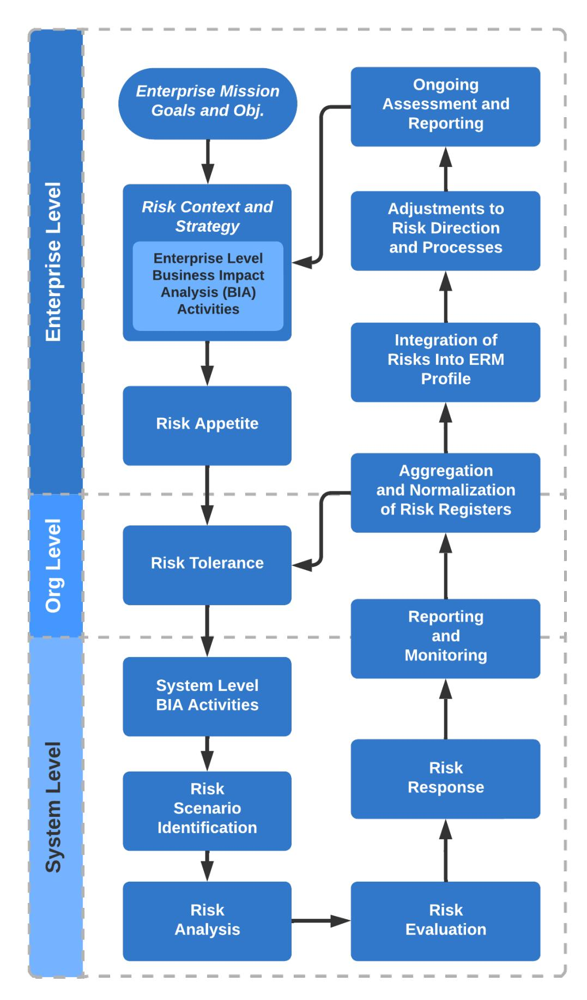
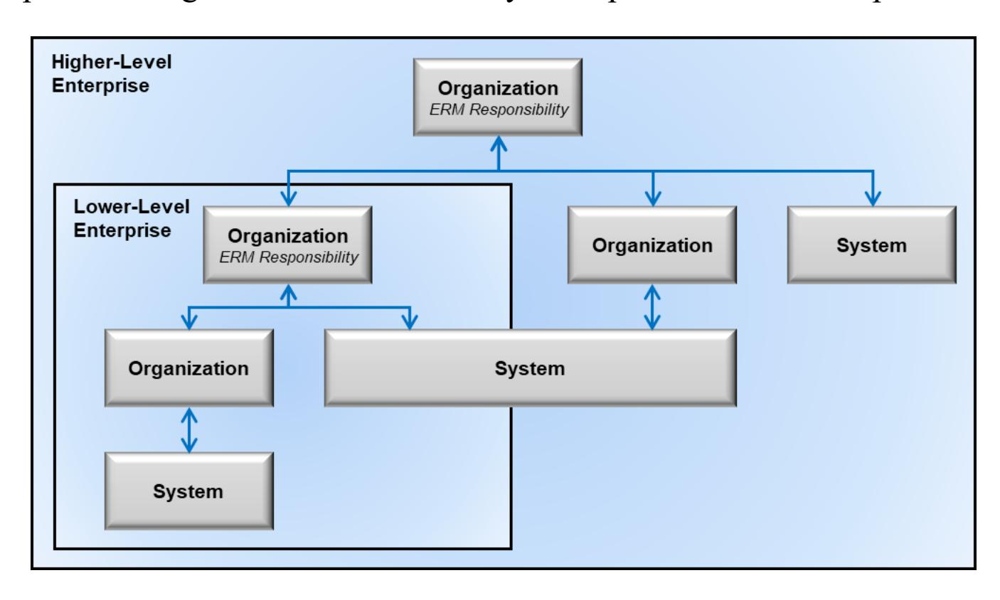
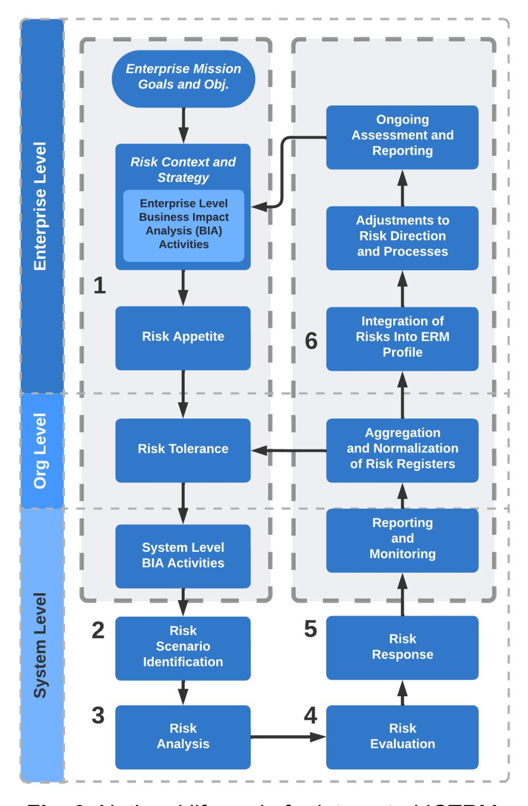
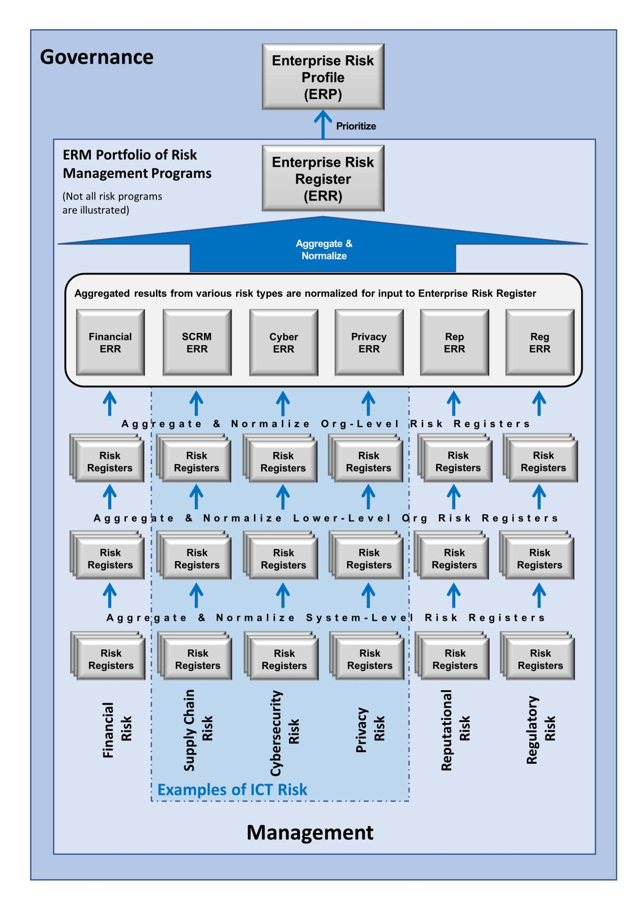
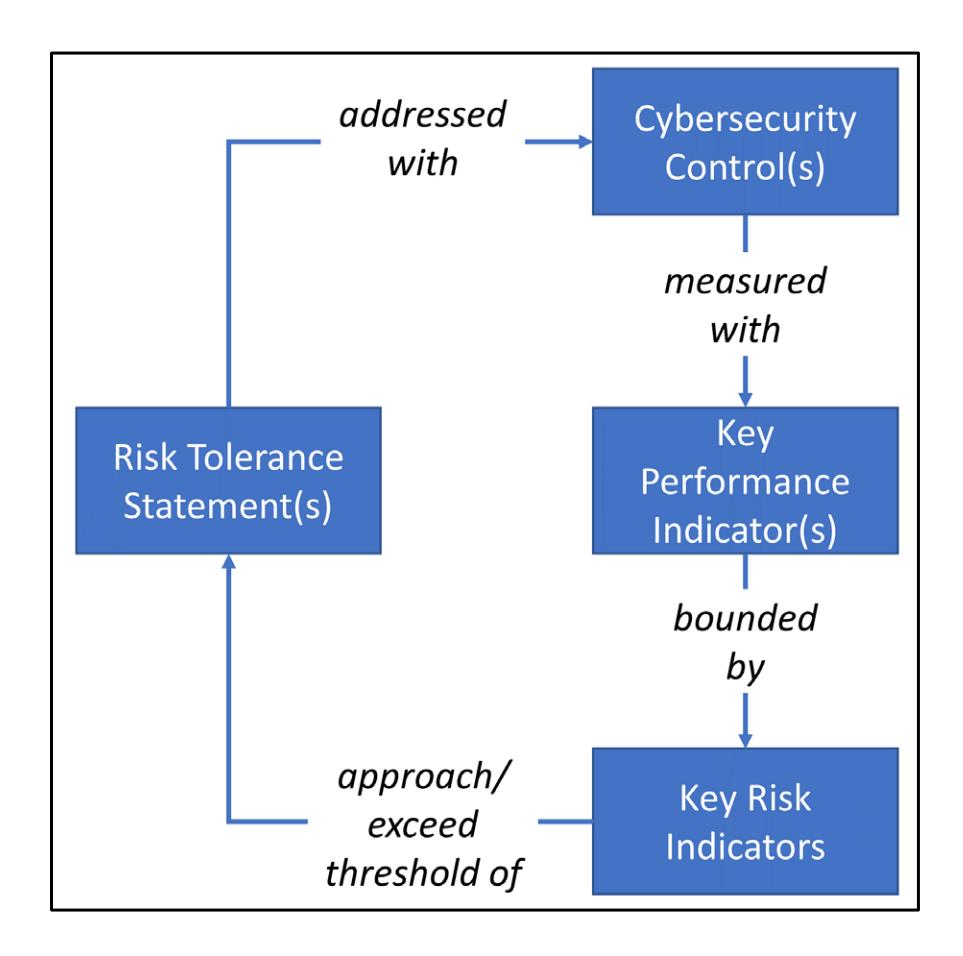
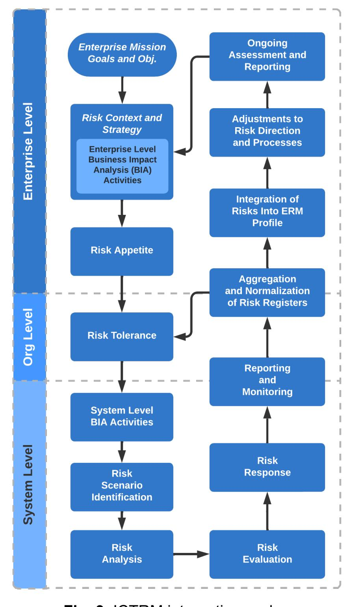
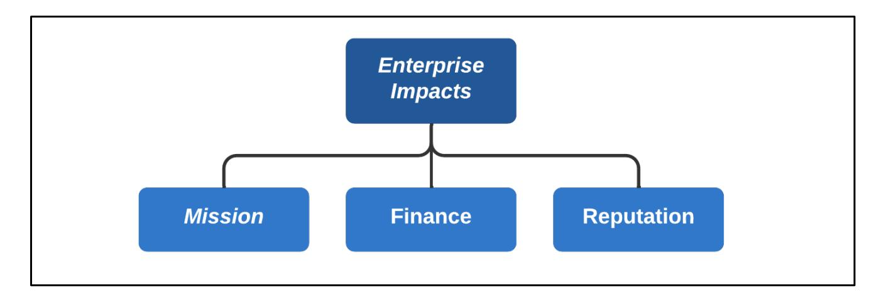
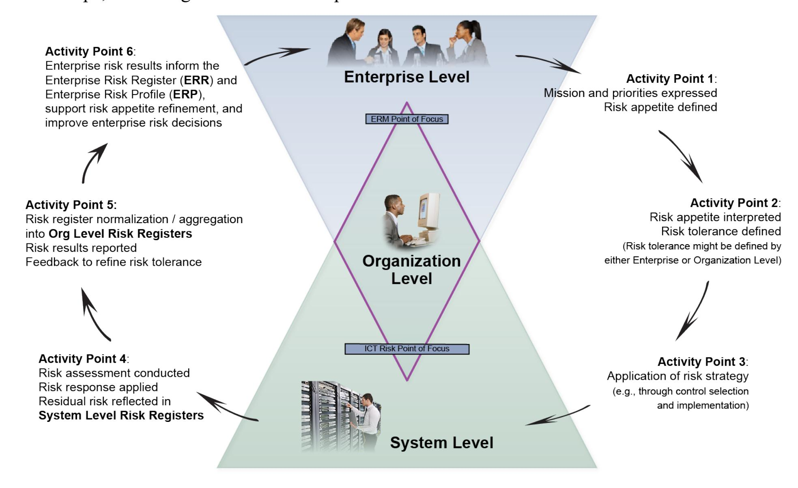
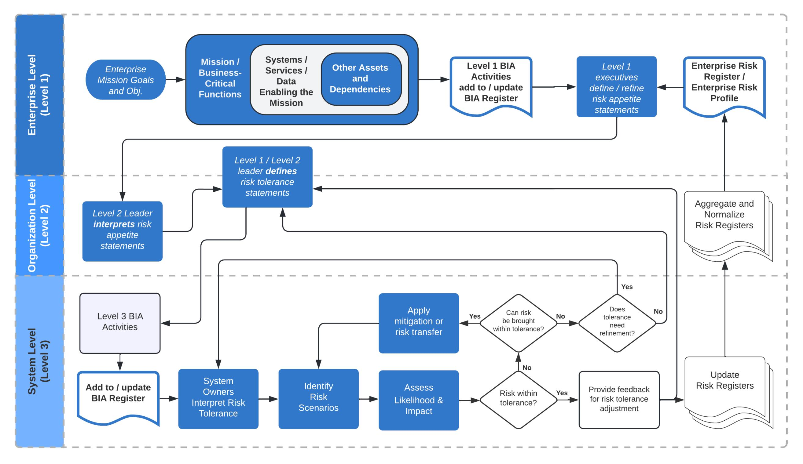

{0}------------------------------------------------

# **NIST Special Publication NIST SP 800-221**

# **Enterprise Impact of Information and Communications Technology Risk**

*Governing and Managing ICT Risk Programs Within an Enterprise Risk Portfolio*

> Stephen Quinn Nahla Ivy Julie Chua Matthew Barrett Larry Feldman Daniel Topper Greg Witte R. K. Gardner Karen Scarfone

This publication is available free of charge from: https://doi.org/10.6028/NIST.SP.800-221

{1}------------------------------------------------

# **NIST Special Publication NIST SP 800-221**

# **Enterprise Impact of Information and Communications Technology Risk**

*Governing and Managing ICT Risk Programs Within an Enterprise Risk Portfolio*

> Stephen Quinn *Applied Cybersecurity Division Information Technology Laboratory*

Nahla Ivy *Enterprise Risk Management Office Office of Financial Resource Management* 

Julie Chua *Office of Information Security Office of the Chief Information Officer (OCIO) U.S. Department of Health and Human Services* 

Matthew Barrett *CyberESI Consulting Group, Inc.* 

Larry Feldman Daniel Topper Greg Witte  *Huntington Ingalls Industries*

> R. K. Gardner *New World Technology Partners*

> > Karen Scarfone *Scarfone Cybersecurity*

This publication is available free of charge from: https://doi.org/10.6028/NIST.SP.800-221

November 2023

U.S. Department of Commerce *Gina M. Raimondo, Secretary*

{2}------------------------------------------------

Certain commercial equipment, instruments, software, or materials, commercial or non-commercial, are identified in this paper in order to specify the experimental procedure adequately. Such identification does not imply recommendation or endorsement of any product or service by NIST, nor does it imply that the materials or equipment identified are necessarily the best available for the purpose.

There may be references in this publication to other publications currently under development by NIST in accordance with its assigned statutory responsibilities. The information in this publication, including concepts and methodologies, may be used by federal agencies even before the completion of such companion publications. Thus, until each publication is completed, current requirements, guidelines, and procedures, where they exist, remain operative. For planning and transition purposes, federal agencies may wish to closely follow the development of these new publications by NIST.

Organizations are encouraged to review all draft publications during public comment periods and provide feedback to NIST. Many NIST cybersecurity publications, other than the ones noted above, are available at [https://csrc.nist.gov/publications.](https://csrc.nist.gov/publications)

#### **Authority**

This publication has been developed by NIST in accordance with its statutory responsibilities under the Federal Information Security Modernization Act (FISMA) of 2014, 44 U.S.C. § 3551 et seq., Public Law (P.L.) 113-283. NIST is responsible for developing information security standards and guidelines, including minimum requirements for federal information systems, but such standards and guidelines shall not apply to national security systems without the express approval of appropriate federal officials exercising policy authority over such systems. This guideline is consistent with the requirements of the Office of Management and Budget (OMB) Circular A-130.

Nothing in this publication should be taken to contradict the standards and guidelines made mandatory and binding on federal agencies by the Secretary of Commerce under statutory authority. Nor should these guidelines be interpreted as altering or superseding the existing authorities of the Secretary of Commerce, Director of the OMB, or any other federal official. This publication may be used by nongovernmental organizations on a voluntary basis and is not subject to copyright in the United States. Attribution would, however, be appreciated by NIST.

# **NIST Technical Series Policies**

[Copyright, Use, and Licensing Statements](https://doi.org/10.6028/NIST-TECHPUBS.CROSSMARK-POLICY) [NIST Technical Series Publication Identifier Syntax](https://www.nist.gov/document/publication-identifier-syntax-nist-technical-series-publications)

#### **Publication History**

Approved by the NIST Editorial Review Board on 2023-10-18

#### **How to Cite this NIST Technical Series Publication:**

Quinn S, Ivy N, Chua J, Barrett M, Feldman L, Topper D, Witte G, Gardner RK, Scarfone K (2023) Enterprise Impact of Information and Communications Technology Risk: Governing and Managing ICT Risk Programs Within an Enterprise Risk Portfolio. (National Institute of Standards and Technology, Gaithersburg, MD), NIST Special Publication (SP) NIST SP 800-221. https://doi.org/10.6028/NIST.SP.800-221

{3}------------------------------------------------

#### **Author ORCID iDs**

Stephen D. Quinn: 0000-0003-1436-684X Nahla Ivy: 0000-0003-4741-422X Matthew Barrett: 0000-0002-7689-427X Larry Feldman: 0000-0003-3888-027X Daniel Topper: 0000-0003-2612-7547

Gregory A. Witte: 0000-0002-5425-1097 Karen Scarfone: 0000-0001-6334-9486

#### **Contact Information**

[ictrm@nist.gov](mailto:ictrm@nist.gov)

National Institute of Standards and Technology Attn: Applied Cybersecurity Division, Information Technology Laboratory 100 Bureau Drive (Mail Stop 2000) Gaithersburg, MD 20899-2000

**All comments are subject to release under the Freedom of Information Act (FOIA).**

{4}------------------------------------------------

# **Abstract**

All enterprises should ensure that information and communications technology (ICT) risk receives appropriate attention within their enterprise risk management (ERM) programs. This document is intended to help individual organizations within an enterprise improve their ICT risk management (ICTRM). This can enable enterprises and their component organizations to better identify, assess, and manage their ICT risks in the context of their broader mission and business objectives. This document explains the value of rolling up and integrating risks that may be addressed at lower system and organizational levels to the broader enterprise level by focusing on the use of ICT risk registers as input to the enterprise risk profile.

# **Keywords**

enterprise risk management (ERM); enterprise risk profile (ERP); enterprise risk register (ERR); information and communications technology (ICT); ICT risk; ICT risk management (ICTRM); ICT risk measurement; risk appetite; risk register; risk tolerance.

# **Reports on Computer Systems Technology**

The Information Technology Laboratory (ITL) at the National Institute of Standards and Technology (NIST) promotes the U.S. economy and public welfare by providing technical leadership for the Nation's measurement and standards infrastructure. ITL develops tests, test methods, reference data, proof of concept implementations, and technical analyses to advance the development and productive use of information technology. ITL's responsibilities include the development of management, administrative, technical, and physical standards and guidelines for the cost-effective security and privacy of other than national security-related information in federal information systems. The Special Publication 800-series reports on ITL's research, guidelines, and outreach efforts in information system security, and its collaborative activities with industry, government, and academic organizations.

{5}------------------------------------------------

# **Audience**

The primary audience for this publication is both Federal Government and non-Federal Government professionals at all levels who understand ICT risk management (ICTRM) for one or more ICT domains but may be unfamiliar with ERM. The secondary audience includes both Federal and non-Federal Government corporate officers, high-level executives, ERM officers and staff members, and others who understand ERM but may be unfamiliar with the unique characteristics of ICTRM. All readers are expected to gain an improved understanding of how ICTRM and ERM relate to each other, as well as the benefits of integrating their use.

# **Document Conventions**

For this document, "assets" are defined as technologies that may compose an information or communications system. The term "asset" or "assets" is used in multiple frameworks and documents. Examples include laptop computers, desktop computers, servers, sensors, data, mobile phones, tablets, routers, and switches. In instances where the authors mean "assets" as they might be discussed at the enterprise level, the word "asset" will be preceded by words such as "enterprise," to differentiate context.

This document uses the phrase "information and communications technology" for ICT. As of this writing, both this phrase and the same phrase with "communication" instead of "communications" are widely used. The phrases essentially mean the same thing.

This document references two types of controls, each of which is essential and should not be confused with the other:

- Internal controls are the overarching mechanisms used to achieve and monitor enterprise objectives. The COSO Internal Control – Integrated Framework defines "internal control" as "a process effected by an entity's board of directors, management and other personnel designed to provide reasonable assurance of the achievement of objectives" [\[COSOERM\].](#page-72-0) These internal controls are an important factor at the enterprise level. In fact, the title of OMB Circular A-123 is "Management's Responsibility for Enterprise Risk Management and Internal Control."
- Risk management controls represent the safeguards or countermeasures prescribed for an information system or an organization to protect ICT in line with mission and business objectives. These controls provide the management, administrative, and technical methods for responding to ICT risks by deterring, detecting, preventing, or correcting threats and vulnerabilities.

# **Acknowledgments**

The authors wish to thank all individuals, organizations, and enterprises that contributed to the creation of this document. This includes Jim Foti, Amy Mahn, Matt Scholl, Kevin Stine, Dylan Gilber, Nakia Grayson, Naomi Lefkovitz, and Isabel Van Wyk of NIST and Mat Heyman of Impresa Management Solutions. The authors appreciate the support of the United States Department of Health and Human Services and the Federal Cyber-ERM Community of Interest, including the following members who provided specific comments: Cedric Carter Jr., L. Dix, Ken Hong Fong, Kim Isaac, Z. Kaptaine, Nnake Nweke, Khairun Pannah, Katherine Polevitzky, Thom Richison, Nicole Rohloff, C. Rosu, Stephanie Saravia, M. Sawyer, and

{6}------------------------------------------------

Angelica Stanley. The authors also thank Joel Crook of Consolidated Nuclear Security, LLC; Justin Perkins of CTIA; Kelly Hood of Optic Cyber Solutions; Matthew Smith of Seemless Transition, LLC; and individual commenters Simon Burson and Chuck Shriver.

# **Note to Readers**

NIST received numerous comments regarding how the concepts described in this publication might support interoperability among many different frameworks. Because different frameworks provide models for use in different applications by varying stakeholders, it is both essential and challenging to express and convey the various relationships.

In support of this challenge, NIST has been developing capabilities for expressing that interoperability:

- The Cybersecurity and Privacy Reference Tool (CPRT) offers a consistent format for accessing the reference data of NIST cybersecurity and privacy standards, guidelines, and frameworks, including those related to ICTRM. CPRT provides digitized reference data in a unified data format. These datasets are expressed in different data formats and enable cross-referencing, support aggregation, and enable summarization. More information is available from [https://csrc.nist.gov/Projects/cprt.](https://csrc.nist.gov/Projects/cprt)
- The National Online Informative References (OLIR) Program provides digital representation of various ICTRM elements (e.g., cybersecurity, privacy, workforce documents). Since the actions and results of ICTRM activities need to be coordinated both within and across a risk management discipline, OLIR's representation of the relationships among those activities will help with integration, communication, and reporting. More information is available from [https://csrc.nist.gov/Projects/olir.](https://csrc.nist.gov/Projects/olir)

# **Trademark Information**

All registered trademarks and trademarks belong to their respective organizations.

{7}------------------------------------------------

# **Patent Disclosure Notice**

NOTICE: ITL has requested that holders of patent claims whose use may be required for compliance with the guidance or requirements of this publication disclose such patent claims to ITL. However, holders of patents are not obligated to respond to ITL calls for patents and ITL has not undertaken a patent search in order to identify which, if any, patents may apply to this publication.

As of the date of publication and following call(s) for the identification of patent claims whose use may be required for compliance with the guidance or requirements of this publication, no such patent claims have been identified to ITL.

No representation is made or implied by ITL that licenses are not required to avoid patent infringement in the use of this publication.

{8}------------------------------------------------

# **Table of Contents**

|        | Executive Summary 1                                         |    |
|--------|-------------------------------------------------------------|----|
|        | Introduction 5                                           |    |
| 1.1    | Purpose and Scope 5                                      |    |
| 1.2    | Document Structure 6                                        |    |
|        | Introduction to ICTRM and Challenges with ERM Integration 8 |    |
|        | Comparing ICTRM and ERM 8                                   |    |
|        | ICTRM Life Cycle 9                                       |    |
|        | ICTRM and ERM Integration12                                 |    |
|        | Shortcomings of Typical Approaches to ICTRM13               |    |
| 2.4.1. | Increasing System and Ecosystem Complexity14                |    |
| 2.4.2. | Lack of Standardized Measures14                             |    |
| 2.4.3. | Informal Analysis Methods15                                 |    |
| 2.4.4. | Overly Focused on the System Level15                        |    |
| 2.4.5. | The Gap Between ICTRM Output and ERM Input15                |    |
| 2.4.6. | Losing the Context of the Positive Risk16                   |    |
|        | ICT Risk Considerations 17                               |    |
|        | Identify the Context17                                      |    |
| 3.1.1. | Risk Governance 17                                       |    |
| 3.1.2. | Risk Appetite and Risk Tolerance 19                      |    |
| 3.1.3. | Risk Management Strategy21                                  |    |
|        | Identify the Risks 22                                    |    |
| 3.2.1. | Inventory and Valuation of Assets22                         |    |
| 3.2.2. | Determination of Potential Threats23                        |    |
| 3.2.3. | Determination of Exploitable and Susceptible Conditions     | 24 |
| 3.2.4. | Evaluation of Potential Consequences25                      |    |
| 3.2.5. | Risk Register Use25                                         |    |
|        | Analyze (Quantify) the Risks28                              |    |
| 3.3.1. | Risk Analysis Types28                                       |    |
| 3.3.2. | Techniques for Estimating Likelihood and Impact 29       |    |
|        | Prioritize Risks30                                          |    |
|        | Plan and Execute Risk Response Strategies32                 |    |
|        | Monitor, Evaluate, and Adjust Risk Management34             |    |
| 3.6.1. | Adjusting Risk Response Based on Additional Information     | 35 |
|        | Considerations of Positive Risks as an Input to ERM35       |    |
|        | Building ERRs and ERPs from ICTRM-Specific Risk Registers38 |    |

{9}------------------------------------------------

|                       | Creating and Maintaining Enterprise-Level ICT Risk Registers38                                                           |    |
|-----------------------|--------------------------------------------------------------------------------------------------------------------------|----|
|                       | Creating the Enterprise Risk Register (ERR)39                                                                            |    |
|                       | Developing the Enterprise Risk Profile (ERP)42                                                                           |    |
|                       | Translating the ERP to Inform Leadership Decisions 44                                                                 |    |
|                       | Enterprise Strategy for ICT Risk Coordination46                                                                          |    |
|                       | Risk Integration and Coordination Activities46                                                                           |    |
| 5.1.1.                | Detailed Risk Integration Strategy47                                                                                     |    |
| 5.1.2.                | Risk Monitoring and Communication Activities50                                                                           |    |
|                       | Aggregation and Normalization of Risk Registers 52                                                                    |    |
| 5.2.1.                | Aggregation of ICT Risk Information 53                                                                                |    |
| 5.2.2.                | Normalization of Risk Register Information 53                                                                         |    |
| 5.2.3.                | Integrating Risk Register Details55                                                                                      |    |
|                       | Adjusting Risk Responses 56                                                                                           |    |
| 5.3.1.                | Factors Influencing Prioritization 57                                                                                 |    |
| 5.3.2.                | ICT Risk Optimization 57                                                                                              |    |
| 5.3.3.                | ICT Risk Priorities at Each Enterprise Level58                                                                           |    |
|                       | Enterprise Adjustments Based on ICT Risk Results 59                                                                   |    |
| 5.4.1.                | Adjustments to ICT Program Budget Allocation 59                                                                       |    |
| 5.4.2.                | Adjustments to Risk Appetite and Risk Tolerance60                                                                        |    |
| 5.4.3.                | Reviewing Whether Constraints Are Overly Stringent 61                                                                 |    |
| 5.4.4.                | Adjustments to Priority61                                                                                                |    |
| References            | 62                                                                                                                       |    |
| Appendix A.           | Acronyms and Abbreviations 64                                                                                         |    |
| Appendix B.           | Notional Example of a Risk Detail Record (RDR) 66                                                                     |    |
|                       |                                                                                                                          |    |
| List of Tables        |                                                                                                                          |    |
| Table 1.              | Similarities among selected ERM and risk management documents                                                            | 10 |
| Table 2.              | Examples of risk oversight roles and responsibilities18                                                                  |    |
| Table 3. Table 4.  | Examples of risk appetite and risk tolerance 20 Descriptions of notional risk register template elements26         |    |
| Table 5.              | Response types for negative ICT risks33                                                                                  |    |
| Table 6.              | Response types for positive ICT risks 37                                                                              |    |
| Table 7.              | Descriptions of additional notional ERR elements41                                                                       |    |
| Table 8.              | Notional enterprise risk portfolio view for a private enterprise 45                                                   |    |
| Table 9. Table 10. | Inputs and outputs for ERM governance and integrated ICTRM Notional ICT-related examples that support the MEA Cycle51 | 47 |
| Table 11.             | Examples of ICT risk normalization54                                                                                     |    |

{10}------------------------------------------------

# **List of Figures**

|         | Fig. 1. ICTRM integration cycle 3                                                         |  |
|---------|-------------------------------------------------------------------------------------------|--|
|         | Fig. 2. Enterprise hierarchy 8                                                            |  |
| Fig. 3. | Notional life cycle for integrated ICTRM11                                                |  |
| Fig. 4. | ICTRM as part of ERM13                                                                    |  |
| Fig. 5. | Notional risk register template26                                                         |  |
| Fig. 6. | Example of a qualitative risk matrix31                                                    |  |
| Fig. 7. | Example of a semi-quantitative risk matrix 32                                          |  |
| Fig. 8. | Monitor-Evaluate-Adjust Cycle34                                                           |  |
|         | Fig. 9. ICTRM integration cycle38                                                         |  |
|         | Notional example of an ICT-inclusive ERR 40 Fig. 10.                                |  |
|         | Notional example of an enterprise risk profile43 Fig. 11.                              |  |
|         | Impacts (consequences) on enterprise assets for a business or agency44 Fig. 12.        |  |
|         | Illustration of enterprise risk management integration and coordination 46 Fig. 13. |  |
|         | Fig. 14. Continuous ERM/ICTRM interaction 48                                           |  |
|         | Notional risk detail record66 Fig. 15.                                                 |  |
|         |                                                                                           |  |

{11}------------------------------------------------

.

# **Executive Summary**

All types of organizations, from corporations to federal agencies, face a broad array of risks. For federal agencies, the Office of Management and Budget (OMB) Circular A-11 defines risk as "the effect of uncertainty on objectives" [\[OMB-A11\].](#page-73-0) The effect of uncertainty on *enterprise* mission and business objectives may then be considered an "enterprise risk" that must be similarly managed. An *enterprise* is an organization that exists at the top level of a hierarchy with unique risk management responsibilities. Managing risks at that level — *enterprise risk management (ERM)* — calls for understanding the core risks that an enterprise faces, determining how best to address those risks, and ensuring that the necessary actions are taken. In the Federal Government, ERM is considered "an effective agency-wide approach to addressing the full spectrum of the organization's significant risks by understanding the combined impact of risks as an interrelated portfolio, rather than addressing risks only within silos" [\[OMB-A11\].](#page-73-0) OMB Circular A-123 "establishes an expectation for federal agencies to proactively consider and address risks through an integrated…view of events, conditions, or scenarios that impact mission achievement" [\[OMB-A123\].](#page-73-1)

The information and communications technology (ICT) on which an enterprise relies is managed through a broad set of ICT risk disciplines that include privacy, supply chain, and cybersecurity. ICT includes a broad range of information and technology that extends far beyond traditional information technology considerations. For example, a growing number of enterprises rely on operational technology (OT) and IoT (Internet of Things) devices' sensors or actuators bridging the physical world and the digital world. Increasingly, artificial intelligence (AI) factors into enterprise risk. NIST's AI Risk Management Framework points out that "AI risk management should be integrated and incorporated into broader enterprise risk management strategies and processes. Treating AI risks along with other critical risks, such as cybersecurity and privacy, will yield a more integrated outcome and organizational efficiencies."[1](#page-11-1)

This publication addresses OMB's points above for ensuring that ERM considerations and decisions take an ICT portfolio perspective. This publication examines the relationships among ICT risk disciplines and enterprise risk practices. Notably, OMB has stressed the need for enterprise risk considerations and decisions to be based on a portfolio-wide perspective. Individual risk programs have an important role *and* must integrate activities as part of that enterprise portfolio. Doing so ensures a focus on achieving enterprise objectives and helps identify those risks that will have the most significant impact on the entity's mission. This publication extends that NIST risk program guidance to recognize that risk extends beyond the boundaries of individual programs. There are extensive ICT risk considerations (e.g., Internet of Things, supply chain, privacy, cybersecurity) as well as risk management frameworks that support the management of a mosaic of interrelated risks. Effectively addressing these ICT risks at the enterprise level requires coordination, communication, and collaboration. This publication examines the relationships between ICT risk disciplines and enterprise risk practices.

The broad set of ICT disciplines forms an adaptive system-of-systems composed of many interdependent components and channels. The resulting data represent information, control signals, and sensor readings. As with other complex systems-of-systems, the interconnectedness of these technologies produces system behaviors that cannot be determined by the behavior of

1 The NIST Artificial Intelligence Risk Management Framework (AI RMF 1.0) is available at <https://doi.org/10.6028/NIST.AI.100-1>

{12}------------------------------------------------

individual components. That interconnectedness causes risks that exist between and across multiple risk programs. As systems become more complex, they present exploitable vulnerabilities, emergent risks, and system instabilities that — once triggered — can have a runaway effect with multiple severe and often irreversible consequences. In the contemporary enterprise, emergency and real-time circumstances can turn a relatively minor ICT-based risk into true operational risks that disrupt an organization's ability to perform mission or business functions. Many organizations have applied traditional fault tolerance and resilience measures to support the availability of essential functions and services. Those measures themselves can introduce fragility and increase attack surface, as can system complexity (e.g., real-time control systems), so the enterprise may need to consider more advanced resilience techniques.

This publication supports an interconnected approach to risk frameworks and programs that address ICT risk areas (e.g., cybersecurity, privacy, supply chain) within an enterprise risk portfolio. This publication encourages the practice of aggregating and normalizing ICT risk information. Doing so helps to identify, quantify, and communicate risk scenarios and their consequences to support effective decision-making. This integrated approach ensures that shareholder and stakeholder value is quantified in financial, mission, and reputation metrics similar to those attributed to other (non-technical) enterprise risks, thereby enabling executives and officials to prudently reallocate resources among varied competing risk types.

While NIST is widely recognized as a source of cybersecurity guidance, cyber is only one portion of a large and complex set of risk types that also include financial, legal, legislative, safety, and strategic risks. As part of an ERM program, senior leaders (e.g., corporate officers, government senior executive staff) often have fiduciary and reporting responsibilities that other organizational stakeholders do not, so they have a unique responsibility to holistically manage the combined set of risks. ERM provides the umbrella under which risks are aggregated and prioritized so that all risks can be evaluated and "stovepiped" risk reporting can be avoided. ERM also provides an opportunity to identify operational risk — a subset of enterprise risks that is so significant that potential losses could jeopardize one or more aspects of operations. Risk managers determine whether a failed internal process (related to enterprise people, processes, technology, or governance) may directly cause a significant operational impact. Some risk response activities directly protect mission operations. Enterprise leaders should define these operational risk parameters as part of enterprise risk strategy.

{13}------------------------------------------------

This publication explores the high-level ICT risk management (ICTRM) process illustrated by **[Fig. 1](#page-13-0)** . Many resources such as well-known frameworks from the Committee of Sponsoring Organizations (COSO), OMB circulars, and the International Organization for Standardization (ISO) — document ERM frameworks and processes. They generally include similar approaches: identify context, identify risk, analyze risk, estimate risk importance, determine and execute the risk response, and identify and respond to changes over time. The process recognizes that no risk response should occur without understanding stakeholder expectations for managing risk to an acceptable level, as informed by leadership's risk appetite and risk tolerance statements.

To ensure that leaders can be provided with a composite understanding of the various threats and consequences each organization and enterprise faces, risk information is recorded and shared through *risk registers*. [2](#page-13-1) At higher levels in the enterprise structure, various risk registers (including those related to ICTRM) are aggregated, normalized, and prioritized into *risk profiles*.

**Fig. 1**. ICTRM integration cycle

While it is critical for an enterprise to address potential negative impacts on mission and business objectives, it is equally critical (and required for federal agencies) that enterprises plan for success. OMB states that "the [Enterprise Risk] profile must identify sources of uncertainty, both positive (opportunities) and negative (threats)" [\[OMB-A123\].](#page-73-1)

Enterprise-level decision makers use the risk profile to choose which enterprise risks to address, allocate resources, and delegate responsibilities to appropriate risk owners. ERM strategy

2 OMB Circular A-11 defines a *risk register* as "a repository of risk information including the data understood about risks over time" [OMB-A11].

{14}------------------------------------------------

includes defining terminology, formats, criteria, and other guidance for risk inputs from lower levels of the enterprise.

Integrating risk management information from throughout the enterprise supports a full-scope enterprise risk register (ERR) and a prioritized enterprise risk profile (ERP). These artifacts enhance ERM deliberations, decisions, and actions. Integrating this information enables the inclusion of ICT risks (including various operational technology, supply chain, privacy, and cybersecurity risks) as part of financial, valuation, mission, and reputation exposure. A comprehensive ERR and ERP support communication and disclosure requirements. The integration of technology-specific risk management activities supports an understanding of exposures related to corporate reporting (e.g., income statements, balance sheets, cash flow) and similar requirements (e.g., reporting for appropriation and oversight authorities) for public-sector entities. The iterative ICTRM process enables adjustments to risk management direction. As leaders receive feedback regarding enterprise progress, strategy can be adjusted to take advantage of an opportunity or to better address negative risks as information is collected and shared.

Applying a consistent approach to identify, assess, respond to, and communicate risk throughout the enterprise about the entire portfolio of ICT risk disciplines will help ensure that leaders and executives are accurately informed and able to support effective strategic and tactical decisions. While the methods for managing risk among different disciplines will vary widely, an ICT-wide approach to directing risk management, reporting and monitoring the results, and adjusting to optimize the achievement of enterprise objectives will provide valuable benefits.

{15}------------------------------------------------

# **Introduction**

The Office of Management and Budget (OMB) defines *risk* as "the effect of uncertainty on objectives" [\[OMB-A11\].](#page-73-0) The effect of uncertainty on enterprise mission and business objectives may then be considered an *enterprise risk* that must be similarly managed.

The process of managing risks at the enterprise level is known as *enterprise risk management (ERM)*, and it calls for:

- Identifying and understanding the core risks facing an enterprise,
- Determining how best to address those risks, and
- Ensuring that the necessary actions are taken.

*Playbook: Enterprise Risk Management for the U.S. Federal Government* [\[PLAYBOOK\]](#page-73-2) defines numerous types of risk, including compliance, financial, legal, legislative, operational, reputational, and strategic. Enterprises use ERM to holistically manage the combined set of risks. OMB Circular A-123 "establishes an expectation for federal agencies to proactively consider and address risks through an integrated…view of events, conditions, or scenarios that impact mission achievement" [\[OMB-A123\].](#page-73-1) OMB considers ERM to be "an effective agency-wide approach to addressing the full spectrum of the organization's significant risks by understanding the combined impact of risks as an interrelated portfolio, rather than addressing risks only within silos" [\[OMB-A123\].](#page-73-1) In the private sector, the Committee of Sponsoring Organizations (COSO) publication, *Enterprise Risk Management – Integrating with Strategy and Performance,* defines ERM as the "culture, capabilities, and practices that organizations integrate with strategy-setting and apply when they carry out that strategy, with a purpose of managing risk in creating, preserving, and realizing value" [\[COSOERM\].](#page-72-0)

Many information and communications technology (ICT) risk management (ICTRM) disciplines — including cybersecurity, supply chain, and privacy — have evolved into full-fledged risk programs because of organizations' reliance on ICT. ICT includes technology that extends beyond traditional information technology considerations. Many enterprises rely on operational technology (OT) and IoT (Internet of Things) devices' sensors or actuators to bridge the physical and digital worlds. Artificial intelligence (AI) increasingly factors into enterprise risk. The rapid evolution of ICTRM disciplines has sometimes led to miscommunication and inefficiencies between those risk programs and the overarching ERM portfolio of risks. In recent years, NIST has published guidance to codify risk management practices for several ICT risk programs, such as cybersecurity (Cybersecurity Framework [\[NISTCSF\]\)](#page-72-2), privacy (Privacy Framework [\[NISTPF\]\)](#page-73-3), information system and organization cybersecurity and privacy (Risk Management Framework [\[NISTRMF\]\),](#page-73-4) artificial intelligence (Artificial Intelligence Risk Management Framework [\[AIRMF\]\),](#page-72-3) Internet of Things (IoT) cybersecurity [\[NISTIOT\],](#page-72-4) and cybersecurity supply chain risk management (C-SCRM) [\[CSCRM\].](#page-72-5)

#### **1.1 Purpose and Scope**

This publication broadens NIST's existing ICT risk guidance by recognizing and incorporating ICTRM within the overall sphere of ERM. All ICT risk programs can work together to support ERM and can be integrated into risk portfolios for ERM. Comparing the outputs of ICTRM activities with effective inputs to ERM activities and the outputs of ERM with effective inputs

{16}------------------------------------------------

for ICTRM enables stakeholders to identify opportunities to enable stakeholders to successfully manage risk and pursue opportunities.

This document is intended to help improve communication (including risk information sharing) between and among ICT professionals and system owners, high-level executives, and corporate officers at multiple levels. The goal is to assist personnel in better identifying, assessing, and managing ICT risks in the context of their broader mission and business objectives. This document will help professionals understand what executives and corporate officers need for them to carry out ERM. This includes what data to collect, what analyses to perform, and how to consolidate and condition this discipline-specific risk information. This document will also help executives and officers understand the challenges that ICT professionals face.

This document references some materials that are specifically intended for use by federal agencies, but the concepts and approaches are intended to be useful for all enterprises.

Other NIST resources that support this document include:

- NIST Special Publication (SP) 800-221A, *Information and Communications Technology (ICT) Risk Outcomes: Integrating ICT Risk Management Programs with the Enterprise Risk Portfolio* [\[SP800221A\],](#page-73-5) which provides outcome examples that apply to all types of ICT risk and complements the content of this document. The outcomes defined in NIST SP 800-221A are also available in spreadsheet format from the NIST Cybersecurity and Privacy Reference Tool (CPRT) website. [3](#page-16-1)
- An informative reference that links the contents of NIST SP 800-221A with the NIST Cybersecurity Framework is posted as part of the National Online Informative References (OLIR) Program.[4](#page-16-2)
- The NIST Interagency or Internal Report (IR) 8286 [\[IR8286\]](#page-72-6) series of publications describes an example implementation of the ICTRM process tailored to cybersecurity. They illustrate integrated risk identification, assessment, monitoring, and reporting through cybersecurity examples and describe processes that are analogous to many types of ICT risk.

#### **1.2 Document Structure**

The remainder of this document is organized into the following major sections:

- Section 2 provides a brief introduction to ICTRM and explores common challenges involved in integrating ICTRM with ERM processes.
- Section 3 discusses ICT risk considerations throughout the ERM process and highlights the use of the risk register to document ICT risk as ERM input.
- Section 4 examines how ICT risk registers can be used for adopting a portfolio view of risk at the enterprise level based on normalizing and aggregating ICT risk registers into an enterprise risk register and then applying prioritization to it to generate an enterprise risk profile to support senior executive decision-making during boardroom deliberations.

3 See the [Cybersecurity and Privacy Reference Tool \(CPRT\) website](https://csrc.nist.gov/projects/cprt) for more details.

4 Se[e NIST Online Informative Reference Program \(OLIR\)](https://csrc.nist.gov/Projects/olir) for more details.

{17}------------------------------------------------

- Section 5 explores enterprise strategy for ICT risk coordination. While this section is mainly for enterprise leaders, others may also find its contents useful.
- The References section provides information about the external sources cited in this publication.
- Appendix A lists the acronyms used in the document.
- Appendix B provides a notional example of a risk detail record (RDR).

{18}------------------------------------------------

# **Introduction to ICTRM and Challenges with ERM Integration**

This section provides a brief introduction to ICTRM and explores common challenges involved in integrating ICTRM with ERM processes.

# **Comparing ICTRM and ERM**

Distinguishing ICTRM from ERM and understanding how they relate first requires differentiating the terms *organization* and *enterprise*. Although they are often used interchangeably,[5](#page-18-3) this document considers an *organization* to be an entity of any size, complexity, or position within a larger organizational structure (e.g., a federal agency or company), and an *enterprise* is an organization at the top level of the hierarchy. **[Fig. 2](#page-18-2)** shows a notional enterprise with subordinate organizations and illustrates that one of those subordinates is itself an enterprise. Both government and industry are represented in this depiction.

**Fig. 2**. Enterprise hierarchy

Consider the example of the Department of Commerce as a **higher-level enterprise** with bureaus (e.g., Census Bureau, National Oceanic and Atmospheric Administration [NOAA], NIST) as **lower-level enterprises** and their subordinates (e.g., NOAA's National Weather Service, NIST laboratories) representing **organizations**. In industry, consider mergers and acquisitions where an enterprise acquires another company, which itself was an enterprise, and then subordinates it within the higher-level enterprise's conglomeration of organizations and systems. Each enterprise is supported by various *systems* that are each a discrete set of information resources organized expressly for the collection, processing, maintenance, use, sharing, dissemination, or disposition of information.

5 For example, NIST IR 8170 uses *enterprise risk management* and *organization-wide risk management* interchangeably. The scope of NIST IR 8170 includes smaller enterprises than this publication does, so an *enterprise* – as defined there – may be comprised of a single organization. The enterprises discussed in this publication have more complex compositions [\[IR8170\]](#page-72-7) .

{19}------------------------------------------------

Most ICTRM responsibilities tend to be carried out by the individual organizations within an enterprise. In contrast, the ERM responsibility for tracking key enterprise risks and their impacts on objectives is at the highest-level enterprise, held by top-level corporate officers and board members who have fiduciary and reporting duties not performed elsewhere in the enterprise.

ERM requires identifying and understanding the various types of risk, including ICT risks, that an enterprise faces; determining the probability that these risks will occur; and estimating their potential impact. ERM processes provide senior enterprise executives with a portfolio view of key risks across the enterprise, and this portfolio considers the outputs of all ICTRM disciplines.[6](#page-19-1)

Public and private enterprises have a common primary purpose for ERM: safeguard the enterprise's mission, finances (e.g., net revenue, capital, free cash flow), and reputation (e.g., stakeholder trust) in the face of natural, accidental, and adversarial threats.

# **ICTRM Life Cycle**

There are many models for risk management processes. [Table 1](#page-20-0) illustrates similarities among several common risk management models, including establishing context, identifying risks, analyzing risks, estimating risk importance, determining and executing risk response, and monitoring and responding to changes over time. The entries in [Table 1](#page-20-0) indicate (in parentheses) their identifier or section number from the source material whenever available. [Table 1](#page-20-0) provides a high-level comparison and is not intended to be a crosswalk for relationships among the models but, rather, show that risk management disciplines that aggregate into the ERM process follow similar steps to manage risk.

The resources in [Table 1](#page-20-0) are from:

- U.S. Chief Financial Officers Council (CFOC) and Performance Improvement Council (PIC) *Playbook: Enterprise Risk Management for the U.S. Federal Government* (or *ERM Playbook*) [\[PLAYBOOK\];](#page-73-2)
- Committee of Sponsoring Organizations of the Treadway Commission (COSO) *Enterprise Risk Management – Integrating with Strategy and Performance* Framework [\[COSOERM\];](#page-72-0)
- International Organization for Standardization (ISO) 31000, *Risk Management* standard [\[ISO31000\];](#page-72-8)
- U.S. Office of Management and Budget (OMB) *Circular A-123 Management's Responsibility for Internal Control* [\[OMB-A123\];](#page-73-1) and
- U.S. Government Accountability Office (GAO) *Standards for Internal Control in the Federal Government* [\[GREENBOOK\].](#page-72-9)

6 This is defined by OMB as "insight into all areas of organizational exposure to risk […] thus increasing an Agency's chances of experiencing fewer unanticipated outcomes and executing a better assessment of risk associated with changes in the environment" [\[OMB-A123\]](#page-73-1) .

{20}------------------------------------------------

**Table 1.** Similarities among selected ERM and risk management documents

| ERM Playbook            | COSO ERM Framework                                          | ISO 31000:2018                                                               |                                    | OMB A-123               | GAO Green Book                                                            |
|-------------------------|----------------------------------------------------------------|------------------------------------------------------------------------------|------------------------------------|-------------------------|------------------------------------------------------------------------------|
| Identify the Context | Governance and Culture Strategy and Objective Setting | Establish External Context (5.3.2), Establish Internal Context (5.3.3) |                                    | Establish Context    | Define objectives and risk tolerances (6.01)                           |
| Identify the Risks      | Performance Review and Revision Information,             |                                                                              | Risk Identificati on (5.4.2) | Identify Risks          | Identification of Risks (7.02)                                            |
| Analyze the Risks       | Communication, and Reporting                                | Risk                                                                         | Risk Analysis (5.4.3)        | Analyze and Evaluate | Analysis of Risks (7.05)                                                  |
| Assess Likelihood       |                                                                | Assessment                                                                   | Calculate                          |                         | Management                                                                   |
| Assess Impact           |                                                                |                                                                              | Level of                           |                         | estimates the                                                                |
| Prioritize Risks        |                                                                |                                                                              | Risk                               |                         | significance of a risk and considers the magnitude of                  |
| Calculate Exposure   |                                                                |                                                                              |                                    |                         | impact, the likelihood of occurrence, and the nature of the risk |
| Plan and Execute        |                                                                |                                                                              | Risk                               | Develop                 | Response to Risks                                                            |
| Response Strategies  |                                                                |                                                                              | Evaluation (5.4.4)              | Alternatives            | (7.08)                                                                       |
|                         |                                                                | Risk Treatment (5.5)                                                         |                                    | Respond to Risks     |                                                                              |
| Monitor, Evaluate,   | Performance Review and Revision                             | Monitoring and Review (5.6)                                               |                                    | Monitor and Review   | Identification of Change (9.02)                                           |
| and Adjust              | Information, Communication, and Reporting                |                                                                              |                                    |                         | Analysis of and Response to Change (9.04)                              |

This document uses the processes of the ERM Playbook (column 1 in [Table 1\)](#page-20-0) as a basis for describing the ICTRM life cycle and explaining how ICTRM integrates with ERM at a high level. This is not meant to imply that all enterprises should use these steps; enterprises should determine and apply the appropriate approach to achieve ICTRM/ERM integration, communication, and monitoring.

{21}------------------------------------------------

The six steps in the notional ICTRM life cycle, as shown in [Fig. 3,](#page-21-0) are:

# • **Step 1. Identify the context.** Context refers to the external and internal environment in which the enterprise operates and is influenced by the risks involved. This step includes determining and documenting the enterprise mission, including goals and objectives, and the enterprise risk management strategy. This step also includes enterprise leaders communicating risk management expectations to their component

• **Step 2. Identify the risks.** This means identifying the comprehensive set of positive and negative risks and determining which events could enhance or impede objectives, including the risk of failing to pursue an opportunity.

organizations.

**Fig. 3.** Notional life cycle for integrated ICTRM

- **Step 3. Analyze the risks.** This involves estimating the likelihood that each identified risk event will occur and the potential impact of the consequences described.
- **Step 4. Prioritize the risks**. The exposure is calculated for each risk based on likelihood and potential impact, and the risks are then prioritized based on their exposure.
- **Step 5. Plan and execute risk response strategies.** The appropriate response is determined for each risk and informed by risk guidance from leadership.
- **Step 6. Monitor, evaluate, and adjust risk management.** Ongoing review of risk management results ensures that enterprise risk conditions remain within the defined risk appetite levels as risks change.

Steps 2 through 6 usually utilize risk registers. OMB Circular A-11 describes a *risk register* as "a repository of risk information, including the data understood about risks over time." It also states, "Typically, a risk register contains a description of the risk, the impact if the risk should occur, the probability of its occurrence, mitigation strategies, risk owners, and a ranking to identify higher priority risks" [\[OMB-A11\].](#page-73-0) Each register evolves and matures as other risk activities take place.

{22}------------------------------------------------

Not all risk management methodologies generate an artifact called a risk register or risk log. However, the output of each methodology contains the underpinnings of (or can serve as an input to) a risk register. Because they can be useful information-gathering constructs, organizations not yet familiar with or using risk registers are strongly urged to adopt and integrate them into whatever risk management methodology they are currently using. Risk registers represent an organizing principle for communicating ICT risks to the OMB Circular A-123 ERM process for organizations already familiar with this management construct. Documenting and tracking ICT risks in risk registers provides a common organizing method and fosters communication between ICT risk disciplines and senior decision makers.

[Section 3](#page-27-0) provides more detail about each step and all the elements within [Fig. 3.](#page-21-0)

# **ICTRM and ERM Integration**

ERM and ICTRM have several points of integration. First, enterprise governance activities for ERM direct the strategy and methods for ICTRM and other risk management disciplines to use. Based on this guidance, each discipline within each organization uses risk registers to document its risks. In the case of ICTRM, risks are derived from system-level assessments. Next, these risk registers are aggregated, normalized, and used to create enterprise-level risk registers for each discipline. These, in turn, become part of a broader *enterprise risk register (ERR)* that encompasses all disciplines.

**[Fig. 4](#page-23-1)** demonstrates that ERM and ICTRM are not separate processes. Rather, ICTRM represents an important subset of the broader portfolio of ERM. Documenting and tracking ICT risks in lower-level risk registers supports better management of ICT risks at the enterprise level.[7](#page-22-1)

The ERR is prioritized by those with fiduciary and oversight responsibilities creating an *enterprise risk profile (ERP)*, also known as an *ERM risk profile*. [8](#page-22-2) An ERP is created by considering enterprise risks in relation to achieving objectives as typically outlined in an organizational strategic plan. OMB Circular A-123 [\[OMB-A123\]](#page-73-1) requires ERPs to include four kinds of objectives: *strategic*, *operations* (operational effectiveness and efficiency), *reporting* (reporting reliability), and *compliance* (compliance with applicable laws and regulations). While there may be some overlap among the categories of objectives, understanding uncertainty as it affects these objectives will help inform effective and timely decision-making. Effective ERM balances achieving objectives with optimizing resources.

[Section 3](#page-27-0) discusses ICTRM and ERM integration in much greater detail.

7 Each risk (category) is subject to a variety of technical and non-technical causes. This document only addresses those risks that pertain to ICT attack, failure, or error.

8 OMB Circular A-123 recommends (and requires for federal users) recording enterprise risks in an enterprise risk profile.

{23}------------------------------------------------

**Fig. 4.** ICTRM as part of ERM

# **Shortcomings of Typical Approaches to ICTRM**

In many enterprises, ICTRM disciplines have not historically been well-integrated with ERM processes. While ICTRM follows many of the same high-level principles as the ERM framework, ICTRM is typically executed quite differently, and its outputs are not always properly conditioned as ERM inputs. Some common contributors to those shortcomings are described below.

{24}------------------------------------------------

# **2.4.1. Increasing System and Ecosystem Complexity**

Many systems today are complex, adaptive "system-of-systems" composed of thousands of interdependent components and myriad channels.

In addition to technical complexity, operations are continually influenced by rapidly changing external factors (e.g., societal, political, and environmental). This dynamic landscape introduces threats from individuals and groups with shifting alliances, attitudes, and agendas. The ongoing introduction of new technologies has also changed and complicated the landscape. Wireless connections, big data, cloud computing, and the IoT present new complexities and concomitant vulnerabilities. Operational technology (OT), including building management systems and physical access control/monitoring systems, is increasingly relied upon. Information and technology are no longer as simple as automated filing systems. Rather, they are like the central nervous system — a delicately balanced and intricate part of an organization or enterprise that coordinates and controls the most fundamental assets of most organizations. This ecosystem's increasing complexity gives rise to systemic risks and exploitable vulnerabilities that — once triggered — can have a runaway effect with multiple severe consequences for enterprises.

Enterprises have historically applied traditional IT resilience goals and techniques to ensure the availability of mission-related functions, even if in a degraded state. However, ICT complexity can reach a level where traditional resilience techniques are insufficient, particularly when components are physically separated or have critical timing dependencies. For example, for some electrical grid networks, the timing of events and faults might be measured in milliseconds. In a water treatment context, a failure in the interaction between chemical valves and pumps could have life-threatening consequences. The fault tolerance system itself may become a vulnerability. For these reasons, risk practitioners need to consider increasing ecosystem complexity when identifying and responding to risk scenarios. Managing ICT risk for these ecosystems is incredibly challenging because of their dynamic complexity. This complexity increases the risk to specific systems, and that risk can cascade to create additional risks at the system, organization, and enterprise levels. Emerging risk conditions created by the interdependence of systems and counterparty risk must also be identified, tracked, and managed.

#### **2.4.2. Lack of Standardized Measures**

ICT risk measurement has been extensively researched for decades. As measurement techniques have evolved, the complexity of digital assets has also greatly increased, making the measurement problem more difficult to solve. Some low-level measures[9](#page-24-2) have been standardized, like the estimated likelihood and impact of a particular vulnerability being exploited. However, for many aspects of ICT risk, there are no standard measures. Without consistent measures, there is little basis for analyzing risk or expressing risk in comparable ways across digital assets and the systems composed of those assets.

9 NIST typically uses the term "measures" instead of "metrics." For more information on the distinction, see <https://www.nist.gov/itl/ssd/software-quality-group/metrics-and-measures> .

{25}------------------------------------------------

# **2.4.3. Informal Analysis Methods**

Risk analysis for ICT tends to be inconsistent compared to many other forms of risk. Even where guidance is provided, such as in NIST publications, the resulting risk assessment reports from agencies differ significantly. Moreover, foundational inputs for likelihood and impact calculations generally lack a standardized methodology or are at the discretion of vendors who provide a scoring system. Decisions are often made based on an individual's instinct, experience, and knowledge of conventional wisdom and typical practices. In addition, there is usually little analysis performed after controls are deployed to determine whether risks have been reduced to a level deemed acceptable (i.e., within the established risk tolerance parameters).

#### **2.4.4. Overly Focused on the System Level**

The management of ICT risk is conducted in different ways at various levels, including at the system, organization, and enterprise levels. A common practice is for individual system-level teams to be responsible for tracking relevant risks. While system *reporting* to the organizational level may occur, there is typically no mechanism in place to *consolidate* the risk data for systems to the organization level, much less to the enterprise level. When organization or enterprise managers receive system risk data, it is often a vague risk map or at such a volume as to be impractical. Therefore, it is not surprising that higher levels of an organization or enterprise tend to struggle with understanding ICT risk. This struggle may be less pronounced in organizations with an enterprise architecture that maps systems onto the business processes they support.

Many enterprise risks are interdependent. A common industry example is that while cybersecurity, privacy, and credit risks are different elements of the ERM portfolio, all three risks could be associated with unauthorized access to an organization's store of individuals' financial or other credit-related data. Such a data breach could create problems to individuals such as economic loss as well as organizational impacts like a loss of public confidence. These interdependencies make it important for enterprise managers to collaborate, communicate, and recognize that information, technology, and business risks are not isolated issues. The increased integration of OT further heightens that need.

#### **2.4.5. The Gap Between ICTRM Output and ERM Input**

Even where ICT risk is managed well throughout the enterprise, the results of that ICTRM are not provided as input to ERM in some cases. There is value in bringing this information together, as illustrated by **[Fig. 4](#page-23-1)**.

An enterprise that seeks to avoid all ICT risks might stifle innovation or efficiencies to the point where little value would be produced. At the other end of the spectrum, an enterprise that applies technology without regard to actual risk increases the chances that it might fall victim to undesirable consequences. Effectively balancing the benefits of technology with the potential risks and consequences of a threat event is more likely to result in effective ICTRM that supports a comprehensive ERM approach. Enterprises, organizations, and practitioners should consider the influence of risks on achieving enterprise strategies, operations, reporting, and compliance objectives. Enterprise risk officers should communicate these enterprise objectives so that practitioners can take action and provide relevant risk inputs to ERM programs. They also need to consider relevant policy decisions and regulatory impacts.

{26}------------------------------------------------

For ERM purposes, there should be a process for integrating the risk registers of various ICTRM disciplines. This allows for the easy exchange of risk knowledge between ICTRM and ERM participants. Many organizations do not conduct these activities in consistent, repeatable ways. Analyzing and aggregating ICT risks are often done in an ad hoc fashion and are not performed with the rigor used for other types of risk. This lowers the quality of ICT risk information provided to ERM.

# **2.4.6. Losing the Context of the Positive Risk**

As aggravated by the multi-level nature of risk management, risks identified and managed at the system and organizational levels sometimes lose the context of associated positive risks. (The topic of positive risk, essentially the management of *beneficial* uncertainty's effects on objectives, is described in Sec. [3.7.](#page-45-1)) The basic rationalization for addressing negative risks with resources, time, and funding is that positive risks warrant those investments. Only by evaluating the value of positive risks alongside the expense of negative risks can we understand whether the continued pursuit of positive risks and investment in negative risks is "worth it." Losing track of positive risks can result in over-investing in the corresponding negative risks.

{27}------------------------------------------------

# **ICT Risk Considerations**

This section discusses ICT risk considerations and is structured according to the six steps in the notional ICTRM life cycle described in [Fig. 3:](#page-21-0)

- 1. Identify the context.
- 2. Identify the risks.
- 3. Analyze (qualify) the risks.
- 4. Prioritize the risks.
- 5. Plan and execute risk response strategies.
- 6. Monitor, evaluate, and adjust risk management.

Following those, Sec. [3.7](#page-45-1) briefly discusses considerations for positive risks.

# **Identify the Context**

In the risk management life cycle, the first step in managing ICT risks is understanding *context* — the environment in which the organization operates and is influenced by the risks involved. The context provides important input into the other risk management life cycle steps by documenting the expectations and drivers to be considered. The risk context includes two factors:

- **External context** involves the expectations of outside stakeholders who affect and are affected by the organization, such as customers, regulators, legislators, and business partners. These stakeholders have objectives, perceptions, and expectations about how risk will be communicated, managed, and monitored.
- **Internal context** relates to many of the factors within the organization and relevant considerations across the enterprise. This includes any internal factors that influence risk management, such as the organization and enterprise's objectives, governance, culture, risk appetite, risk tolerance, policies, and practices.

Several NIST frameworks begin with determining these context factors. NIST Cybersecurity Framework Step 1: *Prioritize and Scope* states that organizations make strategic decisions regarding ICT implementations and determine the scope of the systems and assets that support the selected business line or process. These context exercises identify the organization's mission drivers and priorities used for subsequent assessment and planning.

# **3.1.1. Risk Governance**

As an important component of ERM, ICTRM helps ensure that ICT risks do not hinder the accomplishment of established enterprise mission objectives. ICTRM also helps ensure that exposure to ICT risk remains within the limits assigned by enterprise leadership. The method for connecting enterprise operations and communications to strategy is *governance*. Governance represents the methods for evaluating strategic options and directing activities to achieve that strategy. Through a governance model, enterprise objectives are determined, providing direction

{28}------------------------------------------------

for prioritization and decision-making. Governance is often described as distinct from management in the same way that a directive from a ship's captain is distinct from the many activities performed to fulfill the directive. Similarly, *risk governance* is the process by which risk management evaluation, decisions, and actions are connected to enterprise strategy and objectives.

Risk governance provides the transparency, responsibility, and accountability that enables managers to acceptably manage risk. In this regard, there can be multiple participants in the governance process, depending on context and enterprise type. Larger entities might implement risk governance mechanisms across the enterprise with more specific governance mechanisms at the organ[ization \(e.g., division, portfolio, or bureau\) and apply that strategy to systems or](#page-28-1)  programs.

[Table 2](#page-28-1) illustrates some notional roles and responsibilities at each level.

**Table 2.** Examples of risk oversight roles and responsibilities

| Risk                                   | Notional                                                                                                         | Notional Federal                                                                                                                                                                                                                 | Notional                                                                                                                                                                                                                                                                                                                                                                                                                                                                                                                                                                       |
|----------------------------------------|------------------------------------------------------------------------------------------------------------------|----------------------------------------------------------------------------------------------------------------------------------------------------------------------------------------------------------------------------------|--------------------------------------------------------------------------------------------------------------------------------------------------------------------------------------------------------------------------------------------------------------------------------------------------------------------------------------------------------------------------------------------------------------------------------------------------------------------------------------------------------------------------------------------------------------------------------|
| Functions                              | Private-Sector Roles                                                                                          | Government Roles                                                                                                                                                                                                                 | Responsibilities                                                                                                                                                                                                                                                                                                                                                                                                                                                                                                                                                               |
| Enterprise Level Oversight       | Board of Directors, Regulators, Chief Executive Officer, Chief Operating Officer               | OMB, U.S. Congressional Oversight Committees, Head of Agency                                                                                                                                                         | Ensures alignment with strategic priorities. Monitors and corrects misalignments. Holds management accountable for performance. Receives periodic progress reports.                                                                                                                                                                                                                                                                                                                                                                                                   |
| Enterprise Level Risk Governance | Chief Risk Officer (or Enterprise Risk Officer), Vice President – Risk Management, ERM Council | Senior Accountable Official for Risk Management, Chief Risk Officer, Senior Agency Information Security Officer, Senior Agency Official for Privacy, Risk Executive (Function) (e.g., ERM Council) | Provides oversight, direction, and priorities for the ERM function. Identifies risks that may require external reporting or disclosure to the public, stakeholders, or regulators.                                                                                                                                                                                                                                                                                                                                                                                 |
| Enterprise Level Risk Management | Chief Operating Officer, Chief Financial Officer or Controller,10 Chief Risk Officer              | Chief Operating Officer, Chief Financial Officer, Chief Risk Officer, Enterprise Risk Management Officer                                                                                                          | Leads and implements the ERM program. Ensures frequent visibility for high-priority risks that affect the enterprise (e.g., reports quarterly to senior executives on top risks and the status of integrating risk management principles in various functions/lines of business). Aggregates and normalizes risks for comparison at the enterprise level in consultation with risk owners. Determines enterprise risk threshold (risk appetite and tolerance) for high-priority risks in consultation with business leads and ensures that it |

10 In the U.S. Federal Government, the Chief Financial Officer may be given purview over ERM functions due to the partnership of those functions with internal controls per OMB Circular A-123. In some agencies, the Chief Operating Officer leads these functions to achieve an integrated view of all types of risk.

18

{29}------------------------------------------------

| Risk          | Notional          | Notional Federal      | Notional                                               |
|---------------|-------------------|-----------------------|--------------------------------------------------------|
| Functions     | Private-Sector    | Government Roles      | Responsibilities                                       |
|               | Roles             |                       |                                                        |
|               |                   |                       | is communicated and known by the appropriate staff. |
| Organization  | Division          | Division/Unit Risk    | Establishes and communicates risk management           |
| Level Risk    | President,        | Officer, Senior       | policies, priorities, and expectations across and      |
| Governance    | Director of       | Agency/Chief          | through the organization in specific risk domains.     |
| (Subsidiary,  | Security, Chief   | Information Security  | Partners with enterprise-level risk functions to       |
| Bureau,       | Information       | Officer, Chief        | ensure continued visibility of organization-level      |
| Operative, or | Officer, Chief    | Information Officer,  | risk.                                                  |
| Division)     | Information       | Chief Data Officer,   | Ensures sub-organization staff are aware of            |
|               | Security Officer, | Senior Agency         | policies, procedures, and risk parameters (e.g., risk  |
|               | Division/Unit     | Official for Privacy, | appetite and tolerance) to effectively balance risk    |
|               | Risk Officer      | Risk Executive        | with mission performance.                              |
|               |                   | (Function)            |                                                        |
| System-Level  | Business System   | Authorizing Official, | Coordinates with organization-level risk managers      |
| Risk          | Owner, Risk       | System Owner, Risk    | (e.g., the CISO) to document and track identified      |
| Management    | Owner,            | Owner, Information    | risks and provide input on alignment with              |
|               | Information       | Owner, Information    | established risk parameters.                           |
|               | Owner,            | System Security       | Ensures that risks are being monitored, that the       |
|               | Information       | Manager,              | status is periodically reported to the CISO, and       |
|               | System Security   | Information System    | that risk response decisions are communicated          |
|               | Manager           | Security Officer      | back to the risk owner.                                |

As shown in the table, certain enterprise and organization risk governance functions may be delegated to other senior leaders. Individual risk programs — including cybersecurity, privacy, and C-SCRM — might then further translate enterprise risk direction (e.g., risk appetite statements) into program-specific risk direction, enabling holistic risk processes while supporting system owners' decision authority. The division of responsibility is typical in larger organizations where an officer is specifically assigned to be responsible for program governance (e.g., chief information security officer, chief privacy officer).

# **3.1.2. Risk Appetite and Risk Tolerance**

This document draws on ERM principles regarding integration with culture, strategy, and performance. One such principle is that an "organization must manage risk to strategy and business objectives in relation to its *risk appetite* — that is, the types and amount of risk, on a broad level, it is willing to accept in its pursuit of value" [\[COSOERM\].](#page-72-0) OMB adapted this language for government use in Circular A-123 by similarly stating that risk appetite "is the broad-based amount of risk an organization is willing to accept in pursuit of its mission/vision" [\[OMB-A123\].](#page-73-1) Risk appetite is defined by the enterprise's senior-level leadership as part of risk governance. Risk appetite serves as the guidepost for the types and amount of risk that senior leaders are willing to accept on a broad level in pursuit of mission objectives and enterprise value. Risk appetite may be qualitative or quantitative.

Another important ERM concept is *risk tolerance* — the readiness of an organization or stakeholders to bear the remaining risk *after responding to or considering the risk* to achieve its objectives (while recognizing that such tolerance can be influenced by legal or regulatory requirements). In Circular A-123, OMB again adapted the COSO language [\[COSOERM\]](#page-72-0) by stating that risk tolerance "is the acceptable level of variance in performance relative to the

{30}------------------------------------------------

achievement of objectives." Risk tolerance can be defined at the enterprise level, but OMB Circular A-123 offers a bit of discretion to organizations, stating that risk tolerance is "generally established at the program, objective, or component level," which this publication references as the "organization level" [\[OMB-A123\].](#page-73-1)

While risk appetite is defined at the enterprise level and risk tolerance at the enterprise or organization level, risk appetite is **interpreted** at the organizational and system levels to develop specific ICT risk tolerance. Risk tolerance represents the specific level of risk deemed acceptable within the risk appetite set by senior leadership (while recognizing that such tolerance can be influenced by legal or regulatory requirements).[11](#page-30-1) Risk tolerance is **interpreted** and applied by the receiving custodians of the risk management discipline (e.g., cybersecurity, financial, legal, privacy) at the organization or system level.

Risk appetite and risk tolerance are related but distinct in a similar manner to the relationship between governance and management activities. Risk appetite statements define the overarching risk guidance, and risk tolerance statements define the specific application of that direction. This means that risk tolerance statements are always more specific than the corresponding risk appetite statements. Together, risk appetite and risk tolerance statements represent risk limits, help communicate risk expectations, and improve the focus of risk management efforts. They also help to address other factors, such as findings from internal audits or external reports. The definition of these risk parameters places the enterprise in a better position to identify, prioritize, treat, and monitor risks that may lead to unacceptable loss. Risk tolerance should always stay within the boundaries established by senior leadership and within the parameters of and informed by legal and regulatory requirements.

An example of a statement of risk appetite is: "Email service shall be available during the large majority of a 24-hour period." An associated risk tolerance statement for this appetite would be narrower: "Email services shall not be interrupted for more than five minutes during core hours." [Table 3](#page-30-0) provides additional examples of actionable, measurable risk tolerance and illustrates the application of risk appetite to specific contexts within the organization-level structure. Several NIST documents, including the NIST IR 8286 series and NIST SP 800-161, Revision 1, *Cybersecurity Supply Chain Risk Management Practices for Systems and Organizations*, also provide detailed examples of risk appetite and risk tolerance statements and how they are interpreted and applied with the associated risk defined, managed, and communicated back to executive management via the risk register [\[SP800161\].](#page-73-6)

**Table 3.** Examples of risk appetite and risk tolerance

| Example         | Example Risk Appetite Statement          | Example Risk Tolerance Statement                  |
|-----------------|------------------------------------------|---------------------------------------------------|
| Enterprise Type |                                          |                                                   |
| Global Retail   | Our customers associate reliability with | Regional managers may permit website outages      |
| Firm            | our company's performance, so service    | lasting up to four hours for no more than 5 % of  |
|                 | disruptions must be minimized for any    | their customers.                                  |
|                 | customer-facing websites.                |                                                   |
| Government      | Mission-critical systems must be         | Critical software vulnerabilities (severity score |
| Agency          | protected from known ICT                 | of 10) must be patched on systems designated      |
|                 | vulnerabilities.                         | as mission-critical within 14 days of discovery.  |

11 OMB Circular A-123 states, "Risk must be analyzed in relation to achievement of the strategic objectives established in the Agency strategic plan (see OMB Circular No. A-11, Section 230), as well as risk in relation to appropriate operational objectives. Specific objectives must be identified and documented to facilitate identification of risks to strategic, operations, reporting, and compliance" [\[OMB-A123\].](#page-73-1)

20

{31}------------------------------------------------

| Example Enterprise Type   | Example Risk Appetite Statement                                                                                                                                                                                                                                                | Example Risk Tolerance Statement                                                                                                                                                                                                                                                       |
|------------------------------|--------------------------------------------------------------------------------------------------------------------------------------------------------------------------------------------------------------------------------------------------------------------------------|----------------------------------------------------------------------------------------------------------------------------------------------------------------------------------------------------------------------------------------------------------------------------------------|
| Internet Service Provider | The company has a low risk appetite with regard to the failure to meet customer service-level agreements, including                                                                                                                                                      | Patches must be applied to avoid attack-related outages but must also be well-tested and deployed in a manner that does not reduce                                                                                                                                               |
|                              | network availability and communication speeds.                                                                                                                                                                                                                              | availability below agreed-upon service levels.                                                                                                                                                                                                                                         |
| Academic Institution      | The institution understands that mobile computers are a necessary part of the daily life of students, and some loss is expected. The leadership, however, has no appetite for the loss of any sensitive data (as defined by the Data Classification Policy). | Because the cost of loss prevention for students' laptops is likely to exceed the cost of the devices, it is acceptable for up to 10 % to be misplaced or stolen if and only if sensitive institution information is prohibited from being stored on students' devices. |
| Healthcare Provider       | The Board of Directors has decided that the enterprise has a low risk appetite for any exposures caused by inadequate access control or authentication processes.                                                                                                  | There will always be some devices that do not yet support advanced authentication, but 100 % of critical healthcare business applications must use multi-factor authentication.                                                                                            |

# **3.1.3. Risk Management Strategy**

As part of their governance responsibilities, senior enterprise executives should establish clear and actionable risk management guidance for organizations within their purview based on enterprise mission and business objectives. This should include an enterprise strategy regarding mission priority, risk appetite and tolerance (typically in the form of risk appetite and risk tolerance statements), and capital and operating budgets to manage risks at acceptable levels. Organizations then manage and monitor processes that properly balance risks and resource allocation with the value created by ICT. Measurements (e.g., from key risk indicators, or KRIs) demonstrate where risk tolerances have been exceeded or validate that the enterprise is operating within the defined appetite. As the risk landscape evolves (e.g., due to technological or environmental changes), enterprise leaders should continually review and adjust the risk strategy. For example, an enterprise subject to external regulation is likely to receive specific guidance regarding updated federal statutes and directives that must be considered when evaluating acceptable risk.

Differing assumptions may occur at all levels of the organization, so it is important to determine internal and external stakeholders' expectations regarding risk communications and to use readily understandable and agreed-upon terms and categories, such as strategic objectives, organizational priorities, decision-making processes, and risk reporting or tracking methodologies (e.g., regular risk management committee discussions and meetings). It is also critical that enterprise leaders provide guidance regarding risk calculations. Establishing a common scale for assessing levels of risk will support consistent risk estimation, measurement, and reporting. The strategy may also include guidance regarding the mechanisms and frequency of risk reporting. As risks are recorded, tracked, and reassessed throughout the cycle, this foundation ensures that all agree on how various types of risk will be communicated and managed to ensure adherence to risk guidance and expectations.

Risk management strategy is similar for both public- and private-sector enterprises. For example, public officials and corporate boards typically measure and weigh the impact and likelihood of

{32}------------------------------------------------

each type of significant risk (e.g., market, operational, labor, geopolitical, technology, data) to determine their individual and total impacts on the enterprise's mission, finances, and reputation. The public officials or board members then determine their risk appetite and resource allocations for each type of risk commensurate with likelihood and impact and balanced among all calculated enterprise risk exposures (the product of likelihood and impact). Public officials and board members also provide guidance to their corporate officers at the enterprise level and highlevel executives at the organization level. This includes guidance on ceilings for capital expenditures (CapEx) and operating expenses (OpEx) and objectives for free cash flow. For the Federal Government, similar requirements are expressed through OMB guidance and strategic direction from senior agency officials, chief executives, and other designees (e.g., an ERM Council).

For both private- and public-sector entities, leaders issue guidance to continue, accelerate, reduce, delay, or cancel significant enterprise initiatives while considering their risk appetite and tolerance levels. They also do this while making decisions about what constitutes prudent risk disclosures, balancing the competing objectives of a) properly informing stakeholders and overseers (including regulators) through required filings and statements at hearings and b) protecting sensitive information from competitors and adversaries.

# **Identify the Risks**

The second step in the risk management life cycle involves identifying a comprehensive set of risks and recording them in the risk register. This involves identifying events that could enhance or impede objectives, including the risks involved in failing to pursue opportunities. ICT risk identification is composed of four inputs:

- 1. Identification of the organization's mission-supporting assets and their valuation,
- 2. Determination of potential threats that might jeopardize the security or performance of those assets and potential ICT opportunities that might benefit the organization,
- 3. Consideration of the vulnerabilities of those assets, and
- 4. Evaluation of the potential consequences of risk scenarios.

Sections [3.2.1](#page-32-1) through [3.2.4](#page-35-0) discuss each of these four inputs in more detail.

Risk practitioners often perform risk identification as both top-down and bottom-up exercises. For example, after the organization has considered critical or mission-essential functions, it may consider various types of issues that could jeopardize those functions as an input to risk scenario development. Subsequently, as a detailed threat and vulnerability assessment occurs, assessors consider how those threats might affect various assets by conducting a bottom-up assessment. This bidirectional approach helps support holistic and comprehensive risk identification.

#### **3.2.1. Inventory and Valuation of Assets**

Since ICT risk reflects — at least in part — the effect of uncertainty on information and communication technology that support enterprise objectives, practitioners identify the necessary assets for achieving those objectives. The value of an asset extends beyond its replacement cost. For example, an organization could calculate the direct cost of research and development for a

{33}------------------------------------------------

new product offering, but the long-term losses associated with the theft of that intellectual property could impact future revenue, share prices, enterprise reputation, and competitive advantage. A core concept in ERM is prioritizing attention and resources on assets that have the greatest impact on an enterprise's ability to achieve its mission (and, in the case of federal agencies, impact that affects the public).

Risk managers should leverage a business impact analysis (BIA) template to consistently evaluate, record, and monitor the criticality and sensitivity of enterprise assets.[12](#page-33-1) It is vitally important to gain senior stakeholders' guidance regarding the determination of which assets are critical or sensitive. Federal agencies are required to identify and record *high value assets*, or HVAs. The relative importance of each enterprise asset is a necessary input for considering the impact portion of risk analysis.

Note that many of the assets on which an organization depends are not within its direct control. External technical assets may include cloud-based software or platform services, telecommunications circuits, and video monitoring. Personnel may include the internal workforce, external service providers, and third-party partners.

# **3.2.2. Determination of Potential Threats**

ICT risk is not inherently good or bad. Rather, it represents the effects of uncertain circumstances, so risk managers should consider a broad array of potential positive and negative risks. The following sections primarily deal with negative risks. A *threat* represents any circumstance or event with the potential to adversely impact organizational operations (a *negative risk*).[13](#page-33-2) The threat could arise from a malicious person with harmful intent or an unintended or unavoidable situation (e.g., a natural disaster, technical failure, or human errors) that may trigger a vulnerability. Numerous threat modeling techniques are available for analyzing specific threats. It may be helpful to consider both a top-down approach (i.e., reviewing critical or sensitive assets for what could potentially go wrong, regardless of threat source) and a bottom-up approach (i.e., considering the potential impact of a given set of threats or vulnerability scenarios).

One source of threat analysis needed is a high-level assessment based on various frameworks (e.g., NIST Cybersecurity Framework, Privacy Framework, Secure Software Development Framework). These frameworks often provide a way to determine the enterprise's currently implemented practices (i.e., current state) and ways to review the risk implications of that state to identify potential risk scenarios.

One commonly used method that may help organizations identify potential risk outcomes is a *SWOT* (strengths, weaknesses, opportunities, threats) analysis. Applying SWOT analysis helps users identify opportunities that arise from organizational strengths (e.g., a well-respected software development team) and threats that reflect an organizational weakness (e.g., supply chain issues). The use of SWOT analysis helps describe and consider the context described in Sec[. 3.1,](#page-27-1) including internal factors (i.e., strengths and weaknesses internal to the organization),

12 For more information on BIA, see NIST IR 8286D [\[IR8286D\].](#page-72-10)

13 The term *threat* is used throughout this publication to describe the source of any problem, circumstance, or event with the potential to adversely impact organizational operations. The word *threat* may have a specific meaning and, possibly, greater or lesser importance within a given risk program. In the case of privacy risk, *privacy events* represent potential problems individuals could experience arising from system, product, or service operations with data, whether in digital or non-digital form, through the complete data life cycle from collection through disposal. As a result of the problems individuals experience, an organization may experience resulting impacts. For more details, see the [NIST Privacy](https://doi.org/10.6028/NIST.CSWP.10) [Framework](https://doi.org/10.6028/NIST.CSWP.10) (pp. 3,4).

{34}------------------------------------------------

external factors (i.e., the opportunities and threats presented by the external environment), and ways in which these factors relate to each other.

While enterprises must address potential negative impacts on mission and business objectives, it is equally critical (and required for federal agencies) that enterprises plan for success. OMB states in Circular A-123 that "the profile must identify sources of uncertainty, both positive (opportunities) and negative (threats)." However, the notion of "planning for success" by identifying and realizing positive risks (opportunities) is a relatively new concept in ICTRM that is influencing other risk management disciplines. Both positive and negative risks follow the same processes, from identification to analysis to inclusion in the ERP.

Whatever means are used to determine potential threats, it is important to consider them in terms of both the *threat actors* (i.e., the sources of risks that can result in harmful impact) and the *threat events* caused by their actions.

Combinations of multiple risks should also be considered. For example, if one risk in the register refers to a website outage and another risk refers to an outage of the customer help desk, there may need to be a third risk in the register that considers the likelihood and impact of an outage that affects **both** services at once. It is also important to identify cascading risks where one primary risk event may trigger a secondary and even a tertiary event. Analysis of the likelihood and impact of these first-, second-, and third-order risks is described in Sec. [3.3.](#page-38-0)

During the threat modeling process, the practitioner needs to look out for and mitigate instances of cognitive bias. Some common issues of bias include:

- **Overconfidence** The tendency for stakeholders to be overly optimistic about risk scenarios (e.g., unreasonably low likelihood of a threat event, overstated benefits of an opportunity, exaggerated estimation of the ability to handle a threat)
- **Groupthink** Rendering decisions as a group about potential threat sources and threat events in a way that discourages creativity or individual responsibility
- **Following trends**  Blindly following the latest hype or craze without a detailed analysis of the specific threats facing the organization
- **Availability bias**  The tendency to focus on issues (such as threats) that come readily to mind because one has heard or read about them, perhaps in ways that are not representative of the actual likelihood of a threat event occurring and resulting in adverse impact

# **3.2.3. Determination of Exploitable and Susceptible Conditions**

The next key input to risk identification is understanding the potential conditions that enable a threat event to occur. It is important to consider all types of vulnerabilities in all assets, including people, facilities, and information. For this document, *vulnerability* is simply a condition that enables a threat event to occur. It could be an unpatched software flaw, a raw material limitation, a process that leads to human error, or a physical environmental condition (like a wooden structure being flammable). The presence of a vulnerability does not cause harm in and of itself, as there needs to be a threat present to exploit it. Moreover, a threat that does not have a corresponding vulnerability may not result in a negative risk. Identifying negative risks includes

{35}------------------------------------------------

understanding the potential threats and vulnerabilities to organizational assets, which can then be used to develop scenarios that describe potential risks.

Some weaknesses, such as software flaws or misconfigurations, can be identified using automated scanners. These automated techniques may help to quickly identify some common vulnerabilities, but ICT weaknesses are not limited to enterprise hardware and software. For the ICT risk disciplines of privacy, supply chain, and cybersecurity, reviewing the controls described in NIST SP 800-53, *Security and Privacy Controls for Information Systems and Organizations*, may help highlight many potential weaknesses [\[SP80053\].](#page-73-7)

There are advanced exploitable conditions that cannot be anticipated solely with automated tools. These can be determined using system engineering analysis tools such as Failure Mode, Effects & Criticality Analysis (FMECA), described in ISO/International Electrotechnical Commission (IEC) 31010 [\[IEC31010\].](#page-72-11) Whether caused by system failures or adversarial attack, such weaknesses — including critical timing race conditions and interactive system instabilities can trigger emergent or systemic risks and should be considered part of a comprehensive threat analysis.

# **3.2.4. Evaluation of Potential Consequences**

The final component of risk identification is documenting the potential consequences of each risk listed in the register. Many organizations incorrectly express risks outside of their context. For example, a stakeholder might say, "I'm worried about floods," or "I'm concerned about a denial-of-service attack." These examples cannot be analyzed or considered without knowing the full picture. Considering the above factors, an effective example of an identified risk might be (as expressed in cause-and-effect terminology), "If a hurricane causes a storm surge, it could flood the data center and damage multiple critical file servers."

Notably, ICT risks that cause unexpected or unreliable behavior in a system do not always result in the complete failure of that system to fulfill its duty in support of business objectives. Many elements of a risk management plan are implemented to support redundancy and resilience so that a highly likely threat event might result in manageable consequences. Resilient enterprise systems may be able to continue operating in the face of adverse circumstances.

# **3.2.5. Risk Register Use**

Risk registers are used within organizations to communicate and track ICT risks over time. By combining the results of Sections [3.2.1](#page-32-1) through [3.2.4,](#page-35-0) the practitioner can create a set of risk scenarios in the *Risk Description* column of the risk register. *Risk scenarios* provide a means for presenting detailed risk information in context. A complete risk scenario describes the risk source, predisposing conditions, resources affected, and anticipated results. For ICT risks, a scenario might include a threat source, a threat event, a vulnerability that the threat source might exploit, enterprise assets impacted by the threat, and the resulting harmful impact. For example, "Construction activity severs a critical fiber optic cable that was not protected in conduit, interrupting communications to the data center and resulting in the loss of availability of enterprise financial systems." Scenarios may also help to describe positive risk (i.e., opportunity). An example of this might be, "Construction of a new alternate data center improves the resilience of financial infrastructure and reduces the likelihood of an interruption."

{36}------------------------------------------------

**[Fig. 5](#page-36-1)** shows a notional risk register template.[14](#page-36-2) The notional template includes many of the elements suggested by OMB Circular A-11. It illustrates only the current risk assessment (i.e., likelihood, impact, and resulting exposure value). Organizations will need to determine which assessments should be reflected in the risk register. Because this document describes the risk register as an input into ERM processes, only the current risk assessment results are depicted. Some organizations may wish to include both the current risk assessment (before risk response is applied) and the anticipated changes to risk that are expected to result based on the risk response.

|                     | Notional Risk Register |          |                    |        |                    |                  |                  |             |        |        |  |
|---------------------|------------------------|----------|--------------------|--------|--------------------|------------------|------------------|-------------|--------|--------|--|
| ID Priority Risk Do | Risk Description       | Risk     | Current Assessment |        | Risk Response   | Risk Response | Risk Response | Risk        | Status |        |  |
|                     |                        | Category | Likelihood         | Impact | Exposure Rating | Туре             | Cost             | Description | Owner  | Status |  |
| 1                   |                        |          |                    |        |                    |                  |                  |             |        |        |  |
| 2                   |                        |          |                    |        |                    |                  |                  |             |        |        |  |
| 3                   |                        |          |                    |        |                    |                  |                  |             |        |        |  |
| 4                   |                        |          |                    |        |                    |                  |                  |             |        |        |  |
| 5                   |                        |          |                    |        |                    |                  |                  |             |        |        |  |
|                     |                        |          |                    |        |                    |                  |                  |             |        |        |  |

**Fig. 5.** Notional risk register template

[Table 4](#page-36-0) describes each of the elements in the notional risk register template. The actual composition of the register will vary among enterprises and may contain more or fewer data points than those described in [Table 4.](#page-36-0) For example:

- If the register is to be updated after the risk response, the results of a post-response assessment could be reflected in the register as the *residual risk*.
- Organizations might document a desired risk state based on risk appetite/tolerance the *target residual risk*.

**Table 4.** Descriptions of notional risk register template elements

| Register Element     | Description                                                                                    |
|----------------------|------------------------------------------------------------------------------------------------|
| ID (Risk Identifier) | A sequential numeric identifier for referring to a risk in the risk register.                  |
| Priority             | A relative indicator of the criticality of the risk expressed in ordinal value (e.g., 1, 2, 3) |
|                      | or in reference to a given scale (e.g., high, moderate, low).                                  |
| Risk Description     | A brief explanation of the risk scenario (potentially) impacting the organization and          |
|                      | enterprise. Risk descriptions are often written in a cause-and-effect format, such as "if X    |
|                      | occurs, then Y happens." (More information is available from Section 3.2)                      |
|                      |                                                                                                |

| Register Element     | Description                                                                                    |
|----------------------|------------------------------------------------------------------------------------------------|
| ID (Risk Identifier) | A sequential numeric identifier for referring to a risk in the risk register.                  |
| Priority             | A relative indicator of the criticality of the risk expressed in ordinal value (e.g., 1, 2, 3) |
|                      | or in reference to a given scale (e.g., high, moderate, low).                                  |
| Risk Description     | A brief explanation of the risk scenario (potentially) impacting the organization and          |
|                      | enterprise. Risk descriptions are often written in a cause-and-effect format, such as "if X    |
|                      | occurs, then Y happens." (More information is available from Section 3.2)                      |
| Risk Category        | An organizing construct that enables multiple risk register entries to be consolidated.        |
|                      | Consistent risk categorization is helpful for comparing risk registers during the risk         |
|                      | aggregation step of ERM.                                                                       |
| Current Assessment – | An estimation of the probability that this scenario will occur before any risk response.       |
| Likelihood           | On the first iteration of the risk cycle, this may also be considered the initial assessment.  |
| Current Assessment – | Analysis of the potential benefits or consequences that might result from this scenario if     |
| Impact               | no additional response is provided. On the first iteration of the risk cycle, this may also    |
|                      |                                                                                                |

26

be considered the **initial assessment.** (More information is available from [Section 3.3\)](#page-38-0)

14 [NISTIR 8286A](https://csrc.nist.gov/publications/detail/nistir/8286a/final) contains additional details about risk registers.

{37}------------------------------------------------

| Register Element     | Description                                                                                 |
|----------------------|---------------------------------------------------------------------------------------------|
| Current Assessment – | A calculation of the probability of risk exposure based on the likelihood estimate and the  |
| Exposure Rating      | determined benefits or consequences of the risk. Throughout this report, the combination    |
|                      | of impact and likelihood is referred to as exposure. Other common frameworks use            |
|                      | different terms for this combination, such as level of risk (e.g., ISO 31000). On the first |
|                      | iteration of the risk cycle, this may also be considered the initial assessment. (More      |
|                      | information is available from Section 3.3)                                                  |
| Risk Response Type   | The risk response (sometimes referred to as the risk treatment) for handling the identified |
|                      | risk. Values for risk response types are listed in Table 5 of this document.                |
| Risk Response Cost   | The estimated cost of applying the risk response.                                           |
| Risk Response        | A brief description of the risk response. For example, "Implement software management       |
| Description          | application XYZ to ensure that software platforms and applications are inventoried," or     |
|                      | "Develop and implement a process to ensure the timely receipt of threat intelligence        |
|                      | from [name of specific information sharing forums and sources]."                            |
| Risk Owner           | The designated party responsible and accountable for ensuring that the risk is maintained   |
|                      | in accordance with enterprise requirements. The risk owner may work with a designated       |
|                      | risk manager who is responsible for managing and monitoring the selected risk response.     |
| Status               | A field for tracking the current condition of the risk and any next activities.             |

Regardless of which model is selected for use as a risk register, it is important for the enterprise to ensure that the model is used in a consistent and iterative way. As the risk professional progresses through the steps in this section, the risk register will be populated with relevant information. Once decisions have been made as part of a subsequent review of the risks, the agreed-upon risk response becomes the current state after mitigations are put in place, and the cycle begins anew.

Using risk registers for ICT uncertainty provides consistency in capturing, organizing, and communicating risk-related information throughout the ICTRM and ERM processes. The risk registers used at each level convey information about risk assessments, evaluation decisions, responses, and monitoring activities. The remainder of this section provides guidance and useful information for completing and using registers and integrating them with ERM.

While the risk register itself can be used to document and communicate information about current risks and responses, it may be necessary to supplement the register with a *risk detail record* (RDR). A notional example of an RDR is provided in [Appendix B.](#page-76-0) The use of RDRs enables the documentation of details regarding the considerations, assumptions, and results of risk management activity. It also enables the enterprise to record personnel involved in those considerations, any actions to be taken, and schedules. The contents of an RDR may include:

- Information regarding the risk itself, such as a detailed risk scenario description and underlying threats, vulnerabilities, assets threatened, risk category, and risk assessment results
- Roles involved in risk decisions and management (e.g., risk owner, risk manager, action owner for specific activities, stakeholders involved in risk response decisions, contractual agreements for supply chain/external partners)
- Schedule considerations, such as the date the risk was first documented, the date of the last risk assessment, completion dates for mitigations, and the date of the next expected assessment
- Risk response decisions and follow-up, including detailed plans, status, and risk indicators

{38}------------------------------------------------

An RDR may be stored and maintained in a written record, as part of an organizational knowledge management system, or as a database entry in risk-specific software, such as a Governance, Risk, and Compliance (GRC) application.

# **Analyze (Quantify) the Risks**

In Step 3 of the risk management life cycle, each ICT risk is analyzed to estimate the likelihood that the risk event will occur and describe the potential impact of the consequences.

### **3.3.1. Risk Analysis Types**

Relying solely on an informal risk analysis may impair effective ICTRM decision support. A broad array of risk analysis methodologies is available to aid in making a more accurate estimation, such as IEC 31010:2019 [\[IEC31010\]](#page-72-11) and the Open Group's Open Factor Analysis of Information Risk (FAIR) standards [\[OPENFAIR\].](#page-73-8) Risk analysis methods include:

- *Qualitative analysis* based on the assignment of a descriptor, such as low, medium, or high. The scale can be formed or adjusted to suit the circumstances, and different descriptions may be used for different risks. Qualitative analysis is helpful as an initial assessment or when intangible aspects of risk are to be considered. To improve the accuracy of qualitative analysis, values and data can be leveraged from external sources, such as industry benchmarks or standards, metrics from similar previous risk scenarios, or findings from inspections and assessments.
- *Quantitative analysis* involves numerical values that are assigned to both impact and likelihood. These values are based on statistical probabilities and a monetized valuation of loss or gain. The quality of the analysis depends on the accuracy of the assigned values and the validity of the statistical models used. Consequences may be expressed in terms of financial, technical, or human impacts.

Some practitioners apply a semi-quantitative assessment that uses a numerical scale to represent some range of values or meanings in the enterprise context. The application of this model helps translate risk analysis into qualitative terms that support risk communications for decision makers while also supporting relative comparisons (such as within a particular scale or range).

Each of these analysis types has advantages and disadvantages, so the type performed should be consistent with the context associated with the risk. The methods to be selected and under what circumstances depend on many organizational factors and might be included in the risk management discussions described in Sec. [3.1.](#page-27-1) While qualitative methods are commonplace, the practitioner may benefit from considering a quantitative methodology with a more scientific approach to estimating the likelihood and impact of consequences where the data are available for this type of analysis. This may help to better prioritize risks or prepare more accurate risk exposure forecasts. The benefits of such an approach may be offset by the fact that changing the risk assessment methodology may require time and resources for development and training.

Common ERM practices include both qualitative and quantitative types of risk analysis. When selecting the most appropriate type of risk analysis at the system or organization level, practitioners should consider both consistency with ERM at the enterprise level and the accuracy of measuring ICT risks.

{39}------------------------------------------------

# **3.3.2. Techniques for Estimating Likelihood and Impact**

Since one of the primary goals of ICTRM is to identify potential risks that are most likely to have a significant impact, an accurate reflection of risk details is critical. Fortunately, risk management has been practiced for many years, and there are many effective techniques for analyzing risk in comparison with enterprise risk appetite and system or organizational risk tolerance. IEC 31010 [\[IEC31010\]](#page-72-11) is an international standard that describes and provides guidance on 17 risk assessment techniques that can be used for analyzing controls, dependencies, and interactions; understanding consequence and likelihood; and measuring overall risk. In addition to analysis techniques like those described below, understanding the likelihood of threat events and their potential impacts will also draw on experimentation, investigations into previous risk events, and research into the risk experiences of similar organizations.

The likelihood and impact elements of a risk can be broken into sub-factors. For example, consider a risk scenario in which a critical business server becomes unavailable to an organization's financial department. The age of the server, the network on which it resides, and the reliability of its software all influence the likelihood of a failure. The impact of this scenario can also be considered through various factors. If another server is highly available through a fault-tolerant connection, the loss of the initial server may have little consequence. Other factors also impact risk analysis, such as timing. If the financial server supports an important payroll function, the impact of a loss occurring shortly before payday may be significantly higher than if it were to occur after paychecks are distributed. The impact may vary greatly depending on whether the server is used for archiving legacy records or performing urgent stock trades. There are many considerations that go into estimating exposures and the events that can trigger them. Whichever sub-factors an organization chooses to consider, they should be clearly delineated and defined to ensure consistency in their use for likelihood and frequency estimation as well as overall risk register assessment and aggregation.

The calculation of multiple or cascading impacts is an important consideration, and each permutation should be individually included in the risk register. Secondary loss events should be captured with primary loss events to represent the total impact and cost of a risk scenario. The omission of secondary losses in the assessment of a risk scenario would underestimate the total impact, thereby misinforming risk response selection and prioritization. For example, while the organization might consider a risk that a telecommunications outage would result in the loss of availability of a critical web server, there may also be secondary loss events, including the loss of customers from frustration with unavailable services or penalties that result from the failure to meet contractual service levels. An analysis of cascading risks should include the consideration of factors that would lead to a secondary risk, such as the outage described above.

Examples of techniques for estimating the probability that a risk event will occur include:

- **Bayesian analysis** A model that helps inform a statistical understanding of probability as more evidence or information becomes available
- **Monte-Carlo** A simulation model that draws upon random sample values from a given set of inputs, performs calculations to determine results, and iteratively repeats the process to build up a distribution of the results

{40}------------------------------------------------

• **Event tree analysis** – A modeling technique that represents a set of potential events that could arise following an initiating event from which quantifiable probabilities could be considered graphically

Both tangible (e.g., direct financial losses) and less tangible impacts (e.g., reputational damage and impairment of mission) should be considered when evaluating the potential consequences of risk events. These are connected since direct losses will affect reputation, and reputational risk events will nearly always result in risk response expenses. OMB Circular A-123 states that "reputational risk damages the reputation of an agency or component of an agency to the point of having a detrimental effect capable of affecting the agency's ability to carry out mission objectives" [\[OMB-A123\].](#page-73-1) There is a broad range of stakeholders to be considered when estimating reputational risk, including the workforce, partners, suppliers, regulators, legislators, public constituents, and clients/customers.

Practitioners document and track the potential consequences of each ICT risk that could significantly impact enterprise objectives, such as causing material damage to reputation or significant financial losses. Documenting and tracking these consequences at the organization or system level streamlines the step of providing ICT risk inputs to the ERM program.

The estimation of the likelihood and impact of a risk event should account for existing and planned controls. The ERM Playbook provides the following guidance:

> Identifying existing controls is an important step in the risk analysis process. Internal controls (such as separation of duties or conducting robust testing before introducing new software) can reduce the likelihood of a risk materializing and the impact. […] One way to estimate the effect of a control is to consider how it reduces the threat likelihood and how effective it is against exploiting vulnerabilities and the impact of threats. Execution is key – the presence of internal controls does not mean they are necessarily effective. [\[ERMPLAYBOOK\]](#page-73-2)

The estimated likelihood and impact of each risk are recorded in the appropriate columns within the risk register. After risk responses are determined, the analysis should be revised to reflect the mitigation (of likelihood and impact) from each risk response. The residual risk (i.e., the remaining risk after applying risk responses) should then be recorded in the risk register's Residual Risk column. To simplify the process of normalizing risk registers when developing an ERR, a consistent timeframe should be used for estimating the likelihood of each risk. Likewise, the level of impact helps to normalize the risk during the aggregation and prioritization process.

#### **Prioritize Risks**

After identifying and analyzing applicable risks and recording them in risk registers, the priorities of those risks should be determined and indicated. This is accomplished by determining the exposure presented by each risk (i.e., based on the likelihood that a threat event will occur and result in an adverse impact).

An ICT risk can have adverse effects on achieving organizational objectives. Based on the analysis conducted using the processes described in Sec. [3.3,](#page-38-0) such effects could range from negligible to severe, so exposure determination is important. Additionally, since organizations 

{41}------------------------------------------------

have limited resources, it is helpful to sort the risks within the register in order of importance to prioritize risk response. As shown in the template in [Fig. 5,](#page-36-1) this result helps complete the Priority column.[15](#page-41-1)

When completing the Priority column of the risk register, consider the following:

- How to combine the calculations of likelihood and impact to determine exposure[16](#page-41-2)
- How to determine and measure the potential benefits of pursuing a particular risk response
- When to seek additional guidance on how to evaluate risk exposure levels, such as while evaluating exposures germane to risk tolerance statements

Practitioners use multiple assessment approaches—qualitative, quantitative, and semi-qualitative —for calculating potential consequences and recording those in risk registers. For example, the NIST Privacy Risk Assessment Methodology employs a semi-qualitative approach to its risk [model,](#page-41-0) which calculates risk based on the likelihood of a problematic data action, multiplied by its impact.[17](#page-41-3) **Fig. 6** demonstrates the use of qualitative descriptors for likelihood and level of impact for risk determination. [18](#page-41-4) Other risk disciplines have similar but varying models for calculating and communicating risk determination, so risk programs, following their enterprise risk strategy, are encouraged to use the risk adjudication and communication process as an opportunity to discuss and standardize any program-specific risk calculation.

In this example, each risk is evaluated considering the risk's likelihood and impact as determined during risk analysis. The thresholds for ranges of exposure can be established and published as part of the enterprise governance model and used by stakeholders to prioritize each risk in the register.

| mpact                                        | Very High | Very Low | Low      | Moderate | High     | Very High |  |
|----------------------------------------------|-----------|----------|----------|----------|----------|-----------|--|
| Likelihood and results in adverse impact) | High      | Very Low | Low      | Moderate | High     | Very High |  |
| Likelihood ıd results in ad               | Moderate  | Very Low | Low      | Moderate | Moderate | High      |  |
| Likel Id resul                            | Low       | Very Low | Low      | Low      | Low      | Moderate  |  |
| curs at                                      | Very Low  | Very Low | Very Low | Very Low | Low      | Low       |  |
| (threat occurs                               |           | Very Low | Low      | Moderate | High     | Very High |  |
| Level of Impact                              |           |          |          |          |          |           |  |

**Fig. 6.** Example of a qualitative risk matrix

15 While risks in the register are assigned a priority to help rank their relative importance, this prioritization is distinct from (but may help inform) the enterprise-level prioritization performed by senior leaders to create the enterprise risk profile.

31

16 The formula for calculating risk exposure is the total loss if the risk occurs multiplied by the probability that the risk will happen. Loss is calculated through a traditional BIA used in conjunction with the risk register model to inform the senior-level decision-making process.

17 The NIST Privacy Risk Assessment Methodology referenced is from th[e NIST Privacy Framework](https://doi.org/10.6028/NIST.CSWP.01162020) (p. 35). Additional detail can be found at

https://www.nist.gov/privacy-framework/nist-pram. 18 Figures 6 and 7 are referenced fro[m NIST SP 800-30 Revision 1, Guide for Conducting Risk Assessments](https://doi.org/10.6028/NIST.SP.800-30R1) .

{42}------------------------------------------------

**[Fig. 7](#page-42-1)** depicts a semi-quantitative example. In this illustration, the enterprise has provided guidance that any risk above 0.20 (based on likelihood times impact) represents a high risk, and risks rated between 0.06 and 0.20 are designated as moderate.

| _          |      |      |          |        |      |      |  |
|------------|------|------|----------|--------|------|------|--|
| p          | 0.90 | 0.05 | 0.09     | 0.18   | 0.36 | 0.72 |  |
| 001        | 0.70 | 0.04 | 0.07     | 0.14   | 0.28 | 0.56 |  |
| Likelihood | 0.50 | 0.03 | 0.05     | 0.10   | 0.20 | 0.40 |  |
|            | 0.30 | 0.02 | 0.03     | 0.06   | 0.12 | 0.24 |  |
|            | 0.10 | 0.01 | 0.01     | 0.02   | 0.04 | 0.08 |  |
|            |      | 0.05 | 0.10     | 0.20   | 0.40 | 0.80 |  |
|            |      |      | Level of | Impact |      | ·    |  |

**Fig. 7.** Example of a semi-quantitative risk matrix

While prioritization will be strongly influenced by the risk exposure determination, other factors may also influence those decisions, such as enterprise context or stakeholder priorities. Stakeholders may also define a minimum level of exposure to include on the risk register through the risk management strategy or other directives. While ICT risks should not arbitrarily be omitted from the register, there are likely to be many that represent such a low exposure that they need not be included. Guidance for this threshold should be applied consistently throughout the enterprise.

For those ICT risks that *are* included and prioritized in the risk register, an evaluation should be performed to identify an appropriate risk response, as described in the next topic.

#### **Plan and Execute Risk Response Strategies**

The fifth step of the risk management life cycle is to determine the appropriate response to each risk. The goal of effective risk management, including ICT risks, is to identify ways to keep risk aligned with the risk appetite or tolerance in as cost-effective a way as possible. In this stage, the practitioner will determine whether the exposure associated with each risk in the register is within acceptable levels based on the potential consequences. If not, that practitioner can identify and select cost-effective risk response options to achieve ICT objectives.

Planning and executing risk responses are iterative activities and should be based on the risk strategy guidance described in Sec. [3.1.3.](#page-31-0) As the risk oversight authorities monitor the success of those responses, they will provide operational leaders with financial and mission guidance to inform future risk management activities. In some cases, risk evaluation may lead to a decision to undertake further analysis to confirm estimates or more closely monitor results (as described in Sec. [5.1.2\).](#page-60-0) Note that risk responses themselves may introduce new risks. For example, adding multi-factor authentication to a business system to reduce an access control risk may introduce a new risk of decreased productivity when users have difficulty authenticating.

While there is some variance among the terms used by risk management frameworks, there are four types of actions available (as described in **[Table 5](#page-43-0)**) for responding to negative ICT risks: *accept, transfer, mitigate,* and *avoid*.

{43}------------------------------------------------

**Table 5.** Response types for negative ICT risks

| Type     | Description                                                                                                 |  |  |  |  |
|----------|-------------------------------------------------------------------------------------------------------------|--|--|--|--|
| Accept   | Accept ICT risk within risk tolerance levels. No additional risk response action is needed except for       |  |  |  |  |
|          | monitoring.                                                                                                 |  |  |  |  |
| Transfer | For ICT risks that fall outside of tolerance levels, reduce them to an acceptable level by sharing a        |  |  |  |  |
|          | portion of the consequences with another party (e.g., ICT insurance). While some of the financial           |  |  |  |  |
|          | consequences may be transferable, there are often consequences that cannot be transferred, like a loss      |  |  |  |  |
|          | of customer trust.                                                                                          |  |  |  |  |
| Mitigate | Apply actions (e.g., risk management controls) that reduce a given risk to an acceptable level.             |  |  |  |  |
|          | Responses could include those that help prevent a loss (i.e., reducing the probability of occurrence or     |  |  |  |  |
|          | the likelihood that a threat event materializes or succeeds) or that help limit such a loss by decreasing   |  |  |  |  |
|          | the amount of damage and liability.                                                                         |  |  |  |  |
| Avoid    | Apply responses to ensure that the risk (specifically the threat) does not occur. Avoiding a risk may be    |  |  |  |  |
|          | the best option if there is not a cost-effective method for reducing it to an acceptable level. The cost of |  |  |  |  |
|          | the lost opportunity associated with such a decision should be considered as well.                          |  |  |  |  |

In many cases, mitigation to bring exposure to negative ICT risks within risk tolerance levels is accomplished using risk management controls. For example, if the risk executive function declares that the organization must avoid risks with likelihood and impact values of high/high for all costs over \$500,000, the Risk Response Type column of the risk register (see [Fig. 5\)](#page-36-1) can be updated with a response type from [Table 5.](#page-43-0) While including a particular informative reference (e.g., security or privacy controls, or Cybersecurity Framework and/or Privacy Framework categories and subcategories) may be helpful in guiding and describing risk response, additional information is likely to be required.

In general, people, processes, and technology combine to provide risk management controls that can be applied to achieve an acceptable level of risk. Examples of controls include:

- **Preventative:** Reduce or eliminate specific instances of a weakness
- **Deterrent:** Reduce the likelihood of a threat event by dissuading a threat actor
- **Detective:** Provide warning of a successful or attempted threat event
- **Corrective:** Reduce exposure by offsetting the impact of consequences after a risk event
- **Compensating:** Apply one or more controls to adjust for a weakness in another control

Consider an organization that identifies several high-exposure negative risks, including that poor authentication practices (e.g., weak or reused passwords) could lead to the disclosure of sensitive customer financial information and that employees of the software provider might gain unauthorized access to and tamper with the financial data. The organization can apply several deterrent controls (documenting the applied control identifiers and any applicable notes in the Risk Register Comments column), including warning banners and the threat of prosecution for any threat actors who intentionally attempt to gain unauthorized access. Preventative controls include applying strong identity management policies and using multi-factor authentication tokens that help reduce authentication vulnerabilities. The software provider has installed detective controls that monitor access logs and alert the organization's security operations center if internal staff connect to the customer database without a need for access. Furthermore, the financial database is encrypted so that it protects its data if the file system is exfiltrated.

Risk response will often involve creating a risk reserve to avoid or mitigate an identified negative risk or to realize or enhance an identified positive risk. A *risk reserve* is similar to other 

{44}------------------------------------------------

types of management reserves in that funding or labor hours are set aside and employed if a risk is triggered to ensure that the opportunity is realized or the threat is avoided. For example, the technical skills needed to recover after an ICT attack may not be available with current staffing resources. A risk reserve can also be used with the *accept* response type to address this (e.g., by setting aside funds during project planning to employ a qualified third-party to augment the internal incident response and recovery effort).

# **Monitor, Evaluate, and Adjust Risk Management**

Risk management should not simply involve managing lists of risks. For the activities to be meaningful, risk managers throughout the enterprise must be informed about objectives, results, priorities, and opportunities. A key purpose of the various risk registers is to enable ongoing *monitoring* of enterprise risk activities. Based on those activities, senior leaders *evaluate* available options and *adjust* guidance and operations to help realize opportunities and minimize harmful impacts. This Monitor-Evaluate-Adjust (MEA) Cycle is depicted in [Fig. 8](#page-44-1) . This iterative approach begins with an understanding of what risk limits are acceptable, given enterprise context and strategic objectives. The purpose of ICTRM integration is to enable senior leaders to remain aware of ongoing risk management activities and apply corrective measures in order to achieve strategic objectives.

**Fig. 8.** Monitor-Evaluate-Adjust Cycle

As risk response activities occur, they are recorded in ICT risk registers. The results are monitored, and performance measurements are collected through key performance indicators (KPIs) and key risk indicators (KRIs) and compared with risk strategy and risk direction (based on risk appetite and risk tolerance statements). Leaders provide direction regarding an overall appetite for risk, which is then interpreted at a more granular level as risk tolerance statements. Those risk directives are achieved through the application of various controls that modify the risk conditions. The metrics are reported to managers and leaders, enabling oversight and management of the achievement of the risk tolerance.

Previous discussions highlighted risk direction based on risk appetite statements and their interpretation as risk tolerance statements. There is a third component of risk direction that must be observed — that of *risk capacity*, defined as the maximum amount of risk that an organization is able to endure. While the enterprise should always take steps not to exceed risk appetite, the consequences of doing so are rarely catastrophic. Exceeding risk capacity, on the other hand, could have dire consequences and may even jeopardize the continuation of the enterprise. Catastrophic results are not limited to the private sector. Many government entities have experienced severe consequences because their risk management processes permitted those enterprises to approach or exceed risk capacity.

{45}------------------------------------------------

Like risk appetite and tolerance, risk capacity can extend throughout the hierarchical enterprise layers. For example, if a business unit or government bureau exceeded its risk capacity, that portion of the enterprise could be severely impeded or closed. ISACA states that exceeding risk capacity could result in the enterprise's continued existence being questioned [\[ISACA\].](#page-72-12) ISO 31010:2019 describes a similar example: "For a commercial firm, capacity might be specified in terms of maximum retention capacity covered by assets, or the largest financial loss the company could bear without having to declare bankruptcy" [\[IEC31010\].](#page-72-11) While exceeding risk capacity might not immediately result in enterprise extinction, it is clearly a criterion that must be monitored closely. Because capacity reflects the aggregate risk, it is an important consideration for those aggregating ICTRM and evaluating the overall risk posture.

#### **3.6.1. Adjusting Risk Response Based on Additional Information**

Risk responses will often be adjusted as opportunities and threats evolve. The concept is similar to the topic sometimes called the "Cone of Uncertainty" within project management practices, which states that additional understanding about an identified risk will come to light over time. For changes in identified risk, one mitigation technique is the use of risk reserves, as introduced in Sec. [3.5.](#page-42-0) For this risk response, it is important that the risk owners collaborate with the acquisition or procurement teams and budget owners. With appropriate budget planning, risk reserves can be released for other predetermined funding requirements after the risk has been reduced to an acceptable level or the time has passed for the risk to occur.

While many industry-based enterprises can return unused funds to shareholders or pay down corporate debt, unused reserves are more difficult for government agencies to use without preplanning. Most government procurement cycles are rigidly based on the government fiscal year. Identified opportunities can be "planned for" in government procurement cycles as "optional" tasking or purchases. For example, unused funds could be used to expand a vendor assessment program to ensure that all supply chain providers (including both immediate service providers and their downstream providers) fulfill data processing and privacy risk management requirements. If the current fiscal year only allows for the purchase of half of the required materials, an option can be included at the time of the base contract award for the other half of the materials (but not funded at the time of the base contract award). When the practitioner liberates the risk reserve after the chance of the negative risk occurring has passed, the funding can be used to exercise the already awarded option that lacked the initial funding when the base contract was awarded. Exercising an option in government contracting is trivial (often 30 days or less) when compared to the long lead time for initial contract procurements.

#### **Considerations of Positive Risks as an Input to ERM**

Planning for success is equally as important as avoiding disasters. As mentioned in Sec. [3.2.2,](#page-33-0) OMB states in Circular A-123 that the ERM profile "must identify sources of uncertainty, both positive (opportunities) and negative (threats)." In ICT disciplines, a significant portion of risk information is collected and reported with regard to weaknesses and threats that could result in negative consequences. However, positive risks (opportunities) also inform decisions by senior leaders for setting the risk appetite and tolerance of the enterprise.

{46}------------------------------------------------

From an opportunity standpoint, risk appetite statements can identify areas where the organization needs to stretch further to reach goals and are expressed as those targeted areas where some loss is acceptable without crossing important lines of demarcation (e.g., innovative solutions should be pursued but not at the cost of life, safety, compliance with laws/regulations, or reputation). Understanding that private-sector organizations pursue risk as part of their growth strategies and competitive advantage, this aspect should not be forgotten. Similarly, public-sector agencies typically have stretch goals to keep up with industry needs, customer expectations, market demands, or other influences.

An example of identifying positive risks is conducting a SWOT analysis that considers strengths *and* weaknesses as well as opportunities *and* threats. Consider, for example, an organization that is evaluating moving a major financial system from an in-house data center to a commercial hosting provider. If the organization maintains vast amounts of land and warehouses, the move could be considered a strength of the organization, and they might increase revenue by offering space to a commercial vendor to host both their own and other organizations' data centers. The Federal Government has realized many opportunities of this nature, including consolidating payroll functions under the National Finance Center (NFC) and consolidating reporting requirements in the Department of Justice *Cyber Security Assessment and Management* (CSAM) application.

Section [3.2.2](#page-33-0) describes the need to treat threat actors and threat sources as inputs into an estimation of risk. If the enterprise chooses to include positive risk scenarios in the register, then the process should similarly consider *sources of opportunity* that might provide benefits. A consideration of both threats and opportunities may enable discussions regarding the benefits and risks of a particular endeavor. Alternatively, the organization could manage an *opportunity risk register* separately from the traditional threat-based risk register since positive risks (i.e., opportunities) often have to be assessed on a slightly different scale.

In addition to the threat modeling examples above, methods for identifying ICT-related opportunities are also available and could be as simple as an employee suggestion box. Industry publications, such as those from commercial industry associations and agencies like NIST, regularly provide information and ideas regarding potential innovations or advances for areas such as supply chain, privacy, and cybersecurity improvements.

Numerous formal methods are available for identifying opportunities, including:

- **Brainstorming** A group innovation technique, often led by a facilitator, that elicits views from participants to identify and describe opportunities
- **Delphi** A procedure to gain consensus from a group of subject-matter experts using one or more individual questionnaires that are collected and collated to identify opportunities to pursue
- **Ideation**  A consistent process of observing an environment, discerning opportunities for improvement, experimenting with possible resolutions, and developing innovative solutions

The same formal methods can be used for determining other inputs, such as those described in Sections [3.2.3](#page-34-0) and [3.2.4.](#page-35-0)

{47}------------------------------------------------

With regard to positive risk response, consider the previous example of an organization that has identified the positive risk of increasing revenue by providing physical space for a commercial vendor to offer an outsourcing service. Analysis of the risk has determined that the opportunity would be highly beneficial to the enterprise. The consolidation described in the example also provides a moderate opportunity to improve availability as an element of supply chain risk management. The Risk Response Type column of the risk register should also be updated using a response type from **[Table 6](#page-47-0)**, the comment field updated to contain information pertinent to the opportunity, and the residual risk uncertainty of not realizing the opportunity calculated.

With these controls and methods in place and assessed as effective, the remaining risks can be analyzed to determine the residual impact, likelihood, and exposure, as described in Sec. [3.3.](#page-38-0) If the residual exposure falls within risk tolerance levels, then stakeholders can proceed in gaining the benefits of the opportunity. Each of these values is added to the risk register for enterprise reporting and monitoring.

Where positive risks are to be considered and included in risk registers, there are four generally used response types, as described in [Table 6.](#page-47-0)

| Type    | Description                                                                                           |  |  |
|---------|-------------------------------------------------------------------------------------------------------|--|--|
| Realize | Eliminate uncertainty to make sure the opportunity is actualized (sometimes referenced as exploit).   |  |  |
| Share   | Allocate ownership to another party that is better able to capture the opportunity.                   |  |  |
| Enhance | Increase the probability and positive impact of an opportunity (e.g., hire risk management staff to   |  |  |
|         | better focus on an organization's privacy risk and data processing protections).                      |  |  |
| Accept  | Take advantage of an opportunity if it happens to present itself (e.g., identify and prioritize those |  |  |
|         | supply chain risk gaps that should be addressed at the first opportunity).                            |  |  |

**Table 6.** Response types for positive ICT risks

As with negative risks, positive entries in the ICT risk registers should be normalized and aggregated into the enterprise-level risk register.

As shown in [Fig. 9,](#page-48-2) this publication focuses on the integration of ICT risk from various disciplines in support of an ERM integration cycle. The document acknowledges the need for ongoing bidirectional communication between ERM and risk programs and recognizes that the risk disciplines both inform and receive direction from ERM. It shows that the communication of *risk appetite* statements from the ERM portfolio is a way for risk programs to better identify and monitor risks using a variety of related methods, such as *risk tolerance* statements, *key performance indicators*, *key risk indicators*, and *controls*. Similarly, this publication formalizes the use of *risk registers* to communicate risks and risk responses among program and portfolio levels. It highlights industry practices for coordination through the elevation of risks for oversight and escalating risks for higher-level ownership.

{48}------------------------------------------------

# **Building ERRs and ERPs from ICTRM-Specific Risk Registers**

The achievement of defined expectations is conveyed through risk registers that document and communicate risk decisions. Risk assessment results and risk response actions at the system level are reflected in the ICT risk registers. The registers from multiple systems are collated, aggregated, normalized, and provided to business managers at the organization level to provide a composite risk understanding. Those managers can evaluate results and refine risk tolerance criteria to optimize value delivery, resource utilization, and risk. The enterprise-level aggregation of all of the various risk registers into an enterprise risk register (ERR) and a prioritized enterprise risk profile (ERP) enables senior leaders to monitor risk responses while considering the expectations set.

This section takes a closer look at how ICT risk registers are used as the inputs for building an ERR and ultimately an ERP, as depicted in [Fig.](#page-48-2)  [9.](#page-48-2)

**Fig. 9**. ICTRM integration cycle

# **Creating and Maintaining Enterprise-Level ICT Risk Registers**

A key outcome of the risk identification and communications elements is the ability to create enterprise-level ICT risk registers as input to the broader ERR (Sec. [4.2\)](#page-49-0). As described throughout Sec. [3,](#page-27-0) the application of a consistent risk register with agreed-upon criteria and categories enables various data points to be normalized, aggregated, and sorted into an enterprise view.

Risk registers are composed and maintained at all levels: enterprise (including higher-level and lower-level enterprises), organization (including suborganizations and business units), and system.[19](#page-48-3) The vertical columns in **[Fig. 5](#page-36-1)** should not be interpreted as guidance to address such risks as isolated silos, instead, that information for various types of ICT risks should be shared with those in higher organizational levels for the benefit of the whole enterprise. Similarly,

19 OMB Circular A-130 defines an information system as "a discrete set of information resources organized for the collection, processing, maintenance, use, sharing, dissemination, or disposition of information" [OMB-A123] .

{49}------------------------------------------------

ICTRM should not be isolated to only one organizational level nor within a single ICT risk discipline. Instead, those in an organizational level should collaborate and communicate about issues, problems, and opportunities identified. As lessons learned about successes and challenges are shared among peers, that information can be conveyed to other organizations and to enterprise management, including by using risk registers and RDRs.

For each risk discipline, as the risk registers from each system and organization are completed, they are provided to the designated risk officers at the relevant level (i.e., system or organization) and shared with senior management to conduct the following actions: 1) *normalize* (e.g., ensure definitions and values as recorded by various enterprise entities are consistent and remove duplicate risk reporting) and 2) *aggregate* risks in similar categories into a concise view.

To support the subsequent aggregation of various risk registers, enterprise risk guidance should identify the enterprise objectives to which various types of ICT risk should be aligned. The ERP reflects risks that may have impacts in each of four discrete enterprise objectives: strategic, operations, reporting, and compliance. These same four objectives were key factors in the original COSO ERM framework and are often used as guideposts for enterprise risk reporting. Clear direction from senior leaders about how to align various types of ICT risk with enterprise objectives will help enable subsequent aggregation, normalization, and prioritization. Objective alignments include:

- **Strategic** risks related to the implementation of a new service offering, opportunities for innovation within an ICT area, and change management improvements and challenges
- **Operations** issues regarding product or service quality and resilience (e.g., supply chain interruption that disables a manufacturing process), processes and procedures for privacy risk posture, OT considerations, and business continuity/disaster recovery issues
- **Reporting** regarding ICT risk issues, including insurance considerations and material risk factors that affect disclosures or statutory reporting
- **Compliance** risks where a negative event might result in a failure to meet a contractual service agreement or in a regulatory penalty or fine

Direction may be needed regarding how to account for those risks that cross multiple boundaries and how each organizational level should perform an aggregation of subordinate risk registers.

# **Creating the Enterprise Risk Register (ERR)**

Enterprise risk officers collect all risk inputs, including the ICT risk registers, and analyze potential risk events, consequences, and impacts at the enterprise level to create the ERR. The ERR is subsequently prioritized to create the enterprise risk profile (ERP) discussed in Sec. [4.3,](#page-52-0) which enables key executive stakeholders to stay aware of critical risks, including those that are ICT-related.

As part of their risk guidance, enterprise leaders designate ERM process participants and the responsibilities of each role. That guidance should declare which role is responsible for creating and maintaining the ERR, how frequently it will be updated, and how the risks within it will be communicated to various stakeholders. This document will assume that role to be assigned to the enterprise risk officer, although the responsibility could fall upon any designated party, including other roles as described in Sec. [3.1.1.](#page-27-2)

{50}------------------------------------------------

The creation and maintenance of the ERR also supports a periodic review of enterprise risk guidance, including risk definitions, context, and risk appetite criteria. It provides an opportunity to review and validate enterprise definitions for risks, risk categories, and risk assessment scales. If any changes or updates to the risk context or guidance need to occur, the enterprise risk officer (or equivalent) is likely to have sufficient seniority to ensure appropriate updates to those enterprise processes. Practitioners should consider any positive risks present in the rolled-up report and add other opportunities as inputs to the ERR.

**[Fig. 10](#page-50-0)** provides a notional ERR that combines both federal agency and critical infrastructure risks and that illustrates the integration of various ICT risks alongside other key enterprise risks.

|    | Notional Enterprise Risk Register |                                                                                                                                          |                     |                     |                      |                   |            |                    |                                                                                                                                                                                                                                                                                                                                      |                                                  |        |
|----|-----------------------------------|------------------------------------------------------------------------------------------------------------------------------------------|---------------------|---------------------|----------------------|-------------------|------------|--------------------|--------------------------------------------------------------------------------------------------------------------------------------------------------------------------------------------------------------------------------------------------------------------------------------------------------------------------------------|--------------------------------------------------|--------|
|    |                                   | 2:12                                                                                                                                     | Risk                |                     | Currer               | nt Asses          | sment      |                    | Risk                                                                                                                                                                                                                                                                                                                                 | Risk                                             |        |
| ID | Pri.                              | Risk Description                                                                                                                         | Category            | Financial Impact | Reputation Impact | Mission Impact | Likelihood | Exposure Rating | Response                                                                                                                                                                                                                                                                                                                             | Owner                                            | Status |
| 1  | 5                                 | Retiring staff lead to personnel shortages                                                                                               | Operational Risk | OpEx: M CapEx: L | Low                  | Mod               | Mod        | Mod                | <ul> <li>Improve hiring diversity</li> <li>Improve employee benefits per recent survey and discussions</li> </ul>                                                                                                                                                                                                                    | Dwayne Rhodes (Human Resources Department) | Open   |
| 2  | 6                                 | A strategic opportunity to hire a famous technologist to establish a new satellite communications initiative.                            | Operational Risk | OpEx: M CapEx: L | High                 | Mod               | Mod        | Mod                | <ul> <li>Allocate funds for compensation package</li> <li>Initiate strategic recruiting plan</li> </ul>                                                                                                                                                                                                                          | Dwayne Rhodes (Human Resources Department) | Open   |
| 3  | 1                                 | A social engineering attack on enterprise workforce leads staff to wire transfer significant funds.                                      | Operational Risk | OpEx: M CapEx: L | High                 | Mod               | High       | High               | <ul> <li>Update corporate IT security training</li> <li>Implement phishing training service</li> <li>Update email security products per recommendations from IT Risk Council</li> </ul>                                                                                                                                              | Carly Franklin (CISO)                         | Open   |
| 4  | 3                                 | An employee of a third-party partner steals customer information.                                                                        | Operational Risk | OpEx: H CapEx: M | High                 | High              | Mod        | High               | <ul> <li>CFO and CEO to agree on plans for likely secondary financial impact from reputational risk impact.</li> <li>Update procurement contract requirements to include clauses per 11/3/2019 report from Legal Dept</li> <li>Implement 3rd Party Partner Assmt. for Tier 1 providers per CIO &amp; CISO recommendations</li> </ul> | Ernest Woods (Procurement)                    | Open   |
| 5  | 7                                 | Sales reduction due to tariffs leads to reduced revenues.                                                                                | Financial Risk   | OpEx: M CapEx: L | Low                  | Low               | Low        | Low                | <ul> <li>Increase marketing in target areas</li> <li>Ensure competitive pricing in target markets</li> </ul>                                                                                                                                                                                                                         | Elaine Kim (VP Sales)                         | Open   |
| 6  | 8                                 | Customer budget tightening results in reduced revenue and profits.                                                                       | Financial Risk   | OpEx: M CapEx: L | Low                  | Low               | Mod        | Mod                | Implement customer surveys to better forecast purchasing changes     Use cost-cutting measures to offset reductions and maintain profitability                                                                                                                                                                                 | Elaine Kim (VP Sales)                         | Open   |
| 7  | 9                                 | Failure to innovate results in market share erosion.                                                                                     | Strategic Risk   | OpEx: M CapEx: M | Mod                  | Low               | Mod        | Low                | <ul> <li>Approve CIO proposal to increase internal R&amp;D funding by 10% to spur internal innovation</li> <li>Update technical training to include design thinking methodologies</li> <li>Implement customer surveys in target marketing areas</li> </ul>                                                                           | Sharika Grigsby (VP, Product Development)  | Open   |
| 8  | 2                                 | Company intellectual property data is disclosed through employee error or malicious act.                                                 | Operational Risk | OpEx: M CapEx: M | High                 | High              | Mod        | Mod                | Review and update (if needed)     background screening controls     Update corporate security training     to reinforce the need for diligence     Implement data loss prevention     tools per CISO recommendation                                                                                                                  | Carly Franklin (CISO)                         | Closed |
| 9  | 10                                | A flaw in product quality leads to reputational damage, reducing sales.                                                                  | Strategic Risk   | OpEx: M CapEx: M | High                 | High              | Low        | Low                | <ul> <li>Update continuous improvement process</li> <li>Implement Baldrige Framework</li> <li>Update external provider quality standards and monitoring</li> </ul>                                                                                                                                                           | Sharika Grigsby (VP, Product Development)  | Open   |
| 10 | 4                                 | Failure to implement California Consumer Privacy Act (CCPA) provisions exposes the company to fines, penalties, and legal fees. | Compliance Risk  | OpEx: H CapEx: L | Mod                  | Mod               | Mod        | Mod                | <ul> <li>Create &amp; maintain a centralized register of compliance requirements</li> <li>Update employee training based on updated privacy requirements</li> <li>Review business impact assessment (BIA) templates to ensure ICT criteria are included.</li> </ul>                                                                  | Zoe Davidson (Chief Privacy Officer)       | Open   |

**Fig. 10.** Notional example of an ICT-inclusive ERR

This example illustrates the inclusion of a positive risk (item 2) beside negative risks. Of course, an actual ERR would include many more entries, both positive and negative. Most of the columns in the example are the same as their lower-level risk register counterparts. The notable

{51}------------------------------------------------

exception is that the example ERR splits the Current Assessment – Impact into three columns, which are described in [Table 7.](#page-51-0)

| ERR Element       | Description                                                                                      |
|-------------------|--------------------------------------------------------------------------------------------------|
| Current           | Analysis of the financial potential benefits or consequences resulting from this scenario,       |
| Assessment –      | including cost considerations. While this element could be quantitative, it is often qualitative |
| Financial Impact  | (e.g., high, moderate, low) at the enterprise level. Financial considerations may be expressed   |
|                   | as 1) capital expenditures that represent a longer-term business expense, such as property,      |
|                   | facilities, or equipment, and 2) operating expenses that support day-to-day operations.          |
| Current           | Analysis of the potential benefits or consequences that the scenario might have on the           |
| Assessment –      | stature, credibility, or effectiveness of the enterprise. Some enterprises perform a formal      |
| Reputation Impact | sentiment analysis using commercial services or other technical tools to support assessment.     |
| Current           | Analysis of the potential benefits or consequences that the scenario might have on the ability   |
| Assessment –      | of the enterprise to successfully achieve mission objectives.                                    |
| Mission Impact    |                                                                                                  |

**Table 7.** Descriptions of additional notional ERR elements

As was described for lower-level risk registers, there is value in both a single point of reference (the ERR) and detailed risk information (the RDR). The ERR provides an easily consumed summary for understanding the risk landscape, while the RDR provides additional information. The RDR also enables the documentation of additional information, such as historical information, detailed risk analysis data, and information about individual and organizational accountability. An enterprise RDR might also include:

- Detailed risk information (e.g., full risk statement, detailed scenario description, key risk indicators, enterprise status for this particular risk)
- Information regarding various risk roles (e.g., risk owner, risk manager, risk approver) and affected stakeholders
- Historical timeline information (e.g., last update date, next expected review)
- Risk analysis information, including the aggregate understanding of threats, weaknesses/pre-existing conditions, resources affected, and impact
- Detailed risk response information (e.g., responses implemented, status and results of previous responses, additional responses planned)

The ERR provides input for those performing enterprise risk oversight, such as an executive risk committee. By tracking the status of each risk, including the exposure value of each, enterprise stakeholders can identify the most relevant risks (e.g., a top ten list that may be used to further inform enterprise risk decisions). Summary reports about the highest-priority risks may be used to inform stakeholders (e.g., for federal departments and agencies, those in an oversight role such as Congress, OMB, or GAO) about existing risks, risk responses, and planned activities.

Since it is difficult to compare dissimilar risk exposures, such as employee retention and disaster recovery, risks are often translated into financial impact and may be further broken down into direct costs (i.e., the impact of a given risk on the capital budget and operating expenses), the financial cost of reputational damage, and direct financial implications on the enterprise mission. The relative financial impact of each type of risk can provide further input into risk management prioritization and monitoring decisions for enterprise risk managers. Reputation exposure can be

{52}------------------------------------------------

similarly determined in the ERR (e.g., by the chief risk officer) by combining high-impact attacks, enterprise sector, and consequences with a histogram (trend) analysis of stakeholder sentiment (for each stakeholder type). This last action of prioritization creates the ERP, as discussed in Sec. [4.3.](#page-52-0)

For federal agencies, OMB Circular A-123 requires that the enterprise risk register consider both inherent and residual risk.[20](#page-52-1) The COSO ERM Framework [\[COSOERM\]](#page-72-0) further describes these terms and differentiates between actual residual risk and target (desired) risk:

- "Inherent risk is the risk to an entity in the absence of any direct or focused actions by management to alter its severity."
- "Target residual risk is the amount of risk that an entity prefers to assume in the pursuit of its strategy and business objectives, knowing that management will implement or has implemented direct or focused actions to alter the severity of the risk."
- "Actual residual risk is what remains after management has taken action to alter its severity. Actual residual risk should be equal to or less than the target residual risk."

OMB A-123 examples reference *inherent risk* that describes "conditions in the absence of risk management actions." There are often likely to be at least *some* elements that help mitigate risks, so this publication typically refers to *current risk* rather than *inherent risk* when representing a baseline risk posture.

# **Developing the Enterprise Risk Profile (ERP)**

As risk information is transmitted up from lower levels of the organization, each level's risk register should contain the pertinent information for creating a prioritized risk profile for the level immediately above it. For example, a subject-matter expert in a particular ICT risk discipline might provide their own prioritization of risks within their discipline for consideration by the next level of risk experts.

Subordinate organizations' impacts may be different, similar, conflicting, overlapping, or unavailable and must be properly combined by financial and mission analysis at the level immediately above the reporting organization. While the impacts of ICT risk on various assets may be determined at lower levels, the overall cash flow and capital implications of all of the risks can only be normalized and aggregated (and recorded in the ERR) by enterprise fiduciaries (e.g., CFOs). Similarly, enterprise mission impacts must be aggregated and expressed by those senior executives most directly accountable to stakeholders.

The ERR informs the ERP once the risks are prioritized at the highest level of the risk management function in the enterprise, as depicted in [Fig. 11.](#page-53-0) The ERP is a subset of carefully selected risks from the larger ERR.

20 While both Circular A-123 and some COSO documents reference inherent risk, this publication focuses on current risk.

{53}------------------------------------------------

|                                                                                                                                        |                  | OPERATIONS C    | BJECTIVE – Ma   | nage the Risks   | of a Remote Workforce                                                                                                                                                                                                                                    | ı eri                                                                                                                                                       |                                               |
|----------------------------------------------------------------------------------------------------------------------------------------|------------------|-----------------|-----------------|------------------|----------------------------------------------------------------------------------------------------------------------------------------------------------------------------------------------------------------------------------------------------------|-------------------------------------------------------------------------------------------------------------------------------------------------------------|-----------------------------------------------|
| Risk Description                                                                                                                       | Exposure Factors |                 | Assessment      |                  | Current Risk                                                                                                                                                                                                                                             | Proposed Risk                                                                                                                                               | Risk Owner                                    |
| Nisk Description                                                                                                                       | Exposure ractors | Last            | Current         | Residual         | Response                                                                                                                                                                                                                                                 | Response                                                                                                                                                    | Nisk Owner                                    |
| A global pandemic may necessitate a remote workforce where Agency X could face:  • a forced reliance on potentially insecure networks; | Impact           | High            | Medium          | Medium           | REDUCTION: Agency X has:  • Facilitated secure remote access via the setup of a Virtual Private Network (VPN) • Modified existing standard operating                                                                                                     | Agency X will begin allowing employees to work remotely one day per week and closely monitor employee productivity.                                         | Primary - Chief Operating Officer (COO) |
| <ul> <li>a reduction in managerial oversight; and</li> <li>a deterioration of Agency culture.</li> </ul>                               | Likelihood       | Low             | Low             | Low              | procedures to include formal mechanisms for increased transparency and self-reporting.  • Established a formal remote/telework policy including means of social interaction (e.g., virtual gatherings, campfire sessions, etc.) to foster team building. |                                                                                                                                                             |                                               |
|                                                                                                                                        | REPORTING O      | BJECTIVE - Priv | acy Policies Mu | ist Accurately [ | Describe Organizational                                                                                                                                                                                                                                  | Handling of PII                                                                                                                                             |                                               |
| Agency X's privacy policies and disclosures are found to inaccurately describe its                                                     | Impact           | High            | High            | Medum            | REDUCTION:  Agency X has begun an assessment of existing methods of PII processing to ensure                                                                                                                                                             | Agency X will\nestablish a quarterly audit of PII processing and develop a privacy- specific change management plan for inclusion of any necessary updates. | Primary - Chief Privacy Officer (CPO)   |
| collection, use, storage, and disclosure of personally identifiable information (PII).                                  | Likelihood       | Medium          | Medium          | Low              | they align with existing policies and are within the bounds of all applicable regulatory requirements.                                                                                                                                                   |                                                                                                                                                             |                                               |
| OPERATIONS OBJECTIVE - Manage the Risk of Sudden Interruptions in the Supply Chain                                                     |                  |                 |                 |                  |                                                                                                                                                                                                                                                          |                                                                                                                                                             |                                               |
| A key supplier of Agency X has abruptly gone bankrupt.                                                                        | Impact           | High            | High            | Medium           | REDUCTION:  Agency X has begun to formally analyze downstream demand and other market                                                                                                                                                                    | Agency X is seeking to ensure redundancy within their supply chain by identifying backup/alternative                                                        | Primary - Logistics                           |
|                                                                                                                                        | Likelihood       | Medium          | Medium          | Medium           | variables to have a better understanding of their current suppliers' ability to handle the dynamic nature of demand.                                                                                                                                     | suppliers and seeking to reduce the potential time needed to transition to a new supplier.                                                                  | Coordinator                                   |

**Fig. 11.** Notional example of an enterprise risk profile

The ERP reflects assessments of mission, financial, and reputation exposures organized according to the four enterprise objectives. They may be full-value exposures or modified (and so noted) by the likelihood assessments of enterprise leaders. At the top enterprise level, ERM officials have the prerogative to add their own judgment of likelihood and impact as part of the normalization process, along with other members of the enterprise risk executive function. While the ERM process helps drive the discussion and calculation of likely risk scenarios, recent natural disasters have demonstrated that actual consequences can far exceed initial loss expectations. Enterprise executives should continually observe industry trends and actual occurrences to readjust likelihood and impact estimations and reserves based on a changing risk landscape. ERPs should also reflect comparable occurrence incidents and trends for the subject enterprise and peer organizations.

{54}------------------------------------------------

**Fig. 12.** Impacts (consequences) on enterprise assets for a business or agency

The ERP supports the governance and management of measuring significant financial, reputational, and mission impacts (consequences). Some enterprises may also use this taxonomy to support a broader risk breakdown structure (RBS) that provides a hierarchical representation of risks with high-level risks near the top and increasingly detailed risks below each category. As shown in [Fig. 12](#page-54-1) , ERP considerations include:

- **Financial impact**  Various risk scenarios are converted into actual capital and operational expenses, enabling executive leaders to conduct a fiscally responsible cost/benefit analysis that considers the recommended strategies for risk response. (These presentations are equivalent to the financial disclosures in Form 10-Q and Form 10-K filings to the U.S. Securities and Exchange Commission [SEC] by commercial public companies each quarter and for Form 8-K filings as risk incidents occur.)
- **Reputation impact**  While subordinate risk registers describe risk scenarios, including those that may impact reputation, executive leaders record the evaluation of consequences on the enterprise's reputation. This also supports consideration of other downstream impacts that are likely to result from damage to reputation, such as financial losses or credit risk.
- **Mission impact**  Executive leaders record the evaluation of consequences on the overall ability for the enterprise to conduct its mission and achieve strategic objectives. (Mission impact on commercial public enterprises is often expressed in share value/market cap and share volatility tables and is disclosed in SEC filings and shareholder communications.) Many specific ICT risks (e.g., health, safety, and environment (HSE)) have a direct impact on the enterprise's ability to fulfill its mission.

These three high-level impact considerations are then used in conjunction with other enterprise risk responses to determine tolerances, allocations, and disclosures commensurate with risk exposure.

# **Translating the ERP to Inform Leadership Decisions**

For some organizations, the information from the ERP will need to be provided to senior managers who have a fiduciary duty to remain aware of and help manage risks. In this way, enterprise leaders will have the necessary information and opportunity to consider risk exposures as factors for budgets or corporate balance sheet reporting. Both private-sector and public-sector

{55}------------------------------------------------

enterprises will benefit from the use of this risk register integration process. The creation of an ERP is mandated by OMB Circular A-123 for federal agencies: [21](#page-55-1)

> The primary purpose of a risk profile is to provide analysis of the risks an [enterprise] faces toward achieving its strategic objectives arising from its activities and operations, and to identify appropriate options for addressing significant risks. The risk profile assists in facilitating a determination around the aggregate level and types of risk that the agency and its management are willing to assume to achieve its strategic objectives. [\[OMB-A123\]](#page-73-1)

This prioritization is supported by one of COSO's key principles: "The organization prioritizes risks as a basis for selecting responses to risks" [\[COSOERM\].](#page-72-0) Prioritization helps managers evaluate the costs and benefits of allocating resources to mitigate one risk compared to another.

Senior leadership must have actionable information for their decision-making (e.g., during industry boardroom deliberations and their federal counterparts). [Table 8](#page-55-0) provides a notional Enterprise Risk Profile Supplement that reflects a portfolio evaluation of various organizational risk profiles. This information, having been populated and prioritized, directly informs executive decision-making.

**Table 8.** Notional enterprise risk portfolio view for a private enterprise

|            |                               |                | Financial Risk Profile  |                               |                 |                   |
|------------|-------------------------------|----------------|-------------------------|-------------------------------|-----------------|-------------------|
|            |                               | Current Period |                         | Previous Period               |                 |                   |
|            | Net Revenue                   | Capital        | Free Cash Flow       | Net Revenue                   | Capital         | Free Cash Flow |
| Enterprise |                               |                |                         |                               |                 |                   |
| Dept A     |                               |                |                         |                               |                 |                   |
| Dept B     |                               |                |                         |                               |                 |                   |
| …          |                               |                |                         |                               |                 |                   |
| Dept N     |                               |                |                         |                               |                 |                   |
|            |                               |                | Reputation Risk Profile |                               |                 |                   |
|            |                               | Current Period |                         |                               | Previous Period |                   |
|            | Public                        | Regulators     | Partners                | Public                        | Regulators      | Partners          |
| Enterprise |                               |                |                         |                               |                 |                   |
| Dept A     |                               |                |                         |                               |                 |                   |
| Dept B     |                               |                |                         |                               |                 |                   |
| …          |                               |                |                         |                               |                 |                   |
| Dept N     |                               |                |                         |                               |                 |                   |
|            |                               |                | Mission Risk Profile    |                               |                 |                   |
|            |                               | Current Period |                         | Previous Period               |                 |                   |
|            | Product/Service Capability | Philanthropy   | Share Value             | Product/Service Capability | Philanthropy    | Share Value       |
| Enterprise |                               |                |                         |                               |                 |                   |
| Dept A     |                               |                |                         |                               |                 |                   |
| Dept B     |                               |                |                         |                               |                 |                   |
| …          |                               |                |                         |                               |                 |                   |
| Dept N     |                               |                |                         |                               |                 |                   |

21 Section B1 of OMB A-123 refers to the Agency Risk Profile. Enterprise-level treatment, communication, and prioritization are discussed in Sec. 5 of this document.

45

{56}------------------------------------------------

# **Enterprise Strategy for ICT Risk Coordination**

As part of their governance responsibilities, executive leaders should establish clear and actionable risk management guidance based on enterprise mission and business objectives. Expressing clear expectations regarding ICT risk enables participants at each level of the enterprise to manage risk to an acceptable level. As the risk landscape evolves, such as due to technological and environmental changes, enterprise leaders should continually review and adjust the risk strategy. For example, an enterprise subject to external regulation is likely to receive specific guidance regarding updated federal statutes and directives that must be considered when evaluating acceptable risk.

# **Risk Integration and Coordination Activities**

**[Fig. 13](#page-56-2)** provides a simplified illustration of risk integration and coordination activities. Each enterprise is unique, so enterprise leadership may wish to tailor the approach for their unique circumstances. For example, while risk appetite statements usually originate from the most senior leaders, those leaders may choose to delegate the creation of ICT risk appetite statements to a senior ICT risk official. Readers should note that the processes described are cyclical. Early iterations may include the definition of terms, strategies, and objectives. Subsequent iterations may focus on refining those objectives based on previous results, observations of the risk landscape, and changes within the enterprise.

**Fig. 13.** Illustration of enterprise risk management integration and coordination

[Table 9](#page-57-1) describes the process by which senior leaders express expectations and receive results about managing ICT risk throughout the enterprise.

{57}------------------------------------------------

**Table 9.** Inputs and outputs for ERM governance and integrated ICTRM

| Activity Point                                                                            | Inputs                                                                                                                                                                                                                                                                                                  | Outputs                                                                                                                                                                                                                                                                                                                 |
|-------------------------------------------------------------------------------------------|---------------------------------------------------------------------------------------------------------------------------------------------------------------------------------------------------------------------------------------------------------------------------------------------------------|-------------------------------------------------------------------------------------------------------------------------------------------------------------------------------------------------------------------------------------------------------------------------------------------------------------------------|
| Set risk expectations and priorities                                                   | Internal and external risk context, enterprise roles and responsibilities, and governance framework and governance systems for managing all types of risks                                                                                                                                     | Documentation of enterprise priorities in light of mission objectives and stakeholder values, direction regarding budget (e.g., authorization for capital and operating expenditures), and risk appetite statements pertaining to each risk management discipline, including ICT                      |
| Interpret risk appetite to define risk tolerance statements                      | Enterprise priorities in light of mission objectives and stakeholder values, direction regarding budget (e.g., authorization for capital and operating expenditures), and risk appetite statements                                                                                       | Risk tolerance statements (and metrics) to apply risk appetite direction at the organization level and direction regarding methods to apply ICTRM (e.g., centralized services, compliance/auditing methods, shared controls to be inherited and applied at the system level)                          |
| Apply risk tolerance statements to achieve system level ICTRM                    | Risk tolerance statements, direction regarding shared services and controls, and lessons learned from previous ICTRM implementation (and those of peers)                                                                                                                                    | Inputs to preparatory activities, system categorization, and the selection and implementation of risk management controls                                                                                                                                                                                         |
| Assess ICT risks and report system level risk response through risk registers | Security plans, risk response, and system authorization (or denial of authorization with referral back for plan revision)                                                                                                                                                                         | Risk assessment results, risk registers describing residual risk and response actions taken, and risk categorization and metrics that support ongoing assessment, authorization, and continuous monitoring                                                                                                  |
| Aggregate organization-level risk registers                                         | Risk registers that show system-level risk decisions and metrics, internal reports from compliance/auditing and monitoring processes to confirm alignment with enterprise risk strategy, and observations regarding ICTRM achievement in light of risk strategy                       | Risk registers aggregated, normalized, and communicated based on enterprise-defined risk categories and measurement criteria and the refinement of risk tolerance statements, if needed, to ensure balance among value, resources, and risk                                                              |
| Integrate risk registers into ERR and ERP                                           | Normalized and harmonized risk registers from various organization-level ICTRM reports, compliance and audit reports, results from other non-technology risk management activities (e.g., credit risk, market risk, labor risk), and observations regarding ERM and ICTRM achievement | Integrated ERR aligning ICTRM results with those of other risk categories; the refinement of risk appetite tolerance statements and risk management direction to ensure balance among value, resources, and risk; and ERP for monitoring and reporting overall risk management activities and results |

#### **5.1.1. Detailed Risk Integration Strategy**

**[Fig. 14](#page-58-0)** illustrates a more detailed information flow of inputs and outputs among ICTRM participants at the three levels. Senior leaders and business managers define risk tolerance direction that is applied at the system level. System-level practitioners interpret those risk tolerance statements and apply ICTRM activities to achieve risk management objectives. Through risk monitoring, results are then reviewed to confirm effectiveness, highlight opportunities for improvement, and identify important trends that might require organization- or enterprise-level action. The output of this activity helps improve communication about performance, risk trends, and opportunities among all levels. The specific process activities are based on the risk management methods applied but will generally include those below.

{58}------------------------------------------------

**Fig. 14**. Continuous ERM/ICTRM interaction[22](#page-58-1)

22 This figure demonstrates select communications, processes, and decisions germane to the risk appetite, risk tolerance, and risk register interactions among the three levels of an enterprise addressed by this report; it is not intended to be exhaustive.

{59}------------------------------------------------

The activities in [Fig. 14](#page-58-0) are discussed below. Further details are provided later in this section.

### **Risk Context and Strategy Activities**

- Based on the enterprise mission, executives identify the systems and services that represent "mission/business-critical functions" that are essential to the successful operation of the enterprise. Based on that list, executives and senior leaders identify the enterprise-level assets that enable those functions. Those assets inherit the criticality/priority of the functions they support. Enterprise assets that support those objectives are also identified (e.g., through a BIA).[23](#page-59-0)
- As described in the previous section, leaders at Level 1 (enterprise) and Level 2 (organization) define specific and measurable risk appetite and risk tolerance statements that reinforce enterprise mission objectives and organization goals.
- At Level 3 (system), practitioners interpret criticality/priority direction from leaders, expressed through risk appetite and risk tolerance statements, to determine the ICT assets, processes, and activities that support mission-essential delivery operations. System-level assets are categorized based on their sensitivity and criticality to enterprise operations in line with the enterprise-level BIA results. Those in various roles (e.g., system owners, security officers) work together to derive system-level requirements and record impact understanding in the system BIA register.

## **Risk Identification Activities**

- The value of each asset of a given system (e.g., information type, technical component, personnel, service provider) is appraised to determine how critical or sensitive it is to the operation of the system. Subsequent risk decisions depend on an accurate understanding of the importance of each resource to the system.
- For each of these components, the practitioner identifies threat sources that might have a harmful effect and the vulnerabilities or conditions that might enable such an effect. To complete development of the risk scenario, the practitioner determines the adverse effect of the threat source exploiting the vulnerable conditions. The scenario is recorded in the risk register's Risk Description column. The category is recorded in the Risk Category column based on enterprise criteria to support risk correlation, aggregation, and reporting.

#### **Risk Analysis Activities**

• The practitioner performs risk analysis to determine the likelihood that the threat events and vulnerable conditions would result in harmful impacts to the system asset. Similarly, the practitioner analyzes the impact value and calculates the risk exposure using the methodology defined in the enterprise risk strategy (e.g., as the product of [risk likelihood] x [risk impact]).[24](#page-59-1) The results of these analyses are recorded in the risk register's Current Assessment column as "Likelihood," "Impact," and "Exposure."

23 For practitioners integrating cybersecurity with ERM, NIST IR 8286D, *Using Business Impact Analysis to Inform Risk Prioritization and Response*, provides additional information about the use of BIA in risk management [\[IR8286D\]](#page-72-10) .

24 While this document's discussion on risk as a product of risk likelihood and risk impact is sufficient for many purposes, "likelihood" is itself a compound state of multiple sub-factors, such as adversarial threat, skills, motives, and opportunities.

{60}------------------------------------------------

# **Risk Response Activities**

- The determined exposure is compared with the risk tolerance.
  - o If exposure is within risk tolerance limits, the risk may be **accepted**.
- If exposure exceeds tolerable levels of risk, practitioners consider whether they can achieve risk tolerance through other forms of risk response.
  - o In many cases, controls may be applied to **mitigate** risk by reducing its likelihood or impact to a tolerable level. Controls should be implemented with a corresponding performance scale (i.e., KPI), which is used as the basis for KRIs.
  - o Risk response may also include risk **transfer**, also known as risk sharing. For example, an organization might hire an external organization to process sensitive transactions (e.g., payment card transactions), thus reducing the likelihood that such sensitive data would be processed by an in-house system. Another common risk transfer method involves the use of ICT insurance policies that can help reduce the economic impact of an adverse event.
  - o In some cases, exposure may exceed risk tolerance and cannot be brought within limits through any combination of mitigation or risk transfer. In this case, practitioners (e.g., the system owner) may need to work with Level 2 leaders to **revisit the risk tolerance itself**. This negotiation presents an opportunity for the Level 2 and Level 3 managers to determine the best course of action to refine risk direction considering mission objectives (e.g., through an exception process, an adjustment to the risk tolerance statement, or increased security requirements for the relevant system). In any case, stakeholders will have applied a proactive approach to balancing risk and value.
  - o If an unacceptable ICT risk cannot be adequately treated in a cost-effective manner, that risk must be **avoided**. Such a condition may require a significant redesign of the system or service. These circumstances should be rare, and they highlight the value of risk coordination early in the system engineering process. Notably, risk avoidance is not the same as ignoring a risk.

# **5.1.2. Risk Monitoring and Communication Activities**

As described in Sec. [3.6,](#page-44-0) risk managers throughout the enterprise must be informed about the objectives, results, priorities, and opportunities identified through the risk responses above. A key purpose of the various risk registers is to enable the ongoing *monitoring* of enterprise risk activities. Much of that monitoring occurs through observations of performance metrics, including those that indicate changes in risk (KRIs). KRIs inform organizations whether controls are adequately addressing risk and whether risks are changing over time. When KRIs fall outside of pre-established thresholds, risk response is beyond acceptable levels. In this case, organizations should evaluate risks and make any necessary adjustments to the controls. Results of risk activities and decisions are recorded in the risk register.

[Table 10](#page-61-0) provides several examples of ICT-related risk appetite, risk tolerance, controls, KPIs, and leading and lagging KRIs. These all help support the Monitor-Evaluate-Adjust (MEA) Cycle depicted in Sec. [3.6,](#page-44-0) [Fig. 8.](#page-44-1)

{61}------------------------------------------------

**Table 10.** Notional ICT-related examples that support the MEA Cycle

|                 | Example 1                                                                                                           | Example 2                                                                                                                                         | Example 3                                                                                                                                                                |
|-----------------|---------------------------------------------------------------------------------------------------------------------|---------------------------------------------------------------------------------------------------------------------------------------------------|--------------------------------------------------------------------------------------------------------------------------------------------------------------------------|
| Risk            | Mission-critical systems must                                                                                       | In keeping with the enterprise                                                                                                                    | Our customers associate                                                                                                                                                  |
| Appetite        | be protected from known cybersecurity vulnerabilities.                                                           | designation as a data processor, all personal data processed are                                                                               | reliability with our company's performance, so outsourced                                                                                                             |
|                 |                                                                                                                     | kept confidential, as described in the GDPR (European Union General Data Protection Regulation).                                         | hosting services must minimize outages for any customer-facing websites.                                                                                           |
| Risk            | Systems designated as                                                                                               | While there may be some                                                                                                                           | Regional managers may permit                                                                                                                                             |
| Tolerance       | mission-critical must be                                                                                            | tolerance for limited low-risk                                                                                                                    | website outages by supply chain                                                                                                                                          |
|                 | patched against critical                                                                                            | corporate information                                                                                                                             | partners, but they must not                                                                                                                                              |
|                 | software vulnerabilities                                                                                            | disclosures, there is zero                                                                                                                        | exceed two hours and may affect                                                                                                                                          |
|                 | (severity score of 10) within                                                                                       | tolerance for the disclosure of                                                                                                                   | no more than 5 % of customers.                                                                                                                                           |
|                 | 14 days of discovery.                                                                                               | PII.                                                                                                                                              |                                                                                                                                                                          |
| Controls        | Periodic vulnerability                                                                                              | Authentication method(s)                                                                                                                          | Service-level agreements                                                                                                                                                 |
|                 | assessments                                                                                                         | PII processing and transparency                                                                                                                   | Redundant provider circuits                                                                                                                                              |
|                 | Patch deployment                                                                                                    | policy                                                                                                                                            | Web load balancers                                                                                                                                                       |
|                 | capabilities                                                                                                        | Authority to process PII Audit log alerting/evaluation                                                                                         | Web servers                                                                                                                                                              |
| KPIs            | Percentage of vulnerabilities patched                                                                            | Days without a loss of PII                                                                                                                        | Outage time in hours                                                                                                                                                     |
| Leading KRIs | Number of computers with critical vulnerabilities (CVSS score of 10) that have not been patched in 10 days | Failed facility reviews for unprotected physical records Audit log records showing violation of requirements for separation of duties | Outages affecting more than five percent of customers that have lasted 1.5 hours Outages lasting over two hours and affecting fewer than 5 % of customers |
| Lagging         | Number of computers with                                                                                            | One or more violation                                                                                                                             | Current outages affecting more                                                                                                                                           |
| KRIs            | critical vulnerabilities that                                                                                       | indications from data loss                                                                                                                        | than 5 % of customers that have                                                                                                                                          |
|                 | have not been patched in 15 days                                                                                 | prevention tools                                                                                                                                  | lasted more than two hours                                                                                                                                               |

It is important for enterprise processes to ensure the adequate communication of risk that has been accepted (and risk that is implicitly accepted, such as through an exception process). A key purpose of the various risk registers and reporting methods is to ensure that adequate governance information is available to monitor enterprise risk decisions.

Risk activities may also be informed through the integration of relevant internal and external audit findings. Significant audit findings often have enterprise-level impacts. However, lowerseverity findings may spread through multiple systems to create risk in aggregate if they are not addressed adequately. The coordination of audit findings may span multiple levels of the enterprise. For example, as operational teams address shortcomings or system deficiencies at the system level, key findings might be communicated and tracked by an audit committee (organization level). As responses to findings occur and are documented (such as through a corrective action plan), they assist in the planning of subsequent ERM.

The process continues until all ICT assets and processes have been evaluated for risk from currently understood threats and vulnerabilities. For some enterprises, the composite set of system risks, responses applied, and other relevant artifacts will be reviewed by a senior official

51

{62}------------------------------------------------

to confirm that risk decisions and risk responses align with risk tolerance and risk appetite directives.[25](#page-62-1)

Subsequently, risk registers for various risk management disciplines from throughout the organization level are normalized and aggregated to provide a composite view of the risk posture and decisions for that organization. As Level 2 managers consider feedback from system-level risk activities, they may decide to refine risk tolerance levels. It may be that the aggregate risk across multiple systems represents too great an exposure and needs to be reduced. In other cases, based on successful risk management results, stakeholders may be able to permit a little more risk in some areas if such a decision would support mission objectives and potentially save resources or allow them to be directed to areas that require additional resources to meet expected risk tolerances.

Similar reviews and refinement occur at Level 1 to support enterprise governance and risk management decisions. Some types of enterprises may be required to formally disclose risk factors (e.g., through annual reports), and this aggregate understanding of ICT risks and risk decisions can support their fiduciary responsibilities. These activities may also help others, such as Federal Government agencies, to comply with mandatory requirements, such as those established by OMB.

Interpreting risk tolerance at Level 3, practitioners develop requirements and apply controls to achieve an acceptable level of risk. This process helps to ensure that risk management occurs in a cost-effective way. As an example, consider a global retail firm where a system owner of a customer-facing website selects controls that will ensure adherence to availability service levels. In deciding which controls to apply, the system owner collaborates with a security team to consider methods to meet service-level objectives. The team can contact the local power utility supplier to determine electrical availability history and gather other information regarding the likelihood of a loss of power to the important website. This additional information might help the system owner decide whether to invest in a backup generator to ensure sufficient power availability.

Results from previous assessments can be useful for estimating the likelihood of achieving risk goals in the future. The team would then move to the next risk scenario (e.g., perhaps an internet service outage) and review the history and reliability of the organization's telecommunications provider to ascertain the likelihood and impact of a loss of service. Iterating through each potential risk, as described in [Fig. 14,](#page-58-0) practitioners can develop a risk-based approach to fulfilling risk management objectives based on risk appetite and risk tolerance. This, in turn, helps risk practitioners demonstrate how their actions directly support mission objectives and enterprise success.

# **Aggregation and Normalization of Risk Registers**

The value of using consistent risk registers for ICT uncertainty should now be clear. The precise contents and format will vary by enterprise but will generally follow the structure that has been illustrated throughout this publication. In creating integration processes, practitioners should ensure that the aggregation and communication themselves do not undermine the actual risk

25 For Federal Government agencies, much of their ICT is accounted for under what is considered a FISMA system (Federal Information Security Modernization Act) and thus subject to FISMA privacy and security requirements, so the system authorization process might represent an example of this cycle.

{63}------------------------------------------------

management activities. Historically, some organizations spent more effort to conform and comply with procedures than managing risk. Overwhelming a limited number of staff members with thousands of risk scenarios may undermine effectiveness. Instead, a collaborative approach to effectively optimize ICT value, risk, and resources will help to achieve enterprise objectives.

# **5.2.1. Aggregation of ICT Risk Information**

The activities described earlier provide guidance on how to complete the risk register for a given system to record information about known risk scenarios, analysis of their impacts, and actual or planned activities to respond to those risks.

Aggregation activities are performed among the hierarchical levels shown previously. Systemlevel risk registers are combined with others from the same lower-level organization (e.g., business department, branch office, division). In a similar way, the now-combined risk registers at the organization level (e.g., business unit, government bureau) and enterprise level are aggregated and normalized. The method for managing the risk identifier (ID) is up to the practitioner, but a source identifier might be needed to provide traceability to the original register (e.g., "System A" risk register ID #1 might be tagged as aggregated risk ID A-1).

# **5.2.2. Normalization of Risk Register Information**

While aggregation is occurring, the ICT risk manager will also be normalizing the information contained in the various risk registers. As data points are brought together, there will likely be some risks that occur so infrequently (or are of low enough consequence) that they do not merit inclusion in the next-level register. Decisions about what to integrate and how to do so depend on the use of a common risk rating scheme that enables risk assessments to be translated and integrated at higher enterprise levels. At a minimum, the normalization process at the higher level (e.g., for the ERR) should use the same rating criteria to enable comparison and tracking. This typically includes definitions for how negative (and positive) consequences and likelihood are to be measured to allow comparability across assessment results. Risk criteria may also describe how time factors, such as risk velocity, should be considered in determining the risk severity. As noted in this publication, risk criteria may consider the organization's objectives and internal/external context. Criteria for risk escalation or risk elevation may also be considered as part of the equation for whether specific ICT risks meet the minimum threshold for enterpriselevel discussion. For example, the enterprise may note shared risks that represent a broad threat that would benefit from centralized risk mitigation or a reputational risk that demands immediate preventative action.

During normalization, risk managers review the results from the various risk registers to support consistent risk treatment and communication. Some examples of ICT risk normalization are described in [Table 11.](#page-64-0) A key element of normalization is the identification and resolution of cases where a similar risk scenario is treated differently by different enterprise participants. There may be no issue with such a difference since context and circumstances might be different, but the underlying cause should be understood, and the disparity should be recognized.

{64}------------------------------------------------

**Table 11.** Examples of ICT risk normalization

| Action                    | Description                                                                                                                                                           |
|---------------------------|-----------------------------------------------------------------------------------------------------------------------------------------------------------------------|
| De-duplicate and          | An external attacker deploys a remote access tool and uses it to exfiltrate the plans for                                                                             |
| combine identical or      | the company's upcoming merger.                                                                                                                                        |
| similar risks             | External threat actors steal information about marketing plans through malicious code                                                                                 |
|                           | deployed in the sales department.                                                                                                                                     |
|                           | Malicious parties plant a web shell in an external site that enables them to access                                                                                   |
|                           | documents stored in the Legal Affairs shared document folder, resulting in the loss of critical corporate information.                                             |
| Reprioritize according to | Since priorities have been established at organization and system levels, it may be                                                                                   |
| risk appetite, tolerance, | necessary to review their collective priority and recommend adjustments to a higher                                                                                   |
| and sensibilities         | or lower priority.                                                                                                                                                    |
| Resolve risk register     | One of two alternatives might be applied:                                                                                                                             |
| disparities               | • The combined risk description could be listed in the risk register for each risk response selected by system owners at lower levels. If two system owners had |
|                           | mitigated the above exfiltration risk and one had chosen to accept it, then the                                                                                       |
|                           | risk would appear in the combined risk register twice, with each row indicating                                                                                       |
|                           | the respective response.                                                                                                                                              |
|                           | • The combined ICT risk would be included once in the risk register, with both                                                                                     |
|                           | responses included in the Risk Response Type column.                                                                                                                  |
| Adjudicate key risks      | Those risks that warrant tracking and further communication in the ERR are                                                                                            |
|                           | highlighted and reviewed by enterprise-level risk managers.                                                                                                           |

The categories of each ICT risk in each register are likely to be limited and consistent, so that column provides a practical key for the initial sorting exercise. After all of the risks at a given level are combined, aggregation is a straightforward activity but may require some manual adjustment. Various risk owners will likely use differing risk descriptions for the same scenario. The risk manager of that business unit would transliterate these ICT risks into a single representative risk on the business unit's risk register, perhaps "External malicious party uses malicious code to exfiltrate sensitive business-related documents." In this case, the risk must describe the type of information that is at risk of theft, since the loss of internal business documents, patient healthcare records, and employee financial information might each represent differing likelihoods and impacts. The criteria for delineating these factors will be determined by each enterprise. For example, if sufficiently detailed risk appetite and risk tolerance statements have been recorded, they might provide input into those risk criteria.

The activities described in this document are solely intended to support public- and privatesector enterprise information gathering and reporting. Actions for an immediate response, escalation, or notification for any particular adverse event should be handled through the enterprise's incident response processes. Similarly, raw risk information from each risk register should be fully available for any manager's review. Aggregated summarization is a valuable reporting tool but should not impede the ability of managers to review specific risk decisions.

Aggregating the risk analysis from multiple risk registers will vary by enterprise. For example, a three-point estimation could be used to complete the likelihood and impact columns on the combined register. The business unit risk manager could calculate these values using the lowest observed value as the best case, the highest value as the worst case, and the mean value of the others as the most likely. That manager could also apply their knowledge of the personnel and processes used to generate the risk registers, such that, if they know that a particularly detailed

{65}------------------------------------------------

study had been performed to develop one or more of the estimates, that might influence the understanding of the most likely value.

# **5.2.3. Integrating Risk Register Details**

For some enterprises, the aggregation of these risk analysis and risk response values may be more art than science. Some organizations have skilled practitioners with actuarial experience who can statistically aggregate multiple data points and draw a scientific conclusion about the likelihood and impact (and, therefore, exposure rating) of various risks. Other organizations will simply work to normalize a list of highs and lows, with risk managers using their best judgment to estimate the combined exposure. Because the process of analyzing and responding to risk factors is highly iterative, an enterprise might need to begin with qualitative risk values and identify opportunities to increasingly apply quantitative approaches as more information and history become available.

Information sharing and communications on risk response are vital as risk response could be ongoing, iterative, or span different reporting cycles. The information provides valuable data that will guide enterprise-level risk decisions, but the level of precision needed at higher hierarchical levels will likely be less than what is needed at the system level.

Completion of the remaining columns presents opportunities for enterprise determination as follows:

- For an aggregation of the risk response cost column, an organization-level risk manager may wish to record a statistically weighted average of the risk response costs. In other cases, the manager may wish to provide a total cost allocated across all subsidiary systems and organizations.
- The column for risk owner should indicate an organization-level representative who has the accountability and authority to manage that risk. Risk ownership is a key information point that must be carefully considered and applied. The party designated as the risk owner must be continually knowledgeable about relevant risk conditions and must also have the accountability and authority to manage the risk. Since risk conditions may change as information is aggregated, responsibility and accountability should be periodically reviewed to ensure that the risk owner is the appropriate designee.
- The risk status for each aggregated ICT risk should use a consistent set of indicators. Status could be a simple indicator (e.g., open, closed, pending) or provide a more detailed explanation (e.g., "Risk accepted pending review by the Jan. 24 quarterly risk committee meeting").

While the methods and algorithms used will vary by enterprise, there should be a consistent risk aggregation strategy that is expressed as part of a policy within a given enterprise. Given the rollup process, ICTRM — working in conjunction with enterprise risk managers — can include relevant risk policy statements, such as requirements for registering risks, providing updates regularly, and communicating risk activities with enterprise managers and leadership.

Through these procedures and policy statements, the various ICT risks are integrated into a comprehensive ERR. Note that the processes are described as a bottom-up integration, but real

{66}------------------------------------------------

world scenarios are likely to be interactive and iterative. Integration is important for gathering data and provides opportunities for analysis and adjustment.

# **Adjusting Risk Responses**

Based on the evaluation, risk managers adjust their risk response approach. In some cases, the evaluation will provide evidence that risk response has been effective and is efficiently achieving the necessary level of risk treatment. In other cases, adjustments may be necessary to risk direction, risk treatment, or both.

Aristotle is commonly credited with teaching that the whole is not the same as the sum of its parts. Such an observation highlights that the composite set of enterprise risk likelihood and impact is something besides, and not necessarily equivalent to, the sum of the risk analyses described in the various risk registers.

As controls are applied throughout the enterprise, and as indicators are produced (and reported through metrics), various managers and leaders will consider the evaluation produced in the previous section. Given the resulting observations, several adjustments may be warranted, as described below.

- **Adjust strategic direction**  Based on collective results, senior leaders may update risk appetite statements to increase or decrease risk limits, including potentially adjusting specific quantitative direction. In addition to or in place of risk appetite adjustment, risk tolerance interpretation may similarly be adjusted to take advantage of opportunities or to reduce the likelihood or impact of harmful risks.
- **Adjust risk responses**  To address inconsistent responses to risks or to achieve a different result, leaders may choose to direct specific response actions to one or more risk scenarios. For example, if some organizations decided to mitigate a given risk type and others chose to accept it, risk managers may clarify which treatment is the appropriate response (or clarify the criteria by which that decision is made). As with previous discussions, this adjustment may either be to reduce the overall exposure by enacting a more stringent response or to loosen restrictions to gain some advantage in exchange for a measured risk increase. Such changes may occur gradually to ensure sufficient ICTRM at all hierarchical levels.
- **Adjust KPIs and KRIs**  While the enterprise may adjust its specific direction or treatment of risk, the result of the evaluation will often be increased monitoring of the various conditions. Especially when conditions indicate broad variance in resulting metrics, managers may direct changes to the KPIs and KRIs that are monitored to gain better visibility. If changes to impact and likelihood cannot be adequately observed with the current indicators, then different (or additional) metrics may be justified. Increased frequency is indicated when impact and likelihood change more rapidly than the current monitoring interval.

The adjustments described are intended to provide improvements that are directly based on the observations resulting from monitoring and evaluating risk results. Additional adjustments may be based on external direction, such as requirements by a regulator for increased risk management or new reporting criteria (e.g., prohibiting sharing or disclosing information from a smart utility meter about a customer's usage without that customer's consent).

{67}------------------------------------------------

# **5.3.1. Factors Influencing Prioritization**

Numerous factors (e.g., financial loss, enterprise reputation, shareholder sentiment) influence priority and should be included in the enterprise risk strategy. An ICT risk that directly impacts the mission is likely to be a high priority, but many other considerations — such as agency or corporate reputation — may move a particular type of risk to the top of the list. Another consideration could occur if a corporate entity were preparing for a merger. The community has seen recent examples that demonstrate that the discovery of an ICT risk can affect the valuation of an enterprise and subsequent negotiations. There may also be factors that are not directly related to risk but that could support organizational improvement (e.g., quick wins that build team confidence and gain momentum, risks related to an objective that leaders have established as a key priority). Priority values such as low, moderate, and high are often used as risk prioritization categories. This qualitative approach may be more limiting than quantitative analysis in that it is easier to sort a range of numerical values — even those that are relatively close — than it is to sort a list of risks marked "Very High." In most enterprises, risk strategy should provide direction for both generalization (e.g., low, moderate, high) and more specific risk prioritization methods.

# **5.3.2. ICT Risk Optimization**

A key goal of ERM/ICTRM coordination is to help enterprise stakeholders collect various risk data for decision support, monitoring, and communications. Several foundational definitions are relevant to properly prioritizing risk at each stage of the life cycle, including aggregating and prioritizing the risk register data discussed in this document:

- **Risk aggregation** The combination of several risks into one risk to develop a more complete understanding of the overall risk [ISO73].
- **Risk criteria** Terms of reference against which the significance of a risk is evaluated, such as organizational objectives, internal/external context, and mandatory requirements (e.g., standards, laws, policies) [ISO73].
- **Risk optimization** A risk-related process to minimize negative and maximize positive consequences and their respective probabilities; risk optimization depends on risk criteria, including costs and legal requirements.

The processes to aggregate, prioritize, and optimize risk will be different at each level of the enterprise based on the risk criteria relevant to that level. At hierarchically lower levels in an enterprise, a certain amount of risk prioritization and treatment authority will have been delegated by the stated risk strategy guidance to streamline operations, but there might need to be additional collaboration based on observations by those performing oversight at higher levels.

The methods used for optimizing risk are at the discretion of enterprise leaders and are often carried out by a risk leadership council or other risk governance body. Since capital and operating expense budgets for risk response are likely to be limited, each method must include a process for how to respond to those scenarios when funding is not available. Some examples include:

{68}------------------------------------------------

- **Fiscal optimization** A straightforward ranking of risks in descending order from most impactful to least. Risk managers tally the total risk response costs until funding is exhausted.
- **Algorithmic optimization** The application of mathematical formulas to calculate the aggregate cost-benefit to the enterprise in a purely mechanical approach, given the estimated costs. While risk can rarely be fully addressed only in numerical terms, a practitioner can often conduct an initial sort based on algebraic results, after which the results can be reviewed in context.
- **Operational optimization** The selection of those risks from the register that are most important to operations based on leadership preferences, mission objectives, and stakeholder sentiment. Operational coordination depends on an iterative communications cycle of risk reporting and analytics.
- **Forced ranking optimization** Prioritizing risks in the way that will best use available resources to achieve the maximum benefit, given specific negative and positive consequences. Various business drivers and risk consequences have differing weights for developing a score, helping to move beyond the simplistic "threat multiplied by vulnerability" approach to build business objectives into that equation. Because these factors and their weights are based on business drivers, the factors should be defined by senior stakeholders but can be applied at all levels of the enterprise, subject to adjustment and refinement. Notably, while forced ranking is often the default method of optimization, the methods above are equally valid and beneficial to the enterprise.

Ultimately, the optimization performed will likely be some combination of these methods. For some enterprises, risk optimization may also have a temporal factor. For example, risk owners might be willing to accept some risk scenarios to reduce expenses and boost profitability near the end of a fiscal quarter. Those same scenarios might be fully treated in more favorable financial circumstances. The goal of this report is not to advocate for any particular optimization process but rather to determine how optimization and prioritization will occur, since these decisions must precede risk response itself.

Keep in mind that these management processes are iterative. Generally speaking, as risk information is aggregated throughout the enterprise, more information becomes available about risk commonalities. As risk managers observe similar types of positive and negative risk events, they can note contributing factors, highlight common opportunities, and gain a broader understanding of risk conditions. Because leaders and executives often have a broader view of factors that contribute to and result from various risks, including ICT risks, they can provide additional criteria to hierarchically lower levels to help sort and prioritize.

# **5.3.3. ICT Risk Priorities at Each Enterprise Level**

In support of risk prioritization, as with ICT risks themselves, the ranking factors reflect the various strata of the enterprise. At the system level, the risk register reflects risk priorities related to particular systems and technologies. The organization level has priorities based on unique mission and business unit drivers. The enterprise has overarching ICT priorities that may not be the same as those at lower technical levels of abstraction, and they can be of varying priority when considered along with other enterprise risks. This balance is foundational to the concept of

{69}------------------------------------------------

ICTRM as an input to ERM. While risks to institutional information and technology are critical parts of the enterprise and a primary focus of those charged with leading ICTRM, corporate officers and fiduciaries have a broad perspective and must balance the dozens of risk types in the enterprise risk universe. Bidirectional communication is critical, enabling senior leaders to convey strategy and direction while also enabling the system- and business-level managers to keep leadership informed.

This process does not mean that every system-level risk decision should be elevated to top leadership but rather that many risk decisions at the system and organization levels should be considered provisional and that leaders may subsequently recommend a different priority or approach based on their understanding of the aggregate impact to enterprise factors (e.g., revenue, reputation, regulations, political).

# **Enterprise Adjustments Based on ICT Risk Results**

In many organizations, ICT enables a flexible approach to achieving the enterprise mission and ensuring stakeholder value. ICT aspects evolve rapidly, as does the ICT risk landscape, so periodic adjustments to ICTRM are likely to be needed. The Federal Government has observed that additional technical capabilities are often needed to provide better services to citizens even as agencies recognize the increased risk presented by the underlying technology. Budgets may need to be allocated for this emerging technology, and strict guidance on how to manage risk to that ICT may be provided. Subsequently, the results of previous iterations of the ICTRM cycle may support management decisions to adjust funding and risk parameters to achieve enterprise objectives.

# **5.4.1. Adjustments to ICT Program Budget Allocation**

In both public- and private-sector enterprises, resource considerations are often described as a contributing factor for risk. To some extent, the claim that a program "needs more resources" is justifiable in that there are always more tools, personnel, and services that could be added. However, effective ICTRM requires a balance among risk optimization, resource optimization, and the value delivered by the technology being used to support mission objectives. If any of these three factors results in an imbalance, the solution is untenable. ICTRM informs the decisions around what areas receive priority within limited budget environments.

The factors that have been discussed thus far can help in evaluating the extent to which the risk/resource balance is well-tuned. For example, because risk decisions are based on stakeholder needs (and the resulting enterprise and alignment objectives), ICT activities can be traced back to mission and business value.

In theory, one can simply build a business case that demonstrates the value proposition of investment in ICT protection, detection, and response resources. In reality, it can be quite challenging to directly report the subsequent return on that investment. One way to address this challenge is by applying detailed risk assessment and reporting activities, such as those described in this document. Quantitative methods provide specific calculations that enable the risk practitioner to simulate risk likelihood and financial impact before and after implementation of the ICT improvement. This then drives a straightforward cost-benefit analysis regarding the resource investment.

{70}------------------------------------------------

Another budgetary consideration results from the aggregation activities described above. As managers and leaders review the activities performed and the risk results provided, they may identify opportunities to centrally fund and operate risk management activities that had previously been the responsibility of individual system owners. It might make fiscal sense to combine particular activities to gain efficiencies or reduce duplication. As such opportunities become apparent during the review of risk register reports and results, leaders may make fiscal adjustments to gain an advantage.

# **5.4.2. Adjustments to Risk Appetite and Risk Tolerance**

In addition to fiscal considerations, observations during the life cycle may also provide feedback regarding leaders' risk criteria for risk appetite and tolerance. **[Fig. 14](#page-58-0)** illustrates several key decision points, including:

- Risk acceptance at the system level In selecting the appropriate controls for a given information system (or shared set of controls), is a risk already acceptable, given the applicable risk tolerance statements?
  - o If it is not acceptable, the system owner has the option of applying additional risk responses, either through risk sharing or through mitigation by various controls.
  - o At times, risk cannot be brought within tolerance through any combination of controls, or the cost of the controls might be unreasonable for the system. In such a case, it is possible that there might be limited ability to adjust risk tolerance. Discussion with decision makers is necessary to determine the appropriate course of action. That discussion might also support guidance for other enterprise systems facing similar risk scenarios.
- Additional decision points occur after the aggregation and integration of risk registers at various levels. As risk managers review the risk registers and RDRs, risk management results will be compared with stakeholder expectations. Based on the aggregated results, ICT risk managers might need to consider the following questions:
  - o Is risk response consistent across various organizational structures and levels? Based on risk analysis, response, and monitoring results, risk managers might determine that additional guidance is needed to better achieve repeatable and reliable risk management activity. Adjustments in policy, procedure, staff training, and other governance components may be necessary to improve process maturity.
  - o Has the risk environment evolved (perhaps due to changes in internal or external context, such as new regulations or customer agreements) to such an extent that risk direction or criteria need to be adjusted? If so, this provides an opportunity to repeat the cycle.

In addition to these programmatic adjustments, specific risk treatment adjustments might be identified during continuous monitoring and ongoing assessment activities.

{71}------------------------------------------------

# **5.4.3. Reviewing Whether Constraints Are Overly Stringent**

A challenge for senior managers is ensuring that their organizations are permitting enough risk, especially those risks that help realize benefits (e.g., opportunities, rewards). These introspective questions help those in risk governance roles identify whether their risk managers are using the risk governance tools and processes correctly or if those tools and processes need adjustment.

It is rare that an opportunity can be realized without a negative risk. One might also question why anyone would embark on a circumstance that results in a negative risk without a corresponding opportunity that makes such an endeavor worthwhile. A basic objective of risk management programs is to identify individual negative risks so that they can be matched to their corresponding positive risks, enabling trade-off analysis. Once individual negative risks are identified, the risk program is prepared to move ahead with a risk response should the trade-off analysis render a decision to proceed with the positive risk.

# **5.4.4. Adjustments to Priority**

A final program-level adjustment relates to enterprise priorities. ICT risk decisions flow from the enterprise mission and priorities. This is illustrated by Activity Point 1 in [Fig. 13](#page-56-2) where senior leaders establish the mission and priorities, which drive strategic objectives and planning, which are then used to direct ICTRM activities. Subsequently, identified and assessed risks are recorded in the risk register in accordance with those priorities. The order in which risks are addressed, the direction of appropriate response, and even the agreement about which risks will be addressed all derive from the enterprise priorities. For this reason, a key enterprise activity will be a periodic review of those priorities and the effects that they have on ICTRM. Based on the results of such reviews, priorities might be adjusted or clarified to ensure continued alignment between ICTRM activities and mission objectives.

{72}------------------------------------------------

# **References**

[AIRMF] NIST Artificial Intelligence (AI) Risk Management Framework. Available

at<https://www.nist.gov/itl/ai-risk-management-framework>

[COSOERM] Committee of Sponsoring Organizations (COSO) of the Treadway

Commission (2017) Enterprise Risk Management—Integrating with

Strategy and Performance, Executive Summary. Available at

[https://www.coso.org/Shared/Documents/2017-COSO-ERM-Integrating-](https://www.coso.org/Shared/Documents/2017-COSO-ERM-Integrating-with-Strategy-and-Performance-Executive-Summary.pdf)

[with-Strategy-and-Performance-Executive-Summary.pdf](https://www.coso.org/Shared/Documents/2017-COSO-ERM-Integrating-with-Strategy-and-Performance-Executive-Summary.pdf)

[CSCRM] The NIST Cybersecurity Supply Chain Risk Management project links

and publication descriptions. Available at

<https://csrc.nist.gov/Projects/cyber-supply-chain-risk-management>

[GREENBOOK] U.S. Government Accountability Office (GAO) (2014) Standards for

Internal Control in the Federal Government. Available at

<https://www.gao.gov/assets/670/665712.pdf>

[IEC31010] International Electrotechnical Commission (IEC) (2019) Risk

management – Risk assessment techniques. IEC 31010:2019. Available at

<https://www.iso.org/standard/72140.html>

[IR8170] Marron J, Pillitteri V, Boyens J, Quinn S, Witte G, Feldman L (2020)

Approaches for Federal Agencies to Use the Cybersecurity Framework. (National Institute of Standards and Technology, Gaithersburg, MD),

NIST Interagency or Internal Report (IR) 8170. <https://doi.org/10.6028/NIST.IR.8170-upd>

[IR8286] Stine KM, Quinn SD, Witte GA, Gardner RK (2020) Integrating

Cybersecurity and Enterprise Risk Management (ERM). (National Institute of Standards and Technology, Gaithersburg, MD), NIST

Interagency or Internal Report (IR) 8286. <https://doi.org/10.6028/NIST.IR.8286>

[IR8286D] Quinn SD, Ivy N, Chua J, Barrett MP, Feldman L, Topper D, Witte GA,

Gardner RK (2022) Using Business Impact Analysis to Inform Risk Prioritization and Response. (National Institute of Standards and Technology, Gaithersburg, MD), NIST Interagency Report (IR) 8286D.

<https://doi.org/10.6028/NIST.IR.8286D>

[ISACA] "Risk Capacity," ISACA Glossary. Available at

<https://www.isaca.org/en/resources/glossary#glossr>

[ISO31000] International Organization for Standardization (ISO) (2018) Risk

management— Guidelines. ISO 31000:2018. Available at

<https://www.iso.org/standard/65694.html>

[ISO73] International Organization for Standardization (ISO) (2009) Risk

management – Vocabulary. ISO Guide 73:2009. Available at

<https://www.iso.org/standard/44651.html>

[NISTCSF] The NIST Cybersecurity Framework for understanding and improving

management of cybersecurity risk. Available at

<https://www.nist.gov/cyberframework>

[NISTIOT] The NIST program for the Cybersecurity of the Internet of Things (IoT).

Available at<https://www.nist.gov/internet-things-iot>

{73}------------------------------------------------

| NIST SP 800-221 | Enterprise Impact of Information and                                                                                       |
|-----------------|----------------------------------------------------------------------------------------------------------------------------|
| November 2023   | Communications Technology Risk                                                                                             |
| [NISTPF]        | The NIST Privacy Framework, a tool to help organizations improve                                                           |
|                 | individuals' privacy through enterprise risk management. Available at                                                      |
|                 | https://www.nist.gov/privacy-framework                                                                                     |
| [NISTRMF]       | The NIST Risk Management Framework (RMF) is available at                                                                   |
|                 | https://csrc.nist.gov/projects/risk-management                                                                             |
| [OMB-A11]       | Office of Management and Budget (2019) Preparation, Submission, and                                                        |
|                 | Execution of the Budget. (The White House, Washington, DC), OMB                                                            |
|                 | Circular No. A-11, December 18, 2019. Available at                                                                         |
|                 | https://www.whitehouse.gov/wp-content/uploads/2018/06/a11.pdf                                                              |
| [OMB-A123]      | Office of Management and Budget (2016) OMB Circular No. A-123,                                                             |
|                 | Management's Responsibility for Enterprise Risk Management and                                                             |
|                 | Internal Control. (The White House, Washington, DC), OMB                                                                   |
|                 | Memorandum M-16-17, July 15, 2016. Available at                                                                            |
|                 | https://www.whitehouse.gov/wp                                                                                              |
|                 | content/uploads/legacy_drupal_files/omb/memoranda/2016/m-16-17.pdf                                                         |
| [OPENFAIR]      | The Open Factor Analysis of Information Risk (FAIR) Body of                                                                |
|                 | Knowledge is comprised of the Open Group Risk Analysis standard                                                            |
|                 | (https://publications.opengroup.org/c13g) and the Open Group Risk                                                          |
| [PLAYBOOK]      | Taxonomy (https://publications.opengroup.org/c13k). Chief Financial Officers Council (CFOC) and Performance Improvement |
|                 | Council (PIC) (2022) Playbook: Enterprise Risk Management for the U.S.                                                     |
|                 | Federal Government. Available at                                                                                           |
|                 | https://www.doi.gov/sites/doi.gov/files/erm-playbook-2022-update-final                                                     |
|                 | 508-compliant.pdf                                                                                                          |
| [SP80053]       | Joint Task Force (2020) Security and Privacy Controls for Information                                                      |
|                 | Systems and Organizations. (National Institute of Standards and                                                            |
|                 | Technology, Gaithersburg, MD), NIST Special Publication (SP) 800-53,                                                       |
|                 | Rev. 5. Includes updates as of December 10, 2020.                                                                          |
|                 | https://doi.org/10.6028/NIST.SP.800-53r5                                                                                   |
| [SP800161]      | Boyens J, Smith A, Bartol N, Winkler K, Holbrook A, Fallon M (2022)                                                        |
|                 | Cybersecurity Supply Chain Risk Management Practices for Systems and                                                       |
|                 | Organizations. (National Institute of Standards and Technology,                                                            |
|                 |                                                                                                                            |

Gaithersburg, MD), NIST Special Publication (SP) 800-161 Revision 1. <https://doi.org/10.6028/NIST.SP.800-161r1>

[SP800221A] Quinn S, Ivy N, Chua J, Scarfone K, Barrett M, Feldman L, Topper D, Witte G, Gardner RK (2023) Information and Communications Technology (ICT) Risk Outcomes: Integrating ICT Risk Management Programs with the Enterprise Risk Portfolio. (National Institute of Standards and Technology, Gaithersburg, MD), NIST Special Publication (SP) 800-221A.<https://doi.org/10.6028/NIST.SP.800-221A>

63

{74}------------------------------------------------

# **Appendix A. Acronyms and Abbreviations**

Selected acronyms and abbreviations used in this paper are defined below.

#### **BIA**

Business Impact Analysis

#### **CFO**

Chief Financial Officer

#### **CFOC**

Chief Financial Officers Council

#### **CISO**

Chief Information Security Officer

#### **COSO**

Committee of Sponsoring Organizations

#### **CPRT**

(NIST) Cybersecurity and Privacy Reference Tool

#### **C-SCRM**

Cybersecurity Supply Chain Risk Management

#### **CVSS**

Common Vulnerability Scoring System

#### **ERM**

Enterprise Risk Management

#### **ERP**

Enterprise Risk Profile

#### **ERR**

Enterprise Risk Register

# **FAIR**

Factor Analysis of Information Risk

#### **FISMA**

Federal Information Security Modernization Act

#### **GAO**

U.S. Government Accountability Office

#### **GRC**

Governance, Risk, and Compliance

#### **HVA**

High Value Asset

#### **ICT**

Information and Communications Technology

#### **ICTRM**

Information and Communications Technology Risk Management

# **IEC**

International Electrotechnical Commission

{75}------------------------------------------------

#### **IoT**

Internet of Things

#### **IR**

(NIST) Interagency or Internal Report

#### **ISO**

International Organization for Standardization

#### **ITL**

Information Technology Laboratory

#### **KPI**

Key Performance Indicator

#### **KRI**

Key Risk Indicator

#### **MEA**

Monitor-Evaluate-Adjust

#### **NIST**

National Institute of Standards and Technology

#### **NOAA**

National Oceanic and Atmospheric Administration

#### **OLIR**

Online Informative References (Program)

#### **OMB**

Office of Management and Budget

#### **OT**

Operational Technology

#### **PIC**

Performance Improvement Council

#### **PII**

Personally Identifiable Information

#### **RDR**

Risk Detail Record

#### **SEC**

U.S. Securities and Exchange Commission

# **SP**

(NIST) Special Publication

#### **SWOT**

Strengths, Weaknesses, Opportunities, Threats

{76}------------------------------------------------

# **Appendix B. Notional Example of a Risk Detail Record (RDR)**

In support of an ICT risk register, a risk detail record, or RDR, enables the communication of additional information. As shown in the following notional example, an RDR may help provide information regarding each risk, relevant stakeholders, date and schedule considerations, and planned activities.

| Notional Risk Detail Record            |                                                               |                                       |  |  |
|----------------------------------------|---------------------------------------------------------------|---------------------------------------|--|--|
| Risk ID numbers                        |                                                               |                                       |  |  |
| System affected                        |                                                               |                                       |  |  |
| Organization or business unit          |                                                               |                                       |  |  |
| Risk scenario description              |                                                               |                                       |  |  |
| Assets affected                        |                                                               |                                       |  |  |
| Threat sources/actors                  |                                                               |                                       |  |  |
| (with intent? with motivation?)        |                                                               |                                       |  |  |
| Threat vectors                         |                                                               |                                       |  |  |
| Threat events                          |                                                               |                                       |  |  |
| Vulnerability/predisposing conditions  |                                                               |                                       |  |  |
| Primary adverse impact (be sure to     |                                                               |                                       |  |  |
| reconcile impact vs. consequences)     |                                                               |                                       |  |  |
| Secondary adverse impacts              |                                                               |                                       |  |  |
| Other scenario details                 |                                                               |                                       |  |  |
| Risk category                          |                                                               |                                       |  |  |
| Current risk analysis                  |                                                               |                                       |  |  |
| Likelihood before controls (%):        | Impact before controls (\$):                                  | Exposure rating before controls (\$): |  |  |
| Planned residual risk response         | Select all that apply: □ Accept □ Avoid □ Transfer □ Mitigate |                                       |  |  |
| Planned risk response description      |                                                               |                                       |  |  |
| Resource requirements for planned risk |                                                               |                                       |  |  |
| response                               |                                                               |                                       |  |  |
| Planned response cost (\$)             |                                                               |                                       |  |  |
| Likelihood after controls will be (%): | Impact (\$):                                                  | Expected exposure rating (\$):        |  |  |
| Residual risk response as implemented  | Actual response cost (\$):                                    |                                       |  |  |
| After controls are in place, measured  | Impact (\$):                                                  | Final exposure rating (\$):           |  |  |
| likelihood is (%):                     |                                                               |                                       |  |  |
| Risk owner/point of contact            |                                                               |                                       |  |  |
| Date of risk identification            |                                                               |                                       |  |  |
| Source of risk information             |                                                               |                                       |  |  |
| Current status date                    |                                                               |                                       |  |  |
| Dependencies                           |                                                               |                                       |  |  |
| Follow-up date                         |                                                               |                                       |  |  |
| Comments                               |                                                               |                                       |  |  |

**Fig. 15.** Notional risk detail record

JSON-based digital expressions of the risk register and the RDR notional template with examples are available as [supplemental material to the NIST IR 8286](https://csrc.nist.gov/pubs/ir/8286/final) series.