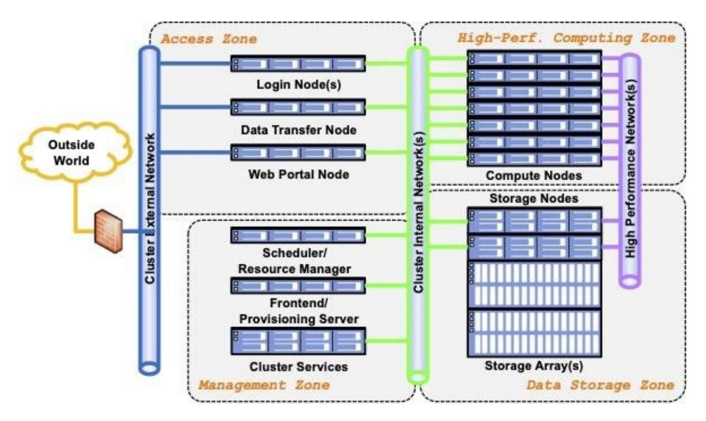

{0}------------------------------------------------

# **NIST Special Publication 800 NIST SP 800-223**

# **High-Performance Computing Security**

*Architecture, Threat Analysis, and Security Posture*

Yang Guo Ramaswamy Chandramouli Lowell Wofford Rickey Gregg Gary Key Antwan Clark Catherine Hinton Andrew Prout Albert Reuther Ryan Adamson Aron Warren Purushotham Bangalore Erik Deumens Csilla Farkas

This publication is available free of charge from: https://doi.org/10.6028/NIST.SP.800-223

{1}------------------------------------------------

# **NIST Special Publication 800 NIST SP 800-223**

# **High-Performance Computing Security**

*Architecture, Threat Analysis, and Security Posture*

Yang Guo Ramaswamy Chandramouli *Computer Security Division Information Technology Laboratory*

> Lowell Wofford *Amazon.com, Inc.*

> > Rickey Gregg Gary Key *HPCMP*

Antwan Clark *Laboratory for Physical Sciences*

Catherine Hinton *Los Alamos National Laboratory*

Andrew Prout Albert Reuther *MIT Lincoln Laboratory*

Ryan Adamson *Oak Ridge National Laboratory*

Aron Warren *Sandia National Laboratories*

Purushotham Bangalore *University of Alabama*

> Erik Deumens *University of Florida*

Csilla Farkas *University of South Carolina*

This publication is available free of charge from: https://doi.org/10.6028/NIST.SP.800-223

February 2024

U.S. Department of Commerce *Gina M. Raimondo, Secretary*

{2}------------------------------------------------

Certain commercial entities, equipment, or materials may be identified in this document in order to describe an experimental procedure or concept adequately. Such identification is not intended to imply recommendation or endorsement by the National Institute of Standards and Technology (NIST), nor is it intended to imply that the entities, materials, or equipment are necessarily the best available for the purpose.

There may be references in this publication to other publications currently under development by NIST in accordance with its assigned statutory responsibilities. The information in this publication, including concepts and methodologies, may be used by federal agencies even before the completion of such companion publications. Thus, until each publication is completed, current requirements, guidelines, and procedures, where they exist, remain operative. For planning and transition purposes, federal agencies may wish to closely follow the development of these new publications by NIST.

Organizations are encouraged to review all draft publications during public comment periods and provide feedback to NIST. Many NIST cybersecurity publications, other than the ones noted above, are available at [https://csrc.nist.gov/publications.](https://csrc.nist.gov/publications)

#### **Authority**

This publication has been developed by NIST in accordance with its statutory responsibilities under the Federal Information Security Modernization Act (FISMA) of 2014, 44 U.S.C. § 3551 et seq., Public Law (P.L.) 113-283. NIST is responsible for developing information security standards and guidelines, including minimum requirements for federal information systems, but such standards and guidelines shall not apply to national security systems without the express approval of appropriate federal officials exercising policy authority over such systems. This guideline is consistent with the requirements of the Office of Management and Budget (OMB) Circular A-130.

Nothing in this publication should be taken to contradict the standards and guidelines made mandatory and binding on federal agencies by the Secretary of Commerce under statutory authority. Nor should these guidelines be interpreted as altering or superseding the existing authorities of the Secretary of Commerce, Director of the OMB, or any other federal official. This publication may be used by nongovernmental organizations on a voluntary basis and is not subject to copyright in the United States. Attribution would, however, be appreciated by NIST.

#### **NIST Technical Series Policies**

[Copyright, Use, and Licensing Statements](https://doi.org/10.6028/NIST-TECHPUBS.CROSSMARK-POLICY) [NIST Technical Series Publication Identifier Syntax](https://www.nist.gov/document/publication-identifier-syntax-nist-technical-series-publications)

#### **Publication History**

Approved by the NIST Editorial Review Board on 2024-02-02.

#### **How to Cite this NIST Technical Series Publication:**

Guo Y, Chandramouli R, Wofford L, Gregg R, Key G, Clark A, Hinton C, Prout A, Reuther A, Adamson R, Warren A, Bangalore P, Deumens E, Farkas C (2024) High-Performance Computing Security: Architecture, Threat Analysis, and Security Posture. (National Institute of Standards and Technology, Gaithersburg, MD), NIST Special Publication (SP) NIST SP 800-223. https://doi.org/10.6028/NIST.SP.800-223

{3}------------------------------------------------

February 2024

#### **Author ORCID iDs**

Yang Guo: 0000-0002-3245-3069

Ramaswamy Chandramouli: 0000-0002-7387-5858

Lowell Wofford: 0000-0003-1003-5090 Catherine Hinton: 0000-0002-5230-2428 Albert Reuther: 0000-0002-3168-3663 Aron Warren: 0000-0002-5090-2198

Purushotham Bangalore: 0000-0002-1098-9997

Erik Deumens: 0000-0002-7398-3090

#### **Contact Information**

[sp800-223-comments@list.nist.gov](mailto:sp800-223-comments@list.nist.gov) 

National Institute of Standards and Technology Attn: Computer Security Division, Information Technology Laboratory 100 Bureau Drive (Mail Stop 8930) Gaithersburg, MD 20899-8930

#### **Additional Information**

Additional information about this publication is available at [https://csrc.nist.gov/pubs/sp/800/223/final,](https://csrc.nist.gov/pubs/sp/800/223/final) including related content, potential updates, and document history.

**All comments are subject to release under the Freedom of Information Act (FOIA).**

{4}------------------------------------------------

#### **Abstract**

Security is essential component of high-performance computing (HPC). HPC systems often differ based on the evolution of their system designs, the applications they run, and the missions they support. An HPC system may also have its own unique security requirements, follow different security guidance, and require tailored security solutions. Their complexity and uniqueness impede the sharing of security solutions and knowledge. This NIST Special Publication aims to standardize and facilitate the information and knowledge-sharing of HPC security using an HPC system reference architecture and key components as the basis of an HPC system lexicon. This publication also analyzes HPC threats, considers current HPC security postures and challenges, and makes best-practice recommendations.

### **Keywords**

high-performance computing; HPC reference architecture; HPC security; HPC security posture; HPC threat analysis; security guidance.

## **Reports on Computer Systems Technology**

The Information Technology Laboratory (ITL) at the National Institute of Standards and Technology (NIST) promotes the U.S. economy and public welfare by providing technical leadership for the Nation's measurement and standards infrastructure. ITL develops tests, test methods, reference data, proof of concept implementations, and technical analyses to advance the development and productive use of information technology. ITL's responsibilities include the development of management, administrative, technical, and physical standards and guidelines for the cost-effective security and privacy of other than national security-related information in federal information systems. The Special Publication 800-series reports on ITL's research, guidelines, and outreach efforts in information system security, and its collaborative activities with industry, government, and academic organizations.

{5}------------------------------------------------

## **Patent Disclosure Notice**

NOTICE: ITL has requested that holders of patent claims whose use may be required for compliance with the guidance or requirements of this publication disclose such patent claims to ITL. However, holders of patents are not obligated to respond to ITL calls for patents and ITL has not undertaken a patent search in order to identify which, if any, patents may apply to this publication.

As of the date of publication and following call(s) for the identification of patent claims whose use may be required for compliance with the guidance or requirements of this publication, no such patent claims have been identified to ITL.

No representation is made or implied by ITL that licenses are not required to avoid patent infringement in the use of this publication.

{6}------------------------------------------------

# **Table of Contents**

| 1. Introduction                                            | 1  |
|------------------------------------------------------------|----|
| 2. HPC System Reference Architecture and Main Components   | 2  |
| 2.1. Main Components                                       | 3  |
| 2.1.1. Components of the High-Performance Computing Zone   | 3  |
| 2.1.2. Components of the Data Storage Zone                 | 4  |
| 2.1.3. Parallel File System                                | 4  |
| 2.1.4. Archival and Campaign Storage                       | 5  |
| 2.1.5. Burst Buffer                                        | 5  |
| 2.1.6. Components of the Access Zone                       | 6  |
| 2.1.7. Components of the Management Zone                   | 6  |
| 2.1.8. General Architecture and Characteristics            | 6  |
| 2.1.9. Basic Services                                      | 7  |
| 2.1.10. Configuration Management                           | 7  |
| 2.1.11. HPC Scheduler and Workflow Management              | 7  |
| 2.1.12. HPC Software                                       | 8  |
| 2.1.13. User Software                                      | 8  |
| 2.1.14. Site-Provided Software and Vendor Software         | 8  |
| 2.1.15. Containerized Software in HPC                      | 9  |
| 3. HPC Threat Analysis                                     | 10 |
| 3.1. Key HPC Security Characteristics and Use Requirements | 10 |
| 3.2. Threats to HPC Function Zones                         | 10 |
| 3.2.1. Access Zone Threats                                 | 11 |
| 3.2.2. Management Zone Threats                             | 11 |
| 3.2.3. High-Performance Computing Zone Threats             | 12 |
| 3.2.4. Data Storage Zone Threats                           | 12 |
| 3.3. Other Threats                                         | 13 |
| 4. HPC Security Posture, Challenges, and Recommendations   | 14 |
| 4.1. HPC Access Control via Network Segmentation           | 14 |
| 4.2. Compute Node Sanitization                             | 15 |
| 4.3. Data Integrity Protection                             | 15 |
| 4.4. Securing Containers                                   | 16 |
| 4.5. Achieving Security While Maintaining HPC Performance  | 17 |
| 4.6. Challenges to HPC Security Tools                      | 17 |
| 5. Conclusions                                             | 19 |

{7}------------------------------------------------

| References20                               |  |
|--------------------------------------------|--|
| Appendix A. HPC Architecture Variants24    |  |
|                                            |  |
|                                            |  |
|                                            |  |
| List of Figures                         |  |
| Fig. 1. HPC System Reference Architecture3 |  |

{8}------------------------------------------------

#### **1. Introduction**

In 2015, Executive Order 13702 established the National Strategic Computing Initiative (NSCI) to maximize the benefits of high-performance computing (HPC) for economic competitiveness and scientific discovery. The ability to process large volumes of data and perform complex calculations at high speeds is a key part of the Nation's vision for maintaining its global competitive edge.

Security is essential to achieving the anticipated benefits of HPC. HPC systems bear some resemblance to enterprise IT computing, which allows for the effective application of traditional IT security solutions. However, they also have significant differences. An HPC system is designed to maximize performance, so its architecture, hardware components, software stacks, and working environment are very different from enterprise IT. Additionally, most HPC systems serve multiple projects and user communities, leading to more complex security concerns than those encountered in enterprise systems. As such, security solutions must be tailored to the HPC system's requirements. Furthermore, HPC systems are often different from one another due to the evolution of their system designs, the applications they run, and the missions they support. An HPC system frequently has its own unique method of applying security requirements and may follow different security guidance, which can impede the sharing of security solutions and knowledge.

This NIST Special Publication aims to standardize and facilitate the sharing of HPC security information and knowledge through the development of an HPC system reference architecture and key components, which are introduced as the basics of the HPC system lexicon. The reference architecture divides an HPC system into four function zones. A zone-based HPC reference architecture captures the most common features across the majority of HPC systems and segues into HPC system threat analysis. Key HPC security characteristics and use requirements are laid out alongside the major threats faced by the system and individual function zones. HPC security postures, challenges, recommendations, and some currently recognized variants are also included. This publication is intended to be a conceptual guide, not a checklist of requirements.

Finally, emerging technologies — such as novel networking technology, data storage solutions, hardware acceleration technology, and others — have the potential to influence the HPC reference architecture and security posture. Consequently, this document will be updated as needed.

{9}------------------------------------------------

## **2. HPC System Reference Architecture and Main Components**

The HPC system is complex and evolving, and a common lexicon can help describe and identify an HPC system's architecture, critical elements, security threats, and potential risks. An HPC system is divided into four function zones:

- 1. The *high-performance computing zone* consists of a pool of compute nodes connected by one or more high-speed networks. The high-performance computing zone provides key services specifically designed to run parallel jobs at scale.
- 2. The *data storage zone* comprises one or multiple high-speed parallel file systems that provide data storage service for user data. The high-speed parallel file systems are designed to store very large data sets and provide fast access to data for reading and writing.
- 3. The *access zone* has one or more nodes that are connected to external networks, such as the broader organizational network or the internet. This zone provides the means for authenticating and authorizing the access and connections of users and administrators. The access zone provides various services, including interactive shells, web-based portals, data transfer, data visualization, and others.
- 4. The *management zone* comprises multiple management nodes and/or cloud service clusters through which HPC management services are provided. The management zone allows HPC system administrators to configure and manage the HPC system, including the configuration of compute nodes, storage, networks, provisioning, identity management, auditing, system monitoring, and vulnerability assessment. Various management software modules (e.g., job schedulers, workflow management, and the Domain Name System [DNS]) run in the management zone.

The HPC system reference architecture is depicted in **[Fig. 1](#page-10-1)**.

{10}------------------------------------------------

**Fig. 1. HPC System Reference Architecture**

#### **2.1. Main Components**

#### **2.1.1. Components of the High-Performance Computing Zone**

An HPC cluster consists of a collection of independent computing systems, called compute nodes, which are interconnected via high-speed networks. Compute nodes have the same components as a laptop, desktop, or server, including central processing units (CPUs), memory, disk space, and networking interface cards. However, they are architecturally tuned for the requirements of HPC workloads. In some HPC architectures, a compute node may not have local disks and instead use the data storage services of remote storage servers. In addition, there may be different types of nodes for different types of tasks, and some compute nodes are equipped with hardware accelerators to speed up specific applications. For instance, compute nodes often utilize graphics processing units (GPUs) [\[1\]](#page-27-1) to accelerate modeling and simulation or AI and machine learning (ML) model training.

An HPC compute node has its own software stack installed (e.g., operating system [OS], compilers, software libraries, etc.) to support applications. The installation and configuration of the software stacks are cluster-wide, centrally managed, and controlled by the management zone. The number of compute nodes in an HPC system ranges from a few nodes to hundreds and even tens of thousands of nodes.

A frequent requirement of HPC networking, which interconnects computer nodes and file systems, is to have high throughput and low latency so that the compute nodes and parallel file system (PFS) in the data storage zone can work as one supercomputer. The exact requirements for bandwidth and latency are dictated by the intended workload. HPC networking often employs specifically designed protocols, networking cards, processor nodes, and switches to

{11}------------------------------------------------

optimize network performance. The popular HPC interconnect networking includes InfiniBand [\[2\]](#page-27-2), Omni-Path [\[3\]](#page-27-3), Slingshot [\[4\]](#page-27-4), Ethernet, and others.

A high-performance computing zone typically utilizes non-high-performance communication networks, like ethernet, as cluster internal networks that connect the high-performance computing zone with the management zone and access zone for traffic associated with maintenance activities as opposed to HPC traffic.

#### **2.1.2. Components of the Data Storage Zone**

Several different classes of storage systems may be present inside of the data storage zone. In general, storage systems within this zone cannot be effectively separated from the HPC resources that they support from an administrative privilege perspective. Typical classes of storage found within this zone include PFSs and archival file systems that support campaign storage and protect against data loss. HPC systems may have other file systems that store nonuser data. For instance, the management zone often has its own file system that stores the OS images and configuration files. In that case, the file system is included in the corresponding function zone.

HPC applications' initial data, intermediate results, and results are stored in the data storage zone and can be accessed during the application runtime and after the application's completion. External HPC users can also access user data through the login nodes and/or data transfer nodes in the access zone.

The storage capacity of these file systems is often measured in petabytes and can reach up to exabytes. File systems within the data storage zone will generally use a transport mechanism appropriate to the tier. For example, high-bandwidth file systems may be attached to the HPC resource's high-performance network, while lower bandwidth file systems may use 10 Gbps or 100 Gbps ethernet. Access control for most HPC file systems is enforced by the operating system software of nodes on which these file systems are mounted. As such, file systems should not be mounted outside of their security boundaries. A rogue system that can mount a file system will have complete control of all file system data, can spoof packets on the highspeed network, and can possibly gain privileges elsewhere within other zones of the HPC security enclave.

#### **2.1.3. Parallel File System**

Since HPC workloads can vary significantly, a PFS is often required to support read-intensive and write-intensive applications with sequential and random-access patterns at speeds of up to terabytes per second. Commonly seen file systems include Lustre [\[5\]](#page-27-5), GPFS [\[6\]](#page-27-6), and IBM Spectrum Scale [\[7\]](#page-27-7). During procurement, a PFS will typically be designed to hit a particular aggregate bandwidth target rather than a capacity requirement. These PFSs will typically consist of a cluster of systems to maintain metadata about files and locations as well as servers that act as storage targets. Clients that mount the file system will typically load the file system client software via a kernel module. Storage target servers will have backing storage arrays configured with dozens of disks in a redundant array of inexpensive disk (RAID) strategy.

{12}------------------------------------------------

Both GPFS and Lustre-based PFSs are prone to performance degradation when a certain capacity threshold is reached. These file systems may be regularly pruned of unwanted files with a strategy decided by the file system administrators. Some deployments will delete files older than a certain age, which forces HPC users to transfer job output to a longer-term file system, such as campaign storage. PFSs tends to be somewhat unreliable, depending on the types of activities being performed by running jobs and users. Because these are distributed file systems, file-system software must solve distributed locking of files to ensure deterministic file updates when multiple clients are writing to the same file at once. Additionally, PFSs are susceptible to denial-of-service conditions even during legitimate user operations, such as listing a directory with millions of files or applications that perform poor file locking semantics.

#### **2.1.4. Archival and Campaign Storage**

The term "campaign" is understood here as a collection of coordinated projects that are working toward a common set of goals and deliverables. Archival and campaign storage systems represent a class of storage that is more resilient to failure conditions than a PFS and is often less expensive per gigabyte. These advantages come at the cost of bandwidth and an increased latency of data transfer. While a PFS acts as a temporary short-term scratch file system, campaign storage supports the long-term storage needs of a project over its life cycle. Finished data products that support scientific publications or other high-value datasets may also be stored in an archival file system. The retention time for data on a campaign storage file system is measured in years, while the retention of data within an archival storage system is measured in decades. Both campaign and archival storage systems might employ low-latency disks — such as solid-state drives (SSD) or non-volatile memory express (NVMe) drives within a small tier of storage that acts as a cache — and are backed by cheaper, higher capacity media, such as spinning disks and/or tape media.

### **2.1.5. Burst Buffer**

Burst buffer commonly refers to a caching mechanism for storage systems. For applications that require extremely low latency or high-bandwidth memory-to-disk data transfer during runtime, intermediate storage layers that contain "burst buffers" have been incorporated as brokers to primarily mitigate the effects of input/output (I/O) contention and the bandwidth burden on PFSs. These burst buffers can pre-fetch data from the PFS before a computing job begins and stage data out to a parallel file system after a computing job has completed. This saves job runtime that would normally be spent performing bulk I/O to the PFS and allows it to be spent on computation instead. Typical HPC infrastructures contain the following intermediate storage architectures:

• **Node-local burst buffer architectures:** Each burst buffer is colocated with a corresponding HPC compute node [\[8\]](#page-27-8). This is advantageous for its scalability and improves the checkpoint bandwidth because the aggregate bandwidth increases in proportion to the number of compute nodes.

{13}------------------------------------------------

• **Remote-shared burst buffer architectures:** Burst buffers are shared between multiple HPC compute nodes that are hosted on an I/O node [\[8\]](#page-27-8). This is advantageous for facilitating the development, deployment, and maintenance of these architectures.

There are also HPCs that can contain mixed burst buffer intermediate storage architectures, which combine the strengths of node-local and remote-shared burst buffer architectures.

## **2.1.6. Components of the Access Zone**

A typical HPC system provides one or more nodes through which users and administrators access the system. At least one of these nodes is a login node where users have access to shells to launch interactive or batch jobs. Some of these login nodes may also have specialized visualization hardware and software with which users can conduct interactive and/or postexecution visualization of their datasets. There may also be one or more data transfer nodes that provide services to transfer data into and out of the HPC system and may even provide storage-mounting services, like Network File System (NFS) [\[9\]](#page-27-9), Common Internet File System (CIFS) [\[10\]](#page-27-10), Server Message Block (SMB) [\[11\]](#page-27-11), and Filesystem in Userspace (FUSE) [\[12\]](#page-27-12) based SSH Filesystem (SSHFS) [\[13\]](#page-27-13). The security posture for data transfer nodes often uses the architecture of ScienceDMZ instead of a pass-through firewall device because of the performance impact that firewalls may impose. Many HPC systems now provide web portals via web portal nodes that enable a variety of web interfaces to HPC system services.

#### **2.1.7. Components of the Management Zone**

The complexity of HPC systems requires a significant infrastructure to operate and manage it, which is collectively referred to as the management zone. The management zone may consist of servers and network switches that enable various functions for operating the system with efficiency, effectiveness, and stability.

#### **2.1.8. General Architecture and Characteristics**

One important characteristic of the management zone is that it has a separate security posture because non-privileged users do not need to access the management servers or services in a direct way. Privileged users responsible for configuring, maintaining, and operating the HPC system access the management zone servers and switches through extra security controls. For example, from the public-facing login nodes, they may go through a bastion host that is typically located in the management zone, or they may establish a virtual private network (VPN) with separate authentication and authorization or other appropriate security controls to reach the management zone. All systems are configured on networks that are not routed beyond the perimeter of the HPC system so that only nodes like compute nodes and storage nodes can access the services.

The services provided by the management zone have clearly defined protocols and can be implemented as running on assigned hardware platforms or run as virtual machines (VMs) on a dedicated set of hardware resources. The fact that the management zone has a clear and

{14}------------------------------------------------

separate security posture helps with risk assessment and the selection of controls to secure the management zone and manage the risk.

#### **2.1.9. Basic Services**

The HPC resources inside of the computing and data storage zones need various services to operate. Examples include Domain Name Services (DNS) [\[14\]](#page-27-14); the Dynamic Host Configuration Protocol (DHCP) [\[15\]](#page-27-15); configuration definitions, authentication, and authorization services, such as those provided by an LDAP server [\[16\]](#page-27-16); and the Network Time Protocol (NTP) [\[17\]](#page-27-17) for synchronization, log management, version-controlled repositories.

The management zone includes storage systems to store configuration data, node images, current versions, development and test versions, and historical versions. Storing logs from the entire HPC system is also part of the management zone as well as the servers to process the logs and alert administrators of events, problems, and incidents. Many of these services will be implemented with high availability and failover capabilities to avoid failure of the HPC resources. The network switches for the management network and the fast interconnects are often managed as part of the management zone because non-privileged users do not need direct access to those resources.

#### **2.1.10. Configuration Management**

Automated configuration management is crucial to ensure the stable operation of complex systems like HPC. The systems that hold the configuration database and run the server to place configurations on compute nodes, storage servers, and network switches are part of the management zone. The nodes are subject to a regularly scheduled process to verify configuration and enforce consistency with what the configuration management nodes and databases specify.

Often, the configuration management systems in the management zone have an even more restricted security posture than the management zone as a whole, with a smaller number of privileged users having access.

#### **2.1.11. HPC Scheduler and Workflow Management**

Because of the distributed nature of HPC systems, requesting resources for given workloads is coordinated by a scheduler or workload manager, such as Slurm [\[18\]](#page-28-0) or Kubernetes [\[19\]](#page-28-1). These services are run on servers in the management zone alongside the configurations and job logs. Non-privileged users access the scheduler through specific commands or an application programming interface (API). Access to the service is restricted to nodes within the HPC system perimeter. There may also be a web interface that provides a separate authenticated and authorized path for scheduling workloads, often within the strict constraints of certain application domains.

{15}------------------------------------------------

#### **2.1.12. HPC Software**

In addition to the management software that installs, boots, configures, and manages HPCrelated systems, HPC application codes rely on several layers of scientific and performanceenhancing libraries. The layers of software that are available to users are referred to as the software stack. The lower layers of this stack are typically focused on performance and include compilers, communication libraries, and user-space interfaces to HPC hardware components. The middle layer includes performance tools, math libraries, and data or computation abstraction layers. The top of the stack consists of end-user science or production applications. Each software product within this stack may require certain versions or variants of other products and have many dependencies. For example, Hierarchical Data Format Version 5 (HDF5) [\[20\]](#page-28-2) is a scientific data formatting library with only seven dependencies, while Data Mining Classification and Regression Methods (rminer) [\[21\]](#page-28-3) — an R-based data mining application — has 150 software dependencies. The full software stack can be split into three general categories that differ based on the maintainer: user software, facility software, and vendor software.

#### **2.1.13. User Software**

Often, the end users themselves best understand how to tune their software to the bespoke hardware of an HPC system to ensure sufficient performance for their workload. Users regularly modify and recompile their software to enhance performance, fix bugs, and adapt to changes in the underlying dependencies or kernel interfaces over time. The sharing of user-built software between teams may be common. User software that is widely used is often open source and, therefore, subject to open-source software supply chain concerns.

Continuous integration (CI) pipelines [\[22\]](#page-28-4) and tests of scientific code on HPC platforms have recently become commonplace. Industry-standard identification of software weaknesses and the publication of Common Vulnerabilities and Exposures (CVEs) [\[23\]](#page-28-5) is not routine, but the identification and remediation of performance regressions is generally a higher priority within the user community. There is a value-per-cycle trade-off for CI tests since cheaper cycles on commodity hardware may not expose bugs on much more expensive HPC resources. Complex test suites will eat into user allocations, and users and staff prefer that only a cardinal set of smoke tests run within user-developed testing pipelines on HPC systems.

# **2.1.14. Site-Provided Software and Vendor Software**

Site staff and administrators generally build applications and libraries that are most likely to be used. Tools such as Conda [\[24\]](#page-28-6), EasyBuild [\[25\]](#page-28-7), and Spack [\[26\]](#page-28-8) are often used to manage the complexity of software dependency resolution. Staff may also wrap compiler and job submission utilities with custom scripts to collect usage information about software libraries, I/O read and write patterns, or other system telemetry that is useful for decision making.

{16}------------------------------------------------

Vendor software includes low-level system tools to facilitate the running of other software. For instance, remote direct memory access, inter-node memory sharing, performance counters, temperature and power telemetry, and debugging are all vendor-provided software.

Users can choose specific versions of installed vendor and site-provided software libraries by manipulating environment variables. Tools such as wrapper scripts or module files are usually provided to help users find and choose which versions of installed software to use.

## **2.1.15. Containerized Software in HPC**

A container is a software bundle that includes the application along with some or all of the dependencies, libraries, other binaries, and configuration files needed to run it. Containers provide self-contained, portable, and reproducible environments that abstract away the differences in OS distributions and underlying infrastructure. Containers can make applications more portable, easier to deploy, and easier to distribute. For instance, containers allow users to use a package manager (e.g., apt [\[27\]](#page-28-9) or yum [\[28\]](#page-28-10)) to install software without modifying the host system, effectively decoupling the application dependencies from the host operating system.

Containers are executed by a container runtime, such as Docker [\[29\]](#page-28-11), Containerd [\[30\]](#page-28-6), Apptainer [\[31\]](#page-28-12), or Charliecloud [\[32\]](#page-28-13). Container runtimes create an isolated execution space for the application by leveraging technologies like Linux Namespaces [\[33\]](#page-28-14), Cgroups [\[34\]](#page-28-15), and Seccomp [\[35\]](#page-28-16). The runtime is responsible for preparing the execution environment, establishing an isolated execution namespace, and executing the application. Runtimes may handle other tasks, like obtaining and attaching the container image, mounting filesystems within the container, and creating pass-through access to devices. Container execution may be further abstracted using a container orchestration service, such as Kubernetes [\[36\]](#page-28-17), OpenShift [\[37\]](#page-28-18), or others.

{17}------------------------------------------------

## **3. HPC Threat Analysis**

HPC poses unique security and privacy challenges, and collaboration and resource-sharing are integral. For instance, scientific experiments frequently employ unique hardware, software, and configurations that may not be maintained or well-vetted or that present entirely new classes of vulnerabilities that are absent in more traditional environments. HPC can store large amounts of sensitive research data, personally identifiable information (PII), and intellectual property (IP) that need to be safeguarded. Finally, HPC data and computation are encumbered with a variety of different security and policy constraints that stem from the fact that HPC systems are often operated as shared resources with different user groups, each of which are required to operate under the goals and constraints set by their organizations. The solutions to protecting data, computation, and workflows must balance these trade-offs.

#### **3.1. Key HPC Security Characteristics and Use Requirements**

HPC systems possess some unique security characteristics and distinctive use requirements that differentiate themselves from enterprise IT systems:

- **Tussles between performance and security:** HPC users may consider security to be valuable only to the extent that it does not significantly slow down the HPC system and impede research. Ensuring the usability of security mechanisms with a tolerable performance penalty is therefore critical to adoption by the scientific HPC community.
- **Varying security requirements for different HPC applications:** Individual platforms, projects, and data may have significantly different security sensitivities and need to follow different security policies. An HPC system may need to enforce multiple security policies simultaneously.
- **Limited resources for security tools:** Most HPC systems are designed to devote their resources to maximizing performance rather than acquiring and operating security tools.
- **Open-source software and self-developed research software:** Open-source software and self-developed research software are widely used in HPC. Open-source software is vulnerable to open-source software supply chain threats, while HPC software input data may be vulnerable to data supply chain threats. Self-developed software is susceptible to low software quality.
- **Granular access control on databases:** Since different research groups may have a need to know for different portions of data, granular access control capabilities are necessary. Access control requirements may need to be dynamically adjusted as some scientific experiments may increase data needs based on the outcome of experiments.

#### **3.2. Threats to HPC Function Zones**

The following subsections discuss threats to the four functional zones in the HPC reference architecture.

{18}------------------------------------------------

## **3.2.1. Access Zone Threats**

The access zone provides an interface for external users to access the HPC system and oversees the authentication and authorization of users. Among the four function zones, the access zone is the only one that is directly connected to the external networks. Hence, the nodes and their software stacks in this zone are susceptible to external attacks, such as denial-of-service (DoS) attacks, perimeter network scanning and sniffing (when not done as part of security practices), authentication attacks (e.g., brute force login attempts and password guessing), user session hijacking, and attacker-in-the-middle attacks. Some nodes are even subject to extra attacks due to their specific software stacks. For instance, a web server may be subject to website defacement, phishing, misconfiguration, and code injection attacks. The access zone also provides access to the file systems hosted in the data storage zone. It is important that permissions to directories and files are only given to authorized users. Applying multi-factor authentication (MFA) methods to HPC system access, which requires a user to provide one or more verification methods at login, is a proven method to mitigate the risk of unauthorized access.

Authenticated users sometimes use external networks to download data or code for use inside of the HPC system, which introduces the risk of unintentionally downloading malicious content. The nodes in the access zone are usually configured to support limited computation (e.g., modest debugging). Access zone nodes are susceptible to computational resource abuse.

The access zone is also often shared by multiple users. One user's activities, such as commands issued and jobs submitted, can be viewed by other users. A port opened by one user can potentially be used by others. Fortunately, the nodes in the access zone work similarly to enterprise servers, and general IT security tools and measures are available to harden the zone.

#### **3.2.2. Management Zone Threats**

The management zone is responsible for managing the entire HPC system. It is connected to clustered internal networks through which other zones can be reached. It runs a plethora of system management, out-of-band hardware management, job scheduling, and workflow management software, all of which are susceptible to unique threats.

Processes that run in the management zone, such as schedulers and data tiering or orchestration processes, act on behalf of users. These are privileged processes, and if they are compromised, it can lead to privilege escalation. Often, the only privilege boundaries that separate users are Portable Operating System Interface (POSIX) file system permissions and the enforcement of capabilities by the operating systems of HPC components. Due to the implied delegation of authority within distributed HPC and file systems, 'root' on a compute node may be equivalent to 'root' on all systems within the HPC zones, depending on configuration. Privilege escalation vulnerabilities are particularly impactful within an HPC environment. Only administrators with privileged access authorization are allowed to log into the management zone, where a privileged administrator logs into the access zone first and then logs into the management zone. A malicious user may attempt to log into the management zone.

{19}------------------------------------------------

The management zone may also be implemented as a service running on a cloud via virtualization technologies. In such cases, the risks associated with the cloud also apply to the management zone.

#### **3.2.3. High-Performance Computing Zone Threats**

The high-performance computing zone offers core computational functions in an HPC system. The compute nodes are shared by multiple users or tenants. The exploitation of multi-tenancy environments is a major threat (e.g., side-channel attacks, user data/program leakage, etc.). Other threat sources that often cause extreme resource consumption, performance degradation, or the outage of the HPC system entirely include accidental misconfiguration, software bugs introduced by user-developed software, and system abuse by running applications that are not aligned with the HPC mission. Container escape, side-channel attacks, and DoS can also be threats if virtualization technologies (e.g., containers) are used in the highperformance computing zone.

As a security mitigating technology, the applications in HPC are mostly run in the user space, except for system calls that must run in the kernel with elevated privilege. Accelerators, highperformance interconnects, special protocols, and direct memory access between nodes are commonly used in the high-performance computing zone. Some of these technologies may not be thoroughly tested from a security point of view, and their speed, novelty, and complexity can make monitoring and detecting suspicious activity difficult. Direct memory access and communication between nodes may bypass the kernel, and the protections provided by the kernel (e.g., Security-Enhanced Linux [SELinux] [\[38\]](#page-28-19)) are lost.

#### **3.2.4. Data Storage Zone Threats**

Protecting the confidentiality, integrity, and availability (CIA) of user data is essential for the data storage zone. Data integrity can be compromised by malicious data deletion, corruption, pollution, or false data injection. Legitimate users may also mishandle sensitive data, leading to confidentiality breakdown. File metadata (e.g., file name, author, size, creation date) can also leak sensitive information about the files.

HPC file systems in the data storage zone provide superior data access speed and much larger storage capacity compared to average enterprise file systems. Hard disk failure is a threat due to the large number of disks deployed in the data storage zone. Incident response and contingency planning controls may not be easy to implement, and file backup, recovery, and forensic imaging may become infeasible. The security measures that can be implemented on the enterprise file systems may take an unacceptably long time and degrade HPC file system performance in an unacceptable way.

Providing data backup services is another challenge in HPC due to its large volume. By default, user data is often not backed up, and users are responsible for maintaining their own data copies. Inadvertent operations (e.g., accidently deleting a file subdirectory) can cause the permanent loss of data, though making data READ ONLY is one way to combat such a risk.

{20}------------------------------------------------

Some organizations offer backup services using their own HPC systems, but these systems may be in the same geographic locations and subject to the same environmental threats.

Finally, the data stored in a HPC system may contain sensitive information, such as personally identifiable information (PII), patient health information (PHI), controlled unclassified information (CUI), and more. Such data may require compliance with security standards, such as HIPAA [\[39\]](#page-28-20) and NIST SP 800-171 [\[40\]](#page-28-21). To protect this data, a range of privacy-preserving technologies are available, such as data anonymization, obfuscation, randomization, masking, and differential privacy. However, applying these technologies in a way that maintains HPC usability and performance can be challenging.

#### **3.3. Other Threats**

In addition to the threats that are unique to individual function zones, general HPC systems face the following:

- **Environmental and physical threats:** Physical or cyber attacks against facilities (e.g., power, cooling, water), unauthorized physical access, and natural disasters (e.g., fire, flood, earthquake, hurricane, etc.) are all potential threats to an HPC system.
- **Vulnerabilities introduced by prioritizing performance in HPC design and operation:** HPC is designed to process large volumes of data and perform complex computations at very high speeds. Achieving the highest performance possible is a priority in HPC design and operation. Such prioritization, however, has its security implications. For instance, designers often make conscious decisions to build a less redundant system to achieve high performance, making the system less robust and potentially more vulnerable to attacks, such as DoS attacks. As another example, using a backup system to improve system robustness and high availability is a proven technology. However, building a spare or backup HPC system is often too costly. HPC systems can often lack storage backup due to the vast size of the data stored. Similarly, most HPC missions do not have a service-level agreement to justify the need for a full backup system at a backup location. All resources are poured into building the single best HPC system possible.
- **Supply chain threats:** The HPC supply chain faces a variety of threats, from the theft of proprietary information to attacks on critical hardware components and software manipulation to gain unauthorized access. Some HPC software (e.g., OS, applications), firmware, and hardware components have limited manufacturers, suppliers, and integrators, which makes diversification difficult. Limited suppliers also lead to shortages in the qualified workforce who can provide required technical support.
- **Insider threats:** Insider threats come from people within the organization who have internal information and may have the privileges needed to access the HPC system. Insider threats can be classified into accidental/unintentional threats and malicious/intentional threats. Unintentional threats come from the unintended side effects of normal actions and activity. In contrast, a malicious insider may intentionally upload malicious code into the HPC system.

{21}------------------------------------------------

## **4. HPC Security Posture, Challenges, and Recommendations**

#### **4.1. HPC Access Control via Network Segmentation**

Access control is a security technique that regulates who can access and/or use resources in a computing environment. In HPC, multiple physical networks are constructed as an effective means of access control:

- **Management network:** The management network is a dedicated network that allows system administrators to remotely control, monitor, and configure computer nodes in an HPC system. Modern computers are often equipped with the Intelligent Platform Management Interface (IPMI) [\[41\]](#page-29-0), which provides management and monitoring capabilities that are independent of the host system's CPU, firmware (e.g., BIOS [\[42\]](#page-29-1), Unified Extensible Firmware Interface [UEFI] [\[43\]](#page-29-2)), and operating system. For example, IPMI allows system administrators to remotely turn unresponsive machines on or off and install custom operating systems. IPMIs are connected to the management network, which can only be accessed by authorized system administrators. Collecting logs from the HPC system and forwarding the relevant logs to the security and information event management (SIEM) system, which could be external to the HPC system, is a component of the management zone.
- **High-performance networks:** High-performance networks offer high bandwidth and low latency to connect computer nodes inside of the high-performance zone and data storage zone. They also support features that are unique to HPC, such as remote direct memory access (RDMA) over the network and the message passing interface (MPI) [\[44\]](#page-29-3). High-performance networks often use special communications standards and architectures (e.g., InfiniBand, Slingshot, Omni-Path, etc.).
- **Auxiliary networks:** Additional auxiliary networks can be added to support usability and system manageability. For instance, a user network is constructed to allow users to manipulate or share data or remotely log into and access the compute nodes. Depending on the purpose of the networks, a subset of nodes from different zones are selected to be party to the networks. As an example, a user network contains the nodes in the access zone and the computer nodes in the high-performance computing zone.

There are many benefits to having multiple networks in an HPC system. First, all of these networks are private and use different IP address ranges. Network traffic will remain on one network, which facilitates monitoring and measurement. Second, individual networks often serve specific purposes so only the relevant nodes are connected to the network. The networks effectively segment the HPC system into smaller segments, which improves security. Finally, multiple physical networks provide a degree of fault tolerance. When one network goes down, the system administrator can use the other network to diagnose and troubleshoot.

The compute nodes in the access zone are connected to the external network and assigned public IP addresses, which allow users to remotely access the HPC systems. The user data can be shared through the login nodes or the data transfer nodes. Some systems allow storage to be exported using CIFS [\[10\]](#page-27-10) or SMB [\[11\]](#page-27-11) (e.g., via a SAMBA [\[45](#page-29-4)[,7,7\]](#page-27-7) server). If necessary, a

{22}------------------------------------------------

network address translation (NAT) [\[46](#page-29-5)[,3\]](#page-27-3) or a proxy [\[47\]](#page-29-6) can be installed to allow users on a private network to access the internet and download new versions of software or share software data. However, a NAT and Squid proxy can also be security risks that demand extra caution and mitigation considerations.

Employing multiple physical networks is a common and effective means for access control and fault tolerance, and it is highly recommended.

#### **4.2. Compute Node Sanitization**

High-performance compute nodes are often used by multiple tenants and projects. At the end of a task run, the previous project may leave behind a residual "footprint," such as the data in memory and GPUs. It is important to sanitize the compute node so that data from previous jobs are not accidently leaked, and the new job can start with a clean slate.

Examples of compute node sanitization include:

- Conducting a node health check at the end of a job
- Removing a node or forcing a reboot if a node is deemed "unhealthy"
- Working with hardware and software vendors to provide management hooks to sanitize the GPU
- Resetting GPUs to remove residual data between jobs
- Validating and checking firmware
- Rebooting nodes after the completion of a job at the OS level to remove accumulated residuals and ensure a consistent node state
- Checking critical files to ensure that they have not been changed

Compute node sanitization is highly recommended as the compute nodes are equipped with sophisticated hardware accelerators. Nevertheless, the process of sanitization must be carefully balanced with the goal of maximizing the utilization of HPC systems.

#### **4.3. Data Integrity Protection**

Cryptographic mechanisms are an effective means of providing data integrity. HPC data storage systems typically support uniform encryption at the file level or block level. Such data encryption at the file system level protects data from unauthorized access. However, it does not provide granular access (i.e., segmenting one user from others). Granular access can be achieved using user-level or group-level encryption. Not even a system administrator can access a user's data with granular access since they do not have access to the decryption key. Additionally, file systems do not authorize users. Rather, users access the file system via the HPC access zone, which is responsible for authenticating the users and their access rights. In general, file systems should not be mounted outside of their local security boundaries unless the file system protocol appropriately authenticates users. For example, an attacker-controlled

{23}------------------------------------------------

system that can remotely mount a file system will have complete control over all file system data. This access could be used to gain privileges elsewhere within other zones of the HPC security enclave.

Hashing is another technique for monitoring data integrity. Data files can be hashed at the beginning to acquire hashing keys. A file is not modified if its hashing key remains the same. Parallel file systems maintain many types of metadata (e.g., user ID, group ID, modification time, checksum, etc.). Hashing metadata is another way to check whether a file has been modified.

Periodically scanning file systems for malware is a proven technique for monitoring data integrity. However, scanning an HPC system for malware is challenging. HPC data storage can easily contain a petabyte or more of data. Existing malware scanning tools are mainly designed for a single machine or laptop. They are not efficient or fast enough to scan large HPC data storage systems. Furthermore, the scanning operation can adversely affect the performance of running jobs. HPC systems may consider alternate implementation options for malware scanning to alleviate some of the stated impacts. For example, conduct scanning at write, and conduct subsequent batch scanning at read. Protection against ransomware attacks on HPC data is especially important. It is recommended to conduct risk assessments of ransomware attacks, and plan and implement mechanisms to protect the HPC system from ransomware attacks, as applicable [\[48,](#page-29-7)[40,40\]](#page-28-21).

Protecting data integrity is vital to HPC security. Granular data access provides the best protection and is highly recommended when possible.

#### **4.4. Securing Containers**

Containers bundle an application's code, related libraries, configuration files, and required dependencies to allow the applications to run seamlessly across environments. Containers provide the benefits of portability, reproducibility, and productivity, but they can hide software. By decoupling operating system dependencies from the host system, a container image may contain unknown vulnerable or insecure software, which poses a software supply chain risk. Additionally, container contents may not be observable by some security auditing tools. In a well-managed HPC system, most software has already been installed as a baseline system environment. The applications developed using native libraries often run faster than a container. Hence, training users to develop programs in the HPC programming environment is one way to reduce exposure to container vulnerabilities. Additionally, many container ecosystems include the ability to attest that a container and its dependencies are supplied by a trusted provider, and there are tools (e.g., Qualys [\[49\]](#page-29-8), Anchore [\[50\]](#page-29-9), etc.) designed to audit container contents that provide supply chain and software audit management for HPC applications.

Containers, container runtimes, and container orchestrators all increase the security attack surface for HPC systems, but carefully implemented container environments may potentially improve the overall security posture. Vulnerable or poorly configured container runtimes or container orchestrators can lead to exploitable environments and, in some cases, even privilege 

{24}------------------------------------------------

escalation. Additionally, many orchestration and runtime tools expose APIs that must be appropriately isolated and secured. However, when carefully implemented, container isolation can reduce risk by restricting a container from performing disallowed operations. For instance, data access to a container can be limited to the least required filesystem mounts, network access can be limited through network namespaces, and tools like seccomp [\[35\]](#page-28-16) can be used to restrict containers from making disallowed system calls.[1](#page-24-0)

#### **4.5. Achieving Security While Maintaining HPC Performance**

HPC security measures often come with an undesirable performance penalty. The following are several effective ways to balance performance and security:

- Conduct tests to measure the performance penalty of security tools, which can be benchmarked to determine whether they are acceptable. Testing and measurement would also encourage more performance-aware tool design.
- Incorporate security requirements in the initial HPC design rather than as an afterthought. For instance, independent add-on security tools tend to have more impact on performance than native security measures that come with the HPC software stack. Key management architecture plays an important role in HPC security but requires careful performance analysis.
- Avoid "one size fits all" security. Differentiate the types of nodes in the HPC system, and apply appropriate security rules and controls to different node types. For instance, classify the nodes in HPC systems into three categories: external nodes, internal nodes, and backend nodes. Apply individual security controls to each node category. Such a differentiation also mitigates performance impacts.

#### **4.6. Challenges to HPC Security Tools**

Many enterprise security tools are designed with stand-alone devices in mind (e.g., laptops, desktops, or mobile devices). HPC is a large-scale, complex system with strict performance requirements. Security tools that are effective for individual devices may not work well in an HPC environment. For example, a forensic tool that aids the recovery and preservation of a hard drive and memory for a single server works well in practice. It is unreasonable, however, to install forensic tools on all compute and storage nodes in an HPC system. As another example, HPC nodes may use remotely mounted storage, which may disable some security tools.

Moreover, different HPC applications may require different tools. Security tool vendors are often not accustomed to HPC use cases and requirements, which forces HPC security teams to develop analogous tools that may introduce new security vulnerabilities and are sometimes not accepted by organizations. The HPC community needs to work closely with security tool vendors to address these challenges.

1 SP 800-190, *Application Container Security Guide* [\[65\],](#page-30-0) offers a comprehensive guide on container security.

{25}------------------------------------------------

February 2024

A Security Technical Implementation Guide (STIG) [\[51\]](#page-29-10) is a configuration standard and offers a security baseline that reflects security guidance requirements. The security checking tool can measure how well the STIG is satisfied. However, available STIGs are typically written for servers or desktops rather than for HPC systems. In addition, security baseline checking tools developed for commodity operating systems and applications require customizations to run on HPC. The Lawrence Livermore National Laboratory [\[52\]](#page-29-11), Sandia National Laboratories [\[53\]](#page-29-12), and the Los Alamos National Lab [\[54\]](#page-29-13) have collaborated with the Defense Information Systems Agency (DISA) [\[55\]](#page-29-14) to develop the TOSS 4 STIG [\[56\]](#page-29-15), which is geared toward HPC systems. Still, a more general STIG library and corresponding security checking tools are desirable to handle diverse subsystems and components inside an HPC system.

{26}------------------------------------------------

## **5. Conclusions**

Securing HPC systems is challenging due to their size; performance requirements; diverse and complex hardware, software, and applications; varying security requirements; and the nature of shared resources. The security tools suitable for HPC are inadequate, and current standards and guidelines on HPC security best practices are lacking. The continuous evolution of HPC systems makes the task of securing them even more difficult.

This Special Publication aims to set a foundation for standardizing and facilitating HPC security information and knowledge-sharing. A zone-based HPC system reference architecture is introduced to serve as a foundation for a system lexicon and captures common features across the majority of HPC systems. HPC system threat analysis is discussed, security postures and challenges are considered, and recommendations are made.

{27}------------------------------------------------

#### **References**

- [1] INTEL (2024) What Is a GPU? Available at https://www.intel.com/content/www/us/en/products/docs/processors/what-is-agpu.html.
- [2] Sheldon R (2024) InfiniBand. Available at https://www.techtarget.com/searchstorage/definition/InfiniBand.
- [3] WIKIPEDIA (2024) Omni-Path. Available at https://en.wikipedia.org/wiki/Omni-Path#:~:text=Omni%2DPath%20Architecture%20(OPA),this%20architecture%20for%20ex ascale%20computing.
- [4] HPE (2024) HPE Slingshot interconnect. Available at https://www.hpe.com/us/en/compute/hpc/slingshot-interconnect.html.
- [5] LUSTRE (2024) Lustre file system. Available at https://www.lustre.org/.
- [6] IBM (2021) Introducing General Parallel File System. Available at https://www.ibm.com/docs/en/gpfs/4.1.0.4?topic=guide-introducing-general-parallelfile-system.
- [7] IBM (2024) IBM Storage Scale. Available at https://www.ibm.com/products/storagescale.
- [8] Cao L, Settlemyer BW, and Bent J (April 23 - 26, 2017) To share or not to share: comparing burst buffer architectures, in *Proceedings of the 25th High Performance Computing Symposium*, Virginia Beach, VA, USA (Society for Computer Simulation International), 1-10. Available at https://dl.acm.org/doi/10.5555/3108096.3108100.
- [9] WIKIPEDIA (2024) Network File System. Available at https://en.wikipedia.org/wiki/Network\_File\_System.
- [10] Lelii S (2024) CIFS. Available at https://www.techtarget.com/searchstorage/definition/Common-Internet-File-System-CIFS.
- [11] MICROSOFT (2024) Server Message Block Overview. Available at https://learn.microsoft.com/en-us/previous-versions/windows/it-pro/windows-server-2012-r2-and-2012/hh831795(v=ws.11).
- [12] KERNEL.ORG (2024) FUSE. Available at https://www.kernel.org/doc/html/latest/filesystems/fuse.html.
- [13] SSHFS (2024) SSHFS Homepage. Available at https://github.com/libfuse/sshfs.
- [14] IANA (2024) Domain Name Services. Available at https://www.iana.org/domains.
- [15] Gillis A (2024) DHCP. Available at https://www.techtarget.com/searchnetworking/definition/DHCP.
- [16] Gillis A (2024) LDAP (Lightweight Directory Access Protocol). Available at https://www.techtarget.com/searchmobilecomputing/definition/LDAP.
- [17] NETWORK TIME FOUNDATION (2024) What is NTP? Available at http://www.ntp.org/ntpfaq/NTP-s-def.htm.

{28}------------------------------------------------

- [18] SLURM (2024) SLURM Workload Manager. Available at https://slurm.schedmd.com/documentation.html.
- [19] KUBERNETES (2024) Kubernetes. Available at https://kubernetes.io/.
- [20] THE HDF GROUP (2024) HDF5. Available at https://www.hdfgroup.org/solutions/hdf5/.
- [21] R-PROJECT (2024) rminer: Data Mining Classification and Regression Methods. Available at https://cran.r-project.org/web/packages/rminer/index.html.
- [22] RED HAT (2024) What is a CI/CD pipeline? Available at https://www.redhat.com/en/topics/devops/what-cicdpipeline#:~:text=A%20continuous%20integration%20and%20continuous,development%2 0life%20cycle%20via%20automation.
- [23] MITRE (2024) CVE. Available at https://cve.mitre.org/.
- [24] CONDA (2024) Conda. Available at https://docs.conda.io/en/latest/.
- [25] EASYBUILD (2024) EasyBuild: building software with ease. Available at https://easybuild.io/.
- [26] SPACK (2024) Spack. Available at https://spack.io/.
- [27] UBUNTU (2024) Package Management. Available at https://ubuntu.com/server/docs/packagemanagement#:~:text=Apt,upgrading%20the%20entire%20Ubuntu%20system.
- [28] WIKIPEDIA (2024) Yum. Available at https://en.wikipedia.org/wiki/Yum\_(software).
- [29] DOCKER Docker. Available at https://www.docker.com/.
- [30] CONTAINERD (2024) containerd. Available at https://containerd.io/.
- [31] APPTAINER (2024) Apptainer. Available at https://apptainer.org/.
- [32] CHARLIECLOUD (2024) Charliecloud. Available at https://hpc.github.io/charliecloud/.
- [33] WIKIPEDIA (2024) Linux Namespaces. Available at https://en.wikipedia.org/wiki/Linux\_namespaces.
- [34] WIKIPEDIA (2024) Cgroups. Available at https://en.wikipedia.org/wiki/Cgroups.
- [35] WIKIPEDIA (2024) Seccomp. Available at https://en.wikipedia.org/wiki/Seccomp.
- [36] KUBERNETES (2024) Kubernetes. Available at https://kubernetes.io/.
- [37] RED HAT (2024) Red Hat OpenShift. Available at https://www.redhat.com/en/technologies/cloud-computing/openshift.
- [38] RED HAT (2019) What is SELinux? Available at https://www.redhat.com/en/topics/linux/what-is-selinux.
- [39] Marron J (2024) Implementing the Health Insurance Portability and Accountability Act (HIPAA) Security Rule: A Cybersecurity Resource Guide. (National Institute of Standards and Technology, Gaithersburg, MD) NIST Special Publication (SP) NIST SP 800-66r2 [forthcoming]. https://doi.org/10.6028/NIST.SP.800-66r2.
- [40] Ross R, Pillitteri V, Dempsey K, Riddle M, and Guissanie G (2020) Protecting Controlled Unclassified Information in Nonfederal Systems and Organizations. (National Institute of Standards and Technology, Gaithersburg, MD) NIST Special Publication (SP) NIST SP 800-

{29}------------------------------------------------

- 171 Rev. 2, Includes updates as of January 28, 2021. https://doi.org/10.6028/NIST.SP.800-171r2.
- [41] WIKIPEDIA (2024) Intelligent Platform Management Interface. Available at https://en.wikipedia.org/wiki/Intelligent\_Platform\_Management\_Interface.
- [42] WIKIPEDIA (2024) BIOS. Available at https://en.wikipedia.org/wiki/BIOS.
- [43] UNIFIED EXTENSIBLE FIRMWARE INTERFACE FORUM (2024) UEFI. Available at https://uefi.org/.
- [44] MPI FORUM (2024) MPI Forum. Available at https://www.mpi-forum.org/.
- [45] REDHAT (2024) How to share files with Samba. Available at https://www.redhat.com/sysadmin/samba-file-sharing.
- [46] WIKIPEDIA (2024) Network address translation. Available at https://en.wikipedia.org/wiki/Network\_address\_translation.
- [47] SQUID-CACHE.ORG (2024) Squid-cache.org. Available at http://www.squid-cache.org/.
- [48] Barker W, Fisher W, Scarfone K, and Souppaya M (2022) Ransomware Risk Management: Cybersecurity Framework Profile. (National Institute of Standards and Technology, Gaithersburg, MD) NIST Interagency or Internal Report (IR) NIST IR 8374. https://doi.org/10.6028/NIST.IR.8374.
- [49] QUALYS (2024) Qualys. Available at https://www.qualys.com/.
- [50] ANCHORE (2024) Anchore. Available at https://anchore.com/.
- [51] DOD CYBER EXCHANGE (2024) Security Technical Implementation Guides (STIGs). Available at https://public.cyber.mil/stigs/.
- [52] LAWRENCE LIVERMORE NATIONAL LABORATORY (2024) Lawrence Livermore National Laboratory. Available at https://www.llnl.gov/.
- [53] SANDIA NATIONAL LABORATORIES (2024) Sandia National Laboratories. Available at https://www.sandia.gov/.
- [54] LOS ALAMOS NATIONAL LAB (2024) Los Alamos National Lab. Available at https://www.lanl.gov/.
- [55] DISA (2024) Defense Information Systems Agency. Available at https://disa.mil/.
- [56] DOD CYBER EXCHANGE (2022) DISA releases the TOSS 4 Security Technical Implementation Guide. Available at https://public.cyber.mil/announcement/disareleases-the-toss-4-security-technical-implementation-guide/.
- [57] Wright G (2024) PXE. Available at https://www.techtarget.com/searchnetworking/definition/Preboot-Execution-Environment.
- [58] Raffo D (2024) iSCSI (Internet Small Computer System Interface). Available at https://www.techtarget.com/searchstorage/definition/iSCSI.
- [59] XEN PROJECT (2024) Xen Project. Available at https://xenproject.org/.
- [60] KVM (2024) Linux KVM. Available at https://linux-kvm.org/page/Main\_Page.

{30}------------------------------------------------

- [61] VMWARE (2024) VMware vSphere. Available at https://docs.vmware.com/en/VMwarevSphere/index.html.
- [62] OPENSTACK (2024) OpenStack. Available at https://www.openstack.org/.
- [63] DELL (May 2020) Virtualizing High Performance Computing (HPC) Environments: Dell EMC Reference Architecture. Available at https://www.vmware.com/content/dam/digitalmarketing/vmware/en/pdf/solutions/VM ware-HPC-Virtualized-DTC.pdf.
- [64] HPCWire (2020) Hybrid HPC: The time to embrace the cloud is now. Available at https://www.hpcwire.com/2020/08/31/hybrid-hpc-the-time-to-embrace-the-cloud-isnow/.
- [65] Souppaya M, Morello J, and Scarfone K (2017) Application Container Security Guide. (National Institute of Standards and Technology, Gaithersburg, MD) NIST Special Publication (SP) NIST SP 800-190. https://doi.org/10.6028/NIST.SP.800-190.

{31}------------------------------------------------

## **Appendix A. HPC Architecture Variants**

This Appendix describes three HPC architecture variants: diskless booting HPC, virtualized and containerized HPC environments, and cloud HPC environments.

#### **A.1. Diskless Booting HPC**

A variant of HPC cluster design is diskless booting clusters in which the OS is not loaded from storage located on the node itself. Diskless nodes typically boot up, obtain an IP address via DHCP, and receive a kernel and partial OS over the network through a protocol, such as the Preboot eXecution Environment (PXE) [\[57\]](#page-29-16). To finish the boot process, the remaining OS is typically loaded over HTTP(S), NFS, or Internet Small Computer System Interface (iSCSI) [\[58\]](#page-29-17).

For scalability, some HPC clusters may implement a hierarchical design in which intermediate servers boot diskless but have local storage that is used to serve the OS to leaf nodes. Diskless booting designs must consider whether the images being distributed contain sensitive information, like SSH keys, and take proper measures to secure the images from unauthorized access.

### **A.2. Virtualized and Containerized HPC Environments**

Virtualization technologies (e.g., Xen [\[59\]](#page-29-18), KVM [\[60\]](#page-29-19), etc.) can add flexibility to traditional HPC architectures by providing an abstraction layer between the operating system (i.e., a VM) and the underlying hardware. This abstraction layer can be used to unify heterogeneous hardware, allow operating systems to migrate between different hardware, allow hardware to easily change system images, and subdivide hardware to create isolation barriers. Furthermore, the addition of an orchestration layer (e.g., VMWare vSphere [\[61\]](#page-30-1), OpenStack [\[62\]](#page-30-2), etc.) and software-defined networking (SDN) can provide end-to-end architecture specification, infrastructure configuration management, and policy enforcement. Virtualization may be deployed in any of the HPC architecture zones. Virtualized HPC architectures typically contain the following components [\[63\]](#page-30-3):

- **Hypervisors**, which handle the execution of virtual machines and manage access to hardware resources, such as memory, networks, accelerators, and processors
- **Cluster management and orchestration,** which provide facilities to manage hardware provisioning, VM placement, and orchestration across a pool of hardware resources
- **Software-defined networking (SDN),** which is a common addition to orchestrated virtualization environments and allows common networking functions, like routing and switching, to be dynamically assigned to create network zones to accommodate virtualized compute infrastructure

Hypervisors, cluster management and orchestration, and SDN may increase the security attack surface for virtualized cluster environments. Each of these components exposes APIs or interface points that must be properly secured. Poorly implemented or misconfigured

{32}------------------------------------------------

virtualization components can expose data and pose privilege escalation risks. Untrusted VMs can also introduce supply chain risks into the HPC environment.

However, a well-architected virtualized HPC environment may offer security advantages. For example, many virtualization cluster management and orchestration platforms provide enforceable configurations and policies. Virtualized platforms with SDN can also provide the ability to place individual multi-node HPC workloads in isolated compute zones, providing finer grained trust domains than traditional HPC architecture.

Containerized HPC environments utilize container and orchestration technologies to virtualize HPC environments. Many considerations applicable to VM-based virtualized HPC environments also apply to containerized HPC environments. The primary distinction lies in the placement of the abstraction layer. For virtualized environments, the operating system is abstracted from the hardware. In containerized environments, the applications are abstracted from (i.e., parts of) the operating system kernel, but containers share a running host operating system kernel.

Containerized HPC environments are distinct from containerized HPC software (see Sec. [2.1.6\)](#page-13-0) in that the underlying HPC architecture is run as orchestrated containers rather than applications within containers on top of a traditional HPC architecture. The same considerations for container supply chains, container runtime, and container orchestrator security apply.

#### **A.3. Cloud HPC Environments**

Cloud service providers (CSPs) deliver IT services as needed. These services can range from selfmanaged servers or VMs to fully managed high-level services. Some CSPs provide HPC environments that are capable of handling common HPC workloads. Cloud HPC environments can either operate as stand-alone HPC environments or integrate with existing on-premises HPC environments to provide hybrid environments that are capable of extending existing capabilities to cloud resources.

When operating a cloud-based HPC environment, it is important to know which security responsibilities belong to the CSP and which belong to the end user, often known as the shared responsibility model. For example, when allocating a compute resource on a CSP, the CSP is typically responsible for the underlying physical security and root-of-trust to the point of handoff to the customer-provided operating system image, but the end user is responsible for making sure that the operating system and the software running on it are properly secured. The share of security responsibility will vary for each CSP and service, and a well-architected cloudbased HPC environment should take these responsibilities into account.

CSPs often provide a basic level of workload isolation between users and accounts, and available extra protections should be leveraged to ensure data and resource isolation. For example, CSPs provide network isolation, commonly referred to as virtual private clouds (VPCs). VPCs and other cloud networking components can be used to establish isolation between the different HPC zones. From edge access points down to compute services, defense-in-depth and least privilege should be applied to allow only explicitly allowed interactions at each layer of the architecture. Cloud and hybrid environments will also bridge on-premises networks to cloud

{33}------------------------------------------------

February 2024

networks. This linkage should be managed in a secure and isolated fashion using either dedicated links or cryptographically isolated networking, such as VPNs.