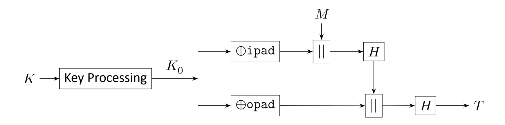

{0}------------------------------------------------

1

2

8

9

## **NIST Special Publication 800 NIST SP 800-224 ipd**

## **Keyed-Hash Message Authentication Code (HMAC)** 3 4

| 5 | Specification of HMAC and                  |
|---|-----------------------------------------------------|
|   | Recommendations for Message Authentication |

7 Initial Public Draft

Meltem Sönmez Turan Luís T. A. N. Brandão

10 This publication is available free of charge from: 11 <https://doi.org/10.6028/NIST.SP.800-224.ipd>

{1}------------------------------------------------

# **NIST Special Publication 800**

| NIST SP 800-224 ipd                                                                             | 13 14       |
|----------------------------------------------------------------------------------------------------------|----------------|
| Keyed-Hash Message Authentication Code                                                          | 15             |
| (HMAC)                                                                                                   | 16             |
| Specification of HMAC and                                                                       |                |
| Recommendations for Message Authentication                                                      |                |
| Initial Public Draft                                                                               | 19             |
| Meltem Sönmez Turan Computer Security Division Information Technology Laboratory | 20 21 22 |
| Luís T. A. N. Brandão Strativia                                                                 | 23 24       |
| This publication is available free of charge from:                                  | 25             |

<https://doi.org/10.6028/NIST.SP.800-224.ipd>

June 2024

 U.S. Department of Commerce *Gina M. Raimondo, Secretary*

 National Institute of Standards and Technology *Laurie E. Locascio, NIST Director and Under Secretary of Commerce for Standards and Technology*

{2}------------------------------------------------

- Certain equipment, instruments, software, or materials, commercial or non-commercial, are identified in this
- paper in order to specify the experimental procedure adequately. Such identification does not imply
- recommendation or endorsement of any product or service by NIST, nor does it imply that the materials or
- equipment identified are necessarily the best available for the purpose.
- There may be references in this publication to other publications currently under development by NIST in
- accordance with its assigned statutory responsibilities. The information in this publication, including
- concepts and methodologies, may be used by federal agencies even before the completion of such
- companion publications. Thus, until each publication is completed, current requirements, guidelines, and
- procedures, where they exist, remain operative. For planning and transition purposes, federal agencies may
- wish to closely follow the development of these new publications by NIST.
- Organizations are encouraged to review all draft publications during public comment periods and provide
- feedback to NIST. Many NIST cybersecurity publications, other than the ones noted above, are available at
- <https://csrc.nist.gov/publications>

#### **Authority**

- This publication has been developed by NIST in accordance with its statutory responsibilities under the
- Federal Information Security Modernization Act (FISMA) of 2014, 44 U.S.C. § 3551 et seq., Public Law (P.L.)
- 113-283. NIST is responsible for developing information security standards and guidelines, including
- minimum requirements for federal information systems, but such standards and guidelines shall not apply to
- national security systems without the express approval of appropriate federal officials exercising policy
- authority over such systems. This guideline is consistent with the requirements of the Office of Management
- and Budget (OMB) Circular A-130.
- Nothing in this publication should be taken to contradict the standards and guidelines made mandatory and
- binding on federal agencies by the Secretary of Commerce under statutory authority. Nor should these
- guidelines be interpreted as altering or superseding the existing authorities of the Secretary of Commerce,
- Director of the ORCID, or any other federal official. This publication may be used by nongovernmental
- organizations on a voluntary basis and is not subject to copyright in the United States. Attribution would,
- however, be appreciated by NIST.

#### **NIST Technical Series Policies**

- Copyright, Use, and Licensing [Statements](https://doi.org/10.6028/NIST-TECHPUBS.CROSSMARK-POLICY)
- NIST Technical Series [Publication](https://www.nist.gov/nist-research-library/nist-technical-series-publications-author-instructions#pubid) Identifier Syntax

#### **Publication History**

- Approved by the NIST Editorial Review Board on YYYY-MM-DD [Will be added in the final publication.]
- Supersedes Series XXX (Month Year) DOI [Will be added in the final publication.]

#### **How to cite this NIST Technical Series Publication**

- Meltem Sönmez Turan, Luís T. A. N. Brandão (2024) Keyed-Hash Message Authentication Code (HMAC):
- Specification of HMAC and Recommendations for Message Authentication. (National Institute of Standards
- and Technology, Gaithersburg, MD), NIST SP 800-224 ipd. https://doi.org/10.6028/NIST.SP.800-224.ipd

{3}------------------------------------------------

- **Author ORCID iDs**
- Meltem Sönmez Turan: [0000-0002-1950-7130](https:/orcid.org/0000-0002-1950-7130) Luís T. A. N. Brandão: [0000-0002-4501-089X](https:/orcid.org/0000-0002-4501-089X)
- **Public Comment Period**
- June 28, 2024 September 6, 2024
- **Submit Comments**
- [SP800-224-comments@list.nist.gov](mailto:SP800-224-comments@list.nist.gov?subject=Comments on NIST SP 800-224 ipd)
- National Institute of Standards and Technology
- Attn: Computer Security Division, Information Technology Laboratory
- 100 Bureau Drive (Mail Stop 8930) Gaithersburg, MD 20899-8930
- **All comments are subject to release under the Freedom of Information Act (FOIA).**

{4}------------------------------------------------

#### **Abstract**

 A message [authentication](#page-30-0) code (MAC)scheme is a symmetric-key cryptographic mechanism that can be used with a secret key to produce and verify an authentication *[tag](#page-31-0)*, which enables detecting unauthorized modifications to data (also known as a message). This NIST Special Publication (whose current version is an initial public draft)specifiesthe keyed-**h**ash **m**essage **a**uthentication **c**ode (HMAC) construction, which is a MAC scheme that uses a cryptographic hash function as a building block. The publication also specifies a set of requirements for using HMAC for message authentication, including a list of NIST-approved cryptographic hash functions, requirements on the secret key, and parameters for optional truncation.

#### **Keywords**

 Cryptography; hash function; HMAC; MAC; message authentication code; PRF; pseudoran-dom function; standard; truncation.

#### **Reports on Computer Systems Technology**

 The Information Technology Laboratory (ITL) at the National Institute of Standards and Technology (NIST) promotesthe U.S. economy and public welfare by providing technical lead- ership for the Nation's measurement and standards infrastructure. ITL develops tests, test methods, reference data, proof of concept implementations, and technical analyses to ad- vance the development and productive use of information technology. ITL's responsibilities include the development of management, administrative, technical, and physical standards and guidelines for the cost-effective security and privacy of other than national security- related information in federal information systems. The Special Publication 800-series reports on ITL's research, guidelines, and outreach efforts in information system security, and its collaborative activities with industry, government, and academic organizations.

{5}------------------------------------------------

## **Call for Patent Claims**

 This public review includes a call for information on essential patent claims (claims whose use would be required for compliance with the guidance or requirementsin thisInformation Technology Laboratory (ITL) draft publication). Such guidance and/or requirements may be directly stated in this ITL Publication or by reference to another publication. This call also includes disclosure, where known, of the existence of pending U.S. or foreign patent applications relating to this ITL draft publication and of any relevant unexpired U.S. or foreign patents.

 ITL may require from the patent holder, or a party authorized to make assurances on its behalf, in written or electronic form, either:

- 1. assurance in the form of a general disclaimer to the effect that such party does not hold and does not currently intend holding any essential patent claim(s); or
- 2. assurance that a license to such essential patent claim(s) will be made available to applicants desiring to utilize the license for the purpose of complying with the guidance or requirements in this ITL draft publication either:
- (a) under reasonable terms and conditions that are demonstrably free of any unfair discrimination; or
- (b) without compensation and under reasonable terms and conditions that are demonstrably free of any unfair discrimination.

 Such assurance shall indicate that the patent holder (or third party authorized to make assurances on its behalf) will include in any documents transferring ownership of patents subject to the assurance, provisions sufficient to ensure that the commitments in the assur- ance are binding on the transferee, and that the transferee will similarly include appropriate provisionsin the event of future transfers with the goal of binding each successor-in-interest.

 The assurance shall also indicate that it is intended to be binding on successors-in-interest regardless of whether such provisions are included in the relevant transfer documents.

Such statements should be addressed to: [SP800-224-comments@list.nist.gov](mailto:SP800-224-comments@list.nist.gov)

{6}------------------------------------------------

## **Contents**

| 132 | 1. Introduction                                                               | 1  |
|-----|----------------------------------------------------------------------------------|----|
| 133 | 2. HMAC Construction                                                       | 3  |
| 134 | 3. HMAC Requirements for Message Authentication                   | 5  |
| 135 | 4. Testing and Validation                                               | 7  |
| 136 | 5. Optimization via Pre-Computation of the Internal State   | 8  |
| 137 | 6. Security Considerations                                                 | 9  |
| 138 | 6.1. Key Strength                                                          | 9  |
| 139 | 6.2. HMAC Security Against Key-Recovery Attacks                   | 9  |
| 140 | 6.3. HMAC Unforgeability                                                   | 10 |
| 141 | 6.3.1. HMAC with MD-based hash functions                          | 11 |
| 142 | 6.3.2. HMAC with sponge-based hash functions                      | 11 |
| 143 | 6.3.3. Impact of truncation and multiple tag verifications  | 12 |
| 144 | Appendix A. Development of the HMAC Standard                   | 18 |
| 145 | Appendix B. Example Test Vector                                      | 19 |
| 146 | Appendix C. Glossary                                                       | 21 |
| 147 | Appendix D. Summary of Changes                                       | 23 |

{7}------------------------------------------------

## **List of Tables**

| 149 | Table 1. Notation                                                         | 3  |
|-----|------------------------------------------------------------------------------------|----|
| 150 | Table 2. NIST-approved hash functions for HMAC                | 5  |
| 151 | Table 3. Development of the HMAC standard                     | 18 |
| 152 | Table 4. Example test vector for the HMAC construction  | 19 |
|     |                                                                                    |    |
| 153 | List of Figures                                                              |    |
| 154 | Figure 1. HMAC diagram                                                 | 4  |
| 155 | List of Requirements                                                         |    |
| 156 | R1. Underlying hash functions                                          | 5  |
| 157 | R2. Key length                                                            | 5  |
| 158 | R3. Key generation                                                        | 5  |
| 159 | R4. Key strength                                                          | 6  |
| 160 | R5. Secrecy of key and sensitive values                       | 6  |
| 161 | R6. Specific use of key                                             | 6  |
| 162 | R7. Minimum length of truncated tag                              | 6  |
| 163 | R8. Limited number of failed tag verifications per key  | 6  |

{8}------------------------------------------------

## **Preface**

 ThisNIST Special Publication (SP) 800-224 initial public draft (ipd)resultsfrom a conversion of FIPS 198-1, *The Keyed-Hash Message Authentication Code* (HMAC) [\[1\]](#page-22-0) (2008), and incorpo- rates some requirements from SP 800-107r1 (Revision 1), *Recommendation for Applications Using Approved Hash Algorithms* [\[2\]](#page-22-1) (2012). This development was proposed by the NIST *Crypto Publication Review Board* [\[3\]](#page-22-2), based on two publication reviews in 2022: the FIPS 198-1 review [\[4\]](#page-22-3) proposed converting the standard into an SP; the review of SP 800-107r1 [\[5\]](#page-22-4) proposed that requirements (of hash functions) related to specific uses (e.g., for HMAC- based message authentication) be moved to the relevant publications. The final version of SP 800-224 is expected to be published concurrently with the withdrawal of FIPS 198-1.

## **Acknowledgments**

 The authors thank their NIST colleagues Elaine Barker, Chris Celi, Donghoon Chang, Yu Long Chen, Quynh Dang, John Kelsey, and Yu Sasaki for helpful discussions and valuable com- ments, and Isabel Wyk for editorial suggestions. The work by Luís Brandão was performed in the position of Foreign Guest Researcher (non-employee) at NIST, while under a contract with (employed by) Strativia.

{9}------------------------------------------------

## **Note to Reviewers**

- NIST requests comments on all technical and editorial aspects of the publication. Please submit feedback comments to [SP800-224-comments@list.nist.gov](mailto:SP800-224-comments@list.nist.gov) by September 6, 2024. NIST will review all comments and post them on the NIST website.
- There is a particular interest in receiving feedback on the following:
- 1. **Hash functions.** This draft publication lists (in [R1\)](#page-14-2) hash functions for use in HMAC-based message authentication. *Are there applications that would justify additionally approving TupleHash [\[6\]](#page-22-5) (a variable-length hash function designed to hash tuples of input strings) and ParallelHash [\[6\]](#page-22-5) (an efficiently parallelizable hash function, when hashing long messages) for HMAC-based message authentication?*
- 2. **Maximum length of the HMAC key.** When using HMAC for message authentication, this draft publication recommends (in [R4\)](#page-15-0) not using, but does not disallow, keys with length greater than the block size of the underlying hash function. *Should NIST disallow HMAC keys longer than the block size?*
- 3. **Fixed truncation length.** When using HMAC for message authentication, the revised requirement [\(R7\)](#page-15-3) about the truncation length now explicitly requires that this length be fixed across the life-span of each key. *Are there applications that would justify an exception to this requirement?* See more details in Section [6.3.3.](#page-21-0)

{10}------------------------------------------------

## **1. Introduction**

 The cryptographic protection of the integrity and authenticity of data is of paramount importance for cybersecurity. The classic example is that of a two-party communication in which a *receiver* needs assurance that a message supposedly sent by a *sender* was neither altered nor created by a third party. In the symmetric-key cryptography setting, where sender and receiver agree on a secret key, the assurance can be achieved by associating a Message [authentication](#page-30-0) code (MAC, also called a *tag*) to the message.

 Using the secret key and the message as inputs, the *tag* is produced by the sender and reproduced by the receiver to respectively claim and verify the authenticity of the message without revealing the secret key. Concretely, the gained assurance is that of unforgeability, which implies that the tag was generated by someone that knows the secret key and with respect to the received message. However, this MAC-provided assurance (based on a secret key between two parties) is not transferable to third parties, contrary to the property of non-repudiation provided by digital signatures [\[7\]](#page-22-6) (in the public-key setting).

 The hash-function-based MAC scheme called *keyed-hash message authentication code* (HMAC) was originally designed by Krawczyk, Bellare and Canetti [\[8\]](#page-22-7), and shortly thereafter specified in a Request For Comments (RFC) by the Internet Engineering Task Force (IETF) [\[9\]](#page-23-0). The specification was later transposed into a NIST Federal Information Processing Standards (FIPS) Publication 198 [\[10\]](#page-23-1) and then 198-1 [\[1\]](#page-22-0). The present NIST Special Publication (SP) 800-224-ipd is a draft replacement of FIPS [198-1](#page-22-8) and additionally incorporatesrequirements (revised from SP 800 [107r1](#page-22-9) [\[2\]](#page-22-1)) for the use of HMAC for message authentication.

In addition to HMAC, NIST approves the following two MAC schemes:

- (i) KMAC,specified in SP 800-185 [\[6\]](#page-22-5), which is based on KECCAK, the underlying function of the hash function family SHA-3. KMAC has two variants that support different security levels: KMAC128 and KMAC256.
- (ii) CMAC, specified in SP 800-38B [\[11\]](#page-23-2), which is based on a block cipher, such as the Advanced Encryption Standard (AES) [\[12\]](#page-23-3).

**Other applications of HMAC.** The HMAC tag generation function is a [pseudorandom](#page-30-2) function (PRF) and may be used for cryptographic purposes other than the classical example of message authentication between a sender and a receiver. At the time of the present publication, other NIST publications consider the following uses of HMAC:

 • Key confirmation, as a building block of pair-wise key establishment (see SP 800-56Ar3 [\[13\]](#page-23-4) and SP 800-56Br2 [\[14\]](#page-23-5))

{11}------------------------------------------------

- Key derivation [\[15\]](#page-23-6), including as a building block of pair-wise key establishment (see SP 800-56Cr2 [\[16\]](#page-23-7))
- Randomness extraction and key expansion, as a building blocks for a key derivation function (see SP 800-56Cr2 [\[16\]](#page-23-7))
- Key extraction, by combining multiple keys (see SP 800-133r2 [\[17\]](#page-23-8))
- Password-based key-derivation as a building block of PBKDF (see SP 800-132 [\[18\]](#page-24-0))
- Random number generation as a building block of a deterministic random bit genera-tor (DRBG), as in HMAC\_DRBG (see SP 800-90Ar1 [\[19\]](#page-24-1))

**Organization.** Section [2](#page-12-0) specifies the HMAC construction and the truncation option. Sec- tion [3](#page-14-0) enumerates the HMAC requirements for message authentication. Section [4](#page-16-0) covers the testing and validation of HMAC, and the use of object identifiers. Section [5](#page-17-0) describes an implementation optimization by precomputing an internal state. Section [6](#page-18-0) discusses security, including the key [strength](#page-30-3) and security [strength](#page-30-4) against key-recovery and forgery attacks. [Appendix](#page-27-0) A displays a timeline of developments related to the HMAC specification. [Appendix](#page-28-0) B provides example test vectors. [Appendix](#page-30-1) C includes a glossary. [Appendix](#page-32-0) D lists various changes introduced in this document, as compared to the previous HMAC specifica-tion in FIPS 198-1 and its related requirements for message authentication in SP 800-107r1.

{12}------------------------------------------------

## 2. HMAC Construction

251

This section specifies the HMAC construction and the option for tag truncation. Table 1 provides the notation.

**Table 1.** Notation

| 252 | Notation                           | Description                                                                                                                                                                  |  |  |  |
|-----|------------------------------------|------------------------------------------------------------------------------------------------------------------------------------------------------------------------------|--|--|--|
| 253 | 0xN                                | Bitstring in hexadecimal notation, where N is a string of symbols in the domain 0–9 A–F. Each hexadecimal symbol represents a sequence of four bits, also known as a nibble. |  |  |  |
| 254 | _                                  | A bitstring composed of $x$ consecutive bits with value 0.                                                                                                                   |  |  |  |
| 255 | b                                  | Block size (bit-length) of the underlying hash function, assumed to be a multiple of eight. See Table 2 for concrete values.                                                 |  |  |  |
| 256 | H                                  | Underlying cryptographic hash function.                                                                                                                                      |  |  |  |
| 257 | $\operatorname{HMAC}(K,M)$         | The HMAC tag generation function, using as inputs a key $K$ and a message $M$ , and outputting a tag $T$ .                                                                   |  |  |  |
| 258 | ipad                               | Inner pad: $b/8$ repetitions of the bitstring $00110110$ (i.e., $0x36$ ).                                                                                                    |  |  |  |
| 259 | K                                  | Secret key.                                                                                                                                                                  |  |  |  |
| 260 | $K_0$                              | Intermediate $b$ -bit key generated from the secret key $K$ .                                                                                                                |  |  |  |
| 261 | $\ell$                             | Bit-length of the output of the underlying hash function.                                                                                                                    |  |  |  |
| 262 | len(x)                             | Length (number of bits) of a bitstring $\boldsymbol{x}$ .                                                                                                                    |  |  |  |
| 263 | $\operatorname{left}_{\lambda}(X)$ | $\lambda$ leftmost bits of a bitstring $X$ ( $len(X) \ge \lambda$ ).                                                                                                         |  |  |  |
| 264 | M                                  | Input message to be authenticated.                                                                                                                                           |  |  |  |
| 265 | n                                  | Internal-state size (in bits) of the underlying hash function.                                                                                                               |  |  |  |
| 266 | opad                               | Outer pad: $b/8$ repetitions of the bitstring $01011100$ (i.e., $0x5C$ ).                                                                                                    |  |  |  |
| 267 | T                                  | Output tag, with $\ell$ bits.                                                                                                                                                |  |  |  |
| 268 | $\lambda$                          | Bit-length of the truncated tag.                                                                                                                                             |  |  |  |
| 269 | x  y                               | Concatenation of strings $x$ and $y$ .                                                                                                                                       |  |  |  |
| 270 | $\oplus$                           | Exclusive-OR (XOR) operation.                                                                                                                                                |  |  |  |

{13}------------------------------------------------

271 Let be a cryptographic hash [function](#page-30-6) with an output size of ℓ bits and a [block](#page-30-5) size of 272 bits, where is a multiple of eight and satisfies ≥ ℓ. The inputs and the output of the 273 HMAC tag generation algorithm are as follows:

- 274 **Inputs:** [secret](#page-30-7) key and message .
- 275 **Output:** [tag](#page-31-0) , satisfying ( ) = ℓ.
- 276 The HMAC tag generation follows two steps (see a simplified illustration in Figure [1\)](#page-13-0):
- **1. Key processing.** The intermediate value 0 277 is determined as follows:
- 278 **a.** If () = , then set 0 = .
  - **b.** If () > , then set 0 = () || 0−ℓ . That is, append ( − ℓ) zeros (bits) to (), in order to obtain a string 0 with bits.
  - **c.** If () < , then set 0 = || 0−() . That is, append ( − ()) zeros (bits) to in order to obtain a -bit string 0 .
  - **2. Output tag ().** The output tag is generated as follows:

$$T = \operatorname{HMAC}(K,M) = H((K_0 \, \oplus \, \operatorname{opad}) \mid\mid H((K_0 \, \oplus \operatorname{ipad}) \mid\mid M)), \tag{1}$$

where the inner pad ipad is defined as the byte 0x36 repeated /8 times, and the outer pad opad is defined as the byte 0x5C repeated /8 times. (Note: The division is in the integer domain and assumes prior checking that is a multiple of eight.)

288 **Figure 1.** HMAC diagram

289 **Truncation.** Some applications may truncate the HMAC output to construct tags with a specific length (≤ ℓ). The truncation outputs left 290 ( ), the leftmost bits of .

{14}------------------------------------------------

## **3. HMAC Requirements for Message Authentication**

 This section specifies requirements for validating HMAC implementations for message authentication. Other NIST publications may provide different sets of requirements for other applications of HMAC.

 **R1. Underlying hash functions.** HMAC **[shall](#page-30-8)** use a NIST[-approved](#page-30-9) cryptographic hash function listed in Table [2.](#page-14-1)

**Table 2.** NIST-approved hash functions for HMAC

| 298 | Hash function | Block size (𝑏-bit) | Internal-state (𝑛-bit) size | Output size (ℓ-bit) |
|-----|------------------|--------------------------|-----------------------------------|---------------------------|
| 299 | SHA-224[20]      | 512                      | 256                               | 224                       |
| 300 | SHA-256 [20]     | 512                      | 256                               | 256                       |
| 301 | SHA-384 [20]     | 1024                     | 512                               | 384                       |
| 302 | SHA-512 [20]     | 1024                     | 512                               | 512                       |
| 303 | SHA-512/224 [20] | 1024                     | 512                               | 224                       |
| 304 | SHA-512/256 [20] | 1024                     | 512                               | 256                       |
| 305 | SHA3-224 [21]    | 1152                     | 1600                              | 224                       |
| 306 | SHA3-256 [21]    | 1088                     | 1600                              | 256                       |
| 307 | SHA3-384 [21]    | 832                      | 1600                              | 384                       |
| 308 | SHA3-512 [21]    | 576                      | 1600                              | 512                       |

#### *NOTES:*

- 1. This publication does not approve the use of SHA-1 for HMAC message authentication, consistent with NIST's plan to transition away from SHA-1 by 2030 [\[22\]](#page-24-4).
- 2. It is expected that hash functions with ℓ = 224 bits of output will be disallowed after 2030 (see Table 4 of SP 800-57pt1r5 [\[23\]](#page-24-5)). A future revision of SP 800-131Ar2 [\[24\]](#page-24-6) or other NIST publications may update the approval status of hash functions.
-  **R2. Key length.** The length of the HMAC key **[shall](#page-30-8)** be at least 128 bits. The use of keys larger than the block size **[should](#page-30-10)** be avoided. (See Section [6.2](#page-18-2) for more information).
- *NOTE:* The use of shorter keys during key-length transition periods or for tag verification is allowed for legacy purposes, as specified in SP 800-131Ar2 [\[24\]](#page-24-6).
-  **R3. Key generation.** An HMAC key **[shall](#page-30-8)** be generated as specified following the recom-mendations for cryptographic key generation specified in SP 800-133 [\[17\]](#page-23-8).

{15}------------------------------------------------

-  **R4. Key strength.** An HMAC key **[shall](#page-30-8)** have a key [strength](#page-30-3) that meets or exceeds the security [strength](#page-30-4) required to protect the data over which the HMAC is computed. (See Section [6.1](#page-18-1) for more information).
-  **R5. Secrecy of key and sensitive values.** The HMAC key and intermediate HMAC computation values that are stored for reuse (e.g., in the optimization mentioned in Section [5\)](#page-17-0), **[shall](#page-30-8)** be kept secret.
-  **R6. Specific use of key.** An HMAC key used in a message authentication application **[shall](#page-30-8)** not be used for other purposes.
-  **R7. Minimum length of truncated tag.** When an application uses truncated tags for message authentication, the length of the truncated HMAC output **[shall](#page-30-8)** be at least 32 bits, and **[shall](#page-30-8)** remain constant across the life-span of the key. Any tag output length that is less than 64 bits **[should](#page-30-10)** only be selected after careful risk analysis is performed with respect to the message authentication application.
-  **R8. Limited number of failed tag verifications per key.** An HMAC-based message au- thentication application using truncated tags **[shall](#page-30-8)** determine a maximum number of failed tag verifications, based on an acceptable limit of forgery probability. If the number of failed verifications reaches this number, the key **[shall](#page-30-8)** stop being used. (See Section [6.3.3](#page-21-0) for an example.)

{16}------------------------------------------------

## **4. Testing and Validation**

 NIST guidelines for testing and validating HMAC implementations are managed by the NIST Cryptographic Module Validation Program (CMVP) [\[25\]](#page-24-7) and the NIST Cryptographic Algorithm Validation Program (CAVP) [\[26\]](#page-24-8). Concrete requirements are expressed in the "*Implementation Guidance for FIPS PUB 140-3 and the Cryptographic Module Validation Program*" [\[27\]](#page-25-0). For example, at the time of this publication, the Implementation Guidance requires that an approval for truncation be subject to a CAVP algorithm validation and that it be explicitly shown in the module's security policy.

**Test vectors.** Detailed test vectors (including intermediate computation values) for the validation of HMAC implementations are available online at the NIST Computer Security Resource Center [\[28\]](#page-25-1), and in the GitHub repository of the NIST CMVP [\[29\]](#page-25-2). For convenience, Table [4](#page-28-1) in [Appendix](#page-28-0) B displays one test vector with one input/output entry for each ofseveral HMAC instantiations(i.e., those whose underlying hash function isfrom Table [2\)](#page-14-1). The values were obtained from the NIST CMVP GitHub repository of test vectors[\[29\]](#page-25-2). A valid implemen- tation of HMAC with the corresponding underlying hash function must satisfy the described relation between input (key, message) and output (tag). A proper validation requires checking numerous other input/output relationships, as specified by the NIST CAVP [\[26\]](#page-24-8).

**Object IDentifiers.** Each possible HMAC instantiation is identified by an Object IDentifier (OID), which unequivocally specifies the used hash function, the key length, and whether or not truncation is used. The OIDs approved for HMAC are posted on the Computer Security Objects Register (CSOR) [\[30\]](#page-25-3), along with procedures for adding new OIDs.

{17}------------------------------------------------

## 5. Optimization via Pre-Computation of the Internal State

Some computation of the HMAC algorithm is independent of the message. Therefore, when an application uses the same key to produce various tags, pre-processing can be used once to precompute a state that can be reused across various tag generations. This optimization may be especially relevant in terms of efficiency when authenticating multiple short messages under the same key.

Hashing a long key. When the key length is larger than the block size, then the computation of the intermediate value  $K_0$  requires hashing the original key. Storing  $K_0$  can thus avoid this hashing in subsequent tag computations.

Initialize the two hashings. The internal state of the two underlying hash computations can also be pre-computed, when the underlying hash function H processes the input from left to right, in b-bit blocks, as is the case for any hash function approved by the requirement R1. For each hash function call, the processing of the initial b-bits block —  $K_0 \oplus \mathrm{ipad}$  or  $K_0 \oplus \mathrm{opad}$  — is independent of the message M. Therefore, the internal states (after the processing of each of these initial blocks) can be stored and reused to initialize the hash function in subsequent tag generations.

Depending on the underlying hash function, this optimization reduces the number of calls to the compression function (e.g., used in the SHA-2 family) or the permutation (e.g., Keccak used in the SHA-3 family). The effect on efficiency may be especially significant in applications that require computing tags for many short messages. Choosing to implement HMAC in this manner has no effect on interoperability, but conformance to requirement R5 requires ensuring the secrecy of these intermediate states.

{18}------------------------------------------------

### 6. Security Considerations

This section considers the HMAC security strength against key-recovery and forgery attacks.

#### 84 6.1. Key Strength

399

400

401

402

403

407

408

409

410

411

412

Key strength is a measure of the difficulty of guessing a key. It is often expressed in terms 385 of entropy — a logarithmic measure of the guessing probability. When a secret key has 386 full entropy, its strength (before use in a cryptographic algorithm) is equal to its bit length [31]. If a secret key has low entropy (either too short or with small entropy per bit), then an 388 adversary will have a non-negligible probability of correctly guessing the key. In practice, key 389 strength depends on the length of the key and multiple factors about how it is generated. 390 Key strength can also be measured with respect to a particular use in another cryptographic 391 algorithm (i.e., how it enables resisting various types of cryptographic attacks) such as 392 key-recovery attacks (Section 6.2) or forgery attacks (Section 6.3). Depending on how the 303 algorithm uses the key, the strength against some attacks may be less than the key strength. The following discussion of HMAC security assumes the secret key has been obtained with 395 an acceptable security strength using a cryptographic random bit generator — see the 396 SP 800 90 series [19, 32, 33]. 397

#### 6.2. HMAC Security Against Key-Recovery Attacks

In an HMAC key-recovery attack, an adversary who is knowledgeable about the key length has the goal of finding the original secret key or an equivalent key. The security strength of HMAC against a key-recovery attack is a measure of the computational effort needed to achieve this goal. The secure use of HMAC requires that key-recovery attacks are infeasible, even for an adversary with access to a large number of valid pairs (M,T) of message and authentication tag. The key-recovery attack requires computing roughly  $2^\ell$  tags if len(K) > b, and  $2^{len(K)}$  tags otherwise.

**Equivalent Keys.** For the HMAC construction, it is easy to find two keys of different sizes that lead to the same intermediate value  $K_0$ , which in turn will result in the same tag for any given message. More precisely, K and K' are said to be "equivalent" if  $\mathrm{HMAC}(K,M) = \mathrm{HMAC}(K',M)$  for all possible messages. Two examples:

1. **Key with a length larger than block size** b**.** Given a key K that satisfies the condition of step 1b (see Section 2), (i.e., len(K) > b), and assuming that  $\ell \le b$  (which is the case for all hash functions from Table 2), then K' = H(K) is an equivalent key.

{19}------------------------------------------------

413

414

415

417

418

421

422

427

2. Key with a length smaller than block size b. Given a key K that satisfies the condition of step 1c (see Section 2), (i.e., len(K) < b), then  $K' = K||\ 0$ , where 0 is a bit, is an equivalent key.

On the use of large keys (len(K) > b). The HMAC construction accepts keys of arbitrary lengths. However, using keys that are longer than b bits does not provide extra security (assuming that they have entropy larger than  $\ell$ ), since in that case, the HMAC algorithm starts by first hashing the key to generate a b-bit intermediate value ( $\ell$ -bit hash concatenated with  $b-\ell$  zero bits). In other words, using a key with more than b bits actually induces a 420 security strength (e.g., with respect to key-recovery attacks) that is lower than when using a shorter key K that satisfies  $\ell < len(K) \le b$ .

Note that FIPS 198-1 (from 2008) [1] is based on RFC 2101 (1997) [9], which was subse-423 quently updated by an errata (in 2017) to disallow keys of lengths larger than the block size b of the underlying hash function. This publication does not disallow such long keys but 425 recommends against their use (see R2 in Section 3). 426

#### 6.3. HMAC Unforgeability

Without knowledge of the secret key, it should be infeasible for an adversary to generate 428 a valid (M,T) pair that has not been observed before. Depending on the adversarial goal, 429 there are various types of forgeries [34]. In an existential forgery attack, after observing 430 many (M,T) pairs, the goal is to produce a valid tag for some new message (which the adversary can choose during the attack). In a universal forgery attack, the goal is to gain 432 the ability to forge a valid tag for any message. Other intermediate forgery goals can be 433 defined (e.g., selective forgery). 434

Universal forgery can be achieved by a key-recovery attack with complexity  $2^{len(K)}$ . (In 435 the case of HMAC, given its internal transformation of the key, the attack can be done with 436 complexity  $2^{\ell}$  if len(K) > b.) However, other forgery attacks can have lower complexity. 437 depending on the internal state size n of the underlying hash function. These attacks con-438 sider the iterative nature of the hash function but do not otherwise exploit any weakness 439 in the internal function used in each iteration. 440

HMAC is considered secure with respect to unforgeability when instantiated with any ap-441 proved hash function. However, a detailed analysis of its security strength with respect to 442 unforgeability depends on the type of construction of the hash function: SHA-2-based hash functions follow the Merkle-Dåmgard (MD) construction (using a compression function); 444 SHA-3-based hash functions follow the sponge construction (using a permutation).

{20}------------------------------------------------

The strength of any instantiation also depends on the chosen parameters (e.g., key size, and truncation length). For example, for each of the four output lengths  $\ell \in \{224, 256, 384, 512\}$  of approved hash functions, the block size b is different between the SHA-2 and the SHA-3 families. The parameter b is also the key-length threshold b after which the key is internally hashed to a smaller size  $\ell$  (before further use in the internal HMAC calculation).

#### **6.3.1. HMAC with MD-based hash functions**

The HMAC construction was originally designed [8] for use with hash functions subject to length-extension attacks, such as those that follow the MD construction. The outer hashing in HMAC prevents such attacks from being applicable for obtaining HMAC forgeries.

Suppose HMAC is instantiated with an MD-type of hash function (e.g., any hash function from the SHA-2 family) with internal state size n (Table 2). Then, the HMAC construction is proven to be indistinguishable from a PRF up to the birthday-bound complexity  $2^{n/2}$ , in the sense of requiring at least  $2^{n/2}$  computations of the compression function, assuming that the compression function is a PRF [35–37]. Since a secure PRF is a secure MAC, the assumption implies that an MD-based HMAC is a secure MAC.

With this result, the complexity of generic attacks against HMAC with an underlying MD-461 based hash function has established lower bounds, such as time complexity roughly  $2^{n/2}$ 462 for some special parametrizations (e.g., when  $n=\ell=b/2$ , and len(K)=b). It follows that SHA-256 enables 128 bits of security, whereas SHA-512 provides 256 bits of security against 464 HMAC forgery attacks. The time complexity of concrete known attacks [38, 39] is always 465 smaller than  $2^n$ , and in some cases (but not all) matches the established lower bound of  $2^{n/2}$ . However, universal forgery is also possible via exhaustive key search (see Section 6.2), 467 which has lower complexity if len(K) < n/2, or if simultaneously  $\ell < n/2$  and len(K) > b, 468 as in the case of SHA-512/224. 469

#### 6.3.2. HMAC with sponge-based hash functions

For message authentication, this publication approves (in R1) the use of HMAC based on hash functions from the SHA-3 family. However, given the difference between SHA-2 (MD-based) and SHA-3 (sponge-based), the research results mentioned in Section 6.3.1 for HMAC unforgeability security do not directly apply to HMAC based on a SHA-3 hash function. While there are known comparisons of security strength between SHA-3 and SHA-2 instantiations of HMAC [40], this publication does not provide a detailed comparison.

{21}------------------------------------------------

#### 6.3.3. Impact of truncation and multiple tag verifications

Security against existential forgeries attacks decreases when (i) multiple tag verifications are allowed, or (ii) the tag is truncated to a length  $\lambda$  smaller than  $\ell$  bits. For an adversary that can try  $N=2^t$  different tags of length  $\lambda$  (with  $t \leq \lambda$ ), the probability of producing a valid tag is  $2^{t-\lambda}$ . Therefore, the truncation to  $\lambda$  bits is only suitable for applications in which (i) the maximum number of failed tag verifications N allowed by the system for each HMAC key can be enforced, and (ii) it is acceptable to have forgery probability  $2^{t-\lambda}$  for each HMAC key. This motivated requirements R7 and R8 in Section 3.

Example. If the length of truncated tags is  $\lambda=64$ , and the system accepts a forgery probability of at most  $2^{-40}$ , then the number of failed tag verifications needs to be limited to  $N-2^{64-40}=2^{24}$ .

{22}------------------------------------------------

## **References**

-  [1] National Institute of Standards and Technology (2008) The Keyed-Hash Message Au- thentication Code (HMAC), (U.S. Department of Commerce, Washington, D.C.), Federal Information Processing Standards(FIPS) Publication 198-1. DOI[:10.6028/NIST.FIPS.198-](https://doi.org/10.6028/NIST.FIPS.198-1) [1](https://doi.org/10.6028/NIST.FIPS.198-1).
-  [2] Dang Q (2012) Recommendation for Applications Using Approved Hash Algorithms, (National Institute of Standards and Technology, Gaithersburg, MD), NIST Special Publication (SP) 800-107 Rev. 1. DOI[:10.6028/NIST.SP.800-107r1.](https://doi.org/10.6028/NIST.SP.800-107r1)
-  [3] National Institute of Standards and Technology (2024) Crypto Publication Review Project. Available at [https://csrc.nist.gov/projects/crypto-publication-review-project.](https://csrc.nist.gov/projects/crypto-publication-review-project)
-  [4] National Institute of Standards and Technology (2022) Decision to Convert FIPS 198-1 to a NIST Special Publication. Available at [https://csrc.nist.gov/news/2022/decisi](https://csrc.nist.gov/news/2022/decision-to-convert-fips-198-1-to-nist-special-pub) [on-to-convert-fips-198-1-to-nist-special-pub.](https://csrc.nist.gov/news/2022/decision-to-convert-fips-198-1-to-nist-special-pub) See the initial conversion proposal (from 2022-Sep-20) at [https://csrc.nist.gov/news/2022/proposal-to-convert-fip](https://csrc.nist.gov/news/2022/proposal-to-convert-fips-198-1-to-a-nist-sp) [s-198-1-to-a-nist-sp](https://csrc.nist.gov/news/2022/proposal-to-convert-fips-198-1-to-a-nist-sp).
-  [5] National Institute of Standards and Technology (2022) Withdrawal of NIST Special Publi- cation 800-107 Revision 1. Available at [https://csrc.nist.gov/news/2022/withdrawal-o](https://csrc.nist.gov/news/2022/withdrawal-of-nist-sp-800-107-revision-1) [f-nist-sp-800-107-revision-1.](https://csrc.nist.gov/news/2022/withdrawal-of-nist-sp-800-107-revision-1) See the initial withdrawal proposal (from 2022-June-08) at [https://csrc.nist.gov/news/2022/proposal-to-withdraw-sp-800-107-rev-1.](https://csrc.nist.gov/news/2022/proposal-to-withdraw-sp-800-107-rev-1)
-  [6] Kelsey J, Chang S, Perlner R (2016) SHA-3 Derived Functions: cSHAKE, KMAC, Tuple- Hash, and ParallelHash, (National Institute of Standards and Technology, Gaithersburg, MD), NIST Special Publication (SP) 800-185. DOI[:10.6028/NIST.SP.800-185.](https://doi.org/10.6028/NIST.SP.800-185)
-  [7] National Institute of Standards and Technology (2023) Digital Signature Standard (DSS), (U.S. Department of Commerce, Washington, D.C.), Federal Information Processing Standards (FIPS) Publication 186-5. DOI[:10.6028/NIST.FIPS.186-5.](https://doi.org/10.6028/NIST.FIPS.186-5)
-  [8] Bellare M, Canetti R, Krawczyk H (1996) Keying Hash Functions for Message Authenti- cation. *Advances in Cryptology — CRYPTO '96*, ed Koblitz N (Springer Berlin Heidelberg, Berlin, Heidelberg), *LNCS*, Vol. 1109, pp 1–15. DOI[:10.1007/3-540-68697-5\\_1](https://doi.org/10.1007/3-540-68697-5_1)

{23}------------------------------------------------

-  [9] Krawczyk H, Bellare M, Canetti R (1997) HMAC: Keyed-Hashing for Message Authentication. *RFC 2104* DOI[:10.17487/RFC2104.](https://doi.org/10.17487/RFC2104) Errata (2017-Feb-03) available at <https://www.rfc-editor.org/errata/eid4809>
-  [10] National Institute of Standards and Technology (2002) The Keyed-Hash Message Authentication Code (HMAC), (U.S. Department of Commerce, Washington, D.C.), Federal Information Processing Standards (FIPS) Publication 198. Available at [https://csrc.nist.gov/pubs/fips/198/final.](https://csrc.nist.gov/pubs/fips/198/final)
-  [11] Dworkin M (2005) Recommendation for Block Cipher Modes of Operation: the CMAC Mode for Authentication, (National Institute of Standards and Technology, Gaithers-burg, MD), NIST Special Publication (SP) 800-38B. DOI[:10.6028/NIST.SP.800-38B-2005.](https://doi.org/10.6028/NIST.SP.800-38B-2005)
-  [12] National Institute of Standards and Technology (2001) Advanced Encryption Standard (AES), (U.S. Department of Commerce, Washington, D.C.), Federal Infor- mation Processing Standards (FIPS) Publication 197-upd1, updated May 9, 2023. DOI[:10.6028/NIST.FIPS.197-upd1.](https://doi.org/10.6028/NIST.FIPS.197-upd1)
-  [13] Barker E, Chen L, Roginsky A, Vassilev A, Davis R (2018) Recommendation for Pair-Wise Key-Establishment Schemes Using Discrete Logarithm Cryptography, (National Institute of Standards and Technology, Gaithersburg, MD), NIST Special Publication (SP) 800-56A Rev. 3. DOI[:10.6028/NIST.SP.800-56Ar3.](https://doi.org/10.6028/NIST.SP.800-56Ar3)
-  [14] Barker E, Chen L, Roginsky A, Vassilev A, Davis R, Simon S (2019) Recommendation for Pair-Wise Key-Establishment Using Integer Factorization Cryptography, (National Institute of Standards and Technology, Gaithersburg, MD), NIST Special Publication (SP) 800-56B Rev. 2. DOI[:10.6028/NIST.SP.800-56Br2.](https://doi.org/10.6028/NIST.SP.800-56Br2)
-  [15] Chen L (2022) Recommendation for Key Derivation Using Pseudorandom Functions, (National Institute of Standards and Technology, Gaithersburg, MD), NIST Special Publication (SP) 800-108 Rev. 1. DOI[:10.6028/NIST.SP.800-108r1.](https://doi.org/10.6028/NIST.SP.800-108r1)
-  [16] Barker E, Chen L, Davis R (2020) Recommendation for Key-Derivation Methods in Key- Establishment Schemes, (National Institute of Standards and Technology, Gaithersburg, MD), NIST Special Publication (SP) 800-56C Rev. 2. DOI[:10.6028/NIST.SP.800-56Cr2.](https://doi.org/10.6028/NIST.SP.800-56Cr2)
-  [17] Barker E, Roginsky A, Davis R (2020) Recommendation for Cryptographic Key Generation, (National Institute of Standards and Technology, Gaithersburg, MD), NIST Special Publication (SP) 800-133 Rev. 2. DOI[:10.6028/NIST.SP.800-133r2.](https://doi.org/10.6028/NIST.SP.800-133r2)

{24}------------------------------------------------

-  [18] Sönmez Turan M, Barker E, Burr W, Chen L (2010) Recommendation for Password- Based Key Derivation: Part 1: Storage Applications, NIST SP 800-132: (National Institute of Standards and Technology, Gaithersburg, MD), NIST Special Publication (SP) 800-132. DOI[:10.6028/NIST.SP.800-132.](https://doi.org/10.6028/NIST.SP.800-132)
-  [19] Barker E, Kelsey J (2015) Recommendation for Random Number Generation Using Deterministic Random Bit Generators, (National Institute of Standards and Technology, Gaithersburg, MD), NIST Special Publication (SP) 800-90A Rev. 1. DOI[:10.6028/NIST.SP.800-90Ar1.](https://doi.org/10.6028/NIST.SP.800-90Ar1)
-  [20] National Institute of Standards and Technology (2015) Secure Hash Standard (SHS), (U.S. Department of Commerce, Washington, D.C.), Federal Information Processing Standards (FIPS) Publication 180-4. DOI[:10.6028/NIST.FIPS.180-4.](https://doi.org/10.6028/NIST.FIPS.180-4)
-  [21] National Institute of Standards and Technology (2015) SHA-3 Standard: Permutation- Based Hash and Extendable-Output Functions, (U.S. Department of Commerce, Washington, D.C.), Federal Information Processing Standards (FIPS) Publication 202. DOI[:10.6028/NIST.FIPS.202.](https://doi.org/10.6028/NIST.FIPS.202)
-  [22] National Institute of Standards and Technology (2022) NIST Transitioning Away from SHA-1 for All Applications. Available at [https://csrc.nist.gov/news/2022/nist-trans](https://csrc.nist.gov/news/2022/nist-transitioning-away-from-sha-1-for-all-apps) [itioning-away-from-sha-1-for-all-apps.](https://csrc.nist.gov/news/2022/nist-transitioning-away-from-sha-1-for-all-apps)
-  [23] Barker E (2020) Recommendation for Key Management — Part 1: General, (National Institute of Standards and Technology, Gaithersburg, MD), NIST Special Publication (SP) 800-57 Part 1 Rev. 5. DOI[:10.6028/NIST.SP.800-57pt1r5.](https://doi.org/10.6028/NIST.SP.800-57pt1r5)
-  [24] Barker E, Roginsky A (2019) Transitioning the Use of Cryptographic Algorithms and Key Lengths, (National Institute of Standards and Technology, Gaithersburg, MD), NIST Special Publication (SP) 800-131A Rev. 2. DOI[:10.6028/NIST.SP.800-131Ar2.](https://doi.org/10.6028/NIST.SP.800-131Ar2)
-  [25] National Institute of Standards and Technology (2024) Cryptographic Module Validation Program (CMVP). Available at [https://csrc.nist.gov/projects/cryptogra](https://csrc.nist.gov/projects/cryptographic-module-validation-program) [phic-module-validation-program.](https://csrc.nist.gov/projects/cryptographic-module-validation-program)
-  [26] National Institute of Standards and Technology (2023) Cryptographic Algorithm Validation Program (CAVP). Available at [https://csrc.nist.gov/projects/cryptograph](https://csrc.nist.gov/projects/cryptographic-algorithm-validation-program) [ic-algorithm-validation-program](https://csrc.nist.gov/projects/cryptographic-algorithm-validation-program).

{25}------------------------------------------------

-  [27] National Institute of Standards and Technology, Canadian Centre for Cyber Security (2024) Implementation Guidance for FIPS 140-3 and the Cryptographic Module Validation Program (version 2024-Mar-26). (Note: Numerous future updates are expected for this publication.) Available at [https://csrc.nist.gov/projects/cryptog](https://csrc.nist.gov/projects/cryptographic-module-validation-program/fips-140-3-standards) [raphic-module-validation-program/fips-140-3-standards.](https://csrc.nist.gov/projects/cryptographic-module-validation-program/fips-140-3-standards)
-  [28] National Institute of Standards and Technology / Computer Security Resource Center (CSRC) (2013) Examples with Intermediate Values. Available at [h t t p s:](https://csrc.nist.gov/projects/cryptographic-standards-and-guidelines/example-values) [//csrc.nist.gov/projects/cryptographic-standards-and-guidelines/example-values](https://csrc.nist.gov/projects/cryptographic-standards-and-guidelines/example-values).
-  [29] National Institute of Standards and Technology (2023) Github repository usnist- gov/acvp-server: Automated cryptographic validation test system — gen/vals). Avail-able at [https://github.com/usnistgov/ACVP-Server/tree/master/gen-val/json-files.](https://github.com/usnistgov/ACVP-Server/tree/master/gen-val/json-files)
-  [30] National Institute of Standards and Technology (2023) Computer Security Objects Register. Available at [https://csrc.nist.gov/projects/computer-security-objects-r](https://csrc.nist.gov/projects/computer-security-objects-register/algorithm-registration) [egister/algorithm-registration](https://csrc.nist.gov/projects/computer-security-objects-register/algorithm-registration).
-  [31] Buller D, Kaufer A, Roginsky A, Sönmez Turan M (2023) Discussion on the Full Entropy Assumption of the SP 800-90 Series, (National Institute of Standards and Technology, Gaithersburg, MD), NIST Interagency Report (NIST IR) 8427. DOI[:10.6028/NIST.IR.8427.](https://doi.org/10.6028/NIST.IR.8427)
-  [32] Sönmez Turan M, Barker E, Kelsey J, McKay K, Baish M, Boyle M (2018) Recommendation for the Entropy Sources Used for Random Bit Generation, (National Institute of Standards and Technology, Gaithersburg, MD), NIST Special Publication (SP) 800-90B. DOI[:10.6028/NIST.SP.800-90B.](https://doi.org/10.6028/NIST.SP.800-90B)
-  [33] Barker E, Kelsey J, McKay K, Roginsky A, Turan MS (2022) Recommendation for Random Bit Generator (RBG) Constructions, (National Institute of Standards and Technology, Gaithersburg, MD), NIST Special Publication (SP) 800-90C 3pd (3rd public draft). DOI[:10.6028/NIST.SP.800-90C.3pd.](https://doi.org/10.6028/NIST.SP.800-90C.3pd)
-  [34] Preneel B (1998) Cryptanalysis of message authentication codes. *Information Security*, eds Okamoto E, Davida G, Mambo M (Springer Berlin Heidelberg, Berlin, Heidelberg), *LNCS*, Vol. 1396, pp 55–65. DOI[:10.1007/BFb0030408](https://doi.org/10.1007/BFb0030408)
-  [35] Gaži P, Pietrzak K, Rybár M (2014) The Exact PRF-Security of NMAC and HMAC. *Advances in Cryptology — CRYPTO 2014*, eds Garay JA, Gennaro R (Springer Berlin

{26}------------------------------------------------

- Heidelberg, Berlin, Heidelberg), *LNCS*, Vol. 8616, pp 113–130. DOI[:10.1007/978-3-](https://doi.org/10.1007/978-3-662-44371-2_7) [662-44371-2\\_7](https://doi.org/10.1007/978-3-662-44371-2_7)
- [36] Bellare M (2015) New Proofs for NMAC and HMAC: Security Without Collision- Resistance. *Journal of Cryptology* 28:844–878. DOI[:10.1007/s00145-014-9185-x.](https://doi.org/10.1007/s00145-014-9185-x) Also available at [https://ia.cr/2006/043](#page-0-0)
-  [37] Backendal M, Bellare M, Günther F, Scarlata M (2023) When Messages Are Keys: Is HMAC a Dual-PRF? *Advances in Cryptology — CRYPTO 2023*, eds Handschuh H, Lysyanskaya A (Springer Nature Switzerland, Cham), *LNCS*, Vol. 14083, pp 661–693. DOI[:10.1007/978-3-031-38548-3\\_22.](https://doi.org/10.1007/978-3-031-38548-3_22) Also available at [https://ia.cr/2023/861](#page-0-0)
-  [38] Preneel B, van Oorschot PC (1996) On the Security of Two MAC Algorithms. *Advances in Cryptology — EUROCRYPT '96*, ed Maurer U (Springer Berlin Heidelberg, Berlin, Heidelberg), *LNCS*, Vol. 1070, pp 19–32. DOI[:10.1007/3-540-68339-9\\_3](https://doi.org/10.1007/3-540-68339-9_3)
-  [39] Guo J, Peyrin T, Sasaki Y, Wang L (2014) Updates on generic attacks against HMAC and NMAC. *Advancesin Cryptology — CRYPTO 2014, Proceedings, Part I*, eds Garay JA, Gen-naro R (Springer), *LNCS*, Vol. 8616, pp 131–148. DOI[:10.1007/978-3-662-44371-2\\_8](https://doi.org/10.1007/978-3-662-44371-2_8)
-  [40] Naito Y, Wang L (2016) Replacing SHA-2 with SHA-3 Enhances Generic Security of HMAC. *Topics in Cryptology — CT-RSA 2016*, ed Sako K (Springer International Publishing, Cham), *LNCS*, Vol. 9610, pp 397–412. DOI[:10.1007/978-3-319-29485-8\\_23](https://doi.org/10.1007/978-3-319-29485-8_23)
-  [41] ANSI X9.71 (2000) Keyed Hash Message Authentication Code (MAC), ANSI X9.71-2000. [https://www.ansi.org.](https://www.ansi.org)
-  [42] Nystrom M (2005) Identifiers and Test Vectors for HMAC-SHA-224, HMAC-SHA-256, HMAC-SHA-384, and HMAC-SHA-512. *RFC 4231* DOI[:10.17487/RFC4231](https://doi.org/10.17487/RFC4231)
-  [43] Dang Q (2009) Recommendation for Applications Using Approved Hash Algorithms, (National Institute of Standards and Technology, Gaithersburg, MD), NIST Special Publication (SP) 800-107. DOI[:10.6028/NIST.SP.800-107.](https://doi.org/10.6028/NIST.SP.800-107) (Has been superseded by SP 800-107r1)
-  [44] National Institute of Standards and Technology (2008) Secure Hash Standard (SHS), (U.S. Department of Commerce, Washington, D.C.), Federal Information Processing Stan- dards (FIPS) Publication 180-3. Available at [https://csrc.nist.gov/pubs/fips/180-3/final.](https://csrc.nist.gov/pubs/fips/180-3/final) (Has been superseded by FIPS 180-4).

{27}------------------------------------------------

## **Appendix A. Development of the HMAC Standard**

Table [3](#page-27-1) lists an historical sequence of developments about the HMAC standard.

**Table 3.** Development of the HMAC standard

| 640        | Year | Event                                                                                                                                                                                                                            |
|------------|------|----------------------------------------------------------------------------------------------------------------------------------------------------------------------------------------------------------------------------------|
| 641        | 1996 | Bellare, Canetti, and Krawczyk [8] proposed the HMAC construction.                                                                                                                                       |
| 642        | 1997 | RFC 2104 [9] specified the HMAC construction.                                                                                                                                                                  |
| 643 644 | 2000 | ANSI:X9.71-2000 [41] (standard by the X9 committee) incorporated the RFC 2104 [9].                                                                                                              |
| 645        | 2002 | FIPS 198 [10] specified the keyed-hash MAC (HMAC).                                                                                                                                                          |
| 646 647 | 2005 | RFC 4231 [42] listed the identifiers and test vectors for HMAC-SHA-224, HMAC-SHA-256, HMAC-SHA-384, and HMAC-SHA-512.                                                                  |
| 648 649 | 2008 | [1] [10]. FIPS 198-1 superseded FIPS 198 The discussions on length of truncated HMAC outputs and their security implications were moved to SP 800-107.      |
| 650 651 | 2009 | [43] SP 800-107 listed SHA-1, SHA-224, SHA-256, SHA-384, and SHA-512 as five hash algorithms (from FIPS 180-3 [44]) approved for HMAC.                               |
| 652 653 | 2012 | [2] SP 800-107r1 added SHA-512/224 and SHA-512/256 (from the 2012 version of FIPS 180-4 [20]) to the list of approved hash functions for HMAC.              |
| 654 655 | 2015 | [21] FIPS 202 specified the SHA-3 family of hash functions and approved its use within HMAC.                                                                                        |
| 656 657 | 2022 | The identifiers and test vectors for HMAC-SHA-3 were provided by reference to the NIST website.                                                                                        |
| 658        | 2023 | The NIST Crypto Publication Review Board reviewed FIPS 198-1, The Keyed-Hash                                                                                                                       |
| 659        |      | [1], Message Authentication Code (HMAC) and SP 800-107r1, Recommendation                                                                                                                                 |
| 660 661 |      | Algorithms[2], for Applications Using Approved Hash and proposed to withdraw both, and move their relevant (and revised) content to a new Special Publication. |
| 662        | 2024 | SP 800-224 ipd (this document) was published.                                                                                                                                                                  |

{28}------------------------------------------------

## 663 Appendix B. Example Test Vector

Table 4 provides a test vector for various HMAC instantiations, including one input/output entry for each approved hash function (according to Table 2 in Section 3). In the first column of the table, "tcid" denotes the identifier of the test vector item defined by CMVP [29] for the considered HMAC instantiation. The values in the rightmost column are in hexadecimal.

**Table 4.** Example test vector for the HMAC construction

| 669 | Hash function (test reference) |    Parameter | Tag bit- length | Value in hexadecimal (0x)                                                                                         |
|-----|--------------------------------|-----------------|--------------------|-------------------------------------------------------------------------------------------------------------------|
| 670 | SHA-224                        | key             | 176                | E44E3C28 37D83501 BD5B5403 AF653DC6 08A2B217 689E                                                              |
| 671 | (tcid = 751)                   | message         | 128                | EA008790 F4F4BB46 93BD17FD 726517BE                                                                               |
| 672 |                                | tag             | 160                | 7D832AE4 6647B47A EEE26B65 F5F1E518 05C78F1E                                                                   |
| 673 | SHA-256                        | key             | 136                | C8D46CBF 65271FCC 60DB02E4 D7CC4BD8 75                                                                            |
| 674 | (tcid = 151)                   | message         | 128                | 063F0B6E 8960826C FBE35EBD B01B47EA                                                                               |
| 675 |                                | tag             | 128                | 6B800744 B38D0A9F 2B9D64C5 82F7D6D9                                                                               |
| 676 | SHA-384 (tcid = 751)        | key             | 448                | D122EA65 7D8E3D5C 5B69C9FE 4AB7368D 508E500C 3EA2E528 D346547A 72987086 C97668B7 C139058A 3F454144 832FF7FF |
|     |                                | mossago         | 120                | 31FFD48F 25936E3A                                                                                                 |
| 677 |                                | message tag  | 128 80          | 3933069E 5E5A5BB0 AAB68C3C 1F9FCAF7 7DD24D9A E7A9D82E A6CA                                                        |
| 679 | SHA-512 (tcid = 1)          | key             | 384                | F9E2E43A 5FBAB3E2 4FEC3A76 C2496883 70544FFA D051FE90 4531C3FE B66DE453 DF0A24BB D1B3A43C 34788732 651EBA8A |
| 680 |                                | message         | 128                | ED39A835 34D4D989 C6B25FA8 A563F51C                                                                               |
| 681 |                                | tag             | 80                 | 7A047975 A81D30E9 CF18                                                                                            |
| 682 | SHA-512/224 (tcid = 301)    | key             | 240                | 6036DB04 6AAC5778 CEF2E795 A9787347 310907D7 11D0A2BF 1D15B1BF A5EB                                            |
| 683 |                                | message tag  | 128 120         | 4407F708 FB4EB398 82E7FA55 2474C595 F5AA4154 7F04B336 AD6862F6 4D1F50                                          |

{29}------------------------------------------------

| 669        | Hash function (test reference) | Parameter      | Tag bit- length | Value in hexadecimal (0x)                                                                                                                                            |
|------------|-----------------------------------|----------------|--------------------|----------------------------------------------------------------------------------------------------------------------------------------------------------------------|
| 685        | SHA-512/256 (tcid = 76)        | key            | 288                | D3F8BBE4 10DC40EA 2BA2176B D99E0905 C8F8EDE6 7FA40A33 897F1CE3 8CBA34C3 AD4D5207                                                                               |
| 686        |                                   | message        | 128                | 7AFE75E5 D204235A 462BB282 C648278C                                                                                                                                  |
| 687        |                                   | tag            | 136                | 23C7CFBE 4921B9A4 D862B01B 6F86273E 24                                                                                                                               |
| 688        | SHA3-224 (tcid = 1)            | key            | 264                | F8A7ED55 62A7646A 22B4DBB1 4D3AD891 CA677877 DAE37860 2F09CE47 9D3B11E8 1A                                                                                        |
| 689        |                                   | message        | 128                | 7627B19C B5559458 7EDAD2FF 0C22D292                                                                                                                                  |
| 690        |                                   | tag            | 88                 | 1AF28609 D217BF6D FB1184                                                                                                                                             |
| 691        | SHA3-256 (tcid = 526)          | key            | 264                | 5F712D90 E610531A A24E2C5C B59B2B7F 0E1D2298 09B10F46 201E48D4 93EB6784 EC                                                                                           |
| 692 693 |                                   | message tag | 128 160         | 6D95CE1D ECC2212A F7B33A90 D6297E02 ED29D0D3 923524AE 417F0B30 DFF8A412 8DC202AE                                                                                     |
| 694        | SHA3-384 (tcid = 601)          | key            | 584                | 63E7020D 5E017AA8 F86618BA 4A4ED4BE 03298E92 BA8EF97C 7396D260 61B12D5D 638C3E53 FF1B8052 B5E217A9 27EB7D9B 80CEDAC1 CEB227A1 3A0229DF 542F8B0F 1040A5C8 E9558CDD EB |
| 695        |                                   | message        | 128                | C4222888 AFAB77E7 C9206D28 94714E9A                                                                                                                                  |
| 696        |                                   | tag            | 160                | OB546DF3 EF91E1DA O9E5E7EF C7258CA2 DA57CBE6                                                                                                                      |
| 697        | SHA3-512 (tcid = 76)           | key            | 384                | A471B461 43C47722 A4317F79 C3605F56 06210066 F7607F37 BFC05AB4 8AD624EC DDAA5F2B CE0F5D68 CB900A94 041A388C                                                          |
| 698 699 |                                   | message tag | 128 152         | 676498A9 15CC5B77 3275034A 972B552A CF38AA4B 510886A3 4FB3B67F 50F8FED5 9DE585                                                                                       |

{30}------------------------------------------------

### Appendix C. Glossary

708

709

710

711

713

716

717

718

719

720

721

722

723

724

725

726

727

728

729

- adversary An entity that is not authorized to access or modify information, or who works
   to defeat any protections afforded to the information.
- approved FIPS-approved or NIST-recommended: An algorithm or technique that is either
   specified or adopted in a FIPS Publication or NIST Special Publication in Computer
   Security (SP 800 series).
- block size The number of bits in the message block processed in each iteration (e.g., by the compression function call) of the hash function.
  - **forgery** A (message, tag) pair produced by an adversary who does not known the secret key, yet accepted as valid by the HMAC tag verification procedure. The expression *forgery probability* denotes the probability of an adversary producing such a valid pair.
  - **hash function** A mathematical function that maps a string of arbitrary length (up to a predetermined maximum size) to a fixed length string.
- Internal state size In the context of a hash computation, it is the number of bits in the intermediate state needed in memory between processing successive input blocks.
  - **key strength** The security strength (based on a notion of entropy) of a secret key for HMAC is measured as the  $-\log_2$  of the expected number of guesses that an adversary must make to guess the key.
  - message authentication code (MAC) See tag.
  - **pseudorandom function (PRF)** A family of functions parameterized by a secret key, such that when the key is unknown, the output upon evaluating an input (a message) is indistinguishable from a random output (of the specified length).
  - **secret key** A cryptographic key that is used by a secret-key (symmetric) cryptographic algorithm and is not made public.
  - **security strength** A number associated with the amount of work (i.e., the number of basic operations of some sort) or resources (e.g., memory) required to break a cryptographic algorithm or system. Security strength is often expressed in bits. If the security strength is s bits, then it is expected that (roughly) s basic operations or resources are required to break the algorithm or system.
- shall Used to express a requirement that needs to be fulfilled to conform with this specification.
- rsa should Used to indicate a strong recommendation but not a requirement of this specification. Ignoring the recommendation could result in undesirable results.

{31}------------------------------------------------

-  **tag** A cryptographic checksum that is designed to detect accidental and intentional modifi- cations on the data (also called a message) to which it is applied. The computation and verification of the tag requires knowledge of a secret key. The tag is also referred to as a **message authentication code**.
-  **tag verification** The process of determining the validity of a provided tag in relation to a message. It accepts or rejects the tag based on whether it matches the result obtained by computing a tag for the provided message.
-  **truncation** A process that shortens an input bitstring and preserves only a substring of a specified length.

{32}------------------------------------------------

## **Appendix D. Summary of Changes**

 This publication contains numerous editorial adjustments compared to the previous versions in FIPS 198-1 [\[1\]](#page-22-0) and SP 800-107r1 [\[2\]](#page-22-1). The following list summarizes the main updates:

- **1. Use of HMAC for message authentication versus other applications.** Compared to FIPS [198-1,](#page-22-8) this publication includes requirements to approve the use of HMAC for message authentication, which was previously considered in SP 800 [107r1.](#page-22-9) This publication informs the reader that HMAC can have other uses (e.g., PRF and key- derivation), but the corresponding requirements are not in the scope of the present document. In particular, the revised introduction includes an enumeration of HMAC applications considered across other NIST Special Publications.
- **2. Notation.** The notation was revised, introducing a few changes:
- **Binary notation.** All mentions of lengths in bytes have been updated to bits, allowing for better consistency with truncation, whose output bit-length need not be a multiple of eight. Lengths and (in bytes) were changed to and ℓ (in bits), respectively.
- **Other updates to variable names.** The variable has been changed to (the message being authenticated). The symbols HMAC (the tag generation al- gorithm), (length function), and (bit-size of the internal state of a hash function) were introduced.
- **3. Revised requirements(indexation and content).** In this publication, the set ofrequire- ments (in Section [3\)](#page-14-0) is explicitly scoped within the context of an HMAC application to message authentication. The requirements (based on requirements from FIPS [198-1](#page-22-8) and SP 800 [107r1\)](#page-22-9) are now indexed and titled for easier referencing.
- **4. Approved hash functions.** The approved hash functions listed in SP 800 [107r1](#page-22-9) in- cluded SHA-1 and did not include any SHA-3-based function. In comparison, this publication (see [R1\)](#page-14-2) does not approve SHA-1 and approvesfour SHA-3 based functions for use in HMAC-based message authentication.
- **5. Limited number of failed tag verifications.** SP 800 [107r1](#page-22-9) required the key to be changed before a maximum allowed number of failed tag verifications is reached. This publication rewrote the requirement, scoping it only to the cases when trun- cation is used. This publication (see [R8\)](#page-15-4) explicitly requires that in such cases it is necessary to determine an acceptable maximum number of failed tag verifications.

{33}------------------------------------------------

- **6. Validation context and test vectors.** Section [4](#page-16-0) improved the explanation of the object identifiers, test vectors, and validation context. The new [Appendix](#page-28-0) B also adds a test vector that covers one HMAC input/output example for each possible underlying hash function.
- **7. Security notions.** Section [6](#page-18-0) explains some security notions at a high level, including the key strength (see Section [6.1\)](#page-18-1); security strength against key-recovery attacks (see Section [6.2,](#page-18-2) which includes the notion of equivalent keys); and forgery attacks (see Section [6.3\)](#page-19-0).
- **8. References.** The list of [references](#page-21-0) has been substantially updated and extended.
- **9. Glossary items.** The glossary in [Appendix](#page-30-1) C does not include all entries of the glos- saries of FIPS [198-1a](#page-22-8)nd SP 800 [107r1.](#page-22-9) The new glossary introduces the following terms: *[block](#page-30-5) size, [forgery,](#page-30-12) [internal](#page-30-13) state size, key [strength,](#page-30-3) [pseudorandom](#page-30-2) function, [secret](#page-30-7) key, [should](#page-30-10), [tag,](#page-31-0) tag [verification,](#page-31-1) [truncation.](#page-31-2)*