{0}------------------------------------------------

## **NIST Special Publication 800 NIST SP 800-227**

# **Recommendations for Key-Encapsulation Mechanisms**

Gorjan Alagic Elaine Barker Lily Chen Dustin Moody Angela Robinson Hamilton Silberg Noah Waller

This publication is available free of charge from: https://doi.org/10.6028/NIST.SP.800-227

{1}------------------------------------------------

## **NIST Special Publication 800 NIST SP 800-227**

# **Recommendations for Key-Encapsulation Mechanisms**

Gorjan Alagic Elaine Barker Lily Chen Dustin Moody Angela Robinson Hamilton Silberg Noah Waller *Computer Security Division Information Technology Laboratory*

This publication is available free of charge from: https://doi.org/10.6028/NIST.SP.800-227

September 2025

U.S. Department of Commerce *Howard Lutnick, Secretary*

National Institute of Standards and Technology *Craig Burkhardt, Acting Under Secretary for Standards and Technology and Acting NIST Director* 

{2}------------------------------------------------

Certain commercial equipment, instruments, software, or materials, commercial or non-commercial, are identified in this paper in order to specify the experimental procedure adequately. Such identification does not imply recommendation or endorsement of any product or service by NIST, nor does it imply that the materials or equipment identified are necessarily the best available for the purpose.

There may be references in this publication to other publications currently under development by NIST in accordance with its assigned statutory responsibilities. The information in this publication, including concepts and methodologies, may be used by federal agencies even before the completion of such companion publications. Thus, until each publication is completed, current requirements, guidelines, and procedures, where they exist, remain operative. For planning and transition purposes, federal agencies may wish to closely follow the development of these new publications by NIST.

Organizations are encouraged to review all draft publications during public comment periods and provide feedback to NIST. Many NIST cybersecurity publications, other than the ones noted above, are available at [https://csrc.nist.gov/publications.](https://csrc.nist.gov/publications)

#### **Authority**

This publication has been developed by NIST in accordance with its statutory responsibilities under the Federal Information Security Modernization Act (FISMA) of 2014, 44 U.S.C. § 3551 et seq., Public Law (P.L.) 113-283. NIST is responsible for developing information security standards and guidelines, including minimum requirements for federal information systems, but such standards and guidelines shall not apply to national security systems without the express approval of appropriate federal officials exercising policy authority over such systems. This guideline is consistent with the requirements of the Office of Management and Budget (OMB) Circular A-130.

Nothing in this publication should be taken to contradict the standards and guidelines made mandatory and binding on federal agencies by the Secretary of Commerce under statutory authority. Nor should these guidelines be interpreted as altering or superseding the existing authorities of the Secretary of Commerce, Director of the OMB, or any other federal official. This publication may be used by nongovernmental organizations on a voluntary basis and is not subject to copyright in the United States. Attribution would, however, be appreciated by NIST.

#### **NIST Technical Series Policies**

Copyright, Use, and Licensing [Statements](https://doi.org/10.6028/NIST-TECHPUBS.CROSSMARK-POLICY) NIST Technical Series [Publication](https://www.nist.gov/nist-research-library/nist-technical-series-publications-author-instructions#pubid) Identifier Syntax

#### **Publication History**

Approved by the NIST Editorial Review Board on 2025-09-03

#### **How to cite this NIST Technical Series Publication:**

Alagic G, Barker EB, Chen L, Moody D, Robinson A, Silberg H, Waller N (2025) Recommendations for Key-Encapsulation Mechanisms. (National Institute of Standards and Technology, Gaithersburg, MD), NIST Special Publication (SP) NIST SP 800-227. https://doi.org/10.6028/NIST.SP.800-227

#### **Author ORCID iDs**

Gorjan Alagic: 0000-0002-0107-6037 Elaine Barker: 0000-0003-0454-0461 Lily Chen: 0000-0003-2726-4279 Dustin Moody: 0000-0002-4868-6684 Angela Robinson: 0000-0002-1209-0379 Hamilton Silberg: 0009-0004-4178-8954 Noah Waller: 0000-0002-6979-9725

{3}------------------------------------------------

#### **Contact Information**

sp800-227-comments@nist.gov

#### **Additional Information**

Additional information about this publication is available at [https://csrc.nist.gov/pubs/sp/800/227/final,](https://csrc.nist.gov/pubs/sp/800/227/final) including related content, potential updates, and document history.

**All comments are subject to release under the Freedom of Information Act (FOIA).**

{4}------------------------------------------------

#### **Abstract**

A key-encapsulation mechanism (KEM) is a set of algorithms that can be used by two parties under certain conditionsto securely establish a shared secret key over a public channel. A shared secret key that is established using a KEM can then be used with symmetric-key cryptographic algorithms to perform essential tasks in secure communications, such as encryption and authentication. This document describes the basic definitions, properties, and applications of KEMs. It also provides recommendations for implementing and using KEMs in a secure manner.

#### **Keywords**

cryptography; encryption; key-encapsulation mechanism; key establishment; public-key cryptography.

#### **Reports on Computer Systems Technology**

The Information Technology Laboratory (ITL) at the National Institute of Standards and Technology (NIST) promotes the U.S. economy and public welfare by providing technical leadership for the Nation's measurement and standards infrastructure. ITL develops tests, test methods, reference data, proof of concept implementations, and technical analyses to advance the development and productive use of information technology. ITL's responsibilities include the development of management, administrative, technical, and physical standards and guidelines for the cost-effective security and privacy of other than national security-related information in federal information systems. The Special Publication 800 series reports on ITL's research, guidelines, and outreach efforts in information system security, and its collaborative activities with industry, government, and academic organizations.

{5}------------------------------------------------

#### **Patent Disclosure Notice**

NOTICE: ITL hasrequested that holders of patent claims whose use may be required for compliance with the guidance or requirements of this publication disclose such patent claims to ITL. However, holders of patents are not obligated to respond to ITL calls for patents and ITL has not undertaken a patent search in order to identify which, if any, patents may apply to this publication.

As of the date of publication and following call(s) for the identification of patent claims whose use may be required for compliance with the guidance or requirements of this publication, no such patent claims have been identified to ITL.

No representation is made or implied by ITL that licenses are not required to avoid patent infringement in the use of this publication.

{6}------------------------------------------------

### **Table of Contents**

| 1. | Introduction 1                                              |                                                                      |                                                               |    |  |  |  |
|----|-------------------------------------------------------------------|----------------------------------------------------------------------|---------------------------------------------------------------|----|--|--|--|
|    | 1.1.                                                              | Background                                                           |                                                               | 1  |  |  |  |
|    | 1.2.                                                              | Scope                                                                | and Purpose                                             | 1  |  |  |  |
|    | 1.3.                                                              |                                                                      | Requirements                                               | 2  |  |  |  |
| 2. | Overview of Key-Encapsulation Mechanisms              |                                                                      |                                                               |    |  |  |  |
|    | 2.1.                                                              | Overview                                                             | and Motivation                                          | 4  |  |  |  |
|    | 2.2.                                                              | Basic                                                                | Definitions and Examples                             | 5  |  |  |  |
|    | 2.3.                                                              | Theoretical Security of KEMs                             |                                                               |    |  |  |  |
| 3. | Requirements for Secure KEM Implementations 11  |                                                                      |                                                               |    |  |  |  |
|    | 3.1.                                                              | Compliance                                                           | With NIST Standards and Validation             | 11 |  |  |  |
|    | 3.2.                                                              | Managing Cryptographic Data 12                           |                                                               |    |  |  |  |
|    | 3.3.                                                              | Additional                                                           | Requirements                                               | 14 |  |  |  |
| 4. |                                                                   | Using KEMs Securely in Applications                   |                                                               |    |  |  |  |
|    | 4.1.                                                              | How to Establish a Key With a KEM 15      |                                                               |    |  |  |  |
|    | 4.2.                                                              | Conditions for Using KEMs Securely 17              |                                                               |    |  |  |  |
|    | 4.3.                                                              | Post Processing of the Shared Secret Key 19  |                                                               |    |  |  |  |
|    | 4.4.                                                              | Key Confirmation                                               |                                                               |    |  |  |  |
|    |                                                                   | 4.4.1.                                                               | Creating the MAC Data                             | 21 |  |  |  |
|    |                                                                   | 4.4.2.                                                               | Obtaining the Key-Confirmation Key                | 21 |  |  |  |
|    |                                                                   | 4.4.3.                                                               | Key-Confirmation Example                                | 22 |  |  |  |
|    | 4.5.                                                              | Proof                                                                | of Possession for KEM Keys                     | 24 |  |  |  |
|    | 4.6. Multi-Algorithm KEMs and PQ/T Hybrids      |                                                                      |                                                               |    |  |  |  |
|    |                                                                   | 4.6.1.                                                               | Constructing a Composite KEM                      | 27 |  |  |  |
|    |                                                                   | 4.6.2.                                                               | Approved Key Combiners                               | 28 |  |  |  |
|    |                                                                   | 4.6.3.                                                               | Security Considerations for Composite Schemes  | 31 |  |  |  |
| 5. | Examples                                                       |                                                                      |                                                               |    |  |  |  |
|    | 5.1. Examples of KEMs                                 |                                                                      |                                                               |    |  |  |  |
|    |                                                                   | 5.1.1.                                                               | A KEM From Diffie-Hellman                         | 33 |  |  |  |
|    |                                                                   | 5.1.2.                                                               | A KEM From RSA Secret-Value Encapsulation   | 34 |  |  |  |
|    |                                                                   | 5.1.3.                                                               | ML-KEM                                                     | 35 |  |  |  |

{7}------------------------------------------------

| 5.2.                                                                                                       | Examples of KEM Applications                                                                                                            |                                                                                          |          |  |  |  |
|------------------------------------------------------------------------------------------------------------|-----------------------------------------------------------------------------------------------------------------------------------------------------|------------------------------------------------------------------------------------------|----------|--|--|--|
|                                                                                                            | 5.2.1.                                                                                                                                              | KEM-DEM Public-Key Encryption                                                   | 35       |  |  |  |
|                                                                                                            | 5.2.2.                                                                                                                                              | Unilateral Authenticated Key Establishment Using a KEM              | 37       |  |  |  |
|                                                                                                            | 5.2.3.                                                                                                                                              | Ephemeral Authenticated Key Establishment                                    | 38       |  |  |  |
|                                                                                                            | 5.2.4.                                                                                                                                              | Static-Ephemeral Unilateral Authenticated Key EstablishmentUsing KEMs  | 39       |  |  |  |
|                                                                                                            | 5.2.5.                                                                                                                                              | Authenticated Key Establishment Using KEMs                                | 41       |  |  |  |
| References                                                                                                 |                                                                                                                                                     |                                                                                          | 44       |  |  |  |
| Appendix                                                                                                   | A. List                                                                                                                                          | of Acronyms                                                                        | 48       |  |  |  |
| Appendix B. Glossary                                                                              |                                                                                                                                                     |                                                                                          |          |  |  |  |
| Appendix C. Cryptographic Components                                                           |                                                                                                                                                     |                                                                                          |          |  |  |  |
| C.1.                                                                                                       | Message                                                                                                                                             | Authentication Codes (MACs)                                                     | 53       |  |  |  |
| C.2.                                                                                                       | Nonces                                                                                                                                              |                                                                                          | 54       |  |  |  |
| Appendix                                                                                                   | D.                                                                                                                                                  | Changes From Draft SP 800-227                                             | 56       |  |  |  |
|                                                                                                            |                                                                                                                                                     |                                                                                          |          |  |  |  |
|                                                                                                            |                                                                                                                                                     | List of Tables                                                                     |          |  |  |  |
| Table 1.                                                                                                | Approved                                                                                                                                            | MAC algorithms for key confirmation                                       | 54       |  |  |  |
|                                                                                                            |                                                                                                                                                     |                                                                                          |          |  |  |  |
|                                                                                                            |                                                                                                                                                     | List of Figures                                                                    |          |  |  |  |
| Fig. 1.                                                                                                 | Outline                                                                                                                                             | of key establishment using a KEM                                       | 5        |  |  |  |
| Fig. 2.                                                                                                 | The                                                                                                                                                 | IND-CPA security experiment for a KEM  Π                            | 9        |  |  |  |
| Fig. 3.                                                                                                 | The                                                                                                                                                 | IND-CCA security experiment for a KEM  Π                            | 9        |  |  |  |
| Fig. 4. Fig.                                                                                         | Simple                                                                                                                                              | key establishment using a KEM                                             | 16 23 |  |  |  |
| Fig. 6.                                                                                                 | 5. Key-confirmation example with an ephemeral key pair  KEM PoP between a key-pair owner and CA  |                                                                                          |          |  |  |  |
| Fig. 7. Sending a message using the KEM-DEM paradigm                            |                                                                                                                                                     |                                                                                          |          |  |  |  |
| Fig. 8. Unilateral authenticated key establishment using a KEM                  |                                                                                                                                                     |                                                                                          |          |  |  |  |
| Fig. 9. Using a KEM for key establishment with unilateral authentication  |                                                                                                                                                     |                                                                                          |          |  |  |  |
| Fig. 10.                                                                                                |                                                                                                                                                     | Static-ephemeral unilateral authenticated key establishment using KEMs | 39 40 |  |  |  |
| Fig. 11. Authenticated key establishment using KEMs                                   |                                                                                                                                                     |                                                                                          |          |  |  |  |

{8}------------------------------------------------

#### **1. Introduction**

#### **1.1. Background**

A key-establishment scheme is a set of algorithms that can be used to securely establish a shared secret key between two or more parties. Such a shared secret key can then be used to perform tasks that are suitable for symmetric-key cryptography, such as efficient confidential communication.

Many widely deployed key-establishmentschemes — including those specified inNIST Special Publication (SP) 800-56A [\[1\]](#page-51-0) and SP 800-56B [\[2\]](#page-51-1) — are vulnerable to cryptographic attacksthat make use of a large-scale, cryptanalytically relevant quantum computer. In 2016, NIST initiated a processto select and standardize a set of post-quantum key-establishment schemes (i.e., key-establishment schemes that would not be vulnerable to attacks even by cryptanalytically-relevant quantum computers). In response, NIST received feedback from the cryptographic community that the post-quantum key-establishment schemes bestsuited forstandardization and widespread deployment are key-encapsulation mechanisms (KEMs). The first KEM standard that resulted from this NIST Post-Quantum Cryptography (PQC)standardization process was ML-KEM, which isspecified in Federal Information Processing Standards (FIPS) publication 203 [\[3\]](#page-51-2).

At the time of the standardization of ML-KEM, NIST had not provided extensive guidelines on the basic definitions, properties, and applications of KEMs. This recommendation is meant to provide these guidelines, supplement the current and future standardization of KEMs, and provide recommendations for implementing and using KEMs in a secure manner.

#### **1.2. Scope and Purpose**

This recommendation provides guidelines on the basic definitions, properties, and applications of KEMs; supplements the current and future standardization of KEMs; and makes some requirements and recommendations for implementing and using KEMs in FIPS 140 validated cryptographic modules. This recommendation also provides guidelines for vendors who wish to securely combine keying material produced via **approved** post-quantum methods with keying material produced via other (potentially quantum-vulnerable) methods.

This recommendation does not discuss how or when to migrate from quantum-vulnerable key-establishment procedures to post-quantum KEMs (see [\[4\]](#page-51-3)), nor does it provide a specification for any particular KEM. Such specifications will be provided in a FIPS or an SP,such as the specification of ML-KEM in FIPS 203 [\[3\]](#page-51-2).

This recommendation includes explanatory and educational material to aid in the general understanding of KEMs. While SPs typically only include material that pertains to what is 

{9}------------------------------------------------

**approved**, this SP describes KEMs both generally and with respect to what is **approved**. Specific requirements will be clearly noted with "**shall**" and "**must**" statements.

#### **1.3. Requirements**

Conforming implementations of **approved** KEMs are required to satisfy all of the requirements below. Requirements that are testable by a Cryptographic Module Validation Program (CMVP) validation lab are enumerated with the prefix "RS," and requirements that are not testable by a validation lab are enumerated with the prefix "RM." Each requirement is directly quoted from the corresponding referenced section. Requirements **RS6**, **RS7**, **RS8**, **RS10**, and **RS11** pertain to key confirmation (Sec. [4.4\)](#page-27-0), which is recommended but not required.

The following requirements are testable by a CMVP validation lab (i.e., **shall** statements):

- **RS1** (Section [3.1\)](#page-18-1) KEM implementations **shall** comply with a specific NIST FIPS or SP that specifies the algorithms of the relevant KEM. For example, a conforming implementation of ML-KEM shall comply with FIPS 203 [\[3\]](#page-51-2). [1](#page-9-1)
- **RS2** (Section [3.1\)](#page-18-1) KEM implementations**shall** follow the guidelines given in FIPS 140-3 [\[5\]](#page-51-4) and associated implementation guidance.
- **RS3** (Section [3.1\)](#page-18-1) KEM implementations **shall** use **approved** components with security strengths that meet or exceed the required strength for each KEM parameter set.
- **RS4** (Section [3.1\)](#page-18-1) Random bits **shall** be generated using **approved** techniques, as described in the latest revisions of SP 800-90A, SP 800-90B, and SP 800-90C [\[6](#page-51-5)[–8\]](#page-51-6).
- **RS5** (Section [3.2\)](#page-19-0) Except for random seeds and data that can be easily computed from public information, all intermediate values used in any given KEM algorithm (i.e., KeyGen, Encaps, and Decaps) **shall** be destroyed before the algorithm terminates.
- **RS6** (Section [4.2\)](#page-24-0) If an application uses an ephemeral key pair, the key pair **shall** be used for only one execution of key-establishment via a KEM and **shall** be destroyed as soon as possible after its use.
- **RS7** (Section [4.4.1\)](#page-28-0) When a nonce is used by the decapsulator during key confirmation (as specified herein), a nonce with a bit length that is (at least) equal to the targeted security strength of the KEM key-establishment process**shall** be used (see Appendix [C.2\)](#page-61-0).
- **RS8** (Section [4.4.1\)](#page-28-0) For key confirmation, the MAC algorithm and key-confirmation key used **shall** have security strengths that are equal to or greater than the desired security strength of the application.

1The CMVP will perform random input-output tests in an attempt to ascertain whether this requirement is satisfied. Ensuring full functional equivalence to the specification via testing is not possible (see the "**must**" requirement **RM1**).

{10}------------------------------------------------

- **RS9** (Section [4.4.2\)](#page-28-1) The key-confirmation key **shall** only be used for key confirmation and destroyed after use.
- **RS10** (Appendix [C.1\)](#page-60-1) When key confirmation requires the use of a MAC algorithm, it **shall** be an **approved** MAC algorithm (e.g., HMAC, AES-CMAC, KMAC). In addition, AES-GMAC (specified in [\[9\]](#page-51-7)) is an **approved** MAC algorithm and may be used.
- **RS11** (Appendix [C.1\)](#page-60-1) When a MAC tag is used for key confirmation, an entity **shall** compute the MAC tag on received or derived data using a MAC algorithm with a *MacKey* that is determined from a shared secret key.

The following requirements are not testable by a CMVP validation lab (i.e., **must** statements):

- **RM1** (Section [3.1\)](#page-18-1). Implementations **must** correctly implement the mathematical functionality of the target KEM. [2](#page-10-0)
- **RM2** (Section [4.2\)](#page-24-0) In applications of KEMs, a parameterset with an application-appropriate security strength **must** be selected (see [\[10,](#page-51-8) Section 2.2]).
- **RM3** (Section [4.2\)](#page-24-0) If an encapsulating party obtainsthe static encapsulation key of another party, it **must** have assurance of the other party's ownership of the key before or during the execution of key-establishment.
- **RM4** (Section [4.2\)](#page-24-0) The devices used to execute KEM algorithms and store any sensitive data (e.g., decapsulation keys) **must** be appropriately secured.
- **RM5** (Section [4.2\)](#page-24-0) The key-establishment process that takes place over the channel used by Alice and Bob **must** satisfy an application-appropriate notion of integrity.

2The CMVP will perform random input-output tests in an attempt to ascertain whether this requirement is satisfied. Ensuring full functional equivalence to the specification is not possible.

{11}------------------------------------------------

#### **2. Overview of Key-Encapsulation Mechanisms**

This section provides a high-level overview of KEMs, which are collections of mathematical functions (some of which include random inputs) and data that specify parameters. Section [3](#page-18-0) describes how to implement a KEM as a collection of computer programs, and Sec. [4](#page-22-0) describes how to deploy KEMs in applications.

#### **2.1. Overview and Motivation**

Modern symmetric-key cryptography provides a wide range of useful functionalities, including secure and highly efficient computation and communication. Before symmetrickey cryptography can be used, the participating parties need to establish a shared secret (i.e., symmetric) key. One approach to establishing such a key is over a public communication channel. Any algorithmic method that establishes a shared secret key over a public channel is called a *key-establishment scheme*. A general key-establishment scheme can require multiple rounds of communication and involve any number of parties.

A KEM is a specific type of key-establishment scheme. Typical key establishment via a KEM involves two parties (here referred to as Alice and Bob) and consists of the following three stages (see Fig. [1\)](#page-12-1):

- 1. (Key generation) Alice generates a (private) decapsulation key and a (public) encapsulation key.
- 2. (Encapsulation) Bob uses Alice's encapsulation key to generate a shared secret key and an associated ciphertext. The ciphertext is sent to Alice.
- 3. (Decapsulation) Alice uses the ciphertext and her decapsulation key to compute another copy of the shared secret key.

**Security of KEMs.** When a KEM is used as in Fig. [1,](#page-12-1) the result should be a shared secret key that is random, unknown to adversaries, and identical for Alice and Bob with high probability. Ensuring that security holds in practice is a complex task that relies on three conditions:

- 1. *Theoretical security*: Selecting a KEM that is well-defined, correct, and satisfies an application-appropriate mathematical notion of security (see Sec. [2.2](#page-12-0) and [2.3\)](#page-15-0)
- 2. *Implementation security*: Implementing the selected KEM in a real-world algorithm (e.g., a collection of routines) in a secure manner (see Sec. [3\)](#page-18-0)
- 3. *Deployment security*: Deploying the implemented KEM in a manner that is secure for the relevant application and using the shared secret key in a secure manner (see Sec. [4.2\)](#page-24-0)

Each of these three conditions is essential for security. For example, a KEM that is theoretically secure (i.e., satisfies condition 1) but is implemented without side-channel coun-

{12}------------------------------------------------

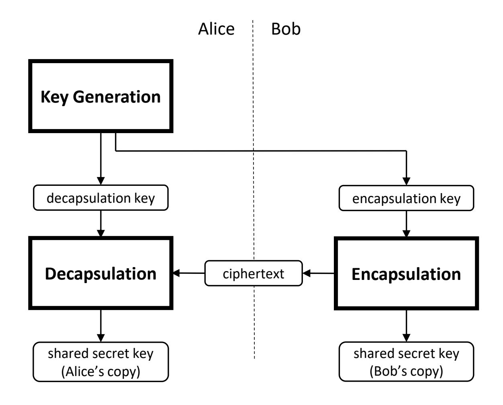

**Fig. 1.** Outline of key establishment using a KEM

termeasures (i.e., does not satisfy condition 2) or is deployed on a device with physical vulnerabilities (i.e., does not satisfy condition 3) is likely to be insecure in practice.

**History and development.** KEMs were first introduced by Cramer and Shoup [\[11,](#page-52-0) [12\]](#page-52-1) as a building block for constructing highly efficient public-key encryption (PKE) schemes. Their approach combines a KEM with a data encryption mechanism (DEM), which is simply a symmetric-key encryption scheme. The KEM is used to generate a shared secret key, while the DEM is used to encrypt an arbitrarily long stream of messages under that key. This is commonly referred to as the KEM/DEM paradigm (see the HPKE example in Sec. [5.2.1\)](#page-42-2). This approach to constructing highly efficient public-key encryption has been the subject of several standards [\[1,](#page-51-0) [2,](#page-51-1) [11,](#page-52-0) [13–](#page-52-2)[16\]](#page-52-3). Most recently, KEMs have attracted significant attention due to most of the post-quantum key-establishment candidates in the NIST PQC standardization process being KEMs. This ongoing process has produced one KEM standard so far — ML-KEM in FIPS 203 [\[3\]](#page-51-2) — with more KEM standards likely to follow.

#### **2.2. Basic Definitions and Examples**

Thissection establishesthe basic definitions and properties of KEMs. Note that probabilistic algorithms require randomness, while deterministic algorithms do not.

**Definition 1.** *A KEM denoted by* Π *consists of the following four components:*

*1.* Π.ParamSets *(parameters): A collection of parameter sets*

{13}------------------------------------------------

- *2.* Π.KeyGen *(key-generation algorithm): An efficient probabilistic algorithm that accepts a parameter set p* ∈ Π.ParamSets *as input and produces an encapsulation key* ek *and a decapsulation key* dk *as output*
- *3.* Π.Encaps *(encapsulation algorithm): An efficient probabilistic algorithm that accepts a parameter set p* ∈ Π.ParamSets *and an encapsulation key* ek *as input and produces a shared secret key K and a ciphertext c as output*
- *4.* Π.Decaps *(decapsulation algorithm): An efficient deterministic algorithm that accepts a parameter set p* ∈ Π.ParamSets*, a decapsulation key* dk*, and a ciphertext c as input and produces a shared secret key K* 0 *as output*

As this section views KEMs purely as mathematical objects, the labels *p*, ek, dk, *c*, *K*, and *K* 0 in Definition [1](#page-12-2) are viewed as abstract variables that represent, for example, numbers or bit strings. In implementations, these variables will be represented with concrete data types (see Sec. [3\)](#page-18-0).

In general, Definition [1](#page-12-2) only requiressome very basic propertiesfrom the four components that make up a KEM (see Example 1 below). In order to be useful and secure, a KEM should fulfill a number of additional properties. The first such property is *correctness* of the KEM algorithm. Correctness ensuresthat, in an idealsetting, the processin Fig. [1](#page-12-1) almost always produces the same shared secret key value for both parties.

**Definition 2.** *The key-encapsulation correctness experiment for a KEM* Π *and parameter set p* ∈ Π.ParamSets *consists of the following three steps:*

1. 
$$(ek, dk) \leftarrow \Pi$$
. Key $Gen(p)$  (perform key generation) (1)

2. 
$$(K,c) \leftarrow \Pi$$
. Encaps $(p, ek)$  (perform encapsulation) (2)

3. 
$$K' \leftarrow \Pi$$
. Decaps $(p, dk, c)$  (perform decapsulation) (3)

*The KEM* Π *is correct if, for all p* ∈ Π.ParamSets*, the correctness experiment for p results in K* = *K* 0 *with all but negligible probability.*

Recallthat Π.KeyGen and Π.Encaps are probabilistic algorithms. When they are invoked as above (i.e., Π.KeyGen with only a parameterset asinput, and Π.Encaps with only a parameter set and encapsulation key as input), it is implied that their randomness is generated internally and uniformly at random. If one wishes to explicitly refer to the randomness used by these algorithms, then the following expressions can be used:

Key generation (using randomness 
$$r$$
):  $(ek, dk) \leftarrow \Pi.KeyGen(p; r)$  (4)

Encapsulation (using randomness s): 
$$(K,c) \leftarrow \Pi$$
. Encaps $(p,ek;s)$  (5)

These expressions can, for example, refer to the process of re-expanding a key pair(ek,dk) by running KeyGen using a stored seed *r*.

The following two simple but instructive examples show abstract KEMs that satisfy Definition [1](#page-12-2) and Definition [2.](#page-13-0)

{14}------------------------------------------------

**Example 1: Simple but insecure.** As the following example shows, a correct and efficient KEM can still be completely insecure. Define a KEM DONOTUSE as follows:

- DONOTUSE.ParamSets: Contains a single, empty parameter set
- DONOTUSE.KeyGen: On randomness *r*, outputs dk := *r* and ek := *r*
- DONOTUSE.Encaps: On input ek and randomness *s*, outputs *K* := *s* and *c* := *s*
- DONOTUSE.Decaps: On input dk and *c*, outputs *K* 0 := *c*

While DONOTUSE is obviously a correct KEM since *K* 0 always equals *K*, it is also completely insecure since the shared secret key *K* is transmitted in plaintext. This shows that a KEM needs to satisfy additional properties in order to be secure (see Sec. [2.3\)](#page-15-0).

**Example 2: Key transport using PKE.** The following is a simple construction of a KEM from any PKE scheme. A PKE scheme consists of a collection PKE.ParamSets of parameter sets and three algorithms: key generation PKE.KeyGen (that accepts a parameter set), encryption PKE.Encrypt (that accepts a parameter set, an encryption key, and a plaintext), and decryption PKE.Decrypt (that accepts a parameter set, a decryption key, and a ciphertext). One can construct a KEM KEMFROMPKE from the PKE scheme as follows:

- KEMFROMPKE.ParamSets = PKE.ParamSets
- KEMFROMPKE.KeyGen = PKE.KeyGen
- KEMFROMPKE.Encaps: On input *p*, ek and randomness *s*, output key *K* := *s* and ciphertext *c* ← PKE.Encrypt(*p*, ek,*s*).
- KEMFROMPKE.Decaps: On input *p*, dk, and *c*, output key*K* 0 := PKE.Decrypt(*p*,dk, *c*).

The efficiency, correctness, and security properties of KEMFROMPKE depend on the respective properties of PKE.

**KEM examples.** Section [5.1](#page-40-1) briefly discusses three additional examples of KEMs:

- 1. ECDH-KEM is a quantum-insecure KEM based on ECDH key exchange (see Sec. [5.1.1\)](#page-40-2).
- 2. RSASVE-KEM is a quantum-insecure example of RSA key transport (see Sec. [5.1.2\)](#page-41-0).
- 3. ML-KEM is a lattice-based, NIST-**approved** post-quantum KEM (see Sec. [5.1.3\)](#page-42-0).

ECDH-KEM and RSASVE-KEM are based on NIST-standardized key-establishment schemes that can easily be viewed as KEMs. ML-KEM is the first key-establishment scheme to be standardized by NIST directly as a KEM.

**A remark on key transport and key agreement.** There are various ways to categorize twoparty key-establishmentschemes. One particular categorization distinguishes between *key agreement* and *key transport*. In key agreement (e.g., a Diffie-Hellman key exchange), both parties contribute information that influences the final shared secret key so that neither 

{15}------------------------------------------------

party can predetermine it. In key transport (e.g., RSA-OAEP [\[2\]](#page-51-1)), one party selects the key and then transmits it (in some form) to the other party.

Depending on the internalstructure of the encapsulation function, a KEM could be viewed as either a key-agreement scheme or a key-transport scheme. For example, the shared secret key in ML-KEM [\[3\]](#page-51-2) is a function of both the randomness provided by Bob and the (randomly generated) encapsulation key of Alice. Therefore, ML-KEM could be viewed as a key-agreementscheme. However, asthe example KEMFROMPKE shows, the encapsulation operation in a KEM might simply consist of Bob generating the shared secret key and then encrypting it, which is key transport.

An application can achieve a particular type of key establishment (i.e., key agreement or key transport) using any KEM by taking appropriate additional steps using standard symmetric-key cryptography techniques. That is, given a KEM Π, Alice and Bob can achieve key agreement by both executing Π.KeyGen,sending the encapsulation keysto each other, and completing the steps of key establishment using a KEM. This will result in two separate shared secret keysthat can be combined using an appropriate key-derivation method. Conversely, Π can be used to achieve key transport by following the steps in Fig. [7](#page-43-1) and replacing *m* with the shared secret key produced by Π.

#### **2.3. Theoretical Security of KEMs**

This section discusses the theoretical security of KEMs. Section [3](#page-18-0) discusses KEM implementation security, and Sec. [4.2](#page-24-0) discusses the secure deployment of KEMs.

**Semantic security.** Informally speaking, a secure key-establishment procedure produces a shared secret key *K* that is uniformly random and unknown to adversaries. This property should hold despite the fact that adversaries can freely observe the messages transmitted by Alice and Bob. In the case of KEMs, the encapsulation key ek and ciphertext *c* should reveal no information about the resulting shared secret key *K* or the decapsulation key dk. Moreover, even adversaries who somehow learn some partial information (e.g., if the first half of *K* is accidentally leaked)should not be able to combine that information with ek and *c* to learn more (e.g., the last bit of *K*). This informal notion of security can be rigorously formalized, and the resulting definition is called *semantic security* [\[17\]](#page-52-4).

**Passive adversaries and IND-CPA.** The formal way to define semantic security for KEMs involves an imaginary "ciphertext indistinguishability" experiment (see Fig. [2\)](#page-16-0). In this experiment, an adversary is given an encapsulation key ek, a ciphertext *c*, and either the true shared secret key underlying *c* or a freshly generated random string. The adversary's goal is to distinguish between these scenarios, and they are free to use ek to generate their own encapsulations to help them in this task. This experiment is called "indistinguishable under chosen-plaintext attack" (IND-CPA) [\[17\]](#page-52-4).

{16}------------------------------------------------

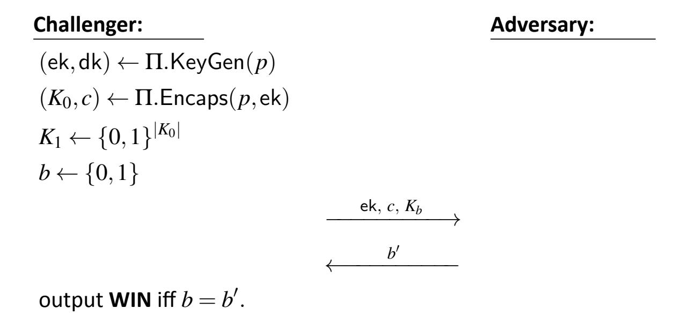

Fig. 2. The IND-CPA security experiment for a KEM  $\Pi$ 

**Definition 3** (IND-CPA, informal). A KEM  $\Pi$  has indistinguishable ciphertexts (or is IND-CPA) if, for every computationally bounded adversary  $\mathcal{A}$ , the difference between the probability that  $\mathcal{A}$  wins the experiment IND-CPA[ $\Pi$ ] and 1/2 is negligible.

In the IND-CPA experiment, the adversary is free to study the encapsulation key ek and the ciphertext c in order to identify whether  $K_b$  is the true key. However, the adversary is not capable of actively interfering with the challenger's use of the decapsulation key. As a result, IND-CPA only captures security against *passive* adversaries (i.e., eavesdroppers).

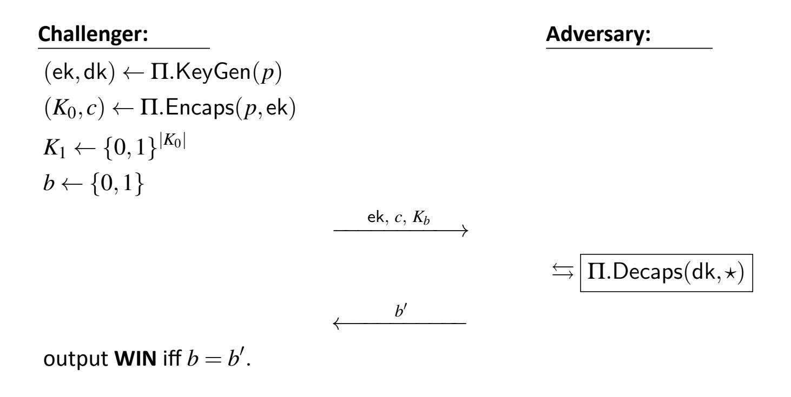

**Fig. 3.** The IND-CCA security experiment for a KEM  $\Pi$ 

**Active adversaries and IND-CCA.** Real-world experience indicates that adversaries can sometimes actively interfere with key-establishment processes and use this ability to uncover the shared secret key. For example, an active adversary may be able to convince an

{17}------------------------------------------------

honest user to decapsulate some ciphertexts of the adversary's choosing. In such a scenario, it is natural to ask whether *other* ciphertexts are still protected. In this setting, IND-CPA security is insufficient. Instead, one must consider security against so-called chosen-ciphertext attacks (CCA)3 [17].

The IND-CCA $[\Pi]$  experiment for a KEM  $\Pi$  is described in Fig. 3. It is similar to the IND-CPA experiment, except that the adversary is now also granted "black-box oracle access" to the decapsulation function  $c \mapsto \Pi.\mathsf{Decaps}(p,\mathsf{dk},c)$ . This means that the adversary is allowed to submit ciphertexts  $c^*$  that they generate and get the response  $K^* \leftarrow \Pi.\mathsf{Decaps}(p,\mathsf{dk},c^*)$ . The only restriction is that they cannot submit the actual ciphertext c produced by the challenger since that would make the game trivial to win for any KEM.

**Definition 4** (IND-CCA, informal). A KEM  $\Pi$  is IND-CCA if, for every computationally bounded adversary  $\mathcal{A}$ , the difference between the probability that  $\mathcal{A}$  wins the experiment IND-CCA[ $\Pi$ ] and 1/2 is negligible.

ML-KEM, the first post-quantum KEM standardized by NIST, is believed to satisfy IND-CCA security [3].

&lt;sup>3IND-CCA as used here is typically referred to as IND-CCA2 in cryptographic literature.

{18}------------------------------------------------

#### **3. Requirements for Secure KEM Implementations**

As discussed in Sec. [2.1,](#page-11-1) a KEM (as a mathematical object) should satisfy both correctness (Definition [2\)](#page-13-0) and an appropriate notion of security (Definition [3](#page-16-2) or Definition [4\)](#page-17-1). In order for such a KEM to be used in real-world applications, it needs to be implemented in actual code as part of a cryptographic module. The quality of the resulting implementation has a dramatic impact on usability and security in real-world applications.

The following subsections detail requirements for cryptographic modules that implement **approved** KEMs. However, adherence to these requirements does not guarantee that a given implementation will be secure. For a discussion of requirements for applications that make use of a KEM cryptographic module, see Sec. [4.2.](#page-24-0)

#### **3.1. Compliance With NIST Standards and Validation**

Conforming implementations of **approved** KEMs are required to comply with the requirements outlined in this section as well as all other applicable NIST standards. In addition, such implementations are required to use only **approved** cryptographic elements and pass FIPS-140 validation.

**Implementing according to NIST standards.** Implementations **shall** comply with a specific NIST FIPS or SP that specifies the algorithms of the relevant KEM. For example, a conforming implementation of ML-KEM **shall** comply with FIPS 203 [\[3\]](#page-51-2). Each FIPS or SP that specifies a KEM will have special requirements for the particular scheme in question, including specifications for all algorithms and parameter sets of the relevant KEM. In particular, concrete data types will be specified for the parameter sets, keys, ciphertexts, and shared secret keys (Definition [1\)](#page-12-2) of the relevant KEM. Assurance of parameter validity is obtained by checking the lists of **approved** parameters in the appropriate publication.

The requirements in any FIPS or SP that standardizes a particular KEM are in addition to the general requirements described in this section. Any implementations **shall** follow the guidelines given in FIPS 140-3 [\[5\]](#page-51-4) and associated implementation guidance.

**Approved cryptographic elements.** KEMs commonly make use of other cryptographic elements, such as RBGs and hash functions (see Appendix [D\)](#page-63-0). Typically, the security of a system consisting of multiple cryptographic elements is at best as secure as the weakest element. When not already specified by the KEM parameter set, KEM implementations **shall** use **approved** cryptographic elements with security strengthsthat meet or exeed the required strength for each KEM parameter set. The security strength of the selected parameter set**should** be at least the desired security strength of the application. In addition, random bits **shall** be generated using **approved** techniques, as described in the latest revisions of SP 800-90A, SP 800-90B, and SP 800-90C [\[6–](#page-51-5)[8\]](#page-51-6). For using randomness in key generation, see SP 800-133 [\[18\]](#page-52-5).

{19}------------------------------------------------

**Testing and validation.** Mistakes in implementations can easily lead to security vulnerabilities or a loss of usability. Therefore, it is crucial that implementations are validated for conformance to NIST cryptographic standards and FIPS 140 by the Cryptographic Algorithm Validation Program (CAVP) and CMVP. Validation testing checks whether a given implementation correctly computes the desired output for only a small number of (often randomly sampled) inputs. This means that validation testing does not guarantee correct functioning on all inputs, which is often impossible to ensure. Nonetheless, implementations must correctly implement the mathematical functionality of the target KEM. As validation only tests input-output behavior, implementations need not follow the exact stepby-step algorithmic specificationsin the NIST standard thatspecifiesthe relevant KEM. Any implementation that produces the correct output for every input will pass validation.

Requiring equivalence only at the level of input-output functionality (e.g., rather than in terms of step-by-step behavior) is desirable, as different implementations can then be optimized for different goals. For example, some implementations will focus on maximizing efficiency, while other implementations will employ numerous side-channel and leakage protection techniques.

#### **3.2. Managing Cryptographic Data**

KEM implementations need to manage all cryptographic data appropriately, including data used during the execution of KEM algorithms (i.e., intermediate values) and data at rest (e.g., decapsulation key). As a cryptographic module has no control over data that exists outside of the module (e.g., while in transit from one module to another), such data is not discussed here. However, a cryptographic module can exert control over what data it outputsto the outside world (e.g., by ensuring correct implementations of all functions). It can also exert control over what data it acceptsfrom the outside world (e.g., by performing appropriate input-checking and importing).

In general, cryptographic data needs to be destroyed as soon as it is no longer needed. Some examplesinclude destroying intermediate computation values at the end of an algorithm, destroying the randomness generated by RBGs after encapsulation, and destroying keys after all relevant communication sessions are completed.

**Input checking.** The correct and secure operation of cryptographic operations depends crucially on the validity of the provided inputs. Even relatively benign faults, such as accepting an input that is too long or too short, can have serious security consequences. KEM implementations need to perform input checking in an appropriate manner for all KEM algorithms (i.e., KeyGen, Encaps, and Decaps). The exact form of the required input checking is described in the FIPS or SP that specifies the relevant KEM.

Sometimes, an input will not need to be checked. Instead, the implementer can acquire assurance that the input was validly generated or has already been checked, as in the following cases:

{20}------------------------------------------------

- 1. If the cryptographic module generated an input internally using an algorithm that ensures validity and stored that input in a manner that prevents modification, then the module is not required to check that input. For example, if the module generated a decapsulation key dk viaKeyGen and then stored dk in a mannerthat prevents modification, then the module can later invoke Decaps directly on dk without performing any input checking.
- 2. If the cryptographic module checks an input once and stores that input in a manner that prevents modification, then the module is not required to check that input again. For example, if the module performed input-checking on a given encapsulation key ek and stored it in a manner that prevents modification, then the module may invoke Encaps directly on ek (even repeatedly) without performing any further input checking.
- 3. If the cryptographic module imports the relevant input from a trusted third party (TTP), and the TTP can provide assurance thatthe input does not need input-checking, and the module stores that input in a manner that prevents modification, then the module is not required to check the input.

**Intermediate values.** All intermediate values used in any given KEM algorithm(i.e.,KeyGen, Encaps, Decaps) **shall** be destroyed before the algorithm terminates. However, there are two exceptions to this rule:

- 1. A random seed used for key generation may be stored as private data forthe purpose of recomputing the same key pair at a later time.
- 2. Data that can be easily computed from public information (e.g., from the encapsulation key) may be stored as public data to improve efficiency.

When values are stored under either of these exceptions, the storage needs to be performed according to the rules for data at rest.

The outputs of a KEM algorithm are not considered to be intermediate values and will thus not be immediately destroyed in typicalsituations. The format in which outputs and inputs are stored depends on the implementation (see the discussion of data formats below.)

**Data at rest.** A cryptographic module that implements a KEM needs to maintain certain data at rest. This can include both private data (e.g., seeds, decapsulation keys) and public data (e.g., encapsulation keys). In general, private data needsto be stored within the cryptographic module in a manner that is secure against both leakage and unauthorized modification. Private data needs to be destroyed as soon as it is no longer needed. The import and export of private data (e.g., seeds, decapsulation keys, shared secret keys) needs to be performed in a secure manner. In general, public data stored within the cryptographic module needs to be stored in a manner that is secure against unauthorized modification [\[5,](#page-51-4) [19\]](#page-52-6).

{21}------------------------------------------------

**Data formats, import, and export.** FIPS validation tests input and output the behavior of relevant KEM algorithms using a specific data format. Typically, this format is byte arrays that contain the inputs and outputs described in the FIPS or SP that specifies the relevant KEM. This format is required for testing but is not a requirement for internal storage, data import, or data export. A given cryptographic module may choose to store, import, or export data (whether sensitive or not) using other formats. The desired format can vary significantly depending on the application. For example, some applications might call for storing keys using only a short seed, while other applications might call for storing keys in an expanded format that allows for faster computations. In any case, the storage, import, and export ofsensitive data needsto be performed securely, regardless of the chosen data format.

#### **3.3. Additional Requirements**

The following are additional requirements for cryptographic modules that implement **approved** KEMs.

**Failures and aborts.** Any of the KEM algorithms (i.e., KeyGen, Encaps, Decaps) and their cryptographic elements (e.g., DRBGs, hash functions) can potentially fail or abort. This could be a result of normal KEM operations (e.g., decapsulating a ciphertext that was corrupted by the environment during transmission), a hardware or software failure (e.g., a failed DRBG execution due to a memory fault), or an adversarial attack. Implementers need to take precautions to ensure that the cryptographic module handles failures and aborts appropriately. In particular, leaking information about failures and aborts outside of the perimeter of the cryptographic module **should** be avoided.

**Side-channel protection.** Cryptographic modules for KEMs **should** be designed with appropriate countermeasures against side-channel attacks. This includes protecting against timing attacks with constant-time implementations and protecting memory from leakage. Universal guidelines are unlikely to be helpful as exposure to side-channel attacks varies significantly with the desired application, and countermeasures are often costly.

{22}------------------------------------------------

#### **4. Using KEMs Securely in Applications**

This section describes how to deploy a KEM in real-world applications in a manner that is useful and secure, assuming that the KEM under discussion satisfies an appropriate notion of theoreticalsecurity (see Sec. [2.3\)](#page-15-0) and has been securely implemented in a cryptographic module (see Sec. [3\)](#page-18-0).

#### **4.1. How to Establish a Key With a KEM**

This section describes how a KEM can be used to establish a shared secret key between two parties. The description will go into greater detail than the brief outline in Sec. [2.1.](#page-11-1) However, since KEMs are highly flexible and can be used in a wide range of applications and contexts, no single description can account for all variations. Section [5](#page-40-0) provides more detailed examples of special cases of key establishment using a KEM.

For simplicity of exposition, the two parties in the key establishment process will be referred to as Alice and Bob. It is assumed that Alice and Bob are communicating over a single bidirectional channel and will only use that channel to transmit data to each other.

The key-establishment process using a KEM Π proceeds as follows:

- 1. **Preparation.** Before key establishment can begin, a parameterset *p* ∈ Π.ParamSets needs to be selected. Depending on the application, *p* may be selected by Alice, by Bob, or through an interactive negotiation between Alice and Bob. The choice of the KEM Π itself could also be made at this stage.
- 2. **Key generation.** Alice begins by running the key-generation algorithm in her cryptographic module:

$$(\mathsf{ek}_A,\mathsf{dk}_A) \leftarrow \Pi.\mathsf{KeyGen}(p)$$
. (6)

During the execution ofKeyGen, Alice's module internally generates private randomness using an appropriate RBG. Alice then transmits ek*A* to Bob and keeps dk*A* private.

3. **Encapsulation.** Bob receives ek*A* from Alice and usesit to execute the encapsulation algorithm in his cryptographic module:

$$(K_B, c_B) \leftarrow \Pi.\mathsf{Encaps}(p, \mathsf{ek}_A).$$
 (7)

During the execution of Encaps, Bob's module internally generates private randomness using an appropriate RBG. Bob then transmits *cB* to Alice and keeps *KB* private.

4. **Decapsulation.** Alice receives *cB* from Bob and runs the decapsulation algorithm in her module using her decapsulation key and Bob's ciphertext:

$$K_A \leftarrow \Pi.\mathsf{Decaps}(\mathsf{dk}_A, c_B)$$
 (8)

Alice keeps *KA* private.

{23}------------------------------------------------

5. **Using the shared secret key.** Ifthe appropriate conditions are satisfied (see Sec. [4.2\)](#page-24-0), then *KA* will equal *KB* and can be used by Alice and Bob for any symmetric-key cryptographic protocol. A typical choice isto use *KA* = *KB* asthe key for an authenticated encryption scheme (e.g., AES-GCM [\[9\]](#page-51-7)), thereby establishing a communication channel between Alice and Bob that satisfies both confidentiality and integrity.

Figure [4](#page-23-0) depicts the high-level stages of this process. Note that some desirable security properties might not be achieved by a protocol of this form and may require additional steps and ingredients.

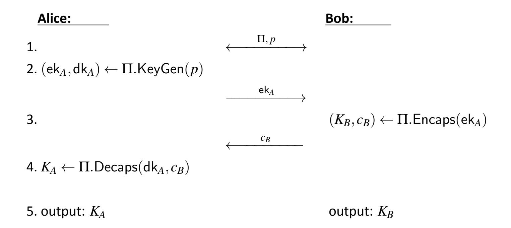

**Fig. 4.** Simple key establishment using a KEM 

**Additional considerations.** Steps 1-5 in the key-establishment process might need to be modified, depending on the security and functionality needs of the application. Some common modifications are as follows.

*Static versus ephemeral key pairs.* Consider an application in which Alice independently decides on a parameter set, performs key generation, and publishes the resulting encapsulation key ek*A*. Alice might then accept many connections from multiple parties over a long period of time, each initiated via ek*A*. Each such connection would follow stages 3-5 described above. While the other party in each connection would always encapsulate with ek*A*, each ciphertext is generated with new randomness and only applicable to the connection between Alice and that party. In this scenario, Alice's encapsulation key is said to be *static*.

In other applications, Alice might want to use a particular key pair to establish only a single connection (e.g., as part of a protocol that ensures forward secrecy). In that case, she will perform key generation, send her encapsulation key ek*A* to Bob, and discard ek*A* once the connection with Bob is established. In this scenario, Alice's encapsulation key is said to be *ephemeral*.

{24}------------------------------------------------

*Authentication.* In most applications, some form of authentication and cryptographic integrity checking is required (e.g., to prevent "machine-in-the-middle" attacks). Assuring this is highly application-dependent and typically requires additional cryptographic elements,such as digitalsignatures and certificates. Section [5.2.4](#page-46-0) and Sec. [5.2.3](#page-45-0) provide some illustrative examples.

*Using the shared secret key.* In some applications, Alice and Bob will use *KA* and *KB* directly as symmetric keys as soon as the decapsulation and encapsulation stages are successfully completed, respectively. If *KA* 6= *KB*, a failure in the desired symmetric-key functionality will likely follow. For other applications, Alice and Bob might need to first post-process *KA* and *KB* appropriately and then use the results of that post-processing step — if successful — as their symmetric keys. This post-processing might include key derivation steps that securely produce multiple symmetric keys from the initial shared secret key (see Sec. [4.3\)](#page-26-0). It might also include key confirmation steps to confirm that *KA* = *KB* and reject them otherwise (see Sec. [4.4\)](#page-27-0). In some cases, key confirmation might also involve performing additional computations during the encapsulation and decapsulation stages to reduce the number of communication rounds.

#### **4.2. Conditions for Using KEMs Securely**

This section discusses general requirements for securely using **approved** KEMs in applications. As discussed in point 1 below, the firststep involvesselecting an **approved** KEM that has been implemented in a validated cryptographic module (see Section [3\)](#page-18-0). Deploying such a cryptographic module in applications entails a number of additional requirements that are outlined below. Adherence to these requirements does not guarantee that the relevant KEM application will be secure. The overall requirements fall into four general categories: KEM algorithm security, device security, channel security, and key usage security.

1. **KEM algorithm security:** The selected KEM Π is **approved**, appropriate for the application, and implemented and deployed in a secure manner.

Being an **approved** KEM, Π will satisfy correctness (Definition [2\)](#page-13-0) and either IND-CPA or IND-CCA security (see Section [2.3\)](#page-15-0). Whenever possible, IND-CCA-secure KEMs **should** be used. For some specific applications (e.g., ephemeral key establishment), IND-CPA security might be sufficient.

*Cryptographic module implementation.* The implementations of Π used by Alice and Bob need to satisfy the requirements in Sec. [3.](#page-18-0) Whether a given implementation is sufficiently secure is an application-dependent question. For example, an implementation might be secure enough for use on a web server in a physically secure location but have insufficientside-channel protectionsfor use on an embedded device.

{25}------------------------------------------------

*Parameter set selection.* A parameter set of Π with application-appropriate security strength **must** be selected.

*KEM key-pair usage.* If an application uses an ephemeral key pair, the key pair **shall** be used for only one execution of key-establishment via a KEM and **shall** be destroyed as soon as possible after its use.

If an encapsulating party obtains the static encapsulation key of another party, it **must** have assurance of the other party's ownership of the key before or during the execution of key-establishment. This assurance can be obtained from a trusted party (e.g., a certificate authority) or a combination of proof of possession (see Sec. [4.5\)](#page-31-0) and verification of real-world identity.

2. **Device security:** The devices used to execute KEM algorithms and store any sensitive data (e.g., decapsulation keys) **must** be appropriately secured.

*Physical protection.* Devices need to be appropriately protected against attacks (see [\[19,](#page-52-6) Section 5]). This includes protection against leakage, physical intrusion, remote access, and corruption.

*Secure storage.* Devices need to provide appropriate secure storage for sensitive data (e.g., KEM keys, seeds, shared secret keys, any derived keys) and destroy that data when required by the cryptographic module (see Sec. [3.2\)](#page-19-0). For further guidelines on key storage considerations, see SP 800-57pt1 [\[19\]](#page-52-6) and SP 800-152 [\[10,](#page-51-8) Section 2.2].

3. **Channel security:** The key-establishment process that takes place over the channel used by Alice and Bob **must** satisfy an application-appropriate notion of integrity.

*Preestablished versus simultaneous.* Ensuring the integrity of the key-establishment process could be achieved by first ensuring the integrity of the channel and then performing key establishment. More commonly, integrity is assured simultaneously with key establishment by augmenting the key-establishment process with additional steps and checks (see, e.g., Section [5.2.3\)](#page-45-0).

*Unilateral versus bilateral authentication.* For some applications, only one of the parties is assured of the other's identity and the integrity of their messages. This is commonly called a unilaterally authenticated key exchange (see Sec. [5.2.3\)](#page-45-0). In other applications, both Alice and Bob require assurances of the other party'sidentity and the integrity of their messages. This is commonly called a bilaterally authenticated key exchange.

*Secure authentication algorithms.* For all applications, the cryptographic algorithms (e.g., digital signature algorithms) and other elements (e.g., certificates) required to establish channel integrity need to be selected and deployed securely.

{26}------------------------------------------------

4. **Shared-secret-key usage security:** The shared secret key produced by the KEM is used appropriately and securely.

*Shared-secret-key processing andmanagement.* Key-derivation and key-confirmation steps are performed appropriately, as required by the application (see Sec. [4.3](#page-26-0) and [4.4\)](#page-27-0). Each shared secret key and any derived keys are destroyed as soon as they are no longer needed (see Sec. [4.2\)](#page-24-0).

*Secure symmetric-key algorithms.* The KEM shared secret key and any derived keys **should** only be used with appropriately secure symmetric-key cryptographic algorithms. In particular, the security of the symmetric-key algorithms used is appropriate for the security provided by the KEM so that the combined algorithm (consisting of key establishment followed by symmetric cryptography operations) fulfillsthe desired security properties.

#### **4.3. Post Processing of the Shared Secret Key**

Certain key-establishment schemes (e.g., Diffie-Hellman key exchange) can be viewed as first generating a shared secret and then performing a key-derivation step that transforms the shared secret into one or more shared secret keys. In contrast, KEMs by definition output a key *K* that is ready to use.

Key derivation may be required for applications in which the amount of keying material needed does not match the output size of the KEM algorithm (i.e., the length of shared secret key *K*).

Asspecified in SP 800-108 [\[20\]](#page-52-7), key derivation consists of applying a *key-derivation method* (KDM)to a *key-derivation key*. A KDM is an algorithmfortransforming a given key-derivation key (possibly with some other data) into keying material (e.g., a list of keys).

If additional keying material is needed, a KDM can be used to expand*K*. If keys with lengths lessthan*K* are needed, a KDM may be used, orthe shared secret key*K* can be used directly as keying material by:

- Truncating *K* or
- Parsing *K* into non-overlapping segments to derive shorter keys.

The derived shorter key is considered a shared secret key if *K* was a shared secret key. The security strength of any derived shorter key is the minimum of the security strength of *K*, the length of the derived key, and the strength of any KDM used.

When key derivation for a KEM Π is needed, the shared secret key output by Π (i.e., as an output of Π.Encaps or Π.Decaps) may be used as a key-derivation key supplied to an **approved** key-derivation method specified in SP 800-108 [\[20\]](#page-52-7), SP 800-56C [\[21\]](#page-52-8), or SP 800- 133 [\[18\]](#page-52-5). If a KDM from SP 800-56C is used, the shared secret key of the KEM is used as 

{27}------------------------------------------------

an input to the KDM in place of the shared secret. A key derivation step is included in the example protocol in Sec. [5.2.3.](#page-45-0)

#### **4.4. Key Confirmation**

Key confirmation (KC)refersto the actionstaken to provide assurance to one party (i.e., the key-confirmation recipient) that another party (i.e., the key-confirmation provider) possesses matching keying material. In the case of KEMs, this confirmation is done for keying material that was produced by encapsulation and/or decapsulation.

Key confirmation **should** be used during KEM usage, as it may enhance the security properties of the overall key-establishment process. Confirming successful establishment of the shared secret key can also address potential errors in transmission or decapsulation. Key confirmation can also act as a proof of possession (see Sec. [4.5\)](#page-31-0). While this section includes a description of an explicit process, key confirmation can be accomplished in a variety of other ways. For example, successful use of the shared secret key for authenticated encryption can act as key confirmation.

Key confirmation is typically achieved by exchanging a value that can only be calculated correctly with very high probability if the key establishment was successful. Some common protocols perform key confirmation in a manner that is integrated into the steps of the protocol. For example, bilateral key confirmation is provided during a TLS handshake protocol by the generation and verification of a message authentication code (MAC) over all previous messages in the handshake using a symmetric MAC key that was established during the handshake.

In some circumstances, it may be appropriate to perform key confirmation by including dedicated key-confirmation steps in a key-establishment scheme. An acceptable method for providing key confirmation during a key-establishmentscheme involvesthe KC provider calculating a MAC tag on MAC\_Data and sending the MAC tag to the KC recipient for confirmation of the provider's correct calculation of the shared secret key. Unilateral key confirmation is provided when only one of the partiesserves asthe key-confirmation provider. If mutual key confirmation is desired (i.e., bilateral key confirmation), then the parties swap roles for the second KC process, and the new provider (i.e., the previous recipient) sends a MAC value on a different data string (i.e., different MAC\_Data) to the new recipient (i.e., the previous provider).

This recommendation makes no statement as to the adequacy of other methods.

**Key-confirmation key.** The key-confirmation steps specified in this recommendation can be incorporated into any scheme using a KEM to establish a shared secret key. To perform key confirmation, a dedicated KC key will be determined from the shared secret key produced by the KEM. The KC provider will use the KC key with an **approve**d MAC algorithm to create a MAC tag on certain data and provide the tag to the KC recipient. The KC recipient

{28}------------------------------------------------

will then obtain the KC key from their copy of the shared secret key produced by the KEM and use it to verify the MAC tag.

#### **4.4.1. Creating the MAC Data**

During key confirmation, the KC provider creates a message with a MAC tag that is computed on MAC\_Data that contains context-specific information. The MAC\_Data is formatted as follows:

$$\mathsf{MAC\_Data} = \mathsf{KC\_Step\_Label} \, \| \, \mathsf{ID}_P \, \| \, \mathsf{ID}_R \, \| \, \mathsf{Eph}_P \, \| \, \mathsf{Eph}_R \, \| \, \mathsf{Extra}_P \, \| \, \mathsf{Extra}_R \,$$

- KC\_Step\_Label is a six-byte character string that indicates that the MAC\_Data is used for key confirmation, whether the MAC\_Data is used for the first or second key-confirmation message, and the party serving as the KC provider, either the encapsulator(E) or decapsulator(D). The four valid options are "KC\_1\_E", "KC\_2\_E", "KC\_1\_D", or "KC\_2\_D". As an example, "KC\_1\_D" indicates that the decapsulator (D) is the KC provider and sends the first KC message. "KC\_2\_E" could then be used by the encapsulator (E) to provide bilateral key confirmation.
- ID*P* and ID*R* are the identifiers used to label the KC provider and recipient, respectively.
- Eph*P* and Eph*R* are ephemeral data provided by the KC provider and recipient, respectively. The encapsulator's ephemeral data is the ciphertext. The decapsulator's ephemeral data is the encapsulation key ek if ek is ephemeral. Otherwise, the decapsulator's ephemeral data **shall** be a nonce with a bitlength thatis atleast equalto the targeted security strength of the KEM key-establishment process (see Appendix [C.2\)](#page-61-0).

When a nonce is used during key confirmation, it needs to be provided to the encapsulator to construct MAC\_Data for MAC tag generation or verification.

• Extra*P* and Extra*R* are optional additional data provided by the KC provider and recipient, respectively. This could include additional identifiers, values computed during the key-establishment process but nottransmitted, or any otherinformation that the party wants to include. This information can be known ahead of time by both parties or transmitted during key confirmation.

The MAC algorithm and KC\_Key used **shall** have security strengths equal to or greater than the desired security strength of the application. See Appendix [C.1](#page-60-1) for permitted MAC algorithms and further details.

#### **4.4.2. Obtaining the Key-Confirmation Key**

In order to create and validate the MAC tag for the created MAC\_Data, the parties create a dedicated key-confirmation key (KC\_Key). This can be either a portion of the KEM 

{29}------------------------------------------------

shared secret key or part of the keying material derived from the KEM shared secret key when using a derivation function (see Sec. [4.3\)](#page-26-0). The KC\_Key **shall** only be used for key confirmation and destroyed after use. See Appendix [C.1](#page-60-1) for KC\_Key lengths.

**When a derivation function is used.** After computing the shared secret value and applying the key-derivation method to obtain the derived keying material Derived\_Keying\_Material, the key-confirmation provider uses agreed-upon bit lengths to parse Derived\_Keying\_Material into two parts — the key-confirmation key (KC\_Key) and the keys to subsequently protect data (Data\_Key):

$$Derived_Keying_Material = KC_Key||Data_Key.$$

**When a derivation function is NOT used.** The key-confirmation provider parsesthe output of the encapsulation process (i.e., KEM\_shared\_secret\_key) into KC\_Key and Data\_Key:

$$KEM\_shared\_secret\_key = KC\_Key || Data\_Key.$$

#### **4.4.3. Key-Confirmation Example**

The key-confirmation process can be achieved in multiple ways. The following example showcases unilateral key confirmation from the encapsulator to the decapsulator, which can be used for a client(e.g., Alice)requesting confirmation ofsuccessful key establishment from a server (e.g., Bob). Figure [5](#page-30-0) shows this process. Some desirable security properties might not be achieved by a protocol of this form and may require additional steps and ingredients.

- 1. Alice (i.e., decapsulating party) generates a set of ephemeral keys (ek,dk) for KEM Π under the agreed parameter set *p*. Alice then sends ek, Alice's identifying string (ID*A*), and any extra data Extra*A* to include in the key confirmation to Bob (i.e., encapsulating party).
- 2. Bob performs encapsulation with the received ek to generate ciphertext *c* and initial key *KB*0. Bob then derives two keys from *KB*0: a key-confirmation key *KBkc* to perform key confirmation and additional keying material *KB*1.
- 3. Bob constructs MAC\_Data using the following in order:
  - The constant string "KC\_1\_E," which indicates that Bob (i.e., the encapsulator) is providing key confirmation and that this is the first KC message
  - ID*B*, which is Bob's identifier string
  - ID*A*, which is Alice's identifier string
  - Ciphertext *c*, which serves as Bob's(i.e., the KC provider's) ephemeral value for the key-confirmation process

{30}------------------------------------------------

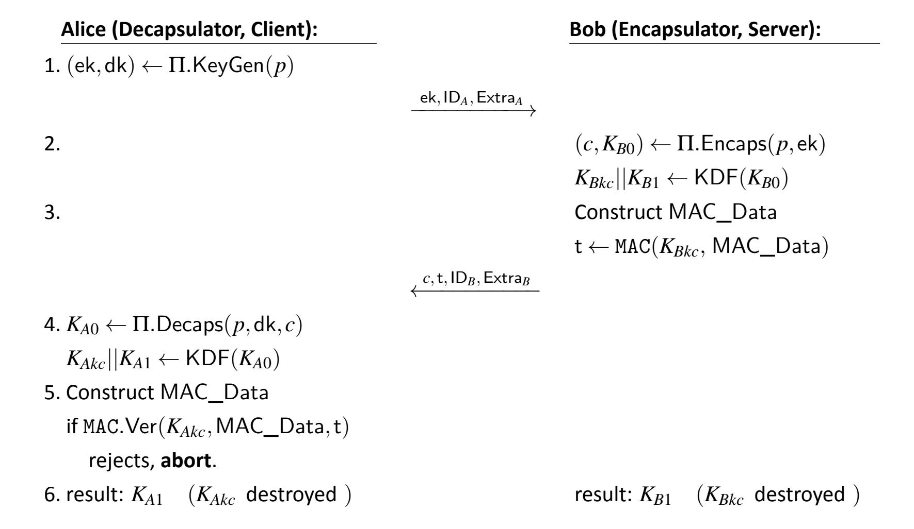

**Fig. 5.** Key-confirmation example with an ephemeral key pair

- Encapsulation key ek, which is Alice's (i.e., the KC recipient's) ephemeral value for the key-confirmation process
- Extra*B*, which refersto any extra data that Bob (i.e., the KC provider) would like to include
- Extra*A*, which refers to the extra data provided by Alice (i.e., the KC recipient)

Bob calculates the tag t using *KBkc* on MAC\_Data and sends the following to Alice: 1) ciphertext *c*, 2) the generated tag t, 3) and any extra data Extra*B* that Bob included in the MAC\_Data.

- 4. Alice performs decapsulation on the received ciphertext *c* using the previously generated decapsulation key dk to calculate initial key *KA*0. Alice then derives two keys from *KA*0 similarly to Bob (in step 2): key-confirmation key*KAkc* and additional keying material *KA*1.
- 5. Alice constructs MAC\_Data as Bob did in step 3 and verifies the received t for the MAC\_Data using key *KAkc*. Alice aborts if the tag is rejected or continues if it is verified.
- 6. Alice now has additional assurance that *KA*1 matches *KB*1. Alice and Bob destroy the key-confirmation keys*KAkc* and*KBkc* and can proceed to use*KA*1 and*KB*1 as planned.

{31}------------------------------------------------

This example only provides unilateral key confirmation. If Bob also wanted assurance, another round of key confirmation can be performed by swapping roles. During this additional round, Alice generates new MAC\_Data using KC\_2\_D as the label and indicating herself as the KC provider (see Sec. [4.4.1\)](#page-28-0), generates a tag on new MAC\_Data, and sends the new tag to Bob for verification.

#### **4.5. Proof of Possession for KEM Keys**

A key-pair owner may need to provide proof-of-possession (PoP), which is the assurance that they possess the private decapsulation key corresponding to the public encapsulation key. In practice, PoP for RSA encryption key pairs (i.e., encryption key, decryption key) has historically been provided by reusing the same keys as a digital signature key pair (i.e., verification key,signing key). A key-pair owner can provide assurance that they possessthe secret decryption key by signing a message using the private signing/decryption key. The party seeking assurance can verify the signature using the public verification/encryption key. Unfortunately, this shortcut does not necessarily apply to all KEMs, so it is important to consider alternative approaches to providing PoP for KEMs.

Consider the case in which Bob has obtained another party's static public encapsulation key and is communicating with a party purporting to be the key-pair owner corresponding to that encapsulation key. Bob may seek PoP from the other party before any further engagement. One method to obtain PoP is for Bob to participate in a KEM protocol that includes key confirmation (see Sec. [4.4\)](#page-27-0) and in which assurance of the identity of the other party is provided. This method can be used for both static and ephemeral key pairs.

However, for static key pairs, PoP can also be provided in a certificate by a certificate authority (CA). Consider the case in which Alice is the owner of a static KEM key pair and would like to acquire a certificate establishing her ownership. A certificate authority (CA) would require PoP from Alice prior to issuing and publishing a certificate. Bob could then acquire the certificate from either Alice or the CA and would have assurance that Alice possessesthe private key. Methodsfor performing PoP by a CA for KEMs are being developed.

For illustrative purposes, this section also describes a method proposed in [\[22\]](#page-52-9) that can be used by a CA to obtain PoP for a private decapsulation key for which a certificate is requested for the corresponding public encapsulation key. In practice, a certificate not only links the identity of the key-pair owner to the static public key, but it also proves that a key-pair owner possesses the static private key that corresponds to a static public key. For the sake of simplicity, assume that Alice's identifying information ID*Alice* has been submitted to and verified by the CA prior to the protocol run described below.

Suppose that Alice has generated a static KEM key pair (ek,dk) and wants to obtain a certificate for ek. Let Π, *p* be the KEM and parameter set associated with (ek,dk). Let Sym = (Sym.KeyGen,Sym.Enc,Sym.Dec) denote a symmetric encryption scheme with corresponding key generation, encryption, and decryption algorithms, respectively. Let 

{32}------------------------------------------------

*H* denote a cryptographic hash function. Let Cert.Gen denote the process used by the CA to generate a certificate.

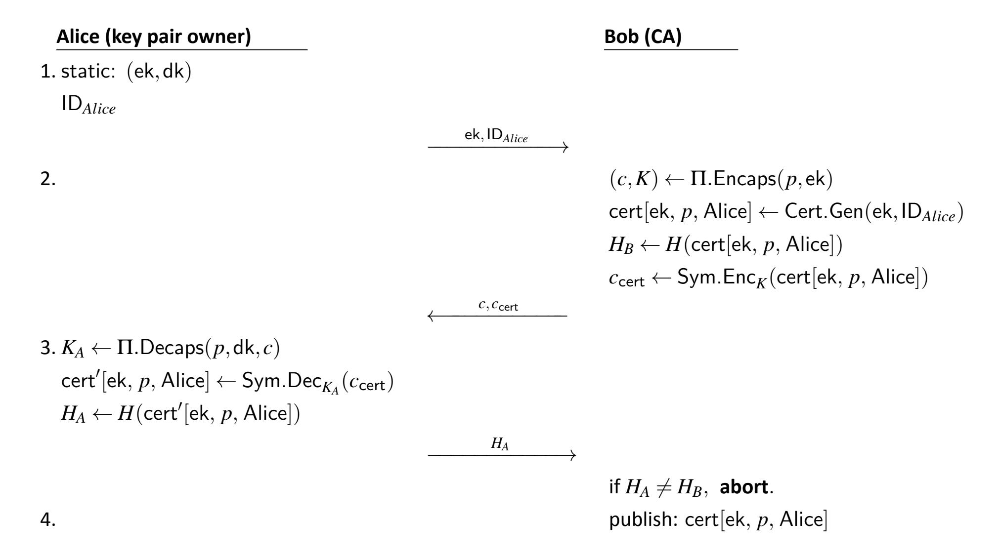

**Fig. 6.** KEM PoP between a key-pair owner and CA 

- 0. Prior to the protocol initiation, Alice has submitted her identifying information ID*Alice* to the CA, and the CA has verified her identity. Throughout the protocol execution, messages coming from Alice are assumed to be authenticated so that no one can impersonate Alice within the protocol.
- 1. Alice sends ek,ID*Alice* to the CA to initiate the protocol.
- 2. The CA runs Π.Encaps(ek, *p*) to produce (*K*, *c*). The CA generates the certificate cert[ek, *p*,Alice] and links Alice's identity to her encapsulation key ek. The CA computes *HB*, which is the hash of the certificate. The CA then computes *c*cert = Sym.Enc*K*(cert[ek, *p*,Alice]) by encrypting the certificate with the key produced by KEM Π. Finally, the CA sends the two ciphertexts *c* and *c*cert to Alice.
- 3. Alice runs Π.Decaps(*p*,dk, *c*) to recover *K* and decrypts the certificate by computing Sym.Dec*K*(*c*cert) to obtain the plaintext certificate. Alice hashes the plaintext certificate and sends the resulting hash value *HA* to the CA.
- 4. The CA verifiesthe received hash value *HA* against *HB*, which isthe hash of the plaintext certificate cert[ek, *p*,Alice] generated in step 2. If the two hash values are equal,

{33}------------------------------------------------

the CA sends an acknowledgment to Alice that the certification process wassuccessful, and cert[ek, *p*,Alice] is published for use.

Once the CA publishes cert[ek, *p*,Alice],relying parties using that certificate have assurance that the owner of that certificate (Alice, with identity "Alice") possessed the private decapsulation key corresponding to ek when the certificate was generated and published. If Alice manages to recover the certificate in step 3, this indirectly proves that she possesses the corresponding decapsulation key dk. However, the CA would not receive PoP from Alice unless step 4 is completed. This solution requires that the CA has the capabilities to run Π.Encaps(), which may not be true in practice.

#### **4.6. Multi-Algorithm KEMs and PQ/T Hybrids**

Combining multiple key-establishment schemes into a single key-establishment scheme can be advantageous for some applications (e.g., during the migration to post-quantum cryptography). The discussions of such schemes in this document will adhere to the terminology established in [\[23\].](#page-52-10)

A *multi-algorithm key-establishment scheme* combines shared secret values that are generated using two or more key-establishment schemes. The underlying schemes are called the *components* of the overall scheme. In general, the multi-algorithm scheme does not need to have the same interface as its components. In this document, for example, multialgorithm schemes will always be KEMs, while their components need not be.

A well-designed multi-algorithm scheme will be secure if *at least one* of the component schemes is secure. This may provide some protection against vulnerabilities that are discovered in one of the component schemes after deployment. For example, the migration to post-quantum key-establishment techniques might initially include multi-algorithm solutions that combine one new post-quantum algorithm with one tried-and-tested but quantum-vulnerable (or *traditional*) algorithm. This is sometimes referred to as hybrid post-quantum/traditional (PQ/T) key establishment. For example, X-Wing KEM is a hybrid PQ/T KEM built from two components: ML-KEM (a lattice-based post-quantum KEM) and X25519 (a traditional Diffie-Hellman-style key exchange) [\[24\].](#page-53-0)

This section outlines **approved** approaches for multi-algorithm key establishment, which have two stages:

- 1. **Establish shared secrets.** All component key-establishment schemes are run (typically in parallel), resulting in Alice and Bob sharing a collection of shared secrets one for each component scheme.
- 2. **Combine shared secrets.** Alice and Bob individually use a *key combiner* to combine their individual shared secrets into a single shared secret each. **Approved** key combiners are described in Sec. [4.6.2.](#page-35-0)

{34}------------------------------------------------

Forsimplicity, the exposition below focuses on a particular case: constructing a single KEM from two component KEMs. Since both the components and the multi-algorithm scheme in this case are ofthe same type (i.e., KEMs), the resultis called a *composite KEM*. Most keyestablishment schemes of interest can easily be expressed as KEMs (see, e.g., ECDH-KEM in Sec. [5.1.1](#page-40-2) and RSA-KEM in Sec. [5.1.2\)](#page-41-0). Moreover, the hybrid PQ/T application typically callsfortwo componentschemes: one post-quantumscheme, and one traditionalscheme. The two-algorithm composite KEM described below is easily adapted to other cases, such as combining more than two schemes or combining KEMs with non-KEMs.

#### **4.6.1. Constructing a Composite KEM**

Given two KEMs Π1 and Π2, one can construct a composite KEM C[Π1,Π2] via the following sequence of steps:

- 1. **Choose parameter sets.** Choose a collection C[Π1,Π2].ParamSets of parameter sets. Each parameter set will be a pair *p* = (*p*1, *p*2), where *p*1 ∈ Π1.ParamSets and *p*2 ∈ Π2.ParamSets.
- 2. **Select a key combiner.** Choose a key combiner algorithm KeyCombine. The inputs to KeyCombine include a pair of shared secret keys (one from Π1 and one from Π2), a pair of ciphertexts, a pair of encapsulation keys, and a parameter set. The output is a single shared secret key. Section [4.6.2](#page-35-0) discusses NIST-approved key combiners.
- 3. **Construct a composite key-generation algorithm.** When a parameter set *p* = (*p*1, *p*2) is input, the algorithm C[Π1,Π2].KeyGen will perform:
  - 1. (ek1,dk1) ← Π1.KeyGen(*p*1).
  - 2. (ek2,dk2) ← Π2.KeyGen(*p*2).
  - 3. Output composite encapsulation key ek1kek2.
  - 4. Output composite decapsulation key dk1kdk2.
- 4. **Construct a composite encapsulation algorithm.** When a parameter set *p* = (*p*1, *p*2) and encapsulation key ek1kek2 are input, the algorithm C[Π1,Π2].Encaps will perform:
  - 1. (*K*1, *c*1) ← Π1.Encaps(*p*1, ek1).
  - 2. (*K*2, *c*2) ← Π2.Encaps(*p*2, ek2).
  - 3. Output combined shared secret key

$$K \leftarrow \texttt{KeyCombine}(K_1, K_2, c_1, c_2, \mathsf{ek}_1, \mathsf{ek}_2, p).$$
 (9)

4. Output composite ciphertext *c* := *c*1k*c*2.

{35}------------------------------------------------

- 5. Construct a composite decapsulation algorithm. When a parameter set  $p=(p_1,p_2)$ , decapsulation key  $dk_1\|dk_2$ , and ciphertext  $c_1\|c_2$  are input, the algorithm  $\mathcal{C}[\Pi_1,\Pi_2]$ . Decaps will perform:
  - 1.  $K_1' \leftarrow \Pi_1$ . Decaps $(p_1, \mathsf{dk}_1, c_1)$ .
  - 2.  $K_2' \leftarrow \Pi_2$ . Decaps $(p_2, \mathsf{dk}_2, c_2)$ .
  - 3. Output combined shared secret key

$$K' \leftarrow \text{KeyCombine}(K'_1, K'_2, c_1, c_2, \text{ek}_1, \text{ek}_2, p).$$
 (10)

Since the inputs to KeyCombine include the composite encapsulation key, the decapsulating party must retain a copy of that key or maintain the ability to recreate it after performing key generation.

General multi-algorithm schemes. The above construction can be extended in the obvious way to composite constructions that use more than two component KEMs. Extending to the case of a completely general multi-algorithm key-establishment scheme can be more complex, as the components in such a scheme can vary widely. For example, such schemes could potentially include pre-shared keys or shared secrets established via quantum key distribution. Still, most multi-algorithm schemes will likely include a step in which a series of shared secrets are combined via a key combiner algorithm of a form similar to KeyCombine above. In those cases, an approved key combiner discussed in Sec. 4.6.2 shall be used.

#### 4.6.2. Approved Key Combiners

This section describes **approved** methods for combining shared secrets as part of a multi-algorithm key-establishment scheme. Choosing such a method amounts to selecting a key combiner KeyCombine. At a minimum, KeyCombine accepts two shared secrets as input, where one or both may be shared secret keys. Optionally, KeyCombine can also accept additional information, such as ciphertexts, encapsulation keys, parameter sets, or other context-dependent data (e.g., the composite KEM in Sec. 4.6.1). As output, KeyCombine produces a single shared secret key.

This section describes how cryptographic methods standardized in other NIST publications can be used as key combiners under an appropriate interpretation. There are two categories of such key combiners:

- 1. Key combiners from key-derivation methods **approved** in SP 800-56C [21]
- 2. Key combiners from key-combination methods **approved** in SP 800-133 [18]

**Concatenation of inputs.** The following descriptions involve invocations of functions (e.g., hash functions  $H:\{0,1\}^* \to \{0,1\}^n$ ) on multiple comma-separated inputs (e.g.,

{36}------------------------------------------------

*z* := *H*(*x*, *y*)). This should be distinguished from invoking the same function on a single input that is formed by simply concatenating those inputs (e.g., *w* := *H*(*x*k*y*)). For example, if the lengths of the two inputs can vary, concatenation can have unintended consequences(e.g., *x*k*y* = *x* 0k*y* 0 even though (*x*, *y*) 6= (*x* 0 , *y* 0 )). However, an appropriate encoding of a pair (*x*, *y*) as a single bitstring can specify the lengths of *x* and *y* such that invoking *H* on (*x*, *y*) is distinct from invoking *H* on (*x* 0 , *y* 0 ).

The interpretation of invoking a function on comma-separated inputs generally depends on the application and encoding and might also involve specifying the lengths of each individual input. In some scenarios, simple concatenation can also be appropriate. In any case, it is important to choose and fix this interpretation in a manner that is appropriate for the given application.

**Key derivation in SP 800-56C.** SP 800-56C [\[21\]](#page-52-8) specifies a collection of **approved** methods for performing key derivation. In SP 800-56C, a key derivation method (KDM) is applied to a shared secret *Z* generated as specified in SP 800-56A [\[1\]](#page-51-0) or SP 800-56B [\[2\]](#page-51-1) along with some additional input and results in keying material *K*:

$$K \leftarrow \mathsf{KDM}(Z, \mathsf{OtherInput}).$$
 (11)

The key-derivation method KDM can take one of two forms:

1. One-step key derivation. In this case, *K* is computed by applying a key-derivation function KDF to the two inputs *Z* and OtherInput.

$$K \leftarrow \mathsf{KDF}(Z, \mathsf{OtherInput}).$$
 (12)

2. Two-step key derivation. In this case, two functions are required: Extract (which is a randomness extractor) and Expand. The process begins with applying Extract to *Z* using a salt provided in OtherInput as the seed. Expand is then applied to the result along with FixedInfo, which is also provided in OtherInput.

$$K \leftarrow \mathsf{Expand}(\mathsf{Extract}(\mathsf{salt}, Z), \mathsf{FixedInfo}).$$
 (13)

In this method, it is required that extraction is applied to the shared secret *Z*.

SP 800-56C describes the specific **approved** choices of KDF, Extract, and Expand as well as the format and content of OtherInput. These details will not be discussed in this document.

As discussed in Sec. [4.3,](#page-26-0) this publication **approve**s the application of SP 800-56C KDMs to the shared secret keys of **approved** KEMs. In particular, this means that the quantity *Z* in Equation [\(11\)](#page-36-0) (and hence, also in [\(12\)](#page-36-1) and [\(13\)](#page-36-2)) can be the shared secret key of an **approved** KEM.

**Key combiners derived from SP 800-56C.** In both one-step and two-step key derivation, SP 800-56C allows the shared secret *Z* to have the form *Z* = (*S*1,*S*2), where *S*1 is a shared 

{37}------------------------------------------------

secret generated asspecified in SP 800-56A [\[1\]](#page-51-0) or SP 800-56B [\[2\]](#page-51-1), while *S*2 is a shared secret generated in some other (not necessarily approved) manner. This yields a key combiner *K* ← KDM((*S*1,*S*2),OtherInput)for a two-algorithm key-establishmentscheme. One can also combine many shared secrets:

$$K \leftarrow \mathsf{KDM}((S_1, S_2, \dots, S_t), \mathsf{OtherInput}).$$
 (14)

This publication **approves** the use of the key combiner [\(14\)](#page-37-1) for any *t* > 1 if at least one shared secret (i.e., *Sj* for some *j*) is generated from the key-establishment methods in SP 800-56A [\[1\]](#page-51-0) or SP 800-56B [\[2\]](#page-51-1) or an **approved** KEM. If the KDM in the combiner [\(14\)](#page-37-1) is a two-step method (i.e., using [\(13\)](#page-36-2)), extraction is performed with all shared secrets as the input.

SP 800-56C allows OtherInput to contain an input that is chosen arbitrarily by the protocol specification. This optional input is contained in a parameter called FixedInfo in SP 800-56C. By choosing FixedInfo appropriately, one can also construct **approved** key combiners of the form [\(14\)](#page-37-1) that receive inputs in addition to shared secrets, such as encapsulation keys, ciphertexts, parameter sets, and domain separators.

Several key combiners can be generated according to Expression [\(14\)](#page-37-1). As a simple example, consider the following special case. Choose KDM to be the one-step key-derivation method, where KDF is an **approved** hash function. Set OtherInput to contain the list of ciphertexts and encapsulation keys together with a domain separator domain\_sep (possibly including the parameter set *p*). Define a key combiner algorithm KeyCombine simply by setting

$$\texttt{KeyCombine}(K_1,K_2,c_1,c_2,\mathsf{ek}_1,\mathsf{ek}_2,p) := H(K_1,K_2,c_1,c_2,\mathsf{ek}_1,\mathsf{ek}_2,\mathsf{domain\_sep})$$
. (15)

One can then instantiate the composite KEM example from Sec. [4.6](#page-33-0) by using this key combiner. The resulting composite KEM will have a shared secret key whose length is the output length of *H*.

**Key combiners derived from SP 800-133.** SP 800-133 [\[18\]](#page-52-5) provides three **approved** methods for combining cryptographic keys that were generated in an **approved** way. These methods can be broadly described as concatenation, XORing, and key extraction using HMAC. Some of these methods can also be applied to just a single key. As discussed in Sec. [4.3,](#page-26-0) these methods are **approved** for key derivation for **approved** KEMs.

When combining multiple keys *K*1,*K*2,...,*Kt* , the key-combination methods found in SP 800-133 [\[18\]](#page-52-5) require every key *Kj* for *j* ∈ {1,2,...,*t*} to be generated using **approved** methods. These methods can be used directly as key combiners for constructing multialgorithm schemes in cases where all of the component schemes are **approved**, and each one produces a key. Any protocol using multi-algorithm KEMs with a concatenation key combiner **should** ensure that the final shared secret key from the key combiner is passed through a KDF before use.

{38}------------------------------------------------

#### 4.6.3. Security Considerations for Composite Schemes

The typical goal of a composite KEM construction is to ensure that security will hold if *any* of the component KEMs is secure. There are some important security considerations when constructing composite KEMs.

**Theoretical security.** The two main security properties that KEMs can satisfy (see Sec. 2.3) are:

- 1. IND-CPA security (i.e., security against passive eavesdropping attacks)
- 2. IND-CCA security (i.e., security against active attacks)

A well-constructed composite KEM  $\mathcal{C}[\Pi_1,\Pi_2]$  should preserve the security properties of its component KEMs  $\Pi_1$  and  $\Pi_2$ . This crucially depends on how the composite KEM is constructed and the choice of the key combiner.

An important example is when the goal is active (i.e., IND-CCA) security, but only one of the two schemes  $\Pi_1$  and  $\Pi_2$  is itself IND-CCA, and the designer of the composite scheme may not know which one it is. In this case, the choice of the key combiner is particularly relevant. As shown in [24], the straightforward key combiner

$$K \leftarrow \mathsf{KDF}(K_1, K_2)$$
 (16)

that only uses the two shared secret keys  $K_1$  (of  $\Pi_1$ ) and  $K_2$  (of  $\Pi_2$ ) does not preserve IND-CCA security, regardless of the properties of the KDF. So, for example, the scheme  $\Pi_2$  could be so broken that  $\mathcal{C}[\Pi_1,\Pi_2]$  is not IND-CCA, even if  $\Pi_1$  is IND-CCA and regardless of what KDF is used.

Therefore, NIST encourages the use of key combiners that generically preserve IND-CCA security, in the sense that the combined scheme is IND-CCA, provided at least one of the ingredient KEMs is IND-CCA. One example of such a key combiner is as in (15). Let H denote a hash function from the SHA-3 family, which is **approved** for use in one-step key derivation in SP 800-56C [21]. Define the key combiner KeyCombine $_H^{CCA}$  as follows (recalling the notation in Sec. 4.6):

- Inputs from  $\Pi_1$ : ek1,  $c_1$ ,  $K_1$
- Inputs from  $\Pi_2$ : ek2,  $c_2$ ,  $K_2$
- Output:  $H(K_1, K_2, c_1, c_2, ek_1, ek_2, domain\_sep)$

The domain separator domain\_sep **should** be used to uniquely identify the composite scheme in use (e.g.,  $\Pi_1$ ,  $\Pi_2$ , order of composition, choice of parameter set, key combiner, KDF). As shown in [25], KeyCombine $_H^{CCA}$  preserves IND-CCA security if H is modeled as a random oracle. Note that [25] does not incorporate encapsulation keys into the combiner, as this is not needed to achieve the IND-CCA-preserving property. However, including en-

{39}------------------------------------------------

capsulation keys can have other potential advantages in secure protocols, such as binding the final shared secret to the identities of the participating parties.

**Security in practice.** While composite schemes are meant to increase security, they necessarily add a layer of additional complexity to the basic KEM framework. This additional complexity will be reflected in implementations and applications and could introduce security vulnerabilities. Moreover, adding composite schemes introduces additional choices in protocols, which could also introduce vulnerabilities (e.g., in the form of "downgrade attacks"). Implementers and users **should** be aware of the potential challenges in implementing and deploying composite schemes.

{40}------------------------------------------------

#### **5. Examples**

This section is meant to help readers understand some aspects of how KEMs are constructed. It only provides examples, not requirements or specific guidelines.

#### **5.1. Examples of KEMs**

The following subsections discuss three key-encapsulation mechanisms: ECDH-KEM, RSA-KEM, and ML-KEM. While ECDH and RSA key transport are not typically described as KEMs, the discussions below will give a high-level description of how both can be naturally viewed as KEMs. The goal of these descriptions is illustrative only. As FIPS 203 already contains a complete description of ML-KEM, the discussion below will simply reference the relevant parts of FIPS 203 [\[3\]](#page-51-2).

#### **5.1.1. A KEM From Diffie-Hellman**

A KEM may be constructed from a Diffie-Hellman (DH) key-agreement scheme. The highlevel idea isthat, if the two partiesin a DH scheme send their messagesin sequential order (e.g., Alice first, then Bob), then:

- 1. The public message and private randomness of Alice can be viewed as an encapsulation key and a decapsulation key, respectively, and
- 2. The public message of Bob can be viewed as a ciphertext.

For example, a KEM can be constructed from the C(1e, 1s, ECC CDH) Scheme from SP 800- 56A [\[1\]](#page-51-0) as follows:

- ECDH-KEM.ParamSets. The parametersets are the same asthose specified for ECDH in Sec. 5.5.1.2 of SP 800-56A.
- ECDH-KEM.KeyGen. The key-generation algorithm is the same as the one specified in Sec. 5.6.1.2 of SP 800-56A. Alice generates a static key pair and makes the static public key available as the encapsulation key. Bob generates an ephemeral key pair when initiating the key establishment with Alice.
- ECDH-KEM.Encaps. To encapsulate, perform Party U's actionsfrom Sec. 6.2.2.2 of SP 800-56A. The output is the key (i.e., the derived secret keying material) along with the ciphertext (i.e., the ephemeral public key *Qe*,*U* ).
- ECDH-KEM.Decaps. To decapsulate, perform Party V's actions from Sec. 6.2.2.2 of SP 800-56A. The output key is the derived secret keying material.

The use of this KEM requires that all assumptions for the scheme specified in SP 800-56A are met and that all necessary assurances have been obtained. This KEM is IND-CPAsecure if the computational Elliptic Curve Diffie Hellman problem is hard for parameter set ParamSets. The computational Elliptic Curve Diffie Hellman problem is efficiently solved by 

{41}------------------------------------------------

a quantum computerso this KEM is considered to be quantum-vulnerable, as mentioned in Section [2.2.](#page-12-0) This KEM is not claimed to be IND-CCA-secure. In similar ways, KEMs could be constructed from the C(1e, 1s, FFC DH), C(2e, 0s, ECC CDH), and C(2e, 0s, FFC DH)schemes.

#### **5.1.2. A KEM From RSA Secret-Value Encapsulation**

As discussed in Sec. [2.2,](#page-13-1) any PKE scheme can be used to construct a KEM. A concrete example ofthisis RSA Secret-Value Encapsulation (RSASVE)[4](#page-41-1) with an agreed-upon key-derivation method applied to the shared secret value *Z* to derive a shared secret key. The high-level idea is described as follows:

- 1. Alice sends an RSA public key to Bob. Optionally, Alice can also send some other public information to Bob, such as a nonce for key derivation.
- 2. Bob generates a secret value and encapsulates it with Alice's RSA public key to produce the ciphertext. A key is derived from the secret value. The output of encapsulation is the ciphertext and the derived key. The ciphertext is sent to Alice.
- 3. Alice decapsulatesthe ciphertext using her RSA private key to obtain the secret value that is used to derive the key.

For example, a KEM can be constructed from RSASVE from SP 800-56B [\[2\]](#page-51-1) as follows:

- 1. RSASVE-KEM.ParamSets. The parameter set is the binary length of the modulus (specified in Table 2, Sec. 6.3 of SP 800-56B) along with the exponent *e*.
- 2. RSASVE-KEM.KeyGen. The key-generation algorithm is specified in Sec. 6.3 of SP 800-56B (also see Appendix C.2 of FIPS 186-5).
- 3. RSASVE-KEM.Encaps. To encapsulate, Bob (in his role as Party U) performs RSASVE.GENERATE, as specified in Sec. 7.2.1.2 of SP 800-56B. The output is the ciphertext and a secret value *Z*. Bob applies the agreed-upon key-derivation method to the secret value *Z* to derive a shared secret key.
- 4. RSASVE-KEM.Decaps. To decapsulate, Alice (in her role as Party V) performs RSASVE.RECOVER using the ciphertext from Bob, as specified in Sec. 7.2.1.3 of SP 800-56B. The output is the secret value *Z*. Alice applies the agreed-upon keyderivation method to the secret value *Z* to derive a shared secret key.

Using this KEM requires that all assumptions for the scheme specified in SP 800-56B are met and that all necessary assurances have been obtained. This KEM is IND-CPA-secure if the computational RSA problem is hard for parameter set ParamSets. The computational RSA problem is efficiently solved by a quantum computer so this KEM is considered to be

4Note that RSASVE is NOT a standalone **approved** scheme. It is a component of the **approved** KAS1 and KAS2 schemes.

{42}------------------------------------------------

quantum-vulnerable, as mentioned in Section [2.2.](#page-12-0) This KEM is not claimed to be IND-CCAsecure. In similar ways, KEMs could be constructed from RSA-OAEP-basic, as specified in Sec. 9.2.3 of SP 800-56B.

#### **5.1.3. ML-KEM**

ML-KEM is a high-performance, general-purpose, lattice-based key-encapsulation mechanism. It is a NIST-**approved** KEM and wasstandardized in FIPS 203 [\[3\]](#page-51-2). ML-KEM is based on CRYSTALS-Kyber [\[26\]](#page-53-2), which was a candidate in the NIST PQC standardization process. It is believed to satisfy IND-CCA security (Definition [4\)](#page-17-1), even against adversaries in possession of a cryptanalytically relevant quantum computer [\[17,](#page-52-4) [27,](#page-53-3) [28\]](#page-53-4). The asymptotic, theoretical security of ML-KEM is based on the presumed hardness of the Module Learning with Errors (MLWE) problem [\[29,](#page-53-5) [30\]](#page-53-6).

FIPS 203 directly describes ML-KEM as a KEM in amannerthat closely matchesthe notation of this document. Specifically, the components of ML-KEM are described in FIPS 203 as follows [\[3\]](#page-51-2):

- ML-KEM.ParamSets. There are three parameter sets described in Sec. 8 of FIPS 203: ML-KEM-512, ML-KEM-768, and ML-KEM-1024.
- ML-KEM.KeyGen. The key-generation algorithm of ML-KEM isspecified as Algorithm 19 in Sec. 7.1 of FIPS 203.
- ML-KEM.Encaps. The encapsulation algorithm of ML-KEM is specified as Algorithm 20 in Sec. 7.2 of FIPS 203.
- ML-KEM.Decaps. The decapsulation algorithm of ML-KEM is specified as Algorithm 21 in Sec. 7.3 of FIPS 203.

This document treats parameter sets as an explicit input for the KEM algorithms KeyGen, Encaps, and Decaps. By contrast, the algorithms of ML-KEM described in FIPS 203 expect the chosen parameter set to be stored in a set of global variables that are accessible to each of the algorithms of ML-KEM. This is only a difference in presentation and does not imply any particular implementation requirement.

#### **5.2. Examples of KEM Applications**

This section provides a high-level overview of several example applications of KEMs.

#### **5.2.1. KEM-DEM Public-Key Encryption**

A KEM can be combined with a symmetric-key encryption scheme to yield very efficient public-key encryption. This is sometimes referred to as the KEM-DEM paradigm for PKE [\[17\]](#page-52-4). Examples include El Gamal encryption [\[31\]](#page-53-7) and the Elliptic Curve Integrated Encryption Scheme (ECIES) standardized in ANSI X9.63 [\[15\]](#page-52-11).

{43}------------------------------------------------

The prescription for constructing a KEM-DEM PKE scheme is as follows. Let Π be a KEM, and let Ξ = (Encrypt,Decrypt) be a symmetric-key encryption scheme. One then constructs a PKE called KD-PKE as follows:

- KD-PKE.ParamSets = Π.ParamSets
- KD-PKE.KeyGen = Π.KeyGen
- KD-PKE.Encrypt: given input parameter set *p*, ek, and message *m*:
  - 1. Compute (*K*, *c*Π) ← Π.Encaps(*p*, ek).
  - 2. Compute *c*Ξ ← Ξ.Encrypt(*K*,*m*).
  - 3. Output (*c*Π, *c*Ξ).
- KD-PKE.Decrypt: given input *p*, dk, and (*c*Π, *c*Ξ),
  - 1. Compute *K* 0 ← Π.Decaps(*p*,dk, *c*Π).
  - 2. Output *m* 0 ← Ξ.Decrypt(*K* 0 , *c*Ξ).

Here, the keys of Ξ are assumed to be the same length as the shared secret keys produced by Π. If not, appropriate key-derivation steps (see Sec. [4.3\)](#page-26-0) can be added to KD-PKE.Encrypt and KD-PKE.Decrypt to transform the shared secret key of Π into a key that is appropriate for use with Ξ.

Figure [7](#page-43-1) showsthe procedure forsending an encrypted message *m* from Bob to Alice using KD-PKE. In this description, Alice selects the parameter set *p*.

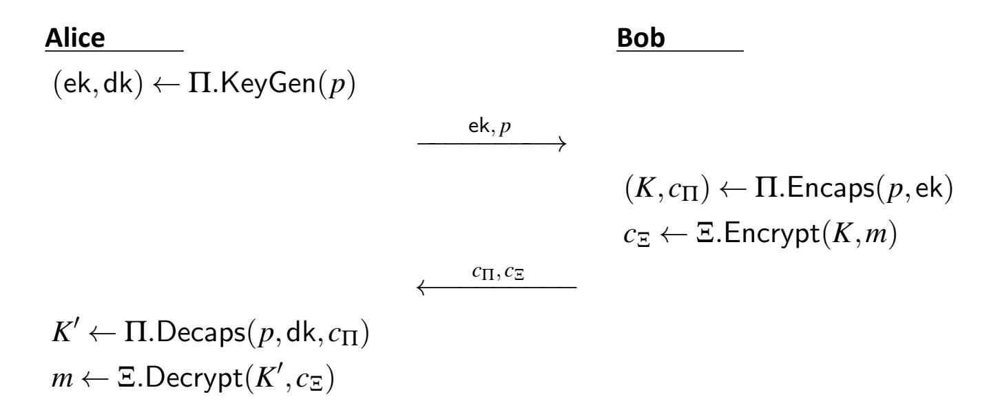

**Fig. 7.** Sending a message using the KEM-DEM paradigm 

This same procedure can also be used to perform key transport by choosing *m* uniformly at random as the key to be transported. This allows one to perform key transport using *any* KEM, even one that does not natively perform key transport (e.g., ML-KEM).

{44}------------------------------------------------

#### **5.2.2. Unilateral Authenticated Key Establishment Using a KEM**

Most applications of key establishment require at least one party (typically, a server) to authenticate their identity. One approach to achieving this is for the server to acquire a certificate of authenticity for their long-term,static KEM encapsulation key. This certificate can then be provided to a client as proofthatthe key is associated with the server'sidentity. An example description of key establishment in this setting is given below and depicted in Fig. [8.](#page-44-0) The example uses a simplified key confirmation process (see Sec. [4.4\)](#page-27-0).

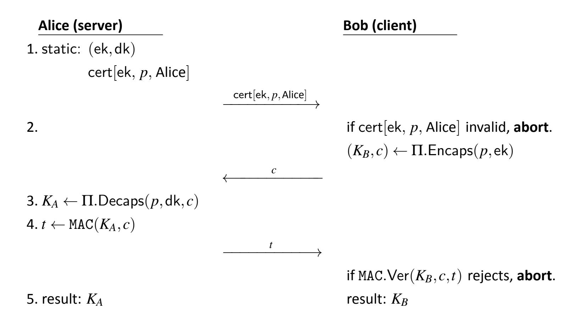

**Fig. 8.** Unilateral authenticated key establishment using a KEM

- 1. At the outset, Alice has a long-term, static key pair that she generated earlier via (ek,dk) ← Π.KeyGen(*p*). Here, Π is some KEM, and *p* is some parameter set of Π. Alice also has a certificate cert[ek, *p*,Alice] that contains ek and *p* and associates them both with Alice's identity.
- 2. When Bob wants to connect to Alice, he acquires cert[ek, *p*,Alice] (e.g., from Alice), verifies that the certificate is valid, and extracts ek and *p* from the certificate. He then performs encapsulation with ek, saves the resulting shared secret key *KB*, and sends the ciphertext *c* to Alice.
- 3. Alice decapsulates *c* and gets a shared secret key *KA*.
- 4. Alice and Bob then perform a simplified key-confirmation step. Alice uses a MAC algorithm to generate a tag *t* ← MAC(*KA*, *c*) for the ciphertext *c* and sends *t* to Bob. Bob then runs MAC verification using *KB* and aborts unless the tag *t* is accepted. If the tag is accepted, Bob knows that Alice's key *KA* and his key *KB* are the same (i.e., they share the same key).

{45}------------------------------------------------

5. Alice and Bob can now use their shared secret key to communicate efficiently and securely using symmetric-key cryptography.

If the KEM  $\Pi$  is secure, then only a holder of the decapsulation key dk (corresponding to the encapsulation key ek in the certificate) should be able to generate a valid MAC tag in step 4.

#### **5.2.3.** Ephemeral Authenticated Key Establishment

This section describes an alternative approach to unilaterally authenticated key establishment using a KEM. Compared to the example in Sec. 5.2.2, Alice and Bob will now have the opposite roles in the protocol. Specifically, Bob is now the authenticated party (e.g., a web server), while Alice is the unauthenticated party (e.g., a browser client). Ephemeral KEM key-pair generation will now be performed by the *client* (i.e., Alice), and Alice will discard the KEM key pair once the connection is established. The server will not use a long-term, static KEM key pair but will need to establish his identity through other means. In this example, identity establishment will be done via a certificate that associates a particular *digital signature verification key* with Bob's identity.

The following ingredients are required. Let  $\Sigma$  be a digital signature scheme with algorithms  $\Sigma$ . KeyGen,  $\Sigma$ . Sign, and  $\Sigma$ . Ver. As before, KEM key pairs are denoted by (ek,dk). Digital signature key pairs are denoted by (vk,sk), where vk is a public verification key and sk is the corresponding private signing key.

The protocol proceeds as follows (see Fig. 9.)

- 1. At the outset, Bob has previously generated a static digital signature key pair  $(vk_B, sk_B)$  and procured a certificate  $cert[vk_B, Bob]$  that associates the public verification key with his identity.
- 2. When connecting to Bob, Alice generates an ephemeral KEM key pair  $(ek_A, dk_A)$  and sends the encapsulation key  $ek_A$  and her chosen parameter set p to Bob, keeping the decapsulation key  $dk_A$  private.
- 3. Bob performs encapsulation using  $\operatorname{ek}_A$ , which results in a KEM ciphertext  $c_B$  and a shared secret key  $K_B$ . Bob then uses his private signing key  $\operatorname{sk}_B$  to sign the transcript of all communications with Alice, including what he will send in this transmission. This transcript includes  $\operatorname{ek}_A$ , p,  $\operatorname{vk}_B$ ,  $c_B$ , and Bob's certificate  $\operatorname{cert}[\operatorname{vk}_B,\operatorname{Bob}]$ . He then sends the certificate, signature, and ciphertext to Alice. Finally, he applies a keyderivation function KDF to  $K_B$  in order to produce two symmetric keys  $K_B'$  and  $K_B''$ , destroys  $K_B$ , and keeps  $K_B'$  and  $K_B''$  private.
- 4. Next, Alice performs two checks. First, she checks the validity of Bob's claimed certificate with the appropriate certification authority. Second, she verifies Bob's signature on the transcript. If either check fails, Alice aborts. Otherwise, she decapsulates

{46}------------------------------------------------

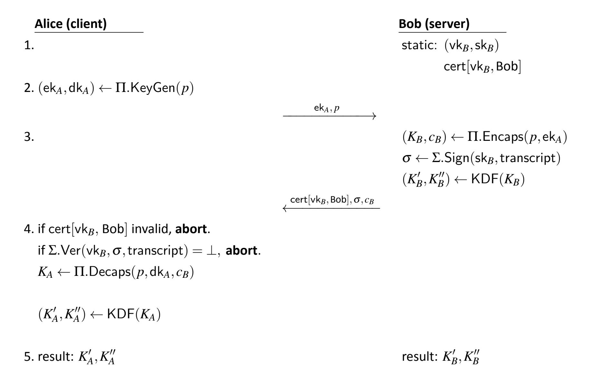

Fig. 9. Using a KEM for key establishment with unilateral authentication

 $c_B$  and keeps the resulting shared secret key  $K_A$  private. She also derives two keys  $K_A'$  and  $K_A''$  via KDF applied to  $K_A$  and destroys  $K_A$ .

5. Alice and Bob can now use the keys  $K'_A$  and  $K''_A$  for symmetric-key cryptography. For example, they could use  $K'_A$  for encryption and  $K''_A$  for authentication.

#### 5.2.4. Static-Ephemeral Unilateral Authenticated Key Establishment Using KEMs

This section presents a static-ephemeral key-establishment scheme with unilateral authentication, as described in [32]. The scheme combines a shared secret key generated by a static KEM key pair with a shared secret key produced by a freshly generated, ephemeral KEM key pair. Just as in Example 5.2.2, one party possesses a static KEM key pair that is associated with a certificate.

In this example, Alice and Bob's key pairs are generated using the same KEM  $\Pi$  and parameter set p. In this case,  $\Pi$  and p are determined by Bob's certificate. Note that Bob may use the same static key pair to perform key establishment with many different parties. To see how different KEMs might be used within one authenticated key-establishment scheme, see Example 5.2.5.

{47}------------------------------------------------

KEMTLS is a protocol with similar elements to this example, though it includes additional features that are not presented here [33]. In particular, KEMTLS utilizes KEM-based authentication and also combines two shared secret keys: one generated by a static KEM key pair and one by an ephemeral KEM key pair.

In this example, H denotes a KDF, and Bob is authenticated while Alice is not. Note that the choice of KDF for H in [32] is a cryptographic hash function. There is no key-confirmation step in this scheme, but one may easily incorporate such a step if desired.

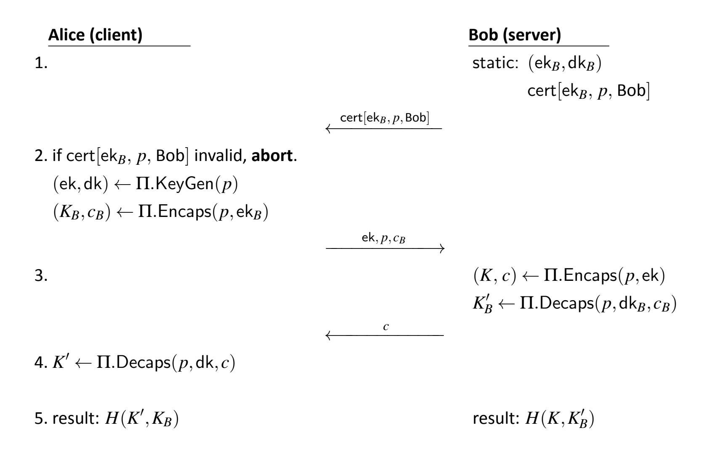

Fig. 10. Static-ephemeral unilateral authenticated key establishment using KEMs

- 1. At the outset, Bob has a long-term, static key pair that he generated earlier via  $(\mathsf{ek}_B,\mathsf{dk}_B) \leftarrow \Pi.\mathsf{KeyGen}(p).$  Here,  $\Pi$  is some KEM, and p is some parameter set of  $\Pi$ . Bob also has a certificate  $\mathsf{cert}[\mathsf{ek}_B,p,\mathsf{Bob}]$  that contains  $\mathsf{ek}_B$  and p and associates them both with Bob's identity.
- 2. When Alice wants to connect to Bob, she acquires  $\operatorname{cert}[\operatorname{ek}_B, p, \operatorname{Bob}]$  (e.g., from Bob), verifies that the certificate is valid, and extracts  $\operatorname{ek}_B$  and p from the certificate. She then performs encapsulation with  $\operatorname{ek}_B$ , saves the resulting shared secret  $\operatorname{key} K_B$ , and sends the ciphertext  $c_B$  to Bob. Alice additionally generates an ephemeral KEM key pair  $(\operatorname{ek},\operatorname{dk})$  using the same KEM  $\Pi$  and parameter set p and sends the encapsulation key ek and relevant parameter set p to Bob, keeping the private decapsulation key dk private.

{48}------------------------------------------------

- 3. Bob uses (p, ek) to perform encapsulation, which results in a KEM ciphertext c and shared secret key K. Bob also performs decapsulation using  $(p, dk_B, c_B)$  to produce another shared secret key  $K'_B$ . Bob sends ciphertext c to Alice.
- 4. Alice uses c, p, and dk to run decapsulation and recover her copy of the ephemeral shared secret key K'.
- 5. Alice and Bob combine their copies of the shared ephemeral secret key K'(K) and the shared secret key  $K_B(K_B')$  that was computed using Bob's static key pair. A hash function H is applied to the result to establish a final shared secret key.

It is assumed that if the certificate is valid, then only Bob is capable of performing decapsulation of ciphertexts that were encapsulated using  $ek_B$ .

#### **5.2.5.** Authenticated Key Establishment Using KEMs

This section presents a bilaterally authenticated key-establishment scheme using KEMs, as described in [32]. In this example, both Alice and Bob are authenticated using static KEM key pairs associated with certificates. The KEM shared secret keys produced using their static key pairs contribute to the final key and a shared secret key produced using a freshly generated ephemeral KEM key pair. This scheme achieves weak forward secrecy [32, 34].

Alice's static key pair may correspond to a different KEM than the one associated with Bob's static key pair as the choices of KEM and parameter set used by Alice and Bob are determined by their certificates. As such, both parties must be able to operate using each other's KEM encapsulation algorithm. Moreover, the ephemeral KEM key pair may correspond to a third, completely different KEM. To capture this possibility, let  $(\Pi_A, p_A)$ ,  $(\Pi_B, p_B)$ , and  $(\Pi, p)$  denote the KEM algorithm and parameter set associated with Alice's static key pair, Bob's static key pair, and the ephemeral KEM key pair, respectively. This notation allows for the possibility that  $\Pi_A = \Pi_B = \Pi$  and  $p_A = p_B = p$ . Additionally, parameter sets are formatted differently for different KEMs (e.g., lattice-based KEMs might include lattice dimension, while code-based KEMs include code length and dimension). Therefore, if two KEMs  $\Pi_i$  and  $\Pi_j$  are distinct, the corresponding parameter sets are likely also distinct.

As with other examples, Alice and Bob will need to negotiate which KEM  $\Pi$  and parameter set p they will use for the ephemeral key pair prior to protocol execution. As in Example 5.2.3, H denotes a KDF. Note that in [32] H is chosen to be a cryptographic hash function. There is no key-confirmation step included in this example, but one could be added.

1. At the outset, Alice and Bob each have a long-term, static key pair. Alice has  $(\mathsf{ek}_A,\mathsf{dk}_A)$ , and Bob has  $(\mathsf{ek}_B,\mathsf{dk}_B)$ , which were generated earlier via  $\Pi_A.\mathsf{KeyGen}(p_A)$  and  $\Pi_B.\mathsf{KeyGen}(p_B)$ , respectively. Alice and Bob also have certificates  $\mathsf{cert}[\mathsf{ek}_A,p_A,\mathsf{Alice}]$  and  $\mathsf{cert}[\mathsf{ek}_B,p_B,\mathsf{Bob}]$ , respectively, which contain their corresponding public keys and associate them to their respective identities.

{49}------------------------------------------------

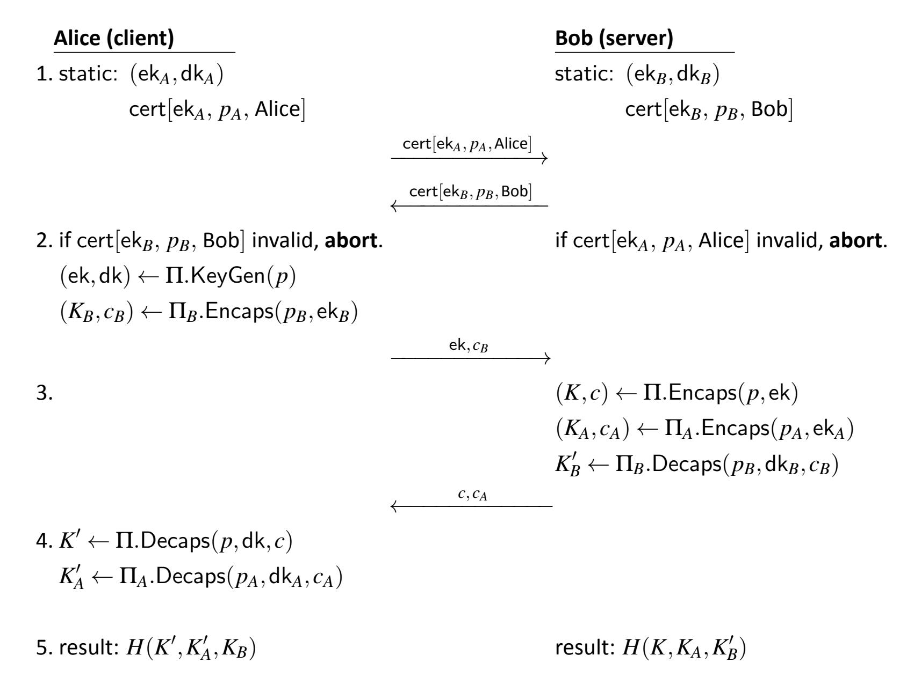

Fig. 11. Authenticated key establishment using KEMs

- 2. When Alice wants to connect to Bob, she acquires  $cert[ek_B, p_B, Bob]$  (e.g., from Bob), verifies that the certificate is valid, and extracts  $ek_B$ ,  $p_B$  from the certificate. Bob also acquires and verifies Alice's certificate in this step.
  - Alice then performs encapsulation with Bob's static public key  $\operatorname{ek}_B$ , saves the resulting shared secret key  $K_B$ , and sends the ciphertext  $c_B$  to Bob. Alice additionally generates an ephemeral KEM key pair  $(\operatorname{ek},\operatorname{dk})$  and sends the encapsulation key  $\operatorname{ek}$  and relevant parameter set p to Bob, keeping the private decapsulation key  $\operatorname{dk}$  private.
- 3. Bob uses (p, ek) to perform encapsulation, which results in a KEM ciphertext c and shared secret key K. Bob extracts  $ek_A$  and  $p_A$  from Alice's certificate and then performs encapsulation with  $ek_A$  and  $p_A$  to generate  $K_A$  and  $C_A$ .
  - Bob also performs decapsulation using  $(p_B, dk_B, c_B)$  to produce another shared secret key  $K'_B$ . Bob sends ciphertexts c and  $c_A$  to Alice.
- 4. Alice uses c, p, and dk to run decapsulation and recover her copy of the ephemeral shared secret key K'. Alice additionally uses  $c_A$ ,  $p_A$ , and dk $_A$  to run decapsulation and recover her copy of the long-term shared secret key  $K'_A$ .

{50}------------------------------------------------

5. Alice and Bob combine their copies of the shared ephemeral secret key K' (K) and static shared secret keys  $K'_A$  and  $K_B$  ( $K_A$  and  $K'_B$ .) and apply a KDF H to establish a final shared secret key.

{51}------------------------------------------------

#### **References**

- [1] Barker EB, Chen L, Roginsky A, Vassilev A, Davis R (2018) Recommendation for Pair-Wise Key-Establishment Schemes Using Discrete Logarithm Cryptography (Depart-ment of Commerce, Washington, D.C.), NIST Special Publication (SP) NIST SP 800-56Ar3. <https://doi.org/10.6028/NIST.SP.800-56Ar3>
- [2] Barker EB, Chen L, Roginsky A, Vassilev A, Davis R, Simon S (2019) Recommendation for Pair-Wise Key-Establishment Using Integer Factorization Cryptography (Depart-ment of Commerce, Washington, D.C.), NIST Special Publication (SP) NIST SP 800-56Br2. <https://doi.org/10.6028/NIST.SP.800-56Br2>
- [3] National Institute of Standards and Technology (2024) Module-Lattice-Based Key-Encapsulation Mechanism Standard (Department of Commerce, Washington, D.C.), Federal Information Processing Standards Publications (FIPS) NIST FIPS 203. <https://doi.org/10.6028/NIST.FIPS.203>
- [4] Moody D, Perlner R, Regenscheid A, Robinson A, Cooper D (2024) Transition to Post-Quantum Cryptography Standards (Department of Commerce, Washington, D.C.), NIST Internal Report (IR) NIST IR 8547ipd. <https://doi.org/10.6028/NIST.IR.8547.ipd>
- [5] National Institute of Standards and Technology (2019) Security Requirements for Cryptographic Modules (Department of Commerce, Washington, D.C.), Federal Information Processing Standards Publications (FIPS) NIST FIPS 140-3,. [https://doi.org/](https://doi.org/10.6028/NIST.FIPS.140-3) [10.6028/NIST.FIPS.140-3](https://doi.org/10.6028/NIST.FIPS.140-3)
- [6] Barker EB, Kelsey J (2015) Recommendation for Random Number Generation Using Deterministic Random Bit Generators (Department of Commerce, Washington, D.C.), NIST Special Publication (SP) NIST SP 800-90Ar1. [https://doi.org/10.6028/](https://doi.org/10.6028/NIST.SP.800-90Ar1) [NIST.SP.80](https://doi.org/10.6028/NIST.SP.800-90Ar1)0-90Ar1
- [7] Sönmez Turan M, Barker E, Kelsey J, McKay K, Baish M, Boyle M (2018) Recommendation for the Entropy Sources Used for Random Bit Generation (Department of Commerce, Washington, D.C.), NIST Special Publication (SP) NIST SP 800-90B. <https://doi.org/10.6028/NIST.SP.800-90B>
- [8] Barker EB, Kelsey JM, McKay KA, Roginsky AL, Sönmez Turan M (2025) Recommendation for Random Bit Generator (RBG) Constructions (National Institute of Standards and Technology, Gaithersburg, MD), NIST Special Publication (SP) NIST SP 800-90C. <https://doi.org/10.6028/NIST.SP.800-90C>
- [9] Dworkin M (2007) Recommendation for Block Cipher Modes of Operation: Galois/Counter Mode (GCM) andGMAC (National Institute of Standards and Technology, Gaithersburg, MD), NIST Special Publication (SP) NIST SP 800-38D. [https://doi.org/](https://doi.org/10.6028/NIST.SP.800-38D) [10.6028/NIST.SP.800-38D](https://doi.org/10.6028/NIST.SP.800-38D)
- [10] Barker E, Branstad D, Smid M (2015) A Profile for U.S. Federal Cryptographic Key Man-agement Systems (CKMS) (National Institute of Standards and Technology, Gaithers-burg, MD), NIST Special Publication (SP) NIST SP 800-152. https:// [doi.org/10.6028/NIST.SP.800-152](https://doi.org/10.6028/NIST.SP.800-152)

{52}------------------------------------------------

- [11] Shoup V (2001) A Proposal for an ISO Standard for Public Key Encryption, Cryptology ePrint Archive, Paper 2001/112. Available at [https://eprint.iacr.org/2001/112.](https://eprint.iacr.org/2001/112)
- [12] Cramer R, Shoup V (2003) Design and analysis of practical public-key encryption schemes secure against adaptive chosen ciphertext attack. *SIAM Journal on Computing* 33(1):167–226. <https://doi.org/10.1137/S0097539702403773>
- [13] Herranz J, Hofheinz D, Kiltz E (2006) Some (in)sufficient conditions for secure hybrid encryption, Cryptology ePrint Archive, Paper 2006/265. Available at [https://eprint.i](https://eprint.iacr.org/2006/265) [acr.org/2006/265.](https://eprint.iacr.org/2006/265)
- [14] Brainard J, Kaliski B, Turner S, Randall J (2010) Use of the RSA-KEM Key Transport Algorithm in the Cryptographic Message Syntax (CMS), RFC 5990. [https://doi.org/](https://doi.org/10.17487/RFC5990) [10.17487/RFC5990.](https://doi.org/10.17487/RFC5990)
- [15] American National Standards Institute (2011) ANSI X9.63-2011, (R2017) - Public Key Cryptography for the Financial Services Industry: Key Agreement and Key Transport Using Elliptic Curve Cryptography (Accredited Standards Committee X9, Annapolis, MD). Available at [https://webstore.ansi.org/standards/ascx9/ansix9442007r2017.](https://webstore.ansi.org/standards/ascx9/ansix9442007r2017)
- [16] American National Standards Institute (2007) ANSI X9.44-2007 (R2017), Public Key Cryptography for the Financial Services Industry: Key Establishment Using Integer Factorization Cryptography (Accredited Standards Committee X9, Annapolis, MD). Available at [https://webstore.ansi.org/standards/ascx9/ansix9442007r2017.](https://webstore.ansi.org/standards/ascx9/ansix9442007r2017)
- [17] Katz J, Lindell Y (2020) *Introduction to Modern Cryptography* (Chapman & Hall/CRC, Boca Raton, FL), 3rd Ed.
- [18] Barker EB, Roginsky A, Davis R (2020) Recommendation for Cryptographic Key Generation (Department of Commerce, Washington, D.C.), NIST Special Publication (SP) NIST SP 800-133r2. <https://doi.org/10.6028/NIST.SP.800-133r2>
- [19] Barker E (2020) Recommendation for Key Management: Part 1 – General (National Institute of Standards and Technology, Gaithersburg, MD), NIST Special Publication (SP) NIST SP 800-57pt1r5. <https://doi.org/10.6028/NIST.SP.800-57pt1r5>
- [20] Chen L (2022) Recommendation for Key Derivation Using Pseudorandom Functions (National Institute of Standards and Technology, Gaithersburg, MD), NIST Special Publication (SP) NIST SP 800-108r1-upd1, Includes updates as of February 2, 2024. <https://doi.org/10.6028/NIST.SP.800-108r1-upd1>
- [21] Barker EB, Chen L, Davis R (2020) Recommendation for Key-Derivation Methods in Key-Establishment Schemes(Department of Commerce, Washington, D.C.), NIST Special Publication (SP) NIST SP 800-56Cr2. <https://doi.org/10.6028/NIST.SP.800-56Cr2>
- [22] Brockhaus H, von Oheimb D, Ounsworth M, Gray J (2025) Internet X.509 Public Key Infrastructure – Certificate Management Protocol (CMP), RFC 9810. [https://doi.org/](https://doi.org/10.17487/RFC9810) [10.17487/RFC9810.](https://doi.org/10.17487/RFC9810)
- [23] Driscoll F, Parsons M, Hale B (2024) Terminology for Post-Quantum Traditional Hybrid Schemes (Internet Engineering Task Force), Internet-Draft draft-ietf-pquip-pqthybrid-terminology-05. Work in Progress. Available at [https://datatracker.ietf.org/d](https://datatracker.ietf.org/doc/draft-ietf-pquip-pqt-hybrid-terminology/05/) [oc/draft-ietf-pquip-pqt-hybrid-terminology/05/.](https://datatracker.ietf.org/doc/draft-ietf-pquip-pqt-hybrid-terminology/05/)

{53}------------------------------------------------

- [24] Barbosa M, Connolly D, Duarte JD, Kaiser A, Schwabe P, Varner K, Westerbaan B (2024) X-Wing. *IACR Communications in Cryptology* 1(1). [https://doi.org/10.62056/a3qj89n](https://doi.org/10.62056/a3qj89n4e) [4e](https://doi.org/10.62056/a3qj89n4e)
- [25] Giacon F, Heuer F, Poettering B (2018) KEM combiners. *Public-Key Cryptography – PKC 2018*, eds Abdalla M, Dahab R (SpringerInternational Publishing, Cham), pp 190–218.
- [26] Avanzi R, Bos J, Ducas L, Kiltz E, Lepoint T, Lyubashekvsky V, Schanck JM, Schwabe P, Seiler G, Stehlé D (2021) CRYSTALS-Kyber Algorithm Specifications and Supporting Documentation (version 3.02). Available at [https://pq-crystals.org/kyber/data/kyb](https://pq-crystals.org/kyber/data/kyber-specification-round3-20210804.pdf) [er-specification-round3-20210804.pdf.](https://pq-crystals.org/kyber/data/kyber-specification-round3-20210804.pdf)
- [27] Avanzi R, Bos J, Ducas L, Kiltz E, Lepoint T, Lyubashevsky V, Schanck JM, Schwabe P, Seiler G, Stehlé D (2020) CRYSTALS-Kyber Algorithm Specifications and Supporting Documentation, Third-round submission to the NIST's post-quantum cryptography standardization process. Available at [https://csrc.nist.gov/Projects/post-quantum-c](https://csrc.nist.gov/Projects/post-quantum-cryptography/post-quantum-cryptography-standardization/round-3-submissions) [ryptography/post-quantum-cryptography-standardization/round-3-submissions.](https://csrc.nist.gov/Projects/post-quantum-cryptography/post-quantum-cryptography-standardization/round-3-submissions)
- [28] Almeida JB, Olmos SA, Barbosa M, Barthe G, Dupressoir F, Grégoire B, Laporte V, Léchenet JC, Low C, Oliveira T, Pacheco H, Quaresma M, Schwabe P, Strub PY (2024) Formally verifying Kyber Episode V: Machine-checked IND-CCA security and correctness of ML-KEM in EasyCrypt, Cryptology ePrint Archive, Paper 2024/843. Available at [https://eprint.iacr.org/2024/843.](https://eprint.iacr.org/2024/843)
- [29] Regev O (2005) On Lattices, Learning with Errors, Random Linear Codes, and Cryptography. *Proceedings of the Thirty-Seventh Annual ACM Symposium on Theory of Computing* STOC '05 (Association for Computing Machinery, New York, NY, USA), pp 84–93. [https://doi.org/10.1145/1060590.1060603.](https://doi.org/10.1145/1060590.1060603)
- [30] Langlois A, Stehlé D (2015) Worst-case to average-case reductionsfor module lattices. *Designs, Codes and Cryptography* 75(3):565–599. [https://doi.org/10.1007/](https://doi.org/10.1007/s10623-014-9938-4) [s10623-099](https://doi.org/10.1007/s10623-014-9938-4)38-4.
- [31] ElGamal T (1985) A public key cryptosystem and a signature scheme based on discrete logarithms. *IEEE transactions on information theory* 31(4):469–472. [https://doi.org/](https://doi.org/10.1109/TIT.1985.1057074) [10.1109/TIT.1985.1057074](https://doi.org/10.1109/TIT.1985.1057074)
- [32] Bos J, Ducas L, Kiltz E, Lepoint T, Lyubashevsky V, Schanck JM, Schwabe P, Seiler G, Stehle D (2018) CRYSTALS - Kyber: A CCA-Secure Module-Lattice-Based KEM. *2018 IEEE European Symposium on Security and Privacy (EuroSP)*, pp 353–367. <https://doi.org/10.1109/EuroSP.2018.00032>
- [33] Schwabe P, Stebila D, Wiggers T (2020) Post-quantum TLS without handshake signatures. *Proceedings of the 2020 ACM SIGSAC Conference on Computer and Communications Security*, pp 1461–1480. <https://doi.org/10.1145/3372297.3423350>
- [34] Canetti R, Krawczyk H (2001) Analysis of key-exchange protocols and their use for building secure channels. *Advances in Cryptology — EUROCRYPT 2001* (Springer, Berlin, Heidelberg), pp 453–474. https:// [doi.org/10.1007/3-540-44987-6\\_28](https://doi.org/10.1007/3-540-44987-6_28)
- [35] Sönmez Turan M, Brandão LTAN (2024) Keyed-Hash Message Authentication Code (HMAC): Specification of HMAC and Recommendations for Message Authentication

{54}------------------------------------------------

- (National Institute of Standards and Technology, Gaithersburg, MD),NIST Special Publication (SP) NIST SP 800-224 ipd. <https://doi.org/10.6028/NIST.SP.800-224.ipd>
- [36] Dworkin M (2010) Recommendation for Block Cipher Modes of Operation: Three Variants of Ciphertext Stealing for CBC Mode (National Institute of Standards and Technology, Gaithersburg, MD), NIST Special Publication (SP) NIST SP 800-38B. <https://doi.org/10.6028/NIST.SP.800-38B>
- [37] Kelsey J, Chang SJ, Perlner R (2016) SHA-3 Derived Functions: cSHAKE, KMAC, Tuple-Hash and ParallelHash (Department of Commerce, Washington, D.C.), NIST Special Publication (SP) NIST SP 800-185. <https://doi.org/10.6028/NIST.SP.800-185>

{55}------------------------------------------------

#### **Appendix A. List of Acronyms**

**CAVP** Cryptographic Algorithm Verification Program

**CMVP** Cryptographic Module Verification Program

**DRBG** Deterministic Random Bit Generator

**FIPS** Federal Information Processing Standards

**IND-CCA** Indistinguishability under Chosen Ciphertext Attack

**IND-CPA** Indistinguishability under Chosen Plaintext Attack

**ITL** Information Technology Laboratory

**KC** Key Confirmation

**KDF** Key-Derivation Function

**KDM** Key-Derivation Method

**KEM** Key-Encapsulation Mechanism

**MAC** Message Authentication Code

**ML-KEM** Module-Lattice-Based Key-Encapsulation Mechanism

**NIST** National Institute of Standards and Technology

**PKE** Public-Key Encryption

**PoP** Proof of Possession

**RBG** Random Bit Generator

**SP** Special Publication

**TLS** Transport Layer Security

**TTP** Trusted Third Party

{56}------------------------------------------------

#### **Appendix B. Glossary**

*This section is informative.*

- **approved** FIPS-approved and/or NIST-recommended. An algorithm or technique that is either 1) specified in a FIPS or NIST recommendation, 2) adopted in a FIPS or NIST recommendation, or 3) specified in a list of NIST-**approved** security functions.
- **ciphertext** With regard to KEMs, a bit string that is produced by the encapsulation algorithm and used as an input to the decapsulation algorithm.
- **computationally bounded adversary** An adversarial algorithm that is constrained in running time and memory, and is thus unlikely to break a cryptosystem under consideration. The nature of the constraints depends on the context, including the desired security strength of the cryptosystem.
- **cryptanalytically relevant quantum computer** A device capable of using quantum algorithms to break a cryptosystem that is secure against classical (i.e., non-quantum) computers.
- **decapsulation** The process of applying the Decaps algorithm of a KEM. This algorithm accepts a KEM ciphertext and the decapsulation key as input and produces a shared secret key as output.
- **decapsulation key** A cryptographic key produced by a KEM during key generation and used during decapsulation.
- **destroy** An action applied to a key or other piece of secret data. After a key or piece of secret data is destroyed, no information about its value can be recovered.
- **efficient (cryptographic) algorithm** An algorithm whose running time is practical for the relevant security strength.
- **encapsulation** The process of applying the Encaps algorithm of a KEM. This algorithm accepts the encapsulation key as input, requires private randomness, and produces a shared secret key and an associated ciphertext as output.
- **encapsulation key** A cryptographic key produced by a KEM during key generation and used by the encapsulation algorithm.
- **ephemeral key** A cryptographic key that is generated for each execution of a cryptographic process (e.g., key establishment) and meets other requirements of the key type (e.g., unique to each message or session).
- **hash function** A function on arbitrarily long bit strings in which the length of the output is fixed. At a minimum, the hash function must be one-way and collision-resistant.

{57}------------------------------------------------

- **identifier** A bit string that is associated with a person, device, or organization. It may be an identifying name or something more abstract (e.g., a string consisting of an IP address).
- **key agreement** A (pair-wise) key-establishment procedure in which the resultant secret keying material is a function of information contributed by both participants so that neither party can predetermine the value of the secret keying material independent of the contributions of the other party. Contrast with *key transport*.
- **key combiner** A function thattakes multiple keys orshared secret values asinput(possibly along with other information) and produces a single combined key.
- **key confirmation** A procedure that provides assurance to one party (i.e., key-confirmation recipient) that another party (i.e., key-confirmation provider) possesses the correct secret keying material and/or shared secret from which that secret keying material is derived.
- **key-confirmation provider** The party that provides assurance to the other party (i.e., the recipient)thatthe two parties have indeed established a shared secret key or other keying material.
- **key-confirmation recipient** The party that receives assurance from the other party (i.e., the provider) that the two parties have indeed established a shared secret key or other keying material.
- **key-derivation method** A method used to derive keying material from initial shared secrets and possibly other information.
- **key-derivation key** A key used as an input to a key-derivation method to derive additional keying material.
- **key-encapsulation mechanism (KEM)** A set of three cryptographic algorithms: KeyGen (key generation), Encaps (encapsulation), and Decaps (decapsulation). These algorithms can be used by two parties to securely establish a shared secret key over a public channel.
- **key establishment** A procedure that resultsin secret keying material that isshared among different parties. Key agreement, using a KEM, and key transport are all types of key establishment.
- **keying material** A bit string such that any non-overlapping, contiguous segments of the string with required lengths can be used assecret keys,secretinitialization vectors, and other secret parameters.
- **key pair** A set of two keys with the property that one key can be made public, while the other key must be kept private. In this publication, this could refer to either the (encapsulation key, decapsulation key) key pair of a KEM or the (encryption key, decryption key) key pair of a public-key encryption (PKE) scheme .

{58}------------------------------------------------

- **key transport** A (pair-wise) key-establishment procedure whereby one party (i.e., the sender)selects a value for the secret keying material and then securely distributes the value to another party (i.e., the receiver). Contrast with *key agreement*.
- **message authentication code (MAC)** A family ofsymmetric-key cryptographic algorithms that act on input data of arbitrary length to produce an output value of a specified length (i.e., the MAC of the input data). The MAC can be employed to authenticate the origin of the input data and/or provide data integrity protection.
- **message authentication code (MAC) tag** Data obtained from the output of a MAC algorithm (possibly by truncation) that can be used by an entity to securely verify the integrity and origin of the information used as input to the MAC algorithm.
- **must** Indicates a requirement of this recommendation that might not be testable by a CMVP testing lab.
- **negligible** Extremely small. Typically quantifies the probability of an undesirable event that might occur during the lifetime of a cryptosystem (including during attacks by computationally bounded adversaries).
- **party** An individual (person), organization, device, or process. In this recommendation, there are typically two parties(e.g., Party A and Party B, Alice and Bob) that jointly perform the key-establishment process using a KEM.
- **post-quantum algorithm** A cryptographic algorithm that is believed to be secure, even against adversaries who possess a cryptanalytically relevant quantum computer.
- **pseudorandom** A process (or data produced by a process) whose outcome is deterministic yet also appears effectively random if the internal action of the process is hidden from observation. For cryptographic purposes, "effectively random" means "computationally indistinguishable from random within the limits of the intended security strength."
- **public channel** A communication channel between two honest parties that can be observed and compromised by third parties.
- **quantum-vulnerable algorithm** A cryptographic algorithm that is believed to be secure against adversaries who possess only a classical computer but is known to be insecure against adversaries who possess a cryptanalytically relevant quantum computer.
- **security strength** A number associated with the amount of work that is required to break a cryptographic algorithm or system.
- **seed** A bit string used as input to a pseudorandom process.
- **shall** Used to indicate a requirement of this document that will be tested by a CMVP testing lab.

{59}------------------------------------------------

- **shared secret** A secret value that has been computed during a key-establishmentscheme, is known by all participating parties, and is used as input to a key-derivation method to produce keying material.
- **shared secret key** A shared secret that can be used directly as keying material or as a symmetric key.
- **should** Used to indicate a strong recommendation but not a requirement of this document. Ignoring the recommendation could lead to undesirable results.
- **side-channel attack** An attack enabled by the leakage of information from a deployed cryptosystem. Characteristics that could be exploited in a side-channel attack include timing, power consumption, and electromagnetic and acoustic emissions.
- **static key** A key that is intended for use for a relatively long period of time and is typically intended for use in many instances of a cryptographic key-establishment scheme. Contrast with *ephemeral key*.
- **symmetric-key algorithm** A cryptographic algorithm that uses the same secret key for an operation and its complement (e.g., encryption and decryption). Also called a secret-key algorithm.
- **trusted third party** An entity other than the owner and verifier that is trusted by the owner, the verifier, or both to provide certain services.

{60}------------------------------------------------

#### **Appendix C. Cryptographic Components**

#### **Appendix C.1. Message Authentication Codes (MACs)**

A MAC algorithm defines a family of cryptographic functions that is parameterized by a symmetric key. It is computationally infeasible to determine the MAC of a newly formed *MAC*\_*Data* output value without knowledge of the *KC*\_*Key* value, even if one has seen the MACs corresponding to other *MAC*\_*Data* values that were computed using that same *KC*\_*Key* value.

The input to a MAC algorithm includes a symmetric key *KC*\_*Key* and a binary data string *MAC*\_*Data* that serves as the "message." That is, a MAC computation is represented as MAC(*KC*\_*Key*, *MAC*\_*Data*). In this recommendation, a MAC algorithm is used if key confirmation is performed during key establishment (see Sec. [4.4\)](#page-27-0).

When key confirmation requires the use of a MAC algorithm, it **shall** be an **approved** MAC algorithm (i.e., HMAC, AES-CMAC, or KMAC). HMAC is specified in SP 800-224 [\[35\]](#page-53-11) and requires the use of an **approved** hash function. AES-CMAC is specified in SP 800-38B [\[36\]](#page-54-0) for the AES block cipher algorithm specified in FIPS 197. KMAC is specified in SP 800-185 [\[37\]](#page-54-1). In addition, AES-GMAC (specified in [\[9\]](#page-51-7)) is an **approved** MAC algorithm and may be used.

When a MAC tag (*MacTag*) is used for key confirmation, an entity **shall** compute the MAC tag on received or derived data using a MAC algorithm with a *KC*\_*Key* that is determined from a shared secret key. The MAC tag is sent to the other entity participating in the keyestablishment scheme in order to provide assurance that the shared secret key or derived keying material was correctly computed. *MacTag* computation and verification are described below.

**MAC Tag Computation for Key Confirmation.** Key confirmation can be performed as one or more additional steps in a KEM scheme. The computation of a MAC tag is represented as follows:

$$MacTag = T_{MacTagBits}[MAC(KC\_Key, MAC\_Data)].$$

To compute a MacTag:

1. The agreed-upon MAC algorithm (see Table [1\)](#page-61-1) is used with *KC*\_*Key* to compute the MAC on *MAC*\_*Data*, where *KC*\_*Key* is a symmetric key, and *MAC*\_*Data* represents the input "message" data. The minimum length of *KC*\_*Key* is specified in Table [1.](#page-61-1)

*KC*\_*Key* is obtained from the the shared secret key, as specified in Sec. [4.4.2.](#page-28-1)

The output of the MAC algorithm *MacOut put* is a bit string whose length in bits is *MacOut putBits*.

{61}------------------------------------------------

| MAC Algorithm    | MacOutputBits    | Permissible KC_Key Lengths ( $\mu$ bits) | Supported Security Strengths for Key Confirmation (s bits) |  |
|------------------|------------------|------------------------------------------|------------------------------------------------------------|--|
| HMAC_SHA-256     | 256              |                                          |                                                            |  |
| HMAC_SHA-512/256 | 256              |                                          |                                                            |  |
| HMAC_SHA-384     | 384              |                                          | $128 \le s \le 256$                                        |  |
| HMAC_SHA-512     | 512              |                                          |                                                            |  |
| HMAC_SHA3-256    | 256              | $s \le \mu \le 512$                      |                                                            |  |
| HMAC_SHA3-384    | 384              |                                          |                                                            |  |
| HMAC_SHA3-512    | 512              |                                          |                                                            |  |
| KMAC128          | $< 2^{2040} - 1$ |                                          | s = 128                                                    |  |
| KMAC256          | $\leq 2$ -1      |                                          | $128 \le s \le 256$                                        |  |
| AES-128-CMAC     | 128              | $\mu = 128$                              | s = 128                                                    |  |
| AES-192-CMAC     | 128              | $\mu = 192$                              | $128 \le s \le 192$                                        |  |
| AES-256-CMAC     | 128              | $\mu = 256$                              | $128 \le s \le 256$                                        |  |
| AES-128-GMAC     | 128              | $\mu = 128$                              | s = 128                                                    |  |
| AES-192-GMAC     | 128              | $\mu = 192$                              | $128 \le s \le 192$                                        |  |
| AES-256-GMAC     | 128              | $\mu = 256$                              | $128 \le s \le 256$                                        |  |

**Table 1.** Approved MAC algorithms for key confirmation

2. The MacOutput bits are input to the truncation function  $T_{MacTagBits}$ , which returns the leftmost (i.e., initial) bits of MacOutput to be used as the value of MacTag. MacTagBits needs to be less than or equal to MacOutputBits long. When MacTagBits equals MacOutputBits,  $T_{MacTagBits}$  acts as the identity function. The minimum value for MacTagBits is 64.

**MacTag Verification for Key Confirmation.** To verify a received MacTag (i.e., received during key confirmation), a new Mac tag MacTag' is computed using the values of  $KC\_Key$ , MacTagBits, and  $MAC\_Data$  generated by the recipient (as specified in Sec. 4.4.1). MacTag' is compared with the received MacTag. If their values are equal, then it may be inferred that the same  $KC\_Key$ , MacTagBits, and  $MAC\_Data$  values were used in the two MacTag computations.

#### **Appendix C.2. Nonces**

A nonce is a time-varying value with a negligible chance of repeating. A decapsulator may be required to provide a public nonce that is used for key-confirmation purposes. This circumstance arises when the decapsulator's public key is static.

A nonce may be composed of one or more of the following components, though other components may also be appropriate:

{62}------------------------------------------------

- 1. A random bit string that is generated anew for each nonce using an **approved** random bit generator. A nonce containing a component of this type is called a random nonce.
- 2. A timestamp of sufficient resolution so that it is different each time it is used.
- 3. A monotonically increasing sequence number.
- 4. A combination of a timestamp and a monotonically increasing sequence number such that the sequence number is reset when and only when the timestamp changes. For example, a timestamp may show the date but not the time of day, so a sequence number is appended that will not repeat during a particular day.

When a nonce is required for key-confirmation purposes as specified in this recommendation, it **should** be a random nonce that contains a random bit string output from an **approved** random bit generator, where both the security strength supported by the instantiation of the random bit generator and the bit length of the random bit string are greater than or equal to the targeted security strength of the key-establishment scheme in which the nonce is used during key confirmation. When feasible, the bit length of the random bit string **should** be at least twice the targeted security strength. For details concerning the security strength supported by an instantiation of a random bit generator, see the SP 800-90 series of publications [\[6–](#page-51-5)[8\]](#page-51-6).

As part of the properimplementation of thisrecommendation,system users and/or agents trusted to act on their behalf **should** determine whether the components selected for inclusion in any required nonces meet their security requirements.

{63}------------------------------------------------

#### **Appendix D. Changes From Draft SP 800-227**

- 1. Section numbers have shifted due to reorganization.
- 2. Section [4.5](#page-31-0) was added to address discussionsfrom the NIST KEM workshop and written public comments about how the unique functionality of RSA allows for special procedures to achieve proof of possession that does not generally apply to KEMs.
- 3. To align with existing requirementsin SP800-56A and SP800-56B, additional requirements were added to Sec. [4.1](#page-22-1) and [4.2](#page-24-0) for ephemeral and static KEM key-pairs, namely:
  - Additional**shall**statement in Sec. [4.2:](#page-24-0) Ephemeral key pairsshall be used in only one execution of key-establishment via a KEM and shall be destroyed as soon as possible after use.
  - Additional **must** statement in Sec. [4.2:](#page-24-0) If an encapsulating party obtains the static encapsulation key of another party, it must have assurance of the other party's ownership of the key before or during the execution of keyestablishment. This assurance can be obtained from a trusted party (e.g., a certificate authority) or a combination of proof of possession and verification of real-world identity.
- 4. In Sec. [4.6.2,](#page-35-0) the concatenation of inputs to hash functions was modified to be comma separated. Public comments noted that concatenation may not be appropriate, depending on the protocol or context.
- 5. Two examples were added to Sec. [5](#page-40-0) (Sec. [5.2.4](#page-46-0) and [5.2.5\)](#page-48-0) to illustrate how to use KEMs to achieve authenticated key establishment. Additionally, existing examples were updated.
- 6. Section [4.3](#page-26-0) was updated with guidelines on how to create keysthat are smaller than the output KEM key. Public comments noted this as particularly relevant for ML-KEM, which outputs 256-bit keys at all security levels.
- 7. A public comment noted that a "shall" requirement in Sec. [4.4](#page-27-0) was overly restrictive in permitting KEM parameters of one security level to be used alongside lowersecurity level protocols (e.g., running ML-KEM 768 at 128 bits of security). This has been updated accordingly.