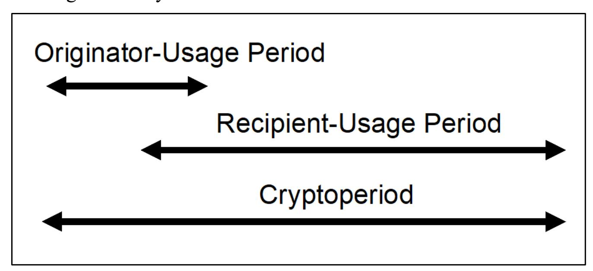
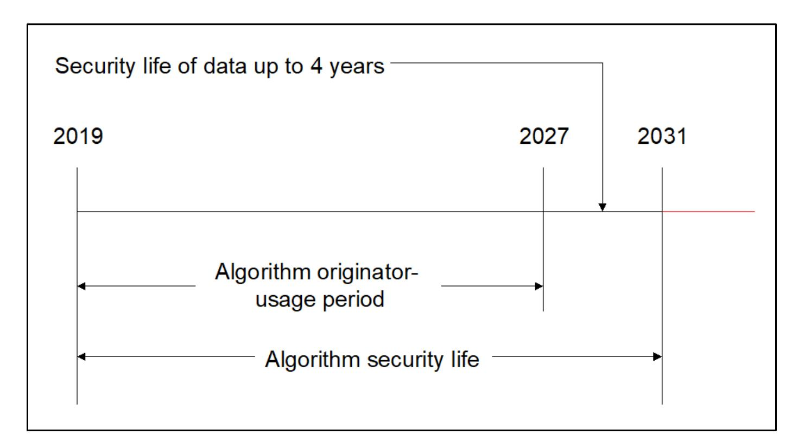
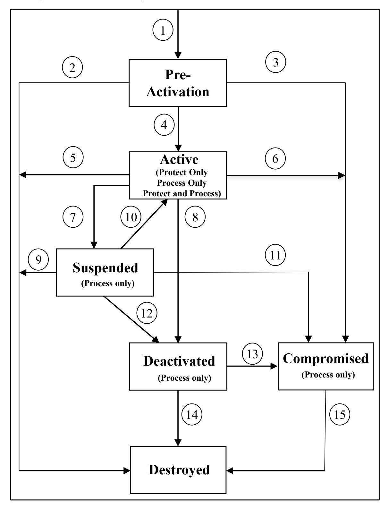
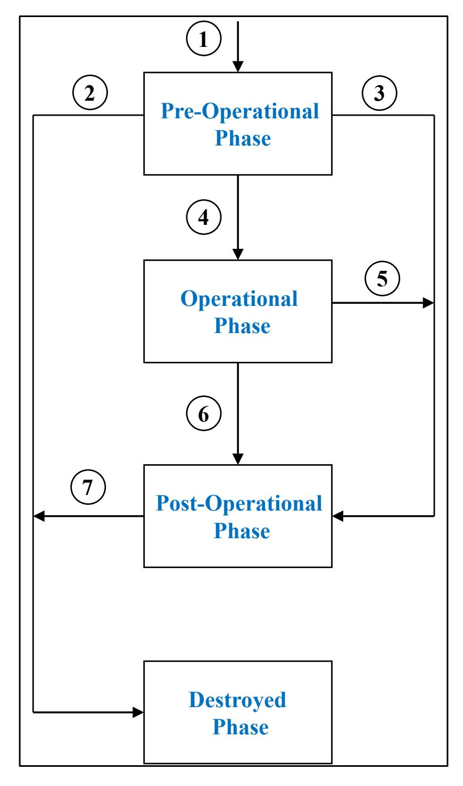
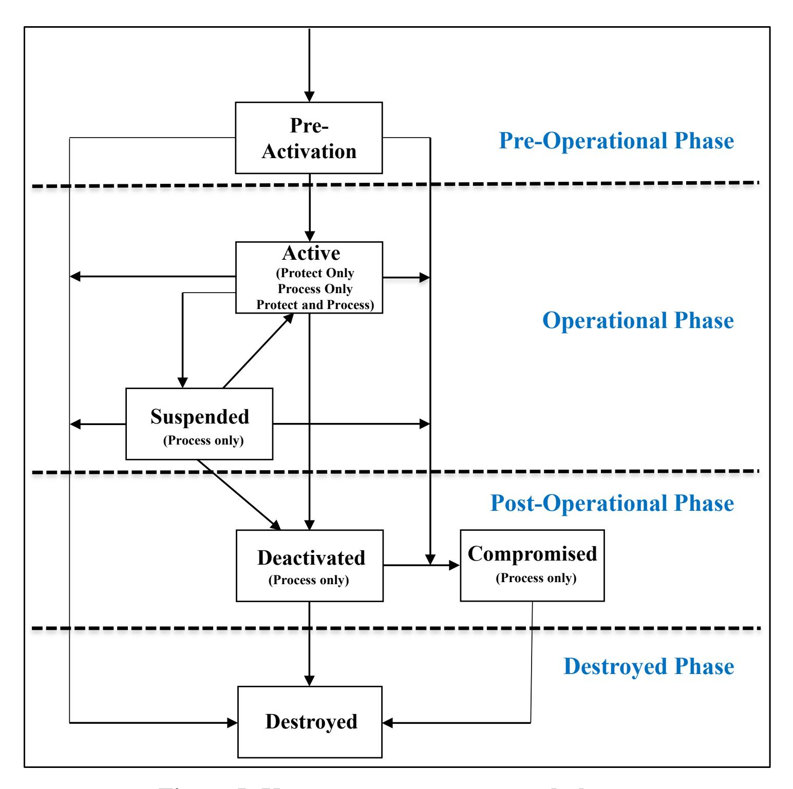

{0}------------------------------------------------

# **NIST Special Publication 800-57 Part 1 Revision 5**

# **Recommendation for Key Management:**

*Part 1 – General*

Elaine Barker

This publication is available free of charge from: https://doi.org/10.6028/NIST.SP.800-57pt1r5

C O M P U T E R S E C U R I T Y

{1}------------------------------------------------

# **NIST Special Publication 800-57 Part 1 Revision 5**

# **Recommendation for Key Management:**

*Part 1 – General*

Elaine Barker *Computer Security Division Information Technology Laboratory*

This publication is available free of charge from: https://doi.org/10.6028/NIST.SP.800-57pt1r5

May 2020

U.S. Department of Commerce *Wilbur L. Ross, Jr., Secretary*

{2}------------------------------------------------

## **Authority**

This publication has been developed by the National Institute of Standards and Technology (NIST) in accordance with its statutory responsibilities under the Federal Information Security Modernization Act (FISMA) of 2014, 44 U.S.C. § 3551 *et seq.*, Public Law (P.L.) 113-283. NIST is responsible for developing information security standards and guidelines, including minimum requirements for federal information systems, but such standards and guidelines shall not apply to national security systems without the express approval of appropriate federal officials exercising policy authority over such systems. This guideline is consistent with the requirements of the Office of Management and Budget (OMB) Circular A-130.

Nothing in this publication should be taken to contradict the standards and guidelines made mandatory and binding on federal agencies by the Secretary of Commerce under statutory authority. Nor should these guidelines be interpreted as altering or superseding the existing authorities of the Secretary of Commerce, Director of the OMB, or any other federal official. This publication may be used by nongovernmental organizations on a voluntary basis and is not subject to copyright in the United States. Attribution would, however, be appreciated by NIST.

National Institute of Standards and Technology Special Publication 800-57 Part 1, Revision 5 Natl. Inst. Stand. Technol. Spec. Publ. 800-57 Part 1 Rev. 5, 170 pages (May 2020) CODEN: NSPUE2

> This publication is available free of charge from: https://doi.org/10.6028/NIST.SP.800-57pt1r5

Certain commercial entities, equipment, or materials may be identified in this document in order to describe an experimental procedure or concept adequately. Such identification is not intended to imply recommendation or endorsement by NIST, nor is it intended to imply that the entities, materials, or equipment are necessarily the best available for the purpose.

There may be references in this publication to other publications currently under development by NIST in accordance with its assigned statutory responsibilities. The information in this publication, including concepts and methodologies, may be used by federal agencies even before the completion of such companion publications. Thus, until each publication is completed, current requirements, guidelines, and procedures, where they exist, remain operative. For planning and transition purposes, federal agencies may wish to closely follow the development of these new publications by NIST.

Organizations are encouraged to review all draft publications during public comment periods and provide feedback to NIST. Many NIST cybersecurity publications, other than the ones noted above, are available at [https://csrc.nist.gov/publications.](https://csrc.nist.gov/publications)

#### **Comments on this publication may be submitted to:**

National Institute of Standards and Technology Attn: Computer Security Division, Information Technology Laboratory 100 Bureau Drive (Mail Stop 8930) Gaithersburg, MD 20899-8930 Email: [keymanagement@nist.gov](mailto:keymanagement@nist.gov)

All comments are subject to release under the Freedom of Information Act (FOIA).

{3}------------------------------------------------

## **Reports on Computer Systems Technology**

The Information Technology Laboratory (ITL) at the National Institute of Standards and Technology (NIST) promotes the U.S. economy and public welfare by providing technical leadership for the Nation's measurement and standards infrastructure. ITL develops tests, test methods, reference data, proof of concept implementations, and technical analyses to advance the development and productive use of information technology. ITL's responsibilities include the development of management, administrative, technical, and physical standards and guidelines for the cost-effective security and privacy of other than national securityrelated information in Federal information systems. The Special Publication 800-series reports on ITL's research, guidelines, and outreach efforts in information system security, and its collaborative activities with industry, government, and academic organizations.

## **Abstract**

This Recommendation provides cryptographic key-management guidance. It consists of three parts. Part 1 provides general guidance and best practices for the management of cryptographic keying material, including definitions of the security services that may be provided when using cryptography and the algorithms and key types that may be employed, specifications of the protection that each type of key and other cryptographic information requires and methods for providing this protection, discussions about the functions involved in key management, and discussions about a variety of key-management issues to be addressed when using cryptography. Part 2 provides guidance on policy and security planning requirements for U.S. government agencies. Part 3 provides guidance when using the cryptographic features of current systems.

## **Keywords**

archive; authentication; authorization; availability; backup; compromise; confidentiality; cryptographic key; cryptographic module; digital signature; hash function; key agreement; key management; key recovery; keying material; key transport; private key; public key; secret key; trust anchor.

{4}------------------------------------------------

## **Acknowledgments**

The National Institute of Standards and Technology (NIST) gratefully acknowledges and appreciates contributions by previous authors of this document on the many security issues associated with this Recommendation: William Barker, William Burr, and Timothy Polk from NIST; Miles Smid from Orion Security; and Lydia Zieglar from the National Security Agency. NIST also thanks the many contributions by the public and private sectors whose thoughtful and constructive comments improved the quality and usefulness of this publication. NIST especially appreciates the comments submitted before, during, and after the public comment period by Paul Turner from Venafi.

## **Patent Disclosure Notice**

*NOTICE: The Information Technology Laboratory (ITL) has requested that holders of patent claims whose use may be required for compliance with the guidance or requirements of this publication disclose such patent claims to ITL. However, holders of patents are not obligated to respond to ITL calls for patents and ITL has not undertaken a patent search in order to identify which, if any, patents may apply to this publication.* 

*As of the date of publication and following call(s) for the identification of patent claims whose use may be required for compliance with the guidance or requirements of this publication, no such patent claims have been identified to ITL.* 

*No representation is made or implied by ITL that licenses are not required to avoid patent infringement in the use of this publication.* 

{5}------------------------------------------------

## **Executive Summary**

Cryptography is used to secure communications over networks, to protect information stored in databases, and for many other critical applications. Cryptographic keys play an important part in the operation of cryptography. These keys are analogous to the combination of a safe. If a safe combination is known to an adversary, the strongest safe provides no security against penetration.

The proper management of cryptographic keys is essential to the effective use of cryptography for security. Poor key management may easily compromise strong algorithms. This Recommendation provides guidance on the management of a cryptographic key throughout its lifecycle, including its secure generation, storage, distribution, use, and destruction.

Ultimately, the security of information protected by cryptography directly depends on the strength of the keys, the effectiveness of cryptographic mechanisms and protocols associated with the keys, and the protection provided to the keys. Secret and private keys need to be protected against unauthorized disclosure, and all keys need to be protected against modification.

Cryptographic keys are used across a broad range of systems and applications in enterprises, many of which are managed by individuals who may not have expertise in key management. Consequently, organizations must ensure that clear guidance and oversight is provided for the proper management of keys, as well as controls to ensure that the guidance is being properly followed and implemented.

Organizations and developers are presented with many choices in their use of cryptographic mechanisms. Inappropriate choices may result in an illusion of security but little or no real security for the protocol or application. This Recommendation (i.e., Special Publication (SP) 800-57) provides background information and establishes frameworks to support appropriate decisions when selecting and using cryptographic mechanisms.

Cryptographic modules are used to perform cryptographic operations using these keys. This Recommendation does not address the implementation details for cryptographic modules that may be used to achieve the security requirements identified herein. These details are addressed in Federal Information Processing Standard (FIPS) 140 [\[FIPS 140\]](#page-138-0) and its associated implementation guidance and derived test requirements (available at [https://csrc.nist.gov/projects/cmvp/\)](https://csrc.nist.gov/projects/cmvp/).

This Recommendation is written for several different audiences and is divided into three parts:

- Part 1, *General*, contains basic key-management guidance. It is intended to advise developers and system administrators on the "best practices" associated with key management. Cryptographic module developers may benefit from this general guidance by obtaining a greater understanding of the key-management features that are required to support specific applications. Protocol developers may identify key-management characteristics associated with specific suites of algorithms and gain a greater understanding of the security services provided by those algorithms. System administrators may use this document to assist in determining which configuration settings are most appropriate for their information. Part 1 of the Recommendation:
  - 1. Defines the security services that may be provided and the key types that may be employed in using cryptographic mechanisms;
  - 2. Provides background information regarding the cryptographic algorithms that use cryptographic keying material;

{6}------------------------------------------------

- 3. Classifies the different types of keys and other cryptographic information according to their functions, specifies the protection that each type of information requires, and identifies methods for providing this protection;
- 4. Identifies the states in which a cryptographic key may exist during its lifetime;
- 5. Identifies the multitude of functions involved in key management; and
- 6. Discusses a variety of key-management issues related to the keying material; topics discussed include key usage, cryptoperiod length, domain-parameter validation, public-key validation, key-inventory management, accountability, audit, survivability, and guidance for cryptographic algorithm and key size selection.
- Part 2, *Best Practices for Key Management Organizations*, is primarily intended to address the needs of system owners and managers. It provides a framework and general guidance to support establishing cryptographic key management within an organization and a basis for satisfying the key-management aspects of statutory and policy security planning requirements for federal government organizations.
- Part 3, *Application-Specific Key Management Guidance*, is intended to address the keymanagement issues associated with currently available implementations that use cryptography.

{7}------------------------------------------------

## **Table of Contents**

| E | Executive Summary iv                          |                                           |                                                                                      |          |  |
|---|-----------------------------------------------|-------------------------------------------|--------------------------------------------------------------------------------------|----------|--|
| 1 | Intro                                         | ductio                                    | n                                                                                    | 1        |  |
|   | 1.1 1.2 1.3 1.4 1.5               | Audier Scope Purpos                 | se                                                                                   | 2        |  |
| 2 | Glos                                          | sary o                                    | f Terms and Acronyms                                                                 | 6        |  |
|   | 2.1 2.2                                    |                                           | yms                                                                                  |          |  |
| 3 | Sec                                           | urity Se                                  | ervices                                                                              | 22       |  |
|   | 3.1 3.2 3.3 3.4 3.5 3.6 3.7 | Data In Author Author Non-resupport Combi | lentiality                                                                           |          |  |
| 4 | Cryp                                          | otograp                                   | ohic Algorithms                                                                      | 27       |  |
|   | 4.1 4.2 4.3 4.4                      | Symmo Asymr                            | ographic Hash Functions\netric-Key Algorithms netric-Key Algorithms m Bit Generation | 28 29 |  |
| 5 | Gen                                           | eral Ke                                   | y-Management Guidance                                                                | 30       |  |
|   | 5. 1                                          | Key Ty                                    | ypes and Other Information                                                           | 30       |  |
|   |                                               | 5.1.1 5.1.2                            | Cryptographic Keys Other Related Information                                         |          |  |
|   | 5.2 5.3                                    |                                           | sagepperiods                                                                         |          |  |
|   |                                               | 5.3.1 5.3.2 5.3.3                   | Factors Affecting Cryptoperiods                                                      | 35       |  |
|   |                                               |                                           | 5.3.3.1 Communications versus Storage                                                |          |  |
|   |                                               | 5.3.4 5.3.5 5.3.6 5.3.7          | Asymmetric Key Usage Periods and Cryptoperiods                                       | 37 38 |  |

{8}------------------------------------------------

| 7 |     |                                  | Key States and Transitions                                                                     |                                                                                                                                                                               | 80 |
|---|-----|----------------------------------|------------------------------------------------------------------------------------------------|-------------------------------------------------------------------------------------------------------------------------------------------------------------------------------|----|
|   |     | 6.2.3                            |                                                                                                | Metadata for Keys78                                                                                                                                                           |    |
|   |     |                                  | 6.2.2.2 Integrity 6.2.2.3 6.2.2.4 6.2.2.5 6.2.2.6                               | 76 Confidentiality77 Association with Usage or Application77 Association with the Other Entities77 Association with Other Related Key Information77               |    |
|   |     | 6.2.2                            | Protection Mechanisms for Key Information in Storage 6.2.2.1                                | 75 Availability75                                                                                                                                                          |    |
|   |     |                                  | 6.2.1.1 6.2.1.2 Integrity 6.2.1.3 6.2.1.4 6.2.1.5 6.2.1.6                    | Availability73 73 Confidentiality74 Association with Usage or Application75 Association with Other Entities75 Association with Other Related Key Information75 |    |
|   |     | 6.2.1                            |                                                                                                | Protection Mechanisms for Key Information in Transit72                                                                                                                        |    |
|   | 6.2 | 6.1.1 6.1.2                   | Protection Mechanisms                                                                          | Summary of Protection and Assurance Requirements for Cryptographic Keys.66 Summary of Protection Requirements for Other Related Information70 72                        |    |
| 6 | 6.1 |                                  |                                                                                                | Protection Requirements for Key Information Protection and Assurance Requirements65                                                                                        | 65 |
|   |     | 5.6.3 5.6.4 5.6.5          | Decrease of Security Strength Over Time                                                        | Projected Security Strength Time Frames and Current Approval Status 59 Transitioning to New Algorithms and Key Sizes in Systems60 62                                 |    |
|   |     | 5.6.2                            | Using Algorithm Suites and the Effective Security Strength                                     | 57                                                                                                                                                                            |    |
|   |     |                                  | 5.6.1.2                                                                                        | Algorithms53 Security Strengths of Hash Functions and Hash-based Functions55                                                                                               |    |
|   |     |                                  | 5.6.1.1                                                                                        | Security Strengths of Symmetric Block Cipher and Asymmetric-Key                                                                                                               |    |
|   |     | 5.6.1                            |                                                                                                | Comparable Algorithm Strengths52                                                                                                                                              |    |
|   | 5.6 | 5.5.1 5.5.2                   |                                                                                                | Implications49 Protective Measures50 Guidance for Cryptographic Algorithm and Key-Size Selection52                                                                      |    |
|   | 5.5 |                                  |                                                                                                | Compromise of Keys and other Keying Material49                                                                                                                                |    |
|   |     | 5.4.2 5.4.3 5.4.4 5.4.5 | Assurance of Domain Parameter Validity Assurance of Public-Key Validity Key Confirmation | 47 48 Assurance of Private-Key Possession48 48                                                                                                                       |    |
|   | 5.4 | 5.4.1                            | Assurance of                                                                                   | Assurances47 Integrity (Integrity Protection)47                                                                                                                            |    |
|   |     |                                  |                                                                                                |                                                                                                                                                                               |    |

{9}------------------------------------------------

|   | 7.1 7.2 |        | tivation StateState                                          |     |
|---|------------|--------|--------------------------------------------------------------|-----|
|   | 7.3        |        | nded State                                                   |     |
|   | 7.4        |        | vated State                                                  |     |
|   | 7.5        | Compi  | romised State                                                | 87  |
|   | 7.6        | _      | yed State                                                    |     |
| 8 | Key        | -Manag | gement Phases and Functions                                  | 89  |
|   | 8.1        | Pre-op | erational Phase                                              | 90  |
|   |            | 8.1.1  | Entity Registration Function                                 | 90  |
|   |            | 8.1.2  | System Initialization Function                               |     |
|   |            | 8.1.3  | Initialization Function                                      | 92  |
|   |            | 8.1.4  | Keying-Material Installation Function                        | 92  |
|   |            | 8.1.5  | Key Establishment Function                                   | 92  |
|   |            |        | 8.1.5.1 Generation and Distribution of Asymmetric Key Pairs  | 93  |
|   |            |        | 8.1.5.1.1 Distribution of Public Keys                        | 93  |
|   |            |        | 8.1.5.1.2 Distribution of Ephemeral Public Keys              | 98  |
|   |            |        | 8.1.5.1.3 Distribution of Centrally Generated Key Pairs      | 98  |
|   |            |        | 8.1.5.2 Generation and Distribution of Symmetric Keys        | 99  |
|   |            |        | 8.1.5.2.1 Key Generation                                     | 99  |
|   |            |        | 8.1.5.2.2 Key Distribution                                   |     |
|   |            |        | 8.1.5.2.3 Key Agreement                                      | 101 |
|   |            |        | 8.1.5.3 Generation and Distribution of Other Keying Material |     |
|   |            |        | 8.1.5.3.1 Domain Parameters                                  |     |
|   |            |        | 8.1.5.3.2 Initialization Vectors                             |     |
|   |            |        | 8.1.5.3.3 Shared Secrets                                     |     |
|   |            |        | 8.1.5.3.5 Other Public and Secret Information                |     |
|   |            |        | 8.1.5.3.6 Intermediate Results                               |     |
|   |            |        | 8.1.5.3.7 Random Bits/Numbers                                |     |
|   |            |        | 8.1.5.3.8 Passwords                                          | 103 |
|   |            | 8.1.6  | Key Registration Function                                    | 103 |
|   | 8.2        | Operat | tional Phase                                                 | 104 |
|   |            | 8.2.1  | Normal Operational Storage Function                          | 104 |
|   |            |        | 8.2.1.1 Cryptographic Module Storage                         |     |
|   |            |        | 8.2.1.2 Immediately Accessible Storage Media                 | 104 |
|   |            | 8.2.2  | Continuity of Operations Function                            | 104 |
|   |            |        | 8.2.2.1 Backup Storage                                       | 105 |
|   |            |        | 8.2.2.2 Key Recovery Function                                |     |
|   |            | 8.2.3  | Key Change Function                                          |     |
|   |            |        | 8.2.3.1 Re-keying                                            | 108 |
|   |            |        | , ,                                                          | 0 0 |

{10}------------------------------------------------

|                   |                         | 8.2.3.2 Key Update Function108                                                                                                                                    |     |
|-------------------|-------------------------|----------------------------------------------------------------------------------------------------------------------------------------------------------------------|-----|
|                   | 8.2.4                   | Key Derivation Methods108                                                                                                                                            |     |
| 8.3               |                         | Post-Operational Phase109                                                                                                                                            |     |
|                   | 8.3.1 8.3.2 8.3.3 | Key Archive and Key Recovery Functions 109 Entity De-registration Function 112 Key De-registration Function 113                                       |     |
|                   | 8.3.4 8.3.5          | Key Destruction Function113 Key Revocation Function 113                                                                                                        |     |
| 8.4               |                         | Destroyed Phase 115                                                                                                                                               |     |
| 9                 |                         | Additional Considerations                                                                                                                                            | 116 |
| 9.1 9.2        |                         | Access Control and Identity Authentication116 Inventory Management116                                                                                             |     |
|                   | 9.2.1 9.2.2          | Key Inventories117 Certificate Inventories117                                                                                                                     |     |
| 9.3 9.4        |                         | Accountability 118 Audit119                                                                                                                                    |     |
| 9.5               |                         | Key-Management System Survivability120                                                                                                                               |     |
|                   | 9.5.1 9.5.2 9.5.3 | Backed Up and Archived Key 120 Key Recovery120 System Redundancy/Contingency Planning122                                                                    |     |
|                   |                         | 9.5.3.1 General Principles 123 9.5.3.2 Cryptography and Key-Management-Specific Recovery Issues124                                                       |     |
|                   | 9.5.4                   | Compromise Recovery124                                                                                                                                               |     |
|                   |                         | References                                                                                                                                                           | 126 |
|                   |                         | Appendix A—Cryptographic and Non-cryptographic Integrity and Source Authentication Mechanisms                                                                     | 132 |
|                   |                         | Appendix B—Key Recovery                                                                                                                                           | 135 |
| B.1 B.2 B.3 |                         | Recovery from Stored Keying Material 136 Recovery by Reconstruction of Keying Material136 Conditions Under Which Keying Material Needs to be Recoverable136 |     |
|                   | B.3.1                   | Signature Key Pairs136                                                                                                                                               |     |
|                   |                         | B.3.1.1 Private Signature Keys136 B.3.1.2 Public Signature-verification Keys 137                                                                         |     |
|                   | B.3.2 B.3.3          | Symmetric Authentication Keys137 Authentication Key Pairs138                                                                                                      |     |
|                   |                         | B.3.3.1 Public Authentication Keys138 B.3.3.2 Private Authentication Keys138                                                                                |     |
|                   | B.3.4                   | Symmetric Data-Encryption Keys139                                                                                                                                    |     |

{11}------------------------------------------------

|     | B.3.5  |                             | Symmetric Key-Wrapping Keys139                                                      |     |
|-----|--------|-----------------------------|-------------------------------------------------------------------------------------|-----|
|     | B.3.6  |                             | Random Number Generation Keys139                                                    |     |
|     | B.3.7  |                             | Symmetric Master/Key-Derivation Keys 139                                         |     |
|     | B.3.8  |                             | Key-Transport Key Pairs 140                                                      |     |
|     |        | B.3.8.1                     | Private Key-Transport Keys140                                                       |     |
|     |        | B.3.8.2                     | Public Key-Transport Keys140                                                        |     |
|     | B.3.9  |                             | Symmetric Key-Agreement Keys141                                                     |     |
|     | B.3.10 |                             | Static Key-Agreement Key Pairs141                                                   |     |
|     |        | B.3.10.1                    | Private Static Key-Agreement Keys141                                                |     |
|     |        | B.3.10.2                    | Public Static Key Agreement Keys141                                                 |     |
|     | B.3.11 |                             | Ephemeral Key Pairs141                                                              |     |
|     |        |                             |                                                                                     |     |
|     |        | B.3.11.2                    | B.3.11.1 Private Ephemeral Keys142 Public Ephemeral Keys142                      |     |
|     |        |                             |                                                                                     |     |
|     | B.3.12 |                             | Symmetric Authorization Keys142                                                     |     |
|     | B.3.13 |                             | Authorization Key Pairs142                                                          |     |
|     |        | B.3.13.1                    | Private Authorization Keys142                                                       |     |
|     |        | B.3.13.2                    | Public Authorization Keys 142                                                    |     |
|     | B.3.14 |                             | Other Related Information 142                                                    |     |
|     |        | B.3.14.1                    | Domain Parameters 142                                                            |     |
|     |        | B.3.14.2                    | Initialization Vectors (IVs)143                                                     |     |
|     |        | B.3.14.3                    | Shared Secrets 143                                                               |     |
|     |        | B.3.14.4                    | RBG Seeds 143                                                                    |     |
|     |        | B.3.14.5                    | Other Public and Secret Information143                                              |     |
|     |        | B.3.14.6 B.3.14.7        | Intermediate Results143 Key-Control Information/Metadata143                      |     |
|     |        | B.3.14.8                    | Random Numbers144                                                                   |     |
|     |        | B.3.14.9                    | Passwords144                                                                        |     |
|     |        | B.3.14.10                   | Audit Information144                                                                |     |
| B.4 |        |                             | Key Recovery Systems144                                                             |     |
| B.5 |        |                             | Key Recovery Policy145                                                              |     |
|     |        | Appendix C—Revision History |                                                                                     | 147 |
|     |        |                             |                                                                                     |     |
|     |        |                             |                                                                                     |     |
|     |        |                             | List of Tables                                                                      |     |
|     |        |                             | Table 1: Suggested cryptoperiods for key types45                                    |     |
|     |        |                             | Table 2: Comparable security strengths of symmetric block cipher and asymmetric-key |     |
|     |        |                             | algorithms54                                                                        |     |
|     |        |                             |                                                                                     |     |
|     |        |                             | Table 3: Maximum security strengths for hash and hash-based functions56             |     |

[Table 4: Security strength time frames..........................................................................................59](#page-71-1)

{12}------------------------------------------------

| Table 5: Protection requirements for cryptographic keys67            |  |
|----------------------------------------------------------------------|--|
| Table 6: Protection requirements for other related information 71 |  |
| Table 7: Backup of keys 105                                       |  |
| Table 8: Backup of other related information106                   |  |
| Table 9: Archive of keys110                                          |  |
| Table 10: Archive of other related information 111                |  |
| List of Figures                                                      |  |
| Figure 1: Symmetric-key cryptoperiod38                               |  |
| Figure 2: Algorithm originator-usage period example 60            |  |
| Figure 3: Key state and transition example80                         |  |

[Figure 4: Key-management phases................................................................................................89](https://nistgov-my.sharepoint.com/personal/jgf_nist_gov/Documents/Cybersecurity-Pubs/cyber-pubs-repo/SPs/800-57pt1r5/NIST.SP.800-57pt1r5-clean.docx#_Toc39228858) [Figure 5: Key-management states and phases...............................................................................91](#page-103-0)

{13}------------------------------------------------

## **1 Introduction**

The use of cryptographic mechanisms is one of the strongest ways to provide security services for communications, data storage, and other applications. The National Institute of Standards and Technology (NIST) publishes Federal Information Processing Standards (FIPS) and NIST Recommendations (which are published as Special Publications (SPs)) that specify cryptographic techniques for protecting sensitive, unclassified information.

Since NIST published the Data Encryption Standard (DES) in 1977, the suite of **approved** standardized algorithms has grown. New classes of algorithms have been added, such as secure hash functions and asymmetric key algorithms for digital signatures. The suite of algorithms now provides different levels of cryptographic strength through a variety of key lengths. The algorithms may be combined in many ways to support increasingly complex protocols and applications. This NIST Recommendation applies to U.S. government agencies using cryptography for the protection of their sensitive, unclassified information. On a voluntary basis, this Recommendation may also be followed by other organizations that want to implement sound security principles in their computer systems.

The proper management of cryptographic keys and other key information is essential to the effective use of cryptography for security. Keys are analogous to the combination of a safe. If an adversary knows the combination, the strongest safe provides no security against penetration. Similarly, poor key management may easily compromise strong algorithms. Ultimately, the security of the information protected by cryptography directly depends on the strength of the keys, the effectiveness of the mechanisms and protocols associated with the keys, and the protection afforded to the keys. Cryptography can be rendered ineffective by the use of weak implementations, inappropriate algorithm pairing, poor physical security, and the use of weak (i.e., vulnerable) protocols.

Key management is the process of managing a key throughout its lifecycle, including its secure generation, storage, distribution, use, and destruction. Keys may be managed manually, but in many cases, an automated system is required to oversee, automate, and secure the keymanagement process. An automated system that performs key management is commonly known as a (cryptographic) key management system; see [SP 800-130](#page-142-0)[1](#page-13-3) and [SP 800-152.](#page-143-0) [2](#page-13-4)

#### **1.1 Purpose**

Organizations and developers are presented with many new choices in their use of cryptographic mechanisms. Inappropriate choices may result in an illusion of security but little or no real security for the protocol or application. This Recommendation (i.e., SP 800-57) provides background information and establishes frameworks to support appropriate decisions when selecting and using cryptographic mechanisms.

#### **1.2 Audience**

The audiences for this *Recommendation for Key Management* include system or application owners and managers, cryptographic module developers, protocol developers, and system

1 SP 800-130, *A Framework for Designing Cryptographic Key Management Systems*.

2 SP 800-152, *A Profile for U.S. Federal Cryptographic Key Management Systems (FCKMS)*.

{14}------------------------------------------------

administrators. The Recommendation is provided in three parts, which have been tailored to specific audiences.

Part 1 of this Recommendation (i.e., this document) provides general key-management guidance that is intended to be useful to both system developers and system administrators.[3](#page-14-1) Cryptographic module developers may benefit from this general guidance through a greater understanding of the key-management features that are required to support specific applications. Protocol developers may identify key-management characteristics associated with specific suites of algorithms and gain a greater understanding of the security services provided by those algorithms. System administrators may use Part 1, along with Part 3, to assist in determining configuration settings that would be most appropriate for their systems.

Part 2 of this Recommendation (i.e., [SP 800-57, Part 2](#page-141-0)[4](#page-14-2) ) is tailored for system or application owners[5](#page-14-3) for their use in identifying appropriate organizational key-management infrastructures, establishing organizational key-management policies, and specifying organizational keymanagement practices and plans.

Part 3 of this Recommendation (i.e., [SP 800-57, Part 3](#page-141-1)[6](#page-14-4) ) addresses the key-management issues associated with currently available cryptographic mechanisms and is intended to provide guidance to system installers, system administrators, and end users of existing key-management infrastructures, protocols, and other applications, as well as the people making purchasing decisions for new systems using currently available technology.

Although some background information and rationale are provided for context and to support the recommendations, this document assumes that the reader has a basic understanding of cryptography. For background material, readers may refer to a variety of NIST and commercial publications, including [SP 800-175B,](#page-143-1) [7](#page-14-5) which provides guidance for using cryptography and NIST's cryptographic standards, and [SP 800-32,](#page-140-0) [8](#page-14-6) which provides an introduction to a public-key infrastructure.

## **1.3 Scope**

This Recommendation encompasses cryptographic algorithms, infrastructures, protocols, implementations, applications, and the management thereof. All cryptographic algorithms currently **approved** by NIST for the protection of unclassified but sensitive information are within the scope of the Recommendation.

This Recommendation focuses on issues involving the management of cryptographic keys: their generation, use, and eventual destruction. Related topics such as algorithm selection and

3 Note that system administrators will require additional specific information when setting up their systems.

4 SP 800-57, Part 2, *Recommendation for Key Management: Part 2 – Best Practices for Key Management Organizations*.

5 E.g., the information security group within the organization.

6 SP 800-57, Part 3, *Recommendation for Key Management: Part 3 – Application-Specific Key Management Guidance.*

7 SP 800-175B, *Guideline for Using Cryptographic Standards in the Federal Government: Cryptographic Mechanisms.*

8 SP 800-32, *Introduction to Public Key Technology and the Federal PKI Infrastructure*.

{15}------------------------------------------------

appropriate key length, cryptographic policy, and cryptographic module selection are also included in this Recommendation. Some of the topics noted above are also addressed in other NIST standards and guidance. This Recommendation supplements more focused standards and guidelines.

This Recommendation does not address the implementation details for cryptographic modules that may be used to achieve the identified security requirements. These details are addressed in [FIPS](#page-138-0)  [140,](#page-138-0) [9](#page-15-1) the FIPS 140 implementation guidance, and the derived test requirements (available at [https://csrc.nist.gov/projects/cmvp\)](https://csrc.nist.gov/projects/cmvp).

This Recommendation does not address the requirements or procedures for operating a key archive or backup capability other than discussing the types of keying material that are appropriate to back up or include in an archive and the protection to be provided to that keying material.

This Recommendation often uses "requirement" terms, which have the following meaning in this document:

- 1. **Shall**: This term is used to indicate a requirement of a FIPS or a requirement that must be fulfilled to claim conformance to this Recommendation. Note that **shall** may be coupled with **not** to become **shall not**.
- 2. **Should**: This term is used to indicate an important recommendation. Ignoring the recommendation could result in undesirable results. Note that **should** may be coupled with **not** to become **should not**.

## **1.4 Purpose of FIPS and NIST Recommendations (NIST Standards)**

Federal Information Processing Standards (FIPS) and NIST Recommendations, collectively referred to as "NIST standards," are valuable because:

- 1. They establish an acceptable minimal level of security for U.S. government systems. Systems that implement these NIST standards offer a consistent level of security that is **approved** for the protection of sensitive, unclassified government information.
- 2. They often establish some level of interoperability between different systems that implement the NIST standards. For example, two products that both implement the Advanced Encryption Standard (AES)[10](#page-15-2) cryptographic algorithm have the potential to interoperate, provided that the other functions of the product are compatible.
- 3. They often provide for scalability because the U.S. government requires products and techniques that can be effectively applied in large numbers.
- 4. They are scrutinized by U.S. government experts and the public to ensure that they provide a high level of security. The NIST standards process invites broad public participation, not only through the formal NIST public review process before adoption but also by interaction with the open cryptographic community through NIST workshops, participation in voluntary standards development organizations, participation in cryptographic research conferences, and informal contacts with researchers. NIST encourages the study and

9 FIPS 140, *Security Requirements for Cryptographic Modules*.

10 Specified in FIPS 197, *Advanced Encryption Standard*.

{16}------------------------------------------------

cryptanalysis of NIST standards. Inputs on their security are welcome at any point, including during the creation of the initial requirements, during development, and after adoption.

- 5. NIST-**approved** cryptographic techniques are periodically reassessed for their continued effectiveness. If any technique is found to be inadequate for the continued protection of government information, the NIST standard is revised or discontinued.
- 6. The algorithms specified in NIST standards (e.g., AES, SHA-2, and ECDSA) and the cryptographic modules in which they reside have required conformance tests. Accredited laboratories perform these tests on vendor implementations that claim conformance to the standards. Vendors are required to modify nonconforming implementations so that they meet all applicable requirements. Users of validated implementations can have a high degree of confidence that validated implementations conform to the standards.

Since 1977, NIST has developed a cryptographic "toolkit" of NIST standards[11](#page-16-1) that form a basis for the implementation of **approved** cryptography. This Recommendation references many of those standards and provides guidance on how they may be properly used to protect sensitive information.

## **1.5 Content and Organization**

Part 1, *General Guidance*, contains basic key-management guidance. It is intended to advise developers and system administrators on the "best practices" associated with key management.

- [Section 1,](#page-13-0) *Introduction*, establishes the purpose, scope, and intended audience of the *Recommendation for Key Management.*
- [Section 2,](#page-18-2) *Glossary of Terms and Acronyms*, provides definitions of terms and acronyms used in this part of the *Recommendation for Key Management*. The reader should be aware that the terms used in this Recommendation might be defined differently in other documents.
- [Section 3,](#page-33-0) *Security Services*, defines the security services that may be provided using cryptographic mechanisms.
- [Section 4,](#page-39-0) *Cryptographic Algorithms*, provides background information regarding the **approved** cryptographic algorithms that generate and use cryptographic keying material.
- [Section 5,](#page-42-0) *General Key-Management Guidance,* classifies the different types of keys and other key information according to their uses, discusses cryptoperiods and recommends appropriate cryptoperiods for each key type, provides recommendations and requirements for other keying material, introduces the concept of assurance of domain-parameter and public-key validity, discusses the implications of a key compromise, and provides guidance on cryptographic algorithm strength selection, implementation, and replacement.
- [Section 6,](#page-77-0) *Protection Requirements for Key Information*, specifies the protection that each type of key information requires and identifies methods for providing this protection. These

11 The toolkit consists of publications specifying algorithms and guidance for their use rather than software code.

{17}------------------------------------------------

protection requirements should be of particular interest to cryptographic module vendors and application implementers.

- [Section 7,](#page-92-0) *Key State and Transitions*, identifies the states in which a cryptographic key may exist during its lifetime.
- [Section 8,](#page-101-0) *Key-Management Phases and Functions*, identifies four phases and a multitude of functions involved in key management. This section should be of particular interest to cryptographic module vendors and developers of cryptographic infrastructure services.
- [Section 9,](#page-128-0) *Additional Considerations*, discusses access control, identity authentication, inventory management, accountability, audit, and survivability.
- [References](#page-138-1) contains a list of appropriate references.
- [Appendix A,](#page-144-0) *Cryptographic and Non-cryptographic Integrity and Source-authentication Mechanisms*, provides supplemental information about integrity and source-authentication services.
- [Appendix B,](#page-147-0) *Key Recovery*, provides additional information about recovering keys from key backups and archives.
- [Appendix C](#page-159-0) contains a history of changes since the originally published version of this document.

{18}------------------------------------------------

## **2 Glossary of Terms and Acronyms**

The definitions provided below are defined as used in this document. The same terms may be defined differently in other documents.

This Recommendation uses several terms relating to the management of cryptographic key information. While each of these terms is defined in Section 2.1, it may be useful to compare these terms and show their relationship since they will be used throughout the document.

• A *cryptographic key* is a parameter used in conjunction with a cryptographic algorithm that determines its operation in such a way that an entity with knowledge of the key can reproduce, reverse, or verify the operation while an entity without knowledge of the key cannot. Examples include a symmetric key used with AES to encrypt plaintext data and decrypt ciphertext data, a private signature key used with a digital signature algorithm to generate a digital signature, or a public signature-verification key used with a digital signature algorithm to verify a digital signature.

Keys are owned and used by entities (e.g., individuals (humans), organizations, devices, or processes) that interact with other entities to conduct business. In the case of non-human owners (e.g., the organization, device, or process), the owner is represented or sponsored by one or more humans. For example, if the owner is an organization, then several humans may be authorized to use the key; the humans may be said to represent the organization when conducting its business. In the case of a device or process, the device or process owns and uses the key, but a human sponsor is responsible for managing the key (e.g., generating or replacing the key when required).

- *Keying material* includes a cryptographic key and other material (e.g., an Initialization Vector (IV) or domain parameters) to be used during the execution of a cryptographic algorithm.
- *Metadata* is the information associated with a key that describes its specific characteristics, constraints, acceptable uses, ownership, etc. Portions of the metadata may be secret (e.g., the identity of the key's owner in some cases).
- *Key information* is information about a particular key that includes all the keying material associated with that key and associated metadata relating to that key.

Symmetric keys and the private keys of asymmetric-key (public-key) algorithms require confidentiality protection, and some metadata elements may also require this protection. All key information requires integrity protection.

## **2.1 Glossary**

| Access control | Restricts resource access to only authorized entities.                                                            |
|----------------|-------------------------------------------------------------------------------------------------------------------|
| Accountability | 1. Assigning key management responsibilities to individuals and holding them accountable for these activities. |
|                | 2. A property that ensures that the actions of an entity may be traced uniquely to that entity.                |

{19}------------------------------------------------

| Active state                             | The key state in which the key may be used to cryptographically protect information (e.g., encrypt plaintext or generate a digital signature), cryptographically process previously protected information (e.g., decrypt ciphertext or verify a digital signature), or both. |
|------------------------------------------|---------------------------------------------------------------------------------------------------------------------------------------------------------------------------------------------------------------------------------------------------------------------------------------------------------------|
| Algorithm originator usage period  | The period of time during which a specific cryptographic algorithm may be used by originators to apply protection to data (e.g., encrypt or generate a digital signature).                                                                                                                           |
| Algorithm security lifetime           | The estimated time period during which data protected by a specific cryptographic algorithm remains secure, given that the key has not been compromised.                                                                                                                                                |
| Approved                                 | FIPS-approved and/or NIST-recommended. An algorithm or technique that is either 1) specified in a FIPS or NIST Recommendation or 2) specified elsewhere and adopted by reference in a FIPS or NIST Recommendation.                                                                                |
| Archive                                  | 1. To place information into long-term storage.                                                                                                                                                                                                                                                               |
|                                          | 2. A location or media used for long-term storage.                                                                                                                                                                                                                                                            |
| Association                              | A relationship for a particular purpose; for example, a key is associated with the application or process for which it will be used.                                                                                                                                                                       |
| Assurance of (private key) possession | Confidence that an entity possesses a private key and its associated key information and that the private key corresponds to a given public key.                                                                                                                                                           |
| Assurance of validity                    | Confidence that a public key or domain parameter is arithmetically correct.                                                                                                                                                                                                                                |
| Asymmetric-key algorithm              | See Public-key cryptographic algorithm.                                                                                                                                                                                                                                                                       |
| Authentication                           | A process that provides assurance of the source and integrity of information in communications sessions, messages, documents or stored data or that provides assurance of the identity of an entity interacting with a system.                                                                 |
|                                          | See Source authentication, Identity authentication, and Integrity authentication.                                                                                                                                                                                                                       |
| Authentication code                      | A keyed cryptographic checksum based on an approved security function; also known as a Message Authentication Code.                                                                                                                                                                                     |
| Authorization                            | Access privileges that are granted to an entity that convey an "official" sanction to perform a security function or activity.                                                                                                                                                                       |
| Availability                             | Timely, reliable access to information by authorized entities.                                                                                                                                                                                                                                                |

{20}------------------------------------------------

| Backup                              | A copy of key information to facilitate recovery during the cryptoperiod of the key, if necessary.                                                                                                                                                               |
|-------------------------------------|---------------------------------------------------------------------------------------------------------------------------------------------------------------------------------------------------------------------------------------------------------------------|
| Block cipher (algorithm)         | A symmetric-key cryptographic algorithm that transforms one block of information at a time using a cryptographic key. For a block cipher algorithm, the length of the input block is the same as the length of the output block.                           |
| Certificate                         | See Public-key certificate.                                                                                                                                                                                                                                         |
| Certificate-inventory management | See Key-inventory management.                                                                                                                                                                                                                                       |
| Certification authority             | The entity in a Public Key Infrastructure (PKI) that issues certificates to certificate subjects.                                                                                                                                                                |
| Ciphertext                          | Data in its encrypted form.                                                                                                                                                                                                                                         |
| Collision                           | Two or more distinct inputs produce the same output. Also see Hash function.                                                                                                                                                                                     |
| Compromise                          | The unauthorized disclosure, modification, substitution or use of sensitive key information (e.g., a secret key, private key, or secret metadata).                                                                                                      |
| Compromised state                   | A key state to which a key is transitioned when there is a suspicion or confirmation of the key's compromise.                                                                                                                                                    |
| Confidentiality                     | The property that sensitive information is not disclosed to unauthorized entities (e.g., the secrecy of the key information is maintained).                                                                                                                   |
| Contingency plan                    | A plan that is maintained for disaster response, backup operations, and post-disaster recovery to ensure the availability of critical resources and to facilitate the continuity of operations in an emergency situation.                                     |
| Contingency planning                | The development of a contingency plan.                                                                                                                                                                                                                              |
| Cryptanalysis                       | 1. Operations performed to defeat cryptographic protection without an initial knowledge of the key employed in providing the protection.                                                                                                                         |
|                                     | 2. The study of mathematical techniques for attempting to defeat cryptographic techniques and information-system security. This includes the process of looking for errors or weaknesses in the implementation of an algorithm or in the algorithm itself. |
| Cryptographic algorithm          | A well-defined computational procedure that takes variable inputs, including a cryptographic key, and produces an output.                                                                                                                                     |
| Cryptographic boundary           | An explicitly defined continuous perimeter that establishes the physical bounds of a cryptographic module and contains all hardware, software, and/or firmware components of a cryptographic module.                                                       |

{21}------------------------------------------------

| Cryptographic hash function | See Hash function.                                                                                                                                                                                                                                                                          |
|--------------------------------|---------------------------------------------------------------------------------------------------------------------------------------------------------------------------------------------------------------------------------------------------------------------------------------------|
| Cryptographic key (key)     | A parameter used in conjunction with a cryptographic algorithm that determines its operation in such a way that an entity with knowledge of the key can reproduce, reverse or verify the operation while an entity without knowledge of the key cannot. Examples include: |
|                                | 1. The transformation of plaintext data into ciphertext data,                                                                                                                                                                                                                               |
|                                | 2. The transformation of ciphertext data into plaintext data,                                                                                                                                                                                                                               |
|                                | 3. The computation of a digital signature from data,                                                                                                                                                                                                                                        |
|                                | 4. The verification of a digital signature on data,                                                                                                                                                                                                                                      |
|                                | 5. The computation of an authentication code from data,                                                                                                                                                                                                                                     |
|                                | 6. The verification of an authentication code from data and a received or retrieved authentication code, and                                                                                                                                                                       |
|                                | 7. The computation of a shared secret that is used to derive keying material.                                                                                                                                                                                                            |
| Cryptographic module           | The set of hardware, software, and/or firmware that implements security functions and is contained within a cryptographic approved boundary.                                                                                                                                       |
| Cryptoperiod                   | The time span during which a specific key is authorized for use or in which the keys for a given system or application may remain in effect.                                                                                                                                             |
| Data-encryption key            | A key used to encrypt and decrypt data other than keys.                                                                                                                                                                                                                                     |
| Data integrity                 | A property whereby data has not been altered in an unauthorized manner since it was created, transmitted, or stored.                                                                                                                                                                  |
| Deactivated state              | A key state in which keys are not used to apply cryptographic protection (e.g., encrypt) but, in some cases, are used to process cryptographically protected information (e.g., decrypt).                                                                                       |
| Decryption                     | The process of changing ciphertext into plaintext using a cryptographic algorithm and key.                                                                                                                                                                                               |
| Destroyed state                | A key state to which a key transitions when it is destroyed. Although the key no longer exists, its previous existence may be recorded (e.g., in metadata or audit logs).                                                                                                             |

{22}------------------------------------------------

| Deterministic random bit generator (DRBG)        | A random bit generator that includes a DRBG algorithm and (at least initially) has access to a source of randomness. The DRBG produces a sequence of bits from a secret initial value called a seed. A cryptographic DRBG has the additional property that the output is unpredictable given that the seed is not known. A DRBG is sometimes also called a pseudo random number generator (PRNG) or a deterministic random number generator. |
|-----------------------------------------------------|----------------------------------------------------------------------------------------------------------------------------------------------------------------------------------------------------------------------------------------------------------------------------------------------------------------------------------------------------------------------------------------------------------------------------------------------------------------------------|
| Digital signature                                   | The result of a cryptographic transformation of data that, when properly implemented with a supporting infrastructure and policy, provides the services of:                                                                                                                                                                                                                                                                                                          |
|                                                     | 1. Source/identity authentication,                                                                                                                                                                                                                                                                                                                                                                                                                                         |
|                                                     | 2. Data integrity authentication, and/or                                                                                                                                                                                                                                                                                                                                                                                                                                   |
|                                                     | 3. Support for signer non-repudiation.                                                                                                                                                                                                                                                                                                                                                                                                                                     |
| Distribution                                        | See Key distribution.                                                                                                                                                                                                                                                                                                                                                                                                                                                      |
| Domain parameter                                    | A parameter used in conjunction with some public-key algorithms to generate key pairs or to perform cryptographic operations (e.g., to create digital signatures or to establish keying material).                                                                                                                                                                                                                                                                |
| Encrypted key                                       | A cryptographic key that has been encrypted using an approved cryptographic algorithm in order to disguise the value of the underlying plaintext key.                                                                                                                                                                                                                                                                                                             |
| Encryption                                          | The process of changing plaintext into ciphertext using a cryptographic algorithm and key.                                                                                                                                                                                                                                                                                                                                                                              |
| Entity                                              | An individual (person), organization, device or process.                                                                                                                                                                                                                                                                                                                                                                                                                   |
| Entity registration                              | A function in the lifecycle of a cryptographic key; a process whereby an entity becomes a member of a security domain.                                                                                                                                                                                                                                                                                                                                                  |
| Ephemeral key                                       | A cryptographic key that is generated for each execution of a cryptographic process (e.g., key establishment) and that meets other requirements of the key type (e.g., unique to each message or session).                                                                                                                                                                                                                                                  |
| Hash-based message authentication code (HMAC) | A message authentication code that uses an approved keyed-hash FIPS 19812). function (i.e., see                                                                                                                                                                                                                                                                                                                                                                |

12 FIPS 198, *The Keyed-Hash Message Authentication Code (HMAC)*.

{23}------------------------------------------------

| Hash function                                  | A function that maps a bit string of arbitrary (although bounded) length to a fixed-length bit string. Approved hash functions satisfy the following properties:                                                                              |
|------------------------------------------------|-----------------------------------------------------------------------------------------------------------------------------------------------------------------------------------------------------------------------------------------------------------|
|                                                | 1. (One-way) It is computationally infeasible to find any input that maps to any pre-specified output.                                                                                                                                                 |
|                                                | 2. (Collision-resistant) It is computationally infeasible to find any two distinct inputs that map to the same output.                                                                                                                                 |
| Hash value                                     | The result of applying a hash function to information.                                                                                                                                                                                                    |
| Identifier                                     | A bit string that is associated with a person, device, or organization. It may be an identifying name or may be something more abstract (e.g., a string consisting of an IP address and timestamp), depending on the application.          |
| Identity                                       | The distinguishing character or personality of an entity.                                                                                                                                                                                                 |
| Identity authentication                        | The process of providing assurance about the identity of an entity interacting with a system (e.g., to access a resource). Sometimes called entity authentication.                                                                                  |
| Initialization vector (IV)                  | A vector used in defining the starting point of a cryptographic process.                                                                                                                                                                                  |
| Integrity (also, assurance of integrity) | See Data integrity.                                                                                                                                                                                                                                       |
| Integrity authentication                    | The process of obtaining assurance that data has not been modified since an authentication code or digital signature was created for that data.                                                                                                        |
| Integrity protection                           | The protection obtained for transmitted or stored data using an authentication code (e.g., MAC) or digital signature computed on that data. See Integrity authentication.                                                                           |
| Key                                            | See Cryptographic key.                                                                                                                                                                                                                                    |
| Key agreement                                  | A key-establishment procedure where keying material is generated from information contributed by two or more participants so that no party can predetermine the value of the keying material independently of any other party's contribution. |
| Key confirmation                               | A procedure used to provide assurance to one party that another party actually possesses the same keying material and/or shared secret.                                                                                                             |
| Key de-registration                            | A function in the lifecycle of a cryptographic key; the marking of a key or the information associated with it (e.g., metadata) to indicate that the key is no longer in use.                                                                       |
|                                                |                                                                                                                                                                                                                                                           |

{24}------------------------------------------------

| Key derivation                                            | The process by which keying material is derived from either a pre-shared key or a shared secret (from a key-agreement scheme), along with other information.                                                                                                                                                         |
|-----------------------------------------------------------|----------------------------------------------------------------------------------------------------------------------------------------------------------------------------------------------------------------------------------------------------------------------------------------------------------------------------------|
| Key-derivation function                                | − A function that with the input of a cryptographic key or shared secret − and possibly other data generates a binary string, called keying material.                                                                                                                                                          |
| Key-derivation key                                        | A key used with a key-derivation method to derive additional keys. Sometimes called a master key.                                                                                                                                                                                                                          |
| Key-derivation method                                  | A key-derivation function or other approved procedure for deriving keying material.                                                                                                                                                                                                                                        |
| Key destruction                                           | To remove all traces of a cryptographic key so that it cannot be recovered by either physical or electronic means.                                                                                                                                                                                                         |
| Key distribution                                          | The transport of a key and other keying material from an entity that either owns, generates or otherwise acquires the key to another entity that is intended to use the key.                                                                                                                                            |
| Key-encrypting key                                        | A cryptographic key that is used for the encryption or decryption of other keys to provide confidentiality protection for those keys. Also see Key-wrapping key.                                                                                                                                                     |
| Key establishment                                         | A function in the lifecycle of a cryptographic key; the process by which cryptographic keys are securely established among entities using manual transport methods (e.g., key loaders), automated methods (e.g., key transport and/or key-agreement protocols), or a combination of automated and manual methods. |
| Key information                                           | Information about a key that includes the keying material and associated metadata relating to that key. See Keying material and Metadata.                                                                                                                                                                                  |
| Key inventory                                             | Information about each key that does not include the key itself (e.g., the key owner, key type, algorithm, application and expiration date).                                                                                                                                                                               |
| Key-inventory (or certificate-inventory) management | Establishing and maintaining records of the keys and/or certificates in use, assigning and tracking their owners or sponsors, monitoring key and certificate status, and reporting the status to the appropriate official for remedial action when required.                                                            |
| Key length                                                | The length of a key in bits; used interchangeably with "Key size."                                                                                                                                                                                                                                                               |
| Key management                                            | The activities involving the handling of cryptographic keys and other related key information during the entire lifecycle of the keys, including their generation, storage, establishment, entry and output, use, and destruction.                                                                             |

{25}------------------------------------------------

| Key-Management Policy              | A high-level statement of organizational key-management policies that identifies a high-level structure, responsibilities, governing standards, organizational dependencies and other relationships, and security policies.                                                                                                                           |
|---------------------------------------|----------------------------------------------------------------------------------------------------------------------------------------------------------------------------------------------------------------------------------------------------------------------------------------------------------------------------------------------------------------|
| Key management system              | A system for the management of cryptographic keys and their metadata (e.g., generation, distribution, storage, backup, archive, recovery, use, revocation, and destruction). An automated key management system may be used to oversee, automate, and secure the key management process.                                                        |
| Key-Management Practices Statement | A document or set of documents that describes, in detail, the organizational structure, responsible roles, and organization rules for the functions identified in the Key-Management Policy.                                                                                                                                                             |
| Key owner                             | An entity authorized to use a cryptographic key or key pair and whose identifier is associated with a cryptographic key or key pair.                                                                                                                                                                                                                        |
| Key pair                              | A public key and its corresponding private key; a key pair is used with a public-key algorithm.                                                                                                                                                                                                                                                             |
| Key recovery                          | A function in the lifecycle of a cryptographic key; mechanisms and processes that allow authorized entities to retrieve or reconstruct the key from key backups or archives.                                                                                                                                                                             |
| Key registration                      | A function in the lifecycle of a cryptographic key; the process of officially recording the keying material by a registration authority.                                                                                                                                                                                                                    |
| Key revocation                        | A possible function in the lifecycle of a cryptographic key; a process whereby a notice is made available to affected entities that the key should be removed from operational use prior to the end of the established cryptoperiod of that key.                                                                                                   |
| Key share                             | ≥ One of n parameters (where n 2) such that among the n key shares, any ≥ k key shares (where k n) can be used to construct a key value, but having any k−1 or fewer key shares provides no knowledge of the (constructed) key value. Sometimes called a cryptographic key component or key split. |
| Key size                              | The length of a key in bits; used interchangeably with "Key length."                                                                                                                                                                                                                                                                                           |
| Key states                            | The states through which a key transitions between its generation and its destruction. See Pre-activation state, Active state, Suspended state, Deactivated state, Compromised state, and Destroyed state.                                                                                                                                      |

{26}------------------------------------------------

| Key transport                           | A key-establishment procedure whereby one party (the sender) selects and encrypts (or wraps) the key and then distributes it to another party (the receiver).                                                           |  |  |
|-----------------------------------------|-------------------------------------------------------------------------------------------------------------------------------------------------------------------------------------------------------------------------------|--|--|
|                                         | When used in conjunction with a public-key (asymmetric) algorithm, the key is encrypted using the public key of the receiver and subsequently decrypted using the receiver's private key.                               |  |  |
|                                         | When used in conjunction with a symmetric algorithm, the key is encrypted with a key-wrapping key shared by the sending and receiving parties and decrypted using the same key.                                         |  |  |
| Key update                              | A function performed on a cryptographic key in order to compute a new key that is related to the old key and is used to replace that key. Note that this Recommendation disallows this method of replacing a key. |  |  |
| Key wrapping                            | A method of cryptographically protecting keys using a symmetric key that provides both confidentiality and integrity protection.                                                                                           |  |  |
| Key-wrapping key                        | A symmetric key that is used to provide both confidentiality and integrity protection for other keys. Also see Key-encrypting key.                                                                                         |  |  |
| Keying material                         | A cryptographic key and other parameters (e.g., IVs or domain parameters) used with a cryptographic algorithm.                                                                                                             |  |  |
| Manual key transport                    | A non-automated means of transporting cryptographic keys by physically moving a device or document containing the key or key share.                                                                                        |  |  |
| Master key                              | See Key-derivation key.                                                                                                                                                                                                       |  |  |
| Message authentication code (MAC) | A cryptographic checksum on data that uses an approved security function and a symmetric key to detect both accidental and intentional modifications of data.                                                        |  |  |
| Metadata                                | The information associated with a key that describes its specific characteristics, constraints, acceptable uses, ownership, etc.; sometimes called the key's attributes.                                                |  |  |
| NIST standards                          | Federal Information Processing Standards (FIPS) and NIST Recommendations.                                                                                                                                |  |  |
| Non-repudiation                         | A service using a digital signature that is used to support a determination by a third party of whether a message was actually signed by a given entity.                                                                |  |  |
| Operational phase                       | A phase in the lifecycle of a cryptographic key whereby the key is used for standard cryptographic purposes.                                                                                                               |  |  |
| Operational storage                     | The normal storage of operational keying material during the key's cryptoperiod.                                                                                                                                           |  |  |

{27}------------------------------------------------

| Owner (of a certificate)                | A human entity that is identified as the subject in a public key certificate or is a sponsor of a non-human entity (e.g., device, application or process) that is identified as the certificate subject.                                                                                                                 |  |  |
|--------------------------------------------|--------------------------------------------------------------------------------------------------------------------------------------------------------------------------------------------------------------------------------------------------------------------------------------------------------------------------------|--|--|
| Owner (of a key or key pair)         | For a static key pair, the entity that is associated with the public key and authorized to use the private key. For an ephemeral key pair, the owner is the entity that generated the public/private key pair. For a symmetric key, the owner is any entity that is authorized to use the key.                        |  |  |
| Originator                                 | An entity that initiates an information exchange or storage event.                                                                                                                                                                                                                                                             |  |  |
| Originator-usage period                 | The period of time in the cryptoperiod of a key during which cryptographic protection may be applied to data using that key.                                                                                                                                                                                                |  |  |
| Password                                   | A string of characters (letters, numbers and other symbols) that are used to authenticate an identity, verify access authorization or derive cryptographic keys.                                                                                                                                                         |  |  |
| Period of protection                       | The period of time during which the integrity or confidentiality of a key needs to be maintained.                                                                                                                                                                                                                        |  |  |
| Plaintext                                  | Intelligible data that has meaning and can be understood without the application of decryption.                                                                                                                                                                                                                             |  |  |
| Pre-activation state                       | A key state in which the key has been generated but is not yet authorized for use.                                                                                                                                                                                                                                 |  |  |
| Private key                                | A cryptographic key used with a public-key cryptographic algorithm that is uniquely associated with an entity and is not made public. In an asymmetric-key (public-key) cryptosystem, the private key has a corresponding public key. Depending on the algorithm, the private key may be used, for example, to: |  |  |
|                                            | 1. Compute the corresponding public key, 2. Compute a digital signature that may be verified by the corresponding public key, 3. Decrypt keys that were encrypted by the corresponding public key, or 4. Compute a shared secret during a key-agreement transaction.                                |  |  |
| Proof of possession (POP)               | A verification process whereby assurance is obtained that the owner of a key pair actually has the private key associated with the public key.                                                                                                                                                                              |  |  |
| Pseudorandom number generator (PRNG) | See Deterministic random bit generator (DRBG).                                                                                                                                                                                                                                                                                 |  |  |

{28}------------------------------------------------

| Public key                                                   | A cryptographic key used with a public-key cryptographic algorithm that is uniquely associated with an entity and that may be made public. In an asymmetric-key (public-key) cryptosystem, the public key has a corresponding private key. The public key may be known by anyone and, depending on the algorithm, may be used, for example, to: |
|--------------------------------------------------------------|----------------------------------------------------------------------------------------------------------------------------------------------------------------------------------------------------------------------------------------------------------------------------------------------------------------------------------------------------------------|
|                                                              | 1. Verify a digital signature that was generated using the corresponding private key,                                                                                                                                                                                                                                            |
|                                                              | 2. Encrypt keys that can be decrypted using the corresponding private key, or                                                                                                                                                                                                                                                                               |
|                                                              | 3. Compute a shared secret during a key-agreement transaction.                                                                                                                                                                                                                                                                                                 |
| Public-key certificate                                       | A set of data that uniquely identifies an entity, contains the entity's public key and possibly other information, and is digitally signed by a trusted party, thereby binding the public key to the entity. Additional information in the certificate could specify how the key is used and its validity period.                               |
| Public-key (asymmetric-key) cryptographic algorithm | A cryptographic algorithm that uses two related keys: a public key and a private key. The two keys have the property that determining the private key from the public key is computationally infeasible.                                                                                                                                                 |
| Public Key Infrastructure (PKI)                        | A framework that is established to issue, maintain, and revoke public key certificates.                                                                                                                                                                                                                                                                  |
| Random bit generator (RBG)                                | A device or algorithm that outputs a sequence of bits that appears to be statistically independent and unbiased. Also see Random number generator.                                                                                                                                                                                              |
| Random number generator (RNG)                             | A process used to generate an unpredictable series of numbers. Also called a Random bit generator (RBG).                                                                                                                                                                                                                                                    |
| Recipient-usage period                                    | The period of time during which the protected information may be processed (e.g., decrypted).                                                                                                                                                                                                                                                               |
| Registration authority                                       | A trusted entity that establishes and vouches for the identity of a user.                                                                                                                                                                                                                                                                                      |
| Relying party                                                | A party that relies on the security and authenticity of a key or key pair for applying cryptographic protection and/or removing or verifying the protection that has been applied. This includes parties relying on the public key in a public key certificate and parties that share a symmetric key.                                          |
| Representative (of a key owner)                           | See Sponsor (of a key).                                                                                                                                                                                                                                                                                                                                        |

{29}------------------------------------------------

| Retention period                                  | The minimum amount of time that a key or other cryptographically related information should be retained.                                                                                                                                                                                                                                                                        |  |
|---------------------------------------------------|------------------------------------------------------------------------------------------------------------------------------------------------------------------------------------------------------------------------------------------------------------------------------------------------------------------------------------------------------------------------------------|--|
| RBG seed                                          | A string of bits that is used to initialize a DRBG. Also called a Seed.                                                                                                                                                                                                                                                                                                            |  |
| Secret key                                        | A single cryptographic key that is used with a symmetric-key cryptographic algorithm, is uniquely associated with one or more entities and is not made public (i.e., the key is kept secret). A secret key is also called a Symmetric key.                                                                                                                             |  |
|                                                   | The use of the term "secret" in this context does not imply a classification level but rather implies the need to protect the key from disclosure.                                                                                                                                                                                                                           |  |
| Secret-key algorithm                              | See Symmetric-key algorithm.                                                                                                                                                                                                                                                                                                                                                       |  |
| Secret key information                            | The key information that needs to be kept secret (i.e., symmetric keys, private keys, key shares and secret metadata).                                                                                                                                                                                                                                                          |  |
| Secure communication protocol                  | A communication protocol that provides the appropriate confidentiality, source authentication, and integrity protection.                                                                                                                                                                                                                                                        |  |
| Security domain                                   | A system or subsystem that is under the authority of a single trusted authority. Security domains may be organized (e.g., hierarchically) to form larger domains.                                                                                                                                                                                                            |  |
| Security function                                 | Cryptographic algorithms, together with modes of operation (if appropriate); for example, block ciphers, digital signature algorithms, asymmetric key-establishment algorithms, message authentication codes, hash functions, or random bit generators. See FIPS 140.                                                                                         |  |
| Security life of data                             | The time period during which the security of the data needs to be protected (e.g., its confidentiality, integrity or availability).                                                                                                                                                                                                                                             |  |
| Security services                                 | Mechanisms used to provide confidentiality, identity authentication, integrity authentication, source authentication, and/or support the non repudiation of information.                                                                                                                                                                                               |  |
| Security strength (Also "bits of security") | A number associated with the amount of work (i.e., the number of operations) that is required to break a cryptographic algorithm or system. In this Recommendation, the security strength is specified in bits and is a specific value from the set {80, 112, 128, 192, 256}. Note that a security strength of 80 bits is no longer considered sufficiently secure. |  |
| Seed                                              | A secret value that is used to initialize a process (e.g., a DRBG). Also see RBG seed.                                                                                                                                                                                                                                                                                          |  |

{30}------------------------------------------------

| Self-signed certificate       | A public-key certificate whose digital signature may be verified by the public key contained within the certificate. The signature on a self signed certificate protects the integrity of the information within the certificate but does not guarantee the authenticity of that information. The trust of self-signed certificates is based on the secure procedures used to distribute them.                                                                                                                                                   |  |  |
|-------------------------------|-----------------------------------------------------------------------------------------------------------------------------------------------------------------------------------------------------------------------------------------------------------------------------------------------------------------------------------------------------------------------------------------------------------------------------------------------------------------------------------------------------------------------------------------------------------------|--|--|
| Shall                         | This term is used to indicate a requirement of a Federal Information Processing Standard (FIPS) or a requirement that must be fulfilled to claim conformance to this Recommendation. Note that shall may be coupled with not to become shall not.                                                                                                                                                                                                                                                                                                |  |  |
| Shared secret                 | A secret value that has been computed using a key-agreement scheme and is used as input to a key-derivation method.                                                                                                                                                                                                                                                                                                                                                                                                                                          |  |  |
| Should                        | This term is used to indicate a very important recommendation. Ignoring the recommendation could result in undesirable results. Note that should may be coupled with not to become should not.                                                                                                                                                                                                                                                                                                                                                         |  |  |
| Signature generation          | The use of a digital signature algorithm and a private key to generate a digital signature on data.                                                                                                                                                                                                                                                                                                                                                                                                                                                          |  |  |
| Signature verification        | The use of a digital signature algorithm and a public key to verify a digital signature on data.                                                                                                                                                                                                                                                                                                                                                                                                                                                             |  |  |
| Source authentication         | The process of providing assurance about the source of information. Sometimes called origin authentication. Compare with Identity authentication.                                                                                                                                                                                                                                                                                                                                                                                       |  |  |
| Split knowledge               | A process by which a cryptographic key is split into n key shares, each of which provides no knowledge of the key. The shares can be subsequently combined to create or recreate a cryptographic key or to perform independent cryptographic operations on the data to be protected using each key share. If knowledge of k (where k is less than or equal to n) shares is required to construct the key, then knowledge of any k – 1 key shares provides no information about the key other than, possibly, its length. |  |  |
| Sponsor (of a certificate) | A human entity that is responsible for managing a certificate for the non human entity identified as the subject in the certificate (e.g., a device, application or process). Certificate management includes applying for the certificate, generating the key pair, replacing the certificate when required, and revoking the certificate). Note that a certificate sponsor is also a sponsor of the public key in the certificate and the corresponding private key.                                                                     |  |  |

{31}------------------------------------------------

| Sponsor (of a key)         | A human entity that is responsible for managing a key for the non human entity (e.g., organization, device, application or process) that is authorized to use the key.                                                                                                                                                                                                                                                                                                     |  |  |
|----------------------------|----------------------------------------------------------------------------------------------------------------------------------------------------------------------------------------------------------------------------------------------------------------------------------------------------------------------------------------------------------------------------------------------------------------------------------------------------------------------------------|--|--|
| Static key                 | A key that is intended for use for a relatively long period of time and is typically intended for use in many instances of a cryptographic key establishment scheme. Contrast with an Ephemeral key.                                                                                                                                                                                                                                                                       |  |  |
| Suspended state            | A key state in which the use of a key or key pair may be suspended for a period of time.                                                                                                                                                                                                                                                                                                                                                                                      |  |  |
| Symmetric key              | A single cryptographic key that is used with a symmetric-key cryptographic algorithm, is uniquely associated with one or more entities, and is not made public (i.e., the key is kept secret). A symmetric key is often called a secret key. See Secret key.                                                                                                                                                                                                         |  |  |
| Symmetric-key algorithm | A cryptographic algorithm that uses the same secret key for an operation and its complement (e.g., encryption and decryption). Also called a 13 secret-key algorithm. See SP 800-185.                                                                                                                                                                                                                                                                             |  |  |
| System                     | A discrete set of resources that are organized for the collection, processing, maintenance, use, sharing, dissemination, or disposition of information.                                                                                                                                                                                                                                                                                                                 |  |  |
| System initialization      | A function in the lifecycle of a cryptographic key; setting up and configuring a system for secure operation.                                                                                                                                                                                                                                                                                                                                                                 |  |  |
| Trust anchor               | 1. An authoritative entity for which trust is assumed. In a PKI, a trust anchor is a certification authority, which is represented by a certificate that is used to verify the signature on a certificate issued by that trust-anchor. The security of the validation process depends upon the authenticity and integrity of the trust anchor's certificate. Trust anchor certificates are often distributed as self-signed certificates. |  |  |
|                            | 2. The self-signed public key certificate of a trusted CA.                                                                                                                                                                                                                                                                                                                                                                                                                       |  |  |
| Unauthorized disclosure | An event involving the exposure of information to entities not authorized access to the information.                                                                                                                                                                                                                                                                                                                                                                          |  |  |
| User                       | An individual (person). Also see Entity.                                                                                                                                                                                                                                                                                                                                                                                                                                      |  |  |

13 SP 800-185, *SHA-3 Derived Functions: cSHAKE, KMAC, TupleHash, and ParallelHash*.

{32}------------------------------------------------

| X.509 certificate               | The X.509 public-key certificate or the X.509 attribute certificate, as defined by the ISO/ITU-T X.509 standard. Most commonly (including in this document), an X.509 certificate refers to the X.509 public-key certificate.                                                                                                    |
|---------------------------------|-------------------------------------------------------------------------------------------------------------------------------------------------------------------------------------------------------------------------------------------------------------------------------------------------------------------------------------------|
| X.509 public-key certificate | A digital certificate containing a public key for an entity and a unique name for that entity together with some other information that is rendered un-forgeable by the digital signature of the certification authority that issued the certificate, which is encoded in the format defined in the ISO/ITU-T X.509 standard. |

## **2.2 Acronyms**

The following abbreviations and acronyms are used in this Recommendation:

| 2TDEA | specified in SP 800-6714 Two-key Triple Data Encryption Algorithm                             |
|-------|--------------------------------------------------------------------------------------------------|
| 3TDEA | Three-key Triple Data Encryption Algorithm specified in SP 800-67                          |
| AES   | FIPS 19715 Advanced Encryption Standard specified in                                          |
| ANS   | American National Standard                                                                       |
| ANSI  | American National Standards Institute                                                            |
| CA    | Certification Authority                                                                          |
| CRC   | Cyclic Redundancy Check                                                                          |
| CRL   | Certificate Revocation List                                                                      |
| DRBG  | specified in SP 800-90A16 Deterministic Random Bit Generator                                  |
| DSA   | FIPS 18617 Digital Signature Algorithm specified in                                           |
| ECC   | Elliptic Curve Cryptography                                                                      |
| ECDSA | Elliptic Curve Digital Signature Algorithm specified in FIPS 186                              |
| EdDSA | Edwards-Curve Digital Signature Algorithm specified in RFC 803218 and approved in FIPS 186 |
| FFC   | Finite Field Cryptography                                                                        |
| FIPS  | Federal Information Processing Standard                                                          |
| HMAC  | Keyed-Hash Message Authentication Code specified in FIPS 198                                  |
| IFC   | Integer Factorization Cryptography                                                               |

14 SP 800-67, *Recommendation for the Triple Data Encryption Algorithm (TDEA) Block Cipher*.

15 FIPS 197, *Advanced Encryption Standard (AES)*.

16 SP 800-90A, *Recommendation for Random Number Generation Using Deterministic Random Bit Generators*.

17 FIPS 186, *Digital Signature Standard (DSS)*.

18 RFC 8032, *Edwards-Curve Digital Signature Algorithm (EdDSA)*.

{33}------------------------------------------------

ISO/ITU-T International Organization for Standardization/International

Telecommunication Union − Telecommunication

IV Initialization Vector

KMAC Keccak-based Message Authentication Code specified in SP 800-185.

MAC Message Authentication Code

MQV Menezes-Qu-Vanstone; an algorithm **approved** in [SP 800-56A](#page-141-2)[19](#page-33-1) for key

establishment

NIST National Institute of Standards and Technology

PKI Public-Key Infrastructure

POP Proof of Possession RA Registration Authority RBG Random Bit Generator

RNG Random Number Generator

RSA Rivest, Shamir, Adelman; an algorithm **approved** in [FIPS 186](#page-138-4) for digital

signatures and in [SP 800-56B](#page-141-3)[20](#page-33-2) for key establishment

S/MIME Secure Multipurpose Internet Mail Extensions SHA-2 Secure Hash Algorithm specified in [FIPS 180](#page-138-5)[21](#page-33-3)

SSH Secure Shell protocol

TDEA Triple Data Encryption Algorithm; Triple DEA specified in [SP 800-67](#page-142-1)

TLS Transport Layer Security

19 SP 800-56A, *Recommendation for Pair-wise Key-Establishment Schems Using Discrete Logarithm Cryptography*.

20 SP 800-56B, *Recommendation for Pair-wise Key Establishment Schemes Using Integer Factorization Cryptography*.

21 FIPS 180, *Secure Hash Standard (SHS).*

{34}------------------------------------------------

## **3 Security Services**

Cryptography may be used to provide or support several basic security services: confidentiality, identity authentication, integrity authentication, source authentication, authorization, and nonrepudiation. These services may also be required to protect a key and other key information related to that key. In addition, there are other cryptographic and non-cryptographic mechanisms that are used to support these security services. In general, a single cryptographic mechanism may provide more than one service (e.g., the use of digital signatures can provide integrity authentication and source authentication) but not all services.

## **3.1 Confidentiality**

Confidentiality is the property whereby information is not disclosed to unauthorized parties; secrecy is a term that is often used synonymously with confidentiality. Confidentiality can be obtained using encryption to render the information unintelligible except by an authorized entity who uses an appropriate key to decrypt the encrypted information. In order for encryption to provide confidentiality, the cryptographic algorithm used for encryption and its mode of operation must be designed and implemented so that an unauthorized party cannot determine the decryption key associated with the encryption or be able to derive the plaintext directly without using the key.

## **3.2 Data Integrity**

Data integrity is a property whereby data has not been modified in an unauthorized manner since it was created, transmitted, or stored. Modification includes the insertion, deletion, and substitution of data. Cryptographic mechanisms, such as message authentication codes or digital signatures, can be used to detect (with a high probability) both accidental modifications (e.g., modifications that sometimes occur during noisy transmissions or by hardware memory failures) and deliberate modifications by an adversary. Non-cryptographic mechanisms are also often used to detect accidental modifications but cannot be relied upon to detect deliberate modifications. A more detailed treatment of this subject is provided in [Appendix A.](#page-144-0)

In this Recommendation, the statement that a cryptographic algorithm "provides data integrity" means that the algorithm can be used to detect unauthorized modifications. Authenticating integrity is discussed in the next section.

#### **3.3 Authentication**

Three types of authentication services can be provided using cryptography: identity authentication, integrity authentication, and source authentication.

- An identity authentication service is used to provide assurance of the identity of an entity interacting with a system.
- An integrity authentication service is used to verify that data has not been modified (i.e., this service provides integrity protection).
- A source authentication service is used to verify the identity of the entity that created and/or sent information.

Source authentication and identity authentication are very similar but have different purposes. For example, source authentication is concerned with who originated a message, whereas identity authentication is used to gain access to some service.

{35}------------------------------------------------

Several cryptographic mechanisms may be used to provide authentication services. Most commonly, digital signatures or message authentication codes are used to provide authentication; some key-agreement techniques may also provide authentication.

When multiple individuals are permitted to share the same identity or source authentication information (such as a password or cryptographic key), it is sometimes called role-based authentication. See [FIPS 140.](#page-138-0)

## **3.4 Authorization**

Authorization is concerned with providing an official sanction or permission to perform a function or activity (e.g., access a document or access a room). Authorization is considered to be a security service that is often supported by a cryptographic service. Normally, authorization is granted only after the execution of a successful identity authentication service. A non-cryptographic analog of the interaction between identity authentication and authorization is the examination of an individual's credentials to establish their identity (the identity authentication process). After verifying the individual's identity and verifying that the individual is authorized access to some resource, such as a locked room, the individual is often provided with a key (e.g., an authorization key) or password that will allow access to that resource.

Identity authentication can also be used to authorize a role (such as a system administrator or audit role) rather than identify an individual. Once authenticated for a role, an entity is authorized for all the privileges associated with that role.

## **3.5 Non-repudiation**

In key management, non-repudiation is a term associated with digital signature keys and digital certificates that bind the name of the certificate subject to a public key. When non-repudiation is indicated for a digital signature key, it means that the signatures created by that key not only support the usual integrity and source authentication services of digital signatures but may also (depending upon the context of the signature) indicate commitment by the certificate subject in the same sense that a handwritten signature on a document may indicate commitment to a contract.

A real determination of non-repudiation is a legal decision with many aspects to be considered. Cryptographic mechanisms can only be used as one element in this decision (i.e., a digital signature can only be used to support a non-repudiation decision).

#### **3.6 Support Services**

The basic cryptographic security services discussed above often require other supporting services. For example, cryptographic services often require the use of key establishment and random number generation services. Key establishment is the process by which cryptographic keys are securely established among entities using manual transport methods (e.g., key loaders), automated methods (e.g., key-transport and/or key-agreement protocols), or a combination of automated and manual methods. Random numbers are needed during the generation of cryptographic keys, challenge values, and nonces (see [SP 800-175B\)](#page-143-1).

## **3.7 Combining Services**

In many applications, a combination of security services (e.g., confidentiality, integrity authentication, source authentication, and support for non-repudiation) is desired. Designers of secure systems often begin by considering which security services are needed to protect the information stored and processed by the system. After these services have been determined, the

{36}------------------------------------------------

designer then considers what mechanisms will best provide these services. Not all mechanisms are cryptographic in nature. For example, physical security may be used to protect the confidentiality of certain types of data (e.g., by placing the data in a safe), and identification badges or biometric identification devices may be used for identity authentication. However, cryptographic mechanisms consisting of algorithms, keys, and other keying material often provide an additional, cost-effective means of protecting the security of information. This is particularly true in applications where the information would otherwise be exposed to unauthorized entities.

When properly implemented, some cryptographic algorithms provide multiple services. The following examples illustrate this case:

- 1. A message authentication code (Section 4.2 and SP 800[-175B](#page-143-1)[22\)](#page-36-0) can provide source authentication as well as integrity authentication if the symmetric keys are unique to each pair of entities.
- 2. A digital signature algorithm (Section 4.3 and SP 800-175B) can provide identity authentication, integrity authentication, and source authentication as well as support a nonrepudiation decision.
- 3. Certain modes of operation can provide confidentiality, integrity authentication, and source authentication when properly implemented. These modes **should** be specifically designed to provide these services.

It is often the case that different algorithms and procedures need to be employed in order to provide all of the desired services.

## Example:

Consider a system where the secure exchange of information between pairs of internet entities is needed. Some of the exchanged information requires only integrity protection, while other information requires both integrity and confidentiality protection. It is also a requirement that each entity that participates in an information exchange knows the identity of the other entity.

The designers of this example system decide that a Public Key Infrastructure (PKI) needs to be established and that each individual wishing to communicate securely is required to obtain the necessary public key certificates after physically proving their identity. A PKI includes one or more Certificate Authorities (CAs) that are responsible for creating certificates and usually at least one Registration Authority (RA) associated with each CA; an RA is responsible for confirming the identities of entities requesting certificates. The identity-proving process requires the presentation of proper credentials, such as a driver's license, passport, or birth certificate.

Two types of public key certificates are commonly used: certificates used for digital signatures and certificates used for key establishment (i.e., for key agreement or key transport); see [Section](#page-41-0)  [4.3](#page-41-0) and [SP 800-175B.](#page-143-1)

• To obtain a digital signature certificate, an individual generates a pair of keys for a specific digital signature algorithm (e.g., RSA or ECDSA); that individual is considered to be the owner of the key pair. The key pair consists of a public key and a private key that

22 SP 800-175B, *Guideline for Using Cryptographic Standards in the Federal Government: Cryptographic Mechanisms*.

{37}------------------------------------------------

correspond to each other and can be used only with the specific algorithm. The public key of the key pair is included in the certificate along with an identifier to be used by the keypair's owner and other information. The certificate is digitally signed by a CA using a digital signature private key owned by the CA, and the certificate is either provided to the key-pair owner, deposited in a repository, or both. The private key remains under the sole control of the owner (i.e., the private key is kept secret).

When using digital signature certificates, one entity (i.e., a signatory) signs data using the private key and sends the signed data to an intended recipient. The recipient obtains the signatory's public key certificate (e.g., from the recipient or some repository), verifies the certificate using the CA's public key that corresponds to the private key used to sign the certificate, and then uses the public key in the certificate (i.e., the public key corresponding to the private key used by the signatory) to verify the signature on the received data. By using this process, the recipient obtains assurances of both the integrity and the source of the received data using a digital signature algorithm.

• To obtain a certificate for key establishment, a key pair needs to be generated for a specific key-establishment algorithm (e.g., the RSA or Diffie-Hellman algorithm). As in the case of digital signatures, the public key is placed in a certificate signed by a CA, and the private key is kept secret by the key-pair owner.

Two methods of key establishment are generally used: key-agreement and key transport. Key agreement requires that when two entities wish to communicate, they need to exchange information (e.g., their key-establishment certificates and possibly other information) that allows both entities to generate the same key(s). Key transport requires that one entity (the sender) use the other entity's certified public key to encrypt the key(s) to be sent to the other entity. In both cases, the key-establishment certificates are checked by verifying the CA's signature on the certificate before using the agreed-upon or transported key(s).

The agreed-upon and transported key(s) is/are then used, for example, by an encryption or message authentication algorithm to provide confidentiality or integrity protection for transmitted data. The receiver of the data protected by the symmetric key(s) has assurance that the data came from the other entity indicated by the public-key certificate (i.e., source authentication for the symmetric key(s) has been obtained).

The above example provides a basic sketch of how cryptographic algorithms may be used to support multiple security services. However, it can be easily seen that the security of such systems depends on many factors, including:

- a. The strength of the individual's credentials (e.g., a driver's license, passport, or birth certificate) and the identity-authentication process,
- b. The strength of the cryptographic algorithms used,
- c. The degree of trust placed in the RA and CA,
- d. The strength of the key-establishment protocols, and
- e. The care taken by the users in generating their keys and protecting them from unauthorized use.

{38}------------------------------------------------

Therefore, the design of a security system that provides the desired security services by making use of cryptographic algorithms and sound key-management techniques requires careful consideration of all factors and risk. The design and implementation of such systems **should** be performed by analysts who have the necessary skills and expertise to effectively consider and address all of these factors and risks.

{39}------------------------------------------------

## **4 Cryptographic Algorithms**

FIPS-**approved** or NIST-recommended cryptographic algorithms **shall** be used whenever cryptographic services are required. These **approved** algorithms have undergone an intensive security analysis prior to their approval and continue to be examined to ensure that the algorithms provide adequate security. Most cryptographic algorithms require cryptographic keys and other keying material. In some cases, an algorithm may be strengthened by increasing the key size used. This Recommendation advises the users of cryptographic mechanisms on the appropriate choices of algorithms and key sizes.

**Important note:** Cryptanalytic algorithms, such as Shor's algorithms running on future quantum computers, are projected to be able to defeat the security provided by currently approved asymmetric algorithms. A transition to post-quantum algorithms is planned for the future. See <https://csrc.nist.gov/projects/post-quantum-cryptography> for the status of this effort.

This section describes the **approved** cryptographic algorithms that provide security services, such as confidentiality, identity authentication, integrity authentication, and source authentication. These services may be fulfilled using several different algorithms, and in many cases, the same algorithm may be used to provide multiple services. See [SP 800-175B](#page-143-1) for additional information on providing cryptographic services.

There are three basic classes of **approved** cryptographic algorithms: hash functions (Section 4.1), symmetric-key algorithms(Section 4.2), and asymmetric-key algorithms(Section 4.3). The classes are defined by the number of cryptographic keys that are used in conjunction with the algorithm. The keys required for using these algorithms must be generated using random bit generators (Section 4.4).

## **4.1 Cryptographic Hash Functions**

Cryptographic hash functions do not require keys for their basic operation. A cryptographic hash function (also called a hash algorithm) is a cryptographic primitive that produces a condensed representation of its input (e.g., a message or other data). Common names for the output of a hash function include hash value, hash, message digest, and digital fingerprint. The maximum number of input and output bits is determined by the design of the hash function. All **approved** hash functions are cryptographic hash functions and are defined in [FIPS 180,](#page-138-5) [FIPS 202,](#page-139-0) [23](#page-39-2) and [SP 800-](#page-143-2) [185.](#page-143-2) [SP 800-175B](#page-143-1)[24](#page-39-3) provides a brief description of how a hash function works.

With a well-designed cryptographic hash function, it is not feasible to construct or find a message that will produce a given hash value (pre-image resistance), nor is it feasible to find two messages that produce the same hash value (collision resistance). Algorithm standards need to specify either the appropriate size for the hash function or provide the hash function selection criteria if the algorithm can be configured to use different hash functions.

23 FIPS 202, *SHA-3 Standard: Permutation-based Hash and Extendable Output Functions*.

24SP 800-175B, *Guideline for Using Cryptographic Standards in the Federal Government: Cryptographic Mechanisms*.

{40}------------------------------------------------

Many algorithms and schemes that provide a security service use a hash function as a component of the algorithm (i.e., a hash function is used as a building block). For example:

- 1. To provide source and integrity authentication services, the hash function is used with a key to generate a message authentication code (MAC) (see item 2 in Section 4.2),
- 2. To compress messages for digital signature generation and verification (see item 1 in Section 4.3),
- 3. To derive keys from pre-shared keys (see item 3 in Section 4.2),
- 4. To derive keys using asymmetric key-establishment algorithms (see item 2 in [Section 4.3\)](#page-41-0), and
- 5. To generate random numbers (see Section 4.4).

## **4.2 Symmetric-Key Algorithms**

Symmetric-key algorithms (sometimes known as secret-key algorithms) transform data in a way that is fundamentally difficult to undo without knowledge of a secret key. The key is "symmetric" because the same key is used for a cryptographic operation and its inverse (e.g., for both encryption and decryption). Symmetric keys are often known by more than one entity; however, the key **shall**  be generated using a random process and **shall not** be disclosed to entities that are not authorized access to the data protected by that algorithm and key.

Two classes of symmetric-key algorithms have been **approved**: those based on block cipher algorithms (e.g., AES, as specified in [FIPS 197\)](#page-138-3) and those based on the use of hash functions (e.g., a keyed-hash message authentication code, as specified in [FIPS 198\)](#page-138-2). [SP 800-175B](#page-143-1) provides discussions on each algorithm type as well as the modes of operation that are used with block cipher algorithms.

Symmetric-key algorithms are used, for example, to:

- 1. Provide data confidentiality the same key is used to encrypt and decrypt data, [25](#page-40-1)
- 2. Provide source and integrity authentication services in the form of message authentication codes (MACs)[26](#page-40-2) − the same key is used to generate the MAC and to validate it (MACs normally employ either a symmetric-key algorithm or a cryptographic hash function as their cryptographic primitive),
- 3. Derive keying material from a pre-shared key using a key-derivation method, [27](#page-40-3)
- 4. Derive a key from a shared secret during the use of an asymmetric key-agreement scheme, [28](#page-40-4)

25 For example, see FIPS 197, SP 800-38A, SP 800-38C, and SP 800-38D.

26 For example, see CMAC, as specified in SP 800-38B; HMAC, as specified in FIPS 198 using a hash function; and KMAC, as specified in SP 800-185.

27 See SP 800-108.

28 See SP 800-56A and SP 800-56B.

{41}------------------------------------------------

- 5. Wrap keys using a key-wrapping algorithm, [29](#page-41-2) and
- 6. Generate random numbers (see Section 4.4).

## **4.3 Asymmetric-Key Algorithms**

Asymmetric-key algorithms, commonly known as public-key algorithms, use two related keys (i.e., a key pair) to perform their functions: a public key and a private key. The public key may be known by anyone; the private key **should** be under the sole control of the entity that "owns" the key pair. [30](#page-41-3) Even though the public and private keys of a key pair are related, knowledge of the public key cannot be used to determine the private key.

With an asymmetric-key algorithm, one of the keys of the key pair is used to apply cryptographic protection, and the other key is used to remove or verify that protection. The key to use depends on the algorithm used and the service to be provided. Asymmetric algorithms are used, for example, to:

- 1. Provide source, identity, and integrity authentication services in the form of digital signatures, [31](#page-41-4) and
- 2. Establish cryptographic keying material using key-agreement and key-transport algorithms. [32](#page-41-5)

[SP 800-175B](#page-143-1) provides discussions on the use of asymmetric-key algorithms to generate digital signatures and establish keying material.

## **4.4 Random Bit Generation**

Random bit generators (RBGs) (also called random number generators (RNGs)) are required for the generation of keying material (e.g., keys and IVs). RBGs generate sequences of random bits (e.g., 010011); technically, RNGs translate those bits into numbers (e.g., 010011 is translated into the number 19). However, the term "random number generator" (RNG) is commonly used to refer to both concepts. The use of RBGs is discussed in [SP 800-175B;](#page-143-1) **approved** RBGs are specified in the [SP 800-90](#page-142-3) series of documents.

29 For example, see FIPS 197 and SP 800-38F.

30 Sometimes, a key pair is generated by a party that is trusted by the key owner rather than by the key owner and then provided to the key owner.

31 See FIPS 186.

32 See SP 800-56A and SP 800-56B.

{42}------------------------------------------------

## **5 General Key-Management Guidance**

This section classifies the different types of keys and other cryptographic information according to their uses; discusses cryptoperiods and suggests appropriate cryptoperiods for each key type; provides recommendations and requirements for other keying material; introduces assurance of domain-parameter validity, public-key validity, and private-key possession; discusses the implications of the compromise of keying material; and provides guidance on the selection, implementation, and replacement of cryptographic algorithms and key sizes according to their security strengths.

## **5. 1 Key Types and Other Information**

There are several different types of cryptographic keys, each used for a different purpose. In addition, there is other information that is specifically related to cryptographic algorithms and keys. The generation of these keys is discussed in [SP 800-133.](#page-143-3) [33](#page-42-3)

#### **5.1.1 Cryptographic Keys**

Several different types of keys are defined. The keys are identified according to their classification as public, private, or symmetric (i.e., secret) keys, and their use is indicated. For public and private key-agreement keys, their status as static or ephemeral keys is also specified. See [Table 5](#page-79-0) in Section 6.1.1 for the required protections for each key type.

- 1. *Private signature key*: [34](#page-42-4) Private signature keys are the private keys of asymmetric-key (public-key) key pairs that are used by public-key algorithms to generate digital signatures intended for long-term use. When properly handled, private signature keys can be used to provide source authentication and integrity authentication as well as support the nonrepudiation of messages, documents, or stored data.
- 2. *Public signature-verification key*: A public signature-verification key is the public key of an asymmetric-key (public-key) key pair that is used by a public-key algorithm to verify digital signatures that are intended to provide source authentication and integrity authentication as well as support the non-repudiation of messages, documents, or stored data.
- 3. *Symmetric authentication key*: [35](#page-42-5) Symmetric authentication keys are used with symmetrickey algorithms to provide identity authentication and integrity authentication of communication sessions, messages, documents, or stored data. Note that for authenticatedencryption modes of operation for a symmetric-key algorithm, a single key is used for both authentication and encryption (see [SP 800-175B\)](#page-143-1).
- 4. *Private authentication key*: [36](#page-42-6) A private authentication key is the private key of an asymmetric-key (public-key) key pair that is used with a public-key algorithm to provide

33 SP 800-133, *Recommendation for Cryptographic Key Generation*.

34 See FIPS 186.

35 See SP 800-38B, FIPS 198, and SP 800-185.

36 See FIPS 186.

{43}------------------------------------------------

- assurance of the identity of an entity (i.e., identity authentication) when establishing an authenticated communication session or authorization to perform some action. [37](#page-43-0)
- 5. *Public authentication key*: A public authentication key is the public key of an asymmetrickey (public-key) key pair that is used with a public-key algorithm to provide assurance of the identity of an entity (i.e., identity authentication) when establishing an authenticated communication session or authorization to perform some action. [38](#page-43-1)
- 6. *Symmetric data-encryption key*: [39](#page-43-2) These keys are used with symmetric-key algorithms to apply confidentiality protection to data (i.e., encrypt plaintext data). The same key is also used to remove the confidentiality protection (i.e., decrypt the ciphertext data). Note that for authenticated-encryption modes of operation for a symmetric key algorithm, a single key is used for both source authentication and encryption.[40](#page-43-3)
- 7. *Symmetric key-wrapping key*: [41](#page-43-4) Symmetric key-wrapping keys (sometimes called keyencrypting keys) are used with symmetric-key algorithms to encrypt other keys. The keywrapping key used to encrypt a key is also used to reverse the encryption operation (i.e., decrypt the encrypted key). Depending on the algorithm with which the key is used, the key may also be used to provide integrity protection.
- 8. *Symmetric random number generation keys*: [42](#page-43-5) These keys are used to generate random numbers or random bits.
- 9. *Symmetric master key/key-derivation key*: [43](#page-43-6) A symmetric master key is used to derive other symmetric keys (e.g., data-encryption keys or key-wrapping keys) using symmetric cryptographic methods. The master key is also known as a key-derivation key.
- 10. *Private key-transport key*: [44](#page-43-7) Private key-transport keys are the private keys of asymmetrickey (public-key) key pairs that are used to decrypt keys that have been encrypted with the corresponding public key using a public-key algorithm. Key-transport keys are usually used to establish symmetric keys (e.g., key-wrapping keys, data-encryption keys, or MAC keys) and, optionally, other keying material (e.g., Initialization Vectors).
- 11. *Public key-transport key*: Public key-transport keys are the public keys of asymmetric-key (public-key) key pairs that are used to encrypt keys using a public-key algorithm. These keys are used to establish symmetric keys (e.g., key-wrapping keys, data-encryption keys, or MAC keys) and, optionally, other keying material (e.g., Initialization Vectors). The encrypted form of the established key might be stored for later decryption using the private key-transport key.

37 While integrity protection is also provided, it is not the primary intention of this key.

38 While integrity protection is also provided, it is not the primary intention of this key.

39 See FIPS 197, SP 800-38A, SP 800-38C, SP 800-38D, and SP 800-175B.

40 See SP 800-38C and SP 800-38D.

41 See SP 800-38F.

42 See SP 800-90A.

43 See SP 800-108 and the key-derivation methods in SP 800-56C and SP 800-135.

44 See SP 800-56B.

{44}------------------------------------------------

- 12. *Symmetric key-agreement key*: [45](#page-44-1) These symmetric keys are used to establish symmetric keys (e.g., key-wrapping keys, data-encryption keys, or MAC keys) and, optionally, other keying material (e.g., Initialization Vectors) using a symmetric key-agreement algorithm.
- 13. *Private static key-agreement key*: [46](#page-44-2) Private static key-agreement keys are the long-term private keys of asymmetric-key (public-key) key pairs that are used to establish symmetric keys (e.g., key-wrapping keys, data-encryption keys, or MAC keys) and, optionally, other keying material (e.g., Initialization Vectors).
- 14. *Public static key-agreement key*: Public static key-agreement keys are the long-term public keys of asymmetric-key (public-key) key pairs that are used to establish symmetric keys (e.g., key-wrapping keys, data-encryption keys, or MAC keys) and, optionally, other keying material (e.g., Initialization Vectors).
- 15. *Private ephemeral key-agreement key*: [47](#page-44-3) Private ephemeral key-agreement keys are the short-term private keys of asymmetric-key (public-key) key pairs that are used only once to establish one or more symmetric keys (e.g., key-wrapping keys, data-encryption keys, or MAC keys) and, optionally, other keying material (e.g., Initialization Vectors).
- 16. *Public ephemeral key-agreement key*: Public ephemeral key-agreement keys are the shortterm public keys of asymmetric key pairs that are used in a single key-establishment transaction to establish one or more symmetric keys (e.g., key-wrapping keys, dataencryption keys, or MAC keys) and, optionally, other keying material (e.g., Initialization Vectors).
- 17. *Symmetric authorization key*: [48](#page-44-4) Symmetric authorization keys are used to provide privileges to an entity using a symmetric cryptographic method. The authorization key is known by the entity responsible for monitoring and granting access privileges for authorized entities and by the entity seeking access to resources.
- 18. *Private authorization key*: [49](#page-44-5) A private authorization key is the private key of an asymmetric-key (public-key) key pair that is used to prove the owner's right to privileges (e.g., using a digital signature).
- 19. *Public authorization key*: A public authorization key is the public key of an asymmetrickey (public-key) key pair that is used to verify privileges for an entity that knows the associated private authorization key.

## **5.1.2 Other Related Information**

Other information used in conjunction with cryptographic algorithms and keys also needs to be protected. See [Table 6](#page-83-0) in Section 6.1.2 for the required protections for each type of information.

45 At present, no method has been approved.

46 See SP 800-56A.

47 See SP 800-56A.

48 No method has been specifically approved, but any of the symmetric algorithms could be used (e.g., AES, HMAC, or KMAC).

49 No method has been specifically approved, but a digital signature could be used for this purpose.

{45}------------------------------------------------

- 1. *Domain Parameters*: Domain parameters are used in conjunction with some public-key algorithms to generate key pairs, create digital signatures, or establish keying material. [50](#page-45-1)
- 2. *Initialization Vectors*: Initialization vectors (IVs) are used by several modes of operation for encryption and decryption and for the computation of MACs using block-cipher algorithms. [51](#page-45-2)
- 3. *Shared Secrets:* Shared secrets are generated during a key-agreement process. [52](#page-45-3)
- 4. *RBG seeds*: RBG seeds are used in the generation of *deterministic random* bits (e.g., used to generate keying material that must remain secret or private). [53](#page-45-4)
- 5. *Other public information*: Public information (e.g., a nonce) is often used in the keyestablishment process.
- 6. *Other secret information*: Secret information may be included in the seeding of an RBG or in the establishment of keying material.[54](#page-45-5)
- 7. *Intermediate results*: The intermediate results in cryptographic operations.
- 8. *Key-control information/metadata*: Information related to the keying material (e.g., the identifier, purpose, or a counter) must be protected to ensure that the associated keying material can be correctly used. The key-control information is included in the metadata associated with the keying material (see [Section 6.2.3.1\)](#page-90-1).
- 9. *Random numbers* (or bits): The random numbers created by a random bit generator**.**
- 10. *Passwords*: A password is used to acquire access to privileges and can be used as a credential in a source-authentication or identity-authentication mechanism. A password can also be used to derive cryptographic keys that are used to protect and access data in storage. [55](#page-45-6)
- 11. *Audit information*: Audit information contains a record of key-management events.

#### **5.2 Key Usage**

In general, a single key **shall** be used for only one purpose (e.g., encryption, integrity authentication, key wrapping, random bit generation, or digital signatures). There are several reasons for this:

- 1. The use of the same key for two different cryptographic processes may weaken the security provided by one or both of the processes.
- 2. Limiting the use of a key limits the damage that could be done if the key is compromised.
- 3. Some uses of keys interfere with each other. For example, consider a key pair used for both key transport and digital signatures. In this case, the private key is used as both a private key-transport key to decrypt the encrypted keys and as a private signature key to generate digital signatures. It may be necessary to retain the private key used for transport key

50 See FIPS 186 and SP 800-56A

51 See Section 4.2

52 See SP 800-56A and SP 800-56B.

53 See SP 800-90A.

54 See SP 800-90A, SP 800-56A, SP 800-56B, and SP 800-108.

55 See SP 800-132.

{46}------------------------------------------------

beyond the cryptoperiod of the corresponding public key in order to decrypt the encrypted keys needed to access encrypted data. The private key used for signature generation **shall** be destroyed at the expiration of its cryptoperiod to prevent its compromise (see [Section](#page-50-0)  [5.3.6\)](#page-50-0). In this example, the longevity requirements for the private key-transport key and the private digital-signature key contradict each other.

This principle does not preclude using a single key in cases where the same process can provide multiple services. This is the case, for example, when a digital signature provides integrity authentication and source authentication using a single digital signature or when a single symmetric key can be used to encrypt and authenticate data in a single cryptographic operation (e.g., using an authenticated-encryption operation as opposed to separate encryption and authentication operations). Refer to [Section 3.7.](#page-35-3)

This Recommendation permits the use of a private key-transport or key-agreement key to generate a digital signature for the following special case:

When requesting the (initial) certificate for a static key-establishment key that was generated as specified in [FIPS 186](#page-138-4) (see [SP 800-56A](#page-141-2) and [SP 800-56B\)](#page-141-3), the corresponding private key may be used to sign the certificate request. Refer to [Section 8.1.5.1.1.2.](#page-107-0)

## **5.3 Cryptoperiods**

A cryptoperiod is the time span during which a specific key is authorized for use by legitimate entities or the keys for a given system will remain in effect. A suitably defined cryptoperiod:

- 1. Limits the amount of information that is available for cryptanalysis to reveal the key (e.g. the number of plaintext and ciphertext pairs encrypted with the key);
- 2. Limits the amount of exposure if a single key is compromised;
- 3. Limits the use of a particular algorithm (e.g., to its estimated effective lifetime);
- 4. Limits the time available for attempts to penetrate physical, procedural, and logical access mechanisms that protect a key from unauthorized disclosure;
- 5 Limits the period within which information may be compromised by inadvertent disclosure of a cryptographic key to unauthorized entities; and
- 6. Limits the time available for computationally intensive cryptanalysis.

Sometimes, cryptoperiods are defined by an arbitrary time period or maximum amount of data protected by the key. However, trade-offs associated with the determination of cryptoperiods involve the risk and consequences of exposure, which should be carefully considered when selecting the cryptoperiod (see [Section 5.6.4\)](#page-72-0).

If a key is compromised, its cryptoperiod **shall** no longer be considered valid. See [Section 5.5](#page-61-0) for discussions on handling compromised keys.

#### **5.3.1 Factors Affecting Cryptoperiods**

Among the factors affecting the length of a cryptoperiod are:

1. The strength of the cryptographic mechanisms (e.g., the algorithm, key length, block size, and mode of operation);

{47}------------------------------------------------

- 2. The embodiment of the mechanisms (e.g., [a FIPS 140](#page-138-0) Level 4 implementation or a software implementation on a personal computer);
- 3. The operating environment (e.g., a secure limited-access facility, open office environment, or publicly accessible terminal);
- 4. Personnel turnover (e.g., of system administrators and CA system personnel);
- 5. The volume of data flow or the number of transactions;
- 6. The security life of the data;
- 7. Limitations required for algorithm usage (e.g., the maximum number of invocations to avoid nonce reuse);
- 8. The security function (e.g., data encryption, digital signature, key derivation, or key protection);
- 9. The re-keying method (e.g., keyboard entry, re-keying using a key-loading device where humans have no direct access to keys, or remote re-keying within a PKI);
- 10. The re-keying or key-derivation process used;
- 11. The number of nodes in a network that share a common key;
- 12. The number of copies of a key and the distribution of those copies;
- 13. The threat to the information from adversaries (e.g., their perceived technical capabilities and financial resources to mount an attack); and
- 14. The threat to the information from new and disruptive technologies (e.g., quantum computers).

In general, short cryptoperiods enhance security. For example, some cryptographic algorithms might be less vulnerable to cryptanalysis if the adversary has only a limited amount of information encrypted under a single key. On the other hand, where manual key-distribution methods are subject to human error and frailty, more frequent key changes might actually increase the risk of key exposure. In these cases, especially when very strong cryptography is employed in hardware, it may be more prudent to have fewer, well-controlled manual key distributions rather than more frequent, poorly controlled manual key distributions.

In general, where strong cryptography is employed, physical, procedural, and logical accessprotection considerations often have more impact on cryptoperiod selection than do algorithm and key-size factors. In the case of **approved** algorithms, modes of operation, and key sizes, adversaries may be able to access keys through the penetration or subversion of a system with less expenditure of time and resources than would be required to mount and execute a cryptographic attack.

#### **5.3.2 Consequence Factors Affecting Cryptoperiods**

The consequences of exposure are measured by the sensitivity of the information, the criticality of the processes protected by the cryptography, and the cost of recovery from the compromise of the information or processes. Sensitivity refers to the lifespan of the information being protected (e.g., 10 minutes, 10 days, or 10 years) and the potential consequences of a loss of protection for that information (e.g., the disclosure of the information to unauthorized entities). In general, as the sensitivity of the information or the criticality of the processes protected by cryptography increase, 

{48}------------------------------------------------

the length of the associated cryptoperiods **should** decrease in order to limit the damage that might result from each compromise. This is subject to the caveat regarding the security and integrity of the re-keying or key-derivation process (see Sections [8.2.3](#page-119-1) and [8.2.4\)](#page-120-2). However, short cryptoperiods may be counter-productive, particularly where denial-of-service is the paramount concern and there is a significant potential for error in the re-keying or key-derivation process.

## **5.3.3 Other Factors Affecting Cryptoperiods**

#### **5.3.3.1 Communications versus Storage**

Keys that are used for confidentiality protection of communication exchanges may often have shorter cryptoperiods than keys used for the protection of stored data. Cryptoperiods are generally made longer for stored data because the overhead of generating new keys and re-encrypting all data that was encrypted using the old keys may be burdensome.

#### **5.3.3.2 Cost of Key Revocation and Replacement**

In some cases, the costs associated with changing keys are painfully high. Examples include the decryption and subsequent re-encryption of very large databases, the decryption and re-encryption of distributed databases, and the revocation and replacement of a very large number of keys (e.g., where there are very large numbers of geographically and organizationally distributed key holders). In such cases, the expense of the security measures necessary to support longer cryptoperiods may be justified (e.g., costly and inconvenient physical, procedural, and logical access security and the use of cryptography strong enough to support longer cryptoperiods even where this may result in significant additional processing overhead). In other cases, the cryptoperiod may be shorter than would otherwise be necessary; for example, keys may be changed frequently in order to limit the period of time that a key-management system maintains status information.

#### **5.3.4 Asymmetric Key Usage Periods and Cryptoperiods**

For asymmetric-key key pairs, each key of the pair has its own cryptoperiod. One key of the key pair is used to apply cryptographic protection (e.g., create a digital signature), and its cryptoperiod is called the "originator-usage period." The other key of the key pair is used to process the protected information (e.g., verify a digital signature); its cryptoperiod is called the "recipientusage period." The key pair's originator and recipient-usage periods typically begin at the same time, but the recipient-usage period may extend beyond the originator-usage period. For example:

• In the case of digital signature key pairs, the private signature key is used to sign data (i.e., apply cryptographic protection), so its cryptoperiod is considered to be an originator-usage period. The public signature-verification key is used to verify digital signatures (i.e., process information that has already been protected); its cryptoperiod is considered to be a recipient-usage period.

For a private signature key that is used to generate digital signatures as a proof-of-origin (i.e., for source authentication), the originator-usage period (i.e., the period during which the private key may be used to generate signatures) is often shorter than the recipient-usage period (i.e., the period during which the signature may be verified by the public signatureverification key). In this case, the private key is intended for use for a fixed period of time, 

{49}------------------------------------------------

after which the key owner **shall** destroy[56](#page-49-1) the private key. The public key may be available for a longer period for verifying signatures.

The cryptoperiod of a private source-authentication key that is used to sign challenge information is basically the same as the cryptoperiod of the associated public key (i.e., the public source-authentication key). That is, when the private key is no longer to be used to sign challenges, the public key is no longer needed. In this case, the originator and recipient-usage periods are the same.

- For key transport keys, the public key-transport key is used to apply protection (i.e., encrypt data), so its cryptoperiod would be considered to be an originator-usage period; the private key-transport key is used to decrypt the encrypted data, so its cryptoperiod to be the recipient-usage period.
  - The originator-usage period (i.e., the period during which the public key may be used for encryption) is often shorter than the recipient-usage period (i.e., the period during which the encrypted information may be decrypted).
- For key-agreement algorithms, the cryptoperiods of the two keys of the key pair are usually the same.

Where public keys are distributed in public-key certificates, each certificate has a validity period indicated by the *notBefore* and *notAfter* dates in the certificate. Certificates may be renewed (i.e., a new certificate containing the same public key may be issued with a new validity period). The range of time covered by the validity periods of the original certificate and all renewed certificates for the same public key **shall not** extend beyond the beginning and end dates of the cryptoperiod for the key of the key pair used to apply protection (i.e., the key with the originator-usage period).

See [Section 5.3.6](#page-50-0) for guidance regarding specific key types.

#### **5.3.5 Symmetric Key Usage Periods and Cryptoperiods**

For symmetric keys, a single key is used for both applying the protection (e.g., encrypting or computing a MAC on data) and processing the protected information (e.g., decrypting the encrypted data or verifying a MAC). The period of time during which cryptographic protection may be applied to data is called the originator-usage period, and the period of time during which the protected information is processed is called the recipient-usage period. A symmetric key **shall not** be used to provide protection after the end of the originator-usage period. The recipient-usage period may extend beyond the originator-usage period (see [Figure 1\)](#page-50-1). This permits all information that has been protected by the originator to be processed by the recipient for an extended period of time after protection has been applied. However, in many cases, the originator and recipient-usage periods are the same. The (total) "cryptoperiod" of a symmetric key is the period of time from the

56 A simple deletion of the keying material might not completely obliterate the information. For example, erasing the information might require overwriting that information multiple times with other non-related information, such as random bits or all zero or one bits. Keys stored in memory for a long time can become "burned in." Splitting the key into shares that are frequently updated can mitigate this problem (see [\[DiCrescenzo\]\)](#page-138-6).

{50}------------------------------------------------

beginning of the originator-usage period to the end of the recipient-usage period, although the originator-usage period has historically been used as the cryptoperiod for the key.

Note that in some cases, predetermined cryptoperiods may not be adequate for the security life of the protected data. If the required security life exceeds the cryptoperiod, then the protection may need to be reapplied using a new key.

**Figure 1: Symmetric-key cryptoperiod**

Examples of the usage periods for symmetric keys include the following:

- a. When a symmetric key is only used for securing communications, the period of time from the originator's application of protection to the recipient's processing may be negligible. In this case, the key is authorized for either purpose during the entire cryptoperiod (i.e., the originator-usage period and the recipient-usage period are the same).
- b. When a symmetric key is used to protect stored information, the originator-usage period (when the originator applies cryptographic protection to stored information) may end much earlier than the recipient-usage period (when the stored information is processed). In this case, the cryptoperiod begins at the initial time authorized for the application of protection with the key and ends with the latest time authorized for processing using that key. In general, the recipient-usage period for stored information will continue beyond the originator-usage period so that the stored information may be authenticated or decrypted at a later time.
- c. When a symmetric key is used to protect stored information, the recipient-usage period may start after the beginning of the originator-usage period as shown in [Figure 1.](#page-50-1) For example, information may be encrypted before being stored on some storage media. At some later time, the key may be distributed in order to decrypt and recover the information.

#### **5.3.6 Cryptoperiod Recommendations for Specific Key Types**

The key type, usage environment, and data characteristics described above may affect the cryptoperiod required for a given key. Suggested cryptoperiods for various key types are provided below. Note that the cryptoperiods suggested are only rough order-of-magnitude guidelines; longer or shorter cryptoperiods may be warranted depending on the application and environment in which the keys will be used. However, when assigning a longer cryptoperiod than suggested below, serious consideration **should** be given to the risks associated with doing so (see [Section 5.3.1\)](#page-46-1). Most of the suggested cryptoperiods are based on a desire for maximum operational efficiency and assumptions regarding the minimum criteria for the usage environment (see [FIPS 140](#page-138-0) and [SP 800-](#page-140-2) 

{51}------------------------------------------------

[37\)](#page-140-2). The factors described in Sections [5.3.1](#page-46-1) through [5.3.3](#page-48-0) **should** be used to determine actual cryptoperiods for specific usage environments.

#### 1. *Private signature key*:

- a. Type Considerations: In general, the cryptoperiod of a private signature key may be shorter than the cryptoperiod of the corresponding public signature-verification key. When the corresponding public key has been certified by a CA, the cryptoperiod for a private signature key ends when the *notAfter* date is reached on the last certificate issued for the public key. [57](#page-51-0)
- b. Cryptoperiod: Given the use of an **approved** algorithm and key size as well as an expectation that the security of the key-storage and use environment will increase as the sensitivity and/or criticality of the processes for which the key provides integrity protection increases, a maximum cryptoperiod of about one to three years is recommended. A private signature key **shall** be destroyed at the end of its cryptoperiod.

#### 2. *Public signature-verification key*:

- a. Type Considerations: In general, the cryptoperiod of a public signature-verification key may be longer than the cryptoperiod of the corresponding private signature key. The cryptoperiod is, in effect, the period during which any signature computed using the corresponding private signature key needs to be verified. A longer cryptoperiod for a public signature-verification key (than that of the private signature key) poses a relatively minimal security concern.
- b. Cryptoperiod: The cryptoperiod may be on the order of several years. However, due to the long exposure of protection mechanisms to hostile attack, the reliability of the signature is reduced with the passage of time. That is, for any given algorithm and key size, vulnerability to cryptanalysis is expected to increase with time. Although choosing the strongest available algorithm and a large key size can minimize this vulnerability to cryptanalysis, the consequences of exposure to attacks on physical, procedural, and logical access-control mechanisms for the private key are not affected.

Some systems use a cryptographic timestamping function to place an unforgeable timestamp on each signed message. Even when the cryptoperiod of a private signature key has expired, the corresponding public signature-verification key may be used to verify signatures on messages whose timestamps are within the cryptoperiod of the private signature key. In this case, one is relying on the cryptographic timestamp function to provide assurance that the message was signed within the private signature key's originator-usage period.

#### 3. *Symmetric authentication key*:

a. Type Considerations: The cryptoperiod of a symmetric authentication key[58](#page-51-1) depends on the sensitivity of the type of information being protected and the protection afforded by

57 Multiple consecutive certificates may be issued for the same public key, presumably with different *notBefore* and *notAfter* validity dates.

58 Used to enable data integrity and source authentication.

{52}------------------------------------------------

the key and associated algorithm. For very sensitive information, an authentication key may need to be unique to the protected information. For less sensitive information, a suitable cryptoperiod may extend beyond a single use of the key. The originator-usage period of a symmetric authentication key applies to the use of that key in applying the original cryptographic protection for the information (e.g., computing the MAC); new MACs **shall not** be computed on information using that key after the end of the originator-usage period. However, the key may need to be available to verify the MAC on the protected data beyond the originator-usage period (i.e., the recipient-usage period may extend beyond the originator-usage period). The recipient-usage period is the period during which a MAC generated during the originator-usage period needs to be verified. Note that if a MAC key is compromised, it may be possible for an adversary to modify the data and then recalculate the MAC.

b. Cryptoperiod: Given the use of an **approved** algorithm and key size and an expectation that the security of the key-storage and use environment will increase as the sensitivity and/or criticality of the processes for which the key provides integrity protection increases, an originator-usage period of no more than two years is recommended, and it is recommended that the recipient-usage period not extend more than three years beyond the end of the originator-usage period.

## 4. *Private authentication key*:

- a. Type Considerations: A private authentication key may be used multiple times to enable data integrity and identity authentication. A Certification Authority, for example, could certify the corresponding public key. In most cases, the cryptoperiod of a private authentication key is the same as the cryptoperiod of the corresponding public key.
- b. Cryptoperiod: An appropriate cryptoperiod for a private authentication key would be no more than one or two years, depending on its usage environment and the sensitivity/criticality of the authenticated information.

#### 5. *Public authentication key*:

- a. Type Considerations: In most cases, the cryptoperiod of a public authentication key is the same as the cryptoperiod of the corresponding private authentication key. The cryptoperiod is, in effect, the period during which the identity of the originator of information protected by the corresponding private authentication key needs to be verified (i.e., the identity needs to be authenticated).[59](#page-52-0)
- b. Cryptoperiod: An appropriate cryptoperiod for a public authentication key would be no more than one or two years, depending on its usage environment and the sensitivity/criticality of the authenticated information.

#### 6. *Symmetric data-encryption key*:

a. Type Considerations: A symmetric data-encryption key is used to protect stored data, messages, or communications sessions. Based primarily on the consequences of a compromise, a data-encryption key that is used to encrypt large volumes of data over a

59 While integrity protection is also provided, it is not the primary intention of this key.

{53}------------------------------------------------

short period of time (e.g., for link encryption) **should** have a relatively short originatorusage period. An encryption key used to encrypt less data over time could have a longer originator-usage period. The originator-usage period of a symmetric data-encryption key applies to the use of that key for encrypting information (see [Section 5.3.5\)](#page-49-0).

During the originator-usage period, encryption of the data may be performed using the data-encryption key; the key **shall not** be used for performing an encryption operation on data beyond this period. However, the key may need to be available to decrypt the protected data beyond the originator-usage period (i.e., the recipient-usage period may need to extend beyond the originator-usage period).

b. Cryptoperiod: The originator-usage period recommended for the encryption of large volumes of data over a short period of time (e.g., for link encryption) is on the order of a day or a week. An encryption key used to encrypt smaller volumes of data might have an originator-usage period of up to two years. A recipient-usage period of no more than three years beyond the end of the originator-usage period is recommended.

In the case of a symmetric data-encryption key that is used to encrypt single messages or single communications sessions, the lifetime of the protected data could be months or years because the encrypted messages may be stored for later reading. Where data is maintained in encrypted form, a symmetric data-encryption key needs to be maintained until that data is re-encrypted under a new key or destroyed. Note that confidence in the confidentiality of the data is reduced with the passage of time.

## 7. *Symmetric key-wrapping key*:

a. Type Considerations: A symmetric key-wrapping key that is used to wrap (i.e., encrypt and integrity protect) very large numbers of keys over a short period of time **should** have a relatively short originator-usage period. If a small number of keys are wrapped, the originator-usage period of the key-wrapping key could be longer. The originatorusage period of a symmetric key-wrapping key applies to the use of that key in providing the key-wrapping protection for the keys; a wrapping operation **shall not** be performed using a key-wrapping key whose originator-usage period has expired. However, the keywrapping key may need to be available to unwrap the protected keys (i.e., to decrypt and verify the integrity of the wrapped keys) beyond the originator-usage period (i.e., the recipient-usage period may need to extend beyond the originator-usage period); the recipient-usage period is the period of time during which keys wrapped during the keywrapping key's originator-usage period may need to be unwrapped.

Some symmetric key-wrapping keys are used for only a single message or communications session. In the case of these very short-term key-wrapping keys, an appropriate cryptoperiod (i.e., which includes both the originator and recipient-usage periods) is a single communication session. It is assumed that the wrapped keys will not be retained in their wrapped form, so the originator-usage period and recipient-usage period of a key-wrapping key is the same. In other cases, a key-wrapping key may be retained so that the files or messages encrypted by the wrapped keys may be recovered later. In such cases, the recipient-usage period may be significantly longer than the originator-usage period of the key-wrapping key, and cryptoperiods lasting for years may be employed.

{54}------------------------------------------------

b. Cryptoperiod: The recommended originator-usage period for a symmetric key-wrapping key that is used to wrap very large numbers of keys over a short period of time is on the order of a day or a week. If a relatively small number of keys are to be wrapped under a key-wrapping key, the originator-usage period of the key-wrapping key could be up to two years. In the case of a key-wrapping key that is used for only a single message or communications session, the cryptoperiod would be limited to a single communication session. It is recommended that a recipient-usage period extend no more than three years beyond the end of the originator-usage period.

## 8. *Symmetric RBG ke*ys:

- a. Type Considerations: A symmetric RBG key is used in a deterministic random bit generation function. The **approved** RBGs in [SP 800-90](#page-142-3) control key changes (e.g., during reseeding). The cryptoperiod consists of only an originator-usage period.
- b. Cryptoperiod: Assuming the use of an **approved** RBG, the maximum cryptoperiod of a symmetric RBG key is determined by the design of the RBG (see SP 800-90).
- 9. *Symmetric master key/key-derivation key*:
  - a. Type Considerations: A symmetric master key (also called a key-derivation key) may be used multiple times to derive other keys using a (one-way) key-derivation function or method (see [Section 8.2.4\)](#page-120-2). Therefore, the cryptoperiod consists of only an originatorusage period for this key type. A suitable cryptoperiod depends on the nature and use of the key(s) derived from the master key and on considerations provided earlier in [Section](#page-46-0)  [5.3.](#page-46-0) The cryptoperiod of a key derived from a master key could be relatively short (e.g., a single use, communication session, or transaction). Alternatively, the master key could be used over a longer period of time to derive (or re-derive) multiple keys for the same or different purposes. The cryptoperiod of the derived keys depends on their use (e.g., as a symmetric data-encryption or integrity authentication key).
  - b. Cryptoperiod: An appropriate cryptoperiod for a symmetric master key might be one year, depending on its usage environment, the sensitivity/criticality of the information protected by the derived keys, and the number of keys derived from the master key.

#### 10. *Private key-transport key*:

- a. Type Considerations: A private key-transport key may be used multiple times to decrypt keys. Due to the potential need to decrypt keys at a time after they have been encrypted for transport, the cryptoperiod of the private key-transport key may be longer than the cryptoperiod of the associated public key. The cryptoperiod of the private key is the length of time during which any keys encrypted by the corresponding public keytransport key need to be decrypted.
- b. Cryptoperiod: Given 1) the use of an **approved** algorithm and key size, 2) the volume of information that may be protected by keys encrypted under the corresponding public key-transport key, and 3) an expectation that the security of the key-storage and use environment will increase as the sensitivity and/or criticality of the processes for which the key provides protection increases, a cryptoperiod of no more than two years is recommended for a private key-transport key. In certain applications (e.g., email) where received messages are stored and decrypted at a later time, the cryptoperiod of a private key-transport key may exceed the cryptoperiod of the public key-transport key.

{55}------------------------------------------------

## 11. *Public key-transport key*:

a. Type Considerations: The cryptoperiod for a public key-transport key is that period of time during which the public key may be used to actually apply the encryption operation to the keys that will be protected during transport. When the public key has been certified by a CA, the cryptoperiod for the public key ends when the *notAfter* date is reached on the last certificate issued for the public key.

A public key-transport key can be publicly known. As indicated in the private keytransport key discussion, due to the potential need to decrypt keys at a time after they have been encrypted for transport, the cryptoperiod of a public key-transport key may be shorter than that of the corresponding private key.

b. Cryptoperiod: Based on cryptoperiod assumptions for the corresponding private key, a recommendation for the cryptoperiod is no more than one or two years.

#### 12. *Symmetric key-agreement key*:

- a. Type Considerations: A symmetric key-agreement key may be used multiple times. The cryptoperiod of a symmetric key-agreement key depends on 1) environmental security factors, 2) the nature (e.g., types and formats) and volume of keys that are established, and 3) the details of the key-agreement algorithm and protocol employed. Note that a symmetric key-agreement key may be used to establish symmetric keys (e.g., symmetric data-encryption keys) or other keying material (e.g., IVs).
- b. Cryptoperiod: Given an assumption that the cryptography that employs a symmetric keyagreement key 1) employs an **approved** algorithm and key scheme, 2) the cryptographic device meets [FIPS 140](#page-138-0) requirements, and 3) the risk level has been established in conformance with [FIPS 199,](#page-139-1) [60](#page-55-0) an appropriate cryptoperiod for the key would be no more than one or two years. In certain applications (e.g., email), where received messages are stored and decrypted at a later time, the recipient-usage period of the key may exceed the originator-usage period.

#### 13. *Private static key-agreement key*:

a. Type Considerations: A private static (i.e., long-term) key-agreement key may be used multiple times. When a CA certifies the corresponding public key, the cryptoperiod of the private static key-agreement key ends when the *notAfter* date is reached on the last certificate issued for the corresponding public key.

As in the case of a symmetric key-agreement key, the cryptoperiod of this key depends on 1) environmental security factors, 2) the nature (e.g., types and formats) and volume of keys that are established, and 3) the details of the key-agreement algorithm and protocol employed. Note that a private static key-agreement key may be used to establish symmetric keys (e.g., key-wrapping keys) or other secret keying material.

b. Cryptoperiod: Given an assumption that the cryptography that employs a private static key-agreement key 1) employs an **approved** algorithm and key scheme, 2) the cryptographic device meets [FIPS 140](#page-138-0) requirements, and 3) the risk level has been

60 FIPS 199, *Standard for Security Categorization of Federal Information Systems*.

{56}------------------------------------------------

established in conformance with [FIPS 199,](#page-139-1) an appropriate cryptoperiod for the key would be no more than one or two years. While the cryptoperiods of the private and public static key-agreement keys are usually the same, in certain applications (e.g., email) where received messages are stored and decrypted at a later time, the cryptoperiod of a private static key-agreement key may exceed the cryptoperiod of the corresponding public static key-agreement key.

## 14. *Public static key-agreement key*:

- a. Type Considerations: The cryptoperiod for a public static (i.e., long-term) key-agreement key is usually the same as the cryptoperiod of the corresponding private static keyagreement key.
- b. Cryptoperiod: The cryptoperiod of a public static key-agreement key may be one or two years.

#### 15. *Private ephemeral key-agreement key*:

- a. Type Considerations: A private ephemeral (i.e., short-term) key-agreement key is the private key element of an asymmetric key pair that is used in a single transaction to establish one or more keys. A private ephemeral key-agreement key may be used to establish symmetric keys (e.g., key-wrapping keys) or other secret keying material.
- b. Cryptoperiod: A private ephemeral key-agreement key is used for a single keyagreement transaction. However, a private ephemeral key may be used multiple times to establish the same symmetric key with multiple parties during the same transaction (broadcast). The cryptoperiod of a private ephemeral key-agreement key is the duration of a single key-agreement transaction.

## 16. *Public ephemeral key-agreement key*:

- a. Type Considerations: A public ephemeral (i.e., short-term) key-agreement key is the public key element of an asymmetric key pair that is used only once to establish one or more keys.
- b. Cryptoperiod: A public ephemeral key-agreement key is used for a single key-agreement transaction. The cryptoperiod of a public ephemeral key-agreement key ends immediately after it is used to generate a shared secret. Note that in some cases, the cryptoperiod of a public ephemeral key-agreement key may be different for the participants in the key-agreement transaction. For example, consider an encrypted email application in which the email sender generates an ephemeral key-agreement key pair and then uses the key pair to generate an encryption key that is used to encrypt the contents of the email. For the sender, the cryptoperiod of the public key ends when the shared secret is generated and the *encryption* key is derived. However, for the encrypted email receiver, the cryptoperiod of an ephemeral public key does not end until the shared secret is generated and the *decryption* key is determined; if the email is not processed immediately upon receipt (e.g., it is decrypted a week later than the email was sent), then the cryptoperiod of the ephemeral public key does not end (from the perspective of the receiver) until the shared secret is generated that uses that public key.

{57}------------------------------------------------

#### 17. *Symmetric authorization key*:

- a. Type Considerations: A symmetric authorization key may be used for an extended period of time, depending on the resources that are protected and the role of the entity authorized for access. For this key type, the originator-usage period and the recipientusage period are the same. The primary considerations in establishing the cryptoperiod for a symmetric authorization key include the robustness of the key, the adequacy of the cryptographic method, and the adequacy of the key-protection mechanisms and procedures.
- b. Cryptoperiod: Given the use of an **approved** algorithm and key size and an expectation that the security of the key-storage and use environment will increase as the sensitivity and criticality of the authorization processes increases, it is recommended that a cryptoperiod be no more than two years.

#### 18. *Private authorization key*:

- a. Type Considerations: A private authorization key may be used for an extended period of time, depending on the resources that are protected and the role of the entity authorized for access. The primary considerations in establishing the cryptoperiod for a private authorization key includes the robustness of the key, the adequacy of the cryptographic method, and the adequacy of the key-protection mechanisms and procedures. The cryptoperiod of a private authorization key and its corresponding public key **shall** be the same.
- b. Cryptoperiod: Given the use of an **approved** algorithm and key size and an expectation that the security of the key-storage and use environment will increase as the sensitivity and criticality of the authorization processes increases, it is recommended that a cryptoperiod for a private authorization key be no more than two years.

#### 19. *Public authorization key*:

- a. Type Considerations: A public authorization key is the public element of an asymmetric key pair that is used to verify privileges for an entity that possesses the corresponding private key.
- b. Cryptoperiod: The cryptoperiod of a public authorization key **shall** be the same as that of the private authorization key − no more than two years.

[Table 1](#page-57-0) below is a summary of the cryptoperiods that are suggested for each key type. Longer or shorter cryptoperiods may be warranted, depending on the application and environment in which the keys will be used. However, when assigning a longer cryptoperiod than suggested below, serious consideration **should** be given to the risks associated with doing so (see [Section 5.3.1\)](#page-46-1).

**Table 1: Suggested cryptoperiods for key types**

|                          | Cryptoperiod                     |                           |  |
|--------------------------|----------------------------------|---------------------------|--|
| Key Type                 | Originator-Usage Period (OUP) | Recipient-Usage Period |  |
| 1. Private Signature Key | 1 to 3 years                  | −                         |  |

{58}------------------------------------------------

|                                               | Cryptoperiod                     |                                     |  |
|-----------------------------------------------|----------------------------------|-------------------------------------|--|
| Key Type                                      | Originator-Usage Period (OUP) | Recipient-Usage Period           |  |
| 2. Public Signature-Verification Key       |                                  | Several years (depends on key size) |  |
| 3. Symmetric Authentication Key               | < 2 years                     | < OUP + 3 years                  |  |
| 4. Private Authentication Key                 | 1                                | to 2 years                          |  |
| 5. Public Authentication Key                  | 1                                | to 2 years                          |  |
| 6. Symmetric Data Encryption Keys             | < 2 years                     | < OUP + 3 years                  |  |
| 7. Symmetric Key-Wrapping Key                 | < 2 years                     | < OUP + 3 years                  |  |
| 8. Symmetric RBG Keys                         | See SP 800-90                    | −                                   |  |
| 9. Symmetric Master Key/Key Derivation Key | About 1 year                     | −                                   |  |
| 10. Private Key Transport Key                 | 2 years61 <                   |                                     |  |
| 11. Public Key Transport Key                  | 1 to 2 years                  |                                     |  |
| 12. Symmetric Key Agreement Key               | to 2 years62 1                |                                     |  |
| 13. Private Static Key Agreement Key          | 1                                | to 2 years63                        |  |
| 14. Public Static Key Agreement Key           | 1 to 2 years                  |                                     |  |
| 15. Private Ephemeral Key Agreement Key    | One key-agreement transaction |                                     |  |
| 16. Public Ephemeral Key Agreement Key     | One key-agreement transaction |                                     |  |
| 17. Symmetric Authorization Key               | < 2 years                     |                                     |  |
| 18. Private Authorization Key                 | < 2 years                     |                                     |  |

61 In certain email applications where received messages are stored and decrypted at a later time, the cryptoperiod of a private key-transport key may exceed the cryptoperiod of the public key-transport key.

62 In certain email applications where received messages are stored and decrypted at a later time, the key's recipientusage period key may exceed the originator-usage period.

63 In certain email applications where received messages are stored and decrypted at a later time, the cryptoperiod of a private static key-agreement key may exceed the cryptoperiod of the corresponding public static key-agreement key.

{59}------------------------------------------------

|                              | Cryptoperiod                     |                           |
|------------------------------|----------------------------------|---------------------------|
| Key Type                     | Originator-Usage Period (OUP) | Recipient-Usage Period |
| 19. Public Authorization Key | <                                | 2 years                   |

## **5.3.7 Recommendations for Other Related Information**

Information other than keys does not have well-established cryptoperiods, per se. The following recommendations are offered regarding the disposition of this other information:

- 1. Domain parameters remain in effect until changed.
- 2. An IV is associated with the information that it helps to protect and is needed until the information in its cryptographically protected form is no longer needed.
- 3. A shared secret that is generated during the execution of a key-agreement scheme **shall** be destroyed as soon as it is no longer needed to derive keying material.
- 4. An RBG seed **shall** be destroyed immediately after use.
- 5. Other public information **should not** be retained longer than needed for cryptographic processing.
- 6. Other secret information **shall not** be retained longer than necessary.
- 7. An intermediate result **shall** be destroyed immediately after use.

#### **5.4 Assurances**

When keying material(e.g., keys, IVs, and domain parameters) is stored or distributed, it may pass through unprotected environments. In such cases, specific assurances are required before the keying material is used to perform normal cryptographic operations.

## **5.4.1 Assurance of Integrity (Integrity Protection)**

Assurance of integrity **shall** be obtained prior to using all keying material.

At a minimum, assurance of integrity **shall** be obtained by verifying that the keying material has the appropriate format and came from an authorized source. Additional assurance of integrity **should** be obtained by the proper use of error detection codes, message authentication codes, and digital signatures to provide assurance that keying material has not changed. For example, a message authentication code could be generated on stored key information to provide assurance that the key information has not changed while in storage; the message authentication could be stored with the key information for easy access.

#### **5.4.2 Assurance of Domain Parameter Validity**

Domain parameters are used by discrete log public-key algorithms during the generation of key pairs, digital signature generation, signature verification, and the generation of shared secrets (during the execution of a key-agreement scheme) that are subsequently used to derive keying material. Assurance of the validity of the domain parameters is important to applications of publickey cryptography and **shall** be obtained prior to using them.

{60}------------------------------------------------

Invalid domain parameters could void all intended security for all entities using the domain parameters. Methods for obtaining assurance of domain-parameter validity for digital signature algorithms are provided in [SP 800-89.](#page-142-4) [64](#page-60-3) Methods for obtaining assurance of domain-parameter validity for finite-field and elliptic-curve discrete-log key-agreement algorithms are provided in [SP 800-56A.](#page-141-2)

Note that if a public key is certified by a CA for these algorithms, the CA could obtain this assurance during the certification process. Otherwise, the key-pair owner and any relying parties are responsible for obtaining the assurance.

## **5.4.3 Assurance of Public-Key Validity**

Assurance of public-key validity **shall** be obtained on all public keys before using them.

Assurance of public-key validity gives the user confidence that the public key is arithmetically correct. This reduces the probability of using weak or corrupted keys. Invalid public keys could result in voiding the intended security, including the security of the operation (e.g., digital signature generation or key establishment), leaking some or all information from the owner's private key, and leaking some or all information about a private key that is combined with an invalid public key (as may be done when key agreement or public-key encryption is performed). One of several ways to obtain assurance of public-key validity is for an entity to verify certain mathematical properties that the public key should have. Another way is to obtain the assurance from a trusted third party (e.g., a CA) that the trusted party validated the properties.

Methods for obtaining assurance of public-key validity for the DSA, ECDSA, and RSA digital signature algorithms are provided in [SP 800-89.](#page-142-4) Methods for obtaining this assurance for the finitefield and elliptic-curve discrete-log key-establishment schemes are provided in [SP 800-56A.](#page-141-2) Methods for obtaining assurance of (partial) public-key validity for the RSA key-establishment schemes are provided in [SP 800-56B.](#page-141-3)

#### **5.4.4 Assurance of Private-Key Possession**

Assurance of static (i.e., long-term) private-key possession **shall** be obtained before the use of the corresponding static public key. Assurance of public-key validity **shall** always be obtained prior to or concurrently with assurance of possession of the private key. Assurance of possession of the correct private key **shall** be obtained by the key-pair owner (e.g., ensuring that it is available and has not been modified before use). Entities that receive a public key **shall** obtain assurance that the key-pair owner possesses the private key corresponding to the received public key.

For specific details regarding the assurance of the possession of private key-establishment keys, see [SP 800-56A](#page-141-2) and [SP 800-56B.](#page-141-3) For specific details regarding assurance of the possession of private digital-signature keys, see [SP 800-89.](#page-142-4) Note that for public keys that are certified by a CA, the CA could obtain this assurance during the certification process. Otherwise, the owner and relying parties are responsible for obtaining the assurance.

#### **5.4.5 Key Confirmation**

Key establishment is the process by which keying material is securely established among entities for subsequent use, usually between pairs of entities. Key confirmation is a procedure used to

64 SP 800-89, *Recommendation for Obtaining Assurances for Digital Signature Applications*.

{61}------------------------------------------------

provide assurance that these entities actually share the same keying material. This procedure is highly recommended and can be performed either within a key-establishment process or after the conclusion of the process. [SP 800-56A](#page-141-2) and [SP 800-56B](#page-141-3) discuss key confirmation performed during automated key establishment.

## **5.5 Compromise of Keys and other Keying Material**

Information protected by cryptographic mechanisms is secure only if the algorithms remain strong and the keys have not been compromised. It is the responsibility of an owner of a private or secret key to protect the confidentiality of that key. Key compromise occurs when the protective mechanisms for the key fail (e.g., the confidentiality, integrity, or association of the key to its owner fail; see [Section 6\)](#page-77-0) and the key can no longer be trusted to provide the required security. Reporting a possible key compromise is the responsibility of anyone suspecting that a key has been compromised (e.g., the key's owner or an entity that observes that the data protected by that key has been compromised).

When a key is compromised, all use of the key to apply cryptographic protection to information (e.g., compute a digital signature or encrypt information) **shall** cease, and the compromised key **shall** be revoked (see [Section 8.3.5\)](#page-125-2). However, the continued use of the key under controlled circumstances to remove or verify the protections (e.g., to decrypt or verify a digital signature) may be warranted, depending on the risks of continued use and an organization's Key-Management Policy (see [SP 800-57, Part 2\)](#page-141-0). The continued use of a compromised key **shall** be limited to processing information that has already been protected. In this case, the entity that uses the information **must** be made fully aware of the dangers involved. Limiting the cryptoperiod of the key limits the amount of material that would be compromised (exposed) if the key were compromised; using different keys for different purposes (e.g., different applications as well as different cryptographic mechanisms) and limiting the amount of information protected by a single key also achieves this purpose (see Section 5.3).

#### **5.5.1 Implications**

The compromise of a key has the following implications:

1. The unauthorized disclosure of a key means that another entity (an unauthorized entity) may know the key and be able to use that key to perform computations requiring the use of the key.

In general, the unauthorized disclosure of a key that is used to provide confidentiality protection[65](#page-61-2) (i.e., via encryption) means that all information encrypted by that key could be determined by unauthorized entities. For example, if a symmetric data-encryption key is compromised, an unauthorized entity might use the key to decrypt past or future encrypted information (i.e., the information is no longer confidential between the authorized entities). In addition, a compromised key could be used by an adversary to encrypt information of the adversary's choosing, thus providing false information.

The unauthorized disclosure of a private signature key means that the integrity and nonrepudiation qualities of all data signed by that key are suspect. An unauthorized party in

65 As opposed to the confidentiality of a key that could, for example, be used as a signing private key.

{62}------------------------------------------------

possession of the private key could sign false information and make it appear to be valid. In cases where it can be shown that the signed data was protected by other mechanisms (e.g., physical security) from a time before the compromise, the signature may still have some value. For example, if a signed message was received on day 1 and it was later determined that the private signing key was compromised on day 15, the receiver may still have confidence that the message is valid because it was maintained in the receiver's possession before day 15. Note that cryptographic timestamping may also provide protection for messages signed before the private signature key was compromised. However, the security provided by these other mechanisms is now critical to the security of the signature. In addition, the authenticity of the signed message may be questioned since the private signature key may have been disclosed to the message receiver or some other entity who then altered the message in some way.

The disclosure of a CA's private signature key means that an adversary can create fraudulent certificates and Certificate Revocation Lists (CRLs).

- 2. A compromise of the integrity of a key means that the key is incorrect − either that the key has been modified (either deliberately or accidentally) or that another key has been substituted; this includes a deletion (non-availability) of the key. The substitution or modification of a key used to provide integrity[66](#page-62-1) calls into question the integrity of all information protected by that key.
- 3. A compromise of a key's usage or application association means that the key could be used for the wrong purpose (e.g., for key establishment instead of digital signatures) or for the wrong application and could result in the compromise of information protected by the key.
- 4. A compromise of a key's association with the owner or other entity means that the identity of the entity cannot be assured (i.e., one does not know who the entity really is).
- 5. A compromise of a key's association with other information means that there is no association at all or that the association is with the wrong information. This could cause the cryptographic services to fail, information to be lost, or the security of the information to be compromised.

#### **5.5.2 Protective Measures**

Certain protective measures may be taken in order to minimize the likelihood or consequences of a key compromise. The following procedures are usually involved:

- 1. Limiting the amount of time that a secret symmetric or asymmetric private key is in plaintext form;
- 2. Preventing humans from viewing plaintext secret symmetric and asymmetric private keys;
- 3. Restricting plaintext secret and private keys to physically protected "containers." This includes key generators, key-transport devices, key loaders, cryptographic modules, hardware security modules (HSMs), and key-storage devices;

66 As opposed to the integrity of a key that could, for example, be used for encryption.

{63}------------------------------------------------

- 4. Using integrity checks to ensure that the integrity of a key or its association with other data has not been compromised. For example, keys may be wrapped (i.e., encrypted and integrity protected) in such a manner that unauthorized modifications to the wrapped key or to the key's metadata will be detected;
- 5. Employing key confirmation (see [SP 800-175B,](#page-143-1) [SP 800-56A,](#page-141-2) and [SP 800-56B\)](#page-141-3) to help ensure that the proper key was, in fact, established;
- 6. Establishing an accountability system that keeps track of each access to secret symmetric and asymmetric private keys in plaintext form;
- 7. Providing a cryptographic integrity check on the key (e.g., using a MAC or a digital signature);
- 8. Using trusted timestamps for signed data;
- 9. Destroying keys as soon as they are no longer needed; and
- 10. Creating a compromise-recovery plan, especially in the case of the compromise of a CA key.

The worst form of key compromise is one that is not detected. Nevertheless, even in this case, certain protective measures can be taken. A key management system **should** be designed to mitigate the negative effects of a key compromise; the system **should** be designed so that the compromise of a single key compromises as little data as possible (see [SP 800-152\)](#page-143-0). For example, a single cryptographic key could be used to protect the data of only a single human entity or a limited number of such entities. Often, systems have alternative methods to authenticate communicating entities that do not rely solely on the possession of keys. The intent is to avoid building a system with catastrophic weaknesses.

A compromise-recovery plan is essential for restoring cryptographic security services in the event of a key compromise. A compromise-recovery plan **shall** be documented and easily accessible. The plan may be included in a Key-Management Practices Statement (see [SP 800-57, Part 2\)](#page-141-0). If not, the Key-Management Practices Statement **should** reference the compromise-recovery plan.

Although compromise recovery is primarily a local action, the entire community that uses the system or equipment is affected by the repercussions. Therefore, compromise-recovery procedures **should** include the community at large. For example, recovery from the compromise of a root CA's private signature key requires that all entities using the infrastructure obtain and install a new trust anchor certificate. Typically, this involves physical procedures that are expensive to implement. To avoid these expensive procedures, elaborate precautions to avoid compromise may be justified.

The compromise-recovery plan **should** contain:

- a. An identification of the personnel to notify and what the notification **should** contain (e.g., the scope of the compromise − whether specific keys were compromised or the certificategeneration process was compromised);
- b. An identification of the personnel to perform the recovery actions;
- c. The method for obtaining a new key (i.e., re-keying);

{64}------------------------------------------------

- d. An inventory of all cryptographic keys (e.g., the location of all keys and certificates in a system);
- e. The education of all appropriate personnel on the compromise-recovery procedures;
- f. An identification of all personnel needed to support the compromise-recovery procedures;
- g. Policies requiring that key-revocation checking be performed (to minimize the effect of a compromise);
- h. The monitoring of the re-keying operations (to ensure that all required operations are performed for all affected keys); and
- i. Any other compromise-recovery procedures.

Other compromise-recovery procedures may include:

- j. A physical inspection of the equipment;
- k. An identification of all information that may be compromised as a result of the incident;
- l. An identification of all signatures that may be invalid due to the compromise of a signing key; and
- m. The distribution of new keying material, if required.

## **5.6 Guidance for Cryptographic Algorithm and Key-Size Selection**

Cryptographic algorithms that provide the security services identified in [Section 3](#page-33-0) are specified or adopted in FIPS and NIST Recommendations. Some of these algorithms are defined for several key sizes. This section provides guidance for the selection of appropriate algorithms and key sizes to provide adequate protection for 1) the expected lifetime of a system and 2) any sensitive data protected by that system during the expected lifetime of the data.

#### **5.6.1 Comparable Algorithm Strengths**

Cryptographic algorithms can provide different "strengths" of security, depending on the algorithm and the key size used (when keys are required by the algorithm). A security strength is a number associated with the amount of work (i.e., the number of operations) that is required to break a cryptographic algorithm or system*.* Sections [5.6.1.1](#page-65-0) and [5.6.1.2](#page-67-0) provide the estimated maximum security strengths of the **approved** cryptographic algorithms for commonly used security strengths: 80, 112, 128, 192, and 256 bits. Note that a security strength of 80 bits is no longer considered adequate.

The comparable security strengths provided below are based on accepted estimates as of the publication of this Recommendation using currently known methods. Advances in factoring algorithms, general discrete-logarithm attacks, elliptic-curve discrete-logarithm attacks, and other algorithmic advances as well as quantum computing may affect these equivalencies in the future. New or improved attacks or technologies may be developed that leave some of the current algorithms completely insecure.

**Important note:** When large-scale quantum computers become available, they will threaten the security of the **approved** public-key algorithms. In particular, the digital signature 

{65}------------------------------------------------

schemes, key-agreement schemes using Diffie-Hellman and MQV,[67](#page-65-1) and the key-agreement and key-transport schemes using RSA may need to be replaced with secure quantum-resistant (or "post-quantum") counterparts. At the time that this revision of the Recommendation was published, NIST was undergoing a process to select post-quantum cryptographic algorithms for standardization. This process is a multi-year project; when these new standards are available, this Recommendation will be updated with the appropriate guidance. Information on the post-quantum project is available at [https://csrc.nist.gov/projects/post-quantum](https://csrc.nist.gov/projects/post-quantum-cryptography)[cryptography.](https://csrc.nist.gov/projects/post-quantum-cryptography)

The use of strong cryptographic algorithms is critical for cryptographic security. However, their implementation and use are also of vital concern since algorithms may unintentionally be implemented in a manner that leaks small amounts of information about the key. In this case, a larger key may reduce the likelihood that this leaked information will eventually compromise that key.

#### **5.6.1.1 Security Strengths of Symmetric Block Cipher and Asymmetric-Key Algorithms**

The **approved** symmetric-key block ciphers (e.g., AES) and public-key (i.e., asymmetric-key) algorithms require the use of cryptographic keys. Security-strength estimates were made under the assumption that the keys are a specified length and are generated and handled in accordance with specific rules (e.g., the keys are generated using RBGs that were seeded with sufficient entropy and meet certain criteria). However, these rules are often not followed, and the security provided to the data protected by those keys may be somewhat less than the security-strength estimates provided (see Section 5.6.2).

Two algorithms are considered to be of comparable strength for the given key sizes (*X* and *Y*) if the amount of work needed to "break the algorithms" or determine the keys (with the given key sizes and sufficient entropy) is approximately the same using a given resource. The security strength of an algorithm for a given key size is traditionally described in terms of the amount of work it takes to try all keys for a symmetric-key algorithm with a key size of "*X*" that has no shortcut attacks (i.e., the most efficient attack is to try all possible keys). In this case, the best attack is said to be an exhaustion attack. An algorithm that has a *Y*-bit key and an estimated maximum security strength that is comparable to a symmetric-key algorithm with an *X*-bit key is said to have an "estimated maximum security strength of *X* bits" or to be able to provide "*X* bits of security." Given a few plaintext blocks and the corresponding ciphertext, an algorithm that can provide *X* bits of security would, on average, take 2*X*-1 *T* units of time to attack, where *T* is the amount of time that is required to perform one encryption of a plaintext value and compare the result against the corresponding ciphertext value.

Determining the security strength of an algorithm can be nontrivial. The strength depends on many factors, including the attacker's capabilities, the key lengths, the amount of data processed using the same key, and how closely keys are related. The attacker's capabilities could include the cryptanalysis techniques used to reduce the time to attack an algorithm, the processing power available to the attacker, and the advent of new types of computing systems (e.g., quantum computers).

67 Both finite field and elliptic curve versions.

{66}------------------------------------------------

[Table 2](#page-66-1) provides estimated, comparable, maximum-security strengths for the **approved** symmetric block cipher and asymmetric-key algorithms and key lengths.

- 1. Column 1 indicates the estimated maximum-security strength (in bits) provided by the algorithms and key lengths listed in a particular row. Note that the security strength is not necessarily the same as the length of the key due to attacks on those algorithms that provide computational advantages.
- 2. Column 2 identifies the symmetric-key algorithms that can provide the security strength indicated in column 1, where 2TDEA and 3TDEA are specified in [SP800-67,](#page-142-1) and AES is specified in [FIPS 197.](#page-138-3) 2TDEA is TDEA with two different keys; 3TDEA is TDEA with three different keys. Note that modes of operation and RBGs have been **approved** that use these block ciphers as cryptographic primitives (see th[e SP 800-38](#page-140-3) series and [SP 800-90A\)](#page-142-2); the security strengths provided by these algorithms are the same as the security strengths provided by their primitives.
- 3. Column 3 indicates the minimum size of the parameters associated with the standards that use finite-field cryptography (FFC). Examples of such algorithms include DSA, as defined in [FIPS 186](#page-138-4) for digital signatures, and Diffie-Hellman (DH) and MQV key agreement, as defined in [SP 800-56A,](#page-141-2) where *L* is the size of the public key, and *N* is the size of the private key.
- 4. Column 4 indicates the value for *k* (the size of the modulus *n*) for algorithms based on integer-factorization cryptography (IFC). The predominant algorithm of this type is the RSA algorithm. RSA is **approved** in [FIPS](#page-138-4) 186 for digital signatures and in [SP 800-56B](#page-141-3) for key establishment. The value of *k* is commonly considered to be the key size.
- 5. Column 5 indicates the range of *f* (the size of *n*, where *n* is the order of the base point *G*) for algorithms based on elliptic-curve cryptography (ECC) that are specified for digital signatures in [FIPS 186](#page-138-4) and for key establishment as specified in SP [800-56A.](#page-141-2) The value of *f* is commonly considered to be the key size.

**Table 2: Comparable security strengths of symmetric block cipher and asymmetric-key algorithms**

| Security Strength | Symmetric Key Algorithms | FFC (DSA, DH, MQV) | IFC* (RSA) | ECC* (ECDSA, EdDSA, DH, MQV) |
|----------------------|--------------------------------|--------------------------|---------------|---------------------------------------|
| ≤ 80                 | 2TDEA                          | L = 1024 N = 160   | k = 1024      | f = 160-223                           |
| 112                  | 3TDEA68                        | L = 2048 N = 224   | k = 2048      | f = 224-255                           |

68 Although 3TDEA is listed as providing 112 bits of security strength, its use has been deprecated (see SP 800-131A) through 2023, after which it will be disallowed for applying cryptographic protection. The use of a deprecated algorithm means that the algorithm or key length may be used if the risk of doing so is acceptable.

{67}------------------------------------------------

| Security Strength | Symmetric Key Algorithms | FFC (DSA, DH, MQV) | IFC* (RSA) | ECC* (ECDSA, EdDSA, DH, MQV) |
|----------------------|--------------------------------|--------------------------|---------------|---------------------------------------|
| 128                  | AES-128                        | L = 3072 N = 256   | k = 3072      | f = 256-383                           |
| 192                  | AES-192                        | L = 7680 N = 384   | k = 7680      | f = 384-511                           |
| 256                  | AES-256                        | L = 15360 = 512 N  | k = 15360     | f = 512+                              |

\* The security-strength estimates will be significantly affected when quantum computing becomes a practical consideration.

Note that for the FFC and IFC algorithms, the listed key sizes do not necessarily match the key sizes **approved** in the source documents (e.g., [FIPS 186,](#page-138-4) [SP 800-56A,](#page-141-2) and SP [800-56B\)](#page-141-3). That is, some key sizes may not be listed, or additional key sizes may be provided with their associated security strength. However, estimated security strengths for the FFC, IFC, and ECC algorithms may also be calculated using a formula in [IG 7.5.](#page-139-2) [69](#page-67-1)

Also, note that algorithm/key-size combinations that have been estimated at a maximum security strength of less than 112 bits (i.e., at ≤ 80, as shown in orange above) are no longer approved for applying cryptographic protection on federal government information (e.g., encrypting data or generating a digital signature). However, some flexibility is allowed for processing information already protected at those security strengths (e.g., decrypting encrypted data or verifying digital signatures) if the receiving entity accepts the risks associated with doing so. See [SP 800-131A](#page-143-4) for more detailed information.

#### **5.6.1.2 Security Strengths of Hash Functions and Hash-based Functions**

A cryptographic hash function maps a bit string of arbitrary (although bounded) length to a fixedlength bit string. **Approved** hash functions satisfy the following properties:

- 1. (Preimage-resistant) It is computationally infeasible to find an input that maps to any prespecified output, and
- 2. (Collision-resistant) It is computationally infeasible to find any two distinct inputs that map to the same output.

The security strength of a hash function is determined by the properties required by the application in which it is used. See [SP 800-107](#page-142-5) for discussions about SHA-1 and the SHA-2 family of hash functions and [FIPS 202](#page-139-0) for discussions about the SHA-3 hash functions.

Appropriate hash functions that may be employed will be determined by the algorithm, scheme or application in which the hash function is used and by the minimum security-strength to be

69 IG 7.5: Implementation Guidance for FIPS 140-2 and the Cryptographic Module Validation Program (CMVP), Section 7.5, Strength of Key Establishment Methods.

{68}------------------------------------------------

SHA-512, SHA3-256, SHA3-384, SHA3-512, KMAC256

provided. The estimated security strength for these algorithms is dependent on the length of the hash function's output block, which is indicated by the last three digits of the hash function's name (e.g., SHA-224 has an output-block length of 224 bits).

[Table 3](#page-68-0) lists the **approved** hash functions specified in [FIPS 186](#page-138-4) and [FIPS 202](#page-139-0) with the smallest output block length that can be used to provide each identified security strength for various hashfunction applications: digital signatures, HMAC, KMAC, key derivation, and random bit generation. Hash functions with a larger output-block length and that provide a higher security strength may also be used (e.g., a security strength of 128 bits can be provided using SHA-512, which can support a security strength of 256 bits).

Note that in the case of HMAC and KMAC, which require keys, the estimated security strength assumes that the length and entropy used to generate the key are at least equal to the security strength.

**Security Strength Digital Signatures and Other Applications Requiring Collision Resistance HMAC,[70](#page-68-1) KMAC,[71](#page-68-2) Key Derivation Functions, [72](#page-68-3) Random Bit Generation[73](#page-68-4)** ≤ 80 SHA-1[74](#page-68-5) 112 SHA-224, SHA-512/224, SHA3-224 128 SHA-256, SHA-512/256, SHA3-256 SHA-1, KMAC128 192 SHA-384, SHA3-384 SHA-224, SHA-512/224, SHA3-224

**Table 3: Maximum security strengths for hash and hash-based functions**

For the hash-based applications, a cryptographic key is associated with the application and needs to be considered when determining the security strength actually afforded by the application. For example, for the generation of digital signatures, the minimum key length for the keys for a given security strength is provided in the FFC, IFC, and ECC columns of [Table 2](#page-66-1) in Section 5.6.1.1, while for HMAC, the key lengths are discussed in [SP 800-107.](#page-142-5)

≥ 256 SHA-512, SHA3-512 SHA-256, SHA-512/256, SHA-384,

70 Assumes that pre-image resistance is required rather than collision resistance.

71 KMAC is not technically based on an **approved** hash function but is based on a function specified in FIPS 202.

72 The security strength for key-derivation assumes that the shared secret or key used contains sufficient entropy to support the desired security strength.

73 The security strength for random bit generation assumes that the random bit generator has been provided with adequate entropy to support the desired security strength.

74 SHA-1 has been demonstrated to provide less than 80 bits of security for digital signatures, which require collision resistance. At the publication of this Recommendation, the security strength against digital signature collisions remains the subject of speculation.

{69}------------------------------------------------

Note that hash functions and applications providing less than 112 bits of security strength (i.e., ≤ 80, as shown in orange above) are no longer approved for applying cryptographic protection for federal government information (e.g., generating a digital signature). However, some flexibility is allowed for processing information that is already protected at those security strengths (e.g., verifying digital signatures) if the receiving entity accepts the risks associated with doing so. See [SP 800-131A](#page-143-4) for more detailed information.

## **5.6.2 Using Algorithm Suites and the Effective Security Strength**

Many applications require multiple cryptographic services (e.g., key establishment, confidentiality protection, integrity protection, and source authentication). A different algorithm and key could be used to provide each service (e.g., AES could be used for data encryption, and RSA could be used to generate digital signatures for integrity protection), or multiple services could be provided by the same algorithm using the same or different keys (e.g., source authentication and integrity protection could be performed using RSA to generate digital signatures). Also, many services can be provided by more than one algorithm (e.g., key establishment can be provided by either RSA or the Diffie-Hellman (DH) algorithm).

When several algorithms can be used to perform the same service, some algorithms are inherently more efficient because of their design (e.g., the use of both HMAC and digital signatures can provide integrity protection, but HMAC is designed to be more efficient).

In many cases, a variety of key sizes may be available for an algorithm. For some of the algorithms (e.g., public-key algorithms such as RSA), the use of key sizes that are larger than required may impact operations (e.g., larger keys may take longer to generate, require more memory and transmission bandwidth, and take longer to process data). However, the use of key sizes that are too small may not provide adequate security.

When selecting a block-cipher cryptographic algorithm (e.g., AES), the block size may also be a factor that should be considered since the amount of security provided by several of the modes defined in the [SP 800-38](#page-140-3) series are dependent on the block size. More information on this issue is provided in the SP 800-38 series.

Algorithms of different strengths and key sizes may be used together for performance, availability, or interoperability reasons if sufficient protection is provided to the data to be protected. In general, the strength of cryptographic protection is determined by the weakest algorithm and key size used to provide the protection. A determination of the actual strength of the protection provided for data includes an analysis of not only the algorithm(s) and key size(s) used to apply the cryptographic protection(s) to the information but also the details of how the key and its predecessors were generated (e.g., the security strength supported by the RBG used during the generation of the key) and how the key was handled subsequent to generation.

The handling of a key includes any processes that operated on the key (e.g., the key was used as input to some cryptographic operation). If a key that has been generated to provide a security strength of *s* bits when used with its intended algorithm is operated upon by a process that has a security strength less than *s*, then the security strength that can be provided by the key is reduced to the security strength of that process. For example, if a key has been generated by an RBG that has a security strength of 256 bits, then when the key is used with AES-256, the key and algorithm combination can provide 256 bits of security strength. However, if the key is wrapped using AES-128 (which can provide a maximum of only 128 bits of security strength), the security strength

{70}------------------------------------------------

that can be provided by the 256-bit key is reduced to 128 bits even though it is still used with AES-256.

The following is a list of several algorithm combinations and discussions on the security implications of the algorithm/key-size combination:

- 1. When a key-establishment scheme is used to establish keying material for use with one or more symmetric-key algorithms (e.g., AES or HMAC), the security strength that can be supported by the keying material is determined by the weakest algorithm and key size used. For example, if a 224-bit ECC key is used as specified in [SP 800-56A](#page-141-2) to establish a 128 bit AES key, no more than 112 bits of security can be provided for any information protected by that AES key since the 224-bit ECC key can only provide a maximum of 112 bits of security strength (see [Table 2](#page-66-1) in Section 5.6.1.1).
- 2. When a hash function and digital signature algorithm are used in combination to compute a digital signature, the security strength of the signature is determined by the weaker of the two algorithms. For example, if SHA-256 is used with RSA and a 2048-bit key, the combination can provide no more than 112 bits of security because a 2048-bit RSA key cannot provide more than 112 bits of security strength even though SHA-256 can support a security strength of 128 bits (see Tables [2](#page-66-1) and [3\)](#page-68-0) when used for digital signature generation.
- 3. When a random bit generator (RBG) is used to generate a key for a cryptographic algorithm that is intended to provide *X* bits of security, an **approved** random bit generator **shall** be used that supports at least *X* bits of security. For example, if AES-128 and its key are intended to provide 128 bits of security strength, then the RBG needs to support at least 128 bits of security.

To support a given security strength, the combination of algorithms and key sizes must be carefully selected. For example, if 128 bits of security strength is required to protect data that is to be communicated and provided with confidentiality protection, integrity protection, and source authentication, the following selection of algorithms and key sizes may be appropriate:

- a. Select an RBG that supports at least a 128-bit security strength to generate keys.
- b. Confidentiality: Encrypt the information using AES-128 and a key generated by the RBG in item a. Other AES key sizes would also be appropriate, but performance may be a little slower.
- c. Integrity protection and source authentication: If only one cryptographic operation is preferred, use digital signatures. SHA-256 or a larger hash function could be used to hash the data before the signature is generated. Select an algorithm for digital signatures from what is available to an application (e.g., ECDSA with at least a 256-bit key). If more than one algorithm and key size is available, the selection may be based on algorithm performance, memory requirements, etc., as long as the minimum requirements are met.
- d. Key establishment: Select a key-establishment scheme that is based on the application and environment (see [SP 800-56A](#page-141-2) or [SP 800-56B\)](#page-141-3), the availability of an algorithm in an implementation, and its performance. Select a key size from [Table 2](#page-66-1) for an algorithm and key size that can provide at least 128 bits of security. For example, if an ECC keyagreement scheme is available, use an ECC scheme and curve with at least a 256-bit key

{71}------------------------------------------------

(the value of f in Table 2). However, the key used for key agreement shall be different from the ECDSA key used for digital signatures (see item c above).

Agencies that procure systems **should** consider the potential operational lifetime of the system. The agencies **shall** either select algorithms and key sizes that are expected to be secure during the entire system lifetime or **should** ensure that the algorithms and key sizes can be easily updated.

#### **Projected Security Strength Time Frames and Current Approval Status** 5.6.3

Over time, cryptographic algorithms and their associated key lengths may become more vulnerable to successful attacks, requiring a transition to stronger algorithms or longer key lengths. Table 4 provides a projected time frame for applying cryptographic protection at a minimum security strength (e.g., at least 128 bits in 2031). In Table 4:

- 1. Column 1 is divided into two sub-columns. The first sub-column indicates the security strength to be provided; the second sub-column indicates whether cryptographic protection is being applied to data (e.g., encrypted) or whether cryptographically protected data is being processed (e.g., decrypted).
- 2. Columns 2 and 3 indicate the time frames during which the security strength is either acceptable, OK for legacy use, or disallowed.
  - "Acceptable" indicates that the algorithm or key length is currently considered to be
  - "Legacy use" means that an algorithm or key length may be used because of its use in legacy applications (i.e., the algorithm or key length can be used to process cryptographically protected data).
  - "Disallowed" means that an algorithm or key length shall not be used for applying cryptographic protection (e.g., encrypting).

**Table 4: Security strength time frames** 

| Security Strength |                                    | Through 2030  | 2031 and Beyond |
|-------------------|------------------------------------|---------------|--------------------|
| < 112             | Applying protection                | Disallowed    |                    |
| <u> </u>          | Processing                         | Legacy use    |                    |
| 112               | Applying protection                | A acontoble   | Disallowed         |
| 112               | Processing                         | Acceptable ag | Legacy use         |
| 128               | Applying protection                | Acceptable    | Acceptable         |
| 192               | and processing information that is | Acceptable    | Acceptable         |
| 256               | already protected                  | Acceptable    | Acceptable         |

SP 800-131A provides the approval status of the NIST-approved cryptographic algorithms and their key lengths. The status is indicated by the terms acceptable, disallowed, and legacy use as defined above plus an additional deprecated category, which means that the algorithm and key length may be used, but the risk of doing so must be acceptable.

{72}------------------------------------------------

The minimum security strength required and algorithms to be used during the period in which specific data must be protected **shall** be obtained as follows:

- Determine the security strength required for protecting data during the entire period of protection.
- Using Tables [1](#page-57-0) and [2,](#page-66-1) select algorithms and key sizes of the same or greater strength than required; the security strength is determined not only by the algorithm used but also by the key length and how the key was generated and handled (see [Section 5.6.2\)](#page-69-0).
- When keys are generated for a given algorithm by an RBG, they **shall** be generated using RBGs that support the security strength required by the algorithm (i.e., the design of the RBG and the entropy provided when seeding the RBG).

## **5.6.4 Transitioning to New Algorithms and Key Sizes in Systems**

Tables [2](#page-66-1) and [3](#page-68-0) in Section 5.6.1.1 and 5.6.1.2, respectively, provide the current estimates of the security strengths that can be supported by the **approved** cryptographic algorithms with given key sizes; Table 4 in Section 5.6.3 provides a schedule for transitions to higher security strengths; and [SP 800-131A](#page-143-4) provides the current algorithm approval status and transition plans for the U.S. Federal Government. Together, they can be used to plan a strategy for cryptographic protection into the future as required (at least until such time as quantum computers and quantum-resistant algorithms become available). **The most important approach is to be flexible; the use of implementations and applications that can most easily be adapted to the cryptographic security offerings and a plan for transitioning to them offer the best solution.** This section discusses some of the issues for a transition.

The estimated time period during which data protected by a specific cryptographic algorithm (and key size) remains secure is called the *algorithm security lifetime*. During this time, the algorithm may be used to both apply cryptographic protection (e.g., encrypt data) and process the protected information (e.g., decrypt data), although the period allowed for applying protection (the *originator-usage period*) could be shorter than the algorithm security lifetime (see [Figure 2\)](#page-72-1). The algorithm is expected to provide adequate protection for the protected data during the algorithm's security lifetime.

**Figure 2: Algorithm originator-usage period example**

{73}------------------------------------------------

Typically, an organization selects the cryptographic services that are needed for a particular application. Then, based on the algorithm security lifetime and the security life of the data to be protected, an algorithm and key-size suite that are sufficient to meet the requirements are selected. The organization then establishes a key-management system, including validated cryptographic products that provide the services required by the application. As an algorithm and/or key-size suite nears the end of its security lifetime, transitioning to a new algorithm and key-size suite **should** be planned.

When the algorithm or key size is determined to no longer provide the desired protection for information (e.g., the algorithm may have been "broken"), any information protected by the algorithm or key size is considered to be suspect (e.g., the data may no longer be confidential, or the integrity cannot be assured). If the protected data is retained, it **should** be re-protected using an **approved** algorithm and key size that will protect the information for the remainder of its security life. However, it **should** be assumed that encrypted information that was transmitted or otherwise accessible by unauthorized parties could have been collected and retained for decryption at some later time. In addition, the recovered plaintext could be used to attempt a matched plaintext-ciphertext attack on the new algorithm.

When using Tables [2,](#page-66-1) [3,](#page-68-0) and 4 to select an appropriate algorithm and key size, it is very important to take the expected security life of the data into consideration. As stated earlier, an algorithm (and key size) may be used to both apply cryptographic protection to data and process the protected data. When the security life of the data is taken into account, cryptographic protection **should not** be applied to data using a given algorithm (and key size) if the security life of the data extends beyond the end of the algorithm security lifetime (i.e., into the timeframe when the algorithm or key size is disallowed; see Table 4).

For example, using [Figure 2,](#page-72-1) if the algorithm security lifetime of an encryption algorithm ends on December 31, 2030, then data with a security life of four years should not be encrypted using that algorithm after December 31, 2026. Instead, a different algorithm should be used whose lifetime covers the security life of the data. If the security life of the data is longer than originally expected, then the protection provided after 2030 may be less than required, and there is some risk that the confidentiality of the data may be compromised (after 2030). Accepting the risk associated with the possible compromise is indicated by the "legacy use" indication in Table 4.

When initiating cryptographic protections for data, the strongest algorithm and key size that are appropriate for providing the protection **should** be used in order to minimize costly transitions. However, it should be noted that selecting some algorithms or key sizes that are unnecessarily large might have adverse performance effects (e.g., the algorithm may be unacceptably slow).

The process of transitioning to a new algorithm or key size may be as simple as selecting a more secure option in the security suites offered by the current system, or it can be as complex as building an entirely new system. The ramifications of a transition also depend on the scale of the transition. For example, transitioning to new algorithms and key sizes in a single storage system has one set of considerations, while changing algorithms and key sizes for all implementations of TLS or SSH has much broader implications.

If it is necessary to develop a new algorithm suite for a system, the following issues should be considered:

{74}------------------------------------------------

- 1. **The sensitivity of information and the system lifetime:** The sensitivity of the information that will need to be protected by the system for the lifetime of the new algorithm(s) **should** be evaluated in order to determine the minimum security requirement for the system. Care **should** be taken not to underestimate the required lifetime of the system or the sensitivity of information that it may need to protect. Many decisions that were initially considered to be temporary or interim decisions about data sensitivity have since been proven to be inadequate (e.g., the sensitivity of the data lasted well beyond its initially expected lifetime).
- 2. **Algorithm selection:** New algorithms should be carefully selected to ensure that they meet or exceed the security requirements of the system. In general, it is relatively easy to select cryptographic algorithms and key sizes that offer high security. However, it is wise for the amateur to consult a cryptographic expert when making such decisions. Systems **should** offer algorithm-suite options that provide for future growth.
- 3. **System design:** A new system **should** be designed to meet minimum performance and security requirements and be flexible in order to accommodate cryptographic updates. This is often a difficult task since performance and security goals may conflict. All aspects of security (e.g., physical security, computer security, operational security, and personnel security) are involved. If a current system is to be modified to incorporate new algorithms, the consequences need to be analyzed. For example, the existing system may require significant modifications to accommodate the "footprints" of the new algorithms (e.g., key sizes, block sizes, etc.). In addition, the security measures (other than the cryptographic algorithms) retained from the current system **should** be reviewed to ensure that they will continue to be effective in the new system.
- 4. **Pre-implementation evaluation:** Strong cryptography may be poorly implemented. Therefore, a changeover to new cryptographic techniques **should not** be made without an evaluation to consider how effective and secure they are in the system.
- 5. **Testing:** Any system **should** be tested before it is deployed.
- 6. **Training:** If the new system requires that new or different tasks (e.g., key-management procedures) be performed, then the individuals who will perform those tasks **should** be properly trained. Features that are intended to be improvements may simply be viewed as annoyances rather than being useful or required features.
- 7. **System implementation and transition:** Care **should** be taken to implement the system as closely as possible to the design. Exceptions **should** be noted.
- 8. **Transition:** A transition plan **should** be developed and followed so that the changeover from the old to the new system runs as smoothly as possible.
- 9. **Post-implementation evaluation:** The system **should** be evaluated to verify that the implemented system meets the system's security requirements.

## **5.6.5 Decrease of Security Strength Over Time**

At some time, the security strength provided by an algorithm or key may be reduced or lost completely. For example, the algorithm or key length used may no longer offer adequate security because of improvements in computational capability or cryptanalysis. In this case, applying protection to "new" information can be performed using stronger algorithms or keys. However,

{75}------------------------------------------------

information that was previously protected using these now-inadequate algorithms and keys may no longer be secure. This information may include other keys or sensitive information protected by the keys. A reduction in the security strength provided by an algorithm or key has the following implications:

• Encrypted information: The security of encrypted information that was available at any time to unauthorized entities in its encrypted form **should** be considered suspect. For example, keys that were transmitted in encrypted form (e.g., using a key-wrapping key or key-transport key and an algorithm or key length that is later broken) may need to be considered compromised since an adversary could have saved the encrypted form of the keys for later decryption in case methods for breaking the algorithm are eventually found (see [Section 5.5](#page-61-0) for a discussion of key compromise). Even if the transmitted, encrypted information is subsequently re-encrypted for storage using a different key or algorithm, the information may already be compromised because of the weakness of the transmission algorithm or key.

Encrypted information that was not "exposed" in this manner (e.g., not transmitted) may still be secure even though the encryption algorithm or key length no longer provides the initially required amount of protection. For example, if the encrypted form of the keys and the information protected by those keys was never transmitted, then the information may still be confidential.

The lessons to be learned are that an encryption mechanism used for information that will be available to unauthorized entities in its encrypted form (e.g., via transmission) **should** provide a high level of security protection, and the use of each key **should** be limited (i.e., the cryptoperiod should be short) so that a compromised key cannot be used to reveal very much information. If the algorithm itself is broken, [75](#page-75-0) an adversary is forced to perform more work to decrypt all of the information when each key is used to encrypt a very limited amount of information. See [Section 5.3.6](#page-50-0) for a discussion about cryptoperiods.

• Digital signatures on stored data that was originally transmitted: [76](#page-75-1) Digital signatures may be computed on data prior to transmission and subsequent storage. In this case, both the signed data and the digital signature would be stored. If the security strength of the signature is later reduced (e.g., because of a break of the algorithm or because an adversary determined the key), the signature may still be valid if the stored data and its associated digital signature have been adequately protected from modification since a time prior to the decrease in strength (e.g., by applying a digital signature using a stronger algorithm or key). See [Section 5.5,](#page-61-0) item 1 for further discussion. Storage capabilities are being developed that employ cryptographic timestamps to store digitally signed data beyond the normal security life of the original signature mechanism or its keys.

75 For example, it is easier to recover a key than to conduct an exhaustive search.

76 Digital signatures on data that is transmitted but not stored are not considered since their value is considered to be short-lived (e.g., the digital signature was intended to be used to detect errors introduced only during transmission).

{76}------------------------------------------------

• Symmetric authentication codes on stored data that was originally transmitted: [77](#page-76-0) Like digital signatures, symmetric authentication codes (i.e., MACs) may be computed on data prior to transmission and/or subsequent storage. If the received data and authentication code are stored as received, and the security strength of the authentication algorithm or key is later reduced (e.g., because of a break of the algorithm), the authentication code may still be valid if the stored data and its associated authentication code have been adequately protected from modification since a time prior to the decrease in strength (e.g., by applying another authentication code using a stronger algorithm or key). See [Section 5.5,](#page-61-0) item 1 for further discussion. Storage capabilities are being developed that employ cryptographic timestamps to store authenticated data beyond the normal security life of the original authentication mechanism or its keys.

77 Symmetric authentication codes on data that is transmitted but not stored are not considered since their value is considered to be short-lived.

{77}------------------------------------------------

## **6 Protection Requirements for Key Information**

This section gives guidance on the types of protection required for key information. Key information is defined as keying material and the associated metadata; the specific key information varies, depending on the type of key. The key information must be protected in order for the security services to be "meaningful." A [FIPS](#page-138-0) 140-validated cryptographic module may provide much of the protection needed, depending on its security level; however, whenever the key information exists external to a FIPS 140 cryptographic module, additional protection is required (e.g., by access-control mechanisms in the operating system or by encryption and integrity protection for key information in an external database). The type of protection needed depends on the type of key and the security service for which the key is used. [SP 800-152](#page-143-0)[78](#page-77-2) provides guidance for Federal Cryptographic Key Management Systems (FCKMSs) on the protection of key information when outside a FIPS 140-validated cryptographic module, as well as other keymanagement factors to be addressed.

## **6.1 Protection and Assurance Requirements**

Keying material **should** be (operationally) available as long as the associated cryptographic service is required. Keys may be maintained within a cryptographic module while they are being actively used, or they may be stored externally (provided that proper protection is afforded) and recalled as needed. Some keys may need to be archived if required beyond the key's originator-usage period (see [Section 5.3.5](#page-49-0) for a discussion of the originator-usage period).

The following protections and assurances may be required for the key information:

C*onfidentiality protection* **shall** be provided for all secret key information (i.e., key information that is intended to be kept secret, such as symmetric (secret) keys, asymmetric private keys, key shares, and secret metadata). Public keys, domain parameters, and much of the metadata generally do not require confidentiality protection. When the secret key information exists within a validated cryptographic module, appropriate confidentiality protection is provided when the cryptographic module conforms to [FIPS 140](#page-138-0) at a security level that is consistent with the [FIPS 199](#page-139-1) impact level associated with the data to be protected by the key (see [SP 800-152\)](#page-143-0). When the secret or private key information is available outside of a cryptographic module, confidentiality protection **shall** be provided by encryption at an appropriate security strength (see SP 800-152) or by controlling access to the secret key information via physical means. [79](#page-77-3) The security and operational impact of specific confidentiality mechanisms vary. Guidance for the selection of appropriate confidentiality mechanisms is given in Sections [6.2.1.3](#page-86-0) and [6.2.2.3.](#page-89-0)

*Integrity protection* **shall** be provided for all key information. Integrity protection always requires checking the source and format of the received or retrieved key information (see [Section 5.4.1\)](#page-59-2). When the key information exists within a validated cryptographic module, appropriate integrity protection is provided when the cryptographic module conforms to [FIPS](#page-138-0)  [140](#page-138-0) at a security level that is consistent with the [FIPS 199](#page-139-1) impact level associated with the data to be protected by the key (see [SP 800-152\)](#page-143-0). When key information is available outside of a

78 SP 800-152, *A Profile for U.S. Federal Cryptographic Key Management Systems (FCKMS)*.

79 For example, storing the secret or private key information in a safe with limited access, logging all access to the key, regularly reviewing logs, and using automated alerts when unwarranted access is detected or suspected.

{78}------------------------------------------------

cryptographic module, integrity protection **shall** be provided by appropriate cryptographic integrity mechanisms (e.g., cryptographic checksums, cryptographic hash functions, MACs, or digital signatures), non-cryptographic integrity mechanisms (e.g., CRCs, parity checks, etc.) (see [Appendix A\)](#page-144-0), or physical protection mechanisms. Guidance for the selection of appropriate integrity mechanisms is given in Sections [6.2.1.2](#page-85-1) and [6.2.2.2.](#page-88-0)

*Association protection* **shall** be provided for a cryptographic security service by ensuring that the correct keying material is used to protect the correct data in the correct application or equipment. Guidance for the selection of appropriate association protection is given in Sections [6.2.1.4](#page-87-0) and [6.2.2.4.](#page-89-1)

*Assurance of domain-parameter and public-key validity* provides confidence that the parameters and keys used with cryptographic algorithms are arithmetically correct (see Sections [5.4.2](#page-59-3) and [5.4.3\)](#page-60-0). Guidance for the selection of appropriate assurance mechanisms is given in [SP 800-56A](#page-141-2) and [SP 800-89,](#page-142-4) as well as in this document.

*Assurance of private key possession* provides assurance that the owner of a public key actually possesses the corresponding private key (see [Section 5.4.4\)](#page-60-1).

*Availability protection* **shall** be provided for all key information that needs to be available beyond its immediate use for protecting data (e.g., to decrypt or verify the continued integrity of the key information). This is accomplished by backing up or archiving the information (see Sections [8.2.2.1](#page-117-0) and [8.3.1\)](#page-121-1).

The *period of protection* for key information depends on the type of key, the associated cryptographic service, and the length of time for which the cryptographic service is required. The period of protection includes the cryptoperiod of the key (see [Section 5.3\)](#page-60-0). The period of protection is not necessarily the same for integrity as it is for confidentiality. Integrity protection may only be required until a key is no longer used (but not yet destroyed), but confidentiality protection may be required until the key is actually destroyed.

#### **6.1.1 Summary of Protection and Assurance Requirements for Cryptographic Keys**

[Table 5](#page-79-0) provides a summary of the protection requirements for keys during distribution and storage. Methods for providing the necessary protection are discussed in [Section 6.2.](#page-84-0)

#### Guide to [Table 5:](#page-79-0)

- a. Column 1 (Key Type) identifies the key types.
- b. Column 2 (Security Service) indicates the type of security service that is provided by the key in conjunction with a cryptographic technique. In some cases, the word "support" is used in this column; this means that the associated key is used to support the primary cryptographic services of confidentiality, integrity authentication, and source authentication. For example, a key-agreement key may support a confidentiality service by establishing the key used to provide confidentiality; an RBG key supports the use of cryptography because it is used to provide the random values for generating the keys to be used to cryptographically protect information.
- c. Column 3 (Security Protection) indicates the type of protection required for the key (i.e., confidentiality, integrity, and/or availability).

{79}------------------------------------------------

- d. Column 4 (Association Protection) indicates the types of associations that need to be protected for that key, such as associating the key with the usage, application, authorized communications participants, or other indicated information. The association with domain parameters applies only to algorithms where they are used.
- e. Column 5 (Assurances Required) indicates whether assurance of public-key validity and/or assurance of private-key possession need to be obtained as defined in [SP 800-56A,](#page-141-2) [SP 800-](#page-141-3) [56B,](#page-141-3) [SP 800-89,](#page-142-4) and this Recommendation. Assurance of public-key validity provides a degree of confidence that a key is arithmetically correct. See [Section 5.4.3](#page-60-0) for further details. Assurance of private-key possession provides a degree of confidence that the entity providing a public key actually possessed the associated private key at some time. See [Section 5.4.4](#page-60-1) for further details.
- f. Column 6 (Period of Protection) indicates the length of time that the integrity and/or confidentiality of the key need to be maintained (see [Section 5.3\)](#page-46-0). Symmetric keys and private keys **shall be** destroyed at the end of their period of protection (see Sections [8.3.4](#page-125-1) and [9.4\)](#page-132-0).

**Table 5: Protection requirements for cryptographic keys**

| Key Type                                   | Security Service                                                                       | Security Protection                       | Association Protection                                                                                          | Assurances Required | Period of Protection                                               |
|--------------------------------------------|-------------------------------------------------------------------------------------------|----------------------------------------------|--------------------------------------------------------------------------------------------------------------------|------------------------|-----------------------------------------------------------------------|
| Private signature key                   | Source authentication Integrity authentication Support for non-repudiation | Confidentiality Integrity80               | Usage or application Domain parameters (when used) Public signature verification key                   | Possession             | From generation until the end of the cryptoperiod               |
| Public signature verification key | Source authentication Integrity authentication Support for non-repudiation | Integrity Availability                    | Usage or application Key pair owner Domain parameters (when used) Private signature key Signed data | Validity               | From generation until no protected data needs to be verified |
| Symmetric authentication key         | Identity authentication Integrity authentication                                 | Confidentiality Integrity Availability | Usage or application Other authorized entities Authenticated data                                         |                        | From generation until no protected data needs to be verified |

80 Integrity protection can be provided using a variety of means. See Sections 6.2.1.2 and 6.2.2.2.

{80}------------------------------------------------

| Key Type                                           | Security Service                                       | Security Protection                       | Association Protection                                                                                                         | Assurances Required | Period of Protection                                                                                                             |
|----------------------------------------------------|-----------------------------------------------------------|----------------------------------------------|-----------------------------------------------------------------------------------------------------------------------------------|------------------------|-------------------------------------------------------------------------------------------------------------------------------------|
| Private authentication key                   | Identity authentication Integrity authentication | Confidentiality Integrity                 | Usage or application Public authentication key Domain parameters (when used)                                          | Possession             | From generation until the end of the cryptoperiod                                                                             |
| Public authentication key                    | Identity authentication Integrity authentication | Integrity Availability                    | Usage or application Key pair owner Authenticated data Private authentication key Domain parameters (when used) | Validity               | From generation until no protected data needs to be authenticated                                                          |
| Symmetric data encryption/ decryption key | Confidentiality                                           | Confidentiality Integrity Availability | Usage or application Other authorized entities Plaintext/Encrypted data                                               |                        | From generation until the end of the lifetime of the data or the end of the cryptoperiod, whichever is later         |
| Symmetric key-wrapping key                   | Support                                                   | Confidentiality Integrity Availability | Usage or application Other authorized entities Encrypted keys                                                            |                        | From generation until the end of the cryptoperiod or until no wrapped keys require protection, whichever is later    |
| Symmetric RBG keys                              | Support                                                   | Confidentiality Integrity                 | Usage or application                                                                                                              |                        | From generation until replacement                                                                                                |
| Symmetric master key/key derivation key   | Support                                                   | Confidentiality Integrity                 | Usage or application Other authorized entities Derived keys                                                              |                        | From generation until the end of the cryptoperiod or the end of the lifetime of the derived keys, whichever is later |
| Private key transport key                       | Support                                                   | Confidentiality Integrity Availability | Usage or application Encrypted keys Public key-transport key                                                             | Possession             | From generation until the end of the period of protection for all transported keys                                      |
| Public key transport key                        | Support                                                   | Integrity                                    | Usage or application Key pair owner Private key-transport key                                                            | Validity               | From generation until the end of the cryptoperiod                                                                             |

{81}------------------------------------------------

| Key Type                                     | Security Service | Security Protection       | Association Protection                                                                                            | Assurances Required | Period of Protection                                                                                                               |
|----------------------------------------------|---------------------|------------------------------|----------------------------------------------------------------------------------------------------------------------|------------------------|---------------------------------------------------------------------------------------------------------------------------------------|
| Symmetric key-agreement key            | Support             | Confidentiality Integrity | Usage or application Other authorized entities                                                                 |                        | From generation until the end of the cryptoperiod or until no longer needed to determine a key, whichever is later     |
| Private static key-agreement key       | Support             | Confidentiality Integrity | Usage or application Domain parameters (when used) Public static key agreement key                       | Possession             | From generation until the end of the cryptoperiod or until no longer needed to determine a key, whichever is later     |
| Public static key-agreement key        | Support             | Integrity                    | Usage or application Key pair owner Domain parameters (when used) Private static key agreement key    | Validity               | From generation until the end of the cryptoperiod or until no longer needed to determine a key, whichever is later     |
| Private ephemeral key-agreement key | Support             | Confidentiality Integrity | Usage or application Public ephemeral key-agreement key Domain parameters (when used)                    |                        | From generation until the end of the key-agreement process After the end of the process, the key shall be destroyed |
| Public ephemeral key-agreement key  | Support             | Integrity81                  | Key pair owner Private ephemeral key-agreement key Usage or application Domain parameters (when used) | Validity               | From generation until the key agreement process is complete                                                                  |
| Symmetric authorization keys           | Authorization       | Confidentiality Integrity | Usage or application Other authorized entities                                                                 |                        | From generation until the end of the cryptoperiod of the key                                                                 |

81 The confidentiality of public ephemeral key-agreement keys may not be protected during transmission. However, the key-agreement protocols may be designed to detect unauthorized substitutions and modifications of the transmitted public ephemeral keys. In this case, the protocols form the data integrity mechanism.

{82}------------------------------------------------

| Key Type                        | Security Service | Security Protection       | Association Protection                                                                                  | Assurances Required | Period of Protection                                               |
|---------------------------------|---------------------|------------------------------|------------------------------------------------------------------------------------------------------------|------------------------|-----------------------------------------------------------------------|
| Private authorization key | Authorization       | Confidentiality Integrity | Usage or application Public authorization key Domain parameters (when used)                    | Possession             | From generation until the end of the cryptoperiod of the key |
| Public authorization key  | Authorization       | Integrity                    | Usage or application Key pair owner Private authorization key Domain parameters (when used) | Validity               | From generation until the end of the cryptoperiod of the key |

## **6.1.2 Summary of Protection Requirements for Other Related Information**

[Table 6](#page-83-0) provides a summary of the protection requirements for other related information during distribution and storage. Mechanisms for providing the necessary protection are discussed in [Section 6.2.](#page-84-0)

## Guide to [Table 6:](#page-83-0)

- a. Column 1 (Information Type) identifies the type of information.
- b. Column 2 (Security Service) indicates the type of security service provided by the information.
- c. Column 3 (Security Protection) indicates the type of security protection required for the information.
- d. Column 4 (Association Protection) indicates the relevant types of associations for each type of information.
- e. Column 5 (Assurance of Domain Parameter Validity) indicates the information for which assurance **shall** be obtained as defined in [SP 800-56A,](#page-141-2) [SP 800-56B,](#page-141-3) and [Section 5.4](#page-59-1) of this Recommendation. Assurance of domain-parameter validity gives confidence that domain parameters are arithmetically correct.
- f. Column 6 (Period of Protection) indicates the length of time that the integrity and/or confidentiality of the information need to be maintained. The information **shall** be destroyed at the end of the period of protection (see [Section 8.3.4\)](#page-125-1).

{83}------------------------------------------------

**Table 6: Protection requirements for other related information** 

| Information Type      | Security Service                               | Security Protection               | Association Protection                                                                    | Assurance of Domain Parameter Validity | Period of Protection                                                                                                           |
|--------------------------|---------------------------------------------------|--------------------------------------|----------------------------------------------------------------------------------------------|-------------------------------------------------|--------------------------------------------------------------------------------------------------------------------------------|
| Domain parameters        | Depends on the key associated with the parameters | Integrity Availability            | Usage or application Private and public keys                                                 | Yes                                             | From generation until no longer needed to generate keys or verify signatures                                                   |
| Initialization vectors   | Depends on the algorithm                          | Integrity 82 Availability | Protected data                                                                               |                                                 | From generation until no longer needed to process the protected data                                                           |
| Shared secrets           | Support                                           | Confidentiality Integrity            |                                                                                              |                                                 | From generation until the end of the transaction.  The shared secret shall be destroyed at the end of the period of protection |
| RBG Seeds                | Support                                           | Confidentiality Integrity            | Usage or application                                                                         |                                                 | Used once and destroyed immediately after use                                                                                  |
| Other public information | Support                                           | Integrity                            | Usage or application Other authorized\nentities Data processed using the nonce               |                                                 | From generation until no longer needed to process data using the public information                                            |
| Other secret information | Support                                           | Confidentiality Integrity            | Usage or application Other authorized\nentities Data processed using the secret\ninformation |                                                 | From generation until no longer needed to process data using the secret information                                            |
| Intermediate results     | Support                                           | Confidentiality Integrity            | Usage or application                                                                         |                                                 | From generation until no longer needed and the intermediate results are destroyed                                              |

&lt;sup>82 IVs are not generally protected during transmission. However, the decryption system may be designed to detect or minimize the effect of unauthorized substitutions and modifications to transmitted IVs. In this case, the decryption system is the data-integrity mechanism.

{84}------------------------------------------------

| Information Type                                   | Security Service                          | Security Protection                                | Association Protection                             | Assurance of Domain Parameter Validity | Period of Protection                                                                                           |
|-------------------------------------------------------|----------------------------------------------|-------------------------------------------------------|-------------------------------------------------------|-------------------------------------------------|----------------------------------------------------------------------------------------------------------------|
| Key-control information (e.g., IDs, purpose) | Support                                      | Integrity Availability                             | Key                                                   |                                                 | From generation until the associated key is destroyed                                                    |
| Random number                                      | Support                                      | Confidentiality (depends on usage) Integrity |                                                       |                                                 | From generation until no longer needed, and the random number is destroyed                            |
| Password                                              | Identity authentication Key derivation | Confidentiality Integrity Availability          | Usage or application Owning entity                 |                                                 | From generation until replaced or no longer needed to authenticate the entity or to derive keys |
| Audit information                                  | Support                                      | Integrity Access authorization Availability  | Audited events Key-control information/metadata |                                                 | From generation until no longer needed                                                                      |

## **6.2 Protection Mechanisms**

During the lifetime of key information, the key information is either "in transit" (e.g., is in the process of being distributed manually or distributed using automated protocols to the authorized communication participants for use by those entities), "at rest" (e.g., the key information is in storage), or "in use." In all cases, the key information **shall** be protected in accordance with [Section](#page-77-1)  [6.1.](#page-77-1)

For keys that are in use, the keys **shall** reside (and be used) within appropriate cryptographic modules; note that a key being in use does not preclude that key from also being simultaneously in transit and/or in storage.

While in transit or in storage, the choice of protection mechanisms may vary. Although several methods of protection are provided in the following subsections, not all methods provide equal security. The method **should** be carefully selected. In addition, the mechanisms prescribed do not, by themselves, guarantee protection. The implementation and the associated key management need to provide adequate security to prevent any feasible attack from being successful.

#### **6.2.1 Protection Mechanisms for Key Information in Transit**

Key information in transit may include keying material that is being distributed in order to:

• Obtain a cryptographic service (e.g., to establish a key that will be used to provide confidentiality) (see [Section 8.1.5\)](#page-104-3) or

{85}------------------------------------------------

• Back up or archive key information for possible use or recovery in the future (see Sections [8.2.2](#page-116-4) and [8.3.1\)](#page-121-1) or recover the backed up or archived key information (see Sections [8.2.2.2,](#page-119-0) [8.3.1,](#page-121-1) and [Appendix B\)](#page-147-0).

This may be accomplished manually (i.e., via a trusted courier), in an automated fashion (i.e., using automated communication protocols), or by some combination of manual and automated methods. For some protocols, the protections are provided by the protocol; in other cases, the protection of the key information is provided directly to the key information (e.g., the keying material is encrypted prior to transmission for decryption only by the receiving party). It is the responsibility of the originating party to apply protection mechanisms and the responsibility of the recipient to undo or check the mechanisms used.

#### **6.2.1.1 Availability**

Since communications may be garbled, intentionally altered, or destroyed, the availability of key information after transit cannot be assured using cryptographic methods alone. However, availability can be supported by redundant or multiple channels, store and forward systems (deleting by the sender only after confirmation of receipt), error correction codes, and other noncryptographic mechanisms.

Communication systems **should** incorporate non-cryptographic mechanisms to ensure the availability of key information after transmission rather than relying on retransmission by the original sender.

#### **6.2.1.2 Integrity**

Integrity protection involves both the prevention and detection of modifications to information. When modifications are detected, measures may be taken to restore the information to its unaltered form. Cryptographic mechanisms are often used to detect unauthorized modifications. The integrity of key information during transit **shall** be protected and verified using one or more of the following mechanisms:

- 1. Manual method (physical protection is provided):
  - (a) An integrity mechanism is used to generate a "code" (e.g., a CRC, MAC, or digital signature) on the key information to be distributed, and the resulting code is provided to the recipient along with the key information. If the received code is successfully verified by the recipient, then the recipient has assurance that the keying material has been received correctly; otherwise, the key information is assumed to be corrupted. When using a cryptographic algorithm that uses a key to generate the code (e.g., a MAC or digital signature), the sender and recipient must know the appropriate keys for generating and verifying the code. Note that a CRC may be used instead of a MAC or digital signature to generate the code since the physical protection is only intended to protect against intentional modifications.

-OR-

(b) The key in the key information being distributed is used to perform the intended cryptographic operation on mutually known data (e.g., to encrypt plaintext data that is known by both the sender and the recipient); both the key information and the cryptographically protected data are sent to the recipient. If the recipient can use the received key to successfully reverse or verify the cryptographic operation performed 

{86}------------------------------------------------

by the sender (e.g., by using the key to decrypt the received ciphertext data and successfully compare the resulting plaintext data with the mutually known plaintext data), the recipient has assurance that the key information has been received correctly; otherwise, the key information is assumed to be corrupted.

- 2. Automated distribution via communication protocols (protection provided by the sending entity or by the communication protocol):
  - (a) An **approved** cryptographic integrity mechanism (e.g., a MAC or digital signature algorithm) is used on the key information to be distributed, and the resulting code is provided to the recipient along with the key information for subsequent verification. Note that a CRC is **not approved** for this purpose. The integrity mechanism may be applied only to the key information or to an entire message.

-OR-

(b) The key in the key information is used by the sender to perform the intended cryptographic operation on data (e.g., compute a MAC on the data); both the key information and the cryptographically protected data are sent to the recipient. If the recipient can successfully use the key to reverse or verify the cryptographic operation (e.g., verify the MAC on the received data using the received key), the recipient has assurance that the key information has been received correctly; otherwise, the key information is assumed to be corrupted.

The response to the detection of an integrity failure will vary depending on the specific environment. Improper error handling can allow attacks (e.g., side channel attacks). A security policy (see [SP 800-57, Part 2\)](#page-141-0) **should** define the response to such an event. For example, if an error is detected in the received key information, and the receiver requires that the key information is entirely correct (e.g., the receiver cannot proceed when the key information is in error), then:

- a. The key information **should not** be used,
- b. The recipient may request that the key information be resent (retransmissions **should** be limited to a predetermined maximum number of times), and
- c. Information related to the incident **should** be saved in an audit log to later identify the source of the error.

#### **6.2.1.3 Confidentiality**

Confidentiality protection **shall** be provided for secret symmetric keys, asymmetric private keys, key shares, and secret metadata (i.e., secret key information) during transit using one or more of the following mechanisms:

- 1. Manual method:
  - (a) The secret key information is encrypted (e.g., wrapped) using an **approved** technique that provides protection at a security strength that meets or exceeds the security strength required of the keying material (i.e., the security strength required for the protection of the data to be protected by the key).

-OR-

(b) The key is separated into key shares with each key share being generated at a security strength that meets or exceeds the security strength required of the keying material (i.e., 

{87}------------------------------------------------

the security strength required for the protection of the data to be protected by the key). Each key share is handled using split-knowledge procedures (see Sections [8.1.5.2.1](#page-111-1) and [8.1.5.2.2.1\)](#page-111-3) so that no single individual can acquire access to all key shares. Any metadata that needs to be kept secret is encrypted.

-OR-

- (c) Appropriate physical and procedural protection is provided (e.g., by using a trusted courier).
- 2. Automated distribution via communication protocols: The secret key information is encrypted (e.g., wrapped) using an **approved** technique that provides protection at the security strength that meets or exceeds the security strength required of the keying material (i.e., the security strength required for the protection of the data to be protected by the key).

#### **6.2.1.4 Association with Usage or Application**

The association of keying material with its usage or application **shall** either be specifically identified during the distribution process (e.g., included in the transmitted metadata) or be implicitly defined by the use of the application. See [Section 6.2.3](#page-90-0) for a discussion of the metadata associated with keys.

#### **6.2.1.5 Association with Other Entities**

The association of keying material with all appropriate entities (e.g., any entity that shares the keying material) **shall** either be specifically identified during the distribution process (e.g., using public-key certificates) or implicitly defined by the use of the application. See [Section 6.2.3](#page-90-0) for a discussion of the metadata associated with keys.

#### **6.2.1.6 Association with Other Related Key Information**

Any association with other related key information (e.g., domain parameters, the encryption/decryption key, or IVs) **shall** either be specifically identified during the distribution process or implicitly defined by the use of the application. See [Section 6.2.3](#page-90-0) for a discussion of the metadata associated with the other related key information.

## **6.2.2 Protection Mechanisms for Key Information in Storage**

Key information may be at rest (i.e., stored) in some device or storage media. This may include copies of the key information that are also in transit or in use. Key information at rest (i.e., stored key information, including key information contained within a cryptographic module) **shall** be protected in accordance with [Section 6.1.](#page-77-1) A variety of protection mechanisms may be used.

The key information may be stored so as to be immediately available to an application (e.g., on a local hard disk or a server); this would be typical for key information stored within a cryptographic module or in immediately accessible storage (e.g., on a local hard drive). The key information may also be stored in electronic form on removable media (e.g., a CD-ROM), in a remotely accessible location, or in hard copy form and placed in a safe; this would be typical for backup or archive storage.

#### **6.2.2.1 Availability**

Key information may need to be readily available for as long as data is protected by the key. A common method for providing this protection is to make one or more copies of the key information and store them in separate locations. During a key's cryptoperiod, key information requiring long

{88}------------------------------------------------

term availability **should** be stored in both normal operational storage (see [Section 8.2.1\)](#page-116-1) and in backup storage (see [Section 8.2.2.1\)](#page-117-0). Key information that is retained after the end of a key's cryptoperiod **should** be placed in archive storage (see [Section 8.3.1\)](#page-121-1). This Recommendation does not preclude the use of the same storage media for both backup and archive storage.

Specifics on the long-term availability requirement for each key type are addressed for backup storage in [Section 8.2.2.1](#page-117-0) and for archive storage in [Section 8.3.1.](#page-121-1)

The recovery of this key information for use in replacing key information that is lost (e.g., from normal storage) or in performing cryptographic operations after the end of a key's cryptoperiod is discussed in Sections [8.2.2.2](#page-119-0) (recovery during normal operations) an[d 8.3.1](#page-121-1) (recovery from archive storage) and in [Appendix B.](#page-147-0)

Even though the primary focus of this section is to provide assurance of the availability of key information, there is at least one example where denying the availability of this key information may be desired − namely, when sanitizing large volumes of key information that have been encrypted. In this case, cryptographic sanitization (i.e., destroying the key used to decrypt or unwrap the key information) is suggested (see [SP 800-88](#page-142-6)[83](#page-88-1)).

#### **6.2.2.2 Integrity**

Integrity protection is concerned with ensuring that the key information is correct. Absolute protection against modification is not possible. The best that can be done is to use reasonable measures to prevent modifications, use methods to detect any modifications that occur (with a very high probability), and restore the key information to its original content when unauthorized modifications have been detected.

All key information requires integrity protection. Integrity protection **shall** be provided by physical mechanisms, cryptographic mechanisms, or both.

Physical mechanisms include the use of:

- 1. A validated cryptographic module or operating system that limits access to the stored key information,
- 2. A computer system or media that is not connected to other systems, and
- 3. A physically secure environment with appropriate access controls that is outside of a computer system (e.g., in a safe with limited access).

Cryptographic mechanisms include the use of:

- a. An **approved** cryptographic integrity mechanism (e.g., a MAC or digital signature) that is computed on the key information and is later used to verify the integrity of the stored key information and
- b. Performing the intended cryptographic operation; this assumes that the correct result is easily determined. If the received key information is incorrect, it is likely that the keying material may have been corrupted.

83 SP 800-88, *Guidelines for Media Sanitation*.

{89}------------------------------------------------

In order to restore the key information when an error is detected, one or more copies of the key information **should** be maintained in physically separate locations (i.e., in backup or archive storage; see Sections [8.2.2.1](#page-117-0) and [8.3.1\)](#page-121-1). The integrity of each copy **should** be periodically checked.

#### **6.2.2.3 Confidentiality**

One of the following mechanisms **shall** be used to provide confidentiality for secret key information in storage:

1. Encryption (or key wrapping) using an **approved** algorithm in a [FIPS 140-](#page-138-0)validated cryptographic module; the encryption **shall** use an **approved** technique that provides protection at the security strength that meets or exceeds the security strength required for the secret key information.

-OR-

2. Physical protection provided by a FIPS 140-validated cryptographic module at a security level that is consistent with the [FIPS 199](#page-139-1) impact level associated with the data to be protected by the key (see [SP 800-152\)](#page-143-0).

-OR-

3. Physical protection provided by secure storage with controlled access (e.g., a safe or protected area).

#### **6.2.2.4 Association with Usage or Application**

Keying material is used with a given cryptographic mechanism (e.g., to generate a digital signature or establish keys) or with a particular application. Protection **shall** be provided to ensure that the keying material is not used incorrectly (e.g., not only must the usage or application be associated with the keying material, but the integrity of this association must be maintained). This protection can be provided by separating the keying material from that of other mechanisms or applications or by the use of appropriate metadata associated with the keying material. [Section 6.2.3](#page-90-0) addresses the metadata associated with keys.

#### **6.2.2.5 Association with the Other Entities**

Some key information needs to be correctly associated with another entity (e.g., the key source or an entity that owns or uses the key), and the integrity of this association **shall** be maintained. For example, a secret symmetric key used for the encryption of key information or the computation of a MAC needs to be associated with the other entity (or entities) that share the key. Public keys need to be correctly associated (e.g., cryptographically bound) with the owner of the key pair (e.g., using public-key certificates).

The key information **shall** retain its association during storage by separating the key information by "entity," by application, or by using appropriate metadata for the key information when required. [Section 6.2.3](#page-90-0) addresses the use of the metadata.

#### **6.2.2.6 Association with Other Related Key Information**

An association may need to be maintained between protected key information and the keying material that is used to protect that key information. In addition, keys may require association with other keying material (see [Section 6.2.1.6\)](#page-87-2).

Storing the key information together or providing some linkage or pointer between the information helps to satisfy the association requirement. Often, the linkage between a key and the information 

{90}------------------------------------------------

it protects is accomplished by providing an identifier for a key, storing the identifier in the key's metadata, and storing the key's identifier with the data protected by the key. The association **shall** be maintained for as long as the protected data needs to be processed.

[Section 6.2.3](#page-90-0) addresses the use of metadata.

## **6.2.3 Metadata for Keys**

Metadata[84](#page-90-2) is used to provide information about the key, including its intended use. Different applications may require different metadata elements for the same key type, and different metadata elements may be required for different key types. It is the responsibility of an implementer to select suitable metadata elements for keys. When metadata is used, the metadata **should** accompany a key (i.e., the metadata is typically stored or transmitted with a key). However, depending on an application and implementation, some metadata may be explicitly known (e.g., all information has the same sensitivity, or all keys are used by a single application).

Some examples of metadata elements include:

- 1. A key identifier;
- 2. The algorithm to be used with the key;
- 3. Information identifying associated keys (e.g., the association between a public and private key);
- 4. The identity of the key's owner or the sharing entities;
- 5. The identity of sponsors or representatives for the owner (if the owner is a non-human entity);
- 6. If the owner is a device or process, the location of the device or process;
- 7. The key's cryptoperiod (e.g., the start and end dates for using the key);
- 8. The key type (e.g., a signing private key, encryption key, or master key);
- 9. The source of the keying material (i.e., the entity that provided the key);
- 10. The application with which the key is to be used (e.g., purchasing or email);
- 11. The sensitivity of the information protected by the key;
- 12. A counter; [85](#page-90-3)
- 13. The current key state (e.g., pre-activation, active, or destroyed);
- 14. The key's status/history (e.g., distributed, suspended, or revoked (with the revocation reason));
- 15. The identity of the key-wrapping key used to wrap the key and the algorithm used for wrapping;

84 Sometimes known as a key's attributes.

85 Used to detect the playback of a previously transmitted key.

{91}------------------------------------------------

- 16. The integrity-protection mechanism used (e.g., the key and algorithm used to provide cryptographic protection for the key information and the protection code (MAC or digital signature)); and
- 17. Other information (e.g., the length of the key, any protection requirements, who has access rights to the key, or additional conditions for use).

[SP 800-152](#page-143-0) provides additional information about the use of metadata, including guidance about protecting its integrity and association with the related key.

{92}------------------------------------------------

## **7 Key States and Transitions**

A key may pass through several states between its generation and its destruction. [Figure](#page-92-1) 3 depicts an example of the key states that a key could assume and the transitions among them.

**Figure 3: Key state and transition example**

A key may be used differently, depending upon its state in the key's lifecycle. Key states are defined from a system point of view as opposed to the point of view of a single cryptographic module. The following sections discuss the states that an operational or backed-up key may assume, along with transitions to other states as shown in [Figure 3.](#page-92-1) Additional states may be applicable for some systems (e.g., a destroyed compromised state, which was depicted in the example provided in a previous version of this Recommendation), and some of the identified states may not be needed for a system (e.g., a decision could be made that the suspended state will not be used).

Transitioning between states often requires recording the event. Suitable places for such recordings are audit logs and the key's metadata (see Section 6.2.3). [SP 800-152](#page-143-0) discusses the 

{93}------------------------------------------------

logging of these events, including the minimum information that **shall** be recorded for each event.

The following sections discuss the example states and transitions provided in [Figure 3.](#page-92-1)

## **7.1 Pre-activation State**

The key has been generated but has not been authorized for use. Keys to be inventoried (e.g., longterm keys) **shall** be inventoried upon generation (see [Section 9.2\)](#page-128-2).

In this state, the key may only be used to perform proof-of-possession [\(Section 8.1.5.1.1.2\)](#page-107-0) or key confirmation (see [SP 800-175B\)](#page-143-1). Other than for proof-of-possession or key-confirmation purposes, a key **shall not** be used to apply cryptographic protection to information (e.g., encrypt or sign information to be transmitted or stored) or to process cryptographically protected information (e.g., decrypt ciphertext or verify a digital signature) while in this state.

#### State Transition 1:

A key enters the pre-activation state immediately upon generation.

Information about the generation of the key **shall** be recorded.

#### State Transition 2:

If a key is in the pre-activation state, and it has been determined that the key will not be needed in the future, the key **shall** transition directly from the pre-activation state to the destroyed state.

In the case of asymmetric keys, both keys of the key pair **shall** transition to the destroyed state.

The transition **shall** be recorded (see [SP 800-152\)](#page-143-0).

#### State Transition 3:

When a key is in the pre-activation state, and the integrity of the key or the confidentiality of a key requiring confidentiality protection becomes suspect, then the key **shall** transition from the pre-activation state to the compromised state.

In the case of asymmetric keys, both keys of the key pair **shall** transition to the compromised state.

The transition **shall** be recorded (see [SP 800-152\)](#page-143-0). If the key is known by multiple entities, a revocation notice **shall** be generated.

#### State Transition 4:

Keys **shall** transition from the pre-activation state to the active state when the key becomes available for use. This transition may occur upon reaching an activation date or may occur because of an external event. In the case where keys are generated for immediate use, the transition occurs immediately after entering the pre-activation state.

For asymmetric keys associated with a certificate, both keys of the key pair become active upon the *notBefore* date in the first certificate issued for the public key of the key pair.

The transition **shall** be recorded (see [SP 800-152\)](#page-143-0).

{94}------------------------------------------------

This transition marks the beginning of the cryptoperiod of a symmetric key or both keys of an asymmetric key pair (see [Section 5.3\)](#page-46-0).

## **7.2 Active State**

In the active state, the key may be used to cryptographically protect information (e.g., encrypt plaintext or generate a digital signature), cryptographically process previously protected information (e.g., decrypt ciphertext or verify a digital signature), or both. When a key is active, it may be designated for protection only, processing only, or both protection and processing, depending on its type. For example, asymmetric private signature keys and public key-transport keys are implicitly designated for only applying protection; public signature-verification keys and private key-transport keys are designated for processing only. A symmetric data-encryption key may be used to encrypt data during its originator-usage period and decrypt the encrypted data during its recipient-usage period (see [Section 5.3.5\)](#page-49-0). Keys that are disallowed (see SP 800-131A) **shall** be used for processing only.

The use of each key in the active state **should** be recorded (see SP 800-152).

## State Transition 5:

Several key types transition directly from the active state to the destroyed state if no compromise has been determined and either the key's cryptoperiod has been reached or the key has been replaced.

Asymmetric private signature keys and private authentication keys **shall** transition to the destroyed state at the end of their respective originator-usage periods (e.g., when the *notAfter* dates are reached on the last certificate issued for the corresponding public keys). Note that the corresponding public keys transition to the deactivated state at this time.

A symmetric RBG key **shall** transition to the destroyed state when replaced by a new key or when the RBG will no longer be used.

Symmetric master/derivation keys and symmetric authorization keys **shall** transition to the destroyed state at the end of their respective originator-usage periods. [86](#page-94-1)

Asymmetric private ephemeral key-agreement keys **shall** transition to the destroyed state immediately after use (see [SP 800-56A\)](#page-141-2). The corresponding public ephemeral keyagreement keys **should** transition to the destroyed state when the corresponding private keys are destroyed. [87](#page-94-2)

An asymmetric private authorization key **shall** transition to the destroyed state at the end of its cryptoperiod (e.g., when the *notAfter* date is reached on the last certificate issued for the corresponding public key). An asymmetric public authorization key **should** transition to the destroyed state when the corresponding private key is destroyed. [88](#page-94-3)

The transition **shall** be recorded (see [SP 800-152\)](#page-143-0).

86 Recall that the recipient-usage periods of symmetric key-agreement keys and symmetric authorization keys are the same as their originator-usage periods (see Section 5.6).

87 Recall that the cryptoperiods of the private and public authentication keys are the same (see Section 5.6).

88 Recall that the cryptoperiods of the private and public authorization keys are the same (see Section 5.6).

{95}------------------------------------------------

#### State Transition 6:

A symmetric key or asymmetric key pair **shall** transition from the active state to the compromised state when the integrity of the symmetric key or the confidentiality of an asymmetric key requiring confidentiality protection becomes suspect. In this case, the key or key pair **shall** be revoked.

In the case of asymmetric key pairs, the compromise pertains explicitly to the private key of the key pair, but both keys **shall** transition to the compromised state at the same time. For example, when a private signature key or private key-transport key is either compromised or suspected of being compromised, the corresponding public key also needs to transition to the compromised state.

The transition **shall** be recorded (see [SP 800-152\)](#page-143-0). If the key is known by multiple entities, a revocation notice **shall** be generated.

#### State Transition 7:

When a suspended state is used by an application (see [Section 7.3\)](#page-96-0), a symmetric key or both keys of a key pair **shall** transition from the active state to the suspended state if, for some reason, the key or key pair is not to be used for a period of time (i.e., the period of suspension). For example, a private signature key may be suspended because the entity associated with the key is on a leave of absence or there is suspicion that the key may have been compromised. In the latter case, the suspension will allow for an investigation of the key's status before initiating costly revocation and replacement processes.

Symmetric RBG keys **shall** transition to the compromised state and be replaced rather than remaining in the suspended state.

The transition **shall** be recorded (see [SP 800-152\)](#page-143-0). If the key or key pair is known by multiple entities, a notification indicating the suspension and reason **shall** be generated.

#### State Transition 8:

A key or key pair in the active state **shall** transition to the deactivated state when it is no longer to be used to apply cryptographic protection to data. The transition to the deactivated state may be because a symmetric key was replaced (see [Section 8.2.3\)](#page-119-1), the end of the originator-usage period has been reached (see Sections [5.3.4](#page-48-3) and [5.3.5\)](#page-49-0), or the key or key pair was revoked for reasons other than a compromise (e.g., the key's owner is no longer authorized to use the key to encrypt data).

Symmetric authentication keys, symmetric data encryption/decryption keys, symmetric key-agreement keys, and key-wrapping keys transition to the deactivated state at the end of the key's originator-usage period.

Public signature verification keys, public authentication keys, and private/public static keyagreement key pairs transition to the deactivated state at the end of the originator-usage period for the corresponding private key (e.g., when the *notAfter* date is reached on the last certificate issued for the public key).

Public ephemeral key-agreement keys and public authorization keys transition to the deactivated state if they have not been destroyed when the corresponding private keys were destroyed (see transition 5).

{96}------------------------------------------------

A private and public key-transport key pair transitions to the deactivated state when the *notAfter* date is reached on the last certificate issued for the public key.

The transition **shall** be recorded (see [SP 800-152\)](#page-143-0).

## **7.3 Suspended State**

The use of a key or key pair may be suspended for several possible reasons. (Note that in the case of asymmetric key pairs, both the public and private keys **shall** be suspended at the same time.) One reason for a suspension might be a possible key compromise; in this case, the suspension might be issued to allow for time to investigate the situation. Another reason might be that the entity that owns a digital signature key pair is not available (e.g., is on an extended leave of absence); signatures purportedly signed during the suspension time would be invalid.

Depending on the reason for the suspension, a suspended key or key pair may be restored to an active, deactivated, or destroyed state or may transition to the compromised state.

A suspended key **shall not** be used to apply cryptographic protection (e.g., encrypt plaintext or generate a digital signature). This includes all key types listed in [Section 5.1.1](#page-42-2) except those types that are never used to apply cryptographic protection (i.e., a public signature-verification key, a public authentication key, a private key-transport key, and a public authorization key).

Depending on the reason for the suspension, a suspended key could be used to process information for which cryptographic protection was applied before the suspension period. This includes the use of a public-verification key to verify a digital signature, a symmetric data-encryption key to decrypt encrypted information, and a symmetric key-wrapping key to unwrap keying material. If the reason for the suspension is a suspected compromise, it may not be prudent to verify any signatures using the public key until and unless the key pair is subsequently reactivated (i.e., the key was not compromised), even if the risk is acceptable. However, if the reason is that the owner is on a leave of absence, verifying signatures known to be generated before the beginning of the suspension period may be warranted.

Information for which protection is known to have been applied during the suspension period **shall not** be processed.

## State Transition 9:

Several key types transition from the suspended state to the destroyed state if no compromise has been determined.

Private signature keys and private authentication keys in the suspended state **shall** transition to the destroyed state at the end of their originator-usage periods (e.g., when the *notAfter* dates are reached on the last certificate issued for the corresponding public keys). Note that the corresponding public keys transition to the deactivated state at this time (see transition 12).

{97}------------------------------------------------

Symmetric master/derivation keys and symmetric authorization keys in the suspended state **shall** transition to the destroyed state at the end of their originator-usage periods. [89](#page-97-0)

Private authorization keys in the suspended state **shall** transition to the destroyed state at the end of their originator-usage periods (i.e., when the *notAfter* dates are reached on the last certificate issued for the corresponding public keys). Public authorization keys **should** transition to the destroyed state when the corresponding private keys are destroyed. [90](#page-97-1)

The transition **shall** be recorded (see [SP 800-152\)](#page-143-0).

#### State Transition 10:

A key or key pair in the suspended state **shall** transition to the active state when the reason for the suspension no longer exists and the end of the originator-usage period has not been reached.

In the case of symmetric keys, the transition needs to be made before the end of the key's originator-usage period.

For asymmetric keys, the transition needs to be made, for example, before the *notAfter* date on the last certificate issued for the public key. In this case, both the private and public key **shall** transition at the same time.

The transition **shall** be recorded (see [SP 800-152\)](#page-143-0).

#### State Transition 11:

A key or key pair in the suspended state **shall** transition to the compromised state when the integrity of the key or the confidentiality of a key requiring confidentiality protection becomes suspect or is confirmed. In this case, the key or key pair **shall** be revoked.

In the case of asymmetric key pairs, both the public and private keys **shall** transition at the same time.

The transition **shall** be recorded (see [SP 800-152\)](#page-143-0). If the key is known by multiple entities, a revocation notice **shall** be generated.

#### State Transition 12:

Several key types transition from the suspended state to the deactivated state if no compromise has been determined and the suspension is no longer required.

Symmetric authentication keys, symmetric data encryption/decryption keys, symmetric key-agreement keys, and symmetric key-wrapping keys **shall** transition to the deactivated state when the end of their originator-usage periods has been reached but the end of the recipient-usage period has not been reached.

89 Recall that the recipient-usage periods of symmetric key-agreement keys and symmetric authorization keys are the same as their originator-usage periods (see Section 5.3.6).

90 Recall that the cryptoperiods of the private and public authorization keys are the same (see Section 5.6).

{98}------------------------------------------------

Public signature verification keys, public authentication keys, and private/public static keyagreement key pairs[91](#page-98-1) transition to the deactivated state at the end of the private key's originator-usage period (e.g., when the *notAfter* date is reached on the last certificate issued for the public key). Public ephemeral key-agreement keys and public authorization keys transition to the deactivated state if they have not been destroyed when the corresponding private keys were destroyed (see state transition 9).

A private/public key-transport key pair transitions to the deactivated state at the end of the key pair's cryptoperiod (e.g., when the *notAfter* date is reached on the last certificate issued for the public key).

The transition **shall** be recorded (see [SP 800-152\)](#page-143-0).

## **7.4 Deactivated State**

Keys in the deactivated state **shall not** be used to apply cryptographic protection but, in some cases, may be used to process cryptographically protected information. If the key has been revoked (i.e., for reasons other than a compromise), then the key may continue to be used for processing.

Note that keys retrieved from a key archive (e.g., for decrypting archived data) may be in the deactivated state.

- Public signature verification keys may be used to verify the digital signatures that were generated before the end of the corresponding private key's originator-usage period (e.g., before the *notAfter* date in the last certificate for the public key).
- Symmetric authentication keys, symmetric data-encryption keys, and symmetric keywrapping keys may be used to process cryptographically protected information until the end of the recipient-usage period is reached, provided that the protection was applied during the key's originator-usage period.
- Public authentication keys may be used to authenticate processes performed before the end of the corresponding private key's originator-usage period (e.g., before the *notAfter* date in the last certificate for the public key).
- Private key-transport keys may be used to decrypt keys that were encrypted using the corresponding public key before the end of the public key's originator-usage period (e.g., before the *notAfter* date in the last certificate for the public key).
- Symmetric key-agreement keys may be used to determine the (already) agreed-upon key, assuming that sufficient information is available even though they **shall not** be used to determine new keys.
- Private/public static key-agreement keys may be used to regenerate agreed-upon keys that were created before the end of the key pair's cryptoperiod (e.g., before the *notAfter* date in

91 In the case of public ephemeral key-agreement keys, the cryptoperiod ends at the same time as that of the corresponding private ephemeral key-agreement key (which transitioned to the destroyed state after use; see state transition 5). However, there is no actual requirement to destroy the public key immediately, so it is listed here as transitioning to the deactivated state rather than the destroyed state. Transitioning directly to the destroyed state would also be acceptable.

{99}------------------------------------------------

the last certificate for the public key, assuming that sufficient information is available for the key-agreement scheme used).

- Public ephemeral key-agreement keys may be used to regenerate agreed-upon keys (assuming that sufficient information is available for the key-agreement scheme used).
- Public authorization keys **shall not** be used.

Keys in the deactivated state may transition to either the compromised or destroyed state at some point in time.

#### State Transition 13:

A key **shall** transition from the deactivated state to the compromised state when the integrity of a key or the confidentiality of a key requiring confidentiality protection becomes suspect. In this case, the key or key pair **shall** be revoked.

The transition **shall** be recorded (see [SP 800-152\)](#page-143-0). If the key is known by multiple entities, a revocation notice **shall** be generated.

## State Transition 14:

When no longer needed (e.g., to decrypt data), symmetric (secret) and asymmetric private keys in the deactivated state **shall** transition to the destroyed state.

Public keys in the deactivated state **should** transition to the destroyed state as soon as they are no longer needed. Whether or not the public keys are destroyed, the metadata **should** be retained for audit purposes (see [Section 8.4\)](#page-127-0).

The transition **shall** be recorded (see [SP 800-152\)](#page-143-0).

## **7.5 Compromised State**

Generally, keys are compromised when they are provided to or determined by an unauthorized entity. A compromised key **shall not** be used to apply cryptographic protection to information. However, in some cases, a compromised symmetric key or a public key that corresponds to a compromised private key of a key pair may be used to process cryptographically protected information. For example, a signature may be verified to determine the integrity of signed data if its signature has been physically protected since a time before the compromise occurred or a reliable timestamp has been included in the signed data. This processing **shall** be done only under highly controlled conditions where the users of the information are fully aware of the possible consequences.

Note that keys retrieved from an archive may be in the compromised state.

## State Transition 15:

A compromised symmetric (secret) or asymmetric private key **shall** transition to the destroyed state.

A compromised public key **should** transition to the destroyed state when its use will no longer be allowed or needed. Whether or not the public keys are destroyed, the metadata **should** be retained for audit purposes (see [Section 8.4\)](#page-127-0).

The transition **shall** be recorded (see [SP 800-152\)](#page-143-0).

{100}------------------------------------------------

#### **7.6 Destroyed State**

The key has been destroyed as specified in [Section 8.3.4.](#page-125-1) Even though the key no longer exists when in this state, certain metadata (e.g., key state transition history, key name, type, and cryptoperiod) may be retained for audit purposes (see [Section 8.4\)](#page-127-0).

It is possible that a compromise of the destroyed key could be determined after the key has been destroyed. In this case, the event **shall** be recorded (see [SP 800-152\)](#page-143-0).

{101}------------------------------------------------

## **8 Key-Management Phases and Functions**

The cryptographic key-management lifecycle can be divided into four phases. During each phase, the keys are in certain specific key states as discussed in [Section 7.](#page-92-0) In addition, within each phase, certain key-management functions are typically performed. These functions are necessary for the management of the keys and their associated metadata.

Key-management information is called metadata. The metadata required for key management might include the identity of a person or system associated with that key or the types of information that person is authorized to access. Metadata is used by applications to select the appropriate cryptographic key(s) for a particular service. While the metadata does not appear in cryptographic algorithms, it is crucial to the implementation of applications and application protocols.

The four phases of key management are:

- 1. **Pre-operational phase:** The keying material is not yet available for normal cryptographic operations. Keys may not yet be generated or are in the pre-activation state. System or enterprise attributes are established during this phase as well.
- 2. **Operational phase:** The keying material is available and in normal use. Keys are in the active or suspended state. Keys in the active state may be designated as protect only, process only, or both protect and process; keys in the suspended state can be used for processing only (see [Section 7.3\)](#page-96-0).
- 3. **Post-operational phase:** The keying material is no longer in normal use, but access to the keying material is possible, and the keying material may be used for processing protected information. Keys are in the deactivated or compromised states. Keys in the post-operational phase may be in an archive (see [Section 8.3.1\)](#page-121-1).
- 4. **Destroyed phase:** Keys are no longer available. Records of their existence may or may not have been deleted. Keys are in the destroyed state. Although the keys themselves may have been destroyed, the

**Figure 4: Key-management phases**

key's metadata (e.g., key name, type, cryptoperiod, and usage period) may be retained (see [Section 8.4\)](#page-127-0).

A flow diagram for the key-management phases is presented in Figure 4. Seven phase transitions are identified in the diagram. A key **shall not** be able to transfer back to any previous phase.

Phase Transition 1: A key is in the pre-operational phase upon generation (pre-activation state).

{102}------------------------------------------------

- Phase Transition 2: If keys are produced but never used, they may be destroyed by transitioning from the pre-operational phase directly to the destroyed phase.
- Phase Transition 3: When a key in the pre-operational phase is compromised, it transitions to the post-operational phase (compromised state).
- Phase Transition 4: After the required metadata has been established, keying material has been generated, and the metadata is associated with the key during the preoperational phase, the key is ready to be used by applications and transitions to the operational phase at the appropriate time.
- Phase Transition 5: When a key in the operational phase is compromised, it transitions to the postoperational phase (compromised state).
- Phase Transition 6: When keys are no longer required for normal use (i.e., the end of the cryptoperiod has been reached and the key is no longer "active") but access to those keys needs to be maintained, the key transitions to the postoperational phase.
- Phase Transition 7: Some applications will require that access be preserved for a period of time, and then the keying material may be destroyed. When it is clear that a key in the post-operational phase is no longer needed, it may transition to the destroyed phase.

The combination of key states and key phases is illustrated in Figure 5.

The following subsections discuss the functions that are performed in each phase of key management. References in the text to "systems" refer to systems that handle keys, whether the system is a client using some protocol or an entire key-management system. Many of the functions may be performed by a key-management system. A key-management system may not have all identified functions since some functions may not be appropriate. In some cases, one or more functions may be combined, or the functions may be performed in a different order. For example, a system may omit the functions of the post-operational phase if keys are immediately destroyed when they are no longer used to apply cryptographic protection or are compromised. In this case, keys would move from the operational phase directly to the destroyed phase.

## **8.1 Pre-operational Phase**

During the pre-operational phase of key management, keying material is not yet available for normal cryptographic operations.

#### **8.1.1 Entity Registration Function**

During registration into a key management system, an entity interacts with a registration authority to become an authorized member of a security domain. In this phase, an entity identifier may be established to identify the member during future transactions. In particular, security infrastructures may associate the identification information with the entity's keys (see Sections [8.1.5](#page-104-3) and [8.1.6\)](#page-115-3). The entity may supply various information, such as an email address, and the entity's role and authorization information may be established by the system administrator. As with identity information, this information may be associated with the entity's keys by the infrastructure to support secure application-level security services.

{103}------------------------------------------------

**Figure 5: Key-management states and phases**

Since applications will depend upon the identity established during this process, it is crucial that appropriate procedures for the validation of identity (i.e., identity proofing) be established and used. Identity proofing is often performed by an organization (e.g., by the organization's security office) but may also be performed by a registration authority for the key management system. The strength (or weakness) of a security infrastructure will often depend upon the identification process. [FIPS 201](#page-139-3)[92](#page-103-1) and [SP 800-63](#page-141-4)[93](#page-103-2) address requirements for establishing identity.

Entity and key registration (see [Section 8.1.6\)](#page-115-3) may be performed separately or in concert. If performed separately, the entity registration process will generally establish a secret value (e.g., a password, PIN, or HMAC key); the secret value may be used to authenticate the entity's identity during the key-registration step. If performed in concert, the entity establishes an identity and performs key registration in the same process, so the secret value is not required.

92 FIPS 201, *Personal Identity Verification (PIV) of Federal Employees and Contractors*.

93 SP 800-63, *Digital Identity Guidelines*.

{104}------------------------------------------------

#### **8.1.2 System Initialization Function**

System initialization involves setting up or configuring a system for secure operation. For systems handling keys, this may include algorithm preferences, the identification of trusted parties, and the definition of domain-parameter policies and any trusted parameters (e.g., recognized certificate policies).

## **8.1.3 Initialization Function**

Initialization consists of an entity initializing its cryptographic application (e.g., installing and initializing software or hardware). This involves the use or installation (see [Section 8.1.4\)](#page-104-2) of the initial keying material that may be obtained during entity registration. Examples include the installation of a key at a CA, trust parameters, policies, trusted parties, and algorithm preferences.

#### **8.1.4 Keying-Material Installation Function**

The security of keying-material installation is crucial to the security of a system, whether the keying material is generated within the system (e.g., in the system's cryptographic module) or generated within another system and subsequently installed in the (target) system. For this function, keying material is installed for operational use within an entity's software, hardware, system, application, cryptographic module, or device using a variety of techniques. Keying material is installed during initial setup when new keying material is added to the existing keying material and the existing keying material is replaced (e.g., via re-keying or key derivation; see Sections [8.2.3](#page-119-1) and [8.2.4\)](#page-120-2).

The process for the initial installation of keying material (e.g., by manual entry, using an electronic key loader, or a vendor during manufacture) **shall** include the protection of the keying material during entry into a software, hardware, system, application, device, or cryptographic module − taking into account the requirements of [FIPS 140](#page-138-0) and its differing requirements for the different levels of protection − and include any additional procedures that may be required.

Many applications or systems are provided by the manufacturer with keying material that is used to test that the newly installed application/system is functioning properly. This test keying material **shall not** be used operationally.

#### **8.1.5 Key Establishment Function**

Key establishment involves the generation and distribution or the agreement of keying material for communication between entities. All keys **shall** be generated within a [FIPS](#page-138-0) 140-validated cryptographic module or obtained from another source approved by the U.S. Government for the protection of national security information. Long-term keys **shall** be inventoried (see [Section 9.2\)](#page-128-2). During the key-establishment process, some of the keying material may be in transit (i.e., the keying material is being manually distributed or is being distributed using automated protocols). Other keying material may be retained locally rather than distributed. In either case, the keying material **shall** be protected in accordance with [Section 6.](#page-77-0)

An entity may be an individual (human), organization, device, or process. When keying material is generated by an entity for its own use, one or more of the appropriate protection mechanisms for stored information in [Section 6.2.2](#page-87-3) **shall** be used. The "owner" of a key is an entity that is authorized to use the key. When the owner is not a human (i.e., the owner is an organization, device, or process), the owner is often assisted by an authorized human representative or sponsor to obtain and manage keying material (e.g., to obtain and install keys and certificates).

{105}------------------------------------------------

Keying material that is distributed between entities or among an entity and its sub-entities (e.g., various individuals, devices, or processes within an organization) **shall** be protected during distribution using one or more of the appropriate protection mechanisms specified i[n Section 6.2.1.](#page-84-1) Any keying material that is not distributed (e.g., the private key of a key pair or one's own copy of a symmetric key) or keying material that is received and subsequently stored **shall** be protected using one or more of the appropriate protection mechanisms specified in [Section 6.2.2.](#page-87-3)

Sections [8.1.5.1](#page-105-0) and [8.1.5.2](#page-111-0) discuss the generation and distribution of asymmetric and symmetric keys, respectively. [SP 800-133](#page-143-3) discusses the generation of keying material.

#### **8.1.5.1 Generation and Distribution of Asymmetric Key Pairs**

Key pairs **shall** be generated in accordance with the mathematical specifications of the appropriate **approved** FIPS or NIST Recommendation.

A static key pair **shall** be generated by either: 1) the entity that owns the key pair (i.e., the entity that uses the private key in the cryptographic computations), 2) a facility that distributes the key pair in accordance with [Section 8.1.5.1.3,](#page-110-1) or 3) the owner and facility in a cooperative process.

In the case of a digital signature key pair (a public signature-verification key and its associated private key), the owner of the static key pair **should** generate the keying material rather than any other entity generating the keying material for that owner; this will facilitate support for nonrepudiation. When generated by the entity that owns the key pair, a private signature key **shall not**  be distributed to other entities. However, when the owner is an organization, it is acceptable to distribute the keying material to the organization's sub-entities (e.g., employees or devices); in this case, the organization is the true owner, and the sub-entities represent the owner.

Ephemeral keys are often used for key agreement instead of or in addition to the use of static keys (see [SP 800-56A\)](#page-141-2). Ephemeral key pairs are generated for each new key-establishment transaction (e.g., unique to each message or session) by the owner.

The generated key pairs **shall** be protected in accordance with [Section 6.1.1.](#page-78-0)

#### **8.1.5.1.1 Distribution of Public Keys**

Static public keys are relatively long-lived and are typically used for several executions of an algorithm. Ephemeral public keys are short-lived. The distribution of the static or ephemeral public key **should** provide assurance to the receiver of the public key that the true owner of the key is known (i.e., the claimed owner is the actual owner); this requirement may be disregarded if anonymity is acceptable. However, the strength of the overall architecture and trust in the validity of the protected data depends, in large part, on assurance of the public-key owner's identity.

In addition, the distribution of the public key **shall** provide assurance to the receiver that:

- 1. The purpose/usage of the key is known (e.g., for RSA digital signatures or elliptic-curve key agreement);
- 2. Any parameters associated with the public key are known (e.g., domain parameters);
- 3. The public key is valid (e.g., the public key satisfies the required arithmetical properties); and
- 4. The owner actually possesses the corresponding private key.

{106}------------------------------------------------

#### **8.1.5.1.1.1 Distribution of a Trust Anchor's Public Key in a PKI**

The public key of a trusted Certification Authority is the foundation for all PKI-based security services; the trusted CA is considered to be a trust anchor. The trust anchor's public key is not a secret, but the *authenticity* of that public key is the crucial assumption for a PKI. Trust anchor public keys may be obtained through many different mechanisms, providing different levels of assurance. The types of mechanisms that are provided may depend on the role of the entity in the infrastructure. An entity that only ever acts as a "relying party" – that is, an entity that does not have keys registered with the infrastructure – may use different mechanisms than an entity that possesses keys registered by the infrastructure.

Trust-anchor public keys are frequently distributed as root-CA certificates − "self-signed" X.509 certificates that are signed by the private key corresponding to the public key in the certificate. Note that, while this document refers to a trusted CA as the "trust anchor" and its certificate as the "trust-anchor certificate," many other documents use the term "trust anchor" to refer to both the trusted CA and the CA's certificate.

Trust-anchor certificates are often embedded within an application and distributed with the application. For example, the installation of a new web browser typically includes the installation or replacement of the entity's list of trust-anchor certificates. Operating systems are usually shipped with trust-anchor certificates for a variety of reasons, including the validation of other certificates. The entity relies upon the authenticity of the software distribution mechanism to ensure that only valid trust-anchor certificates are installed during installation or replacement. However, in some cases, other applications may install trust-anchor certificates in web browsers.

Trust-anchor certificates in web browsers are used for several purposes, including the validation of the TLS certificates presented in TLS protocols. Entities that visit a "secure" website that has a certificate that was not issued by a trust anchor CA may be given an opportunity to accept that certificate, either for a single session or permanently. **Relying parties should be cautious about accepting certificates from unknown Certification Authorities so that they do not, in effect, inadvertently add new permanent trust-anchor certificates that are really not trustworthy**.

**Warning**: Roaming users **should** be aware that they are implicitly trusting all software on the host systems that they use. They should have concerns about trust-anchor certificates used by web browsers when they use systems in kiosks, libraries, internet cafes, or hotels as well as systems provided by conference organizers to access "secure websites." The user has had no control over the trust-anchor certificates installed in the host system, and therefore, the user is relying upon the host system administrators to have made good, sensible decisions about which trust-anchor certificates are allowed. Relying parties are not participants in trust-anchor certificate selection when the trust-anchor certificates are pre-installed prior to software distribution and may have had no part in decisions about which trust-anchor certificates are installed thereafter. The users should be aware that they are trusting the software distribution mechanism to not have resulted in the installation of malicious code. Extending this trust to cover trust-anchor certificates for a given application may be reasonable and allows the relying party to obtain trust-anchor certificates without any additional procedures.

The entity (or the entity's representative) interacts securely with the infrastructure to register its keys (e.g., to obtain certificates), and these interactions may be extended to provide trust-anchor information in the form of a trust-anchor certificate. This allows the establishment of trust-anchor 

{107}------------------------------------------------

certificates with approximately the same assurance that the infrastructure has in the entity's keys. In the case of a PKI:

- 1. The initial distribution of a trust-anchor certificate **should** be performed in conjunction with the presentation of a requesting entity's public key to a registration authority (RA) or CA during the certificate-request process. In general, the trust anchor's public key, associated parameters, key use, and assurance of possession are conveyed as a self-signed X.509 public-key certificate (also called a root-CA certificate). In this case, the certificate has been digitally signed by the private key that corresponds to the public key within the certificate. While the parameters and assurance of possession may be conveyed in the selfsigned certificate, the identity associated with the trust-anchor certificate and other information cannot be verified from the self-signed certificate itself (see item 2 below).
- 2. The trusted process used to convey a requesting entity's public key and assurances to the RA or CA **shall** also be used to protect the trust-anchor's certificate that is conveyed to the requesting entity. In cases where the requesting entity (or the entity's representative) appears in person, the trust-anchor's certificate may be provided at that time. If a secret value has been established during entity registration (see [Section 8.1.1\)](#page-102-2), the trust-anchor's certificate may be supplied along with the requesting entity's certificate.

#### **8.1.5.1.1.2 Submission to a Registration Authority or Certification Authority**

Public keys may be provided to a Certification Authority (CA) or registration authority (RA) for subsequent certification by a CA. During this process, the RA or CA **shall** obtain the assurances listed in [Section 8.1.5.1.1](#page-105-1) and the owner's identity from the entity submitting the key (i.e., the owner of the key or an authorized representative).

In general, the owner of the key is identified in terms of an identifier established during entity registration (see [Section 8.1.1\)](#page-102-2). During entity registration, the appropriate uses for the key are identified along with any required parameters. In cases where anonymous ownership of the public key is acceptable, the submitter or the registration authority determines a pseudonym to be used as the identifier. The identifier **shall** be unique for the naming authority. [94](#page-107-1)

Proof of possession (POP) is a mechanism that is commonly used by a CA to obtain assurance of private-key possession during key registration. In this case, the proof **shall** be provided by the reputed owner of the key pair. Without assurance of possession, it would be possible for the CA to bind the public key to the wrong entity.

The (reputed) owner **should** provide POP by performing operations with the private key that satisfy the indicated key use. For example, if a key pair is intended for RSA digital signature generation, the CA may provide information to be signed using the owner's private key. If the CA can correctly verify the signature using the corresponding public key, then the owner has established POP. However, when a key pair is intended to support key establishment (i.e., either key agreement or key transport), and the key pair was generated as specified in [FIPS 186](#page-138-4)[95](#page-107-2) (see

94 The naming authority is the entity responsible for the allocation and distribution of domain names, ensuring that the names are unique within the domain. A naming authority is often restricted to a particular level of domains, such as .com, .net, or .edu.

95 SP 800-56A also allows the use of predefined groups for finite-field Diffie-Hellman key agreement. POP cannot be performed using a digital signature when these parameters are used.

{108}------------------------------------------------

[SP 800-56A](#page-141-2) and [SP 800-56B\)](#page-141-3), POP may also be afforded by using the private key to digitally sign the certificate request (although this is not the preferred method). The private key-establishment key (i.e., the private key-agreement or private key-transport key) **shall not** be used to perform signature operations after certificate issuance.

As with entity registration, the strength of the security infrastructure depends upon the methods used for distributing the key to an RA or CA. There are many different methods, each appropriate for some range of applications. Some examples of common methods are:

- 1. The public key and the information identified in [Section 8.1.5.1.1](#page-105-1) are provided in person by the public-key owner or by an authorized representative of the public-key owner (e.g., an organization, device, or process).
- 2. The identity of the public-key owner or an authorized representative of the public-key owner is established and their authorization verified in person by the RA or CA during entity registration. Unique, unpredictable information (e.g., an authenticator or cryptographic key) is provided at this time by the RA or CA to the owner or authorized representative as a secret value. The information identified in [Section 8.1.5.1.1](#page-105-1) and the public key are provided to the RA or CA using a communication protocol protected by the secret value. As specified in [Section 8.3.4,](#page-125-1) the secret value **should** be destroyed by the key owner or owner's representative upon receiving confirmation that the certificate has been successfully generated. The RA or CA may maintain this secret value for auditing purposes, but the RA or CA **should not** accept further use of the secret value to prove identity.

When a specific list of public-key owners is preauthorized to register keys, identifiers may be assigned without the owners being present. In this case, it is critical to protect the secret values from disclosure, and the procedures **shall** demonstrate that the chain of custody was maintained. The lifetime of the secret values **should** be limited but **shall** allow for the public-key owner or the owner's representative to appear at the RA or CA, generate the keys, and provide the public key (under the secret value's protection) to the RA or CA. Since it may take some time for the public-key owner or owner's representative to appear at the RA or CA, a two or three-week lifetime for the secret value is probably reasonable.

When public-key owners are not preauthorized, the RA or CA **shall** determine the identifier in the presence of the owner or representative. In this case, the time limit may be much more restrictive if the key pair is generated on-site and the public key is provided to the CA or RA. In this case, a 24-hour lifetime for the secret value would be reasonable.

3. The identity of the public-key owner is established at the RA or CA using a previous determination of the public-key owner's identity; the continued authorization to receive a certificate is also verified. Recertification involves "chaining" a new public-key certificate request to a previously certified digital-signature key pair. For example, the request for a new public-key certificate is signed by the owner of the new public key to be certified. The private signature key used to sign the request **should** correspond to a public signatureverification key that was certified by the same CA that will certify the new public key. The request contains the new public key and any key-related information (e.g., the key use and the key's parameters). In addition, the CA **shall** obtain assurance of public-key validity and assurance that the owner possesses the corresponding private key.

{109}------------------------------------------------

- 4. The public key, key use, parameters, validity assurance information, and assurance of possession are provided to the RA or CA along with a claimed identity for the owner and the authorization to receive a certificate. The RA or CA delegates the verification of the public-key owner's identity and authorization to another trusted process (e.g., an examination of the public-key owner's identity by the U.S. Postal Service when delivering registered mail containing the requested certificate). Upon receiving a request for certification, the RA or CA generates and sends unique, unpredictable information (e.g., an authenticator or cryptographic key) to the requestor using a trusted process (e.g., registered mail sent via the U.S. Postal Service). The trusted process assures that the identity of the requestor is verified prior to delivery of the information provided by the RA or CA. The owner or owner's representative uses this information to prove that the trusted process succeeded, and the RA or CA subsequently delivers the certificate to the owner or the owner's representative. As specified in [Section 8.3.4,](#page-125-1) the unique, unpredictable information **should** be destroyed by the key owner or representative upon receiving confirmation that the certificate has been successfully generated. (The RA or CA may maintain this information for auditing purposes but **should not** accept further use of the unique identifier to prove identity.)
- 5. The public key and Domain Name System (DNS) address(es) to be included in the common name or subject alternative name(s) of the certificate are provided over a network connection to the RA via a certificate signing request. The RA confirms that the requestor is authorized to request a certificate for the DNS address(es) by performing a challenge via the DNS record for the address(es), a challenge via HTTP[96](#page-109-0) to the DNS address(es), or via some other form of verification to confirm authorization for the DNS address(es).

In cases involving an RA, upon receipt of all information from the requesting entity (e.g., the owner of the new public key), the RA forwards the relevant information to a CA for certification. The RA and CA, in combination, **shall** perform any validation or other checks required for the algorithm with which the public key will be used (e.g., public-key validation) prior to issuing a certificate. The CA **should** indicate the checks or validations that will be or have been performed (e.g., in the certificate, the certificate policy, or the certification practice statement). After generation, the certificate is distributed manually or using automated protocols to the RA, the public-key owner or the owner's representative, or to a certificate repository (i.e., a directory) in accordance with the CA's certification practice statement.

#### **8.1.5.1.1.3 General Distribution of Static Public Keys**

Static public keys may be distributed to entities other than an RA or CA in several ways.

Distribution methods include:

1. Manual distribution of the public key itself by the owner of the public key or the owner's representative (e.g., in a face-to-face transfer or by a bonded courier): the mandatory assurances listed in [Section 8.1.5.1.1](#page-105-1) **shall** be provided to the recipient prior to operational use of the public key.

96 HyperText Transfer Protocol

{110}------------------------------------------------

- 2. Manual (e.g., in a face-to-face transfer or by receipted mail) or automated distribution of a public-key certificate by the public-key owner, the owner's representative, the CA, or a certificate repository (i.e., a directory): the mandatory assurances listed in Section [8.1.5.1.1](#page-105-1) that are not provided by the CA (e.g., public-key validation) **shall** be provided to or performed by the receiver of the public key prior to the use of the key operationally.
- 3. Automated distribution of a public key (e.g., using a communication protocol with authentication and content integrity): the mandatory assurances listed in [Section 8.1.5.1.1](#page-105-1) **shall** be provided to the receiving entity prior to operational use of the public key.

## **8.1.5.1.2 Distribution of Ephemeral Public Keys**

When used, ephemeral public keys are distributed as part of a secure key-agreement protocol. The key-agreement process (i.e., the key-agreement scheme + the protocol + key confirmation + any associated negotiation + local processing) **should** provide a recipient with the assurances listed in [Section 8.1.5.1.1.](#page-105-1) The recipient of an ephemeral public key **shall** obtain assurance of validity of that key as specified in [SP 800-56A](#page-141-2) prior to using that key for subsequent steps in the keyagreement process.

#### **8.1.5.1.3 Distribution of Centrally Generated Key Pairs**

When a static key pair is centrally generated, the key pair **shall** be generated within a [FIPS](#page-138-0) 140 validated cryptographic module or obtained from another source approved by the U.S. Government for protecting national security information for subsequent delivery to the intended owner of the key pair. A signing key pair generated by a central key-generation facility for its subscribers will not provide strong support for non-repudiation for those individual subscribers; therefore, when support for non-repudiation is required, the subscribers **should** generate their own signing key pairs. However, if the central key-generation facility generates signing key pairs for its own organization and distributes them to members of the organization, then support for nonrepudiation may be provided at an organizational level (but not an individual level).

The private key of a key pair generated at a central facility **shall** only be distributed to the intended owner of the key pair or to the owner's representative for subsequent installation. The confidentiality of the centrally generated private key **shall** be protected, and the procedures for distribution **shall** include an authentication of the recipient's identity and authorization as established during entity registration (see [Section 8.1.1\)](#page-102-2).

The key pair may be distributed to the intended owner or owner's representative using an appropriate manual method (e.g., courier, mail, or other method specified by the key-generation facility) or secure automated method (e.g., a secure communication protocol). The private key **shall** be distributed in the same manner as a symmetric key (see [Section 8.1.5.2.2\)](#page-111-2). The distribution of the public key of a key pair is discussed in [Section 8.1.5.1.1.3.](#page-109-1) During the distribution process, each key of the key pair **shall** be provided with the appropriate protections for that key (see [Section](#page-77-1)  [6.1\)](#page-77-1).

Upon receipt of the key pair, the owner **shall** obtain assurance of the validity of the public key (see [SP 800-56A,](#page-141-2) [SP 800-56B,](#page-141-3) and [SP 800-89\)](#page-142-4). The owner **shall** obtain assurance that the public and private keys of the key pair are correctly associated (i.e., check that they are a consistent pair, for example, by checking that a key encrypted under a public key-transport key can be decrypted by the corresponding private key-transport key).

{111}------------------------------------------------

#### **8.1.5.2 Generation and Distribution of Symmetric Keys**

The symmetric keys used for the encryption and decryption of data or other keys and for the computation of MACs (see Sections [4.2.2](#page-41-1) and [4.2.3\)](#page-41-1) **shall** be determined by an **approved** method and **shall** be provided with protection that is consistent with [Section 6.](#page-77-0)

## Symmetric keys **shall** be:

- 1. Generated and subsequently distributed (see Sections [8.1.5.2.1](#page-111-1) and [8.1.5.2.2\)](#page-111-2) either manually (see [Section 8.1.5.2.2.1\)](#page-111-3), using a public key-transport mechanism (see [Section](#page-112-0)  [8.1.5.2.2.2\)](#page-112-0), or using a previously distributed or agreed-upon key wrapping key (see [Section 8.1.5.2.2.2\)](#page-112-0);
- 2. Established using a key-agreement scheme (i.e., the generation and distribution are accomplished with one process) (see [Section 8.1.5.2.3;](#page-113-0) or
- 3. Derived from a master key/key-derivation key (see [Section 8.2.4\)](#page-120-2).

#### **8.1.5.2.1 Key Generation**

Symmetric keys **shall** be either generated by an **approved** method (e.g., using an **approved** random number generator; see [SP 800-133\)](#page-143-3) or derived from a master key/key-derivation key (see [Section 8.2.4\)](#page-120-2) using an **approved** key-derivation function (see [SP 800-108\)](#page-142-7). Symmetric keys may also be generated using key-agreement techniques (see [Section 8.1.5.2.3\)](#page-113-0); in this case, a separate key-distribution process is not required (e.g., see [SP 800-56A](#page-141-2) and [SP 800-56B\)](#page-141-3).

When split-knowledge procedures are used, the key **shall** only exist outside of a [FIPS 140](#page-138-0) cryptographic module as multiple key shares. The key may be created within a cryptographic module and then split into shares for export from the module or may be created as separate shares. Each key share **shall** provide no knowledge of the key value (e.g., each key share must appear to be generated randomly). If knowledge of *k* shares is required to construct the original key, then knowledge of any *k*−1 key shares **shall** provide no information about the original key other than, possibly, its length. Note: A suitable combination function is not provided by simple concatenation (e.g., it is not acceptable to form a 128-bit key by concatenating two 64-bit key shares).

All keys and key shares **shall** be generated within a [FIPS](#page-138-0) 140-validated cryptographic module or obtained from another source approved by the U.S. Government for the protection of national security information.

#### **8.1.5.2.2 Key Distribution**

Keys generated in accordance with [Section 8.1.5.2.1](#page-111-1) as key-wrapping keys (i.e., key-encrypting keys), as master/key-derivation keys to be used for key derivation, or for the protection of communicated information are distributed manually (manual key transport) or using an automated key-transport protocol (automated key transport).

Keys used only for the storage of information (i.e., data or keying material) **shall not** be distributed except for backup or to other authorized entities that may require access to the stored information protected by the keys.

#### **8.1.5.2.2.1 Manual Key Distribution**

Keys and key shares that are distributed manually (i.e., by other than an automated key-transport protocol) **shall** be protected throughout the distribution process. During manual distribution, secret 

{112}------------------------------------------------

keys, private keys, and key shares **shall** either be wrapped (i.e., encrypted with integrity protection) or distributed using appropriate physical security procedures.

If split-knowledge procedures are used for key distribution (i.e., a key is distributed as key shares; see [Section 8.1.5.2.1\)](#page-111-1), each key share **shall** be distributed separately to its intended recipient.

The process for the manual distribution of secret keys, private keys, and key shares (i.e., secret keying material) **shall** assure that:

- 1. The keying material is distributed by an authorized source,
- 2. Any entity distributing plaintext keying material is trusted by both the entity that generates the keying material and any entity that receives the keying material,
- 3. The keying material is protected in accordance with [Section 6,](#page-77-0) and
- 4. The keying material is received by the authorized recipient(s).

When distributed in encrypted form, the key or key share **shall** be encrypted using an **approved** key-wrapping scheme and a key-wrapping key that is used only for key wrapping or using an **approved** key-transport scheme and a public key-transport key owned by the intended recipient. The key-wrapping key or public key-transport key **shall** have been distributed as specified in this Recommendation.

Physical security procedures may be used for all forms of manual key distribution. However, these procedures are particularly critical when the secret keying material is distributed in plaintext form. In addition to the assurances listed above, accountability and auditing of the distribution process **should** be used (see Sections [9.3](#page-130-0) and [9.4\)](#page-131-0).

## **8.1.5.2.2.2 Automated Key Distribution/Key Transport/Key Wrapping**

Automated key distribution may be used to distribute secret keys, private keys, and key shares via a communication channel (e.g., the internet). This requires the distribution/establishment of a keywrapping key (i.e., a key-encryption key) or a public key-transport key as follows:

- 1. A key-wrapping key **shall** be generated and distributed in accordance with Sections [8.1.5.2.1](#page-111-1) and [8.1.5.2.2](#page-111-2) or established using a key-establishment scheme as defined in [Section 8.1.5.2.3.](#page-113-0)
- 2. A public key-transport key **shall** be generated and distributed as specified in [Section](#page-105-0)  [8.1.5.1.](#page-105-0)

Only **approved** key-wrapping or public key-transport schemes **shall** be used. The **approved** schemes provide assurance that:

- a. For symmetric key-wrapping schemes: The key-wrapping key and the distributed keying material are not disclosed or modified. **Approved** key-wrapping methods that provide both confidentiality and integrity protection are provided in [SP 800-38F.](#page-140-4) [97](#page-112-1)
- b. For asymmetric key-transport schemes: The private key-transport key and the distributed keying material are not disclosed or modified, and correct association between the private

97 SP 800-38F, *Recommendation for Block Cipher Modes of Operation: Methods for Key Wrapping.*

{113}------------------------------------------------

and public key-transport keys is maintained. **Approved** key-transport schemes using asymmetric techniques are discussed in [SP 800-56A](#page-141-2) and [SP 800-56B.](#page-141-3)

c. The keying material is protected in accordance with [Section 6.](#page-77-0)

In addition, the **approved** schemes, together with the associated key-establishment protocol, **should** provide the following assurances:

- d. Each entity in the key-distribution process knows the identifier associated with the other entity(ies),
- e. The keying material is correctly associated with the entities involved in the key-distribution process, and
- f. The keying material has been received correctly (e.g., using a key-confirmation method).

#### **8.1.5.2.3 Key Agreement**

Key agreement is used in a communication environment to establish keying material using information contributed by all entities in the communication (most commonly by only two entities) without actually sending the keying material. Only **approved** key-agreement schemes **shall** be used. **Approved** key-agreement schemes using asymmetric techniques are provided in [SP 800-](#page-141-2) [56A](#page-141-2) and [SP 800-56B.](#page-141-3) These key-agreement schemes use asymmetric key pairs to calculate shared secrets, which are then used to derive symmetric keys and other keying material (e.g., IVs).

A key-agreement scheme uses either static or ephemeral asymmetric key pairs or both. The asymmetric key pairs **should** be generated and distributed as discussed in [Section 8.1.5.1.](#page-105-0) Keying material derived using a key-agreement scheme **shall** be protected as specified in [Section 6.](#page-77-0)

A key-agreement scheme and its associated key-establishment protocol **should** provide the following assurances:

- 1. The identifiers for entities involved in the key-establishment protocol are correctly associated with those entities. Assurance for the association of identifiers to entities may be achieved by the key-agreement scheme or may be achieved by the protocol in which key agreement is performed. Note that the identifier may be a "pseudo-identifier" (a pseudonym) − not, for example, the identifier appearing on the entity's birth certificate.
  - In the general case, an identifier is associated with each entity involved in the keyestablishment protocol, and each entity must be able to associate all the other entities with their appropriate identifiers. In special cases, such as the secure distribution of public information on a website, the association with an identifier may only be required for a subset of the entities (e.g., only the server).
- 2. The keys used in the key-agreement scheme are correctly associated with the entities involved in the key-establishment process.
- 3. The derived keying material is correct (e.g., using a key-confirmation method).

Keying material derived through key agreement and its enabling protocol **shall not** be used to protect and send information until the three assurances described above have been obtained.

{114}------------------------------------------------

#### **8.1.5.3 Generation and Distribution of Other Keying Material**

Keys are often generated in conjunction with or are used with other keying material. This other keying material **shall** be protected in accordance with [Section 6.2.](#page-84-0) [Table 6](#page-83-0) specifies the type(s) of protection required for keying material other than keys.

#### **8.1.5.3.1 Domain Parameters**

Domain parameters are used by some public-key algorithms to generate key pairs, compute digital signatures, or establish keys. Typically, domain parameters are generated infrequently and used by a community of entities for a substantial period of time. Domain parameters may be distributed in the same manner as the public keys with which they are associated, or they may be made available at some other accessible site. Assurance of the validity of the domain parameters **shall** be obtained prior to use − either by a trusted entity that vouches for the parameters (e.g., a CA) or by the entities that use them. Assurance of domain-parameter validity is addressed in [SP 800-56A](#page-141-2) (for key-establishment schemes) and [SP 800-89](#page-142-4) (for digital signatures). Obtaining this assurance **should** be addressed in a CA's certification practices statement or an organization's security plan.

#### **8.1.5.3.2 Initialization Vectors**

Initialization vectors (IVs) are used by symmetric-key algorithms in several modes of operation for encryption and decryption, for authentication, or both. The criteria for the generation and use of IVs are provided in the [SP 800-38](#page-140-3) series of publications; IVs **shall** be protected as specified in [Section 6.1.2.](#page-82-0) IVs may be distributed in the same manner as their associated keys or may be distributed with the information that uses the IVs as part of the cryptographic mechanism.

## **8.1.5.3.3 Shared Secrets**

Shared secrets are computed during the execution of an asymmetric key-agreement scheme and are subsequently used to derive keying material. Shared secrets are generated as specified by an appropriate key-agreement scheme (see [SP 800-56A](#page-141-2) and [SP 800-56B\)](#page-141-3) and **shall not** be distributed nor used directly as keying material.

#### **8.1.5.3.4 RBG Seeds**

A random bit generator (RBG) is a device or algorithm that outputs a sequence of bits that is unpredictable; RBGs are often called random number generators. **Approved** RBGs are specified in the [SP 800-90](#page-142-3) series of publications. RBGs depend on the introduction of truly random bits that are used to generate the seeds that are used to initialize an RBG; these seeds must be kept secret. An initialized RBG is often used to generate keys and other values requiring unpredictability. The seeds themselves **shall not** be used for any purpose other than as RBG input.

#### **8.1.5.3.5 Other Public and Secret Information**

Public and secret information may be used during the seeding of an RBG (see [Section 8.1.5.3.4\)](#page-114-4) or during the generation or establishment of keying material (see [SP 800-56A,](#page-141-2) [SP 800-56B,](#page-141-3) and [SP 800-108](#page-142-7)[98\)](#page-114-6). Public information may be distributed; secret information **shall** be protected in the same manner as a private or secret key during distribution.

98 SP 800-108, *Recommendation for Key Derivation Using Pseudorandom Functions.*

{115}------------------------------------------------

## **8.1.5.3.6 Intermediate Results**

Intermediate results occur during computation using cryptographic algorithms. These results **shall not** be distributed as or with the keying material.

#### **8.1.5.3.7 Random Bits/Numbers**

Random bits (or numbers) are used for many purposes, including the generation of keys and nonces and the issuing of challenges during the execution of communication protocols. Random bits may be distributed, but whether or not confidentiality protection is required depends on the context in which the random bits are used.

## **8.1.5.3.8 Passwords**

Passwords are used for identity authentication, authorization, and, in some cases, to derive keying material (see [SP 800-132\)](#page-143-5). Passwords may be distributed, but their protection during distribution **shall** be consistent with the protection required for their use. For example, if the password will be used to access cryptographic keys that are used to provide 128 bits of security strength when protecting data, then the password needs to be provided with at least 128 bits of protection as well. Note that poorly selected passwords alone may not provide the required amount of protection for key access and are potentially the weak point of the process (i.e., it may be far easier to guess the password than to attempt to "break" the cryptographic protection used on the password). It is the responsibility of users and organizations to select passwords that provide the requisite amount of protection for the keys they protect.

## **8.1.6 Key Registration Function**

Key registration results in the binding of keying material to information associated with a particular entity. Keys that would be registered include the public key of an asymmetric key pair and the symmetric key used to bootstrap an entity into a system. Normally, keys generated during communications (e.g., using key-agreement schemes or key derivation functions) would not be registered. Information provided during registration typically includes the identifier of the entity associated with the keying material (the owner) and the intended use of the keying material (e.g., as a signing key, data-encryption key, etc.). Additional information may include authorization information, specify a level of trust, or indicate where the key is stored (e.g., its physical location, internet address, or device identity). The binding is performed after the entity's identity has been authenticated by a means that is consistent with the system policy (see [Section 8.1.1\)](#page-102-2). The binding provides assurance to the community at large that the keying material is used by the correct entity in the correct application. The binding is often cryptographic to create a strong association between the keying material and the entity. A trusted third party performs the binding. Examples of a trusted third party include a Kerberos realm server or a PKI certification authority (CA). Identifiers issued by a trusted third party **shall** be unique to that party.

When a Kerberos realm server performs the binding, a symmetric key is stored on the server with the corresponding metadata. In this case, the registered keying material is maintained in secure storage (i.e., the keys are provided with confidentiality and integrity protection).

When a CA performs the binding, the public key and associated information (e.g., domain parameters and some metadata, often called *attributes*) are placed in a public-key certificate that is digitally signed by the CA. In this case, the registered keying material may be made publicly available.

{116}------------------------------------------------

When a CA provides a certificate for a public key, the public key **shall** be verified to ensure that it is associated with the private key known by the purported owner of the public key. This provides assurance of possession, also known as proof of possession (POP). When POP is used to obtain assurance of possession, the assurance **shall** be accomplished as specified in [Section 8.1.5.1.1.2.](#page-107-0)

Registered keys and certificates **shall** be included in an inventory (see [Section 9.2\)](#page-128-2).

## **8.2 Operational Phase**

Keying material used during the cryptoperiod of a key is often stored for access as needed. During storage, the keying material and other key information **shall** be protected as specified in [Section](#page-87-3)  [6.2.2.](#page-87-3) During normal use, the key information is stored either in the device or module that uses that information or on an immediately accessible storage media. The keying material is acquired from storage when required for operational use and not present in active memory within the device or module.

To provide continuity of operations when the keying material becomes unavailable for use from normal operational storage during its cryptoperiod (e.g., because the material is lost or corrupted), keying material may need to be recoverable. If an analysis of system operations indicates that the keying material needs to be recoverable, then the keying material **shall** either be backed up (see [Section 8.2.2.1\)](#page-117-0), archived (see [Section 8.3.1\)](#page-121-1), or the system **shall** be designed to allow reconstruction (e.g., re-derivation) of the keying material. Retrieving or reconstructing keying material from an archive or backup is commonly known as key recovery (see [Section 8.2.2.2\)](#page-119-0).

At the end of a key's cryptoperiod, a new key needs to be available to replace the old key if operations are to continue. This can be accomplished by re-keying (see [Section 8.2.3.1\)](#page-120-0) or by key derivation (see [Section 8.2.4\)](#page-120-2). A key **should** be destroyed as soon as that key is no longer needed in order to reduce the risk of exposure; when destroyed, the key **shall** be destroyed in accordance with [Section 8.3.4.](#page-125-1)

#### **8.2.1 Normal Operational Storage Function**

One objective of key management is to facilitate the operational availability of keying material for standard cryptographic purposes. Usually, a key remains operational until the end of the key's cryptoperiod (i.e., the expiration date). During normal operational use, keying material is available in the device or module (e.g., in RAM) or in an immediately accessible storage media (e.g., on a local hard disk).

#### **8.2.1.1 Cryptographic Module Storage**

Keying material may be stored in the cryptographic module that adds, checks, or removes the cryptographic protection on information. The storage of the keying material **shall** be consistent with [Section 6.2.2](#page-87-3) as well as with [FIPS 140.](#page-138-0)

#### **8.2.1.2 Immediately Accessible Storage Media**

Keying material may need to be stored for normal cryptographic operations on an immediately accessible storage media (e.g., a local hard drive) during the cryptoperiod of the key. The storage requirements of [Section 6.2.2](#page-87-3) **shall** apply to this keying material.

#### **8.2.2 Continuity of Operations Function**

Keying material can become lost or unusable due to hardware damage, corruption or loss of program or data files, system policy, or configuration changes. In order to maintain continuity, it 

{117}------------------------------------------------

is often necessary for users and/or administrators to be able to recover keying materials from backup storage. However, if operations can be continued without the backup of keying material (e.g., by re-keying) or the keying material can be recovered or reconstructed without being saved, it may be preferable not to save the keying material in order to lessen the possibility of a compromise of the keying material or other cryptographically related information.

The compromise of keying material affects the continuity of operations (see [Section 8.4\)](#page-127-0). When keying material is compromised, continuity of operations requires the establishment of entirely new keying material (see [Section 8.1.5\)](#page-104-3) following an assessment of the keying material that was affected; all affected keying material needs to be replaced.

#### **8.2.2.1 Backup Storage**

The backup of keying material on an independent, secure storage media provides a source for key recovery (see [Section 8.2.2.2\)](#page-119-0). Backup storage is used to store copies of key information that is also currently available in normal operational storage during a key's cryptoperiod (i.e., in the cryptographic module or on an immediately accessible storage media; see [Section 8.2.1.1\)](#page-116-2). Not all keys need to be backed up. The storage requirements of [Section 6.2.2](#page-87-3) apply to keying material that is backed up. Tables [7](#page-117-1) and [8](#page-118-0) provide guidance about the backup of each type of keying material and other related information. An "OK" indicates that storage is permissible but not necessarily required. The final determination for backup **should** be made based on the application in which the keying material is used. A detailed discussion about the backup of each type of key and other key information is provided in [Appendix B.3.](#page-148-2)

Keying material maintained in backup storage **should** remain in storage for at least as long as the same keying material is maintained for normal operational use (see [Section 8.2.1\)](#page-116-1). When no longer needed for normal operational use, the keying material and other related information **should** be removed from backup storage. When removed from backup storage, all traces of the information in backup storage **shall** be destroyed in accordance with [Section 8.3.4.](#page-125-1)

A discussion of backup and recovery is provided in [\[ITL Bulletin\]](#page-139-4).[99](#page-117-2)

**Table 7: Backup of keys**

| Type of Key                          | Backup?                                                                                                                                                                                                                                               |
|--------------------------------------|-------------------------------------------------------------------------------------------------------------------------------------------------------------------------------------------------------------------------------------------------------|
| Private signature key                | No (in general); support for non-repudiation would be in question. However, backup may be warranted in some cases, such as a CA's private signing key. When required, any backed up keys shall be stored under the owner's control. |
| Public signature-verification key | OK; its presence in a public-key certificate that is available elsewhere may be sufficient.                                                                                                                                                     |
| Symmetric authentication key         | OK                                                                                                                                                                                                                                                    |
| Private authentication key           | OK, if required by an application.                                                                                                                                                                                                                    |

99 ITL Bulletin: *Techniques for System and Data Recovery*.

{118}------------------------------------------------

| Type of Key                            | Backup?                                                                                              |
|----------------------------------------|------------------------------------------------------------------------------------------------------|
| Public authentication key              | OK; if required by an application.                                                                   |
| Symmetric data encryption key          | OK                                                                                                   |
| Symmetric key-wrapping key          | OK                                                                                                   |
| Random number generation key           | Not necessary and may not be desirable, depending on the application.                             |
| Symmetric master/key-derivation key | OK                                                                                                   |
| Private key-transport key           | OK                                                                                                   |
| Public key-transport key            | OK; its presence in a public-key certificate that is available elsewhere may be sufficient.    |
| Symmetric key-agreement key         | OK                                                                                                   |
| Private static key-agreement key    | OK                                                                                                   |
| Public static key-agreement key     | OK; its presence in a public-key certificate that is available elsewhere may be sufficient.    |
| Private ephemeral key-agreement key | No                                                                                                   |
| Public ephemeral key-agreement key  | OK                                                                                                   |
| Symmetric authorization key            | OK                                                                                                   |
| Private authorization key              | OK                                                                                                   |
| Public authorization key               | OK; its presence in a public-key certificate that is available elsewhere may be sufficient. |

**Table 8: Backup of other related information**

| Type of Keying Material                                        | Backup?          |
|----------------------------------------------------------------|------------------|
| Domain parameters                                              | OK               |
| Initialization vector                                          | OK, if necessary |
| Shared secret                                                  | No               |
| RBG seed                                                       | No               |
| Other public information                                       | OK               |
| Other secret information                                       | OK               |
| Intermediate results                                           | No               |
| Key-control information/metadata (e.g., IDs, purpose, etc.) | OK               |

{119}------------------------------------------------

| Random number     | Depends on the application or use of the random number.                            |
|-------------------|------------------------------------------------------------------------------------|
| Passwords         | OK when used to derive keys or to detect the reuse of passwords; otherwise, No. |
| Audit information | OK                                                                                 |

#### **8.2.2.2 Key Recovery Function**

Keying material that is in active memory or stored in normal operational storage may sometimes be lost or corrupted (e.g., from a system crash or power fluctuation). Some of the keying material is needed to continue operations and cannot easily be replaced. An assessment needs to be made of which keying material needs to be preserved for possible recovery at a later time.

The decision as to whether key recovery is required **should** be made on a case-by-case basis. The decision **should** be based on:

- 1. The type of key (e.g., private signature key or symmetric data-encryption key);
- 2. The application in which the key will be used (e.g., interactive communications or file storage);
- 3. Whether the key is "owned" by the local entity (e.g., a private key), by another entity (e.g., the other entity's public key), or is shared (e.g., a symmetric data-encryption key shared by two entities);
- 4. The role of the entity in a communication (e.g., sender or receiver); and
- 5. The algorithm or computation in which the key will be used (e.g., does the entity have the necessary information to perform a given computation if the key were to be recovered). [100](#page-119-2)

The factors involved in a decision for or against key recovery **should** be carefully assessed. The trade-offs are concerned with the continuity of operations versus the risk of possibly exposing the keying material and the information it protects if control of the keying material is lost. If it is determined that a key needs to be recovered, and the key is still active (e.g., the cryptoperiod of the key has not expired, and the key has not been compromised), then the key may need to be replaced in order to limit the exposure of the data protected by that key (see [Section 8.2.3\)](#page-119-1).

Issues associated with key recovery and discussions about whether or not different types of cryptographic material need to be recoverable are provided in [Appendix B.](#page-147-0)

#### **8.2.3 Key Change Function**

Key change is the replacement of a key with another key that performs the same function as the original key. There are several reasons for changing a key:

- 1. The key may have been compromised,
- 2. The key's cryptoperiod may be nearing expiration, or

100 This could be the case when performing a key-establishment process for some key-establishment schemes (see SP 800-56A and SP 800-56B).

{120}------------------------------------------------

3. It may be desirable to limit the amount of data protected with any given key.

#### **8.2.3.1 Re-keying**

If the new key is generated in a manner that is entirely independent of the "value" of the old key, the process is known as re-keying. Replacement **shall** be accomplished using one of the keyestablishment methods discussed in [Section 8.1.5.](#page-104-3) Re-keying is used when a key has been compromised (provided that the re-keying scheme itself is not compromised) or when the cryptoperiod has expired or is nearing expiration.

#### **8.2.3.2 Key Update Function**

If the "value" of the new key is dependent on the value of the old key, the process is known as key update (i.e., the current key is modified to create a new key). Key update is a special case of key derivation (se[e Section 8.2.4\)](#page-120-2) where the derived key replaces the key used to derive it. For example, suppose that *K*1 is used as an encryption key. When *K*1 needs to be replaced, it is used to derive *K*2. *K*2 is then used as the new encryption key until it is replaced by *K*3, which is derived from *K*2.

Key update could result in a security exposure if an adversary obtains a key in the chain of derived keys and knows the update process that was used; keys subsequent to the compromised key could easily be determined.

Federal applications **shall not** use key update (also see [SP 800-152\)](#page-143-0).

## **8.2.4 Key Derivation Methods**

Cryptographic keys may be derived from a secret value. The secret value, together with other information, is input into a key-derivation method (e.g., a key-derivation function) that outputs the required key(s). The derivation method **shall** be nonreversible (i.e., a one-way function) so that the secret value cannot be determined from the derived keys. In addition, it **shall not** be possible to determine a derived key from other derived keys. It should be noted that the strength of a derived key is no greater than the strength of the derivation algorithm and the secret value from which the key is derived.

Three commonly used key-derivation cases are discussed below.

- 1. *Two parties derive common keys from a common shared secret.* This approach is used in the key-agreement techniques specified in [SP 800-56A](#page-141-2) and [SP 800-56B.](#page-141-3) The security of this process is dependent on the security of the shared secret and the specific key-derivation method used. If the shared secret is known, the derived keys can be determined. A keyderivation method specified or allowed in [SP 800-56C](#page-141-5)[101](#page-120-3) **shall** be used for this purpose. These derived keys may be used to provide the same confidentiality, identity authentication, and source authentication services as randomly generated keys. The security strength of the derived keys is determined by the scheme and key pairs used to generate the shared secret.
- 2. *Keys derived from a key-derivation key* (*master key*)*.* This is often accomplished by using a secret key-derivation key and other known secret or public information as input to a function that generates the keys. One of the key-derivation functions defined in [SP 800-](#page-142-7) [108](#page-142-7) **shall** be used for this purpose. The security of this process depends upon the security

101 SP 800-56C, *Recommendation for Key-Derivation Methods in Key-Establishment Schemes*.

{121}------------------------------------------------

of the key-derivation key and the key-derivation method. If the key-derivation key is known by an adversary, he can generate any of the derived keys. Therefore, keys derived from a key-derivation key are only as secure as the key-derivation key itself. As long as the key-derivation key is kept secret, the derived keys may be used in the same manner as randomly generated keys.

3. *Keys derived from a password*. By its very nature, a user-generated password is less random (i.e., has lower entropy) than is required for a cryptographic key; that is, the number of passwords that are likely to be used to derive a key is significantly smaller than the number of keys that are possible for a given key size. In order to increase the difficulty of exhaustively searching the likely passwords, a key-derivation function is iterated a large number of times. The key is derived using a password and other known secret or public information as input to the key-derivation function. The security of the derived key depends upon the security of the password and the key-derivation process. If the password is known or can be guessed, then the corresponding derived key can be generated. Therefore, keys derived in this manner are likely to be less secure than randomly generated keys or keys derived from a shared secret or secret key-derivation key. For storage applications, one of the key-derivation functions specified in [SP 800-132](#page-143-5) **shall** be used to derive keys from passwords. For non-storage applications, keys derived in this manner **shall** be used for identity and source authentication purposes only and not for general encryption.

## **8.3 Post-Operational Phase**

During the post-operational phase, keying material is no longer in operational use, but access to the keying material may still be possible.

## **8.3.1 Key Archive and Key Recovery Functions**

A key archive is a repository containing keys and their associated information (i.e., key information) for recovery beyond the cryptoperiod of the keys. Not all keys need to be archived. An organization's security plan **should** discuss key archiving (see [SP 800-57, Part 2\)](#page-141-0).

The key archive **shall** continue to provide the appropriate protections for each key and any other related information in the archive as specified in [Section 6.2.2.](#page-87-3) The archive will require a strong access-control mechanism to limit access to only authorized entities. When key information is entered into the archive, it is often timestamped so that the date of entry can be determined. This date may itself be cryptographically protected so that it cannot be changed without detection.

If a key must be recoverable (e.g., after the end of its cryptoperiod), either the key **shall** be archived, or the system **shall** be designed to allow reconstruction (e.g., re-derivation) of the key from archived information. Retrieving the key from archive storage or by reconstruction is commonly known as key recovery. The archive **shall** be maintained by a trusted party (e.g., the organization associated with the key or a trusted third party).

Archived key information **shall** be stored separately from operational data, and multiple copies of archived key information **should** be provided in physically separate locations (i.e., the key archive **should** be backed up). For critical information that is encrypted under archived keys, it may be necessary to back up the archived keys and store multiple copies of these archived keys in separate locations.

{122}------------------------------------------------

When archived, keys **should** be archived prior to the end of the key's cryptoperiod. For example, it may be prudent to archive the key when it is activated. When no longer required, the key **shall** be destroyed in accordance with [Section 8.3.4.](#page-125-1)

The confidentiality of archived key information is provided by an archive-encryption key (one or more encryption keys that are used exclusively for the encryption of archived key information), by another key that has been archived, or by a key that may be derived from an archived key. Note that the algorithm with which the archive-encryption key is used may also provide integrity protection for the encrypted information.

When the archive-encryption key and its associated algorithm do not also provide integrity protection for the encrypted information, integrity protection **shall** be provided by a separate archive-integrity key (i.e., one or more authentication or digital-signature keys that are used exclusively for the archive) or by another key that has been archived.

When the confidentiality and integrity protection of the archived key information are provided using separate processes, the archive-encryption key and archive-integrity key **shall** be different from each other (e.g., independently generated) and **shall** be protected in the same manner as their key type (see [Section 6.1.1\)](#page-78-0). Note that these two services could also be provided using authenticated encryption, which uses a single cryptographic algorithm operation and a single key.

Tables [9](#page-122-0) an[d 10](#page-123-0) indicate the appropriateness of archiving keys and other cryptographically related information. An "OK" in column 2 (Archive?) indicates that archiving is permissible but not necessarily required. Column 3 (Retention period) indicates the minimum time that the key **should** be retained in the archive. Additional advice on the storage of keying material in archive storage is provided in [Appendix B.3.](#page-148-2)

**Table 9: Archive of keys**

| Type of Key                              | Archive? | Retention period (minimum)                                                        |
|------------------------------------------|----------|-----------------------------------------------------------------------------------|
| Private signature key                    | No       |                                                                                   |
| Public signature-verification key     | OK       | Until no longer required to verify data signed with the associated private key |
| Symmetric authentication key             | OK       | Until no longer needed to authenticate data or an identity                     |
| Private authentication key               | No       |                                                                                   |
| Public authentication key                | OK       |                                                                                   |
| Symmetric data-encryption key         | OK       | Until no longer needed to decrypt data encrypted by this key                   |
| Symmetric key-wrapping key            | OK       | Until no longer needed to decrypt keys encrypted by this key                   |
| Symmetric random number generator key | No       |                                                                                   |

{123}------------------------------------------------

| Type of Key                               | Archive?                                                      | Retention period (minimum)                                              |
|-------------------------------------------|---------------------------------------------------------------|-------------------------------------------------------------------------|
| Symmetric master/key derivation key | OK, if needed to derive other keys for archived data | Until no longer needed to derive other keys                             |
| Private key-transport key              | OK                                                            | Until no longer needed to decrypt keys encrypted by this key         |
| Public key-transport key               | OK                                                            | No real use after its usage period                                      |
| Symmetric key-agreement key            | OK                                                            | Until no longer useful for determining the key agreed upon           |
| Private static key-agreement key       | OK                                                            | Until no longer useful for determining the key agreed upon           |
| Public static key-agreement key        | OK                                                            | Until no longer needed to reconstruct keying material                |
| Private ephemeral key agreement key | No                                                            |                                                                         |
| Public ephemeral key agreement key  | OK                                                            | Until no longer useful for determining the key agreed upon           |
| Symmetric authorization key               | No                                                            |                                                                         |
| Private authorization key                 | No                                                            |                                                                         |
| Public authorization key                  | OK                                                            | No real use after the usage period of the private authentication key |

**Table 10: Archive of other related information**

| Type of Key                 | Archive?                                                    | Retention period (minimum)                                                                                            |
|-----------------------------|-------------------------------------------------------------|-----------------------------------------------------------------------------------------------------------------------|
| Domain parameters           | OK                                                          | Until all keying material, signatures, and signed data using the domain parameters are removed from archives |
| Initialization vector       | OK; normally stored with the protected information | Until no longer needed to process the protected data                                                               |
| Shared secret               | No                                                          |                                                                                                                       |
| RBG seed                    | No                                                          |                                                                                                                       |
| Other public information    | OK                                                          | Until no longer needed to process data using the public information                                                |
| Other secret information | OK                                                          | Until no longer needed to process data using the secret information                                                |

{124}------------------------------------------------

| Type of Key                                                    | Archive?                                                                                      | Retention period (minimum)                                                |
|----------------------------------------------------------------|-----------------------------------------------------------------------------------------------|---------------------------------------------------------------------------|
| Intermediate result                                            | No                                                                                            |                                                                           |
| Key-control information/metadata (e.g., IDs, purpose) | OK                                                                                            | Until the associated key is removed from the archive                   |
| Random number                                                  |                                                                                               | Depends on the application or use of the random number                 |
| Password                                                       | OK when used to derive keys or to detect the reuse of passwords; otherwise, No | Until no longer needed to (re-)derive keys or to detect password reuse |
| Audit information                                              | OK                                                                                            | Until no longer needed                                                    |

The recovery of archived keying material may be required to remove (e.g., decrypt) or check (e.g., verify a digital signature or a MAC) the cryptographic protections on other archived data; recovered keys **shall not** be used to apply cryptographic protection if the cryptoperiod (or originator-usage period) of those keys has expired. The key-recovery process results in retrieving or reconstructing the desired keying material from archive storage in order to perform the required cryptographic operation. Immediately after completing this operation, the keying material **shall** be erased from the cryptographic process[102](#page-124-1) for which it was recovered (i.e., it **shall not** be used for normal operational activities). However, the key **shall** be retained in the archive (se[e Section 8.3.4\)](#page-125-1) as long as needed. Further advice on key-recovery issues is provided in [Appendix B.](#page-147-0)

#### **8.3.2 Entity De-registration Function**

The entity de-registration function removes the authorizations of an entity to participate in a security domain. When an entity ceases to be a member of a security domain, the entity **shall** be de-registered. De-registration is intended to prevent other entities from relying on or using the deregistered entity's keying material (e.g., a symmetric key shared with the de-registered entity).

All records of the entity and the entity's associations **shall** be marked to indicate that the entity is no longer a member of the security domain, but the records **should not** be deleted (even though the key itself has been destroyed). To reduce confusion and unavoidable human errors, identification information associated with the de-registered entity **should not** be re-used (at least for a period of time). For example, if a "John Wilson" retires and is de-registered on Friday, the identification information assigned to his son "John Wilson," who is hired the following Monday, **should** be different.

102 For example, an archived symmetric key could be recovered to decrypt a single message or file or could be used to decrypt multiple messages or files, all of which were encrypted using that key during its originator-usage period.

{125}------------------------------------------------

#### **8.3.3 Key De-registration Function**

Registered keying material may be associated with the identity of a key owner, owner information (e.g., email address), role, or authorization information. When the keying material is no longer needed or the associated information becomes invalid, the keying material **should** be de-registered (i.e., all records of the keying material and its associations **should** be marked to indicate that the key is no longer in use) by the appropriate trusted third party. In general, this will be the trusted third party that registered the key (see [Section 8.1.6\)](#page-115-3).

Keying material **should** be de-registered when the information associated with an entity is modified. For example, if an entity's email address is associated with a public key and the entity's address changes, the keying material **should** be de-registered to indicate that the associated information has become invalid. Unlike the case of a key compromise, if the cryptoperiod of the key has not expired, the entity could safely re-register the public key after modifying the entity's information through the entity registration process (see [Section 8.1.1\)](#page-102-2).

When a registered cryptographic key is compromised, that key and any associated keying material **shall** be de-registered. When the compromised key is the private key of a key pair, the public key **shall** also be revoked (see [Section 8.3.5\)](#page-125-2). The de-registered key **shall not** be re-registered.

If the registration information associated with a key pair is changed but the private key has not been compromised, the public key **should** be revoked with an appropriate reason code (see [Section](#page-125-2)  [8.3.5\)](#page-125-2); in this case, the key may be re-registered if the cryptoperiod has not expired.

#### **8.3.4 Key Destruction Function**

When copies of cryptographic keys are made, care should be taken to provide for their eventual destruction (e.g., the identity of sharing parties could be recorded in the key's metadata). All copies of a private or secret (symmetric) key **shall** be destroyed as soon as they are no longer required (e.g., for archival or reconstruction activity) in order to minimize the risk of a compromise. Secret and private keys **shall** be destroyed in a manner that removes all traces of the keys so that they cannot be recovered by either physical or electronic means. [103](#page-125-3) Public keys may be retained or destroyed as desired.

#### **8.3.5 Key Revocation Function**

Key revocation is used in cases where 1) the authorized use of a key needs to be terminated prior to the end of the established cryptoperiod of that key, or 2) a key whose usage period has expired has been compromised. A key may be revoked for administrative reasons (e.g., the key's owner has left the organization, or a device containing the key has been removed from service), or it may be revoked on an emergency basis if there is reason to believe that it may have been disclosed to or otherwise accessed by an unauthorized entity. In either case, a cryptographic key **should** be revoked as soon as feasible after the need for revocation has been determined.

103 A simple deletion of the keying material might not completely obliterate the information. For example, erasing the information might require overwriting that information multiple times with other unrelated information, such as random bits or all zero or one bits. Keys stored in memory for a long time can become "burned in." This can be mitigated by splitting the key into components that are frequently updated (see [\[DiCrescenzo\]\)](#page-138-6).]

{126}------------------------------------------------

Entities that have been, are, or would be using the key (e.g., relying parties) need to be notified that the key has been revoked.

- When a (secret) symmetric key is revoked, all entities sharing the key need to be notified (e.g., using a Compromised Key List (CKL)).
- In the case of asymmetric key pairs, the revocation refers to the private key. However, when public key certificates are used, the certificate containing the public key corresponding to the private key is revoked, and relying parties are notified using, for example, Certificate Revocation Lists (CRLs) or the Online Certificate Status Protocol (OCSP).

The notification could be provided by actively sending a notification to all entities that might be using the revoked key or by allowing the entities to request the key's status (i.e., a "push" or a "pull" of the status information). The notification **should** include a complete identification of the key (excluding the key itself), the date and time of revocation, and the reason for revocation when appropriate (e.g., a key compromise). Based on the revocation information provided, other entities could then determine how they will treat information protected by the revoked key.

For example, if a public signature-verification key is revoked because an entity left an organization, it may be appropriate to honor all signatures created prior to the revocation date (i.e., to continue to verify those signatures and accept them as valid if the verification is successful). If a signing private key is compromised, resulting in the revocation of the corresponding public key, an assessment needs to be made as to whether or not information signed prior to the date in the revocation notice would be considered valid.

As another example, a symmetric key that is used to generate MACs may be revoked so that it will not be used to generate MACs on new information. However, the key may be retained so that archived documents can be verified.

The details for key revocation **should** reflect the lifecycle for each particular key. If a key is used in a pairwise situation (e.g., two entities communicating using the same symmetric encryption key), the entity revoking the key **shall** inform the other entity of the revocation. If the key has been registered with an infrastructure, the entity revoking the key cannot always directly inform the other entities that may rely upon that key. Instead, the entity revoking the key **shall** inform the infrastructure that the key needs to be revoked (e.g., using a certificate revocation request). The infrastructure **shall** respond by revoking and de-registering the key (see [Section 8.3.3\)](#page-125-0).

In a PKI, key revocation is commonly achieved by including the certificate in a list of revoked certificates (i.e., in a CRL). If the PKI uses online status mechanisms (e.g., the Online Certificate Status Protocol [RFC 2560](#page-139-5)[104\)](#page-126-0), revocation is achieved by informing the appropriate certificate status server(s). For example, when a private key is compromised, the corresponding public-key certificate **shall** be revoked as soon as possible. Certificate revocation because of a key compromise indicates that the binding between the owner and the key can no longer be trusted; relying parties **should not** accept the certificate without seriously considering the risks and consulting the organization's policy about this situation. Other revocation reasons indicate that even though the original binding may still be valid and the key was not compromised, the use of

114

104 FRC 2560: *X.509 Internet Public Key Infrastructure, Online Certificate Status Protocol, OCSP*.

{127}------------------------------------------------

the public key in the certificate **should** be terminated; again, the relying party **should** consult the organization's policy on this issue.

In a symmetric-key system, key revocation could, in theory, be achieved by simply deleting the key from the server's storage. Key revocation for symmetric keys is more commonly achieved by adding the key to a blacklist or compromised key list; this helps satisfy auditing and management requirements.

## **8.4 Destroyed Phase**

The key is no longer available. All records of its existence may have been deleted, although this is not required. Some organizations may require the retention of certain metadata elements for audit purposes. For example, if a copy of an ostensibly destroyed key is found in an uncontrolled environment or is later determined to have been compromised, records of the identifier of the key, its type, and its cryptoperiod may be helpful in determining what information was protected under the key and how best to recover from the compromise.

In addition, by keeping a record of the metadata of both destroyed and compromised keys, one will be able to track which keys transitioned through a normal lifecycle and which ones were compromised at some time during their lifecycle. Thus, protected information that is linked to key names that went through the normal lifecycle may still be considered secure, provided that the security strength of the algorithm remains sufficient. However, any protected information that is linked to a key name that has been compromised may itself be compromised.

{128}------------------------------------------------

## **9 Additional Considerations**

Many aspects of key management can be handled by a key-management system that is designed to manage cryptographic keys and their metadata. An automated key management system may be used to oversee, automate, and secure the key management process. However, when using such a system, there are additional considerations for designing and operating the system. Among these are controlling access to the system by authenticating the individuals requesting access and verifying their authorization to do so (see [Section 9.1\)](#page-128-1), creating and maintaining an inventory of keys and certificates to monitor when a key or certificate needs to be replaced and who is responsible for key and certificate replacement (see [Section 9.2\)](#page-128-2), assigning responsibilities and monitoring system activities (see [Section 9.3\)](#page-130-0), auditing the implementation and performance of the system and examining audit logs for irregularities (see [Section 9.4\)](#page-131-0), and ensuring system survivability (see [Section 9.5\)](#page-132-0).

#### **9.1 Access Control and Identity Authentication**

An access control system is needed to ensure that every key and metadata management function can only be initiated in response to a request by an authorized entity. When key-management functions are initiated by an entity, an access control system must ensure that the entity is authenticated, performing only the requested functions that are authorized, and that all applicable constraints are satisfied.

The access-control system **shall** control access to and the initiation of all its key and metadata management services and functions, granting access and permission to initiate a requested service or function only after verifying the identity and authorization of the requesting entity to perform the requested service or function.

In order to provide access control, a means of identifying the entities accessing the keys needs to be implemented. Commonly used methods include the use of two-factor authentication and digital signature certificates. These methods require identity proofing of the entities. [SP 800-63,](#page-141-4) [SP 800-](#page-142-0) [130,](#page-142-0) and [SP 800-152](#page-143-0) provide further discussions and requirements for access control and identity authentication.

All access to keys **should** be recorded in audit logs for periodic and emergency examination, including both successful and failed attempts. See [Section 9.4](#page-131-0) for a discussion about auditing these logs.

## **9.2 Inventory Management**

When using cryptographic mechanisms employing keys, all long-term keys **shall** be inventoried. In the case of symmetric keys, this includes the keys used for the protection of information in transit and in storage. For asymmetric key pairs, this includes the key pairs owned by organizational entities − those entities within the organization that are authorized to use the private key of the key pair. When certificates are issued for the public key of the key pair, records **shall** be maintained for those certificates. These records need to be maintained by an inventory management system.

{129}------------------------------------------------

Inventory management is concerned with establishing and maintaining records of the keys and/or certificates in use, assigning and tracking their owners or sponsors[105](#page-129-2) (who or what they are, where they are located, and how to contact them), monitoring key and certificate status (e.g., expiration dates and whether a key is compromised), and reporting the status to the appropriate official for remedial action when required.

## **9.2.1 Key Inventories**

A key inventory **shall** include information about each key (e.g., all or part of the metadata associated with the key); unless the inventory is also used for key backup or archiving, the inventory **shall not** include secret or private keys but **shall** include a reference to the key (e.g., a key identifier or pointer to the location of the key). The information in the inventory **should** indicate who/what owns or shares the key, the key type, the algorithm with which the key is to be used, the key length, how it is used (e.g., the application), and its expiration date.

Key inventories **should** be maintained in a central repository or network of mutually trusted repositories and operated in accordance with a Key-Inventory Policy. See [SP 800-57, Part 2](#page-141-0) for additional information.

If a key is compromised, the owners or sponsors associated with the compromised key need to be notified so that remedial actions can be taken, including revoking the key, performing an analysis of the effects of the compromise, and replacing the key when appropriate. The information in the inventory can be used to identify who is to be notified and how to contact them.

If an owner is no longer authorized to use a key (e.g., the owner is a human who left the organization or a device that is removed from the system), other entities need to be notified so that further interaction using that key is terminated. If the key is a symmetric key, the information in the inventory can be used to identify other entities that need to be notified and how to contact them. If the key is an asymmetric key and PKI certificates are used, notification is usually accomplished using CRLs.

If the cryptoperiod for a key expires or is about to expire, the key needs to be replaced if interactions between the entities using that key are to continue (i.e., using a replacement key). A key-inventory management system can be used to monitor cryptoperiods and alert the key owners or sponsors that keys are about to expire. The inventory management system can also be used to find keys for algorithms and key lengths that are no longer considered to be secure in order to arrange for algorithm and/or key replacement.

## **9.2.2 Certificate Inventories**

Over the years, the use of public-key certificates has grown; certificates are used by communication servers (e.g., TLS and SSH), for providing web applications and services (e.g., government services, online banking, flight operations, mission-critical services within an organization), by devices (e.g., routers), and by the client applications (e.g., browsers) used by the humans who use those communications and services. The certificates are used to establish identity, provide public keys for verification of the signatures on documents and the integrity of communicated information, and to establish keys to protect communications.

105 See Section 2 for a discussion about owners and sponsors.

{130}------------------------------------------------

In many cases, certificates have been created and installed without recording the details associated with them (e.g., who or what device or process is associated with a certificate, what device or process has the private key, the location of the device or process, the certificate's validity period, etc.). As a result, significant outages occur when 1) the certificate expires and needs to be replaced before business operations can continue, or 2) the private key is compromised, and the certificate needs to be revoked and replaced before secure operations can be assured. In order to facilitate recovery operations and avoid outages in the case of expired certificates, a certificate **shall** be inventoried upon creation.

A certificate inventory includes the latest certificates for each entity and information about each certificate, including the identity of the certificate owner and contact information for the owner. The private keys associated with the public keys in the certificates **shall not** be included in the inventory unless the inventory is also used for key backup or archiving, and the backup or archiving of the private key is permitted (see Sections [8.2.2.1](#page-117-0) an [8.3.1\)](#page-121-1). Certificate inventories **should** be maintained in a central repository or network of mutually trusted repositories and operated in accordance with a certificate policy. See [SP 800-57, Part 2](#page-141-0) for additional information.

A certificate inventory application **shall** be used to enter a certificate into the inventory, monitor certificate validity periods for proactive certificate replacement, detect the use of algorithms and key lengths that are no longer secure, respond to cryptographic incidents (e.g., CA compromise), and modify who should be contacted for certificate maintenance.

## **9.3 Accountability**

Accountability has two different aspects with respect to key management: responsibility and traceability.

Each human involved with key management must be clearly informed about their keymanagement responsibilities and held accountable for fulfilling them. This includes the roles that people are assigned, the key-management responsibilities for those roles, and monitoring the performance of the individuals assigned to those roles. See [SP 800-130](#page-142-0) for discussions of the different roles and responsibilities associated with key management.

Accountability/traceability involves the identification of those entities that are authorized to generate, access, destroy, or otherwise use keys; to record who or what actually performs these actions; and to audit these logs for security violations (also see [Section 9.4\)](#page-131-0).

Accountability/traceability can be an effective tool to help prevent key compromises and reduce the impact of compromises when they are detected. In order to provide traceability for a system, a means of identifying the entities accessing the system needs to be implemented and access-control mechanisms employed (see [Section 9.1\)](#page-128-1).

Although it is preferred that no humans be able to view keys, as a minimum, any access to plaintext cryptographic keys **shall** be traceable to the entity accessing them, regardless of whether the entity is a human, device, application, or process. Access to ciphertext keys and key shares **should** also be traceable to the accessing entities. For example, a sophisticated accountability/traceability system might be able to determine each entity that had control of any given key over its entire lifespan. This would include the entity that generated the key, the entity that used the key to cryptographically protect data, any other entity known to have accessed the key, and the entity that was responsible for destroying the key when it was no longer needed. Even though these other 

{131}------------------------------------------------

entities may never have actually accessed the key in its plaintext form, any actions they performed on or with the key **should** be traceable to them.

Accountability/traceability provides three significant advantages:

- 1. It aids in the determination of when a compromise could have occurred and what entities could have been involved.
- 2. It tends to protect against compromise because individuals with access to the key know that their access to the key is known, and the developers of devices, applications, and processes that access the key know that access will be traced to these entities.
- 3. When recovering from a detected key compromise, it is very useful to know where the key was used and what data or other keys were protected by the compromised key.

Certain principles have been found to be useful in enforcing the traceability of cryptographic key use. These principles might not be applicable to all systems or all key types. The principles include:

- a. Uniquely identifying keys;
- b. Identifying other keys that are protected by a symmetric or private key; and
- c. Logging (i.e., recording) any activity related to keys or the associated metadata, including their generation, access, modification, revocation, destruction, or any other access to them. Section 8.2.4 in [SP 800-152](#page-143-0) lists appropriate information that **shall** be recorded for key management events (e.g., key generation and destruction). Any data on which a key is used **should** also be indicated.

## **9.4 Audit**

The auditing of activities associated with key management is required. Three types of audit **should** be performed on key-management systems:

- 1. Initial and periodic compliance audits **should** be conducted to determine that a key management system is prepared to operate or continues to operate in compliance with its key management policy and practice requirements*.* This includes 1) an examination of the security plan and the procedures that are developed to support the plan to determine that they support the policy (see [SP 800-57 Part 2\)](#page-141-0) and 2) confirmation that roles and responsibilities are defined, all participants have been educated and understand their roles, systems are in place to maintain an accurate inventory of all keys, the processes used are appropriate to the applications and risks, that access controls are properly implemented, and access is removed when personnel are reassigned.
- 2. The protective mechanisms employed (e.g., access control mechanisms) **should** be periodically reassessed with respect to the level of security that they provide and are expected to provide in the future and whether the mechanisms correctly and effectively support the appropriate policies. New technological developments and attacks **should** be taken into consideration.
- 3. On a more frequent basis, the actions of the entities that use, operate, and maintain the system **should** be reviewed to verify that they continue to follow established security procedures and have accessed only those keys and metadata for which they are authorized. This is normally accomplished by examining the logs created to record security-relevant events (see [Section 9.3\)](#page-130-0). Strong cryptographic systems can be compromised by lax and

{132}------------------------------------------------

inappropriate actions. Highly unusual events **should** be noted and reviewed as possible indicators of attempted attacks on the system.

Audit reports **shall** be provided as specified in the key management policy (e.g., to a System Authority).

## **9.5 Key-Management System Survivability**

A failure in a key-management system or its environment could hamper or prevent access to an organization's stored information. Disaster recovery requires having procedures and a sufficient backup capability to recover from facility damage, utility service outages, communication and computation outages, hardware and software failures, and other failures that result in the corruption or loss of the stored key information or the key-management system itself.

[OMB11/01](#page-139-6)[106](#page-132-3) notes that encryption is an important tool for protecting the confidentiality of disclosure-sensitive information that is entrusted to an agency's care but that the encryption of agency data also presents risks to the availability of information needed for mission performance. Agencies are reminded of the need to protect the continuity of their information technology operations and agency services when implementing encryption. The guidance specifically notes that without access to the cryptographic keys that are needed to decrypt information, organizations risk the loss of their access to that information. The guidance particularly stresses that agencies must address information availability and assurance requirements through appropriate datarecovery mechanisms, such as cryptographic key recovery. Consequently, it is prudent to retain backed up or archived copies of the keys necessary to decrypt stored enciphered information, including master keys, key-wrapping keys, and the related keying material necessary to decrypt encrypted information until there is no longer any requirement for access to the underlying plaintext information (see [Section 9.5.2](#page-132-2) and Tables [7](#page-117-1) and [8](#page-118-0) in [Section 8.2.2.1\)](#page-117-0).

## **9.5.1 Backed Up and Archived Key**

OMB11/01 focused on the need to recover decryption keys to decrypt encrypted information (see Section 9.5.1). However, as the tables in [Section 8.2.2.1](#page-117-0) show, there are other operational keys in addition to those associated with decryption that organizations may need to backup or archive (e.g., public signature-verification keys and authorization keys). Backed up or archived copies of keying material **shall** be stored in accordance with the provisions of [Section 6](#page-77-0) in order to protect the confidentiality of encrypted information and the integrity of source authentication, identity authentication, integrity authentication, and authorization processes.

#### **9.5.2 Key Recovery**

Key recovery is the process of retrieving or reconstructing a key from key backups or archives in order to process cryptographically protected information (e.g., to decrypt encrypted information or verify a signature on signed information). There are several issues associated with key recovery, including:

- 1. Which key information, if any, needs to be backed up or archived for later recovery?
- 2. Where will backed up or archived key information be stored?

106 OMB11/01, *OMB Guidance to Federal Agencies on Data Availability and Encryption*.

{133}------------------------------------------------

- 3. When will archiving be done (e.g., during key activation or at the end of a key's cryptoperiod)?
- 4. Who will be responsible for protecting the backed up or archived key information?
- 5. What procedures need to be in place for storing and recovering the key information?
- 6. Who can request a recovery of the key information and under what conditions?
- 7. Who will be notified when a key recovery has taken place and under what conditions?
- 8. What audit or accounting functions need to be performed to ensure that the key information was only provided to authorized entities?

Note that key recovery itself does not result in the deletion of key information from backups or archives.

The permissible use of a key after recovery may depend on its cryptoperiod. As discussed in Sections [5.3.4](#page-48-3) and [5.3.5,](#page-49-0) keys may be assigned originator-usage periods, recipient-usage periods, or both. Whether a key should be recovered and used and from where it should be recovered depends on a number of factors, including its cryptoperiod, class (symmetric or asymmetric), use or purpose, and whether or not it has been compromised or suspected of being compromised.

An originator-usage period is the period of time during a key's cryptoperiod during which cryptographic protection may be applied to data using that key (e.g., the data is encrypted, or a digital signature is generated). A recipient-usage period is the period of time during which the protected information may be processed (e.g., the data is decrypted, or a signature is verified).

When a key has been backed up or archived, keys may be recovered and used as follows:

- A. If the key is not known to be or suspected of being compromised:
  - Secret (symmetric) key:

The recovered key may be used for applying protection (e.g., for encryption) **only** if the key's originator-usage period has not been exceeded. The recovered key **should** be revoked as soon as possible, thus ending its originator-usage period. If continued functionality is needed after revocation, a new key **shall** be generated to replace the recovered key for applying cryptographic protection.

The recovered key may be used for processing protected data (e.g., used for decrypting ciphertext data) if the recipient-usage period of the key has not been exceeded.

• Private key of an asymmetric key pair:

A recovered private signature key may be used for signature generation if the key's originator-usage period has not been exceeded. Recall that the backup of a private signature key is discouraged in most cases (see [Section 8.2.2.1\)](#page-117-0), and archiving a private signature key is disallowed (see [Section 8.3.1\)](#page-121-1).

A recovered private key-transport key may be used to decrypt transported keys if the recipient-usage period has not been exceeded.

A recovered private key-agreement key may be used for establishing new keys if the cryptoperiod has not been exceeded.

{134}------------------------------------------------

A recovered private signature key or private key-agreement key **should** be revoked[107](#page-134-1) as soon as possible. If continued functionality is needed after revocation, a new key pair **shall** be generated to replace the recovered private key and its corresponding public key.

• Public key of an asymmetric key pair:

Recovered public signature-verification keys and public key-transport keys may be used for their assigned purposes if the recipient-usage period has not been exceeded.

A recovered public key-agreement key may be used if the usage period of the key (i.e. the cryptoperiod) has not been exceeded.

- B. If the key information **has** been compromised, the recovered key **shall** be (or have been) revoked (see [Section 9.5.4\)](#page-136-1).
  - Secret symmetric key:

The recovered key **shall not** be used for applying protection (e.g., encryption). If continued functionality is needed, a new key **shall** be generated.

The recovered key may be used for processing protected data (e.g., used for decryption), but some risk must be accepted. It is the responsibility of the user and the user's organization to determine the level of risk that can be tolerated.

• Private key of an asymmetric key pair:

A recovered private signature-key **shall not** be used.

A recovered private key-transport key may be used to decrypt transported keys if the risk of doing so is acceptable.

A recovered private key-agreement key **shall not** be used for establishing new keys. It may be used for the reconstruction of already established keys if the risk of doing so is acceptable.

• Public key of an asymmetric key pair:

A recovered public signature-verification key may be used for signature verification **only** if the risk of doing so is acceptable.

A recovered public key-transport key **shall not** be used.

A recovered public key-agreement key **shall not** be used for establishing new keys. It may be used for the reconstruction of already established keys if the risk of doing so is acceptable.

#### **9.5.3 System Redundancy/Contingency Planning**

Cryptography is a useful tool for preventing unauthorized access to data and/or resources, but when the mechanism fails, it can prevent access by valid entities to critical information and

107 If the corresponding public key has been included in a public key certificate, the revocation of the key pair can be accomplished by revoking the public key in the certificate.

{135}------------------------------------------------

processes. Loss or corruption of the only copy of a cryptographic key can deny access to information. For example, a locksmith can usually defeat a broken physical mechanism, but access to information encrypted by a strong algorithm will not be practical without the correct decryption key. The continuity of an organization's operations can depend heavily on contingency planning for key-management systems that include a redundancy of critical logical processes and elements, including key management and cryptographic keys.

## **9.5.3.1 General Principles**

Planning for recovery from system failures is an essential management function. Interruptions of critical infrastructure services **should** be anticipated, and planning for maintaining the continuity of operations in support of an organization's primary mission requirements **shall** be done. With respect to key management, the following situations are typical of those for which planning is necessary:

- 1. Lost key cards or tokens;
- 2. Forgotten authenticators (e.g., tokens or passwords) that control access to keys;
- 3. The failure of key-input devices (e.g., readers, PIV cards);
- 4. The loss or corruption of the memory media on which keys and/or certificates are stored;
- 5. The compromise of keys;
- 6. Certificate termination without replacement certificates being installed;
- 7. The corruption of Certificate Revocation Lists (CRLs) or Compromised Key Lists (CKLs);
- 8. Hardware failure of key or certificate generation, registration, and/or distribution systems, subsystems, or components;
- 9. Power loss requiring the re-initialization of key or certificate generation, registration, keyestablishment systems, subsystems, or components;
- 10. The corruption of the memory media necessary for key or certificate generation, registration, key-establishment systems, subsystems, or components;
- 11. The loss or corruption of key or certificate distribution records and/or audit logs;
- 12. The loss or corruption of the association of keys to the key owners; and
- 13. The unavailability of older software or hardware that is needed to access key information or process protected information.

While recovery discussions most commonly focus on the recovery of encrypted data and the restoration of encrypted communication capabilities, planning **should** also address: 1) the restoration of access (without creating a temporary loss of access protections) where cryptography is used in access control mechanisms, 2) the restoration of critical processes (without creating a temporary loss of authorization restrictions) where cryptography is used in authorization mechanisms, and 3) the maintenance/restoration of integrity protection in digital signature and message authentication applications.

Contingency planning **should** include: 1) providing a means and assigning responsibilities for rapidly recognizing and reporting critical failures; 2) the assignment of responsibilities and the 

{136}------------------------------------------------

placement of resources for bypassing or replacing failed systems, subsystems, and components; and 3) the establishment of detailed bypass and/or recovery procedures.

Contingency planning includes a full range of integrated logistics support functions. Spare parts (including copies of critical devices, software programs, manuals, and data files) **should** be available (acquired or arranged for) and pre-positioned (or delivery-staged). Emergency maintenance, replacement, and/or bypass instructions **should** be prepared and disseminated to both designated individuals and an accessible and advertised access point. Designated individuals **should** be trained in their assigned recovery procedures, and all personnel **should** be trained in reporting and recovery procedures.

#### **9.5.3.2 Cryptography and Key-Management-Specific Recovery Issues**

A key recovery capability generally involves some redundancy or multiple copies of key information. If one copy of critical key information is lost or corrupted, another copy usually needs to be available in order to recover data and/or restore capabilities. At the same time, the more copies of a key that exist and are distributed to different locations, the more susceptible the key usually is to compromise through penetration of the storage location or subversion of the custodian (e.g., user, service agent, key production/distribution facility). In this sense, key confidentiality requirements conflict with continuity of operations requirements. Special care needs to be taken to safeguard all copies of key information, especially information about symmetric keys and private (asymmetric) keys. More details regarding contingency plans and planning requirements are provided in [SP 800-57, Part 2.](#page-141-0)

## **9.5.4 Compromise Recovery**

When a secret or private key that is used to protect sensitive information or critical processes is disclosed to unauthorized entities, all of the information and/or processes protected by that key become immediately subject to disclosure, modification, subversion, and/or denial of service. All compromised keys **shall** be revoked; all affected keys **shall** be replaced, if needed; and, where sensitive or critical information or processes are affected, an immediate damage assessment **should** be conducted. Measures necessary to mitigate the consequences of a suspected unauthorized access to protected data or processes and to reduce the probability or frequency of future compromises **should** be undertaken.

Where secret (symmetric) keys or private (asymmetric) keys are used to protect only a single entity's local information or communications between a single pair of entities, the compromise recovery process can be relatively simple and inexpensive. Damage assessment and mitigation measures are often local matters.

On the other hand, when a key is shared by or affects a large number of entities, damage can be widespread, and recovery is both complex and expensive. Some examples of keys, the compromise of which might be particularly difficult or expensive to recover from, include the following:

- 1. A CA's private signature key, especially if it is used to sign a root certificate in a publickey infrastructure;
- 2. A symmetric key-wrapping key shared by a large number of entities;
- 3. A master/key-derivation key used in the derivation of keys by a large number of entities;
- 4. A symmetric data-encryption key used to encrypt data in a large distributed database;

{137}------------------------------------------------

- 5. A symmetric key shared by a large number of communications network participants; and
- 6. A key used to protect a large number of stored keys.

In all of these cases, a large number of key owners or relying parties (e.g., all parties authorized to use the secret key of a symmetric-key algorithm or the public key of an asymmetric-key algorithm) need to be immediately notified of the compromise. The inclusion of the key identifier on a Compromised Key List (CKL) or the certificate serial number on a Certificate Revocation List (CRL) to be published at a later date might not be sufficient. This means that a list of (the most likely) affected entities might need to be maintained, and a means for communicating the news of a compromise would be required. Particularly in the case of the compromise of a symmetric key, the news of a compromise and the replacement of keys **should** be sent only to the affected entities so as not to encourage others to exploit the situation.

In all of these cases, a secure path for replacing the compromised keys is required. In order to permit rapid restoration of service, an automated (e.g., over-the-air or network-based) replacement path is preferred (see [Section 8.2.3\)](#page-119-1). In some cases, however, there may be no practical alternative to manual distribution (e.g., the compromise of a root CA's private key). A contingency distribution of alternative keys may help restore service rapidly in some circumstances (e.g., the compromise of a widely held symmetric key), but the possibility of a simultaneous compromise of operational and contingency keys would need to be considered.

Damage assessment can be extraordinarily complex, particularly in cases such as the compromise and replacement of CA private keys, widely used transport keys, and keys used by many users of large distributed databases.

{138}------------------------------------------------

| References  |                                                                                                                                                                                                                                                                                                                                    |
|-------------|------------------------------------------------------------------------------------------------------------------------------------------------------------------------------------------------------------------------------------------------------------------------------------------------------------------------------------|
| ANSX9.31    | Accredited Standards Committee X9 (1998) ANSI X9.31-1998 – Digital Signatures Using Reversible Public Key Cryptography for the Financial Services Industry (rDSA) (American National Standards Institute) [Withdrawn].                                                                               |
| DiCrescenzo | Di Crescenzo G, Ferguson N, Impagliazzo R, Jakobsson M (1999) How to forget a secret. STACS 99: 16th Annual Symposium on Theoretical Aspects of Computer Science (Springer, Trier, Germany), pp 500-509. https://doi.org/10.1007/3-540-49116-3_47                                                                   |
| FIPS140     | National Institute of Standards and Technology (2002) Security Requirements for Cryptographic Modules. (U.S. Department of Commerce, Washington, D.C.), Federal Information Processing Standards Publication (FIPS) 140-2. https://nvlpubs.nist.gov/nistpubs/FIPS/NIST.FIPS.140-2.pdf |
|             | National Institute of Standards and Technology (2019) Security Requirements for Cryptographic Modules. (U.S. Department of Commerce, Washington, D.C.), Federal Information Processing Standards Publication (FIPS) 140-3. https://doi.org/10.6028/NIST.FIPS.140-3                    |
| FIPS180     | National Institute of Standards and Technology (2015) Secure Hash Standard (SHS). (U.S. Department of Commerce, Washington, D.C.), Federal Information Processing Standards Publication (FIPS) 180-4. https://doi.org/10.6028/NIST.FIPS.180-4                                                                             |
| FIPS186     | National Institute of Standards and Technology (2013) Digital Signature Standard (DSS). (U.S. Department of Commerce, Washington, D.C.), Federal Information Processing Standards Publication (FIPS) 186-4. https://doi.org/10.6028/NIST.FIPS.186-4                                                                       |
|             | National Institute of Standards and Technology (2013) Digital Signature Standard (DSS). (U.S. Department of Commerce, Washington, D.C.), Draft Federal Information Processing Standards Publication (FIPS) 186-5. https://nvlpubs.nist.gov/nistpubs/FIPS/NIST.FIPS.186-5-draft.pdf                                        |
| FIPS197     | National Institute of Standards and Technology (2001) Advanced Encryption Standard (AES). (U.S. Department of Commerce, Washington, DC), Federal Information Processing Standards Publication (FIPS) 197. https://doi.org/10.6028/NIST.FIPS.197                                                      |
| FIPS198     | National Institute of Standards and Technology (2008) The Keyed-Hash Message Authentication Code (HMAC). (U.S. Department of Commerce, Washington, DC), Federal Information Processing Standards Publication (FIPS) 198-1. https://doi.org/10.6028/NIST.FIPS.198-1                                                  |

{139}------------------------------------------------

FIPS199 National Institute of Standards and Technology (2004) Standards for Security Categorization of Federal Information and Information Systems. (U.S. Department of Commerce, Washington, D.C.), Federal Information Processing Standards Publication (FIPS) 199. <https://doi.org/10.6028/NIST.FIPS.199>

FIPS201 National Institute of Standards and Technology (2013) Personal Identity Verification (PIV) of Federal Employees and Contractors, (U.S. Department of Commerce, Washington, D.C.), Federal Information

Processing Standards Publication (FIPS) 201-2. [https://doi.org/10.6028/NIST.FIPS.201-2.](https://doi.org/10.6028/NIST.FIPS.201-2)

FIPS202 National Institute of Standards and Technology (2015) SHA-3 Standard:

Permutation-Based Hash and Extendable-Output Functions. (U.S. Department of Commerce, Washington, D.C.), Federal Information

Processing Standards Publication (FIPS) 202.

<https://doi.org/10.6028/NIST.FIPS.202>

FPKI-KRP Federal Public Key Infrastructure Policy Authority (2017) Federal Public

Key Infrastructure Key Recovery Policy, version 1.0. Available at

[https://www.idmanagement.gov/wp-](https://www.idmanagement.gov/wp-content/uploads/sites/1171/uploads/fpki-krp-v1.0-10-6-2017.pdf)

[content/uploads/sites/1171/uploads/fpki-krp-v1.0-10-6-2017.pdf](https://www.idmanagement.gov/wp-content/uploads/sites/1171/uploads/fpki-krp-v1.0-10-6-2017.pdf)

IG 7.5 National Institute of Standards and Technology, Canadian Centre for Cyber

Security (2003) Strength of Key Establishment Methods. *Implementation Guidance for FIPS 140-2 and the Cryptographic Module Validation Program (CMVP)*. (National Institute of Standards and Technology,

Gaithersburg, MD), Section 7.5 [Amended]. Available at

[https://csrc.nist.gov/csrc/media/projects/cryptographic-module-validation-](https://csrc.nist.gov/csrc/media/projects/cryptographic-module-validation-program/documents/fips140-2/fips1402ig.pdf)

[program/documents/fips140-2/fips1402ig.pdf](https://csrc.nist.gov/csrc/media/projects/cryptographic-module-validation-program/documents/fips140-2/fips1402ig.pdf)

ITLBulletin Burr WE, Hash JS (2002) Techniques for System and Data Recovery.

(National Institute of Standards and Technology, Gaithersburg, MD), ITL

Bulletin, April 2002. Available at

[https://csrc.nist.gov/publications/detail/itl-bulletin/2002/04/techniques-for-](https://csrc.nist.gov/publications/detail/itl-bulletin/2002/04/techniques-for-system-and-data-recovery/final)

[system-and-data-recovery/final](https://csrc.nist.gov/publications/detail/itl-bulletin/2002/04/techniques-for-system-and-data-recovery/final)

OMB11/01 Office of Management and Budget (2001) OMB Guidance to Federal

Agencies on Data Availability and Encryption. (National Institute of Standards and Technology, Gaithersburg, MD), [November 26, 2001]. Available at [https://csrc.nist.gov/csrc/media/projects/block-cipher-](https://csrc.nist.gov/csrc/media/projects/block-cipher-techniques/documents/ombencryption-guidance.pdf)

[techniques/documents/ombencryption-guidance.pdf](https://csrc.nist.gov/csrc/media/projects/block-cipher-techniques/documents/ombencryption-guidance.pdf)

RFC2560 Myers M, Ankney R, Malpani A, Galperin S, Adams C (1999) X.509

Internet Public Key Infrastructure, Online Certificate Status Protocol – OCSP. (Internet Engineering Task Force (IETF) Network Working Group),

IETF Request for Comments (RFC) 2560.

<https://doi.org/10.17487/RFC2560>

RFC 3647 Chokhani S, Ford W, Sabett R, Merrill C, Wu S (2003) Internet X.509

Public Key Infrastructure Certificate Policy and Certification Practices

{140}------------------------------------------------

|           | Framework (Internet Engineering Task Force (IETF) Network Working Group), IETF Request for Comments (RFC) 3647. https://doi.org/10.17487/RFC3647                                                                                                                                                                                          |
|-----------|----------------------------------------------------------------------------------------------------------------------------------------------------------------------------------------------------------------------------------------------------------------------------------------------------------------------------------------------------|
| RFC 8032  | Josefsson S, Liusvaara I (2017) Edwards-Curve Digital Signature Algorithm (EdDSA). (Internet Research Task Force (IRTF)), IRTF Request for Comments (RFC) 8032. https://doi.org/10.17487/RFC8032.                                                                                                                 |
| SP800-32  | Kuhn DR, Hu VC, Polk WT, Chang S-jH (2001) Introduction to Public Key Technology and the Federal PKI Infrastructure. (National Institute of Standards and Technology, Gaithersburg, MD), NIST Special Publication (SP) 800-32. https://doi.org/10.6028/NIST.SP.800-32                                                                  |
| SP800-37  | Joint Task Force (2018) Risk Management Framework for Information Systems and Organizations: A System Life Cycle Approach for Security and Privacy. (National Institute of Standards and Technology, Gaithersburg, MD), NIST Special Publication (SP) 800-37, Rev. 2. https://doi.org/10.6028/NIST.SP.800-37r2 |
| SP800-38  | Recommendation for Block Cipher Modes of Operation (all parts). Available at https://csrc.nist.gov/projects/block-cipher-techniques/bcm/current-modes                                                                                                                                                                                     |
| SP800-38A | Dworkin MJ (2001) Recommendation for Block Cipher Modes of Operation: Methods and Techniques. (National Institute of Standards and Technology, Gaithersburg, MD), NIST Special Publication (SP) 800-38A. https://doi.org/10.6028/NIST.SP.800-38A                                                                                          |
| SP800-38B | Dworkin MJ (2005) Recommendation for Block Cipher Modes of Operation: the CMAC Mode for Authentication. (National Institute of Standards and Technology, Gaithersburg, MD), NIST Special Publication (SP) 800-38B, Includes updates as of October 6, 2016. https://doi.org/10.6028/NIST.SP.800-38B                                     |
| SP800-38C | Dworkin MJ (2004) Recommendation for Block Cipher Modes of Operation: the CCM Mode for Authentication and Confidentiality. (National Institute of Standards and Technology, Gaithersburg, MD), NIST Special Publication (SP) 800-38C, Includes updates as of July 20, 2007. https://doi.org/10.6028/NIST.SP.800-38C              |
| SP800-38D | Dworkin MJ (2007) Recommendation for Block Cipher Modes of Operation: Galois/Counter Mode (GCM) and GMAC. (National Institute of Standards and Technology, Gaithersburg, MD), NIST Special Publication (SP) 800-38D. https://doi.org/10.6028/NIST.SP.800-38D                                                                           |
| SP800-38F | Dworkin MJ (2012) Recommendation for Block Cipher Modes of                                                                                                                                                                                                                                                                                         |

Operation: Methods for Key Wrapping. (National Institute of Standards and Technology, Gaithersburg, MD), NIST Special Publication (SP) 800-38F.

{141}------------------------------------------------

## <https://doi.org/10.6028/NIST.SP.800-38F>

SP800-52 Polk T, McKay KA, Chokhani S (2019) Guidelines for the Selection, Configuration, and Use of Transport Layer Security (TLS) Implementations. (National Institute of Standards and Technology, Gaithersburg, MD), NIST Special Publication (SP) 800-52, Rev. 2.

<https://doi.org/10.6028/NIST.SP.800-52r2>

SP800-56A Barker EB, Chen L, Roginsky A, Vassilev A, Davis R (2018)

Recommendation for Pair-Wise Key-Establishment Schemes Using Discrete Logarithm Cryptography. (National Institute of Standards and Technology, Gaithersburg, MD), NIST Special Publication (SP) 800-56A,

Rev. 3.

<https://doi.org/10.6028/NIST.SP.800-56Ar3>

SP800-56B Barker EB, Chen L, Roginsky A, Vassilev A, Davis R, Simon S (2019)

Recommendation for Pair-Wise Key-Establishment Using Integer Factorization Cryptography. (National Institute of Standards and Technology, Gaithersburg, MD), NIST Special Publication (SP) 800-56B,

Rev. 2.

<https://doi.org/10.6028/NIST.SP.800-56Br2>

SP800-56C Barker EB, Chen L, Davis R (2018) Recommendation for Key-Derivation

Methods in Key-Establishment Schemes. (National Institute of Standards and Technology, Gaithersburg, MD), NIST Special Publication (SP) 800-

56C, Rev. 1.

<https://doi.org/10.6028/NIST.SP.800-56Cr1>

SP800-57, Part 2 Barker EB, Barker WC (2019) Recommendation for Key Management: Part

2 – Best Practices for Key Management Organizations. (National Institute of Standards and Technology, Gaithersburg, MD), NIST Special

Publication (SP) 800-57 Part 2, Rev. 1.

<https://doi.org/10.6028/NIST.SP.800-57pt2r1>

SP 800-57, Part 3 Barker EB, Dang QH (2015) Recommendation for Key Management, Part

3: Application-Specific Key Management Guidance. (National Institute of Standards and Technology, Gaithersburg, MD), NIST Special Publication

(SP) 800-57 Part 3, Rev. 1.

<https://doi.org/10.6028/NIST.SP.800-57pt3r1>

SP800-63 Grassi PA, Garcia ME, Fenton JL (2017) Digital Identity Guidelines.

(National Institute of Standards and Technology, Gaithersburg, MD), NIST Special Publication (SP) 800-63-3, Includes updates as of December 1,

2017.

<https://doi.org/10.6028/NIST.SP.800-63-3>

SP 800-63A Grassi PA, Fenton JL, Lefkovitz NB, Danker JM, Choong YY, Greene KK,

Theofanos MF (2017) Digital Identity Guidelines: Enrollment and Identity Proofing. (National Institute of Standards and Technology, Gaithersburg, MD), NIST Special Publication (SP) 800-63A, Includes updates as of

December 1, 2017.

{142}------------------------------------------------

|           | https://doi.org/10.6028/NIST.SP.800-63A                                                                                                                                                                                                                                                                        |
|-----------|----------------------------------------------------------------------------------------------------------------------------------------------------------------------------------------------------------------------------------------------------------------------------------------------------------------|
| SP800-67  | Barker EB, Mouha N (2017) Recommendation for the Triple Data Encryption Algorithm (TDEA) Block Cipher. (National Institute of Standards and Technology, Gaithersburg, MD), NIST Special Publication (SP) 800-67, Rev. 2. https://doi.org/10.6028/NIST.SP.800-67r2                                  |
| SP 800-88 | Kissel R, Regenscheid A, Scholl M, Stine K (2014) Guidelines for Media Sanitization. (National Institute of Standards and Technology, Gaithersburg, MD), NIST Special Publication (SP) 800-88, Rev. 1. https://doi.org/10.6028/NIST.SP.800-88r1                                     |
| SP800-89  | Barker EB (2006) Recommendation for Obtaining Assurances for Digital Signature Applications. (National Institute of Standards and Technology, Gaithersburg, MD), NIST Special Publication (SP) 800-89. https://doi.org/10.6028/NIST.SP.800-89                                                         |
| SP800-90  | Joint reference to SP800-90A, SP800-90B, and SP800-90C.                                                                                                                                                                                                                                                        |
| SP800-90A | Barker EB, Kelsey JM (2015) Recommendation for Random Number Generation Using Deterministic Random Bit Generators. (National Institute of Standards and Technology, Gaithersburg, MD), NIST Special Publication (SP) 800-90A, Rev. 1. https://doi.org/10.6028/NIST.SP.800-90Ar1                    |
| SP800-90B | Sönmez Turan M, Barker EB, Kelsey JM, McKay KA, Baish ML, Boyle M (2018) Recommendation for the Entropy Sources Used for Random Bit Generation. (National Institute of Standards and Technology, Gaithersburg, MD), NIST Special Publication (SP) 800-90B. https://doi.org/10.6028/NIST.SP.800-90B |
| SP800-90C | Barker EB, Kelsey JM (2016), Recommendation for Random Bit Generator (RBG) Constructions. (National Institute of Standards and Technology, Gaithersburg, MD), Second Draft NIST Special Publication (SP) 800-90C. Available at https://csrc.nist.gov/publications/detail/sp/800-90c/draft       |
| SP800-107 | Dang QH (2012) Recommendation for Applications Using Approved Hash Algorithms. (National Institute of Standards and Technology, Gaithersburg, MD), NIST Special Publication (SP) 800-107, Rev. 1. https://doi.org/10.6028/NIST.SP.800-107r1                                                           |
| SP800-108 | Chen L (2009) Recommendation for Key Derivation Using Pseudorandom Functions (Revised). (National Institute of Standards and Technology, Gaithersburg, MD), NIST Special Publication (SP) 800-108, Revised. https://doi.org/10.6028/NIST.SP.800-108                                                   |
| SP800-130 | Barker EB, Smid ME, Branstad DK, Chokhani S (2013) A Framework for Designing Cryptographic Key Management Systems. (National Institute of Standards and Technology, Gaithersburg, MD), NIST Special Publication (SP) 800-130. https://doi.org/10.6028/NIST.SP.800-130                              |

{143}------------------------------------------------

| SP800-131A  | Barker EB, Roginsky A (2019) Transitioning the Use of Cryptographic Algorithms and Key Lengths. (National Institute of Standards and Technology, Gaithersburg, MD), NIST Special Publication (SP) 800-131A, Rev. 2. https://doi.org/10.6028/NIST.SP.800-131Ar2                       |
|-------------|--------------------------------------------------------------------------------------------------------------------------------------------------------------------------------------------------------------------------------------------------------------------------------------------------|
| SP800-132   | Sönmez Turan M, Barker EB, Burr WE, Chen L (2010) Recommendation for Password-Based Key Derivation: Part 1: Storage Applications. (National Institute of Standards and Technology, Gaithersburg, MD), NIST Special Publication (SP) 800-132. https://doi.org/10.6028/NIST.SP.800-132 |
| SP800-133   | Barker EB, Roginsky AL (2019) Recommendation for Cryptographic Key Generation. (National Institute of Standards and Technology, Gaithersburg, MD), NIST Special Publication (SP) 800-133, Rev. 1. https://doi.org/10.6028/NIST.SP.800-133r1                                          |
| SP 800-135  | Dang QH (2011) Recommendation for Existing Application-Specific Key Derivation Functions. (National Institute of Standards and Technology, Gaithersburg, MD), NIST Special Publication (SP) 800-135, Rev. 1. https://doi.org/10.6028/NIST.SP.800-135r1                                  |
| SP800-152   | Barker EB, Branstad DK, Smid ME (2015) A Profile for U.S. Federal Cryptographic Key Management Systems (CKMS). (National Institute of Standards and Technology, Gaithersburg, MD), NIST Special Publication (SP) 800-152. https://doi.org/10.6028/NIST.SP.800-152                 |
| SP 800-175B | Barker EB (2020) Guideline for Using Cryptographic Standards in the Federal Government: Cryptographic Mechanisms. (National Institute of Standards and Technology, Gaithersburg, MD), NIST Special Publication (SP) 800-175B, Rev. 1. https://doi.org/10.6028/NIST.SP.800-175Br1  |
| SP 800-185  | Kelsey JM, Chang S-jH, Perlner RA (2016) SHA-3 Derived Functions: cSHAKE, KMAC, TupleHash, and ParallelHash. (National Institute of Standards and Technology, Gaithersburg, MD), NIST Special Publication (SP) 800-185.                                                              |

<https://doi.org/10.6028/NIST.SP.800-185>

{144}------------------------------------------------

## **Appendix A—Cryptographic and Non-cryptographic Integrity and Source Authentication Mechanisms**

Integrity and source authentication services are particularly important in protocols that include key management. When integrity or source-authentication services are discussed in this Recommendation, they assume the use of "strong" cryptographic integrity or sourceauthentication mechanisms. Secure communications and key management are typically provided using a communication protocol that offers certain services, such as integrity protection or a "reliable" transport service. [108](#page-144-1) However, the integrity protection or reliable transport services of communication protocols are not necessarily adequate for cryptographic applications, particularly for key management, and there might be confusion about the meaning of terms such as "integrity."

All communication channels have some noise (i.e., unintentional errors inserted by the transmission media), and other factors, such as network congestion, can cause network packets[109](#page-144-2) to be lost. Therefore, integrity protection and reliable transport services for communication protocols are designed to function over a channel with certain worst-case noise characteristics. Transmission bit errors are typically detected using 1) a non-cryptographic checksum[110](#page-144-3) to detect transmission errors in a packet and 2) a packet counter that is used to detect lost packets. A receiving entity that detects damaged packets (i.e., packets that contain bit errors) or lost packets may request that the sender retransmit them. The non-cryptographic checksums are generally effective at detecting transmission noise. For example, the common CRC-32 checksum algorithm used in local-area network applications detects all error bursts with a span of less than 32 bits and detects longer random bursts with a 2−32 failure probability. However, the non-cryptographic CRC-32 checksum does not detect the swapping of 32-bit message words, and specific errors in particular message bits cause predictable changes in the CRC-32 checksum. The sophisticated attacker can take advantage of this to create altered messages that pass the CRC-32 integrity checks even, in some cases, when the message is encrypted.

Forward error-correcting codes are a subset of non-cryptographic checksums that can be used to correct a limited number of errors without retransmission. These codes may be used as checksums, depending on the application and noise properties of the communication channel.

Cryptographic integrity-authentication mechanisms(e.g., MACs or digital signatures), on the other hand, protect against an active, intelligent attacker who might attempt to disguise an attack as noise. Typically, the bits altered by the attacker are not random; they are targeted at system properties and vulnerabilities. Cryptographic integrity- authentication mechanisms are effective in detecting random noise events, but they also detect the more systematic deliberate attacks. Cryptographic hash functions, such as SHA-256, are designed to make every bit of the hash value

108 A means of transmitting information within a network using protocols that provide assurances that the information is received correctly.

109 A formatted unit of data used to send messages across a network. Messages may be divided into multiple packets for transmission efficiency.

110 Checksum: an algorithm that uses the bits in the transmission to create a checksum value. The checksum value is normally sent in the transmission. The receiver re-computes the checksum value using the bits in the received transmission and compares the received checksum value with the computed value to determine whether or not the transmission was correctly received. A non-cryptographic checksum algorithm uses a well-known algorithm without secret information (i.e., without a cryptographic key).

{145}------------------------------------------------

a complex, nonlinear function of every bit of the message text and to make it impractical to find two messages that hash to the same value. On average, it is necessary to perform 2128 SHA-256 hash operations to find two messages that hash to the same value, and it is much harder to find another message whose SHA-256 hash is the same value as the hash of any given message. Cryptographic message authentication code (MAC) algorithms employ hash functions or symmetric encryption algorithms and keys to authenticate the source of a message and to protect the integrity of a message (i.e., to detect errors). Digital signatures use public-key algorithms and hash functions to provide both integrity and source-authentication services. Compared to noncryptographic integrity or source-authentication mechanisms, these cryptographic services are usually computationally more expensive; this seems to be unavoidable since cryptographic protections must also resist deliberate attacks by knowledgeable adversaries with substantial resources.

Cryptographic and non-cryptographic integrity-authentication mechanisms may be used together. For example, consider the TLS protocol (see [SP 800-52](#page-141-6)[111](#page-145-0)). In TLS, a client and a server can authenticate the identity of each other, establish a shared "master key," and transfer encrypted payload data. Every step in the entire TLS protocol run is protected by cryptographic integrity and source-authentication mechanisms, and the payload is usually encrypted. Like most cryptographic protocols, TLS will (with a given probability) detect any attack or noise event that alters any part of the protocol run. However, TLS has no error-recovery protocol. If an error is detected, the protocol run is simply terminated. Starting a new TLS protocol run is quite expensive. Therefore, TLS requires a "reliable" transport service, typically the internet Transport Control Protocol (TCP), to handle and recover from ordinary network transmission errors. TLS will detect errors caused by an attack or noise event but has no mechanism to recover from them. TCP will generally detect such errors on a packet-by-packet basis and recover from them by retransmission of individual packets before delivering the data to TLS. Both TLS and TCP have integrityauthentication mechanisms, but a sophisticated attacker could easily fool the weaker noncryptographic checksums of TCP. However, because of the cryptographic integrity-authentication mechanism provided in TLS, the attack is thwarted.

There are some interactions between cryptographic and non-cryptographic integrity or errorcorrection mechanisms that users and protocol designers must consider. For example, many encryption modes expand ciphertext errors: a single bit error in the ciphertext can change an entire block or more of the resulting plaintext. If forward error correction[112](#page-145-1) is applied before encryption and errors are inserted in the ciphertext during transmission, the error expansion during the decryption might "overwhelm" the error-correction mechanism, making the errors uncorrectable. Therefore, it is preferable to apply the forward error-correction mechanism after the encryption

111 SP 800-52, *Guidelines for the Selection, Configuration, and Use of Transport Layer Security (TLS).*

112 Forward error correction: a technique used for controlling errors in data transmissions. The central idea is that the sender encodes the message in a redundant way by using an error-detection code. The redundancy allows the receiver to detect a limited number of errors that may occur anywhere in the message and, often, to correct these errors without re-transmission.

{146}------------------------------------------------

process. This will allow the correction of errors by the receiving entity's system before the ciphertext is decrypted, resulting in "correct" plaintext.

Interactions between cryptographic and non-cryptographic mechanisms can also result in security vulnerabilities. One classic way this occurs is with protocols that use stream ciphers[113](#page-146-0) with noncryptographic checksums (e.g., CRC-32) that are computed over the plaintext data and that acknowledge good packets. An attacker can copy the encrypted packet, selectively modify individual ciphertext bits, selectively change bits in the CRC, and then send the packet. Using the protocol's acknowledgement mechanism, the attacker can determine when the CRC is correct and, therefore, determine certain bits of the underlying plaintext. At least one widely used wireless encryption protocol has been broken with such an attack.

113 Stream ciphers encrypt and decrypt one element (e.g., bit or byte) at a time. There are no **approved** algorithms specifically designated as stream ciphers. However, some of the cryptographic modes defined i[n SP 800-38](#page-140-3) can be used with a symmetric block cipher algorithm, such as AES, to perform the function of a stream cipher.

{147}------------------------------------------------

## **Appendix B—Key Recovery**

Federal agencies have a responsibility to protect the information contained in, processed by, and transmitted between their information technology systems. Cryptographic techniques are often used as part of this process. These techniques are used to provide confidentiality, integrity authentication, identity authentication, source authentication, non-repudiation support, or access control. Policies **shall** be established to address the protection and continued accessibility of cryptographically protected information, and procedures **shall** be in place to ensure that the information remains viable during its lifetime. When cryptographic keying material is used to protect the information, this same keying material may need to be available to remove (e.g., decrypt) or verify (e.g., verify the MAC) those protections.

In many cases, the keying material used for cryptographic processes might not be readily available. This might be the case for several reasons, including:

- 1. The cryptoperiod of the key has expired, and the keying material is no longer in operational storage;
- 2. The keying material has been corrupted (e.g., the system has crashed, or a virus has modified the saved keying material in operational storage); or
- 3. The key's owner is not available, and the owner's organization needs to obtain the plaintext information.

In order to have this keying material available when required, the keying material needs to be saved somewhere or be constructible (e.g., derivable) from other available keying material. The process of reacquiring the keying material is called key recovery. Key recovery is often used as one method of information recovery when the plaintext information needs to be recovered from encrypted information. However, keying material or other related information may need to be recovered for other reasons, such as the corruption of keying material in normal operational storage (e.g., for the verification of MACs for archived documents); see [Section 8.2.1.](#page-116-1) Key recovery may also be appropriate for situations in which it is easier or faster to recover the keying material than it is to generate and distribute new keying material.

However, there are applications that may not need to save the keying material for an extended time because of other procedures to recover an operational capability when the keying material or the information protected by the keying material becomes inaccessible. Applications of this type could include telecommunications where the transmitted information could be resent or applications that could quickly derive or acquire new keying material for distribution.

It is the responsibility of an organization to determine whether or not the recovery of keying material is required for their application. The decision as to whether key recovery is required **should** be made on a case-by-case basis, and this decision **should** be reflected in the Key-Management Policy and the Key-Management Practices Statement (see [SP 800-57, Part 2\)](#page-141-0). If the decision is made to provide key recovery, the appropriate method of key recovery **should** be selected, designed, and implemented based on the type of keying material to be recovered; an appropriate entity needs to be selected to maintain the backup or archive database and manage the key-recovery process.

If the decision is made to provide key recovery, all information associated with that key **shall** also be recoverable.

{148}------------------------------------------------

## **B.1 Recovery from Stored Keying Material**

The primary purpose of the backup or archiving of keys and other key information is to be able to recover them when they are not otherwise available. For example, encrypted information cannot be transformed back into plaintext information if the decryption key is lost or modified; the integrity of data cannot be authenticated if the key used to verify the integrity of that data is not available. The key-recovery process retrieves the keying material from backup or archive storage and places it in a device, module, or other immediately accessible storage, often with the assistance of some human (see [Section 8.3.1\)](#page-121-1).

## **B.2 Recovery by Reconstruction of Keying Material**

Some keying material may be recovered by reconstructing or re-deriving the keying material from other available keying material − the "base" keying material (e.g., a key-derivation key for a keyderivation method). The base keying material **shall** be available in normal operational storage (see [Section 8.2.1\)](#page-116-1), backup storage (see [Section 8.2.2.1\)](#page-117-0), or archive storage (see [Section 8.3.1\)](#page-121-1).

## **B.3 Conditions Under Which Keying Material Needs to be Recoverable**

The decision as to whether to back up or archive keying material for possible key recovery **should** be made on a case-by-case basis and **should** be based on the list provided in [Section 8.2.2.2.](#page-119-0)

When the key-recovery operation is requested by the key's owner, the following actions **shall** be taken:

- 1. If a lost key may have been compromised, then the key **shall** be replaced as soon as possible after recovery in order to limit the exposure of the recovered key and the data it protects (see [Section 8.2.3.1\)](#page-120-0). This could include reapplying the protection on the protected data using the new key.
- 2. If the key becomes inaccessible or has been modified, but compromise is not suspected, then the key may be recovered and used as discussed in [Section 9.4.2.](#page-132-2)

The following subsections provide discussions to assist an organization in determining whether or not key recovery is needed. Although the following discussions address only the recoverability of keys, any of the key information (e.g., the metadata associated with the key) **shall** also be recoverable.

#### **B.3.1 Signature Key Pairs**

The private key of a signature key pair (the private signature key) is used by the owner of the key pair to apply digital signatures to information. The corresponding public key (the public signatureverification key) is used by relying entities to verify the digital signature.

#### **B.3.1.1 Private Signature Keys**

In general, private signature keys **shall not** be archived (see [Table 9 in Section 8.3.1\)](#page-122-0). Key backup is not usually desirable for the private key of a signing key pair since support for the nonreputability of the signature comes into question. However, exceptions may exist. For example, replacing the private signature key and having its corresponding public signature-verification key distributed (in accordance with [Section 8.1.5.1\)](#page-105-0) in a timely manner may not be possible under some circumstances, so recovering the private signature key from backup storage may be justified. This may be the case, for example, for the private signature key of a CA.

{149}------------------------------------------------

If backup is considered for the private signature key, an assessment **should** be made as to its importance and the time needed to recover the key as opposed to the time needed to generate a new key pair and certify and distribute a new public signature-verification key. If a private signature key is backed up, the private signature key **shall** be recovered using a highly secure method. Depending on circumstances, the key **should** be recovered for immediate use only and **shall** then be replaced as soon after the recovery process as possible.

Instead of backing up the private signature key, a second private signature key and corresponding public key could be generated and the public key distributed in accordance with [Section 8.1.5.1](#page-105-0) for use if the primary private signature key becomes unavailable.

#### **B.3.1.2 Public Signature-verification Keys**

It is appropriate to backup or archive a public signature-verification key for as long as required in order to verify the information signed by the corresponding private signature key. In the case of a public key that has been certified (e.g., by a Certification Authority), saving the public-key certificate would be an appropriate form of storing the public key; backup or archive storage may be provided by the infrastructure (e.g., by a certificate repository). The public key **should** be stored in backup storage until the end of the private key's cryptoperiod and **should** be stored in archive storage as long as required for the verification of signed data.

## **B.3.2 Symmetric Authentication Keys**

A symmetric authentication key is used to provide assurance of the integrity and source of information. A symmetric authentication key can be used:

- 1. By an originator to create a message authentication code (MAC) that can be verified at a later time to determine the integrity (and possibly the source) of the authenticated information; the authenticated information and its MAC could then be stored for later retrieval or transmitted to another entity;
- 2. By an entity that retrieves the authenticated information and the MAC from storage to determine the integrity of the stored information (note: this is not a communication application);
- 3. Immediately upon receipt by a receiving entity to determine the integrity of transmitted information and the source of that information (the received MAC and the associated authenticated information may or may not be subsequently stored); or
- 4. By a receiving and retrieving entity to determine the integrity and source of information that has been received and subsequently stored using the same MAC (and the same authentication key); checking the MAC may not be performed prior to storage.

For each of the above cases, a decision about whether to provide a key-recovery capability **should** be made based on the following considerations:

**In case 1**, the symmetric authentication key need not be backed up or archived if the originator can establish a new authentication key prior to computing the MAC, making the key available to any entity that would need to subsequently verify the information that is authenticated using this new key. If a new authentication key cannot be obtained in a timely manner, then the authentication key **should** be backed up or archived.

{150}------------------------------------------------

**In case 2**, the symmetric authentication key **should** be backed up or archived for as long as the integrity and source of the information needs to be determined.

**In case 3**, the symmetric authentication key need not be backed up or archived if the authentication key can be resent to the recipient. In this case, establishing and distributing a new symmetric authentication key rather than reusing the "lost" key is also acceptable. However, a new MAC would need to be computed on the information using the new authentication key. Otherwise, the symmetric authentication key **should** be backed up. Archiving the authentication key is not appropriate if the MAC and the authenticated information are not subsequently stored since the use of the key for both applying and checking the MAC would be discontinued at the end of the key's cryptoperiod. If the MAC and the authenticated information are subsequently stored, then the symmetric authentication key **should** be backed up or archived for as long as the integrity and source of the information needs to be determined.

**In case 4**, the symmetric authentication key **should** be backed up or archived for as long as the integrity and source of the information needs to be determined.

The symmetric authentication key may be stored in backup storage for the cryptoperiod of the key and in archive storage until no longer required. If the authentication key is recovered by reconstruction, the "base" key (e.g., the master/key-derivation key for a key-derivation method) may be stored in normal operational storage or backup storage for the cryptoperiod of the base key and in archive storage until no longer required.

#### **B.3.3 Authentication Key Pairs**

A public authentication key is used by a receiving entity to obtain assurance of the identity of the originating entity. The corresponding private authentication key is used by the originating entity to provide this assurance to a receiving entity by computing a digital signature on the information. This key pair may not provide support for non-repudiation.

#### **B.3.3.1 Public Authentication Keys**

It is appropriate to store a public authentication key in either backup or archive storage for as long as required to verify the identity of the entity that is participating in an authenticated communication session.

In the case of a public key that has been certified (e.g., by a Certification Authority), saving the public-key certificate would be an appropriate form of storing the public key; backup or archive storage may be provided by the infrastructure (e.g., by a certificate repository). The public key may be stored in backup storage until the end of the private key's cryptoperiod and may be stored in archive storage as long as required.

#### **B.3.3.2 Private Authentication Keys**

The private key is used to establish the identity of an entity who is participating in an authenticated communication session. The private authentication key need not be backed up if a new key pair can be generated and distributed in a timely manner in accordance with [Section 8.1.5.1.](#page-105-0) However, if a new key pair cannot be generated quickly, the private key **should** be stored in backup storage during the cryptoperiod of the private key. The private key **shall not** be stored in archive storage.

{151}------------------------------------------------

#### **B.3.4 Symmetric Data-Encryption Keys**

A symmetric data-encryption key is used to protect the confidentiality of stored or transmitted data or both. The same key is used initially to encrypt the plaintext data to be protected and later to decrypt the encrypted data (i.e., the ciphertext), thus obtaining the original plaintext.

The key needs to be available for as long as any data that is encrypted using that key may need to be decrypted. Therefore, the key **should** be backed up or archived during this period.

In order to allow key recovery, the symmetric data-encryption key **should** be stored in backup storage during the cryptoperiod of the key and **should** be stored in archive storage if required. In many cases, the key is protected and stored with the encrypted data. When archived, the key should be wrapped (i.e., encrypted) by an archive-encryption key or by a symmetric key-wrapping key that is wrapped by a protected archive-encryption key.

A symmetric data-encryption key that is used only for transmission is used by an originating entity to encrypt data and by the receiving entity to decrypt the ciphertext data immediately upon receipt. If the data-encryption key is lost or corrupted, and a new data-encryption key can be easily obtained by the originating and receiving entities, then the key need not be backed up. However, if the key cannot be easily replaced by a new key, then the key **should** be backed up if the data to be exchanged is of sufficient importance. The data-encryption key may not need to be archived when used only for transmission.

#### **B.3.5 Symmetric Key-Wrapping Keys**

A symmetric key-wrapping key is used to wrap (i.e., encrypt and integrity protect) keying material that is to be protected and may be used to protect multiple sets of keying material. The protected keying material is then transmitted, stored, or both.

If a symmetric key-wrapping key is used only to transmit keying material and the key-wrapping key becomes unavailable (e.g., is lost or corrupted), it may be possible to either resend the keywrapping key or to establish a new key-wrapping key and use it to resend the keying material. If this is possible within a reasonable timeframe, backup of the key-wrapping key is not necessary. If the key-wrapping key cannot be resent or a new key-wrapping key cannot be readily obtained, backup of the key-wrapping key **should** be considered. The archive of a key-wrapping key that is only used to transmit keying material may not be necessary.

If a symmetric key-wrapping key is used to protect keying material in storage, then the keywrapping key **should** be backed up or archived for as long as the protected keying material may need to be accessed.

#### **B.3.6 Random Number Generation Keys**

A key used for random bit generation **shall not** be backed up or archived. If this key is lost or modified, it **shall** be replaced with a new key.

#### **B.3.7 Symmetric Master/Key-Derivation Keys**

A symmetric master/key-derivation key is normally used to derive one or more other keys. It **shall not** be used for any other purpose.

The determination as to whether or not a symmetric master/key-derivation key needs to be backed up or archived depends on a number of factors:

{152}------------------------------------------------

- 1. How easy is it to establish a new symmetric key? If the key is distributed manually (e.g., in smart cards or in hard copy by receipted mail), the key **should** be backed up or archived. If a new key can be easily and quickly established using automated key-establishment protocols, then the backup or archiving of the key may not be necessary or desirable, depending on the application.
- 2. Are the derived keys recoverable without the use of the symmetric key? If the derived keys do not need to be backed up or archived (e.g., because of their use) or recovery of the derived keys does not depend on reconstruction from the master/key-derivation key (e.g., the derived keys are stored in an encrypted form), then the backup or archiving of the key may not be desirable. If the derived keys need to be backed up or archived and the method of key recovery requires a reconstruction of the derived key from the master/key-derivation key, then the master key **should** be backed up or archived.

#### **B.3.8 Key-Transport Key Pairs**

A key-transport key pair is used to transport keying material from an originating entity to a receiving entity during communications. The transported keying material could be stored in its encrypted form for decryption at a later time. The originating entity in a communication uses the public key to encrypt the keying material; the receiving entity (or the entity retrieving the stored keying material) uses the private key to decrypt the encrypted keying material.

#### **B.3.8.1 Private Key-Transport Keys**

If a key-transport key pair is used during communications without storing the encrypted keying material, then the private key-transport key does not need to be backed up if a replacement key pair can be generated and distributed in a timely fashion. Alternatively, one or more additional key pairs could be made available (i.e., already generated and distributed). Otherwise, the private key **should** be backed up. The private key-transport key may be archived.

If the transported keying material is stored in its encrypted form, then the private key-transport key **should** be backed up or archived for as long as the protected keying material may need to be accessed.

#### **B.3.8.2 Public Key-Transport Keys**

Backup or archiving of the public key may be done but may not be necessary.

If the sending entity (the originating entity in a communication) loses the public key-transport key or determines that the key has been corrupted, the key can be reacquired from the key pair owner or by obtaining the public-key certificate containing the public key (if the public key was certified).

If the entity that applies the cryptographic protection to keying material that is to be stored by that entity determines that the public key-transport key has been lost or corrupted, the entity may recover in one of the following ways:

- 1. If the public key has been certified and is stored elsewhere within the infrastructure, then the certificate can be requested;
- 2. If some other entity knows the public key (e.g., the owner of the key pair), the key can be requested from this other entity;
- 3. If the private key is known, then the public key can be recomputed; or
- 4. A new key pair can be generated.

{153}------------------------------------------------

#### **B.3.9 Symmetric Key-Agreement Keys**

Symmetric key-agreement keys are used to establish keying material (e.g., symmetric keywrapping keys, symmetric data-encryption keys, symmetric authentication keys, or IVs). Each key-agreement key is shared between two or more entities. If these keys are distributed manually (e.g., in a key-loading device or by receipted mail), then the symmetric key-agreement key **should** be backed up. If an automated means is available for quickly establishing new keys (e.g., a keytransport mechanism can be used to establish a new symmetric key-agreement key), then a symmetric key-agreement key need not be backed up.

Symmetric key-agreement keys may be archived.

#### **B.3.10 Static Key-Agreement Key Pairs**

Static key-agreement key pairs are used to establish shared secrets between entities (see [SP 800-](#page-141-2) [56A](#page-141-2) and [SP 800-56B\)](#page-141-3), sometimes in conjunction with ephemeral key pairs (see SP 800-56A). Each entity uses its private key-agreement key(s), the other entity's public key-agreement key(s), and possibly its own public key-agreement key(s) to determine the shared secret. The shared secret is subsequently used to derive shared keying material. Note that in some key-agreement schemes, one or more of the entities may not use a static key-agreement pair (see SP 800-56A and SP 800- 56B).

#### **B.3.10.1 Private Static Key-Agreement Keys**

If the private static key-agreement key cannot be replaced in a timely manner, or if it needs to be retained in order to recover encrypted stored data, then the private key **should** be backed up in order to continue operations. The private key may be archived.

#### **B.3.10.2 Public Static Key Agreement Keys**

If an entity determines that the public static key-agreement key is lost or corrupted, the entity may recover in one of the following ways:

- 1. If the public key has been certified and is stored elsewhere within the infrastructure, then the certificate can be requested;
- 2. If some other entity knows the public key (e.g., the other entity is the owner of the key pair), the key can be requested from this other entity;
- 3. If the private key is known, then the public key can be recomputed; or
- 4. If the entity is the owner of the key pair, a new key pair can be generated and distributed.

If none of these alternatives are possible, then the public static key-agreement key **should** be backed up. The public key may be archived.

#### **B.3.11 Ephemeral Key Pairs**

Ephemeral key-agreement keys are generated and distributed during a single key-agreement transaction (e.g., at the beginning of a communication session) and **should not** be reused. These key pairs are used to establish a shared secret (often in combination with static key pairs); the shared secret is subsequently used to derive shared keying material. Not all key-agreement schemes use ephemeral key pairs, and when used, not all entities have an ephemeral key pair (see [SP 800-56A\)](#page-141-2).

{154}------------------------------------------------

#### **B.3.11.1 Private Ephemeral Keys**

Private ephemeral keys **shall not** be backed up or archived.[114](#page-154-8) If the private ephemeral key is lost or corrupted, a new key pair **shall** be generated, and the new public ephemeral key **shall** be provided to the other participating entity in the key-agreement process.

#### **B.3.11.2 Public Ephemeral Keys**

Public ephemeral keys may be backed up or archived. This may allow the reconstruction of the established keying material as long as the private ephemeral keys are not required in the keyagreement computation.

#### **B.3.12 Symmetric Authorization Keys**

Symmetric authorization keys are used to provide privileges to an entity (e.g., access to certain data or authorization to perform certain functions). The loss of these keys will deny the privileges (e.g., prohibit access and disallow the performance of these functions). If the authorization key is lost or corrupted and can be replaced in a timely fashion, then the authorization key need not be backed up. A symmetric authorization key **shall not** be archived.

## **B.3.13 Authorization Key Pairs**

Authorization key pairs are used to determine the privileges that an entity may assume. The private key is used to establish the "right" to the privilege; the public key is used to determine that the entity actually has the right to the privilege.

#### **B.3.13.1 Private Authorization Keys**

The loss of the private authorization key will deny privileges (e.g., prohibit access and disallow the performance of certain functions requiring authorization). If the private key is lost or corrupted and can be replaced in a timely fashion, then the private key need not be backed up. Otherwise, the private key **should** be backed up. The private key **shall not** be archived.

#### **B.3.13.2 Public Authorization Keys**

If the authorization key pair can be replaced in a timely fashion (i.e., by a regeneration of the key pair and secure distribution of the private key to the entity seeking authorization), then the public authorization key need not be backed up. Otherwise, the public key **should** be backed up. There is no need to archive the public authorization key since authorization is only granted using the associated private key, which is not archived (see Appendix B.3.13.1).

#### **B.3.14 Other Related Information**

Like keys, other related information may need to be backed up or archived, depending on its use.

#### **B.3.14.1 Domain Parameters**

Domain parameters are used in conjunction with some public key algorithms to generate key pairs. They are also used with key pairs to create and verify digital signatures or to establish keying material. The same set of domain parameters is often, but not always, used by a large number of entities.

114 SP 800-56A states that the private ephemeral keys **shall** be destroyed immediately after use. This implies that the private ephemeral keys **shall not** be backed up or archived.

{155}------------------------------------------------

When an entity (entity A) generates new domain parameters, these domain parameters are used in subsequent digital signature generation or key-establishment processes. The domain parameters need to be provided to other entities that need to verify the digital signatures or with whom keys will be established. If the entity (entity A) determines that its copies of the domain parameters have been lost or corrupted, and if the new domain parameters cannot be securely distributed in a timely fashion, then the domain parameters **should** be backed up or archived.

When the same set of domain parameters is used by multiple entities, the domain parameters **should** be backed up or archived until no longer required unless the domain parameters can be otherwise obtained (e.g., from a trusted source).

#### **B.3.14.2 Initialization Vectors (IVs)**

IVs are used by several modes of operation during the encryption or authentication of data using block cipher algorithms. IVs are often stored with the data that they protect. If not stored with the data, IVs **should** be backed up or archived as long as the data protected using those IVs needs to be processed (e.g., decrypted or authenticated).

#### **B.3.14.3 Shared Secrets**

Shared secrets are generated by each entity participating in a key-agreement process. The shared secret is then used to derive the shared keying material to be used in subsequent cryptographic operations. Shared secrets may be generated during interactive communications (e.g., where both entities are online) or during non-interactive communications (e.g., in store and forward applications).

A shared secret **shall not** be backed up or archived.

#### **B.3.14.4 RBG Seeds**

RBG seeds are used for the generation of random bits and need to remain secret. These seeds **shall not** be shared with other entities and **shall not** be backed up or archived.

#### **B.3.14.5 Other Public and Secret Information**

Public and secret information is often used during key establishment. The information may need to be available to determine the keys that are needed to process cryptographically protected data (e.g., to decrypt or authenticate); therefore, the information **should** be backed up or archived until no longer needed to process the protected data.

#### **B.3.14.6 Intermediate Results**

The intermediate results of a cryptographic operation **shall not** be backed up or archived.

#### **B.3.14.7 Key-Control Information/Metadata**

Key-control information is used, for example, to determine the keys and other information to be used to process cryptographically protected data (e.g., decrypt or authenticate), identify the purpose of a key, or identify the entities that share the key (see [Section 6.2.3\)](#page-90-0). This information is contained in the key's metadata (see [Section 6.2.3.1\)](#page-90-1).

Key-control information **should** be backed up or archived for as long as the associated key needs to be available.

{156}------------------------------------------------

#### **B.3.14.8 Random Numbers**

Random numbers are generated by random number generators. The backup or archiving of a random number depends on how it is used.

#### **B.3.14.9 Passwords**

A password is used to acquire access to privileges by an entity, derive keys, or detect the re-use of passwords.

If the password is only used to acquire access to privileges and can be replaced in a timely fashion, then the password need not be backed up. In this case, a password **shall not** be archived.

If the password is used to derive cryptographic keys or prevent the reuse of passwords, the password **should** be backed up and archived.

#### **B.3.14.10 Audit Information**

Audit information containing key-management events **shall** be backed up and archived.

## **B.4 Key Recovery Systems**

Key recovery is a broad term that may be applied to several different key-recovery techniques. Each technique will result in the recovery of a cryptographic key and perhaps other information associated with that key (e.g., the key's metadata). The information required to recover that key may be different for each application or each key-recovery technique. The term "key recovery information" (KRI) is used below to refer to the aggregate of key information that is needed to recover or verify cryptographically protected data. Information that may be considered as KRI includes the keying material to be recovered or sufficient information to reconstruct the keying material, other associated key information, the time when the key was created, the identifier associated with the owner of the key (i.e., the individual, application, or organization that created the key or owns the data protected by that key), and any conditions that must be met by a requestor to be able to recover the keying material.

When an organization determines that key recovery is required for all or part of its keying material, a secure Key Recovery System (KRS) needs to be established in accordance with a well-defined Key Recovery Policy (see [Appendix B.5\)](#page-157-0). The KRS **shall** support the Key Recovery Policy and consists of the techniques and facilities for saving and recovering the keying material, the procedures for administering the system, and the personnel associated with the system.

When key recovery is determined to be necessary, the KRI may be stored either within an organization (in backup or archive storage) or at a remote site by a trusted entity. There are many acceptable methods for enabling key recovery. A KRS could be established using a safe for keying material storage; might use a single computer that provides the initial protection of the plaintext data, storage of the associated keying material, and recovery of that keying material; may include a network of computers with a central key recovery center; or could be designed using other configurations. Since a KRS provides a means for recovering cryptographic keys, a risk assessment **should** be performed to ensure that the KRS adequately protects the organization's information and reliably provides the KRI when required. It is the responsibility of the organization that needs to provide key recovery to ensure that the Key Recovery Policy, the key recovery methodology, and the Key Recovery System adequately protect the KRI.

A KRS used by the Federal Government **shall**:

{157}------------------------------------------------

- 1. Generate or provide sufficient KRI to allow recovery or verification of protected information when such information has been stored;
- 2. Ensure the validity of the saved key and other KRI;
- 3. Ensure that the KRI is stored with persistence and availability that is commensurate with that of the corresponding cryptographically protected data;
- 4. Use cryptographic modules that are compliant with [FIPS 140;](#page-138-0)
- 5. Use **approved** algorithms when cryptography is used;
- 6. Use algorithms and key lengths that provide security strengths commensurate with the sensitivity of the information associated with the KRI;
- 7. Be designed to enforce the Key Recovery Policy (see [Appendix B.5\)](#page-157-0);
- 8. Protect KRI against unauthorized disclosure or destruction; the KRS **shall** verify the source of requests and ensure that only requested and authorized information is provided to the requestor;
- 9. Protect the KRI from modification;
- 10. Have the capability of providing an audit trail; the audit trail **shall not** contain the keys that are recovered or any passwords that may be used by the system; the audit trail **should** include the identification of the event being audited, the time of the event, the identifier associated with the entity causing the event, and the success or failure of the event;
- 11. Limit access to the KRI, the audit trail, and authentication data to authorized individuals; and
- 12. Prohibit modification of the audit trail.

## **B.5 Key Recovery Policy**

For each system, application, and cryptographic technique used, consideration **shall** be given as to whether or not the keying material may need to be saved for later recovery to allow subsequent decryption or verification of the information protected by the keying material. An organization that determines that key recovery is required for some or all of its keying material **should** develop a Key Recovery Policy that addresses the protection and continued accessibility of that information[115](#page-157-1) (see [FPKI-KRP](#page-139-7)[116](#page-157-2) as an example). The policy **should** answer the following questions (at a minimum):

- 1. What keying material needs to be saved for a given application? For example, keys and IVs used for the decryption of stored information may need to be saved. Keys used for the authentication of stored or transmitted information may also need to be saved.
- 2. How and where will the keying material be saved? For example, the keying material could be stored in a safe by the individual who initiates the protection of the data (e.g., the encrypted data), or the keying material could be saved automatically when the protected

115 In the case of a PKI, an organization's key recovery policy may be included in its PKI Certificate Policy.

116 FPKI-KRP, *Federal Public Key Infrastructure Key Recovery Policy*.

{158}------------------------------------------------

data is transmitted, received, or stored. The keying material could be saved locally or at some remote site.

- 3. Who will be responsible for protecting the KRI? For example, each individual, organization, or sub-organization could be responsible for their own keying material, or an external organization could perform this function.
- 4. Who is authorized to receive the KRI upon request and under what conditions? For example, the individual who protected the information (i.e., used and stored the KRI) or the organization to which the individual is assigned could recover the keying material. Legal requirements may need to be considered. An organization could request the information when the individual who stored the KRI is not available.
- 5. Under what conditions can the policy be modified and by whom?
- 6. What audit capabilities and procedures will be included in the KRS? The policy **shall** identify the events to be audited. Auditable events might include KRI requests and their associated responses; who made a request and when; the startup and shutdown of audit functions; the operations performed to read, modify, or destroy the audit data; requests to access entity authentication data; and the uses of authentication mechanisms.
- 7. How will the KRS deal with aged keying material whose security strength has been reduced below an acceptable level?
- 8. Who will be notified when keying material is recovered and under what conditions? For example, the individual who encrypted data and stored the KRI could be notified when the organization recovers the decryption key because the person is absent, but the individual might not be notified when the organization is monitoring the activities of that individual.
- 9. What procedures need to be followed when the KRS or some portion of the data within the KRS is compromised?

{159}------------------------------------------------

## **Appendix C—Revision History**

The original version of this document was published in August 2005. The following revisions have been published since then:

- [Revision 1](#page-159-1) (2006)
- [Revision 2](#page-159-2) (2007)
- [Revision 3](#page-160-0) (2011)
- [Revision 4](#page-162-0) (2015)
- [Revision 5](#page-166-0) (2019)

Older versions of SP 800-57, Part 1 are available by searching for withdrawn publications at [https://csrc.nist.gov/publications.](https://csrc.nist.gov/publications)

#### **C.1 Revision 1 (2006)**

- 1. The definition of *security strength* has been revised to remove "or security level" from the first column since this term is not used in the document.
- 2. In the footnote for 2TDEA in Table 2 of Section 5.6.1, the word "*guarantee*" has been changed to "*assessment.*"
- 3. In the paragraph under Table 2 in Section 5.6.1, the change originally identified for the 2006 revision has been superseded by the 2011 revision discussed below.
- 4. In Table 3 of Section 5.6.1, a list of appropriate hash functions has been inserted into the HMAC and Key Derivation Function columns. In addition, a footnote has been included for the Key Derivation Function column.
- 5. The original text for the paragraph immediately below Table 3 has been removed.

#### **C.2 Revision 2 (2007)**

In March 2007, the following revisions were made to allow the dual use of keys during certificate requests:

1. In Section 5.2, the following text was added:

"This Recommendation also permits the use of a private key-transport or keyagreement private key to generate a digital signature for the following special case:

When requesting the (initial) certificate for a static key-establishment key, the associated private key may be used to sign the certificate request. Also refer to Section 8.1.5.1.1.2."

2. In Section 8.1.5.1.1.2, the fourth paragraph was originally as follows:

"The owner provides POP by performing operations with the private key that satisfy the indicated key use. For example, if a key pair is intended to support key transport, the owner may decrypt a key provided to the owner by the CA that is encrypted using the owner's public key. If the owner can correctly decrypt the ciphertext key using the associated private key and then provide evidence that the key was correctly decrypted (e.g., by encrypting a random challenge from the CA), then the owner has established

{160}------------------------------------------------

POP. Where a key pair is intended to support key establishment, POP **shall not** be afforded by generating and verifying a digital signature with the key pair."

The paragraph was changed to the following, where the changed text is indicated in italics:

"The *(reputed)* owner *should provide* POP by performing operations with the private key that satisfy the indicated key use. For example, if a key pair is intended to support *RSA* key transport, the *CA may provide the owner with a key* that is encrypted using the owner's public key. If the owner can correctly decrypt the ciphertext key using the associated private key and then provide evidence that the key was correctly decrypted (e.g., by encrypting a random challenge from the CA, then the owner has established POP. *However, when a key pair is intended to support key establishment, POP may also be afforded by using the private key to digitally sign the certificate request (although this is not the preferred method). The private key establishment private key (i.e., the private key-agreement or key-transport key) shall not be used to perform signature operations after certificate issuance.*"

#### **C.3 Revision 3 (2011)**

- 1. The Authority section has been updated.
- 2. In Section 1.2, the description of SP800-57, Part 3 has been modified per that document.
- 3. In Section 2.1, definitions for *key-derivation function*, *key-derivation key*, *key length*, *key size*, *random bit generator*, and *user* were added.

Definitions for *archive*, *key-management archive*, *key recovery*, *label*, *owner*, *private key*, *proof of possession*, *public key*, *security life of data*, *seed*, *shared secret,* and *should* have been modified.

The definition for *cryptomodule* was removed.

- 4. In Section 2.2, the RBG acronym was inserted.
- 5. References to FIPS 180-3, FIPS 186-3, SP 800-38, SP 800-56A, SP 800-56B, SP 800-56C, SP 800-89, SP 800-90, SP 800-107, SP 800-108, SP 800-131A, SP 800-132, and SP 800- 133 have been corrected or inserted.
- 6. In Section 4.2.4, a footnote was added about the two general types of digital signatures and the focus for this Recommendation.
- 7. In Sections 4.2.5, 4.2.5.3, 4.2.5.5, and 5.3, discussions about SP 800-56B have been included.
- 8. In Section 5.1.1, the definitions of private signature key, public signature-verification key, symmetric authentication key, private authentication key, and public authentication key have been corrected to reflect their current use in systems and protocols. This change is reflected throughout the document.
- 9. In Section 5.1.2, item 3, the description of shared secret has been modified to state that shared secrets are to be protected and handled as if they are cryptographic keys.
- 10. In Sections 5.1.2, 5.3.7, 6.1.2 (Table 5), 8.1.5.3.4, 8.1.5.3.5, 8.2.2.1 (Table 7, and 8.3.1 (Table 9), "other secret information" has been added to the list of other cryptographic or related information.

{161}------------------------------------------------

- 11. In Section 5.3.1, an additional risk factor was inserted about personnel turnover.
- 12. In Section 5.3.4, a statement was inserted to clarify the difference between the cryptoperiod of a public key and the validity period of a certificate.
- 13. In Section 5.3.6, statements were inserted that emphasize that longer or shorter cryptoperiods than those suggested may be warranted. Also, further discussion was added about the cryptoperiod of the public ephemeral key-agreement key.
- 14. In Section 5.4.4, a discussion of an owner's assurance of private-key possession was added.
- 15. In Section 5.5, statements were added about the compromise of a CA's private signature key, and advice was provided for handling such an event.
- 16. In Section 5.6.1, Table 3 and the text preceding the table have been revised for clarity. Additional footnotes were inserted related to table entries, and the footnote about the security strength provided by SHA-1 was modified to indicate that its security strength for digital signature applications remains the subject of speculation.
- 17. in Sections 5.6.2 5.6.4, Table 4 and the text preceding it have been modified to be consistent with SP 800-131A. Also, the examples have been modified.
- 18. In Section 5.6.5, This new section was added to address the implications associated with the reduction of security strength because of improvements in computational capabilities or cryptanalysis.
- 19. In Sections 7, 7.1, 7.2, and 7.3, the description of the states and their transitions have been reworded to require specific behavior (e.g., using **shall** or **shall not** statements rather than containing statement of fact, such as using "is" or are").
- 20. In Section 7.3, a discussion of the transition of a private key-transport key and an ephemeral private key-agreement key was added. The previous discussion on private and public keyagreement keys was changed to discuss static private and public key-agreement keys and ephemeral public key-agreement keys.
- 21. Section 8.1.5.3.4 was revised to be more consistent with SP 800-90A.
- 22. Sections 8.1.5.3.7 and 8.1.5.3.8 were inserted to discuss the distribution of random numbers and passwords.
- 23. In Section 8.1.6, text was inserted to indicate which keys would or would not be registered.
- 24. Section 8.2.4 was revised to be consistent with SP 800-56A SP 800-56B, SP 800-56C, SP 800-108, and SP 800-132.
- 25. Section 8.3.1, Table 9 was modified to indicate that it is OK to archive the static keyagreement key.
- 26. Changes were made to Sections 8.3.1 and 9.3.2 and Appendices B, B.1, B.3, B.3.1.2, B.3.2, B.3.4, B.3.5, and B.3.10.2 to remove the impression that archiving is only performed after the end of the cryptoperiod of a key (e.g., keys could be archived immediately upon activation), and that the keys in an archive are only of historical interest (e.g., they may be needed to decrypt data long after the cryptoperiod of a key).

{162}------------------------------------------------

- 27. In Section 8.3.3, the discussion about de-registering compromised and non-compromised keys was modified.
- 28. In Section 8.3.5, a discussion about how revocation is achieved for a PKI and for symmetric-key systems was added.
- 29. Appendix B.14.9 was revised to be consistent with SP 800-132.
- 30. The tags for references to FIPS were modified to remove the version number. The version number is provided in Appendix C.

## **C.4 Revision 4 (2015)**

- 1. The reference to SP 800-21 was changed to SP 800-175.
- 2. Web site links were corrected.
- 3. Section 1.4 now refers to FIPS and NIST Recommendations as "NIST standards" and explains the concept of the cryptographic toolkit (in a footnote).
- 4. In Section 2.1, the following definitions were modified: *Algorithm originator-usage period*, *Archive*, *authentication*, *authentication code*, *certification authority*, *DRBG*, *Digital signature*, *Key derivation*, *Key-encrypting key*, *Key-Management Policy*, *Key transport*, *Key update*, *Key wrapping*, *Key-wrapping key*, *Message authentication code*, *Non-repudiation*, *Owner*, *Recipient-usage period*, *RBG seed*, *Secure communication protocol*, *Security services*, *Signature generation*, *Signature verification*, *Source authentication*, and *Trust anchor*.

The following definitions were added: *Data-encryption key*, *Identity authentication*, *Integrity authentication*, *Integrity protection*, *Key-derivation method*, *Key length*, *NIST standards*, and *Source authentication*.

The following definitions were removed: *Key attribute* and *Work*.

- 5. Section 2.2 references the applicable publications.
- 6. Many of the mentions of "attributes" have been changed to "metadata" to align with discussions in SP 800-152.
- 7. Section 3 and other areas throughout the document have been modified to more clearly discuss authentication as either integrity authentication or source authentication. Identity authentication has been considered as source authentication.
- 8. Section 3.3 was rewritten to more clearly discuss integrity authentication or source authentication.
- 9. Section 3.4 was rewritten to more clearly discuss the how authorization is obtained.
- 10. Section 3.5: Rewritten to provide a more realistic discussion of non-repudiation (i.e., discussing support for non-repudiation rather than actually providing non-repudiation). References to non-repudiation in the document have been rewritten to discuss support for non-repudiation.
- 11. In Section 3.6, explanations of key-establishment and random-number generation services were added.

{163}------------------------------------------------

- 12. In Section 3.7, the examples have been rewritten.
- 12. References to FIPS 202 and FIPS 180 have been inserted.
- 13. In Section 4.1, a reference to the Dual\_EC\_DRBG specified in SP 800-90A was removed.
- 14. Section 4.2.2.2 was rewritten to address the non-approval of two-key TDEA for applying protection after 2015 (as indicated in SP 800-131A).
- 15. In Section 4.2.2.3, rationale for not using the ECB mode was inserted.
- 16. Section 4.2.3.1 was revised to refer to both the CMAC and GMAC modes of operation.
- 17. Section 4.2.4 was rewritten to provide more information about FIPS 186.
- 18. Section 4.2.5.1 includes further discussion of SP 800-56A.
- 19. In Section 4.2.5.3, references were added to SP 800-56A and SP 800-56B for discussion of the security properties of the key-establishment schemes.
- 20. Section 4.2.5.4 was rewritten to clarify the use of "key wrapping" vs. "key encryption" in the document.
- 21. Section 4.2.7 was rewritten to describe SP 800-90A, SP 800-90B, and SP 800-90C.
- 22. In Section 5.1.1, more details have been added to the symmetric data-encryption key, symmetric key-wrapping key, and public key-transport key.
  - Notes of intent were added to the private and public authentication keys
- 23. In Section 5.2, the use of "should" in the first line has been changed to "shall" to more strongly indicate that keys must not be used for multiple purposes. The use of "should" presented a conflict with later discussions in the document.
- 24. In Section 5.3.1, a reference to quantum computers was added to the list.
- 25. In Section 5.3.2, the reference to key updating was removed.
- 25. Section 5.3.4 was rewritten to discuss the originator-usage period and recipient usage period of asymmetric key pairs.
- 26. In Section 5.3.6, further clarification of the cryptoperiod was added to the Private signature key (footnote), Public signature verification key, Private authentication key (footnote), Public authentication key (footnote), Symmetric authentication key, Symmetric keyagreement key, Symmetric key-wrapping key, Symmetric RBG keys, Public key-transport key, and Private static key-agreement key.
  - The discussions on the symmetric data-encryption key and symmetric key-wrapping key were corrected to agree with Table 1.
  - The header in Table 1 was modified to refer to the originator-usage period and the recipient-usage period. A note was added to the Symmetric key-agreement key for clarification.
- 27. In Section 5.4.2, additional information was inserted about obtaining assurance of domain parameter validity.

{164}------------------------------------------------

- 28. In Section 5.4.3, additional information was inserted about obtaining assurance of public key validity.
- 29. In Section 5.4.4, the details about obtaining assurance of private key possession have been removed, since this is discussed in SP 800-89. A note was added that this assurance could be obtained by a CA.
- 30. In Section 5.4.5, a short discussion of key confirmation was added.
- 31. In Section 5.5, unnecessary text has been removed.
- 32. In Section 5.6.1, the security-strength discussion has been revised, and a reference to SP 800-158 has been inserted.

A note was deleted about the block size that was unnecessary.

Table 2 has been revised to provide a visual indication of which key sizes are no longer approved for applying cryptographic protection, which are approved, and which are approved but not specifically mentioned in the FIPS standards. The note about SHA-1 was modified.

Table 3 and the following text have been revised to clearly indicate that SHA-1 is no longer approved for generating digital signatures. The SHA-3 hash functions are now included in the table. A note has been added to the header for HMAC.

- 33. In Section 5.6.2, Table 4 has been updated to indicate the currently projected security strength time frames.
- 34. Section 5.6.3: A reference to SP 800-158 has been inserted for discussions about determining the actual security strength of a key, based on how it was generated and subsequently handled.
- 35. In Section 6.1, changes have been made to the integrity and confidentiality protection topics to be consistent with SP 800-152. For the integrity protection topic, "integrity protection can be provided by cryptographic integrity mechanisms" has been changed to "integrity protection **shall** be provided by cryptographic integrity mechanisms."
- 36. In Section 6.2, an "in use" state has been introduced, along with an acknowledgement that the key may also be in transit and/or in storage.
- 37. In Section 6.2.1.3, additional guidance has been added about the generation of the key components.
- 38. In Section 6.2.2.1, a paragraph has been added to mention a case where the availability of a key is not desired and providing a reference to a publication that discusses cryptographic sanitization.
- 39. In Section 6.2.2.3, additional text was inserted to address the FIPS 140-2 security level in accordance with SP 800-152.
- 40. In Section 6.2.3.1, a key's history has been inserted as a possible metadata item. A reference to SP 800-158 has been included to provide guidance on handling metadata.

{165}------------------------------------------------

- 41. Section 7 has been completely rewritten, including adding a suspended state and providing clarity on the transitions of the different key types. A suspended state has been added to Figure 3 and the discussion.
- 42. In Section 8, the suspended state has been added to the discussions and included in Figure 5.
- 43. In Section 8.1.5, a reference to SP 800-133 has been included.
- 44. In Section 8.1.5.1, a sentence has been added to the end of paragraph 2 about distributing keying material to an organization's sub-entities.
- 45. In Section 8.1.5.1.1.1, the section has been revised to clearly and more correctly describe what a trust anchor is (i.e., a CA, not a certificate for that CA).
- 46. In Section 8.1.5.1.2, a reference to SP 800-56B has been removed since it does not include schemes that use ephemeral keys.
- 47. In Section 8.1.5.2, 8.1.5.2.2, and 8.2.3.2, references to the use of key update as an approved method for key change have been removed or modified.
- 48. in Section 8.1.5.2.2.2, references to SP 800-38F, SP 800-56A, and SP 800-56B have been added. A note has been added to mention authenticated encryption modes.
- 49. In Section 8.1.5.2.3, mentions of key wrapping have been removed since it is not used in key-agreement schemes.
- 50. Section 8.1.5.3.4 has been rewritten.
- 51. In Sections 8.2.1.1 and 8.2.1.2, the mention of a "device" has been removed as the appropriate reference is to cryptographic modules.
- 52. In Section 8.2.3.2, key update is now disallowed, as stated in SP 800-152.
- 53. In Section 8.3.1, more guidance has been provided on using archives.
- 54. In Section 8.3.4, the text was modified to discuss the destruction of a key rather than the destruction of the media containing a destroyed key.
- 55. In Section 8.3.5, paragraph 6, "the corresponding public-key certificate **should** be revoked" has been changed to "the corresponding public-key certificate **shall** be revoked as soon as possible," and more guidance has been provided about using revoked certificates.
- 56. In Section 10, a reference has been included to SP 800-130 and SP 800-152.
- 57. In Section 10.2.7, a reference to identity-based privileging has been added.
- 58. In Appendix B.3, the first list of decision items has been replaced with a reference to Section 8.2.2.2 to avoid duplication.
- 59. In Appendix B.3.3.1, the first sentence has been rewritten using "verify the identity of the entity" rather than "verify the authenticity."
- 60. Appendix B.3.3.2 has been rewritten.
- 61. In Appendix B.3.4 and B.3.5, text about the security strength has been removed as being inappropriate for this section.

{166}------------------------------------------------

62. In Appendix C, the references have been updated, including the addition of FIPS 202, SP 800-38G, SP 800-90, SP 800-130, and SP 800-152.

#### **C.5 Revision 5 (2020)**

- 1. The abstract has been expanded, and the number of key words has been reduced.
- 2. More emphasis on the metadata associated with the keying material.
- 3. Many instances of changing *keying material* to *key* when appropriate (and vice versa).
- 4. Many occurrences of *information* have been replaced by *data* (to avoid confusion with the term *key information*.
- 5. "Key component" was changed to "key share" throughout the document.
- 6. Clarifications were provided in text throughout the document (e.g., Section 3.7, 2nd paragraph of the examples).
- 7. Document names were added in footnotes.
- 8. Section 1.4, item 6 was modified because of changes being made to the validation program.
- 9. In Section 2, a discussion and comparison of *cryptographic keys*, *keying material*, *metadata*, and *key information* added. Also, see the many uses of these terms.
- 10. Changes were made to the following definitions in Section 2.1: *access control*, *accountability*, *algorithm security lifetime*, *assurance of (private key) possession*, *authentication*, *compromise*, *confidentiality*, *Cryptographic Key Management System*, *cryptographic module*, *digital signature*, *domain parameter*, *ephemeral key*, *integrity authentication*, *integrity protection*, *key agreement*, *key de-registration*, *key derivation*, *key-derivation function*, *key destruction*, *key distribution*, *key establishment*, *key management*, *key owner*, *key recovery*, *key registration*, *key revocation*, *key transport*, *key update*, *key-wrapping key*, *keying material*, *metadata, non-repudiation*, *operational phase*, *owner (of a key pair)*, *public key*, *secret key*, *security services*, *self-signed certificate*, *source authentication*, *split knowledge*, *symmetric key*, *symmetric-key algorithm*, *system initialization*.

The following definitions were added: *active state*, block cipher, *compromised state*, *deactivated state*, *destroyed state*, *deterministic random bit generator*, *entity registration*, *identity authentication*, *key information*, *key inventory*, *key-inventory management*, *key share*, *key state*, *KMAC, owner (of a certificate)*, *secret-key algorithm*, *secret key information*, *security function*, *sponsor (of a certificate)*, *sponsor (of a key), suspended state, system, user initialization, user registration*.

The following definitions were removed: *cryptographic key component*, *key component*.

- 11. In Section 2.2, *EdDSA* was added. Modified ECDSA.
- 12. In Section 3, *identity authentication* was added as a service. See its use throughout the document
- 13. In Section 3.1, text was added discussing source and identity authentication.
- 14. In Section 3.3, identity authentication was added and compared to source authentication.

{167}------------------------------------------------

- 15. In Section 3.4, the "authentication service" references have been changed to "identity authentication."
- 16. In Section 3.6, text added to explain key establishment and the need for random number generation.
- 17. In Section 3.7, references were inserted to SP 800-175B here and other places within the document. Key-establishment was added as a fourth item in the list. The example was rewritten.
- 18. In Section 4, a note has been inserted warning of a future transition to post-quantum issues. Because of the availability of SP 800-175B, this section was rewritten to reference that document for algorithm information. Additional algorithm uses were added in Sections 4.1 and 4.2 (they had been omitted in the previous version of this document).
- 19. In Section 4.2 and 4.3, footnotes have been inserted that indicate the standards that specify the symmetric and asymmetric algorithms. A requirement was inserted that a key be generated using a random process.
- 20. In Section 5.1, a reference to SP 800-133 for key generation was added.
- 21. In Section 5.1.1, the following discussions were modified: symmetric authentication key (to be used for identity authentication rather than source authentication), private authentication key, public authentication key, symmetric master key (acknowledged that it is also called a key-derivation key; this change has been made throughout the document).
- 22. In Sections 5.1.1 and 5.1.2, footnotes have been added to indicate the standards in which the key types or other information are used.
- 23. In Section 5.1.2, "Cryptographic or" was removed from the title. A sentence re FIPS 140 in item 3 was removed (it's covered later in the document). In item 8, a clarification was made that key-control information is part of the metadata. Identity authentication was added to item 10. Any requirements (**shall** and **should** statements) in this section were removed, as that is provided in Table 6.
- 24. In Section 5.2 (last sentence) and Section 8.1.5.1.1.2 (third paragraph), the sentence was modified to restrict the private keys that may be used to sign a certificate request to only those generated using the methods in FIPS 186; the groups now allowed in SP 800-56A, for example, are not to be used for signature applications.
- 25. Section 5.3: Inserted a statement that a cryptoperiod **shall** no longer be considered valid if a key is compromised.
- 26. In Section 5.3.1, item 8, "key update" was changed to "re-keying."
- 27. In Section 5.3.2, the reference to key update has been removed, since its use is not allowed for government applications (see Section 8.2.3.2).
- 28. In the footnote for the private authentication key in Section 5.3.6: the mention of nonrepudiation has been removed. The reference to SP 800-14 has been removed since it has been withdrawn.
- 29. In Section 5.4.4, additional text has been added to the first paragraph about the private-key owner and the public-key recipient obtaining proof of possession of a private key.

{168}------------------------------------------------

- 30. Section 5.5 has been divided into two subsections. In Section 5.5, new text was inserted into the first paragraph to indicate who is responsible for protecting a key and who is responsible for reporting a key compromise. Section 5.5.2, item 4 now includes *integrity protected* and item 5 now includes a reference to key confirmation. A reference to SP 800- 152 was also added. Section 5.5.2, item a has been amended to require that the content of the notification be specified.
- 31. In Section 5.6, line 2, "or adopted" was added.
- 32. Section 5.6.1 was extensively revised by dividing it into sections (5.6.1.1 and 5.6.1.2) to discuss the security strengths of block ciphers and asymmetric algorithms and those of hash functions and hash-related functions. A note was added regarding post-quantum issues to be addressed in the future.
  - In Section 5.6.1.1, paragraph 1 was modified to mention key lengths and the criteria that they must meet when generated. In the column 2 description, text has been inserted to discuss the security strengths of the block-cipher-based functions. Also, a footnote was inserted about the deprecated state of 3TDEA (see Table 2). A note was added under the table about the key sizes listed in the table.
  - In paragraph 3, text was added to describe an attacker's capabilities.
- 33. In Section 5.6.1.2, text was inserted about the security properties of hash functions. KMAC128 and KMAC256 were added to Table 3. Additional text was added to facilitate understanding the table.
- 34. In Section 5.6.2 (old 5.6.3), the title was changed to include "Effective Security Strength." The section was rewritten to include introductory paragraphs at the beginning of the section and paragraphs about considering the block size when considering the use of a block cipher algorithm and handling keys.
- 35. The text in Section 5.6.3 (old 5.6.2) has been rewritten but the table is basically the same.
- 36. In Section 5.6.4, a paragraph has been inserted at the beginning about the strategy for transitions, and the example paragraph has been modified. Item 3 (System Design) now includes a phrase about flexibility.
- 37. In Section 6, the title has been changed to accommodate discussions on *key information* (rather than the less specific term *cryptographic information*). This is intended to raise awareness of the need to protect the metadata associated with keys.
- 38. In Section 6.1, the term *secret key information* is introduced to mean the secret parts of key information (i.e., symmetric keys, private keys, key components, and secret metadata) for use in the confidentiality protection discussion. Assurance of availability was added to the list of require assurances.
- 39. In Table 5 of Section 6.1.1, "source authentication" has been changed to "identity authentication" in the column 2 entries for symmetric authentication key, private authentication key and public authentication key. "Availability" was inserted for some of the table entries.
- 40. In the password row of Section 6.1.2, "source authentication" has been changed to "identity authentication." "Availability" was inserted for some of the table entries.

{169}------------------------------------------------

- 41. In Section 6.2.1.2, the methods for integrity protection have been rewritten for clarification.
- 42. In Section 6.2.1.3, "keying material" has been changed to a list of items to be kept secret: symmetric keys, private keys, key components, and secret metadata.
- 43. In Section 6.2.3, the metadata subsections were combined into a single section. Additional metadata element was added to the list.
- 44. In Section 7, a sentence was added about the use of disallowed keys. In Transition 7, a second possible reason for transition to the suspended state was added along with a possible reason.
- 45. In Section 7, additional clarification was added to paragraphs 3-5. In Transition 12, "but the end of their recipient-usage period has not been reached" was added at the end of the second paragraph.
- 46. Section 8.1.1 was modified to rely more on SP 800-63 and FIPS 201 to discuss the identityproofing process.
- 47. In Section 8.1.5, the owner of a key is defined.
- 48. In Section 8.1.5.1.1.2, POP can now be obtained only when key-agreement keys are generated as specified in FIPS 186.
- 49. In Section 8.1.5.1.1.3, the title has been modified to indicate that the section discusses static public keys.
- 50. In Section 8.1.5.2.2.1, split knowledge procedures are mentioned with respect to handling key shares.
- 51. In Section 8.1.5.2.2.2, the word "prior" was removed from para.1; a key-wrapping key may be sent at any time, as long as it is available when needed for unwrapping. In item 1, "keyagreement scheme" was changed to "key-establishment scheme"; a key-wrapping key can be establishment using either a key-agreement or key-transport scheme.
- 52. In Section 8.1.5.2, "**should not**" has been changed to "**shall not**" to agree with SP 800- 56A and B.
- 53. In Section 8.1.5.3.3, a requirement was added that shared secrets **shall not** be distributed.
- 54. In Section 8.1.5.3.4, the last sentence about transmitting seeds was removed. The handling of seeds is discussed in the SP 800-90 series.
- 55. In Section 8.2.4, item 3, last line, "integrity" was changed to "identity."
- 56. Section 8.3.1, para. 6 was rewritten.
  - In Table 9, text was added to column 3 for a public key-transport key, symmetric keyagreement key, private-static key-agreement key, public ephemeral key-agreement key, and public authorization key.
- 57. In Section 8.3.3, conditions have been inserted indicating when a key may be re-registered and when it shall not.
- 58. In Section 8.3.4, the text was modified to discuss *secret and private keys* rather than the less-specific term *keying material*.

{170}------------------------------------------------

- 59. In Section 8.3.5, text was added to the beginning of the section to discuss how revocation works. *Revoking* has been added to the last sentence of paragraph 6.
- 60. Section 9 has been completely revised.
- 61. Section 10 on Key-Management Specifications for Cryptographic Devices or Applications has been removed. It is addressed in SP 800-57, Part 2.
- 62. In Appendix A, a footnote defining forward error correction has been added.
- 63. In Appendix B.3: Item 2 has been modified to refer to Section 9.4.2 for about how a recovered key is used.
- 64. In Appendix B.3.13.2, a sentence has been added about not being a need to archive a public authorization key.
- 65. In Appendix B.5, the example in para. 1 has been changed.
- 66. The references have been moved from Appendix C to a References section prior to Appendix A. References have been updated. References to IG 7.5, RFC 36.47, RFC 8032, SP 800-175B, and SP 800-185 have been added.
- 67. Appendix D has been renamed as Appendix C.