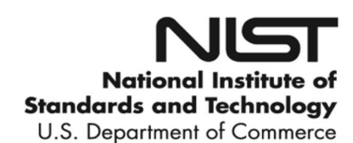
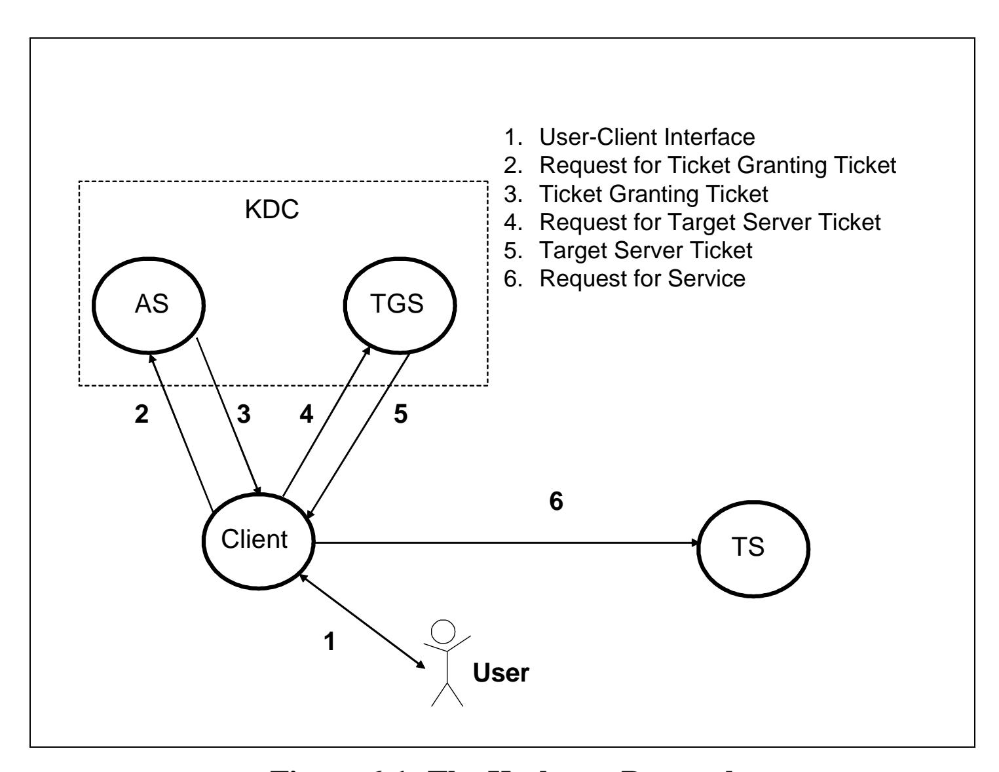
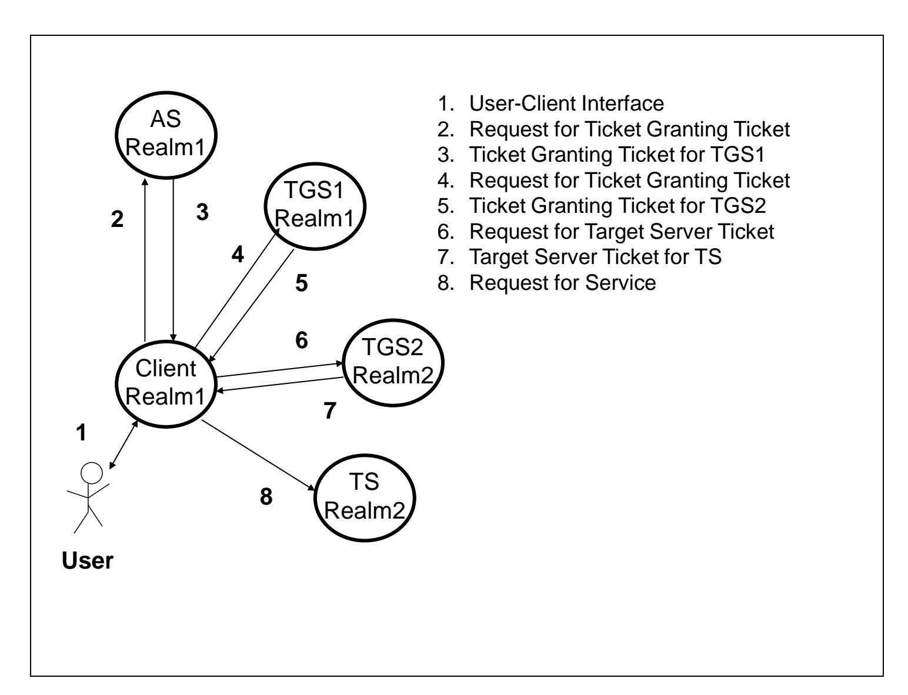
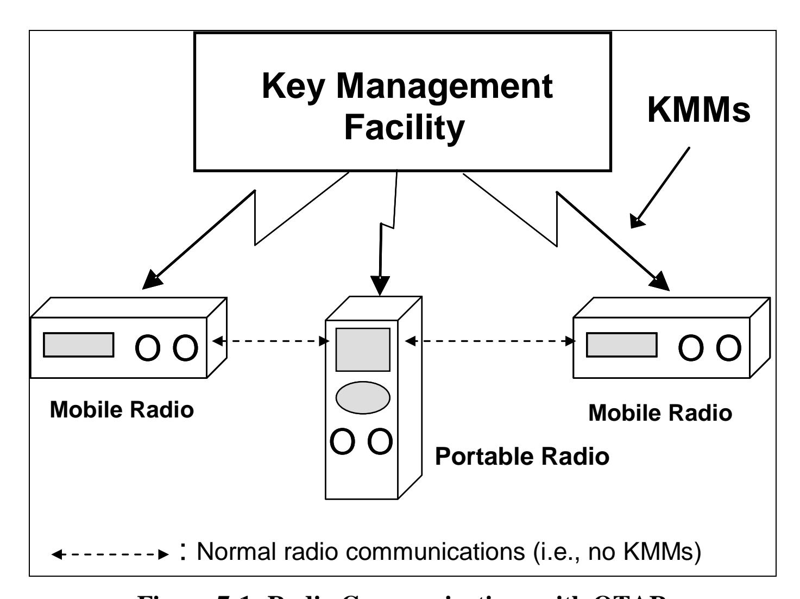
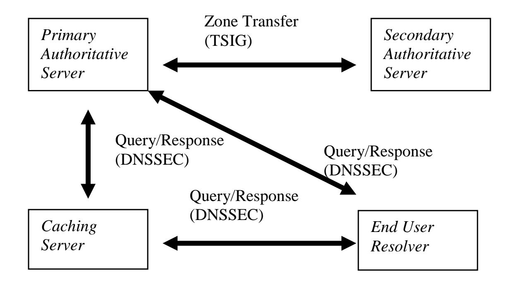

{0}------------------------------------------------

# **NIST Special Publication 800-57 Part 3 Revision 1**

# **Recommendation for Key Management**

*Part 3: Application-Specific Key Management Guidance*

> **Elaine Barker Quynh Dang**

This publication is available free of charge from: http://dx.doi.org/10.6028/NIST.SP.800-57pt3r1

**C O M P U T E R S E C U R I T Y**



{1}------------------------------------------------

# **NIST Special Publication 800-57 Part 3 Revision 1**

# **Recommendation for Key Management**

# *Part 3: Application-Specific Key Management Guidance*

Elaine Barker Quynh Dang *Computer Security Division Information Technology Laboratory*

This publication is available free of charge from: http://dx.doi.org/10.6028/NIST.SP.800-57pt3r1

January 2015


U.S. Department of Commerce *Penny Pritzker, Secretary*

{2}------------------------------------------------

#### **Authority**

This publication has been developed by NIST to further its statutory responsibilities under the Federal Information Security Management Act (FISMA), Public Law (P.L.) 107-347. NIST is responsible for developing information security standards and guidelines, including minimum requirements for Federal information systems, but such standards and guidelines shall not apply to national security systems without the express approval of appropriate Federal officials exercising policy authority over such systems. This guideline is consistent with the requirements of the Office of Management and Budget (OMB) Circular A-130, Section 8b(3), *Securing Agency Information Systems*, as analyzed in Circular A-130, Appendix IV: *Analysis of Key Sections*. Supplemental information is provided in Circular A-130, Appendix III, *Security of Federal Automated Information Resources*.

Nothing in this publication should be taken to contradict the standards and guidelines made mandatory and binding on Federal agencies by the Secretary of Commerce under statutory authority. Nor should these guidelines be interpreted as altering or superseding the existing authorities of the Secretary of Commerce, Director of the OMB, or any other Federal official. This publication may be used by nongovernmental organizations on a voluntary basis and is not subject to copyright in the United States. Attribution would, however, be appreciated by NIST.

National Institute of Standards and Technology Special Publication 800-57 Part 3, Revision 1

Natl. Inst. Stand. Technol. Spec. Publ. 800-57 Part 3, Revision 1, 102 pages (January 2015) CODEN: NSPUE2

> This publication is available free of charge from: http://dx.doi.org/10.6028/NIST.SP.800-57pt3r1

Certain commercial entities, equipment, or materials may be identified in this document in order to describe an experimental procedure or concept adequately. Such identification is not intended to imply recommendation or endorsement by NIST, nor is it intended to imply that the entities, materials, or equipment are necessarily the best available for the purpose.

There may be references in this publication to other publications currently under development by NIST in accordance with its assigned statutory responsibilities. The information in this publication, including concepts and methodologies, may be used by Federal agencies even before the completion of such companion publications. Thus, until each publication is completed, current requirements, guidelines, and procedures, where they exist, remain operative. For planning and transition purposes, Federal agencies may wish to closely follow the development of these new publications by NIST.

Organizations are encouraged to review all draft publications during public comment periods and provide feedback to NIST. All NIST Computer Security Division publications, other than the ones noted above, are available at [http://csrc.nist.gov/publications.](http://csrc.nist.gov/publications)

> National Institute of Standards and Technology Attn: Computer Security Division, Information Technology Laboratory 100 Bureau Drive (Mail Stop 8930) Gaithersburg, MD 20899-8930 Email: SP80057Part3@nist.gov

{3}------------------------------------------------

#### **Reports on Computer Systems Technology**

The Information Technology Laboratory (ITL) at the National Institute of Standards and Technology (NIST) promotes the U.S. economy and public welfare by providing technical leadership for the Nation's measurement and standards infrastructure. ITL develops tests, test methods, reference data, proof of concept implementations, and technical analyses to advance the development and productive use of information technology. ITL's responsibilities include the development of management, administrative, technical, and physical standards and guidelines for the cost-effective security and privacy of other than national security-related information in Federal information systems. The Special Publication 800-series reports on ITL's research, guidelines, and outreach efforts in information system security, and its collaborative activities with industry, government, and academic organizations.

#### **Abstract**

NIST Special Publication 800-57 provides cryptographic key management guidance. It consists of three parts. Part 1 provides general guidance and best practices for the management of cryptographic keying material. Part 2 provides guidance on policy and security planning requirements for U.S. government agencies. Finally, Part 3 provides guidance when using the cryptographic features of current systems.

#### **Keywords**

accreditation; assurances; authentication; authorization; availability; backup; certification; compromise; confidentiality; cryptanalysis; cryptographic key; cryptographic module; digital signature; key management; key management policy; key recovery; private key; public key; public key infrastructure; security plan; trust anchor; validation.

{4}------------------------------------------------

#### **Acknowledgements**

The co-authors of this version of SP 800-57, Part 3 greatly appreciate the contributions of previous co-authors of this document, namely William Burr, Alicia Jones, Timothy Polk, Scott Rose and Miles Smid. We also appreciate contributions by Katrin Reitsma, Sheila Frankel, David Cooper, Judith Spencer, the National Security Agency (NSA) and many others in the public and private sectors whose thoughtful and constructive comments improved the quality and usefulness of this publication.

{5}------------------------------------------------

# **Table of Contents**

| 1        | Introduction                                                         | 1  |
|----------|----------------------------------------------------------------------|----|
|          | 1.1 Purpose                                                          | 2  |
|          | 1.2 Requirement Terms                                                | 3  |
|          | 1.3 General Protocol Considerations                                  |    |
|          | 1.3.1 Mandatory-to-Implement versus Optional-to-Implement            |    |
|          | 1.3.2 Cryptographic Negotiation                                      |    |
|          | 1.3.3 Single or Multi-Use Keys                                       |    |
|          | 1.3.4 Algorithm and Key Size Transition                              | 6  |
| 2        | Public Key Infrastructure (PKI)                                      | 8  |
|          | 2.1 Description                                                      | 8  |
|          | 2.2 Security and Compliance Issues                                   |    |
|          | 2.2.1 Recommended Key Sizes and Algorithms                           | 11 |
|          | 2.3 Procurement Guidance                                             |    |
|          | 2.3.1 CA/RA Software and Hardware:                                   | 14 |
|          | 2.3.2 OCSP Responders:                                               |    |
|          | 2.3.3 Cryptographic Modules                                          |    |
|          | 2.3.4 Key Recovery Servers                                           |    |
|          | 2.3.5 Relying Party Software                                         |    |
|          | 2.3.6 Client Software                                                |    |
|          | 2.4 Recommendations for System Installers/Administrators             |    |
|          | 2.4.1 Certificate Issuance                                           |    |
|          | 2.4.2 Certificate Revocation Requests                                |    |
|          | 2.4.3 Certificate Revocation List Generation                         |    |
|          | 2.4.4 PKI Repositories for the Distribution of Certificates and CRLs |    |
|          | 2.4.5 OCSF Responders                                                |    |
|          | 2.4.7 Relying Party Integration and Configuration                    |    |
|          | 2.5 User Guidance (Subscribers)                                      |    |
| 3        |                                                                      |    |
| <b>J</b> |                                                                      |    |
|          | <ul><li>3.1 Description</li></ul>                                    |    |
|          | 3.2.1 Cryptographic Algorithms                                       |    |
|          | 3.2.2 Additional Recommendations                                     |    |
|          | 3.3 Procurement Guidance                                             |    |
|          | 3.4 Recommendations for System Installers                            |    |
|          | 3.5 Recommendations for System Administrators                        |    |
|          | 3.6 Recommendations for End Users                                    |    |
| 4        | Transport Layer Security (TLS)                                       | 30 |
| 5        | Secure/Multipart Internet Mail Extensions (S/MIME)                   |    |
|          | 5.1 Description                                                      |    |
|          | 5.2 Security and Compliance Issues                                   |    |
|          | 5.3 Procurement Guidance                                             |    |

{6}------------------------------------------------

|   | 5.4<br>Recommendations for System Installers34                                   |    |
|---|----------------------------------------------------------------------------------|----|
|   | 5.5<br>Recommendations for System Administrators<br>35                           |    |
|   | 5.6<br>Recommendations for End Users35                                           |    |
| 6 | Kerberos                                                                         | 36 |
|   | 6.1<br>Description<br>36                                                         |    |
|   | 6.2<br>Security and Compliance Issues39                                          |    |
|   | 6.3<br>Procurement Guidance<br>40                                                |    |
|   | 6.4<br>Recommendations for System Installers40                                   |    |
|   | 6.5<br>Recommendations for System Administrators<br>41                           |    |
|   | 6.6<br>Recommendations for End Users42                                           |    |
| 7 | Over-The-Air Rekeying (OTAR) Key Management Messages (KMMs)                      | 43 |
|   |                                                                                  |    |
|   | 7.1<br>Description<br>43                                                         |    |
|   | 7.2<br>Security and Compliance Issues44                                          |    |
|   | 7.2.1<br>Cryptographic Algorithms44                                              |    |
|   | 7.2.2<br>Message Authentication and Cryptoperiods44                              |    |
|   | 7.2.3<br>Key Usage<br>44                                                         |    |
|   | 7.2.4<br>Backup45                                                                |    |
|   | 7.2.5<br>Rekeying45                                                              |    |
|   | 7.2.6<br>Random bit generators45                                                 |    |
|   | 7.3<br>Procurement Guidance<br>45                                                |    |
|   | 7.4<br>Recommendations for System Installers46                                   |    |
|   | 7.5<br>Recommendations for System Administrators<br>46                           |    |
|   | 7.6<br>Recommendations for End Users47                                           |    |
| 8 | Domain Name System Security Extensions (DNSSEC)<br>                              | 48 |
|   | 8.1<br>Description<br>48                                                         |    |
|   | 8.1.1<br>DNS Data Authentication49                                               |    |
|   | 8.1.2<br>DNS Transaction Authentication<br>49                                    |    |
|   | 8.1.3<br>DNS Cryptographic Algorithms/Schemes, Modes and Combinations<br>50      |    |
|   | 8.1.4<br>Special Considerations for Key Sizes51                                  |    |
|   | 8.1.5<br>Special Considerations for NSEC3<br>52                                  |    |
|   | 8.2<br>Security/Compliance Issues52                                              |    |
|   | 8.3<br>Procurement Guidance<br>53                                                |    |
|   | 8.4<br>Recommendations for System Installers53                                   |    |
|   | 8.4.1<br>Recommendations for System Installers (Authoritative Servers)<br>53     |    |
|   | 8.4.2<br>Recommendations for System Installers (Caching Recursive Servers)<br>54 |    |
|   | 8.4.3<br>Recommendations for System Installers (Client Systems)<br>54            |    |
|   | 8.5<br>Recommendations for System Administrators<br>54                           |    |
|   | 8.5.1<br>Recommendations for System Administrators (Authoritative Server)<br>54  |    |
|   | 8.5.2<br>Recommendations for System Administrators (Caching Recursive Servers)54 |    |
|   | 8.5.3<br>Recommendations for System Administrators (Client Systems)<br>55        |    |
|   | 8.6<br>Recommendations for End Users55                                           |    |
| 9 | Encrypted File Systems (EFS)                                                     | 56 |
|   | 9.1<br>Description<br>56                                                         |    |
|   | 9.1.1<br>Number of Keys Required56                                               |    |
|   |                                                                                  |    |

{7}------------------------------------------------

| 9.1.2 Access to Symmetric Keys used in File Encryption | 58 |
|--------------------------------------------------------|----|
| 9.2 Security and Compliance Issues                     |    |
| 9.3 Recommendations for Procurement Officials          |    |
| 9.4 Recommendations for System Installers              | 61 |
| 9.5 Recommendations for System Administrators          | 61 |
| 9.6 Recommendations for End Users                      |    |
| 10 The Secure Shell (SSH)                              | 62 |
| 10.1 Description                                       | 62 |
| 10.1.1 Transport Layer Protocol (SSH-TLP)              | 62 |
| 10.1.2 The User Authentication Protocol (UAP)          | 62 |
| 10.1.3 Connection Protocol (CP)                        | 63 |
| 10.2 Security and Compliance Issues                    | 63 |
| 10.2.1 TLP Issues                                      | 63 |
| 10.2.2 UAP Issues                                      |    |
| 10.3 Procurement Guidance                              | 68 |
| 10.4 Recommendations for System Installers             |    |
| 10.5 Recommendations for System Administrators         |    |
| 10.6 Recommendations for End Users                     | 69 |
| Appendix A: Glossary                                   | 70 |
| Appendix B: Acronyms                                   | 77 |
| Appendix C: A Word to Novice End Users                 | 79 |
| Appendix D: References                                 | 81 |
| Appendix E: Revision Changes                           | 93 |

{8}------------------------------------------------

# **RECOMMENDATION FOR KEY MANAGEMENT Part 3: Application-Specific Key Management Guidance**

# **1 Introduction**

*Application-Specific Key Management Guidance*, Part 3 of the *Recommendation for Key Management* is intended primarily to help system administrators and system installers adequately secure applications based on product availability and organizational needs and to support organizational decisions about future procurements. This document also provides information for end users regarding application options left under their control in normal use of the application. Recommendations are given for a select set of applications, namely:

```
Section 2 – Public Key Infrastructures (PKI)
Section 3 – Internet Protocol Security (IPsec)
Section 4 – Transport Layer Security (TLS)
Section 5 – Secure/Multipurpose Internet Mail Extensions (S/MIME)
Section 6 – Kerberos
Section 7 – Over-the-Air Rekeying of Digital Radios (OTAR)
Section 8 – Domain Name System Security Extensions (DNSSEC)
Section 9 – Encrypted File Systems (EFS)
Section 10 – Secure Shell (SSH)
```

The following is provided for each topic:

- A brief description of the system under discussion that is intended to provide context for the security guidance,
- Recommended algorithm suites and key sizes and associated security and compliance issues,
- Recommendations concerning the use of the mechanism in its current form for the protection of Federal Government information,
- Security considerations that may affect the security effectiveness of key management processes,
- General recommendations for purchase decision makers, system installers, system administrators and end users.

Following [Section 10](#page-68-0) are five appendices with a [glossary,](#page-76-0) an explanation of [acronyms,](#page-84-0) [basic information for novice and end users](#page-85-0) on obtaining and using keys, [references](#page-87-0) for documents cited herein, and [changes incorporated into this revision.](#page-100-0)

This document does not reflect a comprehensive view of current products and technical specifications. Future versions of this document will include updates to the topics covered, and may include additional subjects as new techniques are widely implemented.

{9}------------------------------------------------

#### **1.1 Purpose**

Part 3 of the *Recommendation for Key Management*, *Application-Specific Key Management Guidance*, is intended to address the key management issues associated with currently available cryptographic mechanisms. *General Guidance*, Part 1 of the *Recommendation for Key Management*, contains basic key management guidance for users, developers and system managers regarding the "best practices" associated with the generation and use of the various classes of cryptographic keying material [\[SP 800-57](#page-98-0)  [Part 1\]](#page-98-0). *General Organization and Management Requirements,* Part 2 of the Recommendation, provides a framework and general guidance to support establishing cryptographic key management within an organization, and a basis for satisfying the key management aspects of statutory and policy-based security planning requirements for Federal Government organizations.

This document, Part 3 of the Recommendation, is designed for system installers, system administrators and end users of existing key management infrastructures, protocols, and other applications, as well as the people making purchasing decisions<sup>1</sup> for new systems using currently available technology. Note that end users who act as their own system installers, administrators and purchasing agents may find the guidance intended for administrators, installers and purchasers to be beneficial. In centrally managed organizations, the organization's management must establish a security policy that acts as a foundation for all end-user guidance.

Recommendations are made for mechanisms designed to protect stored data and data in transit. This document will not provide a complete restatement of existing standards or implementation directives. Standards and guidelines with this level of detail are referenced where appropriate.

For each of the key management infrastructures, protocols, and applications addressed in Part 3, the following is provided:

- A brief description of the system under discussion that is intended to provide context for the security guidance provided,
- Recommended algorithm suites and key sizes, and associated security and compliance issues,
- Recommendations concerning the use of the mechanism in its current form for the protection of Federal Government information,
- Security considerations that may affect the security effectiveness of key management processes, and
- General recommendations for people making purchasing decisions, system installers, system administrators and end users.

The logistics of how one should obtain, store or transfer keys or key pairs within a given application or system are application and implementation-specific and beyond the scope

<sup>1</sup> This is not necessarily a procurement officer, but likely a person making the decision on the IT product to be used.

{10}------------------------------------------------

of this document. In large federal systems, these functions are frequently handled by system administrators or completed with direct guidance from system administrators. For end users faced with these tasks on their own, an informative appendix has been included with general information intended to point the end user in the right direction.

Since some of the infrastructures, protocols and applications addressed in this Recommendation will be refined or replaced over time, the guidance provided herein will become obsolete. Similarly, it is anticipated that new infrastructures, protocols, and applications will be developed. Although this document will be updated as mechanisms and techniques evolve, it may not always reflect a comprehensive view of current products and technical specifications. Hence, references to version numbers or other implementation status information are provided to enable an evaluation of the applicability of particular elements of guidance to the specific version of an infrastructure, protocol, or application into which a mechanism is integrated.

Note that many of the applications described in Part 3 are currently in use by U.S. government agencies. Some of these applications were developed and implemented prior to the release of Part 1 of this Recommendation, and therefore, may not follow all of the principles identified in Part 1 [\[SP 800-57 Part 1\]](#page-98-0). The use of current implementations of these applications may be necessary until more carefully designed applications are available. It is very important that each implementation that does not comply with NIST standards and guidelines be evaluated for associated risks and that steps be taken to mitigate those risks as discussed in this Recommendation.

## **1.2 Requirement Terms**

This Recommendation often uses "requirement" terms; these terms have the following meaning in this document:

- 1. **shall**: This term is used to indicate a requirement of a Federal Information Processing Standard (FIPS) or a requirement that must be fulfilled to claim conformance to this Recommendation. Note that **shall** may be coupled with **not** to become **shall not**.
- 2. **should**: This term is used to indicate an important recommendation. Ignoring the recommendation could result in undesirable results. Ignoring recommendations to accommodate the acceptance of messages protected with commonly used, unapproved cryptography may create interoperability issues. Ignoring recommendations to select new products with approved, seldom-used cryptographic mechanisms may leave an organization ill-prepared to migrate away from mechanisms that will soon be inappropriate for the protection of federal systems. Note that **should** may be coupled with **not** to become **should not**.

# **1.3 General Protocol Considerations**

There are a number of general issues associated with the protocols discussed in Part 3. Four of these issues are briefly discussed in order to familiarize the reader with concepts 

{11}------------------------------------------------

that will be repeated throughout the document and to help frame the upcoming discussions:

- Mandatory-to-implement vs. optional-to-implement,
- Cryptographic negotiation,
- Single or multi-use keys, and
- Algorithm and key size transitions.

#### **1.3.1 Mandatory-to-Implement versus Optional-to-Implement**

Many of the cryptographic security services described in this document are based on public standards (e.g., Internet Engineering Task Force (IETF) Requests for Comment (RFCs), American National Standards, etc.). In these standards, algorithms are frequently described as mandatory-to-implement or optional-to-implement. Neither of these terms provides information about the security of the algorithm.

Mandatory-to-implement algorithms will be in any product that meets the public standards, allowing interoperability between products.

Optional-to-implement algorithms tend to be next-generation algorithms that may become mandatory-to-implement algorithms in a future version of the standard. There could be considerable delay in the widespread use of these new algorithms for a variety of reasons, ranging from a need for supporting hardware or software upgrades, to issues of interoperability. For example, an algorithm that is optional-to-implement within an S/MIME protocol may not currently be supported by the system's cryptographic module. However, these algorithms often offer improved security that could significantly increase the longevity of the system. Therefore, one may want to consider buying products that support the optional-to-implement algorithms, even if those algorithms will not be available to all end users immediately.

As previously defined, the terms **shall** and **should** are used to provide information about whether algorithms have adequate security for use on federal computer networks. As such, there may be mandatory-to-implement algorithms that do not provide adequate security (e.g., Data Encryption Standard (DES) or RC2), and this document will say they **shall not** be used. Similarly, there may be optional-to-implement algorithms that have greater security (e.g., Advanced Encryption Standard (AES)), and this document may say that these algorithms **should** or **shall** be used in a given situation.

The distinction between mandatory-to-implement and optional-to-implement is important when two users on different systems desire to communicate or when different levels of security may be required for different applications running on the same system. This is further discussed in the next section on cryptographic negotiation.

#### **1.3.2 Cryptographic Negotiation**

Parts 1 and 2 of this Recommendation establish a sound basis for selecting appropriate cryptographic algorithms and managing the corresponding cryptographic keys. However, enforcing these guidelines can be problematic for a number of reasons, including the

{12}------------------------------------------------

unavailability of certain algorithms or key sizes, the preferences of the communicating parties or other system limitations. When servers dictate the algorithms used, the server may select the algorithms that optimize overall system performance, rather than the ones that provide the highest level of security.

In some multi-party protocols where multiple algorithms are supported for the same purpose, a client can enforce the rules in Parts 1 and 2 through negotiation within the protocol. Some protocols (e.g., S/MIME) allow the initiating client to select the cryptographic algorithms without negotiating with the receiving client. In this case, as in the case where applications do not permit negotiation, a receiving client may be presented with information that has been inadequately protected. For example, a receiving client may receive a signed and encrypted S/MIME e-mail message that was encrypted using DES and signed with a 512-bit RSA key<sup>2</sup> . Rejecting such messages does not necessarily enhance security (in this case, the message has already been sent over the Internet), but the receiving user should be aware that the security services purportedly provided by the digital signature and content encryption are suspect and cannot be depended upon. It may be appropriate to reject the message or terminate the protocol. A risk assessment and subsequent organizational policy may be required to determine the appropriate course of action.

In other protocols (e.g., Transport Layer Security (TLS)), the client proposes a set of options, and the server chooses from the proposed list during a negotiation phase of the protocol. Where negotiation is supported, protocols may be designed to negotiate cipher suites or to negotiate each algorithm independently. In either case, a client or server may be faced with a situation where the preferred algorithms of the client or server and the proposed algorithms of the other party are not of the same security strength, or where approved algorithms are not available.

Another issue may arise when a protocol is designed to negotiate algorithms, but not key sizes. In such a case, the clients may find themselves communicating with approved algorithms, but inadequate key sizes. For example, after negotiating for RSA signatures, the client might get a message signed with a 512-bit RSA key<sup>3</sup> .

Enforcing the recommendations from Parts 1 and 2 may also be complicated by system or application design decisions. Systems may have application-specific controls for cryptographic algorithms, or they may have system-wide controls. For example, a user may wish to restrict one application to using AES, and another to using TDEA, while the system design may only allow the use of TDEA. Often the only limitation on public key sizes is an indirect limitation through the choice of root Certificate Authority (CA) keys (see [Section 2.1\)](#page-15-0).

When there are a variety of algorithms or key sizes available for a given communication protocol, the following questions need to be addressed:

5

<sup>2</sup> The DES algorithm and the 512-bit RSA key size do not provide adequate security (see [\[SP 800-57 Part](#page-98-0)  [1\]](#page-98-0)).

<sup>3</sup> A 512-bit RSA key does not provide an acceptable security strength (see [\[SP 800-57 Part 1\]](#page-98-0)).

{13}------------------------------------------------

- Is negotiation mandatory, optional or unsupported?
- When negotiation is supported, who proposes the cryptographic mechanisms to be used, who selects the mechanisms, and what are the selection criteria?
- Is negotiation based on predefined cipher suites, or is each algorithm proposed independently?
- What is the granularity for the negotiation: just algorithms, both algorithms and key sizes, combinations of algorithms and/or key sizes, or protocol versions?
- What cannot be specified?

A good start at ensuring communication security in a multi-algorithm setting would be to:

- Limit the list of algorithms available to the application to those best suited for users of the system and those needed for interoperability,
- Adopt a policy that disallows sending messages using an inadequate level of protection,
- Adopt a policy explaining how to respond to messages received without adequate protection, and
- Adopt a policy explaining what to do when faced with a need for secure communications with a party using un-approved algorithms or inadequate key sizes.

#### **1.3.3 Single or Multi-Use Keys**

A major thrust from Part 1 of this Recommendation is that, in general, keys **shall not** be used for multiple cryptographic purposes. For example, the same key **shall not** be used to generate a digital signature and to establish other keying material (see [\[SP 800-57 Part 1,](#page-98-0) Sec. 8.1.5.1.1.2 ] for the rare exceptions to this guidance). It is less clear as to whether a digital signature key, for example, can be used only for a specific application (e.g., signing e-mail) or for multiple applications (e.g., for both signing e-mail and signing documents). In some cases, it may be acceptable for an application to share keys with other applications. In other cases, sharing keys may not be desirable. For example, best practices indicate that a server's TLS keys **should not** be used to support other applications. Even where keys are used to perform the same cryptographic operation (e.g., digital signatures), sharing keys may be inappropriate because one application could be providing one service (e.g., authentication), while a second application could be providing a different service (e.g., non-repudiation). It is important to remember that it may be a bad idea to use keys for multiple applications.

An agency **should** perform a risk assessment when considering the use of the same key for multiple applications.

#### **1.3.4 Algorithm and Key Size Transition**

Part 1 of this Recommendation provides timeframes for transitioning from algorithms and key sizes currently in use by many applications and protocols in order to increase the 

{14}------------------------------------------------

strength of the security mechanisms in the future [\[SP 800-57 Part 1\]](#page-98-0). In many cases, the algorithms and key sizes required to provide adequate security are not available within the current implementations or are unavailable uniformly across the community of users that need to interoperate. Transitions to new algorithms or key sizes will not necessarily occur instantaneously, but will require gradual upgrades across a system. For example, a system owner may have the need to upgrade his system's e-mail package before upgrading the cryptographic module. Hence, for a period of time, the system may be running with an e-mail package capable of TDEA and AES 128 encryption, but a cryptographic module that can only handle TDEA. There will be a need to upgrade components of a system with new capabilities, while continuing to support the old capabilities, until all components have been upgraded.

During this transition period, interaction between components can proceed in one of the following ways:

- 1. Some means is provided to determine when the new security mechanism is available to all parties in a given transaction so that it can be used instead of the old security mechanism (e.g., using a protocol that negotiates the security mechanisms to be used). When the new security mechanism is not available to all parties involved in a transaction, the old security mechanism can be used. This approach has the advantage that when a set of parties have the newer mechanism, their transactions are protected at a higher security level. The disadvantage is that those transactions using the old security mechanism are not as well protected; this also raises the possibility that the same information could be sent in different transactions between two or more sets of parties using security mechanisms of different strengths – in effect, nullifying the higher security strength provided by the new security mechanism<sup>4</sup> .
- 2. All components use the old security mechanism until all components have been updated; at that time, the system immediately transitions to the new capability. This approach has the potential problem that all components would not be updated by the deadline, thus providing inadequate protections for all information during the period following the deadline until such time as all components have been upgraded. However, this approach has the advantage that the same data will not be sent at two different security levels.<sup>5</sup>

<span id="page-14-0"></span>Most of the applications and protocols discussed in Part 3 require an upgrade of the available security mechanisms to be compliant with Part 1. The following sections provide guidance on how the existing mechanisms may best be used until appropriate upgrades can be made. Organizations and system administrators must determine the approach for transitioning to stronger security mechanisms within a system.

<sup>4</sup> This becomes an issue when higher security-level users are unaware that others may be using a lower security-level mechanism to protect the same information.

<sup>5</sup> Assuming that data sent before the transition is not also sent after the transition.

{15}------------------------------------------------

# **2 Public Key Infrastructure (PKI)**

#### <span id="page-15-0"></span>**2.1 Description**

A PKI is the most common key management approach for the distribution of public keys. As described in SP 800-57 Part 1, *Recommendation for Key Management, Part 1: General* [\[SP 800-57 Part 1\]](#page-98-0), public keys are used to establish security services after obtaining a variety of assurances: assurance of integrity, assurance of domain parameter validity (where appropriate), assurance of public key validity, and assurance of private key possession. In most cases, applications must also establish the identity of the user associated with this key pair. In a PKI, the infrastructure establishes the user's identity and the required assurances to provide a strong foundation for security services in PKIenabled applications and protocols, including IPsec [\(Section 3\)](#page-29-0), Transport Layer Security [\(Section 4\)](#page-37-0), S/MIME secure e-mail [\(Section 5\)](#page-38-0) and some versions of Kerberos [\(Section](#page-42-0)  [6\)](#page-42-0). This section presents basic guidance for PKI-based key management. For broader and more detailed information on PKI, see [\[SP 800-32\]](#page-97-0).

Public key certificates bind two names to a public key, the user's name and the issuer's name, using a digital signature generated by the issuer. The user is the party authorized to use the private key associated with the public key in the certificate. The issuer is a trusted third party that generates and signs the certificate after verifying: the identity of the user; the validity of the public key, associated algorithms and any relevant parameters; and the user's possession of the corresponding private key. The issuer is known as a Certificate Authority (CA). In many cases, the CA will delegate responsibility for the verification of the subject's identity to a Registration Authority (RA). The certificate is used to distribute the user's public key to other interested parties, known as relying parties, since they rely on the assurances provided by the PKI and the certificate creation process.

CAs generally issue a self-signed certificate called a *root certificate* (sometimes also called a *trust anchor*); this is used by applications and protocols to validate the certificates issued by a CA. CA certificates play a key role in many protocols and applications, and are generally kept in what is often called a *root certificate store*. Much of the business of properly configuring applications and protocols consists of ensuring that only appropriate root certificates are loaded into the root certificate store. In Microsoft Windows operating systems, there are root certificate stores that are maintained by the operating system for various purposes that are shared by various Microsoft protocols and applications, and by other applications that may choose to use them. There is a similar "Keychain" facility in the Apple operating systems. Some applications, intended to be portable between operating systems, can maintain their own root certificate stores and also have a feature that allows them to share a root certificate store with other applications. 6

<sup>6</sup> The various Mozilla browsers and e-mail clients, and the Apache web servers are examples. Microsoft Internet Explorer, Outlook and Internet Information Server all use the Windows root certificate store; Apple Safari and Mail use the Keychain; and Mozilla Firefox, Thunderbird and SeaMonkey all have their own root certificate stores, and they also can share a root certificate store from Mozilla's Network Security Services (NSS) utility.

{16}------------------------------------------------

Certificates are generally issued in accordance with a *certificate policy*. Generally that policy can be found on the issuing CA's website. If an organization's policy, for example, is to accept only certificates that use at least 2048-bit RSA, 2048-bit DSA or 224-bit elliptic curve cryptography, and either, SHA-224 or SHA-256, then the only practical way to ensure that public key sizes meet the requirements is usually to ensure that the root certificate store contains only root certificates with a certificate policy that requires these algorithms and key sizes in its subordinate certificates. Current applications that use PKI will check to ensure that a certificate has been issued under the root certificate in the application's root store, and that it has not been subsequently revoked, but will not otherwise check the suitability of the public key or hash algorithms used in the certificate – the application will simply use the specified keys to compute the mathematically correct results. So, correctly configuring root certificate stores is a critical step in key management.

The specifics of where the root certificate store is located and how it is managed for each application and protocol are beyond the scope of this Recommendation. Typically, however, there are menus for viewing and managing certificate stores in the browser applications, but this is subject to change with each product update. There may also be utilities and features in the operating system or application for centralized management by the system administrator. When a browser or other application encounters an unrecognized CA certificate, end users may be prompted to add that certificate to their permanent trusted certificate store, temporarily trust the certificate, or reject the certificate and close the application.

The most common certificate format is the X.509 version 3 (X.509v3) certificate [\[RFC](#page-95-0)  [5280\]](#page-95-0). In addition to the user and issuer names and the public key, all X.509 certificates also include a digital signature, validity (starting and expiring times), and identifiers that specify the cryptographic algorithm(s) to be used with the public key and signature. X.509v3 certificates include an extensibility feature; CAs usually include standard extensions in their certificates to indicate which cryptographic operations the public key was intended to support, the policy that governed certificate issuance, and where to find out if the certificate has been revoked (i.e., an authoritative source for certificate status information). CAs may also include "private" extensions in their certificates that contain information particular to an application or domain of users.

A relying party is an individual or organization that relies on the certificate and the CA that issued the certificate to provide valid information (see [Appendix A\)](#page-76-0). Before a relying party uses the public key in a certificate, he must determine whether the key used by the issuer to sign this certificate can be trusted. In the simplest case, the relying party knows about the issuer, and has already decided to trust certificates issued by that CA. CAs that a relying party trusts directly are called *trust anchors*. When multiple trust anchors are recognized, the set of trust anchors is referred to as the trust list.

In some cases, a relying party will wish to process user certificates that were signed by issuers other than a CA in its trust list. To support this goal, CAs issue cross certificates that bind another issuer's name to that issuer's public key. Cross certificates are an assertion that a public key may be used to verify signatures on other certificates. A relying party may be able to develop a certification path – a sequence of certificates –

{17}------------------------------------------------

demonstrating that a user's public key certificate can be trusted, even though it was issued by a CA that is not in the relying party's trust list. All certification paths begin with a trust anchor, include zero or more intermediate certificates, and end with the certificate that contains the user's public key.

The entire path must be examined to ensure that the certificates have not been revoked, were issued under appropriate policies, and that each public key is suitable for the use to which it has been put. This process is known as path validation.

As noted above, the certificate itself will usually include a pointer to an authoritative source for certificate status information. Certificate status information may be provided using one of two standard mechanisms:

- An Online Certificate Status Protocol (OCSP) responder [\[RFC 6960\]](#page-97-1). An OCSP responder is a trusted system, and provides signed status information for a given CA, on a per certificate basis, in response to a request from a relying party. Relying parties can authenticate the response by verifying the OCSP responder's digital signature. As the OCSP responder is providing authoritative status information, there **shall** be a formal relationship between the CA and OCSP responder (e.g., a contract).
- An alternative method is to use a certificate revocation list, or CRL. An X.509 CRL contains a list of certificates issued by a CA that have been revoked, indicates when they were revoked, and may include the reason for revocation [\[RFC 5280\]](#page-95-0). If the serial number of an unexpired certificate does not appear on the CRL, then it is still valid. CRLs are digitally signed, like a certificate, so they can be distributed through untrusted systems. Most commonly, CRLs are distributed via LDAP<sup>7</sup> directories or web servers. The distribution of CRLs by web servers has become more common recently.

In many cases, PKIs will also provide key recovery services (using Recovery Servers) to support business continuity. Key recovery services store private keys that support key establishment to ensure that the plaintext of encrypted data may be recovered in the future. These services can provide the private key to the user in the event of loss or failure of their cryptographic module, or to the user's management when policy or legal requirements exist. When supported, this service removes a key management burden from PKI-enabled applications. A PKI **should** include a key recovery services system.

This section provides guidance for general-purpose PKIs when users from different organizations need to support a variety of applications. For large, general-purpose PKIs, interoperability is an important consideration. Less commonly, PKIs may be deployed to support a small, closed community of users or for a single application, where wider interoperability is less important. The requirements within this section are focused on

 <sup>7</sup> **Lightweight Directory Access Protocol** (LDAP) is a software protocol for enabling anyone to locate organizations, individuals, and other resources, such as files and devices in a network, whether on the Internet or on a corporate intranet. See [\[RFC 4511\]](#page-94-0) *Lightweight Directory Access Protocol (LDAP): The Protocol* and [\[RFC 4512\]](#page-94-1) *Lightweight Directory Access Protocol (LDAP): Directory Information Models*.

{18}------------------------------------------------

large, general-purpose PKIs, such as the Federal PKI. For PKIs requiring less interoperability, these requirements **should** be evaluated for appropriateness within their systems. In general, cryptographic algorithm and key size standards **should** be met by all PKIs.

#### **2.2 Security and Compliance Issues**

#### **2.2.1 Recommended Key Sizes and Algorithms**

[Table 2-1](#page-19-0) below summarizes the recommended key sizes for key pairs used by PKI users and infrastructure components. The PKI uses the term *digital signature key* to refer to a private signature key or public signature verification key (as defined in Part 1) that provides a non-repudiation service. The term *authentication key* is used by the PKI to refer to a private authentication key or public authentication key as defined in Part 1. Note that both a digital signature key and an authentication key are used with a digital signature algorithm.

The dates in this table are consistent with those that appear in Part 1, where:

- A digital signature key is as defined above.
- A key establishment key is an asymmetric key pair used to provide key agreement or key transport, and
- A CA and OCSP responder signing key is an asymmetric key pair used to sign and verify certificates.

Approved algorithms and key sizes specified in **[Table 2-1](#page-19-0)** and certificate expiration dates are two different things. These algorithms and key sizes are approved for use beyond the year 2013. However, a digital signature or key establishment certificate may expire at any time, depending on the organization's security policy.

{19}------------------------------------------------

**Table 2-1: Recommended Algorithms and Key Sizes**

<span id="page-19-0"></span>

| Key Type                                                                     | Algorithms and Key Sizes                                                      |
|------------------------------------------------------------------------------|-------------------------------------------------------------------------------|
| Digital Signature keys used<br>for authentication<br>(for Users or Devices)  | RSA (2048 bits)<br>ECDSA (Curve P-256)                                        |
| Digital Signature keys used<br>for non-repudiation<br>(for Users or Devices) | RSA (2048 bits)<br>ECDSA (Curves<br>P-256<br>or P-384)                        |
| CA and OCSP Responder<br>Signing Keys                                        | RSA (2048<br>or<br>3072bits)<br>ECDSA (Curves P-256 or P-384)                 |
| Key Establishment keys<br>(for Users or Devices)                             | RSA (2048 bits)<br>Diffie-Hellman (2048 bits)<br>ECDH (Curves P-256 or P-384) |

Note that some approved algorithms and key sizes, such as DSA 2048, are omitted to enhance interoperability. RSA and ECDSA, which are included in Table 2-1 above, have been widely deployed in PKIs. Therefore, they are recommended for use to enhance interoperability. However, DSA (2048 and 3072) as specified in [\[FIPS 186-4\]](#page-88-0) are allowed as long as the required security strength is satisfied. For ECDSA, only the two elliptic curves listed in [Table 2-1](#page-19-0) above of the elliptic curves are recommended for use in PKIs for digital signatures [\[FIPS 186-4\]](#page-88-0). Similarly, Elliptic Curve Diffie-Hellman (ECDH) is recommended to support key establishment, rather than Elliptic Curve MQV.

While [Table 2-1](#page-19-0) is focused on the strength of the public key contained in a certificate, the strength of the digital signature on a certificate itself is equally important. The signature security strength also reflects the security strength of the hash algorithm, and possibly the padding scheme<sup>8</sup> , in addition to the strength of the private key used to generate the signature. [Table 2-2](#page-20-0) below summarizes the recommended algorithms, key sizes, hash functions, and padding schemes for signing certificates and CRLs by CAs, and OCSP status messages by OCSP responders.

<sup>8</sup> RSA has two padding schemes used in the PKI: PKCS #1 v1.5, and PSS. The security strength of a digital signature generated using ECDSA is not affected by a padding scheme.

{20}------------------------------------------------

<span id="page-20-0"></span>**Table 2-2: Digital Signature Recommendations for CAs and OCSP Responders** 

| Public Key Algorithms and Key Sizes | Hash Algorithms | Padding<br>Scheme    |
|-------------------------------------|-----------------|----------------------|
| RSA (2048 or 3072 bits)             | SHA-256         | PKCS #1 v1.5,<br>PSS |
| ECDSA (Curve P-256)                 | SHA-256         | N/A                  |
| ECDSA (Curve P-384)                 | SHA-384         | N/A                  |

User certificates containing RSA or Diffie-Hellman public keys **should** be signed using the RSA signature algorithm. User certificates containing elliptic curve public keys **should** be signed using ECDSA.

Not all combinations of algorithms and key sizes are appropriate for the protection of Federal Government information. To enhance interoperability, users **should** obtain authentication, signature, and key establishment certificates with complementary algorithms for all public keys. For most users, signature and key establishment keys **should** provide the same cryptographic strength. Table 2-3 below shows preferred combinations for user keys.

While symmetric key cryptography is not strictly required, block ciphers are used in practically all PKI implementations and PKI-enabled applications. All components using block ciphers **shall** support the AES-128 algorithm. To support legacy implementations, components that process RSA keys **should** support three-key Triple-DEA [SP 800-67]. Components that support P-384 elliptic curve keys and the SHA-384 algorithm **shall** support AES-256.

Table 2-3: Recommended Combinations for the Recommended Algorithms and Key Sizes

<span id="page-20-1"></span>

| <b>Authentication Key Type</b> | Signature Key | Key Establishment Key |
|--------------------------------|---------------|-----------------------|
| RSA 2048                       | RSA 2048      | RSA 2048              |
| RSA 2048                       | RSA 2048      | Diffie-Hellman 2048   |
| ECDSA P-256                    | ECDSA P-256   | ECDH P-256            |
| ECDSA P-256                    | ECDSA P-384   | ECDH P-384            |
| ECDSA P-384                    | ECDSA P-384   | ECDH P-384            |

<sup>&</sup>lt;sup>9</sup> In general, protocols and applications are designed to use cryptographic algorithms from one mathematical family. For example, applications that encounter certificates with ECDSA digital signatures would expect to use elliptic curve Diffie-Hellman for key establishment services. Users that obtain an

ECDSA certificate (i.e., a certificate containing an ECDSA public key to be used for verifying digital signatures), and an RSA key establishment certificate (i.e., a certificate containing an RSA public key to be used for key establishment), for example, may find they cannot use the keys together in a single application. Other combinations of certificates are commonly used (see Table 2-3). It is advisable that users obtain authentication, signature, and key establishment certificates that are complementary to ensure that the keys can be used together in applications and protocols.

{21}------------------------------------------------

#### **2.3 Procurement Guidance**

The following provides guidance for those responsible for making decisions about which products to purchase in support of a PKI.

#### <span id="page-21-0"></span>**2.3.1 CA/RA Software and Hardware:**

- 1. Ensure that CA and RA software supports at least one of these protocols: the Certificate Management Protocol (CMP) [\[RFC 4210\]](#page-92-0), Enrollment over Secure Transport (EST) [\[RFC 7030\]](#page-97-2) and Certificate Management Using Cryptographic Message Syntax (CMC); see [\[RFC 5272\]](#page-95-1).
- 2. Ensure that all CAs support the generation of certificates and CRLs that conform to [\[RFC 5280\]](#page-95-0). (Specific requirements with respect to certificate and CRL extensions are detailed below.)
- 3. Ensure that CAs are capable of issuing multiple certificates to users, and for all such certificates, asserting the key usage extension, including the Extended Key Usage extension.
- 4. Ensure that CAs are capable of including the CRL distribution points extension.
- 5. Ensure that CAs support the inclusion of HTTP URLs to specify the location of CRLs.
- 6. CAs **should** support the inclusion of LDAP to specify the location of CRLs.
- 7. Ensure that CAs are capable of specifying an authoritative OCSP responder in the Authority Information Access extension.
- 8. Each PKI has its own certificate profile, identifying certificate extensions that appear in the certificates and CRLs it issues.<sup>10</sup> Ensure that CAs are able to generate all mandatory extensions in the appropriate profiles. For CAs owned or operated on behalf of federal agencies, the following specific guidance applies:
  - a) Ensure that CAs that implement federal agency-specific policies are able to generate certificates and CRLs that meet the agency profile and the Federal PKI Certificate Profile [\[FPKI PROF\]](#page-88-1).
  - b) Ensure that CAs that implement the Common Policy Framework [\[COMMON\]](#page-88-2) are able to generate certificates and CRLs meeting the Shared Services Certificate and CRL Profile [\[COMMON PROF\]](#page-88-3).
- 9. CAs **should** support the inclusion of "private" extensions in certificates and CRLs.<sup>11</sup>

<sup>10</sup> This profile is often documented explicitly, but may be implicitly specified through the certificate policy.

<sup>11</sup> Private extensions are defined by an organization to meet their own unique requirements. Note that noncritical private extensions do not impact the interoperability of certificates or CRLs.

{22}------------------------------------------------

- 10. Ensure that CAs support at least one of the following algorithms for digitally signing certificates and CRLs: RSA with PKCS#1 v1.5 padding; RSA with PSS Padding [\[RFC 3447\]](#page-91-0), DSA or ECDSA. To maximize flexibility, CAs **should** support RSA and ECDSA. 12
- 11. Ensure that CAs include backup and archive capabilities to support reconstitution of the CA in the event that the root key is corrupted, destroyed or lost, and it is necessary to rebuild the CA using a backup root key, rather than simply recovering the lost state of the CA. CAs **should** include backup and archive capabilities in order to establish when certificates were issued and revoked, and under whose authority.
- 12. Ensure that CA/RA components are shipped or delivered via controlled methods that provide a continuous chain of accountability, from the purchase location to the CA's or RA's physical location.

#### **2.3.2 OCSP Responders:**

- 1. Ensure that OCSP responders conform to RFC 6960, *Online Certificate Status Protocol* [\[RFC 6960\]](#page-97-1).
- 2. Ensure that OCSP responders are capable of processing both signed and unsigned requests and are capable of processing requests that either include or omit the name of the relying party making the request. However, OCSP responders may ignore signatures and requester names, if present.
- 3. Ensure that OCSP responders are capable of processing certificate status requests and generating responses for non-error conditions as specified in [\[RFC 5019\]](#page-95-2).
- 4. Where supported, the OCSP responder **should** sign the OCSP response with the algorithm and key size used to sign the certificate. Ensure that OCSP responders support at least one of the following algorithms for digitally signing response messages: RSA with PKCS#1 v1.5 padding; RSA with PSS Padding, DSA or ECDSA. The supported algorithms **should** include the algorithm(s) used by the corresponding CA when signing the certificate whose status is in question. To support future algorithm transitions by the CA, OCSP responders **should** support RSA and ECDSA.<sup>13</sup>

<sup>13</sup> As with CAs, the algorithm used to sign responses in an operational OCSP responder is dependent upon both the cryptographic module in use and the OCSP responder's software. The selected algorithm must appear in both sets of supported algorithms.

 <sup>12</sup> The algorithm used to sign certificates and CRLs in an operational CA is dependent upon both the cryptographic module in use and the CA's software. The selected algorithm must appear in both sets of supported algorithms.

{23}------------------------------------------------

#### **2.3.3 Cryptographic Modules**

- 1. Ensure that Cryptographic modules for CAs, Key Recovery Servers, and OCSP responders are hardware modules validated as meeting FIPS 140-2 Level 3 or higher [\[FIPS 140-2\]](#page-88-4).
- 2. Ensure that cryptographic modules for RAs are hardware cryptographic modules validated as meeting FIPS 140-2 Level 2 or higher [\[FIPS 140-2\]](#page-88-4).
- 3. Ensure that relying party and user cryptographic modules are validated as meeting FIPS 140-2 Level 1 or higher [\[FIPS 140-2\]](#page-88-4).

#### **2.3.4 Key Recovery Servers**

- 1. If the PKI supports key establishment (i.e., certificates will include key transport or key agreement keys), the PKI **should** include a key recovery mechanism.
- 2. Implementations **should** support automated, user-initiated key recovery; key recovery by the organization **should** also be supported.<sup>14</sup>

#### <span id="page-23-0"></span>**2.3.5 Relying Party Software**

- 1. Relying party path validation
  - a) Ensure that relying party implementations use RFC 5280-conformant path validation [\[RFC 5280\]](#page-95-0).
  - b) Where interoperability outside a single organization is required (e.g., a single federal agency), path validation modules **should** conform to requirements for an Enterprise path validation module (PVM), as specified in NIST Recommendation for X.509 Path Validation [\[X.509 Path\]](#page-99-0).
  - c) Where interoperability across organizations is required, path validation modules **should** conform to requirements for a Bridge-Enabled PVM, as specified in the draft *NIST Recommendation for X.509 Path Validation* [\[X.509 Path\]](#page-99-0).
  - d) Ensure that relying party implementations support CRLs or OCSP for certificate status, and **should** support both.

#### 2. Building certificate paths

- a) Ensure that relying party implementations are able to build certification paths.
- b) At a minimum, implementations **should** support http-based certificate retrieval.
- c) Relying party implementations **should** also be able to obtain CA certificates and CRLs using LDAP from an organizationally designated local directory, as well as locations specified within a user certificate.

<sup>14</sup> Organizational key recovery should emphasize security and privacy, rather than performance. Dual control for recovery of a user's keys by the organization is strongly recommended.

{24}------------------------------------------------

- 3. Relying parties that work within a single organizational PKI (e.g., a PKI that supports a company or agency) **should** be able to discover paths for user certificates issued by CAs that are hierarchically subordinate to the trust anchor CA.
- 4. Relying parties that accept certificates from other organizations **should** be able to discover paths in non-hierarchical PKIs.

#### **2.3.6 Client Software**

- 1. Ensure that client implementations support multiple private keys and certificates for each end user to support different cryptographic services. For example, the client implementation **should** support and differentiate between private keys associated with public keys in certificates supporting digital signatures, and private keys associated with public keys in certificates supporting key establishment.
- 2. Ensure that client cryptographic modules are validated at FIPS 140-2 Level 1 or higher [\[FIPS 140-2\]](#page-88-4).
- 3. Client implementations **should** support the certificate management protocol supported by the organization's CA.<sup>15</sup>

#### **2.4 Recommendations for System Installers/Administrators**

The system installer and administrator is the person (or people) who are responsible for establishing the PKI and who are responsible for the tasks associated with its day-to-day operation**.** The system administrator **shall** ensure that end users are trained and that the organization's security policy is enforced.

#### **2.4.1 Certificate Issuance**

1. CAs **shall** be configured to ensure that certificates specify public keys with approved key sizes, valid domain parameters (if appropriate), and approved algorithms.

- 2. For maximum interoperability, CAs and users **should** use RSA key pairs for digital signatures and key transport.
- 3. For maximum security and performance, CAs and users **should** use elliptic curve key pairs for digital signatures and key agreement.
- 4. When signing certificates or CRLs, CAs **shall** generate digital signatures using a signing algorithm, hash function and a padding scheme (if the signing algorithm is RSA) combination specified in [Table 2-2.](#page-20-0)

<sup>15</sup> Where keys and certificates are stored on smart cards, and all updates are performed at the RA, user implementations need not support the certificate management protocol.

{25}------------------------------------------------

- 5. For digital signature certificates, CAs **shall** sign the certificate using a digital signature process (i.e., signature algorithm, hash function and key) whose security strength is equal to or greater than the security strength of the subject public key in the certificate. For key establishment certificates, CAs may sign the certificate using a digital signature process whose security strength is less than the security strength of the subject public key in the certificate<sup>16</sup> .
- 6. Generating key pairs:
  - a) Users **should** generate their own digital signature key pairs.
  - b) Key establishment key pairs may be generated by the user or by the PKI on the user's behalf; where required, the PKI that generated a user's key pair may retain copies of the key-establishment private key to permit key recovery.
  - c) CAs **should** perform proof of possession for all key pairs before issuing certificates.
- 7. CAs **shall obtain** assurance of public-key validity before issuing certificates.
- 8. Key usage extension.
  - a) All certificates issued **shall** include the key-usage extension.
  - b) The key-usage extension **shall** restrict acceptance of the private key to a single cryptographic function: either user/entity authentication and verification of committed data, or key establishment.
- 9. All certificates **shall** include the CRL distribution-points extension to support the retrieval of status information.
- 10. If an OCSP responder is supported, a certificate **shall** include an appropriate URL in the Authority Information Access extension.
- 11. Certificates **should** be renewed before they expire and replaced if there is a change in the certificate's contents, such as the domain name or the embedded e-mail address.

#### **2.4.2 Certificate Revocation Requests**

1. CAs **should** be configured to automate revocation processing where practical:

<sup>16</sup> A public key certificate used for key establishment involves two keys: the subject (key establishment) public key, which is used to establish a symmetric key that will protect data, and the signing key of the Certification Authority (CA), which is used to sign the certificate. The CA's signing key needs to be secure only until the key-establishment certificate expires, but the subject (key establishment) public key needs to be secure as long as the data must be secure, which may be long after the key establishment certificate expiration date. As long as the CA's signing key is secure during the certificate's lifetime, and the certificate has been securely archived, any break of the CA signing key after the expiration of the certificate does not affect the validity of the subject (key-establishment) public key or the security that it (the subject public key) can provide. For example, if the security strength of the subject (key establishment) public key is greater than that of the CA's signing key, any break of the signing key after the subject public key is signed does not affect the security of that public key. Therefore, it is acceptable for a key transport or key agreement subject public key to be stronger than the CA key used to sign a certificate containing the key agreement or key transport public key.

{26}------------------------------------------------

- a) CAs **should** be configured to authenticate and process revocation requests electronically.
- b) Where the CA can authenticate a digitally signed request submitted by the user of the associated key pair or an RA, the request **should** be handled without manual intervention.
- 2. RAs **should** be configured to submit digitally signed revocation requests on behalf of users or the organization.

#### **2.4.3 Certificate Revocation List Generation**

- 1. To maximize interoperability, all CAs **should** be configured to generate full CRLs. A full CRL is a single CRL that lists all revoked and unexpired certificates issued by a particular CA.
- 2. CAs that serve a large community **should** generate CRL distribution points in addition to full CRLs. Each CRL distribution point lists a subset of the revoked certificates for a given CA. The number of certificates covered by a CRL distribution point **should** be limited to a maximum of 250 000 to ensure that the distribution point CRLs do not grow to an unmanageable size.

#### **2.4.4 PKI Repositories for the Distribution of Certificates and CRLs**

- 1. PKIs **should** be configured to provide certificates and CRLs to requesters without authentication of the requester.
- 2. PKI repositories **shall** be configured to require authenticated access to modify the set of certificates and CRLs distributed by the repository.
- 3. At a minimum, repositories **shall** support either HTTP version 1.1 or LDAP version 3 interface.
- 4. For maximum interoperability, both HTTP and LDAP **should** be supported.
- 5. Replication of repositories (e.g., through directory shadowing or web server replication) to maximize availability **should** be considered.
- 6. PKI repositories **should** contain all CA certificates issued by or to the corresponding PKI.
- 7. PKI repositories **shall** contain all current CRLs.

{27}------------------------------------------------

#### **2.4.5 OCSP Responders**

For federal agencies, detailed configuration guidance for OCSP responders is specified in *Draft Guidance for OCSP Responders in the U.S. Federal PKI*. 17

- 1. If maximum interoperability is required then:
  - a) OCSP responders **shall not** require that requests be signed and **shall not** limit the set of relying parties to which certificate status information is provided.
  - b) The responders **shall** generate OCSP basic responses, and the responses **shall not** include critical extensions.
- 2. Where interoperability requirements are limited to a closed community:
  - a) OCSP responders may require signed requests, and may reject requests from entities outside that community.
  - b) OCSP response messages may include private extensions known within the target community.

#### **2.4.6 Backup and Archive**

- 1. To maintain the availability of status information, CAs **shall** ensure that sufficient information is stored in a secure location to reconstitute the CA after a disaster.
- 2. CAs **should** archive sufficient information to establish when certificates were issued, and under whose authority.
- 3. As a general rule, audit logs **should** be maintained, along with any certificates and CRLs issued by the CA.
- 4. User public signature verification keys **should** be archived, along with their corresponding certificates as long as required.

#### **2.4.7 Relying Party Integration and Configuration**

- 1. Path discovery components **shall** be configured to enable path discovery and require the retrieval of status information.
- 2. Status information **should** be accepted in both CRL and OCSP formats.
- 3. Relying party implementations **shall** be configured to recognize the smallest set of acceptable trust anchors possible.
- 4. For business-to-government and government-to-government applications, federal agencies **should** use either the Common Policy Root CA or an agency CA that is cross-certified with the Common Policy Root CA or the Federal Bridge as the trust anchor.

<sup>17</sup> Available at [http://cio.nist.gov/esd/emaildir/lists/pkits/doc00000.doc.](http://cio.nist.gov/esd/emaildir/lists/pkits/doc00000.doc)

{28}------------------------------------------------

5. For citizen-to-government applications with limited security requirements (e.g. Level 2 e-Authentication requirements as specified in [\[OMB 04-04\]](#page-89-0)) and high interoperability requirements, agency applications may use the pre-installed trust anchors provided in COTS products.

#### 6. Path validation modules:

- a) For end-user applications and applications with minimal security requirements, path validation modules **should** be configured to accept any valid path.
- b) For systems with more significant security requirements (e.g., systems using PKI to satisfy Level 3 or Level 4 e-Authentication), path validation modules **should** be configured to only accept paths that are valid under appropriate policies.

#### **2.5 User Guidance (Subscribers)**

In a PKI, the subject is the identity of the user associated with a public key. The subject may be a person or a device. For the purposes of this section, the term "user" is means either the person associated with a public key, or the administrator of a device associated with a public key.

- 1. Users **should** generate their own key pairs for digital signatures and authentication.
- 2. Users may generate their own key pairs for key establishment, or the key establishment key pairs may be imported from a trusted source.
- 3. Users **shall** protect the authenticators (e.g., the PIN or password) that control access to their private keys.
- 4. Users **shall** request the revocation of their certificates if they believe the authenticator or cryptographic module has been stolen, copied or compromised.
- 5. Users **shall** control the disposition of "old" key pairs after certificates expire unless otherwise controlled in accordance with federal agency policy and procedures.
  - a) Private signature keys **should** be destroyed after the corresponding certificate(s) expire.
  - b) Private key establishment keys need not be destroyed after the corresponding certificate(s) expire. The user **should not** destroy the private key establishment key until all symmetric keys established using this key have been recovered or otherwise protected (e.g., by encrypting under a different key). Premature destruction of private key establishment keys may prevent recovery of the subscriber's plaintext data.

{29}------------------------------------------------

22

<span id="page-29-0"></span>6. Users **shall** verify all CRLs before rejecting certificates in the CRLs.

{30}------------------------------------------------

# **3 Internet Protocol Security (IPsec)**

#### **3.1 Description**

IPsec is a suite of protocols for securing Internet communications at the network layer and operates within the Internet Protocol (IP). It is frequently used to establish Virtual Private Networks (VPNs)<sup>18</sup>, requiring both parties to share keying material, and enabling telecommuters or travelers to gain secure access to their business networks. IPsec provides the cryptographic security functions for both versions 4 and 6 of the Internet Protocol.

IPsec operates by inserting one of two special IPsec headers after the IP header in each message. The Authentication Header (AH) provides integrity protection. The Encapsulating Security Protocol (ESP) Header provides confidentiality and/or integrity protection. Hereafter, the terms AH and ESP will be used as shorthand for messages using AH and ESP headers, respectively. Both ESP and AH provide data origin authentication, and optionally provide replay protection. AH protects the IP header and the data following the IP header. ESP, when applied directly to a packet (i.e., in transport mode), protects the data, but not the IP header. However, ESP in tunnel mode (with a new IP header inserted) does protect the original IP header. Furthermore, using ESP with automated keying protects the source and destination addresses in the IP header in either transport or tunnel mode. Since AH processing introduces unnecessary complexity, and since ESP can provide equivalent functionality, the use of AH is not recommended.

There have been three versions of IPsec.<sup>19</sup> All new systems **should** implement IPsec-v3<sup>20</sup> , as it has many enhancements not found in the previous versions. However, IPsec-v2 is still implemented in numerous current systems, despite the fact that it is obsolete.<sup>21</sup>

Two classes of key management methods are specified for IPsec: manual keying and automated keying. Manual keying involves an agreement (in an unspecified manner) by the parties in a communication on the IPsec protections to be applied and the symmetric keys to be used. This has a major downside in that it severely limits the scalability of the security solution and requires re-keying to be done in an unspecified manner. A Security Association (SA, i.e., a relationship between two or more entities that describes how each entity will use the security services to communicate securely) and its secret keys cannot be easily renewed in the cases where the SA expires, has been used for the maximum allowable volume of traffic, or if its keys are compromised.

To use automated keying, an automated negotiation between peers prior to exchanging IPsec-protected traffic determines the IPsec protections to be applied and the symmetric keys to be used. The same method can be used to maintain, delete, or renegotiate the SA

<sup>18</sup> See SP 800-77, *Guide to IPsec VPNs* [\[SP 800-77\]](#page-98-2).

<sup>19</sup> There are no generally accepted names for *IPsec-v3* and *IPsec-v2*; these terms are used in this document to make the requirements more understandable

<sup>20</sup> IPsec-v3 is specified in [\[RFC 4301\]](#page-93-0), [\[RFC 4302\]](#page-93-1), [\[RFC 4303\]](#page-93-2) and [\[RFC 4835\]](#page-94-2).

<sup>21</sup> IPsec-v2 is specified in [\[RFC 2401\]](#page-90-0), [\[RFC 2402\]](#page-90-1) and [\[RFC 2406\]](#page-90-2).

{31}------------------------------------------------

(e.g., to rekey). This approach permits a decoupling of the key management mechanism from the other security mechanisms, thus facilitating the use of alternative key management methods without having to modify other security mechanisms.

The preferred automated keying method is IKE, the Internet Key Exchange protocol that was designed specifically for use with IPsec. IKE generates the necessary keying material for IPsec via an authenticated secure channel between the two IKE peers. There are two versions of IKE in use: IKEv1 ([RFC 2407], [RFC 2408] and [RFC 2409]) and IKEv2 [RFC 5996]; both versions perform mutual authentication, and establish and maintain security associations. SAs will be valid for a specified period of time or volume of traffic. IKEv1 is still implemented in numerous current systems, despite the fact that it is obsolete. These two versions of IKE are not interoperable. IKEv2 was designed to be more reliable and efficient than IKEv1; therefore, IKEv2 should be used.

Table 3-1 provides the IETF reference materials for versions 2 and 3 of IPsec.

<span id="page-31-0"></span>**Security Automated Key** Version **Privacy** Authentication Architecture Management RFC 2402, RFC 2407, RFC 2408, IPsec-v2 RFC 2401 RFC 2406 RFC 2406 RFC 2409 RFC 4302, IPsec-v3 RFC 4301 RFC 4303 RFC 5996 RFC 4303

**Table 3-1: Summary of References for IPsec** 

The IPsec security mechanisms are not tied to any specific cryptographic algorithms; in fact, many algorithms and modes have IETF Requests For Comment (RFCs) describing their use with IPsec. This, however, can result in a situation where there are so many choices for typical system administrators to make that it is difficult to achieve interoperability. To improve interoperability in IPsec-v3, two cipher suites: VPN-A and VPN-B were specified [RFC 4308]. However, these two cipher suites are not NIST-approved cipher suites. Four additional cipher suites have been defined in [RFC 6379]: Suite-B-GCM-128, Suite-B-GCM-256, Suite-B-GMAC-128 and Suite-B-GMAC-256 and they are NIST-approved.

Implementers may allow the individual selection of security algorithms (i.e., rather than selecting one of the pre-specified suites of algorithms) specified in [RFC 6379], but users must be aware that picking non-standard groupings of algorithms may result in limited interoperability. However, when IPsec is used in the context of a VPN, security policy can be centrally managed, thus ensuring interoperability without the use of pre-defined cipher suites. Current IETF algorithm guidance is in [RFC 7321].

{32}------------------------------------------------

#### <span id="page-32-1"></span>**3.2 Security and Compliance Issues**

#### **3.2.1 Cryptographic Algorithms**

Table 3-2 below gives cryptographic algorithm recommendations for use within IPsec. The algorithms that are specified for IKE are used to protect IKE's own traffic. The algorithms used in ESP and AH are used to provide IPsec protection to data traffic; for these algorithms to be used within ESP or AH, IKE must be capable of negotiating their use.

In [Table 3-2](#page-32-0) below, column four lists the IETF conformance requirements as specified in the RFCs by using the three IETF requirement levels: MUST, SHOULD and MAY to indicate whether the algorithm needs to be implemented. See [\[RFC 2119\]](#page-90-5) for definitions of these requirement levels and further information on IETF Conformance language. Column five, however, states federal conformance requirements using two levels: Mandatory and Optional. Mandatory means that the feature is required to be available in an implementation, and Optional means that implementation of the technique is permitted.

**Table 3-2: Cryptographic Algorithm Recommendations**

<span id="page-32-0"></span>

| Protocol  | Cryptographic<br>Service | Algorithm/Mode                                                                     | IETF<br>Requirement<br>RFC 7321 | Federal<br>Requirement                                                    |
|-----------|--------------------------|------------------------------------------------------------------------------------|---------------------------------|---------------------------------------------------------------------------|
| ESP       | Encryption               | TDEA in CBC<br>mode                                                                | MAY                             | Optional; if used,<br>TDEA shall use<br>three distinct<br>keys            |
| ESP       | Encryption               | AES with 128-bit<br>keys in CBC mode                                               | MUST                            | Mandatory                                                                 |
| ESP       | Encryption               | AES-128 in<br>Counter mode                                                         | MAY                             | Optional;<br>if used,<br>shall<br>be used<br>with integrity<br>protection |
| ESP or AH | Integrity<br>Protection  | HMAC SHA1-96<br>(key strength shall<br>be equal to or<br>greater than 112<br>bits) | MUST                            | Mandatory                                                                 |

{33}------------------------------------------------

| Protocol          | Cryptographic<br>Service            | Algorithm/Mode                                                                             | IETF<br>Requirement               | Federal<br>Requirement                                       |
|-------------------|-------------------------------------|--------------------------------------------------------------------------------------------|-----------------------------------|--------------------------------------------------------------|
| ESP or AH         | Integrity<br>Protection             | HMAC SHA-256-<br>128<br>(key strength shall<br>be equal to or<br>greater than 112<br>bits) | [RFC 4868]<br>SHOULD              | Optional                                                     |
| ESP               | Encryption and Integrity Protection | AES-128 in<br>Galois/Counter<br>Mode                                                       | [RFC 4106],<br>[RFC 4835]         | Optional                                                     |
| ESP               | Encryption and Integrity Protection | AES-128 in<br>Counter mode with<br>CBC-MAC                                                 | [RFC 4309],<br>[RFC 4835]<br>MAY  | Optional                                                     |
| ESP or AH         | Integrity<br>Protection             | AES-128 in GMAC<br>Mode                                                                    | [RFC 4543]                        | Optional                                                     |
| IKEv1 or<br>IKEv2 | Encryption                          | TDEA in CBC mode                                                                           | MAY                               | Optional; if used, TDEA <b>shall</b> use three distinct keys |
| IKEv1 or<br>IKEv2 | Encryption                          | AES-128 in CBC mode                                                                        | MUST                              | Mandatory                                                    |
| IKEv1 or<br>IKEv2 | Pseudo-random function              | HMAC-SHA1                                                                                  | [RFC 4109],<br>[RFC 4307]<br>MUST | Mandatory                                                    |
| IKEv1 or<br>IKEv2 | Pseudo-random<br>Function           | HMAC-SHA-256                                                                               | [RFC 4868]<br>SHOULD              | Optional                                                     |
| IKEv1 or<br>IKEv2 | Diffie-Hellman<br>Group 24          | 2048-bit MODP                                                                              | [RFC 5114]                        | Mandatory                                                    |

{34}------------------------------------------------

| Protocol          | Cryptographic<br>Service         | Algorithm/Mode                                                                           | IETF<br>Requirement                 | Federal<br>Requirement |
|-------------------|----------------------------------|------------------------------------------------------------------------------------------|-------------------------------------|------------------------|
| IKEv1 or<br>IKEv2 | Diffie-Hellman<br>Group 14       | 2048-bit MODP                                                                            | [RFC 4109],<br>[RFC 4307]<br>SHOULD | Optional               |
| IKEv1 or<br>IKEv2 | Elliptic Curve<br>Diffie-Hellman | P-256 or P-384                                                                           | [FIPS 186-4],<br>[RFC 5903]<br>MAY  | Should                 |
| IKEv1 or<br>IKEv2 | Integrity                        | HMAC-SHA1-96<br>(key strength shall<br>be equal to or<br>greater than 112<br>bits)       | [RFC 4109],<br>[RFC 4307]<br>MUST   | Mandatory              |
| IKEv1 or<br>IKEv2 | Integrity                        | HMAC-SHA256-<br>128<br>key strength shall<br>be equal to or<br>greater than 112<br>bits) | [RFC 4868]<br>SHOULD                | Optional               |
| IKEv1             | Peer<br>Authentication           | 2048-bit RSA with<br>SHA256                                                              | [RFC 4109]<br>SHOULD                | Mandatory              |
| IKEv1             | Peer<br>Authentication           | DSA with SHA256                                                                          | [RFC 4109]<br>MAY                   | Mandatory              |
| IKEv2             | Peer<br>Authentication           | 2048-bit RSA with SHA256                                                                 | [RFC 5996]<br>MUST                  | Mandatory              |
| IKEv2             | Peer<br>Authentication           | DSA with SHA256                                                                          | [RFC 5996]<br>MAY                   | Optional               |
| IKEv1 or<br>IKEv2 | Peer<br>Authentication           | ECDSA-256 or<br>ECDSA-384                                                                | [RFC 4754]<br>MAY                   | Should                 |

In [RFC 4835] and [RFC 2410], ESP provides options for NULL integrity protection or NULL encryption, which means that either no integrity protection would be applied or no encryption would be used, respectively; however, [RFC 4835] specifies that at least one of them MUST be applied. In the RFCs, NULL integrity protection (often referred to as NULL authentication) is intended for use in situations where confidentiality is required without the need for integrity protection. NULL integrity protection **shall not**, and in fact cannot, be used with NULL encryption. ESP, for example, could send unencrypted packets, (encryption set to NULL), but would be required to integrity-protect them, for example, by using HMAC-SHA1. On the other hand, ESP could send packets encrypted with AES-128 in CBC mode, but omit the integrity check (integrity protection set to NULL).

{35}------------------------------------------------

However, to be compliant with this Recommendation, IPsec ESP-protected traffic **shall** always be integrity-protected, either through the use of an integrity-protection algorithm, such as HMAC-SHA1-96, or through the use of a combined-mode algorithm, such as AES-128 in Galois/Counter Mode. Therefore, encrypted ESP **shall not** be used with NULL integrity-protection.

When IPsec-protected traffic is integrity-protected, an Integrity Check Value (ICV) is stored in the Integrity Check Value field of the ESP payload [\[RFC 4303\]](#page-93-2) or in the Integrity Check Value field of the Authentication Header (AH) [\[RFC 4302\]](#page-93-1); this field is referred to as the "Authentication Data" field in IPsec-v2 ([\[RFC 2406\]](#page-90-2), [\[RFC 2402\]](#page-90-1)).

When HMAC is used for integrity protection, the length of the ICV value is at most the size of the output value of the hash function. For example, the ICV value for HMAC-SHA1-96 and HMAC-SHA256-128 is 96 and 128 bits, respectively [\[RFC 4868\]](#page-94-3).

Although the IETF still recommends supporting AES-XCBC-MAC ([RFC [3566\]](#page-91-3), [\[RFC](#page-94-6)  [4434\]](#page-94-6), [\[RFC 7321\]](#page-97-3)), it is not approved for use by the Federal Government. As such, AES-XCBC-MAC **shall not** be used for integrity protection.

A new class of algorithms, called combined-mode algorithms, appears in the above table. They can be negotiated by IKE and used within IPsec-v3 cipher suites. These algorithms provide both encryption and integrity protection. Two combined-mode algorithms have been approved for Federal Government use: AES in Galois/Counter Mode (GCM) [\[RFC](#page-92-1)  [4106\]](#page-92-1) and AES in counter mode with CBC-MAC (AES-CCM) [\[RFC 4309\]](#page-93-4).

There is also a variant of AES-GCM, referred to as AES-GMAC [\[RFC 4543\]](#page-94-4), that provides integrity protection, but does not provide encryption. This mode may be used within either the ESP or AH header.

The maximum size of the ICV for AES-CCM, AES-GCM and AES-GMAC is 16 bytes. Implementations **shall** support an ICV size of 16 bytes for these three algorithms ([\[RFC](#page-93-4)  [4309\]](#page-93-4), [\[RFC 4106\]](#page-92-1), [\[RFC 4543\]](#page-94-4)).

AES-GCM, AES-CCM, AES-CTR, and AES-GMAC **shall not** be used with manually distributed keys. If the counter value, in AES-CTR or AES-CCM, or the IV value, in AES-GCM or AES-GMAC, is used for more than one packet with the same key, the security of the algorithm's confidentiality mechanism is compromised. Since manual keying presents a major challenge to this limit, manually distributed keys **shall not** be used with these algorithms. Automated keying using IKE establishes secret keys for the two peers within each Security Association, with an extremely small probability of duplicate keys.

In previous IETF guidance, single DES using the CBC mode [\[RFC 2405\]](#page-90-6) was mandatory-to-implement; however, this algorithm **shall not** be used to protect information.

{36}------------------------------------------------

IPsec allows the individual selection of security algorithms. As an example, an implementer using [Table 3-2](#page-32-0) and following the guidance of Part 1 [\[SP 800-57](#page-98-0) Part 1], could select the following algorithms to form an IPsec suite with an overall security strength of 112 bits:

ESP Encryption: AES in CBC mode

ESP Integrity Protection: HMAC-SHA1

IKEv2 Encryption: AES in CBC mode

IKEv2 Pseudo-random function: HMAC-SHA1

IKEv2 Diffie-Hellman group: 2048-bit MODP

IKEv2 Integrity: HMAC-SHA1

IKEv2 Peer Authentication: 2048-bit RSA with SHA-256.

The Suite-B-GCM-128 and Suite-B-GCM-256 suites are both defined in [RFC [6379\]](#page-96-1). At present, these cipher suites are not widely available or deployed. [\[SP 500-267\]](#page-97-4) states that support for these cipher suites is optional. However, wherever practical, implementations **should** be procured that support these cipher suites, and they **should** be selected for use wherever very high performance and security strength are required. As discussed above, AES-GCM is a combined-mode algorithm that provides both encryption and integrity protection; therefore these suites provide integrity, despite the fact that the integrity mechanism is listed in [\[RFC 6379\]](#page-96-1) as NULL for both suites.

#### **3.2.2 Additional Recommendations**

- 1. The Authentication Header (AH) **should not** be used in IPsec version 3.
- 2. IKE **should** be used for automated key management to ensure a re-keying capability and scalability.
- 3. Once an ESP Security Association has expired or is no longer in use, its ESP encryption keys **shall** continue to be protected by the system and kept secret as long as the data they were used to protect needs to be kept secret.

#### **3.3 Procurement Guidance**

These recommendations are written to assist individuals responsible for selecting security products that include IPsec for the security of the IP layer.

- 1. Any IPsec system for use within the Federal Government **should** include an IKE implementation for automated key management.
- 2. Ensure that IPsec implementations include approved algorithms for each IPsec security component.

{37}------------------------------------------------

3. IPsec implementations **should** include the algorithms used in the Suite B cipher suites.

#### **3.4 Recommendations for System Installers**

Systems installers are those individuals that install products that include IPsec for security.

- 1. IKE **should** be used for automated key management within any IPsec system.
- 2. NULL encryption **shall** only be employed when integrity protection is required, but confidentiality is not needed.
- 3. Installers **shall** select approved algorithms for each security component, as specified in [Section 3.2.](#page-32-1)

#### **3.5 Recommendations for System Administrators**

System administrators are those individuals responsible for the day-to-day functioning of the security product containing IPsec. System administrators **shall**:

- 1. Ensure that end users are properly trained and that the organization's security policy is enforced.
- 2. Ensure that a key used by the product is protected throughout its lifespan.

## **3.6 Recommendations for End Users**

An end user is the individual using a product that relies on IPsec for security. End users **shall**:

- 1. Be aware of and trained to follow the organization's security policy for using the product.
- 2. Operate their system as instructed by their organization and system administrator.

# <span id="page-37-0"></span>**4 Transport Layer Security (TLS)**

This section was moved to SP 800-52 Revision 1, *Guidelines for the Selection, Configuration, and Use of Transport Layer Security (TLS) Implementations* [\[SP 800-52\]](#page-98-3).

{38}------------------------------------------------

# <span id="page-38-0"></span>**5 Secure/Multipart Internet Mail Extensions (S/MIME)**

### **5.1 Description**

Secure/Multipurpose Internet Mail Extensions (S/MIME) provides a consistent way to send and receive secure Internet mail. S/MIME is a set of specifications that are defined by a series of IETF RFCs, namely [\[RFC 5751\]](#page-96-3), [\[RFC 5652\]](#page-95-4), [\[RFC 2045\]](#page-89-1), [\[RFC 2046\]](#page-89-2), [\[RFC 2047\]](#page-90-7), [\[RFC 4288\]](#page-93-6), [\[RFC 4289\]](#page-93-7) and [\[RFC 2049\]](#page-90-8). S/MIME provides the following cryptographic security services for electronic messaging applications:

- Authentication of a sending party using digital signatures,
- Message integrity and non-repudiation of origin using digital signatures, and
- Confidentiality using encryption.

S/MIME, therefore, requires a suite of algorithms for creating digital signatures, generating hash values, establishing keys and encrypting the content of the e-mail, as well as some means of establishing and sharing digital identities. Federal implementations rely on a public key infrastructure, specifically X.509 PKI, to establish S/MIME user identities, to bind those identities to the user's public key through public key certificates, to provide digital signatures, to provide keys to be used for content encryption, or to establish symmetric keys for use on a per message basis. For detailed information on PKIs, see [Section 2](#page-14-0) of this Recommendation.

Stored electronic mail encompasses key management issues associated with encrypted file integrity and with transmission over a network. It is therefore necessary 1) to establish pair-wise and/or multicast (sent to more than one recipient) key management relationships between the sender and receiver(s) and 2) to securely store the key(s) associated with encrypted e-mail until it is no longer necessary for a recipient to be able to decrypt or verify the integrity of the e-mail.

S/MIME is not restricted to e-mail; it can be used with any transport mechanism that employs MIME protocols, such as the Hypertext Transfer Protocol (HTTP).

## <span id="page-38-1"></span>**5.2 Security and Compliance Issues**

S/MIME products can be implemented with different combinations of security features and a variety of cryptographic algorithms. Senders and receivers may have different capabilities and may be sending messages protected with algorithms of different strengths. This can lead to numerous interoperability issues. Federal clients using secure e-mail **shall** be able to perform the following:

- Send and receive signed messages,
- Send and receive encrypted messages,

{39}------------------------------------------------

- Send and receive signed and encrypted messages,
- Request, send and process signed receipts, and
- Process messages from secure e-mail list clients (includes suppressing receipts, as required, and nondisclosure of list recipients, as required).

#### Furthermore, federal systems **shall**:

- Utilize cryptographic modules that are FIPS 140-1 or FIPS 140-2 validated [\[FIPS](#page-88-4)  [140-2\]](#page-88-4),
- Support cryptographic Cipher Suite 1 (see [Table 5-1](#page-39-0) below), and
- Support X.509 certificates that conform to Federal PKI X.509 Certificates and the CRL Extensions Profile.

Federal clients **should** be capable of sending and processing e-mail with security labels and securely binding senders' certificates to their signatures through the signing certificate attribute as described in [\[RFC 5035\]](#page-95-5).<sup>22</sup>

The most widely accepted, standard S/MIME profile is [\[RFC 5751\]](#page-96-3). Not all cryptographic algorithms available for use in support of the features in the profile are appropriate for the protection of Federal Government information. The S/MIME specifications allow the selection of individual algorithms. However, a number of cipher suites have been specified to define a specific combination of algorithms. Federal organizations **shall** use approved algorithms within S/MIME implementations for key establishment and transmitting messages. Tables 5-1 through 5-3 specify a variety of cipher suites that may be used to protect federal information and information systems (based on [\[SP 800-49\]](#page-97-5) and [\[RFC 6318\]](#page-96-4)). Any of the algorithms listed in the following tables may be used, in accordance with security strength time frame restrictions given in Part 1 and [\[SP 800-131A\]](#page-99-1) to protect federal information in combinations other than those displayed.

**Table 5-1: Cipher Suite 1**

<span id="page-39-0"></span>

| Mechanism          | Guidance                                                   |
|--------------------|------------------------------------------------------------|
| Digital Signatures | DSA with key sizes ≥ 2048<br>bits<br>[FIPS 186-4]          |
| Hash               | SHA-256<br>[FIPS 180-4]                                    |
| Key Agreement      | Diffie-Hellman<br>with key size ≥ 2048bits<br>[SP 800-56A] |
| Encryption         | AES-128<br>in CBC mode<br>[FIPS 197] and [SP 800-38A]      |

<sup>22</sup> Both of these services are defined in S/MIME V3 standards [\[RFC 2634\]](#page-91-4).

{40}------------------------------------------------

**Table 5-2: Cipher Suite B, Level 1\***

| Mechanism          | Guidance                                                 |
|--------------------|----------------------------------------------------------|
| Digital Signatures | ECDSA with P-256<br>[X9.62]                              |
| Hash               | SHA-256<br>[FIPS 180-4]                                  |
| Key Agreement      | ECDH with P-256<br>[SEC1]                                |
| Key Derivation     | Based on SHA-256<br>[SEC1]                               |
| Key Wrap           | AES-128<br>[RFC 3394]                                    |
| Encryption         | AES-128 in CBC mode<br>[FIPS 197]<br>and [SP<br>800-38A] |

<sup>\*</sup>see [\[RFC 6318\]](#page-96-4)

**Table 5-3: Cipher Suite B, Level 2\***

| Mechanism          | Guidance                                              |
|--------------------|-------------------------------------------------------|
| Digital Signatures | ECDSA with P-384<br>[X9.62]                           |
| Hash               | SHA-384<br>[FIPS 180-4]                               |
| Key Agreement      | ECDH with P-384<br>[SEC1]                             |
| Key Derivation     | Based on SHA-384<br>[SEC1]                            |
| Key Wrap           | AES-256<br>[RFC 3394]                                 |
| Encryption         | AES-256 in CBC mode<br>[FIPS 197]<br>and [SP 800-38A] |

<sup>\*</sup> see [\[RFC 6318\]](#page-96-4)

Federal clients **shall** be supported by a Public Key Infrastructure with valid Federal PKI X.509 certificates for senders and receivers.

Cryptographic modules used in federal systems **shall** comply with FIPS 140-2 [\[FIPS 140-](#page-88-4) [2\]](#page-88-4).

Federal S/MIME implementations may, in accordance with organizational policies, be capable of receiving messages protected with algorithm suites that are not approved for 

{41}------------------------------------------------

federal use in sending protected messages. In those instances, users **should** be presented with a warning banner explaining that the cryptographic mechanisms used are weak and, therefore, that integrity and authentication cannot be assured.

#### <span id="page-41-0"></span>**5.3 Procurement Guidance**

The following recommendations are for any individual that makes a purchasing decision for acquiring an S/MIME-enabled component.

- 1. In support of security and compatibility across the Federal Government, ensure that all federal information systems support Cipher Suite 1.
- 2. Procurements **should** support Cipher Suite B, either Level 1, Level 2, or both.
- 3. Federal clients **may** support RC2 for use only in the event that users receive correspondence encrypted with this weaker and unapproved algorithm.
- 4. Ensure that federal agencies do not use SHA-1 for digital signature generation; however, it can be used for the verification of digital signatures signed using SHA-1. Cryptographic algorithm implementations **should** be modular so as to allow for new algorithms.

If an S/MIME client needs to generate a key pair, ensure that the S/MIME client or some related administrative utility or function is capable of generating public/ private key pairs on behalf of the user.

#### **5.4 Recommendations for System Installers**

The system installer is the individual that installs the S/MIME application and performs the initial configuration of the system.

- 1. Federal clients **shall** be configured to support Cipher Suite 1 for interoperability as described above in [Section 5.2.](#page-38-1)
- 2. Systems **shall** be configured so that they only permit the use of approved cryptographic algorithms and approved key sizes to encrypt or sign new messages.
- 3. Installers **should** install and configure S/MIME clients so that they default to the use of an approved cipher algorithm suite. Furthermore, installers **should** configure clients so that there is a straightforward means for end users to change default settings and select algorithms as needed for interoperability and in accordance with organizational needs and policies.
- 4. System installers **should** configure clients so that end users can use unique certificates for each security function (e.g., encryption, digital signatures) at their disposal.

{42}------------------------------------------------

#### **5.5 Recommendations for System Administrators**

The System Administrator is the individual who runs the S/MIME application on a dayto-day basis and, on client implementations, interacts with the end user.

- 1. The system administrator **shall** ensure that end users are properly trained and that the organization's security policy is enforced.
- 2. Systems **shall** be maintained so that they only permit the use of approved cryptographic algorithms and approved key sizes to encrypt or sign new messages.
- 3. Administrators **should** maintain S/MIME clients so that they default to the use of an approved cipher algorithm suite. Furthermore, administrators **should** maintain a straightforward means for end users to change default settings and select algorithms as needed for interoperability and in accordance with organizational needs and policies.
- 4. System administrators **should** provide training for users on the relative security provided by various cryptographic algorithms and on organizational policies for their use.
- 5. System administrators **should** provide end users with guidance on how certificates and keys are stored and managed, and identify the end user's related responsibilities.

#### **5.6 Recommendations for End Users**

<span id="page-42-0"></span>

An end user is the individual using a client to access the system. Even within a centrally managed environment, end users may find that they have a significant amount of control over some of the security features within an SMIME implementation.

- 1. Users **shall** operate their system as instructed by their organization and system administrators.
- 2. Users **should** use unique certificates for each security function at their disposal.<sup>23</sup>
- 3. Users **shall** protect their private keys from unauthorized disclosure.
- 4. Users **should not** send the same message in both encrypted and plain text.

<sup>23</sup> If they have not been supplied with certificates by their home organizations, users can obtain certificates from a number of organizations via the web.

{43}------------------------------------------------

# **6 Kerberos**

#### **6.1 Description**

The Kerberos authentication mechanism was developed at the Massachusetts Institute of Technology (MIT) to enable the secure authentication of users to Target Servers (TSs) over an unprotected network, where client software acts on behalf of a user<sup>24</sup> . The original design and implementation of Kerberos and its first three revisions (i.e., versions 1 through 4) was primarily the work of Steve Miller, Clifford Neuman, Jerome Saltzer and Jeffrey Schiller<sup>25</sup> . Kerberos is used for local logins, remote (over the network) authentication, and for client-to-TS requests. It can also be extended to provide for the establishment of cryptographic keys between a client and a TS. Kerberos has been designed so that a user and a TS rely on a trusted third party to provide assurance of each party's identity. This assurance is granted by means of tickets and authentication information, each encrypted with symmetric keys.

The trusted third party is a Key Distribution Center (KDC), which consists of an Authentication Server (AS) and a Ticket Granting Service (TGS). The AS and TGS may or may not reside on the same machine. The KDC has a database of user, TS, and TGS symmetric keys. All KDC symmetric keys are accessible by the TGS. The user's key is normally created by hashing a user's password with other information.

An overview of the Kerberos version 5 protocol is shown in [Figure 6-1.](#page-44-0) The following is a simplification of the process (e.g., the generation of most keys and the use of most cryptographic operations are not specified). For example, tickets and authentication information are protected with checksums and encryption when transmitted.

- 1. A user logs onto a client by entering a password, from which a user symmetric key is generated.
- 2. The client, acting on behalf of the user, requests a Ticket Granting Ticket from the AS.
- 3. The AS generates a Ticket Granting Ticket, for a specified validity period, and sends it to the client.
- 4. The client provides the Ticket Granting Ticket to the TGS, along with his own authentication information, which includes the client identifier and a time stamp.
- 5. The TGS checks the authentication information and the validity period of the Ticket Granting Ticket. The TGS then generates a Target Server Ticket and sends it to the client.

<sup>24</sup> Note that a single client implementation may be used by multiple users, and a single user may use multiple client implementations (e.g., a user could access different workstations, each with its own client implementation).

<sup>25</sup> The design was based in part upon a protocol proposed by Needham and Schroeder [\[NEED\]](#page-89-3) with modifications provided by Denning and Sacco [\[DENN\]](#page-88-7). For more detail on the goals, motivations, and rationale of Kerberos see [\[NEUM\]](#page-89-4).

{44}------------------------------------------------

- 6. The client sends authentication information and the Target Server Ticket to the TS.
- 7. The TS checks the authentication information and the validity period of the Target Server Ticket; if the information is reasonable, the user is authenticated to the TS.

The protocol may be extended to authenticate the TS to the user, and a ticket may be reused within its validity period.



**Figure 6-1: The Kerberos Protocol**

<span id="page-44-0"></span>Each TGS has its own "realm" of clients and TSs. However, different realms may be linked by the sharing of inter-realm keys between TGS's (see [Figure 6-2\)](#page-45-0). A client in Realm 1 wishing a service on a TS in Realm 2 may obtain a ticket from TGS1 that introduces the client to TGS2. This ticket is encrypted with the inter-realm key shared between TGS1 and TGS2. The client can then request a ticket from TGS2 for the desired service on the TS in Realm 2. Thus, realms may be networked to provide clients with inter-realm services.

{45}------------------------------------------------



**Figure 6-2: Cross-Realm Authentication**

<span id="page-45-0"></span>In an alternative Kerberos protocol between the client and the AS (as specified in [\[RFC](#page-94-7)  [4556\]](#page-94-7)), either both the user and the AS have key-establishment public key pairs with corresponding certificates, or the user has a key-establishment key pair and associated certificate, and the AS has a digital signature key pair and digital signature certificate. The user symmetric key can then be established between the client and the KDC in one of two ways:

- 1. Using key agreement (e.g., Diffie-Hellman) between the AS and the client<sup>26</sup>, or
- 2. Using key transport (e.g., RSA), where the AS generates the user symmetric key, and sends the key to the client<sup>27</sup> .

Once the user symmetric key is established, the remainder of the protocol proceeds as previously described. In this case, the need for user symmetric keys generated from passwords can thus be avoided.

Kerberos implementations may provide an additional authentication capability that is called pre-authentication, as described in [\[RFC 6113\]](#page-96-5). TLS may also be implemented to protect all communication between the clients and KDCs as described in [\[RFC 6251\]](#page-96-6).

<sup>26</sup> In this case, both the user and the AS have key-establishment key pairs.

<sup>27</sup> In this case, the user has a key-establishment key pair, and the AS has a digital-signature key pair.

{46}------------------------------------------------

#### **6.2 Security and Compliance Issues**

- 1. Kerberos version 5 was initially specified in [\[RFC 1510\]](#page-89-5). More recently, the security was updated in version 5 ([\[RFC 4120\]](#page-92-3) and [\[RFC 6649\]](#page-97-8)); however, many existing implementations still correspond to the initial RFC.
- 2. Many current Kerberos implementations based on [\[RFC 1510\]](#page-89-5) rely on DES for symmetric encryption functions. DES is no longer approved for use in protecting Federal Government information and has been deprecated as well in Kerberos [\[RFC 6649\]](#page-97-8).
- 3. If a keyless checksum computation is used for the data integrity of Kerberos messages, the integrity of the message may be inadequate.
- 4. Some Kerberos implementations rely solely on the entropy (i.e., randomness) provided by the user password to generate the symmetric client key (the client key is a hash of the user's password). Passwords, in general, do not provide enough randomness for generating a key. In such cases, a dictionary attack<sup>28</sup> is feasible. If passwords are used to generate cryptographic keys, they **should** be selected to maximize the difficulty of a password guessing attack, thus increasing the difficulty of an off-line dictionary attack [\[SP 800-118\]](#page-99-3).<sup>29</sup>
- <span id="page-46-0"></span>5. Compromising the client, KDC, or TS could compromise the symmetric keys that they contain and thereby compromise parts of the system. In particular, the KDC stores keying information for all the KDC users, the TGS, and any TS that communicates directly with the KDC TGS. These symmetric keys require protection that is commensurate with the protection required for the data that they protect (e.g., tickets, other keys, authentication information, and shared data).
- 6. The TGS has read-only access to the KDC database. If the TGS and database do not reside on the same machine, a secure channel is required for the TGS to obtain the required TS keys.
- 7. A failure of the AS or the TGS would prevent all AS users from obtaining new tickets and corresponding new services.
- 8. Clocks must be synchronized in order to accurately assess the validity of clock authentication information and tickets. If the TS's clock is running behind the clock of the KDC (or AS), then previous authentication information and tickets could be played back to the TS after they have expired.
- 9. If a Kerberos implementation has a TLS capability, then it **should** be used when the DH key agreement or RSA key transport method discussed above is not used.

<sup>28</sup> A **dictionary attack** is a technique for guessing a password by selecting candidate passwords from a list of words commonly found in a dictionary, or derived from words commonly found in a dictionary. Each selected candidate is tested as though it were the actual password until the result of the test indicates that the correct password has been selected.

<sup>29</sup> Draft SP 800-118, *Guide to Enterprise Password Management*, is currently under development [\[SP 800-](#page-99-3) [118\]](#page-99-3).

{47}------------------------------------------------

#### **6.3 Procurement Guidance**

The following recommendations are for any individual that makes a purchasing decision for acquiring a Kerberos capability.

- 1. Ensure that new procurements conform to version 5 ([\[RFC 4120\]](#page-92-3), [\[RFC 6649\]](#page-97-8)).
- 2. Ensure that government procurements specify the inclusion of approved symmetric key encryption algorithms (e.g., the Advanced Encryption Standard (AES)) [\[RFC 3962\]](#page-91-6).
- 3. Ensure that an approved MAC computation (e.g., HMAC-SHA1 or HMAC-SHA256-128) is available for data integrity with encryption (see [\[RFC 3962\]](#page-91-6) and the IETF Informational Draft, *AES Encryption with HMAC-SHA2 for Kerberos 5*, at: [http://tools.ietf.org/html/draft-ietf-kitten-aes-cts-hmac-sha2-04\)](http://tools.ietf.org/html/draft-ietf-kitten-aes-cts-hmac-sha2-04).
- 4. Kerberos version 5 permits the use of smart cards or tokens (e.g., FIPS 201 Personal Identity Verification cards [\[FIPS 201\]](#page-88-8)) to store a user's password. Ensure that passwords stored on tokens are randomly generated; therefore, when tokens are used, ensure that a means of generating random passwords and securely writing them on the token is available and the password generation function is a NIST-approved random number generation function [\[SP 800-90A\]](#page-98-5). When tokens are used, ensure that the manual entry of passwords is not permitted except to authenticate the user to the token.
- 5. If passwords are used to form user symmetric keys, ensure that the password mechanism supports the use of strong passwords [\[SP 800-118\]](#page-99-3), and an approved hash algorithm (e.g., SHA-1 or stronger) is used as the hash algorithm.
- 6. If passwords are generated by users, ensure that the system software enforces a strong password policy in accordance with [\[SP 800-118\]](#page-99-3).
- 7. Kerberos with public key authentication and subsequent key establishment can provide stronger security than the use of password-based keys and **should** be available where PKI mechanisms are available. See [\[RFC 4556\]](#page-94-7) and [\[RFC 5349\]](#page-95-6) for further information. Ensure that the key-establishment methods (i.e., keyagreement or key-transport methods) used have at least 112 bits of security; see [\[SP 800-57](#page-98-0) Part 1] and [\[SP 800-131A\]](#page-99-1) for further information.
- 8. TLS **should** be used when the system supports it.
- 9. Procurement officials **should** consider whether inter-realm networking is necessary and include the capability in the software if it's needed.
- 10. Ensure that cryptographic modules used by CAs, TSs and clients are validated at FIPS 140-2 Level 1 or higher [\[FIPS 140-2\]](#page-88-4).

#### **6.4 Recommendations for System Installers**

The system installer is any individual(s) that installs a Kerberos capability and performs the initial configuration of the system.

{48}------------------------------------------------

- 1. Government systems **shall** be configured so that approved algorithms (e.g., AES) **shall** be used [\[RFC 3962\]](#page-91-6), and DES **shall not** be used [\[RFC 6649\]](#page-97-8).
- 2. An approved MAC checksum (e.g., HMAC-SHA1 or HMAC-SHA256-128) **shall** be installed and used in all implementations for data integrity purposes (see [\[RFC](#page-91-6)  [3962\]](#page-91-6) and the IETF Informational Draft, *AES Encryption with HMAC-SHA2 for Kerberos 5*, at: [http://tools.ietf.org/html/draft-ietf-kitten-aes-cts-hmac-sha2-04\)](http://tools.ietf.org/html/draft-ietf-kitten-aes-cts-hmac-sha2-04).
- 3. The AS, TGS, TSs, and clients **shall** use strong access control mechanisms<sup>30</sup> (physical and logical) for protecting and updating keys.
- 4. Kerberos version 5 permits the use of smart cards or tokens (e.g., FIPS 201 Personal Identity Verification cards [\[FIPS 201\]](#page-88-8)) to store a user's password. Passwords stored on tokens **shall** be randomly generated; therefore, when tokens are used, a means of generating random passwords by a NIST-approved random number generation function ([\[SP 800-90A\]](#page-98-5), [\[SP 800-90B\]](#page-99-4), [\[SP 800-](#page-99-5) [90C\]](#page-99-5)), and securely writing them on the token **shall** be used. When tokens are used, manual entry of passwords **shall not** be permitted except to authenticate the user to the token.
- 5. Kerberos with public key-based user authentication and key establishment can provide stronger security than password-based keys and **should** be installed where PKI mechanisms are available and the software has the capability. See [\[RFC](#page-94-7)  [4556\]](#page-94-7) for further information.
- 6. TLS **should** be used when the system supports it, see [Section 4](#page-37-0) for guidelines on using TLS.
- 7. If user passwords are generated by the system, the system **shall** generate strong passwords [\[SP 800-118\]](#page-99-3).If passwords are used to form user symmetric keys, then an approved hash algorithm (e.g., SHA-1 or stronger) **shall** be used as the password-hashing algorithm.
- 8. If user passwords are used to generate cryptographic keys, the password mechanism **shall** be configured to use and require strong passwords [\[SP 800-](#page-99-3) [118\]](#page-99-3). [29](#page-46-0)
- 9. A backup AS and TGS **should** be provided so as to minimize the impact in case of operational failure or denial-of-service attacks.
- 10. Clocks **should** be synchronized periodically and whenever a new system is brought on-line<sup>31</sup> .

## **6.5 Recommendations for System Administrators**

The System Administrator is any individual(s) who runs a system with a Kerberos capability on a day-to-day basis and interacts with the end user.

<sup>30</sup> Strong access control mechanisms either prevent or detect unauthorized attempts to access or replace sensitive data. These controls may be physical (e.g., locks, guards, or alarms) or logical (e.g., encryption, data integrity, or entity authentication).

<sup>31</sup> See [http://www.nist.time.gov.](http://www.nist.time.gov/)

{49}------------------------------------------------

- 1. System administrators **shall** ensure that users are properly trained and that the organization's security policy is enforced.
- 2. The AS, TGS, TS, and client **shall** be physically secured.
- 3. Tickets **shall** be encrypted or physically protected at the client, TS, and TGS sites.
- 4. If the passwords are generated by the user, then the system administrator **shall** develop a policy for selecting strong passwords that is enforced by the software [\[SP 800-118\]](#page-99-3). [29](#page-46-0)
- 5. System clocks **shall** be periodically verified to ensure synchronization.

#### **6.6 Recommendations for End Users**

An end user is the individual using the Kerberos capability.

- 1. If user-selected passwords are allowed, they **shall** be generated in accordance with the organization's password policy**.**
- 2. Users **shall** protect their password from unauthorized disclosure. If a token containing a password or key is provided, users **shall** protect the token from unauthorized use. Users **shall** report the loss of physical tokens or the compromise of passwords.

{50}------------------------------------------------

# <span id="page-50-0"></span>**7 Over-The-Air Rekeying (OTAR) Key Management Messages (KMMs)**

#### **7.1 Description**

<span id="page-50-1"></span>

A key management protocol has been specified for over-the-air rekeying of digital radios (OTAR) [\[OTAR\]](#page-89-6). This protocol has been designed to handle several types of cryptographic security, one of which, Type 3, has been designed for unclassified, sensitive communications and is discussed herein. The only differences between the security types are the cryptographic algorithms used and the security requirements. The Type 3 algorithms and security requirements are addressed in both OTAR and OTAR1 [\[OTAR1\]](#page-89-7) 32 .

For key management, a secure mobile system consists of Key Management Facilities (KMFs) and mobile radios that are subordinate to each KMF. Key Management Messages (KMMs) are exchanged between each KMF and its subordinate mobile radios (see [Figure 7-1\)](#page-50-1). Cryptographic keys are transferred from a KMF to a mobile radio and protected using a key-wrapping algorithm and key wrapping key; many of the KMMs are protected by encrypting the data in the messages; the integrity of the messages is protected using a Message Authentication Code (MAC).



**Figure 7-1: Radio Communications with OTAR**

<sup>32</sup> Reference [\[OTAR\]](#page-89-6) provides an overview of the key management techniques and the protocol. Reference [\[OTAR1\]](#page-89-7) specifies the general security requirements for transmitting Type 3 key management messages (KMMs), the requirements for wrapping the keys, the techniques used for KMM integrity and the mechanism used to protect against replay of the KMMs.

{51}------------------------------------------------

Three general types of keys are used in OTAR: a Key-Wrapping Key (KWK)<sup>33</sup>, a Traffic-Encryption Key (TEK) and a key to be used for the computation of a Message Authentication Code (MAC).

### **7.2 Security and Compliance Issues**

#### **7.2.1 Cryptographic Algorithms**

Although the protocol has been designed to allow the use of any block cipher algorithm to apply the cryptographic protection, only three block cipher algorithms have been included in the specification: DES, TDEA and AES.

Approval for DES has been withdrawn because DES no longer provides the security that is needed to protect Federal Government information.

TDEA, as specified in [SP [800-67\]](#page-98-1), uses three DES encryption/decryption operations with a "key bundle" consisting of three separate DES keys. Two versions of TDEA have been included in the OTAR specification: a one-key version, whereby all three keys are the same for compatibility with DES, and a three-key version (3-TDEA), whereby the three keys are different. Since DES is no longer considered secure, the one-key version of the TDEA is also no longer considered secure and **shall not** be used.

#### <span id="page-51-0"></span>**7.2.2 Message Authentication and Cryptoperiods**

A Message Authentication Code (MAC) is used to authenticate and protect the integrity of many of the KMMs as specified in OTAR1, using the CBC-MAC mode of operation. The security of a MAC depends, in part, on the block size of the MAC algorithm. AES has a larger block size than 3-TDEA, and so the security of AES CBC-MAC is better than 3-TDEA CBC-MAC. The OTAR documentation provides no guidance on the length of cryptoperiods (i.e., the number of messages or the length of time that a key may be used before it must be changed).

For AES, the number of messages that can be authenticated using a given key is, in practice, not an issue. However, AES keys **shall** be periodically updated because of other threats to the system, e.g., lost radios or an undetected compromise of a key.

When using 3-TDEA, no more than 1 000 000 messages **shall** be sent using a given key because of threats to the security of the algorithm. However, like AES, it may be prudent to update the 3-TDEA keys more frequently because of other threats to the system.

#### <span id="page-51-1"></span>**7.2.3 Key Usage**

Part 1 of this Recommendation states that keys **shall** be used for only one purpose.<sup>34</sup> However, OTAR1 states that the key used to generate a MAC must be either a key

<sup>33</sup> A Key Wrapping Key may also be referred to as a Key Encryption Key (KEK).

<sup>34</sup> There is an allowed exception to this rule, but it does not apply to OTAR [\[SP 800-57 Part 1,](#page-98-0) Sec. 5.2]).

{52}------------------------------------------------

reserved for authentication and integrity protection purposes, or a key derived from a Traffic-Encryption Key (TEK) using a key wrapping algorithm. In this latter case, note that the TEK might be used for both encryption and for key derivation. In order to comply with the recommendation to use a key for only one purpose, the MAC key **shall** be a key reserved for a single purpose.

#### **7.2.4 Backup**

The KMF **should** backup all keying material shared with and among the mobile radios so that it can be recovered if necessary. When a key is no longer required, it **should** be deleted from both normal operational storage and backup storage.

#### **7.2.5 Rekeying**

Procedures **shall** be in place to rekey all radios in the network in the event of a key compromise. If a radio is lost, procedures **shall** enable rekeying other radios in the network so that the lost radio no longer has the capability of communicating securely with other radios in the network.

#### **7.2.6 Random bit generators**

Keys **shall** be generated at the KMF using an approved random bit generator that provides sufficient randomness for the desired security strength of the cryptographic processes. NIST-approved random bit generation methods are specified in [\[SP 800-90A\]](#page-98-5), [\[SP 800-90B\]](#page-99-4) and [\[SP 800-90C\]](#page-99-5) (under development).

#### **7.3 Procurement Guidance**

The following recommendations are for any individual(s) that makes a purchasing decision for acquiring OTAR equipment.

- 1. Ensure that the AES or TDEA algorithm is included.
- 2. If TDEA is provided in an implementation, ensure that the three-key version is included, and the implementation is capable of limiting the number of uses of a single TDEA key bundle to 1 000 000.<sup>35</sup>
- 3. Ensure that KMFs and radios conform to OTAR and OTAR1.
- 4. When keys are generated within KMFs**,** ensure that they are generated using approved random bit generators.
- 5. Ensure that cryptographic modules used by the KMF and the mobile radios are validated at FIPS 140-2 Level 1 or higher [\[FIPS 140-2\]](#page-88-4).

<sup>35</sup> See Section 7.2.2.

{53}------------------------------------------------

6. Ensure that KMFs include backup and archive capabilities to support reconstitution of the KMF in the event of a disaster (e.g., fire, earthquake).

#### **7.4 Recommendations for System Installers**

The system installer is the individual(s) that installs an OTAR capability and performs the initial configuration of the system components.

- 1. The KMF **shall** use and have strong physical and logical access control mechanisms to protect the cryptographic keys (e.g., physical locks, alarms or password token).
- 2. Backup KMFs **shall** be provided.
- 3. A TEK **should not** be used for multiple purposes. Reserved MAC keys **should** be used for message authentication and integrity protection.
- 4. Maximum cryptoperiods for each key type **shall** be determined at the KMF in accordance with the organization's security policy and [Section 7.2.2.](#page-51-0)
- 5. Radios **shall** be accounted for; in the case of a lost or stolen radio, an assessment of the effect of a loss of the keys contained in that radio **shall** be made. The use of any key contained in that radio **shall** be discontinued. Procedures **shall** be in place for replacing these keys if used by the KMF or by other radios.
- 6. Implementations **shall** be configured to use the AES or TDEA algorithms, and to disallow the use of DES.
- 7. If TDEA is provided and is to be used, the three-key version **shall** be used, and the one-key version **shall not** be used.
- 8. For implementations using TDEA in which the cryptoperiod of a key bundle is configurable, the cryptoperiod **shall** be set to a value less than 1 000 000 messages.

#### **7.5 Recommendations for System Administrators**

The System Administrator is the individual who manages the OTAR system or its components on a day-to-day basis and interacts with the end users.

- 1. System administrators **shall** ensure that the organization's security policy is enforced.
- 2. System administrators **shall** protect the keying material from disclosure and modification.
- 3. Procedures **shall** be in place for replacing keys at the end of their cryptoperiod.

{54}------------------------------------------------

- 4. To maintain the availability of the KMF, system administrators **shall** ensure that sufficient information is stored in a secure location to reconstitute the KMF after a disaster.
- 5. Backup KMFs along with a strategy and procedures to transition from a primary KMF to a backup KMF, and from a backup KMF to the primary KMF **shall** be established.
- 6. System administrators **shall** train end users in the use of their radios and the procedures to be followed in the case of lost radios or suspected key compromises.
- 7. Audit logs **should** be maintained at the KMF with sufficient information to indicate which keys are shared by which radios.

#### **7.6 Recommendations for End Users**

An end user is the individual using a radio that has an OTAR capability.

- 1. End Users **shall** operate radios as instructed by their organization and system administrators.
- 2. End users **shall** protect their radios from loss and unauthorized access.
- <span id="page-54-0"></span>3. In the event that a radio is lost or a key is suspected of being compromised, end users **shall** immediately notify the system administrator in accordance with the organization's security policy.

{55}------------------------------------------------

### 8 Domain Name System Security Extensions (DNSSEC)

#### 8.1 Description

The Domain Name System (DNS), as defined in [RFC 1034] and [RFC 1035], is the global hierarchical distributed database system for mapping Internet addresses, Simple Mail Transfer Protocol (SMTP) servers, and other information to a human-readable name. Its main purpose is handling mappings between host domain names and Internet addresses, but it can handle other forms of data as well, such as host system information, the geographic location of servers, even encoded digital certificates. DNS data is stored as individual Resource Records (RRs) each associates a piece of data (e.g., IP address, mail server name) with a domain name and an identifying Resource Record type code (RR type). All the RRs for a particular organization are stored in an administrative unit called a zone. Multiple zones form a domain. A domain is hierarchical, in that one zone may act as a delegating parent to one or more child-delegated zones. For example, most federal agencies are child delegations under the ".gov" parent zone.

Zone information is maintained on *authoritative* servers, which are distributed all over the Internet to answer queries according to the DNS network protocols. The DNS infrastructure is comprised of a small group (or single server) known as a primary master authoritative server that has a local zone database, and multiple secondary servers that obtain their copies of the zone database from the primary authoritative master server. Another set of components are *caching recursive* servers<sup>36</sup>, which query the authoritative servers and cache any replies. On the end user's client system, software components known as resolvers make DNS queries to recursive caches and/or authoritative servers. Figure 8-1 depicts the relationship between the DNS components.



Figure 8-1: DNS Components

\_

<sup>&</sup>lt;sup>36</sup> Caching Recursive Server is sometimes shortened to "caching server" or "recursive server." However, the role remains the same.

{56}------------------------------------------------

The basic DNS does not have many security features [\[SP 800-81\]](#page-98-6). A suite of RFCs has been developed to provide security enhancements contained in three IETF documents, collectively called the DNS security extensions (DNSSEC) ([\[RFC 4033\]](#page-92-4), [\[RFC 4034\]](#page-92-5), [RFC [4035\]](#page-92-6)). DNSSEC provides a layer of authentication and integrity protection for any kind of data stored in the DNS, including data used by other protocols. For example, there are RR types allocated for storing Secure Shell (SSH) keys in the DNS, which then rely on DNSSEC to protect the integrity of that information.

#### **8.1.1 DNS Data Authentication**

Cryptographically generated public key-based digital signatures provide authentication for DNS data. Commonly, there will be two or more digital signature public-key pairs (which make up the key set) used to implement DNSSEC in a zone. One key pair is used to sign the zone data (referred to as the Zone Signing Key or ZSK), and a separate key pair is used to sign the zone key set (known as the Key Signing Key or KSK). While some zones may only use one key pair for both ZSK and KSK, it is not recommended for federal agency zones. This KSK is also known as the Secure Entry Point (SEP) key for the zone – using it, a client can authenticate the ZSK (by validating the signature over the ZSK using the KSK public key), and then use the ZSK to authenticate the zone data. The KSK is also used to link the security chain<sup>37</sup> from the zone to its delegating parent. Since the KSK is used to link security from the zone (e.g. "example.gov") to the delegating parent zone (e.g. ".gov") [\[RFC 4035\]](#page-92-6), it is often longer lived, and used infrequently (used only to sign the zone key set). Multiple digital signature algorithms can be supported, so there may be multiple keys (one for each algorithm), as there is no algorithm negotiation in DNSSEC, and clients may only understand certain digital signature algorithms. There is one mandatory-to-implement algorithm as defined by the IETF, so there is at least one agreed-upon digital-signature algorithm that all servers and clients will understand.

Currently, both RSA using SHA-1 and SHA-256 have been specified and can be used with DNSSEC zones. Most modern implementations either support both or will do so after an upgrade. Zones deploying DNSSEC for the first time can start with RSA using SHA-256. Zones that initially deployed with RSA using SHA-1 **should** migrate to RSA (2048-bit RSA key) using SHA-256: see [\[SP 800-131A\]](#page-99-1) for information about guidelines for using RSA with different key sizes and hash algorithms. However, both hash algorithms (i.e., SHA-1 and SHA-256) **should** be used to generate digital signatures for DNS data for a period of time to ensure that client systems that cannot validate RSA with SHA-256 can still authenticate DNS data. The length of this transition period depends on the widespread availability and deployment of client-system software that understands RSA with SHA-256.

#### **8.1.2 DNS Transaction Authentication**

Additional authentication mechanisms are used for server-server communication and administrative control. Transaction authentication is performed by computing an HMAC

<sup>37</sup> The security chain (also referred to as "chain of authentication") is the collection of digital signatures and public keys that can be used to trace a logical path from the data to be validated back to a trusted, installed public key on the client [\[SP 800-81\]](#page-98-6). This chain of public keys and signatures is similar to a PKI certificate chain (see Section 2.1), but entirely contained within the DNS.

{57}------------------------------------------------

over the entire DNS message and a secret random string that is known by both authoritative DNS servers in the transaction, and transmitting the result in a Transaction Signature (TSIG) RR appended to the original message. Transaction authentication is usually used for special transactions, such as zone transfers or dynamic updates. A zone transfer is a special query type that is used to keep secondary authoritative servers up-todate with the most recent version of the zone data. Dynamic update is a feature that allows an authorized administrator to add or delete DNS data by sending a specially formatted message. This is frequently used in local area networks where the Dynamic Host Configuration Protocol (DHCP) is used to assign IP addresses dynamically. The DHCP server may update the DNS server by sending a dynamic update message to reflect network changes.

The currently defined algorithms used in TSIG authentication are HMAC using SHA-1 and the SHA-2 family of hash algorithms (SHA-224, SHA-256, SHA-384 and SHA-512). The use of SHA-1 is acceptable for current security practices when using HMAC with a suitably random secret string. All DNS server administrators taking part in the transaction must agree on which algorithm and secret string size will be used for transaction authentication and must ensure that all parties have the same secret random string (which may include out-of-band transactions to distribute keys).

#### **8.1.3 DNS Cryptographic Algorithms/Schemes, Modes and Combinations**

DNS does not support algorithms in isolation, but specifies suites of algorithms and schemes. Algorithm/scheme combinations for zone data signing and for message authentication are provided in [Table 8-1](#page-57-0) ([\[RFC 6944\]](#page-97-9), [\[RFC 6605\]](#page-96-7)) and [Table 8-2](#page-58-0) ([\[RFC](#page-91-7)  [3645\]](#page-91-7), [\[RFC 4635\]](#page-94-8)):

**Table 8-1: Recommended Algorithm and Scheme Combinations for Zone Data Signing**

<span id="page-57-0"></span>

| Suite           | Authentication | Digest  | IETF Status                 | Approved for<br>Federal Use38 |
|-----------------|----------------|---------|-----------------------------|-------------------------------|
| RSA_SHA-256     | RSA            | SHA-256 | Recommended<br>to Implement | YES                           |
| RSA_SHA-512     | RSA            | SHA-512 | Recommended<br>to Implement | YES                           |
| ECDSAP256SHA256 | ECDSA          | SHA-256 | Recommended<br>to Implement | YES                           |
| ECDSAP384SHA384 | ECDSA          | SHA-384 | Recommended<br>to Implement | YES                           |

<sup>38</sup> Refer to Part 1 of this guide for approved key lengths and for algorithm lifetimes [\[SP 800-57 Part 1\]](#page-98-0).

{58}------------------------------------------------

**Table 8-2: Recommended Message Authentication Algorithms**

<span id="page-58-0"></span>

| Suite        | IETF status | Approved for<br>Federal Use |
|--------------|-------------|-----------------------------|
| HMAC_SHA1    | Mandatory   | YES                         |
| HMAC_SHA-224 | Optional    | YES                         |
| HMAC_SHA-256 | Mandatory   | YES                         |
| HMAC_SHA-384 | Optional    | YES                         |
| HMAC_SHA-512 | Optional    | YES                         |
| GSS_TSIG39   | Optional    | YES                         |

It should be noted that HMAC-MD5.SIG-ALG.REG.INT is a suite that is widely implemented and often set as the default choice. However, it **shall not** be used for federal implementations. Since TSIG message authentication is used between servers where there is an existing trust relationship, the administrators must agree on the method used and the secret (random) string used with the TSIG method.

Due to message size constraints (See [Section 8.1.4](#page-58-1) below), large RSA keys may result in DNS transaction failures that are often interpreted by clients as DNS failures. It is recommended that, instead, a digital signature algorithm that has the same security strength, but with smaller sized keys be used, such as ECDSA [\[RFC 6605\]](#page-96-7). It is recommended that DNS administrators plan to migrate to ECDSA for zone signing by October 1, 2015, or plan to migrate earlier as soon as it becomes available in DNS software components.

#### <span id="page-58-1"></span>**8.1.4 Special Considerations for Key Sizes**

There are some special considerations needed when choosing the size of the RSA DNSSEC signing keys. Early deployments have shown that large RSA keys can result in protocol issues, such as response messages that are too large to fit in a standard UDP packet. DNSSEC requires the use of larger DNS packet sizes up to 4 KB, but practical limits are around 1500 bytes or less.

It is recommended that DNS administrators maintain 1024-bit RSA/SHA-1 and/or RSA/SHA-256 ZSK's until October 1, 2015, or until it is proven that the majority of routers, caches and other network middle boxes can handle packet sizes over 1500 bytes (if before 2015). However, 1024-bit RSA keys are allowed until the 2015 date to accommodate older versions of DNS clients that may be older network components that cannot handle UDP packets with sizes over 1500 bytes. This is an exception to the security guidance provided in [\[SP 800-131A\]](#page-99-1). However, this exception on RSA key sizes

<sup>39</sup> Generic Security Service Algorithm for Secret Key Transaction Authentication (GSS-TSIG [\[RFC3645\]](#page-91-7)) may be found in some server implementations.

{59}------------------------------------------------

does not apply to Key Signing Keys. KSK's **shall** follow the guidance set in Part 1 of this Recommendation [\[SP 800-57 Part 1\]](#page-98-0).

It is recommended that zone administrators migrate DNSSEC zone signing algorithms to ECDSA by 2015 or when support for ECDSA appears in DNSSEC components, whichever is sooner.

To minimize the risk when using 1024-bit RSA ZSK's with DNSSEC, ZSK's should be changed more frequently: every one to three months, with a signature validity period of five to seven days. The ZSK-rollover sequence discussed in [\[SP 800-81\]](#page-98-6) is recommended to maintain a valid chain of authentication in DNS data.

#### **8.1.5 Special Considerations for NSEC3**

There is a special variant to DNSSEC that minimizes the risk of information leakage and is known as the Hashed Next Secure (NSEC3) RR [\[RFC 5155\]](#page-95-7). In DNSSEC, a client can map the contents of the zone by sending a series of queries for the Next Secure (NSEC) RR type found in error messages. These NSEC RRs provide signed proof that the queried name did not exist, but also provides two names that do exist in the zone as part of that proof. NSEC3 attempts to minimize this information leakage of zone names by using the hash values of the two existing names (currently using SHA-1 only). However, this requires the server and client to be able to perform multiple SHA-1 hash calculations during runtime; note that this method could be used to mount a Denial of Service attack against the server if multiple requests are made.

NSEC3 was designed to solve a specific class of information leakage that could lead to a complete mapping of network resources in a DNS zone. NSEC3 deployment risks are often greater than the usefulness provided by using NSEC3, unless there is an overriding need to deploy NSEC3 beyond zone content protection (examples include protecting personally identifying information that may be contained in the DNS). However, it is a good idea to use NSEC3-aware client software, because a client may access a zone that uses NSEC3 RRs with DNSSEC.

System installers and administrators **should** develop a transition plan to migrate from SHA-1 to SHA-256, and to do so when SHA-256 becomes available in major software distributions. This would involve deploying both SHA-1 and SHA-256-based NSEC3 RRs until it is observed that SHA-256-aware implementations have become widely used in the Internet community.

#### **8.2 Security/Compliance Issues**

- 1. Even though 1024-bit RSA keys are allowed until October 1, 2015 to accommodate older versions of DNS clients, 2048-bit RSA keys are strongly recommended for use.
- 2. Although not strictly necessary to the specification, a Key Signing Key **should** be used to maintain security chains from the parent zone (e.g., .gov) to the zone (e.g., nist.gov). This KSK **should** be securely transmitted to the delegating parent according to the policy and procedure established by the parent zone.

{60}------------------------------------------------

TSIG-shared secret strings **should** be random for use in providing integrity protection for DNS message transactions, and generated at appropriate security strengths. The system installers using the TSIG secret string **shall** agree on which TSIG algorithm to use.

#### **8.3 Procurement Guidance**

The following recommendations are for any individual that makes a purchasing decision for acquiring DNSSEC-capable components for their network infrastructure.

- 1. Ensure that DNSSEC utilities use FIPS140-2 validated cryptographic modules [\[FIPS](#page-88-4)  [140-2\]](#page-88-4).
- 2. DNS server software **should** generate and serve NSEC3 RRs, if required by zone policy.
- 3. Ensure that DNS server software use an approved random bit generator to generate random strings for use with TSIG message authentication using HMAC that is consistent with the hash-algorithm security-strength recommendations in Part 1.
- 4. Ensure that DNSSEC-enabled versions of network applications are purchased as required by security policy, if available.
- 5. Ensure that DNSSEC software implementing SHA-256 is included in procurements when available.

#### **8.4 Recommendations for System Installers**

The system installer is the individual(s) that installs a DNS component and performs the initial configuration of the component.

#### **8.4.1 Recommendations for System Installers (Authoritative Servers)**

- 1. Authoritative server installers **shall** configure a DNS authoritiative server to serve DNSSEC-signed zone data.
- 2. Authoritiative server installers **shall** use an approved random bit generator (as discussed in [\[SP 800-90A\]](#page-98-5)) to create and configure an initial, random secret string for use with TSIG in transactions.
- 3. Authoritative servers **shall** be configured to generate and sign zone data with a key pair that is consistent with the key size recommendations for digital signatures as specified in Part 1.
- 4. Authoritative servers **shall** be configured to generate and sign the key set with a key pair that is consistent with the key sizes recommended for digital signatures, as specified in Part 1.
- 5. Authoritative servers **shall** be configured to generate and use a random secret string for zone transfer-message authentication (via TSIG) between primary and secondary servers. The security strength of the random bit generator process **shall** support the security strength required by the servers.
- 6. Authoritative servers **shall** be configured to generate and use a separate shared secret

{61}------------------------------------------------

string for dynamic update-message authentication (via TSIG). The security strength of the random bit generator process **shall** support the security strength required by the servers.

#### **8.4.2 Recommendations for System Installers (Caching Recursive Servers)**

- 1. Recursive caching server installers **shall** configure DNS servers to be DNSSECaware.
- 2. Recursive caching server installers **shall** install at least one public key used for DNSSEC validation. The key(s) **shall** be kept up-to-date to insure successful validations.

#### **8.4.3 Recommendations for System Installers (Client Systems)**

- 1. Client systems **shall** be configured to send DNS queries to a DNSSEC-enabled caching recursive server.
- 2. Client systems **should** be configured to use DNSSEC-enabled applications, if they are available.

#### **8.5 Recommendations for System Administrators**

The System Administrator is the individual who runs the DNS application on a day-today basis and interacts with the end user.

#### **8.5.1 Recommendations for System Administrators (Authoritative Server)**

- 1. The organization security policy regarding the Authoritative servers **shall** be enforced.
- 2. Cryptographic keys **shall** be protected as specified in Part 1.
- 3. System administrators **shall** replace zone data-signature Resource Records before the end of their validity period.
- 4. Zone data-signature Resource Records **shall** be replaced if the private key associated with the public key is compromised, when the administrator of the DNS zone leaves the organization, and for other reasons listed in the organization's security policy.
- 5. Administrators **shall** utilize methods for handling and protecting the private key (e.g., using a smart card that requires appropriate user authentication).
- 6. Administrators **shall** follow the key lifecycle procedures found in NIST Special Publication 800-81, *Secure Domain Name System (DNS) Deployment Guide* [\[SP 800-](#page-98-6) [81\]](#page-98-6).

#### **8.5.2 Recommendations for System Administrators (Caching Recursive Servers)**

- 1. Server administrators **shall** ensure that there is an organization security policy for using the Caching Recursive Server.
- 2. Cryptographic keys **shall** be adequately protected (see Part 1).
- 3. The trust anchors for DNS validating caches **should** be kept up to date.

{62}------------------------------------------------

#### **8.5.3 Recommendations for System Administrators (Client Systems)**

- 1. Server administrators **shall** ensure that there is an organization security policy for using the client systems.
- 2. Server administrators **shall** ensure that users are properly trained.

#### **8.6 Recommendations for End Users**

An end user is the individual using a client to access the system.

<span id="page-62-0"></span>1. End users **shall** operate their client systems as instructed by their organization and system administrator.

{63}------------------------------------------------

# **9 Encrypted File Systems (EFS)**

#### **9.1 Description**

The encryption of data files and complete disk volumes presents a somewhat different set of key management issues than those for encryption of network-communicated data. While network communications security focuses on the privacy and integrity of information in transit, storage (e.g., file) security focuses on the privacy and integrity of persistent data and the secure sharing of this data. The key management guidance surrounding file and volume encryption are sufficiently similar to consolidate into a single section.

Unlike the previous sections, where the protocols and/or standards have been thoroughly studied by the network security community, the commercial solutions for file encryption utilize a wide variety of security schemes and methods for storing keys. Due to this range of solutions, this section will not be comprehensive, but will cover a variety of methods used for file encryption.

The most important questions that designers of a file encryption system must answer are:

- How are keys used in the system, and what protection are they afforded?
- Where are the keys stored on the system?
- Does the method scale upward for numerous user communities (without requiring an impractical number of keys to be stored)?

#### **9.1.1 Number of Keys Required**

For an Encrypted File System, keys are used to encrypt a file or group of files. The system can either encrypt each file with a distinct symmetric key or encrypt a set of files using the same symmetric key. In the first case, it is very easy to provide access to a sharing user, for example, by simply giving the key to that user. In this way, only that single file can be accessed by the sharing user without providing access to any of the other files in the system. The drawback with this first method is that if many files are encrypted, the model can quickly become unwieldy, since a key is required for each encrypted file and must be provided to the sharing user.

In the second case, many fewer keys are required, which eases the key distribution process. However, when a sharing user requires access to a single file, giving access to that user is more problematic. By simply sending a key to the sharing user, access would be provided to all of the owner's<sup>40</sup> files that were encrypted using that key, rather than to the single file.

However, there are several cryptographic management actions that could be used to grant access to an individual file in the second case above. One option to limit access in this second system is for the owner or system to decrypt the file and re-encrypt it using a new key for transmission to the sharing user (e.g., using network security mechanisms and session keys). In the increasingly rare case of both users sharing a common file server,

 <sup>40</sup> An owner could be an individual or a group of individuals or processes that share the key.

{64}------------------------------------------------

the decrypted and re-encrypted file would be placed in the sharing user's file space. This would require significant processing overhead and a key management protocol for exchanges between the owner and the sharing user, or between the file system management process and the sharing user. This process requires proper protection for these new keys at the same security strength as the original key protecting that file.

Another option is for the sharing user to be provided with the encrypted file and the owner's decryption key that could be used to decrypt all of the owner's files, including the one provided to the sharing user. System overhead is reduced, and it may be possible to protect the key from third-party administrators, but it is unlikely that the owner would agree that the requester should be granted access to all files protected under the common key.

Having provided more extreme examples in the previous two cases, the following is a more common approach that is used. In this case, each user on the system has an asymmetric key pair. Each owner's file is encrypted under a different randomly generated symmetric File Encrypting Key (FEK). The FEK is then encrypted using the public key of the owner and stored with the encrypted file. When the owner of a file wants to share it with another user, the owner decrypts the encrypted FEK (using her private key) and then encrypts the FEK using the sharing user's public key. The encrypted file and re-encrypted FEK can then be provided to the requester. This system has several advantages. First, the owner needs to manage only a single asymmetric key pair. Second, it permits easier file sharing between users. Third, it is very efficient because files do not have to be reencrypted in order to be shared. Finally, the system need not manage any keys separately, since the asymmetric keys are managed by the owners, and the FEKs are stored in encrypted form with the files.

The owner can, of course, use different keys to encrypt different files or sets of files. The fewer files that the owner chooses to encrypt with a given key results in more keys and associations (e.g., associations of keys with file identities, file groups, individual identities, or access groups) that would need to be maintained.

Another important concept within an encrypted file system that must be considered is how data recovery is implemented. If a user loses his keys, without a data recovery capability within the system, the user's data is permanently lost. As such, it is vital that some form of data recovery, such as master administrator passwords, be included.<sup>41</sup> This requires a file encryption system that allows multiple passwords to decrypt the file, one of which is provided to the user, and the second is provided to the administrator, in the form of a master administrator password. Another possibility is that the administrator has a method of storing the user's passwords for use only when the user has lost or forgotten their password.

When the scope of the system expands from a pair of individuals to a large network or internet-work, the factors associated with the management of keys can become unwieldy. Key management challenges associated with large systems include the following:

<sup>41</sup> The specifics of how data recovery is accomplished are beyond the scope of this document.

{65}------------------------------------------------

- Maintaining context in the face of global data placement (many owners and large quantities of data).
- Very large numbers of keys to manage and distribute.
- If numerous keys are stored in a single location within an EFS, that site provides an attractive target for an adversary a single point of trust for a large domain.
- Difficulty in accounting for revoked users (individuals who have left an organization, whose subscriptions have expired, or otherwise **should not** be authorized to access the file any longer).
- Reassignment of ownership of protected data to another individual or organization.
- Recovery of data in the event of lost keys (e.g., the case of archived encrypted data that is encrypted and stored by an individual who has left the organization and cannot be found).
- A sharing user who has been provided the keys to a number of the owner's files, then provides the keys, and the owner's data, to additional users.

#### **9.1.2 Access to Symmetric Keys used in File Encryption**

After the decision has been made about the number of files to be protected with a single symmetric key, key management questions can be considered. How does the File Encryption System generate the encryption keys? How will the keys be stored and protected? This section identifies common ways of answering these questions, as well as discussing their strengths and weaknesses. As technology advances, additional techniques will be developed, and as such, the list below is not complete nor should be considered mandatory.

Consider common answers to the important questions above. First, how do file encryption systems generate symmetric keys? A simple method is to derive the key from a password as described in [\[SP 800-132\]](#page-99-6). In this case, the security of the system depends on the randomness of the password; normally, passwords do not contain enough randomness to be used for generating keys (i.e., they can be guessed relatively easily). A standard dictionary attack can often recover weak passwords, so a strong password is vital for the security of this type of system. It is preferable to utilize a good random bit generator within the system to generate keys. Approved random bit generators can be found in [\[SP 800-90A\]](#page-98-5), [\[SP 800-90B\]](#page-99-4) and [\[SP 800-90C\]](#page-99-5).

Next, consider the question of how to protect the keys. There is a great deal of effort underway by the Trusted Computing Group (TCG) to develop secure storage of keys on computers. As this effort continues to mature, the Trusted Platform Module chip, through its key cache management, offers another format for protecting keys used in EFS.

Then, consider where these keys will be stored. If keys need to be stored, they could simply be stored on the computer itself or on a hardware token. Alternatively, the key could be split into two (or more) key components with, for example, one component stored on a hardware token and the other key component stored on the computer itself. If a split key is employed, the method used to combine the key components is important; performing an XOR operation on equal length key components is better than simply

{66}------------------------------------------------

concatenating the components. Common hardware tokens include smartcards. The advantage of using a hardware token is that if the user stores the hardware token away from the computer, and the key is split between the token and the computer, an adversary needs to recover both pieces of hardware to recover the key. Additional security may be provided by encrypting the key splits, perhaps by using a password.

There are many permutations of answers to the questions above. Four examples of how these questions can be answered will be considered, along with the pros and cons of each system. It is important to consider the specific environment in which the File Encryption System will be used, as that will usually point to a specific type of system that is preferable for that case.

The first example that will be considered is a file encryption system that uses a single symmetric key to encrypt every file on the system. This single key is generated using a method in [\[SP 800-132\]](#page-99-6) from a user's password.

The second example is a system that utilizes per-file encryption keys, which are stored on the hard disk, encrypted by a key encryption key. The key encryption key (which is also used to decrypt each file encryption key) is securely stored on the hard drive (e.g., using the Trusted Platform Module (TPM) [\[TPM\]](#page-99-7)).

The third example is a system that utilizes per-file encryption keys that are split into two key components that will be XORed to recreate the key, with one key component stored on a hardware token and the other component derived from a password (e.g., using a method in [\[SP 800-132\]](#page-99-6) to derive the key).

The fourth example uses per-file encryption keys, which are encrypted under the file owner's asymmetric private key as previously described. This system is common in current file-encryption packages, while the previous three are extreme to show the pros and cons of the systems more clearly.

{67}------------------------------------------------

**Table 9-1: Summary of File Encryption Examples**

| Method                                                       | Pros                                                                                                                                                                                                               | Cons                                                                                                                     |
|--------------------------------------------------------------|--------------------------------------------------------------------------------------------------------------------------------------------------------------------------------------------------------------------|--------------------------------------------------------------------------------------------------------------------------|
| Example 1:<br>SP 800-132                                     | -<br>Least expensive solution.<br>-<br>Utilizing a strong password<br>can result in reasonable<br>security.                                                                                                        | -<br>Less secure because the<br>security is dependent only on<br>the strength of the password.                           |
| Example 2:<br>Key Encryption<br>Key                          | -<br>Secure storage directly in the<br>computer<br>Secure from<br>external<br>software attack<br>and physical threat.                                                                                              | -<br>Relatively new technology.<br>-<br>Keys are stored on the same<br>computer as the file.                             |
| Example 3:<br>Hardware Token                                 | -<br>Splits key<br>Requires two<br>hardware pieces to decrypt.<br>-<br>Highly secure if implemented<br>correctly.<br>-<br>If the files or token are lost,<br>the files will stay secure.                           | -<br>More expensive.<br>-<br>If the token is lost, the files<br>cannot be decrypted.                                     |
| Example 4:<br>Asymmetric user<br>owned Key<br>Encryption Key | -<br>No plaintext keys stored in<br>the computer.<br>-<br>Efficient file sharing.<br>-<br>Highly secure if a token is<br>used.<br>-<br>Compromise of a user's<br>private key compromises<br>only the user's files. | -<br>Requires the user to manage<br>his/her<br>own key pair.<br>-<br>Requires either a user<br>password or a user token. |

#### **9.2 Security and Compliance Issues**

- 1. Any encrypted file system **shall** employ approved cryptography if it is to be used for the protection of Federal Government information.
- 2. Keys derived from passwords **shall** use strong passwords to maximize the difficulty of an off-line exhaustion attack [\[SP 800-118\]](#page-99-3).

#### **9.3 Recommendations for Procurement Officials**

The following recommendations are for any individual(s) that makes a purchasing decision for acquiring an EFS component.

1. Ensure that an encrypted file system includes a data-recovery capability (e.g., master administrator password) so that the data is not lost in the event that a user forgets his password or the user is unavailable. Data recovery is vital in this type of system.

{68}------------------------------------------------

- 2. Ensure that any EFS system that derives keys from passwords has the capability of enforcing the use of strong passwords.
- 3. To increase the security of encrypted file systems, the system **should** use a hardware token or a TPM for the storage of the keys.

#### **9.4 Recommendations for System Installers**

The system installer is the individual(s) that installs EFS components and performs the initial configuration of the components.

- 1. When an EFS system that utilizes passwords for security is installed, the installer **shall** require that strong passwords be enforced by the EFS. This maximizes the difficulty of an off-line exhaustion attack.
- 2. The system installer **should** ensure that the database of keys is protected by encryption to ensure the security of the system. In addition, if the key is split by the EFS system, the key component stored on a hardware token **should** be protected.

#### **9.5 Recommendations for System Administrators**

The system administrator is the individual that manages the EFS on a day-to-day basis and interacts with the end user.

- 1. The system administrator **shall** ensure that the organization's security policy is enforced.
- 2. Key recovery procedures **shall** be in place to ensure that users can recover their data if they lose their authentication information (password, token data, etc). A method for data recovery personnel to authenticate these users **should** be in place prior to the recovery of the user's keys or files.
- 3. If the EFS includes a master administrator password for use in data recovery by the system administrator, the system administrator **shall** utilize a strong password.
- 4. System administrators **shall** provide training and security guidance to the end users of the system that, at a minimum, focuses on passwords, data-recovery procedures, and user configuration of their system to utilize the authentication features within the system.

#### **9.6 Recommendations for End Users**

An end user is the individual that uses the EFS to secure and share their information.

- 1. If user-selected passwords are used within the product, end users **shall** utilize strong passwords to maximize the difficulty of an off-line exhaustion attack.
- 2. End users **shall** follow guidance provided by the system administrator regarding the use of an Encrypted File System product.
- <span id="page-68-0"></span>3. End users **shall** inform a system administrator if they have lost their hardware token or forgotten their password.

{69}------------------------------------------------

# **10 The Secure Shell (SSH)**

#### **10.1 Description**

SSH is a protocol between clients and servers for secure remote login and other secure network services over an insecure network or the Internet. The Internet Engineering Task Force (IETF) governs the SSH protocol [\[RFC 4251\]](#page-92-7) 42 . The SSH protocol consists of three major components: the Transport Layer Protocol [\[RFC 4253\]](#page-92-8), the User Authentication Protocol [\[RFC 4252\]](#page-92-9) and the Connection Protocol [\[RFC 4254\]](#page-92-10).

#### <span id="page-69-0"></span>**10.1.1 Transport Layer Protocol (SSH-TLP)**

The Transport Layer Protocol (TLP) provides server authentication, confidentiality, and integrity with perfect forward secrecy<sup>43</sup> . The establishment of an SSH connection is initiated using the TLP, which negotiates the algorithms to be used and authenticates the server. TLP does not provide client authentication.

The algorithm-negotiation step of the protocol is used to determine the algorithms to be used by the client and server for key agreement (called key exchange in the protocol), server authentication, encryption and data integrity. The encryption and data-integrity algorithms that protect communications from the client to the server and from the server to the client are independently selected, i.e., the encryption algorithm protecting communication from the client to the server may be different than the encryption algorithm protecting communication from the server to the client.

After the algorithm negotiation is completed, the TLP authenticates the server to the client in a key-exchange process [\[RFC 4253,](#page-92-8) Sec. 8]) that provides keys and IVs for the selected cryptographic algorithms. The key-exchange process provides assurance that the server is the owner of the public key, but additional steps may be required to verify the server's identity; see [Section 10.2.1.2](#page-70-0) for a discussion on the verification of the server's public host key.

The protocol provides data- integrity protection by choosing a MAC algorithm for each communication direction between the server and the client. However, the protocol also allows this service (i.e., data-integrity protection) to be disabled.

#### **10.1.2 The User Authentication Protocol (UAP)**

The User Authentication Protocol authenticates the client to the server. After the TLP is completed, the server and the client communicate using an encrypted SSH tunnel<sup>44</sup> that uses the selected encryption algorithm(s) from the negotiation process and the keys from

 <sup>42</sup> This section discusses SSH version 2, sometimes called SSH2 or SSH-2. SSH1 never became a standard protocol and was later replaced by the SSH2 protocol, which is the SSH protocol in [\[RFC 4251\]](#page-92-7).

<sup>43</sup> Perfect forward secrecy is a cryptographic property of a key-establishment method in which the compromise of a currently established session key or long-term private key does not cause the compromise of any earlier established session keys.

<sup>44</sup> An encrypted tunnel is an end-to-end communication connection where all of the data traffic going through the connection is encrypted.

{70}------------------------------------------------

the key exchange (see the SSH TLP protocol discussion in [Section 10.1.1\)](#page-69-0). Using the encrypted SSH tunnel, the server can securely perform any client authentication. The UAP provides a single authenticated tunnel for the SSH connection protocol.

#### **10.1.3 Connection Protocol (CP)**

The Connection Protocol [\[RFC 4254\]](#page-92-10) multiplexes the encrypted tunnel used by SSH into several logical channels. The CP defines how interactive login sessions, remote execution of commands, forwarded TCP/IP connections, and forwarded X11 connections [\[X11\]](#page-99-8) can be run simultaneously over an established SSH Transport Layer and User Authentication connection.

### **10.2 Security and Compliance Issues**

#### **10.2.1 TLP Issues**

#### <span id="page-70-1"></span>**10.2.1.1 Algorithm Negotiation**

In this step of the TLP, the algorithms to be used for the key exchange (i.e., key agreement), public key authentication, data encryption and message authentication are selected.

- 1. The SSH server and client **should** choose the same NIST-approved cryptographic algorithms for both communication directions (data streams) for a particular cryptographic service. For example, the same encryption algorithm and MACgeneration algorithm **should** be used for both communication directions to provide confidentiality and integrity protection, respectively.
  - Note: The cryptographic algorithms selected for use depend on the algorithms that are supported by both the server and the client, and by the client's preference levels for these algorithms in each of its algorithm lists offered in the negotiation; the client's preference level is indicated by the order in which the algorithms are listed. See [\[RFC 4253,](#page-92-8) Sec. 7.1] for the defined procedure for selecting the cryptographic algorithms.
- 2. Suite B cryptographic algorithms are recommended for use when supported by both the client and server systems. Suite B cryptographic algorithms are specified in [\[RFC 6239\]](#page-96-8). They are:
  - Key agreement (key exchange): ecdh-sha2-nistp256 and ecdh-sha2-nistp384 (see [Section 10.2.1.2\)](#page-70-0).
  - Public key algorithm (for server and client authentications): x509v3-ecdsasha2-nistp256 and x509v3-ecdsa-sha2-nistp384 (see [Section 10.2.1.3\)](#page-71-0).
    - The public keys are conveyed in X.509 version 3 certificates.
  - Encryption and MAC: AEAD\_AES\_128\_GCM and AEAD\_AES\_256\_GCM (see [Sections 10.2.1.4](#page-72-0) and [10.2.1.5\)](#page-72-1).

#### <span id="page-70-0"></span>**10.2.1.2 Key Agreement /Key Exchange Algorithms**

Two families of Diffie-Hellman key-agreement/key-exchange algorithms have been specified for use in SSH: those based on finite fields and those based on elliptic curves.

{71}------------------------------------------------

- RFC 4253 specifies two finite-field key-exchange methods: "diffie-hellman-group1-sha1" and "diffie-hellman-group14-sha1" [RFC4253]. Since diffie-hellman-group1-sha1 uses 1024-bit keys, which provide less than 112 bits of security strength, it **shall not** be used. However, note that the use of SHA-1, in this case, is acceptable.
- RFC 4419 specifies two additional finite-field Diffie-Hellman key-exchange methods: "diffie-hellman-group-exchange-sha1" and "diffie-hellman-group-exchange-sha256" [RFC 4419]. Although the modulus length (i.e., key size) that can be supported by these two methods is between 1024 and 8192 bits, a modulus length of at least 2048 bits **shall** be used.
- RFC 5656 specifies key-agreement options based on elliptic curves that can be used instead of the options described above [RFC 5656]. Two of the options are mandatory-to-implement for the Federal Government when supporting Elliptic Curve Cryptography for SSH: "ecdh-sha2-nistp256" and "ecdh-sha2-nistp384". These options specify the use of elliptic curve Diffie Hellman with the appropriate, NIST-approved hash function and curve: "ecdh-sha2-nistp256" specifies the use of SHA-256 and the nistp256 curve, while "ecdh-sha2-nistp384" specifies the use of SHA-384 and the nistp384 curve [RFC 5656]. See [FIPS 186-4] for information about the curves.

#### <span id="page-71-0"></span>**10.2.1.3 Public Key Authentication Algorithms**

Public-key authentication algorithms are the digital-signature algorithms that can be used in the key exchange specified in [RFC 4253, Sec. 8] to perform server authentication. RFC 4253 specifies two digital signature algorithms: RSA and DSA (which is called "ssh-dss" in the RFC) using SHA-1 as the hash function for server authentication. It is important to note that according to [SP 800-131A], SHA-1 is no longer allowed for generating digital signatures. However, in this protocol, SHA-1 is allowed for server authentication, as long as the public key size of the signing function (either RSA or DSA) is at least 2048 bits. The protocol allows a server's public key to be used without validation (i.e., without obtaining assurance of public key validity). For Federal Government use, the client **shall** obtain assurance of public key validity, as required in [SP 800-89], before digital signature verification can be performed.

Additional authentication algorithms for SSH are specified in [RFC 5656]. These use the Elliptic Curve Digital Signature Algorithm (ECDSA) using the curves specified in [FIPS 186-4]. Table 10-1 identifies the requirements for the implementation of the ECDSA algorithm and the curves to be used by the Federal Government.

**Table 10-1: Public Key Authentication Methods Using Elliptic Curves** 

<span id="page-71-1"></span>

| ECDSA               | Hash<br>Algorithm | IETF      | Federal<br>Government |
|---------------------|-------------------|-----------|-----------------------|
| ecdsa-sha2-nistp256 | SHA-256           | Mandatory | Mandatory             |
| ecdsa-sha2-nistp384 | SHA-384           | Mandatory | Mandatory             |

{72}------------------------------------------------

[\[RFC 6187\]](#page-96-10) specifies the use of X.509 version 3 certificates to convey public keys for the digital-signature algorithms. It also formally defines 2048-bit RSA with SHA-256 as a method for use in SSH. This combination provides 112 bits of security and is allowed. It is important to note that the hash algorithm used with the digital signature algorithms for authentication can be different than the hash function HASH in the key exchange and the key-derivation functions of SSH TLP.

#### <span id="page-72-0"></span>**10.2.1.4 Encryption Algorithms**

Several encryption algorithms are available for SSH; Federal Government applications **shall** use NIST-approved algorithms. The currently specified encryption algorithms and mode(s) of operation for SSH that are NIST-approved are 3DES-CBC, AES-128-CBC, AES-192-CBC and AES-256-CBC [\[RFC 4253\]](#page-92-8), and AEAD\_AES\_128\_GCM and AEAD\_AES\_256\_GCM [\[RFC 5647\]](#page-95-8). 3DES-CBC is mandatory for IETF implementation.

In the protocol, when either AEAD\_AES\_128\_GCM or AEAD\_AES\_256\_GCM is selected as the encryption algorithm for protecting an encrypted tunnel (client-to-server or server-to-client), it is also chosen as the MAC algorithm. A different algorithm or set of algorithms may be selected for communication in each direction. It should be noted that when AEAD\_AES\_128\_GCM or AEAD\_AES\_256\_GCM is chosen (for encryption and MAC generation), the algorithm is executed only once (rather than once for encryption and another time for integrity protection), because these modes provide both confidentiality and integrity protections at the same time.

When AEAD\_AES\_128\_GCM or AEAD\_AES\_256\_GCM is used, the SSH packetlength field is not encrypted, but is processed as additional authenticated (plaintext) data. See [\[RFC 5647\]](#page-95-8) for more details on using these algorithms in SSH.

#### <span id="page-72-1"></span>**10.2.1.5 Message Authentication Codes (MAC) Algorithms**

Several MAC algorithms are available for SSH; Federal Government applications **shall** use NIST-approved algorithms. The currently specified MAC algorithms for SSH that are NIST-approved are HMAC-SHA1 (with MAC tags of 160 bits), HMAC-SHA1-96 (with MAC tags of 96 bits [\[RFC 4253\]](#page-92-8)), AEAD\_AES\_128\_GCM and AEAD\_AES\_256\_GCM [\[RFC 5647\]](#page-95-8).

As explained in [Section 10.2.1.4,](#page-72-0) AEAD\_AES\_128\_GCM or AEAD\_AES\_256\_GCM can only be chosen as the MAC algorithm when also chosen as the encryption algorithm.

#### **10.2.1.6 Public Host-Key Verification**

After the algorithm negotiation is completed, the TLP authenticates the server to the client in a key-exchange process [\[RFC 4253,](#page-92-8) Sec. 8]. In this key exchange, a Diffie-Hellman (DH) key exchange is performed, producing two values: a DH value<sup>45</sup> *K* and an exchange hash value called *H*. *H* is the hash value of *K* and other data [\[RFC 4253,](#page-92-8) Sec. 8] for a complete specification of *H*). The generated *H* and *K* are subsequently used as inputs to a key-derivation function [\[RFC 4253,](#page-92-8) Sec. 7.2] for the specification of this function) to generate IVs and keys for the selected cryptographic algorithms.

 <sup>45</sup> In the key-agreement schemes in [\[SP 800-56A\]](#page-98-4), *K* would be considered to be the shared secret.

{73}------------------------------------------------

To prove that the server is actually the owner of the public key (called the public host key in the protocol), the server generates a digital signature using its private key (called the private host key in the protocol) on *H* (i.e., data that is known by both the client and the server). If the client can verify the digital signature using the public host key, then the client has assurance that the server is the owner of the public key. However, the identity of the server has not been verified unless the public host key is verified by the client before the signature on *H* is verified.

Verifying the public host key is performed by 1) comparing the server name and its public host key against a database of trusted server names and public host keys, or 2) using the public host key certificate (i.e., the server's public key certificate), or 3) using an out-of-band verification method using DNSSEC upon initiating SSH TLP<sup>46</sup> . A verification of the association between the public host key and the server name is essential to the security of the SSH connection. If the connection is not verified, then the connection is subject to a man-in-the-middle attack; details of this vulnerability are addressed in [\[RFC 4251\]](#page-92-7). Therefore, the association of a public host key (i.e., the server's key) to a server name **shall** be verified for every TLP session, and the TLP **shall** fail if the verification fails.

- When the first method of server authentication is used, and it is the only method available for the client, the protocol **shall** continue only when a match is found. Note that the protocol does not explicitly require the connection to fail when the public host key is not verified, however; this Recommendation requires a discontinuation of the protocol in this case.
- For the second method, the TLP specified in [\[RFC 4253\]](#page-92-8) allows the client to either a) accept the presented public key certificate without verification of the association between the public key and the server name, or b) verify the certificate and continue only if the public host key is verified (see [Section 2](#page-14-0) for details on how to verify a public key in a public key certificate). For Federal Government use, option b) **shall** be used; that is, when this second method is used, the protocol **shall not** continue unless the server's certificate has been successfully verified.
- When an out-of-band verification method using DNSSEC is used (method three), the server's identity and public key **shall not** be accepted unless the fingerprint (hash value) of the public host key matches a fingerprint of the public key in the "SSHFP" resource record(s) of the server. "SSHFP" resource record(s) **shall** be verified before the fingerprint is accepted as a legitimate fingerprint. See [\[RFC](#page-93-9)  [4255\]](#page-93-9) for details about this method.

Other server-authentication methods may be defined later for the protocol. It is important to note that the key exchange specified in [\[RFC 4253,](#page-92-8) Sec. 8] contains a Diffie-Hellman primitive specified in [\[SP 800-56A\]](#page-98-4) that generates a shared secret. In [\[SP](#page-98-4)  [800-56A\]](#page-98-4), a complete key-agreement scheme contains a specific key-derivation method (e.g., a key-derivation function) that uses the shared secret to derive keying material. In SSH, the shared secret is provided, instead, to the key-derivation function specified in

<sup>46</sup> Details of the DNSSEC can be found in [\[RFC 4255\]](#page-93-9).

{74}------------------------------------------------

[\[RFC 4253,](#page-92-8) Sec. 7.2]. This key-derivation function has been **approved** in [\[SP 800-135\]](#page-99-9). Therefore, the Diffie-Hellman key exchange in [\[RFC 4253,](#page-92-8) Sec. 8], combined with the key-derivation function in [\[RFC 4253,](#page-92-8) Sec. 7.2] is an **approved** key-agreement method for SSH TLP.

#### **10.2.2 UAP Issues**

There are many authentication methods that the server can use to authenticate the client. The required method that the server must support is public-key authentication, named "publickey" in the UAP [\[RFC 4252,](#page-92-9) Sec. 7]. This requires the use of a digital-signature algorithm as specified in [Section 10.2.1.3](#page-71-0) except the digital signatures using SHA-1. SHA-1 digital signatures **shall not** be used for client authentication. See [\[RFC 4252,](#page-92-9) Sec. 7] for specific details on how client authentication using one of the digital-signature algorithms is done. For Federal Government applications, the digital-signature algorithms used for client authentication **shall** meet the requirements specified in [\[SP 800-131A\]](#page-99-1).

In the "publickey" authentication method, proof-of-possession of the valid private-key is considered to be a proof of the identity of the client. Therefore, sharing a private-key among different clients (users) is prohibited. However, in current practice, many organizations allow multiple clients (users) to share a private key. To address this issue and other issues related to identity management, NIST recently published Draft NISTIR 7966, *Security of Automated Access Management Using Secure Shell (SSH)* [\[NISTIR](#page-89-10)  [7966\]](#page-89-10).

Beside the "publickey" method, two other authentication methods have been defined for this protocol. The first method is using passwords. The second method is using the private key of a host system that is trusted by the server in this SSH connection; the latter method is called "host-based authentication".

- For Federal Government use, authentication using passwords **shall not** be used if the TLP does not provide an encrypted tunnel, because the password would be sent as cleartext.
- For the "host-based authentication" method [\[RFC 4252,](#page-92-9) Sec. 9], the client is a user of the host system that is attempting to authenticate to the server. In this method, the client knows the private signature key of the host. The client uses this private key to generate a digital signature on behalf of this host during the authentication process with the server in the SSH connection. The server verifies the digital signature to authenticate the host system. If the authentication is successful, and the client (user) is an authorized user associated with this host, then this user (the client) is considered to be authenticated by the SSH server. This "host-based authentication" method **should not** be used for client authentication because the method does not provide direct, cryptographic assurance of the identity of the client to the server - the server must trust the host system to obtain the correct identity of the client.

Also, client authentication using Kerberos (see [Section 6\)](#page-42-0) is also described in [\[RFC](#page-94-9)  [4462\]](#page-94-9). It is important to note that RFC 4462 specifies an authentication method called "Authentication Using GSS-API Key Exchange" [RFC [4462,](#page-94-9) Sec. 4]. This authentication 

{75}------------------------------------------------

method **shall not** be used as a stand-alone authentication method because the method does not prove the identity of the client.

#### **10.3 Procurement Guidance**

The following recommendation is for any individual that makes a purchasing decision for acquiring SSH client and server implementations.

- 1. Ensure that client and server implementations support at least one of these NISTapproved encryption algorithms: AES-128-CBC, AES-192-CBC and AES-256- CBC, in addition to 3DES-CBC, which is already mandatory to implement for the protocol. Implementations that support all of these encryption algorithms **should** be selected.
- 2. When AEAD\_AES\_128\_GCM or AEAD\_AES\_256\_GCM is used in a negotiating encryption-algorithm list, it must also be in the corresponding MACalgorithm list. Ensure that an implementation either enforces this automatically or provides it as a configurable option.
- 3. Implementations **should** be chosen that support Suite B cryptographic algorithms as described in Section [10.2.1.1](#page-70-1) above.
- 4. Ensure that client and server implementations support public-key authentication using public-key certificates.
- 5. Ensure that client and server implementations allow a protocol to be discontinued when the verification of the public-key-certificate fails.
- 6. Ensure that client implementations allow preference setting for implemented cryptographic algorithms.
- 7. Ensure that server implementations allow the configuration of the cryptographic algorithms to be used.
- 8. Ensure that server implementations are able to disallow the passwordauthentication method when encryption is not used in the client-to-server traffic direction.
- 9. Ensure that server implementations are able to disallow the "host-based authentication method".

### **10.4 Recommendations for System Installers**

The system installer is the individual(s) that installs the SSH server and client applications and performs the initial configuration of the system. The system installer **shall**:

- 1. Install and/or configure the server and client to use only **approved** cryptographic algorithms.
- 2. Set the connection to fail when a public-key certificate is not verified at both sides: server and client.
- 3. Configure preferences in negotiating cryptographic-algorithm lists according to the organization's security guidelines for the client. For example, if the

{76}------------------------------------------------

- organization prefers the use of AES-256, then AES-256 must be configured to have the highest preference among all of the available encryption choices.
- 4. Configure the use of only **approved** cryptographic algorithms by the server.
- 5. Consider disabling the "host-based authentication" option at the server if the server is not willing to communicate with all possible users/clients at the host machine.
- 6. When AEAD\_AES\_128\_GCM or AEAD\_AES\_256\_GCM is in a negotiating encryption-algorithm list, configure it to also be its companion MAC-algorithm if this is not done automatically.
- 7. Suite B cryptographic algorithms **should** be set with the highest preferences in the client-side application. This will result in the selection of Suite B cryptographic algorithms to be used when the server supports them.

The installer **shall** make sure that all of the cryptographic components and required plugins are installed so that cryptographic operations in SSH can function properly when protecting the data traffic.

### **10.5 Recommendations for System Administrators**

System administrators are those individuals responsible for the day-to-day functioning of the SSH server and client applications. System administrators **shall**:

- 1. Configure the client to verify the server's public-key certificate in the keyexchange protocol in TLP and discontinue the protocol if the verification fails.
- 2. Configure the server to authenticate the client by verifying the client's certificate, if provided, when a public-key algorithm for authentication is used in UAP.
- 3. Ensure that end users are properly trained to follow the organization's security policy for the selection, use and protection of passwords.
- 4. Ensure that the organization's security policy is enforced.
- 5. Ensure the protection of private key(s) associated with the server's certificate and the client's certificate from disposal, leaks or unauthorized access is/are properly configured.

#### **10.6 Recommendations for End Users**

An end user is the individual using the SSH client application to securely connect to the SSH server. End users **shall**:

- 1. Be aware of and trained to follow the organization's security policy for using the product.
- <span id="page-76-0"></span>2. Operate their system as instructed by their organization and system administrator.

{77}------------------------------------------------

# **Appendix A: Glossary**

The terms provided below are defined as they are used in this document. The same terms may be defined differently in other documents.

| Term                        | Definition                                                                                                                                                                                                                                               |
|-----------------------------|----------------------------------------------------------------------------------------------------------------------------------------------------------------------------------------------------------------------------------------------------------|
| 3-TDEA                      | Three key TDEA as specified in [SP 800-67].                                                                                                                                                                                                              |
| Access control              | Restricts access to resources only to privileged entities.                                                                                                                                                                                               |
| Access-control<br>mechanism | A method for restricting access to some resource.                                                                                                                                                                                                        |
| Approved                    | FIPS-approved and/or NIST-recommended. An algorithm or<br>technique that is either 1) specified in a FIPS or NIST<br>Recommendation, or 2) adopted in a FIPS or NIST<br>Recommendation or 3) specified in a list of NIST approved<br>security functions. |
| Archive                     | See Key-management archive.                                                                                                                                                                                                                              |
| Asymmetric-key<br>algorithm | See Public-key cryptographic algorithm.                                                                                                                                                                                                                  |
| Authentication              | A process that establishes the origin of information, or<br>determines an entity's identity.                                                                                                                                                             |
| Authentication code         | See Message Authentication Code.                                                                                                                                                                                                                         |
| Authorization               | Access privileges granted to an entity; conveys an "official"<br>sanction to perform a given security function or activity.                                                                                                                              |
| Availability                | Timely, reliable access to information<br>by authorized entities.                                                                                                                                                                                        |
| Backup                      | A copy of information to facilitate recovery, if necessary.                                                                                                                                                                                              |
| CBC-MAC                     | A mode of operation for block cipher algorithms.                                                                                                                                                                                                         |
| Certificate                 | See Public-key certificate.                                                                                                                                                                                                                              |
| Certification<br>authority  | The entity in a Public Key Infrastructure (PKI) that is<br>responsible for issuing certificates, and exacting compliance to<br>a PKI policy.                                                                                                             |
| Checksum                    | A method used to protect the integrity of data by detecting<br>errors<br>in that data.                                                                                                                                                                   |
| Ciphertext                  | Data in its encrypted form.                                                                                                                                                                                                                              |
| Compromise                  | The unauthorized disclosure, modification, substitution or use<br>of sensitive data (e.g., keying material and other security related<br>information).                                                                                                   |

{78}------------------------------------------------

Confidentiality The property that sensitive information is not disclosed to unauthorized entities.

<span id="page-78-0"></span>Cryptographic key (key)

A parameter used in conjunction with a cryptographic algorithm that determines its operation in such a way that an entity with knowledge of the key can reproduce or reverse the operation, while an entity without knowledge of the key cannot. Examples include:

- 1. the transformation of plaintext data into ciphertext data,
- 2. the transformation of ciphertext data into plaintext data,
- 3. the computation of a digital signature from data,
- 4. the verification of a digital signature,
- 5. the computation of an authentication code from data,
- 6. the verification of an authentication code from data and a received authentication code,
- 7. the computation of a shared secret that is used to derive keying material.

Cryptographic module

The set of hardware, software, and/or firmware in which approved security functions are implemented

Cryptoperiod The time span during which a specific key is authorized for use or in which the keys for a given system or application may remain in effect.

Data integrity A property whereby data has not been altered in an unauthorized manner since it was created, transmitted or stored. In this Recommendation, the statement that a cryptographic algorithm "provides data integrity" means that the algorithm is used to detect unauthorized alterations.

Decryption The process of changing ciphertext into plaintext using a cryptographic algorithm and key.

DES The Data Encryption Standard that was specified in FIPS 46 (now withdrawn).

Digital signature The result of a cryptographic transformation of data that, when properly implemented, provides the services of:

- 1. origin authentication,
- 2. data integrity, and
- 3. signer non-repudiation.

Distribution See *[Key distribution](#page-79-0)*.

Encryption The process of changing plaintext into ciphertext using a cryptographic algorithm and key.

Entity An individual (person), organization, device or process.

Hash algorithm See *[Hash function](#page-79-1)*.

{79}------------------------------------------------

Hash-based message authentication code (HMAC)

A message authentication code that uses an approved keyedhash function.

<span id="page-79-1"></span>Hash function A function that maps a bit string of arbitrary length to a fixed length bit string. Approved hash functions satisfy the following properties:

- 1. (One-way) It is computationally infeasible to find any input that maps to any pre-specified output, and
- 2. (Collision free) It is computationally infeasible to find any two distinct inputs that map to the same output.

Hash value The result of applying a hash function to information.

Identifier A bit string that is associated with a person, device or organization. It may be an identifying name, or may be something more abstract (for example, a string consisting of an IP address and timestamp), depending on the application.

Integrity The property that sensitive data has not been modified or deleted in an unauthorized and undetected manner. In this Recommendation, the statement that a cryptographic algorithm "provides integrity" means that the algorithm is used to detect unauthorized modifications or deletions.

Key See *[Cryptographic key](#page-78-0)*.

Key agreement A key-establishment scheme whose resultant keying material is a function of information contributed by two or more participants, so that no party can predetermine the value of the keying material.

Key Bundle A set of keys used during one operation, typically a TDEA operation.

Key component A parameter used in conjunction with other key components in an approved security function to form a plaintext cryptographic key or perform a cryptographic function.

<span id="page-79-0"></span>

Key distribution The transport of a key and other keying material from an entity that either owns or generates the key to another entity that is intended to use the key.

Key-encryption key A cryptographic key that is used for the encryption or decryption of other keys.

Key establishment A procedure that results in keying material that is shared among different parties.

Key management The activities involving the handling of cryptographic keys and other related security parameters (e.g., IVs and passwords) during the entire life cycle of the keys, including their generation, storage, establishment, entry and output, and

{80}------------------------------------------------

destruction.

<span id="page-80-0"></span>Key-management

archive

A function in the lifecycle of keying material; a repository

containing keying material of historical interest.

Key pair A public key and its corresponding private key; a key pair is

used with a public-key algorithm.

Key recovery Mechanisms and processes that allow authorized entities to

retrieve keying material from key backup or an archive.

Key transport A key-establishment procedure whereby one entity (the sender)

selects a value for secret keying material and then securely

distributes that value to another party (the receiver).

Key wrapping A method of encrypting keys (along with associated integrity

information) that provides both confidentiality and integrity

protection using a symmetric key.

Keying material The data (e.g., keys and IVs) necessary to establish and

maintain cryptographic keying relationships.

<span id="page-80-1"></span>Message

Authentication Code

(MAC)

A cryptographic checksum on data that uses a symmetric key to

detect both accidental and intentional modifications of data.

Non-repudiation A service that is used to provide assurance of the integrity and

origin of data in such a way that the integrity and origin can be verified by a third party as having originated from a specific entity in possession of the private key of the claimed signatory.

Nonce A time-varying value that has, at most, a negligible chance of

repeating. For example, a nonce could be a random value that is generated anew for each instance of a nonce, a timestamp, a

sequence number, or some combination of these.

Owner For an asymmetric key pair, the entity that owns the private

key, whether that entity generated the key pair or a trusted party

generated the key pair for the entity.

In Encrypted File Systems, the file owner has control over the file and grants access of the file to others. A file may have one or more owners. An owner could be an individual or a group of

individuals or processes

Password A string of characters (letters, numbers and other symbols) that

are used to authenticate an identity or to verify access

authorization.

Payload A part of the data stream representing the user information and

user overhead in a communication.

Plaintext Intelligible data that has meaning and can be understood

{81}------------------------------------------------

without the application of decryption.

Private key A cryptographic key, used with a public-key cryptographic algorithm that is uniquely associated with an entity and is not made public. In an asymmetric (public) cryptosystem, the private key is associated with a public key. Depending on the algorithm, the private key may be used to:

- 1. Compute the corresponding public key,
- 2. Compute a digital signature that may be verified by the corresponding public key,
- 3. Decrypt data that was encrypted by the corresponding public key, or
- 4. Compute a piece of common shared data, together with other information.

Protocol A special set of rules used by two or more entities that describe the message order and data structures for information exchanged between the entities.

Public key A cryptographic key used with a public-key cryptographic algorithm that is uniquely associated with an entity and that may be made public. In an asymmetric (public) cryptosystem, the public key is associated with a private key. The public key may be known by anyone and, depending on the algorithm, may be used to:

- 1. Verify a digital signature that is signed by the corresponding private key,
- 2. Encrypt data that can be decrypted by the corresponding private key, or
- 3. Compute a piece of shared data.

<span id="page-81-0"></span>Public-key (asymmetric) cryptographic algorithm

A cryptographic algorithm that uses two related keys, a public key and a private key. The two keys have the property that determining the private key from the public key is computationally infeasible.

<span id="page-81-1"></span>

Public-key certificate A set of data that uniquely identifies an entity, contains the entity's public key and possibly other information, and is digitally signed by a trusted party, thereby binding the public key to the entity.

Public Key Infrastructure (PKI) A framework that is established to issue, maintain and revoke public-key certificates.

Reconstitute Rebuilding a service system (possibly with a different infrastructure) using previously saved security information and/or keying material, rather than simply restarting a system from a backup.

Rekey A new key replaces another key; the "value" of the new key is entirely independent of the "value" of the old key.

{82}------------------------------------------------

Relying party An individual or organization that relies on the certificate and

the CA that issued the certificate to verify the identity of the user; the validity of the public key, associated algorithms and any relevant parameters; and the user's possession of the

corresponding private key.

Secret key A cryptographic key that is used with a secret-key (symmetric)

cryptographic algorithm that is uniquely associated with one or more entities and is not made public. The use of the term

"secret" in this context does not imply a classification level, but

rather implies the need to protect the key from disclosure.

Security association A relationship between two network entities in which security

information is shared and used to support secure

communication between the two entities.

Security services Mechanisms used to provide confidentiality, data integrity,

authentication or non-repudiation of information.

Self-signed certificate A public-key certificate whose digital signature may be verified

by the public key contained within the certificate. The signature on a self-signed certificate protects the integrity of the data, but does not guarantee authenticity of the information. The trust of self-signed certificates is based on the secure procedures used to

distribute them.

**Shall** This term is used to indicate a requirement of a Federal

Information Processing Standard (FIPS) or a requirement that

must be fulfilled to claim conformance to this

Recommendation. Note that **shall** may be coupled with **not** to

become **shall not**.

Shared secret A value that is generated during a key-agreement scheme; the

shared secret is used to derive keying material for a symmetric-

key algorithm.

**Should** This term is used to indicate a very important requirement.

While the "requirement" is not stated in a FIPS, ignoring the requirement could result in undesirable results. Note that **should** may be coupled with **not** to become **should not**.

Signature verification Uses a digital-signature algorithm and a public key to verify a

digital signature.

Symmetric key A single cryptographic key that is used with a secret

(symmetric) key algorithm.

Symmetric-key

algorithm

A cryptographic algorithm that uses one shared key, a secret

key.

Threat Any circumstance or event with the potential to adversely

impact a system through unauthorized access, destruction,

{83}------------------------------------------------

disclosure, modification of data or denial of service.

Triple DES/Triple DEA (TDEA)

Triple Data Encryption Algorithm, specified in [\[SP 800-67\]](#page-98-1).

Unauthorized disclosure

An event involving the exposure of information to entities not authorized access to the information.

User's name (in a certificate)

The name of the party authorized to use the private key associated with the public key in the certificate; the subject of the certificate.

X.509 public-key certificate

The public key for a user (or device) and a name for the user (or device), together with some other information, rendered unforgeable by the digital signature of the certification authority that issued the certificate, encoded in the format defined in the ISO/ITU-T X.509 standard.

{84}------------------------------------------------

# <span id="page-84-0"></span>**Appendix B: Acronyms**

AES Advanced Encryption Standard

AH Authentication Header AS Authentication Server CA Certificate Authority CBC Cipher Block Chaining

CBC-MAC Cipher Block Chaining Message Authentication Code

CMVP Cryptographic Module Validation Program

COTS Commercial Off-the-Shelf CRL Certificate Revocation List

CTR Counter Mode

DES Data Encryption Standard

DHCP Dynamic Host Configuration Protocol

DNS Domain Name System

DSA Digital Signature Algorithm

EC Elliptic Curve

ECDH Elliptic Curve Diffie-Hellman

ECDSA Elliptic Curve Digital Signature Algorithm

EFS Encrypted File System

ESP Encapsulating Security Protocol

FEK File Encryption Key GCM Galois Counter Mode

GMAC Galois Message Authentication Code HMAC Hash-based Message Authentication Code

HTTP Hypertext Transfer Protocol ICV Integrity Check Value

IETF Internet Engineering Task Force

IKE Internet Key Exchange

IP Internet Protocol IV Initialization Vector KDC Key Distribution Center KMF Key Management Facility KMM Key Management Message

KSK Key Signing Key KWK Key Wrapping Key

LDAP Lightweight Directory Access Protocol

MAC Message Authentication Code MD5 Message-Digest Algorithm 5

NIST National Institute of Standards and Technology

{85}------------------------------------------------

NSEC Next Secure

OCSP Online Certificate Status Protocol OMB Office of Management and Budget

OTAR Over The Air Rekeying

PIN Personal Identification Number PKCS Public Key Cryptography Standard

PKI Public Key Infrastructure PRF Pseudorandom Function PVM Path Validation Module RA Registration Authority RFC Request for Comment RR Resource Record

RSA Rivest, Shamir, and Adleman.

S/MIME Secure/Multipart Internet Mail Extensions

SA Security Association SEP Secure Entry Point SHA Secure Hash Algorithm

SMTP Simple Mail Transfer Protocol

SSL Secure Socket Layer

TCG Trusted Computing Group

TDEA Triple Data Encryption Algorithm

TEK Traffic Encryption Key TGS Ticket Granting Service TLS Transport Layer Security TPM Trusted Platform Module

TS Target Server

<span id="page-85-0"></span>TSIG Transaction Signature URL Uniform Resource Locator VPN Virtual Private Network XOR Exclusive-Or operation ZSK Zone Signing Key

{86}------------------------------------------------

# **Appendix C: A Word to Novice End Users**

Cryptographic keys are frequently categorized by the algorithms they are used with, the operations they are used to perform and by the number of times they can be used. Keys will either be asymmetric and used with an asymmetric algorithm, or symmetric and used with a symmetric algorithm. Asymmetric keys are generated as key pairs: a *private key* that must be kept secret, and a related *public key*, that may not be a secret. In general, the private key performs one operation, for example, a digital signature, and the public key does the complementary operation, in this case, signature verification. In the case of symmetric keys, end users need to treat the key as a secret shared value and use the same value for complementary cryptographic functions, such as encryption and decryption.

Some asymmetric keys are static and intended for long-term use, while others are ephemeral and expire after their use with one message or session. The public key of a static asymmetric-key pair is often provided in a public-key certificate, while an ephemeral public key is not. Although the concept of static vs. ephemeral also applies to symmetric keys, a short-term symmetric key is often called a session key, rather than an ephemeral key. No specific terminology is used for a long-term symmetric key. An application or protocol may be supported by some combination of such keys.

A PKI is the foundation of many current key-management processes and is used in many of the protocols or applications described in this Recommendation, as well as other security protocols and applications. Some understanding of the role of a PKI and *public key certificates* in key management is very helpful to setting up security protocols or applications properly. A long-term, or "static" public key is generally combined with the name of the key's "owner" in an electronic document called a public-key certificate. While certificates can be self-issued and signed (that is, the party that created the key pair can sign his name and the public key with the corresponding private key), most certificates are digitally signed with the private key of a trusted entity called a Certification Authority.

An end user may typically have one or more certificates, and may have different certificates for different applications, e.g., for e-mail and for authentication to web sites. As Federal Personal Identity Verification (PIV) cards are issued to federal employees and contractors, most federal users will have a personal smart card that contains one or more personal certificates issued to them by their agency. Other specific applications may require "soft" certificates, usually kept on the user's computer, and possibly issued by commercial CAs. For example, browser products, such as Internet Explorer, Firefox or Safari, typically implement a mechanism to generate key pairs, send the public keys to a CA and return a public-key certificate for that key to the browser. The certificates are then kept in a user-certificate store on the user's computer, which can be managed in a manner similar to a root-certificate store (see [Section 2\)](#page-14-0). The process and interfaces for generating keys, and for requesting, downloading and installing certificates are specific to both the individual user client product and, sometimes, to the CA itself; however, the websites of CAs often have pages that guide the user through the key generation and certificate issuance process for the common browser products. Users can share certificates via e-mail or public-key infrastructures, smart cards or other memory tokens.

{87}------------------------------------------------

<span id="page-87-0"></span>Similarly, secure web servers have TLS server certificates, with certain specific characteristics; note that, although federal users are required to use TLS rather than SSL, the certificates are identical. The *Subject Name* in these certificates follows specific rules so that the domain name of the server is included in the Subject Name field of the certificate. Commercial CAs sell TLS certificates, and, where it is important to reach a general population of non-government users, it may be desirable to get a TLS certificate from a CA that has its root certificate widely distributed "out of the box" in the certificate stores of Microsoft Windows, Macintosh OS X, and the various Mozilla browsers. This will allow most users to verify the server certificate. However, it is important to review the certificate policy and choices that may be available from the CAs selling TLS certificates for use on federal agency web servers in order to ensure that the certificates meet the requirements stated herein and in [SP [800-57](#page-98-0) Part 1].

{88}------------------------------------------------

# **Appendix D: References**

<span id="page-88-8"></span><span id="page-88-7"></span><span id="page-88-6"></span><span id="page-88-5"></span><span id="page-88-4"></span><span id="page-88-3"></span><span id="page-88-2"></span><span id="page-88-1"></span><span id="page-88-0"></span>[COMMON] *X.509 Certificate Policy for the U.S. Federal PKI Common Policy Framework, Version 1.23*, Federal Public Key Infrastructure Policy Authority, May 5, 2014, 105 pp. [http://www.idmanagement.gov/sites/default/files/documents/FCPCA%20CP%20v](http://www.idmanagement.gov/sites/default/files/documents/FCPCA%20CP%20v1%2023_0.pdf) [1%2023\\_0.pdf](http://www.idmanagement.gov/sites/default/files/documents/FCPCA%20CP%20v1%2023_0.pdf) [accessed 12/23/14]. [COMMON PROF] *X.509 Certificate and Certificate Revocation List (CRL) Extensions Profile for the Shared Secret Providers (SSP) Program*, Federal PKI Policy Authority, Shared Service Provider Working Group, January 7, 2008, 52 pp. [http://www.idmanagement.gov/sites/default/files/documents/CertCRLprofileForC](http://www.idmanagement.gov/sites/default/files/documents/CertCRLprofileForCP.pdf) [P.pdf](http://www.idmanagement.gov/sites/default/files/documents/CertCRLprofileForCP.pdf) [accessed 12/23/14]. [DENN] D. Denning and G. M. Sacco, "Timestamps in Key Distribution Protocols," *Communications of the ACM*, vol. 24, no. 8, pp. 533-536, August 1981. [http://dx.doi.org/10.1145/358722.358740.](http://dx.doi.org/10.1145/358722.358740) [FIPS 140-2] U.S. Department of Commerce, *Security Requirements for Cryptographic Modules,* Federal Information Processing Standards (FIPS) Publication 140-2, National Institute of Standards and Technology, May 25, 2001 (including change notices as of December 3, 2002), 69 pp. http://csrc.nist.gov/publications/fips/fips140-2/fips1402.pdf [accessed 12/23/14]. [FIPS 180-4] U.S. Department of Commerce, *Secure Hash Standard (SHS),* Federal Information Processing Standards (FIPS) Publication 180-4, National Institute of Standards and Technology, March 2012, 37 pp. <http://csrc.nist.gov/publications/fips/fips180-4/fips-180-4.pdf> [accessed 12/23/14]. [FIPS 186-4] U.S. Department of Commerce, *Digital Signature Standard (DSS)*, Federal Information Processing Standards (FIPS) Publication 186-4, National Institute of Standards and Technology, July 2013, 130 pp. [http://dx.doi.org/10.6028/NIST.FIPS.186-4.](http://dx.doi.org/10.6028/NIST.FIPS.186-4) [FIPS 197] U.S. Department of Commerce, *Advanced Encryption Standard (AES)*, Federal Information Processing Standards (FIPS) Publication 197, National Institute of Standards and Technology, November 2001, 51 pp. <http://csrc.nist.gov/publications/fips/fips197/fips-197.pdf> [accessed 12/23/14]. [FIPS 201] U.S. Department of Commerce, *Personal Identity Verification (PIV) of Federal Employees and Contractors*, Federal Information Processing Standards (FIPS) Publication 201-2, National Institute of Standards and Technology, August 2013, 87 pp. [http://dx.doi.org/10.6028/NIST.FIPS.201-2.](http://dx.doi.org/10.6028/NIST.FIPS.201-2) [FPKI PROF] *Federal Public Key Infrastructure (PKI) X.509 Certificate and CRL Extensions Profile*, Booz-Allen & Hamilton, Inc., and National Institute of Standards and Technology, October 12, 2005, 33 pp. [http://www.idmanagement.gov/sites/default/files/documents/fpki\\_certificate\\_profil](http://www.idmanagement.gov/sites/default/files/documents/fpki_certificate_profile_0.pdf) [e\\_0.pdf](http://www.idmanagement.gov/sites/default/files/documents/fpki_certificate_profile_0.pdf) [accessed 12/23/14].

{89}------------------------------------------------

<span id="page-89-10"></span><span id="page-89-9"></span><span id="page-89-8"></span><span id="page-89-7"></span><span id="page-89-6"></span><span id="page-89-5"></span><span id="page-89-4"></span><span id="page-89-3"></span><span id="page-89-2"></span><span id="page-89-1"></span><span id="page-89-0"></span>[NEED] R. M. Needham and M. D. Schroeder, "Using Encryption for Authentication in Large Networks of Computers," *Communications of the ACM*, vol. 21, no. 12, pp. 993-999, December 1978. [http://dx.doi.org/10.1145/359657.359659.](http://dx.doi.org/10.1145/359657.359659) [NEUM] B. C. Neuman and T. Y. Ts'o, "Kerberos: An Authentication Service for Computer Networks," *IEEE Communications Magazine,* vol. 32, no. 9, pp. 33-38, September 1994. [http://dx.doi.org/10.1109/35.312841.](http://dx.doi.org/10.1109/35.312841) [NISTIR 7966] T. Ylonen, K. Scarfone and M. Souppaya, *Security of Automated Access Management Using Secure Shell (SSH)*, National Institute of Standards and Technology, (DRAFT) NISTIR 7966, August 2014, 43 pp. <http://csrc.nist.gov/publications/PubsNISTIRs.html> [accessed 12/23/14]. [OMB 04-04] Office of Management and Budget (OMB), *E-Authentication Guidance for Federal Agencies*, OMB Memorandum M-04-04, December 16, 2003, 17 pp. [http://www.whitehouse.gov/sites/default/files/omb/assets/omb/memoranda/fy04/m](http://www.whitehouse.gov/sites/default/files/omb/assets/omb/memoranda/fy04/m04-04.pdf) [04-04.pdf](http://www.whitehouse.gov/sites/default/files/omb/assets/omb/memoranda/fy04/m04-04.pdf) [accessed 12/23/14]. [OTAR] *Project 25— Digital Radio Over-the-Air-Rekeying (OTAR) Protocol*, TIA/EIA 102.AACA, April 2001. [OTAR1] *Project 25–Digital Radio Over-the-Air-Rekeying (OTAR) Protocol—Addendum 1—Key Management Security Requirements for Type 3 Block Encryption Algorithms,* TIA/EIA 102.AACA-1, November 2002. [RFC 1034] P. Mockapetris, *Domain Names – Concepts and Facilities*, Internet Engineering Task Force (IETF) RFC 1034, November 1987. <http://www.ietf.org/rfc/rfc1034.txt> [accessed 12/23/14]. [RFC 1035] P. Mockapetris, *Domain Names – Implementation and Specification*, Internet Engineering Task Force (IETF) RFC 1035, November 1987. <http://www.ietf.org/rfc/rfc1035.txt> [accessed 12/23/14]. [RFC 1510] J. Kohl and C. Neuman, *The Kerberos Network Authentication Service (V5)*, Internet Engineering Task Force (IETF) RFC 1510, September 1993. <http://www.ietf.org/rfc/rfc1510.txt> [accessed 12/23/14]. [RFC 2045] N. Freed and N. Borenstein, *Multipurpose Internet Mail Extensions (MIME) Part One: Format of Internet Message Bodies*, Internet Engineering Task Force (IETF) RFC 2045, November 1996. <http://www.ietf.org/rfc/rfc2045.txt> [accessed 12/23/14]. [RFC 2046] N. Freed and N. Borenstein, *Multipurpose Internet Mail Extensions (MIME) Part 2: Media Types*, Internet Engineering Task Force (IETF) RFC 2046, November 1996. <http://www.ietf.org/rfc/rfc2046.txt> [accessed 12/23/14].

{90}------------------------------------------------

<span id="page-90-8"></span><span id="page-90-7"></span><span id="page-90-6"></span><span id="page-90-5"></span><span id="page-90-4"></span><span id="page-90-3"></span><span id="page-90-2"></span><span id="page-90-1"></span><span id="page-90-0"></span>

| [RFC 2047] | K. Moore, MIME (Multipurpose Internet Mail Extensions) Part Three: Message<br>Header Extensions for Non-ASCII Text,<br>Internet Engineering Task Force (IETF)<br>RFC 2047, November 1996.<br>http://www.ietf.org/rfc/rfc2047.txt<br>[accessed 12/23/14].                                   |
|------------|--------------------------------------------------------------------------------------------------------------------------------------------------------------------------------------------------------------------------------------------------------------------------------------------|
| [RFC 2049] | N. Freed and N. Borenstein, Multipurpose Internet Mail Extensions<br>(MIME)<br>Part<br>Five: Conformance Criteria and Examples,<br>Internet Engineering Task Force<br>(IETF) RFC 2049, November 1996.<br>http://www.ietf.org/rfc/rfc2049.txt<br>[accessed 12/23/14].                       |
| [RFC 2119] | S. Bradner, Key words for use in RFCs to Indicate Requirement Levels, Internet<br>Engineering Task Force (IETF) RFC 2119, March 1997.<br>http://www.ietf.org/rfc/rfc2119.txt<br>[accessed 12/23/14].                                                                                       |
| [RFC 2246] | T. Dierks and C. Allen, The TLS Protocol Version 1.0, Internet Engineering Task<br>Force (IETF) RFC 2246, January 1999<br>(obsoleted by RFC 4346).<br>http://www.ietf.org/rfc/rfc2246.txt<br>[accessed 12/23/14].                                                                          |
| [RFC 2401] | S. Kent and R. Atkinson, Security Architecture for the Internet Protocol,<br>Internet<br>Engineering Task Force (IETF) RFC 2401, November 1998<br>(obsoleted by RFC<br>4301).<br>http://www.ietf.org/rfc/rfc2401.txt<br>[accessed 12/23/14].                                               |
| [RFC 2402] | S. Kent and R. Atkinson, IP Authentication Header,<br>Internet Engineering Task<br>Force (IETF) RFC 2402, November 1998<br>(obsoleted by RFC 4302 and RFC<br>4835).<br>http://www.ietf.org/rfc/rfc2402.txt<br>[accessed 12/23/14].                                                         |
| [RFC 2404] | C. Madson and R. Glenn, The Use of HMAC-SHA-1-96 within ESP and AH,<br>Internet Engineering Task Force (IETF) RFC 2404, November 1998.<br>http://www.ietf.org/rfc/rfc2404.txt<br>[accessed 12/23/14].                                                                                      |
| [RFC 2405] | C. Madson and N. Doraswamy, The ESP DES-CBC Cipher Algorithm with<br>Explicit IV, Internet Engineering Task Force (IETF) RFC 2405, November 1998.<br>http://www.ietf.org/rfc/rfc2405.txt<br>[accessed 12/23/14].                                                                           |
| [RFC 2406] | S. Kent and R. Atkinson, IP Encapsulating Security Payload (ESP), Internet<br>Engineering Task Force (IETF) RFC 2406, November 1998<br>(obsoleted by RFC<br>4303 and RFC 4835).<br>http://www.ietf.org/rfc/rfc2406.txt<br>[accessed 12/23/14].                                             |
| [RFC 2407] | D. Piper, The Internet IP Security Domain of Interpretation for ISAKMP, Internet<br>Engineering Task Force (IETF) RFC 2407, November 1998<br>(obsoleted by RFC<br>5996).<br>http://www.ietf.org/rfc/rfc2407.txt<br>[accessed 12/23/14].                                                    |
| [RFC 2408] | D. Maughan, M. Schertler, M. Schneider, and J. Turner, Internet Security<br>Association and Key Management Protocol (ISAKMP), Internet Engineering Task<br>Force (IETF) RFC 2408, November 1998<br>(obsoleted by RFC 5996).<br>http://www.ietf.org/rfc/rfc2408.txt<br>[accessed 12/23/14]. |

{91}------------------------------------------------

<span id="page-91-7"></span><span id="page-91-6"></span><span id="page-91-5"></span><span id="page-91-4"></span><span id="page-91-3"></span><span id="page-91-2"></span><span id="page-91-1"></span><span id="page-91-0"></span>

| [RFC 2409] | D. Harkins and<br>D. Carrel, The Internet Key Exchange (IKE), Internet Engineering<br>Task Force (IETF) RFC 2409, November 1998<br>(obsoleted by RFC 5996).<br>http://www.ietf.org/rfc/rfc2409.txt<br>[accessed 12/23/14].                                                                               |
|------------|----------------------------------------------------------------------------------------------------------------------------------------------------------------------------------------------------------------------------------------------------------------------------------------------------------|
| [RFC 2410] | R. Glenn and S. Kent, The NULL Encryption Algorithm and its Use with IPsec,<br>Internet Engineering Task Force (IETF) RFC 2410, November 1998.<br>http://www.ietf.org/rfc/rfc2410.txt<br>[accessed 12/23/14].                                                                                            |
| [RFC 2451] | R. Pereira and R. Adams, The ESP CBC-Mode Cipher Algorithms, Internet<br>Engineering Task Force<br>(IETF)<br>RFC 2451, November 1998.<br>http://www.ietf.org/rfc/rfc2451.txt<br>[accessed 12/23/14].                                                                                                     |
| [RFC 2631] | E. Rescorla, Diffie-Hellman Key Agreement Method, Internet Engineering Task<br>Force (IETF) RFC 2631, June 1999.<br>http://www.ietf.org/rfc/rfc2631.txt<br>[accessed 12/23/14].                                                                                                                          |
| [RFC 2634] | P. Hoffman<br>(ed.),<br>Enhanced Security Services for S/MIME,<br>Internet Engineering<br>Task Force (IETF) RFC 2634, June 1999.<br>http://www.ietf.org/rfc/rfc2634.txt<br>[accessed 12/23/14].                                                                                                          |
| [RFC 3394] | J. Schaad<br>and R. Housley, Advanced Encryption Standard (AES) Key Wrap<br>Algorithm, Internet Engineering Task Force (IETF) RFC 3394, September 2002.<br>http://www.ietf.org/rfc/rfc3394.txt<br>[accessed 12/23/14].                                                                                   |
| [RFC 3447] | J. Jonsson and B. Kaliski, Public-Key Cryptography Standards (PKCS) #1: RSA<br>Cryptography Specifications Version 2.1,<br>Internet Engineering Task Force (IETF)<br>RFC 3447, February 2003.<br>http://www.ietf.org/rfc/rfc3447.txt<br>[accessed 12/23/14].                                             |
| [RFC 3566] | S. Frankel and H. Herbert, The AES-XCBC-MAC-96 Algorithm and its Use with<br>IPsec,<br>Internet Engineering Task Force (IETF) RFC 3566, September 2003.<br>http://www.ietf.org/rfc/rfc3566.txt<br>[accessed 12/23/14].                                                                                   |
| [RFC 3602] | S. Frankel, R. Glenn and S. Kelly, The AES-CBC Cipher Algorithm and its Use<br>with IPsec, Internet Engineering Task Force (IETF) RFC 3602, September 2003.<br>http://www.ietf.org/rfc/rfc3602.txt<br>[accessed 12/23/14].                                                                               |
| [RFC 3645] | S. Kwan, P. Garg, J. Gilroy, L. Esibov, J. Westhead and R. Hall,<br>Generic Security<br>Service Algorithm for Secret Key Transaction Authentication for DNS (GSS-TSIG),<br>Internet Engineering Task Force (IETF) RFC 3645, October 2003.<br>http://www.ietf.org/rfc/rfc3645.txt<br>[accessed 12/23/14]. |
| [RFC 3686] | R. Housley, Using Advanced Encryption Standard (AES) Counter Mode with IPsec<br>Encapsulating Security Payload (ESP), Internet Engineering Task Force (IETF)<br>RFC 3686, January 2004.<br>http://www.ietf.org/rfc/rfc3686.txt<br>[accessed 12/23/14].                                                   |
| [RFC 3962] | K. Raeburn, Advanced Encryption Standard (AES) Encryption for Kerberos 5,<br>Internet Engineering Task Force (IETF) RFC 3962, February 2005.<br>http://www.ietf.org/rfc/rfc3962.txt<br>[accessed 12/23/14].                                                                                              |

{92}------------------------------------------------

<span id="page-92-10"></span><span id="page-92-9"></span><span id="page-92-8"></span><span id="page-92-7"></span><span id="page-92-6"></span><span id="page-92-5"></span><span id="page-92-4"></span><span id="page-92-3"></span><span id="page-92-2"></span><span id="page-92-1"></span><span id="page-92-0"></span>

| [RFC 4033] | R. Arends, R. Austein, M. Larson, D. Massey and S. Rose, DNS Security<br>Introduction and Requirements, Internet Engineering Task Force (IETF) RFC<br>4033, March 2005.<br>http://www.ietf.org/rfc/rfc4033.txt<br>[accessed 12/23/14].                                     |
|------------|----------------------------------------------------------------------------------------------------------------------------------------------------------------------------------------------------------------------------------------------------------------------------|
| [RFC 4034] | R. Arends, R. Austein, M. Larson, D. Massey and S. Rose,<br>Resource Records for<br>the DNS Security Extensions, Internet Engineering Task Force (IETF) RFC 4034,<br>March 2005.<br>http://www.ietf.org/rfc/rfc4034.txt<br>[accessed 12/23/14].                            |
| [RFC 4035] | R. Arends, R. Austein, M. Larson, D. Massey and S. Rose, Protocol Modifications<br>for the DNS Security Extensions, Internet Engineering Task Force (IETF) RFC<br>4035, March 2005.<br>http://www.ietf.org/rfc/rfc4035.txt<br>[accessed 12/23/14].                         |
| [RFC 4106] | J. Viega and D. McGrew, The Use of Galois/Counter Mode (GCM) in IPsec<br>Encapsulating Security Payload (ESP), Internet Engineering Task Force (IETF)<br>RFC 4106, June 2005.<br>http://www.ietf.org/rfc/rfc4106.txt<br>[accessed 12/23/14].                               |
| [RFC 4109] | P. Hoffman, Algorithms for Internet Key Exchange version 1 (IKEv1), Internet<br>Engineering Task Force (IETF) RFC 4109, May 2005.<br>http://www.ietf.org/rfc/rfc4109.txt<br>[accessed 12/23/14].                                                                           |
| [RFC 4120] | C. Neuman, T. Yu, S. Hartman<br>and<br>K. Raeburn, The Kerberos Network<br>Authentication Service (V5), Internet Engineering Task Force (IETF) RFC 4120,<br>July 2005.<br>http://www.ietf.org/rfc/rfc4120.txt<br>[accessed 12/23/14].                                      |
| [RFC 4210] | C. Adams, S. Farrell, T. Kause<br>and<br>T. Mononen, Internet X.509 Public Key<br>Infrastructure Certificate Management Protocol (CMP), Internet Engineering Task<br>Force (IETF) RFC 4210, September 2005.<br>http://www.ietf.org/rfc/rfc4210.txt<br>[accessed 12/23/14]. |
| [RFC 4251] | T. Ylonen and C. Lonvick<br>(ed.), The Secure Shell (SSH) Protocol Architecture,<br>Internet Engineering Task Force (IETF) RFC 4251, January 2006.<br>http://www.ietf.org/rfc/rfc4251.txt<br>[accessed 12/23/14].                                                          |
| [RFC 4252] | T. Ylonen and C. Lonvick<br>(ed.), The Secure Shell (SSH) Authentication Protocol,<br>Internet Engineering Task Force (IETF) RFC 4252, January 2006.<br>http://www.ietf.org/rfc/rfc4252.txt<br>[accessed 12/23/14].                                                        |
| [RFC 4253] | T. Ylonen and C. Lonvick<br>(ed.), The Secure Shell (SSH) Transport Layer Protocol,<br>Internet Engineering Task Force (IETF) RFC 4253, January 2006.<br>http://www.ietf.org/rfc/rfc4253.txt<br>[accessed 12/23/14].                                                       |
| [RFC 4254] | T. Ylonen and C. Lonvick, The Secure Shell (SSH) Connection Protocol, Internet<br>Engineering Task Force (IETF) RFC 4254, January 2006.<br>http://www.ietf.org/rfc/rfc4254.txt<br>[accessed 12/23/14].                                                                     |

{93}------------------------------------------------

<span id="page-93-9"></span><span id="page-93-8"></span><span id="page-93-7"></span><span id="page-93-6"></span><span id="page-93-5"></span><span id="page-93-4"></span><span id="page-93-3"></span><span id="page-93-2"></span><span id="page-93-1"></span><span id="page-93-0"></span>

| [RFC 4255] | J. Schlyter and W. Griffin, Using DNS to Securely Publish Secure Shell (SSH) Key<br>Fingerprints, Internet Engineering Task Force (IETF) RFC 4255, January 2006.<br>http://www.ietf.org/rfc/rfc4255.txt<br>[accessed 12/23/14].                           |
|------------|-----------------------------------------------------------------------------------------------------------------------------------------------------------------------------------------------------------------------------------------------------------|
| [RFC 4288] | N. Freed and J. Klensin, Media Type Specifications and Registration Procedures,<br>Internet Engineering Task Force (IETF) RFC 4288, December 2005.<br>http://www.ietf.org/rfc/rfc4288.txt<br>[accessed 12/23/14].                                         |
| [RFC 4289] | N. Freed and J. Klensin, Multipurpose Internet Mail Extensions (MIME) Part<br>Four: Registration Procedures, Internet Engineering Task Force (IETF) RFC<br>4289, December 2005.<br>http://www.ietf.org/rfc/rfc4289.txt<br>[accessed 12/23/14].            |
| [RFC 4301] | S. Kent and K. Seo, Security Architecture for the Internet Protocol, Internet<br>Engineering Task Force (IETF) RFC 4301, December 2005.<br>http://www.ietf.org/rfc/rfc4301.txt<br>[accessed 12/23/14].                                                    |
| [RFC 4302] | S. Kent, IP Authentication Header, Internet Engineering Task Force (IETF) RFC<br>4302, December 2005.<br>http://www.ietf.org/rfc/rfc4302.txt<br>[accessed 12/23/14].                                                                                      |
| [RFC 4303] | S. Kent, IP Encapsulating Security Payload (ESP), Internet Engineering Task<br>Force (IETF) RFC 4303, December 2005.<br>http://www.ietf.org/rfc/rfc4303.txt<br>[accessed 12/23/14].                                                                       |
| [RFC 4307] | J. Schiller, Cryptographic Algorithms for Use in the Internet Key Exchange<br>Version 2 (IKEv2),<br>Internet Engineering Task Force (IETF) RFC 4307, December<br>2005.<br>http://www.ietf.org/rfc/rfc4307.txt<br>[accessed 12/23/14].                     |
| [RFC 4308] | P. Hoffman, Cryptographic Suites for IPsec, Internet Engineering Task Force<br>(IETF) RFC 4308, December 2005.<br>http://www.ietf.org/rfc/rfc4308.txt<br>[accessed 12/23/14].                                                                             |
| [RFC 4309] | R. Housley, Using Advanced Encryption Standard (AES) CCM Mode with IPsec<br>Encapsulating Security Payload (ESP), Internet Engineering Task Force (IETF)<br>RFC 4309, December 2005.<br>http://www.ietf.org/rfc/rfc4309.txt<br>[accessed 12/23/14].       |
| [RFC 4346] | T. Dierks and E. Rescorla, The Transport Layer Security (TLS) Protocol Version<br>1.1,<br>Internet Engineering Task Force (IETF) RFC 4346, April 2006<br>(obsoleted by<br>RFC 5246).<br>http://www.ietf.org/rfc/rfc4346.txt<br>[accessed 12/23/14].       |
| [RFC 4419] | M. Friedl, N. Provos and W. Simpson, Diffie-Hellman Group Exchange for the<br>Secure Shell (SSH) Transport Layer Protocol, Internet Engineering Task Force<br>(IETF) RFC 4419, March 2006.<br>http://www.ietf.org/rfc/rfc4419.txt<br>[accessed 12/23/14]. |

{94}------------------------------------------------

<span id="page-94-9"></span><span id="page-94-8"></span><span id="page-94-7"></span><span id="page-94-6"></span><span id="page-94-5"></span><span id="page-94-4"></span><span id="page-94-3"></span><span id="page-94-2"></span><span id="page-94-1"></span><span id="page-94-0"></span>

| [RFC 4434] | P. Hoffman,<br>The AES-XCBC-PRF-128 Algorithm for the Internet Key Exchange<br>Protocol (IKE), Internet Engineering Task Force (IETF) RFC 4434, February<br>2006.<br>http://www.ietf.org/rfc/rfc4434.txt<br>[accessed 12/23/14].                                          |
|------------|---------------------------------------------------------------------------------------------------------------------------------------------------------------------------------------------------------------------------------------------------------------------------|
| [RFC 4462] | J. Hutzelman, J. Salowey, J. Galbraith and V. Welch, Generic Security Service<br>Application Program Interface (GSS-API) Authentication and Key Exchange for<br>the Secure Shell (SSH) Protocol, Internet Engineering Task Force (IETF) RFC<br>4462, May 2006.            |
|            | http://www.ietf.org/rfc/rfc4462.txt<br>[accessed 12/23/14].                                                                                                                                                                                                               |
| [RFC 4511] | J. Sermersheim<br>(ed.), Lightweight Directory Access Protocol (LDAP): The<br>Protocol, Internet Engineering Task Force (IETF) RFC 4511, June 2006.<br>http://www.ietf.org/rfc/rfc4511.txt<br>[accessed 12/23/14].                                                        |
| [RFC 4512] | K. Zeilenga, Lightweight Directory Access Protocol (LDAP): Directory<br>Information Models, Internet Engineering Task Force (IETF) RFC 4512, June<br>2006.                                                                                                                |
|            | http://www.ietf.org/rfc/rfc4512.txt<br>[accessed 12/23/14].                                                                                                                                                                                                               |
| [RFC 4543] | D. McGrew and J. Viega, The Use of<br>Galois Message Authentication Code<br>(GMAC) in IPsec ESP and AH, Internet Engineering Task Force (IETF) RFC<br>4543, May 2006.                                                                                                     |
|            | http://www.ietf.org/rfc/rfc4543.txt<br>[accessed 12/23/14].                                                                                                                                                                                                               |
| [RFC 4556] | L. Zhu and B. Tung, Public Key Cryptography for Initial Authentication in<br>Kerberos (PKINIT), Internet Engineering Task Force (IETF) RFC 4556, June<br>2006.                                                                                                            |
|            | http://www.ietf.org/rfc/rfc4556.txt<br>[accessed 12/23/14].                                                                                                                                                                                                               |
| [RFC 4635] | D. Eastlake<br>III, HMAC SHA TSIG Algorithm Identifiers, Internet Engineering Task<br>Force (IETF) RFC 4635, August 2006.<br>http://www.ietf.org/rfc/rfc4635.txt<br>[accessed 12/23/14].                                                                                  |
|            |                                                                                                                                                                                                                                                                           |
| [RFC 4754] | D. Fu and J. Solinas, IKE and IKEv2 Authentication Using the Elliptic Curve<br>Digital Signature Algorithm (ECDSA),<br>Internet Engineering Task Force (IETF)<br>RFC 4754, January 2007.                                                                                  |
|            | http://www.ietf.org/rfc/rfc4754.txt<br>[accessed 12/23/14].                                                                                                                                                                                                               |
| [RFC 4835] | V. Manral, Cryptographic Algorithm Implementation Requirements for<br>Encapsulating Security Payload (ESP) and Authentication Header (AH), Internet<br>Engineering Task Force (IETF) RFC 4835, April 2007.<br>http://www.ietf.org/rfc/rfc4835.txt<br>[accessed 12/23/14]. |
| [RFC 4868] | S. Kelly and S. Frankel, Using HMAC-SHA-256, HMAC-SHA-384, and HMAC<br>SHA-512 with IPsec, Internet Engineering Task Force (IETF) RFC 4868, May<br>2007.                                                                                                                  |
|            | http://www.ietf.org/rfc/rfc4868.txt<br>[accessed 12/23/14].                                                                                                                                                                                                               |

{95}------------------------------------------------

<span id="page-95-8"></span><span id="page-95-7"></span><span id="page-95-6"></span><span id="page-95-5"></span><span id="page-95-4"></span><span id="page-95-3"></span><span id="page-95-2"></span><span id="page-95-1"></span><span id="page-95-0"></span>

| [RFC 5019] | A. Deacon and R. Hurst, The Lightweight Online Certificate Status Protocol<br>(OCSP) Profile for High-Volume Environments, Internet Engineering Task Force<br>(IETF) RFC 5019, September 2007.<br>http://www.ietf.org/rfc/rfc5019.txt<br>[accessed 12/23/14].                                                |
|------------|--------------------------------------------------------------------------------------------------------------------------------------------------------------------------------------------------------------------------------------------------------------------------------------------------------------|
| [RFC 5035] | P. Hoffman, Enhanced Security Services (ESS) Update: Adding CertID Algorithm<br>Agility,<br>Internet Engineering Task Force (IETF) RFC 5035, August 2007.<br>http://www.ietf.org/rfc/rfc5035.txt<br>[accessed 12/23/14].                                                                                     |
| [RFC 5114] | M. Lepinski and S. Kent, Additional Diffie-Hellman Groups for Use with IETF<br>Standards, Internet Engineering Task Force (IETF) RFC 5114, January<br>2008.<br>http://www.ietf.org/rfc/rfc5114.txt<br>[accessed 12/23/14].                                                                                   |
| [RFC 5155] | B. Laurie, G. Sisson, R. Arends and D. Blacka.<br>DNS Security (DNSSEC)<br>Hashed<br>Authenticated Denial of Existence,<br>Internet Engineering Task Force (IETF) RFC<br>5155, March 2008.<br>http://www.ietf.org/rfc/rfc5155.txt<br>[accessed 12/23/14].                                                    |
| [RFC 5246] | T. Dierks and<br>E. Rescorla, The Transport Layer Security (TLS) Protocol Version<br>1.2, Internet Engineering Task Force (IETF) RFC 5246, August 2008.<br>http://www.ietf.org/rfc/rfc5246.txt<br>[accessed 12/23/14].                                                                                       |
| [RFC 5272] | J. Schaad and M. Myers, Certificate Management over CMS<br>(CMC),<br>Internet<br>Engineering Task Force (IETF) RFC 5272, June 2008.<br>http://www.ietf.org/rfc/rfc5272.txt<br>[accessed 12/23/14].                                                                                                           |
| [RFC 5280] | D. Cooper, S. Santesson, S. Farrell, S. Boeyen, R. Housley, and W. Polk, Internet<br>X.509 Public Key Infrastructure Certificate and Certificate Revocation List (CRL)<br>Profile, Internet Engineering Task Force (IETF) RFC 5280, May 2008.<br>http://www.ietf.org/rfc/rfc5280.txt<br>[accessed 12/23/14]. |
| [RFC 5349] | L. Zhu, K. Jaganathan and K. Lauter, Elliptic Curve Cryptography (ECC) Support<br>for Public Key Cryptography for Initial Authentication in Kerberos (PKINIT),<br>Internet Engineering Task Force (IETF) RFC 5349, September 2009.<br>http://www.ietf.org/rfc/rfc5349.txt<br>[accessed 12/23/14].            |
| [RFC 5430] | M. Salter, E. Rescorla and R. Housley, Suite B Profile Transport Layer Security<br>(TLS), Internet Engineering Task Force (IETF) RFC 5430, March 2009.<br>http://www.ietf.org/rfc/rfc5430.txt<br>[accessed 12/23/14].                                                                                        |
| [RFC 5647] | K. Igoe and J. Solinas, AES Galois Counter Mode for the Secure Shell Transport<br>Layer Protocol, Internet Engineering Task Force (IETF) RFC 5647, August, 2009.<br>http://www.ietf.org/rfc/rfc5647.txt<br>[accessed 12/23/14].                                                                              |
| [RFC 5652] | R. Housley, Cryptographic Message Syntax (CMS), Internet Engineering Task<br>Force (IETF) RFC 5652, September 2009.<br>http://www.ietf.org/rfc/rfc5652.txt<br>[accessed<br>12/23/14].                                                                                                                        |

{96}------------------------------------------------

<span id="page-96-10"></span><span id="page-96-9"></span><span id="page-96-8"></span><span id="page-96-7"></span><span id="page-96-6"></span><span id="page-96-5"></span><span id="page-96-4"></span><span id="page-96-3"></span><span id="page-96-2"></span><span id="page-96-1"></span><span id="page-96-0"></span>

| [RFC 5656] | D. Stebila and J. Green, Elliptic Curve Algorithm Integration in the Secure Shell<br>Transport Layer, Internet Engineering Task Force (IETF) RFC 5656, December<br>2009.<br>http://www.ietf.org/rfc/rfc5656.txt<br>[accessed 12/23/14].                     |
|------------|-------------------------------------------------------------------------------------------------------------------------------------------------------------------------------------------------------------------------------------------------------------|
| [RFC 5751] | B. Ramsdell<br>and S. Turner, Secure/Multipurpose Internet Mail Extensions<br>(S/MIME) Version 3.2 Message Specification", Internet Engineering Task Force<br>(IETF) RFC 5751, January 2010.<br>http://www.ietf.org/rfc/rfc5751.txt<br>[accessed 12/23/14]. |
| [RFC 5903] | D. Fu and J. Solinas, Elliptic Curve Groups modulo a Prime (ECP Groups) for<br>IKE and IKEv2, Internet Engineering Task Force (IETF) RFC 5903, June 2010.<br>http://www.ietf.org/rfc/rfc5903.txt<br>[accessed 12/23/14].                                    |
| [RFC 5996] | C. Kaufman, P. Hoffman, Y. Nir and P. Eronen, Internet Key Exchange Protocol<br>Version 2 (IKEv2), Internet Engineering Task Force (IETF) RFC 5996, September<br>2010.<br>http://www.ietf.org/rfc/rfc5996.txt<br>[accessed 12/23/14].                       |
| [RFC 6113] | S. Hartman and L. Zhu, A Generalized Framework for Kerberos Pre<br>Authentication, Internet Engineering Task Force (IETF) RFC 6113, April 2011.<br>http://www.ietf.org/rfc/rfc6113.txt<br>[accessed 12/23/14].                                              |
| [RFC 6187] | K. Igoe and D. Stebila, X.509v3 Certificates for Secure Shell Authentication,<br>Internet Engineering Task Force (IETF) RFC 6187, March 2011.<br>http://www.ietf.org/rfc/rfc6187.txt<br>[accessed 12/23/14].                                                |
| [RFC 6239] | K. Igoe, Suite B Cryptographic Suites for Secure Shell (SSH), Internet Engineering<br>Task Force (IETF) RFC 6239, May 2011.<br>http://www.ietf.org/rfc/rfc6239.txt<br>[accessed 12/23/14].                                                                  |
| [RFC 6251] | S. Josefsson, Using Kerberos Version 5 over the Transport Layer Security (TLS)<br>Protocol, Internet Engineering Task Force (IETF) RFC 6251, May 2011.<br>http://www.ietf.org/rfc/rfc6251.txt<br>[accessed 12/23/14].                                       |
| [RFC 6318] | R. Housley and J. Solinas, Suite B in Secure/Multipurpose Internet Mail<br>Extensions (S/MIME), Internet Engineering Task Force (IETF) RFC 6318, June<br>2011.<br>http://www.ietf.org/rfc/rfc6318.txt<br>[accessed 12/23/14].                               |
| [RFC 6379] | L. Law and J. Solinas, Suite B Cryptographic Suites for IPsec, Internet<br>Engineering Task Force (IETF) RFC 6379, October 2011.<br>http://www.ietf.org/rfc/rfc6379.txt<br>[accessed 12/23/14].                                                             |
| [RFC 6605] | P. Hoffman and W.C.A. Wijngaards, Elliptic Curve Digital Signature Algorithm<br>(DSA) for DNNSEC, Internet Engineering Task Force (IETF) RFC 6605, April<br>2012.<br>http://www.ietf.org/rfc/rfc6605.txt<br>[accessed 12/23/14].                            |

{97}------------------------------------------------

<span id="page-97-9"></span><span id="page-97-8"></span><span id="page-97-7"></span><span id="page-97-6"></span><span id="page-97-5"></span><span id="page-97-4"></span><span id="page-97-3"></span><span id="page-97-2"></span><span id="page-97-1"></span><span id="page-97-0"></span>[RFC 6649] L. H. Astrand and T. Yu, *Deprecate DES, RC4-HMAC-EXP, and Other Weak Cryptographic Algorithms in Kerberos*, Internet Engineering Task Force (IETF) RFC 6649, July 2012. <http://www.ietf.org/rfc/rfc6649.txt> [accessed 12/23/14]. [RFC 6944] S. Rose, *Applicability Statement: DNS Security (DNSSEC) DNSKEY Algorithm Implementation Status*, Internet Engineering Task Force (IETF) RFC 6944, April 2013. <http://www.ietf.org/rfc/rfc6944.txt> [accessed 12/23/14]. [RFC 6960] S. Santesson, M. Myers, R. Ankney, A. Malpani, S. Galperin and C. Adams, *X.509 Internet Public Key Infrastructure Online Certificate Status Protocol – OCSP*, Internet Engineering Task Force (IETF) RFC 6960, June 2013. <http://www.ietf.org/rfc/rfc6960.txt> [accessed 12/23/14]. [RFC 7030] M. Pritikin, P. Yee and D. Harkins (eds.), *Enrollment over Secure Transport*, Internet Engineering Task Force (IETF) RFC 7030, October 2013. <http://www.ietf.org/rfc/rfc7030.txt> [accessed 12/23/14]. [RFC 7321] D. McGrew and P. Hoffman, *Cryptographic Algorithm Implementation Requirements and Usage Guidance for Encapsulating Security Payload (ESP) and Authentication Header (AH)*, Internet Engineering Task Force (IETF) RFC 7321, August 2014. <http://www.ietf.org/rfc/rfc7321.txt> [accessed 12/23/14]. [SEC1] Certicom Research, *SEC1: Elliptic Curve Cryptography*, Standards for Efficient Cryptography Group, version 2.0, May 21, 2009. <http://www.secg.org/sec1-v2.pdf> [accessed 12/23/14]. [SP 500-267] D. Montgomery, S. Nightingale, S. Frankel and M. Carson, *A Profile for IPv6 in the U.S. Government - Version 1.0*, National Institute of Standards and Technology, NIST Special Publication 500-267, July 2008, 84 pp. [http://www.nist.gov/manuscript-publication-search.cfm?pub\\_id=900150](http://www.nist.gov/manuscript-publication-search.cfm?pub_id=900150) [accessed 12/23/14]. [SP 800-32] D. R. Kuhn, V. C. Hu, W. T. Polk and S.-j. Chang, *Introduction to Public Key Technology and the Federal PKI Infrastructure*, National Institute of Standards and Technology, NIST Special Publication 800-32, February 26, 2001, 54 pp. <http://csrc.nist.gov/publications/nistpubs/800-32/sp800-32.pdf> [accessed 12/23/14]. [SP 800-38A] M. Dworkin, *Recommendations for Block Cipher Modes of Operation: Methods and Techniques,* National Institute of Standards and Technology, NIST Special Publication 800-38A 2001 Edition, December 2001, 66 pp. <http://csrc.nist.gov/publications/nistpubs/800-32/sp800-32.pdf> [accessed 12/23/14]. [SP 800-49] C. M. Chernick, *Federal S/MIME V3 Client Profile*, National Institute of Standards and Technology, NIST Special Publication 800-49, November 2002, 27 pp. <http://csrc.nist.gov/publications/nistpubs/800-49/sp800-49.pdf> [accessed 12/23/14].

{98}------------------------------------------------

<span id="page-98-4"></span><span id="page-98-3"></span><span id="page-98-1"></span><span id="page-98-0"></span>[SP 800-52] T. Polk, K. McKay and S. Chokhani, *Guidelines for the Selection, Configuration and Use of Transport Layer Security (TLS) Implementations*, National Institute of Standards and Technology, NIST Special Publication 800-52 Revision 1, April 2014, 67 pp. [http://dx.doi.org/10.6028/NIST.SP.800-52r1.](http://dx.doi.org/10.6028/NIST.SP.800-52r1) [SP 800-56A] E. Barker, L. Chen, A. Roginsky and M. Smid, *Recommendation for Pair-Wise Key Establishment Schemes Using Discrete Logarithm Cryptography*, National Institute of Standards and Technology, NIST Special Publication 800-56A Revision 2, May 2013, 138 pp. [http://dx.doi.org/10.6028/NIST.SP.800-56Ar2.](http://dx.doi.org/10.6028/NIST.SP.800-56Ar2) [SP 800-56B] E. Barker, L. Chen and D. Moody, *Recommendation for Pair-Wise Key Establishment Schemes Using Integer Factorization Cryptography*, National Institute of Standards and Technology, NIST Special Publication 800-56B Revision 1, September 2014, 131 pp. [http://dx.doi.org/10.6028/NIST.SP.800-56Br1.](http://dx.doi.org/10.6028/NIST.SP.800-56Br1) [SP 800-57 Part 1] E. Barker, W. Barker, W. Burr, W. Polk and M. Smid, *Recommendation for Key Management – Part 1: General*, National Institute of Standards and Technology, NIST Special Publication 800-57 Part 1 Revision 3, July 2012, 147 pp. [http://csrc.nist.gov/publications/nistpubs/800-57/sp800-57\\_part1\\_rev3\\_general.pdf](http://csrc.nist.gov/publications/nistpubs/800-57/sp800-57_part1_rev3_general.pdf) [accessed 12/23/14]. [SP 800-67] W. C. Barker and E. Barker, *Recommendation for the Triple Data Encryption Algorithm (TDEA) Block Cipher,* National Institute of Standards and Technology, NIST Special Publication 800-67 Revision 1, January 2012, 34 pp. <http://csrc.nist.gov/publications/nistpubs/800-67-Rev1/SP-800-67-Rev1.pdf> [accessed 12/23/14]. [SP 800-77] S. Frankel, K. Kent, R. Lewkowski, A. D. Orebaugh, R. W. Ritchey and S. R. Shama, *Guide to IPsec VPNs*, National Institute of Standards and Technology, NIST Special Publication 800-77, December 2005, 126 pp. <http://csrc.nist.gov/publications/nistpubs/800-77/sp800-77.pdf> [accessed 12/23/14]. [SP 800-81] R. Chandramouli and S. Rose, *Secure Domain Name System (DNS) Deployment Guide*, National Institute of Standards and Technology, NIST Special Publication 800-81-2, September 2013, 130 pp. [http://dx.doi.org/10.6028/NIST.SP.800-81-2.](http://dx.doi.org/10.6028/NIST.SP.800-81-2) [SP 800-89] E. Barker, *Recommendation for Obtaining Assurances for Digital Signature Applications*, National Institute of Standards and Technology, NIST Special Publication 800-89, November 2006, 38 pp. [http://csrc.nist.gov/publications/nistpubs/800-89/SP-800-89\\_November2006.pdf](http://csrc.nist.gov/publications/nistpubs/800-89/SP-800-89_November2006.pdf) [accessed 12/23/14]. [SP 800-90A] E. Barker and J. Kelsey, *Recommendation for Random Number Generation Using Deterministic Random Bit Generators*, National Institute of Standards and Technology, NIST Special Publication (DRAFT) 800-90A, November 2014, 112

<http://csrc.nist.gov/publications/PubsSPs.html> [accessed 12/23/14].

<span id="page-98-7"></span><span id="page-98-6"></span><span id="page-98-5"></span><span id="page-98-2"></span>pp.

{99}------------------------------------------------

<span id="page-99-9"></span><span id="page-99-8"></span><span id="page-99-7"></span><span id="page-99-6"></span><span id="page-99-5"></span><span id="page-99-4"></span><span id="page-99-3"></span><span id="page-99-2"></span><span id="page-99-1"></span><span id="page-99-0"></span>[SP 800-90B] E. Barker and J. Kelsey, *Recommendation for the Entropy Sources Used for Random Bit Generation*, National Institute of Standards and Technology, NIST Special Publication (DRAFT) 800-90B, August 2012 [September 2013], 78 pp. <http://csrc.nist.gov/publications/PubsSPs.html> [accessed 12/23/14]. [SP 800-90C] E. Barker and J. Kelsey, *Recommendation for Random Bit Generator (RBG) Constructions*, National Institute of Standards and Technology, NIST Special Publication (DRAFT) 800-90C, August 2012 [September 2013], 50 pp. <http://csrc.nist.gov/publications/PubsSPs.html> [accessed 12/23/14]. [SP 800-118] K. Scarfone and M. Souppaya, *Guide to Enterprise Password Management*, National Institute of Standards and Technology, NIST Special Publication (DRAFT) 800-118, April 2009, 38 pp. <http://csrc.nist.gov/publications/PubsSPs.html> [accessed 12/23/14]. [SP 800-131A] E. Barker and A. Roginsky, *Transitions: Recommendation for Transitioning the Use of Cryptographic Algorithms and Key Lengths*, National Institute of Standards and Technology, NIST Special Publication 800-131A, January 2011, 27 pp. <http://csrc.nist.gov/publications/nistpubs/800-131A/sp800-131A.pdf> [accessed 12/23/14]. [SP 800-132] M. S. Turan, E. Barker, W. Burr and L. Chen, *Recommendation for Password-Based Key Derivation, Part 1: Storage Applications*, National Institute of Standards and Technology, NIST Special Publication 800-132, December 2010, 18 pp. <http://csrc.nist.gov/publications/nistpubs/800-132/nist-sp800-132.pdf> [accessed 12/23/14]. [SP 800-135] Q. Dang, *Recommendation for Existing Application-Specific Key Derivation Functions*, National Institute of Standards and Technology, NIST Special Publication 800-135 Revision 1, December 2011, 23 pp. <http://csrc.nist.gov/publications/nistpubs/800-135-rev1/sp800-135-rev1.pdf> [accessed 12/23/14]. [TPM] Trusted Computing Group, *TPM Main Specification Version 1.2, Revision 103 [Parts 1 (Design Principles), 2 (TPM Structures) and 3 (Commands)]*, July 9, 2007. [http://www.trustedcomputinggroup.org/resources/tpm\\_main\\_specification](http://www.trustedcomputinggroup.org/resources/tpm_main_specification) [accessed 12/23/14]. [X9.62] American National Standards Institute, *Public Key Cryptography for the Financial Services Industry: the Elliptic Curve Digital Signature Algorithm (ECDSA),* ANSI X9.62:2005, November 2005. [X11] X.Org Foundation, *Documentation for the X Window System Version 11 Release 7.6 (X11R7.6)*, December 2010. <http://www.x.org/releases/X11R7.6/doc/index.html> [accessed 12/23/14]. [X.509 Path] D. Cooper and W. T. Polk, *NIST Recommendation for X.509 Path Validation, Version 0.5*, Draft Special Publication 800-XXX, May 3, 2004, 28 pp. [http://csrc.nist.gov/groups/ST/crypto\\_apps\\_infra/documents/NIST\\_Recommendati](http://csrc.nist.gov/groups/ST/crypto_apps_infra/documents/NIST_Recommendation_for_X509_PVMs.pdf) [on\\_for\\_X509\\_PVMs.pdf](http://csrc.nist.gov/groups/ST/crypto_apps_infra/documents/NIST_Recommendation_for_X509_PVMs.pdf) [accessed 12/17/14].

{100}------------------------------------------------

# <span id="page-100-0"></span>**Appendix E: Revision Changes**

This revision updates cryptographic requirements for the protocols and applications in the document so that the required security strengths as specified in [SP 800-131A] can be achieved. This revision also adds the security-related updates from the protocols addressed in the document. In addition, this revision adds a new section for Secure Shell (SSH). Specific changes in this revision include the following.

#### [Section 2:](#page-14-0)

- 1) Additional clarification about the recommended algorithms and key sizes for digital signature and key establishment certificates has been added.
- 2) 1024-bit RSA and DSA are no longer approved for generating digital signatures after 2013.
- 3) For CA/RA Software and Hardware [\(Section 2.3.1\)](#page-21-0), support for LDAP is now recommended (using "**should**"), not required (using "**shall**") as in the original version.
- 4) For Relying Party Software [\(Section 2.3.5\)](#page-23-0), supporting either OCSP or CRLs for certificate status is required. In the first version of this publication, supporting CRLs was required.
- 5) Removed required support for ""anyExtendedKeyUsage" feature.

#### [Section 3:](#page-29-0)

- 1) Information about VPN-cipher suites has been updated to include the Suite-B VPN cipher suites.
- 2) Table 3-2 and the cryptographic algorithms recommendation have been revised.

#### [Section 4:](#page-37-0)

1) A revision of the TLS section will be in SP 800-52 revision 1 [SP 800-52] in the future.

#### [Section 5:](#page-38-0)

- 1) The discussion of the cipher suites (ALSs) has been updated. New requirements in using these cipher suites have been added to meet the security requirements specified in [SP 800-131A].
- 2) In [Section 5.3,](#page-41-0) item 3. The "should" was changed to "may".

#### [Section 6:](#page-42-0)

- 1) A requirement for 112 bits of security after the year 2013 has been stated for public key authentication and key establishment.
- 2) Support for using TLS for authentication and key establishment has been added.

{101}------------------------------------------------

#### [Section 7:](#page-50-0)

In [Section 7.2.3,](#page-51-1) two occurrences of "should" changed to "shall" in this version.

#### [Section 8:](#page-54-0)

- 1) A "should" requirement has been added for migrating to 2048-bit RSA with SHA-256 by the end of 2013.
- 2) Approval for RSA and DSA with SHA-1 for zone-data signing has been limited to the end of 2013; see Table 8-1.
- 3) Message authentication algorithms have been revised in Table 8-2.

[Section 9:](#page-62-0) no major changes in this section.

[Section 10:](#page-68-0) new section.