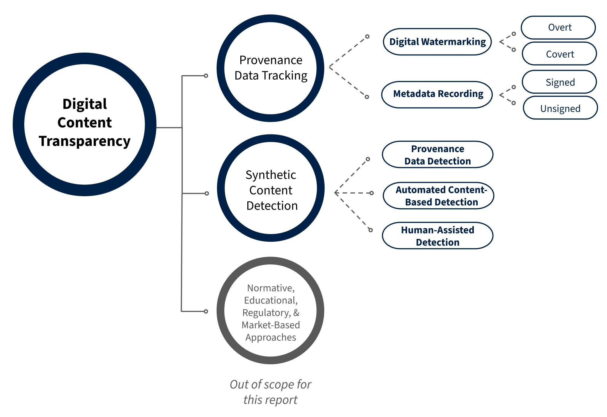
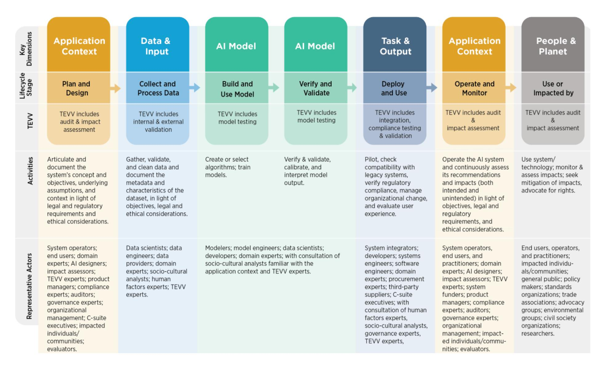
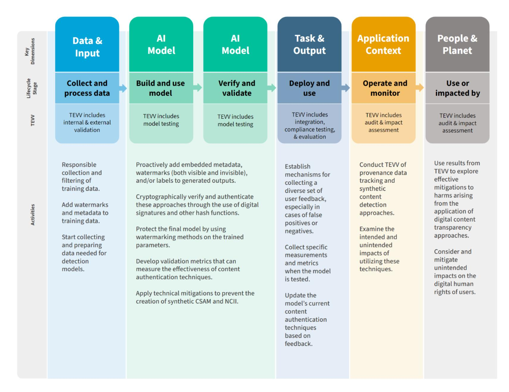
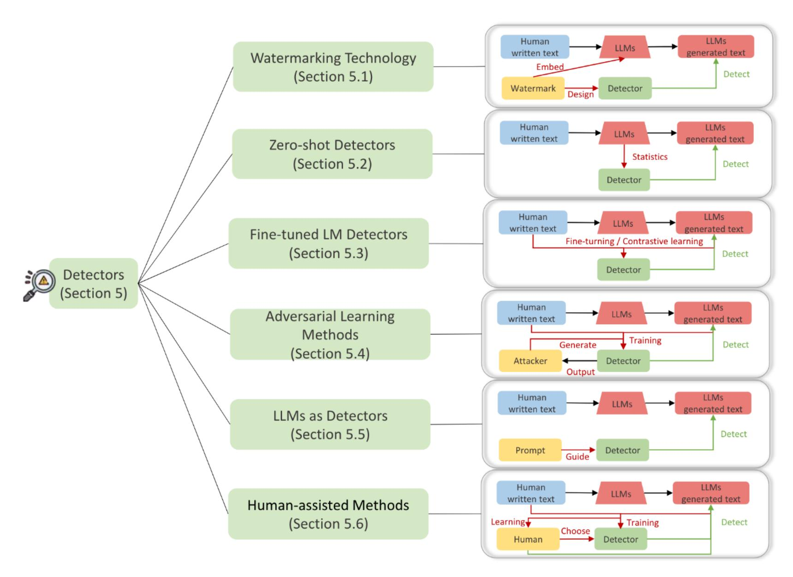

{0}------------------------------------------------

## **NIST Trustworthy and Responsible AI NIST AI 100-4**

# **Reducing Risks Posed by Synthetic Content**

*An Overview of Technical Approaches to Digital Content Transparency* 

> This publication is available free of charge from: <https://doi.org/10.6028/NIST.AI.100-4>

{1}------------------------------------------------

## **NIST Trustworthy and Responsible AI NIST AI 100-4**

# **Reducing Risks Posed by Synthetic Content**

*An Overview of Technical Approaches to Digital Content Transparency* 

> This publication is available free of charge from: <https://doi.org/10.6028/NIST.AI.100-4>

> > November 2024

U.S. Department of Commerce *Gina M. Raimondo, Secretary*

{2}------------------------------------------------

#### **Disclaimer**

Certain commercial entities, equipment, or materials may be identified in this document in order to adequately describe an experimental procedure or concept. Such identification is not intended to imply recommendation or endorsement by the National Institute of Standards and Technology, nor is it intended to imply that the entities, materials, or equipment are necessarily the best available for the purpose. Any mention in the text of commercial, non-profit, academic partners, or their products, or references is for information only; it is not intended to imply endorsement or recommendation by any U.S. Government agency.

#### **NIST Technical Series Policies**

[Copyright, Use, and Licensing Statements](https://doi.org/10.6028/NIST-TECHPUBS.CROSSMARK-POLICY) [NIST Technical Series Publication Identifier Syntax](https://www.nist.gov/nist-research-library/nist-technical-series-publications-author-instructions#pubid)

#### **Publication History**

Approved by the NIST Editorial Review Board on 2024-11-18

{3}------------------------------------------------

#### **Acknowledgments**

This report could not have been accomplished without the many helpful comments and contributions from the community and NIST staff and guest researchers: Bilva Chandra, Jesse Dunietz, George Awad, Yooyoung Lee, Peter Fontana, Razvan Amironesei, Mark Przybocki, Kamie Roberts, Mat Heyman, and Elham Tabassi.

{4}------------------------------------------------

#### **Table of Contents**

| 1     | Summary 1                                                                                                                                     |    |
|-------|--------------------------------------------------------------------------------------------------------------------------------------------------|----|
| 2     | Harms and Risks from Synthetic Content 2                                                                                                      |    |
| 3     | Digital Content Transparency Approaches, Issues, and Opportunities3                                                                              |    |
|       |                                                                                                                                                  |    |
| 3.1.1 | Digital Watermarking5                                                                                                                            |    |
| 3.1.2 | Metadata Recording 15                                                                                                                         |    |
|       |                                                                                                                                                  |    |
| 3.2.1 | Technical Methods for Automated Synthetic Content Detection 23                                                                                |    |
| 3.2.2 | Detection Performance and Additional Considerations by Modality27                                                                                |    |
|       |                                                                                                                                                  |    |
| 3.3.1 | Examples Related to Challenges in User Experience and Perception30                                                                               |    |
| 3.3.2 | Case Studies31                                                                                                                                   |    |
| 4     | Testing and Evaluating Digital Content Transparency Techniques32                                                                                 |    |
|       |                                                                                                                                                  |    |
| 4.1.1 | Testing and Evaluating Digital Watermarking Techniques32                                                                                         |    |
| 4.1.2 | Testing and Evaluating Metadata Recording Techniques33                                                                                           |    |
|       |                                                                                                                                                  |    |
| 4.2.1 | Testing and Evaluating Provenance Data Detection Techniques 33                                                                                |    |
| 4.2.2 | Testing and Evaluating Automated Content-Based Detection Techniques33                                                                            |    |
| 4.2.3 | Testing and Evaluating Human-Assisted Detection Techniques34                                                                                     |    |
|       |                                                                                                                                                  |    |
| 5     | Techniques for Preventing and Reducing Harms from AI-Generated Child Sexual Abuse Material and AI Generated Non-Consensual Intimate Imagery34 |    |
|       |                                                                                                                                                  |    |
| 5.1.1 | Considerations for Training Data Filtering 35                                                                                                 |    |
|       |                                                                                                                                                  |    |
| 5.2.1 | Considerations for Input Data Filtering36                                                                                                        |    |
|       |                                                                                                                                                  |    |
| 5.3.1 | Considerations for Image Output Filtering 37                                                                                                  |    |
|       |                                                                                                                                                  |    |
| 5.4.1 | Considerations for Hashing Confirmed AIG-CSAM and AIG-NCII37                                                                                     |    |
|       |                                                                                                                                                  |    |
| 5.5.1 | Considerations for Provenance Data Tracking Techniques for AIG-CSAM and AIG-NCII                                                                 | 39 |

{5}------------------------------------------------

|                | 5.6 Red-    | Teaming and Testing for CSAM and NCII                            | 39 |
|----------------|-------------|------------------------------------------------------------------|----|
|                | 5.6.1 Co    | nsiderations for Red-Teaming and Testing for CSAM and NCII       | 39 |
| 6              | Application | n of Concepts to the NIST AI Risk Management Framework Lifecycle | 41 |
| 7              | Conclusion  | l                                                                | 42 |
| 8              | Bibliograp  | hy                                                               | 44 |
| Α Ι | opendix A.  | Current Standards                                                | 53 |
| Α Ι | opendix B.  | Technical Tools                                                  | 57 |
| Α Ι | opendix C.  | Provenance Data Tracking                                         | 61 |
| ΑĮ             | opendix D.  | Synthetic Content Detection                                      | 63 |
| ΑĮ             | opendix E.  | Testing and Evaluation                                           | 71 |
| ΑĮ             | opendix F.  | Glossary                                                         | 73 |
| Α Ι | pendix G.   | Acronyms                                                         | 75 |

{6}------------------------------------------------

#### **1 Summary**

Generative artificial intelligence (AI) technologies can generate realistic images, text, audio, video, as well as multimodal content. This enables novel applications with promising potential for good while also posing new risks to trust, safety, transparency, and credibility in digital information and communications.

This report examines the existing standards, tools, methods, and practices, as well as the potential development of further science-backed standards and techniques, for: authenticating content and tracking its provenance; labeling synthetic content, such as using watermarking; detecting synthetic content; preventing generative AI (GAI) from producing child sexual abuse material or producing non-consensual intimate imagery of real individuals (to include intimate digital depictions of the body or body parts of an identifiable individual); testing software used for the above purposes; and auditing and maintaining synthetic content.

This report reflects public feedback and consultations with diverse stakeholders, including those who responded to a [NIST Request for Information.](https://www.nist.gov/artificial-intelligence/request-information-nists-assignments-under-executive-order-14110-safe)

Digital content transparency refers to the process of documenting and accessing information about the origins and history of digital content. Together, the approaches discussed below can help manage and reduce risks related to synthetic content by:

- Recording and revealing the provenance of content, including its source and history of changes made to the content;
- Providing tools to label and identify AI-generated content; and
- Mitigating the production and dissemination of AI-generated child sexual abuse material and nonconsensual intimate imagery of real individuals.

Digital content transparency provides a vehicle for individuals and organizations to access more information about the origins and history of content, which may contribute to trustworthiness but does not guarantee it, and in some cases may undermine it. While transparency can help identify when content is being misrepresented, it can also create a false sense of trust, such as when a piece of content appears legitimate based on technical measures but is then manipulated through non-technical means (e.g., taking a legitimate piece of content out of context). Ultimately, the impact of transparency depends on the effectiveness of the technical methods used and on how people access and interact with digital content. With respect to the latter, digital information literacy, as well as both formal and informal education, can impact how individuals perceive content.

In this document, followin[g Executive Order 14110](https://www.whitehouse.gov/briefing-room/presidential-actions/2023/10/30/executive-order-on-the-safe-secure-and-trustworthy-development-and-use-of-artificial-intelligence/), "synthetic content" refers to "information, such as images, videos, audio clips, and text, that has been significantly altered or generated by algorithms, including by AI." Within this definition, the contents below most directly address image, video, audio, and text content that is generated or modified by AI systems in manner that meaningfully impacts their interpretation by humans.

This report provides an overview of technical approaches for provenance data tracking and synthetic content detection with issues for consideration, along with a review of the current testing and evaluation for digital content transparency techniques. It should be noted that the efficacy of many of these technical approaches are not fully examined yet, and most of the approaches may be years away from widespread deployment on mobile devices.

For selected techniques, the document identifies ongoing research and related research gaps. It also discusses technical mitigations for preventing and reducing the production and distribution of synthetic child sexual abuse material (CSAM) and non-consensual intimate images (NCII) and applies the concepts discussed to the AI lifecycle as outlined in the [NIST AI Risk Management Framework,](https://nvlpubs.nist.gov/nistpubs/ai/nist.ai.100-1.pdf) or AI RMF (NIST AI 100-1).

{7}------------------------------------------------

The technical approaches described in this report provide building blocks that can be used to improve trust in digital content and the institutions and individuals who produce and disseminate it by indicating where AI techniques have been used to generate or modify digital content. None of these techniques offer comprehensive solutions on their own; the value of any given technique is use-case and context-specific and relies on effective implementation and oversight. This report focuses on technical approaches; it may be important to consider normative, educational, regulatory, and market-based approaches not described in this report.

Science-backed standards forged through global actions via international standards-setting bodies, several of which are mentioned in this report, can promote the adoption and interoperability necessary for these tools to have the desired impact.

There is no perfect solution to solve the issue of public trust and harms stemming from digital content, but additional and improved approaches to synthetic content provenance, detection, labeling, and authentication techniques and processes are important capabilities to support trust between content producers, distributors, and the public.

#### **2 Harms and Risks from Synthetic Content**

Although much synthetic content is not inherently harmful, some synthetic content can accelerate and exacerbate pre-existing harms and negative impacts across the open information ecosystem, such as information integrity issues, synthetic CSAM, NCII, and fraud (including identity theft).

To understand where and by whom interventions can be made to reduce risks of harm, it is helpful to understand the synthetic content pipeline, which stretches from **creation to publication to consumption** (see [Figure 1\)](#page-8-1). Each stage involves different AI actors. Most of the measures discussed in this report address the creation and consumption stages.

Risks and harms of synthetic content can be influenced by a range of factors. These include the target audience for the content; the context in which content is used or misused; the sophistication of the actor creating and/or disseminating the content; and any social, economic, and health-related (including mental health) costs incurred in association with the creation and/or dissemination of the content. Harms also vary in scope: some are concentrated on particular individuals—such as when CSAM or NCII depict real individuals while other harms are diffuse across society, such as disinformation that affects a wide array of individuals who consume it. Which techniques are most effective in addressing synthetic content risks and harms will vary according to these factors, and fully addressing risks and harms may require measures aimed at these factors that go beyond the technical measures discussed in this report.

Which techniques are most effective will also vary depending on who is using the techniques for what purpose they are using them, and how widely others are using them. Techniques for provenance data tracking, which record the origins and history of digital content, and for detecting such tracked data may be helpful to establish whether content is synthetic or authentic for broad audiences. This does not directly translate to trustworthiness, as authentic content can still be harmful or misleading, but these techniques may reduce some risks by providing greater transparency. Other synthetic content detection techniques, meanwhile, may be more suitable for use by analysts (e.g., in social media platforms or specialized civil society organizations) to determine whether specific content is AI-generated and what responses may be appropriate. For high-risk applications or applications that require high accuracy, which could include election security,

{8}------------------------------------------------

#### **Creation**

Synthetic content is produced (generated from scratch or modified from other content) by AI tools, either from generative model developers or from downstream tool developers, and by users using these systems. Content may be edited and modified by users after initial creation.

#### **Publication**

Synthetic content is uploaded and disseminated by users and publishers across platforms, websites, and other digital channels, or published or broadcast via non-digital channels such as print or radio.

#### **Consumption**

Audiences interact and engage with the synthetic content. This can include accessing and interpreting the content, reacting to or acting on it, and interpreting or acting on any accompanying disclosures or labels.

**Figure 1**: The synthetic content pipeline spans creation, publication, and consumption stages, each with different actors and potential interventions.

defense applications, CSAM/NCII investigations, and others, it will likely be helpful to take a defense-in-depth1 approach. These considerations may need to be weighed against tools' acceptance: in many cases, techniques will be more effective if they are adopted in a widespread and coordinated manner.

Synthetic content can also carry risks for cybersecurity and fraud. In particular, synthetic images, voices, or video may be used to fool biometric authentication systems or to mislead human recipients into facilitating fraudulent transactions (e.g., via voice cloning).

Efforts to address synthetic content harms and risks using digital content transparency are still relatively new. These techniques will continue to evolve, and a variety of technical and sociotechnical evaluations are needed to guide their implementation.

This report addresses broadly applicable technical measures for risks of synthetic content. Further mitigations and controls tailored to more specific use cases and contexts, as well as for other risks of generative AI, are available in NIST's guidelines for Managing Misuse Risk for Dual-Use Foundation Models Guidelines2 and the [Artificial Intelligence Risk Management Framework: Generative Artificial Intelligence Profile.](https://nvlpubs.nist.gov/nistpubs/ai/NIST.AI.600-1.pdf) The latter also highlights twelve different categories of risk from generative AI in more detail.

#### **3 Digital Content Transparency Approaches, Issues, and Opportunities**

This section provides a landscape overview of computational tools for digital content transparency, including overviews of the state of the art, design goals and parameters, and additional considerations and tradeoffs for the various methods. It also notes opportunities for further research and development.

Current tools can be broken down into the following categories, as shown in [Figure 2:](#page-9-0)

● **Provenance data tracking** (Sectio[n 3.1\)](#page-10-1): Recording information about the origins and history for digital content, which can assist in determinations about authenticity. This category consists of techniques to

1 [Defense-in-depth](https://csrc.nist.gov/glossary/term/defense_in_depth) refers to an information security strategy integrating people, technology, and operations capabilities to establish variable barriers across multiple layers and missions of the organization.

2 [Draft](https://nvlpubs.nist.gov/nistpubs/ai/NIST.AI.800-1.ipd.pdf) made available for public comment; final version to be published.

{9}------------------------------------------------

record overt or covert digital watermarks or cryptographically signed or unsigned metadata. Provenance data tracking can be applied to record assertions about either synthetic or non-synthetic origins or modifications.

● **Synthetic content detection** (Section [3.2\)](#page-26-0): Techniques, methods, and tools used to classify whether a given piece of content is synthetic or not. Synthetic content detection may detect the existence of recorded provenance information, such as metadata or digital watermarks, or it may look for other characteristics to help determine whether content was generated, modified, or manipulated by AI.

The techniques i[n Figure 2](#page-9-0) overlap to some degree. For example, covert digital watermarks are useful only if they can be detected by watermark detectors, a form of synthetic content detection. The techniques can also be used in tandem to provide complementary benefits; it may be useful, for instance, to embed into an image a robust covert watermark, which is unlikely to be stripped as the image travels across platforms, and to attach signed metadata to provide further information for those who manage to receive it. Some kinds of watermarks can even be used to embed arbitrary metadata directly into the content (rather than as accompanying information). Despite these overlaps, the categories presented i[n Figure 2](#page-9-0) are distinct enough that they can be discussed largely independently.

**Figure 2:** Current computational methods for digital content transparency can be broken down into provenance data tracking and synthetic content detection, each with multiple subcategories. Provenance data tracking can be applied to both synthetic and non-synthetic content.

{10}------------------------------------------------

[Figure 2](#page-9-0) also highlights an important third category, namely normative, educational, regulatory, and marketbased approaches for enhancing awareness about content provenance and information integrity and incentivizing practices that promote information integrity. Technical methods for digital content transparency affect society only via the people and organizations who adopt or interact with them, so if these methods are to succeed in their goals, they may need to be accompanied by efforts that focus on people and institutions.

Such approaches are generally out of scope for this report. However, Sectio[n 3.3](#page-34-0) does briefly address how technical provenance artifacts discussed in this report can be provided or displayed to humans in a manner that is helpful and informative in practice.

Techniques discussed in this section are sometimes referred to as *content authentication*. This report uses that term to refer not to a technical method or to all kinds of digital content transparency, but rather to the process of using provenance data tracking methods to determine that a piece of content is authentic. In other words, the term encompasses all provenance data tracking, provenance data detection, and subsequent labeling methods when they are applied to non-synthetic content to establish its authenticity.

#### **3.1 Provenance Data Tracking**

Provenance data tracking can help establish the authenticity, integrity, and credibility of digital content by recording information about the content's origins and history. Current methods for provenance data tracking include *digital watermarking* and *metadata recording*. 3 These methods vary in their implementation and their robustness across various types of content (images, text, audio, and video).

Provenance data tracking methods can record that a given piece of content was generated or edited using an AI tool; they can also record that it was created or edited by some non-AI entity or tool (e.g., a camera). In either case, the presence of the data, particularly if it can be validated, can give the recipient some degree of confidence that the content emerged from the specified origins or history.

#### **3.1.1 Digital Watermarking**

Digital watermarking involves embedding information into content (image, text, audio, or video), typically while making it difficult to remove. The distinguishing characteristic of watermarks is that the information is encoded into the content itself via the pixels, words, etc., without using a separate channel (e.g., metadata fields) to convey the information. Examples of useful information that may be embedded in a digital watermark include content origins, ownership details, timestamps, and unique IDs. Such watermarking can assist in verifying the authenticity of the content or characteristics of its provenance, modifications, or conveyance.

Digital watermarks have long been used to indicate content origins. One popular use case is the visual watermarks shown on stock photography and other image previews. Another long-standing use is to embed extra information about content ownership in broadcasts, as provided for by standards from the Advanced Television Systems Committee (ATSC; see [Appendix A\)](#page-58-0).

A watermark may need to encode nothing more than its presence—e.g., to indicate that a given system generated the content. Some forms, however, can embed arbitrarily complex data. Further details on specific watermarking tools and use cases are given i[n Appendix B](#page-62-0) and [Appendix C.](#page-66-0)

3 It is als[o possible](https://arxiv.org/pdf/2303.13408) for generative AI services to store previous generations and confirm whether a given piece of content is close to something that was generated by the model. This could be considered another form of provenance data tracking, but there has not yet been extensive study of the idea, including of its potential effectiveness, scalability, or privacy implications, so discussion of this idea is left to future work.

{11}------------------------------------------------

Watermarks for digital content have several key design parameters:4

### **Overt or Covert**

*Overt* watermarks can be perceived directly by the senses of a person who receives the content (e.g., a semi-transparent logo affixed to an image or video). *Covert* watermarks are machine-readable watermarks involving subtle perturbations of the content that are hard for humans to detect. For example, a watermark can be embedded by altering the least significant bit (LSB) of some pixels in an image. A covert watermark must be detected by a watermark detector, which will have some nonzero probability of false positives and false negatives. A covert watermark's effectiveness depends on how accurately detectors can distinguish when the watermark is present and extract any additional data it contains.

#### **Private or Public**

Watermarking techniques can be *private* or *public* based on the availability of the algorithms or cryptographic information needed to detect the watermark. A watermarking scheme is public if everything needed for detection is publicly available; it is private if only some privileged set of actors can detect the watermark.

## **Reversible or Irreversible**

*Reversible* methods embed the watermark into the digital content in such a way that, given the extracted watermark data and/or other information used to extract it (e.g., a security key), the original unwatermarked content can be reconstructed. In *irreversible* methods, the semantic distortion caused by the watermarking process cannot easily be reversed even once the watermark is read.5

Digital watermarks are most effective for provenance data tracking when they possess the following [attributes:](https://ieeexplore.ieee.org/stamp/stamp.jsp?tp=&arnumber=844175)

#### **Accurately detectable**

If the content is unmodified, the watermark should be detectable with both a low false positive rate (detected when not present) and a low false negative rate (not detected when present). This should be true even for small pieces of content (e.g., short pieces of text) that offer limited opportunity for watermark information to be embedded.

4 The watermarking literature also describes several design parameters that are less relevant to synthetic content:

● Watermarking techniques can be more or less robust to modifications and secure against attacks. **Fragile** watermarking methods are designed to become invalid in the face of any changes to the content (e.g., for data integrity use cases), while **robust** methods are designed to withstand certain types of attacks or modifications. Consistent with "robust" and "secure" in the table below, deliberately fragile watermarks would not generally be helpful for distinguishing synthetic content, although they could help detect if content was modified (via AI or otherwise) since its creation.

● Watermarking techniques can be **blind** or **non-blind** based on whether the original content is required for detecting the watermark. Blind watermarking methods do not require the original content for detection, while non-blind methods do. Non-blind methods are often used to allow the content creator to later demonstrate ownership or authorship. When determining whether a piece of content is synthetic or not, one will not generally have access to the un-watermarked content—and indeed, for some generative AI watermarks, there is no unwatermarked original—so blind watermarks are more relevant for digital content transparency.

5 Watermarking techniques that are applied to generative AI outputs from the beginning of the generation process cannot be reversible, as there is no original to revert to.

{12}------------------------------------------------

**Robust** The watermark should remain detectable under various types of typical innocuous modifications such as compression, filtering, or cropping (for media content) or minor paraphrases or deletions (for text). Likewise, such modifications should not prevent extracting any additional data that is stored in the watermark.

**Secure** The watermark should be secure against attempts by malicious users to remove or tamper with the watermark information, or to insert forged watermarks.

#### **Low distortion**

The watermark should not affect how a human would perceive the quality of the watermarked content compared to the original content or compared to what an AI model would generate if its output were not watermarked.6 In the context of generative AI, qualit[y may also encompass](https://arxiv.org/abs/2311.04378) adherence to the prompt.

#### **Sufficiently high-capacity**

The watermark should have sufficient capacity to embed the information needed for its intended purpose, such as information about the creator. The watermark may need only to encode its presence (a "zero-bit watermark"). If it encodes information beyond this, it may be human-readable information, such as text or logos, or machinereadable information, such as a URL, AI model identifier, or digital signature. In principle, a sufficiently high-capacity watermark could embed arbitrary metadata, though this may sometimes be impractical given the tradeoffs of increased capacity noted in Section [3.1.2.2.](#page-22-0)

**Efficient** The watermarking algorithms should be computationally efficient, allowing for fast and reliable embedding and detection/extraction of the watermark information.

#### **Minimally disruptive**

The watermarking process should be transparent to the user, meaning it should not require significant changes to processes for creating, distributing, maintaining, or using the content.

#### **3.1.1.1 Technical methods for covertly watermarking synthetic content7**

Methods for covert watermarking must choose some **property** of the content that can be subtly perturbed, such as some known portion of the content (e.g., particular pixels) or the statistical properties of the content (e.g., the prevalence of certain words in certain contexts). There must also be a systematic **perturbation algorithm** to manipulate the chosen property so that the watermark can easily be generated, and a detector can reliably recognize when it is present and when it is not.

6 There may be circumstances where high distortion is desirable in a watermark, e.g., if a stock photo vendor watermarks an image preview to prevent use without payment. For synthetic content watermarks, however, this is rarely desirable.

7 The literature also contains examples of methods for watermarking a model itself. Model watermarking is a different task setting: given either a given model's weights or some number of its outputs, the goal is to determine whether the model is the same as, or a slightly altered version of, some known model. There is some overlap in techniques, but this report does not discuss techniques specifically designed for watermarking models, nor does it address how well any techniques work for that purpose.

{13}------------------------------------------------

Below are some examples of properties that can be perturbed, along with the applicable types of content and examples that leverage these properties. The "modalities" column indicates what modalities the technique could, in principle, be applied to, not where it has been empirically demonstrated. The final column lists risks and limitations that are unique or particularly salient to watermarking based on the relevant property; crosscutting limitations are discussed in the sections below.

| Property to perturb                                                                                                                                                                                                                                                                                                                                                                                                                              | Modalities                                        | Examples                                                                                                             | Stage of application | Distinctive risks and technical limitations                                                                                                                                                                                                                                                |
|--------------------------------------------------------------------------------------------------------------------------------------------------------------------------------------------------------------------------------------------------------------------------------------------------------------------------------------------------------------------------------------------------------------------------------------------------|---------------------------------------------------|----------------------------------------------------------------------------------------------------------------------|-------------------------|-----------------------------------------------------------------------------------------------------------------------------------------------------------------------------------------------------------------------------------------------------------------------------------------------|
| Individual samples (e.g., pixels, audio samples): Predictably chosen pixels, audio samples, or tokens of text can be altered to embed a watermark. To minimize perceptual distortion, modifications can be limited to a small and relatively unimportant set of samples or portions of samples, such as the least significant bits (LSB) of image pixels.                                                    | Image, audio, video, text                   | LSB-based watermarking (image), EasyMark (text), lexical substitution (text)                       | Post generation      | Limited robustness and security (can be removed by, e.g., compression, cropping, filtering, scaling, or simple find/replace); perceptible distortions in the content; distortion and capacity may depend on the host content (e.g., texture of images) |
| Frequency coefficients: Every piece of content that consists of samples laid out in time and/or space can be re represented in terms of spatial or temporal frequencies instead of individual samples. The balance between some of these frequencies can be perturbed with minimal impact on human perception, much as JPEG compression discards some spatial frequencies from images with little impact. | Image, audio, video                         | Discrete Cosine Transform watermark (image), Discrete Fourier Transform watermark (audio) | Post generation      | Vulnerable to geometric attacks (cropping, rotation, and in some cases scaling); may require substantial computing resources or processing time to run                                                                                                                |
| Initial noise for diffusion models: Many recent GAI models are "diffusion models." These models start from a full output consisting of random                                                                                                                                                                                                                                                                                     | Image, video, possibly audio and text | Tree ring watermark (image)                                                                                    | During generation    | Limited capacity; applicable primarily in a private setting (detecting the watermark requires                                                                                                                                                                                     |

{14}------------------------------------------------

| noise, then iteratively refine the noise into an output matching the prompt. The initial noise output can embed a predefined pattern, which can later be recovered by someone in possession of the model.                                                                                                                                                                                                                                                                                     |                                             |                                                                                                                                  |                                               | access to the model and possibly a security key); may be complex to apply to some modalities (demonstrated only for images)                                                                                                                                                                                                                                                                            |
|--------------------------------------------------------------------------------------------------------------------------------------------------------------------------------------------------------------------------------------------------------------------------------------------------------------------------------------------------------------------------------------------------------------------------------------------------------------------------------------------------------------------|---------------------------------------------|----------------------------------------------------------------------------------------------------------------------------------|-----------------------------------------------|--------------------------------------------------------------------------------------------------------------------------------------------------------------------------------------------------------------------------------------------------------------------------------------------------------------------------------------------------------------------------------------------------------------------------|
| Space of possible outputs: Models can be constrained to forbid outputs that contain certain configurations of pixels or samples, with the forbidden configurations differing imperceptibly from permitted ones. Constraints can be set up so that any model output falls within the permitted set of outputs, but outputs that have not been carefully constructed will be unlikely to do so. The watermark is present if the content falls within the permitted set. | Image, video, text, possibly audio | Mirror diffusion models (image), SemStamp (text)                                                                  | During generation or post generation | Limited capacity (can convey only watermark presence); may not scale well to larger outputs (e.g., high resolution images); adding constraints to forbid more outputs reduces the chances of false watermark detection but increases distortion; robustness and security are unclear; may be complex to apply to some modalities (demonstrated only for images) |
| Next token probabilities: Large language models typically generate text one "token" (or sub-word chunk) at a time. The probabilities of different tokens being chosen at a given point in the text can be modified to embed information.                                                                                                                                                                                                                                                   | Text                                        | Red/green LLM watermark (text), distortion-free LLM watermark (text), semantic invariant watermark | During generation                          | Some versions may degrade text quality                                                                                                                                                                                                                                                                                                                                                                                |

(text)

{15}------------------------------------------------

For many of these properties, a variety of techniques can be used to systematically perturb them into a watermark. Example methods (which may be used together) include:

| Perturbation method                                                                                                                                                                                                                                                                                                                                               | Properties method is applicable to                                                                                                                                                                                                                                                                                                                                                                                                                                                                     | Examples                                                                                                                                                      | Distinctive risks and technical limitations                                                                                                                               |
|-------------------------------------------------------------------------------------------------------------------------------------------------------------------------------------------------------------------------------------------------------------------------------------------------------------------------------------------------------------------|-----------------------------------------------------------------------------------------------------------------------------------------------------------------------------------------------------------------------------------------------------------------------------------------------------------------------------------------------------------------------------------------------------------------------------------------------------------------------------------------------------------|---------------------------------------------------------------------------------------------------------------------------------------------------------------|------------------------------------------------------------------------------------------------------------------------------------------------------------------------------|
| Direct replacement: If what is being perturbed is standalone pieces of the output (e.g., pixels or words), pieces of output data can be replaced directly with the watermark data.                                                                                                                                                           | Individual samples, frequency coefficients. For example, the LSBs of image pixels can be replaced with watermark information. (This would not work for methods that perturb the generation process, as that process is not directly encoded in the output.) For text, modifications can attempt to preserve semantics (e.g., by substituting synonyms).                                                                                                            | LSB-based watermarking (image), Discrete Cosine Transform watermark (image), Discrete Fourier Transform watermark (audio) | May have higher distortion than other methods; tends to be less robust and secure (easy to overwrite)                                                            |
| Hashing or encryption: A cryptographic or perceptual hash function can be used to generate a "hash value," a pseudo random number, that determines what perturbations are performed. To enable private operation, an encryption cipher with a key known only to the model operator can be used as the hash function. | Individual samples, frequency coefficients, next token probabilities For audiovisual content, a hash of the original image, or data derived from it, can be embedded via direct encoding. Hashing can also be used for text watermarking: at each step, the hash value is used to designate "red" and "green" lists of tokens, and then the model preferentially selects the next token from the green list in a covert but statistically detectable way. | Robust hashing for visual watermarking (image), Red/Green LLM watermarking (text)                                                     | Fragility of hashes and ciphers to small changes can reduce robustness and security; can be complex to implement; can be computationally intensive         |
| Randomness: A randomly selected key can be used to determine what perturbations are performed (e.g., how much a text token's probability is boosted                                                                                                                                                                                          | Individual samples, frequency coefficients, space of possible outputs, next token probabilities                                                                                                                                                                                                                                                                                                                                                                                                  | Mirror diffusion models (image), distortion-free LLM watermark (text)                                                                    | Watermark detector must have access to the key, which normally implies private operation (public release of the key could allow anyone to reproduce the |

{16}------------------------------------------------

| or decreased, or what pixel configurations are deemed forbidden from watermarked outputs).                                                                                                                                                                                                                                                                                                                                                                                                                             |                                       |                                                                                                                                                 | randomized perturbations and thus potentially apply the watermark)                                                                                                                                |
|---------------------------------------------------------------------------------------------------------------------------------------------------------------------------------------------------------------------------------------------------------------------------------------------------------------------------------------------------------------------------------------------------------------------------------------------------------------------------------------------------------------------------------|---------------------------------------|-------------------------------------------------------------------------------------------------------------------------------------------------|------------------------------------------------------------------------------------------------------------------------------------------------------------------------------------------------------------|
| Machine learning: A machine learning system can be trained to perturb a piece of content in a way that is reliably detectable. Usually, a matching machine learning-based detector must also be trained. Unlike direct replacement, which overwrites predictable samples according to some human-defined rule, this technique creates a pattern in the samples that may be opaque to humans and may not assume pre existing content to overwrite portions of. | Any property that can be perturbed | Stable Signature (image), StegaStamp (image), WavMark (audio), Remark-LLM (text), SynthID (images, audio, video)8 | Computationally intensive; may make detection less explainable and therefore harder for some users to trust; performance may degrade for data outside the training distribution |

Watermarking methods are more thoroughly developed for images than for other modalities. They have also been well-studied for text, although text i[s regarded as](https://arxiv.org/pdf/2310.12362) significantly more difficult to watermark: it offers a much smaller surface to embed the watermark than visual or audio content; it is much more sensitive to even small alterations; and it is relatively easy to edit in a way that dilutes the watermark.

#### **3.1.1.2 Technical tradeoffs for watermarking**

*Detection accuracy, robustness, and security vs. watermark capacity*

Any given mechanism for watermarking is essentially an information *channel* with some *channel capacity*. The channel may corrupt the watermark information via "noise" such as file corruption, benign edits, or adversarial manipulation. As in other contexts, the impact of channel noise can be reduced by encoding watermark data with more redundancy, which allows detecting and correcting more channel-induced errors and thus improves detection accuracy, robustness, and security. For example, encoding the same watermark data into many different sets of image frequency coefficients would make it harder to erase. However, such redundancy uses up channel capacity—i.e., given a limited budget of perturbations to perform, a

8 The name SynthID is also used for a text watermarking scheme, although that scheme appears to be similar to other text watermarking schemes that are not based on machine learning

{17}------------------------------------------------

watermarking scheme that increases accuracy, robustness, and security by encoding information more redundantly will have lower capacity.

This tradeoff does not apply to methods for improving robustness and security that do not rely on increasing redundancy. For example, information can be encoded via alternate representations of an image that make the watermarks intrinsicall[y more robust](https://ieeexplore.ieee.org/document/918569) to specific types of edits, such as rotation.

For text, most proposed watermarking methods are zero-bit—i.e., they convey no information beyond the presence of the watermark—making this tradeoff less relevant. However, there is some [initial research](https://arxiv.org/pdf/2401.16820) on multi-bit schemes based on error-correcting codes.

#### *Channel capacity vs. distortion*

For many kinds of watermarks, it is possible to modulate how extensively the content is perturbed. For example, an overt visual watermark can be applied across a wider swath of an image, or more frequency coefficients in an audio file can be overwritten. Increasing the extent of perturbation offers greater channel capacity, which, as noted above, can be used to increase either the watermark's capacity or its detection accuracy, robustness, and security. However, this typically comes at the cost of increasing distortion—e.g., visually disrupting more of the image or distorting more frequencies that are perceptually salient to humans.

#### **3.1.1.3 Robustness and security of watermarking**

#### *Ease of removal ("scrubbing")*

A major issue for watermarks is robustness and security in the face of benign edits or adversarial attempts to remove the watermark. Overt watermarks applied to small portions of a piece of content can easily be edited out, sometimes even by accident, and it is often similarly straightforward to deliberately remove covert watermarks that use direct replacement (e.g., to remove an image watermark that overwrites predictably placed bits, one can simply overwrite those same bits again).

Many watermarks, such as those that use machine learning or that perturb token probabilities or diffusion models' noise patterns, are designed to distribute information throughout the content, making them more robust to modification or attempted removal. In these schemes, common edits to content may slightly reduce the detector's confidence but still typically leave the content clearly watermarked. Nonetheless, most current watermarking schemes have been consistently found vulnerable to removal:

- **Images:** Researchers have [demonstrated](https://www.eurasip.org/Proceedings/Eusipco/Eusipco2018/papers/1570438020.pdf) that for a given image watermarking scheme, a dedicated AI system can be trained using a dataset of watermarked images to strip out the watermark even without knowing anything about the watermarking scheme used. Researchers have also [theoretically](https://arxiv.org/pdf/2306.01953)  [proven and empirically confirmed](https://arxiv.org/pdf/2306.01953) (i[n multiple](https://arxiv.org/pdf/2310.00076) [studies\)](https://dl.acm.org/doi/pdf/10.1145/3576915.3623189) that for any conceivable image watermarking scheme that modifies an image but hews close to the original pixels, the watermark can reliably be removed by adding noise to the image to destroy the watermark, then denoising the image to reconstruct the unwatermarked image. The mathematical proof applies only where the watermarking tries to retain fidelity to some unwatermarked version of the image by limiting pixel-level divergence. Some approaches that build the watermark into the entire generation process (e.g., [tree ring](https://arxiv.org/abs/2305.20030)  [watermarks\)](https://arxiv.org/abs/2305.20030) or that operate on non-pixel-based representations of the image (e.g.[, ZoDiac\)](https://arxiv.org/pdf/2401.04247) may thus be more secure, although even tree ring watermarks have been empirically [found](https://arxiv.org/pdf/2310.00076) to be removable given either sufficient access to the watermark detector or a large dataset of watermarked images.
- **Text:** Text watermarks generally cannot be embedded or detected reliably when the text has [low](https://arxiv.org/pdf/2301.10226)  [entropy,](https://arxiv.org/pdf/2301.10226) i.e., where there are few possible plausible responses to the prompt or continuations of the

{18}------------------------------------------------

text. To take the extreme case, it would be hard to distinguish whether the canonical continuation of "1 + 1 =" was generated by GAI.

When there are more options for high-quality text, the watermark can be more easily embedded and detected, but higher entropy also allows paraphrasing. By having a separate non-watermarked model paraphrase the original watermarked output, it is often possible to remove a text watermark with only minor degradation of text quality. Paraphrasing is especially effective when applied recursively to the output of the paraphraser, at the cost of more degradation. For short texts of about 225 words, [recursive paraphrasing](https://arxiv.org/pdf/2303.11156) can reduce detection rates to 20%. A longer text, however, offers a larger information channel, allowing for more redundancy in the watermark signal, and thus greater robustness and security. In practical settings, paraphrasing has been [found](https://arxiv.org/pdf/2306.04634) to substantially reduce watermark detection accuracy for short texts but to reduce it only slightly for longer texts (beyond about 400 words).

If an adversary has information about what tokens the watermark prefers to output in which contexts (see spoofing subsection below), paraphrasing can b[e more targeted,](https://arxiv.org/pdf/2403.14719) deliberately substituting words the watermark would preferentially avoid. This method can remove watermarks even from longer texts.

Much like for images, [multiple](https://arxiv.org/pdf/2311.04378) [theoretical](https://arxiv.org/pdf/2310.08920) [results](https://proceedings.mlr.press/v247/christ24a/christ24a.pdf) have been proven to show that any text watermarking scheme can, in principle, be defeated by adversarial modifications. These mathematical proofs rely on varying assumptions about the adversary's abilities (e.g., their computational resources or their ability to modify the text while preserving quality), what constitutes successful watermark removal, and how the user can constrain the model's output. Accordingly, there may be circumstances where the proofs do not hold in practice and text watermarking can be secure. It has also been [proven](https://arxiv.org/pdf/2304.04736) mathematically that even if paraphrasing has nearly stripped a watermark or other indications of synthetic origin, a detector's ability to correctly classify text from a given source as synthetic improves exponentially with the number of independent samples of text. Accordingly, it should theoretically remain possible to distinguish an AI source if enough samples can be obtained.

Most text watermarks perturb the probabilities for each next token based on multiple preceding words. Thus, these watermarks [can be removed](https://arxiv.org/abs/2301.10226) by asking the model to pepper an irrelevant word (or [emoji\)](https://x.com/goodside/status/1610682909647671306) throughout the generation and then stripping out the extra words so that each probability adjustment no longer corresponds to the preceding text.

● **Audio and video:** Watermark removal for these modalities has not been as thoroughly studied. Some [initial research](https://arxiv.org/pdf/2406.06979v1) suggests that audio watermarks are robust to types of perturbations they have been trained on, but much less robust against other distortions and not secure against adversarial perturbation.

Adversarial attacks to remove watermarks generally require some effort and/or computational power. The extent to which this would pose a barrier to malign actors remains an open question.

#### *Forgery ("spoofing")*

Malicious actors may also try to forge, or "spoof," a watermark, embedding a falsified signal about the history of the content. Spoofing could undermine watermarks' usefulness: if a substantial amount of nonwatermarked content registers as watermarked or if the information encoded in a watermark is often falsified data, users may come to disregard the watermarks as a meaningful signal about the origins and history of the content. Furthermore, if a watermark associated with a particular content creator or tool appears on malicious content from other sources—e.g., if CSAM images are falsely attributed to a generative model—that could

{19}------------------------------------------------

pose reputational or legal risks to the model creator and unduly reduce trust in the technology. Spoofing can even facilitate watermark removal.

The state of spoofing techniques varies by modality:

- **Images:** Spoofing of watermark presence has been [demonstrated empirically](https://arxiv.org/pdf/2310.00076) for a wide variety of GAI watermarks, reducing detector performance by around 5-20% depending on the watermarking method.
- **Text:** For many watermarks that perturb token probabilities, an attacker can us[e careful prompting](https://arxiv.org/pdf/2403.14719) to extract an imperfect version of the perturbation rules, albeit somewhat inefficiently. For some watermarks, researchers [showed](https://files.sri.inf.ethz.ch/website/papers/jovanovic2024watermarkstealing.pdf) that an attacker could use their own non-watermarked model to generate text that detectors classify 80% of the time as bearing some other model's watermark. Other [spoofing attacks](https://arxiv.org/pdf/2303.11156) have shown similar results. On its own, this may not constitute a major security risk if the only desire is to distinguish synthetic content irrespective of what model created it. However, it still raises reputation and trust issues, an[d multiple](https://arxiv.org/pdf/2403.14719) [studies](https://files.sri.inf.ethz.ch/website/papers/jovanovic2024watermarkstealing.pdf) have shown that the ability to spoof a text watermark can facilitate watermark removal. Robust text watermarks are also inherently vulnerable to ["piggyback spoofing attacks](https://arxiv.org/pdf/2402.16187)," in which small but highly impactful edits (e.g., to insert toxic language) are made to a watermarked LLM output, which then still appears watermarked.
- **Audio and video:** Watermark spoofing for these modalities has not been as thoroughly studied. Some [initial research](https://arxiv.org/pdf/2406.06979v1) indicates that audio watermarks are robust against several kinds of spoofing, but less so when the attacker has access to the watermarking model.

Adding cryptographic authentication to data embedded in high-capacity watermarks could hinder spoofing. This solution would raise some of the digital identity issues laid out in Section [3.1.2.5](#page-24-0) regarding metadata recording, as well as the technical tradeoffs regarding capacity noted in Sectio[n 3.1.2.2.](#page-22-0)

#### *Preventing watermarks from being added*

Most watermarking techniques involve software that must be run either after an output is generated or as an additional set of operations during the generation process. The watermarking behavior is not built into the model itself. Accordingly, if someone has access to the source code used to run the model, they can modify that source code to disable watermarking; they do not typically need to retrain the model. In cases where the generative model itself has been trained to watermark, it may be possible to remove that behavior with limited additional training.

#### **3.1.1.4 Scale considerations for watermarking**

Many covert watermarking methods or protocols rely on unique, method-specific detectors. If AI model developers create their own unique watermarking schemes, or if they use unique non-public settings for a common scheme, users will have to use [a different detection service](https://www.brookings.edu/articles/detecting-ai-fingerprints-a-guide-to-watermarking-and-beyond/) for each developer to check whether a piece of content was created by that developer's generative AI tools, which can be inefficient and increase the burden on the user.

Scaling is particularly difficult for private watermarking schemes, where the detection algorithms, keys, or machine learning models necessary for detection are kept private. In such a setting, the entity holding the detection tools must be trusted and may become a bottleneck. Scaling is easier with public watermarks, where the detection algorithms and any necessary keys or models are widely shared. In addition to allowing a proliferation of detection tools, a public watermark would allow for services that host multiple detectors, streamlining detection. However, a public watermark could also allow malicious actors to spoof the watermark or to sidestep watermark generation by [manipulating](https://arxiv.org/pdf/2402.16187) or repeatedly generating content to find an

{20}------------------------------------------------

output that can fool the detector. Detection tools that are open source or otherwise not subject to rate limiting may be particularly susceptible to such an attack, as the adversary may find it more difficult to check repeatedly if their latest generation has successfully evaded the detector.

The computational cost of detecting more complex forms of watermarks may also pose a barrier to scaling, particularly if users need to run detectors on their own hardware.

Finally, there is an educational barrier that must be addressed: users need to understand how to use watermark detectors and interpret the results.

#### **3.1.1.5 Privacy considerations for watermarking**

Digital watermarks that are not zero-bit—i.e., that have some capacity to carry additional data—could leak sensitive information, especially if a tool that applies the watermark embeds or reveals information about the tool's user without that user's knowledge. Covert watermarks raise particularly salient concerns: unlike metadata, which is often stripped when content is disseminated, covert watermarks are designed to be persistent, and unlike overt watermarks, their presence is not necessarily apparent to users. Accordingly, covert watermarks that embed any form of sensitive information may make privacy controls more difficult.

#### **Opportunities for Further Development**

Future watermarking research might fruitfully address the following topics, among others:

- Further theoretical analysis of what kinds of watermarking can be secure under what circumstances, as well as empirical analysis of when the assumptions of theoretical proofs hold in practice.
- The detection accuracy, security, and robustness properties of video and audio watermarks, including how existing results regarding images translate to video and audio if similar techniques are applied. This could include developing modified techniques for video and audio where needed.
- Empirical investigation of how both benign and malicious users interact with watermarks, including when and to what extent they attempt to remove or spoof watermarks and how often they succeed in practice.
- New watermarking techniques, which could come from identifying new characteristics to perturb, new ways of systematically perturbing them, or new ways of combining these elements with each other and with content modalities.
- Methods to modify model weights such that model outputs are intrinsically watermarked without requiring additional software processes.9
- Techniques to make watermarks that are as scalable as public watermarks but with the security benefits of private watermarks
- Methods to increase the capacity of text watermarks and other watermarks applied at generation time (e.g., tree ring watermarks), which could allow communicating, e.g., model identifiers or other metadata.

#### **3.1.2 Metadata Recording**

Metadata recording is a second type of provenance data tracking technique in which descriptive information is associated with a piece of content. Provenance metadata may indicate the content's origin, time and date of

9 Some methods have been explored for ["training time watermarking,"](https://arxiv.org/pdf/2312.07913v2) in which the training data is modified, but the technique is mainly used for intellectual property protection and has significant limitations.

{21}------------------------------------------------

creation, author, ownership, location of creation, editing history, or other details. Metadata, especially cryptographically signed metadata (see Section [3.1.2.2\)](#page-22-0), can contribute to content transparency by explicitly describing the origins of the content, either by indicating synthetic origins or by asserting authenticity.

Provenance metadata is typically packaged with the data it describes such that they travel together ("embedded metadata"). For instance, many image, video, audio, and document file formats have standardized ways of storing certain pieces of metadata as part of the file. Alternatively, metadata can be stored in an external repository and linked to the content via some form of identifier. Metadata stored in the same file is more straightforward to use and access, and it can be easier to keep accurate and up to date as the content is changed. However, anyone copying or editing the file can then manipulate or falsify the metadata in the versions they create and distribute. Metadata recorded within a file can similarly be stripped altogether, as it often is when files are shared (e.g., vi[a social media platforms\)](https://blogs.loc.gov/thesignal/2013/04/social-media-networks-stripping-data-from-your-digital-photos/). Metadata may be stripped to deceive recipients of the content about its provenance or for benign reasons such as privacy protection.

Metadata can be associated with text. However, this is easiest to do when the text is part of a document stored in a structured file format such as PDF or Office Open XML. (Even plain text files will typically have minimal operating system-level metadata such as modification timestamps.) It is not generally possible to have metadata travel with raw text as the text is copied across documents or applications. Metadata could potentially be associated with raw text via external repositories or embedded as a pattern in the text itself via sufficiently high-capacity watermarks (see Sectio[n 3.1.1\)](#page-10-0).

In principle, provenance metadata could reflect the entire history of creation and editing for a piece of content, and tools for interacting with content could make that history available. For example, metadata attached to an AI-generated image could attest to its synthetic origins and its time of creation, as well as any information the creator wished to include about themselves or the model that generated the image. As significant changes or edits are made to the image (or copies of it), those changes could be noted in metadata by the editing tools. Image viewers or social media platforms could then make the metadata available to users interacting with the image. In practice, however, such an ecosystem would be challenging to implement and scale: it would require tools and users to opt into a shared framework for provenance metadata, to use that framework consistently and reliably, and to overcome the issues and tradeoffs described below.

It is also difficult to make sure recorded metadata is accurate; this is typically not verifiable even by cryptographic means. The most that can be established through signed metadata is that the signer claims the metadata is accurate; the signer may still be incorrect, or the metadata may not perfectly reflect the full provenance (e.g., an image signed by a camera may still have been modified by on-camera AI).

#### **3.1.2.1 Linking Content to External Metadata**

If metadata is stored in an external repository, a user will only be able to make use of or update that metadata if they can locate the metadata.

One way to link content with external metadata is via hashes. Hashes, or digital fingerprints, are identifiers that can be predictably generated from the content itself. When a user wishes to find canonical metadata for a piece of content (including if they do not find metadata attached to the content or distrust the metadata they find), they can compute the hash and look it up in a trusted repository of metadata. Assuming someone previously saved canonical metadata in the repository under that hash, the user can recover or update the

{22}------------------------------------------------

metadata using just the locally computed hash without having to reveal or repeatedly send copies of the content.10

Hashing algorithms can be made extremely sensitive to even small changes in the content (as in, e.g., checksums and cryptographic hashes). If such hashes are used to link content to metadata, a lookup will not retrieve metadata for content that was modified in any way. An alternative is "perceptual hashing," which aims to generate similar or identical hashes for similar pieces of content. Th[e International Standard Content](https://www.iso.org/obp/ui/en/#iso:std:iso:24138:dis:ed-1:v1:en)  [Code](https://www.iso.org/obp/ui/en/#iso:std:iso:24138:dis:ed-1:v1:en) is one example: it uses several different perceptual hashing algorithms to generate a digital fingerprint for a media file that is designed to remain similar even in the face of changes in compression, cropping, and other modifications.

Another way to link content with external metadata is via content identifiers that are embedded in the content as watermarks (see Sectio[n 3.1.1\)](#page-10-0). The same identifier that is embedded in the content would be used as a lookup key in a trusted metadata repository. This method requires a watermarking scheme with enough capacity to encode the identifier.

#### **3.1.2.2 Authenticating Metadata through Cryptography**

Metadata on its own is neither tamper-evident nor reliably attributable. Some degree of tamper-evidence can be achieved via a fingerprint of the content and metadata, typically a cryptographic hash or checksum. The fingerprint can be appended as additional metadata. However, if the content or metadata is modified, it is straightforward to simply recompute the fingerprint and overwrite that piece of metadata.

A more robust solution is digital signatures. A [cryptographic or digital signature](https://csrc.nist.gov/Projects/digital-signatures) is "an electronic analogue of a written signature that provides assurance that the claimed signatory signed, and the information was not modified after signature generation." A digital signature can be computed for a given piece of content and its associated metadata. A recipient can then have some confidence that the signer wished to associate the metadata with the content and that neither the content nor the metadata has been tampered with since.

A [digital signature algorithm](https://nvlpubs.nist.gov/nistpubs/FIPS/NIST.FIPS.186-5.pdf) includes a signature generation process and a signature verification process. A signatory uses the generation process to create a digital signature on a piece of data via a private key, which is kept secret. The verifier then uses the verification process via a public key that corresponds to the private key to verify that the signature is valid and matches the allegedly signed data.

A signature cannot verify that the metadata is accurate; on a technical level, it merely serves a notarization function, indicating that the signer attested to the existence of the metadata at a given time (assuming the clock used for signing was set accurately). Additional inferences, such as that the signer is confident in the metadata, would have to rely on social conventions—e.g., that signers sign only after validating the metadata—and on trust in the signer to adhere to those conventions.

Metadata could be signed in the name of the hardware (e.g., cameras) or software tools (e.g., photo editing software) used. Alternatively, or in addition, content authors could sign as themselves.

10 Digital fingerprints are commonly used across the technology industry to tag and identify known harmful, illegal and/or sensitive content, especially image content, through the sharing of content through hash databases between technology platforms, civil society, and other entities.

{23}------------------------------------------------

#### **3.1.2.3 Example Provenance Metadata Specifications**

#### *Standardized Media Metadata Formats*

Media file formats have long provided standardized ways to include certain kinds of provenance information. These include camera settings, media dimensions and resolution, creation time, creation location, and attribution information.

Existing standards for such metadata include [XMP,](https://www.iso.org/standard/75163.html) [EXIF,](https://www.jeita.or.jp/japanese/standard/book/CP-3451E_E/) and [IPTC.](https://iptc.org/std/photometadata/specification/IPTC-PhotoMetadata) Usage guidance on IPTC has bee[n updated](https://www.iptc.org/std/photometadata/documentation/userguide/#_applying_metadata_to_ai_generated_images) to reflect AI-specific digital source types. Additional standards are noted in Appendix [A.3.](#page-60-0)

These standards do not make specific provisions for signed metadata; they allow signing metadata only by signing the entire file. There are limited interoperable mechanisms for such file-level signatures. [S/MIME,](https://datatracker.ietf.org/doc/rfc5751/?include_text=1) a digital signing standard created for email attachments, could offer one solution for signing files that contain metadata, though it may be difficult to integrate with existing content processing workflows outside of email. Another proposed solution is [Secure Evidence Attribution Label \(SEAL\)](https://github.com/hackerfactor/SEAL), a nascent specification supported by open-source tooling. SEAL allows embedding a file signature into standard metadata fields and allows recipients to check signatures against a public key that is shared using the same decentralized mechanisms that are used to validate email senders.

#### *C2PA*

The Coalition on Content Provenance and Authenticity (C2PA) is an industry-led group of companies and organizations that has established a [freely available specification](https://c2pa.org/specifications/specifications/1.3/specs/C2PA_Specification.html) for provenance data tracking. The specification, supported b[y open-source software and implementation tools](https://opensource.contentauthenticity.org/docs/introduction) from the Content Authenticity Initiative, allows storing and signing metadata, including assertions about origins, edit history, and "chain of provenance" (indications of what assets a piece of content was derived from).

The specification currently supports image, audio, and video. It supports both embedded metadata and external metadata. C2PA allows linking metadata to content through any of the means noted in Section [3.1.2.1,](#page-21-0) although it does not currently specify any supported schemes for perceptual hashing or embedding identifiers in watermarks. Embedded metadata can also specify a Uniform Resource Identifier to indicate where further metadata is stored.

To allow users to sign metadata, the specification uses a combination of cryptographic algorithms (hash functions and digital signatures), digital certificates with [public-private key pairs](https://nvlpubs.nist.gov/nistpubs/SpecialPublications/NIST.SP.800-12r1.pdf), and "trust lists" of certificate authorities assumed to be trustworthy. The C2PA organization manages a central default trust list [\(still in](https://github.com/contentauth/c2patool?tab=readme-ov-file#using-the-temporary-contentcredentialsorg--verify-trust-settings)  [progress\)](https://github.com/contentauth/c2patool?tab=readme-ov-file#using-the-temporary-contentcredentialsorg--verify-trust-settings).

C2PA has been evaluated mainly through a self-conducted [harms modeling approach,](https://c2pa.org/specifications/specifications/1.0/security/Harms_Modelling.html) which analyzes a system or tool to assess how and to what extent it may negatively affect users and other individuals. The assessment focused on who may be harmed directly or indirectly from the misuse of the C2PA and how to reduce such harms. Some examples of potential harms noted by C2PA's modeling exercise include privacy loss, economic loss, dignity loss, and overreliance on systems.

Further analysis, threat evaluations, and/or red teaming on C2PA could help to determine the extent to which the specification's assumptions hold and it meets its design goals, to anticipate risks that may be posed by widespread implementation and adoption, and to improve the specification, particularly with respect to security and complexity, regarding which some third-party experts hav[e raised](https://www.infosys.com/iki/techcompass/content-provenance-authenticity.html) [concerns.](https://github.com/hackerfactor/SEAL/blob/master/COMPARISON.md#solution-4-c2pa) See also the subsections below.

{24}------------------------------------------------

C2PA is seeking to standardize its specification through [ISO/TC 171/SC 2.](https://www.iso.org/committee/53674.html)

#### **3.1.2.4 Privacy Considerations for Metadata Recording**

Without appropriate privacy mechanisms, metadata recording could leak sensitive metadata and violate individuals' and organizations' privacy, which could, in extreme cases, enable human rights abuses. For example, if users are not aware that metadata is being embedded when content is captured or generated, they may inadvertently reveal information they intended to keep private about when, where, by whom, and with what tool an image was produced. A specification can recommend, as C2PA does, that media creation and editing tools generate metadata only once users have actively opted in and that they give users extensive control over which metadata is generated or redacted. However, such recommendations are not enforceable, and malicious or negligent tool providers could claim to promote transparency via metadata recording solutions but end up exposing user information without consent.

Many internet platforms strip at least some metadata from uploaded files to protect privacy, underscoring the tradeoff between transparently recording provenance information and protecting privacy.

Provenance metadata may be shared across many distinct systems, creating many windows for legitimate and illegitimate access, sharing, and exposure. Individuals will have greater control of their privacy if they have the ability to control or delete their metadata across various systems, including metadata repositories. There may also be less direct privacy risks: if a metadata specification allows a file's metadata to point to an external URL as a source of additional metadata, attempts to access that URL [can be tracked,](https://www.hackerfactor.com/blog/index.php?/archives/1010-C2PAs-Butterfly-Effect.html) facilitating tracking of those attempting to check the file's provenance.

The Internet Architecture Board'[s "Privacy Considerations for Internet Protocols"](https://datatracker.ietf.org/doc/html/rfc6973) provides a starting point for privacy guidelines that can be adapted to a digital content context. For example, these guidelines highlight a variety of privacy-specific and combined security/privacy threats that should be considered, and outline potential mitigations based on data minimization, user participation, and data security.

#### **3.1.2.5 Security Considerations for Metadata Recording with Digital Signatures**

#### *Public Key Infrastructure*

To sign metadata, an entity generating or editing content would need a private key and a corresponding public key, managed via a public key infrastructure (PKI)[. Existing PKIs](https://nvlpubs.nist.gov/nistpubs/FIPS/NIST.FIPS.186-5.pdf) generally involve certificates being issued by certificate authorities (CAs), which operate as trusted third-party entities that are responsible for verifying that a public key is owned by the real-world entity named in the certificate. A recipient of content with signed metadata will check that they trust the CA that issued the corresponding certificate; if they do, and the signature is cryptographically valid, they will typically trust that the metadata was endorsed by the purported signer.

While a well-designed PKI can provide a high degree of assurance in the identity of a signer (as they regularly do for the identities of websites), PKIs do have vulnerabilities that can undermine digital signatures. For example, different CAs have different requirements fo[r proving identity.](https://pages.nist.gov/800-63-3/sp800-63a.html) Additionally, CAs are occasionally [compromised](https://arxiv.org/pdf/2207.09335) such that the attacker could issue valid certificates for entities with falsified identities, which could then be used to produce harmful but potentially trusted content. While such issues affect websites as well, they are especially challenging for digital signatures, where it is harder to define how revoked or expired certificates should be handled, and CAs' practices may vary more than for website certificates.

{25}------------------------------------------------

#### *Attacks on the Digital Signing Process*

The process of digital signing can be undermined by malicious or compromised user tools. For example, the software could deceive the signer into signing [completely different content](https://www.sciencedirect.com/science/article/pii/S0167404812001794#sec7) from what they believed they were signing: a tool could present one document to the user and ask for signing keys, then surreptitiously load another file and use the provided keys to sign that file instead or in addition. Malicious or compromised tools could similarly add or remove data before the signature is generated.

#### *Key Management*

If the metadata is signed in the name of the hardware or software tools used or in the name of some thirdparty signing service, the private keys would be maintained by the tool or service provider. For tools that are not typically used while connected to the Internet (e.g., cameras), the keys would then have to be packaged as part of the tools, which could facilitate theft of the keys. Best practices for key management could involve the use of hardware security modules, key vaults, or other key management systems to keep keys secure. However, some experts [question](https://hackerfactor.com/blog/index.php?/archives/1019-Save-The-Date.html#c5244) whether these measures would suffice to prevent keys from being compromised and used to sign untrustworthy content.

If content authors wish to verifiably sign as themselves, in addition to or instead of having tools or signing services be the signers, the authors will need to apply for and manage their own keys and certificates, which can be challenging for many users.11

#### *Untrusted Signing Certificates*

Anyone can sign a certificate themselves rather than having an established CA sign it, essentially acting as their own CA with no reputation. Entities seeking to validate signed metadata will then see that the signature is cryptographically valid. Of course, unless the validator has specifically added the signer as a trusted source of certificate endorsements (which in C2PA would occur via "trust lists"), the validator will still be able to detect that the signature is untrusted. The software used to present the validation result would then need to make clear that the signer may not be who they claim; see Section [3.3.1.4.](#page-36-1)

#### **3.1.2.6 Scale Considerations for Metadata Recording**

Widespread use of metadata recording will depend on the development and adoption of shared specifications and on the creation and editing tools that support those specifications. Assuming these tools implement privacy controls like those described above, widespread use will also depend both on users opting in and on users and platforms not stripping the metadata (or at least saving it in external metadata repositories, which do not yet exist on a wide scale). Not all content authors will have the resources or capabilities to acquire and use the necessary tools. This may pose a particular problem fo[r media organizations,](https://royalsociety.org/-/media/policy/projects/digital-content-provenance/digital-content-provenance_workshop-note_.pdf) which often purchase or reuse content from others, such as freelancers or eyewitnesses, who are less likely to have the knowledge, access, and (if applicable) cryptographic identities to use metadata recording tools. Some of these issues may be mitigated by establishing organizational principles, policies, and awareness for how to manage metadata.

If content authors wish to sign as themselves, many (e.g., small content creators) will need to obtain new signing certificates. It is not clear how well the existing web-focused CA infrastructure would scale up to so many users who would need their personal or organizational identities verified, possibly in the absence of associated web domains. It is also unclear how much of a barrier the financial cost of purchasing certificates from a CA would be.

11 An individual can always delegate key management to someone else they trust, including an organization they work for. Someone who is not working for an organization (e.g., a freelance photojournalist) would need to either manage their own keys or entrust their private keys to a third party.

{26}------------------------------------------------

As hardware, software, and file formats become outdated, metadata will need to be migrated to new platforms or systems. This may be addressed in part by storing metadata in formats that are resilient to technological changes and likely to be compatible with future systems, including standardized formats.

#### **Opportunities for Further Development**

Future metadata recording research and development could:

- Explore whether and how it may be practical to associate metadata, particularly in metadata repositories, with raw text (e.g., by using some sort of hash of the text).
- Analyze theoretically and empirically what information is useful to record in metadata for what contexts (e.g., whether and when detailed editing history information is helpful), and translate that analysis into metadata standards and usage guidelines.
- Explore ways to bolster the security of on-device signing of metadata (e.g., using hardware security modules), including by securing signing keys against theft and establishing and standardizing methods for timestamping signatures while a device is offline and cannot connect to a timestamping service.
- Develop more thorough threat modeling for user privacy and security when metadata is being recorded by content creation and editing tools.
- Establish best practices for managing tradeoffs between completeness of metadata and other desiderata such as privacy, file size, and complexity.
- Refine, assess the effectiveness of, and standardize robust specifications for provenance metadata.

#### **3.2 Synthetic Content Detection**

*Synthetic content detection* refers to techniques, methods, and tools used to classify whether a given piece of content or portion of content is synthetic or not. Synthetic content detection may rely on provenance information that was recorded, or it may look for other signals to help determine whether content has been generated or manipulated by AI or other tools or algorithms. Reliable and robust methods for detecting synthetic content can help to reduce harms and risks from the misuse of synthetic content when integrated within sound technical and social frameworks.

Some detection methods are not specific to AI: many are borrowed from the broader media forensics space, and are applicable to detecting media manipulation by means other than AI as well as to detecting AIgenerated or AI-manipulated content.

Synthetic content detection techniques broadly fit into three categories, which are not mutually exclusive (systems and organizations may employ multiple techniques together):

● **Provenance data detection**12 involves simply looking for provenance data that has been tracked via digital watermarks (either overt or covert) or metadata. Metadata and covert watermarks are machine-readable, but overt watermarks typically are not—they are designed to be detectable by the human senses, not machines—which may make them harder for algorithms to detect.

12 The forensics community sometime[s distinguishes](https://dl.acm.org/doi/pdf/10.1145/3633203) between "active" methods, which rely on various forms of tracked provenance data, and "passive" methods, which examine the content without assuming it has been deliberately marked in any way. This is a related distinction, though it is not specific to detecting synthetic content in particular.

{27}------------------------------------------------

Provenance data helps with detection primarily by giving a strong signal affirmatively describing the history of the content. If provenance data becomes widespread, the absence of provenance data in a situation where it would have been expected could also become a signal, at least in some contexts.

As noted above, detecting a watermark always comes with some probability of error, and metadata may be inaccurate.

● **Automated content-based detection** techniques identify synthetic content after it has been generated or modified based on traces left during generation or processing (e.g., image pixel regularities or inconsistencies). Content-based detection can also look for traces that manipulation leaves in th[e file metadata.](https://openaccess.thecvf.com/content/CVPR2021W/WMF/html/Xiang_Forensic_Analysis_of_Video_Files_Using_Metadata_CVPRW_2021_paper.html)

Automated detection methods may be "open-box"—i.e., developed with participation from an AI model developer who has full access to and knowledge of the model—or they may be devised by others, potentially in a model-agnostic way. Some detection methods are possible only given some degree of access to, or at least knowledge of, the generating model.

Automated detection methods reflect a constant cat-and-mouse game between the detection and generation communities. As soon as a new detection method is created, generation models improve, and adversaries learn new ways to avoid detection. Furthermore, detectors are often tied to and may only perform well on specific generators.

● **Human-assisted detection** refers to the human-in-the-loop methods in which crowd workers, data labelers, and/or domain experts augment or supplement automated tools to help identify synthetic content. Human-in-the-loop methods can be used for a [wide range of contexts,](https://www.itic.org/policy/ITI_AIContentAuthorizationPolicy_122123.pdf) including to validate, assess, or supplement detection model outputs.

Detection methods relying on humans require extensive labor, incur high costs, and presume that humans can, in fact, detect synthetic content. The effectiveness of these methods can be subject to variations depending on the domain and individuals' lived experiences and expertise, and humans may find detection more difficult as synthetic content generation continues to increase in sophistication. In some contexts, humans may be able to distinguish AI-generated text with some reliability: depending on the language and domain, experienced chatbot users were found in 2023 to [correctly classify](https://arxiv.org/pdf/2301.07597) the answers in question/answer pairs as synthetic or not 61%–100% of the time[. Another study](https://www.pnas.org/doi/10.1073/pnas.2208839120) from the same year, however, found that human judgments of text were indistinguishable from chance, and a [2024 study](https://arxiv.org/pdf/2403.16760) on audio, visual, and audiovisual modalities also found performance near chance.

A complication for all detection methods is that a given piece of content may only be partially synthetic. For example, an image or video may have had an object removed and the space "inpainted" by AI, or the image or frames may have been expanded outward via AI "outpainting." In either case, most of the content will be real; whether any manipulation by AI (or other means) is substantial may be subjective.

Some detection tools attempt to deduce attributes beyond whether the content is synthetic. Such information can include what entities or tools generated the synthetic content and what types of purposes it was likely created for (e.g., hoax vs. satire vs. propaganda). This richer set of cues may help analysts identify and analyze malicious synthetic content. However, richer outputs may be less user-friendly and less accessible to lay audiences. One example of a multidimensional detection approach is the DARPA [Semantic Forensics](https://www.darpa.mil/program/semantic-forensics) (SemaFor) program, which promoted the development of mutually complementary technologies to detect, attribute (determine sources of), and characterize (classify the intent of) falsified multimodal media at scale, focused on disinformation.

{28}------------------------------------------------

The subsections below discuss representative automated methods, along with further issues for consideration for each modality. The synthetic content detection literature is vast, so this section offers merely representative examples of broad categories of methods. Further examples of detection tools, as well as datasets for training and evaluation, are given i[n Appendix D.](#page-68-0)

#### **3.2.1 Technical Methods for Automated Synthetic Content Detection**

Automated methods for detecting AI-generated, AI-modified, or otherwise manipulated content can examine a variety of *features* of the content using a variety of *algorithmic methods*. They can also make use of data or procedures for *training* in a variety of ways.

Some types and examples of features13 for various modalities are noted below, with examples of tools that use them. (As noted in the disclaimer on page 3, no endorsement or recommendation is implied.) As in earlier tables, modalities in the second column are listed based on what the technique is in principle applicable to, and not necessarily what modalities it has been applied to in practice.

| Description of feature                                                                                                                                                                                                  | Example forms/methods by which feature can be fed to detectors                                                                                                                                                                              | Example tools                                                         |
|-------------------------------------------------------------------------------------------------------------------------------------------------------------------------------------------------------------------------|------------------------------------------------------------------------------------------------------------------------------------------------------------------------------------------------------------------------------------------------|-----------------------------------------------------------------------|
| Perceptible features that may reflect manipulation or generation or indicate authenticity. These may be related to garbled content (e.g., muffled sound or irregular intonation) or to semantic | Token co-occurrence patterns, fluency, prevalence of subjective language, or other elements of writing style (text) Annotations for factuality (e.g., based on fact-checking databases) or contradictions (e.g., from reasoning | StyloAI (text) Knowledge graph based fact-checking (text) |
| inconsistencies in the content (e.g., reflections or shadows that do not match lighting, sound and movement that do not align, artifacts from blending modified images with backgrounds, or              | models) (text) Texture or gradient fluctuations (image, video) Optical flow, i.e., the pattern of motion of graphical elements between frames                                                                                      | LBPNet (image) CNN + LSTM optical flow classifier (video) |
| mutually contradictory statements). Such features are often provided to detectors via manually defined formulas designed to extract semantically relevant information.                                   | (video) Object-level features that may reveal visual inconsistencies (e.g., earrings, eye colors, or reflections in eyes that may be asymmetric; breathing or blinking patterns that may be implausible) (image, video)      | Facial artifact detection (image) In Ictu Oculi (video)   |

13 "Features" here refers to the way the input is fed into the system or model, perhaps reflecting some handcrafted preprocessing. Perceptible or imperceptible cues may also be discovered and implicitly leveraged by systems—e.g., a neural network that is fed raw pixels may learn a behavior that amounts to detecting implausible shadows. However, the table is intended to describe what approaches researchers and engineers can consciously apply. Accordingly, it classifies feature types in terms of what the detector inputs are deliberately designed to reflect.

{29}------------------------------------------------

|                                                                                                                                                                                                                                                                                                | Object-level features that can indicate authenticity if present and may indicate synthetic origins if absent (e.g., speech pauses, breath sounds, tiny motions, or other passive "liveness" checks) | Klick Labs deepfake detector (audio)                                                                                 |
|------------------------------------------------------------------------------------------------------------------------------------------------------------------------------------------------------------------------------------------------------------------------------------------------|-----------------------------------------------------------------------------------------------------------------------------------------------------------------------------------------------------------------|----------------------------------------------------------------------------------------------------------------------------|
| Imperceptible cues in the content that can be extracted using forensic or statistical techniques and examined to determine whether they more closely resemble authentic content or synthetically modified or generated content.                                        | Distribution of spatial frequencies (image, video)                                                                                                                                                           | FreqNet (image) Bilateral High-Pass Filters (image)                                                            |
|                                                                                                                                                                                                                                                                                                | Distribution of temporal frequencies (video, audio)                                                                                                                                                          | Bispectral analysis classifier (audio) MFAAN (audio)                                                           |
|                                                                                                                                                                                                                                                                                                | Error level analysis, which highlights compression rate differences in different parts of an image (image, video)                                                                                         | ELA + DL deepfake detector (image)                                                                                   |
|                                                                                                                                                                                                                                                                                                | "Fingerprint" patterns left either by noisy sensors—e.g., photo-response non uniformity—or by generative models (image, audio, video)                                                                  | DIffusion Reconstruction Error (DIRE) (image) CNNDet (image) PRNU-based Deepfake Detection (image) |
|                                                                                                                                                                                                                                                                                                | Perplexity, or unpredictability of text, and burstiness, or clustering of appearances of specific words or phrases (text)                                                                                 | GPTZero (text)                                                                                                          |
| Output from a backbone model, i.e., an off-the-shelf foundation model whose final or near-final layer outputs can be used as an alternate representation of the input content to help machine learning classifiers more easily learn to distinguish synthetic content. | ResNet50, XceptionNet (image, video) RoBERTa, LLAMA3, Qwen2 (text)                                                                                                                                           | SRTNet (video) DPIC (text) Ghostbuster (text) TopFormer (text)                                        |

{30}------------------------------------------------

**Raw content** with no preprocessing, typically to allow trained models such as deep neural networks to determine the relevant features for themselves.

(Not applicable; content is presented directly to detector)

[CNN layer for](https://dl.acm.org/doi/pdf/10.1145/2909827.2930786)  [manipulation](https://dl.acm.org/doi/pdf/10.1145/2909827.2930786)  [detection](https://dl.acm.org/doi/pdf/10.1145/2909827.2930786) (image)

**Metadata** that may be implausible or inconsistent with other cues, revealing potential falsification, modification, or AI generation14

Geotags, timestamps, device information, or detailed provenance metadata (e.g., in C2PA format) that may be falsified (image, video, audio)

[Forensic analysis of](https://openaccess.thecvf.com/content/CVPR2021W/WMF/papers/Xiang_Forensic_Analysis_of_Video_Files_Using_Metadata_CVPRW_2021_paper.pdf)  [video metadata](https://openaccess.thecvf.com/content/CVPR2021W/WMF/papers/Xiang_Forensic_Analysis_of_Video_Files_Using_Metadata_CVPRW_2021_paper.pdf) (video)

Algorithmic tools for classifying synthetic content, based on the above features or others, include:

#### **Description of algorithmic method for detection based on input features**

### **Statistical formulas or decision criteria** can be manually constructed to classify or score content as synthetic or not. Such methods may also be used to provide cues to assist human decision-making or as a way of pre-processing content for downstream detection algorithms.

**Classical machine learning detectors** are trained to classify content based directly on the input features provided to them, often with statistical algorithms that are less complex or computationally intensive than neural networks.

**Deep neural network detectors** use many layers of intermediate processing, which are trained so that later layers re-represent the input in a manner that is more amenable to classification or other tasks.

#### **Example tools**

[Discernibility metric for chrominance](https://www.sciencedirect.com/science/article/pii/S0165168420301596?via%3Dihub#sec0005) (image)

[DetectGPT](https://dl.acm.org/doi/10.5555/3618408.3619446) (text)

[GLTR](https://arxiv.org/pdf/1906.04043) (text)

[Bispectral analysis classifier](https://farid.berkeley.edu/downloads/publications/cvpr19/cvpr19b.pdf) (audio)

[StyloAI](https://arxiv.org/abs/2405.10129) (text)

[Ghostbuster](https://arxiv.org/pdf/2305.15047) (text)

[AMTEN](https://www.sciencedirect.com/science/article/pii/S107731422100014X) (image)

[FreqNet](https://arxiv.org/pdf/2403.07240) (image)

[SRTNet](https://link.springer.com/article/10.1007/s11042-022-13966-x) (video)

[SCN+PRNU analysis for deepfake detection](https://www.researchgate.net/profile/Zeno-Geradts/publication/329814168_Detection_of_Deepfake_Video_Manipulation/links/5c1bdf7da6fdccfc705da03e/Detection-of-Deepfake-Video-Manipulation.pdf) (video)

[OpenAI AI classifier](https://openai.com/index/new-ai-classifier-for-indicating-ai-written-text/) (text)

14 This is distinct from the metadata recording techniques discussed in Section 3.1.2. That section is concerned with metadata—typically trustworthy metadata—that is added in a deliberate attempt to help downstream recipients identify the content as synthetic or not. Here we are concerned with detecting traces of modification or falsification in metadata, regardless of when or why the metadata was added, that may indicate that the content is inauthentic or misrepresented.

{31}------------------------------------------------

A third dimension of variation is whether and how the detector is trained: 15

| Training paradigm                              | Description                                                                                                                                                                                                                                                                                                                                                                                                                            | Example tools                                                                                                                                                                                       |
|---------------------------------------------------|----------------------------------------------------------------------------------------------------------------------------------------------------------------------------------------------------------------------------------------------------------------------------------------------------------------------------------------------------------------------------------------------------------------------------------------|-----------------------------------------------------------------------------------------------------------------------------------------------------------------------------------------------------|
| None                                              | No training data or procedure is used. This category overlaps heavily with "statistical formulas or decision criteria" above: such formulas and criteria are typically hand-crafted rather than trained.                                                                                                                                                                                                                      | Discernibility metric for chrominance (image) DetectGPT (text)                                                                                                                          |
| Supervised learning                            | At training time, the learning algorithm is presented with labeled examples, i.e., pieces of content along with indicators of whether they are synthetic (or perhaps which portions are synthetic). The detector learns to generalize from these examples.                                                                                                                                                                 | MMnet (image) Deepfake_SupCon (image)                                                                                                                                                      |
| Adversarial training                           | As part of the training process, new examples are generated that are specifically intended to be difficult for the detector to classify. These examples may be modified versions of existing training examples (e.g., images that have been compressed or otherwise corrupted), or they may be generated by an AI model that seeks to fool the detector (e.g., as part of a generative adversarial network, or GAN). | SLADD (image) RADAR (text)                                                                                                                                                                 |
| Transfer learning via foundation models  | A foundation model is trained using extensive data that is not specific to the task of detecting synthetic content. It is then either built upon (e.g., as a backbone model) or used directly as a detector, transferring its more general knowledge about the statistics of content to synthetic content detection.                                                                                                    | All examples above of backbone models (all modalities) Prompting LLMs to detect inconsistencies (text; if LLM is multimodal, also image, video, audio) Binoculars (text) |
| Transfer learning from other classifiers | A classifier is trained for some other task or some limited form of synthetic content detection. It is then adapted to classify whether content is synthetic (or whether it is a specific type of synthetic content).                                                                                                                                                                                                         | TAR (image)                                                                                                                                                                                      |

15 Settings where a model is not specifically trained on the detection task are sometimes called "zero-shot" settings. However, usage of this term seems to be inconsistent, particularly regarding whether it is applicable to techniques that do not use any machine learning at all.

{32}------------------------------------------------

Any of the training techniques can be used either to train a new model or to fine-tune an existing model (e.g., a foundation model). The techniques may also be used in combination with each other, and most can involve a human in the loop—e.g., to help resolve uncertain cases or augment the training data.

#### **3.2.2 Detection Performance and Additional Considerations by Modality**

Detectors often produce a score representing the probability that a piece of content is synthetic. In the discussions below, "accuracy" refers to the fraction of correct classifications a detector achieves using some chosen score cutoff. "AUC" (area under curve) refers to a more flexible metric that allows for variation in cutoffs: it represents the probability that the score for a randomly chosen piece of synthetic content will be higher than that of a randomly chosen non-synthetic one, i.e., the probability that the detector could, with an appropriate cutoff, distinguish the two samples. See Appendix [E.1](#page-76-1) for more on these metrics.

#### **3.2.2.1 Synthetic Image Detection**

Some synthetic image detection tools apply the techniques laid out in Section [3.2.1](#page-28-0) to specific types of images. For example[, F3Net](https://arxiv.org/pdf/2007.09355v2) uses deep neural networks applied to spatial frequency information specifically to detect fake faces, and [Gram-Net](https://arxiv.org/pdf/2002.00133) similarly customizes a neural network architecture to leverage local texture information in fake face detection.

The accuracy of synthetic image detectors varies depending on the tool or technique and the characteristics of the evaluation dataset (e.g., the extent of image compression or corruption, image style, what is depicted in the images, etc.). Experiments also [indicate](https://openreview.net/pdf?id=GF84C0z45H) that detectors trained on images from a particular generator perform better on images generated by the same generator than on other synthetic images. Cross-generator evaluation is thus more difficult but also more realistic, particularly since someone using a detector may not even have a strong hypothesis about what generator was used for a given image. In the cross-generator setting, detectors tend to exhibit substantial error rates, particularly after post-processing (e.g., compression and resizing): [one 2023 paper](https://openreview.net/pdf?id=GF84C0z45H) reported accuracy rates of 61% to 70%; [another](https://arxiv.org/pdf/2211.00680) from 2022 reported accuracy ranging from 50% to 62% and AUC from 52% to 91%.

#### **3.2.2.2 Synthetic Video Detection**

Synthetic video detectors vary widely in the types of video content for which they are designed or simply on which types they perform well. For example, some techniques are designed specifically for "deepfakes" of faces. Even within that limited domain, a vide[o could be](https://www.mdpi.com/2313-433X/9/1/18) an *identity swap*, where a face in a source video is replaced with someone else's face; an *expression swap* (or "puppet master"), where someone's mouth and face are manipulated to appear as the same person but with different expressions; an *attribute manipulation*, where attributes such as skin color, hair color, age, or eyewear are replaced; or an *entire face synthesis*, where either a real person's face or a non-existent face is generated as a new video or an addition to an existing video (often based on a textual prompt). Detectors may target one or more of these subcategories.

Detector performance may vary based on other factors, as well, including the detection method used, whether the audio is examined alongside the video frames, whether the detector was trained on images from the generator it is being used for, and post-processing or other corruption that is applied to the video (e.g., compression, resizing, or addition of noise, which may be tuned specifically to fool detectors).

Given this wide range of factors, it is unsurprising that various studies show varying performance results for synthetic video detectors under the different conditions tested by the studies and evaluation datasets[. One](https://ijeecs.iaescore.com/index.php/IJEECS/article/view/33572)  [2023 survey](https://ijeecs.iaescore.com/index.php/IJEECS/article/view/33572) shows accuracy ranging from 62% to 99% and AUC from 82% to 98%.

{33}------------------------------------------------

#### **3.2.2.3 Synthetic Audio Detection**

Synthetic audio detection performance varies based on detection technique, evaluation dataset, and audio preprocessing technique used. It can also vary based on how the audio was generated: text-to-speech generators are trained to speak written text aloud in some speaker's voice; [speech-to-speech](https://doi.org/10.48550/arXiv.2112.08352) generators translate speech from one language to another; and imitation-based generators transform a source speech to sound like some other target audio while retaining the original speech's linguistic content (e.g., for voice impersonation or [conversion\)](https://arxiv.org/abs/2008.03648). There are also systems for generating forms of audio other than speech, such as music.

Detection robustness can additionally be degraded by factors present in real-world audio that may not be reflected in datasets. Such factors include audio generated by models whose outputs the detector was not trained on (the "[open-set setting](https://wires.onlinelibrary.wiley.com/doi/full/10.1002/widm.1520)") and [real-world noises](https://www.mdpi.com/1999-4893/15/5/155) such as multiple speakers and background noises (e.g., from outdoors).

As of September 2024, reported accuracy score[s ranges](https://www.mdpi.com/1999-4893/15/5/155) from 50% to well above 90%, depending on the method and evaluation dataset. See Sectio[n 4.2](#page-38-3) for other metrics that have been used for synthetic audio detection.

Most current research i[s focused](https://arxiv.org/pdf/2209.07180.pdf) on developing detection methods for identifying synthetic voices speaking in English. A detection model developed for one language may not perform as well for other languages or dialects, especially those with limited data. Most detection methods focus solely on identifying synthetic audio, without accounting for accents or dialects.

#### **3.2.2.4 Synthetic Text Detection**

Synthetic text detection adds several considerations not discussed with respect to all modalities:

- Some techniques for analyzing imperceptible cues rely on examining the internals of the generative model (e.g., the [probabilities](https://dl.acm.org/doi/10.5555/3618408.3619446) assigned by the model to each potential next token). When the original generative model does not permit such examination or is unknown[, some techniques](https://arxiv.org/pdf/2401.12070) still work when another similar LLM is examined as a proxy.
- What patterns a piece of text exhibits (e.g., how unpredictable it is) depends highly on the prompt in response to which it was generated. More unusual or elaborate prompts can thus make detection [more difficult.](https://arxiv.org/pdf/2401.12070)
- Compared to other modalities, it is relatively easy to mix AI-generated and non-AI-generated text. Some detectors operate at the sentence level rather than at the document level, which may help to work around this issue.
- A [number](https://arxiv.org/pdf/2305.12519v2) [of](https://dl.acm.org/doi/10.5555/3618408.3619446) [detectors](https://openreview.net/pdf?id=Xlayxj2fWp) leverage an additional algorithmic technique for text: they use another language model to generate alternatives to or continuations of the text being examined. LLMgenerated alternatives or continuations for synthetic text can exhibit different imperceptible cues than those for human-generated text.

The effectiveness of synthetic text detection is [subject](https://arxiv.org/pdf/2304.04736) [to](https://arxiv.org/pdf/2310.15264) [ongoing](https://arxiv.org/pdf/2303.11156) [debate.](https://arxiv.org/pdf/2401.12070) Many studies cite a lack of standardized testing approaches and datasets as a barrier to rigorously assessing detectors' performance. Another central issue is paraphrasing attacks: as discussed in Section [3.1.1.3](#page-17-0) regarding watermarking, paraphrasing can [substantially degrade](https://arxiv.org/pdf/2303.11156) the performance of non-watermarking-based detectors. The same theoretical results that indicate that it may not be possible for watermarking to be secure also suggest that a text generator (or paraphraser) that approximates the distribution of human text sufficiently closely will not be readily detectable. It remains an open question how relevant these theoretical and empirical results are to 

{34}------------------------------------------------

real-world settings, particularly since longer texts may mitigate the effects of paraphrasing. [Several](https://arxiv.org/pdf/2303.11156) [studies](https://arxiv.org/pdf/2304.04736) have found that detectors tend to perform little better than chance when given short texts. AUC rose to about 90% when given longer samples (~750 words) and, for the best detectors, remained at about 80% or above even after paraphrasing attacks.

Most detectors have been built for English-language text. They have also been [shown](https://www.sciencedirect.com/science/article/pii/S2666389923001307) to classify English text as AI-generated more often when the writer is not a native English speaker. There is a need for datasets and detectors that cover a broader swath of English usage and a broader set of languages.

If someone is in possession of an LLM's model weights, they can [fine-tune](https://openreview.net/pdf?id=4eJDMjYZZG) the model to generate text that evades detection using a given detector (or set of detectors) as a training signal. The resulting fine-tuned LLM can produce classification results close to chance or even worse than chance across a range of detectors.

#### **Opportunities for Further Development Across Detection Techniques**: Further research could address:

- Detecting partially synthetic content and indicating which portions may be synthetic.
- Enriching detection techniques beyond binary classification as synthetic or not to also identify other characteristics (e.g., possible intent).
- Improving detection performance on synthetic content that was post-processed or corrupted by noise, transmission, compression, or reformatting (e.g., by social media platforms).
- Assessing and improving detector performance when voice recordings are corrupted by noise, coding, or transmission problems, as well as synthetic voice recordings posted on social media sites or utilized live during phone calls.
- Equipping automated detectors to better leverage elements of context, such as the source URL or user for the content, other media in the same document, or accompanying claims made about the content (e.g., time of capture).
- Ways of combining different detection techniques (e.g., looking jointly at provenance metadata, watermarks, perceptible and imperceptible cues, context, and metadata traces of manipulation to form an aggregate assessment of whether content is synthetic).
- Assessing the effectiveness of human detection, particularly under what circumstances and to what extent human-assisted setups can enhance detection efforts.

#### **3.3 Labels and User Perception**

Most provenance data tracking techniques record provenance information in machine-readable form, sometimes referred to as *indirect disclosures*. Similarly, synthetic content detection processes yield machinereadable data about likely origins or history. Recorded or detected provenance data is not necessarily displayed to users or consumers of the content.

To provide awareness about whether and how AI was involved in creating the content, or about other relevant provenance information, the machine-readable data (or some digest thereof) must typically be presented to humans. This is typically accomplished via *labels*, sometimes referred to as *direct disclosures*, that are presented to individuals who interact with digital content. Facilitating such human-friendly labels is often the end goal of indirect disclosure methods such as metadata recording, covert digital watermarking, and synthetic content detection.

{35}------------------------------------------------

Techniques for labeling, which may vary by content modality, include:

- overt watermarks (e.g., icons overlaid on content indicating AI usage; audible background noises inserted into audio content);
- other labels within the content (e.g., warning labels, pre-roll, or interstitial labels in video and/or audio; font differences to highlight AI-generated text); and
- disclosures in the user interfaces that accompany the content (e.g., disclaimers or warnings on social media pages about the role of AI in developing the content; symbols indicating the presence of provenance data that demonstrates authenticity).

How users experience and perceive such labels is an important consideration for digital content transparency, and by extension for the open information ecosystem and wider information integrity efforts. The audiences of direct disclosures often interact with these disclosures on various online and media platforms, which play an important role in communicating information to users. There appears to be limited consensus from industry, civil society, and academia about how labels can be designed to best promote digital content transparency and how effective they can be. More research and evaluations are needed to inform effective label design across context and use cases.

#### **3.3.1 Examples Related to Challenges in User Experience and Perception**

#### **3.3.1.1 What Information to Display in What Context**

The labeler may wish to present more or less information than what is available. In the C2PA specification, the tool or user applying the specification decides how to record any alterations in the metadata, as well as what metadata to redact. As a result, some metadata may be missing, too unspecific to be helpful, or even inaccurate (despite being signed). Studies find that attaching too much information to a user-facing label [can](https://foundation.mozilla.org/en/research/library/in-transparency-we-trust/research-report/)  [be confusing to users,](https://foundation.mozilla.org/en/research/library/in-transparency-we-trust/research-report/) while too little information may not provide enough context for user interpretation.

The significance of modifications to content can also be context-specific. For example, cropping a photo could be adversarial depending on what is cropped and how it changes the meaning of the image. How to label such context-sensitive information, including when it should be labeled at all, are important considerations for label design.

#### **3.3.1.2 Public Trust in Content**

Public trust is influenced by more than labels: it may depend, for example, on who signed the content and how much trust exists in that entity or institution; the message and narrative of the content itself; and how other users engage with the content on social media platforms through likes, reshares, and other forms of engagement. [Some initial research](https://arxiv.org/pdf/2011.12758) shows that the media format and misinformation labels on digital content were less salient than the underlying narrative and framing of the content.

[Other](https://osf.io/preprints/socarxiv/mdvak) [research](https://dl.acm.org/doi/pdf/10.1145/3610061) found that supplying provenance information did lower trust in manipulated media. However, users do not appear to distinguish the credibility of provenance information from the credibility of the digital content itself: when provenance information was marked as falsified or incomplete, they trusted the content even less than when no provenance information was shown, even for honest media. If such impacts on trust prove widespread, then making potentially flawed provenance information available to users could be worse for digital content transparency and information integrity than exposing no provenance information at all.

Further research is needed on how provenance labels may affect public perceptions and trust, including how impacts vary by context or application in which the labels are presented.

{36}------------------------------------------------

#### **3.3.1.3 Perceptions of Synthetic Origins and Deceptiveness**

Synthetic content is sometimes inaccurately assumed to be harmful or deceptive, in contrast to non-synthetic content (sometimes described as "authentic" content) that is assumed to be benign. If labeling schemes are based on such a binary understanding of synthetic content as harmful and non-synthetic content as harmless, or if the labels are interpreted as conveying this distinction, they will likely fail to achieve their goals with respect to digital content transparency. Furthermore, as the lines between "nonsynthetic" and "synthetic" content continues to blur, especially as individuals begin to utilize AI agents for tasks, the current definitions of these terms may lose their utility, and labeling this content will become even more challenging.

[One academic analysis](https://computing.mit.edu/wp-content/uploads/2023/11/AI-Policy_Labeling.pdf) offers two distinct goals for labeling: labels that serve a "process-based" goal aim to reveal the technical methods used to create or modify content (e.g., "AI-generated"), while labels that serve an "impact-based" goal focus on the potential harm from the content (e.g., "manipulated" or "deceptive"). The analysis recommends calibrating labels' terminology and tone to which purpose(s) the labels are meant to serve.

#### **3.3.1.4 Communicating Uncertainty in Detection or Provenance Data**

For a user to react appropriately to a provenance label, they will often need to know how reliable the information it contains is. For example, they will need to keep in mind the possibility that a synthetic content detector or a watermark detector could simply be wrong. Many such detectors already compute an internal score indicating, e.g., how likely they think it is that the content is synthetic, which could help users assess the reliability of the information. Yet there remains the challenge of communicating this known uncertainty to the user, as well as the challenge of reminding the user that even the model's internal assessment of uncertainty could be miscalibrated.

Even metadata, which can generally be extracted with confidence, may carry uncertainty. For example, a label may want to present unsigned metadata in case it is informative, but at the same time, it may need to communicate that the metadata is unsigned or signed by an unknown certificate, yielding uncertainty about the validity of the metadata.

The issue of communicating about uncertainty and reliability is particularly salient in applications where errors carry high risk of negative impact. For example, on the basis of synthetic text detectors, students have been [wrongfully accused](https://www.rollingstone.com/culture/culture-features/student-accused-ai-cheating-turnitin-1234747351/) of cheating with AI technology, putting their academic futures at risk.

#### **3.3.2 Case Studies**

In the context of misinformation, many social media platforms have attempted to label state-owned media and manipulated media, but the impact on information integrity issues remains unclear.

The Partnership on AI gathered [case studies](https://syntheticmedia.partnershiponai.org/#case_studies) of labeling and disclosure techniques by entities, including software companies, generative AI companies, and public news broadcasters. Examples include [OpenAI using](https://partnershiponai.org/wp-content/uploads/2024/03/pai-synthetic-media-case-study-openai.pdf)  [a provenance classifier](https://partnershiponai.org/wp-content/uploads/2024/03/pai-synthetic-media-case-study-openai.pdf) to detect DALL-E generated images; the [BBC](https://partnershiponai.org/wp-content/uploads/2024/03/pai-synthetic-media-case-study-bbc.pdf) adding both audio disclosures (narrator captions) and on-screen captions for interviews where AI was used for face-swapping to protect anonymity; and [Adobe deploying C2PA](https://partnershiponai.org/wp-content/uploads/2024/03/pai-synthetic-media-case-study-adobe.pdf) in its Firefly generative AI product. These case studies were submitted by the entities participating and should be examined as self-reported use cases.

One key takeaway from these studies is that the style of a label matters, and its effects can be contingent on modality as well as use case. For example, combining multiple label modalities (audio and visual) for a video news segment using generative AI may be more beneficial for the audience. Another takeaway is that deployment risks may be limited by having provenance approaches implemented first by trusted users. Labels also may have to trade off accuracy and reliability against openness and accessibility. Lastly, content creators

{37}------------------------------------------------

and distributors are often treated differently with respect to provenance labeling; it remains an open question how these entities can best share the task of labeling.

#### **Opportunities for Further Development**

It would be helpful to have more extensive and thorough sociotechnical research and evaluations to understand how people interact with digital content transparency information across demographics, technical systems, and environments. This will help to inform not just labeling, but also the design of technical interventions that feed into the labels.

#### **4 Testing and Evaluating Digital Content Transparency Techniques**

By testing and evaluating provenance data tracking and synthetic content detection techniques, the technical community can measure existing techniques' effectiveness, identify gaps or issues with these techniques, and recognize when new ideas improve on existing techniques.

The testing and evaluation of digital transparency techniques described in this section focus on the testing and evaluation of provenance data tracking and synthetic content detection techniques. Se[e Appendix E](#page-76-0) [for more](#page-76-1)  [details.](#page-76-1)

#### **4.1 Testing and Evaluating Provenance Data Tracking Techniques**

#### **4.1.1 Testing and Evaluating Digital Watermarking Techniques**

Digital watermarking techniques can be evaluated in terms of:

- The **accuracy with which they can be detected** in unmodified watermarked outputs. This is typically set up as a binary classification task.
- Their **robustness and security** against different kinds of innocuous modifications and adversarial [attacks.](https://ieeexplore.ieee.org/document/940053) The latter may include removal attacks (i.e., removing the watermark without having to break the encryption or obtain the watermarking key); distorting watermarks to fool a detector; cracking security measures to remove the watermark; and forgery attempts[. Such](https://www.sciencedirect.com/science/article/pii/S0165168401000391) [experiments](https://www.researchgate.net/publication/228800239_A_public_automated_web-based_evaluation_service_for_watermarking_schemes_StirMark_Benchmark) may treat watermark detection under a given set of conditions as a simple binary classification task (watermark present vs. not).
- The **distortion** of the resulting content once the watermark is applied, i.e., how well quality is retained relative to unwatermarked content. This requires some form of quality judgment, which can be done by humans or by automated means. For text, automated methods may include having LLMs rate the quality of watermarked LLM outputs. For images, video, and audio watermarks that are applied after generation, [metrics](https://ieeexplore.ieee.org/document/10113036) such as peak signal-to-noise ratio, image fidelity, normalized cross-correlation, structural similarity index measure, and other pairwise similarity metrics can characterize how much the watermark distorts the content. For any kind of media watermark, the output quality can be evaluated directly, or the output can be evaluated for how well it implements the prompt (assuming there is one). When humans are evaluating, metrics such as mean opinion scores can be used. When evaluating watermark robustness, human or automated means can also be used to measure the [distortion](https://arxiv.org/pdf/2303.11156) after a watermark removal attack has been performed.

Se[e Appendix E](#page-76-0) and Section [4.2](#page-38-3) regarding metrics, datasets, and experimental setup for evaluating watermark detection as a binary classification task.

{38}------------------------------------------------

#### **4.1.2 Testing and Evaluating Metadata Recording Techniques**

As noted in Section [3.1.2.3,](#page-23-0) metadata recording has been evaluated using harms modeling. This evaluation method qualitatively assesses the potential downsides of a given method, but it does not attempt to assess the upsides—how effectively a metadata recording scheme provides the benefits it is intended to. Metadata recording would benefit from additional approaches, including quantitative ones, to assess schemes' effectiveness in addition to their safety.

#### **4.2 Testing and Evaluating Synthetic Content Detection Techniques**

Evaluating any detection technique requires careful consideration of the training and evaluation datasets. Evaluations will be most informative if the evaluation datasets reflect the distribution of content on which a detection tool is expected to be used, both for the authentic and the synthetic portions of the datasets. This includes distributions of subject matter (e.g., some detectors may focus on faces), cultural contexts (e.g., languages, accents, or types of clothing), benign distortions (e.g., [compression and resizing](https://link.springer.com/chapter/10.1007/978-3-030-87664-7_9) or background noises), adversarial modifications or attacks (e.g., paraphrasing, frame insertions or deletions, or content specifically designed to fool detectors), and size of each sample (e.g., image or frame dimensions or text or audio length).

For automated and human-assisted detection, another important consideration is what generation systems are included in the training and evaluation datasets. Detectors often perform best on content from the generators they were trained on, but they are often expected to generalize to content from novel generation models, so evaluations are most informative when the evaluation data includes outputs of models not seen in training. This is also a concern for detecting watermarks that are not specific to a single-generation technique or model.

Developing comprehensive datasets that can meet all these criteria even for relatively constrained use cases remains a challenge.

#### **4.2.1 Testing and Evaluating Provenance Data Detection Techniques**

See Section [4.1](#page-37-2) regarding approaches for testing watermark detection. The discussion of experimental setup and metrics in Section [4.2.2](#page-38-2) below is also largely applicable to watermark detection.

Provenance metadata detection is relatively straightforward: if the data is present, either in the file or in a known repository, it can be detected. Testing and evaluation of metadata detection as such is therefore less of a concern; the key questions surround how to validate or interpret metadata that is detected.

#### **4.2.2 Testing and Evaluating Automated Content-Based Detection Techniques**

The most common way to measure and evaluate a synthetic content detection system is to construct an evaluation dataset that has appropriately labeled human-generated (authentic) samples (e.g., images or videos) and synthetic samples. The detector is queried for each sample to determine whether the sample is synthetic. Typically, the detector will give a real-valued score for each input—which can generally be interpreted as a probability—indicating how likely the input is synthetic. Then, any of the classification performance metrics described in [Appendix E](#page-76-0) can be applied, using some probability or score cutoff for metrics such as accuracy or F1.

Accuracy[, Area Under the Receiver Operator Curve](https://www.sciencedirect.com/science/article/abs/pii/S0031320396001422) (AUROC), and F1 scores are frequently reported in experiments. However[, some experts](https://arxiv.org/pdf/2401.12070) argue that these metrics, all of which balance over-identification of synthetic content against under-identification, do not capture the most important considerations for synthetic content detection. In many contexts, false positives—assessing human content as AI-generated—can be extremely damaging, potentially resulting in major reputational harms or adverse treatment. Accordingly,

{39}------------------------------------------------

some studies prefer to report the true positive rate that can be achieved when the probability cutoff is set to limit false positives to some low probability *x* (abbreviated as TPR@FPR=*x*, for "true positive rate at false positive rate," where *x* might be a value like 0.01%).

#### **4.2.3 Testing and Evaluating Human-Assisted Detection Techniques**

Human-assisted detectors can be tested in a variety of ways; how the detector is tested depends on the form of assistance. If the humans' role is merely to provide training data, then the primary evaluation metric will still be the classification performance of the trained system. It may also be desirable to compare performance with and without some additional human annotations (e.g., annotations recruited by the system in an active learning setting). Another kind of human-assisted detector is where an automated model, through some user interface, provides information to a human, who then makes the final decision. For such a setup, the human's classification performance would be a key metric, perhaps in comparison to unassisted humans. The effectiveness of the combined model/human system could also be [measured](https://arxiv.org/pdf/2304.05011.pdf) by the time taken to complete the task and the human's subjective difficulty rating.

#### **4.3 Additional Issues for Consideration**

**Scope**: In terms of the NIST AI Risk Management Framework's taxonomy of trustworthiness characteristics, mainstream methods generally test only for whether systems are Valid & Reliable and Safe, Secure & Resilient. Testing for additional trustworthiness characteristics, including Fair – With Harmful Bias Managed, Privacy-Enhanced, Explainable & Interpretable, and Accountable & Transparent, could help address potential harms from provenance data tracking and synthetic content detection.

**Context**: An evaluation result can be difficult to interpret outside of a particular context of use for a detector. For instance, is an AUROC of 0.95 or a TPR@FPR=0.01 of 80% sufficient? What edge cases that are not captured by average metrics may be important? What specific kinds of errors, such as false positives or false negatives, are particularly harmful? These questions depend heavily on the use case and context, including how the system output will feed into decisions and actions and what stakes any resultant decisions or actions may have.

**Reproducibility**: When evaluations use original data, code, and analysis, it is helpful for independent researchers t[o produce the same or similar results](https://arxiv.org/pdf/2302.12691.pdf) as the original experiment or method. Reproducible tests give greater confidence in system reliability assessments and can help prevent potential systematic errors or unintended outcomes. Reproducible results can be promoted by sharing comprehensive datasets, human scores or reasoning, experimental setups, and open-source tools and code.

**Adversarial testing**: Many evaluations measure the quality of techniques with an attack-and-defense setup. In such settings, an attempt to measure the quality of defenses may hinge on assumptions about the quality of the tested attacks. In some [instances,](https://arxiv.org/abs/2206.13991) defenses that succeeded against one set of attacks were broken by others. Mainstream tests often do not cover the full range of known attacks.

#### **5 Techniques for Preventing and Reducing Harms from AI-Generated Child Sexual Abuse Material and AI-Generated Non-Consensual Intimate Imagery**

CSAM and NCII are not new forms of technology-facilitated abuse, but GAI tools can ease production at scale, including by actors with limited technical skills, through a variety of vectors. Various freely available tools developed by malicious actors—such as face and body swap apps and websites to build image generation models commonly trained on non-consensual intimate images—are expanding [on the Internet](https://public-assets.graphika.com/reports/graphika-report-a-revealing-picture.pdf) and resulting in sextortion, monetization schemes, and the targeting and abuse of women and minors, even as NCII continue to be used t[o stalk, harass, and humiliate victims,](https://www.justice.gov/usao-sdin/pr/fbi-and-partners-issue-national-public-safety-alert-sextortion-schemes) including by abusive partners. Even some mainstream AI models have been trained on datasets containin[g confirmed,](https://cyber.fsi.stanford.edu/news/investigation-finds-ai-image-generation-models-trained-child-abuse) real CSAM.

{40}------------------------------------------------

Editing tools in which authentic images can be manipulated with AI are another way in which AI-generated CSAM (AIG-CSAM) and NCII (AIG-NCII)16 are proliferated online. The likenesses of [political and public figures](https://www.state.gov/gendered-disinformation-tactics-themes-and-trends-by-foreign-malign-actors/) have been [manipulated and generated using AI tools](https://arstechnica.com/tech-policy/2024/01/fake-ai-taylor-swift-images-flood-x-amid-calls-to-criminalize-deepfake-porn/) to create NCII, disproportionately targeting women and affecting the civic and political participation of women and the health of democracies.

Such misuses of generative AI tools magnify CSAM- and NCII-related challenges. For instance, identifying and protecting victims is more difficult with photorealistic AI-generated CSAM being distributed at scale; the prevalence of AI-generated CSAM or NCII involving real people can exacerbate those victims' trauma; widely available models augment malicious actors' capabilities to target new victims; victims may face additional challenges in having such content removed; and prevention is difficult when known CSAM is in AI model training datasets.

This section outlines emerging best practices and potential mitigations for both AIG-CSAM and AIG-NCII, as well as considerations when implementing these practices.

Of note, mitigations may not work equally across all forms of CSAM and NCII. For example, where the techniques rely on image classification, they may be more effective for content that contains clear and evident nudity, which is easier for curren[t nudity classifiers](https://dl.acm.org/doi/pdf/10.1145/3469096.3469867) to detect. Notably, many instances of adult nudity may be consensual or not involve real people and thus may not be NCII.

Another challenge across techniques is that it is generally illegal to attempt to produce, possess, or access CSAM, or to actually produce, possess, or access CSAM, which can make it more difficult to develop or test mitigation mechanisms.

#### **5.1 Training Data Filtering**

GAI models are more likely to be able to generate CSAM or NCII if such images are included in their training data. For example, the widely used LAION-5B dataset of image/text pairs, assembled from the open Common Crawl repository, was [found](https://cyber.fsi.stanford.edu/news/investigation-finds-ai-image-generation-models-trained-child-abuse) to contain real CSAM.

Cleaning up datasets before training a model can help reduce the risk of the model generating CSAM or NCII. Subject to any applicable legal constraints noted in the opening of this section, this could involve training MLbased "safety classifiers" using known, vetted CSAM and NCII and any other sexually explicit content; testing these classifiers on large datasets to determine precision and recall rates (see Appendix [E.1\)](#page-76-1); and using the classifiers to identify and remove harmful content in training data. Safety classifiers could draw on more general [techniques](https://dl.acm.org/doi/pdf/10.1145/3469096.3469867) and [tools](https://github.com/notAI-tech/NudeNet) for sexually explicit image detection. Again subject to legal constraints, developers could also remove harmful or illegal content from training data by [filtering](https://cyber.fsi.stanford.edu/news/investigation-finds-ai-image-generation-models-trained-child-abuse) out content from websites that are known to host CSAM and NCII, or by curating datasets of malicious website links. Another method for reducing CSAM in training data is by training models only on vetted data, such as licensed stock images and data in the public domain, though this may be costly for training and may not be sufficient for training larger diffusion models.

#### **5.1.1 Considerations for Training Data Filtering**

When training data is scraped from the Internet, [filtering and removing](https://haas.berkeley.edu/wp-content/uploads/UCB_Playbook_R10_V2_spreads2.pdf) all harmful data can be very challenging. Indeed, the LAION-5B [developers](https://arxiv.org/abs/2210.08402) did attempt to remove sexually explicit and harmful content from the dataset, yet some CSAM persisted. No practical automated classifier will have zero error, so automated filtering will have to balance the risk of letting through problematic content against the risk of

16 Other vernacular to describe this material is "synthetic CSAM" and "synthetic NCII." This report uses "AI-generated," which is more specific and has been adopted by practitioners in this space.

{41}------------------------------------------------

eliminating too much training data, which would reduce model functionality for benign use cases. Research shows large-scale data filtering could hav[e unexpected side effects](https://proceedings.mlr.press/v162/nichol22a/nichol22a.pdf) on model performance and reduce the quality of image generation across tasks.

Automated filters may also need to apply techniques beyond current "not safe for work" filters; [research](https://arxiv.org/pdf/2405.08209) indicates that these filters fail to remove some sexually explicit content.

Human labeling of types and severities of violative content can be helpful both for training automated filters and for manual review of specific training samples. Yet even human labels are not infallible: they may be [biased](https://haas.berkeley.edu/wp-content/uploads/UCB_Playbook_R10_V2_spreads2.pdf)—for example, [one study](https://www.law.georgetown.edu/poverty-inequality-center/wp-content/uploads/sites/14/2017/08/girlhood-interrupted.pdf) found that most adults view Black girls between the ages of 5-14 as more adult-like than their white peers—and the labels may be somewhat subjective or underdetermined by the content. This is particularly true of NCII: consent—the defining feature of NCII—is not typically evident or decipherable from the image itself.

Furthermore, filtering out true CSAM may be insufficient to prevent the creation of CSAM outputs: models could combine visual concepts from non-sexual images of children with those from racy or sexual images of adults to create sexualized images of children, a capability known a[s compositional generation.](https://arxiv.org/pdf/2310.09336) Similarly, compositional generation could allow non-consensual sexual images of real adults who appear only fully clothed in training data. Such possibilities make it difficult to design policies for what content human labelers or automated filters should mark as violative and with what level of severity (e.g., whether and how an image of a toddler in a bathing suit would be classified).

#### **5.2 Input Data Filtering**

In text-to-image models, the prompts users input to a deployed model can be filtered to prevent the generation of potentially harmful images. Input data filtering can block AIG-CSAM that a user is intentionally attempting to generate through violative or harmful prompts.

Several companies provide input filtering classifiers that are trained to classify text or images into different categories of violative content that a user may try to input or prompt for. This may include classifying the degree or type of sexual explicitness in a piece of content, which may range from benign intimate activity (e.g., text about two people kissing) to an image containing adult sexually explicit content all the way to AIG-CSAM. Similar to the classifiers discussed for training data filtering, these classifiers are contingent on human data labels and internal developer or platform content policies to determine what types of content are violative and at what severity levels.

A more simplistic type of input filter used by platforms and developers is a keyword filter, also known as a keyword block list—an internally-managed database of violative keywords that, when included in an input prompt, prevent the generation of images. This approach identifies known egregious content, such as commonly known CSAM terminology or terms used to undress individuals (relevant in products with an image upload feature). Keyword blocking is likely to be less helpful for AIG-NCII, given that it is very challenging to determine consent.

A growing area of research is using [warning messages](https://www.aic.gov.au/sites/default/files/2023-03/ti669_how_to_implement_online_warnings_to_prevent_use_of_csam.pdf) within a product aimed to redirect a user looking for CSAM content. Warning messages have mainly been applied in the search engine and URL contexts, though they could be considered within generative AI tools as well.

#### **5.2.1 Considerations for Input Data Filtering**

Accuracy and robustness are significant considerations when utilizing input data filtering. Input classifiers are not always accurate, in part because they are contingent on robust and nuanced human labels across many types of content. As with training data filtering, these labels are complicated by the fact that humans may

{42}------------------------------------------------

disagree about what qualifies as violative content. It is also challenging to determine what confidence threshold a classifier should use to block content with an adequate balance of false positives and false negatives. New patterns of abusive input may also emerge over time, which classifiers or blocking lists would need to be updated to reflect.

Keyword blocking faces additional challenges, particularly for terms that have both harmful and benign meanings. Unlike most classifiers, block lists are rigid and unable to account for multiple cues, which can result in [less nuanced decisions.](https://www.technologyreview.com/2023/02/24/1069093/ai-image-generator-midjourney-blocks-porn-by-banning-words-about-the-human-reproductive-system/) Malicious actors could also [evade keyword blocks](https://www.bloomberg.com/news/articles/2024-02-09/fighting-deepfakes-whats-being-done-biden-robocalls-to-taylor-swift-ai-images) and violate content moderation policies by adding different characters in between words, using trial and error to find phrases that are not blocked, or utilizing visual synonyms to generate explicit imagery.

When open-source image generation packages include input data filters—which they do less commonly than hosted services—these filters ca[n be bypassed](https://www.theverge.com/2022/9/15/23340673/ai-image-generation-stable-diffusion-explained-ethics-copyright-data) more easily.

#### **5.3 Output Filtering**

If a generated image is deemed harmful or violative, it can be blocked instead of being output. Some AI developers implement classifiers trained to detect outputs that should be blocked, although there i[s limited](https://arxiv.org/pdf/2210.04610v5)  [publicly available information](https://arxiv.org/pdf/2210.04610v5) on how they are trained and what content they block.

#### **5.3.1 Considerations for Image Output Filtering**

As with classifiers for training data and model inputs, the effectiveness of output filters may depend on how well the training data covers a wide range of sexual content; how well training data is labeled, particularly for ambiguous cases; how confidence thresholds for blocking are set; and how changes in malicious actors' behavior are incorporated.

#### **5.4 Hashing Confirmed AIG-CSAM and AIG-NCII**

Synthetic content identified as AIG-CSAM or AIG-NCII could be hashed (either with cryptographic or perceptual hashes) and the hashes stored in shared databases, which would allow multiple platforms, websites, or other entities to detect and act on the content if it reappears. This solution will prevent all harms of AIG-CSAM and AIG-NCII, but it could reduce the impact and severity of these harms by stymying the dissemination of this content and reducing further exposure of those depicted without their consent. Hashes associated with AIG-CSAM can be reported to the CyberTipline operated by the National Center for Missing & Exploited Children, see Section [5.4.1.](#page-42-1)

*Cryptographic hashes* make use of the "[avalanche effect](https://ieeexplore.ieee.org/document/9923931)": they are designed such that even a slight alteration to the input data would produce a vastly different cryptographic hash. Cryptographic hashes allow for identification of exact matches to a CSAM image that has been logged in a hash-sharing database. Service providers and platforms are [currently using](https://www.thorn.org/blog/hashing-detect-child-sex-abuse-imagery/) cryptographic hashing to limit the redistribution of AIG-CSAM and AIG-NCII. Given that any perturbation of the content would prevent a match, adversarial evasion can pose a challenge.

*Perceptual hash algorithms* attempt to output similar hashes for input files that humans perceive as similar. This means the hash value [stays approximately the same](https://nvlpubs.nist.gov/nistpubs/specialpublications/nist.sp.800-168.pdf) if the content is not significantly changed, such as if compression, brightness, orientation, or color are modified. Perceptual hashes have some chance of false positives (perceptually different input files with identical or similar hashes) or false negatives (perceptually similar inputs with radically different hashes).

#### **5.4.1 Considerations for Hashing Confirmed AIG-CSAM and AIG-NCII**

Hashing confirmed CSAM and NCII involves addressing coordination, policy, and technical considerations.

{43}------------------------------------------------

Coordination across organizations to share this content safely and effectively can be difficult. There are established norms and laws about reporting CSAM more broadly. There are also established organizations that conduct this work, such as the NCMEC, which has started to include reported AIG-CSAM in its hash database. Coordination may require shared ways of describing and classifying abusive content, particularly to enable cooperation across different regulatory regimes. To this end, the "[Universal Classification Schema](https://inhope.org/EN/articles/what-is-the-universal-classification-schema)," established by an international working group of experts, provides a common set of content classification categories (among other elements) for tagging CSAM and sexual exploitation material. Efforts to detect and prevent or track dissemination of AIG-CSAM and AIG-NCII are still in the early stages, and may benefit from greater coordination between AI developers, social media platforms, messaging platforms, and other Internet providers, including (where applicable) reporting content to appropriate law enforcement.

Policy challenges of understanding context also apply to hashing AI-generated CSAM. In the United States, the sexually explicit depiction of minors in images is a felony offense, and AIG-CSAM can be a visual depiction of sexually explicit conduct involving a minor. However, hash databases can only be as accurate as the selection of images sent to them and how they have been classified, which is subject to reporting practices. There is currently imperfect clarity on how existing reporting and classification practices should be applied to ambiguous cases such as fully synthetic images that show a young person of indeterminate age or engaged in conduct whose explicitness is open to interpretation.

It is similarly challenging to determine whether a given synthetically generated or modified image was NCII or not. This is currently done mainly through tags created by victims themselves; [StopNCII.org](https://stopncii.org/) is one example. It is difficult to adjudicate consent for widely-used GAI tools unless the [tool itself is malicious](https://www.404media.co/inside-the-ai-porn-marketplace-where-everything-and-everyone-is-for-sale/) and trained on authentic images of people, and consent is also [difficult to discern on social media platforms.](https://stacks.stanford.edu/file/druid:jd797tp7663/20230606-sio-sg-csam-report.pdf) Consent may also be limited to particular contexts; for example, there could be consent for the use of a person's image to create a new GAI image but not for the distribution of that image[. Human vetting](https://www.missingkids.org/gethelpnow/cybertipline/cybertiplinedata) currently remains a requirement for accurate labeling, which also takes a toll on the mental health of reviewers. Lastly, hashing is binary: inclusion in a hash database asserts that the content is CSAM or NCII, but it does not provide further indicators for context, which may be important to labeling and assigning severity levels for hashed content.

It is also important to note the technical limitations of hashing, both perceptual and cryptographic. Cryptographic hashes can have "collisions," in which multiple unrelated inputs hash to the same value. Bad actors could circumvent perceptual hashes by modifying an image in a manner that is not distinguishable from legitimate or benign distortions (such as compression), thus affecting the integrity of tracking the original image. Perceptual hashing can also allow significant data leakage: for some hashes, AI models can be built to [reconstruct](https://www.sciencedirect.com/science/article/pii/S0923596518305332) [images](https://www.usenix.org/system/files/sec23summer_146-prokos-prepub.pdf) from their perceptual hashes. This could further endanger victims of CSAM and NCII and infringe on their privacy, particularly if databases are not well-secured.

#### **5.5 Provenance Data Tracking Techniques for AIG-CSAM and AIG-NCII**

Provenance data tracking techniques for synthetic content, such as digital watermarks and metadata recording, could potentially be used to reduce AIG-CSAM and AIG-NCII harms. Malicious actors who create AIG-CSAM and AIG-NCII might find tools less appealing for exploitation if those tools embed a watermark that shows an image is AI-generated or add metadata about the image's origins. These techniques could debunk claims that the image is authentic, although even images known to be inauthentic may impose harms if they depict real people.

Provenance data tracking may help to identify and track AIG-CSAM and AIG-NCII, distinguish authentic imagery that presumably shows real victims, and understand patterns of misuse of GAI tools. These benefits would be most likely to apply when content is generated and disseminated by less sophisticated actors who

{44}------------------------------------------------

do not strategically use tools without provenance data tracking techniques, or by actors who are not aware of methods to remove watermarks or metadata.

#### **5.5.1 Considerations for Provenance Data Tracking Techniques for AIG-CSAM and AIG-NCII**

When using provenance data tracking techniques for AI-generated CSAM and NCII, it is important to consider uncertainties about efficacy, robustness, and potential for adversarial misuse.

There is a lack of research and evidence about whether and how provenance labels are effective in reducing harms from AI-generated CSAM and NCII. Survivors and victims whose images are altered without their consent through AI experience harm, humiliation, and degradation regardless of whether the content has overt labels and metadata attached to it.

In addition, all the issues discussed in Sectio[n 3.1](#page-10-1) apply to data provenance tracking for AIG-CSAM and AIG-NCII. Malicious actors generating this content on the Internet often [use freely available models](https://www.wired.com/story/generative-ai-images-child-sexual-abuse/) or build their own smaller models based on existing open-source code, from which they can easily remove safeguards. If they do use tools that track provenance, robustness issues remain: covert and overt watermarks can often be removed from digital content, and embedded metadata could be stripped. Unless techniques can be designed to make the models themselves irreversibly output pre-watermarked images, it will be difficult for provenance data tracking approaches to add barriers that cannot be removed relatively easily.

In addition, malicious actors could attempt to make real CSAM less likely to be investigated, or make its victims less likely to be identified, by applying metadata or watermarks that suggest the content is AIgenerated.

#### **5.6 Red-Teaming and Testing for CSAM and NCII**

Further safeguards could be provided by red-teaming and testing of GAI systems for the capability to create AI-generated CSAM and NCII across the development process and prior to the deployment of GAI systems. [Executive Order 14110](https://www.whitehouse.gov/briefing-room/presidential-actions/2023/10/30/executive-order-on-the-safe-secure-and-trustworthy-development-and-use-of-artificial-intelligence/) on Safe, Secure, and Trustworthy Development and Use of Artificial Intelligence refers to red-teaming as a "structured testing effort to find flaws and vulnerabilities in an AI system, often in a controlled environment and in collaboration with developers of AI." One minimal way to do this is to scan the Internet and internal systems for known prompts used in attempts to generate AIG-CSAM and AIG-NCII and seeing how systems respond to these prompts. Developers of AI tools can thus develop initial assessments of a model's propensity to generate this content and build upon these assessments, aiming to prevent queries that yield abusive content from doing so in future iterations of the model or system. Furthermore, red teams focusing on finding exploits could be paired with "blue teams," who work on building defensive measures to prevent and/or address misuse. An established protocol or set of guidelines for red-teaming for AIG-CSAM and AIG-NCII could assist with measuring models' safety with respect to such content.

#### **5.6.1 Considerations for Red-Teaming and Testing for CSAM and NCII**

Red-teaming and testing can detect problems, but they alone cannot change models' behavior; that may depend on altering the training data or other system components. These methods are also biased towards testing known vulnerabilities within an AI system. By probing the model with known prompts that are already established as harmful and/or capable of creating AI-generated CSAM or NCII, a developer may not have coverage of new adversarial prompts that could bypass model safeguards. Furthermore, red-teaming is a resource-intensive process; smaller developers may not have the resources to invest in red-teaming. Finally, conducting red-teaming to determine whether a model can generate AIG-CSAM and AIG-NCII may result in the generation of CSAM, which may cause legal barriers and complexities for providers, depending on applicable laws. There is currently no legal immunity for companies on red-teaming models for AI-generated CSAM. A potential way to address legal complexities is by leveraging "compositional generation": if a model is able to

{45}------------------------------------------------

generate both adult sexual content and photorealistic images of children, and it shows strong abilities to combine other visual concepts, it may be able to generate photorealistic sexual images of children. The extent to which this is true and can be relied upon for testing purposes is still an area of ongoing research.

#### **Opportunities for Further Development**

More research and development are needed for:

- Assessments of the impact of applicable laws on red-teaming and other techniques to prevent the production of AIG-CSAM and AIG-NCII.
- Designing effective red-teaming strategies to catch AI-generated CSAM and NCII outputs.
- Determining the effectiveness of provenance data tracking techniques on this content in reducing harm.
- Designing classifiers and filters to remove CSAM and NCII from training data as well as at the model input and output levels.
- Building automated and scalable assessments of models to determine their capability to generate CSAM or NCII.
- Developing coordination between civil society, industry, law enforcement, and other relevant entities to produce and share hashes of AIG-CSAM and AIG-NCII and to establish methods for effectively testing mitigation techniques.
- Building shared databases of hashes of known AIG-CSAM and AIG-NCII, as well as of URLs or other identifiers for known models that were built for generating such content, to facilitate the removal of these images and models across platforms, including social media platforms, search engines, and platforms that host AI models.
- Examining the viability of privacy-preserving perceptual hashing.
- Exploring methods to take the burden of proof for taking down AIG-NCII off of victims, and to notify victims when their privacy has been compromised.

{46}------------------------------------------------

**Figure 3: AI actors across AI lifecycle stages (from the NIST AI RMF 1.0).**

#### **6 Application of Concepts to the NIST AI Risk Management Framework Lifecycle**

The [NIST AI Risk Management Framework](https://www.nist.gov/itl/ai-risk-management-framework) (AI RMF) states, "Measuring risk at an earlier stage in the AI lifecycle may yield different results than measuring risk at a later stage; some risks may be latent at a given point in time and may increase as AI systems adapt and evolve." Different AI actors across the AI lifecycle, shown in [Figure 3,](#page-46-1) will often have different risk perspectives and may find certain provenance data tracking or synthetic content detection techniques more useful contingent on use case, product, and organizational goals.

Below are selected ways the techniques discussed in this report may be applicable during different lifecycle stages:

- **Data & Input—Collect and Process Data**: The responsible collection and filtering of training data in this phase could help reduce and/or prevent harms from synthetic CSAM and NCII outputs. In this phase, data and input needed to build tools to watermark or detect synthetic content can also be collected, along with data for evaluating watermarking, metadata recording, synthetic content detection, and harmful content classification tools.
- **AI Model—Build and Use Model, Verify and Validate**: During these phases, provenance data tracking techniques such as metadata or watermarks can be proactively added to model outputs at the time of generation. The effectiveness of such techniques should be verified before deployment. Mitigation mechanisms that prevent the creation of synthetic CSAM and NCII (as discussed in previous sections) may be proactively applied during the model-building phase.

{47}------------------------------------------------

**Figure 4: Digital content transparency approaches across the AI lifecycle described in NIST AI RMF.**

- **Task and Output—Deploy and Use**: Digital content transparency efforts are enhanced by establishing mechanisms for collecting a diverse set of user feedback. This is especially true for feedback on cases of false positives (e.g., authentic content flagged as AI-generated, or benign content flagged as harmful) or false negatives (e.g., AI-generated content that was not flagged). The measurements and metrics used are highly dependent on the use case, context, and systems being tested.
- **Application Context—Operate and Monitor**: The broader impact of digital content transparency approaches may be examined during the operate and monitor phase of the AI lifecycle considering objectives, legal and regulatory requirements, and ethical considerations.
- **People and Planet—Use or Impacted By**: By sharing the results from TEVV conducted across the AI lifecycle with representative actors such as AI developers, civil society entities, and end users, potential harms and effective mitigations can be explored.

### **7 Conclusion**

Each of the digital content transparency approaches described in this report holds the promise of helping to improve trust by clearly and readily indicating where AI techniques have been used to generate or modify digital content. **Yet each has important limitations that are both technical and social in nature.** Note that none of these techniques can be considered as a comprehensive solution; the value of any given technique is use-case and context specific. For digital content transparency to succeed, provenance data tracking and

{48}------------------------------------------------

synthetic content detection approaches must be applied in tandem with social efforts and initiatives. The same is true of technical methods for preventing and reducing harms from AIG-CSAM and AIG-NCII.

Adoption of effective digital content transparency approaches will depend on collaboration and coordination across the content value chain, as well as consideration of social factors. Such coordination will likely need to include science-backed global standards, which some of the techniques cited in this report may feed into.

While there is no silver bullet to solve the issue of public trust in and safety concerns posed by digital content, the consideration of the various approaches for provenance data tracking and synthetic content detection across different modalities of content is important, and research on these approaches can be developed further. This report is a resource to promote understanding and help lay the groundwork for the development of additional, improved technical approaches to advancing synthetic content provenance, detection, labeling, and authentication.

{49}------------------------------------------------

#### **8 Bibliography**

Arranged by section.

#### *Current Approaches: Provenance Data Tracking*

Ashenfelder, M. "Social Media Networks Stripping Data from Your Digital Photos." Library of Congress Blogs, April 2013. [https://blogs.loc.gov/thesignal/2013/04/social-media-networks-stripping-data-from-your-digital](https://blogs.loc.gov/thesignal/2013/04/social-media-networks-stripping-data-from-your-digital-photos/)[photos/.](https://blogs.loc.gov/thesignal/2013/04/social-media-networks-stripping-data-from-your-digital-photos/)

Bamatraf, A. et al. "Digital watermarking algorithm using LSB." *2010 International Conference on Computer Applications and Industrial Electronics*, Kuala Lumpur, Malaysia, 2010.

<https://ieeexplore.ieee.org/abstract/document/5735066>

Bohan Hou, A. et al. "SEMSTAMP: A Semantic Watermark with Paraphrastic Robustness for Text Generation." arXiv, 2024.<https://arxiv.org/pdf/2310.03991>

"C2PA Harms Modelling." C2PA, 2024.

[https://c2pa.org/specifications/specifications/1.0/security/Harms\\_Modelling.html](https://c2pa.org/specifications/specifications/1.0/security/Harms_Modelling.html)

"C2PA Technical Specification." C2PA, 2023.

[https://c2pa.org/specifications/specifications/1.3/specs/C2PA\\_Specification.html](https://c2pa.org/specifications/specifications/1.3/specs/C2PA_Specification.html)

"CAI open source SDK." Content Authenticity Initiative, 2024.

<https://opensource.contentauthenticity.org/docs/introduction/>

Chakraborty, S. et al. "On the Possibilities of AI-Generated Text Detection." arXiv, 2023.

[https://arxiv.org/abs/2304.04736.](https://arxiv.org/abs/2304.04736)

Chen, G. et al. "Wavmark: Watermarking for Audio Generation." arXiv, August 2023.

<https://arxiv.org/abs/2308.12770v3>

Christ, M. "Undetectable Watermarks for Language Models." Proceedings of Machine Learning Research, 2024[. https://proceedings.mlr.press/v247/christ24a/christ24a.pdf](https://proceedings.mlr.press/v247/christ24a/christ24a.pdf)

Cooper, A. et al. "Privacy Considerations for Internet Protocols." Internet Architecture Board, July 2013. <https://datatracker.ietf.org/doc/html/rfc6973>

"Command line tool for displaying and adding C2PA manifests." Github, n.d.

[https://github.com/contentauth/c2patool?tab=readme-ov-file#using-the-temporary-contentcredentialsorg-](https://github.com/contentauth/c2patool?tab=readme-ov-file#using-the-temporary-contentcredentialsorg--verify-trust-settings) [verify-trust-settings](https://github.com/contentauth/c2patool?tab=readme-ov-file#using-the-temporary-contentcredentialsorg--verify-trust-settings)

"Digital Signatures." NIST CSRC, October 2024[. https://csrc.nist.gov/Projects/digital-signatures](https://csrc.nist.gov/Projects/digital-signatures)

"Digital Signature Standard (DSS)." NIST, DOC, February 2023.

[https://nvlpubs.nist.gov/nistpubs/FIPS/NIST.FIPS.186-5.pdf.](https://nvlpubs.nist.gov/nistpubs/FIPS/NIST.FIPS.186-5.pdf)

"Document file formats, EDMS systems and authenticity of information." ISO, 1994.

<https://www.iso.org/committee/53674.html>

"Exchangeable image file format for digital still cameras: Exif Unified Version 2.32." Japan Electronics and Information Technology Industries Association, 2019. [https://www.jeita.or.jp/japanese/standard/book/CP-](https://www.jeita.or.jp/japanese/standard/book/CP-3451E_E/#target/page_no=1)[3451E\\_E/#target/page\\_no=1](https://www.jeita.or.jp/japanese/standard/book/CP-3451E_E/#target/page_no=1)

"Executive Order on the Safe, Secure, and Trustworthy Development and Use of Artificial Intelligence." The White House, October 2023[. https://www.whitehouse.gov/briefing-room/presidential](https://www.whitehouse.gov/briefing-room/presidential-actions/2023/10/30/executive-order-on-the-sa)[actions/2023/10/30/executive-order-on-the-sa](https://www.whitehouse.gov/briefing-room/presidential-actions/2023/10/30/executive-order-on-the-sa)[fe-secure-and-trustworthy-development-and-use-of-artificial](https://www.whitehouse.gov/briefing-room/presidential-actions/2023/10/30/executive-order-on-the-safe-secure-and-trustworthy-development-and-use-of-artificial-intelligence/)[intelligence/.](https://www.whitehouse.gov/briefing-room/presidential-actions/2023/10/30/executive-order-on-the-safe-secure-and-trustworthy-development-and-use-of-artificial-intelligence/)

{50}------------------------------------------------

Fernandez, P. et al. "The Stable Signature: Rooting Watermarks in Latent Diffusion Models." arXiv, 2023. <https://arxiv.org/abs/2303.15435>

Fridrich, J. et al. "Robust hash functions for digital watermarking." Proceedings International Conference on Information Technology: Coding and Computing (Cat. No.PR00540), 2000.

<https://ieeexplore.ieee.org/document/844203>

Galal, H. et al. "Blindfold: Keeping Private Keys and PKIs and CDNs out of Sight." arXiv, July 2022. <https://arxiv.org/pdf/2207.09335>

"Generative AI, content provenance and a public service internet." BBC The Royal Society, September 2022. [https://royalsociety.org/news-resources/publications/2023/digital-content-provenance-bbc/](https://royalsociety.org/news-resources/publications/2023/digital-content-provenance-bbc/%20f) f

Goodside, R. "I doubt it. Scott Aaronson proposed something like that once but I don't believe it's been deployed. There are adversarial attacks for that proposal as well — in particular, generating with emojis after words and then removing them before submitting defeats it." X, January 2023. <https://x.com/goodside/status/1610682909647671306>

"Graphic technology - Extensible metadata platform." International Organization for Standardization, 2024. <https://www.iso.org/standard/75163.html>

Grassi, P. et al. "Digital Identity Guidelines." June 2017.<https://pages.nist.gov/800-63-3/sp800-63a.html>

Hernandez-Ardieta, J.L. et al. "A taxonomy and survey of attacks on digital signatures." Computers & Security Volume 34: 67-112, May 2013. [https://doi.org/10.1016/j.cose.2012.11.009.](https://doi.org/10.1016/j.cose.2012.11.009)

"International Standard Content Code (ISCC)." ISO/DIS 24138. International Organization for Standardization, n.d..<https://www.iso.org/obp/ui/en/#iso:std:iso:24138:dis:ed-1:v1:en>

"Insights into Coalition for Content Provenance and Authenticity (C2PA)." Infosys, n.d. <https://www.infosys.com/iki/techcompass/content-provenance-authenticity.html>

"IPTC photo metadata." Google for Developers, n.d.

[https://developers.google.com/search/docs/appearance/structured-data/image-license-metadata.](https://developers.google.com/search/docs/appearance/structured-data/image-license-metadata)

Jiang, Z. et al. "Evading Watermark based Detection of AI-Generated Content." Association for Computing Machinery, 2023[. https://dl.acm.org/doi/abs/10.1145/3576915.3623189](https://dl.acm.org/doi/abs/10.1145/3576915.3623189)

Jovanović, N. et al. "Watermark Stealing in Large Language Models." 2024.

<https://files.sri.inf.ethz.ch/website/papers/jovanovic2024watermarkstealing.pdf>

Kapoor, S. "How to Prepare for the Deluge of Generative AI on Social Media." Knight First Amendment Institute, June 2023[. https://knightcolumbia.org/content/how-to-prepare-for-the-deluge-of-generative-ai-on](https://knightcolumbia.org/content/how-to-prepare-for-the-deluge-of-generative-ai-on-social-media)[social-media.](https://knightcolumbia.org/content/how-to-prepare-for-the-deluge-of-generative-ai-on-social-media)

Katsis, C. et al. "Real-time Digital Signatures for Named Data Networking." ICN '20: Proceedings of the 7th ACM Conference on Information-Centric Networking: 149–151, September 2020.

[https://doi.org/10.1145/3405656.3420227.](https://doi.org/10.1145/3405656.3420227)

Kirchenbauer, J. et al. "A watermark for large language models." arXiv, 2023. [https://arxiv.org/abs/2301.10226.](https://arxiv.org/abs/2301.10226)

Kirchenbauer, John et al. "On the Reliability of Watermarks for Large Language Models." arXiv, June 2023. [https://arxiv.org/abs/2306.04634.](https://gcc02.safelinks.protection.outlook.com/?url=https%3A%2F%2Farxiv.org%2Fabs%2F2306.04634&data=05%7C02%7Cbilva.chandra%40nist.gov%7C9d82ee79b07c4331c3de08dc5d7c390c%7C2ab5d82fd8fa4797a93e054655c61dec%7C0%7C0%7C638488036270196229%7CUnknown%7CTWFpbGZsb3d8eyJWIjoiMC4wLjAwMDAiLCJQIjoiV2luMzIiLCJBTiI6Ik1haWwiLCJXVCI6Mn0%3D%7C0%7C%7C%7C&sdata=RTm0ZmsE1ivPLiHrdtIDtzAS2rBzMfg3qI3siIm1KzY%3D&reserved=0)

Ko, H. et al. "Robust and blind image watermarking in DCT domain using inter-block coefficient correlation." Information Sciences, Volume 517, 2020[. https://doi.org/10.1016/j.ins.2019.11.005](https://doi.org/10.1016/j.ins.2019.11.005)

{51}------------------------------------------------

Krawetz, N. "C2PA's Butterfly Effect." The Hacker Factor, November 2023.

<https://www.hackerfactor.com/blog/index.php?/archives/1010-C2PAs-Butterfly-Effect.html>

Krawetz, N. et al. "Save the Date." The Hacker Factor, February 2024.

<https://hackerfactor.com/blog/index.php?/archives/1019-Save-The-Date.html#c5244>

Kuditipudi, R. et al. "Robust Distortion-free Watermarks for Language Models." Transactions on Machine Learning Research, June 2024[. https://openreview.net/forum?id=FpaCL1MO2C](https://openreview.net/forum?id=FpaCL1MO2C)

Lin, C. et al. "Rotation, scale, and translation resilient watermarking for images." IEEE Transactions on Image Processing, May 2001[. https://ieeexplore.ieee.org/document/918569](https://ieeexplore.ieee.org/document/918569)

Liu, A. et al. "A Semantic Invariant Robust Watermark for Large Language Models." arXiv, 2024. <https://arxiv.org/pdf/2310.06356>

Liu, G. et al. "Mirror Diffusion Models for Constrained and Watermarked Generation." NuerIPS, 2023. <https://openreview.net/pdf?id=XPWEtXzlLy>

Liu, H. et al. "AudoMarkBench: Benchmarking Robustness of Audio Watermarking." arXiv, June 2024. https://arxiv.org/html/2406.06979v1

Nieles, M. et al. "An introduction to Information Security." NIST, June 2017. <https://nvlpubs.nist.gov/nistpubs/SpecialPublications/NIST.SP.800-12r1.pdf>

Pang, Q et al. "No Free Lunch in LLM Watermarking: Trade-offs in Watermarking Design Choices." arXiv eprints, 2024[. https://arxiv.org/abs/2402.16187](https://arxiv.org/abs/2402.16187)Qu, W. "Provably Robust Multi-bit Watermarking for AIgenerated Text." arXiv, September 2024[. https://arxiv.org/pdf/2401.16820](https://arxiv.org/pdf/2401.16820)

Quiring, E. et al. "Adversarial Machine Learning Against Digital Watermarking." 2018 26th European Signal Processing Conference (EUSIPCO) (2018): 519-523. 10.23919/EUSIPCO.2018.8553343. <https://ieeexplore.ieee.org/document/8553343>

Ramsdell, B. et al. "Secure/Multipurpose Internet Mail Extensions Version 3.2." RFC Editor, 2010. <https://www.rfc-editor.org/info/rfc5751>

Saberi, M. et al. "Robustness of AI-Image Detectors: Fundamental Limits and Practical Attacks." arXiv, 2024. <https://arxiv.org/pdf/2310.00076>

Sadasivan, V. et al. "Can AI-[Generated Text Be Reliably Detected?" arXiv, March 17, 2023.](https://www.zotero.org/google-docs/?broken=Wg0drg)  <http://arxiv.org/abs/2303.11156>

Sato, R. et al. "Embarassingly Simple Text Watermarks." arXiv, 2023[. https://arxiv.org/abs/2310.08920](https://arxiv.org/abs/2310.0892)

Salah, E. et al. "A Fourier transform based audio watermarking algorithm." Applied Acoustics, Volume 172, January 2021[. https://doi.org/10.1016/j.apacoust.2020.107652](https://doi.org/10.1016/j.apacoust.2020.107652)

"Secure Evidence Attribution Label (SEAL)." November 4, 2024.

https://github.com/hackerfactor/SEAL?tab=readme-ov-file#readme

Srinivasan, S. "Detecting AI fingerprints: A guide to watermarking and beyond." Brookings, January 2024. [https://www.brookings.edu/articles/detecting-ai-fingerprints-a-guide-to-watermarking-and-beyond/.](https://www.brookings.edu/articles/detecting-ai-fingerprints-a-guide-to-watermarking-and-beyond/)

"SynthID." Google DeepMind[. https://deepmind.google/technologies/synthid/](https://deepmind.google/technologies/synthid/)

Tancik, M. et al. "StegaStamp: Invisible Hyperlinks in Physical Photographs." arXiv, 2019. <https://arxiv.org/abs/1904.05343>

Wen, Y. et al. "Tree-Ring Watermarks: Fingerprints for Diffusion Images that are Invisible and Robust." arXiv, July 2023.<https://arxiv.org/abs/2305.20030>

{52}------------------------------------------------

Wu, Q. "Bypassing LLM Watermarks with Color-Aware Substitutions." arXiv, 2024. <https://arxiv.org/pdf/2403.14719>

Yang, X. et al. "Tracing Text Provenance via Context-Aware Lexical Substitution." arXiv, 2022. <https://arxiv.org/pdf/2112.07873>

Zhang, H. et al. "Watermarks in the Sand: Impossibility of Strong Watermarking for Generative Models." arXiv, November 2023.<https://arxiv.org/pdf/2311.04378.pdf>

Zhang, R. et al. "REMARK- LLM: A Robust and Efficient Watermarking Framework for Generative Large Language Models." arXiv, April 2024.<https://arxiv.org/pdf/2310.12362>

Zhang, L. "Robust Image Watermarking using Stable Diffusion." arXiv, January 2024. <https://arxiv.org/html/2401.04247v1>

Zhao, X. et al. "Invisible Image Watermarks Are Provably Removable Using Generative AI." arXiv, August 2023. <https://arxiv.org/pdf/2306.01953.pdf>

#### *Current Approaches: Synthetic Content Detection*

Akhtar, Z. "Deepfakes Generation and Detection: A Short Survey." Journal of Imaging 9, no. 1, 18, January 13, 2023[. https://doi.org/10.3390/jimaging9010018](https://doi.org/10.3390/jimaging9010018)

Bayar, B. et al. "A Deep Learning Approach to Universal Image Manipulation Detection Using a New Convolutional Layer." Association for Computing Machinery, June 2016.

[https://dl.acm.org/doi/abs/10.1145/2909827.293078](https://dl.acm.org/doi/abs/10.1145/2909827.2930786)

Chen, L. et al. "Self-supervised Learning of Adversarial Example: Towards Good Generalizations for Deepfake Detection." Computer Vision Foundation, 2022.

[https://openaccess.thecvf.com/content/CVPR2022/papers/Chen\\_Self-](https://openaccess.thecvf.com/content/CVPR2022/papers/Chen_Self-Supervised_Learning_of_Adversarial_Example_Towards_Good_Generalizations_for_Deepfake_CVPR_2022_paper.pdf)

[Supervised\\_Learning\\_of\\_Adversarial\\_Example\\_Towards\\_Good\\_Generalizations\\_for\\_Deepfake\\_CVPR\\_2022\\_p](https://openaccess.thecvf.com/content/CVPR2022/papers/Chen_Self-Supervised_Learning_of_Adversarial_Example_Towards_Good_Generalizations_for_Deepfake_CVPR_2022_paper.pdf) [aper.pdf](https://openaccess.thecvf.com/content/CVPR2022/papers/Chen_Self-Supervised_Learning_of_Adversarial_Example_Towards_Good_Generalizations_for_Deepfake_CVPR_2022_paper.pdf)

Cooke, D. et al. "As Good as A Coin Toss: Human Detection of AI-Generated Images, Video, Audio, and Audiovisual Stimuli." International Security Program Center for Strategic and International Studies, 2024. <https://arxiv.org/pdf/2403.16760>

Corvey, W. "Semantic Forensics (SemaFor)." DARPA, n.d. <https://www.darpa.mil/program/semantic-forensics>

[Corvi, R. et al. "On The Detection of Synthetic Images Generated by Diffusion Models."](https://www.zotero.org/google-docs/?broken=B1iqC3) In ICASSP 2023 - 2023 [IEEE International Conference on Acoustics, Speech and Signal Processing \(ICASSP\), 1](https://www.zotero.org/google-docs/?broken=B1iqC3)–5. Rhodes Island, [Greece: IEEE, 2023.](https://www.zotero.org/google-docs/?broken=B1iqC3) <https://doi.org/10.1109/ICASSP49357.2023.10095167>

[Cuccovillo, L. et al. "Open Challenges in Synthetic Speech Detection."](https://www.zotero.org/google-docs/?broken=BxIVgP) In 2022 IEEE International Workshop on [Information Forensics and Security \(WIFS\), December, 2022.](https://www.zotero.org/google-docs/?broken=BxIVgP) 

<https://doi.org/10.1109/WIFS55849.2022.9975433>[.](https://www.zotero.org/google-docs/?broken=BxIVgP)

"From Principles to Practices: Lessons Learned from Applying PAI's Synthetic Media Framework to 11 Use Cases." Partnership on AI, 2024[. https://syntheticmedia.partnershiponai.org/#case\\_studies](https://syntheticmedia.partnershiponai.org/#case_studies)

Gehrmann, S. et al. "GLTR: Statistical Detection and Visualization of Generated Text." arXiv, June 2019. <https://arxiv.org/pdf/1906.04043>

Ghosal, S. et al. "Towards Possibilities & Impossibilities of AI-generated Text Detection: A Survey." arXiv, October 2023[. https://arxiv.org/pdf/2310.15264](https://arxiv.org/pdf/2310.15264)

Guo, B. et al. "How Close is ChatGPT to Human Experts?Comparison Corpus, Evaluation, and Detection." arXiv, January 2023[. https://arxiv.org/pdf/2301.07597](https://arxiv.org/pdf/2301.07597)

{53}------------------------------------------------

[Guo, Z. et al. "Fake Face Detection via Adaptive Manipulation Traces Extraction Network."](https://www.zotero.org/google-docs/?broken=CRrUOc) arXiv, December, 2020[. http://arxiv.org/abs/2005.04945](http://arxiv.org/abs/2005.04945)

Hans, A., "Spotting LLMs With Binoculars: Zero-Shot Detection of Machine-Generated Text." arXiv e-prints, 2024[. doi:10.48550/arXiv.2401.12070](https://doi.org/10.48550/arXiv.2401.12070)

"How Adobe designed its Firefly generative Ai model with transparency and disclosure." Partnership on AI, 2024[. https://partnershiponai.org/wp-content/uploads/2024/03/pai-synthetic-media-case-study-adobe.pdf](https://partnershiponai.org/wp-content/uploads/2024/03/pai-synthetic-media-case-study-adobe.pdf)

"How OpenAI is building disclosure into every DALL-E image." Partnership on AI, 2024.

<https://partnershiponai.org/wp-content/uploads/2024/03/pai-synthetic-media-case-study-openai.pdf>

"How the BBC used face swapping to anonymize interviewees." Partnership on AI, 2024.

<https://partnershiponai.org/wp-content/uploads/2024/03/pai-synthetic-media-case-study-bbc.pdf>

Hu, X. et al. "RADAR: Robust AI-Text Detection via Adversarial Learning." arXiv, October 2023. <https://arxiv.org/pdf/2307.03838>

Jakesch, M. et al. "Human heuristics for AI-generated language are flawed." Proceedings of the National Academy of Sciences, March 2023[. https://www.pnas.org/doi/10.1073/pnas.2208839120](https://www.pnas.org/doi/10.1073/pnas.2208839120)

Jeong, Y. et al. "BiHPF: Bilateral High-Pass Filters for Robust Deepfake Detection." arXiv, August 2021. <https://arxiv.org/pdf/2109.00911>

Kingra, S. et al. "LBPNet: Exploiting texture descriptor for deepfake detection." Forensic Science International: Digital Investigation, 2022[. https://www.sciencedirect.com/science/article/abs/pii/S2666281722001330](https://www.sciencedirect.com/science/article/abs/pii/S2666281722001330)

Klee, M. "She Was Falsely Accused of Cheating With AI—And She Won't Be the Last." Rolling Stone, June 2023. <https://www.rollingstone.com/culture/culture-features/student-accused-ai-cheating-turnitin-1234747351/>

[Koopman, M. et al. "Detection of Deepfake Video Manipulation."](https://www.zotero.org/google-docs/?broken=Ygz9Lz) Proceedings of the 20th Irish Machine Vision and Image Processing conferenc[e, 2018.](https://www.zotero.org/google-docs/?broken=Ygz9Lz) [https://www.researchgate.net/profile/Zeno-](https://www.researchgate.net/profile/Zeno-Geradts/publication/329814168_Detection_of_Deepfake_Video_Manipulation/links/5c1bdf7da6fdccfc705da03e/Detection-of-Deepfake-Video-Manipulation.pdf)[Geradts/publication/329814168\\_Detection\\_of\\_Deepfake\\_Video\\_Manipulation/links/5c1bdf7da6fdccfc705da0](https://www.researchgate.net/profile/Zeno-Geradts/publication/329814168_Detection_of_Deepfake_Video_Manipulation/links/5c1bdf7da6fdccfc705da03e/Detection-of-Deepfake-Video-Manipulation.pdf) [3e/Detection-of-Deepfake-Video-Manipulation.pdf.](https://www.researchgate.net/profile/Zeno-Geradts/publication/329814168_Detection_of_Deepfake_Video_Manipulation/links/5c1bdf7da6fdccfc705da03e/Detection-of-Deepfake-Video-Manipulation.pdf)

Krishnan, K. et al. "MFAAN: Unveiling Audio Deepfakes with a Multi-Feature Authenticity Network." arXiv, November 2023.<https://arxiv.org/pdf/2311.03509>

Lee, A., "Textless Speech-to-Speech Translation on Real Data." *arXiv e-prints*, 2021. [doi:10.48550/arXiv.2112.08352](https://doi.org/10.48550/arXiv.2112.08352)

Lee, S. et al. " TAR: Generalized Forensic Framework to Detect Deepfakes Using Weakly Supervised Learning." ICT Systems Security and Privacy Protection, 2023.

<https://www.semanticscholar.org/reader/1e0686fb4be4ac1127dd25d0a5c641f2e49bc543>

Li, H. et al. "Identification of deep network generated images using disparities in color components." Signal Processing, September 2020.

<https://www.sciencedirect.com/science/article/abs/pii/S0165168420301596?via%3Dihub#sec0005>

Li, Y, et al. "In Ictu Oculi: Exposing AI Generated Fake Face Videos by Detecting Eye Blinking." arXiv, June 2018. <https://arxiv.org/pdf/1806.02877>

Liang, W. et al. "GPT detectors are biased against non-native English writers." Patterns, July 2023. <https://www.sciencedirect.com/science/article/pii/S2666389923001307>

Liu, Z. et al. "Global Texture Enhancement for Fake Face Detection in the Wild." arXiv, March 2020. <https://arxiv.org/pdf/2002.00133>

{54}------------------------------------------------

Lugstein, F. et al. "PRNU-based Deepfake Detection." Association for Computing Machinery, 2021. <https://dl.acm.org/doi/abs/10.1145/3437880.3460400>

"More than an AI detector. Preserve what's human." GPTZero, 2024[. https://gptzero.me/](https://gptzero.me/)

"New AI Classifier for indicating AI-written text." OpenAI, January 2023[. https://openai.com/index/new-ai](https://openai.com/index/new-ai-classifier-for-indicating-ai-written-text/)[classifier-for-indicating-ai-written-text/](https://openai.com/index/new-ai-classifier-for-indicating-ai-written-text/)

Nicks, C. et al. "Language Model Detectors are Easily Optimized Against." ICLR, 2024. <https://openreview.net/pdf?id=4eJDMjYZZG>

Opara, C. et al. "StyloAI: Distinguishing AI-Generated Content with Stylometric Analysis." arXiv, 2024. <https://arxiv.org/abs/2405.10129>

"Perplexity and Burstiness In Ai and Human Writing." AI Learning Centre, 2023.

[https://www.unic.ac.cy/telblog/2023/04/11/perplexity-and-burstiness-in-ai-and-human-writing-two](https://www.unic.ac.cy/telblog/2023/04/11/perplexity-and-burstiness-in-ai-and-human-writing-two-important-concepts/)[important-concepts/](https://www.unic.ac.cy/telblog/2023/04/11/perplexity-and-burstiness-in-ai-and-human-writing-two-important-concepts/)

Qian, Y. et al. "Thinking in Frequency: Face Forgery Detection by Mining Frequency-aware Clues." arXiv, October 2020[. https://arxiv.org/pdf/2007.09355v2](https://arxiv.org/pdf/2007.09355v2)

Rafique, R. et al. "Deep fake detection and classification using error-level analysis and deep learning." Sci Rep, 2023[. https://www.nature.com/articles/s41598-023-34629-3](https://www.nature.com/articles/s41598-023-34629-3)

Ravonić, D. "Error Level Analysis." School of Electrical Engineering, Belgrade, 2023[. https://scindeks](https://scindeks-clanci.ceon.rs/data/pdf/0040-2176/2023/0040-21762304445R.pdf)[clanci.ceon.rs/data/pdf/0040-2176/2023/0040-21762304445R.pdf](https://scindeks-clanci.ceon.rs/data/pdf/0040-2176/2023/0040-21762304445R.pdf)

Sadasivan, V. et al. "Can AI-[Generated Text Be Reliably Detected?" arXiv, March 17, 2023.](https://www.zotero.org/google-docs/?broken=Wg0drg)  <http://arxiv.org/abs/2303.11156>[.](https://www.zotero.org/google-docs/?broken=Wg0drg)

Saikia, P. et al. "A Hybrid CNN-LSTM model for Video Deepfake Detection by Leveraging Optical Flow Features." *2*022 International Joint Conference on Neural Networks (IJCNN), 2022. <https://ieeexplore.ieee.org/abstract/document/9892905>

Salts, E. et al. "Encounters with Visual Misinformation and Labels Across Platforms." arXiv, December 2020. <https://arxiv.org/pdf/2011.12758>

Shakeel, D. et al. "Fake news detection and fact verification using knowledge graphs and machine learning." 2021[. https://www.researchgate.net/publication/348931042\\_Fake\\_news\\_detection\\_and\\_fact\\_verification\\_](https://www.researchgate.net/publication/348931042_Fake_news_detection_and_fact_verification_using_knowledge_graphs_and_machine_learning?channel=doi&linkId=6017de6892851c2d4d0aac7f&showFulltext=true)  [using\\_knowledge\\_graphs\\_and\\_machine\\_learning?channel=doi&linkId=6017de6892851c2d4d0aac7f&showFul](https://www.researchgate.net/publication/348931042_Fake_news_detection_and_fact_verification_using_knowledge_graphs_and_machine_learning?channel=doi&linkId=6017de6892851c2d4d0aac7f&showFulltext=true) [ltext=true](https://www.researchgate.net/publication/348931042_Fake_news_detection_and_fact_verification_using_knowledge_graphs_and_machine_learning?channel=doi&linkId=6017de6892851c2d4d0aac7f&showFulltext=true)

Sisman, B. et al. "An Overview of Voice Conversion and its Challenges: From Statistical Modeling to Deep Learning." arXiv e-prints, 2020[. doi:10.48550/arXiv.2008.03648](https://doi.org/10.48550/arXiv.2008.03648)

Tan, C. et al. "Frequency-Aware Deepfake Detection: Improving Generalizability through Frequency Space Learning." arXiv, March 2024.<https://arxiv.org/pdf/2403.07240>

Tang, R. et al. "The Science of Detecting LLM-Generated Texts" arXiv e-prints, 2023. <https://arxiv.org/pdf/2303.07205>

Uchendu, A. et al. "TOPFORMER: Topology-Aware Authorship Attribution of Deepfake Texts with Diverse Writing Styles." arXiv, October 2024.<https://arxiv.org/pdf/2309.12934>

Verma, V. et al. "Ghostbuster: Detecting Text Ghostwritten by Large Language Models." arXiv, April 2024. <https://arxiv.org/pdf/2305.15047>

Wang, S. et al. "CNN-generated images are surprisingly easy to spot... for now." arXiv, April 2020. <https://arxiv.org/pdf/1912.11035>

{55}------------------------------------------------

Wang, Z. et al. "DIRE for Diffusion-Generated Image Detection." arXiv, March 2023. <https://arxiv.org/pdf/2303.09295>

Wittenberg, C. et al. "Labeling AI-Generated Content: Promises, Perils, and Future Directions." An MIT Exploration of Generative AI, March, 2024.<https://mit-genai.pubpub.org/pub/hu71se89/release/1>

Wu, J. et al. "A Survey on LLM[-Generated Text Detection: Necessity, Methods, and Future Directions](https://www.zotero.org/google-docs/?broken=doJnzq)." arXiv, [October 24, 2023.](https://www.zotero.org/google-docs/?broken=doJnzq) <http://arxiv.org/abs/2310.14724>

Xia, R. et al. "MMNet: Multi-Collaboration and Multi-Supervision Network for Sequential Deepfake Detection." IEEE Transactions on Information Forensics and Security, 2024. <https://ieeexplore.ieee.org/abstract/document/10418195>

Xu, Y. et al. "Supervised Contrastive Learning for Generalizable and Explainable DeepFakes Detection." Computer Vision Foundation." 2022. [https://openaccess.thecvf.com/content/WACV2022W/XAI4B/](https://openaccess.thecvf.com/content/WACV2022W/XAI4B/papers/Xu_Supervised_Contrastive_Learning_for_Generalizable_and_Explainable_DeepFakes_Detection_WACVW_2022_paper.pdf)  [papers/Xu\\_Supervised\\_Contrastive\\_Learning\\_for\\_Generalizable\\_and\\_Explainable\\_DeepFakes\\_Detection\\_WA](https://openaccess.thecvf.com/content/WACV2022W/XAI4B/papers/Xu_Supervised_Contrastive_Learning_for_Generalizable_and_Explainable_DeepFakes_Detection_WACVW_2022_paper.pdf) [CVW\\_2022\\_paper.pdf](https://openaccess.thecvf.com/content/WACV2022W/XAI4B/papers/Xu_Supervised_Contrastive_Learning_for_Generalizable_and_Explainable_DeepFakes_Detection_WACVW_2022_paper.pdf)

Yang, X. et al. "DNA-GPT: Divergent N-Gram Analysis for Training-Free Detection of GPT-Generated Text." ICLR, 2024[. https://openreview.net/pdf?id=Xlayxj2fWp](https://openreview.net/pdf?id=Xlayxj2fWp)

Yu, X. et al. "DPIC: Decoupling Prompt and Intrinsic Characteristics for LLM Generated Text Detection." arXiv, June 2024[. https://arxiv.org/pdf/2305.12519](https://arxiv.org/pdf/2305.12519)

Yu, X. et al. "LLM Paternity Test: Generated Text Detection with LLM Genetic Inheritance." arXiv, March 2024. <https://arxiv.org/pdf/2305.12519v2>

Zhang, D. et al. "SRTNet: a spatial and residual based two-stream neural network for deepfakes detection." Multimedia Tools and Applications, 2022[. https://link.springer.com/article/10.1007/s11042-022-13966-x](https://link.springer.com/article/10.1007/s11042-022-13966-x)

#### *Testing and Evaluating Provenance Data Tracking and Synthetic Content Detection Techniques*

Bradley, A. "The Use of the Area under the ROC Curve in the Evaluation of Machine Learning Algorithms." Pattern Recognition 30, no. 7 (July 1, 1997): 1145–59[. https://doi.org/10.1016/S0031-3203\(96\)00142-2](https://doi.org/10.1016/S0031-3203(96)00142-2)

Sadasivan, V. et al. "Can AI-[Generated Text Be Reliably Detected?" arXiv, March 17, 2023.](https://www.zotero.org/google-docs/?broken=Wg0drg)  <http://arxiv.org/abs/2303.11156>

Gragnaniello, D. "Detection of AI-Generated Synthetic Faces." In Handbook of Digital Face Manipulation and Detection: From DeepFakes to Morphing Attacks, edited by C. Rathgeb, R. Tolosana, R. Vera-Rodriguez, and C. Busch, 191–212, Advances in Computer Vision and Pattern Recognition, Cham: Springer International Publishing, 2022[. https://doi.org/10.1007/978-3-030-87664-7\\_9](https://doi.org/10.1007/978-3-030-87664-7_9)

Kosuru, S. et al. "Efficiency Evaluation Parameters of Digital Image Watermarking Techniques." In 9th International Conference on Advanced Computing and Communication Systems (ICACCS), 1:1077–82, 2023. <https://doi.org/10.1109/ICACCS57279.2023.10113036>

Voloshynovskiy, S. et al. "Attack Modelling: Towards a Second Generation Watermarking Benchmark." Signal Processing, Special section on Information theoretic aspects of digital watermarking, 81, no. 6: 1177–1214, June 2001[. https://doi.org/10.1016/S0165-1684\(01\)00039-1](https://doi.org/10.1016/S0165-1684(01)00039-1)

Voloshynovskiy, S. et al. "Attacks on Digital Watermarks: Classification, Estimation Based Attacks, and Benchmarks." IEEE Communications Magazine 39, no. 8: 118–26, August 2001. <https://doi.org/10.1109/35.940053>

Petitcolas, F. et al. "A public automated web-based evaluation service for watermarking schemes: StirMark Benchmark." Proceedings of SPIE - The International Society for Optical Engineering. 4314.

{56}------------------------------------------------

10.1117/12.435442, 2001[. https://www.researchgate.net/publication/228800239\\_A\\_public\\_automated\\_web](https://www.researchgate.net/publication/228800239_A_public_automated_web-based_evaluation_service_for_watermarking_schemes_StirMark_Benchmark)[based\\_evaluation\\_service\\_for\\_watermarking\\_schemes\\_StirMark\\_Benchmark](https://www.researchgate.net/publication/228800239_A_public_automated_web-based_evaluation_service_for_watermarking_schemes_StirMark_Benchmark)

Weng, L. et al. "Towards an Understanding and Explanation for Mixed-Initiative Artificial Scientific Text Detection." arXiv, April 2023.<https://arxiv.org/pdf/2304.05011.pdf>

Albertoni, R. et al. "Reproducibility of Machine Learning: Terminology, Recommendations and Open Issues." arXiv, February 2023. <https://arxiv.org/pdf/2302.12691.pdf>

Zimmermann, R. et al. "Increasing Confidence in Adversarial Robustness Evaluations." arXiv, June 28, 2022. <https://doi.org/10.48550/arXiv.2206.13991>

#### *Preventing and Reducing Harms from Synthetic CSAM and NCII*

Belanger, A. "Toxic Telegram group produced X's X-rated fake AI Taylor Swift images, report says." Ars Technica, January 2024. [https://arstechnica.com/tech-policy/2024/01/fake-ai-taylor-swift-images-flood-x](https://arstechnica.com/tech-policy/2024/01/fake-ai-taylor-swift-images-flood-x-amid-calls-to-criminalize-deepfake-porn/)[amid-calls-to-criminalize-deepfake-porn/-criminalize-deepfake-porn/.](https://arstechnica.com/tech-policy/2024/01/fake-ai-taylor-swift-images-flood-x-amid-calls-to-criminalize-deepfake-porn/)

Breitinger, F. et al. "Approximate Matching: Definition and Terminology." National Institute of Standards and Technology, 2014[.](https://nvlpubs.nist.gov/nistpubs/specialpublications/nist.sp.800-168.pdf) <https://nvlpubs.nist.gov/nistpubs/specialpublications/nist.sp.800-168.pdf>

Burgess, M. "The AI-Generated Child abuse nightmare is here." WIRED, October 24, 2023[.](https://www.wired.com/story/generative-ai-images-child-sexual-abuse/) <https://www.wired.com/story/generative-ai-images-child-sexual-abuse/>

CyberTipline Data, National Center for Missing & Exploited Children, n.[d.](https://www.missingkids.org/gethelpnow/cybertipline/cybertiplinedata) <https://www.missingkids.org/gethelpnow/cybertipline/cybertiplinedata>

"Executive Order on the Safe, Secure, and Trustworthy Development and Use of Artificial Intelligence." The White House, October 2023[. https://www.whitehouse.gov/briefing-room/presidential](https://www.whitehouse.gov/briefing-room/presidential-actions/2023/10/30/executive-order-on-the-sa)[actions/2023/10/30/executive-order-on-the-sa](https://www.whitehouse.gov/briefing-room/presidential-actions/2023/10/30/executive-order-on-the-sa)[fe-secure-and-trustworthy-development-and-use-of-artificial](https://www.whitehouse.gov/briefing-room/presidential-actions/2023/10/30/executive-order-on-the-safe-secure-and-trustworthy-development-and-use-of-artificial-intelligence/)[intelligence/](https://www.whitehouse.gov/briefing-room/presidential-actions/2023/10/30/executive-order-on-the-safe-secure-and-trustworthy-development-and-use-of-artificial-intelligence/)

Epstein, R. et al. "Girlhood Interrupted: The Erasure of Black Girls' Childhood." Georgetown Center on Poverty and Inequality, July 2017. [https://genderjusticeandopportunity.georgetown.edu/wp](https://genderjusticeandopportunity.georgetown.edu/wp-content/uploads/2020/06/girlhood-interrupted.pdf)[content/uploads/2020/06/girlhood-interrupted.pdf.](https://genderjusticeandopportunity.georgetown.edu/wp-content/uploads/2020/06/girlhood-interrupted.pdf)

"FBI and Partners Issue National Public Safety Alert on Sextortion Schemes." U.S. Attorney's Office, Southern District of Indiana, January 2023. [https://www.justice.gov/usao-sdin/pr/fbi-and-partners-issue-national](https://www.justice.gov/usao-sdin/pr/fbi-and-partners-issue-national-public-safety-alert-sextortion-schemes)[public-safety-alert-sextortion-schemes](https://www.justice.gov/usao-sdin/pr/fbi-and-partners-issue-national-public-safety-alert-sextortion-schemes)

"Gendered Disinformation: Tactics, Themes, and Trends by Foreign Malign Actors." Global Engagement Center, U.S. Department of State, March 2023[. https://www.state.gov/gendered-disinformation-tactics](https://www.state.gov/gendered-disinformation-tactics-themes-and-trends-by-foreign-malign-actors/)[themes-and-trends-by-foreign-malign-actors/](https://www.state.gov/gendered-disinformation-tactics-themes-and-trends-by-foreign-malign-actors/)

Hong, R., et al. "Who's in and who's out? A case study of multimodal CLIP-filtering in DataComp." *arXiv eprints*, 2024[. doi:10.48550/arXiv.2405.08209](https://doi.org/10.48550/arXiv.2405.08209)

"How Hashing and Matching Can Help Prevent Revictimization." Thorn, August 2023. <https://www.thorn.org/blog/hashing-detect-child-sex-abuse-imagery/>

Heikkilä, M. "AI image generator Midjourney blocks porn by banning words about the human reproductive system." MIT Tech Review, February 2023[.](https://www.technologyreview.com/2023/02/24/1069093/ai-image-generator-midjourney-blocks-porn-by-banning-words-about-the-human-reproductive-system/) [https://www.technologyreview.com/2023/02/24/1069093/ai](https://www.technologyreview.com/2023/02/24/1069093/ai-image-generator-midjourney-blocks-porn-by-banning-words-about-the-human-reproductive-system/)[image-generator-midjourney-blocks-porn-by-banning-words-about-the-human-reproductive-system/](https://www.technologyreview.com/2023/02/24/1069093/ai-image-generator-midjourney-blocks-porn-by-banning-words-about-the-human-reproductive-system/)

"How StopNCII.org Works." StopNCII.org, Accessed June 2024.<https://stopncii.org/how-it-works/>

Hunn, C. et al. "How to implement online warnings to prevent the use of child sexual abuse material." Trends & issues in crime and criminal justice. Australian Institute of Criminology. Australian Government, 2023.

{57}------------------------------------------------

[https://www.aic.gov.au/sites/default/files/2023-03/ti669\\_how\\_to\\_implement\\_online\\_warnings\\_to\\_](https://www.aic.gov.au/sites/default/files/2023-03/ti669_how_to_implement_online_warnings_to_prevent_use_of_csam.pdf)  [prevent\\_use\\_of\\_csam.pdf](https://www.aic.gov.au/sites/default/files/2023-03/ti669_how_to_implement_online_warnings_to_prevent_use_of_csam.pdf)

Lanxon, N. "Why Are Deepfakes Everywhere? Can They Be Stopped?" Bloomberg, February 2024. [https://www.bloomberg.com/news/articles/2024-02-09/fighting-deepfakes-whats-being-done-biden](https://www.bloomberg.com/news/articles/2024-02-09/fighting-deepfakes-whats-being-done-biden-ro)[ro](https://www.bloomberg.com/news/articles/2024-02-09/fighting-deepfakes-whats-being-done-biden-ro)[bocalls-to-taylor-swift-ai-images](https://www.bloomberg.com/news/articles/2024-02-09/fighting-deepfakes-whats-being-done-biden-robocalls-to-taylor-swift-ai-images)

"Mitigating Bias in Artificial Intelligence: An Equity Fluent Leadership Playbook." The Center for Equity, Gender and Leadership at the Haas School of Business, University of California, Berkeley, July 2020. [https://haas.berkeley.edu/wp-content/uploads/UCB\\_Playbook\\_R10\\_V2\\_spreads2.pdf](https://haas.berkeley.edu/wp-content/uploads/UCB_Playbook_R10_V2_spreads2.pdf)

Nichol, Al. et al. "GLIDE: Towards Photorealistic Image Generation and Editing with Text-Guided Diffusion Models." Proceedings of the 39th International Conference on Machine Learning (2022). <https://proceedings.mlr.press/v162/nichol22a/nichol22a.pdf>

Maiberg, E. "Inside the AI porn marketplace where everything and everyone is for sale." 404 Media, October 2023. <https://www.404media.co/inside-the-ai-porn-marketplace-where-everything-and-everyone-is-for-sale/>

Okawa, M., et al. "Compositional Abilities Emerge Multiplicatively: Exploring Diffusion Models on a Synthetic Task." 37th Conference on Neural Information Processing Systems, 2023[.](https://arxiv.org/pdf/2310.09336) <https://arxiv.org/pdf/2310.09336>

Rando, J. "Red-Teaming the Stable Diffusion Safety Filter." ML Safety Workshop, 36th Conference on Neural Information Processing Systems, 2022.<https://arxiv.org/pdf/2210.04610v5.pdf>

Tabone, A. et al. "Pornographic content classification using deep-learning." DocEng, 2021. <https://dl.acm.org/doi/pdf/10.1145/3469096.3469867>

Thiel, D. "Investigation Finds AI Image Generation Models Trained on Child Abuse." Stanford Cyber Policy Center, December 2023[. https://cyber.fsi.stanford.edu/news/investigation-finds-ai-image-generation-models](https://cyber.fsi.stanford.edu/news/investigation-finds-ai-image-generation-models-trained-c)[trained-c](https://cyber.fsi.stanford.edu/news/investigation-finds-ai-image-generation-models-trained-c)[hild-abuse](https://cyber.fsi.stanford.edu/news/investigation-finds-ai-image-generation-models-trained-child-abuse)

Thiel, D. et al. "Cross-Platform Dynamics of Self-Generated CSAM." Stanford Cyber Policy Center, July 2023. <https://stacks.stanford.edu/file/druid:jd797tp7663/20230606-sio-sg-csam-report.pdf>

Upadhyay, D. et al. "Investigating the Avalanche Effect of Various Cryptographically Secure Hash Functions and Hash-Based Applications." IEEE Access, vol. 10: 112472-112486, 2022. <https://ieeexplore.ieee.org/document/9923931>

Vincent, J. "Anyone can use this AI art generator – that's the risk." The Verge, September 2022. [https://www.theverge.com/2022/9/15/23340673/ai-image-generation-stable-diffusion-explained-ethics](https://www.theverge.com/2022/9/15/23340673/ai-image-generation-stable-diffusion-explained-ethics-copyright-data)[copyright-data.](https://www.theverge.com/2022/9/15/23340673/ai-image-generation-stable-diffusion-explained-ethics-copyright-data)

Wang, Y. et al. "RevHashNet: Perceptually de-hashing real-valued image hashes for similarity retrieval." Signal Processing: Image Communication, Volume 68, 2018. <https://doi.org/10.1016/j.image.2018.06.018>

"What is the Universal Classification Schema." INHOPE, 2023. [https://inhope.org/EN/articles/what-is-the](https://inhope.org/EN/articles/what-is-the-universal-classification-schema)[universal-classification-schema](https://inhope.org/EN/articles/what-is-the-universal-classification-schema)

#### *Application of Concepts to the NIST AI Risk Management Framework Lifecycle*

"AI Risk Management Framework (AI RMF)." NIST, January 2023. [https://www.nist.gov/itl/ai-risk](https://www.nist.gov/itl/ai-risk-management-framework)[management-framework](https://www.nist.gov/itl/ai-risk-management-framework)

{58}------------------------------------------------

#### **Appendix A. Current Standards**

#### **A.1. Synthetic Content Standards and Guidelines**

There are various hardware, software, and risk management standards for AI systems that are pertinent to digital content transparency. The table below provides a non-exhaustive list; additional standards specific to metadata are noted in Appendix [A.3.](#page-60-0)

| Standard                 | Domain                                           | Purpose                                                                                                                                                                                         | Organization(s)                                                                                                                |
|--------------------------|--------------------------------------------------|-------------------------------------------------------------------------------------------------------------------------------------------------------------------------------------------------|--------------------------------------------------------------------------------------------------------------------------------|
| ISO/IEC 38505- 1:2017 | Governance of data                            | Evaluating, directing, and monitoring the handling and use of data in organizations.                                                                                                      | International Organization for Standardization (ISO) and the International Electrotechnical Commission (IEC) |
| ISO/IEC 23894:2023    | AI risk management                            | Integrating risk management into AI-related activities and functions.                                                                                                                        | ISO and IEC                                                                                                                    |
| ISO/IEC JTC 1/SC 29   | Audio, picture, multimedia, and hypermedia | Coding of digital information such as multimedia, environment, and user related metadata, media security, privacy management, source authentication, and integrity verification. | ISO and IEC                                                                                                                    |
| ISO/IEC 2022:2021     | Information security management systems | Measuring a software product based on internal security, reliability, performance efficiency, and maintainability.                                                                     | ISO and IEC                                                                                                                    |
| ISO/IEC/IEEE 29119    | Software testing                                 | Testing across the AI lifecycle and for black box systems, which are directly useful in the context of GAI systems.                                                                    | ISO, IEC, and the IEEE                                                                                                      |
| ISO/IEC 22989:2022    | AI concepts and terminology                   | Establishing terminology for AI and describing concepts in the field of AI.                                                                                                               | ISO and IEC                                                                                                                    |
| ISO/IEC 42001:2023    | AI—Management system                          | Specifying requirements for establishing, implementing, maintaining, and continually                                                                                                      | ISO and IEC                                                                                                                    |

{59}------------------------------------------------

|                          |                                                                    | improving an Artificial Intelligence Management System within organizations.                                                                                                                  |                                                                                                                                  |
|--------------------------|--------------------------------------------------------------------|-----------------------------------------------------------------------------------------------------------------------------------------------------------------------------------------------------|----------------------------------------------------------------------------------------------------------------------------------|
| ISO/IEC TR 24027:2021 | Bias in AI systems and AI-aided decision making              | Describing measurement techniques and methods for assessing bias, with the aim to address and treat bias-related vulnerabilities.                                                       | ISO and IEC                                                                                                                      |
| ISO/IEC TS 4213:2022  | Assessment of machine learning classification performance | Specifying methodologies for measuring classification performance of machine learning models, systems, and algorithms.                                                                     | ISO and IEC                                                                                                                      |
| SMPTE 2112-10            | Open Binding of Content Identifiers standard              | Describes a method of binding content identifiers to media, utilizing audio watermarking, allowing the content to be identified both electronically and acoustically                    | Society of Motion Picture and Television Engineers (SMPTE) Technology Committee on Television and Broadband |
| ATSC A/334               | Audio Watermarking                                              | Specifies the VP1 audio watermark for use with systems conforming to the ATSC 3.0 family of specifications and the format in which the audio watermark resides in a PCM audio signal | Advanced Television Systems Committee (ATSC)                                                                               |
| ATSC A/335               | Video Watermarking                                              | Describes a video watermarking technology to robustly embed ancillary data in the transmitted pixels of a video signal                                                                     | ATSC                                                                                                                             |
| ATSC A/336               | Audio/Visual Watermarks                                         | Enables use of watermarks for publication and retrieval of timed metadata from network servers in service of authentication.                                                               | ATSC                                                                                                                             |

{60}------------------------------------------------

#### **A.2. Selected NIST Practices and Guidelines**

NIST's past work in the realms of AI, privacy, and cybersecurity is useful with regard to some digital content transparency methods. Selected guidelines are noted below.

| Framework                                                                                                | Description                                                                                                                                                                                                                              |
|----------------------------------------------------------------------------------------------------------|------------------------------------------------------------------------------------------------------------------------------------------------------------------------------------------------------------------------------------------|
| NIST AI Risk Management Framework (AI RMF)                                                         | Foundation for what organizations should do to manage risk for AI systems.                                                                                                                                                            |
| NIST AI RMF Playbook                                                                                     | Foundation for how to implement the NIST AI RMF.                                                                                                                                                                                         |
| AI RMF Core                                                                                              | Outcomes and actions that enable dialogue, understanding, and activities to manage AI risks and responsibly develop trustworthy AI systems.                                                                                        |
| NIST AI RMF Generative AI Profile                                                                     | Profile of the AI RMF elaborating risks unique to or exacerbated by generative AI and how to apply the AI RMF to manage them.                                                                                                         |
| Security and Privacy Controls for Information Systems and Organizations                            | A catalog of security and privacy controls for information systems and organizations to protect organizational operations and assets, individuals, other organizations, and the Nation from a diverse set of threats and risks. |
| Digital Identity Guidelines and 2022 Initial Public Draft (IPD) for Digital Identity Guidelines | Technical requirements for federal agencies implementing digital identity services. The 2022 Initial Public Draft (IPD) for Digital Identity Guidelines enhances fraud prevention measures from previous versions.              |
| Privacy Framework                                                                                        | A tool for improving privacy through enterprise risk management.                                                                                                                                                                         |

#### **A.3. Metadata Standards**

**EXIF (Exchangeable Image File Format) Metadata**: A standard tha[t specifies the formats](https://www.jeita.or.jp/japanese/standard/book/CP-3451E_E/) for images, sound, and ancillary tags used by digital cameras (including smartphones), scanners, and other systems. EXIF data includes details about the camera model used, shutter speed, the creation date, and location information.

**IPTC (International Press Telecommunications Council) Metadata**: A [standard](https://iptc.org/std/photometadata/specification/IPTC-PhotoMetadata) for exchanging metadata in images, particularly those used in journalism. It includes fields for information such as captions, keywords, location, and copyright. It has been updated to include AI-specific digital source types.

**XMP (Extensible Metadata Platform) Metadata**: A[n ISO standard,](https://www.iso.org/standard/75163.html) originally created by Adobe Systems Inc., for the creation, processing, and interchange of standardized and custom metadata for digital documents (e.g., images, videos, PDFs).

{61}------------------------------------------------

**ANSI/NISO Z39.87-2006 (R2017) Data Dictionary - Technical Metadata for Digital Still Images**: Defines a set of metadata elements for raster digital images to enable users t[o develop, exchange, and interpret](https://www.niso.org/publications/ansiniso-z3987-2006-r2017-data-dictionary-technical-metadata-digital-still-images) digital image files. The dictionary has been designed to facilitate interoperability between systems, services, and software, as well as to support the long-term management of and continuing access to digital image collections.

**textMD**: An XML Schema that [details technical metadata](https://www.loc.gov/standards/textMD/) for text-based digital objects. It most commonly serves as an extension schema used within the [Metadata Encoding and Transmission Schema](https://www.loc.gov/standards/mets/) [administrative](https://www.loc.gov/standards/mets/METSOverview.v2.html#admMD)  [metadata section.](https://www.loc.gov/standards/mets/METSOverview.v2.html#admMD) However, it could also exist as a standalone document. While textMD is attached to text files, individual document pages may additionally be defined as distinct objects with their own metadata.

**[ISO/IEC 11179 Metadata Registry](https://www.iso.org/standard/78914.html)**: A standard for the [management of metadata registries,](https://www.iso.org/standard/78914.html) designed to ensure interoperability across different systems.

**Dublin Core Metadata Initiative**: [A digital metadata standard](https://www.dublincore.org/specifications/dublin-core/dcmi-terms/) offering a straightforward and adaptable set of metadata elements, which can be utilized to characterize different kinds of digital resources. Titles, creators, subjects, descriptions, dates, formats, and identifiers are among the elements it provides.

**Metadata Object Description Schema**: An XML-based metadata system created by the Library of Congress. It offers specific elements for various content types, including music, photos, videos, documents, and maps, [enabling a more detailed description](https://www.loc.gov/standards/mods/) of resources. Furthermore, it facilitates the encoding of intricate relationships among resources, making it possible to depict collections, series, or hierarchical organizations.

**The Metadata Encoding and Transmission Standard**: A standard expressed in XML for [encoding descriptive,](https://www.loc.gov/standards/mets/mets-home.html)  [administrative, and structural metadata](https://www.loc.gov/standards/mets/mets-home.html) regarding objects within a digital library that provides the means to convey the metadata necessary for both the management of digital objects within a repository and the exchange of such objects between repositories (or between repositories and their users).

{62}------------------------------------------------

#### **Appendix B. Technical Tools**

Selected technical tools related to digital content transparency. See disclaimer on page 3.

| Tool Name                                             | Domain             | Modality                             | Description                                                                                   |
|-------------------------------------------------------|--------------------|--------------------------------------|-----------------------------------------------------------------------------------------------|
| ActiveFence                                           | Detection          | Text Image Video Audio      | AI content detection tool for moderation and abuse detection                            |
| AISEO                                                 | Detection          | Text                                 | Identify human text and AI generated text                                                  |
| Attestiv                                              | Detection          | Image Video Documents          | Media validation and fraud detection                                                       |
| AudioSeal                                             | Watermarking       | Audio                                | Machine learning-based watermarking of generated speech, designed for efficiency     |
| Azure AI Content Safety                               | Content Moderation | Text Image                        | Detects harmful user generated and AI-generated content in applications and services |
| Content Authenticity Initiative Signing Toolkit | Metadata           | Image Video Audio Documents | Tool for content authenticity and provenance                                            |
| Content Credentials Display Library                | Metadata           | Image Video Audio              | Tool for content authenticity and provenance                                            |
| Content Credentials verifier tool                  | Authentication     | Image Video                       | Inspect and verifies the content credentials of a digital content                       |

{63}------------------------------------------------

| Tool Name                      | Domain          | Modality                | Description                                                                                                          |
|--------------------------------|-----------------|-------------------------|----------------------------------------------------------------------------------------------------------------------|
|                                |                 | Audio                   |                                                                                                                      |
| Copyleaks                      | Detection       | Text Source Code     | Detect AI-generated content including source code plagiarism                                                   |
| CSAI Match                     | CSAM            | Video                   | Detects CSAM videos                                                                                                  |
| eGLYPH                         | Harmful Content | Audio Image Video | Alerting system to social media platforms                                                                         |
| FakeNet AI                     | Detection       | Video                   | Detects synthetic media                                                                                              |
| GIFCT                          | Harmful Content | Image Video          | Shared hashing database to identify terrorism materials                                                           |
| Google Deepmind SynthID        | Watermarking    | Image Audio          | Tool for watermarking and identifying AI-generated content                                                     |
| Google reverse image search | Retrieval       | Image                   | Search and retrieves perceptual similar images including image source                                          |
| GPTzero                        | Detection       | Text                    | Detect AI-generated text                                                                                             |
| HIVE Classification APIs       | Detection       | Images Text          | Identify AI-generated or modified images and text                                                                 |
| Imatag                         | Watermarking    | Image Video          | Digital watermarking to embed secure and robust invisible watermarks during the image generation process |
| NeuralHash                     | CSAM            | Image                   | Detects CSAM on client devices                                                                                    |

{64}------------------------------------------------

| Tool Name        | Domain                        | Modality                        | Description                                                                       |
|------------------|-------------------------------|---------------------------------|-----------------------------------------------------------------------------------|
| PDQ TMK+PDQF  | CSAM                          | Image Video                  | Detects CSAM content                                                              |
| PhotoDNA         | CSAM                          | Image Video                  | Detects CSAM content                                                              |
| Photoguard       | AI modification prevention | Image                           | Prevents unauthorized image manipulation                                       |
| Pindrop Pulse    | Detection                     | Audio Video                  | Real-time detection and forensic analysis of audio visual synthetic content |
| RADAR            | Detection                     | Text                            | A framework for AI generated text                                              |
| Reality Defender | Detection                     | Text Image Video Audio | Detect deepfakes and generative content                                        |
| Resemble AI      | Detection                     | Audio                           | Detect AI-generated audio and deepfakes                                        |
| SAFE             | Watermarking                  | Digital assets                  | digital watermark embedding and detection tool for digital assets           |
| Sensity          | Detection                     | Image Video                  | Detect Deepfake images and videos                                              |
| Serelay          | Metadata                      | Image Video                  | Verify authenticity of captured images/videos                                  |
| Steg.AI          | Watermarking                  | Image Video Documents     | Secures and authenticate digital assets using forensic watermarks           |

{65}------------------------------------------------

| Tool Name    | Domain                                      | Modality                        | Description                                                                                                              |
|--------------|---------------------------------------------|---------------------------------|--------------------------------------------------------------------------------------------------------------------------|
| Thorn        | CSAM                                        | Text Image Video          | Detects known and unknown CSAM and recognizes text-based conversations that could lead to child exploitation |
| TinEye       | Retrieval                                   | Image                           | Search and retrieves perceptual similar images including image source                                              |
| Truepic Lens | Metadata                                    | Image Video                  | Mobile camera SDK powered with C2PA standard                                                                       |
| Trufo        | Watermarking, metadata, and detection | Image Video Audio         | Identify synthetic content and apply watermarking and authentication to various modalities                      |
| Turnitin     | Detection                                   | Text                            | Detect AI-generated text; specialized for student writing                                                          |
| VIDA         | Metadata                                    | Image Video Audio Text | Tool for adding digital signatures to arbitrary media files or structured documents                             |
| WinstonAI    | Detection                                   | Text                            | AI content detection tool for text generated by LLMs                                                               |
| ZeroGPT      | Detection                                   | Text                            | AI content detection tool for text generated by LLMs                                                                  |
| ZIRCON       | Watermarking                                | Internet of Things (IOT)     | a novel zero-watermarking approach to establish end to-end data trustworthiness in an IoT network               |

{66}------------------------------------------------

#### **Appendix C. Provenance Data Tracking**

#### **C.1. Example Digital Watermark Use Cases**

**Steganography**: Covert watermarking can be used to conceal or hide a message (text, file, image, or video) into another piece of digital content.

**Copyright protection**: Watermarking has been used to protect digital media content, such as images, audio, and video, from unauthorized use or distribution by embedding ownership or copyright information. This may discourage piracy and unauthorized distribution, either because the content can be detected as belonging to someone else or because an overt watermark renders the content unusable. Watermarks have also been applied by global news organizations to track and monitor the distribution of digital media content across channels or platforms, with the goal of fighting copyright infringement.

**Digital content transparency**: Watermarking can be used to convey information about the origins of digital content.

#### **C.2. Current Provenance-Related Initiatives**

| Framework                                                            | Description                                                                                                                                                                                                                         | Techniques Discussed                                                             | Type      |
|----------------------------------------------------------------------|-------------------------------------------------------------------------------------------------------------------------------------------------------------------------------------------------------------------------------------|----------------------------------------------------------------------------------|-----------|
| Coalition for Content Provenance and Authenticity (C2PA) | The C2PA framework is an interoperable specification that "enables the authors of provenance data to securely bind statements of provenance data to instances of content using their unique credentials" | Metadata embedding Digital signatures Watermarks Digital fingerprinting | Framework |
| The Starling Framework for Data Integrity                      | A set of tools and principles utilizing Web3 technology in order to store, capture, and verify content. The framework has also utilized the C2Pa specification.                                                   | - Blockchain/Web3 - Digital fingerprinting - Embedded metadata    | Framework |
| The Numbers Protocol                                              | "Numbers Protocol is the Decentralized Provenance Standard. It secures digital media provenance through a decentralized ecosystem and blockchain                                                                  | - Blockchain/Web3 - Digital fingerprinting - Embedded metadata    | Framework |

{67}------------------------------------------------

|                                                                        | technology." It utilizes existing standards such as the IPTC and C2PA framework as well.                                                                                                                                  |                                                                                      |                |
|------------------------------------------------------------------------|------------------------------------------------------------------------------------------------------------------------------------------------------------------------------------------------------------------------------------|--------------------------------------------------------------------------------------|----------------|
| Interoperable Digital Media Indexing                             | A method to record, discover and retrieve digital media on Ethereum Virtual Machine-compatible blockchains.                                                                                                         | - Blockchain - Digital fingerprinting                                       | Method         |
| Partnership on AI's Responsible Practices for Synthetic Media | Responsible practices and recommendations regarding synthetic media for three stakeholders: builders, creators, and distributors / publishers. Core concepts are consent, disclosure, and transparency. | - Watermarking - Embedded metadata                                          | Best Practices |
| Swear Framework                                                     | The patented framework fingerprints and maps digital media within a Web3.0 blockchain network. Every pixel and soundbite are protected and authenticated.                                                        | - Blockchain - Digital fingerprinting - Metadata - Watermarking | Framework      |

{68}------------------------------------------------

#### **Appendix D. Synthetic Content Detection**

#### **D.1. Synthetic Image Detection Datasets**

The [datasets](https://arxiv.org/abs/2306.08571) below are popular detection datasets for synthetic images with the real-fake size which categorizes image content as general, face, and art.

| Dataset      | Image Content | (Generator Category) |           | Public       | Real Images | Fake Images |  |
|--------------|------------------|-------------------------|-----------|--------------|-------------|-------------|--|
|              |                  | GAN                     | Diffusion | Availability |             |             |  |
| UADFV        | Face             | ✓                       | x         | x            | 241         | 252         |  |
| FakeSpotter  | Face             | ✓                       | x         | x            | 6,000       | 5,000       |  |
| DFFD         | Face             | ✓                       | x         | ✓            | 58,703      | 240,336     |  |
| APFDD        | Face             | ✓                       | x         | x            | 5,000       | 5,000       |  |
| ForgeryNet   | Face             | ✓                       | x         | ✓            | 1,438,201   | 1,457,861   |  |
| DeepArt      | Art              | x                       | ✓         | ✓            | 64,479      | 73,411      |  |
| CNNSpot      | General          | ✓                       | x         | ✓            | 362,000     | 362,000     |  |
| IEEE VIP Cup | General          | ✓                       | ✓         | x            | 7,000       | 7,000       |  |
| DE-FAKE      | General          | x                       | ✓         | x            | 20,000      | 60,000      |  |
| CiFAKE       | General          | x                       | ✓         | ✓            | 60,000      | 60,000      |  |
| GenImage     | General          | ✓                       | ✓         | ✓            | 1,331,167   | 1,350,000   |  |

[GenImage: A Million-Scale Benchmark for Detecting AI-Generated Image,](https://arxiv.org/pdf/2306.08571) Table 1

#### **D.2. Synthetic Video Detection Datasets**

There are various deepfake detection datasets used in numerous studies for training and testing purposes. [Deepfake detection datasets](https://ieeexplore.ieee.org/stamp/stamp.jsp?arnumber=9721302) have enabled rapid advances in the field. However, there is a [limit](https://arxiv.org/abs/2103.00484) to those

{69}------------------------------------------------

[datasets:](https://www.mdpi.com/2313-433X/9/1/18) Authentic videos in these datasets are filmed with volunteer actors in limited scenes, while synthetic videos are created by researchers using a few deepfake tools available.

#### **D.3. Synthetic Video (Deepfakes) Detection Methods and Results**

The tables below summarize the results of recent deepfake [detection](https://arxiv.org/pdf/2103.00484.pdf) methods based on machine learning and deep learning.

| Reference                               | Focus    | Methods  | Models        | Features    | Datasets                                     |
|-----------------------------------------|----------|----------|---------------|-------------|----------------------------------------------|
| Sharp_Multi_Instance_Learning [23]      | DMF      | ML       | MIL           | STC         | CELEB-DF, FF, DFDC, FF+                      |
| Conv_Traces_on_Images [24]              | DMF      | ML, STAT | SVM, DA, KNN, | STC         | CELEB-A, FF+                                 |
| conv_fraces_on_fmages (2.)              | 21.11    |          | EM            | 510         |                                              |
| Dynamic_Texture_Analysis [25]           | DMF      | ML       | SVM           | TEX         | FF++                                         |
| Anomalous_Co-motion_Pattern [26]        | DMF      | ML, STAT | ADB, CRA      | FL          | FF++                                         |
| Unmasking_DeepFakes [29]                | FM       | ML       | SVM, LR, k-MN | FDA         | CELEB-A, FF++, Other                         |
| Metric_Learning [32]                    | FM       | DL, ML   | MTCNN, RNN,   | SA, FL      | CELEB-DF, FF+                                |
|                                         |          | ,        | MLP           | 511,11      |                                              |
| Audio_Visual_Dissonance [35]            | FM       | DL       | CNN           | BA          | DFDC, DF-TIMIT                               |
| DeepRhythm [36]                         | FM       | DL       | CNN, RNN      | BA, FL      | DFDC, FF++                                   |
| DeepFakesON-Phys [38]                   | DMF      | DL       | CNN           | BA          | DFDC, CELEB-DF                               |
| A_Note_on_Deepfake [41]                 | FM       | DL       | CNN           | MES         | FF++                                         |
| Conditional_Distribution_Modelling [45] | FM       | DL       | CNN           | SA          | FF                                           |
| Spatio-temporal Features [48]           | FM       | DL       | CNN           | STC         | DFDC, FF++, DF-1.0                           |
| Time-Distributed_Approach [49]          | FM       | DL       | CNN, RNN      | TEX         | DFDC                                         |
| Cost_Sensitive_Optimization [50]        | FM       | DL       | CNN, RNN      | TEX         | FF++, DF-TIMIT                               |
| Lips_Do_not_Lie [51]                    | FM       | DL       | CNN, MSTCN    | BA          | DFDC, CELEB-DF, FS, FF++,                    |
| Elps_Bo_not_Ele [51]                    | 1 111    | DL       | eru, morer    | <i>D.</i> 1 | DF-1.0                                       |
| 3D_Decomposition [52]                   | FM       | DL       | CNN           | TEX         | DFDC, FF++, DFD                              |
| Auxiliary_Supervision [53]              | FM       | DL       | CNN           | STC, TEX    | FF, FF++                                     |
| Forensics_and_Analysis [54]             | FM       | DL       | CNN           | BA, FL      | CELEB-DF, DF-TIMIT                           |
| Identity_Driven_DF_Detection [55]       | DMF      | DL       | CNN           | SA, FL      | CELEB-DF, DFD, FF++,                         |
| identity_briven_br_beteetion [55]       | Divil    | DE       | CITI          | 5/1, I E    | Other                                        |
| Patch_Wise_Consistency [56]             | FM       | DL       | CNN           | FL, IFIC    | DFDC, CELEB-DF, DFD,                         |
| raten_wise_consistency [50]             | 1 1/1    | DL       | CIVIT         | IL, IIIC    | FF++, DF-1.0                                 |
| Data_Augmentations [57]                 | FM       | DL       | CNN           | IMG         | DFDC, CELEB-DF, DFD,                         |
| Data_Nagmentations [57]                 | 1 1/1    | DL       | CITI          | IWO         | FF++                                         |
| Super-resolution_Reconstruction [58]    | FM       | DL       | CNN           | SA          | FF++                                         |
| MMD_Discriminative_Learning [59]        | FM       | DL       | CNN           | SA          | UADFV, CELEB-DF, DF-                         |
| WWD_Discriminative_Dearning [37]        | 1 111    | DL       | CITI          | 571         | TIMIT, FF++                                  |
| On_the_Detection [61]                   | FM       | DL       | CNN           | GAN         | FF++                                         |
| Ensemble_of_CNNs [64]                   | FM       | DL       | CNN           | SA, IFIC    | DFDC, FF++                                   |
| DeepfakeStack [65]                      | FM       | DL       | CNN           | SA          | CELEB-DF, FF++                               |
| Conv_LSTM_Residual_Net [69]             | FM       | DL       | MTCNN, RNN    | FL          | FF++                                         |
| Two-Branch_RNN [70]                     | FM       | DL       | RNN           | FDA         | DFDC, CELEB-DF, FF++                         |
| Recurrent_Conv_Structures [71]          | DMF      | DL       | CNN, RNN      | STC         | CELEB-DF, FF+                                |
| Dynamic_Prototypes [76]                 | FM       | DL       | CNN           | SA          | DFDC, FF+                                    |
| Face_X-ray [79]                         | FM       | DL       | CNN           | FL          | DFD, CELEB-DF, DFDC,                         |
| 1 ucc_11 tuy [/>]                       |          | 22       | 01111         |             | FF++                                         |
| Manipulated_Face_Detector [80]          | FM       | DL       | CNN           | FL          | FF, CELEB-A, FF++                            |
| Subjective_Assessment [82]              | FM       | DL       | CNN           | SA          | Other                                        |
| Adaptive_Residuals_Extract_Net [83]     | DMF      | DL       | CNN           | SA          | CELEB-A, FF++                                |
| Automatic_Face_Weighting [84]           | FM       | DL       | CNN, RNN      | STC, VA     | DFDC                                         |
| Real_or_Fake [86]                       | FM       | DL       | CNN           | TEX         | Other                                        |
| Watch_Your_Up-Convolution [87]          | FM       | DL, ML   | CNN, MLP      | GAN         | CELEB-A, FF++                                |
| Visual_Artifacts_and_MLP [88]           | FM       | ML       | MLP           | FL, VA      | UADF, DFD                                    |
| Easy_to_Spot_for_Now [90]               | DMF      | DL       | CNN           | GAN         | CELEB-A, FS, FF++, Other                     |
| Adversarial_Perturbations [92]          | DMF      | DL       | CNN           | GAN         | CELEB-A, 15, 11+1, Other                     |
| Cluster_Embed_Regularization [93]       | FM       | DL       | CNN           | VA          | UADF, DFD, DF-TIMIT                          |
| Face_Preprocessing_Approach [94], [95]  | FM       | DL       | CNN           | IMG, VA     | CELEB-DF, DFDC, FF+                          |
| Patch_and_Pair_CNN [96]                 | FM       | DL       | CNN           | IFIC        | FF, DF-TIMIT, Other                          |
| Efficient-Frequency [97]                | Both     | DL       | CNN           | FDA         | DFDC, UADFV, DFW,                            |
| Efficient-Frequency [97]                | Dour     | DL       | CININ         | FDA         | CELEB-DF, DF-TIMIT, FF++                     |
| ID-Reveal [98]                          | FM       | DL       | CNN           | VA          | CELEB-DF, DF-11M11, FF++ CELEB-DF, DFD, FF++ |
| Counterfeit_Feature_Extraction [99]     | DMF      | DL       | CNN           | VA VA    | Other                                        |
|                                         |          |          |               |             |                                              |
| Emotions_Do_not_Lie [100]               | FM       | DL       | CNN           | FL STC VA   | DFDC, DF-TIMIT                               |
| Face_Context_Discrepancies [101]        | FM       | DL       | CNN           | STC, VA     | CELEB-DF, DFDC, FF+                          |
| Deep_Detection [102]                    | FM       | DL       | CNN           | CPRNU       | UADFV, CELEB-DF, FF++                        |
| What_Makes_Fake_Images [103]            | FM       | DL       | CNN           | IMG, VA     | CELEB-A, FF++, Other                         |
| Improved_VGG_CNN [104]                  | FM FM | DL DL | CNN CNN    | IMG, VA     | CELEB-DF CELEB-DF, FF++                   |
| Interpret_Residuals_Bio-Signals [105]   |          |          | CANTAI        | BA          | OCLED DE EE.                                 |

{70}------------------------------------------------

#### [Deepfake Detection: A Systematic Literature Review,](https://doi.org/10.1109/ACCESS.2022.3154404) Table 6

| Reference                              | Focus | Methods | Models        | Features | Datasets                 |
|----------------------------------------|-------|---------|---------------|----------|--------------------------|
| Eyebrow_Recognition [106]              | DMF   | DL      | CNN           | VA       | CELEB-DF                 |
| Analyze_Convolutional_Traces [109]     | DMF   | STAT    | EM            | GAN      | CELEB-A                  |
| Multi-LSTM_and_Blockchain [114]        | DMF   | BC      | RNN           | TEX      | DF-TIMIT                 |
| FakeET [142]                           | FM    | DL, ML  | CNN, RF, NB,  | SA       | DFDC, FE                 |
|                                        |       |         | LR, k-NN, DT, |          |                          |
|                                        |       |         | SVM           |          |                          |
| Exploit_Visual_Artifacts [21]          | DMF   | ML      | MLP, LR       | VA       | FF, CELEB-A, Other       |
| FakeCatcher [22]                       | DMF   | DL, ML  | CNN, SVM      | STC, BA  | FF, Other                |
| Inconsistent_Head_Pose [27]            | FM    | ML      | SVM           | SA, FL   | UADFV                    |
| Protect_World_Leaders [28]             | DMF   | ML      | SVM           | SA       | FF                       |
| Comp_Face_Forensic [31]                | DMF   | DL, ML  | CNN, SVM      | FL       | FF, CELEB-A, FF++, Other |
| Detecting_Simulating_Artifacts [33]    | FM    | DL      | CNN           | SA, FDA  | Other                    |
| Predict_Heart_Rate [37]                | FM    | DL      | RNN           | BA       | DF-TIMIT                 |
| Hybrid_LSTM [39]                       | FM    | DL      | CNN, RNN      | SA       | Other                    |
| FaceForensics++ [42]                   | FM    | DL      | CNN           | Other    | FF++                     |
| Face_Warping_Artifacts [47]            | FM    | DL      | CNN           | SA       | UADFV, DF-TIMIT          |
| Capsule [62], [63]                     | DMF   | DL      | CNN           | LS       | FF++                     |
| Poster [67]                            | DMF   | DL      | RNN           | IFIC     | FF++                     |
| Recurrent_Conv_Strategies [68]         | FM    | DL      | CNN           | FL       | FF++                     |
| Optical_Flow [72]                      | DMF   | DL      | CNN           | VA       | FF++                     |
| ForensicTransfer [73]                  | DMF   | DL      | CNN           | LS       | FF, Other                |
| Multi-task_Learning [74]               | DMF   | DL      | CNN           | SA       | FF, FF++                 |
| Locality-aware_Auto-Encoder [75], [77] | DMF   | DL      | CNN           | LS       | CELEB-A, FF++            |
| Human_Social_Cognition [78]            | FM    | DL      | HMN           | VA       | FF, FFW, FF++            |
| Face_Image_Manipulation [85]           | FM    | DL, ML  | CNN, XGB, ADB | FL       | MANFA, SMFW              |
| Pairwise_Learning [89]                 | FM    | DL      | CNN           | STC      | CELEB-A                  |
| Separable-CNN [101]                    | DMF   | DL      | CNN           | SA       | FF++                     |
| Robust_Estimation_Viewpoint [110]      | DMF   | STAT    | Other         | N/A      | N/A                      |
| Blockchain_Smart_Contracts [111]       | DMF   | BC      | RNN, ETH      | N/A      | N/A                      |
| FaceForensics [11]                     | FM    | DL      | CNN           | Other    | FF                       |
| Two-Stream_Neural_Networks [30]        | FM    | DL, ML  | CNN, SVM      | IMG      | Other                    |
| Learn_Rich_Features [34]               | FM    | DL      | RCNN          | SA       | Other                    |
| MesoNet [40]                           | FM    | DL      | CNN           | MES      | DF, FF                   |
| In_Ictu_Oculi [46]                     | FM    | DL      | RCNN          | SA       | UADFV                    |
| DF_Detection_by_RCNN [66]              | FM    | DL      | CNN, RNN      | STC      | Other                    |
| Forensics_Face_Detection [81]          | DMF   | DL      | CNN           | GAN      | CELEB-A                  |
| Face_Recognition_Threat [91]           | DMF   | DL      | CNN           | STC, VA  | DF-TIMIT                 |
| Photoresponsive_pattern [107]          | DMF   | STAT    | STAT          | CPRNU    | Other                    |
|                                        |       |         |               |          |                          |

#### [Deepfake Detection: A Systematic Literature Review,](https://doi.org/10.1109/ACCESS.2022.3154404) Table 6 continued

| Category | Metrics   | #Studies | Min   | Max   | Mean  | STD   |
|----------|-----------|----------|-------|-------|-------|-------|
|          | Accuracy  | 50       | 63.15 | 100.0 | 89.73 | 10.08 |
| Deep     | AUC       | 37       | 0.572 | 1.000 | 0.917 | 0.114 |
| Learning | Recall    | 5        | 82.74 | 100.0 | 89.47 | 12.88 |
|          | Precision | 6        | 90.55 | 100.0 | 88.89 | 4.948 |
|          | Accuracy  | 12       | 85.00 | 91.07 | 86.86 | 11.04 |
| Machine  | AUC       | 12       | 0.531 | 1.000 | 0.909 | 0.127 |
| Learning | Recall    | 2        | 82.74 | 92.11 | 89.92 | 10.15 |
|          | Precision | 2        | 90.55 | 96.40 | 93.48 | 4.137 |

[Deepfake Detection: A Systematic Literature Review,](https://doi.org/10.1109/ACCESS.2022.3154404) Table 9

{71}------------------------------------------------

| Na  | Dataset             | Accuracy                      |               | AUC                           |               |
|-----|---------------------|-------------------------------|---------------|-------------------------------|---------------|
| No. | Dataset             | Reference                     | Average score | Reference                     | Average score |
| 1   | Faceforensics       | [23]                          | 98            | -                             | -             |
| 2   | Faceforensics++     | [24], [25], [26], [27], [28], | 94.2          | [39], [40], [41], [42], [43]  | 93.55         |
|     |                     | [29], [30], [31], [32], [33], |               |                               |               |
|     |                     | [34], [35], [36], [37], [38]  |               |                               |               |
| 3   | DeepFakeDetection   | [44]                          | 90.80         | -                             | -             |
| 4   | UADFV               | [45], [46], [47]              | 93.4          | [48], [49]                    | 98.7          |
| 5   | DeepfakeTIMIT       | [38]                          | 99.45         | [39], [44], [50], [51]        | 92.96         |
| 6   | Celeb-DF            | [25], [29], [33], [35], [36], | 85.79         | [27], [43], [49], [50], [53], | 82.23         |
|     |                     | [41], [45], [47], [52]        |               | [54]                          |               |
| 7   | Celeb-DFv2          | [34]                          | 99.31         | [40], [32], [31]              | 88.01         |
| 8   | DFDC preview        | [24], [45], [55], [56], [57]  | 91.61         | [51]                          | 84.4          |
| 9   | DFDC                | [29], [35], [42], [58]        | 83.27         | [29], [31], [41], [42], [59]  | 89.3          |
| 10  | DeeperForensics-1.0 | [30]                          | 62.46         | -                             | -             |
| 11  | WildDeepfake        | [34], [35]                    | 85.21         | [41]                          | 85.11         |
| 12  | KoDF                | -                             | -             | [51]                          | 89            |
| 13  | ForgeryNet          | -                             | -             | -                             | -             |

[A survey on deepfake video detection datasets,](https://www.researchgate.net/publication/374142887_A_survey_on_deepfake_video_detection_datasets) Table 3

#### **D.4. Synthetic Text Detection Methods Summary**

[A Survey on LLM-generated Text Detection: Necessity, Methods, and Future Directions,](http://arxiv.org/abs/2310.14724) Figure 4

{72}------------------------------------------------

#### **D.5. Benchmark Datasets for LLMs-generated Text Detection**

Synthetic text datasets support the detection of synthetic text content due to their ground truth labels. For example, one dataset focuses on detecting AI-generated text using LLMs [trained on a vast amount of text and](https://www.kaggle.com/competitions/llm-detect-ai-generated-text)  [code,](https://www.kaggle.com/competitions/llm-detect-ai-generated-text) while the other dataset is designed fo[r long-form text and essays,](https://huggingface.co/datasets/artem9k/ai-text-detection-pile) containing samples of both human and AI-generated text from various language models. Studies [\(Wu J. et al,](http://arxiv.org/abs/2310.14724) Tables 5 and 6 and [Yang et al,](https://arxiv.org/pdf/2310.15654.pdf) Table 1) summarizes popular benchmark datasets for LLM-generated text detection. Various benchmark text corpora include synthetic and human text datasets from different domains, such as finance, medicine, news articles, web, and academic-related writings to support detection.

#### **D.6. Synthetic Audio Detection Methods Summary**

Different methods for detecting synthetic audio can vary based on their intended use cases. For instance, the methods used to detect synthetic voices in media content or forensic tools may be different from those used in call centers that require real-time, in-line detection tools. Below is a summary of some recent audio deepfake detection methods as an example.

| Year | Ref.                               | Speech Language                                         | Fakeness Type                  | Technique                         | Audio Feature Used                                                                 | Dataset                | Drawbacks                                                                                                                                            |                                                                                                                                                                    |           |                                                                                     |
|------|------------------------------------|---------------------------------------------------------|--------------------------------|-----------------------------------|------------------------------------------------------------------------------------|------------------------|------------------------------------------------------------------------------------------------------------------------------------------------------|--------------------------------------------------------------------------------------------------------------------------------------------------------------------|-----------|-------------------------------------------------------------------------------------|
|      | Yu et al. [29]                     |                                                         |                                | DNN-HLL                           | MFCC, LFCC, CQCC                                                                   | ASV spoof              | The error rate is zero, indicating that the proposed DNN is overfitting.                                                                             |                                                                                                                                                                    |           |                                                                                     |
| 2018 | Tu et al. [29]                     | English                                                 | GMM-LLR IMFCC, GFCC, 2015 [30] |                                   | Synthetic IMFCC, GFCC, 2015 [30]                                                   |                        | CMM LIP IMFCC, GFCC, 2015 [30]                                                                                                                       |                                                                                                                                                                    | 2015 [30] | Does not carry much artifact information in the feature representations perspective |
| 2019 | Alzantot et al. [40]            | English                                                 | Synthetic                      | Residual CNN                      | MFCC, CQCC, STFT                                                                   | ASV spoof 2019 [19] | The model is highly overfitting with synthetic data and cannot be generalized over unknown attacks.                                                  |                                                                                                                                                                    |           |                                                                                     |
| 2019 | C. Lai et al. [42]                 | English                                                 | Synthetic                      | ASSERT (SENet + ResNet)        | Logspec, CQCC                                                                      | ASV spoof 2019 [19] | The model is highly overfitting with synthetic data.                                                                                                 |                                                                                                                                                                    |           |                                                                                     |
| 2020 | P. RahulT et al. [36]           | English                                                 | Synthetic                      | ResNet-34                         | Spectrogram                                                                        | ASV spoof 2019 [19] | Requires transforming the input into a 2-D feature map before the detection process, which increases the training tim and effects its speed.         |                                                                                                                                                                    |           |                                                                                     |
| 2020 | Lataifeh                           |                                                         | Classical Arabic               | Imitation                         | Classical Classifiers (SVM-Linear, SVMRBF, LR, DT, RF, XGBoost)           | -                      | Arabic Diversified                                                                                                                                | Failed to capture spurious correlations and features are extracted manually so they are not scalable and needs extensiv manual labor to prepare the data. |           |                                                                                     |
| 2020 | et al. [23]                        | Ciassicai Arabic                                        | imitation                      | DL Classifiers (CNN, BiLSTM)   | MFCC spectrogram                                                                   | Audio (AR-DAD) [24] | DL accuracy was not as good as the classical methods, and they are an image-based approach that requires special transformation of the data.         |                                                                                                                                                                    |           |                                                                                     |
| 2020 | Rodríguez- Ortega et al. [3] | Spanish, English, Portuguese, French, and Tagalog | Imitation                      | LR                                | Time domain waveform                                                            | H-Voice [16]           | Failed to capture spurious correlations and features are extracted manually so is not scalable and needs extensive manual labor to prepare the data. |                                                                                                                                                                    |           |                                                                                     |
| 2020 | Wang et al. [31]                   | English, Chinese                                        | Synthetic                      | Deep-Sonar                        | High-dimensional data visualization of MFCC, raw neuron, activated neuron | FoR dataset [28]       | Highly affected by real-world noises.                                                                                                                |                                                                                                                                                                    |           |                                                                                     |
| 2020 | Subramani and Rao [21]          | English                                                 | Synthetic                      | EfficientCNN and RES-EfficientCNN | Spectrogram                                                                        | ASV spoof 2019 [19]    | They use an image-based approach tha requires special transformation of the data to transfer audio files into images                           |                                                                                                                                                                    |           |                                                                                     |

[Review of Modern Audio Deepfake Detection Methods: Challenges and Future Directions,](https://doi.org/10.3390/a15050155) Table 1.

[A](https://doi.org/10.3390/a15050155) 

{73}------------------------------------------------

| Year | Ref.                                    | Speech Language                                         | Fakeness Type          | Technique              | <b>Audio Feature Used</b>                          | Dataset                                                     | Drawbacks                                                                                                                                                                                                                             |
|------|-----------------------------------------|---------------------------------------------------------|------------------------|------------------------|----------------------------------------------------|-------------------------------------------------------------|---------------------------------------------------------------------------------------------------------------------------------------------------------------------------------------------------------------------------------------|
| 2020 | Shan and Tsai [35]                   | English                                                 | Synthetic              | Bidirectional LSTM     | MFCC                                               | -                                                           | The method did not perform well over long 5 s edits.                                                                                                                                                                                  |
| 2020 | Wijethunga et al. [32]               | English                                                 | Synthetic              | DNN                    | MFCC, Mel-spectrogram, STFT                  | Urban-Sound8K, Conversational, AMI-Corpus, and FoR | The proposed model does not carry much artifact information from the feature representations perspective.                                                                                                                             |
| 2020 | Jiang et al. [43]                       | English                                                 | Synthetic              | SSAD                   | LPS, LFCC, CQCC                                    | ASV spoof 2019 [19]                                      | It needs extensive computing processing since it uses a temporal convolutional network (TCN) to capture the context features and another three regression workers and one binary worker to predict the target features.               |
| 2020 | Chintha et al. [33]                  | English                                                 | Synthetic              | CRNN-Spoof             | CQCC                                               | ASV spoof 2019 [19]                                      | The model proposed is complex and contains many layers and convolutional networks, so it needs an extensive computing process. Did not perform well compared to WIRE-Net-Spoof.                                                       |
|      |                                         |                                                         |                        | WIRE- Net-Spoof        | MFCC                                               |                                                             | Did not perform well compared to CRNN-Spoof.                                                                                                                                                                                          |
| 2020 | Kumar-Singh and Singh [17]           | English                                                 | Synthetic              | Q-SVM                  | MFCC, Mel-spectrogram                           | -                                                           | Features are extracted manually so it is not scalable and needs extensive manual labor to prepare the data.                                                                                                                           |
| 2020 | Zhenchun Lei et al. [25]             | English                                                 | Synthetic              | CNN and Siamese CNN | CQCC, LFCC                                         | ASV spoof 2019 [19]                                      | The models are not robust to different features and work best with LFCC only.                                                                                                                                                         |
| 2021 | M. Ballesteros et al. [5]            | Spanish, English, Portuguese, French, and Tagalog | Synthetic Imitation | Deep4SNet              | Histogram, Spectrogram, Time domain waveform | H-Voice [16]                                                | The model was not scalable and was affected by the data transformation process.                                                                                                                                                       |
| 2021 | E.R. Bartusiak and E.J. Delp [22] | English                                                 | Synthetic              | CNN                    | Spectrogram                                        | ASV spoof 2019 [19]                                      | They used an image-based approach, which required a special transformation of the data, and the authors found that the model proposed failed to correctly classify new audio signals indicating that the model is not general enough. |

[Review of Modern Audio Deepfake Detection Methods: Challenges and Future Directions,](https://doi.org/10.3390/a15050155) Table 1 continued.

[A](https://doi.org/10.3390/a15050155) 

[A](https://doi.org/10.3390/a15050155) 

| Year | Ref.                      | Speech Language | Fakeness Type      | Technique                                                          | Audio Feature Used             | Dataset                | Drawbacks                                                                                                                                                                                                                                        |
|------|---------------------------|-----------------|--------------------|--------------------------------------------------------------------|--------------------------------|------------------------|--------------------------------------------------------------------------------------------------------------------------------------------------------------------------------------------------------------------------------------------------|
| 2021 | Borrelli et al. [18]   | English         | Synthetic          | RF, SVM                                                            | STLT                           | ASV spoof 2019 [19] | Features extracted manually so they are not scalable and needs extensive manual labor to prepare the data.                                                                                                                                       |
| 2021 | Khalid et al. [38]     | English         | Synthetic          | MesoInception-4, Meso-4, Xception, EfficientNet-B0, VGG16 | Three-channel image of MFCC | FakeAVCeleb [39]       | It was observed from the experiment that Meso-4 overfits the real class and MesoInception-4 overfits the fake class, and none of the methods provided a satisfactory performance indicating that they are not suitable for fake audio detection. |
| 2021 | Khochare                  | English         | Comthatia          | Feature-based (SVM, RF, KNN, XGBoost, and LGBM)              | Vector of 37 features of audio | - FoR dataset [28]     | Features extracted manually so they are not scalable and needs extensive manual labor to prepare the data.                                                                                                                                       |
| 2021 | et al. [37]               | English         | Synthetic          | Image-based (CNN, TCN, STN)                                     | Melspectrogram                 | FOR dataset [26]       | It uses an image-based approach and could not work with inputs converted to STFT and MFCC features.                                                                                                                                              |
| 2021 | Liu et al. [20]           | Chinese         | Synthetic          | SVM                                                                | MFCC                           | _                      | Features extracted manually so it is not scalable and needs extensive manual labor to prepare the data.                                                                                                                                          |
|      |                           |                 | •                  | CNN                                                                | -                              |                        | The error rate is zero indicating that the proposed CNN is overfitting.                                                                                                                                                                          |
| 2021 | S. Camacho et al. [27] | English         | Synthetic          | CNN                                                                | Scatter plots                  | FoR dataset [28]       | It did not perform as well as the traditional DL methods, and the model needed more training.                                                                                                                                                    |
| 2021 | T. Arif et al. [41]       | English         | Synthetic imitated | DBiLSTM                                                            | ELTP-LFCC                      | ASV spoof 2019 [19] | Does not perform well over an imitated-based dataset.                                                                                                                                                                                            |

[Review of Modern Audio Deepfake Detection Methods: Challenges and Future Directions,](https://doi.org/10.3390/a15050155) Table 1 continued.

#### **D.7. Synthetic Audio Detection Datasets and Results Summary**

The table below summarizes some recent datasets for evaluating synthetic audio detection methods. These datasets include various language speakers and use a neural voice cloning tool. The dataset that has been created can be used in the detection model to identify both imitation-based and synthetic-based audios with 

{74}------------------------------------------------

minimal preprocessing and training time. However, it is still necessary to create a new dataset to further enhance the detection of synthetic audio.

| Year | Dataset                                             | Total Size       | Real Sample Size           | Fake Sample Size               | Sample Length (s | Fakeness Type       | Format   | Speech Language                                            | Accessibility                                   | Dataset URL                                                                              |
|------|-----------------------------------------------------|------------------|----------------------------------|--------------------------------------|---------------------|------------------------|----------|---------------------------------------------------------------|-------------------------------------------------|------------------------------------------------------------------------------------------|
| 2018 | The M-AILABS Speech [44]                         | 18,7 h           | 9265                             | 806                                  | 1–20                | Synthetic              | WAV      | German                                                        | Public                                          | https://www.caito.de/2019/01/ the-m-ailabs-speech-dataset/ (accessed 3 March 2022) |
| 2018 | Baidu Silicon Valley AI Lab cloned audio [45] | 6 h              | 10                               | 120                                  | 2                   | Synthetic              | Мр3      | English                                                       | Public                                          | https://audiodemos.github.io/ (accessed 3 March 2022)                                 |
| 2019 | Fake oR Real (FoR) [28]                          | 198,000 Files | 111,000                          | 87,000                               | 2                   | Synthetic              | Mp3, WAV | English                                                       | Public                                          | https://bil.eecs.yorku.ca/ datasets/(accessed 20 November 2021)                    |
| 2020 | AR-DAD: Arabic Diversified Audio [24]         | 16,209 Files     | 15,810                           | 397                                  | 10                  | Imitation              | WAV      | Classical Arabic                                           | Public                                          | https: //data.mendeley.com/datasets/ 3kndp5vs6b/3(accessed 20 November 2021)    |
| 2020 | H-Voice [16]                                        | 6672 Files    | Imitation 3332 Synthetic 4 | Imitation 3264 Synthetic 72 | 2–10                | Imitation Synthetic | PNG      | Spanish, English, Portuguese, French, and Tagalog | Public                                          | https://data.mendeley.com/ datasets/k47yd3m28w/4 (accessed 20 November 2021)       |
| 2021 | ASV spoof 2021 Challenge                         | -                | -                                | -                                    | 2                   | Synthetic              | Мр3      | English                                                       | Only older versions available thus far | https://datashare.ed.ac.uk/ handle/10283/3336(accessed 20 November 2021)           |
| 2021 | FakeAVCeleb [39]                                    | 20,490 Files  | 490                              | 20,000                               | 7                   | Synthetic              | Мр3      | English                                                       | Restricted                                      | https://sites.google.com/view/ fakeavcelebdash-lab/(accessed 20 November 2021)     |
| 2022 | ADD [46]                                            | 85 h             | LF:300 PF:0                   | LF:700 PF:1052                    | 2–10                | Synthetic              | WAV      | Chinese                                                       | Public                                          | https://sites.google.com/view/ fakeavcelebdash-lab/(accessed 3 May 2022)           |

[A](https://doi.org/10.3390/a15050155) 

[A](https://doi.org/10.3390/a15050155) 

[Review of Modern Audio Deepfake Detection Methods: Challenges and Future Directions,](https://doi.org/10.3390/a15050155) Table 2.

| Measures | Dataset                  | Detection Method               | Results (The Result Is Approximate from the Evaluation Test Published in the Study) |  |
|----------|--------------------------|--------------------------------|-------------------------------------------------------------------------------------------|--|
|          | ASV spoof 2015 challenge | DNN-HLLs [29]                  | 12.24%                                                                                    |  |
|          | A3V spool 2013 chanelige | GMM-LLR [29]                   | 42.5%                                                                                     |  |
|          |                          | Residual CNN [40]              | 6.02%                                                                                     |  |
|          |                          | SENet-34 [42]                  | 6.70%                                                                                     |  |
|          |                          | CRNN-Spoof [33]                | 4.27%                                                                                     |  |
|          |                          | ResNet-34 [36]                 | 5.32%                                                                                     |  |
| EER      | ASV spoof 2019 challenge | Siamese CNN [25]               | 8.75%                                                                                     |  |
|          |                          | CNN [25]                       | 9.61%                                                                                     |  |
|          |                          | DBiLSTM [41] (Synthetic Audio) | 0.74%                                                                                     |  |
|          |                          | DBiLSTM [41] (Imitation-based) | 33.30%                                                                                    |  |
|          |                          | SSAD [43]                      | 5.31%                                                                                     |  |
|          | -                        | Bidirectional LSTM [35]        | 0.43%                                                                                     |  |
|          | E-D                      | CNN [27]                       | 11.00%                                                                                    |  |
|          | FoR                      | Deep-Sonar [31]                | 2.10%                                                                                     |  |

[Review of Modern Audio Deepfake Detection Methods: Challenges and Future Directions,](https://doi.org/10.3390/a15050155) Table 3.

{75}------------------------------------------------

| Measures | Dataset                  | Detection Method               | Results (The Result Is Approximate from the Evaluatio Test Published in the Study) |
|----------|--------------------------|--------------------------------|------------------------------------------------------------------------------------------|
| t-DCF    | ASV spoof 2019 challenge | Residual CNN [40]              | 0.1569                                                                                   |
|          |                          | SENet-34 [42]                  | 0.155                                                                                    |
|          |                          | CRNN-Spoof [33]                | 0.132                                                                                    |
|          |                          | ResNet-34 [36]                 | 0.1514                                                                                   |
|          |                          | Siamese CNN [25]               | 0.211                                                                                    |
|          |                          | CNN [25]                       | 0.217                                                                                    |
|          |                          | DBiLSTM [41] (Synthetic Audio) | 0.008                                                                                    |
|          |                          | DBiLSTM [41] (Imitation-based) | 0.39                                                                                     |
| Accuracy | ASV spoof 2019 challenge | CNN [22]                       | 85.99%                                                                                   |
|          |                          | SVM [18]                       | 71.00%                                                                                   |
|          | AR-DAD                   | CNN [23]                       | 94.33%                                                                                   |
|          |                          | BiLSTM [23]                    | 91.00%                                                                                   |
|          |                          | SVM [23]                       | 99.00%                                                                                   |
|          |                          | DT [23]                        | 73.33%                                                                                   |
|          |                          | RF [23]                        | 93.67%                                                                                   |
|          |                          | LR [23]                        | 98.00%                                                                                   |
|          |                          | XGBoost [23]                   | 97.67%                                                                                   |
|          |                          | SVMRBF [23]                    | 99.00%                                                                                   |
|          |                          | SVM-LINEAR [23]                | 99.00%                                                                                   |
|          | FoR                      | DNN [32]                       | 94.00%                                                                                   |
|          |                          | Deep-Sonar [31]                | 98.10%                                                                                   |
|          |                          | STN [37]                       | 80.00%                                                                                   |
|          |                          | TCN [37]                       | 92.00%                                                                                   |
|          |                          | SVM [37]                       | 67%                                                                                      |
|          |                          | RF [37]                        | 62%                                                                                      |
|          |                          | KNN [37]                       | 62%                                                                                      |
|          |                          | XGBoost [37]                   | 59%                                                                                      |
|          |                          | LGBM [37]                      | 60%                                                                                      |
|          |                          | CNN [27]                       | 88.00%                                                                                   |
|          | FakeAVCeleb              | EfficientNet-B0 [38]           | 50.00%                                                                                   |
|          |                          | Xception [38]                  | 76.00%                                                                                   |
|          |                          | MesoInception-4 [38]           | 53.96%                                                                                   |
|          |                          | Meso-4 [38]                    | 50.36%                                                                                   |
|          |                          | VGG16 [38]                     | 67.14%                                                                                   |
|          | H-Voice                  | LR [3]                         | 98%                                                                                      |
|          |                          | Deep4SNet [5]                  | 98.5%                                                                                    |
|          | -                        | Q-SVM [17]                     | 97.56%                                                                                   |
|          | -                        | CNN [20]                       | 99%                                                                                      |
|          | -                        | SVM [20]                       | 99%                                                                                      |

[Review of Modern Audio Deepfake Detection Methods: Challenges and Future Directions,](https://doi.org/10.3390/a15050155) Table 3 continued.

[A](https://doi.org/10.3390/a15050155) 

{76}------------------------------------------------

#### **Appendix E. Testing and Evaluation**

#### **E.1. Background: Common Experimental Setup and Metrics**

Many of the experiments testing synthetic content detection techniques have a common design that is wellestablished in the supervised classification literature. These experiments require a test or evaluation dataset of media (e.g., images, text segments, audio segments, or video segments) where each example is labeled as "positive" (e.g., watermarked or synthetic) or "negative." The experiment provides a series of either single pieces of content or pairs of pieces of content to the classifier system under test. When the input is a single content piece, the system will be asked to say how likely it is that that content is of the positive class. The answer is often expressed as a probability—a real number between 0 and 1, where 0 means definitely in the negative class and 1 means definitely in the positive class. When the input is a pair of pieces of content, the system will be given two samples and asked which one is the positive and which is the negative, again typically expressed as a probability (this time that the first one is the positive one).

The system's outputs can then be scored relative to the ground truth labels using a wide variety of [classification metrics](https://www.cambridge.org/core/books/evaluating-learning-algorithms/3CB22D16AB609D1770C24CA2CB5A11BF). Many of these scores require treating the classifier output as a "hard" classification, i.e., a definitive positive-vs.-negative determination. To convert the probabilities that most classifiers output into such a determination, it is common to simply pick a threshold (e.g., 0.5) and treat any probability above that as a positive output and anything below it as negative. Metrics that require such a threshold include:

- **Accuracy:** The fraction of system outputs that were correct. This metric is simple, but can be heavily skewed by class imbalance (i.e., if there are uneven numbers of positive and negative examples in the evaluation dataset).
- **Precision:** Of the instances where the system output a positive label, the fraction of instances for which that label was correct.
- **Recall:** The fraction of positive instances for which the system output a positive label.
- **F1 score:** A balance between precision and recall (technically, their harmonic mean).

Other metrics account more flexibly for the classifier's probability score, aggregating over different possible thresholds to account for how well the classifier could work in a variety of settings. Such metrics can be based on:

- **[Receiver operating characteristic](https://www.sciencedirect.com/science/article/abs/pii/S0031320396001422) (ROC) curve:** A plot of recall vs. false positive rate as the threshold for classification is varied. The ROC visualizes how a given classifier allows trading off avoiding false positives against maximizing true positives.
- **[Detection Error Tradeoff](https://ccc.inaoep.mx/~villasen/bib/martin97det.pdf) curve:** An alternative to ROC that plots false positives against false negatives for different threshold values.

From these curves, it is possible to compute summary metrics such as:

- **AUC or AUROC for ROC:** A statistic that summarizes the curve by summing the curve's values at each point. For ROC, the AUC represents the probability that the score for a randomly chosen positive example will be higher than that of a randomly chosen negative example, i.e., the probability that the classifier could, with an appropriate cutoff, distinguish the two examples.
- **[Decision cost function](https://arxiv.org/abs/1804.09618) minimum:** The minimum achievable weighted sum of misses and false alarms.
- **Equal error rate (EER):** The point in the curve where the recall and false negative rate are equal. A lower EER indicates better performance.

{77}------------------------------------------------

● **True positive rate at false positive rate of** *x* **(TPR@FPR=***x***):** The true positive rate (i.e., recall) achieved when the probability cutoff is set to yield a fixed false positive rate *x*. This metric can be useful in settings where the false positive rate must be kept low.

#### **E.2. Background: Frameworks for Model and Data Transparency**

One form of testing synthetic content generation systems is for humans to manually check system behaviors, outputs, or properties. Having transparency into the system and its models, the training data, and the data used to test the system can provide helpful information to developers, deployers, or users as they spot-check and test systems. There are a variety of frameworks that provide ways to disclose key details about the model, the system, or the data used in training or testing. Frameworks includ[e model cards,](https://doi.org/10.1145/3287560.3287596) [data sheets,](http://arxiv.org/abs/1803.09010) a [model card](https://huggingface.co/docs/hub/main/model-card-guidebook)  [guidebook,](https://huggingface.co/docs/hub/main/model-card-guidebook) an[d AI fact sheets.](http://sites.computer.org/debull/A21dec/p47.pdf)

#### **E.3. Adversarial Attacks and Defenses on Synthetic Content Detection**

A common framework used to measure the quality of synthetic content detectors is to construct attacks and defenses on the system. Classifiers can be attacked in a [variety](https://nvlpubs.nist.gov/nistpubs/ai/NIST.AI.100-2e2023.pdf) of ways, but the ones typically used to evaluate synthetic content classifiers involve adding carefully-crafted data inputs either to the training set or the test set so that the system will mishandle or misclassify samples in the test set. To account for what attacks and defenses are relevant to a given system's expected context of use, the space of attacks can be [defined](https://arxiv.org/abs/1902.06705) or [restricted](https://arxiv.org/abs/1902.06705) relative to a threat model. One example of a threat model is: all attacked images are images altered from the test set where the alteration does not change the true class and the maximum distance from that original image (under some distance metric) is at most a small, fixed value. This style of experiment is a [common](https://arxiv.org/abs/1312.6199) [way](https://arxiv.org/abs/1602.02697) t[o evaluate](https://arxiv.org/abs/1605.07277) attacks and defenses.

When constructing and evaluating attacks and defenses, several strategies can be used. The first such strategy is to construct an attack on the system, then train a defense specific to treating that attack and evaluate the defense's effectiveness. As this strategy does not show how the defense generalizes relative to other attacks, a second strategy has been developed: [transferability analysis.](https://arxiv.org/abs/1605.07277) A transferability analysis measures if attacks and defenses trained on one model and on one dataset can be successful on other datasets and situations. One can measure both intra-algorithm transferability (where the attack and defense are trained on one dataset but the system now must handle the same attack on a different dataset) and [inter-algorithm](https://arxiv.org/abs/1605.07277)  [transferability](https://arxiv.org/abs/1605.07277) (using adversarial attacks from one trained model to fool a completely different algorithm, sometimes trained on the training dataset). The third strategy, the [binarization test,](https://arxiv.org/abs/2206.13991) takes testing defenses on new attacks further: it uses a custom-designed machine learning classification to generate additional attacks to test the robustness of given defenses.

#### **E.4. Theoretical Proofs to Support Synthetic Content Detection Techniques**

Mathematical proofs can establish properties supporting the correctness, efficiency, or effectiveness of content transparency techniques. For defenses against adversaries fooling classifiers with tampered images, one such proof is [a robustness certificate.](https://arxiv.org/abs/2006.00731) A robustness certificate gives a guarantee that that no attempt to alter an image by at most a pre-specified small amount (according to some distance metric) can fool the system into misclassifying the altered image.

{78}------------------------------------------------

#### **Appendix F. Glossary**

**Synthetic content detection**: Determining whether content is AI-generated or not.

**AI system**: An engineered or machine-based system that can, for a given set of objectives, generate outputs such as predictions, recommendations, or decisions influencing real or virtual environments. AI systems are designed to operate with varying levels of autonomy [\(NIST AI RMF\)](https://nvlpubs.nist.gov/nistpubs/ai/NIST.AI.100-1.pdf)

**Audit**: "Independent review and examination of records and activities to assess the adequacy of system controls, to ensure compliance with established policies and operational procedures." ([NIST SP 1800-15B](https://doi.org/10.6028/NIST.SP.1800-15) under Audit from [NIST SP 800-12 Rev. 1\)](https://doi.org/10.6028/NIST.SP.800-12r1)

**Authentication**: Verifying the identity of a user, process, or device, often as a prerequisite to allowing access to resources in an information system. [\(FIPS 200\)](https://doi.org/10.6028/NIST.FIPS.200)

**Authenticity**: With respect to digital content transparency, refers to the quality of being genuine, with trustworthiness about its source or origin.

**Best practice**: "A procedure that has been shown by research and experience to produce optimal results and that is established or proposed as a standard suitable for widespread adoption." ([NIST SP 1800-15B](https://doi.org/10.6028/NIST.SP.1800-15) from [Merriam-Webster\)](https://www.merriam-webster.com/)

**Content authentication**: Use of provenance data tracking methods, or detection of information recorded using such methods, to determine that content is authentic, i.e., that it is not synthetic.

**Digital content transparency**: The ability to obtain access and exposure to information regarding the origins and history of digital content. Transparency does not directly imply trust, but rather provides a vehicle for individuals, organizations, and other entities to have greater information access.

**Digital signature**: The result of a cryptographic transformation of data that, when properly implemented, provides a mechanism for verifying origin authentication, data integrity, and signatory non-repudiation. [\(FIPS](https://doi.org/10.6028/NIST.FIPS.186-5)  [186-5\)](https://doi.org/10.6028/NIST.FIPS.186-5)

**Digital watermarking**: involves embedding information into content (image, text, audio, video) in order to make it difficult to remove. The goal of such watermarking is to assist in verifying the authenticity of the content or characteristics of its provenance, modifications, or conveyance. [\(White House EO, 2023\)](https://www.whitehouse.gov/briefing-room/presidential-actions/2023/10/30/executive-order-on-the-safe-secure-and-trustworthy-development-and-use-of-artificial-intelligence/)

**Evaluation**: systematic determination of the extent to which an entity meets its specified criteria; (2) action that assesses the value of something [\(AI Resource Center Glossary,](https://airc.nist.gov/AI_RMF_Knowledge_Base/Glossary) citing ISO/IEC 24765)

**Hash function**: A function that maps data of arbitrary length to a fixed-length. (modified fro[m NIST.SP.800-](https://nvlpubs.nist.gov/nistpubs/SpecialPublications/NIST.SP.800-108r1-upd1.pdf) [108r1-upd1,](https://nvlpubs.nist.gov/nistpubs/SpecialPublications/NIST.SP.800-108r1-upd1.pdf) 2024)

**Information integrity**: Describes the spectrum of information and associated patterns of creation, exchange, and consumption in society, where high-integrity information is trustworthy; distinguishes fact from fiction, opinion, and inference; acknowledges uncertainties; and is transparent about its level of vetting. [\(White](https://www.whitehouse.gov/wp-content/uploads/2022/12/Roadmap-Information-Integrity-RD-2022.pdf?_hsenc=p2ANqtz-_x-sgb3MM0fsqqLg3Vz4Vten0hlnHejas4CchT-Z59EnsVTC5XWcZHb2T4TR9Tz2TDQTP8lpdwR8PiDSI4GNApCIykTA)  [House, 2022\)](https://www.whitehouse.gov/wp-content/uploads/2022/12/Roadmap-Information-Integrity-RD-2022.pdf?_hsenc=p2ANqtz-_x-sgb3MM0fsqqLg3Vz4Vten0hlnHejas4CchT-Z59EnsVTC5XWcZHb2T4TR9Tz2TDQTP8lpdwR8PiDSI4GNApCIykTA)

**Interoperability**: The ability for tools to work together in execution, communication, and data exchange under specific conditions. [\(NIST.SP.1500-1r2\)](https://nvlpubs.nist.gov/nistpubs/SpecialPublications/NIST.SP.1500-1r2.pdf)

**Least significant bit(s)**: The rightmost bit(s) of a bit string. [\(NIST SP 800-38A\)](https://doi.org/10.6028/NIST.SP.800-38A)

{79}------------------------------------------------

**Metadata**: "Information describing the characteristics of data including, for example, structural metadata describing data structures (e.g., data format, syntax, and semantics) and descriptive metadata describing data contents (e.g., information security labels)." [\(NIST SP 800-150,](https://doi.org/10.6028/NIST.SP.800-150) [CNSSI 4009-2015\)](https://www.cnss.gov/CNSS/issuances/Instructions.cfm)

**Open information ecosystem**: An information ecosystem that supports a free exchange of ideas, enables ideas to flow from multiple sources, empowers people to express conflicting perspectives in a constructive manner, and leverages a free market of technologies to distribute information to audiences. [\(White House, 2022\)](https://www.whitehouse.gov/wp-content/uploads/2022/12/Roadmap-Information-Integrity-RD-2022.pdf?_hsenc=p2ANqtz-_x-sgb3MM0fsqqLg3Vz4Vten0hlnHejas4CchT-Z59EnsVTC5XWcZHb2T4TR9Tz2TDQTP8lpdwR8PiDSI4GNApCIykTA)

**Provenance data tracking**: Practice of recording the origins and history for digital content. It consists of techniques to record metadata as well as overt and covert digital watermarks on digital content. Provenance data tracking can help to establish the authenticity, integrity, and credibility of digital content. (derived from [NIST SP 800-161r1,](https://doi.org/10.6028/NIST.SP.800-161r1) [NIST SP 800-218,](https://doi.org/10.6028/NIST.SP.800-218) [NIST SP 800-53 Rev. 5,](https://doi.org/10.6028/NIST.SP.800-53r5) [NIST SP 800-37 Rev. 2\)](https://doi.org/10.6028/NIST.SP.800-37r2)

**Software testing**: The evaluation of software that utilizes Verification and validation (also abbreviated as V&V) to check that a product, service, or system meets [requirements](https://en.wikipedia.org/wiki/Requirement) an[d specifications](https://en.wikipedia.org/wiki/Specification_(technical_standard)) and that it fulfills its intended purpose. [\(Global Harmonization Task Force -](https://www.imdrf.org/sites/default/files/docs/ghtf/final/sg3/technical-docs/ghtf-sg3-n99-10-2004-qms-process-guidance-04010.pdf) Quality Management Systems - Process Validation [Guidance\)](https://www.imdrf.org/sites/default/files/docs/ghtf/final/sg3/technical-docs/ghtf-sg3-n99-10-2004-qms-process-guidance-04010.pdf)

**Standard**: a "document, established by consensus and approved by a recognized body, that provides – for common and repeated use – rules, guidelines or characteristics for activities or for their results, aimed at the achievement of the optimum degree of order in a given context." ([Consumers and Standards: Partnership](https://www.iso.org/sites/ConsumersStandards/1_standards.html#:~:text=The%20formal%20definition%20from%20the,repeated%20use%2C%20rules%2C%20guidelines%20or)  [for a Better World](https://www.iso.org/sites/ConsumersStandards/1_standards.html#:~:text=The%20formal%20definition%20from%20the,repeated%20use%2C%20rules%2C%20guidelines%20or))

**Steganography**: A technique which hides a watermark or content information file inside a primary media file. A common type of steganography involves embedding this hidden or secret information in the least significant bits of a media file's content (e.g., pixel values) by replacing those bits with the hidden data. (derived from Authenticating AI-Generated Content, 2024, [NIST SP 800-101 Rev. 1](https://doi.org/10.6028/NIST.SP.800-101r1) under Steganography[, NIST SP 800-72](https://doi.org/10.6028/NIST.SP.800-72) under Steganography)

**Synthetic content**: "information, such as images, videos, audio clips, and text, that has been significantly altered or generated by algorithms, including by AI" ([White House, 2023\)](https://www.whitehouse.gov/briefing-room/presidential-actions/2023/10/30/executive-order-on-the-safe-secure-and-trustworthy-development-and-use-of-artificial-intelligence/)

**Tampering: "**An intentional but unauthorized act resulting in the modification of a system, components of systems, its intended behavior, or data." ([Computer Security Resource Center Glossary\)](https://csrc.nist.gov/glossary/term/tampering)

**Test**: (1) activity in which a system or component is executed under specified conditions, the results are observed or recorded, and an evaluation is made of some aspect of the system or component; (2) to conduct an activity as in (1); (3) set of one or more test cases and procedures[. AI Resource Center Glossary](https://airc.nist.gov/AI_RMF_Knowledge_Base/Glossary) citing [ISO/IEC/IEEE 24765:2017\(en\) Systems and software engineering -](https://www.iso.org/obp/ui/en/#iso:std:iso-iec-ieee:24765:ed-2:v1:en) Vocabulary

{80}------------------------------------------------

#### **Appendix G. Acronyms**

**AI**: Artificial Intelligence

**AI RMF**: Artificial Intelligence Risk Management Framework

**AIG-CSAM**: AI-generated child sexual abuse material

**AIG-NCII:** AI-generated non-consensual intimate images

**ATSC**: Advanced Television Systems Committee

**AUC**: area under curve

**AUROC**: Area Under the Receiver Operator Curve

**C2PA**: Coalition on Content Provenance and Authenticity

**CA**: certificate authorities

**CSAM**: child sexual abuse material

**DARPA SemaFor**: Defense Advanced Research Projects Agency Semantic Forensics Program

**EER:** Equal error rate

**EXIF:** Exchangeable Image File Format

**FPR**: false positive rate

**GAI**: Generative AI

**IEC**: International Electrotechnical Commission

**IOT**: Internet of Things

**IPTC**: International Press Telecommunications Council **ISO**: International Organization for Standardization

**LSB**: least significant bit

**NCII**: non-consensual intimate images

**NCMEC**: National Center for Missing & Exploited Children

**NIST**: National Institute of Standards and Technology

**PKI**: public key infrastructure

**ROC**: Receiver operating characteristic **SEAL**: Secure Evidence Attribution Label

**SMPTE**: Society of Motion Picture and Television Engineers

**TPR**: true positive rate

**XMP**: Extensible Metadata Platform