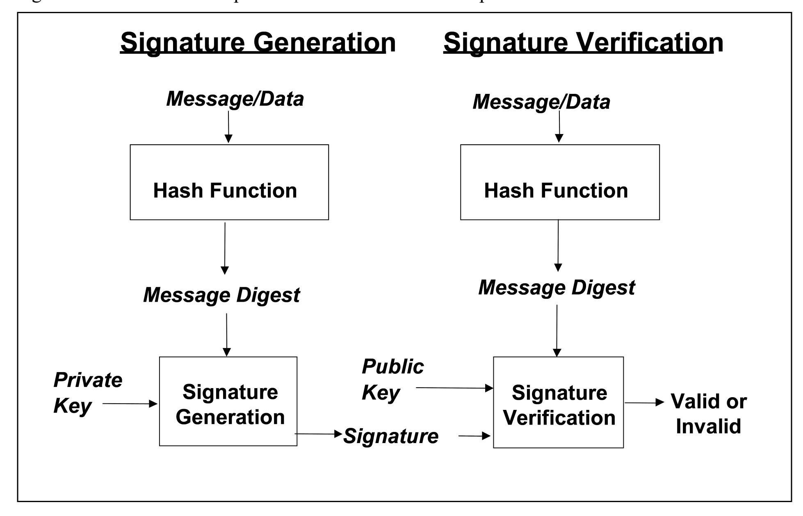
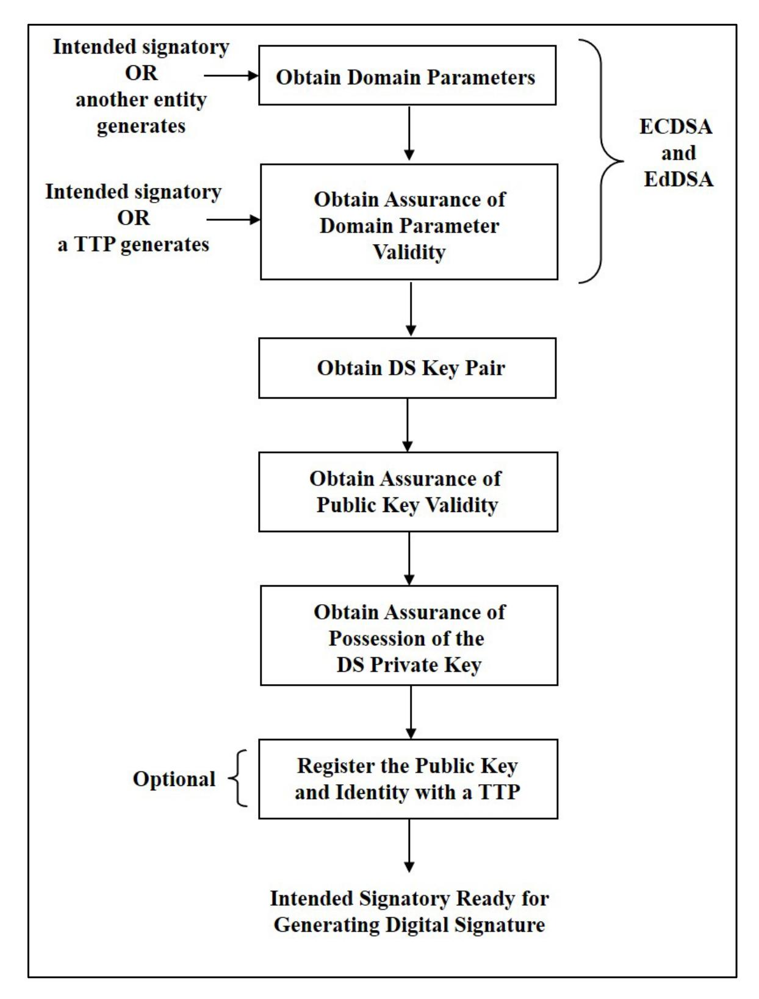
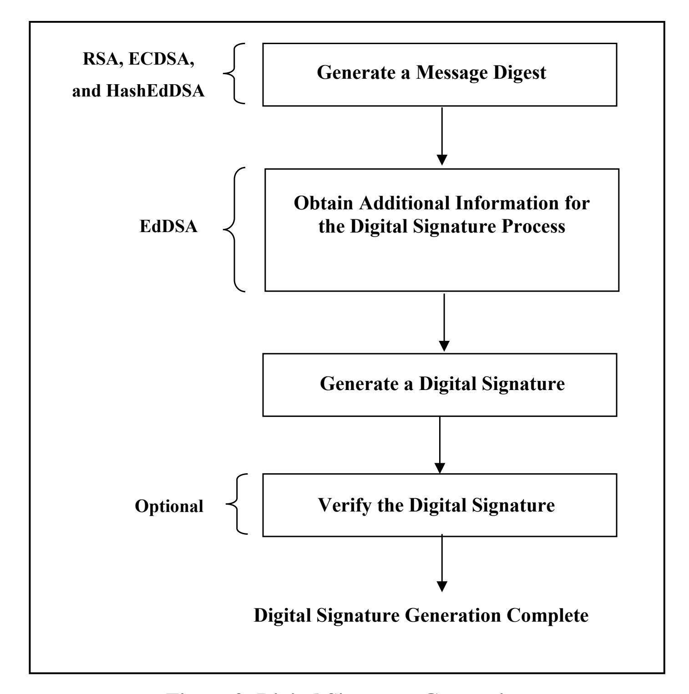
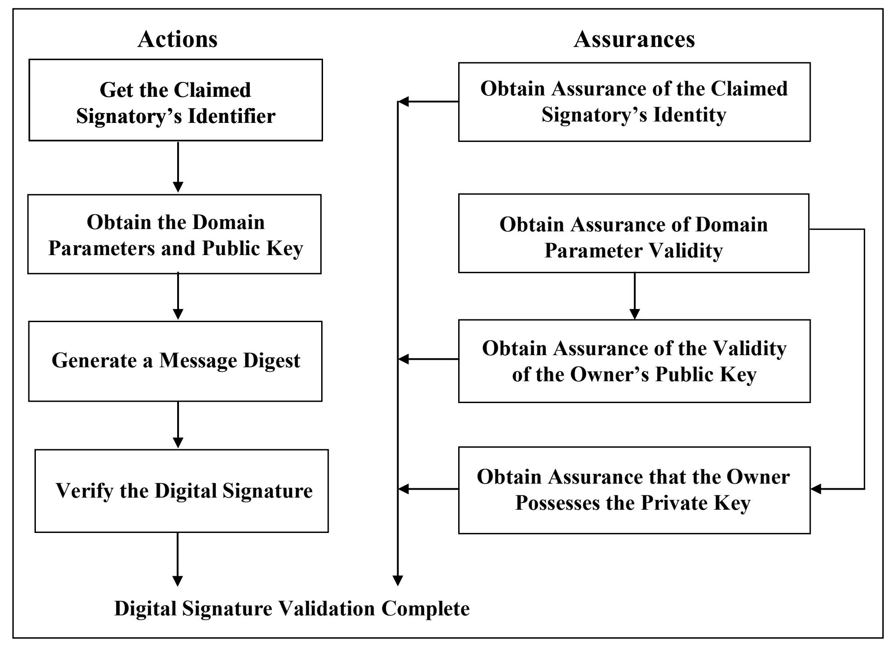

{0}------------------------------------------------


## **FIPS 186-5**

## **FEDERAL INFORMATION PROCESSING STANDARDS PUBLICATION**

**(Supersedes FIPS 186-4)**

## **Digital Signature Standard (DSS)**

**CATEGORY: COMPUTER SECURITY SUBCATEGORY: CRYPTOGRAPHY** 

Information Technology Laboratory National Institute of Standards and Technology Gaithersburg, MD 20899-8900

This publication is available free of charge from: <https://doi.org/10.6028/NIST.FIPS.186-5>

Published: February 3, 2023


**U.S. Department of Commerce** *Gina M. Raimondo, Secretary*

**National Institute of Standards and Technology**

*Laurie E. Locascio, NIST Director and Under Secretary of Commerce for Standards and Technology*

{1}------------------------------------------------

#### **FOREWORD**

The Federal Information Processing Standards Publication (FIPS) series of the National Institute of Standards and Technology (NIST) is the official series of publications relating to standards and guidelines developed under 15 U.S.C. 278g-3, and issued by the Secretary of Commerce under 40 U.S.C. 11331.

Comments concerning FIPS publications are welcomed and should be addressed to the Director, Information Technology Laboratory, National Institute of Standards and Technology, 100 Bureau Drive, Stop 8900, Gaithersburg, MD 20899-8900.

> Charles H. Romine, Director Information Technology Laboratory

{2}------------------------------------------------

#### **Abstract**

This standard specifies a suite of algorithms that can be used to generate a digital signature. Digital signatures are used to detect unauthorized modifications to data and to authenticate the identity of the signatory. In addition, the recipient of signed data can use a digital signature as evidence in demonstrating to a third party that the signature was, in fact, generated by the claimed signatory. This is known as non-repudiation since the signatory cannot easily repudiate the signature at a later time.

*Keywords*: computer security; cryptography; digital signatures; Federal Information Processing Standards; public key cryptography.

{3}------------------------------------------------

## **Federal Information Processing Standards Publication 186-5**

**Published: February 3, 2023**

**Effective: February 3, 2023** (see the **[Implementation Schedule](#page-5-0)**)

#### **Announcing the**

## **DIGITAL SIGNATURE STANDARD (DSS)**

Federal Information Processing Standards Publications (FIPS) are developed by the National Institute of Standards and Technology (NIST) under 15 U.S.C. 278g-3, and issued by the Secretary of Commerce under 40 U.S.C. 11331.

- **1. Name of Standard**: Digital Signature Standard (DSS) (FIPS 186-5).
- **2. Category of Standard**: Computer Security. **Subcategory.** Cryptography.
- **3. Explanation**: This standard specifies algorithms for applications requiring a digital signature rather than a written signature. A digital signature is represented in a computer as a string of bits and computed using a set of rules and parameters that allow the identity of the signatory and the integrity of the data to be verified. Digital signatures may be generated on both stored and transmitted data.

Signature generation uses a private key to generate a digital signature; signature verification uses a public key that corresponds to but is not the same as the private key. Each signatory possesses a private and public key pair. Public keys may be known by the public; private keys must be kept secret. Anyone can verify the signature by employing the signatory's public key. Only the user that possesses the private key can perform signature generation.

A hash function is often used in the signature generation process to obtain a condensed version of the data to be signed; the condensed version of the data is often called a message digest. The message digest is input to the digital signature algorithm to generate the digital signature. The hash functions to be used are specified in FIPS 180, *Secure Hash Standard (SHS)*, and FIPS 202, *SHA-3: Permutation-Based Hash and Extendable-Output Functions*. FIPS-**approved** digital signature algorithms **shall** be used with appropriate **approved** function**s** (e.g., hash functions such as those specified in FIPS 180 or FIPS 202).

The digital signature is provided to the intended verifier along with the signed data. The verifying entity verifies the signature by using the claimed signatory's public key and the same hash function that was used to generate the signature. Similar procedures may be used to generate and verify signatures for both stored and transmitted data.

This standard supersedes FIPS 186-4. In the future, additional digital signature schemes may be specified and approved in FIPS publications or in NIST Special Publications.

{4}------------------------------------------------

- **4. Approving Authority:** Secretary of Commerce.
- **5. Maintenance Agency:** Department of Commerce, National Institute of Standards and Technology, Information Technology Laboratory, Computer Security Division.
- **6. Applicability:** This standard is applicable to all federal departments and agencies for the protection of sensitive unclassified information that is not subject to section 2315 of Title 10, United States Code, or section 3502 (2) of Title 44, United States Code. This standard **shall** be used in designing and implementing public key-based signature systems that federal departments and agencies operate or that are operated for them under contract. The adoption and use of this standard are available to private and commercial organizations.
- **7. Applications:** A digital signature algorithm allows an entity to authenticate the integrity of signed data and the identity of the signatory. The recipient of a signed message can use a digital signature as evidence in demonstrating to a third party that the signature was, in fact, generated by the claimed signatory. This is known as non-repudiation since the signatory cannot easily repudiate the signature at a later time. A digital signature algorithm is intended for use in electronic mail, electronic funds transfer, electronic data interchange, software distribution, data storage, and other applications that require data integrity assurance and data origin authentication.
- **8. Implementations:** A digital signature algorithm may be implemented in software, firmware, hardware, or any combination thereof. NIST has developed a validation program to test implementations for conformance to the algorithms in this standard. Information about the validation program is available at [https://csrc.nist.gov/projects/cmvp.](https://csrc.nist.gov/projects/cmvp) Examples for each digital signature algorithm are available at [https://csrc.nist.gov/projects/cryptographic-standards-and](https://csrc.nist.gov/projects/cryptographic-standards-and-guidelines/example-values)[guidelines/example-values.](https://csrc.nist.gov/projects/cryptographic-standards-and-guidelines/example-values)

Agencies are advised that digital signature key pairs **shall not** be used for other purposes.

- **9. Other Approved Security Functions:** Digital signature implementations that comply with this standard **shall** employ cryptographic algorithms, cryptographic key generation algorithms, and key establishment techniques that have been approved for protecting Federal Governmentsensitive information. **Approved** cryptographic algorithms and techniques include those that are either:
  - a. Specified in a Federal Information Processing Standards Publication (FIPS),
  - b. Adopted in a FIPS or NIST recommendation, or
  - c. Specified in the list of approved security functions for FIPS 140-3.
- **10. Export Control**: Certain cryptographic devices and technical data regarding them are subject to federal export controls. Exports of cryptographic modules implementing this standard and technical data regarding them must comply with these federal regulations and be licensed by the Bureau of Industry and Security of the U.S. Department of Commerce. Information about export regulations is available at: [https://www.bis.doc.gov.](https://www.bis.doc.gov/)
- **11. Patents**: The algorithms in this standard may be covered by U.S. or foreign patents.

{5}------------------------------------------------

- <span id="page-5-0"></span>**12. Implementation Schedule**: This standard becomes effective immediately upon final publication. To facilitate a transition to FIPS 186-5, FIPS 186-4 remains in effect for a period of one year following the publication of this standard, after which FIPS 186-4 will be withdrawn. During this period, agencies may elect to use cryptographic modules and practices that conform to this standard, or may elect to continue to use FIPS 186-4. The implementation schedule for cryptographic modules undergoing validation through the Cryptographic Module Validation Program will be posted on NIST's webpage at<https://csrc.nist.gov/projects/cmvp> under Notices.
- **13. Specifications**: Federal Information Processing Standard (FIPS) 186-5 Digital Signature Standard (affixed).
- **14. Qualifications**: The security of a digital signature system is dependent on maintaining the secrecy of the signatory's private keys. Signatories **shall**, therefore, guard against the disclosure of their private keys. While it is the intent of this standard to specify general security requirements for generating digital signatures, conformance to this standard does not ensure that a particular implementation is secure. It is the responsibility of an implementer to ensure that any module that implements a digital signature capability is designed and built in a secure manner.

Similarly, the use of a product containing an implementation that conforms to this standard does not guarantee the security of the overall system in which the product is used. The responsible authority in each agency or department **shall** ensure that an overall implementation provides an acceptable level of security.

Since a standard of this nature must be flexible enough to adapt to advancements and innovations in science and technology, this standard will be reviewed every five years in order to assess its adequacy.

- **15. Waiver Procedure**: The Federal Information Security Management Act (FISMA) does not allow for waivers to Federal Information Processing Standards (FIPS) that are made mandatory by the Secretary of Commerce.
- **16. Where to Obtain Copies of the Standard**: This publication is available by accessing [https://csrc.nist.gov/publications.](https://csrc.nist.gov/publications) Other computer security publications are available at the same website.
- **17. How to Cite this Publication:** NIST has assigned **NIST FIPS 186-5** as the publication identifier for this FIPS, per the [NIST Technical Series Publication Identifier Syntax.](https://www.nist.gov/document/publication-identifier-syntax-nist-technical-series-publications) NIST recommends that it be cited as follows:

National Institute of Standards and Technology (2023) Digital Signature Standard (DSS). (Department of Commerce, Washington, D.C.), Federal Information Processing Standards Publication (FIPS) NIST FIPS 186-5.<https://doi.org/10.6028/NIST.FIPS.186-5>

**18. Inquiries and comments:** Inquiries and comments about this FIPS may be submitted to [fips186-comments@nist.gov.](mailto:fips186-comments@nist.gov)

{6}------------------------------------------------

## **Federal Information Processing Standards Publication 186-5**

# Specifications for the DIGITAL SIGNATURE STANDARD (DSS)

## **Table of Contents**

| 1. | INTF                                | RODUCTION1                                                                |    |  |  |
|----|-------------------------------------|---------------------------------------------------------------------------|----|--|--|
| 2. | GLO                                 | SSARY OF TERMS, ACRONYMS, AND MATHEMATICAL SYMBOLS                        | 2  |  |  |
|    | 2.1                                 | TERMS AND DEFINITIONS                                                     | 2  |  |  |
|    | 2.2                                 | ACRONYMS                                                                  | 5  |  |  |
|    | 2.3                                 | Mathematical Symbols                                                      | 6  |  |  |
| 3. | GENERAL DISCUSSION                  |                                                                           | 9  |  |  |
|    | 3.1                                 | 3.1 Initial Setup                                                         |    |  |  |
|    | 3.2                                 | DIGITAL SIGNATURE GENERATION                                              | 12 |  |  |
|    | 3.3                                 | DIGITAL SIGNATURE VERIFICATION AND VALIDATION                             | 13 |  |  |
| 4  | THE                                 | DIGITAL SIGNATURE ALGORITHM (DSA)                                         | 16 |  |  |
| 5. | THE RSA DIGITAL SIGNATURE ALGORITHM |                                                                           |    |  |  |
|    | 5.1                                 | RSA KEY PAIR GENERATION                                                   | 16 |  |  |
|    | 5.2                                 | .2 RSA KEY PAIR MANAGEMENT                                                |    |  |  |
|    | 5.3                                 | B Assurances                                                              |    |  |  |
|    | 5.4                                 | 4 PKCS#1                                                                  |    |  |  |
|    |                                     | 5.4.1 Mask Generation Functions in RSASSA-PSS                             | 19 |  |  |
| 6. | THE                                 | ELLIPTIC CURVE DIGITAL SIGNATURE ALGORITHM (ECDSA)                        | 20 |  |  |
|    | 6.1                                 | ECDSA Domain Parameters                                                   | 20 |  |  |
|    |                                     | 6.1.1 Domain Parameter Generation                                         | 20 |  |  |
|    |                                     | 6.1.2 Domain Parameter Management                                         | 21 |  |  |
|    | 6.2                                 | PRIVATE/PUBLIC KEYS                                                       | 22 |  |  |
|    |                                     | 6.2.1 Key Pair Generation                                                 | 22 |  |  |
|    |                                     | 6.2.2 Key Pair Management                                                 | 22 |  |  |
|    | 6.3                                 | ECDSA Per-Message Secret Number Generation                                | 22 |  |  |
|    |                                     | 6.3.1 Generation of Per-Message Secret Number for ECDSA                   | 22 |  |  |
|    |                                     | 6.3.2 Generation of the Per-Message Secret Number for Deterministic ECDSA | 23 |  |  |
|    | 6.4                                 | ECDSA DIGITAL SIGNATURE GENERATION AND VERIFICATION                       | 23 |  |  |
|    |                                     | 6.4.1 ECDSA Signature Generation Algorithm                                | 24 |  |  |
|    |                                     | 6.4.2 ECDSA Signature Verification Algorithm                              | 25 |  |  |

{7}------------------------------------------------

|     | 6.5 |                                 | ASSURANCES 25                                                                        |  |
|-----|-----|---------------------------------|--------------------------------------------------------------------------------------|--|
| 7.  |     |                                 | THE EDWARDS-CURVE DIGITAL SIGNATURE ALGORITHM (EDDSA) 26                             |  |
|     | 7.1 |                                 | EDDSA PARAMETERS 26                                                                  |  |
|     | 7.2 | ENCODING 26                     |                                                                                      |  |
|     | 7.3 | DECODING 27                     |                                                                                      |  |
|     | 7.4 |                                 | EDDSA KEY PAIR GENERATION 27                                                         |  |
|     | 7.5 |                                 | KEY PAIR MANAGEMENT 28                                                               |  |
|     | 7.6 |                                 | EDDSA SIGNATURE GENERATION 28                                                        |  |
|     | 7.7 | EDDSA SIGNATURE VERIFICATION 29 |                                                                                      |  |
|     | 7.8 |                                 | THE PREHASH EDWARDS-CURVE DIGITAL SIGNATURE ALGORITHM (HASHEDDSA) 29                 |  |
|     |     | 7.8.1                           | HashEdDSA Signature Generation30                                                     |  |
|     |     | 7.8.2                           | HashEdDSA Signature Verification31                                                   |  |
|     |     | 7.8.3                           | Differences between EdDSA and HashEdDSA31                                            |  |
|     |     |                                 | APPENDIX A: KEY PAIR GENERATION 33                                                   |  |
|     | A.1 |                                 | IFC KEY PAIR GENERATION 33                                                           |  |
|     |     | A.1.1                           | Criteria for IFC Key Pairs33                                                         |  |
|     |     | A.1.2                           | Generation of Random Primes that are Provably Prime35                                |  |
|     |     | A.1.3                           | Generation of Random Primes that are Probably Prime37                                |  |
|     |     | A.1.4                           | Generation of Provable Primes with Conditions Based on Auxiliary Provable Primes .38 |  |
|     |     | A.1.5                           | Generation of Probable Primes with Conditions Based on Auxiliary Provable Primes .40 |  |
|     |     | A.1.6                           | Generation of Probable Primes with Conditions Based on Auxiliary Probable Primes.42  |  |
|     | A.2 |                                 | ECC KEY PAIR GENERATION 43                                                           |  |
|     |     | A.2.1                           | ECDSA Key Pair Generation using Extra Random Bits44                                  |  |
|     |     | A.2.2                           | ECDSA Key Pair Generation by Rejection Sampling45                                    |  |
|     |     | A.2.3                           | EdDSA Key Pair Generation46                                                          |  |
|     | A.3 |                                 | ECDSA PER-MESSAGE SECRET NUMBER GENERATION 47                                        |  |
|     |     | A.3.1                           | Per-Message Secret Number Generation Using Extra Random Bits47                       |  |
|     |     | A.3.2                           | Per-Message Secret Number Generation of Private Keys by Rejection Sampling48         |  |
|     |     | A.3.3                           | Per-Message Secret Number Generation for Deterministic ECDSA49                       |  |
|     | A.4 |                                 | RANDOM VALUES MOD N 50                                                               |  |
|     |     | A.4.1                           | Conversion of a Bit String to an Integer mod n via Modular Reduction51               |  |
|     |     | A.4.2                           | Conversion of a Bit String to an Integer mod n via the Discard Method51              |  |
|     |     |                                 | APPENDIX B: GENERATION OF OTHER QUANTITIES 53                                        |  |
|     | B.1 |                                 | COMPUTATION OF THE INVERSE VALUE 53                                                  |  |
| B.2 |     |                                 | CONVERSION BETWEEN BIT STRINGS, INTEGERS, AND OCTET STRINGS 54                       |  |
|     |     | B.2.1                           | Conversion of a Bit String to an Integer54                                           |  |
|     |     | B.2.2                           | Conversion of an Integer to a Bit String54                                           |  |

{8}------------------------------------------------

|      | B.2.3 | Conversion of an Integer to an Octet String55                                                                                |  |
|------|-------|------------------------------------------------------------------------------------------------------------------------------|--|
|      | B.2.4 | Conversion of a Bit String to an Octet String55                                                                              |  |
| B.3  |       | PROBABILISTIC PRIMALITY TESTS 56                                                                                             |  |
|      | B.3.1 | Miller-Rabin Probabilistic Primality Test57                                                                                  |  |
|      | B.3.2 | Enhanced Miller-Rabin Probabilistic Primality Test58                                                                         |  |
|      | B.3.3 | (General) Lucas Probabilistic Primality Test59                                                                               |  |
| B.4  |       | CHECKING FOR A PERFECT SQUARE 60                                                                                             |  |
| B.5  |       | JACOBI SYMBOL ALGORITHM 61                                                                                                   |  |
| B.6  |       | SHAWE-TAYLOR RANDOM_PRIME ROUTINE 63                                                                                         |  |
| B.7  |       | TRIAL DIVISION 65                                                                                                            |  |
| B.8  |       | SIEVE PROCEDURE 65                                                                                                           |  |
| B.9  |       | COMPUTE A PROBABLE PRIME FACTOR BASED ON AUXILIARY PRIMES 66                                                                 |  |
| B.10 |       | CONSTRUCT A PROVABLE PRIME (POSSIBLY WITH CONDITIONS) BASED ON CONTEMPORANEOUSLY<br>CONSTRUCTED AUXILIARY PROVABLE PRIMES 68 |  |
|      |       | APPENDIX C: CALCULATING THE REQUIRED NUMBER OF ROUNDS OF TESTING USING THE<br>MILLER-RABIN PROBABILISTIC PRIMALITY TEST 72   |  |
| C.1  |       | THE REQUIRED NUMBER OF ROUNDS OF THE MILLER-RABIN PRIMALITY TESTS 72                                                         |  |
| C.2  |       | GENERATING PRIMES FOR RSA SIGNATURES 73                                                                                      |  |
|      |       | APPENDIX D: REFERENCES 74                                                                                                    |  |
|      |       | APPENDIX E: REVISIONS (INFORMATIVE) 77                                                                                       |  |
|      |       |                                                                                                                              |  |
|      |       | List of Figures                                                                                                              |  |
|      |       | FIGURE 1: DIGITAL SIGNATURE PROCESSES9                                                                                       |  |
|      |       | FIGURE 2: INITIAL SETUP BY AN INTENDED SIGNATORY11<br>FIGURE 3: DIGITAL SIGNATURE GENERATION13                               |  |
|      |       | FIGURE 4: DIGITAL SIGNATURE VERIFICATION AND VALIDATION15                                                                    |  |

{9}------------------------------------------------

## <span id="page-9-0"></span>**1. Introduction**

This standard defines methods for digital signature generation that can be used for the protection of binary data (commonly called a message) and for the verification and validation of those digital signatures. Three techniques are approved.

- (1) The RSA digital signature algorithm is specified in the Internet Engineering Task Force Request for Comments (IETF RFC) 8017 [\[1\]](#page-82-1) and was previously specified in Public Key Cryptography Standard (PKCS) #1 [\[2\].](#page-82-2) FIPS 186-5 approves the use of implementations of either or both of these standards and specifies key pair generation, as well as additional requirements.
- (2) The Elliptic Curve Digital Signature Algorithm (ECDSA) is specified in this standard. ECDSA was originally specified in American National Standards (ANS) X9.62 [\[3\]](#page-82-3) (withdrawn). A variant of ECDSA with a deterministic signature generation procedure known as deterministic ECDSA is also approved and specified in IETF RFC 6979 [\[4\].](#page-82-4) Recommended elliptic curves for Federal Government use of ECDSA (including deterministic ECDSA) are provided in NIST Special Publication (SP) 800-186 [\[5\].](#page-82-5)
- (3) The Edwards Curve Digital Signature Algorithm (EdDSA) is specified in IETF RFC 8032 [\[6\].](#page-82-6) FIPS 186-5 approves the use of EdDSA and specifies additional requirements. Recommended elliptic curves for Federal Government use of EdDSA are provided in SP 800-186 [\[5\].](#page-82-5) Also included is HashEdDSA, a version of EdDSA where the EdDSA signature is generated on the hash of the message rather than the message itself.

The Digital Signature Algorithm (DSA) is no longer specified in this standard and may only be used to verify previously generated digital signatures. Complete specifications may be found in Federal Information Processing Standard (FIPS) 186-4 [\[7\].](#page-82-7)

This standard includes requirements for obtaining the assurances necessary for valid digital signatures. Methods for obtaining these assurances are provided in SP 800-89, *Recommendation for Obtaining Assurances for Digital Signature Applications* [\[8\].](#page-82-8) Information about the key lengths used for generating and verifying digital signatures and the time frames during which they are assumed to be secure are provided in SP 800-131A [\[9\].](#page-82-9) Note that the algorithms in this standard are not expected to provide resistance to attacks from a large-scale quantum computer. Digital signature algorithms that will provide security from quantum computers will be specified in future NIST publications.

{10}------------------------------------------------

#### <span id="page-10-0"></span>Glossary of Terms, Acronyms, and Mathematical Symbols 2.

#### <span id="page-10-1"></span>2.1 **Terms and Definitions**

Approved FIPS-approved and/or NIST-recommended. An algorithm or

technique that is either 1) specified in a FIPS or NIST

Recommendation, 2) adopted in a FIPS or NIST Recommendation, or 3) specified in a list of NIST-approved security functions.

Assurance of domain

parameter validity

Confidence that the domain parameters are arithmetically correct.

Assurance of possession

Confidence that an entity possesses a private key and any associated

keying material.

Assurance of public key validity

Confidence that the public key is arithmetically correct.

Bias With respect to the uniform distribution on [0, n-1], the bias is

defined to be the maximum value of  $\left\{ probability(S) - \left( \frac{|S|}{n} \right) \right\}$  taken

over all subsets S of [0, n-1]. This measures the maximum advantage that an adversary has in predicting any event.

Bit string An ordered sequence of zeros and ones. The leftmost bit is the most

significant bit of the string. The rightmost bit is the least significant

bit of the string.

Certificate A set of data that uniquely identifies a public key (which has a

> corresponding private key) and an owner that is authorized to use the key pair. The certificate contains the owner's public key and possibly other information and is digitally signed by a Certification Authority (i.e., a trusted party), thereby binding the public key to the

owner.

Certification Authority

(CA)

The entity in a Public Key Infrastructure (PKI) that is responsible for issuing certificates and exacting compliance with a PKI policy.

Claimed signatory From the verifier's perspective, the claimed signatory is the entity

that purportedly generated a digital signature.

Destroy An action applied to a key or a piece of secret data. After a key or a

piece of secret data is destroyed, no information about its value can

be recovered.

{11}------------------------------------------------

Digital signature The result of a cryptographic transformation of data that, when

properly implemented, provides a mechanism for verifying origin authentication, data integrity, and signatory non-repudiation.

Domain parameter

seed

A string of bits that is used as input for a domain parameter generation or validation process.

Domain parameters Parameters used with cryptographic algorithms that are usually

common to a domain of users. An ECDSA or EdDSA cryptographic

key pair is associated with a specific set of domain parameters.

Entity An individual (person), organization, device, or process. Used

interchangeably with "party."

Equivalent process Two processes are equivalent if the same output is produced when

the same values are input to each process (either as input parameters,

as values made available during the process, or both).

Hash function A function on bit strings in which the length of the output is fixed. **Approved** hash functions (such as those specified in FIPS 180 [\[10\]](#page-82-10)

and FIPS 202 [\[11\]\)](#page-82-11) are designed to satisfy the following properties:

1. (One-way) It is computationally infeasible to find any input

that maps to any new pre-specified output

2. (Collision-resistant) It is computationally infeasible to find any

two distinct inputs that map to the same output.

Hash value See "message digest."

Intended signatory An entity that intends to generate digital signatures in the future.

Key A parameter used in conjunction with a cryptographic algorithm that determines its operation. Examples applicable to this standard

include:

1. The computation of a digital signature from data, and

2. The verification of a digital signature.

Key pair A public key and its corresponding private key.

Message The data that is signed. Also known as "signed data" during the

signature verification and validation process.

Message digest The result of applying a hash function to a message. Also known as

a "hash value."

{12}------------------------------------------------

Non-repudiation A service that is used to provide assurance of the integrity and origin

of data in such a way that the integrity and origin can be verified and validated by a third party as having originated from a specific entity

in possession of the private key (i.e., the signatory).

Owner A key pair owner is the entity authorized to use the private key of a

key pair.

Party An individual (person), organization, device, or process. Used

interchangeably with "entity."

Per-message secret

number

A secret random number that is generated prior to the generation of

each digital signature.

Public Key

Infrastructure (PKI)

A framework that is established to issue, maintain, and revoke

public key certificates.

Prime number generation seed A string of random bits that is used to begin a search for a prime

number with the required characteristics.

Private key A cryptographic key that is used with an asymmetric (public key)

cryptographic algorithm. The private key is uniquely associated with

the owner and is not made public. The private key is used to compute a digital signature that may be verified using the

corresponding public key.

Probable prime An integer that is believed to be prime based on a probabilistic

primality test. There should be no more than a negligible probability

that the so-called probable prime is actually composite.

Provable prime An integer that is either constructed to be prime or is demonstrated

to be prime using a primality-proving algorithm.

Pseudorandom A process or data produced by a process is said to be pseudorandom

when the outcome is deterministic yet also effectively random as long as the internal action of the process is hidden from observation.

For cryptographic purposes, "effectively random" means

"computationally indistinguishable from random within the limits of

the intended security strength."

Public key A cryptographic key that is used with an asymmetric (public key)

cryptographic algorithm and is associated with a private key. The public key is associated with an owner and may be made public. In the case of digital signatures, the public key is used to verify a digital signature that was generated using the corresponding private

key.

{13}------------------------------------------------

Security strength A number associated with the amount of work (i.e., the number of

operations) that is required to break a cryptographic algorithm or

system.

**Shall** Used to indicate a requirement of this standard.

**Should** Used to indicate a strong recommendation but not a requirement of

this standard. Ignoring the recommendation could result in

undesirable results.

Signatory The entity that generates a digital signature on data using a private

key.

Signature generation The process of using a digital signature algorithm and a private key

to generate a digital signature on data.

Signature validation The (mathematical) verification of the digital signature and

obtaining the appropriate assurances (e.g., public key validity,

private key possession, etc.).

Signature verification The process of using a digital signature algorithm and a public key

to verify a digital signature on data.

Signed data The data or message upon which a digital signature has been

computed. Also see "message."

Subscriber An entity that has applied for and received a certificate from a

Certificate Authority.

Trusted third party

(TTP)

An entity other than the key pair owner and verifier that is trusted by

the owner or the verifier or both. Sometimes shortened to "trusted

party."

Verifier The entity that verifies the authenticity of a digital signature using

the public key.

<span id="page-13-0"></span>**2.2 Acronyms**

ANS American National Standard

CA Certification Authority

{14}------------------------------------------------

DRBG Deterministic Random Bit Generator[1](#page-14-1)

DSA Digital Signature Algorithm[2](#page-14-2)

ECDSA Elliptic Curve Digital Signature Algorithm EdDSA Edwards Curve Digital Signature Algorithm[3](#page-14-3) FIPS Federal Information Processing Standard

FFC Finite Field Cryptography

NIST National Institute of Standards and Technology

PKCS Public Key Cryptography Standard

PKI Public Key Infrastructure RSA Rivest, Shamir, Adleman[4](#page-14-4) SHA Secure Hash Algorithm SP NIST Special Publication

TTP Trusted Third Party

XOF Extendable-Output Function

## <span id="page-14-0"></span>**2.3 Mathematical Symbols**

*a* mod *n* The unique remainder *r,* 0 ≤ *r* ≤ (*n* – 1), when integer *a* is divided

by the positive integer *n.* For example, 23 mod 7 = 2.

*b* ≡ *a* mod *n* There exists an integer *k* such that *b* – *a* = *kn*; equivalently, *a* mod

*n* = *b* mod *n*.

*d* 1. For RSA, the private signature exponent of a private key.

2. For ECDSA and EdDSA, the private key.

*e* The public verification exponent of an RSA public key.

*G* The base point of an elliptic curve.

GCD(*a*, *b*) Greatest common divisor of the integers *a* and *b*.

Hash(*M*) The result of a hash computation (message digest or hash value) on

message *M* using an **approved** hash function.

*k* A per-message secret number.

<span id="page-14-1"></span><sup>1</sup> Specified in SP 800-90A

<span id="page-14-2"></span><sup>2</sup> Specified in FIPS 186-4

<span id="page-14-3"></span><sup>3</sup> Specified in IETF RFC 8032

<span id="page-14-4"></span><sup>4</sup> Algorithm specified in PKCS #1 and IETF RFC 8017

{15}------------------------------------------------

| LCM(a, b)          | The least common multiple of the integers a<br>and b.                                                                                                                                                              |
|--------------------|--------------------------------------------------------------------------------------------------------------------------------------------------------------------------------------------------------------------|
| len(a)             | The length of the bit string that is the shortest possible binary<br>representation of the (non-negative) integer a;<br>i.e.<br>the integer L,<br>where 2𝐿𝐿−1 ≤<br>< 2𝐿𝐿.                                          |
| M                  | The message that is signed using the digital signature algorithm.                                                                                                                                                  |
| min(a, b)          | The minimum of the two positive integers a<br>and b.                                                                                                                                                               |
| n                  | 1. For RSA, the<br>modulus. The bit length of n, i.e. len(n),<br>is<br>considered to be the key size.                                                                                                              |
|                    | 2. For ECDSA<br>or EdDSA, the order of the base point of the<br>elliptic curve. The bit length of n<br>is considered to be the key<br>size.                                                                        |
| (n, d)             | An RSA private key, where n<br>is the modulus, and d<br>is the private<br>signature exponent.                                                                                                                      |
| (n, e)             | An RSA public key, where n<br>is the modulus, and e<br>is the public<br>verification exponent.                                                                                                                     |
| p                  | 1.<br>For RSA, a prime factor of the modulus n.<br>2.<br>Size of the finite field GF(p)                                                                                                                            |
| q                  | For RSA, a<br>prime factor of the modulus n.                                                                                                                                                                       |
| Q                  | An ECDSA or EdDSA public key, which is a point on an elliptic<br>curve.                                                                                                                                            |
| (r, s)<br>or (R,S) | An<br>ECDSA, or EdDSA digital signature, where r<br>and s<br>(or R<br>and<br>S) are<br>the digital signature components.                                                                                           |
| SHA-x(M)           | The result when M<br>is the input to the SHA-x<br>hash function, where<br>SHA-x<br>is specified in FIPS 180<br>or FIPS 202.                                                                                        |
| ⊕                  | Bitwise logical "exclusive-or" on bit strings of the same length; for<br>corresponding bits of each bit string, the result is determined as<br>follows: 0 ⊕<br>0 = 0, 0 ⊕<br>1 = 1, 1 ⊕<br>0 = 1, or 1 ⊕<br>1 = 0. |
|                    | 01101 ⊕<br>Example:<br>11010 = 10111                                                                                                                                                                               |
| +                  | Addition                                                                                                                                                                                                           |
| ×                  | Multiplication                                                                                                                                                                                                     |
| /                  | Division                                                                                                                                                                                                           |
| a<br>   b          | The concatenation of two strings a<br>and b. Either a<br>and b<br>are both<br>bit strings, or both are byte<br>strings.                                                                                            |

{16}------------------------------------------------

| a         | The ceiling of a: the smallest integer that is greater than or equal to<br>a. For example, 5<br>= 5, 5.3<br>= 6, and –2.1<br>= –2. |
|-------------|------------------------------------------------------------------------------------------------------------------------------------------|
| a         | The floor of a; the largest integer that is less than or equal to a. For<br>example, 5<br>= 5, 5.3<br>= 5, and –2.1<br>= −3.       |
| a           | The absolute value of a;  a  is –<br>a<br>if a<br>< 0; otherwise, it is simply a.<br>For example,  2  = 2, and  –2  = 2.                 |
| [a, b]      | The interval of integers between and including a and b. For<br>example, [1, 4] consists of the integers 1, 2, 3 and 4.                   |
| {, a, b, …} | Used to indicate optional information.                                                                                                   |
| 0x          | The prefix to a bit string that is represented in hexadecimal characters.                                                                |
| [n]X        | The elliptic curve point X<br>added to itself n times, for 𝑛𝑛<br>> 1.                                                                    |

{17}------------------------------------------------

## <span id="page-17-0"></span>**3. General Discussion**

A digital signature is an electronic analog of a written signature that can be used to provide assurance that the claimed signatory signed the information. In addition, a digital signature may be used to detect whether or not the information was modified after it was signed (i.e., to detect the integrity of the signed data). These assurances may be obtained whether the data was received in a transmission or retrieved from storage. A properly implemented digital signature algorithm that meets the requirements of this standard can provide these services.



**Figure 1: Digital Signature Processes[5](#page-17-2)**

<span id="page-17-1"></span>A digital signature algorithm includes a signature generation process and a signature verification process. A signatory uses the generation process to generate a digital signature on data; a verifier uses the verification process to verify the authenticity of the signature. Each signatory has a public and private key and is the owner of that key pair. As shown in Figure 1, the private key is used in the signature generation process. The key pair owner is the only entity that is authorized to use the private key to generate digital signatures. In order to prevent other entities from claiming to be the key pair owner and using the private key to generate fraudulent signatures, the private key must remain secret. The **approved** digital signature algorithms are designed to prevent an adversary who does not know the signatory's private key from generating a valid signature as the signatory on a different message. In other words, signatures are designed so that

<span id="page-17-2"></span><sup>5</sup> For EdDSA, the message/data is not hashed before being input into the signature generation and verification processes.

{18}------------------------------------------------

they cannot be forged. A number of alternative terms are used in this standard to refer to the signatory or key pair owner. An entity that intends to generate digital signatures in the future may be referred to as the *intended signatory*. Prior to the verification of a signed message, the signatory is referred to as the *claimed signatory* until such time as adequate assurance can be obtained of the actual identity of the signatory.

The public key is used in the signature verification process (see Figure 1). The public key need not be kept secret, but its integrity must be maintained. Anyone can verify a correctly signed message using message digest and the public key.

For both the signature generation and verification processes of RSA, ECDSA, and HashEdDSA, the message (i.e., the signed data) is converted to a fixed-length representation of the message by means of an **approved** hash function. Both the original message and the digital signature are made available to a verifier.

A verifier requires assurance that the public key is used to verify that a signature actually belongs to the entity that claims to have generated a digital signature (i.e., the claimed signatory). That is, a verifier requires assurance that the signatory is the actual owner of the public/private key pair used to generate and verify a digital signature. This assurance can only be provided if the owner's identity and public key are bound together, such as in a certificate issued from a public key infrastructure. A verifier also requires assurance that the key pair owner actually possesses the private key associated with the public key and that the public key is a mathematically correct key.

These assurances tell the verifier that if the digital signature can be correctly verified using the public key, the digital signature is valid (i.e., the key pair owner really signed the message). Digital signature validation includes both (mathematically) verifying the digital signature and obtaining the appropriate assurances. The following are reasons why such assurances are required:

- 1. If a verifier does not obtain assurance that a signatory is the actual owner of the key pair whose public component is used to verify a signature, the problem of forging a signature is reduced to the problem of falsely claiming an identity. For example, anyone in possession of a mathematically consistent key pair can sign a message and claim that the signatory was the President of the United States.
- 2. If the public key used to verify a signature is not mathematically valid, the arguments used to establish the cryptographic strength of the signature algorithm may not apply. The owner may not be the only party who can generate signatures that can be verified with that public key.
- 3. If a public key infrastructure cannot provide assurance to a verifier that the owner of a key pair has demonstrated knowledge of a private key that corresponds to the owner's public key, then it may be possible for an unscrupulous entity to have their identity (or an assumed identity) bound to a public key that is (or has been) used by another party. The unscrupulous entity may then claim to be the source of certain messages signed by that other party, or it may be possible that an unscrupulous entity has managed to obtain ownership of a public key that was chosen with the sole purpose of allowing for the verification of a signature on a specific message.

{19}------------------------------------------------



**Figure 2: Initial Setup by an Intended Signatory**

<span id="page-19-1"></span>Technically, a key pair used by a digital signature algorithm could also be used for purposes other than digital signatures (e.g., for key establishment). However, a key pair used for digital signature generation and verification as specified in this standard **shall not** be used for any other purpose. See SP 800-57, Part 1 [\[12\],](#page-82-12) on key usage for further information.

A number of steps are required to enable a digital signature generation or verification capability in accordance with this standard. All parties that generate digital signatures **shall** perform the initial setup process as discussed in Section 3.1. Digital signature generation **shall** be performed as discussed in Section 3.2. Digital signature verification and validation **shall** be performed as discussed in Section 3.3.

## <span id="page-19-0"></span>**3.1 Initial Setup**

Figure 2 depicts the steps that are performed prior to generating a digital signature by an entity intending to act as a signatory.

{20}------------------------------------------------

For the ECDSA and EdDSA algorithms (including HashEdDSA), the intended signatory **shall** first obtain appropriate domain parameters, either by generating the domain parameters itself or by obtaining domain parameters that another entity has generated. Having obtained the set of domain parameters, the intended signatory **shall** obtain assurance of the validity of those domain parameters; **approved** methods for obtaining this assurance are provided in SP 800-89 [\[8\]](#page-82-8) (also see SP 800-186, Appendix D.1). Note that the RSA algorithm does not use domain parameters.

Each intended signatory **shall** obtain a digital signature key pair that is generated as specified for the appropriate digital signature algorithm, either by generating the key pair itself or by obtaining the key pair from a trusted party. The intended signatory is authorized to use the key pair and is the owner of that key pair. Note that if a trusted party generates the key pair, that party needs to be trusted not to masquerade as the owner, even though the trusted party knows the private key.

After obtaining the key pair, the intended signatory (now the key pair owner) **shall** obtain (1) assurance of the validity of the public key and (2) assurance that they actually possess the associated private key. **Approved** methods for obtaining these assurances are provided in SP 800-89.

A digital signature verifier requires assurance of the identity of the signatory. Depending on the environment in which the digital signatures are generated and verified, the key pair owner (i.e., the intended signatory) may register the public key and establish proof of identity with a mutually trusted party. For example, a certification authority (CA) could sign credentials containing an owner's public key and identity to form a certificate after being provided with proof of the owner's identity. Systems for certifying credentials and distributing certificates are beyond the scope of this standard. Other means of establishing proof of identity (e.g., by providing identity credentials along with the public key directly to a prospective verifier) may be employed as long as system users and/or agents trusted to act on their behalf determine that those methods meet their security requirements.

#### <span id="page-20-0"></span>**3.2 Digital Signature Generation**

For RSA, ECDSA, and HashEdDSA, prior to the generation of a digital signature, a message digest **shall** be generated on the information to be signed using an appropriate **approved** hash function.

Depending on the digital signature algorithm to be used, additional information **shall** be obtained. For example, a random per-message secret number **shall** be obtained for ECDSA but is not required for EdDSA and RSA.

{21}------------------------------------------------



**Figure 3: Digital Signature Generation**

<span id="page-21-1"></span>Using the selected digital signature algorithm, the signature private key, the message or message digest, and any other information required by the digital signature process, a digital signature **shall** be generated in accordance with this standard.

The signatory may optionally verify the digital signature using the signature verification process and the associated public key (see Section 3.3). This optional verification serves as a final check to detect otherwise undetected signature generation computation errors; this verification may be prudent when signing a high-value message, when multiple users are expected to verify the signature, or if the verifier will be verifying the signature at a much later time.

Figure 3 depicts the steps that are performed by an intended signatory (i.e., the entity that generates a digital signature).

#### <span id="page-21-0"></span>**3.3 Digital Signature Verification and Validation**

In order to verify a digital signature, the verifier **shall** obtain the public key of the claimed signatory, which is (usually) based on the claimed identity. If ECDSA or EdDSA (including HashEdDSA) have been used to generate the digital signature, the verifier **shall** also obtain the domain parameters. The public key and domain parameters may be obtained, for example, from 

{22}------------------------------------------------

a certificate created by a trusted party (e.g., a CA) or directly from the claimed signatory. For RSA, ECDSA, and HashEdDSA, a message digest **shall** be generated on the data whose signature is to be verified (i.e., not on the received digital signature) using the same hash function that was used during the digital signature generation process. The received digital signature is verified in accordance with this standard using the appropriate digital signature algorithm, the domain parameters (if appropriate), the public key, and the message or newly computed message digest. If the verification process fails, no inference can be made as to whether the data is correct, only that – in using the specified public key and the specified signature format – the digital signature cannot be verified for that data.

Before accepting the verified digital signature as valid, the verifier **shall** have (1) assurance of the signatory's claimed identity, (2) assurance of the validity of the domain parameters (for ECDSA and EdDSA, including HashEdDSA), (3) assurance of the validity of the public key, and (4) assurance that the claimed signatory actually possessed the private key that was used to generate the digital signature at the time that the signature was generated. Methods for the verifier to obtain these assurances are provided in SP 800-89. Note that assurance of domain parameter validity may have been obtained during initial setup (see Section 3.1).

Figure 4 depicts the digital signature verification and validation process that is performed by a verifier (e.g., the intended recipient of the signed data and associated digital signature). Note that the figure depicts a successful verification and validation process (i.e., no errors are detected). If the verification and assurance processes are successful, the digital signature **shall** be considered valid. However, if a verification or assurance process fails, the digital signature **shall** be considered invalid. An organization's policy **shall** govern the action to be taken for an invalid digital signature. Such policies are outside of the scope of this standard. Guidance for determining the timeliness of digitally signed messages is addressed in SP 800-102, *Recommendation for Digital Signature Timeliness* [\[13\].](#page-82-13)

{23}------------------------------------------------



<span id="page-23-0"></span>**Figure 4: Digital Signature Verification and Validation[6](#page-23-1)**

<span id="page-23-1"></span><sup>6</sup> For EdDSA, the message/data is not hashed into a message digest before being input into the signature generation and verification processes.

{24}------------------------------------------------

## <span id="page-24-0"></span>**4 The Digital Signature Algorithm (DSA)**

Prior versions of this standard specified the DSA. This standard no longer approves the DSA for digital signature generation. However, the DSA may be used to verify signatures generated prior to the implementation date of this standard. See FIPS 186-4 [\[7\]](#page-82-7) for the specifications for the DSA.

## <span id="page-24-1"></span>**5. The RSA Digital Signature Algorithm**

The use of the RSA algorithm for digital signature generation and verification is specified in IETF RFC 8017, Public Key Cryptography Standard (PKCS) #1: *RSA Cryptography Specifications Version 2.2* [\[2\].](#page-82-2) This standard imposes additional restrictions, which are enumerated below (see Section 5.4).

#### <span id="page-24-2"></span>**5.1 RSA Key Pair Generation**

An RSA digital signature key pair consists of an RSA private key, which is used to compute a digital signature, and an RSA public key, which is used to verify a digital signature. An RSA digital signature key pair **shall not** be used for other purposes (e.g., key establishment).

An RSA public key consists of a modulus *n*, which is the product of two positive prime integers *p* and *q* (i.e., *n* = *pq*) and a public key exponent *e*. Thus, the RSA public key is the pair of values (*n*, *e*) and is used to verify digital signatures. The size of an RSA key pair is commonly considered to be the length of the modulus *n* in bits (*nlen*).

The corresponding RSA private key consists of the same modulus *n* and a private key exponent *d* that depends on *n* and the public key exponent *e*. Thus, the RSA private key is the pair of values (*n*, *d*) and is used to generate digital signatures. Note that an alternative method for representing (*n*, *d*) using the Chinese Remainder Theorem (CRT) is allowed (see Sections 6.2 and 6.3 of SP 800-56B [\[14\]\)](#page-82-14).

In order to provide security for the digital signature process, the two integers *p* and *q* and the private key exponent *d* **shall** be kept secret. Guidance on the protection of these values is provided in SP 800-57, Part 1. The modulus *n* and the public key exponent *e* may be made known to anyone.

This standard specifies the use of a modulus whose bit length is an even integer and greater than or equal to 2048 bits. Furthermore, this standard specifies that *p* and *q* be of the same bit length – namely, half the bit length of *n.* The maximum security strength of RSA schemes associated with the bit length of the modulus is specified in NIST SP 800-57, Part 1 [\[12\].](#page-82-12)

**Approved** hash functions **shall** be used during the generation of key pairs and digital signatures. When used during the generation of an RSA key pair (as specified in this standard), the length in bits of the hash function output block **shall** meet or exceed the security strength associated with the bit length of the modulus *n* (see SP 800-57, Part 1).

The security strength associated with the RSA digital signature process is no greater than the minimum of the security strength associated with the bit length of the modulus and the security strength of the hash function that is employed (see Table 3 in SP 800-57, Part 1). The (maximum) security strengths associated with certain RSA modulus lengths and **approved** hash 

{25}------------------------------------------------

functions used during the digital signature process are provided in SP 800-57, Part 1. Both the security strength of the hash function used for the digital signature and the security strength associated with the bit length of the modulus *n* **shall** meet or exceed the security strength required for the digital signature process.

The security strength of the hash function used **should** be greater than or equal to the security strength of the modulus since, otherwise, the security strength of the digital signature process is reduced to a level no greater than that provided by the hash function.

A CA **should** use a modulus whose length *nlen* is equal to or greater than the bit-length of every modulus used by its subscribers. For example, if the subscribers are using *nlen* = 2048, then the CA **should** use *nlen* ≥ 2048. SP 800-57, Parts 1 and 3 [\[12,](#page-82-12) [15\]](#page-83-0), provide further information about comparable security strength guidance.

Criteria for the generation of RSA key pairs are provided in Appendix A.1.1.

When RSA parameters are randomly generated (i.e., the primes *p* and *q* and, optionally, the public key exponent *e*), they **shall** be generated using an **approved** random bit generator. The (pseudo) random bits produced by the random bit generator **shall** be used as seeds for generating RSA parameters. Prime number generation seeds **shall** be kept secret or destroyed when the modulus *n* is computed. If any prime number generation seed is retained (e.g., to regenerate the RSA modulus *n* or as evidence that the generated prime factors *p* and *q* were generated in compliance with this standard), then the seed **shall** be kept secret and **shall** be protected. The strength of this protection **shall** be (at least) equivalent to the protection required for the associated private key.

## <span id="page-25-0"></span>**5.2 RSA Key Pair Management**

Guidance on the protection of key pairs is provided in SP 800-57, Part 1. The secure use of digital signatures depends on the management of an entity's digital signature key pair as follows:

- 1. The private key **shall** be used only for signature generation, as specified in this standard, and **shall** be kept secret. The public key **shall** be used only for signature verification, as specified in this standard, and may be made public.
- 2. An intended signatory **shall** have assurance of possession of the private key prior to or concurrently with using it to generate a digital signature (see Section 3.1).
- 3. A private key **shall** be protected from unauthorized access, disclosure, and modification.
- 4. A public key **shall** be protected from unauthorized modification (including substitution). For example, public key certificates that are signed by a CA may provide such protection.
- 5. A verifier **shall** be assured of a binding between the public key and the key pair owner (see Section 3).
- 6. A verifier **shall** obtain public keys in a trusted manner (e.g., from a certificate signed by a CA that the entity trusts or directly from the intended or claimed signatory, provided that the entity is trusted by the verifier and can be authenticated as the source of the signed information that is to be verified).
- 7. Verifiers **shall** be assured that the claimed signatory is the key pair owner and that the

{26}------------------------------------------------

owner possessed the correct private key at the time the signature was generated (i.e., the private key that is associated with the public key used to verify the digital signature) (see Section 3.3).

8. A signatory and a verifier **shall** have assurance of the validity of the public key (see Sections 3.1 and 3.3).

## <span id="page-26-0"></span>**5.3 Assurances**

The intended signatory **shall** have assurances as specified in Section 3.1. Prior to accepting a digital signature as valid, the verifier **shall** have assurances as specified in Section 3.3.

#### <span id="page-26-1"></span>**5.4 PKCS #1**

IETF RFC 8017, *PKCS #1: RSA Cryptography Specifications Version 2.2* [\[1\],](#page-82-1) defines mechanisms for encrypting and signing data using the RSA algorithm. In particular, it specifies two digital signature processes and corresponding formats: RSASSA-PKCS1-v1.5 and RSASSA-PSS. Both of these signature schemes are approved for use, but additional constraints are imposed in addition to those specified in the IETF RFC.

- (a) Implementations that generate RSA key pairs **shall** use the criteria and methods in Appendix B.3 to generate those key pairs.
- (b) For RSASSA-PSS, either an **approved** hash function or XOF (extendable-output function) **shall** be used as the function "Hash" in Sections 9.1.1 and 9.1.2 of RFC 8017. Approved XOFs are SHAKE128 and SHAKE256, which are specified in FIPS 202. When SHAKE128 or SHAKE256 is used as the function "Hash," the output length **shall**  be 256 or 512 bits, respectively.
- (c) For RSASSA-PKCS-v1.5, only **approved** hash functions **shall** be used.
- (d) Only two prime factors *p* and *q* **shall** be used to form the modulus *n = pq*.
- (e) The exponent *e* **shall** be an odd, positive integer such that 2<sup>16</sup> < < 2256.
- (f) Random numbers **shall** be generated using an **approved** random bit generator, as specified in SP 800-90A [\[16\].](#page-83-1)
- (g) For RSASSA-PSS, the length (in bytes) of the salt (*sLen*) **shall** satisfy 0 ≤ *sLen* ≤ *hLen*, where *hLen* is the length of the hash function output block (in bytes). This inequality **shall** also be checked during the signature verification process, where *hLen* is determined by the expected (**approved**) hash function, and *sLen* is the actual byte length of the byte string following the leftmost (most significant) nonzero byte (which should be 0x01) in the recovered *DB*.
- (h) For RSASSA-PKCS-v1.5, when the hash value is recovered from the encoded message *EM* during the verification of the digital signature, [7](#page-26-2) the extraction of the ASN.1 value of the *DigestInfo* data structure **shall** be accomplished by either:

<span id="page-26-2"></span><sup>7</sup> PKCS #1, v2.2 (Section 8.2.2), provides two methods for comparing the *DigestInfo* values: 1) comparing the

{27}------------------------------------------------

- Selecting the appropriate number of rightmost (least significant) bits of *EM*, as determined by the size of a PKCS #1-defined ASN.1 DER value corresponding to the expected hash function's algorithm identifier and output length, regardless of the length of the padding,
  - Or (if the *DigestInfo* is selected by its location with respect to the last byte of padding),
- Checking that a byte string of the length expected for the ASN.1 DER value of *DigestInfo* fills the remaining rightmost (least significant) bytes of *EM* (i.e., no other information follows the *DigestInfo* data structure in the encoded message).

Only if the extracted *DigestInfo* has the appropriate form shall the signature verification process continue. Assuming that this is the case, the following two checks **shall** be performed:

- 1. The algorithm identifier extracted from *DigestInfo* shall be examined to verify that the expected (approved) hash function has been identified.
- 2. The length of the digest value that is extracted from *DigestInfo* shall be determined and verified to be equal to the length of hash values output by the expected hash function.

Only upon successful verification of both the algorithm identifier and the length of the digest value shall the extracted digest value be used as the recovered hash value during the verification of the digital signature.

Note that PKCS #1 was initially developed by RSA Laboratories in 1991 and has been revised as multiple versions. This standard references version 2.2 as published in IETF RFC 8017.

#### <span id="page-27-0"></span>**5.4.1 Mask Generation Functions in RSASSA-PSS**

The mask generation function MGF1, to be used with RSASSA-PSS, is specified in Section B.2.1 of RFC 8017. This standard allows the use of SHAKE128 or SHAKE256 as alternative mask generation functions. The output length in bits of the alternative mask generation function is 8 × ( − ℎ − 1), where "*emLen* – *hLen –* 1" is the output length in bytes of the MGF. See RFC 8017 for the definitions of "*emLen*" and "*hLen*". Concretely, in step 9 of Section 9.1.1 of RFC 8017, instead of *dbMask* = MGF1(*H*, *emLen* – *hLen* - 1), set either *dbMask* = SHAKE128�, 8 × ( − ℎ − 1)� or = SHAKE256�, 8 × ( − ℎ − 1)�. Similarly, for step 7 of Section 9.1.2, instead of *dbMask* = MGF1(*H*, *emLen* – *hLen* – 1), then *dbMask* = SHAKE128�, 8 × ( − ℎ − 1)� or = SHAKE256�, 8 × ( − ℎ − 1)�.

encoded messages *EM* and *EM*′ or 2) applying (a not specified) decoding operation. Step (h) above applies to the latter case.

{28}------------------------------------------------

## <span id="page-28-0"></span>**6. The Elliptic Curve Digital Signature Algorithm (ECDSA)**

This standard (FIPS 186-5) specifies (in Section 6.4) methods for digital signature generation and verification using the Elliptic Curve Digital Signature Algorithm (ECDSA). Specifications for the generation of the domain parameters used during the generation and verification of digital signatures are included in SP 800-186, *Recommendations for Discrete Logarithm-Based Cryptography: Elliptic Curve Domain Parameters* [\[5\].](#page-82-5) ECDSA is the elliptic curve analog of DSA. ECDSA keys **shall not** be used for any other purpose (e.g., key establishment).

Deterministic ECDSA (Section 6.3.2) is a variant of ECDSA, where a per-message secret number is a function of the message that is signed, thereby resulting in a deterministic mapping of messages to signatures. This variant does not impact the signature verification process. IETF RFC 6979, *Deterministic Usage of the Digital Signature Algorithm (DSA) and Elliptic Curve Digital Signature Algorithm (ECDSA)* [\[4\],](#page-82-4) describes this deterministic digital signature generation procedure. The use of deterministic ECDSA may be desirable for devices that do not have a good source of quality random numbers.

For signature schemes, secrecy of the private key is critical. This is especially true with deterministic signature schemes, which return a unique signature computed from the hash of the private key and the message. Care must be taken to protect implementations against attacks, such as side-channel attacks or fault attacks [\[17,](#page-83-2) [18,](#page-83-3) [19,](#page-83-4) [20,](#page-83-5) [21,](#page-83-6) [22\]](#page-83-7). A cryptographic device may leak critical information with side-channel analysis or attacks that allow internal data or keying material to be extracted without breaking the cryptographic primitives. It is also important to verify the correctness of group arithmetic computations for ECC implementations. These types of attacks may be of particular concern for hardware implementations of deterministic signature schemes, as well as embedded or IoT devices and smartcards.

## <span id="page-28-1"></span>**6.1 ECDSA Domain Parameters**

ECDSA and deterministic ECDSA require that the private/public key pairs used for digital signature generation and verification be generated with respect to a particular set of domain parameters. These domain parameters may be common to a group of users and may be public. Domain parameters may remain fixed for an extended time period.

Domain parameters for ECDSA and deterministic ECDSA are of the form (*q, FR, h, n, Type, a, b, G,* {*domain\_parameter\_seed*}), where *q* is the field size, *FR* is an indication of the basis used, *a* and *b* are two field elements that define the equation of the curve, *Type* indicates the elliptic curve model used, *G* is a base point of prime order on the curve (i.e., *G* = (*xG, yG*)), *n* is the order of the point *G*, and *h* is the cofactor (which is equal to the order of the curve divided by *n*). The *domain\_parameter\_seed* is the domain parameter seed and is an optional bit string that is present if the elliptic curve was generated from the seed in a verifiable fashion.

#### <span id="page-28-2"></span>**6.1.1 Domain Parameter Generation**

This standard specifies four ranges for the bit length of *n* (see Table 1).

{29}------------------------------------------------

| Bit length of n<br>i.e. len(n)<br>(<br>) | Comparable Security<br>Strength |
|------------------------------------------|---------------------------------|
| 224 -                                    | approximately len(n)/2;         |
| 255                                      | at least 112 bits               |
| 256 -                                    | approximately len(n)/2;         |
| 383                                      | at least 128 bits               |
| 384 -                                    | approximately len(n)/2;         |
| 511                                      | at least 192 bits               |
| ≥                                        | approximately len(n)/2;         |
| 512                                      | at least 256 bits               |

**Table 1: ECDSA Security Parameters**

ECDSA and deterministic ECDSA are defined for two arithmetic fields: the finite field GF(*p*) and the finite field GF(2). For the field GF(*p*), *p* is required to be an odd prime.

NIST-recommended curves for ECDSA are provided in SP 800-186, *Recommendations for Discrete Logarithm-Based Cryptography: Elliptic Curve Domain Parameters*.

It is recommended that the security strength associated with the bit length of *n* and the security strength of the hash function be the same unless an agreement has been made between participating entities to use a stronger hash function. A hash function that provides a lower security strength than is associated with the bit length of *n* **shall not** be used. If the length of the output of the hash function is greater than the bit length of *n*, then the leftmost len(*n*) bits of the hash function output block **shall** be used in any calculation using the hash function output during the generation or verification of a digital signature.

Normally, a CA **should** use a bit length of *n* whose assessed security strength is equal to or greater than the assessed security strength associated with the bit length of *n* used by its subscribers. For example, if its subscribers are using 256-bit moduli (assessed to have a security strength of 128 bits), then a CA **should** use a modulus *n* whose bit length is equal to or greater than 256 bits (therefore having an assessed security strength equal to or greater than 128 bits). SP 800-57, Parts 1 and 3 [\[12,](#page-82-12) [15\]](#page-83-0), provide additional information about the comparable security strength guidance.

#### <span id="page-29-0"></span>**6.1.2 Domain Parameter Management**

Each key pair **shall** be correctly associated with one specific set of domain parameters (e.g., by a public key certificate that identifies the domain parameters associated with the public key). The domain parameters **shall** be protected from unauthorized modification until the set is deactivated (if and when the set is no longer needed). The same domain parameters may be used for more than one purpose (e.g., the same domain parameters may be used for both digital signatures and key establishment). However, using different domain parameters reduces the risk that key pairs generated for one purpose could be accidentally used for another purpose.

{30}------------------------------------------------

## <span id="page-30-0"></span>**6.2 Private/Public Keys**

An ECDSA or deterministic ECDSA key pair consists of a private key *d* and a public key *Q*, which are associated with a specific set of domain parameters (i.e., *d*, *Q*, and the domain parameters are mathematically related to each other). The private key is normally used for a period of time (i.e., the cryptoperiod); the public key may continue to be used as long as digital signatures that have been generated using the associated private key need to be verified (i.e., the public key may continue to be used beyond the cryptoperiod of the associated private key). See SP 800-57, Part 1, for further guidance.

(Deterministic) ECDSA keys **shall** only be used for the generation and verification of (deterministic) ECDSA digital signatures.

#### <span id="page-30-1"></span>**6.2.1 Key Pair Generation**

A digital signature key pair *d* and *Q* is generated for a set of domain parameters (*q, FR, h, n, Type, a, b, G,* {*domain\_parameter\_seed*}). Methods for the generation of *d* and *Q* are provided in Appendix A.2.

## <span id="page-30-2"></span>**6.2.2 Key Pair Management**

The secure use of digital signatures depends on the management of an entity's digital signature key pair as specified in Section 5.2. Moreover, there are three additional requirements that pertain to ECDSA:

- 1. The validity of the domain parameters **shall** be assured prior to the generation of the key pair or the verification and validation of a digital signature (see Section 3).
- 2. Each key pair **shall** be associated with the domain parameters under which the key pair was generated.
- 3. A key pair **shall** only be used to generate and verify signatures using the domain parameters associated with that key pair.

#### <span id="page-30-3"></span>**6.3 ECDSA Per-Message Secret Number Generation**

A new secret random number *k,* 0 < < *,* **shall** be generated prior to the generation of each digital signature for use during the signature generation process. This secret number **shall** be protected from unauthorized disclosure and modification. The secret number *k* may be generated either randomly (see Section 6.3.1) or in a deterministic way (see Section 6.3.2).

The value *k* -1 = *k* -1 mod *n* is the multiplicative inverse of *k* with respect to multiplication modulo *n* (i.e., 0 *< k* -1 *< n* and 1 ≡ (*k* -1 *k*) mod *n*)*.* This inverse is required for the signature generation process. A technique is provided in Appendix B.1 for deriving *k* -1 mod *n* from *k*.

For (non-deterministic) ECDSA, both *k* and *k* -1 may be pre-computed since knowledge of the message to be signed is not required for the computations. When *k* and *k* -1 are pre-computed, their confidentiality and integrity **shall** be protected in the same manner as the private key.

#### <span id="page-30-4"></span>**6.3.1 Generation of Per-Message Secret Number for ECDSA**

Methods for randomly generating the per-message secret number are provided in Appendices

{31}------------------------------------------------

#### A.3.1 and A.3.2.

## <span id="page-31-0"></span>**6.3.2 Generation of the Per-Message Secret Number for Deterministic ECDSA**

Deterministic ECDSA is a variant of ECDSA where the per-message secret number is a function of the message that is signed and the private key, thereby resulting in a deterministic mapping of messages to signatures. This protects against attacks arising from generating signatures with insufficient randomness in the per-message secret number that would reveal a private key. Deterministic ECDSA may be desirable for devices that do not have a good source of quality random numbers for generating the per-message secret number.

The method for deterministically generating the per-messsage secret number is provided in Appendix A.3.3

#### <span id="page-31-1"></span>**6.4 ECDSA Digital Signature Generation and Verification**

An ECDSA or deterministic ECDSA digital signature (*r*, *s*) **shall** be generated as specified in Section 6.4.1 using:

- 1. Domain parameters that are generated in accordance with Section 6.1.1,
- 2. A private key that is generated as specified in Section 6.2.1,
- 3. A per-message secret number that is generated as specified in Section 6.3,
- 4. An **approved** hash function or XOF (extendable-output function) as discussed below, and
- 5. An **approved** random bit generator (not needed for deterministic ECDSA).

A digital signature **shall** be verified as specified in Section 6.4.2 using the same domain parameters and hash function that were used during signature generation.

An **approved** hash function or an XOF **shall** be used during the generation of digital signatures. **Approved** XOFs are SHAKE128 and SHAKE256, which are specified in FIPS 202. When SHAKE128 or SHAKE256 is used as an XOF in Sections 6.4.1 and 6.4.2 below, its output length **shall** be 256 or 512 bits, respectively.

The security strength associated with the ECDSA digital signature process is no greater than the minimum of the security strength associated with the bit length of *n* and the security strength of the hash function (or XOF) that is employed. Both the security strength of the hash function (or XOF) used and the security strength associated with the bit length of *n* **shall** meet or exceed the security strength required for the digital signature process. The security strengths for the ranges of the bit lengths of *n* and for each hash function are provided in Table 3 of SP 800-57, Part 1. The security strengths for collision resistance for XOFs is provided in FIPS 202.

The security strength associated with the bit length of *n* and the security strength of the hash function (or XOF) **should** be the same unless an agreement has been made between participating entities to use a stronger hash function. When the length of the output of the hash function (or XOF) is greater than the bit length of *n*, then the leftmost *n* bits of the hash function (or XOF) output block **shall** be used in any calculation using the hash function (or XOF) output during the generation or verification of a digital signature. A hash function (or XOF) that provides a lower

{32}------------------------------------------------

security strength than the security strength associated with the bit length of *n* ordinarily **should not** be used since this would reduce the security strength of the digital signature process to a level no greater than that provided by the hash function (or XOF).

## <span id="page-32-0"></span>**6.4.1 ECDSA Signature Generation Algorithm**

#### **Inputs:**

- 1. Bit string *M* to be signed
- 2. Private key *d* in the interval [1, *n*−1] and domain parameters *D*
- 3. **Approved** hash function or XOF with output length of *hashlen* bits and a security design strength that is the same as or greater than the security strength of the key pair

**Output:** A pair of integers (*r*, *s*), each in the interval [1, *n*−1]

#### **Process:**

- 1. Compute *H* = *Hash*(*M*) using the established hash function or XOF where the bit string *H* has *hashlen* bits.
- 2. Derive the integer *e* from *H* as follows:
  - a. If len(*n*) ≥ *hashlen*, set *E* = *H*. Otherwise, set *E* equal to the leftmost log2(*n*) bits of *H*.
  - b. Convert the bit string *E* to the integer *e* as specified in Appendix B.2.1.
- 3. Generate a per-message secret number *k,* 0 < < , for domain parameters *D* following one of the procedures in Section 6.3.
- 4. Compute *k* -1 mod *n* using the routine in Appendix B.1.
- 5. Compute the elliptic curve point *R* = [*k*]*G*.
- 6. Set to the *x-*coordinate of the affine representation of the point *R* = (, ).
- 7. Convert the field element to the integer <sup>1</sup>, using the conversion routine in NIST SP 800-186, Appendix F.1.
- 8. Set *r* = <sup>1</sup> mod *n*.
- 9. Compute *s* = −1⋅ (*e + r* ⋅ *d*) mod *n*.
- 10. Securely destroy *k* and −1.
- 11. If *r* = 0 or if *s =* 0, and *k* was generated deterministically (using the procedure in 6.3.2), then output *failure*. Otherwise, if *r* = 0 or if *s* = 0, then go to Step 3.
- 12. Output (*r*, *s*).

A value *k* **shall** be generated at each invocation of the signature generation algorithm. The private key *d* and the per-message secret numbers *k* and −1 **shall** be protected from unauthorized disclosure and modification. The per-message secret numbers *k* and −1 may be pre-computed if *k* is randomly generated. If these numbers are pre-computed, their confidentiality and integrity **shall** be protected in the same manner as the private key.

{33}------------------------------------------------

Note that in the case of deterministic ECDSA, if *r* = 0 or *s* = 0, then generating a new permessage secret *k* will again lead to the same values for *r* and *s*. Statistically, this is extremely unlikely to happen. However, should it occur, the signature generation algorithm aborts and outputs *failure*.

## <span id="page-33-0"></span>**6.4.2 ECDSA Signature Verification Algorithm**

#### **Inputs:**

- 1. Message *M*
- 2. A pair of integers (*r*, *s*)
- 3. Purported signature verification key *Q* and domain parameters *D*

**Output:** Accept or reject the signature over *M* as originating from the owner of public key *Q.*

#### **Process:**

From Section 6.2.2, the validity of the domain parameters **shall** be assured prior to the verification and validation of a digital signature. The validity of the public key *Q* **should** also be checked (see Appendix D.1 of SP 800-186 [\[5\]\)](#page-82-5).

- 1. Verify that both *r* and *s* are integers in the interval [1, *n* − 1]. Output "reject" if verification fails.
- 2. Compute *H* = *Hash*(*M*) using the established hash function or XOF where the bit string *H* has *hashlen* bits.
- 3. Derive the integer *e* from *H* as follows:
  - a. If log2() ≥ *hashlen*, set *E* = *H*. Otherwise, set *E* equal to the leftmost log2() bits of *H*.
  - a. Convert the bit string *E* to the integer *e* as specified in Appendix B.2.1.
- 4. Compute *s*<sup>−</sup><sup>1</sup> mod *n* using the routine in Appendix B.1.
- 5. Compute *u* = *e* ⋅ *s* -1 mod *n* and *v* = *r* ⋅ *s* -1 mod *n*.
- 6. Compute *R*<sup>1</sup> = [*u*]*G +* [*v*]*Q*. Output "reject" if *R*<sup>1</sup> is the identity element (the point at infinity).
- 7. Set *xR* to the *x*-coordinate of the affine representation of *R*<sup>1</sup> = (, ).
- 8. Convert the field element to the integer 1, using the conversion routine in SP 800- 186, Appendix F.1.
- 9. Verify that *r* = <sup>1</sup> mod *n*. Output "reject" if verification fails; output "accept" otherwise.

#### <span id="page-33-1"></span>**6.5 Assurances**

The intended signatory **shall** have assurances as specified in Section 3.1. Prior to accepting a signature as valid, the verifier **shall** have assurances as specified in Section 3.3.

{34}------------------------------------------------

## <span id="page-34-0"></span>**7. The Edwards-Curve Digital Signature Algorithm (EdDSA)**

The Edwards-curve Digital Signature Algorithm (EdDSA) is a digital signature scheme using a variant of a Schnorr signature based on twisted Edwards curves. See SP 800-186 for details on curves approved for use with EdDSA.

Prehash EdDSA (HashEdDSA) is a version of EdDSA where the EdDSA signature is generated on the hash of the message rather than the message itself. Prehash EdDSA is described in Section 7.8.

## <span id="page-34-1"></span>**7.1 EdDSA Parameters**

IETF RFC 8032 [\[6\]](#page-82-6) describes the elliptic curve Edwards-curve Digital Signature Algorithm (EdDSA) and specifies parameters for the edwards25519 and edwards448 curves[8](#page-34-3) . It also specifies the prehash version HashEdDSA. EdDSA signatures are deterministic; a unique value computed from the hash of the private key and the message is used in the signature generation process. This process protects against attacks arising from generating signatures with insufficient randomness for the per-message secret number.

Care must be taken to protect implementations against attacks, such as side-channel attacks and fault attacks [\[17,](#page-83-2) [18,](#page-83-3) [19,](#page-83-4) [20,](#page-83-5) [21,](#page-83-6) [22\]](#page-83-7). A cryptographic device may leak critical information with side-channel analysis or attacks that allow internal data or keying material to be extracted without breaking the cryptographic primitives. It is also important to verify the correctness of group arithmetic computations for ECC implementations. These types of attacks are of particular concern for hardware implementations of deterministic signature schemes, as well as in embedded or IoT devices and smartcards.

The security of the EdDSA signature scheme relies on the choices of domain parameters. The domain parameters for EdDSA include *G* as a base point of prime order on the curve (i.e., *G* = (, )), *n* as the order of the point *G*, *d* as the private key, *Q* as the public key, an integer *b*, and an integer *c* (*c* is 3 for Ed25519 and 2 for Ed448). Note that secret scalars for EdDSA are multiples of 2*<sup>c</sup>* . Additionally, *H* is a cryptographic hash function or XOF (extendable-output function) used during signature generation. *H* **shall** be one of the following, depending on which curve is used (per IETF RFC 8032):

- For Ed25519, SHA-512 **shall** be used.
- For Ed448, SHAKE256 (as specified in FIPS 202) **shall** be used.

It is noted that Ed25519 is intended to provide approximately 128-bits of security, and Ed448 is intended to provide approximately 224-bits of security. Future Special Publications may allow other parameter sets or specify a randomized version of EdDSA.

#### <span id="page-34-2"></span>**7.2 Encoding**

Parameter values used in EdDSA are coded as octet strings, and integers are coded using little-

<span id="page-34-3"></span><sup>8</sup> In this document, some of the notation has been changed from RFC 8032 for consistency with ECDSA notation.

{35}------------------------------------------------

endian convention (i.e., a 32-octet string *h*=*h*[0],...*h*[31] represents the integer *h*[0] + 28 × *h*[1] + ... + 2<sup>248</sup> × *h*[31]). The most significant byte is *h*[31], and the least significant byte *h*[0].

For a curve point (*x*,*y*) with coordinates in the range 0 ≤ *x*, *y* < *p*, first encode the *y*-coordinate as a little-endian string of 32 octets for Ed25519 or 57 octets for Ed448. For Ed25519, the most significant bit of the final octet is always zero, while for Ed448, the most significant octet is always zero. To form the encoding of the point, copy the least significant bit of the *x*-coordinate to the most significant bit of the final octet.

### <span id="page-35-0"></span>**7.3 Decoding**

For point decoding or "decompression," square roots modulo *p* are needed. To decompress an encoded point for EdDSA:

- 1. Interpret the octet string as an integer in little-endian representation. The most significant bit of this integer is the least significant bit of the *x*-coordinate, denoted as 0. The *y*coordinate is recovered simply by clearing this bit. If the resulting value is ≥ *p*, decoding fails.
- 2. To recover the *x*-coordinate, the curve equation requires *x*<sup>2</sup> = (*y*<sup>2</sup> 1) / (*d y*<sup>2</sup> *a*) mod *p*. The denominator is always non-zero mod *p*. Compute a square root to obtain *x*. Square roots can be computed using the Tonelli-Shanks algorithm (see NIST SP 800-186, Appendix E).

The following routines describe simplified cases to compute square roots for *p* ≡ 3 mod 4 or *p* ≡ 5 mod 8. Let *u* = *y*<sup>2</sup> – 1 and *v* = *d y*<sup>2</sup> – *a*.

- a) To find a square root of (*u*/*v*) if *p* ≡ 3 mod 4 (as in Ed448), first compute the candidate root *w* = (*u*/*v*) (*p*+1)/4 = *u3 v* (*u*<sup>5</sup> *v*3 ) (*p*-3)/4 mod p. If *v w*<sup>2</sup> = *u*, the square root is *x = w*. Otherwise, no square root exists for modulo *p*, and the decoding fails.
- b) To find a square root of (*u*/*v*) if *p* ≡ 5 mod 8 (as in Ed25519), first compute the candidate root *w* = (*u*/*v*) (*p*+3)/8 = *u v*<sup>3</sup> (*u v*<sup>7</sup> ) (*p*-5)/8 mod *p*. To find the root, check three cases:
  - If *v w*<sup>2</sup> = *u* mod *p*, the square root is *x = w*.
  - If *v w*<sup>2</sup> = –-*u* mod *p*, the square root is *x = w* × 2((*p*-1)/4).
  - Otherwise, no square root exists for modulo *p*, and decoding fails.

For both cases, if *x* = 0 and *x*<sup>0</sup> = 1, point decoding fails. If *x* mod 2 = *x*0, then the *x*-coordinate is *x*. Otherwise, the *x*-coordinate is *p* – *x*.

3. Return the decoded point (*x*,*y*).

#### <span id="page-35-1"></span>**7.4 EdDSA Key Pair Generation**

EdDSA public keys have exactly *b* bits, and EdDSA signatures have exactly 2*b* bits. The value *b* is a multiple of 8, therefore, public key and signature lengths are an integral number of octets.

{36}------------------------------------------------

For Ed25519, *b* is 256, so the private key is 32 octets. For Ed448, *b* is 456, and the private key is 57 octets. See IETF RFC 8032. The method to generate the public-private key (*d*, *Q*) pair is provided in Appendix A.2.3.

#### <span id="page-36-0"></span>**7.5 Key Pair Management**

The secure use of digital signatures depends on the management of an entity's digital signature key pair. Key pair management requirements for EdDSA are the same as for ECDSA, which are provided in Section 6.2.2.

#### <span id="page-36-1"></span>**7.6 EdDSA Signature Generation**

EdDSA signatures are deterministic. The signature is generated using the hash of the private key and the message using the procedure below or an equivalent process.

#### **Inputs:**

- 1. Bit string *M* to be signed
- 2. Valid public-private key pair (*d*, *Q*) for domain parameters *D*
- 3. *H*: SHA-512 for Ed25519 or SHAKE256 for Ed448
- 4. For Ed448, a string *context* set by the signer and verifier with a maximum length of 255 octets; by default, *context* is the empty string

**Output**: The signature *R || S*, where *R* is an encoding of a point and *S* is an octet string of a given length of a little-endian encoded value.

#### **Process:**

As specified in IETF RFC 8032, the EdDSA signature of a message *M* under a private key *d* is defined as the 2*b*-bit string *R* || *S*. The octet strings *R* and *S* are derived as follows:

- 1. Compute the hash of the private key *d*, *H*(*d*) = (*h*0, *h*1, ..., *h*<sup>2</sup>*b*-1) using SHA-512 for Ed25519 and SHAKE256 for Ed448 (*H*(*d*)*=* SHAKE256(*d,* 912)). *H*(*d*) may be precomputed.
- 2. Using the second half of the digest *hdigest2 = hb* || ... || *h*<sup>2</sup>*b*-1, define:
  - 2.1 For Ed25519, *r* = *SHA-512*(*hdigest2* || *M*)*;* Interpret *r* as a 64-octet little-endian integer.
  - 2.2 For Ed448, *r* = *SHAKE256*(dom4(0, *context*) || *hdigest2* || *M*, 912). In IETF RFC 8032, dom4(*f*, *c*) is defined to be ("SigEd448" || octet(*f*) || octet(octetlength(*c*)) || *c*). The string "SigEd448" is in ASCII (8 octets). The value octet(*f*) is the octet with value *f*, and octetlength(*c*) is the number of octets in string *c.* Interpret *r* as a 114 octet little-endian integer.
- 3. Compute the point [*r*]*G*. The octet string *R* is the encoding of the point [*r*]*G*.
- 4. Derive *s* from *H*(*d*) as in the key pair generation algorithm. Use octet strings *R*, *Q*, and *M* to define*:*

{37}------------------------------------------------

- 4.1 For Ed25519, *digest = SHA-512*(*R* || *Q* || *M*).
- 4.2 For Ed448, *digest = SHAKE256*(dom4(0, *context*) || *R* || *Q* || *M*, 912).

Interpret *digest* as a little-endian integer.

- 5. Compute *S* = (*r* + *digest* × *s*) mod *n*. The octet string *S* is the encoding of the resultant integer.
- 6. Form the signature as the concatenation of the octet strings *R* and *S*.

## <span id="page-37-0"></span>**7.7 EdDSA Signature Verification**

#### **Inputs:**

- 1. Message *M*
- 2. Signature *R* || *S* where *R* and *S* are octet strings
- 3. Purported signature verification key *Q* that is valid for domain parameters *D*
- 4. For Ed448, a string *context* set by the signer and verifier with a maximum length of 255 octets; by default, *context* is the empty string

**Output:** Accept or reject the signature over *M* as originating from the owner of public key *Q.*

#### **Process:**

- 1. Decode the first half of the signature as a point *R* and the second half of the signature as an integer *t*. Verify that the integer *t* is in the range of 0 ≤ *t* < *n*. Decode the public key *Q* into a point *Q'*. If any of the decodings fail, output "reject".
- 2. Using the established hash function or XOF,
  - 2.1 For Ed25519, compute *digest = SHA-512*(*R* || *Q* || *M*).
  - 2.2 For Ed448, compute *digest = SHAKE256*(dom4(0, *context*) || *R* || *Q* || *M*, 912)

Interpret *digest* as a little-endian integer *u*.

3. Check that the verification equation [2*<sup>c</sup> t*]*G* = [2*<sup>c</sup>* ]*R* + [2*<sup>c</sup> u*]*Q*' holds. It's sufficient, but not required, to instead check [*t*]*G* = *R* + [*u*]*Q*'. Output "reject" if verification fails; output "accept" otherwise.

## <span id="page-37-1"></span>**7.8 The Prehash Edwards-Curve Digital Signature Algorithm (HashEdDSA)**

The Prehash Edwards-Curve Digital Signature Algorithm (HashEdDSA) is a version of the EdDSA digital signature scheme. The main difference is that HashEdDSA generates a signature on the hash of the message *M*, unlike EdDSA which signs the message *M* directly. The domain parameters and key generation for HashEdDSA are exactly the same as for EdDSA with the two options denoted Ed25519ph and Ed448ph.

Below are the signature generation and verification processes for Ed25519ph and Ed448ph. Section 7.8.3 explains potential reasons for choosing between HashEdDSA and EdDSA.

{38}------------------------------------------------

## <span id="page-38-0"></span>**7.8.1 HashEdDSA Signature Generation**

#### **Inputs:**

- 1. Bit string *M* to be signed
- 2. Valid public-private key pair (*d*, *Q*) for domain parameters *D*
- 3. *H*: SHA-512 for Ed25519ph or SHAKE256 for Ed448ph
- 4. A string *context* set by the signer and verifier with a maximum length of 255 octets; by default, *context* is the empty string

**Output**: The signature *R || S*, where *R* is an encoding of a point, and *S* is a little-endian encoded value.

#### **Process:**

As specified in IETF RFC 8032, the HashEdDSA signature of a message *M* under a private key *d* is defined as the 2*b*-bit string *R* || *S*. The octet strings *R* and *S* are derived as follows:

- 1. Compute *h*(*M*) = SHA-512(*M*) for Ed25519ph or *h*(*M*) = SHAKE256(*M*, 512) for Ed448ph.
  - 2. Compute the hash of the private key *d*, *H*(*d*) = (*h*0, *h*1, ..., *h*<sup>2</sup>*b*-1) using SHA-512 for Ed25519ph and SHAKE256 for Ed448ph (*H(d)* = SHAKE256(d, 912) ). *H*(*d*) may be precomputed.
  - 3. Using the second half of the digest *hdigest2 = hb* || ... || *h*<sup>2</sup>*b*-1, define:
    - 3.1 For Ed25519ph, *r =* SHA-512(dom2(1*, context* ) *|| hdigest2 || h*(*M*)); *r* will be 64 octets. In IETF RFC 8032, dom2(*f*, *c*) is defined to be the octet string ("SigEd25519 no Ed25519 collisions" || octet(*f*) || octet(octetlength(*c*)) || *c*). The string "SigEd25519 no Ed25519 collisions" is in ASCII (32 octets). The value octet(*f*) is the octet with value *f*, and octetlength(*c*) is the number of octets in string *c.* The string *context* is set by the signer and verifier (maximum is 255 octets) with the empty string as default*.*
    - 3.2 For Ed448ph, *r* = SHAKE256(dom4(*1*, *context*) || *hdigest2* || *h*(*M*), 912), where *context* is set by the signer and verifier (maximum is 255 octets) with the empty string as default. Recall dom4(*f,c*) is defined in Section 7.6.

In either instance, interpret *r* as a little-endian integer.

- 4. Compute the point [*r*]*G*. The octet string *R* is the encoding of the point [*r*]*G*.
- 5. Use octet strings *R*, *Q*, and h(*M)* to define*:*
  - 5.1 For Ed25519ph, *digest* = SHA-512(dom2(1*, context* ) || *R* || *Q* || *h*(*M*)).
  - 5.2 For Ed448ph, *digest* = SHAKE256(dom4(1, *context* ) || *R* || *Q* || *h*(*M*), 912). Interpret *digest* as a little-endian integer.

{39}------------------------------------------------

- 6. Compute *S* = (*r* + *digest* × *s*) mod *n*. The octet string *S* is the encoding of the resultant integer.
- 7. Form the signature as the concatenation of the octet strings *R* and *S*.

#### <span id="page-39-0"></span>**7.8.2 HashEdDSA Signature Verification**

#### **Inputs:**

- 1. Message *M*
- 2. Signature *R* || *S* where *R* and *S* are octet strings
- 3. Purported signature verification key *Q* that is valid for domain parameters *D*
- 4. A string *context* set by the signer and verifier with a maximum length of 255 octets; by default, *context* is the empty string

**Output:** Accept or reject the signature over *M* as originating from the owner of public key *Q.*

#### **Process:**

- 1. Decode the first half of the signature as a point *R* and the second half of the signature as an integer *s*. Verify that the integer *s* is in the range of 0 ≤ *s* < *n*. Decode the public key *Q* into a point *Q'*. If any of the decodings fail, output "reject".
- 2. Form the bit string *HashData* as the concatenation of the octet strings *R*, *Q*, and *h*(*M*) (i.e., *HashData* = *R* || *Q* || *h*(*M*)) with *h*(*M*) = SHA-512(*M*) for Ed25519ph or *h*(*M*) = SHAKE256(*M*, 512) for Ed448ph.
- 3. Using SHA-512 or SHAKE256,
  - 3.1 For Ed25519ph, compute *digest* = SHA-512(dom2(1*, context* ) || *HashData*).
  - 3.2 For Ed448ph, compute *digest* = SHAKE256(dom4(1, *context* ) || *HashData*, 912). Interpret *digest* as a little-endian integer *t*.
- 4. Check that the verification equation [2*<sup>c</sup> s*]*G* = [2*<sup>c</sup>* ]*R* + [2*<sup>c</sup> t*]*Q*' holds. It is sufficient, but not required, to instead check [*s*]*G* = *R* + [*t*]*Q*'. Output "reject" if verification fails; output "accept" otherwise.

#### <span id="page-39-1"></span>**7.8.3 Differences between EdDSA and HashEdDSA**

A difference between EdDSA and its prehash version is that HashEdDSA generates a signature on the hash of the message *M*, unlike EdDSA which signs the message *M* directly. As a result, EdDSA must hash the message twice while HashEdDSA only needs to hash once. Another difference is that with EdDSA the whole message *M* must be either buffered or read from its storage twice. Thus, for long messages, it is expected that HashEdDSA will have better performance.

{40}------------------------------------------------

It should be noted that even if it is feasible to compute collisions on the hash function (or XOF) used, there is believed to be no adverse effect on the security of EdDSA. This property is not true for HashEdDSA since collisions can result in forged messages.

{41}------------------------------------------------

## **APPENDIX A: Key Pair Generation**

<span id="page-41-0"></span>Discrete logarithm cryptography (DLC) is divided into finite field cryptography (FFC) and elliptic curve cryptography (ECC). The difference between the two is the type of mathematics that is used. DSA is an example of FFC, and ECDSA is an example of ECC. Other examples of DLC are the Diffie-Hellman and MQV key agreement algorithms, which have both FFC and ECC forms.

The most common example of integer factorization cryptography (IFC) is RSA.

This appendix specifies methods for the generation of ECC key pairs, secret numbers, and IFC key pairs. All generation methods require the use of an **approved**, properly instantiated deterministic random bit generator (DRBG). The DRBG **shall** have a security strength equal to or greater than the security strength associated with the key pairs and secret numbers to be generated. See SP 800-57, Part 1, for guidance on security strengths and key sizes.

This appendix does not indicate the required conversions between bit strings and integers. When required by a process in this appendix, the conversion **shall** be accomplished as specified in Appendix B.2.

#### <span id="page-41-1"></span>**A.1 IFC Key Pair Generation**

## <span id="page-41-2"></span>**A.1.1 Criteria for IFC Key Pairs**

Key pairs for IFC consist of a public key (*n*, *e*) and a private key (*n*, *d*) where *n* is the modulus and product of two prime numbers, *p* and *q*. The security of IFC depends on the quality and secrecy of these primes and the private exponent *d*. The primes *p* and *q* **shall** be generated using one of the following methods:

- A. Both *p* and *q* are randomly generated prime numbers (random primes), where *p* and *q* **shall** both be either:
  - 1. Provable primes (see Appendix A.1.2) or
  - 2. Probable primes (see Appendix A.1.3).

Using methods 1 and 2, *p* and *q* with lengths equal to one half the length of the modulus are generated.

- B. Both *p* and *q* are randomly generated prime numbers that satisfy the following additional conditions (Primes with Conditions):
  - (*p*–1) has a prime factor *p*<sup>1</sup>
  - (*p*+1) has a prime factor *p*<sup>2</sup>
  - (*q*–1) has a prime factor *q*<sup>1</sup>
  - (*q*+1) has a prime factor *q*<sup>2</sup>

where *p*1, *p*2, *q*<sup>1</sup> and *q*<sup>2</sup> are called auxiliary primes of *p* and *q*.

Using this method, one of the following cases **shall** apply:

{42}------------------------------------------------

- 1. The primes *p*1, *p*2, *q*1, *q*2, *p*, and *q* **shall** all be provable primes (see Appendix A.1.4);
- 2. The primes *p*1, *p*2, *q*1, and *q*<sup>2</sup> **shall** be provable primes, and the primes *p* and *q* **shall** be probable primes (see Appendix A.1.5); or
- 3 The primes *p*1, *p*2, *q*1, *q*2, *p*, and *q* **shall** all be probable primes (see Appendix A.1.6).

The minimum lengths for each of the auxiliary primes *p*1, *p*2, *q*1, and *q*<sup>2</sup> are dependent on *nlen*, where *nlen* is the length of the modulus *n* in bits. Note that *nlen* is also called the key size. The lengths of the auxiliary primes may be fixed or randomly chosen, subject to the restrictions in Table A.1. The maximum length is determined by *nlen* (the sum of the length of each auxiliary prime pair) and whether the primes *p* and *q* are probable primes or provable primes (e.g., for the auxiliary prime pair *p*<sup>1</sup> and *p*2, len(*p*1) + len(*p*2) **shall** be less than a value determined by *nlen* whether *p*<sup>1</sup> and *p*<sup>2</sup> are generated to be probable or provable primes). [9](#page-42-0)

| nlen                        | Min. length of<br>auxiliary primes | Max. of len(p1) + len(p2) and<br>len(q1) + len(q2) |                         |  |
|-----------------------------|------------------------------------|----------------------------------------------------|-------------------------|--|
|                             | p1, p2, q1,<br>and q2              | p, q<br>Probable<br>primes10                       | p, q<br>Provable primes |  |
| ≤<br>nlen ≤<br>2048<br>3071 | > 140 bits                         | ≤<br>1007 bits                                     | ≤<br>494 bits           |  |
| 3072 ≤<br>nlen ≤<br>4095    | > 170 bits                         | ≤<br>1518 bits                                     | ≤<br>750 bits           |  |
| ≤<br>4096<br>nlen           | > 200<br>bits                      | ≤<br>2030 bits                                     | ≤<br>1005 bits          |  |

**Table A.1. Minimum and maximum lengths of** *p***1,** *p***2,** *q***1, and** *q***<sup>2</sup>**

For different values of *nlen* (i.e., different key sizes), random primes or primes with conditions are methods allowed for the generation of *p* and *q*.

In addition, all IFC keys **shall** meet the following criteria in order to conform to this standard, FIPS 186-5:

- 1. The public exponent *e* **shall** be selected with the following constraints:
  - (a) The public verification exponent *e* **shall** be selected prior to generating the primes, *p* and *q*, and the private signature exponent *d*.

<span id="page-42-0"></span><sup>9</sup> For the probable primes *p* and *q*, len(*p*1) + len(*p*2) < len(*p*) – log2(len(*p*)) – 6, and similarly for len(*q*1) + len(*q*2) and len(*q*). For the provable primes *p* and *q*, len(*p*1) + len(*p*2) < len(*p*)/2 – log2(len(*p*)) – 7, and similarly for len(*q*1) + len(*q*2) and len(*q*). In each case, len(*p*) = len(*q*) = *nlen*/2.

<span id="page-42-1"></span><sup>10</sup> If the constructed probable prime is being chosen to satisfy the (optional) additional *c* mod 8 requirement, then the size restriction on the maximum length of len(*p*1)+len(*p*2) is slightly less. The corresponding entries of this column become 1004 bits, 1515 bits, and 2027 bits, respectively. See Appendix B.9.

{43}------------------------------------------------

(b) The exponent *e* **shall** be an odd positive integer such that:

$$2^{16} < e < 2^{256}.$$

Note that the value of *e* may be any value that meets constraint 1(b) (i.e., *e* may be either a fixed value or a random value).

- 2. The primes *p* and *q* **shall** be selected with the following constraints:
  - (a) (*p*  1) and (*q*  1) **shall** be relatively prime to the public exponent *e*.
  - (b) The private prime factor *p* **shall** be selected randomly and **shall** satisfy ( 2 )(2(*nlen* / 2) – 1) ≤ *p* ≤ (2*nlen* / 2– 1), where *nlen* is the appropriate length for the desired *security\_strength*.
  - (c) The private prime factor *q* **shall** be selected randomly and **shall** satisfy ( 2 )(2(*nlen* / 2) – 1) ≤ *q* ≤ (2*nlen* / 2– 1), where *nlen* is the appropriate length for the desired *security\_strength*.
  - (d) |*p q*| > 2(*nlen* / 2) 100.
- 3. The private signature exponent *d* **shall** be selected with the following constraints after the generation of *p* and *q*:
  - (a) The exponent *d* **shall** be a positive integer value such that 2*nlen*/ 2 < *d* < LCM(*p* – 1, *q* – 1), and
  - (b) *d* = *e*–1 mod (LCM(*p*  1, *q*  1)).

That is, the inequality in (a) holds, and 1 ≡ (*ed*) mod LCM(*p* – 1, *q* – 1).

In the extremely rare event that *d* ≤ 2*nlen* / 2, then new values for *p*, *q*, and *d* **shall** be determined. A different value of *e* may be used, although this is not required.

Any hash function used during the generation of the key pair **shall** be **approved**.

#### <span id="page-43-0"></span>**A.1.2 Generation of Random Primes that are Provably Prime**

An **approved** method that satisfies the constraints of Appendix A.1.1 **shall** be used for the generation of IFC random primes *p* and *q* that are provably prime (see case A.1). One such method is provided in Appendices A.1.2.1 and A.1.2.2. For this method, a random seed is initially required (see Appendix A.1.2.1); the length of the seed is equal to twice the security strength associated with the modulus *n*. After the seed is obtained, the primes can be generated (see Appendix A.1.2.2).

## **A.1.2.1 Get the Seed**

The following process or its equivalent **shall** be used to generate the seed for this method:

#### **Input:**

*nlen* The intended bit length of the modulus *n*.

#### **Output:**

*status* The status to be returned, where *status* is either **SUCCESS** or **FAILURE**.

{44}------------------------------------------------

*seed* The seed. If *status* = **FAILURE**, a value of zero is returned as the *seed*.

#### **Process:**

- 1. If *nlen* is not valid (see Section 5.1), then Return (**FAILURE**, 0).
- 2. Let *security\_strength* be the security strength associated with *nlen* as specified in SP 800- 57, Part 1.
- 3. Obtain a string *seed* of at least (2 × *security\_strength*) bits from a DRBG that supports the *security\_strength*.
- 4. Return (**SUCCESS**, *seed*).

#### **A.1.2.2 Construction of the Provable Primes** *p* **and** *q*

The following process or its equivalent **shall** be used to construct the random primes *p* and *q* (to be used as factors of the RSA modulus *n*) that are provably prime:

#### **Input:**

*nlen* The intended bit length of the modulus *n*.

*e* The public verification exponent.

*seed* The seed obtained using the method in Appendix A.1.2.1.

#### **Output:**

*status* The status of the generation process, where *status* is either **SUCCESS** or **FAILURE**. When **FAILURE** is returned, zero values **shall** be returned as the other parameters.

*p* and *q* The private prime factors of *n*.

- 1. If *nlen* < 2048, then return (**FAILURE**, 0, 0).
- 2. If ((*e* ≤ 216) OR (*e* ≥ 2256) OR (*e* is not odd)), then return (**FAILURE**, 0, 0).
- 3. Set the value of *security\_strength* in accordance with the value of *nlen* as specified in SP 800-57, Part 1.
- 4. If (**len**(*seed*) < 2 × *security\_strength*), then return (**FAILURE**, 0, 0).
- 5. *working\_seed* = *seed*.
- 6. Generate *p*:
  - 6.1 Using *L* = *nlen/*2, *N*<sup>1</sup> = 1, *N*<sup>2</sup> = 1, *first\_seed* = *working\_seed* and *e*, use the provable prime construction method in Appendix B.10 to obtain *p* and *pseed*. If **FAILURE** is returned, then return (**FAILURE**, 0, 0).
  - 6.2 *working\_seed* = *pseed*.
- 7. Generate *q*:
  - 7.1 Using *L* = *nlen/*2, *N*<sup>1</sup> = 1, *N*<sup>2</sup> = 1, *first\_seed* = *working\_seed* and *e*, use the provable

{45}------------------------------------------------

prime construction method in Appendix B.10 to obtain *q* and *qseed*. If **FAILURE** is returned, then return (**FAILURE**, 0, 0).

- 7.2 *working\_seed* = *qseed*.
- 8. If ( |*p q*| ≤ 2*nlen*/2 100), then go to step 7.
- 9. Zeroize the internally generated seeds:
  - 9.1 *pseed* = 0
  - 9.2 *qseed* = 0
  - 9.3 *working\_seed* = 0
- 10. Return (**SUCCESS**, *p*, *q*).

## <span id="page-45-0"></span>**A.1.3 Generation of Random Primes that are Probably Prime**

An **approved** method that satisfies the constraints of Appendix A.1.1 **shall** be used for the generation of IFC random primes *p* and *q* that are probably prime (see case A.2). In addition, the security strength of the instance of the DRBG mechanism (see Section 8.4 in SP 800-90A, Rev. 1 [\[16\]\)](#page-83-1) used in the algorithm below **shall** be equal to or greater than the security strength associated with *nlen* as specified in SP 800-57, Part 1.

The following process or its equivalent **shall** be used to construct the random probable primes *p* and *q* (to be used as factors of the RSA modulus *n*):

#### **Input:**

*nlen* The intended bit length of the modulus *n*.

*e* The public verification exponent.

*a, b* (Optional parameters) Numbers from the set {1, 3, 5, 7} that may be used to add the further requirements *p* ≡ *a* mod 8, *q* ≡ *b* mod 8.

#### **Output:**

*status* The status of the generation process, where *status* is either **SUCCESS** or **FAILURE**.

*p* and *q* The private prime factors of *n*. When **FAILURE** is returned, zero values **shall** be returned as *p* and *q*.

- 1. If *nlen* < 2048, return (**FAILURE**, 0, 0).
- 2. If ((*e* ≤ 216) OR (*e* ≥ 2256) OR (*e* is not odd)), then return (**FAILURE**, 0, 0).
- 3. Set the value of *security\_strength* in accordance with the value of *nlen* as specified in SP 800-57, Part 1.
- 4. Generate *p*:

{46}------------------------------------------------

- 4.1 *i* = 0.
- 4.2 Obtain a string *p* of (*nlen*/2) bits from a DRBG that supports the *security\_strength*. 4.2.1 (Optional) The two most significant bits in *p* may be set arbitrarily.
- 4.3 If *p* is generated with the *p* ≡ *a* mod 8 restriction, then *p* = *p* + ((*a p*) mod 8), Else if (*p* is not odd), then *p* = *p* + 1.
- 4.4 If ((*p* < ( 2 )(2(*nlen* / 2) 1)), then go to step 4.2.
- 4.5 If (**GCD**(*p* − 1, *e*) = 1), then
  - 4.5.1 Test *p* for primality as specified in Appendix B.3 using an appropriate value from Table B-1 in Appendix B.3 as the number of iterations.
  - 4.5.2 If *p* is **PROBABLY PRIME**, then go to step 5.
- 4.6 *i*= *i* + 1.
- 4.7 If (*i* ≥ 5 × *nlen*, then return (**FAILURE**, 0, 0) Else go to step 4.2.
- 5. Generate *q*:
  - 5.1 *i* = 0.
  - 5.2 Obtain a string *q* of (*nlen*/2) bits from a DRBG that supports the *security\_strength* 5.2.1 The two most significant bits in *q* may be set arbitrarily.
  - 5.3 If *q* is generated with the *q* ≡ *b* mod 8 restriction, then *q* = *q* + ((*b q*) mod 8), Else if (*q* is not odd), then *q* = *q* + 1.
  - 5.4 If ((*q* < ( 2 )(2(*nlen* / 2) 1)), then go to step 5.2.
  - 5.5 If (|*p q*| ≤ 2*nlen*/2 100), then go to step 5.2.
  - 5.6 If (**GCD**(*q*−1, *e*) = 1) then
    - 5.6.1 Test *q* for primality as specified in Appendix B.3 using an appropriate value from Table B-1 in Appendix B.3 as the number of iterations.
    - 5.6.2 If *q* is **PROBABLY PRIME**, then return (**SUCCESS**, *p*, *q*).
  - 5.7 *i* = *i* + 1.
  - 5.8 If (*i* ≥ 10 × *nlen*, then return (**FAILURE**, 0, 0) Else go to step 5.2.

#### <span id="page-46-0"></span>**A.1.4 Generation of Provable Primes with Conditions Based on Auxiliary Provable Primes**

This section specifies an **approved** method for the generation of the IFC primes *p* and *q* with the additional conditions specified in Appendix A.1.1, case B.1, where *p*, *p*1, *p*2, *q*, *q*1, and *q*<sup>2</sup> are all

{47}------------------------------------------------

provable primes. For this method, a random seed is initially required (see Appendix A.1.2.1); the length of the seed is equal to twice the security strength associated with the modulus *n*. After the first seed is obtained, the primes can be generated.

Let *bitlen*1, *bitlen*2, *bitlen*3, and *bitlen*<sup>4</sup> be the bit lengths for *p*1, *p*2, *q*1, and *q*2, respectively, in accordance with Table A.1. The following process or its equivalent **shall** be used to generate the provable primes:

#### **Input:**

*nlen* The intended bit length of the modulus *n*.

*e* The public verification exponent.

*seed* The seed obtained using the method in Appendix A.1.2.1.

#### **Output:**

*status* The status of the generation process, where *status* is either **SUCCESS** or **FAILURE**. If **FAILURE** is returned, then zeros **shall** be returned as the values for *p* and *q*.

*p* and *q* The private prime factors of *n*.

- 1. If *nlen* < 2048, then return (**FAILURE**, 0, 0).
- 2. If ((*e* ≤ 216) OR (*e* ≥ 2256) OR (*e* is not odd)), then return (**FAILURE**, 0, 0).
- 3. Set the value of *security\_strength* in accordance with the value of *nlen* as specified in SP 800-57, Part 1.
- 4. If (**len**(*seed*) < 2 × *security\_strength*), then return (**FAILURE**, 0, 0).
- 5. *working\_seed* = *seed*.
- 6. Generate *p*:
  - 6.1 Using *L* = *nlen*/2, *N*<sup>1</sup> = *bitlen*1, *N*<sup>2</sup> = *bitlen*2, *firstseed* = *working\_seed*, and *e*, use the provable prime construction method in Appendix B.10 to obtain *p*, *p*1, *p*2, and *pseed*. If **FAILURE** is returned, return (**FAILURE**, 0, 0).
  - 6.2 *working\_seed* = *pseed.*
- 7. Generate *q*:
  - 7.1 Using *L* = *nlen*/2, *N*<sup>1</sup> = *bitlen*3, *N*<sup>2</sup> = *bitlen*<sup>4</sup> and *firstseed* = *working\_seed*, and *e*, use the provable prime construction method in Appendix B.10 to obtain *q*, *q*1, *q*2, and *qseed*. If **FAILURE** is returned, return (**FAILURE**, 0, 0).
  - 7.2 *working\_seed* = *qseed*.
- 8. If ( |*p q*| ≤ 2*nlen*/2 100), then go to step 7.
- 9. Zeroize the internally generated seeds:
  - 9.1 *pseed* = 0.

{48}------------------------------------------------

- 9.2 *qseed* = 0.
- 9.3 *working\_seed* = 0.
- 10. Return (**SUCCESS**, *p*, *q*).

## <span id="page-48-0"></span>**A.1.5 Generation of Probable Primes with Conditions Based on Auxiliary Provable Primes**

This section specifies an **approved** method for the generation of the IFC primes *p* and *q* with the additional conditions specified in Appendix A.1.1, case B.2, where *p*1, *p*2, *q*1, and *q*<sup>2</sup> are provably prime, and *p* and *q* are probably prime. For this method, a random seed is initially required (see Appendix A.1.2.1); the length of the seed is equal to twice the security strength associated with the modulus *n*. After the first seed is obtained, the primes can be generated.

Let *bitlen*1, *bitlen*2, *bitlen*3, and *bitlen*<sup>4</sup> be the bit lengths for *p*1, *p*2, *q*1, and *q*2, respectively, in accordance with Table A.1. The following process or its equivalent **shall** be used to construct *p* and *q*.

#### **Input:**

*nlen* The intended bit length of the modulus *n*.

*e* The public verification exponent.

*seed* The seed obtained using the method in Appendix A.1.2.1.

*a, b* (Optional parameters) Numbers from the set {1, 3, 5, 7} that may be used to add the further requirements *p* ≡ *a* mod 8, *q* ≡ *b* mod 8.

#### **Output:**

*status* The status of the generation process, where *status* is either **SUCCESS** or

**FAILURE**. If **FAILURE** is returned, then zeros **shall** be returned as the

values for *p* and *q*.

*p* and *q* The private prime factors of *n*.

#### **Process:**

- 1. If *nlen* < 2048, then return (**FAILURE**, 0, 0).
- 2. If ((*e* ≤ 216) OR (*e* ≥ 2256) OR (*e* is not odd)), then return (**FAILURE**, 0, 0).
- 3. Set the value of *security\_strength* in accordance with the value of *nlen* as specified in SP 800-57, Part 1.
- 4. If (**len**(*seed*) < 2 × *security\_strength*), then return (**FAILURE**, 0, 0).

Comment: Generate four primes *p*1, *p*2, *q*1, and *q*<sup>2</sup> that are provably prime (steps 5.1, 5.2, 6.1, and 6.2).

5. Generate *p*:

{49}------------------------------------------------

- 5.1 Using *bitlen*<sup>1</sup> as the length and *seed* as the *input\_seed*, use the random prime generation routine in Appendix B.6 to obtain *p*<sup>1</sup> and *prime\_seed*. If **FAILURE** is returned, then return (**FAILURE**, 0, 0) and zeroize all internal variables generated.
- 5.2 Using *bitlen*<sup>2</sup> as the length and *prime\_seed* as the *input\_seed*, use the random prime generation routine in Appendix B.6 to obtain *p*<sup>2</sup> and a new value for *prime\_seed*. If **FAILURE** is returned, then return (**FAILURE**, 0, 0) and zeroize all internal variables generated.
- 5.3 Generate a prime *p* using the routine in Appendix B.9 with inputs of *p*1, *p*2, *nlen, e, security\_strength*, and, optionally, *a,* [11](#page-49-0) also obtaining *Xp*. If **FAILURE** is returned, then return (**FAILURE**, 0, 0) and zeroize all internal variables generated.

#### 6. Generate *q*:

- 6.1. Using *bitlen*<sup>3</sup> as the length and *prime*\_*seed* as the *input\_seed*, use the random prime generation routine in Appendix B.6 to obtain *q*<sup>1</sup> and a new value for *prime\_seed*. If **FAILURE** is returned, then return (**FAILURE**, 0, 0) and zeroize all internal variables generated.
- 6.2 Using *bitlen*<sup>4</sup> as the length and *prime\_seed* as the *input\_seed*, use the random prime generation routine in Appendix B.6 to obtain *q*<sup>2</sup> and a new value for *prime\_seed*. If **FAILURE** is returned, then return (**FAILURE**, 0, 0) and zeroize all internal variables generated.
- 6.3 Generate a prime *q* using the routine in Appendix B.9 with inputs of *q*1, *q*2, *nlen, e*, *security\_strength*, and, optionally, *b*[12](#page-49-1), also obtaining *Xq.* If **FAILURE** is returned, then return (**FAILURE**, 0, 0) and zeroize all internal variables generated.
- 7. If ((|*p q*| ≤ 2*nlen*/2 –100) OR (|*Xp Xq*| ≤ 2*nlen*/2 100)), then go to step 6.
- 8. Zeroize the internally generated variables that are not returned:

8.1 
$$X_p = 0$$
.

8.2 
$$X_q = 0$$
.

8.3 
$$prime\_seed = 0$$
.

8.4 
$$p_1 = 0$$
.

8.5 
$$p_2 = 0$$
.

8.6 
$$q_1 = 0$$
.

<span id="page-49-0"></span><sup>11</sup> If using the optional parameter *a*, the upper bounds on the value of len(*p*1)+len(*p*2) that are given in Table A.1 **shall** all be reduced by 3.

<span id="page-49-1"></span><sup>12</sup> If using the optional parameter *b*, the upper bounds on the value of len(*q*1)+len(*q*2) that are given in Table A.1 **shall** all be reduced by 3.

{50}------------------------------------------------

8.7 
$$q_2 = 0$$
.

9. Return (**SUCCESS**, *p*, *q*).

## <span id="page-50-0"></span>**A.1.6 Generation of Probable Primes with Conditions Based on Auxiliary Probable Primes**

An **approved** method that satisfies the constraints of Appendix A.1.1 **shall** be used for the generation of IFC primes *p* and *q* that are probably prime and meet the additional constraints of Appendix A.1.1 (see case B.3). For this case, the prime factors *p*1, *p*2, *q*1, and *q*<sup>2</sup> are also probably prime.

Four random numbers *Xp*1, *Xp*2, *Xq*1, and *Xq*<sup>2</sup> are generated, from which the prime factors *p*1, *p*2, *q*1, and *q*<sup>2</sup> are determined. *p*1, *p*2, and an additional random number *Xp* are then used to determine *p*, and *q*1, *q*2, and a random number *Xq* are used to obtain *q*. Let *bitlen*1, *bitlen*2, *bitlen*3, and *bitlen*<sup>4</sup> be the bit lengths for *p*1, *p*2, *q*1, and *q*2, respectively, chosen in accordance with Table A.1.

The following process or its equivalent **shall** be used to generate *p* and *q*:

#### **Input:**

*nlen* The intended bit length of the modulus *n*.

*e* The public verification exponent.

*a, b* (Optional parameters) Numbers from the set {1, 3, 5, 7} that may be used to add the further requirements *p* ≡ *a* mod 8, *q* ≡ *b* mod 8.

#### **Output:**

*status* The status of the generation process, where *status* is either **SUCCESS** or

**FAILURE**. If **FAILURE** is returned, then zeros **shall** be returned as the

values for *p* and *q*.

*p* and *q* The private prime factors of *n*.

- 1. If *nlen* < 2048, then return (**FAILURE**, 0, 0).
- 2. If ((*e* ≤ 216) OR (*e* ≥ 2256) OR (*e* is not odd)), then return (**FAILURE**, 0, 0).
- 3. Set the value of *security\_strength* in accordance with the value of *nlen* as specified in SP 800-57, Part 1.
- 4. Generate *p*:
  - 4.1 Generate an odd integer *Xp*<sup>1</sup> of length *bitlen*<sup>1</sup> bits and a second odd integer *Xp*<sup>2</sup> of length *bitlen*<sup>2</sup> bits using an **approved** random bit generator that supports the *security\_strength*.
  - 4.2 Sequentially search successive odd integers, starting at *Xp*<sup>1</sup> until the first probable prime *p*<sup>1</sup> is found. Candidate integers **shall** be tested for primality as specified in Appendix B.3. Repeat the process to find *p*2, starting at *Xp*2. The

{51}------------------------------------------------

- probable primes *p*<sup>1</sup> and *p*<sup>2</sup> **shall** be the first integers that pass the primality test.
- 4.3 Generate a prime *p* using the routine in Appendix B.9 with inputs of *p*1, *p*2, *nlen*, *e*, *security\_ strength*, and, optionally, *a*[13](#page-51-1), also obtaining *Xp.* If **FAILURE** is returned, return (**FAILURE**, 0, 0) and zeroize all internal variables generated.

#### 5. Generate *q*:

- 5.1 Generate an odd integer *Xq*<sup>1</sup> of length *bitlen*<sup>3</sup> bits and a second odd integer *Xq*<sup>2</sup> of length *bitlen*<sup>4</sup> bits using an **approved** random bit generator that supports the *security\_strength*.
- 5.2 Sequentially search successive odd integers, starting at *Xq*<sup>1</sup> until the first probable prime *q*<sup>1</sup> is found. Candidate integers **shall** be tested for primality as specified in Appendix B.3. Repeat the process to find *q*2, starting at *Xq*2. The probable primes *q*<sup>1</sup> and *q*<sup>2</sup> **shall** be the first integers that pass the primality test.
- 5.3 Generate a prime *q* using the routine in Appendix B.9 with inputs of *q*1, *q*2, *nlen, e*, *security\_ strength*, and, optionally, *b,* [14](#page-51-2) also obtaining *Xq.* If **FAILURE** is returned, return (**FAILURE**, 0, 0) and zeroize all internal variables generated.
- 6. If ((|*Xp Xq*| ≤ 2*nlen*/2 –100) OR (|*p q*| ≤ 2*nlen*/2 100) )), then go to step 5.
- 7. Zeroize the internally generated values that are not returned:
  - 7.1 *Xp* = 0.
  - 7.2 *Xq* = 0.
  - 7.3 *Xp*<sup>1</sup> = 0.
  - 7.4 *Xp*<sup>2</sup> = 0.
  - 7.5 *Xq*<sup>1</sup> = 0.
  - 7.6 *Xq*<sup>2</sup> = 0.
  - 7.7 *p*<sup>1</sup> = 0.
  - 7.8 *p*<sup>2</sup> = 0.
  - 7.9 *q*<sup>1</sup> = 0.
  - 7.10 *q*<sup>2</sup> = 0.
- 8. Return (**SUCCESS**, *p*, *q*).

## <span id="page-51-0"></span>**A.2 ECC Key Pair Generation**

An ECDSA key pair *d* and *Q* is generated for a set of domain parameters (*q, FR, a, b {, domain\_parameter\_seed}, G, n, h*). Two methods are provided for the generation of the private

<span id="page-51-1"></span><sup>13</sup> If using the optional parameter *a*, the upper bounds on the value of len(*p*1)+len(*p*2) that are given in Table A.1 **shall** all be reduced by 3.

<span id="page-51-2"></span><sup>14</sup> If using the optional parameter *b*, the upper bounds on the value of len(*q*1)+len(*q*2) that are given in Table A.1 **shall** all be reduced by 3.

{52}------------------------------------------------

key *d* and public key *Q* in sections A.2.1 and A.2.2. One of these two methods **shall** be used to generate *d* and *Q* for both ECDSA and deterministic ECDSA.

Prior to generating ECDSA key pairs, assurance of the validity of the domain parameters (*q, FR, a, b {, domain\_parameter\_seed}, G, n, h*) **shall** have been obtained as specified in Section 3.1.

For both ECDSA and deterministic ECDSA, the valid bit-lengths of *n* are provided in Table 1 in Section 6.1.1.

Generation of the public-private key pair (*d*, *Q*) for EdDSA **shall** be done as described by the method in A.2.3.

#### <span id="page-52-0"></span>**A.2.1 ECDSA Key Pair Generation using Extra Random Bits**

In this method, more bits are requested from the DRBG than are needed for *d* so that the bias produced by the mod function in step 6 is negligible.

The following process or its equivalent may be used to generate an ECDSA key pair.

#### **Input:**

1. (*q, FR, a, b* {, *domain\_parameter\_seed*}*, G, n, h*)

The domain parameters that are used for this process. *n* is a prime number, and *G* is a point on the elliptic curve.

#### **Output:**

- 1. *status* The status returned from the key pair generation procedure. The status will indicate **SUCCESS** or an **ERROR**.
- 2. (*d*, *Q*) The generated private and public keys. If an error is encountered during the generation process, invalid values for *d* and *Q* **should** be returned as represented by *Invalid\_d* and *Invalid\_Q* in the following specification. *d* is an integer, and *Q* is an elliptic curve point. The generated private key *d* is in the interval [1, *n*–1].

- 1. *N* = **len**(*n*). Comment: Check that N ≥ 224; see Table 1 (Section 6.1.1).
- 2. If *N* is invalid, then return an **ERROR** indication, *Invalid\_d*, and *Invalid\_Q*.
- 3. Obtain a string *returned\_bits* of size *l* from a DRBG with a security strength of *requested\_security\_strength* (i.e., the security strength associated with *N*; see SP 800- 57, Part 1) or more*.* The output size *l* **should** be set to a value that is not less than the recommended output size provided in column 3 of Table A.2, where GF(*p*) indicates the field over which the curve is defined. The output size **shall** be set to a value that is not less than the required output size indicated in column 2. Extra bits from the DRBG are specified to remove the bias produced by the mod function. If an **ERROR** indication is returned, then return an **ERROR** indication, *Invalid\_d*, and *Invalid\_Q*.
- 4. Convert *returned\_bits* to the (non-negative) integer *d* using the procedure in

{53}------------------------------------------------

Appendix A.4.1 or an equivalent process with the value of ε set to 2<sup>−</sup>*<sup>t</sup>* , where *t* is an integer at least 64. If the procedure outputs INVALID, return an **ERROR** indication, *Invalid\_d*, and *Invalid\_Q*.

- 5. *Q* = [*d*]*G.*
- 6. Return **SUCCESS**, *d*, and *Q*.

**Table A.2: Minimum recommended and required output length** *l* **of the DRBG when used for deriving an ECDSA private key via modular reduction for the recommended curves over prime fields GF(***p***).**

| Prime15 p | Minimum output-size l<br>(Required) | Minimum output-size l<br>(Recommended) |
|-----------|-------------------------------------|----------------------------------------|
| p224      | 224                                 | 224                                    |
| p256      | 288                                 | 352                                    |
| p384      | 384                                 | 384                                    |
| p521      | 521                                 | 521                                    |
| p255      | 252                                 | 252                                    |
| p448      | 446                                 | 446                                    |

## <span id="page-53-0"></span>**A.2.2 ECDSA Key Pair Generation by Rejection Sampling**

In this method, a random number is obtained and tested to determine that it will produce a value of *d* in the correct range. If *d* is out of range, an ERROR is returned.

The following process or its equivalent may be used to generate an ECDSA key pair:

#### **Input:**

1. (*q, FR, a, b* {, *domain\_parameter\_seed*}*, G, n, h*)

The domain parameters that are used for this process. *n* is a prime number, and *G* is a point on the elliptic curve.

#### **Output:**

- 1. *status* The status returned from the key pair generation procedure. The status will indicate **SUCCESS** or an **ERROR**.
- 2. (*d*, *Q*) The generated private and public keys. If an error is encountered during the generation process, invalid values for *d* and *Q* **should** be returned, as represented by *Invalid\_d* and *Invalid\_Q* in the following specification. *d* is

<span id="page-53-1"></span><sup>15</sup> The primes in this column correspond to the size of the prime fields for the NIST-recommended curves specified in SP 800-186.

{54}------------------------------------------------

an integer, and *Q* is an elliptic curve point. The generated private key *d* is in the interval [1, *n*–1].

#### **Process:**

1. *N* = **len**(*n*).

Comment: Check that N ≥ 224; see Table 1 (Section 6.1.1).

- 2. If *N* is invalid, then return an **ERROR** indication, *Invalid\_d*, and *Invalid\_Q*.
- 3. Obtain a string of *N returned\_bits* from a D**RBG** with a security strength of *requested\_security\_strength* (i.e., the security strength associated with *N*; see SP 800- 57, Part 1) or more. If an **ERROR** indication is returned, then return an **ERROR** indication, *Invalid\_d*, and *Invalid\_Q*.
- 4. Convert *returned\_bits* to the (non-negative) integer *d* using the procedure in Appendix A.4.2 or an equivalent process. If the procedure outputs INVALID, return an **ERROR i**ndication, *Invalid\_d*, and *Invalid\_Q*.
- 5. *Q =* [*d*]*G.*
- 6. Return **SUCCESS**, *d*, and *Q*.

## <span id="page-54-0"></span>**A.2.3 EdDSA Key Pair Generation**

EdDSA public keys have exactly *b* bits, and EdDSA signatures have exactly 2*b* bits. The value *b* is a multiple of 8. Therefore, public key and signature lengths are an integral number of octets. For Ed25519, *b* is 256, so the private key is 32 octets. For Ed448, *b* is 456, and the private key is 57 octets. See IETF RFC 8032.

The following process or its equivalent may be used to generate an EdDSA key pair.

#### **Inputs:**

- 1. *b*: for Ed25519 *b* = 256, while for Ed448 *b* = 456.
- 2. *requested\_security\_strength*: 128 bits of security strength for Ed25519 or 224 bits of security strength for Ed448.
- 3. *H*: SHA-512 for Ed25519 or SHAKE256 for Ed448.

**Output:** Valid public-private key pair (*d*, *Q*) for domain parameters *D*. The private key *d* is a string of *b* bits, while the public key *Q* is the encoding of an elliptic curve point.

- 1. Obtain a string of *b bits* from an **approved** D**RBG** (as specified in SP 800-90A [\[16\]\)](#page-83-1) with a security strength of *requested\_security\_strength* or more. The private key *d* is this string of *b* bits.
- 2. Compute the hash of the private key *d*, *H*(*d*) = (*h*0, *h*1, ..., *h*<sup>2</sup>*b*-1) using SHA-512 for Ed25519 and SHAKE256 for Ed448 (*H*(*d*)*=* SHAKE256(*d,* 912)). *H*(*d*) may be precomputed. Note *H*(*d*) is also used in the EdDSA signature generation; see Section 7.6.

{55}------------------------------------------------

- 3. The first half of *H*(*d*), (i.e. *hdigest1 =* (ℎ0, ℎ1, … , ℎ−1)) is used to generate the public key. Modify *hdigest1* as follows:
  - 3.1 For Ed25519, the first three bits of the first octet are set to zero; the last bit of the last octet is set to zero; and the second to last bit of the last octet is set to one. That is, ℎ0 = ℎ1 = ℎ2 = 0, ℎ−2 = 1, and ℎ−1 = 0.
  - 3.2 For Ed448, the first two bits of the first octet are set to zero, all eight bits of the last octet are also set to zero, and the last bit of the second to last octet is set to one. That is, ℎ0 = ℎ1 = 0, ℎ−9 = 1, and ℎ = 0 for − 8 ≤ ≤ − 1.
- 4. Determine an integer *s* from *hdigest1* using little-endian convention (see Section 7.2).
- 5. Compute the point [*s*]*G.* The corresponding EdDSA public key *Q* is the encoding (See Section 7.2) of the point [*s*]*G*.

## <span id="page-55-0"></span>**A.3 ECDSA Per-Message Secret Number Generation**

ECDSA requires the generation of a new secret number *k* for each message to be signed. This section provides two methods for the generation of a pseudorandom integer in the interval [1, *n*−1]. Both methods use the output of a cryptographically strong DRBG and convert this to an integer in this interval where the respective methods differ in how these reduce bias. The method of Section A.3.1 uses additional randomness to ensure that biases introduced during the conversion process are negligible in practice, whereas the method of Section A.3.2 simply checks whether the random output is in the requested interval.

Two methods are provided for the random generation of *k*; one of these two methods or another **approved** method **shall** be used. The cryptographic routine in which these values are used **shall**  know which of these methods has been used.

The valid values of *n* are provided in Section 6.1.1. Let **inverse**(*k*, *n*) be a function that computes the inverse of a (non-negative) integer *k* with respect to multiplication modulo the prime number *n*. A technique for computing the inverse is provided in Appendix B.1.

#### <span id="page-55-1"></span>**A.3.1 Per-Message Secret Number Generation Using Extra Random Bits**

This method uses a cryptographically strong DRBG to produce a random bit string that is at least 64 bits longer than the bit-size of the requested random integer *k* in the interval [1, *n−*1]. More bits are requested from the DRBG than are needed for *k* so that statistical bias introduced by the modular reduction step is negligible.

The following procedure or its equivalent may be used to generate a random integer in the interval [1, *n−*1].

#### **Inputs:**

- 1. *n* is a positive integer and a prime number
- 2. Threshold value *t* ≥ 64

#### **Outputs:**

1. *status* The status returned from the secret number generation procedure. The

{56}------------------------------------------------

status will indicate **SUCCESS** or **FAILURE** or an **ERROR;**

2. *k* Integer in the interval [1, *n*–1]. A value for *k* **shall** only be returned if the *status* indicates **SUCCESS**.

#### **Process:**

- 1. Set *N* to the bit-length of *n.* Check that *N* ≥ 224; see Table 1 (Section 6.1.1).
- 2. If *t* < 64, return a **FAILURE** indication.
- 3. Obtain a bit string of *N*+*t returned\_bits* from the established DRBG with *requested security strength* (i.e., the security strength associated with *N*; see SP 800-57, Part 1) or more. If this procedure returns an **ERROR** indication, return a **FAILURE** indication.
- 4. Convert *returned\_bits* to the (non-negative) integer *k* using the procedure in Appendix A.4.1 or an equivalent process with the value of ε set to 2<sup>−</sup>*<sup>t</sup>* . If the procedure outputs INVALID, return an **ERROR** indication.
- 5. Return a **SUCCESS** indication and *k*.

## <span id="page-56-0"></span>**A.3.2 Per-Message Secret Number Generation of Private Keys by Rejection Sampling**

This method uses a cryptographically strong DRBG to produce a random bit string that has the same bit-size as the requested random integer *k* in the interval [1, *n−*1]. The value of *k* in the requested range is determined by this bit string. This non-deterministic procedure removes bias in practice.

In this method, a random number is obtained and tested to determine that it will produce a value of *k* in the correct range. If *k* is out of range, an ERROR is returned.

The following procedure or its equivalent may be used to generate a random integer per-message secret number in the interval [1, *n* −1].

#### **Input:**

1. *n* is a positive integer and a prime number

#### **Outputs:**

- 1. *status* **SUCCESS** or **FAILURE**
- 2. *k* Integer in the interval [1, *n*–1]. A value for *k* **shall** only be returned if the *status* indicates **SUCCESS**.

- 1. Set *N* to the bit-length of *n*. Check that *N* ≥ 224; see Table 1 (Section 6.1.1).
- 2. Obtain a bit string of *N returned\_bits* from the established DRBG of at least

{57}------------------------------------------------

*requested security strength* (i.e., the security strength associated with *N*; see SP 800- 57, Part 1) or more. If this procedure returns an **ERROR** indication, return a **FAILURE** indication.

- 3. Convert *returned\_bits* to the (non-negative) integer *k* using the procedure in Appendix A.4.2 or an equivalent process. If the procedure outputs INVALID, return an **ERROR i**ndication.
- 4. Return a **SUCCESS** indication and *k*.

#### <span id="page-57-0"></span>**A.3.3 Per-Message Secret Number Generation for Deterministic ECDSA**

The deterministic ECDSA signature is generated using the value *k*, obtained by using the hash of the message *M* and the private key *d* as inputs to a deterministic secret number generation process that is based on the HMAC\_DRBG specified in SP 800-90A [\[16\].](#page-83-1) HMAC\_DRBG **shall** be used with the same hash function as the one used to process the message *M* prior to signature generation. The generation process is also provided in Section 3.2 of IETF RFC 6979. In this method, the private key *d* is concatenated with the hash of the message to be signed and used as a seed to instantiate the generation process (i.e., the HMAC\_DRBG). Then, *nlen* bits are requested where *nlen* is the length in bits of *n*, the order of the point *G*. The result is a candidate for *k*. If *k* does not lie in the interval [1, *n−*1], additional *nlen*-bit outputs are requested until the candidate for *k* lies in the required interval. Note that this method for generating the per-message secret number does not affect the actual signature generation process but does provide a different signature than is produced using the randomly generated value of *k* (see Section 6.3.1).

Let *hashlen* be the length of the hash function output in bits.

#### **Inputs:**

- 1. The private key *d*
- 2. *H*, the hash of the message to be signed
- 3. *n,* the order of the point *G*

**Output:** Secret number *k*.

- 1. Instantiate the per-message secret number generation process
  - 1.1 Convert the private key *d* to an octet string using the procedure in Appendix B.2.3.
  - 1.2 Convert the Hash *H* to an octet string using the procedure in Appendix B.2.4 with modulus *n*.
  - 1.3 Form *seed\_material* by concatenating the octet string of the private key *d* with the octet string of the Hash *H*.
  - 1.4 *Key* = 0x00 00...00, where *Key* is 8 × *hashlen* / 8 bits in length.

{58}------------------------------------------------

- 1.5 *V* = 0x01 0x01...0x01 where *V* is 8 × *hashlen* / 8 bits in length.
- 1.6 *Key* = HMAC(*Key*, *V* || 0x00 || *seed\_material*).
- 1.7 *V* = HMAC(*Key*, *V*).
- 1.8 *Key* = HMAC(*Key*, *V* || 0x01 || *seed\_material*).
- 1.9 *V* = HMAC(*Key*, *V*).
- 2. *nlen* = len(*n*).
- 3. *k* = 0.
- 4. Generate a candidate value for *k* by requesting *nlen* bits from the generation process.

While 
$$(k = 0)$$
 OR  $(k \ge n)$ , do

- 4.1 *temp* = *Null*.
- 4.2 While (len (*temp*) < *nlen*) do:

4.2.1 
$$V = \text{HMAC}(Key, V)$$
.

4.2.2 
$$temp = temp || V$$
.

- 4.3 Convert the first *nlen* bits of the bit string *temp* into an integer *k* using the conversion routine in Appendix B.2.1.
- 4.4 If (0 < *k* < *n*), return *k*[16](#page-58-1).
- 4.5 *Key* = HMAC(*Key*, *V* || 0x00).
- 4.6 *V* = HMAC(*Key*, *V*).
- 5. Return *k*.

Equivalently, the HMAC\_DRBG may be used to generate *k*; see Section 3.3 in IETF RFC 6979. Note that a new HMAC\_DRBG instance is instantiated for each signature generation process.

## <span id="page-58-0"></span>**A.4 Random Values mod** *n*

Key pair generation and per-message secret number generation for ECDSA require random values generated in the interval [1, − 1]. This appendix provides two methods which both use the output of an **approved** (i.e., cryptographically strong) DRBG and convert this to an integer in this interval. The respective methods differ in how they reduce bias.

The method of Appendix A.4.1 reduces the output of this DRBG modulo *n* − 1 while ensuring that any bias introduced during this conversion process is negligible in practice, whereas the method of Appendix A.4.2 simply checks whether the random output is in the requested interval.

<span id="page-58-1"></span><sup>16</sup> In RFC 6979, before returning *k*, it is first checked that the resulting value of *r* in the ECDSA signature will not equal 0. This will occur with negligible probability and is checked for in step 11 of the ECDSA signature generation algorithm in Section 6.4.1.

{59}------------------------------------------------

#### <span id="page-59-0"></span>**A.4.1 Conversion of a Bit String to an Integer mod** *n* **via Modular Reduction**

This method uses the output of an **approved** DRBG in the interval [0, *N*−1] and converts it to an integer in the interval [0, *n−*1], simply reducing this output modulo *n−*1 while ensuring that any biases introduced during this conversion process are negligible in practice. If *n* – 1 does not divide *N*, this invariably introduces some bias, no matter the quality of the input distribution, which is easy to determine from *N* and *n*. In particular, if the bit-length of *N* is sufficiently larger than that of *n*, the bias introduced by the modular reduction operation is negligible in practice. The same is true if *N* is close to a multiple of *n* (e.g., if *n* is close to a power of two, and the input distribution is generated by a strong DRBG with a fixed bit-length output). The method ensures that outputs are in the interval [1, *n−*1].

#### **Inputs:**

- 1. Bit string *X*, of length *l*.
- 2. Positive integer , where 2 ≤ < 2 .
- 3. Threshold value 0 ≤ ε ≤ 2<sup>−</sup>64 (the upper bound on bias)

**Output:** Integer *x* in the interval [1, *n*−1], or INVALID.

#### **Process:**

- 1. Let *l* be the length of the bit string *X*. Set *N* = 2*<sup>l</sup>* , *r* = *N* mod ( − 1), and = −1*.* If <sup>&</sup>lt; then return INVALID.
- 2. If 2(1 − )( − 1) > × or if ε > 2−64, return INVALID.
- 3. Convert the bit string *X* to the integer *x* using the procedure of Appendix B.2.1.
- 4. Set *x* = *x* mod ( − 1).
- 5. Set *x* = *x* + 1.
- 6. Output *x.*

## <span id="page-59-1"></span>**A.4.2 Conversion of a Bit String to an Integer mod** *n* **via the Discard Method**

This method for converting a probability distribution on [0, *N*−1] into a probability distribution on the interval [0, *n*−1] accepts an output in the interval [0, *N*−1] only if this is also in the interval [0, *n*−1] and returns INVALID otherwise. If *n* is an integer in the interval [*N*/2, *N*], this results in a distribution that is always close to that of the original distribution. In contrast to the method in Appendix A.4.1, this method is nondeterministic unless *n* = *N*. Note that if *n* is close to a power of two, and the input distribution is generated by a strong DRBG with a fixed bitlength output, the probability of returning INVALID is low.

#### **Inputs:**

- 1. Bit string *X*, of length *l*.
- 2. Positive integer *n*, where 2 ≤ < 2 .

**Output:** Integer *x* in the interval [1, *n*−1], or INVALID.

{60}------------------------------------------------

- 1. Set *N* = 2*<sup>l</sup>* , where *l* is the length of the bit string *X*.
- 2. If ≤ 1, or ≥ , then output INVALID.
- 3. Convert the bit string *X* to the integer *x* using the procedure of Appendix B.2.1.
- 4. If *x* is not an integer in the interval [0, − 2], output INVALID.
- 5. Set = + 1.
- 6. Output *x*.

{61}------------------------------------------------

## **Appendix B: Generation of Other Quantities**

<span id="page-61-0"></span>This appendix contains routines for the supplementary processes required for the implementation of this standard. Appendix B.1 is needed to produce the inverse of the per-message secret *k* (see Section 6.3 and Appendices A.2.1 and A.2.2) and the inverse of the signature portion *s* that is used during signature verification (see Section 6.4). The routines in Appendix B.2 are required to convert between bit strings and integers when implementing this standard. Appendix B.3 contains probabilistic primality tests to be used during the generation of RSA key pairs. Appendices B.4 and B.5 contain algorithms required during the Lucas probabilistic primality test of Appendix B.3.3 to check for a perfect square and to compute the Jacobi symbol. Appendix B.6 contains the Shawe-Taylor algorithm for the construction of primes. Appendix B.7 provides a process to perform trial division as required by the random prime generation routine in Appendix B.6. The sieve procedure in Appendix C.8 is needed by the trial division routine in Appendix B.7. The trial division process in Appendix B.7 and the sieve procedure in Appendix B.8 have been extracted from ANS X9.80 [\[23\],](#page-83-8) *Prime Number Generation, Primality Testing, and Primality Certificates*. Appendix B.9 is required during the generation of RSA key pairs. Appendix B.10 provides a method for constructing provable primes for RSA (see Appendix A.1.2.2 and A.1.4).

#### <span id="page-61-1"></span>**B.1 Computation of the Inverse Value**

Provided that 0 *< z < a* and (, ) = 1, this algorithm is used to compute the multiplicative inverse *z-1 = z–*<sup>1</sup> mod *a*, where, 0 *< z–*<sup>1</sup> *< a*. The algorithm given below is for reference purposes. Other (constant time) algorithms that produce an equivalent result may be used.

#### **Input:**

- 1. *z* The value to be inverted mod *a*.
- 2. *a* The modulus, a positive integer greater than 1.

#### **Output:**

- 1. *status* The status returned from this function, where the *status* is either **SUCCESS** or **ERROR**.
- 2. *z*–1 mod *a* The multiplicative inverse of *z* mod *a* if it exists.

- 1. Verify that *a* and *z* are positive integers such that *z* < *a*; if not, return an **ERROR** indication.
- 2. Set *i = a*, *j = z*, *y*<sup>2</sup> *=* 0, and *y*<sup>1</sup> *=* 1.
- 3. *quotient = i*/*j*.
- 4. *remainder = i –* ( *j* × *quotient*)*.*
- 5. *y = y*<sup>2</sup> *–* (*y*<sup>1</sup> × *quotient*).
- 6. Set *i = j*, *j = remainder*, *y*<sup>2</sup> *= y*1, and *y*<sup>1</sup> *= y*.
- 7. If (j > 0), then go to step 3.

{62}------------------------------------------------

- 8. If (*i* ≠ 1), then return an **ERROR** indication.
- 9. Return **SUCCESS** and *z*-1 = *y*<sup>2</sup> mod *a*.

## <span id="page-62-0"></span>**B.2 Conversion between Bit Strings, Integers, and Octet Strings**

## <span id="page-62-1"></span>**B.2.1 Conversion of a Bit String to an Integer**

An *<sup>n</sup>*-long sequence of bits { *<sup>x</sup>*1*,* …*, xn* } is converted to an integer by the rule

$$\{x_1, \ldots, x_n\} \to (x_1 \times 2^{n-1}) + (x_2 \times 2^{n-2}) + \ldots + (x_{n-1} \times 2) + x_n$$

Note that the first bit of a sequence corresponds to the most significant bit of the corresponding integer, and the last bit corresponds to the least significant bit.

#### **Input:**

1. *<sup>b</sup>*1*, b*2*,*… *, bn*The bit string to be converted.

#### **Output:**

1. *C* The requested integer representation of the bit string.

#### **Process:**

- 1. Let (*b*1*, b*2*,*… *, bn*) be the bits of *<sup>b</sup>* from leftmost to rightmost.
- 2. = ∑ 2(−) =1
- 3. Return *C*.

In this standard, the binary length of an integer *C* is defined as the smallest integer *n* satisfying *C* < 2*<sup>n</sup>* .

## <span id="page-62-2"></span>**B.2.2 Conversion of an Integer to a Bit String**

An integer *x* in the range 0 ≤ *x* < 2*<sup>n</sup>* may be converted to an *n*-long sequence of bits by using its binary expansion as shown below:

$$x = (x_1 \times 2^{n-1}) + (x_2 \times 2^{n-2}) + \ldots + (x_{n-1} \times 2) + x_n \rightarrow \{x_1, \ldots, x_n\}$$

Note that the first bit of a sequence corresponds to the most significant bit of the corresponding integer, and the last bit corresponds to the least significant bit.

#### **Input:**

1. *C* The non-negative integer to be converted.

#### **Output:**

1. *<sup>b</sup>*1, *b*2, …, *bn* The bit string representation of the integer *C*.

{63}------------------------------------------------

- 1. Let (*b*1, *b*2, …, *bn*) represent the bit string, where *bi* = 0 or 1, and *b*<sup>1</sup> is the most significant bit, while *bn* is the least significant bit.
- 2. For any integer *n* that satisfies *C* < 2*<sup>n</sup>* , the bits *bi* **shall** satisfy:

$$C = \sum_{i=1}^{n} 2^{(n-i)} b_i$$

3. Return *b*1, *b*2, …, *bn*.

In this standard, the binary length of the integer *C* is defined as the smallest integer *n* that satisfies *C* < 2*<sup>n</sup>* .

## <span id="page-63-0"></span>**B.2.3 Conversion of an Integer to an Octet String**

An integer may be converted to octet strings according to the following procedure:

#### **Inputs:**

1. Non-negative integers *C* and *L*, where *C*<256*<sup>L</sup>*.

#### **Output:**

1. Octet-string *X* of length *L*.

#### **Process:**

- 1. The integer *C* can be uniquely written as *C*=*CL*−1 256*<sup>L</sup>*−<sup>1</sup> + *CL*−2 256*<sup>L</sup>*−<sup>2</sup> + … + *C*1 256 + *C*0, where each coefficient *Ci* is an integer in the interval [0,255].
- 2. Set *X* to the octet string (*CL*−1, *CL-*2, …,*C*1, *C*0);
- 3. Output *X*.

## <span id="page-63-1"></span>**B.2.4 Conversion of a Bit String to an Octet String**

An *n*-long sequence of bits { *x*1*,* …*, xn* } may be converted to an octet string according to the following procedure:

#### **Input:**

- 1. *b*1*, b*2*,* … *, bn* , the bit string to be converted.
- 2. *N*, an integer modulus.

#### **Output:**

1. Octet-string *X* of length *L*.

{64}------------------------------------------------

- 1. Truncate or expand the input bit string to the desired length len(*N*)
  - a. If *n* < len(*N*) then add (len(*N*)-*n*) bits (of value zero) to the left of the sequence (i.e., before the input bits in the sequence order).
  - b. If ≥ len(*N*) then the len(*N*) leftmost bits are kept, and subsequent bits are discarded.
- 2. Convert the resulting sequence of bits (*b*1*, b*2*,* … *, bk*) into an integer value *<sup>C</sup>* using the bit string to integer conversion routine *C* = ∑ 2(*k*-*i*) *bi* in Appendix B.2.1.
- 3. If > , then set *C* = *C* mod *N*.
- 4. Convert the integer *C* to a sequence of octets using the routine in Appendix B.2.3, where *C*=*CL*−1 256*<sup>L</sup>*−<sup>1</sup> + *CL*−2 256*<sup>L</sup>*−<sup>2</sup> + … + *C*<sup>1</sup> 256 + *C*0, and each coefficient *Ci* is an integer in the interval [0,255].
- 5. Set *X* to be the octet string (*CL*−1, *CL-*2, …,*C*1, *C*0).
- 6. Output *X*.

#### <span id="page-64-0"></span>**B.3 Probabilistic Primality Tests**

A probabilistic primality test may be required during the generation and validation of prime numbers. An **approved** robust probabilistic primality test **shall** be selected and used.

There are several probabilistic algorithms available. The Miller-Rabin probabilistic primality tests described in Appendices B.3.1 and B.3.2 are versions of a procedure due to M.O. Rabin, based in part on ideas from Gary L. Miller; one of these versions **shall** be used as the Miller-Rabin test discussed below. For more information, see [\[24,](#page-83-9) p. 395]. For these tests, let the DRBG be an **approved** deterministic random bit generator.

There are several Lucas probabilistic primality tests available; the version provided in [\[25\]](#page-83-10) is specified in Appendix B.3.3.

Before applying the probabilistic methods for testing primality, an optional trial division test may be performed (see Appendix B.7). Choose a trial division limit *L* between 10<sup>3</sup> and 105 and check if any of the prime numbers starting with 2 and not exceeding *L* divide *w*, where *w* is the integer to be tested for primality. This integer may be either *p* or *q*, or one of the auxiliary primes *p*1, *p*2, *q*1, or *q*2. If this trial division demonstrates that *w* is a multiple of another prime, then return **COMPOSITE** and do not perform any further primality testing for this candidate.

If the trial division was either not performed or it did not find a division factor for the prime candidate, then further primality testing **shall** be performed. This standard allows two alternatives for testing primality: either using several iterations of only the Miller-Rabin test or using the iterated Miller-Rabin test followed by a single Lucas test. The value of *iterations* (as used in Appendices B.3.1 and B.3.2) depends on the algorithm being used, the security strength, the error probability used, the length (in bits) of the candidate prime, and the type of tests to be performed. Table B.1 lists the minimum number of *iterations* of the Miller-Rabin tests that **shall** be performed. If a prime is used that is not shown in the table, the minimum number of iterations 

{65}------------------------------------------------

of the Miller-Rabin tests needed can be computed using the algorithm given in Appendix C.1.

As stated in Appendix C, if the definition of the error probability that led to the values of the number of Miller-Rabin tests for *p* and *q* in Table B.1 is not conservative enough, the prescribed number of Miller-Rabin tests can be followed by a single Lucas test. Since there are no known non-prime values that pass the two-test combination (i.e., the indicated number of rounds of the Miller-Rabin test with randomly selected bases followed by one round of the Lucas test), the two-test combination may provide additional assurance of primality over the use of only the Miller-Rabin test. However, the Lucas test is not required when testing the *p*1, *p*2, *q*1, and *q*<sup>2</sup> values for primality when generating RSA primes. See Appendix C for further information.

**Table B.1. Minimum number of rounds of M-R testing when generating primes for use in RSA Digital Signatures (see Appendix C)**

| Parameters                                     | M-R Tests Only                           | M-R Tests Only                           |
|------------------------------------------------|------------------------------------------|------------------------------------------|
| p1,<br>p2,<br>q1<br>and<br>q2<br>> 140<br>bits | 2-100<br>Error probability<br>=          | 2-112<br>Error probability<br>=          |
| p<br>and q: 1024 bits                          | For<br>p1,<br>p2,<br>q1<br>and<br>q2: 32 | For<br>p1,<br>p2,<br>q1<br>and<br>q2: 38 |
|                                                | For p<br>and<br>q: 4                     | For p<br>and q: 5                        |
| p1,<br>p2,<br>and<br>> 170<br>bits<br>q1<br>q2 | 2-100<br>Error probability<br>=          | 2 –128<br>Error probability<br>=         |
| p<br>and q: 1536 bits                          | For<br>p1,<br>p2,<br>q1<br>and<br>q2: 27 | For p1,<br>p2,<br>q1<br>and<br>q2: 41    |
|                                                | For p<br>and q: 3                        | For p<br>and q: 4                        |
| p1,<br>p2,<br>q1<br>and<br>q2<br>> 200<br>bits | 2-100<br>Error probability<br>=          | 2 –144<br>Error probability<br>=         |
| p<br>and q: 2048 bits                          | For<br>p1,<br>p2,<br>q1<br>and<br>q2: 22 | For p1,<br>p2,<br>q1<br>and<br>q2: 44    |
|                                                | For p<br>and q: 2                        | For p<br>and q: 4                        |

## <span id="page-65-0"></span>**B.3.1 Miller-Rabin Probabilistic Primality Test**

Let D**RBG** be an **approved** deterministic random bit generator.

#### **Input:**

1. *w* The odd integer to be tested for primality. This will be either *p* or *q*, or one of the auxiliary primes *p*1, *p*2, *q*1, or *q*2.

2. *iterations* The number of iterations of the test to be performed; the value **shall** be consistent with Table B.1.

#### **Output:**

1. *status* The status returned from the validation procedure where *status* is either **PROBABLY PRIME** or **COMPOSITE**.

{66}------------------------------------------------

- 1. Let *a* be the largest integer such that 2*<sup>a</sup>* divides *w*−1.
- 2. *m* = (*w*−1) / 2*a.*
- 3. *wlen* = **len** (*w*).
- 4. For *i* = 1 to *iterations* do
  - 4.1 Obtain a string *b* of *wlen* bits from a DRBG. Convert *b* to an integer using the algorithm in B.2.1.
  - 4.2 If ((*b* ≤ 1) or (*b* ≥ *w* − 1)), then go to step 4.1.
  - 4.3 *z* = *bm* mod *w.*
  - 4.4 If ((*z* = 1) or (*z* = *w* − 1)), then go to step 4.7.
  - 4.5 For *j* = 1 to *a* − 1 do.
    - 4.5.1 *z* = *z*<sup>2</sup> mod *w.*
    - 4.5.2 If (*z* = *w* − 1), then go to step 4.7.
    - 4.5.3 If (*z* = 1), then go to step 4.6.
  - 4.6 Return **COMPOSITE.**
  - 4.7 Continue.
- 5. Return **PROBABLY PRIME.**

#### <span id="page-66-0"></span>**B.3.2 Enhanced Miller-Rabin Probabilistic Primality Test**

This method provides additional information when an error is encountered that may be useful when generating or validating RSA moduli. Let D**RBG** be an **approved** deterministic random bit generator.

#### **Input:**

- 1. *w* The odd integer to be tested for primality. This will be either *p* or *q*, or one of the auxiliary primes *p*1, *p*2, *q*1, or *q*2.
- 2. *iterations* The number of iterations of the test to be performed; the value **shall** be consistent with Table B.1.

#### **Output:**

1. *status* The status returned from the validation procedure where *status* is either **PROBABLY PRIME**, **PROVABLY COMPOSITE WITH FACTOR** (returned with the factor), or **PROVABLY COMPOSITE AND NOT A POWER OF A PRIME**.

#### **Process:**

1. Let *a* be the largest integer such that 2*<sup>a</sup>* divides *w*–1.

{67}------------------------------------------------

- 2. *m* = (*w* 1) / 2*a.*
- 3. *wlen* = **len** (*w*).
- 4. For *i* = 1 to *iterations* do
  - 4.1 Obtain a string *b* of *wlen* bits from a DRBG. Convert *b* to an integer using the algorithm in B.2.1.
  - 4.2 If ((*b* ≤ 1) or (*b* ≥ *w* 1)), then go to step 4.1.
  - 4.3 *g* = **GCD**(*b*, *w*).
  - 4.4 If (*g* > 1), then return **PROVABLY COMPOSITE WITH FACTOR** and the value of *g*.
  - 4.5 *z* = *bm* mod *w.*
  - 4.6 If ((*z* = 1) or (*z* = *w* 1)), then go to step 4.15.
  - 4.7 For *j* = 1 to *a*  1 do.
    - 4.7.1 *x* = *z*.
    - 4.7.2 *z* = *x*<sup>2</sup> mod *w.*
    - 4.7.3 If (*z* = *w* 1), then go to step 4.15.
    - 4.7.4 If (*z* = 1), then go to step 4.12.
  - 4.8 *x* = *z*. Comment: *x* = *b*(*w*–1)/2 mod *w* and *x* ≠ *w* 1.
  - 4.9 *z* = *x*<sup>2</sup> mod *w*.
  - 4.10 If (*z* = 1), then go to step 4.12.
  - 4.11 *x* = *z*. Comment: *x* = *b*(*w*–1) mod *w* and *x* ≠ 1.
  - 4.12 *g* = **GCD**(*x* 1, *w*).
  - 4.13 If (g > 1), then return **PROVABLY COMPOSITE WITH FACTOR** and the value of *g*.
  - 4.14 Return **PROVABLY COMPOSITE AND NOT A POWER OF A PRIME.**
  - 4.15 Continue.
- 5. Return **PROBABLY PRIME.**

## <span id="page-67-0"></span>**B.3.3 (General) Lucas Probabilistic Primality Test**

The following process or its equivalent **shall** be used as the Lucas test.

#### **Input:**

*C* The candidate odd integer to be tested for primality.

#### **Output:**

*status* Where *status* is either **PROBABLY PRIME** or **COMPOSITE**.

{68}------------------------------------------------

#### **Process:**

- 1. Test whether C is a perfect square (see Appendix B.4). If so, return (**COMPOSITE**).
- 2. Find the first D in the sequence  $\{5, -7, 9, -11, 13, -15, 17, \ldots\}$  for which the Jacobi symbol  $\left(\frac{D}{C}\right) = -1$  and  $\mathbf{GCD}\left(C, \frac{1-D}{4}\right) = 1$ . See Appendix B.5 for an approved method to compute the Jacobi Symbol. If  $\left(\frac{D}{C}\right) = 0$  for any D in the sequence, return (**COMPOSITE**).
- 3. K = C + 1.
- 4. Let  $K_r K_{r-1} \dots K_0$  be the binary expansion of K, with  $K_r = 1$ .
- 5. Set  $U_r = 1$  and  $V_r = 1$ .
- 6. For i = r 1 to 0, do
  - 6.1  $U_{temp} = U_{i+1} V_{i+1} \mod C$ .
  - 6.2  $V_{temp} = \frac{V_{i+1}^2 + DU_{i+1}^2}{2} \mod C$ .
  - 6.3 If  $(K_i = 1)$ , then

6.3.1 
$$U_i = \frac{U_{temp} + V_{temp}}{2} \mod C$$
.

6.3.2 
$$V_i = \frac{V_{temp} + DU_{temp}}{2} \mod C$$
.

Else

6.3.3 
$$U_i = U_{temp}$$
.

6.3.4 
$$V_i = V_{temp}$$
.

7. If  $(U_0 = 0)$ , then return (**PROBABLY PRIME**). Otherwise, return (**COMPOSITE**).

Steps 6.2, 6.3.1, and 6.3.2 contain expressions of the form  $A/2 \mod C$ , where A is an integer, and C is an odd integer. If A/2 is not an integer (i.e., A is odd), then  $A/2 \mod C$  may be calculated as  $(A+C)/2 \mod C$ . Alternatively,  $A/2 \mod C = A \cdot (C+1)/2 \mod C$  for any integer A without regard to A being odd or even.

#### <span id="page-68-0"></span>B.4 Checking for a Perfect Square

The following algorithm may be used to determine whether an *n*-bit positive integer C is a perfect square. The algorithm is given for reference purposes. Other algorithms that produce an equivalent result may be used.

#### **Input:**

C The integer to be checked.

#### **Output:**

status Where status is either PERFECT SQUARE or NOT A PERFECT SQUARE.

{69}------------------------------------------------

#### **Process:**

- 1. Set *n*, such that 2*<sup>n</sup>* > *C* ≥ 2(*n*<sup>−</sup>1).
- 2. *m* = *n*/2.
- 3. *i* = 0.
- 4. Select *X*0, such that 2*<sup>m</sup>* > *X*<sup>0</sup> ≥ 2*(m*<sup>−</sup>1).
- 5. Repeat

5.1 
$$i = i + 1$$
.

5.2 
$$X_i = ((X_{i-1})^2 + C)/(2X_{i-1}).$$

Until 
$$(X_i)^2 < 2^m + C$$
.

6. If *C* = *Xi* <sup>2</sup> , then

$$status = PERFECT SQUARE.$$

Else

$$status = NOT A PERFECT SQUARE.$$

7. **Return** *status*.

#### **Notes:**

- 1. By starting with *X*<sup>0</sup> > (1/2) **Sqrt**(*C*), *X*<sup>0</sup> − **Sqrt**(*C*)is guaranteed to be less than *X*0. This inequality is maintained in step 5; i.e., *Xi* − **Sqrt**(*C*)< *Xi* for all *i*.
- 2. For *i* ≥ 1, 0 ≤ *Xi* − **Sqrt**(*C*) = (*Xi*–1 − **Sqrt**(*C*))<sup>2</sup> / (2 *Xi*–1) < *X*0/2*<sup>i</sup>* .

In particular, 0 ≤ *Xm* − **Sqrt**(*C*) < 1. If **Sqrt**(*C*) were an integer, then it would be equal to the floor of *Xm*.

3. In general, the inequality *Xi* − **Sqrt**(*C*) < 1 will occur for values of *i* that are much less than *m*. To detect this, the fact that 2(*m*−1) ≤ **Sqrt**(*C*) < *Xi*for all *i* ≥ 1 can be used,

$$X_{i} - \mathbf{Sqrt}(C) = ((X_{i})^{2} - C)/(X_{i} + \mathbf{Sqrt}(C))$$

$$\leq ((X_{i})^{2} - C)/(2 \mathbf{Sqrt}(C))$$

$$\leq ((X_{i})^{2} - C)/(2^{m})$$

Thus, the condition (*Xi*) <sup>2</sup> < 2*<sup>m</sup>* + *C* implies that *Xi* − **Sqrt**(*C*) < 1.

#### <span id="page-69-0"></span>**B.5 Jacobi Symbol Algorithm**

This routine computes the Jacobi symbol � �.

#### **Jacobi( ):**

#### **Input:**

*a* Any integer. For this standard, the initial value is in the sequence {5, –7, 9, –11,

{70}------------------------------------------------

$$13, -15, 17, \ldots$$
 as determined by Appendix B.3.3.

*n* Any integer. For this standard, the initial value is the candidate being tested as determined by Appendix B.3.3.

## **Output:**

*result* The calculated Jacobi symbol.

#### **Process:**

- 1. *a* = *a* mod *n*.
- 2. If *a* = 1, or *n* = 1, then return (1).
- 3. If *a* = 0, then return (0).
- 4. Define *e* and *a*<sup>1</sup> such that *a* = 2*<sup>e</sup> a*1, where *a*<sup>1</sup> is odd.
- 5. If *e* is even, then *s* = 1.

Else if 
$$((n \equiv 1 \mod 8) \text{ or } (n \equiv 7 \mod 8))$$
, then  $s = 1$ .

Else if 
$$((n \equiv 3 \mod 8) \text{ or } (n \equiv 5 \mod 8), \text{ then } s = -1.$$

- 6. If ((*n* ≡ 3 mod 4) and (*a*<sup>1</sup> ≡ 3 mod 4)), then *s* = –*s*.
- 7. *n*<sup>1</sup> = *n* mod *a*1.
- 8. Return (*s* × Jacobi (*n*1, *a*1)).

Comment: Call this routine recursively.

Example: Compute the Jacobi symbol for *a* = 5 and *n* = 3439601197:

- 1. *n* is not 1, and *a* is not 1, so proceed to Step 2.
- 2. *a* is not 0, so proceed to Step 3*.*
- 3. 5 = 20 × 5, so *e* = 0, and *a*<sup>1</sup> = 5.
- 4. *e* is even, so *s* = 1.
- 5. *a*<sup>1</sup> is not congruent to 3 mod 4, so do not change *s*.
- 6. *n*<sup>1</sup> = 2 = *n* mod 5.
- 7. Compute and return (1 × Jacobi(2, 5)). This calls Jacobi recursively. Compute the Jacobi symbol for *a* = 2 and *n* = 5:
  - 7.1 *n* is not 1, and *a* is not 1, so proceed to Step 7.2.
  - 7.2 *a* is not 0, so proceed to Step 7.3*.*
  - 7.3 2 = 21 × 1, so *e* = 1, and *a*<sup>1</sup> = 1.
  - 7.4 *e* is odd, and *n* ≡ 5 mod 8, so set *s* = –1.
  - 7.5 *n* is not 3 mod 4, and *a*<sup>1</sup> is not 3 mod 4, so proceed to step 7.6.
  - 7.6 *n*<sup>1</sup> = 0 = *n* mod 1.

{71}------------------------------------------------

7.7 Return (–1 × Jacobi(0, 1) = –1). This calls Jacobi recursively. Compute the Jacobi symbol for *a* = 0 and *n* = 1:

7.7.1 
$$n = 1$$
, so return 1.

Thus, Jacobi (0, 1) = 1, so Jacobi (2, 5) = –1×(1) = –1, and Jacobi (5, 3439601197) = 1× (–1) = – 1.

## <span id="page-71-0"></span>**B.6 Shawe-Taylor Random\_Prime Routine**

This routine is recursive and may be used to construct a provable prime number using a hash function.

Let **Hash( )** be the selected hash function and let *hashlen* be the length (in bits) of each output block of the hash function. The following process or its equivalent **shall** be used to generate a prime number for this constructive method.

#### **ST\_Random\_Prime ( ):**

#### **Input:**

1. *length* The length of the prime to be generated.

2. *input\_seed* The seed to be used for the generation of the requested prime.

## **Output:**

1. *status* The status returned from the generation routine where *status* is either **SUCCESS** or **FAILURE.** If **FAILURE** is returned, then zeros are returned as the other output values.

2. *prime* The requested prime.

3 *prime\_seed* A seed determined during generation.

4. *prime\_gen\_counter* (Optional) A counter determined during the generation of the prime.

#### **Process:**

1. If (*length* < 2), then return **(FAILURE**, 0, 0 {, 0}).

2. If (*length* ≥ 33), then go to step 14.

3. *prime\_seed* = *input\_seed.*

4. *prime\_gen\_counter* = 0.

Comment: Steps 5 through 7 generate a pseudorandom integer *c* of *length* bits.

5. *c* = **Hash**(*prime\_seed*) ⊕ **Hash**(*prime\_seed* + 1).

6. *c* = 2*length* – <sup>1</sup> + (*c* mod 2*length* – <sup>1</sup> ).

7. *c* = (2 × *c* / 2 ) + 1.

{72}------------------------------------------------

Comment: The next steps set *prime* to the least odd integer greater than or equal to *c*.

- 8. *prime\_gen\_counter* = *prime\_gen\_counter* + 1.
- 9. *prime\_seed* = *prime\_seed* + 2.
- 10. Perform a deterministic primality test on *c*. For example, since *c* is small, its primality can be tested by trial division. See Appendix B.7.
- 11. If (*c* is a prime number), then
  - 11.1 *prime* = *c.*
  - 11.2 Return (**SUCCESS**, *prime*, *prime\_seed* {, *prime\_gen\_counter*})*.*
- 12. If (*prime\_gen\_counter* > (4 × *length*)), then return **(FAILURE**, 0, 0 {, 0}).
- 13. Go to step 5.
- 14. (*status*, *c*0, *prime\_seed*, *prime\_gen\_counter*) = (**ST\_Random\_Prime** (( *length* / 2 + 1), *input\_seed*).
- 15. If **FAILURE** is returned, return (**FAILURE**, 0, 0 {, 0}).
- 16. *iterations* = *length* / *hashlen* 1.
- 17. *old\_counter* = *prime\_gen\_counter.*

Comment: Steps 18 through 21 generate a pseudorandom integer *x* in the interval [2*length* – <sup>1</sup> , 2*length*].

- 18. *x* = 0.
- 19. For *i* = 0 to *iterations* do

$$x = x + (\mathbf{Hash}(prime\_seed + i) \times 2^{i \times hashlen}).$$

- 20. *prime\_seed* = *prime\_seed* + *iterations +* 1*.*
- 21. *x* = 2*length* 1 + (*x* mod 2*length* <sup>1</sup> ).

Comment: Steps 22 through 25 generate a candidate prime *c* in the interval [2*length* – <sup>1</sup> , 2*length*].

- 22. *t* = *x* / (2*c*0).
- 23. If (2*tc*<sup>0</sup> + 1 > 2*length*), then *t* = 2*length* 1 / (2*c*0).
- 24. *c* = 2*tc*<sup>0</sup> + 1.
- 25. *prime\_gen\_counter* = *prime\_gen\_counter* + 1.

Comment: The remaining steps test the candidate prime *c* for primality.

26. *a* = 0.

{73}------------------------------------------------

```
27. For i = 0 to iterations do 
   a = a + (Hash(prime_seed + i) × 2i× hashlen).
28. prime_seed = prime_seed + iterations + 1.
29. a = 2 + (a mod (c – 3)).
30. z = a2t
           mod c.
31. If ((1 = GCD(z – 1, c)) and (1 = 0 mod c)), then 
   31.1 prime = c.
   31.2 Return (SUCCESS, prime, prime_seed {, prime_gen_counter}). 
32. If (prime_gen_counter ≥ ((4 × length) + old_counter)), then return (FAILURE, 0, 0 
   {, 0}). 
33. t = t + 1. 
34. Go to step 23.
```

#### <span id="page-73-0"></span>**B.7 Trial Division**

An integer is proven to be prime by showing that it has no prime factors less than or equal to its square root. This procedure is not recommended for testing any integers longer than 10 digits.

To prove that *c* is prime:

- 1. Prepare a table of primes less than or equal to √. This can be done by applying the sieve procedure in Appendix B.8.
- 2. Divide *c* by every prime in the table. If *c* is divisible by one of the primes, then declare that *c* is composite and exit. If convenient, *c* may be divided by composite numbers. For example, rather than preparing a table of primes, it might be more convenient to divide by all integers except those divisible by 3 or 5 (and then check if *c* is divisible by 3 or 5).

Alternatively, rather than checking if an integer *n* divides *c*, computing **GCD**(*n, c*) may be more efficient.

3. Otherwise, declare that *c* is prime and exit.

#### <span id="page-73-1"></span>**B.8 Sieve Procedure**

<sup>A</sup>*sieve procedure* is described as follows: given a sequence of integers *Y*0*, Y*<sup>0</sup> *<sup>+</sup>*1*,* …*, Y*<sup>0</sup> *+ J*, a sieve will identify the integers in the sequence that are divisible by primes up to some selected limit.

Note that the definitions of the mathematical symbols in this process (e.g., *h*, *L*, *M*, *p*) are internal to this process only and should not be confused with their use elsewhere in this standard.

Start by selecting a *factor base* of all the primes *pj* from 2 up to some selected limit *L*. The value of *L* is arbitrary and may be determined by computer limitations. A good, typical value of *L* would be anywhere from 10<sup>3</sup> to 105 .

{74}------------------------------------------------

- 1. Compute *Sj =Y*<sup>0</sup> mod *pj* for all *pj* in the factor base.
- 2. Initialize an array of length *J +* 1 to zero.
- 3. Starting at *Y*<sup>0</sup> *– Sj + pj ,* let every *pj th* element of the array be set to 1 (including the first element of the array if *Sj* = 0). Do this for the entire length of the array and for every *j*.
- 4. When finished, if the index *i* of the array is set to 1, then 0 + − 1 is divisible by some small prime and is therefore composite.

The array can be either a bit array for compactness when memory is small or a byte array for speed when memory is readily available. There is no need to sieve the entire sieve interval at once. The array can be partitioned into suitably small pieces, sieving each piece before going on to the next piece. When finished, every location with the value 0 is a candidate for prime testing.

The amount of work for this procedure is approximately *M* log log *L*, where *M* is the length of the sieve interval. This is a very efficient procedure for removing composite candidates for primality testing. If *L* = 105 , the sieve will remove about 96 % of all composites.

In some cases, rather than having a set of consecutive integers to sieve, the set of integers to be tested consists of integers lying in an arithmetic progression *Y*0*, Y*<sup>0</sup> *+ h, Y*<sup>0</sup> *+* 2*h, …, Y*<sup>0</sup> *+ Jh,*  where *h* is large and not divisible by any primes in the factor base*.*

- 1. Select a factor base and initialize an array of length *J +* 1 to 0.
- 2. Compute *Sj =Y*<sup>0</sup> mod *pj* for all *pj* in the factor base.
- 3. Compute *Tj = h* mod *pj* and *r = – Sj Tj –* <sup>1</sup> mod *pj*.
- 4. Starting at *Y*<sup>0</sup> *+ r*, let every *pj th* element of the array be set to 1 (including the first element of the array if *Sj* = 0). Do this for the entire length of the array and for every *j*. Note that the position *Y*<sup>0</sup> *+ r* in the array actually denotes the number *Y*<sup>0</sup> *+ rh*.
- 5. When finished, if the index *i* of the array is set to 1, then 0 + ( − 1)ℎ is divisible by some small prime and is therefore composite.

Note: The prime "2" takes the longest amount of time (*M*/2) to sieve since it touches the most locations in the sieve array. An easy optimization is to combine the initialization of the sieve array with the sieving of the prime "2." It is also possible to sieve the prime "3" during initialization. These optimizations can save about 1/3 of the total sieve time.

#### <span id="page-74-0"></span>**B.9 Compute a Probable Prime Factor Based on Auxiliary Primes**

This routine constructs a probable prime (a candidate for *p* or *q*) using two auxiliary prime numbers and the Chinese Remainder Theorem (CRT).

#### **Input:**

*r*<sup>1</sup> and *r*<sup>2</sup> Two odd prime numbers satisfying len(*r*1)+len(*r*2) ≤ (*nlen*/2) – log2(*nlen*/2) – 7.

> If the constructed probable prime must satisfy the additional *c* mod 8 requirement (see below), then the size restriction on *r*<sup>1</sup> and *r*<sup>2</sup> becomes len(*r*1)+len(*r*2) ≤ (*nlen*/2) – log2(*nlen*/2) – 10.

{75}------------------------------------------------

*nlen* The desired length of *n*, the RSA modulus.

*e* The public verification exponent.

*security\_strength* The minimum security strength required for random number

generation.

*c* (An optional parameter) A number from the set {1, 3, 5, 7} that

may be used to add the further requirement that the computed

prime is equal to *c* mod 8.

#### **Output:**

*status* The status returned from the generation procedure, where *status* is

either **SUCCESS** or **FAILURE**. If **FAILURE** is returned, then

zeros are returned as the other output values.

*private\_prime\_factor* The prime factor of *n*.

*X* The random number used during the generation of the

*private\_prime\_factor*.

#### **Process:**

1. If **GCD**(2*r*1, *r*2) ≠ 1, then return (**FAILURE**, 0, 0).

2. *R* = ((*r*<sup>2</sup> –1 mod 2*r*1) × *r*2) – (((2*r*1) –1 mod *r*2) × 2*r*1).

> Comment: Apply the CRT so that *R* ≡ 1 mod 2 <sup>1</sup> and *R* ≡ –1 mod 2.

- 3. Generate a random number *X* using an **approved** random bit generator that supports the *security\_ strength*, such that √2�2 /2−1� ≤ ≤ �2 /<sup>2</sup> − 1�.

4. *Y* = *X* + ((*R* – *X*) mod 2*r*1*r*2). Comment: *Y* is the first odd integer ≥ *X*, such that *r*<sup>1</sup> is a prime factor of *Y*–1, and *r*<sup>2</sup> is a prime factor of *Y*+1.

 4.1 If there is an additional requirement that the computed prime is equal to *c* mod 8, then set *Y* to the only element of the following values {*Y*, *Y* + 2*r*1*r*2, *Y* + 4*r*1*r*2, *Y* + 6*r*1*r*2} that is equal to *c* mod 8.

> Comment: The next steps determine the requested prime number by constructing candidates from a sequence and performing primality tests.

- 5. *i* = 0.
- 6. If (*Y* ≥ 2*nlen*/2), then go to step 3.
- 7. If (**GCD**(*Y*–1, *e*) = 1), then
  - 7.1 Check the primality of *Y* as specified in Appendix B.3. If **PROBABLY PRIME** is *not* returned, go to step 8.

{76}------------------------------------------------

```
7.2 private_prime_factor = Y.
   7.3 Return (SUCCESS, private_prime_factor, X).
8. i = i + 1.
9. If (i ≥ 20(nlen/2)), then return (FAILURE, 0, 0).
10. If the Y ≡ c mod 8 condition is required then Y = Y + (8r1r2),
  Else Y = Y + (2r1r2).
11. Go to step 6.
```

## <span id="page-76-0"></span>**B.10 Construct a Provable Prime (Possibly with Conditions) Based on Contemporaneously Constructed Auxiliary Provable Primes**

The following process (or its equivalent) **shall** be used to generate an *L*-bit provable prime *p* (a candidate for one of the prime factors of an RSA modulus)*.* Note that the use of *p* in this specification is used generically; both RSA prime factors *p* and *q* may be generated using this method.

If a so-called "strong prime" is required, this process can generate primes *p1* and *p2* (of specified bit-lengths *N*<sup>1</sup> and *N*2) that divide *p* − 1 and *p* + 1, respectively. The resulting prime *p* will satisfy the conditions traditionally required of a strong prime, provided that the requested bit-lengths for *p1* and *p2* have appropriate sizes.

Regardless of the bit-lengths selected for *p1* and *p2*, the quantity *p* − 1 will have a prime divisor *p0* whose bit-length is slightly more than half that of *p*. In addition, the quantity *p0* −1 will have a prime divisor whose bit-length is slightly more than half that of *p0*.

This algorithm requires that *N1* + *N2* ≤ *L* – *L*/2 *–* 4. Values for *N1* and *N2* **should** be chosen such that *N1* + *N2* ≤ (*L*/2) *–* log2(*L*) – 7 to ensure that the algorithm can generate as many as 5*L* distinct candidates for *p*.

Let **Hash** be the selected hash function to be used, and let *hashlen* be the length (in bits) of each output block of the hash function.

#### **Provable\_Prime\_Construction():**

#### **Input:**

| 1.<br>L  | A<br>positive integer<br>equal to the requested bit-length for p.<br>Note that<br>acceptable values for L<br>= nlen/2 are computed as specified in<br>Appendix B.3.1, criteria 2(b) and (c), with nlen<br>assuming a value<br>specified in Table B.1. |
|----------|-------------------------------------------------------------------------------------------------------------------------------------------------------------------------------------------------------------------------------------------------------|
| 2.<br>N1 | A positive integer<br>equal to the requested bit-length for<br>p1. If N1<br>≥<br>2, then p1<br>is an odd prime of N1<br>bits; otherwise, p1<br>= 1. Acceptable<br>values for N1<br>≥<br>2 are provided in Table A.1                                   |
| 3.<br>N2 | A positive integer<br>equal to the requested bit-length for<br>p2. If N2<br>≥<br>2, then p2<br>is an odd prime of N2<br>bits; otherwise, p2<br>= 1.<br>Acceptable values for N2<br>≥<br>2 are provided in Table A.1                                   |

{77}------------------------------------------------

4. *firstseed* A bit string equal to the first seed to be used.

5. *e* The public verification exponent.

**Output:**

1. *status* The status returned from the generation procedure, where *status* is either **SUCCESS** or **FAILURE**. If **FAILURE** is returned, then

zeros are returned as the other output values.

2. *p*, *p1*, *p2* The required prime *p*, along with *p1* and *p2* having the property that

*p1* divides *p* − 1 and *p2* divides *p* + 1.

3. *pseed* A seed determined during generation.

#### **Process:**

1. If *L*, *N1,* and *N2* are not acceptable, then return (**FAILURE**, 0, 0, 0, 0).

Comment: Generate *p1* and *p2*, as well as the prime *p0*.

- 2. If *N*1 = 1, then
  - 2.1 *p*1 = 1.
  - 2.2 *p*2*seed* = *firstseed*.
- 3. If *N*<sup>1</sup> ≥ 2, then
  - 3.1 Using *N1* as the length and *firstseed* as the *input\_seed*, use the random prime generation routine in Appendix B.6 to obtain *p1* and *p2seed.*
  - 3.2 If **FAILURE** is returned, then return (**FAILURE**, 0, 0, 0, 0).
- 4. If *N*2 = 1, then
  - 4.1 *p*2 = 1.
  - 4.2 *p*0*seed* = *p*2*seed*.
- 5. If *N*<sup>2</sup> ≥ 2, then
  - 5.1 Using *N2* as the length and *p2seed* as the *input\_seed*, use the random prime generation routine in Appendix B.6 to obtain *p2* and *p0seed*.
  - 5.2 If **FAILURE** is returned, then return (**FAILURE**, 0, 0, 0, 0).
- 6. Using *L* / 2 + 1 as the length and *p0seed* as the *input\_seed*, use the random prime generation routine in Appendix B.6 to obtain *p0* and *pseed*. If **FAILURE** is returned, then return (**FAILURE**, 0, 0, 0, 0).

Comment: Generate a (strong) prime *p* in the interval [( 2 )(2*<sup>L</sup>*−<sup>1</sup> ), 2*<sup>L</sup>*−1].

7. If **GCD**(*p*0*p*1, *p*2) ≠ 1, then return (**FAILURE**, 0, 0, 0, 0).

{78}------------------------------------------------

- 8. *iterations* = *L* / *hashlen* −1.
- 9. *pgen\_counter* = 0*.*

Comment: Generate pseudo-random *x* in the interval [( 2 )(2*<sup>L</sup>*−<sup>1</sup> ) − 1, 2*<sup>L</sup>*− 1].

10. 
$$x = 0$$
.

11. For *i* = 0 to *iterations* do

$$x = x + (\mathbf{Hash}(pseed + i)) \times 2^{i \times hashlen}$$
.

12. *pseed* = *pseed* + *iterations* + 1.

13. 
$$x = \lfloor (\sqrt{2})(2^{L-1}) \rfloor + (x \mod (2^L - \lfloor ()(2^{L-1}) \rfloor))$$
.

Comment: Generate a candidate for the prime *p*.

- 14. Compute *y* in the interval [1, *p2*] such that ( *y p0 p1*  1)= 0 mod *p2* (the inverse algorithm of B.1 may be used).
- 15. *t* = ((2 *y p0 p1*) + *x*)/(2 *p0 p1 p2*).
- 16. If ((2(*t p2* − *y*) *p0 p1* + 1) > 2*<sup>L</sup>*), then

$$t = \lceil ((2y p_0 p_1) + \lfloor ()(2^{L-1}) \rfloor) / (2p_0 p_1 p_2) \rceil.$$

Comment: *p* satisfies 0 = ( *p*–1) mod (2*p0 p1*) and 0 = ( *p*+1) mod *p2*.

17. 
$$p = 2(t p_2 - y) p_0 p_1 + 1$$
.

- 18. *pgen\_counter* = *pgen\_counter* + 1.
- 19. If (**GCD**(*p*  1, *e*) = 1), then

Comment: Choose an integer *a* in the interval [2, *p* – 2].

19.1 
$$a = 0$$

19.2 For *i* = 0 to *iterations* do

$$a = a + (\mathbf{Hash}(pseed + i)) \times 2^{i \times hashlen}$$
.

19.3 *pseed* = *pseed* + *iterations* + 1.

19.4 
$$a = 2 + (a \mod (p - 3))$$
.

Comment: Test *p* for primality:

19.5 
$$z = a^{2(tp_2 - y)p_1} \mod p$$
.

19.6 If 1 = **GCD**(*z* – 1, *p*) and 1 = *z p0* mod *p*, then return (**SUCCESS**, *p*, *p1*, *p2*, *pseed*).

{79}------------------------------------------------

- 20. If *pgen\_counter* ≥ 5*L*, then return (**FAILURE**, 0, 0, 0, 0)**.**
- 21. *t* = *t* + 1.
- 22. Go to step 16.

{80}------------------------------------------------

## <span id="page-80-0"></span>Appendix C: Calculating the Required Number of Rounds of Testing Using the Miller-Rabin Probabilistic Primality Test

## (Informative)

#### <span id="page-80-1"></span>C.1 The Required Number of Rounds of the Miller-Rabin Primality Tests

The ideas of [26] were applied to estimate  $p_{k,t}$ , the probability that an odd k-bit integer that passes t rounds of Miller-Rabin (M-R) testing is actually composite. The probability  $p_{k,t}$  is understood as the ratio of the number of odd composite numbers of a binary length k that can be expected to pass t rounds of M-R testing (with randomly generated bases) to the sum of that value and the number of odd prime integers of binary length k. This is equivalent to assuming that candidates selected for testing will be chosen uniformly at random from the entire set of odd k-bit integers. Following Pomerance et al.,  $p_{k,t}$  can be (over) estimated by the ratio of the expected number of odd composite numbers of binary length k that will pass t rounds of M-R testing (with randomly generated bases) to the total number of odd primes of binary length k. From the perspective of a party charged with the responsibility of generating a k-bit prime, the objective is to determine a value of t such that t0 greater than an acceptably small target value t1 value t2 years t3.

Using [26], it is possible to compute an upper bound for  $p_{k,t}$  as a function of k and t. From this, an upper bound can be computed for t as a function of k and  $p_{target}$ , the maximum allowed probability of accidentally generating a composite number. The following is an algorithm for computing t:

1. For 
$$t = 1, 2 ... \lceil -\log_2(p_{target})/2 \rceil$$

1.1 For  $M = 3, 4 ... \lfloor 2\sqrt{k-1} - 1 \rfloor$  (1)

1.1.1 Compute  $p_{k,t}$  as in (2).

1.1.2 If  $p_{k,t} \le p_{target}$ 

1.1.2.1 Accept  $t$ .

1.1.2.2 Stop.

In (1), k is the bit length of the candidate primes, and (2) is as follows:

$$p_{k,t} = 2.00743 \cdot \ln(2) \cdot k \cdot 2^{-k} \left[ 2^{k-2-Mt} + \frac{8(\pi^2 - 6)}{3} 2^{k-2} \sum_{m=3}^{M} 2^{m-(m-1)t} \sum_{j=2}^{m} \frac{1}{2^{(j+(k-1)/j)}} \right]. \tag{2}$$

Using this expression for t, the following methodologies are used for testing the RSA candidate primes.

**WARNING**: Care must be taken when using the phrase "error probability" in connection with the recommended number of rounds of M-R testing. The probability that a composite number survives t rounds of Miller-Rabin testing is <u>not</u> the same as  $p_{k,t}$ , which is the probability that a number surviving t rounds of Miller-Rabin testing is composite. Ordinarily, the latter probability is the one that should be of most interest to a party responsible for generating primes, while the former may be more important to a party responsible for validating the primality of a number

{81}------------------------------------------------

generated by someone else. However, for sufficiently large *k* (e.g., *k* ≥ 51), it can be shown that *pk,t* ≤ 4*–t* under the same assumptions concerning the selection of candidates as those made to obtain formula (2) (see [\[26\]\)](#page-83-11). In such cases, *t* = –log2(*ptarget)*/2 rounds of Miller-Rabin testing can be used to both generate and validate primes with *ptarget* serving as an upper bound on both the probability that the generation process yields a composite number and the probability that a composite number would survive an attempt to validate its primality.

#### <span id="page-81-0"></span>**C.2 Generating Primes for RSA Signatures**

When generating primes for the RSA signature algorithm, it is still very important to reduce the probability of errors in the M-R testing procedure. However, since the (probable) primes are used to generate a user's key pair, if a composite number survives the testing process, the consequences of the error may be less dramatic than in the case of generating DSA domain parameters; only one user's transactions are affected rather than a domain of users. Furthermore, if the *p* or *q* value generated for some user is composite, the problem will not be undiscovered for long since it is almost certain that signatures generated by that user will not be verifiable. Therefore, when generating the RSA primes *p* and *q*, it is sufficient to use the number of rounds derived from (1) and (2) in Appendix C.1 as the minimum number of M-R tests to be performed. However, if the definition of *pk, t* is not considered to be sufficiently conservative when testing *p* and *q*, it is recommended that the *t* rounds of Miller-Rabin tests be followed by a single Lucas test.

The lengths for *p* and *q* that are recommended for use in RSA signature algorithms are at least 1024 bits. Recall that *n* = *pq*, so the corresponding lengths for *n* are the sum of the lengths of *p* and *q*. The security strengths for various sizes of *n* are provided in SP 800-57, Part 1. Hence, it makes sense to match the number of rounds of Miller-Rabin testing to the target error probability values of 2–*<sup>s</sup>* , where *s* is the security strength for an *n*-bit modulus. A probability of 2–100 is included for all prime lengths since this probability has often been used in the past and may be acceptable for many applications.

When generating the RSA primes *p* and *q* with conditions, it is sufficient to use the value *t* derived from (1) and (2) as the minimum number of M-R tests to be performed when generating the auxiliary primes *p*1, *p*2, *q*1, and *q*2. It is not necessary to use an additional Lucas test on these numbers. In the extremely unlikely event that one of the numbers *p*1, *p*2, *q*1, or *q*<sup>2</sup> is composite, there is still a high probability that the corresponding RSA prime (*p* or *q*) will satisfy the requisite conditions.

The sizes of *p*1, *p*2, *q*1, and *q*<sup>2</sup> were chosen to ensure that, for an adversary with significant but not overwhelming resources, Lenstra's elliptic curve factoring method [\[27\]](#page-83-12) (against which there is no protection beyond choosing large *p* and *q*) is a more effective factoring algorithm than the Pollard P–1 method [\[27\],](#page-83-12) the Williams P+1 method [\[28\],](#page-84-0) or various cycling methods [\[27\].](#page-83-12) For an adversary with overwhelming resources, the best all-purpose factoring algorithm is assumed to be the General Number Field Sieve [\[27\].](#page-83-12)

Table B.1 in Appendix B.3 specifies the minimum number of rounds of M-R testing when generating primes to be used in the construction of RSA signature key pairs.

{82}------------------------------------------------

## **Appendix D: References**

- <span id="page-82-1"></span><span id="page-82-0"></span>[1] Moriarty K (ed.), Kaliski B, Jonsson J, Rusch A (2016) PKCS #1: RSA Cryptography Specifications Version 2.2. (Internet Engineering Task Force (IETF)), IETF Request for Comments (RFC) 8017.<https://doi.org/10.17487/RFC8017>
- <span id="page-82-2"></span>[2] Public Key Cryptography Standard (PKCS) #1, RSA Encryption Standard.
- <span id="page-82-3"></span>[3] Accredited Standards Committee X9 (2005) Public Key Cryptography for the Financial Services Industry: The Elliptic Curve Digital Signature Algorithm (ECDSA). (American National Standards Institute), American National Standard for Financial Services (ANS) X9.62-2005, Withdrawn.
- <span id="page-82-4"></span>[4] Pornin T (2013) Deterministic Usage of the Digital Signature Algorithm (DSA) and Elliptic Curve Digital Signature Algorithm (ECDSA). (Internet Engineering Task Force (IETF)), IETF , Request for Comments (RFC) 6979.<https://doi.org/10.17487/RFC6979>
- <span id="page-82-5"></span>[5] Chen L, Moody D, Regenscheid A, Robinson A, Randall K (2023) Recommendations for Discrete-Logarithm Based Cryptography: Elliptic Curve Domain Parameters. (National Institute of Standards and Technology, Gaithersburg, MD), NIST Special Publication (SP) 800-186.<https://doi.org/10.6028/NIST.SP.800-186>
- <span id="page-82-6"></span>[6] Josefsson S, Liusvaara I (2017) Edwards-Curve Digital Signature Algorithm (EdDSA). (Internet Research Task Force (IRTF)), IRTF Request for Comments (RFC) 8032. <https://doi.org/10.17487/RFC8032>
- <span id="page-82-7"></span>[7] National Institute of Standards and Technology (2013) Digital Signature Standard (DSS). (U.S. Department of Commerce, Washington, DC), Federal Information Processing Standards Publication (FIPS) 186-4.<https://doi.org/10.6028/NIST.FIPS.186-4>
- <span id="page-82-8"></span>[8] Barker EB (2006) Recommendation for Obtaining Assurances for Digital Signature Applications. (National Institute of Standards and Technology, Gaithersburg, MD), NIST Special Publication (SP) 800-89.<http://doi.org/10.6028/NIST.SP.800-89>
- <span id="page-82-9"></span>[9] Barker EB, Roginsky AL (2019) Transitioning the Use of Cryptographic Algorithms and Key Lengths. (National Institute of Standards and Technology, Gaithersburg, MD), NIST Special Publication (SP) 800-131A, Rev. 2.<https://doi.org/10.6028/NIST.SP.800-131Ar2>
- <span id="page-82-10"></span>[10] National Institute of Standards and Technology (2015) Secure Hash Standard (SHS). (U.S. Department of Commerce, Washington, DC), Federal Information Processing Standards Publication (FIPS) 180-4.<https://doi.org/10.6028/NIST.FIPS.180-4>
- <span id="page-82-11"></span>[11] National Institute of Standards and Technology (2015) SHA-3 Standard: Permutation-Based Hash and Extendable-Output Functions. (U.S. Department of Commerce, Washington, DC), Federal Information Processing Standards Publication (FIPS) 202. <https://doi.org/10.6028/NIST.FIPS.202>
- <span id="page-82-12"></span>[12] Barker EB (2020) Recommendation for Key Management: Part 1 – General. (National Institute of Standards and Technology, Gaithersburg, MD), NIST Special Publication (SP) 800-57 Part 1, Rev. 5.<https://doi.org/10.6028/NIST.SP.800-57pt1r5>
- <span id="page-82-13"></span>[13] Barker EB (2009) Recommendation for Digital Signature Timeliness. (National Institute of Standards and Technology, Gaithersburg, MD), NIST Special Publication (SP) 800-102. <https://doi.org/10.6028/NIST.SP.800-102>
- <span id="page-82-14"></span>[14] Barker EB, Chen L, Roginsky AL, Vassilev A, Davis R, Simon S (2019) Recommendation for Pair-Wise Key-Establishment Using Integer Factorization Cryptography. (National

{83}------------------------------------------------

- Institute of Standards and Technology, Gaithersburg, MD), NIST Special Publication (SP) 800-56B, Rev. 2.<https://doi.org/10.6028/NIST.SP.800-56Br2>
- <span id="page-83-0"></span>[15] Barker EB, Dang QH (2015) Recommendation for Key Management, Part 3: Application-Specific Key Management Guidance. (National Institute of Standards and Technology, Gaithersburg, MD), NIST Special Publication (SP) 800-57 Part 3, Rev. 1. <https://doi.org/10.6028/NIST.SP.800-57pt3r1>
- <span id="page-83-1"></span>[16] Barker EB, Kelsey JM (2015) Recommendation for Random Number Generation Using Deterministic Random Bit Generators. (National Institute of Standards and Technology, Gaithersburg, MD), NIST Special Publication (SP) 800-90A, Rev. 1. <https://doi.org/10.6028/NIST.SP.800-90Ar1>
- <span id="page-83-2"></span>[17] Ambrose C, Bos JW, Fay B, Joye M, Lochter M, Murray B (2017) Differential Attacks on Deterministic Signatures. RSA Conference Cryptographers' Track, CT-RSA, (Springer, San Francisco, CA), LCNS, vol. 10808 pp.339-353. [https://doi.org/10.1007/978-3-319-76953-](https://doi.org/10.1007/978-3-319-76953-0_18) [0\\_18](https://doi.org/10.1007/978-3-319-76953-0_18)
- <span id="page-83-3"></span>[18] Barenghi A, Pelosi G (2016) A Note on Fault Attacks Against Deterministic Signature Schemes. 11th International Workshop on Security, IWSEC 2016 (Springer, Tokyo, Japan), LNCS, vol. pp 182-192. [https://doi.org/10.1007/978-3-319-44524-3\\_11](https://doi.org/10.1007/978-3-319-44524-3_11)
- <span id="page-83-4"></span>[19] Biehl I, Meyer B, Müller V (2000) Differential Fault Attacks on Elliptic Curve Cryptosystems. 20th Annual International Cryptology Conference, CRYPTO 2000 (Springer, Santa Barbara, CA), pp 131-146. [https://doi.org/10.1007/3-540-44598-6\\_8](https://doi.org/10.1007/3-540-44598-6_8)
- <span id="page-83-5"></span>[20] Biham E, Shamir A (1997) Differential fault analysis of secret key cryptosystems. 17th Annual International Cryptology Conference, CRYPTO '97 (Springer, Santa Barbara, CA), pp 513-525.<https://doi.org/10.1007/BFb0052259>
- <span id="page-83-6"></span>[21] Boneh D, DeMillo RA, Lipton RJ (2001) On the Importance of Eliminating Errors in Cryptographic Computations. Journal of Cryptology 14(2):101-119. <https://doi.org/10.1007/s001450010016>
- <span id="page-83-7"></span>[22] Poddebniak D, Somorovsky J, Schinzel S, Lochter M, Rösler P (2017) Attacking Deterministic Signature Schemes Using Fault Attacks. Cryptology ePrint Archive, 2017/1014.<https://ia.cr/2017/1014>
- <span id="page-83-8"></span>[23] Accredited Standards Committee X9 (2005) Prime Number Generation, Primality Testing and Primality Certificates. (American National Standards Institute), American National Standard for Financial Services (ANS) X9.80-2005, R2013. Available at <https://webstore.ansi.org/Standards/ASCX9/ASCX9802005R2013>
- <span id="page-83-9"></span>[24] Knuth DE (1997) The Art of Computer Programming, Volume 2: Seminumerical Algorithms (Addison-Wesley, Boston, MA), 3rd Ed.
- <span id="page-83-10"></span>[25] Baillie R, Wagstaff SS, Jr. (1980) Lucas Pseudoprimes. Mathematics of Computation 35(152):1391-1417. Available at [https://www.ams.org/journals/mcom/1980-35-152/S0025-](https://www.ams.org/journals/mcom/1980-35-152/S0025-5718-1980-0583518-6/S0025-5718-1980-0583518-6.pdf) [5718-1980-0583518-6/S0025-5718-1980-0583518-6.pdf](https://www.ams.org/journals/mcom/1980-35-152/S0025-5718-1980-0583518-6/S0025-5718-1980-0583518-6.pdf)
- <span id="page-83-11"></span>[26] Damgård I, Landrock P, Pomerance C (1993) Average Case Error Estimates for the Strong Probable Prime Test. *Mathematics of Computation* 61(203):177-194. Available at [https://www.ams.org/journals/mcom/1993-61-203/S0025-5718-1993-1189518-9/S0025-](https://www.ams.org/journals/mcom/1993-61-203/S0025-5718-1993-1189518-9/S0025-5718-1993-1189518-9.pdf) [5718-1993-1189518-9.pdf](https://www.ams.org/journals/mcom/1993-61-203/S0025-5718-1993-1189518-9/S0025-5718-1993-1189518-9.pdf)
- <span id="page-83-12"></span>[27] Menezes AJ, van Oorschot PC, Vanstone SA (1996) *Handbook of Applied Cryptography* (CRC Press, Boca Raton, FL). Available at<http://cacr.uwaterloo.ca/hac/>

{84}------------------------------------------------

<span id="page-84-0"></span>[28] Williams HC (1982) A *p*+1 Method of Factoring. *Mathematics of Computation* 39(159):225-234. Available at [https://www.ams.org/journals/mcom/1982-39-159/S0025-](https://www.ams.org/journals/mcom/1982-39-159/S0025-5718-1982-0658227-7/S0025-5718-1982-0658227-7.pdf) [5718-1982-0658227-7/S0025-5718-1982-0658227-7.pdf](https://www.ams.org/journals/mcom/1982-39-159/S0025-5718-1982-0658227-7/S0025-5718-1982-0658227-7.pdf)

{85}------------------------------------------------

## **Appendix E: Revisions (Informative)**

<span id="page-85-0"></span>Below is a summary of the main changes made in revising FIPS 186-4:

- DSA is no longer approved for digital signature generation. DSA may be used to verify signatures generated prior to the implementation date of this standard.
  - o The specifications and algorithms for DSA are no longer included in FIPS 186-5. They may be found in FIPS 186-4.
- ANSI X9.31 was withdrawn, so X9.31 RSA signatures were removed from this standard.
- ANSI X9.62 was removed, so new specifications for ECDSA were added to FIPS 186-5. Note: X9.62 will be replaced by X9.142 (under development).
- Many elliptic curve details and algorithms from FIPS 186-4 will now be included in SP 800-186.
  - o Elliptic curves defined over binary curves (specified in SP 800-186) are now deprecated.
- A new deterministic signature algorithm, EdDSA, is included, as is the prehash version.
- A deterministic version of ECDSA is specified.
- Larger modulus sizes are allowed for RSA (with updated tables A.1, B.1).
- XOFs are allowed for use in ECDSA, RSASSA-PSS.
- Constructing primes with congruence conditions mod 8 is allowed.
- In B.3.1, the two most significant bits of *p* and *q* may be set arbitrarily.
- Trial division before checking primality is allowed.
- Updated algorithms are included in Appendices B and C to better prevent bias.
- The option to generate elliptic curves (besides those specified in SP 800-186) is removed. Similarly, users are not given the option to generate their own base points on elliptic curves.