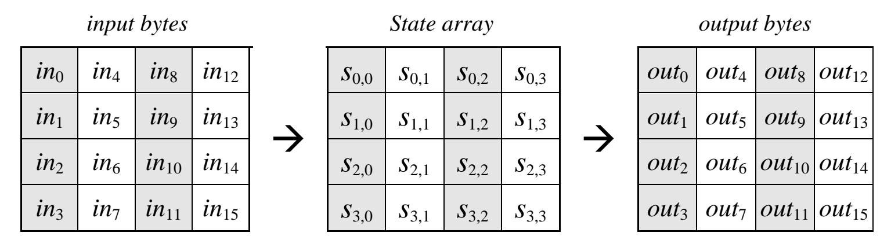
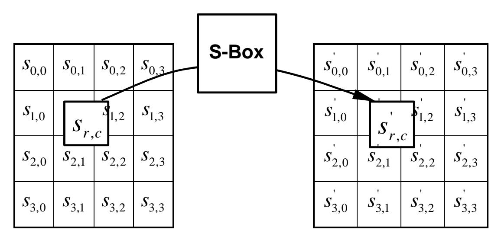
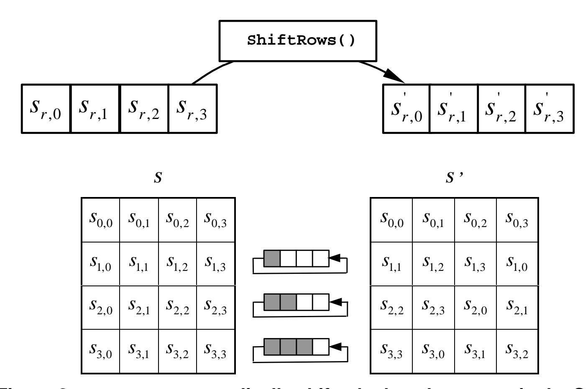
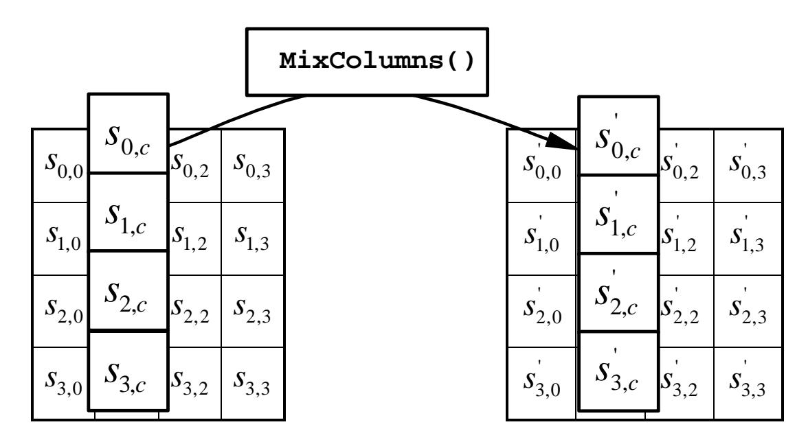
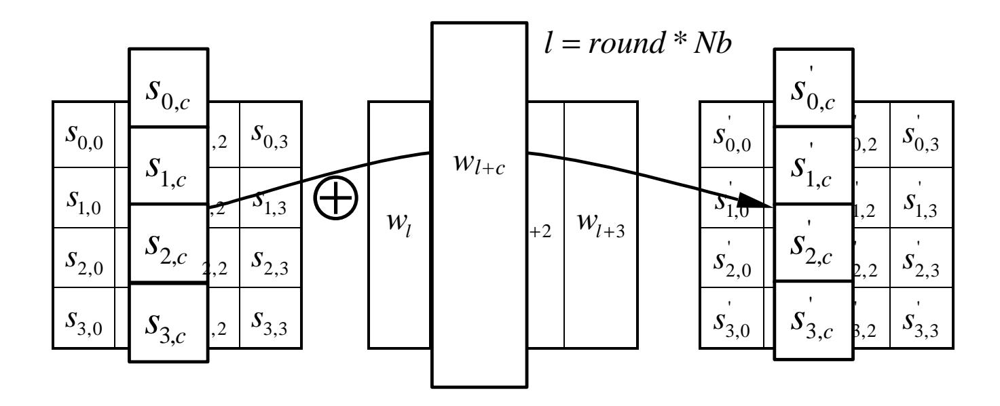
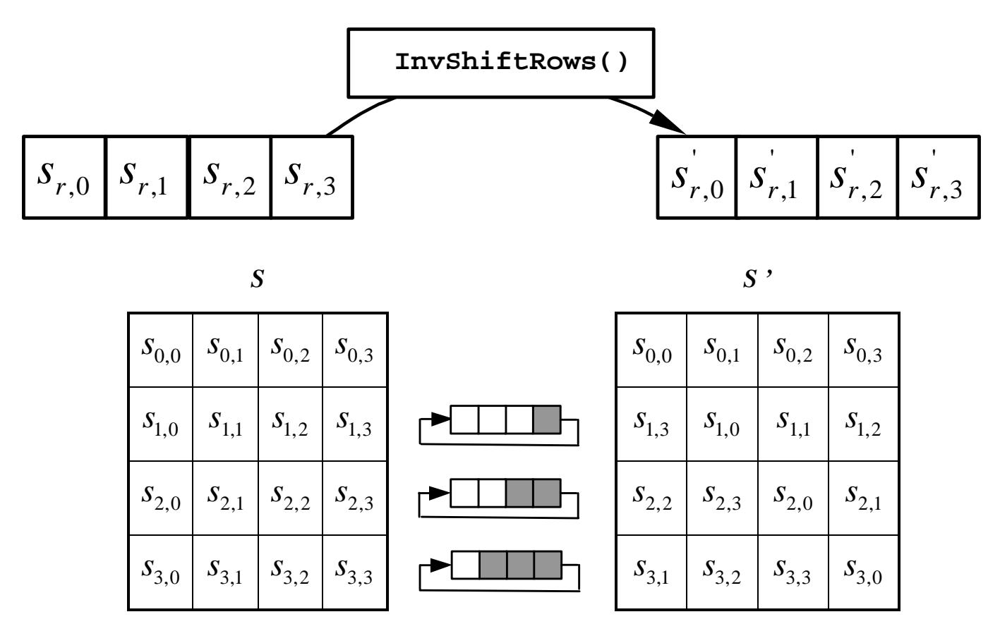
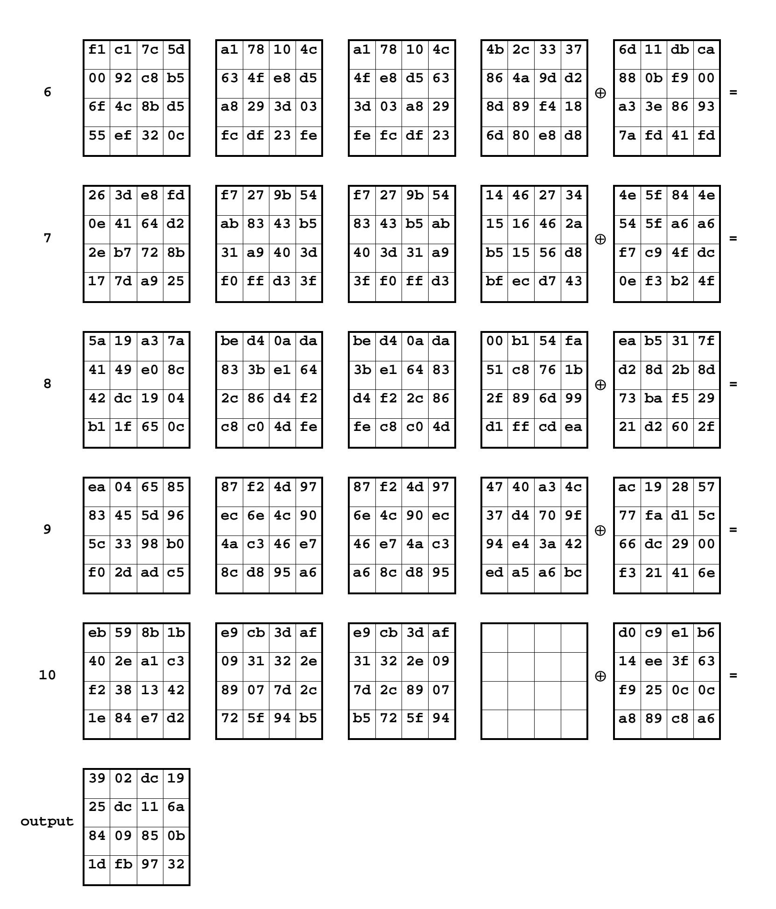

{0}------------------------------------------------

# **Withdrawn NIST Technical Series Publication**

### **Warning Notice**

The attached publication has been withdrawn (archived), and is provided solely for historical purposes.

|                                          | It may have been superseded by another publication (indicated below).              |  |  |  |  |  |  |  |  |  |
|------------------------------------------|------------------------------------------------------------------------------------|--|--|--|--|--|--|--|--|--|
| Withdrawn Publication                    |                                                                                    |  |  |  |  |  |  |  |  |  |
| Series/Number                            | Federal Information Processing Standards (FIPS) Publication 197                    |  |  |  |  |  |  |  |  |  |
| Title                                    | Advanced Encryption Standard (AES)                                                 |  |  |  |  |  |  |  |  |  |
| Publication Date(s)<br>November 26, 2001 |                                                                                    |  |  |  |  |  |  |  |  |  |
| May 9, 2023<br>Withdrawal Date           |                                                                                    |  |  |  |  |  |  |  |  |  |
| Withdrawal Note                          | FIPS 197 is updated<br>by NIST FIPS 197-upd1                                       |  |  |  |  |  |  |  |  |  |
| Superseding Publication(s)               | (if applicable)                                                                    |  |  |  |  |  |  |  |  |  |
|                                          | The attached publication has been superseded by<br>the following publication(s):   |  |  |  |  |  |  |  |  |  |
| Series/Number                            | NIST FIPS 197-upd1                                                                 |  |  |  |  |  |  |  |  |  |
| Title                                    | Advanced Encryption Standard (AES)                                                 |  |  |  |  |  |  |  |  |  |
| Author(s)                                | National Institute of Standards and Technology                                     |  |  |  |  |  |  |  |  |  |
| Publication Date(s)                      | November 26, 2001; Updated May 9, 2023                                             |  |  |  |  |  |  |  |  |  |
| URL/DOI                                  | https://doi.org/10.6028/NIST.FIPS.197-upd1                                         |  |  |  |  |  |  |  |  |  |
| Additional Information (if applicable)   |                                                                                    |  |  |  |  |  |  |  |  |  |
| Contact                                  | Computer Security Division (Information Technology Laboratory)                     |  |  |  |  |  |  |  |  |  |
| Latest revision of the                   |                                                                                    |  |  |  |  |  |  |  |  |  |
| attached publication                     |                                                                                    |  |  |  |  |  |  |  |  |  |
| Related Information                      | This update makes no technical changes to the algorithm specified in the           |  |  |  |  |  |  |  |  |  |
|                                          | original (2001) release of this standard. This update includes extensive editorial |  |  |  |  |  |  |  |  |  |
|                                          | improvements to the original version.                                              |  |  |  |  |  |  |  |  |  |
| Withdrawal                               | https://csrc.nist.gov/News/2023/nist-updates-fips-197-advanced-encryption          |  |  |  |  |  |  |  |  |  |


Date updated: May 9, 2023

**Announcement Link**

[standard](https://csrc.nist.gov/News/2023/nist-updates-fips-197-advanced-encryption-standard)

{1}------------------------------------------------

# **Federal Information**

### **Processing Standards Publication 197**

**November 26, 2001** 

# **Announcing the**

# **ADVANCED ENCRYPTION STANDARD (AES)**

Federal Information Processing Standards Publications (FIPS PUBS) are issued by the National Institute of Standards and Technology (NIST) after approval by the Secretary of Commerce pursuant to Section 5131 of the Information Technology Management Reform Act of 1996 (Public Law 104-106) and the Computer Security Act of 1987 (Public Law 100-235).

- **1. Name of Standard.** Advanced Encryption Standard (AES) (FIPS PUB 197).
- **2. Category of Standard.** Computer Security Standard, Cryptography.
- **3. Explanation.** The Advanced Encryption Standard (AES) specifies a FIPS-approved cryptographic algorithm that can be used to protect electronic data. The AES algorithm is a symmetric block cipher that can encrypt (encipher) and decrypt (decipher) information. Encryption converts data to an unintelligible form called ciphertext; decrypting the ciphertext converts the data back into its original form, called plaintext.

The AES algorithm is capable of using cryptographic keys of 128, 192, and 256 bits to encrypt and decrypt data in blocks of 128 bits.

- **4. Approving Authority.** Secretary of Commerce.
- **5. Maintenance Agency.** Department of Commerce, National Institute of Standards and Technology, Information Technology Laboratory (ITL).
- **6. Applicability.** This standard may be used by Federal departments and agencies when an agency determines that sensitive (unclassified) information (as defined in P. L. 100-235) requires cryptographic protection.

Other FIPS-approved cryptographic algorithms may be used in addition to, or in lieu of, this standard. Federal agencies or departments that use cryptographic devices for protecting classified information can use those devices for protecting sensitive (unclassified) information in lieu of this standard.

In addition, this standard may be adopted and used by non-Federal Government organizations. Such use is encouraged when it provides the desired security for commercial and private organizations.

{2}------------------------------------------------

- **7. Specifications.** Federal Information Processing Standard (FIPS) 197, Advanced Encryption Standard (AES) (affixed).
- **8. Implementations.** The algorithm specified in this standard may be implemented in software, firmware, hardware, or any combination thereof. The specific implementation may depend on several factors such as the application, the environment, the technology used, etc. The algorithm shall be used in conjunction with a FIPS approved or NIST recommended mode of operation. Object Identifiers (OIDs) and any associated parameters for AES used in these modes are available at the Computer Security Objects Register (CSOR), located at http://csrc.nist.gov/csor/ [2].

Implementations of the algorithm that are tested by an accredited laboratory and validated will be considered as complying with this standard. Since cryptographic security depends on many factors besides the correct implementation of an encryption algorithm, Federal Government employees, and others, should also refer to NIST Special Publication 800-21, *Guideline for Implementing Cryptography in the Federal Government*, for additional information and guidance (NIST SP 800-21 is available at http://csrc.nist.gov/publications/).

- **9. Implementation Schedule.** This standard becomes effective on May 26, 2002.
- **10. Patents.** Implementations of the algorithm specified in this standard may be covered by U.S. and foreign patents.
- **11. Export Control.** Certain cryptographic devices and technical data regarding them are subject to Federal export controls. Exports of cryptographic modules implementing this standard and technical data regarding them must comply with these Federal regulations and be licensed by the Bureau of Export Administration of the U.S. Department of Commerce. Applicable Federal government export controls are specified in Title 15, Code of Federal Regulations (CFR) Part 740.17; Title 15, CFR Part 742; and Title 15, CFR Part 774, Category 5, Part 2.
- **12. Qualifications.** NIST will continue to follow developments in the analysis of the AES algorithm. As with its other cryptographic algorithm standards, NIST will formally reevaluate this standard every five years.

Both this standard and possible threats reducing the security provided through the use of this standard will undergo review by NIST as appropriate, taking into account newly available analysis and technology. In addition, the awareness of any breakthrough in technology or any mathematical weakness of the algorithm will cause NIST to reevaluate this standard and provide necessary revisions.

- **13. Waiver Procedure.** Under certain exceptional circumstances, the heads of Federal agencies, or their delegates, may approve waivers to Federal Information Processing Standards (FIPS). The heads of such agencies may redelegate such authority only to a senior official designated pursuant to Section 3506(b) of Title 44, U.S. Code. Waivers shall be granted only when compliance with this standard would
  - a. adversely affect the accomplishment of the mission of an operator of Federal computer system or
  - b. cause a major adverse financial impact on the operator that is not offset by governmentwide savings.

{3}------------------------------------------------

Agency heads may act upon a written waiver request containing the information detailed above. Agency heads may also act without a written waiver request when they determine that conditions for meeting the standard cannot be met. Agency heads may approve waivers only by a written decision that explains the basis on which the agency head made the required finding(s). A copy of each such decision, with procurement sensitive or classified portions clearly identified, shall be sent to: National Institute of Standards and Technology; ATTN: FIPS Waiver Decision, Information Technology Laboratory, 100 Bureau Drive, Stop 8900, Gaithersburg, MD 20899 8900.

In addition, notice of each waiver granted and each delegation of authority to approve waivers shall be sent promptly to the Committee on Government Operations of the House of Representatives and the Committee on Government Affairs of the Senate and shall be published promptly in the Federal Register.

When the determination on a waiver applies to the procurement of equipment and/or services, a notice of the waiver determination must be published in the Commerce Business Daily as a part of the notice of solicitation for offers of an acquisition or, if the waiver determination is made after that notice is published, by amendment to such notice.

A copy of the waiver, any supporting documents, the document approving the waiver and any supporting and accompanying documents, with such deletions as the agency is authorized and decides to make under Section 552(b) of Title 5, U.S. Code, shall be part of the procurement documentation and retained by the agency.

**14. Where to obtain copies.** This publication is available electronically by accessing http://csrc.nist.gov/publications/. A list of other available computer security publications, including ordering information, can be obtained from NIST Publications List 91, which is available at the same web site. Alternatively, copies of NIST computer security publications are available from: National Technical Information Service (NTIS), 5285 Port Royal Road, Springfield, VA 22161.

{4}------------------------------------------------

{5}------------------------------------------------

#### **Federal Information**

### **Processing Standards Publication 197**

### **November 26, 2001**

# **Specification for the**

# **ADVANCED ENCRYPTION STANDARD (AES)**

#### **Table of Contents**

| 1. | I            | INTRODUCTION                                              | 5  |
|----|--------------|-----------------------------------------------------------|----|
| 2. | D            | DEFINITIONS                                               | 5  |
|    | 2.1          | GLOSSARY OF TERMS AND ACRONYMS                            | 5  |
|    | 2.2          | ALGORITHM PARAMETERS, SYMBOLS, AND FUNCTIONS              | 6  |
| 3. | N            | NOTATION AND CONVENTIONS                                  | 7  |
|    | 3.1          | INPUTS AND OUTPUTS                                        | 7  |
|    | 3.2          | Bytes                                                     | 8  |
|    | 3.3          |                                                           |    |
|    | 3.4          | THE STATE                                                 | 9  |
|    | 3.5          | THE STATE AS AN ARRAY OF COLUMNS                          | 10 |
| 4. | $\mathbf{N}$ | MATHEMATICAL PRELIMINARIES                                | 10 |
|    | 4.1          | Addition                                                  | 10 |
|    | 4.2          | MULTIPLICATION                                            | 10 |
|    |              | 4.2.1 Multiplication by x                                 |    |
|    | 4.3          | POLYNOMIALS WITH COEFFICIENTS IN $\operatorname{GF}(2^8)$ | 12 |
| 5. | A            | ALGORITHM SPECIFICATION                                   | 13 |
|    | 5.1          | CIPHER                                                    | 14 |
|    | 5.           | 5.1.1 SubBytes()Transformation                            |    |
|    | 5.           | 5.1.2 ShiftRows() Transformation                          |    |
|    | 5.           | 5.1.3 MixColumns() Transformation                         |    |
|    | 5.           | 5.1.4 AddRoundKey() Transformation                        |    |
|    | 5.2          | KEY EXPANSION                                             | 19 |
|    | <i>5</i> 2   | Lynner Chrysen                                            | 20 |

{6}------------------------------------------------

| 5.    | .3.1   | InvShiftRows() Transformation                             |    |
|-------|--------|-----------------------------------------------------------|----|
| 5.    | .3.2   | InvSubBytes() Transformation                              | 22 |
| 5.    | .3.3   | InvMixColumns() Transformation                            | 23 |
| 5.    | .3.4   | Inverse of the AddRoundKey() Transformation               | 23 |
| 5.    | .3.5   | Equivalent Inverse Cipher                                 | 23 |
| 6. II | MPLE   | EMENTATION ISSUES                                         | 25 |
| 6.1   | KEY    | LENGTH REQUIREMENTS                                       | 25 |
| 6.2   | KEYI   | ING RESTRICTIONS                                          | 26 |
| 6.3   | PARA   | AMETERIZATION OF KEY LENGTH, BLOCK SIZE, AND ROUND NUMBER | 26 |
| 6.4   | IMPL   | EMENTATION SUGGESTIONS REGARDING VARIOUS PLATFORMS        | 26 |
| APPEN | NDIX A | A - KEY EXPANSION EXAMPLES                                | 27 |
| A.1   | EXPA   | ANSION OF A 128-BIT CIPHER KEY                            | 27 |
| A.2   | EXPA   | ANSION OF A 192-BIT CIPHER KEY                            | 28 |
| A.3   | EXPA   | ANSION OF A 256-BIT CIPHER KEY                            | 30 |
| APPEN | NDIX 1 | B – CIPHER EXAMPLE                                        | 33 |
| APPEN | NDIX ( | C – EXAMPLE VECTORS                                       | 35 |
| C.1   | AES-   | -128 ( <i>NK</i> =4, <i>NR</i> =10)                       | 35 |
| C.2   | AES-   | -192 ( <i>NK</i> =6, <i>NR</i> =12)                       | 38 |
| C.3   | AES-   | -256 (NK=8, NR=14)                                        | 42 |
| APPEN | JDIX I | D - REFERENCES                                            | 47 |

{7}------------------------------------------------

### **Table of Figures**

| Figure 1. | Hexadecimal representation of bit patterns 8                                                      |
|-----------|---------------------------------------------------------------------------------------------------|
| Figure 2. | Indices for Bytes and Bits 9                                                                      |
| Figure 3. | State array input and output 9                                                                    |
| Figure 4. | Key-Block-Round Combinations 14                                                                   |
| Figure 5. | Pseudo Code for the Cipher 15                                                                     |
| Figure 6. | applies the S-box to each byte of the State 16<br>SubBytes()                                      |
| Figure 7. | S-box: substitution values for the byte xy<br>(in hexadecimal format) 16                          |
| Figure 8. | cyclically shifts the last three rows in the State 17<br>ShiftRows()                              |
| Figure 9. | MixColumns()<br>operates on the State column-by-column 18                                         |
|           | Figure 10. AddRoundKey()<br>XORs each column of the State with a word from the key<br>schedule 19 |
|           | Figure 11. Pseudo Code for Key Expansion 20                                                       |
|           | Figure 12. Pseudo Code for the Inverse Cipher 21                                                  |
|           | Figure 13. InvShiftRows()cyclically shifts the last three rows in the State 22                    |
|           | Figure 14. Inverse S-box: substitution values for the byte xy<br>(in hexadecimal format) 22       |
|           | Figure 15. Pseudo Code for the Equivalent Inverse Cipher 25                                       |

{8}------------------------------------------------

{9}------------------------------------------------

## <span id="page-9-0"></span>**1. Introduction**

This standard specifies the **Rijndael** algorithm ([3] and [4]), a symmetric block cipher that can process **data blocks** of **128 bits**, using cipher **keys** with lengths of **128**, **192**, and **256 bits**. Rijndael was designed to handle additional block sizes and key lengths, however they are not adopted in this standard.

Throughout the remainder of this standard, the algorithm specified herein will be referred to as "the AES algorithm." The algorithm may be used with the three different key lengths indicated above, and therefore these different "flavors" may be referred to as "AES-128", "AES-192", and "AES-256".

This specification includes the following sections:

- 2. Definitions of terms, acronyms, and algorithm parameters, symbols, and functions;
- 3. Notation and conventions used in the algorithm specification, including the ordering and numbering of bits, bytes, and words;
- 4. Mathematical properties that are useful in understanding the algorithm;
- 5. Algorithm specification, covering the key expansion, encryption, and decryption routines;
- 6. Implementation issues, such as key length support, keying restrictions, and additional block/key/round sizes.

The standard concludes with several appendices that include step-by-step examples for Key Expansion and the Cipher, example vectors for the Cipher and Inverse Cipher, and a list of references.

## **2. Definitions**

## **2.1 Glossary of Terms and Acronyms**

The following definitions are used throughout this standard:

AES Advanced Encryption Standard

Affine A transformation consisting of multiplication by a matrix followed by

Transformation the addition of a vector.

Array An enumerated collection of identical entities (e.g., an array of bytes).

Bit A binary digit having a value of 0 or 1.

Block Sequence of binary bits that comprise the input, output, State, and

Round Key. The length of a sequence is the number of bits it contains.

Blocks are also interpreted as arrays of bytes.

Byte A group of eight bits that is treated either as a single entity or as an

array of 8 individual bits.

{10}------------------------------------------------

Cipher Series of transformations that converts plaintext to ciphertext using the

Cipher Key.

Cipher Key Secret, cryptographic key that is used by the Key Expansion routine to

generate a set of Round Keys; can be pictured as a rectangular array of

bytes, having four rows and *Nk* columns.

Ciphertext Data output from the Cipher or input to the Inverse Cipher.

Inverse Cipher Series of transformations that converts ciphertext to plaintext using the

Cipher Key.

Key Expansion Routine used to generate a series of Round Keys from the Cipher Key.

Plaintext Data input to the Cipher or output from the Inverse Cipher.

Rijndael Cryptographic algorithm specified in this Advanced Encryption

Standard (AES).

Round Key Round keys are values derived from the Cipher Key using the Key

Expansion routine; they are applied to the State in the Cipher and

Inverse Cipher.

State Intermediate Cipher result that can be pictured as a rectangular array

of bytes, having four rows and *Nb* columns.

S-box Non-linear substitution table used in several byte substitution

transformations and in the Key Expansion routine to perform a one-

for-one substitution of a byte value.

Word A group of 32 bits that is treated either as a single entity or as an array

of 4 bytes.

## **2.2 Algorithm Parameters, Symbols, and Functions**

The following algorithm parameters, symbols, and functions are used throughout this standard:

**AddRoundKey()** Transformation in the Cipher and Inverse Cipher in which a Round

Key is added to the State using an XOR operation. The length of a Round Key equals the size of the State (i.e., for *Nb* = 4, the Round

Key length equals 128 bits/16 bytes).

**InvMixColumns()**Transformation in the Inverse Cipher that is the inverse of

**MixColumns()**.

**InvShiftRows()** Transformation in the Inverse Cipher that is the inverse of

**ShiftRows()**.

**InvSubBytes()** Transformation in the Inverse Cipher that is the inverse of

**SubBytes()**.

*K* Cipher Key.

{11}------------------------------------------------

<span id="page-11-0"></span>

| MixColumns() | Transformation in the Cipher that takes all of the columns of the State and mixes their data (independently of one another) to produce new columns.              |
|--------------|------------------------------------------------------------------------------------------------------------------------------------------------------------------|
| Nb           | Number of columns (32-bit words) comprising the State. For this standard, $Nb = 4$ . (Also see Sec. 6.3.)                                                        |
| Nk           | Number of 32-bit words comprising the Cipher Key. For this standard, $Nk = 4$ , 6, or 8. (Also see Sec. 6.3.)                                                    |
| Nr           | Number of rounds, which is a function of $Nk$ and $Nb$ (which is fixed). For this standard, $Nr = 10$ , 12, or 14. (Also see Sec. 6.3.)                          |
| Rcon[]       | The round constant word array.                                                                                                                                   |
| RotWord()    | Function used in the Key Expansion routine that takes a four-byte word and performs a cyclic permutation.                                                        |
| ShiftRows()  | Transformation in the Cipher that processes the State by cyclically shifting the last three rows of the State by different offsets.                              |
| SubBytes()   | Transformation in the Cipher that processes the State using a non-linear byte substitution table (S-box) that operates on each of the State bytes independently. |
| SubWord()    | Function used in the Key Expansion routine that takes a four-byte input word and applies an S-box to each of the four bytes to produce an output word.           |
| XOR          | Exclusive-OR operation.                                                                                                                                          |
| $\oplus$     | Exclusive-OR operation.                                                                                                                                          |
| $\otimes$    | Multiplication of two polynomials (each with degree $<$ 4) modulo $x^4 + 1$ .                                                                                    |
| •            | Finite field multiplication.                                                                                                                                     |

### 3. Notation and Conventions

### 3.1 Inputs and Outputs

The **input** and **output** for the AES algorithm each consist of **sequences of 128 bits** (digits with values of 0 or 1). These sequences will sometimes be referred to as **blocks** and the number of bits they contain will be referred to as their length. The **Cipher Key** for the AES algorithm is a **sequence of 128, 192 or 256 bits**. Other input, output and Cipher Key lengths are not permitted by this standard.

The bits within such sequences will be numbered starting at zero and ending at one less than the sequence length (block length or key length). The number i attached to a bit is known as its index and will be in one of the ranges  $0 \le i < 128$ ,  $0 \le i < 192$  or  $0 \le i < 256$  depending on the block length and key length (specified above).

{12}------------------------------------------------

### 3.2 Bytes

The basic unit for processing in the AES algorithm is a **byte**, a sequence of eight bits treated as a single entity. The input, output and Cipher Key bit sequences described in Sec. 3.1 are processed as arrays of bytes that are formed by dividing these sequences into groups of eight contiguous bits to form arrays of bytes (see Sec. 3.3). For an input, output or Cipher Key denoted by a, the bytes in the resulting array will be referenced using one of the two forms,  $a_n$  or a[n], where n will be in one of the following ranges:

Key length = 128 bits,  $0 \le n < 16$ ; Block length = 128 bits,  $0 \le n < 16$ ; Key length = 192 bits,  $0 \le n < 24$ ; Key length = 256 bits,  $0 \le n < 32$ .

All byte values in the AES algorithm will be presented as the concatenation of its individual bit values (0 or 1) between braces in the order  $\{b_7, b_6, b_5, b_4, b_3, b_2, b_1, b_0\}$ . These bytes are interpreted as finite field elements using a polynomial representation:

$$b_7 x^7 + b_6 x^6 + b_5 x^5 + b_4 x^4 + b_3 x^3 + b_2 x^2 + b_1 x + b_0 = \sum_{i=0}^7 b_i x^i.$$
 (3.1)

For example, {01100011} identifies the specific finite field element  $x^6 + x^5 + x + 1$ .

It is also convenient to denote byte values using hexadecimal notation with each of two groups of four bits being denoted by a single character as in Fig. 1.

| Bit Pattern | Character |
|-------------|-----------|
| 0000        | 0         |
| 0001        | 1         |
| 0010        | 2         |
| 0011        | 3         |

| Bit Pattern | Character |
|-------------|-----------|
| 0100        | 4         |
| 0101        | 5         |
| 0110        | 6         |
| 0111        | 7         |

| Bit Pattern | Character |
|-------------|-----------|
| 1000        | 8         |
| 1001        | 9         |
| 1010        | a         |
| 1011        | b         |

| Bit Pattern | Character |
|-------------|-----------|
| 1100        | С         |
| 1101        | d         |
| 1110        | е         |
| 1111        | £         |

Figure 1. Hexadecimal representation of bit patterns.

Hence the element {01100011} can be represented as {63}, where the character denoting the four-bit group containing the higher numbered bits is again to the left.

Some finite field operations involve one additional bit  $(b_8)$  to the left of an 8-bit byte. Where this extra bit is present, it will appear as ' $\{01\}$ ' immediately preceding the 8-bit byte; for example, a 9-bit sequence will be presented as  $\{01\}\{1b\}$ .

## 3.3 Arrays of Bytes

Arrays of bytes will be represented in the following form:

$$a_0 a_1 a_2 ... a_{15}$$

The bytes and the bit ordering within bytes are derived from the 128-bit input sequence

$$input_0 input_1 input_2 ... input_{126} input_{127}$$

as follows:

{13}------------------------------------------------

```
a_0 = \{input_0, input_1, ..., input_7\};
a_1 = \{input_8, input_9, ..., input_{15}\};
\vdots
a_{15} = \{input_{120}, input_{121}, ..., input_{127}\}.
```

The pattern can be extended to longer sequences (i.e., for 192- and 256-bit keys), so that, in general,

$$a_n = \{input_{8n}, input_{8n+1}, ..., input_{8n+7}\}.$$
 (3.2)

Taking Sections 3.2 and 3.3 together, Fig. 2 shows how bits within each byte are numbered.

| Input bit sequence  | 0 | 1 | 2 | 3 | 4 | 5 | 6 | 7 | 8 | 9 | 10 | 11 | 12 | 13 | 14 | 15 | 16 | 17 | 18 | 19  | 20 | 21 | 22 | 23 | ••• |
|---------------------|---|---|---|---|---|---|---|---|---|---|----|----|----|----|----|----|----|----|----|-----|----|----|----|----|-----|
| Byte number         | 0 |   |   |   |   |   | 1 |   |   |   |    |    | 2  |    |    |    |    |    |    | ••• |    |    |    |    |     |
| Bit numbers in byte | 7 | 6 | 5 | 4 | 3 | 2 | 1 | 0 | 7 | 6 | 5  | 4  | 3  | 2  | 1  | 0  | 7  | 6  | 5  | 4   | 3  | 2  | 1  | 0  | ••• |

Figure 2. Indices for Bytes and Bits.

#### 3.4 The State

Internally, the AES algorithm's operations are performed on a two-dimensional array of bytes called the **State**. The State consists of four rows of bytes, each containing Nb bytes, where Nb is the block length divided by 32. In the State array denoted by the symbol s, each individual byte has two indices, with its row number r in the range  $0 \le r < 4$  and its column number c in the range  $0 \le c < Nb$ . This allows an individual byte of the State to be referred to as either  $s_{r,c}$  or s[r,c]. For this standard, Nb=4, i.e.,  $0 \le c < 4$  (also see Sec. 6.3).

At the start of the Cipher and Inverse Cipher described in Sec. 5, the input – the array of bytes  $in_0$ ,  $in_1$ , ...  $in_{15}$  – is copied into the State array as illustrated in Fig. 3. The Cipher or Inverse Cipher operations are then conducted on this State array, after which its final value is copied to the output – the array of bytes  $out_0$ ,  $out_1$ , ...  $out_{15}$ .



Figure 3. State array input and output.

Hence, at the beginning of the Cipher or Inverse Cipher, the input array, *in*, is copied to the State array according to the scheme:

$$s[r, c] = in[r + 4c]$$
 for  $0 \le r < 4$  and  $0 \le c < Nb$ , (3.3)

{14}------------------------------------------------

<span id="page-14-0"></span>and at the end of the Cipher and Inverse Cipher, the State is copied to the output array *out* as follows:

$$out[r + 4c] = s[r, c]$$
 for  $0 \le r < 4$  and  $0 \le c < Nb$ . (3.4)

### **3.5 The State as an Array of Columns**

The four bytes in each column of the State array form 32-bit **words**, where the row number *r*  provides an index for the four bytes within each word. The state can hence be interpreted as a one-dimensional array of 32 bit words (columns), *w*0...*w*3, where the column number *c* provides an index into this array. Hence, for the example in Fig. 3, the State can be considered as an array of four words, as follows:

$$w_0 = s_{0,0} s_{1,0} s_{2,0} s_{3,0}$$

$$w_2 = s_{0,2} s_{1,2} s_{2,2} s_{3,2}$$

$$w_1 = s_{0,1} s_{1,1} s_{2,1} s_{3,1}$$

$$w_3 = s_{0,3} s_{1,3} s_{2,3} s_{3,3} .$$

$$(3.5)$$

## **4. Mathematical Preliminaries**

All bytes in the AES algorithm are interpreted as finite field elements using the notation introduced in Sec. 3.2. Finite field elements can be added and multiplied, but these operations are different from those used for numbers. The following subsections introduce the basic mathematical concepts needed for Sec. 5.

### **4.1 Addition**

The addition of two elements in a finite field is achieved by "adding" the coefficients for the corresponding powers in the polynomials for the two elements. The addition is performed with the XOR operation (denoted by ¯ ) - i.e., modulo 2 - so that 1¯1 = 0 , 1¯ 0 = 1, and 0 ¯ 0 = 0 . Consequently, subtraction of polynomials is identical to addition of polynomials.

Alternatively, addition of finite field elements can be described as the modulo 2 addition of corresponding bits in the byte. For two bytes {*a*7*a*6*a*5*a*4*a*3*a*2*a*1*a*0} and {*b*7*b*6*b*5*b*4*b*3*b*2*b*1*b*0}, the sum is {*c*7*c*6*c*5*c*4*c*3*c*2*c*1*c*0}, where each *ci* = *ai* ¯ *bi* (i.e., *c*7*= a*7¯ *b*7*, c*6*= a*6¯ *b*6*, ...c*0*= a*0¯ *b*0)*.* 

For example, the following expressions are equivalent to one another:

$$(x^6 + x^4 + x^2 + x + 1) + (x^7 + x + 1) = x^7 + x^6 + x^4 + x^2$$
 (polynomial notation);  
 $\{01010111\} \oplus \{10000011\} = \{11010100\}$  (binary notation);  
 $\{57\} \oplus \{83\} = \{d4\}$  (hexadecimal notation).

## **4.2 Multiplication**

In the polynomial representation, multiplication in GF(28 ) (denoted by •) corresponds with the multiplication of polynomials modulo an **irreducible polynomial** of degree 8. A polynomial is irreducible if its only divisors are one and itself. **For the AES algorithm, this irreducible polynomial is** 

$$m(x) = x^8 + x^4 + x^3 + x + 1, (4.1)$$

{15}------------------------------------------------

<span id="page-15-0"></span>or {01}{1b} in hexadecimal notation.

For example,  $\{57\} \bullet \{83\} = \{c1\}$ , because

$$(x^{6} + x^{4} + x^{2} + x + 1) (x^{7} + x + 1) = x^{13} + x^{11} + x^{9} + x^{8} + x^{7} + x^{11} + x^{11} + x^{11} + x^{11} + x^{11} + x^{11} + x^{11} + x^{11} + x^{11} + x^{11} + x^{11} + x^{11} + x^{11} + x^{11} + x^{11} + x^{11} + x^{11} + x^{11} + x^{11} + x^{11} + x^{11} + x^{11} + x^{11} + x^{11} + x^{11} + x^{11} + x^{11} + x^{11} + x^{11} + x^{11} + x^{11} + x^{11} + x^{11} + x^{11} + x^{11} + x^{11} + x^{11} + x^{11} + x^{11} + x^{11} + x^{11} + x^{11} + x^{11} + x^{11} + x^{11} + x^{11} + x^{11} + x^{11} + x^{11} + x^{11} + x^{11} + x^{11} + x^{11} + x^{11} + x^{11} + x^{11} + x^{11} + x^{11} + x^{11} + x^{11} + x^{11} + x^{11} + x^{11} + x^{11} + x^{11} + x^{11} + x^{11} + x^{11} + x^{11} + x^{11} + x^{11} + x^{11} + x^{11} + x^{11} + x^{11} + x^{11} + x^{11} + x^{11} + x^{11} + x^{11} + x^{11} + x^{11} + x^{11} + x^{11} + x^{11} + x^{11} + x^{11} + x^{11} + x^{11} + x^{11} + x^{11} + x^{11} + x^{11} + x^{11} + x^{11} + x^{11} + x^{11} + x^{11} + x^{11} + x^{11} + x^{11} + x^{11} + x^{11} + x^{11} + x^{11} + x^{11} + x^{11} + x^{11} + x^{11} + x^{11} + x^{11} + x^{11} + x^{11} + x^{11} + x^{11} + x^{11} + x^{11} + x^{11} + x^{11} + x^{11} + x^{11} + x^{11} + x^{11} + x^{11} + x^{11} + x^{11} + x^{11} + x^{11} + x^{11} + x^{11} + x^{11} + x^{11} + x^{11} + x^{11} + x^{11} + x^{11} + x^{11} + x^{11} + x^{11} + x^{11} + x^{11} + x^{11} + x^{11} + x^{11} + x^{11} + x^{11} + x^{11} + x^{11} + x^{11} + x^{11} + x^{11} + x^{11} + x^{11} + x^{11} + x^{11} + x^{11} + x^{11} + x^{11} + x^{11} + x^{11} + x^{11} + x^{11} + x^{11} + x^{11} + x^{11} + x^{11} + x^{11} + x^{11} + x^{11} + x^{11} + x^{11} + x^{11} + x^{11} + x^{11} + x^{11} + x^{11} + x^{11} + x^{11} + x^{11} + x^{11} + x^{11} + x^{11} + x^{11} + x^{11} + x^{11} + x^{11} + x^{11} + x^{11} + x^{11} + x^{11} + x^{11} + x^{11} + x^{11} + x^{11} + x^{11} + x^{11} + x^{11} + x^{11} + x^{11} + x^{11} + x^{11} + x^{11} + x^{11} + x^{11} + x^{11} + x^{11} + x^{11} + x^{11} + x^{11} + x^{11} + x^{11} + x^{11} + x^{11} + x^{11} + x^{11} + x^{11} + x^{11} +$$

and

$$x^{13} + x^{11} + x^9 + x^8 + x^6 + x^5 + x^4 + x^3 + 1 \mod (x^8 + x^4 + x^3 + x + 1)$$

$$= x^7 + x^6 + 1.$$

The modular reduction by m(x) ensures that the result will be a binary polynomial of degree less than 8, and thus can be represented by a byte. Unlike addition, there is no simple operation at the byte level that corresponds to this multiplication.

The multiplication defined above is associative, and the element  $\{01\}$  is the multiplicative identity. For any non-zero binary polynomial b(x) of degree less than 8, the multiplicative inverse of b(x), denoted  $b^{-1}(x)$ , can be found as follows: the extended Euclidean algorithm [7] is used to compute polynomials a(x) and c(x) such that

$$b(x)a(x) + m(x)c(x) = 1.$$
 (4.2)

Hence,  $a(x) \bullet b(x) \mod m(x) = 1$ , which means

$$b^{-1}(x) = a(x) \bmod m(x). \tag{4.3}$$

Moreover, for any a(x), b(x) and c(x) in the field, it holds that

$$a(x) \bullet (b(x) + c(x)) = a(x) \bullet b(x) + a(x) \bullet c(x)$$
.

It follows that the set of 256 possible byte values, with XOR used as addition and the multiplication defined as above, has the structure of the finite field  $GF(2^8)$ .

#### 4.2.1 Multiplication by x

Multiplying the binary polynomial defined in equation (3.1) with the polynomial x results in

$$b_7 x^8 + b_6 x^7 + b_5 x^6 + b_4 x^5 + b_3 x^4 + b_2 x^3 + b_1 x^2 + b_0 x. (4.4)$$

The result  $x \cdot b(x)$  is obtained by reducing the above result modulo m(x), as defined in equation (4.1). If  $b_7 = 0$ , the result is already in reduced form. If  $b_7 = 1$ , the reduction is accomplished by subtracting (i.e., XORing) the polynomial m(x). It follows that multiplication by x (i.e.,  $\{00000010\}$  or  $\{02\}$ ) can be implemented at the byte level as a left shift and a subsequent conditional bitwise XOR with  $\{1b\}$ . This operation on bytes is denoted by xtime(). Multiplication by higher powers of x can be implemented by repeated application of xtime(). By adding intermediate results, multiplication by any constant can be implemented.

For example,  $\{57\} \bullet \{13\} = \{fe\}$  because

{16}------------------------------------------------

$$\{57\} \bullet \{02\} = xtime(\{57\}) = \{ae\}$$
  
 $\{57\} \bullet \{04\} = xtime(\{ae\}) = \{47\}$   
 $\{57\} \bullet \{08\} = xtime(\{47\}) = \{8e\}$   
 $\{57\} \bullet \{10\} = xtime(\{8e\}) = \{07\},$ 

<span id="page-16-0"></span>thus,

$$\{57\} \bullet \{13\} = \{57\} \bullet (\{01\} \oplus \{02\} \oplus \{10\})$$
  
=  $\{57\} \oplus \{ae\} \oplus \{07\}$   
=  $\{fe\}.$ 

# 4.3 Polynomials with Coefficients in GF(2<sup>8</sup>)

Four-term polynomials can be defined - with coefficients that are finite field elements - as:

$$a(x) = a_3 x^3 + a_2 x^2 + a_1 x + a_0 (4.5)$$

which will be denoted as a word in the form  $[a_0, a_1, a_2, a_3]$ . Note that the polynomials in this section behave somewhat differently than the polynomials used in the definition of finite field elements, even though both types of polynomials use the same indeterminate, x. The coefficients in this section are themselves finite field elements, i.e., bytes, instead of bits; also, the multiplication of four-term polynomials uses a different reduction polynomial, defined below. The distinction should always be clear from the context.

To illustrate the addition and multiplication operations, let

$$b(x) = b_3 x^3 + b_2 x^2 + b_1 x + b_0 (4.6)$$

define a second four-term polynomial. Addition is performed by adding the finite field coefficients of like powers of x. This addition corresponds to an XOR operation between the corresponding bytes in each of the words – in other words, the XOR of the complete word values.

Thus, using the equations of (4.5) and (4.6),

$$a(x) + b(x) = (a_3 \oplus b_3)x^3 + (a_2 \oplus b_2)x^2 + (a_1 \oplus b_1)x + (a_0 \oplus b_0)$$
(4.7)

Multiplication is achieved in two steps. In the first step, the polynomial product  $c(x) = a(x) \bullet b(x)$  is algebraically expanded, and like powers are collected to give

$$c(x) = c_6 x^6 + c_5 x^5 + c_4 x^4 + c_3 x^3 + c_2 x^2 + c_1 x + c_0$$
(4.8)

where

$$c_{0} = a_{0} \bullet b_{0}$$

$$c_{1} = a_{1} \bullet b_{0} \oplus a_{0} \bullet b_{1}$$

$$c_{2} = a_{2} \bullet b_{0} \oplus a_{1} \bullet b_{1} \oplus a_{0} \bullet b_{2}$$

$$c_{3} = a_{4} \bullet b_{5} \oplus a_{5} \oplus a_{5} \oplus a_{5} \oplus a_{5} \oplus a_{5} \oplus a_{5} \oplus a_{5} \oplus a_{5} \oplus a_{5} \oplus a_{5} \oplus a_{5} \oplus a_{5} \oplus a_{5} \oplus a_{5} \oplus a_{5} \oplus a_{5} \oplus a_{5} \oplus a_{5} \oplus a_{5} \oplus a_{5} \oplus a_{5} \oplus a_{5} \oplus a_{5} \oplus a_{5} \oplus a_{5} \oplus a_{5} \oplus a_{5} \oplus a_{5} \oplus a_{5} \oplus a_{5} \oplus a_{5} \oplus a_{5} \oplus a_{5} \oplus a_{5} \oplus a_{5} \oplus a_{5} \oplus a_{5} \oplus a_{5} \oplus a_{5} \oplus a_{5} \oplus a_{5} \oplus a_{5} \oplus a_{5} \oplus a_{5} \oplus a_{5} \oplus a_{5} \oplus a_{5} \oplus a_{5} \oplus a_{5} \oplus a_{5} \oplus a_{5} \oplus a_{5} \oplus a_{5} \oplus a_{5} \oplus a_{5} \oplus a_{5} \oplus a_{5} \oplus a_{5} \oplus a_{5} \oplus a_{5} \oplus a_{5} \oplus a_{5} \oplus a_{5} \oplus a_{5} \oplus a_{5} \oplus a_{5} \oplus a_{5} \oplus a_{5} \oplus a_{5} \oplus a_{5} \oplus a_{5} \oplus a_{5} \oplus a_{5} \oplus a_{5} \oplus a_{5} \oplus a_{5} \oplus a_{5} \oplus a_{5} \oplus a_{5} \oplus a_{5} \oplus a_{5} \oplus a_{5} \oplus a_{5} \oplus a_{5} \oplus a_{5} \oplus a_{5} \oplus a_{5} \oplus a_{5} \oplus a_{5} \oplus a_{5} \oplus a_{5} \oplus a_{5} \oplus a_{5} \oplus a_{5} \oplus a_{5} \oplus a_{5} \oplus a_{5} \oplus a_{5} \oplus a_{5} \oplus a_{5} \oplus a_{5} \oplus a_{5} \oplus a_{5} \oplus a_{5} \oplus a_{5} \oplus a_{5} \oplus a_{5} \oplus a_{5} \oplus a_{5} \oplus a_{5} \oplus a_{5} \oplus a_{5} \oplus a_{5} \oplus a_{5} \oplus a_{5} \oplus a_{5} \oplus a_{5} \oplus a_{5} \oplus a_{5} \oplus a_{5} \oplus a_{5} \oplus a_{5} \oplus a_{5} \oplus a_{5} \oplus a_{5} \oplus a_{5} \oplus a_{5} \oplus a_{5} \oplus a_{5} \oplus a_{5} \oplus a_{5} \oplus a_{5} \oplus a_{5} \oplus a_{5} \oplus a_{5} \oplus a_{5} \oplus a_{5} \oplus a_{5} \oplus a_{5} \oplus a_{5} \oplus a_{5} \oplus a_{5} \oplus a_{5} \oplus a_{5} \oplus a_{5} \oplus a_{5} \oplus a_{5} \oplus a_{5} \oplus a_{5} \oplus a_{5} \oplus a_{5} \oplus a_{5} \oplus a_{5} \oplus a_{5} \oplus a_{5} \oplus a_{5} \oplus a_{5} \oplus a_{5} \oplus a_{5} \oplus a_{5} \oplus a_{5} \oplus a_{5} \oplus a_{5} \oplus a_{5} \oplus a_{5} \oplus a_{5} \oplus a_{5} \oplus a_{5} \oplus a_{5} \oplus a_{5} \oplus a_{5} \oplus a_{5} \oplus a_{5} \oplus a_{5} \oplus a_{5} \oplus a_{5} \oplus a_{5} \oplus a_{5} \oplus a_{5} \oplus a_{5} \oplus a_{5} \oplus a_{5} \oplus a_{5} \oplus a_{5} \oplus a_{5} \oplus a_{5} \oplus a_{5} \oplus a_{5} \oplus a_{5} \oplus a_{5} \oplus a_{5} \oplus a_{5} \oplus a_{5} \oplus a_{5} \oplus a_{5} \oplus a_{5} \oplus a_{5} \oplus a_{5} \oplus a_{5} \oplus a_{5} \oplus a_{5} \oplus a_{5} \oplus a_{5} \oplus a_{5} \oplus a_{5} \oplus a_{5} \oplus a_{5} \oplus a_{5} \oplus a_{5} \oplus a_{5} \oplus a_{5} \oplus a_{5} \oplus a_{5} \oplus a_{5} \oplus a_{5} \oplus a_{5} \oplus a_{5} \oplus a_{5} \oplus a_{5} \oplus a_{5} \oplus a_{5} \oplus a_{5} \oplus a_{5} \oplus a_{5} \oplus a_{5} \oplus a_{5} \oplus a_{5} \oplus a_{5} \oplus a_{5} \oplus a_{5} \oplus a_{5} \oplus a_{5} \oplus a_{5} \oplus a_{5} \oplus a_{5} \oplus a_{5} \oplus a_{5} \oplus a_{5$$

{17}------------------------------------------------

$$c_3 = a_3 \bullet b_0 \oplus a_2 \bullet b_1 \oplus a_1 \bullet b_2 \oplus a_0 \bullet b_3$$
.

<span id="page-17-0"></span>The result, c(x), does not represent a four-byte word. Therefore, the second step of the multiplication is to reduce c(x) modulo a polynomial of degree 4; the result can be reduced to a polynomial of degree less than 4. For the AES algorithm, this is accomplished with the polynomial  $x^4 + 1$ , so that

$$x^{i} \bmod(x^{4} + 1) = x^{i \bmod 4}. \tag{4.10}$$

The modular product of a(x) and b(x), denoted by  $a(x) \otimes b(x)$ , is given by the four-term polynomial d(x), defined as follows:

$$d(x) = d_3 x^3 + d_2 x^2 + d_1 x + d_0 (4.11)$$

with

$$d_0 = (a_0 \bullet b_0) \oplus (a_3 \bullet b_1) \oplus (a_2 \bullet b_2) \oplus (a_1 \bullet b_3)$$

$$d_1 = (a_1 \bullet b_0) \oplus (a_0 \bullet b_1) \oplus (a_3 \bullet b_2) \oplus (a_2 \bullet b_3)$$

$$d_2 = (a_2 \bullet b_0) \oplus (a_1 \bullet b_1) \oplus (a_0 \bullet b_2) \oplus (a_3 \bullet b_3)$$

$$d_3 = (a_3 \bullet b_0) \oplus (a_2 \bullet b_1) \oplus (a_1 \bullet b_2) \oplus (a_0 \bullet b_3)$$

$$(4.12)$$

When a(x) is a fixed polynomial, the operation defined in equation (4.11) can be written in matrix form as:

$$\begin{bmatrix} d_0 \\ d_1 \\ d_2 \\ d_3 \end{bmatrix} = \begin{bmatrix} a_0 & a_3 & a_2 & a_1 \\ a_1 & a_0 & a_3 & a_2 \\ a_2 & a_1 & a_0 & a_3 \\ a_3 & a_2 & a_1 & a_0 \end{bmatrix} \begin{bmatrix} b_0 \\ b_1 \\ b_2 \\ b_3 \end{bmatrix}$$
(4.13)

Because  $x^4 + 1$  is not an irreducible polynomial over  $GF(2^8)$ , multiplication by a fixed four-term polynomial is not necessarily invertible. However, the AES algorithm specifies a fixed four-term polynomial that *does* have an inverse (see Sec. 5.1.3 and Sec. 5.3.3):

$$a(x) = \{03\}x^3 + \{01\}x^2 + \{01\}x + \{02\}$$
(4.14)

$$a^{-1}(x) = \{0b\}x^3 + \{0d\}x^2 + \{09\}x + \{0e\}.$$
 (4.15)

Another polynomial used in the AES algorithm (see the **RotWord()** function in Sec. 5.2) has  $a_0 = a_1 = a_2 = \{00\}$  and  $a_3 = \{01\}$ , which is the polynomial  $x^3$ . Inspection of equation (4.13) above will show that its effect is to form the output word by rotating bytes in the input word. This means that  $[b_0, b_1, b_2, b_3]$  is transformed into  $[b_1, b_2, b_3, b_0]$ .

### 5. Algorithm Specification

For the AES algorithm, the length of the input block, the output block and the State is 128 bits. This is represented by Nb = 4, which reflects the number of 32-bit words (number of columns) in the State.

{18}------------------------------------------------

For the AES algorithm**, the length of the Cipher Key,** *K***, is 128, 192, or 256 bits.** The key length is represented by *Nk* = 4, 6, or 8, which reflects the number of 32-bit words (number of columns) in the Cipher Key.

For the AES algorithm, the number of rounds to be performed during the execution of the algorithm is dependent on the key size. The number of rounds is represented by *Nr*, where *Nr* = 10 when *Nk* = 4, *Nr* = 12 when *Nk* = 6, and *Nr* = 14 when *Nk* = 8.

**The only Key-Block-Round combinations that conform to this standard are given in Fig. 4.**  For implementation issues relating to the key length, block size and number of rounds, see Sec. 6.3.

|         | Key Length<br>(Nk words) | Block Size<br>(Nb words) | Number of<br>Rounds<br>(Nr) |
|---------|--------------------------|--------------------------|-----------------------------|
| AES-128 | 4                        | 4                        | 10                          |
| AES-192 | 6                        | 4                        | 12                          |
| AES-256 | 8                        | 4                        | 14                          |

**Figure 4. Key-Block-Round Combinations.** 

For both its Cipher and Inverse Cipher, the AES algorithm uses a round function that is composed of four different byte-oriented transformations: 1) byte substitution using a substitution table (S-box), 2) shifting rows of the State array by different offsets, 3) mixing the data within each column of the State array, and 4) adding a Round Key to the State. These transformations (and their inverses) are described in Sec. 5.1.1-5.1.4 and 5.3.1-5.3.4.

The Cipher and Inverse Cipher are described in Sec. 5.1 and Sec. 5.3, respectively, while the Key Schedule is described in Sec. 5.2.

## **5.1 Cipher**

At the start of the Cipher, the input is copied to the State array using the conventions described in Sec. 3.4. After an initial Round Key addition, the State array is transformed by implementing a round function 10, 12, or 14 times (depending on the key length), with the final round differing slightly from the first *Nr* -1 rounds. The final State is then copied to the output as described in Sec. 3.4.

The round function is parameterized using a key schedule that consists of a one-dimensional array of four-byte words derived using the Key Expansion routine described in Sec. 5.2.

The Cipher is described in the pseudo code in Fig. 5. The individual transformations - **SubBytes()**, **ShiftRows()**, **MixColumns()**, and **AddRoundKey()** – process the State and are described in the following subsections. In Fig. 5, the array **w[]** contains the key schedule, which is described in Sec. 5.2.

As shown in Fig. 5, all *Nr* rounds are identical with the exception of the final round, which does not include the **MixColumns()** transformation.

{19}------------------------------------------------

<span id="page-19-0"></span>Appendix B presents an example of the Cipher, showing values for the State array at the beginning of each round and after the application of each of the four transformations described in the following sections.

```
Cipher(byte in[4*Nb], byte out[4*Nb], word w[Nb*(Nr+1)])
begin
  byte state[4,Nb]
  state = in
  AddRoundKey(state, w[0, Nb-1]) // See Sec. 5.1.4
  for round = 1 step 1 to Nr–1
     SubBytes(state) // See Sec. 5.1.1
     ShiftRows(state) // See Sec. 5.1.2
     MixColumns(state) // See Sec. 5.1.3
     AddRoundKey(state, w[round*Nb, (round+1)*Nb-1])
  end for
  SubBytes(state)
  ShiftRows(state)
  AddRoundKey(state, w[Nr*Nb, (Nr+1)*Nb-1])
  out = state
end
```

**Figure 5. Pseudo Code for the Cipher.<sup>1</sup>**

### **5.1.1 SubBytes()Transformation**

The **SubBytes()** transformation is a non-linear byte substitution that operates independently on each byte of the State using a substitution table (S-box). This S-box (Fig. 7), which is invertible, is constructed by composing two transformations:

- 1. Take the multiplicative inverse in the finite field GF(28 ), described in Sec. 4.2; the element {00} is mapped to itself.
- 2. Apply the following affine transformation (over GF(2) ):

$$b_{i}^{'} = b_{i} \oplus b_{(i+4) \bmod 8} \oplus b_{(i+5) \bmod 8} \oplus b_{(i+6) \bmod 8} \oplus b_{(i+7) \bmod 8} \oplus c_{i}$$
(5.1)

for 0 £ *i* < 8 , where *bi* is the *i* th bit of the byte, and *ci* is the *i* th bit of a byte *c* with the value {63} or {01100011}. Here and elsewhere, a prime on a variable (e.g., *b*¢ ) indicates that the variable is to be updated with the value on the right.

In matrix form, the affine transformation element of the S-box can be expressed as:

<sup>1</sup> The various transformations (e.g., **SubBytes()**, **ShiftRows()**, etc.) act upon the State array that is addressed by the 'state' pointer. **AddRoundKey()** uses an additional pointer to address the Round Key.

{20}------------------------------------------------

$$\begin{bmatrix} b'_0 \\ b'_1 \\ b'_2 \\ b'_3 \\ b'_4 \\ b'_5 \\ b'_6 \\ b'_7 \end{bmatrix} = \begin{bmatrix} 1 & 0 & 0 & 0 & 1 & 1 & 1 & 1 \\ 1 & 1 & 0 & 0 & 0 & 1 & 1 & 1 \\ 1 & 1 & 1 & 0 & 0 & 0 & 1 & 1 \\ 1 & 1 & 1 & 1 & 0 & 0 & 0 & 1 \\ 1 & 1 & 1 & 1 & 1 & 0 & 0 & 0 \\ 0 & 1 & 1 & 1 & 1 & 1 & 0 & 0 \\ 0 & 0 & 1 & 1 & 1 & 1 & 1 & 1 \\ 0 & 0 & 0 & 1 & 1 & 1 & 1 & 1 \end{bmatrix} \begin{bmatrix} b_0 \\ b_1 \\ b_2 \\ b_3 \\ b_4 \\ b_5 \\ b_6 \\ b_7 \end{bmatrix} + \begin{bmatrix} 1 \\ 1 \\ 0 \\ 0 \\ 0 \\ 1 \\ 1 \\ 0 \end{bmatrix}.$$

$$(5.2)$$

Figure 6 illustrates the effect of the **SubBytes()** transformation on the State.



Figure 6. SubBytes() applies the S-box to each byte of the State.

The S-box used in the **SubBytes()** transformation is presented in hexadecimal form in Fig. 7. For example, if  $s_{1,1} = \{53\}$ , then the substitution value would be determined by the intersection of the row with index '5' and the column with index '3' in Fig. 7. This would result in  $s'_{1,1}$  having a value of  $\{ed\}$ .

|   |   |            |            |    |            |    |            |    | 7          | 7  |            |    |            |    |            |    |            |
|---|---|------------|------------|----|------------|----|------------|----|------------|----|------------|----|------------|----|------------|----|------------|
|   |   | 0          | 1          | 2  | 3          | 4  | 5          | 6  | 7          | 8  | 9          | a  | b          | C  | d          | е  | f          |
|   | 0 | 63         | 7c         | 77 | 7b         | f2 | 6b         | 6£ | с5         | 30 | 01         | 67 | 2b         | fe | d7         | ab | 76         |
|   | 1 | ca         | 82         | с9 | 7d         | fa | 59         | 47 | £0         | ad | d4         | a2 | af         | 9c | a4         | 72 | <b>c</b> 0 |
|   | 2 | b7         | fd         | 93 | 26         | 36 | 3f         | £7 | CC         | 34 | <b>a</b> 5 | e5 | f1         | 71 | d8         | 31 | 15         |
|   | 3 | 04         | с7         | 23 | <b>c</b> 3 | 18 | 96         | 05 | 9a         | 07 | 12         | 80 | e2         | eb | 27         | b2 | 75         |
|   | 4 | 09         | 83         | 2c | 1a         | 1b | 6e         | 5a | a0         | 52 | 3b         | d6 | b3         | 29 | <b>e</b> 3 | 2f | 84         |
|   | 5 | 53         | d1         | 00 | ed         | 20 | fc         | b1 | 5b         | 6a | cb         | be | 39         | 4a | 4c         | 58 | cf         |
|   | 6 | d0         | ef         | aa | fb         | 43 | 4d         | 33 | 85         | 45 | £9         | 02 | 7f         | 50 | 3c         | 9f | <b>a</b> 8 |
|   | 7 | 51         | <b>a</b> 3 | 40 | 8f         | 92 | 9d         | 38 | £5         | bc | b6         | da | 21         | 10 | ff         | £3 | d2         |
| x | 8 | cd         | 0c         | 13 | ec         | 5£ | 97         | 44 | 17         | c4 | <b>a</b> 7 | 7e | 3d         | 64 | 5d         | 19 | 73         |
|   | 9 | 60         | 81         | 4f | dc         | 22 | 2a         | 90 | 88         | 46 | ee         | b8 | 14         | de | 5e         | 0b | db         |
|   | a | e0         | 32         | 3a | 0a         | 49 | 06         | 24 | 5c         | c2 | d3         | ac | 62         | 91 | 95         | e4 | 79         |
|   | b | <b>e</b> 7 | c8         | 37 | 6d         | 8d | đ5         | 4e | <b>a</b> 9 | 6c | 56         | f4 | ea         | 65 | 7a         | ae | 80         |
|   | С | ba         | 78         | 25 | 2e         | 1c | <b>a</b> 6 | b4 | С6         | e8 | dd         | 74 | 1f         | 4b | bd         | 8b | 8a         |
|   | d | 70         | 3e         | b5 | 66         | 48 | 03         | f6 | 0e         | 61 | 35         | 57 | b9         | 86 | c1         | 1d | 9e         |
|   | е | e1         | f8         | 98 | 11         | 69 | d9         | 8e | 94         | 9b | 1e         | 87 | <b>e</b> 9 | се | 55         | 28 | df         |
|   | f | 8c         | a1         | 89 | 0d         | bf | <b>e</b> 6 | 42 | 68         | 41 | 99         | 2d | 0£         | b0 | 54         | bb | 16         |

Figure 7. S-box: substitution values for the byte xy (in hexadecimal format).

{21}------------------------------------------------

#### 5.1.2 ShiftRows() Transformation

In the **ShiftRows()** transformation, the bytes in the last three rows of the State are cyclically shifted over different numbers of bytes (offsets). The first row, r = 0, is not shifted.

Specifically, the **ShiftRows()** transformation proceeds as follows:

$$s'_{r,c} = s_{r,(c+shift(r,Nb)) \mod Nb} \quad \text{for } 0 < r < 4 \quad \text{and} \quad 0 \le c < Nb,$$
 (5.3)

where the shift value shift(r,Nb) depends on the row number, r, as follows (recall that Nb = 4):

$$shift(1,4) = 1$$
;  $shift(2,4) = 2$ ;  $shift(3,4) = 3$ . (5.4)

This has the effect of moving bytes to "lower" positions in the row (i.e., lower values of c in a given row), while the "lowest" bytes wrap around into the "top" of the row (i.e., higher values of c in a given row).

Figure 8 illustrates the **ShiftRows()** transformation.



Figure 8. ShiftRows() cyclically shifts the last three rows in the State.

#### 5.1.3 MixColumns() Transformation

The **MixColumns()** transformation operates on the State column-by-column, treating each column as a four-term polynomial as described in Sec. 4.3. The columns are considered as polynomials over  $GF(2^8)$  and multiplied modulo  $x^4 + 1$  with a fixed polynomial a(x), given by

$$a(x) = \{03\}x^3 + \{01\}x^2 + \{01\}x + \{02\}.$$
 (5.5)

As described in Sec. 4.3, this can be written as a matrix multiplication. Let

$$s'(x) = a(x) \otimes s(x)$$
:

{22}------------------------------------------------

<span id="page-22-0"></span>
$$\begin{bmatrix} s_{0,c} \\ s_{1,c} \\ s_{2,c} \\ s_{3,c} \end{bmatrix} = \begin{bmatrix} 02 & 03 & 01 & 01 \\ 01 & 02 & 03 & 01 \\ 01 & 01 & 02 & 03 \\ 03 & 01 & 01 & 02 \end{bmatrix} \begin{bmatrix} s_{0,c} \\ s_{1,c} \\ s_{2,c} \\ s_{3,c} \end{bmatrix} \quad \text{for } 0 \le c < \mathbf{Nb}. \tag{5.6}$$

As a result of this multiplication, the four bytes in a column are replaced by the following:

$$s'_{0,c} = (\{02\} \bullet s_{0,c}) \oplus (\{03\} \bullet s_{1,c}) \oplus s_{2,c} \oplus s_{3,c}$$

$$s'_{1,c} = s_{0,c} \oplus (\{02\} \bullet s_{1,c}) \oplus (\{03\} \bullet s_{2,c}) \oplus s_{3,c}$$

$$s'_{2,c} = s_{0,c} \oplus s_{1,c} \oplus (\{02\} \bullet s_{2,c}) \oplus (\{03\} \bullet s_{3,c})$$

$$s'_{3,c} = (\{03\} \bullet s_{0,c}) \oplus s_{1,c} \oplus s_{2,c} \oplus (\{02\} \bullet s_{3,c}).$$

Figure 9 illustrates the **MixColumns()** transformation.



Figure 9. MixColumns() operates on the State column-by-column.

#### 5.1.4 AddRoundKey() Transformation

In the **AddRoundKey()** transformation, a Round Key is added to the State by a simple bitwise XOR operation. Each Round Key consists of *Nb* words from the key schedule (described in Sec. 5.2). Those *Nb* words are each added into the columns of the State, such that

$$[s'_{0,c}, s'_{1,c}, s'_{2,c}, s'_{3,c}] = [s_{0,c}, s_{1,c}, s_{2,c}, s_{3,c}] \oplus [w_{round*Nb+c}] \quad \text{for } 0 \le c < Nb,$$
 (5.7)

where  $[w_i]$  are the key schedule words described in Sec. 5.2, and round is a value in the range  $0 \le round \le Nr$ . In the Cipher, the initial Round Key addition occurs when round = 0, prior to the first application of the round function (see Fig. 5). The application of the **AddRoundKey()** transformation to the Nr rounds of the Cipher occurs when  $1 \le round \le Nr$ .

The action of this transformation is illustrated in Fig. 10, where l = round \* Nb. The byte address within words of the key schedule was described in Sec. 3.1.

{23}------------------------------------------------

<span id="page-23-0"></span>

Figure 10. AddRoundKey() XORs each column of the State with a word from the key schedule.

# 5.2 Key Expansion

The AES algorithm takes the Cipher Key, K, and performs a Key Expansion routine to generate a key schedule. The Key Expansion generates a total of Nb (Nr + 1) words: the algorithm requires an initial set of Nb words, and each of the Nr rounds requires Nb words of key data. The resulting key schedule consists of a linear array of 4-byte words, denoted [ $w_i$ ], with i in the range  $0 \le i < Nb(Nr + 1)$ .

The expansion of the input key into the key schedule proceeds according to the pseudo code in Fig. 11.

**SubWord()** is a function that takes a four-byte input word and applies the S-box (Sec. 5.1.1, Fig. 7) to each of the four bytes to produce an output word. The function **RotWord()** takes a word  $[a_0,a_1,a_2,a_3]$  as input, performs a cyclic permutation, and returns the word  $[a_1,a_2,a_3,a_0]$ . The round constant word array, **Rcon[i]**, contains the values given by  $[x^{i-1},\{00\},\{00\},\{00\}]$ , with  $x^{i-1}$  being powers of x (x is denoted as  $\{02\}$ ) in the field GF( $2^8$ ), as discussed in Sec. 4.2 (note that i starts at 1, not 0).

From Fig. 11, it can be seen that the first Nk words of the expanded key are filled with the Cipher Key. Every following word,  $\mathbf{w[i]}$ , is equal to the XOR of the previous word,  $\mathbf{w[i-1]}$ , and the word Nk positions earlier,  $\mathbf{w[i-Nk]}$ . For words in positions that are a multiple of Nk, a transformation is applied to  $\mathbf{w[i-1]}$  prior to the XOR, followed by an XOR with a round constant,  $\mathbf{Rcon[i]}$ . This transformation consists of a cyclic shift of the bytes in a word ( $\mathbf{RotWord()}$ ), followed by the application of a table lookup to all four bytes of the word ( $\mathbf{SubWord()}$ ).

It is important to note that the Key Expansion routine for 256-bit Cipher Keys (Nk = 8) is slightly different than for 128- and 192-bit Cipher Keys. If Nk = 8 and i-4 is a multiple of Nk, then **SubWord()** is applied to w[i-1] prior to the XOR.

{24}------------------------------------------------

```
KeyExpansion(byte key[4*Nk], word w[Nb*(Nr+1)], Nk)
begin
  word temp
  i = 0
  while (i < Nk)
     w[i] = word(key[4*i], key[4*i+1], key[4*i+2], key[4*i+3])
     i = i+1
  end while
  i = Nk
  while (i < Nb * (Nr+1)]
     temp = w[i-1]
     if (i mod Nk = 0)
        temp = SubWord(RotWord(temp)) xor Rcon[i/Nk]
     else if (Nk > 6 and i mod Nk = 4)
        temp = SubWord(temp)
     end if
     w[i] = w[i-Nk] xor temp
     i = i + 1
  end while
end
Note that Nk=4, 6, and 8 do not all have to be implemented;
they are all included in the conditional statement above for
conciseness. Specific implementation requirements for the
Cipher Key are presented in Sec. 6.1.
```

**Figure 11. Pseudo Code for Key Expansion.**<sup>2</sup>

Appendix A presents examples of the Key Expansion.

## **5.3 Inverse Cipher**

The Cipher transformations in Sec. 5.1 can be inverted and then implemented in reverse order to produce a straightforward Inverse Cipher for the AES algorithm. The individual transformations used in the Inverse Cipher - **InvShiftRows()**, **InvSubBytes()**,**InvMixColumns()**, and **AddRoundKey()** – process the State and are described in the following subsections.

The Inverse Cipher is described in the pseudo code in Fig. 12. In Fig. 12, the array **w[]** contains the key schedule, which was described previously in Sec. 5.2.

The functions **SubWord()** and **RotWord()** return a result that is a transformation of the function input, whereas the transformations in the Cipher and Inverse Cipher (e.g., **ShiftRows()**, **SubBytes()**, etc.) transform the State array that is addressed by the 'state' pointer.

{25}------------------------------------------------

```
InvCipher(byte in[4*Nb], byte out[4*Nb], word w[Nb*(Nr+1)])
begin
   byte state[4,Nb]
   state = in
   AddRoundKey(state, w[Nr*Nb, (Nr+1)*Nb-1]) // See Sec. 5.1.4
   for round = Nr-1 step -1 downto 1
      InvShiftRows(state)
                                              // See Sec. 5.3.1
                                              // See Sec. 5.3.2
      InvSubBytes(state)
      AddRoundKey(state, w[round*Nb, (round+1)*Nb-1])
      InvMixColumns(state)
                                             // See Sec. 5.3.3
   end for
   InvShiftRows(state)
   InvSubBytes(state)
   AddRoundKey(state, w[0, Nb-1])
   out = state
end
```

Figure 12. Pseudo Code for the Inverse Cipher.<sup>3</sup>

#### 5.3.1 InvShiftRows() Transformation

**InvShiftRows()** is the inverse of the **ShiftRows()** transformation. The bytes in the last three rows of the State are cyclically shifted over different numbers of bytes (offsets). The first row, r = 0, is not shifted. The bottom three rows are cyclically shifted by Nb - shift(r, Nb) bytes, where the shift value shift(r, Nb) depends on the row number, and is given in equation (5.4) (see Sec. 5.1.2).

Specifically, the **InvShiftRows()** transformation proceeds as follows:

$$s'_{r,(c+shift(r,Nb)) \mod Nb} = s_{r,c} \text{ for } 0 < r < 4 \text{ and } 0 \le c < Nb$$
 (5.8)

Figure 13 illustrates the **InvShiftRows()** transformation.

-

<sup>&</sup>lt;sup>3</sup> The various transformations (e.g., InvSubBytes(), InvShiftRows(), etc.) act upon the State array that is addressed by the 'state' pointer. AddRoundKey() uses an additional pointer to address the Round Key.

{26}------------------------------------------------



**Figure 13. InvShiftRows()cyclically shifts the last three rows in the State.** 

### **5.3.2 InvSubBytes() Transformation**

**InvSubBytes()** is the inverse of the byte substitution transformation, in which the inverse Sbox is applied to each byte of the State. This is obtained by applying the inverse of the affine transformation (5.1) followed by taking the multiplicative inverse in GF(28 ).

The inverse S-box used in the **InvSubBytes()** transformation is presented in Fig. 14:

|   |      |    |    |    |    |    |    |    | y  |    |    |    |    |    |    |    |
|---|------|----|----|----|----|----|----|----|----|----|----|----|----|----|----|----|
|   | 0    | 1  | 2  | 3  | 4  | 5  | 6  | 7  | 8  | 9  | a  | b  | c  | d  | e  | f  |
|   | 0 52 | 09 | 6a | d5 | 30 | 36 | a5 | 38 | bf | 40 | a3 | 9e | 81 | f3 | d7 | fb |
|   | 1 7c | e3 | 39 | 82 | 9b | 2f | ff | 87 | 34 | 8e | 43 | 44 | c4 | de | e9 | cb |
|   | 2 54 | 7b | 94 | 32 | a6 | c2 | 23 | 3d | ee | 4c | 95 | 0b | 42 | fa | c3 | 4e |
|   | 3 08 | 2e | a1 | 66 | 28 | d9 | 24 | b2 | 76 | 5b | a2 | 49 | 6d | 8b | d1 | 25 |
|   | 4 72 | f8 | f6 | 64 | 86 | 68 | 98 | 16 | d4 | a4 | 5c | cc | 5d | 65 | b6 | 92 |
|   | 5 6c | 70 | 48 | 50 | fd | ed | b9 | da | 5e | 15 | 46 | 57 | a7 | 8d | 9d | 84 |
|   | 6 90 | d8 | ab | 00 | 8c | bc | d3 | 0a | f7 | e4 | 58 | 05 | b8 | b3 | 45 | 06 |
| x | 7 d0 | 2c | 1e | 8f | ca | 3f | 0f | 02 | c1 | af | bd | 03 | 01 | 13 | 8a | 6b |
|   | 8 3a | 91 | 11 | 41 | 4f | 67 | dc | ea | 97 | f2 | cf | ce | f0 | b4 | e6 | 73 |
|   | 9 96 | ac | 74 | 22 | e7 | ad | 35 | 85 | e2 | f9 | 37 | e8 | 1c | 75 | df | 6e |
|   | a 47 | f1 | 1a | 71 | 1d | 29 | c5 | 89 | 6f | b7 | 62 | 0e | aa | 18 | be | 1b |
|   | b fc | 56 | 3e | 4b | c6 | d2 | 79 | 20 | 9a | db | c0 | fe | 78 | cd | 5a | f4 |
|   | c 1f | dd | a8 | 33 | 88 | 07 | c7 | 31 | b1 | 12 | 10 | 59 | 27 | 80 | ec | 5f |
|   | d 60 | 51 | 7f | a9 | 19 | b5 | 4a | 0d | 2d | e5 | 7a | 9f | 93 | c9 | 9c | ef |
|   | e a0 | e0 | 3b | 4d | ae | 2a | f5 | b0 | c8 | eb | bb | 3c | 83 | 53 | 99 | 61 |
|   | f 17 | 2b | 04 | 7e | ba | 77 | d6 | 26 | e1 | 69 | 14 | 63 | 55 | 21 | 0c | 7d |

 **Figure 14. Inverse S-box: substitution values for the byte xy (in hexadecimal format).** 

{27}------------------------------------------------

#### <span id="page-27-0"></span>5.3.3 InvMixColumns() Transformation

**InvMixColumns()** is the inverse of the **MixColumns()** transformation. **InvMixColumns()** operates on the State column-by-column, treating each column as a four-term polynomial as described in Sec. 4.3. The columns are considered as polynomials over  $GF(2^8)$  and multiplied modulo  $x^4 + 1$  with a fixed polynomial  $a^{-1}(x)$ , given by

$$a^{-1}(x) = \{0b\}x^{3} + \{0d\}x^{2} + \{09\}x + \{0e\}.$$
 (5.9)

As described in Sec. 4.3, this can be written as a matrix multiplication. Let

$$s'(x) = a^{-1}(x) \otimes s(x) :$$

$$\begin{bmatrix} s_{0,c} \\ s_{1,c} \\ s_{2,c} \\ s_{3,c} \end{bmatrix} = \begin{bmatrix} 0e & 0b & 0d & 09 \\ 09 & 0e & 0b & 0d \\ 0d & 09 & 0e & 0b \\ 0b & 0d & 09 & 0e \end{bmatrix} \begin{bmatrix} s_{0,c} \\ s_{1,c} \\ s_{2,c} \\ s_{3,c} \end{bmatrix}$$
 for  $0 \le c < Nb$ . (5.10)

As a result of this multiplication, the four bytes in a column are replaced by the following:

$$\begin{split} s_{0,c}' &= (\{0e\} \bullet s_{0,c}) \oplus (\{0b\} \bullet s_{1,c}) \oplus (\{0d\} \bullet s_{2,c}) \oplus (\{09\} \bullet s_{3,c}) \\ s_{1,c}' &= (\{09\} \bullet s_{0,c}) \oplus (\{0e\} \bullet s_{1,c}) \oplus (\{0b\} \bullet s_{2,c}) \oplus (\{0d\} \bullet s_{3,c}) \\ s_{2,c}' &= (\{0d\} \bullet s_{0,c}) \oplus (\{09\} \bullet s_{1,c}) \oplus (\{0e\} \bullet s_{2,c}) \oplus (\{0b\} \bullet s_{3,c}) \\ s_{3,c}' &= (\{0b\} \bullet s_{0,c}) \oplus (\{0d\} \bullet s_{1,c}) \oplus (\{09\} \bullet s_{2,c}) \oplus (\{0e\} \bullet s_{3,c}) \\ \end{split}$$

#### 5.3.4 Inverse of the AddRoundKey() Transformation

**AddRoundKey()**, which was described in Sec. 5.1.4, is its own inverse, since it only involves an application of the XOR operation.

#### **5.3.5 Equivalent Inverse Cipher**

In the straightforward Inverse Cipher presented in Sec. 5.3 and Fig. 12, the sequence of the transformations differs from that of the Cipher, while the form of the key schedules for encryption and decryption remains the same. However, several properties of the AES algorithm allow for an Equivalent Inverse Cipher that has the same sequence of transformations as the Cipher (with the transformations replaced by their inverses). This is accomplished with a change in the key schedule.

The two properties that allow for this Equivalent Inverse Cipher are as follows:

1. The SubBytes() and ShiftRows() transformations commute; that is, a SubBytes() transformation immediately followed by a ShiftRows() transformation is equivalent to a ShiftRows() transformation immediately followed buy a SubBytes() transformation. The same is true for their inverses, InvSubBytes() and InvShiftRows.

{28}------------------------------------------------

2. The column mixing operations - **MixColumns()** and **InvMixColumns()** - are linear with respect to the column input, which means

```
InvMixColumns(state XOR Round Key) =
               InvMixColumns(state) XOR InvMixColumns(Round Key).
```

These properties allow the order of **InvSubBytes()** and **InvShiftRows()**  transformations to be reversed. The order of the **AddRoundKey()** and **InvMixColumns()**  transformations can also be reversed, provided that the columns (words) of the decryption key schedule are modified using the **InvMixColumns()** transformation.

The equivalent inverse cipher is defined by reversing the order of the **InvSubBytes()** and **InvShiftRows()** transformations shown in Fig. 12, and by reversing the order of the **AddRoundKey()** and **InvMixColumns()** transformations used in the "round loop" after first modifying the decryption key schedule for *round* = 1 to *Nr*-1 using the **InvMixColumns()** transformation. The first and last *Nb* words of the decryption key schedule shall *not* be modified in this manner.

Given these changes, the resulting Equivalent Inverse Cipher offers a more efficient structure than the Inverse Cipher described in Sec. 5.3 and Fig. 12. Pseudo code for the Equivalent Inverse Cipher appears in Fig. 15. (The word array **dw[]** contains the modified decryption key schedule. The modification to the Key Expansion routine is also provided in Fig. 15.)

{29}------------------------------------------------

```
EqInvCipher(byte in[4*Nb], byte out[4*Nb], word dw[Nb*(Nr+1)])
begin
  byte state[4,Nb]
  state = in
  AddRoundKey(state, dw[Nr*Nb, (Nr+1)*Nb-1])
  for round = Nr-1 step -1 downto 1
     InvSubBytes(state)
     InvShiftRows(state)
     InvMixColumns(state)
     AddRoundKey(state, dw[round*Nb, (round+1)*Nb-1])
  end for
  InvSubBytes(state)
  InvShiftRows(state)
  AddRoundKey(state, dw[0, Nb-1])
  out = state
end
For the Equivalent Inverse Cipher, the following pseudo code is added at
the end of the Key Expansion routine (Sec. 5.2):
  for i = 0 step 1 to (Nr+1)*Nb-1
     dw[i] = w[i]
  end for
  for round = 1 step 1 to Nr-1
     InvMixColumns(dw[round*Nb, (round+1)*Nb-1]) // note change of
type
  end for
Note that, since InvMixColumns operates on a two-dimensional array of bytes
while the Round Keys are held in an array of words, the call to
InvMixColumns in this code sequence involves a change of type (i.e. the
input to InvMixColumns() is normally the State array, which is considered
to be a two-dimensional array of bytes, whereas the input here is a Round
Key computed as a one-dimensional array of words).
```

**Figure 15. Pseudo Code for the Equivalent Inverse Cipher.** 

## **6. Implementation Issues**

### **6.1 Key Length Requirements**

An implementation of the AES algorithm shall support *at least one* of the three key lengths specified in Sec. 5: 128, 192, or 256 bits (i.e., *Nk* = 4, 6, or 8, respectively). Implementations 

{30}------------------------------------------------

<span id="page-30-0"></span>may optionally support two or three key lengths, which may promote the interoperability of algorithm implementations.

### **6.2 Keying Restrictions**

No weak or semi-weak keys have been identified for the AES algorithm, and there is no restriction on key selection.

### **6.3 Parameterization of Key Length, Block Size, and Round Number**

This standard explicitly defines the allowed values for the key length (*Nk*), block size (*Nb*), and number of rounds (*Nr*) – see Fig. 4. However, future reaffirmations of this standard could include changes or additions to the allowed values for those parameters. Therefore, implementers may choose to design their AES implementations with future flexibility in mind.

### **6.4 Implementation Suggestions Regarding Various Platforms**

Implementation variations are possible that may, in many cases, offer performance or other advantages. Given the same input key and data (plaintext or ciphertext), any implementation that produces the same output (ciphertext or plaintext) as the algorithm specified in this standard is an acceptable implementation of the AES.

Reference [3] and other papers located at Ref. [1] include suggestions on how to efficiently implement the AES algorithm on a variety of platforms.

{31}------------------------------------------------

# **Appendix A - Key Expansion Examples**

This appendix shows the development of the key schedule for various key sizes. Note that multibyte values are presented using the notation described in Sec. 3. The intermediate values produced during the development of the key schedule (see Sec. 5.2) are given in the following table (all values are in hexadecimal format, with the exception of the index column (i)).

### A.1 Expansion of a 128-bit Cipher Key

This section contains the key expansion of the following cipher key:

Cipher Key = 2b 7e 15 16 28 ae d2 a6 ab f7 15 88 09 cf 4f 3c for Nk=4, which results in

 $w_0 = 2$ b7e1516  $w_1 = 28$ aed2a6  $w_2 = a$ bf71588  $w_3 = 0$ 9cf4f3c

| i<br>(dec) | temp     | After<br>RotWord() | After<br>SubWord() | Rcon[i/Nk] | After XOR with Rcon | w[i-Nk]  | w[i]=<br>temp XOR<br>w[i-Nk] |
|------------|----------|--------------------|--------------------|------------|---------------------|----------|------------------------------|
| 4          | 09cf4f3c | cf4f3c09           | 8a84eb01           | 01000000   | 8b84eb01            | 2b7e1516 | a0fafe17                     |
| 5          | a0fafe17 |                    |                    |            |                     | 28aed2a6 | 88542cb1                     |
| 6          | 88542cb1 |                    |                    |            |                     | abf71588 | 23a33939                     |
| 7          | 23a33939 |                    |                    |            |                     | 09cf4f3c | 2a6c7605                     |
| 8          | 2a6c7605 | 6c76052a           | 50386be5           | 02000000   | 52386be5            | a0fafe17 | f2c295f2                     |
| 9          | f2c295f2 |                    |                    |            |                     | 88542cb1 | 7a96b943                     |
| 10         | 7a96b943 |                    |                    |            |                     | 23a33939 | 5935807a                     |
| 11         | 5935807a |                    |                    |            |                     | 2a6c7605 | 7359f67f                     |
| 12         | 7359f67f | 59f67f73           | cb42d28f           | 04000000   | cf42d28f            | f2c295f2 | 3d80477d                     |
| 13         | 3d80477d |                    |                    |            |                     | 7a96b943 | 4716fe3e                     |
| 14         | 4716fe3e |                    |                    |            |                     | 5935807a | 1e237e44                     |
| 15         | 1e237e44 |                    |                    |            |                     | 7359f67f | 6d7a883b                     |
| 16         | 6d7a883b | 7a883b6d           | dac4e23c           | 08000000   | d2c4e23c            | 3d80477d | ef44a541                     |
| 17         | ef44a541 |                    |                    |            |                     | 4716fe3e | a8525b7f                     |
| 18         | a8525b7f |                    |                    |            |                     | 1e237e44 | b671253b                     |
| 19         | b671253b |                    |                    |            |                     | 6d7a883b | db0bad00                     |
| 20         | db0bad00 | 0bad00db           | 2b9563b9           | 10000000   | 3b9563b9            | ef44a541 | d4d1c6f8                     |
| 21         | d4d1c6f8 |                    |                    |            |                     | a8525b7f | 7c839d87                     |
| 22         | 7c839d87 |                    |                    |            |                     | b671253b | caf2b8bc                     |
| 23         | caf2b8bc |                    |                    |            |                     | db0bad00 | 11f915bc                     |

{32}------------------------------------------------

| 24 | 11f915bc | f915bc11 | 99596582 | 20000000 | b9596582 | d4d1c6f8 | 6d88a37a |
|----|----------|----------|----------|----------|----------|----------|----------|
| 25 | 6d88a37a |          |          |          |          | 7c839d87 | 110b3efd |
| 26 | 110b3efd |          |          |          |          | caf2b8bc | dbf98641 |
| 27 | dbf98641 |          |          |          |          | 11f915bc | ca0093fd |
| 28 | ca0093fd | 0093fdca | 63dc5474 | 40000000 | 23dc5474 | 6d88a37a | 4e54f70e |
| 29 | 4e54f70e |          |          |          |          | 110b3efd | 5f5fc9f3 |
| 30 | 5f5fc9f3 |          |          |          |          | dbf98641 | 84a64fb2 |
| 31 | 84a64fb2 |          |          |          |          | ca0093fd | 4ea6dc4f |
| 32 | 4ea6dc4f | a6dc4f4e | 2486842f | 80000000 | a486842f | 4e54f70e | ead27321 |
| 33 | ead27321 |          |          |          |          | 5f5fc9f3 | b58dbad2 |
| 34 | b58dbad2 |          |          |          |          | 84a64fb2 | 312bf560 |
| 35 | 312bf560 |          |          |          |          | 4ea6dc4f | 7f8d292f |
| 36 | 7f8d292f | 8d292f7f | 5da515d2 | 1b000000 | 46a515d2 | ead27321 | ac7766f3 |
| 37 | ac7766f3 |          |          |          |          | b58dbad2 | 19fadc21 |
| 38 | 19fadc21 |          |          |          |          | 312bf560 | 28d12941 |
| 39 | 28d12941 |          |          |          |          | 7f8d292f | 575c006e |
| 40 | 575c006e | 5c006e57 | 4a639f5b | 36000000 | 7c639f5b | ac7766f3 | d014f9a8 |
| 41 | d014f9a8 |          |          |          |          | 19fadc21 | c9ee2589 |
| 42 | c9ee2589 |          |          |          |          | 28d12941 | e13f0cc8 |
| 43 | e13f0cc8 |          |          |          |          | 575c006e | b6630ca6 |

# A.2 Expansion of a 192-bit Cipher Key

This section contains the key expansion of the following cipher key:

Cipher Key = 8e 73 b0 f7 da 0e 64 52 c8 10 f3 2b 80 90 79 e5 62 f8 ea d2 52 2c 6b 7b

for Nk = 6, which results in

 $w_0 = 8e73b0f7$   $w_1 = da0e6452$   $w_2 = c810f32b$   $w_3 = 809079e5$ 

 $w_4 = 62f8ead2$   $w_5 = 522c6b7b$ 

| i<br>(dec) | temp     | After<br>RotWord() | After<br>SubWord() | Rcon[i/Nk] | After XOR with Roon | w[i-Nk]  | w[i]=<br>temp XOR<br>w[i-Nk] |
|------------|----------|--------------------|--------------------|------------|---------------------|----------|------------------------------|
| 6          | 522c6b7b | 2c6b7b52           | 717f2100           | 01000000   | 707f2100            | 8e73b0f7 | fe0c91f7                     |
| 7          | fe0c91f7 |                    |                    |            |                     | da0e6452 | 2402f5a5                     |
| 8          | 2402f5a5 |                    |                    |            |                     | c810f32b | ec12068e                     |

{33}------------------------------------------------

| 9  | ec12068e |          |          |          |          | 809079e5 | 6c827f6b |
|----|----------|----------|----------|----------|----------|----------|----------|
| 10 | 6c827f6b |          |          |          |          | 62f8ead2 | 0e7a95b9 |
| 11 | 0e7a95b9 |          |          |          |          | 522c6b7b | 5c56fec2 |
| 12 | 5c56fec2 | 56fec25c | b1bb254a | 02000000 | b3bb254a | fe0c91f7 | 4db7b4bd |
| 13 | 4db7b4bd |          |          |          |          | 2402f5a5 | 69b54118 |
| 14 | 69b54118 |          |          |          |          | ec12068e | 85a74796 |
| 15 | 85a74796 |          |          |          |          | 6c827f6b | e92538fd |
| 16 | e92538fd |          |          |          |          | 0e7a95b9 | e75fad44 |
| 17 | e75fad44 |          |          |          |          | 5c56fec2 | bb095386 |
| 18 | bb095386 | 095386bb | 01ed44ea | 04000000 | 05ed44ea | 4db7b4bd | 485af057 |
| 19 | 485af057 |          |          |          |          | 69b54118 | 21efb14f |
| 20 | 21efb14f |          |          |          |          | 85a74796 | a448f6d9 |
| 21 | a448f6d9 |          |          |          |          | e92538fd | 4d6dce24 |
| 22 | 4d6dce24 |          |          |          |          | e75fad44 | aa326360 |
| 23 | aa326360 |          |          |          |          | bb095386 | 113b30e6 |
| 24 | 113b30e6 | 3b30e611 | e2048e82 | 08000000 | ea048e82 | 485af057 | a25e7ed5 |
| 25 | a25e7ed5 |          |          |          |          | 21efb14f | 83b1cf9a |
| 26 | 83b1cf9a |          |          |          |          | a448f6d9 | 27£93943 |
| 27 | 27f93943 |          |          |          |          | 4d6dce24 | 6a94f767 |
| 28 | 6a94f767 |          |          |          |          | aa326360 | c0a69407 |
| 29 | c0a69407 |          |          |          |          | 113b30e6 | d19da4e1 |
| 30 | d19da4e1 | 9da4e1d1 | 5e49f83e | 10000000 | 4e49f83e | a25e7ed5 | ec1786eb |
| 31 | ec1786eb |          |          |          |          | 83b1cf9a | 6fa64971 |
| 32 | 6fa64971 |          |          |          |          | 27£93943 | 485£7032 |
| 33 | 485f7032 |          |          |          |          | 6a94f767 | 22cb8755 |
| 34 | 22cb8755 |          |          |          |          | c0a69407 | e26d1352 |
| 35 | e26d1352 |          |          |          |          | d19da4e1 | 33f0b7b3 |
| 36 | 33f0b7b3 | f0b7b333 | 8ca96dc3 | 2000000  | aca96dc3 | ec1786eb | 40beeb28 |
| 37 | 40beeb28 |          |          |          |          | 6fa64971 | 2f18a259 |
| 38 | 2f18a259 |          |          |          |          | 485f7032 | 6747d26b |
| 39 | 6747d26b |          |          |          |          | 22cb8755 | 458c553e |
| 40 | 458c553e |          |          |          |          | e26d1352 | a7e1466c |
| 41 | a7e1466c |          |          |          |          | 33f0b7b3 | 9411f1df |
| 42 | 9411f1df | 11f1df94 | 82a19e22 | 40000000 | c2a19e22 | 40beeb28 | 821f750a |
| 43 | 821f750a |          |          |          |          | 2f18a259 | ad07d753 |

{34}------------------------------------------------

| 44 | ad07d753 |          |          |          |          | 6747d26b | ca400538 |
|----|----------|----------|----------|----------|----------|----------|----------|
| 45 | ca400538 |          |          |          |          | 458c553e | 8fcc5006 |
| 46 | 8fcc5006 |          |          |          |          | a7e1466c | 282d166a |
| 47 | 282d166a |          |          |          |          | 9411f1df | bc3ce7b5 |
| 48 | bc3ce7b5 | 3ce7b5bc | eb94d565 | 80000000 | 6b94d565 | 821f750a | e98ba06f |
| 49 | e98ba06f |          |          |          |          | ad07d753 | 448c773c |
| 50 | 448c773c |          |          |          |          | ca400538 | 8ecc7204 |
| 51 | 8ecc7204 |          |          |          |          | 8fcc5006 | 01002202 |

# A.3 Expansion of a 256-bit Cipher Key

This section contains the key expansion of the following cipher key:

Cipher Key = 60 3d eb 10 15 ca 71 be 2b 73 ae f0 85 7d 77 81 1f 35 2c 07 3b 61 08 d7 2d 98 10 a3 09 14 df f4

for Nk = 8, which results in

 $w_0 = 603 \text{deb10}$   $w_1 = 15 \text{ca71be}$   $w_2 = 2 \text{b73aef0}$   $w_3 = 857 \text{d7781}$ 

 $w_4 = 1$ f352c07  $w_5 = 3$ b6108d7  $w_6 = 2$ d9810a3  $w_7 = 0$ 914dff4

| i<br>(dec) | temp     | After<br>RotWord() | After<br>SubWord() | Rcon[i/Nk] | After XOR with Rcon | w[i-Nk]  | w[i]=<br>temp XOR<br>w[i-Nk] |
|------------|----------|--------------------|--------------------|------------|---------------------|----------|------------------------------|
| 8          | 0914dff4 | 14dff409           | fa9ebf01           | 01000000   | fb9ebf01            | 603deb10 | 9ba35411                     |
| 9          | 9ba35411 |                    |                    |            |                     | 15ca71be | 8e6925af                     |
| 10         | 8e6925af |                    |                    |            |                     | 2b73aef0 | a51a8b5f                     |
| 11         | a51a8b5f |                    |                    |            |                     | 857d7781 | 2067fcde                     |
| 12         | 2067fcde |                    | b785b01d           |            |                     | 1f352c07 | a8b09c1a                     |
| 13         | a8b09c1a |                    |                    |            |                     | 3b6108d7 | 93d194cd                     |
| 14         | 93d194cd |                    |                    |            |                     | 2d9810a3 | be49846e                     |
| 15         | be49846e |                    |                    |            |                     | 0914dff4 | b75d5b9a                     |
| 16         | b75d5b9a | 5d5b9ab7           | 4c39b8a9           | 02000000   | 4e39b8a9            | 9ba35411 | d59aecb8                     |
| 17         | d59aecb8 |                    |                    |            |                     | 8e6925af | 5bf3c917                     |
| 18         | 5bf3c917 |                    |                    |            |                     | a51a8b5f | fee94248                     |
| 19         | fee94248 |                    |                    |            |                     | 2067fcde | de8ebe96                     |
| 20         | de8ebe96 |                    | 1d19ae90           |            |                     | a8b09c1a | b5a9328a                     |
| 21         | b5a9328a |                    |                    |            |                     | 93d194cd | 2678a647                     |
| 22         | 2678a647 |                    |                    |            |                     | be49846e | 98312229                     |

{35}------------------------------------------------

| 23 | 98312229 |          |          |          |          | b75d5b9a | 2f6c79b3 |
|----|----------|----------|----------|----------|----------|----------|----------|
| 24 | 2f6c79b3 | 6c79b32f | 50b66d15 | 0400000  | 54b66d15 | d59aecb8 | 812c81ad |
| 25 | 812c81ad |          |          |          |          | 5bf3c917 | dadf48ba |
| 26 | dadf48ba |          |          |          |          | fee94248 | 24360af2 |
| 27 | 24360af2 |          |          |          |          | de8ebe96 | fab8b464 |
| 28 | fab8b464 |          | 2d6c8d43 |          |          | b5a9328a | 98c5bfc9 |
| 29 | 98c5bfc9 |          |          |          |          | 2678a647 | bebd198e |
| 30 | bebd198e |          |          |          |          | 98312229 | 268c3ba7 |
| 31 | 268c3ba7 |          |          |          |          | 2f6c79b3 | 09e04214 |
| 32 | 09e04214 | e0421409 | e12cfa01 | 08000000 | e92cfa01 | 812c81ad | 68007bac |
| 33 | 68007bac |          |          |          |          | dadf48ba | b2df3316 |
| 34 | b2df3316 |          |          |          |          | 24360af2 | 96e939e4 |
| 35 | 96e939e4 |          |          |          |          | fab8b464 | 6c518d80 |
| 36 | 6c518d80 |          | 50d15dcd |          |          | 98c5bfc9 | c814e204 |
| 37 | c814e204 |          |          |          |          | bebd198e | 76a9fb8a |
| 38 | 76a9fb8a |          |          |          |          | 268c3ba7 | 5025c02d |
| 39 | 5025c02d |          |          |          |          | 09e04214 | 59c58239 |
| 40 | 59c58239 | c5823959 | a61312cb | 10000000 | b61312cb | 68007bac | de136967 |
| 41 | de136967 |          |          |          |          | b2df3316 | 6ccc5a71 |
| 42 | 6ccc5a71 |          |          |          |          | 96e939e4 | fa256395 |
| 43 | fa256395 |          |          |          |          | 6c518d80 | 9674ee15 |
| 44 | 9674ee15 |          | 90922859 |          |          | c814e204 | 5886ca5d |
| 45 | 5886ca5d |          |          |          |          | 76a9fb8a | 2e2f31d7 |
| 46 | 2e2f31d7 |          |          |          |          | 5025c02d | 7e0af1fa |
| 47 | 7e0af1fa |          |          |          |          | 59c58239 | 27cf73c3 |
| 48 | 27cf73c3 | cf73c327 | 8a8f2ecc | 2000000  | aa8f2ecc | de136967 | 749c47ab |
| 49 | 749c47ab |          |          |          |          | 6ccc5a71 | 18501dda |
| 50 | 18501dda |          |          |          |          | fa256395 | e2757e4f |
| 51 | e2757e4f |          |          |          |          | 9674ee15 | 7401905a |
| 52 | 7401905a |          | 927c60be |          |          | 5886ca5d | cafaaae3 |
| 53 | cafaaae3 |          |          |          |          | 2e2f31d7 | e4d59b34 |
| 54 | e4d59b34 |          |          |          |          | 7e0af1fa | 9adf6ace |
| 55 | 9adf6ace |          |          |          |          | 27cf73c3 | bd10190d |
| 56 | bd10190d | 10190dbd | cad4d77a | 40000000 | 8ad4d77a | 749c47ab | fe4890d1 |
| 57 | fe4890d1 |          |          |          |          | 18501dda | e6188d0b |

{36}------------------------------------------------

| 58 | e6188d0b |  |  | e2757e4f | 046df344 |
|----|----------|--|--|----------|----------|
| 59 | 046df344 |  |  | 7401905a | 706c631e |

{37}------------------------------------------------

# **Appendix B – Cipher Example**

The following diagram shows the values in the State array as the Cipher progresses for a block length and a Cipher Key length of 16 bytes each (i.e., Nb = 4 and Nk = 4).

```
Input = 32 43 f6 a8 88 5a 30 8d 31 31 98 a2 e0 37 07 34 Cipher Key = 2b 7e 15 16 28 ae d2 a6 ab f7 15 88 09 cf 4f 3c
```

The Round Key values are taken from the Key Expansion example in Appendix A.

| Round<br>Number | Start of<br>Round                                                                                                 | After<br>SubBytes                                                                                                 | After<br>ShiftRows                                       | After<br>MixColumns                                      | Round Key<br>Value                                       |
|-----------------|-------------------------------------------------------------------------------------------------------------------|-------------------------------------------------------------------------------------------------------------------|----------------------------------------------------------|----------------------------------------------------------|----------------------------------------------------------|
| input           | 32 88 31 e0<br>43 5a 31 37<br>f6 30 98 07<br>a8 8d a2 34                                                          |                                                                                                                   |                                                          | Φ                                                        | 2b 28 ab 09 7e ae f7 cf 15 d2 15 4f 16 a6 88 3c          |
| 1               | 19 a0 9a e9 3d f4 c6 f8\ne3 e2 8d 48 be 2b 2a 08                                                                  | d4     e0     b8     1e       27     bf     b4     41       11     98     5d     52       ae     f1     e5     30 | d4 e0 b8 le bf b4 41 27 5d 52 11 98 30 ae f1 e5          | 04 e0 48 28<br>66 cb f8 06<br>81 19 d3 26<br>e5 9a 7a 4c | a0 88 23 2a<br>fa 54 a3 6c<br>fe 2c 39 76<br>17 b1 39 05 |
| 2               | a4     68     6b     02       9c     9f     5b     6a       7f     35     ea     50       f2     2b     43     49 | 49 45 7f 77<br>de db 39 02<br>d2 96 87 53<br>89 f1 1a 3b                                                          | 49 45 7f 77<br>db 39 02 de<br>87 53 d2 96<br>3b 89 f1 1a | 58 1b db 1b 4d 4b e7 6b ca 5a ca b0 f1 ac a8 e5          | f2 7a 59 73 c2 96 35 59 95 b9 80 f6 f2 43 7a 7f          |
| 3               | aa 61 82 68<br>8f dd d2 32<br>5f e3 4a 46<br>03 ef d2 9a                                                          | ac ef 13 45 73 c1 b5 23 cf 11 d6 5a 7b df b5 b8                                                                   | ac ef 13 45<br>c1 b5 23 73<br>d6 5a cf 11<br>b8 7b df b5 | 75 20 53 bb<br>ec 0b c0 25<br>09 63 cf d0<br>93 33 7c dc | 3d 47 1e 6d<br>80 16 23 7a<br>47 fe 7e 88<br>7d 3e 44 3b |
| 4               | 48 67 4d d6<br>6c 1d e3 5f<br>4e 9d b1 58<br>ee 0d 38 e7                                                          | 52 85 e3 f6<br>50 a4 11 cf<br>2f 5e c8 6a<br>28 d7 07 94                                                          | 52 85 e3 f6<br>a4 11 cf 50<br>c8 6a 2f 5e<br>94 28 d7 07 | 0f 60 6f 5e<br>d6 31 c0 b3<br>da 38 10 13<br>a9 bf 6b 01 | ef a8 b6 db 44 52 71 0b a5 5b 25 ad 41 7f 3b 00          |
| 5               | e0 c8 d9 85<br>92 63 b1 b8<br>7f 63 35 be<br>e8 c0 50 01                                                          | e1 e8 35 97 4f fb c8 6c d2 fb 96 ae 9b ba 53 7c                                                                   | e1 e8 35 97<br>fb c8 6c 4f<br>96 ae d2 fb<br>7c 9b ba 53 | 25 bd b6 4c d1 11 3a 4c a9 d1 33 c0 ad 68 8e b0          | d4 7c ca 11<br>d1 83 f2 f9<br>c6 9d b8 15<br>f8 87 bc bc |

{38}------------------------------------------------



{39}------------------------------------------------

## **Appendix C – Example Vectors**

This appendix contains example vectors, including intermediate values – for all three AES key lengths (*Nk* = 4, 6, and 8), for the Cipher, Inverse Cipher, and Equivalent Inverse Cipher that are described in Sec. 5.1, 5.3, and 5.3.5, respectively. Additional examples may be found at [1] and [5].

All vectors are in hexadecimal notation, with each pair of characters giving a byte value in which the left character of each pair provides the bit pattern for the 4 bit group containing the higher numbered bits using the notation explained in Sec. 3.2, while the right character provides the bit pattern for the lower-numbered bits. The array index for all bytes (groups of two hexadecimal digits) within these test vectors starts at zero and increases from left to right.

```
Legend for CIPHER (ENCRYPT) (round number r = 0 to 10, 12 or 14):
  input: cipher input 
  start: state at start of round[r] 
  s_box: state after SubBytes() 
  s_row: state after ShiftRows() 
  m_col: state after MixColumns() 
  k_sch: key schedule value for round[r] 
  output: cipher output 
Legend for INVERSE CIPHER (DECRYPT) (round number r = 0 to 10, 12 or 14):
  iinput: inverse cipher input
  istart: state at start of round[r]
  is_box: state after InvSubBytes()
  is_row: state after InvShiftRows()
  ik_sch: key schedule value for round[r]
  ik_add: state after AddRoundKey()
  ioutput: inverse cipher output
Legend for EQUIVALENT INVERSE CIPHER (DECRYPT) (round number r = 0 to 10, 12
  or 14):
  iinput: inverse cipher input
  istart: state at start of round[r]
  is_box: state after InvSubBytes()
  is_row: state after InvShiftRows()
  im_col: state after InvMixColumns()
  ik_sch: key schedule value for round[r]
  ioutput: inverse cipher output
C.1 AES-128 (Nk=4, Nr=10) 
PLAINTEXT: 00112233445566778899aabbccddeeff
KEY: 000102030405060708090a0b0c0d0e0f
CIPHER (ENCRYPT):
```

{40}------------------------------------------------

**round[ 0].input 00112233445566778899aabbccddeeff round[ 0].k\_sch 000102030405060708090a0b0c0d0e0f round[ 1].start 00102030405060708090a0b0c0d0e0f0 round[ 1].s\_box 63cab7040953d051cd60e0e7ba70e18c round[ 1].s\_row 6353e08c0960e104cd70b751bacad0e7 round[ 1].m\_col 5f72641557f5bc92f7be3b291db9f91a round[ 1].k\_sch d6aa74fdd2af72fadaa678f1d6ab76fe round[ 2].start 89d810e8855ace682d1843d8cb128fe4 round[ 2].s\_box a761ca9b97be8b45d8ad1a611fc97369 round[ 2].s\_row a7be1a6997ad739bd8c9ca451f618b61 round[ 2].m\_col ff87968431d86a51645151fa773ad009 round[ 2].k\_sch b692cf0b643dbdf1be9bc5006830b3fe round[ 3].start 4915598f55e5d7a0daca94fa1f0a63f7 round[ 3].s\_box 3b59cb73fcd90ee05774222dc067fb68 round[ 3].s\_row 3bd92268fc74fb735767cbe0c0590e2d round[ 3].m\_col 4c9c1e66f771f0762c3f868e534df256 round[ 3].k\_sch b6ff744ed2c2c9bf6c590cbf0469bf41 round[ 4].start fa636a2825b339c940668a3157244d17 round[ 4].s\_box 2dfb02343f6d12dd09337ec75b36e3f0 round[ 4].s\_row 2d6d7ef03f33e334093602dd5bfb12c7 round[ 4].m\_col 6385b79ffc538df997be478e7547d691 round[ 4].k\_sch 47f7f7bc95353e03f96c32bcfd058dfd round[ 5].start 247240236966b3fa6ed2753288425b6c round[ 5].s\_box 36400926f9336d2d9fb59d23c42c3950 round[ 5].s\_row 36339d50f9b539269f2c092dc4406d23 round[ 5].m\_col f4bcd45432e554d075f1d6c51dd03b3c round[ 5].k\_sch 3caaa3e8a99f9deb50f3af57adf622aa round[ 6].start c81677bc9b7ac93b25027992b0261996 round[ 6].s\_box e847f56514dadde23f77b64fe7f7d490 round[ 6].s\_row e8dab6901477d4653ff7f5e2e747dd4f round[ 6].m\_col 9816ee7400f87f556b2c049c8e5ad036 round[ 6].k\_sch 5e390f7df7a69296a7553dc10aa31f6b round[ 7].start c62fe109f75eedc3cc79395d84f9cf5d round[ 7].s\_box b415f8016858552e4bb6124c5f998a4c round[ 7].s\_row b458124c68b68a014b99f82e5f15554c round[ 7].m\_col c57e1c159a9bd286f05f4be098c63439 round[ 7].k\_sch 14f9701ae35fe28c440adf4d4ea9c026 round[ 8].start d1876c0f79c4300ab45594add66ff41f round[ 8].s\_box 3e175076b61c04678dfc2295f6a8bfc0 round[ 8].s\_row 3e1c22c0b6fcbf768da85067f6170495 round[ 8].m\_col baa03de7a1f9b56ed5512cba5f414d23 round[ 8].k\_sch 47438735a41c65b9e016baf4aebf7ad2 round[ 9].start fde3bad205e5d0d73547964ef1fe37f1 round[ 9].s\_box 5411f4b56bd9700e96a0902fa1bb9aa1 round[ 9].s\_row 54d990a16ba09ab596bbf40ea111702f round[ 9].m\_col e9f74eec023020f61bf2ccf2353c21c7 round[ 9].k\_sch 549932d1f08557681093ed9cbe2c974e round[10].start bd6e7c3df2b5779e0b61216e8b10b689 round[10].s\_box 7a9f102789d5f50b2beffd9f3dca4ea7 round[10].s\_row 7ad5fda789ef4e272bca100b3d9ff59f round[10].k\_sch 13111d7fe3944a17f307a78b4d2b30c5 round[10].output 69c4e0d86a7b0430d8cdb78070b4c55a**

#### **INVERSE CIPHER (DECRYPT):**

**round[ 0].iinput 69c4e0d86a7b0430d8cdb78070b4c55a round[ 0].ik\_sch 13111d7fe3944a17f307a78b4d2b30c5 round[ 1].istart 7ad5fda789ef4e272bca100b3d9ff59f** 

{41}------------------------------------------------

**round[ 1].is\_row 7a9f102789d5f50b2beffd9f3dca4ea7 round[ 1].is\_box bd6e7c3df2b5779e0b61216e8b10b689 round[ 1].ik\_sch 549932d1f08557681093ed9cbe2c974e round[ 1].ik\_add e9f74eec023020f61bf2ccf2353c21c7 round[ 2].istart 54d990a16ba09ab596bbf40ea111702f round[ 2].is\_row 5411f4b56bd9700e96a0902fa1bb9aa1 round[ 2].is\_box fde3bad205e5d0d73547964ef1fe37f1 round[ 2].ik\_sch 47438735a41c65b9e016baf4aebf7ad2 round[ 2].ik\_add baa03de7a1f9b56ed5512cba5f414d23 round[ 3].istart 3e1c22c0b6fcbf768da85067f6170495 round[ 3].is\_row 3e175076b61c04678dfc2295f6a8bfc0 round[ 3].is\_box d1876c0f79c4300ab45594add66ff41f round[ 3].ik\_sch 14f9701ae35fe28c440adf4d4ea9c026 round[ 3].ik\_add c57e1c159a9bd286f05f4be098c63439 round[ 4].istart b458124c68b68a014b99f82e5f15554c round[ 4].is\_row b415f8016858552e4bb6124c5f998a4c round[ 4].is\_box c62fe109f75eedc3cc79395d84f9cf5d round[ 4].ik\_sch 5e390f7df7a69296a7553dc10aa31f6b round[ 4].ik\_add 9816ee7400f87f556b2c049c8e5ad036 round[ 5].istart e8dab6901477d4653ff7f5e2e747dd4f round[ 5].is\_row e847f56514dadde23f77b64fe7f7d490 round[ 5].is\_box c81677bc9b7ac93b25027992b0261996 round[ 5].ik\_sch 3caaa3e8a99f9deb50f3af57adf622aa round[ 5].ik\_add f4bcd45432e554d075f1d6c51dd03b3c round[ 6].istart 36339d50f9b539269f2c092dc4406d23 round[ 6].is\_row 36400926f9336d2d9fb59d23c42c3950 round[ 6].is\_box 247240236966b3fa6ed2753288425b6c round[ 6].ik\_sch 47f7f7bc95353e03f96c32bcfd058dfd round[ 6].ik\_add 6385b79ffc538df997be478e7547d691 round[ 7].istart 2d6d7ef03f33e334093602dd5bfb12c7 round[ 7].is\_row 2dfb02343f6d12dd09337ec75b36e3f0 round[ 7].is\_box fa636a2825b339c940668a3157244d17 round[ 7].ik\_sch b6ff744ed2c2c9bf6c590cbf0469bf41 round[ 7].ik\_add 4c9c1e66f771f0762c3f868e534df256 round[ 8].istart 3bd92268fc74fb735767cbe0c0590e2d round[ 8].is\_row 3b59cb73fcd90ee05774222dc067fb68 round[ 8].is\_box 4915598f55e5d7a0daca94fa1f0a63f7 round[ 8].ik\_sch b692cf0b643dbdf1be9bc5006830b3fe round[ 8].ik\_add ff87968431d86a51645151fa773ad009 round[ 9].istart a7be1a6997ad739bd8c9ca451f618b61 round[ 9].is\_row a761ca9b97be8b45d8ad1a611fc97369 round[ 9].is\_box 89d810e8855ace682d1843d8cb128fe4 round[ 9].ik\_sch d6aa74fdd2af72fadaa678f1d6ab76fe round[ 9].ik\_add 5f72641557f5bc92f7be3b291db9f91a round[10].istart 6353e08c0960e104cd70b751bacad0e7 round[10].is\_row 63cab7040953d051cd60e0e7ba70e18c round[10].is\_box 00102030405060708090a0b0c0d0e0f0 round[10].ik\_sch 000102030405060708090a0b0c0d0e0f round[10].ioutput 00112233445566778899aabbccddeeff EQUIVALENT INVERSE CIPHER (DECRYPT): round[ 0].iinput 69c4e0d86a7b0430d8cdb78070b4c55a round[ 0].ik\_sch 13111d7fe3944a17f307a78b4d2b30c5**

**round[ 1].istart 7ad5fda789ef4e272bca100b3d9ff59f round[ 1].is\_box bdb52189f261b63d0b107c9e8b6e776e round[ 1].is\_row bd6e7c3df2b5779e0b61216e8b10b689 round[ 1].im\_col 4773b91ff72f354361cb018ea1e6cf2c** 

{42}------------------------------------------------

<span id="page-42-0"></span>**round[ 1].ik\_sch 13aa29be9c8faff6f770f58000f7bf03 round[ 2].istart 54d990a16ba09ab596bbf40ea111702f round[ 2].is\_box fde596f1054737d235febad7f1e3d04e round[ 2].is\_row fde3bad205e5d0d73547964ef1fe37f1 round[ 2].im\_col 2d7e86a339d9393ee6570a1101904e16 round[ 2].ik\_sch 1362a4638f2586486bff5a76f7874a83 round[ 3].istart 3e1c22c0b6fcbf768da85067f6170495 round[ 3].is\_box d1c4941f7955f40fb46f6c0ad68730ad round[ 3].is\_row d1876c0f79c4300ab45594add66ff41f round[ 3].im\_col 39daee38f4f1a82aaf432410c36d45b9 round[ 3].ik\_sch 8d82fc749c47222be4dadc3e9c7810f5 round[ 4].istart b458124c68b68a014b99f82e5f15554c round[ 4].is\_box c65e395df779cf09ccf9e1c3842fed5d round[ 4].is\_row c62fe109f75eedc3cc79395d84f9cf5d round[ 4].im\_col 9a39bf1d05b20a3a476a0bf79fe51184 round[ 4].ik\_sch 72e3098d11c5de5f789dfe1578a2cccb round[ 5].istart e8dab6901477d4653ff7f5e2e747dd4f round[ 5].is\_box c87a79969b0219bc2526773bb016c992 round[ 5].is\_row c81677bc9b7ac93b25027992b0261996 round[ 5].im\_col 18f78d779a93eef4f6742967c47f5ffd round[ 5].ik\_sch 2ec410276326d7d26958204a003f32de round[ 6].istart 36339d50f9b539269f2c092dc4406d23 round[ 6].is\_box 2466756c69d25b236e4240fa8872b332 round[ 6].is\_row 247240236966b3fa6ed2753288425b6c round[ 6].im\_col 85cf8bf472d124c10348f545329c0053 round[ 6].ik\_sch a8a2f5044de2c7f50a7ef79869671294 round[ 7].istart 2d6d7ef03f33e334093602dd5bfb12c7 round[ 7].is\_box fab38a1725664d2840246ac957633931 round[ 7].is\_row fa636a2825b339c940668a3157244d17 round[ 7].im\_col fc1fc1f91934c98210fbfb8da340eb21 round[ 7].ik\_sch c7c6e391e54032f1479c306d6319e50c round[ 8].istart 3bd92268fc74fb735767cbe0c0590e2d round[ 8].is\_box 49e594f755ca638fda0a59a01f15d7fa round[ 8].is\_row 4915598f55e5d7a0daca94fa1f0a63f7 round[ 8].im\_col 076518f0b52ba2fb7a15c8d93be45e00 round[ 8].ik\_sch a0db02992286d160a2dc029c2485d561 round[ 9].istart a7be1a6997ad739bd8c9ca451f618b61 round[ 9].is\_box 895a43e485188fe82d121068cbd8ced8 round[ 9].is\_row 89d810e8855ace682d1843d8cb128fe4 round[ 9].im\_col ef053f7c8b3d32fd4d2a64ad3c93071a round[ 9].ik\_sch 8c56dff0825dd3f9805ad3fc8659d7fd round[10].istart 6353e08c0960e104cd70b751bacad0e7 round[10].is\_box 0050a0f04090e03080d02070c01060b0 round[10].is\_row 00102030405060708090a0b0c0d0e0f0 round[10].ik\_sch 000102030405060708090a0b0c0d0e0f round[10].ioutput 00112233445566778899aabbccddeeff**

## **C.2 AES-192 (***Nk***=6,** *Nr***=12)**

**PLAINTEXT: 00112233445566778899aabbccddeeff**

**KEY: 000102030405060708090a0b0c0d0e0f1011121314151617**

**CIPHER (ENCRYPT):**

**round[ 0].input 00112233445566778899aabbccddeeff round[ 0].k\_sch 000102030405060708090a0b0c0d0e0f round[ 1].start 00102030405060708090a0b0c0d0e0f0** 

{43}------------------------------------------------

**round[ 1].s\_box 63cab7040953d051cd60e0e7ba70e18c round[ 1].s\_row 6353e08c0960e104cd70b751bacad0e7 round[ 1].m\_col 5f72641557f5bc92f7be3b291db9f91a round[ 1].k\_sch 10111213141516175846f2f95c43f4fe round[ 2].start 4f63760643e0aa85aff8c9d041fa0de4 round[ 2].s\_box 84fb386f1ae1ac977941dd70832dd769 round[ 2].s\_row 84e1dd691a41d76f792d389783fbac70 round[ 2].m\_col 9f487f794f955f662afc86abd7f1ab29 round[ 2].k\_sch 544afef55847f0fa4856e2e95c43f4fe round[ 3].start cb02818c17d2af9c62aa64428bb25fd7 round[ 3].s\_box 1f770c64f0b579deaaac432c3d37cf0e round[ 3].s\_row 1fb5430ef0accf64aa370cde3d77792c round[ 3].m\_col b7a53ecbbf9d75a0c40efc79b674cc11 round[ 3].k\_sch 40f949b31cbabd4d48f043b810b7b342 round[ 4].start f75c7778a327c8ed8cfebfc1a6c37f53 round[ 4].s\_box 684af5bc0acce85564bb0878242ed2ed round[ 4].s\_row 68cc08ed0abbd2bc642ef555244ae878 round[ 4].m\_col 7a1e98bdacb6d1141a6944dd06eb2d3e round[ 4].k\_sch 58e151ab04a2a5557effb5416245080c round[ 5].start 22ffc916a81474416496f19c64ae2532 round[ 5].s\_box 9316dd47c2fa92834390a1de43e43f23 round[ 5].s\_row 93faa123c2903f4743e4dd83431692de round[ 5].m\_col aaa755b34cffe57cef6f98e1f01c13e6 round[ 5].k\_sch 2ab54bb43a02f8f662e3a95d66410c08 round[ 6].start 80121e0776fd1d8a8d8c31bc965d1fee round[ 6].s\_box cdc972c53854a47e5d64c765904cc028 round[ 6].s\_row cd54c7283864c0c55d4c727e90c9a465 round[ 6].m\_col 921f748fd96e937d622d7725ba8ba50c round[ 6].k\_sch f501857297448d7ebdf1c6ca87f33e3c round[ 7].start 671ef1fd4e2a1e03dfdcb1ef3d789b30 round[ 7].s\_box 8572a1542fe5727b9e86c8df27bc1404 round[ 7].s\_row 85e5c8042f8614549ebca17b277272df round[ 7].m\_col e913e7b18f507d4b227ef652758acbcc round[ 7].k\_sch e510976183519b6934157c9ea351f1e0 round[ 8].start 0c0370d00c01e622166b8accd6db3a2c round[ 8].s\_box fe7b5170fe7c8e93477f7e4bf6b98071 round[ 8].s\_row fe7c7e71fe7f807047b95193f67b8e4b round[ 8].m\_col 6cf5edf996eb0a069c4ef21cbfc25762 round[ 8].k\_sch 1ea0372a995309167c439e77ff12051e round[ 9].start 7255dad30fb80310e00d6c6b40d0527c round[ 9].s\_box 40fc5766766c7bcae1d7507f09700010 round[ 9].s\_row 406c501076d70066e17057ca09fc7b7f round[ 9].m\_col 7478bcdce8a50b81d4327a9009188262 round[ 9].k\_sch dd7e0e887e2fff68608fc842f9dcc154 round[10].start a906b254968af4e9b4bdb2d2f0c44336 round[10].s\_box d36f3720907ebf1e8d7a37b58c1c1a05 round[10].s\_row d37e3705907a1a208d1c371e8c6fbfb5 round[10].m\_col 0d73cc2d8f6abe8b0cf2dd9bb83d422e round[10].k\_sch 859f5f237a8d5a3dc0c02952beefd63a round[11].start 88ec930ef5e7e4b6cc32f4c906d29414 round[11].s\_box c4cedcabe694694e4b23bfdd6fb522fa round[11].s\_row c494bffae62322ab4bb5dc4e6fce69dd round[11].m\_col 71d720933b6d677dc00b8f28238e0fb7 round[11].k\_sch de601e7827bcdf2ca223800fd8aeda32 round[12].start afb73eeb1cd1b85162280f27fb20d585 round[12].s\_box 79a9b2e99c3e6cd1aa3476cc0fb70397 round[12].s\_row 793e76979c3403e9aab7b2d10fa96ccc**  

{44}------------------------------------------------

**round[12].k\_sch a4970a331a78dc09c418c271e3a41d5d round[12].output dda97ca4864cdfe06eaf70a0ec0d7191**

#### **INVERSE CIPHER (DECRYPT):**

**round[ 0].iinput dda97ca4864cdfe06eaf70a0ec0d7191 round[ 0].ik\_sch a4970a331a78dc09c418c271e3a41d5d round[ 1].istart 793e76979c3403e9aab7b2d10fa96ccc round[ 1].is\_row 79a9b2e99c3e6cd1aa3476cc0fb70397 round[ 1].is\_box afb73eeb1cd1b85162280f27fb20d585 round[ 1].ik\_sch de601e7827bcdf2ca223800fd8aeda32 round[ 1].ik\_add 71d720933b6d677dc00b8f28238e0fb7 round[ 2].istart c494bffae62322ab4bb5dc4e6fce69dd round[ 2].is\_row c4cedcabe694694e4b23bfdd6fb522fa round[ 2].is\_box 88ec930ef5e7e4b6cc32f4c906d29414 round[ 2].ik\_sch 859f5f237a8d5a3dc0c02952beefd63a round[ 2].ik\_add 0d73cc2d8f6abe8b0cf2dd9bb83d422e round[ 3].istart d37e3705907a1a208d1c371e8c6fbfb5 round[ 3].is\_row d36f3720907ebf1e8d7a37b58c1c1a05 round[ 3].is\_box a906b254968af4e9b4bdb2d2f0c44336 round[ 3].ik\_sch dd7e0e887e2fff68608fc842f9dcc154 round[ 3].ik\_add 7478bcdce8a50b81d4327a9009188262 round[ 4].istart 406c501076d70066e17057ca09fc7b7f round[ 4].is\_row 40fc5766766c7bcae1d7507f09700010 round[ 4].is\_box 7255dad30fb80310e00d6c6b40d0527c round[ 4].ik\_sch 1ea0372a995309167c439e77ff12051e round[ 4].ik\_add 6cf5edf996eb0a069c4ef21cbfc25762 round[ 5].istart fe7c7e71fe7f807047b95193f67b8e4b round[ 5].is\_row fe7b5170fe7c8e93477f7e4bf6b98071 round[ 5].is\_box 0c0370d00c01e622166b8accd6db3a2c round[ 5].ik\_sch e510976183519b6934157c9ea351f1e0 round[ 5].ik\_add e913e7b18f507d4b227ef652758acbcc round[ 6].istart 85e5c8042f8614549ebca17b277272df round[ 6].is\_row 8572a1542fe5727b9e86c8df27bc1404 round[ 6].is\_box 671ef1fd4e2a1e03dfdcb1ef3d789b30 round[ 6].ik\_sch f501857297448d7ebdf1c6ca87f33e3c round[ 6].ik\_add 921f748fd96e937d622d7725ba8ba50c round[ 7].istart cd54c7283864c0c55d4c727e90c9a465 round[ 7].is\_row cdc972c53854a47e5d64c765904cc028 round[ 7].is\_box 80121e0776fd1d8a8d8c31bc965d1fee round[ 7].ik\_sch 2ab54bb43a02f8f662e3a95d66410c08 round[ 7].ik\_add aaa755b34cffe57cef6f98e1f01c13e6 round[ 8].istart 93faa123c2903f4743e4dd83431692de round[ 8].is\_row 9316dd47c2fa92834390a1de43e43f23 round[ 8].is\_box 22ffc916a81474416496f19c64ae2532 round[ 8].ik\_sch 58e151ab04a2a5557effb5416245080c round[ 8].ik\_add 7a1e98bdacb6d1141a6944dd06eb2d3e round[ 9].istart 68cc08ed0abbd2bc642ef555244ae878 round[ 9].is\_row 684af5bc0acce85564bb0878242ed2ed round[ 9].is\_box f75c7778a327c8ed8cfebfc1a6c37f53 round[ 9].ik\_sch 40f949b31cbabd4d48f043b810b7b342 round[ 9].ik\_add b7a53ecbbf9d75a0c40efc79b674cc11 round[10].istart 1fb5430ef0accf64aa370cde3d77792c round[10].is\_row 1f770c64f0b579deaaac432c3d37cf0e round[10].is\_box cb02818c17d2af9c62aa64428bb25fd7 round[10].ik\_sch 544afef55847f0fa4856e2e95c43f4fe round[10].ik\_add 9f487f794f955f662afc86abd7f1ab29 round[11].istart 84e1dd691a41d76f792d389783fbac70** 

{45}------------------------------------------------

**round[11].is\_row 84fb386f1ae1ac977941dd70832dd769 round[11].is\_box 4f63760643e0aa85aff8c9d041fa0de4 round[11].ik\_sch 10111213141516175846f2f95c43f4fe round[11].ik\_add 5f72641557f5bc92f7be3b291db9f91a round[12].istart 6353e08c0960e104cd70b751bacad0e7 round[12].is\_row 63cab7040953d051cd60e0e7ba70e18c round[12].is\_box 00102030405060708090a0b0c0d0e0f0 round[12].ik\_sch 000102030405060708090a0b0c0d0e0f round[12].ioutput 00112233445566778899aabbccddeeff**

#### **EQUIVALENT INVERSE CIPHER (DECRYPT):**

**round[ 0].iinput dda97ca4864cdfe06eaf70a0ec0d7191 round[ 0].ik\_sch a4970a331a78dc09c418c271e3a41d5d round[ 1].istart 793e76979c3403e9aab7b2d10fa96ccc round[ 1].is\_box afd10f851c28d5eb62203e51fbb7b827 round[ 1].is\_row afb73eeb1cd1b85162280f27fb20d585 round[ 1].im\_col 122a02f7242ac8e20605afce51cc7264 round[ 1].ik\_sch d6bebd0dc209ea494db073803e021bb9 round[ 2].istart c494bffae62322ab4bb5dc4e6fce69dd round[ 2].is\_box 88e7f414f532940eccd293b606ece4c9 round[ 2].is\_row 88ec930ef5e7e4b6cc32f4c906d29414 round[ 2].im\_col 5cc7aecce3c872194ae5ef8309a933c7 round[ 2].ik\_sch 8fb999c973b26839c7f9d89d85c68c72 round[ 3].istart d37e3705907a1a208d1c371e8c6fbfb5 round[ 3].is\_box a98ab23696bd4354b4c4b2e9f006f4d2 round[ 3].is\_row a906b254968af4e9b4bdb2d2f0c44336 round[ 3].im\_col b7113ed134e85489b20866b51d4b2c3b round[ 3].ik\_sch f77d6ec1423f54ef5378317f14b75744 round[ 4].istart 406c501076d70066e17057ca09fc7b7f round[ 4].is\_box 72b86c7c0f0d52d3e0d0da104055036b round[ 4].is\_row 7255dad30fb80310e00d6c6b40d0527c round[ 4].im\_col ef3b1be1b9b0e64bdcb79f1e0a707fbb round[ 4].ik\_sch 1147659047cf663b9b0ece8dfc0bf1f0 round[ 5].istart fe7c7e71fe7f807047b95193f67b8e4b round[ 5].is\_box 0c018a2c0c6b3ad016db7022d603e6cc round[ 5].is\_row 0c0370d00c01e622166b8accd6db3a2c round[ 5].im\_col 592460b248832b2952e0b831923048f1 round[ 5].ik\_sch dcc1a8b667053f7dcc5c194ab5423a2e round[ 6].istart 85e5c8042f8614549ebca17b277272df round[ 6].is\_box 672ab1304edc9bfddf78f1033d1e1eef round[ 6].is\_row 671ef1fd4e2a1e03dfdcb1ef3d789b30 round[ 6].im\_col 0b8a7783417ae3a1f9492dc0c641a7ce round[ 6].ik\_sch c6deb0ab791e2364a4055fbe568803ab round[ 7].istart cd54c7283864c0c55d4c727e90c9a465 round[ 7].is\_box 80fd31ee768c1f078d5d1e8a96121dbc round[ 7].is\_row 80121e0776fd1d8a8d8c31bc965d1fee round[ 7].im\_col 4ee1ddf9301d6352c9ad769ef8d20515 round[ 7].ik\_sch dd1b7cdaf28d5c158a49ab1dbbc497cb round[ 8].istart 93faa123c2903f4743e4dd83431692de round[ 8].is\_box 2214f132a896251664aec94164ff749c round[ 8].is\_row 22ffc916a81474416496f19c64ae2532 round[ 8].im\_col 1008ffe53b36ee6af27b42549b8a7bb7 round[ 8].ik\_sch 78c4f708318d3cd69655b701bfc093cf round[ 9].istart 68cc08ed0abbd2bc642ef555244ae878 round[ 9].is\_box f727bf53a3fe7f788cc377eda65cc8c1 round[ 9].is\_row f75c7778a327c8ed8cfebfc1a6c37f53 round[ 9].im\_col 7f69ac1ed939ebaac8ece3cb12e159e3**

{46}------------------------------------------------

```
round[ 9].ik_sch 60dcef10299524ce62dbef152f9620cf
round[10].istart 1fb5430ef0accf64aa370cde3d77792c
round[10].is_box cbd264d717aa5f8c62b2819c8b02af42
round[10].is_row cb02818c17d2af9c62aa64428bb25fd7
round[10].im_col cfaf16b2570c18b52e7fef50cab267ae
round[10].ik_sch 4b4ecbdb4d4dcfda5752d7c74949cbde
round[11].istart 84e1dd691a41d76f792d389783fbac70
round[11].is_box 4fe0c9e443f80d06affa76854163aad0
round[11].is_row 4f63760643e0aa85aff8c9d041fa0de4
round[11].im_col 794cf891177bfd1d8a327086f3831b39
round[11].ik_sch 1a1f181d1e1b1c194742c7d74949cbde
round[12].istart 6353e08c0960e104cd70b751bacad0e7
round[12].is_box 0050a0f04090e03080d02070c01060b0
round[12].is_row 00102030405060708090a0b0c0d0e0f0
round[12].ik_sch 000102030405060708090a0b0c0d0e0f
round[12].ioutput 00112233445566778899aabbccddeeff
```

### **C.3 AES-256 (***Nk***=8,** *Nr***=14)**

**PLAINTEXT: 00112233445566778899aabbccddeeff**

**KEY: 000102030405060708090a0b0c0d0e0f101112131415161718191a1b1c1d1e1f**

```
CIPHER (ENCRYPT):
round[ 0].input 00112233445566778899aabbccddeeff
round[ 0].k_sch 000102030405060708090a0b0c0d0e0f
round[ 1].start 00102030405060708090a0b0c0d0e0f0
round[ 1].s_box 63cab7040953d051cd60e0e7ba70e18c
round[ 1].s_row 6353e08c0960e104cd70b751bacad0e7
round[ 1].m_col 5f72641557f5bc92f7be3b291db9f91a
round[ 1].k_sch 101112131415161718191a1b1c1d1e1f
round[ 2].start 4f63760643e0aa85efa7213201a4e705
round[ 2].s_box 84fb386f1ae1ac97df5cfd237c49946b
round[ 2].s_row 84e1fd6b1a5c946fdf4938977cfbac23
round[ 2].m_col bd2a395d2b6ac438d192443e615da195
round[ 2].k_sch a573c29fa176c498a97fce93a572c09c
round[ 3].start 1859fbc28a1c00a078ed8aadc42f6109
round[ 3].s_box adcb0f257e9c63e0bc557e951c15ef01
round[ 3].s_row ad9c7e017e55ef25bc150fe01ccb6395
round[ 3].m_col 810dce0cc9db8172b3678c1e88a1b5bd
round[ 3].k_sch 1651a8cd0244beda1a5da4c10640bade
round[ 4].start 975c66c1cb9f3fa8a93a28df8ee10f63
round[ 4].s_box 884a33781fdb75c2d380349e19f876fb
round[ 4].s_row 88db34fb1f807678d3f833c2194a759e
round[ 4].m_col b2822d81abe6fb275faf103a078c0033
round[ 4].k_sch ae87dff00ff11b68a68ed5fb03fc1567
round[ 5].start 1c05f271a417e04ff921c5c104701554
round[ 5].s_box 9c6b89a349f0e18499fda678f2515920
round[ 5].s_row 9cf0a62049fd59a399518984f26be178
round[ 5].m_col aeb65ba974e0f822d73f567bdb64c877
round[ 5].k_sch 6de1f1486fa54f9275f8eb5373b8518d
round[ 6].start c357aae11b45b7b0a2c7bd28a8dc99fa
round[ 6].s_box 2e5bacf8af6ea9e73ac67a34c286ee2d
round[ 6].s_row 2e6e7a2dafc6eef83a86ace7c25ba934
round[ 6].m_col b951c33c02e9bd29ae25cdb1efa08cc7
round[ 6].k_sch c656827fc9a799176f294cec6cd5598b
round[ 7].start 7f074143cb4e243ec10c815d8375d54c
round[ 7].s_box d2c5831a1f2f36b278fe0c4cec9d0329
```

{47}------------------------------------------------

**round[ 7].s\_row d22f0c291ffe031a789d83b2ecc5364c round[ 7].m\_col ebb19e1c3ee7c9e87d7535e9ed6b9144 round[ 7].k\_sch 3de23a75524775e727bf9eb45407cf39 round[ 8].start d653a4696ca0bc0f5acaab5db96c5e7d round[ 8].s\_box f6ed49f950e06576be74624c565058ff round[ 8].s\_row f6e062ff507458f9be50497656ed654c round[ 8].m\_col 5174c8669da98435a8b3e62ca974a5ea round[ 8].k\_sch 0bdc905fc27b0948ad5245a4c1871c2f round[ 9].start 5aa858395fd28d7d05e1a38868f3b9c5 round[ 9].s\_box bec26a12cfb55dff6bf80ac4450d56a6 round[ 9].s\_row beb50aa6cff856126b0d6aff45c25dc4 round[ 9].m\_col 0f77ee31d2ccadc05430a83f4ef96ac3 round[ 9].k\_sch 45f5a66017b2d387300d4d33640a820a round[10].start 4a824851c57e7e47643de50c2af3e8c9 round[10].s\_box d61352d1a6f3f3a04327d9fee50d9bdd round[10].s\_row d6f3d9dda6279bd1430d52a0e513f3fe round[10].m\_col bd86f0ea748fc4f4630f11c1e9331233 round[10].k\_sch 7ccff71cbeb4fe5413e6bbf0d261a7df round[11].start c14907f6ca3b3aa070e9aa313b52b5ec round[11].s\_box 783bc54274e280e0511eacc7e200d5ce round[11].s\_row 78e2acce741ed5425100c5e0e23b80c7 round[11].m\_col af8690415d6e1dd387e5fbedd5c89013 round[11].k\_sch f01afafee7a82979d7a5644ab3afe640 round[12].start 5f9c6abfbac634aa50409fa766677653 round[12].s\_box cfde0208f4b418ac5309db5c338538ed round[12].s\_row cfb4dbedf4093808538502ac33de185c round[12].m\_col 7427fae4d8a695269ce83d315be0392b round[12].k\_sch 2541fe719bf500258813bbd55a721c0a round[13].start 516604954353950314fb86e401922521 round[13].s\_box d133f22a1aed2a7bfa0f44697c4f3ffd round[13].s\_row d1ed44fd1a0f3f2afa4ff27b7c332a69 round[13].m\_col 2c21a820306f154ab712c75eee0da04f round[13].k\_sch 4e5a6699a9f24fe07e572baacdf8cdea round[14].start 627bceb9999d5aaac945ecf423f56da5 round[14].s\_box aa218b56ee5ebeacdd6ecebf26e63c06 round[14].s\_row aa5ece06ee6e3c56dde68bac2621bebf round[14].k\_sch 24fc79ccbf0979e9371ac23c6d68de36 round[14].output 8ea2b7ca516745bfeafc49904b496089**

#### **INVERSE CIPHER (DECRYPT):**

**round[ 0].iinput 8ea2b7ca516745bfeafc49904b496089 round[ 0].ik\_sch 24fc79ccbf0979e9371ac23c6d68de36 round[ 1].istart aa5ece06ee6e3c56dde68bac2621bebf round[ 1].is\_row aa218b56ee5ebeacdd6ecebf26e63c06 round[ 1].is\_box 627bceb9999d5aaac945ecf423f56da5 round[ 1].ik\_sch 4e5a6699a9f24fe07e572baacdf8cdea round[ 1].ik\_add 2c21a820306f154ab712c75eee0da04f round[ 2].istart d1ed44fd1a0f3f2afa4ff27b7c332a69 round[ 2].is\_row d133f22a1aed2a7bfa0f44697c4f3ffd round[ 2].is\_box 516604954353950314fb86e401922521 round[ 2].ik\_sch 2541fe719bf500258813bbd55a721c0a round[ 2].ik\_add 7427fae4d8a695269ce83d315be0392b round[ 3].istart cfb4dbedf4093808538502ac33de185c round[ 3].is\_row cfde0208f4b418ac5309db5c338538ed round[ 3].is\_box 5f9c6abfbac634aa50409fa766677653 round[ 3].ik\_sch f01afafee7a82979d7a5644ab3afe640 round[ 3].ik\_add af8690415d6e1dd387e5fbedd5c89013** 

{48}------------------------------------------------

**round[ 4].istart 78e2acce741ed5425100c5e0e23b80c7 round[ 4].is\_row 783bc54274e280e0511eacc7e200d5ce round[ 4].is\_box c14907f6ca3b3aa070e9aa313b52b5ec round[ 4].ik\_sch 7ccff71cbeb4fe5413e6bbf0d261a7df round[ 4].ik\_add bd86f0ea748fc4f4630f11c1e9331233 round[ 5].istart d6f3d9dda6279bd1430d52a0e513f3fe round[ 5].is\_row d61352d1a6f3f3a04327d9fee50d9bdd round[ 5].is\_box 4a824851c57e7e47643de50c2af3e8c9 round[ 5].ik\_sch 45f5a66017b2d387300d4d33640a820a round[ 5].ik\_add 0f77ee31d2ccadc05430a83f4ef96ac3 round[ 6].istart beb50aa6cff856126b0d6aff45c25dc4 round[ 6].is\_row bec26a12cfb55dff6bf80ac4450d56a6 round[ 6].is\_box 5aa858395fd28d7d05e1a38868f3b9c5 round[ 6].ik\_sch 0bdc905fc27b0948ad5245a4c1871c2f round[ 6].ik\_add 5174c8669da98435a8b3e62ca974a5ea round[ 7].istart f6e062ff507458f9be50497656ed654c round[ 7].is\_row f6ed49f950e06576be74624c565058ff round[ 7].is\_box d653a4696ca0bc0f5acaab5db96c5e7d round[ 7].ik\_sch 3de23a75524775e727bf9eb45407cf39 round[ 7].ik\_add ebb19e1c3ee7c9e87d7535e9ed6b9144 round[ 8].istart d22f0c291ffe031a789d83b2ecc5364c round[ 8].is\_row d2c5831a1f2f36b278fe0c4cec9d0329 round[ 8].is\_box 7f074143cb4e243ec10c815d8375d54c round[ 8].ik\_sch c656827fc9a799176f294cec6cd5598b round[ 8].ik\_add b951c33c02e9bd29ae25cdb1efa08cc7 round[ 9].istart 2e6e7a2dafc6eef83a86ace7c25ba934 round[ 9].is\_row 2e5bacf8af6ea9e73ac67a34c286ee2d round[ 9].is\_box c357aae11b45b7b0a2c7bd28a8dc99fa round[ 9].ik\_sch 6de1f1486fa54f9275f8eb5373b8518d round[ 9].ik\_add aeb65ba974e0f822d73f567bdb64c877 round[10].istart 9cf0a62049fd59a399518984f26be178 round[10].is\_row 9c6b89a349f0e18499fda678f2515920 round[10].is\_box 1c05f271a417e04ff921c5c104701554 round[10].ik\_sch ae87dff00ff11b68a68ed5fb03fc1567 round[10].ik\_add b2822d81abe6fb275faf103a078c0033 round[11].istart 88db34fb1f807678d3f833c2194a759e round[11].is\_row 884a33781fdb75c2d380349e19f876fb round[11].is\_box 975c66c1cb9f3fa8a93a28df8ee10f63 round[11].ik\_sch 1651a8cd0244beda1a5da4c10640bade round[11].ik\_add 810dce0cc9db8172b3678c1e88a1b5bd round[12].istart ad9c7e017e55ef25bc150fe01ccb6395 round[12].is\_row adcb0f257e9c63e0bc557e951c15ef01 round[12].is\_box 1859fbc28a1c00a078ed8aadc42f6109 round[12].ik\_sch a573c29fa176c498a97fce93a572c09c round[12].ik\_add bd2a395d2b6ac438d192443e615da195 round[13].istart 84e1fd6b1a5c946fdf4938977cfbac23 round[13].is\_row 84fb386f1ae1ac97df5cfd237c49946b round[13].is\_box 4f63760643e0aa85efa7213201a4e705 round[13].ik\_sch 101112131415161718191a1b1c1d1e1f round[13].ik\_add 5f72641557f5bc92f7be3b291db9f91a round[14].istart 6353e08c0960e104cd70b751bacad0e7 round[14].is\_row 63cab7040953d051cd60e0e7ba70e18c round[14].is\_box 00102030405060708090a0b0c0d0e0f0 round[14].ik\_sch 000102030405060708090a0b0c0d0e0f round[14].ioutput 00112233445566778899aabbccddeeff**

**EQUIVALENT INVERSE CIPHER (DECRYPT):**

{49}------------------------------------------------

**round[ 0].iinput 8ea2b7ca516745bfeafc49904b496089 round[ 0].ik\_sch 24fc79ccbf0979e9371ac23c6d68de36 round[ 1].istart aa5ece06ee6e3c56dde68bac2621bebf round[ 1].is\_box 629deca599456db9c9f5ceaa237b5af4 round[ 1].is\_row 627bceb9999d5aaac945ecf423f56da5 round[ 1].im\_col e51c9502a5c1950506a61024596b2b07 round[ 1].ik\_sch 34f1d1ffbfceaa2ffce9e25f2558016e round[ 2].istart d1ed44fd1a0f3f2afa4ff27b7c332a69 round[ 2].is\_box 5153862143fb259514920403016695e4 round[ 2].is\_row 516604954353950314fb86e401922521 round[ 2].im\_col 91a29306cc450d0226f4b5eaef5efed8 round[ 2].ik\_sch 5e1648eb384c350a7571b746dc80e684 round[ 3].istart cfb4dbedf4093808538502ac33de185c round[ 3].is\_box 5fc69f53ba4076bf50676aaa669c34a7 round[ 3].is\_row 5f9c6abfbac634aa50409fa766677653 round[ 3].im\_col b041a94eff21ae9212278d903b8a63f6 round[ 3].ik\_sch c8a305808b3f7bd043274870d9b1e331 round[ 4].istart 78e2acce741ed5425100c5e0e23b80c7 round[ 4].is\_box c13baaeccae9b5f6705207a03b493a31 round[ 4].is\_row c14907f6ca3b3aa070e9aa313b52b5ec round[ 4].im\_col 638357cec07de6300e30d0ec4ce2a23c round[ 4].ik\_sch b5708e13665a7de14d3d824ca9f151c2 round[ 5].istart d6f3d9dda6279bd1430d52a0e513f3fe round[ 5].is\_box 4a7ee5c9c53de85164f348472a827e0c round[ 5].is\_row 4a824851c57e7e47643de50c2af3e8c9 round[ 5].im\_col ca6f71058c642842a315595fdf54f685 round[ 5].ik\_sch 74da7ba3439c7e50c81833a09a96ab41 round[ 6].istart beb50aa6cff856126b0d6aff45c25dc4 round[ 6].is\_box 5ad2a3c55fe1b93905f3587d68a88d88 round[ 6].is\_row 5aa858395fd28d7d05e1a38868f3b9c5 round[ 6].im\_col ca46f5ea835eab0b9537b6dbb221b6c2 round[ 6].ik\_sch 3ca69715d32af3f22b67ffade4ccd38e round[ 7].istart f6e062ff507458f9be50497656ed654c round[ 7].is\_box d6a0ab7d6cca5e695a6ca40fb953bc5d round[ 7].is\_row d653a4696ca0bc0f5acaab5db96c5e7d round[ 7].im\_col 2a70c8da28b806e9f319ce42be4baead round[ 7].ik\_sch f85fc4f3374605f38b844df0528e98e1 round[ 8].istart d22f0c291ffe031a789d83b2ecc5364c round[ 8].is\_box 7f4e814ccb0cd543c175413e8307245d round[ 8].is\_row 7f074143cb4e243ec10c815d8375d54c round[ 8].im\_col f0073ab7404a8a1fc2cba0b80df08517 round[ 8].ik\_sch de69409aef8c64e7f84d0c5fcfab2c23 round[ 9].istart 2e6e7a2dafc6eef83a86ace7c25ba934 round[ 9].is\_box c345bdfa1bc799e1a2dcaab0a857b728 round[ 9].is\_row c357aae11b45b7b0a2c7bd28a8dc99fa round[ 9].im\_col 3225fe3686e498a32593c1872b613469 round[ 9].ik\_sch aed55816cf19c100bcc24803d90ad511 round[10].istart 9cf0a62049fd59a399518984f26be178 round[10].is\_box 1c17c554a4211571f970f24f0405e0c1 round[10].is\_row 1c05f271a417e04ff921c5c104701554 round[10].im\_col 9d1d5c462e655205c4395b7a2eac55e2 round[10].ik\_sch 15c668bd31e5247d17c168b837e6207c round[11].istart 88db34fb1f807678d3f833c2194a759e round[11].is\_box 979f2863cb3a0fc1a9e166a88e5c3fdf round[11].is\_row 975c66c1cb9f3fa8a93a28df8ee10f63 round[11].im\_col d24bfb0e1f997633cfce86e37903fe87 round[11].ik\_sch 7fd7850f61cc991673db890365c89d12** 

{50}------------------------------------------------

**round[12].istart ad9c7e017e55ef25bc150fe01ccb6395 round[12].is\_box 181c8a098aed61c2782ffba0c45900ad round[12].is\_row 1859fbc28a1c00a078ed8aadc42f6109 round[12].im\_col aec9bda23e7fd8aff96d74525cdce4e7 round[12].ik\_sch 2a2840c924234cc026244cc5202748c4 round[13].istart 84e1fd6b1a5c946fdf4938977cfbac23 round[13].is\_box 4fe0210543a7e706efa476850163aa32 round[13].is\_row 4f63760643e0aa85efa7213201a4e705 round[13].im\_col 794cf891177bfd1ddf67a744acd9c4f6 round[13].ik\_sch 1a1f181d1e1b1c191217101516131411 round[14].istart 6353e08c0960e104cd70b751bacad0e7 round[14].is\_box 0050a0f04090e03080d02070c01060b0 round[14].is\_row 00102030405060708090a0b0c0d0e0f0 round[14].ik\_sch 000102030405060708090a0b0c0d0e0f round[14].ioutput 00112233445566778899aabbccddeeff**

{51}------------------------------------------------

# <span id="page-51-0"></span>**Appendix D - References**

- [1] AES page available via http://www.nist.gov/CryptoToolkit. 4
- [2] Computer Security Objects Register (CSOR): http://csrc.nist.gov/csor/.
- [3] J. Daemen and V. Rijmen, *AES Proposal: Rijndael*, AES Algorithm Submission, September 3, 1999, available at [1].
- [4] J. Daemen and V. Rijmen, *The block cipher Rijndael*, Smart Card research and Applications, LNCS 1820, Springer-Verlag, pp. 288-296.
- [5] B. Gladman's AES related home page http://fp.gladman.plus.com/cryptography\_technology/.
- [6] A. Lee, NIST Special Publication 800-21, *Guideline for Implementing Cryptography in the Federal Government*, National Institute of Standards and Technology, November 1999.
- [7] A. Menezes, P. van Oorschot, and S. Vanstone, *Handbook of Applied Cryptography*, CRC Press, New York, 1997, p. 81-83.
- [8] J. Nechvatal, et. al., *Report on the Development of the Advanced Encryption Standard (AES)*, National Institute of Standards and Technology, October 2, 2000, available at [1].

47

<sup>4</sup> A complete set of documentation from the AES development effort – including announcements, public comments, analysis papers, conference proceedings, etc. – is available from this site.