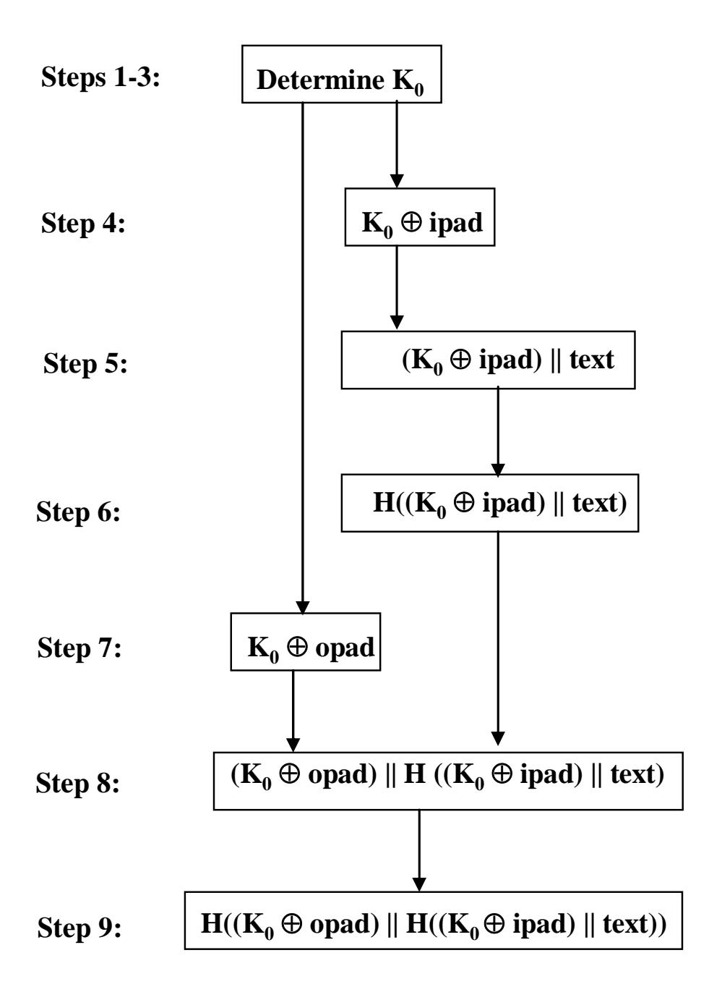

{0}------------------------------------------------

# **FIPS PUB 198-1**

# **FEDERAL INFORMATION PROCESSING STANDARDS PUBLICATION**

# **The Keyed-Hash Message Authentication Code (HMAC)**

**CATEGORY: COMPUTER SECURITY SUBCATEGORY: CRYPTOGRAPHY** 

Information Technology Laboratory National Institute of Standards and Technology Gaithersburg, MD 20899-8900

July 2008

**U.S. Department of Commerce**  *Carlos M. Gutierrez, Secretary* 

**National Institute of Standards and Technology**  *James M. Turner, Deputy Director*

{1}------------------------------------------------

#### **FOREWORD**

The Federal Information Processing Standards Publication Series of the National Institute of Standards and Technology (NIST) is the official series of publications relating to Standards and Guidelines adopted and promulgated under the provisions of the Federal Information Security Management Act (FISMA) of 2002.

Comments concerning FIPS publications are welcomed and should be addressed to the Director, Information Technology Laboratory, National Institute of Standards and Technology, 100 Bureau Drive, Stop 8900, Gaithersburg, MD 20899-8900.

 Cita Furlani, Director Information Technology Laboratory

{2}------------------------------------------------

#### **Abstract**

This Standard describes a keyed-hash message authentication code (HMAC), a mechanism for message authentication using cryptographic hash functions. HMAC can be used with any iterative Approved cryptographic hash function, in combination with a shared secret key.

*Keywords*: computer security, cryptography, HMAC, MAC, message authentication, Federal Information Processing Standards (FIPS).

{3}------------------------------------------------

# **Federal Information Processing Standards Publication 198-1 July 2008**

### **Announcing the Standard for**

## **The Keyed-Hash Message Authentication Code (HMAC)**

Federal Information Processing Standards Publications (FIPS PUBS) are issued by the National Institute of Standards and Technology (NIST) after approval by the Secretary of Commerce pursuant to Section 5131 of the Information Technology Management Reform Act of 1996 (Public Law 104-106) and the Computer Security Act of 1987 (Public Law 100-235).

- **1. Name of Standard.** The Keyed-Hash Message Authentication Code (HMAC) (FIPS PUB 198-1).
- **2. Category of Standard.** Computer Security Standard. **Subcategory.** Cryptography.
- **3. Explanation.** This Standard specifies an algorithm for applications requiring message authentication. Message authentication is achieved via the construction of a message authentication code (MAC). MACs based on cryptographic hash functions are known as HMACs.

The purpose of a MAC is to authenticate both the source of a message and its integrity without the use of any additional mechanisms. HMACs have two functionally distinct parameters, a message input and a secret key known only to the message originator and intended receiver(s). Additional applications of keyed-hash functions include their use in challenge-response identification protocols for computing responses, which are a function of both a secret key and a challenge message.

An HMAC function is used by the message sender to produce a value (the MAC) that is formed by condensing the secret key and the message input. The MAC is typically sent to the message receiver along with the message. The receiver computes the MAC on the received message using the same key and HMAC function as were used by the sender, and compares the result computed with the received MAC. If the two values match, the message has been correctly received, and the receiver is assured that the sender is a member of the community of users that share the key.

**4. Approving Authority.** Secretary of Commerce.

{4}------------------------------------------------

- **5. Maintenance Agency.** Department of Commerce, National Institute of Standards and Technology, Information Technology Laboratory (ITL).
- **6. Applicability.** This Standard is applicable to all Federal departments and agencies for the protection of sensitive unclassified information that is not subject to Title 10 United States Code Section 2315 (10 USC 2315) and that is not within a national security system as defined in Title 44 United States Code Section 3502(2) (44 USC 3502(2)). The adoption and use of this Standard is available to private and commercial organizations.
- **7. Specifications.** Federal Information Processing Standard (FIPS) 198-1, The Keyed-Hash Message Authentication Code (HMAC) (affixed).
- **8. Implementations.** The authentication mechanism described in this Standard may be implemented in software, firmware, hardware, or any combination thereof. NIST has developed a Cryptographic Module Validation Program that will test implementations for conformance with this HMAC Standard. Information on this program is available at <http://csrc.nist.gov/groups/STM/index.html>.

Agencies are advised that keys used for HMAC applications should not be used for other purposes.

- **9. Other Approved Security Functions.** HMAC implementations that comply with this Standard shall employ cryptographic algorithms, cryptographic key generation algorithms and key management techniques that have been approved for protecting Federal government sensitive information. Approved cryptographic algorithms and techniques include those that are either:
  - a. specified in a Federal Information Processing Standard (FIPS),
  - b. adopted in a FIPS or NIST Recommendation, or
  - c. specified in the list of Approved security functions for FIPS 140-2.
- **10. Export Control.** Certain cryptographic devices and technical data regarding them are subject to Federal export controls. Exports of cryptographic modules implementing this Standard and technical data regarding them must comply with these Federal regulations and be licensed by the Bureau of Export Administration of the U.S. Department of Commerce. Information about export regulations is available at: [http://www.bis.doc.gov/index.htm.](http://www.bis.doc.gov/index.htm)
- **11. Implementation Schedule.** Guidance regarding the testing and validation to FIPS 198-1 and its relationship to FIPS 140-2 can be found in IG 1.10 of the Implementation Guidance for FIPS PUB 140-2 and the Cryptographic Module Validation Program at <http://csrc.nist.gov/groups/STM/cmvp/index.html>.
- **12. Qualifications.** The security afforded by the HMAC function is dependent on maintaining the secrecy of the key and the use of an appropriate Approved hash function. Therefore, users must guard against disclosure of these keys. While it is the intent of this

{5}------------------------------------------------

Standard to specify a mechanism to provide message authentication, conformance to this Standard does not assure that a particular implementation is secure. It is the responsibility of the implementer to ensure that any module containing an HMAC implementation is designed and built in a secure manner.

Similarly, the use of a product containing an implementation that conforms to this Standard does not guarantee the security of the overall system in which the product is used. The responsible authority in each agency shall assure that an overall system provides an acceptable level of security.

Since a Standard of this nature must be flexible enough to adapt to advancements and innovations in science and technology, this Standard will be reviewed every five years in order to assess its adequacy.

- **13. Waiver Procedure:** The Federal Information Security Management Act (FISMA) does not allow for waivers to Federal Information Processing Standards (FIPS) that are made mandatory by the Secretary of Commerce.
- **14. Where to obtain copies.** This publication is available by accessing [http://csrc.nist.gov/publications/.](http://csrc.nist.gov/publications/) Other computer security publications are available at the same web site.

{6}------------------------------------------------

# **Federal Information Processing Standards Publication 198-1**

# **Specifications for**

# The Keyed-Hash Message Authentication Code

## **TABLE OF CONTENTS**

| 1.   | INTR        | ODUCTION                                           | 2   |
|------|-------------|----------------------------------------------------|-----|
|      |             | SSARY OF TERMS AND ACRONYMS                        |     |
|      |             | Glossary of Terms                                  |     |
|      |             | Acronyms                                           |     |
|      | 2.3         | HMAC Parameters and Symbols                        | . 3 |
| 3.   |             | PTOGRAPHIC KEYS                                    |     |
| 4.   | HMA         | C SPECIFICATION                                    | 4   |
| 5.   | TRUN        | NCATION                                            | 5   |
| 6.   | <b>IMPL</b> | EMENTATION NOTE                                    | . 5 |
| APPE | ENDIX       | A: The Differences Between FIPS 198 and FIPS 198-1 | . 7 |
| APPE | ENDIX       | B: References                                      | 7   |

{7}------------------------------------------------

#### **1. INTRODUCTION**

Providing a way to check the integrity of information transmitted over or stored in an unreliable medium is a prime necessity in the world of open computing and communications. Mechanisms that provide such integrity checks based on a secret key are usually called message authentication codes (MACs). Typically, message authentication codes are used between two parties that share a secret key in order to authenticate information transmitted between these parties. This Standard defines a MAC that uses a cryptographic hash function in conjunction with a secret key. This mechanism is called HMAC [HMAC]. HMAC shall use an Approved cryptographic hash function [FIPS 180-3]. HMAC uses the secret key for the calculation and verification of the MACs.

#### **2. GLOSSARY OF TERMS AND ACRONYMS**

#### **2.1 Glossary of Terms**

The following definitions are used throughout this Standard:

*Approved*: FIPS-approved or NIST recommended. An algorithm or technique that is either 1) specified in a FIPS or NIST Recommendation, or 2) adopted in a FIPS or NIST Recommendation and specified in either the FIPS or NIST Recommendation, or in a document referenced by the FIPS or NIST Recommendation.

*Cryptographic key (key*): a parameter used in conjunction with a cryptographic algorithm that determines the specific operation of that algorithm. In this Standard, the cryptographic key is used by the HMAC algorithm to produce a MAC on the data.

*Hash function*: a mathematical function that maps a string of arbitrary length (up to a predetermined maximum size) to a fixed length string.

*Keyed-hash message authentication code (HMAC)*: a message authentication code that uses a cryptographic key in conjunction with a hash function.

*Message Authentication Code (MAC):* a cryptographic checksum that results from passing data through a message authentication algorithm. In this Standard, the message authentication algorithm is called HMAC, while the result of applying HMAC is called the MAC.

*Secret key*: a cryptographic key that is uniquely associated with one or more entities. The use of the term "secret" in this context does not imply a classification level; rather the term implies the need to protect the key from disclosure or substitution.

{8}------------------------------------------------

#### **2.2 Acronyms**

The following acronyms and abbreviations are used throughout this Standard:

FIPS Federal Information Processing Standard

FIPS PUB FIPS Publication

HMAC Keyed-Hash Message Authentication Code

MAC Message Authentication Code

NIST National Institute of Standards and Technology

#### **2.3 HMAC Parameters and Symbols**

HMAC uses the following parameters:

*B* Block size (in bytes) of the input to the Approved hash function.

*H* An Approved hash function.

*ipad* Inner pad; the byte x'36' repeated *B* times.

*K* Secret key shared between the originator and the intended receiver(s).

*K*0 The key *K* after any necessary pre-processing to form a *B* byte key.

*L* Block size (in bytes) of the output of the Approved hash function.

*opad* Outer pad; the byte x'5c' repeated *B* times.

*text* The data on which the HMAC is calculated; *text* does **not** include the padded key. The length of *text* is *n* bits, where 0 ≤ *n* < 2*B* - 8*B*.

x 'N' Hexadecimal notation, where each symbol in the string 'N' represents 4 binary bits.

- || Concatenation.
- ⊕ Exclusive-Or operation.

{9}------------------------------------------------

### **3. CRYPTOGRAPHIC KEYS**

HMAC uses a key, *K*, of appropriate security strength, as discussed in NIST Special Publication (SP) 800-107 [SP 800-107], Recommendation for Applications Using Approved Hash Algorithms. When an application uses a *K* longer than *B*-bytes, then it shall first hash the *K* using *H* and then use the resultant *L-*byte string as the key *K0*; detail can be found in Table 1 in Section 4 below.

### **4. HMAC SPECIFICATION**

To compute a MAC over the data '*text*' using the HMAC function, the following operation is performed:

$$MAC(text) = HMAC(K, text) = H((K_0 \oplus opad) || H((K_0 \oplus ipad) || text))$$

Table 1 illustrates the step by step process in the HMAC algorithm, which is depicted in Figure 1.

**Table 1: The HMAC Algorithm** 

| STEPS  | STEP-BY-STEP DESCRIPTION                                                                                                                                                                 |
|--------|------------------------------------------------------------------------------------------------------------------------------------------------------------------------------------------|
| Step 1 | If the length of K = B: set K0 = K. Go to step 4.                                                                                                                                        |
| Step 2 | If the length of K > B: hash K to obtain an L byte string, then append (B-L) zeros to create a B-byte string K0 (i.e., K0 = H(K)    0000). Go to step 4.                              |
| Step 3 | If the length of K < B: append zeros to the end of K to create a B-byte string K0 (e.g., if K is 20 bytes in length and B = 64, then K will be appended with 44 zero bytes x'00'). |
| Step 4 | ⊕ Exclusive-Or K0 with ipad to produce a B-byte string: K0 ipad.                                                                                                                |
| Step 5 | Append the stream of data 'text' to the string resulting from step 4: ⊕ (K0 ipad)    text.                                                                                      |
| Step 6 | Apply H to the stream generated in step 5: H((K0 ⊕ ipad)    text).                                                                                                                 |
| Step 7 | Exclusive-Or K0 with opad: K0 ⊕ opad.                                                                                                                                              |
| Step 8 | Append the result from step 6 to step 7: (K0 ⊕ opad)    H((K0 ⊕ ipad)    text).                                                                                           |
| Step 9 | Apply H to the result from step 8:                                                                                                                                                       |
|        | H((K0 ⊕ opad )   H((K0 ⊕ ipad)    text)).                                                                                                                                    |

{10}------------------------------------------------

**Figure 1: Illustration of the HMAC Construction**

#### **5. TRUNCATION**

A well-known practice with MACs is to truncate their outputs (i.e., the length of the MACs used is less than the length of the output of the HMAC function *L*). Applications of this standard may truncate the outputs of the HMAC. When truncation is used, the λ leftmost bits of the output of the HMAC function shall be used as the MAC. For information about the choice of λ and the security implications of using truncated outputs of the HMAC function, see SP 800-107.

#### **6. IMPLEMENTATION NOTE**

The HMAC algorithm is specified for an arbitrary Approved iterative cryptographic hash function, *H*. In the HMAC algorithm, values of the *ipad* and the *opad* depend on the block size, *B*, of the Approved hash function. An HMAC implementation can easily replace one Approved iterative hash function, *H*, with another Approved iterative hash 

{11}------------------------------------------------

function, *H'* by generating new *ipad* and *opad* using the block size of *H'* instead of *H* as defined in Section 2.3.

Conceptually, the intermediate results of the compression function on the *B*-byte blocks (*K0* ⊕ *ipad*) and (*K0* ⊕ *opad*) can be precomputed once, at the time of generation of the key *K*, or before its first use. These intermediate results can be stored and then used to initialize *H* each time that a message needs to be authenticated using the same key. For each authenticated message using the key *K*, this method saves the application of the hash function of *H* on two *B*-byte blocks (i.e., on (*K* ⊕ *ipad*) and (*K* ⊕ *opad*)). This saving may be significant when authenticating short streams of data. **These stored intermediate values shall be treated and protected in the same manner as secret keys.**

Choosing to implement HMAC in this manner has no effect on interoperability.

#### **Object identifiers (OIDs) for HMAC are posted at**

[http://csrc.nist.gov/groups/ST/crypto\\_apps\\_infra/csor/algorithms.html](http://csrc.nist.gov/groups/ST/crypto_apps_infra/csor/algorithms.html), along with procedures for adding new OIDs.

#### **Examples of HMAC are available at**

<http://csrc.nist.gov/groups/ST/toolkit/examples.html>**.** 

{12}------------------------------------------------

## **APPENDIX A: The Differences Between FIPS 198 and FIPS 198-1**

The length of truncated HMAC outputs and their security implications in FIPS 198 is not mentioned in this Standard; instead, it is described in SP 800-107. The discussion about the limitations of MAC algorithms has been moved to SP 800-107. The examples and OIDs have been posted on the NIST web sites referenced in Section 6.

#### **APPENDIX B: References**

| [HMAC] | H. Krawczyk, M. Bellare, and R. Canetti, HMAC: Keyed-Hashing for     |
|--------|----------------------------------------------------------------------|
|        | Message Authentication, Internet Engineering Task Force, Request for |
|        | Comments (RFC) 2104, February 1997.                                  |

- [FIPS 180-3] National Institute of Standards and Technology, *Secure Hash Standards (SHS)*, Federal Information Processing Standards Publication 180-3, October 2008.
- [SP 800-57] NIST Special Publication (SP) 800-57, *Recommendation for Key Management – Part 1: General (Revised)*, March 2007.
- [SP 800-107] NIST Special Publication (SP) 800-107, *Recommendation for Applications Using Approved Hash Algorithms*, February 2009.