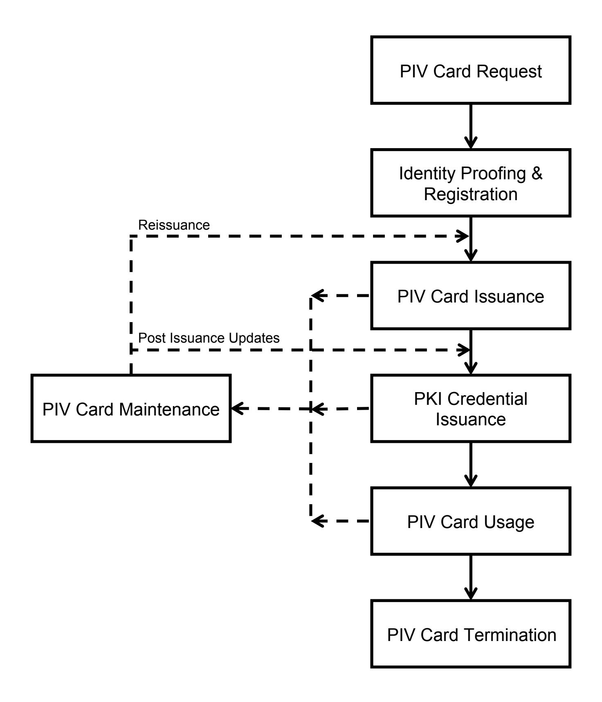
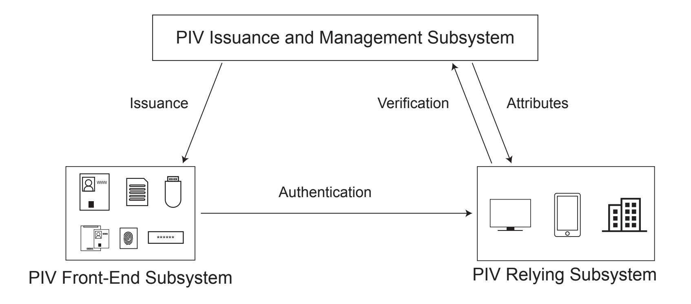
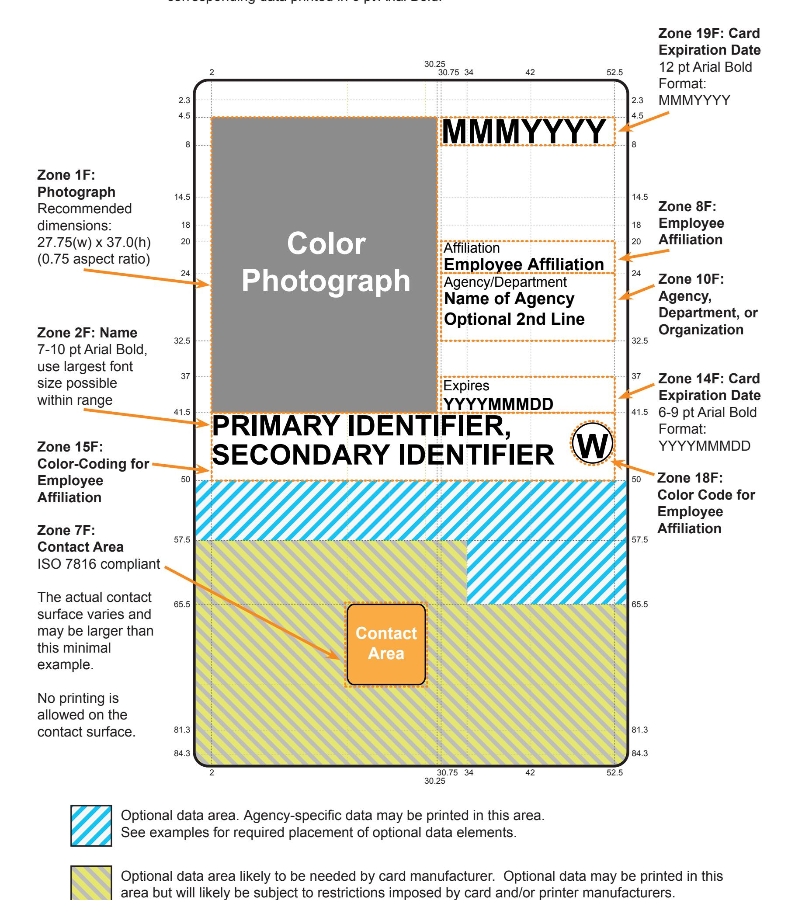
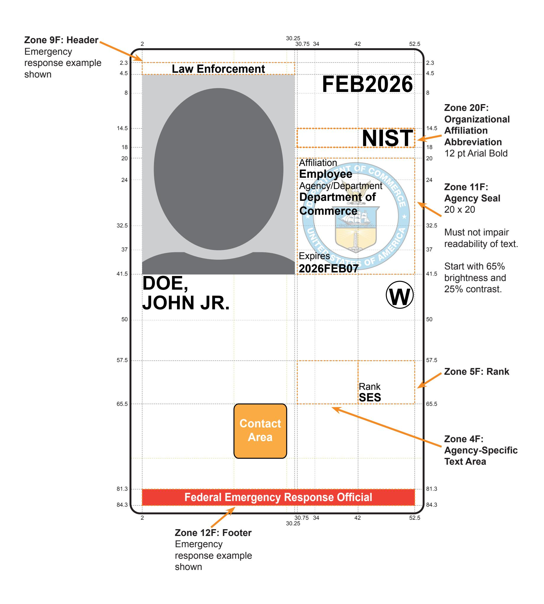
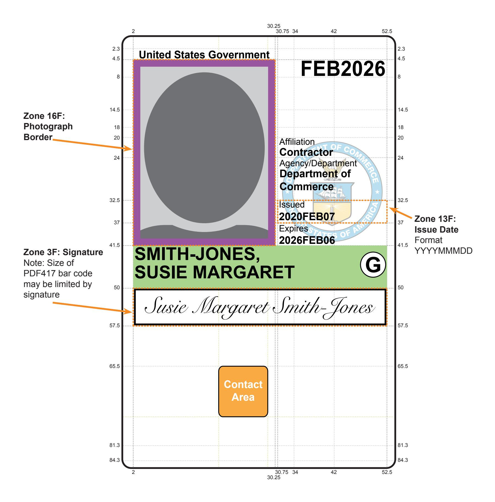
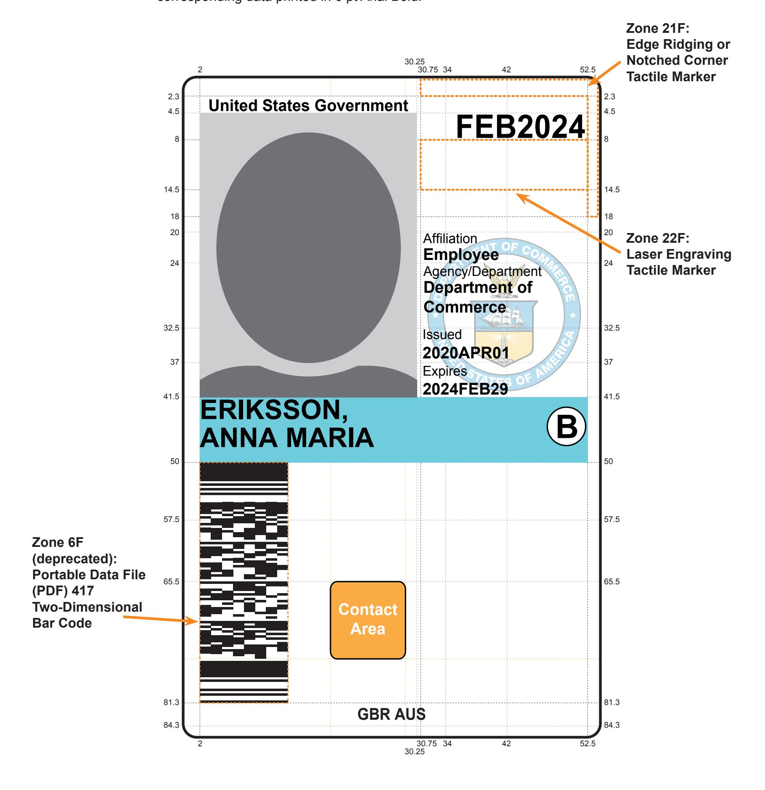
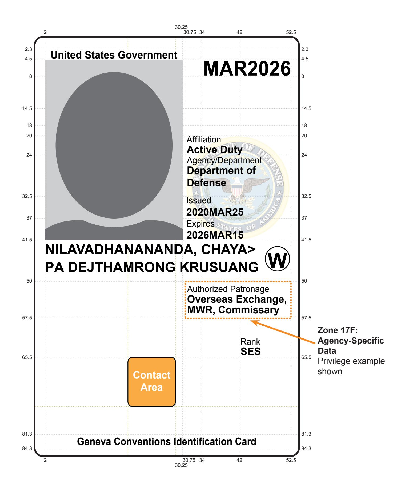
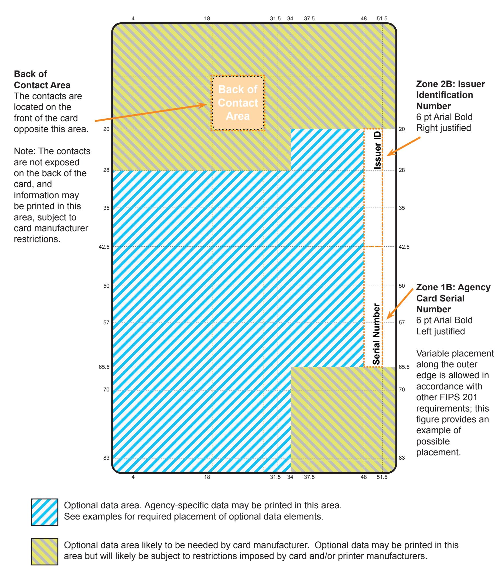
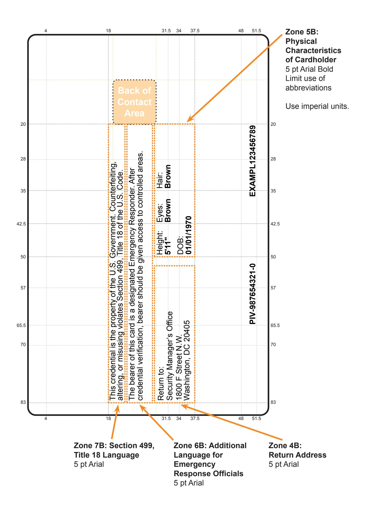
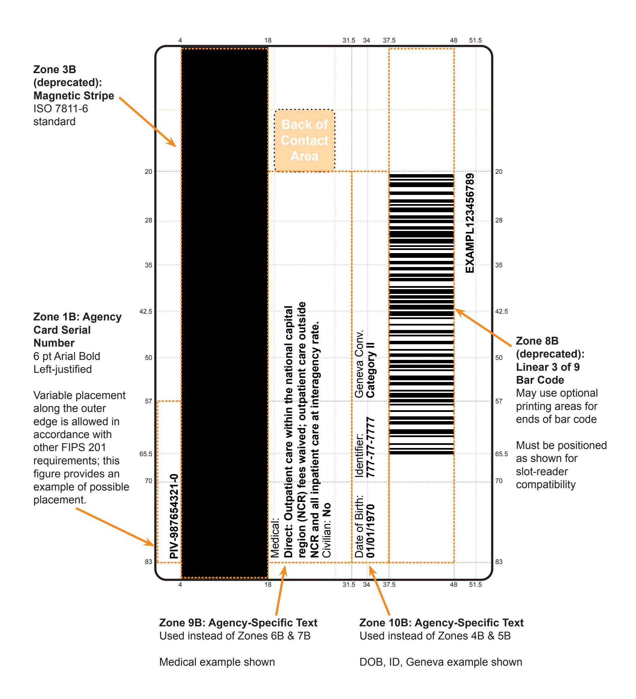

{0}------------------------------------------------

# **FIPS PUB 201-3**

**Federal Information Processing Standards Publication (Supersedes FIPS 201-2)** 

# **Personal Identity Verification (PIV) of Federal Employees and Contractors**

**Category: Information Security Subcategory: Identity**

Information Technology Laboratory National Institute of Standards and Technology Gaithersburg, MD 20899-8900

This publication is available free of charge from: <https://doi.org/10.6028/NIST.FIPS.201-3>

Issued January 2022


# **U.S. Department of Commerce**

*Gina M. Raimondo, Secretary* 

#### **National Institute of Standards and Technology**

*James K. Oltho˙, Performing the Non-Exclusive Functions and Duties of the Under Secretary of Commerce for Standards and Technology & Director, National Institute of Standards and Technology* 

{1}------------------------------------------------

# **FOREWORD**

The Federal Information Processing Standards Publication Series of the National Institute of Standards and Technology is the official series of publications relating to standards and guidelines adopted and promulgated under the provisions of the Federal Information Security Modernization Act (FISMA) of 2014.

Comments concerning Federal Information Processing Standard publications are welcomed and should be addressed to the Director, Information Technology Laboratory, National Institute of Standards and Technology, 100 Bureau Drive, Stop 8900, Gaithersburg, MD 20899-8900.

> Charles H. Romine, Director Information Technology Laboratory

{2}------------------------------------------------

# **ABSTRACT**

Authentication of an individual's identity is a fundamental component of physical and logical access control. An access control decision must be made when an individual attempts to access security-sensitive buildings, information systems, and applications. An accurate determination of an individual's identity supports making sound access control decisions.

This document establishes a standard for a Personal Identity Verification (PIV) system that meets the control and security objectives of Homeland Security Presidential Directive-12. It is based on secure and reliable forms of identity credentials issued by the Federal Government to its employees and contractors. These credentials are used by mechanisms that authenticate individuals who require access to federally controlled facilities, information systems, and applications. This Standard addresses requirements for initial identity proofing, infrastructure to support interoperability of identity credentials, and accreditation of organizations and processes issuing PIV credentials.

**Keywords:** *authentication, authenticator, biometrics, credential, cryptography, derived PIV credentials, digital identity, Federal Information Processing Standards (FIPS), HSPD-12, federation, identification, identity proofing, integrated circuit card, Personal Identity Verification, PIV, PIV identity account, public key infrastructure, verification* 

{3}------------------------------------------------

#### **Federal Information Processing Standards Publication 201-3**

#### **January 2022**

# **Announcing the Standard for**

# **Personal Identity Verification (PIV) of Federal Employees and Contractors**

Federal Information Processing Standards Publications (FIPS PUBS) are issued by the National Institute of Standards and Technology (NIST) after approval by the Secretary of Commerce pursuant to Section 5131 of the Information Technology Management Reform Act of 1996 (Public Law 104-106) and the Computer Security Act of 1987 (Public Law 100-235).

- **1. Name of Standard.** Personal Identity Verification (PIV) of Federal Employees and Contractors (FIPS 201-3).
- **2. Category of Standard.** Information Security. **Subcategory**. Identity.
- **3. Explanation.** Homeland Security Presidential Directive-12 [\[HSPD-12\],](#page-121-0) dated August 27, 2004, entitled "Policy for a Common Identification Standard for Federal Employees and Contractors," directs the promulgation of a federal standard for secure and reliable forms of identification for federal employees and contractors. It further specifies secure and reliable identification that
  - a) is issued based on sound criteria for verifying an individual employee's identity;
  - b) is strongly resistant to identity fraud, tampering, counterfeiting, and terrorist exploitation;
  - c) can be rapidly authenticated electronically; and
  - d) is issued only by providers whose reliability has been established by an official accreditation process.

The directive stipulates that the Standard include graduated criteria from least secure to most secure in order to ensure flexibility in selecting the appropriate level of security for each application. Executive departments and agencies are required to implement the Standard for identification issued to federal employees and contractors in gaining physical access to controlled facilities and logical access to controlled information systems.

- **4. Approving Authority.** Secretary of Commerce.
- **5. Maintenance Agency.** Department of Commerce, NIST, Information Technology Laboratory (ITL).

{4}------------------------------------------------

- **6. Applicability.** This Standard is applicable to identification issued by federal departments and agencies to federal employees and contractors for gaining physical access to federally controlled facilities and logical access to federally controlled information systems, except for "national security systems" as defined by 44 U.S.C. 3542(b)(2) and [\[SP 800-59\].](#page-126-0) Except as provided in [\[HSPD-12\],](#page-121-0) nothing in this Standard alters the ability of government entities to use the Standard for additional applications.
- **6.1 Special-Risk Security Provision.** The U.S. Government has personnel, facilities, and other assets deployed and operating worldwide under a vast range of threats (e.g., terrorist, technical, intelligence), the severity of which is particularly heightened overseas. For cardholders with particularly sensitive threats while outside of the contiguous United States, the issuance, holding, and/or use of PIV credentials with full technical capabilities as described herein may result in unacceptably high risk. In such cases of risk (e.g., to facilities, individuals, operations, national interest, or national security) by the presence and/or use of full-capability PIV credentials, the head of a department or independent agency may issue a select number of maximum-security PIV credentials that do not contain (or otherwise do not fully support) the wireless and/or biometric capabilities otherwise required/referenced herein. To the greatest extent practicable, heads of departments and independent agencies should minimize the issuance of such special-risk security PIV credentials so as to support interagency interoperability and the President's policy. Use of other risk-mitigating technical (e.g., high-assurance on/off switches for the wireless capability) and procedural mechanisms in such situations is preferable and, as such, is also explicitly permitted and encouraged. As protective security technology advances, the need for this provision will be reassessed when the Standard undergoes the normal review and update process.
- <span id="page-4-0"></span>**7. Implementations.** This Standard satisfies the control objectives, security requirements, and technical interoperability requirements of [\[HSPD-12\].](#page-121-0) The Standard specifies implementation and processes for binding identities to authenticators, such as integrated circuit cards and derived credentials used in the federal PIV system.

In implementing PIV systems and pursuant to Section 508 of the Rehabilitation Act of 1973 (the Act), as amended, agencies have the responsibility to accommodate federal employees and contractors with disabilities to have access to and use of information and data comparable to the access to and use of such information and data by federal employees and contractors who are not individuals with disabilities. In instances where federal agencies assert exceptions to Section 508 accessibility requirements (e.g., undue burden, national security, commercial non-availability), Sections 501 and 504 of the Act require federal agencies to provide reasonable accommodation for federal employees and contractors with disabilities whose needs are not met by the baseline accessibility provided under Section 508. While Section 508 compliance is the responsibility of federal agencies and departments, this Standard specifies several options to aid in the implementation of the requirements:

{5}------------------------------------------------

- [Section 4.1.4.3](#page-56-0) specifies Zones 21F and 22F as options for orientation markers of the PIV Card.
- [Section 2.8](#page-27-0) and [Section 2.9](#page-29-0) specify alternatives for the biometric capture device interactions required at PIV Card issuance, reissuance, and reset.
- [Section 2.10](#page-36-0) defines alternatives to smart card-based PIV credentials in the form of derived PIV credentials.
- [Section 6](#page-84-0) defines authentication mechanisms with varying characteristics for both physical and logical access (e.g., with or without PIN, over contact, contactless, or virtual contact interface).
- [Section 7](#page-95-0) defines federation as a means for a relying system to interoperate with credentials issued by other agencies.

The Office of Management and Budget (OMB) provides implementation oversight for this Standard.

PIV Cards can only be issued by accredited issuers. The responsibility and authority for PIV Card issuance and management rests in the departments and agencies employing federal employees and contractors regardless of whether these functions are performed inhouse or outsourced to an external public or private organization. To ensure consistency in the operations of issuers, NIST provides guidelines for the accreditation of PIV Card issuers and derived PIV credential issuers in [\[SP 800-79\].](#page-127-0) The Standard also covers security and interoperability requirements for PIV Cards. For this purpose, NIST has established the PIV Validation Program, which tests implementations for conformance with this Standard as specified in [\[SP 800-73\]](#page-127-1) and [\[SP 800-78\]](#page-127-2) (see [Appendix A.3\)](#page-98-0).

FIPS 201 compliance of PIV components and subsystems is provided in accordance with OMB [\[M-19-17\]](#page-124-0) through products and services from the U.S. General Services Administration's (GSA) Interoperability Test Program and Approved Products and Services List (see [Appendix A.5\)](#page-98-1). Implementation guidance for PIV-enabled federal facilities and information systems in accordance with OMB [\[M-19-17\]](#page-124-0) will be outlined by [\[FICAM-Roadmap\]](#page-121-1) as playbooks and best practice repositories. See also [\[SP 800-116\]](#page-128-0)  and [\[ISC-RISK\].](#page-121-2)

- **8. Patents.** Aspects of the implementation of this Standard may be covered by U.S. or foreign patents.
- **9. Effective Date.** This Standard will be effective immediately upon final publication of this revision, superseding FIPS 201-2. The Standard includes new and updated features as well as features that are being deprecated or removed as outlined in the revision history in [Appendix E.](#page-129-0) The effective dates of these features depend upon the release of revised or new NIST Special Publications that will be developed following the publication of this Standard. An enumeration of NIST Special Publications associated with this Standard is provided in [Section 1.4.](#page-15-0) Per [item 7](#page-4-0) of this preamble, OMB provides implementation

{6}------------------------------------------------

oversight for this Standard. The implementation schedule may be reflected in NIST's Special Publications or may be provided separately by OMB, as appropriate.

- **10. Specifications.** Federal Information Processing Standards (FIPS) 201 Personal Identity Verification (PIV) of Federal Employees and Contractors.
- **11. Qualifications.** The security provided by the PIV system is dependent on many factors outside the scope of this Standard. Organizations must be aware that the overall security of the PIV system relies on
  - assurance provided by the issuer of an identity credential that the individual in possession of the credential has been correctly identified;
  - protection provided to an identity credential stored within the PIV Card and transmitted between the card and the PIV issuance and relying subsystems;
  - infrastructure protection provided for derived PIV credentials in the binding, maintenance, and use of the identity credential; and
  - protection provided to the PIV system infrastructure and components throughout the entire lifecycle.

Although it is the intent of this Standard to specify mechanisms and support systems that provide high assurance personal identity verification, conformance to this Standard does not assure that a particular implementation is secure. It is the implementer's responsibility to ensure that components, interfaces, communications, storage media, managerial processes, and services used within the PIV system are designed and built in a secure manner.

Similarly, the use of a product that conforms to this Standard does not guarantee the security of the overall system in which the product is used. The responsible authority in each department and agency must ensure that an overall system provides the acceptable level of security.

Because a standard of this nature must be flexible enough to adapt to advancements and innovations in science and technology, NIST has a policy to review this Standard within five years to assess its adequacy.

- **12. Waiver Procedure.** FISMA does not allow for waivers to a FIPS that is made mandatory by the Secretary of Commerce.
- **13. Where to Obtain Copies of the Standard.** This publication is available through the internet by accessing [https://csrc.nist.gov/publications/.](https://csrc.nist.gov/publications/) Other computer security publications are available at the same website.

{7}------------------------------------------------

#### **Federal Information Processing Standards Publication 201-3**

#### **January 2022**

# **Standard for**

# **Personal Identity Verification (PIV) of Federal Employees and Contractors**

# **Table of Contents**

| 1. Introduction .                                              | 1    |
|----------------------------------------------------------------|------|
| 1.1<br>Purpose .                                               | 1    |
| 1.2<br>Scope .                                                 | 2    |
| 1.3<br>Change<br>Management .                                  | 3    |
| 1.3.1<br>Backward<br>Compatible<br>Change .                    | 3    |
| 1.3.2<br>Backward<br>Incompatible<br>Change .                  | 3    |
| 1.3.3<br>New<br>Features .                                     | 4    |
| 1.3.4<br>Deprecated<br>and<br>Removed<br>Features              | 4    |
| 1.3.5<br>FIPS<br>201<br>Version<br>Management .                | 4    |
| 1.3.6<br>Section<br>Number<br>Stability .                      | 5    |
| 1.4<br>Document<br>Organization .                              | 5    |
| 2. Common Identification, Security, and Privacy Requirements . | 7    |
| 2.1<br>Control<br>Objectives .                                 | 7    |
| 2.2<br>Credentialing<br>Requirements .                         | 8    |
| 2.3 Biometric Data Collection for Background Investigations    | 9    |
| 2.4<br>Biometric<br>Data<br>Collection<br>for<br>PIV<br>Card   | 9    |
| 2.5<br>Biometric<br>Data<br>Use .                              | . 10 |
| 2.6<br>PIV<br>Enrollment<br>Records .                          | . 11 |
| 2.7 PIV Identity Proofing and Registration Requirements 13     |      |
| 2.7.1<br>Supervised<br>Remote<br>Identity<br>Proofing 15       |      |
| 2.8<br>PIV<br>Card<br>Issuance<br>Requirements .               | . 17 |
| 2.8.1<br>Special<br>Rule<br>for<br>Pseudonyms .                | . 18 |
| 2.8.2<br>Grace<br>Period .                                     | . 18 |
| 2.8.3<br>Remote<br>Issuance .                                  | . 19 |
| 2.9<br>PIV<br>Card<br>Maintenance<br>Requirements 19           |      |
| 2.9.1<br>PIV<br>Card<br>Reissuance<br>Requirements 19          |      |
| 2.9.2 PIV Card Post-Issuance Update Requirements 21            |      |
| 2.9.3<br>PIV<br>Card<br>Activation<br>Reset .                  | . 22 |
| 2.9.4<br>PIV<br>Card<br>Termination<br>Requirements 25         |      |
| 2.10<br>Derived<br>PIV<br>Credentials .                        | . 26 |
| 2.10.1 Derived PIV Credential Issuance Requirements 26         |      |

{8}------------------------------------------------

| 2.10.2 Derived PIV Credential Invalidation Requirements 27              |      |
|-------------------------------------------------------------------------|------|
| 2.10.3 Derived PIV Credential Reissuance and Update Requirements 27     |      |
| 2.11<br>PIV<br>Privacy<br>Requirements .                                | . 28 |
| 3. PIV System Overview .                                                | . 30 |
| 3.1<br>Functional<br>Components .                                       | . 30 |
| 3.1.1<br>PIV<br>Front-End<br>Subsystem .                                | . 31 |
| 3.1.2 PIV Issuance and Management Subsystem 32                          |      |
| 3.1.3<br>PIV<br>Relying<br>Subsystem .                                  | . 34 |
| 3.2<br>PIV<br>Card<br>Lifecycle<br>Activities .                         | . 35 |
| 3.3<br>Connections<br>Between<br>System<br>Components 37                |      |
| 4. PIV Front-End Subsystem .                                            | . 39 |
| 4.1<br>PIV<br>Card<br>Physical<br>Characteristics .                     | . 39 |
| 4.1.1<br>Printed<br>Material .                                          | . 39 |
| 4.1.2<br>Tamper-proofing<br>and<br>Resistance 39                        |      |
| 4.1.3 Physical Characteristics and Durability 40                        |      |
| 4.1.4<br>Visual<br>Card<br>Topography .                                 | . 42 |
| 4.1.5<br>Color<br>Representation .                                      | . 58 |
| 4.2<br>PIV<br>Card<br>Logical<br>Characteristics .                      | . 58 |
| 4.2.1<br>Cardholder<br>Unique<br>Identifier .                           | . 60 |
| 4.2.2<br>Cryptographic<br>Specifications .                              | . 61 |
| 4.2.3<br>Biometric<br>Data<br>Specifications .                          | . 65 |
| 4.2.4<br>PIV<br>Unique<br>Identifiers .                                 | . 67 |
| 4.3<br>PIV<br>Card<br>Activation .                                      | . 68 |
| 4.3.1<br>Activation<br>by<br>Cardholder .                               | . 68 |
| 4.3.2<br>Activation<br>by<br>Card<br>Management<br>System 68            |      |
| 4.4<br>Card<br>Reader<br>Requirements .                                 | . 69 |
| 4.4.1<br>Contact<br>Reader<br>Requirements .                            | . 69 |
| 4.4.2<br>Contactless<br>Reader<br>Requirements 69                       |      |
| 4.4.3<br>Reader<br>Interoperability .                                   | . 69 |
| 4.4.4<br>Card<br>Activation<br>Device<br>Requirements 69                |      |
| 5. PIV Key Management Requirements .                                    | . 71 |
| 5.1<br>Architecture .                                                   | . 71 |
| 5.2<br>PKI<br>Certificate .                                             | . 71 |
| 5.2.1<br>X.509<br>Certificate<br>Contents .                             | . 71 |
| 5.3<br>X.509<br>Certificate<br>Revocation<br>List<br>Contents 72        |      |
| 5.4<br>Legacy<br>PKIs .                                                 | . 72 |
| 5.5 PKI Repository and Online Certificate Status Protocol Responders 73 |      |
| 5.5.1<br>Certificate<br>and<br>CRL<br>Distribution 73                   |      |
| 5.5.2<br>OCSP<br>Status<br>Responders .                                 | . 73 |

{9}------------------------------------------------

| 6. PIV Cardholder Authentication .                                          | . 74  |
|-----------------------------------------------------------------------------|-------|
| 6.1<br>PIV<br>Assurance<br>Levels .                                         | . 74  |
| 6.1.1<br>Relationship<br>to<br>Federal<br>Identity<br>Policy 75             |       |
| 6.2<br>PIV<br>Card<br>Authentication<br>Mechanisms 75                       |       |
| 6.2.1 Off-Card Biometric One-to-One Comparison 75                           |       |
| 6.2.2 On-Card Biometric One-to-One Comparison 77                            |       |
| 6.2.3<br>PIV<br>Asymmetric<br>Cryptography .                                | . 77  |
| 6.2.4<br>Symmetric<br>Card<br>Authentication<br>Key 79                      |       |
| 6.2.5<br>CHUID .                                                            | . 80  |
| 6.2.6<br>PIV<br>Visual<br>Credentials .                                     | . 80  |
| 6.3 PIV Support of Graduated Authenticator Assurance Levels 82              |       |
| 6.3.1<br>Physical<br>Access .                                               | . 83  |
| 6.3.2<br>Logical<br>Access .                                                | . 84  |
| 7. Federation Considerations for PIV .                                      | . 85  |
| 7.1<br>Connecting<br>PIV<br>to<br>Federation .                              | . 85  |
| 7.2<br>Federation<br>Assurance<br>Level .                                   | . 85  |
| 7.3<br>Benefits<br>of<br>Federation .                                       | . 86  |
| Appendix A. PIV Validation, Certification, and Accreditation .              | . 87  |
| A.1 Accreditation of PIV Card Issuers and Derived PIV Credential Issuers 87 |       |
| A.2 Application of Risk Management Framework to IT Systems 87               |       |
| A.3 Conformance Testing of PIV Card Application and Middleware 88           |       |
| A.4<br>Cryptographic<br>Testing<br>and<br>Validation 88                     |       |
| A.5<br>FIPS<br>201<br>Evaluation<br>Program .                               | . 89  |
| Appendix B. PIV Object Identifiers and Certificate Extension .              | . 90  |
| B.1<br>PIV<br>Object<br>Identifiers .                                       | . 90  |
| B.2 PIV Background Investigation Indicator Certificate Extension 92         |       |
| Appendix C. Glossary of Terms, Acronyms, and Notations .                    | . 93  |
| C.1<br>Glossary<br>of<br>Terms .                                            | . 93  |
| C.2<br>Acronyms<br>and<br>Abbreviations 102                                 |       |
| C.3<br>Notations .                                                          | . 109 |
|                                                                             |       |
| Appendix D. References .                                                    | . 110 |
| Appendix E. Revision History .                                              | . 119 |
|                                                                             |       |
| List of Tables                                                              |       |
| Table<br>4-1 Name<br>Examples .                                             | . 44  |
| Table<br>4-2 Color<br>Representation .                                      | . 58  |
| Table 6-1 PIV Authentication Mechanisms for Physical Access 83              |       |
| Table 6-2 PIV Authentication Mechanisms for Remote/Network Access 84        |       |
| Table 6-3 PIV Authentication Mechanisms for Local Workstation Access 84     |       |

{10}------------------------------------------------

|       | Table B-1 PIV Object Identifiers for PIV eContent Types 90      |  |
|-------|-----------------------------------------------------------------|--|
| Table | B-2 PIV<br>Object<br>Identifiers<br>for<br>PIV<br>Attributes 91 |  |
|       | Table B-3 PIV Object Identifiers for PIV Extended Key Usage 91  |  |
|       |                                                                 |  |
|       | List of Figures                                                 |  |
| Fig.  | 3-1 PIV<br>System<br>Overview .<br>. 31                         |  |
| Fig.  | 3-2 PIV<br>Card<br>Lifecycle<br>Activities .<br>. 36            |  |
| Fig.  | 3-3 PIV<br>System<br>Connections .<br>. 38                      |  |
| Fig.  | 3-4 PIV<br>System<br>Federation<br>Connections 38               |  |
|       | Fig. 4-1 Card Front: Printable Areas and Required Data 50       |  |
|       | Fig. 4-2 Card Front: Optional Data Placement (Example 1) 51     |  |
|       | Fig. 4-3 Card Front: Optional Data Placement (Example 2) 52     |  |
|       | Fig. 4-4 Card Front: Optional Data Placement (Example 3) 53     |  |
|       | Fig. 4-5 Card Front: Optional Data Placement (Example 4) 54     |  |
|       | Fig. 4-6 Card Back: Printable Areas and Required Data 55        |  |
|       | Fig. 4-7 Card Back: Optional Data Placement (Example 1) 56      |  |
|       | Fig. 4-8 Card Back: Optional Data Placement (Example 2) 57      |  |

{11}------------------------------------------------

# <span id="page-11-0"></span>**1. Introduction**

*This section is informative except where otherwise marked as normative.* It provides background information for understanding the scope of this Standard.

Authentication of an individual's identity is a fundamental component of both physical and logical access control. An access control decision must be made when an individual attempts to access security-sensitive buildings, information systems, and applications. An accurate determination of an individual's identity supports making sound access control decisions.

In the past, various mechanisms have been employed to authenticate an individual. These include hand-carried credentials such as badges and driver's licenses for physical access to federal facilities and passwords for logical access to federal information systems. Today, cryptographic mechanisms and biometric techniques are replacing these legacy mechanisms in both physical and logical access applications.

This document establishes a Standard for a Personal Identity Verification (PIV) system that meets the control and security objectives of [\[HSPD-12\].](#page-121-0) The Standard specifies implementation and processes for binding identities to authenticators, such as integrated circuit cards and derived credentials used in the federal PIV system. The system is based on secure and reliable forms of identity credentials issued by the Federal Government to its employees and contractors. These credentials are intended to authenticate individuals who require access to federally-controlled facilities, information systems, and applications. The Standard addresses requirements for initial identity proofing, infrastructure to support interoperability of identity credentials, and accreditation of organizations and processes issuing PIV credentials.

Each revision of this Standard incorporates lessons learned and adaptations to changes in the environment as experienced by departments and agencies. This revision broadens the definition of derived PIV credentials to accommodate a diverse and growing set of user device platforms. Interoperability of these PIV credentials across the federal government can be achieved via federation as outlined in this Standard and further defined in [\[SP 800-217\].](#page-128-1) As envisioned by OMB [\[M-19-17\],](#page-124-0) this revision also expands lifecycle activities to encompass PIV identity accounts, where all PIV credentials including derived PIV credentials are managed and maintained.

# <span id="page-11-1"></span>**1.1 Purpose**

This Standard defines reliable, government-wide identity credentials for use in applications such as access to federally controlled facilities and information systems. This Standard has been developed within the context and constraints of federal laws,

{12}------------------------------------------------

regulations, and policies based on currently available and evolving information processing technology.

This Standard specifies a PIV system within which common identity credentials can be created and later used to verify a claimed identity. The Standard also identifies federal government-wide requirements for security levels that are dependent on risks to federal facilities or information being protected.

# <span id="page-12-0"></span>**1.2 Scope**

[\[HSPD-12\],](#page-121-0) signed by President George W. Bush on August 27, 2004, established the requirements for a common identification standard for identity credentials issued by federal departments and agencies to federal employees and contractors (including contractor employees) for gaining physical access to federally controlled facilities and logical access to federally controlled information systems. HSPD-12 directs the Department of Commerce to develop a Federal Information Processing Standards (FIPS) publication to define such common identity credentials. In accordance with HSPD-12, this Standard defines the following technical requirements for these identity credentials:

- They are issued based on sound criteria for verifying an individual employee's identity.
- They are strongly resistant to identity fraud, tampering, counterfeiting, and terrorist exploitation.
- They can be rapidly authenticated electronically.
- They are issued only by providers whose reliability has been established by an official accreditation process.

Upon enrollment, a collection of records known as a PIV identity account is created and managed within the issuing department or agency's enterprise identity management system (IDMS). The PIV identity account includes the attributes of the PIV cardholder, the enrollment data, and information regarding the PIV Card and any derived PIV credentials bound to the account.

This Standard defines authentication mechanisms that offer varying degrees of security for both logical and physical access applications. Federal departments and agencies will determine the level of security and the authentication mechanisms appropriate for their applications. The scope of this Standard is limited to the authentication of an individual's identity. Authorization and access control decisions are outside of the scope of this Standard. Moreover, requirements for a temporary credential used until a new or replacement PIV credential arrives are out of the scope of this Standard.

While this Standard remains predominantly focused on PIV Cards, derived PIV credentials and federation protocols also play important roles in the use of PIV

{13}------------------------------------------------

identity accounts. [Section 2.10](#page-36-0) of this Standard defines mechanisms for derived PIV credentials associated with an active PIV identity account. Derived PIV credentials have authentication and lifecycle requirements that may differ from the PIV Card itself. This Standard also discusses federation protocols in [Section 7](#page-95-0) as a means of accepting PIV credentials issued by other agencies. See [Section 3](#page-40-0) for more information on components of the PIV system.

# <span id="page-13-0"></span>**1.3 Change Management**

Every revision of this Standard introduces refinements and changes that may impact existing implementations. FIPS 201 and associated normative specifications encourage implementation approaches that reduce the high cost of configuration and change management by architecting resilience into system processes and components. Nevertheless, changes and modifications are required over time.

This section provides change management principles and guidance to implementers of relying systems to manage newly introduced changes and modifications to the previous version of this Standard.

# <span id="page-13-1"></span>**1.3.1 Backward Compatible Change**

A backward compatible change is a change or modification to an existing feature that does not break relying systems using the feature. For example, changing the card authentication certificate from optional to mandatory does not affect the systems using the card authentication certificate for authentication (i.e., using the PKI-CAK authentication mechanism).

### <span id="page-13-2"></span>**1.3.2 Backward Incompatible Change**

A backward incompatible change is a change or modification to an existing feature such that the modified feature cannot be used with existing relying systems. For example, changing the format of the biometric data records would not be compatible with the existing system because a biometric authentication attempt with the modified format would fail. Similarly, changing the PIV Card Application Identifier (AID) (defined in [\[SP 800-73\]\)](#page-127-1) would be a backward incompatible change because all systems interacting with the PIV Card would need to to be modified to use the new AID.

{14}------------------------------------------------

#### <span id="page-14-0"></span>**1.3.3 New Features**

New features are features that are added to the Standard. These features can be optional or mandatory. New features do not interfere with backward compatibility because they are not part of the existing relying systems. For example, the optional biometric oncard comparison (OCC) authentication mechanism (OCC-AUTH) was a new feature introduced in FIPS 201-2. The optional mechanism did not affect the features of existing systems. Systems had to be updated only if an agency decided to support the OCC-AUTH mechanism.

#### <span id="page-14-1"></span>**1.3.4 Deprecated and Removed Features**

*This subsection is normative.* 

When a feature is to be discontinued or is no longer needed, it is deprecated. In general, a feature that is currently in use by relying systems would only be deprecated if there were a compelling reason to do so (e.g., security). Deprecated features **MAY** continue to be used but **SHOULD** be phased out in future systems since the feature will likely be removed in the next revision of the Standard. Removed features **SHALL NOT** be used. For example, the CHUID authentication mechanism [\(Section 6.2.5\)](#page-90-2) was previously deprecated in FIPS 201-2 and has been removed from this version of the Standard. Therefore, relying systems must not use this authentication mechanism.1 The PIV Visual Credentials (VIS) authentication mechanism [\(Section 6.2.6\)](#page-90-3) has been deprecated as a stand-alone authentication mechanism, but it could still be used in conjunction with other authentication mechanisms.

In the case of deprecated features on PIV Cards such as the magnetic stripe [\(Section 4.1.4.4\)](#page-58-0), existing PIV Card stock with deprecated features remains valid. However, future PIV Card stock acquisitions **SHOULD** exclude the deprecated features.

### <span id="page-14-2"></span>**1.3.5 FIPS 201 Version Management**

Subsequent revisions of this Standard may necessitate FIPS 201 version management that introduces new version numbers for FIPS 201 products. Components that may be affected by version management include but are not limited to PIV Cards, PIV middleware software, and card issuance systems.

New version numbers will be assigned in [\[SP 800-73\],](#page-127-1) if needed, based on the nature of the change. For example, new mandatory features introduced in a revision of this Standard may necessitate a new PIV Card Application version number so that systems can quickly discover the new mandatory features. Optional features can be discovered by an on-card discovery mechanism.

<sup>1</sup>The CHUID data element has not been removed and continues to be mandatory.

{15}------------------------------------------------

#### <span id="page-15-1"></span>**1.3.6 Section Number Stability**

Section numbers have not been changed in this revision. While the general focus of each section's content remain the same, some section titles have changed to better reflect the updated content. Any deleted sections have had their content removed and replaced with a removal notice while retaining the section header and number. New subsections have been added at the end of their respective sections with a new subsection number.

# <span id="page-15-2"></span><span id="page-15-0"></span>**1.4 Document Organization**

This Standard describes the minimum requirements for a federal personal identity verification system that meets the control and security objectives of [\[HSPD-12\],](#page-121-0) including identity proofing, registration, and issuance. It provides detailed technical specifications to support the control and security objectives of [\[HSPD-12\]](#page-121-0) as well as interoperability among federal departments and agencies. This Standard describes the policies and minimum requirements of a PIV Card and derived PIV credentials that allow interoperability of credentials for physical and logical access. It specifies the use of federation protocols as a means of accepting PIV Card credentials and derived PIV credentials issued by other agencies. The physical card characteristics, storage media, and data elements that make up identity credentials are specified in this Standard. The interfaces and card architecture for storing and retrieving identity credentials from a smart card are specified in [\[SP 800-73\].](#page-127-1) Similarly, the requirements for collection, formatting, and use of biometric data records are specified in [\[SP 800-76\].](#page-127-3) The requirements for cryptographic algorithms are specified in [\[SP 800-78\].](#page-127-2) The requirements for the accreditation of PIV Card issuers are specified in [\[SP 800-79\].](#page-127-0) The unique organizational codes for federal agencies are assigned in [\[SP 800-87\].](#page-128-2) The requirements for PIV Card readers are provided in [\[SP 800-96\].](#page-128-3) The format for encoding PIV enrollment records for import and export is specified in [\[SP 800-156\].](#page-128-4) The requirements for issuing derived PIV credentials are specified in [\[SP 800-157\].](#page-128-5) Guidelines for the use of federation with PIV Credentials will be specified in [\[SP 800-217\].](#page-128-1)

This Standard contains normative references to other documents. Should normative text in this Standard conflict with normative text in a referenced document, the normative text in this Standard prevails for this Standard.

All sections in this document indicate whether they are *normative* (i.e., provide requirements for compliance) or informative (i.e., provide information details that do not affect compliance). This document is structured as follows:

• [Section 1, Introduction,](#page-11-0) provides background information for understanding the scope of this Standard. This section is *informative* unless otherwise marked as normative.

{16}------------------------------------------------

- [Section 2, Common Identification, Security, and Privacy Requirements,](#page-17-0) outlines the requirements for identity proofing, registration, and issuance by establishing the control and security objectives for compliance with [\[HSPD-12\].](#page-121-0) This section is *normative*.
- [Section 3, PIV System Overview,](#page-40-0) provides an overview of the different components of the PIV system. This section is *informative*.
- [Section 4, PIV Front-End Subsystem,](#page-49-0) provides the requirements for the components of the PIV front-end subsystem. It defines requirements for the PIV Card, logical data elements, biometric data records, cryptography, and card readers. This section is *normative*.
- [Section 5, PIV Key Management Requirements,](#page-81-0) defines the processes and components required for managing a PIV Card's lifecycle. It also provides the requirements and specifications related to key management. This section is *normative*.
- [Section 6, PIV Cardholder Authentication,](#page-84-0) defines a suite of authentication mechanisms that are supported by the PIV Card and their applicability in meeting the requirements of graduated levels of identity assurance. This section is *normative*.
- [Section 7, Federation,](#page-95-0) defines a set of mechanisms for using federation technologies to interoperate with PIV credentials issued by other agencies. This section is *normative*.
- [Appendix A, PIV Validation, Certification, and Accreditation,](#page-97-0) provides additional information regarding compliance with this document. This appendix is *normative*.
- [Appendix B, PIV Object Identifiers and Certificate Extension,](#page-100-0) provides additional details for the PIV objects identified in [Section 4.](#page-49-0) This appendix is *normative*.
- [Appendix C, Glossary of Terms, Acronyms, and Notations,](#page-103-0) describes the vocabulary and textual representations used in the document. This appendix is *informative*.
- [Appendix D, References,](#page-120-0) lists the specifications and standards referred to in this document. This appendix is *informative*.
- [Appendix E, Revision History,](#page-129-0) lists changes made to this Standard from its inception. This appendix is *informative*.

{17}------------------------------------------------

# <span id="page-17-0"></span>**2. Common Identification, Security, and Privacy Requirements**

*This section is normative.* It addresses the fundamental control and security objectives outlined in [\[HSPD-12\],](#page-121-0) including the identity proofing requirements for federal employees and contractors.

Note that identity proofing, registration, issuance and maintenance processes outlined in this section, or portions thereof, may be outsourced by the issuer to third-party organizations or service providers. For further details on outsourcing issuer functions, refer to Section 2.2 of [\[SP 800-79\].](#page-127-0)

# <span id="page-17-2"></span><span id="page-17-1"></span>**2.1 Control Objectives**

[\[HSPD-12\]](#page-121-0) establishes control objectives for secure and reliable identification of federal employees and contractors. These control objectives, provided in paragraph 3 of the directive, are quoted here:

(3) "Secure and reliable forms of identification" for purposes of this directive means identification that (a) is issued based on sound criteria for verifying an individual employee's identity; (b) is strongly resistant to identity fraud, tampering, counterfeiting, and terrorist exploitation; (c) can be rapidly authenticated electronically; and (d) is issued only by providers whose reliability has been established by an official accreditation process.

Each agency's PIV implementation **SHALL** meet the control objectives listed above including, but not limited to, processes that ensure that

- A credential is issued to an individual only after a proper authority has authorized issuance of the credential, the individual's identity has been verified, and the individual has been vetted per [Section 2.2.](#page-18-1)
- A credential is issued only after an individual's eligibility has been favorably adjudicated based on the prerequisite federal investigation (See [Section 2.2\)](#page-18-1). If there is no investigation meeting the investigative standards, the PIV credential eligibility may be approved upon favorable initiation of the prerequisite investigation2 and once the Federal Bureau of Investigation (FBI) National Criminal History Check (NCHC) portion of the background investigation is completed and favorably adjudicated.
- An individual is issued a credential only after presenting two identity source documents, at least one of which is a Federal or State Government-issued picture ID.

<sup>2</sup>See [\[CSP\]](#page-120-1) for details about the investigation initiation process.

{18}------------------------------------------------

- Fraudulent identity source documents are not accepted as genuine or unaltered.
- A person suspected or known to the government as being a terrorist is not issued a credential.
- No substitution occurs in the identity proofing process. More specifically, the individual who appears for identity proofing and whose fingerprints are checked against databases is the person to whom the credential is issued.
- No credential is issued unless requested by the proper authority.
- A credential remains serviceable only up to its expiration date.
- A process exists to invalidate, revoke, or destroy credentials when the cardholder loses eligibility or when the credential is lost, stolen, or compromised.
- A single corrupt official in the process cannot issue a credential with an incorrect identity or to a person not entitled to the credential.
- An issued credential is not duplicated or forged.
- <span id="page-18-1"></span>• An issued credential is not modified by an unauthorized entity.

### <span id="page-18-0"></span>2.2 Credentialing Requirements

Federal departments and agencies **SHALL** use the credentialing eligibility standards issued by the Director of the Office of Personnel Management (OPM)<sup>3</sup> and OMB.<sup>4</sup>

Federal departments and agencies must follow investigative requirements established by the Suitability and Credentialing Executive Agent and the Security Executive Agent. Departments and agencies **SHALL** use position designation guidance issued by the Executive Agents. The designation of the position determines the prerequisite investigative requirement. Individuals being processed for a PIV Card **SHALL** receive the required investigation and are subject to any applicable reinvestigation or continuous vetting requirements to maintain their PIV eligibility.

The minimum requirement for PIV Credential eligibility determination is a completed and favorably adjudicated Tier 1 investigation, formerly called a National Agency Check with Written Inquiries (NACI).<sup>5</sup>

For individuals for whom no prior investigation exists, the appropriate required investigation **SHALL** be initiated with the authorized federal investigative service provider and the FBI NCHC portion of the background investigation **SHALL** be completed and favorably adjudicated prior to PIV Card issuance.

<sup>&</sup>lt;sup>3</sup>For example, [FCS] and [CSP] or subsequent standards.

<sup>&</sup>lt;sup>4</sup>For example, OMB [M-05-24].

<sup>&</sup>lt;sup>5</sup>NACI investigations were replaced with Tier 1 investigations upon implementation of the 2012 Federal Investigative Standards.

{19}------------------------------------------------

Once the investigation is completed, the authorized adjudicative entity **SHALL** adjudicate the investigation and report the final eligibility determination to the Central Verification System (or successor) and, if applicable, their enrollment in the Continuous Vetting Program as defined in [\[EO 13764\].](#page-120-2) This determination **SHALL** be recorded in or referenced by the PIV enrollment record to reflect PIV eligibility for the PIV cardholder.

For full guidance on PIV credentialing investigative and adjudicative requirements, to include continuous vetting, issuers must work closely with their personnel security/suitability offices to ensure adherence to the latest federal personnel vetting guidance as provided by the Executive Agents.

# <span id="page-19-2"></span><span id="page-19-0"></span>**2.3 Biometric Data Collection for Background Investigations**

This section applies to applicants that do not have a completed and favorably adjudicated Tier 1 or higher federal background investigation on record that can be located and referenced.

A full set of fingerprints **SHALL** be collected from each PIV applicant who is lacking an on-record background investigation.

Biometric identification using fingerprints is the primary input to law enforcement checks. In cases where ten fingerprints are not available, then as many fingers as possible **SHALL**  be imaged as per guidance in [\[SP 800-76\].](#page-127-3) In cases where no fingers are available to be imaged, agencies **SHALL** seek guidance from their respective investigative service provider for alternative means of performing law enforcement checks.

<span id="page-19-3"></span>Fingerprint collection **SHALL** conform to the procedural and technical specifications of [\[SP 800-76\].](#page-127-3)

# <span id="page-19-1"></span>**2.4 Biometric Data Collection for PIV Card**

The following biometric data **SHALL** be collected from each PIV applicant:

- Two fingerprints for off-card one-to-one comparison. These fingerprints **MAY** be taken from the full set of fingerprints collected in [Section 2.3.](#page-19-2)
- An electronic facial image.

The following biometric data **MAY** be collected from a PIV applicant:

- An electronic image of the left iris.
- An electronic image of the right iris.
- Two fingerprints for on-card comparison (OCC). These fingerprints **MAY** be taken from the full set of fingerprints collected in [Section 2.3](#page-19-2) and **SHOULD** be imaged from fingers not imaged for off-card one-to-one comparison.

{20}------------------------------------------------

If the identity proofing and enrollment process is performed over multiple visits, an automated biometric verification attempt comparing the applicant's newly captured biometric characteristics against biometric data collected during a previous visit **SHALL**  be performed at each visit and return a positive verification decision.

If biometric data was collected as specified in [Section 2.3](#page-19-2) and if collection of biometric data as specified in this section and in [Section 2.3](#page-19-2) occur on separate occasions, a biometric comparison **SHALL** be performed to confirm that the two fingerprints collected for off-card one-to-one comparisons elicit a positive biometric verification decision when compared to the same two fingerprints from the original set of ten fingerprints.

Biometric data collection **SHALL** conform to the procedural and technical specifications of [\[SP 800-76\].](#page-127-3) The choice of fingers to use for mandatory fingerprint templates and optional fingerprint templates **MAY** vary between persons. The recommended selection and order is specified in [\[SP 800-76\].](#page-127-3)

# <span id="page-20-0"></span>**2.5 Biometric Data Use**

The full set of fingerprints **SHALL** be collected for biometric identification against databases of fingerprints maintained by the FBI.

The two mandatory fingerprints **SHALL** be used for the preparation of biometric templates to be stored on the PIV Card as described in [Section 4.2.3.1.](#page-75-1) The fingerprints provide an interoperable authentication mechanism through an off-card comparison scheme (BIO or BIO-A) as described in [Section 6.2.1.](#page-85-3) These fingerprints are also the primary means of authentication during PIV issuance and maintenance processes.

The optional fingerprints **MAY** be used for the preparation of biometric templates for OCC as described in [Section 4.2.3.1.](#page-75-1) OCC **MAY** be used for PIV issuance and maintenance processes as applicable, card activation as described in [Section 4.3.1,](#page-78-3) and cardholder authentication (OCC-AUTH) as described in [Section 6.2.2.](#page-87-2)

Agencies **MAY** choose to collect electronic iris images as an additional biometric characteristic. If collected, the electronic iris images **SHALL** be stored on the PIV Card as described in [Section 4.2.3.1.](#page-75-1) The images **MAY** be used for cardholder authentication (BIO or BIO-A) as described in [Section 6.2.1.](#page-85-3) Electronic iris images are an additional means of authentication during PIV issuance and maintenance processes.

The electronic facial image **SHALL** be stored on the PIV Card as described in [Section 4.2.3.1.](#page-75-1) It **SHALL** be printed on the PIV Card according to [Section 4.1.4.1.](#page-52-1) The image **MAY** be used for cardholder authentication (BIO or BIO-A) as described in [Section 6.2.1.](#page-85-3) It **MAY** be retrieved and displayed on guard workstations to augment other authentication processes from [Section 6.2.](#page-85-4) The electronic facial image is an additional

{21}------------------------------------------------

means of authentication during PIV issuance and maintenance processes when used with an automated facial comparison algorithm.

PIV background investigation, identity proofing, registration, and issuance processes **MAY** be performed across multiple sessions at different facilities. If multiple sessions are needed, the applicant **SHALL** be linked through a positive biometric verification decision obtained from an automated comparison of biometric characteristics captured at a previous session to biometric characteristics captured during the current session. Issuers **SHALL** follow applicable federal laws and regulations regarding the retention and destruction of biometric data.

For linking to background investigations, only fingerprints **SHALL** be used, since fingerprints are the only biometric characteristic used for background investigations. For all other purposes, verification attempts **MAY** be performed against any available biometric characteristic stored electronically on the PIV Card or in the enrollment record.

# <span id="page-21-0"></span>**2.6 PIV Enrollment Records**

Note: This section was formerly entitled "Chain-of-Trust".

The card issuer **SHALL** maintain the enrollment record for each issued PIV Card. These enrollment records are created and maintained through the methods of contemporaneous acquisition at each step of the PIV issuance process—typically including identity proofing, registration, and biometric enrollment.

PIV enrollment records **SHALL** maintain an auditable sequence of enrollment events to facilitate binding an applicant to multiple transactions that might take place at different times and locations.6 These records are generally stored as part of the cardholder's PIV identity account, either as part of the issuer's IDMS or through links to records in other related systems (e.g., card management systems).

PIV enrollment records **SHOULD** include the following data:

- A log of activities that documents who took the action, what action was taken, when and where the action took place, and what data was collected.
- An enrollment data record that contains the most recent collection of each of the biometric data collected. The enrollment data record describes the circumstances of biometric acquisition including the name and role of the acquiring agent, the office and organization, time, place, and acquisition method. The enrollment data record **MAY** also document unavailable biometric data or failed attempts to collect

<sup>6</sup>For example, ten fingerprints for law enforcement checks may be collected at one time and place, and two fingerprints for PIV Card templates may be collected at a later time and different place, provided that a biometric comparison confirms that the two fingerprints belong to the original set of ten fingerprints.

{22}------------------------------------------------

biometric data. The enrollment data record **MAY** contain historical biometric data records.

- Unique identifiers issued to the individual, such as the Federal Agency Smart Credential Number (FASC-N), the cardholder Universally Unique Identifier (UUID), and the card UUID. The record **MAY** contain historical unique identifiers.
- Information about the authorizing entity that has approved the issuance of a credential.
- Current status of the background investigation, including the results of the investigation once completed.
- The evidence of authorization if the credential is issued under a pseudonym.
- Any data about the cardholder, including subsequent changes in the data (e.g., cardholder name changes per [Section 2.9.1.1\)](#page-31-1).

The biometric data records in the PIV enrollment records **SHALL** be valid for a maximum of 12 years. In order to mitigate aging effects and thereby maintain operational readiness of a cardholder's PIV Card, agencies **MAY** require biometric enrollment more frequently than 12 years.

PIV enrollment records contain Personally Identifiable Information (PII). PII **SHALL** be protected in a manner that protects the individual's privacy and maintains the integrity of the records both in transit and at rest.

PIV enrollment records can be applied in several situations, including the following:

# **Extended enrollment**

A PIV applicant enrolls a full set of fingerprints for background investigations at one place and time and two fingerprints for the PIV Card at another place and time. The enrollment record would contain identifiers and two enrollment data records: one with the full set of fingerprint images collected for background investigations and one with two fingerprint templates collected for the PIV Card. The two fingerprint templates would be compared to the corresponding fingers in the ten-fingerprint data set in the PIV enrollment record.

#### **Reissuance of lost card**

Since the card issuer has biometric data records from enrollment, the cardholder can perform a biometric comparison against the biometric data stored in the PIV enrollment record. The card issuer **NEED NOT** repeat the identity proofing and registration process on a positive biometric verification decision. Instead, the card issuer revokes the lost card and proceeds to issue a new card as described in [Section 2.9.1.](#page-29-4)

#### **Interagency transfer**

A federal employee is transferred from one agency to another. When the employee leaves the old agency, they surrender their PIV Card and it is destroyed. When the

{23}------------------------------------------------

employee arrives at the new agency and is processed in, the card issuer in the new agency requests and receives the employee's PIV enrollment record from the card issuer in the old agency in a secure manner. The employee performs a biometric comparison against the biometric data stored in this record, and the interaction proceeds as described in [Section 2.8.2.](#page-28-2)

<span id="page-23-1"></span>To facilitate interagency transfer of enrollment data, systems may import and export enrollment records in the manner and representation described in [\[SP 800-156\].](#page-128-4)

# <span id="page-23-0"></span>**2.7 PIV Identity Proofing and Registration Requirements**

Identity proofing and registration requirements for the issuance of PIV Cards meet Identity Assurance Level (IAL) 3 since they follow a tailored process based on [\[SP 800-63A\]](#page-127-4) IAL3 requirements. Departments and agencies **SHALL** follow an identity proofing and registration process that meets the requirements defined below when issuing PIV Cards.

The department or agency **SHALL** adopt and use an identity proofing and registration process that is approved in accordance with [\[SP 800-79\].](#page-127-0)

The department or agency **SHALL** follow investigative requirements as outlined in [Section 2.2.](#page-18-1)

Biometric data **SHALL** be captured as specified in [Section 2.3](#page-19-2) and [Section 2.4.](#page-19-3)

The applicant **SHALL** appear in person at least once before the issuance of a PIV Card, either at the issuing facility or at a supervised remote identity proofing station (as described in [Section 2.7.1\)](#page-25-1).

During identity proofing, the applicant **SHALL** be required to provide two original forms of identity source documents.7 These documents **SHALL** be validated to ensure that they are genuine and authentic, not counterfeit, fake, or forgeries. Validation of physical security features **SHALL** be performed by trained staff. When they are available, cryptographic security features **SHOULD** be used to validate evidence.8 The identity source documents **SHALL** relate to the applicant. The identity source documents **SHALL NOT** be expired or cancelled. If the two identity source documents bear different names, evidence of a formal name change **SHALL** be provided. At least one identity source document **SHALL** meet the requirements of Strong evidence as specified in [\[SP 800-63A\]](#page-127-4) and be one of the following forms of identification:

<sup>7</sup>Departments and agencies may choose to accept only a subset of the identity source documents listed in this section. For example, in cases where identity proofing for PIV Card issuance is performed prior to verification of employment authorization, departments and agencies may choose to require the applicant to provide identity source documents that satisfy the requirements of Form I-9, *Employment Eligibility Verification*, in addition to the requirements specified in this section.

<sup>8</sup>For example, digital identity evidence signed by the issuing authority can be cryptographically verified (e.g., MRZ signature validation of passports).

{24}------------------------------------------------

- U.S. Passport or a U.S. Passport Card
- driver's license or ID card that is compliant with [\[REAL-ID\]](#page-125-0) requirements described in this section
- Permanent Resident Card or Alien Registration Receipt Card (Form I-551)
- foreign passport
- Employment Authorization Document that contains a photograph (Form I-766)
- U.S. Military ID card
- U.S. Military dependent's ID card
- PIV Card

The second piece of evidence **MAY** be from the list above, but it **SHALL NOT** be of the same type as the primary identity source document.9 The second identity source document **MAY** also be one of the following:

- ID card issued by a federal, state, or local government agency or entity, provided that it contains a photograph
- voter's registration card
- U.S. Coast Guard Merchant Mariner Card
- Certificate of U.S. Citizenship (Form N-560 or N-561)
- Certificate of Naturalization (Form N-550 or N-570)
- U.S. Citizen ID Card (Form I-197)
- Identification Card for Use of Resident Citizen in the United States (Form I-179)
- Certification of Birth Abroad or Certification of Report of Birth issued by the Department of State (Form FS-545 or Form DS-1350)
- Reentry Permit (Form I-327)
- Employment authorization document issued by the Department of Homeland Security (DHS)
- driver's license issued by a Canadian government entity
- Native American tribal document
- U.S. Social Security Card issued by the Social Security Administration
- original or certified copy of a birth certificate issued by a state, county, municipal authority, possession, or outlying possession of the United States bearing an official seal
- another piece of evidence that meets the requirements of Fair evidence specified in [\[SP 800-63A\]](#page-127-4)

<sup>9</sup>For example, if the first source document is a foreign passport (e.g., Italy), the second source document cannot be another foreign passport (e.g., France).

{25}------------------------------------------------

Note: One piece of Strong evidence and one other piece of evidence meeting the requirements of Fair evidence in [\[SP 800-63A\]](#page-127-4) are considered sufficient for issuance of a PIV Card because the requirement for a federal background investigation is considered a compensating control for identity proofing at IAL3. Similarly, the federal background investigation requirement is considered a compensating control for the SP 800-63A requirement to validate evidence by comparison of details with the issuing or authoritative sources.

Departments and agencies **SHALL** ensure that driver's licenses and ID cards presented by applicants comply with [\[REAL-ID\]](#page-125-0) when required pursuant to DHS regulations. Stateissued driver's licenses and ID cards that are not [\[REAL-ID\]](#page-125-0) compliant **MAY** be used until the full enforcement date under [\[6 CFR § 37.5\].](#page-120-3)

The PIV identity proofing, registration, issuance, and reissuance processes **SHALL**  adhere to the principle of separation of duties to ensure that no single individual has the capability to issue a PIV Card without the cooperation of another authorized person.

The identity proofing and registration process used when verifying the identity of the applicant **SHALL** be accredited by the department or agency as satisfying the requirements above and approved in writing by the head or deputy (or equivalent) of the federal department or agency.

The requirements for identity proofing and registration also apply to citizens of foreign countries who are working for the U.S. Federal Government overseas. However, a process for identity proofing and registration **SHALL** be established using a method approved by the U.S. Department of State's Bureau of Diplomatic Security, except for employees under the command of a U.S. area military commander. These procedures vary depending on the country.

#### <span id="page-25-1"></span><span id="page-25-0"></span>**2.7.1 Supervised Remote Identity Proofing**

Departments and agencies **MAY** use a supervised remote identity proofing process for the identity proofing of PIV Card applicants. This process involves the use of an issuercontrolled station at a remote location that is connected to a trained operator at a central location. The goal of this arrangement is to permit identity proofing and enrollment of individuals in remote locations where it is not practical for them to travel to the agency for in-person identity proofing.

Supervised remote identity proofing takes advantage of improvements in sensor technology (e.g., cameras and biometric capture devices) and communications bandwidth to closely duplicate the security of in-person identity proofing. This is done through the

{26}------------------------------------------------

use of specialized equipment to support an enrollment station that is under the control of either the issuer or a third party that is trusted by the issuer.

The following forms of protection **SHALL** be provided by either inherent capabilities of the station or staff at the station location:

- ensuring that only the applicant interacts with the station during any session;
- ensuring that the physical integrity of the station (e.g., door locks and restricted access) and integral nature of its sensor devices (e.g., fingerprint readers and cameras) are maintained at all times to protect against tampering, removal, or replacement;
- ensuring that no malicious code10 is introduced to compromise or otherwise impair the station and the PIV Card; and
- reporting any problems with the station to the issuer.

Supervised remote identity proofing **SHALL** meet the following requirements:

- The station **SHALL** be maintained in a controlled-access environment and **SHALL**  be monitored by staff at the station location while it is being used.11
- The issuer **SHALL** have a live operator participate remotely with the applicant for the entirety of the identity proofing session.
- The issuer **SHALL** require operators to have undergone a training program to detect potential fraud and to properly perform a supervised remote identity proofing session.
- The operator **SHALL** monitor the entire identity proofing session—from which the applicant **SHALL NOT** depart—by at least one continuous, high-resolution video transmission of the applicant.
- The operator **SHALL** require all actions taken by the applicant during the identity proofing session to be clearly visible to the operator.
- The operator **SHALL** validate the physical or cryptographic security features of primary and secondary identity source documents using scanners and sensors that are integrated into the station.
- The issuer **SHALL** ensure that all communications occur over a mutually authenticated protected channel.

If biometric data cannot be collected per the criteria defined in [\[SP 800-76\]](#page-127-3) or if validation of the identity evidence is inadequate, supervised remote identity proofing **SHALL NOT** be used and the identity proofing and enrollment will be performed in person at the issuer's facility. The trained operator **SHALL** terminate a supervised remote

<sup>10</sup>Security practices to mitigate malicious code threats are outside the scope of this document (see [\[SP 800-53\]](#page-126-1) for a catalog of security and privacy controls for federal information systems).

<sup>11</sup>A controlled-access environment is a location with limited egress points where staff can see the station while performing other duties.

{27}------------------------------------------------

identity proofing session and require in-person identity proofing at an issuing facility if there is reasonable basis to believe12 that the applicant is attempting to bypass protection capabilities of the station.

# <span id="page-27-1"></span><span id="page-27-0"></span>**2.8 PIV Card Issuance Requirements**

Departments and agencies **SHALL** meet the requirements defined below when issuing PIV Cards. The issuance process used when issuing PIV Cards **SHALL** be accredited by the department or agency as satisfying the requirements below and approved in writing by the head or deputy (or equivalent) of the federal department or agency.

- PIV Cards **SHALL** be issued only after the adjudicative entity has authorized issuance of the credential.
- The department or agency **SHALL** use an approved PIV credential issuance process in accordance with [\[SP 800-79\].](#page-127-0)
- Before issuing the PIV Card, the issuer **SHALL** ensure that the individual receiving it has been properly processed per [Section 2.1,](#page-17-2) [Section 2.2,](#page-18-1) and [Section 2.7.](#page-23-1)
- Biometric data used to personalize the PIV Card **SHALL** be those captured during the identity proofing and registration process.
- During the issuance process, the issuer **SHALL** verify that the individual to whom the PIV Card is to be issued is the same as the intended applicant/recipient as approved by the appropriate authority. Before the PIV Card is provided to the applicant, the issuer **SHALL** perform a one-to-one comparison of the applicant against biometric data records available on the PIV Card or in the PIV enrollment record. Minimum accuracy requirements for biometric verification and presentation attack detection are specified in [\[SP 800-76\].](#page-127-3) On a positive biometric verification decision, the PIV Card **SHALL** be released to the applicant. If the biometric verification decision is negative, or if no biometric data records are available, the cardholder **SHALL** provide two identity source documents (as specified in [Section 2.7\)](#page-23-1), and an attending operator **SHALL** inspect these and compare the cardholder with the photograph printed on the PIV Card.
- The department or agency **SHALL** issue PIV credentials only through systems and providers whose reliability has been established by the agency and so documented and approved in writing (i.e., accredited) in accordance with [\[SP 800-79\].](#page-127-0)
- The PIV Card **SHALL** be valid for no more than six years.

PIV Cards that contain topographical defects (e.g., scratches, poor color, fading, etc.) or that are not properly printed **SHALL** be destroyed. The PIV Card issuer is responsible for the card stock, its management, and its integrity.

<span id="page-27-2"></span><sup>12</sup>A reasonable basis to believe occurs when a disinterested observer with knowledge of the same facts and circumstances would reasonably reach the same conclusion.

{28}------------------------------------------------

#### <span id="page-28-0"></span>**2.8.1 Special Rule for Pseudonyms**

In limited circumstances, federal employees and contractors are permitted to use pseudonyms during the performance of their official duties with the approval of their employing agency. If an agency determines that the use of a pseudonym is necessary13 to protect an employee or contractor (e.g., from physical harm, severe distress, or harassment), the agency may formally authorize the issuance of a PIV Card to the employee or contractor using the agency-approved pseudonym. The issuance of a PIV Card using an authorized pseudonym **SHALL** follow the procedures in [Section 2.8](#page-27-0)  except that the card issuer **SHALL** receive satisfactory evidence that the pseudonym is authorized by the agency.

#### <span id="page-28-2"></span><span id="page-28-1"></span>**2.8.2 Grace Period**

In some instances, an individual's status as a federal employee or contractor will lapse for a brief time period. For example, a federal employee may leave one federal agency for another federal agency and thus incur a short employment lapse period, or an individual who was under contract to a federal agency may receive a new contract from that agency shortly after the previous contract [expired.](https://expired.14)14 In these instances, the card issuer **MAY**  issue a new PIV Card without repeating the identity proofing and registration process if the issuer can obtain the applicant's PIV enrollment record containing biometric data records from the issuer of the applicant's previous PIV Card.

When issuing a PIV Card under the grace period, the card issuer **SHALL** verify that PIV Card issuance has been authorized by a proper authority and that the employee or contractor's background investigation is valid. Re-investigations **SHALL** be performed, if required, in accordance with the federal investigative standards. At the time of issuance, the card issuer **SHALL** perform biometric verification of the applicant to the biometric data records in the applicant's previous PIV enrollment record. On a positive biometric verification decision, the new PIV Card **SHALL** be released to the applicant. If the biometric verification decision is negative, or if no biometric data records are available, the cardholder **SHALL** provide two identity source documents (as specified in [Section 2.7\)](#page-23-1), and an attending operator **SHALL** inspect these and compare the cardholder with the electronic facial image retrieved from the enrollment data record and the photograph printed on the new PIV Card.

<sup>13</sup>An example can be seen in Section 10.5.7 of the Internal Revenue Service Manual [\(https://www.irs.gov/](https://www.irs.gov/irm/part10/irm_10-005-007)  [irm/part10/irm\\_10-005-007\)](https://www.irs.gov/irm/part10/irm_10-005-007), which authorizes approval by an employee's supervisor of the use of a pseudonym to protect the employee's personal safety.

<sup>14</sup>For the purposes of this section, a lapse is considered to be brief if it is not long enough to require that a new or updated background investigation be performed consistent with Executive Agents' guidance.

{29}------------------------------------------------

#### <span id="page-29-1"></span>**2.8.3 Remote Issuance**

Departments and agencies **MAY** use a supervised remote identity proofing station as described in [Section 2.7.1](#page-25-1) for the processes involved in the issuance of PIV Cards. This involves the use of an issuer-controlled station at a remote location that is connected to a trained operator at a central location. The goal of this arrangement is to permit issuance to individuals in remote locations where it is not practical for them to travel to the agency for in-person issuance of their PIV credential.

Remote issuance **SHALL** satisfy all of the requirements of [Section 2.8.](#page-27-0) The issuer **SHALL** have local trained staff to securely maintain custody of card stock received by the remote station when the station is used for PIV Card issuance.

If biometric data cannot be positively verified per the criteria defined in [\[SP 800-76\],](#page-127-3) remote issuance **SHALL NOT** be used and issuance will be performed in person at the issuer's facility. The trained operator **SHALL** terminate a remote issuance session and require in-person issuance at an issuing facility if there is reasonable basis to believe15 that the applicant is attempting to bypass protection capabilities of the station.

# <span id="page-29-2"></span><span id="page-29-0"></span>**2.9 PIV Card Maintenance Requirements**

The PIV Card **SHALL** be maintained using processes that comply with this section.

The data and credentials held by the PIV Card may need to be updated or invalidated prior to the expiration date of the card. For example, a previously issued PIV Card needs to be invalidated when the cardholder changes their name or employment status. In this regard, procedures for PIV Card maintenance must be integrated into department and agency procedures to ensure effective card maintenance. In order to maintain operational readiness of a cardholder's PIV Card, agencies may require PIV Card update, reissuance, or biometric enrollment more frequently than the maximum PIV Card and biometric characteristic lifetimes stated in this Standard. Shorter lifetimes **MAY** be specified by agency policy.

#### <span id="page-29-4"></span><span id="page-29-3"></span>**2.9.1 PIV Card Reissuance Requirements**

Reissuance is the process by which a new PIV Card is issued to a cardholder without the need to repeat the entire identity proofing and registration process. The reissuance process may be used to replace a PIV Card that is nearing expiration, in the event of an employee status or attribute change, or to replace a PIV Card that has been compromised, lost, stolen, or damaged. The cardholder may also apply for reissuance of a PIV Card

<sup>15</sup>A reasonable basis to believe occurs when a disinterested observer with knowledge of the same facts and circumstances would reasonably reach the same conclusion.

{30}------------------------------------------------

if one or more logical credentials have been compromised. The identity proofing, registration, and issuance processes, as described in [Section 2.7](#page-23-1) and [Section 2.8,](#page-27-0) **SHALL**  be repeated if the issuer does not maintain a PIV enrollment record that includes biometric data records for the cardholder.

If the expiration date of the new PIV Card is later than the expiration date of the old card, or if any data about the cardholder is being changed, the card issuer **SHALL** ensure that an adjudicative entity has authorized the issuance of the new PIV Card. The issuer **SHALL** ensure that the adjudicative entity has verified that there is a PIV eligibility determination in an authoritative record, such as the agency's IDMS or the Central Verification System (or successor).

The issuer **SHALL** perform a biometric verification of the applicant to the biometric data records of the PIV enrollment record or to the biometric data records of the PIV Card using the BIO-A or OCC-AUTH authentication mechanisms. Minimum accuracy requirements for the biometric verification are specified in [\[SP 800-76\].](#page-127-3) On a positive biometric verification decision, the new PIV Card **SHALL** be released to the applicant. If the biometric verification decision is negative, or if no biometric data records are available, the cardholder **SHALL** provide two identity source documents (as specified in [Section 2.7\)](#page-23-1), and an attending operator **SHALL** inspect these and compare the cardholder with the electronic facial image retrieved from the enrollment data record and the photograph printed on the new PIV Card.

The old PIV Card **SHALL** be revoked when the new PIV Card is issued. The revocation process **SHALL** include the following:

- The old PIV Card **SHALL** be collected and destroyed, if possible.
- Any databases maintained by the PIV Card issuer that contain FASC-N or card UUID values from the old PIV Card must be updated to reflect the change in status.
- If the old PIV Card cannot be collected and destroyed, or if the old PIV Card has been compromised or damaged, then the Certification Authority (CA) **SHALL**  be informed and the certificates corresponding to the PIV authentication key [\(Section 4.2.2.1\)](#page-72-0) and asymmetric card authentication key [\(Section 4.2.2.2\)](#page-73-0) on the old PIV Card **SHALL** be revoked. If present, the certificates corresponding to the digital signature key [\(Section 4.2.2.1\)](#page-73-1) and the key management key [\(Section 4.2.2.5\)](#page-74-0) **SHALL** also be revoked.

In the case of a lost, stolen, or compromised card, normal revocation procedures **SHALL** be completed within 18 hours of notification. In certain cases, 18 hours is an unacceptable delay, and in those cases emergency procedures **SHOULD** be executed to disseminate the information as rapidly as possible.

If there is any data change about the cardholder, the issuer **SHALL** record this data change in the PIV enrollment record, if applicable. If the changed data is the cardholder's name, then the issuer **SHALL** meet the requirements in [Section 2.9.1.1.](#page-31-1)

{31}------------------------------------------------

Previously collected biometric data **MAY** be reused with the new PIV Card if the expiration date of the new PIV Card is no later than 12 years after the date that the biometric data was obtained. As biometric system error rates generally increase with the time elapsed since initial collection (reference aging, [\[ISO 2382-37\]\)](#page-122-0), issuers **MAY**  refresh biometric data in the PIV enrollment record during the re-issuance process. Even if the same biometric data is reused with the new PIV Card, the digital signature must be recomputed with the new FASC-N and card UUID.

A new PIV authentication certificate and a new card authentication certificate **SHALL**  be generated. The corresponding certificates **SHALL** be populated with the new FASC-N and card UUID. For cardholders with government-issued email accounts, the digital signature and key management keys and associated certificates **SHALL** be populated. A new digital signature key and associated certificate **SHALL** be generated on the new PIV Card, while key management keys and associated certificates **MAY** be imported to the new PIV Card.

#### <span id="page-31-1"></span>**2.9.1.1 Special Rule for Name Change by Cardholder**

Name changes frequently occur as a result of marriage, divorce, or as a matter of personal preference. In the event that a cardholder notifies the card issuer that their name has changed and presents the card issuer with evidence of a formal name change—such as a marriage certificate, a divorce decree, judicial recognition of a name change, or other mechanism permitted by state law or regulation—the card issuer **SHALL** issue the cardholder a new card following the procedures set out in [Section 2.9.1](#page-29-4) and notify the respective adjudicative entity of the name change to ensure that appropriate records are updated. If the expiration date of the new card is no later than the expiration date of the old PIV Card and no data about the cardholder other than the cardholder's name is being changed, then the new PIV Card **MAY** be issued without obtaining the approval of the adjudicative entity and without performing a re-investigation.

# <span id="page-31-2"></span><span id="page-31-0"></span>**2.9.2 PIV Card Post-Issuance Update Requirements**

A PIV Card post-issuance update **MAY** be performed without replacing the PIV Card in cases where none of the printed information on the surface of the card is changed. The post-issuance update applies to cases where one or more certificates, keys, biometric data records, or signed data objects are updated. A post-issuance update **SHALL NOT** modify the PIV Card expiration date, FASC-N, card UUID, or cardholder UUID.

A PIV Card post-issuance update **MAY** be done locally (i.e., performed with the issuer in physical custody of the PIV Card) or remotely (i.e., performed with the PIV Card at a remote location). Post-issuance updates **SHALL** be performed with issuer security controls equivalent to those applied during PIV Card reissuance. For remote postissuance updates, the following **SHALL** apply:

{32}------------------------------------------------

- Communication between the PIV Card issuer and the PIV Card **SHALL** occur only over mutually authenticated secure sessions between tested and validated cryptographic modules (one being the PIV Card).
- Data transmitted between the PIV Card issuer and PIV Card **SHALL** be encrypted and contain data integrity checks.
- The PIV Card application **SHALL** communicate with no endpoint entity other than the PIV Card issuer during the remote post-issuance update.

Post-issuance updates to biometric data records, other than to the digital signature blocks within the biometric data records, **SHALL** satisfy the requirements for PIV Card activation reset specified in [Section 2.9.3.](#page-32-1)

If the PIV authentication key [\(Section 4.2.2.1\)](#page-72-0), asymmetric card authentication key [\(Section 4.2.2.2\)](#page-73-0), digital signature key [\(Section 4.2.2.1\)](#page-73-1), or key management key [\(Section 4.2.2.5\)](#page-74-0) was compromised, the corresponding certificate **SHALL** be revoked.

#### <span id="page-32-1"></span><span id="page-32-0"></span>**2.9.3 PIV Card Activation Reset**

Both the Personal Identification Number (PIN) and OCC activation methods for a PIV Card can be reset in certain circumstances.

The PIN on a PIV Card may need to be reset if the cardholder has forgotten the PIN or if PIN-based cardholder authentication has been disabled by the usage of an invalid PIN more than the allowed number of retries. Fingers might need to be re-enrolled for OCC if the cardholder has experienced epidermal scarring or similar physical changes, resulting in false negative biometric verification decisions, or if OCC has been disabled by exceeding the allowed number of negative biometric verification decisions. No more than 10 consecutive activation retries for each of the activation methods (i.e., PIN and OCC attempts) **SHALL** be permitted. Card issuers **MAY** further restrict the maximum retry limit to a lower value.

Cardholders **MAY** change their PINs at any time by providing the current PIN and the new PIN values, as specified in [\[SP 800-73\].](#page-127-1)

Departments and agencies **MAY** adopt more stringent procedures for PIN or OCC reset (including disallowing resets); such procedures **SHALL** be formally documented by each department and agency.

#### **2.9.3.1 PIN Reset**

PIN reset **MAY** be performed in person at an issuing facility, at a kiosk operated by the issuer, remotely via a general computing platform, or at a supervised remote identity proofing station:

{33}------------------------------------------------

#### **In person**

When PIN reset is performed in person at the issuing facility, before providing the reset PIV Card back to the cardholder, the issuer **SHALL** perform a biometric verification to ensure that the cardholder's biometric characteristics elicit a positive biometric verification decision when compared to biometric data records stored in the PIV enrollment record or when compared to the biometric data records on the PIV Card using the BIO-A or OCC-AUTH authentication mechanisms. In cases where a negative biometric verification decision is returned or the cardholder's biometric characteristics are not successfully acquired, the cardholder **SHALL** provide another primary identity source document (as specified in [Section 2.7\)](#page-23-1). An attending operator **SHALL** inspect the identity document and compare the cardholder with the electronic facial image retrieved from the enrollment data record and the photograph printed on the card.

#### **Issuer-operated kiosk**

PIN reset at an issuer-operated kiosk **SHALL** ensure that the PIV Card is authenticated and that the cardholder's biometric characteristics elicit a positive biometric verification decision when compared to biometric data records stored in the PIV enrollment record or when compared to the biometric data records on the PIV Card using the OCC-AUTH authentication mechanism. In cases where a negative biometric verification decision is returned, the cardholder's biometric characteristics are not successfully acquired, or card authentication is unsuccessful, the kiosk **SHALL NOT** reset the PIV Card. The session **SHALL** be terminated and the PIN reset **SHALL** be performed in person at the issuing facility or at a supervised remote identity proofing station. The kiosk **MAY** be unattended while used for PIN reset operations.

#### **Supervised remote identity proofing station**

PIN reset at a supervised remote identity proofing station combines the assurance of an in-person reset with the convenience of a kiosk reset. All protections and requirements of [Section 2.7.1](#page-25-1) **SHALL** be observed during the procedure. The operator **SHALL** initiate a biometric verification to ensure that the cardholder's biometric characteristics captured at the station elicit a positive biometric verification decision when compared to biometric data records stored in the PIV enrollment record or when compared to the biometric data records on the PIV Card using the OCC-AUTH authentication mechanism. In cases where a negative biometric verification decision is returned or the cardholder's biometric characteristics are not successfully acquired, the cardholder **SHALL** provide the PIV Card to be reset and another primary identity source document (as specified in [Section 2.7\)](#page-23-1) via the scanners and sensors integrated into the station. The remote operator **SHALL** inspect these items and compare the video feed of the cardholder with the electronic facial image retrieved from the enrollment data record and the photograph printed on the PIV Card.

{34}------------------------------------------------

#### **General computing platform**

Remote PIN reset on a general computing platform (e.g., desktop, laptop) **SHALL**  only be performed if all the following requirements are met:

- The cardholder initiates a PIN reset with the issuer operator.
- The operator authenticates the owner of the PIV Card through an independent procedure, for example by authenticating the cardholder with an associated derived PIV credential or by confirming reset via email to the on-record government-issued email address.
- The cardholder's biometric characteristics elicit a positive biometric verification decision when compared to the stored biometric data records on the PIV Card through the OCC-AUTH authentication mechanism.

The remote PIN reset operation **SHALL** satisfy the requirements for remote, postissuance updates specified in [Section 2.9.2.](#page-31-2)

Regardless of the PIN reset procedure used, the chosen PIN **SHALL** meet the activation requirements specified in [Section 4.3.1.](#page-78-3)

#### **2.9.3.2 OCC Reset**

Both fingerprints used for OCC **SHALL** be replaced during an OCC reset.

OCC reset **MAY** be performed in person at an issuing facility or a supervised remote identity proofing station:

#### **In person**

When OCC reset is performed in person at the issuing facility, before the reset, the issuer **SHALL** perform a biometric verification of the cardholder to the biometric data records in the PIV enrollment [record.](https://record.16)16 If the biometric verification decision is negative or no alternative biometric data records are available, the cardholder **SHALL**  provide the PIV Card to be reset and another primary identity source document (as specified in [Section 2.7\)](#page-23-1). An attending operator **SHALL** inspect these and compare the cardholder with the electronic facial image retrieved from the enrollment data record and the photograph printed on the PIV Card.

#### **Supervised remote identity proofing station**

OCC reset at a supervised remote identity proofing station combines the assurance of an in-person reset with the convenience of a kiosk reset. All protections and requirements of [Section 2.7.1](#page-25-1) **SHALL** be observed during the procedure. The

<sup>16</sup>If OCC is being reset due to epidermal damage on a specific finger, it may be prudent to perform the biometric comparison with a different finger or different biometric characteristic. However, it is possible that the comparison algorithm available to the issuer could obtain a positive biometric verification decision with damaged epidermis while the OCC algorithm could not.

{35}------------------------------------------------

operator **SHALL** initiate a biometric verification to ensure that the cardholder's biometric characteristics captured at the station elicit a positive biometric verification decision when compared to biometric data records stored in the PIV enrollment record or when compared to the biometric data records on the PIV Card using the BIO-A authentication [mechanism.](https://mechanism.17)17 In cases where a negative biometric verification decision is returned or the cardholder's biometric characteristics are not successfully acquired, the cardholder **SHALL** provide the PIV Card to be reset and another primary identity source document (as specified in [Section 2.7\)](#page-23-1) via the scanners and sensors integrated into the station. The remote operator **SHALL** inspect these items and compare the video feed of the cardholder with the electronic facial image retrieved from the enrollment data record and the photograph printed on the PIV Card.

#### <span id="page-35-1"></span><span id="page-35-0"></span>**2.9.4 PIV Card Termination Requirements**

A PIV Card is terminated when the department or agency that issued the card determines that the cardholder is no longer eligible to have a PIV Card. The PIV Card **SHALL** be terminated under any of the following circumstances:

- A federal employee separates (voluntarily or involuntarily) from federal service.
- A contractor changes positions and no longer needs access to federal buildings or systems.
- A cardholder passes away.
- An authorized adjudicative entity determines that the cardholder is ineligible for a PIV Card after completion of a cardholder's background investigation or review of developed information (see [\[FCS\]](#page-121-3) and [\[CSP\]\)](#page-120-1).
- A cardholder is determined to hold a fraudulent identity.

Similar to the situation in which the PIV Card is compromised, normal termination procedures must be in place. The PIV Card **SHALL** be revoked through the following procedure:

- The PIV Card **SHALL** be collected and destroyed, if possible.
- Per OPM guidance, the Central Verification System (or successor) **SHALL** be updated to reflect the change in status (see [Section 2.2\)](#page-18-1).
- Any databases maintained by the PIV Card issuer that indicate current valid or invalid FASC-N or card UUID values **SHALL** be updated to reflect the change in status.

<sup>17</sup>If OCC is being reset due to epidermal damage on a specific finger, it may be prudent to perform the biometric comparison with a different finger or different biometric characteristic. However, it is possible that the comparison algorithm available to the issuer could obtain a positive biometric verification decision with damaged epidermis while the OCC algorithm could not.

{36}------------------------------------------------

- If the PIV Card cannot be collected and destroyed, the CA **SHALL** be informed and the certificates corresponding to the PIV authentication key and the asymmetric card authentication key on the PIV Card **SHALL** be revoked. The certificates corresponding to the digital signature and key management keys **SHALL** also be revoked, if present.
- Card management systems **SHALL** be updated to reflect PIV Card termination and method of termination (e.g., PIV Card destruction for collected PIV Cards or certificate revocations for uncollected PIV Cards).

In addition, the PIV Card termination procedures **SHALL** ensure that all derived PIV credentials bound to the PIV identity account are invalidated as specified in [Section 2.10.2.](#page-37-2)

If the card cannot be collected, normal termination procedures **SHALL** be completed within 18 hours of notification. In certain cases, 18 hours is an unacceptable delay and in those cases emergency procedures **SHOULD** be executed to disseminate the information as rapidly as possible.

<span id="page-36-0"></span>The PII collected from the cardholder **SHALL** be disposed of in accordance with the stated privacy and data retention policies of the department or agency.

# <span id="page-36-1"></span>**2.10 Derived PIV Credentials**

Derived PIV credentials are additional PIV credentials that are issued based on proof of possession and control of a PIV Card. These credentials are not embedded in the PIV Card but instead are stand-alone or integrated in a variety of devices and platforms. Derived PIV credentials play an important role for environments where use of the PIV Card is not easily supported.

#### <span id="page-36-2"></span>**2.10.1 Derived PIV Credential Issuance Requirements**

Issuance of a derived PIV credential is an instance of the post-enrollment binding of an authenticator described in [\[SP 800-63B\]](#page-127-5) and **SHALL** be performed in accordance with the requirements that apply to physical authenticators as well as the requirements in this section.

The binding and issuance of derived PIV credentials **SHALL** use valid PIV Cards to establish cardholder identity in accordance with [\[SP 800-157\].](#page-128-5) Derived PIV credentials **SHALL** meet the requirements for Authenticator Assurance Level (AAL) 2 or 3 specified in [\[SP 800-63B\].](#page-127-5) All derived PIV credentials meeting AAL2 but not AAL3 requirements **SHALL** allow authentication at AAL2 only. Derived PIV credentials meeting AAL3 requirements also fulfill the requirements of AAL2 and can be used in circumstances

{37}------------------------------------------------

requiring AAL2. The issuer **SHALL** attempt to promptly notify the cardholder of the binding of a derived PIV credential through an independent means that would not afford an attacker an opportunity to erase the notification. More than one independent notification method **MAY** be used to ensure prompt receipt by the cardholder.

Derived PIV credentials **SHALL** be bound to the cardholder's PIV identity account only by the issuing department or agency responsible for managing that PIV identity account. If the issuing department or agency relies on shared services for portions of the PIV Card or Derived PIV credential issuance process, it is the responsibility of the issuing department or agency to ensure that all credentials and IDMS records are properly maintained throughout the PIV lifecycle.

#### <span id="page-37-2"></span><span id="page-37-0"></span>**2.10.2 Derived PIV Credential Invalidation Requirements**

Derived PIV credentials **SHALL** be invalidated in any of the following circumstances:

- upon request of the PIV cardholder as a result of loss, failure, compromise, or intent to discontinue use of a derived PIV credential;
- at the determination of the issuer upon reported loss or suspected compromise of a derived PIV credential;
- at the determination of the issuer upon observation of possible fraudulent activity; or
- when the associated PIV Card is terminated as specified in [Section 2.9.4—](#page-35-1)in this situation, all derived PIV credentials associated with the PIV identity account **SHALL** be invalidated.

If the derived PIV credential to be invalidated contains a derived PIV authentication certificate and the corresponding private key cannot be securely zeroized or destroyed, the CA **SHALL** be informed and the certificate corresponding to the derived PIV authentication key **SHALL** be revoked.

A derived PIV credential **SHALL NOT** be accepted for authentication once the credential has been invalidated. When invalidation occurs, the issuer **SHALL** notify the cardholder of the change.

#### <span id="page-37-1"></span>**2.10.3 Derived PIV Credential Reissuance and Post-Issuance Update Requirements**

PKI-based derived PIV Credentials (i.e., those containing attribute information describing the PIV cardholder) **SHALL** be updated or reissued as described in [\[SP 800-157\]](#page-128-5) Section 2.3 when the corresponding PIV Card is updated or reissued. Non-PKI derived PIV credentials are not required to be updated or reissued in these situations.

{38}------------------------------------------------

# <span id="page-38-0"></span>**2.11 PIV Privacy Requirements**

[\[HSPD-12\]](#page-121-0) explicitly states that "protect[ing] personal privacy" is a requirement of the PIV system. As such, all departments and agencies **SHALL** implement the PIV system in accordance with the spirit and letter of all privacy controls specified in this Standard, as well as those specified in federal privacy laws and policies including but not limited to the E-Government Act of 2002 [\[E-Gov\],](#page-120-4) the Privacy Act of 1974 [\[PRIVACY\],](#page-125-1) and OMB [\[M-03-22\],](#page-124-2) as applicable.

Departments and agencies may have a wide variety of uses for the PIV system and its components that were not intended or anticipated by the President in issuing [\[HSPD-12\].](#page-121-0) In considering whether a proposed use of the PIV system is appropriate, departments and agencies **SHALL** consider the aforementioned control objectives and the purpose of this Standard, namely "to enhance security, increase Government efficiency, reduce identity fraud, and protect personal privacy" as per [\[HSPD-12\].](#page-121-0) No department or agency **SHALL**  implement a use of the identity credential inconsistent with these control objectives.

To ensure privacy throughout the PIV lifecycle, departments and agencies **SHALL** do the following:

- Assign an individual to the role of privacy [official.](https://official.18)18 The privacy official is the individual who oversees privacy-related matters in the PIV system and is responsible for implementing the privacy requirements in the Standard. The individual serving in this role **SHALL NOT** assume any other operational role in the PIV system.
- Conduct a comprehensive Privacy Impact Assessment (PIA) and a periodic review and update of the assessment on systems containing PII for the purpose of implementing PIV consistent with the methodology of [\[E-Gov\]](#page-120-4) and the requirements of [\[M-03-22\].](#page-124-2) Consult with appropriate personnel responsible for privacy issues at the department or agency (e.g., Chief Information Officer) implementing the PIV system.
- Write, publish, and maintain a clear and comprehensive document listing the types of information that will be collected (e.g., transactional information, PII), the purpose of collection, what information may be disclosed to whom during the life of the credential, how the information will be protected, and the complete set of uses of the credential and related information at the department or agency.
- Provide PIV applicants with full disclosure of the intended uses of the information associated with the PIV Card and the related privacy implications.
- Ensure that systems that contain PII for the purpose of enabling the implementation of PIV are handled in full compliance with fair information practices, as defined in [\[PRIVACY\].](#page-125-1)

<sup>18</sup>Privacy official refers to the Senior Agency Official for Privacy (SAOP) or Chief Privacy Officer (CPO).

{39}------------------------------------------------

- Maintain appeal procedures for those who are denied a credential or whose credentials are revoked.
- Ensure that only personnel with a legitimate need for access to PII in the PIV system are authorized to access the PII, including but not limited to information and databases maintained for registration and credential [issuance.](https://issuance.19)19
- Coordinate with appropriate department or agency officials to define consequences for violating privacy policies of the PIV system.
- Ensure that the technologies used in the department or agency's implementation of the PIV system allow for continuous auditing of compliance with stated privacy policies and with practices governing the collection, use, and distribution of information in the operation of the program.
- Utilize security controls described in [\[SP 800-53\]](#page-126-1) to accomplish privacy goals, where applicable.
- Ensure that the technologies used to implement PIV sustain and do not erode privacy protections relating to the use, collection, and disclosure of PII. Agencies **MAY** choose to deploy PIV Cards with electromagnetically opaque holders or other technology to protect against any unauthorized contactless access to information stored on a PIV Card.

<sup>19</sup>Agencies may refer to [\[SP 800-122\]](#page-128-6) for best practice guidelines on protection of PII.

{40}------------------------------------------------

# <span id="page-40-0"></span>**3. PIV System Overview**

*This section is informative.* It provides an overview of the different components of the PIV system.

The PIV system is composed of components and processes that support a common platform for identity authentication across federal departments and agencies for access to multiple types of physical and logical access environments. The specifications for the PIV components in this Standard promote uniformity and interoperability among the various PIV system components, across departments and agencies, and across installations. The specifications for processes in this Standard are a set of minimum requirements for the various activities that need to be performed within an operational PIV system. When implemented in accordance with this Standard, PIV Cards and derived PIV credentials support a suite of authentication mechanisms that can be used consistently across departments and agencies. The authenticated identity information can then be used as a basis for access control in physical and logical access environments. The following sections briefly discuss the functional components of the PIV system and the lifecycle activities of the PIV Card.

# <span id="page-40-1"></span>**3.1 Functional Components**

An operational PIV system can be divided into three major subsystems:

#### **PIV Front-End Subsystem**

The PIV Card, card readers, biometric capture devices, and PIN input devices, as well as any derived PIV credentials used by the PIV cardholder. The PIV cardholder interacts with these components to gain physical or logical access to the desired federal resource.

#### **PIV Issuance and Management Subsystem**

The components responsible for identity proofing and registration, card and key issuance and management, and the various repositories and services required as part of the verification infrastructure, such as Public Key Infrastructure (PKI) directories and certificate status servers. This subsystem also manages the binding, issuance, and termination of derived PIV credentials as described in [Section 2.10.](#page-36-0)

#### **PIV Relying Subsystem**

The physical and logical access control systems, protected resources, and authorization data. When discussed in the context of another external system or process, the relying subsystem is sometimes also referred to as the relying system; these terms are equivalent within this specification.

{41}------------------------------------------------

#### <span id="page-41-1"></span>• Card Reader • Biometric Capture • PIN Input Registration and Issuance Activities • Identity Proofing • Biometric Enrollment • Credential Issuance/Binding • Maintenance IDMS PIV Identity Account • Identity Attributes • PIV Credentials • Derived PIV Credentials PIV Front-End Subsystem • PIV Card • Derived PIV Credentials PIV Relying Subsystem Logical Access • Website • Computer • Mobile Device Physical Access • Access Point • Facility Gate \*\*\*\*\*\* Readers/Input Devices Public Key Infrastructure • Certification Authority • Registration Authority • Certificate Status Responder

PIV Issuance and Management Subsystem

**Figure 3-1.** PIV System Overview

<span id="page-41-2"></span>[Figure 3-1](#page-41-2) illustrates a notional model for the operational PIV system, identifying the various system components. The boundary shown in the figure is not meant to preclude FIPS 201 requirements on systems outside of these boundaries. See [Section 3.3](#page-47-0) for information about data flow and connections between components.

#### <span id="page-41-0"></span>**3.1.1 PIV Front-End Subsystem**

The PIV Front-End Subsystem in [Figure 3-1](#page-41-2) consists of credentials and devices that are used during authentication and, as described in [Section 3.1.2,](#page-42-1) for PIV issuance and management. The PIV Card takes the physical form of the [\[ISO 7816\]](#page-122-1) ID-1 card type (i.e., traditional payment card) with one or more embedded Integrated Circuit Chips (ICC) that provide memory capacity and computational capability. The PIV Card is the primary component of the PIV system. The cardholder uses the PIV Card for authentication to access various physical and logical resources.

Additionally, derived PIV credentials increasingly play an important role as supplemental authenticators, especially in environments where use of the PIV Card is not easily supported. These AAL2 and AAL3 authenticators are not embedded in the PIV Card but, rather, are stand-alone or integrated in a variety of devices and platforms.

{42}------------------------------------------------

Card readers are located at access points for controlled resources to allow a cardholder to gain physical or logical access using the PIV Card. The reader communicates with a PIV Card to perform the authentication protocol and relay that information to the access control systems for granting or denying access.

PIN input devices can be used along with card readers when a higher level of authentication assurance is required. The cardholder presenting the PIV Card types their PIN into the PIN input device. For physical access, the PIN is typically entered using a PIN pad device; a keyboard is generally used for logical access. The input of a PIN provides a "something you know"20 authentication factor that activates21 the PIV Card and enables access to other credentials resident on the card that provide additional factors of authentication. A cryptographic key and certificate, for example, provide an additional authentication factor of "something you have" (i.e., the card) through PKIbased authentication.

Biometric capture devices may be located at secure locations where a cardholder may want to gain access. These devices depend upon the use of the biometric data of the cardholder, stored in the memory of the card, and its comparison with a real-time captured biometric sample. The use of biometric characteristics provides an additional factor of authentication ("something you are").

#### <span id="page-42-1"></span><span id="page-42-0"></span>**3.1.2 PIV Issuance and Management Subsystem**

The registration and issuance activities in [Figure 3-1](#page-41-2) start with identity proofing and registration, during which all information and documentation required for enrollment are collected, stored, and maintained. The collected information is subsequently used to personalize and issue the PIV Card, as well as to bind and issue derived PIV credentials as additional PIV authenticators.

The PIV Card is issued to the applicant when all identity proofing, registration, and issuance processes have been completed. Derived PIV credentials might also be bound, issued, and managed after these processes are complete.

The PIV Card issuance process focuses on the personalization of the physical (visual surface) and logical (contents of the ICC) aspects of the card at the time of issuance and maintenance thereafter. This includes printing photographs, names, and other information on the card and loading the relevant card applications, biometric data, and other data.

Card writers, which are similar to card readers, personalize and initialize the information stored on PIV Cards. Card writers may also be used to perform remote PIV Card updates (see [Section 2.9.2\)](#page-31-2). The data to be stored on PIV Cards includes cardholder information,

<sup>20</sup>For more information on the terms "something you know," "something you have," and "something you are," see [\[SP 800-63\].](#page-126-2)

<sup>21</sup>Alternatively, a biometric on-card one-to-one comparison can be used to activate the PIV Card.

{43}------------------------------------------------

certificates, cryptographic keys, the PIN, and biometric data. Biometric capture devices are also part of the identity proofing and registration process that support the PIV Issuance and Management Subsystem.

The PKI component provides services for PKI-based PIV credentials. This component is used throughout the lifecycle of PIV Cards and PKI-based derived PIV credentials—from generation and loading of asymmetric keys and PKI credentials, to usage of these keys for secure operations, to eventual reissuance or termination of the PIV Card and associated PKI-based derived PIV credentials. At the personalization phase, the PKI component issues and distributes the digital certificates for the keys generated on-card and keys generated for PKI-based derived PIV credentials. During use of the PIV credentials at authentication, the PKI component provides the requesting application with the certificate status information of the PKI credentials requesting access.

The enterprise IDMS serves as the central repository for the cardholder's digital identities. It is where the relevant cardholder identity attributes are maintained. The IDMS creates the PIV identity account and associates the cardholder's PIV Card and derived PIV credentials with the account. The account is maintained throughout the cardholder's employment with the department or agency. Various Identity, Credential, and Access Management (ICAM)-related systems connect to the IDMS to request or update cardholder attributes. For example:

- A security office may provide updated background investigative information to the IDMS.
- An HR system may relay hiring status updates.
- The IDMS may serve as the Identity Provider (IdP), authenticating the cardholder on behalf of a Relying Party (RP) and issuing assertions of attributes relating to the PIV identity account to the RP.

<span id="page-43-0"></span>Different functions of the IDMS might be provided by different components within the department or agency, or outsourced to a shared service provider. For example, card management functions and recordkeeping may be provided by a different component from the component handling HR records or the component serving as an IdP. Regardless of how these components are implemented, they are collectively responsible for managing the identities of federal employees and contractors who are issued PIV credentials. It is ultimately the responsibility of the issuing department or agency to ensure that the relevant identity attributes, credentials, and records stored across these components are maintained properly and in a timely manner, preferably using technical means and automation whenever possible.

{44}------------------------------------------------

#### <span id="page-44-0"></span>**3.1.3 PIV Relying Subsystem**

The PIV relying subsystem in [Figure 3-1](#page-41-2) includes components responsible for determining a particular PIV cardholder's access to a physical or logical [resource.](https://resource.22)22 A physical resource is the secured facility (e.g., building, room, parking garage) that the cardholder wishes to access. The logical resource is typically a network or a location on the network (e.g., computer workstation, folder, file, database record, software program) to which the cardholder wants to gain access.

The relying subsystem depends on authorization mechanisms that define the privileges (authorizations) possessed by entities requesting to access a particular logical or physical resource. Examples of this include an Access Control List (ACL) associated with a file on a computer system and a secure E-PACS control panel within a facility.

The PIV relying subsystem becomes relevant when the PIV Card or derived PIV credential is used to authenticate a cardholder who is seeking access to a physical or logical resource. Although this Standard does not provide technical specifications for this subsystem, various mechanisms for authentication are defined in [Section 6](#page-84-0) for PIV Cards and in [\[SP 800-157\]](#page-128-5) for derived PIV credentials to provide consistent and secure means for performing the authentication function preceding an access control decision.

The relying subsystem identifies and authenticates cardholders either by interacting with the PIV Card using mechanisms discussed in [Section 6](#page-84-0) or by communicating with an IdP through a federation protocol as discussed in [Section 7.](#page-95-0) Once authenticated, authorization mechanisms that support the relying subsystem grant or deny access to resources based on the privileges assigned to the cardholder.

<sup>22</sup>The cardholder may authenticate with the PIV Card or a derived PIV credential.

{45}------------------------------------------------

# <span id="page-45-0"></span>**3.2 PIV Card Lifecycle Activities**

The PIV Card lifecycle consists of seven [activities.](https://activities.23)23 The activities that take place during fabrication and pre-personalization of the card at the manufacturer are not considered a part of this lifecycle model. [Figure 3-2](#page-46-1) presents these PIV activities and depicts the PIV Card request as the initial activity and PIV Card termination as the end-of-life activity.

The seven card lifecycle activities are as follows:

#### **PIV Card Request**

The initiation of a request for the issuance of a PIV Card to an applicant and the validation of this request.

#### **Identity Proofing and Registration**

Verification of the claimed identity of the applicant, including verification that the entire set of identity source documents presented at the time of registration is valid, capture of biometric characteristics, and creation of the PIV enrollment [record.](https://record.24)24

#### **PIV Card Issuance**

Personalization (physical and logical) and issuance of the card to the intended applicant.

#### **PKI Credential Issuance**

Generation of PKI credentials and loading them onto the PIV Card.

#### **PIV Card Usage**

Use of the PIV Card to perform cardholder authentication for access to a physical or logical resource. Access authorization decisions are made after successful cardholder identification and authentication.

#### **PIV Card Maintenance**

Maintenance or update of the physical PIV Card and its data. Such data includes various card applications, PINs, PKI credentials, and biometric data.

#### **PIV Card Termination**

Permanent destruction or invalidation of the PIV Card and the data and keys needed for authentication to prevent any future use of the PIV Card for authentication.

<sup>23</sup>The lifecycle activities of derived PIV credentials are described in [\[SP 800-157\].](#page-128-5)

<sup>24</sup>In some other National Institute of Standards and Technology (NIST) documents such as [\[SP 800-63A\],](#page-127-4) registration is referred to as *enrollment*.

{46}------------------------------------------------

<span id="page-46-0"></span>

<span id="page-46-1"></span>**Figure 3-2.** PIV Card Lifecycle Activities

{47}------------------------------------------------

# <span id="page-47-0"></span>**3.3 Connections Between System Components**

To perform authentication for logical or physical access using a PIV Card or a derived PIV credential directly, the credential is verified and attributes from the PIV identity account are provided to the relying subsystem. The connections and data flows between these components are shown in [Figure 3-3.](#page-48-2)

While it is possible to directly accept a PIV Card issued by another agency, the recommended interoperability mechanism for most agencies is to use a federation protocol, as discussed in [Section 7.](#page-95-0) In this method, the PIV cardholder authenticates to their IdP, which is part of the PIV Issuance and Management Subsystem, using their PIV Card or derived PIV credential. The IdP verifies the credential and determines the attributes associated with the PIV identity account. The IdP then creates an assertion that is sent to the relying subsystem. The RP validates the assertion from the IdP, but the RP never sees the credential or authentication at the IdP. The connections and data flows between these components are shown in [Figure 3-4.](#page-48-3)

While this Standard makes no requirements on when to apply direct or federated authentication mechanisms, there are some natural mappings. For example, physical access systems tend not to use federation protocols and instead rely on direct authentication. Also, many derived PIV credentials can only be verified by their issuer and are therefore better suited for use as part of a federation protocol.

{48}------------------------------------------------

<span id="page-48-0"></span>

**Figure 3-3.** PIV System Connections

# <span id="page-48-2"></span><span id="page-48-1"></span>PIV Issuance and Management Subsystem Identity Provider (IdP) Authentication Assertion • Verification • Attributes PIV Front-End Subsystem \*\*\*\*\*\* PIV Relying Subsystem

<span id="page-48-3"></span>**Figure 3-4.** PIV System Federation Connections

{49}------------------------------------------------

# <span id="page-49-0"></span>**4. PIV Front-End Subsystem**

*This section is normative.* It provides the requirements for the PIV front-end subsystem components.

# <span id="page-49-1"></span>**4.1 PIV Card Physical Characteristics**

References to the PIV Card in this section pertain to its physical characteristics only. References to the front of the card apply to the side of the card that contains electronic contacts. References to the back of the card apply to the side opposite the front.

The PIV Card's physical appearance and other characteristics should balance the need to have the PIV Card commonly recognized as a federal identification card while providing the flexibility to support individual department and agency requirements. Having a common look for PIV Cards is important in meeting the objectives of improved security and interoperability. In support of these objectives, consistent placement of printed components and technology is necessary.

The PIV Card **SHALL** comply with the physical characteristics described in [\[ISO 7810\],](#page-122-2) [\[ISO 10373\],](#page-123-0) and [\[ISO 7816\]](#page-122-1) for contact cards in addition to [\[ISO 14443\]](#page-124-3) for contactless cards.

#### <span id="page-49-2"></span>**4.1.1 Printed Material**

The printed material **SHALL NOT** rub off during the life of the PIV Card. The printing process **SHALL NOT** deposit debris on the printer rollers during printing and laminating. Printed material **SHALL NOT** interfere with the ICCs or related components, nor **SHALL**  it obstruct access to machine-readable information.

### <span id="page-49-4"></span><span id="page-49-3"></span>**4.1.2 Tamper-proofing and Resistance**

To combat counterfeiting and alterations, the PIV Card **SHALL** contain security features outlined in the American Association of Motor Vehicle Administrators (AAMVA) Drivers License/Identification Card (DL/ID) Card Design Standard [\[CDS\].](#page-120-5) The Card Design Standard classifies security features into three categories, depending on the inspection level required for verification:

#### **Inspection Level 1**

Security features that can be examined without tools or aids and include easily identifiable visual or tactile features for rapid inspection at point of usage. Examples include an embossed surface pattern, an optically variable device (such as a hologram), or color-shifting inks.

{50}------------------------------------------------

#### **Inspection Level 2**

Security features that require the use of a tool or instrument (e.g., UV light, magnifying glass, or scanner) to discern. Examples include microtext, UV-fluorescent images, IR-fluorescent ink, nano and micro images, and chemical taggants.

### **Inspection Level 3**

Security features inspected by forensic specialists to conduct in-depth examination that may require special equipment to provide true certification.

A PIV Card **SHALL** incorporate at least one security feature at inspection level 1 or inspection level 2. Federal departments and agencies **SHOULD** incorporate additional security features and include all three inspection levels.

Incorporation of security features **SHALL** 

- be in accordance with durability requirements;
- be free of defects, such as fading and discoloration;
- not obscure printed information; and
- not impede access to machine-readable information.

All security features **SHOULD** maintain their function for the life of the card. As a generally accepted security procedure, federal departments and agencies **SHOULD**  periodically review the viability, effectiveness, and currency of employed tamper resistance and anti-counterfeiting methods.

#### <span id="page-50-1"></span><span id="page-50-0"></span>**4.1.3 Physical Characteristics and Durability**

This section describes the physical requirements for the PIV Card.

The PIV Card **SHALL** contain a contact and a contactless ICC interface.

The card body **SHALL** be white in accordance with color representation in [Section 4.1.5.](#page-68-0) Only security features, as described in [Section 4.1.2,](#page-49-4) may modify the perceived color slightly. The presence of security features **SHALL NOT** prevent the recognition of white as the principal card body color by a person with normal vision (corrected or uncorrected) at a working distance of 50 cm to 200 cm.

The card body structure **SHALL** consist of card materials that satisfy the card characteristics in [\[ISO 7810\]](#page-122-2) and test methods in [\[ANSI 322\].](#page-120-6) Although the [\[ANSI 322\]](#page-120-6)  test methods do not currently specify compliance requirements, the tests **SHALL** be used to evaluate card material durability and performance. These tests **SHALL** include card flexure, static stress, plasticizer exposure, impact resistance, card structural integrity, surface abrasion, temperature and humidity-induced dye migration, ultraviolet light exposure, and laundry test. Cards **SHALL NOT** malfunction or delaminate after hand cleaning with a mild soap and water mixture.

{51}------------------------------------------------

Sample cards **SHALL** be subjected to sunlight exposure in accordance with Section 5.12 of [\[ISO 10373\]](#page-123-0) or to ultraviolet and daylight fading exposure in accordance with [\[ANSI 322\].](#page-120-6) Sunlight exposure in accordance with [\[ISO 10373\]](#page-123-0) **SHALL** be in the form of actual, concentrated, or artificial sunlight that appropriately reflect 2 000 hours of southwestern United States' sunlight. Concentrated sunlight exposure **SHALL** be performed in accordance with [\[G90-17\]](#page-121-4) and accelerated exposure in accordance with [\[G155-2013\].](#page-121-5) Sample cards **SHALL** be subjected to the [\[ISO 10373\]](#page-123-0) dynamic bending test and **SHALL** have no visible cracks or failures after the [\[ISO 10373\]](#page-123-0) or [\[ANSI 322\]](#page-120-6)  exposure.

There are methods by which proper card orientation can be indicated. [Section 4.1.4.3,](#page-56-0) for example, defines Zones 21F and 22F, where card orientation features **MAY** be [applied.](https://applied.25)25 Note: If an agency determines that tactilely discernible markers for PIV Cards impose an undue burden, the agency **SHALL** implement policies and procedures to accommodate employees and contractors with disabilities in accordance with Sections 501 and 504 of the Rehabilitation Act.

The card **SHALL** be 27 mil to 33 mil (0.68 mm to 0.84 mm) thick before lamination, in accordance with [\[ISO 7810\].](#page-122-2)

The PIV Card **SHALL NOT** be embossed other than for security and accessibility features.

Decals **SHALL NOT** be adhered to the card.

Departments and agencies **MAY** choose to punch an opening in the card body to enable the card to be oriented by touch or to be worn on a lanyard. Departments and agencies should ensure such alterations are closely coordinated with the card vendor and manufacturer to ensure the card material integrity and printing process are not adversely impacted. Departments and agencies **SHOULD** ensure such alterations do not

- compromise card body durability requirements and characteristics;
- invalidate card manufacturer warranties or other product claims;
- alter or interfere with printed information, including the photograph; or
- damage or interfere with machine-readable technology, such as the embedded antenna.

The card material **SHALL** withstand the effects of temperatures required by the application of a polyester laminate on one or both sides of the card by commercial offthe-shelf (COTS) equipment. The thickness added due to a laminate layer **SHALL NOT**  interfere with the smart card reader operation. The card material **SHALL** allow production of a flat card in accordance with [\[ISO 7810\]](#page-122-2) after lamination of one or both sides of the card.

<span id="page-51-0"></span><sup>25</sup>For some individuals, the contact surface for the ICC may be sufficient for determining the orientation of the card.

{52}------------------------------------------------

#### <span id="page-52-0"></span>**4.1.4 Visual Card Topography**

The information on a PIV Card **SHALL** be in visual printed and electronic form. This section covers the placement of visual and printed information. It does not cover information stored in electronic form, such as stored data elements or other possible machine-readable technologies. Logically stored data elements are discussed in [Section 4.2.](#page-68-3)

As noted in [Section 4.1.3,](#page-50-1) the PIV Card **SHALL** contain a contact and a contactless ICC interface. This Standard does not specify the number of chips used to support the mandated contact and contactless interfaces.

To achieve a common PIV Card appearance and provide departments and agencies with the flexibility to augment the card with department- or agency-specific requirements, the card **SHALL** contain printed information and machine-readable technologies. Mandated and optional items **SHALL** be placed as described and depicted. Printed data **SHALL NOT** interfere with machine-readable technology.

Areas that are marked as reserved **SHOULD NOT** be used for printing. The reason for the recommended reserved areas is that placement of the embedded contactless ICC module may vary between manufacturers, and there are constraints that prohibit printing over the embedded contactless module. The PIV Card topography provides flexibility for placement of the embedded module, either in the upper right corner or in the lower portion. Printing restrictions apply only to the area where the embedded module is located.

Unless otherwise specified, all data labels **SHALL** be printed in 5 pt Arial with the corresponding data in 6 pt Arial Bold. If the Arial font is not available, a visually similar font, such as Public Sans [\[PublicSans\],](#page-125-2) **MAY** be substituted for all references to Arial within this Standard. If such a substitution is made, the substitution **SHALL**  be consistently applied to all uses of the Arial font on the PIV Card. Unless otherwise specified, all text **SHALL** be printed in black.

#### <span id="page-52-1"></span>**4.1.4.1 Mandatory Items on the Front of the PIV Card**

#### **Zone 1F: Photograph**

The photograph **SHALL** be placed in the upper left corner, as depicted in [Figure 4-1,](#page-60-1) and be a frontal pose from top of the head to shoulder. A minimum of 300 dots per inch (DPI) resolution **SHALL** be used. The background **SHALL** follow recommendations set forth in [\[SP 800-76\].](#page-127-3)

{53}------------------------------------------------

#### **Zone 2F: Name**

The full name26 **SHALL** be printed directly under the photograph in capital letters from the American Standard Code for Information Interchange (ASCII) character set specified in [\[RFC 20\].](#page-125-3) The full name **SHALL** be composed of a primary identifier (i.e., surnames or family names) and a secondary identifier (i.e., pre-names or given names). The printed name **SHALL** match the name on the identity source documents provided during identity proofing and registration to the extent possible. The full name **SHALL** be printed in the PRIMARY IDENTIFIER, SECONDARY IDENTIFIER format. The entire full name **SHOULD** be printed on available lines of Zone 2F and either identifier **MAY** be wrapped. The wrapped identifier **SHALL**  be indicated with the ">" character at the end of the line. The identifiers **MAY**  be printed on separate lines if each fits on one line. Departments and agencies **SHALL** use the largest font in the range of 7 pt to 10 pt Arial Bold that allows the full name to be printed. Using 7 pt Arial Bold allows space for three lines and **SHALL**  only be used if the full name does not fit on two lines in 8 pt Arial Bold. [Table 4-1](#page-54-1)  provides examples of separate primary and secondary identifier lines, single line with identifiers, wrapped full names, and the full name in three lines. Note that truncation **SHOULD** only occur if the full name cannot be printed in 7 pt Arial Bold.

Names in the primary identifier and the first name in the secondary identifier **SHALL NOT** be abbreviated. If other names and conventional prefixes and suffixes are included, they **SHALL** be included in the secondary identifier and **MAY** be abbreviated. The special character "." (period) **SHALL** indicate such abbreviations, as shown in [Figure 4-2.](#page-61-1) Other uses of special symbols (e.g., the apostrophe in "O'BRIEN") are at the discretion of the issuer.

#### **Zone 7F: Contact Area**

The electronic contact interface for the card as defined by [\[ISO 7816\].](#page-122-1) Printed items **SHALL NOT** cover the contact surface. The total size of the contact surface can vary between manufacturers. The area shown in [Figure 4-1](#page-60-1) roughly represents the minimal possible size.

#### **Zone 8F: Employee Affiliation**

An employee affiliation **SHALL** be printed on the card as depicted in [Figure 4-1.](#page-60-1) Examples of employee affiliation include "Employee," "Contractor," "Active Duty," and "Civilian."

#### **Zone 10F: Agency, Department, or Organization**

The organizational affiliation **SHALL** be printed as depicted in [Figure 4-1.](#page-60-1)

<sup>26</sup>Alternatively, an authorized pseudonym as provided under the law as discussed in [Section 2.8.1.](#page-27-2)

{54}------------------------------------------------

**Table 4-1.** Name Examples

<span id="page-54-1"></span><span id="page-54-0"></span>

| Name                                                                                            | Characteristics                                                                                                       | Example                                                                                     |
|-------------------------------------------------------------------------------------------------|-----------------------------------------------------------------------------------------------------------------------|---------------------------------------------------------------------------------------------|
| John Doe                                                                                        | Simple full name of individual<br>who does not have a middle name,<br>two lines sufficient at 10 pt.                  | DOE,<br>G<br>JOHN                                                                           |
| Anna Maria Eriksson                                                                             | Simple full name, two lines<br>sufficient at 10 pt.                                                                   | ERIKSSON,<br>G<br>ANNA MARIA                                                                |
| Anna Maria Eriksson                                                                             | Simple full name with<br>abbreviated middle name, two<br>lines sufficient at 10 pt.                                   | ERIKSSON,<br>G<br>ANNA M.                                                                   |
| Anna Maria Eriksson                                                                             | Simple full name, one line<br>sufficient for full name at 10 pt.                                                      | ERIKSSON, ANNA MARIA<br>G                                                                   |
| Susie Margaret Smith<br>Jones                                                                   | Longer full name in two lines,<br>sufficient space at 10 pt.                                                          | SMITH-JONES,<br>G<br>SUSIE MARGARET                                                         |
| Susie Margaret Smith<br>Jones                                                                   | Longer full name wrapped, two<br>lines sufficient at 10 pt.                                                           | SMITH-JONES, SUSIE MA><br>G<br>RGARET                                                       |
| Chayapa Dejthamrong<br>Krusuang<br>Nilavadhanananda                                             | Longer full name wrapped,<br>two lines not sufficient at 10 pt.<br>Reduce to 8 pt.                                    | NILAVADHANANANDA, CHAYA><br>G<br>PA DEJTHAMRONG KRUSUANG                                    |
| Vaasa Silvaan Beenelong<br>Wooloomooloo<br>Warrandyte<br>Warwarnambool                          | Longer full name, two lines not<br>sufficient at 8 pt, 7 pt allows<br>sufficient space for three lines<br>in Zone 2F. | BEENELONG WOOLOOMOOLOO<br>G<br>WARRANDYTE WARWARNAMBOOL,<br>VAASA SILVAAN                   |
| Vaasa Silvaan Beenelong<br>Wooloomooloo<br>Warrandyte<br>Warwarnambool                          | Same as previous but full name is<br>wrapped.                                                                         | BEENELONG WOOLOOMOOLOO W><br>G<br>ARRANDYTE WARWARNAMBOOL, V><br>AASA SILVAAN               |
| Dingo Pontooroomooloo<br>Vaasa Silvaan Beenelong<br>Wooloomooloo<br>Warrandyte<br>Warwarnambool | Truncated full name, three lines at<br>7 pt not sufficient.                                                           | BEENELONG WOOLOOMOOLOO W><br>G<br>ARRANDYTE WARWARNAMBOOL, D><br>INGO PONTOOROOMOOLOO VAASA |

{55}------------------------------------------------

#### **Zone 14F: Card Expiration Date**

The card expiration date **SHALL** be printed on the card as depicted in [Figure 4-1.](#page-60-1) The card expiration date **SHALL** be in a YYYYMMMDD format. The YYYY characters represent the four-digit year; the DD characters represent the two-digit day of the month; and the MMM characters represent the three-letter month abbreviation as follows: JAN, FEB, MAR, APR, MAY, JUN, JUL, AUG, SEP, OCT, NOV, and DEC. The Zone 14F expiration date **SHALL** be printed in 6 pt to 9 pt Arial Bold.

#### **Zone 15F: Color-Coding for Employee Affiliation**

Color-coding **SHALL** be used for additional identification of employee affiliation as a background color for Zone 2F (name) as depicted in [Figure 4-1,](#page-60-1) [Figure 4-3,](#page-62-1) and [Figure 4-4.](#page-63-1) The following color scheme **SHALL** be used:

• blue: foreign national,

• white: government employee, or

• green: contractor.

Foreign national color-coding has precedence over government employee and contractor color-coding. These colors **SHALL** be reserved and **SHALL NOT** be employed for other purposes. These colors **SHALL** be printed in accordance with the color specifications provided in [Section 4.1.5.](#page-68-0) Zone 15F **MAY** be a solid or patterned line at the department or agency's discretion.

#### **Zone 18F: Color Code for Employee Affiliation**

The affiliation color codes "B" for blue, "W" for white, and "G" for green **SHALL**  be printed in a white circle on the right side of Zone 15F, as depicted in [Figure 4-1.](#page-60-1) The diameter of the circle **SHALL NOT** be more than 5 mm. The lettering **SHALL**  correspond to the printed color in Zone 15F.

#### **Zone 19F: Card Expiration Date**

The card expiration date **SHALL** be printed in a MMMYYYY format in the upper right-hand corner as depicted in [Figure 4-1.](#page-60-1) The YYYY characters represent the fourdigit year and the MMM characters represent the three-letter month abbreviation as follows: JAN, FEB, MAR, APR, MAY, JUN, JUL, AUG, SEP, OCT, NOV, and DEC. The Zone 19F expiration date **SHALL** be printed in 12 pt Arial Bold.

#### <span id="page-55-0"></span>**4.1.4.2 Mandatory Items on the Back of the PIV Card**

#### **Zone 1B: Agency Card Serial Number**

This item **SHALL** be printed on the back of the card and contain the unique serial number from the issuing department or agency. The format **SHALL** be at the discretion of the issuing department or agency. The preferred placement is as depicted in [Figure 4-6,](#page-65-1) but variable placement along the outer edge is allowed in accordance with other FIPS 201 requirements, as shown in [Figure 4-8.](#page-67-1)

{56}------------------------------------------------

#### **Zone 2B: Issuer Identification Number**

This item **SHALL** be printed as depicted in [Figure 4-6](#page-65-1) and consist of six characters for the department code, four characters for the agency code, and a five-digit number that uniquely identifies the issuing facility within the department or agency.

#### <span id="page-56-0"></span>**4.1.4.3 Optional Items on the Front of the PIV Card**

This section contains a description of the optional information and machine-readable technologies that may be used as well as their respective placement. The storage capacity of all optional technologies is as prescribed by individual departments and agencies and is not addressed in this Standard. Although the items discussed in this section are optional, if used, they **SHALL** be placed on the card as designated in the examples provided and as noted.

#### **Zone 3F: Signature**

If used, the department or agency **SHALL** place the cardholder signature below the photograph and cardholder name, as depicted in [Figure 4-3.](#page-62-1) The space for the signature **SHALL NOT** interfere with the placement of the ICCs and related components. Because of card surface space constraints, placement of a signature may limit the size of the optional two-dimensional bar code.

#### **Zone 4F: Agency-Specific Text Area**

If used, this area can be used for printing agency-specific requirements, such as employee status, as shown in [Figure 4-2.](#page-61-1) Note that this zone overlaps with an area that some card manufacturers might not allow to be used for printing.

#### **Zone 5F: Rank**

If used, the cardholder's rank **SHALL** be printed in the area, as illustrated in [Figure 4-2.](#page-61-1) Data format is at the department or agency's discretion.

#### **Zone 6F: Portable Data File (PDF) 417 Two-Dimensional Bar Code (Deprecated)**

This bar code is deprecated in this version of the Standard. In a future version of this Standard, the bar code may be removed. If used, the PDF bar code **SHALL** be placed in the general area depicted in [Figure 4-4](#page-63-1) (i.e., left side of the card). If Zone 3F (a cardholder signature) is used, the size of the PDF bar code may be affected. The card issuer **SHALL** confirm that a PDF used in conjunction with a PIV Card containing a cardholder signature will satisfy the anticipated PDF data storage requirements. Note that this zone overlaps with an area that some card manufacturers might not allow to be used for printing.

{57}------------------------------------------------

## **Zone 9F: Header**

If used, the text "United States Government" **SHALL** be placed as depicted in [Figure 4-3,](#page-62-1) [Figure 4-4,](#page-63-1) and [Figure 4-5.](#page-64-1) Departments and agencies **MAY** instead use this zone for other department or agency-specific information, such as identifying a federal emergency responder role, as depicted in [Figure 4-2.](#page-61-1) Some examples of official roles are "Law Enforcement," "Fire Fighter," and "Emergency Response Team (ERT)."

### **Zone 11F: Agency Seal**

The Agency seal in Zone 11F may become a mandatory field in the next revision of the Standard. If used, the seal selected by the issuing department, agency, or organization **SHALL** be printed in the area depicted. It **SHALL** be printed using the guidelines provided in [Figure 4-2](#page-61-1) to ensure that information printed on the seal is legible and clearly visible.

#### **Zone 12F: Footer**

If the PIV Card is used to identify a federal emergency response official, a department or agency **SHALL** print "Federal Emergency Response Official" as depicted in [Figure 4-2.](#page-61-1) The label **SHOULD** be in white lettering on a red background. Additional information regarding the federal emergency responder role **MAY** be included in Zone 9F, as depicted in [Figure 4-2.](#page-61-1)

When Zone 15F indicates foreign national affiliation and the department or agency does not need to highlight emergency response official status, Zone 12F **MAY** be used to denote the country or countries of citizenship. If so used, the department or agency **SHALL** print the country name or the three-letter country abbreviation (alpha-3 format) in accordance with [\[ISO 3166\].](#page-122-3) [Figure 4-4](#page-63-1) illustrates an example of using country abbreviations for a card issued to a foreign national.

Note that this zone overlaps with an area that some card manufacturers might not allow to be used for printing.

#### **Zone 13F: Issue Date**

If used, the card issuance date **SHALL** be printed above the Zone 14F expiration date in YYYYMMMDD format, as depicted in [Figure 4-3.](#page-62-1) The YYYY characters represent the four-digit year; the DD characters represent the two-digit day of the month; and the MMM characters represent the three-letter month abbreviation as follows: JAN, FEB, MAR, APR, MAY, JUN, JUL, AUG, SEP, OCT, NOV, and DEC.

#### **Zone 16F: Photograph Border**

A border **MAY** be used with the photograph to further identify employee affiliation, as depicted in [Figure 4-3.](#page-62-1) This border **MAY** be used in conjunction with Zone 15F to enable departments and agencies to develop various employee categories. The photograph border **SHALL NOT** obscure the photograph. The border **MAY** be a

{58}------------------------------------------------

solid or patterned line. For solid and patterned lines the following colors **SHALL**  be reserved: red for emergency response officials, blue for foreign nationals, and green for contractors. All other colors **MAY** be used at the department or agency's discretion.

#### **Zone 17F: Agency-Specific Data**

In cases where other defined optional elements are not used, Zone 17F **MAY** be used for other department or agency-specific information, as depicted in [Figure 4-5.](#page-64-1)

#### **Zone 20F: Organizational Affiliation Abbreviation**

The organizational affiliation abbreviation **MAY** be printed in the upper right-hand corner below the Zone 19F expiration date as shown in [Figure 4-2.](#page-61-1) If printed, the organizational affiliation abbreviation **SHALL** be printed in 12 pt Arial Bold.

#### **Zone 21F: Edge Ridging or Notched Corner Tactile Marker**

If used, this area **SHALL** incorporate edge ridging or a notched corner to indicate card orientation, as depicted in [Figure 4-4.](#page-63-1) Departments and agencies **SHOULD**  closely coordinate such alterations with the card vendor and manufacturer to ensure that the card material integrity and printing process are not adversely impacted.

#### **Zone 22F: Laser Engraving Tactile Marker**

If used, tactilely discernible marks **SHALL** be created using laser engraving to indicate card orientation, as depicted in [Figure 4-4.](#page-63-1) There **SHALL** be an opening in the lamination foil where laser engraving is performed. Departments and agencies **SHOULD** closely coordinate such alterations with the card vendor and manufacturer to ensure that the card material integrity and printing process are not adversely impacted.

#### <span id="page-58-0"></span>**4.1.4.4 Optional Items on the Back of the PIV Card**

#### **Zone 3B: Magnetic Stripe (Deprecated)**

The magnetic stripe is deprecated in this version of the Standard. In a future version of this Standard, the magnetic stripe may be removed and the space may be allocated for agency-specific data to be printed. If used, the magnetic stripe **SHALL** be high coercivity and placed in accordance with [\[ISO 7811\],](#page-122-4) as illustrated in [Figure 4-8.](#page-67-1)

#### **Zone 4B: Return Address**

If used, the "return if lost" language **SHALL** be placed on the back of the card in the general area depicted in [Figure 4-7.](#page-66-1)

{59}------------------------------------------------

#### **Zone 5B: Physical Characteristics of Cardholder**

If used, the cardholder physical characteristics (e.g., height, eye color, hair color) **SHALL** be printed in the general area illustrated in [Figure 4-7.](#page-66-1)

#### **Zone 6B: Additional Language for Emergency Response Officials**

Departments and agencies **MAY** choose to provide additional information to identify emergency response officials or to better identify the cardholder's authorized access. If used, this additional text **SHALL** be in the general area depicted in [Figure 4-7](#page-66-1) and **SHALL NOT** interfere with other printed text or machine-readable components. An example of a printed statement is provided in [Figure 4-7.](#page-66-1)

#### **Zone 7B: Section 499, Title 18 Language**

If used, standard Section 499, Title 18, language warning against counterfeiting, altering, or misusing the card **SHALL** be printed in the general area depicted in [Figure 4-7.](#page-66-1)

#### **Zone 8B: Linear 3 of 9 Bar Code (Deprecated)**

The bar code is deprecated in this version of the Standard. In a future version of this Standard, the bar code may be removed. If used, a linear 3 of 9 bar code **SHALL**  be placed in the area depicted in [Figure 4-8.](#page-67-1) It **SHALL** be in accordance with Association for Automatic Identification and Mobility (AIM) standards. Beginning and end points of the bar code will depend on the embedded contactless module selected. Departments and agencies are encouraged to coordinate placement of the bar code with the card vendor and manufacturer.

#### **Zone 9B and Zone 10B: Agency-Specific Text**

In cases in which other defined optional elements are not used, these zones **MAY** be used for other department or agency-specific information, as depicted in [Figure 4-8.](#page-67-1) Departments and agencies **SHOULD** minimize printed text to that which is absolutely necessary.

In the case of the Department of Defense, the back of the card will have a distinct appearance as depicted in [Figure 4-8.](#page-67-1) This is necessary to display information required by the Geneva Accord and to facilitate legislatively mandated medical entitlements.

{60}------------------------------------------------

<span id="page-60-0"></span>

<span id="page-60-1"></span>Figure 4-1. Card Front: Printable Areas and Required Data

{61}------------------------------------------------

<span id="page-61-0"></span>

<span id="page-61-1"></span>Figure 4-2. Card Front: Optional Data Placement (Example 1)

{62}------------------------------------------------

<span id="page-62-0"></span>

<span id="page-62-1"></span>**Figure 4-3.** Card Front: Optional Data Placement (Example 2)

{63}------------------------------------------------

<span id="page-63-0"></span>

<span id="page-63-1"></span>**Figure 4-4.** Card Front: Optional Data Placement (Example 3)

{64}------------------------------------------------

<span id="page-64-0"></span>

<span id="page-64-1"></span>Figure 4-5. Card Front: Optional Data Placement (Example 4)

{65}------------------------------------------------

<span id="page-65-0"></span>

<span id="page-65-1"></span>Figure 4-6. Card Back: Printable Areas and Required Data

{66}------------------------------------------------

<span id="page-66-0"></span>

<span id="page-66-1"></span>**Figure 4-7.** Card Back: Optional Data Placement (Example 1)

{67}------------------------------------------------

<span id="page-67-0"></span>

<span id="page-67-1"></span>Figure 4-8. Card Back: Optional Data Placement (Example 2)

{68}------------------------------------------------

#### <span id="page-68-0"></span>**4.1.5 Color Representation**

[Table 4-2](#page-68-4) provides quantitative specifications for colors in four different color systems: sRGB Tristimulus [\[IEC 61966\],](#page-121-6) sRGB [\[IEC 61966\],](#page-121-6) CMYK (Cyan, Magenta, Yellow, and Key or 'blacK'), and PANTONE®. Note the PANTONE® color cue mapping is approximate and will not produce an exact match. An agency or department **MAY** use the PANTONE® mappings in cases where the exact color scales are not available. Since the card body is white, the white color-coding is achieved by the absence of printing. Note that presence of security features, which **MAY** overlap colored or printed regions, may modify the perceived color. In the case of colored regions, the effect of overlap **SHALL NOT** prevent the recognition of the principal color by a person with normal vision (corrected or uncorrected) at a working distance of 50 cm to 200 cm.

<span id="page-68-4"></span><span id="page-68-2"></span>

| Color | Zone | sRGB Tristimulus | sRGB          | CMYK         | PANTONE® |
|-------|------|------------------|---------------|--------------|----------|
| White | 15F  | 255, 255, 255    | 255, 255, 255 | 0, 0, 0, 0   |          |
| Green | 15F  | 153, 255, 153    | 203, 255, 203 | 40, 0, 40, 0 | 359 C    |
| Blue  | 15F  | 0, 255, 255      | 0, 255, 255   | 100, 0, 0, 0 | 630 C    |
| Red   | 12F  | 253, 27, 20      | 254, 92, 79   | 0, 90, 86, 0 | 032 C    |

**Table 4-2.** Color Representation

# <span id="page-68-3"></span><span id="page-68-1"></span>**4.2 PIV Card Logical Characteristics**

This section defines the PIV Card's logical identity credentials and the requirements for use of these credentials.

To support a variety of authentication mechanisms, the PIV Card **SHALL** contain multiple data elements for the purpose of verifying the cardholder's identity at graduated assurance levels. The following mandatory data elements are part of the data model for PIV Card logical credentials that support authentication mechanisms that are interoperable across agencies:

- a PIN,
- PIV authentication data (one asymmetric private key and corresponding certificate),
- card authentication data (one asymmetric private key and corresponding certificate),
- two fingerprint biometric templates,
- an electronic facial image, and
- a Cardholder Unique Identifier [\(CHUID\).](https://CHUID).27)27

<sup>27</sup>The CHUID as an authentication mechanism in [Section 6.2.5](#page-90-2) has been removed from this version of the Standard. The CHUID data element itself, however, has not been removed and continues to be mandatory as it supports other PIV authentication mechanisms.

{69}------------------------------------------------

This Standard also defines two data elements for the PIV Card data model that are mandatory if the cardholder has a government-issued email account at the time of PIV Card issuance. These data elements are

- an asymmetric private key and corresponding certificate for digital signatures, and
- an asymmetric private key and corresponding certificate for key management.

This Standard also defines optional data elements for the PIV Card data model. These optional data elements include

- an electronic image of the left iris,
- an electronic image of the right iris,
- one or two fingerprint biometric templates for OCC,
- a symmetric card authentication key for supporting28 physical access applications,
- an asymmetric key to establish secure messaging and authenticate the PIV Card in support of physical access applications, and
- a symmetric PIV Card application administration key associated with the card management system.

Additional data elements are specified in [\[SP 800-73\].](#page-127-1)

PIV Card logical credentials fall into the following three categories:

#### **Cardholder-to-Card (CTC) authentication**

Credential elements used to prove the identity of the cardholder to the card, also known as card activation. Examples include the PIN and the fingerprint biometric templates for OCC.

#### **Card-Management-to-Card (CMTC) authentication**

Credential elements used to prove the identity of the card management system to the card. Examples include the PIV Card application administration key.

#### **Cardholder-to-External (CTE) authentication**

<span id="page-69-0"></span>Credential elements used by the card to prove the identity of the cardholder to an external entity, such as a host computer system. Examples include the biometric data records for BIO and BIO-A, symmetric keys, asymmetric keys, and the fingerprint biometric templates for OCC-AUTH.

<sup>28</sup>The symmetric card authentication key has been deprecated in this version of the Standard. Both the symmetric card authentication key and associated SYM-CAK authentication mechanism may be removed in a future revision of the Standard.

{70}------------------------------------------------

#### <span id="page-70-0"></span>**4.2.1 Cardholder Unique Identifier (CHUID)**

Note: The CHUID authentication mechanism [\(Section 6.2.5\)](#page-90-2) has been removed from this version of the Standard. The CHUID data element itself, however, has not been removed and continues to be mandatory as it supports other PIV authentication mechanisms. For example, the BIO, BIO-A, and SYM-CAK authentication mechanisms use the CHUID data element as a source for the card's expiration date. The CHUID data element also provides the content signing certificate for some authentication mechanisms and unique identifiers for PACS ACLs.

The PIV Card **SHALL** include the CHUID, as defined in [\[SP 800-73\].](#page-127-1) The CHUID **SHALL** include two card identifiers: the Federal Agency Smart Credential Number (FASC-N) and the card UUID in the Global Unique Identification Number (GUID) data element of the CHUID. Each identifier uniquely identifies each card as specified in [\[SP 800-73\].](#page-127-1) The value of the card UUID **SHALL** be the 16 byte binary representation of a valid UUID as specified in [\[RFC 4122\].](#page-125-4) The CHUID **SHALL** also include an expiration date data element in machine-readable format that specifies when the card expires. The expiration date format and encoding rules are as specified in [\[SP 800-73\].](#page-127-1)

A CHUID **MAY** also include a Cardholder UUID that represents a persistent identifier of the cardholder, as specified in [\[SP 800-73\].](#page-127-1) The value of the cardholder UUID **SHALL**  be the 16 byte binary representation of a valid UUID, as specified in [\[RFC 4122\].](#page-125-4)

The CHUID **SHALL** be accessible from both the contact and contactless interfaces of the PIV Card without card activation.

The FASC-N, card UUID, expiration date, and, if present, cardholder UUID **SHALL NOT**  be modified post-issuance.

This Standard requires inclusion of the asymmetric signature field in the CHUID container. The asymmetric signature data element of the CHUID **SHALL** be encoded as a Cryptographic Message Syntax (CMS) external digital signature, as specified in [\[SP 800-73\].](#page-127-1) Algorithm and key size requirements for the asymmetric signature and digest algorithm are detailed in [\[SP 800-78\].](#page-127-2)

<span id="page-70-1"></span>The public key required to verify the digital signature **SHALL** be contained in a content signing certificate, which **SHALL** be issued under the id-fpki-common-pivcontentSigning policy of [\[COMMON\].](#page-120-7) The content signing certificate **SHALL** also include an extended key usage (extKeyUsage) extension asserting id-PIV-contentsigning. The public key **SHALL** be included in the certificates field of the CMS external digital signature in a content signing certificate. Additional descriptions for the PIV object identifiers are provided in [Appendix B.](#page-100-0) The content signing certificate **SHALL NOT** expire before the expiration of the card authentication certificate.

{71}------------------------------------------------

#### <span id="page-71-0"></span>**4.2.2 Cryptographic Specifications**

The PIV Card **SHALL** implement the cryptographic operations and support functions defined in [\[SP 800-78\]](#page-127-2) and [\[SP 800-73\].](#page-127-1)

The PIV Card has both mandatory and optional keys:

### **PIV authentication key**

A mandatory asymmetric private key that supports card and cardholder authentication for an interoperable environment. See [Section 4.2.2.1.](#page-72-0)

#### **Asymmetric card authentication key**

A mandatory private key that supports card authentication for an interoperable environment. See [Section 4.2.2.2.](#page-73-0)

#### **Symmetric card authentication key (deprecated)**

An optional symmetric key that supports physical access. See [Section 4.2.2.3.](#page-73-2)

# **Digital signature key**

An asymmetric private key that supports document signing; it is mandatory if the cardholder has a government-issued email account at the time of PIV Card issuance. See [Section 4.2.2.4.](#page-73-1)

#### **Key management key**

An asymmetric private key that supports key establishment; it is mandatory if the cardholder has a government-issued email account at the time of PIV Card issuance. Optionally, up to 20 retired key management keys29 may also be stored on the PIV Card. See [Section 4.2.2.5.](#page-74-0)

#### **PIV Card application administration key**

An optional symmetric key used for personalization and post-issuance activities. See [Section 4.2.2.6.](#page-74-1)

#### **PIV secure messaging key**

An optional asymmetric private key that supports key establishment for secure messaging and card authentication for physical access. See [Section 4.2.2.7.](#page-74-2)

The PIV Card **SHALL** store private keys and corresponding public key certificates and **SHALL** perform cryptographic operations using the asymmetric private keys. At a minimum, the PIV Card **SHALL** store the PIV authentication key, the asymmetric card authentication key, and the corresponding public key certificates. The PIV Card **SHALL**  also store a digital signature key, a key management key, and the corresponding public key

<sup>29</sup>Retired key management keys are keys that have expired, have been revoked, or have otherwise been superseded.

{72}------------------------------------------------

certificates unless the cardholder does not have a government-issued email account at the time of PIV Card issuance.

With the exception of the card authentication key and keys used to establish secure messaging, cryptographic private key operations **SHALL** be performed only through the contact interface or the virtual contact interface. Any operation that **MAY** be performed over the contact interface of the PIV Card **MAY** also be performed over the virtual contact interface. Requirements for the virtual contact interface are specified in [\[SP 800-73\].](#page-127-1)

All PIV cryptographic keys **SHALL** be generated within a cryptographic module with overall validation at [\[FIPS 140\]](#page-121-7) Level 2 or above. In addition to an overall validation of Level 2, the PIV Card **SHALL** provide Level 3 physical security to protect the PIV private keys in storage. The scope of the validation for the PIV Card **SHALL** include all cryptographic operations performed over both the contact and contactless interfaces

- by the PIV Card application;
- as part of secure messaging, as specified in this section; and
- as part of remote post issuance updates, as specified in [Section 2.9.2.](#page-31-2)

Specific algorithm testing requirements for the cryptographic operations performed by the PIV Card application are specified in [\[SP 800-78\].](#page-127-2)

<span id="page-72-0"></span>Requirements specific to storage and access for each key are detailed in the following sections. Where applicable, key management requirements are also specified.

#### **4.2.2.1 PIV Authentication Key**

This key **SHALL** be generated on the PIV Card. The PIV Card **SHALL NOT** permit exportation of the PIV authentication key. The cryptographic operations that use the PIV authentication key **SHALL** be available through the contact interface and **MAY**  additionally be available over the virtual contact interface of the PIV Card. Operations that use the PIV authentication key **SHALL NOT** be available through the contactless interface of the PIV Card. Private key operations **MAY** be performed using an activated PIV Card without explicit user action (e.g., the PIN need not be supplied for each operation).

The PIV Card **SHALL** store a corresponding X.509 certificate to support validation of the public key. The X.509 certificate **SHALL** include the FASC-N in the Subject Alternative Name (SAN) extension using the pivFASC-N attribute to support physical access procedures. The X.509 certificate **SHALL** also include the card UUID value from the GUID data element of the CHUID in the SAN extension. The card UUID **SHALL** be encoded as a Uniform Resource Name (URN), as specified in Section 3 of [\[RFC 4122\].](#page-125-4) The expiration date of the certificate **SHALL** be no later than the

{73}------------------------------------------------

expiration date of the PIV Card. The PIV authentication certificate **MAY** include a PIV background investigation indicator (previously known as the NACI indicator) extension (see [Appendix B.2\)](#page-101-2). This non-critical extension indicates the status of the cardholder's background investigation at the time of card issuance. [Section 5](#page-81-0) of this document specifies the certificate format and the key management infrastructure for the PIV authentication key.

#### <span id="page-73-0"></span>**4.2.2.2 Asymmetric Card Authentication Key**

The asymmetric card authentication key **MAY** be generated on the PIV Card or imported to the card. The PIV Card **SHALL NOT** permit exportation of the card authentication key. Cryptographic operations that use the card authentication key **SHALL** be available through the contact and contactless interfaces of the PIV Card and **SHALL NOT** be available through the virtual contact interface of the PIV Card. Private key operations **MAY** be performed using this key without card activation (e.g., the PIN need not be supplied for operations with this key).

The PIV Card **SHALL** store a corresponding X.509 certificate to support validation of the public key. The X.509 certificate **SHALL** include the FASC-N in the SAN extension using the pivFASC-N attribute to support physical access procedures. The X.509 certificate **SHALL** also include the card UUID value from the GUID data element of the CHUID in the SAN extension. The card UUID **SHALL** be encoded as a URN, as specified in Section 3 of [\[RFC 4122\].](#page-125-4) The expiration date of the certificate **SHALL** be no later than the expiration date of the PIV Card. [Section 5](#page-81-0) of this document specifies the certificate format and the key management infrastructure for asymmetric card authentication keys.

# <span id="page-73-2"></span>**4.2.2.3 Symmetric Card Authentication Key (Deprecated)**

The symmetric card authentication key is deprecated in this version of the Standard. Both the symmetric card authentication key and the associated SYM-CAK authentication mechanism may be removed in a future revision of the Standard.

<span id="page-73-1"></span>If used, the symmetric card authentication key **MAY** be imported onto the card by the issuer or be generated on the card. If present, the symmetric card authentication key **SHALL** be unique for each PIV Card and **SHALL** meet the algorithm and key size requirements stated in [\[SP 800-78\].](#page-127-2) If present, cryptographic operations using this key **MAY** be performed without card activation (e.g., the PIN need not be supplied for operations with this key). The cryptographic operations that use the symmetric card authentication key **SHALL** be available through the contact and contactless interfaces of the PIV Card and **SHALL NOT** be available through the virtual contact interface of the PIV Card. This Standard does not specify key management protocols or infrastructure requirements.

{74}------------------------------------------------

#### **4.2.2.4 Digital Signature Key**

The PIV digital signature key **SHALL** be generated on the PIV Card. The PIV Card **SHALL NOT** permit exportation of the digital signature key. If this key is present, cryptographic operations that use the digital signature key **SHALL** be available through the contact interface and **MAY** additionally be available over the virtual contact interface of the PIV Card. Operations that use the digital signature key **SHALL NOT** be available through the contactless interface of the PIV Card. Private key operations **SHALL NOT**  be performed without explicit user action, as this Standard requires the cardholder to authenticate to the PIV Card each time it performs a private key computation with the digital signature key.30

The PIV Card **SHALL** store a corresponding X.509 certificate to support validation of the public key. The expiration date of the certificate **SHALL** be no later than the expiration date of the PIV Card. [Section 5](#page-81-0) of this document specifies the certificate format and the key management infrastructure for PIV digital signature keys.

#### <span id="page-74-0"></span>**4.2.2.5 Key Management Key**

This key **MAY** be generated on the PIV Card or imported to the card. If present, the cryptographic operations that use the key management key **SHALL** be available through the contact interface and **MAY** additionally be available over the virtual contact interface of the PIV Card. Operations that use the key management key **SHALL NOT** be available through the contactless interface of the PIV Card. Private key operations **MAY** be performed using an activated PIV Card without explicit user action (e.g., the PIN need not be supplied for each operation).

The PIV Card **SHALL** store a corresponding X.509 certificate to support validation of the public key. [Section 5](#page-81-0) of this document specifies the certificate format and the key management infrastructure for key management keys.

#### <span id="page-74-1"></span>**4.2.2.6 PIV Card Application Administration Key**

<span id="page-74-2"></span>If present, the PIV Card application administration key **SHALL** be imported onto the card by the issuer. If present, the cryptographic operations that use the PIV Card application administration key **SHALL** only be available through the contact interface unless otherwise specified by [\[SP 800-73\].](#page-127-1)

<sup>30</sup>[\[NISTIR 7863\]](#page-124-4) addresses the appropriate use of PIN caching related to digital signatures.

{75}------------------------------------------------

## **4.2.2.7 PIV Secure Messaging Key**

The PIV secure messaging key supports the establishment of secure messaging and authentication using the SM-AUTH authentication mechanism. If present, the key **SHALL** be generated on the PIV Card and **SHALL NOT** be exported. The cryptographic operations that use the PIV secure messaging key **SHALL** be available through the contact and contactless interfaces of the PIV Card. Private key operations31 can be performed without access control restrictions. The PIV Card **SHALL** store a corresponding secure messaging card verifiable certificate (CVC) to support validation of the public key by the relying system. The use of the PIV secure messaging key and the CVC is further specified in [\[SP 800-73\]](#page-127-1) and [\[SP 800-78\].](#page-127-2)

When the key is used to establish secure messaging, it enables data and commands transmitted between the card and an external entity to be both integrity-protected and encrypted. Secure messaging **MAY** be used, for example, to enable the use of on-card biometric comparison. Once secure messaging has been established, a virtual contact interface **MAY** be established.

#### <span id="page-75-0"></span>**4.2.3 Biometric Data Specifications**

The PIV front-end subsystem employs biometric verification to automate the recognition of cardholders based on their biological characteristics. The PIV Card can digitally store fingerprint, face, and iris biometric characteristics. Techniques for storage, protection, and access of these biometric data records are outlined in the following sections and explained in depth in [\[SP 800-76\]](#page-127-3) and [\[SP 800-73\].](#page-127-1)

### <span id="page-75-1"></span>**4.2.3.1 Biometric Data Representation**

The following biometric data **SHALL** be stored on the PIV Card:

- Two fingerprint biometric templates. If no fingerprint images meet the quality criteria of [\[SP 800-76\],](#page-127-3) the PIV Card **SHALL** nevertheless be populated with fingerprint biometric templates, as specified in [\[SP 800-76\].](#page-127-3)
- An electronic facial image.

The following biometric data **MAY** also be stored on the PIV Card:

- electronic image of the left iris,
- electronic image of the right iris, and

<sup>31</sup>Private key operation with the PIV secure messaging key is defined as the use of the key to establish session keys for secure messaging or the use of key for SM-AUTH card authentication.

{76}------------------------------------------------

• fingerprint biometric templates for OCC.32

All biometric data **SHALL** be stored in the data elements referenced by [\[SP 800-73\]](#page-127-1) and in conformance with the preparation and formatting specifications of [\[SP 800-76\].](#page-127-3)

#### **4.2.3.2 Biometric Data Record Protection**

The integrity of all biometric data records, except for fingerprint biometric templates for OCC, **SHALL** be protected using digital signatures. The records **SHALL** be prepended with a Common Biometric Exchange Formats Framework (CBEFF) header and appended with the CBEFF signature block [\[NISTIR 6529-A\].](#page-124-5)

The format for a CBEFF header is specified in [\[SP 800-76\].](#page-127-3)

The CBEFF signature block contains the digital signature of the biometric data record and facilitates the verification of the integrity of the biometric data record. The CBEFF signature block **SHALL** be encoded as a CMS external digital signature as specified in [\[SP 800-76\].](#page-127-3) The algorithm and key size requirements for the digital signature and digest algorithm are detailed in [\[SP 800-78\].](#page-127-2)

The public key required to verify the digital signature **SHALL** be in a content signing certificate, which **SHALL** be issued under the id-fpki-common-piv-contentSigning policy of [\[COMMON\]](#page-120-7) and **SHALL** include an extended key usage (extKeyUsage) extension asserting id-PIV-content-signing. The signature on the biometric data record **SHOULD** be generated with the same signing key as the signature on the CHUID data object. The public key required to verify the digital signature is contained in the CHUID data object's content signing certificate33 as detailed in [Section 4.2.1.](#page-69-0)

The use of an different content signing key from that which signs the CHUID is deprecated in this revision of the Standard. If the signature on the biometric data record was generated with a different key than the signature on the CHUID, the certificates field of the CMS external digital signature **SHALL** include the content signing certificate required to verify the signature on the biometric data record. Otherwise, the certificates field **SHALL** be omitted.

Additional descriptions for the PIV object identifiers are provided in [Appendix B.](#page-100-0) The content signing certificate **SHALL NOT** expire before the expiration of the card authentication certificate.

<sup>32</sup>The on-card and off-card fingerprint biometric data records are stored separately and, as conformant instances of different formal fingerprint template standards, are syntactically different. This is described more fully in [\[SP 800-76\].](#page-127-3)

<sup>33</sup>The biometric record's CMS external digital signature certificates field is omitted.

{77}------------------------------------------------

#### **4.2.3.3 Biometric Data Record Access**

The biometric data records, except for fingerprint biometric templates for OCC, that are stored on the card

- **SHALL** be readable through the contact interface only after the presentation of a valid PIN; and
- **MAY** optionally be readable through the virtual contact interface only after the presentation of a valid PIN.

OCC **MAY** be performed over the contact and contactless interfaces of the PIV Card to support card activation [\(Section 4.3.1\)](#page-78-3) and cardholder authentication [\(Section 6.2.2\)](#page-87-2). The fingerprint biometric templates for OCC **SHALL NOT** be exportable. If implemented, OCC **SHALL** be implemented and used in accordance with [\[SP 800-73\]](#page-127-1) and [\[SP 800-76\].](#page-127-3)

#### <span id="page-77-0"></span>**4.2.4 PIV Unique Identifiers**

A cardholder is authenticated using the mechanisms described in [Section 6.](#page-84-0) The authenticated identity **MAY** then be used as the basis for making authorization decisions. Unique identifiers for both authentication and authorization are provided in this Standard in order to uniquely identify the cardholder. The two types of identifiers that serve as identification (of the cardholder) for authentication and authorization purposes are as follows:

#### **Card identifiers**

Each PIV Card contains a card UUID and a FASC-N that uniquely identify the card and, by correspondence, the cardholder. These two card identifiers are represented in all of the authentication data elements for the purpose of binding the PIV data elements to the same PIV Card. For example, the card UUID is represented in the GUID data element of the CHUID, in the entryUUID attribute of CMS-signed biometric data records and in the subjectAltName extension of PIV authentication certificates. Similarly, the FASC-N is represented in the CHUID, in the pivFASC-N attribute of CMS-signed biometric data records, and in the subjectAltName extension of PIV authentication certificates.

# **Cardholder identifiers**

Other identifiers **MAY** be present in credentials on the PIV Card that identify the cardholder rather than the card. Examples include the cardholder UUID that may appear in the CHUID or the subject names that may appear in the subjectAltName extension in the PIV authentication certificate.

{78}------------------------------------------------

# <span id="page-78-0"></span>**4.3 PIV Card Activation**

The PIV Card **SHALL** be activated34 to perform privileged35 operations such as using the PIV authentication key, digital signature key, and key management key. The PIV Card **SHALL** be activated for privileged operations only after authenticating the cardholder or the appropriate card management system. Cardholder activation is described in [Section 4.3.1](#page-78-3) and card management system activation is described in [Section 4.3.2.](#page-78-4)

# <span id="page-78-3"></span><span id="page-78-1"></span>**4.3.1 Activation by Cardholder**

PIV Cards **SHALL** implement user-based cardholder activation to allow privileged operations using PIV credentials held by the card. At a minimum, the PIV Card **SHALL**  implement PIN-based cardholder activation in support of interoperability across departments and agencies. Other card activation mechanisms as specified in [\[SP 800-73\]](#page-127-1)  (e.g., OCC card activation) **MAY** be implemented and **SHALL** be discoverable. For PIN-based cardholder activation, the cardholder **SHALL** supply a numeric PIN. The PIN **SHALL** be transmitted to the PIV Card and checked by the card. If the PIN check is successful, the PIV Card is activated. The PIV Card **SHALL** include mechanisms to block activation of the card after a number of consecutive failed activation attempts. A maximum of 10 consecutive PIN retries **SHALL** be permitted unless a lower limit is imposed by the department or agency.

The cardholder **SHALL** be guided in selecting a strong PIN value. The PIN **SHALL** be a minimum of six digits in length and **SHOULD NOT** be easily guessable, individually identifiable (e.g., part of a Social Security Number or phone number), or commonly used (e.g., 000000, 123456).

#### <span id="page-78-4"></span><span id="page-78-2"></span>**4.3.2 Activation by Card Management System**

PIV Cards **MAY** support card activation by the card management system to support card personalization and post-issuance card update. To activate the card for personalization or update, the card management system **SHALL** perform a challenge response protocol using cryptographic keys stored on the card in accordance with [\[SP 800-73\].](#page-127-1) When cards are personalized, each PIV Card **SHALL** contain a unique PIV Card application administration key specific to that PIV Card. PIV Card application administration keys **SHALL** meet the algorithm and key size requirements stated in [\[SP 800-78\].](#page-127-2)

<sup>34</sup>Activation in this context refers to the unlocking of the PIV Card application so that privileged operations can be performed.

<sup>35</sup>A read of a CHUID or use of the card authentication key is not considered a privileged operation.

{79}------------------------------------------------

# <span id="page-79-0"></span>**4.4 Card Reader Requirements**

This section provides minimum requirements for contact and contactless card readers. This section also provides requirements for PIN input devices. Further card reader requirements are specified in [\[SP 800-96\].](#page-128-3)

#### <span id="page-79-1"></span>**4.4.1 Contact Reader Requirements**

Contact card readers **SHALL** conform to [\[ISO 7816\]](#page-122-1) for the card-to-reader interface. These readers **SHALL** conform to the Personal Computer/Smart Card (PC/SC) Specification [\[PCSC\]](#page-125-5) for the reader-to-host system interface in general-purpose desktop computing systems and **SHALL** conform to the requirements specified in [\[SP 800-96\].](#page-128-3) In systems where the readers are not connected to general-purpose desktop computing systems, the reader-to-host system interface is not specified in this Standard.

### <span id="page-79-2"></span>**4.4.2 Contactless Reader Requirements**

Contactless card readers **SHALL** conform to [\[ISO 14443\]](#page-124-3) for the card-to-reader interface, and data transmitted over the [\[ISO 14443\]](#page-124-3) link **SHALL** conform to [\[ISO 7816\].](#page-122-1) In cases where these readers are connected to general-purpose desktop computing systems, they **SHALL** conform to [\[PCSC\]](#page-125-5) for the reader-to-host system interface and **SHALL**  conform to the requirements specified in [\[SP 800-96\].](#page-128-3) In systems where the readers are not connected to general-purpose desktop computing systems, the reader-to-host system interface is not specified in this Standard.

### <span id="page-79-3"></span>**4.4.3 Reader Interoperability (Removed)**

Note: This section was formerly entitled "Reader Resilience and Flexibility."

The content of this section has been removed since the PIV middleware specified in [\[SP 800-73\]](#page-127-1) adequately covers reader interoperability, resilience, and flexibility for different PIV systems.

#### <span id="page-79-4"></span>**4.4.4 Card Activation Device Requirements**

When the PIV Card is used with a PIN or OCC data for physical access, the input device **SHALL** be integral to (i.e., built into) the PIV Card reader. When the PIV Card is used with a PIN or OCC data for logical access (e.g., to authenticate to a website or other server), the input device is not required to be integrated with the PIV Card reader. If the

{80}------------------------------------------------

input device is not integrated with the PIV Card reader, the PIN or OCC data **SHALL** be transmitted securely and directly to the PIV Card for card activation.

The specifications for fingerprint biometric capture devices for OCC are given in [\[SP 800-76\].](#page-127-3)

Malicious code could be introduced into PIN capture and biometric capture devices for the purpose of compromising or otherwise exploiting the PIV Card. General good practice to mitigate malicious code threats is outside of the scope of this document (see [\[SP 800-53\]](#page-126-1) for a catalog of security and privacy controls for federal information systems).

{81}------------------------------------------------

# <span id="page-81-0"></span>**5. PIV Key Management Requirements**

*This section is normative.* It defines the processes and components required for managing a PIV Card's lifecycle and provides the requirements and specifications related to key management.

PIV Cards consistent with this specification **SHALL** have two or more asymmetric private keys. To manage the public keys associated with the asymmetric private keys, departments and agencies **SHALL** issue and manage X.509 public key certificates as specified in this section.

# <span id="page-81-1"></span>**5.1 Architecture**

CAs that issue certificates to support PIV private keys **SHALL** participate in the hierarchical PKI for the Common Policy managed by the Federal PKI Management Authority.

<span id="page-81-4"></span>CA certificates **SHALL** conform to [\[COMMON\].](#page-120-7)

# <span id="page-81-2"></span>**5.2 PKI Certificate**

All certificates issued to support PIV private keys (i.e., PIV authentication, card authentication, digital signature, and key management certificates) **SHALL** be issued in accordance with [\[COMMON\].](#page-120-7) CAs and registration authorities can either be operated by departments and agencies or be outsourced to PKI service providers. For a list of PKI service providers that have been approved to operate under [\[COMMON\],](#page-120-7) see [https://www.idmanagement.gov.](https://www.idmanagement.gov)

Details of the cryptographic properties of PIV keys are found in [Section 4.2.2](#page-70-1) and its subsections.

#### <span id="page-81-3"></span>**5.2.1 X.509 Certificate Contents**

The required contents of X.509 certificates associated with PIV private keys are based on [\[PROF\].](#page-125-6) The relationship is described below:

• Certificates that contain the public key associated with a PIV authentication private key **SHALL** conform to the *PIV Authentication Certificate Profile* in [\[PROF\]](#page-125-6) and **SHALL** specify the id-fpki-common-authentication policy of [\[COMMON\]](#page-120-7)  in the certificate policies extension [\(Section 4.2.2.1\)](#page-72-0).

{82}------------------------------------------------

- Certificates that contain the public key associated with an asymmetric card authentication private key **SHALL** conform to the *Card Authentication Certificate Profile* in [\[PROF\]](#page-125-6) and **SHALL** specify the id-fpki-common-cardAuth policy of [\[COMMON\]](#page-120-7) in the certificate policies extension [\(Section 4.2.2.2\)](#page-73-0).
- Certificates that contain the public key associated with a digital signature private key **SHALL** conform to the *End Entity Signature Certificate Profile* in [\[PROF\]](#page-125-6) and **SHALL** specify the id-fpki-common-hardware policy of [\[COMMON\]](#page-120-7) in the certificate policies extension [\(Section 4.2.2.4\)](#page-73-1), except as provided below.
- Certificates containing the public key associated with a key management private key **SHALL** conform to the *Key Management Certificate Profile* in [\[PROF\]](#page-125-6) and **SHALL** specify the id-fpki-common-policy or id-fpki-common-hardware policy of [\[COMMON\]](#page-120-7) in the certificate policies extension [\(Section 4.2.2.5\)](#page-74-0), except as provided below.
- Requirements for algorithms and key sizes for each type of PIV asymmetric key are given in [\[SP 800-78\].](#page-127-2)
- Departments and agencies that operate their own PKI that is cross-certified with the Federal Bridge CA or Federal Common Policy CA **MAY** specify and assert certificate policies that have been mapped to the respective aforementioned policies in [\[COMMON\]](#page-120-7) in lieu of or in addition to those policies. This allowance is considered deprecated and will be removed in subsequent revisions of this Standard.

The expiration date of the PIV authentication and card authentication certificates **SHALL NOT** be after the expiration date of the PIV Card. The expiration date of the PIV Card is printed on the card in Zone 14F (see [Section 4.1.4\)](#page-51-0) and is contained in the CHUID data object (see [Section 4.2.1\)](#page-69-0). If the card is revoked, the PIV authentication and card authentication certificates **SHALL** be revoked in cases where the card cannot be collected and destroyed. However, a PIV authentication or card authentication certificate **MAY** be revoked and subsequently replaced without revoking the PIV Card. The presence of a valid, unexpired, and unrevoked authentication certificate on a card is sufficient proof that the card was issued and is not revoked.

# <span id="page-82-0"></span>**5.3 X.509 Certificate Revocation List (CRL) Contents**

CAs that issue certificates corresponding to PIV private keys **SHALL** issue CRLs as specified in [\[COMMON\].](#page-120-7) The contents of X.509 CRLs **SHALL** conform to *CRL Profile*  in [\[PROF\].](#page-125-6)

# <span id="page-82-1"></span>**5.4 Legacy PKIs (Removed)**

The content of this section has been removed. Details for certificates issued to support PIV private keys are specified in [Section 5.2.](#page-81-4)

{83}------------------------------------------------

# <span id="page-83-0"></span>**5.5 PKI Repository and Online Certificate Status Protocol (OCSP) Responders**

CAs that issue certificates corresponding to PIV private keys (i.e., PIV authentication, card authentication, digital signature, or key management certificates) **SHALL** 

- maintain a Hypertext Transfer Protocol (HTTP) accessible service that publishes the CRLs for the PIV certificates that it issues, as specified in [\[PROF\];](#page-125-6)
- maintain an HTTP-accessible service that publishes any CA certificates issued to it, as specified in [\[PROF\];](#page-125-6) and
- operate Online Certificate Status Protocol (OCSP, specified in [\[RFC 6960\]\)](#page-126-3) services for the PIV certificates that it issues, as specified in [\[PROF\].](#page-125-6)

PIV authentication, card authentication, digital signature, and key management certificates **SHALL** 

- contain the crlDistributionPoints extension needed to locate CRLs, and
- contain the authorityInfoAccess extension needed to locate the authoritative OCSP responder.

Departments and agencies **SHALL** notify CAs when certificates need to be revoked.

#### <span id="page-83-1"></span>**5.5.1 Certificate and CRL Distribution**

This Standard requires the distribution of CA certificates and CRLs using HTTP. Specific requirements are found in [\[PROF\].](#page-125-6)

Certificates that contain the FASC-N or card UUID in the SAN extension, such as PIV authentication certificates and card authentication certificates, **SHALL NOT** be distributed publicly (e.g., via HTTP accessible from the public internet). Individual departments and agencies can decide whether digital signature and key management certificates can be distributed publicly by the CA.

#### <span id="page-83-2"></span>**5.5.2 OCSP Status Responders**

OCSP status responders **SHALL** be implemented as a certificate status mechanism. The OCSP status responders **SHALL** be updated at least as frequently as CRLs are issued.

{84}------------------------------------------------

# <span id="page-84-0"></span>**6. PIV Cardholder Authentication**

*This section is normative.* It defines a suite of authentication mechanisms that are supported by all PIV Cards as well as the applicability of these mechanisms in meeting the requirements for a set of graduated assurance levels. This section also defines some authentication mechanisms that make use of credential elements that **MAY** optionally be included on PIV Cards. Specific implementation details of authentication mechanisms identified in this section are provided in [\[SP 800-73\].](#page-127-1) Graduated authenticator assurance levels are also applicable to derived PIV credentials used in accordance with [\[SP 800-157\].](#page-128-5)

While this section identifies a wide range of authentication mechanisms, departments and agencies may adopt additional mechanisms that use the identity credentials on the PIV Card. In the context of the PIV Card application, authentication is defined as the process of establishing confidence in the identity of the cardholder presenting a PIV Card. The authenticated identity can then be used to determine the permissions or authorizations granted to that identity for access to various physical and logical resources.

The authentication mechanisms in this section describe how to authenticate using the PIV Card directly. The authenticated identity can also be used to create an identity assertion as part of a federation protocol, as described in [Section 7](#page-95-0) and further specified in [\[SP 800-217\].](#page-128-1)

# <span id="page-84-1"></span>**6.1 PIV Assurance Levels**

This Standard defines multiple levels of assurance for logical and physical access. Each assurance level establishes a degree of confidence that the presenter of the PIV Card is the person referred to by the PIV credential. The entity performing the authentication further establishes confidence that the person referred to by the PIV credential is a specific person identified through the rigor of the identity proofing process conducted prior to issuance of the PIV Card and the security of the PIV Card and issuance and maintenance processes specified in [Section 2.](#page-17-0) The PIV identity proofing, registration, issuance, and maintenance processes meet36 the requirements for IAL3, as defined in [\[SP 800-63A\].](#page-127-4)

The PIV Card contains a number of logical credentials that are used by the authentication mechanisms specified in [Section 6.2.](#page-85-4) PIV assurance levels may vary depending on the PIV authentication mechanism used. The assurance levels for physical and logical access are specified in [Section 6.3.1](#page-93-2) and [Section 6.3.2,](#page-93-3) respectively.

<sup>36</sup>As described in [Section 2.7,](#page-23-1) compensating controls can be applied for identity source document evidence to achieve IAL3 since the Standard only specifies one piece of Strong evidence and one other piece of Fair evidence. Issuance of PIV Card meets IAL3 since the federal background investigation serves as a comparable compensating control for IAL3 identity proofing.

{85}------------------------------------------------

Parties responsible for controlling access to federal resources (both physical and logical) **SHALL** determine the appropriate assurance levels required for access based on the harm and impact to individuals and organizations that could occur as a result of errors in the authentication of the PIV cardholder. Once the required assurance level has been determined, one of the authentication mechanisms specified in [Section 6.2](#page-85-4) **SHALL** be applied to achieve that assurance level.

# <span id="page-85-0"></span>**6.1.1 Relationship to Federal Identity Policy (Removed)**

Note: This section was formerly entitled "Relationship to OMB's E-Authentication Guidance."

The content of this section has been removed since OMB [\[M-04-04\]](#page-124-6) has been rescinded by OMB [\[M-19-17\],](#page-124-0) which recognizes the IALs and AALs defined in NIST [\[SP 800-63\]](#page-126-2)  as the framework for managing digital identity risks within the Federal Government. The policy established by [\[HSPD-12\]](#page-121-0) still applies under this new memorandum.

<span id="page-85-4"></span>A mapping between PIV authentication mechanisms and SP 800-63 authenticator assurance levels can be found in [Section 6.3.2.](#page-93-3)

# <span id="page-85-1"></span>**6.2 PIV Card Authentication Mechanisms**

The following subsections define the basic types of authentication mechanisms that are supported by the credential set hosted by the PIV Card application. PIV Cards can be used for authentication in environments that are equipped with contact or contactless card readers. The usage environment affects the PIV authentication mechanisms that may be applied to a particular situation.

#### <span id="page-85-3"></span><span id="page-85-2"></span>**6.2.1 Authentication Using O˙-Card Biometric One-to-One Comparison**

The PIV Card application hosts the fingerprint biometric templates, electronic facial image, and optional electronic iris images. These biometric data records can be read from the card following CTC authentication using a PIN supplied by the cardholder. The biometric data records are designed to support the CTE authentication mechanism through an off-card biometric one-to-one comparison scheme. The following subsections define two authentication mechanisms that make use of biometric data [records.](https://records.37)37

<sup>37</sup>As noted in [Section 4.2.3.1,](#page-75-1) fingerprint biometric templates are not guaranteed to contain biometric characteristic data since it may not be possible to collect fingerprints from some cardholders. Additionally, electronic iris images are not guaranteed to be present on a PIV Card since iris biometric capture is optional. When biometric verification cannot be performed, PKI-AUTH is the recommended alternate authentication mechanism.

{86}------------------------------------------------

Some characteristics of the authentication mechanisms using biometric data are as follows:

- strong resistance to use of the PIV Card by a non-owner since both PIN entry and cardholder biometric characteristics are required,
- digital signature on biometric data records, which is checked to further strengthen the mechanism,
- slower since it requires multiple interactions with the cardholder for presentation of the PIN and acquisition of a biometric sample,
- does not provide protection against use of a revoked card, and
- <span id="page-86-0"></span>• usable with both contact card readers and contactless card readers that support the virtual contact interface.

#### **6.2.1.1 Unattended Authentication Using Biometric Data (BIO)**

The following steps **SHALL** be performed for unattended authentication using biometric data:

- The CHUID or another data element38 is read from the card. The signature of the CHUID or another data element is verified to ensure that the card has not expired and that the card comes from a trusted source.
- The cardholder is prompted to enter a PIN to activate the PIV Card.
- The biometric data record is read from the card.
- The signature on the biometric data record is verified to ensure that the biometric data record is intact and comes from a trusted source. Note that the signature verification may require retrieval of the content signing certificate from the CHUID if the signature on the biometric data record was generated with the same key as the signature on the CHUID.
- The cardholder is prompted to capture a new biometric sample.
- If the new biometric sample elicits a positive biometric verification decision, the cardholder is authenticated as the owner of the card.
- The FASC-N or the card UUID in the CHUID or other data element is compared with the corresponding element in the signed attributes field of the external digital signature in the biometric data record.
- A unique identifier within the CHUID or other data element is used as input to the authorization check to determine whether the cardholder should be granted access.

<sup>38</sup>The PIV authentication certificate or card authentication certificate may be used instead of the CHUID to verify that the card is not expired.

{87}------------------------------------------------

#### **6.2.1.2 Attended Authentication Using Biometric Data (BIO-A)**

In this higher assurance variant of BIO, an attendant (e.g., security guard) supervises the submission of the new biometric sample by the cardholder. Otherwise, the steps for this authentication mechanism are the same as in [Section 6.2.1.1.](#page-86-0)

### <span id="page-87-2"></span><span id="page-87-0"></span>**6.2.2 Authentication Using On-Card Biometric One-to-One Comparison (OCC-AUTH)**

The PIV Card application **MAY** host an optional OCC algorithm. In this case, OCC data is stored on the card, which cannot be read from the card but could be used for biometric verification. A fingerprint biometric template is supplied to the card to perform CTC authentication, and the card responds with a positive or negative biometric verification decision. The response includes information that allows the reader to authenticate the card. Entry of the cardholder PIN is not required for OCC-AUTH. The PIV Card **SHALL** include a mechanism to block this authentication mechanism after a number of consecutive failed authentication attempts as stipulated by the department or agency. As with BIO and BIO-A, if agencies choose to implement OCC, it **SHALL** be implemented as defined in [\[SP 800-73\]](#page-127-1) and [\[SP 800-76\].](#page-127-3)

Some of the characteristics of OCC-AUTH are as follows:

- highly resistant to credential forgery;
- strong resistance to use of unaltered card by non-owner;
- usable with contact and contactless card readers; and
- privacy-enhancing, as the biometric template is compared directly on the PIV Card and never exported.

#### <span id="page-87-1"></span>**6.2.3 Authentication Using PIV Asymmetric Cryptography**

The PIV Card contains two mandatory asymmetric authentication private keys and corresponding certificates to support CTE authentication, as described in [Section 4.](#page-49-0) The following subsections describe how to perform authentication using the authentication keys.

#### **6.2.3.1 Authentication with the PIV Authentication Certificate Credential (PKI-AUTH)**

The following steps **SHALL** be performed for PKI-AUTH:

• The PIV authentication certificate is read from the PIV Card application.

{88}------------------------------------------------

- The relying system validates the PIV authentication certificate from the PIV Card application using certificate path validation as specified in [\[RFC 5280\]](#page-125-7) to ensure that it is neither expired nor revoked and that it is from a trusted source. Path validation **SHOULD** be configured to specify which policy OIDs are [trusted.](https://trusted.39)39
- The cardholder is prompted to enter a PIN, which is used to activate the card. If implemented, other card activation mechanisms, as specified in [\[SP 800-73\],](#page-127-1) **MAY**  be used to activate the card.
- The relying system issues a challenge string to the card and requests an asymmetric operation in response.
- The card responds to the challenge by signing it using the PIV authentication private key.
- The relying system verifies the signature using the public key in the PIV authentication certificate.
- A unique identifier from the PIV authentication certificate is extracted and passed as input to the authorization check to determine whether the cardholder should be granted access.

Some of the characteristics of the PKI-based authentication mechanism are as follows:

- requires the use of certificate status checking infrastructure,
- highly resistant to credential forgery,
- strong resistance to the use of an unaltered card by a non-owner since card activation is required,
- protection against the use of a revoked card, and
- usable with both contact card readers and contactless card readers that support the virtual contact interface.

#### **6.2.3.2 Authentication with the Card Authentication Certificate Credential (PKI-CAK)**

The following steps **SHALL** be performed for PKI-CAK:

- The card authentication certificate is read from the PIV Card application.
- The relying system validates the card authentication certificate from the PIV Card application using certificate path validation as specified in [\[RFC 5280\]](#page-125-7) to ensure that it is neither expired nor revoked and that it is from a trusted source. Path validation **SHOULD** be configured to specify which policy OIDs are [trusted.](https://trusted.40)40
- The relying system issues a challenge string to the card and requests an operation using an asymmetric cryptographic algorithm in response.

<sup>39</sup>The policy OID for the PIV authentication certificate is id-fpki-common-authentication.

<sup>40</sup>The policy OID for the card authentication certificate is id-fpki-common-cardAuth.

{89}------------------------------------------------

- The card responds to the previously issued challenge by signing it using the card authentication private key.
- The relying system verifies the signature using the public key in the card authentication certificate.
- A unique identifier from the card authentication certificate is extracted and passed as input to the authorization check to determine whether the cardholder should be granted access.

Some of the characteristics of the PKI-CAK authentication mechanism are as follows:

- requires the use of certificate status checking infrastructure,
- highly resistant to credential forgery,
- low resistance to use of unaltered card by non-owner, and
- usable with contact and contactless readers.

#### **6.2.3.3 Authentication Using Secure Messaging Key (SM-AUTH)**

The PIV Card **MAY** include a secure messaging key and corresponding CVC to establish symmetric keys for use with secure messaging. The same key, CVC, and key establishment protocol can also be used for authentication, since the PIV Card is authenticated in the process of establishing secure messaging. Details of the SM-AUTH authentication mechanism are specified in [\[SP 800-73\]](#page-127-1) and [\[SP 800-78\].](#page-127-2)

Some of the characteristics of the secure messaging authentication mechanism are as follows:

- resistant to credential forgery,
- does not provide protection against use of a revoked card,
- low resistance to the use of an unaltered card by a non-owner, and
- usable with contact and contactless readers.

# <span id="page-89-0"></span>**6.2.4 Authentication Using the Symmetric Card Authentication Key (SYM-CAK) (Deprecated)**

The symmetric card authentication key and associated SYM-CAK authentication mechanism are deprecated in this version of the Standard. Both the key and the authentication mechanism may be removed in a future version of this Standard.

If the symmetric card authentication key is present, it **SHALL** be used for PIV cardholder authentication using the following steps:

{90}------------------------------------------------

- The CHUID or another data element41 is read from the card and is checked to ensure that the card has not expired.
- The digital signature on the data element is checked to ensure that it was signed by a trusted source and is unaltered.
- The reader issues a challenge string to the card and requests a response.
- The card responds to the previously issued challenge by encrypting the challenge using the symmetric card authentication key.
- The relying system decrypts the card's response with its symmetric key and verifies that it matches the challenge string sent to the card.
- A unique identifier within the data element is used as input to the authorization check to determine whether the cardholder should be granted access.

Some of the characteristics of the symmetric card authentication key authentication mechanism are as follows:

- resistant to credential forgery,
- does not provide protection against use of a revoked card,
- low resistance to the use of an unaltered card by a non-owner, and
- <span id="page-90-2"></span>• usable with contact and contactless readers.

#### <span id="page-90-0"></span>**6.2.5 Authentication Using the CHUID (Removed)**

The content of this section has been removed since the CHUID authentication mechanism is no longer allowed under FIPS-201.

The BIO, BIO-A, and the deprecated SYM-CAK authentication mechanisms use the CHUID data element as a source for the card's expiration date. The CHUID data element also provides the content signing certificate for some authentication mechanisms and unique identifiers for PACS ACLs. Therefore, the CHUID data element remains a required on-card data element, as described in [Section 4.2.1.](#page-69-0)

#### <span id="page-90-3"></span><span id="page-90-1"></span>**6.2.6 Authentication Using PIV Visual Credentials (VIS) (Deprecated)**

Visual authentication of a PIV cardholder as a stand-alone authentication mechanism has been deprecated in this version of the Standard. The mechanism provides little or no assurance of the cardholder's identity and **SHOULD NOT** be used. It is expected that the stand-alone use of visual authentication will be removed from this Standard in a future revision.

<sup>41</sup>The PIV authentication certificate or card authentication certificate may be leveraged instead of the CHUID to verify that the card is not expired.

{91}------------------------------------------------

The PIV Card has several mandatory features on the front (see [Section 4.1.4.1\)](#page-52-1) and back (see [Section 4.1.4.2\)](#page-55-0) that support visual identification and authentication:

#### **Zone 1F**

Photograph

#### **Zone 2F**

Name

#### **Zone 8F**

Employee Affiliation

#### **Zone 10F**

Agency, Department, or Organization

# **Zones 14F and 19F**

Card Expiration Date

#### **Zone 15F**

Color-Coding for Employee Affiliation

### **Zone 1B**

Agency Card Serial Number

#### **Zone 2B**

Issuer Identification Number

In addition, any available security features described in [Section 4.1.2](#page-49-4) **SHOULD** be checked in a visual inspection to provide additional assurance that the PIV Card is genuine and unaltered.

The PIV Card may also have several optional components on the front (see [Section 4.1.4.3\)](#page-56-0) and back (see [Section 4.1.4.4\)](#page-58-0) that support visual identification and authentication, such as:

#### **Zone 3F**

Signature

# **Zone 11F**

Agency Seal

# **Zone 5B**

Physical Characteristics of Cardholder

When a cardholder attempts to pass through an access control point for a federally controlled facility, a human guard **SHALL** perform visual identity verification of

{92}------------------------------------------------

the cardholder and **SHALL** determine whether the identified individual should be allowed through the control point. The following steps **SHALL** be applied in the visual authentication process:

- The guard at the access control entry point determines whether the PIV Card appears to be genuine and has not been altered in any way.
- The guard compares the cardholder's facial features with the photograph on the card to ensure that they match.
- The guard checks the expiration date on the card to ensure that the card has not expired.
- The guard compares the cardholder's physical characteristic descriptions to those of the cardholder. (Optional)
- The guard collects the cardholder's signature and compares it with the signature on the card. (Optional)
- One or more of the other data elements on the card (e.g., name, employee affiliation, agency card serial number, issuer identification, agency name) are used to determine whether the cardholder should be granted access.

Some characteristics of the visual authentication mechanism include the following:

- human inspection of the card,
- does not provide rapid or high-volume access control,
- susceptible to human error,
- some resistance to the use of an unaltered card by a non-owner,
- low resistance to tampering and forgery, and
- does not provide protection against the use of a revoked card.

# <span id="page-92-0"></span>**6.3 PIV Support of Graduated Authenticator Assurance Levels**

The PIV Card supports a set of authentication mechanisms that can be used to implement graduated assurance levels. The assurance levels used for remote/networked access within this Standard are closely aligned with NIST [\[SP 800-63\],](#page-126-2) which specifies a digital identity risk management process that is cited by OMB [\[M-19-17\].](#page-124-0)

The following subsections specify which PIV authentication mechanisms can be used to support various assurance levels described in this section. Two or more authentication mechanisms **MAY** be applied together to achieve additional assurance of the identity of the PIV cardholder. For example, PKI-AUTH and BIO may be applied in unison to achieve additional assurance of cardholder identity.

Adequately designed and implemented relying systems can achieve the PIV Card assurance levels stated in [Section 6.3.1](#page-93-2) for physical access and in [Section 6.3.2](#page-93-3) for logical 

{93}------------------------------------------------

access. Relying systems that are inadequately designed or implemented may only achieve lower assurance levels. The design of the components of relying systems—including card readers, biometric capture devices, cryptographic modules, and key management systems—involves many factors not fully specified by FIPS 201, such as correctness of the functional mechanism, physical protection of the mechanism, and environmental conditions at the authentication point. Additional standards and best practice guidelines (e.g., [\[SP 800-53\],](#page-126-1) [\[FIPS 140\],](#page-121-7) and [\[SP 800-116\]\)](#page-128-0) apply to the design and implementation of relying systems.

The authentication mechanisms described in the subsections below apply specifically to the use of PIV Cards for physical and logical access. Authentication mechanisms for physical and logical access using derived PIV credentials is described in [\[SP 800-157\].](#page-128-5)

### <span id="page-93-2"></span><span id="page-93-0"></span>**6.3.1 Physical Access**

The PIV Card can be used to authenticate the cardholder in a physical access control environment using the authentication mechanisms described in [Section 6.2.](#page-85-4) Each authentication mechanism provides a degree of assurance, as summarized in [Table 6-1,](#page-93-4) based on its characteristics outlined in [Section 6.2.](#page-85-4)

<span id="page-93-4"></span><span id="page-93-1"></span>

| PIV Authentication Mechanism | Assurance Provided                               |
|------------------------------|--------------------------------------------------|
| PKI-CAK                      | Some confidence in the asserted identity         |
| SM-AUTH                      | Some confidence in the asserted identity         |
| BIO                          | Medium confidence in the asserted identity       |
| BIO-A                        | High confidence in the asserted identity         |
| OCC-AUTH                     | High confidence in the asserted identity         |
| PKI-AUTH                     | High confidence in the asserted identity         |
| VIS (deprecated)             | Little or no confidence in the asserted identity |
| SYM-CAK (deprecated)         | Some confidence in the asserted identity         |

**Table 6-1.** PIV Authentication Mechanisms for Physical Access

Each PIV authentication mechanism provides one or two factors of authentication. The mechanisms can be combined42 to achieve up to three authentication factors (e.g., to access exclusion security areas). The number of factors afforded by each authentication mechanism and the required factors to access the controlled, limited, or exclusion security areas are further detailed in [\[SP 800-116\].](#page-128-0)

The selection of authentication assurance levels **SHALL** be made in accordance with the applicable policies for a facility's security level [\[RISK-MGMT-FACILITIES\].](#page-126-4) Additional guidelines for the selection and use of PIV authentication mechanisms for facility access can be found in NIST [\[SP 800-116\].](#page-128-0)

<span id="page-93-3"></span><sup>42</sup>Combinations of authentication mechanisms are specified in [\[SP 800-116\].](#page-128-0)

{94}------------------------------------------------

#### <span id="page-94-0"></span>**6.3.2 Logical Access**

The PIV Card can be used to authenticate the cardholder in support of decisions regarding access to logical information resources. For example, a cardholder may authenticate to their department or agency network using the PIV Card; the identity established through this authentication process can be used to determine access to information systems and applications available on the network.

[Table 6-2](#page-94-3) lists the authentication mechanisms defined for this Standard to support logical access control for remote/networked access. An authentication mechanism that is suitable for a higher assurance level can also be applied to meet the requirements for a lower assurance level.

**Table 6-2.** PIV Authentication Mechanisms for Remote/Network Access

<span id="page-94-3"></span><span id="page-94-1"></span>

| PIV Authentication Mechanism | Supported Authenticator Assurance Level |
|------------------------------|-----------------------------------------|
| PKI-CAK                      | AAL1                                    |
| PKI-AUTH                     | AAL3                                    |

The [\[SP 800-63\]](#page-126-2) defined authenticator assurance levels are not specified for local authentication use cases (i.e., authentication to a resource co-located with the cardholder). Nevertheless, the PIV authentication mechanisms provide for graduated levels of authentication assurance for local authentication use cases based on their characteristics outlined in [Section 6.2.](#page-85-4) The assurance provided by each of the PIV authentication mechanisms for local authentication use cases is summarized in [Table 6-3.](#page-94-4)

**Table 6-3.** PIV Authentication Mechanisms for Local Workstation Access

<span id="page-94-4"></span><span id="page-94-2"></span>

| PIV Authentication Mechanism | Assurance Provided                         |
|------------------------------|--------------------------------------------|
| PKI-CAK                      | Some confidence in the asserted identity   |
| BIO                          | Medium confidence in the asserted identity |
| BIO-A                        | High confidence in the asserted identity   |
| OCC-AUTH                     | High confidence in the asserted identity   |
| PKI-AUTH                     | High confidence in the asserted identity   |

{95}------------------------------------------------

# <span id="page-95-0"></span>**7. Federation Considerations for PIV**

*This section is normative.* It defines a set of mechanisms for using federation technologies to interoperate with PIV and derived PIV credentials issued by other agencies.

Federation protocols allow a trusted IdP to assert a cardholder's identity to an RP across a network in a secure and verifiable fashion, even if the PIV Card or derived PIV credential has been issued by another agency. The processes and requirements for federation systems are discussed in depth in [\[SP 800-63C\].](#page-127-6) Additional guidelines for the use of federation with PIV Credentials will be specified in [\[SP 800-217\].](#page-128-1)

# <span id="page-95-1"></span>**7.1 Connecting PIV to Federation**

When using a federation protocol, the PIV Card or derived PIV credential is not directly presented to the relying subsystem. Instead, the PIV Card or derived PIV credential **SHALL** be used to authenticate the PIV cardholder to the IdP of a federation [system.](https://system.43)43 The IdP **SHALL** associate this authentication event with the PIV identity account of the cardholder and **SHALL** create an assertion representing the cardholder to be sent to the RP, potentially including attributes of the cardholder stored in the PIV identity account. Upon receipt, the RP **SHALL** validate the assertion and use the attributes provided in the federation transaction to match the cardholder information to the information on record, as discussed in [Section 3.1.3.](#page-43-0) The connections and components of a federated protocol are shown in [Figure 3-4.](#page-48-3)

Note that processing the PIV Card's PKI-based certificate directly is not a form of federation as defined by [\[SP 800-63C\],](#page-127-6) since the certificates on the PIV Card do not meet the requirements of an assertion. In particular, while an assertion is a short-lived message created specifically for a federation transaction, the certificate is long-lived and intended to be presented to many different RPs over time.

# <span id="page-95-2"></span>**7.2 Federation Assurance Level (FAL)**

[\[SP 800-63\]](#page-126-2) defines three dimensions of assurance: IAL, AAL, and FAL. The use of a PIV Card or a derived PIV credential for authentication in a federation transaction will determine the IAL and AAL of that transaction, but the FAL is determined independently of the credential itself. As with all credentials, a PIV credential **MAY** be used with any FAL, regardless of the IAL and AAL that the credential represents. Guidance for determining the correct FAL for a given application is available in [\[SP 800-63\].](#page-126-2)

The IAL, AAL, and FAL **SHALL** be known to the RP at the conclusion of the federation transaction. This information **MAY** be pre-established or the IdP **MAY** communicate

<sup>43</sup>The IdP is usually operated by the issuing department or agency of the PIV Card.

{96}------------------------------------------------

this at runtime in the assertion. For example, the information can be presented using technologies defined in [\[RFC 8485\],](#page-126-5) [\[OIDC4IA\],](#page-125-8) or [\[SAML-AC\].](#page-126-6)

# <span id="page-96-0"></span>**7.3 Benefits of Federation**

While it is possible to directly process a PIV credential that belongs to a different agency, federation is the recommended way for an agency to accept and process PIV credentials from other agencies.

Benefits of using a federation protocol to present a PIV credential include the following:

#### **Federation attributes**

The assertion attributes are more dynamic in nature than the fixed attributes in PIV credentials. They can be adapted to the needs of the RP and further tailored (e.g., selective disclosure of attributes per-provider to preserve privacy).

#### **Stable identifier**

The subject identifier in the assertion IdP is stable across multiple certificates over time and can be associated with all of the cardholder's authenticators. This identifier represents the PIV identity account that the assertion represents, regardless of the authenticator used at the IdP. The content of the identifier is opaque and is not directly derived from attributes on the PIV credential (such as the optional cardholder UUID or a certificate common name). This identifier can be different for different RPs. Details for the subject identifier will be specified in [\[SP 800-217\].](#page-128-1)

#### **Simplicity**

Processing of a federation protocol is simpler for the RP since credential validation is tasked to the IdP. The IdP in turn relies on the CSP for managing the PIV identity account, and they are often the same entity. This simplicity is further exemplified by the use of federation technologies to provide authentication and authorization to mobile applications, smart devices, and other non-traditional applications.

#### **Usability**

The use of federation can increase the usability of the system by allowing the cardholder to present their credentials to the IdP instead of separately to each RP. As a consequence, the IdP can provide a Single Sign-On experience for the subscriber by using one authenticated session to create assertions to multiple RPs.

{97}------------------------------------------------

# <span id="page-97-0"></span>**Appendix A. PIV Validation, Certification, and Accreditation**

*This appendix is normative.* It provides compliance requirements for PIV validation, certification, and accreditation.

# <span id="page-97-1"></span>**A.1 Accreditation of PIV Card Issuers (PCI) and Derived PIV Credential Issuers (DPCI)**

[\[HSPD-12\]](#page-121-0) requires that PIV credentials be issued by providers whose reliability has been established by an official accreditation process. Consistent assessment guidelines are established for PIV Card Issuers (PCI) and Derived PIV Credential Issuers (DPCI) in [\[SP 800-79\],](#page-127-0) which **SHALL** be followed by all credential issuers in order to achieve accreditation.

The entire spectrum of activities in the PCI and DPCI accreditation methodology is divided into the following four phases:

- initiation,
- assessment,
- accreditation, and
- monitoring.

The initiation phase involves communicating the goals of the assessment/accreditation to the key personnel of the PCI and DPCI organization and the review of documents, such as the PCI and DPCI operations plan. In the assessment phase, the appropriate assessment methods stipulated in the methodology for each PCI/DPCI and control are carried out and the individual results recorded. The accreditation phase involves aggregating the results of assessment, arriving at an accreditation decision, and issuing the appropriate notification—the Authorization to Operate (ATO) or the Denial of Authorization to Operate (DATO)—that is consistent with the accreditation decision.

# <span id="page-97-2"></span>**A.2 Application of Risk Management Framework to IT Systems Supporting PCI**

The accreditation of the capability and reliability of a PCI and DPCI using the methodology outlined in [\[SP 800-79\]](#page-127-0) depends on adequate security for the information systems that are used for PCI and DPCI functions. The assurance that such a security exists in a PCI and DPCI is obtained through evidence of the application of the Risk Management Framework guidelines specified in [\[SP 800-37\].](#page-126-7) The methodology in [\[SP 800-37\]](#page-126-7) was, in turn, created pursuant to a mandate in Appendix III of Office of Management and Budget (OMB) Circular [\[A-130\].](#page-120-8) An information system authorization 

{98}------------------------------------------------

decision, together with evidence of security control monitoring compliant with [\[SP 800-37\]](#page-126-7) guidelines, signifies that a PCI/DPCI organization's official accepts responsibility for the security (in terms of confidentiality, integrity, and availability of information) of the information systems that will be involved in carrying out the PCI/DPCI functions. Hence, evidence of successful application of the Risk Management Framework consistent with [\[SP 800-37\]](#page-126-7) guidelines is mandatory for issuing PCI/DPCI accreditation using [\[SP 800-79\].](#page-127-0)

# <span id="page-98-2"></span><span id="page-98-0"></span>**A.3 Conformance Testing of PIV Card Application and Middleware**

Assurance of conformance of the PIV Card application interface to this Standard and its associated technical specifications is needed in order to meet the security and interoperability goals of [\[HSPD-12\].](#page-121-0) To facilitate this, NIST has established the NIST Personal Identity Verification Program (NPIVP). Under this program, NIST has developed test procedures in [\[SP 800-85A\]](#page-128-7) and an associated toolkit for conformance testing of PIV Card applications. NPIVP conformance testing also includes PIV middleware, but conformance testing may be discontinued at a future time since computer operating systems increasingly provide built-in support for smart cards.

Commercial products under these two categories are tested by the set of test laboratories accredited under the National Voluntary Laboratory Accreditation Program (NVLAP) using the NIST-supplied test procedures and toolkit. The outcomes of the test results are validated by NIST, which then issues validation certificates. Information about NPIVP is available at [https://csrc.nist.gov/projects/nist-s-personal-identity-verification-program.](https://csrc.nist.gov/projects/nist-s-personal-identity-verification-program)

# <span id="page-98-3"></span>**A.4 Cryptographic Testing and Validation**

<span id="page-98-1"></span>All on-card cryptographic modules that host the PIV Card application and cryptographic modules of card issuance and maintenance systems **SHALL** be validated to [\[FIPS 140\]](#page-121-7)  with an overall Security Level 2 (or higher). The facilities for [\[FIPS 140\]](#page-121-7) testing are the Cryptographic and Security Testing Laboratories accredited by the NVLAP program of NIST. Vendors who want to supply cryptographic modules can select an accredited laboratory. The tests that these laboratories conduct for all vendor submissions are validated, and a validation certificate for each vendor module is issued by the Cryptographic Module Validation Program (CMVP), a joint program run by NIST and the Communications Security Establishment (CSE) of the Government of Canada. The details of the CMVP and NVLAP programs and the list of testing laboratories can be found at the CMVP website, [https://csrc.nist.gov/projects/cryptographic-module](https://csrc.nist.gov/projects/cryptographic-module-validation-program)[validation-program.](https://csrc.nist.gov/projects/cryptographic-module-validation-program)

{99}------------------------------------------------

# <span id="page-99-0"></span>**A.5 FIPS 201 Evaluation Program**

In order to evaluate the conformance of specialized products that support the PIV functionality to this Standard and its associated technical specifications, GSA established the FIPS 201 Evaluation Program. The product families may include the card products tested under the PIV Validation Program, physical access control systems, or other products as needed. Products evaluated and approved under this process are placed on the FIPS 201 Approved Products List to promote the procurement of conformant products by implementing agencies. The details of the program are available at [https:](https://www.idmanagement.gov/)  [//www.idmanagement.gov/.](https://www.idmanagement.gov/)

{100}------------------------------------------------

# <span id="page-100-0"></span>**Appendix B. PIV Object Identifiers and Certificate Extension**

*This appendix is normative.* It provides additional details for the PIV objects identified in [Section 4.](#page-49-0)

# <span id="page-100-1"></span>**B.1 PIV Object Identifiers**

<span id="page-100-2"></span>[Table B-1,](#page-100-3) [Table B-2,](#page-101-3) and [Table B-3](#page-101-4) list details for PIV object identifiers.

**Table B-1.** PIV Object Identifiers for PIV eContent Types

<span id="page-100-3"></span>

| ID                  | Object Identifier    | Description                    |
|---------------------|----------------------|--------------------------------|
| id-PIV              | 2.16.840.1.101.3.6.1 | The associated content is      |
| CHUIDSecurityObject |                      | the concatenated contents of   |
|                     |                      | the CHUID, excluding the       |
|                     |                      | asymmetric signature field.    |
| id-PIV              | 2.16.840.1.101.3.6.2 | The associated content is the  |
| biometricObject     |                      | concatenated CBEFF_HEADER<br>+ |
|                     |                      | STD_BIOMETRIC_RECORD.          |

{101}------------------------------------------------

**Table B-2.** PIV Object Identifiers for PIV Attributes

<span id="page-101-3"></span><span id="page-101-0"></span>

| ID               | Object Identifier    | Description                          |
|------------------|----------------------|--------------------------------------|
| pivCardholder    | 2.16.840.1.101.3.6.3 | The attribute value is of type       |
| Name             |                      | DirectoryString and specifies the    |
|                  |                      | PIV cardholder's name.               |
| pivCardholder-DN | 2.16.840.1.101.3.6.4 | The attribute value is an X.501      |
|                  |                      | type Name and specifies the DN       |
|                  |                      | associated with the PIV cardholder   |
|                  |                      | in the PIV certificates.             |
| pivSigner-DN     | 2.16.840.1.101.3.6.5 | The attribute value is an X.501      |
|                  |                      | type Name and specifies the          |
|                  |                      | subject name that appears in the     |
|                  |                      | PKI certificate for the entity that  |
|                  |                      | signed the biometric data record or  |
|                  |                      | CHUID.                               |
| pivFASC-N        | 2.16.840.1.101.3.6.6 | The pivFASC-N<br>OID MAY             |
|                  |                      | appear as an X.501 type Name         |
|                  |                      | in the otherName<br>field of the     |
|                  |                      | Subject Alternative Name             |
|                  |                      | extension of X.509 certificates or a |
|                  |                      | signed attribute in CMS external     |
|                  |                      | signatures. Where used as an         |
|                  |                      | X.501 type Name, the syntax is       |
|                  |                      | OCTET STRING. Where used as          |
|                  |                      | an attribute, the attribute value is |
|                  |                      | of type OCTET STRING. In each        |
|                  |                      | case, the value specifies the FASC   |
|                  |                      | N of the PIV Card.                   |

**Table B-3.** PIV Object Identifiers for PIV Extended Key Usage

<span id="page-101-4"></span><span id="page-101-1"></span>

| ID              | Object Identifier    | Description                           |
|-----------------|----------------------|---------------------------------------|
| id-PIV-content  | 2.16.840.1.101.3.6.7 | This specifies that the public key    |
| signing         |                      | MAY be used to verify signatures      |
|                 |                      | on CHUIDs and biometric data          |
|                 |                      | records.                              |
| id-PIV-cardAuth | 2.16.840.1.101.3.6.8 | This specifies that the public key is |
|                 |                      | used to authenticate the PIV Card     |
|                 |                      | rather than the PIV cardholder.       |

<span id="page-101-2"></span>The OIDs for certificate policies are specified in [\[COMMON\].](#page-120-7)

{102}------------------------------------------------

# <span id="page-102-0"></span>**B.2 PIV Background Investigation Indicator Certificate Extension (Deprecated)**

The PIV background investigation indicator (previously known as the NACI indicator) is deprecated under this version of the Standard, and it is expected that the indicator will be removed from a future revision. Instead of the on-card indicator, background investigative status is commonly maintained in each agency IDMS and personnel security system as well as in the Central Verification System (or successor). The status of the investigation can be communicated as needed using federation protocols.

If used, the PIV background investigation indicator extension indicates to the issuer whether the subject's background investigation was incomplete at the time of credential issuance. The PIV background investigation indicator extension is always non-critical. The value of this extension is asserted as follows:

- TRUE if, at the time of credential issuance, (1) the FBI National Criminal History Fingerprint Check has completed, and (2) a background investigation has been initiated but has not completed.
- FALSE if, at the time of credential issuance, the subject's background investigation has been completed and successfully adjudicated.

The PIV background investigation indicator extension is identified by the id-piv-NACI object identifier. The syntax for this extension is defined by the following ASN.1 module:

```
PIV-Cert-Extensions { 2 16 840 1 101 3 6 10 1 }
DEFINITIONS EXPLICIT TAGS ::=
BEGIN
-- EXPORTS ALL --
-- IMPORTS NONE --
id-piv-NACI OBJECT IDENTIFIER ::= { 2 16 840 1 101 3 6 9 1 }
NACI-indicator ::= BOOLEAN
END
```

{103}------------------------------------------------

# <span id="page-103-0"></span>**Appendix C. Glossary of Terms, Acronyms, and Notations**

*This appendix is informative.* It describes the vocabulary and textual representations used in the document.

# <span id="page-103-1"></span>**C.1 Glossary of Terms**

The following terms are used throughout this Standard.

#### **Access Control**

The process of granting or denying specific requests to 1) obtain and use information and related information processing services and 2) enter specific physical facilities (e.g., federal buildings, military establishments, border crossing entrances).

#### **Adjudicative Entity**

An agency authorized by law, Executive Order, designation by the Security Executive Agent, or delegation by the Suitability & Credentialing Executive Agent to make an adjudication. Adjudication has the meaning provided in [\[Executive Order 13764\],](#page-120-2) "(a) 'Adjudication' means the evaluation of pertinent data in a background investigation, as well as any other available information that is relevant and reliable, to determine whether a covered individual is: (i) suitable for Government employment; (ii) eligible for logical and physical access; (iii) eligible for access to classified information; (iv) eligible to hold a sensitive position; or (v) fit to perform work for or on behalf of the Government as a Federal employee, contractor, or non-appropriated fund employee."

# **Applicant**

An individual applying for a *PIV Card* or *derived PIV credential*. The applicant may be a current or prospective federal hire, a federal employee, or a contractor.

#### **Application**

A hardware/software system implemented to satisfy a particular set of requirements. In this context, an application incorporates a system used to satisfy a subset of requirements related to the verification or identification of an end user's *identity* so that the end user's *identifier* can be used to facilitate the end user's interaction with the system.

#### **Architecture**

A highly structured specification of an acceptable approach within a framework for solving a specific problem. An architecture contains descriptions of all the *components* of a selected, acceptable solution while allowing certain details of specific *components* to be variable to satisfy related constraints (e.g., costs, local environment, user acceptability).

{104}------------------------------------------------

#### **Assertion**

A verifiable statement from an IdP to an RP that contains information about an end user. Assertions may also contain information about the end user's *authentication*  event at the IdP.

### **Asymmetric Keys**

Two related *keys*—a *public key* and a *private key*—that are used to perform complementary operations, such as encryption and decryption or signature generation and signature verification.

#### **Authentication**

The process of establishing confidence of authenticity; in this case, the validity of a person's *identity* and an authenticator (e.g., *PIV Card* or *derived PIV credential*).

### **Authenticator**

Something the cardholder possesses and controls (e.g., *PIV Card* or *derived PIV credential*) that is used to authenticate the cardholder's identity.

#### **Authenticator Assurance Level (AAL)**

A measure of the strength of an *authentication* mechanism and, therefore, the confidence in it, as defined in [\[SP 800-63\]](#page-126-2) in terms of three levels:

### **AAL1**

Some confidence

# **AAL2**

High confidence

### **AAL3**

Very high confidence

#### **Biometric Authentication (BIO, BIO-A)**

A form of *authentication* in which authenticity is established by *biometric verification*  of a new *biometric sample* from a *cardholder* to a *biometric data record* read from the *cardholder*'s activated *PIV Card*. In *BIO*, the biometric sample may be captured from the *cardholder* in isolation, while in *BIO-A*, an attendant must oversee the process of biometric *capture*.

#### **Biometric Capture Device**

Device that collects a signal from a *biometric characteristic* and converts it to a captured biometric sample. SOURCE: [\[ISO 2382-37\]](#page-122-0) 

{105}------------------------------------------------

#### **Biometric Characteristic**

Biological attribute of an individual from which distinctive and repeatable values can be extracted for the purpose of automated recognition. Fingerprint ridge structure and face topography are examples of biometric characteristics. SOURCE: [\[ISO 2382-37, adapted\]](#page-122-0) 

#### **Biometric Data**

Biometric sample or aggregation of biometric samples at any stage of processing. SOURCE: [\[ISO 2382-37\]](#page-122-0) 

#### **Biometric Data Record**

Electronic data record containing biometric data. This information can be in terms of raw or compressed pixels or in terms of some *biometric characteristic* (e.g., patterns). SOURCE: [\[ISO 2382-37, adapted\]](#page-122-0) 

### **Biometric On-Card Comparison (OCC)**

A one-to-one *comparison* of fingerprint *biometric data records* transmitted to the *PIV Card* with a biometric reference previously stored on the *PIV Card*. In this Standard, OCC is used as a means of performing card activation and as part of *Biometric On-Card Comparison Authentication (OCC-AUTH)*.

#### **Biometric On-Card Comparison Authentication (OCC-AUTH)**

An *authentication* mechanism where *biometric on-card comparison (OCC)* is used instead of a PIN to activate a *PIV Card* for authentication.

# **Biometric Verification**

Automated process of confirming a biometric claim through biometric *comparison*. SOURCE: [\[ISO 2382-37, adapted\]](#page-122-0) 

#### **Biometric Verification Decision**

A determination of whether biometric probe(s) and biometric reference(s) have the same biometric source based on *comparison* score(s) during a *biometric verification*  transaction. SOURCE: [\[ISO 2382-37, adapted\]](#page-122-0) 

#### **Capture**

Series of actions undertaken to obtain and record, in a retrievable form, signals of *biometric characteristics* directly from individuals. SOURCE: [\[ISO 2382-37, adapted\]](#page-122-0) 

# **Cardholder**

An individual who possesses an issued *PIV Card*.

#### **Card Management System**

The system that manages the lifecycle of a *PIV Card* application.

{106}------------------------------------------------

#### **Card Verifiable Certificate**

A certificate stored on the *PIV Card* that includes a *public key*, the signature of a *certification authority*, and further information needed to verify the certificate.

#### **Central Verification System**

A system operated by the Office of Personnel Management that contains information on security clearances, investigations, suitability, fitness determinations, [\[HSPD-12\]](#page-121-0)  decisions, PIV credentials, and polygraph data.

#### **Certificate Revocation List**

A list of revoked *public key certificates* created and digitally signed by a *certification authority*. SOURCES: [\[RFC 5280, adapted\]](#page-125-7) [\[RFC 6818, adapted\]](#page-125-9) 

#### **Certification**

The process of verifying the correctness of a statement or claim and issuing a certificate as to its correctness.

#### **Certification Authority**

A trusted entity that issues and revokes *public key certificates*.

#### **Chain of trust**

An interoperable data format for *PIV enrollment records* that facilitates the import and export of records between *PIV Card issuers*.

#### **Comparison**

Estimation, calculation, or measurement of similarity or dissimilarity between biometric probe(s) and biometric reference(s). See also *Identification*. SOURCE: [\[ISO 2382-37\]](#page-122-0) 

#### **Component**

An element of a large system—such as an *identity* card, *issuer*, card reader, or *identity verification* support—within the PIV system.

#### **Conformance Testing**

A process established by NIST within its responsibilities of developing, promulgating, and supporting a FIPS for testing specific characteristics of *components*, products, services, people, and organizations for compliance with the FIPS.

# **Credential**

Evidence attesting to one's right to credit or authority. In this Standard, it is the *PIV Card* or *derived PIV credential* associated with an individual that authoritatively binds an *identity* (and, optionally, additional attributes) to that individual.

{107}------------------------------------------------

#### **Cryptographic Key (Key)**

A parameter used in conjunction with a cryptographic algorithm that determines the specific operation of that algorithm.

### **Derived PIV Credential**

A *credential* issued based on proof of possession and control of a *PIV Card*. Derived PIV credentials are typically used in situations that do not easily accommodate a *PIV Card*, such as in conjunction with mobile devices.

#### **Enrollment**

See *Identity Registration*.

#### **Enrollment Data Set**

A record that includes information about a biometric enrollment (i.e., name and role of the acquiring agent, office and organization, time, place, and acquisition method).

#### **Federal Agency Smart Credential Number (FASC-N)**

One of the primary *identifiers* on the *PIV Card* for physical *access control*, as required by FIPS 201. The FASC-N is a fixed length (25 byte) data object that is specified in [\[SP 800-73\]](#page-127-1) and included in several data objects on a *PIV Card*.

#### **Federal Information Processing Standards (FIPS)**

A standard for adoption and use by federal departments and agencies that has been developed within the Information Technology Laboratory and published by NIST, a part of the U.S. Department of Commerce. A FIPS covers some topic in information technology to achieve a common level of quality or some level of interoperability.

### **Federation**

A process that allows for the conveyance of *identity* and *authentication* information across a set of networked systems.

#### **Federation Assurance Level (FAL)**

A category that describes the *federation* protocol used to communicate an *assertion*  containing *authentication* and attribute information (if applicable) to an RP, as defined in [\[SP 800-63\]](#page-126-2) in terms of three levels:

# **FAL1**

Some confidence

#### **FAL2**

High confidence

# **FAL3**

Very high confidence

{108}------------------------------------------------

#### **Identification**

The process of discovering the *identity* (i.e., origin or initial history) of a person or item from the entire collection of similar persons or items.

### **Identifier**

Unique data used to represent a person's *identity* and associated attributes. A name or a card number are examples of identifiers.

#### **Identity**

The set of physical and behavioral characteristics by which an individual is uniquely recognizable.

#### **Identity Assurance Level (IAL)**

A category that conveys the degree of confidence that a person's claimed *identity* is their real *identity*, as defined in [\[SP 800-63\]](#page-126-2) in terms of three levels:

#### **IAL1**

Some confidence

#### **IAL2**

High confidence

#### **IAL3**

Very high confidence

#### **Identity Proofing**

The process of providing sufficient information (e.g., *identity* history, *credentials*, documents) to establish an *identity*.

#### **Identity Management System (IDMS)**

One or more systems or *applications* that manage the *identity proofing*, *registration*, and issuance processes.

#### **Identity Registration**

The process of making a person's *identity* known to the PIV system, associating a unique *identifier* with that *identity*, and collecting and recording the person's relevant attributes into the system. In some other NIST documents, such as [\[SP 800-63A\],](#page-127-4) identity registration is referred to as *enrollment*.

#### **Identity Verification**

The process of confirming or denying that a claimed *identity* is correct by comparing the *credentials* of a person requesting access with those previously proven and associated with the *PIV Card* or a *derived PIV credential* associated with the *identity*  being claimed.

{109}------------------------------------------------

#### **Invalidate**

To render a credential or authenticator incapable of being used for authentication by causing its authenticator output to no longer be accepted by relying parties.

### **Issuer**

The organization that is issuing the *PIV Card* to an *applicant*. Typically, this is an organization for which the *applicant* is working.

#### **Issuing Facility**

A physical site or location—including all equipment, staff, and documentation—that is responsible for carrying out one or more of the following PIV functions:

- *identity proofing* and *registration*;
- card and token production;
- activation and issuance;
- post-issuance binding of *derived PIV credentials*; and
- maintenance.

### **Key**

See *Cryptographic Key*.

### **Match**

*Comparison* decision stating that the biometric probe(s) and the biometric reference are from the same source. Match is a possible result of a *Comparison*. The opposite of a match is a non-match. SOURCE: [\[ISO 2382-37, adapted\]](#page-122-0) 

# **Model**

A detailed description or scaled representation of one *component* of a larger system that can be created, operated, and analyzed to predict actual operational characteristics of the final produced *component*.

#### **Off-Card**

Refers to data that is not stored within the *PIV Card* or to a computation that is not performed by the integrated circuit chip (ICC) of the *PIV Card*.

#### **On-Card**

Refers to data that is stored within the *PIV Card* or to a computation that is performed by the integrated circuit chip (ICC) of the *PIV Card*.

#### **Online Certificate Status Protocol (OCSP)**

An online protocol used to determine the status of a *public key certificate*. SOURCE: [\[RFC 6960, adapted\]](#page-126-3) 

{110}------------------------------------------------

#### **Path Validation**

The process of verifying the binding between the subject *identifier* and subject *public key* in a certificate, based on the *public key* of a trust anchor, through the validation of a chain of certificates that begins with a certificate issued by the trust anchor and ends with the target certificate. Successful path validation provides strong evidence that the information in the target certificate is trustworthy.

#### **Personally Identifiable Information (PII)**

Information that can be used to distinguish or trace an individual's *identity*—such as name, social security number, *biometric data records*—either alone or when combined with other personal or identifying information that is linked or linkable to a specific individual (e.g., date and place of birth, mother's maiden name, etc.). SOURCE: [\[M-17-12, adapted\]](#page-124-7) 

#### **Personal Identification Number (PIN)**

A numeric secret that a *cardholder* memorizes and uses as part of authenticating their *identity*.

### **Personal Identity Verification (PIV) Identity Account**

The logical record containing credentialing information for a given PIV *cardholder*. This is stored within the *issuer's identity management system* and includes PIV enrollment data, *cardholder identity* attributes, and information regarding the *cardholder*'s *PIV Card* and any *derived PIV credentials* bound to the account.

#### **Personal Identity Verification (PIV) Card**

A physical artifact (e.g., *identity* card, "smart" card) issued to an individual that contains a PIV Card application that stores *identity credentials* (e.g., photograph, *cryptographic keys*, digitized fingerprint representation) so that the claimed *identity* of the *cardholder* can be verified against the stored *credentials*.

#### **PIV Credential**

A *credential* that authoritatively binds an *identity* (and, optionally, additional attributes) to the authenticated *cardholder* that is issued, managed, and used in accordance with the PIV standards. These credentials include *public key certificates*  stored on a *PIV Card* as well as other *authenticators* bound to a *PIV identity account*  as *derived PIV credentials*.

#### **PIV Enrollment Record**

A sequence of related *enrollment data sets* that is created and maintained by *PIV Card issuers*. The PIV enrollment record typically contains data collected at each step of the PIV *identity proofing*, *registration*, and issuance processes.

{111}------------------------------------------------

#### **PIV Visual Credential Authentication (VIS)**

An *authentication* mechanism where a human guard inspects the *PIV Card* and the person presenting it and makes an *access control* decision based on validity of the card and its correspondence with the presenter. This mechanism is deprecated.

#### **Private Key**

The secret part of an *asymmetric key* pair that is typically used to digitally sign or decrypt data.

#### **Pseudonym**

A name assigned through a formal process by a federal department or agency to a federal employee for the purpose of the employee's protection (i.e., the employee might be placed at risk if their actual name were known) or for other purposes.

### **Public Key**

The public part of an *asymmetric key* pair that is typically used to verify signatures or encrypt data.

#### **Public Key Certificate**

A digital document issued and digitally signed by the *private key* of a *certification authority* that binds an *identifier* to a cardholder through a *public key*. The certificate indicates that the cardholder identified in the certificate has sole control and access to the *private key*. SOURCE: [\[RFC 5280, adapted\]](#page-125-7) 

#### **Public Key Infrastructure (PKI)**

A support service to the PIV system that provides the *cryptographic keys* needed to perform digital signature-based *identity verification* and to protect communications and the storage of sensitive verification system data within *identity* cards and the verification system.

#### **PKI-Card Authentication (PKI-CAK)**

A PIV *authentication* mechanism that is implemented by an *asymmetric key*  challenge/response protocol using the card *authentication key* of the *PIV Card* and a contact or contactless reader.

#### **PKI-PIV Authentication (PKI-AUTH)**

A PIV *authentication* mechanism that is implemented by an *asymmetric key*  challenge/response protocol using the PIV *authentication key* of the *PIV Card* and a contact reader or a contactless card reader that supports the virtual contact interface.

# **Recommendation**

A special publication of the ITL that stipulates specific characteristics of the technology to use or the procedures to follow to achieve a common level of quality or level of interoperability.

{112}------------------------------------------------

#### **Registration**

See *Identity Registration*.

#### **Symmetric Key**

A *cryptographic key* that is used to perform both the cryptographic operation and its inverse (e.g., to encrypt, decrypt, create a message authentication code, or verify a message authentication code).

#### **Secure Messaging Key Authentication (SM-AUTH)**

An *authentication* mechanism where the secure messaging key and associated certificate are used for authentication.

#### **Security Executive Agent**

Individual responsible for the development, implementation, and oversight of effective, efficient, and uniform policies and procedures that govern the conduct of investigations and adjudications for eligibility to access classified information and eligibility to hold a sensitive position in the Federal Government. In accordance with Executive Order 13467 (as amended), this individual is the Director of National Intelligence (DNI).

### **Symmetric Card Authentication Key Authentication (SYM-CAK)**

An *authentication* mechanism where the *PIV Card* is identified using the CHUID or another data element, and then the card responds to a challenge by signing the challenge value with the symmetric card authentication key. This mechanism is deprecated.

#### **Suitability and Credentialing Executive Agent**

Individual responsible for prescribing suitability standards and minimum standards of fitness for employment. With the issuance of Executive Order 13467, as amended, the Suitability and Credentialing Executive Agent is responsible for the development, implementation, and oversight of effective, efficient, and uniform policies and procedures governing the conduct of investigations and adjudications for Suitability, Fitness, and Credentialing determinations in the Federal Government. Pursuant to Sections 1103 and 1104 of Title 5, United States Code, and the Civil Service Rules, the director of the Office of Personnel Management (OPM) is the Suitability and Credentialing Executive Agent.

# <span id="page-112-0"></span>**C.2 Acronyms and Abbreviations**

The following acronyms and abbreviations are used throughout this Standard:

#### **AAL**

Authenticator Assurance Level

{113}------------------------------------------------

#### **AAMVA**

American Association of Motor Vehicle Administrators

# **ACL**

Access Control List

#### **AID**

Application Identifier

#### **AIM**

Association for Automatic Identification and Mobility

#### **ANSI**

American National Standards Institute

#### **ASN.1**

Abstract Syntax Notation One

#### **ASTM**

American Society for Testing and Materials

#### **CA**

Certification Authority

#### **CAK**

Card Authentication Key

#### **CBEFF**

Common Biometric Exchange Formats Framework

### **CDS**

Card Design Standard

#### **CHUID**

Cardholder Unique Identifier

#### **cm**

Centimeter

#### **CMS**

Cryptographic Message Syntax

### **CMTC**

Card Management System to Card

{114}------------------------------------------------

#### **CMVP**

Cryptographic Module Validation Program

#### **CMYK**

Cyan, Magenta, Yellow, and Key (or blacK)

#### **COTS**

Commercial Off-the-Shelf

#### **CRL**

Certificate Revocation List

#### **CSE**

Communications Security Establishment

#### **CTC**

Cardholder to Card

#### **CTE**

Cardholder to External System

#### **CVC**

Card Verifiable Certificate

#### **DHS**

Department of Homeland Security

#### **DN**

Distinguished Name

### **DOB**

Date of Birth

# **DPCI**

Derived PIV Credential Issuer

#### **dpi**

Dots Per Inch

#### **ERT**

Emergency Response Team

### **FAL**

Federation Assurance Level

{115}------------------------------------------------

#### **FASC-N**

Federal Agency Smart Credential Number

# **FBI**

Federal Bureau of Investigation

#### **FICAM**

Federal Identity, Credential, and Access Management

#### **FIPS**

Federal Information Processing Standards

#### **FIPS**

PUB FIPS Publication

#### **GSA**

U.S. General Services Administration

#### **GUID**

Global Unique Identification number

#### **HR**

Human Resources

#### **HSPD**

Homeland Security Presidential Directive

#### **HTTP**

Hypertext Transfer Protocol

### **HTTPS**

Hypertext Transfer Protocol Secure

# **IAL**

Identity Assurance Level

#### **ICC**

Integrated Circuit Chip

#### **ID**

Identification

### **IDMS**

Identity Management System

{116}------------------------------------------------

## **IdP**

Identity Provider

#### **IEC**

International Electrotechnical Commission

#### **IETF**

Internet Engineering Task Force

#### **INCITS**

International Committee for Information Technology Standards

#### **IR**

Infrared

#### **ISO**

International Organization for Standardization

### **IT**

Information Technology

#### **ITL**

Information Technology Laboratory

#### **mil**

Thousandth of an inch

#### **mm**

Millimeter

### **MWR**

Morale, Welfare, and Recreation

#### **NACI**

National Agency Check with Written Inquiries

#### **NCHC**

National Criminal History Check

#### **NIST**

National Institute of Standards and Technology

### **NISTIR**

National Institute of Standards and Technology Interagency or Internal Report

{117}------------------------------------------------

#### **NPIVP**

NIST Personal Identity Verification Program

#### **NVLAP**

National Voluntary Laboratory Accreditation Program

#### **OCC**

On-Card Biometric One-to-One Comparison

#### **OCSP**

Online Certificate Status Protocol

#### **OID**

Object Identifier

#### **OMB**

Office of Management and Budget

#### **OPM**

Office of Personnel Management

### **PCI**

PIV Card Issuer

#### **PC/SC**

Personal Computer/Smart Card

#### **PDF**

Portable Data File

### **PIA**

Privacy Impact Assessment

#### **PII**

Personally Identifiable Information

#### **PIN**

Personal Identification Number

#### **PIV**

Personal Identity Verification

### **PKI**

Public Key Infrastructure

{118}------------------------------------------------

#### **pt**

Point (unit of measurement)

#### **RFC**

Request for Comments

# **RP**

Relying Party

#### **SAML**

Security Assertion Markup Language

#### **SAN**

Subject Alternative Name

#### **SP**

Special Publication

#### **sRGB**

Standard Red Green Blue

#### **SSP**

Shared Service Provider

#### **URN**

Uniform Resource Name

#### **U.S.C.**

United States Code

### **UUID**

Universally Unique Identifier

#### **UV**

Ultraviolet

{119}------------------------------------------------

# <span id="page-119-0"></span>**C.3 Notations**

This Standard uses the following typographical conventions in text:

- ASN.1 data types are represented in a monospaced font. For example, SignedData and SignerInfo are data types defined for digital signatures.
- Specific terms in **CAPITALS** represent normative requirements. When these same terms are not in **CAPITALS** , the term does not represent a normative requirement.
  - The terms " **SHALL** " and " **SHALL NOT** " indicate requirements to be followed strictly in order to conform to the publication and from which no deviation is permitted.
  - The terms " **SHOULD** " and " **SHOULD NOT** " indicate that among several possibilities, one is recommended as particularly suitable without mentioning or excluding others, that a certain course of action is preferred but not necessarily required, or that (in the negative form) a certain possibility or course of action is discouraged but not prohibited.
  - The terms " **MAY** " and " **NEED NOT** " indicate a course of action permissible within the limits of the publication.
  - The terms " **CAN** " and " **CANNOT** " indicate a possibility and capability whether material, physical, or causal—or, in the negative, the absence of that possibility or capability.

{120}------------------------------------------------

# <span id="page-120-0"></span>**Appendix D. References**

*This appendix is informative.* It lists the specifications and standards referred to in this document.

<span id="page-120-8"></span>**[A-130]** Office of Management and Budget (2016) *Managing Information as a Strategic Resource.* (The White House, Washington, DC), OMB Circular A-130, July 28, 2016. Available at [https://www.whitehouse.gov/sites/whitehouse.gov/files/omb/circulars/A130/](https://www.whitehouse.gov/sites/whitehouse.gov/files/omb/circulars/A130/a130revised.pdf)  [a130revised.pdf](https://www.whitehouse.gov/sites/whitehouse.gov/files/omb/circulars/A130/a130revised.pdf) 

<span id="page-120-6"></span>**[ANSI 322]** InterNational Committee for Information Technology Standards (2008) *ANSI INCITS 322-2008 — Information Technology — Card Durability Test Methods.* (ANSI, New York, NY) [or as amended]. Available at [https://webstore.ansi.org/standards/incits/](https://webstore.ansi.org/standards/incits/ansiincits3222008)  [ansiincits3222008](https://webstore.ansi.org/standards/incits/ansiincits3222008) 

<span id="page-120-5"></span>**[CDS]** American Association of Motor Vehicle Administrators (2016) AAMVA *DL/ID Card Design Standard: Personal Identification — AAMVA North American Standard.*  (American Association of Motor Vehicle Administrators, Arlington, VA), Version 1.0. Available at<https://www.aamva.org/DL-ID-Card-Design-Standard/>

<span id="page-120-3"></span>**[6 CFR § 37.5]** Validity periods and deadlines for REAL ID driver's licenses and identification cards, 6 C.F.R. § 37.5 (2021). [https://ecfr.federalregister.gov/current/title-](https://ecfr.federalregister.gov/current/title-6/chapter-I/part-37/subpart-A/section-37.5)[6/chapter-I/part-37/subpart-A/section-37.5](https://ecfr.federalregister.gov/current/title-6/chapter-I/part-37/subpart-A/section-37.5) 

<span id="page-120-7"></span>**[COMMON]** Federal Public Key Infrastructure Policy Authority (2020) *X.509 Certificate Policy for the U.S. Federal PKI Common Policy Framework.* (Federal CIO Council), Version 1.32 [or as amended]. Available at [https://www.idmanagement.gov/docs/fpki](https://www.idmanagement.gov/docs/fpki-x509-cert-policy-common.pdf)[x509-cert-policy-common.pdf](https://www.idmanagement.gov/docs/fpki-x509-cert-policy-common.pdf) 

<span id="page-120-1"></span>**[CSP]** U.S. Office of Personnel Management (2020) *Credentialing Standards Procedures for Issuing Personal Identity Verification Cards under HSPD-12 and New Requirement for Suspension or Revocation of Eligibility for Personal Identity Verification Credentials*  (U.S. Office of Personnel Management, Washington, DC), December 15, 2020. Available at<https://www.opm.gov/suitability/suitability-executive-agent/policy/cred-standards.pdf>

<span id="page-120-4"></span>**[E-Gov]** E-Government Act of 2002, Pub. L. 107-347, 116 Stat 2899. [https://www.](https://www.govinfo.gov/app/details/PLAW-107publ347)  [govinfo.gov/app/details/PLAW-107publ347](https://www.govinfo.gov/app/details/PLAW-107publ347) 

<span id="page-120-2"></span>**[EO-13764]** Executive Order 13764 (2017) *Amending the Civil Service Rules, Executive Order 13488, and Executive Order 13467 To Modernize the Executive Branch-Wide Governance Structure and Processes for Security Clearances, Suitability and Fitness for Employment, and Credentialing, and Related Matters.* (Executive Office of the President), January 17, 2017 [or as amended].<https://www.federalregister.gov/executive-order/13764>

{121}------------------------------------------------

- <span id="page-121-3"></span>**[FCS]** U.S. Office of Personnel Management (2008) *Final Credentialing Standards for Issuing Personal Identity Verification Cards under HSPD-12.* (U.S. Office of Personnel Management, Washington, DC), July 31, 2008. Available at [https://www.opm.gov/](https://www.opm.gov/suitability/suitability-executive-agent/policy/final-credentialing-standards.pdf)  [suitability/suitability-executive-agent/policy/final-credentialing-standards.pdf](https://www.opm.gov/suitability/suitability-executive-agent/policy/final-credentialing-standards.pdf)
- <span id="page-121-7"></span>**[FIPS 140]** National Institute of Standards and Technology (2019) *Security Requirements for Cryptographic Modules.* (U.S. Department of Commerce, Washington, DC), Federal Information Processing Standards Publication (FIPS) 140-3 [or as amended]. [https:](https://doi.org/10.6028/NIST.FIPS.140-3)  [//doi.org/10.6028/NIST.FIPS.140-3](https://doi.org/10.6028/NIST.FIPS.140-3)
- <span id="page-121-1"></span>**[FICAM-Roadmap]** Federal CIO Council, Federal Enterprise Architecture (2011) *Federal Identity, Credential, and Access Management (FICAM) Roadmap and Implementation Guidance.* (Federal CIO Council), Version 2.0 [or as amended]. Available at<https://www.idmanagement.gov/docs/roadmap-ficam.pdf>
- <span id="page-121-5"></span>**[G155-2013]** ASTM International (2013) *ASTM G155-13 — Standard Practice for Operating Xenon Arc Light Apparatus for Exposure of Non-metallic Materials.* (ASTM International, West Conshohocken, PA) [or as amended]. Available at [https://compass.](https://compass.astm.org/EDIT/html_annot.cgi?G155+13)  [astm.org/EDIT/html\\_annot.cgi?G155+13](https://compass.astm.org/EDIT/html_annot.cgi?G155+13)
- <span id="page-121-4"></span>**[G90-17]** ASTM International (2017) *ASTM G90-17—Standard Practice for Performing Accelerated Outdoor Weathering of Materials Using Concentrated Natural Sunlight.*  (ASTM International, West Conshohocken, PA) [or as amended]. Available at [https:](https://compass.astm.org/EDIT/html_annot.cgi?G90+17)  [//compass.astm.org/EDIT/html\\_annot.cgi?G90+17](https://compass.astm.org/EDIT/html_annot.cgi?G90+17)
- <span id="page-121-0"></span>**[HSPD-12]** Bush, GW (2004) *Policy for a Common Identification Standard for Federal Employees and Contractors.* (The White House, Washington, DC), Homeland Security Presidential Directive HSPD-12. Available at [https://www.dhs.gov/homeland-security](https://www.dhs.gov/homeland-security-presidential-directive-12)[presidential-directive-12](https://www.dhs.gov/homeland-security-presidential-directive-12)
- <span id="page-121-6"></span>**[IEC61966]** International Electrotechnical Commission (1999) *IEC 61966-2-1:1999 — Multimedia systems and equipment — Colour measurement and management— Part 2-1: Colour management—Default RGB colour space — sRGB.* (International Electrotechnical Commission, Geneva, Switzerland) [or as amended]. Available at <https://webstore.iec.ch/publication/6169>
- <span id="page-121-2"></span>**[ISC-RISK]** Interagency Security Committee (2016) *The Risk Management Process for Federal Facilities: An Interagency Security Committee Standard.* (U.S. Department of Homeland Security, Washington, DC), 2nd edition [or as amended]. Available at [https://www.cisa.gov/sites/default/files/publications/isc-risk-management-process-2016-](https://www.cisa.gov/sites/default/files/publications/isc-risk-management-process-2016-508.pdf) [508.pdf](https://www.cisa.gov/sites/default/files/publications/isc-risk-management-process-2016-508.pdf)

{122}------------------------------------------------

<span id="page-122-0"></span>**[ISO 2382-37]** International Organization for Standardization/International Electrotechnical Commission (2017) *ISO/IEC 2382-37:2017 — Information technology — Vocabulary — Part 37: Biometrics.* (International Organization for Standardization, Geneva, Switzerland) [or as amended]. Available at [https://www.iso.org/standard/66693.](https://www.iso.org/standard/66693.html)  [html](https://www.iso.org/standard/66693.html) 

<span id="page-122-3"></span>**[ISO 3166]** International Organization for Standardization (2013) *ISO 3166-1:2013 Codes for the representation of names of countries and their subdivisions — Part 1: Country codes.* (International Organization for Standardization, Geneva, Switzerland) [or as amended]. Available at<https://www.iso.org/standard/63545.html>

<span id="page-122-2"></span>**[ISO 7810]** International Organization for Standardization/International Electrotechnical Commission (2019) *ISO/IEC 7810:2019 — Identification Cards — Physical Characteristics.* (International Organization for Standardization, Geneva, Switzerland) [or as amended]. Available at<https://www.iso.org/standard/70483.html>

<span id="page-122-4"></span>**[ISO 7811]** International Organization for Standardization/International Electrotechnical Commission (2018) *ISO/IEC 7811 — Identification cards — Recording technique.*  (multiple parts):

- International Organization for Standardization/International Electrotechnical Commission (2018) *ISO/IEC 7811-6:2018 — Identification cards — Recording technique — Part 6: Magnetic stripe: High coercivity.* (International Organization for Standardization, Geneva, Switzerland) [or as amended]. Available at [https:](https://www.iso.org/standard/73639.html)  [//www.iso.org/standard/73639.html](https://www.iso.org/standard/73639.html)
- International Organization for Standardization/International Electrotechnical Commission (2018) *ISO/IEC 7811-7:2018 — Identification cards — Recording technique — Part 7: Magnetic stripe: High coercivity, high density.* (International Organization for Standardization, Geneva, Switzerland) [or as amended]. Available at<https://www.iso.org/standard/73640.html>

<span id="page-122-1"></span>**[ISO 7816]** International Organization for Standardization/International Electrotechnical Commission (2004-2020) *ISO/IEC 7816 — Identification cards — Integrated circuit cards.* (multiple parts):

- International Organization for Standardization/International Electrotechnical Commission (2011) *ISO/IEC 7816-1:2011 — Identification cards — Integrated circuit cards — Part 1: Cards with Contacts — Physical characteristics.*  (International Organization for Standardization, Geneva, Switzerland) [or as amended]. Available at<https://www.iso.org/standard/54089.html>
- International Organization for Standardization/International Electrotechnical Commission (2007) *ISO/IEC 7816-2:2007 — Identification cards — Integrated circuit cards — Part 2: Cards with contacts — Dimensions and location of the contacts.* (International Organization for Standardization, Geneva, Switzerland) [or as amended]. Available at<https://www.iso.org/standard/45989.html>

{123}------------------------------------------------

- International Organization for Standardization/International Electrotechnical Commission (2006) *ISO/IEC 7816-3:2006 — Identification cards — Integrated circuit cards — Part 3: Cards with contacts — Electrical interface and transmission protocols.* (International Organization for Standardization, Geneva, Switzerland) [or as amended]. Available at [https://www.iso.org/standard/38770.](https://www.iso.org/standard/38770.html)  [html](https://www.iso.org/standard/38770.html)
- International Organization for Standardization/International Electrotechnical Commission (2020) *ISO/IEC 7816-4:2020 — Identification cards — Integrated circuit cards — Part 4: Organization, security and commands for interchange.*  (International Organization for Standardization, Geneva, Switzerland) [or as amended]. Available at<https://www.iso.org/standard/77180.html>
- International Organization for Standardization/International Electrotechnical Commission (2004) *ISO/IEC 7816-5:2004 — Identification cards — Integrated circuit cards — Part 5: Registration of application providers.* (International Organization for Standardization, Geneva, Switzerland) [or as amended]. Available at<https://www.iso.org/standard/34259.html>
- International Organization for Standardization/International Electrotechnical Commission (2016) *ISO/IEC 7816-6:2016 — Identification cards — Integrated circuit cards — Part 6: Interindustry data elements for interchange.* (International Organization for Standardization, Geneva, Switzerland) [or as amended]. Available at<https://www.iso.org/standard/64598.html>

<span id="page-123-0"></span>**[ISO 10373]** International Organization for Standardization/International Electrotechnical Commission (2006-2018) *ISO/IEC 10373 — Identification Cards — Test Methods.*  (multiple parts):

- International Organization for Standardization/International Electrotechnical Commission (2006) *ISO/IEC 10373-1:2006 — Identification Cards — Test Methods — Part 1: General Characteristics.* (International Organization for Standardization, Geneva, Switzerland) [or as amended]. Available at [https://www.iso.org/standard/](https://www.iso.org/standard/40682.html)  [40682.html](https://www.iso.org/standard/40682.html)
- International Organization for Standardization/International Electrotechnical Commission (2018) *ISO/IEC 10373-3:2018 — Identification Cards — Test Methods — Part 3: Integrated Circuit Cards with Contacts and Related Interface Devices.*  (International Organization for Standardization, Geneva, Switzerland) [or as amended]. Available at<https://www.iso.org/standard/74238.html>
- International Organization for Standardization/International Electrotechnical Commission (2016) *ISO/IEC 10373-6:2016 — Identification Cards — Test Methods — Part 6: Proximity Cards.* (International Organization for Standardization, Geneva, Switzerland) [or as amended]. Available at [https://www.iso.org/standard/](https://www.iso.org/standard/66290.html)  [66290.html](https://www.iso.org/standard/66290.html)

{124}------------------------------------------------

<span id="page-124-3"></span>**[ISO 14443]** International Organization for Standardization/International Electrotechnical Commission (2018) *ISO/IEC 14443-1:2018 — Cards and security devices for personal identification — Contactless proximity objects Part 1: Physical characteristics.*  (International Organization for Standardization, Geneva, Switzerland) [or as amended]. Available at<https://www.iso.org/standard/73596.html>

<span id="page-124-2"></span>**[M-03-22]** Office of Management and Budget (2003) *OMB Guidance for Implementing the Privacy Provisions of the E-Government Act of 2002.* (The White House, Washington, DC), OMB Memorandum M-03-22, September 26, 2003. Available at [https://www.](https://www.whitehouse.gov/wp-content/uploads/2017/11/203-M-03-22-OMB-Guidance-for-Implementing-the-Privacy-Provisions-of-the-E-Government-Act-of-2002-1.pdf)  [whitehouse.gov/wp-content/uploads/2017/11/203-M-03-22-OMB-Guidance-for-](https://www.whitehouse.gov/wp-content/uploads/2017/11/203-M-03-22-OMB-Guidance-for-Implementing-the-Privacy-Provisions-of-the-E-Government-Act-of-2002-1.pdf)[Implementing-the-Privacy-Provisions-of-the-E-Government-Act-of-2002-1.pdf](https://www.whitehouse.gov/wp-content/uploads/2017/11/203-M-03-22-OMB-Guidance-for-Implementing-the-Privacy-Provisions-of-the-E-Government-Act-of-2002-1.pdf) 

<span id="page-124-6"></span>**[M-04-04]** Office of Management and Budget (2003) *E-Authentication Guidance for Federal Agencies.* (The White House, Washington, DC), OMB Memorandum M-04- 04 (Rescinded), December 16, 2003. Available at [https://www.whitehouse.gov/sites/](https://www.whitehouse.gov/sites/whitehouse.gov/files/omb/memoranda/2004/m04-04.pdf)  [whitehouse.gov/files/omb/memoranda/2004/m04-04.pdf](https://www.whitehouse.gov/sites/whitehouse.gov/files/omb/memoranda/2004/m04-04.pdf) 

<span id="page-124-1"></span>**[M-05-24]** Office of Management and Budget (2005) *Implementation of Homeland Security Presidential Directive (HSPD) 12 — Policy for a Common Identification Standard for Federal Employees and Contractors.* (The White House, Washington, DC), OMB Memorandum M-05-24, August 5, 2005. Available at [https://www.whitehouse.gov/](https://www.whitehouse.gov/sites/whitehouse.gov/files/omb/memoranda/2005/m05-24.pdf)  [sites/whitehouse.gov/files/omb/memoranda/2005/m05-24.pdf](https://www.whitehouse.gov/sites/whitehouse.gov/files/omb/memoranda/2005/m05-24.pdf) 

<span id="page-124-7"></span>**[M-17-12]** Office of Management and Budget (2017) *Preparing for and Responding to a Breach of Personally Identifiable Information.* (The White House, Washington, DC), OMB Memorandum M-17-12, January 3, 2017. Available at [https://obamawhitehouse.](https://obamawhitehouse.archives.gov/sites/default/files/omb/memoranda/2017/m-17-12_0.pdf)  [archives.gov/sites/default/files/omb/memoranda/2017/m-17-12\\_0.pdf](https://obamawhitehouse.archives.gov/sites/default/files/omb/memoranda/2017/m-17-12_0.pdf) 

<span id="page-124-0"></span>**[M-19-17]** Office of Management and Budget (2019) *Enabling Mission Delivery through Improved Identity, Credential, and Access Management.* (The White House, Washington, DC), OMB Memorandum M-19-17, May 21, 2019. Available at [https://www.whitehouse.](https://www.whitehouse.gov/wp-content/uploads/2019/05/M-19-17.pdf) [gov/wp-content/uploads/2019/05/M-19-17.pdf](https://www.whitehouse.gov/wp-content/uploads/2019/05/M-19-17.pdf) 

<span id="page-124-5"></span>**[NISTIR 6529-A]** Podio FL, Dunn JS, Reinert L, Tilton CJ, Struif B, Herr F, Russell J (2004) *Common Biometric Exchange Formats Framework (CBEFF).* (National Institute of Standards and Technology, Gaithersburg, MD), NIST Interagency or Internal Report (IR) 6529-A.<https://doi.org/10.6028/NIST.IR.6529-a>

<span id="page-124-4"></span>**[NISTIR 7863]** Polk WT, Ferraiolo H, Cooper DA (2015) Cardholder Authentication for the PIV Digital Signature Key. (National Institute of Standards and Technology, Gaithersburg, MD), NIST Interagency or Internal Report (IR) 7863. [https://doi.org/10.](https://doi.org/10.6028/NIST.IR.7863)  [6028/NIST.IR.7863](https://doi.org/10.6028/NIST.IR.7863) 

{125}------------------------------------------------

<span id="page-125-8"></span>**[OIDC4IA]** Lodderstedt T, Fett D (2020) *OpenID Connect for Identity Assurance 1.0* OpenID Foundation eKYC-IDA Working Group, July 6, 2020. Available at [https:](https://openid.net/specs/openid-connect-4-identity-assurance-1_0.html)  [//openid.net/specs/openid-connect-4-identity-assurance-1\\_0.html](https://openid.net/specs/openid-connect-4-identity-assurance-1_0.html) 

<span id="page-125-5"></span>**[PCSC]** Personal Computer/Smart Card Workgroup (2020) *PC/SC Workgroup Specifications Overview.* Available at<https://pcscworkgroup.com/specifications/>

<span id="page-125-1"></span>**[PRIVACY]** Privacy Act of 1974, Pub. L. 93-579, 88 Stat 1896. [https://www.govinfo.](https://www.govinfo.gov/content/pkg/STATUTE-88/pdf/STATUTE-88-Pg1896.pdf)  [gov/content/pkg/STATUTE-88/pdf/STATUTE-88-Pg1896.pdf](https://www.govinfo.gov/content/pkg/STATUTE-88/pdf/STATUTE-88-Pg1896.pdf) 

<span id="page-125-6"></span>**[PROF]** Federal Public Key Infrastructure Policy Authority (2018) *X.509 Certificate and Certificate Revocation List (CRL) Extensions Profile for the Shared Service Providers (SSP) Program.* (Federal CIO Council), Version 1.9 [or as amended]. [https://www.](https://www.idmanagement.gov/docs/fpki-x509-cert-profiles-pivi.pdf)  [idmanagement.gov/docs/fpki-x509-cert-profiles-pivi.pdf](https://www.idmanagement.gov/docs/fpki-x509-cert-profiles-pivi.pdf) 

<span id="page-125-2"></span>**[PublicSans]** U.S. Web Design Systems Public Sans Typeface. (U.S. Web Design Systems). Available at<https://public-sans.digital.gov/>

<span id="page-125-0"></span>**[REAL-ID]** "Minimum Standards for Driver's Licenses and Identification Cards Acceptable by Federal Agencies for Official Purposes; Final Rule," 73 Federal Register 5271 (January 29, 2008), pp 5271-5340.<https://www.federalregister.gov/d/08-140>

<span id="page-125-3"></span>**[RFC 20]** Cerf VG (1969) *ASCII Format for Network Interchange.* (Internet Engineering Task Force (IETF) Network Working Group), IETF Request for Comments (RFC) 20. <https://doi.org/10.17487/RFC0020>

<span id="page-125-4"></span>**[RFC 4122]** Leach P, Mealling M, Salz R (2005) *A Universally Unique IDentifier (UUID) URN Namespace.* (Internet Engineering Task Force (IETF) Network Working Group), IETF Request for Comments (RFC) 4122.<https://doi.org/10.17487/RFC4122>

<span id="page-125-7"></span>**[RFC 5280]** Cooper D, Santesson S, Farrell S, Boeyen S, Housley R, Polk W (2008) *Internet X.509 Public Key Infrastructure Certificate and Certificate Revocation List (CRL) Profile.* (Internet Engineering Task Force (IETF) Network Working Group), IETF Request for Comments (RFC) 5280.<https://doi.org/10.17487/RFC5280>

**[RFC 5652]** Housley R (2009) *Cryptographic Message Syntax (CMS).* (Internet Engineering Task Force (IETF) Network Working Group), IETF Request for Comments (RFC) 5652.<https://doi.org/10.17487/RFC5652>

<span id="page-125-9"></span>**[RFC 6818]** Yee P (2013) *Updates to the Internet X.509 Public Key Infrastructure Certificate and Certificate Revocation List (CRL) Profile.* (Internet Engineering Task Force (IETF)), IETF Request for Comments (RFC) 6818. [https://doi.org/10.17487/](https://doi.org/10.17487/RFC6818)  [RFC6818](https://doi.org/10.17487/RFC6818) 

{126}------------------------------------------------

<span id="page-126-3"></span>**[RFC 6960]** Santesson S, Myers M, Ankney R, Malpani A, Galperin S, Adams C (2013) *X.509 Internet Public Key Infrastructure Online Certificate Status Protocol — OCSP.*  (Internet Engineering Task Force (IETF)), IETF Request for Comments (RFC) 6960. <https://doi.org/10.17487/RFC6960>

<span id="page-126-5"></span>**[RFC 8485]** Richer J, Johansson L (2018) *Vectors of Trust.* (Internet Engineering Task Force (IETF)), IETF Request for Comments (RFC) 8485. [https://doi.org/10.17487/](https://doi.org/10.17487/RFC8485)  [RFC8485](https://doi.org/10.17487/RFC8485) 

<span id="page-126-4"></span>**[RISK-MGMT-FACILITIES]** Interagency Security Committee (2016) *The Risk Management Process for Federal Facilities: An Interagency Security Committee Standard.*  (U.S. Department of Homeland Security, Washington, DC), Interagency Security Standard, 2nd Edition [or as amended]. Available at [https://www.cisa.gov/sites/default/](https://www.cisa.gov/sites/default/files/publications/isc-risk-management-process-2016-508.pdf)  [files/publications/isc-risk-management-process-2016-508.pdf](https://www.cisa.gov/sites/default/files/publications/isc-risk-management-process-2016-508.pdf) 

<span id="page-126-6"></span>**[SAML-AC]** Kemp J, Cantor S, Mishra P, Philpott R, Maler E (eds.) (2005) *Authentication Context for the OASIS Security Assertion Markup Language (SAML) V2.0.*  (OASIS), OASIS Standard saml-authn-context-2.0-os. Available at [https://docs.oasis](https://docs.oasis-open.org/security/saml/v2.0/saml-authn-context-2.0-os.pdf)[open.org/security/saml/v2.0/saml-authn-context-2.0-os.pdf](https://docs.oasis-open.org/security/saml/v2.0/saml-authn-context-2.0-os.pdf) 

<span id="page-126-7"></span>**[SP 800-37]** Joint Task Force (2018) *Risk Management Framework for Information Systems and Organizations: A System Life Cycle Approach for Security and Privacy.*  (National Institute of Standards and Technology, Gaithersburg, MD), NIST Special Publication (SP) 800-37, Rev. 2 [or as amended]. [https://doi.org/10.6028/NIST.SP.800-](https://doi.org/10.6028/NIST.SP.800-37r2) [37r2](https://doi.org/10.6028/NIST.SP.800-37r2) 

<span id="page-126-1"></span>**[SP 800-53]** Joint Task Force (2020) *Security and Privacy Controls for Information Systems and Organizations.* (National Institute of Standards and Technology, Gaithersburg, MD), NIST Special Publication (SP) 800-53, Rev. 5 [or as amended]. <https://doi.org/10.6028/NIST.SP.800-53r5>

<span id="page-126-0"></span>**[SP 800-59]** Barker WC (2003) *Guideline for Identifying an Information System as a National Security System.* (National Institute of Standards and Technology, Gaithersburg, MD), NIST Special Publication (SP) 800-59 [or as amended]. [https://doi.org/10.6028/](https://doi.org/10.6028/NIST.SP.800-59)  [NIST.SP.800-59](https://doi.org/10.6028/NIST.SP.800-59) 

<span id="page-126-2"></span>**[SP 800-63]** Grassi PA, Garcia ME, Fenton JL (2017) *Digital Identity Guidelines.*  (National Institute of Standards and Technology, Gaithersburg, MD), NIST Special Publication (SP) 800-63-3, Includes updates as of March 02, 2020 [or as amended]. <https://doi.org/10.6028/NIST.SP.800-63-3>

{127}------------------------------------------------

- <span id="page-127-4"></span>**[SP 800-63A]** Grassi PA, Fenton JL, Lefkovitz NB, Danker JM, Choong Y-Y, Greene KK, Theofanos MF (2017) *Digital Identity Guidelines: Enrollment and Identity Proofing.*  (National Institute of Standards and Technology, Gaithersburg, MD), NIST Special Publication (SP) 800-63A, Includes updates as of March 02, 2020 [or as amended]. <https://doi.org/10.6028/NIST.SP.800-63A>
- <span id="page-127-5"></span>**[SP 800-63B]** Grassi PA, Newton EM, Perlner RA, Regenscheid AR, Fenton JL, Burr WE, Richer JP, Lefkovitz NB, Danker JM, Choong Y-Y, Greene KK, Theofanos MF (2017) *Digital Identity Guidelines: Authentication and Lifecycle Management.* (National Institute of Standards and Technology, Gaithersburg, MD), NIST Special Publication (SP) 800-63B, Includes updates as of March 02, 2020 [or as amended]. [https://doi.org/10.](https://doi.org/10.6028/NIST.SP.800-63B) [6028/NIST.SP.800-63B](https://doi.org/10.6028/NIST.SP.800-63B)
- <span id="page-127-6"></span>**[SP 800-63C]** Grassi PA, Nadeau EM, Richer JP, Squire SK, Fenton JL, Lefkovitz NB, Danker JM, Choong Y-Y, Greene KK, Theofanos MF (2017) *Digital Identity Guidelines: Federation and Assertions.* (National Institute of Standards and Technology, Gaithersburg, MD), NIST Special Publication (SP) 800-63C, Includes updates as of March 02, 2020 [or as amended].<https://doi.org/10.6028/NIST.SP.800-63C>
- <span id="page-127-1"></span>**[SP 800-73]** Cooper DA, Ferraiolo H, Mehta KL, Francomacaro S, Chandramouli R, Mohler J (2015) *Interfaces for Personal Identity Verification.* (National Institute of Standards and Technology, Gaithersburg, MD), NIST Special Publication (SP) 800-73-4, Includes updates as of February 8, 2016 [or as amended]. [https://doi.org/10.6028/NIST.](https://doi.org/10.6028/NIST.SP.800-73-4)  [SP.800-73-4](https://doi.org/10.6028/NIST.SP.800-73-4)
- <span id="page-127-3"></span>**[SP 800-76]** Grother PJ, Salamon WJ, Chandramouli R (2013) *Biometric Specifications for Personal Identity Verification.* (National Institute of Standards and Technology, Gaithersburg, MD), NIST Special Publication (SP) 800-76-2 [or as amended]. [https:](https://doi.org/10.6028/NIST.SP.800-76-2)  [//doi.org/10.6028/NIST.SP.800-76-2](https://doi.org/10.6028/NIST.SP.800-76-2)
- <span id="page-127-2"></span>**[SP 800-78]** Polk WT, Dodson DF, Burr WE, Ferraiolo H, Cooper DA (2015) *Cryptographic Algorithms and Key Sizes for Personal Identity Verification.* (National Institute of Standards and Technology, Gaithersburg, MD), NIST Special Publication (SP) 800-78-4 [or as amended].<https://doi.org/10.6028/NIST.SP.800-78-4>
- <span id="page-127-0"></span>**[SP 800-79]** Ferraiolo H, Chandramouli R, Ghadiali N, Mohler J, Shorter S (2015) *Guidelines for the Authorization of Personal Identity Verification Card Issuers (PCI) and Derived PIV Credential Issuers (DPCI).* (National Institute of Standards and Technology, Gaithersburg, MD), NIST Special Publication (SP) 800-79-2 [or as amended]. [https:](https://doi.org/10.6028/NIST.SP.800-79-2)  [//doi.org/10.6028/NIST.SP.800-79-2](https://doi.org/10.6028/NIST.SP.800-79-2)

{128}------------------------------------------------

- <span id="page-128-7"></span>**[SP 800-85A]** Chandramouli R, Mehta KL, Uzamere PA, II, Simon D, Ghadiali N, Founds AP (2016) *PIV Card Application and Middleware Interface Test Guidelines (SP 800-73-4 Compliance).* (National Institute of Standards and Technology, Gaithersburg, MD), NIST Special Publication (SP) 800-85A-4 [or as amended]. [https://doi.org/10.6028/](https://doi.org/10.6028/NIST.SP.800-85A-4)  [NIST.SP.800-85A-4](https://doi.org/10.6028/NIST.SP.800-85A-4)
- <span id="page-128-2"></span>**[SP 800-87]** Ferraiolo H (2018) *Codes for Identification of Federal and Federally-Assisted Organizations.* (National Institute of Standards and Technology, Gaithersburg, MD), NIST Special Publication (SP) 800-87, Rev. 2 [or as amended]. [https://doi.org/10.](https://doi.org/10.6028/NIST.SP.800-87r2)  [6028/NIST.SP.800-87r2](https://doi.org/10.6028/NIST.SP.800-87r2)
- <span id="page-128-3"></span>**[SP 800-96]** Dray JF, Jr., Giles A, Kelley M, Chandramouli R (2006) *PIV Card to Reader Interoperability Guidelines.* (National Institute of Standards and Technology, Gaithersburg, MD), NIST Special Publication (SP) 800-96 [or as amended]. [https:](https://doi.org/10.6028/NIST.SP.800-96)  [//doi.org/10.6028/NIST.SP.800-96](https://doi.org/10.6028/NIST.SP.800-96)
- <span id="page-128-0"></span>**[SP 800-116]** Ferraiolo H, Mehta KL, Ghadiali N, Mohler J, Johnson V, Brady S (2018) *A Recommendation for the Use of PIV Credentials in Physical Access Control Systems (PACS).* (National Institute of Standards and Technology, Gaithersburg, MD), NIST Special Publication (SP) 800-116, Rev. 1 [or as amended]. [https://doi.org/10.6028/NIST.](https://doi.org/10.6028/NIST.SP.800-116r1) [SP.800-116r1](https://doi.org/10.6028/NIST.SP.800-116r1)
- <span id="page-128-6"></span>**[SP 800-122]** McCallister E, Grance T, Scarfone KA (2010) *Guide to Protecting the Confidentiality of Personally Identifiable Information (PII).* (National Institute of Standards and Technology, Gaithersburg, MD), NIST Special Publication (SP) 800-122 [or as amended].<https://doi.org/10.6028/NIST.SP.800-122>
- <span id="page-128-4"></span>**[SP 800-156]** Ferraiolo H, Chandramouli R, Mehta KL, Mohler J, Skordinski S, Brady S (2016) *Representation of PIV Chain-of-Trust for Import and Export.* (National Institute of Standards and Technology, Gaithersburg, MD), NIST Special Publication (SP) 800-156 [or as amended].<https://doi.org/10.6028/NIST.SP.800-156>
- <span id="page-128-5"></span>**[SP 800-157]** Ferraiolo H, Cooper DA, Francomacaro S, Regenscheid AR, Burr WE, Mohler J, Gupta S (2014) *Guidelines for Derived Personal Identity Verification (PIV) Credentials.* (National Institute of Standards and Technology, Gaithersburg, MD), NIST Special Publication (SP) 800-157 [or as amended]. [https://doi.org/10.6028/NIST.SP.800-](https://doi.org/10.6028/NIST.SP.800-157) [157](https://doi.org/10.6028/NIST.SP.800-157)
- <span id="page-128-1"></span>**[SP 800-217]** *Guidelines for the Use of Personal Identity Verification (PIV) Credentials with Federation.* (National Institute of Standards and Technology, Gaithersburg, MD), NIST Special Publication (SP) 800-217 [or as amended]. [https://doi.org/10.6028/NIST.SP.](https://doi.org/10.6028/NIST.SP.800-217) [800-217](https://doi.org/10.6028/NIST.SP.800-217)

{129}------------------------------------------------

# <span id="page-129-0"></span>**Appendix E. Revision History**

*This appendix is informative.* It provides an overview of the changes to FIPS 201 since its initial release.

| Version    | Release Date  | Updates                                     | Location |
|------------|---------------|---------------------------------------------|----------|
| FIPS 201   | February 2005 | Initial Release                             |          |
| FIPS 201-1 | March 2006    | Added the requirement for electronically    |          |
|            |               | distinguishable from identity credentials   |          |
|            |               | issued to individuals who have a            |          |
|            |               | completed investigation (NACI Indictor).    |          |
| FIPS 201-  | March 2006    | Added clarification for variable placement  |          |
| 1 Change   |               | of Agency Card Serial Number along the      |          |
| Notice 1   |               | outer edge of the back of the PIV Card is   |          |
|            |               | allowed.                                    |          |
|            |               | Also, updated ASN.1 encoding for NACI       |          |
|            |               | Indicator (background investigation         |          |
|            |               | indicator).                                 |          |
| FIPS 201-2 | August 2013   | This version represents the 5-year review   |          |
|            |               | of FIPS 201 and change request inputs       |          |
|            |               | received from agencies. Following are the   |          |
|            |               | highlights of changes made in this version. |          |
|            |               | Modified the requirement for accreditation  |          |
|            |               | of PIV Card issuer to include an            |          |
|            |               | independent review.                         |          |
|            |               | Incorporated references to credentialing    |          |
|            |               | guidance and requirements issued by OPM     |          |
|            |               | and OMB.                                    |          |
|            |               | Made the facial image data element on the   |          |
|            |               | PIV Card mandatory.                         |          |
|            |               | Added the option to collect and store iris  |          |
|            |               | biometric data on the PIV Card.             |          |
|            |               | Added option to use electronic facial       |          |
|            |               | image for authentication in operator        |          |
|            |               | attended environments.                      |          |
|            |               | Incorporated the content from Form I-9      |          |
|            |               | that is relevant to FIPS 201.               |          |
|            |               | Introduced the concept of a "chain-of       |          |
|            |               | trust" optionally maintained by a PIV Card  |          |
|            |               | issuer.                                     |          |
|            |               | Changed the maximum life of PIV Card        |          |
|            |               | from 5 years to 6 years.                    |          |

{130}------------------------------------------------

| Added requirements for issuing a              |
|-----------------------------------------------|
| PIV Card to an individual under a             |
|                                               |
| pseudonymous identity.                        |
| Added requirements for issuing a PIV          |
| Card to an individual within grace period.    |
| Added requirements for post-issuance          |
| updates.                                      |
| Added option to allow for remote PIN          |
| resets.                                       |
| Introduced the ability to issue derived PIV   |
| credentials.                                  |
| The employee affiliation color-coding         |
| and the large expiration date in the upper    |
| right-hand corner of the card are now         |
| mandatory.                                    |
| Made all four asymmetric keys and             |
| certificates mandatory.                       |
| Introduced the concept of a virtual contact   |
|                                               |
| interface over which all functionality of the |
| PIV Card is accessible.                       |
| Added a mandatory UUID as a unique            |
| identifier for the PIV Card in addition to    |
| the FASC-N.                                   |
| Added optional on-card biometric              |
| comparison as a means of performing           |
| card activation and as a PIV authentication   |
| mechanism.                                    |
| Removed direct requirement to distribute      |
| certificates and CRLs via LDAP.               |
| Updated authentication mechanisms to          |
| enable variations in implementations.         |
| Require signature verification and            |
| certification path validation in the          |
| CHUID, BIO, and BIO-A authentication          |
| mechanisms.                                   |
| The VIS and CHUID authentication              |
| mechanisms have been downgraded to            |
| indicate that they provide LITTLE or NO       |
| assurance in the identity of the cardholder.  |
|                                               |

{131}------------------------------------------------

|            |              | Deprecated the use of the CHUID              |        |
|------------|--------------|----------------------------------------------|--------|
|            |              | authentication mechanism. The CHUID          |        |
|            |              | data element has not been deprecated and     |        |
|            |              | continues to be mandatory.                   |        |
| FIPS 201-3 | January 2022 | This version represents the 5-year review    |        |
|            |              | of FIPS 201 and change request inputs        |        |
|            |              | received from agencies. Following are the    |        |
|            |              | highlights of changes made in this version.  |        |
|            |              | Alignment with SP 800-63-3 language and      |        |
|            |              | terms.                                       |        |
|            |              | Used explicit normative language terms       |        |
|            |              | SHALL / SHOULD / MAY / CAN .                 |        |
|            |              | Updated process for binding and              | §2     |
|            |              | termination of derived PIV credentials       |        |
|            |              | with PIV identity account.                   |        |
|            |              | Updated credentialing requirements for       | §2     |
|            |              | issuance of PIV Cards based on OPM           |        |
|            |              | guidance.                                    |        |
|            |              | Added requirements for supervised remote     | §2     |
|            |              | identity proofing, enrollment, issuance,     |        |
|            |              | and PIV Card maintenance.                    |        |
|            |              | Modified identity proofing requirements to   | §2     |
|            |              | reflect updated list of accepted documents.  |        |
|            |              | Deprecated PIV NACI indicator                | §2, §B |
|            |              | (background investigation indicator).        |        |
|            |              | Updated guidance on collection of            | §2     |
|            |              | biometric data for credentialing.            |        |
|            |              | Clarified multi-session proofing and         | §2     |
|            |              | enrollment.                                  |        |
|            |              | Provided clarification on grace periods.     | §2     |
|            |              | Moved PIV Card activation reset              | §2     |
|            |              | procedures into new subsections for each     |        |
|            |              | activation method.                           |        |
|            |              | Added OCC card activation limits and         | §2     |
|            |              | reset guidelines.                            |        |
|            |              |                                              |        |
|            |              | Clarified biometric modalities for proofing, | §2, §6 |
|            |              | PIV Card issuance/maintenance processes,     |        |
|            |              | and authentication.                          |        |
|            |              | Updated system description and associated    | §3     |
|            |              | diagrams.                                    |        |

{132}------------------------------------------------

|                                                                     | §3                                                                                                                                                                                                                                                                                                                                                                                                                                                                                                                                                                                                                                                                                                                                                                                                                                                                                                                                        |
|---------------------------------------------------------------------|-------------------------------------------------------------------------------------------------------------------------------------------------------------------------------------------------------------------------------------------------------------------------------------------------------------------------------------------------------------------------------------------------------------------------------------------------------------------------------------------------------------------------------------------------------------------------------------------------------------------------------------------------------------------------------------------------------------------------------------------------------------------------------------------------------------------------------------------------------------------------------------------------------------------------------------------|
|                                                                     |                                                                                                                                                                                                                                                                                                                                                                                                                                                                                                                                                                                                                                                                                                                                                                                                                                                                                                                                           |
| required.                                                           |                                                                                                                                                                                                                                                                                                                                                                                                                                                                                                                                                                                                                                                                                                                                                                                                                                                                                                                                           |
|                                                                     | §4                                                                                                                                                                                                                                                                                                                                                                                                                                                                                                                                                                                                                                                                                                                                                                                                                                                                                                                                        |
|                                                                     |                                                                                                                                                                                                                                                                                                                                                                                                                                                                                                                                                                                                                                                                                                                                                                                                                                                                                                                                           |
|                                                                     | §4                                                                                                                                                                                                                                                                                                                                                                                                                                                                                                                                                                                                                                                                                                                                                                                                                                                                                                                                        |
|                                                                     |                                                                                                                                                                                                                                                                                                                                                                                                                                                                                                                                                                                                                                                                                                                                                                                                                                                                                                                                           |
|                                                                     | §4                                                                                                                                                                                                                                                                                                                                                                                                                                                                                                                                                                                                                                                                                                                                                                                                                                                                                                                                        |
|                                                                     | §4                                                                                                                                                                                                                                                                                                                                                                                                                                                                                                                                                                                                                                                                                                                                                                                                                                                                                                                                        |
|                                                                     |                                                                                                                                                                                                                                                                                                                                                                                                                                                                                                                                                                                                                                                                                                                                                                                                                                                                                                                                           |
|                                                                     |                                                                                                                                                                                                                                                                                                                                                                                                                                                                                                                                                                                                                                                                                                                                                                                                                                                                                                                                           |
|                                                                     |                                                                                                                                                                                                                                                                                                                                                                                                                                                                                                                                                                                                                                                                                                                                                                                                                                                                                                                                           |
|                                                                     | §4                                                                                                                                                                                                                                                                                                                                                                                                                                                                                                                                                                                                                                                                                                                                                                                                                                                                                                                                        |
|                                                                     |                                                                                                                                                                                                                                                                                                                                                                                                                                                                                                                                                                                                                                                                                                                                                                                                                                                                                                                                           |
| Deprecated symmetric card authentication                            | §4, §6                                                                                                                                                                                                                                                                                                                                                                                                                                                                                                                                                                                                                                                                                                                                                                                                                                                                                                                                    |
| key and associated SYM-CAK                                          |                                                                                                                                                                                                                                                                                                                                                                                                                                                                                                                                                                                                                                                                                                                                                                                                                                                                                                                                           |
|                                                                     |                                                                                                                                                                                                                                                                                                                                                                                                                                                                                                                                                                                                                                                                                                                                                                                                                                                                                                                                           |
|                                                                     | §4                                                                                                                                                                                                                                                                                                                                                                                                                                                                                                                                                                                                                                                                                                                                                                                                                                                                                                                                        |
|                                                                     |                                                                                                                                                                                                                                                                                                                                                                                                                                                                                                                                                                                                                                                                                                                                                                                                                                                                                                                                           |
|                                                                     | §5                                                                                                                                                                                                                                                                                                                                                                                                                                                                                                                                                                                                                                                                                                                                                                                                                                                                                                                                        |
|                                                                     |                                                                                                                                                                                                                                                                                                                                                                                                                                                                                                                                                                                                                                                                                                                                                                                                                                                                                                                                           |
|                                                                     | §6                                                                                                                                                                                                                                                                                                                                                                                                                                                                                                                                                                                                                                                                                                                                                                                                                                                                                                                                        |
|                                                                     |                                                                                                                                                                                                                                                                                                                                                                                                                                                                                                                                                                                                                                                                                                                                                                                                                                                                                                                                           |
|                                                                     | §6                                                                                                                                                                                                                                                                                                                                                                                                                                                                                                                                                                                                                                                                                                                                                                                                                                                                                                                                        |
|                                                                     |                                                                                                                                                                                                                                                                                                                                                                                                                                                                                                                                                                                                                                                                                                                                                                                                                                                                                                                                           |
|                                                                     |                                                                                                                                                                                                                                                                                                                                                                                                                                                                                                                                                                                                                                                                                                                                                                                                                                                                                                                                           |
|                                                                     |                                                                                                                                                                                                                                                                                                                                                                                                                                                                                                                                                                                                                                                                                                                                                                                                                                                                                                                                           |
|                                                                     | §6                                                                                                                                                                                                                                                                                                                                                                                                                                                                                                                                                                                                                                                                                                                                                                                                                                                                                                                                        |
|                                                                     |                                                                                                                                                                                                                                                                                                                                                                                                                                                                                                                                                                                                                                                                                                                                                                                                                                                                                                                                           |
|                                                                     | §6                                                                                                                                                                                                                                                                                                                                                                                                                                                                                                                                                                                                                                                                                                                                                                                                                                                                                                                                        |
|                                                                     |                                                                                                                                                                                                                                                                                                                                                                                                                                                                                                                                                                                                                                                                                                                                                                                                                                                                                                                                           |
| data element has not been deprecated and                            |                                                                                                                                                                                                                                                                                                                                                                                                                                                                                                                                                                                                                                                                                                                                                                                                                                                                                                                                           |
| continues to be mandatory.                                          |                                                                                                                                                                                                                                                                                                                                                                                                                                                                                                                                                                                                                                                                                                                                                                                                                                                                                                                                           |
|                                                                     | §6                                                                                                                                                                                                                                                                                                                                                                                                                                                                                                                                                                                                                                                                                                                                                                                                                                                                                                                                        |
| mechanism.                                                          |                                                                                                                                                                                                                                                                                                                                                                                                                                                                                                                                                                                                                                                                                                                                                                                                                                                                                                                                           |
|                                                                     |                                                                                                                                                                                                                                                                                                                                                                                                                                                                                                                                                                                                                                                                                                                                                                                                                                                                                                                                           |
|                                                                     |                                                                                                                                                                                                                                                                                                                                                                                                                                                                                                                                                                                                                                                                                                                                                                                                                                                                                                                                           |
| Added SM-AUTH as optional                                           | §6                                                                                                                                                                                                                                                                                                                                                                                                                                                                                                                                                                                                                                                                                                                                                                                                                                                                                                                                        |
| authentication mechanism.<br>Added section discussing federation in | §7                                                                                                                                                                                                                                                                                                                                                                                                                                                                                                                                                                                                                                                                                                                                                                                                                                                                                                                                        |
|                                                                     | Generalized chain of trust records to<br>enrollment records and made them<br>Deprecated the use of magnetic stripes on<br>PIV Card.<br>Deprecated the use of bar codes on PIV<br>Card.<br>Updated example PIV Card diagrams.<br>Linked expiration of content signing<br>certificate with card authentication<br>certificate.<br>Revised PIN requirements based on SP<br>800-63B guidelines.<br>authentication mechanism.<br>Deprecated use of separate content signing<br>keys for biometric data and CHUID.<br>Removed requirement for support of<br>Legacy PKIs.<br>Removed references to OMB M-04-04 that<br>was rescinded by OMB M-19-17.<br>Expressed authentication mechanism<br>strength for physical and local workstation<br>access.<br>Expressed assurance levels in terms of<br>AAL for remote/network access.<br>Removed previously deprecated CHUID<br>authentication mechanisms. The CHUID<br>Deprecated VIS authentication |