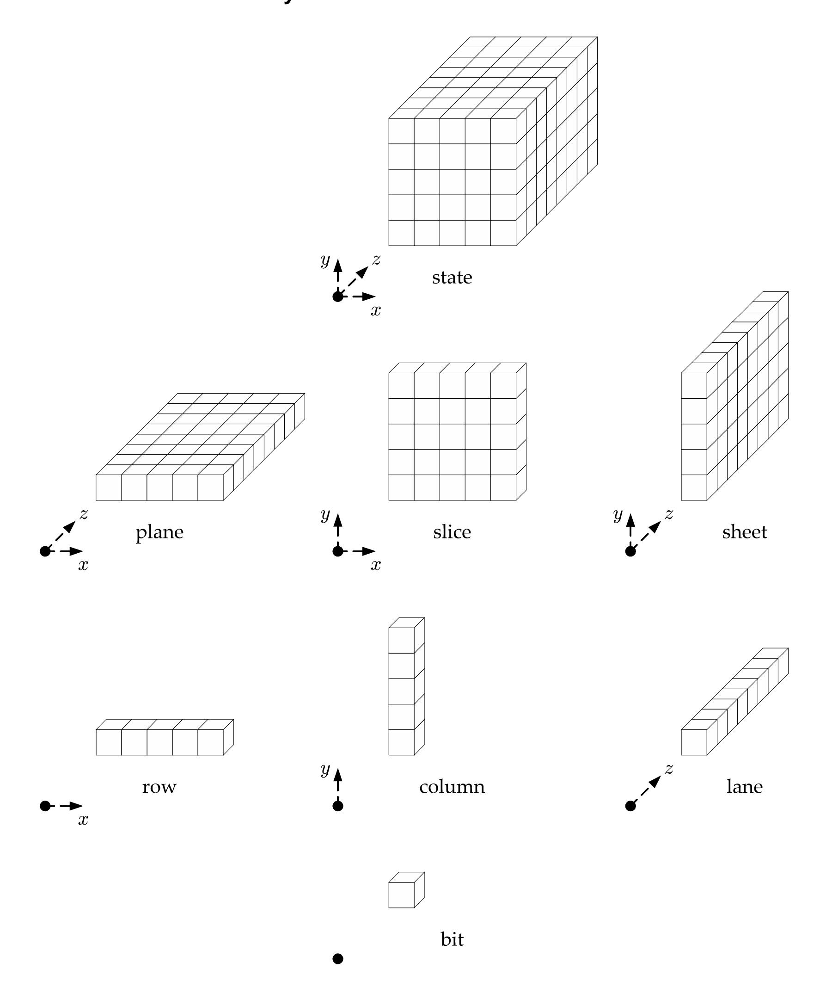
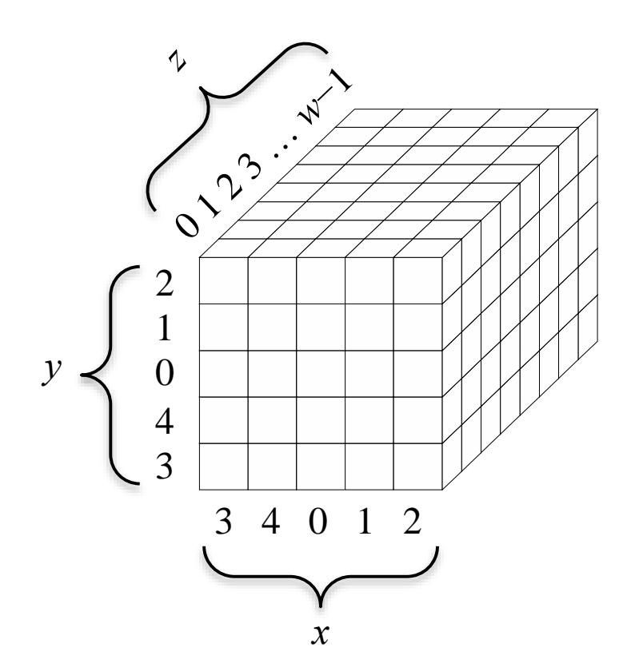
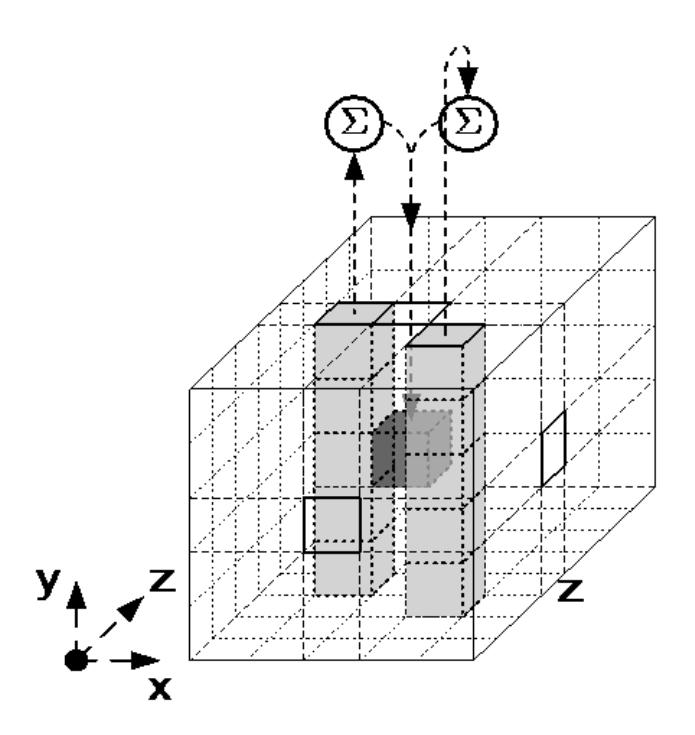
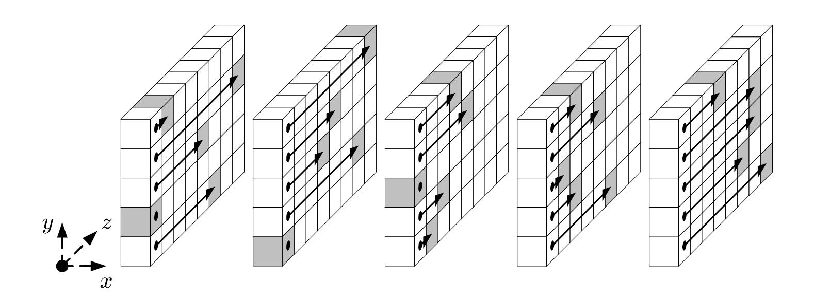
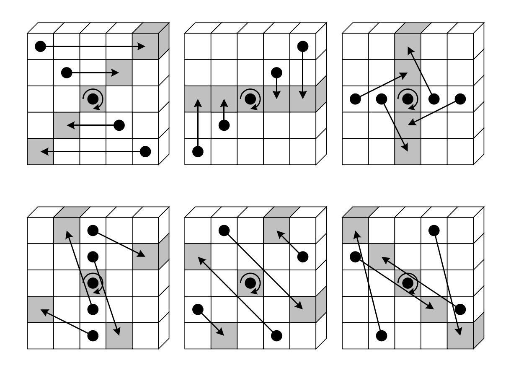
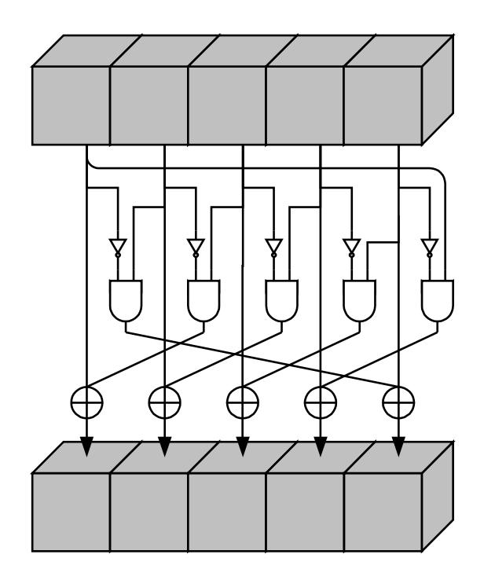
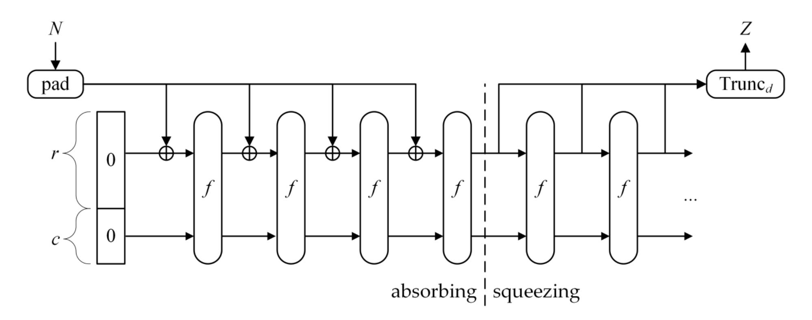

{0}------------------------------------------------

# **FIPS PUB 202**

## **FEDERAL INFORMATION PROCESSING STANDARDS PUBLICATION**

# **SHA-3 Standard: Permutation-Based Hash and Extendable-Output Functions**

**CATEGORY: COMPUTER SECURITY SUBCATEGORY: CRYPTOGRAPHY** 

Information Technology Laboratory National Institute of Standards and Technology Gaithersburg, MD 20899-8900

This publication is available free of charge from: <http://dx.doi.org/10.6028/NIST.FIPS.202>

August 2015


#### **U.S. Department of Commerce**

*Penny Pritzker, Secretary* 

#### **National Institute of Standards and Technology**

*Willie May, Under Secretary of Commerce for Standards and Technology and Director*

{1}------------------------------------------------

## **FOREWORD**

The Federal Information Processing Standards (FIPS) Publication Series of the National Institute of Standards and Technology (NIST) is the official series of publications relating to standards and guidelines adopted and promulgated under the provisions of the Federal Information Security Management Act (FISMA) of 2002.

Comments concerning FIPS publications are welcomed and should be addressed to the Director, Information Technology Laboratory, National Institute of Standards and Technology, 100 Bureau Drive, Stop 8900, Gaithersburg, MD 20899-8900.

> Charles H. Romine, Director Information Technology Laboratory

{2}------------------------------------------------

## **Abstract**

This Standard specifies the Secure Hash Algorithm-3 (SHA-3) family of functions on binary data. Each of the SHA-3 functions is based on an instance of the KECCAK algorithm that NIST selected as the winner of the SHA-3 Cryptographic Hash Algorithm Competition. This Standard also specifies the KECCAK-*p* family of mathematical permutations, including the permutation that underlies KECCAK, in order to facilitate the development of additional permutation-based cryptographic functions.

The SHA-3 family consists of four cryptographic hash functions, called SHA3-224, SHA3-256, SHA3-384, and SHA3-512, and two extendable-output functions (XOFs), called SHAKE128 and SHAKE256.

Hash functions are components for many important information security applications, including 1) the generation and verification of digital signatures, 2) key derivation, and 3) pseudorandom bit generation. The hash functions specified in this Standard supplement the SHA-1 hash function and the SHA-2 family of hash functions that are specified in FIPS 180-4, the Secure Hash Standard.

Extendable-output functions are different from hash functions, but it is possible to use them in similar ways, with the flexibility to be adapted directly to the requirements of individual applications, subject to additional security considerations.

*Key words*: computer security, cryptography, extendable-output function, Federal Information Processing Standard, hash algorithm, hash function, information security, KECCAK, message digest, permutation, SHA-3, sponge construction, sponge function, XOF.

{3}------------------------------------------------

## **Federal Information Processing Standards Publication 202**

August 2015

## **Announcing the**

# **SHA-3 STANDARD: PERMUTATION-BASED HASH AND EXTENDABLE OUTPUT FUNCTIONS**

Federal Information Processing Standards Publications (FIPS PUBS) are issued by the National Institute of Standards and Technology (NIST) after approval by the Secretary of Commerce pursuant to Section 5131 of the Information Technology Management Reform Act of 1996 (Public Law 104-106), and the Computer Security Act of 1987 (Public Law 100-235).

- **1. Name of Standard**: SHA-3 Standard: Permutation-Based Hash and Extendable-Output Functions (FIPS PUB 202).
- **2. Category of Standard**: Computer Security Standard, Cryptography.
- **3. Explanation**: This Standard (FIPS 202) specifies the Secure Hash Algorithm-3 (SHA-3) family of functions on binary data. Each of the SHA-3 functions is based on an instance of the KECCAK algorithm that NIST selected as the winner of the SHA-3 Cryptographic Hash Algorithm Competition. This Standard also specifies the KECCAK-*p* family of mathematical permutations, including the permutation that underlies KECCAK, which can serve as the main components of additional cryptographic functions that may be specified in the future.

The SHA-3 family consists of four cryptographic hash functions and two extendable-output functions (XOFs). The cryptographic hash functions are called SHA3-224, SHA3-256, SHA3- 384, and SHA3-512; and the XOFs are called SHAKE128 and SHAKE256.

For hash functions, the input is called the *message*, and the output is called the (message) *digest* or the *hash value*. The length of the message can vary; the length of the digest is fixed. A cryptographic hash function is a hash function that is designed to provide special properties, including collision resistance and preimage resistance, that are important for many applications in information security. For example, a cryptographic hash function increases the security and efficiency of a digital signature scheme when the digest is digitally signed instead of the message itself. In this context, the collision resistance of the hash function provides assurance that the original message could not have been altered to a different message with the same hash value, and hence, the same signature. Other applications of cryptographic hash functions include pseudorandom bit generation, message authentication codes, and key derivation functions.

{4}------------------------------------------------

The four SHA-3 hash functions specified in this Standard supplement the hash functions that are specified in FIPS 180-4 [\[1\]:](#page-35-0) SHA-1 and the SHA-2 family. Together, both Standards provide resilience against future advances in hash function analysis, because they rely on fundamentally different design principles. In addition to design diversity, the hash functions in this Standard provide some complementary implementation and performance characteristics to those in FIPS 180-4.

For XOFs, the length of the output can be chosen to meet the requirements of individual applications. The XOFs can be specialized to hash functions, subject to additional security considerations, or used in a variety of other applications. The approved uses of XOFs will be specified in NIST Special Publications.

The KECCAK-*p* permutations were designed to be suitable as the main components for a variety of cryptographic functions, including keyed functions for authentication and/or encryption. The six SHA-3 functions can be considered as modes of operation (modes) of the KECCAK*p*[1600,24] permutation. In the future, additional modes of this permutation or other KECCAK-*p*  permutations may be specified and approved in FIPS publications or in NIST Special Publications.

- **4. Approving Authority**: Secretary of Commerce.
- **5. Maintenance Agency**: U.S. Department of Commerce, National Institute of Standards and Technology (NIST), Information Technology Laboratory (ITL).
- **6. Applicability**: This Standard is applicable to all Federal departments and agencies for the protection of sensitive unclassified information that is not subject to Title 10 United States Code Section 2315 (10 USC 2315) and that is not within a national security system as defined in Title 40 United States Code Section 11103(a)(1) (40 USC 11103(a)(1)). Either this Standard or Federal Information Processing Standard (FIPS) 180 must be implemented wherever a secure hash algorithm is required for Federal applications, including as a component within other cryptographic algorithms and protocols. This Standard may be adopted and used by non-Federal Government organizations.
- **7. Specifications**: Federal Information Processing Standard (FIPS) 202, SHA-3 Standard: Permutation-Based Hash and Extendable-Output Functions (affixed).
- **8. Implementations:** Federal departments and agencies shall only use implementations of the KECCAK-*p* permutations within FIPS-approved or NIST-recommended modes of operation, such as the SHA-3 functions that are specified in this Standard. The SHA-3 functions may be implemented in software, firmware, hardware or any combination thereof. Only implementations of these functions that are validated by the Cryptographic Algorithm Validation Program will be considered as complying with this Standard. Information about the validation program can be obtained at [http://csrc.nist.gov/groups/STM/cavp/index.html.](http://csrc.nist.gov/groups/STM/cavp/index.html)

{5}------------------------------------------------

- **9. Implementation Schedule**: This Standard is effective immediately. Applications or extensions of this Standard that depend upon the release of new or revised NIST Special Publications are effective upon final publication of the supporting Special Publications.
- **10. Patents**: Implementations of the SHA-3 functions in this Standard may be covered by U.S. or foreign patents.
- **11. Export Control**: Certain cryptographic devices and technical data regarding them are subject to Federal export controls. Exports of cryptographic modules implementing this Standard and technical data regarding them must comply with these Federal regulations and be licensed by the Bureau of Export Administration of the U.S. Department of Commerce. Information about export regulations is available at: [http://www.bis.doc.gov/index.htm.](http://www.bis.doc.gov/index.htm)
- **12. Qualifications:** Although this Standard specifies mathematical functions that are suitable components for information security applications, conformance to this Standard does not assure that a particular implementation is secure. The responsible authority in each agency or department shall assure that an overall implementation provides an acceptable level of security. This Standard will be reviewed every five years in order to assess its adequacy.
- **13. Waiver Procedure:** The Federal Information Security Management Act (FISMA) does not allow for waivers to a FIPS that is made mandatory by the Secretary of Commerce.
- **14. Where to Obtain Copies of the Standard**: This publication is available electronically at [http://csrc.nist.gov/publications/.](http://csrc.nist.gov/publications/) Other computer security publications issued by NIST are available at the same web site.

{6}------------------------------------------------

## **Federal Information Processing Standards Publication 202**

## **Specifications for the**

# SHA-3 STANDARD: PERMUTATION-BASED HASH AND EXTENDABLE-OUTPUT FUNCTIONS

| 1 | INTRODU                  | CTION                                                                                                             | 1  |
|---|--------------------------|-------------------------------------------------------------------------------------------------------------------|----|
| 2 | GLOSSAR                  | Y                                                                                                                 |    |
|   | 2.1<br>2.2<br>2.3<br>2.4 | TERMS AND ACRONYMS  ALGORITHM PARAMETERS AND OTHER VARIABLES  BASIC OPERATIONS AND FUNCTIONS  SPECIFIED FUNCTIONS | 2  |
| 3 | KECCAK-                  | P PERMUTATIONS                                                                                                    |    |
|   | 3.1<br>3.2<br>3.3<br>3.4 | STATE                                                                                                             |    |
| 4 | SPONGE O                 | CONSTRUCTION                                                                                                      |    |
| 5 | KECCAK.                  |                                                                                                                   | 19 |
|   |                          | SPECIFICATION OF pad $10*1$                                                                                       | 19 |
| 6 | SHA-3 FUN                | NCTION SPECIFICATIONS                                                                                             | 20 |
|   | 6.1<br>6.2<br>6.3        | SHA-3 HASH FUNCTIONS                                                                                              | 20 |
| 7 | CONFORM                  | MANCE                                                                                                             | 21 |
| A | SECURIT                  | Y                                                                                                                 | 23 |
|   | A.1<br>A.2               | SUMMARYADDITIONAL CONSIDERATION FOR EXTENDABLE-OUTPUT FUNCTIONS                                                   | 24 |
| В | EXAMPLI                  | ES                                                                                                                | 25 |
|   | B.1<br>B.2               | CONVERSION FUNCTIONS                                                                                              | 27 |
| C | OBJECT I                 | DENTIFIERS                                                                                                        | 28 |
| D | REFEREN                  | ICES                                                                                                              | 28 |

{7}------------------------------------------------

## **Figures**

|       | Figure 1: Parts of the state array, organized by dimension [8]                 | 8      |
|-------|--------------------------------------------------------------------------------|--------|
|       | Figure 2: The x, y, and z<br>coordinates for the diagrams of the step mappings | 11     |
|       | Figure 3: Illustration of θ applied to a single bit [8]                        | 12     |
|       | Figure 4: Illustration of ρ for b<br>=<br>200 [8]                              | 13     |
|       | Figure 5: Illustration of π applied to a single slice [8]                      | 14     |
|       | Figure 6: Illustration of χ applied to a single row [8]<br>                    | 15     |
|       | Figure 7: The sponge construction: Z<br>=<br>SPONGE[f, pad, r](N, d) [4]       | <br>18 |
|       | Tables                                                                         |        |
|       | Table 1: KECCAK-p<br>permutation widths and related quantities                 | 7      |
|       | Table 2: Offsets of ρ [8]                                                      | 13     |
|       | Table 3: Input block sizes for HMAC                                            | 22     |
| Table | 4: Security strengths of the SHA-1, SHA-2, and SHA-3 functions                 | 23     |
|       | Table 5: Illustration of h2b<br>                                               | 27     |
|       | Table 6: Hexadecimal Form of SHA-3 Padding for Byte-Aligned Messages           | 28     |

{8}------------------------------------------------

## 1 INTRODUCTION

This Standard specifies a new family of functions that supplement SHA-1 and the SHA-2 family of hash functions specified in FIPS 180-4 [1]. This family, called SHA-3 (Secure Hash Algorithm-3), is based on Keccak [2]—the algorithm<sup>1</sup> that NIST selected as the winner of the public SHA-3 Cryptographic Hash Algorithm Competition [3]. The SHA-3 family consists of four cryptographic hash functions and two extendable-output functions. These six functions share the structure that is described in [4], namely, the *sponge construction*; functions with this structure are called *sponge* functions.

A *hash function* is a function on binary data (i.e., bit strings) for which the length of the output is fixed.<sup>2</sup> The input to a hash function is called the *message*, and the output is called the *(message) digest* or *hash value*. The digest often serves as a condensed representation of the message. The four SHA-3 hash functions are named SHA3-224, SHA3-256, SHA3-384, and SHA3-512; in each case, the suffix after the dash indicates the fixed length of the digest, e.g., SHA3-256 produces 256-bit digests. The SHA-2 functions, i.e., SHA-224, SHA-256, SHA-384 SHA-512, SHA-512/224, and SHA-512/256, offer the same set of digest lengths. Thus, the SHA-3 hash functions can be implemented as alternatives to the SHA-2 functions, or vice versa.

An *extendable-output function* (XOF) is a function on bit strings (also called messages) in which the output can be extended to any desired length. The two SHA-3 XOFs are named SHAKE128 and SHAKE256.<sup>3</sup> The suffixes "128" and "256" indicate the security strengths that these two functions can generally support, in contrast to the suffixes for the hash functions, which indicate the digest lengths. SHAKE128 and SHAKE256 are the first XOFs that NIST has standardized.

The six SHA-3 functions are designed to provide special properties, such as resistance to collision, preimage, and second preimage attacks. The level of resistance to these three types of attacks is summarized in Sec. A.1. Cryptographic hash functions are fundamental components in a variety of information security applications, such as digital signature generation and verification, key derivation, and pseudorandom bit generation.

The digest lengths in FIPS-approved hash functions are 160, 224, 256, 384, and 512 bits. When an application requires a cryptographic hash function with a non-standard digest length, an XOF is a natural alternative to constructions that involve multiple invocations of a hash function and/or truncation of the output bits. However, XOFs are subject to the additional security consideration that is described in Sec. A.2.

Each of the six SHA-3 functions employs the same underlying permutation as the main component in the sponge construction. In effect, the SHA-3 functions are *modes of operation* 

1

\_

<sup>&</sup>lt;sup>1</sup> More precisely, the competition called for four hash functions, and KECCAK is a larger family of functions.

<sup>&</sup>lt;sup>2</sup> For many hash functions, there is a (very large) bound on the length of the input data.

<sup>&</sup>lt;sup>3</sup> The name "SHAKE" was proposed in [5] to combine the term "Secure Hash Algorithm" with "KECCAK."

<sup>&</sup>lt;sup>4</sup> An exception is when the output length is sufficiently small; see the discussion in Sec. A.1.

{9}------------------------------------------------

(modes) of the permutation. In this Standard, the permutation is specified as an instance of a family of permutations, called KECCAK-*p*, in order to provide the flexibility to modify its size and security parameters in the development of any additional modes in future documents.

The four SHA-3 hash functions differ slightly from the instances of KECCAK that were proposed for the SHA-3 competition [3]. In particular, a two-bit suffix is appended to the messages, in order to distinguish the SHA-3 hash functions from the SHA-3 XOFs, and to facilitate the development of new variants of the SHA-3 functions that can be dedicated to individual application domains.

The two SHA-3 XOFs are also specified in a manner that allows for the development of dedicated variants. Moreover, the SHA-3 XOFs are compatible with the Sakura coding scheme [6] for tree hashing [7], in order to support the development of parallelizable variants of the XOFs, to be specified in a separate document.

Most of the notation and terminology in this Standard is consistent with the specification of KECCAK in [8].

# **2 GLOSSARY**

## <span id="page-9-0"></span>**2.1 Terms and Acronyms**

bit A binary digit: 0 or 1. In this Standard, bits are indicated in the Courier

New font.

byte A sequence of eight bits.

capacity In the sponge construction, the width of the underlying function minus the

rate.

column For a state array, a sub-array of five bits with constant *x* and *z* coordinates.

digest The output of a cryptographic hash function. Also called the hash value.

domain separation For a function, a partitioning of the inputs to different application domains

so that no input is assigned to more than one domain.

extendable-output A function on bit strings in which the output can be extended to any

function (XOF) desired length.

FIPS Federal Information Processing Standard.

FISMA Federal Information Security Management Act.

hash function A function on bit strings in which the length of the output is fixed. The

output often serves as a condensed representation of the input.

{10}------------------------------------------------

hash value See digest.

HMAC Keyed-Hash Message Authentication Code.

KDF Key derivation function.

KECCAK The family of all sponge functions with a KECCAK-*f* permutation as the

underlying function and multi-rate padding as the padding rule. KECCAK

was originally specified in [8].

lane For a state array of a KECCAK-*p* permutation with width *b*, a sub-array of

*b*/25 bits with constant *x* and *y* coordinates.

message A bit string of any length that is the input to a SHA-3 function.

multi-rate padding The padding rule pad10\*1, whose output is a 1, followed by a (possibly

empty) string of 0s, followed by a 1.

NIST National Institute of Standards and Technology.

plane For a state array of a KECCAK-*p* permutation with width *b*, a sub-array of

*b*/5 bits with a constant *y* coordinate.

rate In the sponge construction, the number of input bits processed or output

bits generated per invocation of the underlying function.

round The sequence of step mappings that is iterated in the calculation of a

KECCAK-*p* permutation.

round constant For each round of a KECCAK-*p* permutation, a lane value that is

determined by the round index. The round constant is the second input to

the ι step mapping.

round index The value of the integer index for the rounds of a KECCAK-*p* permutation.

row For a state array, a sub-array of five bits with constant *y* and *z* coordinates.

SHA-3 Secure Hash Algorithm-3.

SHAKE Secure Hash Algorithm KECCAK.

sheet For a state array of a KECCAK-*p* permutation with width *b*, a sub-array of

*b*/5 bits with a constant *x* coordinate.

slice For a state array, a sub-array of 25 bits with a constant *z* coordinate.

{11}------------------------------------------------

sponge construction The method originally specified in [\[4\]](#page-35-1) for defining a function from the

following: 1) an underlying function on bit strings of a fixed length, 2) a padding rule, and 3) a rate. Both the input and the output of the resulting

function are bit strings that can be arbitrarily long.

sponge function A function that is defined according to the sponge construction, possibly

specialized to a fixed output length.

state An array of bits that is repeatedly updated within a computational

procedure. For a KECCAK-*p* permutation, the state is represented either as

a three-dimensional array or as a bit string.

state array For a KECCAK-*p* permutation, a 5-by-5-by-*w* array of bits that represents

the state. The indices for the *x*, *y*, and *z* coordinates range from 0 to 4, 0 to

4, and 0 to *w*-1, respectively.

step mapping One of the five components of a round of a KECCAK-*p* permutation: θ, ρ,

π, χ, or ι.

string For a nonnegative integer *m*, a sequence of *m* symbols.

width In the sponge construction, the fixed length of the inputs and the outputs

of the underlying function.

XOF See extendable-output function.

XOR The Boolean Exclusive-OR operation, denoted by the symbol .

# **2.2 Algorithm Parameters and Other Variables**

**A** A state array.

**A**[*x*, *y*, *z*] For a state array **A**, the bit that corresponds to the triple (*x*, *y*, *z*).

*b* The width of a KECCAK-*p* permutation in bits.

*c* The capacity of a sponge function.

*d* The length of the digest of a hash function or the requested length of the

output of an XOF, in bits.

*f* The generic underlying function for the sponge construction.

*i<sup>r</sup>* The round index for a KECCAK-*p* permutation.

*J* The input string to RawSHAKE128 or RawSHAKE256.

{12}------------------------------------------------

*l* For a KECCAK-*p* permutation, the binary logarithm of the lane size, i.e.,

log2(*w*).

*Lane*(*i*, *j*) For a state array **A**, a string of all the bits of the lane whose *x* and *y*

coordinates are *i* and *j*.

*M* The input string to a SHA-3 hash or XOF function.

*N* The input string to SPONGE[*f*, pad,*r*] or KECCAK[*c*].

*n<sup>r</sup>* The number of rounds for a KECCAK-*p* permutation.

pad The generic padding rule for the sponge construction.

*Plane*(*j*) For a state array **A**, a string of all the bits of the plane whose *y* coordinate

is *j*.

*r* The rate of a sponge function.

*RC* For a round of a KECCAK-*p* permutation, the round constant.

*w* The lane size of a KECCAK-*p* permutation in bits, i.e., *b*/25.

## **2.3 Basic Operations and Functions**

0 *s* For a positive integer *s*, 0 *s* is the string that consists of *s* consecutive 0s. If

> *s* = 0, then 0 *s* is the empty string.

len(*X*) For a bit string *X*, len(*X*) is the length of *X* in bits.

*X*[*i*] For a string *X* and an integer *i* such that 0 ≤ *i* < len(*X*), *X*[*i*] is the bit of *X*

with index *i*. Bit strings are depicted with indices increasing from left to right, so that X[0] appears at the left, followed by X[1], etc. For example,

if *X* = 101000, then *X*[2]=1.

Trunc*s* (*X*) For a positive integer *s* and a string *X*, Trunc*s* (*X*) is the string comprised of

bits *X*[0] to *X*[*s* – 1]. For example, Trunc2(10100)=10.

*X Y* For strings *X* and *Y* of equal bit length, *X Y* is the string that results from

applying the Boolean exclusive-OR operation to *X* and *Y* at each bit

position. For example, 1100 ⊕ 1010=0110.

*X* || *Y* For strings *X* and *Y*, *X* || *Y* is the concatenation of *X* and *Y*. For example,

11001 || 010=11001010.

*m*/*n* For integers *m* and *n*, *m*/*n* is the quotient, i.e., *m* divided by *n*.

{13}------------------------------------------------

*m* mod *n* For integers *m* and *n*, *m* mod *n* is the integer *r* for which 0 ≤ *r* < *n* and *mr*

is a multiple of *n.* For example, 11 mod 5=1, and 11 mod 5=4.

*x* For a real number *x*, *x* is the least integer that is not strictly less than *x*.

For example, 3.2=4, 3.2=3, and 6=6.

log2(*x*) For a positive real number *x*, log2(*x*) is the real number *y* such that 2*<sup>y</sup>* = *x*.

min(*x*, *y*) For real numbers *x* and *y*, min(*x*, *y*) is the minimum of *x* and *y*. For

example, min(9, 33) = 9.

## **2.4 Specified Functions**

The following higher-level functions are specified in this Standard:

θ, ρ, π, χ, ι The five step mappings that comprise a round.

KECCAK[*c*] The KECCAK instance with KECCAK-*f*[1600] as the underlying permutation

and capacity *c*.

KECCAK-*f* [*b*] The family of seven permutations originally specified in [8] as the

underlying function for KECCAK. The set of values for the width *b* of the

permutations is {25, 50, 100, 200, 400, 800, 1600}.

KECCAK-*p*[*b*, *nr*] The generalization of the KECCAK-*f*[*b*] permutations that is defined in this

Standard by converting the number of rounds *n<sup>r</sup>* to an input parameter.

pad10\*1 The multi-rate padding rule for KECCAK, originally specified in [8].

RawSHAKE128 An intermediate function in the alternate definition of SHAKE128.

RawSHAKE256 An intermediate function in the alternate definition of SHAKE256.

*rc* The function that generates the variable bits of the round constants.

Rnd The round function of a KECCAK-*p* permutation.

SHA3-224 The SHA-3 hash function that produces 224-bit digests.

SHA3-256 The SHA-3 hash function that produces 256-bit digests.

SHA3-384 The SHA-3 hash function that produces 384-bit digests.

SHA3-512 The SHA-3 hash function that produces 512-bit digests.

SHAKE128 The SHA-3 XOF that generally supports 128 bits of security strength, if

{14}------------------------------------------------

the output is sufficiently long; see Sec. A.1.

SHAKE256 The SHA-3 XOF that generally supports 256 bits of security strength, if

the output is sufficiently long; see Sec. A.1.

SPONGE[*f*, pad,*r*] The sponge function in which the underlying function is *f*, the padding

rule is pad, and the rate is *r.*

# **3 KECCAK-***p* **PERMUTATIONS**

In this section, the KECCAK-*p* permutations are specified, with two parameters: 1) the fixed length of the strings that are permuted, called the *width* of the permutation, and 2) the number of iterations of an internal transformation, called a *round*. The width is denoted by *b*, and the number of rounds is denoted by *nr*. The KECCAK-*p* permutation with *n<sup>r</sup>* rounds and width *b* is denoted by KECCAK-*p*[*b*, *nr*]; the permutation is defined for any *b* in {25, 50, 100, 200, 400, 800, 1600} and any positive integer *nr*.

A round of a KECCAK-*p* permutation, denoted by Rnd, consists of a sequence of five transformations, which are called the *step mappings*. The permutation is specified in terms of an array of values for *b* bits that is repeatedly updated, called the *state*; the state is initially set to the input values of the permutation.

The notation and terminology for the state are described in Sec. 3.1. The step mappings are specified in Sec. 3.2. The KECCAK-*p* permutations, including the round function Rnd, are specified in Sec. 3.3. The relationship of the KECCAK-*p* permutations to the KECCAK-*f* permutations that were defined for KECCAK in [8] is described in Sec. [3.4.](#page-24-0)

## **3.1 State**

The state for the KECCAK-*p*[*b*, *nr*] permutation is comprised of *b* bits. The specifications in this Standard contain two other quantities related to *b*: *b*/25 and log2(*b*/25), denoted by *w* and *l*, respectively. The seven possible values for these variables that are defined for the KECCAK-*p* permutations are given in the columns of Table 1 below.

| b | 25 | 50 | 100 | 200 | 400 | 800 | 1600 |
|---|----|----|-----|-----|-----|-----|------|
| w | 1  | 2  | 4   | 8   | 16  | 32  | 64   |
| l | 0  | 1  | 2   | 3   | 4   | 5   | 6    |

**Table 1: KECCAK-***p* **permutation widths and related quantities**

It is convenient to represent the input and output states of the permutation as *b*-bit strings, and to represent the input and output states of the step mappings as 5-by-5-by-*w* arrays of bits. If *S*  denotes a string that represents the state, then its bits are indexed from 0 to *b*–1, so that

$$S = S[0] \parallel S[1] \parallel \dots \parallel S[b-2] \parallel S[b-1].$$

{15}------------------------------------------------

If **A** denotes a 5-by-5-by-*w* array of bits that represents the state, then its indices are the integer triples (*x*, *y*, *z*) for which 0 ≤ *x* < 5, 0 ≤ *y* < 5, and 0 ≤ *z* < *w*. The bit that corresponds to (*x*, *y*, *z*) is denoted by **A**[*x*, *y*,*z*]. A *state array* is a representation of the state by a three-dimensional array that is indexed in this manner.

## **3.1.1 Parts of the State Array**



**Figure 1: Parts of the state array, organized by dimension [8]**

{16}------------------------------------------------

The state array for a KECCAK-*p* permutation, and its lower-dimensional sub-arrays, are illustrated in Figure 1 above for the case *b* = 200, so that *w* = 8. The two-dimensional sub-arrays are called *sheets*, *planes*, and *slices*, and the single-dimensional sub-arrays are called *rows*, *columns*, and *lanes*. The algebraic definitions of these sub-arrays are given in the Glossary, in Sec. [2.1.](#page-9-0)

## <span id="page-16-0"></span>**3.1.2 Converting Strings to State Arrays**

Let *S* denote a string of *b* bits that represents the state for the KECCAK-*p*[*b*, *nr*] permutation. The corresponding state array, denoted by **A**, is defined as follows:

For all triples (*x*, *y*,*z*) such that 0≤*x*<5, 0≤*y*<5, and 0≤*z*<*w*,

$$\mathbf{A}[x, y, z] = S[w(5y+x)+z].$$

For example, if *b*=1600, so that *w*=64, then

| A[0,<br>0,<br>0]=S<br>[0]   | A[1,<br>0,<br>0]=S<br>[64]   |   | A[4,0,0]=S[256]  |
|-----------------------------|------------------------------|---|------------------|
| A[0,<br>0,<br>1]=S<br>[1]   | A[1,<br>0,<br>1]=S<br>[65]   |   | A[4,0,1]=S[257]  |
| A[0,<br>0,<br>2]=S<br>[2]   | A[1,<br>0,<br>2]=S<br>[66]   |   | A[4,0,2]=S[258]  |
| ⋮                           | ⋮                            | … | ⋮                |
| A[0,<br>0,<br>61]=S<br>[61] | A[1,<br>0,<br>61]=S<br>[125] |   | A[4,0,61]=S[317] |
| A[0,<br>0,<br>62]=S<br>[62] | A[1,<br>0,<br>62]=S<br>[126] |   | A[4,0,62]=S[318] |
| A[0,<br>0,<br>63]=S<br>[63] | A[1,<br>0,<br>63]=S<br>[127] |   | A[4,0,63]=S[319] |

and

| A[0,1,0]=S[320]              | A[1,1,0]=S[384]              | A[4,1,0]=S[576]  |
|------------------------------|------------------------------|------------------|
| A[0,1,1]=S[321]              | A[1,1,1]=S[385]              | A[4,1,1]=S[577]  |
| A[0,1,2]=S[322]              | A[1,1,2]=S[386]              | A[4,1,2]=S[578]  |
| ⋮                            | ⋮                            | ⋮                |
| A[0,1,<br>61]=S[381]         | A[1,1,<br>61]=S[445]         | A[4,1,61]=S[637] |
| A[0,<br>1,<br>62]=S<br>[382] | A[1,<br>1,<br>62]=S<br>[446] | A[4,1,62]=S[638] |
| A[0,<br>1,<br>63]=S<br>[383] | A[1,<br>1,<br>63]=S<br>[447] | A[4,1,63]=S[639] |

and

| A[0,2,0]=S[640]              | A[1,2,0]=S[704]              | A[4,2,0]=S[896]  |
|------------------------------|------------------------------|------------------|
| A[0,2,1]=S[641]              | A[1,2,1]=S[705]              | A[4,2,1]=S[897]  |
| A[0,2,2]=S[642]              | A[1,2,2]=S[706]              | A[4,2,2]=S[898]  |
| ⋮                            | ⋮                            | ⋮                |
| A[0,2,<br>61]=S<br>[701]     | A[1,2,<br>61]=S[765]         | A[4,2,61]=S[957] |
| A[0,<br>2,<br>62]=S<br>[702] | A[1,<br>2,<br>62]=S<br>[766] | A[4,2,62]=S[958] |
| A[0,<br>2,<br>63]=S<br>[703] | A[1,<br>2,<br>63]=S<br>[767] | A[4,2,63]=S[959] |

etc.

{17}------------------------------------------------

## <span id="page-17-0"></span>**3.1.3 Converting State Arrays to Strings**

Let **A** denote a state array. The corresponding string representation, denoted by *S*, can be constructed from the lanes and planes of **A**, as follows:

For each pair of integers (*i*, *j*) such that 0≤*i*<5 and 0≤*j*<5, define the string *Lane*(*i*, *j*) by

*Lane* 
$$(i, j) = \mathbf{A}[i, j, 0] \parallel \mathbf{A}[i, j, 1] \parallel \mathbf{A}[i, j, 2] \parallel \dots \parallel \mathbf{A}[i, j, w-2] \parallel \mathbf{A}[i, j, w-1].$$

For example, if *b*=1600, so that *w*=64, then

Lane 
$$(0,0) = \mathbf{A}[0,0,0] \parallel \mathbf{A}[0,0,1] \parallel \mathbf{A}[0,0,2] \parallel \dots \parallel \mathbf{A}[0,0,62] \parallel \mathbf{A}[0,0,63]$$
  
Lane  $(1,0) = \mathbf{A}[1,0,0] \parallel \mathbf{A}[1,0,1] \parallel \mathbf{A}[1,0,2] \parallel \dots \parallel \mathbf{A}[1,0,62] \parallel \mathbf{A}[1,0,63]$   
Lane  $(2,0) = \mathbf{A}[2,0,0] \parallel \mathbf{A}[2,0,1] \parallel \mathbf{A}[2,0,2] \parallel \dots \parallel \mathbf{A}[2,0,62] \parallel \mathbf{A}[2,0,63]$ 

etc.

For each integer *j* such that 0≤ *j*<5, define the string *Plane*(*j*) by

$$Plane(j) = Lane(0, j) \parallel Lane(1, j) \parallel Lane(2, j) \parallel Lane(3, j) \parallel Lane(4, j).$$

Then

$$S = Plane(0) || Plane(1) || Plane(2) || Plane(3) || Plane(4).$$

For example, if *b*= 1600, so that *w*= 64, then

```
 S = A[0, 0, 0] || A[0, 0, 1] || A[0, 0, 2] || … || A[0, 0, 62] || A[0, 0, 63]
          || A[1, 0, 0] || A[1, 0, 1] || A[1, 0, 2] || … || A[1, 0, 62] || A[1, 0, 63]
          || A[2, 0, 0] || A[2, 0, 1] || A[2, 0, 2] || … || A[2, 0, 62] || A[2, 0, 63]
          || A[3, 0, 0] || A[3, 0, 1] || A[3, 0, 2] || … || A[3, 0, 62] || A[3, 0, 63]
          || A[4, 0, 0] || A[4, 0, 1] || A[4, 0, 2] || … || A[4, 0, 62] || A[4, 0, 63]
          || A[0, 1, 0] || A[0, 1, 1] || A[0, 1, 2] || … || A[0, 1, 62] || A[0, 1, 63]
          || A[1, 1, 0] || A[1, 1, 1] || A[1, 1, 2] || … || A[1, 1, 62] || A[1, 1, 63]
          || A[2, 1, 0] || A[2, 1, 1] || A[2, 1, 2] || … || A[2, 1, 62] || A[2, 1, 63]
          || A[3, 1, 0] || A[3, 1, 1] || A[3, 1, 2] || … || A[3, 1, 62] || A[3, 1, 63]
          || A[4, 1, 0] || A[4, 1, 1] || A[4, 1, 2] || … || A[4, 1, 62] || A[4, 1, 63]
```

```
|| A[0, 4, 0] || A[0, 4, 1] || A[0, 4, 2] || … || A[0, 4, 62] || A[0, 4, 63]
|| A[1, 4, 0] || A[1, 4, 1] || A[1, 4, 2] || … || A[1, 4, 62] || A[1, 4, 63]
|| A[2, 4, 0] || A[2, 4, 1] || A[2, 4, 2] || … || A[2, 4, 62] || A[2, 4, 63]
|| A[3, 4, 0] || A[3, 4, 1] || A[3, 4, 2] || … || A[3, 4, 62] || A[3, 4, 63]
|| A[4, 4, 0] || A[4, 4, 1] || A[4, 4, 2] || … || A[4, 4, 62] || A[4, 4, 63] .
```

⋮

{18}------------------------------------------------

## **3.1.4 Labeling Convention for the State Array**



**Figure 2: The** *x***,** *y***, and** *z* **coordinates for the diagrams of the step mappings**

In the diagrams of the state that accompany the specifications of the step mappings, the lane that corresponds to the coordinates (*x*, *y*) = (0, 0) is depicted at the center of the slices. The complete labeling of the *x*, *y*, and *z* coordinates for those diagrams is shown in Figure 2 above.

## **3.2 Step Mappings**

The five step mappings that comprise a round of KECCAK-*p*[*b*, *nr*] are denoted by θ, ρ, π, χ, and ι. Specifications for these functions are given in Secs. 3.2.1[-3.2.5.](#page-22-0)

The algorithm for each step mapping takes a state array, denoted by **A**, as an input and returns an updated state array, denoted by **A′**, as the output. The size of the state is a parameter that is omitted from the notation, because *b* is always specified when the step mappings are invoked.

The ι mapping *i<sup>r</sup>* has a second input: an integer called the *round index*, denoted by *ir*, which is defined within Algorithm 7 for KECCAK-*p*[*b*, *nr*], in Sec. [3.3.](#page-23-0) The other step mappings do not depend on the round index.

## **3.2.1 Specification of θ**

Algorithm 1: θ(**A**)

*Input*:

state array **A**.

*Output*:

state array **A′**.

{19}------------------------------------------------

*Steps*:

- 1. For all pairs (*x*,*z*) such that 0≤*x*<5 and 0≤*z*<*w*, let *C*[*x*,*z*]=**A**[*x*, 0,*z*] ⊕ **A**[*x*, 1,*z*] ⊕ **A**[*x*, 2,*z*] ⊕ **A**[*x*, 3,*z*] ⊕ **A**[*x*, 4,*z*].
- 2. For all pairs (*x, z*) such that 0≤*x*<5 and 0≤*z*<*w* let *D*[*x*,*z*]=*C*[(*x*1) mod 5, *z*] ⊕ *C*[(*x*+1) mod 5, (*z* –1) mod *w*].
- 3. For all triples (*x*, *y*, *z*) such that 0≤*x*<5, 0≤*y*<5, and 0≤*z*<*w*, let **A′**[*x*, *y*,*z*] = **A**[*x*, *y*,*z*] ⊕ *D*[*x*,*z*].

The effect of θ is to XOR each bit in the state with the parities of two columns in the array. In particular, for the bit **A**[*x*0, *y*0, *z*0], the *x*-coordinate of one of the columns is (*x*<sup>0</sup> 1) mod 5, with the same *z*-coordinate, *z*0, while the *x*-coordinate of the other column is (*x*<sup>0</sup> + 1) mod 5, with *z*coordinate (*z*01) mod *w*.

In the illustration of the θ step mapping in Figure 3 below, the summation symbol, ∑, indicates the parity, i.e., the XOR sum of all the bits in the column.



**Figure 3: Illustration of θ applied to a single bit [8]**

## **3.2.2 Specification of ρ**

Algorithm 2: ρ(**A**)

*Input*:

state array **A**.

*Output*:

state array **A′**.

*Steps*:

- 1. For all *z* such that 0≤*z*<*w*, let **A′** [0, 0,*z*] = **A**[0, 0,*z*].
- 2. Let (*x*, *y*) = (1, 0).

{20}------------------------------------------------

- 3. For *t* from 0 to 23:
  - a. for all *z* such that 0≤*z*<*w*, let **A′**[*x*, *y*,*z*] = **A**[*x*, *y*, (*z–*(*t*+1)(*t*+2)/2) mod *w*];
  - b. let (*x*, *y*) = (*y*, (2*x*+3*y*) mod 5).
- 4. Return **A′**.

The effect of ρ is to rotate the bits of each lane by a length, called the *offset*, which depends on the fixed *x* and *y* coordinates of the lane. Equivalently, for each bit in the lane, the *z* coordinate is modified by adding the offset, modulo the lane size.

|             | x<br>=<br>3 | x<br>=<br>4 | x<br>=<br>0 | x<br>=<br>1 | x<br>=<br>2 |
|-------------|-------------|-------------|-------------|-------------|-------------|
| y<br>=<br>2 | 153         | 231         | 3           | 10          | 171         |
| y<br>=<br>1 | 55          | 276         | 36          | 300         | 6           |
| y<br>=<br>0 | 28          | 91          | 0           | 1           | 190         |
| y<br>=<br>4 | 120         | 78          | 210         | 66          | 253         |
| y<br>=<br>3 | 21          | 136         | 105         | 45          | 15          |

**Table 2: Offsets of ρ [8]**

<span id="page-20-1"></span>The offsets for each lane that result from the computation in Step 3a in Algorithm 2 are listed in Table 2 above.

An illustration of ρ for the case *w* = 8 is given in [Figure 4](#page-20-0) below. The labeling convention for the *x* and *y* coordinates in [Figure 4](#page-20-0) is given explicitly in Figure 2, corresponding to the rows and columns in [Table 2.](#page-20-1) For example, the lane **A**[0, 0] is depicted in the middle of the middle sheet, and the lane **A**[2, 3] is depicted at the bottom of the right-most sheet.



**Figure 4: Illustration of ρ for** *b***=200 [8]**

<span id="page-20-0"></span>For each lane in Figure 4, the black dot indicates the bit whose *z* coordinate is 0, and the shaded cube indicates the position of that bit after the execution of ρ. The other bits of the lane shift by the same offset, and the shift is circular. For example, the offset for the lane **A**[1, 0] is 1, so the last bit, whose *z* coordinate is 7 for this example, shifts to the front position, whose *z* coordinate 

{21}------------------------------------------------

is 0. Consequently, the offsets may be reduced modulo the lane size; e.g., the lane for **A**[3, 2], at the top of the left-most sheet, has an offset of 153 mod 8 for this example, i.e., the offset is 1 bit.

## **3.2.3 Specification of π**

## Algorithm 3: π(**A**)

*Input*:

state array **A**.

*Output*:

state array **A′**.

*Steps*:

- 1. For all triples (*x*, *y*, *z*) such that 0≤*x*<5, 0≤*y*<5, and 0≤*z*<*w*, let **A′**[*x*, *y*, *z*]=**A**[(*x* + 3*y*) mod 5, *x*, *z*].
- 2. Return **A′**.

The effect of π is to rearrange the positions of the lanes, as illustrated for any slice in [Figure 5](#page-21-0) below. The convention for the labeling of the coordinates is depicted in Figure 2 above; for example, the bit with coordinates *x* = *y* = 0 is depicted at the center of the slice.



<span id="page-21-0"></span>**Figure 5: Illustration of π applied to a single slice [8]**

{22}------------------------------------------------

## **3.2.4 Specification of χ**

Algorithm 4: χ(**A**)

*Input*:

state array **A**.

*Output*:

state array **A′**.

*Steps*:

- 1. For all triples (*x*, *y*, *z*) such that 0≤*x*<5, 0≤*y*<5, and 0≤*z*<*w*, let **A′**[*x*, *y*,*z*] = **A**[*x*, *y*,*z*] ⊕ ((**A**[(*x*+1) mod 5, *y*, *z*] ⊕ 1) ⋅ **A**[(*x*+2) mod 5, *y*, *z*]).
- 2. Return **A′**.

The dot in the right side of the assignment for Step 1 indicates integer multiplication, which in this case is equivalent to the intended Boolean "AND" operation.

The effect of χ is to XOR each bit with a non-linear function of two other bits in its row, as illustrated in [Figure 6](#page-22-1) below.



**Figure 6: Illustration of χ applied to a single row [8]**

## <span id="page-22-1"></span><span id="page-22-0"></span>**3.2.5 Specification of ι**

The ι mapping is parameterized by the round index, *ir*, whose values are specified in Step 2 of Algorithm 7 for computing KECCAK-*p*[*b*, *nr*], in Sec. [3.3.](#page-23-0) Within the specification of ι in Algorithm 6 below, this parameter determines *l* +1 bits of a lane value called the *round constant*, denoted by *RC*. Each of these *l* + 1 bits is generated by a function that is based on a linear feedback shift register. This function, denoted by *rc*, is specified in Algorithm 5.

{23}------------------------------------------------

## Algorithm 5: *rc*(*t*)

*Input:*

integer *t*.

*Output*:

bit *rc*(*t*).

## Steps:

- 1. If *t* mod 255 = 0, return 1.
- 2. Let *R* = 10000000.
- 3. For *i* from 1 to *t* mod 255, let:
  - a. *R* = 0 || *R*;
  - b. *R*[0] = *R*[0] ⊕ *R*[8];
  - c. *R*[4] = *R*[4] ⊕ *R*[8];
  - d. *R*[5] = *R*[5] ⊕ *R*[8];
  - e. *R*[6] = *R*[6] ⊕ *R*[8];
  - f. *R* =Trunc8[*R*].
- 4. Return *R*[0].

## Algorithm 6: ι(**A**, *ir*)

*Input*:

state array **A**;

round index *ir*.

*Output*:

state array **A′**.

## *Steps*:

- 1. For all triples (*x*, *y*,*z*) such that 0≤*x*<5, 0≤*y*<5, and 0≤*z*<*w*, let **A′**[*x*, *y*,*z*] = **A**[*x*, *y*,*z*].
- 2. Let *RC*=0 *w* .
- 3. For *j* from 0 to *l*, let *RC*[2*<sup>j</sup>* –1]=*rc*(*j*+7*ir*).
- 4. For all *z* such that 0≤*z*<*w*, let **A′**[0, 0,*z*]=**A′**[0, 0,*z*] ⊕ *RC*[*z*].
- 5. Return **A′.**

The effect of ι is to modify some of the bits of *Lane* (0, 0) in a manner that depends on the round index *ir*. The other 24 lanes are not affected by ι.

# <span id="page-23-0"></span>**3.3 KECCAK-***p***[***b***,** *nr***]**

Given a state array **A** and a round index *ir*, the round function Rnd is the transformation that results from applying the step mappings θ, ρ, π, χ, and ι, in that order, i.e.,:

Rnd(
$$\mathbf{A}, i_r$$
) =  $\iota(\chi(\pi(\rho(\theta(\mathbf{A})))), i_r)$ .

{24}------------------------------------------------

The KECCAK-*p*[*b*, *nr*] permutation consists of *n<sup>r</sup>* iterations of Rnd, as specified in Algorithm 7.

## Algorithm 7: KECCAK-*p*[*b*, *nr*](*S*)

```
Input:
string S of length b;
number of rounds nr.
```

*Output*:

string *S*′ of length *b*.

*Steps*:

- 1. Convert *S* into a state array, **A**, as described in Sec. [3.1.2.](#page-16-0)
- 2. For *i<sup>r</sup>* from 12+2*l* –*n<sup>r</sup>* to 12+2*l* –1, let **A**=Rnd(**A**, *ir*).
- 3. Convert **A** into a string *S′* of length *b*, as described in Sec. [3.1.3.](#page-17-0)
- 4. Return *S′*.

## <span id="page-24-0"></span>**3.4 Comparison with KECCAK-***f*

The KECCAK-*f* family of permutations, originally defined in [8], is the specialization of the KECCAK-*p* family to the case that *n<sup>r</sup>* =12+ 2*l*:

```
KECCAK-f[b] = KECCAK-p[b, 12+2l].
```

Consequently, the KECCAK-*p*[1600, 24] permutation, which underlies the six SHA-3 functions, is equivalent to KECCAK-*f*[1600].

The rounds of KECCAK-*f* [*b*] are indexed from 0 to 11+2*l* . A result of the indexing within Step 2 of Algorithm 7 is that the rounds of KECCAK-*p*[*b*, *nr*] match the last rounds of KECCAK-*f* [*b*], or vice versa. For example, KECCAK-*p*[1600, 19] is equivalent to the last nineteen rounds of KECCAK-*f* [1600]. Similarly, KECCAK-*f* [1600] is equivalent to the last twenty-four rounds of KECCAK-*p*[1600, 30]; in this case, the preceding rounds for KECCAK-*p*[1600, 30] are indexed by the integers from −6 to −1.

# **4 SPONGE CONSTRUCTION**

The sponge construction [\[4\]](#page-35-1) is a framework for specifying functions on binary data with arbitrary output length. The construction employs the following three components:

- An underlying function on fixed-length strings, denoted by *f*,
- A parameter called the *rate*, denoted by *r*, and
- A padding rule, denoted by pad.

The function that the construction produces from these components is called a *sponge* function, denoted by SPONGE[*f*, pad, *r*]. A sponge function takes two inputs: a bit string, denoted by *N*, and 

{25}------------------------------------------------

the bit length, denoted by *d*, of the output string, SPONGE[*f*, pad, *r*](*N*, *d*). The analogy to a sponge is that an arbitrary number of input bits are "absorbed" into the state of the function, after which an arbitrary number of output bits are "squeezed" out of its state.

The sponge construction is illustrated in Figure 7 below, adapted from [4].



**Figure 7: The sponge construction:** *Z***=SPONGE[***f***, pad,***r***](***N***,** *d***) [\[4\]](#page-35-1)**

The function *f* maps strings of a single, fixed length, denoted by *b*, to strings of the same length. As in Sec. 3, *b* is called the *width* of *f*. The SHA-3 functions, specified in Sec. [6](#page-27-0) are instances of the sponge construction in which the underlying function *f* is invertible, i.e., a permutation, although the sponge construction does not require *f* to be invertible.

The rate *r* is a positive integer that is strictly less than the width *b*. The *capacity*, denoted by *c*, is the positive integer *br*. Thus, *r* + *c* = *b*.

The padding rule, pad, is a function that produces padding, i.e., a string with an appropriate length to append to another string. In general, given a positive integer *x* and a non-negative integer *m*, the output pad(*x, m*) is a string with the property that *m* + len(pad(*x, m*)) is a positive multiple of *x*. Within the sponge construction, *x* = *r* and *m* = len(*N*), so that the padded input string can be partitioned into a sequence of *r*-bit strings. Algorithm 9 in Sec. 5.1 specifies the padding rule for the KECCAK functions and, hence, the SHA-3 functions.

Given these three components, *f*, pad, and *r*, as described above, the SPONGE[*f*, pad, *r*] function on (*N*, *d*) is specified by Algorithm 8. The width *b* is determined by the choice of *f*.

## Algorithm 8: SPONGE[*f*, pad, *r*](*N*, *d*)

*Input*: string *N*, nonnegative integer *d*.

{26}------------------------------------------------

## *Output*:

string *Z* such that len(*Z*)=*d*.

## *Steps*:

- 1. Let *P*=*N* || pad(*r*, len(*N*)).
- 2. Let *n*=len(*P*)/*r*.
- 3. Let *c*=*br*.
- 4. Let *P*0, … , *Pn*-1 be the unique sequence of strings of length *r* such that *P* = *P*<sup>0</sup> || … || *Pn*1.
- 5. Let *S*=0 *b* .
- 6. For *i* from 0 to *n*1, let *S*=*f* (*S* ⊕ (*P<sup>i</sup>* || 0 *c* )).
- 7. Let *Z* be the empty string.
- 8. Let *Z*=*Z* || Trunc*r*(*S*).
- 9. If *d*≤|*Z*|, then return Trunc *<sup>d</sup>* (*Z*); else continue.
- 10. Let *S*=*f*(*S*), and continue with Step 8.

Note that the input *d* determines the number of bits that Algorithm 8 returns, but it does not affect their values. In principle, the output can be regarded as an infinite string, whose computation, in practice, is halted after the desired number of output bits is produced.

# **5 KECCAK**

KECCAK is a family of sponge functions, originally defined in [8]. The padding rule for KECCAK, called *multi-rate padding*, is specified in Sec. 5.1. The parameters and the underlying permutations for KECCAK are described in Sec. [5.2,](#page-27-1) and a smaller family of KECCAK functions, KECCAK[*c*], is specified explicitly, which will suffice to define the SHA-3 functions in Sec. [6.](#page-27-0)

## **5.1 Specification of pad10\*1**

Algorithm 9: pad10\*1(*x*, *m*)

## *Input*:

positive integer *x*;

non-negative integer *m*.

## *Output*:

string *P* such that *m* + len(*P*) is a positive multiple of *x*.

## *Steps*:

- 1. Let *j* = (– *m* 2) mod *x*.
- 2. Return *P* = 1 || 0 *j* || 1.

Thus, the asterisk in "pad10\*1" indicates that the "0" bit is either omitted or repeated as necessary in order to produce an output string of the desired length.

{27}------------------------------------------------

## <span id="page-27-1"></span>**5.2 Specification of KECCAK[***c***]**

KECCAK is the family of sponge functions with the KECCAK-*p*[*b*, 12+2*l*] permutation (defined in Sec [3.3\)](#page-23-0) as the underlying function and with pad10\*1 (defined in Sec. 5.1) as the padding rule. The family is parameterized by any choices of the rate *r* and the capacity *c* such that *r* + *c* is in {25, 50, 100, 200, 400, 800, 1600}, i.e., one of the seven values for *b* in Table 1.

When restricted to the case *b*=1600, the KECCAK family is denoted by KECCAK[*c*]; in this case *r*  is determined by the choice of *c*. In particular,

```
KECCAK[c] = SPONGE[KECCAK-p[1600, 24], pad10*1, 1600–c].
```

Thus, given an input bit string *N* and an output length *d*,

```
KECCAK[c] (N, d) = SPONGE[KECCAK-p[1600, 24], pad10*1, 1600–c] (N, d).
```

# <span id="page-27-0"></span>**6 SHA-3 FUNCTION SPECIFICATIONS**

In Sec. [6.1,](#page-27-2) the four SHA-3 hash functions are defined, and in Sec. [6.2,](#page-27-3) the two SHA-3 XOFs are defined. In Sec. 6.3, an alternate definition of each SHA-3 XOF is given in terms of an intermediate function.

## <span id="page-27-2"></span>**6.1 SHA-3 Hash Functions**

Given a message *M*, the four SHA-3 hash functions are defined from the KECCAK[*c*] function specified in Sec. 5.2 by appending a two-bit suffix to *M* and by specifying the length of the output, as follows:

```
SHA3-224(M) = KECCAK[448] (M || 01, 224);
SHA3-256(M) = KECCAK[512](M || 01, 256);
SHA3-384(M) = KECCAK[768] (M || 01, 384);
SHA3-512(M) = KECCAK[1024](M || 01, 512).
```

In each case, the capacity is double the digest length, i.e., *c* = 2*d*, and the resulting input *N* to KECCAK[*c*] is the message with the suffix appended, i.e, *N* = *M* || 01. The suffix supports *domain separation*; i.e., it distinguishes the inputs to KECCAK[*c*] arising from the SHA-3 hash functions from the inputs arising from the SHA-3 XOFs defined in Sec. 6.2, as well as other domains that may be defined in the future.

# <span id="page-27-3"></span>**6.2 SHA-3 Extendable-Output Functions**

Given a message *M*, the two SHA-3 XOFs, SHAKE128 and SHAKE256, are defined from the KECCAK[*c*] function specified in Sec. 5.2 by appending a four-bit suffix to *M*, for any output length *d*:

{28}------------------------------------------------

```
SHAKE128(M, d) = KECCAK[256] (M || 1111, d),
SHAKE256(M, d) = KECCAK[512] (M || 1111, d).
```

The purposes of the additional bits, 1111, are discussed in Sec. 6.3.

## **6.3 Alternate Definitions of SHA-3 Extendable-Output Functions**

Two additional sponge functions, called RawSHAKE128 and RawSHAKE256, are defined as the following instances of KECCAK[*c*], where the input string is denoted by *J*, and the output length denoted by *d*:

```
RawSHAKE128(J, d) = KECCAK[256] (J || 11, d),
RawSHAKE256(J, d) = KECCAK[512] (J || 11, d).
```

These functions enable alternate definitions of SHAKE128 and SHAKE256 that are equivalent to the definitions in Sec. 6.2. In particular,

```
SHAKE128(M, d) = RawSHAKE128 (M || 11, d),
SHAKE256(M, d) = RawSHAKE256 (M || 11, d).
```

The following input *N* to KECCAK[*c*] results from the padding of these inputs *M* and *J*:

$$N = J \parallel 11 = M \parallel 11 \parallel 11.$$

The bolded suffix (i.e., **11)** supports domain separation: it distinguishes the inputs to KECCAK[*c*] that arise from RawSHAKE128 and RawSHAKE256 from the inputs arising from the SHA-3 hash functions defined in Sec. 6.1, as well as other domains that may be defined in the future.

The italicized suffix (i.e., *11*) provides compatibility for RawSHAKE128 and RawSHAKE256 with the Sakura coding scheme [6]. This scheme will facilitate the future development of tree hashing [7] variants, in which parallel processing can be applied to compute and update digests of long messages more efficiently.

Note that, within the execution of KECCAK[*c*], additional bits are appended to *N* as specified by the multi-rate padding rule.

# **7 Conformance**

Implementations of the KECCAK-*p*[1600, 24] permutation and the six SHA-3 modes of this permutation—SHA3-224, SHA3-256, SHA3-384, SHA3-512, SHAKE128, and SHAKE256 may be tested for conformance to this Standard under the auspices of the Cryptographic Algorithm Validation Program [9].

{29}------------------------------------------------

SHA3-224, SHA3-256, SHA3-384, and SHA3-512 are approved cryptographic hash functions. One of the approved uses of cryptographic hash functions occurs within the Keyed-Hash Message Authentication Code (HMAC). The input block size in bytes, denoted by *B* in the HMAC specification [10], is given in Table 3 below for the SHA-3 hash functions<sup>5</sup> :

| Hash Function      | SHA3-224 | SHA3-256 | SHA3-384 | SHA3-512 |
|--------------------|----------|----------|----------|----------|
| Block Size (bytes) | 144      | 136      | 104      | 72       |

**Table 3: Input block sizes for HMAC**

SHAKE128 and SHAKE256 are approved XOFs, whose approved uses will be specified in NIST Special Publications. Although some of those uses may overlap with the uses of approved hash functions, the XOFs are not approved *as* hash functions, due to the property that is discussed in Sec. A.2.

The KECCAK-*p*[1600, 24] permutation is approved for use in the context of its approved modes of operation, such as the SHA-3 functions. Similarly, the other intermediate functions that are defined in this Standard—e.g., KECCAK[*c*], RawSHAKE128, and RawSHAKE256—are approved in the context of an approved mode of operation of the underlying KECCAK-*p* permutation.

The KECCAK-*p*[1600, 24] permutation may become approved for other uses, and other KECCAK-*p* permutations may also become approved if any modes of operation for them are developed and approved within a FIPS Publication or a NIST Special Publication.

The SHA-3 functions are defined on messages of any bit length, including the empty string. A conforming implementation of a SHA-3 function may restrict the set of supported bit lengths for messages. Similarly, a conforming implementation of a SHA-3 XOF may restrict the set of supported values for the output length. In both cases, any such restrictions may affect interoperability with other implementations.

For every computational procedure that is specified in this Standard, a conforming implementation may replace the given set of steps with any mathematically equivalent set of steps. In other words, different procedures that produce the correct output for every input are permitted.

<sup>5</sup> In general, the input block size (in bits) of a sponge function is its rate.

{30}------------------------------------------------

# **A Security**

The detailed analysis of the security properties of KECCAK in [8] applies to the SHA-3 family of hash and extendable output functions. The SHA-3 family also inherits security properties from the sponge construction; these properties are analyzed in detail in [4].

Applications of hash functions often require collision resistance, preimage resistance, and/or second preimage resistance; these properties are summarized for the SHA-3 family of hash functions and XOFs in Sec. A.1. XOFs differ from hash functions in the generation of closely related outputs; this important security consideration is discussed in Sec. A.2.

## **A.1 Summary**

As of the publication of this Standard, the security strengths of the SHA-3 functions are summarized in Table 4. The SHA-1 and SHA-2 functions are included for comparison, duplicating some of the discussion in [11], which will be updated as necessary with the latest security information.

|             | Output |                  | Security Strengths<br>in Bits |                    |  |  |  |  |
|-------------|--------|------------------|-------------------------------|--------------------|--|--|--|--|
| Function    | Size   | Collision        | Preimage                      | 2nd Preimage       |  |  |  |  |
| SHA-1       | 160    | < 80             | 160                           | 160–L(M)           |  |  |  |  |
| SHA-224     | 224    | 112              | 224                           | min(224, 256–L(M)) |  |  |  |  |
| SHA-512/224 | 224    | 112              | 224                           | 224                |  |  |  |  |
| SHA-256     | 256    | 128              | 256                           | 256–L(M)           |  |  |  |  |
| SHA-512/256 | 256    | 128              | 256                           | 256                |  |  |  |  |
| SHA-384     | 384    | 192              | 384                           | 384                |  |  |  |  |
| SHA-512     | 512    | 256              | 512                           | 512–L(M)           |  |  |  |  |
| SHA3-224    | 224    | 112              | 224                           | 224                |  |  |  |  |
| SHA3-256    | 256    | 128              | 256                           | 256                |  |  |  |  |
| SHA3-384    | 384    | 192              | 384                           | 384                |  |  |  |  |
| SHA3-512    | 512    | 256              | 512                           | 512                |  |  |  |  |
| SHAKE128    | d      | min(d/2,<br>128) | ≥<br>min(d,<br>128)           | min(d,<br>128)     |  |  |  |  |
| SHAKE256    | d      | min(d/2,<br>256) | ≥<br>min(d,<br>256)           | min(d,<br>256)     |  |  |  |  |

<span id="page-30-0"></span>**Table 4: Security strengths of the SHA-1, SHA-2, and SHA-3 functions**

{31}------------------------------------------------

For the security strength against second preimage attacks on a message *M*, the function *L*(*M*) is defined as log2(len(*M*)/*B*), where *B* is the block length of the function in bits, i.e., *B* = 512 for SHA-1, SHA-224, and SHA-256, and *B* = 1024 for SHA-512.

The four SHA-3 hash functions are alternatives to the SHA-2 functions, and they are designed to provide resistance against collision, preimage, and second preimage attacks that equals or exceeds the resistance that the corresponding SHA-2 functions provide. The SHA-3 functions are also designed to resist other attacks, such as length-extension attacks, that would be resisted by a random function of the same output length, in general providing the same security strength as a random function, up to the output length.

The two SHA-3 XOFs are designed to resist collision, preimage, and second-preimage attacks, and other attacks that would be resisted by a random function of the requested output length, up to the security strength of 128 bits for SHAKE128, and 256 bits for SHAKE256. A random function whose output length is *d* bits cannot provide more than *d*/2 bits of security against collision attacks and *d* bits of security against preimage and second preimage attacks, so SHAKE128 and SHAKE256 will provide less than 128 and 256 bits of security, respectively, when *d* is sufficiently small, as described in [Table 4.](#page-30-0) For example, if *d* = 224, then SHAKE128 and SHAKE256 provide 112 bits of collision resistance; however, they provide different levels of preimage resistance: 128 bits for SHAKE128 and 224 bits for SHAKE256.

If *d* > *r* + *c*/2, then SHAKE128 and SHAKE256 provide more than 128 and 256 bits of preimage resistance, respectively; moreover, if *d* > 1600, a preimage probably does not exist.

## **A.2 Additional Consideration for Extendable-Output Functions**

An XOF is a powerful new kind of cryptographic primitive that offers the flexibility to produce outputs with any desired length. Technically, it is possible to use an XOF as a hash function by selecting a fixed output length. However, XOFs have the potential for generating related outputs—a property that designers of security applications/protocols/systems may not expect of hash functions. This property is important to consider in the development of applications of XOFs.

By design, the output length for an XOF does not affect the bits that it produces, which means that the output length is not a necessary input to the function. Conceptually, the output can be an infinite string, and the application/protocol/system that invokes the function simply computes the desired number of initial bits of that string. Consequently, when two different output lengths are chosen for a common message, the two outputs are closely related: the longer output is an extension of the shorter output. For example, given any positive integers *d* and *e*, and any message *M*, Trunc*d*(SHAKE128(*M*, *d*+*e*)) is identical to SHAKE128(*M*, *d*). The same property holds for SHAKE256.

No two distinct SHA-3 functions would be expected to ever exhibit this property in practice. For example, for a randomly chosen message *M*, SHA3-256(*M*) will almost certainly not be an extension of SHA3-224(*M*), or of SHAKE128(*M*, 224), even though the three functions have

{32}------------------------------------------------

almost identical structure. The same statement applies to previously approved hash functions, including the truncated versions of SHA-512 in FIPS 180-4 (e.g., SHA-512/256).

However, existing mechanisms for constructing functions with arbitrary output length—by concatenating and/or truncating digests from hash functions—generally do exhibit this property.

The possibility of closely related outputs can affect the security of the application/protocol/system that invokes an XOF. For example, a naïve (and non-approved) way for two parties to agree to derive a 112-bit Triple DES key from a message designated as *keymaterial* would be to compute SHAKE128(*keymaterial*, *keylength*), where *keylength* is 112*.*  However, if an attacker is able to induce one of the parties to use a different value for *keylength*, say 168 bits, but the same value for *keymaterial*, then the two parties will end up with the following keys:

```
SHAKE128(keymaterial, 112) = fg
SHAKE128(keymaterial, 168) = fgh,
```

where the bolded letters of the digest represent 56-bit strings, e.g., the parts of a Triple DES key. Because of the structure of Triple DES, these keys are vulnerable to attack.

In practice, the use of an XOF as a key derivation function (KDF) could preclude the possibility of related outputs, by incorporating the length and/or type of the derived key into the message input to the KDF. In that case, a disagreement or misunderstanding between two users of the KDF about the type or length of the key they are deriving would almost certainly not lead to related outputs.

Where extended digests are problematic, a more general solution is domain separation, by which different instances of the XOFs could be created and tailored to different purposes, independent of the number of output bits. All of the SHA-3 functions are designed to allow variants for new, separate domains that NIST may develop in the future.

# **B Examples**

Examples of the five step mappings and of the six SHA-3 functions are available at the examples page at NIST's Computer Security Resource Center web site: [http://csrc.nist.gov/groups/ST](http://csrc.nist.gov/groups/ST/toolkit/examples.html) [/toolkit/examples.html.](http://csrc.nist.gov/groups/ST/toolkit/examples.html)

The bit strings for these examples are represented as hexadecimal strings, i.e., sequences of the sixteen hexadecimal digits: 0, 1, 2, 3, 4, 5, 6, 7, 8, 9, A, B, C, D, E, and F, where A is the digit for ten, B is the digit for eleven, etc.

The convention for interpreting hexadecimal strings as bit strings for the inputs and outputs of the SHA-3 examples is different from the convention for other functions on the examples page. The conversion functions between hexadecimal strings and SHA-3 bit strings are specified in Sec. B.1. For byte-aligned messages, the hexadecimal forms of the padding for the SHA-3 functions are described in Sec. B.2.

{33}------------------------------------------------

Specific hexadecimal strings in these sections are written in the Courier New font, preceded by the marker 0x.

## **B.1 Conversion Functions**

The conversion function from hexadecimal strings to the SHA-3 strings that they represent, denoted h2b, is specified in Algorithm 10. The function is defined on hexadecimal strings with an even number of digits.

#### Algorithm 10: h2b(H, n).

#### Input:

hexadecimal string H consisting of 2m digits for some positive integer m; positive integer n such that  $n \le 8m$ .

#### Output:

bit string S, such that len(S) = n.

#### Steps:

- 1. For each integer i such that  $0 \le i < 2m-1$ , let  $H_i$  be the i<sup>th</sup> hexadecimal digit in H:  $H = H_0 H_1 H_2 H_3 \dots H_{2m-2} H_{2m-1}$ .
- 2. For each integer *i* such that  $0 \le i < m$ :
  - a. Let  $h_i = 16 \cdot H_{2i} + H_{2i+1}$ .
  - b. Let  $b_{i0} b_{i1} b_{i2} b_{i3} b_{i4} b_{i5} b_{i6} b_{i7}$  be the unique sequence of bits such that  $h_i = b_{i7}$ .  $2^7 + b_{i6}$ .  $2^6 + b_{i5}$ .  $2^5 + b_{i4}$ .  $2^4 + b_{i3}$ .  $2^3 + b_{i2}$ .  $2^2 + b_{i1}$ .  $2^1 + b_{i0}$ .  $2^0$ .
- 3. For each pair of integers (i, j) such that  $0 \le i < m$  and  $0 \le j < 8$ , let  $T[8i + j] = b_{ii}$ .
- 4. Return  $S = \text{Trunc}_n(T)$ .

In Step 1, the indices are defined for the hexadecimal digits. In Step 2a, each pair of hexadecimal digits is converted to the (base 10) integer between 0 and 255 that the pair represents in base 16. In Step 2b, each integer from Step 2a is converted to its binary representation as a byte. In Step 3, the bytes are combined into a single string, and the result is truncated to the desired number of bits in Step 4.

For example, if H = 0x A3 2E and n = 14, then the intermediate values that are defined in Steps 1 and 2 of Algorithm 10 are indicated in Table 5 below:

|                                                                     | $H_0$    | =A       |          |                 | $H_1$    | =3                 |                  |          | $H_2$              | =2       |          |                         | $H_3$    | =E                 |                  |
|---------------------------------------------------------------------|----------|----------|----------|-----------------|----------|--------------------|------------------|----------|--------------------|----------|----------|-------------------------|----------|--------------------|------------------|
| $\begin{array}{ c c }\hline 1 \cdot 2^7 \\ 1 \cdot 2^0 \end{array}$ | 7+0. 2   |          |          | $0+3=1$ $2^4+0$ |          | 2 <sup>2</sup> +1· | 2 <sup>1</sup> + | 0. 2     | <sup>7</sup> +0· 2 |          |          | $+14 = 2^4 + 1$ . $2^0$ |          | 2 <sup>2</sup> +1· | 2 <sup>1</sup> + |
| 1                                                                   | 0        | 1        | 0        | 0               | 0        | 1                  | 1                | 0        | 0                  | 1        | 0        | 1                       | 1        | 1                  | 0                |
| $b_{07}$                                                            | $b_{06}$ | $b_{05}$ | $b_{04}$ | $b_{03}$        | $b_{02}$ | $b_{01}$           | $b_{00}$         | $b_{17}$ | $b_{16}$           | $b_{15}$ | $b_{14}$ | $b_{13}$                | $b_{12}$ | $b_{11}$           | $b_{10}$         |

{34}------------------------------------------------

#### Table 5: Illustration of *h2b*

Thus,  $T = b_{00} b_{01} b_{02} b_{03} b_{04} b_{05} b_{06} b_{07} b_{10} b_{11} b_{12} b_{13} b_{14} b_{15} b_{16} b_{17} = 1100 0101 0111 0100$ , and  $S = \text{Trunc}_{14}(T) = 1100 0101 0111 01$ , as described in Steps 3 and 4.

If the length n of the output string S is not specified explicitly as an input, then h2b(H) is defined to be h2b(H, 8m), i.e., n is given the maximum possible value.

The conversion function from SHA-3 bit strings to the hexadecimal strings that represent them, denoted b2h, is specified in Algorithm 11.

#### Algorithm 11: b2h(S).

#### Input:

bit string S consisting of n bits for a positive integer n.

#### Output:

hexadecimal string *H* consisting of  $2\lceil n/8 \rceil$  digits.

#### Steps:

- 1. Let n = len(S).
- 2. Let  $T=S \parallel 0^{-n \mod 8}$  and  $m=\lceil n/8 \rceil$ .
- 3. For each pair of integers (i, j) such that  $0 \le i < m$  and  $0 \le j < 8$ , let  $b_{ij} = T[8i + j]$ .
- 4. For each integer *i* such that  $0 \le i < m$ :
  - a. Let  $h_i = b_{i7}$ :  $2^7 + b_{i6}$ :  $2^6 + b_{i5}$ :  $2^5 + b_{i4}$ :  $2^4 + b_{i3}$ :  $2^3 + b_{i2}$ :  $2^2 + b_{i1}$ :  $2^1 + b_{i0}$ :  $2^0$ .
  - b. Let  $H_{2i}$  and  $H_{2i+1}$  be the hexadecimal digits such that  $h_i = 16 \cdot H_{2i} + H_{2i+1}$ .
- 5. Return  $H = H_0 H_1 H_2 H_3 \dots H_{2m-2} H_{2m-1}$ .

The formal bit-reordering function that was specified in [12]—for the KECCAK submission to the SHA-3 competition—gives equivalent conversions when the message is byte-aligned, i.e., when n is a multiple of 8.

# **B.2 Hexadecimal Form of Padding Bits**

For the SHA-3 functions, either a two- or four-bit suffix is appended to the message M to produce the input string N to KECCAK[c], and additional bits are appended as part of the multi-rate padding rule.

For most applications, the message is byte-aligned, i.e., len(M) = 8m for a nonnegative integer m. In this case, the total number of bytes, denoted by q, that are appended to the message is determined as follows by m and the rate r:

$$q = (r/8) - (m \mod (r/8)).$$

{35}------------------------------------------------

The value of *q* determines the hexadecimal form of these bytes in this case according to the conversion functions specified in Sec. B.1. The padded messages that result are summarized in Table 6:

| Type of SHA-3 Function | Number of Padding<br>Bytes | Padded Message                          |
|------------------------|----------------------------|-----------------------------------------|
| Hash                   | q<br>=<br>1                | M<br>  <br>0x86                         |
| Hash                   | q<br>=<br>2                | 0x0680<br>M<br>                         |
| Hash                   | q<br>><br>2                | 0x06<br>   0x00<br>…    0x80<br>M<br>   |
| XOF                    | q<br>=<br>1                | 0x9F<br>M<br>                           |
| XOF                    | q<br>=<br>2                | 0x1F80<br>M<br>                         |
| XOF                    | q<br>><br>2                | M<br>  <br>0x1F<br>   0x00<br>…    0x80 |

**Table 6: Hexadecimal form of SHA-3 padding for byte-aligned messages**

In Table 6, the notation "0x00 …" indicates the string that consists of *q* – 2 "zero" bytes.

# **C Object Identifiers**

Object identifiers (OIDs) for SHA3-224, SHA3-256, SHA3-384, SHA3-512, SHAKE128, and SHAKE256 are posted at [http://csrc.nist.gov/groups/ST/crypto\\_apps\\_infra/csor/algorithms.html.](http://csrc.nist.gov/groups/ST/crypto_apps_infra/csor/algorithms.html)

# **D References**

- <span id="page-35-0"></span>[1] Federal Information Processing Standards Publication 180-4, *Secure Hash Standard (SHS)*, Information Technology Laboratory, National Institute of Standards and Technology, March 2012, [http://csrc.nist.gov/publications/fips/fips180-4/fips-180-4.pdf.](http://csrc.nist.gov/publications/fips/fips180-4/fips-180-4.pdf)
- [2] G. Bertoni, J. Daemen, M. Peeters, and G. Van Assche, *The KECCAK SHA-3 submission*, *Version 3*, January 2011, [http://keccak.noekeon.org/Keccak-submission-3.pdf.](http://keccak.noekeon.org/Keccak-submission-3.pdf)
- [3] The SHA-3 Cryptographic Hash Algorithm Competition, November 2007-October 2012, [http://csrc.nist.gov/groups/ST/hash/sha-3/index.html.](http://csrc.nist.gov/groups/ST/hash/sha-3/index.html)
- <span id="page-35-1"></span>[4] G. Bertoni, J. Daemen, M. Peeters, and G. Van Assche, *Cryptographic sponge functions*, January 2011, [http://sponge.noekeon.org/CSF-0.1.pdf.](http://sponge.noekeon.org/CSF-0.1.pdf)
- [5] Ethan Heilman to [hash-forum@nist.gov,](mailto:hash-forum@nist.gov) October 5, 2012, Hash Forum, [http://csrc.nist.gov/groups/ST/hash/email\\_list.html.](http://csrc.nist.gov/groups/ST/hash/email_list.html)

{36}------------------------------------------------

- [6] G. Bertoni, J. Daemen, M. Peeters, and G. Van Assche, *SAKURA*: *a flexible coding for tree hashing*, [http://keccak.noekeon.org/Sakura.pdf.](http://keccak.noekeon.org/Sakura.pdf)
- [7] R. C. Merkle, *A digital signature based on a conventional encryption function*, Advances in Cryptology - CRYPTO '87, A Conference on the Theory Applications of Cryptographic Techniques, Santa Barbara, California, USA, 1987, 369-378.
- [8] G. Bertoni, J. Daemen, M. Peeters, and G. Van Assche, *The KECCAK reference*, *Version 3.0*, January 2011, [http://keccak.noekeon.org/Keccak-reference-3.0.pdf.](http://keccak.noekeon.org/Keccak-reference-3.0.pdf)
- [9] NIST Cryptographic Algorithm Validation Program (CAVP), [http://csrc.nist.gov](http://csrc.nist.gov/groups/STM/cavp/index.html) [/groups/STM/cavp/index.html.](http://csrc.nist.gov/groups/STM/cavp/index.html)
- [10] Federal Information Processing Standards Publication 198-1, *The Keyed-Hash Message Authentication Code (HMAC)*, Information Technology Laboratory, National Institute of Standards and Technology, July 2008, [http://csrc.nist.gov/publications/fips/fips198-1/](http://csrc.nist.gov/publications/fips/fips198-1/FIPS-198-1_final.pdf) [FIPS-198-1\\_final.pdf.](http://csrc.nist.gov/publications/fips/fips198-1/FIPS-198-1_final.pdf)
- [11] NIST Special Publication 800-107 Revision 1: *Recommendation for Using Approved Hash Algorithms*, August 2012, [http://csrc.nist.gov/publications/nistpubs/800-107-rev1/](http://csrc.nist.gov/publications/nistpubs/800-107-rev1/sp800-107-rev1.pdf) [sp800-107-rev1.pdf.](http://csrc.nist.gov/publications/nistpubs/800-107-rev1/sp800-107-rev1.pdf)
- [12] G. Bertoni, J. Daemen, M. Peeters, G. Van Assche, and R. Van Keer, *KECCAK implementation overview*, January 2011, [http://keccak.noekeon.org/Keccak](http://keccak.noekeon.org/Keccak-implementation-3.0.pdf)[implementation-3.0.pdf.](http://keccak.noekeon.org/Keccak-implementation-3.0.pdf)