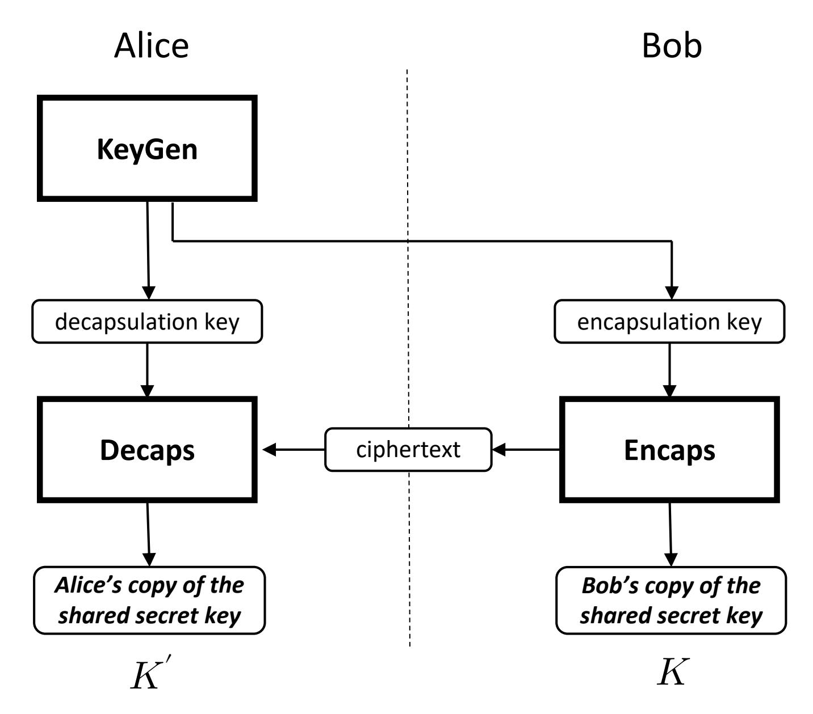

{0}------------------------------------------------


# **FIPS 203**

**Federal Information Processing Standards Publication**

# **Module-Lattice-Based Key-Encapsulation Mechanism Standard**

**Category: Computer Security Subcategory: Cryptography**

Information Technology Laboratory National Institute of Standards and Technology Gaithersburg, MD 20899-8900

This publication is available free of charge from: <https://doi.org/10.6028/NIST.FIPS.203>

Published August 13, 2024


**U.S. Department of Commerce**

Gina M. Raimondo, Secretary

**National Institute of Standards and Technology**

Laurie E. Locascio, NIST Director and Under Secretary of Commerce for Standards and Technology

{1}------------------------------------------------

### **Foreword**

The Federal Information Processing Standards (FIPS) Publication Series of the National Institute of Standards and Technology is the official series of publications relating to standards and guidelines developed under 15 U.S.C. 278g-3, and issued by the Secretary of Commerce under 40 U.S.C. 11331.

Comments concerning this Federal Information Processing Standard publication are welcomed and should be submitted using the contact information in the "Inquiries and Comments" clause of the announcement section.

> Kevin M. Stine, Director Information Technology Laboratory

{2}------------------------------------------------

### **Abstract**

A key-encapsulation mechanism (KEM) is a set of algorithmsthat, under certain conditions, can be used by two partiesto establish a shared secret key over a public channel. A shared secret key that issecurely established using a KEM can then be used with symmetric-key cryptographic algorithms to perform basic tasks in secure communications, such as encryption and authentication. This standard specifies a key-encapsulation mechanism called ML-KEM. The security of ML-KEM is related to the computational difficulty of the Module Learning with Errors problem. At present, ML-KEM is believed to be secure, even against adversaries who possess a quantum computer. This standard specifies three parameter sets for ML-KEM. In order of increasing security strength and decreasing performance, these are ML-KEM-512, ML-KEM-768, and ML-KEM-1024.

**Keywords:** computer security; cryptography; encryption; Federal Information Processing Standards; key-encapsulation mechanism; lattice-based cryptography; post-quantum; public-key cryptography.

{3}------------------------------------------------

### **Federal Information Processing Standards Publication 203**

**Published: August 13, 2024 Effective: August 13, 2024**

### **Announcing the**

# **Module-Lattice-Based Key-Encapsulation Mechanism Standard**

Federal Information Processing Standards (FIPS) publications are developed by the National Institute of Standards and Technology (NIST) under 15 U.S.C. 278g-3 and issued by the Secretary of Commerce under 40 U.S.C. 11331.

- 1. **Name of Standard.** Module-Lattice-Based Key-Encapsulation Mechanism Standard (FIPS 203).
- 2. **Category of Standard.** Computer Security. **Subcategory.** Cryptography.
- 3. **Explanation.** A cryptographic key (or simply "key") is represented in a computer as a string of bits. A *shared secret key* is a cryptographic key that is computed jointly by two parties (e.g., Alice and Bob) using a set of algorithms. Under certain conditions, these algorithms ensure that both parties will produce the same key and that this key is secret from adversaries. Such a shared secret key can then be used with symmetric-key cryptographic algorithms (specified in other NIST standards) to perform tasks such as encryption and authentication of digital information.

This standard specifies a set of algorithms for establishing a shared secret key. While there are many methods for establishing a shared secret key, the particular method described in this standard is a key-encapsulation mechanism (KEM).

In a KEM, the computation of the shared secret key begins with Alice generating a *decapsulation key* and an *encapsulation key*. Alice keeps the decapsulation key private and makes the encapsulation key available to Bob. Bob then uses Alice's encapsulation key to generate one copy of a shared secret key along with an associated *ciphertext*. Bob then sends the ciphertext to Alice. Finally, Alice uses the ciphertext from Bob along with Alice's private decapsulation key to compute another copy of the shared secret key.

The security of the particular KEM specified in this standard is related to the computational difficulty of solving certain systems of noisy linear equations, specifically the *Module Learning With Errors* (MLWE) problem. At present, it is believed that this particular method of establishing a shared secret key is secure, even against adversaries who possess a quantum computer. In the future, additional KEMs may be specified and approved in FIPS publications or in NIST Special Publications.

- 4. **Approving Authority.** Secretary of Commerce.
- 5. **Maintenance Agency.** Department of Commerce, National Institute of Standards and Technology, Information Technology Laboratory (ITL).

{4}------------------------------------------------

6. **Applicability.** Federal Information Processing Standards apply to information systems used or operated by federal agencies or by a contractor of an agency or other organization on behalf of an agency. They do not apply to national security systems as defined in 44 U.S.C. 3552.

This standard, or other FIPS or NIST Special Publications that specify alternative mechanisms, shall be used wherever the establishment of a shared secret key (or shared secret from which keying material can be generated) is required for federal applications, including the use of such a key with symmetric-key cryptographic algorithms, in accordance with applicable Office of Management and Budget and agency policies.

The adoption and use of this standard are available to private and commercial organizations.

<span id="page-4-0"></span>7. **Implementations.** A key-encapsulationmechanismmay be implemented in software, firmware, hardware, or any combination thereof. For every computational procedure that is specified in this standard, a conforming implementation may replace the given set of steps with any mathematically equivalent set of steps. In other words, different procedures that produce the correct output for every input are permitted.

NIST will develop a validation program to test implementations for conformance to the algorithms in this standard. Information about validation programs is available at [https:](https://csrc.nist.gov/projects/cmvp) [//csrc.nist.gov/projects/cmvp](https://csrc.nist.gov/projects/cmvp). Example values will be available at [https://csrc.nist.gov/proj](https://csrc.nist.gov/projects/cryptographic-standards-and-guidelines/example-values) [ects/cryptographic-standards-and-guidelines/example-values](https://csrc.nist.gov/projects/cryptographic-standards-and-guidelines/example-values).

- 8. **Other Approved Security Functions.** Implementations that comply with this standard **shall** employ cryptographic algorithms that have been **approved** for protecting Federal Government-sensitive information. **Approved** cryptographic algorithms and techniques include those that are either:
  - (a) Specified in a Federal Information Processing Standards (FIPS) publication,
  - (b) Adopted in a FIPS or NIST recommendation, or
  - (c) Specified in the list of **approved** security functions in SP 800-140C.
- 9. **Export Control.** Certain cryptographic devices and technical data regarding them are subject to federal export controls. Exports of cryptographic modules that implement this standard and technical data regarding them must comply with all federal laws and regulations and be licensed by the Bureau of Industry and Security of the U.S. Department of Commerce. Information about export regulations is available at [https://www.bis.doc.gov.](https://www.bis.doc.gov)
- 10. **Patents.** NIST has entered into two patent license agreements to facilitate the adoption of NIST's announced selection of the PQC key-encapsulation mechanism CRYSTALS-KYBER. NIST and the licensing parties share a desire, in the public interest, the licensed patents be freely available to be practiced by any implementer of the ML-KEM algorithm as published by NIST. ML-KEM is the name given to the algorithm in this standard derived from CRYSTALS-KYBER. For a summary and extracts from the license, please see [https://csrc.nist.gov/csrc/media/P](https://csrc.nist.gov/csrc/media/Projects/post-quantum-cryptography/documents/selected-algos-2022/nist-pqc-license-summary-and-excerpts.pdf) [rojects/post-quantum-cryptography/documents/selected-algos-2022/nist-pqc-license-sum](https://csrc.nist.gov/csrc/media/Projects/post-quantum-cryptography/documents/selected-algos-2022/nist-pqc-license-summary-and-excerpts.pdf) [mary-and-excerpts.pdf.](https://csrc.nist.gov/csrc/media/Projects/post-quantum-cryptography/documents/selected-algos-2022/nist-pqc-license-summary-and-excerpts.pdf) Implementation of the algorithm specified in the standard may be covered by U.S. and foreign patents of which NIST is not aware.

{5}------------------------------------------------

- 11. **Implementation Schedule.** This standard becomes effective immediately upon final publication.
- 12. **Specifications.** Federal Information Processing Standards (FIPS) 203, Module-Lattice-Based Key-Encapsulation Mechanism Standard (affixed).
- <span id="page-5-0"></span>13. **Qualifications.** In applications, the security guarantees of a KEM only hold under certain conditions (see SP 800-227 [\[1\]](#page-49-0)). One such condition is the secrecy ofseveral values, including the randomness used by the two parties, the decapsulation key, and the shared secret key itself. Users **shall**, therefore, guard against the disclosure of these values.

While it is the intent of this standard to specify general requirements for implementing ML-KEM algorithms, conformance to this standard does not ensure that a particular implementation is secure. It is the responsibility of the implementer to ensure that any module that implements a key establishment capability is designed and built in a secure manner.

Similarly, the use of a product containing an implementation that conforms to this standard does not guarantee the security of the overall system in which the product is used. The responsible authority in each agency or department**shall** ensure that an overall implementation provides an acceptable level of security.

NIST will continue to follow developments in the analysis of the ML-KEM algorithm. As with its other cryptographic algorithm standards, NIST will formally reevaluate this standard every five years.

Both this standard and possible threats that reduce the security provided through the use of this standard will undergo review by NIST as appropriate, taking into account newly available analysis and technology. In addition, the awareness of any breakthrough in technology or any mathematical weakness of the algorithm will cause NIST to reevaluate this standard and provide necessary revisions.

- 14. **Waiver Procedure.** The Federal Information Security Management Act (FISMA) does not allow for waivers to Federal Information Processing Standards (FIPS) that are made mandatory by the Secretary of Commerce.
- 15. **Where to Obtain Copies of the Standard.** This publication is available by accessing [https:](https://csrc.nist.gov/publications) [//csrc.nist.gov/publications.](https://csrc.nist.gov/publications) Other computer security publications are available at the same website.
- 16. **How to Cite This Publication.** NIST has assigned **NIST FIPS 203** as the publication identifier for this FIPS, per the NIST Technical Series [Publication](https://www.nist.gov/document/publication-identifier-syntax-nist-technical-series-publications) Identifier Syntax. NIST recommends that it be cited as follows:

National Institute of Standards and Technology (2024) Module-Lattice-Based Key-Encapsulation Mechanism Standard. (Department of Commerce, Washington, D.C.), Federal Information Processing Standards Publication (FIPS) NIST FIPS 203. <https://doi.org/10.6028/NIST.FIPS.203>

17. **Inquiries and Comments.** Inquiries and comments about this FIPS may be submitted to [fips-203-comments@nist.gov.](fips-203-comments@nist.gov)

{6}------------------------------------------------

### **Federal Information Processing Standards Publication 203**

# **Specification for the Module-Lattice-Based Key-Encapsulation Mechanism Standard**

### **Table of Contents**

| 1 | Introduction |                |                                                                    |    |  |
|---|--------------|----------------|--------------------------------------------------------------------|----|--|
|   | 1.1          | Purpose        | and<br>Scope                                                       | 1  |  |
|   | 1.2          | Context        |                                                                    | 1  |  |
| 2 | Terms,       |                | Acronyms,<br>and<br>Notation                                       | 2  |  |
|   | 2.1          | Terms          | and<br>Definitions                                                 | 2  |  |
|   | 2.2          | Acronyms       |                                                                    | 4  |  |
|   | 2.3          | Mathematical   | 5                                                                  |    |  |
|   | 2.4          | Interpreting   | Symbols<br>the<br>Pseudocode                                       | 6  |  |
|   |              | 2.4.1          | Data<br>Types                                                      | 7  |  |
|   |              | 2.4.2          | Loop<br>Syntax                                                     | 7  |  |
|   |              | 2.4.3          | Arithmetic<br>With<br>Arrays<br>of<br>Integers                     | 7  |  |
|   |              | 2.4.4          | Representations<br>of<br>Algebraic<br>Objects                      | 8  |  |
|   |              | 2.4.5          | Arithmetic<br>With<br>Polynomials<br>and<br>NTT<br>Representations | 9  |  |
|   |              | 2.4.6          | Matrices<br>and<br>Vectors                                         | 9  |  |
|   |              | 2.4.7          | Arithmetic<br>With<br>Matrices<br>and<br>Vectors                   | 10 |  |
|   |              | 2.4.8          | Applying<br>Algorithms<br>to<br>Arrays,<br>Examples                | 11 |  |
| 3 |              | Overview<br>of | the<br>ML-KEM<br>Scheme                                            | 12 |  |
|   | 3.1          |                | Key-Encapsulation<br>Mechanisms                                    | 12 |  |
|   | 3.2          | The            | ML-KEM<br>Scheme                                                   | 13 |  |
|   | 3.3          |                | Requirements<br>for<br>ML-KEM<br>Implementations                   | 15 |  |
| 4 |              | Auxiliary      | Algorithms                                                         | 18 |  |
|   | 4.1          |                | Cryptographic<br>Functions                                         | 18 |  |
|   | 4.2          | General        | Algorithms                                                         | 20 |  |
|   |              | 4.2.1          | Conversion<br>and<br>Compression<br>Algorithms                     | 20 |  |
|   |              | 4.2.2          | Sampling<br>Algorithms                                             | 22 |  |
|   | 4.3          | The            | Number-Theoretic<br>Transform                                      | 24 |  |

{7}------------------------------------------------

|   |            | 4.3.1<br>Multiplication<br>in<br>the<br>NTT<br>Domain                                        | 27 |
|---|------------|----------------------------------------------------------------------------------------------|----|
| 5 | The        | K-PKE<br>Component<br>Scheme                                                                 | 28 |
|   | 5.1        | K-PKE<br>Key<br>Generation                                                                   | 28 |
|   | 5.2        | K-PKE<br>Encryption                                                                          | 29 |
|   | 5.3        | K-PKE<br>Decryption                                                                          | 31 |
| 6 | Main       | Internal<br>Algorithms                                                                       | 32 |
|   | 6.1        | Internal<br>Key<br>Generation                                                                | 32 |
|   | 6.2        | Internal<br>Encapsulation                                                                    | 32 |
|   | 6.3        | Internal<br>Decapsulation                                                                    | 33 |
| 7 | The        | ML-KEM<br>Key-Encapsulation<br>Mechanism                                                     | 35 |
|   | 7.1        | ML-KEM<br>Key<br>Generation                                                                  | 35 |
|   | 7.2        | ML-KEM<br>Encapsulation                                                                      | 36 |
|   | 7.3        | ML-KEM<br>Decapsulation                                                                      | 37 |
| 8 |            | Parameter<br>Sets                                                                            | 39 |
|   | References |                                                                                              | 41 |
|   | Appendix   | A<br>—<br>Precomputed<br>Values<br>for<br>the<br>NTT                                         | 44 |
|   | Appendix   | B<br>—<br>SampleNTT<br>Loop<br>Bounds                                                        | 46 |
|   | Appendix   | C<br>—<br>Differences<br>From<br>the<br>CRYSTALS-KYBER<br>Submission                         | 47 |
|   | C.1        | Differences<br>Between<br>CRYSTALS-KYBER<br>and<br>FIPS<br>203<br>Initial<br>Public<br>Draft | 47 |
|   | C.2        | Changes<br>From<br>FIPS<br>203<br>Initial<br>Public<br>Draft                                 | 47 |

{8}------------------------------------------------

# **List of Tables**

| Table 1   | Decapsulation failure rates for ML-KEIM                                                                                                                         | 15         |
|-----------|-----------------------------------------------------------------------------------------------------------------------------------------------------------------|------------|
| Table 2   | Approved parameter sets for ML-KEM                                                                                                                              | 39         |
| Table 3   | Sizes (in bytes) of keys and ciphertexts of ML-KEM                                                                                                              | 39         |
| Table 4   | While-loop limits and probabilities of occurrence for SampleNTT                                                                                                 | 46         |
|           |                                                                                                                                                                 |            |
|           | List of Figures                                                                                                                                                 |            |
| Figure 1  | A simple view of key establishment using a KEM                                                                                                                  | 12         |
|           | List of Algorithms                                                                                                                                              |            |
| Algorithm | 1 ForExample()                                                                                                                                                  | 8          |
| Algorithm |                                                                                                                                                                 | 19         |
| Algorithm |                                                                                                                                                                 | 20         |
| Algorithm |                                                                                                                                                                 | 20         |
| Algorithm |                                                                                                                                                                 | 22         |
| Algorithm |                                                                                                                                                                 | 22         |
| Algorithm | $\omega$                                                                                                                                                        | 23         |
| Algorithm |                                                                                                                                                                 | <b>2</b> 3 |
| Algorithm |                                                                                                                                                                 | 26         |
| Algorithm | 1.7                                                                                                                                                             | 26         |
| Algorithm |                                                                                                                                                                 | 27         |
| Algorithm |                                                                                                                                                                 | 27         |
| Algorithm |                                                                                                                                                                 | 29         |
| Algorithm | 14 K-PKE. $Encrypt(ek_{PKE}, m, r)$                                                                                                                             | 30         |
| Algorithm |                                                                                                                                                                 | 31         |
| Algorithm | 16 ML-KEM.KeyGen_internal $(d,z)$                                                                                                                               | 32         |
| Algorithm | 17 $ML\text{-}KEM.Encaps\_internal(ek,m)$                                                                                                                       | 33         |
| Algorithm | 18 ML-KEM.Decaps_internal(dk, $c$ )                                                                                                                             | 34         |
| Algorithm | 19 ML-KEM.KeyGen()                                                                                                                                              | 35         |
| Algorithm | $ \textbf{20} \qquad \textbf{ML-KEM.Encaps}(ek) \ \dots \dots \dots \dots \dots \dots \dots \dots \dots \dots \dots \dots \dots \dots \dots \dots \dots \dots $ | 37         |
| Algorithm | 21 ML-KEM.Decaps $(dk,c)$                                                                                                                                       | 38         |

{9}------------------------------------------------

# **1. Introduction**

### **1.1 Purpose and Scope**

This standard specifies the *Module-Lattice-Based Key-Encapsulation Mechanism* (ML-KEM). A key-encapsulation mechanism (KEM) is a set of algorithms that can be used to establish a shared secret key between two parties communicating over a public channel. A KEM is a particular type of key establishment scheme. Other NIST-**approved** key establishment schemes are specified in NIST Special Publication (SP) 800-56A, *Recommendation for Pair-Wise Key-Establishment Schemes Using Discrete Logarithm-Based Cryptography* [\[2\]](#page-49-2), and SP 800-56B, *Recommendation for Pair-Wise Key Establishment Schemes Using Integer Factorization Cryptography* [\[3\]](#page-49-3).

The key establishment schemes specified in SP 800-56A and SP 800-56B are vulnerable to attacks that use sufficiently-capable quantum computers. ML-KEM is an **approved** alternative that is presently believed to be secure, even against adversaries in possession of a large-scale fault-tolerant quantum computer. ML-KEM is derived from the round-three version of the CRYSTALS-KYBER KEM [\[4\]](#page-49-4), a submission in the NIST Post-Quantum Cryptography Standardization project. For the differences between ML-KEM and CRYSTALS-KYBER, see Appendix [C.](#page-55-0)

This standard specifies the algorithms and parameter sets of the ML-KEM scheme. It aims to provide sufficient information to implement ML-KEM in a manner that can pass validation (see [https://csrc.nist.gov/projects/cryptographic-module-validation- program\)](https://csrc.nist.gov/projects/cryptographic-module-validation-program). For general definitions and properties of KEMs, including requirements for the secure use of KEMs in applications, see SP 800-227 [\[1\]](#page-49-0).

This standard specifies three parameter sets for ML-KEM that offer different trade-offs in security strength versus performance. All three parameter sets of ML-KEM are **approved** to protect sensitive, non-classified communication systems of the U.S. Federal Government.

### **1.2 Context**

Over the past several years, there has been steady progress toward building quantum computers. If large-scale quantum computers are realized, the security of many commonly used public-key cryptosystems will be at risk. This would include key-establishment schemes and digital signature schemes whose security depends on the difficulty ofsolving the integer factorization and discrete logarithm problems (both over finite fields and elliptic curves). As a result, in 2016, NIST initiated a public Post-Quantum Cryptography (PQC) Standardization process to select quantum-resistant public-key cryptographic algorithms. A total of 82 candidate algorithms were submitted to NIST for consideration.

After three rounds of evaluation and analysis, NIST selected the first four algorithms for standardization. These algorithms are intended to protect sensitive U.S. Government information well into the foreseeable future, including after the advent of cryptographically-relevant quantum computers. This standard specifies a variant of the selected algorithm CRYSTALS-KYBER, a lattice-based key-encapsulation mechanism (KEM) designed by Peter Schwabe, Roberto Avanzi, Joppe Bos, Léo Ducas, Eike Kiltz, Tancrède Lepoint, Vadim Lyubashevsky, John Schanck, Gregor Seiler, Damien Stehlé, and Jintai Ding [\[4\]](#page-49-4). Throughout this standard, the KEM specified here will be referred to as ML-KEM, as it is based on the Module Learning With Errors assumption.

{10}------------------------------------------------

# <span id="page-10-0"></span>**2. Terms, Acronyms, and Notation**

### <span id="page-10-1"></span>**2.1 Terms and Definitions**

**approved** FIPS-approved and/or NIST-recommended. An algorithm or technique

that is either 1) specified in a FIPS or NIST recommendation, 2) adopted in a FIPS orNIST recommendation, or 3)specified in a list ofNIST-**approved**

security functions.

(KEM) ciphertext A bit string that is produced by encapsulation and used as an input to

decapsulation.

cryptographic module

The set of hardware, software, and/or firmware that implements approved cryptographic functions (including key generation) that are con-

tained within the cryptographic boundary of the module.

decapsulation The process of applying the Decaps algorithm of a KEM. This algorithm

accepts a KEM ciphertext and the decapsulation key as input and pro-

duces a shared secret key as output.

decapsulation key A cryptographic key produced by a KEM during key generation and used

during the decapsulation process. The decapsulation key must be kept private and must be destroyed after it is no longer needed. (See Section

[3.3.](#page-23-0))

decryption key A cryptographic key that is used with a PKE in order to decrypt cipher-

texts into plaintexts. The decryption key must be kept private and must

be destroyed after it is no longer needed.

destroy An action applied to a key or other piece of secret data. After a piece

of secret data is destroyed, no information about its value can be re-

covered.

encapsulation The process of applying the Encaps algorithm of a KEM. This algorithm

accepts the encapsulation key as input, requires private randomness, and produces a shared secret key and an associated ciphertext as out-

put.

encapsulation key A cryptographic key produced by a KEM during key generation and used

during the encapsulation process. The encapsulation key can be made

public. (See Section [3.3.](#page-23-0))

encryption key A cryptographic key that is used with a PKE in order to encrypt plaintexts

into ciphertexts. The encryption key can be made public.

equivalent process Two processes are equivalent if the same output is produced when the

same values are input to each process (either as input parameters, as

values made available during the process, or both).

fresh random value An output that was produced by a random bit generator and has not

been previously used.

{11}------------------------------------------------

hash function

A function on bit strings in which the length of the output is fixed. **Approved** hash functions (such as those specified in FIPS 180 [\[5\]](#page-49-5) and FIPS 202 [\[6\]](#page-49-6)) are designed to satisfy the following properties:

- 1. (One-way) It is computationally infeasible to find any input that maps to any new pre-specified output.
- 2. (Collision-resistant) It is computationally infeasible to find any two distinct inputs that map to the same output.

input checking

Examination of a potential input to an algorithm for the purpose of determining whether it conforms to certain requirements.

key

A bit string that is used in conjunction with a cryptographic algorithm, such asthe encapsulation and decapsulation keys(of a KEM), the shared secret key (produced by a KEM), and the encryption and decryption keys (of a PKE). (See Section [3.3.](#page-23-0))

key-encapsulation mechanism (KEM) A set of three cryptographic algorithms (KeyGen, Encaps, and Decaps) that can be used by two parties to establish a shared secret key over a public channel.

key establishment

A procedure that results in secret keying material that is shared among different parties.

key pair

A set of two keys with the property that one key can be made public while the other key must be kept private. In this standard, this could refer to either the (encapsulation key, decapsulation key) key pair of a KEM or the (encryption key, decryption key) key pair of a PKE.

little-endian

The property of a byte string having its bytes positioned in order of increasing significance. In particular, the leftmost (first) byte is the least significant, and the rightmost (last) byte is the most significant. The term "little-endian" may also be applied in the same manner to bit strings (e.g., the 8-bit string 11010001 corresponds to the byte 20 + 2<sup>1</sup> + 2<sup>3</sup> + 2<sup>7</sup> = 139).

party

An individual person, organization, device, or process. In this specification, there are two parties (e.g., Party A and Party B, or Alice and Bob) who jointly perform the key establishment process using a KEM.

pseudorandom

A process (or data produced by a process) is said to be pseudorandom when the outcome is deterministic yet also appears random as long as the internal action of the process is hidden from observation. For cryptographic purposes, "effectively random" means "computationally indistinguishable from random within the limits of the intended security strength."

public channel

A communication channel between two parties. Such a channel can be observed and possibly also corrupted by third parties.

{12}------------------------------------------------

public-key

encryption scheme

(PKE)

A set of three cryptographic algorithms (KeyGen, Encrypt, and Decrypt) that can be used by two partiesto send secret data over a public channel.

Also known as an asymmetric encryption scheme.

shared secret A secret value that has been computed during a key-establishment

scheme, is known by both participants, and is used as input to a key-

derivation method to produce keying material.

shared secret key A shared secret that can be used directly as a cryptographic key in

symmetric-key cryptography. It does not require additional key derivation. The shared secret key must be kept private and must be destroyed

when no longer needed.

security category A number associated with the security strength of a post-quantum

cryptographic algorithm, as specified by NIST (see [\[7\]](#page-49-7)).

security strength A number associated with the amount of work (i.e., the number of op-

erations) that is required to break a cryptographic algorithm or system.

**shall** Used to indicate a requirement of this standard.

**should** Used to indicate a strong recommendation but not a requirement of

this standard. Ignoring the recommendation could lead to undesirable

results.

### <span id="page-12-0"></span>**2.2 Acronyms**

AES Advanced Encryption Standard

CBD Centered Binomial Distribution

FIPS Federal Information Processing Standard

KEM Key-Encapsulation Mechanism

LWE Learning with Errors

MLWE Module Learning with Errors

NIST National Institute of Standards and Technology

NISTIR NIST Interagency or Internal Report

NTT Number-Theoretic Transform

PKE Public-Key Encryption

PQC Post-Quantum Cryptography

PRF Pseudorandom Function

RBG Random Bit Generator

SHA Secure Hash Algorithm

{13}------------------------------------------------

n

SHAKE Secure Hash Algorithm Keccak

SP Special Publication

XOF Extendable-Output Function

### <span id="page-13-0"></span>2.3 Mathematical Symbols

Denotes the prime integer  $3329 = 2^8 \cdot 13 + 1$  throughout this document.

Denotes the integer 256 throughout this document.

 $\zeta$  Denotes the integer 17, which is a primitive n-th root of unity modulo q.

 $\ensuremath{\mathbb{B}}$  The set  $\{0,1,\ldots,255\}$  of unsigned 8-bit integers (bytes).

 $\mathbb{Q}$  The set of rational numbers.

 $\mathbb{Z}$  The set of integers.

 $\mathbb{Z}_m$  The ring of integers modulo m (i.e., the set  $\{0,1,\dots,m-1\}$  equipped with the operations of addition and multiplication modulo m.)

 $\mathbb{Z}_m^n$  The set of n-tuples over  $\mathbb{Z}_m$  equipped with  $\mathbb{Z}_m$ -module structure. As a data type, this is the set of length-n arrays whose entries are in  $\mathbb{Z}_m$ .

The ring  $\mathbb{Z}_q[X]/(X^n+1)$  consisting of polynomials of the form  $f=f_0+f_1X+\cdots+f_{255}X^{255}$ , where  $f_j\in\mathbb{Z}_q$  for all j. The ring operations are addition and multiplication modulo  $X^n+1$ .

 $T_q$  The image of  $R_q$  under the number-theoretic transform. Its elements are called "NTT representations" of polynomials in  $R_q$ . (See Section 4.3.)

 $\mathcal{D}_{\eta}(R_q)$  A certain distribution of polynomials in  $R_q$  with small coefficients, from which noise is sampled. The distribution is parameterized by  $\eta \in \{2,3\}$ . (See Section 4.2.2.)

 $S^*$  If S is a set, this denotes the set of finite-length tuples (or arrays) of elements from the set S, including the empty tuple (or empty array).

 $S^k$  If S is a set, this denotes the set of k-tuples (or length-k arrays) of elements from the set S.

 $f_j \qquad \qquad \text{The coefficient of } X^j \text{ of a polynomial } f = f_0 + f_1 X + \dots + f_{255} X^{255} \in R_q.$ 

 $\hat{f}$  The element of  $T_q$  that is equal to the NTT representation of a polynomial  $f \in R_q$ . (See Sections 2.4.4 and 4.3.)

 $\mathbf{v}^T$ ,  $\mathbf{A}^T$  The transpose of a row or column vector  $\mathbf{v}$ . In general, the transpose of a matrix  $\mathbf{A}$ .

{14}------------------------------------------------

| 0                                                   | Denotes linear-algebraic composition with coefficients in $R_q$ or $T_q$ (e.g., $\mathbf{A} \circ \mathbf{v}$ denotes the vector resulting from applying matrix $\mathbf{A}$ to vector $\mathbf{v}$ ). (See Section 2.4.7.) |
|-----------------------------------------------------|-----------------------------------------------------------------------------------------------------------------------------------------------------------------------------------------------------------------------------|
| $\times_{T_q}$                                      | Denotes the operation on coefficient arrays that implements product in the ring $T_q$ . (See Sections 2.4.5 and 4.3.1.)                                                                                                     |
| $A\ B$                                              | The concatenation of two arrays or bit strings ${\cal A}$ and ${\cal B}$ .                                                                                                                                                  |
| B[i]                                                | The entry at index $i$ in the array $B$ . All arrays have indices that begin at zero.                                                                                                                                       |
| B[k:m]                                              | The subarray $(B[k], B[k+1], \dots, B[m-1])$ of the array $B$ .                                                                                                                                                             |
| B                                                   | If $B$ is a number, this denotes the absolute value of $B$ . If $B$ is an array, this denotes its length.                                                                                                                   |
| $\lceil x \rceil$                                   | The ceiling of $\boldsymbol{x}$ (i.e., the smallest integer greater than or equal to $\boldsymbol{x}$ ).                                                                                                                    |
| $\lfloor x \rfloor$                                 | The floor of $x$ (i.e., the largest integer less than or equal to $x$ ).                                                                                                                                                    |
| $\lceil x \rfloor$                                  | The rounding of $x$ to the nearest integer. If $x=y+1/2$ for some $y\in\mathbb{Z}$ , then $\lceil x\rfloor=y+1.$                                                                                                            |
| :=                                                  | Denotes that the left-hand side is defined to be the expression on the right-hand side.                                                                                                                                     |
| $r \bmod m$                                         | The unique integer $r'$ in $\{0,1,\ldots,m-1\}$ such that $m$ divides $r-r'$ .                                                                                                                                              |
| $BitRev_7(r)$                                       | Bit reversal of a seven-bit integer $r$ . Specifically, if $r=r_0+2r_1+4r_2+\cdots+64r_6$ with $r_i\in\{0,1\}$ , then $BitRev_7(r)=r_6+2r_5+4r_4+\cdots+64r_0$ .                                                            |
| $s \leftarrow x$                                    | In pseudocode, this notation means that the variable $\boldsymbol{s}$ is assigned the value of the expression $\boldsymbol{x}.$                                                                                             |
| $s \stackrel{\$}{\longleftarrow} \mathbb{B}^{\ell}$ | In pseudocode, this notation means that the variable $s$ is assigned the value of an array of $\ell$ random bytes. The bytes must be freshly generated using randomness from an <b>approved</b> RBG. (See Section 3.3.)     |
| 1                                                   |                                                                                                                                                                                                                             |

### <span id="page-14-0"></span>2.4 Interpreting the Pseudocode

 $\perp$ 

This section outlines the conventions of the pseudocode used to describe the algorithms in this standard. All algorithms are understood to have access to two global integer constants: n=256 and q=3329. There are also five global integer variables: k,  $\eta_1$ ,  $\eta_2$ ,  $d_u$ , and  $d_v$ . All other variables are local. The five global variables are set to particular values when a parameter set is selected (see Section 8).

A symbol indicating failure or the lack of output from an algorithm.

When algorithms in this specification invoke other algorithms as subroutines, all arguments (i.e., inputs) are passed by value. In other words, a copy of the inputs is created, and the subroutine is invoked with the copy. There is no "passing by reference."

Pseudocode assignments are performed using the symbol " $\leftarrow$ ." For example, the statement  $z \leftarrow y$  means that the variable z is assigned the value of variable y. Pseudocode comparisons

{15}------------------------------------------------

are performed via the symbol "==." For example, the expression x==w is a boolean value that is TRUE if and only if the variables x and w have the same value.

In regular text (i.e., outside of the pseudocode), a different convention is applied. There, the "=" symbol is used both for assigning values and for comparisons, in keeping with standard mathematical notation. When emphasis is needed, assignments will be made with ":=" instead.

Variables will always have a valid value that is appropriate to their data type, with two exceptions:

- 1. The outputs of a random bit generator (RBG) have the byte array data type but are also allowed to have the special value NULL. This value indicates that randomness generation failed. This can only occur in ML-KEM.KeyGen and ML-KEM.Encaps.
- 2. The outputs of ML-KEM.KeyGen and ML-KEM.Encaps have the byte array data type but are also allowed to have the special value  $\bot$ . When ML-KEM.KeyGen or ML-KEM.Encaps return the value  $\bot$ , this indicates that the algorithm failed due to a failure of randomness generation.

#### 2.4.1 Data Types

For variables that represent the input or output of an algorithm, the data type (e.g., bit, byte, array of bits) will be explicitly described at the start of the algorithm. For most local variables in the pseudocode, the data type is easily deduced from context. For all other variables, the data type will be declared in a comment. In a single algorithm, the data type of a variable is determined the first time that the variable is used and will not be changed. Variable names can and will be reused across different algorithms, including with different data types.

In addition to standard atomic data types (e.g., bits, bytes) and data structures (e.g., arrays), integers modulo m (i.e., elements of  $\mathbb{Z}_m$ ) will also be used as an abstract data type. It is implicit that reduction modulo m takes place whenever an assignment is made to a variable in  $\mathbb{Z}_m$ . For example, for  $z \in \mathbb{Z}_m$  and integers x and y, the statement

$$z \leftarrow x + y \tag{2.1}$$

means that z is assigned the value  $x+y \mod m$ . The pseudocode is agnostic regarding how an integer modulo m is represented in actual implementations or how modular reduction is computed.

#### 2.4.2 Loop Syntax

The pseudocode will make use of both "while" and "for" loops. The "while" syntax is self-explanatory. In the case of "for" loops, the syntax will be in the style of the programming language C. Two simple examples are given in Algorithm 1. The standard mathematical expression (e.g.,  $\sum_{i \leftarrow 1}^{n} (i+3)$ ) will be used for simple summations instead of a "for" loop.

#### 2.4.3 Arithmetic With Arrays of Integers

This standard makes extensive use of arrays of integers modulo m (i.e., elements of  $\mathbb{Z}_m^\ell$ ). In a typical case, the relevant values are m=q=3329 and  $\ell=n=256$ . Arithmetic with arrays in

{16}------------------------------------------------

#### <span id="page-16-1"></span>**Algorithm 1** ForExample()

Performs two simple "for" loops.

1: for 
$$(i \leftarrow 0; i < 10; i++)$$
  
2:  $A[i] \leftarrow i$   $\triangleright A$  is an integer array of length  $10$   
3: end for  $\triangleright A$  now has the value  $(0,1,2,3,4,5,6,7,8,9)$ 

4:  $j \leftarrow 0$ 

5: **for**  $(k \leftarrow 256; k > 1; k \leftarrow k/2)$ 

6:  $B[j] \leftarrow k$ 

7:  $j \leftarrow j+1$ 

8: end for

 $\triangleright$  B now has the value (256,128,64,32,16,8,4,2)

<span id="page-16-4"></span><span id="page-16-3"></span> $\triangleright B$  is an integer array of length 8

 $\mathbb{Z}_m^\ell$  will be done as follows. Let  $a\in\mathbb{Z}_m$  and  $X,Y\in\mathbb{Z}_m^\ell$  . The statements

$$Z \leftarrow a \cdot X$$
 (2.2)

$$W \leftarrow X + Y \tag{2.3}$$

will result in two arrays  $Z,W\in\mathbb{Z}_m^\ell$ , with the property that  $Z[i]=a\cdot X[i]$  and W[i]=X[i]+Y[i] for all i. Multiplication of arrays in  $\mathbb{Z}_m^\ell$  will only be meaningful when m=q and  $\ell=n=256$ , in which case it corresponds to multiplication in a particular ring. This operation will be described in (2.8).

#### <span id="page-16-0"></span>2.4.4 Representations of Algebraic Objects

An essential operation in ML-KEM is the number-theoretic transform (NTT), which maps a polynomial f in a certain ring  $R_q$  to its "NTT representation"  $\hat{f}$  in an isomorphic ring  $T_q$ . The rings  $R_q$  and  $T_q$  and the NTT are discussed in detail in Section 4.3. This standard will represent elements of  $R_q$  and  $T_q$  in pseudocode using arrays of integers modulo q as follows.

An element f of  ${\cal R}_a$  is a polynomial of the form

$$f = f_0 + f_1 X + \dots + f_{255} X^{255} \in R_q \tag{2.4}$$

and will be represented in pseudocode by the array

<span id="page-16-2"></span>
$$(f_0, f_1, \dots, f_{255}) \in \mathbb{Z}_q^{256},$$
 (2.5)

whose entries contain the coefficients of f. Overloading notation, the array in (2.5) will also be denoted by f. The i-th entry of the array f will thus contain the i-th coefficient of the polynomial f (i.e.,  $f[i] = f_i$ ).

An element (sometimes called "NTT representation")  $\hat{g}$  of  $T_q$  is a tuple of 128 polynomials, each of degree at most one. Specifically,

$$\hat{g} = (\hat{g}_{0,0} + \hat{g}_{0,1}X, \hat{g}_{1,0} + \hat{g}_{1,1}X, \dots, \hat{g}_{127,0} + \hat{g}_{127,1}X) \in T_q.$$
 (2.6)

{17}------------------------------------------------

Such an algebraic object will be represented in pseudocode by the array

<span id="page-17-3"></span>
$$(\hat{g}_{0,0}, \hat{g}_{0,1}, \hat{g}_{1,0}, \hat{g}_{1,1}, \dots, \hat{g}_{127,0}, \hat{g}_{127,1}) \in \mathbb{Z}_q^{256}$$
. (2.7)

Overloading notation, the array in (2.7) will also be denoted by  $\hat{g}$ . In this case, the mapping between array entries and coefficients is  $\hat{g}[2i] = \hat{g}_{i,0}$  and  $\hat{g}[2i+1] = \hat{g}_{i,1}$  for  $i \in \{0,1,\dots,127\}$ .

Converting between a polynomial  $f \in R_q$  and its NTT representation  $\hat{f} \in T_q$  will be done via the algorithms NTT (Algorithm 9) and NTT<sup>-1</sup> (Algorithm 10). These algorithms act on arrays of coefficients, as described above, and satisfy  $\hat{f} = \text{NTT}(f)$  and  $f = \text{NTT}^{-1}(\hat{f})$ .

#### <span id="page-17-0"></span>2.4.5 Arithmetic With Polynomials and NTT Representations

The algebraic operations of addition and scalar multiplication in  $R_q$  and  $T_q$  are done coordinatewise. For example, if  $a \in \mathbb{Z}_q$  and  $f \in R_q$ , the i-th coefficient of the polynomial  $a \cdot f \in R_q$  is equal to  $a \cdot f_i \mod q$ . In pseudocode, elements of both  $R_q$  and  $T_q$  are represented by coefficient arrays (i.e., elements of  $\mathbb{Z}_q^{256}$ ). The algebraic operations of addition and scalar multiplication are thus performed by addition and scalar multiplication of the corresponding coefficient arrays, as in (2.3) and (2.2). For example, the addition of two NTT representations in pseudocode is performed by a statement of the form  $\hat{h} \leftarrow \hat{f} + \hat{g}$ , where  $\hat{h}, \hat{f}, \hat{g} \in \mathbb{Z}_q^{256}$  are coefficient arrays.

The algebraic operations of multiplication in  $R_q$  and  $T_q$  are treated as follows. For efficiency reasons, multiplication in  $R_q$  will not be used. The algebraic meaning of multiplication in  $T_q$  is discussed in Section 4.3.1. In pseudocode, it will be performed by the algorithm MultiplyNTTs (Algorithm 11). Specifically, if  $\hat{f}, \hat{g} \in \mathbb{Z}_q^{256}$  are a pair of arrays (each representing the NTT of some polynomial), then

<span id="page-17-2"></span>
$$\hat{h} \leftarrow \hat{f} \times_{T_a} \hat{g} \qquad \text{means} \qquad \hat{h} \leftarrow \mathsf{MultiplyNTTs}(\hat{f}, \hat{g}) \,. \tag{2.8}$$

<span id="page-17-1"></span>The result is an array  $\hat{h} \in \mathbb{Z}_q^{256}$ .

#### 2.4.6 Matrices and Vectors

In addition to arrays of integers modulo q, the pseudocode will also make use of arrays whose entries are themselves elements of  $\mathbb{Z}_q^{256}$ . For example, an element  $\mathbf{v} \in (\mathbb{Z}_q^{256})^3$  will be a length-three array whose entries  $\mathbf{v}[0]$ ,  $\mathbf{v}[1]$ , and  $\mathbf{v}[2]$  are themselves elements of  $\mathbb{Z}_q^{256}$  (i.e., arrays). One can think of each of these entries as representing a polynomial in  $R_q$  so that  $\mathbf{v}$  itself represents an element of the module  $R_q^3$ .

When arrays are used to represent matrices and vectors whose entries are elements of  $R_q$ , they will be denoted with bold letters (e.g.,  ${\bf v}$  for vectors and  ${\bf A}$  for matrices). When arrays are used to represent matrices and vectors whose entries are elements of  $T_q$ , they will be denoted with a "hat" (e.g.,  $\hat{{\bf v}}$  and  $\hat{{\bf A}}$ ). Unless an explicit transpose operation is performed, it is understood that vectors are column vectors. One can then view vectors as the special case of matrices with only one column.

Converting between matrices over  ${\cal R}_q$  and matrices over  ${\cal T}_q$  will be done coordinate-wise. For

{18}------------------------------------------------

example, if  $\mathbf{v} \in (\mathbb{Z}_q^{256})^k$  , then the statement

$$\hat{\mathbf{v}} \leftarrow \mathsf{NTT}(\mathbf{v}) \tag{2.9}$$

will result in  $\hat{\mathbf{v}} \in (\mathbb{Z}_q^{256})^k$  such that  $\hat{\mathbf{v}}[i] = \mathsf{NTT}(\mathbf{v}[i])$  for all i. This involves running  $\mathsf{NTT}$  a total of k times.

#### <span id="page-18-0"></span>2.4.7 Arithmetic With Matrices and Vectors

The following describes how to perform arithmetic with matrices over  ${\cal R}_q$  and  ${\cal T}_q$  with vectors as a special case.

Addition and scalar multiplication are performed coordinate-wise, so the addition of matrices over  $R_q$  and  $T_q$  is straightforward. In the case of  $T_q$ , scalar multiplication is done via (2.8). For example, if  $\hat{f} \in \mathbb{Z}_q^{256}$  and  $\hat{\mathbf{u}}, \hat{\mathbf{v}} \in (\mathbb{Z}_q^{256})^k$ , then

$$\hat{\mathbf{w}} \leftarrow \hat{f} \cdot \hat{\mathbf{u}}$$
 (2.10)

<span id="page-18-2"></span>
$$\hat{\mathbf{z}} \leftarrow \hat{\mathbf{u}} + \hat{\mathbf{v}} \tag{2.11}$$

will result in  $\hat{\mathbf{w}}, \hat{\mathbf{z}} \in (\mathbb{Z}_q^{256})^k$  satisfying  $\hat{\mathbf{w}}[i] = \hat{f} \times_{T_q} \hat{\mathbf{u}}[i]$  and  $\hat{\mathbf{z}}[i] = \hat{\mathbf{u}}[i] + \hat{\mathbf{v}}[i]$  for all i. Here, the multiplication and addition of individual entries are performed using the appropriate arithmetic for coefficient arrays of elements of  $T_q$  (i.e., as in (2.3)).

It will also be necessary to multiply matrices with entries in  $T_q$ , which is done by using standard matrix multiplication with the base-case multiplication (i.e., multiplication of individual entries) being multiplication in  $T_q$ . If  $\hat{\mathbf{A}}$  and  $\hat{\mathbf{B}}$  are two matrices with entries in  $T_q$ , their matrix product will be denoted  $\hat{\mathbf{A}} \circ \hat{\mathbf{B}}$ . Some example pseudocode statements involving matrix multiplication are given in (2.12), (2.13), and (2.14). In these examples,  $\hat{\mathbf{A}}$  is a  $k \times k$  matrix, while  $\hat{\mathbf{u}}$  and  $\hat{\mathbf{v}}$  are vectors of length k. All three of these objects are represented in pseudocode by arrays: a  $k \times k$  array for  $\hat{\mathbf{A}}$  and length-k arrays for  $\hat{\mathbf{u}}$  and  $\hat{\mathbf{v}}$ . The entries of  $\hat{\mathbf{A}}$ ,  $\hat{\mathbf{u}}$ , and  $\hat{\mathbf{v}}$  are elements of  $\mathbb{Z}_q^{256}$ . In (2.12) and (2.13), the pseudocode statement on the left produces a new length-k vector whose entries are specified on the right. In (2.14), the pseudocode statement on the left computes a dot product. The result is in the base ring (i.e.,  $T_q$ ) and is represented by an element  $\hat{z}$  of  $\mathbb{Z}_q^{256}$ .

$$\hat{\mathbf{w}} \leftarrow \hat{\mathbf{A}} \circ \hat{\mathbf{u}}$$
  $\hat{\mathbf{w}}[i] = \sum_{j=0}^{k-1} \hat{\mathbf{A}}[i,j] \times_{T_q} \hat{\mathbf{u}}[j]$  (2.12)

<span id="page-18-3"></span>
$$\hat{\mathbf{y}} \leftarrow \hat{\mathbf{A}}^{\top} \circ \hat{\mathbf{u}} \qquad \qquad \hat{\mathbf{y}}[i] = \sum_{j=0}^{k-1} \hat{\mathbf{A}}[j,i] \times_{T_q} \hat{\mathbf{u}}[j] \qquad \qquad \textbf{(2.13)}$$

<span id="page-18-4"></span>
$$\hat{z} \leftarrow \hat{\mathbf{u}}^{\top} \circ \hat{\mathbf{v}}$$
 
$$\hat{z} = \sum_{j=0}^{k-1} \hat{\mathbf{u}}[j] \times_{T_q} \hat{\mathbf{v}}[j]$$
 (2.14)

<span id="page-18-1"></span>The multiplication  $\times_{T_q}$  of individual entries above is performed using MultiplyNTTs, as described in (2.8).

{19}------------------------------------------------

#### 2.4.8 Applying Algorithms to Arrays, Examples

In the previous examples, arithmetic over  $\mathbb{Z}_m$  was extended to arithmetic with arrays over  $\mathbb{Z}_m$  and then further extended to arithmetic with matrices whose entries are themselves arrays over  $\mathbb{Z}_m$ . Similarly, algorithms defined with a given data type as input will be applied to arrays and matrices over that data type. When the pseudocode invokes such an algorithm on an array or matrix input, it is implied that the algorithm is invoked repeatedly and applied to each entry of the input.

For example, consider the function  $\mathsf{Compress}_d:\mathbb{Z}_q\to\mathbb{Z}_{2^d}$  defined in Section 4. It can be invoked on an array input  $F\in\mathbb{Z}_q^{256}$  with the statement

<span id="page-19-0"></span>
$$K \leftarrow \mathsf{Compress}_d(F)$$
 . (2.15)

The result will be an array  $K \in \mathbb{Z}_{2^d}^{256}$  such that  $K[i] = \mathsf{Compress}_d(F[i])$  for every  $i \in \{0, 1, \dots, 255\}$ . The computation (2.15) involves running the Compress algorithm 256 times.

For a second example, consider the algorithm NTT defined in Section 4.3. It takes an array  $f \in \mathbb{Z}_q^{256}$  (representing an element of  $R_q$ ) as input and outputs another array  $\hat{f} \in \mathbb{Z}_q^{256}$  (representing an element of  $T_q$ ). If the NTT algorithm is invoked on a vector  $\mathbf{s} \in (\mathbb{Z}_q^{256})^k$  (representing an element of  $R_q^k$ ) with the pseudocode statement

<span id="page-19-1"></span>
$$\hat{\mathbf{s}} \leftarrow \mathsf{NTT}(\mathbf{s}),$$
 (2.16)

the result is a vector  $\hat{\mathbf{s}} \in (\mathbb{Z}_q^{256})^k$  such that  $\hat{\mathbf{s}}[i] = \mathsf{NTT}(\mathbf{s}[i])$  for all  $i \in \{0,1,\dots,k-1\}$ . The vector  $\hat{\mathbf{s}}$  represents an element of  $T_q^k$ . The computation (2.16) involves running the  $\mathsf{NTT}$  algorithm k times.

For a third example, consider line 2 of K-PKE. Encrypt in Section 5.2:

<span id="page-19-2"></span>
$$\hat{\mathbf{t}} \leftarrow \mathsf{ByteDecode}_{12}(\mathsf{ek}_{\mathsf{PKE}}[0:384k]).$$
 (2.17)

 $\begin{array}{l} \operatorname{ByteDecode}_{12} \text{ is defined to receive a byte array of length } 32 \cdot 12 = 384 \text{ as input and produce} \\ \operatorname{an integer array in} \ \mathbb{Z}_q^{256} \text{ as output. The computation (2.17) is run on the first } 384k \text{ bytes of byte array } \operatorname{ek}_{\mathsf{PKE}} \text{ and results in } \hat{\mathbf{t}} \in (\mathbb{Z}_q^{256})^k. \ \operatorname{ByteDecode}_{12} \text{ will thus be applied } k \text{ times, once for each subarray } \operatorname{ek}_{\mathsf{PKE}}[384 \cdot j, 384 \cdot (j+1)], \text{ and will result in an integer array } \hat{\mathbf{t}}[j] \in \mathbb{Z}_q^{256} \text{ such that } \hat{\mathbf{t}}[j] = \operatorname{ByteDecode}_{12}(\operatorname{ek}_{\mathsf{PKE}}[384 \cdot j, 384 \cdot (j+1)]) \text{ for each } j \text{ from } 0 \text{ to } k-1. \end{array}$ 

{20}------------------------------------------------

# <span id="page-20-0"></span>**3. Overview of the ML-KEM Scheme**

<span id="page-20-1"></span>This section gives a high-level overview of the ML-KEM scheme.

### **3.1 Key-Encapsulation Mechanisms**

The following is a high-level overview of key-encapsulation mechanisms (KEMs). For details, see SP 800-227 [\[1\]](#page-49-0).

A KEM is a cryptographic scheme that, under certain conditions, can be used to establish a shared secret key between two communicating parties. This shared secret key can then be used for symmetric-key cryptography.

A KEM consists of three algorithms and a collection of parameter sets. The three algorithms are:

- 1. A probabilistic key generation algorithm denoted by KeyGen
- 2. A probabilistic "encapsulation" algorithm denoted by Encaps
- 3. A deterministic "decapsulation" algorithm denoted by Decaps

<span id="page-20-2"></span>The collection of parameter sets is used to select a trade-off between security and efficiency. Each parameter set in the collection is a list of specific (typically numerical) values, one for each parameter required by the three algorithms.



**Figure 1. A simple view of key establishment using a KEM**

{21}------------------------------------------------

In the typical application, a KEM is used to establish a shared secret key between two parties (here referred to as Alice and Bob) as described in Figure 1. Alice begins by running KeyGen in order to generate a (public) encapsulation key and a (private) decapsulation key. Upon obtaining Alice's encapsulation key, Bob runs the Encaps algorithm, which produces Bob's copy K of the shared secret key along with an associated ciphertext. Bob sends the ciphertext to Alice, and Alice completes the process by running the Decaps algorithm using her decapsulation key and the ciphertext. This final step produces Alice's copy K' of the shared secret key.

After completing this process, Alice and Bob would like to conclude that their outputs satisfy K' = K and that this value is a secure, random, shared secret key. However, these properties only hold if certain important conditions are satisfied, as discussed in SP 800-227 [1].

#### <span id="page-21-0"></span>3.2 The ML-KEM Scheme

ML-KEM is a key-encapsulation mechanism based on CRYSTALS-KYBER [4], a scheme that was initially described in [8]. The following is a brief and informal description of the computational assumption underlying ML-KEM and how the ML-KEM scheme is constructed.

**The computational assumption.** The security of ML-KEM is based on the presumed hardness of the so-called Module Learning with Errors (MLWE) problem [9], which is a generalization of the Learning With Errors (LWE) problem introduced by Regev in 2005 [10]. The hardness of the MLWE problem is itself based on the presumed hardness of certain computational problems in module lattices [9]. This motivates the name of the scheme ML-KEM.

In the LWE problem, the input is a set of random "noisy" linear equations in some secret variables  $x \in \mathbb{Z}_q^n$ , and the task is to recover x. The noise in the equations is such that standard algorithms (e.g., Gaussian elimination) are intractable. The LWE problem naturally lends itself to cryptographic applications. For example, if x is interpreted as a secret key, then one can encrypt a one-bit plaintext value by sampling either an approximately correct linear equation (if the plaintext is zero) or a far-from-correct linear equation (if the plaintext is one). Plausibly, only a party in possession of x can distinguish these two cases. Encryption can then be delegated to another party by publishing a large collection of noisy linear equations, which can be combined appropriately by the encrypting party. The result is an asymmetric encryption scheme.

The MLWE problem is similar to the LWE problem. An important difference is that, in MLWE,  $\mathbb{Z}_q^n$  is replaced by a certain module  $R_q^k$ , which is constructed by taking the k-fold Cartesian product of a certain polynomial ring  $R_q$ . In particular, the secret in the MLWE problem is an element  $\mathbf x$  of the module  $R_q^k$ . The ring  $R_q$  is discussed in detail in Section 4.3.

**The ML-KEM construction.** At a high level, the construction of the scheme ML-KEM proceeds in two steps. First, the ideas discussed previously are used to construct a public-key encryption (PKE) scheme from the MLWE problem. Second, this PKE scheme is converted into a key-encapsulation mechanism using the so-called Fujisaki-Okamoto (FO) transform [11, 12]. Due to certain properties of the FO transform, the resulting KEM provides security in a significantly more general attack model than the PKE scheme. As a result, ML-KEM is believed to satisfy so-called IND-CCA2 security [1, 4, 13, 14].

{22}------------------------------------------------

The specification of the ML-KEM algorithms in this standard will follow the same pattern. Specifically, this standard will first describe a public-key encryption scheme called K-PKE (in Section [5\)](#page-36-0) and then use the algorithms of K-PKE as subroutines when describing the algorithms of ML-KEM (in Sections [6](#page-40-0) and [7\)](#page-43-0). The cryptographic transformation from K-PKE to ML-KEM is crucial for achieving IND-CCA2 security. The scheme K-PKE is not IND-CCA2-secure and **shall not** be used as a stand-alone scheme (see Section [3.3\)](#page-23-0).

<sup>A</sup> notable feature of ML-KEM is the use of the *number-theoretic transform* (NTT). The NTT ̂ converts <sup>a</sup> polynomial <sup>∈</sup> to an alternative representation as <sup>a</sup> vector of linear polynomials. Working with NTT representations enables significantly faster multiplication of polynomials. Other operations (e.g., addition, rounding, and sampling) can be done in either representation.

ML-KEM satisfies the essential KEM property of correctness. This means that in the absence of corruption or interference, the process in Figure [1](#page-20-2) will result in ′ = with overwhelming probability. ML-KEM also comes with a proof of asymptotic theoretical security in a certain heuristic model [\[4\]](#page-49-4). Each of the parameter sets of ML-KEM comes with an associated security strength that was estimated based on current cryptanalysis (see Section [8](#page-47-0) for details).

**Parameter sets and algorithms.** Recall that a KEM consists of algorithms KeyGen, Encaps, and Decaps, along with a collection of parameter sets. In the case of ML-KEM, the three aforementioned algorithms are:

- 1. [ML-KEM](#page-43-2).KeyGen (Algorithm [19\)](#page-43-2)
- 2. [ML-KEM](#page-45-1).Encaps (Algorithm [20\)](#page-45-1)
- <span id="page-22-0"></span>3. [ML-KEM](#page-46-0).Decaps (Algorithm [21\)](#page-46-0)

These algorithms are described and discussed in detail in Section [7.](#page-43-0)

ML-KEM comes equipped with three parameter sets:

- ML-KEM-512 (security category 1)
- ML-KEM-768 (security category 3)
- ML-KEM-1024 (security category 5)

These parameter sets are described and discussed in detail in Section [8.](#page-47-0) The security categories 1-5 are defined in SP 800-57, Part 1 [\[7\]](#page-49-7). Each parameter set assigns a particular numerical value to five integer variables: , 1, 2, , and . The values of these variables in each parameter set are given in Table [2](#page-47-1) of Section [8.](#page-47-0) In addition to these five variable parameters, there are also two constants: = 256 and = 3329.

**Decapsulation failures.** Provided that all inputs are well-formed and randomness generation is successful, the key establishment procedure of ML-KEM will never explicitly fail, meaning that both [ML-KEM](#page-45-1).Encaps and [ML-KEM](#page-46-0).Decaps will each output a 256-bit value. Moreover, if no corruption or interference is present, the two 256-bit values produced by [ML-KEM](#page-45-1).Encaps and [ML-KEM](#page-46-0).Decaps will be equal with overwhelming probability (i.e., ′ will equal in the process described in Figure [1\)](#page-20-2). The event that ′ ≠ under these conditions is called a *decapsulation* 

{23}------------------------------------------------

*failure*. Formally, the decapsulation failure probability is defined to be the probability (conditioned on no RGB failures) that the process

1. 
$$(ek, dk) \leftarrow ML-KEM.KeyGen()$$
 (3.1)

2. 
$$(c, K) \leftarrow \mathsf{ML}\text{-}\mathsf{KEM}$$
.Encaps(ek) (3.2)

3. 
$$K' \leftarrow \mathsf{ML}\text{-}\mathsf{KEM}.\mathsf{Decaps}(\mathsf{dk},c)$$
 (3.3)

<span id="page-23-1"></span>results in ′ ≠ . The probability is taken over uniformly random seeds , (sampled in [ML-KEM](#page-43-2).KeyGen) and (sampled in [ML-KEM](#page-45-1).Encaps) and under the heuristic assumption that hash functions and XOFs behave like uniformly random functions. The decapsulation failure rates for ML-KEM are listed in Table [1.](#page-23-1) For details, see Theorem 1 in [\[8\]](#page-49-8) and the scripts in [\[15\]](#page-50-4).

**Table 1. Decapsulation failure rates for ML-KEM**

| Parameter<br>set | Decapsulation<br>failure<br>rate |
|------------------|----------------------------------|
| ML-KEM-512       | 2−138.8                          |
| ML-KEM-768       | 2−164.8                          |
| ML-KEM-1024      | 2−174.8                          |

**Terminology for keys.** A KEM involves three different types of keys: encapsulation keys, decapsulation keys, and shared secret keys. ML-KEM is built on top of the component public-key encryption scheme K-PKE, which has two additional key types: encryption keys and decryption keys. In the literature, encapsulation keys and encryption keys are sometimes referred to as "public keys," while decapsulation keys and decryption keys are sometimes referred to as "private keys." In order to reduce confusion, this standard will not use the terms "public key" or "private key." Instead, keys will be referred to only using the more specific terms, i.e., one of "encapsulation key", "decapsulation key", "encryption key", "decryption key", and "shared secret key".

# <span id="page-23-0"></span>**3.3 Requirements for ML-KEM Implementations**

This section describes several requirements for cryptographic modules that implement ML-KEM. Implementation requirements specific to particular algorithms will be described in later sections. Additional requirements, including requirements for using ML-KEM in specific applications, are given in SP 800-227 [\[1\]](#page-49-0). While conforming implementations must adhere to all of these requirements, adherence does not guarantee that the result will be secure (see Point [13](#page-5-0) in the announcement).

**K-PKE is only a component.** The public-key encryption scheme K-PKE described in Section [5](#page-36-0) **shall not** be used as a stand-alone cryptographic scheme. Instead, the algorithms that comprise K-PKE may only be used as subroutines in the algorithms of ML-KEM. In particular, the algorithms K-PKE.[KeyGen](#page-37-1) (Algorithm [13\)](#page-37-1), K-PKE.[Encrypt](#page-38-0) (Algorithm [14\)](#page-38-0), and K-PKE.[Decrypt](#page-39-1) (Algorithm [15\)](#page-39-1) are **not approved** for use as a public-key encryption scheme.

{24}------------------------------------------------

**Controlled access to internal functions.** The key-encapsulation mechanism ML-KEM makes use of internal, "derandomized" functions [ML-KEM](#page-40-3).KeyGen\_internal, [ML-KEM](#page-41-1).Encaps\_internal, and [ML-KEM](#page-42-0).Decaps\_internal, specified in Section [6.](#page-40-0) The interfaces for these functions **should not** be made available to applications other than for testing purposes. In particular, the sampling of random values required for key generation (as specified in [ML-KEM](#page-43-2).KeyGen) and encapsulation (as specified in [ML-KEM](#page-45-1).Encaps) **shall** be performed by the cryptographic module.

**Equivalent implementations.** For every algorithm that is specified in this standard, a conforming implementation may replace the given set of steps with any mathematically equivalent set of steps. In other words, the specified algorithm may be replaced with a different procedure that produces the correct output for every input (where "input" includes the specified input as well as all parameter values and all randomness).

**Approved usage of the shared secret key.** If randomness generation is successful, the values and ′ returned by [ML-KEM](#page-45-1).Encaps and [ML-KEM](#page-46-0).Decaps, respectively, are always 256-bit values. Under appropriate conditions(see Sections [3.1](#page-20-1) and [3.2,](#page-21-0) and SP 800-227 [\[1\]](#page-49-0)), these values match (i.e., ′ = ) and can be used directly as a shared secret key for symmetric cryptography. If further key derivation is needed, the final symmetric keys **shall** be derived from this 256-bit shared secret key in an **approved** manner, as specified in SP 800-108 and SP 800-56C [\[16,](#page-50-5) [17\]](#page-50-6).

As discussed in Section [3.2,](#page-21-0) ML-KEM is an IND-CCA2-secure KEM. However, a combined KEM that includes ML-KEM as a component might not meet IND-CCA2 security. Implementers should assess the security of any procedure in which the key derivation methods of SP 800-56C are applied to ML-KEM in combination with another key establishment procedure. More guidance regarding combined KEMs is given in SP 800-227 [\[1\]](#page-49-0).

**Randomness generation.** Two algorithms in this standard require the generation of randomness as an internal step: [ML-KEM](#page-43-2).KeyGen and [ML-KEM](#page-45-1).Encaps. In pseudocode, this randomness \$ generation is denoted by a statement of the form ←− <sup>32</sup>. A fresh string of random bytes must be generated for every such invocation. These random bytes **shall** be generated using an **approved** RBG, as prescribed in SP 800-90A, SP 800-90B, and SP 800-90C [\[18,](#page-50-7) [19,](#page-50-8) [20\]](#page-50-9). Moreover, this RBG **shall** have a security strength of at least 128 bits for ML-KEM-512, at least 192 bits for ML-KEM-768, and at least 256 bits for ML-KEM-1024.

**Input checking.** The algorithms [ML-KEM](#page-45-1).Encaps and [ML-KEM](#page-46-0).Decaps require input checking. Implementers **shall** ensure that [ML-KEM](#page-45-1).Encaps and [ML-KEM](#page-46-0).Decaps are only executed on inputs that have been checked, as described in Section [7.](#page-43-0)

**Destruction of intermediate values.** Data used in intermediate computation steps of KEM algorithms could be used by an adversary to compromise security. Therefore, implementers **shall** ensure that intermediate data is destroyed as soon as it is no longer needed. In particular, for [ML-KEM](#page-43-2).KeyGen, [ML-KEM](#page-45-1).Encaps, and [ML-KEM](#page-46-0).Decaps, only the designated output can be retained in memory after the algorithm terminates. All other data **shall** be destroyed prior to

{25}------------------------------------------------

the algorithm terminating.

There are two exceptions to this rule:

- 1. The seed (,) generated in steps [1](#page-43-2) and [2](#page-43-2) of [ML-KEM](#page-43-2).KeyGen can be stored for later expansion using [ML-KEM](#page-40-3).KeyGen\_internal. As this seed can be used to compute the decapsulation key, it is sensitive data and **shall** be treated with the same safeguards as a decapsulation key (see SP 800-227 [\[1\]](#page-49-0)).
- 2. The matrix ̂generated in steps [3-7](#page-37-1) of K-PKE.[KeyGen](#page-37-1) (as a subroutine of [ML-KEM](#page-43-2).KeyGen) can be stored so that it need not be recomputed in later operations(e.g., [ML-KEM](#page-46-0).Decaps). The same matrix ̂is also generated in steps [4-8](#page-38-0) of K-PKE.[Encrypt](#page-38-0) (as a subroutine of [ML-KEM](#page-45-1).Encaps or [ML-KEM](#page-46-0).Decaps); it can also then be stored. In either case, the matrix ̂is data that is easily computed from the public encapsulation key and thus does not require any special protections.

**No floating-point arithmetic.** Implementations of ML-KEM **shall not** use floating-point arithmetic, as rounding errors in floating-point operations may lead to incorrect results in some cases. In all pseudocode in this standard in which division is performed (e.g., /) and may not divide , either ⌊/⌋, ⌈/⌉, or ⌈/⌋ is used. All of these can be computed without floating-point arithmetic, as ordinary integer division / computes ⌊/⌋, and ⌈/⌉ = ⌊(+ −1)/⌋ for non-negative integers and positive integers .

{26}------------------------------------------------

# <span id="page-26-0"></span>**4. Auxiliary Algorithms**

### <span id="page-26-1"></span>**4.1 Cryptographic Functions**

The algorithms specified in this publication require the use of several cryptographic functions. Each function **shall** be instantiated by means of an **approved** hash function or an **approved** eXtendable-Output Function (XOF), as prescribed below. The relevant hash functions and XOFs are described in detail in FIPS 202 [\[6\]](#page-49-6). They will be used as follows.

SHA3-256 and SHA3-512 are hash functions with one variable-length input and one fixed-length output. In this standard, invocations of these functions on an input will be denoted by SHA3-256( ) and SHA3-512( ), respectively. The inputs and outputs for both SHA3-256 and SHA3-512 are always byte arrays.

SHAKE128 and SHAKE256 are XOFs with one variable-length input and one variable-length output. This standard will adhere to the following conventions [\[6\]](#page-49-6):

- The inputs and outputs for both SHAKE128 and SHAKE256 are always **byte arrays**.
- When invoking SHAKE128 or SHAKE256, desired output length is always specified **in bits**.

For example, the expression

$$r := \mathsf{SHAKE128}(M, 8 \cdot 64)$$
 (4.1)

implies that is an array of bytes and that is an array of 64 bytes.

The aforementioned functions play several different roles in the algorithms specified in this standard and will only be invoked using the wrapper functions defined below. Importantly, these wrappers will avoid any potential "byte array" versus "bit-length" confusion by only working with bytes and byte array lengths.

**Pseudorandom function (PRF)**. The function [PRF](#page-26-2) takes a parameter ∈ {2, 3}, one 32-byte input, and one 1-byte input. It produces one (64 ⋅ )-byte output. It will be denoted by

$$\mathsf{PRF}: \{2,3\} \times \mathbb{B}^{32} \times \mathbb{B} \to \mathbb{B}^{64\eta}, \tag{4.2}$$

and it **shall** be instantiated as

<span id="page-26-2"></span>
$$\mathsf{PRF}_{\eta}(s,b) := \mathsf{SHAKE256}(s\|b, 8\cdot 64\cdot \eta)\,, \tag{4.3}$$

where ∈ {2, 3}, ∈ <sup>32</sup>, and ∈ . Note that is only used to specify the desired output length and not to perform domain separation.

**Hash functions**. The specification will also make use of three hash functions [H](#page-26-3), [J](#page-26-3) and [G](#page-27-1), which are defined as follows.

The functions [H](#page-26-3) and [J](#page-26-3) each take one variable-length input and produce one 32-byte output. They will be denoted by [H](#page-26-3) ∶ ∗ → <sup>32</sup> and [J](#page-26-3) ∶ <sup>∗</sup> → <sup>32</sup>, respectively, and **shall** be instantiated as

<span id="page-26-3"></span>
$$H(s) := SHA3-256(s)$$
 and  $J(s) := SHAKE256(s, 8 \cdot 32)$  (4.4)

{27}------------------------------------------------

where  $s \in \mathbb{B}^*$ .

The function G takes one variable-length input and produces two 32-byte outputs. It will be denoted by  $G: \mathbb{B}^* \to \mathbb{B}^{32} \times \mathbb{B}^{32}$ . The two outputs of G will be denoted by  $(a,b) \leftarrow G(c)$ , where  $a,b \in \mathbb{B}^{32}$ ,  $c \in \mathbb{B}^*$ , and  $G(c) = a \| b$ . The function G shall be instantiated as

<span id="page-27-1"></span>
$$G(c) := SHA3-512(c)$$
. (4.5)

**eXtendable-Output Function (XOF)**. This standard uses a XOF wrapper defined in terms of the incremental API for SHAKE128 in SP 800-185 [21]. This SHAKE128 API consists of three functions:

- ctx ← SHAKE128.Init()
   Initializes a XOF "context" ctx.
- ctx ← SHAKE128.Absorb(ctx, str)
   Injects data to be used in the "absorbing" phase of SHAKE128 and updates the context accordingly.
- $(\mathsf{ctx}, B) \leftarrow \mathsf{SHAKE128}.\mathsf{Squeeze}(\mathsf{ctx}, 8 \cdot z)$ Extracts z output bytes produced during the "squeezing" phase of SHAKE128 and updates the context accordingly.

While the above functions are constructed using the Keccak-f permutation rather than the XOF SHAKE128 directly, they are defined so that a single SHAKE128 call of the form

output 
$$\leftarrow SHAKE128(str_1 || ... || str_m, 8b_1 + ... + 8b_\ell)$$
 (4.6)

is equivalent to performing Algorithm 2. This equivalence holds whether or not  $|\text{str}_i|$  and  $b_j$  are multiples of the SHAKE128 block length.

```
Algorithm 2 SHAKE128example(str<sub>1</sub>,...,str<sub>m</sub>,b_1,...,b_\ell)
```

Performs a sequence of absorbing operations followed by a sequence of squeezing operations.

```
Input: byte arrays \operatorname{str}_1,\dots,\operatorname{str}_m. Input: positive integers b_1,\dots,b_\ell.
```

**Output**: a byte array of length  $\sum_{j=1}^{\ell} b_j$ .

```
1: ctx \leftarrow SHAKE128.Init()
```

> initialize context

2: **for** 
$$(i \leftarrow 1; i \leq m; i++)$$

3: 
$$ctx \leftarrow SHAKE128.Absorb(ctx, str_i)$$

 $\triangleright$  absorb byte array str<sub>i</sub>

4: end for

5: **for** 
$$(j \leftarrow 1; j \le \ell; j++)$$

6: 
$$(\mathsf{ctx}, \mathsf{out}_j) \leftarrow \mathsf{SHAKE128}.\mathsf{Squeeze}(\mathsf{ctx}, 8 \cdot b_j)$$

 $\triangleright$  squeeze  $b_i$ -many bytes

7: end for

8: output 
$$\leftarrow$$
 out<sub>1</sub>  $\parallel ... \parallel$  out <sub>$\ell$</sub> 

> return the concatenation of all the results

In this standard, the incremental API for SHAKE128 will only be invoked through a wrapper XOF,

{28}------------------------------------------------

which is defined as follows.

```
1. XOF.Init() = SHAKE128.Init().
2. XOF.Absorb(ctx,str) = SHAKE128.Absorb(ctx,str).
3. XOF.Squeeze(ctx, ℓ) = SHAKE128.Squeeze(ctx, 8 ⋅ ℓ).
```

Note that [XOF](#page-27-0).Squeeze requires the input length to be specified in bytes. This is consistent with the convention that all wrapper functions treat inputs and outputs as byte arrays and measure the lengths of all such arrays in terms of bytes.

### <span id="page-28-0"></span>**4.2 General Algorithms**

<span id="page-28-1"></span>This section specifies a number of algorithms that will be used as subroutines in ML-KEM.

#### **4.2.1 Conversion and Compression Algorithms**

Thissection specifies several algorithms for converting between bit arrays, byte arrays, and arrays of integers modulo . It also specifies a certain operation for compressing integers modulo , and the corresponding decompression operation.

#### <span id="page-28-2"></span>**Algorithm 3** [BitsToBytes](#page-28-2)()

*Converts a bit array (of a length that is a multiple of eight) into an array of bytes.*

```
Input: bit array  ∈ {0, 1}8⋅ℓ.
Output: byte array  ∈ ℓ.
 1:  ← (0,…, 0)
 2: for ( ← 0;  < 8ℓ; ++)
 3: [⌊/8⌋] ← [⌊/8⌋] + [] ⋅ 2 mod 8
 4: end for
 5: return
```

#### <span id="page-28-3"></span>**Algorithm 4** [BytesToBits](#page-28-3)()

*Performs the inverse of* [BitsToBytes](#page-28-2)*, converting a byte array into a bit array.*

```
Input: byte array  ∈ ℓ.
Output: bit array  ∈ {0, 1}8⋅ℓ.
1:  ←  ▷ copy  into array  ∈ ℓ
2: for ( ← 0;  < ℓ; ++)
3: for ( ← 0;  < 8; ++)
4: [8 + ] ← [] mod 2
5: [] ← ⌊[]/2⌋
6: end for
7: end for
8: return
```

{29}------------------------------------------------

Converting between bits and bytes. The algorithms BitsToBytes (Algorithm 3) and BytesToBits (Algorithm 4) convert between bit arrays and byte arrays. The inputs to BitsToBytes and the outputs of BytesToBits are bit arrays, with each segment of eight bits representing a byte in little-endian order. As an example, the 8-bit string 11010001 corresponds to the byte  $2^0 + 2^1 + 2^3 + 2^7 = 139$ .

**Compression and decompression.** Recall that q=3329, and that the bit length of q is 12. For d<12, define

$$\mathsf{Compress}_d: \mathbb{Z}_q \longrightarrow \mathbb{Z}_{2^d} \tag{4.7}$$

<span id="page-29-1"></span><span id="page-29-0"></span>
$$x \longmapsto \lceil (2^d/q) \cdot x \rfloor \bmod 2^d$$
 .

The input and output types of these functions are integers modulo m (see Section 2.4.1). Division and rounding in the computation of these functions are performed in the set of rational numbers. Floating-point computations **shall not** be used.

The Compress and Decompress algorithms satisfy two important properties. First, decompression followed by compression preserves the input. That is,  $\mathsf{Compress}_d(\mathsf{Decompress}_d(y)) = y$  for all  $y \in \mathbb{Z}_{2^d}$  and all d < 12. Second, if d is large (i.e., close to 12), compression followed by decompression does not significantly alter the value.

**Encoding and decoding.** The algorithms ByteEncode (Algorithm 5) and ByteDecode (Algorithm 6) will be used for conversion between integers modulo m and bytes. The algorithm ByteEncode converts an array of n=256 integers modulo m into a corresponding array of bytes. ByteDecode performs the inverse operation, converting an array of bytes into an array of integers modulo m. Specifying the modulus m is done as described below.

For the following description, it is convenient to view ByteDecode and ByteEncode as converting between integers and bits. The conversion between bits and bytes is straightforward and done using BitsToBytes and BytesToBits. The valid range of values for the parameter d is  $1 \le d \le 12$ . Bit arrays are divided into d-bit segments. The operations are performed in two different ways, depending on the value of d:

- $\bullet$  For d satisfying  $1 \leq d \leq 11$ , the conversion is one-to-one. ByteDecode $_d$  converts each d-bit segment of its input into one integer modulo  $2^d$ , while ByteEncode $_d$  performs the inverse operation.
- For d=12,  $\operatorname{ByteDecode}_{12}$  produces integers modulo q as output, while  $\operatorname{ByteEncode}_{12}$  receives integers modulo q as input. Specifically,  $\operatorname{ByteDecode}_{12}$  converts each 12-bit segment of its input into an integer modulo  $2^{12}=4096$  and then reduces the result modulo q. This is no longer a one-to-one operation. Indeed, some 12-bit segments could correspond to an integer greater than q-1=3328 but less than 4096. However, this cannot occur for arrays produced by  $\operatorname{ByteEncode}_{12}$ . These aspects of  $\operatorname{ByteDecode}_{12}$  and

{30}------------------------------------------------

 ${\sf ByteEncode}_{12}$  will be important when considering checking of the ML-KEM encapsulation key in Section 7.

### <span id="page-30-1"></span>Algorithm 5 ByteEncode $_{d}(F)$

```
Encodes an array of d-bit integers into a byte array for 1 \le d \le 12.
Input: integer array F \in \mathbb{Z}_m^{256}, where m=2^d if d<12, and m=q if d=12.
Output: byte array B \in \mathbb{B}^{32d}.
 1: for (i \leftarrow 0; i < 256; i + +)
           a \leftarrow F[i]
 2:
                                                                                                                       \triangleright a \in \mathbb{Z}_m
           for (j \leftarrow 0; j < d; j++)
 3:
                                                                                                             \triangleright b \in \{0,1\}^{256 \cdot d}
                b[i \cdot d + j] \leftarrow a \mod 2
 4:
                                                                                  \triangleright note a-b[i\cdot d+j] is always even
                a \leftarrow (a - b[i \cdot d + j])/2
 5:
           end for
 6:
 7: end for
 8: B \leftarrow \mathsf{BitsToBytes}(b)
```

### <span id="page-30-2"></span>Algorithm 6 ByteDecode $_{d}(B)$

9: return B

```
Decodes a byte array into an array of d-bit integers for 1 \le d \le 12.
```

```
Input: byte array B \in \mathbb{B}^{32d}.

Output: integer array F \in \mathbb{Z}_m^{256}, where m = 2^d if d < 12 and m = q if d = 12.

1: b \leftarrow \mathsf{BytesToBits}(B)

2: for (i \leftarrow 0; i < 256; i++)

3: F[i] \leftarrow \sum_{j \leftarrow 0}^{d-1} b[i \cdot d+j] \cdot 2^j \mod m

4: end for

5: return F
```

#### <span id="page-30-0"></span>4.2.2 Sampling Algorithms

The algorithms of ML-KEM require two sampling subroutines that are specified in Algorithms 7 and 8. Both of these algorithms can be used to convert a stream of uniformly random bytes into a sample from some desired distribution. In this standard, these algorithms will be invoked with a stream of pseudorandom bytes as the input. It follows that the output will then be a sample from a distribution that is computationally indistinguishable from the desired distribution.

Uniform sampling of NTT representations. The algorithm SampleNTT (Algorithm 7) converts a seed together with two indexing bytes into a polynomial in the NTT domain. If the seed is uniformly random, the resulting polynomial will be drawn from a distribution that is computationally indistinguishable from the uniform distribution on  $T_q$ . The output of SampleNTT is an array in  $\mathbb{Z}_q^{256}$  that contains the coefficients of the sampled element of  $T_q$  (see Section 2.4.4). See Appendix B for a note on (optionally) safely bounding the algorithm's while-loop iterations.

{31}------------------------------------------------

#### <span id="page-31-0"></span>Algorithm 7 SampleNTT(B)

Takes a 32-byte seed and two indices as input and outputs a pseudorandom element of  $T_a$ .

```
Input: byte array B \in \mathbb{B}^{34}.
                                                                                 \triangleright a 32-byte seed along with two indices
Output: array \hat{a} \in \mathbb{Z}_a^{256}.
                                                                         > the coefficients of the NTT of a polynomial
  1: ctx ← XOF.Init()
  2: \mathsf{ctx} \leftarrow \mathsf{XOF}.\mathsf{Absorb}(\mathsf{ctx}, B)
                                                                                     input the given byte array into XOF
  3: i \leftarrow 0
  4: while j < 256 do
           (\mathsf{ctx}, C) \leftarrow \mathsf{XOF}.\mathsf{Squeeze}(\mathsf{ctx}, 3)
                                                                                    \triangleright get a fresh 3-byte array C from XOF
           d_1 \leftarrow C[0] + 256 \cdot (C[1] \mod 16)
                                                                                                                     > 0 \le d_1 < 2^{12}
                                                                                                                      > 0 < d_2 < 2^{12}
           d_2 \leftarrow |C[1]/16| + 16 \cdot C[2]
  7:
           if d_1 < q then
  8:
                                                                                                                           \triangleright \hat{a} \in \mathbb{Z}_q^{256}
                \hat{a}[j] \leftarrow d_1
                 i \leftarrow i + 1
10:
           if d_2 < q and j < 256 then
12:
                 \hat{a}[j] \leftarrow d_2
13:
                j \leftarrow j + 1
14:
15:
16: end while
17: return \hat{a}
```

Sampling from the centered binomial distribution. ML-KEM makes use of a special distribution  $\mathcal{D}_{\eta}(R_q)$  of polynomials in  $R_q$  with small coefficients. Such polynomials are sometimes referred to as "errors" or "noise." The distribution is parameterized by an integer  $\eta \in \{2,3\}$ . To sample a polynomial from  $\mathcal{D}_{\eta}(R_q)$ , each of its coefficients is independently sampled from a certain centered binomial distribution (CBD) on  $\mathbb{Z}_q$ . The algorithm SamplePolyCBD (Algorithm 8) samples the coefficient array of a polynomial  $f \in R_q$  according to the distribution  $\mathcal{D}_{\eta}(R_q)$ , provided that

### <span id="page-31-1"></span>Algorithm 8 SamplePolyCBD $_n(B)$

Takes a seed as input and outputs a pseudorandom sample from the distribution  $\mathcal{D}_{\eta}(R_q)$ .

```
Input: byte array B \in \mathbb{B}^{64\eta}.

Output: array f \in \mathbb{Z}_q^{256}. \triangleright the coefficients of the sampled polynomial

1: b \leftarrow \operatorname{BytesToBits}(B)

2: for (i \leftarrow 0; i < 256; i++)

3: x \leftarrow \sum_{j \leftarrow 0}^{\eta-1} b[2i\eta + j] \triangleright 0 \le x \le \eta

4: y \leftarrow \sum_{j \leftarrow 0}^{\eta-1} b[2i\eta + \eta + j] \triangleright 0 \le y \le \eta

5: f[i] \leftarrow x - y \mod q \triangleright 0 \le f[i] \le \eta \text{ or } q - \eta \le f[i] \le q - 1

6: end for

7: return f
```

{32}------------------------------------------------

<span id="page-32-0"></span>its input is a stream of uniformly random bytes.

#### 4.3 The Number-Theoretic Transform

The Number-Theoretic Transform (NTT) can be viewed as a specialized, exact version of the discrete Fourier transform. In the case of ML-KEM, the NTT is used to improve the efficiency of multiplication in the ring  $R_q$ . Recall that  $R_q$  is the ring  $\mathbb{Z}_q[X]/(X^n+1)$  of polynomials of the form  $f=f_0+f_1X+\dots+f_{255}X^{255}$  (where  $f_j\in\mathbb{Z}_q$  for all j), with the ring operations defined by arithmetic modulo  $X^n+1$ .

The ring  $R_q$  is isomorphic to another ring  $T_q$ , which is a direct sum of 128 quadratic extensions of  $\mathbb{Z}_q$ . The NTT is a computationally efficient isomorphism between these two rings. When a polynomial  $f \in R_q$  is input, the NTT outputs an element  $\hat{f} := \operatorname{NTT}(f)$  of the ring  $T_q$ , where  $\hat{f}$  is called the "NTT representation" of f. The isomorphism property implies that

$$f\times_{R_q}g=\operatorname{NTT}^{-1}(\hat{f}\times_{T_q}\hat{g}), \tag{4.9}$$

where  $\times_{R_q}$  and  $\times_{T_q}$  denote multiplication in  $R_q$  and  $T_q$ , respectively. Moreover, since  $T_q$  is a product of 128 rings that each consist of polynomials of degree at most one, the operation  $\times_{T_q}$  is much more efficient than the operation  $\times_{R_q}$ . For these reasons, the NTT is considered to be an integral part of ML-KEM and not merely an optimization.

As the rings  $R_q$  and  $T_q$  have a vector space structure over  $\mathbb{Z}_q$ , the most natural abstract data type to represent elements from either of these rings is  $\mathbb{Z}_q^n$ . For this reason, the choice of data structure for the inputs and outputs of NTT and NTT $^{-1}$  are length-n arrays of integers modulo q. These arrays are understood to represent elements of  $T_q$  or  $T_q$ , respectively (see Section 2.4.4). Algorithms 9 and 10 describe an efficient means of computing NTT and NTT $^{-1}$  in place. However, to clarify the distinction between the algebraic objects before and after the conversion, the algorithms are written with explicit inputs and outputs. This is consistent with this standard's convention that all inputs are passed by copy.

The mathematical structure of the NTT. In ML-KEM, q is the prime  $3329=2^8\cdot 13+1$ , and n=256. There are 128 primitive 256-th roots of unity and no primitive 512-th roots of unity in  $\mathbb{Z}_q$ . Note that  $\zeta=17\in\mathbb{Z}_q$  is a primitive 256-th root of unity modulo q. Thus,  $\zeta^{128}\equiv -1$ .

Define  $\mathsf{BitRev_7}(i)$  to be the integer represented by bit-reversing the unsigned 7-bit value that corresponds to the input integer  $i \in \{0, \dots, 127\}$ .

The polynomial  $X^{256} + 1$  factors into 128 polynomials of degree 2 modulo q as follows:

$$X^{256} + 1 = \prod_{i=0}^{127} \left( X^2 - \zeta^{2\mathsf{BitRev}_7(i)+1} \right). \tag{4.10}$$

Therefore,  $R_q:=\mathbb{Z}_q[X]/(X^{256}+1)$  is isomorphic to a direct sum of 128 quadratic extension

{33}------------------------------------------------

fields of ℤ, denoted . Specifically, this ring has the structure

$$T_q := \bigoplus_{i=0}^{127} \mathbb{Z}_q[X] / \left(X^2 - \zeta^{2\mathsf{BitRev}_7(i)+1}\right). \tag{4.11}$$

̂ Thus, the NTT representation <sup>∈</sup> of a polynomial <sup>∈</sup> is the vector that consists of the corresponding residues of degree at most one:

<span id="page-33-0"></span>
$$\hat{f} := \left( f \bmod (X^2 - \zeta^{2\mathsf{BitRev_7}(0)+1}), \dots, f \bmod (X^2 - \zeta^{2\mathsf{BitRev_7}(127)+1}) \right). \tag{4.12}$$

As discussed in Section [2.4.4,](#page-16-0) the algorithms in this standard represent ̂ as an array of 256 integers modulo . Specifically,

$$f \bmod (X^2 - \zeta^{2\mathsf{BitRev}_7(i)+1}) = \hat{f}[2i] + \hat{f}[2i+1]X, \tag{4.13}$$

for from 0 to 127.

**The ML-KEM NTT algorithms.** An algorithm for the ML-KEM [NTT](#page-34-1) is described in Algorithm [9.](#page-34-1) An algorithm for the inverse operation ([NTT](#page-34-2)−1) is described in Algorithm [10.](#page-34-2) These two algorithms will be used to transform elements of to elements of (using [NTT](#page-34-1)) and vice versa (using [NTT](#page-34-2)−1). In addition, as discussed in Section [2.4.8,](#page-18-1) these algorithms represent the coordinatewise transformation of structures over those rings. Specifically, they map matrices/vectors with entries in to matrices/vectors with entries in (using [NTT](#page-34-1)) and vice versa (using [NTT](#page-34-2)−1).

The values [BitRev7](#page-13-0)() mod for = 1,…, 127 used in line [5](#page-34-1) of Algorithm [9](#page-34-1) and line [5](#page-34-2) of Algorithm [10](#page-34-2) may be precomputed into an array. This array is given in Appendix [A.](#page-52-0)

{34}------------------------------------------------

#### <span id="page-34-1"></span>Algorithm 9 NTT(f)

Computes the NTT representation  $\hat{f}$  of the given polynomial  $f \in R_a$ Input: array  $f \in \mathbb{Z}_q^{256}$ . > the coefficients of the input polynomial **Output**: array  $\hat{f} \in \mathbb{Z}_q^{256}$ . > the coefficients of the NTT of the input polynomial 1:  $\hat{f} \leftarrow f$ > will compute in place on a copy of input array 2:  $i \leftarrow 1$ 3: **for** ( $len \leftarrow 128$ ;  $len \geq 2$ ;  $len \leftarrow len/2$ ) **for** (start  $\leftarrow$  0; start < 256; start  $\leftarrow$  start + 2  $\cdot$  len)  $zeta \leftarrow \zeta^{\mathsf{BitRev}_7(i)} \bmod q$ 5:  $i \leftarrow i + 1$ 6: **for**  $(j \leftarrow start; j < start + len; j++)$ 7:  $t \leftarrow zeta \cdot \hat{f}[j + len]$  $\triangleright$  steps 8-10 done modulo q8:  $\hat{f}[j + \mathit{len}] \leftarrow \hat{f}[j] - t$ 9:  $\hat{f}[j] \leftarrow \hat{f}[j] + t$ 10: end for 11: end for 12: 13: **end for** 14: return f

### <span id="page-34-2"></span>Algorithm 10 NTT $^{-1}(\hat{f})$

<span id="page-34-0"></span>Computes the polynomial  $f \in R_q$  that corresponds to the given NTT representation  $\hat{f} \in T_q$ . **Input**: array  $\hat{f} \in \mathbb{Z}_q^{256}$ . > the coefficients of input NTT representation **Output**: array  $f \in \mathbb{Z}_a^{256}$ . > the coefficients of the inverse NTT of the input 1:  $f \leftarrow \hat{f}$ > will compute in place on a copy of input array 2:  $i \leftarrow 127$ 3: **for** ( $len \leftarrow 2$ ;  $len \leq 128$ ;  $len \leftarrow 2 \cdot len$ ) **for** (start  $\leftarrow$  0; start < 256; start  $\leftarrow$  start + 2  $\cdot$  len) 4:  $zeta \leftarrow \zeta^{\mathsf{BitRev}_7(i)} \bmod q$ 5:  $i \leftarrow i - 1$ 6: **for**  $(j \leftarrow start; j < start + len; j++)$ 7:  $t \leftarrow f[j]$ 8:  $f[j] \leftarrow t + f[j + len]$  $\triangleright$  steps 9-10 done modulo q9:  $f[j+len] \leftarrow zeta \cdot (f[j+len]-t)$ 10: end for 11: 12: end for 13: **end for** 14:  $f \leftarrow f \cdot 3303 \mod q$  $\triangleright$  multiply every entry by  $3303 \equiv 128^{-1} \mod q$ 15: **return** f

{35}------------------------------------------------

#### 4.3.1 Multiplication in the NTT Domain

The addition and scalar multiplication of elements of  $T_q$  can be done using the corresponding coordinate-wise arithmetic operations on the coefficient arrays (see Section 2.4.5). This section describes how to do the remaining ring operation (i.e., multiplication in  $T_q$ ).

Recall from (4.12) that  $\hat{f} \in T_q$  is a vector of 128 degree-one residues modulo quadratic polynomials. Algebraically, multiplication in the ring  $T_q$  consists of independent multiplication in each of the 128 coordinates with respect to the quadratic modulus of that coordinate. Specifically, the i-th coordinate in  $T_q$  of the product  $\hat{h} = \hat{f} \times_{T_q} \hat{g}$  is determined by the calculation

$$\hat{h}[2i] + \hat{h}[2i+1]X = (\hat{f}[2i] + \hat{f}[2i+1]X)(\hat{g}[2i] + \hat{g}[2i+1]X) \bmod (X^2 - \zeta^{2\mathsf{BitRev}_7(i)+1}). \tag{4.14}$$

### <span id="page-35-0"></span>Algorithm 11 MultiplyNTTs $(\hat{f}, \hat{g})$

Computes the product (in the ring  $T_a$ ) of two NTT representations.

**Input**: Two arrays  $\hat{f} \in \mathbb{Z}_q^{256}$  and  $\hat{g} \in \mathbb{Z}_q^{256}$ .  $\triangleright$  the coefficients of two NTT representations  $\triangleright$  the coefficients of the product of the inputs

- 1: **for**  $(i \leftarrow 0; i < 128; i ++)$
- 2:  $(\hat{h}[2i], \hat{h}[2i+1]) \leftarrow \mathsf{BaseCaseMultiply}(\hat{f}[2i], \hat{f}[2i+1], \hat{g}[2i], \hat{g}[2i+1], \zeta^{2\mathsf{BitRev}_7(i)+1})$
- 3: end for
- 4: return h

Thus, one can compute the product of two elements of  $T_q$  using the algorithm MultiplyNTTs (Algorithm 11), which uses BaseCaseMultiply (Algorithm 12) as a subroutine. The values  $\zeta^{2\mathrm{BitRev}_7(i)+1}$  used in Algorithm 11 may be precomputed and stored in an array (see Appendix A). MultiplyNTTs also enables linear-algebraic arithmetic with matrices and vectors whose entries are in  $T_q$  (see Section 2.4.7).

#### <span id="page-35-1"></span>Algorithm 12 BaseCaseMultiply $(a_0, a_1, b_0, b_1, \gamma)$

Computes the product of two degree-one polynomials with respect to a quadratic modulus.

```
\begin{array}{ll} \textbf{Input:}\ a_0,a_1,b_0,b_1\in\mathbb{Z}_q. & \qquad \qquad \qquad \qquad \qquad \qquad \qquad \qquad \qquad \qquad \qquad \qquad \qquad \qquad \qquad \qquad \qquad \qquad
```

{36}------------------------------------------------

# <span id="page-36-0"></span>5. The K-PKE Component Scheme

This section describes the component scheme K-PKE. As discussed in Section 3.3, K-PKE is **not approved** for use in a stand-alone fashion. It serves only as a collection of subroutines for use in the algorithms of the **approved** scheme ML-KEM, as described in Section 7.

K-PKE consists of three algorithms:

- 1. Key generation (K-PKE.KeyGen)
- 2. Encryption (K-PKE.Encrypt)
- 3. Decryption (K-PKE.Decrypt)

When K-PKE is instantiated as part of ML-KEM, K-PKE inherits the parameter set selected for ML-KEM. Each parameter set specifies numerical values for each parameter. While n is always 256 and q is always 3329, the values of the remaining parameters k,  $\eta_1$ ,  $\eta_2$ ,  $d_u$ , and  $d_v$  vary among the three parameter sets. Parameters and parameter sets are described in Section 8.

The algorithms in this section do not perform any input checking because they are only invoked as subroutines of the main ML-KEM algorithms. The algorithms of ML-KEM themselves do perform input checking as needed.

Each of the algorithms of K-PKE is accompanied by a brief, informal description in text. For simplicity, this description is written in terms of vectors and matrices whose entries are elements of  $R_q$ . In the actual algorithm, most of the computations occur in the NTT domain in order to improve the efficiency of multiplication. The relevant vectors and matrices will then have entries in  $T_q$ . Linear-algebraic arithmetic with such vectors and matrices (e.g., line 18 of K-PKE.KeyGen) is performed as described in Sections 2.4.7 and 4.3.1. The encryption and decryption keys of K-PKE are also stored in the NTT form.

## <span id="page-36-1"></span>5.1 K-PKE Key Generation

The key generation algorithm K-PKE.KeyGen of K-PKE (Algorithm 13) receives a seed as input and outputs an encryption key  $ek_{PKE}$  and a decryption key  $dk_{PKE}$ . As is typically the case for public-key encryption, the encryption key can be made public, while the decryption key and the randomness must remain private. Indeed, the encryption key of K-PKE will serve as the encapsulation key of ML-KEM (see ML-KEM.KeyGen below) and can thus be made public. Meanwhile, the decryption key and seed of K-PKE.KeyGen must remain private as they can be used to perform decapsulation in ML-KEM.

The matrix  $\hat{\mathbf{A}}$  generated in steps 3-7 of K-PKE.KeyGen can be stored, as specified in Section 3.3. This allows later operations to use  $\hat{\mathbf{A}}$  directly rather than re-expanding it from the public seed  $\rho$ .

**Informal description.** The decryption key of K-PKE.KeyGen is a length-k vector  $\mathbf{s}$  of elements of  $R_q$  (i.e.,  $\mathbf{s} \in R_q^k$ ). Roughly speaking,  $\mathbf{s}$  is a set of secret variables, while the encryption key is a collection of "noisy" linear equations  $(\mathbf{A},\mathbf{A}\mathbf{s}+\mathbf{e})$  in the secret variables  $\mathbf{s}$ . The rows of the matrix  $\mathbf{A}$  form the equation coefficients. This matrix is generated pseudorandomly using XOF with only a seed stored in the encryption key. The secret  $\mathbf{s}$  and the "noise"  $\mathbf{e}$  are sampled from

{37}------------------------------------------------

#### <span id="page-37-1"></span>Algorithm 13 K-PKE.KeyGen(d)

Uses randomness to generate an encryption key and a corresponding decryption key.

```
Input: randomness d \in \mathbb{B}^{32}.
Output: encryption key \operatorname{ek}_{\mathsf{PKE}} \in \mathbb{B}^{384k+32}.
Output: decryption key dk_{PKF} \in \mathbb{B}^{384k}.
  1: (\rho, \sigma) \leftarrow \mathsf{G}(d|k)
                                                                 > expand 32+1 bytes to two pseudorandom 32-byte seeds<sup>1</sup>
  2: N \leftarrow 0
                                                                                                                  \triangleright generate matrix \hat{\mathbf{A}} \in (\mathbb{Z}_q^{256})^{k \times k}
  3: for (i \leftarrow 0; i < k; i + +)
              for (j \leftarrow 0; j < k; j++)
                      \mathbf{A}[i,j] \leftarrow \mathsf{SampleNTT}(\rho || j || i)
  5:
                                                                                                   \triangleright j and i are bytes 33 and 34 of the input
               end for
  6:
  7: end for
                                                                                                                   \rightharpoonup generate \mathbf{s}\in(\mathbb{Z}_q^{256})^k \rightharpoonup s[i]\in\mathbb{Z}_q^{256} sampled from CBD
  8: for (i \leftarrow 0; i < k; i++)
              \mathbf{s}[i] \leftarrow \mathsf{SamplePolyCBD}_{\eta_1}(\mathsf{PRF}_{\eta_1}(\sigma, N))
              N \leftarrow N + 1
10:
11: end for
                                                                                                                 \rightharpoonup generate \mathbf{e} \in (\mathbb{Z}_q^{256})^k \rightharpoonup e[i] \in \mathbb{Z}_q^{256} sampled from CBD
12: for (i \leftarrow 0; i < k; i++)
              \mathbf{e}[i] \leftarrow \mathsf{SamplePolyCBD}_{\eta_1}(\mathsf{PRF}_{\eta_1}(\sigma, N))
              N \leftarrow N + 1
14:
15: end for
16: \hat{\mathbf{s}} \leftarrow \mathsf{NTT}(\mathbf{s})
                                                                                  \triangleright run NTT k times (once for each coordinate of s)
17: \hat{\mathbf{e}} \leftarrow \mathsf{NTT}(\mathbf{e})
                                                                                                                                             \triangleright run NTT k times
18: \hat{\mathbf{t}} \leftarrow \hat{\mathbf{A}} \circ \hat{\mathbf{s}} + \hat{\mathbf{e}}
                                                                                                             > noisy linear system in NTT domain
                                                                                 \triangleright run \mathsf{ByteEncode}_{12} k times, then append \hat{\mathbf{A}}-seed
19: \mathsf{ek}_{\mathsf{PKF}} \leftarrow \mathsf{ByteEncode}_{12}(\hat{\mathbf{t}}) \| \rho
                                                                                                                           \triangleright run \mathsf{ByteEncode}_{12}\ k times
20: dk_{PKE} \leftarrow ByteEncode_{12}^{12}(\hat{\mathbf{s}})
21: return (ek_{PKF}, dk_{PKE})
```

centered binomial distributions using randomness expanded from another seed  $\sigma$  via PRF. Once  $\bf A$ ,  $\bf s$ , and  $\bf e$  are generated, the computation of the final part  $\bf t = A \bf s + e$  of the encryption key takes place. The results are appropriately encoded into byte arrays and output.

In K-PKE.KeyGen, the choice of parameter set affects the length of the secret  $\mathbf{s}$  (via the parameter k) and, as a consequence, the sizes of the noise vector  $\mathbf{e}$  and the pseudorandom matrix  $\mathbf{A}$ . The choice of parameter set also affects the noise distribution (via the parameter  $\eta_1$ ) used to sample the entries of  $\mathbf{s}$  and  $\mathbf{e}$ .

### <span id="page-37-0"></span>5.2 K-PKE Encryption

The encryption algorithm K-PKE. Encrypt of K-PKE (Algorithm 14) takes an encryption key  $ek_{PKE}$ , a 32-byte plaintext m, and randomness r as input and produces a single output: a ciphertext c.

 $<sup>^1</sup>$ Byte 33 of the input to G is the module dimension  $k \in \{2,3,4\} \subset \mathbb{B}$ . This is included to establish domain separation between the three parameter sets. For implementations that use the seed in place of the private key, this ensures that the expansion will produce an unrelated key if the seed is mistakenly expanded using a parameter set other than the originally intended one.

{38}------------------------------------------------

The matrix  $\hat{\mathbf{A}}$  generated in steps 4-8 of K-PKE. Encrypt can be stored, as specified in Section 3.3. This allows later operations to use  $\hat{\mathbf{A}}$  directly rather than re-expanding it from the public seed  $\rho$ .

```
Algorithm 14 K-PKE. Encrypt (ek_{PKE}, m, r)
```

Uses the encryption key to encrypt a plaintext message using the randomness r.

```
Input: encryption key \operatorname{ek}_{\mathsf{PKE}} \in \mathbb{B}^{384k+32}.
Input: message m \in \mathbb{B}^{32}.
Input: randomness r \in \mathbb{B}^{32}.
Output: ciphertext c \in \mathbb{B}^{32(d_uk+d_v)}.
      1: N \leftarrow 0
     2: \hat{\mathbf{t}} \leftarrow \mathsf{ByteDecode}_{12}(\mathsf{ek}_{\mathsf{PKE}}[0:384k]) \hspace{0.2cm} \triangleright \mathsf{run} \hspace{0.2cm} \mathsf{ByteDecode}_{12} \hspace{0.2cm} k \hspace{0.2cm} \mathsf{times} \hspace{0.2cm} \mathsf{to} \hspace{0.2cm} \mathsf{decode} \hspace{0.2cm} \hat{\mathbf{t}} \in (\mathbb{Z}_q^{256})^k \hspace{0.2cm} \triangleright \hspace{0.2cm} \mathsf{extract} \hspace{0.2cm} \mathsf{32-byte} \hspace{0.2cm} \mathsf{seed} \hspace{0.2cm} \mathsf{from} \hspace{0.2cm} \mathsf{ek}_{\mathsf{PKE}}[384k:384k+32] \hspace{0.2cm} \triangleright \hspace{0.2cm} \mathsf{extract} \hspace{0.2cm} \mathsf{32-byte} \hspace{0.2cm} \mathsf{seed} \hspace{0.2cm} \mathsf{from} \hspace{0.2cm} \mathsf{ek}_{\mathsf{PKE}}[384k:384k+32] \hspace{0.2cm} \triangleright \hspace{0.2cm} \mathsf{extract} \hspace{0.2cm} \mathsf{32-byte} \hspace{0.2cm} \mathsf{seed} \hspace{0.2cm} \mathsf{from} \hspace{0.2cm} \mathsf{ek}_{\mathsf{PKE}}[384k:384k+32] \hspace{0.2cm} \triangleright \hspace{0.2cm} \mathsf{extract} \hspace{0.2cm} \mathsf{32-byte} \hspace{0.2cm} \mathsf{seed} \hspace{0.2cm} \mathsf{from} \hspace{0.2cm} \mathsf{ek}_{\mathsf{PKE}}[384k:384k+32] \hspace{0.2cm} \triangleright \hspace{0.2cm} \mathsf{extract} \hspace{0.2cm} \mathsf{32-byte} \hspace{0.2cm} \mathsf{seed} \hspace{0.2cm} \mathsf{from} \hspace{0.2cm} \mathsf{ek}_{\mathsf{PKE}}[384k:384k+32] \hspace{0.2cm} \triangleright \hspace{0.2cm} \mathsf{extract} \hspace{0.2cm} \mathsf{32-byte} \hspace{0.2cm} \mathsf{extract} \hspace{0.2cm} \mathsf{32-byte} \hspace{0.2cm} \mathsf{extract} \hspace{0.2cm} \mathsf{32-byte} \hspace{0.2cm} \mathsf{extract} \hspace{0.2cm} \mathsf{32-byte} \hspace{0.2cm} \mathsf{extract} \hspace{0.2cm} \mathsf{32-byte} \hspace{0.2cm} \mathsf{extract} \hspace{0.2cm} \mathsf{32-byte} \hspace{0.2cm} \mathsf{extract} \hspace{0.2cm} \mathsf{32-byte} \hspace{0.2cm} \mathsf{extract} \hspace{0.2cm} \mathsf{32-byte} \hspace{0.2cm} \mathsf{extract} \hspace{0.2cm} \mathsf{32-byte} \hspace{0.2cm} \mathsf{extract} \hspace{0.2cm} \mathsf{32-byte} \hspace{0.2cm} \mathsf{extract} \hspace{0.2cm} \mathsf{32-byte} \hspace{0.2cm} \mathsf{extract} \hspace{0.2cm} \mathsf{32-byte} \hspace{0.2cm} \mathsf{extract} \hspace{0.2cm} \mathsf{32-byte} \hspace{0.2cm} \mathsf{extract} \hspace{0.2cm} \mathsf{32-byte} \hspace{0.2cm} \mathsf{extract} \hspace{0.2cm} \mathsf{32-byte} \hspace{0.2cm} \mathsf{extract} \hspace{0.2cm} \mathsf{32-byte} \hspace{0.2cm} \mathsf{extract} \hspace{0.2cm} \mathsf{32-byte} \hspace{0.2cm} \mathsf{extract} \hspace{0.2cm} \mathsf{32-byte} \hspace{0.2cm} \mathsf{extract} \hspace{0.2cm} \mathsf{32-byte} \hspace{0.2cm} \mathsf{extract} \hspace{0.2cm} \mathsf{32-byte} \hspace{0.2cm} \mathsf{extract} \hspace{0.2cm} \mathsf{32-byte} \hspace{0.2cm} \mathsf{extract} \hspace{0.2cm} \mathsf{32-byte} \hspace{0.2cm} \mathsf{extract} \hspace{0.2cm} \mathsf{32-byte} \hspace{0.2cm} \mathsf{32-byte} \hspace{0.2cm} \mathsf{32-byte} \hspace{0.2cm} \mathsf{32-byte} \hspace{0.2cm} \mathsf{32-byte} \hspace{0.2cm} \mathsf{32-byte} \hspace{0.2cm} \mathsf{32-byte} \hspace{0.2cm} \mathsf{32-byte} \hspace{0.2cm} \mathsf{32-byte} \hspace{0.2cm} \mathsf{32-byte} \hspace{0.2cm} \mathsf{32-byte} \hspace{0.2cm} \mathsf{32-byte} \hspace{0.2cm} \mathsf{32-byte} \hspace{0.2cm} \mathsf{32-byte} \hspace{0.2cm} \mathsf{32-byte} \hspace{0.2cm} \mathsf{32-byt
                                                                                                                                                                                \triangleright re-generate matrix \hat{\mathbf{A}} \in (\mathbb{Z}_a^{256})^{k \times k} sampled in Alg. 13
      4: for (i \leftarrow 0; i < k; i++)
                                    for (j \leftarrow 0; j < k; j^{++})
      5:
                                                      \mathbf{A}[i,j] \leftarrow \mathsf{SampleNTT}(\rho \| j \| i)
                                                                                                                                                                                                                                                  \triangleright j and i are bytes 33 and 34 of the input
      6:
      7:
      8: end for
                                                                                                                                                                                                                                                                                           \rightharpoonup generate \mathbf{y} \in (\mathbb{Z}_q^{256})^k \rightharpoonup \mathbf{y}[i] \in \mathbb{Z}_q^{256} sampled from CBD
      9: for (i \leftarrow 0; i < k; i + +)
                                    \mathbf{y}[i] \leftarrow \mathsf{SamplePolyCBD}_{\eta_1}(\mathsf{PRF}_{\eta_1}(r,N))
  11:
                                    N \leftarrow N + 1
 12: end for
                                                                                                                                                                                                                                                                                                                              \triangleright generate \mathbf{e_1} \in (\mathbb{Z}_q^{256})^k
 13: for (i \leftarrow 0; i < k; i + +)
                                   \mathbf{e_1}[i] \leftarrow \mathsf{SamplePolyCBD}_{\eta_2}(\mathsf{PRF}_{\eta_2}(r,N)) \qquad \qquad \triangleright \mathbf{e_1}[i] \in \mathbb{Z}_q^{256} \text{ sampled from CBD}
                                    N \leftarrow N + 1
  15:
  16: end for
                                                                                                                                                                                                                                                                                                        \triangleright sample e_2 \in \mathbb{Z}_q^{256} from CBD
\textbf{17:} \ \ e_2 \leftarrow \mathsf{SamplePolyCBD}_{\eta_2}(\mathsf{PRF}_{\eta_2}(r,N))
                                                                                                                                                                                                                                                                                                                                                         \triangleright run NTT k times
  18: \hat{\mathbf{y}} \leftarrow \mathsf{NTT}(\mathbf{y})
                                                                                                                                                                                                                                                                                                                                               \triangleright run NTT<sup>-1</sup> k times
19: \mathbf{u} \leftarrow \mathsf{NTT}^{-1}(\hat{\mathbf{A}}^{\top} \circ \hat{\mathbf{y}}) + \mathbf{e_1}
 \mathbf{20:}\  \, \mu \leftarrow \mathsf{Decompress}_1(\mathsf{ByteDecode}_1(m))
\mathbf{21:} \ v \leftarrow \mathsf{NTT}^{-1}(\hat{\mathbf{t}}^{\top} \circ \hat{\mathbf{y}}) + e_2 + \mu
                                                                                                                                                                                                                                                            \triangleright encode plaintext m into polynomial v
\mathbf{22:} \ c_1 \leftarrow \mathsf{ByteEncode}_{d_n}(\mathsf{Compress}_{d_n}(\mathbf{u}))
                                                                                                                                                                                                                               \triangleright run ByteEncode<sub>d</sub> and Compress<sub>d</sub> k times
\mathbf{23:} \ \ c_2 \leftarrow \mathsf{ByteEncode}_{d_v}^{a_u}(\mathsf{Compress}_{d_v}^{a_u}(v))
  24: return c \leftarrow (c_1 || c_2)
```

**Informal description.** The algorithm K-PKE.Encrypt begins by extracting the vector  $\mathbf t$  and the seed from the encryption key. The seed is then expanded to re-generate the matrix  $\mathbf A$  in the same manner as was done in K-PKE.KeyGen. If  $\mathbf t$  and  $\mathbf A$  are derived correctly from an encryption key produced by K-PKE.KeyGen, then they are equal to their corresponding values in K-PKE.KeyGen.

Recall from the description of key generation that the pair  $(\mathbf{A}, \mathbf{t} = \mathbf{A}\mathbf{s} + \mathbf{e})$  can be thought of as a system of noisy linear equations in the secret variables  $\mathbf{s}$ . One can generate an additional noisy linear equation in the same secret variables — without knowing  $\mathbf{s}$  — by picking a random linear

{39}------------------------------------------------

combination of the noisy equations in the system  $(\mathbf{A},\mathbf{t})$ . One can then encode information in the "constant term" (i.e., the entry that is a linear combination of entries of  $\mathbf{t}$ ) of such a combined equation. This information can then be deciphered by a party in possession of  $\mathbf{s}$ . For example, one could encode a single bit by deciding whether or not to significantly alter the constant term, thus making either a nearly correct equation that corresponds to the decrypted bit value of 0 or a far-from-correct equation that corresponds to the decrypted bit value of 0. In the case of K-PKE, the constant term is a polynomial with 00 coefficients, so one can encode more information: one bit in each coefficient.

To this end, K-PKE.Encrypt proceeds by generating a vector  $\mathbf{y} \in R_q^k$  and noise terms  $\mathbf{e_1} \in R_q^k$  and  $e_2 \in R_q$ , all of which are sampled from the centered binomial distribution using pseudorandomness expanded via PRF from the input randomness r. One then computes the "new noisy equation," which is (up to some details)  $(\mathbf{A}^{\top}\mathbf{y} + \mathbf{e_1}, \mathbf{t}^{\top}\mathbf{y} + e_2)$ . An appropriate encoding  $\mu$  of the input message m is then added to the latter term in the pair. Finally, the resulting pair  $(\mathbf{u}, v)$  is compressed, serialized into a byte array, and output as the ciphertext.

### <span id="page-39-0"></span>5.3 K-PKE Decryption

The decryption algorithm K-PKE. Decrypt of K-PKE (Algorithm 15) takes a decryption key  $dk_{PKE}$  and a ciphertext c as input, requires no randomness, and outputs a plaintext m.

**Informal description.** The algorithm K-PKE.Decrypt begins by recovering a pair  $(\mathbf{u}',v')$  from the ciphertext c (see the description of K-PKE.Encrypt). Here, one can think of  $\mathbf{u}'$  as the coefficients of the equation and v' as the constant term. The decryption key  $\mathrm{dk}_{\mathrm{PKE}}$  contains the vector of secret variables  $\mathbf{s}$ . The decryption algorithm can thus use the decryption key to compute the true constant term  $v = \mathbf{s}^{\top}\mathbf{u}'$  and calculate v' - v. The decryption algorithm ends by decoding the plaintext message m from v' - v and outputting m.

```
Algorithm 15 K-PKE. Decrypt (dk_{PKE}, c)
```

```
Uses the decryption key to decrypt a ciphertext.
```

```
\begin{array}{lll} \textbf{Input}: \ \operatorname{decryption} \ \operatorname{key} \ \operatorname{dk}_{\mathsf{PKE}} \in \mathbb{B}^{384k}. \\ \textbf{Input}: \ \operatorname{ciphertext} \ c \in \mathbb{B}^{32(d_uk+d_v)}. \\ \textbf{Output}: \ \operatorname{message} \ m \in \mathbb{B}^{32}. \\ 1: \ c_1 \leftarrow c[0:32d_uk] \\ 2: \ c_2 \leftarrow c[32d_uk:32(d_uk+d_v)] \\ 3: \ \mathbf{u}' \leftarrow \operatorname{Decompress}_{d_u} \ (\operatorname{ByteDecode}_{d_u}(c_1)) \ \triangleright \ \operatorname{run} \ \operatorname{Decompress}_{d_u} \ \operatorname{and} \ \operatorname{ByteDecode}_{d_u} \ k \ \operatorname{times} \\ 4: \ v' \leftarrow \operatorname{Decompress}_{d_v} \ (\operatorname{ByteDecode}_{d_v}(c_2)) \\ 5: \ \hat{\mathbf{s}} \leftarrow \operatorname{ByteDecode}_{12} \ (\operatorname{dk}_{\operatorname{PKE}}) \\ 6: \ w \leftarrow v' - \operatorname{NTT}^{-1} (\hat{\mathbf{s}}^\top \circ \operatorname{NTT}(\mathbf{u}')) \\ 7: \ m \leftarrow \operatorname{ByteEncode}_{1} (\operatorname{Compress}_{1}(w)) \\ 8: \ \mathbf{return} \ m \\ 8: \ \mathbf{return} \ m \end{array}
```

{40}------------------------------------------------

# <span id="page-40-0"></span>6. Main Internal Algorithms

This section specifies three algorithms: ML-KEM.KeyGen\_internal, ML-KEM.Encaps\_internal, and ML-KEM.Decaps\_internal. These three algorithms are all *deterministic*, meaning that their output is completely determined by their input. No randomness is sampled inside of these algorithms. These three algorithms will be used to construct ML-KEM in Section 7. The algorithms in this section make use of the parameters n, q, k,  $d_u$ , and  $d_v$ . The subroutines they invoke additionally make use of the parameters  $\eta_1$  and  $\eta_2$ . While n is always 256 and q is always 3329, the remaining parameters vary among the possible parameter sets (see Section 8).

The interfaces specified in this section will be used to test ML-KEM implementations through the Cryptographic Algorithm Validation Program (CAVP). The key generation function in this section may also be used to re-expand a key from a seed (see Section 3.3), including when obtaining assurance of private key possession via regeneration. As prescribed in Section 3.3, the interfaces specified in this section **should not** be made available to applications other than for testing purposes, and the random seeds (as specified in ML-KEM.KeyGen and ML-KEM.Encaps in Section 7) **shall** be generated by the cryptographic module.

### <span id="page-40-1"></span>6.1 Internal Key Generation

The algorithm ML-KEM.KeyGen\_internal (Algorithm 16) accepts two random seeds as input, and produces an encapsulation key and a decapsulation key.

**Informal description.** The core subroutine of ML-KEM.KeyGen\_internal is the key generation algorithm of K-PKE (Algorithm 13). The encapsulation key is simply the encryption key of K-PKE. The decapsulation key consists of the decryption key of K-PKE, the encapsulation key, a hash of the encapsulation key, and a random 32-byte value. This random value will be used in the "implicit rejection" mechanism of the internal decapsulation algorithm (Algorithm 18).

```
Algorithm 16 ML-KEM. KeyGen_internal (d, z)
```

```
Uses randomness to generate an encapsulation key and a corresponding decapsulation key.
```

```
Input: randomness d \in \mathbb{B}^{32}.

Input: randomness z \in \mathbb{B}^{32}.

Output: encapsulation key ek \in \mathbb{B}^{384k+32}.

Output: decapsulation key dk \in \mathbb{B}^{768k+96}.

1: (\mathsf{ek}_{\mathsf{PKE}}, \mathsf{dk}_{\mathsf{PKE}}) \leftarrow \mathsf{K}\text{-}\mathsf{PKE}.\mathsf{KeyGen}(d) \triangleright run key generation for K-PKE 2: \mathsf{ek} \leftarrow \mathsf{ek}_{\mathsf{PKE}} \triangleright KEM encaps key is just the PKE encryption key 4: \mathsf{return}(\mathsf{ek}, \mathsf{dk})
```

### <span id="page-40-2"></span>6.2 Internal Encapsulation

The algorithm ML-KEM. Encaps\_internal (Algorithm 17) accepts an encapsulation key and a random byte array as input and outputs a ciphertext and a shared key.

{41}------------------------------------------------

#### <span id="page-41-1"></span>**Algorithm 17** [ML-KEM](#page-41-1).Encaps\_internal(ek,)

*Uses the encapsulation key and randomness to generate a key and an associated ciphertext.*

```
Input: encapsulation key ek ∈ 384+32.
Input: randomness  ∈ 32.
Output: shared secret key  ∈ 32.
Output: ciphertext  ∈ 32(+)
                           .
 1: (,) ← G(‖H(ek)) ▷ derive shared secret key  and randomness 
 2:  ← K-PKE.Encrypt(ek,,) ▷ encrypt  using K-PKE with randomness 
 3: return (, )
```

**Informal description.** The core subroutine of [ML-KEM](#page-41-1).Encaps\_internal is the encryption algorithm of K-PKE, which is used to encrypt a random value into a ciphertext . A copy of the shared secret key and the randomness used during encryption are derived from and the encapsulation key ek via hashing. Specifically, [H](#page-26-3) is applied to ek, and the result is concatenated with and then hashed using [G](#page-27-1). Finally, the algorithm outputs the shared secret key and the ciphertext .

### <span id="page-41-0"></span>**6.3 Internal Decapsulation**

The algorithm [ML-KEM](#page-42-0).Decaps\_internal (Algorithm [18\)](#page-42-0) accepts a decapsulation key and a ciphertext as input, does not use any randomness, and outputs a shared secret key.

**Informal description.** The algorithm [ML-KEM](#page-42-0).Decaps\_internal begins by parsing out the components of the decapsulation key dk of ML-KEM. These components are an (encryption key, decryption key) pair for K-PKE, a hash value ℎ, and a random value . The decryption key of K-PKE is then used to decrypt the input ciphertext to get a plaintext ′ . The decapsulation algorithm then re-encrypts ′ and computes a candidate shared secret key ′ in the same manner as should have been done in encapsulation. Specifically, ′ and the encryption randomness ′ are computed by hashing ′ and the encryption key of K-PKE, and a ciphertext ′ is generated by encrypting ′ using randomness ′ . Finally, decapsulation checks whether the resulting ciphertext ′ matches the provided ciphertext . If it does not, the algorithm performs an "implicit rejection": the value of ′ is changed to a hash of together with the random value stored in the ML-KEM secret key (see the discussion of decapsulation failures in Section [3.2\)](#page-22-0). In either case, decapsulation outputs the resulting shared secret key ′ .

The "implicit reject" flag computed in step [9](#page-42-0) (by comparing and ′ ) is a secret piece of intermediate data. As specified in the requirements in Section [3.3,](#page-23-0) this flag **shall** be destroyed prior to [ML-KEM](#page-42-0).Decaps\_internal terminating. In particular, returning the value of the flag as an output in any form is not permitted.

{42}------------------------------------------------

#### <span id="page-42-0"></span>**Algorithm 18** ML-KEM. Decaps internal (dk, c)

Uses the decapsulation key to produce a shared secret key from a ciphertext.

**Input**: decapsulation key dk  $\in \mathbb{B}^{768k+96}$ . Input: ciphertext  $c \in \mathbb{B}^{32(d_uk+d_v)}$ .

**Output**: shared secret key  $K \in \mathbb{B}^{32}$ .

4:  $z \leftarrow dk[768k + 64 : 768k + 96]$ 

5:  $m' \leftarrow \text{K-PKE.Decrypt}(dk_{PKF}, c)$ 

1: 
$$dk_{PKE} \leftarrow dk[0:384k]$$

> extract (from KEM decaps key) the PKE decryption key

> extract PKE encryption key

2:  $ek_{PKF} \leftarrow dk[384k : 768k + 32]$ 3:  $h \leftarrow dk[768k + 32 : 768k + 64]$ > extract hash of PKE encryption key

> extract implicit rejection value

> decrypt ciphertext

6:  $(K',r') \leftarrow \mathsf{G}(m'\|h)$ 

7:  $\bar{K} \leftarrow J(z||c)$ 

8:  $c' \leftarrow \text{K-PKE.Encrypt}(ek_{PKF}, m', r')$ 

 $\triangleright$  re-encrypt using the derived randomness r'

9: if  $c \neq c'$  then

 $K' \leftarrow \bar{K}$ 10:

> if ciphertexts do not match, "implicitly reject"

11: **end if** 

12: return K'

{43}------------------------------------------------

# <span id="page-43-0"></span>7. The ML-KEM Key-Encapsulation Mechanism

This section describes the three main algorithms of the ML-KEM scheme:

- 1. Key generation (ML-KEM.KeyGen)
- 2. Encapsulation (ML-KEM.Encaps)
- 3. Decapsulation (ML-KEM.Decaps)

To instantiate ML-KEM, one must select a parameter set. Each parameter set is associated with a particular trade-off between security and performance. The three possible parameter sets are called ML-KEM-512, ML-KEM-768, and ML-KEM-1024 and are described in detail in Table 2 of Section 8. Each parameter set assigns specific numerical values to the individual parameters n, q, k,  $\eta_1$ ,  $\eta_2$ ,  $d_u$ , and  $d_v$ . While n is always 256 and q is always 3329, the remaining parameters vary among the three parameter sets. Implementers **shall** ensure that the three algorithms of ML-KEM listed above are only invoked with a valid parameter set, and that this parameter set is selected appropriately for the desired application. Moreover, implementers **shall** ensure that the parameter set used in any particular invocation of ML-KEM.Encaps or ML-KEM.Decaps matches the parameter set associated to the provided inputs.

### <span id="page-43-1"></span>7.1 ML-KEM Key Generation

The key generation algorithm ML-KEM.KeyGen for ML-KEM (Algorithm 19) accepts no input, generates randomness internally, and produces an encapsulation key and a decapsulation key. While the encapsulation key can be made public, the decapsulation key shall remain private.

The seed (d,z) generated in steps 1 and 2 of ML-KEM. KeyGen can be stored for later expansion using ML-KEM. KeyGen\_internal (see Section 3.3). As the seed can be used to compute the decapsulation key, it is sensitive data and **shall** be treated with the same safeguards as a decapsulation key (see SP 800-227 [1]).

#### <span id="page-43-2"></span>Algorithm 19 ML-KEM. KeyGen()

Generates an encapsulation key and a corresponding decapsulation key.

```
Output: encapsulation key \mathsf{ek} \in \mathbb{B}^{384k+32}. Output: decapsulation key \mathsf{dk} \in \mathbb{B}^{768k+96}.
```

```
1: d \overset{\$}{\leftarrow} \mathbb{B}^{32} \Rightarrow d is 32 random bytes (see Section 3.3)

2: z \overset{\$}{\leftarrow} \mathbb{B}^{32} \Rightarrow z is 32 random bytes (see Section 3.3)

3: if d == \mathsf{NULL} or z == \mathsf{NULL} then

4: return \perp \Rightarrow return an error indication if random bit generation failed

5: end if

6: (\mathsf{ek}, \mathsf{dk}) \leftarrow \mathsf{ML-KEM.KeyGen\_internal}(d, z) \Rightarrow run internal key generation algorithm

7: return (\mathsf{ek}, \mathsf{dk})
```

Secure key establishment depends on the use of key pairs that have been properly generated via ML-KEM.KeyGen. If the owner of a KEM key pair did not generate the key pair but instead received it from a trusted third party or other source, the owner may optionally perform certain

{44}------------------------------------------------

checks on the key pair. While these checks can detect certain corruptions, they do not guarantee that the key pair was properly generated.

**Key pair check.** To check a candidate key pair[1](#page-44-1) (ek,dk), perform the following checks:

- 1. *(Seed consistency)* If a seed (,) is available, run [ML-KEM](#page-40-3).KeyGen\_internal(,), and verify that the output is equal to (ek,dk).
- 2. *(Encapsulation key check)* Check ek as specified in Section [7.2.](#page-44-0)
- 3. *(Decapsulation key check)* Check dk as specified in Section [7.3.](#page-45-0)
- 4. *(Pair-wise consistency)* Perform the following steps:
  - \$ i. Generate an array of 32 random bytes by performing ←− 32.
  - ii. Perform (, ) ← [ML-KEM](#page-41-1).Encaps\_internal(ek,).
  - iii. Perform ′ ← [ML-KEM](#page-42-0).Decaps\_internal(dk, ).
  - iv. Reject unless == ′ .

It isimportant to note that this checking process does *not* guarantee that the key pair is a properly produced output of [ML-KEM](#page-43-2).KeyGen.

### <span id="page-44-0"></span>**7.2 ML-KEM Encapsulation**

The encapsulation algorithm [ML-KEM](#page-45-1).Encaps of ML-KEM (Algorithm [20\)](#page-45-1) accepts an encapsulation key as input, generates randomness internally, and outputs a ciphertext and a shared key. This algorithm requires input checking, as specified below.

**Encapsulation key check.** To check a candidate encapsulation key ek, perform the following:

- 1. *(Type check)* If ek is not an array of bytes of length 384+32 for the value of specified by the relevant parameter set, then input checking failed.
- 2. *(Modulus check)* Perform the computation

$$\mathsf{test} \leftarrow \mathsf{ByteEncode}_{12}(\mathsf{ByteDecode}_{12}(\overline{\mathsf{ek}}[0:384k])) \tag{7.1}$$

(see Section [4.2.1\)](#page-29-1). If test ≠ ek[0 ∶ 384], then input checking failed. This check ensures that the integers encoded in the public key are in the valid range [0, −1].

If both checks pass, then [ML-KEM](#page-45-1).Encaps can be run with input ek ∶= ek. It is important to note that this checking process does *not* guarantee that ek is a properly produced output of [ML-KEM](#page-43-2).KeyGen.

[ML-KEM](#page-45-1).Encaps **shall not** be run with an encapsulation key that has not been checked as above. However, checking of the encapsulation key need not be performed by the encapsulating party,

<span id="page-44-1"></span><sup>1</sup>In discussions of input checking, the "low overline" in the notation indicates that the input has not yet been checked (e.g., ek has not yet been checked, while ek has passed the check).

{45}------------------------------------------------

nor with every execution of [ML-KEM](#page-45-1).Encaps. Instead, assurance that these checks have been performed can be acquired through other means (see SP 800-227 [\[1\]](#page-49-0)).

#### <span id="page-45-1"></span>**Algorithm 20** [ML-KEM](#page-45-1).Encaps(ek)

*Uses the encapsulation key to generate a shared secret key and an associated ciphertext.*

```
Checked input: encapsulation key ek ∈ 384+32.
Output: shared secret key  ∈ 32.
Output: ciphertext  ∈ 32(+)
                               .
 1:
 2:
       $
    ←− 32
   if  == NULL then
                                               ▷  is 32 random bytes (see Section 3.3)
 3: return ⊥ ▷ return an error indication if random bit generation failed
 4: end if
 5:
 6:
   (, ) ← ML-KEM.Encaps_internal(ek,)
   return (, )
                                                 ▷ run internal encapsulation algorithm
```

### <span id="page-45-0"></span>**7.3 ML-KEM Decapsulation**

The decapsulation algorithm [ML-KEM](#page-46-0).Decaps of ML-KEM (Algorithm [21\)](#page-46-0) accepts a decapsulation key and an ML-KEM ciphertext as input, does not use any randomness, and outputs a shared secret. This algorithm requires input checking, as specified below.

**Decapsulation input check.** To check a candidate decapsulation key dk and ciphertext , perform the following checks:

- 1. *(Ciphertext type check)* If is not a byte array of length 32(+) for the values of , , and specified by the relevant parameter set, then input checking has failed.
- 2. *(Decapsulation key type check)* If dk is not a byte array of length 768+96 for the value of specified by the relevant parameter set, then input checking has failed.
- 3. *(Hash check)* Perform the computation

test 
$$\leftarrow H(dk[384k:768k+32]))$$
. (7.2)

If test ≠ dk[768+32 ∶ 768+64], then input checking has failed.

If all of the above checks pass, then [ML-KEM](#page-46-0).Decaps can be run with inputs dk ∶= dk and ∶= . It is important to note that this checking process does *not* guarantee that dk is a properly produced output of [ML-KEM](#page-43-2).KeyGen, nor that is a properly produced output of [ML-KEM](#page-45-1).Encaps.

[ML-KEM](#page-46-0).Decaps **shall not** be run with a decapsulation key or a ciphertext unless both have been checked. However, checking of the decapsulation key need not be performed by the decapsulating party, nor with every execution of [ML-KEM](#page-46-0).Decaps. Instead, assurance that this check has been performed can be acquired through other means (see SP 800-227 [\[1\]](#page-49-0)). Ciphertext checking **shall** be performed with every execution of [ML-KEM](#page-46-0).Decaps.

{46}------------------------------------------------

#### <span id="page-46-0"></span>**Algorithm 21** [ML-KEM](#page-46-0).Decaps(dk, )

*Uses the decapsulation key to produce a shared secret key from a ciphertext.*

**Checked input**: decapsulation key dk ∈ 768+96.

**Checked input**: ciphertext ∈ 32(+) .

**Output**: shared secret key ∈ 32.

1: ′ ← [ML-KEM](#page-42-0).Decaps\_internal(dk, ) ▷ run internal decapsulation algorithm

2: **return** ′

{47}------------------------------------------------

# <span id="page-47-0"></span>**8. Parameter Sets**

ML-KEM is equipped with three parameter sets, each of the which comprises five individual parameters: , 1, 2, , and . There are also two constants: = 256 and = 3329. The following is a brief and informal description of the roles played by the variable parameters in the algorithms of K-PKE and ML-KEM. See Section [5](#page-36-0) for details.

- The parameter determinesthe dimensions of the matrix ̂that appearsin K-PKE.[KeyGen](#page-37-1) and K-PKE.[Encrypt](#page-38-0). It also determines the dimensions of vectors and in K-PKE.[KeyGen](#page-37-1) and the dimensions of vectors and 1 in K-PKE.[Encrypt](#page-38-0).
- The parameter 1 is required to specify the distribution for generating the vectors and in K-PKE.[KeyGen](#page-37-1) and the vector in K-PKE.[Encrypt](#page-38-0).
- The parameter 2 is required to specify the distribution for generating the vectors 1 and 2 in K-PKE.[Encrypt](#page-38-0).
- The parameters and serve as parameters and inputs for the functions [Compress](#page-29-0), [Decompress](#page-29-1), [ByteEncode](#page-30-1), and [ByteDecode](#page-30-2) in K-PKE.[Encrypt](#page-38-0) and K-PKE.[Decrypt](#page-39-1).

This standard approves the parameter sets given in Table [2.](#page-47-1) Each parameter set is associated with a required security strength for randomness generation (see Section [3.3\)](#page-23-0). The sizes of the ML-KEM keys and ciphertexts for each parameter set are summarized in Table [3.](#page-47-2)

<span id="page-47-1"></span> 1 2 required RBG strength (bits) ML-KEM-512 256 3329 2 3 2 10 4 128 ML-KEM-768 256 3329 3 2 2 10 4 192 ML-KEM-1024 256 3329 4 2 2 11 5 256

**Table 2. Approved parameter sets for ML-KEM**

**Table 3. Sizes (in bytes) of keys and ciphertexts of ML-KEM**

<span id="page-47-2"></span>

|             | encapsulation<br>key | decapsulation<br>key | ciphertext | shared<br>secret<br>key |
|-------------|----------------------|----------------------|------------|-------------------------|
| ML-KEM-512  | 800                  | 1632                 | 768        | 32                      |
| ML-KEM-768  | 1184                 | 2400                 | 1088       | 32                      |
| ML-KEM-1024 | 1568                 | 3168                 | 1568       | 32                      |

A parameter set name can also be said to denote a (parameter-free) KEM. Specifically, ML-KEM can be used to denote the parameter-free KEM that results from instantiating the scheme ML-KEM with the parameter set ML-KEM-.

The three parameter sets included in Table [2](#page-47-1) were designed to meet certain security strength categories defined by NIST in its original Call for Proposals [\[4,](#page-49-4) [22\]](#page-50-11). These security strength categories are explained further in SP 800-57, Part 1 [\[7\]](#page-49-7).

Using this approach, security strength is not described by a single number, such as "128 bits of security." Instead, each ML-KEM parameter set is claimed to be at least as secure as a generic 

{48}------------------------------------------------

block cipher with a prescribed key size or a generic hash function with a prescribed output length. More precisely, it is claimed that the computational resources needed to break ML-KEM are greater than or equal to the computational resources needed to break the block cipher or hash function when those computational resources are estimated using any realistic model of computation. Different models of computation can be more or less realistic and, accordingly, lead to more or less accurate estimates of security strength. Some commonly studied models are discussed in [\[23\]](#page-51-0).

Concretely, ML-KEM-512 is claimed to be in security category 1, ML-KEM-768 is claimed to be in security category 3, and ML-KEM-1024 is claimed to be in security category 5. For additional discussion of the security strength of MLWE-based cryptosystems, see [\[4\]](#page-49-4).

**Selecting an appropriate parameter set.** When initially establishing cryptographic protections for data, the strongest possible parameter set **should** be used. This has a number of advantages, including reducing the likelihood of costly transitions to higher-security parameter sets in the future. At the same time, it should be noted that some parameter sets might have adverse performance effects for the relevant application (e.g., the algorithm may be unacceptably slow, or objects such as keys or ciphertexts may be unacceptably large).

NIST recommends using ML-KEM-768 as the default parameter set, as it provides a large security margin at a reasonable performance cost. In cases where this is impractical or even higher security is required, other parameter sets may be used.

{49}------------------------------------------------

### <span id="page-49-1"></span>**References**

- <span id="page-49-0"></span>[1] National Institute of Standards and Technology (2024) Recommendations for keyencapsulation mechanisms, (National Institute of Standards and Technology, Gaithersburg, MD), NIST Special Publication (SP) 800-227. [Forthcoming; will be available at [https://csrc.nist.gov/publications\]](https://csrc.nist.gov/publications).
- <span id="page-49-2"></span>[2] Barker EB, Chen L, Roginsky AL, Vassilev A, Davis R (2018) Recommendation for pair-wise key-establishment schemes using discrete logarithm cryptography (National Institute of Standards and Technology, Gaithersburg, MD), NIST Special Publication (SP) 800-56A Revision 3. [https://doi.org/10.6028/NIST.SP.800-56Ar3.](https://doi.org/10.6028/NIST.SP.800-56Ar3)
- <span id="page-49-3"></span>[3] Barker EB, Chen L, Roginsky AL, Vassilev A, Davis R, Simon S (2019) Recommendation for pair-wise key-establishment using integer factorization cryptography (National Institute of Standards and Technology, Gaithersburg, MD), NIST Special Publication (SP) 800-56B Revision 2. [https://doi.org/10.6028/NIST.SP.800-56Br2.](https://doi.org/10.6028/NIST.SP.800-56Br2)
- <span id="page-49-4"></span>[4] Avanzi R, Bos J, Ducas L, Kiltz E, Lepoint T, Lyubashevsky V, Schanck JM, Schwabe P, Seiler G, Stehlé D (2020) CRYSTALS-Kyber algorithm specifications and supporting documentation, Third-round submission to the NIST's post-quantum cryptography standardization process. Available at [https://csrc.nist.gov/Projects/post-quantum-cryptography/post-quantum-cry](https://csrc.nist.gov/Projects/post-quantum-cryptography/post-quantum-cryptography-standardization/round-3-submissions) [ptography-standardization/round-3-submissions](https://csrc.nist.gov/Projects/post-quantum-cryptography/post-quantum-cryptography-standardization/round-3-submissions).
- <span id="page-49-5"></span>[5] National Institute of Standards and Technology (2015) Secure hash standard (SHS), (U.S. Department of Commerce, Washington, DC), Federal Information Processing Standards Publication (FIPS) 180-4. [https://doi.org/10.6028/NIST.FIPS.180-4.](https://doi.org/10.6028/NIST.FIPS.180-4)
- <span id="page-49-6"></span>[6] National Institute of Standards and Technology (2015) SHA-3 standard: Permutation-based hash and extendable-output functions, (U.S. Department of Commerce, Washington, DC), Federal Information Processing Standards Publication (FIPS) 202. [https://doi.org/10.6028/](https://doi.org/10.6028/NIST.FIPS.202) [NIST.FIPS.202](https://doi.org/10.6028/NIST.FIPS.202).
- <span id="page-49-7"></span>[7] Barker EB (2020) Recommendation for key management: Part 1 - General, (National Institute of Standards and Technology, Gaithersburg, MD), NIST Special Publication (SP) 800-57 Part 1, Rev. 5 [or as amended]. [https://doi.org/10.6028/NIST.SP.800-57pt1r5.](https://doi.org/10.6028/NIST.SP.800-57pt1r5)
- <span id="page-49-8"></span>[8] Bos J, Ducas L, Kiltz E, Lepoint T, Lyubashevsky V, Schanck JM, Schwabe P, Seiler G, Stehlé D (2018) CRYSTALS-Kyber: A CCA-secure module-lattice-based KEM. *2018 IEEE European Symposium on Security and Privacy (EuroS&P)*, pp 353–367. [https://doi.org/10.1109/Euro](https://doi.org/10.1109/EuroSP.2018.00032) [SP.2018.00032](https://doi.org/10.1109/EuroSP.2018.00032).
- <span id="page-49-9"></span>[9] Langlois A, Stehlé D (2015) Worst-case to average-case reductions for module lattices. *Designs, Codes and Cryptography* 75(3):565–599. [https://doi.org/10.1007/s10623-014-9](https://doi.org/10.1007/s10623-014-9938-4) [938-4](https://doi.org/10.1007/s10623-014-9938-4).
- <span id="page-49-10"></span>[10] Regev O (2005) On lattices, learning with errors, random linear codes, and cryptography. *Proceedings of the Thirty-Seventh Annual ACM Symposium on Theory of Computing* STOC '05 (Association for Computing Machinery, New York, NY, USA), pp 84––93. [https://doi.org/](https://doi.org/10.1145/1060590.1060603) [10.1145/1060590.1060603](https://doi.org/10.1145/1060590.1060603).

{50}------------------------------------------------

- <span id="page-50-0"></span>[11] Fujisaki E, Okamoto T (2013) Secure integration of asymmetric and symmetric encryption schemes. *Journal of Cryptology* 26:80–101. [https://doi.org/10.1007/s00145-011-9114-1.](https://doi.org/10.1007/s00145-011-9114-1)
- <span id="page-50-1"></span>[12] Hofheinz D, Hövelmanns K, Kiltz E (2017) A modular analysis of the Fujisaki-Okamoto transformation. *Theory of Cryptography*, eds Kalai Y, Reyzin L (Springer International Publishing, Cham), pp 341–371. [https://doi.org/10.1007/978-3-319-70500-2\\_12.](https://doi.org/10.1007/978-3-319-70500-2_12)
- <span id="page-50-2"></span>[13] Katz J, Lindell Y (2020) *Introduction to Modern Cryptography* (Chapman & Hall/CRC), 3rd Ed.
- <span id="page-50-3"></span>[14] Almeida JB, Olmos SA, Barbosa M, Barthe G, Dupressoir F, Grégoire B, Laporte V, Léchenet JC, Low C, Oliveira T, Pacheco H, Quaresma M, Schwabe P, Strub PY (2024) Formally verifying Kyber episode V: Machine-checked IND-CCA security and correctness of ML-KEM in EasyCrypt, Cryptology ePrint Archive, Paper 2024/843. Available at [https://eprint.iacr.org/2024/843.](https://eprint.iacr.org/2024/843)
- <span id="page-50-4"></span>[15] Ducas L, Schanck J (2021) Security estimation scripts for Kyber and Dilithium, Github repository. Available at [https://github.com/pq-crystals/security-estimates.](https://github.com/pq-crystals/security-estimates)
- <span id="page-50-5"></span>[16] Chen L (2022) Recommendation for key derivation using pseudorandom functions, (National Institute of Standards and Technology, Gaithersburg, MD), NIST Special Publication (SP) 800-108r1-upd1, Includes updates as of February 2, 2024. [https://doi.org/10.6028/NIST.SP.](https://doi.org/10.6028/NIST.SP.800-108r1-upd1) [800-108r1-upd1.](https://doi.org/10.6028/NIST.SP.800-108r1-upd1)
- <span id="page-50-6"></span>[17] Barker EB, Chen L, Davis R (2020) Recommendation for key-derivation methods in keyestablishment schemes (National Institute of Standards and Technology, Gaithersburg, MD), NIST Special Publication (SP) 800-56C Revision 2. [https://doi.org/10.6028/NIST.SP.800-56C](https://doi.org/10.6028/NIST.SP.800-56Cr2) [r2](https://doi.org/10.6028/NIST.SP.800-56Cr2).
- <span id="page-50-7"></span>[18] Barker EB, Kelsey JM (2015) Recommendation for random number generation using deterministic random bit generators, (National Institute of Standards and Technology, Gaithersburg, MD), NIST Special Publication (SP) 800-90A, Rev. 1. [https://doi.org/10.6028/NIST.SP.](https://doi.org/10.6028/NIST.SP.800-90Ar1) [800-90Ar1.](https://doi.org/10.6028/NIST.SP.800-90Ar1)
- <span id="page-50-8"></span>[19] Sönmez Turan M, Barker EB, Kelsey JM, McKay KA, Baish ML, Boyle M (2018) Recommendation for the entropy sources used for random bit generation, (National Institute of Standards and Technology, Gaithersburg, MD), NIST Special Publication (SP) 800-90B. [https://doi.org/10.6028/NIST.SP.800-90B.](https://doi.org/10.6028/NIST.SP.800-90B)
- <span id="page-50-9"></span>[20] Barker E, Kelsey J, McKay K, Roginsky A, Turan MS (2024) Recommendation for random bit generator (RBG) constructions, (National Institute of Standards and Technology, Gaithersburg, MD), NIST Special Publication (SP) 800-90C 4pd. [https://doi.org/10.6028/NIST.SP.80](https://doi.org/10.6028/NIST.SP.800-90C.4pd) [0-90C.4pd](https://doi.org/10.6028/NIST.SP.800-90C.4pd).
- <span id="page-50-10"></span>[21] Kelsey J, Chang S, Perlner R (2016) SHA-3 Derived Functions: cSHAKE, KMAC, TupleHash and ParallelHash, (National Institute of Standards and Technology, Gaithersburg, MD), NIST Special Publication (SP) 800-185 [or as amended]. [https://doi.org/10.6028/NIST.SP.800-1](https://doi.org/10.6028/NIST.SP.800-185) [85.](https://doi.org/10.6028/NIST.SP.800-185)
- <span id="page-50-11"></span>[22] National Institute of Standards and Technology (2016) Submission requirements and evaluation criteria for the post-quantum cryptography standardization process. Available at [https://csrc.nist.gov/CSRC/media/Projects/Post-Quantum-Cryptography/documents/call-f](https://csrc.nist.gov/CSRC/media/Projects/Post-Quantum-Cryptography/documents/call-for-proposals-final-dec-2016.pdf) [or-proposals-final-dec-2016.pdf.](https://csrc.nist.gov/CSRC/media/Projects/Post-Quantum-Cryptography/documents/call-for-proposals-final-dec-2016.pdf)

{51}------------------------------------------------

- <span id="page-51-0"></span>[23] Alagic G, Apon D, Cooper D, Dang Q, Dang T, Kelsey J, Lichtinger J, Liu YK, Miller C, Moody D, Peralta R, Perlner R, Robinson A, Smith-Tone D (2022) Status report on the third round of the NIST post-quantum cryptography standardization process (National Institute of Standards and Technology, Gaithersburg, MD), NIST Interagency or Internal Report (IR) 8413. [https://doi.org/10.6028/NIST.IR.8413-upd1.](https://doi.org/10.6028/NIST.IR.8413-upd1)
- <span id="page-51-1"></span>[24] CRYSTALS-Kyber submission team (2023) "Discussion about Kyber's tweaked FO transform", PQC-Forum Post. Available at [https://groups.google.com/a/list.nist.gov/g/pqc-forum/c/W](https://groups.google.com/a/list.nist.gov/g/pqc-forum/c/WFRDl8DqYQ4) [FRDl8DqYQ4.](https://groups.google.com/a/list.nist.gov/g/pqc-forum/c/WFRDl8DqYQ4)
- <span id="page-51-2"></span>[25] CRYSTALS-Kyber submission team (2023) "Kyber decisions, part 2: FO transform", PQC-Forum Post. Available at [https://groups.google.com/a/list.nist.gov/g/pqc-forum/c/C0D3W](https://groups.google.com/a/list.nist.gov/g/pqc-forum/c/C0D3W1KoINY/m/99kIvydoAwAJ) [1KoINY/m/99kIvydoAwAJ.](https://groups.google.com/a/list.nist.gov/g/pqc-forum/c/C0D3W1KoINY/m/99kIvydoAwAJ)

{52}------------------------------------------------

### <span id="page-52-0"></span>**Appendix A — Precomputed Values for the NTT**

The following 128 numbers are the values of [BitRev7](#page-13-0)() mod for ∈ {0,…, 127}. These numbers are used in Algorithms [9](#page-34-1) and [10.](#page-34-2)

| {<br>1 | 1729 | 2580 | 3289 | 2642 | 630  | 1897 | 848       |
|--------|------|------|------|------|------|------|-----------|
| 1062   | 1919 | 193  | 797  | 2786 | 3260 | 569  | 1746      |
| 296    | 2447 | 1339 | 1476 | 3046 | 56   | 2240 | 1333      |
| 1426   | 2094 | 535  | 2882 | 2393 | 2879 | 1974 | 821       |
| 289    | 331  | 3253 | 1756 | 1197 | 2304 | 2277 | 2055      |
| 650    | 1977 | 2513 | 632  | 2865 | 33   | 1320 | 1915      |
| 2319   | 1435 | 807  | 452  | 1438 | 2868 | 1534 | 2402      |
| 2647   | 2617 | 1481 | 648  | 2474 | 3110 | 1227 | 910       |
| 17     | 2761 | 583  | 2649 | 1637 | 723  | 2288 | 1100      |
| 1409   | 2662 | 3281 | 233  | 756  | 2156 | 3015 | 3050      |
| 1703   | 1651 | 2789 | 1789 | 1847 | 952  | 1461 | 2687      |
| 939    | 2308 | 2437 | 2388 | 733  | 2337 | 268  | 641       |
| 1584   | 2298 | 2037 | 3220 | 375  | 2549 | 2090 | 1645      |
| 1063   | 319  | 2773 | 757  | 2099 | 561  | 2466 | 2594      |
| 2804   | 1092 | 403  | 1026 | 1143 | 2150 | 2775 | 886       |
| 1722   | 1212 | 1874 | 1029 | 2110 | 2935 | 885  | 2154<br>} |

{53}------------------------------------------------

When implementing Algorithm [11,](#page-35-0) the values 2[BitRev7](#page-13-0)()+1 mod need to be computed. The following array contains these values for ∈ {0,…, 127}:

| {<br>17 | -17   | 2761 | -2761 | 583  | -583  | 2649 | -2649      |
|---------|-------|------|-------|------|-------|------|------------|
| 1637    | -1637 | 723  | -723  | 2288 | -2288 | 1100 | -1100      |
| 1409    | -1409 | 2662 | -2662 | 3281 | -3281 | 233  | -233       |
| 756     | -756  | 2156 | -2156 | 3015 | -3015 | 3050 | -3050      |
| 1703    | -1703 | 1651 | -1651 | 2789 | -2789 | 1789 | -1789      |
| 1847    | -1847 | 952  | -952  | 1461 | -1461 | 2687 | -2687      |
| 939     | -939  | 2308 | -2308 | 2437 | -2437 | 2388 | -2388      |
| 733     | -733  | 2337 | -2337 | 268  | -268  | 641  | -641       |
| 1584    | -1584 | 2298 | -2298 | 2037 | -2037 | 3220 | -3220      |
| 375     | -375  | 2549 | -2549 | 2090 | -2090 | 1645 | -1645      |
| 1063    | -1063 | 319  | -319  | 2773 | -2773 | 757  | -757       |
| 2099    | -2099 | 561  | -561  | 2466 | -2466 | 2594 | -2594      |
| 2804    | -2804 | 1092 | -1092 | 403  | -403  | 1026 | -1026      |
| 1143    | -1143 | 2150 | -2150 | 2775 | -2775 | 886  | -886       |
| 1722    | -1722 | 1212 | -1212 | 1874 | -1874 | 1029 | -1029      |
| 2110    | -2110 | 2935 | -2935 | 885  | -885  | 2154 | -2154<br>} |

{54}------------------------------------------------

### <span id="page-54-0"></span>**Appendix B — SampleNTT Loop Bounds**

In [SampleNTT](#page-31-0) (Algorithm [7\)](#page-31-0), the algorithm repeatedly generates byte arrays from the XOF to create an element of . If a generated byte array value is out of bounds for a coefficient of , the algorithm tries again until all 256 coefficients are created. On average, this while loop will resolve within a reasonable number of iterations. However, there may be cases in which the generated byte arrays are consistently out of bounds and the algorithm may run for a higher number of iterations.

Implementations **should not** bound this loop, if at all possible. An incorrect limit will cause interoperability errors, and the chances for [SampleNTT](#page-31-0) to iterate longer become exponentially rare. If an implementation does bound the number of iterations of [SampleNTT](#page-31-0), it**shall not** use a limit lower than those presented in Table [4.](#page-54-1) The calculated probability of [SampleNTT](#page-31-0) exceeding the limit is included and calculated under standard assumptions about the output distributions of XOFs and hash functions.

<span id="page-54-1"></span>**Table 4. While-loop limits and probabilities of occurrence for** [SampleNTT](#page-31-0)

| Number<br>of<br>iterations | Probability<br>of<br>reaching<br>limit |
|----------------------------|----------------------------------------|
| 280                        | 2−261                                  |

If a limit is used and the number of iterations exceeds the limit, then the algorithm **shall** destroy all intermediate results. If a return value or exception is produced, it **shall** be the same value for any execution in which the maximum number of iterations is exceeded.

{55}------------------------------------------------

### <span id="page-55-0"></span>**Appendix C — Differences From the CRYSTALS-Kyber Submission**

This appendix liststhe differences between CRYSTALS-KYBER (as described in [\[4\]](#page-49-4)) and the ML-KEM scheme (specified in this document) that result in differing input-output behavior of the main algorithms (i.e., KeyGen, Encaps, Decaps). Since a conforming implementation need only match the input-output behavior of these three algorithms (see ["Implementations"](#page-4-0) and Section [3.3](#page-23-0) below), the list does not include any of the numerous differencesin how the main algorithms actually produce outputsfrom inputs(e.g., via different computationalsteps or different subroutines), nor any differences in presentation between this standard and [\[4\]](#page-49-4).

### <span id="page-55-1"></span>**C.1 Differences Between CRYSTALS-Kyber and FIPS 203 Initial Public Draft**

- In the third-round specification [\[4\]](#page-49-4), the shared secret key was treated as a variable-length value whose length depended on how it would be used in the relevant application. In this specification, the length of the shared secret key is fixed to 256 bits. It can be used directly in applications as a symmetric key, or symmetric keys can be derived from it, as specified in Section [3.3.](#page-23-0)
- The [ML-KEM](#page-45-1).Encaps and [ML-KEM](#page-46-0).Decaps algorithms in this specification use a different variant of the Fujisaki-Okamoto transform (see [\[24,](#page-51-1) [25\]](#page-51-2)) than the third-round specification [\[4\]](#page-49-4). Specifically, [ML-KEM](#page-45-1).Encaps no longer includes a hash of the ciphertext in the derivation of the shared secret, and [ML-KEM](#page-46-0).Decaps has been adjusted to match this change.
- In the third-round specification [\[4\]](#page-49-4), the initial randomness in the [ML-KEM](#page-45-1).Encaps algorithm was first hashed before being used. Specifically, between lines [1](#page-45-1) and [2](#page-45-1) in Algorithm [20,](#page-45-1) there was an additional step that performed the operation ← (). The purpose of this step was to safeguard against the use of flawed randomness generation processes. As this standard requires the use of NIST-approved randomness generation, this step is unnecessary and is not performed in ML-KEM.
- Thisspecification includes explicitinput checking stepsthat were not part ofthe third-round specification [\[4\]](#page-49-4). For example, [ML-KEM](#page-45-1).Encaps requires that the byte array containing the encapsulation key correctly decodes to an array of integers modulo without any modular reductions.

### <span id="page-55-2"></span>**C.2 Changes From FIPS 203 Initial Public Draft**

The differences between CRYSTALS-KYBER and ML-KEM as described in Appendix [C](#page-55-0) were included in the initial public draft (ipd) of FIPS 203, which was posted on August 24, 2023. Based on comments submitted on the draft ML-KEM, domain separation was added to K-PKE.[KeyGen](#page-37-1) to prevent the misuse of keys generated to target one security level from being used for a different security level when saving a key as a seed.

Additionally, FIPS 203 ipd had inadvertently swapped the indices of matrix ̂in K-PKE.[KeyGen](#page-37-1) and K-PKE.[Encrypt](#page-38-0). This was changed back in the final version of ML-KEM to match CRYSTALS-KYBER.