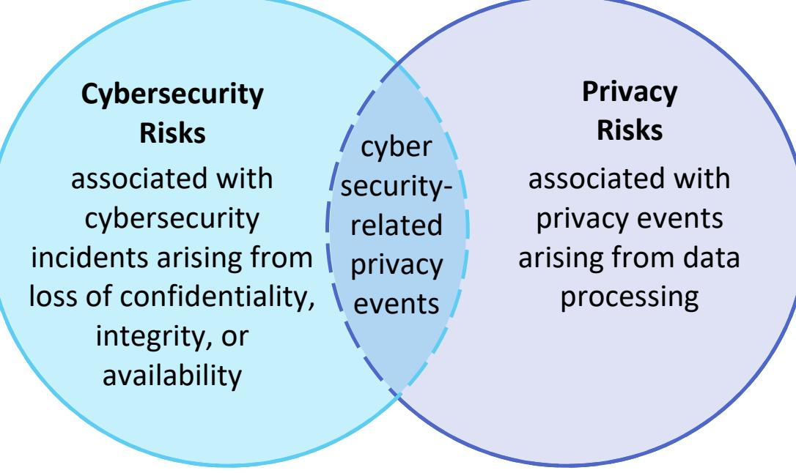
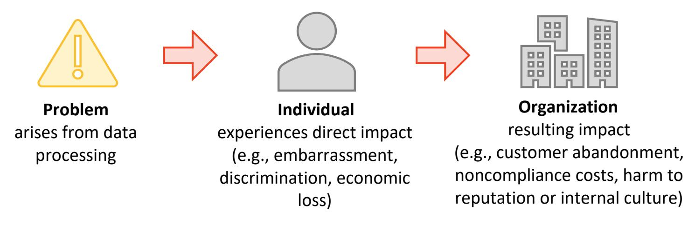
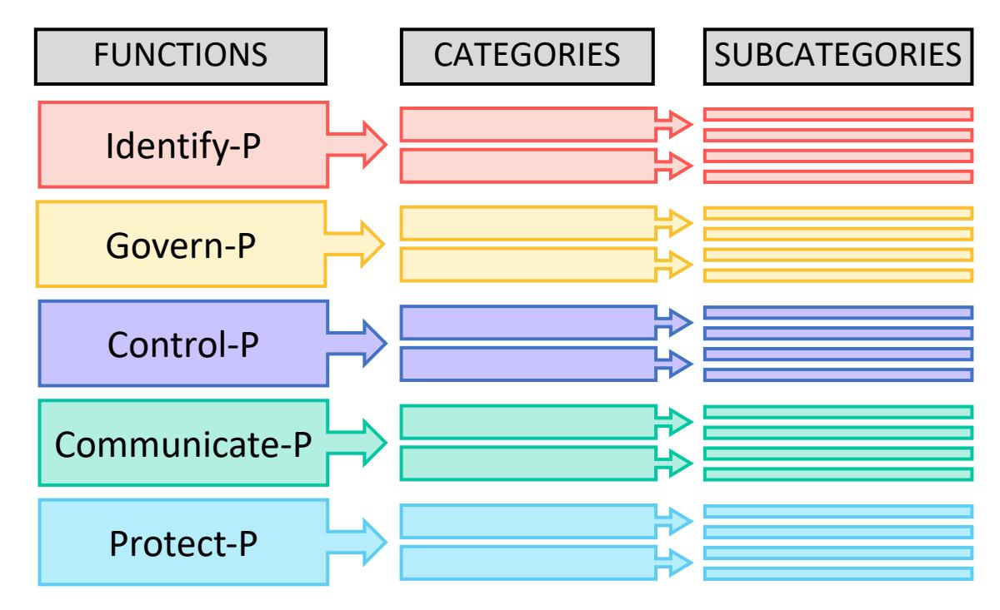
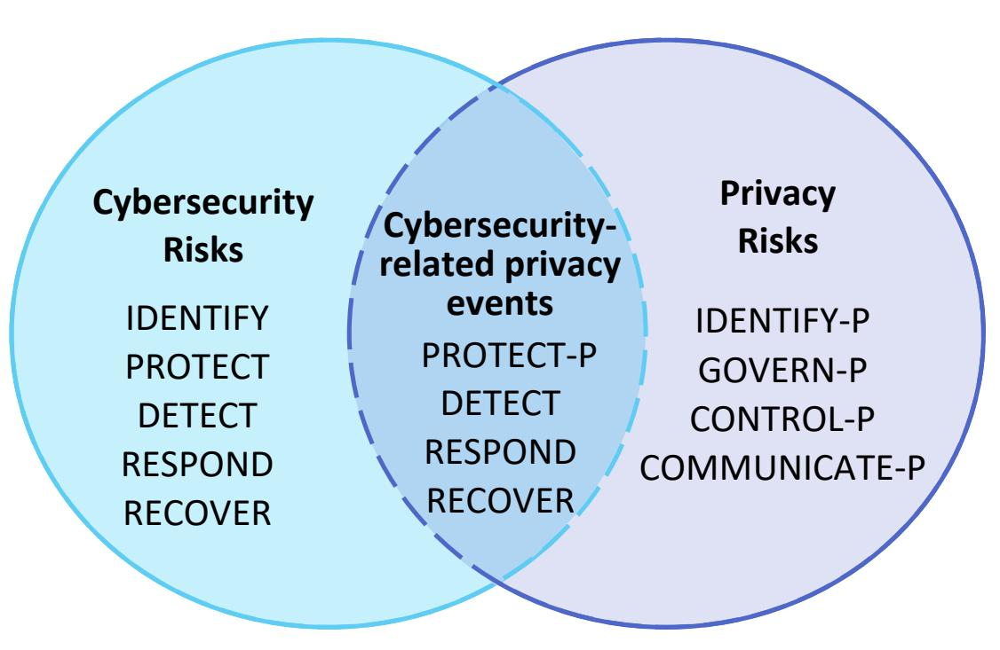
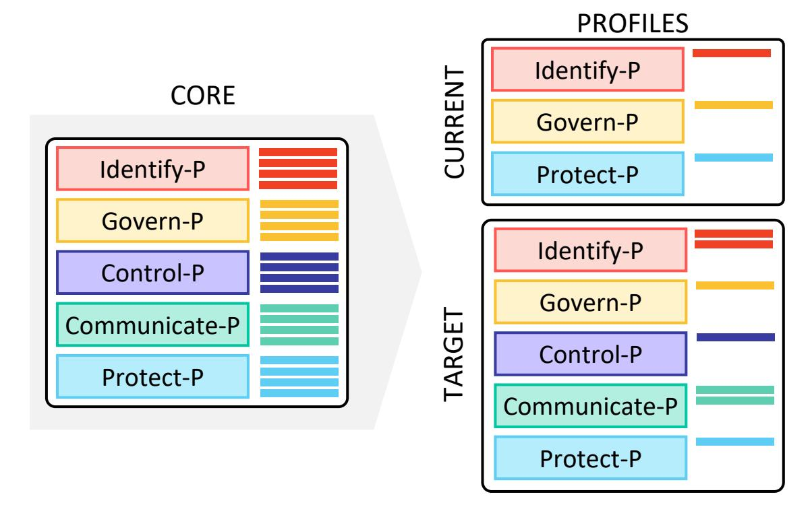
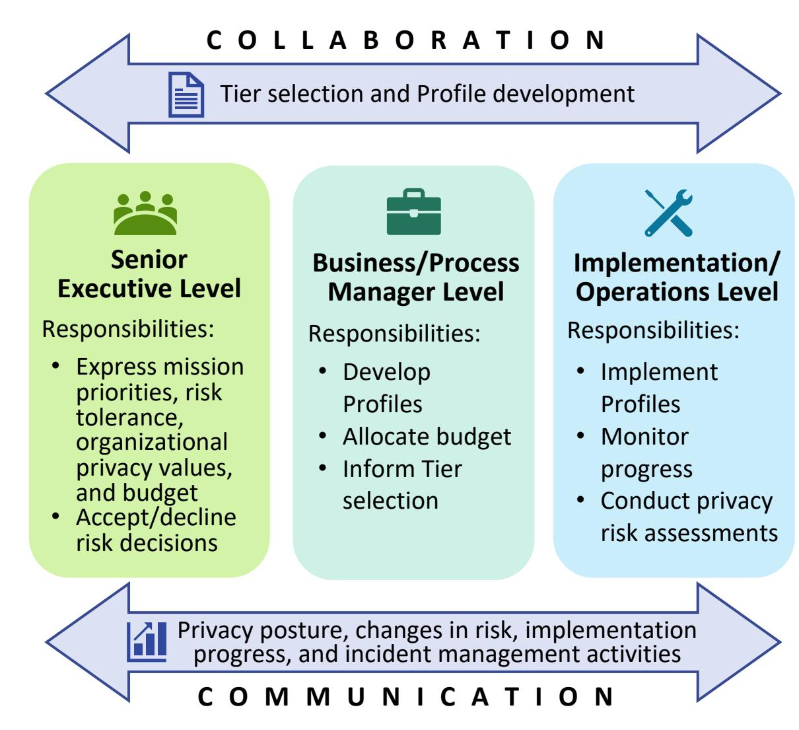
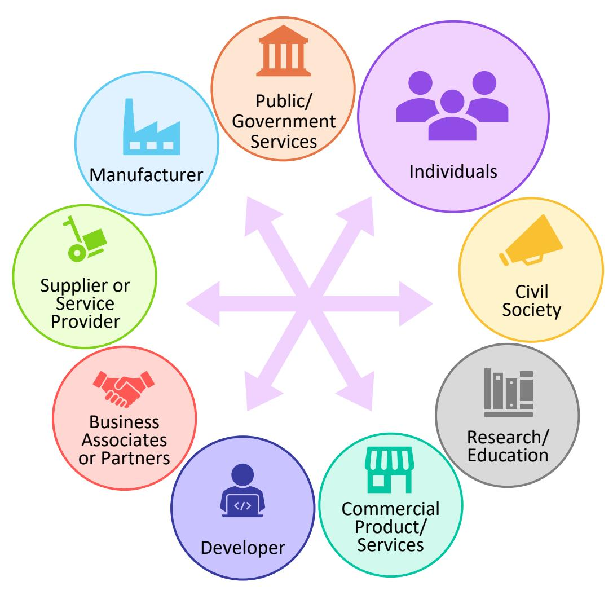

{0}------------------------------------------------

# **Version 1.0**

# NIST PRIVACY FRAMEWORK: A TOOL FOR IMPROVING PRIVACY THROUGH ENTERPRISE RISK MANAGEMENT, VERSION 1.0

January 16, 2020

This publication is available free of charge from: <https://doi.org/10.6028/NIST.CSWP.01162020>

The contents of this document do not have the force and effect of law and are not meant to bind the public in any way.

{1}------------------------------------------------

# Executive Summary

For more than two decades, the Internet and associated information technologies have driven unprecedented innovation, economic value, and improvement in social services. Many of these benefits are fueled by data about individuals that flow through a complex ecosystem. As a result, individuals may not be able to understand the potential consequences for their privacy as they interact with systems, products, and services. At the same time, organizations may not realize the full extent of these consequences for individuals, for society, or for their enterprises, which can affect their brands, their bottom lines, and their future prospects for growth.

Following a transparent, consensus-based process including both private and public stakeholders to produce this voluntary tool, the National Institute of Standards and Technology (NIST) is publishing this Privacy Framework: A Tool for Improving Privacy through Enterprise Risk Management (Privacy Framework), to enable better privacy engineering practices that support privacy by design concepts and help organizations protect individuals' privacy. The Privacy Framework can support organizations in:

- Building customers' trust by supporting ethical decision-making in product and service design or deployment that optimizes beneficial uses of data while minimizing adverse consequences for individuals' privacy and society as a whole;[1](#page-1-0)
- Fulfilling current compliance obligations, as well as future-proofing products and services to meet these obligations in a changing technological and policy environment; and
- Facilitating communication about privacy practices with individuals, business partners, assessors, and regulators.

Deriving benefits from data while simultaneously managing risks to individuals' privacy is not well-suited to one-size-fits-all solutions. Like building a house, where homeowners make layout and design choices while relying on a well-engineered foundation, privacy protection should allow for individual choices, as long as effective privacy risk mitigations are already engineered into products and services. The Privacy Framework—through a risk- and outcome-based approach—is flexible enough to address diverse privacy needs, enable more innovative and effective solutions that can lead to better outcomes for individuals and organizations, and stay current with technology trends, such as artificial intelligence and the Internet of Things.

The Privacy Framework follows the structure of th[e Framework for Improving Critical Infrastructure](https://doi.org/10.6028/NIST.CSWP.04162018)  [Cybersecurity \(Cybersecurity Framework\)](https://doi.org/10.6028/NIST.CSWP.04162018) [\[1\]](#page-18-0) to facilitate the use of both frameworks together. Like the Cybersecurity Framework, the Privacy Framework is composed of three parts: Core, Profiles, and Implementation Tiers. Each component reinforces privacy risk management through the connection between business and mission drivers, organizational roles and responsibilities, and privacy protection activities.

- The Core enables a dialogue—from the executive level to the implementation/operations level—about important privacy protection activities and desired outcomes.
- Profiles enable the prioritization of the outcomes and activities that best meet organizational privacy values, mission or business needs, and risks.

i

1 There is no objective standard for ethical decision-making; it is grounded in the norms, values, and legal expectations in a given society.

{2}------------------------------------------------

• Implementation Tiers support decision-making and communication about the sufficiency of organizational processes and resources to manage privacy risk.

In summary, the Privacy Framework is intended to help organizations build better privacy foundations by bringing privacy risk into parity with their broader enterprise risk portfolio.

# Acknowledgements

This publication is the result of a collaborative effort between NIST and organizational and individual stakeholders in the public and private sectors. In developing the Privacy Framework, NIST has relied upon three public workshops, a request for information (RFI), a request for comment (RFC), five webinars, and hundreds of direct interactions with stakeholders.[2](#page-2-0) NIST acknowledges and thanks all of those who have contributed to this publication.

2 A complete development archive can be found a[t https://www.nist.gov/privacy-framework.](https://www.nist.gov/privacy-framework)

{3}------------------------------------------------

### Table of Contents

| Executive   | e Summary                                                             | Ì  |
|-------------|-----------------------------------------------------------------------|----|
|             | edgements                                                             |    |
| 1.0         | Privacy Framework Introduction                                        |    |
| 1.1         | Overview of the Privacy Framework                                     |    |
| 1.2         | Privacy Risk Management                                               |    |
| 1           | .2.1 Cybersecurity and Privacy Risk Management                        |    |
| 1           | 2.2 Privacy Risk Assessment                                           |    |
| 1.3         | Document Overview                                                     | 5  |
| 2.0         | Privacy Framework Basics                                              | 6  |
| 2.1         | Core                                                                  |    |
| 2.2         | Profiles                                                              |    |
| 2.3         | Implementation Tiers                                                  | 8  |
| 3.0         | How to Use the Privacy Framework                                      |    |
| 3.1         | Mapping to Informative References                                     | 9  |
| 3.2         | Strengthening Accountability                                          |    |
| 3.3         | Establishing or Improving a Privacy Program                           |    |
| 3.4         | Applying to the System Development Life Cycle                         |    |
| 3.5         | Using within the Data Processing Ecosystem                            |    |
| 3.6         | Informing Buying Decisions                                            | 14 |
| Reference   | es                                                                    |    |
| Appendix    | κ A: Privacy Framework Core                                           |    |
| Appendix    | x B: Glossary                                                         | 28 |
| Appendix    | x C: Acronyms                                                         | 31 |
| Appendix    | x D: Privacy Risk Management Practices                                | 32 |
| Appendix    | x E: Implementation Tiers Definitions                                 | 37 |
| List of F   | igures                                                                |    |
|             | Core, Profiles, and Implementation Tiers                              |    |
|             | Cybersecurity and Privacy Risk Relationship                           |    |
|             | Relationship Between Privacy Risk and Organizational Risk             |    |
| •           | Privacy Framework Core Structure                                      |    |
| _           | Jsing Functions to Manage Cybersecurity and Privacy Risks             |    |
| •           | Relationship Between Core and Profiles                                |    |
| •           | Notional Collaboration and Communication Flows Within an Organization |    |
| Figure 8: [ | Data Processing Ecosystem Relationships                               | 13 |
| List of T   | Tables                                                                |    |
| Table 1: P  | rivacy Framework Function and Category Unique Identifiers             | 19 |
| Table 2: P  | rivacy Framework Core                                                 | 20 |
| Table 3: P  | rivacy Engineering and Security Objectives                            | 34 |

{4}------------------------------------------------

# 1.0 Privacy Framework Introduction

For more than two decades, the Internet and associated information technologies have driven unprecedented innovation, economic value, and access to social services. Many of these benefits are fueled by *[data](#page-31-1)* about *[individuals](#page-32-0)* that flow through a complex ecosystem. As a result, individuals may not be able to understand the potential consequences for their privacy as they interact with systems, products, and services. Organizations may not fully realize the consequences either. Failure to manage *[privacy risks](#page-33-0)* can have direct adverse consequences at both the individual and societal levels, with follow-on effects on organizations' brands, bottom lines, and future prospects for growth. Finding ways to continue to derive benefits from *[data processing](#page-32-1)* while simultaneously protecting individuals' privacy is challenging, and not well-suited to one-size-fits-all solutions.

Privacy is challenging because not only is it an all-encompassing concept that helps to safeguard important values such as human autonomy and dignity, but also the means for achieving it can vary. [3](#page-4-1) For example, privacy can be achieved through seclusion, limiting observation, or individuals' control of facets of their identities (e.g., body, data, reputation). [4](#page-4-2) Moreover, human autonomy and dignity are not fixed, quantifiable constructs; they are filtered through cultural diversity and individual differences. This broad and shifting nature of privacy makes it difficult to communicate clearly about privacy risks within and between organizations and with individuals. What has been missing is a common language and practical tool that is flexible enough to address diverse privacy needs.

This voluntary NIST Privacy Framework: A Tool for Improving Privacy through Enterprise Risk Management (Privacy Framework) is intended to be widely usable by organizations of all sizes and agnostic to any particular technology, sector, law, or jurisdiction. Using a common approach—adaptable to any organization's role(s) in the *[data processing ecosystem](#page-32-2)*—the Privacy Framework's purpose is to help organizations manage privacy risks by:

- Taking privacy into account as they design and deploy systems, products, and services that affect individuals;
- Communicating about their privacy practices; and
- Encouraging cross-organizational workforce collaboration—for example, among executives, legal, and information technology (IT)—through the development of Profiles, selection of Tiers, and achievement of outcomes.

3 Autonomy and dignity are concepts covered in the United Nations Universal Declaration of Human Rights at [https://www.un.org/en/universal-declaration-human-rights/.](https://www.un.org/en/universal-declaration-human-rights/)

4 There are many publications that provide an in-depth treatment on the background of privacy or different aspects of the concept. For two examples, see Solove D (2010) *Understanding Privacy* (Harvard University Press, Cambridge, MA), [https://ssrn.com/abstract=1127888;](https://ssrn.com/abstract=1127888) and Selinger E, Hartzog W (2017) Obscurity and Privacy, *Spaces for the Future: A Companion to Philosophy of Technology*, eds Pitt J, Shew A (Taylor & Francis, New York, NY), Chapter 12, 1st Ed., [https://doi.org/10.4324/9780203735657.](https://doi.org/10.4324/9780203735657)

{5}------------------------------------------------

### Overview of the Privacy Framework

As shown in **[Figure 1](#page-5-2)**, the Privacy Framework is composed of three parts: Core, Profiles, and Implementation Tiers. Each component reinforces how organizations manage privacy risk through the connection between business or mission drivers, organizational roles and responsibilities, and privacy protection activities. As further explained in section 2:

> • The *[Core](#page-31-2)* is a set of privacy protection activities and outcomes that allows for communicating prioritized privacy protection activities and outcomes across an organization from the

The **Core** provides an increasingly granular set of activities and outcomes that enable an organizational dialogue about managing privacy risk **Profiles** are a selection of specific Functions, Categories, and Subcategories from the Core that an organization has prioritized to help it manage privacy risk **CURRENT TARGET Implementation Tiers** support communication about whether an organization has sufficient processes and resources in place to manage privacy risk and achieve its Target Profile

**Figure 1: Core, Profiles, and Implementation Tiers**

executive level to the implementation/operations level. The Core is further divided into key Categories and Subcategories—which are discrete outcomes—for each Function.

- A *[Profile](#page-33-1)* represents an organization's current privacy activities or desired outcomes. To develop a Profile, an organization can review all of the outcomes and activities in the Core to determine which are most important to focus on based on business or mission drivers, data processing ecosystem role(s), types of data processing, and individuals' privacy needs. An organization can create or add Functions, Categories, and Subcategories as needed. Profiles can be used to identify opportunities for improving privacy posture by comparing a "Current" Profile (the "as is" state) with a "Target" Profile (the "to be" state). Profiles can be used to conduct selfassessments and to communicate within an organization or between organizations about how privacy risks are being managed.
- *[Implementation Tiers](#page-32-3)* ("Tiers") provide a point of reference on how an organization views privacy risk and whether it has sufficient processes and resources in place to manage that risk. Tiers reflect a progression from informal, reactive responses to approaches that are agile and risk informed. When selecting Tiers, an organization should consider its Target Profile(s) and how achievement may be supported or hampered by its current risk management practices, the degree of integration of privacy risk into its enterprise risk management portfolio, its data processing ecosystem relationships, and its workforce composition and training program.

### Privacy Risk Management

While some organizations have a robust grasp of *[privacy risk management,](#page-33-2)* a common understanding of many aspects of this topic is still not widespread. [5](#page-5-3) To promote broader understanding, this section covers concepts and considerations that organizations may use to develop, improve, or communicate

5 See *Summary Analysis of the Responses to the NIST Privacy Framework Request for Information* [\[2\]](#page-18-2) at p. 7.

{6}------------------------------------------------

about privacy risk management. [Appendix D](#page-35-0) provides additional information on key privacy risk management practices.

### 1.2.1 Cybersecurity and Privacy Risk Management

Since its release in 2014, the Cybersecurity Framework has helped organizations to communicate and manage cybersecurity risk. [\[1\]](#page-18-0) While managing cybersecurity risk contributes to managing privacy risk, it is not sufficient, as privacy risks can also arise by means unrelated to *[cybersecurity incidents](#page-31-3)*, as illustrated by **[Figure 2.](#page-6-1)** Having a general understanding of the different origins of cybersecurity and privacy risks is important for determining the most effective solutions to address the risks.

**Figure 2: Cybersecurity and Privacy Risk Relationship**

The Privacy Framework approach to privacy

risk is to consider *[privacy events](#page-33-3)* as potential problems individuals could experience arising from system, product, or service operations with data, whether in digital or non-digital form, through a complete life cycle from data collection through disposal.

The Privacy Framework describes these data operations in the singular as a *[data action](#page-32-4)* and collectively

#### *Data Action*

A data life cycle operation, including, but not limited to collection, retention, logging, generation, transformation, use, disclosure, sharing, transmission, and disposal.

#### *Data Processing*

The collective set of data actions.

as data processing. The problems individuals can experience as a result of data processing can be expressed in various ways, but NIST describes them as ranging from dignity-type effects such as embarrassment or stigmas to more tangible harms such as discrimination, economic loss, or physical harm.[6](#page-6-2)

The basis for the problems that individuals may experience can vary. As depicted in **[Figure 2](#page-6-1)**, problems arise as an adverse effect of data processing that organizations conduct to meet their mission or business objectives. An example is the concerns that certain communities had about the installation of "smart meters" as part of the Smart Grid, a nationwide technological effort to increase energy efficiency.[7](#page-6-3) The ability of these meters to collect, record, and distribute highly granular information about household electrical use could provide insight into people's behavior inside their homes.[8](#page-6-4) The meters were

6 NIST has created an illustrative catalog of problems for use in privacy risk assessment. See *NIST Privacy Risk Assessment Methodology* [\[3\].](#page-18-3) Other organizations may have created other categories of problems, or may refer to them as adverse consequences or harms.

7 See, for example, NIST Interagency or Internal Report (IR) 7628 Revision 1 Volume 1, *Guidelines for Smart Grid Cybersecurity: Volume 1 – Smart Grid Cybersecurity Strategy, Architecture, and High-Level Requirements* a[t \[4\]](#page-18-4) p. 26.

8 See NIST IR 8062, *An Introduction to Privacy Engineering and Risk Management in Federal Systems* a[t \[5\]](#page-18-5) p. 2. For additional types of privacy risks associated with adverse effects on individuals of data processing, see Appendix E of NIST IR 8062.

{7}------------------------------------------------

operating as intended, but the data processing could lead to people feeling surveilled.

In an increasingly connected world, some problems can arise simply from individuals' interactions with systems, products, and services, even when the data being processed is not directly linked to identifiable individuals. For example, smart cities technologies could be used to alter or influence people's behavior such as where or how they move through the city. [9](#page-7-2) Problems also can arise where there is a loss of *[confidentiality](#page-31-4)*, *[integrity](#page-32-5)*, or *[availability](#page-31-5)* at some point in the data processing, such as data theft by external attackers or the unauthorized access or use of data by employees. **[Figure 2](#page-6-1)** shows these types of cybersecurity-related privacy events as the overlap between privacy and cybersecurity risks.

Once an organization can identify the likelihood of any given problem arising from the data processing, which the Privacy Framework refers to as a *[problematic data action](#page-33-4)*, it can assess the impact should the problematic data action occur. This impact assessment is where privacy risk and organizational *[risk](#page-33-5)* intersect. Individuals, whether singly or in groups (including at a societal level) experience the direct impact of problems. As a result of the problems individuals experience, an organization may experience impacts such as noncompliance costs, revenue loss arising from customer abandonment of products and services, or harm to its external brand reputation or internal culture. Organizations commonly manage these types of impacts at the enterprise risk management level; by connecting problems that individuals experience to these well-understood organizational impacts, organizations can bring privacy risk into parity with other risks they are managing in their broader portfolio and drive more informed decisionmaking about resource allocation to strengthen privacy programs. **[Figure 3](#page-7-1)** illustrates this relationship between privacy risk and organizational risk.

**Figure 3: Relationship Between Privacy Risk and Organizational Risk**

### 1.2.2 Privacy Risk Assessment

Privacy risk management is a cross-organizational set of processes that helps organizations to understand how their systems, products, and services may create problems for individuals and how to develop effective solutions to manage such risks. *[Privacy risk assessment](#page-33-6)* is a sub-process for identifying and evaluating specific privacy risks. In general, privacy risk assessments produce the information that can help organizations to weigh the benefits of the data processing against the risks and to determine the appropriate response—sometimes referred to as proportionality.[10](#page-7-3) Organizations may choose to

9 See Newcombe T (2016) Security, Privacy, Governance Concerns About Smart City Technologies Grow. *Government Technology*. Available at [http://www.govtech.com/Security-Privacy-Governance-Concerns-About-](http://www.govtech.com/Security-Privacy-Governance-Concerns-About-Smart-City-Technologies-Grow.html)[Smart-City-Technologies-Grow.html.](http://www.govtech.com/Security-Privacy-Governance-Concerns-About-Smart-City-Technologies-Grow.html)

10 See European Data Protection Supervisor (2019) *Necessity & Proportionality*. Available at [https://edps.europa.eu/data-protection/our-work/subjects/necessity-proportionality\\_en.](https://edps.europa.eu/data-protection/our-work/subjects/necessity-proportionality_en)

{8}------------------------------------------------

prioritize and respond to privacy risk in different ways, depending on the potential impact to individuals and resulting impacts to organizations. Response approaches include: [11](#page-8-1)

- Mitigating the risk (e.g., organizations may be able to apply technical and/or policy measures to the systems, products, or services that minimize the risk to an acceptable degree);
- Transferring or sharing the risk (e.g., contracts are a means of sharing or transferring risk to other organizations, privacy notices and consent mechanisms are a means of sharing risk with individuals);
- Avoiding the risk (e.g., organizations may determine that the risks outweigh the benefits, and forego or terminate the data processing); or
- Accepting the risk (e.g., organizations may determine that problems for individuals are minimal or unlikely to occur, therefore the benefits outweigh the risks, and it is not necessary to invest resources in mitigation).

Privacy risk assessments are particularly important because, as noted above, privacy is a condition that safeguards multiple values. The methods for safeguarding these values may differ, and moreover, may be in tension with each other. Depending on its objectives, if an organization is trying to achieve privacy by limiting observation, this may lead to implementing measures such as distributed data architectures or privacy-enhancing cryptographic techniques that hide data even from the organization. If an organization is also trying to enable individual control, the measures could conflict. For example, if an individual requests access to data, the organization may not be able to produce the data if the data have been distributed or encrypted in ways the organization cannot access. Privacy risk assessments can help an organization understand in a given context the values to protect, the methods to employ, and how to balance implementation of different types of measures.

Lastly, privacy risk assessments help organizations distinguish between privacy risk and compliance risk. Identifying if data processing could create problems for individuals, even when an organization may be fully compliant with applicable laws or regulations, can help with ethical decision-making in system, product, and service design or deployment. Although there is no objective standard for ethical decisionmaking, it is grounded in the norms, values, and legal expectations in a given society. This facilitates optimizing beneficial uses of data while minimizing adverse consequences for individuals' privacy and society as a whole, as well as avoiding losses of trust that damage organizations' reputations, slow adoption, or cause abandonment of products and services.

See [Appendix D](#page-35-0) for more information on the operational aspects of privacy risk assessment.

### Document Overview

The remainder of this document contains the following sections and appendices:

- **[Section 2](#page-9-0)** describes the Privacy Framework components: Core, Profiles, and Implementation Tiers.
- **[Section 3](#page-12-0)** presents examples of how the Privacy Framework can be used.
- The **[References section](#page-18-1)** lists the references for the document.

11 See NIST Special Publication (SP) 800-39, *Managing Information Security Risk: Organization, Mission, and Information System View* [\[6\].](#page-18-6)

{9}------------------------------------------------

- **[Appendix A](#page-20-0)** presents the Privacy Framework Core in a tabular format: Functions, Categories, and Subcategories.
- **[Appendix B](#page-31-0)** contains a glossary of selected terms.
- **[Appendix C](#page-33-7)** lists acronyms used in this document.
- **[Appendix D](#page-35-0)** considers key practices that contribute to successful privacy risk management.
- **[Appendix E](#page-40-0)** defines the Implementation Tiers.

# 2.0 Privacy Framework Basics

The Privacy Framework provides a common language for understanding, managing, and communicating privacy risk with internal and external stakeholders. It is adaptable to any organization's role(s) in the data processing ecosystem. It can be used to help identify and prioritize actions for reducing privacy risk, and it is a tool for aligning policy, business, and technological approaches to managing that risk.

### Core

Set forth in [Appendix A,](#page-20-0) the Core provides an increasingly granular set of activities and outcomes that enable a dialogue about managing privacy risk. As depicted in **[Figure 4](#page-9-2)**, the Core comprises Functions, Categories, and Subcategories.

The Core elements work together:

• *[Functions](#page-32-6)* organize foundational privacy activities at their highest level. They aid an organization in expressing its

**Figure 4: Privacy Framework Core Structure**

- management of privacy risk by understanding and managing data processing, enabling *[risk](#page-33-8)  [management](#page-33-8)* decisions, determining how to interact with individuals, and improving by learning from previous activities. They are not intended to form a serial path or lead to a static desired end state. Rather, the Functions should be performed concurrently and continuously to form or enhance an operational culture that addresses the dynamic nature of privacy risk.
- *[Categories](#page-31-6)* are the subdivisions of a Function into groups of privacy outcomes closely tied to programmatic needs and particular activities.
- *[Subcategories](#page-33-9)* further divide a Category into specific outcomes of technical and/or management activities. They provide a set of results that, while not exhaustive, help support achievement of the outcomes in each Category.

The five Functions, Identify-P, Govern-P, Control-P, Communicate-P, and Protect-P, defined below, can be used to manage privacy risks arising from data processing.[12](#page-9-3) Protect-P is specifically focused on managing risks associated with cybersecurity-related privacy events (e.g., *[privacy breaches](#page-33-10)*). The [Cybersecurity Framework,](https://doi.org/10.6028/NIST.CSWP.04162018) although intended to cover all types of cybersecurity incidents, can be

12 The "-P" at the end of each Function name indicates that it is from the Privacy Framework in order to avoid confusion with Cybersecurity Framework Functions.

{10}------------------------------------------------

leveraged to further support the management of risks associated with cybersecurity-related privacy events by using the Detect, Respond, and Recover Functions. Alternatively, organizations may use all five of the Cybersecurity Framework Functions in conjunction with Identify-P, Govern-P, Control-P, and Communicate-P to collectively address privacy and cybersecurity risks. **[Figure 5](#page-10-0)** uses the Venn diagram from section [1.2.1](#page-6-0) to demonstrate how the Functions from both frameworks can be used in varying combinations to manage different aspects of privacy and

**Figure 5: Using Functions to Manage Cybersecurity and Privacy Risks**

cybersecurity risks. The five Privacy Framework Functions are defined as follows:

- *[Identify-P](#page-32-7)* Develop the organizational understanding to manage privacy risk for individuals arising from data processing.
  - The activities in the Identify-P Function are foundational for effective use of the Privacy Framework. Inventorying the circumstances under which data are processed, understanding the privacy interests of individuals directly or indirectly served or affected by an organization, and conducting risk assessments enable an organization to understand the business environment in which it is operating and identify and prioritize privacy risks.
- *[Govern-P](#page-32-8)* Develop and implement the organizational governance structure to enable an ongoing understanding of the organization's risk management priorities that are informed by privacy risk.
  - The Govern-P Function is similarly foundational, but focuses on organizational-level activities such as establishing organizational privacy values and policies, identifying legal/regulatory requirements, and understanding organizational *[risk tolerance](#page-33-11)* that enable an organization to focus and prioritize its efforts, consistent with its risk management strategy and business needs.
- *[Control-P](#page-31-7)* Develop and implement appropriate activities to enable organizations or individuals to manage data with sufficient granularity to manage privacy risks.
  - The Control-P Function considers data processing management from the standpoint of both organizations and individuals.
- *[Communicate-P](#page-31-8)* Develop and implement appropriate activities to enable organizations and individuals to have a reliable understanding and engage in a dialogue about how data are processed and associated privacy risks.
  - The Communicate-P Function recognizes that both organizations and individuals may need to know how data are processed in order to manage privacy risk effectively.
- *[Protect-P](#page-33-12)* Develop and implement appropriate data processing safeguards.
  - The Protect-P Function covers data protection to prevent cybersecurity-related privacy events, the overlap between privacy and cybersecurity risk management.

{11}------------------------------------------------

### Profiles

Profiles are a selection of specific Functions, Categories, and Subcategories from the Core that an organization has prioritized to help it manage privacy risk. Profiles can be used to describe the current state and the desired target state of specific privacy activities. A Current Profile indicates privacy outcomes that an organization is currently achieving, while a Target Profile indicates the outcomes needed to achieve the desired privacy risk management goals. The differences between the two Profiles enable an organization to identify gaps, develop an action plan for improvement, and gauge the resources that would be needed (e.g., staffing, funding) to achieve privacy outcomes. This forms the basis of an organization's plan for reducing privacy risk in a cost-effective, prioritized manner. Profiles also can aid in communicating risk within and between organizations by helping organizations understand and compare the current and desired state of privacy outcomes.

The Privacy Framework does not prescribe Profile templates to allow for flexibility in implementation. Under the Privacy Framework's riskbased approach, organizations may not need to achieve every outcome or activity reflected in the Core. When developing a Profile, an organization may select or tailor the Functions, Categories, and Subcategories to its specific needs, including developing its own additional Functions, Categories, and Subcategories to account for unique organizational risks. An

**Figure 6: Relationship Between Core and Profiles**

organization determines these needs by considering its mission or business objectives, privacy values, and risk tolerance; role(s) in the data processing ecosystem or industry sector; legal/regulatory requirements and industry best practices; risk management priorities and resources; and the privacy needs of individuals who are directly or indirectly served or affected by an organization's systems, products, or services.

As illustrated in **[Figure 6](#page-11-2)**, there is no specified order of development of Profiles. An organization may first develop a Target Profile in order to focus on its desired outcomes for privacy and then develop a Current Profile to identify gaps; alternatively, an organization may begin by identifying its current activities, and then consider how to adjust these activities for its Target Profile. An organization may choose to develop multiple Profiles for different roles, systems, products, or services, or categories of individuals (e.g., employees, customers) to enable better prioritization of activities and outcomes where there may be differing degrees of privacy risk. Organizations in a certain industry sector or with similar roles in the data processing ecosystem may coordinate to develop common Profiles.

### Implementation Tiers

Tiers support organizational decision-making about how to manage privacy risk by taking into account the nature of the privacy risks engendered by an organization's systems, products, or services and the sufficiency of the processes and resources an organization has in place to manage such risks. When selecting Tiers, an organization should consider its Target Profile(s) and how achievement may be supported or hampered by its current risk management practices, the degree of integration of privacy 

{12}------------------------------------------------

risk into its enterprise risk management portfolio, its data processing ecosystem relationships, and its workforce composition and training program.

There are four distinct Tiers, Partial (Tier 1), Risk Informed (Tier 2), Repeatable (Tier 3), and Adaptive (Tier 4), descriptions of which are i[n Appendix E.](#page-40-0) The Tiers represent a progression, albeit not a compulsory one. Although organizations at Tier 1 will likely benefit from moving to Tier 2, not all organizations need to achieve Tiers 3 or 4 (or may only focus on certain areas of these Tiers). Progression to higher Tiers is appropriate when an organization's processes or resources at its current Tier may be insufficient to help it manage its privacy risks.

An organization can use the Tiers to communicate internally about resource allocations necessary to progress to a higher Tier or as general benchmarks to gauge progress in its capability to manage privacy risks. An organization can also use Tiers to understand the scale of resources and processes of other organizations in the data processing ecosystem and how they align with the organization's privacy risk management priorities. Nonetheless, successful implementation of the Privacy Framework is based upon achieving the outcomes described in an organization's Target Profile(s) and not upon Tier determination.

# 3.0 How to Use the Privacy Framework

When used as a risk management tool, the Privacy Framework can assist an organization in its efforts to optimize beneficial uses of data and the development of innovative systems, products, and services while minimizing adverse consequences for individuals. The Privacy Framework can help organizations answer the fundamental question, "How are we considering the impacts to individuals as we develop our systems, products, and services?" To account for the unique needs of an organization, use of the Privacy Framework is flexible, although it is designed to complement existing business and system development operations. The decision about how to apply it is left to the implementing organization. For example, an organization may already have robust privacy risk management processes, but may use the Core's five Functions as a streamlined way to analyze and articulate any gaps. Alternatively, an organization seeking to establish a privacy program can use the Core's Categories and Subcategories as a reference. Other organizations may compare Profiles or Tiers to align privacy risk management priorities across different roles in the data processing ecosystem. The variety of ways in which the Privacy Framework can be used by organizations should discourage the notion of "compliance with the Privacy Framework" as a uniform or externally referenceable concept. The following subsections present a few options for use of the Privacy Framework.

## Mapping to Informative References

Informative references are mappings to Subcategories to provide implementation support, including mappings of tools, technical guidance, standards, laws, regulations, and best practices. Crosswalks that map the provisions of standards, laws, and regulations to Subcategories can help organizations determine which activities or outcomes to prioritize to facilitate compliance. The Privacy Framework is technology neutral, but it supports technological innovation because any organization or industry sector can develop these mappings as technology and related business needs evolve. By relying on consensusbased standards, guidelines, and practices, the tools and methods available to achieve positive privacy outcomes can scale across borders and accommodate the global nature of privacy risks. The use of existing and emerging standards will enable economies of scale and drive the development of systems, products, and services that meet identified market needs while being mindful of the privacy needs of individuals.

{13}------------------------------------------------

Gaps in mappings can also be used to identify where additional or revised standards, guidelines, and practices would help an organization to address emerging needs. An organization implementing a given Subcategory, or developing a new Subcategory, might discover that there is insufficient guidance for a related activity or outcome. To address that need, an organization might collaborate with technology leaders and/or standards bodies to draft, develop, and coordinate standards, guidelines, or practices.

A repository of informative references can be found at <a href="https://www.nist.gov/privacy-framework">https://www.nist.gov/privacy-framework</a>. These resources can support organizations' use of the Privacy Framework and achievement of better privacy practices.

#### 3.2 Strengthening Accountability

Accountability is generally considered a key privacy principle, although conceptually it is not unique to privacy. 13 Accountability occurs throughout an organization, and it can be expressed at varying degrees

of abstraction, for example as a cultural value, as governance policies and procedures, or as traceability relationships between privacy requirements and controls. Privacy risk management can be a means of supporting accountability at all organizational levels as it connects senior executives, who can communicate an organization's privacy values and risk tolerance, to those at the business/process manager level, who can collaborate on the development and implementation of governance policies and procedures that support organizational privacy values. These policies and procedures can then be communicated to those at the implementation/operations level, who collaborate on defining the privacy requirements that support the expression of the policies and

Figure 7: Notional Collaboration and Communication Flows Within an Organization

procedures in an organization's systems, products, and services. Personnel at the

See, e.g., Organisation for Economic Co-operation and Development (OECD) (2013) *OECD Guidelines on the Protection of Privacy and Transborder Flows of Personal Data*, available at <a href="https://www.oecd.org/internet/ieconomy/oecdguidelinesontheprotectionofprivacyandtransborderflowsofpersonaldata.htm">https://www.oecd.org/internet/ieconomy/oecdguidelinesontheprotectionofprivacyandtransborderflowsofpersonaldata.htm</a>; International Organization for Standardization (ISO)/International Electrotechnical Commission (IEC) (2011) *ISO/IEC 29100:2011 – Information technology – Security techniques – Privacy framework* (ISO, Geneva, Switzerland), available at <a href="https://standards.iso.org/ittf/PubliclyAvailableStandards/c045123">https://standards.iso.org/ittf/PubliclyAvailableStandards/c045123</a> ISO IEC 29100 2011.zip; and Alliance of Automobile Manufacturers, Inc., Association of Global Automakers, Inc. (2014) *Consumer Privacy Protection Principles: Privacy Principles for Vehicle Technologies and Services*, available at <a href="https://autoalliance.org/wp-content/uploads/2017/01/Consumer Privacy Principlesfor VehicleTechnologies Services-03-21-19.pdf">https://autoalliance.org/wp-content/uploads/2017/01/Consumer Privacy Principlesfor VehicleTechnologies Services-03-21-19.pdf</a>.

{14}------------------------------------------------

implementation/operations level also select, implement, and assess controls as the technical and policy measures that meet the privacy requirements, and report on progress, gaps and deficiencies, incident management, and changing privacy risks so that those at the business/process manager level and the senior executives can better understand and respond appropriately.

**[Figure 7](#page-13-1)** provides a graphical representation of this bi-directional collaboration and communication and how elements of the Privacy Framework can be incorporated to facilitate the process. In this way, organizations can use the Privacy Framework as a tool to support accountability. They can also use the Privacy Framework in conjunction with other frameworks and guidance that provide additional practices to achieve accountability within and between organizations. [14](#page-14-1)

### Establishing or Improving a Privacy Program

Using a simple model of "ready, set, go" phases, the Privacy Framework can support the creation of a new privacy program or improvement of an existing program. As an organization goes through these phases, it may use informative references to provide guidance on prioritizing or achieving outcomes. See sectio[n 3.1](#page-12-1) for more information about informative references. In addition, a repository can be found at [https://www.nist.gov/privacy-framework.](https://www.nist.gov/privacy-framework)

### Ready

Effective privacy risk management requires an organization to understand its mission or business environment; its legal environment; its risk tolerance; the privacy risks engendered by its systems, products, or services; and its role(s) in the data processing ecosystem. An organization can use the Identify-P and Govern-P Functions to "get ready" by reviewing the Categories and Subcategories, and beginning to develop its Current Profile and Target Profile.[15](#page-14-2) Activities and outcomes such as establishing organizational privacy values and policies, determining and expressing an organizational risk tolerance, and conducting privacy risk assessments (se[e Appendix D](#page-35-0) for more information on privacy risk assessments) provide a foundation for completing the Profiles in "Set."

#### *A Simplified Method for Establishing or Improving a Privacy Program*

**Ready:** use the Identify-P and Govern-P Functions to get "ready."

**Set:** "set" an action plan based on the differences between Current and Target Profile(s).

**Go:** "go" forward with implementing the action plan.

### Set

An organization completes its Current Profile by indicating which Category and Subcategory outcomes from the remaining Functions are being achieved. If an outcome is partially achieved, noting this fact will help support subsequent steps by providing baseline information. Informed by the activities under Identify and Govern, such as organizational privacy values and policies, organizational risk tolerance, and privacy risk assessment results, an organization completes its Target Profile focused on the assessment of the Categories and Subcategories describing its desired privacy outcomes. An organization also may develop its own additional Functions, Categories, and Subcategories to account for unique organizational risks. It may also consider influences and requirements of external stakeholders such as

14 See, e.g., NIST SP 800-37, Rev. 2, *Risk Management Framework for Information Systems and Organizations: A System Life Cycle Approach for Security and Privacy* [\[7\];](#page-18-7) and Organization for the Advancement of Structured Information Standards (OASIS) (2016) Privacy Management Reference Model and Methodology (PMRM) Version 1.0, [https://docs.oasis-open.org/pmrm/PMRM/v1.0/PMRM-v1.0.pdf.](https://docs.oasis-open.org/pmrm/PMRM/v1.0/PMRM-v1.0.pdf)

15 For additional information, see the "Prepare" step, Section 3.1, NIST SP 800-37, Rev. [2 \[7\].](#page-18-7)

{15}------------------------------------------------

business customers and partners when creating a Target Profile. An organization can develop multiple Profiles to support its different business lines or processes, which may have different business needs and associated risk tolerances.

An organization compares the Current Profile and the Target Profile to determine gaps. Next, it creates a prioritized action plan to address gaps—reflecting mission drivers, costs and benefits, and risks—to achieve the outcomes in the Target Profile. An organization using the Cybersecurity Framework and the Privacy Framework together may develop integrated action plans. It then determines resources, including funding and workforce needs, necessary to address the gaps, which can inform the selection of an appropriate Tier. Using Profiles in this manner encourages an organization to make informed decisions about privacy activities, supports risk management, and enables an organization to perform cost-effective, targeted improvements.

### Go

With the action plan "set," an organization prioritizes which actions to take to address any gaps, and then adjusts its current privacy practices in order to achieve the Target Profile.[16](#page-15-1)

An organization can go through the phases nonsequentially as needed to continuously assess and improve its privacy posture. For instance, an organization may find that more frequent repetition of the Ready phase improves the quality of privacy risk assessments. Furthermore, an organization may monitor progress through iterative updates to the Current Profile or the Target Profile to adjust to changing risks, subsequently comparing the Current Profile to the Target Profile.

### Applying to the System Development Life Cycle

The Target Profile can be aligned with the system development life cycle (SDLC) phases of plan, design, build/buy, deploy, operate, and decommission to support the achievement of the prioritized privacy outcomes. [17](#page-15-2) Beginning with the plan phase the prioritized privacy outcomes can be transformed into the privacy capabilities and requirements for the system, recognizing that requirements are likely to evolve during the remainder of the life cycle. A key milestone of the design phase is validating that the privacy capabilities and requirements match the needs and risk tolerance of an organization as expressed in the Target Profile. That same Target Profile can serve as an internal list to be assessed when deploying the system to verify that all privacy capabilities and requirements are implemented. The privacy outcomes determined by using the Privacy Framework should then serve as a basis for ongoing operation of the system. This includes occasional reassessment, capturing results in a Current Profile, to verify that privacy capabilities and requirements are still fulfilled.

Privacy risk assessments typically focus on the data life cycle, the stages through which data passes, often characterized as creation or collection, processing, dissemination, use, storage, and disposition, to include destruction and deletion. Aligning the SDLC and the data lifecycle by identifying and understanding how data are processed during all stages of the SDLC helps organizations to better manage privacy risks and informs the selection and implementation of privacy controls to meet privacy requirements.

16 NIST SP 800-37, Rev. 2 [\[7\]](#page-18-7) provides additional information on steps to execute on the action plan, including control selection, implementation, and assessment to close any gaps.

17 Within the SDLC, organizations may employ a variety of development methodologies (e.g., waterfall, spiral, or agile).

{16}------------------------------------------------

#### 3.5 Using within the Data Processing Ecosystem

A key factor in the management of privacy risk is an entity's role(s) in the data processing ecosystem, which can affect not only its legal obligations, but also the measures it may take to manage privacy risk. As depicted in Figure 8, the data processing ecosystem encompasses a range of entities and roles that may have complex, multi-directional relationships with each other and individuals. Complexity can increase when entities are supported by a chain of sub-entities; for example, service providers may be supported by a series of service providers, or manufacturers may have multiple component suppliers. Figure 8 displays entities as having distinct roles, but some may have multiple roles, such as an organization providing services to other organizations and providing retail products to

Figure 8: Data Processing Ecosystem Relationships

consumers. The roles in **Figure 8** are intended to be notional classifications. In practice, an entity's role(s) may be legally codified—for example, some laws classify organizations as data controllers or data processors—or classifications may be derived from industry sector designations.

By developing one or more Profiles relevant to its role(s), an entity can use the Privacy Framework to consider how to manage privacy risk not only with regard to its own priorities, but also in relation to how the measures it may take affect other data processing ecosystem entities' management of privacy risk. For example:

- An organization that makes decisions about how to collect and use data about individuals may\nuse a Profile to express privacy requirements to an external service provider (e.g., a cloud
  provider to which it is exporting data); the external service provider that processes the data may\nuse its Profile to demonstrate the measures it has adopted to process data in line with
  contractual obligations.
- An organization may express its privacy posture through a Current Profile to report results or to compare with acquisition requirements.
- An industry sector may establish a common Profile that can be used by its members to customize their own Profiles.
- A manufacturer may use a Target Profile to determine the capabilities to build into its products so that its business customers can meet the privacy needs of their end users.
- A developer may use a Target Profile to consider how to design an application that enables privacy protections when used within other organizations' system environments.

The Privacy Framework provides a common language to communicate privacy requirements with entities within the data processing ecosystem. The need for this communication can be particularly

{17}------------------------------------------------

notable when the data processing ecosystem crosses national boundaries, such as with international data transfers. Organizational practices that support communication may include:

- Determining privacy requirements;
- Enacting privacy requirements through formal agreement (e.g., contracts, multi-party frameworks);
- Communicating how those privacy requirements will be verified and validated;
- Verifying that privacy requirements are met through a variety of assessment methodologies; and
- Governing and managing the above activities.

### Informing Buying Decisions

Since either a Current or Target Profile can be used to generate a prioritized list of privacy requirements, these Profiles can also be used to inform decisions about buying products and services. By first selecting outcomes that are relevant to its privacy goals, an organization then can evaluate partners' systems, products, or services against this outcome. For example, if a device is being purchased for environmental monitoring of a forest, *[manageability](#page-32-9)* may be important to support capabilities for minimizing the processing of data about people using the forest and should drive a manufacturer evaluation against applicable Subcategories in the Core (e.g., CT.DP-P4: system or device configurations permit selective collection or disclosure of *[data elements](#page-32-10)*).

In circumstances where it may not be possible to impose a set of privacy requirements on the supplier, the objective should be to make the best buying decision among multiple suppliers, given a carefully determined list of privacy requirements. Often, this means some degree of trade-off, comparing multiple products or services with known gaps to the Profile. If the system, product, or service purchased did not meet all of the objectives described in the Profile, an organization could address the residual risk through mitigation measures or other management actions.

{18}------------------------------------------------

# References

- [1] National Institute of Standards and Technology (2018) Framework for Improving Critical Infrastructure Cybersecurity, Version 1.1. (National Institute of Standards and Technology, Gaithersburg, MD)[. https://doi.org/10.6028/NIST.CSWP.04162018](https://doi.org/10.6028/NIST.CSWP.04162018)
- [2] National Institute of Standards and Technology (2019) Summary Analysis of the Responses to the NIST Privacy Framework Request for Information. (National Institute of Standards and Technology, Gaithersburg, MD). [https://www.nist.gov/sites/default/files/documents/2019/02/27/](https://www.nist.gov/sites/default/files/documents/2019/02/27/rfi_response_analysis_privacyframework_2.27.19.pdf)  [rfi\\_response\\_analysis\\_privacyframework\\_2.27.19.pdf](https://www.nist.gov/sites/default/files/documents/2019/02/27/rfi_response_analysis_privacyframework_2.27.19.pdf)
- [3] National Institute of Standards and Technology (2019) NIST Privacy Risk Assessment Methodology (PRAM). (National Institute of Standards and Technology, Gaithersburg, MD). <https://www.nist.gov/itl/applied-cybersecurity/privacy-engineering/resources>
- [4] The Smart Grid Interoperability Panel—Smart Grid Cybersecurity Committee (2014) Guidelines for Smart Grid Cybersecurity: Volume 1 - Smart Grid Cybersecurity Strategy, Architecture, and High-Level Requirements. (National Institute of Standards and Technology, Gaithersburg, MD), NIST Interagency or Internal Report (IR) 7628, Rev. 1, Vol. 1. <https://doi.org/10.6028/NIST.IR.7628r1>
- [5] Brooks SW, Garcia ME, Lefkovitz NB, Lightman S, Nadeau EM (2017) An Introduction to Privacy Engineering and Risk Management in Federal Systems. (National Institute of Standards and Technology, Gaithersburg, MD), NIST Interagency or Internal Report (IR) 8062. <https://doi.org/10.6028/NIST.IR.8062>
- [6] Joint Task Force Transformation Initiative (2011) Managing Information Security Risk: Organization, Mission, and Information System View. (National Institute of Standards and Technology, Gaithersburg, MD). NIST Special Publication (SP) 800-39. <https://doi.org/10.6028/NIST.SP.800-39>
- [7] Joint Task Force (2018) Risk Management Framework for Information Systems and Organizations: A System Life Cycle Approach for Security and Privacy. (National Institute of Standards and Technology, Gaithersburg, MD), NIST Special Publication (SP) 800-37 Rev. 2. <https://doi.org/10.6028/NIST.SP.800-37r2>
- [8] Grassi PA, Garcia ME, Fenton JL (2017) Digital Identity Guidelines. (National Institute of Standards and Technology, Gaithersburg, MD), NIST Special Publication (SP) 800-63-3, Includes updates as of December 1, 2017.<https://doi.org/10.6028/NIST.SP.800-63-3>
- [9] Office of Management and Budget (2017) Preparing for and Responding to a Breach of Personally Identifiable Information. (The White House, Washington, DC), OMB Memorandum M-17-12, January 3, 2017. Available at [https://www.whitehouse.gov/sites/whitehouse.gov/files/omb/memoranda/2017/m-17-](https://www.whitehouse.gov/sites/whitehouse.gov/files/omb/memoranda/2017/m-17-12_0.pdf) [12\\_0.pdf](https://www.whitehouse.gov/sites/whitehouse.gov/files/omb/memoranda/2017/m-17-12_0.pdf)
- [10] Joint Task Force Transformation Initiative (2013) Security and Privacy Controls for Federal Information Systems and Organizations. (National Institute of Standards and Technology, Gaithersburg, MD), NIST Special Publication (SP) 800-53, Rev. 4, Includes updates as of January 22, 2015.<https://doi.org/10.6028/NIST.SP.800-53r4>
- [11] Grassi PA, Lefkovitz NB, Nadeau EM, Galluzzo RJ, Dinh AT (2018) Attribute Metadata: A Proposed Schema for Evaluating Federated Attributes. (National Institute of Standards and Technology, Gaithersburg, MD), NIST Interagency or Internal Report (IR) 8112. <https://doi.org/10.6028/NIST.IR.8112>

{19}------------------------------------------------

- [12] Joint Task Force Transformation Initiative (2012) Guide for Conducting Risk Assessments. (National Institute of Standards and Technology, Gaithersburg, MD), NIST Special Publication (SP) 800-30, Rev. 1.<https://doi.org/10.6028/NIST.SP.800-30r1>
- [13] "Definitions," Title 44 *U.S. Code*, Sec. 3542. 2011 ed. [https://www.govinfo.gov/app/details/USCODE-2011-title44/USCODE-2011-title44-chap35](https://www.govinfo.gov/app/details/USCODE-2011-title44/USCODE-2011-title44-chap35-subchapIII-sec3542) [subchapIII-sec3542](https://www.govinfo.gov/app/details/USCODE-2011-title44/USCODE-2011-title44-chap35-subchapIII-sec3542)

{20}------------------------------------------------

# Appendix A: Privacy Framework Core

This appendix presents the Core: a table of Functions, Categories, and Subcategories that describe specific activities and outcomes that can support managing privacy risks when systems, products, and services are processing data.

### Note to Users

#### **Risk-based Approach:**

- **The Core is not a checklist of actions to perform. An organization selects Subcategories consistent with its risk strategy to protect individuals' privacy, as noted in Category statements.** An organization may not need to achieve every outcome or activity reflected in the Core. It is expected that an organization will use Profiles to select and prioritize the Functions, Categories, and Subcategories that best meet its specific needs by considering its goals, role(s) in the data processing ecosystem or industry sector, legal/regulatory requirements and industry best practices, risk management priorities, and the privacy needs of individuals who are directly or indirectly served or affected by an organization's systems, products, or services.
- It is not obligatory to achieve an outcome in its entirety. An organization may use its Profiles to express partial achievement of an outcome, as not all aspects of an outcome may be relevant for it to manage privacy risk, or an organization may use a Target Profile to express an aspect of an outcome that it does not currently have the capability to achieve.
- It may be necessary to consider multiple outcomes in combination to appropriately manage privacy risk. For example, an organization that responds to individuals' requests for data access may select for its Profile both the Subcategory CT.DM-P1: "Data elements can be accessed for review" and the Category "Identity Management, Authentication, and Access Control" (PR.AC-P) to ensure that only the individual to whom the data pertain gets access.

**Implementation:** The tabular format of the Core is not intended to suggest a specific implementation order or imply a degree of importance between the Functions, Categories, and Subcategories. Implementation may be nonsequential, simultaneous, or iterative, depending on the SDLC stage, status of the privacy program, scale of the workforce, or role(s) of an organization in the data processing ecosystem. In addition, the Core is not exhaustive; it is extensible, allowing organizations, sectors, and other entities to adapt or add additional Functions, Categories, and Subcategories to their Profiles.

#### **Roles:**

- **Ecosystem Roles:** The Core is intended to be usable by any organization or entity regardless of its role(s) in the data processing ecosystem. Although the Privacy Framework does not classify ecosystem roles, an organization should review the Core from its standpoint in the ecosystem. An organization's role(s) may be legally codified—for example, some laws classify organizations as data controllers or data processors—or classifications may be derived from industry designations. Since Core elements are not assigned by ecosystem role, an organization can use its Profiles to select Functions, Categories, and Subcategories that are relevant to its role(s).
- **Organizational Roles:** Different parts of an organization's workforce may take responsibility for different Categories or Subcategories. For example, the legal department may be responsible for carrying out activities under "Governance Policies, Processes, and Procedures" while the IT department is working on "Inventory and Mapping." Ideally, the Core encourages crossorganization collaboration to develop Profiles and achieve outcomes.

{21}------------------------------------------------

**Scalability:** Certain aspects of outcomes may be ambiguously worded. For example, outcomes may include terms like "communicated" or "disclosed" without stating to whom the communications or disclosures are being made. The ambiguity is intentional to allow for a wide range of organizations with different use cases to determine what is appropriate or required in a given context.

**Resource Repository:** Standalone resources that can provide more information on how to prioritize or achieve outcomes can be found at [https://www.nist.gov/privacy-framework.](https://www.nist.gov/privacy-framework)

#### **Cybersecurity Framework Alignment:**

- As noted in sectio[n 2.1,](#page-9-1) organizations can use the five Privacy Framework Functions—Identify-P, Govern-P, Control-P, Communicate-P, and Protect-P—to manage privacy risks arising from data processing. Protect-P is specifically focused on managing risks associated with security-related privacy events (e.g., privacy breaches). To further support the management of risks associated with security-related privacy events, organizations may choose to use Detect, Respond, and Recover Functions from the [Cybersecurity Framework.](https://doi.org/10.6028/NIST.CSWP.04162018) For this reason, these Functions are included in **[Table 1,](#page-22-0)** but are greyed out. Alternatively, organizations may use all five of the Cybersecurity Framework Functions in conjunction with Identify-P, Govern-P, Control-P, and Communicate-P to collectively address privacy and security risks. See **[Figure 5](#page-10-0)** for an illustrated example of how the Functions from both frameworks can be used in varying combinations to manage different aspects of privacy and cybersecurity risks.
- Certain Functions, Categories, or Subcategories may be identical to or have been adapted from the Cybersecurity Framework. The following legend can be used to identify this relationship in **[Table 2](#page-23-0)**. A complete crosswalk between the two frameworks can be found in the resource repository at [https://www.nist.gov/privacy-framework.](https://www.nist.gov/privacy-framework)

The Category or Subcategory is identical to the Cybersecurity Framework.

**Core Identifiers:** For ease of use, each component of the Core is given a unique identifier. Functions and Categories each have a unique alphabetic identifier, as shown in **[Table 1](#page-22-0)**. Subcategories within each Category have a number added to the alphabetic identifier; the unique identifier for each Subcategory is included in **[Table 2](#page-23-0)**.

{22}------------------------------------------------

**Table 1: Privacy Framework Function and Category Unique Identifiers**

| Function Unique Identifier | Function      | Category Unique Identifier | Category                                                      |  |
|----------------------------------|---------------|----------------------------------|---------------------------------------------------------------|--|
| ID-P                             | Identify-P    |                                  | Inventory and Mapping                                         |  |
|                                  |               | ID.BE-P                          | Business Environment                                          |  |
|                                  |               | ID.RA-P                          | Risk Assessment                                               |  |
|                                  |               | ID.DE-P                          | Data Processing Ecosystem Risk Management                  |  |
| GV-P                             | Govern-P      | GV.PO-P                          | Governance Policies, Processes, and Procedures                |  |
|                                  |               | GV.RM-P                          | Risk Management Strategy                                      |  |
|                                  |               | GV.AT-P                          | Awareness and Training                                        |  |
|                                  |               | GV.MT-P                          | Monitoring and Review                                      |  |
| CT-P                             | Control-P     | CT.PO-P                          | Data Processing Policies, Processes, and Procedures     |  |
|                                  |               | CT.DM-P                          | Data Processing Management                                    |  |
|                                  |               | CT.DP-P                          | Disassociated Processing                                      |  |
| CM-P                             | Communicate-P | CM.PO-P                          | Communication Policies, Processes, and Procedures             |  |
|                                  |               |                                  | Data Processing Awareness                                     |  |
| PR-P                             | Protect-P     |                                  | Data Protection Policies, Processes, and Procedures           |  |
|                                  |               | PR.AC-P                          | Identity Management, Authentication, and Access Control |  |
|                                  |               | PR.DS-P                          | Data Security                                                 |  |
|                                  |               | PR.MA-P                          | Maintenance                                                   |  |
|                                  |               | PR.PT-P                          | Protective Technology                                         |  |
| DE                               | Detect        | DE.AE                            | Anomalies and Events                                          |  |
|                                  |               | DE.CM                            | Security Continuous Monitoring                                |  |
|                                  |               | DE.DP                            | Detection Processes                                           |  |
| RS                               | Respond       | RS.RP                            | Response Planning                                             |  |
|                                  |               | RS.CO                            | Communications                                                |  |
|                                  |               | RS.AN                            | Analysis                                                      |  |
|                                  |               | RS.MI                            | Mitigation                                                    |  |
|                                  |               | RS.IM                            | Improvements                                                  |  |
| RC                               | Recover       | RC.RP                            | Recovery Planning                                             |  |
|                                  |               | RC.IM                            | Improvements                                                  |  |
|                                  |               | RC.CO                            | Communications                                                |  |

{23}------------------------------------------------

**Table 2: Privacy Framework Core**

| Function         | Category                                        | Subcategory                                                                                                                   |  |
|------------------|-------------------------------------------------|-------------------------------------------------------------------------------------------------------------------------------|--|
| IDENTIFY-P (ID   | Inventory and Mapping (ID.IM-P): Data           | Systems/products/services that process data are ID.IM-P1:                                                               |  |
| P): Develop the  | processing by systems, products, or services | inventoried.                                                                                                                  |  |
| organizational   | is understood and informs the management  | Owners or operators (e.g., the organization or third parties ID.IM-P2:                                                     |  |
| understanding    | of privacy risk.                                | such as service providers, partners, customers, and developers) and                                                           |  |
| to manage        |                                                 | their roles with respect to the systems/products/services and                                                                 |  |
| privacy risk for |                                                 | components (e.g., internal or external) that process data are                                                                 |  |
| individuals      |                                                 | inventoried.                                                                                                                  |  |
| arising from     |                                                 | ID.IM-P3: Categories of individuals (e.g., customers, employees or                                                         |  |
| data             |                                                 | prospective employees, consumers) whose data are being processed                                                              |  |
| processing.      |                                                 | are inventoried.                                                                                                              |  |
|                  |                                                 | ID.IM-P4: Data actions of the systems/products/services are                                                                |  |
|                  |                                                 | inventoried.                                                                                                                  |  |
|                  |                                                 | ID.IM-P5: The purposes for the data actions are inventoried.                                                                  |  |
|                  |                                                 | ID.IM-P6: Data elements within the data actions are inventoried.                                                           |  |
|                  |                                                 | ID.IM-P7: The data processing environment is identified (e.g.,                                                                |  |
|                  |                                                 | geographic location, internal, cloud, third parties).                                                                         |  |
|                  |                                                 | ID.IM-P8: Data processing is mapped, illustrating the data actions and                                                        |  |
|                  |                                                 | associated data elements for systems/products/services, including components; roles of the component owners/operators; and |  |
|                  |                                                 | interactions of individuals or third parties with the                                                                         |  |
|                  |                                                 | systems/products/services.                                                                                                    |  |
|                  | Business Environment (ID.BE-P): The             | ID.BE-P1: The organization's role(s) in the data processing                                                                |  |
|                  | organization's mission, objectives,             | ecosystem are identified and communicated.                                                                              |  |
|                  | stakeholders, and activities are                | ID.BE-P2: Priorities for organizational mission, objectives, and                                                              |  |
|                  | understood and prioritized; this                | activities are established and communicated.                                                                                  |  |
|                  | information is used to inform privacy           | ID.BE-P3: Systems/products/services that support organizational                                                            |  |
|                  | roles, responsibilities, and risk               | priorities are identified and key requirements communicated.                                                                  |  |
|                  | management decisions.                        |                                                                                                                               |  |

{24}------------------------------------------------

| Function | Category                                     | Subcategory                                                                                    |  |
|----------|----------------------------------------------|------------------------------------------------------------------------------------------------|--|
|          | Risk Assessment (ID.RA-P): The               | ID.RA-P1: Contextual factors related to the systems/products/services                          |  |
|          | organization understands the privacy risks   | and the data actions are identified (e.g., individuals' demographics and                    |  |
|          | to individuals and how such privacy risks | privacy interests or perceptions, data sensitivity and/or types, visibility              |  |
|          | may create follow-on impacts on           | of data processing to individuals and third parties).                                       |  |
|          | organizational operations, including         | ID.RA-P2: Data analytic inputs and outputs are identified and                                  |  |
|          | mission, functions, other risk management    | evaluated for bias.                                                                            |  |
|          | priorities (e.g., compliance, financial), | ID.RA-P3: Potential problematic data actions and associated problems                        |  |
|          | reputation, workforce, and culture.          | are identified.                                                                                |  |
|          |                                              | Problematic data actions, likelihoods, and impacts are ID.RA-P4:                            |  |
|          |                                              | used to determine and prioritize risk.                                                         |  |
|          |                                              | ID.RA-P5: Risk responses are identified, prioritized, and                                      |  |
|          |                                              | implemented.                                                                                   |  |
|          | Data Processing Ecosystem Risk               | ID.DE-P1: Data processing ecosystem risk management policies,                               |  |
|          | The Management (ID.DE-P):                 | processes, and procedures are identified, established, assessed,                            |  |
|          | organization's priorities, constraints, risk | managed, and agreed to by organizational stakeholders.                                         |  |
|          | tolerance, and assumptions are               | ID.DE-P2: Data processing ecosystem parties (e.g., service                                     |  |
|          | established and used to support risk         | providers, customers, partners, product manufacturers, application                             |  |
|          | decisions associated with managing           | developers) are identified, prioritized, and assessed using a privacy                          |  |
|          | privacy risk and third parties within the | risk assessment process.                                                                    |  |
|          | data processing ecosystem. The               | ID.DE-P3: Contracts with data processing ecosystem parties are                                 |  |
|          | organization has established and             | used to implement appropriate measures designed to meet the                                    |  |
|          | implemented the processes to identify,       | objectives of an organization's privacy program.                                               |  |
|          | assess, and manage privacy risks within      | ID.DE-P4: Interoperability frameworks or similar multi-party                                |  |
|          | the data processing ecosystem.               | approaches are used to manage data processing ecosystem privacy                                |  |
|          |                                              | risks.                                                                                         |  |
|          |                                              | ID.DE-P5: Data processing ecosystem parties are routinely assessed                             |  |
|          |                                              | using audits, test results, or other forms of evaluations to confirm                           |  |
|          |                                              | they are meeting their contractual, interoperability framework, or other obligations. |  |

{25}------------------------------------------------

| Function           | Category                                    | Subcategory                                                            |
|--------------------|---------------------------------------------|------------------------------------------------------------------------|
| GOVERN-P (GV-P):   | Governance Policies, Processes, and         | GV.PO-P1: Organizational privacy values and policies (e.g.,            |
| Develop and     | Procedures (GV.PO-P): The policies,         | conditions on data processing such as data uses or retention     |
| implement the   | processes, and procedures to manage and     | periods, individuals' prerogatives with respect to data processing) |
| organizational     | monitor the organization's regulatory,      | are established and communicated.                                      |
| governance         | legal, risk, environmental, and operational | GV.PO-P2: Processes to instill organizational privacy values within    |
| structure to       | requirements are understood and inform      | system/product/service development and operations are established      |
| enable an ongoing  | the management of privacy risk.             | and in place.                                                          |
| understanding of   |                                             | GV.PO-P3: Roles and responsibilities for the workforce are             |
| the organization's |                                             | established with respect to privacy.                                   |
| risk management    |                                             | GV.PO-P4: Privacy roles and responsibilities are coordinated and       |
| priorities that |                                             | aligned with third-party stakeholders (e.g., service providers,        |
| are informed by |                                             | customers, partners).                                                  |
| privacy risk.      |                                             | GV.PO-P5: Legal, regulatory, and contractual requirements              |
|                    |                                             | regarding privacy are understood and managed.                          |
|                    |                                             | Governance and risk management policies, processes, GV.PO-P6:    |
|                    |                                             | and procedures address privacy risks.                                  |
|                    | Risk Management Strategy (GV.RM-P):         | GV.RM-P1: Risk management processes are established, managed,       |
|                    | The organization's priorities, constraints, | and agreed to by organizational stakeholders.                          |
|                    | risk tolerances, and assumptions are        | GV.RM-P2: Organizational risk tolerance is determined and clearly      |
|                    | established and used to support             | expressed.                                                             |
|                    | operational risk decisions.              | GV.RM-P3: The organization's determination of risk tolerance is     |
|                    |                                             | informed by its role(s) in the data processing ecosystem.           |
|                    | Awareness and Training (GV.AT-P): The       | GV.AT-P1: The workforce is informed and trained on its roles and       |
|                    | organization's workforce and third parties  | responsibilities.                                                      |
|                    | engaged in data processing are provided  | GV.AT-P2: Senior executives understand their roles and                 |
|                    | privacy awareness education and are         | responsibilities.                                                      |
|                    | trained to perform their privacy-related    | GV.AT-P3: Privacy personnel understand their roles and                 |
|                    | duties and responsibilities consistent with | responsibilities.                                                      |
|                    | related policies, processes, procedures,    | GV.AT-P4: Third parties (e.g., service providers, customers,           |
|                    | and agreements and organizational           | partners) understand their roles and responsibilities.                 |
|                    | privacy values.                             |                                                                        |

{26}------------------------------------------------

| Function                                                                       | Category                                                                                                                                                                                                | Subcategory                                                                                                                                                                                                                                                                                            |  |  |
|--------------------------------------------------------------------------------|---------------------------------------------------------------------------------------------------------------------------------------------------------------------------------------------------------|--------------------------------------------------------------------------------------------------------------------------------------------------------------------------------------------------------------------------------------------------------------------------------------------------------|--|--|
|                                                                                | Monitoring and Review (GV.MT-P): The policies, processes, and procedures for ongoing review of the organization's privacy posture are understood and inform the management of privacy risk. | GV.MT-P1: Privacy risk is re-evaluated on an ongoing basis and as key factors, including the organization's business environment (e.g., introduction of new technologies), governance (e.g., legal obligations, risk tolerance), data processing, and systems/products/services change. |  |  |
|                                                                                |                                                                                                                                                                                                         | GV.MT-P2: Privacy values, policies, and training are reviewed and any updates are communicated.                                                                                                                                                                                                  |  |  |
|                                                                                |                                                                                                                                                                                                         | GV.MT-P3: Policies, processes, and procedures for assessing compliance with legal requirements and privacy policies are established and in place.                                                                                                                                                |  |  |
|                                                                                |                                                                                                                                                                                                         | GV.MT-P4: Policies, processes, and procedures for communicating progress on managing privacy risks are established and in place.                                                                                                                                                                 |  |  |
|                                                                                |                                                                                                                                                                                                         | Policies, processes, and procedures are established and in GV.MT-P5: place to receive, analyze, and respond to problematic data actions disclosed to the organization from internal and external sources (e.g.,                                                                            |  |  |
|                                                                                |                                                                                                                                                                                                         | internal discovery, privacy researchers, professional events).                                                                                                                                                                                                                                         |  |  |
|                                                                                |                                                                                                                                                                                                         | GV.MT-P6: Policies, processes, and procedures incorporate lessons learned from problematic data actions.                                                                                                                                                                                            |  |  |
|                                                                                |                                                                                                                                                                                                         | GV.MT-P7: Policies, processes, and procedures for receiving, tracking, and responding to complaints, concerns, and questions from individuals about organizational privacy practices are established and in place.                                                                         |  |  |
| CONTROL-P (CT P): Develop and implement appropriate                   | Data Processing Policies, Processes, and Procedures (CT.PO-P): Policies, processes, and procedures are maintained and used to manage data processing (e.g., purpose,                     | CT.PO-P1: Policies, processes, and procedures for authorizing data processing (e.g., organizational decisions, individual consent), revoking authorizations, and maintaining authorizations are established and in place.                                                               |  |  |
| activities to enable organizations or individuals to manage data with | scope, roles and responsibilities in the data processing ecosystem, and management commitment) consistent with the organization's risk strategy to protect                         | CT.PO-P2: Policies, processes, and procedures for enabling data review, transfer, sharing or disclosure, alteration, and deletion are established and in place (e.g., to maintain data quality, manage data retention).                                                                 |  |  |
| sufficient granularity to                                                   | individuals' privacy.                                                                                                                                                                                   | CT.PO-P3: Policies, processes, and procedures for enabling individuals' data processing preferences and requests are established and in place.                                                                                                                                                      |  |  |

{27}------------------------------------------------

| Function       | Category                                          | Subcategory                                                                   |
|----------------|---------------------------------------------------|-------------------------------------------------------------------------------|
| manage privacy |                                                   | CT.PO-P4: A data life cycle to manage data is aligned and               |
| risks.         |                                                   | implemented with the system development life cycle to manage                  |
|                |                                                   | systems.                                                                      |
|                | Data Processing Management (CT.DM-P):             | CT.DM-P1: Data elements can be accessed for review.                        |
|                | Data are managed consistent with the           | CT.DM-P2: Data elements can be accessed for transmission or                   |
|                | organization's risk strategy to protect        | disclosure.                                                                   |
|                | individuals' privacy, increase manageability,     | CT.DM-P3: Data elements can be accessed for alteration.                       |
|                | and enable the implementation of privacy          | CT.DM-P4: Data elements can be accessed for deletion.                         |
|                | principles (e.g., individual participation, data  | CT.DM-P5: Data are destroyed according to policy.                             |
|                | quality, data minimization).                      | CT.DM-P6: Data are transmitted using standardized formats.                    |
|                |                                                   | CT.DM-P7: Mechanisms for transmitting processing permissions and     |
|                |                                                   | related data values with data elements are established and in place.       |
|                |                                                   | CT.DM-P8: Audit/log records are determined, documented,                       |
|                |                                                   | implemented, and reviewed in accordance with policy and                       |
|                |                                                   | incorporating the principle of data minimization.                             |
|                |                                                   | Technical measures implemented to manage data CT.DM-P9:                    |
|                |                                                   | processing are tested and assessed.                                           |
|                |                                                   | CT.DM-P10: Stakeholder privacy preferences are included in                    |
|                |                                                   | algorithmic design objectives and outputs are evaluated against            |
|                |                                                   | these preferences.                                                            |
|                | Disassociated Processing (CT.DP-P): Data       | CT.DP-P1: Data are processed to limit observability and linkability (e.g., |
|                | processing solutions increase disassociability | data actions take place on local devices, privacy-preserving               |
|                | consistent with the organization's risk           | cryptography).                                                                |
|                | strategy to protect individuals' privacy and   | CT.DP-P2: Data are processed to limit the identification of individuals       |
|                | enable implementation of privacy principles       | (e.g., de-identification privacy techniques, tokenization).                |
|                | (e.g., data minimization).                        | CT.DP-P3: Data are processed to limit the formulation of inferences        |
|                |                                                   | about individuals' behavior or activities (e.g., data processing is           |
|                |                                                   | decentralized, distributed architectures).                                    |
|                |                                                   | CT.DP-P4: System or device configurations permit selective collection         |
|                |                                                   | or disclosure of data elements.                                               |
|                |                                                   | CT.DP-P5: Attribute references are substituted for attribute values.    |

{28}------------------------------------------------

| Function             | Category                                               | Subcategory                                                                 |  |
|----------------------|--------------------------------------------------------|-----------------------------------------------------------------------------|--|
| COMMUNICATE-P        | Communication Policies, Processes, and                 | CM.PO-P1: Transparency policies, processes, and procedures for              |  |
| (CM-P): Develop      | Policies, processes, Procedures (CM.PO-P):          | communicating data processing purposes, practices, and associated           |  |
| and implement        | and procedures are maintained and used to              | privacy risks are established and in place.                                 |  |
| appropriate          | increase transparency of the organization's            | CM.PO-P2: Roles and responsibilities (e.g., public relations) for           |  |
| activities to enable | data processing practices (e.g., purpose,           | communicating data processing purposes, practices, and associated           |  |
| organizations and    | scope, roles and responsibilities in the data | privacy risks are established.                                              |  |
| individuals to have  | processing ecosystem, and management                   |                                                                             |  |
| a reliable           | commitment) and associated privacy risks.              |                                                                             |  |
| understanding and | Data Processing Awareness (CM.AW-P):                   | CM.AW-P1: Mechanisms (e.g., notices, internal or public reports) for        |  |
| engage in a          | Individuals and organizations have reliable         | communicating data processing purposes, practices, associated privacy       |  |
| dialogue about    | knowledge about data processing practices           | risks, and options for enabling individuals' data processing preferences |  |
| how data are         | and associated privacy risks, and effective            | and requests are established and in place.                                  |  |
| processed and        | mechanisms are used and maintained to                  | CM.AW-P2: Mechanisms for obtaining feedback from individuals (e.g.,         |  |
| associated privacy   | increase predictability consistent with the         | surveys or focus groups) about data processing and associated privacy       |  |
| risks.               | organization's risk strategy to protect             | risks are established and in place.                                         |  |
|                      | individuals' privacy.                                  | CM.AW-P3: System/product/service design enables data processing             |  |
|                      |                                                        | visibility.                                                                 |  |
|                      |                                                        | CM.AW-P4: Records of data disclosures and sharing are maintained         |  |
|                      |                                                        | and can be accessed for review or transmission/disclosure.                  |  |
|                      |                                                        | CM.AW-P5: Data corrections or deletions can be communicated to           |  |
|                      |                                                        | individuals or organizations (e.g., data sources) in the data processing    |  |
|                      |                                                        | ecosystem.                                                                  |  |
|                      |                                                        | CM.AW-P6: Data provenance and lineage are maintained and can be       |  |
|                      |                                                        | accessed for review or transmission/disclosure.                             |  |
|                      |                                                        | CM.AW-P7: Impacted individuals and organizations are notified about         |  |
|                      |                                                        | a privacy breach or event.                                               |  |
|                      |                                                        | CM.AW-P8: Individuals are provided with mitigation mechanisms (e.g.,     |  |
|                      |                                                        | credit monitoring, consent withdrawal, data alteration or deletion) to   |  |
|                      |                                                        | address impacts of problematic data actions.                                |  |
| PROTECT-P            | Data Protection Policies, Processes, and      | PR.PO-P1: A baseline configuration of information technology is             |  |
| Develop (PR-P):   | Security and Procedures (PR.PO-P):                  | created and maintained incorporating security principles (e.g.,             |  |
| and implement        | privacy policies (e.g., purpose, scope, roles    | concept of least functionality).                                            |  |

{29}------------------------------------------------

| Function        | Category                                          | Subcategory                                                             |
|-----------------|---------------------------------------------------|-------------------------------------------------------------------------|
| appropriate     | and responsibilities in the data processing | PR.PO-P2: Configuration change control processes are established        |
| data processing | ecosystem, and management                         | and in place.                                                           |
| safeguards.     | commitment), processes, and procedures            | PR.PO-P3: Backups of information are conducted, maintained, and         |
|                 | are maintained and used to manage the             | tested.                                                                 |
|                 | protection of data.                               | PR.PO-P4: Policy and regulations regarding the physical operating       |
|                 |                                                   | environment for organizational assets are met.                          |
|                 |                                                   | PR.PO-P5: Protection processes are improved.                            |
|                 |                                                   | PR.PO-P6: Effectiveness of protection technologies is shared.           |
|                 |                                                   | PR.PO-P7: Response plans (Incident Response and Business                |
|                 |                                                   | Continuity) and recovery plans (Incident Recovery and Disaster          |
|                 |                                                   | Recovery) are established, in place, and managed.                       |
|                 |                                                   | PR.PO-P8: Response and recovery plans are tested.                       |
|                 |                                                   | PR.PO-P9: Privacy procedures are included in human resources            |
|                 |                                                   | practices (e.g., deprovisioning, personnel screening).                  |
|                 |                                                   | PR.PO-P10: A vulnerability management plan is developed and          |
|                 |                                                   | implemented.                                                            |
|                 | Identity Management, Authentication,              | Identities and credentials are issued, managed, verified, PR.AC-P1:  |
|                 | Access to and Access Control (PR.AC-P):        | revoked, and audited for authorized individuals, processes, and         |
|                 | data and devices is limited to authorized      | devices.                                                                |
|                 | individuals, processes, and devices, and is       | PR.AC-P2: Physical access to data and devices is managed.               |
|                 | managed consistent with the assessed risk         | PR.AC-P3: Remote access is managed.                                     |
|                 | of unauthorized access.                           | PR.AC-P4: Access permissions and authorizations are managed,            |
|                 |                                                   | incorporating the principles of least privilege and separation of       |
|                 |                                                   | duties.                                                                 |
|                 |                                                   | PR.AC-P5: Network integrity is protected (e.g., network              |
|                 |                                                   | segregation, network segmentation).                                     |
|                 |                                                   | PR.AC-P6: Individuals and devices are proofed and bound to           |
|                 |                                                   | credentials, and authenticated commensurate with the risk of the        |
|                 |                                                   | transaction (e.g., individuals' security and privacy risks and other |
|                 |                                                   | organizational risks).                                                  |
|                 | Data are Data Security (PR.DS-P):           | PR.DS-P1: Data-at-rest are protected.                                   |
|                 | managed consistent with the                       | PR.DS-P2: Data-in-transit are protected.                                |

{30}------------------------------------------------

| Function | Category                                      | Subcategory                                                         |
|----------|-----------------------------------------------|---------------------------------------------------------------------|
|          | organization's risk strategy to protect    | PR.DS-P3: Systems/products/services and associated data are         |
|          | individuals' privacy and maintain data        | formally managed throughout removal, transfers, and disposition.    |
|          | confidentiality, integrity, and availability. | PR.DS-P4: Adequate capacity to ensure availability is maintained.   |
|          |                                               | PR.DS-P5: Protections against data leaks are implemented.           |
|          |                                               | PR.DS-P6: Integrity checking mechanisms are used to verify          |
|          |                                               | software, firmware, and information integrity.                      |
|          |                                               | PR.DS-P7: The development and testing environment(s) are            |
|          |                                               | separate from the production environment.                           |
|          |                                               | Integrity checking mechanisms are used to verify PR.DS-P8:       |
|          |                                               | hardware integrity.                                                 |
|          | Maintenance (PR.MA-P): System              | PR.MA-P1: Maintenance and repair of organizational assets are    |
|          | maintenance and repairs are performed         | performed and logged, with approved and controlled tools.           |
|          | consistent with policies, processes, and      | PR.MA-P2: Remote maintenance of organizational assets is            |
|          | procedures.                                   | approved, logged, and performed in a manner that prevents           |
|          |                                               | unauthorized access.                                                |
|          | Protective Technology (PR.PT-P):              | PR.PT-P1: Removable media is protected and its use restricted       |
|          | Technical security solutions are managed      | according to policy.                                                |
|          | to ensure the security and resilience of      | PR.PT-P2: The principle of least functionality is incorporated by   |
|          | systems/products/services and associated      | configuring systems to provide only essential capabilities.         |
|          | data, consistent with related policies,       | PR.PT-P3: Communications and control networks are protected.        |
|          | processes, procedures, and agreements.        | PR.PT-P4: Mechanisms (e.g., failsafe, load balancing, hot swap) are |
|          |                                               | implemented to achieve resilience requirements in normal and        |
|          |                                               | adverse situations.                                                 |

{31}------------------------------------------------

# Appendix B: Glossary

This appendix defines selected terms used for the purposes of this publication.

**Attribute Reference** (NIST SP 800-63-3 [\[8\]\)](#page-18-8) A statement asserting a property of a subscriber without necessarily containing identity information, independent of format. For example, for the attribute "birthday," a reference could be "older than 18" or "born in

December."

**Attribute Value**

(NIST SP 800-63-3 [\[8\]\)](#page-18-8)

A complete statement asserting a property of a subscriber, independent of format. For example, for the attribute "birthday," a value could be

"12/1/1980" or "December 1, 1980."

**Availability** 

(44 U.S.C. [\[13\]\)](#page-19-0)

Ensuring timely and reliable access to and use of information.

**Category** The subdivision of a Function into groups of privacy outcomes closely tied

to programmatic needs and particular activities.

**Communicate-P**

(44 U.S.C. [\[13\]\)](#page-19-0)

**(Function)**

Develop and implement appropriate activities to enable organizations and individuals to have a reliable understanding and engage in a dialogue

about how data are processed and associated privacy risks.

**Confidentiality** Preserving authorized restrictions on information access and disclosure,

including means for protecting personal privacy and proprietary

information.

**Control-P (Function)** Develop and implement appropriate activities to enable organizations or

individuals to manage data with sufficient granularity to manage privacy

risks.

**Core** A set of privacy protection activities and outcomes. The Framework Core

comprises three elements: Functions, Categories, and Subcategories.

**Cybersecurity Incident**

(Framework for Improving Critical Infrastructure Cybersecurity [\[1\]\)](#page-18-0)

A cybersecurity event that has been determined to have an impact on the

organization prompting the need for response and recovery.

(OMB 17-12 [\[9\]\)](#page-18-9) An occurrence that (1) actually or imminently jeopardizes, without lawful

authority, the integrity, confidentiality, or availability of information or an information system; or (2) constitutes a violation or imminent threat of violation of law, security policies, security procedures, or acceptable use

policies.

**Data** A representation of information, including digital and non-digital formats.

{32}------------------------------------------------

**Data Action** (Adapted from NIST IR 8062 [\[5\]\)](#page-18-5)

A system/product/service data life cycle operation, including, but not limited to collection, retention, logging, generation, transformation, use, disclosure, sharing, transmission, and disposal.

**Data Element** The smallest named item of data that conveys meaningful information.

**Data Processing** (Adapted from NIST IR 8062 [\[5\]\)](#page-18-5)

The collective set of data actions (i.e., the complete data life cycle, including, but not limited to collection, retention, logging, generation, transformation, use, disclosure, sharing, transmission, and disposal).

**Data Processing Ecosystem**

The complex and interconnected relationships among entities involved in creating or deploying systems, products, or services or any components that process data.

**Disassociability** (Adapted from NIST IR 8062 [\[5\]\)](#page-18-5)

Enabling the processing of data or events without association to individuals or devices beyond the operational requirements of the system.

**Function** A component of the Core that provides the highest level of structure for organizing basic privacy activities into Categories and Subcategories.

**Govern-P (Function)** Develop and implement the organizational governance structure to enable an ongoing understanding of the organization's risk management

priorities that are informed by privacy risk.

**Identify-P (Function)** Develop the organizational understanding to manage privacy risk for

individuals arising from data processing.

**Implementation Tier** Provides a point of reference on how an organization views privacy risk

and whether it has sufficient processes and resources in place to manage

that risk.

**Individual** A single person or a group of persons, including at a societal level.

**Integrity** (44 U.S.C. [\[13\]](#page-19-0)) Guarding against improper information modification or destruction, and includes ensuring information non-repudiation and authenticity.

**Lineage** The history of processing of a data element, which may include point-topoint data flows and the data actions performed upon the data element.

**Manageability** (Adapted from NIST IR 8062 [\[5\]\)](#page-18-5)

Providing the capability for granular administration of data, including alteration, deletion, and selective disclosure.

**Metadata** (Adapted from NIST SP 800-53 [\[10\]\)](#page-18-10)

Information describing the characteristics of data.

This may include, for example, structural metadata describing data structures (i.e., data format, syntax, semantics) and descriptive metadata

describing data contents.

**Predictability** (Adapted from NIST IR 8062 [\[5\]\)](#page-18-5)

Enabling reliable assumptions by individuals, owners, and operators about data and their processing by a system, product, or service.

{33}------------------------------------------------

**Privacy Breach** (Adapted from OMB M-17-12 [\[9\]\)](#page-18-9)

The loss of control, compromise, unauthorized disclosure, unauthorized acquisition, or any similar occurrence where (1) a person other than an authorized user accesses or potentially accesses data or (2) an authorized user accesses data for an other than authorized purpose.

**Privacy Control** (Adapted from NIST SP 800-37 [\[7\]\)](#page-18-7)

The administrative, technical, and physical safeguards employed within an organization to satisfy privacy requirements.

**Privacy Event** The occurrence or potential occurrence of problematic data actions.

**Privacy Requirement** A specification for system/product/service functionality to meet stakeholders' desired privacy outcomes.

**Privacy Risk** The likelihood that individuals will experience problems resulting from data processing, and the impact should they occur.

**Privacy Risk Assessment** A privacy risk management sub-process for identifying and evaluating specific privacy risks.

**Privacy Risk Management** A cross-organizational set of processes for identifying, assessing, and responding to privacy risks.

**Problematic Data Action** (Adapted from NIST IR 8062 [\[5\]\)](#page-18-5)

A data action that could cause an adverse effect for individuals.

**Processing** See *Data Processing*.

**Profile** A selection of specific Functions, Categories, and Subcategories from the Core that an organization has prioritized to help it manage privacy risk.

**Protect-P (Function)** Develop and implement appropriate data processing safeguards.

**Provenance** (Adapted from NIST IR 8112 [\[11\]\)](#page-18-11) Metadata pertaining to the origination or source of specified data.

**Risk**

(NIST SP 800-30 [\[12\]\)](#page-19-1)

A measure of the extent to which an entity is threatened by a potential circumstance or event, and typically a function of: (i) the adverse impacts that would arise if the circumstance or event occurs; and (ii) the

likelihood of occurrence.

**Risk Management** The process of identifying, assessing, and responding to risk.

**Risk Tolerance** (NIST SP 800-39 [\[6\]\)](#page-18-6) The level of risk or degree of uncertainty that is acceptable to

organizations.

**Subcategory** The further divisions of a Category into specific outcomes of technical

and/or management activities.

{34}------------------------------------------------

# Appendix C: Acronyms

This appendix defines selected acronyms used in the publication.

IEC International Electrotechnical Commission

IR Interagency or Internal Report

ISO International Organization for Standardization

IT Information Technology

NIST National Institute of Standards and Technology

OASIS Organization for the Advancement of Structured Information Standards

OECD Organisation for Economic Co-operation and Development

OMB Office of Management and Budget

PMRM Privacy Management Reference Model and Methodology

PRAM Privacy Risk Assessment Methodology

RFC Request for Comment RFI Request for Information

SDLC System Development Life Cycle

SP Special Publication

{35}------------------------------------------------

# Appendix D: Privacy Risk Management Practices

Section [1.2](#page-5-1) introduces a number of considerations around privacy risk management, including the relationship between cybersecurity and privacy risk and the role of privacy risk assessment. This appendix considers some of the key practices that contribute to successful privacy risk management, including organizing preparatory resources, determining privacy capabilities, defining privacy requirements, conducting privacy risk assessments, creating privacy requirements traceability, and monitoring for changing privacy risks. Category and Subcategory references are included to facilitate use of the Core to support these practices; these references appear in parentheticals.

### Organizing Preparatory Resources

The appropriate resources facilitate informed decision-making about privacy risks at all levels of an organization. As a practical matter, the responsibility for the development of various resources may belong to different components of an organization. Therefore, a component of an organization depending on certain resources may find that they either do not exist, or may not sufficiently address privacy. In these circumstances, the dependent component can consider the purpose of the resource and either seek the information through other sources or make the best decision it can with the available information. In short, good resources are helpful, but any deficiencies should not prevent organizational components from making the best risk decisions they can within their capabilities.

The following resources, while not exhaustive, build a foundation for better decision-making.

#### • **Risk management role assignments** (GV.PO-P3, GV.PO-P4)

Establishing and enabling cross-organizational understanding of who is accountable and who has responsibility for privacy risk management as well as other risk management tasks in an organization supports better coordination and accountability for decision-making. In addition, a broad range of perspectives can improve the process of identifying, assessing, and responding to privacy risks. A diverse and cross-functional team can help to identify a more comprehensive range of risks to individuals' privacy, and to select a wider set of mitigations. Determining which roles to include in the risk management discussions depends on organizational context and makeup, although collaboration between an organization's privacy and cybersecurity programs will be important. If one individual is being assigned to multiple roles, managing potential conflicts of interest should be considered.

#### • **Enterprise risk management strategy** (GV.RM-P)

An organization's enterprise risk management strategy helps to align an organization's mission and values with organizational risk tolerance, assumptions, constraints, and priorities. Limitations on resources to achieve mission or business objectives and to manage a broad portfolio of risks will likely require trade-offs. Enabling personnel involved in the privacy risk management process to better understand an organization's risk tolerance should help to guide decisions about how to allocate resources and improve decisions around risk response.

#### • **Key stakeholders** (GV.PO-P4, ID.DE-P)

Privacy stakeholders are those who have an interest or concern in the privacy outcomes of the system, product, or service. For example, legal concerns likely focus on whether the system, product, or service is operating in a way that would cause an organization to be out of compliance with privacy laws or regulations or its business agreements. Business owners that want to maximize usage may be concerned about loss of trust in the system, product, or service 

{36}------------------------------------------------

due to poor privacy. Individuals whose data are being processed or who are interacting with the system, product, or service will be interested in not experiencing problems or adverse consequences. Understanding the stakeholders and the types of privacy outcomes they are interested in will facilitate system/product/service design that appropriately addresses stakeholders' needs.

#### • **Organizational-level privacy requirements** (GV.PO-P)

Organizational-level privacy requirements are a means of expressing the legal obligations, privacy values, and policies to which an organization intends to adhere. Understanding these requirements is key to ensuring that the system/product/service design complies with its obligations. Organizational-level privacy requirements may be derived from a variety of sources, including:

- o Legal environment (e.g., laws, regulations, contracts);
- o Organizational policies or cultural values;
- o Relevant standards; and
- o Privacy principles.

#### • **System/product/service design artifacts** (ID.BE-P3)

Design artifacts may take many forms such as system design architectures or data flow diagrams. These artifacts help an organization determine how its systems, products, and services will operate. Therefore, they can help privacy programs understand how systems, products, and services need to function so that controls or measures that help to mitigate privacy risk can be selected and implemented in ways that maintain functionality while protecting privacy.

#### • **Data maps** (ID.IM-P)

Data maps illustrate data processing and individuals' interactions with systems, products, and services. A data map shows the data processing environment and includes the components through which data are being processed or with which individuals are interacting, the owners or operators of the components, and discrete data actions and the specific data elements being processed. Data maps can be illustrated in different ways, and the level of detail may vary based on an organization's needs. A data map can be overlaid on existing system/product/service design artifacts for convenience and ease of communication between organizational components. As discussed below, a data map is an important artifact in privacy risk assessment.

### Determining Privacy Capabilities

Privacy capabilities can be used to describe the system, product, or service property or feature that achieves the desired privacy outcome (e.g., "the service enables data minimization"). The security objectives confidentiality, integrity, and availability along with security requirements are used to inform the security capabilities for a system, product, or service. As set forth in **[Table 3](#page-37-0)**, an additional set of privacy engineering objectives can support the determination of privacy capabilities. An organization may also use the privacy engineering objectives as a high-level prioritization tool. Systems, products, or services that are low in predictability, manageability, or disassociability may be a signal of increased privacy risk, and therefore merit a more comprehensive privacy risk assessment.

{37}------------------------------------------------

In determining privacy capabilities, an organization may consider which of the privacy engineering and security objectives are most important with respect to its mission or business needs, risk tolerance, and organizational-level privacy requirements (see Organizing Preparatory Resources above). Not all of the objectives may be equally important, or trade-offs may be necessary among them. Although the privacy capabilities inform the privacy risk assessment by supporting risk prioritization decisions, the privacy capabilities may also be informed by the risk assessment and adjusted to support the management of specific privacy risks or address changes in the environment, including design changes to the system, product, or service.

| Table 3: Privacy Engineering and Security Objectives18 |  |  |  |
|--------------------------------------------------------|--|--|--|
|--------------------------------------------------------|--|--|--|

|                                   | Objective        | Definition                                                                                                                                                    | Principal Related Functions from the Privacy Framework Core |
|-----------------------------------|------------------|---------------------------------------------------------------------------------------------------------------------------------------------------------------|-------------------------------------------------------------------|
|                                   | Predictability   | Enabling reliable assumptions by individuals, owners, and operators about data and their processing by a system                                         | Identify-P, Govern-P, Control-P, Communicate P, Protect-P   |
| Privacy Engineering Objectives | Manageability    | Providing the capability for granular administration of data, including collection, alteration, deletion, and selective disclosure                      | Identify-P, Govern-P, Control-P                                |
|                                   | Disassociability | Enabling the processing of data or events without association to individuals or devices beyond the operational requirements of the system            | Identify-P, Govern-P, Control-P                                |
|                                   | Confidentiality  | Preserving authorized restrictions on information access and disclosure, including means for protecting personal privacy and proprietary information | Identify-P, Govern-P, Protect-P                                |
| Security Objectives               | Integrity        | Guarding against improper information modification or destruction; includes ensuring information non-repudiation and authenticity                       | Identify-P, Govern-P, Protect-P                                |
|                                   | Availability     | Ensuring timely and reliable access to and use of information                                                                                              | Identify-P, Govern-P, Protect-P                                |

### Defining Privacy Requirements

Privacy requirements specify the way a system, product, or service needs to function to meet stakeholders' desired privacy outcomes (e.g., "the application is configured to allow users to select specific data elements"). To define privacy requirements, consider organizational-level privacy requirements (see Organizing Preparatory Resources above) and the outputs of a privacy risk assessment. This process helps an organization to answer two questions: 1) What *can* a system, product, or service do with data processing and interactions with individuals? 2) What *should* it do? Then an organization can allocate resources to design a system, product, or service in a way that achieves the defined requirements. Ultimately, defining privacy requirements can lead to the development of

18 The privacy engineering objectives are adapted from NIST IR 806[2 \[5\].](#page-18-5) The security objectives are from NIST SP 800-37, Rev. [2 \[7\].](#page-18-7)

{38}------------------------------------------------

systems, products, and services that are more mindful of individuals' privacy, and are based on informed risk decisions.

### Conducting Privacy Risk Assessments

Conducting a privacy risk assessment helps an organization to identify privacy risks engendered by the system, product, or service and prioritize them to be able to make informed decisions about how to respond to the risks (ID.RA-P, GV.RM-P). Methodologies for conducting privacy risk assessments may vary, but organizations should consider the following characteristics:[19](#page-38-0)

#### • **Risk model** (ID.RA-P, GV.MT-P1)

Risk models define the risk factors to be assessed and the relationships among those factors.[20](#page-38-1) If an organization is not using a pre-defined risk model, an organization should clearly define which risk factors it will be assessing and the relationships among these factors. Although

cybersecurity has a widely used risk model based on the risk factors of threats, vulnerabilities, likelihood, and impact, there is not one commonly accepted privacy risk model. NIST has developed a

#### **Privacy Risk Factors:**

Problematic Data Action | Likelihood | Impact

privacy risk model to calculate risk based on the likelihood of a problematic data action multiplied by the impact of a problematic data action; each of the three risk factors are explained below.

- o A problematic data action is any action a system takes to process data that could result in a problem for individuals. Organizations consider the type of problems that are relevant to the population of individuals. Problems can take any form and may consider the experience of individuals.[21](#page-38-2)
- o Likelihood is defined as a contextual analysis that a data action is likely to create a problem for a representative set of individuals. Context can include organizational factors (e.g., geographic location, the public perception about participating organizations with respect to privacy), system factors (e.g., the nature and history of individuals' interactions with the system, visibility of data processing to individuals and third parties), or individual factors (e.g., individuals' demographics, privacy interests or perceptions, data sensitivity).[22](#page-38-3) A data map can help with this contextual analysis (see Organizing Preparatory Resources).
- o Impact is an analysis of the costs should the problem occur. As noted in section [1.2,](#page-5-1) organizations do not experience these problems directly. Moreover, individuals' experiences may be subjective. Thus, impact may be difficult to assess accurately. Organizations should

19 NIST has developed a Privacy Risk Assessment Methodology (PRAM) that can help organizations identify, assess, and respond to privacy risks. It is comprised of a set of worksheets available a[t \[3\].](#page-18-3)

20 See NIST SP 800-30, Rev. 1, *Guide for Conducting Risk Assessments* [\[12\]](#page-19-1) at p. 8.

21 As part of its PRAM, NIST has created an illustrative catalog of problematic data actions and problems for consideration [\[3\].](#page-18-3) Other organizations may have created additional problem sets, or may refer to them as adverse consequences or harms.

22 See NIST PRAM for more information about contextual factors. Id. at Worksheet 2.

{39}------------------------------------------------

consider the best means of internalizing impact to individuals in order to appropriately prioritize and respond to privacy risks.[23](#page-39-0)

#### • **Assessment approach**

The assessment approach is the mechanism by which identified risks are prioritized. Assessment approaches can be categorized as quantitative, semi-quantitative, or qualitative. [24](#page-39-1) [25](#page-39-2)

#### • **Prioritizing risks** (ID.RA-P4)

Given the applicable limits of an organization's resources, organizations prioritize the risks to facilitate communication about how to respond. [26](#page-39-3)

#### • **Responding to risks** (ID.RA-P5)

As described in sectio[n 1.2.](#page-5-1)2, response approaches include mitigation, transfer/sharing, avoidance, or acceptance.[27](#page-39-4)

### Creating Privacy Requirements Traceability

Once an organization has determined which risks to mitigate, it can refine the privacy requirements and then select and implement controls (i.e., technical, physical, and/or policy safeguards) to meet the requirements.[28](#page-39-5) An organization may use a variety of sources to select controls, such as NIST SP 800-53, *Security and Privacy Controls for Information Systems and Organizations.*[29](#page-39-6) After implementation, an organization iteratively assesses the controls for their effectiveness in meeting the privacy requirements and managing privacy risk. In this way, an organization creates traceability between the controls and the privacy requirements, and demonstrates accountability between its systems, products, and services and its organizational privacy goals.

### Monitoring Change

Privacy risk management is not a static process. An organization monitors how changes in its business environment—including new laws and regulations and emerging technologies—and corresponding changes to its systems, products, and services may be affecting privacy risk, and iteratively uses the practices in this appendix to adjust accordingly. (GV.MT-P1)

23 The NIST PRAM uses organizational costs such as non-compliance costs, direct business costs, reputational costs, and internal culture costs as drivers for considering how to assess individual impact. Id. at Worksheet 3, Impact Tab.

24 See NIST SP 800-30, Rev. 1, *Guide for Conducting Risk Assessments* a[t \[12\]](#page-19-1) p. 14.

25 The NIST PRAM uses a semi-quantitative approach based on a scale of 1-10.

26 The NIST PRAM provides various prioritization representations, including a heat map. See [\[3\]](#page-18-3) Worksheet 3.

27 The NIST PRAM provides a process for responding to prioritized privacy risks. Id. at Worksheet 4.

28 See NIST SP 800-37, Rev. 2 [\[7\].](#page-18-7)

29 See NIST SP 800-53 as update[d \[10\].](#page-18-10)

{40}------------------------------------------------

# Appendix E: Implementation Tiers Definitions

The four Tiers summarized below are each defined with four elements:

### Tier 1: Partial

- **Privacy Risk Management Process** *–* Organizational privacy risk management practices are not formalized, and risk is managed in an ad hoc and sometimes reactive manner. Prioritization of privacy activities may not be directly informed by organizational risk management priorities, privacy risk assessments, or mission or business objectives.
- **Integrated Privacy Risk Management Program** *–* There is limited awareness of privacy risk at the organizational level. The organization implements privacy risk management on an irregular, case-by-case basis due to varied experience or information gained from outside sources. The organization may not have processes that enable the sharing of information about data processing and resulting privacy risks within the organization.
- **Data Processing Ecosystem Relationships** There is limited understanding of an organization's role(s) in the larger ecosystem with respect to other entities (e.g., buyers, suppliers, service providers, business associates, partners). The organization does not have processes for identifying how privacy risks may proliferate throughout the ecosystem or for communicating privacy risks or requirements to other entities in the ecosystem.
- **Workforce** *–* Some personnel may have a limited understanding of privacy risks or privacy risk management processes, but have no specific privacy responsibilities. If available, privacy training is ad hoc and the content is not kept current with best practices.

### Tier 2: Risk Informed

- **Privacy Risk Management Process** Risk management practices are approved by management but may not be established as organization-wide policy. Prioritization of privacy activities is directly informed by organizational risk management priorities, privacy risk assessments, or mission or business objectives.
- **Integrated Privacy Risk Management Program** There is an awareness of privacy risk at the organizational level, but an organization-wide approach to managing privacy risk has not been established. Information about data processing and resulting privacy risks is shared within the organization on an informal basis. Consideration of privacy in organizational objectives and programs may occur at some but not all levels of the organization. Privacy risk assessment occurs, but is not typically repeatable or reoccurring.
- **Data Processing Ecosystem Relationships** There is some understanding of an organization's role(s) in the larger ecosystem with respect to other entities (e.g., buyers, suppliers, service providers, business associates, partners). The organization is aware of the privacy ecosystem risks associated with the products and services it provides and uses, but does not act consistently or formally upon those risks.
- **Workforce**  There are personnel with specific privacy responsibilities, but they may have nonprivacy responsibilities as well. Privacy training is conducted regularly for privacy personnel, although there is no consistent process for updates on best practices.

{41}------------------------------------------------

### Tier 3: Repeatable

- **Privacy Risk Management Process** The organization's risk management practices are formally approved and expressed as policy. Organizational privacy practices are regularly updated based on the application of risk management processes to changes in mission or business objectives and a changing risk, policy, and technology landscape.
- **Integrated Privacy Risk Management Program** There is an organization-wide approach to manage privacy risk. Risk-informed policies, processes, and procedures are defined, implemented as intended, and reviewed. Consistent methods are in place to respond effectively to changes in risk. The organization consistently and accurately monitors privacy risk. Senior privacy and non-privacy executives communicate regularly regarding privacy risk. Senior executives ensure consideration of privacy through all lines of operation in the organization.
- **Data Processing Ecosystem Relationships** The organization understands its role(s), dependencies, and dependents in the larger ecosystem and may contribute to the community's broader understanding of risks. The organization is aware of the privacy ecosystem risks associated with the products and services it provides and it uses. Additionally, it usually acts formally upon those risks, including mechanisms such as written agreements to communicate privacy requirements, governance structures, and policy implementation and monitoring.
- **Workforce** *–* Dedicated privacy personnel possess the knowledge and skills to perform their appointed roles and responsibilities. There is regular, up-to-date privacy training for all personnel.

### Tier 4: Adaptive

- **Privacy Risk Management Process** The organization adapts its privacy practices based on lessons learned from privacy events, and identification of new privacy risks. Through a process of continuous improvement incorporating advanced privacy technologies and practices, the organization actively adapts to a changing policy and technology landscape and responds in a timely and effective manner to evolving privacy risks.
- **Integrated Privacy Risk Management Program** There is an organization-wide approach to managing privacy risk that uses risk-informed policies, processes, and procedures to address problematic data actions. The relationship between privacy risk and organizational objectives is clearly understood and considered when making decisions. Senior executives monitor privacy risk in the same context as cybersecurity risk, financial risk, and other organizational risks. The organizational budget is based on an understanding of the current and predicted risk environment and risk tolerance. Business units implement executive vision and analyze systemlevel risks in the context of the organizational risk tolerances. Privacy risk management is part of the organizational culture and evolves from lessons learned and continuous awareness of data processing and resulting privacy risks. The organization can quickly and efficiently account for changes to business/mission objectives in how risk is approached and communicated.
- **Data Processing Ecosystem Relationships** *–* The organization understands its role(s), dependencies, and dependents in the larger ecosystem and contributes to the community's broader understanding of risks. The organization uses real-time or near-real-time information to understand and consistently act upon privacy ecosystem risks associated with the products and services it provides and it uses. Additionally, it communicates proactively, using formal (e.g., agreements) and informal mechanisms to develop and maintain strong ecosystem relationships.

{42}------------------------------------------------

• **Workforce** *–* The organization has specialized privacy skillsets throughout the organizational structure; personnel with diverse perspectives contribute to the management of privacy risks. There is regular, up-to-date, specialized privacy training for all personnel. Personnel at all levels understand the organizational privacy values and their role in maintaining them.