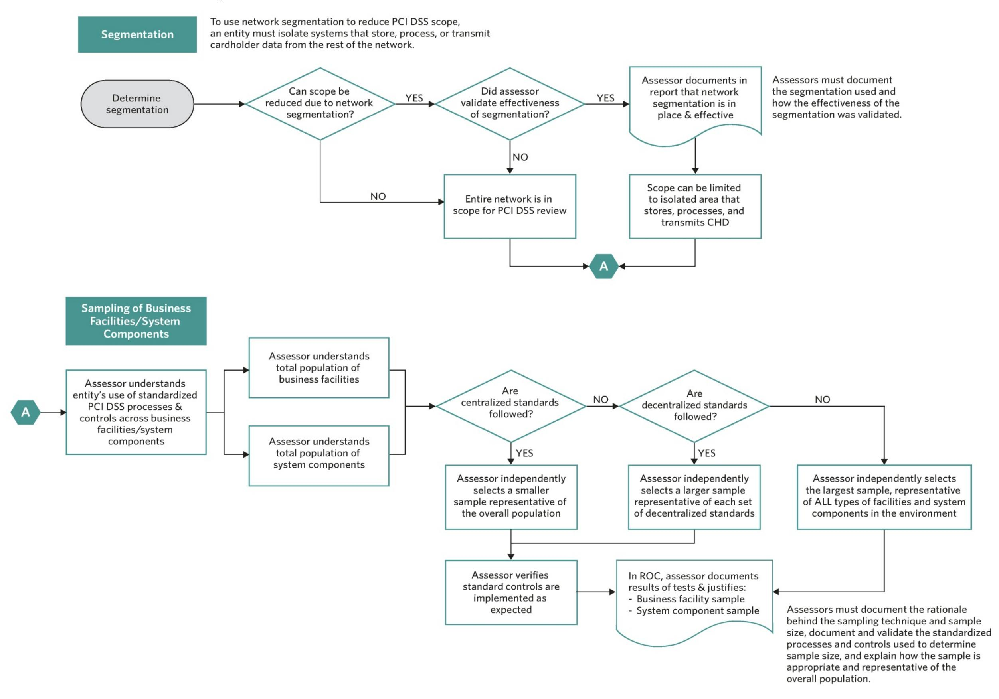

{0}------------------------------------------------

# **Payment Card Industry (PCI) Data Security Standard**

**Requirements and Security Assessment Procedures** 

**Version 3.2.1** May 2018

{1}------------------------------------------------

### **Document Changes**

| Date             | Version | Description                                                                                                                                                                                                                                                                                                                                     | Pages |
|------------------|---------|-------------------------------------------------------------------------------------------------------------------------------------------------------------------------------------------------------------------------------------------------------------------------------------------------------------------------------------------------|-------|
| October 2008     | 1.2     | To introduce PCI DSS v1.2 as "PCI DSS Requirements and Security Assessment Procedures," eliminating redundancy between documents, and make both general and specific changes from PCI DSS Security Audit Procedures v1.1. For complete information, see PCI Data Security Standard Summary of Changes from PCI DSS Version 1.1 to 1.2. |       |
|                  |         | Add sentence that was incorrectly deleted between PCI DSS v1.1 and v1.2.                                                                                                                                                                                                                                                                        | 5     |
|                  |         | Correct "then" to "than" in testing procedures 6.3.7.a and 6.3.7.b.                                                                                                                                                                                                                                                                             | 32    |
| July 2009        | 1.2.1   | Remove grayed-out marking for "in place" and "not in place" columns in testing procedure 6.5.b.                                                                                                                                                                                                                                                 | 33    |
|                  |         | For Compensating Controls Worksheet – Completed Example, correct wording at top of page to say "Use this worksheet to define compensating controls for any requirement noted as 'in place' via compensating controls."                                                                                                                 | 64    |
| October 2010     | 2.0     | Update and implement changes from v1.2.1. See PCI DSS – Summary of Changes from PCI DSS Version 1.2.1 to 2.0.                                                                                                                                                                                                                             |       |
| November 2013 | 3.0     | Update from v2.0. See PCI DSS – Summary of Changes from PCI DSS Version 2.0 to 3.0.                                                                                                                                                                                                                                                          |       |
| April 2015    | 3.1     | Update from PCI DSS v3.0. See PCI DSS – Summary of Changes from PCI DSS Version 3.0 to 3.1 for details of changes.                                                                                                                                                                                                                     |       |
| April 2016    | 3.2     | Update from PCI DSS v3.1. See PCI DSS – Summary of Changes from PCI DSS Version 3.1 to 3.2 for details of changes.                                                                                                                                                                                                                        |       |
| May 2018         | 3.2.1   | Update from PCI DSS v3.2. See PCI DSS – Summary of Changes from PCI DSS Version 3.2 to 3.2.1 for details of changes.                                                                                                                                                                                                                      |       |

{2}------------------------------------------------

# **Table of Contents**

| <b>Document Char</b>  | nges                                                                                     | 2        |
|-----------------------|------------------------------------------------------------------------------------------|----------|
| Introduction an       | d PCI Data Security Standard Overview                                                    | 5        |
| PCI DSS Resou         | rces                                                                                     | <i>6</i> |
| <b>PCI DSS Applic</b> | ability Information                                                                      | 7        |
| Relationship be       | etween PCI DSS and PA-DSS                                                                | g        |
| Applicability of P    | PCI DSS to PA-DSS Applications                                                           | <u>c</u> |
| Applicability of P    | PCI DSS to PA-DSS Applications PCI DSS to Payment Application Vendors                 | g        |
| Scope of PCI D        | SS Requirements                                                                          | 10       |
| Network Segme         | ntation                                                                                  | 11       |
| Wireless              |                                                                                          | 11       |
| Use of Third-Par      | rty Service Providers / Outsourcing                                                      | 12       |
| <b>Best Practices</b> | for Implementing PCI DSS into Business-as-Usual Processes                                | 13       |
| For Assessors:        | Sampling of Business Facilities/System Components                                        | 15       |
|                       | Controls                                                                                 |          |
|                       | d Content for Report on Compliance                                                       |          |
|                       | sment Process                                                                            |          |
|                       | ons                                                                                      |          |
|                       | SS Requirements and Security Assessment Procedures                                       |          |
|                       |                                                                                          |          |
| Requirement 1:        | ain a Secure Network and Systems                                                         |          |
| Requirement 2:        |                                                                                          |          |
| •                     | der Data                                                                                 |          |
| Requirement 3:        | Protect stored cardholder data                                                           |          |
| Requirement 4:        | Encrypt transmission of cardholder data across open, public networks                     |          |
| •                     | erability Management Program                                                             |          |
| Requirement 5:        | Protect all systems against malware and regularly update anti-virus software or programs |          |
| Requirement 6:        | Develop and maintain secure systems and applications                                     |          |
| Implement Stron       | ng Access Control Measures                                                               | 66       |
| Requirement 7:        | Restrict access to cardholder data by business need to know                              |          |

{3}------------------------------------------------

| Requirement 8:  | Identify and authenticate access to system components                                                                       | 69  |
|-----------------|-----------------------------------------------------------------------------------------------------------------------------|-----|
| Requirement 9:  | Restrict physical access to cardholder data                                                                                 | 79  |
|                 | Regularly Monitor and Test Networks                                                                                         | 88  |
| Requirement 10: | Track and monitor all access to network resources and cardholder data                                                       | 88  |
| Requirement 11: | Regularly test security systems and processes.                                                                           | 96  |
|                 | Maintain an Information Security Policy                                                                                     | 105 |
|                 | Requirement 12: Maintain a policy that addresses information security for all personnel.                                 | 105 |
|                 | Appendix A: Additional PCI DSS Requirements                                                                                 | 116 |
|                 | Appendix A1: Additional PCI DSS Requirements for Shared Hosting Providers                                                   | 117 |
|                 | Appendix A2: Additional PCI DSS Requirements for Entities using SSL/Early TLS for Card-Present POS POI Terminal Connections | 119 |
|                 | Appendix A3: Designated Entities Supplemental Validation (DESV)                                                             | 122 |
|                 | Appendix B: Compensating Controls                                                                                           | 136 |
|                 | Appendix C: Compensating Controls Worksheet                                                                                 | 137 |
|                 | Appendix D: Segmentation and Sampling of Business Facilities/System Components                                           | 139 |

{4}------------------------------------------------

### **Introduction and PCI Data Security Standard Overview**

The Payment Card Industry Data Security Standard (PCI DSS) was developed to encourage and enhance cardholder data security and facilitate the broad adoption of consistent data security measures globally. PCI DSS provides a baseline of technical and operational requirements designed to protect account data. PCI DSS applies to *all* entities involved in payment card processing—including merchants, processors, acquirers, issuers, and service providers. PCI DSS also applies to *all* other entities that store, process or transmit cardholder data (CHD) and/or sensitive authentication data (SAD). Below is a high-level overview of the 12 PCI DSS requirements.

#### **PCI Data Security Standard – High Level Overview**

| Build and Maintain a Secure Network and Systems                    | 1. 2.       | Install and maintain a firewall configuration to protect cardholder data Do not use vendor-supplied defaults for system passwords and other security parameters |
|-----------------------------------------------------------------------|----------------|-----------------------------------------------------------------------------------------------------------------------------------------------------------------------|
| 3. Protect stored cardholder data Protect Cardholder Data 4. |                | Encrypt transmission of cardholder data across open, public networks                                                                                                  |
| Maintain a Vulnerability Management Program                        | 5. 6.       | Protect all systems against malware and regularly update anti-virus software or programs Develop and maintain secure systems and applications                |
| Implement Strong Access Control Measures                           | 7. 8. 9. | Restrict access to cardholder data by business need to know Identify and authenticate access to system components Restrict physical access to cardholder data   |
| Regularly Monitor and Test Networks                                | 10. 11.     | Track and monitor all access to network resources and cardholder data Regularly test security systems and processes                                                |
| Maintain an Information Security Policy                            | 12.            | Maintain a policy that addresses information security for all personnel                                                                                            |

This document, *PCI Data Security Standard Requirements and Security Assessment Procedures*, combines the 12 PCI DSS requirements and corresponding testing procedures into a security assessment tool. It is designed for use during PCI DSS compliance assessments as part of an entity's validation process. The following sections provide detailed guidelines and best practices to assist entities prepare for, conduct, and report the results of a PCI DSS assessment. The PCI DSS Requirements and Testing Procedures begin on [page 15.](#page-17-1)

PCI DSS comprises a minimum set of requirements for protecting account data, and may be enhanced by additional controls and practices to further mitigate risks, as well as local, regional and sector laws and regulations. Additionally, legislation or regulatory requirements may require specific protection of personal information or other data elements (for example, cardholder name). PCI DSS does not supersede local or regional laws, government regulations, or other legal requirements.

{5}------------------------------------------------

#### *PCI DSS Resources*

The PCI Security Standards Council (PCI SSC) website [\(www.pcisecuritystandards.org\)](http://www.pcisecuritystandards.org/) contains a number of additional resources to assist organizations with their PCI DSS assessments and validations, including:

- Document Library, including:
  - o *PCI DSS – Summary of Changes from PCI DSS version 2.0 to 3.0*
  - o *[PCI DSS Quick Reference Guide](https://www.pcisecuritystandards.org/documents/PCI%20SSC%20Quick%20Reference%20Guide.pdf)*
  - o *PCI DSS and PA-DSS Glossary of Terms, Abbreviations, and Acronyms*
  - o *Information Supplements and Guidelines*
  - o *Prioritized Approach for PCI DSS*
  - o *Report on Compliance (ROC) Reporting Template and Reporting Instructions*
  - o *Self-assessment Questionnaires (SAQs) and SAQ Instructions and Guidelines*
  - o *Attestations of Compliance (AOCs)*
- Frequently Asked Questions (FAQs)
- PCI for Small Merchants website
- PCI training courses and informational webinars
- List of Qualified Security Assessors (QSAs) and Approved Scanning Vendors (ASVs)
- List of PTS approved devices and PA-DSS validated payment applications

Please refer to *[www.pcisecuritystandards.org](http://www.pcisecuritystandards.org/)* for information about these and other resources.

*Note: Information Supplements complement the PCI DSS and identify additional considerations and recommendations for meeting PCI DSS requirements—they do not supersede, replace or extend the PCI DSS or any of its requirements.*

{6}------------------------------------------------

# **PCI DSS Applicability Information**

PCI DSS applies to *all* entities involved in payment card processing—including merchants, processors, acquirers, issuers, and service providers. PCI DSS also applies to *all* other entities that store, process, or transmit cardholder data and/or sensitive authentication data.

Cardholder data and sensitive authentication data are defined as follows:

| Account Data                 |                                          |  |  |
|------------------------------|------------------------------------------|--|--|
| Cardholder Data includes:    | Sensitive Authentication Data includes:  |  |  |
|                             |                                         |  |  |
| Primary Account Number (PAN) | Full track data (magnetic-stripe data or |  |  |
|  Cardholder Name         | equivalent on a chip)                    |  |  |
|                             |                                         |  |  |
| Expiration Date              | CAV2/CVC2/CVV2/CID                       |  |  |
|                             |                                         |  |  |
| Service Code                 | PINs/PIN blocks                          |  |  |

*The primary account number is the defining factor for cardholder data.* If cardholder name, service code, and/or expiration date are stored, processed or transmitted with the PAN, or are otherwise present in the cardholder data environment (CDE), they must be protected in accordance with applicable PCI DSS requirements.

PCI DSS requirements apply to organizations where account data (cardholder data and/or sensitive authentication data) is stored, processed or transmitted. Some PCI DSS requirements may also be applicable to organizations that have outsourced their payment operations or management of their CDE.[1](#page-6-1) Additionally, organizations that outsource their CDE or payment operations to third parties are responsible for ensuring that the account data is protected by the third party per the applicable PCI DSS requirements.

The table on the following page illustrates commonly used elements of cardholder and sensitive authentication data, whether storage of each data element is permitted or prohibited, and whether each data element must be protected. This table is not exhaustive, but is presented to illustrate the different types of requirements that apply to each data element.

1 In accordance with individual payment brand compliance programs

{7}------------------------------------------------

|  |                                                                     | Data Element                 | Storage Permitted | Render Stored Data Unreadable per Requirement 3.4 |
|--|---------------------------------------------------------------------|------------------------------|----------------------|---------------------------------------------------------|
|  |                                                                     | Primary Account Number (PAN) | Yes                  | Yes                                                     |
|  | Cardholder                                                          | Cardholder Name              | Yes                  | No                                                      |
|  | Data Data nt Accou Sensitive Authentication Data2 | Service Code                 | Yes                  | No                                                      |
|  |                                                                     | Expiration Date              | Yes                  | No                                                      |
|  |                                                                     | Data3 Full Track          | No                   | Cannot store per Requirement 3.2                        |
|  |                                                                     | CAV2/CVC2/CVV2/CID4          | No                   | Cannot store per Requirement 3.2                        |
|  |                                                                     | PIN/PIN Block5               | No                   | Cannot store per Requirement 3.2                        |

PCI DSS Requirements 3.3 and 3.4 apply only to PAN. If PAN is stored with other elements of cardholder data, only the PAN must be rendered unreadable according to PCI DSS Requirement 3.4.

Sensitive authentication data must not be stored after authorization, even if encrypted. This applies even where there is no PAN in the environment. Organizations should contact their acquirer or the individual payment brands directly to understand whether SAD is permitted to be stored prior to authorization, for how long, and any related usage and protection requirements.

2 Sensitive authentication data must not be stored after authorization (even if encrypted).

3 Full track data from the magnetic stripe, equivalent data on the chip, or elsewhere

4 The three- or four-digit value printed on the front or back of a payment card

5 Personal identification number entered by cardholder during a card-present transaction, and/or encrypted PIN block present within the transaction message

{8}------------------------------------------------

# **Relationship between PCI DSS and PA-DSS**

#### *Applicability of PCI DSS to PA-DSS Applications*

Use of a Payment Application Data Security Standard (PA-DSS) compliant application by itself does not make an entity PCI DSS compliant, since that application must be implemented into a PCI DSS compliant environment and according to the PA-DSS Implementation Guide provided by the payment application vendor.

All applications that store, process, or transmit cardholder data are in scope for an entity's PCI DSS assessment, including applications that have been validated to PA-DSS. The PCI DSS assessment should verify the PA-DSS validated payment application is properly configured and securely implemented per PCI DSS requirements. If the payment application has undergone any customization, a more in-depth review will be required during the PCI DSS assessment, as the application may no longer be representative of the version that was validated to PA-DSS.

The PA-DSS requirements are derived from the *PCI DSS Requirements and Security Assessment Procedures* (defined in this document). The PA-DSS details the requirements a payment application must meet in order to facilitate a customer's PCI DSS compliance. As security threats are constantly evolving, applications that are no longer supported by the vendor (e.g., identified by the vendor as "end of life") may not offer the same level of security as supported versions.

Secure payment applications, when implemented in a PCI DSS-compliant environment, will minimize the potential for security breaches leading to compromises of PAN, full track data, card verification codes and values (CAV2, CID, CVC2, CVV2), and PINs and PIN blocks, along with the damaging fraud resulting from these breaches.

To determine whether PA-DSS applies to a given payment application, please refer to the PA-DSS Program Guide, which can be found at [www.pcisecuritystandards.org.](http://www.pcisecuritystandards.org/)

#### *Applicability of PCI DSS to Payment Application Vendors*

PCI DSS may apply to payment application vendors if the vendor stores, processes, or transmits cardholder data, or has access to their customers' cardholder data (for example, in the role of a service provider).

{9}------------------------------------------------

### **Scope of PCI DSS Requirements**

The PCI DSS security requirements apply to all system components included in or connected to the cardholder data environment. The cardholder data environment (CDE) is comprised of people, processes and technologies that store, process, or transmit cardholder data or sensitive authentication data. "System components" include network devices, servers, computing devices, and applications. Examples of system components include but are not limited to the following:

- Systems that provide security services (for example, authentication servers), facilitate segmentation (for example, internal firewalls), or may impact the security of (for example, name resolution or web redirection servers) the CDE.
- Virtualization components such as virtual machines, virtual switches/routers, virtual appliances, virtual applications/desktops, and hypervisors.
- Network components including but not limited to firewalls, switches, routers, wireless access points, network appliances, and other security appliances.
- Server types including but not limited to web, application, database, authentication, mail, proxy, Network Time Protocol (NTP), and Domain Name System (DNS).
- Applications including all purchased and custom applications, including internal and external (for example, Internet) applications.
- Any other component or device located within or connected to the CDE.

The first step of a PCI DSS assessment is to accurately determine the scope of the review. At least annually and prior to the annual assessment, the assessed entity should confirm the accuracy of their PCI DSS scope by identifying all locations and flows of cardholder data, and identify all systems that are connected to or, if compromised, could impact the CDE (for example, authentication servers) to ensure they are included in the PCI DSS scope. All types of systems and locations should be considered as part of the scoping process, including backup/recovery sites and failover systems.

To confirm the accuracy of the defined CDE, perform the following:

- The assessed entity identifies and documents the existence of all cardholder data in their environment, to verify that no cardholder data exists outside of the currently defined CDE.
- Once all locations of cardholder data are identified and documented, the entity uses the results to verify that PCI DSS scope is appropriate (for example, the results may be a diagram or an inventory of cardholder data locations).
- The entity considers any cardholder data found to be in scope of the PCI DSS assessment and part of the CDE. If the entity identifies data that is not currently included in the CDE, such data should be securely deleted, migrated into the currently defined CDE, or the CDE redefined to include this data.

The entity retains documentation that shows how PCI DSS scope was determined. The documentation is retained for assessor review and/or for reference during the next annual PCI DSS scope confirmation activity.

For each PCI DSS assessment, the assessor is required to validate that the scope of the assessment is accurately defined and documented.

{10}------------------------------------------------

#### *Network Segmentation*

Network segmentation of, or isolating (segmenting), the cardholder data environment from the remainder of an entity's network is not a PCI DSS requirement. However, it is strongly recommended as a method that may reduce:

- The scope of the PCI DSS assessment
- The cost of the PCI DSS assessment
- The cost and difficulty of implementing and maintaining PCI DSS controls
- The risk to an organization (reduced by consolidating cardholder data into fewer, more controlled locations)

Without adequate network segmentation (sometimes called a "flat network") the entire network is in scope of the PCI DSS assessment. Network segmentation can be achieved through a number of physical or logical means, such as properly configured internal network firewalls, routers with strong access control lists, or other technologies that restrict access to a particular segment of a network. To be considered out of scope for PCI DSS, a system component must be properly isolated (segmented) from the CDE, such that even if the out-of-scope system component was compromised it could not impact the security of the CDE.

An important prerequisite to reduce the scope of the cardholder data environment is a clear understanding of business needs and processes related to the storage, processing or transmission of cardholder data. Restricting cardholder data to as few locations as possible by elimination of unnecessary data, and consolidation of necessary data, may require reengineering of long-standing business practices.

Documenting cardholder data flows via a dataflow diagram helps fully understand all cardholder data flows and ensures that any network segmentation is effective at isolating the cardholder data environment.

If network segmentation is in place and being used to reduce the scope of the PCI DSS assessment, the assessor must verify that the segmentation is adequate to reduce the scope of the assessment. At a high level, adequate network segmentation isolates systems that store, process, or transmit cardholder data from those that do not. However, the adequacy of a specific implementation of network segmentation is highly variable and dependent upon a number of factors, such as a given network's configuration, the technologies deployed, and other controls that may be implemented.

*Appendix D: Segmentation and Sampling of Business Facilities/System Components* provides more information on the effect of network segmentation and sampling on the scope of a PCI DSS assessment.

#### *Wireless*

If wireless technology is used to store, process, or transmit cardholder data (for example, point-of-sale transactions, "line-busting"), or if a wireless local area network (WLAN) is part of, or connected to the cardholder data environment, the PCI DSS requirements and testing procedures for wireless environments apply and must be performed (for example, Requirements 1.2.3, 2.1.1, and 4.1.1). Before wireless technology is implemented, an entity should carefully evaluate the need for the technology against the risk. Consider deploying wireless technology only for nonsensitive data transmission.

{11}------------------------------------------------

#### *Use of Third-Party Service Providers / Outsourcing*

A service provider or merchant may use a third-party service provider to store, process, or transmit cardholder data on their behalf, or to manage components such as routers, firewalls, databases, physical security, and/or servers. If so, there may be an impact on the security of the cardholder data environment.

Parties should clearly identify the services and system components which are included in the scope of the service provider's PCI DSS assessment, the specific PCI DSS requirements covered by the service provider, and any requirements which are the responsibility of the service provider's customers to include in their own PCI DSS reviews. For example, a managed hosting provider should clearly define which of their IP addresses are scanned as part of their quarterly vulnerability scan process and which IP addresses are their customer's responsibility to include in their own quarterly scans.

Service providers are responsible for demonstrating their PCI DSS compliance, and may be required to do so by the payment brands. Service providers should contact their acquirer and/or payment brand to determine the appropriate compliance validation.

There are two options for third-party service providers to validate compliance:

- 1) **Annual assessment**: Service providers can undergo an annual PCI DSS assessment(s) on their own and provide evidence to their customers to demonstrate their compliance; or
- 2) **Multiple, on-demand assessments**: If they do not undergo their own annual PCI DSS assessments, service providers must undergo assessments upon request of their customers and/or participate in each of their customer's PCI DSS reviews, with the results of each review provided to the respective customer(s)

If the third party undergoes their own PCI DSS assessment, they should provide sufficient evidence to their customers to verify that the scope of the service provider's PCI DSS assessment covered the services applicable to the customer and that the relevant PCI DSS requirements were examined and determined to be in place. The specific type of evidence provided by the service provider to their customers will depend on the agreements/contracts in place between those parties. For example, providing the AOC and/or relevant sections of the service provider's ROC (redacted to protect any confidential information) could help provide all or some of the information.

Additionally, merchants and service providers must manage and monitor the PCI DSS compliance of all associated third-party service providers with access to cardholder data. *Refer to Requirement 12.8 in this document for details.* 

{12}------------------------------------------------

# **Best Practices for Implementing PCI DSS into Business-as-Usual Processes**

To ensure security controls continue to be properly implemented, PCI DSS should be implemented into business-as-usual (BAU) activities as part of an entity's overall security strategy. This enables an entity to monitor the effectiveness of their security controls on an ongoing basis, and maintain their PCI DSS compliant environment in between PCI DSS assessments. Examples of how to incorporate PCI DSS into BAU activities include but are not limited to:

- 1. Monitoring of security controls—such as firewalls, intrusion-detection systems/intrusion-prevention systems (IDS/IPS), file-integrity monitoring (FIM), anti-virus, access controls, etc.—to ensure they are operating effectively and as intended.
- 2. Ensuring that all failures in security controls are detected and responded to in a timely manner. Processes to respond to security control failures should include:
  - Restoring the security control
  - Identifying the cause of failure
  - Identifying and addressing any security issues that arose during the failure of the security control
  - Implementing mitigation (such as process or technical controls) to prevent the cause of the failure recurring
  - Resuming monitoring of the security control, perhaps with enhanced monitoring for a period of time, to verify the control is operating effectively
- 3. Reviewing changes to the environment (for example, addition of new systems, changes in system or network configurations) prior to completion of the change, and perform the following:
  - Determine the potential impact to PCI DSS scope (for example, a new firewall rule that permits connectivity between a system in the CDE and another system could bring additional systems or networks into scope for PCI DSS).
  - Identify PCI DSS requirements applicable to systems and networks affected by the changes (for example, if a new system is in scope for PCI DSS, it would need to be configured per system configuration standards, including FIM, AV, patches, audit logging, etc., and would need to be added to the quarterly vulnerability scan schedule).
  - Update PCI DSS scope and implement security controls as appropriate.
- 4. Changes to organizational structure (for example, a company merger or acquisition) resulting in formal review of the impact to PCI DSS scope and requirements.
- 5. Performing periodic reviews and communications to confirm that PCI DSS requirements continue to be in place and personnel are following secure processes. These periodic reviews should cover all facilities and locations, including retail outlets, data centers, etc., and include reviewing system components (or samples of system components), to verify that PCI DSS requirements continue to be in place—for example, configuration standards have been applied, patches and AV are up to date, audit logs are being reviewed, and so on. The frequency of periodic reviews should be determined by the entity as appropriate for the size and complexity of their environment.

These reviews can also be used to verify that appropriate evidence is being maintained—for example, audit logs, vulnerability scan reports, firewall reviews, etc.—to assist the entity's preparation for their next compliance assessment.

{13}------------------------------------------------

6. Reviewing hardware and software technologies at least annually to confirm that they continue to be supported by the vendor and can meet the entity's security requirements, including PCI DSS. If it is discovered that technologies are no longer supported by the vendor or cannot meet the entity's security needs, the entity should prepare a remediation plan, up to and including replacement of the technology, as necessary.

In addition to the above practices, organizations may also wish to consider implementing separation of duties for their security functions so that security and/or audit functions are separated from operational functions. In environments where one individual performs multiple roles (for example, administration and security operations), duties may be assigned such that no single individual has end-to-end control of a process without an independent checkpoint. For example, responsibility for configuration and responsibility for approving changes could be assigned to separate individuals.

> *Note: For some entities, these best practices are also requirements to ensure ongoing PCI DSS compliance. For example, PCI DSS includes these principles in some requirements, and the Designated Entities Supplemental Validation (PCI DSS Appendix A3) requires designated entities to validate to these principles.*

*All organizations should consider implementing these best practices into their environment, even where the organization is not required to validate to them.*

{14}------------------------------------------------

# **For Assessors: Sampling of Business Facilities/System Components**

Sampling is an option for assessors to facilitate the assessment process where there are large numbers of business facilities and/or system components.

While it is acceptable for an assessor to sample business facilities/system components as part of their review of an entity's PCI DSS compliance, it is not acceptable for an entity to apply PCI DSS requirements to only a sample of their environment (for example, requirements for quarterly vulnerability scans apply to all system components). Similarly, it is not acceptable for an assessor to only review a sample of PCI DSS requirements for compliance.

After considering the overall scope and complexity of the environment being assessed, the assessor may independently select representative samples of business facilities/system components in order to assess the entity's compliance with PCI DSS requirements. These samples must be defined first for business facilities and then for system components within each selected business facility. Samples must be a representative selection of all of the types and locations of business facilities, as well as all of the types of system components within selected business facilities. Samples must be sufficiently large to provide the assessor with assurance that controls are implemented as expected.

Examples of business facilities include but are not limited to: corporate offices, stores, franchise locations, processing facilities, data centers, and other facility types in different locations. Sampling should include system components within each selected business facility. For example, for each business facility selected, include a variety of operating systems, functions, and applications that are applicable to the area under review.

As an example, the assessor may define a sample at a business facility to include Sun servers running Apache, Windows servers running Oracle, mainframe systems running legacy card processing applications, data-transfer servers running HP-UX, and Linux Servers running MySQL. If all applications run from a single version of an OS (for example, Windows 7 or Solaris 10), the sample should still include a variety of applications (for example, database servers, web servers, data-transfer servers).

When independently selecting samples of business facilities/system components, assessors should consider the following:

- If there are standardized, centralized PCI DSS security and operational processes and controls in place that ensure consistency and that each business facility/system component must follow, the sample can be smaller than if there are no standard processes/controls in place. The sample must be large enough to provide the assessor with reasonable assurance that all business facilities/system components are configured per the standard processes. The assessor must verify that the standardized, centralized controls are implemented and working effectively.
- If there is more than one type of standard security and/or operational process in place (for example, for different types of business facilities/system components), the sample must be large enough to include business facilities/system components secured with each type of process.
- If there are no standard PCI DSS processes/controls in place and each business facility/system component is managed through nonstandard processes, the sample must be larger for the assessor to be assured that each business facility/system component has implemented PCI DSS requirements appropriately.

{15}------------------------------------------------

 Samples of system components must include every type and combination that is in use. For example, where applications are sampled, the sample must include all versions and platforms for each type of application.

For each instance where sampling is used, the assessor must:

- Document the rationale behind the sampling technique and sample size,
- Document and validate the standardized PCI DSS processes and controls used to determine sample size, and
- Explain how the sample is appropriate and representative of the overall population.

#### *Please also refer to:*

Appendix D: Segmentation and Sampling of Business Facilities/System Components.

Assessors must revalidate the sampling rationale for each assessment. If sampling is to be used, different samples of business facilities and system components must be selected for each assessment.

# **Compensating Controls**

On an annual basis, any compensating controls must be documented, reviewed and validated by the assessor and included with the Report on Compliance submission, per *Appendix B: Compensating Controls* and *Appendix C: Compensating Controls Worksheet.*

For each and every compensating control, the Compensating Controls Worksheet *(Appendix C)* **must** be completed. Additionally, compensating control results should be documented in the ROC in the corresponding PCI DSS requirement section.

See the above-mentioned *Appendices B* and *C* for more details on "compensating controls."

{16}------------------------------------------------

### **Instructions and Content for Report on Compliance**

Instructions and content for the Report on Compliance (ROC) are provided in the *PCI DSS ROC Reporting Template*.

The *PCI DSS ROC Reporting Template* must be used as the template for creating the *Report on Compliance*. The assessed entity should follow each payment brand's respective reporting requirements to ensure each payment brand acknowledges the entity's compliance status. Contact each payment brand or the acquirer to determine reporting requirements and instructions.

### **PCI DSS Assessment Process**

The PCI DSS assessment process includes completion of the following steps:

- 1. Confirm the scope of the PCI DSS assessment.
- 2. Perform the PCI DSS assessment of the environment, following the testing procedures for each requirement.
- 3. Complete the applicable report for the assessment (i.e., Self-*Assessment Questionnaire* (SAQ) or Report on Compliance (ROC)), including documentation of all compensating controls, according to the applicable PCI guidance and instructions.
- 4. Complete the Attestation of Compliance for Service Providers or Merchants, as applicable, in its entirety. Attestations of Compliance are available on the PCI SSC website.
- 5. Submit the SAQ or ROC, and the Attestation of Compliance, along with any other requested documentation—such as ASV scan reports to the acquirer (for merchants) or to the payment brand or other requester (for service providers).
- 6. If required, perform remediation to address requirements that are not in place, and provide an updated report.

{17}------------------------------------------------

# **PCI DSS Versions**

As of the published date of this document, PCI DSS v3.2 is valid through December 31, 2018, after which it is retired. All PCI DSS validations after this date must be to PCI DSS v3.2.1 or later.

The following table provides a summary of PCI DSS versions and their relevant dates.[6](#page-17-2)

| Version                           | Published  | Retired           |
|-----------------------------------|------------|-------------------|
| PCI DSS v3.2.1 (This document) | May 2018   | To be determined  |
| PCI DSS v3.2                      | April 2016 | December 31, 2018 |

6 Subject to change upon release of a new version of PCI DSS.

{18}------------------------------------------------

### **Detailed PCI DSS Requirements and Security Assessment Procedures**

The following defines the column headings for the PCI DSS Requirements and Security Assessment Procedures:

- **PCI DSS Requirements** This column defines the Data Security Standard requirements; PCI DSS compliance is validated against these requirements.
- **Testing Procedures**  This column shows processes to be followed by the assessor to validate that PCI DSS requirements have been met and are "in place."
- **Guidance** This column describes the intent or security objective behind each of the PCI DSS requirements. This column contains guidance only, and is intended to assist understanding of the intent of each requirement. The guidance in this column does not replace or extend the PCI DSS Requirements and Testing Procedures.

*Note: PCI DSS requirements are not considered to be in place if controls are not yet implemented or are scheduled to be completed at a future date. After any open or not-in-place items are addressed by the entity, the assessor will then reassess to validate that the remediation is completed and that all requirements are satisfied.*

*Please refer to the following resources (available on the PCI SSC website) to document the PCI DSS assessment:*

- *For instructions on completing reports on compliance (ROC), refer to the* PCI DSS ROC Reporting Template.
- *For instructions on completing self-assessment questionnaires (SAQ), refer to the* PCI DSS SAQ Instructions and Guidelines.
- *For instructions on submitting PCI DSS compliance validation reports, refer to the* PCI DSS Attestations of Compliance.

{19}------------------------------------------------

### **Build and Maintain a Secure Network and Systems**

#### *Requirement 1: Install and maintain a firewall configuration to protect cardholder data*

Firewalls are devices that control computer traffic allowed between an entity's networks (internal) and untrusted networks (external), as well as traffic into and out of more sensitive areas within an entity's internal trusted networks. The cardholder data environment is an example of a more sensitive area within an entity's trusted network.

A firewall examines all network traffic and blocks those transmissions that do not meet the specified security criteria.

All systems must be protected from unauthorized access from untrusted networks, whether entering the system via the Internet as e-commerce, employee Internet access through desktop browsers, employee e-mail access, dedicated connections such as business-to-business connections, via wireless networks, or via other sources. Often, seemingly insignificant paths to and from untrusted networks can provide unprotected pathways into key systems. Firewalls are a key protection mechanism for any computer network.

Other system components may provide firewall functionality, as long as they meet the minimum requirements for firewalls as defined in Requirement 1. Where other system components are used within the cardholder data environment to provide firewall functionality, these devices must be included within the scope and assessment of Requirement 1.

| PCI DSS Requirements                                                                                                                    | Testing Procedures                                                                                                                                                                                        | Guidance                                                                                                                                                                                                                                                       |
|-----------------------------------------------------------------------------------------------------------------------------------------|-----------------------------------------------------------------------------------------------------------------------------------------------------------------------------------------------------------|----------------------------------------------------------------------------------------------------------------------------------------------------------------------------------------------------------------------------------------------------------------|
| Establish and implement firewall and 1.1 router configuration standards that include the following:                            | Inspect the firewall and router configuration standards and 1.1 other documentation specified below and verify that standards are complete and implemented as follows:                           | Firewalls and routers are key components of the architecture that controls entry to and exit from the network. These devices are software or hardware devices that block unwanted access and manage authorized access into and out of the network. |
|                                                                                                                                         |                                                                                                                                                                                                           | Configuration standards and procedures will help to ensure that the organization's first line of defense in the protection of its data remains strong.                                                                                                |
| 1.1.1 A formal process for approving and testing all network connections and changes to the firewall and router configurations | 1.1.1.a Examine documented procedures to verify there is a formal process for testing and approval of all: • Network connections and • Changes to firewall and router configurations | A documented and implemented process for approving and testing all connections and changes to the firewalls and routers will help prevent security problems caused by misconfiguration of the network, router, or firewall.                        |
|                                                                                                                                         | 1.1.1.b For a sample of network connections, interview responsible personnel and examine records to verify that network connections were approved and tested.                                       | Without formal approval and testing of changes, records of the changes might not be updated, which could lead to inconsistencies between network documentation and the actual configuration.                                                       |

{20}------------------------------------------------

| PCI DSS Requirements                                                                                                                                         | Testing Procedures                                                                                                                                                                                                                                            | Guidance                                                                                                                                                                                                                                                                                                                                                                                         |
|--------------------------------------------------------------------------------------------------------------------------------------------------------------|---------------------------------------------------------------------------------------------------------------------------------------------------------------------------------------------------------------------------------------------------------------|--------------------------------------------------------------------------------------------------------------------------------------------------------------------------------------------------------------------------------------------------------------------------------------------------------------------------------------------------------------------------------------------------|
|                                                                                                                                                              | 1.1.1.c Identify a sample of actual changes made to firewall and router configurations, compare to the change records, and interview responsible personnel to verify the changes were approved and tested.                                        |                                                                                                                                                                                                                                                                                                                                                                                                  |
| 1.1.2 Current network diagram that identifies all connections between the cardholder data environment and other networks, including any wireless | Examine diagram(s) and observe network 1.1.2.a configurations to verify that a current network diagram exists and that it documents all connections to cardholder data, including any wireless networks.                                          | Network diagrams describe how networks are configured, and identify the location of all network devices.                                                                                                                                                                                                                                                                                   |
| networks                                                                                                                                                     | Interview responsible personnel to verify that the 1.1.2.b diagram is kept current.                                                                                                                                                                     | Without current network diagrams, devices could be overlooked and be unknowingly left out of the security controls implemented for PCI DSS and thus be vulnerable to compromise.                                                                                                                                                                                                        |
| 1.1.3 Current diagram that shows all cardholder data flows across systems and networks                                                                 | Examine data-flow diagram and interview personnel to 1.1.3 verify the diagram: • Shows all cardholder data flows across systems and networks. • Is kept current and updated as needed upon changes to the environment.                | Cardholder data-flow diagrams identify the location of all cardholder data that is stored, processed, or transmitted within the network. Network and cardholder data-flow diagrams help an organization to understand and keep track of the scope of their environment, by showing how cardholder data flows across networks and between individual systems and devices. |
| 1.1.4 Requirements for a firewall at each Internet connection and between any demilitarized zone (DMZ) and the internal network zone                | 1.1.4.a Examine the firewall configuration standards and verify that they include requirements for a firewall at each Internet connection and between any DMZ and the internal network zone.                                                      | Using a firewall on every Internet connection coming into (and out of) the network, and between any DMZ and the internal network, allows the organization to monitor and control access and minimizes the chances of a malicious individual obtaining access to the internal network via an unprotected connection.                                                            |
|                                                                                                                                                              | 1.1.4.b Verify that the current network diagram is consistent with the firewall configuration standards.                                                                                                                                                   |                                                                                                                                                                                                                                                                                                                                                                                                  |
|                                                                                                                                                              | 1.1.4.c Observe network configurations to verify that a firewall is in place at each Internet connection and between any demilitarized zone (DMZ) and the internal network zone, per the documented configuration standards and network diagrams. |                                                                                                                                                                                                                                                                                                                                                                                                  |

{21}------------------------------------------------

| PCI DSS Requirements                                                                                                    | Testing Procedures                                                                                                                                                                               | Guidance                                                                                                                                                                                                                                                                                                                                                                                                                                                                                 |
|-------------------------------------------------------------------------------------------------------------------------|--------------------------------------------------------------------------------------------------------------------------------------------------------------------------------------------------|------------------------------------------------------------------------------------------------------------------------------------------------------------------------------------------------------------------------------------------------------------------------------------------------------------------------------------------------------------------------------------------------------------------------------------------------------------------------------------------|
| Description of groups, roles, and 1.1.5 responsibilities for management of network components                  | 1.1.5.a Verify that firewall and router configuration standards include a description of groups, roles, and responsibilities for management of network components.                      | This description of roles and assignment of responsibilities ensures that personnel are aware of who is responsible for the security of all                                                                                                                                                                                                                                                                                                                                     |
|                                                                                                                         | 1.1.5.b Interview personnel responsible for management of network components to confirm that roles and responsibilities are assigned as documented.                                     | network components, and that those assigned to manage components are aware of their responsibilities. If roles and responsibilities are not formally assigned, devices could be left unmanaged.                                                                                                                                                                                                                                                                           |
| 1.1.6 Documentation of business justification and approval for use of all services, protocols, and ports allowed, | 1.1.6.a Verify that firewall and router configuration standards include a documented list of all services, protocols and ports, including business justification and approval for each. | Compromises often happen due to unused or insecure service and ports, since these often have known vulnerabilities and many organizations                                                                                                                                                                                                                                                                                                                                          |
| including documentation of security features implemented for those protocols considered to be insecure.           | 1.1.6.b Identify insecure services, protocols, and ports allowed; and verify that security features are documented for each service.                                                       | don't patch vulnerabilities for the services, protocols, and ports they don't use (even though the vulnerabilities are still present). By clearly defining and documenting the services, protocols,                                                                                                                                                                                                                                                                             |
|                                                                                                                         | 1.1.6.c Examine firewall and router configurations to verify that the documented security features are implemented for each insecure service, protocol, and port.                       | and ports that are necessary for business, organizations can ensure that all other services, protocols, and ports are disabled or removed.                                                                                                                                                                                                                                                                                                                                         |
|                                                                                                                         |                                                                                                                                                                                                  | Approvals should be granted by personnel independent of the personnel managing the configuration.                                                                                                                                                                                                                                                                                                                                                                            |
|                                                                                                                         |                                                                                                                                                                                                  | If insecure services, protocols, or ports are necessary for business, the risk posed by use of these protocols should be clearly understood and accepted by the organization, the use of the protocol should be justified, and the security features that allow these protocols to be used securely should be documented and implemented. If these insecure services, protocols, or ports are not necessary for business, they should be disabled or removed. |
|                                                                                                                         |                                                                                                                                                                                                  | For guidance on services, protocols, or ports considered to be insecure, refer to industry standards and guidance (e.g., NIST, ENISA, OWASP, etc.).                                                                                                                                                                                                                                                                                                                       |

{22}------------------------------------------------

| PCI DSS Requirements                                                                                                                                                           | Testing Procedures                                                                                                                                                                                                               | Guidance                                                                                                                                                                                                                                                                                                                                                  |
|--------------------------------------------------------------------------------------------------------------------------------------------------------------------------------|----------------------------------------------------------------------------------------------------------------------------------------------------------------------------------------------------------------------------------|-----------------------------------------------------------------------------------------------------------------------------------------------------------------------------------------------------------------------------------------------------------------------------------------------------------------------------------------------------------|
| 1.1.7 Requirement to review firewall and router rule sets at least every six months                                                                                      | 1.1.7.a Verify that firewall and router configuration standards require review of firewall and router rule sets at least every six months.                                                                                 | This review gives the organization an opportunity at least every six months to clean up any unneeded, outdated, or incorrect rules, and                                                                                                                                                                                                          |
|                                                                                                                                                                                | Examine documentation relating to rule set reviews 1.1.7.b and interview responsible personnel to verify that the rule sets are reviewed at least every six months.                                                     | ensure that all rule sets allow only authorized services and ports that match the documented business justifications. Organizations with a high volume of changes to firewall and router rule sets may wish to consider performing reviews more frequently, to ensure that the rule sets continue to meet the needs of the business. |
| 1.2 Build firewall and router configurations that restrict connections between untrusted networks and any system components in the cardholder data environment. | 1.2 Examine firewall and router configurations and perform the following to verify that connections are restricted between untrusted networks and system components in the cardholder data environment:              | It is essential to install network protection between the internal, trusted network and any untrusted network that is external and/or out of the entity's ability to control or manage. Failure to implement this measure correctly results in the entity being                                                                               |
| An "untrusted network" is any Note:                                                                                                                                         |                                                                                                                                                                                                                                  | vulnerable to unauthorized access by malicious individuals or software.                                                                                                                                                                                                                                                                                |
| network that is external to the networks belonging to the entity under review, and/or which is out of the entity's ability to control or manage.                   |                                                                                                                                                                                                                                  | For firewall functionality to be effective, it must be properly configured to control and/or limit traffic into and out of the entity's network.                                                                                                                                                                                                    |
| 1.2.1 Restrict inbound and outbound traffic to that which is necessary for the cardholder data environment, and                                                          | Examine firewall and router configuration standards to 1.2.1.a verify that they identify inbound and outbound traffic necessary for the cardholder data environment.                                                    | Examination of all inbound and outbound connections allows for inspection and restriction of traffic based on the source and/or destination                                                                                                                                                                                                      |
| specifically deny all other traffic.                                                                                                                                           | 1.2.1.b Examine firewall and router configurations to verify that inbound and outbound traffic is limited to that which is necessary for the cardholder data environment.                                                  | address, thus preventing unfiltered access between untrusted and trusted environments. This prevents malicious individuals from accessing the entity's network via unauthorized IP addresses or                                                                                                                                               |
|                                                                                                                                                                                | 1.2.1.c Examine firewall and router configurations to verify that all other inbound and outbound traffic is specifically denied, for example by using an explicit "deny all" or an implicit deny after allow statement. | from using services, protocols, or ports in an unauthorized manner (for example, to send data they've obtained from within the entity's network out to an untrusted server).                                                                                                                                                                  |
|                                                                                                                                                                                |                                                                                                                                                                                                                                  | Implementing a rule that denies all inbound and outbound traffic that is not specifically needed helps to prevent inadvertent holes that would allow unintended and potentially harmful traffic in or out.                                                                                                                                    |

{23}------------------------------------------------

| PCI DSS Requirements                                                                                                                                                                                  | Testing Procedures                                                                                                                                                                                      | Guidance                                                                                                                                                                                                                                                                                                                                                                                                                                                          |
|-------------------------------------------------------------------------------------------------------------------------------------------------------------------------------------------------------|---------------------------------------------------------------------------------------------------------------------------------------------------------------------------------------------------------|-------------------------------------------------------------------------------------------------------------------------------------------------------------------------------------------------------------------------------------------------------------------------------------------------------------------------------------------------------------------------------------------------------------------------------------------------------------------|
| 1.2.2 Secure and synchronize router configuration files.                                                                                                                                           | 1.2.2.a Examine router configuration files to verify they are secured from unauthorized access.                                                                                                   | While the running (or active) router configuration files include the current, secure settings, the start                                                                                                                                                                                                                                                                                                                                                       |
|                                                                                                                                                                                                       | 1.2.2.b Examine router configurations to verify they are synchronized—for example, the running (or active) configuration matches the start-up configuration (used when                            | up files (which are used when routers are re started or booted) must be updated with the same secure settings to ensure these settings are applied when the start-up configuration is run.                                                                                                                                                                                                                                                               |
|                                                                                                                                                                                                       | machines are booted).                                                                                                                                                                                   | Because they only run occasionally, start-up configuration files are often forgotten and are not updated. When a router re-starts and loads a start-up configuration that has not been updated with the same secure settings as those in the running configuration, it may result in weaker rules that allow malicious individuals into the network.                                                                                            |
| 1.2.3 Install perimeter firewalls between all wireless networks and the cardholder data environment, and                                                                                        | 1.2.3.a Examine firewall and router configurations to verify that there are perimeter firewalls installed between all wireless networks and the cardholder data environment.                      | The known (or unknown) implementation and exploitation of wireless technology within a network is a common path for malicious                                                                                                                                                                                                                                                                                                                               |
| configure these firewalls to deny or, if traffic is necessary for business purposes, permit only authorized traffic between the wireless environment and the cardholder data environment. | 1.2.3.b Verify that the firewalls deny or, if traffic is necessary for business purposes, permit only authorized traffic between the wireless environment and the cardholder data environment. | individuals to gain access to the network and cardholder data. If a wireless device or network is installed without the entity's knowledge, a malicious individual could easily and "invisibly" enter the network. If firewalls do not restrict access from wireless networks into the CDE, malicious individuals that gain unauthorized access to the wireless network can easily connect to the CDE and compromise account information. |
|                                                                                                                                                                                                       |                                                                                                                                                                                                         | Firewalls must be installed between all wireless networks and the CDE, regardless of the purpose of the environment to which the wireless network is connected. This may include, but is not limited to, corporate networks, retail stores, guest networks, warehouse environments, etc.                                                                                                                                                           |

{24}------------------------------------------------

| PCI DSS Requirements                                                                                                                                                                                                                 | Testing Procedures                                                                                                                                                                                                                                                                                                                                                                                                      | Guidance                                                                                                                                                                                                                                                                                                                                                                                                                                                                                                                                                                                                                                         |
|--------------------------------------------------------------------------------------------------------------------------------------------------------------------------------------------------------------------------------------|-------------------------------------------------------------------------------------------------------------------------------------------------------------------------------------------------------------------------------------------------------------------------------------------------------------------------------------------------------------------------------------------------------------------------|--------------------------------------------------------------------------------------------------------------------------------------------------------------------------------------------------------------------------------------------------------------------------------------------------------------------------------------------------------------------------------------------------------------------------------------------------------------------------------------------------------------------------------------------------------------------------------------------------------------------------------------------------|
| 1.3 Prohibit direct public access between the Internet and any system component in the cardholder data environment.                                                                                                         | 1.3 Examine firewall and router configurations—including but not limited to the choke router at the Internet, the DMZ router and firewall, the DMZ cardholder segment, the perimeter router, and the internal cardholder network segment—and perform the following to determine that there is no direct access between the Internet and system components in the internal cardholder network segment: | While there may be legitimate reasons for untrusted connections to be permitted to DMZ systems (e.g., to allow public access to a web server), such connections should never be granted to systems in the internal network. A firewall's intent is to manage and control all connections between public systems and internal systems, especially those that store, process or transmit cardholder data. If direct access is allowed between public systems and the CDE, the protections offered by the firewall are bypassed, and system components storing cardholder data may be exposed to compromise. |
| Implement a DMZ to limit 1.3.1 inbound traffic to only system components that provide authorized publicly accessible services, protocols, and ports.                                                                  | Examine firewall and router configurations to verify that a 1.3.1 DMZ is implemented to limit inbound traffic to only system components that provide authorized publicly accessible services, protocols, and ports.                                                                                                                                                                                         | The DMZ is that part of the network that manages connections between the Internet (or other untrusted networks), and services that an organization needs to have available to the public (like a web server).                                                                                                                                                                                                                                                                                                                                                                                                                        |
| Limit inbound Internet traffic to IP 1.3.2 addresses within the DMZ.                                                                                                                                                           | Examine firewall and router configurations to verify that 1.3.2 inbound Internet traffic is limited to IP addresses within the DMZ.                                                                                                                                                                                                                                                                            | This functionality is intended to prevent malicious individuals from accessing the organization's internal network from the Internet, or from using services, protocols, or ports in an unauthorized manner.                                                                                                                                                                                                                                                                                                                                                                                                                         |
| Implement anti-spoofing 1.3.3 measures to detect and block forged source IP addresses from entering the network. (For example, block traffic originating from the Internet with an internal source address.) | Examine firewall and router configurations to verify that 1.3.3 anti-spoofing measures are implemented, for example internal addresses cannot pass from the Internet into the DMZ.                                                                                                                                                                                                                          | Normally a packet contains the IP address of the computer that originally sent it so other computers in the network know where the packet came from. Malicious individuals will often try to spoof (or imitate) the sending IP address so that the target system believes the packet is from a trusted source.                                                                                                                                                                                                                                                                                                                 |
|                                                                                                                                                                                                                                      |                                                                                                                                                                                                                                                                                                                                                                                                                         | Filtering packets coming into the network helps to, among other things, ensure packets are not "spoofed" to look like they are coming from an organization's own internal network.                                                                                                                                                                                                                                                                                                                                                                                                                                                      |

{25}------------------------------------------------

| PCI DSS Requirements                                                                                                                                                               | Testing Procedures                                                                                                                                                                                                                                  | Guidance                                                                                                                                                                                                                                                                                                                                                                                                                                                                                    |
|------------------------------------------------------------------------------------------------------------------------------------------------------------------------------------|-----------------------------------------------------------------------------------------------------------------------------------------------------------------------------------------------------------------------------------------------------|---------------------------------------------------------------------------------------------------------------------------------------------------------------------------------------------------------------------------------------------------------------------------------------------------------------------------------------------------------------------------------------------------------------------------------------------------------------------------------------------|
| Do not allow unauthorized 1.3.4 outbound traffic from the cardholder data environment to the Internet.                                                                 | Examine firewall and router configurations to verify that 1.3.4 outbound traffic from the cardholder data environment to the Internet is explicitly authorized.                                                                            | All traffic outbound from the cardholder data environment should be evaluated to ensure that it follows established, authorized rules. Connections should be inspected to restrict traffic to only authorized communications (for example by restricting source/destination addresses/ports, and/or blocking of content).                                                                                                                                                 |
| 1.3.5 Permit only "established" connections into the network.                                                                                                             | 1.3.5 Examine firewall and router configurations to verify that the firewall permits only established connections into the internal network and denies any inbound connections not associated with a previously established session. | A firewall that maintains the "state" (or the status) for each connection through the firewall knows whether an apparent response to a previous connection is actually a valid, authorized response (since it retains each connection's status) or is malicious traffic trying to trick the firewall into allowing the connection.                                                                                                                                        |
| Place system components that 1.3.6 store cardholder data (such as a database) in an internal network zone, segregated from the DMZ and other untrusted networks. | Examine firewall and router configurations to verify that 1.3.6 system components that store cardholder data are on an internal network zone, segregated from the DMZ and other untrusted networks.                                     | If cardholder data is located within the DMZ, it is easier for an external attacker to access this information, since there are fewer layers to penetrate. Securing system components that store cardholder data in an internal network zone that is segregated from the DMZ and other untrusted networks by a firewall can prevent unauthorized network traffic from reaching the system component. This requirement is not intended to apply to Note: |
|                                                                                                                                                                                    |                                                                                                                                                                                                                                                     | temporary storage of cardholder data in volatile memory.                                                                                                                                                                                                                                                                                                                                                                                                                                 |

{26}------------------------------------------------

| PCI DSS Requirements                                                                                                  | Testing Procedures                                                                                                                                                                               | Guidance                                                                                                                                                                                                     |
|-----------------------------------------------------------------------------------------------------------------------|--------------------------------------------------------------------------------------------------------------------------------------------------------------------------------------------------|--------------------------------------------------------------------------------------------------------------------------------------------------------------------------------------------------------------|
| 1.3.7 Do not disclose private IP addresses and routing information to unauthorized parties.                  | 1.3.7.a Examine firewall and router configurations to verify that methods are in place to prevent the disclosure of private IP addresses and routing information from internal networks to | Restricting the disclosure of internal or private IP addresses is essential to prevent a hacker "learning" the IP addresses of the internal                                                            |
| Methods to obscure IP addressing Note: may include, but are not limited to: • Network Address Translation | the Internet.                                                                                                                                                                                    | network, and using that information to access the network. Methods used to meet the intent of this                                                                                                     |
| (NAT) • Placing servers containing cardholder data behind proxy servers/firewalls,                        | Interview personnel and examine documentation to 1.3.7.b verify that any disclosure of private IP addresses and routing information to external entities is authorized.                 | requirement may vary depending on the specific networking technology being used. For example, the controls used to meet this requirement may be different for IPv4 networks than for IPv6 networks. |
| • Removal or filtering of route advertisements for private networks that employ registered addressing,    |                                                                                                                                                                                                  |                                                                                                                                                                                                              |
| • Internal use of RFC1918 address space instead of registered addresses.                                     |                                                                                                                                                                                                  |                                                                                                                                                                                                              |

{27}------------------------------------------------

| PCI DSS Requirements                                                                                                                                                                                                                                                                                                                                                                                                                                                                                                                                                                                                                                                | Testing Procedures                                                                                                                                                                                                                                                                                                                                                                                                                                                                                                                                                                                                                                                                                                                                                                                                                                                                                                                                                                                                                                                             | Guidance                                                                                                                                                                                                                                                                                                                                                                                                                                                                                                                                                                                                                                                                                                                                                                                                                                                                                                                                                                       |
|---------------------------------------------------------------------------------------------------------------------------------------------------------------------------------------------------------------------------------------------------------------------------------------------------------------------------------------------------------------------------------------------------------------------------------------------------------------------------------------------------------------------------------------------------------------------------------------------------------------------------------------------------------------------|--------------------------------------------------------------------------------------------------------------------------------------------------------------------------------------------------------------------------------------------------------------------------------------------------------------------------------------------------------------------------------------------------------------------------------------------------------------------------------------------------------------------------------------------------------------------------------------------------------------------------------------------------------------------------------------------------------------------------------------------------------------------------------------------------------------------------------------------------------------------------------------------------------------------------------------------------------------------------------------------------------------------------------------------------------------------------------|--------------------------------------------------------------------------------------------------------------------------------------------------------------------------------------------------------------------------------------------------------------------------------------------------------------------------------------------------------------------------------------------------------------------------------------------------------------------------------------------------------------------------------------------------------------------------------------------------------------------------------------------------------------------------------------------------------------------------------------------------------------------------------------------------------------------------------------------------------------------------------------------------------------------------------------------------------------------------------|
| 1.4 Install personal firewall software or equivalent functionality on any portable computing devices (including company and/or employee-owned) that connect to the Internet when outside the network (for example, laptops used by employees), and which are also used to access the CDE. Firewall (or equivalent) configurations include: • Specific configuration settings are defined. • Personal firewall (or equivalent functionality) is actively running. • Personal firewall (or equivalent functionality) is not alterable by users of the portable computing devices. | 1.4.a Examine policies and configuration standards to verify: • Personal firewall software or equivalent functionality is required for all portable computing devices (including company and/or employee-owned) that connect to the Internet when outside the network (for example, laptops used by employees), and which are also used to access the CDE. • Specific configuration settings are defined for personal firewall (or equivalent functionality). • Personal firewall (or equivalent functionality) is configured to actively run. • Personal firewall (or equivalent functionality) is configured to not be alterable by users of the portable computing devices. Inspect a sample of company and/or employee-owned 1.4.b devices to verify that: • Personal firewall (or equivalent functionality) is installed and configured per the organization's specific configuration settings. • Personal firewall (or equivalent functionality) is actively running. | Portable computing devices that are allowed to connect to the Internet from outside the corporate firewall are more vulnerable to Internet-based threats. Use of firewall functionality (e.g., personal firewall software or hardware) helps to protect devices from Internet-based attacks, which could use the device to gain access the organization's systems and data once the device is re-connected to the network. The specific firewall configuration settings are determined by the organization. This requirement applies to employee Note: owned and company-owned portable computing devices. Systems that cannot be managed by corporate policy introduce weaknesses and provide opportunities that malicious individuals may exploit. Allowing untrusted systems to connect to an organization's CDE could result in access being granted to attackers and other malicious users. |
|                                                                                                                                                                                                                                                                                                                                                                                                                                                                                                                                                                                                                                                                     | • Personal firewall (or equivalent functionality) is not alterable by users of the portable computing devices.                                                                                                                                                                                                                                                                                                                                                                                                                                                                                                                                                                                                                                                                                                                                                                                                                                                                                                                                                        |                                                                                                                                                                                                                                                                                                                                                                                                                                                                                                                                                                                                                                                                                                                                                                                                                                                                                                                                                                                |
| Ensure that security policies and 1.5 operational procedures for managing firewalls are documented, in use, and known to all affected parties.                                                                                                                                                                                                                                                                                                                                                                                                                                                                                                          | Examine documentation and interview personnel to verify 1.5 that security policies and operational procedures for managing firewalls are: • Documented, • In use, and • Known to all affected parties.                                                                                                                                                                                                                                                                                                                                                                                                                                                                                                                                                                                                                                                                                                                                                                                                                                           | Personnel need to be aware of and following security policies and operational procedures to ensure firewalls and routers are continuously managed to prevent unauthorized access to the network.                                                                                                                                                                                                                                                                                                                                                                                                                                                                                                                                                                                                                                                                                                                                                                   |

{28}------------------------------------------------

#### *Requirement 2: Do not use vendor-supplied defaults for system passwords and other security parameters*

Malicious individuals (external and internal to an entity) often use vendor default passwords and other vendor default settings to compromise systems. These passwords and settings are well known by hacker communities and are easily determined via public information.

| PCI DSS Requirements                                                                                                                                                                                      | Testing Procedures                                                                                                                                                                                                                                                                                                 | Guidance                                                                                                                                                                                                                                                       |
|-----------------------------------------------------------------------------------------------------------------------------------------------------------------------------------------------------------|--------------------------------------------------------------------------------------------------------------------------------------------------------------------------------------------------------------------------------------------------------------------------------------------------------------------|----------------------------------------------------------------------------------------------------------------------------------------------------------------------------------------------------------------------------------------------------------------|
| Always change vendor-supplied 2.1 defaults and remove or disable unnecessary default accounts before installing a system on the network.                                                   | Choose a sample of system components, and attempt 2.1.a to log on (with system administrator help) to the devices and applications using default vendor-supplied accounts and passwords, to verify that ALL default passwords (including                                                               | Malicious individuals (external and internal to an organization) often use vendor default settings, account names, and passwords to compromise operating system software, applications, and the systems on                                            |
| This applies to ALL default passwords, including but not limited to those used by operating systems, software that provides security services, application and system accounts, point-of-sale | those on operating systems, software that provides security services, application and system accounts, POS terminals, and Simple Network Management Protocol (SNMP) community strings) have been changed. (Use vendor manuals and sources on the Internet to find vendor-supplied                | which they are installed. Because these default settings are often published and are well known in hacker communities, changing these settings will leave systems less vulnerable to attack. Even if a default account is not intended to be used, |
| (POS) terminals, payment applications,                                                                                                                                                                 | accounts/passwords.)                                                                                                                                                                                                                                                                                               | changing the default password to a strong unique password and then disabling the account will prevent a                                                                                                                                                     |
| Simple Network Management Protocol (SNMP) community strings, etc.).                                                                                                                                    | 2.1.b For the sample of system components, verify that all unnecessary default accounts (including accounts used by operating systems, security software, applications, systems, POS terminals, SNMP, etc.) are removed or disabled.                                                                      | malicious individual from re-enabling the account and gaining access with the default password.                                                                                                                                                             |
|                                                                                                                                                                                                           | 2.1.c Interview personnel and examine supporting documentation to verify that:                                                                                                                                                                                                                               |                                                                                                                                                                                                                                                                |
|                                                                                                                                                                                                           | • All vendor defaults (including default passwords on operating systems, software providing security services, application and system accounts, POS terminals, Simple Network Management Protocol (SNMP) community strings, etc.) are changed before a system is installed on the network. |                                                                                                                                                                                                                                                                |
|                                                                                                                                                                                                           | • Unnecessary default accounts (including accounts used by operating systems, security software, applications, systems, POS terminals, SNMP, etc.) are removed or disabled before a system is installed on the network.                                                                                |                                                                                                                                                                                                                                                                |

{29}------------------------------------------------

| PCI DSS Requirements                                                                                                                                                                                                                                                                             | Testing Procedures                                                                                                                                                                                                                                                                                                                                                                       | Guidance                                                                                                                                                                                                                                                                                                                                                                                                                                                                                                                             |
|--------------------------------------------------------------------------------------------------------------------------------------------------------------------------------------------------------------------------------------------------------------------------------------------------|------------------------------------------------------------------------------------------------------------------------------------------------------------------------------------------------------------------------------------------------------------------------------------------------------------------------------------------------------------------------------------------|--------------------------------------------------------------------------------------------------------------------------------------------------------------------------------------------------------------------------------------------------------------------------------------------------------------------------------------------------------------------------------------------------------------------------------------------------------------------------------------------------------------------------------------|
| 2.1.1 For wireless environments connected to the cardholder data environment or transmitting cardholder data, change ALL wireless vendor defaults at installation, including but not limited to default wireless encryption keys, passwords, and SNMP community strings. | Interview responsible personnel and examine 2.1.1.a supporting documentation to verify that: • Encryption keys were changed from default at installation • Encryption keys are changed anytime anyone with knowledge of the keys leaves the company or changes positions. 2.1.1.b Interview personnel and examine policies and procedures to verify: | If wireless networks are not implemented with sufficient security configurations (including changing default settings), wireless sniffers can eavesdrop on the traffic, easily capture data and passwords, and easily enter and attack the network. In addition, the key-exchange protocol for older versions of 802.11x encryption (Wired Equivalent Privacy, or WEP) has been broken and can render the encryption useless. Firmware for devices should be updated to support more secure protocols. |
|                                                                                                                                                                                                                                                                                                  | • Default SNMP community strings are required to be changed upon installation.                                                                                                                                                                                                                                                                                                     |                                                                                                                                                                                                                                                                                                                                                                                                                                                                                                                                      |
|                                                                                                                                                                                                                                                                                                  | • Default passwords/passphrases on access points are required to be changed upon installation.                                                                                                                                                                                                                                                                                     |                                                                                                                                                                                                                                                                                                                                                                                                                                                                                                                                      |
|                                                                                                                                                                                                                                                                                                  | Examine vendor documentation and login to 2.1.1.c wireless devices, with system administrator help, to verify:                                                                                                                                                                                                                                                                     |                                                                                                                                                                                                                                                                                                                                                                                                                                                                                                                                      |
|                                                                                                                                                                                                                                                                                                  | • Default SNMP community strings are not used.                                                                                                                                                                                                                                                                                                                                        |                                                                                                                                                                                                                                                                                                                                                                                                                                                                                                                                      |
|                                                                                                                                                                                                                                                                                                  | • Default passwords/passphrases on access points are not used.                                                                                                                                                                                                                                                                                                                     |                                                                                                                                                                                                                                                                                                                                                                                                                                                                                                                                      |
|                                                                                                                                                                                                                                                                                                  | Examine vendor documentation and observe 2.1.1.d wireless configuration settings to verify firmware on wireless devices is updated to support strong encryption for:                                                                                                                                                                                                         |                                                                                                                                                                                                                                                                                                                                                                                                                                                                                                                                      |
|                                                                                                                                                                                                                                                                                                  | • Authentication over wireless networks • Transmission over wireless networks.                                                                                                                                                                                                                                                                                                  |                                                                                                                                                                                                                                                                                                                                                                                                                                                                                                                                      |
|                                                                                                                                                                                                                                                                                                  | Examine vendor documentation and observe 2.1.1.e wireless configuration settings to verify other security related wireless vendor defaults were changed, if applicable.                                                                                                                                                                                                   |                                                                                                                                                                                                                                                                                                                                                                                                                                                                                                                                      |

{30}------------------------------------------------

| PCI DSS Requirements                                                                                                                                                                                                                                                                                                                                                                                                                                                                                                                                                  | Testing Procedures                                                                                                                                                                                                                  | Guidance                                                                                                                                                                                                                           |
|-----------------------------------------------------------------------------------------------------------------------------------------------------------------------------------------------------------------------------------------------------------------------------------------------------------------------------------------------------------------------------------------------------------------------------------------------------------------------------------------------------------------------------------------------------------------------|-------------------------------------------------------------------------------------------------------------------------------------------------------------------------------------------------------------------------------------|------------------------------------------------------------------------------------------------------------------------------------------------------------------------------------------------------------------------------------|
| 2.2 Develop configuration standards for all system components. Assure that these standards address all known security vulnerabilities and are consistent with industry-accepted system hardening standards. Sources of industry-accepted system hardening standards may include, but are not limited to: • Center for Internet Security (CIS) • International Organization for Standardization (ISO) • SysAdmin Audit Network Security (SANS) Institute • National Institute of Standards Technology (NIST). | Examine the organization's system configuration 2.2.a standards for all types of system components and verify the system configuration standards are consistent with industry accepted hardening standards.             | There are known weaknesses with many operating systems, databases, and enterprise applications, and there are also known ways to configure these systems to fix security vulnerabilities. To help those that are not      |
|                                                                                                                                                                                                                                                                                                                                                                                                                                                                                                                                                                       | 2.2.b Examine policies and interview personnel to verify that system configuration standards are updated as new vulnerability issues are identified, as defined in Requirement 6.1.                                     | security experts, a number of security organizations have established system-hardening guidelines and recommendations, which advise how to correct these weaknesses. Examples of sources for guidance on configuration |
|                                                                                                                                                                                                                                                                                                                                                                                                                                                                                                                                                                       | 2.2.c Examine policies and interview personnel to verify that system configuration standards are applied when new systems are configured and verified as being in place before a system is installed on the network. | standards include, but are not limited to: www.nist.gov, www.sans.org, and www.cisecurity.org, www.iso.org, and product vendors. System configuration standards must be kept up to                                        |
|                                                                                                                                                                                                                                                                                                                                                                                                                                                                                                                                                                       | 2.2.d Verify that system configuration standards include the following procedures for all types of system components: • Changing of all vendor-supplied defaults and elimination                                           | date to ensure that newly identified weaknesses are corrected prior to a system being installed on the network.                                                                                                              |
|                                                                                                                                                                                                                                                                                                                                                                                                                                                                                                                                                                       | of unnecessary default accounts • Implementing only one primary function per server to prevent functions that require different security levels from co-existing on the same server                                     |                                                                                                                                                                                                                                    |
|                                                                                                                                                                                                                                                                                                                                                                                                                                                                                                                                                                       | • Enabling only necessary services, protocols, daemons, etc., as required for the function of the system                                                                                                                      |                                                                                                                                                                                                                                    |
|                                                                                                                                                                                                                                                                                                                                                                                                                                                                                                                                                                       | • Implementing additional security features for any required services, protocols or daemons that are considered to be insecure                                                                                             |                                                                                                                                                                                                                                    |
|                                                                                                                                                                                                                                                                                                                                                                                                                                                                                                                                                                       | • Configuring system security parameters to prevent misuse                                                                                                                                                                    |                                                                                                                                                                                                                                    |
|                                                                                                                                                                                                                                                                                                                                                                                                                                                                                                                                                                       | • Removing all unnecessary functionality, such as scripts, drivers, features, subsystems, file systems, and unnecessary web servers.                                                                                    |                                                                                                                                                                                                                                    |

{31}------------------------------------------------

| PCI DSS Requirements                                                                                                                                              | Testing Procedures                                                                                                                                                                       | Guidance                                                                                                                                                                                                                                                                                    |
|-------------------------------------------------------------------------------------------------------------------------------------------------------------------|------------------------------------------------------------------------------------------------------------------------------------------------------------------------------------------|---------------------------------------------------------------------------------------------------------------------------------------------------------------------------------------------------------------------------------------------------------------------------------------------|
| Implement only one primary 2.2.1 function per server to prevent functions that require different security levels from co-existing on the same server. | Select a sample of system components and 2.2.1.a inspect the system configurations to verify that only one primary function is implemented per server.                    | If server functions that need different security levels are located on the same server, the security level of the functions with higher security needs would be reduced due to the presence of the lower-security functions.                                                       |
| (For example, web servers, database servers, and DNS should be implemented on separate servers.)                                                            | If virtualization technologies are used, inspect the 2.2.1.b system configurations to verify that only one primary function is implemented per virtual system component or      | Additionally, the server functions with a lower security level may introduce security weaknesses to other functions on the same server. By considering the                                                                                                                         |
| Where virtualization technologies Note: are in use, implement only one primary function per virtual system component.                                    | device.                                                                                                                                                                                  | security needs of different server functions as part of the system configuration standards and related processes, organizations can ensure that functions requiring different security levels don't co-exist on the same server.                                          |
| 2.2.2 Enable only necessary services, protocols, daemons, etc., as required for the function of the system.                                                 | 2.2.2.a Select a sample of system components and inspect enabled system services, daemons, and protocols to verify that only necessary services or protocols are enabled. | As stated in Requirement 1.1.6, there are many protocols that a business may need (or have enabled by default) that are commonly used by malicious individuals to compromise a network. Including this                                                                             |
|                                                                                                                                                                   | 2.2.2.b Identify any enabled insecure services, daemons, or protocols and interview personnel to verify they are justified per documented configuration standards.                 | requirement as part of an organization's configuration standards and related processes ensures that only the necessary services and protocols are enabled.                                                                                                                      |
| Implement additional security 2.2.3 features for any required services, protocols, or daemons that are considered to be insecure.                  | 2.2.3 Inspect configuration settings to verify that security features are documented and implemented for all insecure services, daemons, or protocols.                             | Enabling security features before new servers are deployed will prevent servers being installed into the environment with insecure configurations.                                                                                                                                    |
|                                                                                                                                                                   |                                                                                                                                                                                          | Ensuring that all insecure services, protocols, and daemons are adequately secured with appropriate security features makes it more difficult for malicious individuals to take advantage of commonly used points of compromise within a network.                         |
|                                                                                                                                                                   |                                                                                                                                                                                          | Refer to industry standards and best practices for information on strong cryptography and secure protocols (e.g., NIST SP 800-52 and SP 800-57, OWASP, etc.).                                                                                                                      |
|                                                                                                                                                                   |                                                                                                                                                                                          | Note: SSL/early TLS is not considered strong cryptography and may not be used as a security control, except by POS POI terminals that are verified as not being susceptible to known exploits and the termination points to which they connect as defined in Appendix A2. |

{32}------------------------------------------------

| PCI DSS Requirements                                                                                                                               | Testing Procedures                                                                                                                                                                                                               | Guidance                                                                                                                                                                                                                                                                                                                                                                                                                                                                                                                                                                               |
|----------------------------------------------------------------------------------------------------------------------------------------------------|----------------------------------------------------------------------------------------------------------------------------------------------------------------------------------------------------------------------------------|----------------------------------------------------------------------------------------------------------------------------------------------------------------------------------------------------------------------------------------------------------------------------------------------------------------------------------------------------------------------------------------------------------------------------------------------------------------------------------------------------------------------------------------------------------------------------------------|
| 2.2.4 Configure system security parameters to prevent misuse.                                                                                | 2.2.4.a Interview system administrators and/or security managers to verify that they have knowledge of common security parameter settings for system components.                                                        | System configuration standards and related processes should specifically address security settings and parameters that have known security implications for                                                                                                                                                                                                                                                                                                                                                                                                                      |
|                                                                                                                                                    | Examine the system configuration standards to 2.2.4.b verify that common security parameter settings are included.                                                                                                      | each type of system in use. In order for systems to be configured securely, personnel responsible for configuration and/or administering systems must be knowledgeable in the                                                                                                                                                                                                                                                                                                                                                                                                 |
|                                                                                                                                                    | Select a sample of system components and 2.2.4.c inspect the common security parameters to verify that they are set appropriately and in accordance with the configuration standards.                          | specific security parameters and settings that apply to the system.                                                                                                                                                                                                                                                                                                                                                                                                                                                                                                              |
| Remove all unnecessary 2.2.5 functionality, such as scripts, drivers, features, subsystems, file systems, and unnecessary web servers. | Select a sample of system components and 2.2.5.a inspect the configurations to verify that all unnecessary functionality (for example, scripts, drivers, features, subsystems, file systems, etc.) is removed. | Unnecessary functions can provide additional opportunities for malicious individuals to gain access to a system. By removing unnecessary functionality, organizations can focus on securing the functions that are required and reduce the risk that unknown functions will be exploited. Including this in server-hardening standards and processes addresses the specific security implications associated with unnecessary functions (for example, by removing/disabling FTP or the web server if the server will not be performing those functions). |
|                                                                                                                                                    | 2.2.5.b. Examine the documentation and security parameters to verify enabled functions are documented and support secure configuration.                                                                                    |                                                                                                                                                                                                                                                                                                                                                                                                                                                                                                                                                                                        |
|                                                                                                                                                    | 2.2.5.c. Examine the documentation and security parameters to verify that only documented functionality is present on the sampled system components.                                                                       |                                                                                                                                                                                                                                                                                                                                                                                                                                                                                                                                                                                        |
| Encrypt all non-console 2.3 administrative access using strong cryptography.                                                              | 2.3 Select a sample of system components and verify that non-console administrative access is encrypted by performing the following:                                                                              | If non-console (including remote) administration does not use secure authentication and encrypted communications, sensitive administrative or operational level information (like administrator's IDs and                                                                                                                                                                                                                                                                                                                                                                     |
|                                                                                                                                                    | Observe an administrator log on to each system and 2.3.a examine system configurations to verify that a strong encryption method is invoked before the administrator's password is requested.                        | passwords) can be revealed to an eavesdropper. A malicious individual could use this information to access the network, become administrator, and steal data.                                                                                                                                                                                                                                                                                                                                                                                                              |
|                                                                                                                                                    | 2.3.b Review services and parameter files on systems to determine that Telnet and other insecure remote-login commands are not available for non-console access.                                                        | Clear-text protocols (such as HTTP, telnet, etc.) do not encrypt traffic or logon details, making it easy for an eavesdropper to intercept this information. (Continued on next page)                                                                                                                                                                                                                                                                                                                                                                                      |

{33}------------------------------------------------

| PCI DSS Requirements                                                                | Testing Procedures                                                                                                                                                                 | Guidance                                                                                                                                                                                                                                                                                    |
|-------------------------------------------------------------------------------------|------------------------------------------------------------------------------------------------------------------------------------------------------------------------------------|---------------------------------------------------------------------------------------------------------------------------------------------------------------------------------------------------------------------------------------------------------------------------------------------|
|                                                                                     | Observe an administrator log on to each system to 2.3.c verify that administrator access to any web-based management interfaces is encrypted with strong cryptography. | To be considered "strong cryptography," industry recognized protocols with appropriate key strengths and key management should be in place as applicable for the type of technology in use. (Refer to "strong                                                                   |
|                                                                                     | 2.3.d Examine vendor documentation and interview personnel to verify that strong cryptography for the technology in use is implemented according to industry best         | cryptography" in the PCI DSS and PA-DSS Glossary of Terms, Abbreviations, and Acronyms, and industry standards and best practices such as NIST SP 800-52 and SP 800-57, OWASP, etc.)                                                                                      |
|                                                                                     | practices and/or vendor recommendations.                                                                                                                                           | SSL/early TLS is not considered strong Note: cryptography and may not be used as a security control, except by POS POI terminals that are verified as not being susceptible to known exploits and the termination points to which they connect as defined in Appendix A2. |
| 2.4 Maintain an inventory of system components that are in scope for PCI DSS. | 2.4.a Examine system inventory to verify that a list of hardware and software components is maintained and includes a description of function/use for each.                  | Maintaining a current list of all system components will enable an organization to accurately and efficiently define the scope of their environment for implementing PCI DSS controls. Without an inventory, some system                                                        |
|                                                                                     | Interview personnel to verify the documented inventory 2.4.b is kept current.                                                                                                | components could be forgotten, and be inadvertently excluded from the organization's configuration standards.                                                                                                                                                                      |

{34}------------------------------------------------

| PCI DSS Requirements                                                                                                                                                                                                                                           | Testing Procedures                                                                                                                                                                                                                                                                                                                                    | Guidance                                                                                                                                                                                                                                                                                                                                                                                                                                                                                                                                                                                                                             |
|----------------------------------------------------------------------------------------------------------------------------------------------------------------------------------------------------------------------------------------------------------------|-------------------------------------------------------------------------------------------------------------------------------------------------------------------------------------------------------------------------------------------------------------------------------------------------------------------------------------------------------|--------------------------------------------------------------------------------------------------------------------------------------------------------------------------------------------------------------------------------------------------------------------------------------------------------------------------------------------------------------------------------------------------------------------------------------------------------------------------------------------------------------------------------------------------------------------------------------------------------------------------------------|
| Ensure that security policies and 2.5 operational procedures for managing vendor defaults and other security parameters are documented, in use, and known to all affected parties.                                                              | Examine documentation and interview personnel to 2.5 verify that security policies and operational procedures for managing vendor defaults and other security parameters are: • Documented, • In use, and • Known to all affected parties.                                                                              | Personnel need to be aware of and following security policies and daily operational procedures to ensure vendor defaults and other security parameters are continuously managed to prevent insecure configurations.                                                                                                                                                                                                                                                                                                                                                                                                      |
| 2.6 Shared hosting providers must protect each entity's hosted environment and cardholder data. These providers must meet specific requirements as detailed in Appendix A1: Additional PCI DSS Requirements for Shared Hosting Providers. | 2.6 Perform testing procedures A1.1 through A1.4 detailed in Appendix A1: Additional PCI DSS Requirements for Shared Hosting Providers for PCI DSS assessments of shared hosting providers, to verify that shared hosting providers protect their entities' (merchants and service providers) hosted environment and data. | This is intended for hosting providers that provide shared hosting environments for multiple clients on the same server. When all data is on the same server and under control of a single environment, often the settings on these shared servers are not manageable by individual clients. This allows clients to add insecure functions and scripts that impact the security of all other client environments; and thereby make it easy for a malicious individual to compromise one client's data and thereby gain access to all other clients' data. See Appendix A1 for details of requirements. |

{35}------------------------------------------------

### **Protect Cardholder Data**

#### *Requirement 3: Protect stored cardholder data*

Protection methods such as encryption, truncation, masking, and hashing are critical components of cardholder data protection. If an intruder circumvents other security controls and gains access to encrypted data, without the proper cryptographic keys, the data is unreadable and unusable to that person. Other effective methods of protecting stored data should also be considered as potential risk mitigation opportunities. For example, methods for minimizing risk include not storing cardholder data unless absolutely necessary, truncating cardholder data if full PAN is not needed, and not sending unprotected PANs using end-user messaging technologies, such as e-mail and instant messaging.

Please refer to the *PCI DSS and PA-DSS Glossary of Terms, Abbreviations, and Acronyms* for definitions of "strong cryptography" and other PCI DSS terms*.*

| PCI DSS Requirements                                                                                                                                                                                                                                                                                                                                                                                                                                                                                                                                                                                                                             | Testing Procedures                                                                                                                                                                                                                                                                                                                                                                                                                                                                                                                                                                                                                                                                                                                                                                                                                                                                                                                                                                                                                                                                                                          | Guidance                                                                                                                                                                                                                                                                                                                                                                                                                                                                                                                                                                                                                                                                                                                                                                                                    |
|--------------------------------------------------------------------------------------------------------------------------------------------------------------------------------------------------------------------------------------------------------------------------------------------------------------------------------------------------------------------------------------------------------------------------------------------------------------------------------------------------------------------------------------------------------------------------------------------------------------------------------------------------|-----------------------------------------------------------------------------------------------------------------------------------------------------------------------------------------------------------------------------------------------------------------------------------------------------------------------------------------------------------------------------------------------------------------------------------------------------------------------------------------------------------------------------------------------------------------------------------------------------------------------------------------------------------------------------------------------------------------------------------------------------------------------------------------------------------------------------------------------------------------------------------------------------------------------------------------------------------------------------------------------------------------------------------------------------------------------------------------------------------------------------|-------------------------------------------------------------------------------------------------------------------------------------------------------------------------------------------------------------------------------------------------------------------------------------------------------------------------------------------------------------------------------------------------------------------------------------------------------------------------------------------------------------------------------------------------------------------------------------------------------------------------------------------------------------------------------------------------------------------------------------------------------------------------------------------------------------|
| Keep cardholder data storage to a 3.1 minimum by implementing data retention and disposal policies, procedures and processes that include at least the following for all cardholder data (CHD) storage: • Limiting data storage amount and retention time to that which is required for legal, regulatory, and/or business requirements • Specific retention requirements for cardholder data • Processes for secure deletion of data when no longer needed • A quarterly process for identifying and securely deleting stored cardholder data that exceeds defined retention. | Examine the data retention and disposal policies, 3.1.a procedures and processes to verify they include the following for all cardholder data (CHD) storage: • Limiting data storage amount and retention time to that which is required for legal, regulatory, and/or business requirements. • Specific requirements for retention of cardholder data (for example, cardholder data needs to be held for X period for Y business reasons). • Processes for secure deletion of cardholder data when no longer needed for legal, regulatory, or business reasons. • A quarterly process for identifying and securely deleting stored cardholder data that exceeds defined retention requirements. Interview personnel to verify that: 3.1.b • All locations of stored cardholder data are included in the data retention and disposal processes. • Either a quarterly automatic or manual process is in place to identify and securely delete stored cardholder data. • The quarterly automatic or manual process is performed for | A formal data retention policy identifies what data needs to be retained, and where that data resides so it can be securely destroyed or deleted as soon as it is no longer needed. The only cardholder data that may be stored after authorization is the primary account number or PAN (rendered unreadable), expiration date, cardholder name, and service code. Understanding where cardholder data is located is necessary so it can be properly retained or disposed of when no longer needed. In order to define appropriate retention requirements, an entity first needs to understand their own business needs as well as any legal or regulatory obligations that apply to their industry, and/or that apply to the type of data being retained. |
|                                                                                                                                                                                                                                                                                                                                                                                                                                                                                                                                                                                                                                                  | all locations of cardholder data.                                                                                                                                                                                                                                                                                                                                                                                                                                                                                                                                                                                                                                                                                                                                                                                                                                                                                                                                                                                                                                                                                           | (Continued on next page)                                                                                                                                                                                                                                                                                                                                                                                                                                                                                                                                                                                                                                                                                                                                                                                    |

{36}------------------------------------------------

| PCI DSS Requirements                                                                                                                                                                                                                | Testing Procedures                                                                                                                                                                                                                                                                                          | Guidance                                                                                                                                                                                                                                                                                                                                                                                                                                                                                                                                                                                                                                                                                                             |
|-------------------------------------------------------------------------------------------------------------------------------------------------------------------------------------------------------------------------------------|-------------------------------------------------------------------------------------------------------------------------------------------------------------------------------------------------------------------------------------------------------------------------------------------------------------|----------------------------------------------------------------------------------------------------------------------------------------------------------------------------------------------------------------------------------------------------------------------------------------------------------------------------------------------------------------------------------------------------------------------------------------------------------------------------------------------------------------------------------------------------------------------------------------------------------------------------------------------------------------------------------------------------------------------|
|                                                                                                                                                                                                                                     | 3.1.c For a sample of system components that store cardholder data: • Examine files and system records to verify that the data stored does not exceed the requirements defined in the data retention policy • Observe the deletion mechanism to verify data is deleted securely. | Identifying and deleting stored data that has exceeded its specified retention period prevents unnecessary retention of data that is no longer needed. This process may be automated or manual or a combination of both. For example, a programmatic procedure (automatic or manual) to locate and remove data and/or a manual review of data storage areas could be performed. Implementing secure deletion methods ensure that the data cannot be retrieved when it is no                                                                                                                                                                                                      |
|                                                                                                                                                                                                                                     |                                                                                                                                                                                                                                                                                                             | longer needed.                                                                                                                                                                                                                                                                                                                                                                                                                                                                                                                                                                                                                                                                                                       |
| 3.2 Do not store sensitive authentication data after authorization (even if encrypted). If sensitive authentication data is received, render all data unrecoverable upon completion of the authorization process. | 3.2.a For issuers and/or companies that support issuing services and store sensitive authentication data, review policies and interview personnel to verify there is a documented business justification for the storage of sensitive authentication data.                                   | Remember, if you don't need it, don't store it! Sensitive authentication data consists of full track data, card validation code or value, and PIN data. Storage of sensitive authentication data after authorization is prohibited! This data is very valuable to malicious individuals as it allows them to generate counterfeit payment cards and create                                                                                                                                                                                                                                                                                                                                         |
| It is permissible for issuers and companies that support issuing services to store sensitive authentication data if: • There is a business justification and • The data is stored securely.                       | For issuers and/or companies that support issuing 3.2.b services and store sensitive authentication data, examine data stores and system configurations to verify that the sensitive authentication data is secured.                                                                            | fraudulent transactions. Entities that issue payment cards or that perform or support issuing services will often create and control sensitive authentication data as part of the issuing function. It is allowable for companies that                                                                                                                                                                                                                                                                                                                                                                                                                                                                |
| Sensitive authentication data includes the data as cited in the following Requirements 3.2.1 through 3.2.3:                                                                                                                   | For all other entities, if sensitive authentication data is 3.2.c received, review policies and procedures, and examine system configurations to verify the data is not retained after authorization.                                                                                           | perform, facilitate, or support issuing services to store sensitive authentication data ONLY IF they have a legitimate business need to store such data. It should be noted that all PCI DSS requirements apply to issuers, and the only exception for issuers and issuer processors is that sensitive authentication data may be retained if there is a legitimate reason to do so. A legitimate reason is one that is necessary for the performance of the function being provided for the issuer and not one of convenience. Any such data must be stored securely and in accordance with all PCI DSS and specific payment brand requirements. (Continued on next page) |

{37}------------------------------------------------

| Testing Procedures                                                                                                                                                                                                                                                                                                                                                                                                                                                                                                  | Guidance                                                                                                                                                                                                                                                                                                                      |
|---------------------------------------------------------------------------------------------------------------------------------------------------------------------------------------------------------------------------------------------------------------------------------------------------------------------------------------------------------------------------------------------------------------------------------------------------------------------------------------------------------------------|-------------------------------------------------------------------------------------------------------------------------------------------------------------------------------------------------------------------------------------------------------------------------------------------------------------------------------|
| For all other entities, if sensitive authentication data is 3.2.d received, review procedures and examine the processes for securely deleting the data to verify that the data is unrecoverable.                                                                                                                                                                                                                                                                                                     | For non-issuing entities, retaining sensitive authentication data post-authorization is not permitted.                                                                                                                                                                                                               |
| 3.2.1 For a sample of system components, examine data sources including but not limited to the following, and verify that the full contents of any track from the magnetic stripe on the back of card or equivalent data on a chip are not stored after authorization: • Incoming transaction data • All logs (for example, transaction, history, debugging, error) • History files • Trace files • Several database schemas • Database contents.                | If full track data is stored, malicious individuals who obtain that data can use it to reproduce payment cards and complete fraudulent transactions.                                                                                                                                                                 |
| 3.2.2 For a sample of system components, examine data sources, including but not limited to the following, and verify that the three-digit or four-digit card verification code or value printed on the front of the card or the signature panel (CVV2, CVC2, CID, CAV2 data) is not stored after authorization: • Incoming transaction data • All logs (for example, transaction, history, debugging, error) • History files • Trace files • Several database schemas | The purpose of the card validation code is to protect "card-not-present" transactions—Internet or mail order/telephone order (MO/TO) transactions—where the consumer and the card are not present. If this data is stolen, malicious individuals can execute fraudulent Internet and MO/TO transactions. |
|                                                                                                                                                                                                                                                                                                                                                                                                                                                                                                                     | • Database contents.                                                                                                                                                                                                                                                                                                       |

{38}------------------------------------------------

| PCI DSS Requirements                                                                                                                                                                                                 | Testing Procedures                                                                                                                                                                                                                                                                                                                   | Guidance                                                                                                                                                                                                                                                                                                         |
|----------------------------------------------------------------------------------------------------------------------------------------------------------------------------------------------------------------------|--------------------------------------------------------------------------------------------------------------------------------------------------------------------------------------------------------------------------------------------------------------------------------------------------------------------------------------|------------------------------------------------------------------------------------------------------------------------------------------------------------------------------------------------------------------------------------------------------------------------------------------------------------------|
| 3.2.3 Do not store the personal identification number (PIN) or the encrypted PIN block after authorization.                                                                                                 | 3.2.3 For a sample of system components, examine data sources, including but not limited to the following and verify that PINs and encrypted PIN blocks are not stored after authorization:                                                                                                                                 | These values should be known only to the card owner or bank that issued the card. If this data is stolen, malicious individuals can execute fraudulent PIN-based debit transactions (for                                                                                                                |
|                                                                                                                                                                                                                      | • Incoming transaction data                                                                                                                                                                                                                                                                                                       | example, ATM withdrawals).                                                                                                                                                                                                                                                                                       |
|                                                                                                                                                                                                                      | • All logs (for example, transaction, history, debugging, error)                                                                                                                                                                                                                                                               |                                                                                                                                                                                                                                                                                                                  |
|                                                                                                                                                                                                                      | • History files                                                                                                                                                                                                                                                                                                                   |                                                                                                                                                                                                                                                                                                                  |
|                                                                                                                                                                                                                      | • Trace files                                                                                                                                                                                                                                                                                                                     |                                                                                                                                                                                                                                                                                                                  |
|                                                                                                                                                                                                                      | • Several database schemas                                                                                                                                                                                                                                                                                                        |                                                                                                                                                                                                                                                                                                                  |
|                                                                                                                                                                                                                      | • Database contents.                                                                                                                                                                                                                                                                                                              |                                                                                                                                                                                                                                                                                                                  |
| 3.3 Mask PAN when displayed (the first six and last four digits are the maximum                                                                                                                                   | 3.3.a Examine written policies and procedures for masking the display of PANs to verify:                                                                                                                                                                                                                                          | The display of full PAN on items such as computer screens, payment card receipts, faxes,                                                                                                                                                                                                                      |
| number of digits to be displayed), such that only personnel with a legitimate business need can see more than the first six/last four digits of the PAN. Note: This requirement does not supersede | • A list of roles that need access to displays of more than the first six/last four (includes full PAN) is documented, together with a legitimate business need for each role to have such access. • PAN must be masked when displayed such that only personnel with a legitimate business need can see more | or paper reports can result in this data being obtained by unauthorized individuals and used fraudulently. Ensuring that full PAN is only displayed for those with a legitimate business need to see the full PAN minimizes the risk of unauthorized persons gaining access to PAN data. |
| stricter requirements in place for displays of cardholder data—for example, legal or payment card brand requirements for point                                                                                 | than the first six/last four digits of the PAN. • All roles not specifically authorized to see the full PAN must only see masked PANs.                                                                                                                                                                                      | The masking approach should always ensure that only the minimum number of digits is displayed as                                                                                                                                                                                                           |
| of-sale (POS) receipts.                                                                                                                                                                                              | Examine system configurations to verify that full PAN is 3.3.b only displayed for users/roles with a documented business need, and that PAN is masked for all other requests.                                                                                                                                               | necessary to perform a specific business function. For example, if only the last four digits are needed to perform a business function, mask the PAN so that individuals performing that function can view only the last four digits. As another example, if a                              |
|                                                                                                                                                                                                                      | Examine displays of PAN (for example, on screen, on 3.3.c paper receipts) to verify that PANs are masked when displaying cardholder data, and that only those with a legitimate business need are able to see more than the first six/last four digits of the                                                   | function needs access to the bank identification number (BIN) for routing purposes, unmask only the BIN digits (traditionally the first six digits) during that function.                                                                                                                      |
|                                                                                                                                                                                                                      | PAN.                                                                                                                                                                                                                                                                                                                                 | This requirement relates to protection of PAN displayed on screens, paper receipts, printouts, etc., and is not to be confused with Requirement 3.4 for protection of PAN when stored in files, databases, etc.                                                                                |

{39}------------------------------------------------

| PCI DSS Requirements                                                                                                                                                                                                                            | Testing Procedures                                                                                                                                                                                                                                              | Guidance                                                                                                                                                                                                                                                                                                       |
|-------------------------------------------------------------------------------------------------------------------------------------------------------------------------------------------------------------------------------------------------|-----------------------------------------------------------------------------------------------------------------------------------------------------------------------------------------------------------------------------------------------------------------|----------------------------------------------------------------------------------------------------------------------------------------------------------------------------------------------------------------------------------------------------------------------------------------------------------------|
| Render PAN unreadable anywhere it is 3.4 stored (including on portable digital media, backup media, and in logs) by using any of the following approaches:                                                                          | Examine documentation about the system used to protect 3.4.a the PAN, including the vendor, type of system/process, and the encryption algorithms (if applicable) to verify that the PAN is rendered unreadable using any of the following methods: | PANs stored in primary storage (databases, or flat files such as text files spreadsheets) as well as non-primary storage (backup, audit logs, exception or troubleshooting logs) must all be                                                                                                          |
| • One-way hashes based on strong cryptography, (hash must be of the entire PAN) • Truncation (hashing cannot be used to replace the truncated segment of PAN) • Index tokens and pads (pads must be securely stored) | • One-way hashes based on strong cryptography, • Truncation • Index tokens and pads, with the pads being securely stored • Strong cryptography, with associated key-management processes and procedures.                          | protected. One-way hash functions based on strong cryptography can be used to render cardholder data unreadable. Hash functions are appropriate when there is no need to retrieve the original number (one-way hashes are irreversible). It is recommended, but not currently a requirement, |
| • Strong cryptography with associated key-management processes and procedures.                                                                                                                                                         | 3.4.b Examine several tables or files from a sample of data repositories to verify the PAN is rendered unreadable (that is, not stored in plain-text).                                                                                                 | that an additional, random input value be added to the cardholder data prior to hashing to reduce the feasibility of an attacker comparing the data against (and deriving the PAN from) tables of pre                                                                                              |
| It is a relatively trivial effort for a Note: malicious individual to reconstruct original PAN data if they have access to both the truncated and hashed version of a PAN.                                                          | 3.4.c Examine a sample of removable media (for example, back-up tapes) to confirm that the PAN is rendered unreadable.                                                                                                                                    | computed hash values. The intent of truncation is to permanently remove a segment of PAN data so that only a portion                                                                                                                                                                               |
| Where hashed and truncated versions of the same PAN are present in an entity's environment, additional controls must be in place to ensure that the hashed and                                                                      | 3.4.d Examine a sample of audit logs, including payment application logs, to confirm that PAN is rendered unreadable or is not present in the logs.                                                                                                 | (generally not to exceed the first six and last four digits) of the PAN is stored. An index token is a cryptographic token that replaces the PAN based on a given index for an                                                                                                                        |
| truncated versions cannot be correlated to reconstruct the original PAN.                                                                                                                                                                     | If hashed and truncated versions of the same PAN are 3.4.e present in the environment, examine implemented controls to verify that the hashed and truncated versions cannot be correlated to reconstruct the original PAN.                    | unpredictable value. A one-time pad is a system in which a randomly generated private key is used only once to encrypt a message that is then decrypted using a matching one-time pad and key.                                                                                                  |
|                                                                                                                                                                                                                                                 |                                                                                                                                                                                                                                                                 | The intent of strong cryptography (as defined in the PCI DSS and PA-DSS Glossary of Terms, Abbreviations, and Acronyms) is that the encryption be based on an industry-tested and accepted algorithm (not a proprietary or "home grown" algorithm) with strong cryptographic keys.              |
|                                                                                                                                                                                                                                                 |                                                                                                                                                                                                                                                                 | By correlating hashed and truncated versions of a given PAN, a malicious individual may easily derive the original PAN value. Controls that prevent the correlation of this data will help ensure that the original PAN remains unreadable.                                                        |

{40}------------------------------------------------

| PCI DSS Requirements                                                                                                                                                                                                                                                                                                                                                                                                  | Testing Procedures                                                                                                                                                                                                                                                                                                                                                                                                                                                                                                                                                                   | Guidance                                                                                                                                                                                                                                                                                                                                                                                                                                                                                                          |
|-----------------------------------------------------------------------------------------------------------------------------------------------------------------------------------------------------------------------------------------------------------------------------------------------------------------------------------------------------------------------------------------------------------------------|--------------------------------------------------------------------------------------------------------------------------------------------------------------------------------------------------------------------------------------------------------------------------------------------------------------------------------------------------------------------------------------------------------------------------------------------------------------------------------------------------------------------------------------------------------------------------------------|-------------------------------------------------------------------------------------------------------------------------------------------------------------------------------------------------------------------------------------------------------------------------------------------------------------------------------------------------------------------------------------------------------------------------------------------------------------------------------------------------------------------|
| 3.4.1 If disk encryption is used (rather than file- or column-level database encryption), logical access must be managed separately and independently of native operating system authentication and access control mechanisms (for example, by not using local user account databases or general network login credentials). Decryption keys must not be associated with user accounts. | 3.4.1.a If disk encryption is used, inspect the configuration and observe the authentication process to verify that logical access to encrypted file systems is implemented via a mechanism that is separate from the native operating system's authentication mechanism (for example, not using local user account databases or general network login credentials). Observe processes and interview personnel to verify 3.4.1.b that cryptographic keys are stored securely (for example, stored on removable media that is adequately protected with | The intent of this requirement is to address the acceptability of disk-level encryption for rendering cardholder data unreadable. Disk-level encryption encrypts the entire disk/partition on a computer and automatically decrypts the information when an authorized user requests it. Many disk encryption solutions intercept operating system read/write operations and carry out the appropriate cryptographic transformations without any special action by the user other than |
| This requirement applies in addition Note: to all other PCI DSS encryption and key                                                                                                                                                                                                                                                                                                                              | strong access controls).                                                                                                                                                                                                                                                                                                                                                                                                                                                                                                                                                             | supplying a password or pass phrase upon system startup or at the beginning of a session.                                                                                                                                                                                                                                                                                                                                                                                                                      |
| management requirements.                                                                                                                                                                                                                                                                                                                                                                                              | 3.4.1.c Examine the configurations and observe the processes to verify that cardholder data on removable media is encrypted wherever stored.                                                                                                                                                                                                                                                                                                                                                                                                                                   | Based on these characteristics of disk-level encryption, to be compliant with this requirement, the method cannot:                                                                                                                                                                                                                                                                                                                                                                                          |
|                                                                                                                                                                                                                                                                                                                                                                                                                       | If disk encryption is not used to encrypt removable Note: media, the data stored on this media will need to be rendered unreadable through some other method.                                                                                                                                                                                                                                                                                                                                                                                                               | 1) Use the same user account authenticator as the operating system, or 2) Use a decryption key that is associated with or derived from the system's local user account database or general network login credentials. Full disk encryption helps to protect data in the event of physical loss of a disk and therefore may                                                                                                                                                             |
|                                                                                                                                                                                                                                                                                                                                                                                                                       |                                                                                                                                                                                                                                                                                                                                                                                                                                                                                                                                                                                      | be appropriate for portable devices that store cardholder data.                                                                                                                                                                                                                                                                                                                                                                                                                                                |
| 3.5 Document and implement procedures to protect keys used to secure stored cardholder data against disclosure and misuse:                                                                                                                                                                                                                                                                                | 3.5 Examine key-management policies and procedures to verify processes are specified to protect keys used for encryption of cardholder data against disclosure and misuse and include at least the following:                                                                                                                                                                                                                                                                                                                                                            | Cryptographic keys must be strongly protected because those who obtain access will be able to decrypt data. Key-encrypting keys, if used, must be at least as strong as the data-encrypting key in                                                                                                                                                                                                                                                                                                       |
| This requirement applies to keys Note: used to encrypt stored cardholder data, and also applies to key-encrypting keys used to protect data-encrypting keys—such key encrypting keys must be at least as strong as the data-encrypting key.                                                                                                                                                         | • Access to keys is restricted to the fewest number of custodians necessary. • Key-encrypting keys are at least as strong as the data encrypting keys they protect. • Key-encrypting keys are stored separately from data encrypting keys. • Keys are stored securely in the fewest possible locations and forms.                                                                                                                                                                                                                                | order to ensure proper protection of the key that encrypts the data as well as the data encrypted with that key. The requirement to protect keys from disclosure and misuse applies to both data-encrypting keys and key-encrypting keys. Because one key encrypting key may grant access to many data encrypting keys, the key-encrypting keys require strong protection measures.                                                                                                       |

{41}------------------------------------------------

| PCI DSS Requirements                                                                                                                                                                                                                                                                                                                                                                                                                                | Testing Procedures                                                                                                                                                                                                                                                                                                                                                                                                                                 | Guidance                                                                                                                                                                                                                                                                                                                                                                                                                                                                                                                                                                                                                                                                                                                                                                                               |
|-----------------------------------------------------------------------------------------------------------------------------------------------------------------------------------------------------------------------------------------------------------------------------------------------------------------------------------------------------------------------------------------------------------------------------------------------------|----------------------------------------------------------------------------------------------------------------------------------------------------------------------------------------------------------------------------------------------------------------------------------------------------------------------------------------------------------------------------------------------------------------------------------------------------|--------------------------------------------------------------------------------------------------------------------------------------------------------------------------------------------------------------------------------------------------------------------------------------------------------------------------------------------------------------------------------------------------------------------------------------------------------------------------------------------------------------------------------------------------------------------------------------------------------------------------------------------------------------------------------------------------------------------------------------------------------------------------------------------------------|
| 3.5.1 Additional requirement for Maintain a service providers only: documented description of the cryptographic architecture that includes: • Details of all algorithms, protocols, and keys used for the protection of cardholder data, including key strength and expiry date • Description of the key usage for each key • Inventory of any HSMs and other SCDs used for key management | Interview responsible personnel and review 3.5.1 documentation to verify that a document exists to describe the cryptographic architecture, including: • Details of all algorithms, protocols, and keys used for the protection of cardholder data, including key strength and expiry date • Description of the key usage for each key • Inventory of any HSMs and other SCDs used for key management | Note: This requirement applies only when the entity being assessed is a service provider. Maintaining current documentation of the cryptographic architecture enables an entity to understand the algorithms, protocols, and cryptographic keys used to protect cardholder data, as well as the devices that generate, use and protect the keys. This allows an entity to keep pace with evolving threats to their architecture, enabling them to plan for updates as the assurance levels provided by different algorithms/key strengths changes. Maintaining such documentation also allows an entity to detect lost or missing keys or key-management devices, and identify unauthorized additions to their cryptographic architecture. |
| Restrict access to cryptographic 3.5.2 keys to the fewest number of custodians necessary.                                                                                                                                                                                                                                                                                                                                                  | Examine user access lists to verify that access to keys 3.5.2 is restricted to the fewest number of custodians necessary.                                                                                                                                                                                                                                                                                                                    | There should be very few who have access to cryptographic keys (reducing the potential for rending cardholder data visible by unauthorized parties), usually only those who have key custodian responsibilities.                                                                                                                                                                                                                                                                                                                                                                                                                                                                                                                                                                           |

{42}------------------------------------------------

| PCI DSS Requirements                                                                                                                                                                                                                                                                             | Testing Procedures                                                                                                                                                                                                                                                                                                                                                                                                                                                                                                                                                                                                                                                                                                | Guidance                                                                                                                                                                                                                                                                                                                                                                                                                                                                                                                                        |
|--------------------------------------------------------------------------------------------------------------------------------------------------------------------------------------------------------------------------------------------------------------------------------------------------|-------------------------------------------------------------------------------------------------------------------------------------------------------------------------------------------------------------------------------------------------------------------------------------------------------------------------------------------------------------------------------------------------------------------------------------------------------------------------------------------------------------------------------------------------------------------------------------------------------------------------------------------------------------------------------------------------------------------|-------------------------------------------------------------------------------------------------------------------------------------------------------------------------------------------------------------------------------------------------------------------------------------------------------------------------------------------------------------------------------------------------------------------------------------------------------------------------------------------------------------------------------------------------|
| 3.5.3 Store secret and private keys used to encrypt/decrypt cardholder data in one (or more) of the following forms at all times:                                                                                                                                                    | 3.5.3.a Examine documented procedures to verify that cryptographic keys used to encrypt/decrypt cardholder data must only exist in one (or more) of the following forms at all times.                                                                                                                                                                                                                                                                                                                                                                                                                                                                                                                 | Cryptographic keys must be stored securely to prevent unauthorized or unnecessary access that could result in the exposure of cardholder data. It is not intended that the key-encrypting keys be encrypted, however they are to be protected against disclosure and misuse as defined in Requirement 3.5. If key-encrypting keys are used, storing the key-encrypting keys in physically and/or logically separate locations from the data encrypting keys reduces the risk of unauthorized access to both keys. |
| • Encrypted with a key-encrypting key that is at least as strong as the data encrypting key, and that is stored separately from the data-encrypting key • Within a secure cryptographic device (such as a hardware (host) security module (HSM) or PTS-approved | • Encrypted with a key-encrypting key that is at least as strong as the data-encrypting key, and that is stored separately from the data-encrypting key • Within a secure cryptographic device (such as a hardware (host) security module (HSM) or PTS-approved point-of-interaction device) • As key components or key shares, in accordance with an industry-accepted method                                                                                                                                                                                                                                                                                       |                                                                                                                                                                                                                                                                                                                                                                                                                                                                                                                                                 |
| point-of-interaction device) • As at least two full-length key components or key shares, in accordance with an industry accepted method It is not required that public keys be Note: stored in one of these forms.                                                       | 3.5.3.b Examine system configurations and key storage locations to verify that cryptographic keys used to encrypt/decrypt cardholder data exist in one (or more) of the following form at all times. • Encrypted with a key-encrypting key. • Within a secure cryptographic device (such as a hardware (host) security module (HSM) or PTS-approved point-of-interaction device). • As key components or key shares, in accordance with an industry-accepted method. 3.5.3.c Wherever key-encrypting keys are used, examine system configurations and key storage locations to verify: • Key-encrypting keys are at least as strong as the data |                                                                                                                                                                                                                                                                                                                                                                                                                                                                                                                                                 |
|                                                                                                                                                                                                                                                                                                  | encrypting keys they protect. • Key-encrypting keys are stored separately from data encrypting keys.                                                                                                                                                                                                                                                                                                                                                                                                                                                                                                                                                                                                     |                                                                                                                                                                                                                                                                                                                                                                                                                                                                                                                                                 |
| 3.5.4 Store cryptographic keys in the fewest possible locations.                                                                                                                                                                                                                           | 3.5.4 Examine key storage locations and observe processes to verify that keys are stored in the fewest possible locations.                                                                                                                                                                                                                                                                                                                                                                                                                                                                                                                                                                                  | Storing cryptographic keys in the fewest locations helps an organization to keep track and monitor all key locations, and minimizes the potential for keys to be exposed to unauthorized parties.                                                                                                                                                                                                                                                                                                                                      |

{43}------------------------------------------------

| PCI DSS Requirements                                                                                                                                                                                                                                 | Testing Procedures                                                                                                                                                                                                                                                                                                                                                                                                                | Guidance                                                                                                                                                                                                                                                                                                             |
|------------------------------------------------------------------------------------------------------------------------------------------------------------------------------------------------------------------------------------------------------|-----------------------------------------------------------------------------------------------------------------------------------------------------------------------------------------------------------------------------------------------------------------------------------------------------------------------------------------------------------------------------------------------------------------------------------|----------------------------------------------------------------------------------------------------------------------------------------------------------------------------------------------------------------------------------------------------------------------------------------------------------------------|
| 3.6 Fully document and implement all keymanagement processes and procedures for cryptographic keys used for encryption of cardholder data, including the following:  Note: Numerous industry standards for key management are available from various | 3.6.a Additional testing procedure for service provider assessments only: If the service provider shares keys with their customers for transmission or storage of cardholder data, examine the documentation that the service provider provides to their customers to verify that it includes guidance on how to securely transmit, store, and update customers' keys, in accordance with Requirements 3.6.1 through 3.6.8 below. | The manner in which cryptographic keys are managed is a critical part of the continued security of the encryption solution. A good keymanagement process, whether it is manual or automated as part of the encryption product, is based on industry standards and addresses all key elements at 3.6.1 through 3.6.8. |
| resources including NIST, which can be found at http://csrc.nist.gov.                                                                                                                                                                                | <b>3.6.b</b> Examine the key-management procedures and processes for keys used for encryption of cardholder data and perform the following:                                                                                                                                                                                                                                                                                       | Providing guidance to customers on how to securely transmit, store and update cryptographic keys can help prevent keys from being mismanaged or disclosed to unauthorized entities.                                                                                                                                  |
|                                                                                                                                                                                                                                                      |                                                                                                                                                                                                                                                                                                                                                                                                                                   | This requirement applies to keys used to encrypt stored cardholder data, and any respective keyencrypting keys.                                                                                                                                                                                                      |
|                                                                                                                                                                                                                                                      |                                                                                                                                                                                                                                                                                                                                                                                                                                   | <b>Note:</b> Testing Procedure 3.6.a is an additional procedure that only applies if the entity being assessed is a service provider.                                                                                                                                                                                |
| <b>3.6.1</b> Generation of strong cryptographic keys                                                                                                                                                                                                 | <b>3.6.1.a</b> Verify that key-management procedures specify how to generate strong keys.                                                                                                                                                                                                                                                                                                                                         | The encryption solution must generate strong keys, as defined in the <i>PCI DSS and PA-DSS</i>                                                                                                                                                                                                                       |
|                                                                                                                                                                                                                                                      | <b>3.6.1.b</b> Observe the procedures for generating keys to verify that strong keys are generated.                                                                                                                                                                                                                                                                                                                               | Glossary of Terms, Abbreviations, and Acronyms under "Cryptographic Key Generation." Use of strong cryptographic keys significantly increases the level of security of encrypted cardholder data.                                                                                                                    |
| <b>3.6.2</b> Secure cryptographic key distribution                                                                                                                                                                                                   | <b>3.6.2.a</b> Verify that key-management procedures specify how to securely distribute keys.                                                                                                                                                                                                                                                                                                                                     | The encryption solution must distribute keys securely, meaning the keys are distributed only to                                                                                                                                                                                                                      |
|                                                                                                                                                                                                                                                      | <b>3.6.2.b</b> Observe the method for distributing keys to verify that keys are distributed securely.                                                                                                                                                                                                                                                                                                                             | custodians identified in Requirement 3.5.2, and are never distributed in the clear.                                                                                                                                                                                                                                  |
| 3.6.3 Secure cryptographic key storage                                                                                                                                                                                                               | <b>3.6.3.a</b> Verify that key-management procedures specify how to securely store keys.                                                                                                                                                                                                                                                                                                                                          | The encryption solution must store keys securely, for example, by encrypting them with a key-                                                                                                                                                                                                                        |
|                                                                                                                                                                                                                                                      | <b>3.6.3.b</b> Observe the method for storing keys to verify that keys are stored securely.                                                                                                                                                                                                                                                                                                                                       | encrypting key. Storing keys without proper protection could provide access to attackers, resulting in the decryption and exposure of cardholder data.                                                                                                                                                               |

{44}------------------------------------------------

| PCI DSS Requirements                                                                                                                                                                                                                                                                                                                                                                                                      | Testing Procedures                                                                                                                                                                                                                                                                                                                                                                                                              | Guidance                                                                                                                                                                                                                                                                                                                                                                                                                                                                                                        |
|---------------------------------------------------------------------------------------------------------------------------------------------------------------------------------------------------------------------------------------------------------------------------------------------------------------------------------------------------------------------------------------------------------------------------|---------------------------------------------------------------------------------------------------------------------------------------------------------------------------------------------------------------------------------------------------------------------------------------------------------------------------------------------------------------------------------------------------------------------------------|-----------------------------------------------------------------------------------------------------------------------------------------------------------------------------------------------------------------------------------------------------------------------------------------------------------------------------------------------------------------------------------------------------------------------------------------------------------------------------------------------------------------|
| 3.6.4 Cryptographic key changes for keys that have reached the end of their cryptoperiod (for example, after a defined period of time has passed and/or after a                                                                                                                                                                                                                                                  | 3.6.4.a Verify that key-management procedures include a defined cryptoperiod for each key type in use and define a process for key changes at the end of the defined cryptoperiod(s).                                                                                                                                                                                                                            | A cryptoperiod is the time span during which a particular cryptographic key can be used for its defined purpose. Considerations for defining the cryptoperiod include, but are not limited to, the                                                                                                                                                                                                                                                                                                     |
| certain amount of cipher-text has been produced by a given key), as defined by the associated application vendor or key                                                                                                                                                                                                                                                                                             | 3.6.4.b Interview personnel to verify that keys are changed at the end of the defined cryptoperiod(s).                                                                                                                                                                                                                                                                                                                       | strength of the underlying algorithm, size or length of the key, risk of key compromise, and the sensitivity of the data being encrypted.                                                                                                                                                                                                                                                                                                                                                                 |
| owner, and based on industry best practices and guidelines (for example, NIST Special Publication 800-57).                                                                                                                                                                                                                                                                                                          |                                                                                                                                                                                                                                                                                                                                                                                                                                 | Periodic changing of encryption keys when the keys have reached the end of their cryptoperiod is imperative to minimize the risk of someone's obtaining the encryption keys, and using them to decrypt data.                                                                                                                                                                                                                                                                                        |
| 3.6.5 Retirement or replacement (for example, archiving, destruction, and/or revocation) of keys as deemed necessary when the integrity of the key has been weakened (for example, departure of an employee with knowledge of a clear-text key component), or keys are suspected of being compromised. Note: If retired or replaced cryptographic keys need to be retained, these keys must | 3.6.5.a Verify that key-management procedures specify processes for the following: • The retirement or replacement of keys when the integrity of the key has been weakened. • The replacement of known or suspected compromised keys. • Any keys retained after retiring or replacing are not used for encryption operations. Interview personnel to verify the following processes 3.6.5.b | Keys that are no longer used or needed, or keys that are known or suspected to be compromised, should be revoked and/or destroyed to ensure that the keys can no longer be used. If such keys need to be kept (for example, to support archived, encrypted data) they should be strongly protected. The encryption solution should provide for and facilitate a process to replace keys that are due for replacement or that are known to be, or suspected of being, compromised. |
| be securely archived (for example, by using a key-encryption key). Archived cryptographic keys should only be used for decryption/verification purposes.                                                                                                                                                                                                                                                         | are implemented: • Keys are retired or replaced as necessary when the integrity of the key has been weakened, including when someone with knowledge of the key leaves the company. • Keys are replaced if known or suspected to be compromised. • Any keys retained after retiring or replacing are not used for encryption operations.                                                           |                                                                                                                                                                                                                                                                                                                                                                                                                                                                                                                 |

{45}------------------------------------------------

| PCI DSS Requirements                                                                                                                                                                                                                                                                                                                 | Testing Procedures                                                                                                                                                                                                                                                                                                                                                                                                                                                                                                                  | Guidance                                                                                                                                                                                                                                                                                                                                                                                                                       |
|--------------------------------------------------------------------------------------------------------------------------------------------------------------------------------------------------------------------------------------------------------------------------------------------------------------------------------------|-------------------------------------------------------------------------------------------------------------------------------------------------------------------------------------------------------------------------------------------------------------------------------------------------------------------------------------------------------------------------------------------------------------------------------------------------------------------------------------------------------------------------------------|--------------------------------------------------------------------------------------------------------------------------------------------------------------------------------------------------------------------------------------------------------------------------------------------------------------------------------------------------------------------------------------------------------------------------------|
| If manual clear-text cryptographic 3.6.6 key-management operations are used, these operations must be managed using split knowledge and dual control. Note: Examples of manual key management operations include, but are not limited to: key generation, transmission, loading, storage and destruction. | 3.6.6.a Verify that manual clear-text key-management procedures specify processes for the use of the following: • Split knowledge of keys, such that key components are under the control of at least two people who only have knowledge of their own key components; AND • Dual control of keys, such that at least two people are required to perform any key-management operations and no one person has access to the authentication materials (for example, passwords or keys) of another. | Split knowledge and dual control of keys are used to eliminate the possibility of one person having access to the whole key. This control is applicable for manual key-management operations, or where key management is not implemented by the encryption product. Split knowledge is a method in which two or more people separately have key components, where each person knows only their own key |
|                                                                                                                                                                                                                                                                                                                                      | 3.6.6 b Interview personnel and/or observe processes to verify that manual clear-text keys are managed with: • Split knowledge, AND • Dual control                                                                                                                                                                                                                                                                                                                                                                   | component, and the individual key components convey no knowledge of the original cryptographic key. Dual control requires two or more people to perform a function, and no single person can access or use the authentication materials of another.                                                                                                                                                       |
| 3.6.7 Prevention of unauthorized substitution of cryptographic keys.                                                                                                                                                                                                                                                              | 3.6.7.a Verify that key-management procedures specify processes to prevent unauthorized substitution of keys. 3.6.7.b Interview personnel and/or observe processes to verify that unauthorized substitution of keys is prevented.                                                                                                                                                                                                                                                                                       | The encryption solution should not allow for or accept substitution of keys coming from unauthorized sources or unexpected processes.                                                                                                                                                                                                                                                                                    |
| 3.6.8 Requirement for cryptographic key custodians to formally acknowledge that they understand and accept their key custodian responsibilities.                                                                                                                                                                            | 3.6.8.a Verify that key-management procedures specify processes for key custodians to acknowledge (in writing or electronically) that they understand and accept their key custodian responsibilities. 3.6.8.b Observe documentation or other evidence showing                                                                                                                                                                                                                                                       | This process will help ensure individuals that act as key custodians commit to the key-custodian role and understand and accept the responsibilities.                                                                                                                                                                                                                                                                 |
| Ensure that security policies and 3.7 operational procedures for protecting stored                                                                                                                                                                                                                                             | that key custodians have acknowledged (in writing or electronically) that they understand and accept their key custodian responsibilities. Examine documentation and interview personnel to verify 3.7 that security policies and operational procedures for protecting                                                                                                                                                                                                                                        | Personnel need to be aware of and following security policies and documented operational                                                                                                                                                                                                                                                                                                                                    |
| cardholder data are documented, in use, and known to all affected parties.                                                                                                                                                                                                                                                        | stored cardholder data are: • Documented, • In use, and • Known to all affected parties.                                                                                                                                                                                                                                                                                                                                                                                                                          | procedures for managing the secure storage of cardholder data on a continuous basis.                                                                                                                                                                                                                                                                                                                                        |

{46}------------------------------------------------

#### **Requirement 4: Encrypt transmission of cardholder data across open, public networks**

Sensitive information must be encrypted during transmission over networks that are easily accessed by malicious individuals. Misconfigured wireless networks and vulnerabilities in legacy encryption and authentication protocols continue to be targets of malicious individuals who exploit these vulnerabilities to gain privileged access to cardholder data environments.

| PCI DSS Requirements                                                                                                                                                                                                          | Testing Procedures                                                                                                                                                                                                                                                                                                               | Guidance                                                                                                                                                                                                                                                                                                       |
|-------------------------------------------------------------------------------------------------------------------------------------------------------------------------------------------------------------------------------|----------------------------------------------------------------------------------------------------------------------------------------------------------------------------------------------------------------------------------------------------------------------------------------------------------------------------------|----------------------------------------------------------------------------------------------------------------------------------------------------------------------------------------------------------------------------------------------------------------------------------------------------------------|
| 4.1 Use strong cryptography and security protocols to safeguard sensitive cardholder data during transmission over open, public networks, including the following: • Only trusted keys and certificates are | Identify all locations where cardholder data is 4.1.a transmitted or received over open, public networks. Examine documented standards and compare to system configurations to verify the use of security protocols and strong cryptography for all locations.                                                 | Sensitive information must be encrypted during transmission over public networks, because it is easy and common for a malicious individual to intercept and/or divert data while in transit. Secure transmission of cardholder data requires                                                       |
| accepted. • The protocol in use only supports secure versions or configurations. • The encryption strength is appropriate for the encryption methodology in use.                                            | Review documented policies and procedures to verify 4.1.b processes are specified for the following: • For acceptance of only trusted keys and/or certificates • For the protocol in use to only support secure versions and configurations (that insecure versions or configurations are not supported) | using trusted keys/certificates, a secure protocol for transport, and proper encryption strength to encrypt cardholder data. Connection requests from systems that do not support the required encryption strength, and that would result in an insecure connection, should not be accepted. |
| Examples of open, public networks include but are not limited to:                                                                                                                                                          | • For implementation of proper encryption strength per the encryption methodology in use                                                                                                                                                                                                                                   | Note that some protocol implementations (such as SSL, SSH v1.0, and early TLS) have known vulnerabilities that an attacker can use to gain                                                                                                                                                            |
| • The Internet • Wireless technologies, including 802.11 and Bluetooth • Cellular technologies, for example, Global System for Mobile                                                                    | Select and observe a sample of inbound and outbound 4.1.c transmissions as they occur (for example, by observing system processes or network traffic) to verify that all cardholder data is encrypted with strong cryptography during transit.                                                                    | control of the affected system. Whichever security protocol is used, ensure it is configured to use only secure versions and configurations to prevent use of an insecure connection—for example, by using only trusted certificates and supporting only                                        |
| communications (GSM), Code division multiple access (CDMA) • General Packet Radio Service (GPRS) • Satellite communications                                                                                    | Examine keys and certificates to verify that only 4.1.d trusted keys and/or certificates are accepted.                                                                                                                                                                                                                     | strong encryption (not supporting weaker, insecure protocols or methods). Verifying that certificates are trusted (for example,                                                                                                                                                                          |
|                                                                                                                                                                                                                               | Examine system configurations to verify that the 4.1.e protocol is implemented to use only secure configurations and does not support insecure versions or configurations.                                                                                                                                              | have not expired and are issued from a trusted source) helps ensure the integrity of the secure connection.                                                                                                                                                                                           |
|                                                                                                                                                                                                                               | Examine system configurations to verify that the proper 4.1.f encryption strength is implemented for the encryption methodology in use. (Check vendor recommendations/best practices.)                                                                                                                               | (Continued on next page)                                                                                                                                                                                                                                                                                       |

{47}------------------------------------------------

| PCI DSS Requirements                                                                                                                                                                                       | Testing Procedures                                                                                                                                                                                                                                                                                                                                                                              | Guidance                                                                                                                                                                                                                                                                                                                                                                                                                                                                                                                                                                                                                                                                                                                                                                                                                                                                                                            |
|------------------------------------------------------------------------------------------------------------------------------------------------------------------------------------------------------------|-------------------------------------------------------------------------------------------------------------------------------------------------------------------------------------------------------------------------------------------------------------------------------------------------------------------------------------------------------------------------------------------------|---------------------------------------------------------------------------------------------------------------------------------------------------------------------------------------------------------------------------------------------------------------------------------------------------------------------------------------------------------------------------------------------------------------------------------------------------------------------------------------------------------------------------------------------------------------------------------------------------------------------------------------------------------------------------------------------------------------------------------------------------------------------------------------------------------------------------------------------------------------------------------------------------------------------|
|                                                                                                                                                                                                            | For TLS implementations, examine system 4.1.g configurations to verify that TLS is enabled whenever cardholder data is transmitted or received. For example, for browser-based implementations: • "HTTPS" appears as the browser Universal Record Locator (URL) protocol, and • Cardholder data is only requested if "HTTPS" appears as part of the URL. | Generally, the web page URL should begin with "HTTPS" and/or the web browser display a padlock icon somewhere in the window of the browser. Many TLS certificate vendors also provide a highly visible verification seal— sometimes referred to as a "security seal," "secure site seal," or "secure trust seal")—which may provide the ability to click on the seal to reveal information about the website. Refer to industry standards and best practices for information on strong cryptography and secure protocols (e.g., NIST SP 800-52 and SP 800-57, OWASP, etc.) Note: SSL/early TLS is not considered strong cryptography and may not be used as a security control, except by POS POI terminals that are verified as not being susceptible to known exploits and the termination points to which they connect as defined in Appendix A2. |
| 4.1.1 Ensure wireless networks transmitting cardholder data or connected to the cardholder data environment, use industry best practices to implement strong encryption for authentication and | Identify all wireless networks transmitting cardholder 4.1.1 data or connected to the cardholder data environment. Examine documented standards and compare to system configuration settings to verify the following for all wireless networks identified:                                                                                                                       | Malicious users use free and widely available tools to eavesdrop on wireless communications. Use of strong cryptography can help limit disclosure of sensitive information across wireless networks.                                                                                                                                                                                                                                                                                                                                                                                                                                                                                                                                                                                                                                                                                                    |
| transmission.                                                                                                                                                                                              | • Industry best practices are used to implement strong encryption for authentication and transmission. • Weak encryption (for example, WEP, SSL) is not used as a security control for authentication or transmission.                                                                                                                                                        | Strong cryptography for authentication and transmission of cardholder data is required to prevent malicious users from gaining access to the wireless network or utilizing wireless networks to access other internal networks or data.                                                                                                                                                                                                                                                                                                                                                                                                                                                                                                                                                                                                                                                                 |

{48}------------------------------------------------

| PCI DSS Requirements                                                                                                                                                                   | Testing Procedures                                                                                                                                                                                                                                                                                                                    | Guidance                                                                                                                                                                                                                                                            |
|----------------------------------------------------------------------------------------------------------------------------------------------------------------------------------------|---------------------------------------------------------------------------------------------------------------------------------------------------------------------------------------------------------------------------------------------------------------------------------------------------------------------------------------|---------------------------------------------------------------------------------------------------------------------------------------------------------------------------------------------------------------------------------------------------------------------|
| Never send unprotected PANs by end 4.2 user messaging technologies (for example, e mail, instant messaging, SMS, chat, etc.).                                                 | If end-user messaging technologies are used to send 4.2.a cardholder data, observe processes for sending PAN and examine a sample of outbound transmissions as they occur to verify that PAN is rendered unreadable or secured with strong cryptography whenever it is sent via end-user messaging technologies. | E-mail, instant messaging, SMS, and chat can be easily intercepted by packet-sniffing during delivery across internal and public networks. Do not utilize these messaging tools to send PAN unless they are configured to provide strong encryption. |
|                                                                                                                                                                                        | Review written policies to verify the existence of a 4.2.b policy stating that unprotected PANs are not to be sent via end-user messaging technologies.                                                                                                                                                                      | Additionally, if an entity requests PAN via end user messaging technologies, the entity should provide a tool or method to protect these PANs using strong cryptography or render PANs unreadable before transmission.                                  |
| Ensure that security policies and 4.3 operational procedures for encrypting transmissions of cardholder data are documented, in use, and known to all affected parties. | Examine documentation and interview personnel to 4.3 verify that security policies and operational procedures for encrypting transmissions of cardholder data are: • Documented, • In use, and • Known to all affected parties.                                                                            | Personnel need to be aware of and following security policies and operational procedures for managing the secure transmission of cardholder data on a continuous basis.                                                                                    |

{49}------------------------------------------------

### **Maintain a Vulnerability Management Program**

#### *Requirement 5: Protect all systems against malware and regularly update anti-virus software or programs*

Malicious software, commonly referred to as "malware"—including viruses, worms, and Trojans—enters the network during many businessapproved activities including employee e-mail and use of the Internet, mobile computers, and storage devices, resulting in the exploitation of system vulnerabilities. Anti-virus software must be used on all systems commonly affected by malware to protect systems from current and evolving malicious software threats. Additional anti-malware solutions may be considered as a supplement to the anti-virus software; however, such additional solutions do not replace the need for anti-virus software to be in place.

| PCI DSS Requirements                                                                                                                             | Testing Procedures                                                                                                                                                                                                                                                                                                                                                                                                         | Guidance                                                                                                                                                                                                                                                                                                                                                                                   |
|--------------------------------------------------------------------------------------------------------------------------------------------------|----------------------------------------------------------------------------------------------------------------------------------------------------------------------------------------------------------------------------------------------------------------------------------------------------------------------------------------------------------------------------------------------------------------------------|--------------------------------------------------------------------------------------------------------------------------------------------------------------------------------------------------------------------------------------------------------------------------------------------------------------------------------------------------------------------------------------------|
| 5.1 Deploy anti-virus software on all systems commonly affected by malicious software (particularly personal computers and servers). | 5.1 For a sample of system components including all operating system types commonly affected by malicious software, verify that anti-virus software is deployed if applicable anti-virus technology exists.                                                                                                                                                                                                 | There is a constant stream of attacks using widely published exploits, often called "zero day" (an attack that exploits a previously unknown vulnerability), against otherwise secured systems. Without an anti-virus solution that is updated regularly, these new forms of malicious software can attack systems, disable a network, or lead to compromise of data. |
| 5.1.1 Ensure that anti-virus programs are capable of detecting, removing, and protecting against all known types of malicious software. | Review vendor documentation and examine anti-virus 5.1.1 configurations to verify that anti-virus programs; • Detect all known types of malicious software, • Remove all known types of malicious software, and • Protect against all known types of malicious software. Examples of types of malicious software include viruses, Trojans, worms, spyware, adware, and rootkits. | It is important to protect against ALL types and forms of malicious software.                                                                                                                                                                                                                                                                                                        |

{50}------------------------------------------------

| PCI DSS Requirements                                                                                                                                                                                                                                                         | Testing Procedures                                                                                                                                                                                                                                                                     | Guidance                                                                                                                                                                                                                                                                                                                                                                                                                                                                                                                                                                                                                                                                                                                                                                                          |
|------------------------------------------------------------------------------------------------------------------------------------------------------------------------------------------------------------------------------------------------------------------------------|----------------------------------------------------------------------------------------------------------------------------------------------------------------------------------------------------------------------------------------------------------------------------------------|---------------------------------------------------------------------------------------------------------------------------------------------------------------------------------------------------------------------------------------------------------------------------------------------------------------------------------------------------------------------------------------------------------------------------------------------------------------------------------------------------------------------------------------------------------------------------------------------------------------------------------------------------------------------------------------------------------------------------------------------------------------------------------------------------|
| For systems considered to be not 5.1.2 commonly affected by malicious software, perform periodic evaluations to identify and evaluate evolving malware threats in order to confirm whether such systems continue to not require anti-virus software. | 5.1.2 Interview personnel to verify that evolving malware threats are monitored and evaluated for systems not currently considered to be commonly affected by malicious software, in order to confirm whether such systems continue to not require anti-virus software. | Typically, mainframes, mid-range computers (such as AS/400) and similar systems may not currently be commonly targeted or affected by malware. However, industry trends for malicious software can change quickly, so it is important for organizations to be aware of new malware that might affect their systems—for example, by monitoring vendor security notices and anti-virus news groups to determine whether their systems might be coming under threat from new and evolving malware. Trends in malicious software should be included in the identification of new security vulnerabilities, and methods to address new trends should be incorporated into the company's configuration standards and protection mechanisms as needed |
| 5.2 Ensure that all anti-virus mechanisms are maintained as follows:                                                                                                                                                                                                      | Examine policies and procedures to verify that anti-virus 5.2.a software and definitions are required to be kept up to date.                                                                                                                                                  | Even the best anti-virus solutions are limited in effectiveness if they are not maintained and kept                                                                                                                                                                                                                                                                                                                                                                                                                                                                                                                                                                                                                                                                                            |
| • Are kept current, • Perform periodic scans                                                                                                                                                                                                                        | Examine anti-virus configurations, including the master 5.2.b installation of the software to verify anti-virus mechanisms are:                                                                                                                                                  | current with the latest security updates, signature files, or malware protections.                                                                                                                                                                                                                                                                                                                                                                                                                                                                                                                                                                                                                                                                                                          |
| • Generate audit logs which are retained per PCI DSS Requirement 10.7.                                                                                                                                                                                              | • Configured to perform automatic updates, and • Configured to perform periodic scans.                                                                                                                                                                                  | Audit logs provide the ability to monitor virus and malware activity and anti-malware reactions. Thus, it is imperative that anti-malware solutions                                                                                                                                                                                                                                                                                                                                                                                                                                                                                                                                                                                                                                         |
|                                                                                                                                                                                                                                                                              | Examine a sample of system components, including all 5.2.c operating system types commonly affected by malicious software, to verify that:                                                                                                                                    | be configured to generate audit logs and that these logs be managed in accordance with Requirement 10.                                                                                                                                                                                                                                                                                                                                                                                                                                                                                                                                                                                                                                                                                      |
|                                                                                                                                                                                                                                                                              | • The anti-virus software and definitions are current. • Periodic scans are performed.                                                                                                                                                                                  |                                                                                                                                                                                                                                                                                                                                                                                                                                                                                                                                                                                                                                                                                                                                                                                                   |
|                                                                                                                                                                                                                                                                              | 5.2.d Examine anti-virus configurations, including the master installation of the software and a sample of system components, to verify that:                                                                                                                                    |                                                                                                                                                                                                                                                                                                                                                                                                                                                                                                                                                                                                                                                                                                                                                                                                   |
|                                                                                                                                                                                                                                                                              | • Anti-virus software log generation is enabled, and                                                                                                                                                                                                                                |                                                                                                                                                                                                                                                                                                                                                                                                                                                                                                                                                                                                                                                                                                                                                                                                   |
|                                                                                                                                                                                                                                                                              | • Logs are retained in accordance with PCI DSS Requirement 10.7.                                                                                                                                                                                                           |                                                                                                                                                                                                                                                                                                                                                                                                                                                                                                                                                                                                                                                                                                                                                                                                   |

{51}------------------------------------------------

| PCI DSS Requirements                                                                                                                                                                                                                                                                                                                                                                                                              | Testing Procedures                                                                                                                                                                                                                                                                  | Guidance                                                                                                                                                                                                                                                                                                                                                                        |
|-----------------------------------------------------------------------------------------------------------------------------------------------------------------------------------------------------------------------------------------------------------------------------------------------------------------------------------------------------------------------------------------------------------------------------------|-------------------------------------------------------------------------------------------------------------------------------------------------------------------------------------------------------------------------------------------------------------------------------------|---------------------------------------------------------------------------------------------------------------------------------------------------------------------------------------------------------------------------------------------------------------------------------------------------------------------------------------------------------------------------------|
| Ensure that anti-virus mechanisms 5.3 are actively running and cannot be disabled or altered by users, unless                                                                                                                                                                                                                                                                                                            | Examine anti-virus configurations, including the master 5.3.a installation of the software and a sample of system components, to verify the anti-virus software is actively running.                                                                                 | Anti-virus that continually runs and is unable to be altered will provide persistent security against malware.                                                                                                                                                                                                                                                            |
| specifically authorized by management on a case-by-case basis for a limited time period.                                                                                                                                                                                                                                                                                                                                    | Examine anti-virus configurations, including the master 5.3.b installation of the software and a sample of system components, to verify that the anti-virus software cannot be                                                                                          | Use of policy-based controls on all systems to ensure anti-malware protections cannot be altered or disabled will help prevent system weaknesses                                                                                                                                                                                                                          |
| Anti-virus solutions may be Note: temporarily disabled only if there is legitimate technical need, as authorized by management on a case-by-case basis. If anti-virus protection needs to be disabled for a specific purpose, it must be formally authorized. Additional security measures may also need to be implemented for the period of time during which anti-virus protection is not active. | disabled or altered by users. Interview responsible personnel and observe processes to 5.3.c verify that anti-virus software cannot be disabled or altered by users, unless specifically authorized by management on a case-by-case basis for a limited time period. | from being exploited by malicious software. Additional security measures may also need to be implemented for the period of time during which anti-virus protection is not active—for example, disconnecting the unprotected system from the Internet while the anti-virus protection is disabled, and running a full scan after it is re-enabled. |
| 5.4 Ensure that security policies and operational procedures for protecting systems against malware are documented, in use, and known to all affected parties.                                                                                                                                                                                                                                                     | 5.4 Examine documentation and interview personnel to verify that security policies and operational procedures for protecting systems against malware are: • Documented, • In use, and • Known to all affected parties.                          | Personnel need to be aware of and following security policies and operational procedures to ensure systems are protected from malware on a continuous basis.                                                                                                                                                                                                           |

{52}------------------------------------------------

#### *Requirement 6: Develop and maintain secure systems and applications*

Unscrupulous individuals use security vulnerabilities to gain privileged access to systems. Many of these vulnerabilities are fixed by vendorprovided security patches, which must be installed by the entities that manage the systems. All systems must have all appropriate software patches to protect against the exploitation and compromise of cardholder data by malicious individuals and malicious software.

*Note: Appropriate software patches are those patches that have been evaluated and tested sufficiently to determine that the patches do not conflict with existing security configurations. For in-house developed applications, numerous vulnerabilities can be avoided by using standard system development processes and secure coding techniques.*

| PCI DSS Requirements                                                                                                                                                                                                                                                                                                                                                                                                                                                                                                                                                                                                                                                                                                                                                                                                                                                                                                                                                                                  | Testing Procedures                                                                                                                                                                                                                                                                                                                                                                                                                                                      | Guidance                                                                                                                                                                                                                                                                                                                                                                                                                                                                                                                                                                                                                                                                                                                                      |
|-------------------------------------------------------------------------------------------------------------------------------------------------------------------------------------------------------------------------------------------------------------------------------------------------------------------------------------------------------------------------------------------------------------------------------------------------------------------------------------------------------------------------------------------------------------------------------------------------------------------------------------------------------------------------------------------------------------------------------------------------------------------------------------------------------------------------------------------------------------------------------------------------------------------------------------------------------------------------------------------------------|-------------------------------------------------------------------------------------------------------------------------------------------------------------------------------------------------------------------------------------------------------------------------------------------------------------------------------------------------------------------------------------------------------------------------------------------------------------------------|-----------------------------------------------------------------------------------------------------------------------------------------------------------------------------------------------------------------------------------------------------------------------------------------------------------------------------------------------------------------------------------------------------------------------------------------------------------------------------------------------------------------------------------------------------------------------------------------------------------------------------------------------------------------------------------------------------------------------------------------------|
| 6.1 Establish a process to identify security vulnerabilities, using reputable outside sources for security vulnerability information, and assign a risk ranking (for example, as "high," "medium," or "low") to newly discovered security vulnerabilities. Note: Risk rankings should be based on                                                                                                                                                                                                                                                                                                                                                                                                                                                                                                                                                                                                                                                                             | 6.1.a Examine policies and procedures to verify that processes are defined for the following: • To identify new security vulnerabilities • To assign a risk ranking to vulnerabilities that includes identification of all "high risk" and "critical" vulnerabilities. • To use reputable outside sources for security                                                                                                                 | The intent of this requirement is that organizations keep up to date with new vulnerabilities that may impact their environment. Sources for vulnerability information should be trustworthy and often include vendor websites, industry news groups, mailing list, or RSS feeds. Once an organization identifies a vulnerability that                                                                                                                                                                                                                                                                                                                                                                             |
| industry best practices as well as consideration of potential impact. For example, criteria for ranking vulnerabilities may include consideration of the CVSS base score, and/or the classification by the vendor, and/or type of systems affected. Methods for evaluating vulnerabilities and assigning risk ratings will vary based on an organization's environment and risk assessment strategy. Risk rankings should, at a minimum, identify all vulnerabilities considered to be a "high risk" to the environment. In addition to the risk ranking, vulnerabilities may be considered "critical" if they pose an imminent threat to the environment, impact critical systems, and/or would result in a potential compromise if not addressed. Examples of critical systems may include security systems, public-facing devices and systems, databases, and other systems that store, process, or transmit cardholder data. | vulnerability information. 6.1.b Interview responsible personnel and observe processes to verify that: • New security vulnerabilities are identified. • A risk ranking is assigned to vulnerabilities that includes identification of all "high risk" and "critical" vulnerabilities. • Processes to identify new security vulnerabilities include using reputable outside sources for security vulnerability information. | could affect their environment, the risk that the vulnerability poses must be evaluated and ranked. The organization must therefore have a method in place to evaluate vulnerabilities on an ongoing basis and assign risk rankings to those vulnerabilities. This is not achieved by an ASV scan or internal vulnerability scan, rather this requires a process to actively monitor industry sources for vulnerability information. Classifying the risks (for example, as "high," "medium," or "low") allows organizations to identify, prioritize, and address the highest risk items more quickly and reduce the likelihood that vulnerabilities posing the greatest risk will be exploited. |

{53}------------------------------------------------

| PCI DSS Requirements                                                                                                                                                                                                                                                                                                             | Testing Procedures                                                                                                                                                                                                                                                                                                                                                                                                                                                               | Guidance                                                                                                                                                                                                                                                                                                                                                                                                                                                                                                                                                                                                                          |
|----------------------------------------------------------------------------------------------------------------------------------------------------------------------------------------------------------------------------------------------------------------------------------------------------------------------------------|----------------------------------------------------------------------------------------------------------------------------------------------------------------------------------------------------------------------------------------------------------------------------------------------------------------------------------------------------------------------------------------------------------------------------------------------------------------------------------|-----------------------------------------------------------------------------------------------------------------------------------------------------------------------------------------------------------------------------------------------------------------------------------------------------------------------------------------------------------------------------------------------------------------------------------------------------------------------------------------------------------------------------------------------------------------------------------------------------------------------------------|
| 6.2 Ensure that all system components and software are protected from known vulnerabilities by installing applicable vendor supplied security patches. Install critical security patches within one month of release. Critical security patches should be Note: identified according to the risk ranking | 6.2.a Examine policies and procedures related to security patch installation to verify processes are defined for: • Installation of applicable critical vendor-supplied security patches within one month of release. • Installation of all applicable vendor-supplied security patches within an appropriate time frame (for example, within three months).                                                                                          | There is a constant stream of attacks using widely published exploits, often called "zero day" (an attack that exploits a previously unknown vulnerability), against otherwise secured systems. If the most recent patches are not implemented on critical systems as soon as possible, a malicious individual can use these exploits to attack or disable a system,                                                                                                                                                                                                                                            |
| process defined in Requirement 6.1.                                                                                                                                                                                                                                                                                              | For a sample of system components and related 6.2.b software, compare the list of security patches installed on each system to the most recent vendor security-patch list, to verify the following: • That applicable critical vendor-supplied security patches are installed within one month of release. • All applicable vendor-supplied security patches are installed within an appropriate time frame (for example, within three months). | or gain access to sensitive data. Prioritizing patches for critical infrastructure ensures that high-priority systems and devices are protected from vulnerabilities as soon as possible after a patch is released. Consider prioritizing patch installations such that security patches for critical or at-risk systems are installed within 30 days, and other lower-risk patches are installed within 2-3 months. This requirement applies to applicable patches for all installed software, including payment applications (both those that are PA-DSS validated and those that are not). |
| 6.3 Develop internal and external software applications (including web-based administrative access to applications)                                                                                                                                                                                                     | 6.3.a Examine written software-development processes to verify that the processes are based on industry standards and/or best practices.                                                                                                                                                                                                                                                                                                                                   | Without the inclusion of security during the requirements definition, design, analysis, and testing phases of software development, security                                                                                                                                                                                                                                                                                                                                                                                                                                                                                |
| securely, as follows: • In accordance with PCI DSS (for example, secure authentication and logging)                                                                                                                                                                                                                  | 6.3.b Examine written software-development processes to verify that information security is included throughout the life cycle. Examine written software-development processes to 6.3.c verify that software applications are developed in accordance with PCI DSS. Interview software developers to verify that written 6.3.d software-development processes are implemented.                                                                        | vulnerabilities can be inadvertently or maliciously introduced into the production environment. Understanding how sensitive data is handled by the application—including when stored, transmitted, and                                                                                                                                                                                                                                                                                                                                                                                                                   |
| • Based on industry standards and/or best practices. • Incorporating information security                                                                                                                                                                                                                         |                                                                                                                                                                                                                                                                                                                                                                                                                                                                                  | when in memory—can help identify where data needs to be protected.                                                                                                                                                                                                                                                                                                                                                                                                                                                                                                                                                             |
| throughout the software-development life cycle                                                                                                                                                                                                                                                                                |                                                                                                                                                                                                                                                                                                                                                                                                                                                                                  |                                                                                                                                                                                                                                                                                                                                                                                                                                                                                                                                                                                                                                   |
| Note: this applies to all software developed internally as well as bespoke or custom software developed by a third party.                                                                                                                                                                                                  |                                                                                                                                                                                                                                                                                                                                                                                                                                                                                  |                                                                                                                                                                                                                                                                                                                                                                                                                                                                                                                                                                                                                                   |

{54}------------------------------------------------

| PCI DSS Requirements                                                                                                                                                                                                                                                                                                                                                           | Testing Procedures                                                                                                                                                                                                                                                                                                                                                                                                                                                                       | Guidance                                                                                                                                                                                                                                                                                                                                                                                                                                                                                                                                                                    |
|--------------------------------------------------------------------------------------------------------------------------------------------------------------------------------------------------------------------------------------------------------------------------------------------------------------------------------------------------------------------------------|------------------------------------------------------------------------------------------------------------------------------------------------------------------------------------------------------------------------------------------------------------------------------------------------------------------------------------------------------------------------------------------------------------------------------------------------------------------------------------------|-----------------------------------------------------------------------------------------------------------------------------------------------------------------------------------------------------------------------------------------------------------------------------------------------------------------------------------------------------------------------------------------------------------------------------------------------------------------------------------------------------------------------------------------------------------------------------|
| 6.3.1 Remove development, test and/or custom application accounts, user IDs, and passwords before applications become active or are released to customers.                                                                                                                                                                                                         | 6.3.1 Examine written software-development procedures and interview responsible personnel to verify that pre production and/or custom application accounts, user IDs and/or passwords are removed before an application goes into production or is released to customers.                                                                                                                                                                                                    | Development, test and/or custom application accounts, user IDs, and passwords should be removed from production code before the application becomes active or is released to customers, since these items may give away information about the functioning of the application. Possession of such information could facilitate compromise of the application and related cardholder data.                                                                                                                                                            |
| 6.3.2 Review custom code prior to release to production or customers in order to identify any potential coding vulnerability (using either manual or automated                                                                                                                                                                                                        | 6.3.2.a Examine written software-development procedures and interview responsible personnel to verify that all custom application code changes must be reviewed (using either manual or automated processes) as follows:                                                                                                                                                                                                                                                        | Security vulnerabilities in custom code are commonly exploited by malicious individuals to gain access to a network and compromise cardholder data.                                                                                                                                                                                                                                                                                                                                                                                                                |
| processes) to include at least the following: • Code changes are reviewed by individuals other than the originating code author, and by individuals knowledgeable about code-review techniques and secure coding practices. • Code reviews ensure code is developed according to secure coding guidelines • Appropriate corrections are | • Code changes are reviewed by individuals other than the originating code author, and by individuals who are knowledgeable in code-review techniques and secure coding practices. • Code reviews ensure code is developed according to secure coding guidelines (see PCI DSS Requirement 6.5). • Appropriate corrections are implemented prior to release. • Code-review results are reviewed and approved by management prior to release. | An individual knowledgeable and experienced in code-review techniques should be involved in the review process. Code reviews should be performed by someone other than the developer of the code to allow for an independent, objective review. Automated tools or processes may also be used in lieu of manual reviews, but keep in mind that it may be difficult or even impossible for an automated tool to identify some coding issues. Correcting coding errors before the code is deployed into a production environment or released to |
| implemented prior to release. • Code-review results are reviewed and approved by management prior to release.                                                                                                                                                                                                                                                      |                                                                                                                                                                                                                                                                                                                                                                                                                                                                                          | customers prevents the code exposing the environments to potential exploit. Faulty code is also far more difficult and expensive to address after it has been deployed or released into production environments.                                                                                                                                                                                                                                                                                                                                                |
| (Continued on next page)                                                                                                                                                                                                                                                                                                                                                       |                                                                                                                                                                                                                                                                                                                                                                                                                                                                                          | Including a formal review and signoff by management prior to release helps to ensure that code is approved and has been developed in accordance with policies and procedures.                                                                                                                                                                                                                                                                                                                                                                                      |

{55}------------------------------------------------

| PCI DSS Requirements                                                                                                                                                                                                                                                                                                                                                                                                                                            | Testing Procedures                                                                                                                                                                                                                                                                                                                                                                                                                                                                                                                                                                                                                                                                   | Guidance                                                                                                                                                                                                                                                                                                                                                                                                                  |
|-----------------------------------------------------------------------------------------------------------------------------------------------------------------------------------------------------------------------------------------------------------------------------------------------------------------------------------------------------------------------------------------------------------------------------------------------------------------|--------------------------------------------------------------------------------------------------------------------------------------------------------------------------------------------------------------------------------------------------------------------------------------------------------------------------------------------------------------------------------------------------------------------------------------------------------------------------------------------------------------------------------------------------------------------------------------------------------------------------------------------------------------------------------------|---------------------------------------------------------------------------------------------------------------------------------------------------------------------------------------------------------------------------------------------------------------------------------------------------------------------------------------------------------------------------------------------------------------------------|
| Note: This requirement for code reviews applies to all custom code (both internal and public-facing), as part of the system development life cycle. Code reviews can be conducted by knowledgeable internal personnel or third parties. Public-facing web applications are also subject to additional controls, to address ongoing threats and vulnerabilities after implementation, as defined at PCI DSS Requirement 6.6. | 6.3.2.b Select a sample of recent custom application changes and verify that custom application code is reviewed according to 6.3.2.a, above.                                                                                                                                                                                                                                                                                                                                                                                                                                                                                                                                  |                                                                                                                                                                                                                                                                                                                                                                                                                           |
| Follow change control processes and 6.4 procedures for all changes to system components. The processes must include the following:                                                                                                                                                                                                                                                                                                                  | 6.4 Examine policies and procedures to verify the following are defined: • Development/test environments are separate from production environments with access control in place to enforce separation. • A separation of duties between personnel assigned to the development/test environments and those assigned to the production environment. • Production data (live PANs) are not used for testing or development. • Test data and accounts are removed before a production system becomes active. • Change control procedures related to implementing security patches and software modifications are documented. | Without properly documented and implemented change controls, security features could be inadvertently or deliberately omitted or rendered inoperable, processing irregularities could occur, or malicious code could be introduced.                                                                                                                                                                           |
| 6.4.1 Separate development/test environments from production environments, and enforce the separation with access controls.                                                                                                                                                                                                                                                                                                                            | 6.4.1.a Examine network documentation and network device configurations to verify that the development/test environments are separate from the production environment(s). 6.4.1.b Examine access controls settings to verify that access controls are in place to enforce separation between the development/test environments and the production environment(s).                                                                                                                                                                                                                                                                                               | Due to the constantly changing state of development and test environments, they tend to be less secure than the production environment. Without adequate separation between environments, it may be possible for the production environment, and cardholder data, to be compromised due to less stringent security configurations and possible vulnerabilities in a test or development environment. |

{56}------------------------------------------------

| PCI DSS Requirements                                                                                                                   | Testing Procedures                                                                                                                                                                                                                                                            | Guidance                                                                                                                                                                                                                                                                                                                             |
|----------------------------------------------------------------------------------------------------------------------------------------|-------------------------------------------------------------------------------------------------------------------------------------------------------------------------------------------------------------------------------------------------------------------------------|--------------------------------------------------------------------------------------------------------------------------------------------------------------------------------------------------------------------------------------------------------------------------------------------------------------------------------------|
| 6.4.2 Separation of duties between development/test and production environments                                                  | 6.4.2 Observe processes and interview personnel assigned to development/test environments and personnel assigned to production environments to verify that separation of duties is in place between development/test environments and the production environment. | Reducing the number of personnel with access to the production environment and cardholder data minimizes risk and helps ensure that access is limited to those individuals with a business need to know.                                                                                                                 |
|                                                                                                                                        |                                                                                                                                                                                                                                                                               | The intent of this requirement is to separate development and test functions from production functions. For example, a developer may use an administrator-level account with elevated privileges in the development environment, and have a separate account with user-level access to the production environment. |
| 6.4.3 Production data (live PANs) are not used for testing or development                                                           | 6.4.3.a Observe testing processes and interview personnel to verify procedures are in place to ensure production data (live PANs) are not used for testing or development.                                                                                           | Security controls are usually not as stringent in test or development environments. Use of production data provides malicious individuals with the opportunity to gain unauthorized access to                                                                                                                               |
|                                                                                                                                        | 6.4.3.b Examine a sample of test data to verify production data (live PANs) is not used for testing or development.                                                                                                                                                        | production data (cardholder data).                                                                                                                                                                                                                                                                                                   |
| 6.4.4 Removal of test data and accounts from system components before the system becomes active / goes into production. | 6.4.4.a Observe testing processes and interview personnel to verify test data and accounts are removed before a production system becomes active.                                                                                                                    | Test data and accounts should be removed before the system component becomes active (in production), since these items may give away                                                                                                                                                                                        |
|                                                                                                                                        | 6.4.4.b Examine a sample of data and accounts from production systems recently installed or updated to verify test data and accounts are removed before the system becomes active.                                                                                   | information about the functioning of the application or system. Possession of such information could facilitate compromise of the system and related cardholder data.                                                                                                                                                       |

{57}------------------------------------------------

| PCI DSS Requirements                                                                                                | Testing Procedures                                                                                                                                                                                                                                                                                                                        | Guidance                                                                                                                                                                                                                                                                                                                     |
|---------------------------------------------------------------------------------------------------------------------|-------------------------------------------------------------------------------------------------------------------------------------------------------------------------------------------------------------------------------------------------------------------------------------------------------------------------------------------|------------------------------------------------------------------------------------------------------------------------------------------------------------------------------------------------------------------------------------------------------------------------------------------------------------------------------|
| 6.4.5 Change control procedures must include the following:                                                      | 6.4.5.a Examine documented change control procedures and verify procedures are defined for: • Documentation of impact • Documented change approval by authorized parties • Functionality testing to verify that the change does not adversely impact the security of the system • Back-out procedures | If not properly managed, the impact of system changes—such as hardware or software updates and installation of security patches—might not be fully realized and could have unintended consequences.                                                                                                              |
|                                                                                                                     | 6.4.5.b For a sample of system components, interview responsible personnel to determine recent changes. Trace those changes back to related change control documentation. For each change examined, perform the following:                                                                                           |                                                                                                                                                                                                                                                                                                                              |
| 6.4.5.1 Documentation of impact.                                                                                    | 6.4.5.1 Verify that documentation of impact is included in the change control documentation for each sampled change.                                                                                                                                                                                                                | The impact of the change should be documented so that all affected parties can plan appropriately for any processing changes.                                                                                                                                                                                          |
| 6.4.5.2 Documented change approval by authorized parties.                                                     | 6.4.5.2 Verify that documented approval by authorized parties is present for each sampled change.                                                                                                                                                                                                                                      | Approval by authorized parties indicates that the change is a legitimate and approved change sanctioned by the organization.                                                                                                                                                                                           |
| 6.4.5.3 Functionality testing to verify that the change does not adversely impact the security of the system. | 6.4.5.3.a For each sampled change, verify that functionality testing is performed to verify that the change does not adversely impact the security of the system.                                                                                                                                                                   | Thorough testing should be performed to verify that the security of the environment is not reduced by implementing a change. Testing should validate that all existing security controls remain in place, are replaced with equally strong controls, or are strengthened after any change to the environment. |
|                                                                                                                     | For custom code changes, verify that all 6.4.5.3.b updates are tested for compliance with PCI DSS Requirement 6.5 before being deployed into production.                                                                                                                                                                         |                                                                                                                                                                                                                                                                                                                              |
| 6.4.5.4 Back-out procedures.                                                                                        | 6.4.5.4 Verify that back-out procedures are prepared for each sampled change.                                                                                                                                                                                                                                                          | For each change, there should be documented back-out procedures in case the change fails or adversely affects the security of an application or system, to allow the system to be restored back to its previous state.                                                                                           |

{58}------------------------------------------------

| PCI DSS Requirements                                                                                                                                                           | Testing Procedures                                                                                                                                                                                                                                                   | Guidance                                                                                                                                                                                                                                                                                                |
|--------------------------------------------------------------------------------------------------------------------------------------------------------------------------------|----------------------------------------------------------------------------------------------------------------------------------------------------------------------------------------------------------------------------------------------------------------------|---------------------------------------------------------------------------------------------------------------------------------------------------------------------------------------------------------------------------------------------------------------------------------------------------------|
| Upon completion of a significant 6.4.6 change, all relevant PCI DSS requirements must be implemented on all new or changed systems and networks, and documentation | 6.4.6 For a sample of significant changes, examine change records, interview personnel, and observe the affected systems/networks to verify that applicable PCI DSS requirements were implemented and documentation updated as part of the change. | Having processes to analyze significant changes helps ensure that all appropriate PCI DSS controls are applied to any systems or networks added or changed within the in-scope environment.                                                                                                    |
| updated as applicable.                                                                                                                                                         |                                                                                                                                                                                                                                                                      | Building this validation into change management processes helps ensure that device inventories and configuration standards are kept up to date and security controls are applied where needed.                                                                                                 |
|                                                                                                                                                                                |                                                                                                                                                                                                                                                                      | A change management process should include supporting evidence that PCI DSS requirements are implemented or preserved through the iterative process. Examples of PCI DSS requirements that could be impacted include, but are not limited to:                                         |
|                                                                                                                                                                                |                                                                                                                                                                                                                                                                      | • Network diagram is updated to reflect changes. • Systems are configured per configuration standards, with all default passwords changed and unnecessary services disabled. • Systems are protected with required controls— e.g., file-integrity monitoring (FIM), anti-virus, |
|                                                                                                                                                                                |                                                                                                                                                                                                                                                                      | patches, audit logging. • Sensitive authentication data (SAD) is not stored and all cardholder data (CHD) storage is documented and incorporated into data retention policy and procedures                                                                                            |
|                                                                                                                                                                                |                                                                                                                                                                                                                                                                      | • New systems are included in the quarterly vulnerability scanning process.                                                                                                                                                                                                                       |

{59}------------------------------------------------

| PCI DSS Requirements                                                                                                                                                                                                                                                                                                                                                         | Testing Procedures                                                                                                                                                                 | Guidance                                                                                                                                                                                                                                                                                                                                                                                |
|------------------------------------------------------------------------------------------------------------------------------------------------------------------------------------------------------------------------------------------------------------------------------------------------------------------------------------------------------------------------------|------------------------------------------------------------------------------------------------------------------------------------------------------------------------------------|-----------------------------------------------------------------------------------------------------------------------------------------------------------------------------------------------------------------------------------------------------------------------------------------------------------------------------------------------------------------------------------------|
| 6.5 Address common coding vulnerabilities in software-development processes as follows:                                                                                                                                                                                                                                                                                | 6.5.a Examine software-development policies and procedures to verify that up-to-date training in secure coding                                                         | The application layer is high-risk and may be targeted by both internal and external threats.                                                                                                                                                                                                                                                                                        |
| • Train developers at least annually in up to-date secure coding techniques,                                                                                                                                                                                                                                                                                  | techniques is required for developers at least annually, based on industry best practices and guidance.                                                                   | Requirements 6.5.1 through 6.5.10 are the minimum controls that should be in place, and organizations                                                                                                                                                                                                                                                                                |
| including how to avoid common coding vulnerabilities. • Develop applications based on secure                                                                                                                                                                                                                                                                        | Examine records of training to verify that software 6.5.b developers receive up-to-date training on secure coding techniques at least annually, including how to avoid | should incorporate the relevant secure coding practices as applicable to the particular technology in their environment.                                                                                                                                                                                                                                                          |
| coding guidelines.                                                                                                                                                                                                                                                                                                                                                           | common coding vulnerabilities.                                                                                                                                                     | Application developers should be properly trained to                                                                                                                                                                                                                                                                                                                                    |
| The vulnerabilities listed at 6.5.1 Note: through 6.5.10 were current with industry best practices when this version of PCI DSS was published. However, as industry best practices for vulnerability management are updated (for example, the OWASP Guide, SANS CWE Top 25, CERT Secure Coding, etc.), the current best practices must be used | Verify that processes are in place to protect 6.5.c applications from, at a minimum, the following vulnerabilities:                                                       | identify and resolve issues related to these (and other) common coding vulnerabilities. Having staff knowledgeable of secure coding guidelines should minimize the number of security vulnerabilities introduced through poor coding practices. Training for developers may be provided in-house or by third parties and should be applicable for technology used. |
| for these requirements.                                                                                                                                                                                                                                                                                                                                                      |                                                                                                                                                                                    | As industry-accepted secure coding practices change, organizational coding practices and developer training should likewise be updated to address new threats—for example, memory scraping attacks.                                                                                                                                                                      |
|                                                                                                                                                                                                                                                                                                                                                                              |                                                                                                                                                                                    | The vulnerabilities identified in 6.5.1 through 6.5.10 provide a minimum baseline. It is up to the organization to remain up to date with vulnerability trends and incorporate appropriate measures into their secure coding practices.                                                                                                                               |
|                                                                                                                                                                                                                                                                                                                                                                              |                                                                                                                                                                                    |                                                                                                                                                                                                                                                                                                                                                                                         |

{60}------------------------------------------------

| PCI DSS Requirements                                                                                                                                                | Testing Procedures                                                                                                                                                                                                                                                                                                                    | Guidance                                                                                                                                                                                                                                                                                                                                                                                                                                                                                                                                                                                    |
|---------------------------------------------------------------------------------------------------------------------------------------------------------------------|---------------------------------------------------------------------------------------------------------------------------------------------------------------------------------------------------------------------------------------------------------------------------------------------------------------------------------------|---------------------------------------------------------------------------------------------------------------------------------------------------------------------------------------------------------------------------------------------------------------------------------------------------------------------------------------------------------------------------------------------------------------------------------------------------------------------------------------------------------------------------------------------------------------------------------------------|
| Note:                                                                                                                                                               | Requirements 6.5.1 through 6.5.6, below, apply to all applications (internal or external).                                                                                                                                                                                                                                            |                                                                                                                                                                                                                                                                                                                                                                                                                                                                                                                                                                                             |
| Injection flaws, particularly SQL 6.5.1 injection. Also consider OS Command Injection, LDAP and XPath injection flaws as well as other injection flaws. | Examine software-development policies and 6.5.1 procedures and interview responsible personnel to verify that injection flaws are addressed by coding techniques that include: • Validating input to verify user data cannot modify meaning of commands and queries. • Utilizing parameterized queries. | Injection flaws, particularly SQL injection, are a commonly used method for compromising applications. Injection occurs when user-supplied data is sent to an interpreter as part of a command or query. The attacker's hostile data tricks the interpreter into executing unintended commands or changing data, and allows the attacker to attack components inside the network through the application, to initiate attacks such as buffer overflows, or to reveal both confidential information and server application functionality.                   |
|                                                                                                                                                                     |                                                                                                                                                                                                                                                                                                                                       | Information should be validated before being sent to the application—for example, by checking for all alpha characters, mix of alpha and numeric characters, etc.                                                                                                                                                                                                                                                                                                                                                                                                                  |
| Buffer overflows 6.5.2                                                                                                                                           | Examine software-development policies and 6.5.2 procedures and interview responsible personnel to verify that buffer overflows are addressed by coding techniques that include: • Validating buffer boundaries. • Truncating input strings.                                                                   | Buffer overflows occur when an application does not have appropriate bounds checking on its buffer space. This can cause the information in the buffer to be pushed out of the buffer's memory space and into executable memory space. When this occurs, the attacker has the ability to insert malicious code at the end of the buffer and then push that malicious code into executable memory space by overflowing the buffer. The malicious code is then executed and often enables the attacker remote access to the application and/or infected system. |
| 6.5.3 Insecure cryptographic storage                                                                                                                                | Examine software-development policies and 6.5.3 procedures and interview responsible personnel to verify that insecure cryptographic storage is addressed by coding techniques that: • Prevent cryptographic flaws. • Use strong cryptographic algorithms and keys.                                        | Applications that do not utilize strong cryptographic functions properly to store data are at increased risk of being compromised, and exposing authentication credentials and/or cardholder data. If an attacker is able to exploit weak cryptographic processes, they may be able to gain clear-text access to encrypted data.                                                                                                                                                                                                                                          |

{61}------------------------------------------------

| PCI DSS Requirements                                                                                                                        | Testing Procedures                                                                                                                                                                                                                                                                                                | Guidance                                                                                                                                                                                                                                                                                                                                                                                                                                                                                                                                                                                                                                                                                                                                                                                      |
|---------------------------------------------------------------------------------------------------------------------------------------------|-------------------------------------------------------------------------------------------------------------------------------------------------------------------------------------------------------------------------------------------------------------------------------------------------------------------|-----------------------------------------------------------------------------------------------------------------------------------------------------------------------------------------------------------------------------------------------------------------------------------------------------------------------------------------------------------------------------------------------------------------------------------------------------------------------------------------------------------------------------------------------------------------------------------------------------------------------------------------------------------------------------------------------------------------------------------------------------------------------------------------------|
| 6.5.4 Insecure communications                                                                                                            | 6.5.4 Examine software-development policies and procedures and interview responsible personnel to verify that insecure communications are addressed by coding techniques that properly authenticate and encrypt all sensitive communications.                                                      | Applications that fail to adequately encrypt network traffic using strong cryptography are at increased risk of being compromised and exposing cardholder data. If an attacker is able to exploit weak cryptographic processes, they may be able to gain control of an application or even gain clear-text access to encrypted data.                                                                                                                                                                                                                                                                                                                                                                                                                                        |
| 6.5.5 Improper error handling                                                                                                               | 6.5.5 Examine software-development policies and procedures and interview responsible personnel to verify that improper error handling is addressed by coding techniques that do not leak information via error messages (for example, by returning generic rather than specific error details). | Applications can unintentionally leak information about their configuration or internal workings, or expose privileged information through improper error handling methods. Attackers use this weakness to steal sensitive data or compromise the system altogether. If a malicious individual can create errors that the application does not handle properly, they can gain detailed system information, create denial of-service interruptions, cause security to fail, or crash the server. For example, the message "incorrect password provided" tells an attacker the user ID provided was accurate and that they should focus their efforts only on the password. Use more generic error messages, like "data could not be verified." |
| 6.5.6 All "high risk" vulnerabilities identified in the vulnerability identification process (as defined in PCI DSS Requirement 6.1). | 6.5.6 Examine software-development policies and procedures and interview responsible personnel to verify that coding techniques address any "high risk" vulnerabilities that could affect the application, as identified in PCI DSS Requirement 6.1.                                               | All vulnerabilities identified by an organization's vulnerability risk-ranking process (defined in Requirement 6.1) to be "high risk" and that could affect the application should be identified and addressed during application development.                                                                                                                                                                                                                                                                                                                                                                                                                                                                                                                              |
| Note: (internal or external):                                                                                                            | Requirements 6.5.7 through 6.5.10, below, apply to web applications and application interfaces                                                                                                                                                                                                                    | Web applications, both internally and externally (public) facing, have unique security risks based upon their architecture as well as the relative ease and occurrence of compromise.                                                                                                                                                                                                                                                                                                                                                                                                                                                                                                                                                                                             |
| Cross-site scripting (XSS) 6.5.7                                                                                                         | 6.5.7 Examine software-development policies and procedures and interview responsible personnel to verify that cross-site scripting (XSS) is addressed by coding techniques that include • Validating all parameters before inclusion • Utilizing context-sensitive escaping.                 | XSS flaws occur whenever an application takes user-supplied data and sends it to a web browser without first validating or encoding that content. XSS allows attackers to execute script in the victim's browser, which can hijack user sessions, deface web sites, possibly introduce worms, etc.                                                                                                                                                                                                                                                                                                                                                                                                                                                                          |

{62}------------------------------------------------

| PCI DSS Requirements                                                                                                                                                                          | Testing Procedures                                                                                                                                                                                                                                                                                                 | Guidance                                                                                                                                                                                                                                                                                                                                                                                                                    |
|-----------------------------------------------------------------------------------------------------------------------------------------------------------------------------------------------|--------------------------------------------------------------------------------------------------------------------------------------------------------------------------------------------------------------------------------------------------------------------------------------------------------------------|-----------------------------------------------------------------------------------------------------------------------------------------------------------------------------------------------------------------------------------------------------------------------------------------------------------------------------------------------------------------------------------------------------------------------------|
| 6.5.8 Improper access control (such as insecure direct object references, failure to restrict URL access, directory traversal, and failure to restrict user access to functions). | Examine software-development policies and 6.5.8 procedures and interview responsible personnel to verify that improper access control—such as insecure direct object references, failure to restrict URL access, and directory traversal—is addressed by coding technique that includes:         | A direct object reference occurs when a developer exposes a reference to an internal implementation object, such as a file, directory, database record, or key, as a URL or form parameter. Attackers can manipulate those references to access other objects without authorization.                                                                                                                         |
|                                                                                                                                                                                               | • Proper authentication of users • Sanitizing input • Not exposing internal object references to users • User interfaces that do not permit access to unauthorized functions.                                                                                                        | Consistently enforce access control in presentation layer and business logic for all URLs. Frequently, the only way an application protects sensitive functionality is by preventing the display of links or URLs to unauthorized users. Attackers can use this weakness to access and perform unauthorized operations by accessing those URLs directly.                                                  |
|                                                                                                                                                                                               |                                                                                                                                                                                                                                                                                                                    | An attacker may be able to enumerate and navigate the directory structure of a website (directory traversal) thus gaining access to unauthorized information as well as gaining further insight into the workings of the site for later exploitation.                                                                                                                                                           |
|                                                                                                                                                                                               |                                                                                                                                                                                                                                                                                                                    | If user interfaces permit access to unauthorized functions, this access could result in unauthorized individuals gaining access to privileged credentials or cardholder data. Only authorized users should be permitted to access direct object references to sensitive resources. Limiting access to data resources will help prevent cardholder data from being presented to unauthorized resources. |
| 6.5.9 Cross-site request forgery (CSRF)                                                                                                                                                       | 6.5.9 Examine software development policies and procedures and interview responsible personnel to verify that cross-site request forgery (CSRF) is addressed by coding techniques that ensure applications do not rely on authorization credentials and tokens automatically submitted by browsers. | A CSRF attack forces a logged-on victim's browser to send a pre-authenticated request to a vulnerable web application, which then enables the attacker to perform any state-changing operations the victim is authorized to perform (such as updating account details, making purchases, or even authenticating to the application).                                                                      |

{63}------------------------------------------------

| PCI DSS Requirements                                                                                                                                                                                                                                                                                                                                                                                                                                                                                                                                                                                                                                                                                                                                                           | Testing Procedures                                                                                                                                                                                                                                                                                                                                                                                                                                                                                                                                                                                                                                                                                                                                                                                                                                                                                                                                                                                                                                                                                                                                                                                                                                                                                                                                                                     | Guidance                                                                                                                                                                                                                                                                                                                                                                                                                                                                                                                                                                                                                                                                                                                                                                                                                                                                                                                                                                                                                                                                                                                                                                                                                                                                                                                                                                                                                                            |
|--------------------------------------------------------------------------------------------------------------------------------------------------------------------------------------------------------------------------------------------------------------------------------------------------------------------------------------------------------------------------------------------------------------------------------------------------------------------------------------------------------------------------------------------------------------------------------------------------------------------------------------------------------------------------------------------------------------------------------------------------------------------------------|----------------------------------------------------------------------------------------------------------------------------------------------------------------------------------------------------------------------------------------------------------------------------------------------------------------------------------------------------------------------------------------------------------------------------------------------------------------------------------------------------------------------------------------------------------------------------------------------------------------------------------------------------------------------------------------------------------------------------------------------------------------------------------------------------------------------------------------------------------------------------------------------------------------------------------------------------------------------------------------------------------------------------------------------------------------------------------------------------------------------------------------------------------------------------------------------------------------------------------------------------------------------------------------------------------------------------------------------------------------------------------------|-----------------------------------------------------------------------------------------------------------------------------------------------------------------------------------------------------------------------------------------------------------------------------------------------------------------------------------------------------------------------------------------------------------------------------------------------------------------------------------------------------------------------------------------------------------------------------------------------------------------------------------------------------------------------------------------------------------------------------------------------------------------------------------------------------------------------------------------------------------------------------------------------------------------------------------------------------------------------------------------------------------------------------------------------------------------------------------------------------------------------------------------------------------------------------------------------------------------------------------------------------------------------------------------------------------------------------------------------------------------------------------------------------------------------------------------------------|
| Broken authentication and session 6.5.10 management.                                                                                                                                                                                                                                                                                                                                                                                                                                                                                                                                                                                                                                                                                                                  | Examine software development policies and 6.5.10 procedures and interview responsible personnel to verify that broken authentication and session management are addressed via coding techniques that commonly include: • Flagging session tokens (for example cookies) as "secure" • Not exposing session IDs in the URL • Incorporating appropriate time-outs and rotation of                                                                                                                                                                                                                                                                                                                                                                                                                                                                                                                                                                                                                                                                                                                                                                                                                                                                                                                                                                     | Secure authentication and session management prevents unauthorized individuals from compromising legitimate account credentials, keys, or session tokens that would otherwise enable the intruder to assume the identity of an authorized user.                                                                                                                                                                                                                                                                                                                                                                                                                                                                                                                                                                                                                                                                                                                                                                                                                                                                                                                                                                                                                                                                                                                                                                                      |
|                                                                                                                                                                                                                                                                                                                                                                                                                                                                                                                                                                                                                                                                                                                                                                                | session IDs after a successful login.                                                                                                                                                                                                                                                                                                                                                                                                                                                                                                                                                                                                                                                                                                                                                                                                                                                                                                                                                                                                                                                                                                                                                                                                                                                                                                                                                  |                                                                                                                                                                                                                                                                                                                                                                                                                                                                                                                                                                                                                                                                                                                                                                                                                                                                                                                                                                                                                                                                                                                                                                                                                                                                                                                                                                                                                                                     |
| 6.6 For public-facing web applications, address new threats and vulnerabilities on an ongoing basis and ensure these applications are protected against known attacks by either of the following methods: • Reviewing public-facing web applications via manual or automated application vulnerability security assessment tools or methods, at least annually and after any changes This assessment is not the same as the Note: vulnerability scans performed for Requirement 11.2. • Installing an automated technical solution that detects and prevents web based attacks (for example, a web application firewall) in front of public facing web applications, to continually check all traffic. | 6.6 For public-facing web applications, ensure that either one of the following methods is in place as follows: • Examine documented processes, interview personnel, and examine records of application security assessments to verify that public-facing web applications are reviewed—using either manual or automated vulnerability security assessment tools or methods—as follows: At least annually - After any changes - By an organization that specializes in application - security That, at a minimum, all vulnerabilities in - Requirement 6.5 are included in the assessment That all vulnerabilities are corrected - That the application is re-evaluated after the - corrections. • Examine the system configuration settings and interview responsible personnel to verify that an automated technical solution that detects and prevents web-based attacks (for example, a web-application firewall) is in place as follows: Is situated in front of public-facing web applications - to detect and prevent web-based attacks. Is actively running and up to date as applicable. - Is generating audit logs. - Is configured to either block web-based attacks, or - generate an alert that is immediately investigated. | Public-facing web applications are primary targets for attackers, and poorly coded web applications provide an easy path for attackers to gain access to sensitive data and systems. The requirement for reviewing applications or installing web-application firewalls is intended to reduce the number of compromises on public-facing web applications due to poor coding or application management practices. • Manual or automated vulnerability security assessment tools or methods review and/or test the application for vulnerabilities • Web-application firewalls filter and block non essential traffic at the application layer. Used in conjunction with a network-based firewall, a properly configured web-application firewall prevents application-layer attacks if applications are improperly coded or configured. This can be achieved through a combination of technology and process. Process-based solutions must have mechanisms that facilitate timely responses to alerts in order to meet the intent of this requirement, which is to prevent attacks. "An organization that specializes in Note: application security" can be either a third-party company or an internal organization, as long as the reviewers specialize in application security and can demonstrate independence from the development team. |

{64}------------------------------------------------

| PCI DSS Requirements                                                                                                                                                             | Testing Procedures                                                                                                                                                                            | Guidance                                                                                                                                                                                               |
|----------------------------------------------------------------------------------------------------------------------------------------------------------------------------------|-----------------------------------------------------------------------------------------------------------------------------------------------------------------------------------------------|--------------------------------------------------------------------------------------------------------------------------------------------------------------------------------------------------------|
| Ensure that security policies and 6.7 operational procedures for developing and maintaining secure systems and applications are documented, in use, and known to all | Examine documentation and interview personnel to 6.7 verify that security policies and operational procedures for developing and maintaining secure systems and applications are: | Personnel need to be aware of and following security policies and operational procedures to ensure systems and applications are securely developed and protected from vulnerabilities on a |
| affected parties.                                                                                                                                                                | • Documented, • In use, and                                                                                                                                                          | continuous basis.                                                                                                                                                                                      |
|                                                                                                                                                                                  | • Known to all affected parties.                                                                                                                                                           |                                                                                                                                                                                                        |

{65}------------------------------------------------

### **Implement Strong Access Control Measures**

#### *Requirement 7: Restrict access to cardholder data by business need to know*

To ensure critical data can only be accessed by authorized personnel, systems and processes must be in place to limit access based on need to know and according to job responsibilities.

"Need to know" is when access rights are granted to only the least amount of data and privileges needed to perform a job.

| PCI DSS Requirements                                                                                                                                                                                                                                                           | Testing Procedures                                                                                                                                                                                                                                                                                                                                                                                                                                                                                                                                                                 | Guidance                                                                                                                                                                                                                                                                                                                                                                                                                                                                                               |
|--------------------------------------------------------------------------------------------------------------------------------------------------------------------------------------------------------------------------------------------------------------------------------|------------------------------------------------------------------------------------------------------------------------------------------------------------------------------------------------------------------------------------------------------------------------------------------------------------------------------------------------------------------------------------------------------------------------------------------------------------------------------------------------------------------------------------------------------------------------------------|--------------------------------------------------------------------------------------------------------------------------------------------------------------------------------------------------------------------------------------------------------------------------------------------------------------------------------------------------------------------------------------------------------------------------------------------------------------------------------------------------------|
| Limit access to system 7.1 components and cardholder data to only those individuals whose job requires such access.                                                                                                                                                | Examine written policy for access control, and verify that the 7.1 policy incorporates 7.1.1 through 7.1.4 as follows: • Defining access needs and privilege assignments for each role • Restriction of access to privileged user IDs to least privileges necessary to perform job responsibilities • Assignment of access based on individual personnel's job classification and function • Documented approval (electronically or in writing) by authorized parties for all access, including listing of specific privileges approved. | The more people who have access to cardholder data, the more risk there is that a user's account will be used maliciously. Limiting access to those with a legitimate business reason for the access helps an organization prevent mishandling of cardholder data through inexperience or malice.                                                                                                                                                                                       |
| 7.1.1 Define access needs for each role, including: • System components and data resources that each role needs to access for their job function • Level of privilege required (for example, user, administrator, etc.) for accessing resources. | Select a sample of roles and verify access needs for each 7.1.1 role are defined and include: • System components and data resources that each role needs to access for their job function • Identification of privilege necessary for each role to perform their job function.                                                                                                                                                                                                                                                                | In order to limit access to cardholder data to only those individuals who need such access, first it is necessary to define access needs for each role (for example, system administrator, call center personnel, store clerk), the systems/devices/data each role needs access to, and the level of privilege each role needs to effectively perform assigned tasks. Once roles and corresponding access needs are defined, individuals can be granted access accordingly. |
| Restrict access to privileged 7.1.2 user IDs to least privileges necessary to perform job responsibilities.                                                                                                                                                        | 7.1.2.a Interview personnel responsible for assigning access to verify that access to privileged user IDs is: • Assigned only to roles that specifically require such privileged access • Restricted to least privileges necessary to perform job responsibilities.                                                                                                                                                                                                                                                                                           | When assigning privileged IDs, it is important to assign individuals only the privileges they need to perform their job (the "least privileges"). For example, the database administrator or backup administrator should not be assigned the same privileges as the overall systems administrator. (Continued on next page)                                                                                                                                                          |

{66}------------------------------------------------

| PCI DSS Requirements                                                                                                                                                                                                                                              | Testing Procedures                                                                                                                                                                                                                                                                                | Guidance                                                                                                                                                                                                                                                                                                                                                                                                                                                                                                                                                                                                                                                             |
|-------------------------------------------------------------------------------------------------------------------------------------------------------------------------------------------------------------------------------------------------------------------|---------------------------------------------------------------------------------------------------------------------------------------------------------------------------------------------------------------------------------------------------------------------------------------------------|----------------------------------------------------------------------------------------------------------------------------------------------------------------------------------------------------------------------------------------------------------------------------------------------------------------------------------------------------------------------------------------------------------------------------------------------------------------------------------------------------------------------------------------------------------------------------------------------------------------------------------------------------------------------|
|                                                                                                                                                                                                                                                                   | 7.1.2.b Select a sample of user IDs with privileged access and interview responsible management personnel to verify that privileges assigned are: • Necessary for that individual's job function • Restricted to least privileges necessary to perform job responsibilities. | Assigning least privileges helps prevent users without sufficient knowledge about the application from incorrectly or accidentally changing application configuration or altering its security settings. Enforcing least privilege also helps to minimize the scope of damage if an unauthorized person gains access to a user ID.                                                                                                                                                                                                                                                                                                           |
| 7.1.3 Assign access based on individual personnel's job classification and function.                                                                                                                                                                     | 7.1.3 Select a sample of user IDs and interview responsible management personnel to verify that privileges assigned are based on that individual's job classification and function.                                                                                                         | Once needs are defined for user roles (per PCI DSS requirement 7.1.1), it is easy to grant individuals access according to their job classification and function by using the already-created roles.                                                                                                                                                                                                                                                                                                                                                                                                                                                     |
| Require documented 7.1.4 approval by authorized parties specifying required privileges.                                                                                                                                                                  | 7.1.4 Select a sample of user IDs and compare with documented approvals to verify that: • Documented approval exists for the assigned privileges • The approval was by authorized parties • That specified privileges match the roles assigned to the individual.         | Documented approval (for example, in writing or electronically) assures that those with access and privileges are known and authorized by management, and that their access is necessary for their job function.                                                                                                                                                                                                                                                                                                                                                                                                                                         |
| Establish an access control 7.2 system(s) for systems components that restricts access based on a user's need to know, and is set to "deny all" unless specifically allowed. This access control system(s) must include the following: | Examine system settings and vendor documentation to verify 7.2 that an access control system(s) is implemented as follows:                                                                                                                                                               | Without a mechanism to restrict access based on user's need to know, a user may unknowingly be granted access to cardholder data. Access control systems automate the process of restricting access and assigning privileges. Additionally, a default "deny-all" setting ensures no one is granted access until and unless a rule is established specifically granting such access. Entities may have one or more access controls systems to manage user access. Note: Some access control systems are set by default to "allow-all," thereby permitting access unless/until a rule is written to specifically deny it. |
| Coverage of all system 7.2.1 components                                                                                                                                                                                                                     | Confirm that access control systems are in place on all 7.2.1 system components.                                                                                                                                                                                                            |                                                                                                                                                                                                                                                                                                                                                                                                                                                                                                                                                                                                                                                                      |
| 7.2.2 Assignment of privileges to individuals based on job classification and function.                                                                                                                                                                     | 7.2.2 Confirm that access control systems are configured to enforce privileges assigned to individuals based on job classification and function.                                                                                                                                            |                                                                                                                                                                                                                                                                                                                                                                                                                                                                                                                                                                                                                                                                      |
| 7.2.3 Default "deny-all" setting.                                                                                                                                                                                                                              | 7.2.3 Confirm that the access control systems have a default "deny-all" setting.                                                                                                                                                                                                            |                                                                                                                                                                                                                                                                                                                                                                                                                                                                                                                                                                                                                                                                      |

{67}------------------------------------------------

| PCI DSS Requirements                                                                                                                                                             | Testing Procedures                                                                                                                                                                                                                                      | Guidance                                                                                                                                                                                                    |
|----------------------------------------------------------------------------------------------------------------------------------------------------------------------------------|---------------------------------------------------------------------------------------------------------------------------------------------------------------------------------------------------------------------------------------------------------|-------------------------------------------------------------------------------------------------------------------------------------------------------------------------------------------------------------|
| 7.3 Ensure that security policies and operational procedures for restricting access to cardholder data are documented, in use, and known to all affected parties. | 7.3 Examine documentation and interview personnel to verify that security policies and operational procedures for restricting access to cardholder data are: • Documented, • In use, and • Known to all affected parties. | Personnel need to be aware of and following security policies and operational procedures to ensure that access is controlled and based on need to-know and least privilege, on a continuous basis. |

{68}------------------------------------------------

#### *Requirement 8: Identify and authenticate access to system components*

Assigning a unique identification (ID) to each person with access ensures that each individual is uniquely accountable for their actions. When such accountability is in place, actions taken on critical data and systems are performed by, and can be traced to, known and authorized users and processes.

The effectiveness of a password is largely determined by the design and implementation of the authentication system—particularly, how frequently password attempts can be made by an attacker, and the security methods to protect user passwords at the point of entry, during transmission, and while in storage.

*Note: These requirements are applicable for all accounts, including point-of-sale accounts, with administrative capabilities and all accounts used to view or access cardholder data or to access systems with cardholder data. This includes accounts used by vendors and other third parties (for example, for support or maintenance). These requirements do not apply to accounts used by consumers (e.g., cardholders).* 

*However, Requirements 8.1.1, 8.2, 8.5, 8.2.3 through 8.2.5, and 8.1.6 through 8.1.8 are not intended to apply to user accounts within a point-ofsale payment application that only have access to one card number at a time in order to facilitate a single transaction (such as cashier accounts).*

| PCI DSS Requirements                                                                                              | Testing Procedures                                                                                                                                                                                                                                                          | Guidance                                                                                                                                                                                                                                                                                                                                                                                                                                                                      |
|-------------------------------------------------------------------------------------------------------------------|-----------------------------------------------------------------------------------------------------------------------------------------------------------------------------------------------------------------------------------------------------------------------------|-------------------------------------------------------------------------------------------------------------------------------------------------------------------------------------------------------------------------------------------------------------------------------------------------------------------------------------------------------------------------------------------------------------------------------------------------------------------------------|
| 8.1 Define and implement policies and procedures to ensure proper user                                      | 8.1.a Review procedures and confirm they define processes for each of the items below at 8.1.1 through 8.1.8                                                                                                                                                          | By ensuring each user is uniquely identified— instead of using one ID for several employees—an                                                                                                                                                                                                                                                                                                                                                                             |
| identification management for non consumer users and administrators on all system components as follows: | 8.1.b Verify that procedures are implemented for user identification management, by performing the following:                                                                                                                                                            | organization can maintain individual responsibility for actions and an effective audit trail per employee. This will help speed issue resolution and                                                                                                                                                                                                                                                                                                                    |
| 8.1.1 Assign all users a unique ID before allowing them to access system components or cardholder data.     | 8.1.1 Interview administrative personnel to confirm that all users are assigned a unique ID for access to system components or cardholder data.                                                                                                                       | containment when misuse or malicious intent occurs.                                                                                                                                                                                                                                                                                                                                                                                                                        |
| 8.1.2 Control addition, deletion, and modification of user IDs, credentials, and other identifier objects.  | 8.1.2 For a sample of privileged user IDs and general user IDs, examine associated authorizations and observe system settings to verify each user ID and privileged user ID has been implemented with only the privileges specified on the documented approval. | To ensure that user accounts granted access to systems are all valid and recognized users, strong processes must manage all changes to user IDs and other authentication credentials, including adding new ones and modifying or deleting existing ones.                                                                                                                                                                                                          |
| 8.1.3 Immediately revoke access for any terminated users.                                                      | Select a sample of users terminated in the past six 8.1.3.a months, and review current user access lists—for both local and remote access—to verify that their IDs have been deactivated or removed from the access lists.                             | If an employee has left the company and still has access to the network via their user account, unnecessary or malicious access to cardholder data could occur—either by the former employee or by a malicious user who exploits the old and/or unused account. To prevent unauthorized access, user credentials and other authentication methods therefore need to be revoked promptly (as soon as possible) upon the employee's departure. |
|                                                                                                                   | Verify all physical authentication methods—such as, 8.1.3.b smart cards, tokens, etc.—have been returned or deactivated.                                                                                                                                              |                                                                                                                                                                                                                                                                                                                                                                                                                                                                               |

{69}------------------------------------------------

| PCI DSS Requirements                                                                                                                                                                                                                                     | Testing Procedures                                                                                                                                                                                                                                                                                                                                                                                       | Guidance                                                                                                                                                                                                                                                                                                                                                                                                                                                                                  |
|----------------------------------------------------------------------------------------------------------------------------------------------------------------------------------------------------------------------------------------------------------|----------------------------------------------------------------------------------------------------------------------------------------------------------------------------------------------------------------------------------------------------------------------------------------------------------------------------------------------------------------------------------------------------------|-------------------------------------------------------------------------------------------------------------------------------------------------------------------------------------------------------------------------------------------------------------------------------------------------------------------------------------------------------------------------------------------------------------------------------------------------------------------------------------------|
| 8.1.4 Remove/disable inactive user accounts within 90 days.                                                                                                                                                                                           | 8.1.4 Observe user accounts to verify that any inactive accounts over 90 days old are either removed or disabled.                                                                                                                                                                                                                                                                                     | Accounts that are not used regularly are often targets of attack since it is less likely that any changes (such as a changed password) will be noticed. As such, these accounts may be more easily exploited and used to access cardholder data.                                                                                                                                                                                                                              |
| 8.1.5 Manage IDs used by third parties to access, support, or maintain system components via remote access as follows: • Enabled only during the time period needed and disabled when not in use. • Monitored when in use. | 8.1.5.a Interview personnel and observe processes for managing accounts used by third parties to access, support, or maintain system components to verify that accounts used for remote access are: • Disabled when not in use • Enabled only when needed by the third party, and disabled when not in use. 8.1.5.b Interview personnel and observe processes to verify | Allowing vendors to have 24/7 access into your network in case they need to support your systems increases the chances of unauthorized access, either from a user in the vendor's environment or from a malicious individual who finds and uses this always-available external entry point into your network. Enabling access only for the time periods needed, and disabling it as soon as it is no longer needed, helps prevent misuse of these connections. |
|                                                                                                                                                                                                                                                          | that third-party remote access accounts are monitored while being used.                                                                                                                                                                                                                                                                                                                            | Monitoring of vendor access provides assurance that vendors are accessing only the systems necessary and only during approved time frames.                                                                                                                                                                                                                                                                                                                                          |
| Limit repeated access attempts 8.1.6 by locking out the user ID after not more than six attempts.                                                                                                                                               | For a sample of system components, inspect system 8.1.6.a configuration settings to verify that authentication parameters are set to require that user accounts be locked out after not more than six invalid logon attempts.                                                                                                                                                             | Without account-lockout mechanisms in place, an attacker can continually attempt to guess a password through manual or automated tools (for example, password cracking), until they achieve success and gain access to a user's account.                                                                                                                                                                                                                                      |
|                                                                                                                                                                                                                                                          | 8.1.6.b Additional testing procedure for service provider assessments only: Review internal processes and customer/user documentation, and observe implemented processes to verify that non-consumer customer user accounts are temporarily locked-out after not more than six invalid access attempts.                                                                          | Testing Procedure 8.1.6.b is an additional Note: procedure that only applies if the entity being assessed is a service provider.                                                                                                                                                                                                                                                                                                                                                 |
| Set the lockout duration to a 8.1.7 minimum of 30 minutes or until an administrator enables the user ID.                                                                                                                                        | For a sample of system components, inspect system 8.1.7 configuration settings to verify that password parameters are set to require that once a user account is locked out, it remains locked for a minimum of 30 minutes or until a system administrator resets the account.                                                                                                            | If an account is locked out due to someone continually trying to guess a password, controls to delay reactivation of these locked accounts stops the malicious individual from continually guessing the password (they will have to stop for a minimum of 30 minutes until the account is reactivated). Additionally, if reactivation must be requested, the admin or help desk can validate that it is the actual account owner requesting reactivation.         |

{70}------------------------------------------------

| PCI DSS Requirements                                                                                                                                                                                                                                                                                                                                                                                                                                | Testing Procedures                                                                                                                                                                                                                                                                                                                                                                                                                                                                                                    | Guidance                                                                                                                                                                                                                                                                                                                                                                                                                                                                                                                                                                                                             |
|-----------------------------------------------------------------------------------------------------------------------------------------------------------------------------------------------------------------------------------------------------------------------------------------------------------------------------------------------------------------------------------------------------------------------------------------------------|-----------------------------------------------------------------------------------------------------------------------------------------------------------------------------------------------------------------------------------------------------------------------------------------------------------------------------------------------------------------------------------------------------------------------------------------------------------------------------------------------------------------------|----------------------------------------------------------------------------------------------------------------------------------------------------------------------------------------------------------------------------------------------------------------------------------------------------------------------------------------------------------------------------------------------------------------------------------------------------------------------------------------------------------------------------------------------------------------------------------------------------------------------|
| If a session has been idle for 8.1.8 more than 15 minutes, require the user to re-authenticate to re-activate the terminal or session.                                                                                                                                                                                                                                                                                                  | For a sample of system components, inspect system 8.1.8 configuration settings to verify that system/session idle time out features have been set to 15 minutes or less.                                                                                                                                                                                                                                                                                                                                     | When users walk away from an open machine with access to critical system components or cardholder data, that machine may be used by others in the user's absence, resulting in unauthorized account access and/or misuse.                                                                                                                                                                                                                                                                                                                                                                                |
|                                                                                                                                                                                                                                                                                                                                                                                                                                                     |                                                                                                                                                                                                                                                                                                                                                                                                                                                                                                                       | The re-authentication can be applied either at the system level to protect all sessions running on that machine, or at the application level.                                                                                                                                                                                                                                                                                                                                                                                                                                                                  |
| 8.2 In addition to assigning a unique ID, ensure proper user-authentication management for non-consumer users and administrators on all system components by employing at least one of the following methods to authenticate all users: • Something you know, such as a password or passphrase • Something you have, such as a token device or smart card • Something you are, such as a biometric. | 8.2 To verify that users are authenticated using unique ID and additional authentication (for example, a password/phrase) for access to the cardholder data environment, perform the following: • Examine documentation describing the authentication method(s) used. • For each type of authentication method used and for each type of system component, observe an authentication to verify authentication is functioning consistent with documented authentication method(s). | These authentication methods, when used in addition to unique IDs, help protect users' IDs from being compromised, since the one attempting the compromise needs to know both the unique ID and the password (or other authentication used). Note that a digital certificate is a valid option for "something you have" as long as it is unique for a particular user. Since one of the first steps a malicious individual will take to compromise a system is to exploit weak or nonexistent passwords, it is important to implement good processes for authentication management. |

{71}------------------------------------------------

| PCI DSS Requirements                                                                                                                                                                   | Testing Procedures                                                                                                                                                                                                                                                                                                                                      | Guidance                                                                                                                                                                                                                                                                                                                                                                           |
|----------------------------------------------------------------------------------------------------------------------------------------------------------------------------------------|---------------------------------------------------------------------------------------------------------------------------------------------------------------------------------------------------------------------------------------------------------------------------------------------------------------------------------------------------------|------------------------------------------------------------------------------------------------------------------------------------------------------------------------------------------------------------------------------------------------------------------------------------------------------------------------------------------------------------------------------------|
| Using strong cryptography, 8.2.1 render all authentication credentials (such as passwords/phrases) unreadable during transmission and storage on all system components. | 8.2.1.a Examine vendor documentation and system configuration settings to verify that passwords are protected with strong cryptography during transmission and storage.                                                                                                                                                                           | Many network devices and applications transmit unencrypted, readable passwords across the network and/or store passwords without encryption.                                                                                                                                                                                                                                 |
|                                                                                                                                                                                        | For a sample of system components, examine 8.2.1.b password files to verify that passwords are unreadable during storage.                                                                                                                                                                                                                      | A malicious individual can easily intercept unencrypted passwords during transmission using a "sniffer," or directly access unencrypted passwords in files where they are stored, and use this data to                                                                                                                                                                    |
|                                                                                                                                                                                        | For a sample of system components, examine data 8.2.1.c                                                                                                                                                                                                                                                                                              | gain unauthorized access.                                                                                                                                                                                                                                                                                                                                                          |
|                                                                                                                                                                                        | transmissions to verify that passwords are unreadable during transmission.                                                                                                                                                                                                                                                                        | Note: Testing Procedures 8.2.1.d and 8.2.1.e are additional procedures that only apply if the entity                                                                                                                                                                                                                                                                         |
|                                                                                                                                                                                        | 8.2.1.d Additional testing procedure for service provider Observe password files to verify that non assessments only: consumer customer passwords are unreadable during storage.                                                                                                                                                         | being assessed is a service provider.                                                                                                                                                                                                                                                                                                                                              |
|                                                                                                                                                                                        | 8.2.1.e Additional testing procedure for service provider Observe data transmissions to verify that assessments only: non-consumer customer passwords are unreadable during transmission.                                                                                                                                             |                                                                                                                                                                                                                                                                                                                                                                                    |
| Verify user identity before 8.2.2 modifying any authentication credential—for example, performing password resets, provisioning new tokens, or generating new keys.     | Examine authentication procedures for modifying 8.2.2 authentication credentials and observe security personnel to verify that, if a user requests a reset of an authentication credential by phone, e-mail, web, or other non-face-to-face method, the user's identity is verified before the authentication credential is modified. | Many malicious individuals use "social engineering"—for example, calling a help desk and acting as a legitimate user—to have a password changed so they can utilize a user ID. Consider use of a "secret question" that only the proper user can answer to help administrators identify the user prior to re-setting or modifying authentication credentials. |

{72}------------------------------------------------

| PCI DSS Requirements                                                                                                                                                                                                                                                                                                                      | Testing Procedures                                                                                                                                                                                                                                                                                                                                                                                                                                                                                                                                                                                                                                                                                                                                             | Guidance                                                                                                                                                                                                                                                                                                                                                                                                                                                                                                                                                                                                                                                                                                                                                                                                                                                                                                                                                                                                                                                                                                                 |
|-------------------------------------------------------------------------------------------------------------------------------------------------------------------------------------------------------------------------------------------------------------------------------------------------------------------------------------------|----------------------------------------------------------------------------------------------------------------------------------------------------------------------------------------------------------------------------------------------------------------------------------------------------------------------------------------------------------------------------------------------------------------------------------------------------------------------------------------------------------------------------------------------------------------------------------------------------------------------------------------------------------------------------------------------------------------------------------------------------------------|--------------------------------------------------------------------------------------------------------------------------------------------------------------------------------------------------------------------------------------------------------------------------------------------------------------------------------------------------------------------------------------------------------------------------------------------------------------------------------------------------------------------------------------------------------------------------------------------------------------------------------------------------------------------------------------------------------------------------------------------------------------------------------------------------------------------------------------------------------------------------------------------------------------------------------------------------------------------------------------------------------------------------------------------------------------------------------------------------------------------------|
| Passwords/passphrases must 8.2.3 meet the following: • Require a minimum length of at least seven characters. • Contain both numeric and alphabetic characters. Alternatively, the passwords/ passphrases must have complexity and strength at least equivalent to the parameters specified above. | For a sample of system components, inspect system 8.2.3a configuration settings to verify that user password/passphrase parameters are set to require at least the following strength/complexity: • Require a minimum length of at least seven characters. • Contain both numeric and alphabetic characters. 8.2.3.b Additional testing procedure for service provider assessments only: Review internal processes and customer/user documentation to verify that non-consumer customer passwords/passphrases are required to meet at least the following strength/complexity: • Require a minimum length of at least seven characters. • Contain both numeric and alphabetic characters. | Strong passwords/passphrases are the first line of defense into a network since a malicious individual will often first try to find accounts with weak or non existent passwords. If passwords are short or simple to guess, it is relatively easy for a malicious individual to find these weak accounts and compromise a network under the guise of a valid user ID. This requirement specifies that a minimum of seven characters and both numeric and alphabetic characters should be used for passwords/ passphrases. For cases where this minimum cannot be met due to technical limitations, entities can use "equivalent strength" to evaluate their alternative. For information on variability and equivalency of password strength (also referred to as entropy) for passwords/passphrases of different formats, refer to industry standards (e.g., the current version of NIST SP 800-63.) Testing Procedure 8.2.3.b is an additional Note: procedure that only applies if the entity being assessed is a service provider. |
| Change user 8.2.4 passwords/passphrases at least once every 90 days.                                                                                                                                                                                                                                                             | For a sample of system components, inspect system 8.2.4.a configuration settings to verify that user password/passphrase parameters are set to require users to change passwords at least once every 90 days.                                                                                                                                                                                                                                                                                                                                                                                                                                                                                                                                      | Passwords/passphrases that are valid for a long time without a change provide malicious individuals with more time to work on breaking the password/phrase.                                                                                                                                                                                                                                                                                                                                                                                                                                                                                                                                                                                                                                                                                                                                                                                                                                                                                                                                                     |
|                                                                                                                                                                                                                                                                                                                                           | 8.2.4.b Additional testing procedure for service provider only: Review internal processes and assessments customer/user documentation to verify that: • Non-consumer customer user passwords/passphrases are required to change periodically; and •                                                                                                                                                                                                                                                                                                                                                                                                                                                                     | Testing Procedure 8.2.4.b is an additional Note: procedure that only applies if the entity being assessed is a service provider.                                                                                                                                                                                                                                                                                                                                                                                                                                                                                                                                                                                                                                                                                                                                                                                                                                                                                                                                                                                |
|                                                                                                                                                                                                                                                                                                                                           | Non-consumer customer users are given guidance as to when, and under what circumstances, passwords/passphrases must change.                                                                                                                                                                                                                                                                                                                                                                                                                                                                                                                                                                                                                     |                                                                                                                                                                                                                                                                                                                                                                                                                                                                                                                                                                                                                                                                                                                                                                                                                                                                                                                                                                                                                                                                                                                          |

{73}------------------------------------------------

| PCI DSS Requirements                                                                                                                                                                                                                             | Testing Procedures                                                                                                                                                                                                                                                            | Guidance                                                                                                                                                                                                                                                                                                                                                 |
|--------------------------------------------------------------------------------------------------------------------------------------------------------------------------------------------------------------------------------------------------|-------------------------------------------------------------------------------------------------------------------------------------------------------------------------------------------------------------------------------------------------------------------------------|----------------------------------------------------------------------------------------------------------------------------------------------------------------------------------------------------------------------------------------------------------------------------------------------------------------------------------------------------------|
| 8.2.5 Do not allow an individual to submit a new password/passphrase that is the same as any of the last four passwords/passphrases he or she has used.                                                                           | 8.2.5.a For a sample of system components, obtain and inspect system configuration settings to verify that password parameters are set to require that new passwords/passphrases cannot be the same as the four previously used passwords/passphrases.         | If password history isn't maintained, the effectiveness of changing passwords is reduced, as previous passwords can be reused over and over. Requiring that passwords cannot be reused for a period of time reduces the likelihood that passwords                                                                                            |
|                                                                                                                                                                                                                                                  | 8.2.5.b Additional testing procedure for service provider Review internal processes and assessments only:                                                                                                                                                            | that have been guessed or brute-forced will be used in the future.                                                                                                                                                                                                                                                                                    |
|                                                                                                                                                                                                                                                  | customer/user documentation to verify that new non-consumer customer user passwords/passphrase cannot be the same as the previous four passwords.                                                                                                                 | Testing Procedure 8.2.5.b is an additional Note: procedure that only applies if the entity being assessed is a service provider.                                                                                                                                                                                                                |
| 8.2.6 Set passwords/passphrases for first-time use and upon reset to a unique value for each user, and change immediately after the first use.                                                                                          | 8.2.6 Examine password procedures and observe security personnel to verify that first-time passwords/passphrases for new users, and reset passwords/passphrases for existing users, are set to a unique value for each user and changed after first use. | If the same password is used for every new user, an internal user, former employee, or malicious individual may know or easily discover this password, and use it to gain access to accounts.                                                                                                                                                   |
| 8.3 Secure all individual non-console administrative access and all remote access to the CDE using multi-factor authentication.                                                                                                      |                                                                                                                                                                                                                                                                               | Multi-factor authentication requires an individual to present a minimum of two separate forms of authentication (as described in Requirement 8.2), before access is granted.                                                                                                                                                                 |
| Multi-factor authentication requires Note: that a minimum of two of the three authentication methods (see Requirement 8.2 for descriptions of authentication methods) be used for authentication. Using one factor twice |                                                                                                                                                                                                                                                                               | Multi-factor authentication provides additional assurance that the individual attempting to gain access is who they claim to be. With multi-factor authentication, an attacker would need to compromise at least two different authentication mechanisms, increasing the difficulty of compromise and thus reducing the risk. |
| (for example, using two separate passwords) is not considered multi-factor authentication.                                                                                                                                                 |                                                                                                                                                                                                                                                                               | Multi-factor authentication is not required at both the system-level and application-level for a particular system component. Multi-factor authentication can be performed either upon authentication to the particular network or to the system component.                                                                            |
|                                                                                                                                                                                                                                                  |                                                                                                                                                                                                                                                                               | Examples of multi-factor technologies include but are not limited to remote authentication and dial-in service (RADIUS) with tokens; terminal access controller access control system (TACACS) with tokens; and other technologies that facilitate multi factor authentication.                                                           |

{74}------------------------------------------------

| PCI DSS Requirements                                                                                                                                                                                                                                         | Testing Procedures                                                                                                                                                                                                                                                                                                                                                                                                                                                                                                                                                            | Guidance                                                                                                                                                                                                                                                                                                                                                                                                                                                                                                                                                                                                                                                                                                                                                                                                                                                                                                                                                                                                                                                                                                                    |
|--------------------------------------------------------------------------------------------------------------------------------------------------------------------------------------------------------------------------------------------------------------|-------------------------------------------------------------------------------------------------------------------------------------------------------------------------------------------------------------------------------------------------------------------------------------------------------------------------------------------------------------------------------------------------------------------------------------------------------------------------------------------------------------------------------------------------------------------------------|-----------------------------------------------------------------------------------------------------------------------------------------------------------------------------------------------------------------------------------------------------------------------------------------------------------------------------------------------------------------------------------------------------------------------------------------------------------------------------------------------------------------------------------------------------------------------------------------------------------------------------------------------------------------------------------------------------------------------------------------------------------------------------------------------------------------------------------------------------------------------------------------------------------------------------------------------------------------------------------------------------------------------------------------------------------------------------------------------------------------------------|
| 8.3.1 Incorporate multi-factor authentication for all non-console access into the CDE for personnel with                                                                                                                                   | 8.3.1.a Examine network and/or system configurations, as applicable, to verify multi-factor authentication is required for all non-console administrative access into the CDE.                                                                                                                                                                                                                                                                                                                                                                                       | This requirement is intended to apply to all personnel with administrative access to the CDE. This requirement applies only to personnel with administrative access and only for non-console access to the CDE; it does not apply to application or system accounts performing automated functions. If the entity does not use segmentation to separate the CDE from the rest of their network, an administrator could use multi-factor authentication either when logging onto the CDE network or when logging onto a system. If the CDE is segmented from the rest of the entity's network, an administrator would need to use multi factor authentication when connecting to a CDE system from a non-CDE network. Multi-factor authentication can be implemented at network level or at system/application level; it does not have to be both. If the administrator uses MFA when logging into the CDE network, they do not also need to use MFA to log into a particular system or application within the CDE. |
| administrative access.                                                                                                                                                                                                                                       | 8.3.1.b Observe a sample of administrator personnel login to the CDE and verify that at least two of the three authentication methods are used.                                                                                                                                                                                                                                                                                                                                                                                                                   |                                                                                                                                                                                                                                                                                                                                                                                                                                                                                                                                                                                                                                                                                                                                                                                                                                                                                                                                                                                                                                                                                                                             |
| Incorporate multi-factor 8.3.2 authentication for all remote network access (both user and administrator, and including third-party access for support or maintenance) originating from outside the entity's network. | 8.3.2.a Examine system configurations for remote access servers and systems to verify multi-factor authentication is required for: • All remote access by personnel, both user and administrator, and • All third-party/vendor remote access (including access to applications and system components for support or maintenance purposes). Observe a sample of personnel (for example, users and 8.3.2.b administrators) connecting remotely to the network and verify that at least two of the three authentication methods are used. | This requirement is intended to apply to all personnel—including general users, administrators, and vendors (for support or maintenance) with remote access to the network—where that remote access could lead to access to the CDE. If remote access is to an entity's network that has appropriate segmentation, such that remote users cannot access or impact the cardholder data environment, multi-factor authentication for remote access to that network would not be required. However, multi factor authentication is required for any remote access to networks with access to the cardholder data environment, and is recommended for all remote access to the entity's networks.                                                                                                                                                                                                                                                                                                                                                                                     |

{75}------------------------------------------------

| PCI DSS Requirements                                                                                                                                                                                                                                                                                                                                              | Testing Procedures                                                                                                                                                                                                                                                                                                                                                                                                                                                                                                                                                                                                                                                                                                      | Guidance                                                                                                                                                                                                                                                                                                                                                                                                                                                                                                                                                                                                                                                                                                                                                                                                                                                        |
|-------------------------------------------------------------------------------------------------------------------------------------------------------------------------------------------------------------------------------------------------------------------------------------------------------------------------------------------------------------------|-------------------------------------------------------------------------------------------------------------------------------------------------------------------------------------------------------------------------------------------------------------------------------------------------------------------------------------------------------------------------------------------------------------------------------------------------------------------------------------------------------------------------------------------------------------------------------------------------------------------------------------------------------------------------------------------------------------------------|-----------------------------------------------------------------------------------------------------------------------------------------------------------------------------------------------------------------------------------------------------------------------------------------------------------------------------------------------------------------------------------------------------------------------------------------------------------------------------------------------------------------------------------------------------------------------------------------------------------------------------------------------------------------------------------------------------------------------------------------------------------------------------------------------------------------------------------------------------------------|
| 8.4 Document and communicate authentication policies and procedures to all users including:                                                                                                                                                                                                                                                        | 8.4.a Examine procedures and interview personnel to verify that authentication policies and procedures are distributed to all users.                                                                                                                                                                                                                                                                                                                                                                                                                                                                                                                                                                        | Communicating password/authentication policies and procedures to all users helps those users understand and abide by the policies.                                                                                                                                                                                                                                                                                                                                                                                                                                                                                                                                                                                                                                                                                                                        |
| • Guidance on selecting strong authentication credentials • Guidance for how users should protect their authentication credentials • Instructions not to reuse previously used passwords • Instructions to change passwords if there is any suspicion the password could be compromised.                                | 8.4.b Review authentication policies and procedures that are distributed to users and verify they include: • Guidance on selecting strong authentication credentials • Guidance for how users should protect their authentication credentials. • Instructions for users not to reuse previously used passwords • Instructions to change passwords if there is any suspicion the password could be compromised. 8.4.c Interview a sample of users to verify that they are familiar with authentication policies and procedures.                                                                                                                                 | For example, guidance on selecting strong passwords may include suggestions to help personnel select hard-to-guess passwords that don't contain dictionary words, and that don't contain information about the user (such as the user ID, names of family members, date of birth, etc.). Guidance for protecting authentication credentials may include not writing down passwords or saving them in insecure files, and being alert for malicious individuals who may attempt to exploit their passwords (for example, by calling an employee and asking for their password so the caller can "troubleshoot a problem"). Instructing users to change passwords if there is a chance the password is no longer secure can prevent malicious users from using a legitimate password to gain unauthorized access. |
| Do not use group, shared, or generic 8.5 IDs, passwords, or other authentication methods as follows: • Generic user IDs are disabled or removed. • Shared user IDs do not exist for system administration and other critical functions. • Shared and generic user IDs are not used to administer any system components. | 8.5.a For a sample of system components, examine user ID lists to verify the following: • Generic user IDs are disabled or removed. • Shared user IDs for system administration activities and other critical functions do not exist. • Shared and generic user IDs are not used to administer any system components. 8.5.b Examine authentication policies and procedures to verify that use of group and shared IDs and/or passwords or other authentication methods are explicitly prohibited. 8.5.c Interview system administrators to verify that group and shared IDs and/or passwords or other authentication methods are not distributed, even if requested. | If multiple users share the same authentication credentials (for example, user account and password), it becomes impossible to trace system access and activities to an individual. This in turn prevents an entity from assigning accountability for, or having effective logging of, an individual's actions, since a given action could have been performed by anyone in the group that has knowledge of the authentication credentials.                                                                                                                                                                                                                                                                                                                                                                                          |

{76}------------------------------------------------

| PCI DSS Requirements                                                                                                                                                                                             | Testing Procedures                                                                                                                                                                                                      | Guidance                                                                                                                                                                                                                                     |
|------------------------------------------------------------------------------------------------------------------------------------------------------------------------------------------------------------------|-------------------------------------------------------------------------------------------------------------------------------------------------------------------------------------------------------------------------|----------------------------------------------------------------------------------------------------------------------------------------------------------------------------------------------------------------------------------------------|
| 8.5.1 Additional requirement for Service service providers only:                                                                                                                                        | 8.5.1 Additional testing procedure for service provider Examine authentication policies and assessments only:                                                                                                  | Note: This requirement applies only when the entity being assessed is a service provider.                                                                                                                                                 |
| providers with remote access to customer premises (for example, for support of POS systems or servers) must use a unique authentication credential (such as a password/phrase) for each customer. | procedures and interview personnel to verify that different authentication credentials are used for access to each customer.                                                                                      | To prevent the compromise of multiple customers through the use of a single set of credentials, vendors with remote access accounts to customer environments should use a different authentication credential for each customer. |
| Note: This requirement is not intended to apply to shared hosting providers accessing their own hosting environment, where multiple customer environments are hosted.                                |                                                                                                                                                                                                                         | Technologies, such as multi-factor mechanisms, that provide a unique credential for each connection (for example, via a single-use password) could also meet the intent of this requirement.                                     |
| Where other authentication 8.6 mechanisms are used (for example, physical or logical security tokens, smart cards, certificates, etc.), use of these                                              | 8.6.a Examine authentication policies and procedures to verify that procedures for using authentication mechanisms such as physical security tokens, smart cards, and certificates are defined and include: | If user authentication mechanisms such as tokens, smart cards, and certificates can be used by multiple accounts, it may be impossible to identify the individual using the authentication mechanism.                               |
| mechanisms must be assigned as follows:                                                                                                                                                                       | • Authentication mechanisms are assigned to an individual account and not shared among multiple accounts.                                                                                                         | Having physical and/or logical controls (for example, a PIN, biometric data, or a password) to uniquely                                                                                                                                   |
| • Authentication mechanisms must be assigned to an individual account and not shared among multiple                                                                                                     | • Physical and/or logical controls are defined to ensure only the intended account can use that mechanism to gain access.                                                                                      | identify the user of the account will prevent unauthorized users from gaining access through use of a shared authentication mechanism.                                                                                                 |
| accounts. • Physical and/or logical controls must be in place to ensure only the intended account can use that                                                                                    | 8.6.b Interview security personnel to verify authentication mechanisms are assigned to an account and not shared among multiple accounts.                                                                         |                                                                                                                                                                                                                                              |
| mechanism to gain access.                                                                                                                                                                                        | 8.6.c Examine system configuration settings and/or physical controls, as applicable, to verify that controls are implemented to ensure only the intended account can use that mechanism to gain access.        |                                                                                                                                                                                                                                              |

{77}------------------------------------------------

| PCI DSS Requirements                                                                                                                                                                                                                                                                                                                                                                                                                  | Testing Procedures                                                                                                                                                                                                                                                                   | Guidance                                                                                                                                                                                                                                                                                                                                                                                                                                                                                                                                                             |
|---------------------------------------------------------------------------------------------------------------------------------------------------------------------------------------------------------------------------------------------------------------------------------------------------------------------------------------------------------------------------------------------------------------------------------------|--------------------------------------------------------------------------------------------------------------------------------------------------------------------------------------------------------------------------------------------------------------------------------------|----------------------------------------------------------------------------------------------------------------------------------------------------------------------------------------------------------------------------------------------------------------------------------------------------------------------------------------------------------------------------------------------------------------------------------------------------------------------------------------------------------------------------------------------------------------------|
| All access to any database 8.7 containing cardholder data (including access by applications, administrators, and all other users) is restricted as follows: • All user access to, user queries of, and user actions on databases are through programmatic methods. • Only database administrators have the ability to directly access or query databases. • Application IDs for database | 8.7.a Review database and application configuration settings and verify that all users are authenticated prior to access.                                                                                                                                                         | Without user authentication for access to databases and applications, the potential for unauthorized or malicious access increases, and such access cannot be logged since the user has not been authenticated and is therefore not known to the system. Also, database access should be granted through programmatic methods only (for example, through stored procedures), rather than via direct access to the database by end users (except for DBAs, who may need direct access to the database for their administrative duties). |
|                                                                                                                                                                                                                                                                                                                                                                                                                                       | 8.7.b Examine database and application configuration settings to verify that all user access to, user queries of, and user actions on (for example, move, copy, delete), the database are through programmatic methods only (for example, through stored procedures). |                                                                                                                                                                                                                                                                                                                                                                                                                                                                                                                                                                      |
|                                                                                                                                                                                                                                                                                                                                                                                                                                       | 8.7.c Examine database access control settings and database application configuration settings to verify that user direct access to or queries of databases are restricted to database administrators.                                                                   |                                                                                                                                                                                                                                                                                                                                                                                                                                                                                                                                                                      |
| applications can only be used by the applications (and not by individual users or other non-application processes).                                                                                                                                                                                                                                                                                                          | 8.7.d Examine database access control settings, database application configuration settings, and the related application IDs to verify that application IDs can only be used by the applications (and not by individual users or other processes).                          |                                                                                                                                                                                                                                                                                                                                                                                                                                                                                                                                                                      |
| 8.8 Ensure that security policies and operational procedures for identification and authentication are documented, in use, and known to all affected parties.                                                                                                                                                                                                                                                             | Examine documentation and interview personnel to verify 8.8 that security policies and operational procedures for identification and authentication are: • Documented, • In use, and • Known to all affected parties.                            | Personnel need to be aware of and following security policies and operational procedures for managing identification and authorization on a continuous basis.                                                                                                                                                                                                                                                                                                                                                                                               |

{78}------------------------------------------------

#### *Requirement 9: Restrict physical access to cardholder data*

Any physical access to data or systems that house cardholder data provides the opportunity for individuals to access devices or data and to remove systems or hardcopies, and should be appropriately restricted. For the purposes of Requirement 9, "onsite personnel" refers to full-time and part-time employees, temporary employees, contractors and consultants who are physically present on the entity's premises. A "visitor" refers to a vendor, guest of any onsite personnel, service workers, or anyone who needs to enter the facility for a short duration, usually not more than one day. "Media" refers to all paper and electronic media containing cardholder data.

| PCI DSS Requirements                                                                                                                                                                                                                                                                                 | Testing Procedures                                                                                                                                                                                                                                                   | Guidance                                                                                                                                                                                                                                                                                                       |
|------------------------------------------------------------------------------------------------------------------------------------------------------------------------------------------------------------------------------------------------------------------------------------------------------|----------------------------------------------------------------------------------------------------------------------------------------------------------------------------------------------------------------------------------------------------------------------|----------------------------------------------------------------------------------------------------------------------------------------------------------------------------------------------------------------------------------------------------------------------------------------------------------------|
| Use appropriate facility entry controls 9.1 to limit and monitor physical access to systems in the cardholder data environment.                                                                                                                                                          | Verify the existence of physical security controls for each 9.1 computer room, data center, and other physical areas with systems in the cardholder data environment. • Verify that access is controlled with badge readers or other                  | Without physical access controls, such as badge systems and door controls, unauthorized persons could potentially gain access to the facility to steal, disable, disrupt, or destroy critical systems and cardholder data.                                                                         |
|                                                                                                                                                                                                                                                                                                      | devices including authorized badges and lock and key. • Observe a system administrator's attempt to log into consoles for randomly selected systems in the cardholder data environment and verify that they are "locked" to prevent unauthorized use. | Locking console login screens prevents unauthorized persons from gaining access to sensitive information, altering system configurations, introducing vulnerabilities into the network, or destroying records.                                                                         |
| 9.1.1 Use either video cameras or access control mechanisms (or both) to monitor individual physical access to sensitive areas. Review collected data                                                                                                                                       | 9.1.1.a Verify that either video cameras or access control mechanisms (or both) are in place to monitor the entry/exit points to sensitive areas.                                                                                                              | When investigating physical breaches, these controls can help identify the individuals that physically accessed the sensitive areas, as well as when they entered and exited.                                                                                                                         |
| and correlate with other entries. Store for at least three months, unless otherwise restricted by law.                                                                                                                                                                                         | Verify that either video cameras or access control 9.1.1.b mechanisms (or both) are protected from tampering or disabling.                                                                                                                            | Criminals attempting to gain physical access to sensitive areas will often attempt to disable or bypass the monitoring controls. To protect these                                                                                                                                                        |
| "Sensitive areas" refers to any Note: data center, server room or any area that houses systems that store, process, or transmit cardholder data. This excludes public-facing areas where only point-of sale terminals are present, such as the cashier areas in a retail store. |                                                                                                                                                                                                                                                                      | controls from tampering, video cameras could be positioned so they are out of reach and/or be monitored to detect tampering. Similarly, access control mechanisms could be monitored or have physical protections installed to prevent them being damaged or disabled by malicious individuals. |
|                                                                                                                                                                                                                                                                                                      |                                                                                                                                                                                                                                                                      | (Continued on next page)                                                                                                                                                                                                                                                                                       |

{79}------------------------------------------------

| PCI DSS Requirements                                                                                                                                                                                                                                                                                                          | Testing Procedures                                                                                                                                                                                       | Guidance                                                                                                                                                                                                                                                                                                                                                                                                                                                                                |
|-------------------------------------------------------------------------------------------------------------------------------------------------------------------------------------------------------------------------------------------------------------------------------------------------------------------------------|----------------------------------------------------------------------------------------------------------------------------------------------------------------------------------------------------------|-----------------------------------------------------------------------------------------------------------------------------------------------------------------------------------------------------------------------------------------------------------------------------------------------------------------------------------------------------------------------------------------------------------------------------------------------------------------------------------------|
|                                                                                                                                                                                                                                                                                                                               | 9.1.1.c Verify that data from video cameras and/or access control mechanisms is reviewed, and that data is stored for at least three months.                                                       | Examples of sensitive areas include corporate database server rooms, back-office rooms at retail locations that store cardholder data, and storage areas for large quantities of cardholder data. Sensitive areas should be identified by each organization to ensure the appropriate physical monitoring controls are implemented.                                                                                                                                   |
| 9.1.2 Implement physical and/or logical controls to restrict access to publicly accessible network jacks.                                                                                                                                                                                                               | Interview responsible personnel and observe locations of 9.1.2 publicly accessible network jacks to verify that physical and/or logical controls are in place to restrict access to publicly | Restricting access to network jacks (or network ports) will prevent malicious individuals from plugging into readily available network jacks and                                                                                                                                                                                                                                                                                                                                  |
| For example, network jacks located in public areas and areas accessible to visitors could be disabled and only enabled when network access is explicitly authorized. Alternatively, processes could be implemented to ensure that visitors are escorted at all times in areas with active network jacks. | accessible network jacks.                                                                                                                                                                                | gain access into internal network resources. Whether logical or physical controls, or a combination of both, are used, they should be sufficient to prevent an individual or device that is not explicitly authorized from being able to connect to the network.                                                                                                                                                                                                      |
| 9.1.3 Restrict physical access to wireless access points, gateways, handheld devices, networking/communications hardware, and telecommunication lines.                                                                                                                                                            | 9.1.3 Verify that physical access to wireless access points, gateways, handheld devices, networking/communications hardware, and telecommunication lines is appropriately restricted.           | Without security over access to wireless components and devices, malicious users could use an organization's unattended wireless devices to access network resources, or even connect their own devices to the wireless network to gain unauthorized access. Additionally, securing networking and communications hardware prevents malicious users from intercepting network traffic or physically connecting their own devices to wired network resources. |

{80}------------------------------------------------

| PCI DSS Requirements                                                                                                                                                                                                                                                                    | Testing Procedures                                                                                                                                                                                                                                                                                                                                                             | Guidance                                                                                                                                                                                                                                                                                                                                                   |
|-----------------------------------------------------------------------------------------------------------------------------------------------------------------------------------------------------------------------------------------------------------------------------------------|--------------------------------------------------------------------------------------------------------------------------------------------------------------------------------------------------------------------------------------------------------------------------------------------------------------------------------------------------------------------------------|------------------------------------------------------------------------------------------------------------------------------------------------------------------------------------------------------------------------------------------------------------------------------------------------------------------------------------------------------------|
| 9.2 Develop procedures to easily distinguish between onsite personnel and visitors, to include:                                                                                                                                                                                | 9.2.a Review documented processes to verify that procedures are defined for identifying and distinguishing between onsite personnel and visitors.                                                                                                                                                                                                                        | Identifying authorized visitors so they are easily distinguished from onsite personnel prevents unauthorized visitors from being granted access to                                                                                                                                                                                                   |
| • Identifying onsite personnel and visitors (for example, assigning badges) • Changes to access requirements • Revoking or terminating onsite personnel and expired visitor identification (such as ID badges).                                              | • Verify procedures include the following: • Identifying onsite personnel and visitors (for example, assigning badges), • Changing access requirements, and • Revoking terminated onsite personnel and expired visitor identification (such as ID badges)                                                                                        | areas containing cardholder data.                                                                                                                                                                                                                                                                                                                          |
|                                                                                                                                                                                                                                                                                         | 9.2.b Examine identification methods (such as ID badges) and observe processes for identifying and distinguishing between onsite personnel and visitors to verify that: • Visitors are clearly identified, and • It is easy to distinguish between onsite personnel and visitors.                                                                   |                                                                                                                                                                                                                                                                                                                                                            |
|                                                                                                                                                                                                                                                                                         | 9.2.c Verify that access to the identification process (such as a badge system) is limited to authorized personnel.                                                                                                                                                                                                                                                         |                                                                                                                                                                                                                                                                                                                                                            |
| Control physical access for onsite 9.3 personnel to sensitive areas as follows: • Access must be authorized and based on individual job function. • Access is revoked immediately upon termination, and all physical access mechanisms, such as keys, access | For a sample of onsite personnel with physical access to 9.3.a sensitive areas, interview responsible personnel and observe access control lists to verify that: • Access to the sensitive area is authorized. • Access is required for the individual's job function. Observe personnel accessing sensitive areas to verify that 9.3.b | Controlling physical access to sensitive areas helps ensure that only authorized personnel with a legitimate business need are granted access. When personnel leave the organization, all physical access mechanisms should be returned or disabled promptly (as soon as possible) upon their departure, to ensure personnel cannot gain |
| cards, etc., are returned or disabled.                                                                                                                                                                                                                                                  | all personnel are authorized before being granted access. Select a sample of recently terminated employees and 9.3.c review access control lists to verify the personnel do not have physical access to sensitive areas.                                                                                                                                  | physical access to sensitive areas once their employment has ended.                                                                                                                                                                                                                                                                                  |

{81}------------------------------------------------

| PCI DSS Requirements                                                                                                                              | Testing Procedures                                                                                                                                                                                                                     | Guidance                                                                                                                                                                                                                                                                                                                                                                                                                                                                                                                                                                                                                                                                        |
|---------------------------------------------------------------------------------------------------------------------------------------------------|----------------------------------------------------------------------------------------------------------------------------------------------------------------------------------------------------------------------------------------|---------------------------------------------------------------------------------------------------------------------------------------------------------------------------------------------------------------------------------------------------------------------------------------------------------------------------------------------------------------------------------------------------------------------------------------------------------------------------------------------------------------------------------------------------------------------------------------------------------------------------------------------------------------------------------|
| Implement procedures to identify and 9.4 authorize visitors.                                                                                | Verify that visitor authorization and access controls are in 9.4 place as follows:                                                                                                                                               | Visitor controls are important to reduce the ability of unauthorized and malicious persons to gain access to facilities (and potentially, to cardholder                                                                                                                                                                                                                                                                                                                                                                                                                                                                                                                   |
| Procedures should include the following:                                                                                                          |                                                                                                                                                                                                                                        | data).                                                                                                                                                                                                                                                                                                                                                                                                                                                                                                                                                                                                                                                                          |
| 9.4.1 Visitors are authorized before entering, and escorted at all times within, areas where cardholder data is processed or maintained. | 9.4.1.a Observe procedures and interview personnel to verify that visitors must be authorized before they are granted access to, and escorted at all times within, areas where cardholder data is processed or maintained. | Visitor controls ensure visitors are identifiable as visitors so personnel can monitor their activities, and that their access is restricted to just the duration of their legitimate visit. Ensuring that visitor badges are returned upon expiry or completion of the visit prevents malicious persons from using a previously authorized pass to gain physical access into the building after the visit has ended. A visitor log documenting minimum information on the visitor is easy and inexpensive to maintain and will assist in identifying physical access to a building or room, and potential access to cardholder data. |
|                                                                                                                                                   | Observe the use of visitor badges or other identification 9.4.1.b to verify that a physical token badge does not permit unescorted access to physical areas where cardholder data is processed or maintained.              |                                                                                                                                                                                                                                                                                                                                                                                                                                                                                                                                                                                                                                                                                 |
| Visitors are identified and given a 9.4.2 badge or other identification that expires and that visibly distinguishes                      | 9.4.2.a Observe people within the facility to verify the use of visitor badges or other identification, and that visitors are easily distinguishable from onsite personnel.                                                      |                                                                                                                                                                                                                                                                                                                                                                                                                                                                                                                                                                                                                                                                                 |
| the visitors from onsite personnel.                                                                                                            | Verify that visitor badges or other identification expire. 9.4.2.b                                                                                                                                                                  |                                                                                                                                                                                                                                                                                                                                                                                                                                                                                                                                                                                                                                                                                 |
| Visitors are asked to surrender 9.4.3 the badge or identification before leaving the facility or at the date of expiration.           | 9.4.3 Observe visitors leaving the facility to verify visitors are asked to surrender their badge or other identification upon departure or expiration.                                                                       |                                                                                                                                                                                                                                                                                                                                                                                                                                                                                                                                                                                                                                                                                 |
| 9.4.4 A visitor log is used to maintain a physical audit trail of visitor activity to the facility as well as computer rooms                | Verify that a visitor log is in use to record physical 9.4.4.a access to the facility as well as computer rooms and data centers where cardholder data is stored or transmitted.                                              |                                                                                                                                                                                                                                                                                                                                                                                                                                                                                                                                                                                                                                                                                 |
| and data centers where cardholder data is stored or transmitted.                                                                               | Verify that the log contains: 9.4.4.b                                                                                                                                                                                               |                                                                                                                                                                                                                                                                                                                                                                                                                                                                                                                                                                                                                                                                                 |
| Document the visitor's name, the firm represented, and the onsite personnel authorizing physical access on the log.                         | • The visitor's name, • The firm represented, and • The onsite personnel authorizing physical access.                                                                                                          |                                                                                                                                                                                                                                                                                                                                                                                                                                                                                                                                                                                                                                                                                 |
| Retain this log for a minimum of three months, unless otherwise restricted by law.                                                          | Verify that the log is retained for at least three months. 9.4.4.c                                                                                                                                                               |                                                                                                                                                                                                                                                                                                                                                                                                                                                                                                                                                                                                                                                                                 |

{82}------------------------------------------------

| PCI DSS Requirements                                                                                                                                                                                                           | Testing Procedures                                                                                                                                                                                                                                                                                                                           | Guidance                                                                                                                                                                                                                                                                                                                                                                                                                        |
|--------------------------------------------------------------------------------------------------------------------------------------------------------------------------------------------------------------------------------|----------------------------------------------------------------------------------------------------------------------------------------------------------------------------------------------------------------------------------------------------------------------------------------------------------------------------------------------|---------------------------------------------------------------------------------------------------------------------------------------------------------------------------------------------------------------------------------------------------------------------------------------------------------------------------------------------------------------------------------------------------------------------------------|
| Physically secure all media. 9.5                                                                                                                                                                                            | Verify that procedures for protecting cardholder data include 9.5 controls for physically securing all media (including but not limited to computers, removable electronic media, paper receipts, paper reports, and faxes).                                                                                                     | Controls for physically securing media are intended to prevent unauthorized persons from gaining access to cardholder data on any type of media. Cardholder data is susceptible to unauthorized viewing, copying, or scanning if it is unprotected while it is on removable or portable media, printed out, or left on someone's desk.                                                                     |
| Store media backups in a secure 9.5.1 location, preferably an off-site facility, such as an alternate or backup site, or a commercial storage facility. Review the location's security at least annually. | 9.5.1 Verify that the storage location security is reviewed at least annually to confirm that backup media storage is secure.                                                                                                                                                                                                             | If stored in a non-secured facility, backups that contain cardholder data may easily be lost, stolen, or copied for malicious intent. Periodically reviewing the storage facility enables the organization to address identified security issues in a timely manner, minimizing the potential risk.                                                                                                           |
| Maintain strict control over the 9.6 internal or external distribution of any kind of media, including the following:                                                                                                 | Verify that a policy exists to control distribution of media, and 9.6 that the policy covers all distributed media including that distributed to individuals.                                                                                                                                                                       | Procedures and processes help protect cardholder data on media distributed to internal and/or external users. Without such procedures data can be lost or stolen and used for fraudulent purposes.                                                                                                                                                                                                                     |
| 9.6.1 Classify media so the sensitivity of the data can be determined.                                                                                                                                                   | 9.6.1 Verify that all media is classified so the sensitivity of the data can be determined.                                                                                                                                                                                                                                            | It is important that media be identified such that its classification status can be easily discernible. Media not identified as confidential may not be adequately protected or may be lost or stolen. This does not mean the media needs to Note: have a "Confidential" label attached; the intent is that the organization has identified media that contains sensitive data so it can protect it. |
| Send the media by secured 9.6.2 courier or other delivery method that can be accurately tracked.                                                                                                                      | Interview personnel and examine records to verify that 9.6.2.a all media sent outside the facility is logged and sent via secured courier or other delivery method that can be tracked. Select a recent sample of several days of offsite tracking 9.6.2.b logs for all media, and verify tracking details are documented. | Media may be lost or stolen if sent via a non trackable method such as regular postal mail. Use of secure couriers to deliver any media that contains cardholder data allows organizations to use their tracking systems to maintain inventory                                                                                                                                                                      |

{83}------------------------------------------------

| PCI DSS Requirements                                                                                                                                           | Testing Procedures                                                                                                                                                                                                                                                                                                                                                                                                                                                                                                                                                                                                                            | Guidance                                                                                                                                                                                                                                                                                                                                                                                                                                                                                                                                                                                                                                                                                                                                                                                                                                                                                                                                                                                                             |
|----------------------------------------------------------------------------------------------------------------------------------------------------------------|-----------------------------------------------------------------------------------------------------------------------------------------------------------------------------------------------------------------------------------------------------------------------------------------------------------------------------------------------------------------------------------------------------------------------------------------------------------------------------------------------------------------------------------------------------------------------------------------------------------------------------------------------|----------------------------------------------------------------------------------------------------------------------------------------------------------------------------------------------------------------------------------------------------------------------------------------------------------------------------------------------------------------------------------------------------------------------------------------------------------------------------------------------------------------------------------------------------------------------------------------------------------------------------------------------------------------------------------------------------------------------------------------------------------------------------------------------------------------------------------------------------------------------------------------------------------------------------------------------------------------------------------------------------------------------|
| Ensure management approves 9.6.3 any and all media that is moved from a secured area (including when media is distributed to individuals).      | Select a recent sample of several days of offsite tracking 9.6.3 logs for all media. From examination of the logs and interviews with responsible personnel, verify proper management authorization is obtained whenever media is moved from a secured area (including when media is distributed to individuals).                                                                                                                                                                                                                                                                                                        | Without a firm process for ensuring that all media movements are approved before the media is removed from secure areas, the media would not be tracked or appropriately protected, and its location would be unknown, leading to lost or stolen media.                                                                                                                                                                                                                                                                                                                                                                                                                                                                                                                                                                                                                                                                                                                                               |
| Maintain strict control over the 9.7 storage and accessibility of media.                                                                                 | Obtain and examine the policy for controlling storage and 9.7 maintenance of all media and verify that the policy requires periodic media inventories.                                                                                                                                                                                                                                                                                                                                                                                                                                                                               | Without careful inventory methods and storage controls, stolen or missing media could go unnoticed for an indefinite amount of time.                                                                                                                                                                                                                                                                                                                                                                                                                                                                                                                                                                                                                                                                                                                                                                                                                                                                           |
| 9.7.1 Properly maintain inventory logs of all media and conduct media inventories at least annually.                                                     | Review media inventory logs to verify that logs are 9.7.1 maintained and media inventories are performed at least annually.                                                                                                                                                                                                                                                                                                                                                                                                                                                                                                          | If media is not inventoried, stolen or lost media may not be noticed for a long time or at all.                                                                                                                                                                                                                                                                                                                                                                                                                                                                                                                                                                                                                                                                                                                                                                                                                                                                                                                   |
| Destroy media when it is no longer 9.8 needed for business or legal reasons as follows:                                                               | 9.8 Examine the periodic media destruction policy and verify that it covers all media and defines requirements for the following: • Hard-copy materials must be crosscut shredded, incinerated, or pulped such that there is reasonable assurance the hard copy materials cannot be reconstructed. • Storage containers used for materials that are to be destroyed must be secured. • Cardholder data on electronic media must be rendered unrecoverable (e.g., via a secure wipe program in accordance with industry-accepted standards for secure deletion, or by physically destroying the media). | If steps are not taken to destroy information contained on hard disks, portable drives, CD/DVDs, or paper prior to disposal, malicious individuals may be able to retrieve information from the disposed media, leading to a data compromise. For example, malicious individuals may use a technique known as "dumpster diving," where they search through trashcans and recycle bins looking for information they can use to launch an attack. Securing storage containers used for materials that are going to be destroyed prevents sensitive information from being captured while the materials are being collected. For example, "to-be-shredded" containers could have a lock preventing access to its contents or physic ally prevent access to the inside of the container. Examples of methods for securely destroying electronic media include secure wiping, degaussing, or physical destruction (such as grinding or shredding hard disks). |
| Shred, incinerate, or pulp hard 9.8.1 copy materials so that cardholder data cannot be reconstructed. Secure storage containers used for materials | Interview personnel and examine procedures to verify 9.8.1.a that hard-copy materials are crosscut shredded, incinerated, or pulped such that there is reasonable assurance the hard-copy materials cannot be reconstructed.                                                                                                                                                                                                                                                                                                                                                                                                      |                                                                                                                                                                                                                                                                                                                                                                                                                                                                                                                                                                                                                                                                                                                                                                                                                                                                                                                                                                                                                      |
| that are to be destroyed.                                                                                                                                      | Examine storage containers used for materials that 9.8.1.b contain information to be destroyed to verify that the containers are secured.                                                                                                                                                                                                                                                                                                                                                                                                                                                                                            |                                                                                                                                                                                                                                                                                                                                                                                                                                                                                                                                                                                                                                                                                                                                                                                                                                                                                                                                                                                                                      |
| Render cardholder data on 9.8.2 electronic media unrecoverable so that cardholder data cannot be reconstructed.                                    | Verify that cardholder data on electronic media is rendered 9.8.2 unrecoverable (e.g., via a secure wipe program in accordance with industry-accepted standards for secure deletion, or by physically destroying the media).                                                                                                                                                                                                                                                                                                                                                                                                      |                                                                                                                                                                                                                                                                                                                                                                                                                                                                                                                                                                                                                                                                                                                                                                                                                                                                                                                                                                                                                      |

{84}------------------------------------------------

| PCI DSS Requirements                                                                                                                                                                                                                                                                                                                                                                                                                | Testing Procedures                                                                                                                                                                                                                                                                                                                                                                                                                                                                                                                                                                             | Guidance                                                                                                                                                                                                                                                                                                                                                                                                                                                                                                                                                                                                                                                                                                                                                                                                                                                                                                                                                                                                                                                                                                                                                            |
|-------------------------------------------------------------------------------------------------------------------------------------------------------------------------------------------------------------------------------------------------------------------------------------------------------------------------------------------------------------------------------------------------------------------------------------|------------------------------------------------------------------------------------------------------------------------------------------------------------------------------------------------------------------------------------------------------------------------------------------------------------------------------------------------------------------------------------------------------------------------------------------------------------------------------------------------------------------------------------------------------------------------------------------------|---------------------------------------------------------------------------------------------------------------------------------------------------------------------------------------------------------------------------------------------------------------------------------------------------------------------------------------------------------------------------------------------------------------------------------------------------------------------------------------------------------------------------------------------------------------------------------------------------------------------------------------------------------------------------------------------------------------------------------------------------------------------------------------------------------------------------------------------------------------------------------------------------------------------------------------------------------------------------------------------------------------------------------------------------------------------------------------------------------------------------------------------------------------------|
| 9.9 Protect devices that capture payment card data via direct physical interaction with the card from tampering and substitution. Note: These requirements apply to card reading devices used in card-present transactions (that is, card swipe or dip) at the point of sale. This requirement is not intended to apply to manual key-entry components such as computer keyboards and POS keypads. | 9.9 Examine documented policies and procedures to verify they include: • Maintaining a list of devices • Periodically inspecting devices to look for tampering or substitution • Training personnel to be aware of suspicious behavior and to report tampering or substitution of devices.                                                                                                                                                                                                                                                                    | Criminals attempt to steal cardholder data by stealing and/or manipulating card-reading devices and terminals. For example, they will try to steal devices so they can learn how to break into them, and they often try to replace legitimate devices with fraudulent devices that send them payment card information every time a card is entered. Criminals will also try to add "skimming" components to the outside of devices, which are designed to capture payment card details before they even enter the device—for example, by attaching an additional card reader on top of the legitimate card reader so that the payment card details are captured twice: once by the criminal's component and then by the device's legitimate component. In this way, transactions may still be completed without interruption while the criminal is "skimming" the payment card information during the process. This requirement is recommended, but not required, for manual key-entry components such as computer keyboards and POS keypads. Additional best practices on skimming prevention |
| Maintain an up-to-date list of 9.9.1 devices. The list should include the following: • Make, model of device • Location of device (for example, the address of the site or facility where the device is located) • Device serial number or other method of unique identification.                                                                                                               | Examine the list of devices to verify it includes: 9.9.1.a • Make, model of device • Location of device (for example, the address of the site or facility where the device is located) • Device serial number or other method of unique identification. Select a sample of devices from the list and observe 9.9.1.b devices and device locations to verify that the list is accurate and up to date. Interview personnel to verify the list of devices is 9.9.1.c updated when devices are added, relocated, decommissioned, etc. | are available on the PCI SSC website. Keeping an up-to-date list of devices helps an organization keep track of where devices are supposed to be, and quickly identify if a device is missing or lost. The method for maintaining a list of devices may be automated (for example, a device-management system) or manual (for example, documented in electronic or paper records). For on-the-road devices, the location may include the name of the personnel to whom the device is assigned.                                                                                                                                                                                                                                                                                                                                                                                                                                                                                                                                                                                                                                        |

{85}------------------------------------------------

| PCI DSS Requirements                                                                                                                                                                                                                                                                                                                                                                                                                                         | Testing Procedures                                                                                                                                                                                                                                        | Guidance                                                                                                                                                                                                                                                                                                                                                                                                                                                                                                                                                                                                                                                                                                                                                                                                                                                                                                                                                                                                                        |
|--------------------------------------------------------------------------------------------------------------------------------------------------------------------------------------------------------------------------------------------------------------------------------------------------------------------------------------------------------------------------------------------------------------------------------------------------------------|-----------------------------------------------------------------------------------------------------------------------------------------------------------------------------------------------------------------------------------------------------------|---------------------------------------------------------------------------------------------------------------------------------------------------------------------------------------------------------------------------------------------------------------------------------------------------------------------------------------------------------------------------------------------------------------------------------------------------------------------------------------------------------------------------------------------------------------------------------------------------------------------------------------------------------------------------------------------------------------------------------------------------------------------------------------------------------------------------------------------------------------------------------------------------------------------------------------------------------------------------------------------------------------------------------|
| 9.9.2 Periodically inspect device surfaces to detect tampering (for example, addition of card skimmers to devices), or substitution (for example,                                                                                                                                                                                                                                                                                                | Examine documented procedures to verify processes 9.9.2.a are defined to include the following: • Procedures for inspecting devices • Frequency of inspections.                                                                         | Regular inspections of devices will help organizations to more quickly detect tampering or replacement of a device, and thereby minimize the potential impact of using fraudulent devices.                                                                                                                                                                                                                                                                                                                                                                                                                                                                                                                                                                                                                                                                                                                                                                                                                    |
| by checking the serial number or other device characteristics to verify it has not been swapped with a fraudulent device). Note: Examples of signs that a device might have been tampered with or substituted include unexpected attachments or cables plugged into the device, missing or changed security labels, broken or differently colored casing, or changes to the serial number or other external markings. | Interview responsible personnel and observe inspection 9.9.2.b processes to verify: • Personnel are aware of procedures for inspecting devices. • All devices are periodically inspected for evidence of tampering and substitution. | The type of inspection will depend on the device— for example, photographs of devices that are known to be secure can be used to compare a device's current appearance with its original appearance to see whether it has changed. Another option may be to use a secure marker pen, such as a UV light marker, to mark device surfaces and device openings so any tampering or replacement will be apparent. Criminals will often replace the outer casing of a device to hide their tampering, and these methods may help to detect such activities. Device vendors may also be able to provide security guidance and "how to" guides to help determine whether the device has been tampered with. The frequency of inspections will depend on factors such as location of device and whether the device is attended or unattended. For example, devices left in public areas without supervision by the organization's personnel may have more frequent |
|                                                                                                                                                                                                                                                                                                                                                                                                                                                              |                                                                                                                                                                                                                                                           | inspections than devices that are kept in secure areas or are supervised when they are accessible to the public. The type and frequency of inspections is determined by the merchant, as defined by their annual risk-assessment process.                                                                                                                                                                                                                                                                                                                                                                                                                                                                                                                                                                                                                                                                                                                                                                        |

{86}------------------------------------------------

| PCI DSS Requirements                                                                                                                                                                                                                                                                                                                                                                                                                                                                                                                                                                                                                                                                                                                        | Testing Procedures                                                                                                                                                                                                                                                                                                                                                                                                                                                                                                                                                                                                                                                                                                                                                                                                                                                                                                                                                                                                                                                                                                                                                                                                                                                                                                                                                                                                                                                               | Guidance                                                                                                                                                                                                                                                                                                                                                                                                                                                                                                                                                                                                                                                                                                                                                                                                                                                                                                                                                                                                                                                                                                                                                         |
|---------------------------------------------------------------------------------------------------------------------------------------------------------------------------------------------------------------------------------------------------------------------------------------------------------------------------------------------------------------------------------------------------------------------------------------------------------------------------------------------------------------------------------------------------------------------------------------------------------------------------------------------------------------------------------------------------------------------------------------------|----------------------------------------------------------------------------------------------------------------------------------------------------------------------------------------------------------------------------------------------------------------------------------------------------------------------------------------------------------------------------------------------------------------------------------------------------------------------------------------------------------------------------------------------------------------------------------------------------------------------------------------------------------------------------------------------------------------------------------------------------------------------------------------------------------------------------------------------------------------------------------------------------------------------------------------------------------------------------------------------------------------------------------------------------------------------------------------------------------------------------------------------------------------------------------------------------------------------------------------------------------------------------------------------------------------------------------------------------------------------------------------------------------------------------------------------------------------------------------|------------------------------------------------------------------------------------------------------------------------------------------------------------------------------------------------------------------------------------------------------------------------------------------------------------------------------------------------------------------------------------------------------------------------------------------------------------------------------------------------------------------------------------------------------------------------------------------------------------------------------------------------------------------------------------------------------------------------------------------------------------------------------------------------------------------------------------------------------------------------------------------------------------------------------------------------------------------------------------------------------------------------------------------------------------------------------------------------------------------------------------------------------------------|
| Provide training for personnel to 9.9.3 be aware of attempted tampering or replacement of devices. Training should include the following: • Verify the identity of any third-party persons claiming to be repair or maintenance personnel, prior to granting them access to modify or troubleshoot devices. • Do not install, replace, or return devices without verification. • Be aware of suspicious behavior around devices (for example, attempts by unknown persons to unplug or open devices). • Report suspicious behavior and indications of device tampering or substitution to appropriate personnel (for example, to a manager or security officer). | Review training materials for personnel at point-of-sale 9.9.3.a locations to verify they include training in the following: • Verifying the identity of any third-party persons claiming to be repair or maintenance personnel, prior to granting them access to modify or troubleshoot devices • Not to install, replace, or return devices without verification • Being aware of suspicious behavior around devices (for example, attempts by unknown persons to unplug or open devices) • Reporting suspicious behavior and indications of device tampering or substitution to appropriate personnel (for example, to a manager or security officer). 9.9.3.b Interview a sample of personnel at point-of-sale locations to verify they have received training and are aware of the procedures for the following: • Verifying the identity of any third-party persons claiming to be repair or maintenance personnel, prior to granting them access to modify or troubleshoot devices • Not to install, replace, or return devices without verification • Being aware of suspicious behavior around devices (for example, attempts by unknown persons to unplug or open devices) • Reporting suspicious behavior and indications of device tampering or substitution to appropriate personnel (for example, to a manager or security officer). | Criminals will often pose as authorized maintenance personnel in order to gain access to POS devices. All third parties requesting access to devices should always be verified before being provided access—for example, by checking with management or phoning the POS maintenance company (such as the vendor or acquirer) for verification. Many criminals will try to fool personnel by dressing for the part (for example, carrying toolboxes and dressed in work wear), and could also be knowledgeable about locations of devices, so it's important personnel are trained to follow procedures at all times. Another trick criminals like to use is to send a "new" POS system with instructions for swapping it with a legitimate system and "returning" the legitimate system to a specified address. The criminals may even provide return postage as they are very keen to get their hands on these devices. Personnel always verify with their manager or supplier that the device is legitimate and came from a trusted source before installing it or using it for business. |
| 9.10 Ensure that security policies and operational procedures for restricting physical access to cardholder data are documented, in use, and known to all affected parties.                                                                                                                                                                                                                                                                                                                                                                                                                                                                                                                                                  | 9.10 Examine documentation and interview personnel to verify that security policies and operational procedures for restricting physical access to cardholder data are: • Documented, • In use, and • Known to all affected parties.                                                                                                                                                                                                                                                                                                                                                                                                                                                                                                                                                                                                                                                                                                                                                                                                                                                                                                                                                                                                                                                                                                                                                                                                          | Personnel need to be aware of and following security policies and operational procedures for restricting physical access to cardholder data and CDE systems on a continuous basis.                                                                                                                                                                                                                                                                                                                                                                                                                                                                                                                                                                                                                                                                                                                                                                                                                                                                                                                                                                      |

{87}------------------------------------------------

### **Regularly Monitor and Test Networks**

#### *Requirement 10: Track and monitor all access to network resources and cardholder data*

Logging mechanisms and the ability to track user activities are critical in preventing, detecting, or minimizing the impact of a data compromise. The presence of logs in all environments allows thorough tracking, alerting, and analysis when something does go wrong. Determining the cause of a compromise is very difficult, if not impossible, without system activity logs.

| PCI DSS Requirements                                                                                       | Testing Procedures                                                                                                                                                                                                               | Guidance                                                                                                                                                                                                                                                                                                                                                                                                 |
|------------------------------------------------------------------------------------------------------------|----------------------------------------------------------------------------------------------------------------------------------------------------------------------------------------------------------------------------------|----------------------------------------------------------------------------------------------------------------------------------------------------------------------------------------------------------------------------------------------------------------------------------------------------------------------------------------------------------------------------------------------------------|
| Implement audit trails to link all 10.1 access to system components to each individual user.      | Verify, through observation and interviewing the system 10.1 administrator, that: • Audit trails are enabled and active for system components. • Access to system components is linked to individual users. | It is critical to have a process or system that links user access to system components accessed. This system generates audit logs and provides the ability to trace back suspicious activity to a specific user.                                                                                                                                                                             |
| 10.2 Implement automated audit trails for all system components to reconstruct the following events: | Through interviews of responsible personnel, observation of 10.2 audit logs, and examination of audit log settings, perform the following:                                                                              | Generating audit trails of suspect activities alerts the system administrator, sends data to other monitoring mechanisms (like intrusion detection systems), and provides a history trail for post incident follow-up. Logging of the following events enables an organization to identify and trace potentially malicious activities                                                  |
| All individual user accesses to 10.2.1 cardholder data                                               | Verify all individual access to cardholder data is logged. 10.2.1                                                                                                                                                             | Malicious individuals could obtain knowledge of a user account with access to systems in the CDE, or they could create a new, unauthorized account in order to access cardholder data. A record of all individual accesses to cardholder data can identify which accounts may have been compromised or misused.                                                                        |
| All actions taken by any 10.2.2 individual with root or administrative privileges                 | Verify all actions taken by any individual with root or 10.2.2 administrative privileges are logged.                                                                                                                       | Accounts with increased privileges, such as the "administrator" or "root" account, have the potential to greatly impact the security or operational functionality of a system. Without a log of the activities performed, an organization is unable to trace any issues resulting from an administrative mistake or misuse of privilege back to the specific action and individual. |

{88}------------------------------------------------

| PCI DSS Requirements                                                                                         | Testing Procedures                                                                                                               | Guidance                                                                                                                                                                                                                                                                                                                                                                                    |
|--------------------------------------------------------------------------------------------------------------|----------------------------------------------------------------------------------------------------------------------------------|---------------------------------------------------------------------------------------------------------------------------------------------------------------------------------------------------------------------------------------------------------------------------------------------------------------------------------------------------------------------------------------------|
| 10.2.3 Access to all audit trails                                                                         | 10.2.3 Verify access to all audit trails is logged.                                                                           | Malicious users often attempt to alter audit logs to hide their actions, and a record of access allows an organization to trace any inconsistencies or potential tampering of the logs to an individual account. Having access to logs identifying changes, additions, and deletions can help retrace steps made by unauthorized personnel.                            |
| Invalid logical access attempts 10.2.4                                                                    | Verify invalid logical access attempts are logged. 10.2.4                                                                     | Malicious individuals will often perform multiple access attempts on targeted systems. Multiple invalid login attempts may be an indication of an unauthorized user's attempts to "brute force" or guess a password.                                                                                                                                                            |
| Use of and changes to 10.2.5 identification and authentication mechanisms—including but not limited | Verify use of identification and authentication 10.2.5.a mechanisms is logged.                                             | Without knowing who was logged on at the time of an incident, it is impossible to identify the accounts that may have been used. Additionally, malicious users may attempt to manipulate the authentication controls with the intent of                                                                                                                                   |
| to creation of new accounts and elevation of privileges—and all                                        | 10.2.5.b Verify all elevation of privileges is logged.                                                                        |                                                                                                                                                                                                                                                                                                                                                                                             |
| changes, additions, or deletions to accounts with root or administrative privileges                    | Verify all changes, additions, or deletions to any account 10.2.5.c with root or administrative privileges are logged.     | bypassing them or impersonating a valid account.                                                                                                                                                                                                                                                                                                                                            |
| Initialization, stopping, or 10.2.6 pausing of the audit logs                                       | Verify the following are logged: 10.2.6 • Initialization of audit logs • Stopping or pausing of audit logs. | Turning the audit logs off (or pausing them) prior to performing illicit activities is a common practice for malicious users wishing to avoid detection. Initialization of audit logs could indicate that the log function was disabled by a user to hide their actions.                                                                                                     |
| Creation and deletion of system 10.2.7 level objects                                                   | Verify creation and deletion of system level objects are 10.2.7 logged.                                                    | Malicious software, such as malware, often creates or replaces system level objects on the target system in order to control a particular function or operation on that system. By logging when system-level objects, such as database tables or stored procedures, are created or deleted, it will be easier to determine whether such modifications were authorized. |

{89}------------------------------------------------

| PCI DSS Requirements                                                                                                                                                                                 | Testing Procedures                                                                                                                                                                       | Guidance                                                                                                                                                                                                                                                                                                                                                                                                                                                                                                                                       |
|------------------------------------------------------------------------------------------------------------------------------------------------------------------------------------------------------|------------------------------------------------------------------------------------------------------------------------------------------------------------------------------------------|------------------------------------------------------------------------------------------------------------------------------------------------------------------------------------------------------------------------------------------------------------------------------------------------------------------------------------------------------------------------------------------------------------------------------------------------------------------------------------------------------------------------------------------------|
| Record at least the following audit 10.3 trail entries for all system components for each event:                                                                                            | Through interviews and observation of audit logs, for each 10.3 auditable event (from 10.2), perform the following:                                                                | By recording these details for the auditable events at 10.2, a potential compromise can be quickly identified, and with sufficient detail to know who,                                                                                                                                                                                                                                                                                                                                                                                   |
| User identification 10.3.1                                                                                                                                                                        | Verify user identification is included in log entries. 10.3.1                                                                                                                         | what, where, when, and how.                                                                                                                                                                                                                                                                                                                                                                                                                                                                                                                    |
| Type of event 10.3.2                                                                                                                                                                              | 10.3.2 Verify type of event is included in log entries.                                                                                                                                  |                                                                                                                                                                                                                                                                                                                                                                                                                                                                                                                                                |
| Date and time 10.3.3                                                                                                                                                                              | 10.3.3 Verify date and time stamp is included in log entries.                                                                                                                            |                                                                                                                                                                                                                                                                                                                                                                                                                                                                                                                                                |
| 10.3.4 Success or failure indication                                                                                                                                                                 | 10.3.4 Verify success or failure indication is included in log entries.                                                                                                               |                                                                                                                                                                                                                                                                                                                                                                                                                                                                                                                                                |
| Origination of event 10.3.5                                                                                                                                                                       | 10.3.5 Verify origination of event is included in log entries.                                                                                                                           |                                                                                                                                                                                                                                                                                                                                                                                                                                                                                                                                                |
| Identity or name of affected 10.3.6 data, system component, or resource.                                                                                                                    | 10.3.6 Verify identity or name of affected data, system component, or resources is included in log entries.                                                                           |                                                                                                                                                                                                                                                                                                                                                                                                                                                                                                                                                |
| 10.4 Using time-synchronization technology, synchronize all critical system clocks and times and ensure that the following is implemented for acquiring, distributing, and storing time. | 10.4 Examine configuration standards and processes to verify that time-synchronization technology is implemented and kept current per PCI DSS Requirements 6.1 and 6.2.         | Time synchronization technology is used to synchronize clocks on multiple systems. When clocks are not properly synchronized, it can be difficult, if not impossible, to compare log files from different systems and establish an exact sequence of event (crucial for forensic analysis in the event of a breach). For post-incident forensics teams, the accuracy and consistency of time across all systems and the time of each activity is critical in determining how the systems were compromised. |
| Note: One example of time synchronization technology is Network Time Protocol (NTP).                                                                                                           |                                                                                                                                                                                          |                                                                                                                                                                                                                                                                                                                                                                                                                                                                                                                                                |
| Critical systems have the 10.4.1 correct and consistent time.                                                                                                                                  | Examine the process for acquiring, distributing and 10.4.1.a storing the correct time within the organization to verify that:                                                      |                                                                                                                                                                                                                                                                                                                                                                                                                                                                                                                                                |
|                                                                                                                                                                                                      | • Only the designated central time server(s) receives time signals from external sources, and time signals from external sources are based on International Atomic Time or UTC. |                                                                                                                                                                                                                                                                                                                                                                                                                                                                                                                                                |
|                                                                                                                                                                                                      | • Where there is more than one designated time server, the time servers peer with one another to keep accurate time,                                                            |                                                                                                                                                                                                                                                                                                                                                                                                                                                                                                                                                |
|                                                                                                                                                                                                      | • Systems receive time information only from designated central time server(s).                                                                                                    |                                                                                                                                                                                                                                                                                                                                                                                                                                                                                                                                                |

{90}------------------------------------------------

| PCI DSS Requirements                                                      | Testing Procedures                                                                                                                                                                                                                                                                                                                                                                                                                                                                            | Guidance                                                                                                                                                                                                                                                                                                                                             |
|---------------------------------------------------------------------------|-----------------------------------------------------------------------------------------------------------------------------------------------------------------------------------------------------------------------------------------------------------------------------------------------------------------------------------------------------------------------------------------------------------------------------------------------------------------------------------------------|------------------------------------------------------------------------------------------------------------------------------------------------------------------------------------------------------------------------------------------------------------------------------------------------------------------------------------------------------|
|                                                                           | 10.4.1.b Observe the time-related system-parameter settings for a sample of system components to verify:                                                                                                                                                                                                                                                                                                                                                                                |                                                                                                                                                                                                                                                                                                                                                      |
|                                                                           | • Only the designated central time server(s) receives time signals from external sources, and time signals from external sources are based on International Atomic Time or UTC.                                                                                                                                                                                                                                                                                                      |                                                                                                                                                                                                                                                                                                                                                      |
|                                                                           | • Where there is more than one designated time server, the designated central time server(s) peer with one another to keep accurate time.                                                                                                                                                                                                                                                                                                                                         |                                                                                                                                                                                                                                                                                                                                                      |
|                                                                           | • Systems receive time only from designated central time server(s).                                                                                                                                                                                                                                                                                                                                                                                                                     |                                                                                                                                                                                                                                                                                                                                                      |
| Time data is protected. 10.4.2                                         | Examine system configurations and time 10.4.2.a synchronization settings to verify that access to time data is restricted to only personnel with a business need to access time data.                                                                                                                                                                                                                                                                                             |                                                                                                                                                                                                                                                                                                                                                      |
|                                                                           | 10.4.2.b Examine system configurations, time synchronization settings and logs, and processes to verify that any changes to time settings on critical systems are logged, monitored, and reviewed.                                                                                                                                                                                                                                                                                   |                                                                                                                                                                                                                                                                                                                                                      |
| 10.4.3 Time settings are received from industry-accepted time sources. | 10.4.3 Examine systems configurations to verify that the time server(s) accept time updates from specific, industry-accepted external sources (to prevent a malicious individual from changing the clock). Optionally, those updates can be encrypted with a symmetric key, and access control lists can be created that specify the IP addresses of client machines that will be provided with the time updates (to prevent unauthorized use of internal time servers). |                                                                                                                                                                                                                                                                                                                                                      |
| Secure audit trails so they cannot 10.5 be altered.                 | Interview system administrators and examine system 10.5 configurations and permissions to verify that audit trails are secured so that they cannot be altered as follows:                                                                                                                                                                                                                                                                                                            | Often a malicious individual who has entered the network will attempt to edit the audit logs in order to hide their activity. Without adequate protection of audit logs, their completeness, accuracy, and integrity cannot be guaranteed, and the audit logs can be rendered useless as an investigation tool after a compromise. |

{91}------------------------------------------------

| PCI DSS Requirements                                                                                                                                                                                                             | Testing Procedures                                                                                                                                                                 | Guidance                                                                                                                                                                                                                                                                                                    |
|----------------------------------------------------------------------------------------------------------------------------------------------------------------------------------------------------------------------------------|------------------------------------------------------------------------------------------------------------------------------------------------------------------------------------|-------------------------------------------------------------------------------------------------------------------------------------------------------------------------------------------------------------------------------------------------------------------------------------------------------------|
| 10.5.1 Limit viewing of audit trails to those with a job-related need.                                                                                                                                                        | 10.5.1 Only individuals who have a job-related need can view audit trail files.                                                                                                 | Adequate protection of the audit logs includes strong access control (limit access to logs based on "need to know" only), and use of physical or network segregation to make the logs harder to find and modify.                                                                             |
| 10.5.2 Protect audit trail files from unauthorized modifications.                                                                                                                                                             | 10.5.2 Current audit trail files are protected from unauthorized modifications via access control mechanisms, physical segregation, and/or network segregation.              |                                                                                                                                                                                                                                                                                                             |
| 10.5.3 Promptly back up audit trail files to a centralized log server or media that is difficult to alter.                                                                                                                 | 10.5.3 Current audit trail files are promptly backed up to a centralized log server or media that is difficult to alter.                                                        | Promptly backing up the logs to a centralized log server or media that is difficult to alter keeps the logs protected even if the system generating the logs becomes compromised.                                                                                                               |
| 10.5.4 Write logs for external-facing technologies onto a secure, centralized, internal log server or media device.                                                                                                     | 10.5.4 Logs for external-facing technologies (for example, wireless, firewalls, DNS, mail) are written onto a secure, centralized, internal log server or media.             | By writing logs from external-facing technologies such as wireless, firewalls, DNS, and mail servers, the risk of those logs being lost or altered is lowered, as they are more secure within the internal network.                                                                             |
|                                                                                                                                                                                                                                  |                                                                                                                                                                                    | Logs may be written directly, or offloaded or copied from external systems, to the secure internal system or media.                                                                                                                                                                                |
| 10.5.5 Use file-integrity monitoring or change-detection software on logs to ensure that existing log data cannot be changed without generating alerts (although new data being added should not cause an alert). | 10.5.5 Examine system settings, monitored files, and results from monitoring activities to verify the use of file-integrity monitoring or change-detection software on logs. | File-integrity monitoring or change-detection systems check for changes to critical files, and notify when such changes are noted. For file integrity monitoring purposes, an entity usually monitors files that don't regularly change, but when changed indicate a possible compromise. |
| Review logs and security events for 10.6 all system components to identify anomalies or suspicious activity.                                                                                                            | Perform the following: 10.6                                                                                                                                                     | Many breaches occur over days or months before being detected. Regular log reviews by personnel or automated means can identify and proactively                                                                                                                                                       |
| Log harvesting, parsing, and Note:                                                                                                                                                                                            |                                                                                                                                                                                    | address unauthorized access to the cardholder data environment.                                                                                                                                                                                                                                          |
| alerting tools may be used to meet this Requirement.                                                                                                                                                                          |                                                                                                                                                                                    | The log review process does not have to be manual. The use of log harvesting, parsing, and alerting tools can help facilitate the process by identifying log events that need to be reviewed.                                                                                                      |

{92}------------------------------------------------

| PCI DSS Requirements                                                                                                                                                                                                                                                                                                                                                                                                                                                               | Testing Procedures                                                                                                                                                                                                                                                                                                                                                                                                                                                                                                                                                                                                                                                                                                                                                                                                                                                                                                                                                                                                                                                                                                                                                          | Guidance                                                                                                                                                                                                                                                                                                                                                                                                                                                                                                                                                                                                                                                                                                                             |
|------------------------------------------------------------------------------------------------------------------------------------------------------------------------------------------------------------------------------------------------------------------------------------------------------------------------------------------------------------------------------------------------------------------------------------------------------------------------------------|-----------------------------------------------------------------------------------------------------------------------------------------------------------------------------------------------------------------------------------------------------------------------------------------------------------------------------------------------------------------------------------------------------------------------------------------------------------------------------------------------------------------------------------------------------------------------------------------------------------------------------------------------------------------------------------------------------------------------------------------------------------------------------------------------------------------------------------------------------------------------------------------------------------------------------------------------------------------------------------------------------------------------------------------------------------------------------------------------------------------------------------------------------------------------------|--------------------------------------------------------------------------------------------------------------------------------------------------------------------------------------------------------------------------------------------------------------------------------------------------------------------------------------------------------------------------------------------------------------------------------------------------------------------------------------------------------------------------------------------------------------------------------------------------------------------------------------------------------------------------------------------------------------------------------------|
| <ul> <li>10.6.1 Review the following at least daily:</li> <li>All security events</li> <li>Logs of all system components that store, process, or transmit CHD and/or SAD</li> <li>Logs of all critical system components</li> <li>Logs of all servers and system components that perform security functions (for example, firewalls, intrusion-detection systems/intrusion-prevention systems (IDS/IPS), authentication servers, e-commerce redirection servers, etc.).</li> </ul> | <ul> <li>10.6.1.a Examine security policies and procedures to verify that procedures are defined for reviewing the following at least daily, either manually or via log tools: <ul> <li>All security events</li> <li>Logs of all system components that store, process, or transmit CHD and/or SAD</li> <li>Logs of all critical system components</li> <li>Logs of all servers and system components that perform security functions (for example, firewalls, intrusion-detection systems/intrusion-prevention systems (IDS/IPS), authentication servers, e-commerce redirection servers, etc.)</li> </ul> </li> <li>10.6.1.b Observe processes and interview personnel to verify that the following are reviewed at least daily: <ul> <li>All security events</li> <li>Logs of all system components that store, process, or transmit CHD and/or SAD</li> <li>Logs of all critical system components</li> <li>Logs of all servers and system components that perform security functions (for example, firewalls, intrusion-detection systems/intrusion-prevention systems (IDS/IPS), authentication servers, e-commerce redirection servers, etc.).</li> </ul> </li></ul> | Checking logs daily minimizes the amount of time and exposure of a potential breach.  Daily review of security events—for example, notifications or alerts that identify suspicious or anomalous activities—as well as logs from critical system components, and logs from systems that perform security functions, such as firewalls, IDS/IPS, file-integrity monitoring (FIM) systems, etc. is necessary to identify potential issues. Note that the determination of "security event" will vary for each organization and may include consideration for the type of technology, location, and function of the device. Organizations may also wish to maintain a baseline of "normal" traffic to help identify anomalous behavior. |
| 10.6.2 Review logs of all other system components periodically based on the organization's policies and risk management strategy, as determined by the organization's annual risk                                                                                                                                                                                                                                                                                                  | 10.6.2.a Examine security policies and procedures to verify that procedures are defined for reviewing logs of all other system components periodically—either manually or via log tools—based on the organization's policies and risk management strategy.                                                                                                                                                                                                                                                                                                                                                                                                                                                                                                                                                                                                                                                                                                                                                                                                                                                                                                                  | Logs for all other system components should also be periodically reviewed to identify indications of potential issues or attempts to gain access to sensitive systems via less-sensitive systems. The frequency of the reviews should be determined by an entity's annual risk assessment.                                                                                                                                                                                                                                                                                                                                                                                                                                           |
| assessment.                                                                                                                                                                                                                                                                                                                                                                                                                                                                        | <b>10.6.2.b</b> Examine the organization's risk-assessment documentation and interview personnel to verify that reviews are performed in accordance with organization's policies and risk management strategy.                                                                                                                                                                                                                                                                                                                                                                                                                                                                                                                                                                                                                                                                                                                                                                                                                                                                                                                                                              |                                                                                                                                                                                                                                                                                                                                                                                                                                                                                                                                                                                                                                                                                                                                      |
| <b>10.6.3</b> Follow up exceptions and anomalies identified during the review process.                                                                                                                                                                                                                                                                                                                                                                                             | <b>10.6.3.a</b> Examine security policies and procedures to verify that procedures are defined for following up on exceptions and anomalies identified during the review process.                                                                                                                                                                                                                                                                                                                                                                                                                                                                                                                                                                                                                                                                                                                                                                                                                                                                                                                                                                                           | If exceptions and anomalies identified during the log-review process are not investigated, the entity may be unaware of unauthorized and potentially                                                                                                                                                                                                                                                                                                                                                                                                                                                                                                                                                                                 |
|                                                                                                                                                                                                                                                                                                                                                                                                                                                                                    | <b>10.6.3.b</b> Observe processes and interview personnel to verify that follow-up to exceptions and anomalies is performed.                                                                                                                                                                                                                                                                                                                                                                                                                                                                                                                                                                                                                                                                                                                                                                                                                                                                                                                                                                                                                                                | malicious activities that are occurring within their own network.                                                                                                                                                                                                                                                                                                                                                                                                                                                                                                                                                                                                                                                                    |

{93}------------------------------------------------

| PCI DSS Requirements                                                                                                                                                                                                                                                                                                                                                                                                                          | Testing Procedures                                                                                                                                                                                                                                                                                                                                                                                                                                                                                                                                                                                                                                                                                                  | Guidance                                                                                                                                                                                                                                                                                                                                                                                                                                                                                                                                                                                                                                                                                  |
|-----------------------------------------------------------------------------------------------------------------------------------------------------------------------------------------------------------------------------------------------------------------------------------------------------------------------------------------------------------------------------------------------------------------------------------------------|---------------------------------------------------------------------------------------------------------------------------------------------------------------------------------------------------------------------------------------------------------------------------------------------------------------------------------------------------------------------------------------------------------------------------------------------------------------------------------------------------------------------------------------------------------------------------------------------------------------------------------------------------------------------------------------------------------------------|-------------------------------------------------------------------------------------------------------------------------------------------------------------------------------------------------------------------------------------------------------------------------------------------------------------------------------------------------------------------------------------------------------------------------------------------------------------------------------------------------------------------------------------------------------------------------------------------------------------------------------------------------------------------------------------------|
| Retain audit trail history for at least 10.7 one year, with a minimum of three months immediately available for analysis (for example, online, archived, or restorable from backup).                                                                                                                                                                                                                                           | Examine security policies and procedures to verify that they 10.7.a define the following: • Audit log retention policies • Procedures for retaining audit logs for at least one year, with a minimum of three months immediately available online. Interview personnel and examine audit logs to verify that 10.7.b audit logs are retained for at least one year. Interview personnel and observe processes to verify that at 10.7.c least the last three months' logs are immediately available for analysis.                                                                                                                                                        | Retaining logs for at least a year allows for the fact that it often takes a while to notice that a compromise has occurred or is occurring, and allows investigators sufficient log history to better determine the length of time of a potential breach and potential system(s) impacted. By having three months of logs immediately available, an entity can quickly identify and minimize impact of a data breach. Storing logs in off-line locations could prevent them from being readily available, resulting in longer time frames to restore log data, perform analysis, and identify impacted systems or data.                              |
| 10.8 Additional requirement for service providers only: Implement a process for the timely detection and reporting of failures of critical security control systems, including but not limited to failure of: • Firewalls • IDS/IPS • FIM • Anti-virus • Physical access controls • Logical access controls • Audit logging mechanisms • Segmentation controls (if used) | Examine documented policies and procedures to verify that 10.8.a processes are defined for the timely detection and reporting of failures of critical security control systems, including but not limited to failure of: • Firewalls • IDS/IPS • FIM • Anti-virus • Physical access controls • Logical access controls • Audit logging mechanisms • Segmentation controls (if used) Examine detection and alerting processes and interview 10.8.b personnel to verify that processes are implemented for all critical security controls, and that failure of a critical security control results in the generation of an alert. | Note: This requirement applies only when the entity being assessed is a service provider. Without formal processes to detect and alert when critical security controls fail, failures may go undetected for extended periods and provide attackers ample time to compromise systems and steal sensitive data from the cardholder data environment. The specific types of failures may vary depending on the function of the device and technology in use. Typical failures include a system ceasing to perform its security function or not functioning in its intended manner; for example, a firewall erasing all its rules or going offline. |

{94}------------------------------------------------

| PCI DSS Requirements                                                                                                                                                                                                                                                                                                                                                                                                                                                                                                                                                                                                                                                                                                                                                                                                                                                                               | Testing Procedures                                                                                                                                                                                                                                                                                                                                                                                                                                                                                                                                                                                                                                                                                                                                                                                                                                                                                                                                                                                                                                                                                                                                                              | Guidance                                                                                                                                                                                                                                                                                                                                                                                                                                                                                                                                                                                                                                                                                                                   |
|----------------------------------------------------------------------------------------------------------------------------------------------------------------------------------------------------------------------------------------------------------------------------------------------------------------------------------------------------------------------------------------------------------------------------------------------------------------------------------------------------------------------------------------------------------------------------------------------------------------------------------------------------------------------------------------------------------------------------------------------------------------------------------------------------------------------------------------------------------------------------------------------------|---------------------------------------------------------------------------------------------------------------------------------------------------------------------------------------------------------------------------------------------------------------------------------------------------------------------------------------------------------------------------------------------------------------------------------------------------------------------------------------------------------------------------------------------------------------------------------------------------------------------------------------------------------------------------------------------------------------------------------------------------------------------------------------------------------------------------------------------------------------------------------------------------------------------------------------------------------------------------------------------------------------------------------------------------------------------------------------------------------------------------------------------------------------------------------|----------------------------------------------------------------------------------------------------------------------------------------------------------------------------------------------------------------------------------------------------------------------------------------------------------------------------------------------------------------------------------------------------------------------------------------------------------------------------------------------------------------------------------------------------------------------------------------------------------------------------------------------------------------------------------------------------------------------------|
| 10.8.1 Additional requirement for service providers only: Respond to failures of any critical security controls in a timely manner. Processes for responding to failures in security controls must include: • Restoring security functions • Identifying and documenting the duration (date and time start to end) of the security failure • Identifying and documenting cause(s) of failure, including root cause, and documenting remediation required to address root cause • Identifying and addressing any security issues that arose during the failure • Performing a risk assessment to determine whether further actions are required as a result of the security failure • Implementing controls to prevent cause of failure from reoccurring • Resuming monitoring of security controls | Examine documented policies and procedures and 10.8.1.a interview personnel to verify processes are defined and implemented to respond to a security control failure, and include: • Restoring security functions • Identifying and documenting the duration (date and time start to end) of the security failure • Identifying and documenting cause(s) of failure, including root cause, and documenting remediation required to address root cause • Identifying and addressing any security issues that arose during the failure • Performing a risk assessment to determine whether further actions are required as a result of the security failure • Implementing controls to prevent cause of failure from reoccurring • Resuming monitoring of security controls Examine records to verify that security control failures 10.8.1.b are documented to include: • Identification of cause(s) of the failure, including root cause • Duration (date and time start and end) of the security failure • Details of the remediation required to address the root cause | Note: This requirement applies only when the entity being assessed is a service provider. If critical security control failures alerts are not quickly and effectively responded to, attackers may use this time to insert malicious software, gain control of a system, or steal data from the entity's environment. Documented evidence (e.g., records within a problem management system) should support that processes and procedures are in place to respond to security failures. In addition, personnel should be aware of their responsibilities in the event of a failure. Actions and responses to the failure should be captured in the documented evidence. |
| Ensure that security policies and 10.9 operational procedures for monitoring all access to network resources and cardholder data are documented, in use, and known to all affected parties.                                                                                                                                                                                                                                                                                                                                                                                                                                                                                                                                                                                                                                                                                      | Examine documentation and interview personnel to verify that 10.9 security policies and operational procedures for monitoring all access to network resources and cardholder data are: • Documented, • In use, and • Known to all affected parties.                                                                                                                                                                                                                                                                                                                                                                                                                                                                                                                                                                                                                                                                                                                                                                                                                                                                                         | Personnel need to be aware of and following security policies and daily operational procedures for monitoring all access to network resources and cardholder data on a continuous basis.                                                                                                                                                                                                                                                                                                                                                                                                                                                                                                                          |

{95}------------------------------------------------

#### *Requirement 11: Regularly test security systems and processes.*

Vulnerabilities are being discovered continually by malicious individuals and researchers, and being introduced by new software. System components, processes, and custom software should be tested frequently to ensure security controls continue to reflect a changing environment.

| PCI DSS Requirements                                                                                                                                                                                                                                                                                                                                                                                                                                                                                                                                                                       | Testing Procedures                                                                                                                                                                                                                                                                                                                                                                                                                                                                                                                                                                               | Guidance                                                                                                                                                                                                                                                                                                                                                                                                                                                                                                                                                                                                                                                                                                                   |
|--------------------------------------------------------------------------------------------------------------------------------------------------------------------------------------------------------------------------------------------------------------------------------------------------------------------------------------------------------------------------------------------------------------------------------------------------------------------------------------------------------------------------------------------------------------------------------------------|-----------------------------------------------------------------------------------------------------------------------------------------------------------------------------------------------------------------------------------------------------------------------------------------------------------------------------------------------------------------------------------------------------------------------------------------------------------------------------------------------------------------------------------------------------------------------------------------------------|----------------------------------------------------------------------------------------------------------------------------------------------------------------------------------------------------------------------------------------------------------------------------------------------------------------------------------------------------------------------------------------------------------------------------------------------------------------------------------------------------------------------------------------------------------------------------------------------------------------------------------------------------------------------------------------------------------------------------|
| 11.1 Implement processes to test for the presence of wireless access points (802.11), and detect and identify all authorized and unauthorized wireless access points on a quarterly basis. Methods that may be used in the Note: process include but are not limited to wireless network scans, physical/logical inspections of system components and infrastructure, network access control (NAC), or wireless IDS/IPS. Whichever methods are used, they must be sufficient to detect and identify both authorized and unauthorized devices. | 11.1.a Examine policies and procedures to verify processes are defined for detection and identification of both authorized and unauthorized wireless access points on a quarterly basis.                                                                                                                                                                                                                                                                                                                                                                                                | Implementation and/or exploitation of wireless technology within a network are some of the most common paths for malicious users to gain access to the network and cardholder data. If a wireless                                                                                                                                                                                                                                                                                                                                                                                                                                                                                                                 |
|                                                                                                                                                                                                                                                                                                                                                                                                                                                                                                                                                                                            | 11.1.b Verify that the methodology is adequate to detect and identify any unauthorized wireless access points, including at least the following: • WLAN cards inserted into system components • Portable or mobile devices attached to system components to create a wireless access point (for example, by USB, etc.) • Wireless devices attached to a network port or network device. 11.1.c If wireless scanning is utilized, examine output from recent wireless scans to verify that: • Authorized and unauthorized wireless access points are | device or network is installed without a company's knowledge, it can allow an attacker to easily and "invisibly" enter the network. Unauthorized wireless devices may be hidden within or attached to a computer or other system component, or be attached directly to a network port or network device, such as a switch or router. Any such unauthorized device could result in an unauthorized access point into the environment. Knowing which wireless devices are authorized can help administrators quickly identify non authorized wireless devices, and responding to the identification of unauthorized wireless access points helps to proactively minimize the exposure |
|                                                                                                                                                                                                                                                                                                                                                                                                                                                                                                                                                                                            | identified, and • The scan is performed at least quarterly for all system components and facilities.                                                                                                                                                                                                                                                                                                                                                                                                                                                                                    | of CDE to malicious individuals. Due to the ease with which a wireless access point can be attached to a network, the difficulty in detecting their presence, and the increased risk                                                                                                                                                                                                                                                                                                                                                                                                                                                                                                                              |
|                                                                                                                                                                                                                                                                                                                                                                                                                                                                                                                                                                                            | 11.1.d If automated monitoring is utilized (for example, wireless IDS/IPS, NAC, etc.), verify the configuration will generate alerts to notify personnel.                                                                                                                                                                                                                                                                                                                                                                                                                                     | presented by unauthorized wireless devices, these processes must be performed even when a policy exists prohibiting the use of wireless technology. The size and complexity of a particular environment will dictate the appropriate tools and processes to be used to provide sufficient                                                                                                                                                                                                                                                                                                                                                                                                                |
|                                                                                                                                                                                                                                                                                                                                                                                                                                                                                                                                                                                            |                                                                                                                                                                                                                                                                                                                                                                                                                                                                                                                                                                                                     | assurance that a rogue wireless access point has not been installed in the environment. (Continued on next page)                                                                                                                                                                                                                                                                                                                                                                                                                                                                                                                                                                                                  |

{96}------------------------------------------------

| PCI DSS Requirements                                                                                                      | Testing Procedures                                                                                                                                                                                              | Guidance                                                                                                                                                                                                                                                                                                                                                                                                                                                                                                                                                                                                                                                                                                                                                            |
|---------------------------------------------------------------------------------------------------------------------------|--------------------------------------------------------------------------------------------------------------------------------------------------------------------------------------------------------------------|---------------------------------------------------------------------------------------------------------------------------------------------------------------------------------------------------------------------------------------------------------------------------------------------------------------------------------------------------------------------------------------------------------------------------------------------------------------------------------------------------------------------------------------------------------------------------------------------------------------------------------------------------------------------------------------------------------------------------------------------------------------------|
| 11.1.1 Maintain an inventory of authorized wireless access points including a documented business justification. | 11.1.1 Examine documented records to verify that an inventory of authorized wireless access points is maintained and a business justification is documented for all authorized wireless access points. | In the case of a single standalone For example: retail kiosk in a shopping mall, where all communication components are contained within tamper-resistant and tamper-evident casings, performing a detailed physical inspection of the kiosk itself may be sufficient to provide assurance that a rogue wireless access point has not been attached or installed. However, in an environment with multiple nodes (such as in a large retail store, call center, server room or data center), detailed physical inspection is difficult. In this case, multiple methods may be combined to meet the requirement, such as performing physical system inspections in conjunction with the results of a wireless analyzer. |
| 11.1.2 Implement incident response procedures in the event unauthorized wireless access points are detected.        | 11.1.2.a Examine the organization's incident response plan (Requirement 12.10) to verify it defines and requires a response in the event that an unauthorized wireless access point is detected.       |                                                                                                                                                                                                                                                                                                                                                                                                                                                                                                                                                                                                                                                                                                                                                                     |
|                                                                                                                           | Interview responsible personnel and/or inspect 11.1.2.b recent wireless scans and related responses to verify action is taken when unauthorized wireless access points are found.                      |                                                                                                                                                                                                                                                                                                                                                                                                                                                                                                                                                                                                                                                                                                                                                                     |

{97}------------------------------------------------

| PCI DSS Requirements                                                                                                                                                                                                                                                 | Testing Procedures                                                                                                                                                                           | Guidance                                                                                                                                                                                                                                                                                                |
|----------------------------------------------------------------------------------------------------------------------------------------------------------------------------------------------------------------------------------------------------------------------|-------------------------------------------------------------------------------------------------------------------------------------------------------------------------------------------------|---------------------------------------------------------------------------------------------------------------------------------------------------------------------------------------------------------------------------------------------------------------------------------------------------------|
| 11.2 Run internal and external network vulnerability scans at least quarterly and after any significant change in the network (such as new system component installations, changes in network topology, firewall rule modifications, product          | 11.2 Examine scan reports and supporting documentation to verify that internal and external vulnerability scans are performed as follows:                                              | A vulnerability scan is a combination of automated or manual tools, techniques, and/or methods run against external and internal network devices and servers, designed to expose potential vulnerabilities that could be found and exploited by malicious individuals. |
| upgrades). Multiple scan reports can be Note:                                                                                                                                                                                                                  |                                                                                                                                                                                                 | There are three types of vulnerability scanning required for PCI DSS:                                                                                                                                                                                                                                |
| combined for the quarterly scan process to show that all systems were scanned and all applicable vulnerabilities have been addressed. Additional documentation may be required to verify non-remediated                                               |                                                                                                                                                                                                 | • Internal quarterly vulnerability scanning by qualified personnel (use of a PCI SSC Approved Scanning Vendor (ASV) is not required)                                                                                                                                                        |
| vulnerabilities are in the process of being                                                                                                                                                                                                                          |                                                                                                                                                                                                 | • External quarterly vulnerability scanning, which must be performed by an ASV                                                                                                                                                                                                                    |
| addressed. For initial PCI DSS compliance, it is not required that four quarters of passing scans                                                                                                                                                              |                                                                                                                                                                                                 | • Internal and external scanning as needed after significant changes                                                                                                                                                                                                                              |
| be completed if the assessor verifies 1) the most recent scan result was a passing scan, 2) the entity has documented policies                                                                                                                                 |                                                                                                                                                                                                 | Once these weaknesses are identified, the entity corrects them and repeats the scan until all vulnerabilities have been corrected.                                                                                                                                                                |
| and procedures requiring quarterly scanning, and 3) vulnerabilities noted in the scan results have been corrected as shown in a re-scan(s). For subsequent years after the initial PCI DSS review, four quarters of passing scans must have occurred. |                                                                                                                                                                                                 | Identifying and addressing vulnerabilities in a timely manner reduces the likelihood of a vulnerability being exploited and potential compromise of a system component or cardholder data.                                                                                                  |
| 11.2.1 Perform quarterly internal vulnerability scans. Address vulnerabilities and perform rescans to verify all "high risk" vulnerabilities are                                                                                                      | 11.2.1.a Review the scan reports and verify that four quarterly internal scans occurred in the most recent 12- month period.                                                              | An established process for identifying vulnerabilities on internal systems requires that vulnerability scans be conducted quarterly. Vulnerabilities posing the greatest risk to the                                                                                                           |
| resolved in accordance with the entity's vulnerability ranking (per Requirement 6.1). Scans must be performed by                                                                                                                                            | 11.2.1.b Review the scan reports and verify that all "high risk" vulnerabilities are addressed and the scan process includes rescans to verify that the "high risk" vulnerabilities | environment (for example, ranked "High" per Requirement 6.1) should be resolved with the highest priority.                                                                                                                                                                                        |
| qualified personnel.                                                                                                                                                                                                                                                 | (as defined in PCI DSS Requirement 6.1) are resolved.                                                                                                                                     | (Continued on next page)                                                                                                                                                                                                                                                                                |

{98}------------------------------------------------

| PCI DSS Requirements                                                                                                                                                                                                                                                                                                                                                                        | Testing Procedures                                                                                                                                                                                                                                                                                             | Guidance                                                                                                                                                                                                                                                                                                                                                                                       |
|---------------------------------------------------------------------------------------------------------------------------------------------------------------------------------------------------------------------------------------------------------------------------------------------------------------------------------------------------------------------------------------------|-------------------------------------------------------------------------------------------------------------------------------------------------------------------------------------------------------------------------------------------------------------------------------------------------------------------|------------------------------------------------------------------------------------------------------------------------------------------------------------------------------------------------------------------------------------------------------------------------------------------------------------------------------------------------------------------------------------------------|
|                                                                                                                                                                                                                                                                                                                                                                                             | 11.2.1.c Interview personnel to verify that the scan was performed by a qualified internal resource(s) or qualified external third party and, if applicable, organizational independence of the tester exists (not required to be a QSA or ASV).                                                | Internal vulnerability scans can be performed by qualified, internal staff that are reasonably independent of the system component(s) being scanned (for example, a firewall administrator should not be responsible for scanning the firewall), or an entity may choose to have internal vulnerability scans performed by a firm specializing in vulnerability scanning. |
| 11.2.2 Perform quarterly external vulnerability scans, via an Approved Scanning Vendor (ASV) approved by the Payment Card Industry Security Standards Council (PCI SSC). Perform rescans as needed, until passing scans are achieved. Quarterly external vulnerability scans Note: must be performed by an Approved Scanning Vendor (ASV), approved by the | Review output from the four most recent quarters of 11.2.2.a external vulnerability scans and verify that four quarterly external vulnerability scans occurred in the most recent 12- month period.                                                                                                   | As external networks are at greater risk of compromise, quarterly external vulnerability scanning must be performed by a PCI SSC Approved Scanning Vendor (ASV).                                                                                                                                                                                                                      |
|                                                                                                                                                                                                                                                                                                                                                                                             | Review the results of each quarterly scan and 11.2.2.b rescan to verify that the ASV Program Guide requirements for a passing scan have been met (for example, no vulnerabilities rated 4.0 or higher by the CVSS, and no automatic failures).                                                     | A robust scanning program ensures that scans are performed and vulnerabilities addressed in a timely manner.                                                                                                                                                                                                                                                                       |
| Payment Card Industry Security Standards Council (PCI SSC). Refer to the ASV Program Guide published on the PCI SSC website for scan customer responsibilities, scan preparation, etc.                                                                                                                                                                                          | 11.2.2.c Review the scan reports to verify that the scans were completed by a PCI SSC Approved Scanning Vendor (ASV).                                                                                                                                                                                    |                                                                                                                                                                                                                                                                                                                                                                                                |
| Perform internal and external 11.2.3 scans, and rescans as needed, after any significant change. Scans must be performed by qualified personnel.                                                                                                                                                                                                                             | Inspect and correlate change control 11.2.3.a documentation and scan reports to verify that system components subject to any significant change were scanned.                                                                                                                                         | The determination of what constitutes a significant change is highly dependent on the configuration of a given environment. If an upgrade or modification could allow access to cardholder data or affect the                                                                                                                                                                         |
|                                                                                                                                                                                                                                                                                                                                                                                             | 11.2.3.b Review scan reports and verify that the scan process includes rescans until: • For external scans, no vulnerabilities exist that are scored 4.0 or higher by the CVSS. • For internal scans, all "high risk" vulnerabilities as defined in PCI DSS Requirement 6.1 are resolved. | security of the cardholder data environment, then it could be considered significant. Scanning an environment after any significant changes are made ensures that changes were completed appropriately such that the security of the environment was not compromised as a result of the change. All system components affected by the change will need to be scanned.     |

{99}------------------------------------------------

| PCI DSS Requirements                                                                                                                                                                                                                                                                                                                                                                                                                                                                                                                                                                                                                                                                                                                                                                                                                                                                                                                                                  | Testing Procedures                                                                                                                                                                                                                                                                                                                                                                                                                                                                                                                                                                                                                                                                                                                                                                                                                                                                                                                                                                                         | Guidance                                                                                                                                                                                                                                                                                                                                                                                                                                                                                                                                                                                                                                                                                                                                                                                                                                                                                                                                                                                                                                                                                                                                                                                                                                                                                                                                                                                                                                                                                                                                                                                                                                                                                                                                                                                                                      |
|-----------------------------------------------------------------------------------------------------------------------------------------------------------------------------------------------------------------------------------------------------------------------------------------------------------------------------------------------------------------------------------------------------------------------------------------------------------------------------------------------------------------------------------------------------------------------------------------------------------------------------------------------------------------------------------------------------------------------------------------------------------------------------------------------------------------------------------------------------------------------------------------------------------------------------------------------------------------------|---------------------------------------------------------------------------------------------------------------------------------------------------------------------------------------------------------------------------------------------------------------------------------------------------------------------------------------------------------------------------------------------------------------------------------------------------------------------------------------------------------------------------------------------------------------------------------------------------------------------------------------------------------------------------------------------------------------------------------------------------------------------------------------------------------------------------------------------------------------------------------------------------------------------------------------------------------------------------------------------------------------|-------------------------------------------------------------------------------------------------------------------------------------------------------------------------------------------------------------------------------------------------------------------------------------------------------------------------------------------------------------------------------------------------------------------------------------------------------------------------------------------------------------------------------------------------------------------------------------------------------------------------------------------------------------------------------------------------------------------------------------------------------------------------------------------------------------------------------------------------------------------------------------------------------------------------------------------------------------------------------------------------------------------------------------------------------------------------------------------------------------------------------------------------------------------------------------------------------------------------------------------------------------------------------------------------------------------------------------------------------------------------------------------------------------------------------------------------------------------------------------------------------------------------------------------------------------------------------------------------------------------------------------------------------------------------------------------------------------------------------------------------------------------------------------------------------------------------------|
|                                                                                                                                                                                                                                                                                                                                                                                                                                                                                                                                                                                                                                                                                                                                                                                                                                                                                                                                                                       | 11.2.3.c Validate that the scan was performed by a qualified internal resource(s) or qualified external third party and, if applicable, organizational independence of the tester exists (not required to be a QSA or ASV).                                                                                                                                                                                                                                                                                                                                                                                                                                                                                                                                                                                                                                                                                                                                                                       |                                                                                                                                                                                                                                                                                                                                                                                                                                                                                                                                                                                                                                                                                                                                                                                                                                                                                                                                                                                                                                                                                                                                                                                                                                                                                                                                                                                                                                                                                                                                                                                                                                                                                                                                                                                                                               |
| 11.3 Implement a methodology for penetration testing that includes the following: • Is based on industry-accepted penetration testing approaches (for example, NIST SP800-115) • Includes coverage for the entire CDE perimeter and critical systems • Includes testing from both inside and outside the network • Includes testing to validate any segmentation and scope-reduction controls • Defines application-layer penetration tests to include, at a minimum, the vulnerabilities listed in Requirement 6.5 • Defines network-layer penetration tests to include components that support network functions as well as operating systems • Includes review and consideration of threats and vulnerabilities experienced in the last 12 months • Specifies retention of penetration testing results and remediation activities results. | Examine penetration-testing methodology and interview 11.3 responsible personnel to verify a methodology is implemented that includes the following: • Is based on industry-accepted penetration testing approaches (for example, NIST SP800-115) • Includes coverage for the entire CDE perimeter and critical systems • Testing from both inside and outside the network • Includes testing to validate any segmentation and scope reduction controls • Defines application-layer penetration tests to include, at a minimum, the vulnerabilities listed in Requirement 6.5 • Defines network-layer penetration tests to include components that support network functions as well as operating systems • Includes review and consideration of threats and vulnerabilities experienced in the last 12 months • Specifies retention of penetration testing results and remediation activities results. | The intent of a penetration test is to simulate a real-world attack situation with a goal of identifying how far an attacker would be able to penetrate into an environment. This allows an entity to gain a better understanding of their potential exposure and develop a strategy to defend against attacks. A penetration test differs from a vulnerability scan, as a penetration test is an active process that may include exploiting identified vulnerabilities. Conducting a vulnerability scan may be one of the first steps a penetration tester will perform in order to plan the testing strategy, although it is not the only step. Even if a vulnerability scan does not detect known vulnerabilities, the penetration tester will often gain enough knowledge about the system to identify possible security gaps. Penetration testing is generally a highly manual process. While some automated tools may be used, the tester uses their knowledge of systems to penetrate into an environment. Often the tester will chain several types of exploits together with a goal of breaking through layers of defenses. For example, if the tester finds a means to gain access to an application server, they will then use the compromised server as a point to stage a new attack based on the resources the server has access to. In this way, a tester is able to simulate the methods performed by an attacker to identify areas of potential weakness in the environment. Penetration testing techniques will be different for different organizations, and the type, depth, and complexity of the testing will depend on the specific environment and the organization's risk assessment. |

{100}------------------------------------------------

| PCI DSS Requirements                                                                                                                                                                                                                                                                           | Testing Procedures                                                                                                                                                                                                                                                                            | Guidance                                                                                                                                                                                                                                                                                                                             |
|------------------------------------------------------------------------------------------------------------------------------------------------------------------------------------------------------------------------------------------------------------------------------------------------|--------------------------------------------------------------------------------------------------------------------------------------------------------------------------------------------------------------------------------------------------------------------------------------------------|--------------------------------------------------------------------------------------------------------------------------------------------------------------------------------------------------------------------------------------------------------------------------------------------------------------------------------------|
| Perform external penetration 11.3.1 testing at least annually and after any significant infrastructure or application upgrade or modification (such as an operating system upgrade, a sub-network added to the environment, or a web server added to the environment). | Examine the scope of work and results from the 11.3.1.a most recent external penetration test to verify that penetration testing is performed as follows: • Per the defined methodology • At least annually • After any significant changes to the environment. | Penetration testing conducted on a regular basis and after significant changes to the environment is a proactive security measure that helps minimize potential access to the CDE by malicious individuals. The determination of what constitutes a significant upgrade or modification is highly dependent on the |
|                                                                                                                                                                                                                                                                                                | 11.3.1.b Verify that the test was performed by a qualified internal resource or qualified external third party and, if applicable, organizational independence of the tester exists (not required to be a QSA or ASV).                                                               | configuration of a given environment. If an upgrade or modification could allow access to cardholder data or affect the security of the cardholder data environment, then it could be considered                                                                                                                            |
| 11.3.2 Perform internal penetration testing at least annually and after any significant infrastructure or application upgrade or modification (such as an operating system upgrade, a sub-network added to the environment, or a web server added to the environment). | 11.3.2.a Examine the scope of work and results from the most recent internal penetration test to verify that penetration testing is performed as follows. • Per the defined methodology • At least annually • After any significant changes to the environment.    | significant. Performing penetration tests after network upgrades and modifications provides assurance that the controls assumed to be in place are still working effectively after the upgrade or modification.                                                                                                          |
|                                                                                                                                                                                                                                                                                                | 11.3.2.b Verify that the test was performed by a qualified internal resource or qualified external third party and, if applicable, organizational independence of the tester exists (not required to be a QSA or ASV).                                                               |                                                                                                                                                                                                                                                                                                                                      |
| 11.3.3 Exploitable vulnerabilities found during penetration testing are corrected and testing is repeated to verify the corrections.                                                                                                                                                  | 11.3.3 Examine penetration testing results to verify that noted exploitable vulnerabilities were corrected and that repeated testing confirmed the vulnerability was corrected.                                                                                                            |                                                                                                                                                                                                                                                                                                                                      |

{101}------------------------------------------------

| PCI DSS Requirements                                                                                                                                                                                                                                | Testing Procedures                                                                                                                                                                                                                                                                                       | Guidance                                                                                                                                                                                                                                                                                                                                                                                                                     |
|-----------------------------------------------------------------------------------------------------------------------------------------------------------------------------------------------------------------------------------------------------|-------------------------------------------------------------------------------------------------------------------------------------------------------------------------------------------------------------------------------------------------------------------------------------------------------------|------------------------------------------------------------------------------------------------------------------------------------------------------------------------------------------------------------------------------------------------------------------------------------------------------------------------------------------------------------------------------------------------------------------------------|
| If segmentation is used to isolate 11.3.4 the CDE from other networks, perform penetration tests at least annually and after any changes to segmentation controls/methods to verify that the segmentation methods are operational | Examine segmentation controls and review 11.3.4.a penetration-testing methodology to verify that penetration testing procedures are defined to test all segmentation methods to confirm they are operational and effective, and isolate all out-of-scope systems from systems in the CDE. | Penetration testing is an important tool to confirm that any segmentation in place to isolate the CDE from other networks is effective. The penetration testing should focus on the segmentation controls, both from outside the entity's network and from inside the network but outside of the CDE, to confirm that they are not able to get through the segmentation controls to access the CDE. For |
| and effective, and isolate all out-of-scope systems from systems in the CDE.                                                                                                                                                                  | Examine the results from the most recent 11.3.4.b penetration test to verify that:                                                                                                                                                                                                                    |                                                                                                                                                                                                                                                                                                                                                                                                                              |
|                                                                                                                                                                                                                                                     | • Penetration testing to verify segmentation controls is performed at least annually and after any changes to segmentation controls/methods.                                                                                                                                                       | example, network testing and/or scanning for open ports, to verify no connectivity between in-scope and out-of-scope networks.                                                                                                                                                                                                                                                                                      |
|                                                                                                                                                                                                                                                     | • The penetration testing covers all segmentation controls/methods in use.                                                                                                                                                                                                                            |                                                                                                                                                                                                                                                                                                                                                                                                                              |
|                                                                                                                                                                                                                                                     | • The penetration testing verifies that segmentation controls/methods are operational and effective, and isolate all out-of-scope systems from systems in the CDE.                                                                                                                           |                                                                                                                                                                                                                                                                                                                                                                                                                              |
|                                                                                                                                                                                                                                                     | Verify that the test was performed by a qualified 11.3.4.c internal resource or qualified external third party and, if applicable, organizational independence of the tester exists (not required to be a QSA or ASV).                                                                       |                                                                                                                                                                                                                                                                                                                                                                                                                              |
| 11.3.4.1 Additional requirement for service providers only: If segmentation                                                                                                                                                                      | Examine the results from the most recent 11.3.4.1.a penetration test to verify that:                                                                                                                                                                                                                  | Note: This requirement applies only when the entity being assessed is a service provider.                                                                                                                                                                                                                                                                                                                                 |
| is used, confirm PCI DSS scope by performing penetration testing on segmentation controls at least every six months and after any changes to segmentation controls/methods.                                                             | • Penetration testing is performed to verify segmentation controls at least every six months and after any changes to segmentation controls/methods.                                                                                                                                               | For service providers, validation of PCI DSS scope should be performed as frequently as possible to ensure PCI DSS scope remains up to date and                                                                                                                                                                                                                                                                        |
|                                                                                                                                                                                                                                                     | • The penetration testing covers all segmentation controls/methods in use.                                                                                                                                                                                                                            | aligned with changing business objectives.                                                                                                                                                                                                                                                                                                                                                                                   |
|                                                                                                                                                                                                                                                     | • The penetration testing verifies that segmentation controls/methods are operational and effective, and isolate all out-of-scope systems from systems in the CDE.                                                                                                                              |                                                                                                                                                                                                                                                                                                                                                                                                                              |

{102}------------------------------------------------

| PCI DSS Requirements                                                                                                                                                                                                                                                                                                                                                                                                                                                                                                                                                                                                                                                                                      | Testing Procedures                                                                                                                                                                                                                                                                                                                                                                                                                                                                                                | Guidance                                                                                                                                                                                                                                                                                                                                                                                                                                                                                                                                                                                                                            |
|-----------------------------------------------------------------------------------------------------------------------------------------------------------------------------------------------------------------------------------------------------------------------------------------------------------------------------------------------------------------------------------------------------------------------------------------------------------------------------------------------------------------------------------------------------------------------------------------------------------------------------------------------------------------------------------------------------------|----------------------------------------------------------------------------------------------------------------------------------------------------------------------------------------------------------------------------------------------------------------------------------------------------------------------------------------------------------------------------------------------------------------------------------------------------------------------------------------------------------------------|-------------------------------------------------------------------------------------------------------------------------------------------------------------------------------------------------------------------------------------------------------------------------------------------------------------------------------------------------------------------------------------------------------------------------------------------------------------------------------------------------------------------------------------------------------------------------------------------------------------------------------------|
|                                                                                                                                                                                                                                                                                                                                                                                                                                                                                                                                                                                                                                                                                                           | 11.3.4.1.b Verify that the test was performed by a qualified internal resource or qualified external third party and, if applicable, organizational independence of the tester exists (not required to be a QSA or ASV).                                                                                                                                                                                                                                                                              |                                                                                                                                                                                                                                                                                                                                                                                                                                                                                                                                                                                                                                     |
| Use intrusion-detection and/or Examine system configurations and network diagrams 11.4 11.4.a intrusion-prevention techniques to detect to verify that techniques (such as intrusion-detection systems and/or prevent intrusions into the network. and/or intrusion-prevention systems) are in place to monitor Monitor all traffic at the perimeter of the all traffic: cardholder data environment as well as at types (hacker tools, Trojans, • At the perimeter of the cardholder data environment critical points in the cardholder data • At critical points in the cardholder data environment. environment, and alert personnel to | Intrusion detection and/or intrusion prevention techniques (such as IDS/IPS) compare the traffic coming into the network with known "signatures" and/or behaviors of thousands of compromise and other malware), and send alerts and/or stop the attempt as it happens. Without a proactive approach to                                                                                                                                                                                            |                                                                                                                                                                                                                                                                                                                                                                                                                                                                                                                                                                                                                                     |
| suspected compromises. Keep all intrusion-detection and prevention engines, baselines, and signatures up to date.                                                                                                                                                                                                                                                                                                                                                                                                                                                                                                                                                                             | 11.4.b Examine system configurations and interview responsible personnel to confirm intrusion-detection and/or intrusion-prevention techniques alert personnel of suspected compromises.                                                                                                                                                                                                                                                                                                                    | unauthorized activity detection, attacks on (or misuse of) computer resources could go unnoticed in real time. Security alerts generated by these techniques should be monitored so that the attempted intrusions can be stopped.                                                                                                                                                                                                                                                                                                                                                                                       |
|                                                                                                                                                                                                                                                                                                                                                                                                                                                                                                                                                                                                                                                                                                           | 11.4.c Examine IDS/IPS configurations and vendor documentation to verify intrusion-detection and/or intrusion prevention techniques are configured, maintained, and updated per vendor instructions to ensure optimal protection.                                                                                                                                                                                                                                                                           |                                                                                                                                                                                                                                                                                                                                                                                                                                                                                                                                                                                                                                     |
| Deploy a change-detection 11.5 mechanism (for example, file-integrity monitoring tools) to alert personnel to unauthorized modification (including changes, additions, and deletions) of critical system files, configuration files, or content files; and configure the software to perform critical file comparisons at least weekly.                                                                                                                                                                                                                                                                                                                                  | Verify the use of a change-detection mechanism by 11.5.a observing system settings and monitored files, as well as reviewing results from monitoring activities. Examples of files that should be monitored: • System executables • Application executables • Configuration and parameter files • Centrally stored, historical or archived, log and audit files • Additional critical files determined by entity (for example, through risk assessment or other means). | Change-detection solutions such as file-integrity monitoring (FIM) tools check for changes, additions, and deletions to critical files, and notify when such changes are detected. If not implemented properly and the output of the change-detection solution monitored, a malicious individual could add, remove, or alter configuration file contents, operating system programs, or application executables. Unauthorized changes, if undetected, could render existing security controls ineffective and/or result in cardholder data being stolen with no perceptible impact to normal |
| (Continued on next page)                                                                                                                                                                                                                                                                                                                                                                                                                                                                                                                                                                                                                                                                                  |                                                                                                                                                                                                                                                                                                                                                                                                                                                                                                                      | processing.                                                                                                                                                                                                                                                                                                                                                                                                                                                                                                                                                                                                                         |

{103}------------------------------------------------

| PCI DSS Requirements                                                                                                                                                                                                                                                                                                                                                                                                                                                                                                                           | Testing Procedures                                                                                                                                                                                                                                 | Guidance                                                                                                                                                     |
|------------------------------------------------------------------------------------------------------------------------------------------------------------------------------------------------------------------------------------------------------------------------------------------------------------------------------------------------------------------------------------------------------------------------------------------------------------------------------------------------------------------------------------------------|-------------------------------------------------------------------------------------------------------------------------------------------------------------------------------------------------------------------------------------------------------|--------------------------------------------------------------------------------------------------------------------------------------------------------------|
| For change-detection purposes, Note: critical files are usually those that do not regularly change, but the modification of which could indicate a system compromise or risk of compromise. Change-detection mechanisms such as file-integrity monitoring products usually come pre configured with critical files for the related operating system. Other critical files, such as those for custom applications, must be evaluated and defined by the entity (that is, the merchant or service provider). | Verify the mechanism is configured to alert personnel 11.5.b to unauthorized modification (including changes, additions, and deletions) of critical files, and to perform critical file comparisons at least weekly.                   |                                                                                                                                                              |
| 11.5.1 Implement a process to respond to any alerts generated by the change detection solution.                                                                                                                                                                                                                                                                                                                                                                                                                                       | 11.5.1 Interview personnel to verify that all alerts are investigated and resolved.                                                                                                                                                                |                                                                                                                                                              |
| Ensure that security policies and 11.6 operational procedures for security monitoring and testing are documented, in use, and known to all affected parties.                                                                                                                                                                                                                                                                                                                                                                       | Examine documentation and interview personnel to 11.6 verify that security policies and operational procedures for security monitoring and testing are: • Documented, • In use, and • Known to all affected parties. | Personnel need to be aware of and following security policies and operational procedures for security monitoring and testing on a continuous basis. |

{104}------------------------------------------------

### **Maintain an Information Security Policy**

#### *Requirement 12: Maintain a policy that addresses information security for all personnel.*

A strong security policy sets the security tone for the whole entity and informs personnel what is expected of them. All personnel should be aware of the sensitivity of data and their responsibilities for protecting it. For the purposes of Requirement 12, "personnel" refers to full-time and part-time employees, temporary employees, contractors and consultants who are "resident" on the entity's site or otherwise have access to the cardholder data environment.

| PCI DSS Requirements                                                                                                                                                                                                                                                                                                                                                                                                                                                           | Testing Procedures                                                                                                                                                                                                                                                                                                                                                                          | Guidance                                                                                                                                                                                                                                                                                                                                                                                                                                                                                                                                                                                                                                         |
|--------------------------------------------------------------------------------------------------------------------------------------------------------------------------------------------------------------------------------------------------------------------------------------------------------------------------------------------------------------------------------------------------------------------------------------------------------------------------------|---------------------------------------------------------------------------------------------------------------------------------------------------------------------------------------------------------------------------------------------------------------------------------------------------------------------------------------------------------------------------------------------|--------------------------------------------------------------------------------------------------------------------------------------------------------------------------------------------------------------------------------------------------------------------------------------------------------------------------------------------------------------------------------------------------------------------------------------------------------------------------------------------------------------------------------------------------------------------------------------------------------------------------------------------------|
| 12.1 Establish, publish, maintain, and disseminate a security policy.                                                                                                                                                                                                                                                                                                                                                                                                       | Examine the information security policy and verify that 12.1 the policy is published and disseminated to all relevant personnel (including vendors and business partners).                                                                                                                                                                                                      | A company's information security policy creates the roadmap for implementing security measures to protect its most valuable assets. All personnel should be aware of the sensitivity of data and their responsibilities for protecting it.                                                                                                                                                                                                                                                                                                                                                                                           |
| Review the security policy at least 12.1.1 annually and update the policy when the environment changes.                                                                                                                                                                                                                                                                                                                                                            | 12.1.1 Verify that the information security policy is reviewed at least annually and updated as needed to reflect changes to business objectives or the risk environment.                                                                                                                                                                                                          | Security threats and protection methods evolve rapidly. Without updating the security policy to reflect relevant changes, new protection measures to fight against these threats are not addressed.                                                                                                                                                                                                                                                                                                                                                                                                                                     |
| 12.2 Implement a risk-assessment process that: • Is performed at least annually and upon significant changes to the environment (for example, acquisition, merger, relocation, etc.), • Identifies critical assets, threats, and vulnerabilities, and • Results in a formal, documented analysis of risk. Examples of risk-assessment methodologies include but are not limited to OCTAVE, ISO 27005 and NIST SP 800-30. | 12.2.a Verify that an annual risk-assessment process is documented that: • Identifies critical assets, threats, and vulnerabilities • Results in a formal, documented analysis of risk 12.2.b Review risk-assessment documentation to verify that the risk-assessment process is performed at least annually and upon significant changes to the environment. | A risk assessment enables an organization to identify threats and associated vulnerabilities with the potential to negatively impact their business. Examples of different risk considerations include cybercrime, web attacks, and POS malware. Resources can then be effectively allocated to implement controls that reduce the likelihood and/or the potential impact of the threat being realized. Performing risk assessments at least annually and upon significant changes allows the organization to keep up to date with organizational changes and evolving threats, trends, and technologies. |

{105}------------------------------------------------

| PCI DSS Requirements                                                                                                                                                                                         | Testing Procedures                                                                                                                                                                       | Guidance                                                                                                                                                                                                                                                                                                  |
|--------------------------------------------------------------------------------------------------------------------------------------------------------------------------------------------------------------|------------------------------------------------------------------------------------------------------------------------------------------------------------------------------------------|-----------------------------------------------------------------------------------------------------------------------------------------------------------------------------------------------------------------------------------------------------------------------------------------------------------|
| 12.3 Develop usage policies for critical technologies and define proper use of these technologies.                                                                                                     | 12.3 Examine the usage policies for critical technologies and interview responsible personnel to verify the following policies are implemented and followed:                       | Personnel usage policies can either prohibit use of certain devices and other technologies if that is company policy, or provide guidance for personnel                                                                                                                                             |
| Note: Examples of critical technologies include, but are not limited to, remote access and wireless technologies, laptops, tablets, removable electronic media, e-mail usage and Internet usage. |                                                                                                                                                                                          | as to correct usage and implementation. If usage policies are not in place, personnel may use the technologies in violation of company policy, thereby allowing malicious individuals to gain access to critical systems and cardholder data.                                                 |
| Ensure these usage policies require the following:                                                                                                                                                        |                                                                                                                                                                                          |                                                                                                                                                                                                                                                                                                           |
| Explicit approval by authorized parties 12.3.1                                                                                                                                                            | 12.3.1 Verify that the usage policies include processes for explicit approval from authorized parties to use the technologies.                                                     | Without requiring proper approval for implementation of these technologies, individual personnel may innocently implement a solution to a perceived business need, but also open a huge hole that subjects critical systems and data to malicious individuals.                             |
| 12.3.2 Authentication for use of the technology                                                                                                                                                           | 12.3.2 Verify that the usage policies include processes for all technology use to be authenticated with user ID and password or other authentication item (for example, token). | If technology is implemented without proper authentication (user IDs and passwords, tokens, VPNs, etc.), malicious individuals may easily use this unprotected technology to access critical systems and cardholder data.                                                                     |
| 12.3.3 A list of all such devices and personnel with access                                                                                                                                            | 12.3.3 Verify that the usage policies define: • A list of all critical devices, and • A list of personnel authorized to use the devices.                               | Malicious individuals may breach physical security and place their own devices on the network as a "back door." Personnel may also bypass procedures and install devices. An accurate inventory with proper device labeling allows for quick identification of non-approved installations. |

{106}------------------------------------------------

| PCI DSS Requirements                                                                                                                                                                   | Testing Procedures                                                                                                                                                                                                              | Guidance                                                                                                                                                                                                                                                                                                                                                                                                                                                                                                                                                                                               |
|----------------------------------------------------------------------------------------------------------------------------------------------------------------------------------------|---------------------------------------------------------------------------------------------------------------------------------------------------------------------------------------------------------------------------------|--------------------------------------------------------------------------------------------------------------------------------------------------------------------------------------------------------------------------------------------------------------------------------------------------------------------------------------------------------------------------------------------------------------------------------------------------------------------------------------------------------------------------------------------------------------------------------------------------------|
| 12.3.4 A method to accurately and readily determine owner, contact information, and purpose (for example, labeling, coding, and/or inventorying of devices)             | 12.3.4 Verify that the usage policies define a method to accurately and readily determine owner, contact information, and purpose (for example, labeling, coding, and/or inventorying of devices).            | Malicious individuals may breach physical security and place their own devices on the network as a "back door." Personnel may also bypass procedures and install devices. An accurate inventory with proper device labeling allows for quick identification of non-approved installations. Consider establishing an official naming convention for devices, and log all devices with established inventory controls. Logical labeling may be employed with information such as codes that can correlate the device to its owner, contact information, and purpose. |
| 12.3.5 Acceptable uses of the technology                                                                                                                                               | 12.3.5 Verify that the usage policies define acceptable uses for the technology.                                                                                                                                             | By defining acceptable business use and location of company-approved devices and technology, the                                                                                                                                                                                                                                                                                                                                                                                                                                                                                                    |
| 12.3.6 Acceptable network locations for the technologies                                                                                                                            | 12.3.6 Verify that the usage policies define acceptable network locations for the technology.                                                                                                                                | company is better able to manage and control gaps in configurations and operational controls, to ensure a "back door" is not opened for a malicious                                                                                                                                                                                                                                                                                                                                                                                                                                              |
| 12.3.7 List of company-approved products                                                                                                                                               | 12.3.7 Verify that the usage policies include a list of company-approved products.                                                                                                                                           | individual to gain access to critical systems and cardholder data.                                                                                                                                                                                                                                                                                                                                                                                                                                                                                                                                  |
| 12.3.8 Automatic disconnect of sessions for remote-access technologies after a specific period of inactivity                                                                     | 12.3.8.a Verify that the usage policies require automatic disconnect of sessions for remote-access technologies after a specific period of inactivity.                                                                    | Remote-access technologies are frequent "back doors" to critical resources and cardholder data. By disconnecting remote-access technologies when not in use (for example, those used to support your systems by your POS vendor, other vendors, or business partners), access and risk to networks is minimized.                                                                                                                                                                                                                                                                     |
|                                                                                                                                                                                        | Examine configurations for remote access 12.3.8.b technologies to verify that remote access sessions will be automatically disconnected after a specific period of inactivity.                                      |                                                                                                                                                                                                                                                                                                                                                                                                                                                                                                                                                                                                        |
| 12.3.9 Activation of remote-access technologies for vendors and business partners only when needed by vendors and business partners, with immediate deactivation after use | 12.3.9 Verify that the usage policies require activation of remote-access technologies used by vendors and business partners only when needed by vendors and business partners, with immediate deactivation after use. |                                                                                                                                                                                                                                                                                                                                                                                                                                                                                                                                                                                                        |

{107}------------------------------------------------

| PCI DSS Requirements                                                                                                                                                                                                                                                                                                                                                                                                                               | Testing Procedures                                                                                                                                                                                                                                                                                                                                                                                    | Guidance                                                                                                                                                                                                                                                                                                                                                                                                                                       |
|----------------------------------------------------------------------------------------------------------------------------------------------------------------------------------------------------------------------------------------------------------------------------------------------------------------------------------------------------------------------------------------------------------------------------------------------------|-------------------------------------------------------------------------------------------------------------------------------------------------------------------------------------------------------------------------------------------------------------------------------------------------------------------------------------------------------------------------------------------------------|------------------------------------------------------------------------------------------------------------------------------------------------------------------------------------------------------------------------------------------------------------------------------------------------------------------------------------------------------------------------------------------------------------------------------------------------|
| 12.3.10 For personnel accessing cardholder data via remote-access technologies, prohibit the copying, moving, and storage of cardholder data onto local hard drives and removable electronic media, unless explicitly authorized for a defined business need. Where there is an authorized business need, the usage policies must require the data be protected in accordance with all applicable PCI DSS Requirements. | 12.3.10.a Verify that the usage policies prohibit copying, moving, or storing of cardholder data onto local hard drives and removable electronic media when accessing such data via remote-access technologies. For personnel with proper authorization, verify 12.3.10.b that usage policies require the protection of cardholder data in accordance with PCI DSS Requirements. | To ensure all personnel are aware of their responsibilities to not store or copy cardholder data onto their local personal computers or other media, your policy should clearly prohibit such activities except for personnel that have been explicitly authorized to do so. Storing or copying cardholder data onto a local hard drive or other media must be in accordance with all applicable PCI DSS requirements. |
| 12.4 Ensure that the security policy and procedures clearly define information security                                                                                                                                                                                                                                                                                                                                                         | Verify that information security policies clearly define 12.4.a information security responsibilities for all personnel.                                                                                                                                                                                                                                                                        | Without clearly defined security roles and responsibilities assigned, there could be                                                                                                                                                                                                                                                                                                                                                        |
| responsibilities for all personnel.                                                                                                                                                                                                                                                                                                                                                                                                                | Interview a sample of responsible personnel to 12.4.b verify they understand the security policies.                                                                                                                                                                                                                                                                                             | inconsistent interaction with the security group, leading to unsecured implementation of technologies or use of outdated or unsecured technologies.                                                                                                                                                                                                                                                                                   |
| 12.4.1 Additional requirement for service providers only: Executive management                                                                                                                                                                                                                                                                                                                                                                  | 12.4.1.a Examine documentation to verify executive management has assigned overall accountability for                                                                                                                                                                                                                                                                                           | Note: This requirement applies only when the entity being assessed is a service provider.                                                                                                                                                                                                                                                                                                                                                   |
| shall establish responsibility for the protection of cardholder data and a PCI DSS compliance program to include:                                                                                                                                                                                                                                                                                                                            | maintaining the entity's PCI DSS compliance.                                                                                                                                                                                                                                                                                                                                                          | Executive management assignment of PCI DSS compliance responsibilities ensures executive                                                                                                                                                                                                                                                                                                                                                    |
| • Overall accountability for maintaining PCI DSS compliance                                                                                                                                                                                                                                                                                                                                                                                  | 12.4.1.b Examine the company's PCI DSS charter to verify it outlines the conditions under which the PCI DSS                                                                                                                                                                                                                                                                                     | level visibility into the PCI DSS compliance program and allows for the opportunity to ask appropriate questions to determine the                                                                                                                                                                                                                                                                                                        |
| • Defining a charter for a PCI DSS compliance program and communication to executive management                                                                                                                                                                                                                                                                                                                                     | compliance program is organized and communicated to executive management.                                                                                                                                                                                                                                                                                                                       | effectiveness of the program and influence strategic priorities. Overall responsibility for the PCI DSS compliance program may be assigned to individual roles and/or to business units within the organization.                                                                                                                                                                                                                   |
|                                                                                                                                                                                                                                                                                                                                                                                                                                                    |                                                                                                                                                                                                                                                                                                                                                                                                       | Executive management may include C-level positions, board of directors, or equivalent. The specific titles will depend on the particular organizational structure. The level of detail provided to executive management should be appropriate for the particular organization and the intended audience.                                                                                                                     |

{108}------------------------------------------------

| PCI DSS Requirements                                                                                                                                              | Testing Procedures                                                                                                                                                                                                                                                                                                                     | Guidance                                                                                                                                                                                                                                                                                                                                                                            |
|-------------------------------------------------------------------------------------------------------------------------------------------------------------------|----------------------------------------------------------------------------------------------------------------------------------------------------------------------------------------------------------------------------------------------------------------------------------------------------------------------------------------|-------------------------------------------------------------------------------------------------------------------------------------------------------------------------------------------------------------------------------------------------------------------------------------------------------------------------------------------------------------------------------------|
| <b>12.5</b> Assign to an individual or team the following information security management responsibilities:                                                       | <ul> <li>12.5 Examine information security policies and procedures to verify:</li> <li>The formal assignment of information security to a Chief Security Officer or other security-knowledgeable member of management.</li> <li>The following information security responsibilities are specifically and formally assigned:</li> </ul> | Each person or team with responsibilities for information security management should be clearly aware of their responsibilities and related tasks, through specific policy. Without this accountability, gaps in processes may open access into critical resources or cardholder data.  Entities should also consider transition and/or succession plans for key personnel to avoid |
| <b>12.5.1</b> Establish, document, and distribute security policies and procedures.                                                                               | <b>12.5.1</b> Verify that responsibility for establishing, documenting and distributing security policies and procedures is formally assigned.                                                                                                                                                                                         | potential gaps in security assignments, which could result in responsibilities not being assigned and therefore not performed.                                                                                                                                                                                                                                                      |
| <b>12.5.2</b> Monitor and analyze security alerts and information, and distribute to appropriate personnel.                                                       | <b>12.5.2</b> Verify that responsibility for monitoring and analyzing security alerts and distributing information to appropriate information security and business unit management personnel is formally assigned.                                                                                                                    |                                                                                                                                                                                                                                                                                                                                                                                     |
| <b>12.5.3</b> Establish, document, and distribute security incident response and escalation procedures to ensure timely and effective handling of all situations. | <b>12.5.3</b> Verify that responsibility for establishing, documenting, and distributing security incident response and escalation procedures is formally assigned.                                                                                                                                                                    |                                                                                                                                                                                                                                                                                                                                                                                     |
| <b>12.5.4</b> Administer user accounts, including additions, deletions, and modifications.                                                                        | <b>12.5.4</b> Verify that responsibility for administering (adding, deleting, and modifying) user account and authentication management is formally assigned.                                                                                                                                                                          |                                                                                                                                                                                                                                                                                                                                                                                     |
| 12.5.5 Monitor and control all access to data.                                                                                                                    | <b>12.5.5</b> Verify that responsibility for monitoring and controlling all access to data is formally assigned.                                                                                                                                                                                                                       |                                                                                                                                                                                                                                                                                                                                                                                     |
| 12.6 Implement a formal security awareness program to make all personnel aware of the cardholder data security policy and                                         | <b>12.6.a</b> Review the security awareness program to verify it provides awareness to all personnel about the cardholder data security policy and procedures.                                                                                                                                                                         | If personnel are not educated about their security responsibilities, security safeguards and processes that have been implemented may                                                                                                                                                                                                                                               |
| procedures.                                                                                                                                                       | <b>12.6.b</b> Examine security awareness program procedures and documentation and perform the following:                                                                                                                                                                                                                               | become ineffective through errors or intentional actions.                                                                                                                                                                                                                                                                                                                           |

{109}------------------------------------------------

| PCI DSS Requirements                                                                                                                                                                                                                               | Testing Procedures                                                                                                                                                                                                                                                                             | Guidance                                                                                                                                                                                                                                                                      |
|----------------------------------------------------------------------------------------------------------------------------------------------------------------------------------------------------------------------------------------------------|------------------------------------------------------------------------------------------------------------------------------------------------------------------------------------------------------------------------------------------------------------------------------------------------|-------------------------------------------------------------------------------------------------------------------------------------------------------------------------------------------------------------------------------------------------------------------------------|
| 12.6.1 Educate personnel upon hire and at least annually. Methods can vary depending on the role Note:                                                                                                                                 | 12.6.1.a Verify that the security awareness program provides multiple methods of communicating awareness and educating personnel (for example, posters, letters, memos, web-based training, meetings, and promotions).                                                          | If the security awareness program does not include periodic refresher sessions, key security processes and procedures may be forgotten or bypassed, resulting in exposed critical resources                                                                          |
| of the personnel and their level of access to the cardholder data.                                                                                                                                                                              | Verify that personnel attend security awareness 12.6.1.b training upon hire and at least annually.                                                                                                                                                                                       | and cardholder data.                                                                                                                                                                                                                                                          |
|                                                                                                                                                                                                                                                    | Interview a sample of personnel to verify they 12.6.1.c have completed awareness training and are aware of the importance of cardholder data security.                                                                                                                                |                                                                                                                                                                                                                                                                               |
| Require personnel to acknowledge at 12.6.2 least annually that they have read and understood the security policy and procedures.                                                                                                    | Verify that the security awareness program 12.6.2 requires personnel to acknowledge, in writing or electronically, at least annually, that they have read and understand the information security policy.                                                                    | Requiring an acknowledgement by personnel in writing or electronically helps ensure that they have read and understood the security policies/procedures, and that they have made and will continue to make a commitment to comply with these policies.         |
| Screen potential personnel prior to hire to 12.7 minimize the risk of attacks from internal sources. (Examples of background checks include previous employment history, criminal record, credit history, and reference checks.) | Inquire with Human Resource department 12.7 management and verify that background checks are conducted (within the constraints of local laws) prior to hire on potential personnel who will have access to cardholder data or the cardholder data environment.                  | Performing thorough background investigations prior to hiring potential personnel who are expected to be given access to cardholder data reduces the risk of unauthorized use of PANs and other cardholder data by individuals with                               |
| Note: For those potential personnel to be hired for certain positions such as store cashiers who only have access to one card number at a time when facilitating a transaction, this requirement is a recommendation only.       |                                                                                                                                                                                                                                                                                                | questionable or criminal backgrounds.                                                                                                                                                                                                                                         |
| Maintain and implement policies and 12.8 procedures to manage service providers with whom cardholder data is shared, or that could affect the security of cardholder data, as follows:                                           | Through observation, review of policies and 12.8 procedures, and review of supporting documentation, verify that processes are implemented to manage service providers with whom cardholder data is shared, or that could affect the security of cardholder data as follows: | If a merchant or service provider shares cardholder data with a service provider, certain requirements apply to ensure continued protection of this data will be enforced by such service providers.                                                              |
|                                                                                                                                                                                                                                                    |                                                                                                                                                                                                                                                                                                | Some examples of the different types of service providers include backup tape storage facilities, managed service providers such as web-hosting companies or security service providers, entities that receive data for fraud-modeling purposes, etc. |

{110}------------------------------------------------

| PCI DSS Requirements                                                                                                                                                                                                                                                                                                                                                             | Testing Procedures                                                                                                                                                                                                                                                                                                                                                                         | Guidance                                                                                                                                                                                                                                                                                                                                                                                                                           |
|----------------------------------------------------------------------------------------------------------------------------------------------------------------------------------------------------------------------------------------------------------------------------------------------------------------------------------------------------------------------------------|--------------------------------------------------------------------------------------------------------------------------------------------------------------------------------------------------------------------------------------------------------------------------------------------------------------------------------------------------------------------------------------------|------------------------------------------------------------------------------------------------------------------------------------------------------------------------------------------------------------------------------------------------------------------------------------------------------------------------------------------------------------------------------------------------------------------------------------|
| Maintain a list of service providers 12.8.1 including a description of the service provided.                                                                                                                                                                                                                                                                            | Verify that a list of service providers is maintained 12.8.1 and includes a description of the service provided.                                                                                                                                                                                                                                                                     | Keeping track of all service providers identifies where potential risk extends to outside of the organization.                                                                                                                                                                                                                                                                                                               |
| 12.8.2 Maintain a written agreement that includes an acknowledgement that the service providers are responsible for the security of cardholder data the service providers possess or otherwise store, process or transmit on behalf of the customer, or to the extent that they could impact the security of the customer's cardholder data environment. | Observe written agreements and confirm they 12.8.2 include an acknowledgement by service providers that they are responsible for the security of cardholder data the service providers possess or otherwise store, process or transmit on behalf of the customer, or to the extent that they could impact the security of the customer's cardholder data environment. | The acknowledgement of the service providers evidences their commitment to maintaining proper security of cardholder data that it obtains from its clients. The extent to which the service provider is responsible for the security of cardholder data will depend on the particular service and the agreement between the provider and assessed entity. In conjunction with Requirement 12.9, this |
| Note: The exact wording of an acknowledgement will depend on the agreement between the two parties, the details of the service being provided, and the responsibilities assigned to each party. The acknowledgement does not have to include the exact wording provided in this requirement.                                                                   |                                                                                                                                                                                                                                                                                                                                                                                            | requirement is intended to promote a consistent level of understanding between parties about their applicable PCI DSS responsibilities. For example, the agreement may include the applicable PCI DSS requirements to be maintained as part of the provided service.                                                                                                                                          |
| 12.8.3 Ensure there is an established process for engaging service providers including proper due diligence prior to engagement.                                                                                                                                                                                                                                        | 12.8.3 Verify that policies and procedures are documented and implemented including proper due diligence prior to engaging any service provider.                                                                                                                                                                                                                                  | The process ensures that any engagement of a service provider is thoroughly vetted internally by an organization, which should include a risk analysis prior to establishing a formal relationship with the service provider.                                                                                                                                                                                          |
|                                                                                                                                                                                                                                                                                                                                                                                  |                                                                                                                                                                                                                                                                                                                                                                                            | Specific due-diligence processes and goals will vary for each organization. Examples of considerations may include the provider's reporting practices, breach-notification and incident response procedures, details of how PCI DSS responsibilities are assigned between each party, how the provider validates their PCI DSS compliance and what evidence they will provide, etc.                     |

{111}------------------------------------------------

| PCI DSS Requirements                                                                                                                                                                                                                                                                                              | Testing Procedures                                                                                                                                                                                                                                                                                                                                                                                                                                                                                                                                                                                         | Guidance                                                                                                                                                                                                                                                                                                                                                                                                         |
|-------------------------------------------------------------------------------------------------------------------------------------------------------------------------------------------------------------------------------------------------------------------------------------------------------------------|------------------------------------------------------------------------------------------------------------------------------------------------------------------------------------------------------------------------------------------------------------------------------------------------------------------------------------------------------------------------------------------------------------------------------------------------------------------------------------------------------------------------------------------------------------------------------------------------------------|------------------------------------------------------------------------------------------------------------------------------------------------------------------------------------------------------------------------------------------------------------------------------------------------------------------------------------------------------------------------------------------------------------------|
| Maintain a program to monitor service 12.8.4 providers' PCI DSS compliance status at least annually.                                                                                                                                                                                                     | Verify that the entity maintains a program to 12.8.4 monitor its service providers' PCI DSS compliance status at least annually.                                                                                                                                                                                                                                                                                                                                                                                                                                                                  | Knowing your service providers' PCI DSS compliance status provides assurance and awareness about whether they comply with the same requirements that your organization is subject to. If the service provider offers a variety of services, this requirement should apply to those services delivered to the client, and those services in scope for the client's PCI DSS assessment. |
| Maintain information about which PCI 12.8.5 DSS requirements are managed by each service provider, and which are managed by the entity.                                                                                                                                                               | Verify the entity maintains information about which 12.8.5 PCI DSS requirements are managed by each service provider, and which are managed by the entity.                                                                                                                                                                                                                                                                                                                                                                                                                                        |                                                                                                                                                                                                                                                                                                                                                                                                                  |
|                                                                                                                                                                                                                                                                                                                   |                                                                                                                                                                                                                                                                                                                                                                                                                                                                                                                                                                                                            | The specific information an entity maintains will depend on the particular agreement with their providers, the type of service, etc. The intent is for the assessed entity to understand which PCI DSS requirements their providers have agreed to meet.                                                                                                                                          |
| 12.9 Additional requirement for service only: Service providers providers acknowledge in writing to customers that they                                                                                                                                                                                  | 12.9 Additional testing procedure for service provider only: Review service provider's policies and assessments procedures and observe templates used for written agreements to confirm the service provider acknowledges in writing to customers that the service provider will maintain all applicable PCI DSS requirements to the extent the service provider possesses or otherwise stores, processes, or transmits cardholder data on behalf of the customer, or to the extent that they could impact the security of the customer's cardholder data environment. | Note: This requirement applies only when the entity being assessed is a service provider.                                                                                                                                                                                                                                                                                                                     |
| are responsible for the security of cardholder data the service provider possesses or otherwise stores, processes, or transmits on behalf of the customer, or to the extent that they could impact the security of the customer's cardholder data environment. Note: The exact wording of an |                                                                                                                                                                                                                                                                                                                                                                                                                                                                                                                                                                                                            | In conjunction with Requirement 12.8.2, this requirement is intended to promote a consistent level of understanding between service providers and their customers about their applicable PCI DSS responsibilities. The acknowledgement of the service providers evidences their commitment to maintaining proper security of cardholder data that                                              |
| acknowledgement will depend on the agreement between the two parties, the details of the service being provided, and the responsibilities assigned to each party. The acknowledgement does not have to include the exact wording provided in this requirement.                                     |                                                                                                                                                                                                                                                                                                                                                                                                                                                                                                                                                                                                            | it obtains from its clients. The service provider's internal policies and procedures related to their customer engagement process and any templates used for written agreements should include provision of an applicable PCI DSS acknowledgement to their customers. The method by which the service provider provides written acknowledgment should                                       |
|                                                                                                                                                                                                                                                                                                                   |                                                                                                                                                                                                                                                                                                                                                                                                                                                                                                                                                                                                            | be agreed between the provider and their customers.                                                                                                                                                                                                                                                                                                                                                           |

{112}------------------------------------------------

| PCI DSS Requirements                                                                                                | Testing Procedures                                                                                                                                                                                          | Guidance                                                                                                                                                                                                                                                                                                        |
|---------------------------------------------------------------------------------------------------------------------|-------------------------------------------------------------------------------------------------------------------------------------------------------------------------------------------------------------|-----------------------------------------------------------------------------------------------------------------------------------------------------------------------------------------------------------------------------------------------------------------------------------------------------------------|
| Implement an incident response plan. 12.10 Be prepared to respond immediately to a system breach.          | Examine the incident response plan and related 12.10 procedures to verify entity is prepared to respond immediately to a system breach by performing the following:                          | Without a thorough security incident response plan that is properly disseminated, read, and understood by the parties responsible, confusion and lack of a unified response could create further downtime for the business, unnecessary public media exposure, as well as new legal liabilities. |
| Create the incident response plan to 12.10.1                                                                     | 12.10.1.a Verify that the incident response plan includes:                                                                                                                                               | The incident response plan should be thorough                                                                                                                                                                                                                                                                   |
| be implemented in the event of system breach. Ensure the plan addresses the following, at a minimum:          | • Roles, responsibilities, and communication strategies in the event of a compromise including notification of the payment brands, at a minimum                                                    | and contain all the key elements to allow your company to respond effectively in the event of a breach that could impact cardholder data.                                                                                                                                                                 |
| • Roles, responsibilities, and                                                                                   | • Specific incident response procedures                                                                                                                                                                  |                                                                                                                                                                                                                                                                                                                 |
| communication and contact strategies in the event of a compromise including                                      | • Business recovery and continuity procedures                                                                                                                                                            |                                                                                                                                                                                                                                                                                                                 |
| notification of the payment brands, at a                                                                            | • Data backup processes                                                                                                                                                                               |                                                                                                                                                                                                                                                                                                                 |
| minimum                                                                                                             | • Analysis of legal requirements for reporting                                                                                                                                                           |                                                                                                                                                                                                                                                                                                                 |
| • Specific incident response procedures                                                                          | compromises (for example, California Bill 1386, which requires notification of affected consumers in                                                                                                     |                                                                                                                                                                                                                                                                                                                 |
| • Business recovery and continuity procedures                                                                 | the event of an actual or suspected compromise for any business with California residents in their                                                                                                       |                                                                                                                                                                                                                                                                                                                 |
| • Data backup processes                                                                                       | database)                                                                                                                                                                                                   |                                                                                                                                                                                                                                                                                                                 |
| • Analysis of legal requirements for reporting compromises                                                    | • Coverage and responses for all critical system components                                                                                                                                           |                                                                                                                                                                                                                                                                                                                 |
| • Coverage and responses of all critical system components                                                    | • Reference or inclusion of incident response procedures from the payment brands.                                                                                                                     |                                                                                                                                                                                                                                                                                                                 |
| • Reference or inclusion of incident response procedures from the payment brands.                          | 12.10.1.b Interview personnel and review documentation from a sample of previously reported incidents or alerts to verify that the documented incident response plan and procedures were followed. |                                                                                                                                                                                                                                                                                                                 |
| Review and test the plan, including 12.10.2 all elements listed in Requirement 12.10.1, at least annually. | Interview personnel and review documentation 12.10.2 from testing to verify that the plan is tested at least annually, and that testing includes all elements listed in Requirement 12.10.1.    | Without proper testing, key steps may be missed, which could result in increased exposure during an incident.                                                                                                                                                                                             |

{113}------------------------------------------------

| PCI DSS Requirements                                                                                                                                                                                                                                                                                                                                                                                             | Testing Procedures                                                                                                                                                                                                                                                                                                                                                                                                           | Guidance                                                                                                                                                                                                                                                                                                                                                                                                                                           |
|------------------------------------------------------------------------------------------------------------------------------------------------------------------------------------------------------------------------------------------------------------------------------------------------------------------------------------------------------------------------------------------------------------------|------------------------------------------------------------------------------------------------------------------------------------------------------------------------------------------------------------------------------------------------------------------------------------------------------------------------------------------------------------------------------------------------------------------------------|----------------------------------------------------------------------------------------------------------------------------------------------------------------------------------------------------------------------------------------------------------------------------------------------------------------------------------------------------------------------------------------------------------------------------------------------------|
| 12.10.3 Designate specific personnel to be available on a 24/7 basis to respond to alerts.                                                                                                                                                                                                                                                                                                                 | 12.10.3 Verify through observation, review of policies, and interviews of responsible personnel that designated personnel are available for 24/7 incident response and monitoring coverage for any evidence of unauthorized activity, detection of unauthorized wireless access points, critical IDS alerts, and/or reports of unauthorized critical system or content file changes.                    | Without a trained and readily available incident response team, extended damage to the network could occur, and critical data and systems may become "polluted" by inappropriate handling of the targeted systems. This can hinder the success of a post-incident investigation.                                                                                                                                                    |
| 12.10.4 Provide appropriate training to staff with security breach response responsibilities.                                                                                                                                                                                                                                                                                                           | 12.10.4 Verify through observation, review of policies, and interviews of responsible personnel that staff with responsibilities for security breach response are periodically trained.                                                                                                                                                                                                                          |                                                                                                                                                                                                                                                                                                                                                                                                                                                    |
| 12.10.5 Include alerts from security monitoring systems, including but not limited to intrusion-detection, intrusion-prevention, firewalls, and file-integrity monitoring systems.                                                                                                                                                                                                                   | 12.10.5 Verify through observation and review of processes that monitoring and responding to alerts from security monitoring systems are covered in the incident response plan.                                                                                                                                                                                                                                  | These monitoring systems are designed to focus on potential risk to data, are critical in taking quick action to prevent a breach, and must be included in the incident-response processes.                                                                                                                                                                                                                                               |
| 12.10.6 Develop a process to modify and evolve the incident response plan according to lessons learned and to incorporate industry developments.                                                                                                                                                                                                                                                        | 12.10.6 Verify through observation, review of policies, and interviews of responsible personnel that there is a process to modify and evolve the incident response plan according to lessons learned and to incorporate industry developments.                                                                                                                                                                   | Incorporating "lessons learned" into the incident response plan after an incident helps keep the plan current and able to react to emerging threats and security trends.                                                                                                                                                                                                                                                                  |
| 12.11 Additional requirement for service Perform reviews at least providers only: quarterly to confirm personnel are following security policies and operational procedures. Reviews must cover the following processes: • Daily log reviews • Firewall rule-set reviews • Applying configuration standards to new systems • Responding to security alerts | 12.11.a Examine policies and procedures to verify that processes are defined for reviewing and confirming that personnel are following security policies and operational procedures, and that reviews cover: • Daily log reviews • Firewall rule-set reviews • Applying configuration standards to new systems • Responding to security alerts • Change management processes | Note: This requirement applies only when the entity being assessed is a service provider. Regularly confirming that security policies and procedures are being followed provides assurance that the expected controls are active and working as intended. The objective of these reviews is not to re-perform other PCI DSS requirements, but to confirm whether procedures are being followed as expected. |
| • Change management processes                                                                                                                                                                                                                                                                                                                                                                                 | Interview responsible personnel and examine 12.11.b records of reviews to verify that reviews are performed at least quarterly.                                                                                                                                                                                                                                                                                  |                                                                                                                                                                                                                                                                                                                                                                                                                                                    |

{114}------------------------------------------------

| PCI DSS Requirements                                                                                                                                                                                                                                                                                        | Testing Procedures                                                                                                                                                                                                                                     | Guidance                                                                                                                                                                                                                                                                                                                                                                                                                                                                                    |
|-------------------------------------------------------------------------------------------------------------------------------------------------------------------------------------------------------------------------------------------------------------------------------------------------------------|--------------------------------------------------------------------------------------------------------------------------------------------------------------------------------------------------------------------------------------------------------|---------------------------------------------------------------------------------------------------------------------------------------------------------------------------------------------------------------------------------------------------------------------------------------------------------------------------------------------------------------------------------------------------------------------------------------------------------------------------------------------|
| 12.11.1 Additional requirement for service providers only: Maintain documentation of quarterly review process to include: • Documenting results of the reviews • Review and sign-off of results by personnel assigned responsibility for the PCI DSS compliance program | 12.11.1 Examine documentation from the quarterly reviews to verify they include: • Documenting results of the reviews • Review and sign-off of results by personnel assigned responsibility for the PCI DSS compliance program | Note: This requirement applies only when the entity being assessed is a service provider. The intent of these independent checks is to confirm whether security activities are being performed on an ongoing basis. These reviews can also be used to verify that appropriate evidence is being maintained—for example, audit logs, vulnerability scan reports, firewall reviews, etc.—to assist the entity's preparation for its next PCI DSS assessment. |

{115}------------------------------------------------

### **Appendix A: Additional PCI DSS Requirements**

This appendix contains additional PCI DSS requirements for different types of entities. The sections within this Appendix include:

- Appendix A1: Additional PCI DSS Requirements for Shared Hosting Providers
- Appendix A2: Additional PCI DSS Requirements for Entities using SSL/early TLS for Card-Present POS POI terminal connections
- Appendix A3: Designated Entities Supplemental Validation

Guidance and applicability information is provided within each section.

{116}------------------------------------------------

#### *Appendix A1: Additional PCI DSS Requirements for Shared Hosting Providers*

As referenced in Requirement 12.8 and 12.9, all service providers with access to cardholder data (including shared hosting providers) must adhere to the PCI DSS. In addition, Requirement 2.6 states that shared hosting providers must protect each entity's hosted environment and data. Therefore, shared hosting providers must additionally comply with the requirements in this Appendix.

| A1 Requirements                                                                                                                                                                                                                                    | Testing Procedures                                                                                                                                                                                                                                                                                                                                                                                | Guidance                                                                                                                                                                                                              |
|----------------------------------------------------------------------------------------------------------------------------------------------------------------------------------------------------------------------------------------------------|---------------------------------------------------------------------------------------------------------------------------------------------------------------------------------------------------------------------------------------------------------------------------------------------------------------------------------------------------------------------------------------------------|-----------------------------------------------------------------------------------------------------------------------------------------------------------------------------------------------------------------------|
| A1 Protect each entity's (that is, merchant, service provider, or other entity) hosted environment and data, per A1.1 through A1.4:                                                                                                    | A1 Specifically for a PCI DSS assessment of a shared hosting provider, to verify that shared hosting providers protect entities' (merchants and service providers) hosted environment and data, select a sample of servers (Microsoft Windows and Unix/Linux) across a representative sample of hosted merchants and service providers, and perform A1.1 through A1.4 below: | Appendix A of PCI DSS is intended for shared hosting providers who wish to provide their merchant and/or service provider customers with a PCI DSS                                                        |
| A hosting provider must fulfill these requirements as well as all other relevant sections of the PCI DSS.                                                                                                                                    |                                                                                                                                                                                                                                                                                                                                                                                                   | compliant hosting environment.                                                                                                                                                                                        |
| Even though a hosting provider Note: may meet these requirements, the compliance of the entity that uses the hosting provider is not guaranteed. Each entity must comply with the PCI DSS and validate compliance as applicable. |                                                                                                                                                                                                                                                                                                                                                                                                   |                                                                                                                                                                                                                       |
| Ensure that each entity only runs A1.1 processes that have access to that entity's cardholder data environment.                                                                                                                           | A1.1 If a shared hosting provider allows entities (for example, merchants or service providers) to run their own applications, verify these application processes run using the unique ID of the entity. For example: • No entity on the system can use a shared web server user ID. • All CGI scripts used by an entity must be created and run as                          | If a merchant or service provider is allowed to run their own applications on the shared server, these should run with the user ID of the merchant or service provider, rather than as a privileged user. |

{117}------------------------------------------------

| A1 Requirements                                                                                                                                                  | Testing Procedures                                                                                                                                                                                                                                                                                                                                                                                                                                                                                                                                                                                                                                                                                                                                                                                                                                                                                                                                                         | Guidance                                                                                                                                                                                                                                                                                                                                                                                                                                                                                                                                                                                 |
|------------------------------------------------------------------------------------------------------------------------------------------------------------------|----------------------------------------------------------------------------------------------------------------------------------------------------------------------------------------------------------------------------------------------------------------------------------------------------------------------------------------------------------------------------------------------------------------------------------------------------------------------------------------------------------------------------------------------------------------------------------------------------------------------------------------------------------------------------------------------------------------------------------------------------------------------------------------------------------------------------------------------------------------------------------------------------------------------------------------------------------------------------|------------------------------------------------------------------------------------------------------------------------------------------------------------------------------------------------------------------------------------------------------------------------------------------------------------------------------------------------------------------------------------------------------------------------------------------------------------------------------------------------------------------------------------------------------------------------------------------|
| Restrict each entity's access and A1.2 privileges to its own cardholder data environment only.                                                       | A1.2.a Verify the user ID of any application process is not a privileged user (root/admin). A1.2.b Verify each entity (merchant, service provider) has read, write, or execute permissions only for files and directories it owns or for necessary system files (restricted via file system permissions, access control lists, chroot, jailshell, etc.) Important: An entity's files may not be shared by group. A1.2.c Verify that an entity's users do not have write access to shared system binaries. A1.2.d Verify that viewing of log entries is restricted to the owning entity. A1.2.e To ensure each entity cannot monopolize server resources to exploit vulnerabilities (for example, error, race, and restart conditions resulting in, for example, buffer overflows), verify restrictions are in place for the use of these system resources: • Disk space • Bandwidth • Memory • CPU | To ensure that access and privileges are restricted such that each merchant or service provider has access only to their own environment, consider the following: 1. Privileges of the merchant's or service provider's web server user ID; 2. Permissions granted to read, write, and execute files; 3. Permissions granted to write to system binaries; 4. Permissions granted to merchant's and service provider's log files; and 5. Controls to ensure one merchant or service provider cannot monopolize system resources. |
| A1.3 Ensure logging and audit trails are enabled and unique to each entity's cardholder data environment and consistent with PCI DSS Requirement 10. | A1.3 Verify the shared hosting provider has enabled logging as follows, for each merchant and service provider environment: • Logs are enabled for common third-party applications. • Logs are active by default. • Logs are available for review by the owning entity. • Log locations are clearly communicated to the owning entity.                                                                                                                                                                                                                                                                                                                                                                                                                                                                                                                                                                                                          | Logs should be available in a shared hosting environment so the merchants and service providers have access to, and can review, logs specific to their cardholder data environment.                                                                                                                                                                                                                                                                                                                                                                                          |
| A1.4 Enable processes to provide for timely forensic investigation in the event of a compromise to any hosted merchant or service provider.          | A1.4 Verify the shared hosting provider has written policies that provide for a timely forensics investigation of related servers in the event of a compromise.                                                                                                                                                                                                                                                                                                                                                                                                                                                                                                                                                                                                                                                                                                                                                                                                      | Shared hosting providers must have processes to provide quick and easy response in the event that a forensic investigation is needed for a compromise, down to the appropriate level of detail so that an individual merchant's or service provider's details are available.                                                                                                                                                                                                                                                                                           |

{118}------------------------------------------------

#### *Appendix A2: Additional PCI DSS Requirements for Entities using SSL/Early TLS for Card-Present POS POI Terminal Connections*

Entities using SSL and early TLS for POS POI terminal connections must work toward upgrading to a strong cryptographic protocol as soon as possible. Additionally, SSL and/or early TLS must not be introduced into environments where those protocols don't already exist. At the time of publication, the known vulnerabilities are difficult to exploit in POS POI payment terminals. However, new vulnerabilities could emerge at any time, and it is up to the organization to remain up to date with vulnerability trends and determine whether or not they are susceptible to any known exploits.

The PCI DSS requirements directly affected are:

**Requirement 2.2.3** Implement additional security features for any required services, protocols, or daemons that are

considered to be insecure.

**Requirement 2.3** Encrypt all non-console administrative access using strong cryptography.

**Requirement 4.1** Use strong cryptography and security protocols to safeguard sensitive cardholder data during

transmission over open, public networks.

SSL and early TLS must not be used as a security control to meet these requirements, except in the case of POS POI terminal connections as detailed in this appendix. To support entities working to migrate away from SSL/early TLS on POS POI terminals, the following provisions are included:

- New POS POI terminal implementations must not use SSL or early TLS as a security control.
- All POS POI terminal service providers must provide a secure service offering.
- Service providers supporting existing POS POI terminal implementations that use SSL and/or early TLS must have a formal Risk Mitigation and Migration Plan in place.
- POS POI terminals in card-present environments that can be verified as not being susceptible to any known exploits for SSL and early TLS, **and the SSL/TLS termination points to which they connect,** may continue using SSL/early TLS as a security control.

This Appendix only applies to entities using SSL/early TLS as a security control to protect POS POI terminals, including service providers who provide connections into POS POI terminals.

{119}------------------------------------------------

| A2 Requirements                                                                                                                                                                                                                                                                                                  | Testing Procedures                                                                                                                                                                                                                                                             | Guidance                                                                                                                                                                                                                                                                                                                                                               |
|------------------------------------------------------------------------------------------------------------------------------------------------------------------------------------------------------------------------------------------------------------------------------------------------------------------|--------------------------------------------------------------------------------------------------------------------------------------------------------------------------------------------------------------------------------------------------------------------------------|------------------------------------------------------------------------------------------------------------------------------------------------------------------------------------------------------------------------------------------------------------------------------------------------------------------------------------------------------------------------|
| Where POS POI terminals (at the A2.1 merchant or payment acceptance location) use SSL and/or early TLS, the entity must confirm the devices are not susceptible to any known exploits for                                                                                                   | A2.1 For POS POI terminals using SSL and/or early TLS, confirm the entity has documentation (for example, vendor documentation, system/network configuration details, etc.) that verifies the devices are not susceptible to any known exploits for SSL/early TLS. | POS POI terminals used in card-present environments can continue using SSL/early TLS when it can be shown that the POS POI terminal is not susceptible to the currently known exploits.                                                                                                                                                                    |
| those protocols. Note: This requirement is intended to apply to the entity with the POS POI terminal, such as a merchant. This requirement is not intended for service providers who serve as the termination or connection point to those POS POI terminals. Requirements A2.2 and A2.3 |                                                                                                                                                                                                                                                                                | However, SSL is an outdated technology and may be subject to additional security vulnerabilities in the future; it is therefore strongly recommended that POS POI terminals be upgraded to a secure protocol as soon as possible. If SSL/early TLS is not needed in the environment, use of and fallback to these versions should be disabled. |
| apply to POS POI service providers.                                                                                                                                                                                                                                                                              |                                                                                                                                                                                                                                                                                | Refer to the current PCI SSC Information Supplements on SSL/Early TLS for further guidance.                                                                                                                                                                                                                                                                      |
|                                                                                                                                                                                                                                                                                                                  |                                                                                                                                                                                                                                                                                | The allowance for POS POI terminals that Note: are not currently susceptible to exploits is based on current, known risks. If new exploits are introduced to which POS POI terminals are susceptible, the POS POI terminals will need to be updated immediately.                                                                                  |

{120}------------------------------------------------

| A2 Requirements                                                                                                                                                                                                                                                         | Testing Procedures                                                                                                                                                                                                                                                                                                                                                                                                                                                                                                                                                                                                                                                                 | Guidance                                                                                                                                                                                                                                                                                                                                                                                                                                                                                                                                                                                                                                                                                                                                                                                                                                                                                                                                                                |
|-------------------------------------------------------------------------------------------------------------------------------------------------------------------------------------------------------------------------------------------------------------------------|------------------------------------------------------------------------------------------------------------------------------------------------------------------------------------------------------------------------------------------------------------------------------------------------------------------------------------------------------------------------------------------------------------------------------------------------------------------------------------------------------------------------------------------------------------------------------------------------------------------------------------------------------------------------------------|-------------------------------------------------------------------------------------------------------------------------------------------------------------------------------------------------------------------------------------------------------------------------------------------------------------------------------------------------------------------------------------------------------------------------------------------------------------------------------------------------------------------------------------------------------------------------------------------------------------------------------------------------------------------------------------------------------------------------------------------------------------------------------------------------------------------------------------------------------------------------------------------------------------------------------------------------------------------------|
| A2.2 Requirement for Service All service providers Providers Only: with existing connection points to POS POI terminals referred to in A2.1 that use SSL and/or early TLS must have a formal Risk Mitigation and Migration Plan in place. | A2.2 Review the documented Risk Mitigation and Migration Plan to verify it includes: • Description of usage, including what data is being transmitted, types and number of systems that use and/or support SSL/early TLS, type of environment; • Risk-assessment results and risk-reduction controls in place; • Description of processes to monitor for new vulnerabilities associated with SSL/early TLS; • Description of change control processes that are implemented to ensure SSL/early TLS is not implemented into new environments; • Overview of migration project plan to replace SSL/early TLS at a future date. | POS POI termination points, including but not limited to a service providers such as an acquirer or acquirer processor, can continue using SSL/early TLS when it can be shown that the service provider has controls in place that mitigate the risk of supporting those connections for the service provider environment. The Risk Mitigation and Migration Plan is a document prepared by the entity that details their plans for migrating to a secure protocol, and also describes controls the entity has in place to reduce the risk associated with SSL/early TLS until the migration is complete. Service providers should communicate to all customers using SSL/early TLS about the risks associated with its use and need to migrate to a secure protocol. Refer to the current PCI SSC Information Supplements on SSL/early TLS for further guidance on Risk Mitigation and Migration Plans. |
| A2.3 Requirement for Service All service providers Providers Only: must provide a secure service offering.                                                                                                                                                     | A2.3 Examine system configurations and supporting documentation to verify the service provider offers a secure protocol option for their service.                                                                                                                                                                                                                                                                                                                                                                                                                                                                                                                            | Service providers supporting SSL/early TLS connections for POS POI terminals should also provide a secure protocol option. Refer to the current PCI SSC Information Supplements on SSL/Early TLS for further guidance.                                                                                                                                                                                                                                                                                                                                                                                                                                                                                                                                                                                                                                                                                                                       |

{121}------------------------------------------------

#### *Appendix A3: Designated Entities Supplemental Validation (DESV)*

This Appendix applies only to entities designated by a payment brand(s) or acquirer as requiring additional validation of existing PCI DSS requirements. Examples of entities that this Appendix *could* apply to include:

- Those storing, processing, and/or transmitting large volumes of cardholder data,
- Those providing aggregation points for cardholder data, or
- Those that have suffered significant or repeated breaches of cardholder data.

These supplemental validation steps are intended to provide greater assurance that PCI DSS controls are maintained effectively and on a continuous basis through validation of business-as-usual (BAU) processes, and increased validation and scoping consideration.

The additional validation steps in this document are organized into the following control areas:

- *A3.1 Implement a PCI DSS compliance program.*
- *A3.2 Document and validate PCI DSS scope.*
- *A3.3 Validate PCI DSS is incorporated into business-as-usual (BAU) activities.*
- *A3.4 Control and manage logical access to the cardholder data environment.*
- *A3.5 Identify and respond to suspicious events.*

*Note: Some requirements have defined timeframes (for example, at least quarterly or every six months) within which certain activities are to be performed. For initial assessment to this document, it is not required that an activity has been performed for every such timeframe during the previous year, if the assessor verifies:*

- *1) The activity was performed in accordance with the applicable requirement within the most recent timeframe (that is, the most recent quarter or six-month period), and*
- *2) The entity has documented policies and procedures for continuing to perform the activity within the defined timeframe. For subsequent years after the initial assessment, an activity must have been performed for each timeframe for which it is required (for example, a quarterly activity must have been performed for each of the previous year's four quarters).*

*Note: An entity is required to undergo an assessment according to this Appendix ONLY if instructed to do so by an acquirer or a payment brand.*

{122}------------------------------------------------

| A3 Requirements                                                                                                                                                                                                                                                                                                                                                                                                                                                                                                                                                         | Testing Procedures                                                                                                                                                                                                                                                                                                                                                                                                                                          | Guidance                                                                                                                                                                                                                                                                                                                                                                                                                                                                                                                                                                                                                           |
|-------------------------------------------------------------------------------------------------------------------------------------------------------------------------------------------------------------------------------------------------------------------------------------------------------------------------------------------------------------------------------------------------------------------------------------------------------------------------------------------------------------------------------------------------------------------------|-------------------------------------------------------------------------------------------------------------------------------------------------------------------------------------------------------------------------------------------------------------------------------------------------------------------------------------------------------------------------------------------------------------------------------------------------------------|------------------------------------------------------------------------------------------------------------------------------------------------------------------------------------------------------------------------------------------------------------------------------------------------------------------------------------------------------------------------------------------------------------------------------------------------------------------------------------------------------------------------------------------------------------------------------------------------------------------------------------|
| A3.1 Implement a PCI DSS compliance program                                                                                                                                                                                                                                                                                                                                                                                                                                                                                                                             |                                                                                                                                                                                                                                                                                                                                                                                                                                                             |                                                                                                                                                                                                                                                                                                                                                                                                                                                                                                                                                                                                                                    |
| A3.1.1 Executive management shall establish responsibility for the protection of cardholder data and a PCI DSS compliance program to include:                                                                                                                                                                                                                                                                                                                                                                                                                  | A3.1.1.a Examine documentation to verify executive management has assigned overall accountability for maintaining the entity's PCI DSS compliance.                                                                                                                                                                                                                                                                                                    | Executive management assignment of PCI DSS compliance responsibilities ensures executive level visibility into the PCI DSS compliance program and allows for the opportunity to ask appropriate questions to determine the effectiveness of the program and influence strategic priorities. Overall responsibility for the PCI DSS compliance program may be assigned to individual roles and/or to business units within the organization.                                                                                                                                                          |
| • Overall accountability for maintaining PCI DSS compliance • Defining a charter for a PCI DSS compliance program                                                                                                                                                                                                                                                                                                                                                                                                                                        | A3.1.1.b Examine the company's PCI DSS charter to verify it outlines the conditions under which the PCI DSS compliance program is organized.                                                                                                                                                                                                                                                                                                    |                                                                                                                                                                                                                                                                                                                                                                                                                                                                                                                                                                                                                                    |
| • Providing updates to executive management and board of directors on PCI DSS compliance initiatives and issues, including remediation activities, at least annually                                                                                                                                                                                                                                                                                                                                                                                     | A3.1.1.c Examine executive management and board of directors meeting minutes and/or presentations to ensure PCI DSS compliance initiatives and remediation activities are communicated at least annually.                                                                                                                                                                                                                                          |                                                                                                                                                                                                                                                                                                                                                                                                                                                                                                                                                                                                                                    |
| Requirement 12 PCI DSS Reference:                                                                                                                                                                                                                                                                                                                                                                                                                                                                                                                                    |                                                                                                                                                                                                                                                                                                                                                                                                                                                             |                                                                                                                                                                                                                                                                                                                                                                                                                                                                                                                                                                                                                                    |
| A3.1.2 A formal PCI DSS compliance program must be in place to include: • Definition of activities for maintaining and monitoring overall PCI DSS compliance, including business-as-usual activities • Annual PCI DSS assessment processes • Processes for the continuous validation of PCI DSS requirements (for example: daily, weekly, quarterly, etc. as applicable per requirement) • A process for performing business-impact analysis to determine potential PCI DSS impacts for strategic business decisions | A3.1.2.a Examine information security policies and procedures to verify that processes are specifically defined for the following: • Maintaining and monitoring overall PCI DSS compliance, including business-as-usual activities • Annual PCI DSS assessment(s) • Continuous validation of PCI DSS requirements • Business-impact analysis to determine potential PCI DSS impacts for strategic business decisions | A formal compliance program allows an organization to monitor the health of its security controls, be proactive in the event that a control fails, and effectively communicate activities and compliance status throughout the organization. The PCI DSS compliance program can be a dedicated program or part of an over-arching compliance and/or governance program, and should include a well-defined methodology that demonstrates consistent and effective evaluation. Example methodologies include: Deming Circle of Plan-Do-Check-Act (PDCA), ISO 27001, COBIT, DMAIC, and Six Sigma. |
| PCI DSS Reference: Requirements 1-12                                                                                                                                                                                                                                                                                                                                                                                                                                                                                                                                 |                                                                                                                                                                                                                                                                                                                                                                                                                                                             | (Continued on next page)                                                                                                                                                                                                                                                                                                                                                                                                                                                                                                                                                                                                           |

{123}------------------------------------------------

| Testing Procedures                                                                                                                                                                                                                                                                                                                                                                                                                                                                                                                                                                                                                                                        | Guidance                                                                                                                                                                                                                                                                                                                                                                                                                                                                                                                                                                                          |
|---------------------------------------------------------------------------------------------------------------------------------------------------------------------------------------------------------------------------------------------------------------------------------------------------------------------------------------------------------------------------------------------------------------------------------------------------------------------------------------------------------------------------------------------------------------------------------------------------------------------------------------------------------------------------|---------------------------------------------------------------------------------------------------------------------------------------------------------------------------------------------------------------------------------------------------------------------------------------------------------------------------------------------------------------------------------------------------------------------------------------------------------------------------------------------------------------------------------------------------------------------------------------------------|
| A3.1.2.b Interview personnel and observe compliance activities to verify that the defined processes are implemented for the following: • Maintaining and monitoring overall PCI DSS compliance, including business-as-usual activities • Annual PCI DSS assessment(s) • Continuous validation of PCI DSS requirements • Business-impact analysis to determine potential PCI DSS impacts for strategic business decisions                                                                                                                                                                                                           | Maintaining and monitoring an organization's overall PCI DSS compliance includes identifying activities to be performed daily, weekly, monthly, quarterly, or annually, and ensuring these activities are being performed accordingly (for example, using a security self-assessment or PDCA methodology). Examples of strategic business decisions that should be analyzed for potential PCI DSS impacts may include mergers and acquisitions, new technology purchases, or new payment acceptance channels.                                                    |
| A3.1.3.a Examine information security policies and procedures and interview personnel to verify that roles and responsibilities are clearly defined and that duties are assigned to include at least the following: • Managing PCI DSS business-as-usual activities • Managing annual PCI DSS assessments • Managing continuous validation of PCI DSS requirements (for example: daily, weekly, quarterly, etc. as applicable per requirement) • Managing business-impact analysis to determine potential PCI DSS impacts for strategic business decisions Interview responsible personnel and verify they A3.1.3.b | The formal definition of specific PCI DSS compliance roles and responsibilities helps to ensure accountability and monitoring of ongoing PCI DSS compliance efforts. These roles may be assigned to a single owner or multiple owners for different aspects. Ownership should be assigned to individuals with the authority to make risk based decisions and upon whom accountability rests for the specific function. Duties should be formally defined and owners should be able to demonstrate an understanding of their responsibilities and accountability. |
|                                                                                                                                                                                                                                                                                                                                                                                                                                                                                                                                                                                                                                                                           | are familiar with and performing their designated PCI DSS compliance responsibilities.                                                                                                                                                                                                                                                                                                                                                                                                                                                                                                         |

{124}------------------------------------------------

| A3 Requirements                                                                                                                                                                       | Testing Procedures                                                                                                                                                                                                                                             | Guidance                                                                                                                                                                                                                                                                                                                                      |
|---------------------------------------------------------------------------------------------------------------------------------------------------------------------------------------|----------------------------------------------------------------------------------------------------------------------------------------------------------------------------------------------------------------------------------------------------------------|-----------------------------------------------------------------------------------------------------------------------------------------------------------------------------------------------------------------------------------------------------------------------------------------------------------------------------------------------|
| Provide up-to-date PCI DSS and/or A3.1.4 information security training at least annually to personnel with PCI DSS compliance responsibilities (as identified in A3.1.3). | Examine information security policies and A3.1.4.a procedures to verify that PCI DSS and/or information security training is required at least annually for each role with PCI DSS compliance responsibilities.                                    | Personnel responsible for PCI DSS compliance have specific training needs exceeding that which is typically provided by general security awareness training. Individuals with PCI DSS                                                                                                                                                |
| Requirement 12 PCI DSS Reference:                                                                                                                                                  | A3.1.4.b Interview personnel and examine certificates of attendance or other records to verify that personnel with PCI DSS compliance responsibility receive up-to-date PCI DSS and/or similar information security training at least annually. | compliance responsibilities should receive specialized training that, in addition to general awareness of information security, focuses on specific security topics, skills, processes, or methodologies that must be followed for those individuals to perform their compliance responsibilities effectively.              |
|                                                                                                                                                                                       |                                                                                                                                                                                                                                                                | Training may be offered by third parties—for example, SANS or PCI SSC (PCI Awareness, PCIP, and ISA), payment brands, and acquirers— or training may be internal. Training content should be applicable for the particular job function and be current to include the latest security threats and/or version of PCI DSS. |
|                                                                                                                                                                                       |                                                                                                                                                                                                                                                                | For additional guidance on developing appropriate security training content for specialized roles, refer to the PCI SSC's Information Supplement on Best Practices for Implementing a Security Awareness Program.                                                                                                              |

{125}------------------------------------------------

| A3 Requirements                                                                                                                                                                                                                                                                                                                                                                                                                                                                                 | Testing Procedures                                                                                                                                                                                                                                                                                                                                                                                                                                            | Guidance                                                                                                                                                                                                                                                                                                                                                                                                                                                                                                                                                  |
|-------------------------------------------------------------------------------------------------------------------------------------------------------------------------------------------------------------------------------------------------------------------------------------------------------------------------------------------------------------------------------------------------------------------------------------------------------------------------------------------------|---------------------------------------------------------------------------------------------------------------------------------------------------------------------------------------------------------------------------------------------------------------------------------------------------------------------------------------------------------------------------------------------------------------------------------------------------------------|-----------------------------------------------------------------------------------------------------------------------------------------------------------------------------------------------------------------------------------------------------------------------------------------------------------------------------------------------------------------------------------------------------------------------------------------------------------------------------------------------------------------------------------------------------------|
| A3.2 Document and validate PCI DSS scope                                                                                                                                                                                                                                                                                                                                                                                                                                                        |                                                                                                                                                                                                                                                                                                                                                                                                                                                               |                                                                                                                                                                                                                                                                                                                                                                                                                                                                                                                                                           |
| Document and confirm the accuracy of A3.2.1 PCI DSS scope at least quarterly and upon significant changes to the in-scope environment. At a minimum, the quarterly scoping validation should include: • Identifying all in-scope networks and system components • Identifying all out-of-scope networks and                                                                                                                                                       | A3.2.1.a Examine documented results of scope reviews and interview personnel to verify that the reviews are performed: • At least quarterly • After significant changes to the in-scope environment Examine documented results of quarterly scope A3.2.1.b                                                                                                                                                                         | Validation of PCI DSS scope should be performed as frequently as possible to ensure PCI DSS scope remains up to date and aligned with changing business objectives.                                                                                                                                                                                                                                                                                                                                                                              |
| justification for networks being out of scope, including descriptions of all segmentation controls implemented • Identifying all connected entities—e.g., third-party entities with access to the cardholder data environment (CDE)                                                                                                                                                                                                                                           | reviews to verify the following is performed: • Identification of all in-scope networks and system components • Identification of all out-of-scope networks and justification for networks being out of scope, including descriptions of all segmentation controls implemented                                                                                                                                                     |                                                                                                                                                                                                                                                                                                                                                                                                                                                                                                                                                           |
| Scope of PCI DSS PCI DSS Reference: Requirements                                                                                                                                                                                                                                                                                                                                                                                                                                          | • Identification of all connected entities—e.g., third party entities with access to the CDE                                                                                                                                                                                                                                                                                                                                                            |                                                                                                                                                                                                                                                                                                                                                                                                                                                                                                                                                           |
| A3.2.2 Determine PCI DSS scope impact for all changes to systems or networks, including additions of new systems and new network connections. Processes must include: • Performing a formal PCI DSS impact assessment • Identifying applicable PCI DSS requirements to the system or network • Updating PCI DSS scope as appropriate • Documented sign-off of the results of the impact assessment by responsible personnel (as defined in A3.1.3) | A3.2.2 Examine change documentation and interview personnel to verify that for each change to systems or networks: • A formal PCI DSS impact assessment was performed. • PCI DSS requirements applicable to the system or network changes were identified. • PCI DSS scope was updated as appropriate for the change. • Sign-off by responsible personnel (as defined in A3.1.3) was obtained and documented. | Changes to systems or networks can have significant impact to PCI DSS scope. For example, firewall rule changes can bring whole network segments into scope, or new systems may be added to the CDE that have to be appropriately protected. Processes to determine the potential impact that changes to systems and networks may have on an entity's PCI DSS scope may be performed as part of a dedicated PCI DSS compliance program, or may fall under an entity's over-arching compliance and/or governance program. |
| PCI DSS Reference: Scope of PCI DSS Requirements; Requirements 1-12                                                                                                                                                                                                                                                                                                                                                                                                                          |                                                                                                                                                                                                                                                                                                                                                                                                                                                               |                                                                                                                                                                                                                                                                                                                                                                                                                                                                                                                                                           |

{126}------------------------------------------------

| For a sample of systems and network                                                                                                                                                                                      |                                                                                                                                                                                                                     |
|--------------------------------------------------------------------------------------------------------------------------------------------------------------------------------------------------------------------------|---------------------------------------------------------------------------------------------------------------------------------------------------------------------------------------------------------------------|
| A3.2.2.1 changes, examine change records, interview personnel and observe the affected systems/networks to verify that applicable PCI DSS requirements were implemented and documentation updated as part of | It is important to have processes to analyze all changes made to ensure that all appropriate PCI DSS controls are applied to any systems or networks added to the in-scope environment due to a change. |
|                                                                                                                                                                                                                          | Building this validation into change management processes helps ensure that device inventories                                                                                                                   |
|                                                                                                                                                                                                                          | and configuration standards are kept up to date and security controls are applied where needed.                                                                                                                  |
|                                                                                                                                                                                                                          | A change management process should include supporting evidence that PCI DSS requirements are implemented or preserved through the iterative process.                                                    |
|                                                                                                                                                                                                                          |                                                                                                                                                                                                                     |
|                                                                                                                                                                                                                          |                                                                                                                                                                                                                     |
|                                                                                                                                                                                                                          |                                                                                                                                                                                                                     |
|                                                                                                                                                                                                                          |                                                                                                                                                                                                                     |
|                                                                                                                                                                                                                          |                                                                                                                                                                                                                     |
|                                                                                                                                                                                                                          | the change. Systems are configured per configuration                                                                                                                                                             |

{127}------------------------------------------------

| A3 Requirements                                                                                                                                                                                                                                                                                                                   | Testing Procedures                                                                                                                                                                                                                                                                                                                                                                                                                                                                                                               | Guidance                                                                                                                                                                                                                                                                                                                                                                                                                                                                                                                                           |
|-----------------------------------------------------------------------------------------------------------------------------------------------------------------------------------------------------------------------------------------------------------------------------------------------------------------------------------|----------------------------------------------------------------------------------------------------------------------------------------------------------------------------------------------------------------------------------------------------------------------------------------------------------------------------------------------------------------------------------------------------------------------------------------------------------------------------------------------------------------------------------|----------------------------------------------------------------------------------------------------------------------------------------------------------------------------------------------------------------------------------------------------------------------------------------------------------------------------------------------------------------------------------------------------------------------------------------------------------------------------------------------------------------------------------------------------|
| A3.2.3 Changes to organizational structure— for example, a company merger or acquisition, change or reassignment of personnel with responsibility for security controls—result in a formal (internal) review of the impact to PCI DSS scope and applicability of controls. PCI DSS Reference: Requirement 12 | A3.2.3 Examine policies and procedures to verify that a change to organizational structure results in formal review of the impact to PCI DSS scope and applicability of controls.                                                                                                                                                                                                                                                                                                                                       | An organization's structure and management define the requirements and protocol for effective and secure operations. Changes to this structure could have negative effects to existing controls and frameworks by reallocating or removing resources that once supported PCI DSS controls or inheriting new responsibilities that may not have established controls in place. Therefore, it is important to revisit PCI DSS scope and controls when there are changes to ensure controls are in place and active. |
| A3.2.4 If segmentation is used, confirm PCI DSS scope by performing penetration testing on segmentation controls at least every six months and after any changes to segmentation controls/methods. Requirement 11 PCI DSS Reference:                                                                            | A3.2.4 Examine the results from the most recent penetration test to verify that: • Penetration testing is performed to verify segmentation controls at least every six months and after any changes to segmentation controls/methods. • The penetration testing covers all segmentation controls/methods in use. • The penetration testing verifies that segmentation controls/methods are operational and effective, and isolate all out-of-scope systems from systems in the CDE. | If segmentation is used to isolate in-scope networks from out-of-scope networks, those segmentation controls must be verified using penetration testing to confirm they continue to operate as intended and effectively. Penetration testing techniques should follow the existing penetration methodology as specified in PCI DSS Requirement 11. For additional information on effective penetration testing, refer to the PCI SSC's Information Supplement on Penetration Testing Guidance.                    |

{128}------------------------------------------------

| A3 Requirements                                                                                                                                                                                                                                                                                                                                                                                                                                                                    | Testing Procedures                                                                                                                                                                                                                                                                                                                                                                                                                                                                                                                                                                                                             | Guidance                                                                                                                                                                                                                                                                                                                                                                                                                                                                                                                                                                                                                                                                                                                                                                                                                                                                                                                                                                                                                                                          |
|------------------------------------------------------------------------------------------------------------------------------------------------------------------------------------------------------------------------------------------------------------------------------------------------------------------------------------------------------------------------------------------------------------------------------------------------------------------------------------|--------------------------------------------------------------------------------------------------------------------------------------------------------------------------------------------------------------------------------------------------------------------------------------------------------------------------------------------------------------------------------------------------------------------------------------------------------------------------------------------------------------------------------------------------------------------------------------------------------------------------------|-------------------------------------------------------------------------------------------------------------------------------------------------------------------------------------------------------------------------------------------------------------------------------------------------------------------------------------------------------------------------------------------------------------------------------------------------------------------------------------------------------------------------------------------------------------------------------------------------------------------------------------------------------------------------------------------------------------------------------------------------------------------------------------------------------------------------------------------------------------------------------------------------------------------------------------------------------------------------------------------------------------------------------------------------------------------|
| A3.2.5 Implement a data-discovery methodology to confirm PCI DSS scope and to locate all sources and locations of clear-text PAN at least quarterly and upon significant changes to the cardholder environment or processes. Data-discovery methodology must take into consideration the potential for clear-text PAN to reside on systems and networks outside of the currently defined CDE. PCI DSS Reference: Scope of PCI DSS Requirements | A3.2.5.a Examine documented data-discovery methodology to verify the following: • Data-discovery methodology includes processes for identifying all sources and locations of clear-text PAN. • Methodology takes into consideration the potential for clear-text PAN to reside on systems and networks outside of the currently defined CDE. A3.2.5.b Examine results from recent data discovery efforts, and interview responsible personnel to verify that data discovery is performed at least quarterly and upon significant changes to the cardholder environment or processes. | PCI DSS requires that, as part of the scoping exercise, assessed entities must identify and document the existence of all clear-text PAN in their environments. Implementing a data discovery methodology that identifies all sources and locations of clear-text PAN, and takes into consideration the potential for clear-text PAN to reside on systems and networks outside of the currently defined CDE or in unexpected places within the defined CDE—for example, in an error log or memory dump file— helps to ensure that previously unknown locations of clear-text PAN are detected and properly secured. A data-discovery process can be performed via a variety of methods, including but not limited to: (1) commercially available data-discovery software, (2) an in-house developed data-discovery program, or (3) a manual search. Regardless of the method used, the goal of the effort is to find all sources and locations of clear-text PAN (not just in the defined CDE). |
| A3.2.5.1 Ensure effectiveness of methods used for data discovery—–e.g., methods must be able to discover clear-text PAN on all types of system components (for example, on each operating system or platform) and file formats in use. The effectiveness of data-discovery methods must be confirmed at least annually. PCI DSS Reference: Scope of PCI DSS Requirements                                                                       | A3.2.5.1.a Interview personnel and review documentation to verify:  The entity has a process in place to test the effectiveness of methods used for data discovery.  The process includes verifying the methods are able to discover clear-text PAN on all types of system components and file formats in use. A3.2.5.1.b Examine the results of recent effectiveness tests to verify the effectiveness of methods used for data discovery is confirmed at least annually.                                                                                                                  | A process to test the effectiveness of the methods used for data discovery ensures the completeness and accuracy of cardholder data detection. For completeness, at least a sampling of system components in both the in-scope and out-of-scope networks should be included in the data-discovery process. Accuracy can be tested by placing test PANs on a sample of system components and file formats in use and confirming that the data discovery method detected the test PANs.                                                                                                                                                                                                                                                                                                                                                                                                                                                                                                                                               |

{129}------------------------------------------------

| A3 Requirements                                                                                                                                                                                                                                                                                                                                                                                                                                                                                                                                                                                                                                                                                                      | Testing Procedures                                                                                                                                                                                                                                                                                                                                                                                                                                                                                                                                                                                                                                                                                                                                                                                                                                                                                                                        | Guidance                                                                                                                                                                                                                                                                                                                                                                                                                                                                                                                                      |  |
|----------------------------------------------------------------------------------------------------------------------------------------------------------------------------------------------------------------------------------------------------------------------------------------------------------------------------------------------------------------------------------------------------------------------------------------------------------------------------------------------------------------------------------------------------------------------------------------------------------------------------------------------------------------------------------------------------------------------|-------------------------------------------------------------------------------------------------------------------------------------------------------------------------------------------------------------------------------------------------------------------------------------------------------------------------------------------------------------------------------------------------------------------------------------------------------------------------------------------------------------------------------------------------------------------------------------------------------------------------------------------------------------------------------------------------------------------------------------------------------------------------------------------------------------------------------------------------------------------------------------------------------------------------------------------|-----------------------------------------------------------------------------------------------------------------------------------------------------------------------------------------------------------------------------------------------------------------------------------------------------------------------------------------------------------------------------------------------------------------------------------------------------------------------------------------------------------------------------------------------|--|
| A3.2.5.2 Implement response procedures to be initiated upon the detection of clear-text PAN outside of the CDE to include:  Procedures for determining what to do if clear-text PAN is discovered outside of the CDE, including its retrieval, secure deletion and/or migration into the currently defined CDE, as applicable  Procedures for determining how the data ended up outside of the CDE  Procedures for remediating data leaks or process gaps that resulted in the data being outside of the CDE  Procedures for identifying the source of the data  Procedures for identifying whether any track data is stored with the PANs | Examine documented response procedures A3.2.5.2.a to verify that procedures for responding to the detection of clear-text PAN outside of the CDE are defined and include:  Procedures for determining what to do if clear text PAN is discovered outside of the CDE, including its retrieval, secure deletion and/or migration into the currently defined CDE, as applicable  Procedures for determining how the data ended up outside the CDE  Procedures for remediating data leaks or process gaps that resulted in the data being outside of the CDE  Procedures for identifying the source of the data  Procedures for identifying whether any track data is stored with the PANs A3.2.5.2.b Interview personnel and examine records of response actions to verify that remediation activities are performed when clear-text PAN is detected outside | Having documented response procedures that are followed in the event clear-text PAN is found outside of the CDE helps to identify the necessary remediation actions and prevent future leaks. For example, if PAN was found outside of the CDE, analysis should be performed to (1) determine whether it was saved independently of other data (or was it part of a full track?), (2) to identify the source of the data, and (3) identify the control gaps that resulted in the data being outside the CDE. |  |
| Implement mechanisms for detecting A3.2.6 and preventing clear-text PAN from leaving the CDE via an unauthorized channel, method, or process, including generation of audit logs and alerts. Scope of PCI DSS PCI DSS Reference: Requirements                                                                                                                                                                                                                                                                                                                                                                                                                                                | of the CDE. A3.2.6.a Examine documentation and observe implemented mechanisms to verify that the mechanisms are: • Implemented and actively running • Configured to detect and prevent clear-text PAN leaving the CDE via an unauthorized channel, method, or process • Generating logs and alerts upon detection of clear text PAN leaving the CDE via an unauthorized channel, method, or process A3.2.6.b Examine audit logs and alerts, and interview responsible personnel to verify that alerts are investigated.                                                                                                                                                                                                                                                                                                                                                                | Mechanisms to detect and prevent unauthorized loss of clear-text PAN may include appropriate tools—such as data loss prevention (DLP) solutions—and/or manual processes and procedures. Coverage of the mechanisms should include, but not be limited to, e-mails, downloads to removable media, and output to printers. Use of these mechanisms allows an organization to detect and prevent situations that may lead to data loss.                                                                               |  |

{130}------------------------------------------------

| A3 Requirements                                                                                                                                                                                                                                                                                                                                                | Testing Procedures                                                                                                                                                                                                                                                                                                                                                                                                     | Guidance                                                                                                                                                                                                                                                                                                                                                                                                                                            |
|----------------------------------------------------------------------------------------------------------------------------------------------------------------------------------------------------------------------------------------------------------------------------------------------------------------------------------------------------------------|------------------------------------------------------------------------------------------------------------------------------------------------------------------------------------------------------------------------------------------------------------------------------------------------------------------------------------------------------------------------------------------------------------------------|-----------------------------------------------------------------------------------------------------------------------------------------------------------------------------------------------------------------------------------------------------------------------------------------------------------------------------------------------------------------------------------------------------------------------------------------------------|
| A3.2.6.1 Implement response procedures to be initiated upon the detection of attempts to remove clear-text PAN from the CDE via an unauthorized channel, method, or process. Response procedures must include:  Procedures for the timely investigation of alerts by responsible personnel  Procedures for remediating data leaks | Examine documented response procedures A3.2.6.1.a to verify that procedures for responding to the attempted removal of clear-text PAN from the CDE via an unauthorized channel, method, or process include:  Procedures for the timely investigation of alerts by responsible personnel  Procedures for remediating data leaks or process gaps, as necessary, to prevent any data loss | Attempts to remove clear-text PAN via an unauthorized channel, method, or process may indicate malicious intent to steal data, or may be the actions of an authorized employee who is unaware of or simply not following the proper methods. Timely investigation of these occurrences can identify where remediation needs to be applied and provides valuable information to help understand where the threats are coming |
| or process gaps, as necessary, to prevent any data loss                                                                                                                                                                                                                                                                                                     | A3.2.6.1.b Interview personnel and examine records of actions taken when clear-text PAN is detected leaving the CDE via an unauthorized channel, method, or process, and verify that remediation activities were performed.                                                                                                                                                                             | from.                                                                                                                                                                                                                                                                                                                                                                                                                                               |
| A3.3 Validate PCI DSS is incorporated into business-as-usual (BAU) activities                                                                                                                                                                                                                                                                                  |                                                                                                                                                                                                                                                                                                                                                                                                                        |                                                                                                                                                                                                                                                                                                                                                                                                                                                     |
| A3.3.1 Implement a process to immediately detect and alert on critical security control failures. Examples of critical security controls                                                                                                                                                                                                                 | Examine documented policies and procedures A3.3.1.a to verify that processes are defined to immediately detect and alert on critical security control failures.                                                                                                                                                                                                                                               | Without formal processes for the prompt (as soon as possible) detection and alerting of critical security control failures, failures may go undetected for extended periods and provide attackers ample time to compromise systems and steal sensitive data from the cardholder data environment.                                                                                                                                 |
| include, but are not limited to: • Firewalls • IDS/IPS • FIM • Anti-virus • Physical access controls • Logical access controls • Audit logging mechanisms                                                                                                                                                            | A3.3.1.b Examine detection and alerting processes and interview personnel to verify that processes are implemented for all critical security controls, and that failure of a critical security control results in the generation of an alert.                                                                                                                                                              |                                                                                                                                                                                                                                                                                                                                                                                                                                                     |
| • Segmentation controls (if used) PCI DSS Reference: Requirements 1-12                                                                                                                                                                                                                                                                                |                                                                                                                                                                                                                                                                                                                                                                                                                        |                                                                                                                                                                                                                                                                                                                                                                                                                                                     |

{131}------------------------------------------------

| Testing Procedures A3 Requirements                                                                                                                                                                                                                                                                                                                                                                                                                                                                                                                           |                                                                                                                                                                                                                                                                                                                                                                                                                                                                                                                                                                                                                                                                                                 | Guidance                                                                                                                                                                                                                                                                                                                                                                  |
|-----------------------------------------------------------------------------------------------------------------------------------------------------------------------------------------------------------------------------------------------------------------------------------------------------------------------------------------------------------------------------------------------------------------------------------------------------------------------------------------------------------------------------------------------------------------|-------------------------------------------------------------------------------------------------------------------------------------------------------------------------------------------------------------------------------------------------------------------------------------------------------------------------------------------------------------------------------------------------------------------------------------------------------------------------------------------------------------------------------------------------------------------------------------------------------------------------------------------------------------------------------------------------|---------------------------------------------------------------------------------------------------------------------------------------------------------------------------------------------------------------------------------------------------------------------------------------------------------------------------------------------------------------------------|
| A3.3.1.1 Respond to failures of any critical security controls in a timely manner. Processes for responding to failures in security controls must include:  Restoring security functions  Identifying and documenting the duration (date and time start to end) of the security failure  Identifying and documenting cause(s) of failure, including root cause, and documenting remediation required to address root cause  Identifying and addressing any security issues that arose during the failure | A3.3.1.1.a Examine documented policies and procedures and interview personnel to verify processes are defined and implemented to respond to a security control failure, and include:  Restoring security functions  Identifying and documenting the duration (date and time start to end) of the security failure  Identifying and documenting cause(s) of failure, including root cause, and documenting remediation required to address root cause  Identifying and addressing any security issues that arose during the failure  Performing a risk assessment to determine whether further actions are required as a result of | Documented evidence (e.g., records within a problem-management system) should support that processes and procedures are in place to respond to security failures. In addition, personnel should be aware of their responsibilities in the event of a failure. Actions and responses to the failure should be captured in the documented evidence. |
|  Performing a risk assessment to determine whether further actions are required as a result of the security failure                                                                                                                                                                                                                                                                                                                                                                                                                                | the security failure  Implementing controls to prevent cause of failure from reoccurring                                                                                                                                                                                                                                                                                                                                                                                                                                                                                                                                                                                              |                                                                                                                                                                                                                                                                                                                                                                           |
|  Implementing controls to prevent cause                                                                                                                                                                                                                                                                                                                                                                                                                                                                                                                     |  Resuming monitoring of security controls                                                                                                                                                                                                                                                                                                                                                                                                                                                                                                                                                                                                                                                   |                                                                                                                                                                                                                                                                                                                                                                           |
| of failure from reoccurring  Resuming monitoring of security controls                                                                                                                                                                                                                                                                                                                                                                                                                                                                                 | Examine records to verify that security A3.3.1.1.b control failures are documented to include:                                                                                                                                                                                                                                                                                                                                                                                                                                                                                                                                                                                            |                                                                                                                                                                                                                                                                                                                                                                           |
|                                                                                                                                                                                                                                                                                                                                                                                                                                                                                                                                                                 |  Identification of cause(s) of the failure, including root cause                                                                                                                                                                                                                                                                                                                                                                                                                                                                                                                                                                                                                         |                                                                                                                                                                                                                                                                                                                                                                           |
| Requirements 1-12 PCI DSS Reference:                                                                                                                                                                                                                                                                                                                                                                                                                                                                                                                         |  Duration (date and time start and end) of the security failure                                                                                                                                                                                                                                                                                                                                                                                                                                                                                                                                                                                                                          |                                                                                                                                                                                                                                                                                                                                                                           |
|                                                                                                                                                                                                                                                                                                                                                                                                                                                                                                                                                                 |  Details of the remediation required to address the root cause                                                                                                                                                                                                                                                                                                                                                                                                                                                                                                                                                                                                                           |                                                                                                                                                                                                                                                                                                                                                                           |

{132}------------------------------------------------

| A3 Requirements                                                                                                                                                                                                                                                                                                               | Testing Procedures                                                                                                                                                                                                                                                     | Guidance                                                                                                                                                                                                                                                                                                                                                                                                                                                                                                                                                                                                                                                        |
|-------------------------------------------------------------------------------------------------------------------------------------------------------------------------------------------------------------------------------------------------------------------------------------------------------------------------------|------------------------------------------------------------------------------------------------------------------------------------------------------------------------------------------------------------------------------------------------------------------------|-----------------------------------------------------------------------------------------------------------------------------------------------------------------------------------------------------------------------------------------------------------------------------------------------------------------------------------------------------------------------------------------------------------------------------------------------------------------------------------------------------------------------------------------------------------------------------------------------------------------------------------------------------------------|
| Review hardware and software A3.3.2 technologies at least annually to confirm whether they continue to meet the organization's PCI DSS requirements. (For example, a review of technologies that are no longer supported by the vendor and/or no longer meet the security needs of the organization.) | A3.3.2.a Examine documented policies and procedures and interview personnel to verify processes are defined and implemented to review hardware and software technologies to confirm whether they continue to meet the organization's PCI DSS requirements. | Hardware and software technologies are constantly evolving, and organizations need to be aware of changes to the technologies they use, as well as the evolving threats to those technologies. Organizations also need to be aware of changes made by technology vendors to their products or support processes, to understand how such changes may impact the organization's use of the technology. Regular reviews of technologies that impact or influence PCI DSS controls can assist with purchasing, usage, and deployment strategies, and ensure controls that rely on those technologies remain effective. |
|                                                                                                                                                                                                                                                                                                                               | A3.3.2.b Review the results of the recent reviews to verify reviews are performed at least annually.                                                                                                                                                                |                                                                                                                                                                                                                                                                                                                                                                                                                                                                                                                                                                                                                                                                 |
| The process includes a plan for remediating technologies that no longer meet the organization's PCI DSS requirements, up to and including replacement of the technology, as appropriate.                                                                                                                          | A3.3.2.c For any technologies that have been determined to no longer meet the organization's PCI DSS requirements, verify a plan is in place to remediate the technology.                                                                                     |                                                                                                                                                                                                                                                                                                                                                                                                                                                                                                                                                                                                                                                                 |
| PCI DSS Reference: Requirements 2, 6                                                                                                                                                                                                                                                                                       |                                                                                                                                                                                                                                                                        |                                                                                                                                                                                                                                                                                                                                                                                                                                                                                                                                                                                                                                                                 |

{133}------------------------------------------------

| A3 Requirements                                                                                                                                                                                                                                                                                                                                                                                                                                                                                                                                                                                                                                                                                                                                                                                                                                                                                                                                                                                                                                                                                                     | Testing Procedures                                                                                                                                                                                                                                                                                                                                                                                                                                                                                                                                                                                                                                                                                                                                                                                                                                                                                                                                                                                                                                                                                                                                                                | Guidance                                                                                                                                                                                                                                                                                                                                                                                                                                                                                                                                                                                                                                                                                                                       |
|---------------------------------------------------------------------------------------------------------------------------------------------------------------------------------------------------------------------------------------------------------------------------------------------------------------------------------------------------------------------------------------------------------------------------------------------------------------------------------------------------------------------------------------------------------------------------------------------------------------------------------------------------------------------------------------------------------------------------------------------------------------------------------------------------------------------------------------------------------------------------------------------------------------------------------------------------------------------------------------------------------------------------------------------------------------------------------------------------------------------|-----------------------------------------------------------------------------------------------------------------------------------------------------------------------------------------------------------------------------------------------------------------------------------------------------------------------------------------------------------------------------------------------------------------------------------------------------------------------------------------------------------------------------------------------------------------------------------------------------------------------------------------------------------------------------------------------------------------------------------------------------------------------------------------------------------------------------------------------------------------------------------------------------------------------------------------------------------------------------------------------------------------------------------------------------------------------------------------------------------------------------------------------------------------------------------|--------------------------------------------------------------------------------------------------------------------------------------------------------------------------------------------------------------------------------------------------------------------------------------------------------------------------------------------------------------------------------------------------------------------------------------------------------------------------------------------------------------------------------------------------------------------------------------------------------------------------------------------------------------------------------------------------------------------------------|
| Perform reviews at least quarterly A3.3.3 to verify BAU activities are being followed. Reviews must be performed by personnel assigned to the PCI DSS compliance program (as identified in A3.1.3), and include the following: • Confirmation that all BAU activities (e.g., A3.2.2, A3.2.6, and A3.3.1) are being performed • Confirmation that personnel are following security policies and operational procedures (for example, daily log reviews, firewall rule-set reviews, configuration standards for new systems, etc.) • Documenting how the reviews were completed, including how all BAU activities were verified as being in place. • Collection of documented evidence as required for the annual PCI DSS assessment • Review and sign-off of results by personnel assigned responsibility for the PCI DSS compliance program (as identified in A3.1.3) • Retention of records and documentation for at least 12 months, covering all BAU activities PCI DSS Reference: Requirements 1-12 | Examine policies and procedures to verify that A3.3.3.a processes are defined for reviewing and verifying BAU activities. Verify the procedures include: • Confirming that all BAU activities (e.g., A3.2.2, A3.2.6, and A3.3.1) are being performed • Confirming that personnel are following security policies and operational procedures (for example, daily log reviews, firewall rule-set reviews, configuration standards for new systems, etc.) • Documenting how the reviews were completed, including how all BAU activities were verified as being in place • Collecting documented evidence as required for the annual PCI DSS assessment • Reviewing and sign-off of results by executive management assigned responsibility for PCI DSS governance • Retaining records and documentation for at least 12 months, covering all BAU activities Interview responsible personnel and examine A3.3.3.b records of reviews to verify that: • Reviews are performed by personnel assigned to the PCI DSS compliance program. • Reviews are performed at least quarterly. | Implementing PCI DSS controls into business-as usual activities is an effective method to ensure security is included as part of normal business operations on an ongoing basis. Therefore, it is important that independent checks are performed to ensure BAU controls are active and working as intended. The intent of these independent checks is to review the evidence that confirms business-as usual activities are being performed. These reviews can also be used to verify that appropriate evidence is being maintained—for example, audit logs, vulnerability scan reports, firewall reviews, etc.—to assist the entity's preparation for its next PCI DSS assessment. |

{134}------------------------------------------------

| A3 Requirements                                                                                                                                                                                                                                                                                                                                                                                                                                                                                                                                                                                                  | Testing Procedures                                                                                                                                                                                                                                                                                                                                                                                                                                                                                                                                                                                                                                                                             | Guidance                                                                                                                                                                                                                                                                                                                                                                                                                                                                                                                                                                                                                                                                                                                                                                                                                                                                                                                                                                                                                          |  |  |
|------------------------------------------------------------------------------------------------------------------------------------------------------------------------------------------------------------------------------------------------------------------------------------------------------------------------------------------------------------------------------------------------------------------------------------------------------------------------------------------------------------------------------------------------------------------------------------------------------------------|------------------------------------------------------------------------------------------------------------------------------------------------------------------------------------------------------------------------------------------------------------------------------------------------------------------------------------------------------------------------------------------------------------------------------------------------------------------------------------------------------------------------------------------------------------------------------------------------------------------------------------------------------------------------------------------------|-----------------------------------------------------------------------------------------------------------------------------------------------------------------------------------------------------------------------------------------------------------------------------------------------------------------------------------------------------------------------------------------------------------------------------------------------------------------------------------------------------------------------------------------------------------------------------------------------------------------------------------------------------------------------------------------------------------------------------------------------------------------------------------------------------------------------------------------------------------------------------------------------------------------------------------------------------------------------------------------------------------------------------------|--|--|
|                                                                                                                                                                                                                                                                                                                                                                                                                                                                                                                                                                                                                  | A3.4 Control and manage logical access to the cardholder data environment                                                                                                                                                                                                                                                                                                                                                                                                                                                                                                                                                                                                                      |                                                                                                                                                                                                                                                                                                                                                                                                                                                                                                                                                                                                                                                                                                                                                                                                                                                                                                                                                                                                                                   |  |  |
| A3.4.1 Review user accounts and access privileges to in-scope system components at least every six months to ensure user accounts and access remain appropriate based on job function, and authorized. PCI DSS Reference: Requirement 7                                                                                                                                                                                                                                                                                                                                                        | Interview responsible personnel and examine A3.4.1 supporting documentation to verify that: • User accounts and access privileges are reviewed at least every six months. • Reviews confirm that access is appropriate based on job function, and that all access is authorized.                                                                                                                                                                                                                                                                                                                                                                                       | Access requirements evolve over time as individuals change roles or leave the company, and as job functions change. Management needs to regularly review, revalidate, and update user access, as necessary, to reflect changes in personnel, including third parties, and users' job functions.                                                                                                                                                                                                                                                                                                                                                                                                                                                                                                                                                                                                                                                                                                                 |  |  |
| A3.5 Identify and respond to suspicious events                                                                                                                                                                                                                                                                                                                                                                                                                                                                                                                                                                   |                                                                                                                                                                                                                                                                                                                                                                                                                                                                                                                                                                                                                                                                                                |                                                                                                                                                                                                                                                                                                                                                                                                                                                                                                                                                                                                                                                                                                                                                                                                                                                                                                                                                                                                                                   |  |  |
| A3.5.1 Implement a methodology for the timely identification of attack patterns and undesirable behavior across systems—for example, using coordinated manual reviews and/or centrally managed or automated log correlation tools—to include at least the following: • Identification of anomalies or suspicious activity as it occurs • Issuance of timely alerts upon detection of suspicious activity or anomaly to responsible personnel • Response to alerts in accordance with documented response procedures PCI DSS Reference: Requirements 10, 12 | A3.5.1.a Review documentation and interview personnel to verify a methodology is defined and implemented to identify attack patterns and undesirable behavior across systems in a timely manner, and includes the following: • Identification of anomalies or suspicious activity as it occurs • Issuance of timely alerts to responsible personnel • Response to alerts in accordance with documented response procedures A3.5.1.b Examine incident response procedures and interview responsible personnel to verify that: • On-call personnel receive timely alerts. • Alerts are responded to per documented response procedures. | The ability to identify attack patterns and undesirable behavior across systems is critical in preventing, detecting, or minimizing the impact of a data compromise. The presence of logs in all environments allows thorough tracking, alerting, and analysis when something goes wrong. Determining the cause of a compromise is very difficult, if not impossible, without a process to corroborate information from critical system components, and systems that perform security functions—such as firewalls, IDS/IPS, and file integrity monitoring (FIM) systems. Thus, logs for all critical systems components and systems that perform security functions should be collected, correlated, and maintained. This could include the use of software products and service methodologies to provide real-time analysis, alerting, and reporting—such as security information and event management (SIEM), file integrity monitoring (FIM), or change detection. |  |  |

{135}------------------------------------------------

# **Appendix B: Compensating Controls**

Compensating controls may be considered for most PCI DSS requirements when an entity cannot meet a requirement explicitly as stated, due to legitimate technical or documented business constraints, but has sufficiently mitigated the risk associated with the requirement through implementation of other, or compensating, controls.

Compensating controls must satisfy the following criteria:

- 1. Meet the intent and rigor of the original PCI DSS requirement.
- 2. Provide a similar level of defense as the original PCI DSS requirement, such that the compensating control sufficiently offsets the risk that the original PCI DSS requirement was designed to defend against. (See *Guidance Column* for the intent of each PCI DSS requirement.)
- 3. Be "above and beyond" other PCI DSS requirements. (Simply being in compliance with other PCI DSS requirements is not a compensating control.)

When evaluating "above and beyond" for compensating controls, consider the following:

*Note: The items at a) through c) below are intended as examples only. All compensating controls must be reviewed and validated for sufficiency by the assessor who conducts the PCI DSS review. The effectiveness of a compensating control is dependent on the specifics of the environment in which the control is implemented, the surrounding security controls, and the configuration of the control. Companies should be aware that a particular compensating control will not be effective in all environments.* 

- a) Existing PCI DSS requirements CANNOT be considered as compensating controls if they are already required for the item under review. For example, passwords for non-console administrative access must be sent encrypted to mitigate the risk of intercepting clear-text administrative passwords. An entity cannot use other PCI DSS password requirements (intruder lockout, complex passwords, etc.) to compensate for lack of encrypted passwords, since those other password requirements do not mitigate the risk of interception of clear-text passwords. Also, the other password controls are already PCI DSS requirements for the item under review (passwords).
- b) Existing PCI DSS requirements MAY be considered as compensating controls if they are required for another area, but are not required for the item under review.
- c) Existing PCI DSS requirements may be combined with new controls to become a compensating control. For example, if a company is unable to render cardholder data unreadable per Requirement 3.4 (for example, by encryption), a compensating control could consist of a device or combination of devices, applications, and controls that address all of the following: (1) internal network segmentation; (2) IP address or MAC address filtering; and (3) one-time passwords.
- 4. Be commensurate with the additional risk imposed by not adhering to the PCI DSS requirement

The assessor is required to thoroughly evaluate compensating controls during each annual PCI DSS assessment to validate that each compensating control adequately addresses the risk the original PCI DSS requirement was designed to address, per items 1-4 above. To maintain compliance, processes and controls must be in place to ensure compensating controls remain effective after the assessment is complete.

{136}------------------------------------------------

# **Appendix C: Compensating Controls Worksheet**

Use this worksheet to define compensating controls for any requirement where compensating controls are used to meet a PCI DSS requirement. Note that compensating controls should also be documented in the Report on Compliance in the corresponding PCI DSS requirement section.

*Note: Only companies that have undertaken a risk analysis and have legitimate technological or documented business constraints can consider the use of compensating controls to achieve compliance.*

#### **Requirement Number and Definition:**

|    |                                           | Information Required                                                                                                                          | Explanation |
|----|-------------------------------------------|-----------------------------------------------------------------------------------------------------------------------------------------------|-------------|
| 1. | Constraints                               | List constraints precluding compliance with the original requirement.                                                                      |             |
| 2. | Objective                                 | Define the objective of the original control; identify the objective met by the compensating control.                                   |             |
| 3. | Identified Risk                           | Identify any additional risk posed by the lack of the original control.                                                                    |             |
| 4. | Definition of Compensating Controls | Define the compensating controls and explain how they address the objectives of the original control and the increased risk, if any. |             |
| 5. | Validation of Compensating Controls | Define how the compensating controls were validated and tested.                                                                            |             |
| 6. | Maintenance                               | Define process and controls in place to maintain compensating controls.                                                                    |             |

{137}------------------------------------------------

# **Compensating Controls Worksheet – Completed Example**

*Use this worksheet to define compensating controls for any requirement noted as being "in place" via compensating controls.*

**Requirement Number:** *8.1.1 – Are all users identified with a unique user ID before allowing them to access system components or cardholder data?*

|    |                                           | Information Required                                                                                                                             | Explanation                                                                                                                                                                                                                                                                                                                                                                                                                                                            |
|----|-------------------------------------------|--------------------------------------------------------------------------------------------------------------------------------------------------|------------------------------------------------------------------------------------------------------------------------------------------------------------------------------------------------------------------------------------------------------------------------------------------------------------------------------------------------------------------------------------------------------------------------------------------------------------------------|
| 1. | Constraints                               | List constraints precluding compliance with the original requirement.                                                                      | Company XYZ employs stand-alone Unix Servers without LDAP. As such, they each require a "root" login. It is not possible for Company XYZ to manage the "root" login nor is it feasible to log all "root" activity by each user.                                                                                                                                                                                                                         |
| 2. | Objective                                 | Define the objective of the original control; identify the objective met by the compensating control.                                   | The objective of requiring unique logins is twofold. First, it is not considered acceptable from a security perspective to share login credentials. Secondly, having shared logins makes it impossible to state definitively that a person is responsible for a particular action.                                                                                                                                                                   |
| 3. | Identified Risk                           | Identify any additional risk posed by the lack of the original control.                                                                    | Additional risk is introduced to the access control system by not ensuring all users have a unique ID and are able to be tracked.                                                                                                                                                                                                                                                                                                                                |
| 4. | Definition of Compensating Controls | Define the compensating controls and explain how they address the objectives of the original control and the increased risk, if any. | Company XYZ is going to require all users to log into the servers using their regular user accounts, and then use the "sudo" command to run any administrative commands. This allows use of the "root" account privileges to run pre-defined commands that are recorded by sudo in the security log. In this way, each user's actions can be traced to an individual user account, without the "root" password being shared with the users. |
| 5. | Validation of Compensating Controls | Define how the compensating controls were validated and tested.                                                                            | Company XYZ demonstrates to assessor that the sudo command is configured properly using a "sudoers" file, that only pre defined commands can be run by specified users, and that all activities performed by those individuals using sudo are logged to identify the individual performing actions using "root" privileges.                                                                                                                       |
| 6. | Maintenance                               | Define process and controls in place to maintain compensating controls.                                                                    | Company XYZ documents processes and procedures to ensure sudo configurations are not changed, altered, or removed to allow individual users to execute root commands without being individually identified, tracked and logged.                                                                                                                                                                                                                         |

{138}------------------------------------------------

# **Appendix D: Segmentation and Sampling of Business Facilities/System Components**

