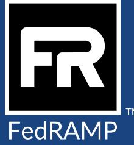
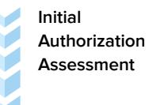
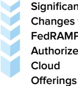

# 3PAO Obligations and Performance Standards

Version 3.3 April 6, 2023

Info@FedRAMP.gov FedRAMP.gov

### DOCUMENT REVISION HISTORY

| Date       | Version | Page (s) | Description                                                                                                                                                 | Author      |
|------------|---------|----------|-------------------------------------------------------------------------------------------------------------------------------------------------------------|-------------|
| 07/29/2015 | 1.0     | All      | Initial Publication                                                                                                                                         | FedRAMP PMO |
| 06/06/2017 | 1.0     | Cover    | Updated FedRAMP logo                                                                                                                                        | FedRAMP PMO |
| 12/07/2017 | 2.0     | All      | Updated to new document template                                                                                                                            | FedRAMP PMO |
| 09/01/2020 | 3.0     | All      | Updated guidance; added information on roles and responsibilities; performance standards; and corrective actions                                   | FedRAMP PMO |
| 05/18/2021 | 3.1     | Page 4   | Updated Corrective Action Details for Revocation                                                                                                         | FedRAMP PMO |
| 11/18/2021 | 3.2     | Page 4   | Updated terminology in Corrective Action Details for Revocation                                                                                          | FedRAMP PMO |
| 04/06/2023 | 3.3     | All      | Clarified corrective action details, added new personnel standards, and expanded the Appendix A: Detailed 3PAO Roles and Responsibilities table | FedRAMP PMO |

# TABLE OF CONTENTS

|  | 1. Introduction                                           |  |
|--|-----------------------------------------------------------|--|
|  | 2. Backqround                                             |  |
|  | 3. Fedramp Recognition                                    |  |
|  | 4. 3PAO Obligations Standards                             |  |
|  | 5. 3PAO Performance Standards                             |  |
|  | 6. Performance Management                                 |  |
|  | 7. References                                             |  |
|  | 8.   Appendix A: Detailed 3PAO Roles And Responsibilities |  |
|  | 9.   Appendix B: Detailed 3PAO Performance Standards      |  |
|  |                                                           |  |

## 1. Introduction

The Federal Risk and Authorization Management Program (FedRAMP®) created a conformity assessment process to recoqnize third party assessment orqanizations (3PAOs) through accreditation by the American Association for Laboratory Accreditation (A2LA). This process ensures 3PAOs meet the necessary quality, independence, and FedRAMP knowledge requirements to perform independent security assessments required by FedRAMP. To maintain recognition, 3PAOs must continue to demonstrate independence, quality, and FedRAMP knowledge as they perform security assessments on cloud systems.

### 2. Background

FedRAMP provides a cost-effective, risk-based approach, for the adoption and use of cloud services, by making standardized security requirements for the authorization and onqoing cybersecurity of cloud products and services available to executive departments and agencies. In partnership with the National Institute of Standards and Technology (NIST), FedRAMP developed a conformity assessment program with the qoal of producing consistent, independent third-party assessments of security controls implemented by cloud service providers (CSPs). FedRAMP developed criteria for 3PAOs to ensure they provide independent assessments of a CSP's implementation of the FedRAMP security requirements.

The roles and responsibilities of a FedRAMP 3PAO are critical. 3PAOs independently assess the effectiveness of security controls associated with cloud service offerings (CSOs). 3PAO assessments serve as the basis from which the federal qovernment makes informed, risk-based authorization for the qovernment's use of cloud products and services. To learn more about the roles and responsibilities of 3PAOs, refer to Appendix A: Detailed 3PAO Roles and Responsibilities.

Orqanizations interested in becoming FedRAMP recognized 3PAOs must be accredited by A2LA, which follows International Standardization Orqanization/International Electrotechnical Commission (ISO/IEC) 17020 (as revised) Requirements for the Operation of Various Types of Bodies Performing Inspection.

### 3. Fedramp Recognition

In order to become a FedRAMP recognized 3PAO, A2LA must perform an initial assessment of an independent assessment organization (IAO) and provide an initial assessment recommendation to FedRAMP for approval. For a 3PAO to maintain its FedRAMP recognition, A2LA must perform a favorable annual review and a full on-site reassessment every two years.

A2LA assessments ensure 3PAOs meet the requirements of ISO/IEC 17020 (as revised) and FedRAMP-specific knowledge requirements. A2LA provides an assessment report to FedRAMP that documents the 3PAO:

- ls competent to perform inspections of CSP documents and technical system elements ●
- Has a documented, fully operational, and adequately maintained quality management system ● (QMS) that meets the standards of ISO/IEC 17020 (as revised) and FedRAMP-specific knowledge requirements
- . ls operating in accordance with its QMS
- Demonstrates technical competence of individual assessors through education, training, technical . knowledge, skills, and experience as required by A2LA (information regarding A2LA's FedRAMP requirements can be found at https://www.a2la.orq/accreditation/fedramp and https://portal.a2la.org/documents/)

### 3PAO Obligations Standards 4.

FedRAMP requires all 3PAOs to adhere strictly and continuously to FedRAMP requirements and follow their ISO/IEC 17020 (as revised) QMS, as described in their application, and evaluated by A2LA. Among these requirements, a few key items are:

- . 3PAOs must be independent from any CSP they assess
- 3PAOs are only allowed to be a Type A or Type C Inspection Body ●
- 3PAOs must perform assessments that meet a high standard of independence, quality, accuracy, ● integrity, and timeliness
- 3PAOs must demonstrate knowledge of the Federal Information Security Management Act (FISMA) and FedRAMP-specific requirements when conducting their assessments
- . 3PAOs must develop and maintain a training program for their personnel including, at a minimum, content incorporating FISMA, FedRAMP, cloud computing, and cybersecurity
- . 3PAOs must meet the personnel requirements for years of experience, training, certification qualifications, and technical proficiency activities
- 3PAOs must comply with requirements set forth in the FedRAMP Authorization Act, includinq ● section 3612. Declaration of foreign interests

3PAOs must continuously meet and demonstrate they are performing in accordance with ISO/IEC 17020 (as revised) and FedRAMP requirements to maintain their FedRAMP recognition.

#### 3PAO Performance Standards 5.

During FedRAMP assessments, 3PAOs produce a Readiness Assessment Report (RAR) or a complete security authorization package. A complete security authorization package includes:

- Security Assessment Plan (SAP) .
	- Inventories o
	- O Rules of Engagement
- Security Assessment Report (SAR) .
	- o Security Assessment Test Case Workbook
	- O Risk Exposure Table
	- Penetration Test Report O
	- Vulnerability Scan Data Files O
	- Test Artifacts o

These 3PAO documents, and personnel that develop them, must meet the following standards, reflective of their FedRAMP recognition:

| Performance Standard                 | Details                                                                                                                                                                                                                    |
|--------------------------------------|----------------------------------------------------------------------------------------------------------------------------------------------------------------------------------------------------------------------------|
| Complete Assessment Packages      | Submit complete and thoroughly prepared documents on the first submission                                                                                                                                               |
| Documentation Quality                | Meet all quality standards, as published by FedRAMP, in the FedRAMP General Document Acceptance Criteria quidance · Prepare documents using the most recent standard templates, without alterations and deletions |
| Timeliness and Responsiveness        | Deliver documents on time, according to the schedule agreed to between the government, CSP, and 3PAO                                                                                                                    |
| Testing Accuracy and Completeness | Assure accurate and complete testing of a CSP's offering in accordance with ISO/IEC 17020 (as revised) and FedRAMP security requirements                                                                             |
| Assessment Integrity                 | Submit independent assessments of a CSP's security posture uninfluenced by CSP demands                                                                                                                                  |
| Personnel Qualifications             | Meet all personnel qualification requirements, as published by A2LA, in the R311 - Specific Requirements: Federal Risk and Authorization Management Program (FedRAMP) policy                                         |

Failure of a 3PAO to perform according to these standards, as further detailed in Appendix B: Detailed 3PAO Performance Standards, affects the qovernment's ability to authorize cloud systems based on a 3PAO's

independent assessment. Any 3PAO assessment deliverables containing work performed, prepared, or submitted by 3PAO personnel who do not meet the requirements for their role, based on the available information in the Baltimore Cyber Range (BCR) 3PAO Personnel Database, will be determined to be invalid, will be rejected, and will need to be redone by personnel who meet the required qualifications. FedRAMP will pursue corrective actions and possible removal of FedRAMP recognition if 3PAO deliverables and personnel do not meet these performance standards.

## 6. Performance Management

The qovernment evaluates all 3PAO products and expects superior quality and performance. Quality is expected across the government, regardless of whether a 3PAO is working directly with the loint Authorization Board (JAB), FedRAMP PMO, or an agency. In the event that a 3PAO's performance does not meet FedRAMP standards, FedRAMP has the authority and responsibility to pursue corrective actions related to the 3PAO's FedRAMP recognition status. Corrective actions and potential change of a 3PAO's FedRAMP recognition status include the following:

- 1. Consultation
- 2. In-Remediation
- 3. Revoked

FedRAMP reserves the right to place a 3PAO in any of these statuses.

| Corrective Action Status | Corrective Action Details                                                                                                                                                                                                                                                                                                                                                                                                                                                                                                                                                                                                                                                                                                                                                                                                                                                                                                                                                                                        |  |  |
|-----------------------------|------------------------------------------------------------------------------------------------------------------------------------------------------------------------------------------------------------------------------------------------------------------------------------------------------------------------------------------------------------------------------------------------------------------------------------------------------------------------------------------------------------------------------------------------------------------------------------------------------------------------------------------------------------------------------------------------------------------------------------------------------------------------------------------------------------------------------------------------------------------------------------------------------------------------------------------------------------------------------------------------------------------|--|--|
| Consultation                | lf a 3PAO has minor deficiencies associated with FedRAMP's 3PAO performance standards (see Appendix B) such as incomplete testing, poor document quality, inaccurate testing, or has a first instance of utilizing unqualified personnel: • A Consultation notice is sent from FedRAMP, to the 3PAO and CSP (for RAR submissions) or to the 3PAO, CSP, and initial authorizing agency (for initial authorization and annual assessment package submissions), notifying the 3PAO of specific deficiencies in their performance FedRAMP informs the 3PAO that their "Consultation" status will o not be reflected on their FedRAMP Marketplace page FedRAMP will require a meeting with 3PAO representatives to O discuss the specific deficiencies in the 3PAO's performance · The 3PAO must develop and submit an internal Corrective Action Plan (CAP) to FedRAMP (info@fedramp.gov) within 10 business days of the meeting with FedRAMP The internal CAP: O |  |  |
|                             | Details all deficiencies identified by FedRAMP, the root cause of the deficiencies, and how and when the deficiencies will be remediated                                                                                                                                                                                                                                                                                                                                                                                                                                                                                                                                                                                                                                                                                                                                                                                                                                                                   |  |  |

|                | Requires FedRAMP Director approval ■ ls documented in the 3PAO's performance records and ■ shared with A2LA during the 3PAO's next assessment                                                                                                                                                                                                                                                                                                                                                                                                                                                                                                                                                                                                                                                                                                                                                                                                                                                                                                                                                                                                                                                                                                                                                                                                                                                                                                                                            |
|----------------|------------------------------------------------------------------------------------------------------------------------------------------------------------------------------------------------------------------------------------------------------------------------------------------------------------------------------------------------------------------------------------------------------------------------------------------------------------------------------------------------------------------------------------------------------------------------------------------------------------------------------------------------------------------------------------------------------------------------------------------------------------------------------------------------------------------------------------------------------------------------------------------------------------------------------------------------------------------------------------------------------------------------------------------------------------------------------------------------------------------------------------------------------------------------------------------------------------------------------------------------------------------------------------------------------------------------------------------------------------------------------------------------------------------------------------------------------------------------------------------------------|
| In-Remediation | If a 3PAO has deficiencies, such as repeated performance issues (see Appendix B), submission of conditional CSP authorization recommendations, or fails to complete the internal CAP as part of the "Consultation" status corrective action requirements: · An In-Remediation letter is sent from FedRAMP, to the 3PAO and CSP (for RAR submissions) or to the 3PAO, CSP, and initial authorizing agency (for initial authorization and annual assessment package submissions), notifying the 3PAO of specific deficiencies in the 3PAO's performance o FedRAMP informs the 3PAO that their "In-Remediation" status will be noted as such on their FedRAMP Marketplace page The 3PAO must submit a formal CAP to FedRAMP (info@fedramp.gov), within ● 10 business days of the date of the letter from FedRAMP ം   The formal CAP: Details all deficiencies identified by FedRAMP, the root ■ cause(s) of the deficiencies, and how and when the deficiencies will be remediated Requires FedRAMP Director approval ■ ls documented in the 3PAO's performance records and ■ shared with A2LA during the 3PAO's next assessment May require a re-assessment by A2LA for validation of the ■ successful completion of the CAP, as determined by FedRAMP · FedRAMP's review of the associated authorization package or RAR will be placed on hold until the FedRAMP Director approves the 3PAO's formal CAP response |
| Revoked        | If a 3PAO has severe deficiencies in their performance or a 3PAO fails to complete the formal CAP, as required while in the "In-Remediation" status: • A letter is sent from FedRAMP, to the 3PAO and CSP (for RAR submissions) or to the 3PAO, CSP, and initial authorizing agency (for initial authorization and annual assessment package submissions), notifying the 3PAO of their FedRAMP recognition revocation status, why the revocation occurred, and that its orqanization's page has been removed from the FedRAMP Marketplace Revoked organizations are not authorized to provide FedRAMP assessment services for CSPs pursuing or maintaining a FedRAMP authorization. If a 3PAO's FedRAMP recognition is revoked, the organization will be required to re-enter the qualification process through the A2LA Cybersecurity Inspection Body Program (detailed in Appendix A), which includes performing successfully under A2LA's standards (ISO/IEC 17020 and R335) for one year prior to seeking recognition again as a FedRAMP 3PAO.                                                                                                                                                                                                                                                                                                                                                                                                         |

Multiple revocations may require extended time spent in this status while also demonstrating acceptable performance in the A2LA Cybersecurity Inspection Body Program, prior to seeking recognition again as a FedRAMP 3PAO. Certain severe infractions identified by A2LA or FedRAMP, following revocation, may result in the inability for an IAO to pursue FedRAMP recognition aqain.

# 7. References

The following are references 3PAOs should review and incorporate into their FedRAMP assessments and quality systems:

- R301 General Requirements: Accreditation of ISO/IEC 17020 Inspection Bodies ●
- R311 – Specific Requirements: Federal Risk and Authorization Management Program (FedRAMP)
- ISO/IEC 17020:2012 Conformity Assessment: Requirements for the Operation of Various Types of ● Bodies Performing Inspection
- . FedRAMP General Document Acceptance Criteria: Details the qeneral acceptance criteria for documents submitted to FedRAMP focused on clarity, completeness, and consistency (these acceptance criteria do not address technical content)
- . Sample Agency Authorization Review Report Template: Used by the FedRAMP PMO to review aqency authorization packages (may be updated as needed)

# 8. Appendix A: Detailed 3PAO Roles And Responsibilities

| PHASE |                                                                                                                                                                                        | IAO → 3PAO Roles and Responsibilities                                                                                                                                                                                                                                                                                                                                                                                                                   | A2LA Roles and Responsibilities                                                                                                                                                                                                                                                 | FedRAMP PMO Roles and Responsibilities                                                                                                                                                                                                                     |
|-------|----------------------------------------------------------------------------------------------------------------------------------------------------------------------------------------|------------------------------------------------------------------------------------------------------------------------------------------------------------------------------------------------------------------------------------------------------------------------------------------------------------------------------------------------------------------------------------------------------------------------------------------------------------|------------------------------------------------------------------------------------------------------------------------------------------------------------------------------------------------------------------------------------------------------------------------------------|---------------------------------------------------------------------------------------------------------------------------------------------------------------------------------------------------------------------------------------------------------------|
|       | Assessment Organization Wishes to Begin FedRAMP ЗРАО Recognition Process                                                                                          | ■ Submits notice to A2LA for Independent Assessment Organization (IAO) accreditation = Performs successfully under A2LA's standards (ISO/IEC 17020 and R335) for one year Note: IAOs must be able to demonstrate compliance to the A2LA defined standards in the context of their defined scope of accreditation                                                                                                                | ■ Partners with IAOs (for a one-year period) to ensure that they are meeting A2LA's FedRAMP 3PAO transition requirements                                                                                                                                               | None                                                                                                                                                                                                                                                          |
|       | Assessment Organization Successfully Completes the One Year Period as an IAO and Notifies A2LA of their Desire to Become a FedRAMP Recognized ЗРАО | ■ Sends at least one team through the Baltimore Cyber Range (BCR) proficiency activity prior to the completion of the IAO's FedRAMP transition assessment process = Successfully completes the BCR proficiency testing exercise                                                                                                                                                                                                          | ■ Assesses all IAO candidates on their knowledge of the technical requirements and compliance to the FedRAMP program requirements (R311) ■ Submits FedRAMP recognition recommendation and IAO assessment results to the FedRAMP PMO for review/approval | ■ Makes FedRAMP recognition determination based on assessment artifacts provided by A2LA                                                                                                                                                             |
|       | FedRAMP Approves IAO to Become a FedRAMP Recognized ЗРАО                                                                                                                | ■ Provides further artifacts, as requested, to support FedRAMP's analysis and recognition ■ Coordinates with the FedRAMP PMO to schedule a FedRAMP 3PAO Kick-off Meeting Submits marketing materials to the FedRAMP PMO for review and approval Note: If an assessment organization is denied FedRAMP recognition, the organization will need to decide if they want to reapply to become a FedRAMP recognized 3PAO | None                                                                                                                                                                                                                                                                               | Holds FedRAMP 3PAO Kick-off Meetings Lists newly transitioned 3PAOs on the FedRAMP Marketplace Note: Newly transitioned 3PAOs must attend a Kick-off Meeting with the FedRAMP PMO prior to being listed on the FedRAMP Marketplace |

Readiness Assessment

- Ensures systems being assessed are operational
IAO → 3PAO

Roles and Responsibilities

- = Follows all requirements, in accordance with the FedRAMP High Readiness Assessment Report (RAR) template or FedRAMP Moderate RAR template
- Provides a clear attestation in the RAR with no conditional or ambiguous attestations (all attestations must be logical and align with the proposed residual risk of operating a system)
- = Notifies FedRAMP, at least two weeks prior to submission of a RAR, via info@fedramp.gov
- Uploads RARs to the appropriate repository, for FedRAMP PMO review, and provides a notification email to info@fedramp.gov indicating the availability of the RAR
- Accepts feedback, from the FedRAMP PMO, to facilitate FedRAMP Ready decisions
- Collects additional artifacts, as required from CSPs, to clarify the security posture of systems
- Maintains proper chain of custody, as applicable, for artifacts and documents associated with a FedRAMP Readiness Assessment
- Reviews organizational feedback, from the FedRAMP PMO, and utilizes their QMS, corrective action, and complaints processes, as needed

| A2LA                       |  |  |
|----------------------------|--|--|
| Roles and Responsibilities |  |  |

- Receives feedback, from the FedRAMP PMO, regarding 3PAO performance
- Incorporates all 3PAO performance feedback into their annual conformance assessments

### FedRAMP PMO

- Reviews RARs and makes FedRAMP Ready determinations
- Provides guidance to 3PAOs and CSPs on FedRAMP security and RAR-specific requirements
- Provides oversight and feedback to 3PAOs regarding their performance
- Lists approved FedRAMP Ready offerings on the FedRAMP Marketplace

IAO → 3PAO Roles and Responsibilities

- Conducts assessments of security controls implemented by CSPs
- Follows all guidance and requirement documents available on the FedRAMP website
- Notifies the FedRAMP PMO. at least two weeks prior to package submission, via info@fedramp.gov
- Uploads all documentation, for which they are responsible
- Accepts SAP, SAR, and penetration testing report product feedback, from the FedRAMP PMO, to facilitate FedRAMP authorization approvals
- Collects additional artifacts, as required from CSPs, to clarify the security posture of systems
- = Reviews organizational feedback, from the FedRAMP PMO, and utilizes their QMS, corrective action, and complaints processes, as needed

A2LA Roles and Responsibilities

- Receives feedback, from the FedRAMP PMO, regarding 3PAO performance
- Incorporates all 3PAO performance feedback into their annual conformance assessments

### FedRAMP PMO

- Reviews initial authorization packages and makes FedRAMP authorization determinations
- Provides guidance to 3PAOs, CSPs, and agencies on FedRAMP security and FedRAMP authorization-specific requirements
- Provides oversight and feedback to 3PAOs regarding their performance
- Lists approved FedRAMP Authorized offerings on the FedRAMP Marketplace

- Annual Assessment of FedRAMP Authorized Cloud Offerings
- Ensures systems being assessed are still operational

IAO → 3PAO

Roles and Responsibilities

- Ensures all significant changes to systems, since the last assessment, have the appropriate documentation and are uploaded into their respective package repository
- Ensures all requirements are followed, in accordance with FedRAMP's Annual Assessment templates
- Notifies FedRAMP, at least two weeks prior to an annual security assessment submission, via info@fedramp.gov
- = Uploads all required documentation to the appropriate repository, and provides a notification email to info@fedramp.gov as well as applicable stakeholders to include the agency AO or JAB representative
- Accepts and incorporates SAP, SAR, and penetration testing report feedback, and works with the JAB, FedRAMP PMO, and agency AOs to facilitate continued FedRAMP authorization decisions
- Collects additional artifacts, as required, from CSPs to clarify the security posture of systems
- = Maintains proper chain of custody, as applicable, for artifacts and documents associated with annual security assessments
- Reviews organizational feedback, from the FedRAMP PMO, and utilizes their QMS, corrective action, and complaints processes, as needed

#### A2LA Roles and Responsibilities

- Receives feedback, from the FedRAMP PMO, regarding 3PAO performance
- Incorporates all 3PAO performance feedback into their annual conformance assessments

### FedRAMP PMO

- · Provides governance to ensure annual assessments are conducted and that authorization package/ConMon material is submitted within required time frames
- · Reviews annual assessment packages to ensure cloud offerings are meeting FedRAMP requirements
- Provides oversight and feedback to 3PAOs regarding their performance

Significant Changes to FedRAMP Authorized Cloud

#### IAO → 3PAO Roles and Responsibilities

■ Provides recommendations and status updates to the JAB, FedRAMP PMO, and agency AOs related to significant changes

= Uploads all required documentation to the appropriate repository, and provides notification email to info@fedramp.gov as well as applicable stakeholders to include the agency AO or JAB representative

- Maintains proper chain of custody, as applicable, for artifacts and documents associated with significant change assessments
A2LA Roles and Responsibilities

- · Receives feedback, from the FedRAMP PMO, regarding 3PAO performance
- Incorporates all 3PAO performance feedback into their annual conformance assessments

### FedRAMP PMO

- Provides guidance and recommendations to agencies, when requested
- Provides oversight and feedback to 3PAOs regarding their performance

# 9. Appendix B: Detailed 3PAO Performance Standards

| Performance Standard              | Note: The details below are a representative description of FedRAMP's performance standards and are not all-inclusive. FedRAMP maintains the ability to identify additional performance standards, as needed.                                                                                                                                                                                                                                                                                                                                                                                                                                                                                                                                                                                                                                                                                                                                                                                                                                                                                                                                                     |
|--------------------------------------|-------------------------------------------------------------------------------------------------------------------------------------------------------------------------------------------------------------------------------------------------------------------------------------------------------------------------------------------------------------------------------------------------------------------------------------------------------------------------------------------------------------------------------------------------------------------------------------------------------------------------------------------------------------------------------------------------------------------------------------------------------------------------------------------------------------------------------------------------------------------------------------------------------------------------------------------------------------------------------------------------------------------------------------------------------------------------------------------------------------------------------------------------------------------------|
| Complete Assessment Packages   | Complete assessment packages are uploaded to the appropriate secure repository (refer to Section B of the FedRAMP Agency Authorization Review Report Sample Template to learn more about what a complete assessment package entails)                                                                                                                                                                                                                                                                                                                                                                                                                                                                                                                                                                                                                                                                                                                                                                                                                                                                                                                           |
| Documentation Quality             | Documentation content is clear, complete, concise, and consistent (refer to the EedRAMP General Document Acceptance Criteria to learn more about what a complete document entails) FedRAMP templates are used, and: o Prepared documents use the most recent FedRAMP templates, without alterations and deletions Insertions must be agreed upon by the JAB or FedRAMP PMO O                                                                                                                                                                                                                                                                                                                                                                                                                                                                                                                                                                                                                                                                                                                                                                       |
| Timeliness and Responsiveness     | Delivered documents are on time, according to the agreed upon schedule, between the government, CSP, and 3PAO Formal communications from FedRAMP are acknowledged and responded ● to in a timely manner                                                                                                                                                                                                                                                                                                                                                                                                                                                                                                                                                                                                                                                                                                                                                                                                                                                                                                                                                     |
| Testing Accuracy and Completeness | The SAP Test Case Procedures include tailored test procedures for all security controls with alternative implementations The penetration testing addresses all threat vectors and requirements, in accordance with the FedRAMP Penetration Test Guidance The Test Case Procedures Workbook (TCW) captures observations and ● evidence for all security test control requirements The Control Implementation Summary (CIS) and associated Customer ● Responsibility Matrix (CRM) are validated and consistent with the control status and customer responsibilities specified in the SSP A CSP's SSP authorization boundary and data flow diagrams are validated against the actual state of the system using methods that include discovery scanning and penetration testing Testing of a CSP's authorization boundary is in accordance with the ● FedRAMP Authorization Boundary Guidance All system interconnections, including corporate shared services, are O identified, tested, and validated External services lacking FedRAMP authorization are appropriately o captured as risks in the SAR |

| Assessment Integrity        | 3PAOs act as an independent assessment body, on behalf of the federal qovernment, and must report attempts to subvert this independence, FedRAMP's security requirements, process, and rigor A clear authorization recommendation is provided in the SAR ● o   Conditional or ambiguous authorization recommendations are not accepted o   Authorization recommendations are logical and align with the residual risk for operating a system A clear attestation is provided for a RAR o   Conditional or ambiquous attestations are not accepted o   Attestations are logical and align with the proposed residual risk of operating a system 3PAOs are responsible for maintaininq chain of custody and the integrity of ● the security assessment materials, which include: RARs, SAPs, SARs, and associated testing artifacts |
|-----------------------------|-----------------------------------------------------------------------------------------------------------------------------------------------------------------------------------------------------------------------------------------------------------------------------------------------------------------------------------------------------------------------------------------------------------------------------------------------------------------------------------------------------------------------------------------------------------------------------------------------------------------------------------------------------------------------------------------------------------------------------------------------------------------------------------------------------------------------------------------------------------------------------------|
| Personnel Qualifications | 3PAO personnel must adhere to the years of experience, training, testing proficiency activity, and certification qualification requirements specific their role, in accordance with the A2LA R311 ● All packages and work products, submitted to FedRAMP, must be prepared by authorized personnel                                                                                                                                                                                                                                                                                                                                                                                                                                                                                                                                                                 |