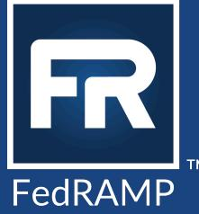

# 3PAO Readiness Assessment Report Guide

Version 3.2 10/17/2024

info@fedramp.gov fedramp.gov

# DOCUMENT REVISION HISTORY

| Date       | Version | Page (s) | Description                                                                                                                                                               | Author   |
|------------|---------|----------|---------------------------------------------------------------------------------------------------------------------------------------------------------------------------|----------|
| 06/07/2017 | 1.0     | All      | Original document release                                                                                                                                              | FedRAMP® |
| 01/04/2022 | 2.0     | All      | Updated document to align with updates to the FedRAMP Readiness Assessment Report (RAR) Templates and provide additional quidance for 3PAOs | FedRAMP  |
| 01/28/2022 | 2.1     | 4, 16    | Updated to provide clarity around the FedRAMP Ready Marketplace Designation timeline                                                                    | FedRAMP  |
| 06/30/2023 | 3.0     | All      | Updated to reflect FedRAMP Rev. 5 baselines                                                                                                                         | FedRAMP  |
| 07/19/2024 | 3.1     | All      | Updated to align with the FedRAMP Rev. 5 baselines and JAB transition                                                                                         | FedRAMP  |
| 10/17/2024 | 3.2     | All      | Removed JAB references based on OMB's 2024 Modernizing FedRAMP memo.                                                                                          | FedRAMP  |

# TABLE OF CONTENTS

| Purpose                               | 1  |
|---------------------------------------|----|
| Intent of a Readiness Assessment      | ।  |
| RAR Audience                          | 2  |
| Required Discussions with CSP Clients | 2  |
| Preparing a FedRAMP RAR               |    |
| Submission Instructions               | 15 |
| FAQs                                  | 15 |

### Purpose

- To educate and guide third party assessment organizations (3PAOs) and cloud service providers . (CSPs) on how to best utilize the FedRAMP Readiness Assessment Report (RAR) templates to obtain optimal results from the FedRAMP RAR Review Team
- To help 3PAOs and CSPs understand the rigor that FedRAMP requires for assessments ●
- To increase the likelihood of 3PAOs successfully completing RARs
- To ensure shared understanding of the RAR's intent, processes, and best practices .

### Intent of a Readiness Assessment

The RAR is similar to a security assessment in that FedRAMP expects the 3PAO to fully develop the RAR based on 3PAO observations and 3PAO gathered evidence. While the CSP should review the RAR for accuracy, the 3PAO has ownership of the RAR and is fully responsible for its content.

The intent of the Readiness Assessment is to have a 3PAO attest to a CSP's readiness for the FedRAMP authorization process. By completing a RAR, a CSP should be able to understand if their cloud service offering (CSO) has the key technical capabilities in place and operating as intended to obtain a FedRAMP authorization.

In the RAR, a 3PAO documents and validates a CSP's full implementation of the technical capabilities required to meet FedRAMP security requirements, which is the biggest hurdle for a CSP working on their CSO to obtain a FedRAMP authorization. The RAR does require some evidence qathering by a 3PAO, but does not require having 100% of the documentation completed by the CSP. To complete a RAR, the 3PAO should focus on:

- Confirming full implementation of the CSO's technical capabilities. ●
- . Understanding how a CSO works and operates, not on how that functionality is translated to documentation.
- . Validating what is actually implemented within the CSO, not copying and pasting what a CSP has written in the system documentation.
- Understanding the key functionalities of the CSO and documenting the RAR in a way that is ● understandable to customers.
- . Verifying that the stated authorization boundary of the CSO and the data flows within the system are practical, secure, and logical given 3PAO expertise in cloud implementations.

A Readiness Assessment is not a CSP's opportunity to determine what FedRAMP may or may not accept. If a CSO does not fully implement the federal mandates, the CSO will not be accepted as FedRAMP

Ready². 3PAOs must ensure all comments and feedback provided by FedRAMP have been addressed before resubmitting updated RARs.

# RAR Audience

Remembering the RAR audience is key. A RAR is NOT intended solely for FedRAMP review and understandina. A 3PAO should align their RAR toward agency customers that may or may not have a strong technical background.

The intent of the report is to aid agencies in determining if they wish to invest time and funding in a particular CSO for an initial authorization, based on the level of risk the federal qovernment will inherit by using the CSO.

The report also reflects the quality and technical acumen of a 3PAO. A well-written, clear, and succinct RAR enhances the reputation of a 3PAO; whereas, a poorly written RAR may damage the 3PAO's reputation, future business potential, and could potentially impact their FedRAMP recognition.

# Required Discussions with CSP Clients

### Not all CSOs will pass the Readiness Assessment Review

FedRAMP does not expect CSOs to pass their Readiness Assessment each time. 3PAOs should tell their CSPs that a Readiness Assessment is intended to determine their CSO's readiness to obtain a FedRAMP authorization, not quarantee it. Many times, a Readiness Assessment will find significant qaps in a CSO's capabilities, resulting in remediation tasks for a CSP.

Concurrently, even if a RAR was initially approved as FedRAMP Ready, the RAR renewal may not achieve the same result. The reasons for this are numerous, and some are noted here:

- The CSP did not adequately maintain the security posture of the CSO. ●
- The CSO's technology and/or architecture has changed.
- The CSO's security implementations may no longer meet the security requirements for FedRAMP ● Ready due to evolving security considerations/policy changes.

Once a CSO has been designated as FedRAMP Ready, it is expected that the CSP will continuously monitor the service offering. The CSP may actively seek agency representatives who may agree to partner with the CSP for the initial assessment and authorization of the CSO. If a CSP has any questions about this process, they should send an email to intake@fedramp.gov for more information.

4 There are situations that arise, based on a widespread event, that FedRAMP may grant exceptions such as the "NIST SP 800-56a Rev. 3 transition".

3PAOs should NOT submit a RAR to FedRAMP until they validate that all CSO federal mandates have been met (referenced in the RAR Federal Mandates section) and believe the CSO has the necessary security capabilities and functionality to obtain a FedRAMP authorization. This means that the 3PAO is able to provide evidence for "Yes" answers for all security capabilities outlined in the RAR Template tables 4-4, 4-5, 4-6, 4-7, and 4-8. The CSP must also have, at minimum, draft policies and procedures documentation for the CSO.

### 3PAOs Must Maintain Independence and Impartiality When Working with CSPs

Throughout the Readiness Assessment process, 3PAOs are required to remain impartial and independent when working with CSPs. This should be clearly communicated to the CSP and 3PAOs can reference R311 - Specific Requirements: Federal Risk and Authorization Management Program (FedRAMP), Section 5.2.4 F.1, to support this position. According to the R311, "If a 3PAO is part of an organization that offers consulting services to CSPs, the 3PAO is not permitted to inspect a CSP system that it has provided consulting services on within the previous two years." Section 5.2.4. F.2 further states that "if a 3PAO is part of an orqanization that is also a CSP, the 3PAO is not permitted to inspect the work of their orqanization's CSP." These quidelines are in place to ensure 3PAOs actinq on behalf of FedRAMP are impartial to the best extent possible.

Although a 3PAO could serve as an assessor and then as a consultant for a CSP pursuing a FedRAMP Ready designation, a 3PAO can never serve as an assessor immediately after serving as a consultant for a CSP. If a CSP undergoes a Readiness Assessment and they are deemed 'not ready', they may hire the same 3PAO to serve as a consultant to help with the remediation of issues; however, after the issues are resolved, a different 3PAO must be hired to handle the next Readiness Assessment. Similarly, if a 3PAO consults with a CSP to assist with the preparation for a Readiness Assessment, a new 3PAO would need to be hired to conduct the Readiness Assessment or security assessment when the CSP pursues a FedRAMP authorization.

Furthermore, a 3PAO must not assess a product in which they have a vested interest. Section 5.2.4 F.3 of the R311 indicates that "tools owned or developed by a 3PAO that provide any type of direct service or support to a CSP including, but not limited to, creating FedRAMP documentation are considered a form of consulting. Therefore, to maintain the independence of an assessment, 3PAOs are not permitted to perform assessment services for the same CSP that has directly utilized tool(s) that are owned or developed by the 3PAO for any purpose. In scenarios where a tool being used is owned or developed by a company with an affiliation to a 3PAO or its management team, employees, or subcontractors, the 3PAO must the rationale for how it maintains its impartiality from the CSP is using the tool owned or developed by the entity affiliated with the 3PAO and how it does not infringe upon the boundaries between providing consulting and assessing services to the CSP. This rationale must be approved by both A2LA and FedRAMP."

### Benefits of Becoming FedRAMP Ready

Many CSPs that begin a security authorization with the federal government are unaware of the gaps within their system, which often results in unforeseen costs and time for CSPs and 3PAOs during the authorization process. A Readiness Assessment helps CSPs identify if they have a high likelihood of success when attempting to achieve a FedRAMP authorization.

Additionally, agencies use the FedRAMP Marketplace to research cloud services that meet their orqanizational requirements. If a CSP is interested in pursuing qovernment clients, becominq FedRAMP Ready makes available valuable information about a service offering's security for potential aqency customers via the FedRAMP Marketplace.

Finally, being deemed FedRAMP Ready may help a CSP move toward being listed as "FedRAMP In Process" on the FedRAMP Marketplace. To achieve this designation, the CSP will need to first obtain written confirmation of an agency's intent to authorize the offering and send their confirmation information to info@fedramp.gov.

### Expiration of FedRAMP Ready Designation

A CSO's FedRAMP Ready designation is valid for only one year, beginning on the date the CSO was listed as FedRAMP Ready on the FedRAMP Marketplace. CSPs may choose to pursue the FedRAMP Ready designation again prior to identifying an agency partner for an initial FedRAMP Agency Authorization. While a FedRAMP Ready designation provides Marketplace visibility as well as additional benefits, it is important for CSPs to be aware of the associated time limitation.

After the CSO's one year anniversary date, the FedRAMP Ready designation is automatically removed from the Marketplace. FedRAMP sends anniversary date reminders throughout the lifecycle of a CSO Ready designation on the FedRAMP Marketplace to remind the CSP of their upcoming Marketplace delisting. If a CSP desires to retain the FedRAMP Ready designation for its service beyond a year, it should enqage a 3PAO to complete and submit an updated RAR prior to the one (1)-year FedRAMP Ready anniversary date. The updated RAR must be submitted to FedRAMP via info@fedramp.gov. Depending on the security state of the CSO, the CSO may or may not be granted FedRAMP Ready status for another year.

If the updated RAR is not approved by FedRAMP prior to the anniversary date of the CSO's FedRAMP Ready Designation, the CSO will be removed until the updated RAR has been approved by FedRAMP.

# Preparing a FedRAMP RAR

FedRAMP RAR templates are available for systems categorized at the High or Moderate security impact level, in accordance with the Federal Information Processing Standards (FIPS) Publication 199 security categorization. The High and Moderate baselines follow the same steps for completion with additional sub steps for the High baseline report. The RAR must provide:

- . An overview of the system.
- . An assessment of a CSO's ability to meet the federal mandates identified in Section 4.1, the FedRAMP Requirements identified in Section 4.2, and additional capabilities identified in Section 4.3 of the RAR templates.
- A clear description and diagram of system components and services within the authorization boundary, as well as any connections to external systems and services that are outside of the authorization boundary.
- A clear data flow diagram(s) and description(s) that accounts for all sensitive federal data, . including all flows through the authorization boundary and to/from external systems and services, and all flows between systems within the authorization boundary.
- . A 3PAO's attestation regarding the CSO's readiness to meet FedRAMP Moderate or High baseline requirements within one year from the date of submission.

For all RAR sections, it is important to be specific, clear, and succinct. The RAR template is primarily structured in a series of questions that cover key areas of concern to qauge readiness for moving towards FedRAMP authorization. The 3PAO should directly and clearly answer RAR requirements and questions, stating what they found (observations and evidence) during their review and how they came about determining if a CSP adequately addresses the question area. The "how" is very important and should briefly describe the specific method of testing the 3PAO performed to draw conclusions about a CSP's CSO security state/control implementations.

FedRAMP's quidance to 3PAOs and CSPs is that when the system is submitted for the status of FedRAMP Ready, all technical security controls should be implemented and working as required. FedRAMP does not expect that all the system security plan (SSP) documentation is totally completed. However, the system authorization boundary must be clearly defined, and the data flows throughout the system must be documented.

### Steps to Adequately Develop a RAR and FedRAMP's Evaluation Methodoloqy

#### 1. Validate the Authorization Boundary Diagram

Before any CSO can be assessed for readiness, the offering must have a clearly defined and maintainable authorization boundary. 3PAOs must perform full authorization to ensure nothing is missing from the CSP-identified authorization boundary diagram (ABD), as well as to ensure all included items are actually present and part of the system boundary. The 3PAO must ensure the diagram is validated against the CSO's inventory and:

- Includes a clearly defined, high resolution authorization boundary (with a legend) that accounts for . the flow of all federal information, data, and metadata through the system.
	- o lt is acceptable to provide the diagram as a separate attachment or embedded in the RAR.
- Clearly defines services as wholly within the boundary. ●

- Depicts services leveraged from the underlying laaS/PaaS (as applicable) and identifies any . services that are not FedRAMP Authorized.
	- Some CSPs use color-coding with a corresponding legend, and others have included a O call-out box that lists all services that are not FedRAMP Authorized.
- ldentifies all connections to external systems and services (includinq corporate shared services), and identifies any systems/services that are not FedRAMP Authorized.
- Depicts every tool, service, or component that is mentioned in the SSP narrative and controls.
	- Includes services used to manaqe and operate the system (e.g., SIEM, vulnerability o scanning, system health monitoring, and ticketing).
	- ldentifies depicted tools, services, or components as either external to the o boundary.
- . Depicts how CSP administrators, agency administrators, and end users access the cloud service (i.e., authentication used to access the service at each access point).
	- While the data flow diagrams will cover these in detail, FedRAMP requires this information O to also be included on the boundary diagram.
- lf applicable, depicts components provided by the CSP and installed on customer devices as inside . the authorization boundary.
	- o These components are required to be in the boundary if they materially affect the confidentiality, integrity, and availability (CIA) of the CSO (e.g., data collectors in customer data centers and mobile applications).
- Shows connections between components within the boundary and to/from external services.
	- O For example, connections from load balancers to the servers they support; similar flows can also be combined or noted (e.g., console access, bastion server access to all hosts, all devices forward logs to log server, etc.).
- . Depicts the development/test environment, alternate processing site, and location of backups.
	- lncludes the development/test environment within the boundary if federal data is used o and/or if federal government personnel have access to the environment for any reason, including training and user acceptance testing.
	- Shows update services (e.g., malware signatures and OS updates) outside the boundary. O
- ldentifies all system interconnections used to operate and support the service, intended mission/business functions, and whether or not interconnected systems are FedRAMP Authorized.

lf a CSO leverages external systems or services that are not authorized at the same impact level and authorization type, 3PAOs should identify potential risks to the CSO (using the guidance and instructions in Sections 3.2 and 3.3 of the RAR templates) and then consult FedRAMP before submitting a High RAR for a FedRAMP Ready decision. Under most circumstances, FedRAMP will not consider a CSP for a High impact FedRAMP Ready designation if the CSO leverages external systems or services that are not FedRAMP Authorized at the same impact level.

Additionally, 3PAOs must analyze all border devices to ensure they provide appropriate segregation from other systems. This includes examination of all configurations. Please refer to the FedRAMP High, Moderate Low Ll-SaaS Baseline Svstem Security Plan (SSP) Template, which provides tips on how to adequately represent the necessary diagrams and narratives.

#### TIP

- 3PAOs should validate BOTH what is inside the boundary AND outside the boundary.
- 3PAOs should ensure all boundary items included are somehow represented and part of a valid system inventory.
- 3PAOs should ensure that the boundary makes sense (e.g., even though a boundary is accurate doesn't mean it always provides adequate security).
- · 3PAOs MUST do a discovery scan as part of the RAR. The discovery scan is intended to identify operating systems running on the network and mapping them to IP addresses. It also should identify open ports/services and gather rudimentary information on targeted hosts.
- 3PAOs should also review CSP-supplied vulnerability scans since discovery scans do not probe for vulnerabilities in the system.

#### 2. Identify All Data Flows and Stores Within and Throughout the Authorization Boundary

A 3PAO must validate the data flow diagrams (DFDs) and provide a written description of the data flows. Each DFD must also be high resolution, reflect the same components as the authorization boundary diagram (ABD), and must explicitly identify everywhere internally and externally federal data and metadata at rest and in transit is in relationship to the system authorization boundary. Please refer to the FedRAMP High, Moderate, Low, LI-SaaS Baseline System Security Plan (SSP) Template, which provides tips on how to adequately represent the necessary diagrams and narratives.

#### 3. Determine Leveraged FedRAMP Authorizations

If the CSP leverages FedRAMP Authorized CSOs, be sure to provide the specific details regarding those relationships in Table 3-1, "Leveraged FedRAMP Authorizations." Any leveraged CSO must be listed on the FedRAMP Marketplace with a status of "FedRAMP Authorized." There is a difference between "FedRAMP Ready," "FedRAMP In Process," and " FedRAMP Authorized." A CSO qoinq through the RAR process is working towards "FedRAMP Ready" status. A CSO that has a full assessment package submitted and has been FedRAMP Authorized can be leveraged by a CSO. A CSO listed as "In Process" has not been FedRAMP Authorized and is considered an external, non-authorized system to the CSO going through the RAR process.

Please note:

- . 3PAOs must validate that all sub-services listed in Table 3-1 are included in a leveraged CSO's authorization boundary, per the CSO's service description on the FedRAMP Marketplace. Services that are not included in a FedRAMP Authorized boundary must be listed in Table 3-2, "External Systems and Services."
- If the CSP is leveraging external services from a FedRAMP Authorized system, the interfaces to the . services must be included in the boundary and must also be assessed by the 3PAO.

- . The Nature of Agreement can be any type of agreement between the CSP and the CSP vendors who support products (e.g., EULA, SLA, App License Agreement, and contract).
- FedRAMP expects that all vendor products are kept current and patched. ●

Additionallv. a 3PAO should ensure that if they are assessing a SaaS, subscriptions to underlying services (laaS and PaaS) are documented accurately (i.e., government community cloud versus commercial cloud or hybrid, FedRAMP Authorized versus not FedRAMP Authorized).

#### 4. Determine External and Corporate Systems and Services

FedRAMP defines a connection as any communication path used to push, pull, or exchange data and/or information, including application programminq interfaces (APIs). See Section 5 below.

ldeally, FedRAMP Authorized services should be used when possible since their risk is defined, and external services/systems lacking authorization have unknown risk. The RAR must specify all connections to external services. CSPs often establish connections to external systems and services to exchange data and information or augment system functionality and operational support services.

When completing the RAR External Services Table, please note the following:

- Corporate services are those systems and services that are operated and managed by the CSP in ● an environment controlled and operated by the CSP. They may include services used by the CSO that are dedicated to the support of their federal service offering or that are shared with corporate users. Cloud services used to support the corporate environment are not considered "corporate services" since they are not under the full control of the CSP; such services are considered external cloud services. When corporate services are used, please ensure to note:
	- The service location (in a corporate data center or in another cloud). O
	- o The use case of the specific service and who has access to it.
- . CSPs must identify all connections to external systems and services lacking FedRAMP authorization. Do not include the FedRAMP Authorized services listed in the RAR Leveraged Services Table. There should be no overlap between these two tables.
- . All CSPs must be cognizant of their use case of each external system or service and any sensitive federal data going to that system or service. It is not acceptable to use unauthorized external systems or services for processing or storage of sensitive federal data. Any external interconnections involving High services in particular will be critically scrutinized by FedRAMP and could impact the FedRAMP authorization of the High service offering. Please follow the latest FedRAMP boundary quidance for determining acceptable use of external systems and services.
- . ldeally, FedRAMP Authorized services should be used when possible since their risk is defined, and external services/systems lacking authorization have unknown risk.
- . Connections to all external systems and services should be depicted on the authorization boundary, network, and data flow diaqrams with directional arrows, as described in the narrative(s).

- O Directional arrows indicate direction from where the initial connection is made (e.g., an external service initiates the contact, and pushes data or the CSO initiates the contact and pulls data).
	- The CSP should make it very clear, within the diagram narrative, that the directional arrows are handled in the manner described above.
	- The CSP should apply the same logic to all data flows internally, externally, and ■ traversing the boundary.

#### 5. Diagram Narrative Descriptions

Whether using one or multiple diagrams, a detailed narrative describes that clearly describes the service offering and the elements of the diagram(s) must be included.

This narrative should describe the components of the system as depicted in the authorization boundary and should be consistent with what is depicted in the diagram (i.e., the narrative must use the same naming conventions to avoid confusion). Additionally, the narrative must describe the relationships of the internal services; it may be useful to describe these using a numbering or lettering scheme and then include them in the diagram, enabling the narrative to act as a key for the diagram.

Occasionally, there are other additional services being delivered from the same environment as a FedRAMP Authorized offering that are excluded from 3PAO testing, and hence the authorization boundary. The diagrams and narrative should clearly call this out when it is the case. In addition, the narrative should indicate whether the CSP plans for a near-term significant change to make these available to FedRAMP customers or has no plans to add these to this authorization boundary.

#### 6. Application Programming Interfaces (APIs)

Most CSOs use APIs to access data and interact with other systems' software components, operating systems, and microservices. APIs are considered connections and are put into a separate category in the RAR. 3PAOs must capture all APIs in Table 3-3 of the RAR.

# NOTE

11111111

Microservices are not APIs. Microservices are in their own special category. FedRAMP does not yet require that the 3PAO differentiate the specific microservices available within the system.

#### 7. Assess and Describe the Strength of the Physical and/or Logical Separation Measures within the System

Physical and/or logical separation measures within the system must form "defense in depth." Adequate separation measures provide segmentation and isolation of tenants, administration, and operations, and address user-to-system, admin-to-system, and system-to-system relationships.

A 3PAO must base the assessment of separation measures on very strong evidence, such as the review of any existing penetration testing results, or an expert review of the products, architecture, and configurations involved. No explicit penetration test is required as part of the Readiness Assessment; however, if a CSP has one, either done by themselves or a third-party, it is recommended that it be reviewed. If a penetration test is not available, the 3PAO must be able to provide a rationale for beinq able to prove that there is adequate segregation of tenants and data.

Additionally, 3PAOs must analyze all border devices to ensure they provide appropriate segregation from other systems; this includes examination of all configurations. A 3PAO must describe the methods used to verify the strength of separation measures and seqmentation of tenant data flows and stores in the RAR.

### TIP

- It is a best practice and an ultimate requirement of a FedRAMP initial authorization assessment to complete a penetration test for all Moderate and High baseline systems; however, a penetration test is not an explicit requirement for a Readiness Assessment.
- · If available, FedRAMP recommends that a penetration test for the system be reviewed, even if completed by a CSP or another assessor.

#### 8. Ensure Federal Mandates Are Met

For both Moderate and High baseline systems, (see footnote #1 under the Intent of a Readiness Assessment section above) there are six federal mandates that must be met. If the answer to any of the following questions is "No", the RAR should not be submitted.

- 1. Are FIPS 140-validated cryptographic modules (IAW SC-13) consistently used everywhere cryptography is required? This applies to all use of cryptography. In addition to encryption, this includes functions such as hashing, random number generation, and key generation. Examples include the following:
	- Encryption of data a.
	- b. Decryption of data
	- C. Generation of one time passwords (OTPs) for MFA
	- d. Protocols such as TLS, SSH, and HTTPS
	- e. At a minimum, SC-13 applies to cryptography in use for the following controls: AU-9(3), CP-9(8), IA-2(6), IA-5(1), MP-5, SC-8(1), and SC-28(1)
- 2. Does the system fully support user authentication via agency Common Access Card (CAC) or Personal Identity Verification (PIV) credentials?
- 3. Is the system operating at Digital Identity Level 3 (or Digital Identity Level 2 if a Moderate System)?
- 4. Does the CSP have the ability to consistently remediate High vulnerabilities within 30 days, Moderate vulnerabilities within 90 days, and Low vulnerabilities within 180 days?

- 5. Does the CSP and system meet Federal Records Management Requirements, including the ability to support record holds, National Archives and Records Administration (NARA) requirements, and Freedom of Information Act (FOIA) requirements?
[https://www.archives.gov/records-mgmt/grs/grs-trs33.pdf; PL 104-231, 5 USC 552]

- 6. Does the system's external authoritative DNS solution support DNS Security Extensions (DNSSEC) to provide origin authentication and integrity verification assurances? This applies to control SC-20 in the SSP. Does the system's internal recursive DNS solution support DNS Security Extensions (DNSSEC) to provide origin authentication and integrity verification assurances when resolvinq domains outside the boundary? This applies to control SC-21 in the SSP.
#### TIP

CSPs do not have to track deficiencies in the exact format FedRAMP requires for FedRAMP Authorized services, but a 3PAO should be able to easily determine that a CSP has demonstrated the capability to manage risks and remediate vulnerabilities in an efficient and effective manner as prescribed by FedRAMP remediation timeframes: 30 days for High vulnerabilities, 90 days for Moderate vulnerabilities, and 180 days for Low vulnerabilities.

#### 9. Ensure DNSSEC is In Place

For SC-20, 3PAOs must verify that the external authoritative DNS server replies with valid DNSSEC responses. Also, all external domain(s) used to access a CSO must be verified as being registered with a DNSSEC signature. The domains should be documented in the control description.

For SC-21, a 3PAO must verify that all internal recursive and caching servers are properly configured to make DNSSEC requests when resolving domains outside the boundary, and are within a FISMA/FedRAMP Authorized boundary; when DNSSEC responses are received, the recursive or caching DNS servers must validate their authentication and integrity. DNS responses that lack DNSSEC signatures should be handled according to organizational policy.

#### Authoritative Server

- . For SC-20, the authoritative server is signed by the Top Level Domain (TLD) server, which is in turn signed by the root server.
- . The entire signature chain will be checked when attempting to access the boundary; therefore, any signature that is broken breaks the whole chain.

#### Recursive Server

- . SC-21 calls for DNSSEC to be used on recursive or caching servers when resolvinq domains outside the boundary.
- . Trust of network connections from DNS clients and forwarding servers to the SC-21 verified server needs to also be established.

- . lf it is in the boundary, or an adjacent boundary such as an laaS/PaaS, that is usually sufficient.
- lf it traverses networks that lack authorization such as the Internet, then additional measures are ● required such as DNS over TLS, or DNS over HTTPS.

CSPs are encouraqed to self-check DNSSEC confiquration through one of many available analyzers such as Sandia National Labs (https://dnsviz.net).

#### 10. Verify FIPS 140-validated encryption within and throughout the System Boundary

For FIPS 140-validated encryption. FedRAMP expects that all Moderate and above federal data and metadata is encrypted for all DAR and DIT internally, and traversing the service boundary. (However, see footnote #1 under the Intent of a Readiness Assessment section above.) CSPs/vendors who use FIPS 140-validated modules have a certified security policy that states how their products must be used in a particular way. NIST's Implementation Guidance (IG) for FIPS 140 and the Cryptographic Module Validation Program allows implementers to assert that the implementation is sufficient. If a CSP chooses to use a FIPS 140-validated module in a way other than what is indicated by the security policy, it is called a derivative product, and a self-attestation is required. With respect to FIPS 140 IG G.5, a user may affirm that an existing cryptographic validation does indeed apply to a derivative product as long as:

- 1. The software is not modified (which, as noted above, can be cryptographically validated).
- 2. The software is used on a general purpose computer (GPC) with a compatible operating system.

The specifics of this claim, as well as additional context, can be found on pages 13, 14 and 15 of the FIPS 140 Implementation Guidance.

FedRAMP and federal agencies require an assertion statement from the CSP that states the module has been implemented per the security policy of the module, and that all cryptographic functions of the product are being performed in the module.

### TIP

- Implementation Guidance for FIPS 140 Validation and the Cryptographic Module Validation Program can be found on the NIST website:
	- https://csrc.nist.gov/Projects/cryptographic-module-validation-program/fips-140-2
- · Guidelines for the selection, configuration, and use of Transport Layer Security (TLS) Implementations can be found on the NIST website:
	- https://csrc.nist.qov/News/2019/nist-publishes-sp-800-52-revision-2
- On July 1, 2022, NIST moved hundreds of cryptographic modules, based on SP 800-56A rev 2, to "Historical" status.
	- o The list of cryptographic modules that have been moved to "Historical" status can be found on the NIST website:

https://csrc.nist.gov/projects/cryptographic-module-validation-program/validated-modules/ search?SearchMode=Advanced&CertificateStatus=Historical&ValidationYear=0

#### 11. Assess Security Capabilities Sections

3PAOs must assess several of the system's technical, management, and operational capabilities using a combination of methods, includinq interview, observation, examination, and onsite visits (e.q., in-person interviews and data center visits as needed). A Readiness Assessment should not be based exclusively by reviewing a CSP's written documentation and performing interviews. Active validation of all information provided within this report is required.

- · The intent of a Readiness Assessment is to examine a CSP's real-time operations.
- All Readiness Assessments must include some portion of in-person interviews and observations that are written from a 3PAO perspective; CSP personnel should not author the RAR.
- If the data center is the CSP's responsibility, the 3PAO must be able to confidently attest to the data center security if the 3PAO chooses not to visit the data center.

The RAR capabilities sections include:

- Identification, Authentication, and Access Control ●
- Audit, Alerting, Malware, and Incident Response
- Contingency Planning and Disaster Recovery
- Configuration and Risk Management
- Data Center Security
- Change Management Capabilities
- Continuous Monitoring Capabilities. ●

3PAOs must complete all sections and address all elements of each question in the RAR templates. 3PAOs must also describe observations of any missing elements (e.g., if a CSP fails to meet all of the elements in question for each capability). If a capability is fully inherited (e.g., data center security), answer "yes" and write "fully inherited" in the column provided for the capability description.

Control references are provided with the capabilities tables. These references are provided to help a 3PAO understand the basis for each question; however, a 3PAO must not copy and paste from these security control references and must use their experience and expertise to consider all relevant FedRAMP security controls and capabilities when assessing the CSO's capabilities.

Each capability response must have three sections that describe the (i) capability, (i) supporting evidence, and (iii) any missing elements.

NOTE

1111111

- · CSPs must have documented (at least in draft) policies, procedures, and evidence of significant progress towards completed documentation. If a CSP does not have a majority of their policies, processes, and procedures written, a CSP does not have a mature orqanization and will not be granted "FedRAMP Ready" status.
- These capabilities sections are not meant to be a copy and paste from a CSP's SSP. A 3PAO should provide expertise and expert analysis to determine the adequacy of the security in place.

#### 12. Complete Each Security Control Capability Statement To Include the 3PAO Test Methodology

lt is imperative that a 3PAO complete each security control capability statement in each section of the RAR. Each of the sections require a 3PAO to describe the (i) capability, (ii) supporting evidence, and any (iii) missing elements.

For example, for Identification Authentication and Access Control, the question is as follows: Does the system require multi-factor authentication (MFA) for administrative accounts and functions? (IA-2, IA-2(1), IA-2(3) (and IA-2(11) for a High Readiness Assessment)]

For that example, an acceptable RAR Response might be something like:

Capability: Access to the [ABC Cloud] requires use of <NAME of> MFA for all administrator accounts and functions. Access to the [ABC Cloud] is achieved via a VPN connection to the bastion host using <some authentication>. For the VPN connection to be granted a connection, a [technology used] token is used for authentication. Once a VPN connection is established, the administrator must SSH to the bastion. The administrator authenticates using a unique SSH private key stored on their corporate laptop. An additional token is required for SSH authentication. This [technology used] token is required for both the VPN and SSH connections and each challenge is unique for the separate connections.

3PAO Test Methodology: The 3PAO observed an administrator establish a VPN connection from their laptop to the [ABCCloud] network. Once the VPN connection was authorized using [MFA Technology], the administrator established an SSH session with the bastion host in the [ABCCloud] hosted in [laaS] environment. The SSH session was authenticated using the employee's unique SSH private key located on the administrator's laptop (Moderate system). The 3PAO observed an administrator attempt to create a new user by reuse of an existing identifier. The interface rejected the attempt and issued an error stating that the identifier was already in use.

Missing Elements: None.

1111111

### NOTE

- Each security capability statement in the RAR reguires that the 3PAO describe the capability as stated in the corresponding question, any supporting evidence identified to strengthen the compliance, and any missing elements, as required.
- The capability is NOT a copy and paste from the SSP. A 3PAO must address the question and then indicate how they interviewed, examined, and or observed the capability in place.
- · A 3PAO should only answer "yes" if the answer is consistently "yes". For partially implemented areas, answer "no" and describe what is missing to achieve a "yes" answer. If inherited, please indicate partial or full inheritance in the "Describe Capability" column. Any non-inherited capabilities must be described.

## Submission Instructions

All 3PAOs have a space created in the FedRAMP Secure Repository for them to upload completed RARs. A 3PAO should confer with their CSP concerning the results of their Readiness Assessment before posting the RAR, but only 3PAOs, NOT CSPs, should upload RARs to the FedRAMP Secure Repository in order to maintain a chain of custody. Most importantly, 3PAOs should submit the RAR only if the 3PAO has fully validated:

- 1. The CSO authorization boundary and data flow diagrams.
- 2. That the CSP has implemented all Federal Mandates.
- 3. That there are no major technical gaps between the CSP's implemented technical controls and FedRAMP requirements (e.g., Tables 4-4, 4-5, 4-6, 4-7, 4-8 all contain "Yes" and "No" responses. 3PAOs must not submit a RAR with "No" indicated in any of these tables).

In order to help FedRAMP gauge work and potential reviews, please notify FedRAMP via info@fedramp.gov of any engagements you have with CSPs for Readiness Assessments at least two weeks prior to submission (i.e., 10 business days).

When FedRAMP is notified of the RAR submission, it is put in a review queue. If the queue is extensive, FedRAMP will send the CSP and 3PAO an email to set expectations regarding approximate review timeframes. This timeframe is based on the estimated time it will take FedRAMP to beqin the review of the RAR and does not reflect the time it will take FedRAMP to complete the review.

# FAQs

#### To begin the approval process, is the vendor supposed to email FedRAMP with their intentions of submitting a Readiness Assessment Report (RAR)?

In order to ensure that all stakeholders are on the right path, FedRAMP suggests that CSPs email info@fedramp.gov regarding their intention to submit a RAR. The reason for this is to ensure that the CSP, the 3PAO, and FedRAMP are aligned on the Readiness Assessment requirements. Often, the CSP does not understand the rigor applied to a Readiness Assessment and questions the 3PAO actions. By setting expectations in the beginning, the Readiness Assessment will proceed more smoothly. Moderate impact RARs, performed by a FedRAMP recognized 3PAO, usually take four to six weeks to complete. A High baseline system requires more rigor since FedRAMP must inspect the RAR with additional rigor. When a 3PAO determines that the vendor is FedRAMP Ready and is preparing to send the report for FedRAMP consideration, the 3PAO should notify FedRAMP (via info@fedramp.gov) about two weeks prior to upload.

#### Does a FedRAMP CSO environment need to be in production prior to beginning the FedRAMP Ready assessment?

While the expectation for FedRAMP Ready is that the environment is fully operational and ready to undergo an initial FedRAMP assessment, it does not need to have active customers in the environment. A 3PAO will perform an assessment of the operational environment and recommend in the RAR whether the system meets FedRAMP requirements. The RAR templates are on FedRAMP.gov, under Resources and then Documents and Templates. Referring to one of the RAR templates will give the CSP an idea of the assessment criteria and rigor. Additionally, a RAR submission does not quarantee a FedRAMP Ready designation, nor does it quarantee a FedRAMP authorization. During the RAR review and approval process, FedRAMP may require the CSP to perform additional actions to demonstrate readiness, which would require validation by the 3PAO. Concurrently, FedRAMP may require updates to provide clarity. 3PAOs conducting Readiness Assessments should advise CSPs that additional changes may be required after the RAR is submitted to FedRAMP for review and approval.

#### Is it true that once a SAR is done, a RAR cannot be done?

A RAR can be done after a SAR is completed for a CSO. CSOs are constantly chanqinq and the dynamic nature indeed benefits from a Readiness Assessment. Additionally, for systems that are in the program vying for moving from a Moderate to a High baseline system, for instance, completing a RAR is recommended. This gives the CSP a reference for the rigor of a High baseline assessment.

#### Do FedRAMP RARs resulting in FedRAMP Ready designation expire?

Yes, a RAR expires after one year. If a CSP wishes to maintain their FedRAMP Readiness status, they must submit a new Readiness Assessment Report and have it approved by FedRAMP prior to the one year expiration date. Once the updated RAR is approved by FedRAMP, the CSO's listing date will reset to the new approval date and the CSO will remain as FedRAMP Ready on the Marketplace. If there is any lapse of their listing (i.e. FedRAMP approves the assessment after their expiration date), the CSP will be re-listed on

the Marketplace after the assessment is approved by FedRAMP. This cycle may continue as many times as a CSP would like.

Since a CSP can go through the FedRAMP Readiness process as many times as they'd like to, an ATO does not need to be granted prior to the expiration of a RAR.

As a note, FedRAMP often sees systems that have languished over the one year period and have not been doinq continuous monitoring. These systems no longer apply the rigor required for FedRAMP Readiness and ultimately fail the assessment.

#### Is the process for submitting a High RAR any different than a Moderate RAR?

Yes, the process for submitting a High RAR has a few extra steps than when a 3PAO submits a Moderate RAR. First, the 3PAO must inform FedRAMP of the High RAR submission at least two weeks prior to the submission date via info@fedramp.qov. At this time, the 3PAO will work with their POC from info@fedramp.gov for specific submission instructions are basic for maintaining the RAR's confidentiality and integrity. When submitting a High RAR to the FedRAMP Secure Repository, the 3PAO must encrypt the RAR before uploading. The PDF and Word versions of the documentation should be enabled to open via a secure password. Instructions are given to the 3PAO through the email thread with info@fedramp.gov.