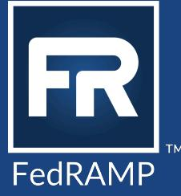

# FedRAMP® Annual Assessment Guidance

Version 3.0

02/15/2024

info@fedramp.gov fedramp.gov

# DOCUMENT REVISION HISTORY

| Date       | Version | Page (s)         | Description                                                                                                                                                                                                   | Author      |
|------------|---------|------------------|---------------------------------------------------------------------------------------------------------------------------------------------------------------------------------------------------------------|-------------|
| 04/05/2016 | 1.0     | All              | Initial draft guidance on completing annual assessments based on FedRAMP NIST SP 800 53 Revision 4, FedRAMP baseline security requirements, and FedRAMP continuous monitoring requirements. | FedRAMP PMO |
| 06/06/2017 | 1.0     | Cover            | Updated loqo                                                                                                                                                                                                  | FedRAMP PMO |
| 11/24/2017 | 2.0     | All              | Updated to the new template                                                                                                                                                                                   | FedRAMP PMO |
| 02/15/2024 | 3.0     | All              | Clarified periodicity requirements and updated references and criteria from  NIST SP 800 53 Revision 4 to Revision 5;Updated links to latest versions of templates.                            | FedRAMP PMO |
| 02/15/2024 | 3.0     | Section 2.3.1 | Updated rationale for NIST SP 800 53 Revision 5 core controls selection                                                                                                                                 | FedRAMP PMO |
| 02/15/2024 | 3.0     | Section 5        | Updated with OSCAL versions of templates                                                                                                                                                                   | FedRAMP PMO |

# How To Contact Us

Questions about FedRAMP or this document should be directed to info@fedramp.gov

For more information about FedRAMP, visit the website at http://www.fedramp.gov.

# TABLE OF CONTENTS

|    | Executive Summary                                                                       |   |  |  |
|----|-----------------------------------------------------------------------------------------|---|--|--|
| 1. | Introduction                                                                            | 1 |  |  |
|    | 1.1. Purpose                                                                         | 1 |  |  |
|    | Scope 1.2.                                                                           | 2 |  |  |
|    | 1.3. Assumptions                                                                     | 2 |  |  |
|    | Compliance 1.4.                                                                      | 2 |  |  |
| 2. | Tasks Required to Complete the Assessment                                               | 3 |  |  |
|    | Develop Schedule 2.1.                                                                | 3 |  |  |
|    | 2.2. Review and Update Documentation                                                 | イ |  |  |
|    | Determine Scope of Assessment 2.3.                                                   | イ |  |  |
|    | FedRAMP-Selected Controls 2.3.1.                                                     | ব |  |  |
|    | FedRAMP-Selected Controls, Not-Included for Testing by CSP 2.3.2.                    | 5 |  |  |
|    | 2.3.3. CSP-Specific Controls, Selected by CSP                                        | 5 |  |  |
|    | Additional Testing Requirements 2.3.4.                                               | 5 |  |  |
|    | 2.3.5. Control Selection Process                                                     | 6 |  |  |
|    | 2.4. Complete Security Assessment                                                       | 6 |  |  |
|    | 2.4.1. Security Assessment Plan (SAP)                                                | 6 |  |  |
|    | Security Assessment Report (SAR) 2.4.2.                                              | 6 |  |  |
|    | 2.4.2.1  Security Assessment Test Cases                                                 | 7 |  |  |
|    | Complete Plan of Action and Milestones (POA&M) 2.5.                                  | 7 |  |  |
| 3. | Methodology for Managing Risks Associated with Inherited Controls                       | 7 |  |  |
|    | Methodology for Testing Inherited Controls 3.1.                                      | 7 |  |  |
|    | Methodology for Reporting and Managing Risks Associated with Inherited Controls 3.2. | 8 |  |  |
| 4. | General Requirements                                                                    |   |  |  |
| 5. | Reference Documents                                                                     |   |  |  |

# Executive Summary

The FedRAMP |oint Authorization Board (JAB), in cooperation with the Office of Management and Budget (OMB), updated the FedRAMP security controls baseline to align with National Institutes of Standards and Technology (NIST) Special Publication 800-53 (SP 800-53). Security and Privacy Controls for Federal Information Systems and Organizations, Revision 5. The FedRAMP Program Management Office (PMO) updated the FedRAMP baseline security controls, documentation, and templates to reflect the changes in NIST SP 800-53, revision 5.

This document provides quidance to assist cloud service providers (CSPs), independent assessment organizations (JAOs), and federal agencies in determining the scope of an annual assessment based on NIST SP 800-53, revision 5 FedRAMP baseline security requirements and FedRAMP continuous monitoring (ConMon) requirements.

CSPs and federal aqencies, with systems currently FedRAMP compliant based on NIST SP 800-53, revision 5 should use this document for quidance. This document is also intended to assist AOs in planning and conducting security assessments, and reports for those systems, based on NIST SP 800-53, revision 5.

This document includes the security controls selection list. This list provides a structured approach and assists in development of the scope for conducting assessments based on FedRAMP NIST SP 800-53, revision 5 FedRAMP baseline security requirements, FedRAMP ConMon requirements, and CSP-specific implementations.

#### 1. Introduction

The FedRAMP Program Manaqement Office (PMO) published several documents and templates based on NIST SP 800-53, revision 5, FedRAMP baseline security requirements, and FedRAMP ConMon requirements to assist CSPs and federal aqencies in becoming compliant with NIST SP 800-53, revision 5. This document defines the FedRAMP process for determining the scope and selection of controls to be included as part of an annual assessment.

## 1.1. Purpose

The purpose of this document is to facilitate a structured approach to completing security and reports required to meet FedRAMP compliance based on NIST SP 800-53, revision 5.

This document describes a recommended methodology for determining the scope of an annual assessment and associated reports, as well the recommended methodology for addressing risks associated with leveraged cloud services.

### 1.2. Scope

The scope of this document includes completing an annual assessment in compliance with NIST SP 800-53, revision 5 FedRAMP baseline security requirements, FedRAMP ConMon requirements, and CSP-specific cloud service implementations.

### 1.3. Assumptions

The guidance and recommendations in this document for CSPs, federal agencies, and IAOs is based on the following assumptions:

- The cloud service offering (CSO) is currently compliant with FedRAMP based on NIST SP 800-53, . revision 5.
- . The CSP, at a minimum, is conducting continuous monitoring in compliance with the current FedRAMP Continuous Monitoring and Strategy Guide.
- . All services and components included in the boundary for authorization will be assessed for compliance with applicable controls determined as in-scope for the annual assessment.
- . CSPs will be required to identify the impact and risks associated with leveraging systems that have not yet become FedRAMP NIST SP 800-53, revision 5 compliant.
- The quidance in this document assumes the use of the traditional Microsoft Word and Excel versions . of the FedRAMP templates. If using the FedRAMP OSCAL templates, please refer to the applicable FedRAMP OSCAL user quide for instructions.

## 1.4. Compliance

FedRAMP Authorized CSPs (those with an existing P-ATO or agency ATO) must comply with this quidance for all annual assessments completed, following the transition from NIST SP 800-53, revision 4 to NIST SP 800-53, revision 5. Not doing so may be considered a failure to maintain an adequate risk manaqement program and result in escalation actions as described in the EedRAMP Continuous Monitoring Performance Management Guide.

# 2. Tasks Required to Complete the Assessment

### 2.1. Develop Schedule

Major milestone activities for the various stakeholders to adequately maintain a schedule to complete the annual assessment include the following:

- The CSP must review and update, as required, the system security plan (SSP) and attachments. ●
- The CSP must conduct incident response plan (IRP) testing and provide the incident response plan (IRP) test report(s). The independent assessor (IA) is responsible for verifying and validating that the IRP test report(s) meets FedRAMP requirements.
- The CSP must conduct a continqency plan (CP) functional test and include the CP test report. The IA ● is responsible for verifying and validating that the CP test report meets FedRAMP requirements.
- . The IA must complete the FedRAMP annual assessment security assessment plan (SAP). Since this document is signed by the CSP and the IA, both parties should agree on all terms and conditions prior to signaqe. The CSP and the IA should offer to allow the aqency AO or AOs to review the SAP; this engages the agency(ies) from the beginning.
- The IA must conduct testing, per the terms and conditions outlined in the SAP. Should the terms ● and/or conditions shift, in any manner from the agreed-upon document, these changes must be recorded in the "Deviations" section within the security assessment report (SAR).
- . The IA must complete the FedRAMP annual assessment SAR. The CSP may ask to review this document, but this document is the lA's responsibility and should never be altered by the CSP or agency.
- . The CSP must update the plan of action and milestones (POA&M) based on deficiencies identified by the IA in the SAR Risk Exposure Table (RET) and in accordance with FedRAMP Plan of Action and Milestones (POA&M) Template Completion Guide.
- . The CSP and the IA must submit the complete annual assessment package. This means that the IA uploads the documents that are the IA's responsibility (i.e., the SAP, SAR, and all related supporting documents), and the CSP uploads the updated SSP/attachments and POA&M to the FedRAMP secure repository.

The schedule must include timeframes and resources to support technical and quality assurance reviews of all deliverables.

#### 2.2. Review and Update Documentation

The CSP and the IA must apply due diligence to ensure that the documentation follows FedRAMP documentation requirements. This one task is the sole responsibility of the CSP and the IA. Taking this step contributes siqnificantly to reducing a CSO's time to annual assessment approval.

The CSP is required to review the SSP, and all attachments, and update (as necessary) at least annually to incorporate system changes and/or changes in processes and procedures. In particular, the CSP is required to review and update implementation details (e.a., who, what, how) as necessary for all controls that are "in-scope" for this assessment to ensure adequate details are provided.

In addition, the FedRAMP PMO periodically publishes updates to the document templates, and the CSP should review these new templates to ensure significant changes either are incorporated into the CSP's documents or new documents are created to address the chanqes prior to performing the updates.

### 2.3. Determine Scope of Assessment

The determination of the FedRAMP NIST SP 800-53, revision 5 "in-scope" set of controls for annual assessments is based on the following:

#### 2.3.1. FedRAMP-Selected Controls

The determination of FedRAMP-selected list of core controls (as defined in the FedRAMP Annual Assessment Control Selection Workbook, see section 5), those controls required to be assessed annually by all CSPs, is based on the following:

- Controls FedRAMP has determined are critical to protecting an information system ●
- Controls required for FedRAMP readiness, specified in the FedRAMP Readiness Assessment Report . (RAR) Templates
- . Controls FedRAMP has determined to have the most protection value based on the Threat Based Risk Profilinq Methodoloqy
- . Controls FedRAMP has determined to be providing critical functions, based on NIST's definition of "Security controls or specific assessment objects providing critical functions":
	- O Security controls or assessment objects that provide critical security functions (e.g., log manaqement server, firewalls) are candidates for more frequent monitoring. Additionally, individual assessment objects that support critical security functions and/or are deemed critical to the system (in accordance with the Business Impact Analysis) or to the organization may be candidates for more frequent monitoring.

- Reference: NIST SP 800-137, dated September 2011, Section 3.2.2, Establish Monitoring o and Assessment Frequencies
#### FedRAMP-Selected Controls, Not-Included for Testing by CSP 2.3.2.

The FedRAMP-selected list of core controls, not applicable to a CSP's implementation of cloud services, are not required to be tested on an annual basis based on the following criteria:

- Controls that are not applicable to the CSP's implementation (e.g., controls related to provision and . manaqement of wireless services when no wireless network capability is implemented). The IA is required to validate that "Not Applicable" controls are in fact not applicable.
- . Controls that are fully "Inherited" and entirely the responsibility of a leveraged provider are not required to be tested by the CSP leveraging those services. The IA is required to validate that the inherited services and/or continue to meet the terms of use in accordance with the FedRAMP P-ATO or agency ATO. The customer's terms of use are also specified in the CSP's Customer Responsibility Matrix (CRM) that is included in the CSP's Control Implementation Summary (CIS) Workbook (an attachment to the SSP).

#### CSP-Specific Controls, Selected by CSP 2.3.3.

In addition to the FedRAMP-Selected List of Core Controls, the CSP is required to select additional controls for testing based on the following criteria:

- . CSP-selected controls are required to address system changes that have been implemented by the CSP since the last annual assessment, (e.q., closed POA&M items, including vendor dependencies (VDs), deviation requests (DRs), and system changes).
- CSP-selected controls are required to address periodicity requirements (i.e., controls that are not . required to be selected based on any other criteria outlined in this document) and must be assessed once within a three-year period.
- . The IA must validate that the controls selected by the CSP meet scope and periodicity requirements.

#### Additional Testing Requirements 2.3.4.

In addition, the IA must evaluate (review and/or test), as necessary, all items related to ConMon activities. The IA must evaluate all open POA&M items (including VDs) and POA&M closures (to confirm adequate closure) and validate and confirm continued applicability of DRs (i.e., false positives, risk adjustments, and operational requirements).

#### 2.3.5. Control Selection Process

CSPs must complete the FedRAMP Annual Assessment Control Selection Workbook Template Section 5 to determine the controls selected for testing in the annual assessment. Guidance for completing the workbook is directly in the template. The IA will need to identify the control selection for the current as well as the control selections for the assessments (if applicable). This verifies that periodicity requirements, as noted in the section "CSP-Specific Controls, Selected By CSP" of this document, are being met. The completed worksheet must be included in the SAP prepared and submitted by the IA.

### 2.4. Complete Security Assessment

lAs must complete all security assessments in accordance with the same processes and procedures required by FedRAMP. The scope of the assessment will be based on the results of the control selection process and the testing will utilize the FedRAMP Security Test Case Procedures Template (refer to section 5, FedRAMP Revision 5 Test Cases) and the requirements specified in the FedRAMP Continuous Monitoring and Strategy Guide.

#### 2.4.1. Security Assessment Plan (SAP)

The IA prepares and submits the SAP utilizing the FedRAMP Security Assessment (SAP) Template. The SAP clearly defines the planned process, procedures, and methodologies for testing. The scope of controls to be tested is based on the control selection process defined in this document. Include only those test cases for selected controls in the SAP Security Test Case Procedures template. Some test cases may need to be modified to address CSP-specific implementations as described in the SSP and other supporting documentation. The test cases may need to be modified for those controls selected for validation of closed POA&M items, DRs, VDs, and system changes.

#### Security Assessment Report (SAR) 2.4.2.

The IA prepares and submits the SAR utilizing the FedRAMP Security Assessment Report (SAR) Template. In accordance with the SAP, the SAR documents the actual process, procedures, and methodologies utilized for testing as required and documents all the results of the testing conducted.

The SAR clearly identifies what was tested and what was not tested as part of this assessment, especially related to non-applicable controls and inherited controls from leveraged systems as may be applicable.

The SAR clearly identifies known risks associated with leveraged systems, if applicable.

The AO determines whether the overall risk posture of the system, as defined in the SAR, is acceptable.

#### 2.4.2.1 Security Assessment Test Cases

The IA prepares and submits the FedRAMP Security Test Case Procedures and supporting documentation as part of the SAR. The test cases contain all the FedRAMP NIST SP 800-53, revision 5 control assessment objectives with associated required test methods for each of the selected controls.

The IA fully completes and documents the assessment information related to the controls selected for the assessment (e.g., detailed observations and evidence, assessment result, identified risks, risk exposure information, and recommendation for mitigation).

#### 2.5. Complete Plan of Action and Milestones (POA&M)

The CSP prepares and submits the POA&M utilizing the FedRAMP Plan of Action and Milestone (POA&M) Template. The CSP documents residual risks identified in the SAR, in accordance with the FedRAMP Plan of Action and Milestones (POA&M) Template Completion Guide and defines a plan for remediation of those risks in the template provides an inventory list of the system tested in the FedRAMP Plan of Action and Milestones (POA&M) Template.

The CSP includes known risks identified by the IA that are associated with leveraged systems in the POA&M.

# 3. Methodology for Managing Risks Associated with Inherited Controls

#### Methodology for Testing Inherited Controls 3.1.

The methodology for testing controls inherited from a FedRAMP compliant system (leveraged system) is explicitly based on how the requirement is described in the SSP. The SSP for a CSO leveraging a system clearly defines the roles and responsibilities for every control requirement. The CSP must describe how the control is implemented and how it is using the inherited control in the leveraged system SSP. For example, a physical and environmental (PE) control miqht be fully inherited from the leveraged system. The CSP describes "how" the PE control requirement is implemented, including stating it is fully inherited from the leveraged system. There is a subsection in the control implementation description that states "what" the leveraged system is providing to meet the requirement but not "how" the leveraged system meets the requirement. The IA must verify the CSP is using the control consistent with the SSP.

ln another example, a control requirement might be a "shared" control, where the system and the leveraged system implement portions of a requirement to fully meet the requirement. In this case, the CSP would define

"what" and "how" the CSP is implementing the portion they are responsible for, and there would be a subsection in the implementation description where the "what" beinq provided by the leveraged system is described; however, the description of "how" the leveraged system implements their portion of the control would be found in the leveraged system's SSP.

The scope of testing for the CSP leveraging a FedRAMP Authorized leveraged system includes only control requirements that the CSP is responsible for implementing, either wholly or partially. The IA tests only the control requirement implemented by the CSP and assumes the leveraged system is compliant with the requirements based on their initial and continued P-ATO or ATO status. The scope of testing does not include "testing" of the implementation by the leveraged system. If the leveraged system provides a service such as auditing/loqqing or trouble ticketing, the IA must collect evidence from only the CSP that the leveraged system is providing those services (e.g., audit logs/reports).

# 3.2. Methodology for Reporting and Managing Risks Associated with Inherited Controls

The IA may have identified some known risks associated with the system leveraged by a CSP. These risks may be due to a "qap" in implementation of all the requirements in a control between the CSP and the leveraged system. These risks may result from the CSP not having fully implemented a requirement that they are responsible for implementing.

The IA must include these known risks in the SAR, and the CSP must include these known risks in the POA&M (including VDs) and track and report the status of those risks as part of ConMon activities (e.g., the CSP indicates in the POA&M that they have communicated with the applicable POC of the leveraged system to determine the current status of remediation of those risks at least every thirty (30) days).

Consider the following example: The laaS CSP currently has some implementations based on FedRAMP NIST SP 800-53, revision 4 requirements. The SaaS leveraging the laaS has fully implemented FedRAMP NIST SP 800-53, revision 5. During the assessment of the SaaS, it was determined that the leveraged laaS had not fully transitioned to implementation of FedRAMP NIST SP 800-53, revision 5. To be compliant, the SaaS CSP must have the following:

- A SAR that identifies the qaps in the inherited controls (gaps from NIST revision 5) ●
- . A POA&M that tracks these deficiencies
- A SSP that reflects these inherited controls are partially implemented or planned based on the SAR . findings

The preceding is only an example. It does not imply the requirements only apply to SaaS providers. Similar requirements apply whenever a CSP claims a VD as the reason for an open POA&M item. During the annual assessment, the IA verifies the applicable requirements are met.

#### General Requirements 4.

- Use the latest version for all FedRAMP document templates located on the FedRAMP website, such ● as the SSP, CP, SAP, and SAR
- . Ensure that all requirements are addressed and documented completely and identify specifically what was included in the scope of the assessment and what was excluded, including the rationale for both
- . Ensure there are enough resources to complete the required tasks in the timeframes defined
- Develop and implement a schedule that supports completion of the assessment prior to the . anniversary date of P-ATO or ATO
- Develop and implement a schedule that provides for revisions and updates to draft documents . based on FedRAMP and AO technical reviews
- Ensure that all findings are included in the SAR and POA&M .

#### Reference Documents 5.

Microsoft Word and Excel versions are available on the FedRAMP website (http://www.fedramp.gov/): Under the "RESOURCES" menu, select the "Documents & Templates" option. OSCAL versions of the SSP, SAP, SAR, and POA&M templates are available in the FedRAMP Automation GitHub Repository templates folder: (https://qithub.com/GSA/fedramp-automation/tree/master/dist/content/rev5/templates).

- FedRAMP Annual Assessment Control Selection Workbook (Excel | OSCAL) ●
- FedRAMP SSP Template (Word | OSCAL)
- FedRAMP SAP Template (Word | OSCAL) ●
- FedRAMP SAR Template (Word | OSCAL) .
- FedRAMP POA&M Template (Excel | OSCAL) .
- FedRAMP Revision 5 Test Cases (Excel | OSCAL)
- . FedRAMP Master Acronym and Glossary (PDF)

The OSCAL version of the FedRAMP revision 5 test cases are contained within the OSCAL profiles and resolved profile catalogs, and are available in the FedRAMP Automation GitHub Repository baseline folder: https://github.com/GSA/fedramp-automation/tree/master/dist/content/rev5/baselines.