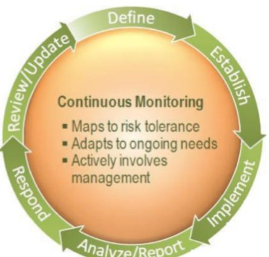
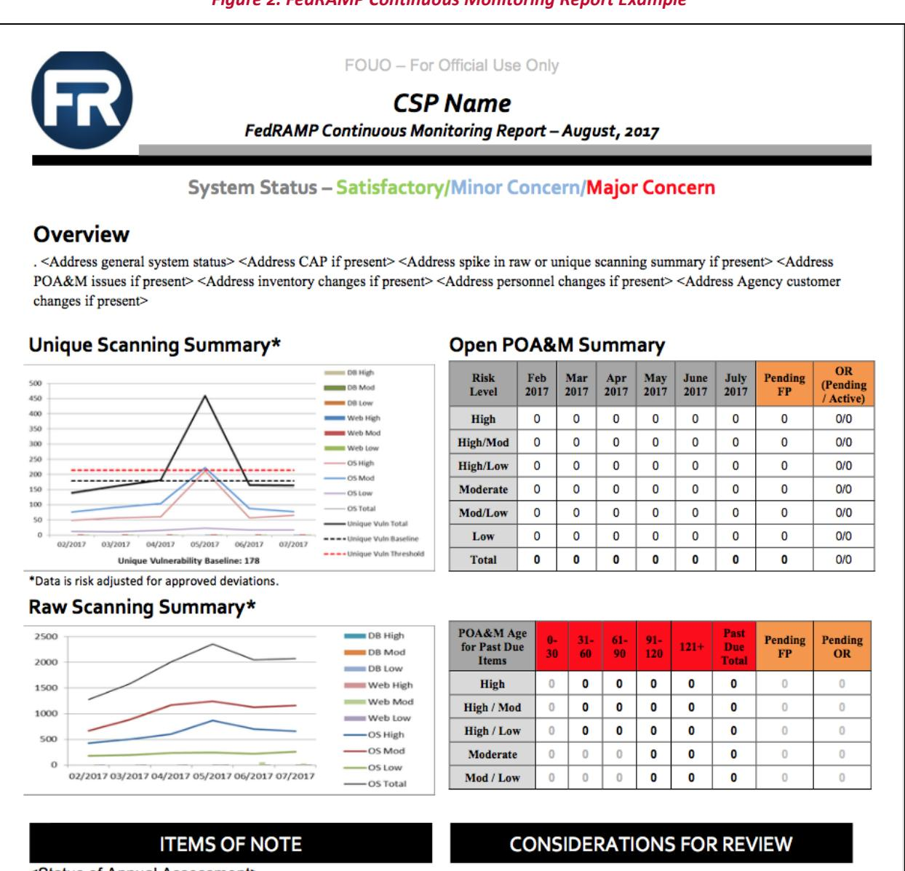

# FedRAMP Continuous Monitoring Strategy Guide

Version 3.2

April 4, 2018

# EXECUTIVE SUMMARY

The Office of Management and Budget (OMB) memorandum M-10-15, issued on April 21, 2010, changed from static point in time security authorization processes to Ongoing Assessment and Authorization throughout the system development life cycle. Consistent with this new direction favored by OMB and supported in the National Institute of Standards and Technology (NIST) guidelines, the Federal Risk and Authorization Management Program (FedRAMP) developed an ongoing assessment and authorization program for the purpose of maintaining the authorization of Cloud Service Providers (CSPs).

After a system receives a FedRAMP authorization, it is probable that the security posture of the system could change over time due to changes in the hardware or software on the cloud service offering, or also due to the discovery and provocation of new exploits. Ongoing assessment and authorization provides federal agencies using cloud services a method of detecting changes to the security posture of a system for the purpose of making risk-based decisions.

This guide describes the FedRAMP strategy for a CSP to use once it has received a FedRAMP Provisional Authorization. The CSP must continuously monitor the cloud service offering to detect changes in the security posture of the system to enable well-informed risk-based decision making. This guide instructs the CSP on the FedRAMP strategy to continuously monitor their systems.

# REVISION HISTORY

| Date       | Version                                                                                                                                                                                                                                 | Page(s)                 | Description                                                                                                                  | Author      |
|------------|-----------------------------------------------------------------------------------------------------------------------------------------------------------------------------------------------------------------------------------------|-------------------------|------------------------------------------------------------------------------------------------------------------------------|-------------|
| 06/06/2014 | 2.0                                                                                                                                                                                                                                     | All                     | Major revision for SP800-53 Revision 4. Includes new template and formatting changes.                                     | FedRAMP PMO |
| 06/06/2017 | 2.0                                                                                                                                                                                                                                     | Cover                   | Updated logo.                                                                                                                | FedRAMP PMO |
| 1/31/2018  | 3.0                                                                                                                                                                                                                                     | All                     | General changes to grammar and use of terminology to add clarity, as well as consistency with other FedRAMP documents. | FedRAMP PMO |
| 1/31/2018  | 3.0                                                                                                                                                                                                                                     | Appendix A, B, and C | Updated ConMon Report Template and other outdated information.                                                            | FedRAMP PMO |
| 1/31/2018  | 3.0                                                                                                                                                                                                                                     | । ਰੇ                    | Added remediation time frame for low risk vulnerabilities.                                                                | FedRAMP PMO |
| 1/31/2018  | 3.0                                                                                                                                                                                                                                     | All                     | Updated to newest template.                                                                                                  | FedRAMP PMO |
| 2/21/2018  | 3.1                                                                                                                                                                                                                                     | 3                       | Added a document reference to Section 2.1.                                                                                   | FedRAMP PMO |
| 2/21/2018  | 3.1                                                                                                                                                                                                                                     | 8                       | Updated links in Appendix A, which changed as a result of migration of the FedRAMP web site.                              | FedRAMP PMO |
| 2/21/2018  | 3.1                                                                                                                                                                                                                                     | ਹੈ ਦ                    | Updated row 27 of Appendix B to clarify review requirements for all "-1" controls.                                        | FedRAMP PMO |
| 4/4/2018   | Updated incorrect reference to Table 1, in Section 3.1, to clarify that during the annual 3.2 5 assessment, the controls listed in Table 2 are tested along with an additional number of controls selected by the AO. |                         | FedRAMP PMO                                                                                                                  |             |

# ABOUT THIS DOCUMENT

This document provides guidance on continuous monitoring and ongoing authorization in support of maintaining a security authorization that meets the FedRAMP requirements. This document is not a FedRAMP template – there is nothing to fill out in this document.

This document uses the term authorizing official (AQ). For systems with a Joint Authorization Board (JAB) provisional authorization to operate (P-ATO), AO refers primarily to the JAB unless this document explicitly says Agency AO. For systems with a FedRAMP Agency authorization to operate (ATO), AO refers to each leveraging Agency's AO.

The term authorization refers to either a FedRAMP JAB P-ATO or a FedRAMP Agency ATO.

The term third-party assessment organization (3PAO) refers to an accredited 3PAO. Use of an accredited 3PAO is required for systems with a FedRAMP JAB P-ATO; however, for systems with a FedRAMP Agency ATO, this may refer to any assessment organization designated by the Agency AO.

# WHO SHOULD USE THIS DOCUMENT?

This document is intended to be used by Cloud Service Providers (CSPs), 3PAOs, government contractors working on FedRAMP projects, and government employees working on FedRAMP projects. This document may also prove useful for other organizations that are developing a continuous monitoring program.

This document focuses on systems with a FedRAMP JAB P-ATO issued by the JAB. FedRAMP recommends agencies create similar guidance or use this FedRAMP Continuous Monitoring Strategy Guide when managing systems with a FedRAMP Agency ATO, in which case the Agency AO or collection of leveraging Agency AOs would fulfill the JAB role.

# HOW THIS DOCUMENT IS ORGANIZED

This document is divided into three sections and four appendices.

Section 1: Provides an overview of the continuous monitoring process.

Section 2: Describes roles and responsibilities for stakeholders other than the CSP.

Section 3: Describes how operational visibility, change control, and incident response support continuous monitoring.

Appendix A: Contains a pointer to the FedRAMP Master Acronyms & Glossary document.

Appendix B: Describes the security control frequencies.

Appendix C: Describes the template monthly reporting summaries.

Appendix D: Describes the JAB P-ATO continuous monitoring analysis.

# HOW TO CONTACT US

Questions about FedRAMP or this document should be directed to info@fedramp.gov. For more information about FedRAMP, visit the website at http://www.fedramp.gov.

# TABLE OF CONTENTS

|                                                                                                                                                                                              | EXECUTIVE SUMMARY                                                                                                                                                              |  |  |  |  |
|----------------------------------------------------------------------------------------------------------------------------------------------------------------------------------------------|--------------------------------------------------------------------------------------------------------------------------------------------------------------------------------|--|--|--|--|
|                                                                                                                                                                                              | REVISION HISTORY                                                                                                                                                               |  |  |  |  |
|                                                                                                                                                                                              | ABOUT THIS DOCUMENT                                                                                                                                                            |  |  |  |  |
|                                                                                                                                                                                              | WHO SHOULD USE THIS DOCUMENT?                                                                                                                                                  |  |  |  |  |
|                                                                                                                                                                                              | HOW THIS DOCUMENT IS ORGANIZED                                                                                                                                                 |  |  |  |  |
|                                                                                                                                                                                              | HOW TO CONTACT US                                                                                                                                                              |  |  |  |  |
| 1.                                                                                                                                                                                           | OVERVIEW                                                                                                                                                                       |  |  |  |  |
|                                                                                                                                                                                              | 1.1. Purpose of This Document                                                                                                                                                  |  |  |  |  |
|                                                                                                                                                                                              | 1.2. Continuous Monitoring Process                                                                                                                                             |  |  |  |  |
| 2.                                                                                                                                                                                           | CONTINUOUS MONITORING ROLES & RESPONSIBILITIES                                                                                                                                 |  |  |  |  |
|                                                                                                                                                                                              | 2.1. Agency Authorizing Official (AO)                                                                                                                                          |  |  |  |  |
|                                                                                                                                                                                              | 2.2. FedRAMP Joint Authorization Board (JAB)                                                                                                                                   |  |  |  |  |
|                                                                                                                                                                                              | 2.3. FedRAMP program management office (PMO)                                                                                                                                   |  |  |  |  |
|                                                                                                                                                                                              | 2.4. Department of homeland security (DHS) ،،،،،،،،،،،،،،،،،،،،،،،،،،،،،،،،،،،،،،،،،،،،،،،،،،،،،،،،،،،،،،،،،،،،،،،،،،،،،،،،،،،،،،،،،،،،،،،،،،،،،،،،،،،،،،،،،،،،،،،،،،،،،،،،،،، |  |  |  |  |
|                                                                                                                                                                                              | 2.5.  Third Party Assessment Organization (3PAO)                                                                                                                               |  |  |  |  |
| ล.                                                                                                                                                                                           | CONTINUOUS MONITORING PROCESS AREAS                                                                                                                                            |  |  |  |  |
|                                                                                                                                                                                              | 3.1. Operational Visibility                                                                                                                                                    |  |  |  |  |
|                                                                                                                                                                                              | 3.2. Change Control                                                                                                                                                            |  |  |  |  |
|                                                                                                                                                                                              | 3.3. Incident Response                                                                                                                                                         |  |  |  |  |
|                                                                                                                                                                                              | APPENDIX A FEDRAMP ACRONYMS                                                                                                                                                 |  |  |  |  |
|                                                                                                                                                                                              | CONTROL FREQUENCIES APPENDIX B                                                                                                                                              |  |  |  |  |
| MONTHLY REPORTING SUMMARY…………………………………………………………………………………………………………………………………………………………………………………………………………………………………………………………………………………………………………………………………………………………………………………………………………… APPENDIX C |                                                                                                                                                                                |  |  |  |  |
| JAB P-ATO CONTINUOUS MONITORING ANALYSIS APPENDIX D                                                                                                                                       |                                                                                                                                                                                |  |  |  |  |

# LIST OF FIGURES

| Figure 1. NIST Special Publication 800-137 Continuous Monitoring Process |  |
|--------------------------------------------------------------------------|--|
| Figure 2. FedRAMP Continuous Monitoring Report Example                   |  |

# LIST OF TABLES

| Table 1. Control Selection Criteria                                 |  |
|---------------------------------------------------------------------|--|
| Table 2. Summary of Continuous Monitoring Activities & Deliverables |  |

### OVERVIEW 1.

Within the FedRAMP Security Assessment Framework, once an authorization has been granted, the CSP's security posture is monitored according to the assessment and authorization process. Monitoring security controls is part of the overall risk management framework for information security and the CPS is required to maintain a security authorization that meets the FedRAMP requirements.

Traditionally, this process has been referred to as "Continuous Monitoring" as noted in the National Institute of Standards and Technology Special Publication (NIST SP) 800-137 Information Security Continuous Monitoring for Federal Information Systems and Organizations. Other NIST documents such as NIST SP 800-37, Revision 1 refer to "ongoing assessment of security controls." It is important to note that both the terms "Continuous Monitoring" and "Ongoing Security Assessments" mean essentially the same thing and should be interpreted as such.

Performing ongoing security assessments determines whether the set of deployed security controls in a cloud information system remains effective in light of new exploits and attacks, and planned changes that occur in the system and its environment over time. To maintain an authorization that meets the FedRAMP requirements, the CSP must monitor their security controls, assess them on a regular basis, and demonstrate that the security posture of their service offering is continuously acceptable.

Ongoing assessment of security controls results in greater control over the security posture of the CSP system and enables timely risk-management decisions. Security-related information collected through continuous monitoring is used to make recurring updates to the security assessment package. Ongoing due diligence and review of security controls enables the security authorization package to remain current which allows agencies to make informed risk management decisions as they use cloud services.

### 1.1. PURPOSE OF THIS DOCUMENT

This document is intended to provide the CSP with guidance and instructions on how to implement their continuous monitoring program. Certain deliverables and artifacts related to continuous monitoring that FedRAMP requires from the CSP are discussed in this document.

### CONTINUOUS MONITORING PROCESS 1.2.

The FedRAMP continuous monitoring program is based on the continuous monitoring process described in NIST SP 800-137, Information Security Continuous Monitoring for Federal Information Systems and Organization. The goal is to provide: (i) operational visibility; (ii) managed change control; and (iii) attendance to incident response duties. For more information on incident response, review the FedRAMP Incident Communications Procedure.

The effectiveness of a CSP's continuous monitoring capability supports ongoing authorization and reauthorization decisions. Security-related information collected during continuous monitoring is used to make updates to the security authorization package. Updated documents provide evidence that FedRAMP baseline security controls continue to safeguard the system as originally planned.

As defined by NIST, the process for continuous monitoring includes the following initiatives:

- 트 Define a continuous monitoring strategy based on risk tolerance that maintains clear visibility into assets and awareness of vulnerabilities and utilizes up-to-date threat information.
- . Establish measures, metrics, and status monitoring and control assessments frequencies that make known organizational security status and detect changes to information system infrastructure and environments of operation, and status of security control effectiveness in a manner that supports continued operation within acceptable risk tolerances.
- Implement a continuous monitoring program to collect the data required for the defined measures and report on findings; automate collection, analysis, and reporting of data where possible.
- . Analyze the data gathered and Report findings accompanied by recommendations. It may become necessary to collect additional information to clarify or supplement existing monitoring data.
- . Respond to assessment findings by making decisions to either mitigate technical, management, and operational vulnerabilities, or accept the risk; or transfer it to another authority.
- . Review and Update the monitoring program, revising the continuous monitoring strategy and maturing measurement capabilities to increase visibility into assets and awareness of vulnerabilities; further enhance data-driven control of the security of an organization's information infrastructure; and increase organizational flexibility.

## Figure 1. NIST Special Publication 800-137 Continuous Monitoring Process

Security control assessments periodically validate whether stated security controls are implemented correctly, operating as intended, and meet FedRAMP baseline security controls. Security status reporting provides federal officials with information necessary to make risk-based decisions and provides assurance to existing customer agencies regarding the security posture of the system.

### CONTINUOUS MONITORING ROLES & RESPONSIBILITIES 2.

### 2.1. AGENCY AUTHORIZING OFFICIAL (AO)

Agency AOs and their teams oversee the CSP's continuous monitoring activities on behalf of their Agency. They must review all security artifacts provided by the CSP, 3PAO, or FedRAMP to ensure the CSP's security posture remains sufficient for their Agency's use of the system.

Agency AOs should ensure their Agency is monitoring the Plan of Action & Milestones (POA&M) and reporting artifacts (such as vulnerability scan reports), as well as any significant changes associated with the CSP's service offering. AOs should use this information to make risk-based decisions about ongoing authorization of the system for that Agency.

For FedRAMP Agency ATOs, the Agency AO should consult the FedRAMP Guide for Multi-Agency Continuous Monitoring, which can be found at http://fedramp.gov.

### 2.2. FEDRAMP JOINT AUTHORIZATION BOARD (JAB)

While each Agency AO maintains the final approval authority for the use of a system by that Agency, the FedRAMP JAB acts as focal point for continuous monitoring activities of systems with a P-ATO. The JAB:

- . Reviews continuous monitoring and security artifacts on a regular basis;
- Authorizes, denies, monitors, suspends, and revokes a system's P-ATO as appropriate;
- 트 Authorizes or denies significant change and deviation requests; and
- 트 Ensures the FedRAMP PMO is providing artifacts to leveraging Agencies in a timely manner.

### 2.3. FEDRAMP PROGRAM MANAGEMENT OFFICE (PMO)

The FedRAMP PMO acts as the liaison for the JAB for ensuring CSPs with a JAB P-ATO strictly adhere to their established Continuous Monitoring Plan. The FedRAMP PMO:

- 트 Receives continuous monitoring and significant change artifacts on behalf of the JAB;
- Performs initial analysis of artifacts, such as ensuring scanner output files match POA&M submissions;
- Facilitates JAB review of artifacts; and
- ם Ensures artifacts are made available to all leveraging agencies.

### DEPARTMENT OF HOMELAND SECURITY (DHS) 2.4.

The FedRAMP Policy Memo released by OMB defines the DHS FedRAMP responsibilities as follows:

- Assist government-wide and agency-specific efforts to provide adequate, risk-based, and costeffective cybersecurity;
- Coordinate cybersecurity operations and incident response and provide appropriate assistance;
- . Develop continuous monitoring standards for ongoing cybersecurity of Federal information systems to include real-time monitoring and continuously verified operating configurations; and
- . Develop guidance on agency implementation of the Trusted Internet Connection (TIC) program for cloud services.

The FedRAMP PMO works with DHS to incorporate DHS's guidance into the FedRAMP program guidance and documents.

### 2.5. THIRD PARTY ASSESSMENT ORGANIZATION (3PAO)

3PAOs, or agency assessors, are responsible for independently verifying and validating the control implementation and test results for CSPs in the continuous monitoring phase of the FedRAMP process. Specifically, 3PAOs are responsible for:

- . Assessing a defined subset of the security controls annually;
- . Submitting the assessment report to the AO one year after the CSP's authorization date and each year thereafter;
- . Performing announced penetration testing;
- Performing annual scans of web applications, databases, and operating systems; and
- . Assessing changed controls on an ad hoc basis as requested by the AOs for any changes made to the system by the CSP.

In order to be effective in this role, 3PAOs are responsible for ensuring that the chain of custody is maintained for any 3PAO-authored documentation. 3PAOs must also be able to vouch for the veracity and integrity of data provided by the CSP for inclusion in 3PAO-authored documentation. As an example:

- . If scans are performed by the CSP, the 3PAO must either be on site and observe the CSP performing the scans or be able to monitor or verify the results of the scans through other means documented and approved by the AO.
- . Documentation provided to the CSP must be placed in a format that either the CSP cannot alter or that allows the 3PAO to verify the integrity of the document.

### CONTINUOUS MONITORING PROCESS AREAS 3.

### OPERATIONAL VISIBILITY 3.1.

The CSP must demonstrate the efficacy of its continuous monitoring program through the evidence it provides. The CSP and its 3PAO must provide evidentiary information to AOs at least monthly, annually, every three years, and on an as-needed basis after an authorization is granted. These deliverables allow each AO to evaluate the risk posture of the CSP's service offering.

Table 1 below identifies the deliverables required as part of continuous monitoring activities. These deliverables include providing evidence, such as providing monthly vulnerability scans of CSPs operating systems/infrastructure, databases, and web applications.

As part of the continuous monitoring process, CSPs are required to have a 3PAO perform an assessment on an annual basis for a subset of the overall controls implemented on the system. During the annual assessment, the controls listed in Table 2 are tested along with an additional number of controls selected by the AO. The AO has the option to vary the total number of controls tested to meet the desired level of effort for testing. The AO selects the additional controls for testing based on the following criteria in Table 1.

| CRITERIA |                                                                        | DESCRIPTION                                                                                                                                                                                                                                                     |  |  |  |
|----------|------------------------------------------------------------------------|-----------------------------------------------------------------------------------------------------------------------------------------------------------------------------------------------------------------------------------------------------------------|--|--|--|
| 1.       | Conditions from previous assessment                                 | Any conditions made by the AO in the authorization letter or during a previous assessment. This includes the resolution of vulnerabilities within designated time- frames and implementation of new capabilities.                                         |  |  |  |
| 2.       | Weakness identified since the last assessment                    | Any area where the system has known vulnerabilities or enhanced risk related to specific controls, such as an actual or suspected intrusion, compromise, malware event, loss of data, or denial of service (DoS) attack.                                  |  |  |  |
| 3.       | Known or suspected testing/continuous monitoring failure         | Any area where the cloud system demonstrated a weakness or vulnerability in continuous monitoring or testing related to specific security controls, such as controls related to patch management, configuration management, or vulnerability scanning. |  |  |  |
| 4.       | Control implementation that has changed since last assessment | Any control implementation that has changed since the last assessment must be independently assessed, even if it does not rise to the threshold of significant change.                                                                                    |  |  |  |
| 5.       | Newly discovered vulnerability, zero-day attack, or exploit      | Any control that is potentially affected by newly discovered vulnerabilities or zero-day exploits, such as the Heartbleed vulnerability.                                                                                                                     |  |  |  |
| 6.       | Recommendation of Authorizing Official or Organization           | Based on direct knowledge and use of a cloud system, authorizing officials or organizations can require the CSP to test additional controls based on unique mission concerns or based on the CSP's performance since their last assessment.               |  |  |  |

### Table 1. Control Selection Criteria

### CHANGE CONTROL 3.2.

Systems are dynamic, and FedRAMP anticipates all systems are in a constant state of change. Configuration management and change control processes help maintain a secure baseline configuration of the CSP's architecture. Routine day-to-day changes are managed through the CSP's change management process described in their Configuration Management Plan.

Before a planned change takes place, the CSP must perform a Security Impact Analysis, which must be a standard part of a CSP's change control process as described in the CSP's Configuration Management Plan. If the analysis concludes the change will adversely affect the integrity of the system's authorization, the CSP must treat it as a significant change, which requires AO coordination and 3PAO involvement.

There are many factors that could result in making it difficult to establish specific thresholds for a significant change determination. For this reason, FedRAMP recommends the CSP involve the AO's team in discussions related to future changes to the system as a best practice.

For a significant change, the CSP must complete the FedRAMP Significant Change Request Form and provide it to the AO for their analysis a minimum of 30 days before implementing a significant change. The AO might require more time based on the impact of the CSPs must work closely with the AO to understand how much time is needed in advance of significant changes. The form must include the CSP's rationale for making the change.

The FedRAMP Siqnificant Change Request Form can be found at http://fedramp.gov. Submission. instructions are on the form.

The CSP's 3PAO must provide a Security Assessment Plan (SAP) to FedRAMP, which the 3PAO will later use to assess the system following implementation of the significant change.

The AO must approve the assessment scope for the significant change SAP. The 3PAO should exercise best judgement to recommend the scope of the significant change assessment; and coordinate the final scope with the AO. Typically, if the significant change involves a new control implementation, the 3PAO must test the new control for the entire system. If the significant change is a new technology, the 3PAO must test its integration into existing controls.

If any anticipated change adds residual risk, or creates other risk exposure that the AO finds unacceptable, the system's authorization could be revoked. For this reason, it is imperative the CSP seeks AO approval before making the change. The goal is for the CSP to make planned changes in a controlled manner so that the security posture of the system is not diminished.

After approval and implementation of the significant change, the CSP's 3PAO must perform an assessment and submit a Security Assessment Report (SAR) to the AO in accordance with the SAP and within the timeframe agreed between the CSP and the AO. Additionally, the CSP must submit updated documentation pertaining to the newly implemented changes.

### INCIDENT RESPONSE 3.3.

FedRAMP requires the CSP to demonstrate they are able to adequately respond to security incidents. As part of the FedRAMP authorization process, the CSP is required to submit and maintain an incident response plan, which the AO approves. The CSP is also required to follow the incident response and reporting guidance contained in the FedRAMP Incident Communications Procedure.

At the government's discretion, FedRAMP or individual Agency AOs may direct the CSP to treat certain critical vulnerabilities as incidents, such as "zero day" vulnerabilities (e.g., Heartbleed). CSPs must take immediate action to fully resolve the vulnerability if possible, or at least implement mitigating factors. The FedRAMP PMO may request immediate reporting on these items. FedRAMP may request immediate reporting on these critical vulnerabilities, both for JAB P-ATO and FedRAMP Agency ATO systems. The CSP must continue to track critical vulnerabilities in the system's POA&M even when they are providing special reporting to FedRAMP.

# APPENDIX A FEDRAMP ACRONYMS

The FedRAMP Master Acronyms & Glossary contains definitions for all FedRAMP publications, and is available on the FedRAMP website Documents page under Program Overview Documents.

(https://www.fedramp.gov/documents/)

Please send suggestions about corrections, additions, or deletions to info@fedramp.gov.

# APPENDIX B CONTROL FREQUENCIES

Security controls have different frequencies for performance and review, and some controls require review more often than others. Table 2 summarizes the minimally required frequencies needed for each continuous monitoring activity. Some activities require the CSP to submit a deliverable to FedRAMP. Note the CSP is required to submit deliverables listed in Table 2 if they have full or shared responsibility for the listed control; however, the CSP is not responsible for deliverables related to fully inherited controls. For example, if a Software as a Service (SaaS) system fully inherits physical and environmental protection controls from a separately-authorized underlying Infrastructure as a Service (laaS) system, no deliverables are required from the CSP with the SaaS system inheriting those controls.

Other continuous monitoring activities do not require a deliverable, and are reviewed by the 3PAO during security assessments. The CSP must demonstrate to the 3PAO that ongoing continuous monitoring capabilities are in place, and are consistently occurring as represented in the System Security Plan (SSP). For example, if a CSP has indicated in their SSP that they monitor unsuccessful login attempts on an ongoing basis, the 3PAO may ask to see log files, along with the CSP's analysis of the log files, for random dates over the course of a prior authorization period (e.g., bi-annual, annual).

In Table 2, refer to the "Description" column for information about what is required and when it is required to be submitted. A checkmark in either the CSP Authored Deliverable column or 3PAO Authored Deliverable column of Table 2 indicates that a deliverable is required.

The AO may ask the CSP for a security artifact at any point in time, especially if they have concerns about the security posture of the system. For example, if a CSP indicates in their SSP that they actively monitor information system connections, the AO may ask the CSP to provide log file snippets for a particular connection at any point in time. If the AO learns that an entity that connects to the CSP's system has been compromised by an unauthorized user, the AO coordinates with the CSP to check in on the interconnection monitoring of the system. The CSP should anticipate that aside from scheduled continuous monitoring deliverables, and 3PAO assessments, the AO may request certain system artifacts on an ad hoc basis at any time.

CSPs are required to submit a schedule of activities to the AO within 15 days from the date of their authorization and annually thereafter. This schedule assists CSPs in managing continuous monitoring activities.

> Note: For controls that do not have a check in either the CSP authored deliverable or 3PAO authored deliverable columns in Table 2, the CSP is required to provide evidence of compliance minimally during annual assessment and upon request.

### Table 2. Summary of Continuous Monitoring Activities & Deliverables

| ROW # | CONTROL NAME                     | CONTROL ID | DESCRIPTION                                                                                                                                                                                                                                                                                                                                                                                                                                                                                                                                                                                                                                                                                                                                                                                                                                                                                                                                                                                                                                                                                                                                                                              | CSP AUTHORED DELIVERABLE | ЗРАО AUTHORED DELIVERABLE | NOTES |  |  |
|----------|-------------------------------------|---------------|------------------------------------------------------------------------------------------------------------------------------------------------------------------------------------------------------------------------------------------------------------------------------------------------------------------------------------------------------------------------------------------------------------------------------------------------------------------------------------------------------------------------------------------------------------------------------------------------------------------------------------------------------------------------------------------------------------------------------------------------------------------------------------------------------------------------------------------------------------------------------------------------------------------------------------------------------------------------------------------------------------------------------------------------------------------------------------------------------------------------------------------------------------------------------------------|--------------------------------|---------------------------------|-------|--|--|
|          | Continuous and Ongoing              |               |                                                                                                                                                                                                                                                                                                                                                                                                                                                                                                                                                                                                                                                                                                                                                                                                                                                                                                                                                                                                                                                                                                                                                                                          |                                |                                 |       |  |  |
| 1        | Information System Monitoring | SI-4          | The organization: a. Monitors the information system to detect: 1. Attacks and indicators of potential attacks in accordance with [Assignment: organization- defined monitoring objectives]; and Unauthorized local, network, and remote 2. connections; b. Identifies unauthorized use of the information system through [Assignment: organization- defined techniques and methods]; c. Deploys monitoring devices: (i) strategically within the information system to collect organization-determined essential information; and (ii) at ad hoc locations within the system to track specific types of transactions of interest to the organization; d. Protects information obtained from intrusion- monitoring tools from unauthorized access, modification, and deletion; e. Heightens the level of information system monitoring activity whenever there is an indication of increased risk to organizational operations and assets, individuals, other organizations, or the Nation based on law enforcement information, intelligence information, or other credible sources of information; |                                |                                 |       |  |  |

| ROW # | CONTROL NAME                                 | CONTROL ID   | DESCRIPTION                                                                                                                                                                                                                                                                                                                                                                                                                                            | CSP AUTHORED DELIVERABLE | ЗРАО AUTHORED DELIVERABLE | NOTES                                                                                                                                                                                       |
|----------|-------------------------------------------------|-----------------|--------------------------------------------------------------------------------------------------------------------------------------------------------------------------------------------------------------------------------------------------------------------------------------------------------------------------------------------------------------------------------------------------------------------------------------------------------|--------------------------------|---------------------------------|---------------------------------------------------------------------------------------------------------------------------------------------------------------------------------------------|
|          |                                                 |                 | f. Obtains legal opinion with regard to information system monitoring activities in accordance with applicable federal laws, Executive Orders, directives, policies, or regulations; and g. Provides [Assignment: organization-defined information system monitoring information] to [Assignment: organization-defined personnel or roles] [Selection (one or more): as needed; [Assignment: organization-defined frequency]]. |                                |                                 |                                                                                                                                                                                             |
| 2        | Auditable Events                             | AU-2a, AU-2d | Certain events must be continuously monitored. AU-2a auditable events: Successful and unsuccessful account logon events, account management events, object access, policy change, privilege functions, process tracking, and system events. For Web applications: all administrator activity, authentication checks, authorization checks, data deletions, data access, data changes, and permission changes.                  |                                |                                 | AU-2d Frequency: continually                                                                                                                                                                |
| 3        | Information System Component Inventory | CM-8(3)a        | CSPs must be able to detect new assets continuously, using automated mechanisms with a maximum five-minute delay in detection.                                                                                                                                                                                                                                                                                                                   |                                |                                 | This activity should be automated.                                                                                                                                                          |
| 4        | Incident Reporting                           | IR-6            | CSPs must report incidents in accordance with the FedRAMP Incident Communications Procedure.                                                                                                                                                                                                                                                                                                                                                        | V                              |                                 | IR-6a. [US-CERT incident reporting timelines as specified in NIST Special Publication 800-61 (as amended)]                                                                            |
| ട        | Temperature & Humidity Controls           | PE-14b          | CSPs must monitor temperature and humidity controls continuously.                                                                                                                                                                                                                                                                                                                                                                                   |                                |                                 | Refer to ASHRAE Thermal Guidelines for Data Processing Environments. Requirements: The service provider measures temperature at server inlets and humidity levels by dew point. |

| ROW # | CONTROL NAME                            | CONTROL ID | DESCRIPTION                                                                                                                                                                                                                                                                                                                                      | CSP AUTHORED DELIVERABLE | ЗРАО AUTHORED DELIVERABLE | NOTES                                                                                 |  |  |
|----------|--------------------------------------------|---------------|--------------------------------------------------------------------------------------------------------------------------------------------------------------------------------------------------------------------------------------------------------------------------------------------------------------------------------------------------|--------------------------------|---------------------------------|---------------------------------------------------------------------------------------|--|--|
| 6        | Vulnerability Scanning                  | RA-5(2)       | CSPs must update the list of vulnerabilities scanned continuously, before each scan.                                                                                                                                                                                                                                                          |                                |                                 | Before scans are run, signatures must be updated to the most current version.   |  |  |
| 7        | Wireless Intrusion Detection         | SI-4(14)      | The organization employs a wireless intrusion detection system to identify rogue wireless devices and to detect attack attempts and potential compromises/breaches to the information system.                                                                                                                                           |                                |                                 |                                                                                       |  |  |
|          |                                            |               | 10 days                                                                                                                                                                                                                                                                                                                                          |                                |                                 |                                                                                       |  |  |
| 8        | Contingency Training                    | CP-3a         | CSPs must train personnel in their contingency roles and responsibilities within 10 days of assuming a contingency role or responsibility. Record the date of the training in the System Security Plan.                                                                                                                                 |                                |                                 |                                                                                       |  |  |
|          | Weekly                                     |               |                                                                                                                                                                                                                                                                                                                                                  |                                |                                 |                                                                                       |  |  |
| 9        | Audit Review, Analysis, & Reporting  | AU-6a         | CSPs must review and analyze information system audit records for indications of inappropriate or unusual activity.                                                                                                                                                                                                                        |                                |                                 | Report findings of inappropriate or unusual activity to incident response team. |  |  |
|          |                                            |               | Monthly                                                                                                                                                                                                                                                                                                                                          |                                |                                 |                                                                                       |  |  |
| 10       | Vulnerability Scanning                  | RA-5d         | CSPs must mitigate all discovered high-risk vulnerabilities within 30 days, mitigate moderate vulnerability risks in 90 days, and mitigate low vulnerability risks in 180 days. CSPs must send their Reviewer updated artifacts every 30 days to show evidence that outstanding high-risk vulnerabilities have been mitigated. | V                              |                                 |                                                                                       |  |  |
| 11       | Continuous Monitoring Security State | CA-7g         | CSPs must report the security state of the system to their own organizational officials on a monthly basis.                                                                                                                                                                                                                                |                                |                                 |                                                                                       |  |  |
| 12       | Access Records                          | PE-8b         | CSPs must review visitor access records monthly.                                                                                                                                                                                                                                                                                                 |                                |                                 |                                                                                       |  |  |

| ROW # | CONTROL NAME                        | CONTROL ID | DESCRIPTION                                                                                                                                                                                                                                                                                                                                                                                                          | CSP AUTHORED DELIVERABLE | ЗРАО AUTHORED DELIVERABLE | NOTES                                                                                                                                                                                                                                                                                                                                                                                                                        |
|----------|----------------------------------------|---------------|----------------------------------------------------------------------------------------------------------------------------------------------------------------------------------------------------------------------------------------------------------------------------------------------------------------------------------------------------------------------------------------------------------------------|--------------------------------|---------------------------------|------------------------------------------------------------------------------------------------------------------------------------------------------------------------------------------------------------------------------------------------------------------------------------------------------------------------------------------------------------------------------------------------------------------------------|
| 13       | Least Functionality                 | CM-7(1)a      | CSPs must review the information system monthly to identify and eliminate unnecessary functions, ports, protocols, and/or services. If ports, protocols, and/or services are changed, Table 10-4 in the System Security Plan must be updated at the time of change. Changes must be made according to the CSP change management process that is described in the Configuration Management Plan. |                                |                                 |                                                                                                                                                                                                                                                                                                                                                                                                                              |
| 14       | Vulnerability Scanning              | RA-5a         | CSPs must scan operating systems, web applications and databases monthly. All scan reports must be sent to the Reviewer monthly.                                                                                                                                                                                                                                                                               | V                              |                                 |                                                                                                                                                                                                                                                                                                                                                                                                                              |
| 15       | Flaw Remediation                    | SI-2c         | CSPs must install security-relevant software and firmware updates within 30 days of the release of the updates.                                                                                                                                                                                                                                                                                                |                                |                                 |                                                                                                                                                                                                                                                                                                                                                                                                                              |
| 16       | Flaw Remediation                    | SI-2(2)       | CSPs must use an automated mechanism to look for system flaws at least once a month.                                                                                                                                                                                                                                                                                                                              |                                |                                 | Examples of programs that look for system flaws could include programs that: i) inspect log files looking for variances in normal behavior; ii) look for missing patches; iii) look for errors that indicate software bugs; iv) look for processing errors; v) look for indications for intrusions; vi) look for malware; vii) look for access control violations or attempted violations etc. |
| 17       | Software & Information Integrity | SI-7(1)       | CSPs must perform integrity scans monthly.                                                                                                                                                                                                                                                                                                                                                                           |                                |                                 | SI-7 (1). [Selection to include security relevant events and at least monthly]                                                                                                                                                                                                                                                                                                                                            |
| 18       | Account Management                  | AC-2(2)       | Automatic termination of temporary and emergency accounts after no more than 30 days.                                                                                                                                                                                                                                                                                                                             |                                |                                 |                                                                                                                                                                                                                                                                                                                                                                                                                              |

| ROW # | CONTROL NAME                           | CONTROL ID | DESCRIPTION                                                                                                                                                                                                                                                               | CSP AUTHORED DELIVERABLE | ЗРАО AUTHORED DELIVERABLE | NOTES                                                                                                                                                                                                                                       |  |  |
|----------|-------------------------------------------|---------------|---------------------------------------------------------------------------------------------------------------------------------------------------------------------------------------------------------------------------------------------------------------------------|--------------------------------|---------------------------------|---------------------------------------------------------------------------------------------------------------------------------------------------------------------------------------------------------------------------------------------|--|--|
| 19       | Security Functionality Verification | ટા-୧          | System verifies correct operation of security functions monthly.                                                                                                                                                                                                       |                                |                                 | SI-6b [to include upon system startup and/or restart at least monthly] SI-6c [to include system administrators and security personnel] SI-6d [to include notification of system administrators and security personnel] |  |  |
| 20       | Plan of Action & Milestones            | CA-5b         | CSPs must update the POA&M at least monthly and must submit it to the Reviewer at least monthly.                                                                                                                                                                       | V                              |                                 | Updates must be based on the findings from security assessments, security impact analyses, CSP risk assessments, continuous monitoring activities and any other indications of a security weakness.                          |  |  |
| 21       | Monitoring Physical Access          | PE-6b         | CSPs must review physical access logs at least monthly. Record the dates of review in the System Security Plan.                                                                                                                                                     |                                |                                 |                                                                                                                                                                                                                                             |  |  |
|          |                                           |               | 60 Days                                                                                                                                                                                                                                                                   |                                |                                 |                                                                                                                                                                                                                                             |  |  |
| 22       | Authenticator Management               | IA-5g         | Change/refresh authenticators/passwords at least every 60 days.                                                                                                                                                                                                        |                                |                                 |                                                                                                                                                                                                                                             |  |  |
|          | Quarterly (90 Days)                       |               |                                                                                                                                                                                                                                                                           |                                |                                 |                                                                                                                                                                                                                                             |  |  |
| 23       | Account Management                     | AC-2(3)       | AC-2(3) Disables user accounts after 90 days inactivity. Requirement: The service provider defines the time period for non-user accounts (e.g., accounts associated with devices). The time periods are approved and accepted by the Authorizing Official. |                                |                                 |                                                                                                                                                                                                                                             |  |  |

| ROW # | CONTROL NAME                      | CONTROL ID        | DESCRIPTION                                                                                                                                                                                                                                                                                                                                                                                                                   | CSP AUTHORED DELIVERABLE | ЗРАО AUTHORED DELIVERABLE | NOTES                                                                                             |  |  |
|----------|--------------------------------------|----------------------|-------------------------------------------------------------------------------------------------------------------------------------------------------------------------------------------------------------------------------------------------------------------------------------------------------------------------------------------------------------------------------------------------------------------------------|--------------------------------|---------------------------------|---------------------------------------------------------------------------------------------------|--|--|
| 24       | Identifier Management             | IA-4e                | IA-4e: Disables user IDs after 90 days of inactivity. IA-4e. Requirement: The service provider defines time period of inactivity for device identifiers.                                                                                                                                                                                                                                                                |                                |                                 |                                                                                                   |  |  |
| 25       | Publicly Accessible Content    | AC-22d               | CSPs must review content on publicly accessible system and look for non-public information.                                                                                                                                                                                                                                                                                                                                |                                |                                 | This indicates data leaks and erroneous or unauthorized information disclosure.             |  |  |
| 26       | Access Restrictions for Change | CM-5(5)p             | CSPs must review and reevaluate their information system developer/integrator privileges quarterly. Record the date of the review in the System Security Plan.                                                                                                                                                                                                                                                       |                                |                                 |                                                                                                   |  |  |
|          | Annually                             |                      |                                                                                                                                                                                                                                                                                                                                                                                                                               |                                |                                 |                                                                                                   |  |  |
| 27       | Information Security Policies  | All "-1" Controls | CSPs must review Information Security Policies and Procedures annually for High systems. For Moderate and Low systems, the CSP must review procedures annually and policies every three years. Insert the updated Policy document as an Attachment to the System Security Plan and submit the updated plan to the Reviewer one year from the Provisional Authorization date and each year thereafter. | V                              |                                 | All control families have "-1" controls (e.g. AC-1, SC-1).                                     |  |  |
| 28       | Account Management                | AC-2j                | CSPs must perform an annual review and re- certification of user accounts to verify if the account holder requires continued access to the system. Record the date of annual user re-certification in the System Security Plan.                                                                                                                                                                                   |                                |                                 | It is advisable to develop and document the annual user re- certification process and plan. |  |  |
| 29       | Security Awareness                | AT-2                 | CSPs must provide basic security awareness training to all users annually. Record the date that security                                                                                                                                                                                                                                                                                                                   |                                |                                 | Security awareness training must include contractors, executives, and                          |  |  |

| ROW # | CONTROL NAME         | CONTROL ID | DESCRIPTION                                                                                                                                                                                                                                                                                                                                                                                                      | CSP AUTHORED DELIVERABLE | ЗРАО AUTHORED DELIVERABLE | NOTES                                                                                                                                                                                                    |
|----------|-------------------------|---------------|------------------------------------------------------------------------------------------------------------------------------------------------------------------------------------------------------------------------------------------------------------------------------------------------------------------------------------------------------------------------------------------------------------------|--------------------------------|---------------------------------|----------------------------------------------------------------------------------------------------------------------------------------------------------------------------------------------------------|
|          |                         |               | awareness training last took place in the System Security Plan.                                                                                                                                                                                                                                                                                                                                               |                                |                                 | anyone who has access to the system.                                                                                                                                                                  |
| 30       | Auditable Events     | AU-2(3)       | CSPs must review and update auditable events annually or whenever there is a change in the threat environment. Changes to the auditable event list must be recorded in the System Security Plan. CSPs must record the date that the auditable event review meeting takes place in the System Security Plan. Meeting notes with information about who attended the meeting must be archived. |                                |                                 | Guidance: Annually or whenever changes in the threat environment are communicated to the service provider by the Authorizing Official.                                                          |
| 31       | Security Assessments | CA-2b         | CSPs must have a 3PAO assess a subset of their security controls annually. Submit the assessment report to the Reviewer one year from the Provisional Authorization date and each year thereafter.                                                                                                                                                                                                   |                                |                                 | Consult with the Reviewer to obtain information on which controls to assess during annual testing. Deliverables produced by 3PAOs are always separate from deliverables produced by CSPs. |

| ROW # | CONTROL NAME                                         | CONTROL ID | DESCRIPTION                                                                                                                                                                                                                                                                                                                                                                                                                                                                                                                                                                                                                                                                                                                                                                                                                                                                                                                                                                         | CSP AUTHORED DELIVERABLE | ЗРАО AUTHORED DELIVERABLE | NOTES                                                                                                                                                                                 |
|----------|---------------------------------------------------------|---------------|-------------------------------------------------------------------------------------------------------------------------------------------------------------------------------------------------------------------------------------------------------------------------------------------------------------------------------------------------------------------------------------------------------------------------------------------------------------------------------------------------------------------------------------------------------------------------------------------------------------------------------------------------------------------------------------------------------------------------------------------------------------------------------------------------------------------------------------------------------------------------------------------------------------------------------------------------------------------------------------|--------------------------------|---------------------------------|---------------------------------------------------------------------------------------------------------------------------------------------------------------------------------------|
| 32       | Security Assessments                                 | CA-2          | The organization: a. Develops a security assessment plan that describes the scope of the assessment including: Security controls and control enhancements 1. under assessment; 2. Assessment procedures to be used to determine security control effectiveness; and 3. Assessment environment, assessment team, and assessment roles and responsibilities; b. Assesses the security controls in the information system and its environment of operation [FedRAMP Assignment: at least annually] to determine the extent to which the controls are implemented correctly, operating as intended, and producing the desired outcome with respect to meeting established security requirements; c. Produces a security assessment report that documents the results of the assessment; and d. Provides the results of the security control assessment to [Assignment: organization-defined individuals or roles]. |                                | V                               |                                                                                                                                                                                       |
| 33       | Security Assessments - Specialized Assessments | CA-2 (2)      | The organization includes as part of security control assessments, [FedRAMP Assignment: at least annually], [Selection: announced; unannounced], [Selection (one or more): in-depth monitoring; vulnerability scanning; malicious user testing; insider threat assessment; performance/load testing; [Assignment: organization-defined other forms of security assessment]].                                                                                                                                                                                                                                                                                                                                                                                                                                                                                                                                                                                   |                                | V                               | Requirement: To include 'announced', 'vulnerability scanning' at least annually Deliverables produced by 3PAOs are always separate from deliverables produced by CSPs. |

| ROW #                                                                                                                                                                      | CONTROL NAME                                                           | CONTROL ID     | DESCRIPTION                                                                                                                                                                                                                                                                                       | CSP AUTHORED DELIVERABLE | ЗРАО AUTHORED DELIVERABLE | NOTES                                                                                                                                                                                                                                       |
|-------------------------------------------------------------------------------------------------------------------------------------------------------------------------------|---------------------------------------------------------------------------|-------------------|---------------------------------------------------------------------------------------------------------------------------------------------------------------------------------------------------------------------------------------------------------------------------------------------------|--------------------------------|---------------------------------|---------------------------------------------------------------------------------------------------------------------------------------------------------------------------------------------------------------------------------------------|
| 34                                                                                                                                                                            | Penetration Testing                                                    | CA-8, CA-8 (1) | CSPs must conduct penetration testing at least annually, and when there is a significant change, to ensure compliance with all vulnerability mitigation procedures. Penetration testing must be performed by a 3PAO. All penetration testing reports must be sent to the Reviewer. |                                | >                               | Deliverables produced by 3PAOs are always separate from deliverables produced by CSPs.                                                                                                                                                |
| રે રેણવાડી તેમ જ દૂધની ડેરી જેવી સવલતો પ્રાપ્ય થયેલી છે. આ ગામનાં લોકોનો મુખ્ય વ્યવસાય ખેતી, ખેતમજૂરી તેમ જ પશુપાલન છે. આ ગામમાં મુખ્યત્વે ખેત-ઉપયોગના મધ્યમાં આવેલું એક ગામન | Baseline Configuration                                                 | CM-2(1)a          | CSPs must review and update the baseline configuration annually or during installations and updates. Changes and updates to the baseline configuration must be made in accordance with the change control process described in the CSP's Configuration Management Plan.            |                                |                                 | This activity must also be performed whenever there is a significant change to the system.                                                                                                                                            |
| 36                                                                                                                                                                            | Configuration Management Plan                                       | CM-9              | CSPs must review and update the Configuration Management Plan annually. Submit the new plan to the Reviewer one year from the Provisional Authorization date (and each year thereafter).                                                                                                 | V                              |                                 |                                                                                                                                                                                                                                             |
| 37                                                                                                                                                                            | IT Contingency Plan                                                 | CP-2d             | CSPs must review and update the IT Contingency Plan annually. Submit the new plan one year from the Provisional Authorization date (and each year thereafter).                                                                                                                           | V                              |                                 | Requirement: For JAB authorizations the contingency lists include designated FedRAMP personnel.                                                                                                                                       |
| 38                                                                                                                                                                            | Contingency Training                                                   | CP-3c             | CSPs must train personnel in their contingency roles and responsibilities annually. Record the date of the training in the System Security Plan.                                                                                                                                            |                                |                                 |                                                                                                                                                                                                                                             |
| ਤਰੇ                                                                                                                                                                           | IT Contingency Plan Testing & Exercises (Moderate Systems) | CP-4a             | CSPs must test and exercise the IT Contingency Plan (for Moderate systems) at least annually using functional exercises Insert a new IT Contingency Plan Test Report into the proper Appendix of the IT Contingency Plan (which is submitted annually).                            | V                              |                                 | Guidance: Plans for this test must be submitted at least 30 days prior to test to Reviewer. CP-4a. Requirement: The service provider develops test plans in accordance with NIST Special Publication 800-34 (as amended); |

| ROW # | CONTROL NAME                  | CONTROL ID | DESCRIPTION                                                                                                                                                                                                                                                                                                                    | CSP AUTHORED DELIVERABLE | ЗРАО AUTHORED DELIVERABLE | NOTES                                                                                                                                                                                                                                                                                                                                                                                                                                                                            |
|----------|----------------------------------|---------------|--------------------------------------------------------------------------------------------------------------------------------------------------------------------------------------------------------------------------------------------------------------------------------------------------------------------------------|--------------------------------|---------------------------------|----------------------------------------------------------------------------------------------------------------------------------------------------------------------------------------------------------------------------------------------------------------------------------------------------------------------------------------------------------------------------------------------------------------------------------------------------------------------------------|
|          |                                  |               |                                                                                                                                                                                                                                                                                                                                |                                |                                 | plans are approved by Risk-executive/ Authorizing Official prior to initiating testing. Moderate systems require functional testing and exercises.                                                                                                                                                                                                                                                                                                                   |
| 40       | Information System Backup  | CP-9(1)       | CSPs must test backups annually to verify integrity and reliability. When the System Security Plan is updated annually, this control description must indicate when (date) the last test took place and who performed the testing.                                                                                 |                                |                                 |                                                                                                                                                                                                                                                                                                                                                                                                                                                                                  |
| 41       | Incident Response Training | IR-2c         | CSPs must conduct incident response training annually and when required by information system changes. When the System Security Plan is updated annually, this control description must indicate when training took place, training materials, who participated, and who conducted the training.                |                                |                                 |                                                                                                                                                                                                                                                                                                                                                                                                                                                                                  |
| 42       | Incident Response Testing  | IR-3          | CSPs must perform incident response testing annually. When the System Security Plan is updated annually, record the results of the incident response testing directly in the control description box indicating when testing took place, testing materials, who participated, and who conducted the testing. | V                              |                                 | Guidance: Test plans must be delivered to Reviewer at least 30 days prior to testing. IR-3. Requirement: The service provider defines tests and/or exercises in accordance with NIST Special Publication 800-61 (as amended). Requirement: For JAB Authorization, the service provider provides test plans to FedRAMP annually. Test all contact information in the Appendices of the Incident Response Plan to make sure it is accurate. |

| ROW # | CONTROL NAME                      | CONTROL ID | DESCRIPTION                                                                                                                                                                                                                                                               | CSP AUTHORED DELIVERABLE | ЗРАО AUTHORED DELIVERABLE | NOTES                                                                                                                                         |
|----------|--------------------------------------|---------------|---------------------------------------------------------------------------------------------------------------------------------------------------------------------------------------------------------------------------------------------------------------------------|--------------------------------|---------------------------------|-----------------------------------------------------------------------------------------------------------------------------------------------|
| 43       | Incident Response Plan            | IR-8c         | CSPs must review the Incident Response Plan annually and update it if necessary. Insert the updated Incident Response Plan as an attachment to the System Security Plan.                                                                                         | V                              |                                 |                                                                                                                                               |
| 44       | Physical Access Authorizations | PE-2c         | CSPs must review physical access authorization credentials annually and remove personnel from the access list who no longer require access. The date at which this review takes place, and who performed it, must be recorded in the System Security Plan. |                                |                                 |                                                                                                                                               |
| 45       | Physical Access Control           | bE-3f         | CSPs must inventory physical access devices annually. The date of the inventory must be recorded in the System Security Plan.                                                                                                                                       |                                |                                 |                                                                                                                                               |
| 46       | Physical Access Control           | PE-3g         | CSPs must change combinations and keys annually. The date that the keys and combinations are changed must be recorded in the System Security Plan along with the name of the person responsible for making the changes.                                       |                                |                                 | This activity must also be performed when keys are lost, combinations are compromised, or individuals are transferred or terminated. |
| 47       | System Security Plan              | PL-2c         | CSPs must review and update the System Security Plan annually. Submit the new plan to the Reviewer one year from the Provisional Authorization date (and each year thereafter).                                                                                  |                                |                                 |                                                                                                                                               |

| ROW # | CONTROL NAME                 | CONTROL ID   | DESCRIPTION                                                                                                                                                                                                                                                                                                                                                                                                  | CSP AUTHORED DELIVERABLE | ЗРАО AUTHORED DELIVERABLE | NOTES                                                                                        |  |  |
|----------|---------------------------------|-----------------|--------------------------------------------------------------------------------------------------------------------------------------------------------------------------------------------------------------------------------------------------------------------------------------------------------------------------------------------------------------------------------------------------------------|--------------------------------|---------------------------------|----------------------------------------------------------------------------------------------|--|--|
| 48       | Access Agreements            | PS-6b, PS-6c | CSPs must review and update access agreements annually. The date of the access agreement review must be recorded in the System Security Plan. Individuals requiring access to organizational information and information systems must re-sign access agreements to maintain access to organizational information systems when access agreements have been updated or at least annually. |                                |                                 | A good time to do this is during the annual user re-certification (AC-2i).                |  |  |
| 49       | Vulnerability Scan           | RA-5a           | CSPs must have an accredited 3PAO scan operating systems/infrastructure, web applications, and databases annually. All scan reports must be sent to the Reviewer.                                                                                                                                                                                                                                   |                                | V                               | Deliverables produced by 3PAOs are always separate from deliverables produced by CSPs. |  |  |
| 50       | Boundary Protection          | SC-7(4)e        | CSPs must remove traffic flow that is no longer supported by a business/mission need. Changes and updates to traffic flow must be made in accordance with the change control process described in the CSP's Configuration Management Plan.                                                                                                                                                       |                                |                                 |                                                                                              |  |  |
| ਟ ਹ      | Security Training            | AT-3b, AT-3c | CSPs must provide role-based security training annually and when required. The date that the training took place, along with who provided the training, must be recorded In the System Security Plan.                                                                                                                                                                                               |                                |                                 | Role-based security training is typically for privileged users.                           |  |  |
| 52       | Security Training Records | AT-4b           | CSPs must archive security training records at least annually. In the System Security Plan, record who participated in training and when the training took place. Archive the actual training materials.                                                                                                                                                                                            |                                |                                 |                                                                                              |  |  |
|          | Every Two Years                 |                 |                                                                                                                                                                                                                                                                                                                                                                                                              |                                |                                 |                                                                                              |  |  |
| 53       | Identifier Management        | IA-4d           | Prevent reuse of user and device identifiers every two years.                                                                                                                                                                                                                                                                                                                                             |                                |                                 |                                                                                              |  |  |

| ROW # | CONTROL NAME                                                   | CONTROL ID | DESCRIPTION                                                                                                                                                                                                                           | CSP AUTHORED DELIVERABLE | ЗРАО AUTHORED DELIVERABLE | NOTES                                                                                                                                                                                                                                                                                                                                                                                                                                                                   |
|----------|-------------------------------------------------------------------|---------------|---------------------------------------------------------------------------------------------------------------------------------------------------------------------------------------------------------------------------------------|--------------------------------|---------------------------------|-------------------------------------------------------------------------------------------------------------------------------------------------------------------------------------------------------------------------------------------------------------------------------------------------------------------------------------------------------------------------------------------------------------------------------------------------------------------------|
|          |                                                                   |               | Every Three Years                                                                                                                                                                                                                     |                                |                                 |                                                                                                                                                                                                                                                                                                                                                                                                                                                                         |
| 54       | Security Authorization                                         | CA-6c         | The security authorization will be re-evaluated by the Authorizing Official at least every three years. CSPs must record the date of the Provisional Authorization, and any reauthorization, in the System Security Plan. |                                |                                 | This activity must also be performed whenever there is a significant change to the system. CA-6c. Guidance: Significant change is defined in NIST Special Publication 800-37 Revision 1, Appendix F. The service provider describes the types of changes to the information system or the environment of operations that would impact the risk posture. The types of changes are approved and accepted by the Authorizing Official. |
| ટેટ      | IT Contingency Plan Testing & Exercises (Low Systems) | CP-4a         | CSPs must test and exercise the IT Contingency Plan (for Low systems) every three years using table top written tests. Record the testing date in the System Security Plan.                                                  | V                              |                                 | Guidance: Plans for this test must be submitted at least 30 days prior to test to Reviewer. CP-4a. Requirement: The service provider develops test plans in accordance with NIST Special Publication 800-34 (as amended); plans are approved by Risk- executive/ Authorizing Official prior to initiating testing.                                                                                                                           |
| 56       | Position Categorization                                        | PS-2c         | CSPs must review position categorizations every three years. Record the date that position categorization was completed in the System Security Plan.                                                                         |                                |                                 |                                                                                                                                                                                                                                                                                                                                                                                                                                                                         |

| ROW #         | CONTROL NAME        | CONTROL ID    | DESCRIPTION                                                                                                                                                                                                                                                                                                                                                                                                                                                                                                                                                                                                                                                                           | CSP AUTHORED DELIVERABLE | ЗРАО AUTHORED DELIVERABLE | NOTES                                                                                                                                                                                                                                                                                                              |
|------------------|------------------------|------------------|---------------------------------------------------------------------------------------------------------------------------------------------------------------------------------------------------------------------------------------------------------------------------------------------------------------------------------------------------------------------------------------------------------------------------------------------------------------------------------------------------------------------------------------------------------------------------------------------------------------------------------------------------------------------------------------|--------------------------------|---------------------------------|--------------------------------------------------------------------------------------------------------------------------------------------------------------------------------------------------------------------------------------------------------------------------------------------------------------------|
| 57               | Risk Assessment     | RA-3c, RA- 3e | CSPs must review and update security assessments every three years and record the date of the last security assessment in the System Security Plan.                                                                                                                                                                                                                                                                                                                                                                                                                                                                                                                             |                                |                                 | This activity must also be performed whenever there is a significant change to the system. Guidance: Significant change is defined in NIST Special Publication 800-37 Revision 1, Appendix F. RA-3d. Requirement: to include the Risk Executive; for JAB authorizations to include FedRAMP |
| Every Five Years |                        |                  |                                                                                                                                                                                                                                                                                                                                                                                                                                                                                                                                                                                                                                                                                       |                                |                                 |                                                                                                                                                                                                                                                                                                                    |
| 58               | Personnel Screening | b2-3p            | Law enforcement must undergo personnel screening every five years. Any law enforcement staff screened must have the screening date recorded in the System Security Plan along with their name. For national security clearances, a reinvestigation is required during the 5th year for top secret security clearance, the 10th year for secret security clearance, and the 15th year for confidential security clearance. For moderate risk law enforcement and high impact public trust level, a reinvestigation is required during the 5th year. There is no reinvestigation for other moderate risk positions or any low risk positions. |                                |                                 | High impact personnel screening is not required at this time because FedRAMP is not supporting high impact sensitive systems at this time.                                                                                                                                                                |

# APPENDIX C MONTHLY REPORTING SUMMARY

As described in the FedRAMP requirements, CSPs must provide monthly reports of all vulnerability scanning to authorizing officials for review and track these vulnerabilities within the POA&Ms. These deliverables are really a subset of the evidence required at time of authorization. In this vein, the analysis of these scan results should be performed in the same manner they were for time of authorization. In particular, this means the CSP must:

- Document all inventory, late or deviated scan findings, and non-scan related findings in the POA&M (including low findings);
- 그 Track each unique vulnerability as an individual POA&M item; and,
- Submit and receive AO approval for each deviation request or change to scan findings (e.g. risk adjustments, false positives, and operational requirements).

On a monthly basis, the AO monitors these deliverables to ensure the CSP maintains an appropriate risk posture, which typically means the risk posture stays at the level of authorization or improves. As stated in their authorization letter, the CSP is required to maintain a continuous monitoring program. FedRAMP's review and analysis of the CSP's continuous monitoring deliverables results in a continuous authorization decision by the AO every month.

# APPENDIX D JAB P-ATO CONTINUOUS MONITORING ANALYSIS

This section provides Agency AOs and CSPs with key aspects of FedRAMP's analysis of continuous monitoring deliverables for those systems with a JAB P-ATO:

- . FedRAMP reviews summary information if provided by the CSP. This enables the CSP to provide context and manage FedRAMP's expectations, especially related to issues and overdue vulnerability mitigation.
- . FedRAMP correlates scan data with current and past submissions, as well as the summary information, to ensure the CSP provided information that accurately reflects the system's risk posture.
- . FedRAMP evaluates trending data to understand the overall effectiveness of a CSP's continuous monitoring program over time.
- . FedRAMP focuses on late POA&M items. A pattern of late items, or excessively late items can reflect a CSP's inability to meet FedRAMP requirements. Late items, as well as trends of late items, are always identified to leveraging agencies.
- . FedRAMP evaluates deviation requests and unique items for each system on a case-by-case basis. Below are some common circumstances that arise:
	- -FedRAMP will not entertain requests for date adjustments. The required timeframe for resolution is always based on the severity of the vulnerability and date of discovery.
	- । FedRAMP will typically only evaluate risk reductions when submitted in a timely manner. A risk reduction submitted just before a vulnerability becomes late will be viewed as an attempt to avoid the late status and receives additional scrutiny.
	- -A vendor dependency exists when the CSP must rely on a downstream vendor to resolve a vulnerability, such as a patch for a commercial off-the-shelf (COTS) product, but the vendor has not yet made the fix available. Risks are only considered vendor dependencies when remediating vulnerabilities within a product or service is not allowed by the vendor (e.g. it would void the warranty), or would impede the intended function of the system.
		- . All vendor dependencies at a high risk level must be mitigated to a moderate level through compensating controls within 30 days.
		- . To avoid being cited as a late item, vendor dependencies at the low and moderate level require the CSP to be in contact with their vendor at least every 30 days to continuously ensure the CSP knows as soon as a patch becomes available. FedRAMP evaluates the last vendor check-in date relative to the POA&M submission date.
		- . The CSP should provide evidence of vendor interaction regarding any fixes to the open vulnerabilities with their monthly deliverables.
		- . Vendor dependencies do not require a deviation request.

- . Operational requirements exist only for vulnerabilities where the ability to remediate a vulnerability does not exist, remediating a vulnerability is not supported if the vulnerability is vendor dependent, or where the only means of remediating the vulnerability would impair the intended function of the system.
- Deviation requests for risk adjustments, false positives, and operational requirements require AO approval. The CSP must submit the FedRAMP Deviation Request Form to FedRAMP with all appropriate supporting information. The CSP should upload the form to the continuous monitoring container in OMB MAX, then send an email notification to their FedRAMP POC or info@fedramp.gov, and include a link to the container location in the email notification. The FedRAMP Deviation Request Form can be found on http://fedramp.gov under Templates.
- . FedRAMP evaluates continuous monitoring issues against the FedRAMP Continuous Monitoring Performance Management Guide to determine if any escalation action is necessary. If so, the escalation action is cited, and the status reported monthly until resolved.

Each month, the FedRAMP PMO performs the above analysis and provides a Monthly Reporting Summary to the JAB for each system operating with a P-ATO. This summary highlights key considerations for JAB and each leveraging Agency's AO. An example of the Monthly Reporting Summary appears in Figure 2 on the following page. In this template you can see:

- . System Status
- . Overview
- Unique Scanning Summary
- " Raw Scanning Summary
- . Open POA&M Summary
- . Items of Note
- . Considerations for Review
- Additional Information
- . Requested Deviation Details

### Figure 2. FedRAMP Continuous Monitoring Report Example

<Status of Annual Assessment>

 
 <Late High Items> <Late Moderate Items>

Deviation requests are located in MAX.

https://community.max.gov/x/6314NzLg

AGENCIES LEVERAGING P-ATO

- Agency 1, Agency 2 .