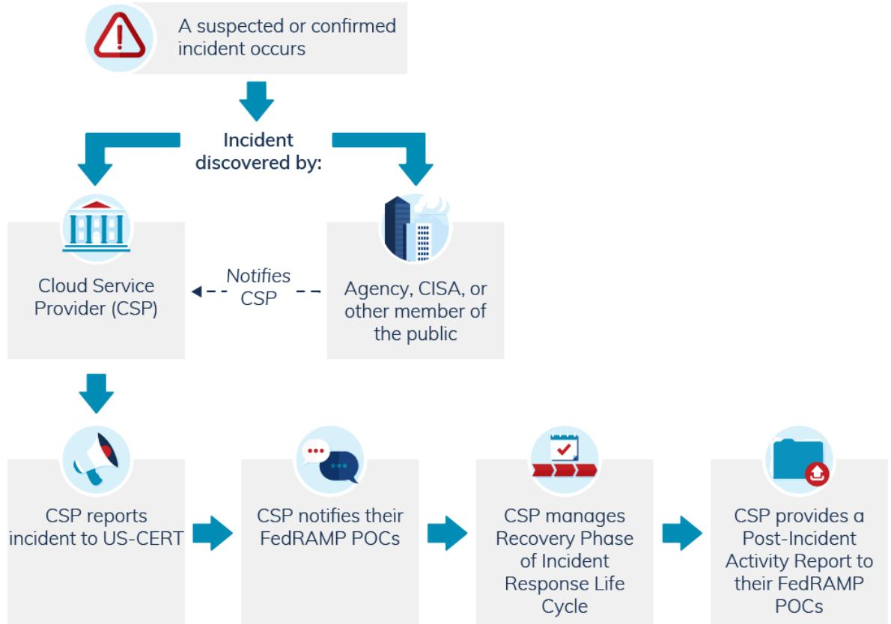

# FedRAMP® Incident Communications Procedures

Version 5.0 09/12/2024

info@fedramp.gov fedramp.gov

### DOCUMENT REVISION HISTORY

| Date       | Version | Page (s) | Description                                                                                                                                                    | Author      |
|------------|---------|----------|----------------------------------------------------------------------------------------------------------------------------------------------------------------|-------------|
| 04/02/2013 | 1.0     | All      | Initial FedRAMP Incident O Communication Procedure                                                                                                       | FedRAMP PMO |
| 06/06/2017 | 2.0     | All      | Updated logo 0                                                                                                                                              | FedRAMP PMO |
| 12/08/2017 | 3.0     | All      | Updated to newest O template                                                                                                                             | FedRAMP PMO |
| 04/15/2021 | 4.0     | All      | Updated to align with 0 revised guidance from US-CERT Incorporated new 0 formatting, incident explanation, and compliance requirements | FedRAMP PMO |
| 09/12/2024 | 5.0     | All      | Updated to align with O NIST SP 800-53 Rev. 5 and CISA references Outdated JAB and PMO O references removed                                  | FedRAMP PMO |

## TABLE OF CONTENTS

| Introduction and Purpose                          |   |
|---------------------------------------------------|---|
| Applicability                                     | 2 |
| Compliance                                        | 2 |
| Applicable Laws and Regulations                   | 2 |
| Applicable Standards and Guidance                 | 2 |
| Assumptions                                       | 3 |
| Roles and Responsibilities                        | 3 |
| CSP General Reporting Process                     | 5 |
| AO Responsibilities                               |   |
| Appendix A: CSP General Reporting Process Graphic |   |

## Introduction and Purpose

Information systems are vital to a federal agency's mission and business functions. Therefore, it is absolutely critical that services provided to aqencies operate effectively without interruptions. This Incident Communications Procedures document outlines the steps for FedRAMP stakeholders to use when reporting information concerning information security incidents, including responses to published emergency directives. The steps included in this document provide a sequence of required communications that are in place to ensure accurate and timely information is reported to all relevant stakeholders.

Incident communications stakeholders include a variety of teams and individuals with a vested interest in the successful implementation and operations of FedRAMP. They include:

- Cloud service providers (CSPs) ●
- Authorizing Official (AO) ●
- . FedRAMP
- Cybersecurity and Infrastructure Security Agency (CISA) ●
- CSP customers (including federal agencies and other FedRAMP-Authorized CSPs) ●
- CSP-relying parties (including leveraging CSPs) ●
- Interconnected systems ●

The Federal Information Security Modernization Act of 2014 (FISMA)* is the authoritative source for incident definitions. FISMA defines an "incident" as "an occurrence that (A) actually or imminently jeopardizes, without lawful authority, the integrity, confidentiality, or availability of information system; or (B) constitutes a violation or imminent threat of violation of law, security procedures, or acceptable use policies." The terms "security incident" and "information security incident" are also used interchangeably with "incident" within the body of the law.

After a CSP obtains a FedRAMP authorization for its service offering, it enters the continuous monitoring (ConMon) phase. Clear and timely incident communication to relevant stakeholders is a key aspect of ConMon to ensure that all incident handling is transparent and all stakeholders are aware of the current status and remediation efforts.

FedRAMP requires CSPs to report any incident (suspected or confirmed) that results in the actual or potential loss of confidentiality, inteqrity, or availability of the data/metadata that it stores, processes, or transmits. Reporting real and suspected incidents allows agencies and other affected customers to take steps to protect important data, to maintain a normal level of efficiency, and to ensure a full resolution is achieved in a timely manner.2

Reporting incidents or suspected incidents, as well as responses to emergency directives to the appropriate FedRAMP stakeholders, does not result in punitive actions aqainst the CSP; however, failure to report

1 See 44 U.S.C. § 3552(b)(2)

2 FedRAMP complies with NIST standards and guidance. With respect to incidents, it follows NIST Special Publication 800-61 (current version), CISA quidance, and the CISA Federal Incifications Guidelines. In accordance with these standards and guidance, additional program-specific guidance and procedures are provided in this document to aid all stakeholders with respect to reporting incidents.

incidents will result in escalation actions against a CSP as defined in the FedRAMP Continuous Monitoring Performance Management Guide. A collaborative approach to reporting incidents between CSPs and other FedRAMP stakeholders allows all parties to be aware of and successfully manaqe the risk associated with an incident and to classify and resolve suspected incidents.

#### Applicability

The information found in this document pertains to CSPs that have a FedRAMP authorization or are working towards a FedRAMP authorization.

#### Compliance

The FedRAMP Continuous Monitoring Performance Management Guide defines requirements for ConMon performance management. It explains the actions FedRAMP will take when a CSP fails to maintain an adequate risk management program, including issues related to and communication of information security incidents.

Failure of a CSP to report an incident or suspected incident according to these communication procedures will result in the issuance of a corrective action plan (CAP). A second violation of a CSP to report an incident or suspected incident according to these communication procedures may result in the suspension of the CSP's FedRAMP authorization.

#### Applicable Laws and Regulations

The following laws and regulations are applicable to incident planning:

- Federal Information Security Modernization Act (FISMA) of 2014 ●
- Management of Federal Information Resources [OMB Circular A-130]
- FedRAMP Authorization Act, as part of the FY23 National Defense Authorization Act (NDAA) ●
- Records Management by Federal Agencies [44 USC 31]
- Safequarding Aqainst and Responding to the Breach of Personally Identifiable Information [OMB ● Memo M-07-16]

#### Applicable Standards and Guidance

The following standards and quidance are useful for understanding incident communication planning:

- Computer Security Incident Handling Guide [NIST SP 800-61 (current version)] ●

- Guide for Applying the Risk Management Framework to Federal Information Systems: A Security Life Cycle Approach [NIST SP 800-37 (current version)]
- Managing Security Information Risk [NIST SP 800-39 (current version)]
- . Information Security Continuous Monitoring for Federal Information Systems and Orqanizations [NIST SP 800-137 (current version)]
- Risk Management Guide for Information Technology Systems [NIST SP 800-30 (current version)] ●
- CISA Incident Reporting Guidelines
- CISA Federal Incident Notification Guidelines ●

#### Assumptions

Assumptions used in this document are as follows:

- . Key CSP personnel have been identified and are trained in their relevant incident roles and responsibilities.
- . Agency incident response plans are in place.
- . CSP incident response plans are in place and have been tested in accordance with FedRAMP incident response (IR) controls.
- Both internal and external incident response contact lists (in all incident response plans) are accurate and up-to-date.
- All FedRAMP CSP contact information is up-to-date and on file with FedRAMP, the AO, and all federal customers of a CSP's FedRAMP-Authorized services.

## Roles and Responsibilities

The following table outlines the roles and responsibilities for the various stakeholders in the incident communication process.

| Stakeholder | Role                                  | Responsibility                                                                                                                                                                                                                                                                                                                                                                                                                                                 |
|-------------|---------------------------------------|----------------------------------------------------------------------------------------------------------------------------------------------------------------------------------------------------------------------------------------------------------------------------------------------------------------------------------------------------------------------------------------------------------------------------------------------------------------|
|             |                                       |                                                                                                                                                                                                                                                                                                                                                                                                                                                                |
| CISA        | Risk Advisor and Incident Handling | • Coordinates security and resilience efforts across private and public sectors · Delivers technical assistance and assessments to federal stakeholders and infrastructure owners nationwide • Conducts nationwide outreach to support and promote the ability of emergency response providers and relevant qovernment officials in the event of an emergency · Provides incident handling assistance, as needed, to CSPs and agencies |

|          | ●                                            | Provides reporting for any identified incidents affecting qovernment or government contracted systems to appropriate stakeholders                                                                                                                                                                                                                                                                                                                                                                                                                                                                                                                                                                                                                                                                                                                                                                                                                                                                    |
|----------|----------------------------------------------|------------------------------------------------------------------------------------------------------------------------------------------------------------------------------------------------------------------------------------------------------------------------------------------------------------------------------------------------------------------------------------------------------------------------------------------------------------------------------------------------------------------------------------------------------------------------------------------------------------------------------------------------------------------------------------------------------------------------------------------------------------------------------------------------------------------------------------------------------------------------------------------------------------------------------------------------------------------------------------------------------------|
| FedRAMP  | Incident ● Communication Monitoring | Monitors incident reporting submissions to FedRAMP · Updates FedRAMP Marketplace with status of CSP CAPs, suspensions, and revocations, including those related to information security incidents · Supports and advises AOs as needed                                                                                                                                                                                                                                                                                                                                                                                                                                                                                                                                                                                                                                                                                                                                                         |
| AO       | Risk Monitoring ●                         | Monitors CSP performance management plans · Provides CSP status updates to FedRAMP, including CAPs, suspensions, and revocations · Acts as the final approval authority for the use of an offering by their agency Notifies CSP, CISA, and FedRAMP stakeholders if the agency becomes aware of an incident or suspects an incident that a CSP has not yet reported · Ensures requirements for agency-specific incident response plans are met • Confirms with a CSP that they reported an incident to CISA and has obtained a CISA tracking number In the case of multi-agency agreements, responsibilities are documented in the Designation Letter                                                                                                                                                                                                                                                                                                                |
| CSP/3PA0 | Service Provider ●                        | Protects incident information commensurate with the impact level of the cloud service · Maintains a satisfactory risk management program for the cloud service in accordance with FedRAMP guidelines Complies with incident response guidance and requirements • Maintains a list of all current customers and the proper communication channels with all AOs and 3PAOs Notifies affected customers of information security incidents Notifies CISA of information security incidents as needed (see the CSP General Reporting Process section) and provides the CISA tracking number to FedRAMP at fedramp_security@gsa.gov (as well as to all applicable stakeholders) of information security incidents and provides status updates thereafter Requests assistance from CISA, as needed • Provides a final report to FedRAMP at fedramp_security@gsa.gov (as well as to all applicable stakeholders), including the agency AO or AO representatives, |

|             | after completion of the Post-Incident Activity phase of the Incident Response Life Cycle3 · Responds to emergency inquiries from FedRAMP, including those that are the result of the issuance of CISA Emergency Directives |
|-------------|----------------------------------------------------------------------------------------------------------------------------------------------------------------------------------------------------------------------------------------|
| Independent | • Performs any required independent security assessments                                                                                                                                                                               |
| Assessor    | related to information security incidents                                                                                                                                                                                              |

## CSP General Reporting Process

CSPs must report all incidents, which include any suspected or confirmed events, that result in the potential or confirmed loss of confidentiality, integrity, or availability to assets or services provided by the authorization boundary. Reporting requirements to CISA, agency customers of the cloud service offering, and FedRAMP point-of-contacts (POCs) are identified in this section (see Appendix A for a graphical representation of the steps outlined in this section).4

As CSPs manage and report incidents, they must not deviate from FedRAMP requirements to protect the confidentiality, inteqrity, or availability of data/metadata stored, processed, or transmitted by the system as well as data about the system and related to the incident. Sensitive information must be provided using approved mechanisms. CSPs must report suspected and confirmed information security incidents to the following parties within one (1) hour of being identified by the CSP's top-level Computer Security Incident Response Team (CSIRT), Security Operations Center (SOC), or information technology department to the following stakeholders:

- Customers who are impacted or who are suspected of beinq impacted (via the CSP Incident ● Response folder in their respective FedRAMP Secure Repository)
- CISA, under the following conditions:
	- o The CSP has confirmed, has yet to confirm, or suspects the incident is the result of any of the attack vectors listed in
		- https://www.cisagov/federal-incident-notification-quidelines#attack-vectors-taxonomy
	- Reportinq location: https://www.cisa.qov/forms/report O
- . FedRAMP POCs
	- FedRAMP at fedramp_security@gsa.gov O
- Agency POCs
	- O Agency AOs
	- o Agency Incident Response Teams (as identified by the authorizing agency)
	- Additional stakeholders identified in the Designation Letter o

3 National Institute of Standards and Technology (NIST) Special Publication (SP) 800-61, current version, Computer Incident Handling Guide

4 CISA Federal Incident Notification Guidance, https://cisa.cisa.govfederal-/incident-notification-guidelines

FedRAMP encourages the use of automated mechanisms for incident reporting. If a CSP wants to leverage automated incident reporting mechanisms, the CSP must work with the AO and FedRAMP POCs to ensure the content and context of the automated reporting provides the required information.

CSPs must maintain current and accurate contact information on file for all POCs, FedRAMP, agency customers, and other applicable stakeholders. Since CISA may take up to one (1) hour to provide a tracking number, the CSP must provide the tracking number to FedRAMP POCs as soon as it is made available by CISA. Incident notifications, provided by the CSP to any FedRAMP POCs verbally (e.g., by phone) must be followed up by an email; however, sensitive information must be protected.

When reporting to CISA, CSPs must include the required data elements as well as any other available information. CSPs must submit incident notifications in accordance with the Submitting Incident Notifications section of https://www.cisa.gov/federal-incident-notification-guidelines. In some cases, it may not be feasible to have complete and validated information prior to reporting. CSPs should provide their best estimate at the time of notification and report updated information as it becomes available.

After initial incident notification, the CSP must provide updates to CISA as well as daily updates to the FedRAMP POCs. The final daily update must be provided to the FedRAMP POCs after the CSP has completed the Recovery phase of Incident Response Life Cycle (Containment, Eradication, Recovery, and Post-Incident Activity). The CSP must also provide a report to the FedRAMP POCs after it has completed the Post-Incident Activity in the Incident Response Life Cycle 5. The final report must describe what occurred, the root cause, the CSP's response, lessons learned, and changes needed.

Additionally, CSPs are responsible for responding to emergency inquiries from FedRAMP, including those that are the result of the issuance of CISA Emerqency Directives. If any emerqency inquiry is issued, the CSP must comply within the timeline described in the request. Any additional reporting requirements identified in the inquiry must also be met. If there are any explicit actions the CSP must take that are identified in the emergency inquiry, they must be addressed in the timeline prescribed. Failure to report or respond to emergency inquiries, or failure to perform the prescribed remediation actions, can result in the escalation actions outlined in the FedRAMP Continuous Monitoring Performance Management Guide.

## AO Responsibilities

Upon receipt of a CSP's notification, AOs must take the following actions:

- 1. Verify that, if required, CISA has been notified (see the CSP General Reportinq Process section)
- Request that the CSP provides daily updates and the CISA tracking number when it has become 2. available
- ကဲ Verify the CSP's notification and supporting documentation is posted to the secure reporting repository

® National Institute of Standards and Technology (NST) Special Publication (SP) 800-61 (current version) Computer Incident Handling Guide

- a. Notifications of incidents should be sent to the following FedRAMP POCs after each update, should not contain any sensitive data, and should direct POCs to the CSP's designated FedRAMP secure repository:
	- FedRAMP at fedramp_security@gsa.gov i.
	- ii. AO and applicable team members (contact information on file with the CSP)
- 4. Ensure information related to the incident is in the CSP's designated secure file repository

The AO will evaluate the final report submitted by the CSP and determine an appropriate path forward. This may include developing a plan of action and milestones (POA&Ms) and/or CAPs to address areas needing improvement.

# Appendix A: CSP General Reporting Process Graphic

The below diagram provides a high-level overview of the steps a CSP should take if a security incident occurs. For more specific information about the stakeholders referenced below, please see the Roles and Responsibilities section.

