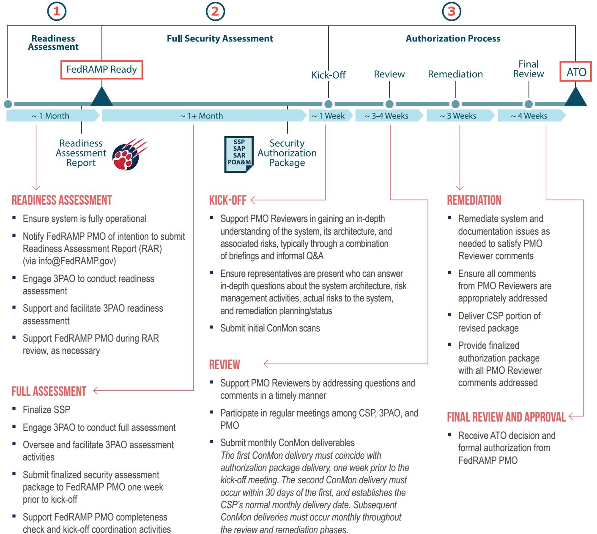

## @FedRAMP | CSP & ROLES AND RESPONSIBILITIES

ROLE: Provide secure cloud service offerings to the federal government and maintain security in adherence with NIST/FedRAMP requirements

## FEDRAMP IS COMMITTED TO:

- · Creating a collaborative, open environment
- " Facilitating a predictable and transparent process
- · Providing clear and timely communications
- · Clarifying expectations and requirements where needed

## ELEMENTS OF CSP SUCCESS:

- Executive leadership commitment throughout the process
- Transparency about barriers and risks
- · Commitment to understanding the relationship between security and compliance
- Quality documentation