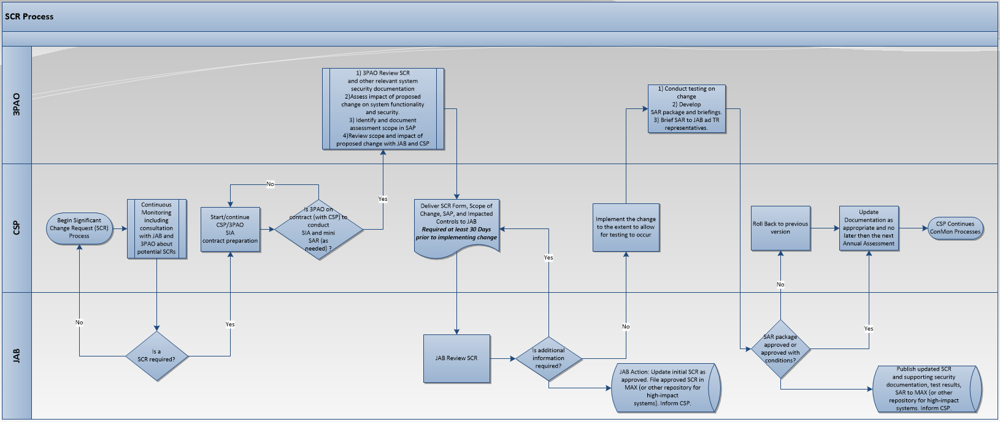
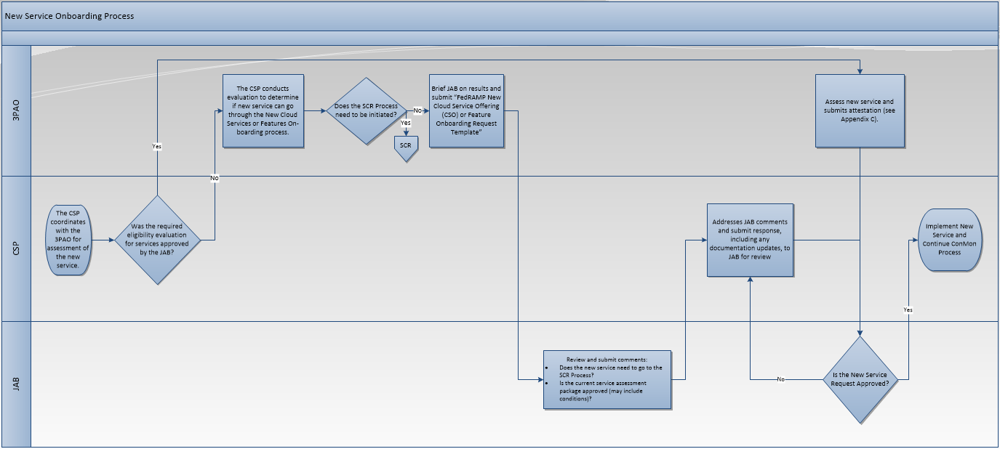

FedRAMP Significant Change

Policies and Procedures

Version 1.0

August 28, 2018

<figure>

<figcaption aria-hidden="true">/Users/saralandauherbst/Box/The Clearing/Client/FedRAMP (FRP)/_Brand Resources/Templates/old/Word/Covers/FedRAMP Word_template_cover 1.png</figcaption>
</figure>

Revision History

Date

Description

Version

Author

8/28/2018

Initial document

1.0

FedRAMP PMO

<Date>

<Revision Description>

<Version>

<Author>

<Date>

<Revision Description>

<Version>

<Author>

# About this document

This document provides guidance and requirements for making significant changes to a Cloud Service Offering (CSO) in support of maintaining a Federal Risk and Authorization Management Program (FedRAMP) Authorization to Operate (ATO) or Provisional Authorization to Operate (P-ATO).

This document is not a FedRAMP template – there is nothing to fill out in this document.

This document uses the term authorizing official (AO). For systems with a Joint Authorization Board (JAB) P-ATO, AO refers primarily to the JAB unless this document explicitly says Agency AO. For systems with a FedRAMP Agency authorization to operate (ATO), AO refers to each leveraging Agency’s AO.

# Who should use this document?

This document is intended to be used by Cloud Service Providers (CSPs), Third Party Assessor Organizations (3PAOs), government contractors working on FedRAMP projects, and government employees working on FedRAMP projects.

# How to contact us

Questions about FedRAMP or this document may be directed to [*info@fedramp.gov*](mailto:info@fedramp.gov)*. *

For more information about FedRAMP, visit the website at <https://www.fedramp.gov>.

TABLE OF CONTENTS

[About this document ii](#_Toc522716255)

[Who should use this document? ii](#_Toc522716256)

[How to contact us ii](#_Toc522716257)

[1. Introduction 1](#_Toc522716258)

[1.1. Purpose 1](#_Toc522716259)

[1.2. Scope 1](#_Toc522716260)

[1.3. Roles and Responsibilities 1](#_Toc522716261)

[1.4. Compliance 3](#_Toc522716262)

[2. Determining Significant and Minor Changes 3](#_Toc522716263)

[2.1. Changes Likely Considered Significant or Major 3](#_Toc522716264)

[2.2. Special Requirements for Specific Types of Significant Changes 4](#_Toc522716265)

[2.2.1. New Technology 4](#_Toc522716266)

[2.2.2. New Cloud Service Offering or Feature 5](#_Toc522716267)

[2.2.3. Moderate to High FIPS 199 Categorization Change 6](#_Toc522716268)

[2.2.4. New Code Release 7](#_Toc522716269)

[3. Change Documentation Requirements 7](#_Toc522716270)

[3.1. General 7](#_Toc522716271)

[3.2. FedRAMP Significant Change Request Template 7](#_Toc522716272)

[3.2.1. Security Impact Analysis 9](#_Toc522716273)

[4. Significant Change Process 9](#_Toc522716274)

[4.1. Significant Change Process 10](#_Toc522716275)

[5. New Service or Feature On-boarding Process 11](#_Toc522716276)

[5.1. New Cloud Services or Features On-boarding Process 11](#_Toc522716277)

[6. Annual Assessments 12](#_Toc522716278)

[6.1. Scheduling Significant Changes with Annual Assessments 12](#_Toc522716279)

[6.2. New Cloud Service or Feature Offering 13](#_Toc522716280)

[6.3. Assessment Reuse 13](#_Toc522716281)

[Appendix A – Acronyms 14](#_Toc522716282)

[Appendix B – SAP Minimum Controls Selections 15](#_Toc522716283)

[Appendix C – New Cloud Service or Feature On-boarding 3PAO Attestation Template 16](#_Toc522716284)

[Appendix D – CSP Services or Features Status Template 19](#_Toc522716285)

List of Figures

[Figure 4‑1. Significant Change Process 9](#_Toc522716286)

[Figure 5‑1. New Service or Feature On-boarding Process 11](#_Toc522716287)

List of Tables

[Table 1‑1. Roles and Responsibilities 2](#_Toc522716288)

[Table 2‑1. Changes Likely Considered Significant or Major 3](#_Toc522716289)

[Table 2‑2. Comparison of Documentation Requirements 6](#_Toc522716290)

[Table 3‑1. Significant Change Form Requirements 8](#_Toc522716291)

# Introduction

After a CSP obtains a FedRAMP ATO or P-ATO for its service offering, the next phase is the continuous monitoring (ConMon) of the system security controls. Continuous monitoring includes “documenting changes to the system or environment of operation, conducting security impact analyses of the associated changes, and reporting the security state of the system to appropriate organizational officials.”[\[1\]](#footnote-2)

CSPs may need to make changes to their cloud services from time to time. FedRAMP may consider certain changes “significant.” A significant change is one that is likely to affect the security state of the information system[\[2\]](#footnote-3), a security state that formed the basis of the AO’s decision to issue the authorization to the cloud service. As one of the minimum requirements to ensure the cloud service authorization remains in good-standing, the P-ATO letter states that the “*CSP identifies and manages significant changes … in accordance with applicable Federal law, guidelines, and policies.”*

FedRAMP complies with National Institute of Standards and Technology (NIST) standards and guidance. With respect to significant changes, it follows NIST Special Publication (SP) 800-37 and NIST SP 800-137.\* \*In accordance with these standards and guidance, additional program-specific guidance, requirements, and procedures are provided in this document to aide AOs, CSPs and 3PAOs when addressing significant changes.

## Purpose

This publicly available document defines the FedRAMP policies and procedures for making significant changes. It provides requirements, guidance, and actions the FedRAMP PMO, AO, CSP, and 3PAO will take when a CSP wishes to make a significant change to its provisionally authorized cloud service.

## Scope

This document specifically addresses significant changes of cloud services that were granted a FedRAMP P-ATO. It expands on Section 3.2 of FedRAMP Continuous Monitoring Strategy & Guide (Version 3.0, January 31, 2018). Agencies and CSPs with exclusively agency authorizations are welcome to use this guidance. In addition, this document addresses system changes that are considered significant or in the process of being confirmed as significant. Guidance on what types of changes may be considered significant is described in Section 2, Determining Significant and Minor Changes.

## Roles and Responsibilities

Table 1‑1 describes the roles and responsibilities of participants in the significant change process.

Table 1‑1. Roles and Responsibilities

Role

Responsibility

FedRAMP PMO

**FedRAMP Director**

- Issues and approves Corrective Action Plan (CAP), includes those related to significant changes
- Monitors Performance Management Plan
- Approves CAPs, Suspensions, and Revocations in coordination with the JAB reviewers

**FedRAMP ConMon Manager**

- As the primary ConMon process interface between the JAB and the PMO, provides recommendations and status updates, including those for significant changes, to the FedRAMP Director
- Supports the JAB Reviewers as needed
- Advises the JAB Reviewers on Escalation Actions

Agency

**Authorizing Official (AO)**

- The approving authority for significant changes

JAB Team

**Joint Authorization Board (JAB)**

- The AO for CSPs that have a JAB P-ATO
- Composed of the CIOs of the Department of Defense (DOD), General Services Administration (GSA), and Department of Homeland Security (DHS)
- The approving authority for significant changes

**JAB Technical Reviewer (TR) Principal**

- Principal Technical Reviewer for the JAB (one from DOD, GSA, and DHS)
- Delegated approving authority (from JAB) for significant changes
- Provides guidance and oversight of the significant change process
- Effects Policy change relating to significant changes

**JAB Technical Reviewer (TR) Lead**

- One of three JAB TR Leads, one from DOD, GSA, and DHS
- Delegated approving authority (from JAB TR Principal) for significant changes
- Advises the JAB Reviewers and provides general oversight of all ConMon process areas, including significant changes

**JAB Reviewers**

- One of a team of three Technical Reviewers from either the DOD, GSA, or DHS
- Serves as primary interface for ConMon activities, including significant changes, between JAB TR Principals, FedRAMP PMO, CSP and 3PAO
- Notifies other JAB Reviewer Leads and FedRAMP PMO of Significant Change Request (SCR) submissions
- Notifies CSP and 3PAO of due dates for comments, comment-responses and approval of comment responses
- Reviews all SCRs and supporting documents within required timeframes
- Makes risk-based recommendations related to significant changes
- Provides required status updates to their JAB TR Lead
- Provides routine status updates to the PMO
- Consolidates SCR comments, where feasible

CSP/3PAO

**Cloud Service Provider (CSP)**

- Maintains proper communication channels with the AO and 3PAO
- Provides routine status updates related to significant changes
- Submits significant change requests
- Maintains a satisfactory Risk Management Program in accordance with FedRAMP guidelines

**Third Party Assessment Organization (3PAO)**

- Conducts security impact analysis
- Performs independent security assessment of significant changes
- Develops Security Assessment Plan (SAP) and Security Assessment Report (SAR) for significant change
- Advises the CSP on significant change issues

## Compliance

Significant change requests (SCR) must be submitted at least 30 days before they are implemented, to provide time for 3PAO assessment. CSPs should regularly inform AOs of upcoming changes to ensure significant changes are identified and addressed. The *Continuous Monitoring Performance Management Guide* defines the FedRAMP requirements for Continuous Monitoring Performance Management. The document is available on the FedRAMP web site at <https://www.fedramp.gov/documents/>. It explains the actions FedRAMP will take when a CSP fails to maintain an adequate risk management program, of which management of significant changes is a key aspect.

# Determining Significant and Minor Changes

National Institute of Standards and Technology (NIST) Special Publication (SP) 800-37*, Revision 1, Guide for Applying the Risk Management Framework to Federal Information Systems: A Security Life Cycle Approach* (Appendix F, Section F.6, Page F-8) provides a general definition of what a significant change is and provides examples of what could be considered a significant change. A significant change is one that is likely to affect the security state of the information system.

Because the key role of the AO is to make risk-based decisions, they determine whether a change is deemed significant. Non-significant changes would be addressed by the CSP’s established Configuration Management Plan. Routine day-to-day changes (e.g. patching) would not be considered significant. If a change is “more of the same,” it is likely not significant in FedRAMP’s view.

## Changes Likely Considered Significant or Major

Table 2‑1 below is a list of changes that would likely be considered significant. However, this is not a comprehensive list. If after consulting this list and NIST 800-37 (Appendix F, Section F.6, Page F-8) the CSP is unsure, they should consult with their AO.

Table 2‑1. Changes Likely Considered Significant or Major

Changes Likely Considered Significant or Major

New Technology (New OS variant, including COTS and appliance, none of which currently exist in the environment)

Use of new external services (e.g. ticketing system, monitoring system) in support of the cloud service

New Cloud Service Offering or Feature

Removal of system components or service offering

FIPS 199 Categorization Change (e.g. Moderate to High)

PaaS or SaaS changing IaaS Provider

Adding/Removing security controls

New cryptographic modules or services or changes to existing modules/services

Changing alternative (or compensating) security control(s)

New data center or moving to new facility

New interconnection or changes to existing

Scanning tool changes

Upgrade of OS

New system monitoring capabilities or replacement of system monitoring capabilities

New Virtual Server(s)

New/upgrade of DBMS (MS SQL, Oracle, etc.)

New Code Release

New authentication mechanisms or changes to existing mechanisms

New boundary protection mechanisms or changes to existing mechanisms; changes to routing rules

Change in cloud service ownership that would result in major changes (e.g. change to contingency planning or incident response processes/capabilities)

Changed or updated backup mechanisms and processes

Movement of information system data to a different system boundary

## Special Requirements for Specific Types of Significant Changes

### New Technology

The requirements for significant changes, including the addition of new technology, are outlined in Section 3, Change Documentation Requirements, and Section 4, Significant Change Process. All components have, to varying degrees, access controls, audit logging controls, identification and authentication controls, configuration management controls, system integrity controls and so on. Controls can be implemented locally on the component or from a central mechanism that automatically applies and manages the controls on that component.

New technologies that are added to the boundary will have to be verified as compliant and/or integrated with the security controls applicable to the CSP environment.

The steps for providing the attestation and testing for the controls applicable to new technologies are as follows:

- The 3PAO must document which controls that the new technology can integrate into within the current CSP environment. The 3PAO must verify that the new technology will integrate into these currently implemented security controls in the CSP environment. For example, if a new technology is integrating into the current account management controls, the 3PAO would verify that the integration will take place and the new technology will be inheriting and utilizing the current implementation. All controls that have been identified as being inherited by the new technology must be documented by the 3PAO in the New Technology minimum controls selection list (see Appendix B SAP Minimum Controls Selections).
- For the remaining controls where the implementation for the new technology does not match what was implemented and tested in the current CSP environment the 3PAO must provide testing and or explanation for non-applicability in the New Technology minimum controls selection list (see Appendix B SAP Minimum Controls Selections).

The 3PAO must take all non-applicable controls for the new technology integration and provide a write-up as to why the controls are not applicable to the new technology’s implementation. Additionally, the 3PAO must document the remaining controls where the implementation of the security controls for the new technology is not in the current CSP implementation for the environment, and are to be tested. These two lists (see New Technology in see Appendix B SAP Minimum Controls Selections) along with the scope of controls for attestation, must be submitted with the SCR for approval prior to testing.

### New Cloud Service Offering or Feature

Eligible cloud services or features may go through the FedRAMP New Cloud Service or Feature On-boarding process (as outlined in Section 5), a specialized process that differs from the standard FedRAMP significant change process that is outlined in Sections 3 and 4 below. This on-boarding process is intended to expedite authorization of new services or features, but requires a significant upfront investment. It is intended for offerings with a significant number of planned new services or features (for example, an offering that adds two to three new services or features every month). It is not recommended for cloud service offerings that add only a few services or features annually.

If the new services or features are found to be ineligible, either initially or after going through the evaluation period, they must go through the standard FedRAMP significant change process. Even if the services or features are eligible, the CSP may opt to submit them through the standard significant change process. The following are the criteria to qualify for the New Cloud Service or Feature On-boarding process:

- The new service or feature has no impact on existing and already-authorized architecture and controls (these will remain static).
- The new service or feature does not require service-specific or feature-specific controls to be added. All NIST SP 800-53 security controls required for the new services or features are in the existing (and already authorized) architecture and security controls.
- The CSP Configuration Management (CM) and System Development Lifecycle (SDLC) capabilities are mature and ensure no impact on existing architecture and controls (these will remain static) as new services or features are on-boarded.
- Continuous Monitoring (ConMon) activities remain un-affected and compliant as new services or features are on-boarded.

FedRAMP requires that CSPs, desiring to use the FedRAMP New Cloud Service or Feature on-boarding process, undergo an evaluation period before being approved to use this process for future on-boarding requests of specified cloud services and features. Table 2‑2 below illustrates the difference in documentation requirements. “FedRAMP New Cloud Service Offering (CSO) or Feature On-boarding Request Template” is used to provide the necessary information for the AO to make a risk-based decision regarding A CSP’s eligibility to use the FedRAMP New Cloud Service or Feature On-boarding process for specified services and features. That template is available in the templates area of FedRAMP.gov (currently https://www.fedramp.gov/templates/).

The AO may request that the CSP/3PAO perform activities, provide information (documentation; briefings etc.) that promote understanding and provide assurance that the criteria/qualifications have been met for the current service/feature and for future service/feature requests.

Once certain types of services or features are approved to use the New Cloud Service or Feature on-boarding process, only a 3PAO attestation is required for subsequent on-boarding requests of service and features of those types. The 3PAO uses its expert judgment to subjectively evaluate the overall compliance of the new service or feature and attests to its readiness for inclusion into the existing system P-ATO boundary and factor this evaluation into its attestation*.* The template text for the 3PAO attestation letter is located in Appendix C New Cloud Service or Feature On-boarding 3PAO Attestation Template.

Approved services or features must be documented and maintained within the CSP authorization package. The template to document the status of services/features is in Appendix D CSP Services or Features Status Template.

Table 2‑2. Comparison of Documentation Requirements

Change Type

SC-REQUEST

SC-REPORT

**General**

**SAP**

**SAR**

**New Cloud Service Offering (CSO) or Feature for a CSP not yet approved to use the FedRAMP New Cloud Service or Feature On-boarding process**

FedRAMP New Cloud Service Offering (CSO) or Feature On-boarding Request Template

**New Cloud Service Offering (CSO) or Feature for a CSP approved to use the FedRAMP New Cloud Service or Feature On-boarding process.**

Appendix C New Cloud Service or Feature On-boarding 3PAO Attestation Template

Appendix D CSP Services or Features Status Template

**All Others**

FedRAMP Significant Change Form Template

FedRAMP Annual Security Assessment Plan (SAP) Template

Minimum Controls Selection if available: Appendix B SAP Minimum Controls Selections

FedRAMP Annual Security Assessment Report (SAR) Template

### Moderate to High FIPS 199 Categorization Change

The process for significant changes, including a change to the FIPs 199 categorization from Moderate to High, is outlined in Sections 3 and 4 below. In addition to the FedRAMP Significant Change Form Template, the CSP must submit a “FedRAMP High Readiness Assessment Report (RAR).” Both the form and RAR templates are available in the templates area of FedRAMP.gov (currently https://www.fedramp.gov/templates/).

The FedRAMP High RAR Template and its underlying assessment are intended to enable FedRAMP to reach a decision for a specific CSP’s system based on organizational processes and the security capabilities of the system. FedRAMP grants approval to proceed with the significant change process when the information in this report template indicates the CSP is likely to achieve an authorization (P-ATO or ATO) at the high baseline.

### New Code Release

Every new code release is not automatically considered a significant change. The CSP must perform a security impact analysis (SIA), in compliance with FedRAMP control CM-4, on every new code release, including the analysis required by the FedRAMP SA-11 controls (the base control and enhancements). Therefore, if an SIA shows that the new code release will adversely affect the system’s security posture, the new code release must be treated as a significant change.

# Change Documentation Requirements

## General

The CSP must submit the FedRAMP Significant Change Request Template for all significant changes, with one exception: if a CSP is requesting a new service or feature and also wants to optionally use the FedRAMP New Cloud Services or Features On-boarding process (See Section 2.2.2). Additional documentation may be required based on specific types of changes. These are noted in Section 2.2, Special Requirements for Specific Types of Significant Changes. The FedRAMP Significant Change Request Template was developed to capture the type(s) of system changes requested and the supporting details surrounding requested system changes. It can be used to request a significant change within an existing authorization. It is recommended that the form be used even prior to a formal significant change request, to facilitate discussion and expedite the decision-making process.

*All templates listed below are available at FedRAMP.gov *[*https://www.fedramp.gov/templates/*](https://www.fedramp.gov/templates/)*.*

## FedRAMP Significant Change Request Template

The following information in Table 3-1 must be included in the FedRAMP Significant Change Template (SC-REQUEST) to facilitate understanding of the change and its security impacts:

Table 3‑1. Significant Change Form Requirements

SCR field

Included Information

**CSP Contact Information**

CSP Name

FedRAMP Authorized service being changed

CSP System Owner

Primary CSP POC for change request

**System Information**

Type of System (IaaS, PaaS, SaaS)

Description of service

List all current and/or pending Federal customers

**3PAO Information**

3PAO Name

3PAO POC for change request

If the 3PAO is under contract to assess the change

If the SAP is attached

**Nature of Change**

**Change Details**

Narrative detailing the background and a description of the change

**Type of Change**

Check all that apply

**System Components Impacted**

System diagrams showing before and after state of the system

For replacement of existing functionality, an “apples to apples” comparison demonstrating how the new implementation will continue to comply (meet or exceed) the same security requirements, standards, and functionality as the previous implementation

**Security Controls Impacted**

Security requirements that the new implementation will now support where there was not previously full support

An explanation for each technical, operational, and management control implementation that must change in support of the new implementation, including but not limited to ports/protocols, routing, contingency planning/testing, and incident response planning/testing

**Status of Change**

A description of how the CSP will implement the change, for 3PAO assessment, in such a way that:

It is not fully operational, yet enables the most accurate determination of security state (as if fully operational) to be reported

It minimizes the impact to the existing operational environment

**Validation**

3PAO Security Assessment Plan (SAP) is included as an attachment to the FedRAMP SC-REQUEST and must include Appendix B SAP Minimum Controls Selections (if available)

**Demand/Justification**

Examples of how a CSP could provide include (but are not limited to):

Government RFIs, RFQs, and pending awards

Industry recognition (for example being in the Gartner Magic Quadrant)

Business capture plan provided by CSP grounded by agency needs and spending

Use by State, Local, Tribal, or Territorial Governments

**CSP Signature**

**Attachment A, Part 1**

**(Only required for Mod**

\_\_ to High change)\_\_

List of all additional controls that do not exist in the Moderate baseline but must be addressed as part of the High baseline

**Attachment A, Part 2**

List of controls that exist in both the Moderate and High baselines; however, the FedRAMP prescribed parameter is different in the High baseline. When transitioning from Moderate to High, the CSP must update these parameters appropriately in their System Security Plan (SSP). The revised parameter changes the control requirement. The CSP must also revise the control implementation within the system, and the control description within the SSP to align with the new parameter.

### Security Impact Analysis

The full SIA is effectively the combination of the CSP’s SIA provided in/with the significant change form plus the 3PAO SIA reflected in the SAP and 3PAO SIA reflected in the SAR. The SAP reflects 3PAO’s SIA, with respect to controls selection, general scope, and assessment activities. The SAR reflects 3PAO’s SIA, with respect to assessment results. The CSP may involve the 3PAO at any stage of the SIA process.

# Significant Change Process

Figure 4‑1 is an end-to-end diagram of the FedRAMP Significant Change Process which details the interaction between the AO, FedRAMP PMO, and CSP/3PAO.

Figure 4‑1. Significant Change Process

## Significant Change Process

1.  CSP START: Continue Continuous Monitoring (ConMon) Process.
2.  CSP: The CSP, in coordination with the JAB, initially determines if a system change to the existing cloud service is required. Additionally, the CSP and AO meet to discuss the system change, potential security impacts and any increases in risk posture to the current authorization from the CSP’s perspective. The CSP determines the scope and type of change (i.e., a minor change or a major/significant change - See Section 2, Determining Significant and Minor Changes). The CSP also provides an estimate of known and potential\* \*security changes, and the security impact associated with these changes. To facilitate discussion and expedite decision-making, it is recommended that the CSP submit draft significant change documentation using the templates referenced in Section 3.
    1.  NO- System change is considered minor. A minor system change does not impact the CSP security posture and does not require additional security controls or assessments. Return to STEP 1 (CSP START) and conduct normal ConMon processes.
    2.  YES – This is a major/significant system change. GO TO STEP 3
3.  CSP: Begins to consult with the 3PAO. If a 3PAO is not on contract then the CSP must begin this process.
    1.  If it is determined that a 3PAO is on contract, then the 3PAO begins.
4.  CSP: If this is a new cloud service or feature, does the CSP want to go through the FedRAMP New Cloud Service or Feature on-boarding process? Note: The CSP is not required to go through the New Service or Feature on-boarding process.
    1.  YES - GO TO New Service or Feature On-boarding Process
    2.  NO - GO TO STEP 5
5.  The 3PAO begins to assess the significant change.
    1.  3PAO Review SCR and other relevant system security documentation
    2.  Assess impact of proposed change on system functionality and security
    3.  Identify and document assessment scope in SAP (See Appendix B SAP Minimum Controls Selections )
    4.  Review scope and impact of proposed change with JAB and CSP
6.  Once complete, the 3PAO and CSP submit all necessary change and assessment forms. This must be delivered 30 days prior to the significant change being implemented.
7.  Once received, the JAB will review all documentation to ensure completeness and security impact. If additional information is required the JAB will reach back to the CSP.
8.  The CSP will take the necessary steps to implement the change to allow for testing to occur, while also ensuring minimal security impact to the existing environment.
9.  The 3PAO will then, 1) Conduct testing on change, 2) Develop SAR package and briefings, and 3) Brief SAR to JAB and TR representatives.
10. The JAB will review the testing and SAR Package and determine if the change is acceptable. If not, then the CSP would be required to roll back to the previous version. If the change is accepted, then the CSP must update the POA&M with any conditions and all other documentation no later than the next Annual Assessment.
11. The CSP continues with regular ConMon Operations.

# New Service or Feature On-boarding Process

Figure 5‑1 is an end-to-end diagram of the FedRAMP New Service or Feature On-boarding Process which details the interaction between the AO, FedRAMP PMO, and CSP/3PAO.

Figure 5‑1. New Service or Feature On-boarding Process

## New Cloud Services or Features On-boarding Process

1.  CSP Start: The CSP coordinates with the 3PAO for assessment of the new service/feature.
2.  CSP: Did the CSP already undergo the required eligibility evaluation for services/features of this type/category and get approval from the JAB?
    1.  YES – If yes, then only the attestation process is required. GO TO STEP 10.
    2.  NO – If not, the CSP undergoes the evaluation to determine if services/features of this type/category can go through the New Cloud Services or Features On-boarding process. This involves a sample size of two of the same type/category of services or features, which are assessed in succession. GO TO STEP 3.
3.  3PAO: Conducts eligibility evaluation.
4.  3PAO: Does the SCR process need to be initiated?
    1.  YES – If the 3PAO determines the qualification criteria is not met, at any time during the assessment, the 3PAO notifies the JAB and the CSP initiates the standard significant change process. GO TO “Significant Change Process” STEP 5.
    2.  NO - CONTINUE TO STEP 5.
5.  3PAO: Briefs JAB on results and submits report based on “FedRAMP New Cloud Service Offering (CSO) or Feature On-boarding Request Template,” available in the templates area of FedRAMP.gov (currently https://www.fedramp.gov/templates/).
6.  JAB: Reviews and submits comments to 3PAO.
7.  JAB: Does the service need to go through the standard FedRAMP significant change process?
    1.  YES - During their review, the JAB may determine that the service/feature is not eligible for the new services/features on-boarding process and must go through the standard FedRAMP significant change process. GO TO “Significant Change Process” STEP 5
    2.  NO – GO TO STEP 8
8.  JAB: Is the current service/feature assessment package approved (may include conditions)?
    1.  YES – GO TO STEP 11
    2.  NO – GO TO STEP 9
9.  CSP/3PAO: Addresses JAB comments and submits response, including any documentation updates, to JAB for review. CSP updates all relevant package documentation: The POA&M is updated with any conditions; The SSP is updated to reflect the new service/feature; “CSP Services or Features Status” is updated (See Appendix D – CSP Services or Features Status Template; etc.
10. 3PAO: Assesses new service/feature and submits attestation (see Appendix C – New Cloud Service or Feature On-boarding 3PAO Attestation Template) for JAB review. GO TO STEP 8.
11. CSP implements new service and continues with ConMon process.

# Annual Assessments

## Scheduling Significant Changes with Annual Assessments

Significant changes may be scheduled with the annual assessment (AA). The process and requirements follow those described in Section 3 and 4, except that the SAP will include the assessment plan for both the AA and the significant change. Similarly, the AA SAR will incorporate the results of the AA as well as the results for the significant change.

## New Cloud Service or Feature Offering

As part of the, new services or features on-boarding process, the 3PAO provides attestations for the status of certain security controls (See Section 2.2.2 New Cloud Service Offering or Feature). The status of attested controls must be validated by the 3PAO in the next scheduled annual assessment following the on-boarding of the service or feature. Evidence will need to be provided where the 3PAO previously provided an attestation.

## Assessment Reuse

Under certain conditions, controls assessment results from approved changes may be reused for the current annual assessment. The result is that a portion of a control may have been assessed as part of an approved significant change request so that the 3PAO must only assess the delta. These conditions for reuse of assessment results are the following:

- The change occurred between the last and current annual assessments.
- The change was approved by the AO.
- The assessment results for reuse are only NIST 800-53 controls assessment results (not scans or pen test results etc).
- The change documentation is not an attestation (See Section 2.2.2\* *New Cloud Service Offering or Feature*)\*.

If assessment results from an approved significant change were reused for the annual assessment, the approved SAR and supporting documentation for that significant change must be included and referenced as artifacts in the annual assessment package.

Appendix A – Acronyms

Acronym

Expansion

3PAO

Third Party Assessment Organization

AA

Annual Assessment

AO

Authorizing Official

ATO

Authorization to Operate

CAP

Corrective Action Plan

ConMon

Continuous Monitoring

CSP

Cloud Service Provider

DHS

Department of Homeland Security

DFR

Detailed Finding Review

DOD

Department of Defense

GSA

General Services Administration

JAB

Joint Authorization Board

FedRAMP

Federal Risk and Authorization Management Program

FISMA

Federal Information Systems Management Act

NIST

National Institute of Standards and Technology

P-ATO

Provisional Authorization to Operate

POA&M

Plan of Action and Milestones

PMI

Performance Management Indicator

PMO

Program Management Office

RMF

Risk Management Framework

SAR

Security Assessment Report

SAP

Security Assessment Plan

SC

Significant Change

SCR

Significant Change Request

SC-REQUEST

Significant Change Request

SC-REPORT

Significant Change Report

SIA

Security Impact Analysis

SOP

Standard Operating Procedure

SSP

System Security Plan

# Appendix B – SAP Minimum Controls Selections

The following are minimum controls selections for specific types of significant changes. The CSP and 3PAO must select all control lists that apply (multiple may apply). The CSP and 3PAO must evaluate the minimum control set and add any additional controls deemed necessary to fully assess for the change. The CSP and 3PAO must provide a rationale for not assessing a control in the minimum control set.

*All templates listed below are available at FedRAMP.gov *[*https://www.fedramp.gov/templates/*](https://www.fedramp.gov/templates/)*.*

Change Type

Guidance

File

Moderate to High FIPS 199 Categorization Change

The control selection for this change is contained in the FedRAMP Significant Change Report Form Template, Appendix A.

FedRAMP Significant Change Report Form Template

New Technology

See Section 2.2.1 New Technology for additional guidance.

Security Controls for New Technology SC-R.xlsx

New Interconnection

Note: If new components that do not exist in the environment are being added as part of the new interconnection, the New Technology controls set above must be selected.

Security Controls for New Interconnection SC-R.xlsx

New Data Center

Note: If new components that do not exist in the environment are being added as part of the new interconnection, the New Technology controls set above must be selected.

Security Controls for Data Center SC-R.xlsx

# Appendix C – New Cloud Service or Feature On-boarding 3PAO Attestation Template

Once certain types of services or features are approved to use the New Cloud Service or Feature on-boarding process, as described in section 2.2.2 New Cloud Service Offering or Feature, only a 3PAO attestation is required for subsequent on-boarding requests of service and features of those types. The template text for the 3PAO attestation letter is included below.

**To:** Ashley Mahan

Acting Director of Federal Risk and Authorization Management Program (FedRAMP)

US General Services Administration

**From:** <Name>

<Title>

<Organization>

**Date:** <m/d/yyyy>

**Subject:** Attestation Letter for <CSP> <Service/Feature Name>

<Salutation>

This letter is provided as an attestation for the services/features listed below. They have been independently validated by \<3PAO\>, a third-party assessment organization (3PAO). The evaluation took place from <m/d/yyyy> through <m/d/yyyy>. \<3PAO\> validated that these services/features were on-boarded in accordance with the applicable JAB-approved on-boarding process documented in <document title> (<filename>).

Services/Features:

- <Service/Feature Name>
- <Service/Feature Name>

The JAB-approved on-boarding process is both specific to the CSP and to the type or category of services/features the CSP offers, in this case <service type/category name or feature type/category name>. It ensures that the services/features are brought on to the <CSP System> environments using a standardized, streamlined, and repeatable process. These services/features are not required to go through the standard FedRAMP significant change request (SCR) process because they:

1.  Have no impact on existing and already authorized architecture and controls (these will remain static)
2.  Do not require service-specific or feature-specific controls to be added. All NIST SP 800-53 security controls required for the new services or features are in the existing and already authorized architecture and security controls.
3.  The CSP Configuration Management (CM) and System Development Lifecycle (SDLC) capabilities are mature and ensure no impact on existing architecture and controls (these will remain static) as new services or features are onboarded.
4.  Continuous Monitoring (ConMon) activities remain un-affected and compliant as new services or features are onboarded.

Further assessment and validation of these services/features will occur at the next Annual Assessment (due <m/d/yyyy>) through interviews, onsite review, scans, and penetration testing.

**The Validation Process **

The validation process is accomplished through a combination of the following:

1.  Conduct Interviews –
    1.  Interviews are conducted to determine whether the services or features are successfully using the existing <CSP System> security controls.
    2.  Interviews also provide additional details about the proposed services or features, and allow the 3PAO to request relevant data (e.g., scan information, inventory data, nature of access and authentication, surface exposure, encryption employed, etc.) that needs to be considered for the on-boarding.
2.  Review Evidence –
    1.  \<3PAO\> requests evidence to show that the services/features adhere to currently approved and assessed security controls (e.g., Security Training, Change Management, Incident Response, Anti-Malware, etc.) and has implemented these controls for the services/features. It is important to note that a review of <CSP System> security controls is conducted during each annual assessment, which typically includes manual, physical, and logical testing. The latest assessment test cases are still valid for periodicity of this review and have been leveraged to prevent unnecessary duplication of efforts.
3.  Validate Vulnerability Scanning –
    1.  \<3PAO\> reviews configurations (e.g., screenshots or other evidence) to confirm that vulnerability scanning capability has been set up for the service/feature.
    2.  <CSP> is conducting scanning of the services/features prior to on-boarding and the scan data <is being/will be> provided to FedRAMP.
    3.  \<Add for high-impact systems: If initial scan results indicate any High-risk vulnerabilities, the CSP stops the affected services/features from being considered for on-boarding until the vulnerabilities are resolved by the service team.\>
4.  Review Physical and Environment Controls –
    1.  \<3PAO\> validates that physical and environmental security measures are in place at all applicable data centers. The following are the dates and locations of datacenter walkthroughs:
        1.  <m/d/yyyy> - <Datacenter Name>, \<City, State\>
        2.  <m/d/yyyy> - <Datacenter Name>, \<City, State\>
    2.  <CSP> implements standardized physical and environmental processes for all data centers, therefore, the data center visits noted above are a representation of the implementation expected across all data centers consisting of <CSP System> assets.
5.  Leverage Penetration Testing –
    1.  \<3PAO\> conducts penetration testing during annual assessments and if proposed additions are determined to be a major change or impact to the security posture of the system.
    2.  All services/features, whether on-boarded during an annual assessment or during another cycle, are included in penetration testing annually.

**Attestation **

For services/features specified in this letter, \<3PAO\> attests that <CSP> has demonstrated successful on-boarding, which did not require initiation of the standard FedRAMP SCR process and occurred in compliance with the appropriate JAB-approved on-boarding process documented in <document title> (<filename>).

<Closing>

<Signature>

<Name>

<Title>

<Organization>

# Appendix D – CSP Services or Features Status Template

The following is the template to document the status of services or features within the CSP package.

1.   National Institute of Standards and Technology (NIST) Special Publication (SP) 800-37*, Revision 1, Guide for Applying the Risk Management Framework to Federal Information Systems: A Security Life Cycle Approach*, Chapter2, Section 2.1, Page 8 [↑](#footnote-ref-2)

2.   National Institute of Standards and Technology (NIST) Special Publication (SP) 800-37*, Revision 1, Guide for Applying the Risk Management Framework to Federal Information Systems: A Security Life Cycle Approach*) , Appendix F, Section F.6, Page F-8 [↑](#footnote-ref-3)
