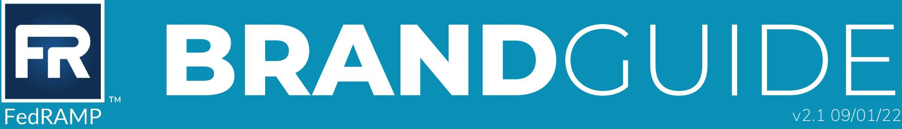

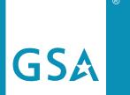

FedRAMP® is a product of GSA's Technology Transformation Services

info@fedramp.gov fedramp.gov

# Program Overview

The Federal Risk and Authorization Management Program (FedRAMP®) was established in 2011 to provide a cost effective, risk-based approach for the adoption and use of cloud services by the federal government. FedRAMP empowers agencies to use modern cloud technologies, with emphasis on security and protection of federal information.

### Contents

| 1.0 | The FedRAMP Brand           |
|-----|-----------------------------|
| 2.0 | Logo Application            |
| 3.0 | Incorrect Logo Usage        |
| 4.0 | Color Palette               |
| 5.0 | 508 Compliance              |
| 6.0 | The GSA Star Mark           |
| 7.0 | Fonts                       |
| 8.0 | Guidance for 3PAOs and CSPs |
| 9.0 | FedRAMP Brand Use Policy    |
|     | 10.0 FedRAMP Messaging      |

#### DOCUMENT REVISION HISTORY

| 12/01/2012 | v1.0 | Original Release                                                                                                                                                                                       |
|------------|------|--------------------------------------------------------------------------------------------------------------------------------------------------------------------------------------------------------|
| 11/17/2014 |      | Updated branding guidance to highlight proper use of new FedRAMP logo. Removed specific logos for 3PAOs or types of authorizations.                                                              |
| 06/06/2017 |      | Updated branding guidance to highlight proper use of new FedRAMP logo, color palette, fonts and icons.                                                                                           |
| 12/17/2020 | v2.0 | Revised branding guidance to reflect the full brand refresh and to provide additional instruction to meet brand and 508 compliance requirements when creating documents and presentations. |
| 09/01/2022 | v2.1 | Updated branding guidance to highlight proper trademark usage.                                                                                                                                      |

## 1.0 The FedRAMP Brand

### FedRAMP®

The registration symbol (®) must be used with the FedRAMP name. The symbol does not have to be used every time the FedRAMP name is used.

Instead, use the reqistration symbol in the first instance the name is used, in the most prominent use, or in both.

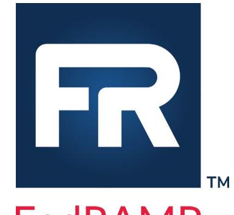

FedRAMP

The trademark symbol (TM) must be used with the FedRAMP loqo.

#### BRAND STANDARDS

- 1. The FedRAMP logo refers to the FedRAMP name and FedRAMP approved logo detailed in this document.
- 2. The FedRAMP PMO will authorize an entity's ability to use the FedRAMP logo. The authorization will detail the specific circumstance(s) when an orqanization can use the FedRAMP logo.
- 3. The FedRAMP logo and name may never be used in any manner that would imply qovernment endorsement of a company, its products, or its services. Neither the logo nor the FedRAMP name may be used in any other company name, product name, service name, domain name, or website title.
- 4. The logo may not be altered, cut apart, separated, or otherwise distorted in perspective or appearance.
- 5. The logo may never be used in a manner that would disparage FedRAMP or any government body.
- 6. Abbreviation of the Federal Risk and Authorization Management Program must always appear as FedRAMP.
- 7. Authorized organizations are responsible for the proper use of the FedRAMP logo as outlined in this document. This includes, but is not limited to, the use by any representatives, such as advertising agencies, system integrators, resellers, partners, etc.

# Logo Application

#### CLEAR SPACE

The minimum amount of clear space is required to be no less than 50% of the width of the logo. No other graphic elements, such as text or images, can appear in this area.

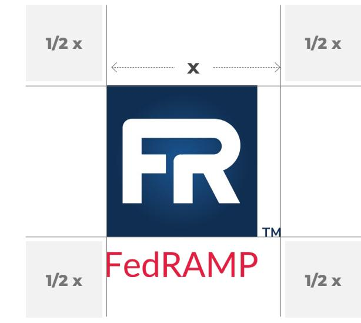

#### ALTERNATIVE LOGOS

#### Inverse

 White to background color must have a color contrast of 4.5 : 1. See page 5

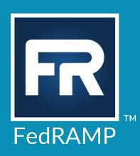

#### One Color

Only to be used when one color is required/ requested—often done for cost saving purposes.

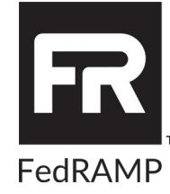

#### Stamp

 Only for use when being placed on a product or graphic as decorative and clearly produced by or associated with FedRAMP.

for busy backgrounds

for simple backgrounds

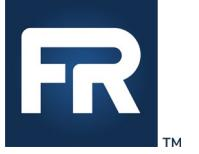

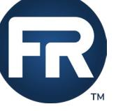

# Incorrect Logo Usage

#### DON'T:

- 1. Change the logo's orientation.
- 2. Add extraneous effects to the logo. This includes, but is not limited to, bevel and emboss, lighting, and 3D effects.
- 3. Place the logo on busy imagery.
- 4. Scale the logo disproportionately.
- 5. Make alterations, additions, or substitutions to the words and or colors contained in the logo.
- 6. Only display the wordmark without the stamp.

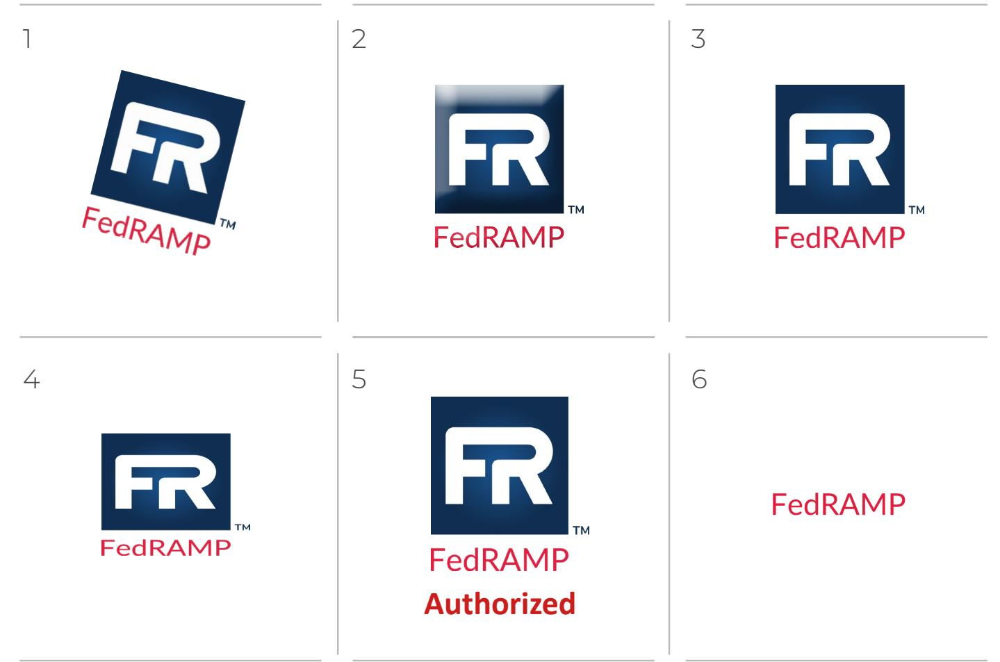

## 4.0 Color Palette

The FedRAMP visual identity relies heavily on the use of color. The palette consists of a complementary range of colors to create a vibrant and bold energy.

FedRAMP adopted a strict color palette, which is restricted to the colors on the right.

The goal is to produce bright and engaging visuals by using contrast. To achieve this, visuals should use one predominant color and two additional colors used for accents. Try to avoid using too many dark colors together. Tints should only be used to accent or to create a flat shadow effect.

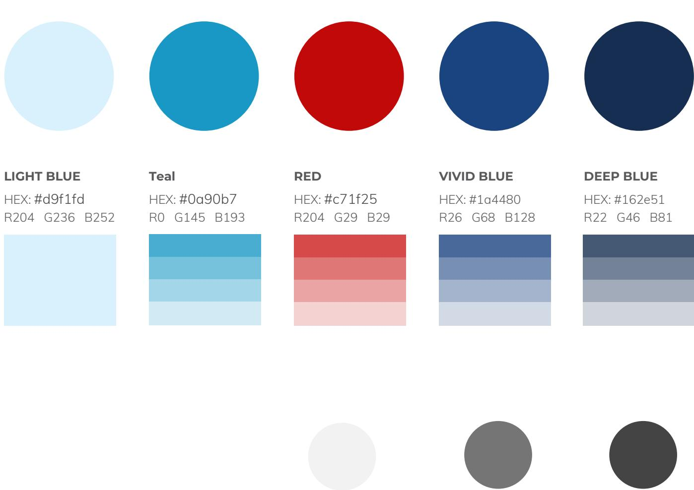

| BACKGROUND   | HEADINGS     | BODY TEXT    |
|--------------|--------------|--------------|
| Grade: 5     | Grade: 50    | Grade: 70    |
| HEX: #f2f2f2 | HEX: #757575 | HEX: #454545 |
| RGB 242      | RGB 117      | RGB 68       |

# 5.0 508 Compliance

Section 508 refers to making sure individuals of all abilities have equal access to the information and data they seek from federal agencies or which they need to do their jobs within a federal agency.

#### Color Contrast

Minimum Compliance (WCAG 2.0 level AA): Requires a contrast ratio of at least 4.5:1 for normal text and 3:1 for large text.

High-Level Compliance (WCAG Level AAA): Requires a contrast ratio of at least 7:1 for normal text and 4.5:1 for large text.

 Note: Large text is defined as 14 point (typically 18.66px) or larger, or 18 point (typically 24px) or larger.

 Confirm compliance using WebAIM's contrast checker.

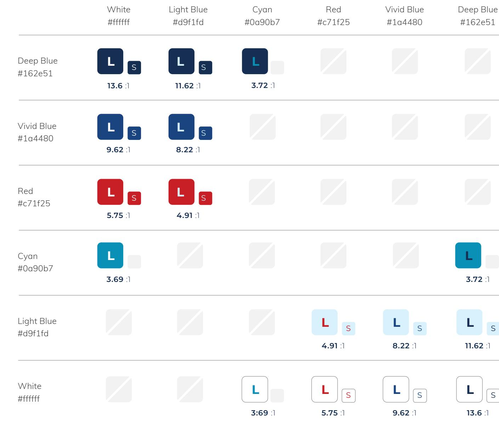

## 6.0 The GSA Star Mark

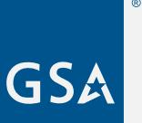

The GSA Star Mark must accompany the FedRAMP logo on all print and digital marketing materials.

The one exception is that the GSA Star Mark is not required to be used in standalone graphics such as blog banners, social media graphics, diagrams, and informational visuals.

#### GSA STAR MARK REQUIREMENTS

The GSA Star Mark consists of three components: the Registered Trademark Designation, the SSA Monogram. Official artwork must always be used when reproducing the GSA Star Mark. The elements are fixed and should never be redrawn or altered in any way.

| Minimum Size:    | The GSA Star Mark should never be reproduced smaller than 1/2 inch.                                                                                                                                                                                                         |
|------------------|-----------------------------------------------------------------------------------------------------------------------------------------------------------------------------------------------------------------------------------------------------------------------------|
| Clearspace:      | The distance between the GSA Star Mark and other graphic elements should be no less than 1/2 of the height of the GSA Star Mark.                                                                                                                                         |
| Star Mark Color: | GSA blue is the default application. The star mark, in white, can used on a dark background. The color contrast ratio for logo to background must be at least 3:1. Refer to page 5 for approved FedRAMP colors or confirm compliance usinq WebAIM's contrast checker. |

For more information, see GSA's Brand Guide Strengthening Our Brand.

#### APPLYING THE GSA STAR MARK TO FEDRAMP MARKETING MATERIALS

Always place the GSA Star Mark in the lower left-hand corner, adjacent to the FedRAMP contact information, on the right (see below). The height of the GSA loqo must match the height of that contact information or be at minimum 1/2 inches (as noted above). The GSA Star Mark and contact information must be bottom aligned.

For publicly distributed materials that will be highly visible, the following text must be displayed next to the GSA Star Mark in the following manner: "FedRAMP is a product of GSA's Technology Transformation Services." Do not recreate this, and always use official artwork.

FedRAMP is a produc GSA's Technology Transformation Services info@fedramp.gov fedramp.gov

Note: If the marketing material is comprised of multiple pages, it must appear, at minimum, on the opening and/or closing page.

### 7.0 Fonts

Only two typefaces are used to create FedRAMP collateral: Montserrat and Muli. Be sure to use these and only these typefaces.

 When applying a font weight to headings, go from thin to black as letter size reduces. For example:

- Titles should use extra-light or light. .
- Primary headings should use regular or medium.
- Secondary headings should use bold or extra . bold.

The only exception to this font requirement is when working in the Microsoft Office Suite; Arial must be used as Montserrat and Muli will not be available.

### Montserrat (For headings & call out text)

| Thin 100               | Reqular 400          | Bold 700              |
|------------------------|----------------------|-----------------------|
| Thin 100 italic        | Reqular 400 italic   | Bold 700 italic       |
| Extra-light 200        | Medium 500           | Extra-bold 800        |
| Extra-light 200 italic | Medium 500 italic    | Extra-bold 800 italic |
| Light 300              | Semi-bold 600        | Black 900             |
| Light 300 italic       | Semi-bold 600 italic | Black 900 italic      |

### MUll (For body and table text)

| Reqular 400            | Bold 700 italic      |                       |
|------------------------|----------------------|-----------------------|
| Light 300 italic       | Bold 700             | Black 900 italic      |
| Light 300              | Semi-bold 600 italic | Black 900             |
| Extra-light 200 italic | Semi-bold 600        | Extra-bold 800 italic |
| Extra-light 200        | Regular 400 italic   | Extra-bold 800        |

Both Montserrat and Muli are both open source, provided by Google. They are free for use in products and projects - print or digital, commercial, or otherwise. Visit fonts.google. com for more information and to download files or copy the code to embed.

# Guidance for 3PAOs and CSPS

#### FOR THIRD PARTY ASSESSMENT ORGANIZATIONS (3PAOS)

FedRAMP allows the use of the FedRAMP name and logo for FedRAMP recognized 3PAOs under the following conditions:

- 1. An orqanization must be a FedRAMP recognized 3PAO and maintain that designation in order to use the FedRAMP name and logo.
- 2. A FedRAMP recognized 3PAO can refer to themselves in the following ways:
	- FedRAMP 3PAO
	- FedRAMP Third Party Assessment Orqanization
	- FedRAMP recognized 3PAO
	- FedRAMP Third Party Assessment Organization
- 3. An orqanization can use the FedRAMP name and/or FedRAMP logo to designate themselves as a FedRAMP recognized 3PAO.
- 4. FedRAMP recognized 3PAOs receive an official letter from the FedRAMP PMO designating their authorization to use the FedRAMP logo in the manner described above.

#### FOR CLOUD SERVICE PROVIDERS (CSPs)

FedRAMP allows the use of the FedRAMP name and logo for CSPs that have met the FedRAMP requirements and are deemed FedRAMP Authorized by the FedRAMP PMO. In order to use the FedRAMP name and logo, a CSP must have their completed security authorization package available for a federal agency leveraging within the FedRAMP secure repository.

#### FedRAMP Authorized CSPs

- 1. A CSP with this level of authorization can refer to their product or service in the following ways:
	- Meet the FedRAMP security requirements
	- • Utilized a FedRAMP recognized 3PAO
	- · Granted an Authority to Operate by [Federal Agency(ies)]
- 2. The use of the FedRAMP name and logo must clearly align with the product or service named within the assessment materials used to earn the FedRAMP Authorized designation.

FedRAMP Brand Use Policy

#### FEDRAMP NAME TRADEMARK

The FedRAMP name is a registered trademark of GSA (USPTO registration number 5725620), and companies can only use it in compliance with the terms of a license agreement with GSA. Companies that are not current FedRAMP participants listed on the FedRAMP Marketplace do not have the FedRAMP name, per GSA policy.

#### REQUIREMENTS FOR APPROVAL

The use of the FedRAMP name and/or logo in conjunction with gualified products or services (i.e. a recognized 3PAO or FedRAMP Authorized cloud service offering) does not require additional approval.

The FedRAMP PMO must approve any educational or promotional campaigns that fedRAMP name and/or logo prior to use. The submitted materials will be reviewed for consistency with these quidelines within two (2) weeks of receipt of the materials should be submitted to the FedRAMP Director at info@fedramp.gov with the following in the subject line: "FedRAMP Branding Review."

#### LOGO AND NAME VIOLATIONS

The FedRAMP PMO actively monitors proper use of the FedRAMP name and logo. This includes, but is not limited to, the use by any representatives such as advertising agencies, system integrators, resellers, partners, etc. The following explains the general course of action for addressinq logo violations:

- 1. Anyone who misuses the FedRAMP name and/or logo will be contacted in writing or by telephone/ teleconference.
- 2. The FedRAMP PMO will provide a distinct timeframe to correct the error(s). The timeframe will be dependent upon the medium in which the violation appeared and the severity of the violation.
- 3. Follow-up will be conducted to ensure that the error(s) has/have been corrected.

Failure to make the required changes may result in termination of a stakeholder's participation in FedRAMP and/or legal action.

#### Questions about using the FedRAMP Logo?

Please contact the FedRAMP PMO at info@fedramp.qov.

FedRAMP Messaging This section outlines the messages that FedRAMP believes are important to convey regarding the benefits of the program. The government incorporates these messages into its materials and recommends those meeting the quidelines outlined in this document do the same, to the extent possible. The messages are:

#### MISSION

FedRAMP is a qovernment-wide program that promotes the adoption of secure cloud services across the federal qovernment by providing a standardized approach to security and risk assessment for cloud technologies and federal agencies.

#### BENEFITS

- Reduces duplicative efforts, inconsistencies, and cost inefficiencies .
- Establishes a public-private partnership to promote innovation and the advancement of more secure information technoloqies
- Enables the federal qovernment to accelerate the adoption of cloud computing by creating transparent standards and processes for security authorizations and allowing agencies to leverage security authorizations on a qovernment-wide scale

#### GOALS

- Grow the use of secure cloud technologies in use by government agencies .
- Enhance the framework by which the government secures and authorizes cloud technologies .
- Build and foster strong partnerships with FedRAMP stakeholders .