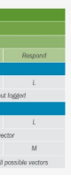
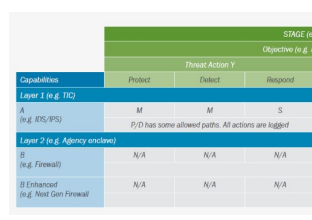

# Cdm Program 

 What Is .Govcar?

The Cybersecurity and Infrastructure Security Agency (CISA) leads the national effort to defend critical infrastructure against the threats of today, while working with partners across all levels of government and in the private sector to secure against the evolving risks of tomorrow. The Continuous Diagnostics and Mitigation (CDM) Program is a dynamic approach to fortifying the cybersecurity of civilian government networks and systems.

## Methodology Overview

CISA uses the .govCAR methodology to conduct threat-based assessments of cyber capabilities. This methodology was named ".govCAR" for the Cybersecurity Architecture Review of the Federal Civilian Executive Branch (.gov domain). By viewing the target architecture, the way an adversary does, this approach can directly identify where mitigations could be applied to provide the best defense against all phases of a cyberattack. The methodology parallels the Department of Defense's (DoD) project known as "DoDCAR" (previously "NSCSAR"), which introduced the concept of a threat-based, end-to-end analysis of large enterprise cybersecurity architectures and is used to provide direction and justification for cybersecurity.

## Value

Designed to enhance cybersecurity, .govCAR analyzes capabilities against current cyber threats, finds and highlights gaps in cybersecurity, and identifies and prioritizes areas where future investments should occur. 

This methodology reflects a shift from compliance to actively addressing cyber hygiene to a more threatbased approach to cybersecurity. It improves federal cyber architectural awareness and insights by creating a common framework to discuss and assess cybersecurity architectural choices for a shared federal information technology infrastructure. CISA uses .govCAR to improve capabilities and assistance provided to federal agencies. Plus, .govCAR allows agencies to make their own threat-informed risk decisions and to develop a prioritized approach to reducing risk from known threats.

## Threat Framework

The .govCAR methodology relies on two core operational understandings: threats and architecture. First, .govCAR starts with the Cybersecurity Threat Framework (CTF). The threat framework is broken down into three levels of detail: stages, objectives, and actions (SOAs).

At each level, the CTF becomes more specific. The stages outline the adversary lifecycle, progressing through pre-event, get-in, stay-in, and act. Each stage is associated with several objectives that include a more detailed characterization of the types of actions an adversary could take, such as reconnaissance/staging, initial compromise/exploitation, lateral movement, and command and control. 
Each objective is associated with several threat actions, which are the actual moves an adversary takes to achieve an objective. A heat map can be created to represent the prevalence (how often the action has been seen) and maneuverability (related to the number of threat actions in the objective). 

CISA | DEFEND TODAY, SECURE TOMORROW 

## Architectural Capabilities

The second operational understanding within the .govCAR methodology is a representative architecture as the 

 basis of analysis. The architecture consists of the network topology and the associated cybersecurity capabilities.

## Analysis

Threat and architecture come together through scoring and analysis. Architectural capabilities are scored for their ability to mitigate each one of the threat actions using the National Institute of Standards and Technology Cybersecurity Framework functions: identify, protect, detect, respond, and recover. The scores are aggregated on a capability coverage map that shows the cybersecurity architecture's ability to mitigate threat actions. The capability coverage maps, in conjunction with the heat map, can be used to perform gap, what-if, and layer/ location analyses. Using the recommendations, affirmations, and observations provided through these analyses, agencies can improve their cybersecurity posture by making threat-based investment decisions for current and future capabilities.

## Contact

For inquiries about CISA cybersecurity programs, please contact: CyberLiaison@cisa.dhs.gov. 

## Cisa | Defend Today, Secure Tomorrow 2
