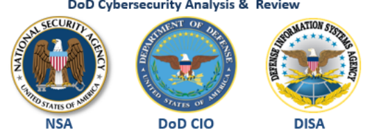
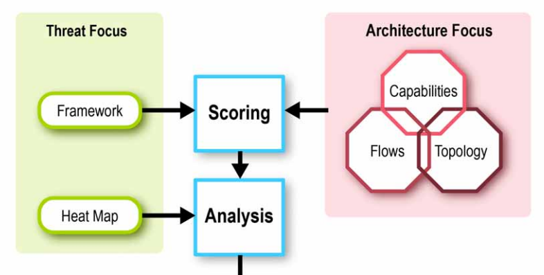
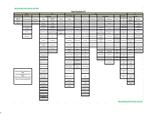
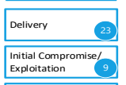
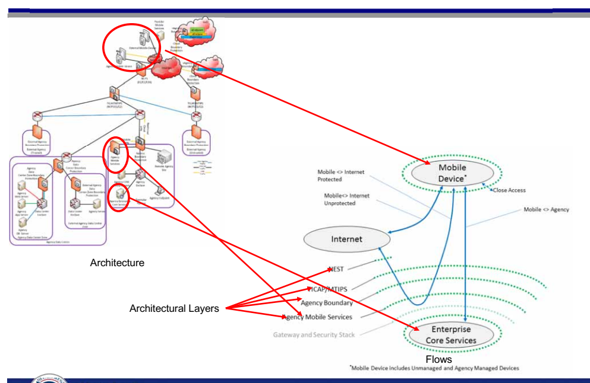
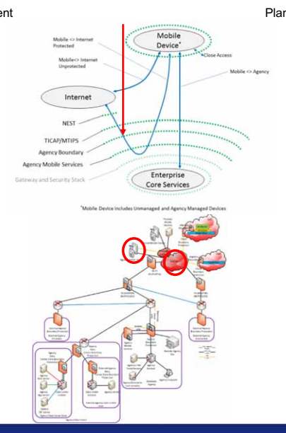
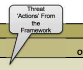
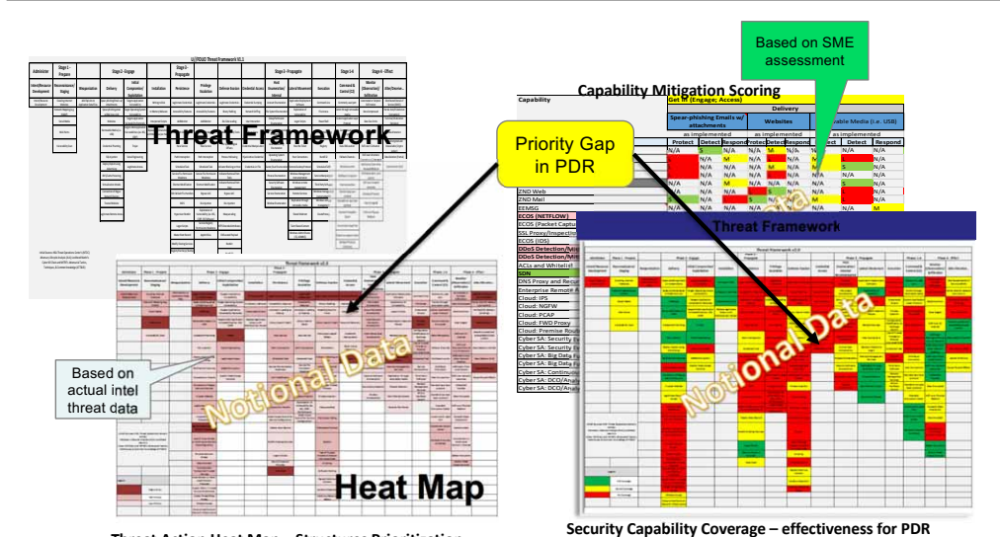

# Dodcar / .Govcar

IIIIIIIIII PROTECTING
NATIONAL SECURITY
SYSTEMS 
.govCAR
DHS NPPD
.GOV Cybersecurity Architecture Review

(U)
0

# Dodcar/.Govcar Vision & Purpose

## Vision

DOD has the insight and knowledge necessary to make prioritized capability decisions to enable dependable mission execution on the Unclassified and Secret Fabrics Inform DHS's approach to assisting Departments and Agencies with insight and knowledge to make prioritized cybersecurity investment decisions across the .gov environment

## Purpose

Evolve the cybersecurity architecture as necessary and create an implementation road map for the DODIN infrastructure based on an endto-end holistic review of the security architecture and current implementations and plans.

Create a solid rationale using the Adversary Lifecycle as a framework, informed by current classified and unclassified threat data

Create a threat-based security architecture framework to discuss and assess cybersecurity architectural choices:
●
For a shared Federal IT
Infrastructure To affect DHS's approach for its capabilities
●
●
To empower Departments and Agencies to make threat-based risk decisions 1

# Dodcar / .Govcar Work Activities

## Endpoint Security Modernization

.

Performed threat-based analysis of DoD
Endpoint Security Suite alternatives
.

Developed test plans, pilots and experiments to determine coverage
(effectiveness) of alternatives and compared DoDCAR's initial endpoint recommendation using observed threat activity
●
Developing "Greenfield" endpoint architecture and analyzing threat coverage through DoDCAR process

## Perimeter Security Modernization

•
Threat-based analysis of DoD Perimeter Security Suite alternatives leveraging success of the Endpoint Security Modernization effort SPIN 1 - Score DHS provided cybersecurity elements in the context of a typical large D/A
environment.

SPIN 2 - Score exemplar D/A protections at boundary and endpoint SPIN 3 - Score exemplar D/A
protections for virtual data center
(laaS and SaaS)
SPIN 4 - Score exemplar D/A
protections for data center SPIN 5 - Mobile IMPACT: Reduction of Cyber Vulnerabilities, Enhanced Security and

Maximized ROI

		

	

	

		
	

		

	

	

Homeland Security 




		

	

	
		
		

# Dodcar/.Govcar Methodology

# Dodcar/.Govcar Threat Framework

Cyber Threat Framework STAGES
The progression of cyber threats over time to achieve objectives Pre-event

Stay-In Act Intent/Resource Development Reconnaissance/
staging Weaponize

Persistance 18

 Monitor/ Exfiltration 17 Privilege Escalation Alter/Deceive 9 OBJECTIVES
The purpose of conducting an action or a series of actions

Defense Evasion Credential Access Host enumeration/
Internal Recon Lateral Movement Execution Command &
Control ACTIONS
Actions and associated resources used by a threat actor to satisfy an objective

Set of Threat Actions requiring counteraction by Protect / Detect / Respond

# Nsa Technical Cyber Threat Framework

(NTCTF) v1.0

| Administer               | Proparation            | Engagement                 |  Prosonco              | Effect               | Ongoing Processes     |                      |                      |                                                                              |                     |                    |                      |                    |                     |                   |                 |                      |                 |                |                 |         |
|--------------------------|------------------------|----------------------------|------------------------|----------------------|-----------------------|----------------------|----------------------|------------------------------------------------------------------------------|---------------------|--------------------|----------------------|--------------------|---------------------|-------------------|-----------------|----------------------|-----------------|----------------|-----------------|---------|
| Researce                 | и съпибел 1            | ובחיאות                    | Creach Sal             | Analysis, Evanusion, | Command &             |                      |                      |                                                                              |                     |                    |                      |                    |                     |                   |                 |                      |                 |                |                 |         |
| Planning                 | Development            | Recepts                    | Regonnalconoe          | Staping              | Delivery              | Exploitation         | Ensurian             | Reportmains anon                                                             | Privilege Ecoglatio | Aggess             | Labrical Movement    | Perciclence        | Monitor             | Extersio          | Nodity          | Desy                 | Destroy         | and Feedbaok   | Expelling       | Evasion |
|                          | Control (CS)           | imploy and-www             |                        |                      |                       |                      |                      |                                                                              |                     |                    |                      |                    |                     |                   |                 |                      |                 |                |                 |         |
| sternine stretegy an     | ear-chiphing ensig (   | Taxats application         | Use legitmete          | crea duript          | Application           | Use legitmete        | Ergigh sensit acon   | Cotrbuted Denial of                                                          | Partal dok/Q9       | Commonly uped      | Use Inclimate        |                    |                     |                   |                 |                      |                 |                |                 |         |
| බ්‍රයාව                      | Develop copels Hes     | Identify inte Rigence gage | Web 2019	Ing                        | Deale Maports        | ano van               | weeds by             | Velting it dat       | Recount chancelo                                                             | පොහොමයා                | styment some       | පසුප්පය                | රජනයා               | ිපත්ත් පැහැතින්ත           | Delest encryption | Sever (DDOB)    | осельні сочарии      | Reine largeling | (201           | UMSHINGS        | පාදු පිහිටු 
 Pet Ves         |
| Torgets-operating system | Ful disk OD dolds      | poy animustoks             |                        |                      |                       |                      |                      |                                                                              |                     |                    |                      |                    |                     |                   |                 |                      |                 |                |                 |         |
| Andijas trizson          | Oblain smancing        | 16-107 / copently pape     | Network magging        |                      | Opearphishing eval w  | In memory code       | File 2)이라는
Musicanta                      | Accessfity feduca                                                            | Nelson young        | Tags:ප කාර්යසින       | Access & Tty Toofwes | Tracking access    | Compress dela       | 시간 60%          | Encrypt dala lo
refus unusable                 | ට පත්‍යය කේතරය
 සිරිපානයේ ප                      | 504             | Dinery 2005ma  |                 |         |
| wreat p                  | ואנגו                  |                            |                        |                      |                       |                      |                      |                                                                              |                     |                    |                      |                    |                     |                   |                 |                      |                 |                |                 |         |
| Product sperence         | Staff and Irein MSGUR  | රන්න වන්න බවා                 | Use social mede        | Nocke (serence       | WASES                 | Tenas assimon        | integreted some      | ASSESS BAND                                                                  | Adusde loodini d    | Tangers (sensara   | Autometic loadro at  | Pessive collection | Trutte des          | CAZE BY501        | tenal of sensor | Cen accio            | 1604 200 (2)1   | Disebe Secures | MHC INSTITUTION |         |
| plano                    | lebrastructure         | vulneebilly remdaly        | anumember              | :13:4                | Keyoodina             | zyzlam vinembiliy    | 184                  | efects                                                                       | donat               | (parta)            | probal               | poducts            | rak                 |                   |                 |                      |                 |                |                 |         |
| Local networ             |                        |                            |                        |                      |                       |                      |                      |                                                                              |                     |                    |                      |                    |                     |                   |                 |                      |                 |                |                 |         |
| Ünləri sinalaşı: targala | Build a lances and     | Ocanning                   | infoci or 2000 website | Removable media      | Qacial engineering    | Direry replacement   | correction           | Ubrary sesse typest | Bocki angineering | Employ lagon | Ubrary sesse | pack | Ereble coner        | Pastion dala       | Clone data, systems  | Degak              | Dets deletion (ful) | Standerd non-ap   | Disupt tecuriy  | Axold data size Imiz |                 |                |                 |         |
| perts entigo             | operations             | laror sessional            | భారతదేశ                  |                      |                       |                      |                      |                                                                              |                     |                    |                      |                    |                     |                   |                 |                      |                 |                |                 |         |
| 000000                   | లిని వితా ష                | Change no-state d'         | hatom applicada        |                      |                       |                      |                      |                                                                              |                     |                    |                      |                    |                     |                   |                 |                      |                 |                |                 |         |
| Receive approval to      | Acade spendone         | leieci tacical targeto     | in-position payload    | SOL Injection        | Virtuelzador attacks  | Command line         | cal network pettings | Create neu senice                                                            | Export peer         | Create new pervice | Destroy hardwar      | Locessing rew dok  | Encode deta         |                   |                 |                      |                 |                |                 |         |
| essecula operationa      | Infrashucture          | enemendon                  | හලක්‍යාව                   | ଫିଙ୍ଗର                 | sydam processes       | laya probacd         |                      |                                                                              |                     |                    |                      |                    |                     |                   |                 |                      |                 |                |                 |         |
| Esteblish prysical       | Add or modify          | Remate Interective         | Exti aversan ដែ         | Alter process        | Uze crained           | Black Indiators on   |                      |                                                                              |                     |                    |                      |                    |                     |                   |                 |                      |                 |                |                 |         |
| lose coestimel           | Create botnet          | ในบท                       | Chisicache polsoning   | Defeat encryption    | Eratied by we         | Coersing tystem      | Fach Interception    | Path Interception                                                            | Encypt des          |                    |                      |                    |                     |                   |                 |                      |                 |                |                 |         |
| posinity                 | onumenton              | ాయకారణప                      | logon                  | charrel              | outcomes              | proiocola            | hoof                 |                                                                              |                     |                    |                      |                    |                     |                   |                 |                      |                 |                |                 |         |
|                          | USE rende              | Change manager             |                        |                      |                       |                      |                      |                                                                              |                     |                    |                      |                    |                     |                   |                 |                      |                 |                |                 |         |
| Seed supply chain        | TCP finceptining       | Virtualization stacio      | Espioit unak access
 carbois                        | Process Injection    | Cuner Ucar
anumenton                       | Scheduled tack       | Hack actue           | nanaçament                                                                   | Scheduled task      | Ectil over sther   | machine (MM)         | Use whoulder       | Uodiy malasse iz
   aucid driaction                     |                   |                 |                      |                 |                |                 |         |
| más tal                  | etacri medure          | rreda                      |                        |                      |                       |                      |                      |                                                                              |                     |                    |                      |                    |                     |                   |                 |                      |                 |                |                 |         |
|                          | SEPACES                | 1981 11 1153               |                        |                      |                       |                      |                      |                                                                              |                     |                    |                      |                    |                     |                   |                 |                      |                 |                |                 |         |
| Connection of roque      | Configuration          | Pind (MS-1003) In          | Pepset se viez         | Colect Tront 1065    |                       |                      |                      |                                                                              |                     |                    |                      |                    |                     |                   |                 |                      |                 |                |                 |         |
| Barrer probing           | Penge year             | maddicadon ta              | Process crumenton      | Regisce sendor bine  | Renote services       | Detact websites      | Politics create      | Penove logged dea                                                            |                     |                    |                      |                    |                     |                   |                 |                      |                 |                |                 |         |
| netack druices           | facilitais isurch      | 10                         | binany                 | zycians              |                       |                      |                      |                                                                              |                     |                    |                      |                    |                     |                   |                 |                      |                 |                |                 |         |
| Buller overtow           | Je Pusted Hapicsdon    | Replication tresum         | Colect trom            | Manipulate busted    |                       |                      |                      |                                                                              |                     |                    |                      |                    |                     |                   |                 |                      |                 |                |                 |         |
| Bocial engineering       | Trucksd website        | to executs unimated        | Software crumpelon     | Link modification    | Unk modification      | Maliband cons        |                      |                                                                              |                     |                    |                      |                    |                     |                   |                 |                      |                 |                |                 |         |
| սվոտոն էլ                | රාජය                    | removable media            | elwork resources       | කොටස්ස                 |                       |                      |                      |                                                                              |                     |                    |                      |                    |                     |                   |                 |                      |                 |                |                 |         |
| Legande Konte            |                        |                            |                        |                      |                       |                      |                      |                                                                              |                     |                    |                      |                    |                     |                   |                 |                      |                 |                |                 |         |
| CHIENIS PRESSIO          | 80.0.55                | Levempe explor secus       | SUEMER HA              | ວັນທະຍາມາດໝ           | IHCOl                 | ਹੈ। ਇਸ ਵ              | 전문 9분 1/04
8550085045                      | ​ ​                                                                            | USE peer
COMPECTIONS                     | PHOCESS MICGUA     |                      |                    |                     |                   |                 |                      |                 |                |                 |         |
| Crosstals (dela          | Device swapping (pross | Execute ula sentor         | Establish pen          | inqerjarete          |                       |                      |                      |                                                                              |                     |                    |                      |                    |                     |                   |                 |                      |                 |                |                 |         |
| emenation|               | domain viciation(      | Launch 0-day exploit       | controllar             | Window enumersbon    | Process Injection     | Cairt phared content | Modily BICG          | Ad-hoc benzie                                                                | nebuot              | lagönde fin        |                      |                    |                     |                   |                 |                      |                 |                |                 |         |
|                          | Store flee in          |                            |                        |                      |                       |                      |                      |                                                                              |                     |                    |                      |                    |                     |                   |                 |                      |                 |                |                 |         |
| Identify crypto          | Explait CDD a MLS      | Comonicallention           | Third perfy scheen     | Tanzala neo loadon   | Flample The 2010 10   | Inclai hoenjoy       | Ext li over sholcal  | anconvertional                                                               |                     |                    |                      |                    |                     |                   |                 |                      |                 |                |                 |         |
| MKOMOVED                 | Kaylagging             | vaemily                    | mobil                  | 1169 at              | Descaring             | location             |                      |                                                                              |                     |                    |                      |                    |                     |                   |                 |                      |                 |                |                 |         |
| Upstanter                | Tergela operating      | Fidev                      | Cresclak, idela        | Street               |                       |                      |                      |                                                                              |                     |                    |                      |                    |                     |                   |                 |                      |                 |                |                 |         |
| hasasi newa bear         | Haa                    | Scien Carac                | Empicy logon 50%0      | රන්‍යයාව ශාක              |                       |                      |                      |                                                                              |                     |                    |                      |                    |                     |                   |                 |                      |                 |                |                 |         |
| regenent sentce          | System vanestalit      | er en et en l              |                        |                      |                       |                      |                      |                                                                              |                     |                    |                      |                    |                     |                   |                 |                      |                 |                |                 |         |
| Mandali                  |                        |                            |                        |                      |                       |                      |                      |                                                                              |                     |                    |                      |                    |                     |                   |                 |                      |                 |                |                 |         |
| BASHI INAMAN             | Resea                  | CO APR 10 focation         | Advise Karanj          | Modily Senice        | Pen Pet Pech          | 전문 나전지          | වුරුවන් මෙය              | Use mason                                                                    | Engley Rooms        |                    |                      |                    |                     |                   |                 |                      |                 |                |                 |         |
| S                        | cartoundon             | encyption                  |                        |                      |                       |                      |                      |                                                                              |                     |                    |                      |                    |                     |                   |                 |                      |                 |                |                 |         |
| serdors                  | Wodfy existing         | Lion standard              | Use trustesi           |                      |                       |                      |                      |                                                                              |                     |                    |                      |                    |                     |                   |                 |                      |                 |                |                 |         |
| Travana CDG or MLG       | Protocal abuse         | Transfor los kit           | Paco the ficial        | Defeat ancypton      | oplication is executs |                      |                      |                                                                              |                     |                    |                      |                    |                     |                   |                 |                      |                 |                |                 |         |
|                          | 2014/233               | ercyclos                   | UPPUSER CORE           |                      |                       |                      |                      |                                                                              |                     |                    |                      |                    |                     |                   |                 |                      |                 |                |                 |         |
| 0upply chain/ bucked     | Larrege haled          | Modily 2016:               | Travase CDG or         | Use custom           | Solase Packing        |                      |                      |                                                                              |                     |                    |                      |                    |                     |                   |                 |                      |                 |                |                 |         |
| source compenise         | relettonghip           | ంగుబూనుల                       | પ્ર                     | encyption            |                       |                      |                      |                                                                              |                     |                    |                      |                    |                     |                   |                 |                      |                 |                |                 |         |
|                          | Automated use a        |                            |                        |                      |                       |                      |                      |                                                                              |                     |                    |                      |                    |                     |                   |                 |                      |                 |                |                 |         |
| 11870/020-010020         | Wal 201                | CS                         | Use signed contact     |                      |                       |                      |                      |                                                                              |                     |                    |                      |                    |                     |                   |                 |                      |                 |                |                 |         |
| Compronize commo         | Dign ma Iclous         |                            |                        |                      |                       |                      |                      |                                                                              |                     |                    |                      |                    |                     |                   |                 |                      |                 |                |                 |         |
|                          | Barchdoor              | Monusi von of CD           |                        |                      |                       |                      |                      |                                                                              |                     |                    |                      |                    |                     |                   |                 |                      |                 |                |                 |         |
| research Printerscher    | ાજરી                     |                            |                        |                      |                       |                      |                      |                                                                              |                     |                    |                      |                    |                     |                   |                 |                      |                 |                |                 |         |
| Dhori mesoage sendos     | Fatove bole            |                            |                        |                      |                       |                      |                      |                                                                              |                     |                    |                      |                    |                     |                   |                 |                      |                 |                |                 |         |
| (3MD)                    |                        |                            |                        |                      |                       |                      |                      |                                                                              |                     |                    |                      |                    |                     |                   |                 |                      |                 |                |                 |         |
| Outch response (DF)      | Ta er behevlor bese    |                            |                        |                      |                       |                      |                      |                                                                              |                     |                    |                      |                    |                     |                   |                 |                      |                 |                |                 |         |
| 0000                     | of only                |                            |                        |                      |                       |                      |                      |                                                                              |                     |                    |                      |                    |                     |                   |                 |                      |                 |                |                 |         |
| Encode dela              | Dolay activity         |                            |                        |                      |                       |                      |                      |                                                                              |                     |                    |                      |                    |                     |                   |                 |                      |                 |                |                 |         |
| T빅하                    |                        |                            |                        |                      |                       |                      |                      |                                                                              |                     |                    |                      |                    |                     |                   |                 |                      |                 |                |                 |         |

# Spin 1-5 Architecture View (.Govcar)

SPIN 1  = Einstein, TIC, related network services SPIN 2  = Exemplar Agency Endpoint environment SPIN 3  = Cloud (laaS and SaaS) basic structures SPIN 4  = Exemplar Agency Data Center SPIN 5  =  Mobile

# Spin 5 Architecture And Flows Relationship

# Agency Mobile Device To Internet (Protected)

apabilities NCPS/EINSTEIN:
E1 Collector & Analytics E2 Flow, IDS, PCAP, SIEM E3A IPS (SMTP & DNS)
E3A DGA Analytic ЕЗА ЕХЕ-МАПА
TICAP/MTIPS: FW Passive Sensor WCF Ib/Ob SMTP Proxy Recursive DNS Proxy Auth DNS Proxy Agency Boundary:
NGFW Passive Sensor WCF Ib/Ob SMTP Proxy Recursive DNS Proxy Auth DNS Proxy Agency Mobile Services:
 MDM MAM
VPN
DLP
 MIM
Agency Mobile Device:
Container App Wrapping Current

Planned

## Ncps/Einstein:

E1 Collector & Analytics E2 Flow, IDS, PCAP, SIEM E3A IPS (SMTP & DNS)
E3A IPS (WCF)
E3A DGA Analytic E3A EXE-MANA Enh Analytic E3A APT Detections Analytic TICAP/MTIPS:
FW Enh Passive Sensor WCF Enh Ib/Ob SMTP Proxy Enh Recursive DNS Proxy Auth DNS Proxy Enh Agency Boundary:
NGFW
Passive Sensor WCF Enh Ib/Ob SMTP Proxy Enh Recursive DNS Proxy Auth DNS Proxy Enh Agency Mobile Services:
MDM
IDS
MAM Enh MTD
VPN
 MAV
DLP
MIM
Agency Mobile Device: Container App Wrapping TPM

# .Govcar: Scoring Sheet

|                                                                                  | the                                     |                           |               |     |    |    |    |
|----------------------------------------------------------------------------------|-----------------------------------------|---------------------------|---------------|-----|----|----|----|
| govCAR Mitigation                                                                | NIST                                    |                           |               |     |    |    |    |
|                                                                                  | Framework                               | Stage                     | CyberSecurity |     |    |    |    |
| Draft Scoring Sheet                                                              | Framework                               |                           |               |     |    |    |    |
|                                                                                  | Mitigation                              |                           |               |     |    |    |    |
|                                                                                  | Objective                               | Functions                 |               |     |    |    |    |
|                                                                                  | Threat Action Y                         | Threat Actio              |               |     |    |    |    |
| Scores Don                                                                       |                                         |                           |               |     |    |    |    |
| Detailed Capability                                                              | Enh                                     |                           |               |     |    |    |    |
| Description                                                                      | %                                       | Detect                    | Respond       |     |    |    |    |
| Protect                                                                          | Respond                                 | Protect                   | Detect        |     |    |    |    |
| To create new                                                                    | Threat Action Description               | Threat Action Description |               |     |    |    |    |
| Enhanc                                                                           | Scoring
Comple                                         |                           |               |     |    |    |    |
| Capabilities, select the                                                         |                                         |                           |               |     |    |    |    |
| Capabilities                                                                     | entire row of an                        | SI                        | 96            |     |    |    |    |
| Layer1                                                                           | Description                             | M                         | M             | S   | L  |    |    |
|                                                                                  | None                                    | None                      |               |     |    |    |    |
| P/D has some allowed paths. All actions | Threat action is permitted but logged. |                                         |                           |               |     |    |    |    |
| are logged                                                                       | Logs only persist 1 week                |                           |               |     |    |    |    |
| Rationale                                                                        |                                         |                           |               |     |    |    |    |
| Layer2                                                                           |                                         |                           |               |     |    |    |    |
| B                                                                                | Description                             | N/A                       | N/A           | N/A | L  | ﺎ  | L  |
|                                                                                  | only covers one possible vector         |                           |               |     |    |    |    |
| Rationale                                                                        | 0%                                      |                           |               |     |    |    |    |
| B (Enhancement)                                                                  | Description                             | N/A                       | N/A           | N/A | M  | M  | M  |
|                                                                                  | coverage include additional but not all |                           |               |     |    |    |    |
|                                                                                  | vectors                                 |                           |               |     |    |    |    |
| Rationale                                                                        | 0%                                      | SME Scoring:              |               |     |    |    |    |

Significant Moderate Limited Security Capabilities for as-implemented, as-funded, and asrecommended architecture configurations Logical Groupings of Capabilities by Tier

# Threat * Vulnerability * Consequence = Risk

Understand the threat -- Make informed risk decisions

| Threat Action Heat Map   | (Observed Adversary Actions)    | Security Capability Coverage   (Protect, Detect, Respond)   |
|--------------------------|---------------------------------|-------------------------------------------------------------|

Observed Actions + Lack of Coverage = Gaps to be Addressed

# Threat Coverage, Prioritization, & Gap Identification

Threat Action Heat Map - Structures Prioritization

PDR Protect, Detect, Respond SME Subject Matter Expert

# Dodcar/.Govcar Accomplishment

Federal Government Adoption of Data-Driven Threat-Based Cybersecurity
●
EO13800 - Strengthening the Cybersecurity of Federal Networks and Critical Infrastructure
•
OMB to recommend Federal Government adopt data-driven threat-based cybersecurity IMPACT: Provides Decision Makers Across Federal Government Insight & Knowledge to Make

Well-Informed, Prioritized Cybersecurity Investment Decisions

# Dodcar Accomplishments -. Govcar Counterpart

Cloud Security Architecture
●
Develop threat profiles for laaS, PaaS, and SaaS from provider and consumer perspective
-  .govCAR effort in SPIN 3
●
 Analyze threat coverage provided by Secure Cloud Computing Architecture IMPACT: Understand cybersecurity risks and recommend mitigations as the DoD migrates to commercial cloud services Break & Inspect Enterprise Strategy Threat-based analysis of alternatives for decrypting TLS/SSL
●
traffic in the NIPRnet, with recommendations to DoD CIO
-  .govCAR effort for civilian/commercial network(s)
IMPACT: Data-driven recommendations to maximize threat coverage in placement of

TLS/SSL decryption technologies within the NIPRnet/SBUnet

# Dodcar Specific Accomplishments

## Community Of Practice

.

 Trained DoD personnel in Japan on DoDCAR methodology and tools
●
DoDCAR 101 "Primer" documentation
●
Developing training class in cooperation with DAU
●
Developing easier to use web-based tools Coordination with govCAR program, sharing tools and results
●
National Institute for Science and Technology
●
Successful engagement and collaboration of DoDCAR and NIST
●
NIST is exploring pathways to publishing data-driven threat-based cybersecurity methodology as NIST product (Special Publication, Interagency Report, etc.)

## Impact: Establish Data-Driven Threat-Based Cybersecurity As An Industry Best Practice 15

 		



	
			
 

	

	
					
 

	
	

# .Govcar Provides The Ability To:

## - Assess

- current cyber security capabilities for effectiveness against threats and gaps
- Efficacy of current investment strategy

## - Evaluate

- multi-layer complex security architectures - architecture based on vendor neutral capabilities
- security stack (defense in depth) architectures
- people, policy and process non-materiel capabilities
- Support investment direction and decisions especially at the portfolio level

# For More Information

## Dodcar

- Documentation/Training/ Briefings
- https://intelshare.intelink.gov/sites/csarcop/
•EMAIL: DoDCAR_CoP@nsa.gov
.govCAR
•EMAIL: cyberliaison@hq.dhs.gov

# Mobile Att&Ck - Govcar Spin 5 Version

|  Pre-Event                 | Get In                                              |  Stay In             |  Act                      |                           |                          |                      |                      |                       |                       |             |                |    |               |
|----------------------------|-----------------------------------------------------|----------------------|---------------------------|---------------------------|--------------------------|----------------------|----------------------|-----------------------|-----------------------|-------------|----------------|----|---------------|
|                            | Holl Enumeral Inn/                                  |                      |                           |                           |                          |                      |                      |                       |                       |             |                |    |               |
| black/Kecount
   Development                            | Meapo                                               | Delivery             | bellad Compromise)        | bedallan                  | Persident                | Privilege            | Defension Dubliom    | Credential.I          | Lateral M             | Energal Inn | Callet Ban     | na (Oktoria)
   Ballikutus    | Aller/Delaive |
|                            | inved Box                                           | (cz)                 |                           |                           |                          |                      |                      |                       |                       |             |                |    |               |
|                            |                                                     | Explant da Physical  | App Delivery via Olivel
 Meini Mode of ICE
Enterprise app Signing                           | Navi e Entralaie          | Alaxie Asiessi Ballily   |                      |                      |                       |                       |             |                |    |               |
|                            | App Delivery via Olles
 Electrica App Del havina
 Via Email Allich Heri                                                     | Balandialar Basest
    Prevent Remockl                      | Allada PC via USB         | Alexale Relair |          | ote Addessions           | Illerinatie Nelward  | Encirpii Pilei Tur   |                       |                       |             |                |    |               |
| Spinsting                  | Printuries                                          |                      |                           |                           |                          |                      |                      |                       |                       |             |                |    |               |
| Knp                        | Erhale in home de                                   | Key                  |                           |                           |                          |                      |                      |                       |                       |             |                |    |               |
| Explicil ala Phythial
Reviews : Device United                            |                                                     |                      |                           |                           |                          |                      |                      |                       |                       |             |                |    |               |
| App Deliver'y slå
Authorized App Illians                            | App Delively via Ollet
Micani App Deliveried                                                     |                      | Auló-Slar1 ál Dro         |                           | (2014)                   | ris Tetel But Eal    | sse Type Dirisi imer | Explial I Exizerjalis | ﺍﺳﻪ ﺍﻟﺨﻠﻘﺎ ﻭﺗﻀﻌ       | less Chiends
   Brahits             | an'y Uied Parl | Geteriale Frinskferi
Advertising Beveloat    |               |
| седания редского           | via Web Commisted                                   | Cade Questing or Bra | Budd                      | Device Gogs               |                          |                      |                      |                       |                       |             |                |    |               |
| Panse                      | Patellicia Bun                                      |                      |                           |                           |                          |                      |                      |                       |                       |             |                |    |               |
| p Delivery via Cill        | Explicii via Pilythiai                              |                      |                           |                           |                          |                      |                      |                       |                       |             |                |    |               |
|                            | Bioen (add Malleries)                               | Modify OI Keritel an | Coiná Titre Code          | UMS INSERVE DIALA         | Pille in nd Ch toullarly | Sensions Application | Assess Call log      | រីការបែកទី កំណត់ដោយ          | ﺍﻟﻘﺎﺩﺓ ﺍﻟﻘﺎﺑﻠﺔ ﺍﻟﻤﻔﺘﺎ |             |                |    |               |
| Meland Reparkaged          | Band Park Ban                                       | Ratilita             | of Criederilland In Riles | Disidentry                | Liryel Philibidia        | Lingvi  Piellestell  |                      |                       |                       |             |                |    |               |
| Application                | ﺍﻟﻤﻨﺘﺞ                                              |                      |                           |                           |                          |                      |                      |                       |                       |             |                |    |               |
| Registri via Internet
 Mall choos Media                            | .lindristd Intern                                   | Bock: Nelaxir X
Cintrigor allum                      |                           |                           |                          |                      |                      |                       |                       |             |                |    |               |
| Explaci da Internet
  Malleliano Media                            | dify System Pad B                                   | Mind Ty Oll Key Co.  | ies Contact U             | Manigalade App Illus
 Rantings or Rallings                           |                          |                      |                      |                       |                       |             |                |    |               |
| Content                    | Cintrol                                             | Hija/Bing            | Diciovery                 |                           |                          |                      |                      |                       |                       |             |                |    |               |
| English I via Interneti    | Access Tessiller                                    | Premium IAG Tall     |                           |                           |                          |                      |                      |                       |                       |             |                |    |               |
| Chilaus Web Canley         | Explicil sta Inferreti
Michielland Vieta Continer                                                     |                      | Reddy System Parkel       | Cepture Cliplasterd Divis |                          | Gala In Gevise Lago  | likal                |                       |                       |             |                |    |               |
|                            | assess Tendline                                     |                      |                           |                           |                          |                      |                      |                       |                       |             |                |    |               |
| Bally Chaini Increa        | upply Chain Separe                                  | Mindliy (Ached
Antisfalle (Alle                      | Musily TriasTel           | aplate IMI Messa          | Nelwink Service          | Wijie Gevice Dida    |                      |                       |                       |             |                |    |               |
| Third Parly Striates       | Think Parly Ultriaries                              | arbistik dan in tan  | Ciria de Credition        |                           |                          |                      |                      |                       |                       |             |                |    |               |
| TupplyChaini               | ial Nelwark-Bac                                     |                      |                           |                           |                          |                      |                      |                       |                       |             |                |    |               |
|                            | Malaysianad da                                      | Oldulaini u          |                           | Pridess Discovery         | Cipilarie Citylatan      | Semming at Desias al |                      |                       |                       |             |                |    |               |
| Value alle Build In to     | Bhir your Paysian                                   | Seivise              |                           |                           |                          |                      |                      |                       |                       |             |                |    |               |
| Deside Fund Bank Sty       |                                                     |                      |                           |                           |                          |                      |                      |                       |                       |             |                |    |               |
| Explori via Celislar
  Referinik Explati                            | Englail via Callular
   Nelwirk: Exploill                                                     | onintas Third Fa     | ilen bila vra Bur         | Cajónie IMI
  Meisage                           | ostaria | Referin'il-Baca
    Referior |- Geoloa                          |                      |                      |                       |                       |             |                |    |               |
| diami Valnerale            | seband This value                                   | Keyksisten isi App   | Cirit Practivializati     |                           |                          |                      |                      |                       |                       |             |                |    |               |
| Taylaithia Cellular        | Inginii Via Callular                                | Iwirk Tràillaí Circh | erial Tiefwark-Bachd      |                           |                          |                      |                      |                       |                       |             |                |    |               |
| Network: Madis How         | Nelson's Mallel dee                                 | ander 1940 m         | Rogat W. TI-Booest        |                           |                          |                      |                      |                       |                       |             |                |    |               |
| thers Message              | IMI Message                                         | u Redrosliva         | Pécialis                  |                           |                          |                      |                      |                       |                       |             |                |    |               |
| Englati via Physical
 Adamai Euglait via 
Danjing Siation or PC                            | Explant eta Pilipskat
   Alizeds (Exploin ata
Changing Slatismor PC                                                     | UL Ichene Hijadd     | Mall didok Thiva
Parly Enylishirid Appl                           | Callatar referink-Baced   |                          |                      |                      |                       |                       |             |                |    |               |
| ellalar helmirk likke      | irad Gated Revis                                    |                      |                           |                           |                          |                      |                      |                       |                       |             |                |    |               |
| Injustil 337 to Redlers!   | ier Interfacia Tanand                               | Micropholia bi
Camera Resimilants                      | Wije Dista William        |                           |                          |                      |                      |                       |                       |             |                |    |               |
| Phone Calls/SMS            | Audhir Udilian                                      |                      |                           |                           |                          |                      |                      |                       |                       |             |                |    |               |
| ellalar telepis in libisti | Network Triaffini                                   |                      |                           |                           |                          |                      |                      |                       |                       |             |                |    |               |
| Eapliali IIIT la Track
    Devisie Lincallului                            | Cajilure ir
Redrivollabi                                                     |                      |                           |                           |                          |                      |                      |                       |                       |             |                |    |               |
|                            | General Nefweirf                                    |                      |                           |                           |                          |                      |                      |                       |                       |             |                |    |               |
| eCular Aelanis Basi        | Geveral National de 
El Castil Europolision 
El controlletten                                                     |                      |                           |                           |                          |                      |                      |                       |                       |             |                |    |               |
| Initial Sources:           |                                                     |                      |                           |                           |                          |                      |                      |                       |                       |             |                |    |               |
| erial Referin Bibled       | Cellul de televis ik                                |                      |                           |                           |                          |                      |                      |                       |                       |             |                |    |               |
| instigriede lin Intels     | * MITRE's Adversarial Tactics, Techniques, & Common | Bried: Regat         |                           |                           |                          |                      |                      |                       |                       |             |                |    |               |
| P V official and s         | Knowledge (ATT&CK)                                  | el lafint Base Malle |                           |                           |                          |                      |                      |                       |                       |             |                |    |               |
| Collulur Nelwork Gate      | iral-Based Ciblai                                   |                      |                           |                           |                          |                      |                      |                       |                       |             |                |    |               |
| liberigrade la Intelate    |                                                     |                      |                           |                           |                          |                      |                      |                       |                       |             |                |    |               |

MNOWH
100 100 and the consideration of the comments of

