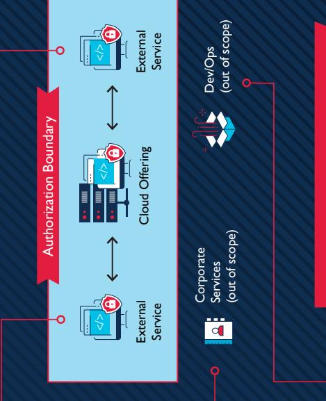

### AUTHORIZATION BOUNDARY

PURPOSE: The purpose of this document is to provide Cloud Service Providers (CSPs) further guidance for developing the "authorization boundary" associated with their Cloud Service Offering (CSO) to support their FedRAMP Authorization package. An authorization boundary provides a diagrammatic illustration of a CSP's internal services, components, and other devices along with connections to external services and systems. An authorization boundary accounts for all federal information, data, and metadata that flows through a CSO. The authorization boundary is a critical component associated with the federal National Institute of Standards and Technology (NIST) Special Publication (SP) 800-37, Guide for Applying the Risk Management Framework (RMF) to Federal Information Systems and Office of Management and Budget (OMB) circular A-130, Managing Information as a Strategic Resource.

A FEDRAMP

This document will act as a "living document," evolving with changes to cloud computing technology and federal information security policy relevant to FedRAMP.

### KEY CONCEPTS

The concepts below provide an overview of various terms and definitions outlined in NIST SP 800-37 and OMB A-I 30 and provide guidance from the FedRAMP PMO.

2

#### Defining Your Authorization Boundary in the Cloud

Federal Definition: OMB A-130 defines an authorization boundary as "all components of an information system to be authorized for operation by an authorizing official. This excludes separately authorized systems to which the information system is connected."

FedRAMP Guidance: An authorization boundary for cloud technologies should describe a cloud system's internal components and connections to external services and systems. The authorization boundary accounts for the flow of all federal information and metadata through the system. A cloud authorization boundary illustrates a CSP's scope of control over the system as well as any system components or services that are leveraged from external services or controlled by the customer.

#### Federal Information (Data) in the Cloud

Federal Definition: OMB A-130 describes federal information as "information created, collected, processed, maintained, disseminated, disclosed, or disposed of by or for the Federal Government, in any medium or form."

FedRAMP Guidance: CSPs should account for and

include within an authorization boundary all federal data populated or generated by a federal customer within the CSO, including metadata (see Key Concept #3).

Federal Definition: NIST SP 800-53 describes metadata as "information describing the characteristics of data including, for example, structural metadata describing data structures (e.g., data format, syntax, and semantics) and descriptive metadata describing data contents (e.g., information security labels)."

FedRAMP Guidance: Metadata associated with cloud environments typically fall into two buckets:

- 1. Data that describes or gives information about data populated by a federal customer that is associated with customer tenant activity logs and xml/script files, derived from customer data inputs
- 2. Information that could impact the system's confidentiality, integrity, or availability (CIA) included in logs, audit trails, and vulnerability reports

Metadata should be accounted for, adequately protected, and documented by the CSP within applicable FedRAMP deliverables.

#### Interconnections in the Cloud

Federal Definition: Per NIST SP 800-47 Rev 1. an interconnection is defined as "the direct connection of two or more IT systems for the purpose of sharing data and other information resources."

Update: NIST is in the process of updating this definition to include information exchange. The release date is tentatively scheduled for summer 2018.

FedRAMP Guidance: Interconnections are heavily reviewed by Agency Authorizing Officials (AOs) to ensure that wherever federal data and metadata may reside in the system, it is adequately protected. Cloud technologies utilize interconnections, Application Programming Interfaces (APIs), and other synchronous/ asynchronous connections that potentially transmit federal data and metadata. It is imperative that these connections, and any potential risk to federal information, are disclosed to the AO via the FedRAMP deliverables.

Federal Definition: NIST SP 800-53 defines external services as "a system service that is implemented outside of the authorization boundary of the organizational system (i.e., a service that is used by, but not a part of, the organizational system) and for which the organization typically has no direct control over the application of required security and privacy controls or the assessment of security and privacy control effectiveness."

FedRAMP Guidance: Cloud technologies can augment or support their functionality by leveraging systems, components, and services from external services that are not directly controlled by the vendor pursuing a FedRAMP authorization. The CSP must clearly communicate these

external services to the AO and the extent to which federal information (data) can be impacted by the use of these services. CSPs should make sure their FedRAMP Authorization Package (System Security Plan [SSP], Security Assessment Plan [SAP], Security Assessment Report [SAR], etc.) reflects this information.

Item of Note: External services may or may not have a preexisting FedRAMP Authorization.

ltem of Note: External services that impact the CIA of federal information must be included within the CSO's authorization boundary.

#### Leveraging External Services with a FedRAMP Authorization

Federal Definition: Taking the concept of external services one step further, if a CSO is utilizing an external service that has a FedRAMP Authorization, the CSP may demonstrate compliance with various FedRAMP/NIST SP 800-53 control requirements by leveraging these capabilities from another provider. CSPs must reflect this relationship within the FedRAMP Authorization Package (SSP, Control Implementation Summary [CIS], etc.).

ltem of Note: Leveraged services are a subcategory of external services, see above, and have a pre-existing FedRAMP Authorization.

FedRAMP Guidance: Corporate services are a subset of external services. Corporate services are services used by a CSP to support their daily business operations and exist outside of the CSO authorization boundary. These services also do not contain any information that would impact the CIA of the CSO.

# JIDING PRINCIPI

review this information for he authorization bounda is one of the most critica document. CSPs should concepts to grasp and additional clarit An authorization boundar process, store, or transmi nformation system that SSP and must describe federal information, and is integral to a CSP's it must be illustrated components of an accurately

### Define and describe all system data flows and interconnections how to get started:

CSPs should consider diagramming the better illustrate their system boundary through the system. As a best practice after depicting the various data flows The FedRAMP PMO has seen CSPs following:

- · Federal Customer User Authentication Logical Data Flow
- User Authentication Logical Data Flow Administrative and Support Personnel
- System Application Data Flow within the Proposed Cloud Authorization Boundary
- Leveraged and Interconnected Syste System Application Data Flow to All

# following are "Rules of Thumb" associated with the system components that are included within an authorization bound BOUNDARY

stored, or transmitted by or for the Federal Government, CSPs are expected to conduct their own due diligence when defining t any medium or form

FedRAMP authorization boundary to identify any other contexts where they ocess, or transmit federal information on behalf of a federal customer outside of the c

"customer-populated data" or "tenant data."
The authorization boundary should clearly delineate between internal and external provide must make the authorization boundary transparent to the Third Party Assessment Organization
(3PAO) and the AO. The FedRAMP requirements (documentation, testing, continuous mo scope of control of anticipated customer authorization boundaries within the CSO. tc.) apply to all system components that are outlined within the authorization bound

### Any external service that contains federal informatio RULE OF THUMB #2: External services mpact the CIA of federal information

act level of the data being placed within the CSO as defined by FIPS impact level of a CSO must be depicted within the boundary. The e
impact level of a CSO is commensurate with a federal customer's re adata that affects the CIA of federal infor

don't have a standalone FedRAMP ATO) must have an appropriate scope
assessment as determined by the AO's risk tolerance. external services must be made transparent to the AO as well as t
tential impacts to federal information. If the ClA of federal information
mpacted by the use of external ser he CSO authorization boundary. These external services (if th

# OUT OF BOUNDARY

following are "Rules of Thumb" associated with the system components are typically outside of an authorization boundary:

## RULE OF THUMB #3: Corporate services that do nov affect the CIA of federal information 요
이

excluded from the authorization boundary. Corporate services do not provide operations. If data that is being transmitted to these corporate services does n
affect the CIA of federal information (see Key Concept #2), these services may A CSP may utilize corporate services (see Key Concept #7), such customer relationship, ticketing, billing systems, etc. as part of normal busin functionality to the CSO. An example of corporate services outside the authorization boundary is a Customer
Relationship Management (CRM) system that includes data pertaining to customer relationships only (e.g., that potential or current customer meetings occur customer preferences, etc.).

mean the CSP's corporate email would fall within Rule of Thumb #2 and need to be would then have metadata that could impact the CIA of CSO. This would employee relays vulnerability information via corporate email, then that email CSPs must be careful how they use corporate services. For example, if a CSP's within the authorization boundary

## do not process, store, or transmit federal information RULE OF THUMB #4: Development environments A CSP may utilize "development environments" that are used to e ్లో ప్రా

environments may be considered outside the authorization boundary if there is
federal information within this environment (see Key Concept #2). If interconnec evelopment environment and CSO authorization boundary, an AO could reque nent environment be included within the authorization boundary and (see Key Concept #4) exist between the development environment and the CS authorization boundary, they must be transparent and provided to the AO for
and risk acceptance. Depending on the federal information exchange between levelop, test, and deliver software/code to end users. Devel scope of FedRAMP requirements would apply

# DDITIONAL CONSIDERATIO

# Agency-Specific Security Requirements

Agency's mission and desired security posture. CSPs should account for requirements variances on a customer-by comprehensive per impact levels, Federal Agencies can define additional security requirements in service of the to FISMA requirements and NIST security categorizations. While the FedRAMP PMO considers its baseline to be edRAMP provides a baseline from which CSPs and Agencies can define their desired security posture accor customer basis.

requirements for federal data types and understand the impact on a system's cloud authorization boundary. When The FedRAMP PMO strongly recommends CSPs engage their customers early and often to identify additional possible, the PMO provides support to align CSPs and Agencies on additional security requirem

xamples of Agency-specific requirements that could impact the authorization boundary include privacy contr controls associated with foreign nationals, etc.

Any questions or comments can be directed to info@fedramp

## Examples of external services that could
mpact the CIA of the cloud system ecurity posture

- An IaaS that a PaaS or SaaS resides upon
- An API that calls data from an externa
	- source
- A system that provides functionalit
 such as audit logging, vulnerability
 scanning, or ticketing systems
- Data elements such as vulnerability data,
incident management reporting, custome

mpact level of these data elements might be intellectual property, or customer system
descriptors all impact the ClA of a system
and would fall under this rule of thumb. The or may be lower depending on the FIPS 199 the same level as the CSO offering itself analysis of the data.

ervices would fall under this rule of thumb dditional functionality for a system (such as those previously mentioned) as corpora
services and external to the authorization undary. This is not correct and those As a note, historically, some CSPs have
described many services that provide