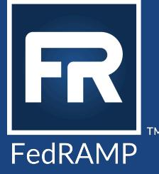
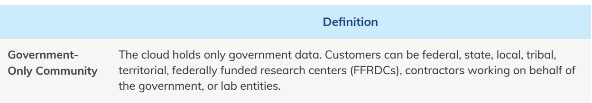
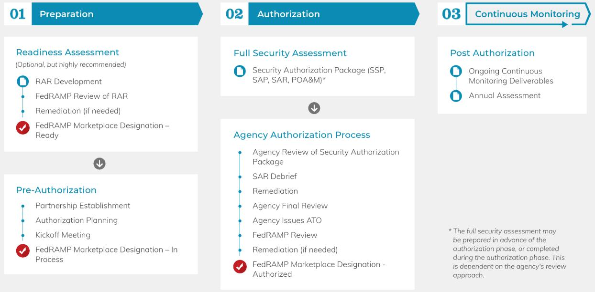
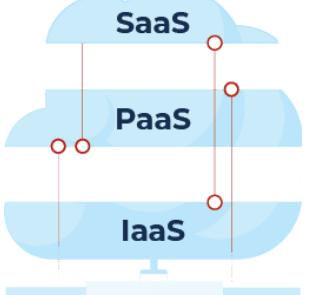

# FedRAMP® CSP Authorization Playbook

Version 4.0 01/17/2025

info@fedramp.gov fedramp.gov

# DOCUMENT REVISION HISTORY

| Date       | Version | Page (s) | Description                                                                                                    | Author  |
|------------|---------|----------|----------------------------------------------------------------------------------------------------------------|---------|
| 07/01/2018 | 1.0     | All      | Published Volume 1 of the CSP Authorization Playbook                                                        | FedRAMP |
| 01/18/2022 | 2.0     | All      | Updated Volume 1 for accuracy and added Volume 2 to the CSP Authorization Playbook                       | FedRAMP |
| 02/15/2024 | 3.0     | All      | Updated to add clarity and align with Rev 5 updates made to FedRAMP guidance documents and templates. | FedRAMP |
| 01/17/2025 | 4.0     | All      | Updated to align with OMB Memo M-24-15 and remove JAB and PMO references                                 | FedRAMP |

# TABLE OF CONTENTS

| Getting Started: Is FedRAMP Right For You?           | 2   |
|------------------------------------------------------|-----|
| Partners in the Authorization Process                | 2   |
| 1.0 FedRAMP                                          | 2   |
| 1.1 FedRAMP Secure Repository                        | 3   |
| 2.0 Federal Agencies                                 | ന   |
| 2.1 Agency Authorizing Official                      | 3   |
| 3.0 Third Party Assessment Organizations (3PAOs)     | র্ব |
| Authorization Elements for Consideration             | 4   |
| 4.0 Existing or Potential Agency Partners            | ട്  |
| 4.1 Common Agency Questions About Partnership        | 5   |
| 5.0 Deployment Model                                 | ട്  |
| 6.0 Impact Levels                                    | 6   |
| 6.1 Impact Levels                                    | റ   |
| 6.2 Security Objectives                              | 7   |
| FedRAMP Agency Authorization Path                    | 8   |
| 7.0 FedRAMP Agency Authorization                     | 8   |
| 7.1 Phase 1: Preparation                             | 8   |
| FedRAMP Ready                                        | 8   |
| Pre-Authorization                                    | 9   |
| Partnership Establishment                            | இ   |
| Authorization Planning                               | இ   |
| Kickoff Meeting                                      | 10  |
| 7.2 Phase 2: Authorization                           | 11  |
| Full Security Assessment                             | 11  |
| Agency Authorization Process                         | 12  |
| 7.3 Phase 3: Continuous Monitoring                   | 14  |
| Important Considerations                             | 14  |
| 8.0 laaS vs. PaaS vs. SaaS                           | 15  |
| 9.0 System Stack                                     | 15  |
| 10.0 Level of Effort                                 | 16  |
| 10.1 CSP Authorization Team                          | 17  |
| Introduction                                         | 20  |
| What's in an Authorization Package                   | 20  |
| Developing an Authorization Package                  | 21  |
| 1.0 Roles and Responsibilities                       | 21  |
| 2.0 System Security Plan (SSP)                       | 22  |
| 2.1 Getting Started: Focus on Quality                | 23  |
| 2.2 Moving on: Writing the SSP                       | 24  |
| 2.3 Define the Authorization Boundary and Data Flows | 24  |
|                                                      |     |

| 2.4 SSP Appendices                                                           | 25 |
|------------------------------------------------------------------------------|----|
| 2.4.1 SSP Appendix A: FedRAMP Security Controls                              | 26 |
| 2.4.1.1 Control Requirement                                                  | 26 |
| 2.4.1.2 Control Summary Information                                          | 27 |
| 2.4.1.3 Control Implementation Statement: What is the Solution and How is it |    |
| Implemented?                                                                 | 28 |
| 2.4.1.4 Controls Do's and Don'ts                                             | 30 |
| 3.0 Security Assessment Plan (SAP)                                           | 31 |
| 4.0 Security Assessment Report (SAR)                                         | 32 |
| 5.0 Plan of Action and Milestones (POA&M)                                    | 33 |
| 5.1 General POA&M Guidance                                                   | 33 |
| 5.1.1 POA&M Do's and Don'ts                                                  | 35 |

# VOLUME I: getting started WITH FEDRAMP

# Getting Started: Is FedRAMP Right For You?

If you have a cloud service offering (CSO) that is being used by the federal qovernment, you should consider obtaining a FedRAMP authorization. Per an Office of Management and Budaet (OMB) memorandum, cloud services that hold federal data must be FedRAMP Authorized. A FedRAMP authorization requires a security assessment based on Federal Information Security Management Act (FISMA) requirements and National Institute of Standards and Technology (NIST) 800-53 baselines, and both are explained in qreater detail in their respective sections of this document.

ln making a business decision reqarding FedRAMP authorization for your service, it is important to consider your overall strategy for federal government customers. If you are brand new to the federal landscape, there may be a learning curve associated with the procurement timeline, and you might want to consider partnering with a systems integrator who has experience and a federal qovernment customer base. Conversely, if you already have a federal government footprint and are looking to expand, FedRAMP authorization can be a business development driver. FedRAMP provides cross-government visibility on the FedRAMP Marketplace and provides a single security package that can be leveraged by multiple federal agencies for review.

FedRAMP is applicable to CSOs that:

- · Are a multi-tenant CSO (e.g. Infrastructure-as-a-Service [laaS]/Platform-as-a-Service [PaaS]/Software-as-a-Service [SaaS]) that holds federal data.
- Intend to make the cloud offering available government-wide.
- · Will NOT be deployed as a Private cloud or to ONLY a specific agency.

Please note that the initial authorizing agency determines whether or not the data qualifies as federal data as well as the overall applicability of FedRAMP in accordance with the OMB memorandum.

General information, including resources, blogs, templates, and documentation for authorization, can be found on FedRAMP's website.

# Partners in the Authorization Process

### 1.0 FedRAMP

Responsible for providing a unified process to stakeholders, FedRAMP is a key partner for cloud service providers (CSPs) researching or seeking FedRAMP authorization for their CSO. lts responsibilities include stewardship of the FedRAMP authorization process and enabling services to be reused

across the federal government by providing a secure repository of FedRAMP Authorized packages.

### 1.1 FedRAMP Secure Repository

To enable reuse of FedRAMP Authorized packages and continuous monitoring (ConMon) deliverables, FedRAMP manages a secure repository on USDA Connect.gov for cloud offerings cateqorized at LI-SaaS, Low, or Moderate.

Federal agency authorizing official (AO) representatives, and contractors working on their behalf, may request temporary (60-day) access to a CSO's repository for the purpose of reviewing the authorization package in order to inform a risk-based authorization decision. Access requests are submitted to FedRAMP via the FedRAMP Package Access Request Form. In addition to the form, agency contractors must sign the nondisclosure agreement embedded as an attachment within the form.

Once a federal agency issues an authorization to operate (ATO) for a CSO, FedRAMP provides permanent access to the CSO's repository. Federal agency AO representatives, or contractors working on their behalf, require permanent access to a CSO's repository for the purpose of reviewinq ConMon deliverables to ensure the security posture remains sufficient for their use of the CSO.

Each federal aqency representative or contractor that requires access to a CSO's repository must submit a FedRAMP Package Access Request Form; however, the form may be used to request access to multiple CSO repositories.

CSPs with cloud offerings categorized at High must establish and maintain a secure repository in an environment that is FedRAMP Authorized at High, or in an environment that is fully owned, maintained, and operated by the CSP. FedRAMP facilitates access to a CSO's High repository via the FedRAMP Package Access Request Form; however, it is the CSP's responsibility to provision and control access to the information.

## 2.0 Federal Agencies

CSPs partner with a federal agency throuqhout the initial FedRAMP authorization process. Agencies are responsible for reviewing CSP-developed security packages. Ultimately, a federal agency's authorizing official (AO) must accept the risk associated with the use of a cloud system through the issuance of an ATO for their agency. Agencies should also conduct ConMon oversight of each authorized system in use, reviewing monthly and annual deliverables provided by CSPs.

### 2.1 Agency Authorizing Official

A federal agency's AO is a senior federal official who is ultimately responsible for making a risk-based decision to grant a CSP's offering an ATO or Authority to Use (ATU). The decision is formalized in an ATO letter provided to the CSP system owner and FedRAMP. AOs have sufficient visibility across their

organization to understand the impact and cost of an individual CSO on the security environment and operations of the agency.

NOTE: The initial federal agency ATO is not a qovernment-wide risk acceptance. Likewise, the initial authorizing agency is not responsible for performing ConMon oversight on behalf of all federal agencies. Each federal agency must issue an ATO or ATU for its own use of the CSO and review ConMon deliverables to ensure the security posture remains sufficient for the agency's continued use. CSPs with multiple federal agency customers should establish a collaborative approach to ConMon.

## 3.0 Third Party Assessment Organizations (3PAOs)

As independent third parties, 3PAOs perform initial and periodic assessments of cloud systems to ensure they meet FedRAMP requirements. CSPs pursuing a FedRAMP authorization must have their CSOs assessed by an independent third party. Most CSPs choose a FedRAMP recognized 3PAO that meets the necessary quality, independence, and FedRAMP knowledge requirements to perform required independent security assessments. However, a federal agency may choose to use

their Independent Verification and Validation (IV&V) organization to assess a CSO. FedRAMP recognized 3PAOs can be found on the FedRAMP Marketplace.

NOTE: If a federal agency elects to use its own IV&V team or a third-party assessor that is not a FedRAMP recognized 3PAO, the federal agency AO must attest to the independence of the assessment organization. In addition, the assessment organization must use FedRAMP-provided templates.

# Authorization Elements for Consideration

There is currently one approach to obtaining a FedRAMP authorization through a federal aqency. Other paths may be made available in the future. No matter where a CSP is in their journey to FedRAMP authorization, each CSP should fill out the CSP Information Form. Completing the form will generate a unique FedRAMP ID for the cloud service offering and provide valuable resources in an automated follow-up email. In addition to the resources provided, there is also an opportunity for CSPs who have not yet identified an agency partner to fill out an Engagement Form. Upon completion of the Engagement Form, CSPs will have the option to attend a virtual monthly meeting with the FedRAMP Customer Success team. Meetings are held on the last Wednesday of each month and require registration.

## 4.0 Existing or Potential Agency Partners

The first step in achieving a FedRAMP authorization is for a CSP to establish a partnership with a federal agency. Some CSPs may already have a federal agency that is interested in authorizing their CSO because they are either already using the system, in the process of procuring the system, or are using an on-premise version and wish to transition to a cloud version. Other CSPs may have potential customers who are interested in their service or may be responding to requests for proposals (RFPs) that include FedRAMP requirements. It is critical to discuss FedRAMP early in the process. FedRAMP can partner with CSPs in discussions with agencies to address questions or concerns about the authorization process.

### 4.1 Common Agency Questions About Partnership

Answers to the frequently asked questions below can be found under the "Federal Agencies" section on the FAQs page of FedRAMP's Help Center. As a CSP, it is beneficial to review these and other FAQs on our Help Center to help in your preparedness when these topics arise with federal agency customers.

What does it mean to be an initial agency partner?

ls there an additional level of effort associated with being the initial authorizing agency?

As the initial authorizing agency, are we responsible for performing ConMon oversight on behalf of other leveraging agencies?

What happens if my agency decides to stop using the CSO?

What happens if a CSO loses its agency customers?

Should my agency use FedRAMP to authorize a private cloud deployment?

## 5.0 Deployment Model

CSPs should gualify whether their CSO is government-only community, public, or exists as a hybrid cloud. FedRAMP adheres to NIST SP 800-145 definitions when defining cloud deployment models.

| Public  | Public cloud deployments support both government and non-government customers. This aligns with the traditional model of cloud computing services, but it potentially poses more of a risk to the federal government.                                                                                                                                                                                                                                                                                                                                                                                     |
|---------|-----------------------------------------------------------------------------------------------------------------------------------------------------------------------------------------------------------------------------------------------------------------------------------------------------------------------------------------------------------------------------------------------------------------------------------------------------------------------------------------------------------------------------------------------------------------------------------------------------------------|
| Private | Private cloud deployments intended for single organizations and implemented fully within federal facilities are not subject to the FedRAMP mandate and are the only exception to FedRAMP being mandatory for all federal agencies. For private clouds deployed in an laaS/PaaS versus within a federal facility, the agency should use the FedRAMP process and baselines to authorize the cloud service; however, FedRAMP does not review packages for private clouds, grant a FedRAMP Authorized designation, or list them on the Marketplace because the concept of "reuse" does not apply. |
| Hybrid  | Combination of cloud infrastructures (private, community, or public). Each cloud is a unique entity but is bound to other clouds to provide services to an organization (e.g., cloud bursting for load balancing between clouds).                                                                                                                                                                                                                                                                                                                                                                         |

# 6.0 Impact Levels

Federal Information Processing Standard (FIPS) 199 provides the standards for categorizing information and information systems, which is the process CSPs use to ensure their services meet the minimum security requirements for processing, storing, and transmitting federal data. The security categories are based on the potential impact that certain events would have on an organization's ability to accomplish its assigned mission, protect its assets, fulfill its legal responsibilities, maintain its day-to-day functions, and protect individuals.

lt is important that CSPs understand the impact level of their service offering(s) and corresponding security categorization when developing an authorization strategy. CSOs are categorized into one of three impact levels (Low, Moderate, and High) and across three security objectives (confidentiality, intearity and availability).

### 6.1 Impact Levels

|                      | Definition                                                                                                                                                                                                                                                                                                                                                                                                                                                                                                                                                                                                                                                                                                                                                                            |
|----------------------|---------------------------------------------------------------------------------------------------------------------------------------------------------------------------------------------------------------------------------------------------------------------------------------------------------------------------------------------------------------------------------------------------------------------------------------------------------------------------------------------------------------------------------------------------------------------------------------------------------------------------------------------------------------------------------------------------------------------------------------------------------------------------------------|
| Low Impact Levels | The Low-impact level is most appropriate for CSOs for which the loss of confidentiality, integrity, and availability would result in limited adverse effects on a federal agency's operations, assets, or individuals. FedRAMP currently has two baselines for systems with Low-impact data: LI-SaaS baseline and Low baseline. The LI-SaaS baseline accounts for low-impact SaaS applications that do not store personal identifiable information (PII) beyond what is generally required for login capability (i.e., username, password, and email address). Required security documentation is consolidated, and the requisite number of security controls needing testing and verification are lowered relative to a standard Low baseline authorization. |

| Moderate Impact Levels | Moderate-impact level systems account for nearly 80% of CSP services that receive FedRAMP authorization. It is most appropriate for CSOs for which the loss of confidentiality, integrity, and availability would result in serious adverse effects on a federal aqency's operations, assets, or individuals. Serious adverse effects could include significant operational damaqe to federal agency assets, financial loss, or individual harm that is not loss of life or physical.                                                                                          |
|---------------------------|-----------------------------------------------------------------------------------------------------------------------------------------------------------------------------------------------------------------------------------------------------------------------------------------------------------------------------------------------------------------------------------------------------------------------------------------------------------------------------------------------------------------------------------------------------------------------------------------------|
| High Impact Levels     | High-impact data is usually in law enforcement and emergency services systems, financial systems, health systems, and any other system for which loss of confidentiality, integrity, or availability could be expected to have a severe or catastrophic adverse effect on organizational operations, organizational assets, or individuals. FedRAMP introduced the High baseline to account for the federal government's most sensitive, unclassified data in cloud computing environments, including data that involves the protection of life and against financial ruin. |

### Security controls included in the High, Moderate, Low, and LI-SaaS baselines can be found within the FedRAMP Security Controls Template

NOTE: CSPs should use the Federal Information Process Standard (FIPS) 199 Categorization Template (embedded as Appendix K in the system security plan (SSP) template), along with the quidance of NIST Special Publication 800-60 volume 2, revision 1, to correctly categorize their system based on the types of information processed, stored, and transmitted.

Ultimately, the security impact level of a system is determined by the federal agency customer, as each AO will have different risk tolerance levels, and each federal agency's mission is different, which may impact how they classify their data. For this reason, it is important for CSPs to coordinate with their federal agency customers to ensure agreement with their impact level classification.

### 6.2 Security Objectives

|                 | Definition                                                                                                             | Example                                                                                             |
|-----------------|------------------------------------------------------------------------------------------------------------------------|-----------------------------------------------------------------------------------------------------|
| Confidentiality | Information access and disclosure includes means for protecting personal privacy and proprietary information. | Access to John Doe's personal information is sufficiently restricted for the purpose of privacy. |
| Integrity       | Stored information is sufficiently quarded against modification.                                                    | Susan Smith lacks the appropriate access and cannot modify John Doe's security information.      |

#### Availability

Timely and reliable access to information is ensured.

|ohn Doe can reliably access secure work data.

Source: FIPS PUB 199

# FedRAMP Agency Authorization Path

The section below provides an overview of the FedRAMP agency authorization path.

## 7.0 FedRAMP Agency Authorization

Figure 1: FedRAMP Agency Authorization Process

This is the same as the process displayed in the FedRAMP Agency Authorization Playbook, but it is from the CSP's perspective. It includes additional steps that both the CSP and agency would complete.

### 7.1 Phase 1: Preparation

### FedRAMP Ready

A FedRAMP Ready designation is optional for the FedRAMP agency authorization process, but highly recommended. To achieve the FedRAMP Ready designation, a CSP must work with a FedRAMP recognized 3PAO to complete a Readiness Assessment of its service offering. The Readiness Assessment Report (RAR) documents the CSP's capability to meet federal security requirements.

CSPs that achieve the FedRAMP Ready designation are listed on FedRAMP's Marketplace. Agencies use the FedRAMP Marketplace to research cloud services that meet their organizational requirements. If a CSP is interested in pursuing government clients, becoming FedRAMP Ready makes available valuable information about the service offering's security for potential federal agency customers via the FedRAMP Marketplace.

Additionally, for CSPs who are considering whether or not to become FedRAMP Authorized, the RAR can serve as a self assessment to determine what gaps in their service offering's security exist and where those gaps might be. Such information can help CSPs understand the level of effort necessary to secure their system(s) according to FedRAMP requirements prior to pursuing a FedRAMP authorization with a federal agency.

More information regarding steps to achieve FedRAMP Ready can be found on the About FedRAMP Marketplace webpage.

### Pre-Authorization

### Partnership Establishment

In the pre-authorization phase, a CSP formalizes their partnership with a federal agency meeting the requirements outlined on the About FedRAMP Marketplace webpage. In some cases, a vendor may be under contract with a federal agency already, or a federal agency may be working through the acquisition process. At this stage, a CSP should have a fully operational system and an executive team that is committed to the FedRAMP process. CSPs should enqage with FedRAMP by filling out a CSP Information Form. By completing this form, FedRAMP will generate a FedRAMP ID for the CSO and provide voluable resources in an automated follow-up email. In addition to the resources provided, there is also an opportunity for CSPs who have not yet identified an agency partner to fill out an Engagement Form. Upon completion of the Engagement Form, CSPs will have the option to attend a virtual monthly meeting with the FedRAMP Customer Success team. Meetings are held on the last Wednesday of each month and require registration.

Prior to identifying a federal agency partner, a CSP should determine the security categorization of the data that will be placed within the system. CSPs should use the Federal Information Processing Standard (FIPS) 199 Categorization Template (Appendix K) in the SSP template, along with the guidance of NIST Special Publication 800-60 volume 2, revision 1, to correctly categorize their system based on the types of information processed, stored, and transmitted on their systems. This analysis will inform a CSP as to which impact level is most appropriate for their system. Once a partnership is in place, a CSP should confirm their impact level with the agency, which will conduct its own FIPS 199 assessment.

### Authorization Planning

Once the partnership is established, a CSP should:

- Confirm resources dedicated to the authorization process, which should include one technical writer, one technical SME, and one project manager, at a minimum.

- Select a 3PAO for the assessment.
- · Complete FedRAMP training for CSPs.
- Determine the federal agency's approach for reviewing the authorization package as described below:

| Just-In-Time Linear Approach                                                                                                                                                                                                                                                                                                                                                                                                                                                                       | All Deliverables Provided Simultaneously                                                                                                                                                                                                                                 |
|----------------------------------------------------------------------------------------------------------------------------------------------------------------------------------------------------------------------------------------------------------------------------------------------------------------------------------------------------------------------------------------------------------------------------------------------------------------------------------------------------|--------------------------------------------------------------------------------------------------------------------------------------------------------------------------------------------------------------------------------------------------------------------------|
| Each FedRAMP deliverable builds upon another, starting with the SSP. The SSP and appendices, Security Assessment Plan (SAP), and Security Assessment Report (SAR) are completed in a linear fashion, obtaining feedback from the federal agency once each deliverable is produced. In turn, modifications are made to each deliverable based on the agency's review. Once the deliverable is finalized and accepted by the agency, work begins on the next deliverable. | All FedRAMP deliverables (i.e., the SSP and appendices, SAP, SAR, Plan of Action and Milestones [POA&M]) are completed and submitted to the agency at once. The agency reviews all deliverables together and works collaboratively with the CSP and 3PAO. |

HELPFUL TIP: FedRAMP recommends the "Just-In-Time" approach, as it is a more iterative and agile approach that may prevent rework after 3PAO testing has occurred.

- Work with your federal agency partner to complete an in-process request (IPR) and a work breakdown structure (WBS). After the completion of the IPR and WBS, please send these documents to FedRAMP for review via intake@fedramp.gov.
	- If you are working with a DoD agency toward FedRAMP authorization at the IL4 or IL5 O level, please reach out to FedRAMP for an IPR specific to DISA.
- After submitting the WBS and the IPR, FedRAMP will provision access to FedRAMP's secure repository for Low and Moderate impact offerings (High impact offerings must use their own orqanization's secure repository). A copy of the CSP's completed kickoff meeting deck should be uploaded to the FedRAMP secure repository, and the CSP will need to notify FedRAMP prior to scheduling a kickoff meeting.
	- FedRAMP has a guidance document that CSPs can use when developing their Kickoff presentation materials. Please reach out to intake@fedramp.gov for a copy of the guidance.

### Kickoff Meeting

The final step in this phase is to prepare for and conduct a kickoff meeting. The purpose of the kickoff meeting is to formally begin the FedRAMP agency authorization process by introducing key team members, reviewing the CSO, and making sure everyone is aligned on the overall process and milestone timelines. At the conclusion of the kickoff meeting, all stakeholders will have a shared understanding of:

- · The overall authorization process, milestones, deliverables, roles and responsibilities, and schedule;
- The CSO's purpose and function, authorization boundary, data flows, known security gaps and plans for remediation, federal agency-specific requirements, customer responsible controls, and areas that may require federal agency risk acceptance;
- The federal agency's process for reviewing the authorization package and reaching a risk-based authorization decision; and
- Best practices and tips for success.

Additionally, CSPs that are not already listed as In Process on the FedRAMP Marketplace are eligible to be listed if the federal agency is comfortable with the briefing and timelines. Please note that not all systems will be eligible to be listed based on the kickoff meeting outcome, so be sure to have your initial agency partner engage with FedRAMP on your In Process status after this step.

### IN-PROCESS DESIGNATION

CSPs are considered FedRAMP In Process once they are actively working toward a FedRAMP authorization. The Marketplace Designations section on the About FedRAMP Marketplace page outlines the requirements for achieving this designation. Once In Process, CSPs are displayed on the FedRAMP Marketplace with this designation. CSPs have one year from their In Process date to receive an ATO from their initial federal agency partner, or the listing will be removed from the FedRAMP Marketplace.

While your federal agency point of contact (POC) may be someone on the program side, it is critical to connect with the security side of the agency and, ultimately, the federal agency AO, who is required to send an In Process request to FedRAMP prior to a CSP achieving an In Process designation. If your program owner does not know who to go to in their aqency for this, FedRAMP can assist.

### 7.2 Phase 2: Authorization

### Full Security Assessment

During this phase, the 3PAO tests the CSP's system according to the FedRAMP quidelines and requirements. The SSP should be fully developed, and the CSP should engage with their 3PAO to develop a SAP. If the CSP has partnered with a federal agency, and is using the "Just-In-Time" linear approach described in the table above, it is recommended that the agency approve the SAP before the 3PAO initiates testing. During testing, it is critical that no changes are made to the CSO, and that it is frozen from a development perspective. Once the testing is complete, the 3PAO will develop a SAR, which details their findings and includes a recommendation for FedRAMP authorization. The CSP will then develop a POA&M, based on the SAR findings, which outlines a plan for addressing the findings from testing. The SAR should clearly enumerate all risks identified during the security assessment related to FedRAMP guidelines and requirements.

Once this has been completed, the CSP and 3PAO complete a SAR debrief presentation. The presentation is uploaded to the FedRAMP secure repository for review prior to scheduling the SAR debrief meeting. FedRAMP provides guidance for developing SAR debrief presentation materials. Please reach out to intake@fedramp.gov_for a copy of the guidance.

The purpose of the SAR debrief is to help inform the federal agency's risk review of the CSO. During the SAR debrief, the 3PAO presents the results of the security assessment, and the CSP presents the plan and timeline for remediating residual risk.

At the conclusion of the SAR debrief, all stakeholders will have a shared understanding of:

- · The 3PAO's assessment approach, methodology, and schedule;
- The scope of testing, which includes validation of the authorization boundary and data flows;
- The assessment results and residual risk;
- · The CSP's plan and timeline for remediating residual risk;
- Deviation requests that require federal agency approval (risk adjustments and false positives);
- Operationally required risks that require federal agency risk acceptance (e.g., services or components essential to the operation of the CSO but excluded from the tested boundary);
- The federal agency's process for reviewing the authorization package and reaching a risk-based authorization decision; and
- Best practices and tips for success.

### Agency Authorization Process

Once the assessment and associated deliverables are complete, the federal agency reviews them and either approves them or requests that additional testing take place. A final review is then conducted, and if the federal agency accepts the risk associated with the use of the system, they provide an ATO letter signed by the federal agency AO.

After the agency AO issues the ATO letter, FedRAMP performs a review of the authorization package to determine suitability for government-wide reuse and makes a FedRAMP authorization decision. The scope of FedRAMP's review includes:

A quality review to ensure the authorization package clearly and accurately represents the security and risk posture of the CSO. While the initial authorizing agency conducts a quality review of the authorization package, FedRAMP's review is considered "a final set of eyes" to ensure uniformity across all packages listed on the FedRAMP Marketplace and adequate testing.

A risk review to identify weaknesses or deficiencies that must be addressed before the FedRAMP Marketplace status is changed to "FedRAMP Authorized."

Once the Agency ATO letter is received by FedRAMP, the following steps are performed to get to a FedRAMP Authorized designation:

| 1   | CSP and 3PAO upload current versions of package deliverables, including all assessment artifacts to a secure repository: · FedRAMP's secure repository for Low and Moderate baseline packages. · CSP's repository for High baseline packages.                                                                                                                                                                                                                    |
|-----|---------------------------------------------------------------------------------------------------------------------------------------------------------------------------------------------------------------------------------------------------------------------------------------------------------------------------------------------------------------------------------------------------------------------------------------------------------------------------|
| 2   | CSP completes and submits FedRAMP Initial Authorization Package Checklist to info@fedramp.gov.                                                                                                                                                                                                                                                                                                                                                                            |
| 3   | FedRAMP verifies that all package deliverables are uploaded.                                                                                                                                                                                                                                                                                                                                                                                                              |
| র্ব | Package is placed in the FedRAMP review team's queue and reviewed in the order they are received.                                                                                                                                                                                                                                                                                                                                                                         |
| 5   | The FedRAMP review team sends draft FedRAMP Review Report to all stakeholders (i.e., CSP, 3PAO, and federal agency). · Draft report documents findings identified during FedRAMP's review and any areas that require clarification. · FedRAMP coordinates a review meeting to walk through findings and clarification requests, as well as plans for remediation by the CSP/3PAO. · Draft report is sent at least one week prior to the review meeting. |
| 6   | CSP/3PAO address findings and resubmits package; notifies pmo-review@fedramp.gov.                                                                                                                                                                                                                                                                                                                                                                                         |
| 7   | FedRAMP performs gap review. • Communicates remaining gaps or recommends authorization to FedRAMP leadership. · Once approved, the FedRAMP Marketplace designation is changed to "FedRAMP Authorized."                                                                                                                                                                                                                                                              |

Once a CSO receives a FedRAMP Authorized designation, the FedRAMP Marketplace will be updated to reflect the designation. FedRAMP will make the CSO security package available, upon request and validation of the requestor, to the entire federal government for the purpose of issuing subsequent ATOs for the use of the service based on their own reviews of the CSO's security documentation. Due to the sensitivity of the materials, this information is highly controlled through the use of the FedRAMP Package Access Request Form that must be routed through appropriate signatures within the federal government. Each form requires FedRAMP's approval to review the documents.

Once a cloud service has achieved a FedRAMP Authorized designation, each subsequent federal agency customer must still provide their own ATO for the use of the service. Federal agencies have an easy path to this view of FedRAMP's reuse model; once the authorization is complete, any federal aqency may review the security package, determine acceptability of risks associated with using the

service, and issue their own ATO. If any federal agency customers are confused about this process, FedRAMP can support calls to discuss it. All ATO letters should be sent to FedRAMP for monitoring.

FedRAMP's Quick Guide for Reusing Authorizations for Cloud Products outlines the step-by-step process for agencies to issue their own ATOs for FedRAMP Authorized CSOs.

### 7.3 Phase 3: Continuous Monitoring

Throughout the authorization phase, CSPs are required to maintain the CSO, which includes performing ConMon activities. The CSP's ability to demonstrate a mature ConMon process is one of the areas evaluated during the 3PAO's assessment and during the federal agency and FedRAMP's review of an authorization package. Failure to demonstrate a mature ConMon process will prevent or delay a FedRAMP Authorized designation.

Once the authorization phase is complete, a CSP continues to provide monthly ConMon deliverables via the secure repository to the agencies that are using their service. These deliverables include an updated POA&M, raw vulnerability scan files and reports, deviation requests, significant change requests, incident reporting, and the annual assessment package. Each federal agency using the monthly ConMon deliverables. CSPs with cloud offerings categorized at LI-SaaS, Low, or Moderate use the FedRAMP secure repository for posting monthly ConMon materials. CSPs with cloud offerings categorized at High use their own secure repository.

CSPs with more than one federal agency customer are required to implement a collaborative ConMon approach, intended to streamline the ConMon process and potentially minimize duplicative efforts in a way that helps each federal agency still perform their due diligence related to ConMon. This approach is described in the FedRAMP Collaborative ConMon Quick Guide. Collaborative ConMon benefits agencies by allowing them to share responsibility for ConMon oversight, and it benefits the CSP by creating a central forum for addressing questions and achieving consensus related to deviation requests, significant change requests, and the annual assessment, versus having to coordinate with each federal agency separately. If you are a FedRAMP Authorized CSO and would like to engage FedRAMP to help set up a collaborative ConMon group, please reach out to info@fedramp.gov to request assistance.

Additionally, CSPs must employ an independent assessment organization or 3PAO to complete an annual security assessment to ensure that the risk posture of the system is maintained at an acceptable level throughout the lifecycle of the system. The annual assessment, along with updated security authorization package documentation, must be uploaded to the FedRAMP secure repository. FedRAMP should be notified via info@fedramp.gov_when this is complete.

# Important Considerations

Below are some areas of consideration as you develop your authorization strategy.

### 8.0 laaS vs. PaaS vs. SaaS

NIST SP 800-145 establishes FedRAMP's definitions for cloud services that are laaS, PaaS, or SaaS. CSPs needing to define their offerings as one or multiple of the service models should refer to the followinq quidelines:

|                                        | Definition                                                                                                                                                                                                                                                                                                                                                                                                                                                                                                                                                                               |
|----------------------------------------|------------------------------------------------------------------------------------------------------------------------------------------------------------------------------------------------------------------------------------------------------------------------------------------------------------------------------------------------------------------------------------------------------------------------------------------------------------------------------------------------------------------------------------------------------------------------------------------|
| Software-as-a- Service (SaaS)       | The capability provided to the consumer is to use the provider's applications running on a cloud infrastructure. The applications are accessible from various client devices through either a thin client interface, such as a web browser (e.g., web-based email), or a program interface. The consumer does not manage or control the underlying cloud infrastructure, including network, servers, operating systems, storage, or even individual application capabilities, with the possible exception of limited user-specific application configuration settings. |
| Platform-as-a- Service (PaaS)       | The capability provided to the consumer is to deploy consumer-created or acquired applications created using programming languages, libraries, services, and tools supported by the provider onto the cloud infrastructure. The consumer does not manage or control the underlying cloud infrastructure, including network, servers, operating systems, or storage, but has control over the deployed applications and possibly configuration settings for the application-hosting environment.                                                                           |
| Infrastructure-as -a-Service (laaS) | The capability provided to the consumer is to provide processing, storage, networks, and other fundamental computing resources where the consumer is able to deploy and run arbitrary software, which can include operating systems and applications. The consumer does not manage or control the underlying cloud infrastructure but has control over operating systems, storage, and deployed applications, and possibly limited control of select networking components (e.g., host firewalls).                                                                        |

### 9.0 System Stack

The "system stack" generally refers to the layers of services in the data center that are included in the CSO. The CSO must be authorized according to the appropriate FedRAMP baseline, meaninq each component (laaS, PaaS, and SaaS) must be authorized.

Using a SaaS CSO as an example, an authorized stack would potentially include three system boundaries and ATO letters for each component layer.

Figure 4. System Stack

This enables the SaaS to inherit/leverage security controls from the underlying PaaS/laaS layers, transferring responsibility for the maintenance of some controls to the CSP providing infrastructure services.

When a CSP has its system hosted in a non-FedRAMP Authorized cloud service, the "inheritance/leveraging" relationship does not exist. In this situation, a SaaS provider would need to include the infrastructure and platform within its authorization boundary, in addition to its own software application, to authorize the entire stack. The CSP is responsible for the entire stack in this situation and details the underlying infrastructure and platform within its SSP. The authorization in this case would be for the SaaS with its own infrastructure, but the infrastructure itself would not constitute an laaS.

FedRAMP highly recommends CSPs understand a CSO's stack and illustrate how laaS, PaaS, and SaaS may be layered. Additionally, FedRAMP can inform CSPs on how existing ATOs can be leveraged depending on the system architecture.

NOTE: To achieve a FedRAMP authorization, a CSP's service must reside on a FedRAMP Authorized infrastructure or stand up their own infrastructure.

# 10.0 Level of Effort

The level of effort (LOE) and cost associated with authorizing a CSO will vary depending on the complexity of the system, implementation of secure architectural principals, current security posture, and overall commitment and expertise of the team.

LOE can be broken down into the following categories:

|                       | Definition                                                                                                                                                                                 |
|-----------------------|--------------------------------------------------------------------------------------------------------------------------------------------------------------------------------------------|
| Project Management | Managing the FedRAMP authorization process and coordinating activities.                                                                                                                    |
| Engineering           | Makinq changes to the system in compliance with federal agency and FedRAMP controls.                                                                                                    |
| Documentation         | Completion of all required documentation, including technical writing, review, and quality assurance of documentation submitted to FedRAMP and agencies.                                |
| Support               | Costs associated with consultants and advisory services acquired to support the authorization, including appropriate technical expertise and assessment services provided by a 3PAO. |

Typical barriers for CSPs completing the authorization process that will impact overall LOE include:

- Not accurately defining the authorization boundary or depicting data flow diagram(s) and supporting inventory.
- · Gaps in vulnerability scanning.
- End of life software.
- · Not having FIPS 140 validated encryption modules.
- Usinq external services where federal data is stored or in-transit that are not FedRAMP Authorized or are authorized at a system impact level lower than the CSO qoinq throuqh the authorization process.
- · Not implementing multi-factor authentication appropriately.
- Poor documentation lacking technical detail and immature management processes.
- Immature security practices and failure to apply appropriate resources up front (e.g., failing to bake security and resources in early).

### 10.1 CSP Authorization Team

Staffing an authorization effort should be a key consideration for any CSP. While FedRAMP does not recommend any specific resource leveling, it has witnessed successful authorization efforts when the following competencies are included on a CSP authorization team, either in an in-house or consulting capacity:

|                                        | Definition                                                                                                                                                                                                                                                                                                                                                                                                                                                                                              |
|----------------------------------------|---------------------------------------------------------------------------------------------------------------------------------------------------------------------------------------------------------------------------------------------------------------------------------------------------------------------------------------------------------------------------------------------------------------------------------------------------------------------------------------------------------|
| Project Management                  | Experience with team and task management as part of information technology (IT) system implementation with federal or large-scale private organizations, including prior FedRAMP or FISMA authorization experience. Successful project managers typically have a working knowledge of agile, DevOps, or lean management approaches. Additionally, they are comfortable in the coordination of project stakeholders and have end-to-end visibility of the implementation of an IT system. |
| Customer Relationship Manaqement | Typically, a sales or business development associate familiar with or responsible for the business relationship leading to the federal procurement of a system. Successful customer relationship managers facilitate communications among stakeholders throughout the implementation effort, especially during the initial partnership of CSP and federal agency resources at the beginning of an authorization effort.                                                                  |
| System Architecture and Engineering | Informed expertise regarding a service offering's system architecture and design, including visibility to the adaptation of applicable security controls to the system. Effective technical personnel in an authorization effort often demonstrate competency with federal IT systems and a thorough understanding of federal security requirements as defined by FISMA and FedRAMP.                                                                                                        |

| Technical Writing | Effective writing capability that is informed by a thorough understanding of a system's architecture and design and how applicable security controls affect and interact with the system. Additionally, effective technical writers demonstrate a working knowledge of how controls relate to their technical implementation within the service offering, the FedRAMP guidelines and requirements, and any underlying systems within the system stack (e.g., laaS inheritance). |
|-------------------|------------------------------------------------------------------------------------------------------------------------------------------------------------------------------------------------------------------------------------------------------------------------------------------------------------------------------------------------------------------------------------------------------------------------------------------------------------------------------------------------|
| Communications    | FedRAMP considers communications to be a core competency of any project team and can be reflected in a dedicated full-time equivalent (FTE) or represented in the aggregate skill sets of the CSP team. Communications are integral to the onqoinq coordination of CSP, federal agency, 3PAO, and FedRAMP resources throughout the lifecycle of a system in a federal environment.                                                                                                 |

# VOLUME II: DEVELOPING AN AUTHORIZATION PACKAGE

# Introduction

CSP Playbook Volume II: Developing an Authorization Package is the second volume in FedRAMP's CSP Playbook series. Volume I described how CSPs can get started with FedRAMP, introducing the FedRAMP agency authorization processes, FedRAMP designations, and what CSPs should consider prior to pursuing an authorization.

Volume II provides an overview of the elements of an authorization package, along with general guidance and tips for delivering a high-quality package that will ensure an expeditious authorization process. The overall goal of Volume II is to minimize rework and delays by helping CSPs get it right the first time. FedRAMP will continue to update this volume as the program identifies additional guidance and tips for success.

This volume applies to CSPs pursuing a FedRAMP authorization at the Low, Moderate, or High impact levels and is intended to supplement the information provided in the FedRAMP on-demand CSP training module. In addition to reviewing this document in its entirety, CSPs pursuing a FedRAMP authorization must also take this on-demand training.

# What's in an Authorization Package

A FedRAMP authorization package documents the security and risk posture for a CSP's CSO. It includes the SSP, which is the "security blueprint" for the CSO. The SSP defines the CSO's authorization boundary and describes the security controls in place to protect the confidentiality, integrity, and availability (CIA) of the CSO and federal data. The authorization package also includes several required SSP appendices (e.g., Appendix C: Security Policies and Procedures and Appendix I: Incident Response Plan), SAP, SAR, POA&M, and federal aqency authorization letter.

FedRAMP authorization packages are leveraged by federal agencies for the authorization of cloud services for federal government use. FedRAMP provides standard templates and resources for CSPs to develop and deliver authorization packages to federal customers.

### Table 1. FedRAMP Authorization Package: Inventory of Documents

- System Security Plan (SSP) and appendices A Q (as necessary)
- · Security Assessment Plan (SAP) and appendices A D (as necessary)
- · Security Assessment Report (SAR) and appendices A F (as necessary)
- · Plan of Action & Milestones (POA&M) (SSP Appendix O)
- · Signed federal agency Authority to Operate (ATO) For FedRAMP aqency authorization pathway

FedRAMP authorization package documents must be submitted in the designated formats (e.g., Microsoft Word and Excel), and some must be prepared using a FedRAMP-provided template. CSPs are required to complete and submit the FedRAMP Initial Authorization Package Checklist to ensure that all documentation requirements are met. The checklist indicates required submission formats and templates and must be included with the initial authorization package.

CSPs and 3PAOs are prohibited from altering or removing content in the SSP, SAP, and SAR templates; however, CSPs and 3PAOs should remove the italicized instructional text before submitting the final versions of the SSP, SAP, and SAR. Federal agency-specific requirements, above and beyond the FedRAMP baseline, must be documented in an appendix to the SSP.

# Developing an Authorization Package

The following sections describe the roles and responsibilities with respect to the development of the authorization package, as well as general guidance for completing the SSP, SAP, SAR, and POA&M.

FedRAMP encourages stakeholders to review the program's automation initiatives that aim to reduce the level of effort to prepare authorization materials. The Open Security Controls Assessment Language (OSCAL), developed in partnership with NIST, enables CSPs to prepare security authorization documents in a machine-readable format. To qain an understanding of the purpose and benefits of using OSCAL, the program encourages CSPs to review the program website and associated quidebooks.

# 1.0 Roles and Responsibilities

CSPs and 3PAOs should understand and agree on the division of roles and responsibilities with respect to the development of an authorization package. Although CSPs do not develop the SAP and SAR, they are responsible for reviewing and approving these documents. For this CSP Playbook Volume II includes several tips on how to review the SAP and SAR for completeness, and consistency.

|     | CSP                                                                                                                  | ЗРАО                                                                                                                                    |
|-----|----------------------------------------------------------------------------------------------------------------------|-----------------------------------------------------------------------------------------------------------------------------------------|
| SSP | · Develop SSP documentation using FedRAMP templates*. • Validate work prepared by advisors (if applicable). | · As an advisor, develop the SSP documentation**. · As an assessor, validate the SSP documentation is complete and accurate**. |

### Table 2. CSP and 3PAO Roles and Responsibilities for Authorization Packages

| SAP   | • Review and approve the SAP. · Sign the SAP.                                                                                                                                          | • Coordinate with CSP to define assessment scope and methodology. • Deliver SAP and security test case procedures using FedRAMP templates***. · Sign the SAP. • Deliver penetration test plan that aligns with FedRAMP's guidance. |
|-------|-------------------------------------------------------------------------------------------------------------------------------------------------------------------------------------------|------------------------------------------------------------------------------------------------------------------------------------------------------------------------------------------------------------------------------------------------------|
| SAR   | · Provide required artifacts and evidence to the 3PAO during assessment. •  Work with the 3PAO to identify risks that must be remediated or mitigated prior to authorization. | • Perform assessment of the CSO according to FedRAMP quidelines. • Draft a SAR that aligns with the SSP/SAP detail and describes the findings of the assessment*** · Deliver the SAR to the CSP.                                         |
| POA&M | •  Create and maintain a POA&M that aligns with FedRAMP's POA&M Template and Completion Guide. • Implement monthly ConMon. •  Use the POA&M to track and manage risks.     | • Validate the POA&M detail for a CSO as part of the annual assessment. • If performing POA&M activities on behalf of a CSP, assume all CSP responsibilities for POA&M management.                                                       |

* CSPs are required to use FedRAMP templates for the SSP, security controls rules of behavior (RoB), information system contingency plan (ISCP), control implementation summary (CIS) and customer responsibility matrix (CRM) workbook, integrated inventory workbook, POA&M, and cryptographic modules table. CSPs develop their own policies and procedures, incident response plans, and confiquration manaqement plans. Additional quidance on each of these required documents is provided in Section 12 of the SSP template.

** Per the A2LA R311: Specific Requirements - FedRAMP, 3PAOs contracted to provide advisory services cannot provide assessment services for the same CSO for a period of two years.

*** 3PAOs are required to use FedRAMP templates for the SAP, security test case procedures, SAR, and risk exposure table (RET).

# 2.0 System Security Plan (SSP)

The SSP is the "security blueprint" for the CSO. A well-written SSP allows the reviewer to follow between the system's architecture, data flows, security control implementations, and authorization boundary. After reviewing the SSP, a federal agency AO (or designee) should have a strong understanding of how federal data is transmitted to, from, and within the system; where the data is processed and stored; and how the data is protected from a process and technical perspective.

FedRAMP provides a single SSP template that must be used for each baseline: LI-SaaS, Low, Moderate, and High. Specific controls are documented in Appendix A for each baseline.

When drafting the SSP, keep in mind that it is telling a story about the security of your CSO. If there are gaps in the storyline, you will be required to address the gaps, which can delay the authorization process.

### 2.1 Getting Started: Focus on Quality

A high-quality SSP is the key to success. If you do not have a strong technical writer with security experience on your team, hire one! Though it is not required, CSPs often choose to hire an experienced advisory partner to help develop the SSP. Many of the FedRAMP recognized 3PAOs, listed on the FedRAMP Marketplace, provide advisory services in addition to assessment services.

NOTE: If engaging a 3PAO advisor, a different 3PAO must be engaged to perform the independent assessment.

A common barrier to success is a poorly written, incomplete, inaccurate, and/or inconsistent SSP. FedRAMP has defined general criteria for document acceptance in Table 3 below. In addition, before beginning the process of documenting the SSP, CSPs should complete the following FedRAMP Online Training module: FedRAMP System Security Plan (SSP) Required Documents (200-A).

NOTE: With the release of NIST SP 800-53 Revision 5 and OMB-24-15, FedRAMP made several changes to the FedRAMP templates referenced in this training module; however, the key information and best practices intended to help you put forward a quality package is still relevant. FedRAMP will be updating this module in the future to better alian with the updated templates. Further quidance and expectations, associated with effective control writing, is provided later in this section.

| Criteria | Description                                                                                                                                                                                                                                                                                                                                                                                                  |
|----------|--------------------------------------------------------------------------------------------------------------------------------------------------------------------------------------------------------------------------------------------------------------------------------------------------------------------------------------------------------------------------------------------------------------|
| Clarity  | · Logical presentation of material • Current dates and timely content · Non-standard terms, phrases, acronyms, and abbreviations defined •  No ambiguous statements or content · Correct grammar and free from awkward phrases, typographical errors, spelling errors, missing words, or incorrect page and section numbers •  Readable figure text • Sharp and legible figure graphics |

### Table 3. Criteria for Document Acceptance

| Completeness | • Includes accurate, detailed, and informative content that is consistent with FedRAMP requirements · Includes all appropriate sections of FedRAMP templates • Includes all attachments and appendices • Includes tables of contents, list of tables, and list of figures, where applicable • Includes figures with required information, correct labels, and keys to color and line formats                                                                                            |
|--------------|-----------------------------------------------------------------------------------------------------------------------------------------------------------------------------------------------------------------------------------------------------------------------------------------------------------------------------------------------------------------------------------------------------------------------------------------------------------------------------------------------------------|
| Conciseness  | • Content and complexity relevant to the audience • No superfluous words or phrases                                                                                                                                                                                                                                                                                                                                                                                                                    |
| Consistency  | •  Correct and consistent format • Correct and continuous section numbering • Terms with the same meaning throughout the document • Items that are referred to by the same name or description throughout the document •  Level of detail and presentation style that are the same throughout the document · Material that does not contradict predecessor documents • All material in subsequent documents based in the predecessor document • Figure content that agrees with text |

### 2.2 Moving on: Writing the SSP

The SSP includes general information about the CSO (e.g., FIPS 199 categorization, service model, deployment model) as well as detailed descriptions of the CSO's function, system architecture, authorization boundary, data flows, interconnections, leveraged external services, and use of cryptographic modules. Each section includes instructional text describing the level of detail that is required. Failure to follow these instructions will slow down the review and extend the authorization timeline.

### 2.3 Define the Authorization Boundary and Data Flows

Before implementing and documenting security controls, CSPs must clearly define the authorization boundary for the CSO. The authorization boundary provides the reviewer with a clear understanding of what exactly is beinq authorized, and is the foundation on which the remainder of a SSP is built. The authorization boundary is validated against the inventory during the 3PAO assessment.

The authorization boundary diagram (ABD) is a visual representation of the system services, components, and devices that make up the authorization boundary for the CSO. To help federal agency AOs understand areas that may require risk-acceptance, or areas where the federal agency has responsibility (i.e., everything excluded from the authorization boundary), the ABD also depicts all external systems or services that provide functionality to the CSO or are used to manage and operate the CSO. This includes underlying authorized laaS/PaaS offerings, system interconnections, APIs, external cloud services, corporate-shared services, and update services (e.g., malware signatures and OS updates).

To properly define the authorization boundary, CSPs need to understand how and where federal data and metadata flow through and within the CSO. To that end, CSPs should begin by developing data flow diagrams (DFDs) that depict how federal data and sensitive system data flows internal to the CSO.

To understand how to define the authorization boundary, CSPs must review the FedRAMP Authorization Boundary Guidance. To understand the level of detail that must be provided in the ABD, DFD and network diagram, carefully review the instructional text in section 8 of the SSP, Illustrated Architecture and Narratives.

### 2.4 SSP Appendices

Table 4 summarizes the required appendices for a complete SSP. CSPs should understand the information required to complete each document and, where applicable, align and update existing orqanizational policy and processes to meet requirements outlined in the SSP appendix I: Incident Response Plan, Appendix H: Configuration Manaqement Plan, etc.). Instructions for each appendix are included within the SSP template; however, detailed quidance on how to properly document security controls is provided in the sections that follow.

### Table 4. SSP Appendices

- Appendix A: FedRAMP Security Controls* ●
- Appendix B: Related Acronyms ●
- Appendix C: Security Policies and Procedures
- Appendix D: User Guide
- Appendix E: Digital Identity Worksheet
- Appendix F: Rules of Behavior*
- . Appendix G: Information Svstem Continaencv Plan (ICSP)*
- . Appendix H: Configuration Management Plan (CMP)
- . Appendix I: Incident Response Plan (IRP)
- Appendix |: CIS and CRM Workbook*
- . Appendix K: FIPS 199 Worksheet
- Appendix L: CSO-Specific Required Laws and Requlations
- . Appendix M: Integrated Inventory Workbook*
- Appendix N: Continuous Monitoring Plan
- Appendix 0: POA&M* ●
- Appendix P: Supply Chain Risk Management Plan (SCRMP)
- Appendix Q: Cryptographic Modules Table*

*Document must be submitted in FedRAMP-provided template

### 2.4.1 SSP Appendix A: FedRAMP Security Controls

The FedRAMP-provided SSP appendix A template is used to document the security control implementations for the CSO. A separate appendix A template is provided for each impact level: LI-SaaS, Low, Moderate, High. CSPs must use the template that corresponds to the CSO's impact level.

This section provides guidance on how to properly document security controls in appendix A.

Each and every control contains three sections: Control Requirement(s), Control Summary Information, and Control Implementation Statement. Guidance related to each section is provided below, along with a list of "Dos and Don'ts" to ensure success.

### 2.4.1.1 Control Requirement

FedRAMP's baselines are based on the National Institute of Standards and Technology (NIST) Special Publication (SP) 800-53 catalog of security and privacy controls for federal information systems. Security controls may include a single requirement or may be broken down into several requirements.

A requirement that begins with "The information system..." generally refers to a technical capability that must be in place. For example, IA-2(1) requires the information system to implement multifactor authentication for access to privileged accounts.

A requirement that begins with "The organization…" generally refers to a process or procedure that must be in place. For example, IR-5 requires the organization to track and document incidents.

Many control requirements include parameters that are defined by the CSP or defined by FedRAMP. Some controls also include additional Fequirements and/or guidance. Let's use IR-6 as an example:

### IR-6 INCIDENT REPORTING

- (a) Require personnel to report suspected incidents to the organizational incident response capability within [FedRAMP Assignment: US-CERT incident reporting timelines as specified in NIST Special Publication 800-61 (as amended)]; and
Hint: CSPs cannot define this parameter. FedRAMP requires CSPs to report an incident in accordance with US-CERT timelines.

(b) Report incident information to [Assignment: organization-defined authorities].

Hint: The organization (CSP) defines which authorities receive incident reports, but must also follow the reporting requirements defined in the FedRAMP Incident Communications Procedures.

#### IR-6 Additional FedRAMP Requirements and Guidance:

Requirement: Reports security incident information according to FedRAMP Incident Communications Procedures.

### 2.4.1.2 Control Summary Information

The FedRAMP SSP Appendix A template includes a control summary information table for each control. This table includes the following fields which must be completed by the CSP. The information in this table must be consistent with the control implementation statement (i.e., the control narrative) and the FedRAMP SSP Appendix J CIS and CRM Workbook.

Responsible Role: The role (e.q., Database Administrator, Account Manager, ISSO) that can best respond to questions about the particular control. It is typically the role responsible for implementing, managing, and monitoring the control. Actual names of individuals should NOT be provided.

- Parameter(s): Enter the actual parameter value in the appropriate field. In the IR-6 example above, the Control Summary Information table would include two parameter fields for IR-6(a) and IR-6(b).
- Implementation Status: At least one status must be selected for each control.
	- For controls with multiple requirements, a CSP may need to select more than one status. For example, AC-8 requires the system to:
		- (a) display a system use notification message before granting access to the system AND
		- (b) retain the message on screen until the user acknowledges the usage conditions bv taking an explicit action
	- If the CSP has successfully implemented (a) but is still figuring out a way to implement (b), the CSP would select both "Implemented" and "Planned".

If any portion of a control is "Planned" or "Partially Implemented," the control will be identified as "Other than Satisfied" during the 3PAO security assessment.

- Control Origination: All controls originate from a system or from a business process. It is important to correctly describe the control origination so that it is clear who is responsible for implementing, manaqing, and monitoring the control. Definitions and examples for each control origination can be found in Table A-1, Control Origination and Definitions.
	- If the system is inheriting a control from a FedRAMP Authorized laaS/PaaS, select the "inherited" box and provide the name and FedRAMP ID of the underlying laaS/PaaS along with the date of authorization. Controls can only be inherited from a pre-existing FedRAMP authorization. If the CSO is hosted in an laaS/PaaS not authorized by FedRAMP, there is no leveraging/inheritance relationship. In this scenario, the CSP is responsible for the entire stack, and the underlying components must be defined as part of the CSO's authorization boundary as system interconnections and external services.

Control authors should clearly indicate which portions of the security control are inherited and provide a description of what is inherited. Authors do not need to describe how the leveraged system implemented the control. That detail is found in the authorization package of the leveraged system from which the control is inherited. Authors should write to their customer responsibilities for all controls that are not fully inherited.

### 2.4.1.3 Control Implementation Statement: What is the Solution and How is it Implemented?

The control implementation statement is the written narrative that is implemented, how it's implemented, and who's responsible for it. Carefully read the control requirement(s) and ask yourself the following:

- Does the control implementation statement address each and every requirement defined in the control? For multi-part controls, the implementation statement should only address the requirements associated with that part.
	- Every control part (Part a, Part b, Part c, etc.) should contain a focused discussion on the specific control requirement. Using the previous IR-6 example, the Part b narrative should describe the authorities that receive incident reports and nothing more. Focusing the narrative on the specific requirement(s) will help expedite the review process.
- Is the implementation statement clear with no room for interpretation or confusion?
- Does the implementation statement explicitly state whether or not the control requirement is satisfied?
- Does the implementation statement clearly describe how the control is implemented?

NOTE: In some cases, describing the how is difficult because the answer may be complex or lengthy. In these cases, it is acceptable to describe the how at a high level and then point the reviewer to an external document for more detailed information.

Although reviewers will have varying degrees of technical and security expertise, they will not have a deep understanding of your CSO. Therefore, remove all ambiquity and quesswork by explaining all system-specific terms, components, etc.

TIP: Pay attention to the verbs in each of the control requirements. For example, IR-5 requires the CSP to track and document security incidents. In the control implementation statement for IR-5, CSPs must describe the process/tools employed to track incidents, as well as the process/tools employed to document incidents. To ensure that all control requirements are implemented and adequately addressed in the implementation statement, CSPs are encouraged to review the assessment objectives defined for each control in the FedRAMP Security Test Case Procedures template (SAP

Appendix A). Templates for the LI-SaaS, Low, Moderate, and High baselines are available on the Document & Templates page of the FedRAMP website.

TIP: For customer-provided, customer-configured, or shared controls, create a "Customer Responsibility" heading in the control implementation statement. Clearly describe what the customer is expected to do under this headinq. You do not have to describe how the customer implements the requirement.

Good control responses:

- Are clear and outline who, what, when, why and how a control is met with technical detail that reflects the systems current operational state;
- · Are clear, concise, consistent throughout the document;
- Are complete, addressing the full reguirement for all relevant components, staff, or resources; and
- Are readable, relevant, and understandable.

Bad control responses frequently:

- Simply restate the control requirement but fail to address the who, what, where, when, why and how;
- Are inconsistent across controls, such as referring to same components in different ways;
- Are incomplete, and fail to fully address all relevant components, staff, or resources in a response; and
- Include superfluous information and non-relevant information such as marketing lanquage.

### Example:

If the control states: "Ensure tires are safe, regularly inspected, properly maintained, and meet the requirements for your vehicle."

### A good response may be:

"I visually inspect the tires on my car every time I drive for signs of wear, damage, and proper inflation. I use a NIST-tracable pressure gauge, which I have calibrated yearly to check the tire pressure weekly. I take my car to an authorized mechanic and have the oil changed and the tires inspected and rotated every 5,000 miles. I have the dealer authorized mechanic replace tires that fail inspection, have a tread under 6/32 of an inch, or when they are over 6 years of age with a tire that meets the DOT specifications in the vehicles owner manual on page 45 for a vehicle driven on public roads."

### A bad response may be:

"The tires on my car are best of breed, ultra high performance, and run flat. High performance tires are important because the car is very fast. Some people I know change the oil with 5-W20 high performance oil every 5,000 miles, which ensures that the tires are safe, inspected, and meet the requirements. Bad tires are replaced with other tires that are black and round. Also the car is Red with a black interior, and it has the DVD player accessory."

### 2.4.1.4 Controls Do's and Don'ts

### Do's

- · Do ensure that all responsible roles are defined in Table 11.1, Separation of Duties in the SSP.
- · Do complete all fields in the control summary information table and ensure the information is consistent with the control implementation statement.
- · Do provide a rationale for "Not Applicable" (N/A) controls.
	- Many CSPs mistakenly identify controls as N/A if the capability is not authorized for use. For example, many CSPs consider AC-2(2) to be N/A because temporary/emergency accounts are not used in the environment. FedRAMP considers this control to be applicable and requires the CSPs to reference the policy that prohibits the creation of temporary/emergency accounts and describe any technical controls in place to prevent the creation of and/or audit unauthorized accounts.
- Do include correct and consistent document titles when referencing other SSP appendices or external documents.
	- If the entire referenced document does not apply, specific section references should be provided so the applicable sections can be located easily.
	- Provide the filenames of all SSP appendices in Table 12.1 of the SSP template, SSP Required Appendices. This way, you only have to update the filename in one location.
	- o If referencing other external documents, use a standard naming convention, add the document name and filename, to Table 12.1 of

#### Don'ts

- · Don't modify the control requirement text, including the parameter assignment instructions and additional FedRAMP requirements/guidance. CSP responses must be documented in the "Control Summary Information" and "What is the solution and how is it implemented?" tables.
- Don't simply repeat or rephrase the control requirement when writing the control implementation statement.
- · Don't reference other controls instead of providing a written control narrative. Referencing related controls for additional detail is acceptable, but each control needs to stand on its own with a narrative that adequately addresses the control requirement(s).
- · Don't reference SSP appendices or external documents instead of providing a written control narrative. Referencing SSP appendices or external documents as examples or for additional detail is acceptable as long as the control narrative adequately addresses the control requirement(s).
- · Don't copy and paste implementation statements from one control to another. The implementation statement should address the specific control requirement(s). It should not contain content that is not directly relevant to the control requirement.

the SSP, and upload the documents to the secure repository with the SSP package. NOTE: If an external document contains sensitive system information and cannot be uploaded to the secure repository, include a statement in Table 12.1 to the effect of, "this document contains sensitive system information, but can be provided upon request for audits and assessments."

## 3.0 Security Assessment Plan (SAP)

The SAP is developed and delivered by the 3PAO that performed the assessment. It describes the scope, methodology, test plan, and rules of engagement for the assessment of a CSO. The CSP and 3PAO are required to sign the SAP, which indicates acknowledgement with the SAP and rules of engagement. The SAP must minimally align testing to the FedRAMP guidance and requirements. CSPs should carefully review the SAP for quality and completeness and work with the 3PAO to make adjustments as needed before the assessment begins. Additional quidance is provided in this section to help CSPs when performing a review of the SAP.

### Table 5. FedRAMP SAP Artifacts

- · SAP*
- · Appendix A: Security Controls Selection Worksheet*
- · Appendix B: Sampling Methodology
- · Appendix C: Penetration Testing Plan and Methodology
- · Appendix D: Significant Change Request Documentation

* Document must be submitted in the FedRAMP-provided template

- Did the 3PAO use the FedRAMP template to prepare the SAP? The current SAP template can be found on the FedRAMP Templates webpage.
- Are all applicable artifacts, listed in the Table 5 above, included with the SAP?
- Does the scope accurately reflect all system services, components, and devices that comprise the authorization boundary for the system?
- Does the 3PAO intend to use a sampling methodology? If so, was the methodology included as an appendix to the SAP? For vulnerability scans, the 3PAO's sampling methodology must align with the FedRAMP Guide for Determining Eligibility and Requirements for the Use of Sampling for Vulnerability Scans.
- · Does the test schedule reflect the agreed upon schedule?

- Is the penetration test plan and methodology document consistent with the FedRAMP Penetration Test Guidance?
## 4.0 Security Assessment Report (SAR)

The SAR documents the results of the security assessment for the CSO, including a summary of the risks remaining at the conclusion of the assessment. The purpose of the security assessment is to evaluate the CSO's implementation of, and compliance with, FedRAMP baseline security controls.

3PAOs are responsible for developing the SAR, which is likely to go through several iterations to reflect any risks that are remediated or mitiqated by the CSP during the assessment phase. CSPs should carefully review the final SAR for quality and completeness before it is delivered to the AO. We have provided some quidance in this section to help CSPs when performing a review of the SAR.

### Table 6. FedRAMP SAR Artifacts

- · SAR*
- · Appendix A: Risk Exposure Table (RET)*
- · Appendix B: Security Requirements Traceability Matrix (SRTM) Workbook*
- · Appendix C: Vulnerability Scan Results
- · Appendix D: Documentation Review Findings
- Appendix E: Auxiliary Documents
- Appendix F: Penetration Test Report
- · Evidence collected during the assessment

* Document must be submitted in the FedRAMP-provided template

- Did the 3PAO use the FedRAMP template to prepare the SAR, including the RET and SRTM? Current templates can be found on the FedRAMP Templates webpage.
- · Are all required appendices, listed in the Table 6 above, included with the SAR?
- Verify that all findings in the SRTM workbook (also known as the "Test Case Workbook") are documented in the SAR.
	- To do this, look at the "Control Summary" tab in the SRTM Workbook. All instances of controls with an assessment result of "Other than Satisfied" should be documented as an open risk in the RET, unless the finding was corrected during testing. If the finding was corrected during testing, it should be documented in the "Risks Corrected During Testing" tab in the RET.
- Did the 3PAO adequately describe the mitigating factors for risk adjustments identified in the RET? Federal agency AOs tend to look very closely at the mitigating factors, particularly for risks with an initial rating of High.

- Did the 3PAO adequately describe the rationale, and mitigating factors, for operational requirements identified in the RET? Federal agency AOs also look very closely at the rationale, and mitigating factors, for ORs.
- Is the high-level summary of risks in Section 2, Executive Summary, consistent with the RET?
- · Are all other appendices completed in accordance with the instructions?
- Did the 3PAO attest to the accuracy of the SAR and provide an authorization recommendation in Section 2, Executive Summary?

## 5.0 Plan of Action and Milestones (POA&M)

Security control CA-5 reguires CSPs to develop a POA&M to document remediation plans for correcting risks (e.g., weaknesses, deficiencies, and vulnerabilities) identified during security assessments and ConMon activities.

CSPs are required to use the FedRAMP POA&M Template to track and manage risks. Instructions for completing the POA&M template are provided in the FedRAMP POA&M Template Completion Guide.

CSPs are required to submit a POA&M with the initial authorization package. Before authorizing the CSO, federal agency AOs will review the POA&M to understand the current risk posture. Depending on the federal agency AO's risk tolerance, the CSP may be required to remediate or mitigate open risks prior to authorization. General POA&M management quidance is provided in this section, but CSPs should also review the following FedRAMP documents, which provide comprehensive quidance related to ConMon:

- · FedRAMP Continuous Monitoring Strategy Guide
- FedRAMP Continuous Monitoring Performance Management Guide
- · FedRAMP Vulnerability Scan Requirements
- · FedRAMP Guide for Determining Eligibility and Requirements for the Use of Sampling for Vulnerability Scans
- FedRAMP Significant Change Policies and Procedures

### 5.1 General POA&M Guidance

- The POA&M submitted with the initial authorization package must correspond to the risk exposure table (RET) in the SAR. That is, for every risk identified in the RET, there must be a corresponding POA&M item.
	- 3PAOs may combine risks associated with the use of unauthorized external services into a single risk in the RET. This is acceptable if the 3PAO determines the risk impact level is the same for all services; however, CSPs must create unique POA&M items to track each unauthorized service because remediation plans and mitigating factors will likely differ for each service.
- All open risks must be captured on the POA&M's "Open" tab, even if they are not considered past due.

- During ConMon, CSPs are only required to capture and track past due scan-related risks in the POA&M; however, all risks identified during the 3PAO security assessment must be captured in the POA&M submitted with the initial authorization package.
- POA&Ms remediated after the SAR was delivered by the 3PAO should be listed on the POA&M's "Closed" tab. These risks will be validated as closed by the 3PAO during the annual assessment.
- A risk adjustment (RA) is a reduction in the scanner-defined risk level of a vulnerability. To justify a RA, CSPs must describe mitiqating factors or compensating controls in place that reduce likelihood and/or impact of exploitation. For RAs validated by the 3PAO during the assessment, select "Yes" in Column U (Risk Adjustment). For RAs that were not validated by the 3PAO, select "Pending" in Column U. Pending RAs must be approved by the federal agency AO prior to authorization.
- A false positive (FP) occurs when a vulnerability is identified that does not actually exist on the system. For FPs validated by the 3PAO during the assessment, select "Yes" in Column V (False Positive) and move the risk to the POA&M's "Closed" tab (validated FPs are not considered open risks). For FPs that were not validated by the 3PAO, select "Pending" in Column V. Pending FPs must be approved by the federal agency AO prior to authorization.
- An operational requirement (OR) is a finding that cannot be remediated, often because the system will not function as intended or because a vendor explicitly indicated it does not intend to offer a fix to their product. FedRAMP will not approve an OR for a High vulnerability; however, CSPs may mitigate the risk. For ORs validated by the 3PAO during the assessment, select "Yes" in Column W (Operational Requirement). For ORs that were not validated by the 3PAO, select "Pending" in Column W. Pending ORs must be approved by the federal agency AO prior to authorization.
	- Approved ORs are still considered open risks. They must be captured on the POA&M's "Open" tab and periodically reassessed by the CSP.
- A vendor dependency (VD) exists when the CSP must rely on a downstream vendor to resolve a vulnerability, such as a patch for a commercial off-the-shelf (COTS) product, but the vendor has not yet made the fix available.
	- VDs are not considered deviation requests and do not require approval.
	- High-risk VDs must be mitigated to a Moderate level through compensating controls within thirty (30) days.
	- VDs are tracked as open risks, and CSPs are required to check in with the vendor at least once a month to determine the status of the patch/fix.
	- When capturing risks as VDs in the POA&M, select "Yes" in Column P (Vendor Dependency), enter the last check-in date in Column Q (Last Vendor Check-in Date), and enter the product name in Column R (Vendor Dependent Product Name).

FedRAMP requires Critical and High risks to be remediated within 30 days of discovery, Moderate risks within 90 days of discovery, and Low risks within 180 days of discovery.

### 5.1.1 POA&M Do's and Don'ts

|   | Do's                                                                                                                                                                                                           |  | Don'ts                                                                                                                                                                        |
|---|----------------------------------------------------------------------------------------------------------------------------------------------------------------------------------------------------------------|--|-------------------------------------------------------------------------------------------------------------------------------------------------------------------------------|
|   | Do follow the instructions in the FedRAMP POA&M Template Completion Guide to ensure the POA&M is completed correctly. This will prevent delays during the review process.                             |  | Don't wait until the CSO is FedRAMP Authorized before checking in with vendors on the status of patches/fixes. CSPs should conduct ConMon activities, such as vendor |
| ● | Do remediate or mitigate all High risks identified during the security assessment. FedRAMP will not issue a "FedRAMP Authorized" designation on the FedRAMP Marketplace if there are open High risks. |  | check-ins, while the federal agency AO is reviewing the authorization package. Update Column Q (Last Vendor Check-in Date) to reflect the last check-in date.        |
| ● | Do ensure that POA&M items can be easily mapped to the SAR Risk Exposure Table.                                                                                                                             |  | Don't put VDs and ORs in the POA&M's "Closed" tab. VDs and ORs are considered                                                                                              |
| ● | Do provide evidence of vendor interactions regarding the status of patches/fixes (e.g., vendor notifications, email exchanges, etc.).                                                                    |  | open risks that must be tracked by the CSP.                                                                                                                                   |
| ● | Do ensure that the information in Column E                                                                                                                                                                     |  |                                                                                                                                                                               |

- (Weakness Detector Source) is consistent with Column E (Weakness Detector Source)in the RET