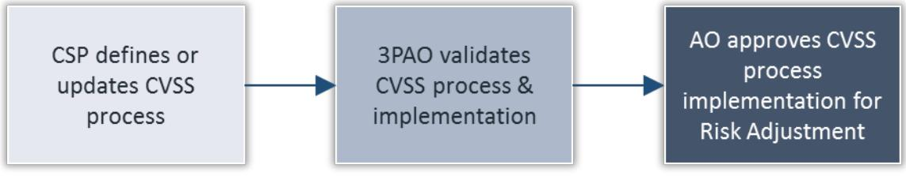

# DRAFT Automated Vulnerability Risk Adjustment Framework

Version 0.1

March 20, 2018

## DOCUMENT REVISION HISTORY

| DATE               | VERSION | PAGE(S) | DESCRIPTION            | AUTHOR      |
|--------------------|---------|---------|------------------------|-------------|
| ' 03/20/2018   0.1 |         | All     | Initial draft document | FedRAMP PMO |
|                    |         |         |                        |             |
|                    |         |         |                        |             |

#### ABOUT THIS DOCUMENT

This document provides a framework for automated adjustments to vulnerability risk categorizations.

This document is not a FedRAMP template – there is nothing to fill out in this document.

This document uses the term authorizing official (AO). For systems with a Joint Authorization Board (JAB) provisional authorization to operate (P-ATO), AO refers primarily to the JAB unless this document explicitly says Agency AO. For systems with a FedRAMP Agency authorization to operate (ATO), AO refers to each leveraging Agency's AO.

This document is currently in draft form and is not considered a final FedRAMP policy document. FedRAMP intends to pilot this draft policy document with vendors before issuing a final policy document. FedRAMP expects this document to be in draft form for approximately one year.

### WHO SHOULD USE THIS DOCUMENT?

This document is intended to be used by Cloud Service Providers (CSPs), Third Party Assessor Organizations (3PAOs), government contractors working on FedRAMP projects, and government employees working on FedRAMP projects. This document may also prove useful for other organizations that are developing a continuous monitoring program.

### HOW TO CONTACT US

Questions about FedRAMP or this document should be directed to info@fedramp.gov.

For more information about FedRAMP, visit the website at http://www.fedramp.gov.

### TABLE OF CONTENTS

| ABOUT THIS DOCUMENT WHO SHOULD USE THIS DOCUMENT? |
|------------------------------------------------------|
|                                                      |
|                                                      |
| HOW TO CONTACT US                                    |
| 1. PURPOSE                                           |
| SCOPE                                                |
| OUTCOMES                                             |
| REQUIREMENTS                                         |
| CVSS VERSION CHANGES                                 |
| 6. CAPPROVAL PROCESS                                 |
|                                                      |

### LIST OF FIGURES

|  |  | Figure 1. CVSS Approval Process |  |
|--|--|---------------------------------|--|
|--|--|---------------------------------|--|

### 1. PURPOSE

To provide CSPs with a vulnerability severity scoring framework, defined by FIRST and supported by the National Institute of Standards and Technology (NIST), on which to build their automated vulnerability severity reduction implementation.

### 2. SCOPE

Create a framework for using Common Vulnerability Scoring to determine and/or adjust the risk level for vulnerabilities identified by an automated scanning tool. Vulnerabilities identified by non-automated methods are explicitly not included in the scope of this framework. CVSS scoring applies to all automated risk severity level adjustments; including High ' to Moderate and Moderate to Low risk adjustments.

### 3. OUTCOMES

- Enable CSPs to leverage standardized vulnerability risk adjustment scores based on an open o framework where the individual characteristics used to derive a score are transparent.
- o Reduce the level of effort and time required to establish the risk level of a vulnerability in a CSP's environment.

### 4. REQUIREMENTS

- 0 Capabilities:
	- -A CSP must use an automated scanning tool that provides results for unique vulnerabilities, including a CVSS "Base Score Metrics" value consistent with the calculation used by the scanning tool that identified the potential vulnerability or the National Vulnerability Database (NVD). The NVD scores must be used if available. The use of the original scanning tool's vulnerability severity scoring methodology and/or NVD is defined in the CSP's Risk Assessment (RA) control family. For example, if the scanning tool uses CVSSv2 to identify a potential vulnerability, CVSSv2 or NVD could be used as part of this automated downgrade process as defined in the System Security Plan (SSP) RA control family.
	- -The CSP must have an automated mechanism to match unique vulnerabilities identified via automated scanning tools with asset types so that environmental variables are applied through automated means. Asset types must be defined by the CSP and are grouped together based on CVSS characteristics. A 3PAO must assess the groupings for appropriateness and the groupings will need AO approval.
- o Documentation:

1 FedRAMP considers the critical impact level to be included within the high impact level categorization.

- -The CSP must document the unique inventory items for which automated CVSS calculation will be performed. For each unique item, the CSP must define the environmental score metrics that apply to that item based on its function and location within the CSP architecture. For each environmental metric, the CSP must define which threat vectors are addressed by the environmental variable.
	- For example, the risk of a privilege escalation vulnerability is likely reduced by proper use of Multi-factor Authentication, but may not be reduced by network isolation. A 3PAO must attest to the accuracy of the CVSS automation schema defined by this documentation, and the AO must ultimately approve the schema prior to the use of automated calculation.
- All unique asset type environmental score metric assignments and 3PAO attestation must be documented and submitted for AO review and approval. The CSP must define the CVSS versions used to perform the calculations. In the event that the CSP uses multiple versions of the CVSS methodology, the CSP must document the procedures for these separately.
- ၊ Changes to a CSP's automated risk adjustment implementation, including new implementations for currently authorized CSPs, must be documented via a Significant Change Request (SCR). CSPs must work with their AO to identify the potential need for the SCR (and appropriate testing). If approved, all automated risk adjustment related changes must be updated in the SSP.
- Scoring Methodology: o
	- l The standard for re-calculating or adjusting the automated vulnerability scanning tool provided vulnerability severity level shall be the most recent version of the CVSS "Base Score Metrics" provided by the automated scanning tool² or as documented in NVD. The NIST CVSS calculators shall be used for all automated vulnerability risk adjustment calculations 3.
	- । Temporal score metrics are not to be used and must remain as "Not Defined" while calculating or adjusting risk impact level. The temporal score metric Remediation Level may only be used with manual deviation requests to the AO.
- Validation and Approval: o
	- -A 3PAO must concur with all of the CSP's proposed environmental score metrics to unique asset types.
	- -A 3PAO must verify and validate the CSP's adherence to the documented automated risk adjustment process and procedure at the time a CSP initially requests to follow the automated risk adjustment process and/or as part of any FedRAMP annual assessment under Continuous Monitoring.
	- -An AO must approve the CSP's automated vulnerability risk adjustment process and procedure.
- Outcomes: o
	- -Auto-downgraded vulnerabilities will be identified in the Plan of Action and Milestones (POA&M), according to the POA&M completion guidance.

² This is either CVSSv2 or CVSSv3 and is tool-dependent.

3 The NIST CVSSv3 calculator is available online: https://nvd.nist.gov/vuln-metrics/cvss/v3-calculator. The NIST CVSSv2 calculator is available online: https://nvd.nist.gov/vuln-metrics/cvss/v2-calculator.

- -This replaces the Deviation Request process for vulnerabilities identified through automated scanning tools that are adjusted in accordance with the CSP's defined automated vulnerability risk adjustment process and procedures.
- Limitations: 0
	- -The CVSS Target Distribution metric cannot be used.
	- | Vulnerabilities with a Base Score of High may not be automatically downgraded to Low. These items may be automatically downgraded one FedRAMP severity level (i.e., High to Moderate or Moderate to Low), and the manual risk deviation request process may be used to further downgrade from Moderate to Low to explain compensating and mitigating factors that may demonstrate an acceptable level of risk, if applicable.

### 5. CVSS VERSION CHANGES

- o The use of CVSS versions for automated vulnerability risk adjustments must be consistent with the initial CVSS version used to identify a potential risk or with the CSP's previously reviewed RA control family control implementations defined in the SSP.
- o CSPs changing the methodology used for handling automated vulnerability risk adjustment changes will be handled via an SCR.
	- The CSP has six months from the time that NIST issues a new CVSS calculator version to update all asset types and CVSS metrics with all necessary version changes and to update their CVSS process and procedures as required to support the newest version.
		- Since older CVSS version base scores will continue to be used by some automated tools, the requirement is to support the latest version, not to move every vulnerability to the new version. The CSP must use the most recent version of the CVSS "Base Score Metrics" provided by the automated scanning tool. CSPs can use older base metrics where new base metrics have not been provided by NIST.
	- l A 3PAO must validate the CSP's adherence, within sixty business days after the CSP's timeline has elapsed, as defined above.
	- -An AO must approve the 3PAO validated changes within thirty business days after the 3PAO's sixty days have elapsed.

#### 6. APPROVAL PROCESS

Figure 1. CVSS Approval Process

### APPENDIX A: FEDRAMP ACRONYMS

The FedRAMP Master Acronyms & Glossary contains definitions for all FedRAMP publications, and is available on the FedRAMP website Documents page under Resources Documents.

(https://www.fedramp.gov/documents/)

Please send suggestions about corrections, additions, or deletions to info@fedramp.gov.