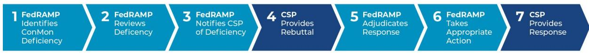

# FedRAMP® Continuous Monitoring Performance Management Guide

Version 3.0

08/30/2023

info@fedramp.gov fedramp.gov

### DOCUMENT REVISION HISTORY

| Date       | Version | Page (s) | Description                                                                                                                            | Author         |
|------------|---------|----------|----------------------------------------------------------------------------------------------------------------------------------------|----------------|
| 07/22/2015 | 1.0     | All      | Initial document                                                                                                                       | FedRAMP PMO |
| 01/06/2016 | 1.1     | 6        | Added Formal CAP for second (or more) non-compliant delivery of scan results                                                     | FedRAMP PMO |
| 01/31/2018 | 2.0     | All      | Title change from FedRAMP P-ATO Management and Revocation Guide to FedRAMP Continuous Monitoring Performance Management Guide | FedRAMP PMO |
| 01/31/2018 | 2.0     | All      | General changes to grammar and use of terminology to add clarity, as well as consistency with other FedRAMP documents         | FedRAMP PMO |
| 01/31/2018 | 2.0     | 2-5      | Added the escalation process and clarified the Suspension and Revocation escalation actions                                      | FedRAMP PMO |
| 01/31/2018 | 2.0     | 6-8      | Clarified deficiency triggers                                                                                                          | FedRAMP PMO |
| 01/31/2018 | 2.0     | 8        | Added a zero-day attack notification trigger                                                                                        | FedRAMP PMO |
| 01/31/2018 | 2.0     | 9        | Added customer demand threshold                                                                                                        | FedRAMP PMO |
| 02/21/2018 | 2.1     | 8        | Updated links in Appendix A, which changed as a result of migration of the FedRAMP web site                                      | FedRAMP PMO |
| 02/21/2018 | 2.1     | 5        | For clarity, revised two entries in Table 1 related to late delivery of annual assessments                                       | FedRAMP PMO |

| 08/30/2023 | 3.0 | Section 3                                                     | Added Section 3 to include Agency ATO performance manaqement                             | FedRAMP PMO |
|------------|-----|---------------------------------------------------------------|---------------------------------------------------------------------------------------------|----------------|
|            |     | Table 1 -  AB Risk Manaqement Deficiency Triggers | Updated based on latest publication of the FedRAMP Incident Communications Procedures |                |
|            |     | Section 2.3                                                   | Updated to describe indirect demand                                                      |                |
|            |     | All                                                           | Updated FedRAMP branding                                                                    |                |

# About This Document

This document provides guidance on continuous monitoring (ConMon) and ongoing authorization in support of maintaining a security authorization that meets the Federal Risk and Authorization Management Program (FedRAMP) ConMon requirements.

This document is not a FedRAMP template – there is nothing to fill out in this document.

This document uses the term authorizing official (AO). For cloud service offerings (CSOs) with a |oint Authorization Board (IAB) Provisional Authority to Operate (P-ATO), AO refers to the JAB unless this document explicitly says agency AO. For CSOs with a FedRAMP authorization, agency AO refers to each leveraging federal agency's AO.

### Who Should Use This Document?

This document is intended to be used by cloud service providers (CSPs), third party assessment orqanizations (3PAOs), federal agency AOs, and federal agency employees/contractors working on FedRAMP projects. This document may also prove useful for other organizations that are developing a ConMon program.

### How To Contact Us

Questions about FedRAMP or this document should be directed to info@fedramp.aov.

For more information about FedRAMP, visit the website at http://www.fedramp.gov.

## TABLE OF CONTENTS

|  |  | 1. Introduction                                                        |  |  |  |
|--|--|------------------------------------------------------------------------|--|--|--|
|  |  | 2. JAB P-ATO Performance Management                                    |  |  |  |
|  |  | 2.1 JAB Escalation Levels and Process                                  |  |  |  |
|  |  | 2.2    JAB ConMon Requirements: Risk Management Deficiency Triggers    |  |  |  |
|  |  | 2.3 JAB Customer Demand                                                |  |  |  |
|  |  | 3. Agency ATO Performance Management                                   |  |  |  |
|  |  | 3.1    Agency ConMon Requirements: Risk Management Deficiency Triggers |  |  |  |
|  |  | 3.2 FedRAMP Responsibilities for Agency ATOs                           |  |  |  |

#### Introduction ------------------------------------------------------------------------------------------------------------------------------------------------------------------------------

Section 2 of this document explains the FedRAMP Program Management Office (PMO) and the IAB take when a CSP fails to maintain an adeguate ConMon capability for a CSO with a IAB P-ATO. Section 3 of this document provides a recommended process that agencies should use to monitor ConMon performance for CSOs with a FedRAMP agency authorization and recommended actions to take when a CSP fails to maintain an adequate ConMon capability for the CSO.

The FedRAMP ConMon process is based on the ConMon process described in the National Institute of Standards and Technology (NIST) Special Publication (SP) 800-137, Information Security Continuous Monitoring (ISCM) for Federal Information Systems and Orqanizations, and is qoverned by the FedRAMP Continuous Monitoring Strateav Guide.

The FedRAMP ConMon process goals are to provide: (i) operational visibility; (ii) managed change control; and (iii) attendance to incident response duties. Security-related information collected during ConMon is used to determine if the system security is operating as intended and in accordance with applicable federal law, quidelines, and policies.

When a CSP receives a JAB P-ATO letter for a CSO, that letter comes with the following minimum requirements1:

- 1. The CSP satisfies the requirement of implementing ConMon activities as documented in FedRAMP's Continuous Monitoring Strategy Guide and the CSP's ConMon plan;
- 2. The CSP mitigates all open Plan of Action and Milestones (POA&M) action items agreed to in the Security Assessment Report (SAR) within the appropriate timeframe as defined in the agreed POA&M; and
- 3. The CSP identifies and manages significant changes or critical vulnerabilities in accordance with applicable federal law, guidelines, and policies.

Further, by accepting the requirements outlined in the letter, a CSP agrees to fulfill the quidance in the FedRAMP Continuous Monitoring Strategy Guide, including maintaining operational visibility, change control, and incident response functions defined in that document. In addition, a CSP is expected to continue to follow NIST SP 800-37, Risk Management Framework for Information Systems and Organizations: A System Life Cycle Approach for Security and Privacy, and related NIST Risk Management Framework (RMF) quidance and to effectively deploy all applicable security controls as well as act in good faith to maintain the appropriate risk posture.

1 Agency AOs are encouraged to use the FedRAMP ATO Letter Template which includes these requirements. The template can be found on the FedRAMP Documents and Templates page.

2 Additional requirements may be included in a JAB P-ATO or agency ATO letter to address system-specific security concerns identified during an assessment.

Failure to adhere to the requirements of a P-ATO may result in escalation actions by FedRAMP, outlined in subsequent sections of this document, as well as additional actions as FedRAMP deems appropriate.

While much of this document specifically addresses FedRAMP P-ATOs maintained by the IAB, CSOs authorized via the FedRAMP agency authorization path must also maintain compliance with FedRAMP ConMon requirements. As outlined in Section 3. Agency ATO Performance Manaqement, FedRAMP recommends agencies to create similar quides and/or use this FedRAMP Continuous Monitoring Performance Management Guide when maintaining FedRAMP agency authorizations. A summary of FedRAMP and agency performance management responsibilities for CSOs authorized via the FedRAMP agency authorization path is provided in Section 3.

#### JAB P-ATO Performance Management 2.

This section provides the processes that the FedRAMP PMO and JAB use to perform oversight of ConMon performance for CSOs with |AB P-ATOs.

#### 2.1 JAB Escalation Levels and Process

As a condition of a JAB P-ATO, a CSP agrees to meet the requirements described in the FedRAMP Continuous Monitoring Strategy Guide. If the CSP fails to meet the requirements, FedRAMP initiates an escalation process, which may result in one of the following escalation levels:

- Detailed Finding Review (DFR): A request from a CSP's FedRAMP Point of Contact (POC) . to have the CSP assess a deficiency and report the cause and remedy to FedRAMP. If the CSP does not resolve a DFR within the agreed upon timeframe, FedRAMP may escalate to a corrective action plan (CAP).
- . CAP: A request from the FedRAMP Director for a CSP's system owner to perform a root-cause analysis and provide a formal plan for remediation. If the CSP does not resolve a CAP within the agreed upon timeframe, FedRAMP may suspend or revoke the CSO's P-ATO.
- Suspension: A decision by the JAB to temporarily suspend a CSO's P-ATO until the . identified deficiencies are resolved. If the CSP does not resolve a "Suspension" within the agreed upon timeframe, or if the FedRAMP Director and IAB determine the CSP can no longer meet FedRAMP compliance requirements, FedRAMP may revoke the CSO's P-ATO.

- Revocation: A decision by the JAB to permanently revoke a CSO's P-ATO. If revoked, the . only way the CSO can obtain a P-ATO is by re-entering the FedRAMP |AB authorization process as if the CSO were seeking a P-ATO for the first time.
When FedRAMP identifies a deficiency in a CSP's ConMon capabilities, it initiates the process depicted in Figure 1. FedRAMP Escalation Process, below.

#### Figure 1. FedRAMP Escalation Process

The escalation process occurs as follows:

- 1. FedRAMP identifies a deficiency with a CSP's ConMon information.
- 2. FedRAMP reviews the deficiency and compares it to the CSP's past ConMon performance. As a result of the review, FedRAMP decides on one of the following actions:
	- FedRAMP typically decides on an escalation level consistent with the quidance . described in Section 2.2, JAB ConMon Requirements: Risk Management Deficiency Triggers.
	- . FedRAMP may elect to simply monitor the CSP more closely and take no further action. If so, no notice is sent, and the process stops here;
	- FedRAMP may increase the CSP's existing escalation level; for example, a CSP on a ● CAP may face "Suspension;" or
	- In rare cases, FedRAMP may determine the deficiency is severe enough to make the ● escalation effective immediately, in which case, steps 3 and 4 are skipped.
- 3. FedRAMP sends a notification to the CSP of the deficiency and FedRAMP's intended escalation. Depending on the intended escalation level, the notice comes from:
	- The CSP's FedRAMP POC for an intended DFR or CAP. .
	- The FedRAMP Director and |AB Technical Representatives (TRs) for a "Suspension" or . "Revocation".
- 4. The CSP responds to the notification. The CSP's response should include any information that may rebut an escalation decision. Depending on the intended escalation level, the CSP's response must come from:
	- . The CSP's security POC for a DFR; or
	- · The CSP's system owner for a CAP, "Suspension", or "Revocation".
- 5. FedRAMP reviews and adjudicates the CSP's response, and renders a formal escalation decision. Depending on the escalation level, the decision is made by:

- The FedRAMP POC for a DFR; .
- . The FedRAMP Director and |AB TRs for a CAP; or
- . The |AB for a "Suspension" or "Revocation".
- 6. FedRAMP notifies the CSP of its decision. If FedRAMP decides to follow through with an escalation, this notice:
	- Identifies the criteria for returning the CSO to a "Satisfactory" status. In some cases, it . may also include a deadline by which the CSP must fully satisfy the criteria or face more severe escalation; and
	- Requires certain actions from the CSP. Typically, FedRAMP requires the CSP to perform . a root-cause analysis and develop a formal plan for addressing the deficiencies.
- 7. CSP responds to the FedRAMP notification. This response must include:
	- The results of the root cause analysis; .
	- The CSP's plan for fully resolving the issues, with clearly established milestones and . dates, including a date of full resolution;
	- . For a CAP or "Suspension", the system owner's signature on the plan; and
	- . Any other items, as specified by FedRAMP in its notification.
- 8. FedRAMP reviews and renders a final decision on the CSP's plan. Depending on the escalation level, the decision is made by:
	- . The FedRAMP POC for a DFR;
	- The FedRAMP Director and |AB TRs for a CAP; or .
	- The IAB for a "Suspension" or "Revocation". .

When a CSP is subject to escalation as described above, the following occurs:

- . Monthly ConMon Reporting to Leveraging Agencies: FedRAMP updates the next monthly ConMon report to reflect the cited deficiencies, escalation level, and the CSP's identified resolution date.
The CSO's status is changed to "Minor Concern" for a DFR, or "Major Concern" for a CAP or "Suspension". The status remains and the CSP's progress is reported each month until FedRAMP determines the issue is fully resolved.

FedRAMP discontinues ConMon reporting when the CSO's P-ATO is revoked, but continues ConMon reporting when the CSO's P-ATO is suspended.

Other Postings and Notifications to Leveraging Agencies: If there is a CAP, ● "Suspension", or "Revocation", FedRAMP posts a letter to the CSP's secure repository for review by the leveraging agencies as well as the CSP's plan for resolution (where appropriate). The information is retained indefinitely for historical reference. lf a CSO's P-ATO is suspended or revoked, FedRAMP notifies each known leveraging

agency and requires the CSP to ensure the list of FedRAMP known leveraging agencies matches the CSP's customer list for the impacted CSO.

Note: P-ATO "Revocation" does not automatically result in revocation of each leveraging agency's ATO. Each leveraging agency's AO reviews the circumstances of the P-ATO

"Revocation" and makes a determination regarding the status of the ATO they issued for the CSO on behalf of their agency.

- . FedRAMP Marketplace: FedRAMP updates the CSO's status on the FedRAMP Marketplace to reflect the escalation level for "Suspension". FedRAMP removes the CSO from the Marketplace if the P-ATO is revoked. DFRs and CAPs are not reflected on the Marketplace.
- . Further Escalation: If a CSP fails to provide a plan acceptable to FedRAMP or fails to meet the dates identified in the plan, FedRAMP may increase the escalation level. Further escalation follows the escalation process steps described above.
- . Extension: If a CSP has made a good-faith effort to fully resolve the deficiency and address the plan, but requires more time, the CSP may request an extension from FedRAMP.

When FedRAMP determines the CSP has fully resolved the cited deficiencies and satisfied the FedRAMP-identified criteria communicated in the notification. FedRAMP takes the following actions:

- Notification to CSP: A CSP's FedRAMP POC notifies a CSP's security POC when . FedRAMP agrees a DFR is fully satisfied. The FedRAMP Director notifies the system owner when FedRAMP agrees a CAP or "Suspension" is fully satisfied.
- Monthly ConMon Reporting to Leveraging Agencies: FedRAMP updates the next . monthlv report to reflect that all cited deficiencies are resolved and the escalation level is no longer in effect. The status is returned to "Satisfactory."
- . Other Postings and Notifications to Leveraging Agencies: The FedRAMP Director posts a letter to the CSP's secure repository indicating the CAP or "Suspension" is fully resolved to FedRAMP's satisfaction, and the CSP is once again in good standing. No letter is posted when a DFR is initiated or when it is resolved.
- FedRAMP Marketplace: FedRAMP returns the CSO's status from indicating "Suspension" ● to its normal listing with no indication of an escalation level.

#### 2.2 JAB ConMon Requirements: Risk Management Deficiency Triggers

To ensure consistent expectations and enforcement, FedRAMP defines risk management deficiency "triggers." When a CSP's performance exceeds one or more of the thresholds, as defined in Table 1 |AB Risk Management Deficiency Triggers below, FedRAMP will, at a minimum, take the prescribed action.

#### Table 1. JAB Risk Management Deficiency Triggers

| ConMon Process Area                   | Risk Management Deficiency Trigger                                                                                                                                                                                                                                                                                                                                                                                                                                                                                                                                                                                   | Minimum Escalation Level |
|------------------------------------------|----------------------------------------------------------------------------------------------------------------------------------------------------------------------------------------------------------------------------------------------------------------------------------------------------------------------------------------------------------------------------------------------------------------------------------------------------------------------------------------------------------------------------------------------------------------------------------------------------------------------|--------------------------------|
|                                          |                                                                                                                                                                                                                                                                                                                                                                                                                                                                                                                                                                                                                      |                                |
| Operational Visibility                | Unique Vulnerability Count Increase 20% from P-ATO baseline or 10 unique vulnerabilities, whichever is greater Note: A request to re-baseline a unique vulnerability count, accompanied with proper justification, can be submitted to FedRAMP and may be approved on a case-by-case basis.                                                                                                                                                                                                                                                                                                        | DFR                            |
|                                          | Non-compliance with scanning requirements outlined in FedRAMP Vulnerability Scanning Requirements at https://www.fedramp.gov/documents/ First incident in the previous six months Unauthenticated scan results delivered as part of the initial SAR submission, as part of the annual SAR submission, or as part of the monthly scanning submission, where the unauthenticated scans are 10% or greater of the total scan submission, result in a CSP being placed on a DFR. This applies only to a CSP's first submission that is non-compliant with authenticated scan requirements. | DFR                            |
| Operational Visibility (Continued) | Non-compliance with scanning requirements outlined in FedRAMP Vulnerability Scanning Requirements Each subsequent incident beyond the first within the previous six months Unauthenticated scan results delivered as part of the initial SAR submission, as part of the annual SAR submission, or as part of the monthly scanning submission, where the unauthenticated scans are 10% or greater of the total scan submission, result in a CSP being placed on a CAP, when a second or subsequent CSP submission is non-compliant with authenticated scan requirements.                | CAP                            |
|                                          | Late Remediation High Impact Vulnerabilities                                                                                                                                                                                                                                                                                                                                                                                                                                                                                                                                                                         | DFR                            |

|  | Five or more unique vulnerabilities or POA&M items aged greater than 30 days                                                                                                                      |     |
|--|---------------------------------------------------------------------------------------------------------------------------------------------------------------------------------------------------------|-----|
|  | Late Remediation High Impact Vulnerabilities Five or more unique vulnerabilities or POA&M items aged greater than 60 days                                                                      | CAP |
|  | Late Remediation Moderate Impact Vulnerabilities Ten or more unique vulnerabilities or POA&M items aged greater than 90 days                                                                   | DFR |
|  | Late Remediation Moderate Impact Vulnerabilities Ten or more unique vulnerabilities or POA&M items aged greater than 120 days                                                                  | CAP |
|  | Late Delivery of Annual Assessment SAP Delivery of annual assessment SAP less than 60 days before annual P-ATO anniversary date                                                                   | CAP |
|  | Late Delivery of Annual Assessment Package Delivery of full annual assessment package after annual P-ATO anniversary date                                                                         | CAP |
|  | Poor Quality of Deliverables Untimely or inaccurate submission of any deliverable, including (but not limited to) monthly ConMon documents, deviation requests, or significant change requests | DFR |
|  | Lack of Transparency Failure to report known issues to FedRAMP or purposely manipulating scans to avoid risk manaqement deficiency triggers                                                       | CAP |
|  | Multiple Recurrences Any trigger that is realized multiple times within a six-month timeframe                                                                                                     | CAP |
|  | Insufficient Notice of Planned Change                                                                                                                                                                   | CAP |

|                      | Notification received less than 30 days before the planned change or insufficient documentation of a security impact analysis                                                                                                                                                                                                                                                                                                                                                                                      |     |
|----------------------|--------------------------------------------------------------------------------------------------------------------------------------------------------------------------------------------------------------------------------------------------------------------------------------------------------------------------------------------------------------------------------------------------------------------------------------------------------------------------------------------------------------------------|-----|
| Change Control    | Late Notice of Emergency Change Notification received more than five days after the change                                                                                                                                                                                                                                                                                                                                                                                                                            | CAP |
|                      | Undocumented/Unreported Change No notification                                                                                                                                                                                                                                                                                                                                                                                                                                                                        | CAP |
|                      | Degradation of the Change Management and Change Control Processes Insufficient adherence to the provided configuration management plan as determined by FedRAMP                                                                                                                                                                                                                                                                                                                                                 | DFR |
| Incident Response | Late Incident Notification Late notification of incident not in accordance with the FedRAMP's Incident Communications Procedures Note: FISMA defines an "incident" as "an occurrence that (A) actually or imminently jeopardizes, without lawful authority, the integrity, confidentiality, or availability of information or an information system; or (B) constitutes a violation or imminent threat of violation of law, security policies, security procedures, or acceptable use policies." | CAP |
|                      | Late response to Cybersecurity and Infrastructure Security Agency (CISA) Emergency Directives Failure to respond to CISA Emergency Directives within prescribed timeframes.                                                                                                                                                                                                                                                                                                                                     | CAP |
|                      | Incident Frequency of Recurring Type Any incident with recurring type and/or cause                                                                                                                                                                                                                                                                                                                                                                                                                                    | CAP |
|                      | Incident Frequency Four or more incidents within six months                                                                                                                                                                                                                                                                                                                                                                                                                                                           | DFR |
|                      | Timely and Ongoing Notification of Zero-day Attack Failure to provide to FedRAMP daily updated progress in addressing zero-day attacks                                                                                                                                                                                                                                                                                                                                                                             | CAP |

#### 2.3 JAB Customer Demand

To remain eligible for a JAB P-ATQ, FedRAMP requires a minimum of six unique agency customers with authorizations3 that leverage a CSO's JAB P-ATO directly or indirectly:

- Each CSO's direct agency customer is counted as one unit of demand. .
- For CSOs that are leveraged by other CSOs, each unique agency that the leveraging CSO has as a customer will be counted as one unit of demand for the leveraged CSO. For example, if CSO X is leveraged by CSO Z, and CSO Z has 15 authorizations with four different department agencies, CSO X will receive a demand score of four from this leveraaing relationship. This score will be added to any other demand that CSO X has from agencies or other leveraging relationships.

FedRAMP evaluates CSP customer demand on an annual basis to ensure CSPs with P-ATOs are meeting and maintaining FedRAMP demand thresholds.

A CSP that has fewer than six unique FedRAMP ATOs in the FedRAMP secure repository will be placed on a CAP at the discretion of the FedRAMP PMO and JAB. A CSP that cannot meet or maintain this demand threshold has the opportunity to pursue a FedRAMP agency authorization, in lieu of the P-ATO, with the support of the FedRAMP PMO.

FedRAMP established this threshold based on |AB resources, to ensure |AB ConMon resources are focused on CSOs that result in broader impact across the federal government. FedRAMP may adjust this threshold at its discretion due to changes in available resources and overall demand across the federal government for cloud services.

### 3. Agency ATO Performance Management

This section provides recommendations for processes of how agencies should perform oversight of CSOs authorized via the FedRAMP agency authorization path.

NOTE: The initial authorizing agency (aka "partner") is not responsible for performing ConMon oversight on behalf of subsequent authorizing agencies. Each agency that issues an ATO, or authority to use (ATU), for a cloud offering must review the CSP's ConMon activities to ensure the

3 The FedRAMP PMO does not count a Defense Information Systems Agency (DISA) P-ATO as part of the unique agency customer total, because it does not represent a true unique agency customer authorized to use a cloud service offering (CSO).

security posture remains sufficient for its own use and supports an ongoing authorization. This includes reviewing the monthly POA&Ms, approving deviation requests and significant change requests, and reviewing the results of the annual assessment. For CSPs with more than one agency ATO, security control CA-7|Continuous Monitoring requires the CSP to implement the collaborative ConMon approach described in the FedRAMP Collaborative ConMon Quick Guide. Collaborative ConMon benefits agencies by allowing them to share responsibility for ConMon oversight and performance management, and it benefits the CSP by creating a central forum for addressing questions or performance concerns and for achieving consensus related to deviation requests, significant change requests, and annual assessments (versus having to coordinate with each agency separately).

Similar to IAB performance management of CSOs with P-ATOs, agencies should implement an escalation process to monitor their authorized CSOs, which may result in one of the following escalation levels. Agency AOs (or collaborative ConMon groups) can determine which escalation levels are appropriate:

- Detailed Finding Review (DFR): A request from an agency AO (or collaborative ConMon . group) for a CSP's security POC to assess a deficiency and report the cause and remedy to the agency AO. If the CSP does not resolve a DFR within the agreed upon timeframe, the agency AO may escalate to a corrective action plan (CAP).
- . CAP: A request from an agency AO (or collaborative ConMon group) for a CSP's system owner to perform a root-cause analysis and provide a formal plan for remediation. If the CSP does not resolve a CAP within the agreed upon timeframe, the agency AO may suspend or revoke the CSO's ATO(s).
- Suspension: A decision by an agency AO (or collaborative ConMon group) to temporarily . suspend a CSO's ATO(s) until the identified deficiencies are resolved. In this phase, an agency may choose to suspend use of the CSO. If the CSP does not resolve a "Suspension" within the agreed upon timeframe or if the agency AO determines the CSP can no longer meet FedRAMP compliance requirements, the agency AO may revoke the CSO's ATO(s).
- Revocation: A decision by an agency AO (or collaborative ConMon group) to revoke a . CSO's ATO and migrate the data to another CSO.

When an agency AO (or collaborative ConMon group) identifies a deficiency in the CSP's ConMon capabilities, the agency AO should initiate the escalation process described below.

The escalation process occurs as follows:

- 1. The agency AO identifies a deficiency with a CSP's ConMon information.
- 2. The Agency AO reviews the deficiency and compares it to the CSP's past ConMon performance. As a result of the review, the agency AO decides on one of the following actions:
	- The agency AO may elect to simply monitor the CSP more closely and take no further action. If so, no notice is sent and the process stops here;

- The agency AO may increase a CSP's existing escalation level; for example, a CSP on a . CAP may face "Suspension;" or
- . The agency AO may determine the deficiency is severe enough to make the escalation effective immediately in which case, steps 3 and 4 are skipped.
- 3. The agency AO notifies the CSP of the deficiency and the agency AO's intended escalation.
- 4. The CSP responds to the notification. The CSP's response should include any information that may rebut the escalation decision. Depending on the intended escalation level, the CSP's response must come from:
	- The CSP's security POC for a DFR; or .
	- The CSP's system owner for a CAP, "Suspension", or "Revocation". .
- 5. The agency AO reviews and adjudicates the CSP's response, and renders a formal escalation decision.
- 6. The Agency AO notifies the CSP of its decision. If the agency AO decides to follow through with an escalation, this notice:
	- Identifies the criteria for returning the CSO to a "Satisfactory" status. It may also . include a deadline by which the CSP must fully satisfy the criteria or face more severe escalation; and
	- . Requires certain actions from the CSP. Typically, an agency AO would require the CSP to perform a root-cause analysis and develop a formal plan for addressina the deficiencies.
- 7. The CSP responds to the Agency AO notification. This response must include:
	- The results of the root cause analysis; .
	- The CSP's plan for fully resolving the issues, with clearly established milestones and dates, including a date of full resolution;
	- For a CAP or "Suspension," the system owner's signature on the plan and agency AO . approval of the plan; and
	- Any other items as specified by the agency AO in the notification. .

When a CSP is subject to escalation as described above, the following occurs:

- Notification to FedRAMP: Agency AOs must notify FedRAMP at info@fedramp.gov if a . decision is made to initiate "Suspension" or "Revocation." CAP letters should be uploaded to the FedRAMP secure repository.
When the agency AO determines the CSP has fully resolved the cited deficiencies and satisfied the identified criteria communicated in the notification, the agency AO must take the following actions:

- Notification to FedRAMP: Agency AOs must notify FedRAMP at info@fedramp.gov if an . escalation has been resolved. CAP release letters must be posted to the FedRAMP secure repository.
#### 3.1 Agency ConMon Requirements: Risk Management Deficiency Triggers

To ensure consistent expectations and enforcement, an agency AO should define risk management deficiency "triggers." An agency can pick and choose the appropriate triggers. Examples are described in Table 2. Aqency Risk Management Deficiency Triggers below.

| ConMon Process Area | Risk Management Deficiency Trigger                                                                                                                                                                                                                                                                                                                                                                                                                                                                                                                                                                                   | Minimum Escalation Level |
|---------------------------|----------------------------------------------------------------------------------------------------------------------------------------------------------------------------------------------------------------------------------------------------------------------------------------------------------------------------------------------------------------------------------------------------------------------------------------------------------------------------------------------------------------------------------------------------------------------------------------------------------------------|--------------------------------|
| Operational Visibility | Unique Vulnerability Count Increase 20% from ATO baseline or 10 unique vulnerabilities, whichever is greater Note: A request to re-baseline a unique vulnerability count, accompanied with proper justification, can be submitted to FedRAMP and may be approved on a case-by-case basis.                                                                                                                                                                                                                                                                                                             | DFR                            |
|                           | Non-compliance with scanning requirements outlined in FedRAMP Vulnerability Scanning Requirements at https://www.fedramp.gov/documents/ First incident in the previous six months Unauthenticated scan results delivered as part of the initial SAR submission, as part of the annual SAR submission, or as part of the monthly scanning submission, where the unauthenticated scans are 10% or greater of the total scan submission, result in a CSP being placed on a DFR. This applies only to a CSP's first submission that is non-compliant with authenticated scan requirements. | DFR                            |
|                           | Non-compliance with scanning requirements outlined in FedRAMP Vulnerability Scanning Requirements                                                                                                                                                                                                                                                                                                                                                                                                                                                                                                                 | CAP                            |

#### Table 2. Agency Risk Management Deficiency Triggers

| Each subsequent incident beyond the first within the previous six months Unauthenticated scan results delivered as part of the initial SAR submission, as part of the annual SAR submission, or as part of the monthly scanning submission, where the unauthenticated scans are 10% or greater of the total scan submission, result in a CSP being placed on a CAP, when a second or subsequent CSP submission is non-compliant with authenticated scan requirements. |     |
|-----------------------------------------------------------------------------------------------------------------------------------------------------------------------------------------------------------------------------------------------------------------------------------------------------------------------------------------------------------------------------------------------------------------------------------------------------------------------------------------------|-----|
|                                                                                                                                                                                                                                                                                                                                                                                                                                                                                               |     |
| Late Remediation High Impact Vulnerabilities Five or more unique vulnerabilities or POA&M items aged greater than 30 days                                                                                                                                                                                                                                                                                                                                                            | DFR |
| Late Remediation High Impact Vulnerabilities Five or more unique vulnerabilities or POA&M items aged greater than 60 days                                                                                                                                                                                                                                                                                                                                                            | CAP |
| Late Remediation Moderate Impact Vulnerabilities Ten or more unique vulnerabilities or POA&M items aged greater than 90 days                                                                                                                                                                                                                                                                                                                                                         | DFR |
| Late Remediation Moderate Impact Vulnerabilities Ten or more unique vulnerabilities or POA&M items aged greater than 120 days                                                                                                                                                                                                                                                                                                                                                        | CAP |
| Late Delivery of Annual Assessment SAP Delivery of annual assessment SAP less than 60 days before annual ATO anniversary date                                                                                                                                                                                                                                                                                                                                                           | CAP |
| Late Delivery of Annual Assessment Package Delivery of full annual assessment package after annual ATO anniversary date                                                                                                                                                                                                                                                                                                                                                                 | CAP |
| Poor Quality of Deliverables                                                                                                                                                                                                                                                                                                                                                                                                                                                                  | DFR |

|                      | Untimely or inaccurate submission of any deliverable, including (but not limited to) monthly ConMon documents, deviation requests, or significant change requests                                                                                                                                                                         |     |
|----------------------|-------------------------------------------------------------------------------------------------------------------------------------------------------------------------------------------------------------------------------------------------------------------------------------------------------------------------------------------------|-----|
|                      | Lack of Transparency Failure to report known issues to FedRAMP or purposely manipulating scans to avoid risk manaqement deficiency triggers                                                                                                                                                                                               | CAP |
|                      | Multiple Recurrences Any trigger that is realized multiple times within a six-month timeframe                                                                                                                                                                                                                                             | CAP |
|                      | Insufficient Notice of Planned Change Notification received less than 30 days before the planned change or insufficient documentation of a security impact analysis                                                                                                                                                                       | CAP |
| Change Control    | Late Notice of Emergency Change Notification received more than five days after the change                                                                                                                                                                                                                                                   | CAP |
|                      | Undocumented/Unreported Change No notification                                                                                                                                                                                                                                                                                               | CAP |
|                      | Degradation of the Change Management and Change Control Processes Insufficient adherence to the provided configuration management plan as determined by FedRAMP                                                                                                                                                                        | DFR |
| Incident Response | Late Incident Notification Late notification of incident not in accordance with the FedRAMP's Incident Communications Procedures Note: FISMA defines an "incident" as "an occurrence that (A) actually or imminently jeopardizes, without lawful authority, the integrity, confidentiality, or availability of information or an | CAP |
|                      | information system; or (B) constitutes a violation or imminent threat of violation of law, security policies, security procedures, or acceptable use policies."                                                                                                                                                                           |     |

| Incident Frequency of Recurring Type Any incident with recurring type and/or cause                                                        | CAP |
|----------------------------------------------------------------------------------------------------------------------------------------------|-----|
| Incident Frequency Four or more incidents within six months                                                                               | DFR |
| Timely and Ongoing Notification of Zero-day Attack Failure to provide to FedRAMP daily updated progress in addressing zero-day attacks | CAP |

### 3.2 FedRAMP Responsibilities for Agency ATOs

The FedRAMP PMO monitors agency packages to ensure that the service remains in good standing. Specifically, FedRAMP ensures:

- The annual assessment package is uploaded and complete; .
- The latest SAR recommends continued authorization; and .
- . The FedRAMP Marketplace and repository appropriately reflects authorization, suspension, and revocation status.