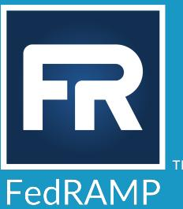
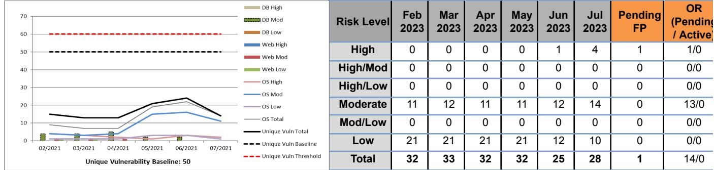
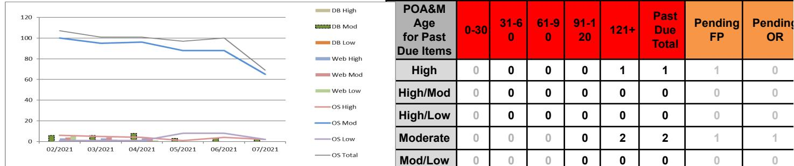

# FedRAMP® Collaborative ConMon Ouick Guide

The FedRAMP High, Moderate and Low baselines require Cloud Service Providers (CSPs) to develop a Continuous Monitoring (ConMon) strategy that complies with the requirements defined in CA-7, Security Assessment and Authorization | Continuous Monitoring.

For Cloud Service Offerings (CSOs) authorized via the Joint Authorization Board (JAB) path, the JAB performs oversight of the CSP's ConMon activities. For CSOs authorized via the Agency path, each agency that issues an Authority to Operate (ATO) or Authority to Use (ATU) for the CSO is responsible for performing this oversight to ensure the security posture remains sufficient for its own use and supports an onqoinq authorization.

For "Multi-Agency" CSOs (CSOs with more than one ATO), CA-7 requires the CSP to implement a Collaborative ConMon approach. Collaborative ConMon benefits both agencies and CSPs:

- Agency Benefits: Allows agencies to share responsibility for ConMon oversight and make better o risk-based decisions through collaboration
- CSP Benefits: Creates a central forum for addressing questions related to the CSP's ConMon o activities, and achieving consensus on Deviation Requests (DRs), Significant Change Requests (SCRs) and the Annual Assessment (AA) - versus having to coordinate with each agency separately.

The FedRAMP Project Management Office (PMO) has worked with a number of CSPs to successfully implement Collaborative ConMon. In doing so, we have found there is no "one size fits all" approach. Therefore, this guide provides a framework that CSPs can leverage to develop their own Collaborative ConMon process. At a minimum, CSPs must include the following key elements in their Collaborative ConMon process:

Continuous Monitoring Resources: Continuous Monitoring Strateav Guide, Sianificant Change Policies and Procedures, Annual Assessment Guidance, Incident Communications Procedures, Continuous Monitoring Performance Management Guide

## Step 1: Develop Collaborative ConMon Draft Charter

The charter defines the process for conducting Collaborative ConMon. The draft charter should be shared with the member agencies ahead of the inaugural Collaborative ConMon meeting (see Step 2) for review and feedback. At a minimum, the charter should include the following sections, but CSPs and agencies are free to include additional sections or subsections to further define the Collaborative ConMon process:

### Section 1: Collaboration Group Member Contact Information

In addition to the CSP, membership includes one or more security representative(s) from each agency. This may include the Authorizing Official (AO) at each agency; however, AOs typically delegate this responsibility to Information System Security Officers (ISSOs) on the Chief Information Officer's (CIO's)/Chief Information Security Officer's (CISO's) team. The Collaboration Group membership will change over time as new agency customers are onboarded or discontinue using the cloud service.

#### NOTE: You should already have direct points of contacts (POCs) at each agency as part of your Incident Response Plan, but the PMO recognizes that POC information may become outdated with employee turnover. Feel free to contact the PMO if you need help identifying security POCs at your member agencies.

Third party assessment organizations (3PAOs) are not typically included as members of the Collaboration Group unless you are using a 3PAO in a consulting role to perform ConMon activities. 3PAO assessors may be asked to attend Collaborative ConMon meetings on an ad hoc basis - for example, to brief the results of the Annual Assessment.

## Section 2: Meeting Schedule

The PMO recommends holding a monthly, one-hour recurring Collaborative ConMon meeting. To ensure high participation, we recommend scheduling the recurring meeting on Tuesday, or Thursday and in the early afternoon (EST) to accommodate different time zones.

NOTE: It may not be necessary for a CSP to meet each month with their agency customers if there are no substantial changes to the system or vulnerabilities identified. In such cases, the CSP can simply post their Continuous Monitoring reports to their respective repository and inform customers that the meeting is not being held that month.

### Section 3: Meeting Agenda

A typical agenda for the monthly collaborative ConMon meeting includes:

- Summary of monthly vulnerability scan results o
- Discussion of past due Plan of Action and Milestones (POA&Ms) and any new POA&Ms that are o dependent on a downstream vendor (i.e., Vendor Dependencies)
- Open Deviations Requests (DRs) pending approval (Operational Requirements, Risk Adjustments, 0 False Positives)
- DRs newly approved 0
- o Significant Change Requests (SCRs) (planned changes, changes pending approval, status of implementation and testing).

#### Be sure to differentiate between changes that impact all agency customers versus a specific agency. For example:

- A Low->Moderate or Moderate->High "uolift" is considered a significant change. Oftentimes, uplifts are requested by a single agency with a use case at the higher impact level. In this scenario, all agency customers should be made aware of the requesting agency should take the lead on reviewing and approving the SCR, reviewing the assessment results, and issuinq an ATO at the higher impact level.
- o From time to time, CSPs choose to add services or features to the authorization boundary through the significant change process. This may be done at the request of one or more existing agency customers OR as an effort to expand the CSP's offering to attract new customers. If the latter, CSPs should not assume that existing agency customers will approve the addition of services/features. This is something that needs to receive buy-in from existing agency customers along with a commitment to review and approve the SCR, review the assessment results and issue an updated ATO that covers the expanded offering. Otherwise, the CSP will be required to find an agency willing to review the SCR and issue an ATO that covers the expanded offering.
- Annual Assessment (scope of upcoming assessment, brief out assessment results) o
- Status of Incident Handling/Response, Cybersecurity and Infrastructure Security Agency (CISA) o Emergency Directive, etc. (if applicable)
- o Agency-specific reporting requirements (if applicable)
- o Question & Answer (Q&A)

lt is not practical to cover every POA&M item, particularly those you intend to remediate within the FedRAMP-prescribed timeframes. The focus of the POA&M discussion should be the status of any past due POA&Ms, Vendor Dependencies, and Deviation Requests - most importantly, any areas that require risk acceptance.

The PMO recommends including a summary report, similar to the "one-pager" report that the FedRAMP |AB makes available to leveraging agencies. Agency representatives can use the report to brief their respective AOs on the security posture of the cloud offering. A sample summary report is included at the end of this document.

### Section 4: ConMon Deliverables

The PMO recommends uploading the monthly ConMon deliverables (summary report, vulnerability scan files, updated POA&M and Inventory, DRs, SCRs) on the same day each month and then hold the recurring meeting a week later. This will qive each agency representative time to review the deliverables and come to the meeting ready with questions and recommendations for DR/SCR approvals.

## Section 5: Decision-Making Authorities

Determining how decisions are made, and by whom, is a critical part of the Collaborative ConMon process. While it's important to give each agency a voice, it is not always practical or in the best interest of security to seek unanimous agreement - particularly if the issue at hand only affects a single agency. Most CSPs that have successfully implemented Collaborative ConMon have used one of two approaches (or some combination) to decision making.

Voting Members: During the inaugural Collaborative ConMon meeting, the collaboration group grants certain members decision-making authority for DRs, SCRs, or any other area that requires agency approval. Oftentimes, agency representatives will volunteer to take on this responsibility. Depending on the number of agency customers, the PMO recommends at least two (2) or more voting members share this responsibility.

Comment Period: Some collaboration groups have agreed to a "comment period" approach, whereby all group members are allowed an agreed upon period of time to raise questions, concerns or objections. If there are no objections when the time period ends, the matter is considered approved. The PMO recommends aiving group members two weeks. For any group members that were unable to attend the monthly meeting, two weeks will allow those members to review the relevant documentation. This approach typically works as follows:

- o The CSP makes information (e.g., DR, SCR, etc.) available via the FedRAMP secure repository at least one week prior to the monthly Collaborative ConMon meeting and then notifies all group members.
- 。 During the monthly Collaborative ConMon meeting, the CSP briefs all group members on DR, SCR, etc. and holds room for Q&A.
- After the monthly meeting, the CSP sends a follow up email that summarizes the o discussion topics and reminds group members of the window of time to ask any follow up questions. After the defined Q&A period has ended, the CSP sends a follow-up email, informing group members that no objections were raised; therefore, the DR, SCR, etc. is considered approved.

## Section 6: Agency-specific ConMon requirements

The charter should identify additional ConMon requirements that the member agencies need to meet their own aqency-specific reporting requirements. Agency-specific requirements above and beyond the FedRAMP baselines should be documented in the contract and/or ATO letter.

### Section 7: ConMon Performance Management

While it is ultimately up to each aqency Authorizing Official to maintain or revoke an ATO, this section can be used by the collaboration aroup to define performance triggers and associated escalation levels (for example, Corrective Action Plan "In Remediation" status) when the CSP fails to comply with FedRAMP's continuous monitoring requirements or the agreed upon charter. The PMO recommends using the process defined in Section 3 of the FedRAMP Continuous Monitoring Performance Management Guide as the basis for this section.

## Step 2: Hold Inauqural Collaborative ConMon Meeting

The goal of the inaugural Collaborative ConMon meeting is to introduce collaboration group members and achieve consensus on the draft charter. Keep in mind that agency representatives may have different opinions on the scope and structure of Collaborative ConMon. The PMO has found that most agencies are aqreeable to holding monthly recurring meetings that cover the typical agenda described above. In addition, most agencies are agreeable to some form of the decision-making approaches described above. However, keep in mind that you may have to qo through a couple iterations before the charter is finalized.

## Step 3: Finalize Collaborative ConMon Charter

Once feedback from agency representatives has been received and incorporated into the draft charter, upload the final Collaborative ConMon Charter to the top-level ConMon folder in your secure repository and notify the collaboration group. Remember, as agency representatives join or leave the collaboration group, the charter should be updated to reflect the current member contact information. Maintaining an updated list of agency POCs is critical for effective communication in the event of a security incident, emergency directive, etc.

## Step 4: Hold Monthly Recurring Collaborative ConMon Meetings

Now that you have identified collaboration group members and achieved consensus on the Collaborative ConMon Charter, you are ready to hold monthly recurring Collaborative ConMon meetings. Here are some tips for ensuring a smooth Collaborative ConMon process:

- Upload deliverables to the secure repository at least one week prior to the meeting and remind the ● collaboration group to review the information prior to the meeting, especially if there are new areas that require discussion and approval, such as DRs and SCRs. Be sure to provide a link to the secure repository in the email notification.
- Follow the typical agenda described above, but feel free to adjust it as needed. For example, you o may use the meeting time to brief the results of the annual assessment (AA) or testing associated with a significant change. Be sure to invite the 3PAO to these types of meetings.
- When you receive a new Agency ATO, forward it to the PMO at ato-letter@fedramp.gov and then o invite the Agency AO to the monthly Collaborative ConMon meetings. Be sure to email the AO, explaining the meeting purpose and goals. The AO may choose to delegate this responsibility to members of the CIO/CISO team.
- As collaboration aroup members join/leave the group, update the charter and monthly meeting . invite. Keep in mind, as new agency representatives join the group, they may have different opinions about the scope and structure of the Collaborative ConMon process you have defined. Be open, flexible, and willing to make adjustments.
- With enough notice, the PMO can attend monthly Collaborative ConMon meetings on an o as-needed basis to provide quidance.

### Sample Monthly ConMon Report

### Overview

Provide an executive-level summary of the current security posture that can be briefed to Agency Authorizing Officials. The summary may include the reason for a spike in raw or unique scans; reason for past due POA&Ms; inventory changes, planned Significant Change; upcoming Annual Assessment; CSP personnel or Agency customer changes. Details are provided in the tables and Items of Note section below.

#### Unique Scanning Summary*

### Open POA&M Summary

*Data is risk adjusted for approved deviations.

### Raw Scanning Summary*

# FR

### Items of NOTE

- Status of Annual Assessment ●
- Details of vulnerability spikes ●
- Planned Significant Change(s) ●
- Deviation Requests requiring review & approval ●

#### Considerations for Review

lf there are deliverables pending review and ● approval (for example, DRs/SCRs/Annual Assessment), be sure to provide a direct link to the location of the deliverable in your secure repository

#### COLLABORATION GROUP MEMBERS

- Agency 1
- Agency 2 ●

### Late POA&M Item Details

| POA&M ID | Risk Level | POA&M Age | Status |
|----------|------------|-----------|--------|
|          |            |           |        |
|          |            |           |        |
|          |            |           |        |
|          |            |           |        |

## DOCUMENT REVISION HISTORY

| Date     | Version | Page(s) | Description                                                                                    | Author      |
|----------|---------|---------|------------------------------------------------------------------------------------------------|-------------|
| 08/30/23 | 1.0     | All     | Initial publication. Replaced FedRAMP Guide to Multi-Agency Continuous Monitoring document. | FedRAMP PMO |