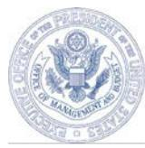

### EXECUTIVE OFFICE OF THE PRESIDENT OFFICE OF MANAGEMENT AND BUDGET WASHINGTON, D.C. 20503

THE DIRECTOR

M-24-15

July 25, 2024

MEMORANDUM FOR THE HEADS OF EXECUTIVE DEPARTMENTS AND AGENCIES

SHALANDA D. YOUNG Chalade FROM:

Modernizing the Federal Risk and Authorization Management Program SUBJECT: (FedRAMP)

The Federal Risk and Authorization Management Program, known as FedRAMP, was established by the Office of Management and Budget (OMB) through a December 8, 2011 memorandum from the Federal Chief Information Officer (CIO), "Security Authorization of Information Systems in Cloud Computing Environments,"1 to safely accelerate the adoption of cloud computing products and services by Federal agencies, and help those agencies avoid duplicating efforts by offering a consistent and reusable authorization process.

In 2022, recognizing the value that FedRAMP has provided to Federal agencies and to industry. Congress passed the FedRAMP Authorization Act ("the Act"). The Act established FedRAMP within the General Services Administration (GSA) and created a FedRAMP Board to provide input and recommendations to the Administrator of GSA.2 The Act also requires OMB to issue guidance defining the scope of FedRAMP, establishing requirements for the use of the program by Federal agencies, establishing further responsibilities of the FedRAMP Board and the program management office (PMO) at GSA, and generally promoting consistency in the assessment, authorization, and use of secure cloud services by Federal agencies.

As a result, this memorandum rescinds the Federal CIO's December 8, 2011 memorandum, and replaces it with an updated vision, scope, and governance structure for FedRAMP that is responsive to developments in Federal cybersecurity and substantial changes to the commercial cloud marketplace that have occurred since the program was established.

4 https://www.whitehouse.gov/wp-content/uploads/legacy drupal files/omb/assets/egov docs/fedrampmemo.pdf

2 Pub. L. No. 117-263, § 5921 (2022), codified in part at 44 U.S.C. §§ 3607-16.

#### I. Background

Since its establishment in 2011, FedRAMP has operated by partnering with agencies and third-party assessors to identify appropriate cloud computing products and services, and evaluate those products and services against a common baseline of security controls. Agency authorizing officials use this information to make informed, risk-based, and efficient decisions concerning the use of those cloud computing products and services. Since FedRAMP's inception, agencies have reused existing authorizations hundreds of times across over 300 offerings, and the program has provided a consistent gateway for industry to navigate entry and onboarding into the Federal marketplace.

When FedRAMP began, the Federal Government was focused on securely facilitating agencies' use of commercially available infrastructure as a service (laaS) offerings, which provide virtualized computing resources natively designed to be more scalable and automatable than traditional data center environments. In the years since, the commercial cloud marketplace has grown, especially in the area of software as a service (SaaS), which encompasses cloudbased applications made available over the internet. The COVID-19 pandemic only further accelerated the growth of the SaaS market, as shifts in the workplace landscape led more organizations to rely on remote collaboration tools for their workforce and to expand the online services they provide to their customers.

Because Federal agencies require the ability to use more commercial SaaS products and services to meet their enterprise and public-facing needs, FedRAMP must continue to change and evolve. While an IaaS provider might offer virtualized computing infrastructure appropriate for general-purpose enterprise uses. SaaS providers typically offer focused applications. A large agency might rely on only a few IaaS providers to support its custom applications, but could easily benefit from hundreds of different SaaS tools for various collaboration and missionspecific needs. SaaS providers may also target highly-tailored use cases that are only relevant to specific sectors and may not be useful to every agency, but which can significantly enhance the effectiveness of the agencies with missions in that sector.

Beyond the changing cloud marketplace, the Federal Government has learned important cybersecurity lessons over the last decade that should be reflected in its approach to cloud security. Keeping a step ahead of adversaries requires the Federal Government to be an early adopter of innovative new approaches to cloud security offered and used by private sector platforms. Federal agencies have finite resources to dedicate to cybersecurity, and must focus those resources where they matter the most. The use of commercial cloud services by Federal agencies is itself a major cybersecurity benefit, freeing up resources that would otherwise have to be dedicated to operating and maintaining in-house infrastructure.

Similarly. FedRAMP must also focus its attention and engagement with industry on security controls that lead to the greatest reduction of risk to Federal information and agency missions, grounding them in security expertise and real-world threat assessment. While defined compliance procedures can promote consistency and basic rigor, it is important to emphasize FedRAMP's primary purpose: to assist agencies in selecting and adopting cloud solutions with appropriate safeguards for the security of the information they process. To that end, FedRAMP must be an expert program that can analyze and validate the security claims of Cloud Service Providers (CSPs), while making risk management decisions that will determine the adequacy of a FedRAMP authorization for reuse within the Federal Government.

Strategic changes to the FedRAMP program will ensure that it can enable the Federal Government to safely use the best of the commercial cloud marketplace for years to come.

#### II. Vision

The purpose of the FedRAMP program is to increase Federal agencies' adoption and secure use of the commercial cloud, by providing a standardized, reusable approach to security assessments and authorizations for cloud computing products and services. Through centralization, FedRAMP reduces duplicative authorization activities, allowing CSPs to deliver and agencies to adopt secure cloud services more efficiently. Focusing FedRAMP on the highest value work, as outlined in this guidance, will support broader efforts to reduce the nation's cybersecurity risks, contributing to a more stable technology ecosystem by incentivizing CSPs to make security improvements that protect all of their Federal Government customers.

The goal of this guidance is to strengthen and enhance the FedRAMP program. FedRAMP has provided significant value to date, but the program must change to meet the needs of Federal agencies and the evolving cloud marketplace. The FedRAMP Marketplace must scale dramatically to enable Federal agencies to work with many thousands of different cloud-based services that accelerate key agency operations while allowing agencies to reduce the footprint of the information technology (IT) infrastructure that they directly manage.3

To achieve this, FedRAMP has several strategic goals and responsibilities:

- . Lead an information security program grounded in technical expertise and risk management. FedRAMP is a security program that should, in consultation with industry and security experts across the Federal Government, focus Federal agencies and CSPs on the most impactful security features that protect Federal agencies from the most salient threats. To do this, FedRAMP must be capable of conducting rigorous reviews and identifying and requiring CSPs to rapidly mitigate weaknesses in their security architecture. At the same time, FedRAMP is a bridge between industry and the Federal Government, and is expected to thoughtfully navigate
3 The FedRAMP Marketplace shows cloud computing products and services that are in progress or have completed a FedRAMP authorization. For additional information, refer to: https://marketplace.fedramp.gov/products.

situations where unthinking adherence to standard agency practices in a commercial cloud environment could lead to unexpected or undesirable security outcomes.

- Rapidly increase the size of the FedRAMP Marketplace by evolving and offering . additional FedRAMP authorization paths. FedRAMP has the challenging task of defining core security expectations for FedRAMP authorizations that will support the statutory presumption of their adequacy and lead to their reuse at the appropriate Federal Information Processing Standards Publication (FIPS) 199 impact level by agencies with a wide variety of risk postures.4 The presumption of adequacy is intended to engender trust in the FedRAMP Marketplace, create a consistent experience for cloud providers when navigating Federal security requirements, and ensure strong justifications for agency-specific requirements in the FedRAMP process. FedRAMP will develop alternative authorization paths for cloud computing products and services, beyond those described in this document, that embrace risk management principles, consistent with National Institute of Standards and Technology (NIST) standards and guidelines, and provide flexibility to agencies.
- Streamlining processes through automation. It is essential that FedRAMP . establish an automated process for the intake, use, and reuse of security assessments and reviews. Automating the intake and processing of machine-readable security documentation, continuous monitoring data, and other relevant artifacts will reduce the burden on program participants and increase the speed of implementing cloud solutions in a timely manner.
- Leverage shared infrastructure between the Federal Government and private . sector. FedRAMP should not incentivize or require commercial cloud providers to create separate, dedicated offerings for Federal use, whether through its application of Federal security frameworks or other program operations. The Federal Government benefits from the investment, security maintenance, and rapid feature development that commercial cloud providers give to their core products to succeed in the marketplace. Commercial providers similarly are incentivized to integrate improved security practices that emerge from their engagement with FedRAMP into their core services, benefiting all customers.

Structurally, FedRAMP consists of two parts: the PMO and the FedRAMP Board. The PMO, located within GSA and led by the FedRAMP Director, is responsible for operating a security authorization process that meets the needs of Federal agencies, provides a navigable experience for CSPs, and complies with applicable laws and policies, including this memorandum. The FedRAMP Board, composed of Federal technology leaders appointed by OMB, provides input to GSA, establishes guidelines and requirements for security

4 Refer to NIST FIPS 199, Standards for Security Categorization of Federal Information Systems and Information Systems, at: http://csrc.nist.gov/publications.

authorizations, consistent with relevant standards and guidelines of NIST, and supports and promotes the program within the Federal community.

#### Scope of FedRAMP III.

The Act charges OMB with specifying the categories or characteristics of cloud computing products and services that receive authorizations through FedRAMP.5 Agencies must obtain and maintain a FedRAMP authorization when the cloud product or service falls within the scope of this section.

FedRAMP's goal is to ensure that Federal information systems and Federal information continue to be protected, even when the agency that owns those systems and information does not have complete control over them. FedRAMP does not apply to every use of an internetbased service by a Federal agency.

The scope of FedRAMP is cloud computing products and services (such as IaaS, Platform-as-a-Service (PaaS), and SaaS) that create, collect, process, store, or maintain Federal information on behalf of a Federal agency, and that are not otherwise specified as out of scope below.6

The following categories of cloud computing products and services are specified as outside the scope of FedRAMP, subject to exceptions made by the FedRAMP Director with the approval of OMB:

- 1) Information systems that are only used for a single agency's operations, hosted on cloud infrastructure or platform, and are not offered as a shared service or do not operate with a shared responsibility model:
- 2) Social media and communications platforms used in accordance with agency social media policies:
- 3) Search engines:
- 4) Widely available services that provide commercially available information to agencies, but do not collect Federal information;
- 5) Ancillary services whose compromise would pose a negligible risk to Federal information or information systems, such as systems that make external measurements or only ingest information from other publicly available services; and
- 6) Any other categories of products or services identified for exclusion bv the FedRAMP Board, with the concurrence of the Federal CIO.

5 44 U.S.C. § 3614(1)(A).

6 This scope applies only to information systems that process unclassified information and are not national security systems as defined in 44 U.S.C. § 3552.

New types of cloud products and services are frequently introduced in the cloud marketplace. As this landscape continues to grow and change. FedRAMP should adapt with it. FedRAMP, in consultation with OMB, will publish guidelines for interpreting the categories above, with supporting examples that clearly illustrate what types of services are in and out of scope.

#### IV. The FedRAMP Authorization Process

The FedRAMP program provides for the issuance of FedRAMP "authorizations," making it easier and more efficient for agencies to securely use cloud computing products and services. 7 When the FedRAMP PMO confirms that a Cloud Service Offering (CSO)® meets the rigorous standards of FedRAMP authorization requirements and approves the offering for inclusion in the Marketplace, the CSO is considered FedRAMP-authorized. A FedRAMP authorization is not an endorsement of a product or service. Rather, by certifying that a cloud product or service has completed a FedRAMP authorization process, FedRAMP establishes that the security posture of the product or service has been assessed and is presumptively adequate for use by Federal agencies. The assessment of security controls and materials within a FedRAMP authorization package should also be presumed adequate when incorporated into a broader authorization for another CSO.

The FedRAMP Board shall establish and regularly update requirements and guidelines for security authorizations of cloud computing products and services, consistent with standards and guidelines established by NIST, to be used in the determination of FedRAMP authorizations. 9

## a. The Presumption of Adequacy

FedRAMP should reduce duplicative work for agencies and companies alike, bringing a measure of consistency and coherence to what the Federal Government requires from cloud providers. To that end, if a given cloud product or service has a FedRAMP authorization at a given FIPS 199 impact level, the Act requires that agencies must presume the security assessment documented in the authorization package is adequate for their use in issuing an authorization to operate at or below that FIPS 199 impact level. 10 This presumption of adequacy

9 44 U.S.C. § 3610(d)(2).

10 Id. § 3613(e)(1).

7 A FedRAMP authorization follows the steps in NIST Special Publication (SP) 800-37, Risk Management Framework for Information Systems and Organizations, but the control baselines used have been specifically tailored for cloud offerings. Agencies leverage the FedRAMP authorization package to issue their own "authorization to operate" (ATO) or "authorization to use" (ATU). FedRAMP does not replace other legal, Executive Order, regulatory, or OMB-issued compliance requirements for areas such as information management, records management, privacy, and cybersecurity. For example, agencies are responsible for implementing privacy requirements for cloud products and services in alignment with their agency privacy program.

8 A CSO may be a standalone cloud product or a collection of services offered together.

applies as long as a FedRAMP authorization is actively maintained by satisfying ongoing requirements (i.e., continuous monitoring). For this presumption to be useful. FedRAMP should ensure that its processes for authorization are usable for all types of cloud products and services and for unique agency needs. Multiple agencies must be able to rely on the FedRAMP authorizations.

This presumption of the adequacy of FedRAMP authorizations does not supersede or conflict with the authorities and responsibilities of agency heads under the Federal Information Security Modernization Act of 2014 (FISMA) to make determinations about their security needs.11 An agency may overcome this presumption if the agency determines that it has a "demonstrable need"12 for security requirements beyond those reflected in the FedRAMP authorization package, 3 or that the information in the existing package is "wholly or substantially deficient for the purposes of performing an authorization" of a given product or service. 14 If a new authorization is issued following additional work, the agency that performed the additional authorization work must document in the resulting authorization package the reasons that it found the previous FedRAMP package deficient. The agency will inform the FedRAMP PMO of the deficiency. The FedRAMP Director remains responsible for deciding whether an agency's additional security needs merit conducting additional FedRAMP authorization work, and thus using additional FedRAMP resources, to support a revised package.

## b. Authorization Process Requirements

FedRAMP is responsible for defining the processes and criteria that must be met in order for a cloud product or service to receive a FedRAMP authorization.15 For cloud products and services that do not fall within the scope as described in Section III, a FedRAMP authorization is not required. FedRAMP should take advantage of the authorization work that is already happening within agencies that can support Government-wide reuse. To that end, the FedRAMP program will establish a process and criteria for expediting the authorization of packages submitted by interested agencies with demonstrably mature authorization processes.

15 Id. § 3609(a)(2).

11 FedRAMP provides the mechanism for agencies to leverage (reuse) existing authorization artifacts (such as system security plans and assessments) for cloud offerings with a FedRAMP authorization. In doing so, the appropriate agency authorizing officials must issue an authorization when reusing artifacts (such as system security plans and assessments) in the FedRAMP repository. An authorizing official is a senior agency official or executive with the authority to formally assume responsibility for operating an information system at an acceptable level of risk to agency operations and assets, for example.

12 For example, a demonstrable need might be the need for an agency to implement additional security controls to address specific legal requirements pertaining to an agency's use of the system.

13 44 U.S.C. § 3613(e)(2)(B).

14 Id. § 3613(b).

FedRAMP is designed to enable use of innovative cloud technologies by Federal agencies in a way that appropriately manages risks. Accordingly, the FedRAMP authorization process should not only require CSPs to demonstrate security capabilities that meet the expectations of Federal agencies, but should also recognize the value of newer industry practices that offer alternative implementation methods that improve security and/or compensate for controls that would ordinarily be required. This process for assessing and documenting the security of cloud computing products and services is a shared responsibility between the agency and the CSP.

## c. Authorization Paths

To promote reusability while accommodating different use cases within the Federal Government, FedRAMP will support the following paths to obtain FedRAMP authorization:

- 1) Agency authorizations, signed by the Federal agency's authorizing official, indicate that an agency or a joint group of agencies assessed a CSP's security posture in accordance with FedRAMP guidelines and found it acceptable. The FedRAMP Director is responsible for ensuring that authorizations can reasonably support the presumption of adequacy.
Authorizations by a single agency will be designed to enable the agency to safely use a cloud product or service in a manner consistent with that agency's use and risk tolerances.

Authorizations can also be conducted jointly by multiple agencies. 16 to enable a cohort of agencies with similar needs to pool resources and achieve consensus on an acceptable risk posture for use of the cloud product or service. The FedRAMP Board will proactively identify Federal agency IT leaders to form authorization groups to expand the FedRAMP authorizing capacity of the Federal ecosystem. CSOs that receive high reuse across the Federal enterprise make likely candidates for joint authorizations to manage availability and other security risks that cannot be accounted for in an individual agency's determination of FIPS 199 impact level. For authorizations managed by multiple agencies, agencies are expected to ensure efficient communication structures and apply the presumption of adequacy.

- 2) Program authorizations, signed by the FedRAMP Director, indicate that FedRAMP assessed a cloud service's security posture and found it met FedRAMP requirements and is acceptable for reuse by agency authorizing officials.
16 A FedRAMP authorization conducted by multiple agencies is similar in concept to that of the FedRAMP Joint Authorization Board "provisional ATO" (JAB P-ATO) used under the prior FedRAMP policy structure. However, unlike a JAB P-ATO, these authorizations can be issued by any group of agencies. Existing JAB P-ATOs at the time of the issuance of this memorandum will be re-designated as determined by the FedRAMP PMO in collaboration with the CSP.

These authorizations are intended to allow the FedRAMP program to enable agencies to use a cloud product or service for which an agency sponsor has not been identified. but for which use by a number of Federal agencies could be reasonably expected should the CSO be authorized. These authorizations may also be used for cloud services that have become widely adopted by agencies since their initial FedRAMP authorization, to provide centralized and consistent oversight and risk management.

- 3) Any other paths to authorization, designed by the FedRAMP PMO, in consultation with OMB and NIST, and approved by the FedRAMP Board, to further promote the goals of the FedRAMP program. In all cases, any alternative pathways will adhere to the rigorous standards of the FedRAMP program.
The FedRAMP PMO is responsible for ensuring that the various paths to authorization successfully achieve their goals, and for generally enabling Federal agencies to safely meet their mission needs. The FedRAMP PMO oversees the process for all FedRAMP authorizations, and works with agency program staff and authorizing officials to make necessary risk management decisions. Agency authorizing officials determine acceptable risk for their agency, and the FedRAMP Director determines acceptable risk for what can be called a FedRAMP authorization. As part of the agency authorization process, agencies may decide to authorize a CSP with an existing FedRAMP authorization at a higher impact level after applying the appropriate tailoring process. 17

## d. Assessing Security Postures

Regardless of the authorization path, FedRAMP should consistently assess and validate cloud providers' complex architectures and encryption schemes to ensure confidentiality, integrity, and availability of cloud computing products and to verify that relevant security control implementations are reasonable and operate as intended. The FedRAMP Director should draw on technical expertise across the Government and industry as necessary to ensure that these assessments can be conducted. Assessments will include reviewing documentation, and may also involve intensive, expert-led "red team"18 assessments at any point during or following the authorization process.

The FedRAMP Board represents the needs of the Federal community and the interests of the FedRAMP program as a whole, and should be responsive to the evolving needs of the Federal community and the changing nature of the cloud ecosystem. The FedRAMP Board is responsible under the Act for establishing and regularly updating requirements and guidelines for

17 For information on impact levels, refer to NIST FIPS 199, Standards for Security Categorization of Federal Information Systems and Information Systems, at: http://csrc.nist.gov/publications.

18 The NIST glossary of terms, at https://csrc.nist.gov/glossary, defines "red-team" as "a group of people authorized and organized to emulate a potential adversary's attack or exploitation capabilities against an enterprise's security posture." Any red-team efforts will be performed in accordance with the Federal Acquisition and other applicable guidance provided by DHS's Cybersecurity and Infrastructure Security Agency (CISA) and the FedRAMP PMO.

security authorizations used in the FedRAMP process. 9 As such, the FedRAMP Board engages with the FedRAMP PMO and its processes as a whole and is not expected to participate in the approval of individual authorization packages.

The authorization process must integrate agile principles and recognize that security is a risk-management process. To achieve this, FedRAMP will leverage the use of threat information to prioritize control selection and implementation. FedRAMP will update its security control baselines and will tailor them using a threat-based analysis. produced in collaboration with Cybersecurity and Infrastructure Security Agency (CISA) that focuses on the application of those controls that address the most salient threats. The use of threat intelligence, and threat modeling will help agencies better identify the security capabilities necessary to reduce agency susceptibility to a variety of threats, including hostile cyber-attacks, natural disasters, equipment failures, errors of omission and commission, and insider threats. This process will also apply to other review procedures, including when a provider seeks to modify an existing FedRAMP-authorized service. Summary findings of this analysis will be available to agencies engaged in the FedRAMP authorization process.

## e. Supporting the FedRAMP Marketplace

The FedRAMP Marketplace facilitates interagency awareness of services available for reuse. It displays cloud computing products and services that are in the process of obtaining or have completed a FedRAMP authorization. The FedRAMP Board may create additional designations for CSOs that may not constitute a full authorization. These designations may be listed on the Marketplace to encourage CSP adoption, security by design, and signify there has been coordination between FedRAMP and an agency.

Similarly, to support a robust Marketplace, agencies may in some circumstances require a FedRAMP authorization as a condition of contract award, but only if there are an adequate number of vendors to allow for effective competition, or an exception to legal competition requirements applies.20

GSA, in consultation with the FedRAMP Board and the CIO Council, develops criteria for prioritizing products and services expected to receive a FedRAMP authorization.21 GSA will ensure that these criteria prioritize products and services based on agency demand, as well as critical or emerging technologies that might otherwise remain unavailable to agencies, while facilitating the goals of this policy, such as automation, shared commercial platforms, and reuse.

19 44 U.S.C. § 3610(d).

20 Inclusion of FedRAMP Authorization as a condition of contract award or use as an evaluation factor should be discussed with the agency acquisition integrated project team (IPT), including appropriate legal representation. Refer to FedRAMP.gov for Frequently Asked Questions regarding acquisition.

21 44 U.S.C. § 3609(b)(2).

GSA will identify critical technologies unavailable to agencies and ensure the criteria prioritize those technologies.

To identify more cloud service offerings that could become FedRAMP authorized, and to accelerate their eventual path to being authorized, FedRAMP will provide procedures for issuing a time-specific temporary authorization, as discussed in NIST risk management guidelines.22 that would allow Federal agencies to pilot the use of new cloud services that do not yet have a full FedRAMP authorization. Consistent with FedRAMP's policies and procedures, such an authorization would serve as a preliminary authorization to provide for use of the covered product or service on a trial basis for a specified period of time, not to exceed twelve months, with the goal of more easily supporting a potential full FedRAMP authorization.23 After twelve months, the temporary authorization will terminate, unless the CSP is in-progress for a full FedRAMP authorization. The FedRAMP PMO will provide further guidance on pilots, including any notification requirements.

#### V. Automation and Efficiency

As part of a technology-forward program optimized for efficiency and consistency. FedRAMP processes should be automated wherever possible to support the rapid delivery of services and improve security outcomes.24 GSA must establish a means of automating FedRAMP security assessments and reviews, and agency and CSP reuse of an existing authorization. 25 To ensure that GSA meets that requirement, FedRAMP should receive all artifacts in the authorization process and continuous monitoring process as machine-readable data.20 through application programming interfaces (APIs), to the extent feasible. The package exchange APIs should support predictable and self-service integration between services operated by FedRAMP and by CSPs. The FedRAMP PMO, in consultation with the FedRAMP Board, will explore the use of Artificial Intelligence (AI) in the FedRAMP security assessment review and continuous monitoring processes. FedRAMP will begin by piloting the use of this emerging technology to determine feasibility and utility in an effort to improve security outcomes and scalability.

24 44 U.S.C. § 3609(c).

25 Id. § 3609(c)(2).

22 NIST SP 800-37, Risk Management Framework for Information Systems and Organization, includes discussion of issuing authorizations for a short period of time.

23 FedRAMP will provide additional procedures related to this trial process, and agencies are encouraged to coordinate with FedRAMP to ensure that there is no potential gap in service when the trial period concludes.

26 Artifacts in PDF, Word, or similar formats optimized for human readability should not be considered machinereadable data in this context because they will not be as effective for reliably automating program processes as data formats optimized for machine-based consumption (such as JSON, XML, and related formats).

Automation relies on interoperable standards.27 The FedRAMP PMO will work with OMB, NIST, and CISA, as well as private-sector providers of governance, risk, and compliance tools, to provide for the submission of security assessment artifacts and continuous monitoring information using Open Secure Control Assessment Language (OSCAL) or any succeeding protocol as defined by FedRAMP. FedRAMP must facilitate interoperability, and develop and publish relevant standards for that transition. Agencies must have the necessary procedures in place to produce, accept, and submit materials in machine-readable formats. The FedRAMP PMO will also identify additional FedRAMP processes in need of automation to promote efficiency and effectiveness within the program, and facilitate broader access to FedRAMP artifacts for agency partners with a mission need.28

Automating the FedRAMP process goes beyond technical implementation to procedural efficiencies. To streamline the authorization of cloud products and services. FedRAMP must maintain an inventory of the services that constitute a CSO and provide per-service customer adoption assets, including relevant control responsibilities, inheritance, and secure implementation guidance. FedRAMP will analyze these assets to create guidance that supports CSPs and agencies in streamlining the authorization process for cloud products and services that use FedRAMP-authorized infrastructure or platforms.

Many existing CSOs have implemented or received certifications based on external security frameworks. Performing an additional assessment of each offering every time a product that uses an existing certification goes through the FedRAMP process unnecessarily slows the adoption of such cloud computing products and services by the Federal Government. Therefore, FedRAMP will establish criteria for accepting widely-recognized external security frameworks and certifications applicable to cloud products and services, based on FedRAMP's assessment of relevant risks and the needs of Federal agencies. This will include leveraging external security control assessments and evaluations in lieu of newly performed assessments, as well as designating certifications that can serve as a full FedRAMP authorization, if appropriate. The use of external security assessments will target offerings that are FIPS 199 impact level low, and may include higher impact level recognition where sufficient harmonization and coordination is present between FedRAMP and external frameworks.28 Regardless of the path to authorization. all cloud services must meet the FedRAMP continuous monitoring requirements for the selected impact level.

27 FedRAMP has identified NIST's Open Secure Control Assessment Language (OSCAL) as the machine-readable, standardized data format. Agencies must use OSCAL until such time as NIST formally designates a successor.

20 Access processes should be streamlined to expand the number of individuals who can approve access, as well as streamline and broaden access for those with a need-to-know. This will also be accompanied by expanding the nature and scope of artifacts provided in a machine-readable format, including control inheritance artifacts.

29 Refer to NIST FIPS Publication 199, Standards for Security Categorization of Federal Information and Information Systems, for additional information regarding security categorization of information.

In accordance with guidance provided by FedRAMP, agencies may make risk management decisions regarding acceptable controls, which may include allowing compensating controls or risk-acceptance for certain situations or types of cloud offerings where there are gaps or misalignments between Federal and external security frameworks. FedRAMP may also justify acceptance of a given level of security risk to support broader interoperability with industry security processes, reduced burden on providers, or further streamlining of FedRAMP authorizations and processes. Risk acceptance determinations must align with the guidance and requirements established by the FedRAMP Board. FedRAMP authorizations that leverage external frameworks shall also be presumed adequate.

#### VI. Continuous Monitoring

FedRAMP's continuous monitoring processes should incentivize security through agility, and should enable Federal agencies to use the most current and innovative cloud computing products and services possible. FedRAMP should seek input from CSPs and develop processes that enable CSPs to maintain an agile deployment lifecycle that does not require advance Government approval, while giving the Government the visibility and information it needs to maintain ongoing confidence in the FedRAMP-authorized system and to respond timely and appropriately to incidents.

The FedRAMP PMO, in coordination with the FedRAMP Board and CISA, is responsible for establishing a framework for continuous monitoring of cloud services and products, subject to the approval of OMB and the Department of Homeland Security (DHS). FedRAMP is encouraged to develop a framework that:

- . Prioritizes agility of development and deployment by CSPs, to support automation, the rapid development of security features in cloud products, and broader development, security, and operations (DevSecOps) practices within the cloud ecosystem:
- . Redesigns the process for overseeing changes to cloud computing products and services to one that primarily monitors the CSP's change process itself, rather than individual changes. Once a CSO is authorized, the FedRAMP process should generally empower CSPs to deploy changes and fixes at their own pace, without requiring advance approval from FedRAMP or an authorizing official for individual changes to existing FedRAMP authorized products and services;
- Provides CISA technical data to understand risks and to detect threats to agency ● information and information systems;
- Avoids promoting the division of cloud services into commercially-focused and . Government-focused instances. In general, to encourage both security and agility, Federal agencies should use the same infrastructure relied on bv the rest of CSPs' commercial customer base:
- Ensures CSP incident response resilience through procedures, communication and . reporting timelines, and other tools that help to protect Federal systems and information from potential attacks on cloud-based infrastructure: and
- . Facilitates regular and routine updates to the framework implementation based on the most pressing threats, policies, regulations, and guidance,

For all FedRAMP authorized products and services, the FedRAMP PMO will provide a standard level of continuous monitoring support. The FedRAMP PMO will set this standard level of monitoring support by analyzing and identifying the highest-impact controls for ensuring the security of FedRAMP products and services. It will provide recommendations for the supported monitoring levels to the FedRAMP Board for review, feedback, and approval. When finalized, the FedRAMP PMO will provide supported monitoring to all agency customers of authorized FedRAMP products and services. The monitoring data provided to agencies will support agencies in making risk determinations for authorized cloud computing products and services, including when the CSO is leveraged within another information system.

The FedRAMP PMO may conduct a special review of existing FedRAMP authorizations, regardless of authorization path. The FedRAMP Board must approve the special review and establish an expedited deadline for its completion. Once approved, the FedRAMP Director will work with the FedRAMP Board to jointly convene a working group consisting of members from across the Federal Government with relevant expertise. This working group will have the specific purpose of developing processes and goals tailored to the nature and technical architecture of the CSP, and will oversee the review of the CSP's authorizations. Within the deadline established by the Board for the review, the working group will conclude its work and produce a report, which will be submitted to the FedRAMP Director and FedRAMP Board, along with any recommended changes that should be required of the CSP to maintain a FedRAMP authorization.

When the FedRAMP PMO becomes aware of significant vulnerabilities in a CSO with a FedRAMP authorization, the FedRAMP PMO will provide that information to the CSP and impacted agencies for remediation and establish escalation pathways for vulnerabilities not sufficiently addressed in a timely manner. Unresolved concerns that are not addressed in a timely-manner may be noted to potential agency customers on the FedRAMP Marketplace. The FedRAMP PMO will develop and maintain procedures for responding to CISA Binding Operational and Emergency Directives (BODs),30 in collaboration with CISA, OMB, and the FedRAMP Board.

To increase integrity and further trust in the FedRAMP program, FedRAMP should leverage Government-wide tools and best practices to enhance its monitoring efforts.

30 CISA 's BODs may be viewed at: https://www.cisa.gov/news-events/directives.

Specifically, to the greatest extent possible, FedRAMP must ensure that it uses CISA's capabilities and shares relevant data and tools for monitoring FedRAMP's products and services.

#### VII. Roles and Responsibilities

This section details the responsibilities and interactions of key Government stakeholders that make up or interact with FedRAMP. These stakeholders include GSA, the FedRAMP Board, the FedRAMP Technical Advisory Group, NIST, CISA, and Federal agencies. The roles and responsibilities below are intended to identify many of the critical directives of this policy and applicable statutes.

# a. The General Services Administration

GSA resources, administers, and operates the FedRAMP PMO, and is responsible for the successful implementation of FedRAMP.31

In operating FedRAMP, GSA will fulfill a variety of responsibilities, including:

- 1) Develop and implement the process for FedRAMP authorizations, in consultation with DHS:32
- 2) Define core security expectations across FedRAMP authorizations, consistent with this guidance and direction of the Board, including for requirements that may persist following authorization, such as continuous monitoring or red-teaming;
- 3) Grant FedRAMP authorizations consistent with the guidance and direction of the Board and Section III of this memorandum. including program authorizations for cloud computing products and services that meet FedRAMP requirements and threatbased risk analysis:
- 4) Provide in-process CSOs with additional transparency on the status of their authorization:
- 5) Identify and address barriers to achieving and maintaining FedRAMP authorizations and provide stakeholder training as part of that effort;
- 6) Provide a certain standard level of continuous monitoring support for the highestimpact controls of FedRAMP products and services, to include the use of machinereadable formats for automated data exchange where possible;
- 7) Develop partnerships with Federal agencies to promote authorizations and reuse, and establish a secure, transparent, and automated process for enabling agency officials' access to artifacts in the FedRAMP repository;

31 44 U.S.C. & 3608.

32 This process should provide any necessary clarification or specific procedures that agencies must be aware of related to their use of ongoing authorizations and continuous monitoring. For additional information on oneoing authorizations and continuous monitoring, refer to NIST SP 800-37 at: http://csrc.nist.gov/publications.

- 8) Consult with the Federal Secure Cloud Advisory Committee (FSCAC)33 as appropriate:
- 9) Proactively engage with the commercial cloud sector, to communicate, as appropriate, the priorities of the Federal agency community and maintain awareness of contemporary technology and security practices;
- 10) Establish systems that support automated, machine-readable processing of authorization materials, and drive adoption of relevant standards throughout the cloud ecosystem;
- 11) Provide guidance related to control inheritance from existing FedRAMP-authorized cloud products and services:
- 12) Provide guidance and tooling, in consultation with NIST. for the use of OSCAL bv CSPs and agencies:
- 13) Develop, as necessary, best practices and sample contract clauses and provisions for the procurement of cloud computing products and services, in coordination with OMB, the CIO Council, the Chief Acquisition Officers Council, and the FedRAMP Board, and in consultation with the FSCAC;
- 14) In coordination with OMB and DHS, determine the adequacy of existing requirements for identification and assessment of the provenance of the software in cloud services and products:
- 15) Provide guidance implementing the requirement for independent assessors to provide the FedRAMP PMO with information relating to a foreign interest in, foreign influence over, or foreign control of the independent assessment service;
- 16) Establish metrics that measure agency participation in FedRAMP, the time and quality of each step of the initial FedRAMP authorization process and ongoing interactions with the FedRAMP program, and any other metrics requested by the FedRAMP Board or OMB to measure program health, and follow up with agencies as needed:
- 17) Position FedRAMP as a central point of contact to the commercial cloud sector for Government-wide communications or requests for risk management information concerning commercial cloud providers used by Federal agencies; and
- 18) Establish standard criteria for accepting widely recognized external cloud security frameworks and certifications as part of the FedRAMP authorization process.
- b. The FedRAMP Board

The FedRAMP Board consists of up to seven senior officials or experts from agencies that are appointed by OMB in consultation with GSA.34 The Board must include at least one

33 The FSCAC is established in accordance with the James M. Inhofe National Defense Authorization Act for Fiscal Year (FY) 2023, as codified at 44 U.S.C. § 3616.

34 44 U.S.C. § 3610(b).

representative from each of GSA. DHS. and the Department of Defense, and will include representation from other agencies as determined by OMB. The FedRAMP Board members must possess technical expertise in cloud computing, cybersecurity, privacy, risk management, and other competencies identified by OMB, in consultation with GSA, 35 OMB may elect to adjust the board membership over time, and the membership will be documented in the FedRAMP Board Charter maintained by GSA. OMB, through the Federal CIO, will participate in FedRAMP Board meetings to provide oversight and guidance, and the Office of the National Cyber Director may attend Board meetings as appropriate to assist in the coordination of FedRAMP activities with national cyber policy and strategy.

As a body intended to represent the entire participating Federal community, the FedRAMP Board should, in general, endeavor to maintain consensus among its members when making decisions. To ensure FedRAMP's effectiveness and efficiency, however, the Board must be able to reach final resolutions even when consensus is unattainable. Accordingly, it is the Board's responsibility to adopt internal operating procedures under which final decisions will be made even in the absence of unanimous support from its members.

The following responsibilities of the Board have been established by or pursuant to the Act:

- 1) Provide input and recommendations to GSA regarding the requirements and guidance for, and the prioritization of, security assessments of cloud products and services;
- 2) Identify and convene Federal agency IT leaders to form authorization groups composed of multiple agencies, to jointly perform authorizations that leverage trust and shared needs between those agencies, to expand the FedRAMP authorizing capacity of the Federal ecosystem:
- 3) In consultation with GSA, serve as a resource for best practices to accelerate the process for obtaining a FedRAMP authorization;
- 4) Establish and regularly update requirements and guidance for security assessments of cloud computing products and services (including pilots), including Governmentwide shared services, consistent with standards defined by NIST, to be used in the determination of a FedRAMP authorization. This guidance will include approval for additional authorization paths and FedRAMP designations designed by the PMO;
- 5) Approve criteria for accepting (in whole or in part) widely recognized security frameworks and certifications applicable to cloud, based on its assessment of relevant risks and the needs of Federal agencies;
- 6) Monitor and oversee, to the greatest extent practicable, the processes and procedures by which agencies determine and validate requirements for a FedRAMP authorization, including periodic review of agency determinations that existing assessments in the FedRAMP repository were not sufficient for the purpose of performing an authorization:

35 Id. § 3610(c).

- 7) Ensure consistency and transparency between agencies and CSPs in a manner that minimizes confusion and engenders trust;
- 8) Promote FedRAMP through internal and external outreach activities; and
- 9) Perform other roles and responsibilities as assigned by OMB, acting through the Federal CIO, with the concurrence of GSA.

As agreed by OMB and GSA, the Board will also provide input to GSA regarding the establishment of metrics reflecting the time and quality of the assessments necessary for completion of a FedRAMP authorization.

## c. Technical Advisory Group

OMB and GSA will establish a Technical Advisory Group (TAG) to provide additional subject matter expertise to FedRAMP. The FedRAMP TAG will consist of a team of Federal practitioners not directly associated with the FedRAMP program that will provide advice and insights to FedRAMP on an as-needed basis. The TAG is not a governance body and only provides technical advice on pre-decisional information and situations, making it distinct from the FSCAC or the FedRAMP Board.

The TAG will comprise of several technical experts in cloud technologies, cybersecurity, privacy, risk management, digital service delivery, and other competencies as identified by GSA, with the concurrence of OMB. TAG members will be Federal employees. The FedRAMP PMO will provide operational support for the functions of the TAG.

The TAG will:

- 1) Provide recommendations on best practices in continuous monitoring of cloud services and establishing control criteria;
- 2) Provide advice on issues that arise during the process of performing risk assessments and technical reviews of authorization packages; and
- 3) Advise on other issues as requested by the FedRAMP Director or the FedRAMP Board.

## d. Agencies

To further strengthen the FedRAMP program, each agency must:

- 1) Upon issuance of an authorization to operate or use based on a FedRAMP authorization, provide a copy of the authorization letter and any relevant supplementary information to the FedRAMP PMO, including agency-specific configuration information, as deemed appropriate, that may be helpful to other agencies:
- 2) Ensure authorization artifacts meet FedRAMP requirements and are of sufficient quality for reuse by other agencies:
- 3) Ensure authorization materials are provided to the FedRAMP PMO using machinereadable and interoperable formats, in accordance with any applicable guidance from the FedRAMP program;
- 4) Leverage other agency security authorization materials within the FedRAMP repository to the greatest extent possible;
- 5) Continuously diagnose and mitigate against cyber threats and vulnerabilities associated with usage of cloud service offerings;
- 6) Ensure that agency governance, risk, and compliance (GRC) tools and systeminventory tools can produce, transmit, and ingest machine readable authorization artifacts using OSCAL or any succeeding formats as identified by FedRAMP;
- 7) Provide data and information concerning how they are meeting relevant security metrics, in accordance with OMB guidance:
- 8) Report costs related to the issuance of FedRAMP authorizations, in accordance with OMB budget guidance;
- 9) Ensure that relevant contracts include language incorporating the FedRAMP security authorization requirements established by GSA pursuant to paragraph a.2 above; and
- 10) Regularly review continuous monitoring materials provided by CSPs, and provide timely and actionable feedback as necessary to manage risk to the Government.
- e. Department of Commerce

NIST, within the Department of Commerce, consistent with existing authorities, is responsible for developing and issuing standards and guidelines for the security and privacy of information in Federal information systems. In doing so. NIST has an essential role in the FedRAMP process.

NIST will:

- Assess and update standards and guidelines, as determined necessary, to keep pace 1) with the evolving technology landscape and support the continued evolution of FedRAMP:
- Monitor and review private sector information security practices to understand 2) potential application; and
- 3) Support automation of security assessments, continuous monitoring, and other artifacts or processes required by the Risk Management Framework for Information Systems and Organizations. 36

# VIII. Industry Engagement

FedRAMP is a bridge between the Federal community and the commercial cloud marketplace. The FedRAMP program enables agencies to obtain what they need from the

36 NIST SP 800-37, Guide for Applying the Risk Management Framework to Federal Information Systems: A Security Life Cycle Approach.

commercial ecosystem and accelerate mission operations. At the same time, FedRAMP helps commercial providers satisfy similar needs across the Federal Government in a consistent and streamlined way.

To further the program's goals. GSA and the FedRAMP Board should engage with industry, through the FSCAC and other mechanisms as appropriate, to maintain a current understanding of industry technologies and practices, to understand where the FedRAMP program could improve its policies or operations, and to otherwise build a strong working relationship between the commercial cloud sector and the Federal community.

FedRAMP should continue to seek feedback from industry on how to increase agency reuse of FedRAMP authorizations, drive more authorizations of small or disadvantaged businesses, and reduce the burden and cost of the FedRAMP authorization process for both CSPs and Federal agencies.

Additionally, the FedRAMP PMO and Board should proactively work to convene industry to convey the emerging cybersecurity priorities and needs of the Federal Government as an enterprise, and discuss potential solutions.

It is inefficient for CSPs to report the same information repeatedly to each Federal agency customer they serve. The FedRAMP PMO is positioned to act as a central point of contact when the Federal Government needs to gather information about cloud computing products and services used by agencies. Such needs may flow from OMB policies, CISA BODs, or other Government-wide directives or initiatives that require the collection of cloud security information.

#### IX. Implementation

For two vears. FedRAMP will submit an annual plan in the second quarter of FY 2025 and FY 2026, approved by the GSA Administrator, to OMB, detailing program activities, including staffing plans and budget information, for implementing the requirements in this memorandum. The plan will include a timeline and strategy to bring any pending authorizations or existing FedRAMP initiatives into conformance with the Act and this memorandum.

Within 180 days of issuance of this memorandum, each agency must issue or update agency-wide policy that aligns with the requirements of this memorandum. This agency policy must promote the use of cloud computing products and services that meet FedRAMP security requirements and other risk-based performance requirements as determined by OMB, in consultation with GSA and CISA. In accordance with the presumption of adequacy of FedRAMP authorizations, agency policies should not assume that particular paths or sponsors of FedRAMP authorizations are unacceptable.

Within 180 days of issuance of this memorandum, GSA will update FedRAMP's continuous monitoring processes and associated documentation to reflect the principles in this memorandum.

Within one year of the issuance of this memorandum, GSA will produce a plan, approved by the FedRAMP Board and developed in consultation with industry, to structure FedRAMP to encourage the transition of Federal agencies away from the use of Government-specific cloud infrastructure. As part of the plan development process. GSA will explore the use of emerging technologies in various FedRAMP processes, as appropriate.

The Act requires GSA to establish a means for the automation of security assessments and reviews. Within 18 months of the issuance of this memorandum, GSA will build on this work to receive FedRAMP authorization and continuous monitoring artifacts through automated, machine-readable means, to the extent possible. Some continuing reliance on documentation may be necessary where machine-readable representations are not possible. Within 24 months of the issuance of this memorandum, agencies shall ensure that agency GRC and system-inventory tools can ingest and produce machine-readable authorization and continuous monitoring artifacts using OSCAL, or any succeeding protocol as identified by FedRAMP.

#### X. Rescissions

This memorandum rescinds "Security Authorization of Information Systems in Cloud Computing," issued by the Federal Chief Information Officer on December 8, 2011.

#### XI. Policy and Program Implementation Assistance

Questions about this memorandum should be addressed to the OMB Office of the Federal Chief Information Officer via email: ofcio@omb.eop.gov.