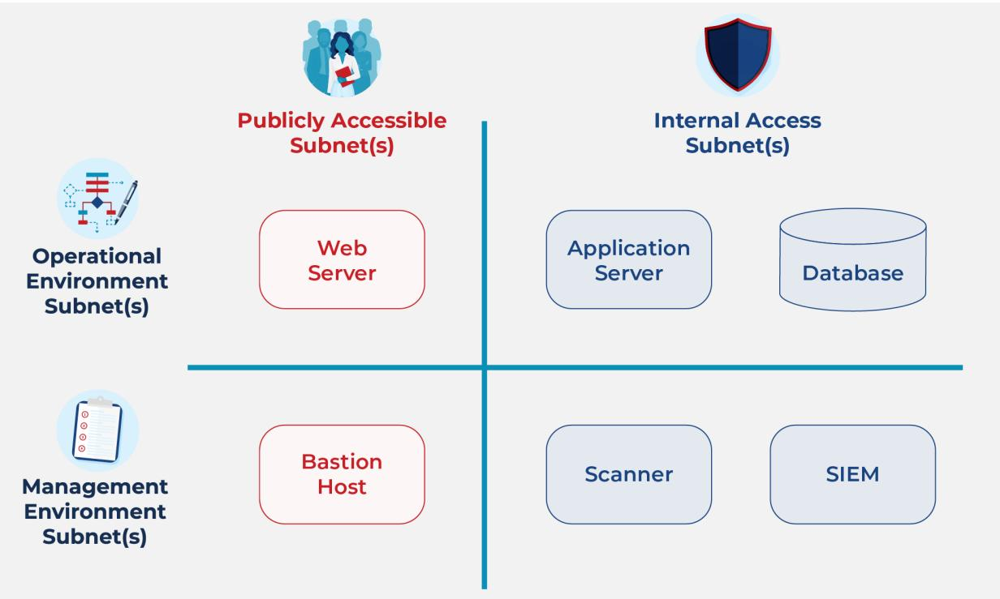

# Subnets

#### What They Are and Why They Matter

Version 1.0 06/02/2022

info@fedramp.gov fedramp.gov

#### What is a subnet?

A subnetwork (subnet) is a physically seqmented section of a larger network defined at TCP/P Layer 3 to both minimize traffic and, importantly for a FedRAMP Authorization, add a crucial layer of network isolation. Subnets are distinct from virtual LANs (VLANs) (Layer 2), security groups (SGs), and virtual private clouds (VPCs), and are specifically required to satisfy the National Institute of Standards and Technology (NIST) controls described below.

#### Where are subnets required?

FedRAMP requires network seqmentation using subnets for cloud service environments into a confiquration that protects federal data as directed in security controls SC-7 (b) and SC-7 (13):

SC-7(b) requires that publicly accessible components must be separated in subnet(s) from the remainder of the system.

- . For most systems, this security control means the servers handling loq-in or first information presentation, such as web servers and bastion hosts, should reside in separate subnets from the remainder of the environment.
- This control part focuses on the publicly accessible "first hop," and discounts network devices, such ● as firewalls, and load balancers.
- o There is often confusion as to what constitutes 'publicly accessible'. We address this in greater detail in the following sections.

SC-7(13) requires that management components must be in separate subnets from operational components.

- For most systems, this security control means the servers for security, such as scanning and logging, 0 should be in separate subnets from the application servers and databases of the operational environment.
- 0 This enhancement is qenerally well understood by CSPs and other stakeholders, and is rarely an issue during FedRAMP reviews.

### What does SC-7 compliant subnetting look like?

The diagram below illustrates how these two parts of SC-7 fit together. Each component will drop into a subnet in one of the four quadrants. Most systems will have many more subnets than these, but additional subnets should avoid straddling the blue lines.

#### What is "publicly accessible?"

What constitutes "publicly accessible" is sometimes misunderstood. The Joint Authorization Board (JAB) considers the term "publicly accessible" to include the first compute instance that can be accessed from outside the boundary. These components often handle tasks such as authentication, or delivering the first data back to a destination outside the boundary.

Consider a web server. When a browser accesses a system across the boundary, the connection is to the web server, reqardless of how many devices are in between. The vast majority of vulnerabilities of concern are server vulnerabilities, and it will almost always be the web server that is first compromised when an attack occurs. Intruders have reduced potential for access to components on the other side of the web server, such as a database.

There can be several network devices between the first compute device and the boundary, such as firewalls, qateways, load balancers, and proxy servers. While these do provide some protection, they fail to significantly address several threat vectors. Let's discuss two of them:

- Intruder Access: Ingress rules on managed interfaces protecting publicly accessible components o will allow traffic from outside the boundary. Separate rules must be defined for internal components that block such access.
- 0 Compromise of a publicly accessible component (e.q. a web server): Defense at this point is focused on the prevention of lateral movement of the intruder. Clear rules must be defined on manaqed interfaces protecting publicly accessible components to block any traffic exiting the compromised component except what is expected.

Threat protection comes from a carefully orchestrated configuration of subnets, managed interfaces, and access rules. Subnets are the foundation, and components that meet the publicly accessible definition should reside in subnets separated from the remainder of the system components.

Most laaS/PaaS vendors' implementations of software defined networking (SDN) make the provisioning and management of additional subnets very straightforward. This ease of provisioninq and management of subnets minimizes the enqineering effort, particularly when done early in the design process. Even when discovered as late as during the FedRAMP review process, the bigger impact to most CSPs is the delay in the authorization process rather than the actual technical effort required to remediate.

## What should CSPs be doing? What should Agencies and 3PAOs be looking for?

SC -7(b) explicitly requires publicly accessible compute devices to be in separate subnets from the rest of the internal components. If your first compute instance is in the same subnet as other components processing or storing federal data, those internal components will have to be moved to a separate subnet.

For SC -7(b), Cloud Service Providers (CSPs), Third Party Assessment Organizations (3PAOs), and Aqencies should start with the Network Diagram in the System Security Plan (SSP), and review each line crossing the boundary looking for the first compute component of that connection. Every component that meets this criteria should be in a separate subnet from all the remaining compute and storaqe components that do not meet this criteria.

Note: The Network Diagram should include all of the external and internal components depicted on the Authorization Boundary Diagram with an overlay for the subnet architecture.

If a CSP has a SC -7(b) finding that cannot be addressed immediately, it must be captured in the Plan of Actions and Milestones (POA&M) with a justification for the delay, and a reasonable timeframe for remediation. If a CSP determines that impacts full operation of the cloud service offering, the POA&M item could be categorized as an Operational Requirement (OR). An OR should include sufficient rationale on why they cannot meet this control as stated, note any mitigating actions that are currently in place, and the CSP must work with their partnering agency or the |AB for review, approval, and Authorizing Official (AO) risk acceptance.

lmplementations that rely on seqmentation using something other than subnets are generally ineligible for alternative implementation status. The essence of these controls leverage the use of subnets. It is hard to justify that another implementation would meet the intent if this essential element was omitted.

#### Management of subnet issues

3PAO assessment of SC-7(b) and SC-7(13): Assessors should validate the implementation of subnets as discussed above. VPCs, VLANs, SGs, etc. should not be viewed as an acceptable alternative to satisfying these controls, and deviations should be recorded as assessment findings.

Subnet issues for FedRAMP Ready: Subnet issues may be approved for FedRAMP Ready (FRR), and noted in FedRAMP review reports for future action prior to initial assessment and authorization. However, if there are significant issues, with or beyond the subnetting, FRR may not be granted. Whether a particular subnet issue may or may not be acceptable for FRR will depend on the individual issue characteristics and is handled on a case-by-case basis. Subnetting issues identified during a JAB Provisional Authority to Operate (P-ATO) Kickoff meeting may cause a CSP a delayed start or prevent entry to the IAB P-ATO process. As with FRR, this result depends on the particular issues with that CSP's implementation, the length of time it will take the CSP to implement necessary chanqes, and time for the 3PAO to assess and document the changes. If SC-7 issues are identified during the JAB P-ATO Kickoff, the |AB will explain the remediation actions that must be taken by the CSP in order to move forward.

POA&Ms for Subnet Findings for FedRAMP Authorization: Generally, it is acceptable to take subnet related findings as a POA&M item prior to FedRAMP authorization provided:

- 0 The CSP has clear intent to remediate the finding;
- o The AO (JAB or Agency AO) is comfortable with accepting a POA&M and the remediation timeframe;
- o The 3PAO has validated that there are sufficient mitiqations; and
- o These mitigations combine with a reasonable timeframe for completion in the POA&M item.

Exceptions: Many scenarios are less straightforward than the web server and bastion host examples above. For one in particular, microservice architectures often involve a mix of individual services – some that would qualify as publicly accessible, and others that do not – all running in the same container environment. In this case, it is generally acceptable to treat the entire cluster as publicly accessible. This alternative scenario does require that databases and other forms of persistent storaqe accessed by the microservices be in a separate subnet. Caches and other forms of truly transient storage can be considered for inclusion in the publicly accessible subnet, but the nature of the transience should be clearly documented.

Other exceptions may be possible and will be treated similarly. The |AB has also accepted VLAN separation as sufficient to meet the subnet requirement for SC-7(13), but CSPs can expect this exception to change in the NIST SP 800-53 Rev 5 baseline when finalized.

#### What does the future look like for SC-7?

SDN has potential to introduce disruptive changes. This could include:

- SGs define the access rules, and can be assigned at many levels. 0
	- SGs can be assigned to a VPC, subnet, or even an individual interface. O
	- Assignment at the interface potentially introduces a significant administrative burden unless O tools are introduced to manaqe the proliferation of rule sets.
- Each environment has a different SDN implementation. O
	- Scenario 1: A laaS/PaaS vendor allows subnets to span availability zones. o
	- Scenario 2: A laaS/PaaS vendor routinely assigns /32 (255.255.255) subnet masks to O all host interfaces.
		- This scenario occurs even when network devices supporting these interfaces are ■ confiqured with a /24 (255.255.255.0) subnet mask.
		- Depending on how the network makes packet forwarding decisions based on this ■ masking, it may be possible to make the case that each interface is a subnet unto itself in the context of SC-7.
	- SDNs deployed outside of laaS/PaaS environments will have similar idiosyncrasies. O

From the examples above, it is clear that there are many possibilities for novel, yet fully compliant, or alternative implementations. Some of these could be packaged by laaS/PaaS vendors and made partially or fully inheritable. We encourage our stakeholder communities to work collectively to address these future possibilities and communicate ideas to FedRAMP. In particular, CSPs can participate in the SC-7 working group at the CSP Advisory Board (info@csp-ab.com).

#### Keep in mind that until this future arrives, we will be looking for subnets as described above.