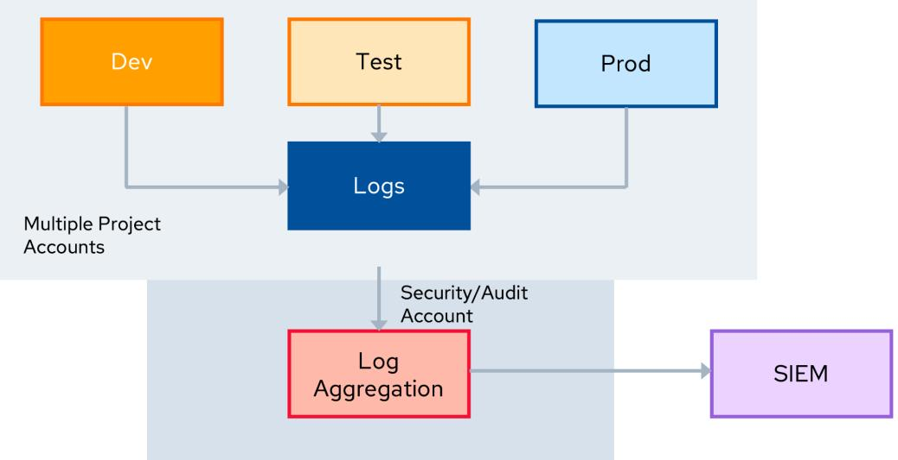

# **Certificate of Cloud Security Knowledge**

Official Study Guide

#### **Version Number:** 20250225

© 2024 Cloud Security Alliance – All Rights Reserved. You may download, store, display on your computer, view, print, and link to the Cloud Security Alliance at <https://cloudsecurityalliance.org> subject to the following: (a) the draft may be used solely for your personal, informational, noncommercial use; (b) the draft may not be modified or altered in any way; (c) the draft may not be redistributed; and (d) the trademark, copyright or other notices may not be removed. You may quote portions of the draft as permitted by the Fair Use provisions of the United States Copyright Act, provided that you attribute the portions to the Cloud Security Alliance.

# Acknowledgments

### **Lead Authors**

- Rick Doten Peter van Eijk Moshe Ferber Nick Kael Rich Mogull Mike Rothman Graham Thompson
## **Contributors**

Jackie Donnelly Larry Hughes

### **CSA Global Staff**

- Judy Bagwell Daniele Catteddu Ryan Gifford Claire Lehnert Stephen Lumpe Hannah Rock Andy Ruth Anna Schorr Stephen Smith John Yeoh

| Acknowledgments3                                             |  |
|--------------------------------------------------------------|--|
| Lead Authors 3                                               |  |
| Contributors3                                                |  |
| CSA Global Staff3                                            |  |
| Table of Contents4                                           |  |
| Introduction to the CCSK v57                                 |  |
| Domain 1: Cloud Computing Concepts & Architectures 8         |  |
| Learning Objectives 8                                        |  |
| 1.1 Defining Cloud Computing 9                               |  |
| 1.2 Cloud Computing Models10                                 |  |
| 1.3 Cloud Security Scope, Responsibilities, & Models16       |  |
| Domain 2: Cloud Governance and Strategies18                  |  |
| Learning Objectives 18                                       |  |
| 2.1 Cloud Governance 18                                      |  |
| 2.2 The Governance Hierarchy 20                              |  |
| 2.3 Cloud Security Frameworks 22                             |  |
| 2.4 Policies24                                               |  |
| Domain 3: Risk, Audit and Compliance 25                      |  |
| Learning Objectives25                                        |  |
| 3.1. Cloud Risk Management25                                 |  |
| 3.2 Compliance & Audit30                                     |  |
| 3.3 Governance, Risk, Compliance Tools & Technologies35      |  |
| Domain 4: Organization Management37                          |  |
| Introduction37                                               |  |
| Learning Objectives 37                                       |  |
| 4.1 Organization Hierarchy Models37                          |  |
| 4.2 Managing Organization-Level Security Within a Provider40 |  |
| 4.3 Considerations for Hybrid & Multi-Cloud Deployments42    |  |
| Domain 5: Identity and Access Management 45                  |  |
| Introduction45                                               |  |
| Learning Objectives45                                        |  |
| 5.1 How IAM Is Different in the Cloud46                      |  |
| 5.2 Fundamental Terms46                                      |  |
| 5.3 Federation48                                             |  |
| 5.4 Strong Authentication & Authorization51                  |  |
| Domain 6: Security Monitoring 53                             |  |
| Introduction53                                               |  |
| Learning Objectives53                                        |  |
| 6.1 Cloud Monitoring 53                                      |  |

| 6.2 Beyond Logs - Posture Management54                        |  |
|---------------------------------------------------------------|--|
| 6.3 Cloud Telemetry Sources 57                                |  |
| 6.4 Collection Architectures 57                               |  |
| 6.5 AI for Security Monitoring 59                             |  |
| Domain 7: Infrastructure & Networking 60                      |  |
| Introduction60                                                |  |
| Learning Objectives60                                         |  |
| 7.1 Cloud Infrastructure Security60                           |  |
| 7.2 Cloud Network Fundamentals63                              |  |
| 7.3 Cloud Network Security & Secure Architectures 66          |  |
| 7.4 Infrastructure as Code67                                  |  |
| 7.5 Zero Trust for Cloud Infrastructure & Networks 68         |  |
| 7.6 Secure Access Service Edge 69                             |  |
| Domain 8: Cloud Workload Security 70                          |  |
| Introduction70                                                |  |
| Learning Objectives70                                         |  |
| 8.1 Introduction to Cloud Workload Security70                 |  |
| 8.2 Securing Virtual Machines71                               |  |
| 8.3 Securing Containers75                                     |  |
| 8.4 Securing Serverless and Function as a Service 79          |  |
| 8.5 Securing AI Workloads 81                                  |  |
| Domain 9: Data Security 86                                    |  |
| Introduction86                                                |  |
| Learning Objectives86                                         |  |
| 9.1 Primer on Cloud Storage 86                                |  |
| 9.2 Data Security Tools and Techniques88                      |  |
| 9.3 Cloud Data Encryption at Rest90                           |  |
| 9.4 Data Security Posture Management 95                       |  |
| 9.5 Object Storage Security95                                 |  |
| 9.6 Data Security for Artificial Intelligence96               |  |
| Domain 10: Application Security 97                            |  |
| Introduction97                                                |  |
| Learning Objectives98                                         |  |
| 10.1 Secure Development Lifecycle 98                          |  |
| 10.2 Architecture's Role in Secure Cloud Applications101      |  |
| 10.3 Identity & Access Management and Application Security102 |  |
| 10.4 DevOps & DevSecOps104                                    |  |
| Domain 11: Incident Response & Resilience108                  |  |
| Introduction 108                                              |  |
| Learning Objectives108                                        |  |
| 11.1 Incident Response109                                     |  |
| 11.2 Preparation110                                           |  |
| 11.3 Detection & Analysis 112                                 |  |

| 11.4 Containment, Eradication, & Recovery 115      |  |
|----------------------------------------------------|--|
| 11.5 Post Incident Analysis 116                    |  |
| Domain 12: Related Technologies & Strategies118 |  |
| Introduction118                                    |  |
| Learning Objectives118                             |  |
| 12.1 Zero Trust118                                 |  |
| 12.2 Artificial Intelligence 122                   |  |
| Next Steps125                                      |  |
| Change Log126                                      |  |

# Introduction to the CCSK v5

Welcome to the fifth version of the Cloud Security Alliance's *Certificate of Cloud Security Knowledge (CCSK)*. The rise of cloud computing as an ever-evolving technology brings with it a number of opportunities and challenges. With this document, we aim to provide both guidance and inspiration to support business goals while managing and mitigating the risks associated with the adoption of cloud computing technology.

The Cloud Security Alliance promotes implementing best practices for providing security assurance within the domain of cloud computing and has delivered a practical, actionable roadmap for organizations seeking to adopt the cloud paradigm. The fifth version of the CCSK is built on Cloud Security Alliance's *Security Guidance for Critical Areas of Focus in Cloud Computing v5*, dedicated research, and public participation from the Cloud Security Alliance members, working groups, and the industry experts within our community. This version incorporates advances in cloud, security, and supporting technologies; reflects on real-world cloud security practices; integrates the latest Cloud Security Alliance research projects; and offers guidance for related technologies.

The advancement toward secure cloud computing requires active participation from a broad set of globally-distributed stakeholders. CSA brings together this diverse community of industry partnerships, international chapters, working groups, and individuals. We are profoundly grateful to all who contributed to this release.

Please visit [cloudsecurityalliance.com](http://cloudsecurityalliance.com) to learn how you can work with us to identify and promote best practices to ensure a secure cloud computing environment.

Best regards,

**Jim Reavis** *Chief Executive Officer (CEO) Cloud Security Alliance*

**Illena Armstrong** *President Cloud Security Alliance*

# **Domain 1:** Cloud Computing Concepts & Architectures

This domain provides the conceptual framework for the rest of the Cloud Security Alliance (CSA) Certificate of Cloud Security Knowledge (CCSK) Study Guide. It describes and defines cloud computing, sets out baseline terminology, and details the overall controls, deployment, and architectural models used in the rest of the document.

Cloud computing offers agility, resiliency, security, and economic benefits, but these are only realized with proper understanding and adoption of cloud models. Simply rehosting applications to a cloud service provider (CSP) without changes ("lift-and-shift") often fails to deliver the expected benefits and can increase costs. Effective cloud computing relies on understanding and utilizing cloud-native capabilities and services.

This domain provides the foundation for this guide, offering a common language and understanding of cloud computing for cloud service customers (CSCs ). It highlights the differences between cloud and 1 traditional computing and guides security professionals and stakeholders in adopting cloud-native approaches for better security.

The Cloud Security Alliance aims to harmonize existing models, particularly NIST SP 800-145, ISO/IEC 22123-1:2023, and ISO/IEC 22123-2:2023, focusing on key security considerations for cloud professionals.

# **Learning Objectives**

In this domain, you will learn to:

- Define cloud computing.
- Identify cloud computing models.
- Recognize reference and architecture models in cloud computing.
- Understand cloud security scope, responsibilities, and models.

1 The acronym CSC is used interchangeably to mean any cloud service customer, cloud service consumer, or cloud service client.

# **1.1 Defining Cloud Computing**

Cloud computing manages shared resources through abstraction, enabling rapid orchestration, provisioning, scaling, and decommissioning. It provides an on-demand utility model with benefits like collaboration, agility, elasticity, availability, resiliency, and cost reduction.

The following are definitions of cloud computing according to the U.S. National Institute of Standards and Technology (NIST), the International Organization for Standardization (ISO), and the International Electrotechnical Commission (IEC):

**NIST SP 800-145 defines cloud computing as:** *"[A] model for enabling ubiquitous, convenient, on-demand network access to a shared pool of configurable computing resources (e.g., networks, servers, storage, applications, and services) that can be rapidly provisioned and released with minimal management effort or service provider interaction." 2*

**ISO/IEC 22123-1:2023 defines cloud computing as:** *"[A] paradigm for enabling network access to a scalable and elastic pool of shareable physical or virtual resources with self-service provisioning and* 3 *administration on-demand." 4*

Both quotes lead to the same idea: The cloud pools resources like processors, memory, and storage using virtualization. The CSC requests needed resources, uses them over the network, and releases them back into the pool when finished.

### **1.1.1 Abstraction & Orchestration**

Cloud environments rely on abstraction and orchestration to manage resources. For example, abstraction involves creating virtual machines (VM) from physical servers, while orchestration automates and coordinates the provisioning of these VMs and their networking to CSCs.

Clouds are multi-tenant , with multiple CSCs sharing resource pools while being segregated and isolated 5 for confidentiality and integrity. Segregation and isolation ensure that CSCs cannot see or modify each other's assets. CSPs ensure fair resource use and availability by measuring and constraining overuse.

2 NIST. (2011) SP 800-145: The NIST Definition of Cloud Computing

4 ISO/IEC. (2023) 22123-1:2023: Information Technology - Cloud Computing - Part 1: Vocabulary. 3 Self-service provisioning refers to the provisioning of resources provided to cloud [services](https://www.iso.org/obp/ui/en/#iso:std:iso-iec:22123:-1:ed-2:v1:en:term:3.1.2) performed by CSCs through automated means. Examples of resources include servers, operating systems, networks, software, applications, and storage equipment.

5 In this reference to multi-tenant, a tenant is a cloud customer or CSC.

# **1.2 Cloud Computing Models**

CSA uses the NIST SP 800-145 model for cloud computing as it is the standard for defining cloud computing. CSA also endorses the more in-depth ISO/IEC models 22123-1:2023 and 22123-2:2023, 6 which also serve as a reference model. Throughout this domain, we reference both.

NIST describes cloud computing based on five essential characteristics, three cloud service models, and four cloud deployment models. We summarize them below.

*Figure 1: Overview of Cloud Computing Models Based on NIST and ISO/IEC Standards*

### **1.2.1 Essential Characteristics**

The NIST model describes the cloud by five essential characteristics, which set cloud computing apart from traditional hosting services or virtualization. Understanding these characteristics is critical for leveraging the full potential of cloud computing and for the strategic planning of cloud adoption.

Following are the five essential characteristics described by NIST.

6 CSA has chosen to align with the NIST 800-145 definition of cloud computing to bring consensus around a common language and focus on use cases, rather than on semantics. This study guide is intended to be broadly applicable to organizations globally. While NIST is a U.S. government organization, the selection of this reference model should not be interpreted as excluding other points of view or geographies.

7 Depiction of the NIST Model of Cloud Computing

- **Resource Pooling:** Cloud computing pools various physical and virtual resources to serve multiple CSCs through a multi-tenant model. These resources, like storage, processors, memory, and network bandwidth are dynamically assigned and reassigned according to demand.
- **Broad Network Access:** Services are available over the network and accessed through web browsers or specialized applications while using heterogeneous thin client platforms (e.g., mobile phones, laptops, IoT devices, and tablets).
- **Rapid Elasticity:** Resources are rapidly and elastically provisioned, in some cases automatically. To the CSC, the provisioned capabilities often appear unlimited and can be purchased in any quantity at any time.
- **Measured Service**: Cloud systems automatically control and optimize resource use by leveraging a metering capability at some level of abstraction appropriate to the type of service (e.g., storage, bandwidth, active user accounts). Resource usage can be measured, monitored, controlled, and reported, providing transparency for both the CSP and the CSCs of the utilized service. This enables billing based on usage, which promotes cost efficiency and accountability (pay-as-you-go model).
- **On-Demand Self-Service**: A CSC can unilaterally request cloud resources on demand for automatic provisioning by the CSP and computing capabilities, such as computing time and network storage, as needed without requiring human interaction with each CSP.

ISO/IEC 22123-2:2023 lists six key characteristics, the first five being identical to the NIST characteristics listed above. The only addition is multi-tenancy, which is distinct from resource pooling.

### **1.2.2 Cloud Service Models**

NIST defines three service models describing the different foundational categories of cloud services. These categories are flexible; some cloud services span these tiers, while others don't fit a single model. It's a descriptive tool, not a rigid framework.

Cloud technologies evolve rapidly, making some reference models obsolete. This section provides fundamentals to help security professionals understand emerging models. We recommend ISO/IEC 22123-3 and NIST 500-292 for in-depth reference architectures. Both approaches are valid, but since the NIST model is more concise and broadly used, it is the definition predominantly used in CSA research.

Cloud computing can be viewed as a stack: Software as a Service (SaaS) on Platform as a Service (PaaS) on Infrastructure as a Service (IaaS). While this is not representative of all real-world deployments, it is a useful model.

#### **1.2.2.1 Infrastructure as a Service**

IaaS offers access to a resource pool of fundamental computing infrastructure, such as network, or storage. In IaaS the CSC is responsible for managing the underlying virtual infrastructure, such as VMs, networking, storage, and running applications. IaaS relies on physical infrastructure, abstracted and orchestrated into resource pools. Abstraction through virtualization frees resources from physical constraints, while orchestration uses application program interfaces (APIs) to tie these resources together and deliver them to CSCs.

APIs facilitate orchestration and are often accessible through web-based interfaces, forming the cloud management plane. This management plane allows CSCs to manage resources such as VMs and networks. Security-wise, it differs from on-premises protection, as management interfaces are network-accessible, posing risks if compromised.

Here is an extremely simplified architectural example of a compute IaaS platform:

*Figure 2: Simplified Architecture of an IaaS Compute Platform*

This example showcases an IaaS compute platform with physical servers running hypervisors and orchestration software. The cloud controller allocates resources, creates virtual instances, configures networking and storage, and brokers connectivity information for CSCs to access the instances.

#### **1.2.2.2 Platform as a Service**

PaaS abstracts and provides platforms, such as application platforms (e.g., a place to develop and run code), databases, file storage, and collaborative environments. Other examples include application processing environments for machine learning, big data processing, or API access to SaaS functions. The key differentiator with IaaS is that, with PaaS, the CSC does not manage the underlying servers.

Often, PaaS is built on IaaS, where integration, persistence, and middleware layers are orchestrated and accessed through APIs. For example, Database as a Service (DBaaS) lets CSCs manage databases via API or web console without handling the underlying infrastructure.

In PaaS, CSCs see only the platform, not the infrastructure. The database service scales with use, removing the need for CSCs to manage and patch servers, networking, or the underlying operating system.

The following is a simplified architecture diagram that shows a PaaS running on top of an IaaS architecture.

*Figure 3: Simplified Architecture of a PaaS Built on IaaS*

PaaS can be a custom-built, stand-alone architecture, not necessarily on IaaS. CSCs manage the platform, not the underlying infrastructure. An example is a custom Artificial Intelligence (AI) and machine learning (ML) service for AI development tools, machine learning operations (MLOps), and AI lifecycle management.

#### **1.2.2.3 Software as a Service**

SaaS services are complete applications, encompassing all the architectural complexities typical of any large software platform. It is managed by the CSP. SaaS CSPs often build on top of IaaS and PaaS due to the increased agility, resilience, and economic benefits. CSCs access it using a web browser, mobile application, APIs, or lightweight client applications. In this model, the CSC only worries about the application's configuration, not the underlying resources.

SaaS services typically include an application/logic layer, data storage, APIs, and presentation layers supporting web browsers, mobile apps, and Internet API access. The architecture diagram is generalized from a real SaaS platform.

*Figure 4: Simplified Architecture of a SaaS Platform Built on PaaS and IaaS*

### **1.2.3 Cloud Deployment Models**

NIST and ISO/IEC use the same four cloud deployment models; these define how the technologies are deployed, consumed, and applied across the entire range of service models.

- **Public Cloud**: The cloud infrastructure is made available to the general public or a large industry group and is owned by a CSP.
- **Private Cloud**: The cloud infrastructure is operated solely for a single organization. It may be managed by the organization or a third party and may be located on-premises or off-premises.
- **Community Cloud:** The cloud infrastructure is shared by several organizations and supports a specific community with shared concerns (e.g., mission, security requirements, policy, and compliance considerations). It may be managed by the CSC(s) or a third party and may be located on-premises or off-premises.
- **Hybrid Cloud:** The cloud infrastructure is a composition of two or more clouds (i.e., private, community, or public) that remain unique entities, but are bound together by standardized or proprietary technology that enables data and application portability (e.g., cloud bursting for load balancing between clouds).

While these are the official definitions, the common use of these terms has shifted. In particular, private cloud is now being used more often to just denote a private datacenter, independent of the level of automation in provisioning that it offers, and hybrid cloud mostly refers to where such data centers are combined with one or more public cloud solutions.

### **1.2.4 CSA Enterprise Architecture Model**

The CSA Enterprise Architecture (EA) is both a methodology and a set of tools. It is a framework, that is, a comprehensive approach for the architecture of a secure cloud infrastructure. It can be used to assess opportunities for improvement, create roadmaps for technology adoption, identify reusable security patterns, and assess various CSPs and security technology vendors against a common set of capabilities.

To create the [CSA](https://cloudsecurityalliance.org/artifacts/enterprise-architecture-reference-guide-v2) EA, CSA Research has leveraged four industry standard architecture models across the following four domains:

- **Business Operation Support Services (BOSS)** Sherwood Applied Business Security Architecture (SABSA)
- **Information Technology Operation Services (ITOS)** — Information Technology Infrastructure Library (ITIL)
- **Technology Solution Services (TSS)**, including Infrastructure (InfraSrv), Information (InfoSrv), application (AS), and Presentation (PS) Services — The Open Group Application Framework (TOGAF)
- **Security and Risk Management (SRM)** OpenGroup Security Forum (formerly known as the Jericho Forum)

*Figure 5: Building Blocks of the CSA Enterprise Architecture*

CSA combines the best architecture paradigms into a comprehensive approach to cloud security while merging business drivers. The CSA EA supports the value proposition of cloud services within an enterprise business model.

The CSA EA was adopted by NIST SP 500-292, solidifying the importance of the CSA approach.

# **1.3 Cloud Security Scope, Responsibilities, & Models**

In cloud computing, security is a joint effort known as "shared responsibility." CSPs handle the security "of the cloud," covering infrastructure, hardware, and network. CSCs manage security "in the cloud," and are responsible for their deployments. Responsibilities vary with service models.

### **1.3.1 Shared Security Responsibility Model**

The delineation of responsibilities differs for IaaS, PaaS, and SaaS, and often between different CSPs. CSCS must understand where the demarcation lies to ensure that they are appropriately protecting their own cloud tenants, applications, data, etc., and to provide baselines for holding CSPs accountable.

At a high level, security responsibility maps to the degree of control a given actor has over the architecture stack.

- **SaaS:** The CSP handles most security, while the CSC manages authorization and entitlements. Example: The CSP manages perimeter security and logging, and the CSC manages user permissions.
- **PaaS:** The CSP secures the platform, and the CSC secures its implementations. Example: The CSP handles patching and core configuration, and the CSC manages database security features and authentication.
- **IaaS:** The CSP handles foundational security, and the CSC manages all built infrastructure. Example: The CSP monitors the perimeter, and the CSC defines virtual network security.

Roles become complex with cloud brokers and intermediaries. Knowing where a CSP's responsibility ends and its CSC's begins is crucial. CSCs must understand their obligations, especially in configuration and management, to ensure security policies align with data sensitivity.

| On-Prem On-Premises          | laaS Infrastructure as a Service | PaaS Platform as a Service | SaaS Software as a Service |
|---------------------------------|----------------------------------------|----------------------------------|----------------------------------|
| Configuration                   | Configuration                          | Configuration                    | Configuration                    |
| Identity & Access Management | Identity & Access Management        | Identity & Access Management  | Identity & Access Management  |
| Data                            | Data                                   | Data                             | Data                             |
| Networking                      | Networking                             | Networking                       | Networking                       |
| Application(s)                  | Application(s)                         | Application(s)                   | Application(s)                   |
| Runtime                         | Runtime                                | Runtime                          | Runtime                          |
| Middleware                      | Middleware                             | Middleware                       | Middleware                       |
| OS                              | OS                                     | OS                               | OS                               |
| Virtualization                  | Virtualization                         | Virtualization                   | Virtualization                   |
| Servers                         | Servers                                | Servers                          | Servers                          |
| Storage                         | Storage                                | Storage                          | Storage                          |
| Physical Security               | Physical Security                      | Physical Security                | Physical Security                |

*Figure 6: Shared Security Responsibility Model 8*

Effective cloud security requires understanding the division of responsibility in cloud environments. Knowing who is responsible is crucial, allowing CSCs to fill control gaps or consider alternative CSPs. Direct security control is highest for IaaS and lower for SaaS.

To ensure a clear allocation of security responsibilities in the cloud, we recommend the following:

- CSPs should document security controls and CSC features, and design and implement them properly. Often such a document is called a "shared security responsibility matrix."
- CSCs should create a roles-and-responsibilities matrix to track security responsibilities and ensure compliance alignment.

CSA provides tools to help meet these requirements:

- The Consensus Assessments Initiative [Questionnaire](https://cloudsecurityalliance.org/group/consensus-assessments/#_overview) (CAIQ) is a standard template for CSPs to document their security and compliance controls.
- The Cloud [Controls](https://cloudsecurityalliance.org/group/cloud-controls-matrix/#_overview) Matrix (CCM), discussed in more detail in Domain 2, lists cloud security controls and maps them to multiple security and compliance standards. The CCM can also be used to document security responsibilities.

Both documents provide a comprehensive starting template and can be especially useful for ensuring compliance requirements are met.

8CISA. (2021) Cloud Security Technical Reference Architecture.

# **Domain 2:** Cloud Governance and Strategies

This domain focuses on cloud governance with an emphasis on the role of security. Enterprise governance plays a key role in an organization's success and helps in aligning the strategic, tactical, and operational capabilities of information and technology with the business objectives.

**ISACA defines** *governance* **as:** "Governance ensures that stakeholder needs, conditions and options **9** are evaluated to determine balanced, agreed-on enterprise objectives to be achieved; setting direction through prioritization and decision making; and monitoring performance and compliance against agreed-on direction and objectives."

As information technology (IT) is moving from supporting back-office functions to becoming front and center of most organizations' strategy and operations, a comprehensive perspective on all stakeholder needs is required. This requires that IT and cloud decisions are embedded in the organization's governance.

# **Learning Objectives**

In this domain, you will learn to:

- Identify the purpose of cloud governance.
- Define the governance hierarchy in cloud governance.
- Explore key strategies and concepts affecting governance in cloud computing.

## **2.1 Cloud Governance**

Cloud computing's multi-tenancy, shared responsibility, distributed supply chains, legal and regulatory complexity, and security concerns require effective governance. Cost efficiency and speed to market are key drivers for cloud adoption. Organizations save costs by moving from Capital Expenditure (CapEx, or investments) to Operational Expense (OpEx, subscription) models, often using lift and shift strategies, which require strong security governance to manage new risks from more complex cloud architectures and shared service models.

9 ISACA. (2024) Glossary - *Governance*

Strategic innovation drives cloud adoption as it enables rapid software development and deployment. However, accelerated deployment cycles introduce governance risks, such as misconfigurations, software supply chain issues, and potential compliance changes. Governance is required to balance between the requirement for speed and the need to control risks.

There are two primary ways cloud affects security governance:

- 1. The introduction of the Shared Responsibilities Model. Security governance responsibilities are now shared between the cloud provider and the cloud customer. To complicate matters, third-party service providers are sometimes introduced into the security responsibility supply chain. Even if some of the responsibilities are offloaded to a third party, the accountability of the control remains with the cloud service provider (CSP) or cloud service customer (CSC). Compliance risk is always with the CSC.
- 2. The technical and operational differences are created by the inherent nature of cloud computing. This includes multi-tenancy, geography of data, and platform failover to other regions.

Here are some of the complexities that effective cloud governance has to address:

- Cloud might impose a loss of direct control over the IT infrastructure, forcing an organization to adopt a new governance framework and process.
- Cloud services and data may span multiple jurisdictions, forcing customers to comply with more laws and regulations, especially privacy requirements.
- Visibility and transparency in some cloud services can be challenging.
- Using cloud solutions does not mean outsourcing the organizational accountability of its controls to a third or fourth party.
- Data ownership rights and classification as well as privacy control might not be intuitively clear and need careful examination.
- Most providers have a standard offering that cannot be customized according to all customer's specific requirements.
- Cloud providers might demonstrate different levels of maturity and a variety of services, licenses, and models, which complicates the adoption of a one-size-fits-all cloud policy.
- Cloud services are often built on a chain of providers, which makes scoping governance activities challenging (e.g., a SaaS provider that is running on the infrastructure of an IaaS provider).
- Cloud services employ various shared responsibility models, which differ based on the provider and the technology stack. This necessitates a clear delineation of controls and responsibilities between the cloud service provider and the customer. Adding to the complexity of cloud governance, the shared responsibility model often involves multiple parties. These parties may include cloud platform integrators or brokers, software development companies for applications running on cloud services, different Development and Operations (DevOps) teams, and other stakeholders.
- Hybrid cloud models can complicate governance due to the complexities of producing clear boundaries between provider responsibilities and customer responsibilities.
- Cloud customers have to rely more on compliance and assessment activities rather than actual testing. This will depend on what layers fall into the customer's responsibility. The customer is still responsible for security testing applications in an IaaS model for example. Primarily the customers would have to rely on third-party security assessment reports and certifications of the CSP and

understand the shared responsibilities that the customer has to abide by for the total compliance coverage.

- CPSs may change rapidly, which has to be accounted for in governance models.
- Utilization of cloud services may require additional skills that may or may not currently be present in the organization, such as cloud auditing skills or cloud security skills, as well as knowledge of cloud-oriented security tools.

Effective cloud governance requires the implementation of a strong framework and policies for secure, compliant, and efficient management of cloud resources. Cloud governance includes:

- Defining roles and responsibilities
- Conducting requirements and information gathering
- Managing risks
- Classifying data and assets
- Complying with legal and regulatory requirements
- Maintaining a cloud registry
- Establishing a governance hierarchy
- Leveraging cloud-specific security frameworks

The rest of this Study Guide introduces these topics in more detail and also gives insight into some developments that challenge historical assumptions on IT governance.

- DevOps and Development, Security, and Operations (DevSecOps) (see Domain 10) drive the automation of security controls, which changes organizational structures.
- Zero Trust (ZT) (see Domain 12) drives a fundamentally more comprehensive approach to things like network security, which requires policies to be defined on a different level.
- Artificial Intelligence (AI) and Machine Learning (ML) (Domain 12 and others) open up entirely new fields of applications for which there are few existing governance practices.

# **2.2 The Governance Hierarchy**

A key aspect of cloud governance is establishing a governance hierarchy and defining decision-making processes and escalation paths. This ensures appropriate decision levels and clear accountability.

It's important to use one or more Frameworks to set a road map for your program and security controls. This makes it easier to show compliance. At the top of the hierarchy is a Risk Framework, providing guidelines for evaluating cybersecurity risks. Examples include NIST 800-30 or ISO 27005. Next is the Program framework, which defines the components of your security program; examples include NIST Cybersecurity Framework (CSF), ISO 27001, or Control Objectives for Information and Related Technology (COBIT), and then there are Control Frameworks, which provide a list of technical and procedural controls to apply to the infrastructure; these include NIST 800-53, Center for Internet Security Critical Security Controls (CIS CSC), and Cloud Security Alliance Cloud Controls Matrix (CSA CCM).

The output of these frameworks are tiers of governance documents that define specific structures and actions for your organization. These include:

- Policies outline an organization's security requirements, translating framework guidelines into actionable statements. They ensure adherence to regulatory and compliance requirements.
- Control Objectives, or Guidelines, more specific than policies, focus on desired security control outcomes to minimize risk and maintain a secure environment, for example, requiring multi-factor authentication (MFA) for all cloud platform logins. They provide clear security goals for organizations.
- Control Specifications and Technical Standards or Guidance are technical implementations to meet control objectives. For example, a specification might require enabling MFA for user access and applying a technical policy to enforce it.

*Figure 7: Structured Security Governance Hierarchy*

### **2.2.1 Aligning with Requirements, Standards, Best Practices, & Contractual Obligations**

To establish a robust governance framework, it is important to align with established standards, best practices, and contractual obligations.

Understanding the contractual obligations of your CSP is crucial to knowing the shared security responsibilities between your organization and the CSP, as well as any specific security requirements outlined in the contract. Additionally, consider contractual obligations with customers and partners, as they may impact your cloud plans.

Stay informed about current best practices. CSPs often provide recommended practices through their well-architected frameworks. While deviations may be necessary, these frameworks are valuable references for establishing a secure cloud environment.

### **2.2.2 Consulting with Key Stakeholders for Cloud Security Strategy Alignment**

A non-exhaustive list of stakeholders to align with for cloud includes the IT department, security team, compliance and legal team, finance department, business unit leaders, development team, operations team, project management office, vendors and service providers, and end users.

# **2.3 Cloud Security Frameworks**

A cloud security framework organizes and prioritizes security control objectives to achieve desired security outcomes. Frameworks categorize these objectives, enabling a systematic approach to cloud security.

Cloud-specific frameworks consider the unique characteristics of cloud computing, addressing aspects like on-demand resource allocation, shared responsibility models, and rapid elasticity. Using these frameworks ensures security programs align with cloud requirements and challenges.

There are many frameworks relevant to cloud security. The major examples are the CSA Cloud Controls Matrix (CCM) , ISO/IEC 27017:2015 , BSI C5 , NIST 800-53 , Payment Card Industry Security 10 11 12 13 Standards Council (PCI SSC) Cloud Computing Guidelines , NIST CSF , and the CSA Cloud Security 14 15 Maturity Model (CSMM) . 16

For additional details about cloud frameworks, we recommend the Certificate of Cloud Auditing Knowledge (CCAK) course available through ISACA.

### **2.3.1 Cloud Controls Matrix**

An example of a cloud-specific framework is the CSA Cloud Controls Matrix (CCM), which is a library of control objectives that are structured in control domains. It offers comprehensive coverage of a wide array of security topics, ranging from governance and risk management to operational security and data privacy. This makes it a valuable resource for organizations looking to enhance their cloud security.

One of the key strengths of the CCM is its alignment with leading standards, such as ISO/IEC 27001/27002, PCI Data Security Standard (DSS), NIST, and so on. By harmonizing with these established

10 CSA. (2024) Cloud Controls Matrix (CCM)

11 ISO/IEC (2015) 27017:2015 - Information technology - Security techniques - *Code of practice for information security controls based on ISO/IEC 27002 for cloud services.*

12 BIS (2020) Federal Office for Information Security - *Cloud computing C5 criteria catalogue*.

13 NIST (2020) SP 800-53 Rev 5 - *Security and Privacy Controls for Information Systems and Organizations.*

14 PCI (2013) PCI Data Security Standard (PCI DSS) - *Information Supplement: PCI DSS Cloud Computing Guidelines.*

15 NIST. (2024) The NIST Cybersecurity Framework (CSF) 2.0

16 CSA (2023) Publication Peer Review - *Cloud Security Maturity Model 2023*.

frameworks, the CCM ensures that organizations can achieve compliance across multiple standards and regulations.

The CCM is tailored to cloud environments, making it well-suited for securing multi-tenant, distributed, and dynamic cloud systems. The focus on the unique challenges of cloud computing sets it apart from more generic security frameworks like NIST CSF. Additionally, the CCM allows for control customization, enabling organizations to adapt the security controls to their specific cloud architectures, delivery models (IaaS, PaaS, SaaS), and compliance needs.

Another key benefit of the CCM is its support for cloud governance. It assists organizations in establishing and maintaining a solid cloud governance program that effectively manages and oversees cloud risks. This is valuable in ensuring that cloud deployments are aligned with organizational objectives and comply with relevant regulations.

The CCM is continuously updated to reflect the latest cloud security best practices. Organizations can rely on the CCM as a reliable and relevant resource for their cloud security needs by staying up to date.

Based on the CCM, the Consensus Assessment Initiative Questionnaire (CAIQ) provides a checklist to evaluate controls.

### **2.3.2 CSA Security, Trust, Assurance, and Risk (STAR) Registry**

The Security, Trust, Assurance, and Risk (STAR) Registry is a publicly accessible registry that documents the security and privacy controls provided by popular cloud computing offerings. Cloud providers can submit completed CAIQ documents to the CSA STAR Registry. The CSA initiated this program to advance transparency and confidence in cloud services. The program offers a framework for CSPs to document their security practices and for CSCs to evaluate the security posture of cloud services.

The CSA STAR program comprises two primary components: 17

- 1. **CSA STAR Certification:** This entails an independent third-party evaluation of a cloud service provider's security controls against the CSA Cloud Controls Matrix (CCM) and other recognized industry standards like ISO/IEC 27001. Achieving CSA STAR Certification indicates that a cloud service provider has implemented robust security measures and practices.
- 2. **CSA STAR Attestation:** The CSA STAR Attestation is a collaboration between CSA and the **18** AICPA to provide guidelines for Certified Public Accounts (CPAs) to conduct SOC 2 19 engagements using criteria from the AICPA (Trust Service Principles, AT 101) and the CSA CCM. The STAR Attestation provides rigorous third party independent assessments of cloud providers.

17 Learn more about the STAR program at: https://cloudsecurityalliance.org/star

18 Learn more about STAR Attestation requirements using CSA's *Guidelines for CPAs Providing CSA STAR Attestation*

19 American Institute of Certified Public Accountants

By facilitating standardized security assessments and promoting transparency, the CSA STAR program empowers organizations to assess the security, privacy, and compliance practices of cloud service providers. This, in turn, helps them make risk-aware decisions when selecting and utilizing cloud services, fostering trust and reliability in the cloud industry.

# **2.4 Policies**

Information security policies are crucial for establishing a strong security framework. They govern the protection of an organization's information assets, outline necessary control objectives, and should require business leadership sign-off to ensure alignment with strategic goals.

There are several key examples of information security policies organizations commonly implement:

- The Information Security policy is a top-level policy defining how the information security program will be run. It ideally refers to other policies and documents, such as control objectives, rather than trying to include all the specific technical requirements.
- Additional policies underneath the core policy that define specific areas, such as acceptable use, data protection, identity management, endpoint and mobile device protections, use of cloud services, third-party risk management, and so on. There are many online sources of security policy libraries and templates from sites such as SANS Institute, and CIS.

# **Domain 3:** Risk, Audit and Compliance

This domain focuses on cloud security, risk, audit, and compliance. It covers evaluating cloud service providers and establishing cloud risk registries. It also discusses different types of compliance requirements and introduces tools and technologies to support cloud governance and risk management. Overall, it provides insights into managing the complex landscape of cloud computing risks and compliance.

# **Learning Objectives**

In this domain, you will learn to:

- Define, categorize, and use tools to manage risk.
- Identify the regulatory and compliance constraints for which your cloud-based environment must undergo audits.
- Identify a set of technical and non-technical tools used when managing governance, risk, and compliance.

# **3.1. Cloud Risk Management**

Effective cloud risk management is mandatory in today's digital landscape, where organizations increasingly rely on cloud services. This section delves into the importance of understanding cloud risks and provides insights on establishing a cloud risk profile, assessing cloud service providers, maintaining a cloud risk register, and conducting risk assessments, threat intelligence, and threat modeling.

### **3.1.1 Cloud Risks**

Let's start with an example. A company has a cloud storage bucket filled with personal information on customers. We call this an **asset**, which to an attacker (also known as a **threat actor**) is a **target**. One of the weaknesses of a cloud storage bucket is that it may be misconfigured. We call that a **vulnerability**, and to an attacker, this represents an **attack vector**.

A **risk** is that the personal data in the bucket leaks out, and the company gets fined by a regulator. Another risk could be that, through some action, the data becomes unavailable or corrupted.

A **control** or **countermeasure** is a way to reduce the risk. Typical controls here would be any policy that prevents these storage buckets from being accessible to the whole internet, or more specifically: the threat actor.

Ideally, we'll have enough controls to reduce the risk down to an acceptable level. This involves understanding what the important assets and threat actors are. This process is called **threat modeling** and is discussed in other places in this guidance, such as application security. Threat modeling, in a cloud world, starts with identifying the various places and cloud services where data is stored, and how data flows between them. See also CSA research . 20

The following examples show some of the most common risk factors and categories, both general and security risks. We also recommend reviewing the Cloud Security Alliance's *Top Threats* research report. *21* In the 2022 edition, the 'Pandemic Eleven', these were the top categories:

- Insufficient Identity, Credentials, Access, and Key Management
- Insecure Interfaces and APIs
- Misconfiguration and Inadequate Change Control
- Lack of Cloud Security Architecture and Strategy
- Insecure Software Development
- Unsecured Third-Party Resources
- System Vulnerabilities
- Accidental Cloud Data Disclosure
- Misconfiguration and Exploitation of Serverless and Container Workloads
- Organized Crime/Hackers/Advanced Persistent Threat (APT)
- Cloud Storage Data Exfiltration

There are many other sources of cloud threat intelligence. Consult the CSA website for up-to-date information. Additionally, the **MITRE ATT&CK®** framework provides a comprehensive matrix of threat **22** actor tactics.

### **3.1.2 Understanding Cloud Risk Management**

Risk management involves a structured approach to identifying, assessing, and addressing risks associated with cloud computing. The risk management and methodologies used in cloud computing are not different from the ones adopted in the on-premises world and in other technologies, what does change are some of the specific actions taken during the definition of the scope and environment and the risk evaluation and treatment process.

The European Union Agency for Cybersecurity (ENISA) provides a framework that organizations can 23 adapt to manage these risks effectively within their cloud environments. This process is designed to be integrated into an organization's broader operational processes, ensuring a broad approach to risk management. Here's an expansion on the key components of this process.

20 CSA. (2021) Publications: Cloud Threat Modeling

21 CSA. (2021) Research Topic: Top Threats

22 MITRE. (2024) Cloud Matrix

23 ENISA.

*Figure 8: Comprehensive Cloud Risk Management Framework*

#### **3.1.2.1 Corporate Risk Management Strategy**

These days, cloud usage serves a variety of corporate objectives with wildly varying risk appetites. The corporate risk management strategy sets the stage for risk management, in general, which helps translate business risk management to cloud risk management.

#### **3.1.2.2 Risk Assessment**

Identify and analyze relevant risks to understand their potential impact on the organization. This involves evaluating each risk to determine the likelihood of occurrence and the severity of its consequences.

#### **3.1.2.3 Risk Treatment**

After assessing risks, develop and approve an action plan to mitigate, transfer, avoid, or accept each risk. Implement these action plans and identify any residual risks that remain.

#### **3.1.2.4 Interface to Other Operational & Product Processes**

Risk management should not be siloed; it must interface with other business processes to ensure that risk considerations are embedded throughout the organization's operations and product lifecycle.

#### **3.1.2.5 Monitoring & Review (Plans, Events, Quality)**

Continuously monitor risk management plans, events, and the quality of risk management activities. Regular reviews ensure that risk management processes remain effective and adapt to any changes in the business environment.

#### **3.1.3 Assessing Cloud Services**

One of the first steps in managing cloud risks is having a systematic process to assess cloud providers and services. This assessment should align with your business needs and risk tolerance. The following process is designed to account for these differences:

- Business requests
- Review CSP documentation
- Review external sources
- Map to compliance requirements
- Map to data classification
- Define required and compensating controls
- Approval process

#### **3.1.3.1 Business Requests**

Whether or not the business unit has a specific cloud service in mind, it is important to understand the business need and the data involved. This helps to understand risk appetite and any relevant policies and regulations.

#### **3.1.3.2 Review CSP Documentation**

Most CSPs have the following categories of documentation:

- **● Security and privacy documentation:** Review the CSP's published security policies, privacy policies, and data handling practices to ensure they align with your organization's standards.
- **Service level agreements (SLA) and contracts**: SLAs outline the performance and uptime commitments of the CSP, while contracts detail the terms of service, including responsibilities and liabilities.
- **Terms of service (ToS):** Understanding the ToS is important to avoid legal or operational surprises post-adoption. These may be the only legal contracts between you and the provider.
- **CAIQ and certifications:** The CSA Consensus Assessments Initiative Questionnaire (CAIQ), based on the Cloud Controls Matrix (CCM) provides a comprehensive set of questions that CSPs answer to disclose their security controls. CSP certifications (e.g., ISO/IEC 27001, SOC 2) offer third-party validation of their security practices.

#### **3.1.3.3 Review External Sources**

**Research:** Investigate external reviews, reported vulnerabilities, and any past security and operational incidents involving the CSP to gauge their security posture and response capabilities.

#### **3.1.3.4 Map to Compliance Requirements**

When selecting a CSP, it is essential to align their features and policies with the organization's compliance needs, such as the General Data Protection Regulation (GDPR), Health Insurance Portability and Accountability Act (HIPAA), or Payment Card Industry Data Security Standard (PCI DSS). This ensures that regulatory requirements are met and that the organization's data remains secure.

#### **3.1.3.5 Map to Data Classification**

Not all data needs the same risk management. Providers and services should be approved based on data types, which allows flexibility, so not all providers and services need to meet the same standards for the most sensitive data. It's acceptable to use a riskier service with less valuable or public data.

- **Data sensitivity assessment**: Assess the sensitivity of data in transit and at rest. Not all data carries the same risk; thus, not all cloud services are required to meet the highest security standards.
- **Service approval based on data type:** Approve CSPs and their services based on the classification of data they will handle. This approach allows for flexibility and efficient use of resources.

#### **3.1.3.6 Define Required & Compensating Controls**

Before final approval, security defines any required controls (e.g., configuration settings within the CSP) and any compensating controls (e.g., third-party tools) needed to use the service with the designated data types.

#### **3.1.3.7 Approval Process**

Based on the gathered information and mapping, decide whether the CSP's services are appropriate for the intended data types. If they meet all criteria, approve their use and incorporate them into the organization's cloud register, ensuring visibility and control over cloud adoption.

#### **3.1.4 The Cloud Register**

A cloud register is a central repository of approved cloud services, and what kind of data they are approved to handle at a given level of risk. This guides internal decisions on which providers and services to use for which projects. It also helps ensure that data is only used with compliant services, and thus plays a role in compliance as well.

| Provider | Service             | Data Types        | Risk     | Expiration |
|----------|---------------------|----------------------|----------|------------|
| ABC      | Object storage   | Public, sensitive | Low      | Annual     |
| ABC      | Virtual networks | All                  | Low      | Annual     |
| GHI      | CRM SaaS         | PII                  | Moderate | Quarterly  |

#### *Table 1: Cloud Registry Example*

This fictitious example shows three specific services from two providers and lists the data types that are allowed to be processed. Based on that, risk is assigned, and the required review frequency. This allows teams to accelerate risk assessment.

# **3.2 Compliance & Audit**

Compliance is the adherence to a set of requirements stemming from internal policies, applicable laws and regulations, sector-specific codes of conduct and codes of practices, standards, and best practices. Complying with applicable requirements allows organizations to satisfy internal policies and code of ethics, safely operate in the market, and in some cases (e.g., adhere to international standards), gain a competitive advantage.

Compliance requirements can stem from:

- National and international standards and regulations can regulate the processing, storing, and transfer of certain types of data.
- Industry standards, such as PCI, for credit card handling. Many standards have cloud-specific guidance.
- Contracts.
- Internal policies and standards. These may need updating if they are too specific for on-premises environments.

Compliance is demonstrated through audits and conformity assessments that evaluate the suitability of the system of controls to satisfy the applicable requirements.

### **3.2.1 Jurisdictions**

Many cloud deployments may span different legal and regulatory jurisdictions. The complexity of compliance becomes magnified when operations extend across multiple regions, each with its own legal and regulatory frameworks governing data privacy, security, and other critical factors. Let's delve deeper into the factors influencing jurisdictional considerations in the cloud environment.

Cloud providers and cloud consumers operating in multiple regions will face a matrix of jurisdictions where various laws and regulations apply. This is affected by:

- The location of the cloud provider.
- The location of the cloud consumer.
- The location of the data subject.
- The location where the data is stored.
- The legal jurisdiction of the contract, which may be different than the locations of any stakeholders.
- Any treaties or other legal frameworks between those various locations.

An example could be the requirement to issue a breach notification in the country you are operating in, even if the data was hosted in a different region.

*Figure 10: Factors Influencing Cloud Jurisdiction Compliance*

### **3.2.2 Cloud-Relevant Laws & Regulations Examples**

There are a myriad of laws and regulations to navigate, and each organization has the obligation to understand its own specific set of legal and regulatory requirements. The following are some representative examples of regulations and industry standards that commonly affect cloud security and compliance.

#### **3.2.2.1 Privacy Laws & Regulation**

- **EU GDPR:** Sets a high standard for data protection, emphasizing individuals' rights over their personal data, requiring consent for data processing, and imposing strict penalties for non-compliance.
- **US Regulations (CCPA/COPPA):** Focus on specific sectors, protecting
	- Children's Online Privacy (COPPA)
	- California Consumer Privacy Act (CCPA), and other State-level acts with detailed requirements for handling and safeguarding data
- **Brazil LGPD:** Stands for General Personal Data Protection Law in English, strongly based on the EU GDPR. Like European law, it also sets a high standard for data protection, emphasizing individuals' rights over their data, requiring consent for data collecting and processing, and imposing strict penalties for violations.

- **Japan Act on the Protection of Personal Information, Australian Privacy ACT:** National laws that regulate the collection, use, and disclosure of personal information, focusing on user consent, data accuracy, and cross-border data flow restrictions.
#### **3.2.2.2 Other Relevant Laws & Regulations**

#### ● **US Regulations:**

- Gramm-Leach-Bliley Act (GLBA), imposes requirements on financial institutions in the United States to protect consumer information.
- Health information (HIPAA), safeguards medical privacy by establishing regulations on how healthcare providers, insurers, and others who handle data can use and disclose personal health information.

#### ● **EU Laws and Regulations:**

- EU Digital Operational Resilience Act (DORA), which ensures operational resilience for critical financial market infrastructures operating in public cloud platforms.
- EU AI Act establishes essential regulations to ensure the trustworthiness of Artificial Intelligence (AI) systems.
- NIS 2, the recently enforced update to the Network and Information Systems (NIS) Directive, strengthens cybersecurity measures for critical services across the EU
- EU Cybersecurity Act aims to fortify the digital defenses of European Union institutions themselves.
- EBA Guidelines on outsourcing arrangements by the European Banking Authority
- **● Cybersecurity Law of the People's Republic of China:** Focuses on protecting the country's online infrastructure and data by outlining security obligations for companies, promoting public awareness of cyber threats, and granting authorities broad powers to monitor and regulate cyberspace.
- **Payment Card Industry Data Security Standard (PCI DSS):** A cross-jurisdictional standard for organizations that handle and process cardholder information, emphasizing financial data protection through comprehensive security measures.

#### **3.2.2.3 Compliance in the Cloud**

In general, some of the factors that are common across several laws and regulations are:

- **Secure handling:** Ensuring that access to sensitive data is tightly controlled and that data is processed to maintain its confidentiality and integrity.
- **Secure storage:** Implementing encryption and other protective measures to safeguard data at

rest and in transit, ensuring proper data retention and deletion practices.

- **Due care:** Adhering to industry best practices and security standards to protect data from threats and vulnerabilities.
- **Audit trails:** Maintaining comprehensive records of data processing activities to demonstrate compliance with regulatory requirements and facilitate audits.

#### **3.2.2.4 Adherence to Standards**

Cloud providers often achieve conformity against a variety of regulations, industry, and national standards through certifications, attestation, and other forms of authorization. The most important ones are as follows.

ISO/IEC 27001 is an international standard for information security management systems (ISMS). It provides a systematic approach to managing sensitive company information so that it remains secure. It includes people, processes, and IT systems by applying a risk management process. ISO/IEC 27001 is designed to help organizations of any size or industry to protect their information systematically and cost-effectively by adopting a comprehensive set of information security controls and management practices.

System and Organization Controls (SOC) is a compliance standard for service organizations developed by the American Institute of CPAs (AICPA). It focuses on five Trust Service Criteria: security, availability, processing integrity, confidentiality, and privacy. SOC reports are designed to provide detailed information and assurance about a service organization's controls relevant to these criteria. It is particularly important for SaaS and technology companies that handle customer data to ensure they have the necessary controls in place to protect that data.

The Security Trust Assurance and Risk (STAR) Registry was developed by the CSA. Through the STAR 24 program, cloud providers can publish their adherence to these standards enhanced with cloud-specific controls from the CCM.

### **3.2.3 Compliance Inheritance**

Cloud compliance typically follows a shared responsibility model, where the CSP and the CSC are each responsible for certain aspects of compliance. Compliance inheritance aims to relieve some of the burden on the customer by allowing the customer to acquire a control set from a compliant provider. Consider a cloud infrastructure provider who is PCI DSS-compliant. A customer using their infrastructure services will inherit this set of controls and will be PCI DSS-compliant at the infrastructure level. The customer, however, will be additionally responsible for ensuring that the software built on this infrastructure is also PCI DSS compliant. Both the CSP and CSC are audited independently, and each must ensure that all their respective controls are compliant.

24 STAR is covered in greater detail in Domain 2: *Cloud Governance & Strategies*.

*Figure 11: Audit Scope: Provider vs. Customer Responsibilities*

### **3.2.4 Artifacts of Compliance**

Compliance artifacts include the logs, documentation, and other materials needed for audits and compliance; they serve as evidence to support compliance activities. Customers are ultimately responsible for providing the necessary artifacts for their audits. Therefore, they need to understand what the provider offers and create their own artifacts to cover any gaps. For example, they might need to enhance the logging within an application if server logs on a PaaS platform are not accessible.

The following are examples of compliance artifacts:

- **● Audit Logs:** These logs are detailed records of events, actions, and changes within the cloud environment.
- **● Activity Reporting:** Reports summarizing user activities, access patterns, and system interactions. Activity reports can help identify unauthorized access, track user actions, and ensure that operational practices align with compliance requirements.
- **System Configuration Details:** Documentation of system configurations, including network settings, access controls, and security measures.
- **Change Management Details:** Records of changes made to the system, including updates, modifications, and patches. These details are critical for ensuring that changes are authorized, tested, and implemented in a manner that maintains the integrity and security of the environment.

# **3.3 Governance, Risk, Compliance Tools & Technologies**

In the governance, risk, and compliance (GRC) tool kit, are technical and non-technical tools. This includes clear documentation of responsibilities, contracts, and repositories that store maintained risk registers and service registries. The content can also be documentation describing frameworks and processes that have been adapted for their business context and adoption process for the teams across the organization. There is also a wide variety of technical tools that are used to automate tasks that would be too labor-intensive for humans to do using manual processes.

Many tools for implementing Governance, Risk, and Compliance are described throughout this Study Guide. Examples include the Shared Security Responsibility Model (Domain 1), contracts (Domain 3), risk register (Domain 3), cloud provider policies (Domain 4), and automation (Domains 5 and 10).

# **Domain 4:** Organization Management

# **Introduction**

Most organizations use multiple SaaS CSPs and have various deployments within IaaS/PaaS CSPs. Many cloud footprints develop organically, including mergers, acquisitions, and consolidations, making cloud sprawl common.

Organization Management involves managing an entire cloud footprint, including securing and validating CSP deployments. These top-level security concerns include structuring deployments for optimal scope and security control. Despite differences in CSP technologies, there is enough feature parity for consistent management.

# **Learning Objectives**

In this domain, you will learn to:

- Manage organization-level security within a CSP.
- Leverage organization hierarchy for managing critical aspects of cloud deployments.
- Recognize security considerations for hybrid/multi-cloud deployments.
- Identify different cloud organization hierarchy models.

# **4.1 Organization Hierarchy Models**

There are various models of organization hierarchy utilized in cloud environments, each having their own complexities of managing cloud resources across different CSPs. As CSCs expand their use of cloud technologies, understanding the structural differences and terminology used by major CSPs like AWS, Azure, and Google Cloud is crucial. This section aims to clarify these concepts and present a standardized approach to discussing and implementing organizational structures in the cloud.

### **4.1.1 Definitions**

Different CSPs use different words for similar organizational structures. Here are the terms that are used in this study guide:

- An "**organization**" denotes the highest level of structure within a CSP cloud provider.
- A "**group**" represents a collection of deployments.
- A "**deployment**" refers to an isolated environment within a CSP cloud provider.

| Cloud Service Provider | Organization  | Group              | Deployment   |
|---------------------------|---------------|--------------------|--------------|
| AWS                       | Organization  | Organization Units | Accounts     |
| GCP                       | Organizations | Folders            | Projects     |
| Microsoft Azure           | Tenant        | Management Group   | Subscription |

Below is a brief overview of the different terminology used by the major CSPs.

#### *Table 2: Cloud Service Provider Terminology Comparison*

Utilizing multiple deployments is a strategic approach to reducing the impact of adverse events or breaches, adhering to service limits imposed by CSPs, and facilitating the logical separation of different technology stacks. This approach highlights the importance of using a structured and hierarchical system to organize cloud resources. This method improves security and makes it easier to manage resources in different cloud environments.

The figure below illustrates the hierarchical structure for cloud resource management across different CSPs, helping to visualize the similarities and differences:

*Figure 12: Hierarchical Structure for Cloud Resource Management*

### **4.1.2 Organization Capabilities Within a Cloud Service Provider**

Segmentation and segregation of organization units and different application environments are important for resilience and reducing the 'blast radius' (potential extent) of a security breach.

There are four main capabilities that all major CSPs offer that enable CSCs to significantly enhance security across their cloud environments:

- Groups allow CSCs to structure their deployments into an isolation hierarchy.
- Policies are sets of security rules that can apply to a group or a deployment. These typically enable and disable features, often down to specific API calls or even individual parameters.
- Identity and Access Management (IAM) centralization and/or federation supports centralized management of an organization's users and their entitlements.
- Each CSP supports their own set of shared security services. These vary greatly, but support for central logging is nearly always available.

In order to maintain consistency over many deployments in an organization, a CSP landing zone or account factory can be used. This is a pre-configured template that sets up and manages cloud accounts with standardized configurations, security policies, and governance controls. By automating the creation and setup of new accounts, it ensures that each deployment adheres to the CSC's best practices and compliance requirements from the start. This approach simplifies management, enhances security, and ensures uniformity across multiple accounts and projects within the cloud infrastructure.

### **4.1.3 Building a Hierarchy Within a Provider**

CSCs typically adopt one of three models to define their hierarchy, each with its own advantages and operational implications. No single model is universally superior, and some CSCs may combine elements from different models to best reflect their operational realities:

- **Business Unit and Application-Based:** This model structures the cloud hierarchy with business units at the top, followed by applications within these units, and then environments (e.g., production vs. development). It aligns well with business-unit-focused IAM hierarchies but may be less efficient for policy management unless cloud features closely align with business units and applications.
- **Environment-Based:** Prioritizes environments (e.g., development, production, testing) at the top, followed by business units or applications. It benefits policy management by establishing baseline security and operational policies for different environments but may not align well with IAM hierarchies or billing and cost management needs.
- **Geography-Based:** This model starts with geographic regions (e.g., EMEA, NA, specific countries) at the top, followed by business units or environments. It benefits global CSCs with diverse security and regulatory requirements specific to each region.

# **4.2 Managing Organization-Level Security Within a Provider**

Organization-level security refers to controls set at the organization or group level, outside individual deployments. The goal of cloud security is to maintain acceptable risk without introducing friction that reduces or eliminates the benefits of cloud computing. It Is important to maintain control of the cloud footprint without impeding business objectives. CSPs offer a range of capabilities to support governance and security outside traditional security domains like network or application security. This starts with a well-defined tenant structure, which can be extended with additional controls.

### **4.2.1 Identity Provider & User/Group/Role Mappings**

As mentioned above, the highest level of aggregation of deployments is the Organization. At this level, identity management determines who can access and manage deployments. These capabilities are defined by an identity provider and a set of user/group role mappings. This is potentially separate from IAM inside the deployment . 25

At this highest level, there are two important factors to consider:

- Minimize root access to limit high-level alterations or privilege escalations.
- Restrict who can create deployments, but enable teams to easily create new deployments for their environments (e.g., development, sandbox, production) that match the policies in the team's hierarchy. This is where the landing zones and account factories can accelerate those teams.

Within the organization hierarchy that is enabled by these CSPs, technical policies can define security parameters across deployments. This external positioning ensures that even administrators with complete control over a specific deployment cannot modify or delete the policies.

CSP policies can be categorized into three levels based on their scope:

- 1. **Organization-wide policies** are defined by the customer and apply to every deployment within the CSC. Typically, this category includes a limited set of policies due to the challenges in managing exceptions on such a broad scale.
- 2. **Group-level policies** that cover all deployments within a specific group. This level is most commonly used for policy application, with the ability for policies at this level to accumulate and reinforce one another, especially when applied to sub-groups. The combined set of policies is enforced by the CSP, with policies that deny actions almost always taking precedence over policies at lower levels.
- 3. **Deployment-level policies** are tailored for individual deployments, allowing for precise security adjustments. While applying policies at the group level is generally considered better

25 Additional material is provided in Domain 5: *Identity and Access Management*.

management practice, certain scenarios necessitate deployment-level policies, particularly for deployments with specific and granular security requirements.

Policies can be used in various scenarios, including:

- Enabling and disabling specific services, such as prohibiting the use of an unapproved platform service for deployment.
- Blocking particular API calls to prevent unauthorized or harmful operations.
- Disabling regions to comply with geographic regulatory requirements and maintaining data residency and sovereignty requirements.
- Defining conditions like permitting specific API calls only from authorized network sources/IP addresses. However, this requires both CSP and service-level support, representing one of the more inconsistent capabilities across providers.
- Implementing IAM practices to secure organization-level access and operational tools, including preventing a deployment administrator from restricting access to critical visibility and control accounts (e.g., in the event administrator credentials are compromised).

### **4.2.2 Common Organization Shared Services**

While individual deployments are isolated from one another, CSCs typically strive to have a degree of policy and risk management consistency across them. Until this point, we have discussed policies as a tool for that. In this section, we review a number of shared services that can be used across deployments to support those policies.

Arguably the single most important shared service for cloud security and governance is consolidated IAM across deployments. This is discussed in more detail throughout this study guide.

Centralized logging and security telemetry collect security feeds to a single destination, simplifying security monitoring, threat detection, analysis, and compliance. This is useful for sending telemetry to a Security Information and Event Management (SIEM) platform or security data lake . 26

CSP Threat Detection services continuously monitor for malicious activities and unauthorized behaviors, safeguarding deployments by identifying threats in real-time for prompt response . 27

Centralized cost management is often implemented through tagging policies, which allow for allocation of costs to specific applications, or business functions.

Finally, a relevant organizational tool is account factories. These are facilitated by Infrastructure as Code (IaC) . 28

26 Additional material is provided in Domain 6: *Security Monitoring*.

27 Additional material is provided in Domain 6: *Security Monitoring* and Domain 11: *Incident Response*.

28 Additional material is provided in Domain 7: *Infrastructure & Networking*.

# **4.3 Considerations for Hybrid & Multi-Cloud Deployments**

In today's diverse IT landscape, CSCs often rely on both hybrid and multi-cloud environments to meet their operational needs. Hybrid cloud deployments connect on-premises data centers with public cloud services, enhancing flexibility and scalability while presenting unique security challenges. Multi-cloud strategies, on the other hand, involve using multiple CSPs to avoid vendor lock-in and optimize performance – but they also increase complexity in security management. This section explores the key considerations for securing hybrid and multi-cloud environments, focusing on effective organization management, IAM, network security, and the strategic use of security tools.

### **4.3.1 Organization Management for Hybrid Cloud Security**

A hybrid cloud integrates an existing data center or facility with a public cloud provider using a virtual private network (VPN) or dedicated network link. Domain 7 provides a detailed exploration of the networking aspects involved in this integration.

To achieve strong hybrid cloud security, CSCs should ensure robust security measures in both cloud and data center environments. If there are weaknesses in either area, they are isolated and compartmentalized to prevent vulnerabilities from affecting the other environment.

Key areas to focus on for hybrid cloud security include:

- 1. **Identity and Access Management (IAM):** A compromised identity provider can impact both the cloud and data center environments. Therefore, maintaining a strong IAM system is crucial.
- 2. **Network Security:** Weak network security can increase the attack's blast radius across both environments. Stringent network security measures should be implemented to protect against such threats.

It is important not to normalize security controls between hybrid cloud environments, as cloud technologies and data centers have significant differences. Using a single set of controls for both can create security gaps and failures. Instead, appropriate tools and strategies should be tailored to each environment.

Hybrid cloud sprawl, resulting from connecting multiple data centers to numerous cloud deployments through various VPNs or dedicated links and multiple identity providers, can increase security challenges. To mitigate this, connection sprawl should be minimized. Mature CSCs often consolidate connectivity into a central "bastion network" to govern all traffic flows between deployments, simplifying management and enhancing security.

### **4.3.2 Organization Management for Multi-Cloud Security**

The concept of multi-cloud is often used to describe the usage of multiple IaaS/PaaS CSPs. Attempting this strategy before achieving maturity with one creates significant security challenges. Each CSP is fundamentally different, requiring a deep understanding of its unique characteristics. Supporting multiple CSPs with shared security services is very difficult.

CSCs should not move to a second IaaS CSP until they have an effective security program for their primary CSP. However, mergers, acquisitions, or business requirements often result in multi-cloud environments. This challenge can be managed with adequate expertise, effective management strategies, and key security-shared services designed for multi-cloud.

There are three strategies for organizing for multi-cloud:

- **Single provider:** The organization uses one CSP for IaaS deployments. If an additional CSP is added due to merger or acquisition, that deployment is migrated to the primary CSP.
- **Primary/secondary:** All new deployments go to a primary CSP, representing the CSC's main cloud footprint. Additional CSPs are used for limited or isolated deployments, approved only if the primary CSP cannot meet specific needs or due to merger or acquisition. Secondary CSPs are tightly locked down and use minimal services to reduce security and operational complexity.
- **Full multi-cloud support:** The CSC equally supports two or more major CSPs.

Ideally, a CSC starts with a single CSP and then adds compartmentalized islands as additional CSPs as needed, until mature enough to support multiple CSPs. However, many CSCs are forced into multi-cloud situations before maturity due to practical realities, internal politics, and business relationships.

For CSCs adopting containers , one common misperception of multi-cloud is that a cloud-agnostic 29 container strategy will support fully portable workloads that allow the CSC to pick any CSP at any point in time, possibly for dynamic cost management. In reality, there are significant obstacles to achieving a cloud-agnostic implementation. These are as much operational as security challenges:

- Containers create workload portability but not management infrastructure portability. There is still considerable overhead in building out the runtime and orchestration environments for the containers.
- Shared services are typically less portable unless they are also fully stateless and containerized. Databases, message queues, notification buses, and other services that underlie modern applications are typically better served by a CSP service on dedicated, non-portable resources,
- A CSC may lose economic, security, and operational benefits provided by PaaS services from the CSP.

29 Additional material is provided in Domain 8: *Cloud Workload Security*.

#### **4.3.2.1 Tooling & Staffing for IaaS/PaaS Multi-Cloud**

Many CSCs transition to the cloud without increasing staffing, forcing existing staff to develop cloud skills while supporting traditional infrastructure.

Each CSP demands specific domain knowledge. The more services consumed, the wider the knowledge needed. CSCs should have at least one subject matter expert for each significant cloud platform. A primary/secondary strategy can reduce the need for dedicated experts.

Smaller organizations often shift the burden of skilled staffing to Managed Service Providers (MSPs), but this does not shift accountability for security and governance. The MSP's vision, strategy, and capabilities should align with the desired future state of the CSC.

### **4.3.3 Organization Management for SaaS Hybrid & Multi-Cloud**

CSCs leverage various SaaS CSPs to enhance operations and innovation. Unlike IaaS, where consolidation and CSC security responsibilities are higher, SaaS presents challenges due to diverse offerings and diverging security maturity.

Effective SaaS security management starts with diligent portfolio management. SaaS CSPs should be evaluated for security and compliance measures before authorization to handle specific data types. This process should be documented in a central registry. New SaaS CSPs within an already serviced category should require strong business justification.

SaaS solutions often require integrations with other applications, facilitating data flow. Governance over these integrations is required to maintain security and control over data movement.

Three types of tools can help management of multiple SaaS CSPs within a security program:

- 1. **Federated Identity Brokers**: With pre-built integrations for major CSPs, and a unified dashboard for user access to different services, federated identity brokers significantly streamline the CSC and lifecycle administration of user access and permissions for all cloud models, SaaS in particular.
- 2. **Cloud Access and Security Brokers (CASB)**: CASBs can be very useful for managing a CSC's SaaS portfolio, offering access control and monitoring capabilities, and enforcing which SaaS CSCs are utilized, by which users, and from where.
- 3. **API Gateways**: Interactions between SaaS applications and other applications generally work over APIs. API gateways can bring visibility, control, and policy enforcement over these interactions.

# **Domain 5:** Identity and Access Management

# **Introduction**

Identity and access management (IAM) ensures that only authorized entities have access to the right resources. With cloud platforms consolidating numerous administrative functions of data centers and services into unified, Internet-accessible web consoles and APIs, IAM acts as the new perimeter in cloud-native security, protecting sensitive resources from unauthorized access and misuse.

Cloud computing introduces new dimensions to managing IAM when compared to how they have been managed in on-prem systems. While the actual security issues may not be necessarily new, their impact is magnified and can have rippling repercussions in the cloud landscape.

The key differences between managing IAM in the cloud versus on-prem systems are:

- The relationship between the CSP and the CSC, and their respective responsibilities.
- The consolidation of multiple administrative interfaces.
- The exposure of these interfaces to the Internet in public cloud environments.

This domain focuses primarily on IAM between an organization and cloud providers or between cloud providers and services. It does not discuss all the aspects of managing IAM within a cloud application, such as the internal IAM for an enterprise application running on IaaS.

# **Learning Objectives**

In this domain, you will learn to:

- Define Identity federation and its role in authentication.
- Differentiate between IAM policy types for cloud environments.
- Identify the key components of Identity and Access Management (IAM).
- Manage customer identities effectively in cloud applications.

# **5.1 How IAM Is Different in the Cloud**

There are three major differences in IAM for cloud computing:

- 1. IAM now spans multiple organizations in cloud computing, with customers using multiple cloud providers and services. Identity Federation builds trust between organizations using standards-based technologies.
- 2. Cloud providers use different IAM systems with varying technologies, architectures, and terminology. Cloud customers must learn and implement multiple models, adding complexity to the management plane and infrastructure.
- 3. Cloud providers consolidate management and administrative functions into unified web consoles and API interfaces.

Federation and multiple IAM systems create opportunities for modern approaches, but also add complexity to cloud identity and access management, while unifying administrative functions on the Internet increases criticality. Most cloud security breaches stem from IAM failures.

IAM spans essentially every chapter in the Certificate of Cloud Security Knowledge (CCSK). The following section starts with a review of some fundamental IAM concepts and terminology that not all readers may be familiar with, then delves into the cloud impacts – first on identity, then on access management.

## **5.2 Fundamental Terms**

Here are the high-level terms most relevant to our discussion of IAM in cloud computing.

- **Access control:** Restricting access to a resource, based on the permissions granted to the entity. Resources can be accessed in many ways, such as Create, Read, Update, and Delete (CRUD), each of which can be a separate permission granted.
- **Entity:** An entity refers to a unique, identifiable actor in a computer system. In the context of cybersecurity, an entity can be a user, a device, an application, or a system that is identified and authenticated by an IAM system. Entities can have different roles and permissions within the system, and their actions and access to resources are typically logged for auditing and security purposes.
- **Identity:** An attribute or set of attributes that uniquely describe a subject within a given context.
- **Identifier:** The artifact used to assert the identity. This could be digital as in the case of a cryptographic token, or it could be physical, such as your driver's license and passport.
- **Authentication:** Verifying the identity of a user, process, or device, often as a prerequisite to allowing access to resources in a system.
- **Authorization:** The decision to permit or deny a subject access to system objects (network, data, application, service, etc.).
- **Multifactor Authentication (MFA):** Authenticates identity through additional factors like something you know, have, or are. It helps prevent identity-based attacks such as stolen credentials. Commonly used for access to critical systems (finance, health), it involves confirming identity using a message to a phone or authenticator app after login, or using biometrics, like a fingerprint.
- **Persona:** A user-centric view helps understand how different user types interact with the system by categorizing users with similar characteristics, leading to the development of roles. For example, a cloud system could define the personas of a developer, a security analyst, a sales representative, and a content creator by describing their tasks. This approach helps develop unique roles and specific permissions for each user type.
- **Entitlement:** An entitlement maps identities to authorizations and any required attributes (e.g., user x is allowed access to resource y when z attributes have designated values). We commonly refer to a map of these entitlements as an entitlement matrix. Entitlements are often encoded as technical policies for distribution and enforcement.
- **Attribute:** An attribute is a characteristic or property of an entity that describes its state, appearance, or other relevant aspects. Attributes can include a variety of information, such as personal details, user roles, security clearance levels, the time of an access request, or the location from which the request is made.
- **Role:** Provides a permission-centric view, defining the access level for users to perform specific tasks. Roles can be unique or shared. A single user might have multiple roles based on their responsibilities. Conversely, multiple users can share the same role if they have the same access needs. For example, all users defined as 'sales representatives' will have the same permissions.
- **Role-Based Access Control (RBAC)** is a more common model than ABAC, where access is granted to all users with a given role (e.g., developer or administrator).
- **Attribute-Based Access Control (ABAC):** An access control or entitlement that requires **30** specific attributes, such as MFA, the user logging in from a managed system, or the targeted resource having a particular tag.
- **Policy-Based Access Control (PBAC):** Access requirements are defined in a machine-readable policy document, offering extensive flexibility and granularity with support for various conditions and variables like attributes. PBAC complements RBAC and ABAC and often defines and manages them. PBAC policy documents are managed using version control repositories and Infrastructure as Code, sometimes called conditional access.
- **Authoritative source:** A trusted system that holds the most accurate and up-to-date information about an entity's identity attributes. This information is then used by other IAM components for tasks like authentication and authorization. For example, a new employee's information is entered into the HR system during onboarding. This HR system then serves as the authoritative source for that employee's data.

30 NIST (2024) *CSRC: Attribute Based Access Control*.

- **Federated Identity Management:** Allows users to access multiple systems or applications using a single set of credentials, often provided by an Identity Provider (IdP). This is the key enabler of Single Sign-On (SSO) and is a core capability in cloud computing.
- **Identity Provider (IdP):** The source of the identity in a federation. Responsible for enforcing authentication policies. IdP can also play an important role in authorization strategy by mapping CSP roles to IdP attributes. The identity provider isn't always the authoritative source, but can sometimes rely on the authoritative source.
- **Relying Party:** A service that relies on an IdP to verify a user's identity and access rights and then grants entitlements to its own resources. Sometimes referred to as Service Provider.
- **Assertion:** Assertions are statements from an IdP to a relying party (RP) containing subscriber information. Federation technology is used when IdP and RP are not a single entity or under common administration. The RP uses the assertion to identify the subscriber and make authorization decisions. Assertions typically include a subscriber identity and may include attribute values or references to support authorization decisions. Additional attributes, available outside of the assertion as part of the federation protocol, are used for ABAC or transactions (e.g., shipping address).

A few more terms, including the major IAM standards, will be covered in their relevant sections below. Find more definitions relating to identity and access management in CSA's IAM [Glossary](https://cloudsecurityalliance.org/artifacts/identity-and-access-management-glossary).

# **5.3 Federation**

An identity federation links an IdP, which manages authentication, with a relying party (RP), usually a cloud service or application handling authorizations. It centralizes user management (e.g., creation, role assignment, attributes, authentication, deletion) and supports authorizations and access controls across distributed systems. Despite various identity and access management standards, the cloud security industry is converging around a core set commonly supported by most identity providers.

### **5.3.1 Common Federation Standards**

Below are some of the commonly used standards. This list doesn't reflect any particular endorsement and doesn't include all options but is merely a representative sample of what is most commonly supported by the widest range of providers:

- **Security Assertion Markup Language (SAML)** is an Organization for the Advancement of Structured Information Standards (OASIS) standard for federated identity management that supports authentication and authorization. It uses XML to make assertions between an identity provider and a relying party. Assertions can contain authentication statements, attribute statements, and authorization decision statements. Both enterprise tools and cloud providers widely support SAML, which is well-suited for traditional web-based client-server applications.
- **OAuth** is an Internet Engineering Task Force (IETF) standard for authorization widely used for web services (including consumer services). OAuth is considered an authorization protocol that

allows users to grant third-party applications limited access to their resources without sharing their credentials (like passwords) directly with those applications. OAuth is popular for authorizing API access or connecting third parties to applications.

- **OpenID Connect (OIDC)** is a standard for federated authentication widely supported for web services. It adds an identity layer to OAuth 2.0 (which is an authorization protocol). It is very commonly seen in consumer services, and there is growing support for it in commercial products.
Choosing an identity protocol is based on the use case you are trying to address.

### **5.3.2 How Federated Identity Management Works**

Federated Identity involves an IdP making assertions to an RP based on a trust relationship established through cryptographic operations and credential exchanges. For example, when a user authenticates with the IdP (such as an internal directory server), the IdP and the RP (SaaS application) share a trust relationship. When the user accesses the SaaS application, the IdP authenticates them and asserts their identity to the RP by forwarding necessary attributes. The RP trusts these assertions and logs the user in without requiring a username or password. To the user, it appears as an automatic login after authenticating with the IdP.

The following figure illustrates the workflow of OpenID federation in cloud security, detailing the steps from user authentication through an IdP to accessing services from a relying party.

*Figure 13: Workflow of OpenID Federation in Cloud Security*

#### **5.3.3 Managing Users & Identities for Cloud Computing**

The identity part of identity management focuses on the processes and technologies for registering, provisioning, propagating, managing, and de-provisioning identities.

Start with identifying who the users are to be managed. This might include employees, contractors, service providers, customers, third-party providers, and so on. There are different requirements for each, and one approach may not fit all.

Cloud providers and cloud customer users need these fundamental decisions on how to manage identities:

- **Cloud providers** need to nearly always support internal identities, identifiers, and attributes in the provider-managed namespace for users who directly access the service, while also supporting federation so that organizations don't have to manually provision and manage every user in the provider's system and issue everyone separate credentials.
- **Cloud customer users** need to decide where they want to manage their identities and which architectural models and technologies they want to support to integrate with cloud providers.

As a cloud customer, you can log in to a cloud provider and create all your identities in their system. This is not scalable for all but the smallest organizations, which is why most turn to federation.

There are two possible architectures:

*Figure 14: Architectural Models for Federated Identity Management: Hub & Spoke vs. Free Form*

- **Hub and spoke**: Internal identity providers/sources communicate with a central broker or repository that then serves as the identity provider for federation to cloud providers.
- **Free-form**: Internal identity providers/sources (often directory servers) connect directly to cloud providers.

Directly federating internal directory services servers in the free-form model raises a few issues:

- The directory needs Internet access. This can be a problem, depending on existing topography, or it may violate security policies.
- It may require users to VPN back to the corporate network before accessing cloud services.
- Depending on the existing directory services server, and especially if you have multiple directory services servers in different organizational silos, federating to an external provider may be complex and technically difficult.
- Little governance over the relationship between relying parties and Identity Providers.

# **5.4 Strong Authentication & Authorization**

Ensuring robust authentication and authorization is vital for cloud security. This section outlines key practices for securing cloud access.

**Authentication** verifies user identity, essential for accessing cloud services. MFA is crucial, adding extra layers of security beyond passwords. Methods include hard tokens, soft tokens, and biometrics, each offering different levels of protection.

**Authorization** determines user permissions. Effective models like RBAC and PBAC manage and enforce these permissions, providing granular control.

CSPs enforce these policies, but CSCs must define and manage them. Advanced models like ABAC enhance security by allowing context-aware access decisions. By implementing strong authentication and authorization practices, organizations can protect their cloud resources and ensure secure access.

### **5.4.1 Authentication & Credentials**

MFA is crucial in reducing account takeovers, as relying solely on a single factor, like a password, for cloud services is considered high risk.

There are multiple options for MFA:

- Hard tokens are physical devices that contain a cryptographic secret that needs to be plugged in or be in proximity to the device. They offer the highest security and are recommended as best practice for highly privileged accounts.
- Soft tokens, software applications on phones or computers, generate a unique code-based Time-based One-Time Password (TOTP).
- Out-of-band passwords, like SMS, provide ease of use but are vulnerable to message interception and SIM swapping.
- Biometrics, common on mobile phones or combined with hard tokens, offer local protection without sending biometric data to the cloud, but the security of the local device is crucial.

**Passwordless authentication** uses a local token or certificate, similar to an SSO token, to bypass passwords, simplifying the user experience and reducing phishing risks. **Fast Identity Online (FIDO)**, is an example of an industry standard for passwordless authentication, also known as *passkeys* or *webauthz*, which offers phishing-resistant authentication by allowing users to define trusted devices for login. FIDO can be enhanced with physical tokens that are plugged in or wirelessly connected to the access device. Please note that passwordless methods are not recommended for administrative-level cloud service accounts and are mainly for consumer applications.

### **5.4.2 Entitlement & Access Management**

Cloud impacts entitlements, authorizations, and access management in multiple ways:

- PBAC supporting ABAC is the preferred model for cloud-based access management.
- When using federation, the cloud user is responsible for mapping attributes, including roles and groups, to the cloud provider and ensuring that these are properly communicated during authentication.
- Cloud providers are responsible for supporting granular attributes and authorizations to enable ABAC and effective security for cloud users.

| Entitlement                       | Super- Admin | Service- 1 Admin | Service- 2 Admin | Dev | Security - Audit | Security - Admin |
|-----------------------------------|-----------------|---------------------|---------------------|-----|---------------------|---------------------|
| Service 1 List                    | ×               | ×                   |                     | ×   | ×                   | ×                   |
| Service 2 List                    | ×               |                     | ×                   | ×   | ×                   | ×                   |
| Service 1 Modify Network       | ×               | ×                   |                     | ×   |                     | ×                   |
| Service 2 Modify Security Rule | ×               | ×                   |                     |     |                     | ×                   |
| Read Audit Logs                   | ×               |                     |                     |     | ×                   | ×                   |

*Table 3: Sample Entitlement Matrix for Cloud Access Management*

### **5.4.3 Privileged User Management**

Privileged Identity Management (PIM) manages privileged identities with elevated access rights, while Privileged Access Management (PAM) controls access channels, determining who gets access, how, when, and what they can do.

Key features of PIM and PAM solutions include automated credential rotation, enforcing MFA, and comprehensive auditing and reporting.

# **Domain 6:** Security Monitoring

# **Introduction**

This domain presents security monitoring challenges and solutions for cloud environments. It emphasizes the distinct aspects of cloud telemetry, management plane logs, service and resource logs, and the integration of advanced monitoring tools. It explores the complexities of hybrid and multi-cloud setups, including interoperability and security considerations. Further highlighted is the critical role of logs, events, and configuration detection in comprehensive security monitoring. Lastly follows the introduction of Artificial Intelligence (AI) as an innovative tool for enhancing cloud security and providing a multi-faceted approach to protecting cloud infrastructures.

# **Learning Objectives**

In this domain, you will learn to:

- Identify unique security monitoring challenges in cloud environments.
- Describe the importance of cloud telemetry sources in monitoring cloud environments.
- Analyze collection architectures for security telemetry in cloud environments.
- Recognize monitoring and alerting as foundational components of cloud security.
- Implement detection paths for comprehensive security monitoring.

# **6.1 Cloud Monitoring**

Here are factors that drive complexity in security monitoring:

- 1. **Management plane:** The management plane controls all administrative actions, like a captain navigating a ship. The cloud console must be monitored closely because it makes the most critical decisions and grants access to everything in the cloud.
- 2. **Velocity:** Changes occur in the cloud at a high speed. This rapid pace means security processes must be agile, and automated responses are necessary to keep up with potential threats.
- 3. **Distribution and segregation:** Cloud resources are spread out and isolated, like compartmentalized sections of a large warehouse. As a result, to perform effective monitoring - a degree of centralization of the logs and configuration is also required.
- 4. **Cloud sprawl:** This refers to the widespread proliferation of diverse workload types and the adoption of multiple CSPs within a CSC environment. It is the phenomenon of dispersed cloud assets across various platforms and services that complicates security monitoring and management.
- 5. **Allocation of responsibility:** the shared security responsibility model (SSRM) indicates that the CSC will be responsible for some aspects of monitoring, while the CSP will handle others. This will vary by service.

### **6.1.1 Logs & Events**

Logs and events are foundational in security monitoring, compliance, accountability, and the broader context of cloud security and risk management practices. They provide crucial insights into the activities and behaviors occurring within cloud applications. They provide anomaly detection, but also forensics data and operational insights. They are different for each CSP.

**Logs** provide detailed records of all system activities, including Create, Read, Update, and Delete (CRUD) operations, and are usually stored for long-term analysis. Log delivery can sometimes be delayed, and quality may vary.

In contrast, **events** focus on key system changes, such as Create, Update, and Delete (C-UD) actions, triggered by specific security alerts. They are temporary and lack the detailed context of logs but are valuable for their immediacy, often available seconds after the activity occurs, enabling rapid response.

### **6.2 Beyond Logs - Posture Management**

In security, posture refers to an organization's overall defensive readiness against potential threats. Logs are essential for security monitoring, but the cloud offers new monitoring capabilities. Cloud service configurations are often easy to review with a simple query, which provides opportunities for monitoring based on analyzing the organization's posture management.

Security posture management involves continuously monitoring the organization's cloud configurations. It includes analyzing the current state for security misconfigurations, comparing the current configuration to various best practices and standards, alerting on potential vulnerabilities and attack vectors, and prioritizing the remediation process.

#### **6.2.1 Management Plane Logs**

Management plane logs contain all the information on the activities that take place in the cloud management plane, either by console/graphical user interface (GUI), API, or command-line interface (CLI) access. Resource creation, alteration, and deletions are reported there. Examples are Amazon Web Services (AWS) Cloudtrail or Microsoft Azure audit logs.

#### **6.2.2 Service & Application Logs**

Service and application logs record interactions with specific services inside the cloud. These logs capture a wide range of activities in service-specific events. Examples can be Load Balancer logs or storage access logs.

#### **6.2.3 Resource Logs**

Resource logs are specialized logs for resources like virtual machines (VMs), databases, and software-defined networks that record every operation and change. These include events such as resource provisioning, configuration changes, data access and transfers, and system-level activities.

#### **6.2.4 Cloud Native Tools**

At the scale of cloud, more comprehensive tooling is required. Cloud security posture management tools offer functionalities such as configuration management, compliance monitoring, misconfiguration detection, and automated remediation. Organizations can effectively monitor, analyze, and respond to security events across their cloud environments by integrating cloud tools into their security operations.

Multiple tools fall under posture management tools. Most of them have been grouped under the new title: Cloud Native Application Protection Platform (CNAPP).

- **Cloud Security Posture Management (CSPM)** are tools and practices that help organizations continuously monitor, assess, and improve the security status of their IaaS/PaaS cloud infrastructure. They help identify misconfigurations, compliance violations, and security risks across cloud services and resources. Capabilities offered by CSPM tools include continuous monitoring, automated remediation, and compliance reporting.
- **Cloud Workload Platform Protection (CWPP)** offers a suite of tools designed to enhance the security of workloads running in the cloud. These tools are capable of scanning workloads for vulnerabilities, misconfigurations, and hardening challenges. A key differentiator of CWPP is its ability to perform these scans on modern workload types such as containers, Kubernetes, and Functions as a Service (FaaS).
- **Data Security Posture Management (DSPM)** are tools that help protect sensitive data and ensure compliance with data protection regulations within cloud environments. They offer capabilities such as data discovery, classification, encryption policy enforcement, and ensuring proper access controls to safeguard data against unauthorized access, data breaches, and insider threats. DSPM can be implemented on IaaS/PaaS and also SaaS services.
- **Application Security Posture Management (ASPM)** are tools that manage the application security process and tools. ASPM provides a platform for collaborating between security,

operations, and developers and detecting, prioritizing, and remediating vulnerabilities while implementing security policies in the application development and deployment phases

- **Cloud Infrastructure Entitlement Management (CIEM)** are tools designed to manage and govern access to cloud resources by providing detailed visibility and control over cloud infrastructure identities. They help organizations enforce the principle of least privilege by ensuring that users, applications, and services have only the necessary access to perform their functions.
- **Cloud Detection and Response (CDR)** are tools designed to detect and respond to security threats and incidents within cloud environments. They leverage advanced analytics, threat intelligence, and possibly machine learning algorithms to identify suspicious activities, anomalous behavior, and indicators of compromise. CDR tools facilitate rapid incident detection, investigation, and response, helping to mitigate the impact of security breaches and unauthorized access attempts in the cloud.
- **SaaS Security Posture Management (SSPM)** are tools that enable organizations to manage and monitor SaaS applications, ensuring proper configuration and entitlements. These tools offer centralized visibility into security controls, configurations, and compliance status across multiple SaaS applications. SSPM tools help assess the effectiveness of SaaS security, enforce security policies, and ensure alignment with contractual obligations and regulatory requirements.

#### **6.2.4.1 Examples of Events to Monitor**

The following non-exhaustive list is based on the Center for Internet Security (CIS) AWS benchmarks, which are highly recommended in cloud monitoring:

#### **Access Management:**

- Unauthorized API calls
- Management console login without MFA
- Disabling or scheduling the deletion of a customer-managed key
- Any IAM policy change
- Any use of the root account

#### **Resource Management**:

- S3 bucket policy changes
- Configuration monitoring changes
- Security group changes
- Network Access Control List (ACL) changes
- Network gateway changes
- Virtual private cloud (VPC) changes (e.g., subnets, routing tables, service endpoints)

#### **Logging & Monitoring**:

- Logging service configuration changes
- Management console authentication failures

Similar benchmarks exist for many other cloud providers and cloud services.

## **6.3 Cloud Telemetry Sources**

Cloud telemetry sources offer visibility into the organization's cloud environments, tracking everything from management actions to individual service interactions and resource performance. They provide the ability to 'see' and 'hear' what is happening in the cloud environment by continuously collecting and sharing detailed information. This information is then processed by security tools, administrators, or automated processes to analyze and understand the health, performance, and security of the CSC's cloud environment. Please reference the figure below for an overview of the cloud telemetry sources, which will be elaborated on in the following sections.

| Management Plane Logs                                                          | Service Logs                                                                                                                                                                                                                  | Resource Logs                                                                                                                                                                                                           | Cloud Tools                                                                                                                                                                                                                                                 |
|--------------------------------------------------------------------------------|-------------------------------------------------------------------------------------------------------------------------------------------------------------------------------------------------------------------------------|-------------------------------------------------------------------------------------------------------------------------------------------------------------------------------------------------------------------------|-------------------------------------------------------------------------------------------------------------------------------------------------------------------------------------------------------------------------------------------------------------|
| Critical source given the importance of protecting the management plane. | API Gateway: Access logs Storage: Access logs Network: VPC Flow logs Function/Serverless: Activity logs Cloud load balancer: Activity logs Cloud DNS: Query logs Cloud WAF/Firewall: Activity logs | Workload: Instance, VM logs Configuration change logs Cloud function invocation logs Database transaction logs Object storage file access logs Snapshot and image logs (block storage) | CSPM (Cloud Security • Posture Management - SPM) CASB (Cloud Access Security Broker) CNAPP (Cloud Native Application Protection Platform) SSPM (SaaS SPM) DSPM (Data SPM) IAM analytics Cloud detection and response |

*Figure 15: Cloud Telemetry Sources*

### **6.4 Collection Architectures**

There is no single correct collection architecture since every provider and technology stack will be different. The core principles in this section highlight the different collection options and major architectural approaches.

### **6.4.1 Log Storage & Retention**

Log storage and retention are affected by the following considerations:

- Storage costs for storing the data in the cloud vs. external storage
- Cost of moving and exporting the logs from the cloud to external storage
- Requirements to integrate cloud logs with logs of other sources (i.e., on-premises SIEM solution)
- Log retention limitation at the cloud provider vs what is required by compliance and best practices

One option is to leave the logs in the CSP's storage service, but this could create problems with detection, analysis, and other activities. An organization may then be limited to only using the CSP's analysis tools, which are not compatible with other security monitoring efforts or do not meet performance requirements. Moving logs back on-premises could result in even larger costs in terms of data transfer and physical storage requirements.

### **6.4.2 Cascading Log Architecture**

Cascading log architecture is a hierarchical approach to log management. With it, logs are collected, filtered, aggregated, and analyzed in a cascading fashion, flowing from one layer to another to facilitate centralized monitoring and analysis. The following figure presents a sensible architecture for security purposes when managing logs in a cloud environment. Development (Dev), Testing (Test), and Production (Prod) environments each generate their own logs that are sent to a centralized log management system for multiple accounts associated with a specific project. 31

*Figure 16: Cascading Log Architecture*

31 The CSC's account hierarchy must be considered when designing the cascading log architecture.

Each environment (Dev, Test, Prod) can be configured to forward logs to a central repository. The central log system aggregates these logs and sends the security-relevant ones into a single security/audit environment.

Finally, the aggregated logs can be fed into a SIEM application. The Security Information and Event Management (SIEM) system analyzes these logs to identify potential security incidents. This architecture provides a view of security-related events across all cloud environments, facilitating timely detection and response to threats.

# **6.5 AI for Security Monitoring**

The greatest challenge of security monitoring is the ability to process huge amounts of data, correlate them with business indicators, and perform automatic remediation. Machine learning (ML) and AI can assist in most of the mentioned tasks by enhancing:

- **Anomaly Detection:** Using machine learning to identify unusual patterns in data traffic and user behavior, flagging potential security threats faster and more accurately than traditional methods.
- **Threat Intelligence and Threat Hunting:** Integrating AI to analyze vast amounts of data from various sources to identify emerging threats and provide real-time alerts.
- **Automated Responses**: Implementing AI-driven automation to respond to security incidents quickly, reducing the time between threat detection and mitigation.
- **Assisting Analysts:** Enriching logs, simulating attacks, patching vulnerabilities, and reducing the overall burden on security teams.

# **Domain 7:** Infrastructure & Networking

# **Introduction**

The **infrastructure** in Infrastructure as a Service (IaaS) refers to the compute, network, and storage resource pools. Other domains cover compute (workloads) and storage (data) security concerns. This domain covers managing the overall infrastructure footprint and network security. It also includes a small section on the infrastructure security responsibilities of the CSP.

Beginning with cloud infrastructure security, this domain then covers cloud networking fundamentals and Software Defined Networks. We will then discuss elements of security architecture and Infrastructure as Code. The domain finishes with a brief introduction to upcoming approaches for network and infrastructure security: Zero Trust, and Secure Access Service Edge.

# **Learning Objectives**

In this domain, you will learn to:

- Understand the areas and techniques used in securing cloud infrastructures.
- Understand cloud network fundamentals.
- Manage container networking.
- Manage cloud network security and design secure architectures.
- Apply Zero Trust techniques to securing cloud infrastructure and networks.
- Techniques used to manage security for a Secure Access Service Edge (SASE).

# **7.1 Cloud Infrastructure Security**

As discussed in previous domains, cloud infrastructure provisions fundamental resources. It is up to the cloud customers to design and build their architecture on the secure services the cloud provider offers. Since so much of IaaS and PaaS design relies on the cloud customer, it is important to understand the proper use of the infrastructure and how to construct well-architected implementations that help achieve the benefits of the cloud.

### **7.1.1 Foundational Infrastructure Security Techniques**

Three foundational techniques have the most impact on creating and maintaining secure infrastructure:

- **Secure architecture:** Starts with designing the cloud infrastructure with security as a key principle. This includes properly segregating resources and networks, implementing least privilege access, and ensuring secure storage, communications, and service configurations.
- **Secure deployment and configuration:** This involves configuring and/or deploying resources and services, and hardening all cloud infrastructure components, including virtual machines (VMs), containers, storage, and networking. This includes applying security benchmarks and best practices, such as Center for Internet Security (CIS) benchmarks , to ensure proper 32 configuration settings.
- **Continuous monitoring and guardrails:** Guardrails are preventative and reactive controls that either block an undesired outcome (e.g., block use of regions, public object storage, or specific cloud services that aren't approved) or auto-remediate/correct a policy violation. This also includes enabling logging and monitoring across all components to detect and respond to security events. Guardrails, such as Amazon Web Service (AWS) Config rules and Service Control Policies, as well as Microsoft Azure Policies, can enforce security policies and prevent deviations from the desired state.

### **7.1.2 CSP Infrastructure Security Responsibilities**

Infrastructure security starts with the CSP, which ensures a secure platform for customers to build or consume on. Under the shared security responsibility model (SSRM), infrastructure security is primarily the CSP's responsibility. CSP Infrastructure Security Responsibilities include:

- **Facilities**: The CSP is responsible for ensuring the physical security of the facilities where the cloud infrastructure is housed. This includes measures like access control, surveillance, and environmental protection.
- **Employees**: The CSP screens, trains, and manages employees with access to cloud infrastructure, helping maintain organization integrity and trustworthiness.
- **Physical network, storage, and compute**: The CSP secures and maintains the underlying physical components of the cloud infrastructure, such as servers, storage devices, and networking equipment.
- **Virtualization layers**: CSPs are responsible for securing the virtualization technology that enables the creation and isolation of virtual machines (VMs) and containers running on the physical infrastructure. Server virtualization is typically done through a hypervisor.
- **Management plane**: The CSP secures and controls access to the web-based interfaces and API endpoints customers use to manage their cloud resources and services.
- **PaaS and SaaS services**: The CSP offers higher-level platforms and software services that handle the security of the underlying infrastructure and applications based on the shared responsibility model.

32 CIS. (2024) *Foundational Cloud Security with CIS Benchmarks*.

In summary, the CSP secures the physical facilities, hardware, virtualization layer, and management interfaces that comprise the cloud infrastructure. Customers can focus on securing what they consume and deploy on that infrastructure.

#### **7.1.3 Infrastructure Resilience**

While cloud providers strive to have highly reliable infrastructure, at the scale of cloud there will be technical failures with varying levels of impact on an ongoing basis. In this section, we'll explore some of the options for mitigating this type of risk.

In the realm of cloud computing, resiliency refers to the ability of an application or system to continue operating seamlessly in the face of various types of disruptions, ranging from minor faults to major outages. The concept of cloud resiliency is layered and can be scaled according to the criticality and budgetary constraints of the services in question.

At the base level, **single-region resiliency** is where most applications begin their journey towards being resilient. In this setup, the application is hosted within a single cloud provider's region, and it employs strategies like auto-scaling and load balancing to handle sudden spikes in traffic, and to be fault-tolerant against individual component failures. Backup and recovery strategies are also put in place to protect data. This foundational level is also the most cost-effective option since it takes advantage of the cloud provider's existing infrastructure and services without the need for significant duplication of resources.

Single-region deployment is, however, vulnerable to regional outages. Although rare, it can have a significant impact on the availability of the application. To mitigate this risk, organizations can step up to **multi-region resiliency**. This involves running parallel deployments of the application across multiple regions within the same cloud provider's network. While this significantly improves fault tolerance and geographic diversity, it also introduces additional costs. These costs come not just from running multiple instances of the application but also from the need to synchronize data across regions. Furthermore, data transfer charges incurred for moving data between regions can quickly become substantial, making this a more expensive option than single-region deployment.

The hardest cloud resiliency is multi-provider resiliency. This level is achieved by spreading the application's footprint across multiple cloud providers. The intention is to safeguard the application from a scenario in which an entire cloud provider goes down. Achieving multi-provider resiliency is complex due to the technological differences between cloud providers. Containerization technology can ease some of this complexity by abstracting the application from the underlying infrastructure, but challenges remain. These include managing disparate networking, storage, and security models, as well as orchestrating deployment and operations across environments that are fundamentally different. Costs can escalate rapidly, not just in terms of direct operational expenses but also due to the increased overhead required for design, development, testing, and ongoing maintenance. Despite the costs and complexities, for critical applications that demand the utmost availability—those involved in financial transactions, health services, or global commerce—multi-provider resiliency can be a necessary investment.

# **7.2 Cloud Network Fundamentals**

Cloud networks are software-defined networks. Enforcing strong separation between customer-tenant environments is essential.

The following figure demonstrates the network control logic in a SDN environment, illustrating the encapsulation and unwrapping of packets as they traverse between physical hosts through network control logic.

*Figure 17: Network Control Logic*

### **7.2.1 Cloud Networks are Software-Defined Networks**

Software-defined networking (SDN) decouples the network control plane from the data plane, allowing network components such as routers, switches, and firewalls, to be programmatically configured and controlled through software. The control plane manages routing, network/subnet definitions, and similar while the data plane moves the network traffic between resources and networks. This shift from traditional hardware-based networking to software-defined approaches brings numerous benefits to cloud environments.

One of the primary advantages of SDN is its flexibility and agility. With SDN, network administrators can dynamically configure and manage network resources through software, enabling rapid provisioning and modification of network services. SDN can be used on any network but is the default on all IaaS providers.

IaaS/PaaS providers offer SDN. Customers are not managing individual network components, such as routers, switches, and their access control lists (ACLs). Instead, they define logical groupings and network connectivity, and let the provider, through their SDN technology, configure individual network components.

#### **7.2.1.1 Common SDN-Based Components**

Most cloud networks share a consistent set of foundational components. The following are some common SDN-based components for the cloud:

#### **Virtual Networks/Virtual Private Clouds:**

- Some providers use Virtual Networks (or VNet), and others use Virtual Private Cloud (or VPC)
- Group subnets into logically isolated virtual networks
- Enables customers control over network topology, routing, and IP address ranges
- Provides a secure and private networking environment for cloud resources

#### **Subnets (Public and Private):**

- Smaller network segments within a VNet/VPC
- Allows for further segmentation and organization of resources
- Enables the application of different security and access control policies
- Private subnets also require a Network Address Translation (NAT) service for egress (outbound) Internet access

#### **Route Tables:**

- How network traffic is directed within a VNet/VPC
- Specify the paths for traffic between subnets and external networks
- Enable custom routing configurations for optimal network performance

#### **Cloud Network Security Groups:**

- Similar to a stateful firewall but are implemented within the network fabric itself
- Act as virtual firewalls at the network interface, instance, or subnet level
- Control inbound and outbound traffic based on IP addresses, ports, protocols, and other criteria
- Provide granular-level security for individual resources or groups of resources
- Foundation for Micro-Segmentation/Default deny approaches; each network interface is segregated by default from others

#### **Cloud Network ACLs:**

- By specifying which packets can pass through network devices and environments, ACLs control both inbound and outbound traffic
- ACLs work lower in the network stack than Security groups and are typically stateless
- Security groups most often apply to resources (e.g., instances), while ACLs apply to subnets/networks
- Implementations of both are different on various CSPs

#### **Load Balancer Service:**

- Spreads traffic over multiple VMs running web servers
- Can autoscale to manage fluctuating demand
- Is a service rather than a device
- Enables redundant architectures when spreading applications over multiple availability zones
- A foundation for other security services, such as Web Application Firewalls (WAF) and distributed denial-of-service (DDOS) attack protection

#### **Internet Gateways:**

- Serves as the entry and exit points for internet traffic in a VNet/VPC
- Allow resources within the VNet/VPC to communicate with the public internet
- Enable inbound and outbound internet connectivity for cloud resources

#### **Endpoints:**

- Some CSP services are accessible by default over public IPs
- Private endpoints are specific network addresses, or URLs, through which cloud services can be accessed using internal addresses and routing
- Private endpoints enable applications to communicate with CSP services without the need to go over the public Internet
- Private endpoints are recommended by CSPs as they can increase security and performance

### **7.2.2 Cloud Connectivity**

**Connecting to Resources:** Cloud providers allow their resources to be available on the internet. After all, broad network access is one of the essential characteristics of cloud computing. These resources include:

- Management plane
- Workloads (VMs, containers)
- Storage
- Load balancers
- APIs

Access to these can be restricted in several ways, depending on the service.

Cloud providers support a variety of private networking options. These include traditional VPNs and third-party connectivity services. These can be used to connect a cloud deployment or VPC to a local data center, or even multiple data centers to multiple cloud deployments. When improperly architected, this can be a big risk and expose a lot of resources to the public internet.

While private data center networks can have some intrinsic security benefits, their configuration also has some security risks. In a typical private network setup, there will be an IP address range that straddles the boundary between the data center and the cloud provider's resources. While both ends can implement

security controls, such as security groups and ACLs, these are not necessarily effective across the entire IP range, which may leave security holes.

The number one security control is the ability to control traffic flows between these networks. This will reduce the blast radius of cloud attacks.

## **7.3 Cloud Network Security & Secure Architectures**

As you gain experience developing cloud-based network environments, you will also learn about recommended reference architectures. Regardless of which mixing-and-matching you do with an on-premises setup, it is important to have a solid idea of what each one of these CSP services does and why it has been built for all the major hyperscalers and CSPs (e.g., AWS, Azure, GCP, IBM, Oracle).

#### **7.3.1 Preventative Security Measures**

**CSP Firewalls:** CSP firewalls, such as Amazon Network Firewall or Azure Firewall, are built into the cloud platform. They offer the advantage of not requiring additional instances or servers to maintain, simplifying management and reducing operational overhead. However, they may have limitations in terms of customization and advanced features compared to virtual appliances.

**Virtual Appliances:** Virtual firewall appliances provide greater flexibility and control over firewall rules and configurations. They can be deployed in a load-balanced configuration to ensure high availability. However, this approach adds complexity and requires ongoing maintenance of the virtual machines or instances running the firewall software. Virtual appliances are commonly available for next generation firewalls (NGFWs) and intrusion detection system/intrusion prevention system (IDS/IPS) products.

**WAFs:** WAFs specifically protect web-facing applications from common exploits like SQL injection, cross-site scripting (XSS), and other Open Worldwide Application Security Project (OWASP) Top 10 vulnerabilities. Depending on the CSP, and your requirements, they can be deployed as a cloud-native service or as a virtual appliance. 33

#### **7.3.2 Detective Security Measures**

**Flow Logs and DNS Logs:** Flow logs and domain name system (DNS) logs provide valuable visibility into network traffic patterns and help detect anomalous activities. Flow logs capture information about the source, destination, protocol, and other attributes of network flows, while DNS logs record domain name resolution requests and responses. These logs can help identify potential security breaches, unauthorized access attempts, and data exfiltration. However, handling these logs at scale is challenging . 34

33 Additional material on security monitoring and logs is provided in Domain 10: *Application Security*.

34 Additional material on security monitoring and logs is provided in Domain 6: *Security monitoring*.

# **7.4 Infrastructure as Code**

One of the biggest changes the cloud brings is the capability to programmatically create complete infrastructure architectures. Many concepts are used for this, including programmable infrastructure, infrastructure automation, and declarative infrastructure. We'll use Infrastructure as Code (IaC). The enabler for this is the API of the cloud management plane.

Infrastructure as Code (IaC) is defined in the NIST Special Publication (SP) 800-172 as "The process of managing and provisioning an organization's IT infrastructure using machine-readable configuration files, rather than employing physical hardware configuration or interactive configuration tools" . IaC is the 35 dominant model for deploying cloud resources and is supported by every major provider. IaC is discussed in multiple areas of this guidance, including the sections on application and workload security.

Key IaC concepts are:

- Architectures can be described by code and defined in a machine-readable format, from low-level network design to high-level application components.
- Through the management plane API infrastructure and services are deployed and configured.
- Typically deployed using continuous implementation/continuous delivery (CI/CD) automated pipelines . 36
- Security scanning for misconfigurations can occur in the pipeline.
- Full version control and change tracking.

Amongst the benefits of IaC are:

- 1. **Automated Compliance Checks:** IaC facilitates automatic validation against security standards and regulations, ensuring compliance every time infrastructure is provisioned or modified.
- 2. **Consistent Security Posture:** By codifying infrastructure setup, IaC can guarantee that every element, from servers to databases, is consistently configured according to security best practices. This eliminates human error associated with manual setups, detects and eliminates configuration drifts, and maintains a uniform security level across all resources.
- **3. Rapid Rollback:** In the same way that IaC supports swift and automated roll-out, it also supports rapid rollback. This is very helpful in fixing update problems and reduces change management complexities.

IaC is a component of many automated deployment pipelines and contributes to *shift left* security functions. Most cloud providers have native IaC tools, and various open-source products for IaC exist. 37 IaC has such significant benefits for reproducibility and security that many organizations mandate its use in place of manual configuration.

35 NIST. (2024) Information Technology Laboratory - Computer Security Resource Center Glossary.

36 Additional material on CI/CD is provided in Domain 10: *Application Security*.

37 Additional material on the shift left security function is provided in Domain 10: *Application Security*.

# **7.5 Zero Trust for Cloud Infrastructure & Networks**

Zero Trust (ZT) is a comprehensive cybersecurity strategy. A more elaborate discussion on ZT is in *Domain 12: Related Technology and Strategies*. In this domain, we focus on the implication of ZT for Infrastructure and Networking.

#### **7.5.1 Software-Defined Perimeter & ZT Network Access**

Two key technology approaches that enable ZT network security are Zero Trust Network Access (ZTNA) and Software-Defined Perimeter (SDP). These approaches are not mutually exclusive and elements of each can be combined into a tailored ZT security implementation.

#### **7.5.1.1 Software Defined Perimeter (SDP)**

- Establishes a secure, "dark" network that is invisible to unauthorized users and devices
- Implements a blackout approach, where the network is inaccessible by default
- Users and devices must authenticate and be authorized before they can access the SDP-protected resources.
- SDP leverages identity-centric controls and micro-segmentation to limit lateral movement

According to the SDP Architecture Guide v2, SDP works in the following manner:

- The SDP Client software on the initiating host opens a connection to the SDP Controller. Initiating host devices, such as laptops, tablets, and smartphones, are user-facing, meaning the SDP Client software is run on the devices themselves. The network can be outside the control of the enterprise operating the SDP.
	- The SDP Controller is the policy decision point (PDP) where, based on a variety of attributes, an access decision is taken. It instructs the SDP gateway on a separate channel.
	- The SDP Gateway provides authorized users and devices with temporary access to protected processes and services. The gateway can also enact monitoring, logging, and reporting on these connections.

In this way, the protected resources are completely invisible to unauthorized users and devices.

#### **7.5.1.2 Zero Trust Network Access (ZTNA)**

- Replaces traditional virtual private networks (VPNs) with a more granular, application-specific access control model
- Users are verified and authorized based on identity, device, location, and other contextual factors
- Access is provided to specific applications or resources rather than granting broad network access
- ZTNA solutions can be cloud-hosted (ZTNA as a Service (ZTNAaaS)) or on-premises

## **7.6 Secure Access Service Edge**

SASE is an emerging cybersecurity concept that combines network security functions with Wide Area Network (WAN) and proxy capabilities to deliver a comprehensive, cloud-native service. It is designed to address the challenges of securing endpoint devices and access to applications and data in a cloud-first, mobile-first world, where users and resources are increasingly distributed outside of traditional network perimeters.

Historically, traffic control points, such as firewalls, were built on the perimeter of data centers. Beyond protecting the servers in the data center, this aimed to protect users and their devices from malicious websites, but also to prevent data exfiltration. Common terms in this category include Firewalls, Next-Generation Firewalls, Proxies, Secure Web Gateways, Data Leakage Prevention (DLP) tools, and Cloud Access Security Brokers (CASB). They can filter traffic on IP addresses and ports, Web URLs, content inspection, user attributes, user behavior, threat intelligence, and more.

SASE can be an important element in a Zero Trust Architecture (ZTA). A core element of SASE is to bring this filtering to the edge, that is, near the user's device. This works through a combination of centrally controlled endpoint agents and a global network of points of presence where security functions are executed. This avoids the need for 'backhauling' or 'hairpinning', where a user on one continent accesses a cloud service on the same continent, but the traffic is routed through a data center on another continent.

# **Domain 8:** Cloud Workload Security

# **Introduction**

A cloud workload is a related set of software and data units that are deployable on some type of infrastructure or platform. Examples include software packages that run in a virtual machine (VM), containers, and Functions as a Service (FaaS). In this domain, we both discuss those units and the platforms on which they are deployed. This aligns with a discussion on the risks specific to the workload, and on how responsibility for treating those risks is shared between cloud consumer and provider.

# **Learning Objectives**

In this domain, you will learn to:

- Understand the challenges and uniqueness of creating security approaches for cloud security workloads.
- Understand security considerations for virtual machines.
- Understand security considerations used for securing containers.
- Understand security considerations to provide PaaS security.
- Understand security considerations for securing serverless or function as a service workloads.
- Understand security considerations for AI Workloads.

# **8.1 Introduction to Cloud Workload Security**

Key differences in cloud workloads include:

- **Dynamic and Expansive:** Cloud environments are constantly evolving, requiring agile and adaptable security approaches.
- **Complexity and Diversity:** Various workload types each have unique requirements, making a one-size-fits-all security approach ineffective.
- **● New Types of Workloads:** serverless, functions as a service, and managed containers are workloads that are popular in cloud environments.

### **8.1.1 Types of Cloud Workloads**

Cloud workloads vary, each with distinct security implications. Here are some examples:

- **Virtual Machines (VMs):** Offer isolation through separate operation systems (OS) and hypervisor-managed boundaries. The security of guest OS is the CSC's responsibility.
- **Containers:** Share host OS kernel, offering weaker isolation than VMs. Security relies on OS-level controls and container image management.
- **FaaS:** Functions run without infrastructure management. The CSP handles most security, but the CSC must manage secrets and permissions.
- **AI Workloads:** Process large data sets, presenting unique security challenges.

Management responsibilities often shift to CSP, but visibility and control challenges remain.

#### **8.1.2 Impact on Workload Security Controls**

Cloud workload security involves setting up and maintaining effective technical controls. Traditionally, these were often implemented in the network or manually installed. Key considerations include:

- **Enforcing Controls:** Use lightweight, cloud-aware security agents like Endpoint Protection Platforms (EPP) or Endpoint Detection and Response (EDR). Avoid inbound network ports to minimize attack surfaces.
- **Monitoring:** Capture workload logs and send them to centralized storage promptly. Enrich log entries to account for dynamic workload identities.
- **Assessment:** Conduct vulnerability scans on VM and container images before deployment, perform offline runtime assessments, and build assessment agents into images.
- **Cloud Workload Protection Platforms (CWPP):** Utilize platforms tailored for cloud workloads to provide comprehensive security capabilities, including vulnerability scans, log collection, and runtime protection.

# **8.2 Securing Virtual Machines**

Virtual Machines (VMs) are full operating systems running on hypervisors, commonly used for cloud workloads due to their proximity to hardware and widespread familiarity. They ensure strict isolation between workloads within and across customers. Each VM operates with its own complete operating system stack.

VM deployment starts from a standardized base image, ensuring consistent security configurations. The cloud's autoscaling feature enables the use of immutable workloads, improving efficiency and adapting to changing demand.

### **8.2.1 Virtual Machine Challenges & Mitigations**

Securing VMs involves addressing unique challenges and implementing best practices:

- **Use secure base images:** Enforce from a managed catalog, versioned and immutable
- **Patch management:** Regularly update images with security patches
- **Minimize attack surface:** Remove unnecessary OS components and harden configurations
- **Access controls:** Implement least privilege principles
- **Automation:** Utilize for scanning, patching, and reporting
- **Configuration management:** Use Infrastructure as Code (IaC)
- **Monitoring and logging:** Centralize and track activities
- **Network security:** Harden Secure Shell (SSH) and use host-based firewalls
- **Secure boot:** Protect against pre-boot malware attacks
- **Specialized security tools:** Monitor hypervisors continuously

Efficient management ensures robust security and adaptability for cloud workloads.

### **8.2.2 Creating Secure VM Images with Factories**

Creating and managing VM images is crucial for securing VM environments. It involves embedding security measures from the start, requiring streamlined practices to integrate security seamlessly at every layer. Key aspects include image factories and image sources.

*Figure 18: Secure Virtual Machine Image Creation Process*

**Image Factories** are automated processes and tools for assembling and customizing VM images. Consider them as the kitchen where the recipe (using the image sources) is followed to create the final VM image (the meal). Image factories ensure consistency and repeatability in the VM creation process, with a strong focus on security. The concept is similar to continuous integration/continuous deployment (CI/CD) pipelines. Image factories could be a part of that, though this is not necessary.

Image factories serve as the assembly lines for VM images, where consistency, security, and efficiency are paramount. This can include:

- Building, testing, and fine-tuning VM images to ensure consistency across deployments
- Minimizing discrepancies that could lead to security vulnerabilities
- Streamlining the integration of security updates and configuration changes

**Image Sources** are the starting points for building a VM image. They provide the core components like the operating system, applications, libraries, and configuration files. Think of them as the ingredients for the VM recipe.

Image Sources focus on the careful curation and maintenance of the components that constitute VM images, including:

- Preserving a library of source code and settings essential for creating VM images
- Incorporating security checks within the build process
- Keeping a comprehensive version history for easy rollback in case of issues

Secure VM image creation encompasses a series of best practices aimed at reinforcing the security posture of VM images through the following.

- **Hardening**: To minimize potential vulnerabilities, set up VM images with only the essential software, services, and access rights.
- **Patch management**: Regularly update the VM images with the latest security improvements to protect against new threats.
- **Configuration management**: Use standardized templates and scripts to ensure all VM images meet the required security standards to automate the image creation workflow and reduce manual errors.
- **Validation and testing**: Before using a VM image, thoroughly check it for security weaknesses and operational issues to ensure it is safe and functions correctly. VM images must always come from trusted sources.

Ultimately, securing VM images is about creating a consistent and repeatable process that embeds security into the blueprint of VMs, ensuring that as new VMs are spun up, they are already equipped to resist cyber threats.

#### **8.2.2.1 Recommended Tools & Best Practices for VMs**

Leveraging the right tools is important to the success of any vulnerability management program. The following tools offer specialized functions that cater to the diverse needs of VM security.

- **Cloud Workload Protection Platforms (CWPP)** typically include features for in-depth vulnerability scans across cloud workloads (VMs, containers, serverless) and prioritize the findings based on exploitability and business impact.
- **Traditional vulnerability scanners** tend not to be as effective in the cloud, however many vulnerability scanners now also support agents. These products may be rebranded as CWPP, depending on the product.
- **Configuration management tools** automate patch deployment and configuration hardening.
- **Endpoint Detection and Response (EDR)** agents perform runtime monitoring and some support vulnerability assessment.
- **Security Information & Event Management (SIEM)** for real-time monitoring and reporting.

The following vulnerability management lifecycle represents a systematic approach to handling VM vulnerabilities, from discovery to resolution. In the cloud, this cycle should expand to cover images and alternatives to patching, like replacing running VMs with updated images (the concept behind immutability). The cycle is comprised of:

- **Identification**: Use automated tools to scan VMs for known vulnerabilities.
- **Assessment**: Analyze and evaluate the risk associated with identified vulnerabilities, considering the VM's role and the classification of data processed/stored, such as data sensitivity.
- **Mitigation and reporting**: Apply patches, configure security settings, and employ workarounds to address vulnerabilities.
- **Documentation**: Keep detailed records of vulnerabilities, assessments, and remediation actions for reporting, compliance, and auditing.

*Figure 19: Vulnerability Management Lifecycle for VMs*

By integrating these strategies, tools, and practices into the security framework, organizations can significantly enhance the protection of their VM environments against the many vulnerabilities that threaten digital assets in the contemporary cybersecurity landscape.

### **8.2.3 Snapshots & Public Exposures/Exfiltration**

Snapshots are crucial for managing VM lifecycles, creating nearly instant copies of storage volumes for preservation and recovery. They capture the VM's state, including files and settings, and must be handled carefully to prevent unauthorized access and data leaks.

#### **To mitigate risks:**

- Implement stringent access controls, limiting snapshot creation and retrieval to trusted personnel.
- Encrypt snapshots to protect data even if exposed.
- Regularly review and delete unnecessary snapshots to enhance security and optimize storage.
- Use monitoring tools to detect unauthorized access.

Securing snapshots as rigorously as live systems prevents data breaches and maintains VM integrity.

# **8.3 Securing Containers**

This section delves into the importance of building secure container images, orchestrating containers efficiently and safely, and managing the myriad security challenges that arise in containerized environments. It provides comprehensive insights into securing each step of the container lifecycle, from the creation of a container image to orchestrating its deployment with systems like Kubernetes.

More than with most other cloud infrastructure technologies, there is a wide variety of options to deploy containers in the cloud. This ranges from self-hosting Docker containers on a VM to consuming fully managed container orchestration services based on Kubernetes and everything in between.

As a result, the shared security responsibility allocation differs across these services. For many security-critical services, it must be clear whether they are self-managed, provider-managed, or orchestrator-managed. This includes identity management, host OS security (e.g., nodes in Kubernetes), software version updates, container image security, network orchestration, network policies, firewalls, load balancers, and so on.

### **8.3.1 Container Image Creation**

A container image is a lightweight, executable package that includes everything needed to run an application, such as code, runtime, libraries, and settings. Created from instructions in a Dockerfile, it ensures consistency and portability across environments. Containers should use secure base images and immutable infrastructures, meaning once built and deployed, they are not modified but replaced with new images for updates. Secure artifact repositories are essential for storing these images safely.

### **8.3.2 Container Networking**

Container networking is an extension of the host operating system (often Linux) networking.

Kubernetes networking, and therefore network isolation, happens on multiple levels ranging from individual containers to application-aware load balancers (e.g., Ingress Controller). Various technologies exist for defining network policies. Again, some of these may be offerings of a provider, while they could also be self-managed.

### **8.3.3 Container Orchestration & Management Systems**

Container orchestration, essential for managing containerized applications, is exemplified by Kubernetes (often abbreviated to "K8s"), renowned for its flexibility and rich features. K8s automates application deployment, scaling, and management across machine clusters, ensuring consistent operation. Containers host microservices, maintaining uniform environments for application components. Leading CSPs like Amazon (EKS), Microsoft (AKS), and Google (GKE) have adopted Kubernetes, tailoring it to their platforms with proprietary enhancements. These customized versions offer users a mix of standard Kubernetes features and provider-specific improvements.

For managed Kubernetes, there are a variety of service models, with differing shared security responsibilities. For example, identities in Kubernetes cluster management can be Kubernetes native, or consumed from the provider.

The image on the following page shows a basic Kubernetes architecture with the core management components, two "pods" where the containers run, and a load balancer through which users access the deployed application.

*Figure 20: Basic Kubernetes Setup with Load Balancer and Pods*

### **8.3.4 Container Orchestration Security**

Securing Kubernetes and other container orchestration platforms involves:

- **Use CSP services:** Leverage cloud provider tools for security
- **Harden services:** Disable unnecessary features, use secure base images, and enforce network policies
- **Patch/update:** Regularly patch and update all components
- **Security policies:** Implement Kubernetes security and network policies
- **Benchmarks and tools:** Follow Center for Internet Security (CIS) benchmarks and use standardization tools
- **Secure image repository:** Use private repositories with RBAC, image scanning, and signing
- **Configuration:** Start with robust, secure configurations
- **Host security:** Harden host operating systems
- **Storage security:** Encrypt data, use access controls, and monitor access
- **Network security:** Implement segmentation and firewall rules
- **Image validation:** Validate and sign images in the CI/CD pipeline 38

#### **8.3.4.1 Secure Artifact Repositories**

Secure artifact repositories act as vaults for software components, including container images, ensuring that:

- Repositories enforce content trust mechanisms like digital signatures and verification to guarantee the authenticity and integrity of container images.
- Access is strictly controlled, allowing only verified users to push or pull images, much like a bank permitting transactions from only authenticated customers.
- Images are routinely scanned for vulnerabilities, akin to performing regular health check-ups to catch signs of illness early.
- Container images should be immutable.
- The provenance of images is thoroughly documented and protected, offering a clear lineage of their origins and makers, similar to a well-kept public registry.
- Secure artifact repositories seamlessly integrate with continuous integration and deployment pipelines to automate the scanning and validation of container images before deployment.

#### **Best Practices for Using Secure Repositories**

Securing artifact repositories involves several key practices:

- **Use secure sources:** Only use trusted images.
- **Sign and verify images:** Ensure authenticity with digital signatures.
- **Vulnerability scanning:** Scan images before deployment.
- **Access control:** Restrict repository access.
- **Audit trails:** Maintain records of access and modifications.
- **Regular updates:** Continuously update repository software.

38 Additional material on CI/CD pipelines is provided in Domain 10: *Application Security*.

These measures ensure the integrity and security of container images, protecting applications from threats and ensuring compliance.

### **8.3.5 Runtime Protection for Containers**

Runtime protection for containers ensures continuous security and smooth operation by detecting and managing threats in real-time. Key aspects include:

- **Real-time visibility:** Continuous monitoring for unusual behavior
- **Logging and auditing:** Detailed records for post-incident analysis
- **Micro-segmentation:** Isolating containers to contain breaches
- **Container-specific firewalls:** Managing network traffic flow
- **Automated responses:** Immediate actions to isolate threats and maintain system integrity

These proactive and reactive measures maintain the integrity and resilience of containerized applications.

## **8.4 Securing Serverless and Function as a Service**

Serverless computing is a way for developers to write and deploy code without handling the underlying infrastructure. The cloud provider manages the servers, which includes provisioning them, scaling them to handle different loads, and maintaining them. This lets developers focus purely on coding, without worrying about the underlying work that goes into server management.

According to the Cloud Security Alliance (CSA) Serverless Working Group:

*Serverless computing is a cloud-computing execution model in which the cloud provider is responsible for allocating compute and infrastructure resources needed to serve Application Owners' workloads. An Application Owner is no longer required to determine and control how many compute resources (and at what size) are allocated to serve their workload at any given time. It can rely on an abundance of computing resources that will be available to serve the workload on-demand. Therefore, serverless computing is offered under a pay as you go paradigm where payment is generally made on actual physical resources like central processing unit (CPU) usage time.*

Note that various cloud providers also have products under this name that do not exactly match this definition. Examples include messaging and database services.

The term *serverless* is somewhat of a misnomer because servers are still used to run applications. However, managing these servers does not fall on the application owners. Instead, it is abstracted away by the CSP. This shift away from a traditional focus on infrastructure means developers only pay for the computing power they use, often billed down to the exact number of milliseconds of code execution, or a number of service invocations.

The primary advantage of serverless computing is its operational simplicity. Developers provide the code, and the cloud provider takes care of the rest, including all the operational aspects like system maintenance and scalability. The system automatically adjusts computing resources based on the application's needs, providing a highly flexible and efficient solution for developers who want to build and scale applications quickly and with minimal overhead.

In this section, we'll only discuss one popular subset of serverless: Functions as a Service (FaaS). Here, the cloud consumer defines a function and the events through which it will be triggered. The cloud provider handles the rest.

Each function in serverless is typically executed within a lightweight, single-use container that resides on a single-use virtual machine. This method ensures that each function invocation operates in a distinctly isolated environment, promoting strong isolation and preventing any interference between functions. The ephemeral nature of these execution environments significantly reduces the attack surface as there is no persistent operating system for the cloud consumer to manage, thereby minimizing potential security risks. Furthermore, this model enhances security by ensuring that each function's execution is both isolated and transient.

Nonetheless, developers must remember that, despite the cloud provider assuming many of the security responsibilities, they must still secure their application code, effectively manage access controls, and safeguard sensitive data that is transferred to and from the functions.

The figure illustrates the relationship between the function, container, and virtual machine in the FaaS model:

- The innermost circle represents the individual function, which contains the application code.
- The function is encapsulated within a container, which provides the necessary runtime environment and dependencies.
- The container is then executed on a virtual machine managed by the CSP.

*Figure 21: The FaaS Paradigm*

#### **8.4.1 FaaS Security Issues**

In serverless computing, key security issues include:

- **Third-party services and APIs:** Increased attack surface if compromised
- **Vulnerable dependencies:** External libraries can harbor risks if not updated
- **Misconfigurations:** Overly permissive settings can expose sensitive resources
- **Overly-privileged IAM:** Excessive permissions heighten breach risks
- **Direct Internet access:** Functions exposed to external threats and data exfiltration

#### **8.4.2 IAM for Serverless**

IAM is crucial for securing serverless architectures. As these applications interact with various services, managing access becomes complex. Key IAM practices include:

- **Least privilege access**: Grant minimal necessary permissions and update regularly.
- **Fine-grained access control**: Specify precise permissions for individual functions or resources.
- **Context-aware authorization**: Use real-time attributes (e.g., user, device, time) to adapt access controls.
- **Immutable infrastructure and secret management**: Use secrets-management services, rotate credentials, and adopt immutable infrastructure principles.
- **Review and update IAM policies**: Regularly audit and adjust permissions to align with evolving needs.

### **8.4.3 Environment Variables & Secrets**

Sensitive information handling in serverless applications requires caution. Use environment variables instead of hardcoding secrets like passwords or API keys into the code. These variables can be dynamically managed and injected at runtime, reducing exposure.

Cloud services like Amazon Web Services (AWS) Secrets Manager or Microsoft Azure Key Vault offer reliable mechanisms for secrets management, ensuring secure storage, retrieval, and rotation of credentials. Regularly rotating secrets minimizes the risk of compromised credentials. Controlling access through IAM roles ensures that only authorized entities can access or modify secrets.

Adopting these practices constructs a secure and efficient serverless environment, maintaining integrity and confidentiality. This aligns with a Zero Trust (ZT) security model, where trust is continually verified rather than assumed.

## **8.5 Securing AI Workloads**

Artificial Intelligence (AI) drives transformative changes in our lives and work by enabling machines to 39 learn from data and simulate human intelligence. AI workloads include tasks from product recommendations to vehicle piloting, requiring extensive data, computational power, and specialized hardware like graphics processing units (GPUs) and tensor processing units (TPUs). These workloads benefit from cloud environments' dynamic scaling capabilities. AI helps industries automate tasks, enhance customer experiences, and solve complex problems. Understanding and managing AI workloads is crucial for maximizing AI's potential, with a focus on data, algorithms, and real-time processing to foster innovation.

39 Additional information on AI is provided in Domain 12: *Related Technologies & Strategies*.

#### **8.5.1 AI-System Threats**

Here, we discuss risks and controls in the context of AI workloads.

CSA has developed the CSA Large Language Model (LLM) Threats Taxonomy, which establishes a common taxonomy and definitions for key terms related to risk scenarios and threats to Large Language Models (LLMs). The goal is to provide a shared language and conceptual framework to facilitate communication and alignment within the Industry. The document defines the following risk categories:

- **1. Model manipulation**
- **2. Data poisoning**
- **3. Sensitive data disclosure**
- **4. Model theft**
- **5. Model Failure/malfunctioning**
- **6. Insecure supply chain**
- **7. Insecure apps/plugins**
- **8. Denial of Service (DoS)**
- **9. Loss of governance/compliance**

#### **1. Model Manipulation**

This category involves attempts to evade detection or manipulate the LLM model to produce inaccurate or misleading results. It encompasses techniques, such as direct or indirect prompt injection (adversarial inputs), which aim to exploit vulnerabilities in the model's understanding and decision-making processes.

#### **2. Data Poisoning**

Data poisoning refers to manipulating training data used to train an LLM model. This manipulation can be malicious, with attackers intentionally injecting false, misleading, or unintentional data points, where errors or biases in the original data set are included. In either case, data poisoning can lead to a tainted model that learns incorrect patterns, produces biased predictions, and becomes untrustworthy.

#### **3. Sensitive Data Disclosure**

This category encompasses threats related to the unauthorized access, exposure, or leakage of sensitive information processed or stored by the LLM service. Sensitive data may include personal information, proprietary data, or confidential documents, the exposure of which could lead to privacy violations or security breaches.

#### **4. Model Theft**

Model Theft (distillation) involves unauthorized access to, or replication of, the LLM model by malicious actors. Attackers may attempt to reverse-engineer the model architecture or extract proprietary algorithms and parameters, leading to intellectual property theft or the creation of unauthorized replicas.

#### **5. Model Failure/Malfunctioning**

This category covers various types of failures or malfunctions within the LLM service, including software bugs, hardware failures, hallucinations, or operational errors. Such incidents can disrupt service availability, degrade performance, or compromise the accuracy and reliability of the LLM model's outputs.

#### **6. Insecure Supply Chain**

An insecure supply chain refers to vulnerabilities introduced through third-party components, dependencies, or services integrated into the LLM ecosystem. Vulnerabilities in the supply chain, such as compromised software libraries or hardware components, can be exploited to compromise the overall security and trustworthiness of the LLM service.

#### **7. Insecure Apps/Plugins**

This category pertains to vulnerabilities introduced in plugins, functional calls, or extensions that interact with the LLM service. Insecure or maliciously designed applications/plugins may introduce security loopholes, elevate privilege levels, or facilitate unauthorized access to sensitive resources. Insecure plugins pose risks to both the input and output of integrated systems.

#### **8. Denial of Service (DoS)**

**DoS** attacks aim to disrupt the availability or functionality of the LLM service by overwhelming it with a high volume of requests or malicious traffic and can render the service inaccessible to legitimate users, causing downtime, service degradation, or loss of trust.

#### **9. Loss of Governance/Compliance**

This category involves the risk of non-compliance with regulatory requirements, industry standards, or internal governance policies governing the operation and use of the LLM service. Failure to adhere to governance and compliance standards can result in legal liabilities, financial penalties, or reputational damage.

These categories apply to LLMs but can be extended to generative AI (GenAI) in general. Addressing these risks requires a comprehensive approach that includes robust security measures integrated within the current security program, ongoing risk assessments, threat intelligence integration, and proactive mitigation strategies tailored to an LLM/GenAI deployment's unique characteristics and challenges.

As we define strategies to secure AI workloads, it is important that all the assets within the AI-services supply chain, and all the steps of the AI-service lifecycle are taken into consideration.

In its Threat Taxonomy, CSA defines the following categories of Assets:

- Data Assets
- LLM Ops Environment
- Model
- Orchestrated Service
- AI Applications

And the following Lifecycle:

- Preparation
- Development
- Evaluation/Validation
- Deployment
- Delivery
- Service Retirement

### **8.5.2 AI Risk Mitigation and Shared Responsibilities**

As the AI/machine learning (ML) landscape is developing very rapidly, any detailed discussion of AI security controls is part of the CSA AI Safety Initiative, but out of the scope of this guidance. However, there are some high-level principles in relation to where the responsibilities for these controls rests.

The AI ecosystem is complex, evolving, and multifaceted. It involves different actors/service/technology providers each of them having their own responsibility within the AI services supply chain. It is likely that we'll see the emergence of a shared responsibility model similar to the one introduced by cloud computing. Defining responsibility and allocating them between AI providers and consumers is crucial for a safe and effective AI strategy.

The following are some key AI system mitigation strategies grouped by category.

#### **Data Security:**

- *Encryption:* Protect data confidentiality during transmission and storage.
- *Differential privacy:* Introduce randomness into data or queries so that individual records can't be traced back to a person. It's like adding noise to a conversation to mask private details.
- *Secure multi-party computation:* Process data from multiple sources without exposing sensitive information by anonymizing or tokenizing sensitive information as part of the flows.
- *Confidential computing:* Use Trusted Execution Environments (TEEs) to safeguard data during processing and protect AI model execution.

#### **Model Security:**

- *Model hardening:* Defend against adversarial attacks to enhance model resilience.
- *Robust training:* Employ techniques to improve generalizability and reduce overfitting. 40
- *Adversarial training:* Strengthen AI models against attacks by incorporating manipulated examples into their training data, enhancing their resilience, much like a fighter learning to counter different moves.
- *Model watermarking:* Embed unique identifiers to assert ownership and deter theft.
- *Output manipulation:* Altering the AI's responses to obscure its decision-making process can thwart potential thieves, much like a poker player's bluff.

40 A scenario where a machine learning model learns the training data too well, including noise and outliers, resulting in poor generalization to new, unseen data, and potentially making the model vulnerable to adversarial attacks.

#### **Infrastructure Security:**

- *GPUs and TPUs:* To maintain system integrity, utilize hardware-based security features, regular firmware updates, and network security measures.
- *AI services:* Follow best practices for cloud services, including access controls and real-time monitoring.
- *Quotas and rate limiting:* Apply quotas and rate limiting to identify and prevent DoS and distributed denial-of-service (DDoS) attacks.

#### **Supply Chain Security:**

- *Policies:* Define and approve a cybersecurity policy for the supply chain.
- *Software supply chain risk management:* Regularly audit and update third-party dependencies.
- *Vetting third-party services:* Conduct security assessments before integration.
- *Trusted sources:* Rely on reputable sources for software dependencies, maintaining an approved list.

By proactively addressing these threats with the outlined strategies, organizations can fortify their AI infrastructure against current and emerging dangers, ensuring the resilience of their AI systems. 41

41 MITRE. (2024) *Adversarial Threat Landscape for Artificial-Intelligence Systems (ATLAS)* is a globally accessible, living knowledge base of adversary tactics and techniques against Al-enabled systems. It is based on real-world attack observations and realistic demonstrations from Al red teams and security groups and can help in the safeguarding of AI infrastructures.

# **Domain 9:** Data Security

# **Introduction**

Data security is vital for organizational integrity, confidentiality, and customer trust, as well as regulatory compliance. With cloud services expanding rapidly and cyber threats growing more sophisticated, a robust approach to safeguarding information is imperative.

This domain addresses the complexities of data security in the cloud, covering essential strategies, tools, and practices for protecting data in transit and at rest. From data classification to encryption and access controls, it offers guidance on navigating the evolving data security landscape. Additionally, it provides insights into key concepts and technologies shaping the future of cloud data security, emphasizing the measures needed to prevent breaches and uphold data privacy.

# **Learning Objectives**

The learning objectives for this domain aim to provide readers with knowledge on:

- Understanding data security fundamentals.
- Data classifications and states.
- Cloud storage types and their related security measures.
- Data security techniques, such as key management.
- Protecting various types of computing workloads.
- Posture management.
- Advanced data security concepts.

## **9.1 Primer on Cloud Storage**

By categorizing data based on its type, sensitivity, and criticality, organizations can implement proper security methods per data type. Improper handling of data can lead to data breaches, compliance violations, and data loss. From a strategy perspective, understanding and implementing data classification practices help organizations align with operational and compliance strategies.

### **9.1.1 Object Storage**

Cloud object storage is a cloud-native data storage architecture where each file is represented as an object, including the data itself, metadata, and a unique identifier. Unlike block storage, it does not divide data into fixed-size blocks, and objects typically cannot be modified after creation. Cloud object storage is highly scalable and is the first choice for storing large amounts of unstructured data, such as media files, backups, and logs. In object storage, redundancy and availability are the responsibility of the cloud provider, while data governance, backups, and encryption are managed by the customer.

### **9.1.2 Volume/Block Storage**

In Volume/Block storage, customers reserve a fixed block of storage and attach it to an existing workload (e.g., container, virtual machine (VM)), where it acts as a regular hard drive. Each block can be formatted, mounted to the operating system (OS), and managed independently. Block storage is known for its low latency, flexibility, and legacy support. However, customers are responsible for handling redundancy, availability, encryption, and backups.

### **9.1.3 Database Storage**

Cloud providers offer managed services for both relational and non-relational databases.

**Relational databases**, or SQL databases, store data in structured tables with rows and columns. Cloud providers offer managed services for these databases, such as Amazon RDS, Google Cloud SQL, Microsoft Azure SQL Database, and Oracle Database services. These support engines like MySQL, Oracle, PostgreSQL, and SQL Server.

**Non-relational databases**, or NoSQL databases, store data in flexible formats like documents or key-value pairs. Examples include Amazon DynamoDB, Google Cloud Datastore, Oracle NoSQL Cloud DB, and Azure Cosmos DB. They are highly scalable and handle large amounts of unstructured data efficiently.

### **9.1.4 Other Types of Storage**

PaaS storage refers to various cloud platform service-specific storage options. These can include logging services like Amazon CloudWatch, Google Cloud Logging, Oracle Events, and Azure Monitor, which store and analyze log data from applications and infrastructure. Message queues enable reliable communication between distributed application components, such as Amazon Simple Queue Service (SQS), Google Cloud Pub/Sub, and Azure Queue Storage. Oracle Cloud Infrastructure (OCI) Streaming and other PaaS storage services may include caches, in-memory databases, and more.

Cloud storage may also be offered as SaaS, such as Google Drive, Dropbox, Microsoft OneDrive, Box, and others. These services allow users to access and share files and resources through robust security, sharing, and collaboration through the Internet.

# **9.2 Data Security Tools and Techniques**

Although technically, all information security is data security, the tools in this section form the core toolkit for focusing on the security of the data storage itself. Additional details on each of these tools will be provided in the remainder of the domain.

### **9.2.1 Data Classification**

Data classification categorizes data based on type, sensitivity, and potential impact, crucial from both operational and compliance perspectives. Integrating data classification into organizational practices is essential for safeguarding data throughout its lifecycle. It helps prioritize asset protection and informs security and compliance strategies.

Continuous evaluation and adjustment are necessary as the organization evolves and regulatory requirements change. Combining a strong data classification strategy with clear ownership assignments enables swift incident response and advances data governance initiatives effectively.

|  | Figure 23: Data Classification Scale |  |  |
|--|--------------------------------------|--|--|

#### **9.2.2 Identity and Access Management**

IAM systems govern entities' access to particular resources in the cloud environment when making API calls, or working within the service where the user and the data exist in the platform. This is different from access controls, which can also govern external access. In IaaS and PaaS, for example, access can be managed in a user-based IAM policy or in a resource policy attached to the storage.

### **9.2.3 Access Policies**

Access policies govern resource access. They define the access and allowed actions (also known as permissions) for specific resources, and determine the network rules that regulate the traffic flow between resources. Both resource and network policies help enforce security boundaries.

#### **9.2.4 Encryption and Key Management**

Encryption protects data by converting it into unreadable ciphertext, decipherable only with the correct decryption keys. Key management systems securely store these keys, ensuring they remain separate from the CSP, either within their infrastructure or on an external Key Management Server (KMS). This dual approach ensures data confidentiality and integrity in the cloud.

#### **9.2.5 Data Loss Prevention**

Data Loss Prevention (DLP) ensures critical data like intellectual property (IP) and customer information stays within the organization. It identifies, monitors, and protects sensitive data, including in the cloud, by discovering, classifying, and enforcing security policies to prevent unauthorized sharing or exfiltration.

Cloud DLP faces challenges due to the vast data scale and distributed nature of the cloud, making comprehensive scanning difficult, especially for IaaS or PaaS. As a result, it's more commonly used for SaaS applications.

An effective cloud DLP strategy involves assessing the data landscape, prioritizing high-risk areas, and balancing cloud-native and third-party DLP solutions. A risk-based approach, alongside data minimization and robust access controls, helps manage cloud DLP challenges while safeguarding sensitive information across the enterprise cloud footprint.

### **9.3 Cloud Data Encryption at Rest**

The image illustrates the different layers where data can be encrypted in the cloud, starting from the lowest layer (volume or object storage) and moving up to the application layer. As you move up the encryption layers, you gain more granular control and protection for your data, but it also involves more complexity in implementation and management. The appropriate encryption layer(s) should be chosen based on the sensitivity of the data, compliance requirements, performance needs, and the level of control and management required.

*Figure 24: Cloud Data Encryption Layers*

### **9.3.1 Application Level Encryption**

Application level encryption means that the application layer encrypts new data items before sending them to the database for persistent storage and decrypting them when querying the database for information. This is done to secure specific sensitive data items like credit cards or personal sensitive information.

#### **Key Features:**

- Require changes to application components
- Affects performance and availability
- Protect data items even from database administrators
- Compliance: Meets regulatory and security standards

#### **Use Cases:**

- Protect data from any unauthorized access at the infrastructure level
- Backup and Archival: Securing backups, snapshots, and archival data
- Secure sensitive database items like credit cards

#### **9.3.1.1 File/API Encryption**

Encryption at the file or API level offers more granular protection than volume or object storage encryption. This layer allows for encrypting specific files or data accessed through APIs, providing more targeted security.

#### **9.3.1.2 Database Encryption**

Database encryption in the cloud involves securing data by encrypting the database that contains the data. Encryption can be implemented for the entire database (popular) or for specific tables or columns that contain sensitive information.

#### **Key Features:**

- Implemented by the database's internal tools (i.e., transparent database encryption (TDE)) or by encrypting the database storage
- Compliance: Meets regulatory and security standards
- Integrated Services: Works with other cloud services like access control and logging
- Comprehensive Protection: Encrypts both data and metadata

#### **Use Cases:**

- Backup and Archival: Securing backups, snapshots, and archival data
- Media Storage: Protecting media files and content
- Big Data and Analytics: Safeguarding data for analytics

- Secure sensitive database items like credit cards
#### **9.3.1.3 Object Storage Encryption**

Object storage encryption in the cloud secures data stored as objects in services like Amazon S3, Azure Blob Storage, and Google Cloud Storage.

#### **Key Features:**

- Automatic and Transparent: Handled seamlessly by the cloud provider without impacting performance
- Can be implemented per object or for all bucket/folder objects
- Compliance: Meets regulatory and security standards
- Integrated Services: Works with other cloud services like access control and logging
- Comprehensive Protection: Encrypts both data and metadata

#### **Use Cases:**

- Backup and Archival: Securing backups and archival data
- Media Storage: Protecting media files and content
- Big Data and Analytics: Safeguarding data for analytics
- Compliance-Sensitive Data: Meeting regulations like GDPR, HIPAA, or PCI DSS

Implementing object storage encryption ensures data security, regulatory compliance, and protection from unauthorized access, maintaining the confidentiality and integrity of cloud-stored data.

#### **9.3.1.4 Volume Encryption in the Cloud**

Volume storage encryption in the cloud secures data on virtual disks (volumes) from unauthorized access, commonly used in services like Amazon EBS, Azure Disk Storage, and Google Cloud Persistent Disks.

#### **Key Features:**

- Implemented either by an OS agent or by storage encryption services
- Data-at-Rest Protection: Encrypts stored data on the volume and copies of the volume like backups
- User Transparency: Seamless encryption/decryption with no user intervention, maintaining performance
- Automated Encryption: Easily enabled by default or through simple configuration
- Compliance and Security: Protect the data from access at the physical layer, as well as secure the snapshots of the data

#### **Use Cases:**

- Enterprise Applications: Encrypting volumes for databases and file systems
- Protects volume clones, snapshots, and backups
- Compliance-Sensitive Data: Securing data for General Data Protection Regulation (GDPR), Health Insurance Portability and Accountability Act (HIPAA), and Payment Card Industry Data Security Standard (PCI DSS) compliance
- Multi-Tenant Environments: Ensuring data isolation and security in shared cloud spaces

Implementing volume storage encryption enhances cloud data security, protecting against unauthorized access and ensuring compliance.

### **9.3.2 Cloud Data Key Management Strategies**

The following are approaches to data key management that are available for cloud-based solutions.

#### **9.3.2.1 Client-Side Encryption**

Client-side encryption ensures that only encrypted data is stored by the cloud provider. Here, the customer encrypts their data before uploading it, preventing the cloud provider from accessing it in an unencrypted form. For example, an organization may encrypt sensitive files on-premises before uploading them to services like Amazon S3 or Google Cloud Storage. Since encrypted files can't be actively processed, this method is often used for data backup, archiving, or storing in a rarely accessed state.

#### **9.3.2.2 Server-Side Encryption**

Server-side encryption, offered by most cloud providers, encrypts data using keys stored by the provider. It's easy to set up and doesn't need specific customer configurations, making it attractive for organizations with less stringent security needs. The security relies on the provider's encryption protocols and key management.

#### **9.3.2.3 Customer-Managed Encryption Keys**

Provider key management systems allow customers to manage their encryption keys using the cloud provider's key management service (KMS) such as Amazon Web Services/Google Cloud Platform (AWS/GCP) or Key Vault in Microsoft Azure, while the cloud provider handles the encryption engine. This gives customers control over the keys' lifecycle—Creation, Rotation, Usage, and Deletion (CRUD). This ensures a clear separation of responsibilities and integrates with most cloud providers' services.

#### **9.3.2.4 Customer-Provided Encryption Keys**

In the context of customer-provided keys, also called Bring-Your Own-Keys (BYOK), the customer produces, controls, and stores a master key or key material used to create data encryption keys for use in the CSP environment. The data encryption keys are encrypted on boot with the master key to create a more flexible and secure key structure. This approach allows customers to achieve greater control over

encryption keys by bringing their own cryptographic materials and the ability to revoke the data encryption keys, if required, providing a higher level of security and control over their data.

This also imposes significant responsibility on the customer, however. They are now responsible for the ongoing operations of the key generation lifecycle and must ensure the availability and security of the master encryption keys. The customer must manage key lifecycle tasks such as rotation, storage, and secure handling. This includes maintaining the infrastructure and procedures to support these tasks, and ensuring that encryption keys are available when needed to avoid data access disruptions.

#### **9.3.2.5 Custom Application Level Encryption**

This approach uses hybrid scenarios and application-level encryption, where the customer manages both encryption and key management, adding control but also complexity. For example, using client-side encryption with the AWS Encryption Software Development Kit (SDK), data is encrypted before cloud transmission, and keys are managed client-side.

#### **9.3.3 Data Encryption Recommendations**

Having explored the fundamentals of data encryption in cloud environments, the following are recommended strategies for enhancing data encryption, each aimed at improving security, compliance, and overall data protection for your cloud-based operations:

#### **9.3.3.1 Key Management Services (KMS)**

To secure cloud applications and services, it is recommended that you utilize a KMS provided by your cloud provider. These services help manage cryptographic keys for the organization.

#### **9.3.3.2 SaaS Considerations**

If you're using SaaS, the provider KMS may be your only encryption option. SaaS often doesn't allow much customization, so you'll rely on the provider's tools for data protection. Some SaaS providers offer customer-managed keys by integrating their own SaaS with customer KMS keys if they use the same IaaS/PaaS providers.

#### **9.3.3.3 Default Encryption**

Default encryption can be sufficient for many needs. This method uses the cloud provider's keys to encrypt data at rest and is usually included at no additional cost. It helps meet compliance requirements related to data protection, making it a convenient and secure choice for many users.

#### **9.3.3.4 Different Keys for Services**

Using different encryption keys for different services or deployments is a good practice. This approach enhances security by isolating the encryption domains and limiting a compromised key's potential impact.

#### **9.3.3.5 IAM Policies on Keys**

Apply IAM policies to your keys to enforce the principle of least privilege. Doing so ensures that only authorized users and services can use a particular key, and you can define what actions they can perform with it.

#### **9.3.3.6 Alignment with Threat Models**

Make sure your encryption strategies align with your threat models. For example, encrypting your database is less effective if an attacker can compromise application credentials or those of a Database Administrator (DBA). In such cases, the attacker can access or exfiltrate encrypted data through legitimate channels.

### **9.4 Data Security Posture Management**

Data Security Posture Management (DSPM) is an emerging category of tools designed to focus on data-centered security. It includes data discovery and classification, which may also include DLP-like capabilities, to help you understand where you have data and its sensitivity. DSPM tools can then pull and evaluate all the overlapping access controls, IAM policies, resources, and network policies to assess and visualize WHO has access to the data and how. These tools offer suggestions and/or directly manage remediation or provide specific recommendations e.g. Infrastructure as Code (IaC) templates or policies.

The challenge in cloud data security is handling all the potential overlapping controls, all managed in different areas, that don't necessarily provide a complete view of your data use and exposure. DSPM is designed to fill that gap.

# **9.5 Object Storage Security**

Object storage services like AWS S3 and Azure Blob Storage are crucial but pose data exposure risks. Misconfigurations and complex access settings, such as AWS's IAM roles and policies, increase this risk. Cloud providers offer tools to block public access at the deployment level, but this can limit necessary public access. Encrypting data with services like KMS adds security by keeping encryption keys separate from permission settings. Using Content Delivery Networks (CDNs) can enable safe public access to private storage. Continuous monitoring with tools like cloud security posture management (CSPM) and data security posture management (DSPM) is essential for maintaining security.

# **9.6 Data Security for Artificial Intelligence**

As Artificial Intelligence (AI) technologies become more prevalent and integrated into critical business processes, ensuring the security and integrity of AI systems is paramount. Data security for AI involves implementing measures to protect AI systems, algorithms, and data assets from various security threats and vulnerabilities.

### **9.6.1 AI as a Service**

In the AI as a Service (AIaaS) model, third-party providers offer AI capabilities through subscriptions, allowing organizations to integrate AI into their applications. Examples include Anthropic's Claude, OpenAI's ChatGPT, and Google Cloud's Vertex AI. Key considerations include:

- Clarifying data-deletion and retention policies
- Understanding data flow from company assets to services
- Evaluating the provider's AI security measures against adversarial attacks
- Understanding Service Level Agreements (SLAs), security practices, and regulatory compliance

These steps ensure the secure and reliable use of AI services.

# **Domain 10:** Application Security

# **Introduction**

Application security encompasses an incredibly complex and large body of knowledge-everything from early design and threat modeling to maintaining and defending production applications. Application security is also evolving at a rapid pace as the practice of application development continues to progress and embrace new processes, patterns, and technologies. Cloud computing is one of the biggest drivers of these advancements and brings with it the urgent and imperative need to ensure that progress is stable, scalable, and secure.

From the initial design phase to ongoing maintenance, the security of cloud-based applications requires careful consideration and proactive measures. An overview of the unique challenges and opportunities presented by application security in the cloud environment (which apply to many private cloud and on-premises environments as well) is described below.

- Applications are often built as a constellation of microservices and external services, which necessitates a more detailed analysis of attack surfaces and control boundaries.
- Attack surface often includes significant exposure over APIs.
- In a cloud context, applications are often developed using development and operations (DevOps) approaches with rapid feature development, which can be a risk as well as an opportunity.
- Applications can be built on libraries that are under the control of the provider (e.g., PaaS provider, or serverless), which requires attention to the shared responsibility model.
- Applications frequently leverage third-party libraries, including open-source components, introducing supply chain risks and additional attack vectors.
- Security features, such as identity management, logging, and monitoring, are often sourced from a cloud provider, which may or may not match the application requirements.
- Applications are often deployed on programmable infrastructure (Infrastructure as Code (IaC), orchestrators such as Kubernetes, and so on).
- Applications operating at scale within cloud environments necessitate a keen awareness of the underlying infrastructure's vulnerabilities. Stateless architectures, which prioritize scalability and resilience, are commonly employed to mitigate the impact of infrastructure failures. However, while these architectures offer flexibility and agility, they also introduce complexities that can undermine the overall security posture.

# **Learning Objectives**

The learning objectives for this domain aim to provide readers with knowledge on:

- Implement a secure development process for creating secure applications.
- Recognize the critical role of architecture in ensuring the security of cloud applications.
- Automate the integration of security throughout the Secure Software Development Lifecycle (SSDLC) using DevSecOps.

## **10.1 Secure Development Lifecycle**

Secure applications start with a secure development process. Simply hoping safe and secure code will be created by teams of developers whose primary job is building functionality is not sufficient. To address these concerns the development and security professions have merged around a set of processes called the Secure Development Lifecycle (SSDLC) or sometimes referred to as the Secure Software Development Lifecycle (SSDLC).

### **10.1.1 SSDLC Stages**

The Cloud Security Alliance (CSA) Development, Security, Operations (DevSecOps) *Secure Development Lifecycle* (SSDLC) defines five stages that map to the commonly agreed-upon phases of *42* application development . Each of these stages identifies key processes, tools, and design patterns to be 43 implemented in successful DevSecOps programs . 44

*Figure 25: Stages of the Secure Software Development Lifecycle (SSDLC)*

#### **10.1.1.1 Stages of the SSDLC**

- **1. Secure Design and Architecture:** The design section references the technologies and tools that can be applied during the design of a product. We recognize that design is continuous, so new product features and changes will route through design activities. Without including security in the design phase, security measures will be introduced with a higher operating impact and cost at deployment or runtime. As a result, measures will be difficult to scale, resulting in security bottlenecks that slow development speed and impact release timelines.
42 CSA. (2024) Secure Development Lifecycle.

43 Similar development lifecycles have been created by software vendors, such as Microsoft's Security Development Lifecycle (SDL) that offer additional guidance of secure development practices.

44 CSA. (2022) Specific implementation details are available in Pillar 3 - Pragmatic Implementation of the Six Pillars of DevSecOps Series.

- **2. Secure Coding:** Coding security controls that rely on automation as tools can better and more consistently identify weaknesses and vulnerabilities in code compared to manual human reviews. Without including security in the coding phase, there is a risk that vulnerabilities in source code will be unidentified and deployed into production environments. Security vulnerabilities and weaknesses will be more expensive to fix later in the SSDLC.
- **3. Continuous Build, Integration, and Testing:** Integration and testing include the tools and processes to security test the functionality of an application/product. Without the tools and methods, security vulnerabilities and weaknesses will be the source of exploitation and result in data breaches and availability issues.
- **4. Continuous Delivery and Deployment:** Pre-deployment safety checks ensure that an application/product is deployed onto secure infrastructure. Without including security in deployment, there is a risk that vulnerabilities and poor security practices weaken an application/product, exploiting it for attacks in production environments.
- **5. Runtime Defense and Monitoring:** The capabilities and practices that can be applied after an application/product has been released into production. Runtime security enables continuous improvement by identifying inefficiencies, vulnerabilities, and weaknesses and enabling incident response.

### **10.1.2 Threat Modeling**

Threat modeling is a structured process used in risk management to identify, assess, and address potential security threats to an organization's assets. In SDLC, this process is used in the context of application risks. It involves understanding the system architecture, identifying security objectives, and analyzing the potential threats that could affect those objectives. This process helps create a more secure system design by focusing attention on areas more vulnerable to attacks. STRIDE is an example of 45 threat modeling. The STRIDE framework is used for identifying and categorizing security threats. It lists six categories of application threats. Here's a summary of each threat category:

- 1. **Spoofing**: Involves an attacker pretending to be someone else, such as a user or a system, to gain unauthorized access. Examples include phishing attacks where attackers mimic legitimate sites to steal login credentials.
- 2. **Tampering**: Refers to unauthorized alterations of data or messages. This could happen in transit or within a storage system, compromising the data's integrity.
- 3. **Repudiation**: Occurs when a party denies acting despite having done so. This undermines the system's ability to attribute actions to the correct source, complicating accountability.
- 4. **Information Disclosure**: This involves unauthorized access to confidential information. Techniques include eavesdropping on unsecured communications or exploiting vulnerabilities to access sensitive data.

45 OWASP. (2024) *Threat Modeling Process*.

- 5. **Denial of Service (DoS)**: Exhaustion of system resources leading to the unavailability of the system. This disrupts operations and can cause significant downtime.
- 6. **Elevation of Privilege**: When an attacker gains higher access levels than permitted, bypassing access controls to execute actions reserved for more privileged accounts.

Understanding these threats allows for the identification of potential vulnerabilities in a system and guides the development of effective countermeasures to protect against these security risks.

### **10.1.3 Testing: Pre-Deployment**

Teams can save significant time and resources by integrating testing early in the development process, specifically before deployment to the test environment. This approach allows for the early detection and correction of issues, contributing to a more secure and reliable software product.

The following are examples of key pre-deployment testing methods. All of the examples are relevant to cloud-based, as well as non-cloud-based, applications: 46

- **Automated security code review**: This process is also called Static Application Security Testing (SAST). It is a white-box testing approach that examines an application's source code to identify existing security flaws or vulnerabilities. It is an automated way to perform a Security Code Review and might be integrated into a CI/CD pipeline (see below) or in the developer's IDE (shift-left approaches for testing can be found later on this domain). It specifically looks for logic errors, examines spec implementation, and checks style guidelines, and security flaws (like that listed by OWASP Top 10 and SANS Top 25) It also scans the code for hard-coded credentials, keys, tokens, and secrets not allowing those to enter the repository and potentially leak. SAST can be prone to false positives, which is why it will need tuning and prioritization to not alienate developers.
- **Software Composition Analysis (SCA)**: SCA involves auditing the external open-source components your software relies on, such as libraries and system components. This method ensures these components are current and free from known vulnerabilities, and the type of license of these components helps avoid bringing licensing risks into the project. SCA can also assist in creating a Software Bill of Materials (SBOM) which is required by certain standards, providing transparency on all components used in the software.
- **Secrets, Images, and IaC templates scanning**: On top of scanning the code, there is also a need to detect application secrets embedded in code and configuration files, scan images for vulnerabilities, and detect Infrastructure as Code policy violations. Those types of tests can be made pre-deployment or after, and could be integrated with SCA and static application security testing (SAST) tools or be standalone.

46 Non-cloud-based applications are referred to as on-premises applications. Examples for the span of applications include specialized and enterprise software, software running on desktops and local servers, custom-built applications, games, and embedded system applications.

Integrating these testing methods into the development process ensures that security is considered at every stage, from initial design to deployment, aligning with best practices for secure software development.

#### **10.1.4 Testing: Post Deployment**

Post-deployment testing verifies the security and functionality of software after it's deployed to the test environments. This phase ensures the software operates effectively in real-world conditions, mirroring traditional data center testing processes.

The following are some examples of essential post-deployment tests:

- **Dynamic Application Security Testing (DAST)**: DAST is a black box testing in which a tester examines a web application while it is running but has no knowledge of the application, its internal interactions or designs at the system level, and no access or visibility into the source program. An application's responses to these simulations help determine whether the application is vulnerable and could be susceptible to a real malicious attack.
- **Interactive Application Security Testing (IAST)**: IAST is a method of application security testing that tests the application while the application is run by an automated test, human, or any activity interacting with the application functionality. IAST can be considered a combination of SAST and DAST to achieve its objective of having an overview of issues on source code and execution on runtime.
- **Penetration Testing**: Conducted as a simulated cyberattack, penetration testing aims to exploit known vulnerabilities, testing the resilience of security measures and the software's ability to withstand attacks. Pen tests can be applied using automated tools or manual work. For the long term, it is recommended to apply both. Pentest can be white box or black box, and can also be applied to test the application components level or performed at the cloud deployment level to identify flaws in the cloud configurations therefore representing a much broader spectrum of possibilities and findings.
- **Bug Bounty Program**: These programs offer monetary rewards to ethical hackers for successfully discovering and reporting a vulnerability or bug on the live application. Bug bounty programs allow organizations to leverage the ethical hacker community to improve their systems' security posture over time, and require that the organization has a mature process to respond to reports.

## **10.2 Architecture's Role in Secure Cloud Applications**

Architecture serves as a framework for creating cloud-based solutions, for example, by allocating functionality over components and services. A well-designed architecture enhances security and improves the scalability, reliability, and overall performance of cloud applications.

### **10.2.1 Cloud Impacts on Architecture-Level Security**

Cloud computing shifts the paradigm of traditional software and infrastructure development, emphasizing that everything is software. This shift streamlines operations and tightly integrates infrastructure with applications, requiring a new approach to security.

- 1. **Infrastructure and Application Integration:** The cloud provides more distributed and scalable architecture options, sharing application services like federated identities, distributed databases, and temporary workloads that spin up and down processes, as needed.
- 2. **Application Component Credentials:** In the cloud, components, such as microservices, communicate using specific permissions and credentials often designated just for that service. Exposure or mismanagement can lead to significant security incidents.
- 3. **Infrastructure as Code and Pipelines:** Defining infrastructure through code has become a hallmark of cloud practices, offering consistency and efficiency in deployments.
- 4. **Immutable Infrastructure:** In immutable infrastructure, once an instance of an application, a server, or a system configuration is created, it is never modified. Instead, if changes are needed, a new instance is built from a common template and replaced entirely. This approach provides additional resiliency over traditional approaches.

### **10.2.2 Architectural Resilience**

At the scale of the cloud, no individual service or infrastructure component can be assumed to be 100% reliable. This is typically done through architectural tools, such as redundancy, which involves duplicating 47 critical components to ensure availability in case of failure; load balancing, which distributes workloads across multiple resources to avoid overloading any single component; and auto-scaling, which automatically adjusts the number of active instances based on current demand to maintain performance and availability.

The discipline of Site Reliability Engineering (SRE) plays a crucial role in ensuring the reliability and efficiency of large-scale cloud systems. It takes a comprehensive engineering perspective on operations, infrastructure, and applications. Applications should be designed and maintained to be resilient.

# **10.3 Identity & Access Management and Application Security**

IAM plays a pivotal role in enhancing application security. It encompasses the technologies and policies designed to manage identities and regulate user access within organizations.

47 This topic is covered in more detail in Domain 7: *Infrastructure & Networking*.

#### **10.3.1 Secrets Management**

Secrets are digital authentication credentials, such as passwords, keys, and tokens, that are used by applications or infrastructure services to communicate between them or with other services (as opposed to authentication credentials used by humans). Secrets management is the practice of securely handling those credentials. Effective secrets management ensures these sensitive elements are stored, accessed, and managed securely, preventing unauthorized access, and mitigating the risk of data breaches. It involves tools and policies to create, distribute, rotate, and revoke access credentials systematically, along with secret leak detections, thus safeguarding the integrity and confidentiality of data across the infrastructure.

Most of the cloud providers today offer alternatives to static secrets. Depending on the deployment scenario, secrets can be avoided by assigning IAM roles/identities to services. For scenarios where secrets must be used, all IaaS/PaaS providers offer secure storage services for keeping secrets safe. These integrate with IAM and eliminate the need to keep secrets in application code, configuration files, or other insecure storage. Third-party services exist as well for multi-cloud and on-prem deployments.

The following figure illustrates the process of generating and managing X.509 certificates, including the creation of a key pair, submission of a certificate signing request (CSR), and issuance by a certificate authority (CA).

*Figure 26: IAM and Secrets Management Process*

## **10.4 DevOps & DevSecOps**

**DevOps** combines software development (Dev) and IT operations (Ops) to speed up the software development lifecycle (SDLC) and deliver updates frequently. It focuses on collaboration and automation between developers and operations professionals to build and deploy code more efficiently. DevOps is widely used in cloud computing due to its agility and scalability.

**DevSecOps** is an extension of DevOps that integrates security practices throughout the entire software development lifecycle. It ensures that security is embedded in the development and deployment process from the beginning. To address these concerns, the development and security professions have merged around a set of processes sometimes also referred to as the Secure Software Development Lifecycle (SSDLC).

The Cloud Security Alliance (CSA) Development, Security, Operations (DevSecOps) working group released the "Six pillars of [DevSecOps](https://cloudsecurityalliance.org/artifacts/six-pillars-of-devsecops)" which introduces the concepts of DevSecOps to security professionals.

An important concept in DevOps and DevSecOps is the automated deployment pipeline, which continuously executes security checks, scans, and tests. While these methodologies are not exclusive to cloud computing, they are commonly utilized in cloud deployments to enhance efficiency and security. Automated pipelines facilitate continuous integration/continuous delivery (CI/CD), ensuring that applications are securely and reliably deployed with minimal human intervention. This integration of security into the DevOps process helps maintain high standards of application security and compliance.

The following figure illustrates the DevSecOps CI/CD cycle, highlighting the integration of DevSecOps phases to ensure continuous and secure delivery of software.

*Figure 27: DevSecOps CI/CD Cycle*

### **10.4.1 CI/CD Pipelines and Shift Left**

"Shift Left" is the phrase used to indicate that "security" should move to earlier phases in the SSDLC to ensure secure-by-design and secure-by-default products. Shift-Left drives proactive security by

ensuring each phase of the SSDLC, starting from inception and planning, is viewed through the lens of security. This approach also serves to be cost-effective compared to "bolting-on security" at a later phase in the SSDLC.

Between software development and actual live production, there are many steps. Deployment pipelines aim to automate as many of these as reasonably possible. This has great benefits in reproducibility, transparency, and feature velocity. It can also be tremendously beneficial for security. The common way to group these steps gives these pipelines their name:

**Continuous Integration (CI):** Developers frequently merge their code changes into a shared repository. Pre-deployment automated security tests are required in this phase (e.g., SAST).

**Continuous Deployment (CD):** Once the code passes the CI stage, it is automatically deployed to testing or staging environments. This ensures that code changes are delivered quickly and consistently. Post-deployment automated security tests are required in this phase (e.g., DAST).

The following figure shows a simplified deployment pipeline. In reality, this pipeline can contain many more steps, such as functional testing and rolling updates.

*Figure 28: Secure Image Deployment Pipeline Process*

The steps in the figure are:

- 1. **Server configuration**: The foundation of a secure image starts with a well-defined server configuration. Utilizing Infrastructure as Code (IaC), this step involves specifying the operating system, network settings, and security policies that will form the baseline of the server environment.
- 2. **Image/container configuration**: The focus shifts to the image or container. This stage involves packaging the application and its dependencies in a lean and secure configuration based on the predefined server setup.
- 3. **Source code:** The application source code (if any) that will be built and installed into the image.
- 4. **Version control repository**: The journey of the image configuration files continues as they are checked into a version control system. Employing tools like Git repositories or container registries facilitates change tracking, collaboration, and accountability in the build process.
- 5. **Continuous integration server:** Automation takes center stage here. A continuous integration service or server builds images from the configuration files and performs security checks each time changes are committed.
- 6. **Security testing and enforcement**: Security testing is an integrated pipeline component. With tools for static and dynamic analysis, software composition analysis, and vulnerability scanning, the pipeline identifies and rectifies security issues, fortifying the image before it progresses.
- 7. **Master image**: A secure master image is born. The culmination of the process results in a hardened, vetted master image that is securely stored and ready for deployment. This image could be a virtual machine (VM), a container image, or a similar deployable unit.
- 8. **Manual or automated acceptance**: At this juncture, the image undergoes a rigorous examination. Depending on its risk and criticality, it may pass through manual reviews or automated acceptance tests.
- 9. **Deploy to Production**: The master image is in the production environment. The image's transition to production is consistent, secure, and deployed with precision using IaC and automated tools.

In this approach, there is no longer a need for a process to patch systems in production. Instead, any changes will be applied upstream (to the left) and the deployed image can be immutable.

### **10.4.2 Web Application Firewalls & API Gateways**

Web Application Firewalls (WAF) and API Gateways (GW) perform security functions on HTTP/S traffic incoming to CSC workloads. While WAF tends to secure regular website HTTP traffic against known attacks, API gateways address specific API security concerns including basic authentication and authorization actions, rate limiting, and request/response transformations. Other security tooling is often integrated into the WAF, like Distributed Denial of Services (DDOS) protection services, SSL termination, and more.

There are four common deployment scenarios for WAF & API GW protection in IaaS/PaaS services.

- 1. **Agent deployment**:When using IaaS virtual machines as web servers, a WAF Agent can be installed on top of the operating system. This option usually doesn't have DDoS mitigation capabilities.
- 2. **Cloud provider service**: IaaS/PaaS providers offer integrated WAF and DDoS protection services, usually deployed on the load balancer services.
- 3. **Third-party marketplace service**: IaaS/PaaS marketplace offers a wide variety of third-party commercial WAF software deployed on dedicated VMs. It is the customer's responsibility to deploy the WAF and ensure routing, redundancy, and load balancing.
- 4. **WAF and DDoS as a Service**: Using DNS redirect, consumer traffic is routed to a third-party WAF service, examined and filtered, and then routed to the cloud provider environment.

# **Domain 11:** Incident Response & Resilience

# **Introduction**

Incident response (IR) is a critical aspect of any information security program. A cloud service customer (CSC) will likely experience a security breach at some point, regardless of how strong its security posture is. While many CSCs have an incident response plan for investigating attacks, cloud adaptation introduces distinct variations in processes, technologies, and governance, adding complexity to responding to incidents.

This domain seeks to identify and explain best practices for cloud incident response and resilience that security professionals may use as a reference when developing their own incident plans and processes. This domain is organized according to the commonly accepted Incident Response Lifecycle described in the CSA Cloud Incident Response (CIR) Framework and NIST Computer Security Incident Handling 48 Guide (NIST SP 800-61 Rev. 2) . Other resources include the CSA incident response research hub and 49 50 other international standard frameworks for incident response, such as ISO/IEC 27035 and the ENISA Strategies for incident response and cyber crisis cooperation.

Organizational resilience to cyber-attacks and other risk scenarios critically depends on adequate incident response, which is rooted in proper architecture.

# **Learning Objectives**

The learning objectives for this domain aim to provide readers with knowledge on:

- Distinguish between events, incidents, and breaches and use a response process to react.
- Prepare and respond to incidents.
- Detect and analyze relevant data.
- Contain, eradicate, and recover.
- Perform resilience planning for failure.

48 CSA. (2021) Cloud Incident Response Framework.

49 NIST. (2012) Computer Security Incident Handling Guide. Comment period for potential revisions closed mid-2024.

50 CSA. (2024) CSA Research landing page.

# **11.1 Incident Response**

Cloud IR is about detecting, identifying, and responding to events that could affect a cloud platform, applications, and data. This necessitates a clear differentiation between events, incidents, and breaches. Each represents a distinct level of threat and requires tailored response strategies.

An 'event' is any observable issue on a cloud platform that may indicate an underlying security or availability issue. An event can escalate to an 'incident' when it is determined to violate security policies, 51 unauthorized use or access, or any condition that could threaten operations or the cloud environment. Incidents require immediate attention to contain and mitigate their effects, preventing escalation. The apex of this characterization is 'breaches,' which signify a successful penetration or circumvention of security measures, leading to unauthorized access or extraction of data.

### **11.1.1 Incident Response Lifecycle**

The Incident Response Lifecycle described by NIST includes four phases and major activities: Preparation, Detection and Analysis, Containment Eradication and Recovery, and Post-Incident Activity. 52

#### *Figure 29: Phases of IR Life Cycle in Cloud Security*

**Preparation:** Establish an incident response capability to respond to incidents. This entails the following:

- Establish an incident response process
- Build a team and assign roles and responsibilities
- Train the team and run exercises
- Establish a communication plan and facilities
- Responder access to environments
- Responder access to tools: incident analysis services, hardware, and software
- Internal documentation (e.g., port lists, asset lists, network traffic baseline)
- Evaluate infrastructure: proactive scanning and monitoring, vulnerability and risk assessments
- Subscribe to third-party threat intelligence services

53

51 Additional material on events is provided in Domain 6: *Security Monitoring*.

53 NIST. (2012) Computer Security Incident Handling Guide, Figure 3-1. Incident Response Life Cycle, Page 21. 52The Incident Response Life Cycle is described in the CSA Cloud Incident Response Framework and NIST 800-61rev2. This content focuses on incident response for the cloud environment, however, while cloud IR is primarily separate, it often overlaps with traditional IR. Responders focused on both environments should work closely together using this consistent response process.

- Evaluate CSPs and their capabilities to aid in incident response regarding the services/resources consumed
	- Audit logs, snapshots, forensics capabilities, and e-discovery features
- Conduct backup restoration testing regularly and disaster recovery (DR) tests at least once per year to ensure that incident response plans are up-to-date and effective

**Detection & Analysis:** Identify security incidents and analyze their impact. This entails the following:

- Detection engineering
- Alerts: This includes Cloud Security Posture Management (CSPM), security information and 54 event management (SIEM), workload protection, and network security monitoring.
- Validate alerts (reduce false positives), with escalation.
- Estimate the scope of the incident.
- Assign an Incident Manager to coordinate actions.
- Build a timeline of the attack.
- Determine the extent of the potential data loss or impact.
- Notify and coordinate activities.
- Communicate the incident containment and recovery status to senior management.

**Containment, Eradication, & Recovery**: Isolate the incident to prevent further damage and remove the root cause; recovery: restore affected systems.

- Containment: Isolate identities and workloads, taking systems or services offline, and consider the tradeoffs between data loss versus service availability.
- Eradication & Recovery: Clean up compromised assets and restore systems and services to normal operation. Deploy controls to prevent similar incidents.
- Document the incident and gather forensic evidence (e.g., chain of custody).

**Post-Incident Analysis** : Learn from the incident, document, and improve future responses. 55

- Lessons learned: Which detections worked, and which alerts fired properly? What detections and protections need to be created based on the event? What improvements does the incident response process need to make? What Indicators of Compromise (IOC) were discovered and were they shared with the community?
Many incidents may span cloud and traditional infrastructure and devices, requiring incident responders to ensure they do not develop tunnel vision and only look at one facet of an incident.

## **11.2 Preparation**

The Preparation phase can be broken into four major categories which will be covered in detail in the following sections:

54 Additional material on alerts is provided in Domain 6: *Security Monitoring*.

55 Note that some incident response framework versions have a "Post-Mortem" phase. The industry now refers to the

&quot;Post-Mortem" phase as "Post-Incident Analysis" since this better reflects the activity. CSA, NIST, and other industry authoritative bodies follow this change in nomenclature.

- Changes due to the relationship with the cloud provider
- Changes in responder training
- Changes needed to support the CIR process
- Changes required to support CIR technologies

### **11.2.1 Incident Response Preparation & Cloud Service Providers**

Cloud incidents are shared incidents, even when the customer owns all of the affected resources. Any incident involving a public cloud requires an understanding of the contractual agreement, including the specific service level agreements (SLAs), and what resources the CSP offers to CSCs. Depending on the relationship with the provider, there might not be direct points of contact and might be limited to whatever is offered through standard support channels. Many providers have different support levels, and CSCs should consider subscribing to the level of support that is appropriate to the business criticality of the service (e.g., direct contacts and faster support for any business-critical deployments or deployments with highly sensitive or regulated data).

In addition to paid support, some CSPs extend some level of incident response assistance to customers at no additional cost. For each CSP worked with, it is important to have a list of the incident support options (paid and free) and contact information for each. This information should be recorded in a cloud deployment registry.

At this stage, it is also important to plan for incidents that affect the CSP and are out of the CSC's control. For example, there are documented cases of public vulnerabilities and denial-of-service attacks that impact a CSP. A CSC is not necessarily helpless, and there may be response activities it can perform itself, depending on the nature of the incident. The incident response team should understand this risk and game out some possible scenarios and mitigating actions. This usually requires coordination with business continuity activities.

### **11.2.2 Training for Cloud Incident Responders**

Although cloud incident response shares many characteristics and processes with traditional incident response, it is important for responders to understand the process and technology differences.

*For specific details on specific cloud IR training, refer to the CCSK Security Guidance documentation, and papers published by CSA IRWG.*

#### **11.2.2.1 Enable Responder Access**

Some key adjustments are needed by other teams and the organization to support cloud incident response: The cloud incident response team should have persistent read access to all deployments. It is nearly impossible to investigate a cloud incident without being able to review the resources and configurations involved. All use of these privileges should be logged and reviewed. Two levels should be supported, depending on the capabilities of the cloud provider:

- Read access to metadata and configurations, sometimes called "security audit," should be persistent, and the default level of access for responders.
- Full-read access, which allows review of the data, not just the metadata, can and in many cases should require multiple approvals to use and follow a "break glass" process.

The incident response team should have access to the cloud deployment registry, and that registry should have current information to contact the business owner and technical leads. Incident responders may need access to CI/CD pipelines, code repositories, and other locations that manage and modify cloud configurations. Response processes for Containment, Eradication, and Recovery will likely need to use these resources and services. This is a case where the IR team and the deployment or application owners must be prepared to work together.

# **11.3 Detection & Analysis**

The fundamentals of incident detection and analysis do not necessarily change at a high level with the introduction of the cloud, but the details do change significantly.

Key cloud differences include:

- The new telemetry for detection and analysis that cloud introduces
- The additional attack surface of the management plane, which has to be the primary focus during any response
- The higher rate of activities in the cloud, which include the speed of attackers (who are highly automated) and the speed of change of cloud environments themselves
- The lack of a traditional network perimeter and the addition of an IAM blast radius
- The API-driven nature of the cloud and the ephemeral nature of resources
- The decentralized management of infrastructure by cloud and development teams
- The impact of automation, Infrastructure as Code (IaC), serverless, and other cloud-native technologies

These differences sometimes improve our ability to detect and analyze incidents, while others create new challenges. The guidance in this section highlights these major differences and how to adjust detection and response activities.

### **11.3.1 Cloud Impact on Incident Response Analysis**

The focal point of incident analysis in cloud settings is often the management plane, which offers a comprehensive view of cloud activities through its logs. These logs are invaluable for identifying unauthorized access, misconfigurations, and other anomalies that could indicate a security incident. 56

The dynamic nature of cloud environments, where resources can be rapidly provisioned and decommissioned, demands that incident response teams adapt their methodologies. This includes

56 Additional material on incidents is provided in Domain 6: *Security Monitoring*.

leveraging automation and machine learning to keep pace with the speed of cloud operations and configuration changes.

For environments managed using CI/CD, the analysis should include the pipeline and its supply chain, since they can be a major target for attackers and a powerful vector to compromise cloud applications and infrastructure.

Finally, the shared nature of cloud services makes it more relevant to include external threat intelligence services.

There are multiple places to perform detection as seen in the figure below: 57

- CDR
- SIEM
- CSPM/Cloud Native Application Protection Platform (CNAPP)
- CSP/Identity Provider (IdP)

*Figure 30: Figure 30: Example of an IR Analysis Workflow*

#### **11.3.2 Cloud System Forensics**

Cloud forensics falls into two major categories: analysis of management plane, service, and other logs, and system forensics for virtual machines (VMs) and containers. Traditional digital (systems) forensics methodologies often rely on physical access to hardware and local data storage, which is not possible in the cloud. Instead, cloud forensics requires incident response teams to work within the constraints and capabilities provided by CSPs.

57 This topic is covered in more detail in *Domain 6: Security Monitoring*.

Key aspects of cloud forensics include:

- **Snapshots:** Nearly all CSPs and container management systems support snapshots which can be used for forensics analysis. A CSC should grasp how and why to take snapshots of storage volumes immediately when an incident is detected to preserve the state of the VM for analysis.
- **● Volatile memory acquisition:** Without the ability to instrument hardware, if memory forensics is required, the responders will need to install software tools which will also affect the system.
- **Log analysis:** Management plane logs, along with system, application, and user activity logs, can also be used to present a fuller picture of incidents even when the focus is on VMs/containers. They can, for example, help identify an attacker who obtained system credentials and pivoted to the management plane.
- **Evidence preservation:** Preserving digital evidence in cloud environments requires a thorough understanding of the backup and data retention policies of both the CSP and the CSC and the chain of custody of snapshots.

#### **11.3.2.1 Cloud Forensics: Container & Serverless Considerations**

The rise of containerization and serverless computing introduces additional layers of complexity to cloud forensics.

The following are key container and serverless considerations:

- **Containers:** Containers are naturally ephemeral, often existing for only short periods. This transience poses significant challenges for forensic data collection and analysis. Forensic strategies must include capturing container logs and snapshots of container states to provide insights into the activities and data a container processes. Because of that, it is highly recommended to redirect container logs, VM logs, and service logs to external log storage.
- **Serverless computing:** Serverless architectures further abstract the execution environment from the user, with CSPs managing the underlying infrastructure. Forensic analysis in serverless environments relies heavily on the logs generated by serverless functions, including execution logs, access logs, and application logs. Understanding the invocation and execution patterns of serverless functions is crucial for reconstructing events during an incident.

The following is an example of using a forensics acquisition and analysis environment and collecting storage volume snapshots from a compromised workload in a separate deployment.

*Figure 31: Cloud Forensics: Snapshot Acquisition and Analysis Process*

# **11.4 Containment, Eradication, & Recovery**

Of all the incident response activities, those in the Containment, Eradication, and Recovery phases are most deeply affected by the specific technical and architectural models used in cloud deployments. Immutable IaC, autoscaling, microservices, identity federation, and the underlying technologies profoundly impact the processes and techniques available for these activities. In many cases bringing significant advantages compared to responses in traditional datacenters.

### **11.4.1 Containment**

It is important to engage the cloud and application owner, when possible, to assist in determining the proper containment plan. They may also be the best to implement the plan since they know their deployment environment better than any central incident response team does. IAM and management plane containment should be the top priorities in any security incident. Proper IAM containment can be very difficult. Cloud typically relies on federated identity, where authentication and authorization are separated and often performed on different platforms. Containment may require different actions on both the identity provider and within the relying party, where the relying party will need to alter entitlements (such as using a deny policy) or add conditions (such as only accepting tokens issued after a particular time).

A second complication is when service account credentials are compromised and abused. IAM containment also requires a good understanding of whether the attacker was able to use their access to escalate or pivot into different identities, just as we track attackers pivoting around a network. This may require tight coordination between an analyst and a responder if those are separate roles.

Network containment is often easier in cloud networks since it relies on Software Defined Networking. Rules can be changed very quickly and easily using API calls and web consoles.

Containment activities should also prioritize resources that have been made public or were shared with an unknown destination (e.g., an unknown cloud account/subscription/project in the same CSP). For critical data, containment may need to risk breaking application functionality temporarily, and incident responders should have a timely escalation path to the authority and capability to make this decision and take action in highly critical situations.

### **11.4.2 Eradication**

The primary focus of eradication should be to permanently remove the attacker from the management plane. This could be through credential rotation, adding additional policy conditions, adding MFA or digital certificates, and similar techniques. This is only possible when the origin of the incident is determined so the source IAM/access can be locked down. An analysis needs to be performed during and after an incident, not just on detection, to identify if the attacker was able to pivot within the management plane or IAM system.

Eradication often requires deleting old versions of images, serverless code, and IaC. Attackers may use these to re-compromise a deployment, especially if an employee accidentally re-deploys an old version in whole or in part.

#### **11.4.3 Recovery**

IaC, autoscaling, and other automation are incredibly powerful for incident recovery. They can rapidly deploy hardened versions of applications and infrastructure or even deploy a clean version into an entirely new environment. All images, resources, and templates used in recovery should be analyzed to ensure that the root cause was eliminated and that the attacker did not leave any lingering backdoors.

## **11.5 Post Incident Analysis**

One of the most important, yet often overlooked, stages of incident response is determining the lessons learned and then taking active steps to reduce the likelihood or impact of future, similar events. This is done in the post-incident analysis phase. In this phase the responders determine the root cause of the incident, analyze the response process, and try to identify areas of improvement. This is less about assigning blame, and more about trying to identify structural issues that can be modified to prevent, or limit, future events.

The fundamentals of the Post Incident Analysis phase are not different for the cloud, but there are a few best practices to highlight.

- Since many cloud incidents involve working with the team that managed the cloud deployment, they should be included in any post-incident analysis.
- Responders should be required to create a new runbook/playbook for new incident types they encounter.

- Many cloud security incidents are the result of misconfigurations. Rather than assigning blame, CSA recommends following a Just Culture approach, which focuses on the identification of 58 systemic failures before blaming individuals, while still holding individuals accountable for their actions. For example, if over-privileged IAM was the source of the breach, the CSC may consider utilizing scanners to identify potential IAM issues. Security may provide common baselines and work with teams to review permissions. Alternatively, the organization can move from static credentials to Just-in-Time entitlements combined with strong authentication, using frictionless tooling that doesn't slow down developers.
58 Just Culture is a concept that is related to systems thinking. The concept emphasizes that mistakes are typically a fault of the organizational culture rather than a fault of a person. The idea is to shift from "who did it" to "what went wrong".

# **Domain 12:** Related Technologies & Strategies

# **Introduction**

In this guidance, we have explored a range of topics relevant to cloud security, including organization management, identity and access management, security monitoring, network, workload, application, and data. In this section, we turn our attention to two overarching perspectives that influence many of these topics.

First, Zero Trust (ZT) is a strategic cybersecurity approach with the potential to comprehensively address both cyber and cloud security.

Second, Artificial Intelligence (AI), particularly through Large Language Models (LLMs), is rapidly revolutionizing many aspects of IT and security.

While these topics are discussed throughout the guidance, this section introduces their foundational concepts.

# **Learning Objectives**

The learning objectives for this domain aim to provide readers with knowledge on:

- Discuss the benefits of integrating AI into threat and vulnerability management for cloud security.
- Explain the role of Artificial Intelligence in cloud security.
- Identify the key components of the Zero Trust cybersecurity approach.

## **12.1 Zero Trust**

Historically, access to information resources (servers, databases, etc.) was segregated according to whether the user of those resources was "inside" or "outside" of the data center, with a firewall boundary separating the two. This was compared to an egg: hard shell, soft inside. Once inside the firewall perimeter, it was a lot easier to connect from one resource to another (known as a lateral move). The inside of the perimeter was a monolithic zone of trust.

ZT is a cybersecurity approach that rejects unfounded sources of trust. In other domains of this guidance, examples are given. In this section, we focus on general principles. Cloud Security Alliance (CSA) has a much more extensive body of knowledge that discusses how ZT can be implemented in organizations at large.

ZT does not start by identifying general attacks and controls, but by identifying the "protect surface": the data, applications, assets, and services (DAAS) that need protecting. From that perspective, it becomes much easier to identify the relevant attack surface that surrounds the protect surface, which helps promote more granular access controls.

### **12.1.1 Technical Objectives of Zero Trust**

The technical objectives of ZT can all be used to improve cloud security.

- **Protective Framework:** ZT's core assumption is that an organization should not inherently trust any principle within or beyond its boundaries.
- **Simplified User Experience:** Zero Trust Architecture (ZTA) streamlines access by using a consistent model for all requests, eliminating complicated access controls and ensuring just-in-time authorization. Who are you? What resource do you need to access now? Here is the access for X time period.
- **Reduced Attack Surface:** ZTA implements strict access controls, continuous authentication, and least privilege principles across the entire network and infrastructure.
- **Reduce Complexity:** ZT reduces IT complexity by creating focused security perimeters around applications and identities, simplifying access control in hybrid, multi-cloud, and edge computing environments.
- **Enforce Principles of Least Privilege:** ZT ensures that users and programs have only the necessary privileges for their tasks, simplifying security management and improving user experience.
- **Improved Security Posture & Resilience:** A reduced attack surface improves the security posture, and makes it easier to recover from security incidents.
- **Improved Incident Containment & Management:** The micro-segmentation and continuous authorization for network access reduces the blast radius of a potential breach as it allows better control over the attacker's lateral movement.

### **12.1.2 Zero Trust Pillars & Maturity Model**

ZT security principles are grouped into pillars that broadly align with our control domains as depicted in Table 1. They work in concert to provide thorough protections for key assets and resources. These pillars and their respective capabilities and functions are described in the US CISA ZT Maturity Model (ZTMM) 59 and DoD ZT Reference Architecture reference documents. While their depictions of the pillars differ, 60 portions of their models are basically equivalent and fundamentally consistent.

The figure below shows the pillars (Identity, Devices, Networks, Applications and Workloads, Data) and cross-cutting capabilities (visibility, automation, governance) in the CISA ZTMM:

*Figure 32: The CISA Zero Trust Maturity Model*

- **Users/identities:** Securing, limiting, and enforcing access for persons, non-persons, and federated entities to DAAS, which encompasses the use of identity, credential, and access management capabilities, such as MFA.
- **Devices/endpoints:** Device security hygiene is an input to an access control decision.
- **Networks/environment:** In a ZT approach, networks are highly segregated.
- **Applications and workload**: Applications need protecting, but when compromised, can also be a source of malicious traffic.
- **Data:** Data, wherever stored, is an element to protect.
- **Visibility and analytics** Seeing all access behavior enables anomaly detection and dynamic adaption of security policies.
- **Automation and orchestration** Automate manual security processes to take policy-based actions across the enterprise quickly and at scale.

59 CISA. (2023) Zero Trust Maturity Model

60 DOD. (2022) Department of Defence (DOD) - Zero Trust Reference Architecture

- **● Governance:** Governance ensures that business, risk, and IT perspectives are aligned. Governance helps to define ZTA policies.
The CISA ZTMM helps organizations enhance their ZT strategies as it outlines maturity stages – Traditional, Initial, Advanced, and Optimal – across the ZT pillars and capabilities. These maturity stages help organizations assess, plan, and implement the necessary measures to progress toward a more secure ZTA.

This maturity model has 4 stages:

- 1. **Traditional:** security controls are typically based on firewalls and static policies.
- 2. **Initial:** centralized identity management and device security is introduced. Networks start to be segmented.
- 3. **Advanced:** continuous and dynamic controls are implemented.
- 4. **Optimal:** Functions like identity management and network segregation are fully automated and adaptive.

*Figure 33: ZT Maturity Journey*

### **12.1.3 Zero Trust & Cloud Security**

The table on the following page summarizes ZT principles, mapping them to security domains for how these can be applied to mitigate risks and enhance an organization's overall cybersecurity posture.

| Security Domain                   | Zero Trust Principle                                                                                                                                      |
|-----------------------------------|-----------------------------------------------------------------------------------------------------------------------------------------------------------|
| Organizational Management         | ZT as an enterprise security and connectivity strategy, best implemented with a ZT culture                                                             |
| Identity and Access Management | Continuous, phishing-resistant MFA with context-based authorization of users, devices, and access requests                                             |
| Security Monitoring               | Monitor everything; presume breaches, detect suspicious activity early and dynamically adjust access                                                   |
| Network                           | Micro-segmentation, ZT Network Architecture & Software-Defined Perimeter                                                                               |
| Workload                          | ZT device and workload security and integrity verification, malware and data exfiltration monitoring , with ZT workload access controls             |
| Application                       | Fine-grained, least privilege access authorization with separation of duties; limit user permissions to the minimum required data and functionality |
| Data                              | Classify, protect, and monitor data at rest, in transit, and in use with strict ZT data access controls                                                |

*Table 4: CCSK Security Domains and Corresponding Zero Trust Principles*

# **12.2 Artificial Intelligence**

AI serves as both a cloud-hosted service and an emerging tool to bolster cloud security. While AI services are typically hosted in the cloud, it is important to note that on-premises hosting solutions are also available for certain applications. Additionally, AI presents a dual role in cloud security: it can be utilized to enhance cloud security measures, but it also poses a risk as an emerging attack tool. AI-powered algorithms have the capability to discover vulnerabilities, craft exploits, and execute sophisticated attacks, highlighting the importance of securing AI services and implementing robust security measures to defend against AI-driven threats.

### **12.2.1 Characteristics of AI Workloads**

Arguably, the concept of AI is as old as computers are. Alan Turing introduced the "Imitation Game" in 1950 as a test of whether a machine could exhibit intelligent behavior.

Currently, the most popular AI technologies are based on neural networks, which are inspired by the human brain. These networks can run in the hundreds of Gigabytes or more. This gives rise to two different types of workloads: training and inference. Training often consumes massive amounts of training data and millions of dollars of computing resources to create models that are used by inferencing. In a way, training creates applications, and an inference workload runs them.

Models are used to recognize and classify pictures and sounds, but can also be generative, creating new pictures, sounds, and texts.

A specific popular class of models are the LLMs, which embed language and world knowledge. These are foundational models, in that they can be applied to a wide variety of tasks.

### **12.1.2 How AI Intersects with Cloud Security**

AI workloads are workloads like any other, although often bigger. They also ingest and store large amounts of data, which has its own security implications. Furthermore, they can be consumed as services, as applications, or as components of applications. Consequently, the security aspects of those are discussed in the relevant domains of this guidance.

Of specific relevance to mention is the use of AI as a cloud security defense or attack tool. Security products increasingly embed AI models for better detection and classification. At the same time, AI is being used to craft attacks.

AI workloads related to cloud security can be categorized into the following four areas.

#### 1. **AI as a Service for consumption (full SaaS)**:

In this model, AI is provided as a complete, ready-to-use service by the cloud provider. Offerings like Claude can leverage AI capabilities without having to build or train an organization's own models. This is ideal for organizations that want to quickly adopt AI without deep technical expertise.

- a. Security controls:
	- Only allow approved services
	- Upgrade for data privacy
	- Only allow approved data
	- Track prompts and results

#### 2. **AI as a Service (PaaS/Foundation model hosting )**: **61**

The cloud provider offers the underlying infrastructure and tools to host and run AI models but leaves the model development and application building to the customer. AWS Bedrock is an example of this - it provides the foundation models and hosting environment, but customers create their own solutions built upon it. This gives organizations more control and customization.

- a. Security controls:
	- Secure training data
	- Secure the application's integration
	- Secure deployment environment

61 In the context of AI as a service (AIaaS) within a platform as a service (PaaS) model, foundation model hosting involves offering infrastructure and resources optimized for deploying, running, and managing foundational AI models.

- Secure users and access
- Defend against adversarial attacks (examples injection, jailbreak)

#### 3. **Cloud as workload host for AI (Bring Your Own Model)**:

In this scenario, organizations develop their own AI models from scratch or deploy off-the-shelf models (code) and simply use the cloud as the hosting environment. They are responsible for the entire AI lifecycle, from data preparation to model training to deployment. The cloud just provides the raw compute resources. This offers the most flexibility but requires the most in-house AI skills and has the same responsibilities as building an in-house application.

#### 4. **AI-enhanced security tools**:

In addition to the hosting options, AI is being embedded into various cloud security products to make them smarter and more effective. Think AI-powered threat detection, intelligent access control, automated policy enforcement, and so on. As AI matures, expect to see it enhance more traditional security solutions.

*Figure 34: Use Cases Where AI Enhances Security Tools and Processes*

# **Next Steps**

- 1. Register on the CSA Exams website
	- a. <https://exams.cloudsecurityalliance.org/en/signup>
- 2. Purchase a CCSK exam token
	- a. <https://exams.cloudsecurityalliance.org/en/tokens/select>
- 3. Take the CCSK exam
	- a. <https://exams.cloudsecurityalliance.org/en/attempts/new>
	- b. You have two attempts to take the exam

#### **Optional:**

- 1. Get hands on training that is provider-specific for the CSPs you work with
	- a. Check out our CCSK Hands On Labs here:
		- i. <https://cloudsecurityalliance.org/education/ccsk-plus>
	- b. Check our Self-paced and Instructor Led training here:
		- i. <https://cloudsecurityalliance.org/education/schedule>
- 2. Advance your skills with additional CSA training:
	- a. <https://cloudsecurityalliance.org/education>
- 3. Join the CCSK CSA Circle [Community](https://circle.cloudsecurityalliance.org/community-home1?CommunityKey=230726e2-f7cc-4fbf-a08e-7755e0407806): Ask experts questions!
- 4. Share your success
	- a. A certificate is provided at the end of any training option and the CCSK exam
	- b. Share your digital badge with your network, which is available for CCSK certificate holders
	- c. Provide feedback: there is a survey at the end of any training option and the CCSK exam

**Note:** More information can be found on the CCSK in the [CCSK](https://cloudsecurityalliance.org/artifacts/ccsk-v5-prep-kit) Prep Kit FAQ and on our CCSK [landing](https://cloudsecurityalliance.org/education/ccsk) [page](https://cloudsecurityalliance.org/education/ccsk).

# Change Log

| Version # | Approved by | Changes                                                                                 |
|--------------|----------------|-----------------------------------------------------------------------------------------|
| 20240715     | CSA            | Initial v5 release                                                                      |
| 20250225     | HMR            | Minor edits to include corrected formatting, updated graphics, and updated footnotes |