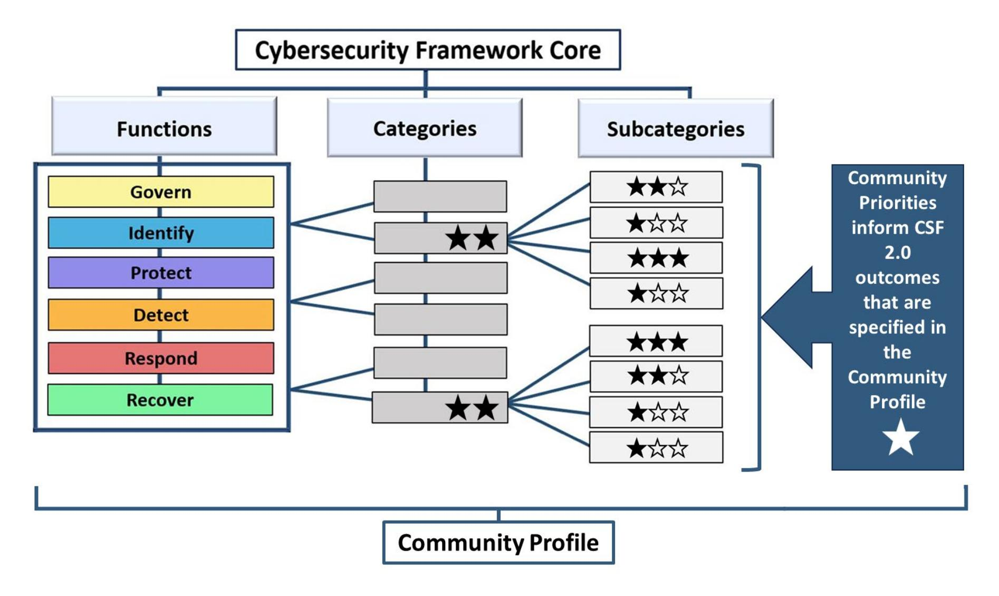
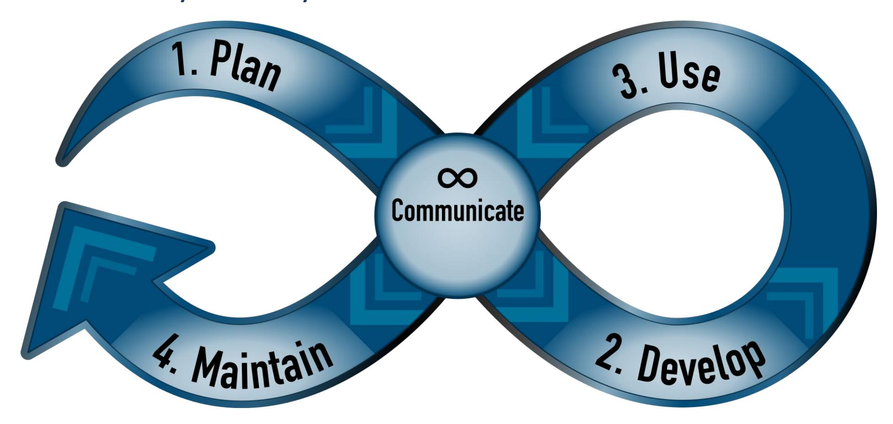
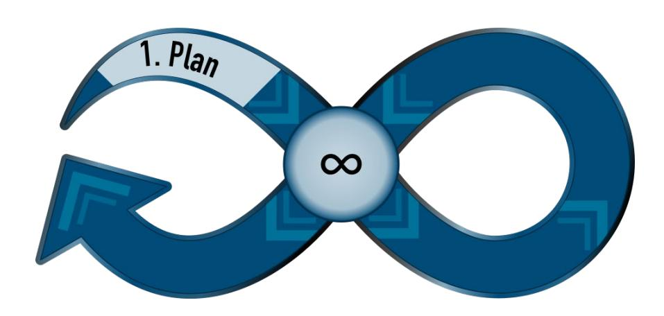
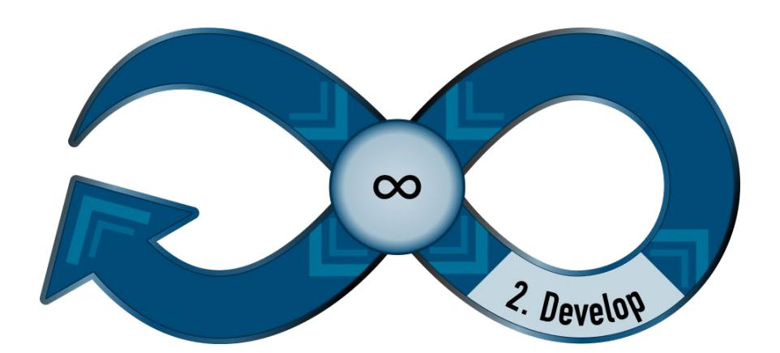
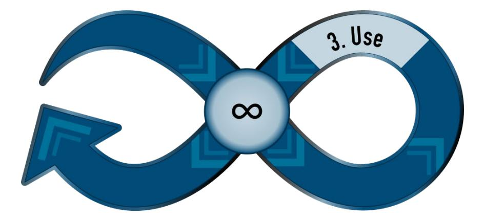
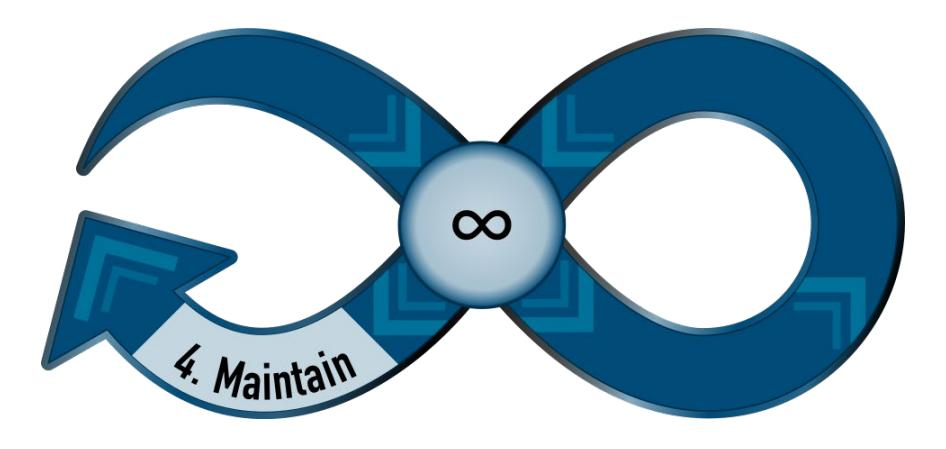

{0}------------------------------------------------

## **NIST Cybersecurity White Paper NIST CSWP 32 ipd**

# **NIST Cybersecurity Framework 2.0: A Guide to Creating Community Profiles**

Initial Public Draft

Cherilyn Pascoe *National Cybersecurity Center of Excellence National Institute of Standards and Technology* 

Julie Nethery Snyder *The MITRE Corporation*

Karen Scarfone *Scarfone Cybersecurity*

This publication is available free of charge from: <https://doi.org/10.6028/NIST.CSWP.32.ipd>

February 26, 2024

{1}------------------------------------------------

1 Certain equipment, instruments, software, or materials, commercial or non-commercial, are identified in this 2 paper in order to specify the experimental procedure adequately. Such identification does not imply 3 recommendation or endorsement of any product or service by NIST, nor does it imply that the materials or 4 equipment identified are necessarily the best available for the purpose. **NIST Technical Series Policies** [Copyright, Use, and Licensing Statements](https://doi.org/10.6028/NIST-TECHPUBS.CROSSMARK-POLICY) [NIST Technical Series Publication Identifier Syntax](https://www.nist.gov/nist-research-library/nist-technical-series-publications-author-instructions#pubid) **How to Cite this NIST Technical Series Publication:**  9 Pascoe C, Snyder JN, Scarfone KA (2024) NIST Cybersecurity Framework 2.0: A Guide to Creating Community Profiles. (National Institute of Standards and Technology, Gaithersburg, MD), NIST Cybersecurity White Paper (CSWP) NIST CSWP 32 ipd. https://doi.org/10.6028/NIST.CSWP.32.ipd **Author ORCID iDs**  Cherilyn Pascoe: 0009-0009-6216-4864 Julie Snyder: 0009-0004-6352-2831 Karen Scarfone: 0000-0001-6334-9486 **Public Comment Period**  February 26, 2024 – May 3, 2024 **Submit Comments** [framework-profiles@nist.gov](mailto:framework-profiles@nist.gov)  National Institute of Standards and Technology Attn: Applied Cybersecurity Division, Information Technology Laboratory 100 Bureau Drive (Mail Stop 2000) Gaithersburg, MD 20899-2000 **Additional Information**

[https://csrc.nist.gov/pubs/cswp/32/a-guide-to-creating-csf-20-community-profiles/ipd,](https://csrc.nist.gov/pubs/cswp/32/a-guide-to-creating-csf-20-community-profiles/ipd) including related content,

**All comments are subject to release under the Freedom of Information Act (FOIA).**

Additional information about this publication is available at

potential updates, and document history.

{2}------------------------------------------------

#### **Abstract**

- The NIST Cybersecurity Framework (CSF) 2.0 introduced the term "Community Profiles" to
- reflect the use of the CSF for developing use case-specific cybersecurity risk management
- guidance for multiple organizations. This guide provides considerations for creating and using
- Community Profiles to help implement the Framework. The guide describes Community
- Profiles, provides guidance for the content that may be conveyed through a Community Profile,
- and offers a Community Profile Lifecycle (Plan, Develop, Use, Maintain).

#### **Keywords**

- Community Profiles; cybersecurity; Cybersecurity Framework (CSF); cybersecurity risk
- governance; cybersecurity risk management; enterprise risk management; Profiles.

#### **Audience**

- The primary audience for this guide is communities, which are groups of organizations with
- shared interests in cybersecurity risk management within a specific context, such as a sector,
- technology, or challenge, that are interested in developing one or more Community Profiles.

#### **Supplemental Content**

- The NCCoE has worked with communities to develop Community Profiles for a variety of use
- cases. These Community Profiles are available on the [NCCoE Framework Resource Center.](https://www.nccoe.nist.gov/framework-resource-center)
- Communities that are interested in working with the NCCoE to develop Community Profiles and
- supporting resources or that have suggestions for improving this guide may contact the NCCoE
- at [framework-profiles@nist.gov](mailto:framework-profiles@nist.gov) or visit th[e NCCoE Framework Resource Center.](https://www.nccoe.nist.gov/framework-resource-center)

#### **Acknowledgments**

- This NCCoE guide is informed by insights gained from over a decade of collaborative efforts to
- develop what are now called Community Profiles. The NCCoE acknowledges and thanks all of
- those who have contributed to these efforts. In addition, the NCCoE wishes to express our
- thanks to Nakia Grayson, NIST; Jonathan Keisler, MITRE; Brett Kreider, MITRE; William
- Newhouse, NIST; Ron Pulivarti, NIST; Steve Quinn, NIST; Christina Sames, MITRE; and David
- Weitzel, MITRE.

{3}------------------------------------------------

### **Table of Contents**

| 59 | 1. About Community Profiles1                                                |  |  |  |
|----|-----------------------------------------------------------------------------|--|--|--|
| 60 |                                                                             |  |  |  |
| 61 |                                                                             |  |  |  |
| 62 | 2. Community Profiles Contents3                                             |  |  |  |
| 63 | 3. The Community Profile Lifecycle5                                         |  |  |  |
| 64 |                                                                             |  |  |  |
| 65 |                                                                             |  |  |  |
| 66 |                                                                             |  |  |  |
| 67 |                                                                             |  |  |  |
| 68 | 4. NCCoE Resources12                                                        |  |  |  |
| 69 | List of Tables                                                              |  |  |  |
| 70 | Table 1 Sample Community Profile Template3                                  |  |  |  |
| 71 | List of Figures                                                             |  |  |  |
| 72 | Fig. 1. Representation of Community Profiles Using the CSF Core. 1 |  |  |  |
| 73 | Fig. 2: Community Profile Lifestyle5                                        |  |  |  |
|    |                                                                             |  |  |  |

{4}------------------------------------------------

#### **Preface**

 Since the NIST Cybersecurity Framework (CSF) was first released in 2014, the CSF has been used by communities with shared interests in cybersecurity risk management. These communities developed what are now called "Community Profiles" to outline shared interests, goals, and outcomes within a specific context, such as a sector, technology, or challenge. CSF 2.0 introduced the term "Community Profiles" to describe the ways various organizations have used CSF Profiles to develop cybersecurity risk management guidance that applies to multiple organizations, as well as to differentiate them from Organizational Profiles that are internally focused on the organization itself and generally not shared publicly. A Community Profile can be thought of as guidance for a specific community that is organized around the common taxonomy of the CSF. This guide provides considerations for creating and using Community Profiles to implement the CSF 2.0. This guide is intended to provide a starting point, as there are a myriad of ways that Community Profiles have been developed to serve communities. Communities can build on the ideas in this guide to create a Community Profile that supports their needs where they share common priorities.

{5}------------------------------------------------

#### **1. About Community Profiles**

- A *Community Profile* describes shared interests, goals, and outcomes for reducing
- cybersecurity risk among a number of organizations. Community Profiles provide a way for
- communities to reflect a consensus point of view about cybersecurity risk management.
- Organizations in the community can use a Community Profile as the basis of, or to inform, their
- Organizational Target Profiles. Some communities may develop more than one Community
- Profile, based on the scope of their needs.
- *Communities* are organizations that share a common context and an interest in their
- cybersecurity posture. Examples of communities that a Community Profile may support include:
- Sectors/subsectors (e.g., critical infrastructure sectors)
- Technologies (e.g., mobile, cloud)
- Other use cases (e.g., thwarting ransomware attacks)

 Figure 1 provides an abstract view of Community Profiles, which use the CSF 2.0 Core to identify and prioritize cybersecurity outcomes that are necessary to meet the community's priorities.

Community priorities influence the CSF 2.0 outcomes that are prioritized. The stars in Fig. 1

represent the degree of importance of CSF 2.0 outcomes in the context of the Community

Profile.

**Fig. 1. Representation of Community Profiles Using the CSF Core.**

{6}------------------------------------------------

- Examples of Community Profiles are available on the [NCCoE Framework Resource Center.](https://www.nccoe.nist.gov/framework-resource-center) Once
- available, NIST will add Community Profiles that are developed for CSF 2.0 to the NCCoE
- Framework Profiles Resource Center.

#### **Benefits**

- Community Profiles offer a variety of potential benefits, including:
- Describing a shared taxonomy for cybersecurity risk management and priorities in the context of the community
- Encouraging common target outcomes that organizations within the community can use to inform their assessments of cybersecurity progress
- Aligning requirements from multiple sources under one framework
- Leveraging expertise across the community
- Minimizing the burden for each organization by providing priorities and outcomes that organizations can use to develop their own Target Profiles
- The benefits communities will find most valuable shape how they scope and approach
- developing their Community Profile(s).

#### **Developers and Owners**

- Efforts to develop Community Profiles encourage collaboration across the community often
- the efforts to bring a community together to develop a Community Profile to find consensus are
- just as valuable as the publication. The Community Profile developer should have community
- expertise, capabilities to convene other experts that represent the interests of the community,
- and resources to support development. Examples of organizations that may collaboratively
- develop and maintain Community Profiles include trade associations, nonprofit entities,
- government agencies, advisory committees, and information sharing organizations. A large
- organization with distinct operational components might even develop a Community Profile for
- internal use across its divisions or units.

{7}------------------------------------------------

#### **2. Community Profiles Contents**

- Community Profiles use the CSF Core to highlight and prioritize cybersecurity outcomes that are
- important for achieving community priorities. A Community Profile provides information that
- enables the community to make risk-informed decisions when determining how to use its
- cybersecurity resources.
- Community Profiles align community priorities with outcomes from the CSF 2.0 Core by
- specifying Subcategories as "included" in the Community Profile. As depicted in Table 1,
- Community Profiles should include:
- The *priority* level of each CSF 2.0 outcome (e.g., ranking 1, 2, 3, or Low/Moderate/High),
- A *rationale* for the priority level(s) to help users understand applicability of the CSF 2.0 outcome in the context of the community (e.g., an explanation of community-specific challenges or threats that the outcome will help the community address), and
- Applicable *Informative References/Mappings* that can help users achieve the CSF 2.0 outcomes or that can inform assessments of outcomes their organization is already achieving (e.g., industry standards or guidelines).

| CSF 2.0 Outcome |                                                                                                    | Priority | Rationale | Informative References / Mappings |
|-----------------|----------------------------------------------------------------------------------------------------|----------|-----------|-----------------------------------------|
| ID.AM-01        | Inventories of hardware managed by the organization are maintained                           |          |           |                                         |
| ID.AM-02        | Inventories of software, services, and systems managed by the organization are maintained |          |           |                                         |

**Table 1 Sample Community Profile Template**

#### Communities may also choose to include:

- **Considerations**  Supplements the rationale by providing additional recommendations, explanations, or other supporting details for a CSF 2.0 outcome within the context of this Profile
- **Implementation Examples** Provides one or more examples of implementation activities that could be implemented to achieve part or all of the CSF 2.0 outcome
- **Notes** Offers any additional details about a CSF 2.0 outcome within the community's context, such as notes to Community Profile users

 Communities may wish to further elaborate on how CSF 2.0 outcomes help them address more discrete priorities and objectives. For example, priority levels, considerations, and implementation examples may differ for one community priority in comparison to another.

{8}------------------------------------------------

| 164 | Using Crosswalks and Mappings for Community Profiles                   |
|-----|------------------------------------------------------------------------|
| 165 | Communities may have requirements from a variety of laws,              |
| 166 | regulations, standards, and other resources. Mappings provide a way of |
| 167 | identifying and describing relationships of these many resources.      |
| 168 | Mappings to the NIST CSF 2.0 and other NIST publications are stored in |
| 169 | the Cybersecurity Privacy and Reference Tool (CPRT).                   |

{9}------------------------------------------------

#### **3. The Community Profile Lifecycle**

**Fig. 2: Community Profile Lifestyle**

 Fig. 2 illustrates the Community Profile Lifecycle. Developing a Community Profile begins with a **planning** process that includes understanding the needs of the community it is intended to support and determining the scope of the Profile. Thoughtful planning enables the **development** process, resulting in the Community Profile. The Profile is then ready for **use** by organizations in the community. Community Profiles are reviewed periodically and updated as needed to ensure they are adequately **maintained** and continue to meet the needs of the community or are retired when no longer needed.

 A thread of communication runs throughout the Community Profile Lifecycle. Coordination and collaboration among organizations within the community helps develop a Community Profile that is realistic and useful throughout its lifespan.

The section below provides a summary of the Community Profile Lifecycle phases.

{10}------------------------------------------------

#### 184 **Summary of Community Profile Lifecycle Phases**

#### **1: Plan**

**Audience:** determine the community

**Scope:** determine what the Community Profile will address

#### **Participants:**

determine who will contribute to development

**References:** identify community-specific standards, regulations, and other resources

**Content:** determine what to include in the Community Profile

#### **2: Develop**

**Prioritize:** identify community priorities and objectives

**Align:** align community priorities to CSF cybersecurity outcomes

**Document:** complete the Community Profile with relevant content

**Feedback:** engage the community to provide feedback

**Inform:** notify the community that the Profile is available and ready for use

#### **3: Use**

**Collaborate and Coordinate:** determine how to use the Community Profile most effectively within organizations and across the community

**Assess:** determine the current state of the community and organizations

#### **4: Maintain**

#### **Measure Impact:**

evaluate the success of the Community Profile and identify additional needs

#### **Monitor/Feedback:**

determine if changes are needed to make the Profile more effective for the community

**Update:** adjust Community Profile content as needed

**Retire:** retire the Community Profile when no longer needed

## 188 **Plan**

185 **Communicate (All Phases)**

186 Communication throughout the lifecycle helps the community develop an appropriate Community 187 Profile.

### 189

190 When planning the creation of a Community Profile, perform these actions:

 1. **Identify the intended audience for the Community Profile.** Determine whether the Profile is intended for the entire community or specific parts of or roles within the community. Most Community Profiles are intended to address many roles, from directors and executive leaders to hands-on implementers.

{11}------------------------------------------------

- 2. **Scope the Profile.** The Profile's scope should be broad enough to accommodate the variety of community members but not so broad that it does not adequately capture the community's cybersecurity needs. Some communities also determine whether the Community Profile will be a voluntary resource or will be required for the community.
- 3. **Identify participants in the development process.** Aligning community priorities requires participation of knowledgeable experts across the community with a variety of operational experience in addition to cybersecurity experts. Participants should be willing to participate throughout the Profile development process and will ideally champion its use once the Profile is complete.
- 4. **Identify community-specific Informative References.** *Informative References* are standards, guidelines, regulations, and other resources to help inform how a community achieves the outcomes in the CSF Core. Communities should take advantage of context- specific regulations, relevant sector/technology-specific standards, industry best practices, and other available references that can support development and use of the Community Profile. These can be mapped to outcomes in the CSF. Communities may incorporate available references, including available CSF mappings, to aid practitioners in using the Profile.
- 5. **Decide what to include in the Profile.** At a minimum, a Community Profile indicates which CSF Functions, Categories, and Subcategories align with community priorities. This helps indicate which cybersecurity activities and outcomes are most supportive to community objectives, operational functions, and other priorities. A Community Profile may also provide discussions of priorities and implementation guidance.

 The state of the community that will be served by the Profile (e.g., cybersecurity knowledge and maturity) can inform decisions regarding what type of information to include and the necessary level of detail. Each community determines the appropriate level of detail to communicate and the effective structure of the document (e.g., content that appears in the main body vs. an appendix).

#### **Integrating Other NIST Frameworks**

 While a CSF Community Profile can be a valuable tool on its own, communities may consider integrating other related or complementary frameworks, such as the [NIST Privacy Framework,](https://www.nist.gov/privacy-framework) [NIST \(cybersecurity\)](https://csrc.nist.gov/Projects/risk-management/about-rmf)  [Risk Management Framework \(RMF\),](https://csrc.nist.gov/Projects/risk-management/about-rmf) or [NIST Artificial Intelligence \(AI\)](https://www.nist.gov/itl/ai-risk-management-framework)  [RMF.](https://www.nist.gov/itl/ai-risk-management-framework) Additionally, incorporating links to other resources, such as the [NICE Workforce Framework for Cybersecurity \(NICE Framework\)](https://www.nist.gov/itl/applied-cybersecurity/nice/nice-framework-resource-center) or [NIST](https://www.nist.gov/privacy-framework/workforce-advancement/privacy-workforce-public-working-group)  [Privacy Workforce Taxonomy,](https://www.nist.gov/privacy-framework/workforce-advancement/privacy-workforce-public-working-group) may help communities with identifying work roles and aligning staff to implement prioritized Subcategories in the Community Profile.

{12}------------------------------------------------

#### **Develop**

- After planning a Community Profile, follow these steps to develop it:
- 1. **Identify community priorities and objectives.** While each organization within a community has its own mission objectives and priorities, there are common or universal interests that support the community. Community Profile teams begin with identifying these universal priorities, which describe the fundamental purposes, operations, or use cases of a community.

Questions to ask that may help the community identify its shared priorities include:

- How would you describe the purpose of the community?
- What are the critical activities in the community and why are they important?
- What are the current risk management requirements the community must adhere to?
- Are there current community opportunities or priorities to include?
- Are there any dependencies outside the community?
- What are the threats to the success of the community?
- What are the key assets that support each priority?
- What are the risk appetite statements of the community?
- What assessment criteria should be used?

 Once the priorities are agreed upon, the community may decide to rank the priorities in order of relative importance. This helps organizations within the community make strategic planning decisions.

 2. **Align community priorities with CSF outcomes.** Once community priorities are identified, the development team aligns those priorities with the CSF outcomes that enable or support them. Communities can choose a simple prioritization schema (e.g., Included/Not Included) or a multi-level schema (e.g., High, Moderate, Implement Later) to provide more insights when creating a gap analysis or action plan. Inputs for adding and prioritizing outcomes include community-specific Informative References, shared threats in the community, inputs from community experts, and other resources that the community finds beneficial.

{13}------------------------------------------------

- 3. **Fill out the Profile.** There is no required format for a Community Profile. Some communities use a narrative format with prose and tables. Others prefer a table format that can be manipulated and sorted in a variety of ways. Still others prefer a format that can be ingested into and manipulated by governance tools.
- Development teams can capitalize on existing resources rather than creating the Community Profile from a virtual blank page. For example, some communities may already have a set of priorities or community-specific cybersecurity standards.
- Also, the NIST National Cybersecurity Center of Excellence (NCCoE) has published multiple Community Profiles that can be used as examples of additional narrative discussions that may be included along with the basic Community Profile contents described in [Section 2.](#page-7-0) Published Community Profiles are available on the [NCCoE](https://www.nccoe.nist.gov/framework-resource-center)  [Framework Resource Center.](https://www.nccoe.nist.gov/framework-resource-center)
- 4. **Engage the community to provide feedback.** Engaging the community for feedback is a critical part of developing an effective Community Profile and increases the likelihood that the Profile will be accepted and used by organizations in the community. The development team may wish to engage the community at multiple milestones during development. At a minimum, once the development team has completed the draft Community Profile, it should seek input from the broader community and incorporate any feedback that will help the Profile be used successfully.
- 5. **Inform the community when the Profile is finalized.** The final Community Profile should be hosted by the community in a location that all community members can access. The community should promote the Profile to its members so they know it is available for use (for example, an email to members or social media announcements).

#### **Use**

- Community Profiles provide a shared view of cybersecurity that facilitates collaboration and coordination throughout the community. It is easier for communities to share information when community members are each starting with a shared way of discussing the topic.
- Examples of how organizations can use Community Profiles include:
- Inform executive leadership of community-level cybersecurity expectations and goals
- Align business and operational practices with supporting cybersecurity activities that have been vetted by the community

{14}------------------------------------------------

- Benchmark against community expectations when developing the organization's Organizational Current Profile
- Inform the organization's Target Profile(s) or use it as the organization's Target Profile
- Facilitate decision making when allocating budget, staffing, and other resources
- Communicate cybersecurity posture in a consistent way with community partners (e.g., vendors, supply chain, service providers), standards bodies, or regulators

#### **Assessing Current State**

 Community Profiles can serve as valuable tools for assessing both the community and organizations within the community. At the community level, Profiles can help a community determine where its ecosystem has systemic cybersecurity challenges and work in collaboration to address those challenges.

 In addition to using Community Profiles to create an Organizational Target Profile, organizations can use the information in Community Profiles to inform how they conduct internal assessments of their progress in relation to community expectations. Communities may choose to include assessment criteria and implementation examples to facilitate consistent evaluation by community members. These assessments will inform Organizational Profiles and strategic planning efforts for organizations in the community.

 For more information on Organizational Current Profiles and Target Profiles, see the *Creating and Using Organizational Profiles Quick Start Guide*.

#### **Maintain**

 Collaboration across the community continues to maintain the Community Profile over time. Perform the following activities:

 • **Measure the impact the Community Profile is having and determine whether additional resources are necessary to support successful use.** Communities may conduct activities to measure the impact a Community Profile is having over time. Each community will determine its need for measurement and effective measures for evaluating impact. Understanding use and impact can also inform next steps for maintaining the Community Profile and help the community identify any additional

{15}------------------------------------------------

 resources it may need for effective use. For example, communities may choose to develop guidance for implementation and assessment, establish a forum for ongoing collaboration, or perform other activities. • **Identify and monitor for changes and feedback that might necessitate updates.** As operating environments and cybersecurity risks inevitably change over time, Community Profiles will also need to change. Communities will need to determine an appropriate frequency with which to review their Community Profiles, as well as any circumstances that may necessitate change between periodic reviews. Examples of events that may trigger the need to update a Community Profile include: o Changes to: - priorities - risk management posture (e.g., new threats) - laws, regulations, standards, contracts - sector composition - supply chain - insurance o Feedback from the community (e.g., clarity or utility of content, implementation challenges) o Updates to the CSF • **Update the Community Profile when needed by repeating earlier lifecycle phases.**  When changes are required, communities can follow earlier steps in the Community Profile Lifecycle to make and communicate updates. Communities may also consider whether and how to maintain an archive of previous versions of Community Profiles. • **Retire Profiles.** Communities may also determine that a Community Profile has outlived its usefulness and should be retired. Each community can determine its approach to retiring Community Profiles.

{16}------------------------------------------------

#### **4. NCCoE Resources**

- For more information regarding developing and using Community Profiles, see th[e NCCoE](https://www.nccoe.nist.gov/framework-resource-center)
- [Framework Resource Center](https://www.nccoe.nist.gov/framework-resource-center) and join our community of interest by sending an email to
- [framework-profiles@nist.gov.](mailto:framework-profiles@nist.gov)