{0}------------------------------------------------

# PRODUCT DEVELOPMENT CYBERSECURITY HANDBOOK

*CONCEPTS AND CONSIDERATIONS FOR IOT PRODUCT MANUFACTURERS*

## **NIST Cybersecurity White Paper NIST CSWP 33 ipd**

Initial Public Draft

Michael Fagan Katerina Megas Paul Watrobski Jeffrey Marron Barbara Cuthill *Applied Cybersecurity Division Information Technology Lab*

Dave Lemire Brad Hoehn *HII*

This publication is available free of charge from: https://doi.org/10.6028/NIST.CSWP.33.ipd

April 3, 2024

{1}------------------------------------------------

Certain equipment, instruments, software, or materials, commercial or non-commercial, are identified in this paper in order to specify the experimental procedure adequately. Such identification does not imply recommendation or endorsement of any product or service by NIST, nor does it imply that the materials or equipment identified are necessarily the best available for the purpose.

#### **NIST Technical Series Policies**

[Copyright, Use, and Licensing Statements](https://doi.org/10.6028/NIST-TECHPUBS.CROSSMARK-POLICY) [NIST Technical Series Publication Identifier Syntax](https://www.nist.gov/nist-research-library/nist-technical-series-publications-author-instructions#pubid)

#### **How to Cite this NIST Technical Series Publication:**

Fagan M, Megas K, Watrobski P, Marron J, Cuthill B, Lemire D, Hoehn B (2024) Product Development Cybersecurity Handbook: Concepts and Considerations for IoT Product Manufacturers. (National Institute of Standards and Technology, Gaithersburg, MD), NIST Cybersecurity White Paper (CSWP) NIST CSWP 33 ipd. https://doi.org/10.6028/NIST.CSWP.33.ipd

#### **Author ORCID iDs**

Michael Fagan: 0000-0002-1861-2609 Katerina N. Megas: 0000-0002-2815-5448 Paul Watrobski: 0000-0002-6449-3030 Jeffrey Marron: 0000-0002-7871-683X Barbara B. Cuthill: 0000-0002-2588-6165

#### **Public Comment Period**

April 3, 2024 - May 17, 2024

#### **Contact Information**

[iotsecurity@nist.gov](mailto:iotsecurity@nist.gov)

National Institute of Standards and Technology Attn: Applied Cybersecurity Division, Information Technology Laboratory 100 Bureau Drive (Mail Stop 2000) Gaithersburg, MD 20899-2000

#### **Additional Information**

Additional information about this publication is availabl[e https://www.nist.gov/itl/applied-cybersecurity/nist](https://www.nist.gov/itl/applied-cybersecurity/nist-cybersecurity-iot-program)[cybersecurity-iot-program,](https://www.nist.gov/itl/applied-cybersecurity/nist-cybersecurity-iot-program) including related content, potential updates, and document history.

**All comments are subject to release under the Freedom of Information Act (FOIA).**

{2}------------------------------------------------

#### **Abstract**

As interest in Internet of Things (IoT) technologies has grown, so have concerns and attention to cybersecurity of the newly network-connected products and services offered in many sectors, including energy services, water/waste-water services, automobiles, consumer electronics, and government. This Product Development Cybersecurity Handbook will describe concepts important to developing and deploying secure IoT products for any sector or use case, including discussion of IoT Product architecture, deployment, roles and cybersecurity perspectives. This publication extends and elaborates on NIST's prior work related to development of IoT products. In addition to discussing the concepts, this publication also demonstrates their application and discusses how satisfaction of cybersecurity in IoT products can be approached.

#### **Keywords**

cybersecurity risk; Internet of Things (IoT); manufacturing; risk management; risk mitigation; securable computing devices; software development.

{3}------------------------------------------------

#### **Table of Contents**

| Introduction                                            | 1        |
|---------------------------------------------------------|----------|
| IoT Product-System Architecture Considerations          | 3        |
| IoT Product Deployment Considerations                   | 5        |
| Roles Supporting IoT Product Cybersecurity Outcomes     | ε        |
| IoT Product Cybersecurity Perspectives                  | 8        |
| IoT Product Components vs. Network Infrastructure, Etc  | 8        |
| IoT Product Component Hardware, Platforms, and Software | <u>c</u> |
| Locally vs. Remotely Managed                            | 10       |
| Cybersecurity Outcomes and Requirements                 | 13       |
| Technical Cybersecurity Outcome Considerations          | 14       |
| Local Device Only IoT Products                          | 15       |
| Local Management of IoT products                        | 16       |
| Variety of Local Product-System Architectures           | 17       |
| Third-Party Local Management Tools                      | 18       |
| Remote Backends                                         | 19       |
| Shared Cloud Backends                                   | 20       |
| Cloud Backend Interoperability                          | 21       |
| Non-technical Cybersecurity Outcome Considerations      | 22       |
| Documentation                                           | 22       |
| Information and Query Reception                         | 25       |
| Information Dissemination                               | 26       |
| Education and Awareness                                 | 28       |
| References                                              | 20       |

{4}------------------------------------------------

As interest in Internet of Things (IoT) technologies has grown, so have concerns and attention to cybersecurity of the newly network-connected products and services offered in many sectors, including energy services, water/waste-water services, automobiles, consumer electronics, and government. Cybersecurity of IoT devices, though critical, is incomplete if the cybersecurity of other IoT product components is not considered as well since the IoT device and associated IoT product components constitute a system. Significant risk can be introduced by vulnerable IoT product components that are used by even a hardened IoT device since these additional IoT product components will likely have access to the IoT device and related data.

This Product Development Cybersecurity Handbook describes concepts important to developing and deploying secure IoT products for any sector or use case. This handbook extends the discussion related to IoT manufacturing in *Foundational Cybersecurity Activities for IoT Device Manufacturers*, [NISTIR](#page-32-1) [8259](#page-32-1) and is intended to be used in conjunction with NISTIR 8259, applying to any sector or use case, expanding on the following topics:

- How IoT product components can vary and be assembled into IoT products.
- Cybersecurity considerations for IoT product component hardware, software, etc.
- How IoT product components use internet infrastructure and other equipment to communicate
- The multiple parties that may have a role in supporting a secure IoT product lifecycle
- Standards and guidance related to cybersecurity outcomes for IoT products

#### What's a 'Thing' Anyway?

This handbook is based on work nominally related to IoT cybersecurity, such as the NISTIR 8259 series, but the cybersecurity guidance and approaches discussed for IoT are based on and resemble approaches for cybersecurity of information technology and other digital equipment (e.g., laptops). Thus, the guidance for manufacturers in publications like the NISTIR 8259 series and this handbook can be applied to any digital product. For example, consideration of expected customer and use case to tailor the cybersecurity support from their products can be utilized across technologies, sectors, and use cases as a general path toward securable products. The capabilities and outcomes identified for IoT in the prior work (e.g., data protection, access control, software update, documentation) are also broadly applicable to digital technologies in general. Therefore, the cybersecurity considerations and discussions in this handbook can apply to any 'thing' that has internet or other networking capabilities.

#### This document:

- Provides a discussion of IoT Product architecture, deployment, roles and cybersecurity perspectives to extend and elaborate on NIST's prior work on development of IoT products; and
- Demonstrates the application of these concepts and discusses how satisfaction of cybersecurity in IoT products can be approached, including several IoT product deployment and instantiation examples with related informative references.

{5}------------------------------------------------

# FOUNDATIONAL CYBERSECURITY CONCEPTS FOR IOT PRODUCTS

## *FROM HARDWARE TO OUTCOMES*

## IoT Product-System Architecture Considerations

What an IoT device is versus what an IoT product is.

What kind of components can comprise an IoT product as part of its product-system architecture.

The relationship between IoT product, product component, and environment.

## IoT Product Deployment Considerations

What it means for an IoT product to be deployed, initialized, and instantiated.

How to identify locally versus remotely managed IoT product components.

## Roles Supporting IoT Product Cybersecurity Outcomes

What a cybersecurity outcome is and how cybersecurity outcomes are defined.

How to identify various cybersecurity roles related to an IoT product.

Understand how cybersecurity responsibilities may be distributed among roles for an IoT product.

## IoT Product Cybersecurity Perspectives

How perspectives can be useful for cybersecurity.

How to develop cybersecurity implications for "in-product" versus "out-of-product" equipment.

Considerations for cybersecurity related to IoT product hardware, software, platforms, and firmware.

Implications and ways to manage cybersecurity for locally and remotely managed IoT product components.

{6}------------------------------------------------

## **IOT PRODUCT-SYSTEM ARCHITECTURE CONSIDERATIONS**

**IoT products** can be a complex combination of product components. Key to developing IoT products is understanding how IoT products may be architected to consider implications for cybersecurity. Many products, including IoT products, are anchored on a locally managed physical device or devices. In the context of IoT, NIST describes this equipment as an **IoT device**: computing equipment with at least one transducer (i.e., sensor or actuator) and at least one network interface. Expanding on this concept, one way to view the relationships between IoT devices, other **IoT product components**, and IoT products is:

*IoT products often constitute a set of system components that work together to deliver functionality realized at the end point or 'device' component(s) of the product…All IoT products contain at least one IoT device and may contain only this product component. In many cases, the IoT product may be purchased as one piece of equipment (i.e., the IoT device) but still requires other components to operate, such as a backend (e.g., cloud server) or companion user application on a personal computer or smartphone.*

Extending this view, all IoT products contain at least one IoT product component, the locally managed physical device (i.e., IoT device). IoT devices many times require support from other IoT product components to function. Within this context, an IoT product has a networked **productsystem architecture**, which refers to the abstract logical organization of the IoT device and any IoT product components needed to use it beyond basic features when deployed in an **environment** (e.g., a customer's home, factory floor, hospital's emergency department). It is important to note that not all equipment needed to interconnect IoT product components is considered part of the product by this definition. Note, some equipment

(e.g., internet and other infrastructure) used to link IoT product components would not be considered part of the IoT product and may be assumed to exist in the environment.

IoT products are therefore usually a system composed of components and used in an environment. **[Figure 1](#page-6-1)** below from *Internet of Things (IoT) Component Capability Model for Research Testbed*, [NISTIR 8316,](#page-32-2) shows how IoT components, systems, and environments relate. Though introduced in NISTIR 8316 for the context of IoT research testbeds, these relationships are applicable to any set of component(s), system(s), and environment set, including IoT products generally.

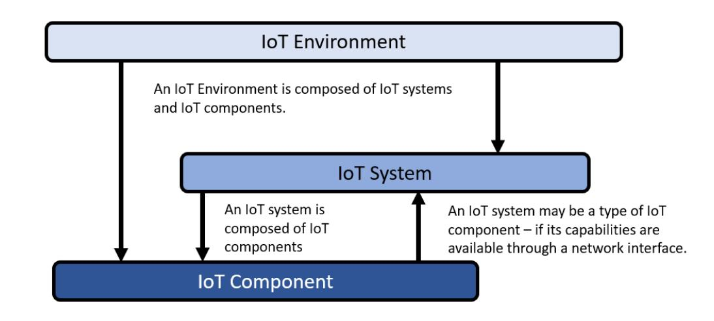

**Figure 1 - How IoT components form systems in environments.** *From NISTIR 8316.*

Note, different IoT product architectures could be devised for any given use-case. For example, a smart medical product may be designed to use a mobile application and no cloud services, while another may use just cloud services, while a third may use both cloud services and a mobile application. In all cases, the medical product's feature sets may be exactly the same, though how the features are delivered is different which can have implications for cybersecurity.

{7}------------------------------------------------

#### When a System Isn't a System, and a Component Isn't a Component

In discussions of cybersecurity and technology, the terms system and component are sometimes used with different meanings in different contexts. In general, components are sub-parts of something (e.g., equipment, networks). Thus, the term components has been used to refer to parts of equipment such as CPUs, GPUs, and RAM. Equipment formed from these kinds of components has been called computer systems, shortened to systems. For example, guidance about laptop cybersecurity may call the laptop a system, which in that context it is. But the same laptop in the context of a networked system could be characterized as a component. It is important to remember that in this handbook, IoT products are considered networked systems, and so use of the terms product, system, and component are consistent with that level of abstraction.

#### SECTION SUMMARY AND GLOSSARY

This section introduced IoT products and discussed key product-architecture considerations with implications for cybersecurity. These concepts are important to understand as they are built upon throughout this handbook. You should know:

- 1. What an IoT device is versus what an IoT product is.
- 2. What kind of components can comprise an IoT product as part of its product-system architecture.
- 3. The relationship between IoT product, product component, and environment.

The following terms were defined in this section:

**IoT Product** - A locally managed physical device (i.e., IoT device) and any other product components necessary to use the device.

**IoT Device** - Locally managed computing equipment with at least one transducer (i.e., sensor or actuator) and at least one network interface [IR8259].

**IoT Product Component** - Hardware and/or software needed to use an IoT device (e.g., mobile application, backend).

**Product-System Architecture** - The abstract logical organization of the IoT device and any IoT product components needed to use it beyond basic features when deployed in an environment.

**Environment** - The local environment in which an IoT product is deployed and instantiated (e.g., a customer's home, factory floor).

{8}------------------------------------------------

## **IOT PRODUCT DEPLOYMENT CONSIDERATIONS**

IoT products, like all digital equipment, are developed then deployed for use. During IoT product deployment and instantiation, cybersecurity becomes a cooperative effort among the IoT product manufacturer, customers, and other supporting entities (e.g., service providers). From a practical perspective, **IoT product deployment and instantiation** begins when the customer connects the locally managed physical device (i.e., IoT device) to their network infrastructure (e.g., to the Internet via their Wi-Fi router and ISP services). This is when the IoT product is deployed and then initialized as it is first connected to other IoT product components (e.g., mobile applications, cloud services). These IoT product components then form an instantiated IoT product to be used by the customer.

#### Remotely Managed IoT Product Components and Data Centralization

IoT products utilize remotely managed IoT product components for many reasons. More processing resources, better data reliability and component availability, larger storage capacities, and other factors can motivate the use of backends and other remotely managed IoT products. For some products, data may be aggregated for an individual product instance or across customers for analysis that can lead to improved performance of the product. With these benefits may come cybersecurity risks that must be considered by manufacturers. One key consideration is the data centralization that can result from aggregation of IoT product data in remotely managed IoT product components such as backends. Large quantities of data can be an attractive target for attackers, and shared resources on the remotely managed IoT product component increases the risk of unauthorized access to data. Manufacturers must consider these risks related to their products.

When deployed and instantiated, some IoT product components will be **locally managed**, in this context meaning they will be under the direct control of the customer. For example, the IoT device of an IoT product is generally a locally managed IoT product component as is a mobile application installed on customers' smartphones. In contrast, some IoT product components will be **remotely managed**, which here means an entity (i.e., individual or organization) other than the customer will directly control the component. This includes backends, cloud-hosted or otherwise.

#### SECTION SUMMARY AND GLOSSARY

This section discussed how an IoT product may be deployed, including components that are locally (i.e., in the customer's environment) managed and remotely managed. You should know:

- 1. What it means for an IoT product to be deployed, initialized, and instantiated.
- 2. How to identify locally versus remotely managed IoT product components.

The following terms were defined in this section:

**IoT Product Deployment and Instantiation** - When the customer connects the IoT device to their network infrastructure (e.g., to the Internet via their Wi-Fi router and ISP services) and the IoT device connects to other IoT product components.

**Locally Managed** - When an IoT product component is under direct control of the customer (i.e., in the customer environment).

**Remotely Managed** - When an IoT product component is under direct control of the manufacturer or third-party (i.e., not in the customer environment).

{9}------------------------------------------------

## **ROLES SUPPORTING IOT PRODUCT CYBERSECURITY OUTCOMES**

Individuals and organizations may have roles supporting IoT product **cybersecurity outcomes**. Cybersecurity outcomes are the cybersecurity expectations for the IoT product based on the customer's needs and goals, usually in the form of statements of IoT device or product cybersecurity capabilities and non-technical supporting capabilities. Outcomes can be **technical** (i.e., implemented through hardware and software) or **non-technical** (i.e., implemented as procedures and processes by organizations or individuals). For example, for IoT devices, baseline cybersecurity outcomes appear in *IoT Device Cybersecurity Capability Core Baseline*, [NISTIR 8259A](#page-32-3) and *IoT Non-Technical Supporting Capability Core Baseline*, [NISTIR 8259B.](#page-32-4) For consumer IoT products, *Profile of the IoT Core Baseline for Consumer IoT Products*, [NISTIR 8425](#page-32-5) gives an example of cybersecurity outcomes. **Roles** in this context refer to a set of duties and responsibilities associated with the IoT product's cybersecurity. All IoT products will have at least two roles associated with them:

- 1. IoT product manufacturer
- 2. IoT product customer (i.e., individuals, companies, government agencies, educational institutions, etc.)

If an IoT product manufacturer were to develop and maintain (along with the IoT customer) all IoT product components, then these may be the only two roles associated with that IoT product. Cybersecurity outcomes are a reflection of needs and goals. As **[Figure 2](#page-9-1)** shows, IoT product manufacturers produce IoT products, which are used by customers to achieve their needs and goals. Thus, IoT product manufacturers should be informed by and support those needs and goals.

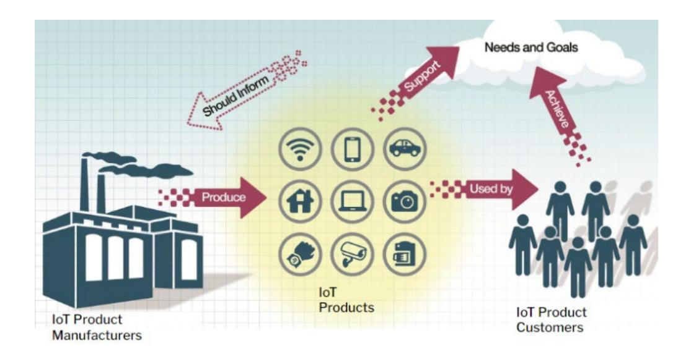

**Figure 2 - The relationship between IoT product manufacturers and customers created via IoT devices.** *From NISTR 8259.*

In this simplistic example, where the only two roles associated with an IoT product are developer and customer, support (particularly post-market management) for cybersecurity outcomes would come from only those two roles. Practically, IoT products are often architected using IoT product components developed or maintained by third parties not captured in the graphic. For example, other roles may include:

- Cloud Service Provider
- Third-Party Software Developer
- Third-party hardware component part with its associated software
- Manufacturer of a white-labeled product
- Operating System Developer

In most cases, third parties will primarily interact with the IoT product manufacturer rather than to the IoT product customer. For example, an IoT product manufacturer may contract a third-party software developer to create their IoT product's mobile application or a cloud service provider to host their backend and web application. Note that IoT devices may include component parts with their own hardware and software introducing new complexities to the supply chain for the product; however, these component part suppliers will also primarily interact with the product manufacturer.

{10}------------------------------------------------

Responsibilities for supporting cybersecurity will vary among roles. For example, management of vulnerabilities across IoT product components may start with vulnerability reports from customers received by the IoT product manufacturer. The manufacturer may determine the vulnerability involves their cloud backend, meaning they would engage with that third-party to mitigate the vulnerability.

#### SECTION SUMMARY AND GLOSSARY

This section explored the many possible cybersecurity roles that may go into support a cybersecurity outcome for an IoT product. All IoT products will involve notable roles of IoT product manufacturer and customer, but various thirdparties may also have responsibilities for cybersecurity. You should know:

- 1. What a cybersecurity outcome is and how cybersecurity outcomes are defined.
- 2. How to identify various cybersecurity roles related to an IoT product.
- 3. Understand how cybersecurity responsibilities may be distributed among roles for an IoT product.

The following terms were defined in this section:

**Roles** - Set of expected cybersecurity responsibilities associated with a product to be assumed by a single entity. [Derived from "role" definition i[n NISTIR 6192\]](#page-32-6)

**Cybersecurity Outcomes** - The cybersecurity expectations for the IoT product based on the customer's needs and goals, usually in the form of statements of IoT device and product cybersecurity capabilities and non-technical supporting capabilities.

**Technical Outcome** - A cybersecurity expectation intended to be delivered via functions or features of hardware and/or software.

**Non-Technical Outcome** - A cybersecurity expectation intended to be provided by an action or process by an individual or organization.

{11}------------------------------------------------

## **IOT PRODUCT CYBERSECURITY PERSPECTIVES**

Understanding different **cybersecurity perspectives** can be useful to understand the reach of roles associated with cybersecurity related to an IoT product. A cybersecurity perspective is an abstract view of a product, system, device, etc. that provides some clarity regarding who is responsible for cybersecurity or how cybersecurity outcomes could be supported, in whole or in part. For example, **boundaries**, the physical or logical perimeters of a system are useful cybersecurity perspectives for systems and are used to help determine expectations for cybersecurity controls' scope.

There are several useful perspectives discussed in this section that can help guide the development, implementation, or support of cybersecurity for IoT products, each described in more detail:

- Equipment considered "in product" (i.e., IoT product components) or "out of product" (e.g., network infrastructure)
- Hardware, platforms, and software used to implement IoT product components
- Locally vs. remotely managed components

#### Security Flows from the Top

In the Open Systems Interconnection model (OSI model), data sent between systems will travel on channels defined by seven layers: Physical, Data Link, Network, Transport, Session, Presentation, and Application. Applying the OSI model to product-system architectures, product components will generally process and handle data to the application layer. Consideration of cybersecurity when developing at this application layer can help mitigate risks at lower layers. For example, use of strong encryption for data sent between product components with keys unique to the product instantiation may thwart attempts to access the data by reading the packets being transported across networks.

### **IOT PRODUCT COMPONENTS VS. NETWORK INFRASTRUCTURE, ETC.**

It is important to note that not all equipment needed to interconnect IoT product components are considered part of the product by this definition. A few considerations to keep in mind:

THE IOT PRODUCT SCOPE IS LIMITED TO COMPONENTS THAT ARE NEEDED TO USE THE IOT DEVICE BEYOND BASIC FEATURES, INCLUDING ANY COMPONENTS THAT COME "IN THE BOX," BUT ALSO SOME COMPONENTS THAT EXIST "OUTSIDE OF THE BOX." For example, a hypothetical voice-controlled smart clock may still act as a clock without backend support, but voice control capabilities may not work. In this case, the backend would be an IoT product component for the smart clock.

THE SCOPE DOES NOT INCLUDE THIRD-PARTY COMPONENTS THAT DO NOT HAVE APPLICATION LAYER ACCESS TO THE IOT PRODUCT DATA AND OPERATIONS. For example, a generic Bluetooth or Zigbee hub that can interface with many IoT products below the application layer to facilitate connections would be required to use the IoT product, but function as network infrastructure, more akin to home Wi-Fi routers. Most notably, like a Wi-Fi router, these components would not have application layer access to data such that, if properly encrypted, this traffic would be secure from eavesdropping by these components.

THIRD-PARTY COMPONENTS COULD BE IOT PRODUCT COMPONENTS IF THEY ARE REQUIRED TO USE THE PRODUCT BEYOND BASIC FEATURES AND THEY HAVE APPLICATION LAYER ACCESS. For example, one or more third-party mobile app(s) may be the only way to access the data from a

{12}------------------------------------------------

hypothetical smart medical device such as a blood pressure cuff or thermometer. In this case, the third-party app(s) would be considered IoT product components and should be assessed as such.

Understanding how to draw boundaries between IoT products and their components (i.e., equipment "in-product") and network or other infrastructure (i.e., equipment "out-of-product") can support cybersecurity in IoT products by ensuring identification of where cybersecurity risk and potential of effective mitigations are higher. Effective identification of IoT product boundaries is important to delivering a secure product-system and securable product for customers. From a threat standpoint, any IoT product component can be a vector for attack. From a data standpoint, boundaries for the IoT product scope can be determined by understanding where the IoT product's data is created, stored, processed, accessible, and possibly shared or sold.

### **IOT PRODUCT COMPONENT HARDWARE, PLATFORMS, AND SOFTWARE**

Understanding cybersecurity related to hardware, platforms, and software can help secure IoT products. Using the view of what features or functionality hardware, platforms, or software contribute to an IoT product component can help illuminate how these parts should support cybersecurity outcomes. Since development and control of hardware, platforms, and software used to create IoT product components can vary, understanding these different perspectives may be helpful to clarify, among other issues, cybersecurity responsibilities between roles both pre- and postmarket.

IoT product components will be instantiated in **hardware** and **software**, perhaps using a **platform**. A fourth perspective that may be helpful to

consider is **firmware**, particularly IoT devices and other components may have **device firmware**. Firmware vulnerabilities can be a significant risk for digital equipment, IoT products included, so consideration of firmware cybersecurity is recommended. For additional information about firmware cybersecurity, see *Platform Firmware Resiliency Guidelines*, NIST SP 800-193.

#### A Platform by Any Other Name

This handbook uses the term platform in a generic way such that hardware, firmware, and/or software of various kinds and in various combinations can be part of a platform. In some other contexts, platform may carry a more specific meaning (e.g., may not include operating systems), but in the context of this handbook a platform can generally include any layer below the implementation specific application code.

Hardware and software that implement an IoT product component could be seen as a single logical unit. This is how this handbook conceives of IoT product components as part of an IoT product. But, when different roles are applied to this perspective, problems can arise. For example, remotely managed IoT product components' hardware will be out of reach of the customer, while the customers' smartphone will be out of reach of the IoT product manufacturer. **[Figure 3](#page-13-1)** illustrates how different kinds of software can exist on top of hardware and how some of the layers could be provided via a platform to create an IoT product component.

{13}------------------------------------------------

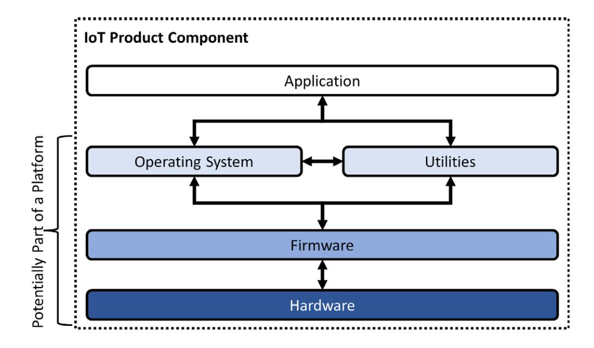

**Figure 3 - How software and hardware can be architected within an IoT product component.**

Some IoT product components will be entirely developed by the IoT product manufacturer, notably IoT devices. In some instances, IoT product components may be entirely developed by thirdparties. In other instances, IoT product components may be developed to function with third-party hardware and/or software.

#### **LOCALLY VS. REMOTELY MANAGED**

During the IoT product's pre-market phase, different cybersecurity perspectives of IoT product components can help identify cybersecurity control with regards to satisfying or demonstrating satisfaction of cybersecurity outcomes. Postmarket, there will be additional relationships between the IoT product manufacturer and third parties to support cybersecurity outcomes. For example, whether developed by the IoT product manufacturer or a third-party, backend applications may be hosted by a (potentially different) third-party, perhaps a cloud service provider. Alternatively, a mobile or PC application will be installed on third-party hardware and software owned and controlled by the customer. The IoT product manufacturer still has some control related to these providers or platforms.

One key post-market perspective to consider is whether an IoT product component or its parts are to be locally or remotely managed. For example, when the IoT product manufacturer writes software to be **hosted** on by a third-party or to be **installed** or **executed** on the customer's software and hardware, the cybersecurity of the software will involve the third-party and customer, respectively.

#### SECTION SUMMARY AND GLOSSARY

This section brought together many of the concepts discussed in previous sections to use perspectives such as boundaries to understanding implications for cybersecurity. You should know:

- 1. How perspectives can be useful for cybersecurity.
- 2. How to develop cybersecurity implications for "in-product" versus "out-of-product" equipment.
- 3. Considerations for cybersecurity related to IoT product hardware, software, platforms, and firmware.
- 4. Implications and ways to manage cybersecurity for locally and remotely managed IoT product components.

The following terms were defined in this section:

**Cybersecurity Perspectives** - An abstract view of a product, system, device, etc. that provides some clarity regarding who is responsible for cybersecurity or how cybersecurity outcomes could be supported, in whole or in part.

**Boundaries** - The physical or logical perimeters of a system [From [NIST SP 800-53A Rev. 5\]](#page-32-7).

**Hardware** - The material physical components of a system [From [NIST SP 800-53A Rev. 5\]](#page-32-7).

**Software** - Computer programs and data stored in hardware - typically in read-only memory (ROM) or 

{14}------------------------------------------------

programmable read-only memory (PROM) - such that the programs and data cannot be dynamically written or modified during execution of the programs [From [NIST SP 800-53A Rev. 5\]](#page-32-7).

**Platform** - A computer or hardware device and/or associated operating system, or a virtual environment, on which software can be installed or run [From [NISTIR 7695\]](#page-32-7).

**Firmware** - A type of software which is specifically defined as "any code stored in a chip that either resides at the reset vector (or equivalent) of the corresponding processor or which is provided as extensions to other firmware (such as Expansion ROM Firmware) [From [NIST SP 800-193\]](#page-32-8).

**Device Firmware** - The collection of non-host processor firmware and Expansion ROM firmware that is only used by a specific device [and] … is typically provided by the device manufacturer [From [NIST SP 800-193\]](#page-32-8).

**Hosted** - When software is executed on a networked environment intended to provide computing resource (e.g., processing and storage) to many users or for multiple purposes.

**Installed** - When software is copied and loaded into storage of a system, usually, but not always by an operating system so that the system and users of the system can access and execute the software.

**Executed** - When software code is loaded into a system's processing pipeline and run by the system.

{15}------------------------------------------------

# CYBERSECURITY OUTCOME SATISFACTION ASSESSMENT CONSIDERATIONS

## *FOR TECHNICAL AND NON-TECHNICAL OUTCOMES*

## Cybersecurity Outcomes and Requirements

The relationship between requirements and cybersecurity outcomes for IoT products.

Sources of requirements or how requirements may be defined (e.g., standards).

## Technical Cybersecurity Outcome Considerations

Potential informative references for different IoT product deployment/instantiation examples.

## Non-Technical Cybersecurity Outcome Considerations

Informative References potentially helpful for non-technical cybersecurity outcomes.

{16}------------------------------------------------

## **CYBERSECURITY OUTCOMES AND REQUIREMENTS**

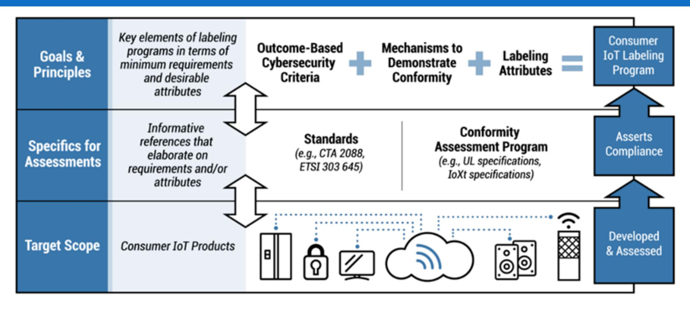

**Figure 4 - How standards and other mechanisms can be used to identify specific requirements for cybersecurity outcomes.** *From NIST CSWP 24.*

Roles and perspectives can be used to break down how to approach assessment of cybersecurity outcome satisfaction. In this context, outcomes are guidelines that describe what is expected and can be applied to different use cases and contexts. Cybersecurity outcomes are useful to guide product manufacturers as they design and support the product over its lifecycle, but more specific information may be needed to define how to implement IoT products or product components so that they meet an outcome. NISTIR 8425 provides examples of technical and non-technical cybersecurity outcomes for consumer IoT products.

More specific than outcomes, **requirements** define how a component can satisfy or demonstrate satisfaction of an outcome for a specific use case, context, technology, IoT product component type, etc. **[Figure 4](#page-16-1)** shows how standards can relate to cybersecurity outcomes in the context of consumer IoT products, but the concepts apply to how standards relate to outcomes for any sector or use case. Determining the appropriate standard for a context can leverage the concepts presented in the prior section. Particularly, understanding cybersecurity perspectives can help identify how to approach or determine satisfaction of cybersecurity outcomes for an IoT product and its components.

#### SECTION SUMMARY AND GLOSSARY

This section explains how requirements are needed to understand if outcomes have been or will be satisfied in a specific context. You should know:

- 1. The relationship between requirements and cybersecurity outcomes for IoT products.
- 2. Sources of requirements or how requirements may be defined (e.g., standards).

The following terms were defined in this section:

**Requirements** - Tests or other specific statement of how a component can satisfy or demonstrate satisfaction of an outcome for a specific use case, context, technology, IoT product component type, etc.

{17}------------------------------------------------

## **TECHNICAL CYBERSECURITY OUTCOME CONSIDERATIONS**

A visual approach can help demonstrate how the concepts discussed in this handbook are realized in practice based on IoT product deployment and instantiation examples, which are conceptual IoT product-system architectures deployed and instantiated in a proposed environment. Visualizing IoT products that are deployed and instantiated can help clarify the perspectives discussed in the prior section, serving as a kind of map to guide discussion of the IoT product's cybersecurity as it may relate to different roles. To understand the different cybersecurity perspectives, we must be able to visualize:

#### EQUIPMENT THAT IS "IN PRODUCT" AND EQUIPMENT THAT IS "OUT OF PRODUCT."

Examples: IoT devices, mobile applications, backend applications, network and other infrastructure

## PARTS OF IOT PRODUCT COMPONENTS THAT MAY BE UNDER THE CONTROL OF DIFFERENT ENTITIES. Examples: IoT product component

## hardware, platforms, and software IOT PRODUCT COMPONENTS THAT ARE LOCALLY MANAGED VERSUS THOSE REMOTELY

MANAGED. Examples: IoT devices in a customer's environment, backends in a data center environment

A series of IoT product deployment and instantiation examples will be presented based in the consumer IoT sector, visualized and discussed in the context of cybersecurity outcome implications. **THOUGH THE EXAMPLES ARE IN ONE SECTOR FOR CLARITY AND CONTINUITY IN THE EXPLANATION, THE CONCEPTS REFLECTED, PARTICULARLY THE USE OF CYBERSECURITY PERSPECTIVES TO** 

### **UNDERSTAND ROLES, RESPONSIBILITIES, AND IMPLICATIONS FOR CYBERSECURITY, COULD BE APPLIED TO ANY SECTOR OR USE CASE.**

The visualizations make use of color-coded symbols representing IoT product components and other equipment that would be part of the IoT product of the deployment environment. **[Figure 5](#page-17-1)** indicates the colors that are used in the visualized IoT product deployment and instantiation examples presented in this section to help demonstrate the cybersecurity perspectives of interest for cybersecurity outcomes.

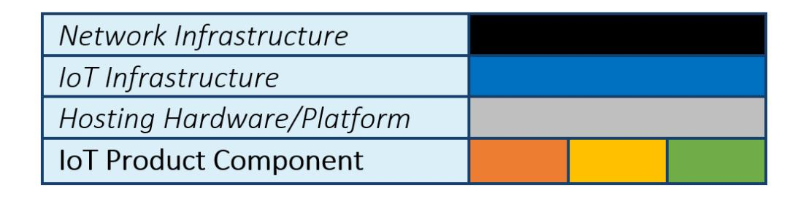

**Figure 5 - IoT Product Deployment and Instantiation Example Color Legend**

In addition to the IoT product components and other equipment, the visualizations group IoT product components based on whether they are locally or remotely managed, which is represented by whether symbols are inside or outside the house outline, respectively. Finally, arrowed lines are used to represent data flows between IoT product components, across various infrastructure that would exist when the IoT product is deployed and instantiated. The following examples are included:

- [Local Device-Only IoT Products](#page-18-0)
- [Local Management of IoT Products](#page-19-0)
- [Variety of Local Product-System Architectures](#page-20-0)
- [Third-Party Local Management Tools](#page-21-0)
- [Remote Backends](#page-22-0)
- [Shared Cloud Backends](#page-23-0)
- [Cloud Backend Interoperability](#page-24-0)

{18}------------------------------------------------

#### **LOCAL DEVICE ONLY IOT PRODUCTS**

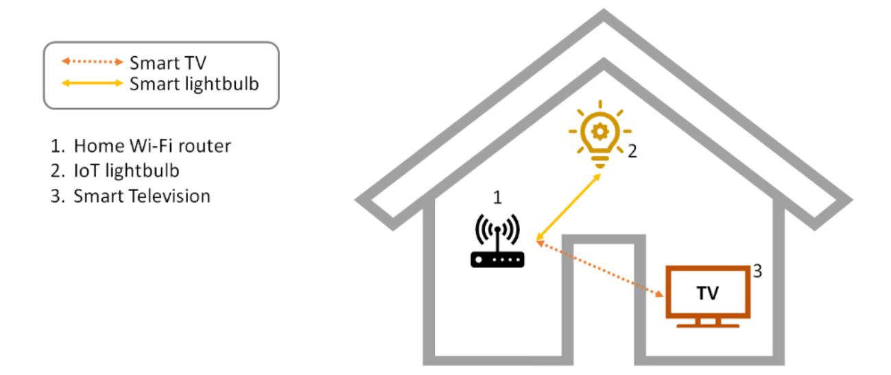

This first example is the simplest. A house has two IoT products: a smart lightbulb and a smart Television. All products contain only an IoT device and require no other IoT product components locally or remotely to use. The IoT products do assume and may require a connection using the customer's Wi-Fi network, but the Wi-Fi router would not be considered part of the IoT product, but rather network infrastructure.

For these three IoT products, satisfaction of technical cybersecurity outcomes would mean functions or features implemented in the hardware and software of the IoT device exclusively. Informative references for IoT device cybersecurity include:

- IoT Device Cybersecurity Capability Core Baseline[, NISTIR 8259A](#page-32-3)
- [ISO/IEC 27402](#page-32-9) (Cybersecurity IoT security and privacy Device baseline requirements)
- [ANSI/CTA-2088-A](#page-32-10)  Baseline Cybersecurity Standard for Devices and Device Systems
- [ETSI 303-645](#page-33-0)  Cyber Security for Consumer Internet of Things: Baseline Requirements
- All tiers of Singapore's Cyber Security Agency's [Cybersecurity Labeling Scheme](#page-33-1)

These standards are concerned with cybersecurity of and from the hardware and software created and assembled to implement an IoT device. Other, potentially third-party hardware and software may be added to IoT devices after-market. For example, the smart TV in the scenario above may support installation of thirdparty multimedia applications (e.g., applications for streaming services). In a scenario where third-party hardware or software can be added to an IoT product, either to its device or another component, the IoT product manufacturer would not be responsible for the cybersecurity of the third-party hardware or software after market. That would be the responsibility of the third-party developer of the hardware or software, but the IoT product manufacturer can consider the cybersecurity of the system by which third-party hardware or software is added to and integrated with the IoT product. For example, access control can be used to potential impact of risks due to potential vulnerabilities in third-party software that is installed on IoT products.

For specific product types (e.g., smart TV, smart inverters) or sectors (e.g., healthcare and public health), more specific cybersecurity guidance may be available and is recommended to be used to supplement and tailor the general IoT cybersecurity guidelines listed above. For example, for industrial control systems (ICS), ANSI/ISA [62443-4-1](#page-33-2) an[d 62443-4-2](#page-33-3) provide guidance for manufacturers of ICS components, which includes Industrial IoT products.

{19}------------------------------------------------

#### **LOCAL MANAGEMENT OF IOT PRODUCTS**

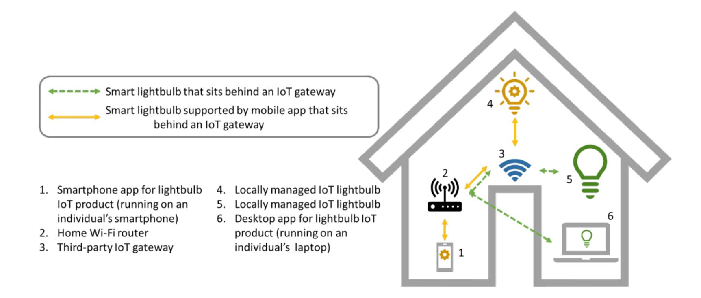

The figure above shows a home network that contains a Wi-Fi router and IoT gateway (e.g., one that offers Bluetooth or Zigbee protocols) as network infrastructure. Two IoT products, namely two kinds of smart lightbulbs utilize the IoT gateway. One lightbulb includes a mobile application as part of its IoT product, while the other has a desktop PC application. References and guidance for the IoT devices, whether on their own as an IoT product or as part of IoT products with additional components are the same as above.

The mobile application included as part of the smart lightbulb's product may be developed utilizing resources like the *Secure Software Development Framework* (SSDF), [NIST SP 800-218.](#page-33-2) In addition, standards like the OWASP *Mobile Application Security Verification Standard* [\(MASVS\)](#page-33-4) can help assess whether the mobile application's design and features satisfies cybersecurity outcomes.

Other equipment in this example, the Wi-Fi router, the IoT gateway, and customer's smartphone and desktop PC would not be considered part of any of the IoT products based in the two IoT devices depicted (i.e., smart lightbulbs). The cybersecurity of this equipment isn't negligible, but is mostly outside the scope of the design and development of the IoT products that use it. The IoT gateway could be considered an IoT product and its cybersecurity could be considered for it as a product separate from the other products. A similar approach is being taken by NIST for the Wi-Fi router. Mobile operating system cybersecurity is a topic worthy of another handbook, but strong application layer cybersecurity can help mitigate risks that may come from vulnerabilities on any platform, mobile operating systems included.

{20}------------------------------------------------

#### **VARIETY OF LOCAL PRODUCT-SYSTEM ARCHITECTURES**

The figure below shows an almost identical example as above with one critical difference: the IoT gateway is now only part of one product or product line. One lightbulb uses the specialty networking hardware that is specific to the IoT product or product line, while the other IoT products connect directly via Wi-Fi. In this example, the specialty networking hardware made to work specifically with one product or product line is considered part of the IoT product for the lightbulb that uses it, as depicted in the figure. In this case, unlike before, the specialty networking hardware would be considered along with the mobile application and IoT device to determine if it and the other IoT product components support cybersecurity outcomes.

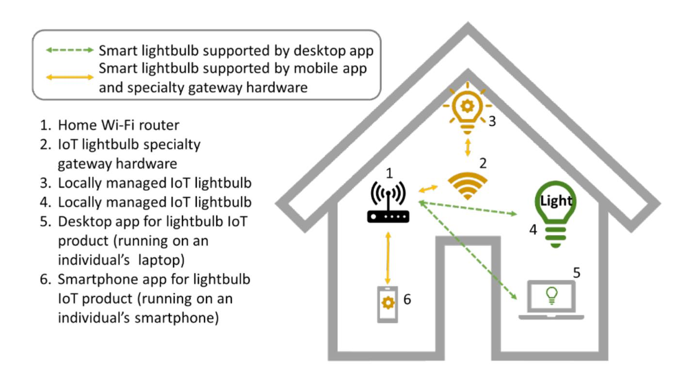

Some sectors or use cases may utilize even further variety in local system architecture and may be more likely to have IoT products that make use of specialty networking hardware, multiple IoT devices, and less common product components such as dedicated local control and management consoles. For example, a large sensor network for an industrial, agricultural, or environmental application may contain dozens of small sensor IoT devices that link to a specialty networking hardware base station that aggregates and forwards the data to a dedicated mobile console so the user can see the data in real-time.

{21}------------------------------------------------

#### **THIRD-PARTY LOCAL MANAGEMENT TOOLS**

Other tools for IoT may not be IoT products even though they appear similar to IoT product components. The example below depicts the situation where a third-party mobile application exists to manage IoT products, in this case one of the smart lightbulbs. In this scenario, the mobile application would not be part of the smart lightbulbs' IoT product, though like the IoT gateway, could be considered a product on its own with its cybersecurity assessed independent of the IoT products.

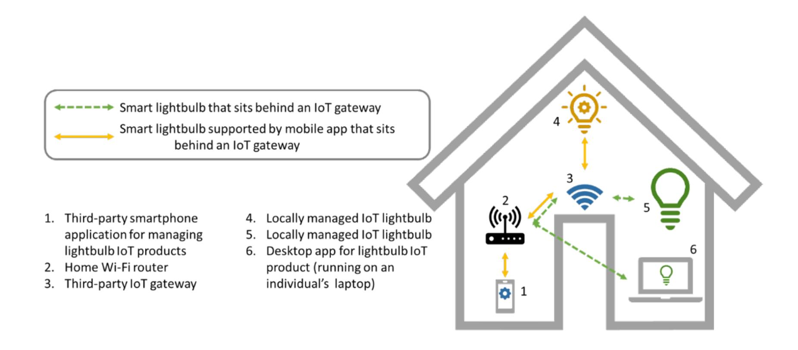

For this mobile application, we again draw attention to the SSDF and standards like the OWASP MASVS for use by the application developers, but control of the development of this software will be out of reach of IoT product manufacturers. That said, IoT product manufacturers can design their products with these kinds of applications in mind, considering the cybersecurity of the connections that they may make to IoT products or IoT product components. For example, use of secure protocols, minimizing the data used and shared by the IoT product, authentication and authorization for access control, and protection of sensitive data in transit using encryption can help control the data access third-party applications have to IoT products and their data and help limit cybersecurity vulnerabilities in general.

Third-party tools may be more common or robust in other sectors or use cases, but approaches for cybersecurity remain similar. For example, industrial customers may have software developed for their specific environment to manage their IoT and other digital products, but that software could still be verified against standards like OWASP's MASVS while the developer uses tools like the SSDF.

{22}------------------------------------------------

#### **REMOTE BACKENDS**

Few IoT products are purely locally supported since many require an Internet connection for various features. This is so that IoT devices can connect to remotely managed IoT product components such as backends. The example below shows how IoT products may use home and ISP Internet network infrastructure to link all IoT product components.

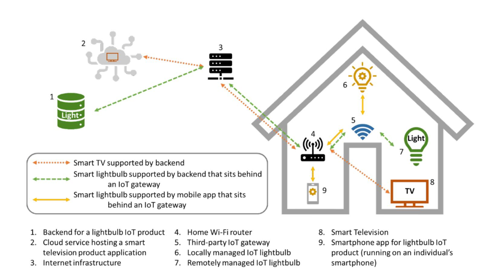

The figure above shows three IoT products, two of which are supported by remotely managed IoT product components. One of the remotely managed IoT product components is hosted on a third-party cloud service, while the other is hosted in a backend managed by the IoT product manufacturer. In the case of the backend managed by the developer, satisfaction of the outcomes would depend on how the developer manages that environment and the code they run in it. For managing the environment, use of the *Cybersecurity Framework* [\(CSF\)](#page-33-5) or *Risk Management Framework* [\(RMF\)](#page-33-6) can guide the management of the environment in a way that supports cybersecurity outcomes for the products whose code is hosted in the environment. In the case of a third-party hosting service provider, including cloud-based offerings, the same documents can be useful for the IoT product manufacturer to communicate and establish cybersecurity expectations with third-parties. For cloud-providers, the Cloud Security Alliance's *Security, Trust, Assurance and Risk* [\(STAR\)](#page-33-7) Registry may be useful to determine support for cybersecurity outcomes. For remotely managed software, regardless of where it is being hosted, OWASP's *Application Security Verification Standard* [\(ASVS\)](#page-33-7) is a useful reference.

Remote backends, cloud-based or otherwise are common in networked products, but since their use is also relatively standardized compared to local components (i.e., primarily data functions), similar standards and approaches for cybersecurity (i.e., those above) can be used for backends in many different sectors or use cases.

{23}------------------------------------------------

#### **SHARED CLOUD BACKENDS**

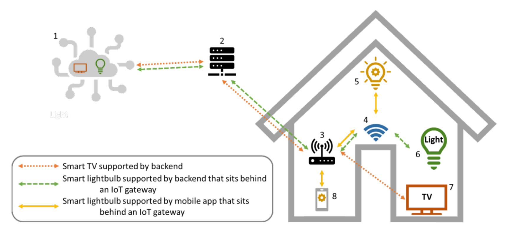

Third-party hosting, particularly cloud-based technologies, increases the likelihood that multiple IoT products' remotely managed IoT product components can end up on shared hardware. Though this is not a risk in and of itself, hosting providers and IoT product manufacturers must consider this and ensure data is appropriately protected in this shared environment. Such risks exist even in a dedicated environment that hosts data from multiple customers at once. If access control to data is not considered and protected, the walls between data sets may become porous, leading to significant cybersecurity risk.

#### Control What You Can Control

Hosting of IoT product component software on third-party or customer hardware presents cybersecurity challenges that an IoT product manufacturer cannot solve. Mismanagement of cybersecurity by other parties can be mitigated through dialogue and expectations setting, but as with many mitigations, the risk doesn't shrink to zero and the actions of thirdparties can lead to cybersecurity impacts for customers or manufacturers. This reality only highlights the critical importance of cybersecurity outcomes at the full IoT product scope. Application-layer cybersecurity, which includes the software used to implement the IoT product on all IoT product components, can help mitigate risks due to mismanagement of platforms. For example, sufficient encryption of data within the IoT product's context (e.g., with a key unique to the IoT product instantiation) can help thwart data confidentiality risks from unsatisfactory access controls that are under the management of someone other than the IoT product manufacturer.

{24}------------------------------------------------

#### **CLOUD BACKEND INTEROPERABILITY**

As cloud-technologies and protocol development progresses, abstraction of hosting services (i.e., Infrastructure-as-a-Service, etc.) presents the possibility of standardization and interoperability between platforms in ways not previously seen. For example, for some IoT products, customers can choose, on the fly, the remotely managed IoT product component provider from a menu of interoperable options. The figure below depicts this scenario.

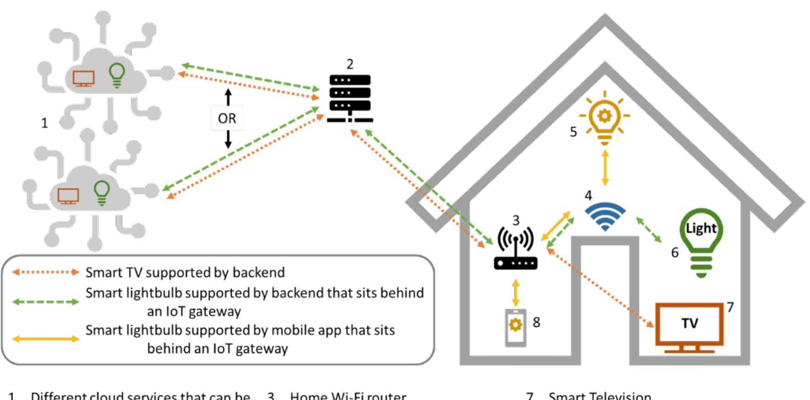

The figure above highlights that the customer may be able to choose the cloud provider for some of the IoT products in their home. They may not even choose the same provider for all products and could change providers over time. IoT product manufacturers can leverage the interoperability of platforms in this scenario and others like it for different sectors and use cases. With interoperability comes standardized communications protocols and system data management policies. Much like with an operating system, IoT product manufacturers can leverage this knowledge to guide their IoT product cybersecurity. Interoperable protocols may have cybersecurity features or support built in that IoT product manufacturers can utilize. Additionally, the interoperability system may be orchestrated by an organization that can assess providers participating in the program for various requirements, including support for cybersecurity outcomes as appropriate.

From the IoT product manufacturer's perspective, the job is the same as for other remote IoT product components: ensure the cybersecurity of the platform to the best of its ability and develop the software for these IoT product components and of the IoT product overall to consider any limitations in how cybersecurity outcomes are supported.

{25}------------------------------------------------

## **NON-TECHNICAL CYBERSECURITY OUTCOME CONSIDERATIONS**

Unlike for technical outcomes, where software and hardware cybersecurity approaches can be different and sometimes tuned for different technologies, many technologies do not require specific non-technical cybersecurity capabilities for customers and users to securely use products. Rather, requirements related to non-technical cybersecurity outcomes would be the same for many digital products and services, even across use cases and sectors. Therefore, rather than consider standards related to these outcomes on a componentby-component basis, as in the prior section for technical outcomes, the non-technical outcomes can utilize broadly applicable standards for the IoT product as a whole. This section discusses such standards for each of the four non-technical outcomes defined in NISTIR 8259B: Documentation, Information and Query Reception, Information Dissemination, and Education and Awareness.

#### **DOCUMENTATION**

Documentation brings together many subfields of cybersecurity (e.g., secure development and lifecycle, systems cybersecurity, vulnerability remediation, supply chain risk management), and thus is related to a multitude of standards. That said, many of the standards that inform documentation are established, wellaccepted, international voluntary consensus standards that would be recommended for developers of any software or other digital product in any context. Thus, many of the standards and practices therein are related and supportive of each other. **[Table 1](#page-25-2)** lists the Documentation sub-outcomes from NISTIR 8425 and pairs them with the related standards.

**Table 1 - Informative references related to Documentation non-technical cybersecurity outcomes.**

| Cybersecurity Sub-Outcome                                    | Informative References                                                                                                                                                 |
|--------------------------------------------------------------|------------------------------------------------------------------------------------------------------------------------------------------------------------------------|
| Documentation 1a.                                            | ISO 9001 (Quality management systems — Requirements)                                                                                                             |
| Assumptions made during the development process and other | ISO/IEC TS 19249 (Information technology — Security techniques — Catalogue of architectural and design principles for secure products, systems and applications) |
| expectations related to the IoT product.                  | Foundational Cybersecurity Activities for IoT Device Manufacturers, NISTIR 8259                                                                                        |
|                                                              | For statement of expectations and assumptions:                                                                                                                      |
|                                                              | Cybersecurity Framework (CSF)                                                                                                                                          |
|                                                              | IoT Device Cybersecurity Guidance for the Federal Government: IoT Device                                                                                               |
|                                                              | Cybersecurity Requirement Catalog, NIST SP 800-213A                                                                                                                    |
| Documentation 1b.                                            | Software Bill of Materials (SBOM)                                                                                                                                      |
| All IoT components, including                                |                                                                                                                                                                        |
| but not limited to the IoT                                   | Hardware Bill of Materials (HBOM) Framework for Supply Chain Risk Management                                                                                           |
| device, that are part of the IoT product.                 |                                                                                                                                                                        |

{26}------------------------------------------------

| Cybersecurity Sub-Outcome        | Informative References                                                                     |  |
|----------------------------------|--------------------------------------------------------------------------------------------|--|
| Documentation 1c.                | IoT Device Cybersecurity Guidance for the Federal Government: IoT Device                   |  |
| How the baseline product         | Cybersecurity Requirement Catalog, NIST SP 800-213A                                        |  |
| outcomes are met by the IoT      |                                                                                            |  |
| product across its product       | On risk management:                                                                        |  |
| components, including which      |                                                                                            |  |
| baseline product outcomes are    | ISO 31000 (Risk management — Guidelines)                                                |  |
| not met by IoT product           |                                                                                            |  |
| components and why (e.g., the    | NIST SP 800-37 Rev. 2 - Risk Management Framework for Information Systems and              |  |
| capability is not needed based   | Organizations: A System Life Cycle Approach for Security and Privacy                       |  |
|                                  |                                                                                            |  |
| on risk assessment).             | Cybersecurity and Infrastructure Security Agency (CISA)'s Cyber Resilience Review       |  |
|                                  | (CRR) Supplemental Resource Guide Volume 7: Risk Management - Version 1.1                  |  |
|                                  |                                                                                            |  |
|                                  | Cybersecurity and Infrastructure Security Agency (CISA)'s Cyber Resilience Review       |  |
|                                  | (CRR) Supplemental Resource Guide Volume 8: External Dependencies Management               |  |
|                                  | - Version 1.1                                                                           |  |
| Documentation 1d.                | ISO/IEC 27036 (Cybersecurity — Supplier relationships)                               |  |
| Product design and support       |                                                                                            |  |
| considerations related to the | ISO/IEC 27034 (Information technology — Security techniques — Application               |  |
| IoT product.                     | security)                                                                                  |  |
|                                  |                                                                                            |  |
|                                  | ISO/IEC 5055 (Information technology — Software measurement — Software quality          |  |
|                                  | measurement — Automated source code quality measures)                                      |  |
|                                  |                                                                                            |  |
|                                  | NIST Cybersecurity Supply Chain Risk Management (CSCRM)                                    |  |
|                                  |                                                                                            |  |
|                                  | Cybersecurity and Infrastructure Security Agency (CISA)'s Secure by Design                 |  |
|                                  | Cybersecurity and Infrastructure Security Agency (CISA)'s Cyber Resilience Review       |  |
|                                  |                                                                                            |  |
|                                  | (CRR) Supplemental Resource Guide Volume 6: Service Continuity Management - Version 1.1 |  |
|                                  |                                                                                            |  |
|                                  | Cybersecurity and Infrastructure Security Agency (CISA)'s Cyber Resilience Review       |  |
|                                  | (CRR) Supplemental Resource Guide Volume 8: External Dependencies Management               |  |
|                                  | - Version 1.1                                                                              |  |
| Documentation 1e.                | ISO/IEC/IEEE 14764 (Software engineering — Software life cycle processes —           |  |
| Maintenance requirements for     | Maintenance)                                                                               |  |
| the IoT product.                 |                                                                                            |  |
|                                  | Cybersecurity and Infrastructure Security Agency (CISA)'s Cyber Resilience Review       |  |
|                                  | (CRR) Supplemental Resource Guide Volume 3: Configuration and Change                       |  |
|                                  | Management - Version 1.1                                                                   |  |
|                                  |                                                                                            |  |
|                                  | Cybersecurity and Infrastructure Security Agency (CISA)'s Cyber Resilience Review       |  |
|                                  | (CRR) Supplemental Resource Guide Volume 8: External Dependencies Management               |  |
|                                  | - Version 1.1                                                                              |  |
|                                  |                                                                                            |  |
|                                  | Guide to Enterprise Patch Management Planning: Preventive Maintenance for                  |  |
|                                  | Technology, SP 800-40 Rev. 4                                                               |  |

{27}------------------------------------------------

| Cybersecurity Sub-Outcome                                                                                          | Informative References                                                                                                                                                                |
|--------------------------------------------------------------------------------------------------------------------|---------------------------------------------------------------------------------------------------------------------------------------------------------------------------------------|
| Documentation 1f.                                                                                                  | ISO/IEC 15288 (Systems and software engineering — System life cycle processes)                                                                                                  |
| The secure system lifecycle policies and processes                                                              | ISO/IEC 12207 (Systems and software engineering — Software life cycle processes)                                                                                                   |
| associated with the IoT product.                                                                                | ISO/IEC 15408 (Information security, cybersecurity and privacy protection — Evaluation criteria for IT security)                                                                |
|                                                                                                                    | ISO/IEC 27001 (Information security management systems — Requirements)                                                                                                             |
|                                                                                                                    | ISO/IEC 27002 (Information security, cybersecurity and privacy protection — Information security controls)                                                                      |
|                                                                                                                    | ISO/IEC 27005 (Information security, cybersecurity and privacy protection — Guidance on managing information security risks)                                                    |
|                                                                                                                    | NIST Secure Software Development Framework (SSDF)                                                                                                                                     |
|                                                                                                                    | Cybersecurity and Infrastructure Security Agency (CISA)'s Secure by Design                                                                                                            |
|                                                                                                                    | Cybersecurity and Infrastructure Security Agency (CISA)'s Cyber Resilience Review (CRR) Supplemental Resource Guide Volume 6: Service Continuity Management - Version 1.1    |
|                                                                                                                    | Cybersecurity and Infrastructure Security Agency (CISA)'s Cyber Resilience Review (CRR) Supplemental Resource Guide Volume 8: External Dependencies Management - Version 1.1 |
|                                                                                                                    | Cybersecurity and Infrastructure Security Agency (CISA)'s Cyber Resilience Review (CRR) Supplemental Resource Guide Volume 10: Situation Awareness - Version 1.1                |
|                                                                                                                    | Guide to Enterprise Patch Management Planning: Preventive Maintenance for Technology, SP 800-40 Rev. 4                                                                             |
| Documentation 1g. The vulnerability management policies and processes associated with the IoT product. | ISO/IEC 29147 (Information technology — Security techniques — Vulnerability disclosure)                                                                                   |
|                                                                                                                    | ISO/IEC 30111 (Information technology — Security techniques — Vulnerability handling processes)                                                                                 |
|                                                                                                                    | Cybersecurity and Infrastructure Security Agency (CISA)'s Cyber Resilience Review (CRR) Supplemental Resource Guide Volume 4: Vulnerability Management - Version 1.1         |
|                                                                                                                    | Cybersecurity and Infrastructure Security Agency (CISA)'s Cyber Resilience Review (CRR) Supplemental Resource Guide Volume 5: Incident Management - Version 1.1                 |
|                                                                                                                    | Cybersecurity and Infrastructure Security Agency (CISA)'s Cyber Resilience Review (CRR) Supplemental Resource Guide Volume 8: External Dependencies Management - Version 1.1 |
|                                                                                                                    | Guide to Enterprise Patch Management Planning: Preventive Maintenance for Technology, SP 800-40 Rev. 4                                                                             |

{28}------------------------------------------------

#### **INFORMATION AND QUERY RECEPTION**

Reception of cybersecurity information is most critically related to vulnerability management, but can also support customers in other ways. Existing standards focus on vulnerability and incident management, as shown in the table below. Even without standards to guide the practice, NIST recommends manufacturers and supporting entities be open to broader forms of interaction with customers and users. Technical support available to customers that guides them through troubleshooting and can answer other questions users may have can bolster secure use of IoT products. **[Table 2](#page-28-1)** shows the vulnerability and incident management standards related to the Information and Query Reception sub-outcomes.

**Table 2 - Informative references related to Information and Query Reception non-technical cybersecurity outcomes.**

| Cybersecurity Sub-Outcome                                                                                                                                                                                                                                                        | Informative References                                                                                                                                                                                                                                                                  |
|----------------------------------------------------------------------------------------------------------------------------------------------------------------------------------------------------------------------------------------------------------------------------------|-----------------------------------------------------------------------------------------------------------------------------------------------------------------------------------------------------------------------------------------------------------------------------------------|
| Information and Query Reception 1a.                                                                                                                                                                                                                                              | ISO/IEC 29147 (Information technology — Security techniques —                                                                                                                                                                                                                     |
| The ability of the IoT product manufacturer to                                                                                                                                                                                                                                   | Vulnerability disclosure)                                                                                                                                                                                                                                                               |
| identify a point of contact to receive maintenance and vulnerability information (e.g., bug reporting capabilities and bug bounty programs) from customers and others in the IoT product ecosystem (e.g., repair technician acting on behalf of the customer). | ISO 10004 (Quality management — Customer satisfaction — Guidelines for monitoring and measuring) Cybersecurity and Infrastructure Security Agency (CISA)'s Cyber Resilience Review (CRR) Supplemental Resource Guide Volume 4: Vulnerability Management - Version 1.1 |
| Information and Query Reception 1b.                                                                                                                                                                                                                                              | ISO 10004 (Quality management — Customer satisfaction —                                                                                                                                                                                                                           |
| The ability of the IoT product manufacturer to                                                                                                                                                                                                                                   | Guidelines for monitoring and measuring)                                                                                                                                                                                                                                                |
| receive queries from and respond to customers and others in the IoT product ecosystem about the cybersecurity of the IoT                                                                                                                                                   | ISO/IEC 27035 (Information technology — Information security incident management)                                                                                                                                                                                                 |
| product and/or its components.                                                                                                                                                                                                                                                   | Cybersecurity and Infrastructure Security Agency (CISA)'s Cyber                                                                                                                                                                                                                      |
|                                                                                                                                                                                                                                                                                  | Resilience Review (CRR) Supplemental Resource Guide Volume 8:                                                                                                                                                                                                                           |
|                                                                                                                                                                                                                                                                                  | External Dependencies Management - Version 1.1                                                                                                                                                                                                                                    |

{29}------------------------------------------------

#### **INFORMATION DISSEMINATION**

The Information Dissemination outcome discusses two kinds of support: broadly communicated information and targeted, directly shared information. **[Table 3](#page-29-1)** shows standards related to the first sub-outcome of Information Dissemination, which discusses the ability to broadly distribute cybersecurity.

**Table 3 - Informative references related to Information Dissemination non-technical cybersecurity outcomes.**

| Cybersecurity Sub-Outcome                                                                                                                                                                                         | Informative References                                                                                                                                                                                                                                                                                                                                                                                                                                                                                                        |
|-------------------------------------------------------------------------------------------------------------------------------------------------------------------------------------------------------------------|-------------------------------------------------------------------------------------------------------------------------------------------------------------------------------------------------------------------------------------------------------------------------------------------------------------------------------------------------------------------------------------------------------------------------------------------------------------------------------------------------------------------------------|
| Information Dissemination 1a. Updated terms of support (e.g., frequency of updates and mechanism(s) of application) and notice of availability and/or application of software updates.                   | [No standards currently identified]                                                                                                                                                                                                                                                                                                                                                                                                                                                                                           |
| Information Dissemination 1b. End of term of support or functionality for the IoT product. Information Dissemination 1c. Needed maintenance operations.                                                  | ETSI 303-645 (Cyber Security for Consumer Internet of Things: Baseline Requirements): Provision 5.3-13 ISO/IEC/IEEE 14764 (Software engineering — Software life cycle processes — Maintenance)                                                                                                                                                                                                                                                                                                           |
| Information Dissemination 1d. New IoT device vulnerabilities, associated details, and mitigation actions needed from the customer.                                                                          | ISO/IEC 29147 (Information technology — Security techniques — Vulnerability disclosure) ISO/IEC 27035 (Information technology — Information security incident management — Part 1: Principles and process) Cybersecurity and Infrastructure Security Agency (CISA)'s Cyber Resilience Review (CRR) Supplemental Resource Guide Volume 4: Vulnerability Management - Version 1.1 Guide to Enterprise Patch Management Planning: Preventive Maintenance for Technology, SP 800-40 Rev. 4 |
| Information Dissemination 1e. Breach discovery related to an IoT product and its product components used by the customers, associated details, and mitigation actions needed from the customer (if any). | ISO/IEC 29147 (Information technology — Security techniques — Vulnerability disclosure) ISO/IEC 27035 (Information technology — Information security incident management — Part 1: Principles and process) Federal Trade Commission's (FTC) Data Breach Response: A Guide for Business Cybersecurity and Infrastructure Security Agency (CISA)'s Cyber Resilience Review (CRR) Supplemental Resource Guide Volume 5: Incident Management - Version 1.1                           |

Targeted communications such as those described in Information Dissemination 2 are much more contextual:

*The IoT product manufacturer can distribute information relevant to cybersecurity of the IoT product and its product components to alert appropriate ecosystem entities (e.g., IoT product component manufactures or supporting entities, common vulnerability tracking authorities, accreditors and certifiers, third-party support and maintenance organizations) about cybersecurity relevant information.*

{30}------------------------------------------------

Thus, this outcome and its sub-outcomes will generally be guided by standards mapped to other outcomes (e.g., ISO/IEC 29147), and so no specific, additional standards have been currently identified for Information Dissemination's second sub-outcome. When IoT products are composed of multiple IoT product components created or managed in whole or in part by third parties, Cybersecurity and Infrastructure Security Agency (CISA)'s Cyber Resilience Review (CRR) *Supplemental Resource Guide Volume 8: External Dependencies Management - Version 1.1* can be informative for this sub-outcome. Note that profiles for specific technologies or product types may identify additional standards or requirements pertinent to Information Dissemination's second sub-outcome.

{31}------------------------------------------------

#### **EDUCATION AND AWARENESS**

NISTIR 8425's Education and Awareness outcome has one sub-outcome: The IoT product manufacturer creates awareness and provides education targeted at customers about information relevant to cybersecurity of the IoT product and its product components. This sub-outcome is further defined by five minimum criteria:

- 1. The presence and use of IoT product cybersecurity capabilities.
- 2. How to maintain the IoT product and its product components during its lifetime, including after the period of security support (e.g., delivery of software updates and patches) from the IoT product manufacturer.
- 3. How an IoT product and its product components can be securely reprovisioned or disposed of.
- 4. Vulnerability management options (e.g., configuration and patch management and anti-malware) available for the IoT product or its product components that could be used by customers.
- 5. Additional information customers can use to make informed purchasing decisions about the security of the IoT product (e.g., the duration and scope of product support via software upgrades and patches).

[ISO/IEC/IEEE 26512](#page-36-8) (Systems and software engineering - Requirements for acquirers and suppliers of information for users) and [ISO/IEC/IEEE 26514](#page-36-9) (Systems and software engineering — Design and development of information for users) may inform requirements related to the Education and Awareness outcome.

{32}------------------------------------------------

- The following publications are referenced throughout this handbook (listed in order of appearance):
  - Fagan MJ, Megas KN, Scarfone KA, Smith M (2020) Foundational Cybersecurity Activities for IoT Device Manufacturers. (National Institute of Standards and Technology, Gaithersburg, MD), NIST Interagency or Internal Report (IR) 8259.<https://doi.org/10.6028/NIST.IR.8259>
  - Simmon, E (2020) Internet of Things (IoT) Component Capability Model for Research Testbed. (National Institute of Standards and Technology, Gaithersburg, MD), NIST Interagency or Internal Report (IR) 8316. <https://doi.org/10.6028/NIST.IR.8316>
  - Fagan MJ, Megas KN, Scarfone KA, Smith M (2020) IoT Device Cybersecurity Capability Core Baseline. (National Institute of Standards and Technology, Gaithersburg, MD), NIST Interagency or Internal Report (IR) 8259A.<https://doi.org/10.6028/NIST.IR.8259A>
  - Fagan MJ, Marron JA, Brady KG, Jr., Cuthill BB, Megas K, Herold R (2021) IoT Non-Technical Supporting Capability Core Baseline. (National Institute of Standards and Technology, Gaithersburg, MD), NIST Interagency or Internal Report (IR) 8259B.<https://doi.org/10.6028/NIST.IR.8259B>
  - Fagan M, Megas KN, Watrobski P, Marron J, Cuthill B (2022) Profile of the IoT Core Baseline for Consumer IoT Products. (National Institute of Standards and Technology, Gaithersburg, MD), NIST Interagency or Internal Report (IR) NIST IR 8425.<https://doi.org/10.6028/NIST.IR.8425>
  - Jansen W (1998) A Revised Model for Role Based Access Control. (National Institute of Standards and Technology, Gaithersburg, MD), NIST Interagency or Internal Report (IR) 6192. <https://doi.org/10.6028/NIST.IR.6192>
  - Joint Task Force (2022) Assessing Security and Privacy Controls in Information Systems and Organizations. (National Institute of Standards and Technology, Gaithersburg, MD), NIST Special Publication (SP) 800- 53A, Rev. 5.<https://doi.org/10.6028/NIST.SP.800-53Ar5>
  - Cheikes BA, Waltermire DA, Scarfone KA (2011) Common Platform Enumeration: Naming Specification Version 2.3. (National Institute of Standards and Technology, Gaithersburg, MD), NIST Interagency or Internal Report (IR) 7695.<https://doi.org/10.6028/NIST.IR.7695>
  - Regenscheid AR (2018) Platform Firmware Resiliency Guidelines. (National Institute of Standards and Technology, Gaithersburg, MD), NIST Special Publication (SP) 800-193. <https://doi.org/10.6028/NIST.SP.800-193>
  - International Organization for Standardization (2023) Cybersecurity IoT security and privacy Device baseline requirements. (ISO Standard No. 27402:2023)<https://www.iso.org/standard/80136.html>
  - American National Standards Institute/Consumer Technology Association (2022) Baseline Cybersecurity Standard for Devices and Device Systems (ANSI/CTA-2088-A) [https://shop.cta.tech/products/https-cdn](https://shop.cta.tech/products/https-cdn-cta-tech-cta-media-media-shop-standards-2020-ansi-cta-2088-a-final-pdf)[cta-tech-cta-media-media-shop-standards-2020-ansi-cta-2088-a-final-pdf](https://shop.cta.tech/products/https-cdn-cta-tech-cta-media-media-shop-standards-2020-ansi-cta-2088-a-final-pdf)

{33}------------------------------------------------

- European Telecommunications Standards Institute (2020) Cyber Security for Consumer Internet of Things: Baseline Requirements. (ETSI Standard No. 303-645) [https://www.etsi.org/deliver/etsi\\_en/303600\\_303699/303645/02.01.01\\_60/en\\_303645v020101p.pdf](https://www.etsi.org/deliver/etsi_en/303600_303699/303645/02.01.01_60/en_303645v020101p.pdf)
- Cyber Security Agency Singapore (2021) Cybersecurity Labeling Scheme[. https://www.csa.gov.sg/our](https://www.csa.gov.sg/our-programmes/certification-and-labelling-schemes/cybersecurity-labelling-scheme)[programmes/certification-and-labelling-schemes/cybersecurity-labelling-scheme](https://www.csa.gov.sg/our-programmes/certification-and-labelling-schemes/cybersecurity-labelling-scheme)
- American National Standards Institute/International Society of Automation (2018) Security for industrial automation and control systems, Part 4-1: Product security development life-cycle requirements (ANSI/ISA-62443-4-1)<https://www.isa.org/products/ansi-isa-62443-4-1-2018-security-for-industrial-au>
- American National Standards Institute/International Society of Automation (2018) Security for industrial automation and control systems, Part 4-2: Technical security requirements for IACS components (ANSI/ISA-62443-4-2)<https://www.isa.org/products/ansi-isa-62443-4-2-2018-security-for-industrial-au>
- Souppaya MP, Scarfone KA, Dodson DF (2022) Secure Software Development Framework (SSDF) Version 1.1: Recommendations for Mitigating the Risk of Software Vulnerabilities. (National Institute of Standards and Technology, Gaithersburg, MD), NIST Special Publication (SP) 800-218. <https://doi.org/10.6028/NIST.SP.800-218>
- OWASP Foundation (2024) Mobile Application Security Verification Standard (MASVS). <https://mas.owasp.org/MASVS/>
- National Institute of Standards and Technology (2024) The NIST Cybersecurity Framework (CSF) 2.0. (National Institute of Standards and Technology, Gaithersburg, MD), NIST Cybersecurity White Paper (CSWP) NIST CSWP 29.<https://doi.org/10.6028/NIST.CSWP.29>
- Joint Task Force (2018) Risk Management Framework for Information Systems and Organizations: A System Life Cycle Approach for Security and Privacy. (National Institute of Standards and Technology, Gaithersburg, MD), NIST Special Publication (SP) 800-37, Rev. 2. [https://doi.org/10.6028/NIST.SP.800-](https://doi.org/10.6028/NIST.SP.800-37r2) [37r2](https://doi.org/10.6028/NIST.SP.800-37r2)
- Cloud Security Alliance (2024) Security, Trust, Assurance and Risk (STAR) Registry. <https://cloudsecurityalliance.org/star>
- OWASP Foundation (2021) Application Security Verification Standard (ASVS)[. https://owasp.org/www](https://owasp.org/www-project-application-security-verification-standard/)[project-application-security-verification-standard/](https://owasp.org/www-project-application-security-verification-standard/)
- International Organization for Standardization (2015) Quality management systems — Requirements. (ISO Standard No. 9001:2015)<https://www.iso.org/standard/62085.html>
- International Organization for Standardization (2017) Information technology — Security techniques — Catalogue of architectural and design principles for secure products, systems and applications. (ISO Standard No. 19249:2017)<https://www.iso.org/standard/64140.html>

{34}------------------------------------------------

- Fagan MJ, Megas KN, Marron JA, Brady KG, Jr., Cuthill BB, Herold R, Lemire D, Hoehn B (2021) IoT Device Cybersecurity Guidance for the Federal Government: IoT Device Cybersecurity Requirement Catalog. (National Institute of Standards and Technology, Gaithersburg, MD), NIST Special Publication (SP) 800- 213A.<https://doi.org/10.6028/NIST.SP.800-213A>
- National Telecommunications and Information Administration (2021) The Minimum Elements For a Software Bill of Materials (SBOM). [https://www.ntia.doc.gov/files/ntia/publications/sbom\\_minimum\\_elements\\_report.pdf](https://www.ntia.doc.gov/files/ntia/publications/sbom_minimum_elements_report.pdf)
- Cybersecurity and Infrastructure Security Agency (2023) Hardware Bill of Materials (HBOM) Framework for Supply Chain Risk Management. [https://www.cisa.gov/resources-tools/resources/hardware-bill](https://www.cisa.gov/resources-tools/resources/hardware-bill-materials-hbom-framework-supply-chain-risk-management)[materials-hbom-framework-supply-chain-risk-management](https://www.cisa.gov/resources-tools/resources/hardware-bill-materials-hbom-framework-supply-chain-risk-management)
- International Organization for Standardization (2018) Risk management — Guidelines. (ISO Standard No. 31000:2018).<https://www.iso.org/standard/65694.html>
- Cybersecurity and Infrastructure Security Agency (2020) Cyber Resilience Review (CRR) Supplemental Resource Guides. [https://www.cisa.gov/resources-tools/resources/cyber-resilience-review](https://www.cisa.gov/resources-tools/resources/cyber-resilience-review-supplemental-resource-guides)[supplemental-resource-guides](https://www.cisa.gov/resources-tools/resources/cyber-resilience-review-supplemental-resource-guides)
- International Organization for Standardization (2021) Cybersecurity — Supplier relationships — Part 1: Overview and concepts. (ISO Standard No. 27036-1:2021)<https://www.iso.org/standard/82905.html>
- International Organization for Standardization (2022) Cybersecurity Supplier relationships Part 2: Requirements. (ISO Standard No. 27036-2:2022)<https://www.iso.org/standard/82060.html>
- International Organization for Standardization (2023) Cybersecurity Supplier relationships Part 3: Guidelines for hardware, software, and services supply chain security. (ISO Standard No. 27036-3:2023) <https://www.iso.org/standard/82890.html>
- International Organization for Standardization (2016) Cybersecurity Supplier relationships Part 4: Guidelines for security of cloud services. (ISO Standard No. 27036-4:2016) <https://www.iso.org/standard/59689.html>
- International Organization for Standardization (2011) Information technology — Security techniques — Application security — Part 1: Overview and concepts. (ISO Standard No. 27034-1:2011) <https://www.iso.org/standard/44378.html>
- International Organization for Standardization (2015) Information technology Security techniques Application security — Part 2: Organization normative framework. (ISO Standard No. 27034-2:2015) <https://www.iso.org/standard/55582.html>
- International Organization for Standardization (2018) Information technology Security techniques Application security — Part 3: Application security management process. (ISO Standard No. 27034- 3:2018) <https://www.iso.org/standard/55583.html>

{35}------------------------------------------------

- International Organization for Standardization (2021) Information technology — Software measurement — Software quality measurement — Automated source code quality measures. (ISO Standard No. 5055:2021)<https://www.iso.org/standard/80623.html>
- Boyens JM, Smith AM, Bartol N, Winkler K, Holbrook A, Fallon M (2022) Cybersecurity Supply Chain Risk Management Practices for Systems and Organizations. (National Institute of Standards and Technology, Gaithersburg, MD), NIST Special Publication (SP) 800-161r1.<https://doi.org/10.6028/NIST.SP.800-161r1>
- Cybersecurity and Infrastructure Security Agency (2023) Secure-by-Design: Shifting the Balance of Cybersecurity Risk: Principles and Approaches for Secure by Design Software. <https://www.cisa.gov/resources-tools/resources/secure-by-design>
- International Organization for Standardization (2022) Software engineering — Software life cycle processes — Maintenance. (ISO Standard No. 14764:2022)<https://www.iso.org/standard/80710.html>
- Souppaya MP, Scarfone KA (2022) Guide to Enterprise Patch Management Planning: Preventive Maintenance for Technology. (National Institute of Standards and Technology, Gaithersburg, MD), NIST Special Publication (SP) 800-40, Rev. 4.<https://doi.org/10.6028/NIST.SP.800-40r4>
- International Organization for Standardization (2023) Systems and software engineering — System life cycle processes. (ISO Standard No. 15288:2023)<https://www.iso.org/standard/81702.html>
- International Organization for Standardization (2017) Systems and software engineering — Software life cycle processes. (ISO Standard No. 12207:2017)<https://www.iso.org/standard/63712.html>
- International Organization for Standardization (2022) Information security, cybersecurity and privacy protection — Evaluation criteria for IT security — Part 1: Introduction and general model. (ISO Standard No. 15408-1:2022)<https://www.iso.org/standard/72891.html>
- International Organization for Standardization (2022) Information security, cybersecurity and privacy protection — Evaluation criteria for IT security — Part 2: Security functional components. (ISO Standard No. 15408-2:2022)<https://www.iso.org/standard/72892.html>
- International Organization for Standardization (2022) Information security, cybersecurity and privacy protection — Evaluation criteria for IT security — Part 3: Security assurance components. (ISO Standard No. 15408-3:2022)<https://www.iso.org/standard/72906.html>
- International Organization for Standardization (2022) Information security, cybersecurity and privacy protection — Evaluation criteria for IT security — Part 4: Framework for the specification of evaluation methods and activities. (ISO Standard No. 15408-4:2022)<https://www.iso.org/standard/72913.html>
- International Organization for Standardization (2022) Information security, cybersecurity and privacy protection — Evaluation criteria for IT security — Part 5: Pre-defined packages of security requirements. (ISO Standard No. 15408-5:2022)<https://www.iso.org/standard/72917.html>

{36}------------------------------------------------

- International Organization for Standardization (2022) Information security management systems — Requirements. (ISO Standard No. 27001:2022)<https://www.iso.org/standard/27001>
- International Organization for Standardization (2022) Information security, cybersecurity and privacy protection — Information security controls. (ISO Standard No. 27002:2022) <https://www.iso.org/standard/75652.html>
- International Organization for Standardization (2022) Information security, cybersecurity and privacy protection — Guidance on managing information security risks. (ISO Standard No. 27005:2022) <https://www.iso.org/standard/80585.html>
- International Organization for Standardization (2018) Information technology — Security techniques — Vulnerability disclosure. (ISO Standard No. 29147:2018).<https://www.iso.org/standard/72311.html>
- International Organization for Standardization (2019) Information technology — Security techniques — Vulnerability handling processes. (ISO Standard No. 30111:2019). <https://www.iso.org/standard/69725.html>
- International Organization for Standardization (2018) Quality management — Customer satisfaction — Guidelines for monitoring and measuring. (ISO Standard No. 10004:2018) <https://www.iso.org/standard/71582.html>
- International Organization for Standardization (2023) Information technology — Information security incident management — Part 1: Principles and process. (ISO Standard No. 27035-1:2023) <https://www.iso.org/standard/78973.html>
- International Organization for Standardization (2023) Information technology Information security incident management — Part 2: Guidelines to plan and prepare for incident response. (ISO Standard No. 27035-2:2023)<https://www.iso.org/standard/78974.html>
- International Organization for Standardization (2020) Information technology Information security incident management — Part 3: Guidelines for ICT incident response operations. (ISO Standard No. 27035-3:2020)<https://www.iso.org/standard/74033.html>
- Federal Trade Commission (2021) Data Breach Response: A Guide for Business. <https://www.ftc.gov/business-guidance/resources/data-breach-response-guide-business>
- International Organization for Standardization (2018) Systems and software engineering - Requirements for acquirers and suppliers of information for users. (ISO Standard No. 26512:2018). <https://www.iso.org/standard/72088.html>
- International Organization for Standardization (2022) Systems and software engineering — Design and development of information for users. (ISO Standard No. 26514:2022). <https://www.iso.org/standard/77451.html>